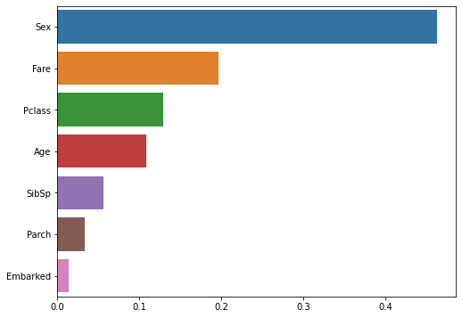
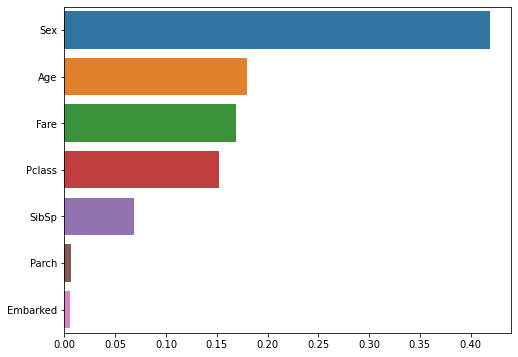

Voting, Bagging, Random Forest, Boosting, GBM

----

안녕하세요.
데이터 사이언티스트를 위한 정보를 공유하고 있습니다.

M1 Macbook Air를 사용하고 있으며, 블로그의 모든 글은 Mac을 기준으로 작성된 점 참고해주세요.

----

# 앙상블 학습(Ensemble Learning)

앙상블 학습은 여러 가지의 모델의 예측을 결합하는 방식으로서 과적합을 줄이고 성능을 향상시키는 효과가 있습니다.

여러 가지의 모델을 결합한다는 의미에서 집단지성에 많이 비유하기도 합니다.

이미지, 음성, 영상 등의 비정형 데이터에 대해서는 딥러닝이 강세를 보이고 있는 반면,

대부분의 비정형 데이터에 대해서는 앙상블 알고리즘이 각광받고 있습니다.

앙상블 학습은 **보팅(Voting)**, **배깅(Bagging)**, **부스팅(Boosting)**으로 크게 세 가지 방식으로 나눌 수 있고, **스태킹(stacking)** 방식도 종종 쓰이곤 합니다.

보팅이나 스태킹의 경우 서로 다른 알고리즘의 모델을 기반으로 하고,

배깅과 부스팅의 경우 대체로 Decision Tree 모델을 기반으로 합니다.

그럼 각각의 방식에 대해 설명해 보겠습니다.

----

# 보팅(Voting)

보팅과 배깅은 여러 개의 모델의 투표를 통해 최종 결과를 결정하는 방식입니다.

다만 차이점은 보팅은 서로 다른 알고리즘의 모델을 결합하는 방식이고,

배깅은 각각의 알고리즘이 같은 여러 개의 모델이 데이터 구성을 달리하며 학습하는 방식입니다.

두 방식의 차이점을 도식화해 보면 다음과 같습니다.


그럼 먼저 보팅 방식에 대해 설명하겠습니다.

보팅의 방법은 다시 하드 보팅과 소프트 보팅으로 두 가지 방식으로 나눌 수 있습니다.

하드 보팅은 다수결 원칙과 비슷한데

모든 분류기가 예측한 결과 중에 더 많은 분류기가 예측한 결과를 최종 결괏값으로 반환하는 방식입니다.

소프트 보팅은 클래스 별로 분류기들의 예측 확률에 대한 평균값을 계산하여

평균 확률값이 더 높은 클래스를 최종 결괏값으로 반환하는 방식입니다.

일반적으로 소프트 보팅 방식이 성능이 더 뛰어나서 더 많이 사용됩니다.

그럼 보팅 분류기를 활용하여 위스콘신 유방암 데이터를 분류 예측해 보겠습니다.

In:


```python
from sklearn.datasets import load_breast_cancer
from sklearn.model_selection import train_test_split
from sklearn.ensemble import VotingClassifier
from sklearn.neighbors import KNeighborsClassifier
from sklearn.linear_model import LogisticRegression
from sklearn.metrics import roc_auc_score, accuracy_score

import warnings
warnings.filterwarnings("ignore")

cancer_data = load_breast_cancer()

X_train, X_test, y_train, y_test = train_test_split(cancer_data.data, cancer_data.target,
                                                    test_size = 0.2, random_state = 15)

lr = LogisticRegression()
knn = KNeighborsClassifier()
voting = VotingClassifier(estimators = [("LR", lr), ("KNN", knn)], voting = "soft")
# 로지스틱 회귀 모델과 KNN 모델을 결합한 보팅 모델
# 소프트 보팅의 방식을 취함

classifiers = [lr, knn, voting]

for classifier in classifiers:
  classifier.fit(X_train, y_train)
  y_pred = classifier.predict(X_test)
  AUC_score = roc_auc_score(y_test, y_pred)
  print(f"{classifier.__class__.__name__}의 AUC Score: {AUC_score:.4f}")
```

Out:

    LogisticRegression의 AUC Score: 0.8703
    KNeighborsClassifier의 AUC Score: 0.8646
    VotingClassifier의 AUC Score: 0.8836


평가 지표를 AUC score로 반환해 본 결과, 보팅 분류기의 성능이 가장 높게 나왔습니다.

여러 개의 분류기를 결합한 보팅 분류기가 항상 향상된 결과를 보이는 것은 아닙니다.

그러나 일반적으로는 보팅을 비롯한 앙상블 모델의 성능이 더 뛰어납니다.

그 이유는 현실에서는 데이터가 몹시 불규칙적이며 변수도 많고 예측이 불가능한 경우가 많은데

다양한 관점을 가진 알고리즘이 결합되면서 이러한 문제를 보다 효율적으로 해결할 수 있기 때문입니다.

이를테면 인문과 과학이 융합된 어떠한 프로젝트를 진행하는데

이 프로젝트에 만약 특정 한 분야의 전문가만 참여한다면 프로젝트를 진행하는 데 유연성이 부족할 것입니다.

다방면의 전문가가 함께 프로젝트에 참여한다면 다양한 관점에서 과제를 개선해 나갈 수 있겠죠.

----

# 배깅(Bagging), 랜덤 포레스트(Random Forest)

앞서 배깅은 여러 개의 같은 알고리즘의 모델을 결합하는 것, 그리고 대체로 Decision Tree 모델을 기반으로 하는 것이라 소개하였습니다.

부스팅도 마찬가지이지만

배깅은 Decision Tree 모델의 쉽고 직관적이다는 장점을 취하면서

동시에 매우 많은 Decision Tree 모델을 결합시켜 다양한 상황에 대해 학습하게 함으로써

과적합(Overfitting) 문제도 해결한 방식입니다.

위에서 보팅과 비교한 그림을 보면 아시겠지만,

배깅은 전체 데이터로 부터 여러 개의 샘플 데이터로 분할한 후에

각각의 샘플 데이터를 여러 개의 Decision Tree 모델로 학습 시켜 결합하는 방식입니다.

전체 데이터로 부터 샘플 데이터를 생성할 때는 중복을 허용하여 샘플링을 진행합니다.

이를 부트스트래핑(bootstrapping) 분할 방식이라고 하는데

Bagging이라는 말도 **B**ootstrap **agg**regat**ing**로 부터 나온 줄임말입니다.

aggregate는 '모으다'라는 의미를 갖고 있어 결합의 의미를 담고 있는 것 같습니다.

또한 부트스트래핑을 할 때 데이터의 양은 전체 데이터와 같습니다.

예를 들어 전체 데이터가 [1, 2, 3, 4, 5]로 구성되어 있다면,

샘플 데이터는 [1, 1, 1, 2, 4], [2, 3, 3, 5, 5], [1, 4, 4, 4, 5] 등과 같이

중복을 허용하여 전체 데이터 양 만큼 추출하게 됩니다.

----

배깅 방식의 대표적인 모델인 랜덤 포레스트 모델에 대해 알아보도록 하겠습니다.

랜덤 포레스트 역시 사이킷런으로 편리하게 사용할 수 있으며, ensemble 모듈에서 불러올 수 있습니다.

먼저 주요 하이퍼 파라미터를 살펴보겠습니다.

**n_estimators**: Decision Tree 모델의 개수를 지정하며, default는 10입니다. 증가시킬수록 성능이 좋아지지만 무조건 향상되는 것은 아니며 학습 시간도 오래 걸립니다.

**max_features**: Decision Tree 모델의 하이퍼 파라미터와 동일하게 최대 피처 수를 지정합니다. 그러나 Decision Tree 모델에서 default가 None인 반면, 랜덤 포레스트 모델에서는 default가 'auto(sqrt)'입니다. 즉 랜덤 포레스트 모델에 결합되어 있는 각각의 Decision Tree 모델의 최대 피처 수를 sqrt(전체 피처 수)만큼 지정하는 것입니다.

이외에도 Decision Tree를 기반으로 한 앙상블 모델인 만큼 Decision Tree 모델에서 사용되는 다양한 하이퍼 파라미터를 조정할 수 있습니다.

그럼 타이타닉 데이터를 불러와 랜덤 포레스트 모델의 최적의 하이퍼 파라미터 조합을 찾기 위해 GridSearchCV를 사용해 보겠습니다.

In:


```python
from sklearn.model_selection import train_test_split, GridSearchCV
from sklearn.ensemble import RandomForestClassifier
from sklearn.preprocessing import LabelEncoder

import pandas as pd

titanic_df = pd.read_csv("/content/drive/MyDrive/Colab Notebooks/titanic_train.csv")
titanic_df.drop(["PassengerId", "Name", "Ticket", "Cabin"], axis = 1, inplace = True)
titanic_df.dropna(inplace = True)

titanic_target = titanic_df["Survived"]
titanic_feature = titanic_df.drop("Survived", axis = 1)

encoder = LabelEncoder()
new_sex = encoder.fit_transform(titanic_feature["Sex"])
new_embarked = encoder.fit_transform(titanic_feature["Embarked"])

titanic_feature["Sex"] = new_sex
titanic_feature["Embarked"] = new_embarked

titanic_feature.head()
```

Out:

<table border="1" class="dataframe">
  <thead>
    <tr style="text-align: right;">
      <th></th>
      <th>Pclass</th>
      <th>Sex</th>
      <th>Age</th>
      <th>SibSp</th>
      <th>Parch</th>
      <th>Fare</th>
      <th>Embarked</th>
    </tr>
  </thead>
  <tbody>
    <tr>
      <th>0</th>
      <td>3</td>
      <td>1</td>
      <td>22.0</td>
      <td>1</td>
      <td>0</td>
      <td>7.2500</td>
      <td>2</td>
    </tr>
    <tr>
      <th>1</th>
      <td>1</td>
      <td>0</td>
      <td>38.0</td>
      <td>1</td>
      <td>0</td>
      <td>71.2833</td>
      <td>0</td>
    </tr>
    <tr>
      <th>2</th>
      <td>3</td>
      <td>0</td>
      <td>26.0</td>
      <td>0</td>
      <td>0</td>
      <td>7.9250</td>
      <td>2</td>
    </tr>
    <tr>
      <th>3</th>
      <td>1</td>
      <td>0</td>
      <td>35.0</td>
      <td>1</td>
      <td>0</td>
      <td>53.1000</td>
      <td>2</td>
    </tr>
    <tr>
      <th>4</th>
      <td>3</td>
      <td>1</td>
      <td>35.0</td>
      <td>0</td>
      <td>0</td>
      <td>8.0500</td>
      <td>2</td>
    </tr>
  </tbody>
</table>
In:

```python
X_train, X_test, y_train, y_test = train_test_split(titanic_feature, titanic_target,
                                                    test_size = 0.2, random_state = 47)

params = {
    "n_estimators": [10, 20, 30],
    "max_depth": [4, 8, 12, 16],
    "min_samples_leaf": [8, 16, 20],
    "min_samples_split": [8, 16, 20]
}

rf = RandomForestClassifier()
grid_rf = GridSearchCV(rf, param_grid = params, cv = 5)

grid_rf.fit(X_train, y_train)

print(f"GridSearchCV 최적 파라미터: {grid_rf.best_params_}")
print(f"GridSearchCV 최고 정확도: {grid_rf.best_score_:.4f}")
```

Out:

    GridSearchCV 최적 파라미터: {'max_depth': 16, 'min_samples_leaf': 8, 'min_samples_split': 20, 'n_estimators': 20}
    GridSearchCV 최고 정확도: 0.8067


GridSearchCV 결과로 최적의 파라미터 조합과 그때의 정확도를 얻었습니다.

최적의 파라미터 조합으로 만들어진 랜덤 포레스트 모델로 예측을 진행해 보겠습니다.

In:


```python
best_estimator = grid_rf.best_estimator_

y_pred = best_estimator.predict(X_test)

accuracy_score(y_test, y_pred)
```

Out:


    0.8251748251748252

약 82.52%의 정확도를 확인할 수 있었습니다.

다음은 각 피처의 중요도와 중요도 순으로 그래프를 나타내 보겠습니다.

In:


```python
import matplotlib.pyplot as plt
import seaborn as sns

print("각 피처의 중요도")

importances = best_estimator.feature_importances_

for feature, importance in zip(titanic_feature.columns, importances):
  print(f"{feature}: {importance:.4f}")

feature_importance = pd.Series(data = importances, index = titanic_feature.columns)
# 피처 별 중요도를 시리즈 형식으로 저장
feature_importance.sort_values(ascending = False, inplace = True)
# 내림차순으로 정렬

plt.figure(figsize = (8, 6))
sns.barplot(x = feature_importance, y = feature_importance.index)
```

Out:

    각 피처의 중요도
    Pclass: 0.1292
    Sex: 0.4626
    Age: 0.1081
    SibSp: 0.0557
    Parch: 0.0333
    Fare: 0.1970
    Embarked: 0.0142




각 피처의 중요도를 비교해 볼 수 있었습니다.

랜덤 포레스트 모델이 학습을 통해 'Sex' 피처의 중요도가 가장 높고, 'Embarked' 피처의 중요도가 가장 낮다고 판단한 모습입니다.

----

# 부스팅(Boosting), GBM(Gradient Boosting Machine)

부스팅은 여러 개의 모델(weak learner)을 순차적으로 학습 및 예측하면서

잘못 예측된 데이터에 가중치를 부여하여 오류를 개선해 나가는 방식입니다.

대표적으로 AdaBoost와 Gradient Boost 방식이 있습니다.

AdaBoost가 어떻게 학습을 진행하는지 다음 그림을 보면서 부스팅에 대해 이해해 보겠습니다.


2번에서 모델1이 O와 X를 분류하고, 잘못 분류된 데이터(O)를 찾습니다.

3번에서 잘못 분류된 데이터(O)에 가중치가 부여되어 다음 모델이 잘 분류할 수 있도록 크기가 커졌습니다.

4번에서 모델2가 다시 O와 X를 분류하고, 잘못 분류된 데이터(X)를 찾습니다.

5번에서 잘못 분류된 데이터(X)에 가중치가 부여되어 다음 모델이 잘 분류할 수 있도록 크기가 커졌습니다.

6번에서 모델3가 다시 O와 X를 분류하고, 잘못 분류된 데이터(O, X)를 찾습니다.

그림에서 아래의 결과가 모델1, 모델2, 모델3 세 개의 약한 학습기를 결합시킨 모습이며,

개별 모델보다 분류가 잘 된 것을 알 수 있습니다.

Gradient Boost도 비슷한 방식으로 동작하는데,

가중치 업데이트에 경사 하강법(Gradient Descent)을 이용한다는 차이가 있습니다.

이번 포스팅에서는 부스팅의 동작 원리만 이해하고 넘어가고,

경사 하강법에 대해서는 회귀 관련 포스팅에서 자세하게 다루도록 하겠습니다.

----

GBM의 하이퍼 파라미터를 살펴보겠습니다.

역시나 Decision Tree 모델을 기반으로 한 모델이기 때문에

Decision Tree를 제한하는 하이퍼 파라미터에 대한 설명은 생략하도록 하겠습니다.

**loss**: 경사 하강법에서 사용할 loss function을 지정합니다. 특별한 이유가 없으면 default인 'deviance'를 적용합니다.

**learning_rate**: 개별 모델이 순차적으로 오류를 보정해 나갈 때 적용하는 계수입니다. 0~1 사이의 값을 지정할 수 있으며, default는 0.1입니다. 작은 값을 사용할수록 오류를 섬세하게 찾아 예측 성능이 향상될 수 있으나 수행 시간이 길어집니다. 지나치게 작아도 최소 오류 값을 못 찾을 수도 있습니다. 이러한 특성 때문에 learning_rate는 n_estimators와 상호 보완적으로 조합하여 사용합니다. 두 지표를 조정하면서 한계점까지 성능이 향상될 수는 있지만, 역시 수행 시간이 오래 걸리며 현격한 성능 향상을 보이긴 어렵습니다.

**subsample**: 개별 모델이 학습에 사용하는 데이터의 샘플링 비율이며, default는 1입니다. 이는 전체 데이터를 기반으로 학습한다는 의미입니다(0.5면 50%를 서브 샘플 데이터로 활용).

이번에는 GBM 모델의 최적의 하이퍼 파라미터 조합을 찾기 위해 GridSearchCV를 사용해 보겠습니다.

In:


```python
from sklearn.ensemble import GradientBoostingClassifier

params = {"n_estimators": [10, 30, 100],
          "learning_rate": [0.05, 0.1, 0.2, 0.5],
          "max_depth": [4, 8, 12, 16]}

gb = GradientBoostingClassifier(random_state = 47)
grid_gb = GridSearchCV(gb, param_grid = params, cv = 5)

grid_gb.fit(X_train, y_train)

print(f"GridSearchCV 최적 파라미터: {grid_gb.best_params_}")
print(f"GridSearchCV 최고 정확도: {grid_gb.best_score_:.4f}")
```

Out:

    GridSearchCV 최적 파라미터: {'learning_rate': 0.2, 'max_depth': 4, 'n_estimators': 30}
    GridSearchCV 최고 정확도: 0.8260

In:

```python
best_estimator = grid_gb.best_estimator_

y_pred = best_estimator.predict(X_test)

accuracy_score(y_test, y_pred)
```

Out:


    0.8111888111888111

약 81.19%의 정확도를 확인할 수 있었습니다.

다음은 각 피처의 중요도와 중요도 순으로 그래프를 나타내 보겠습니다.

In:


```python
print("각 피처의 중요도")

importances = best_estimator.feature_importances_

for feature, importance in zip(titanic_feature.columns, importances):
  print(f"{feature}: {importance:.4f}")

feature_importance = pd.Series(data = importances, index = titanic_feature.columns)
# 피처 별 중요도를 시리즈 형식으로 저장
feature_importance.sort_values(ascending = False, inplace = True)
# 내림차순으로 정렬

plt.figure(figsize = (8, 6))
sns.barplot(x = feature_importance, y = feature_importance.index)
```

Out:

    각 피처의 중요도
    Pclass: 0.1521
    Sex: 0.4188
    Age: 0.1799
    SibSp: 0.0681
    Parch: 0.0060
    Fare: 0.1693
    Embarked: 0.0059




역시나 각 피처의 중요도를 비교해 볼 수 있었고,

'Sex' 피처의 중요도가 가장 높고, 'Embarked' 피처의 중요도가 가장 낮다고 판단한 것을 확인할 수 있었습니다.

----

읽어주셔서 감사합니다.

정보 공유의 목적으로 만들어진 블로그입니다.

미흡한 점은 언제든 댓글로 지적해주시면 감사하겠습니다.

----
