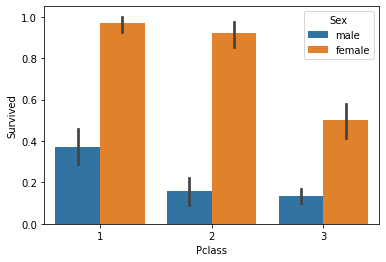

Problem 2.


```python
import numpy as np
import pandas as pd
import matplotlib.pyplot as plt
```

Problem 3.


```python
from google.colab import drive
drive.mount('/content/gdrive')
```

    Drive already mounted at /content/gdrive; to attempt to forcibly remount, call drive.mount("/content/gdrive", force_remount=True).
    


```python
file_path = "/content/gdrive/My Drive/Colab Notebooks/311-service-requests.csv"
our_na_values = ['Unspecified', 'N/A']
data = pd.read_csv(file_path, na_values = our_na_values)
```

    /usr/local/lib/python3.6/dist-packages/IPython/core/interactiveshell.py:2718: DtypeWarning: Columns (8) have mixed types.Specify dtype option on import or set low_memory=False.
      interactivity=interactivity, compiler=compiler, result=result)
    

Problem 4.


```python
data.head(10)
```


<div>
<style scoped>
    .dataframe tbody tr th:only-of-type {
        vertical-align: middle;
    }

    .dataframe tbody tr th {
        vertical-align: top;
    }

    .dataframe thead th {
        text-align: right;
    }
</style>
<table border="1" class="dataframe">
  <thead>
    <tr style="text-align: right;">
      <th></th>
      <th>Unique Key</th>
      <th>Created Date</th>
      <th>Closed Date</th>
      <th>Agency</th>
      <th>Agency Name</th>
      <th>Complaint Type</th>
      <th>Descriptor</th>
      <th>Location Type</th>
      <th>Incident Zip</th>
      <th>Incident Address</th>
      <th>Street Name</th>
      <th>Cross Street 1</th>
      <th>Cross Street 2</th>
      <th>Intersection Street 1</th>
      <th>Intersection Street 2</th>
      <th>Address Type</th>
      <th>City</th>
      <th>Landmark</th>
      <th>Facility Type</th>
      <th>Status</th>
      <th>Due Date</th>
      <th>Resolution Action Updated Date</th>
      <th>Community Board</th>
      <th>Borough</th>
      <th>X Coordinate (State Plane)</th>
      <th>Y Coordinate (State Plane)</th>
      <th>Park Facility Name</th>
      <th>Park Borough</th>
      <th>School Name</th>
      <th>School Number</th>
      <th>School Region</th>
      <th>School Code</th>
      <th>School Phone Number</th>
      <th>School Address</th>
      <th>School City</th>
      <th>School State</th>
      <th>School Zip</th>
      <th>School Not Found</th>
      <th>School or Citywide Complaint</th>
      <th>Vehicle Type</th>
      <th>Taxi Company Borough</th>
      <th>Taxi Pick Up Location</th>
      <th>Bridge Highway Name</th>
      <th>Bridge Highway Direction</th>
      <th>Road Ramp</th>
      <th>Bridge Highway Segment</th>
      <th>Garage Lot Name</th>
      <th>Ferry Direction</th>
      <th>Ferry Terminal Name</th>
      <th>Latitude</th>
      <th>Longitude</th>
      <th>Location</th>
    </tr>
  </thead>
  <tbody>
    <tr>
      <th>0</th>
      <td>26589651</td>
      <td>10/31/2013 02:08:41 AM</td>
      <td>NaN</td>
      <td>NYPD</td>
      <td>New York City Police Department</td>
      <td>Noise - Street/Sidewalk</td>
      <td>Loud Talking</td>
      <td>Street/Sidewalk</td>
      <td>11432</td>
      <td>90-03 169 STREET</td>
      <td>169 STREET</td>
      <td>90 AVENUE</td>
      <td>91 AVENUE</td>
      <td>NaN</td>
      <td>NaN</td>
      <td>ADDRESS</td>
      <td>JAMAICA</td>
      <td>NaN</td>
      <td>Precinct</td>
      <td>Assigned</td>
      <td>10/31/2013 10:08:41 AM</td>
      <td>10/31/2013 02:35:17 AM</td>
      <td>12 QUEENS</td>
      <td>QUEENS</td>
      <td>1042027.0</td>
      <td>197389.0</td>
      <td>NaN</td>
      <td>QUEENS</td>
      <td>NaN</td>
      <td>NaN</td>
      <td>NaN</td>
      <td>NaN</td>
      <td>NaN</td>
      <td>NaN</td>
      <td>NaN</td>
      <td>NaN</td>
      <td>NaN</td>
      <td>N</td>
      <td>NaN</td>
      <td>NaN</td>
      <td>NaN</td>
      <td>NaN</td>
      <td>NaN</td>
      <td>NaN</td>
      <td>NaN</td>
      <td>NaN</td>
      <td>NaN</td>
      <td>NaN</td>
      <td>NaN</td>
      <td>40.708275</td>
      <td>-73.791604</td>
      <td>(40.70827532593202, -73.79160395779721)</td>
    </tr>
    <tr>
      <th>1</th>
      <td>26593698</td>
      <td>10/31/2013 02:01:04 AM</td>
      <td>NaN</td>
      <td>NYPD</td>
      <td>New York City Police Department</td>
      <td>Illegal Parking</td>
      <td>Commercial Overnight Parking</td>
      <td>Street/Sidewalk</td>
      <td>11378</td>
      <td>58 AVENUE</td>
      <td>58 AVENUE</td>
      <td>58 PLACE</td>
      <td>59 STREET</td>
      <td>NaN</td>
      <td>NaN</td>
      <td>BLOCKFACE</td>
      <td>MASPETH</td>
      <td>NaN</td>
      <td>Precinct</td>
      <td>Open</td>
      <td>10/31/2013 10:01:04 AM</td>
      <td>NaN</td>
      <td>05 QUEENS</td>
      <td>QUEENS</td>
      <td>1009349.0</td>
      <td>201984.0</td>
      <td>NaN</td>
      <td>QUEENS</td>
      <td>NaN</td>
      <td>NaN</td>
      <td>NaN</td>
      <td>NaN</td>
      <td>NaN</td>
      <td>NaN</td>
      <td>NaN</td>
      <td>NaN</td>
      <td>NaN</td>
      <td>N</td>
      <td>NaN</td>
      <td>NaN</td>
      <td>NaN</td>
      <td>NaN</td>
      <td>NaN</td>
      <td>NaN</td>
      <td>NaN</td>
      <td>NaN</td>
      <td>NaN</td>
      <td>NaN</td>
      <td>NaN</td>
      <td>40.721041</td>
      <td>-73.909453</td>
      <td>(40.721040535628305, -73.90945306791765)</td>
    </tr>
    <tr>
      <th>2</th>
      <td>26594139</td>
      <td>10/31/2013 02:00:24 AM</td>
      <td>10/31/2013 02:40:32 AM</td>
      <td>NYPD</td>
      <td>New York City Police Department</td>
      <td>Noise - Commercial</td>
      <td>Loud Music/Party</td>
      <td>Club/Bar/Restaurant</td>
      <td>10032</td>
      <td>4060 BROADWAY</td>
      <td>BROADWAY</td>
      <td>WEST 171 STREET</td>
      <td>WEST 172 STREET</td>
      <td>NaN</td>
      <td>NaN</td>
      <td>ADDRESS</td>
      <td>NEW YORK</td>
      <td>NaN</td>
      <td>Precinct</td>
      <td>Closed</td>
      <td>10/31/2013 10:00:24 AM</td>
      <td>10/31/2013 02:39:42 AM</td>
      <td>12 MANHATTAN</td>
      <td>MANHATTAN</td>
      <td>1001088.0</td>
      <td>246531.0</td>
      <td>NaN</td>
      <td>MANHATTAN</td>
      <td>NaN</td>
      <td>NaN</td>
      <td>NaN</td>
      <td>NaN</td>
      <td>NaN</td>
      <td>NaN</td>
      <td>NaN</td>
      <td>NaN</td>
      <td>NaN</td>
      <td>N</td>
      <td>NaN</td>
      <td>NaN</td>
      <td>NaN</td>
      <td>NaN</td>
      <td>NaN</td>
      <td>NaN</td>
      <td>NaN</td>
      <td>NaN</td>
      <td>NaN</td>
      <td>NaN</td>
      <td>NaN</td>
      <td>40.843330</td>
      <td>-73.939144</td>
      <td>(40.84332975466513, -73.93914371913482)</td>
    </tr>
    <tr>
      <th>3</th>
      <td>26595721</td>
      <td>10/31/2013 01:56:23 AM</td>
      <td>10/31/2013 02:21:48 AM</td>
      <td>NYPD</td>
      <td>New York City Police Department</td>
      <td>Noise - Vehicle</td>
      <td>Car/Truck Horn</td>
      <td>Street/Sidewalk</td>
      <td>10023</td>
      <td>WEST 72 STREET</td>
      <td>WEST 72 STREET</td>
      <td>COLUMBUS AVENUE</td>
      <td>AMSTERDAM AVENUE</td>
      <td>NaN</td>
      <td>NaN</td>
      <td>BLOCKFACE</td>
      <td>NEW YORK</td>
      <td>NaN</td>
      <td>Precinct</td>
      <td>Closed</td>
      <td>10/31/2013 09:56:23 AM</td>
      <td>10/31/2013 02:21:10 AM</td>
      <td>07 MANHATTAN</td>
      <td>MANHATTAN</td>
      <td>989730.0</td>
      <td>222727.0</td>
      <td>NaN</td>
      <td>MANHATTAN</td>
      <td>NaN</td>
      <td>NaN</td>
      <td>NaN</td>
      <td>NaN</td>
      <td>NaN</td>
      <td>NaN</td>
      <td>NaN</td>
      <td>NaN</td>
      <td>NaN</td>
      <td>N</td>
      <td>NaN</td>
      <td>NaN</td>
      <td>NaN</td>
      <td>NaN</td>
      <td>NaN</td>
      <td>NaN</td>
      <td>NaN</td>
      <td>NaN</td>
      <td>NaN</td>
      <td>NaN</td>
      <td>NaN</td>
      <td>40.778009</td>
      <td>-73.980213</td>
      <td>(40.7780087446372, -73.98021349023975)</td>
    </tr>
    <tr>
      <th>4</th>
      <td>26590930</td>
      <td>10/31/2013 01:53:44 AM</td>
      <td>NaN</td>
      <td>DOHMH</td>
      <td>Department of Health and Mental Hygiene</td>
      <td>Rodent</td>
      <td>Condition Attracting Rodents</td>
      <td>Vacant Lot</td>
      <td>10027</td>
      <td>WEST 124 STREET</td>
      <td>WEST 124 STREET</td>
      <td>LENOX AVENUE</td>
      <td>ADAM CLAYTON POWELL JR BOULEVARD</td>
      <td>NaN</td>
      <td>NaN</td>
      <td>BLOCKFACE</td>
      <td>NEW YORK</td>
      <td>NaN</td>
      <td>NaN</td>
      <td>Pending</td>
      <td>11/30/2013 01:53:44 AM</td>
      <td>10/31/2013 01:59:54 AM</td>
      <td>10 MANHATTAN</td>
      <td>MANHATTAN</td>
      <td>998815.0</td>
      <td>233545.0</td>
      <td>NaN</td>
      <td>MANHATTAN</td>
      <td>NaN</td>
      <td>NaN</td>
      <td>NaN</td>
      <td>NaN</td>
      <td>NaN</td>
      <td>NaN</td>
      <td>NaN</td>
      <td>NaN</td>
      <td>NaN</td>
      <td>N</td>
      <td>NaN</td>
      <td>NaN</td>
      <td>NaN</td>
      <td>NaN</td>
      <td>NaN</td>
      <td>NaN</td>
      <td>NaN</td>
      <td>NaN</td>
      <td>NaN</td>
      <td>NaN</td>
      <td>NaN</td>
      <td>40.807691</td>
      <td>-73.947387</td>
      <td>(40.80769092704951, -73.94738703491433)</td>
    </tr>
    <tr>
      <th>5</th>
      <td>26592370</td>
      <td>10/31/2013 01:46:52 AM</td>
      <td>NaN</td>
      <td>NYPD</td>
      <td>New York City Police Department</td>
      <td>Noise - Commercial</td>
      <td>Banging/Pounding</td>
      <td>Club/Bar/Restaurant</td>
      <td>11372</td>
      <td>37 AVENUE</td>
      <td>37 AVENUE</td>
      <td>84 STREET</td>
      <td>85 STREET</td>
      <td>NaN</td>
      <td>NaN</td>
      <td>BLOCKFACE</td>
      <td>JACKSON HEIGHTS</td>
      <td>NaN</td>
      <td>Precinct</td>
      <td>Open</td>
      <td>10/31/2013 09:46:52 AM</td>
      <td>NaN</td>
      <td>03 QUEENS</td>
      <td>QUEENS</td>
      <td>1016948.0</td>
      <td>212540.0</td>
      <td>NaN</td>
      <td>QUEENS</td>
      <td>NaN</td>
      <td>NaN</td>
      <td>NaN</td>
      <td>NaN</td>
      <td>NaN</td>
      <td>NaN</td>
      <td>NaN</td>
      <td>NaN</td>
      <td>NaN</td>
      <td>N</td>
      <td>NaN</td>
      <td>NaN</td>
      <td>NaN</td>
      <td>NaN</td>
      <td>NaN</td>
      <td>NaN</td>
      <td>NaN</td>
      <td>NaN</td>
      <td>NaN</td>
      <td>NaN</td>
      <td>NaN</td>
      <td>40.749989</td>
      <td>-73.881988</td>
      <td>(40.7499893014072, -73.88198770727831)</td>
    </tr>
    <tr>
      <th>6</th>
      <td>26595682</td>
      <td>10/31/2013 01:46:40 AM</td>
      <td>NaN</td>
      <td>NYPD</td>
      <td>New York City Police Department</td>
      <td>Blocked Driveway</td>
      <td>No Access</td>
      <td>Street/Sidewalk</td>
      <td>11419</td>
      <td>107-50 109 STREET</td>
      <td>109 STREET</td>
      <td>107 AVENUE</td>
      <td>109 AVENUE</td>
      <td>NaN</td>
      <td>NaN</td>
      <td>ADDRESS</td>
      <td>SOUTH RICHMOND HILL</td>
      <td>NaN</td>
      <td>Precinct</td>
      <td>Assigned</td>
      <td>10/31/2013 09:46:40 AM</td>
      <td>10/31/2013 01:59:51 AM</td>
      <td>10 QUEENS</td>
      <td>QUEENS</td>
      <td>1030919.0</td>
      <td>187622.0</td>
      <td>NaN</td>
      <td>QUEENS</td>
      <td>NaN</td>
      <td>NaN</td>
      <td>NaN</td>
      <td>NaN</td>
      <td>NaN</td>
      <td>NaN</td>
      <td>NaN</td>
      <td>NaN</td>
      <td>NaN</td>
      <td>N</td>
      <td>NaN</td>
      <td>NaN</td>
      <td>NaN</td>
      <td>NaN</td>
      <td>NaN</td>
      <td>NaN</td>
      <td>NaN</td>
      <td>NaN</td>
      <td>NaN</td>
      <td>NaN</td>
      <td>NaN</td>
      <td>40.681533</td>
      <td>-73.831737</td>
      <td>(40.68153278675525, -73.83173699701601)</td>
    </tr>
    <tr>
      <th>7</th>
      <td>26595195</td>
      <td>10/31/2013 01:44:19 AM</td>
      <td>10/31/2013 01:58:49 AM</td>
      <td>NYPD</td>
      <td>New York City Police Department</td>
      <td>Noise - Commercial</td>
      <td>Loud Music/Party</td>
      <td>Club/Bar/Restaurant</td>
      <td>11417</td>
      <td>137-09 CROSSBAY BOULEVARD</td>
      <td>CROSSBAY BOULEVARD</td>
      <td>PITKIN AVENUE</td>
      <td>VAN WICKLEN ROAD</td>
      <td>NaN</td>
      <td>NaN</td>
      <td>ADDRESS</td>
      <td>OZONE PARK</td>
      <td>NaN</td>
      <td>Precinct</td>
      <td>Closed</td>
      <td>10/31/2013 09:44:19 AM</td>
      <td>10/31/2013 01:58:49 AM</td>
      <td>10 QUEENS</td>
      <td>QUEENS</td>
      <td>1027776.0</td>
      <td>184076.0</td>
      <td>NaN</td>
      <td>QUEENS</td>
      <td>NaN</td>
      <td>NaN</td>
      <td>NaN</td>
      <td>NaN</td>
      <td>NaN</td>
      <td>NaN</td>
      <td>NaN</td>
      <td>NaN</td>
      <td>NaN</td>
      <td>N</td>
      <td>NaN</td>
      <td>NaN</td>
      <td>NaN</td>
      <td>NaN</td>
      <td>NaN</td>
      <td>NaN</td>
      <td>NaN</td>
      <td>NaN</td>
      <td>NaN</td>
      <td>NaN</td>
      <td>NaN</td>
      <td>40.671816</td>
      <td>-73.843092</td>
      <td>(40.67181584567338, -73.84309181950769)</td>
    </tr>
    <tr>
      <th>8</th>
      <td>26590540</td>
      <td>10/31/2013 01:44:14 AM</td>
      <td>10/31/2013 02:28:04 AM</td>
      <td>NYPD</td>
      <td>New York City Police Department</td>
      <td>Noise - Commercial</td>
      <td>Loud Talking</td>
      <td>Club/Bar/Restaurant</td>
      <td>10011</td>
      <td>258 WEST 15 STREET</td>
      <td>WEST 15 STREET</td>
      <td>7 AVENUE</td>
      <td>8 AVENUE</td>
      <td>NaN</td>
      <td>NaN</td>
      <td>ADDRESS</td>
      <td>NEW YORK</td>
      <td>NaN</td>
      <td>Precinct</td>
      <td>Closed</td>
      <td>10/31/2013 09:44:14 AM</td>
      <td>10/31/2013 02:00:56 AM</td>
      <td>04 MANHATTAN</td>
      <td>MANHATTAN</td>
      <td>984031.0</td>
      <td>208847.0</td>
      <td>NaN</td>
      <td>MANHATTAN</td>
      <td>NaN</td>
      <td>NaN</td>
      <td>NaN</td>
      <td>NaN</td>
      <td>NaN</td>
      <td>NaN</td>
      <td>NaN</td>
      <td>NaN</td>
      <td>NaN</td>
      <td>N</td>
      <td>NaN</td>
      <td>NaN</td>
      <td>NaN</td>
      <td>NaN</td>
      <td>NaN</td>
      <td>NaN</td>
      <td>NaN</td>
      <td>NaN</td>
      <td>NaN</td>
      <td>NaN</td>
      <td>NaN</td>
      <td>40.739913</td>
      <td>-74.000790</td>
      <td>(40.73991339303542, -74.00079028612932)</td>
    </tr>
    <tr>
      <th>9</th>
      <td>26594392</td>
      <td>10/31/2013 01:34:41 AM</td>
      <td>10/31/2013 02:23:51 AM</td>
      <td>NYPD</td>
      <td>New York City Police Department</td>
      <td>Noise - Commercial</td>
      <td>Loud Music/Party</td>
      <td>Club/Bar/Restaurant</td>
      <td>11225</td>
      <td>835 NOSTRAND AVENUE</td>
      <td>NOSTRAND AVENUE</td>
      <td>UNION STREET</td>
      <td>PRESIDENT STREET</td>
      <td>NaN</td>
      <td>NaN</td>
      <td>ADDRESS</td>
      <td>BROOKLYN</td>
      <td>NaN</td>
      <td>Precinct</td>
      <td>Closed</td>
      <td>10/31/2013 09:34:41 AM</td>
      <td>10/31/2013 01:48:26 AM</td>
      <td>09 BROOKLYN</td>
      <td>BROOKLYN</td>
      <td>997941.0</td>
      <td>182725.0</td>
      <td>NaN</td>
      <td>BROOKLYN</td>
      <td>NaN</td>
      <td>NaN</td>
      <td>NaN</td>
      <td>NaN</td>
      <td>NaN</td>
      <td>NaN</td>
      <td>NaN</td>
      <td>NaN</td>
      <td>NaN</td>
      <td>N</td>
      <td>NaN</td>
      <td>NaN</td>
      <td>NaN</td>
      <td>NaN</td>
      <td>NaN</td>
      <td>NaN</td>
      <td>NaN</td>
      <td>NaN</td>
      <td>NaN</td>
      <td>NaN</td>
      <td>NaN</td>
      <td>40.668204</td>
      <td>-73.950648</td>
      <td>(40.66820406598287, -73.95064760056546)</td>
    </tr>
  </tbody>
</table>
</div>


Problem 5.


```python
data[data['City']=='NEW YORK'].shape[0]
```


    22664


Problem 6.


```python
data1 = data['City'].str.contains('NEW YORK').fillna(False)
data['City'][data1].unique()
```


    array(['NEW YORK', 'WEST NEW YORK', 'NEW YORK CITY'], dtype=object)


Problem 7.


```python
data_nypd = data[data['Agency'] == "NYPD"]
data_nypd = data_nypd[data_nypd['Closed Date'].notnull()]
data_nypd
```


<div>
<style scoped>
    .dataframe tbody tr th:only-of-type {
        vertical-align: middle;
    }

    .dataframe tbody tr th {
        vertical-align: top;
    }

    .dataframe thead th {
        text-align: right;
    }
</style>
<table border="1" class="dataframe">
  <thead>
    <tr style="text-align: right;">
      <th></th>
      <th>Unique Key</th>
      <th>Created Date</th>
      <th>Closed Date</th>
      <th>Agency</th>
      <th>Agency Name</th>
      <th>Complaint Type</th>
      <th>Descriptor</th>
      <th>Location Type</th>
      <th>Incident Zip</th>
      <th>Incident Address</th>
      <th>Street Name</th>
      <th>Cross Street 1</th>
      <th>Cross Street 2</th>
      <th>Intersection Street 1</th>
      <th>Intersection Street 2</th>
      <th>Address Type</th>
      <th>City</th>
      <th>Landmark</th>
      <th>Facility Type</th>
      <th>Status</th>
      <th>Due Date</th>
      <th>Resolution Action Updated Date</th>
      <th>Community Board</th>
      <th>Borough</th>
      <th>X Coordinate (State Plane)</th>
      <th>Y Coordinate (State Plane)</th>
      <th>Park Facility Name</th>
      <th>Park Borough</th>
      <th>School Name</th>
      <th>School Number</th>
      <th>School Region</th>
      <th>School Code</th>
      <th>School Phone Number</th>
      <th>School Address</th>
      <th>School City</th>
      <th>School State</th>
      <th>School Zip</th>
      <th>School Not Found</th>
      <th>School or Citywide Complaint</th>
      <th>Vehicle Type</th>
      <th>Taxi Company Borough</th>
      <th>Taxi Pick Up Location</th>
      <th>Bridge Highway Name</th>
      <th>Bridge Highway Direction</th>
      <th>Road Ramp</th>
      <th>Bridge Highway Segment</th>
      <th>Garage Lot Name</th>
      <th>Ferry Direction</th>
      <th>Ferry Terminal Name</th>
      <th>Latitude</th>
      <th>Longitude</th>
      <th>Location</th>
    </tr>
  </thead>
  <tbody>
    <tr>
      <th>2</th>
      <td>26594139</td>
      <td>10/31/2013 02:00:24 AM</td>
      <td>10/31/2013 02:40:32 AM</td>
      <td>NYPD</td>
      <td>New York City Police Department</td>
      <td>Noise - Commercial</td>
      <td>Loud Music/Party</td>
      <td>Club/Bar/Restaurant</td>
      <td>10032</td>
      <td>4060 BROADWAY</td>
      <td>BROADWAY</td>
      <td>WEST 171 STREET</td>
      <td>WEST 172 STREET</td>
      <td>NaN</td>
      <td>NaN</td>
      <td>ADDRESS</td>
      <td>NEW YORK</td>
      <td>NaN</td>
      <td>Precinct</td>
      <td>Closed</td>
      <td>10/31/2013 10:00:24 AM</td>
      <td>10/31/2013 02:39:42 AM</td>
      <td>12 MANHATTAN</td>
      <td>MANHATTAN</td>
      <td>1001088.0</td>
      <td>246531.0</td>
      <td>NaN</td>
      <td>MANHATTAN</td>
      <td>NaN</td>
      <td>NaN</td>
      <td>NaN</td>
      <td>NaN</td>
      <td>NaN</td>
      <td>NaN</td>
      <td>NaN</td>
      <td>NaN</td>
      <td>NaN</td>
      <td>N</td>
      <td>NaN</td>
      <td>NaN</td>
      <td>NaN</td>
      <td>NaN</td>
      <td>NaN</td>
      <td>NaN</td>
      <td>NaN</td>
      <td>NaN</td>
      <td>NaN</td>
      <td>NaN</td>
      <td>NaN</td>
      <td>40.843330</td>
      <td>-73.939144</td>
      <td>(40.84332975466513, -73.93914371913482)</td>
    </tr>
    <tr>
      <th>3</th>
      <td>26595721</td>
      <td>10/31/2013 01:56:23 AM</td>
      <td>10/31/2013 02:21:48 AM</td>
      <td>NYPD</td>
      <td>New York City Police Department</td>
      <td>Noise - Vehicle</td>
      <td>Car/Truck Horn</td>
      <td>Street/Sidewalk</td>
      <td>10023</td>
      <td>WEST 72 STREET</td>
      <td>WEST 72 STREET</td>
      <td>COLUMBUS AVENUE</td>
      <td>AMSTERDAM AVENUE</td>
      <td>NaN</td>
      <td>NaN</td>
      <td>BLOCKFACE</td>
      <td>NEW YORK</td>
      <td>NaN</td>
      <td>Precinct</td>
      <td>Closed</td>
      <td>10/31/2013 09:56:23 AM</td>
      <td>10/31/2013 02:21:10 AM</td>
      <td>07 MANHATTAN</td>
      <td>MANHATTAN</td>
      <td>989730.0</td>
      <td>222727.0</td>
      <td>NaN</td>
      <td>MANHATTAN</td>
      <td>NaN</td>
      <td>NaN</td>
      <td>NaN</td>
      <td>NaN</td>
      <td>NaN</td>
      <td>NaN</td>
      <td>NaN</td>
      <td>NaN</td>
      <td>NaN</td>
      <td>N</td>
      <td>NaN</td>
      <td>NaN</td>
      <td>NaN</td>
      <td>NaN</td>
      <td>NaN</td>
      <td>NaN</td>
      <td>NaN</td>
      <td>NaN</td>
      <td>NaN</td>
      <td>NaN</td>
      <td>NaN</td>
      <td>40.778009</td>
      <td>-73.980213</td>
      <td>(40.7780087446372, -73.98021349023975)</td>
    </tr>
    <tr>
      <th>7</th>
      <td>26595195</td>
      <td>10/31/2013 01:44:19 AM</td>
      <td>10/31/2013 01:58:49 AM</td>
      <td>NYPD</td>
      <td>New York City Police Department</td>
      <td>Noise - Commercial</td>
      <td>Loud Music/Party</td>
      <td>Club/Bar/Restaurant</td>
      <td>11417</td>
      <td>137-09 CROSSBAY BOULEVARD</td>
      <td>CROSSBAY BOULEVARD</td>
      <td>PITKIN AVENUE</td>
      <td>VAN WICKLEN ROAD</td>
      <td>NaN</td>
      <td>NaN</td>
      <td>ADDRESS</td>
      <td>OZONE PARK</td>
      <td>NaN</td>
      <td>Precinct</td>
      <td>Closed</td>
      <td>10/31/2013 09:44:19 AM</td>
      <td>10/31/2013 01:58:49 AM</td>
      <td>10 QUEENS</td>
      <td>QUEENS</td>
      <td>1027776.0</td>
      <td>184076.0</td>
      <td>NaN</td>
      <td>QUEENS</td>
      <td>NaN</td>
      <td>NaN</td>
      <td>NaN</td>
      <td>NaN</td>
      <td>NaN</td>
      <td>NaN</td>
      <td>NaN</td>
      <td>NaN</td>
      <td>NaN</td>
      <td>N</td>
      <td>NaN</td>
      <td>NaN</td>
      <td>NaN</td>
      <td>NaN</td>
      <td>NaN</td>
      <td>NaN</td>
      <td>NaN</td>
      <td>NaN</td>
      <td>NaN</td>
      <td>NaN</td>
      <td>NaN</td>
      <td>40.671816</td>
      <td>-73.843092</td>
      <td>(40.67181584567338, -73.84309181950769)</td>
    </tr>
    <tr>
      <th>8</th>
      <td>26590540</td>
      <td>10/31/2013 01:44:14 AM</td>
      <td>10/31/2013 02:28:04 AM</td>
      <td>NYPD</td>
      <td>New York City Police Department</td>
      <td>Noise - Commercial</td>
      <td>Loud Talking</td>
      <td>Club/Bar/Restaurant</td>
      <td>10011</td>
      <td>258 WEST 15 STREET</td>
      <td>WEST 15 STREET</td>
      <td>7 AVENUE</td>
      <td>8 AVENUE</td>
      <td>NaN</td>
      <td>NaN</td>
      <td>ADDRESS</td>
      <td>NEW YORK</td>
      <td>NaN</td>
      <td>Precinct</td>
      <td>Closed</td>
      <td>10/31/2013 09:44:14 AM</td>
      <td>10/31/2013 02:00:56 AM</td>
      <td>04 MANHATTAN</td>
      <td>MANHATTAN</td>
      <td>984031.0</td>
      <td>208847.0</td>
      <td>NaN</td>
      <td>MANHATTAN</td>
      <td>NaN</td>
      <td>NaN</td>
      <td>NaN</td>
      <td>NaN</td>
      <td>NaN</td>
      <td>NaN</td>
      <td>NaN</td>
      <td>NaN</td>
      <td>NaN</td>
      <td>N</td>
      <td>NaN</td>
      <td>NaN</td>
      <td>NaN</td>
      <td>NaN</td>
      <td>NaN</td>
      <td>NaN</td>
      <td>NaN</td>
      <td>NaN</td>
      <td>NaN</td>
      <td>NaN</td>
      <td>NaN</td>
      <td>40.739913</td>
      <td>-74.000790</td>
      <td>(40.73991339303542, -74.00079028612932)</td>
    </tr>
    <tr>
      <th>9</th>
      <td>26594392</td>
      <td>10/31/2013 01:34:41 AM</td>
      <td>10/31/2013 02:23:51 AM</td>
      <td>NYPD</td>
      <td>New York City Police Department</td>
      <td>Noise - Commercial</td>
      <td>Loud Music/Party</td>
      <td>Club/Bar/Restaurant</td>
      <td>11225</td>
      <td>835 NOSTRAND AVENUE</td>
      <td>NOSTRAND AVENUE</td>
      <td>UNION STREET</td>
      <td>PRESIDENT STREET</td>
      <td>NaN</td>
      <td>NaN</td>
      <td>ADDRESS</td>
      <td>BROOKLYN</td>
      <td>NaN</td>
      <td>Precinct</td>
      <td>Closed</td>
      <td>10/31/2013 09:34:41 AM</td>
      <td>10/31/2013 01:48:26 AM</td>
      <td>09 BROOKLYN</td>
      <td>BROOKLYN</td>
      <td>997941.0</td>
      <td>182725.0</td>
      <td>NaN</td>
      <td>BROOKLYN</td>
      <td>NaN</td>
      <td>NaN</td>
      <td>NaN</td>
      <td>NaN</td>
      <td>NaN</td>
      <td>NaN</td>
      <td>NaN</td>
      <td>NaN</td>
      <td>NaN</td>
      <td>N</td>
      <td>NaN</td>
      <td>NaN</td>
      <td>NaN</td>
      <td>NaN</td>
      <td>NaN</td>
      <td>NaN</td>
      <td>NaN</td>
      <td>NaN</td>
      <td>NaN</td>
      <td>NaN</td>
      <td>NaN</td>
      <td>40.668204</td>
      <td>-73.950648</td>
      <td>(40.66820406598287, -73.95064760056546)</td>
    </tr>
    <tr>
      <th>...</th>
      <td>...</td>
      <td>...</td>
      <td>...</td>
      <td>...</td>
      <td>...</td>
      <td>...</td>
      <td>...</td>
      <td>...</td>
      <td>...</td>
      <td>...</td>
      <td>...</td>
      <td>...</td>
      <td>...</td>
      <td>...</td>
      <td>...</td>
      <td>...</td>
      <td>...</td>
      <td>...</td>
      <td>...</td>
      <td>...</td>
      <td>...</td>
      <td>...</td>
      <td>...</td>
      <td>...</td>
      <td>...</td>
      <td>...</td>
      <td>...</td>
      <td>...</td>
      <td>...</td>
      <td>...</td>
      <td>...</td>
      <td>...</td>
      <td>...</td>
      <td>...</td>
      <td>...</td>
      <td>...</td>
      <td>...</td>
      <td>...</td>
      <td>...</td>
      <td>...</td>
      <td>...</td>
      <td>...</td>
      <td>...</td>
      <td>...</td>
      <td>...</td>
      <td>...</td>
      <td>...</td>
      <td>...</td>
      <td>...</td>
      <td>...</td>
      <td>...</td>
      <td>...</td>
    </tr>
    <tr>
      <th>111061</th>
      <td>26426164</td>
      <td>10/04/2013 12:03:00 AM</td>
      <td>10/04/2013 02:14:57 AM</td>
      <td>NYPD</td>
      <td>New York City Police Department</td>
      <td>Noise - Commercial</td>
      <td>Loud Music/Party</td>
      <td>Club/Bar/Restaurant</td>
      <td>11106</td>
      <td>30-09 BROADWAY</td>
      <td>BROADWAY</td>
      <td>30 STREET</td>
      <td>31 STREET</td>
      <td>NaN</td>
      <td>NaN</td>
      <td>ADDRESS</td>
      <td>ASTORIA</td>
      <td>NaN</td>
      <td>Precinct</td>
      <td>Closed</td>
      <td>10/04/2013 08:03:00 AM</td>
      <td>10/04/2013 02:14:57 AM</td>
      <td>01 QUEENS</td>
      <td>QUEENS</td>
      <td>1004746.0</td>
      <td>217004.0</td>
      <td>NaN</td>
      <td>QUEENS</td>
      <td>NaN</td>
      <td>NaN</td>
      <td>NaN</td>
      <td>NaN</td>
      <td>NaN</td>
      <td>NaN</td>
      <td>NaN</td>
      <td>NaN</td>
      <td>NaN</td>
      <td>N</td>
      <td>NaN</td>
      <td>NaN</td>
      <td>NaN</td>
      <td>NaN</td>
      <td>NaN</td>
      <td>NaN</td>
      <td>NaN</td>
      <td>NaN</td>
      <td>NaN</td>
      <td>NaN</td>
      <td>NaN</td>
      <td>40.762279</td>
      <td>-73.926013</td>
      <td>(40.762278541098084, -73.92601303458156)</td>
    </tr>
    <tr>
      <th>111065</th>
      <td>26428083</td>
      <td>10/04/2013 12:01:05 AM</td>
      <td>10/04/2013 02:13:50 AM</td>
      <td>NYPD</td>
      <td>New York City Police Department</td>
      <td>Illegal Parking</td>
      <td>Posted Parking Sign Violation</td>
      <td>Street/Sidewalk</td>
      <td>11434</td>
      <td>NaN</td>
      <td>NaN</td>
      <td>NaN</td>
      <td>NaN</td>
      <td>GUY R BREWER BOULEVARD</td>
      <td>ROCKAWAY BOULEVARD</td>
      <td>INTERSECTION</td>
      <td>JAMAICA</td>
      <td>NaN</td>
      <td>Precinct</td>
      <td>Closed</td>
      <td>10/04/2013 08:01:05 AM</td>
      <td>10/04/2013 02:13:50 AM</td>
      <td>13 QUEENS</td>
      <td>QUEENS</td>
      <td>1048801.0</td>
      <td>178419.0</td>
      <td>NaN</td>
      <td>QUEENS</td>
      <td>NaN</td>
      <td>NaN</td>
      <td>NaN</td>
      <td>NaN</td>
      <td>NaN</td>
      <td>NaN</td>
      <td>NaN</td>
      <td>NaN</td>
      <td>NaN</td>
      <td>N</td>
      <td>NaN</td>
      <td>NaN</td>
      <td>NaN</td>
      <td>NaN</td>
      <td>NaN</td>
      <td>NaN</td>
      <td>NaN</td>
      <td>NaN</td>
      <td>NaN</td>
      <td>NaN</td>
      <td>NaN</td>
      <td>40.656160</td>
      <td>-73.767353</td>
      <td>(40.656160351546845, -73.76735262738222)</td>
    </tr>
    <tr>
      <th>111066</th>
      <td>26428987</td>
      <td>10/04/2013 12:00:45 AM</td>
      <td>10/04/2013 01:25:01 AM</td>
      <td>NYPD</td>
      <td>New York City Police Department</td>
      <td>Noise - Street/Sidewalk</td>
      <td>Loud Talking</td>
      <td>Street/Sidewalk</td>
      <td>10016</td>
      <td>344 EAST 28 STREET</td>
      <td>EAST 28 STREET</td>
      <td>MOUNT CARMEL PLACE</td>
      <td>1 AVENUE</td>
      <td>NaN</td>
      <td>NaN</td>
      <td>ADDRESS</td>
      <td>NEW YORK</td>
      <td>NaN</td>
      <td>Precinct</td>
      <td>Closed</td>
      <td>10/04/2013 08:00:45 AM</td>
      <td>10/04/2013 01:25:01 AM</td>
      <td>06 MANHATTAN</td>
      <td>MANHATTAN</td>
      <td>990637.0</td>
      <td>208987.0</td>
      <td>NaN</td>
      <td>MANHATTAN</td>
      <td>NaN</td>
      <td>NaN</td>
      <td>NaN</td>
      <td>NaN</td>
      <td>NaN</td>
      <td>NaN</td>
      <td>NaN</td>
      <td>NaN</td>
      <td>NaN</td>
      <td>N</td>
      <td>NaN</td>
      <td>NaN</td>
      <td>NaN</td>
      <td>NaN</td>
      <td>NaN</td>
      <td>NaN</td>
      <td>NaN</td>
      <td>NaN</td>
      <td>NaN</td>
      <td>NaN</td>
      <td>NaN</td>
      <td>40.740295</td>
      <td>-73.976952</td>
      <td>(40.740295354643706, -73.97695165980414)</td>
    </tr>
    <tr>
      <th>111067</th>
      <td>26426115</td>
      <td>10/04/2013 12:00:28 AM</td>
      <td>10/04/2013 04:17:32 AM</td>
      <td>NYPD</td>
      <td>New York City Police Department</td>
      <td>Noise - Commercial</td>
      <td>Loud Talking</td>
      <td>Club/Bar/Restaurant</td>
      <td>11226</td>
      <td>1233 FLATBUSH AVENUE</td>
      <td>FLATBUSH AVENUE</td>
      <td>AVENUE D</td>
      <td>NEWKIRK AVENUE</td>
      <td>NaN</td>
      <td>NaN</td>
      <td>ADDRESS</td>
      <td>BROOKLYN</td>
      <td>NaN</td>
      <td>Precinct</td>
      <td>Closed</td>
      <td>10/04/2013 08:00:28 AM</td>
      <td>10/04/2013 04:17:32 AM</td>
      <td>14 BROOKLYN</td>
      <td>BROOKLYN</td>
      <td>996654.0</td>
      <td>172515.0</td>
      <td>NaN</td>
      <td>BROOKLYN</td>
      <td>NaN</td>
      <td>NaN</td>
      <td>NaN</td>
      <td>NaN</td>
      <td>NaN</td>
      <td>NaN</td>
      <td>NaN</td>
      <td>NaN</td>
      <td>NaN</td>
      <td>N</td>
      <td>NaN</td>
      <td>NaN</td>
      <td>NaN</td>
      <td>NaN</td>
      <td>NaN</td>
      <td>NaN</td>
      <td>NaN</td>
      <td>NaN</td>
      <td>NaN</td>
      <td>NaN</td>
      <td>NaN</td>
      <td>40.640182</td>
      <td>-73.955306</td>
      <td>(40.64018174662485, -73.95530566958138)</td>
    </tr>
    <tr>
      <th>111068</th>
      <td>26428033</td>
      <td>10/04/2013 12:00:10 AM</td>
      <td>10/04/2013 01:20:52 AM</td>
      <td>NYPD</td>
      <td>New York City Police Department</td>
      <td>Blocked Driveway</td>
      <td>Partial Access</td>
      <td>Street/Sidewalk</td>
      <td>11236</td>
      <td>1259 EAST 94 STREET</td>
      <td>EAST 94 STREET</td>
      <td>AVENUE J</td>
      <td>AVENUE K</td>
      <td>NaN</td>
      <td>NaN</td>
      <td>ADDRESS</td>
      <td>BROOKLYN</td>
      <td>NaN</td>
      <td>Precinct</td>
      <td>Closed</td>
      <td>10/04/2013 08:00:10 AM</td>
      <td>10/04/2013 01:20:52 AM</td>
      <td>18 BROOKLYN</td>
      <td>BROOKLYN</td>
      <td>1011804.0</td>
      <td>172470.0</td>
      <td>NaN</td>
      <td>BROOKLYN</td>
      <td>NaN</td>
      <td>NaN</td>
      <td>NaN</td>
      <td>NaN</td>
      <td>NaN</td>
      <td>NaN</td>
      <td>NaN</td>
      <td>NaN</td>
      <td>NaN</td>
      <td>N</td>
      <td>NaN</td>
      <td>NaN</td>
      <td>NaN</td>
      <td>NaN</td>
      <td>NaN</td>
      <td>NaN</td>
      <td>NaN</td>
      <td>NaN</td>
      <td>NaN</td>
      <td>NaN</td>
      <td>NaN</td>
      <td>40.640024</td>
      <td>-73.900717</td>
      <td>(40.640024057399216, -73.90071711703163)</td>
    </tr>
  </tbody>
</table>
<p>15248 rows × 52 columns</p>
</div>


Problem 8.


```python
data_nypd['Location Type'].value_counts()
```


    Street/Sidewalk               11997
    Club/Bar/Restaurant            1859
    Store/Commercial                833
    Park/Playground                 247
    Residential Building/House      231
    House of Worship                 66
    Highway                           9
    Residential Building              3
    Bridge                            1
    Roadway Tunnel                    1
    Pier                              1
    Name: Location Type, dtype: int64


Problem 9.


```python
data_nypd['Location Type'].value_counts().plot.pie()
```


    <matplotlib.axes._subplots.AxesSubplot at 0x7f5255e72b38>


    

    


Problem 10.


```python
data_frame = data[['Closed Date','Agency','Descriptor', 'Location Type']]
data_frame = data_frame.dropna()
data_frame
```


<div>
<style scoped>
    .dataframe tbody tr th:only-of-type {
        vertical-align: middle;
    }

    .dataframe tbody tr th {
        vertical-align: top;
    }

    .dataframe thead th {
        text-align: right;
    }
</style>
<table border="1" class="dataframe">
  <thead>
    <tr style="text-align: right;">
      <th></th>
      <th>Closed Date</th>
      <th>Agency</th>
      <th>Descriptor</th>
      <th>Location Type</th>
    </tr>
  </thead>
  <tbody>
    <tr>
      <th>2</th>
      <td>10/31/2013 02:40:32 AM</td>
      <td>NYPD</td>
      <td>Loud Music/Party</td>
      <td>Club/Bar/Restaurant</td>
    </tr>
    <tr>
      <th>3</th>
      <td>10/31/2013 02:21:48 AM</td>
      <td>NYPD</td>
      <td>Car/Truck Horn</td>
      <td>Street/Sidewalk</td>
    </tr>
    <tr>
      <th>7</th>
      <td>10/31/2013 01:58:49 AM</td>
      <td>NYPD</td>
      <td>Loud Music/Party</td>
      <td>Club/Bar/Restaurant</td>
    </tr>
    <tr>
      <th>8</th>
      <td>10/31/2013 02:28:04 AM</td>
      <td>NYPD</td>
      <td>Loud Talking</td>
      <td>Club/Bar/Restaurant</td>
    </tr>
    <tr>
      <th>9</th>
      <td>10/31/2013 02:23:51 AM</td>
      <td>NYPD</td>
      <td>Loud Music/Party</td>
      <td>Club/Bar/Restaurant</td>
    </tr>
    <tr>
      <th>...</th>
      <td>...</td>
      <td>...</td>
      <td>...</td>
      <td>...</td>
    </tr>
    <tr>
      <th>111064</th>
      <td>10/07/2013 04:07:16 PM</td>
      <td>DPR</td>
      <td>Structure - Outdoors</td>
      <td>Park</td>
    </tr>
    <tr>
      <th>111065</th>
      <td>10/04/2013 02:13:50 AM</td>
      <td>NYPD</td>
      <td>Posted Parking Sign Violation</td>
      <td>Street/Sidewalk</td>
    </tr>
    <tr>
      <th>111066</th>
      <td>10/04/2013 01:25:01 AM</td>
      <td>NYPD</td>
      <td>Loud Talking</td>
      <td>Street/Sidewalk</td>
    </tr>
    <tr>
      <th>111067</th>
      <td>10/04/2013 04:17:32 AM</td>
      <td>NYPD</td>
      <td>Loud Talking</td>
      <td>Club/Bar/Restaurant</td>
    </tr>
    <tr>
      <th>111068</th>
      <td>10/04/2013 01:20:52 AM</td>
      <td>NYPD</td>
      <td>Partial Access</td>
      <td>Street/Sidewalk</td>
    </tr>
  </tbody>
</table>
<p>38492 rows × 4 columns</p>
</div>


Problem 11.


```python
data_frame2 =data_frame[data_frame['Closed Date'].str.contains("PM")]

PM1 = data_frame2[data_frame2['Closed Date'].str.contains(" 01:")]
PM3 = data_frame2[data_frame2['Closed Date'].str.contains(" 03:")]
PM5 = data_frame2[data_frame2['Closed Date'].str.contains(" 05:")]
PM7 = data_frame2[data_frame2['Closed Date'].str.contains(" 07:")]

PM1 = PM1['Agency'].value_counts()
PM3 = PM3['Agency'].value_counts()
PM5 = PM5['Agency'].value_counts()
PM7 = PM7['Agency'].value_counts()

data_frame3 = pd.DataFrame({'01 PM': PM1, '03 PM':PM3, '05 PM': PM5, '07 PM':PM7})
data_frame3 = data_frame3.dropna()
data_frame3
```


<div>
<style scoped>
    .dataframe tbody tr th:only-of-type {
        vertical-align: middle;
    }

    .dataframe tbody tr th {
        vertical-align: top;
    }

    .dataframe thead th {
        text-align: right;
    }
</style>
<table border="1" class="dataframe">
  <thead>
    <tr style="text-align: right;">
      <th></th>
      <th>01 PM</th>
      <th>03 PM</th>
      <th>05 PM</th>
      <th>07 PM</th>
    </tr>
  </thead>
  <tbody>
    <tr>
      <th>DOT</th>
      <td>188.0</td>
      <td>396</td>
      <td>82.0</td>
      <td>2.0</td>
    </tr>
    <tr>
      <th>DPR</th>
      <td>190.0</td>
      <td>122</td>
      <td>40.0</td>
      <td>5.0</td>
    </tr>
    <tr>
      <th>DSNY</th>
      <td>64.0</td>
      <td>85</td>
      <td>45.0</td>
      <td>35.0</td>
    </tr>
    <tr>
      <th>FDNY</th>
      <td>38.0</td>
      <td>66</td>
      <td>58.0</td>
      <td>51.0</td>
    </tr>
    <tr>
      <th>HRA</th>
      <td>27.0</td>
      <td>30</td>
      <td>20.0</td>
      <td>23.0</td>
    </tr>
    <tr>
      <th>NYPD</th>
      <td>521.0</td>
      <td>956</td>
      <td>448.0</td>
      <td>561.0</td>
    </tr>
  </tbody>
</table>
</div>


Problem 12.


```python
data_frame_pm3 = data_frame3.sort_values(by = '03 PM').plot(kind = 'area', stacked=True)
data_frame_pm3
```


    <matplotlib.axes._subplots.AxesSubplot at 0x7f5255e395c0>


    

    

