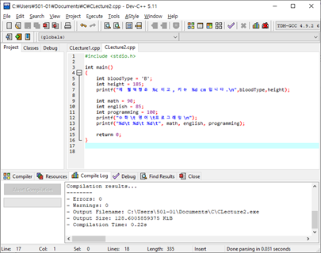
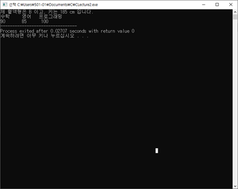
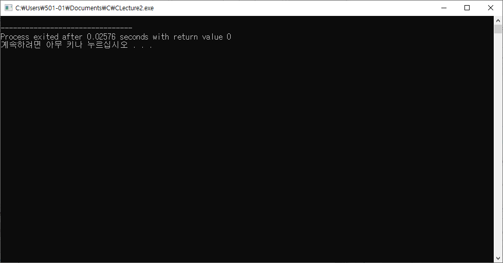
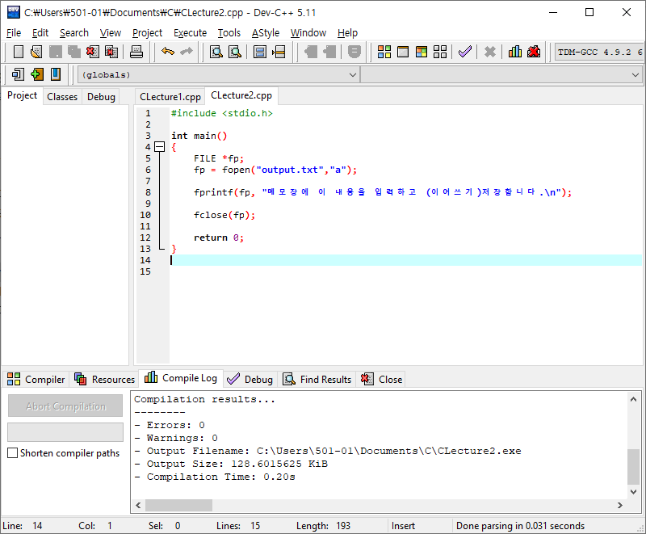
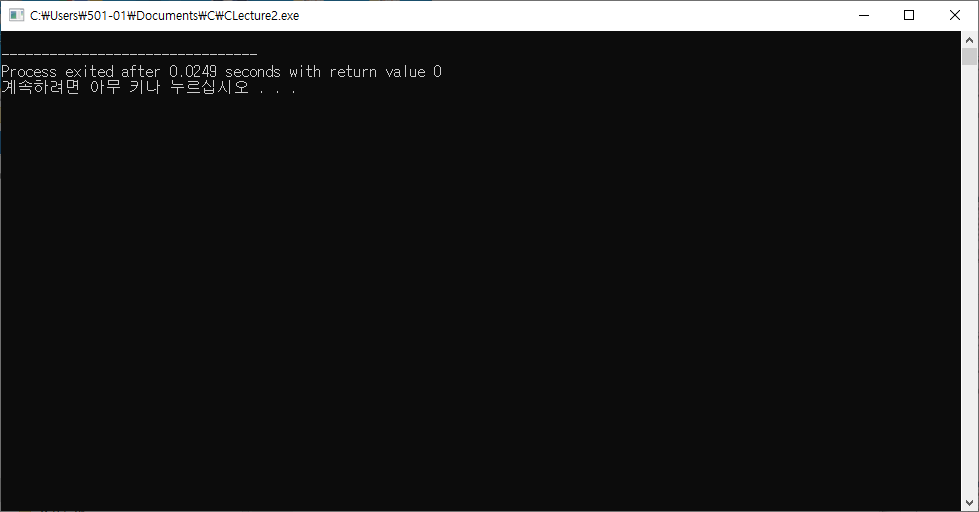

# C++ 2강

> SW회사는 싸우는게 잘하는 회사다! 항상 고객의 요구에 맞게 or 회사의 이익에 맞게.
>
> 항상 이 두가지 케이스를 생각하고 시뮬레이션 .
>
> 엘리베이터 전기세 내는게 싫다? vs 고객이 편해야한다? 두가지에 맞게 모두 고려하여 완벽하게 준비하자!

> 요즘실무 트렌드 -> 주석이 필요 없을 정도로 프로그램을 쉽게 짜라!

> 파이썬은 들여쓰기가 필수적인 요소이다. - 중괄호가 없기 때문

**Q1) BloodType 변수 자료형은 integer,  값은 B라는 character이다. 근데 자료형 integer로 입력해도 실행된다. 그래서 둘다 변수자료형을  character로 설정해줬는데 밑에 height은 파일이 깨진다. 정수 자료형은 int와 char가 있다는데, char는 왜 정수값을 선언못함? int만 교차가 가능? **

A1) 정수 자료형에는 char, short, int, long.. 등등이 있다.

| 자료형 | 크기 | 범위 |
| ------ | ---- | ---- |
| char   |      |      |
| short  |      |      |
| int    |      |      |
| long   |      |      |

추가로 signed와 unsigned를 조합하여 사용한다.

signed는 Default로 적용됨

unsigned는 -값을 +값으로 더하여 적용(나는 음수 값을 사용안해서 할당 데이터가 아깝다! unsigned 사용)

문자 하나하나는 모드 ASCII코드로 변환되어 들어감. 문자 A는 10진수로 65 -> 0과1의 2진수로 변환됨.

##### 예제1.

<table class="colorscripter-code-table" style="margin:0;padding:0;border:none;background-color:#fafafa;border-radius:4px;" cellspacing="0" cellpadding="0"><tr><td style="padding:6px;border-right:2px solid #e5e5e5">

1

2

3

4

5

6

7

8

9

10

11

</td><td style="padding:6px 0;text-align:left">

#include&nbsp;&lt;stdio.h&gt;

&nbsp;

int&nbsp;main()

{

&nbsp;

&nbsp;&nbsp;&nbsp;&nbsp;int&nbsp;BloodType&nbsp;=&nbsp;'A';

&nbsp;&nbsp;&nbsp;&nbsp;

&nbsp;&nbsp;&nbsp;&nbsp;printf("%d",BloodType);

&nbsp;&nbsp;&nbsp;&nbsp;

&nbsp;&nbsp;&nbsp;&nbsp;return&nbsp;0;

}

</td><td style="vertical-align:bottom;padding:0 2px 4px 0"><a href="http://colorscripter.com/info#e" target="_blank" style="text-decoration:none;color:white">cs</a></td></tr></table>

출력값 : 65

##### 예제2.

<table class="colorscripter-code-table" style="margin:0;padding:0;border:none;background-color:#fafafa;border-radius:4px;" cellspacing="0" cellpadding="0"><tr><td style="padding:6px;border-right:2px solid #e5e5e5">

1

2

3

4

5

6

7

8

9

10

11

</td><td style="padding:6px 0;text-align:left">

#include&nbsp;&lt;stdio.h&gt;

&nbsp;

int&nbsp;main()

{

&nbsp;

&nbsp;&nbsp;&nbsp;&nbsp;int&nbsp;BloodType&nbsp;=&nbsp;'A';

&nbsp;&nbsp;&nbsp;&nbsp;

&nbsp;&nbsp;&nbsp;&nbsp;printf("%c",BloodType);

&nbsp;&nbsp;&nbsp;&nbsp;

&nbsp;&nbsp;&nbsp;&nbsp;return&nbsp;0;

}

</td><td style="vertical-align:bottom;padding:0 2px 4px 0"><a href="http://colorscripter.com/info#e" target="_blank" style="text-decoration:none;color:white">cs</a></td></tr></table>

출력값 : A

**Q2) 만약 크기제한을 할당해주는것에 의해서만 이름이 정해지는거라면, 항상 크기가 제일 큰 long 변수자료형으로 할당을 크게 해주면 안되나? **

A2) 물론 가능. But, 선언에서의 할당 메모리와 실사용 메모리는 별개이고, 할당 메모리만큼 미리 컴퓨터의 메모리를 잡아가기 때문에. 예전 C언어가 나왔을때의 초기 컴퓨터는 메모리가 현재에 비해 많이 부족했다. 그래서 콤팩트하게 자료형을 선언해줬었다.

if, 임베디드 처럼 제한된 사이즈에서 효율적으로 돌려야 한다면, 콤팩트하게 하는 것이 필수. 

최신 언어 (ex파이선)같은 경우는 변수 선언을 하지 않는다.

#### 자료형과 변수의 주의점

**C언어 에서 처음 자료형 선언은 죽어라 끝까지 무조건 그 자료형으로 해야한다.**

ex) 우리나라에서 화폐에 대한 코드로 int를 했다. -> 미국을 갔더니 센트 .00(float)이 붙는다.

큰일났다. int로 선언해서 실행이 안되네;; 이걸 교정하는 것이 바로 개발언어의 국제화

**C언어에서 변수명의 첫 글자는 항상 문자부터 시작해야한다.**

**C에서는 string 변수형이 없다. => 배열을 추가해서 char를 여러개 입력하는 방식으로 진행.**

### (2) 파일 출력

<table class="colorscripter-code-table" style="margin:0;padding:0;border:none;background-color:#fafafa;border-radius:4px;" cellspacing="0" cellpadding="0"><tr><td style="padding:6px;border-right:2px solid #e5e5e5">

1

2

3

4

5

6

</td><td style="padding:6px 0;text-align:left">

&nbsp;&nbsp;&nbsp;&nbsp;FILE&nbsp;*fp;

&nbsp;&nbsp;&nbsp;&nbsp;fp&nbsp;=&nbsp;fopen("파일경로&nbsp;및&nbsp;파일명","모드");

&nbsp;

&nbsp;&nbsp;&nbsp;&nbsp;fprintf(파일&nbsp;포인터&nbsp;수,&nbsp;"서식",&nbsp;변수);

&nbsp;

&nbsp;&nbsp;&nbsp;&nbsp;fclose(fp);

</td><td style="vertical-align:bottom;padding:0 2px 4px 0"><a href="http://colorscripter.com/info#e" target="_blank" style="text-decoration:none;color:white">cs</a></td></tr></table>

- 처리할 파일을 가리키고 있을 파일포인터(FILE *)	

- 해당 파일을 여는데 사용하는 fopen

  - fp = fopen("output.txt","w");

    w는 리눅스의 ">"

    a는 리눅스의 ">>" (마치 영수증처럼 로그를 저장해야할 때)

- 파일에 출력하는 fprintf, fputs <-> 입력을 받아올 수 있는 fscanf

- 파일을 닫는데 사용하는 fclose(파일 포인터)

##### 예제1)

<table class="colorscripter-code-table" style="margin:0;padding:0;border:none;background-color:#fafafa;border-radius:4px;" cellspacing="0" cellpadding="0"><tr><td style="padding:6px;border-right:2px solid #e5e5e5">

1

2

3

4

5

6

7

8

9

10

11

12

13

</td><td style="padding:6px 0;text-align:left">

#include&nbsp;&lt;stdio.h&gt;

&nbsp;

int&nbsp;main()

{

&nbsp;&nbsp;&nbsp;&nbsp;FILE&nbsp;*fp;&nbsp;

&nbsp;&nbsp;&nbsp;&nbsp;fp&nbsp;=&nbsp;fopen("output.txt","w");

&nbsp;&nbsp;&nbsp;&nbsp;

&nbsp;&nbsp;&nbsp;&nbsp;fprintf(fp,&nbsp;"제&nbsp;이름은&nbsp;홍규민이고,&nbsp;나이는&nbsp;27살&nbsp;입니다.\n");

&nbsp;&nbsp;&nbsp;&nbsp;

&nbsp;&nbsp;&nbsp;&nbsp;fclose(fp);

&nbsp;

&nbsp;&nbsp;&nbsp;&nbsp;return&nbsp;0;

}

<a href="http://colorscripter.com/info#e" target="_blank" style="color:#e5e5e5text-decoration:none">Colored by Color Scripter</a>
</td><td style="vertical-align:bottom;padding:0 2px 4px 0"><a href="http://colorscripter.com/info#e" target="_blank" style="text-decoration:none;color:white">cs</a></td></tr></table>

F11 => 현재 cpp파일이 위치한 곳에 output.txt 를 만들고 덮어쓰기 저장(기존 파일의 내용은 사라짐).

## 수업 중 실습

|                      **코드 스크린샷**                       |                       **F11 스크린샷**                       | **.txt 스크린 샷**                                           |
| :----------------------------------------------------------: | :----------------------------------------------------------: | ------------------------------------------------------------ |
|                    1. 변수의 데이터 출력                     |                                                              |                                                              |
|  |  |                                                              |
|                      2-1. 파일출력("w")                      |                                                              |                                                              |
|  |  |  |
|                      2-2. 파일출력("a")                      |                                                              |                                                              |
|  |  |  |
|                                                              |                                                              |                                                              |
|                                                              |                                                              |                                                              |
|                                                              |                                                              |                                                              |
|                                                              |                                                              |                                                              |
|                                                              |                                                              |                                                              |

## 오늘의 수업 전 예습 노트

### C vs C++

#### 1) 입출력작업

##### (1) 입력작업

###### C

<table class="colorscripter-code-table" style="margin:0;padding:0;border:none;background-color:#fafafa;border-radius:4px;" cellspacing="0" cellpadding="0"><tr><td style="padding:6px;border-right:2px solid #e5e5e5">

1

2

3

4

5

6

7

</td><td style="padding:6px 0;text-align:left">

#include&nbsp;&lt;stdio.h&gt;

&nbsp;

void&nbsp;main()

{

&nbsp;&nbsp;&nbsp;&nbsp;printf("Hello&nbsp;World\n");

&nbsp;

}

</td><td style="vertical-align:bottom;padding:0 2px 4px 0"><a href="http://colorscripter.com/info#e" target="_blank" style="text-decoration:none;color:white">cs</a></td></tr></table>

###### C++

<table class="colorscripter-code-table" style="margin:0;padding:0;border:none;background-color:#fafafa;border-radius:4px;" cellspacing="0" cellpadding="0"><tr><td style="padding:6px;border-right:2px solid #e5e5e5">

1

2

3

4

5

6

7

</td><td style="padding:6px 0;text-align:left">

#include&nbsp;&lt;iostream&gt;

&nbsp;

int&nbsp;main(void)

{

&nbsp;&nbsp;&nbsp;&nbsp;std::cout&nbsp;&lt;&lt;&nbsp;"Hello&nbsp;World"&nbsp;;

&nbsp;

}

</td><td style="vertical-align:bottom;padding:0 2px 4px 0"><a href="http://colorscripter.com/info#e" target="_blank" style="text-decoration:none;color:white">cs</a></td></tr></table>

- **<stdio.h> 와 <iostream>**

  stdio.h : 헤더파일

  iostream (input output stream) : 입출력스트림

  ​	C++은 객체지향형 언어이므로, C의 표준 입출력 파일에다가 class의 개념을 입혔다는 뜻.

- **int main(void)**

  출력 결과 이 main함수는 return값 0을 반환한다. (integer)

  0이 아니면 프로그램 종료가 제대로 안됐다고 생각한다.

- **void : 형태가 없는자료형**
  (포인터를 사용할 때, 함수의 반환값을 표현할 때 사용

- **std::cout**

  cout : 객체(Object)

  ​	JS에서 let user = {

  ​	name : "Kyumin Hong",

  ​	age : 27

  }

  std라는 Namespace에 cout을 하겠다. = document.write();
  
  - \<< :  

##### (2) 출력작업

###### C

<table class="colorscripter-code-table" style="margin:0;padding:0;border:none;background-color:#fafafa;border-radius:4px;" cellspacing="0" cellpadding="0"><tr><td style="padding:6px;border-right:2px solid #e5e5e5">

1

2

3

4

5

6

7

8

</td><td style="padding:6px 0;text-align:left">

#include&nbsp;&lt;stdio.h&gt;

&nbsp;

Void&nbsp;main()

{

&nbsp;&nbsp;&nbsp;&nbsp;int&nbsp;i;

&nbsp;&nbsp;&nbsp;&nbsp;scanf("%d",&nbsp;&amp;i)&nbsp;&nbsp;;

&nbsp;

}

</td><td style="vertical-align:bottom;padding:0 2px 4px 0"><a href="http://colorscripter.com/info#e" target="_blank" style="text-decoration:none;color:white">cs</a></td></tr></table>

###### C++

<table class="colorscripter-code-table" style="margin:0;padding:0;border:none;background-color:#fafafa;border-radius:4px;" cellspacing="0" cellpadding="0"><tr><td style="padding:6px;border-right:2px solid #e5e5e5">

1

2

3

4

5

6

7

8

</td><td style="padding:6px 0;text-align:left">

#include&nbsp;&lt;iostream&gt;

&nbsp;

int&nbsp;main(void)

{

&nbsp;&nbsp;&nbsp;&nbsp;int&nbsp;i;

&nbsp;&nbsp;&nbsp;&nbsp;std::cin&nbsp;&gt;&gt;&nbsp;i&nbsp;;

&nbsp;

}

</td><td style="vertical-align:bottom;padding:0 2px 4px 0"><a href="http://colorscripter.com/info#e" target="_blank" style="text-decoration:none;color:white">cs</a></td></tr></table>

#### 2) 변수 지정 위치

C : 변수를 항상 main함수의 시작 부분에 담아야 한다.

C++ : 변수 지정 위치가 자유롭다.