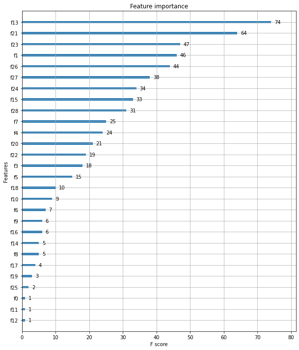
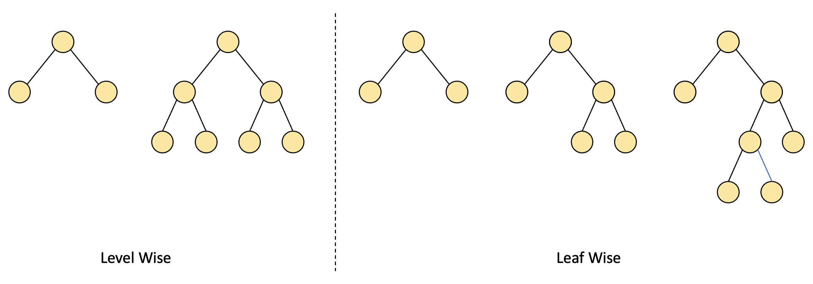
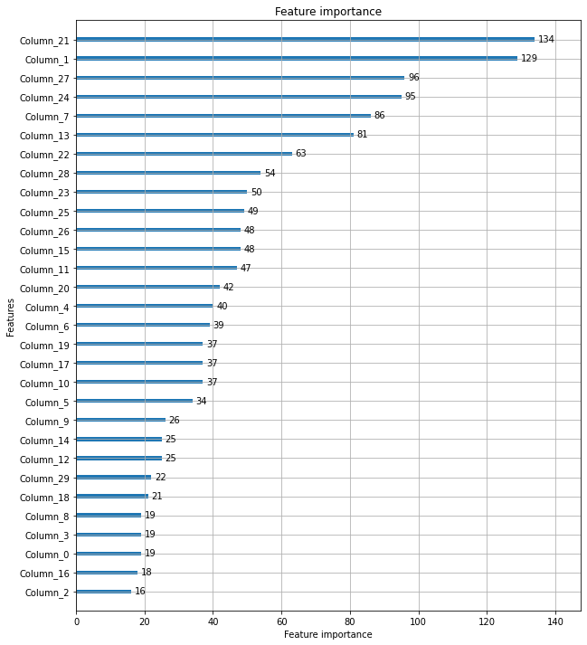

XGBoost, LightGBM

----

안녕하세요.
데이터 사이언티스트를 위한 정보를 공유하고 있습니다.

M1 Macbook Air를 사용하고 있으며, 블로그의 모든 글은 Mac을 기준으로 작성된 점 참고해주세요.

----

# XGBoost(eXtra Gradient Boost)

GBM을 기반으로하는 XGBoost는 GBM의 단점인 느린 수행 시간, 과적합 규제가 안되는 문제를 개선하며,

분류에 있어 뛰어난 예측 성능으로 각광받고 있는 알고리즘입니다.

또한 자체적으로 교차 검증을 진행하여 최적화된 반복 수행 횟수를 가질 수 있으며,

결측치를 처리하는 기능도 있습니다.

XGBoost는 사이킷런이 아닌 독자적으로 개발된 프레임워크입니다.

하지만 파이썬 기반의 머신러닝 이용자들은 대부분 사이킷런을 사용하기 때문에

XGBoost 개발 그룹은 사이킷런과 연동할 수 있는 클래스를 만들었습니다.

이번 포스팅에서는 사이킷런과 연동되는 XGBoost에 대해 소개하겠습니다.

----

XGBoost는 GBM과 유사한 하이퍼 파라미터를 가지고 있으며,

early stopping, 과적합 규제(regularization) 등을 위한 하이퍼 파라미터가 추가되어 있습니다.

하이퍼 파라미터를 다음과 같이 크게 3가지 유형으로 나눌 수 있습니다.

- **일반 파라미터**: 스레드의 개수나 slient 모드 등의 선택을 위한 파라미터로 일반적으로는 default 값을 사용합니다.

- **부스터 파라미터**: Decision Tree 제어, 부스팅, regularization 규제 등과 관련된 파라미터입니다.

- **학습 태스크 파라미터**: 평가 지표 등을 설정하는 파라미터입니다.

일반 파라미터부터 살펴보겠습니다.

**booster**: gbtree 또는 gblinear, 즉 트리 기반인지 선형 모델 기반인지 지정하는 것으로, default는 gbtree입니다.

**slient**: 출력 메시지를 나타내는지 결정하는 파라미터이며, default는 0입니다. 0이면 출력 메시지가 나타나지 않고, 1이면 출력 메시지가 나타납니다.

**nthread**: CPU의 실행 스레드 개수를 조정하며, default는 CPU의 전체 다 사용하는 것입니다.

다음은 부스터 파라미터에 대해 살펴보겠습니다.

**learning_rate**: GBM의 학습률과 같은 파라미터이며 0과 1사이로 지정하는데 얼만큼씩 오류를 업데이트하냐에 대한 정보라고 할 수 있겠습니다. default는 0.1이고, 일반적으로 0.01에서 0.2 사이의 값을 선호합니다.

**n_estimators**: GBM의 n_estimators와 같습니다. 즉 서브 모델의 개수를 지정합니다.

**subsample**: GBM의 subsample과 같습니다. 즉 트리를 생성하는 데 사용하는 데이터의 비율을 지정합니다. 일반적으로 0.5에서 1 사이의 값을 사용합니다.

**reg_alpha**, **reg_lambda**: 각각 순서대로 L1 Regularization, L2 Regularization 적용 값이며 피처의 개수가 많을 경우에 적용을 검토합니다. 값이 클수록 과적합 감소 효과가 있으며, default는 각각 순서대로 1, 0입니다.

**scale_pos_weight**: 비대칭한 클래스로 구성된 불균형한 데이터(imbalanced data)의 균형을 유지하기 위한 파라미터입니다. default는 1입니다.

**min_child_weight**: Decision Tree에서 추가적으로 가지를 나눌지 결정하기 위해 필요한 데이터들의 weight 총합을 의미하며, default는 1입니다. 크게 지정할수록 분할을 자제하기 때문에 과적합을 제어하기 좋습니다.

**gamma**: Decision Tree의 Leaf Node를 추가적으로 나눌지 결정하는 최소 손실(loss) 감소 값입니다. 해당 값보다 더 큰 손실(loss)이 감소된 경우에 Leaf Node를 분할합니다. default는 0이고, 값이 클수록 과적합 감소 효과가 있습니다.

**early_stopping_rounds**: early stopping를 지정하며, default는 None입니다. n_estimators에서 지정한 만큼의 부스팅 반복 횟수에 도달하지 않더라도 오류가 더 이상 개선되지 않으면 조기 중단시켜주는 파라미터입니다. 예를 들어 n_estimators를 400으로 지정하고 early_stopping_rounds를 50으로 지정하면, 총 400회의 부스팅 횟수 중에 50회를 반복하는 동안 더 이상 오류가 개선되지 않으면 모델의 학습을 중단합니다(100회 진행 중 학습 오류 값이 0.7인데, 101~150회 반복하는 동안 오류가 0.7보다 작은 값이 없다면 부스팅을 종료).

다음은 학습 태스크 파라미터에 대해 살펴보겠습니다.

**objective**: loss function을 결정합니다. default는 **binary:logistic**이고 이진 분류일 때 적용합니다. 다중 분류일 때는 **multi:softmax**를 적용하며, 예측 확률을 반환하고자 할 때는 **multi:softprob**를 적용합니다.

**eval_metric**: 검증에 사용되는 함수를 지정하며, default는 회귀의 경우 rmse, 분류의 경우 error입니다. 'rmse', 'mae', 'logloss', 'error', 'merror', 'mlogloss', 'auc'와 같은 종류가 있습니다.

과적합 개선을 위해 하이퍼 파라미터를 튜닝 한다면,

learning_rate를 낮추거나(0.01~0.1),

min_child_weight를 높이거나,

gamma를 높이는 방법,

또는 Decision Tree의 규모를 제한하는 방법 등이 있습니다.

----

XGBoost를 위스콘신 유방암 분류 예측에 사용해 보겠습니다.

In:


```python
from xgboost import XGBClassifier
from sklearn.datasets import load_breast_cancer
from sklearn.model_selection import train_test_split
from sklearn.metrics import roc_auc_score

import pandas as pd
import numpy as np
import warnings
warnings.filterwarnings("ignore")

cancer_data = load_breast_cancer()

X_train, X_test, y_train, y_test = train_test_split(cancer_data.data, cancer_data.target,
                                                    test_size = 0.2, random_state = 23)

xgb = XGBClassifier(n_estimators = 300, learning_rate = 0.1, max_depth = 3)
evals = [(X_test, y_test)]
xgb.fit(X_train, y_train, early_stopping_rounds = 50, eval_metric = "logloss",
        eval_set = evals, verbose = True)
# eval_set: 성능 평가를 수행할 데이터 세트
# eval_metric: early stopping을 위한 평가 지표
# verbose: 함수의 수행 과정(log)를 상세하게 나타내는지 여부를 지정하며, default는 True
y_pred_proba = xgb.predict_proba(X_test)[:, 1]

print(f"AUC Score: {roc_auc_score(y_test, y_pred_proba):.4f}")
```

Out:

    [0]	validation_0-logloss:0.611786
    Will train until validation_0-logloss hasn't improved in 50 rounds.
    [1]	validation_0-logloss:0.545633
    [2]	validation_0-logloss:0.490998
    [3]	validation_0-logloss:0.444251
    ...
    [181]	validation_0-logloss:0.080236
    Stopping. Best iteration:
    [131]	validation_0-logloss:0.07973
    
    AUC Score: 0.9949


AUC score를 반환하기 위해 예측 확률로 성능 지표를 계산하였고,

약 0.9949로 상당히 높은 성능을 보이는 것을 확인할 수 있었습니다.

그리고 n_estimators가 300으로 지정되어 있지만 300개의 모델이 모두 학습되지 않고,

180개 모델로 학습이 조기 중단되어 완료된 것을 확인할 수 있습니다.

early_stopping_rounds를 50으로 지정하였기 때문에

131번 반복 시 얻었던 오류, 즉 0.07973의 logloss 이후로

180회까지 50회 반복하는 동안 오류가 더 감소되지는 않아서 조기 중단된 것입니다.

----

다음으로 각 피처의 중요도를 시각화하여 보겠습니다.

xgboost 모듈 내에 plot_importance라는 API가 있어 편리하게 시각화 가능합니다.

In:


```python
from xgboost import plot_importance

import matplotlib.pyplot as plt

fig, ax = plt.subplots(figsize = (10, 12))
plot_importance(xgb, ax = ax)
```

Out:




중요도가 높은 순으로 막대 그래프가 그려진 모습입니다.

각 피처명은 피처의 순서대로 f(숫자)로 지정되어 있습니다.

----

# LightGBM

GBM에 비해 XGBoost는 성능과 시간 단축의 측면에서 개선되긴 하였으나

여전히 학습 시간이 오래 걸립니다.

특히 GridSearchCV를 수행한다면 더욱 시간이 많이 소요됩니다.

이러한 XGBoost의 단점을 보완하고, 장점을 계승하여 개발된 것이 바로 LightGBM입니다.

학습 시간이 훨씬 단축되었으며, 기능이 더욱 다양해진 모델입니다.

단점으로 알려진 것은 데이터가 적을 경우 과적합이 발생하기 쉽다는 것입니다.

LightGBM의 공식 문서에서는 적은 데이터의 기준을 10,000개 이하의 샘플로 구성된 데이터 세트라고 기술하고 있습니다.

LightGBM은 여타 GBM 모델들과 달리 Leaf Wise 방식으로 노드를 분할하는데요.

일반적으로는 Level Wise 방식이 사용되는데 이는 트리의 깊이를 줄이기 위해 균형있게 트리를 만드는 방식입니다.

균형을 맞추기 위해 시간이 더 필요하긴 하지만 트리의 깊이를 최소화함으로써 과적합에 강한 장점이 있기에 주로 사용되는 방식입니다.

반면 LighgGBM의 Leaf Wise 방식은 균형을 맞추지 않고,

최대 손실값(loss)을 가지는 리프 노드를 지속적으로 분할하면서 예측 오류 손실값을 최소화할 수 있는 방식입니다.

그러나 비대칭적인 규칙 트리가 생성되고, 트리의 깊이가 깊어져 과적합의 우려가 있겠죠.

또한 인코딩 작업을 하지 않고도 카테고리형 피처를 최적으로 변환시켜주는 장점이 있습니다.



----

LightGBM의 하이퍼 파라미터는 XGBoost와 유사한 점이 많습니다.

다만 분할 방식이 다른 것을 고려하여 특성에 맞게 하이퍼 파라미터를 설정할 필요가 있습니다.

예를 들어 Leaf Wise 방식은 리프 노드를 지속적으로 분할하여 트리가 깊어지므로 max_depth를 크게 가지겠죠.

그럼 XGBoost에서 다루었던 하이퍼 파라미터 이외의 추가적인 LightGBM 하이퍼 파라미터를 살펴보겠습니다.

**min_data_samples**: Leaf Node가 되기 위해 필요한 최소한의 샘플 수를 의미하며, default는 20입니다.

**num_leaves**: 하나의 트리가 가질 수 있는 최대 Leaf Node의 개수이며, default는 20입니다.

learning_rate를 작게 하면서 n_estimators를 크게 하는 방법은 가장 기본적인 성능 향상을 위한 튜닝 방식이고,

이때 n_estimators가 지나치게 커지는 것은 과적합의 위험이 있습니다.

또한 num_leaves, min_child_samples, max_depth 등을 튜닝하여 과적합 문제를 해결할 수 있습니다.

----

역시 위스콘신 유방암 분류 예측을 진행해 보겠습니다.

In:


```python
from lightgbm import LGBMClassifier

lgbm = LGBMClassifier(n_estimators = 400)
evals = [(X_test, y_test)]
lgbm.fit(X_train, y_train, early_stopping_rounds = 50, eval_metric = "logloss", 
         eval_set = evals, verbose = True)
y_pred_proba = xgb.predict_proba(X_test)[:, 1]

print(f"AUC Score: {roc_auc_score(y_test, y_pred_proba):.4f}")
```

Out:

    [1]	valid_0's binary_logloss: 0.568886	valid_0's binary_logloss: 0.568886
    Training until validation scores don't improve for 50 rounds.
    [2]	valid_0's binary_logloss: 0.509881	valid_0's binary_logloss: 0.509881
    [3]	valid_0's binary_logloss: 0.462432	valid_0's binary_logloss: 0.462432
    ...
    [132]	valid_0's binary_logloss: 0.0820028	valid_0's binary_logloss: 0.0820028
    Early stopping, best iteration is:
    [82]	valid_0's binary_logloss: 0.0625158	valid_0's binary_logloss: 0.0625158
    AUC Score: 0.9949

132번 반복하고 조기 중단된 것을 확인할 수 있었습니다.

즉 82번 반복 이후로 최소 손실값이 더 감소하지 않았기 때문에 132번 반복을 끝으로 학습이 중단되었습니다.

또한 AUC score를 확인했을 때 0.9949의 결과를 확인할 수 있었습니다.

----

LightGBM도 XGBoost와 같은 방식으로 변수의 중요도를 확인할 수 있습니다.

In:


```python
from lightgbm import plot_importance

fig, ax = plt.subplots(figsize = (10, 12))
plot_importance(lgbm, ax = ax)
```

Out:




중요도가 높은 순으로 막대 그래프가 그려진 모습입니다.

각 피처명은 피처의 순서대로 Column_(숫자)로 지정되어 있습니다.

----

읽어주셔서 감사합니다.

정보 공유의 목적으로 만들어진 블로그입니다.

미흡한 점은 언제든 댓글로 지적해주시면 감사하겠습니다.

----
