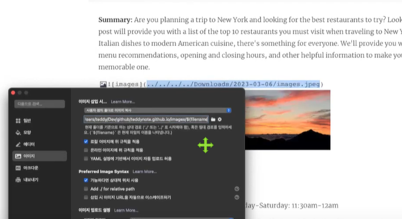

Well, it's simply the design process of externalizing the construction and management of your objects.

So in a nutshell, it basically says that your application is gonna outsource the creation and management of the objects, and that outsourcing will be handled by a object factory.

And that's the big idea of Inversion of Control.

요약 하자면 IoC 는 디자인 프로세서고 변경이 자유롭다.

## Java Beans ? Spring Beans?

Spring Beans 는 Java beans 랑 비슷 한 컨셉이지만 Java beans의 엄격한 
요구사항을 따르지는 않는다.
요약하자면 그냥 Spring Beans는 Java Object로 생각하면 된다.

## Dependency inversion Injection

![[Spring - IoC-페이지-2.drawio.png]]

그림으로 설명하면 이런 개념이다.
내가 직접 자동차를 생산하지는 않는다

You just outsorcethe construction and injection of your object to an external entity.
In this case, That's the car factory.
They inject the engine, tires and so on for you.
You don't have to build the car.

![[Spring - IoC-Page-1.drawio (1) 1.png]]

![[Pasted image 20230303054847.png]]

출처 유데미 & https://www.baeldung.com/inversion-control-and-dependency-injection-in-spring
