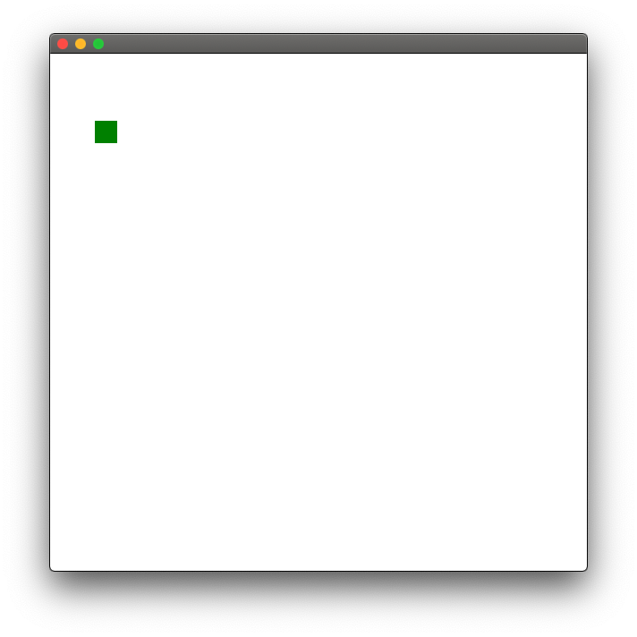
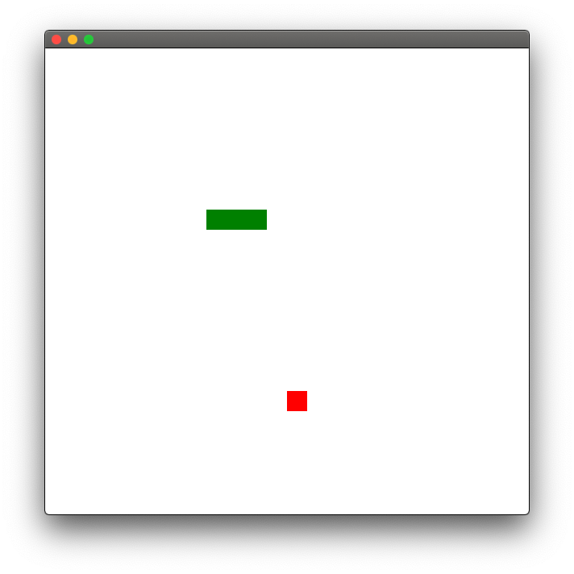

This article is for fun. We're going to learn how to make a Snake game in Scala and ScalaFX in just a few minutes.

This game was previously posted as a [video](https://www.youtube.com/watch?v=sp6QO6eRRrg). In there, I also wanted to beat a psychological time barrier (10 mins) and implement the game from (almost) scratch.

Check the video below, if you want more "action":



I also talk about some of the logical steps to creating this game on camera, but due to the time pressure, some details were skipped. This article wants to talk about the thought process step by step.

## Intro

We're going to use [ScalaFX](https://scalafx.org), a wrapper library over [JavaFX](https://openjfx.io/) for GUIs, with a few Scala niceties. The library is not really functional-first, but it does have some expressiveness to it.

In order to add ScalaFX to our project, we're going to add their default `build.sbt` as follows:

```scala
scalaVersion := "2.13.8"

// Add dependency on ScalaFX library
libraryDependencies += "org.scalafx" %% "scalafx" % "16.0.0-R25"

// Determine OS version of JavaFX binaries
lazy val osName = System.getProperty("os.name") match {
  case n if n.startsWith("Linux")   => "linux"
  case n if n.startsWith("Mac")     => "mac"
  case n if n.startsWith("Windows") => "win"
  case _ => throw new Exception("Unknown platform!")
}

// Add dependency on JavaFX libraries, OS dependent
lazy val javaFXModules = Seq("base", "controls", "fxml", "graphics", "media", "swing", "web")
libraryDependencies ++= javaFXModules.map(m =>
  "org.openjfx" % s"javafx-$m" % "16" classifier osName
)
```

With the `build.sbt` file prepared, we'll need to add some minor boilerplate to have a simple ScalaFX application which opens a window filled with white:

```scala
// all the imports we're going to need in the entire app
// (auto-import helps a lot, but adding them here in case of confusion)
import scalafx.application.{JFXApp3, Platform}
import scalafx.beans.property.{IntegerProperty, ObjectProperty}
import scalafx.scene.Scene
import scalafx.scene.paint.Color
import scalafx.scene.paint.Color._
import scalafx.scene.shape.Rectangle

import scala.concurrent.Future
import scala.util.Random

object SnakeFx extends JFXApp3 {
  override def start(): Unit = {
    stage = new JFXApp3.PrimaryStage {
      width = 600
      height = 600
      scene = new Scene {
        fill = White
      }
    }
  }
}
```

## Drawing

In order to draw something on screen, we need to modify the `content` field of the `scene` field of the `stage` field of the main application. That was a lot of indirection. More concretely, in order to draw a green rectangle of length 25 at coordinates (50, 75), we would write something like this:

```scala
stage = new JFXApp3.PrimaryStage {
  width = 600
  height = 600
  scene = new Scene {
    fill = White
    // added just now
    content = new Rectangle {
      x = 50
      y = 75
      width = 25
      height = 25
      fill = Green
    }
  }
}
```

And we'd get something fabulous:



Coordinates start from the top left; the x coordinate goes to the right, the y coordinate goes down.

Drawing a rectangle is so useful, that we'll take the Rectangle expression and call it from a method:

```scala
  def square(xr: Double, yr: Double, color: Color) = new Rectangle {
    x = xr
    y = yr
    width = 25
    height = 25
    fill = color
  }
```

For the simplicity of this game, we'll consider the snake built from squares of equal size and color green (it's supposed to be a snake), and the food as a red square that is generated randomly on sceen every time the snake eats it.

Now, for the logic.

## Logic

All we need for the Snake game is to draw rectangles on the screen. The question is, where?

For the logic of the game, we'll consider the snake as a list of `(x,y)` coordinates, which we'll then use to draw squares with our magical `square` function. Remember that `content` field in the scene? That can also be a collection of graphics, not just a single one &mdash; so we can safely use our list of squares as the proper value.

So let's start with an initial set of coordinates for the snake: let's assume a 3-square snake of the form

```scala
  val initialSnake: List[(Double, Double)] = List(
    (250, 200),
    (225, 200),
    (200, 200)
  )
```

and consider the state of the game as a data structure of the form

```scala
case class State(snake: List[(Double, Double)], food: (Double, Double))
```

The game is deterministic. Given a set direction, we know where the snake is going to go. So we can safely update the state into a new state given a direction. Adding a method to the `State` case class:

```scala
def newState(dir: Int): State = ???
```

Inside the `newState` method, we have to do the following:

- update the new head of the snake, given the direction
- update the rest of the snake by placing the _last_ n-1 squares at the positions of the _first_ n-1 squares
- check if we're out of the scene boundaries OR eating our own tail; reset the state in this case
- check if the snake is just eating the food; re-generate food coordinates in that case

Rock'n roll. Updating the snake's head needs to take into account the direction; consider directions 1,2,3,4 as up, down, left, right:

```scala
  val (x, y) = snake.head
  val (newx, newy) = dir match {
    case 1 => (x, y - 25) // up
    case 2 => (x, y + 25) // down
    case 3 => (x - 25, y) // left
    case 4 => (x + 25, y) // right
    case _ => (x, y)
  }
```

Crashing into the scene boundaries means `newx < 0 || newx >= 600 || newy < 0 || newy >= 600` (with some additional constants instead of 600 if you don't want anything hardcoded). Eating the snake's tail literally means that `snake.tail` contains a tuple equal to the newly created one.

```scala
      val newSnake: List[(Double, Double)] =
        if (newx < 0 || newx >= 600 || newy < 0 || newy >= 600 || snake.tail.contains((newx, newy)))
          initialSnake
        else ???
```

Otherwise, eating the food means that the new tuple is on the same coordinates as the food, so we need to prepend a new item to the snake list:

```scala
// (keeping the above)
else if (food == (newx, newy))
  food :: snake
else ???
```

Otherwise, we need to keep moving the snake. The new head was already computed as `(newx, newy)`, so we need to bring the rest of the snake:

```scala
// keeping the above
else (newx, newy) :: snake.init
```

Using `snake.init` as the coordinates of the _first_ n-1 pieces of the snake. With the new head at the front, that comprises the new snake with the same length as before. The `init` method is really cool in this case.

To return a new `State` instance, we also need to update the coordinates of the food if it was just eaten. That said:

```scala
      val newFood =
        if (food == (newx, newy))
          randomFood()
        else
          food
```

Where `randomFood` is a method to create a random square somewhere on the stage:

```scala
  def randomFood(): (Double, Double) =
    (Random.nextInt(24) * 25 , Random.nextInt(24) * 25)
```

If you want to create a stage of different size, say `L x h`, you'd have

```scala
  def randomFood(): (Double, Double) =
    (Random.nextInt(L / 25) * 25 , Random.nextInt(h / 25) * 25)
```

Back to the `newState` method. Given that we've just determined the new snake and the new food, all we need is to return `State(newSnake, newFood)`, which brings the main state update function to:

```scala
def newState(dir: Int): State = {
  val (x, y) = snake.head
  val (newx, newy) = dir match {
    case 1 => (x, y - 25)
    case 2 => (x, y + 25)
    case 3 => (x - 25, y)
    case 4 => (x + 25, y)
    case _ => (x, y)
  }

  val newSnake: List[(Double, Double)] =
    if (newx < 0 || newx >= 600 || newy < 0 || newy >= 600 || snake.tail.contains((newx, newy)))
      initialSnake
    else if (food == (newx, newy))
      food :: snake
    else
      (newx, newy) :: snake.init

  val newFood =
    if (food == (newx, newy))
      randomFood()
    else
      food

  State(newSnake, newFood)
}
```

Then what? We'll need to be able to display that state on the screen, so we'll need a method to turn a State into a bunch of squares, so adding another method in `State` which turns `food` into a red square and all the pieces of the snake into green squares:

```scala
// inside the State class
def rectangles: List[Rectangle] = square(food._1, food._2, Red) :: snake.map {
  case (x, y) => square(x,y, Green)
}
```

## Plugging Snake Logic Into ScalaFX

Our pure game logic is complete, we just need to be able to use this state somewhere, and run a game loop or update function constantly and re-draw things on the stage. To that end, we're going to create 3 ScalaFX "properties" which are essentially glorified variables with `onChange` listeners:

- a property that describes the current state of the game as an instance of `State`
- a property that keeps track of the current direction, changeable by key presses
- a property that keeps the current frame, updating every X milliseconds

At the beginning of the main app's `start()` method, we're going to add the following:

```scala
    val state = ObjectProperty(State(initialSnake, randomFood()))
    val frame = IntegerProperty(0)
    val direction = IntegerProperty(4) // 4 = right
```

We know that on every frame change, we have to update the state, considering the current value of `direction`, so we're going to add

```scala
frame.onChange {
  state.update(state.value.newState(direction.value))
}
```

So the state will update automatically once the frame changes. So we need to make sure of 3 things:

- to draw the current state's squares on the screen
- to update the direction variable based on key presses
- to change/increase the frame number every X milliseconds (picked 80 or 100 for smooth game play)

Piece 1 is easy. We need to change the `content` field of the scene to be

```scala
content = state.value.rectangles
```

Even having the app as it is, we can run it to validate that we have a snake and food on screen:



Obviously, nothing changes because the frame doesn't change. If the frame changes, so will the state.  If the state ever changes, so will the content. Still inside the `Scene` constructor, we need to be able to update this content when the state changes:

```scala
// complete scene field of the stage
scene = new Scene {
  fill = White
  content = state.value.rectangles
  state.onChange {
    content = state.value.rectangles
  }
}
```

That was the first bullet: drawing the state's squares on the screen. The second bullet is to update the direction based on key presses. Thankfully, there is a key press listener directly in the scene, so the scene will now look like this:

```scala
stage = new JFXApp3.PrimaryStage {
  width = 600
  height = 600
  scene = new Scene {
    fill = White
    content = state.value.rectangles
    // added now
    onKeyPressed = key => key.getText match {
      case "w" => direction.value = 1
      case "s" => direction.value = 2
      case "a" => direction.value = 3
      case "d" => direction.value = 4
    }

    state.onChange {
      content = state.value.rectangles
    }
  }
}
```

Again, if we run the app, all is static because nothing triggers any state change. We'll need to update the frame, which will trigger everything.

The problem with the frame update is that we cannot block the main display thread. So we'll need to do it from another thread. We'll define a general game loop that runs any sort of function, waits 80 millis or so and then runs the function again. Of course, asynchronously.

```scala

import scala.concurrent.ExecutionContext.Implicits.global

def gameLoop(update: () => Unit): Unit =
    Future {
        update()
        Thread.sleep(80)
    }.flatMap(_ => Future(gameLoop(update)))
```

Now, all we need to do is trigger this game loop with a function that changes the frame. Changing of frame triggers changing of state, changing of state triggers new display. That's the idea at least. At the bottom of the app's `start()` method, we'll add

```scala
gameLoop(() => frame.update(frame.value + 1))
```

Running it, _we get into an error_ because we're blocking the main display thread when we're updating the `content`, so we need instead to _schedule_ that update by replacing

```scala
state.onChange {
  content = state.value.rectangles
}
```

with

```scala
state.onChange(Platform.runLater {
  content = state.value.rectangles
})
```

which puts that display update in a queue of actions that the main display thread is supposed to execute.

## Conclusion

That's it, folks - a fully functional Snake game in Scala with ScalaFX in just a few minutes. The complete code is below:

```scala

import scalafx.application.{JFXApp3, Platform}
import scalafx.beans.property.{IntegerProperty, ObjectProperty}
import scalafx.scene.Scene
import scalafx.scene.paint.Color
import scalafx.scene.paint.Color._
import scalafx.scene.shape.Rectangle

import scala.concurrent.Future
import scala.util.Random

object SnakeFx extends JFXApp3 {

  val initialSnake: List[(Double, Double)] = List(
    (250, 200),
    (225, 200),
    (200, 200)
  )

  import scala.concurrent.ExecutionContext.Implicits.global

  def gameLoop(update: () => Unit): Unit =
    Future {
      update()
      Thread.sleep(1000 / 25 * 2)
    }.flatMap(_ => Future(gameLoop(update)))

  case class State(snake: List[(Double, Double)], food: (Double, Double)) {
    def newState(dir: Int): State = {
      val (x, y) = snake.head
      val (newx, newy) = dir match {
        case 1 => (x, y - 25)
        case 2 => (x, y + 25)
        case 3 => (x - 25, y)
        case 4 => (x + 25, y)
        case _ => (x, y)
      }

      val newSnake: List[(Double, Double)] =
        if (newx < 0 || newx >= 600 || newy < 0 || newy >= 600 || snake.tail.contains((newx, newy)))
          initialSnake
        else if (food == (newx, newy))
          food :: snake
        else
          (newx, newy) :: snake.init

      val newFood =
        if (food == (newx, newy))
          randomFood()
        else
          food

      State(newSnake, newFood)
    }

    def rectangles: List[Rectangle] = square(food._1, food._2, Red) :: snake.map {
      case (x, y) => square(x, y, Green)
    }
  }

  def randomFood(): (Double, Double) =
    (Random.nextInt(24) * 25, Random.nextInt(24) * 25)

  def square(xr: Double, yr: Double, color: Color) = new Rectangle {
    x = xr
    y = yr
    width = 25
    height = 25
    fill = color
  }

  override def start(): Unit = {
    val state = ObjectProperty(State(initialSnake, randomFood()))
    val frame = IntegerProperty(0)
    val direction = IntegerProperty(4) // right

    frame.onChange {
      state.update(state.value.newState(direction.value))
    }

    stage = new JFXApp3.PrimaryStage {
      width = 600
      height = 600
      scene = new Scene {
        fill = White
        content = state.value.rectangles
        onKeyPressed = key => key.getText match {
          case "w" => direction.value = 1
          case "s" => direction.value = 2
          case "a" => direction.value = 3
          case "d" => direction.value = 4
        }

        state.onChange(Platform.runLater {
          content = state.value.rectangles
        })
      }
    }

    gameLoop(() => frame.update(frame.value + 1))
  }

}
```
