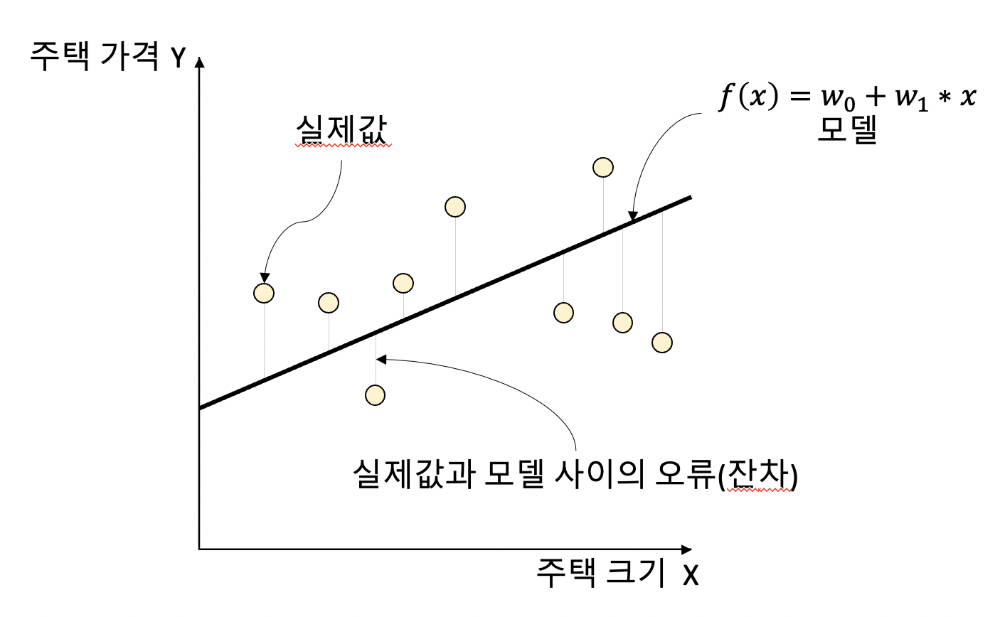
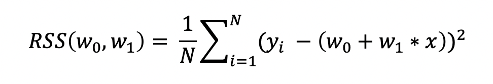

Regression, 선형 회귀, RSS, Loss function

----

안녕하세요.
데이터 사이언티스트를 위한 정보를 공유하고 있습니다.

M1 Macbook Air를 사용하고 있으며, 블로그의 모든 글은 Mac을 기준으로 작성된 점 참고해주세요.

----

# 회귀(Regression)란?

회귀는 현대 통계학을 떠받치고 있는 주요 기둥 중 하나입니다.

회귀 분석은 유전적 특성을 연구하던 과정에서 유래했다고 합니다.

부모와 자식 간의 키의 상관관계 분석 과정에서

부모의 키가 모두 클 때 자식의 키가 크긴 하지만 그렇다고 부모를 능가할 정도로 크지 않았고,

부모의 키가 모두 작을 때 자식의 키가 작긴 하지만 부모보다는 큰 경향을 발견했습니다.

연구의 결론은 사람의 키는 평균 키로 회귀하려는 경향의 자연의 법칙이 있다는 것입니다.

이처럼 **회귀 분석은 데이터가 평균과 같은 일정한 값으로 돌아갸려는 경향을 이용한 통계학 기법**입니다.

또 다르게 설명하면 **회귀는 여러 개의 독립변수와 한 개의 종속변수 간의 상관관계를 모델링하는 기법**을 통칭합니다.

예를 들어 아파트의 층수, 방 개수, 크기, 주변 인프라 등 여러 개의 독립변수에 따라 아파트 시세라는 종속변수가 어떠한 상관관계를 상관관계를 갖는지 모델링하고 예측하는 것입니다.

이번에는 *Y* = *W1* * *X1* + *W2* * *X2* + *W3* * *X3* 라는 선형 회귀식을 예로 들면

*Y*는 아파트 시세와 같은 종속변수,

*X1*, *X2*, *X3*는 아파트의 층수, 방 개수, 크기, 주변 인프라 등과 같은 독립변수,

*W1*, *W2*, *W3*는 독립변수의 값에 영향을 미치는 회귀 계수(Regression coefficients)입니다.

머신러닝 관점에서 종속변수는 결정값(타겟), 나머지 독립변수들은 피처일 것이고,

학습을 통해 최적의 회귀 계수를 찾는 것이 핵심입니다.

----

# 회귀의 종류

회귀는 독립변수의 개수에 따라 단일 회귀(한 개), 다중 회귀(여러 개)로 나뉘고,

선형 여부에 따라 선형 회귀, 비선형 회귀로 나뉩니다.

일반적으로는 선형 회귀가 가장 많이 사용됩니다.

선형 회귀 모델은 다시 규제(Regularization) 방법에 따라 나뉠 수 있습니다.

규제는 선형 회귀의 과적합 문제를 해결하기 위해 회귀 계수에 페널티 값을 적용하는 것을 말하며,

이어지는 글과 다음 포스팅에서 더 자세히 설명하도록 하겠습니다.

대표적인 선형 회귀 모델은 다음과 같습니다.

**일반 선형 회귀**: 예측값과 실제값의 RSS를 최소화할 수 있도록 회귀 계수를 최적화하며, 규제를 적용하지 않은 모델입니다.

**릿지(Ridge)**: 선형 회귀에 L2 규제를 추가한 회귀 모델입니다. L2 규제는 상대적으로 큰 회귀 계수 값의 예측 영향력을 감소시키기 위해 회귀 계수값을 더 작게 만드는 방식의 규제입니다.

**라쏘(Lasso)**: 선형 회귀에 L1 규제를 추가한 회귀 모델입니다. L1 규제는 예측 영향력이 작은 피처의 회귀 계수를 0으로 만들어 회귀 예측 시 피처가 선택되지 않게 하는 것입니다. 이러한 특성 때문에 L1 규제는 **피처 선택 기능**을 하기도 합니다.

**엘라스틱넷(ElasticNet)**: 선형 회귀에 L1, L2 규제를 함께 결합한 모델입니다. L1 피처의 개수를 줄임과 동시에 L2 규제로 계수 값의 크기를 조정합니다.

**로지스틱 회귀(Logistic Regression)**: 이름은 회귀이지만 실제로는 분류 모델입니다. 이진 분류나 텍스트 분류와 같은 영역에서 뛰어난 성능을 보입니다.

----

이번에는 단순 선형 회귀를 통해 회귀에 대해 더 자세히 이해해 보도록 하겠습니다.

단순 선형 회귀는 독립변수와 종속변수가 각각 한 개인 선형 회귀입니다.

그림으로 나타내면 다음과 같습니다.

예를 들어 주택의 크기로 주택의 가격이 결정된다고 했을 때,

일반적으로 주택의 크기가 클수록 주택의 가격이 높아지겠죠.

따라서 주택의 크기(독립변수)와 주택의 가격(종속변수)이 선형의 관계롤 표현이 가능해집니다.

그림에서 데이터 포인트들은 실제값이고, 회귀선은 모델의 예측선입니다.

또한 실제값과 모델 사이의 오차값을 잔차라고 부릅니다.

최적의 회귀 모델은 바로 이 잔차의 합이 최소가 되는 모델을 의미합니다.

그리고 이 잔차의 합이 최소가 되도록 최적의 회귀 계수를 찾는 것이 회귀의 핵심입니다.

다만 오차는 양수일수도 있고, 음수일수도 있습니다.

따라서 오류의 합을 계산할 때는 절대값으로 더하거나(Mean Absolute Error: MAE), 제곱값으로 더하는(Residual Sum of Square) 방식을 취합니다.

일반적으로 미분과 같은 계산을 편리하게 하기 위해 RSS 방식으로 오류의 합을 구합니다.

RSS의 정규화된 식을 보면 다음과 같습니다.

이러한 오차를 나타내는 RSS와 같은 식을 손실 함수(loss function)라고 하며 변수는 *W*(회귀 계수)입니다.

학습 데이터로서 입력되는 독립변수(*X*)와 종속변수(*Y*)는 변수가 아니라 상수로 간주된다는 점 꼭 숙지해야 합니다.

다시 정리하면,

머신러닝 회귀 알고리즘은 데이터를 학습하면서 이 손실 함수가 반환하는 값(오류)을 지속적으로 감소시키고 최종적으로는 더 이상 감소하지 않는 최소의 오류값을 구하는 것입니다.

----

읽어주셔서 감사합니다.

정보 공유의 목적으로 만들어진 블로그입니다.

미흡한 점은 언제든 댓글로 지적해주시면 감사하겠습니다.

----
