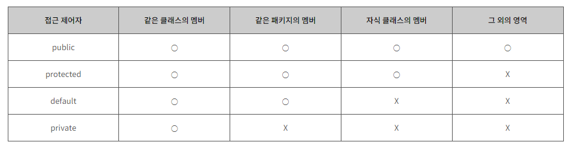

# Class

## ▸Object

## ▸Constructor(생성자)

생성자의 인자는 0개 이상.

하지만 class파일에서의 받는 인자 수, 종류는 꼭 동일해야한다. 아니면 전부 없거나.

## ▸this

this <-> super

this.(변수명)는 지금 현재 class의 전역변수에 접근하는 것.

this(); 나 super();를 호출할 때에는 해당 함수의 맨 위로.

생성자가 생성자를 내부에서 호출할 수 있다.

## ▸Function vs Method

OPP (Object Orient Programming) : 객체지향 프로그래밍

PP : 절차지향 프로그래밍

## ▸Inner Class

클래스.java 파일을 메인.java 파일 밑에 같이 넣어서 쓸 수 있다.

## ▸Inheritance(상속)

두가지 종류가 있다.

extends 기존에 구현되어있는 애를 override 한다.

override = overwrite 기존의 것을 재생성 한다.

inplement =기존에 껍데기(interface)만 가져와서

부모의 클래스의 멤버를 자식클래스에게 물려주는 

## ▸super

super. = 부모

this. = 나

## ▸Overriding

추가할 곳, 우클릭 - 소스 -오버라이드 - 오버라이드 할 

## ▸Polymorphism(다형성)

## 접근제어자

## +α &예습

클래스는 하나의 처리할 데이터 단위를 명시할 때 사용 ex student.kyumin

어떠한 데이터를 변수로 만들어서 사용할 수 있게 하는 것 = 인스턴스화 
new Car;

어떠한 클래스 안에서 만들어진 하나의 실제로 사용할 수 있는 단위 = 인스턴스

클래스로 만드는 것은 코드를 모듈화하고 객체지향 프로그래밍을 구사할 수 있는 것

생성자 = 객체(인스턴스)를 하나 만들 때 자동으로 값을 넣어주는, 자동으로 값을 초기화해주는 하나의 함수. 클래스랑 동일한 이름을 가진 것이 특징.

메인 메소드는 한 프로젝트에서 단 하나만 가질 수 있다.
그러므로 클래스 생성시 main메소드 불필요.

클래스명1 변수명 = new 클래스명1 ( 값 저장 );

thread : 동시에 돌리는거