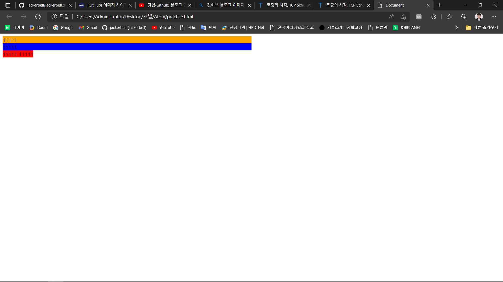

# 2022.04.14 수업정리

## 내용 정리 part2


+ div : div 태그는 HTML 문서에서 특정영역(division)이나 구획(section)을 정의할 때 사용합니다. <br>

   여러  HTML 요소들을 하나로 묶어주며, CSS로 스타일을 변경하거나 자바스크립트로 특정 작업을 수행하기 위한 일종의 컨테이너(container)로 자주 사용됩니다. <br>

  CSS와 함께 레이아웃을 설정하는데도 종종 사용됩니다.<br>

  

  ```html
  <head>
     <style>
          #container1{
              background-color: orange;
              width:50%;
              height:100%;
          }
         	#container2{
              background-color: blue;
              width:50%;
              height:100%;
          }
         	.container3{
              background-color: red;
              width:50%;
              height:100%;
          }
     
  	</style> 
  </head>
  
  <body>
      <div id="container1">
          11111
      </div>
      <div id="container2">
          11111
      </div>
      <span class="container3">
          11111
      </span>
      <span class="container3">
          11111
      </span>
  </body>
  
  
  
  <!--HTML의 모든 요소는 해당 요소가 웹 브라우저에 어떻게 보이는가를 결정짓는 display 속성을 가집니다.
  	div요소는 다른 HTML 요소들을 하나로 묶는 데 자주 사용되는 대표적인 블록(block) 요소입니다. 
  	span요소는 텍스트의 특정 부분을 묶는 데 자주 사용되는 인라인(inlinle) 요소입니다.
  	style 태그는 해당 HTML 문서의 스타일 정보를 정의할 때 사용합니다.
  	style 요소는 해당 요소가 포함된 HTML 문서의 콘텐츠에 적용되는 CSS를 명시하고 있으며, HTML문서는 여러 개의 <style> 요소를
  	포함할 수 있습니다. 
  	별도의 파일로 저장된 외부 스타일 시트는 link 태그를 사용하여 참조할 수 있습니다.
  -->
  ```

  <br>

  

  아래 ▼ 는 위의 코드를 실행한 결과이다. <br>

   

  <br>

  *****************

  + display 속성: 웹 페이지의 레이아웃을 결정하는 CSS의 중요한 속성 중 하나입니다. <br>

    ​						해당 HTML 요소가 웹 브라우저에서 언제 어떻게 보이는 가를 결정합니다. <br>

    ​						대부분의 HTML요소의 display 속성의 기본값으로 두 가지 값 중 하나의 값을 가집니다. <br>

  

  **!display 속성 구분!**

  | block  | inline |
  | :----: | :----: |
  | div  | span |
  |  h1  |  a   |
  |  p   | img  |
  |  ul  |      |
  |  ol  |      |
  | form |      |

  ★해당 display 속성은 block 요소에 inline 요소를 할당해 속성값을 변경할 수도 있습니다. <br><br><br>

  

  ☆☆ 끝으로 <br>

  display 및 float은 position과 더불어 html/css의 **3대 속성** 으로 불릴 만큼 중요한 요소입니다. <br>

  그렇기에 추후에 따로 내용정리를 하여 게시물을 올리겠습니다.

  
