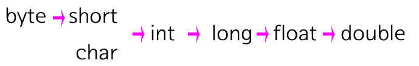

# 데이터 타입

### 1. 타입의 종류


### 2. 타입의 범위


### 3. 실수와 정수의 표현

- 정수는 기본적으로 int 형으로 표현하면 된다. 이 때 byte 형이나 short 형이 int 로 들어오게 된다면 자동적으로 형변환이 일어난다
- long 형은 정수 뒤에 L을 붙여야 한다.

```java
/// 정수형
int a = 2000000; //int 형
int b = 1; //byte형이지만 int 형으로 자동 형변환
int c = 1000; //short형이지만 int 형으로 자동 형변환
long d = 2147483648L; // long 형은 뒤에 'L'을 붙여줘야 한다.
```

- 실수는 기본형이 double이고 float형은 'F'를 붙여줘야 한다.

```java
// 실수형
double a = 100.0;
float b = 200.0; // 오류
float c = 200.0F // float 형
```


### 4. 형 변환

#### 자동 형변환

- 자동 형변환은, 표현 범위가 좁은 데이터 타입에서 넓은 데이터 타입으로의 변환을 허용

```java
double a = 3.0F; //float 형을 double 형으로 자동 형 변환
int b = 2; //byte 형을 int 형으로 자동 형 변환
```



- 위 그림과 같은 규칙은 가진다
- 이때 char 형도 아스키 코드에 맞게 변환됨

```java
int b = 'a';
system.out.println(b);
...
// output : 97 
```


#### 명시적 형 변환

- 자동 형 변환이 적용되지 않는 경우에는 수동으로 형 변환을 해야 한다. 이를 명시적(Explicit Conversion)이라고 한다.

```
// 오류 발생
float a = 100.0;
int b = 100.0F;

//명시적 형 변환 적용
float c = (float)100.0;
int b = (int)100.0F;
```

- 이 때 데이터 크기가 줄어들 때 줄어든 범위만큼 데이터가 버려진다.
- 예를 들어, 100.56인 double형을 int 형으로 명시적 형변환을 실시하면 소수점 이하는 버려지고 100만 남는다.
