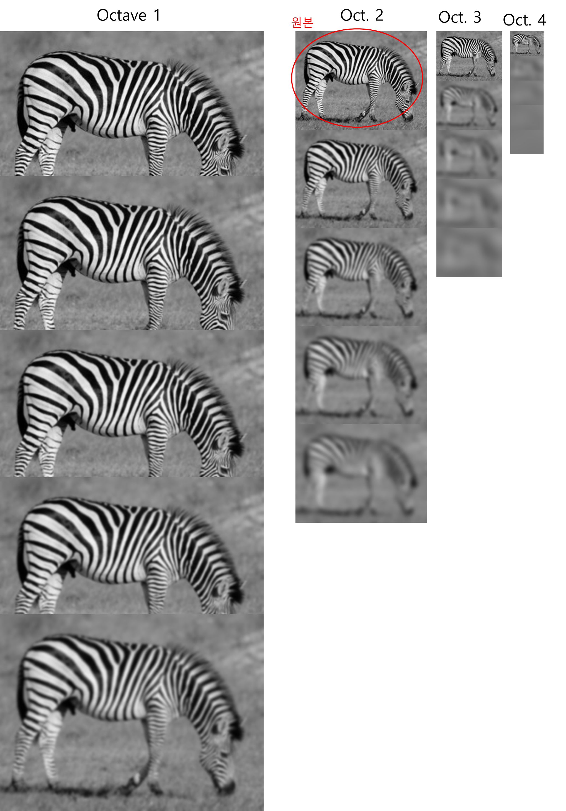

SIFT is the image feature exraction algorithm. It detects the features from the image that is invariant from the scale and rotation.

### Scale-Space extrema detection

### Keypoint Localization

### Orientation assignmnet

### Keypoint Descriptor

