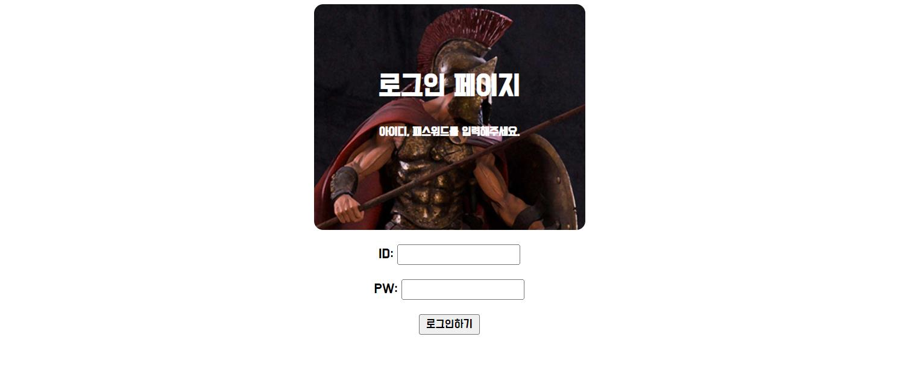

# [웹개발 종합반] 1주 2일차 개발일지

<br>

## 💻TIL Web.102




### 1. 기본 HTML과 CSS 익히기

#### 0) 코드 가독성

`Ctrl + A` : 코드 전체 선택
`Ctrl + Alt + L` : 선택한 범위 코드 줄맞춤

<br>

#### 1) class

무언가를 꾸민다는 것은 일단 그것을 가리켜야(지칭해야) 가능한 일이다. `class`는 이러한 이름표 역할을 한다. 시작 태그 안에 `class = " "` 로 클래스를 명명할 수 있다. 명명한 클래스를 꾸미기 위해 `<head>` 태그 안 `<style>` 태그를 활용하자. 클래스 이름 앞에 .을 붙이고 중괄호 안에 코드를 쓰면 된다.

```css
.className {
  /* code goes here */
}
```
<br>

class에는 중첩 개념이 존재하기 때문에 띄어쓰기로 여러 클래스를 동시에 지정해줄 수 있다.
```html
<div class = "class1 class2 class3"></div>
```

<br>

#### 2) div

`div`는 영역을 구분하는 데 쓰인다. 실제 페이지에서는 눈에 보이지 않기 때문에, background-color를 먼저 깔아서 범위를 보는 것이 중요하다.

<br>

#### 3) background-image

특정 `div`에 배경으로 이미지를 깔 때는 이 세 줄의 코드를 세트로 쓴다. 

```css
/* url 까지 치고 Tab 누르면 자동완성 */
background-image: url("https://www.ancient-origins.net/sites/default/files/field/image/Agesilaus-II-cover.jpg");
background-size: cover;
background-position: center;
```

① 이미지의 주소를 나타낸다. 

② 지정된 `div` 태그 크기만큼 이미지의 귀퉁이 부분만 잘리는 것이 아니라, 전체 `div` 영역에 이미지를 입힌다(cover).

③ 이미지 위치를 가운데 정렬한다.

<br>

#### 4) padding, margin

`padding`은 안쪽 여백, `margin`은 바깥 여백을 뜻한다. 쉽게 생각하면 padding은 내 살이 찌는 거고(개체 자체 크기가 커짐), margin은 두꺼운 옷을 입는 거다(개체 크기는 그대로, 차지하는 공간은 넓어짐). margin을 주면 주변 개체들과의 거리가 멀어진다. 
<br>

두 속성 모두 `-top`, `-bottom`, `-left`, `-right`로 방향성을 줄 수 있지만 `padding: (top) (right) (bottom) (left);`처럼 시계 방향으로 값을 주는 형태가 많이 쓰인다.

<br>

#### 5) 페이지 전체 가운데 정렬

로그인 페이지 헤더와 입력창, 로그인 버튼을 가운데로 정렬하기 위해서는 하나하나 옮기는 것이 아니라 `div` 태그(class="wrap")를 이용해 한번에 묶어서 옮기는 것이 효율적이다. 해설을 듣기 전, 어렴풋이 기억나는 flex 개념을 사용해 아래 코드를 작성해봤다.

```css
.wrap {
  display: flex;
  /*주축 방향을 세로로*/
  flex-direction: column;
  /*가운데 정렬*/
  align-items: center;
}
```
<br>

강의에서는 '가운데 정렬'을 '양쪽 마진이 최대로 동등한 상태'로 정의했다. `div` 태그는 `background-color` 속성을 사용해 확인해보면 한 줄 전체를 다 차지하고 있다. 해당 클래스에 `width`를 주어 크기를 조정한 후, `margin: auto;`를 적용하면 양옆 마진이 자동으로 같게 설정된다.

```css
.wrap {
  width: 300px;
  margin: auto;
  text-align: center;
}
```

<br>

#### 6) display: 글 속성(inline)과 박스 속성(block)

`div` 태그와 달리, `<button>` 태그는 `width` 속성을 사용해도 가운데로 옮겨지지 않는다. 이는 HTML에 글 속성(inline)과 박스 속성(block)이 있기 때문인데, 글 속성에는 가로세로 개념이 없고 박스 속성은 가로세로의 개념이 있다. 쉽게 말해 박스 속성은 글 속성과 달리 크기를 지정할 수 있다.
<br>

글 속성(inline)의 태그를 박스 속성(block)의 태그로 바꾸기 위해서 `display` 속성을 사용할 수 있다.

```css
display: block;
```

<br>

#### 7) 구글 폰트 적용하기

1) 구글 폰트 사이트 접속 -> 폰트 선택(Select this style) -> `<link>` 박스 안 코드 복사 -> `<title>` 태그 아래 붙여넣기
<br>

2) `<style>` 태그 또는 CSS 파일
```css
* {
  /* 구글 폰트-> CSS 박스 안 코드 붙여넣기*/
}
```

<br>

#### 8) 주석 처리

주석 처리할 부분 드래그한 후 `Ctrl + /` 를 누르면 코드 양옆으로 `/* */` (주석 표시)가 생성된다. 같은 단축키를 한 번 더 누르면 주석이 풀린다. HTML, CSS, JS, 다양한 언어들 간 주석 표시는 다르지만 단축키를 사용하면 간단히 코드를 주석 처리할 수 있다.

<br>

#### 9) CSS 파일 분리하기

`<title>` 태그 아래 아래 코드를 쓰고 새로운 CSS 파일을 참조할 수 있다. 브라우저가 HTML 문서를 읽기 시작할 때, 이 링크를 타고 CSS 파일의 코드들을 불러와서 읽는다.

```html
<link rel="stylesheet" type="text/css" href="파일이름.css">
```

<br>
