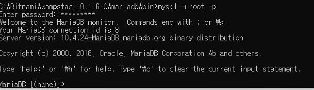
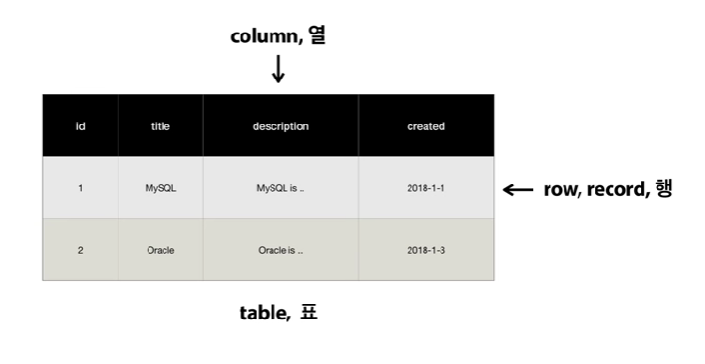
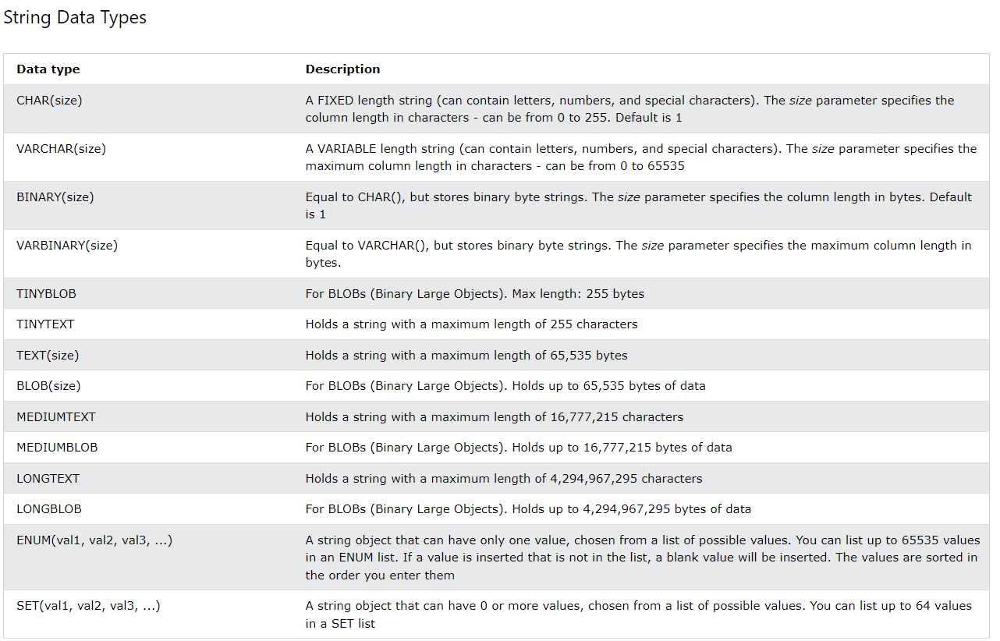
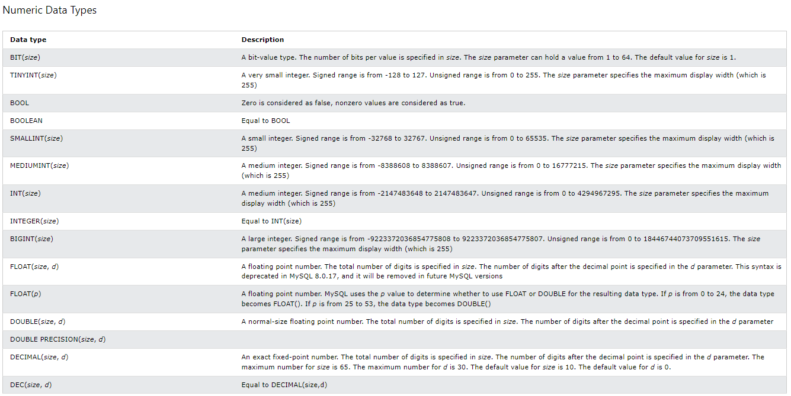
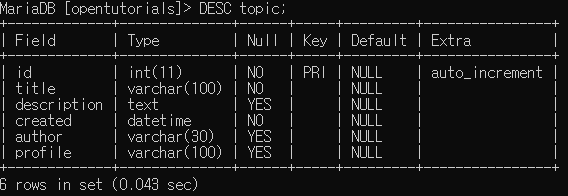
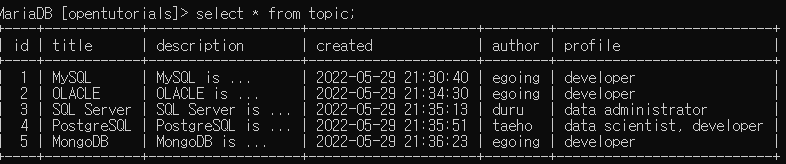
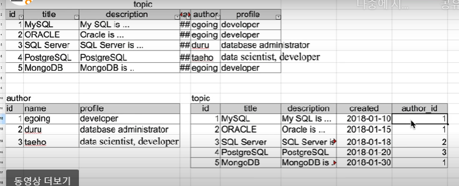

# 0. 실행

- cmd창에서 bitnami>wampstack>mariadb>bin 폴더 접속
- mysql -uroot -p 입력
- 비밀번호 입력(초기pwd)
- 


# 1. 스키마 사용

- 생성 : CREATE DATABASE opentutorials;
  - 뒤에 반드시 ; 를 붙여야함
- 삭제 : DROP DATABASE opentutorials;
- 목록 접근 : SHOW DATABASES;
- 특정 스키마 사용 : USE opentutorials;


# 2. SQL과 테이블의 구조




# 3. 테이블 생성

- 데이터 타입(https://www.w3schools.com/sql/sql_datatypes.asp)

  - string
  - 

  - number
  - 

  - date and time 
  - 

- table 속성 입력

  - ```mysql
    CREATE TABLE topic(
        id INT(11) NOT NULL AUTO_INCREMENT,
         title VARCHAR(100) NOT NULL,
         description TEXT NULL,
         created DATETIME NOT NULL,
         author VARCHAR(30) NULL,
         profile VARCHAR(100) NULL,
         PRIMARY KEY(id))
        
    ```

    - id INT(11) NOT NULL AUTO_INCREMENT 
      - 속성이름 : id / datatype: int(11)(int형, 11개만 표시) / not null : 반드시 입력 / AUTO_INCREMENT : 자동으로 1씩 증가하여 입력

    - VARCHAR(100) : string 100글자 입력( 0 to 65535)
    - TEXT : string 65,535 bytes 까지
    - DATETIME :  YYYY-MM-DD hh:mm:ss
    - PRIMARY KEY(id) : 기본키를 id로 설정(중복 배제)

- table 명령어

  - SHOW TABLES; : table 목록
  - DESC topic; : topic 구조
    - 


# 4. CRUD

- 데이터베이스
- 


### create 구조

- INSERT INTO topic (field1, field2 ...) VALUES('title', 'mysql is..', ...);

### read 구조

- 모든 값 출력 : SELECT * FROM topic;
- 특정 field만 출력 : SELECT id, title FROM topic; (id와 title 만 출력)
- 특정 행만 선택(WHERE) : SELECT * FROM topic WHERE author = 'egoing'; (author가 egoing 행만 출력)

- 정렬 순서 선택(ORDER BY) : SELECT * FROM topic WHERE author = 'egoing' ORDER BY id DESC; (id값을 기준으로 내림차순)
- 출력 개수 제한(LIMIT) : SELECT * FROM topic LIMIT 2;(상위 2개만 출력)

### update 구조

- UPDATE topic SET title = 'Oracle' where id = 2;
  - topic 테이블에서 title 필드를 Oracle로 수정(id = 2 인 행)


### delete 구조

- DELETE FROM topic WHERE id = 5;
  - id값이 5인 행 삭제


# 5. 관계형 데이터베이스의 필요성

- 중복성 제거
  - topic의 author과 profile을 다른 테이블로 만들어서 사용
  - 경제성 증가
  - 

- 단점 : 두 개 이상의 테이블을 봐야하기 때문에 직관적이지 못하다
  - join 을 통해 해결하능


# 6. 조인(join)

- join을 위한 테이블 분리

  - 테이블 rename : RENAME TABLE topic TO topic_backup;
  - topic과 author 테이블은 직접 입력

- join 명령문 : LEFT JOIN author ON ~ = ~

  - 모든 속성 조회

    - ```mysql
      select * from topic left join author on topic.author_id = author.id;
      ```

  - 특정 속성 조회

    - ```mysql
      select topic.id, title, description, created, name, profile from topic left join author on topic.author_id = author.id;
      ```

      - id값은 각 테이블에 있기때문에 topic.id로 명확히 해줘야 함