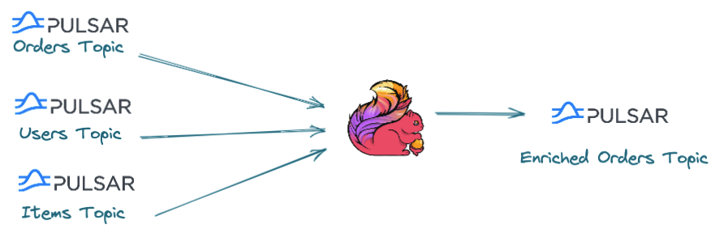
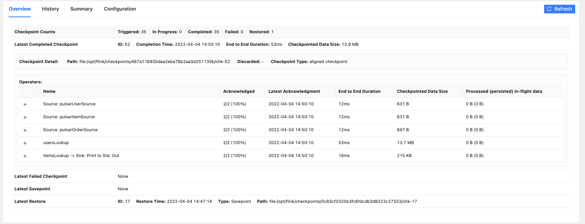
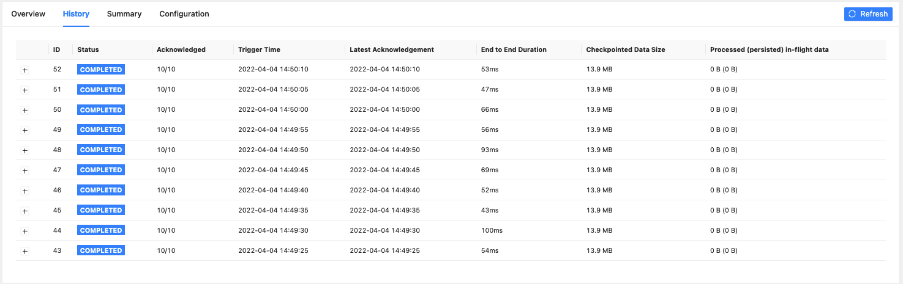
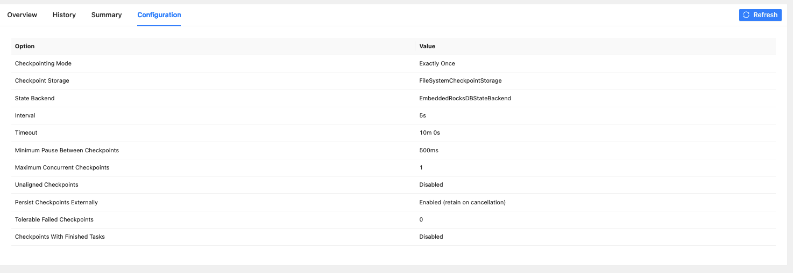
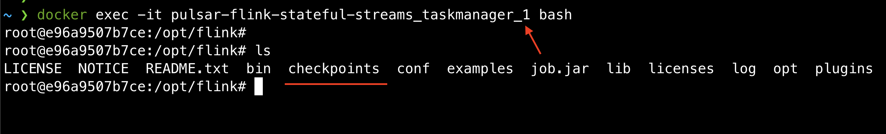
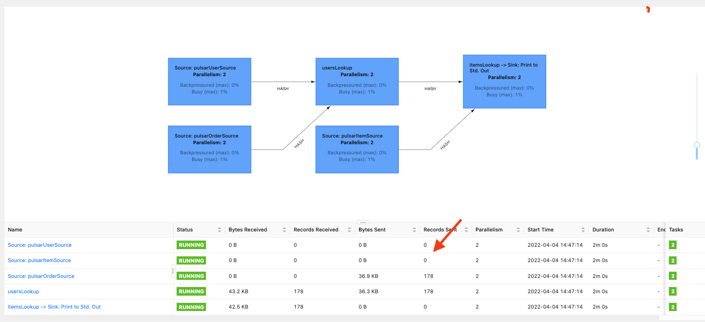

_This article is a collaboration between myself (Daniel) and [Giannis Polyzos](https://www.linkedin.com/in/polyzos/), one of the earliest students of Rock the JVM back in 2017. Giannis is now a Senior Engineer and a contributor to Apache Pulsar, a promising new toolkit for distributed messaging and streaming. Last time we integrated [Pulsar with Spark](/pulsar-spark); in this post we combine Apache Pulsar and Apache Flink for powerful data stream processing._


Before we start, some basic familiarity with Apache Pulsar and Apache Flink is required &mdash; Rock the JVM has an [Apache Flink course](https://rockthejvm.com/p/flink) if you're interested. To better understand the implementation in this blog post, we suggest getting familiar with the basic concepts of Apache Pulsar and Apache Flink. See the [Additional Resources](#7-additional-resources) section.

The code in this article is in **Java**, although it can be adapted to Scala as well.
For the best experience following this article, we recommend referring to [this repository](https://github.com/polyzos/pulsar-flink-stateful-streams) while replicating the project locally in your own dev environment. You can also clone the repository and work directly on the code there.

### 1. Introduction

Typical Streaming data architectures include a streaming storage layer like Apache Pulsar that serves as the backbone of the infrastructure.
Stateful stream processing is also required to deliver advanced analytics for your users; a stream computing engine
like Apache Flink is required to handle time-based event computations, especially when they require managing large state.
Data often resides inside multiple different topics in a streaming storage layer, and it's important to be able to combine data from _multiple input topics_.

In this blog post, we will walk through how you can use Apache Flink to _enrich real time data streams_ with data that resides into large changelog topics.
We will use Apache Pulsar as our streaming storage layer.
Apache Pulsar and Apache Flink have a strong integration together and enable a Unified Batch and Streaming Architecture.
If you are interested about this type of architecture, [this video](https://www.youtube.com/watch?v=2MpiE238Pzw) can be helpful.

## 2. The Example: Data From an Online Store



Our example use case is an online store and users come online to place orders for different items. Our fundamental types involved are users, items (products) and orders.
Every new order is written into an `orders` topic, and similarly for users or items - written into the `users` and `items` topics respectively.
We treat `users` and `items` topics as _changelog_ streams &mdash; this means that the events written in those topics will be
a key-value pair and for each unique key we are only interested in the _latest_ value.

For example, if `user1` updates the phone number we are ony interested in the latest updated value (the new phone number). The same goes for a product.
We will consider these changelog topics as our _state_.

A common use case in streaming systems is combining data from different topics, in order to perform some kind of data validation or data enrichment.
In our example, we can enrich the input `order` events with the _state_, for example to query the user and product information to be
able to take actions such as

- sending out an email thanking our user for their purchase
- calculating some reward points to see if they are eligible for a discount coupon
- recommending something similar to the product they just bought

Our focus for this article is enriching an input event stream with information from events in other topics.

We will take a hands-on approach and better understand how we can:
1. Connect Apache Pulsar with Flink and verify we can consume events from different topics
2. Use Flink's `ProcessFunction`s to perform data enrichment
3. Use _side outputs_ to account for scenarios where state is not present, and we want to further investigate why
4. Use RocksDB for large state we can not keep in memory
5. Recover from failures with _checkpoints_ and _restart strategies_
6. How we can resume our Flink Job using _savepoints_

There is a lot to cover here, so we will build on them incrementally. Let's jump right into it.

## 2. Pre-Flight Check

Before we start with the implementation let's make sure we have our dependencies in place and our environment setup.
The examples here will be in Java, so let's add the following dependencies to our `pom.xml` file.

```xml
 <properties>
    <maven.compiler.source>11</maven.compiler.source>
    <maven.compiler.target>11</maven.compiler.target>

    <flink.version>1.14.3</flink.version>
    <scala.version>2.12</scala.version>
  </properties>

  <dependencies>
    <dependency>
      <groupId>org.apache.flink</groupId>
      <artifactId>flink-clients_${scala.version}</artifactId>
      <version>${flink.version}</version>
    </dependency>

    <dependency>
      <groupId>org.apache.flink</groupId>
      <artifactId>flink-streaming-java_${scala.version}</artifactId>
      <version>${flink.version}</version>
    </dependency>

    <dependency>
      <groupId>org.apache.flink</groupId>
      <artifactId>flink-connector-pulsar_${scala.version}</artifactId>
      <version>${flink.version}</version>
    </dependency>

    <dependency>
      <groupId>org.apache.flink</groupId>
      <artifactId>flink-statebackend-rocksdb_${scala.version}</artifactId>
      <version>${flink.version}</version>
    </dependency>

    <dependency>
      <groupId>org.projectlombok</groupId>
      <artifactId>lombok</artifactId>
      <version>1.18.22</version>
      <scope>provided</scope>
    </dependency>

    <dependency>
      <groupId>ch.qos.logback</groupId>
      <artifactId>logback-classic</artifactId>
      <version>1.2.11</version>
    </dependency>
  </dependencies>
```

We also require an instance of Pulsar and Flink, so we will use [docker-compose](https://docs.docker.com/compose/) to create them as local services.
Create a `docker-compose.yml` file and add the following:

```shell
version: '3.7'
services:
  jobmanager:
    image: flink:1.14.4-scala_2.12-java11
    ports:
      - "8081:8081"
    command: jobmanager
    environment:
      - |
        FLINK_PROPERTIES=
        jobmanager.rpc.address: jobmanager

  taskmanager:
    image: flink:1.14.4-scala_2.12-java11
    depends_on:
      - jobmanager
    command: taskmanager
    scale: 1
    environment:
      - |
        FLINK_PROPERTIES=
        jobmanager.rpc.address: jobmanager
        taskmanager.numberOfTaskSlots: 2

  pulsar:
    image: apachepulsar/pulsar:2.9.1
    container_name: pulsar
    ports:
      - "8080:8080"
      - "6650:6650"
    environment:
      PULSAR_MEM: " -Xms512m -Xmx512m -XX:MaxDirectMemorySize=1g"
      systemTopicEnabled: "true"
      topicLevelPoliciesEnabled: "true"
      transactionCoordinatorEnabled: "true"
   command: >
      /bin/bash -c
      " bin/apply-config-from-env.py conf/standalone.conf
      && bin/pulsar standalone"
```

There are a few things to note here:
- First, we create a Flink Cluster with one Task Manager which has 2 slots, and a Pulsar cluster.
- We expose ports 8080 for Pulsar, as well as port 6650 which is the Pulsar broker port.
- We also enable some configurations: `systemTopicEnabled` and `topicLevelPoliciesEnabled` allow us to use topic-level policies for infinite data retention.
- Then we have `transactionCoordinatorEnabled` which enables the transaction coordinator which is used by the Pulsar-Flink connector.

So let's start our clusters by running **docker-compose up**.

With our clusters up and running we need to create our topics and apply some topic policies.
Retention topic policies will also allow us to reply our events in a case of failure if required.
We can run this [script](https://github.com/polyzos/pulsar-flink-stateful-streams/blob/main/setup.sh) to perform this setup. For reference, please see it below as well.
It will create 3 partitioned topics (orders, users and items) each with one partition and set an infinite retention policy for the changelog topics.

```shell
docker exec -it pulsar bin/pulsar-admin topics create-partitioned-topic -p 1 persistent://public/default/orders
docker exec -it pulsar bin/pulsar-admin topics create-partitioned-topic -p 1 persistent://public/default/users
docker exec -it pulsar bin/pulsar-admin topics create-partitioned-topic -p 1 persistent://public/default/items

docker exec -it pulsar bin/pulsar-admin topics list public/default

docker exec -it pulsar bin/pulsar-admin topics set-retention -s -1 -t -1 persistent://public/default/users
docker exec -it pulsar bin/pulsar-admin topics set-retention -s -1 -t -1 persistent://public/default/items

docker exec -it pulsar bin/pulsar-admin topics get-retention persistent://public/default/users
docker exec -it pulsar bin/pulsar-admin topics get-retention persistent://public/default/items

```

**Note:** We use partitioned topics in order to be able to increase the number of partitions later, in case we need to scale. Otherwise, if we had an unpartitioned topic we would have to create a new partitioned topic and transfer all the data to this new topic.

## 3. Reading Data From Pulsar

With our setup in place, let's see some data-reading code. The data model can be found [here](https://github.com/polyzos/pulsar-flink-stateful-streams/blob/main/src/main/java/io/ipolyzos/models) if you want to grab the same data definitions for our fictitious online store. After that, we recommend taking a look and maybe grabbing [these utility functions](https://github.com/polyzos/pulsar-flink-stateful-streams/blob/main/src/main/java/io/ipolyzos/utils) as well as the constants [here](https://github.com/polyzos/pulsar-flink-stateful-streams/blob/main/src/main/java/io/ipolyzos/config) as we're going to focus more on the Flink-Pulsar integration. The fictitious data we're going to push to Pulsar was generated and can be found in [these files](https://github.com/polyzos/pulsar-flink-stateful-streams/blob/main/data).

First, we will run the producers to simulate some users and items created in our system.
You can find the producer code [here](https://github.com/polyzos/pulsar-flink-stateful-streams/blob/main/src/main/java/io/ipolyzos/producers/LookupDataProducer.java). For reference, please find it below as well:

```java
import java.io.IOException;
import java.util.Iterator;
import java.util.concurrent.atomic.AtomicInteger;
import java.util.function.BiConsumer;
import java.util.stream.Stream;
import org.apache.pulsar.client.api.MessageId;
import org.apache.pulsar.client.api.Producer;
import org.apache.pulsar.client.api.PulsarClient;
import org.apache.pulsar.client.api.PulsarClientException;
import org.apache.pulsar.client.impl.schema.JSONSchema;
import org.slf4j.Logger;
import org.slf4j.LoggerFactory;

public class LookupDataProducer {
    private static final Logger logger
            = LoggerFactory.getLogger(LookupDataProducer.class);

    public static void main(String[] args) throws IOException {
        Stream<User> userStream = DataSourceUtils.loadDataFile(AppConfig.USERS_FILE_PATH)
                .map(DataSourceUtils::lineAsUser);

        Stream<Item> itemsStream = DataSourceUtils.loadDataFile(AppConfig.ITEMS_FILE_PATH)
                .map(DataSourceUtils::lineAsItem);

        logger.info("Creating Pulsar Client ...");
        PulsarClient pulsarClient = ClientUtils.initPulsarClient(AppConfig.token);

        logger.info("Creating User Producer ...");
        Producer<User> userProducer
                = createProducer(pulsarClient, "user-producer", AppConfig.USERS_TOPIC, User.class);

        AtomicInteger userCounter = new AtomicInteger();
        for (Iterator<User> it = userStream.iterator(); it.hasNext(); ) {
            User user = it.next();

            produceMessage(userProducer, String.valueOf(user.getId()), user, userCounter);
        }

        Producer<Item> itemProducer
                = createProducer(pulsarClient, "item-producer", AppConfig.ITEMS_TOPIC, Item.class);

        AtomicInteger itemsCounter = new AtomicInteger();
        for (Iterator<Item> it = itemsStream.iterator(); it.hasNext(); ) {
            Item item = it.next();

            produceMessage(itemProducer, String.valueOf(item.getId()), item, itemsCounter);
        }

        Runtime.getRuntime().addShutdownHook(new Thread(() -> {
            logger.info("Sent '{}' user records and '{}' item records.", userCounter.get(), itemsCounter.get());
            logger.info("Closing Resources...");
            try {
                userProducer.close();
                itemProducer.close();
                pulsarClient.close();
            } catch (PulsarClientException e) {
                e.printStackTrace();
            }
        }));
    }

    private static <T> Producer<T> createProducer(PulsarClient pulsarClient,
                                                  String producerName,
                                                  String topicName,
                                                  Class<T> classz) throws PulsarClientException {
        logger.info("Creating {} Producer ...", classz.getSimpleName());
        return pulsarClient.newProducer(JSONSchema.of(classz))
                .producerName(producerName)
                .topic(topicName)
                .blockIfQueueFull(true)
                .create();
    }

    private static <T> void produceMessage(Producer<T> producer, String key, T value, AtomicInteger counter) {
            producer.newMessage()
                    .key(key)
                    .value(value)
                    .eventTime(System.currentTimeMillis())
                    .sendAsync()
                    .whenComplete(callback(counter));
        }

    private static BiConsumer<MessageId, Throwable> callback(AtomicInteger counter) {
        return (id, exception) -> {
            if (exception != null) {
                logger.error("❌ Failed message: {}", exception.getMessage());
            } else {
                logger.info("✅ Acked message {} - Total {}", id, counter.getAndIncrement());
            }
        };
    }
}
```

This data producer's main function does the following:

- loads the data files with one of the utilities earlier &mdash; nothing more than mere CSV parsing
- creates a Pulsar client
- creates data producers for users and for items
- pushes each user and each item to Pulsar one by one
- keeps track of the total records with an `AtomicInteger` (we're doing parallel processing, remember?)
- closes the resources cleanly

After running the producer we should see an output similar to the following:

```shell
17:35:43.861 INFO [pulsar-client-io-1-1] io.ipolyzos.producers.LookupDataProducer - ✅ Acked message 35:98:0:26 - Total 2190
17:35:43.861 INFO [pulsar-client-io-1-1] io.ipolyzos.producers.LookupDataProducer - ✅ Acked message 35:98:0:27 - Total 2191
17:35:43.861 INFO [pulsar-client-io-1-1] io.ipolyzos.producers.LookupDataProducer - ✅ Acked message 35:98:0:28 - Total 2192
17:35:43.861 INFO [pulsar-client-io-1-1] io.ipolyzos.producers.LookupDataProducer - ✅ Acked message 35:98:0:29 - Total 2193
17:35:43.861 INFO [pulsar-client-io-1-1] io.ipolyzos.producers.LookupDataProducer - ✅ Acked message 35:98:0:30 - Total 2194
17:35:43.861 INFO [pulsar-client-io-1-1] io.ipolyzos.producers.LookupDataProducer - ✅ Acked message 35:98:0:31 - Total 2195
17:35:43.861 INFO [pulsar-client-io-1-1] io.ipolyzos.producers.LookupDataProducer - ✅ Acked message 35:98:0:32 - Total 2196
17:35:43.861 INFO [pulsar-client-io-1-1] io.ipolyzos.producers.LookupDataProducer - ✅ Acked message 35:98:0:33 - Total 2197
```

The next step is to create 3 **Pulsar-Flink** sources that will listen and consume events in the topics.
We will use the Pulsar Flink connector. You can find more information about the connectors [here](https://nightlies.apache.org/flink/flink-docs-release-1.14/docs/connectors/datastream/pulsar/)
The following code snippet shows a basic Pulsar-Flink source:

```shell
PulsarSource<String> pulsarSource = PulsarSource.builder()
    .setServiceUrl("pulsar://localhost:6650")
    .setAdminUrl("http://localhost:8080")
    .setStartCursor(StartCursor.earliest())
    .setTopics("my-topic")
    .setDeserializationSchema(PulsarDeserializationSchema.flinkSchema(new SimpleStringSchema()))
    .setSubscriptionName("my-subscription")
    .setSubscriptionType(SubscriptionType.Exclusive)
    .build();
```

There are a few things to highlight here:

1. We need to provide the service and admin URLs, the same ones we exposed on our docker-compose file.
2. `StartCursor` is the position we want to start consuming messages from, and `earliest()` indicates we want to start consuming messages from the beginning of the topic.
3. We must pass the topic name, the name of the subscription and also the _type_ of the subscription. You can find more information around Pulsar Subscription Types [here](https://pulsar.apache.org/docs/2.3.2/concepts-messaging/#subscription-types)
4. Finally, we need to specify what type of schema we wish to consume. In the example above it's of type String, but we will use `JsonSchema` for our application.

The following code snippet shows how to connect to our topics, but you can find the complete code [here](https://github.com/polyzos/pulsar-flink-stateful-streams/blob/main/src/main/java/io/ipolyzos/compute/v1/EnrichmentStream.java)
```java
// import the data model as well
import org.apache.flink.api.common.eventtime.SerializableTimestampAssigner;
import org.apache.flink.api.common.eventtime.WatermarkStrategy;
import org.apache.flink.connector.pulsar.source.PulsarSource;
import org.apache.flink.connector.pulsar.source.enumerator.cursor.StartCursor;
import org.apache.flink.streaming.api.datastream.DataStream;
import org.apache.flink.streaming.api.environment.StreamExecutionEnvironment;
import org.apache.pulsar.client.api.SubscriptionType;

import java.time.Duration;

public class EnrichmentStream {
  public static void main(String[] args) throws Exception {
    // 1. Initialize the execution environment
    StreamExecutionEnvironment env = EnvironmentUtils.initEnvWithWebUI(false);

    // 2. Initialize Sources
    PulsarSource<User> userSource =
            EnvironmentUtils.initPulsarSource(
                    AppConfig.USERS_TOPIC,
                    "flink-user-consumer",
                    SubscriptionType.Exclusive,
                    StartCursor.earliest(),
                    User.class);

    PulsarSource<Item> itemSource =
            EnvironmentUtils.initPulsarSource(
                    AppConfig.ITEMS_TOPIC,
                    "flink-items-consumer",
                    SubscriptionType.Exclusive,
                    StartCursor.earliest(),
                    Item.class);

    PulsarSource<Order> orderSource =
            EnvironmentUtils.initPulsarSource(
                    AppConfig.ORDERS_TOPIC,
                    "flink-orders-consumer",
                    SubscriptionType.Exclusive,
                    StartCursor.earliest(),
                    Order.class);

    WatermarkStrategy<Order> watermarkStrategy =
            WatermarkStrategy.<Order>forBoundedOutOfOrderness(Duration.ofSeconds(5))
                    .withTimestampAssigner(
                            (SerializableTimestampAssigner<Order>) (order, l) -> order.getCreatedAt()
                    );

    // 3. Initialize Streams
    DataStream<User> userStream =
            env.fromSource(userSource, WatermarkStrategy.noWatermarks(), "Pulsar User Source")
                    .name("pulsarUserSource")
                    .uid("pulsarUserSource");

    DataStream<Item> itemStream =
            env.fromSource(itemSource, WatermarkStrategy.noWatermarks(), "Pulsar Items Source")
                    .name("pulsarItemSource")
                    .uid("pulsarItemSource");

    DataStream<Order> orderStream = env.fromSource(orderSource, watermarkStrategy, "Pulsar Orders Source")
            .name("pulsarOrderSource")
            .uid("pulsarOrderSource");

    orderStream
            .print()
            .uid("print")
            .name("print");
    env.execute("Order Enrichment Stream");
  }
}

```

We also need to create a `WatermarkStrategy` for our orders input data stream to handle late order events.
Event Time with be tracked by the creation time within the `Order` event.

If you need to learn about watermarks or event time/processing time, Rock the JVM's [Apache Flink course](https://rockthejvm.com/p/flink) goes into great detail, as they are critical topics for stateful distributed data processing.

Note that while the users and items streams already have data written to Pulsar, the orders stream does not - we will trigger the data flow in Flink by sending orders data to Pulsar from a different process (e.g. in the IDE's local run command) after we start the Flink application.

The last step is to actually package and deploy our code on our cluster.
To make it easier we can use the helper script [here](https://github.com/polyzos/pulsar-flink-stateful-streams/blob/main/deploy.sh), which you can also find below:

```shell
mvn clean package

docker cp \
  target/pulsar-flink-stateful-streams-0.1.0.jar \
  pulsar-flink-stateful-streams_taskmanager_1:opt/flink/job.jar

docker exec -it pulsar-flink-stateful-streams_taskmanager_1 ./bin/flink run \
  --class io.ipolyzos.compute.v1.EnrichmentStream \
    job.jar
```

Run `./deploy.sh` and navigate to the terminal we ran the `docker-compose up` command.
Give it a few seconds and then the job should be deployed. After that, we can run the `OrdersDataSource` found [here](https://github.com/polyzos/pulsar-flink-stateful-streams/blob/main/src/main/java/io/ipolyzos/producers/OrdersDataSource.java). The code can also be found below:

```java
// also include the data model

import java.io.IOException;
import java.util.Iterator;
import java.util.concurrent.atomic.AtomicInteger;
import java.util.stream.Stream;
import org.apache.pulsar.client.api.Producer;
import org.apache.pulsar.client.api.PulsarClient;
import org.apache.pulsar.client.api.PulsarClientException;
import org.apache.pulsar.client.impl.schema.JSONSchema;
import org.slf4j.Logger;
import org.slf4j.LoggerFactory;

public class OrdersDataSource {
  private static final Logger logger
          = LoggerFactory.getLogger(OrdersDataSource.class);
  public static void main(String[] args) throws IOException, InterruptedException {
    Stream<Order> sourceStream = DataSourceUtils.loadDataFile(AppConfig.ORDERS_FILE_PATH)
            .map(DataSourceUtils::lineAsOrder);

    logger.info("Creating Pulsar Client ...");
    PulsarClient pulsarClient = ClientUtils.initPulsarClient(AppConfig.token);

    logger.info("Creating Orders Producer ...");
    Producer<Order> ordersProducer
            = pulsarClient.newProducer(JSONSchema.of(Order.class))
            .producerName("order-producers")
            .topic(AppConfig.ORDERS_TOPIC)
            .create();

    AtomicInteger counter = new AtomicInteger(1);
    for (Iterator<Order> it = sourceStream.iterator(); it.hasNext(); ) {
      Order order = it.next();

      ordersProducer.newMessage()
              .value(order)
              .eventTime(System.currentTimeMillis())
              .send();

      logger.info("✅ Total {} - Sent: {}", counter.getAndIncrement(), order);
    }

    Runtime.getRuntime().addShutdownHook(new Thread(() -> {
      logger.info("Sent '{}' orders.", counter.get());
      logger.info("Closing Resources...");
      try {
        ordersProducer.close();
        pulsarClient.close();
      } catch (PulsarClientException e) {
        e.printStackTrace();
      }
    }));
  }
}
```

After the Flink application is running, we can trigger the application above, and we should see logs similar to this (in the docker-compose terminal):

```shell
taskmanager_1  | Order(invoiceId=44172, lineItemId=192933, userId=145493, itemId=602, itemName=prize-winning instrument, itemCategory=instrument, price=48.40000000000001, createdAt=1469834917000, paidAt=1469700797000)
taskmanager_1  | Order(invoiceId=44172, lineItemId=385101, userId=145493, itemId=3362, itemName=matte instrument, itemCategory=instrument, price=55.0, createdAt=1469834917000, paidAt=1469700797000)
taskmanager_1  | Order(invoiceId=44172, lineItemId=285219, userId=145493, itemId=2584, itemName=industrial-strength instrument, itemCategory=instrument, price=132.0, createdAt=1469834917000, paidAt=1469700797000)
taskmanager_1  | Order(invoiceId=245615, lineItemId=229127, userId=112915, itemId=1982, itemName=extra-strength gadget wrapper, itemCategory=gadget, price=71.2, createdAt=1463179333000, paidAt=1463195221000)
taskmanager_1  | Order(invoiceId=245615, lineItemId=384894, userId=112915, itemId=564, itemName=gadget wrapper, itemCategory=gadget, price=35.6, createdAt=1463179333000, paidAt=1463195221000)
taskmanager_1  | Order(invoiceId=343211, lineItemId=258609, userId=34502, itemId=1257, itemName=tool warmer, itemCategory=tool, price=27.500000000000004, createdAt=1421975214000, paidAt=1422101333000)
```

Congrats! We have successfully consumed messages from Pulsar.

## 4. Performing Data Enrichment in Flink

We verified we can read our events. The next step is data enrichment, i.e "query" user and item information from the _changelog_ topics.
To do this, we'll use the `connect` the orders stream with the user stream and (separately) with the items stream. We talk about the `connect` function in great detail in the Flink course &mdash; in short, it's similar to a "join" where the records with the same key are combined into a tuple. Each tuple is then subject to a `ProcessFunction` (the core Flink abstraction) so that we can adjust the data to a format of our choosing.

Aside from the earlier `EnrichmentStream` class, we now add the following in [version 2](https://github.com/polyzos/pulsar-flink-stateful-streams/blob/main/src/main/java/io/ipolyzos/compute/v2/EnrichmentStream.java):
```java
DataStream<OrderWithUserData> orderWithUserDataStream = orderStream
  .keyBy(Order::getUserId)
  .connect(userStream.keyBy(User::getId))
  .process(new UserLookupHandler())
  .uid("usersLookup")
  .name("usersLookup");

SingleOutputStreamOperator<EnrichedOrder> enrichedOrderStream = orderWithUserDataStream
  .keyBy(OrderWithUserData::getItemId)
  .connect(itemStream.keyBy(Item::getId))
  .process(new ItemLookupHandler())
  .uid("itemsLookup")
  .name("itemsLookup");
```

The process function implementation looks like this:

```java

// import the data model
import org.apache.flink.api.common.state.ValueState;
import org.apache.flink.api.common.state.ValueStateDescriptor;
import org.apache.flink.configuration.Configuration;
import org.apache.flink.streaming.api.functions.co.CoProcessFunction;
import org.apache.flink.util.Collector;
import org.slf4j.Logger;
import org.slf4j.LoggerFactory;

public class UserLookupHandler extends CoProcessFunction<Order, User, OrderWithUserData> {
    private static final Logger logger = LoggerFactory.getLogger(UserLookupHandler.class);
    private ValueState<User> userState;

    @Override
    public void open(Configuration parameters) throws Exception {
        logger.info("{}, initializing state ...", this.getClass().getSimpleName());

        userState = getRuntimeContext()
                .getState(
                        new ValueStateDescriptor<User>("userState", User.class)
                );
    }

    @Override
    public void processElement1(Order order, CoProcessFunction<Order, User, OrderWithUserData>.Context context,
                                Collector<OrderWithUserData> collector) throws Exception {
        User user = userState.value();
        if (user == null) {
            logger.warn("Failed to find state for id '{}'", order.getUserId());
        } else {
            collector.collect(order.withUserData(user));
        }
    }

    @Override
    public void processElement2(User user,
                                CoProcessFunction<Order, User, OrderWithUserData>.Context context,
                                Collector<OrderWithUserData> collector) throws Exception {
        userState.update(user);
    }
}
```

We extend the `CoProcessFunction` that processes elements of two input streams (here users and orders) and produces a single output (here `OrderWithUserData`).
The function will be called for every event coming from each input streams, and can produce zero or more output elements.
Note that for each user record we receive we use the `Value<User>` state in order to store it.
Then, for every incoming order to try and "query" this state, and if there is a matching key, we enrich the order event.
(we'll handle missing state later).
The implementation for enriching with `Item` values is similar:

```java
public class ItemLookupHandler extends CoProcessFunction<OrderWithUserData, Item, EnrichedOrder> {
    private static final Logger logger = LoggerFactory.getLogger(UserLookupHandler.class);
    private ValueState<Item> itemState;


    @Override
    public void open(Configuration parameters) throws Exception {
        logger.info("{}, initializing state ...", this.getClass().getSimpleName());

        itemState = getRuntimeContext()
                .getState(
                        new ValueStateDescriptor<Item>("itemState", Item.class)
                );
    }

    @Override
    public void processElement1(OrderWithUserData order,
                                CoProcessFunction<OrderWithUserData, Item, EnrichedOrder>.Context context,
                                Collector<EnrichedOrder> collector) throws Exception {
        Item item = itemState.value();
        if (item == null) {
            logger.warn("Failed to find state for id '{}'", order.getItemId());
        } else {
            collector.collect(
                    new EnrichedOrder(
                            order.getInvoiceId(),
                            order.getLineItemId(),
                            order.getUser(),
                            item,
                            order.getCreatedAt(),
                            order.getPaidAt()
                    )
            );
        }
    }

    @Override
    public void processElement2(Item item,
                                CoProcessFunction<OrderWithUserData, Item, EnrichedOrder>.Context context,
                                Collector<EnrichedOrder> collector) throws Exception {
        itemState.update(item);
    }
}
```

You can find a full implementation under the **v2** package [here](https://github.com/polyzos/pulsar-flink-stateful-streams/tree/main/src/main/java/io/ipolyzos/compute/v2).
We can now package and redeploy our application and verify it works.
Make sure to modify the `deploy.sh` script to point to the updated **v2** version file:

```shell
mvn clean package

docker cp \
  target/pulsar-flink-stateful-streams-0.1.0.jar \
  pulsar-flink-stateful-streams_taskmanager_1:opt/flink/job.jar

docker exec -it pulsar-flink-stateful-streams_taskmanager_1 ./bin/flink run \
  --class io.ipolyzos.compute.v2.EnrichmentStream \
    job.jar
```

Following our previous steps:
1. Run the `deploy.sh` script
2. Generate some `Order` events
3. Check the logs

We should see an output similar to this:
```shell
taskmanager_1  | EnrichedOrder(invoiceId=67052, lineItemId=326416, user=User(id=88300, firstName=Davis, lastName=MDavis1997@earthlink.edu, emailAddress=MDavis1997@earthlink.edu, createdAt=1441790913000, deletedAt=-1, mergedAt=-1, parentUserId=-1), item=Item(id=930, createdAt=1388876010000, adjective=, category=module, modifier=, name=module, price=100.0), createdAt=1443643093000, paidAt=1443745976000)
taskmanager_1  | EnrichedOrder(invoiceId=67052, lineItemId=146888, user=User(id=88300, firstName=Davis, lastName=MDavis1997@earthlink.edu, emailAddress=MDavis1997@earthlink.edu, createdAt=1441790913000, deletedAt=-1, mergedAt=-1, parentUserId=-1), item=Item(id=80, createdAt=1372810111000, adjective=rechargable, category=module, modifier=cleaner, name=rechargable module cleaner, price=78.0), createdAt=1443643093000, paidAt=1443745976000)
taskmanager_1  | EnrichedOrder(invoiceId=67052, lineItemId=204597, user=User(id=88300, firstName=Davis, lastName=MDavis1997@earthlink.edu, emailAddress=MDavis1997@earthlink.edu, createdAt=1441790913000, deletedAt=-1, mergedAt=-1, parentUserId=-1), item=Item(id=336, createdAt=1385261877000, adjective=fuzzy, category=module, modifier=, name=fuzzy module, price=100.0), createdAt=1443643093000, paidAt=1443745976000)
taskmanager_1  | EnrichedOrder(invoiceId=220846, lineItemId=48384, user=User(id=182477, firstName=Powell, lastName=MarinaPowell@mail.com, emailAddress=MarinaPowell@mail.com, createdAt=1485101903000, deletedAt=-1, mergedAt=-1, parentUserId=-1), item=Item(id=1514, createdAt=1387918171000, adjective=miniature, category=apparatus, modifier=cleaner, name=miniature apparatus cleaner, price=99.0), createdAt=1493699951000, paidAt=1493632923000)
taskmanager_1  | EnrichedOrder(invoiceId=220846, lineItemId=230208, user=User(id=182477, firstName=Powell, lastName=MarinaPowell@mail.com, emailAddress=MarinaPowell@mail.com, createdAt=1485101903000, deletedAt=-1, mergedAt=-1, parentUserId=-1), item=Item(id=2425, createdAt=1372279813000, adjective=, category=apparatus, modifier=, name=apparatus, price=300.0), createdAt=1493699951000, paidAt=1493632923000)
taskmanager_1  | EnrichedOrder(invoiceId=278358, lineItemId=129026, user=User(id=97081, firstName=Adebayo, lastName=SunitaAdebayo@inbox.info, emailAddress=SunitaAdebayo@inbox.info, createdAt=1446040475000, deletedAt=-1, mergedAt=-1, parentUserId=-1), item=Item(id=3435, createdAt=1373472723000, adjective=industrial-strength, category=widget, modifier=cleaner, name=industrial-strength widget cleaner, price=5.4), createdAt=1453951447000, paidAt=1454087954000)
```

We have successfully enriched our `Order`s with `User` and `Item` information.

At this point there are two questions we need to address:
1. How can we investigate records that have no matching user and/or item record id?
2. Since our state is kept in memory, how can we handle state that is too large to fit in memory?

Let's see how can achieve this.

## 5. Using Side Outputs for Missing State

Working with distributed systems, we want to be able to handle the "unhappy paths", i.e. an unexpected behavior within our system.
When an order is submitted we assume the information for the user and a purchased item are always present, but can we guarantee this is always the case?

In order to have more visibility we introduce Flink's [Side Outputs](https://nightlies.apache.org/flink/flink-docs-master/docs/dev/datastream/side_output/).
You can think of Side Outputs like a branch of a stream that you can use to redirect events that don't comply with your expected behavior and need to be propagated to a different output downstream, like printing them to the console, pushing them to another Pulsar topic or storing into a database.

With this approach, if we hit a scenario that a user or item event is missing, we can propagate the order event downstream.
We might not be sure why this happened, but at least we have visibility that it happened and we can investigate more later.

In order to use side outputs, we need to modify our `ProcessFunction` logic:
```java
public class UserLookupHandler extends CoProcessFunction<Order, User, OrderWithUserData> {
    private static final Logger logger = LoggerFactory.getLogger(UserLookupHandler.class);
    private final OutputTag<EnrichedOrder> missingStateTag;                                 // (1)
    private ValueState<User> userState;

    public UserLookupHandler(OutputTag<EnrichedOrder> missingStateTag) {
        this.missingStateTag = missingStateTag;
    }

    @Override
    public void open(Configuration parameters) throws Exception {
        logger.info("{}, initializing state ...", this.getClass().getSimpleName());

        userState = getRuntimeContext()
                .getState(
                        new ValueStateDescriptor<User>("userState", User.class)
                );
    }

    @Override
    public void processElement1(Order order, CoProcessFunction<Order, User, OrderWithUserData>.Context context,
                                Collector<OrderWithUserData> collector) throws Exception {
        User user = userState.value();
        if (user == null) {
            logger.warn("Failed to find state for id '{}'", order.getUserId());
            EnrichedOrder enrichedOrder =
                    new EnrichedOrder(order.getInvoiceId(), order.getLineItemId(), null, null, order.getCreatedAt(),
                            order.getPaidAt());
            context.output(missingStateTag, enrichedOrder);                                  // (2)
        } else {
            collector.collect(order.withUserData(user));
        }
    }

    @Override
    public void processElement2(User user,
                                CoProcessFunction<Order, User, OrderWithUserData>.Context context,
                                Collector<OrderWithUserData> collector) throws Exception {
        userState.update(user);
    }
}
```

Note the `(1)` and `(2)` marks in the code:

- **(1)** We create an OutputTag typed with our output event `OrderWithUserData`.
- **(2)** If a key is not present in our state for a particular ID, then we add the event to the side output.

We also need to modify our main `EnrichmentStream` class to support Side Outputs:
```java
    final OutputTag<EnrichedOrder> missingStateTagUsers = new OutputTag<>("missingState#User"){};
    final OutputTag<EnrichedOrder> missingStateTagItems = new OutputTag<>("missingState#Item"){};

    enrichedOrderStream.getSideOutput(missingStateTagUsers)
        .printToErr()
        .name("MissingUserStateSink")
        .uid("MissingUserStateSink");

    enrichedOrderStream.getSideOutput(missingStateTagItems)
        .printToErr()
        .name("MissingItemStateSink")
        .uid("MissingItemStateSink");
```

Here we create two side outputs - one for missing user events and one for item events. Then we extract the side outputs from our output stream and print it.

**Note:** It's also worth highlighting the use of `name` and `uid` for each operator.
Specifying names for your operators can be considered as _best practice_ for your Flink Job.
This is useful to more easily identify the operators in the Flink UI. This also comes in handy when you need to use _savepoints_ to resume your job, after a code modification or scaling requirement (more on that later).

You can find the full implementation under the **v3** package [here](https://github.com/polyzos/pulsar-flink-stateful-streams/tree/main/src/main/java/io/ipolyzos/compute/v3)

We can also run the application in the same style:

- rebuild and redeploy with `deploy.sh`, making sure to point to the `v3` implementation
- run the `EnrichmentStream` (the v3 of it as well)
- look at the outputs

We have covered a lot so far. So let's take a moment and walk through the implementation and what we have achieved so far.

As a quick recap:
1. We have created 3 input sources that consume data from 3 different Pulsar topics.
2. The `orders` topic is a real-time event stream. `users` and `orders` topics are _changelog_ streams (i.e maintain the last state per key).
3. We leverage Flink's process function along with Flink's state to enrich the input `orders` event stream with data from `user` and `item` events.
4. We introduced Side Outputs to handle events with no matching keys in the `user` or `items` state.
In a real life scenario you can't email a user without their email information or before you have verified they have given consent, right?

We are left with one open question: how we can provide _fault-tolerance_ guarantees for our streaming job.
We want to account for scenarios that our state grows quite large to fit in memory and/or our job crashes, and we need to recover fast.

## 6. Making our job Fault Tolerant

> Checkpoints make state in Flink Fault Tolerant by allowing state and the corresponding stream positions to be recovered, thereby giving the application the same semantics as a failure-free execution.

We can easily enable checkpoints by applying some configuration option. We will enable the required configuration option and add a `RestartStrategy` to let Flink try and restart a job upon an Exception.
Combining a `RestartStrategy` with Checkpoints gives our job the ability to recover in case of an Exception, for example due to some temporary connection error.
For critical exceptions that will continually crash our job, the best approach will be to actually kill the job, apply a fix and recover with a [savepoint](https://nightlies.apache.org/flink/flink-docs-master/docs/ops/state/savepoints/)

Add the following configurations in the `EnrichmentStream` application:

```java
        // Checkpoints configurations
        env.enableCheckpointing(5000);
        env.getCheckpointConfig().setMinPauseBetweenCheckpoints(500);
        env.getCheckpointConfig().setCheckpointStorage(AppConfig.checkpointDir);
        env.setStateBackend(new EmbeddedRocksDBStateBackend());
        env.getCheckpointConfig().setExternalizedCheckpointCleanup(
                CheckpointConfig.ExternalizedCheckpointCleanup.RETAIN_ON_CANCELLATION
        );

        // Configure Restart Strategy
        env.setRestartStrategy(
                RestartStrategies.fixedDelayRestart(5, Time.of(10, TimeUnit.SECONDS))
        );
```

Deploy again and navigate to the flink UI, if you go to the Job UI you should see the following and checkpoints being created.






Now let's open a new terminal and run the following command to connect to our `taskmanager` container

```shell
docker exec -it pulsar-flink-stateful-streams_taskmanager_1 bash
```



Under the `/opt/flink` directory you should see a directory named `checkpoints`

```shell
# the actual id might differ
cd checkpoints/0c83cf0320b3fc6fdcdb3d8323c27503/
```

This is the directory flink uses to store all the checkpoints.
This means that when we get a savepoint, our job crashes, or we stop it and need to restore it from a particular checkpoint. We can do so by using this checkpoint directory.

So let's test this out - by killing our running flink job and then try to restart, using the following command:
```shell
# use the actual hash you see in your container, as well as the latest chk-XX directory
./bin/flink run --class io.ipolyzos.compute.v4.EnrichmentStream \
  -s checkpoints/0c83cf0320b3fc6fdcdb3d8323c27503/chk-17/ \
  job.jar
```

With this command, we start the job while instructing Flink to use the latest checkpoint and continue from there.
Navigate to the Flink UI and you should see something like this:



You can see that while we consume new order events, the events actually get enriched with `user` and `item` information, even though our source streams haven't read any new records.
This means the state is restored from the checkpoint and flink knows how to rebuild it without replaying all the events from the topics.

## 7. Additional Resources
- [Rock The JVM Apache Flink Course](https://rockthejvm.com/p/flink)
- Apache Pulsar Documentation:
   - [Pulsar Overview](https://pulsar.apache.org/docs/concepts-overview/)
   - [Pulsar Producers](https://pulsar.apache.org/docs/concepts-messaging/)
- StreamNative Academy:
   - [Apache Pulsar Fundamentals](https://www.academy.streamnative.io/courses/course-v1:streamnative+AP101+UNLM/about)
   - [Pulsar API Essentials - Java](https://www.academy.streamnative.io/courses/course-v1:streamnative+AP101-Lab+UNLM/about)
- [Apache Pulsar Ebooks](https://streamnative.io/ebooks/)
- [Using RocksDB State Backend in Apache Flink - When and How](https://flink.apache.org/2021/01/18/rocksdb.html)
- [Apache Flink Restart Strategies](https://kartikiyer.com/2019/05/26/choosing-the-correct-flink-restart-strategy-avoiding-production-gotchas/)
- [Apache Flink Checkpoints](https://nightlies.apache.org/flink/flink-docs-master/docs/ops/state/checkpoints/)

## 8. Conclusion

In this long-form article, we integrated Apache Pulsar with Apache Flink:

- we learned how to read data from Pulsar topics with the Pulsar connector for Flink
- we learned how to enrich Pulsar data with `connect` and `ProcessFunction`s in Flink
- we learned how to save missing data for investigation using _side outputs_
- we made our jobs fault-tolerant with checkpoints

Pulsar and Flink are a powerful combination of stateful data streaming, and we hope this article will help you make the best of both.
