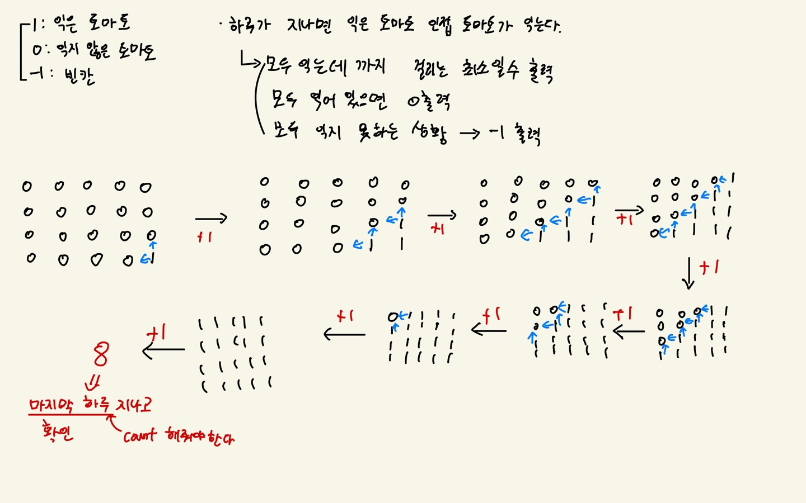

# 7576, 토마토

## 최초 접근법

단순한 bfs와 구현문제라고 생각하였다. 하지만 딱히 구현적인 성격이 강하진 않았다. 

1. 익은 토마토 확인
2. 인접 토마토 중 익지 않은 토마토 확인 후 익은걸로 수정
3. day 변수 1증가
4. (1, 2, 3)과정 반복
5. 최종적으로 day 정답 출력

위와 같은 방식으로 접근하였다. 

추가적으로 한번에 토마토들을 초기화해줘야하기 때문에 set에 초기화해줄 토마토들을 중복없이 추가한 후 한번에 초기화해주었다. 이후 마지막 단계에서 아직 익지 않은 토마토가 있는지 검사 후 -1 또는 day변수를 출력한다. 



하지만, 이 경우 시간초과가 발생한다. bfs를 좀 더 응용하도록 요구하는 문제였다. 

## 코드

```python
from collections import deque

m, n = map(int, input().split())
pan = [list(map(int, input().split())) for _ in range(n)]

dx = [-1, 0, 1, 0]
dy = [0, -1, 0, 1]

q = deque()

# 이미 익어있는 경우 탐색
already = True # 모두 익은 경우
cannot = False

for elements in pan:
    if 0 in elements: # 하나라도 안 익은 토마토가 있는 경우
        already = False
        break # 즉시 반복문 벗어남
    else:
        continue
if already:
    print(0)
    exit()

for i in range(n):
    for j in range(m):
        if pan[i][j] == 1: # 익은 토마토인 경우 q에 추가
            q.append((i, j))

while q:
        i, j = q.popleft() # 익은 토마토 좌표 popleft()

        for k in range(4):
            ni = i + dy[k] # 행 탐색
            nj = j + dx[k] # 열 탐색

            if 0 <= ni < n and 0 <= nj < m: # 범위 내에서 탐색
                if pan[ni][nj] == -1:
                    continue
                elif pan[ni][nj] == 0: # 인접 토마토가 아직 익지 않은 경우
                    q.append((ni, nj)) # 익은 토마토로 바꿔준 후 q에 추가
                    pan[ni][nj] = pan[i][j] + 1 # 한번 퍼짐 즉, 하루 지남

for element in pan:
    if 0 in element: # 아직 덜 익은 토마토가 있는 경우
        cannot = True
        break

if cannot:
    print(-1)
else:
    print(max(map(max, pan)) - 1)
```

## 설명

1. 익은 토마토의 위치를 우선적으로 queue에 추가해준 후 while문을 이용하여 상하좌우 탐색한다. 
2. 인접 토마토중 아직 익지 않은 토마토가 있는 경우 queue에 추가해준다.
3. **좌표값을 (익은 토마토의 좌표 + 1)로 해준다.**
   - **이것은 하루가 지난 것과 같다.**
4. 이후 queue가 비어있으면 즉, 더 이상 인접 토마토 중 익을 토마토가 없으면 검사 후 정답을 출력한다. 
5. **But,** 2차원 리스트의 (최대값 - 1)을 출력해야한다. 
   - **b/c** , 처음에 익은 토마토의 좌표가 1로 설정되어 있기 때문에 -1을 해줘야 지나간 일 수만큼 출력된다. 


## 요점 및 배운 점

- 이 문제의 핵심은 bfs의 응용이다. 인접 토마토를 기준으로 연산이 이루어지기 때문에 너비 우선 탐색을 무조건 떠올릴 수 있어야 했다. 
- 지나간 day를 따로 변수로 두지 않고 초기화된 판에서 바로 출력해주는 방법이 이 문제의 핵심이라고 할 수 있다. 
