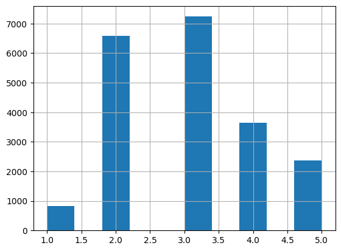

```python
import warnings                   # 경고 메시지를 출력하고 싶지 않을 경우 import 한다.
warnings.filterwarnings('ignore') # 경고 메시지를 출력하지 않는다. 경고 메시지를 보고싶다면 default로 지정한다.
from IPython.display import Image # 쥬피터 노트북에 이미지를 출력하기 위해 import 한다.
import numpy as np                # 배열 계산 라이브러리
import pandas as pd               # 데이터 분석 라이브러리
import matplotlib.pyplot as plt   # 시각화 라이브러리
plt.rcParams['font.family'] = 'NanumGothicCoding' # matplotlib의 글꼴 설정
plt.rcParams['font.size'] = 15    # matplotlib 글꼴 크기 설정
import matplotlib as mpl          # matplotlib에서 음수 데이터의 '-' 기호가 깨지는 것을 방지하기 위해 import 한다.
mpl.rcParams['axes.unicode_minus'] = False # '-' 글꼴을 깨지지 않게한다.
import seaborn as sns             # matplotlib를 기반으로 한 시각화 라이브러리
from plotnine import *            # R의 ggplot2 패키지를 사용하는 것 처럼 사용하는 시각화 라이브러리
import missingno as msno          # NaN 분포를 그래프 형태로 시각화 하는 라이브러리
import folium                     # 지도 시각화 라이브러리
```

서울시 공무원의 업무 추진비를 분석한 공무원 맛집 찾기  
서울시는 업무 추진에 대한 비용 집행의 투명성을 제공하고자 공개된 시장단을 비롯해 4급 부서장 이상의 간부직 공무원의 업무 추진비 집행 내역을 공개합니다.  
서울시 업무 추진비 url: https://opengov.seoul.go.kr/expense


```python
# read_csv() 함수에 index_col 옵션을 사용하면 인덱스에 열 이름을 붙일 수 있다.
df = pd.read_csv('./data/raw.csv', index_col='연번')
df.shape
```


    (51456, 9)


```python
df.head()
```


<div>
<style scoped>
    .dataframe tbody tr th:only-of-type {
        vertical-align: middle;
    }

    .dataframe tbody tr th {
        vertical-align: top;
    }

    .dataframe thead th {
        text-align: right;
    }
</style>
<table border="1" class="dataframe">
  <thead>
    <tr style="text-align: right;">
      <th></th>
      <th>1소속부서</th>
      <th>결제방법</th>
      <th>구분</th>
      <th>대상인원</th>
      <th>부서명</th>
      <th>집행금액</th>
      <th>집행목적</th>
      <th>집행일시</th>
      <th>집행장소</th>
    </tr>
    <tr>
      <th>연번</th>
      <th></th>
      <th></th>
      <th></th>
      <th></th>
      <th></th>
      <th></th>
      <th></th>
      <th></th>
      <th></th>
    </tr>
  </thead>
  <tbody>
    <tr>
      <th>1</th>
      <td>서울특별시장</td>
      <td>카드</td>
      <td>시정 관련 간담회 등</td>
      <td>시장 등 12명</td>
      <td>행정국 총무과</td>
      <td>344000.0</td>
      <td>시정 정책추진 자문 간담회</td>
      <td>2018-01-19 20:41</td>
      <td>동신참치양재직(서초구 강남대로 213)</td>
    </tr>
    <tr>
      <th>2</th>
      <td>서울특별시장</td>
      <td>카드</td>
      <td>시정 관련 간담회 등</td>
      <td>시장, 청년단체 등 38명</td>
      <td>행정국 총무과</td>
      <td>450000.0</td>
      <td>시정 청년 정책 의견수렴 간담회</td>
      <td>2018-01-23 19:06</td>
      <td>서울시청구내식당 ( 중구 세종대로 110)</td>
    </tr>
    <tr>
      <th>3</th>
      <td>서울특별시장</td>
      <td>카드</td>
      <td>시정 관련 간담회 등</td>
      <td>시장 등 8명</td>
      <td>행정국 총무과</td>
      <td>226000.0</td>
      <td>시정 주요 경제정책 현안추진 의견수렴 간담회</td>
      <td>2018-01-29 20:13</td>
      <td>한뫼촌(종로구 북촌로)</td>
    </tr>
    <tr>
      <th>4</th>
      <td>서울특별시장</td>
      <td>카드</td>
      <td>시정 관련 간담회 등</td>
      <td>시장 등 11명</td>
      <td>행정국 총무과</td>
      <td>324500.0</td>
      <td>시정종교계 의견수렴 간담회</td>
      <td>2018-01-12 09:09</td>
      <td>서울시청구내식당(중구 세종대로 110)</td>
    </tr>
    <tr>
      <th>5</th>
      <td>서울특별시장</td>
      <td>카드</td>
      <td>시정 관련 간담회 등</td>
      <td>시장 등 25명</td>
      <td>행정국 총무과</td>
      <td>737500.0</td>
      <td>시정 정책 추진 의견수렴 간담회</td>
      <td>2018-01-12 09:10</td>
      <td>서울시청구내식당(중구 세종대로 110)</td>
    </tr>
  </tbody>
</table>
</div>


```python
df.tail()
```


<div>
<style scoped>
    .dataframe tbody tr th:only-of-type {
        vertical-align: middle;
    }

    .dataframe tbody tr th {
        vertical-align: top;
    }

    .dataframe thead th {
        text-align: right;
    }
</style>
<table border="1" class="dataframe">
  <thead>
    <tr style="text-align: right;">
      <th></th>
      <th>1소속부서</th>
      <th>결제방법</th>
      <th>구분</th>
      <th>대상인원</th>
      <th>부서명</th>
      <th>집행금액</th>
      <th>집행목적</th>
      <th>집행일시</th>
      <th>집행장소</th>
    </tr>
    <tr>
      <th>연번</th>
      <th></th>
      <th></th>
      <th></th>
      <th></th>
      <th></th>
      <th></th>
      <th></th>
      <th></th>
      <th></th>
    </tr>
  </thead>
  <tbody>
    <tr>
      <th>39</th>
      <td>시민건강국</td>
      <td>카드</td>
      <td>NaN</td>
      <td>보건의료정책 직원 4명</td>
      <td>시민건강국 보건의료정책과</td>
      <td>110000.0</td>
      <td>보건의료정책과 2016년 종무식 추진관련 직원격려물품 구입비 지급</td>
      <td>2016-12-29 13:23</td>
      <td>올리브네트웍스 (중구 세종대로 16길)</td>
    </tr>
    <tr>
      <th>40</th>
      <td>시민건강국</td>
      <td>카드</td>
      <td>NaN</td>
      <td>시민건강국장 외 7명</td>
      <td>시민건강국 보건의료정책과</td>
      <td>118000.0</td>
      <td>2017년 신년업무보고 계획 논의 간담회비 지급</td>
      <td>2016-12-29 21:19</td>
      <td>남도한식고운님 (중구 세종대로 82)</td>
    </tr>
    <tr>
      <th>41</th>
      <td>시민건강국</td>
      <td>카드</td>
      <td>NaN</td>
      <td>시민건강국장 외 6명</td>
      <td>시민건강국 보건의료정책과</td>
      <td>174000.0</td>
      <td>시민건강국 간부 송년 오찬간담회비 지급</td>
      <td>2016-12-30 13:04</td>
      <td>춘산에프앤비 (중구 태평로1가 84)</td>
    </tr>
    <tr>
      <th>42</th>
      <td>시민건강국</td>
      <td>카드</td>
      <td>NaN</td>
      <td>보건의료정책과 직원</td>
      <td>시민건강국 보건의료정책과</td>
      <td>30000.0</td>
      <td>보건의료정책과 2016년 종무식 추진관련 직원격려물품 구입비 지급</td>
      <td>2016-12-30 13:13</td>
      <td>스타벅스 (중구 을지로 19)</td>
    </tr>
    <tr>
      <th>43</th>
      <td>시민건강국</td>
      <td>카드</td>
      <td>NaN</td>
      <td>보건의료정책과 직원</td>
      <td>시민건강국 보건의료정책과</td>
      <td>40000.0</td>
      <td>보건의료정책과 2016년 종무식 추진관련 직원격려물품 구입비 지급</td>
      <td>2016-12-30 13:04</td>
      <td>스타벅스 (중구 을지로 19)</td>
    </tr>
  </tbody>
</table>
</div>


```python
df.dtypes
```


    1소속부서     object
    결제방법      object
    구분        object
    대상인원      object
    부서명       object
    집행금액     float64
    집행목적      object
    집행일시      object
    집행장소      object
    dtype: object


```python
df.info()
```

    <class 'pandas.core.frame.DataFrame'>
    Index: 51456 entries, 1 to 43
    Data columns (total 9 columns):
     #   Column  Non-Null Count  Dtype  
    ---  ------  --------------  -----  
     0   1소속부서   51456 non-null  object 
     1   결제방법    51279 non-null  object 
     2   구분      1479 non-null   object 
     3   대상인원    51448 non-null  object 
     4   부서명     51454 non-null  object 
     5   집행금액    51455 non-null  float64
     6   집행목적    51440 non-null  object 
     7   집행일시    51455 non-null  object 
     8   집행장소    51421 non-null  object 
    dtypes: float64(1), object(8)
    memory usage: 3.9+ MB
    


```python
msno.matrix(df, figsize=[14, 8])
```


    <AxesSubplot:>


    

    


```python
df.isnull().sum()
```


    1소속부서        0
    결제방법       177
    구분       49977
    대상인원         8
    부서명          2
    집행금액         1
    집행목적        16
    집행일시         1
    집행장소        35
    dtype: int64


```python
# 집행금액에 NaN인 데이터가 있다. 확인해보자
df[df['집행금액'].isnull()]
```


<div>
<style scoped>
    .dataframe tbody tr th:only-of-type {
        vertical-align: middle;
    }

    .dataframe tbody tr th {
        vertical-align: top;
    }

    .dataframe thead th {
        text-align: right;
    }
</style>
<table border="1" class="dataframe">
  <thead>
    <tr style="text-align: right;">
      <th></th>
      <th>1소속부서</th>
      <th>결제방법</th>
      <th>구분</th>
      <th>대상인원</th>
      <th>부서명</th>
      <th>집행금액</th>
      <th>집행목적</th>
      <th>집행일시</th>
      <th>집행장소</th>
    </tr>
    <tr>
      <th>연번</th>
      <th></th>
      <th></th>
      <th></th>
      <th></th>
      <th></th>
      <th></th>
      <th></th>
      <th></th>
      <th></th>
    </tr>
  </thead>
  <tbody>
    <tr>
      <th>해당년월 해당과에 등록된 업무추진비가 없습니다. 2016년 10월 이전의 업무추진비는 상세집행내역을 이용하세요.</th>
      <td>서울혁신기획관</td>
      <td>NaN</td>
      <td>NaN</td>
      <td>NaN</td>
      <td>NaN</td>
      <td>NaN</td>
      <td>NaN</td>
      <td>NaN</td>
      <td>NaN</td>
    </tr>
  </tbody>
</table>
</div>


```python
missing_df_row = df[df['집행금액'].isnull()].index[0]
missing_df_row
```


    '해당년월 해당과에 등록된 업무추진비가 없습니다. 2016년 10월 이전의 업무추진비는 상세집행내역을 이용하세요.'


```python
# 해당 행을 제거하고 다시 df 데이터프레임으로 저장한다.
print(df.shape)
df = df.drop(missing_df_row)
print(df.shape)
```

    (51456, 9)
    (51455, 9)
    


```python
df.isnull().sum()
```


    1소속부서        0
    결제방법       176
    구분       49976
    대상인원         7
    부서명          1
    집행금액         0
    집행목적        15
    집행일시         0
    집행장소        34
    dtype: int64


```python
# 집행일시 열을 이용해서 '연', '월', '연월', '일', '시', '분', '요일' 파생 변수를 만든다.
# 판다스에서 to_datetime() 함수를 사용하면 문자열 형태의 날짜 데이터를 날짜/시간 형태의 데이터로 변환할 수 있다.
df['집행일시'] = pd.to_datetime(df['집행일시'])
df.dtypes
```


    1소속부서            object
    결제방법             object
    구분               object
    대상인원             object
    부서명              object
    집행금액            float64
    집행목적             object
    집행일시     datetime64[ns]
    집행장소             object
    dtype: object


```python
df['연'] = df['집행일시'].dt.year.astype(int)
df['월'] = df['집행일시'].dt.month.astype(int)
df['연월'] = df['연'].astype(str) + '-' + df['월'].astype(str)
df['일'] = df['집행일시'].dt.day.astype(int)
df['시'] = df['집행일시'].dt.hour.astype(int)
df['분'] = df['집행일시'].dt.minute.astype(int)
df['요일'] = df['집행일시'].dt.dayofweek.astype(int) # 0 => 월, 1 => 화, 2 => 수, 3 => 목, 4 => 금, 5 => 토, 6 => 일
df.head()
```


<div>
<style scoped>
    .dataframe tbody tr th:only-of-type {
        vertical-align: middle;
    }

    .dataframe tbody tr th {
        vertical-align: top;
    }

    .dataframe thead th {
        text-align: right;
    }
</style>
<table border="1" class="dataframe">
  <thead>
    <tr style="text-align: right;">
      <th></th>
      <th>1소속부서</th>
      <th>결제방법</th>
      <th>구분</th>
      <th>대상인원</th>
      <th>부서명</th>
      <th>집행금액</th>
      <th>집행목적</th>
      <th>집행일시</th>
      <th>집행장소</th>
      <th>연</th>
      <th>월</th>
      <th>연월</th>
      <th>일</th>
      <th>시</th>
      <th>분</th>
      <th>요일</th>
    </tr>
    <tr>
      <th>연번</th>
      <th></th>
      <th></th>
      <th></th>
      <th></th>
      <th></th>
      <th></th>
      <th></th>
      <th></th>
      <th></th>
      <th></th>
      <th></th>
      <th></th>
      <th></th>
      <th></th>
      <th></th>
      <th></th>
    </tr>
  </thead>
  <tbody>
    <tr>
      <th>1</th>
      <td>서울특별시장</td>
      <td>카드</td>
      <td>시정 관련 간담회 등</td>
      <td>시장 등 12명</td>
      <td>행정국 총무과</td>
      <td>344000.0</td>
      <td>시정 정책추진 자문 간담회</td>
      <td>2018-01-19 20:41:00</td>
      <td>동신참치양재직(서초구 강남대로 213)</td>
      <td>2018</td>
      <td>1</td>
      <td>2018-1</td>
      <td>19</td>
      <td>20</td>
      <td>41</td>
      <td>4</td>
    </tr>
    <tr>
      <th>2</th>
      <td>서울특별시장</td>
      <td>카드</td>
      <td>시정 관련 간담회 등</td>
      <td>시장, 청년단체 등 38명</td>
      <td>행정국 총무과</td>
      <td>450000.0</td>
      <td>시정 청년 정책 의견수렴 간담회</td>
      <td>2018-01-23 19:06:00</td>
      <td>서울시청구내식당 ( 중구 세종대로 110)</td>
      <td>2018</td>
      <td>1</td>
      <td>2018-1</td>
      <td>23</td>
      <td>19</td>
      <td>6</td>
      <td>1</td>
    </tr>
    <tr>
      <th>3</th>
      <td>서울특별시장</td>
      <td>카드</td>
      <td>시정 관련 간담회 등</td>
      <td>시장 등 8명</td>
      <td>행정국 총무과</td>
      <td>226000.0</td>
      <td>시정 주요 경제정책 현안추진 의견수렴 간담회</td>
      <td>2018-01-29 20:13:00</td>
      <td>한뫼촌(종로구 북촌로)</td>
      <td>2018</td>
      <td>1</td>
      <td>2018-1</td>
      <td>29</td>
      <td>20</td>
      <td>13</td>
      <td>0</td>
    </tr>
    <tr>
      <th>4</th>
      <td>서울특별시장</td>
      <td>카드</td>
      <td>시정 관련 간담회 등</td>
      <td>시장 등 11명</td>
      <td>행정국 총무과</td>
      <td>324500.0</td>
      <td>시정종교계 의견수렴 간담회</td>
      <td>2018-01-12 09:09:00</td>
      <td>서울시청구내식당(중구 세종대로 110)</td>
      <td>2018</td>
      <td>1</td>
      <td>2018-1</td>
      <td>12</td>
      <td>9</td>
      <td>9</td>
      <td>4</td>
    </tr>
    <tr>
      <th>5</th>
      <td>서울특별시장</td>
      <td>카드</td>
      <td>시정 관련 간담회 등</td>
      <td>시장 등 25명</td>
      <td>행정국 총무과</td>
      <td>737500.0</td>
      <td>시정 정책 추진 의견수렴 간담회</td>
      <td>2018-01-12 09:10:00</td>
      <td>서울시청구내식당(중구 세종대로 110)</td>
      <td>2018</td>
      <td>1</td>
      <td>2018-1</td>
      <td>12</td>
      <td>9</td>
      <td>10</td>
      <td>4</td>
    </tr>
  </tbody>
</table>
</div>


```python
plt.rcParams['figure.figsize'] = [12, 8]
plt.rc('font', size=15)
sns.countplot(data=df, x='연')
```


    <AxesSubplot:xlabel='연', ylabel='count'>


    

    


```python
plt.rcParams['figure.figsize'] = [12, 8]
plt.rc('font', size=15)
sns.countplot(data=df, x='월')
```


    <AxesSubplot:xlabel='월', ylabel='count'>


    

    


```python
plt.rcParams['figure.figsize'] = [20, 8]
plt.rc('font', size=15)
plt.xticks(rotation=45)
sns.countplot(data=df, x='연월')
```


    <AxesSubplot:xlabel='연월', ylabel='count'>


    

    


```python
# 그래프에 '연월'순으로 보기 위해서 '연', '월'의 오름차순으로 정렬한다.
df = df.sort_values(by=['연', '월'], ascending=True)
```


```python
plt.rcParams['figure.figsize'] = [20, 8]
plt.rc('font', size=15)
plt.xticks(rotation=45)
sns.countplot(data=df, x='연월')
```


    <AxesSubplot:xlabel='연월', ylabel='count'>


    

    


```python
plt.rcParams['figure.figsize'] = [20, 8]
plt.rc('font', size=15)
sns.countplot(data=df, x='일')
```


    <AxesSubplot:xlabel='일', ylabel='count'>


    

    


```python
plt.rcParams['figure.figsize'] = [20, 8]
plt.rc('font', size=15)
sns.countplot(data=df, x='시')
```


    <AxesSubplot:xlabel='시', ylabel='count'>


    

    


```python
plt.rcParams['figure.figsize'] = [12, 8]
plt.rc('font', size=15)
sns.countplot(data=df, x='요일')
```


    <AxesSubplot:xlabel='요일', ylabel='count'>


    

    


```python
# 0 => 월, 1 => 화, 2 => 수, 3 => 목, 4 => 금, 5 => 토, 6 => 일
weekday = {0: '월', 1: '화', 2: '수', 3: '목', 4: '금', 5: '토', 6: '일'}
df['요일_한글'] = df['요일'].apply(lambda x: weekday[x])
df.head()
```


<div>
<style scoped>
    .dataframe tbody tr th:only-of-type {
        vertical-align: middle;
    }

    .dataframe tbody tr th {
        vertical-align: top;
    }

    .dataframe thead th {
        text-align: right;
    }
</style>
<table border="1" class="dataframe">
  <thead>
    <tr style="text-align: right;">
      <th></th>
      <th>1소속부서</th>
      <th>결제방법</th>
      <th>구분</th>
      <th>대상인원</th>
      <th>부서명</th>
      <th>집행금액</th>
      <th>집행목적</th>
      <th>집행일시</th>
      <th>집행장소</th>
      <th>연</th>
      <th>월</th>
      <th>연월</th>
      <th>일</th>
      <th>시</th>
      <th>분</th>
      <th>요일</th>
      <th>요일_한글</th>
    </tr>
    <tr>
      <th>연번</th>
      <th></th>
      <th></th>
      <th></th>
      <th></th>
      <th></th>
      <th></th>
      <th></th>
      <th></th>
      <th></th>
      <th></th>
      <th></th>
      <th></th>
      <th></th>
      <th></th>
      <th></th>
      <th></th>
      <th></th>
    </tr>
  </thead>
  <tbody>
    <tr>
      <th>31</th>
      <td>서울특별시장</td>
      <td>카드</td>
      <td>시정 관련 간담회 등</td>
      <td>시장 등 3명</td>
      <td>행정국 총무과</td>
      <td>34000.0</td>
      <td>시정 현장방문 관련 업무협의</td>
      <td>1970-01-01 09:00:00</td>
      <td>뼈큰감자탕 (대구 중구 명덕로)</td>
      <td>1970</td>
      <td>1</td>
      <td>1970-1</td>
      <td>1</td>
      <td>9</td>
      <td>0</td>
      <td>3</td>
      <td>목</td>
    </tr>
    <tr>
      <th>46</th>
      <td>서울특별시장</td>
      <td>카드</td>
      <td>시정 관련 간담회 등</td>
      <td>시장 등 4명</td>
      <td>행정국 총무과</td>
      <td>118000.0</td>
      <td>시정 정책 추진 자문 간담회</td>
      <td>1970-01-01 09:00:00</td>
      <td>서울시청구내식당</td>
      <td>1970</td>
      <td>1</td>
      <td>1970-1</td>
      <td>1</td>
      <td>9</td>
      <td>0</td>
      <td>3</td>
      <td>목</td>
    </tr>
    <tr>
      <th>27</th>
      <td>서울특별시장</td>
      <td>카드</td>
      <td>현업-우수부서 격려 등</td>
      <td>직원 26명</td>
      <td>행정국 총무과</td>
      <td>130000.0</td>
      <td>한양조성 도감 추진 노고 직원 격려</td>
      <td>1970-01-01 09:00:00</td>
      <td>빚은 (중구 세종대로길)</td>
      <td>1970</td>
      <td>1</td>
      <td>1970-1</td>
      <td>1</td>
      <td>9</td>
      <td>0</td>
      <td>3</td>
      <td>목</td>
    </tr>
    <tr>
      <th>37</th>
      <td>서울특별시장</td>
      <td>카드</td>
      <td>시정 관련 간담회 등</td>
      <td>시장 등 7명</td>
      <td>행정국 총무과</td>
      <td>151400.0</td>
      <td>시정 일정 및 현장방문 관련 업무협의</td>
      <td>1970-01-01 09:00:00</td>
      <td>본도시락 (중구 소공로길)</td>
      <td>1970</td>
      <td>1</td>
      <td>1970-1</td>
      <td>1</td>
      <td>9</td>
      <td>0</td>
      <td>3</td>
      <td>목</td>
    </tr>
    <tr>
      <th>38</th>
      <td>서울특별시장</td>
      <td>현금</td>
      <td>현업-우수부서 격려 등</td>
      <td>직원 1명</td>
      <td>행정국 총무과</td>
      <td>1000000.0</td>
      <td>사망직원 유족 위로금 지급</td>
      <td>1970-01-01 09:00:00</td>
      <td>-</td>
      <td>1970</td>
      <td>1</td>
      <td>1970-1</td>
      <td>1</td>
      <td>9</td>
      <td>0</td>
      <td>3</td>
      <td>목</td>
    </tr>
  </tbody>
</table>
</div>


```python
plt.rcParams['figure.figsize'] = [12, 8]
plt.rc('font', size=15)
sns.countplot(data=df, x='요일_한글')
```


    <AxesSubplot:xlabel='요일_한글', ylabel='count'>


    

    


```python
plt.rcParams['figure.figsize'] = [12, 8]
plt.rc('font', size=15)
sns.countplot(data=df.sort_values(by=['요일']), x='요일_한글')
```


    <AxesSubplot:xlabel='요일_한글', ylabel='count'>


    

    


```python
plt.rcParams['figure.figsize'] = [12, 8]
plt.rc('font', size=15)
sns.barplot(data=df, x='연', y='집행금액')
```


    <AxesSubplot:xlabel='연', ylabel='집행금액'>


    

    


```python
plt.rcParams['figure.figsize'] = [12, 8]
plt.rc('font', size=15)
sns.barplot(data=df, x='월', y='집행금액')
```


    <AxesSubplot:xlabel='월', ylabel='집행금액'>


    

    


```python
plt.rcParams['figure.figsize'] = [20, 8]
plt.rc('font', size=15)
plt.xticks(rotation=45)
sns.barplot(data=df, x='연월', y='집행금액')
```


    <AxesSubplot:xlabel='연월', ylabel='집행금액'>


    

    


```python
plt.rcParams['figure.figsize'] = [20, 8]
plt.rc('font', size=15)
sns.barplot(data=df, x='시', y='집행금액')
```


    <AxesSubplot:xlabel='시', ylabel='집행금액'>


    

    


```python
plt.rcParams['figure.figsize'] = [12, 8]
plt.rc('font', size=15)
sns.barplot(data=df.sort_values(by='요일'), x='요일_한글', y='집행금액')
```


    <AxesSubplot:xlabel='요일_한글', ylabel='집행금액'>


    

    


집행목적 워드클라우드


```python
from wordcloud import WordCloud
```


```python
df.head()
```


<div>
<style scoped>
    .dataframe tbody tr th:only-of-type {
        vertical-align: middle;
    }

    .dataframe tbody tr th {
        vertical-align: top;
    }

    .dataframe thead th {
        text-align: right;
    }
</style>
<table border="1" class="dataframe">
  <thead>
    <tr style="text-align: right;">
      <th></th>
      <th>1소속부서</th>
      <th>결제방법</th>
      <th>구분</th>
      <th>대상인원</th>
      <th>부서명</th>
      <th>집행금액</th>
      <th>집행목적</th>
      <th>집행일시</th>
      <th>집행장소</th>
      <th>연</th>
      <th>월</th>
      <th>연월</th>
      <th>일</th>
      <th>시</th>
      <th>분</th>
      <th>요일</th>
      <th>요일_한글</th>
    </tr>
    <tr>
      <th>연번</th>
      <th></th>
      <th></th>
      <th></th>
      <th></th>
      <th></th>
      <th></th>
      <th></th>
      <th></th>
      <th></th>
      <th></th>
      <th></th>
      <th></th>
      <th></th>
      <th></th>
      <th></th>
      <th></th>
      <th></th>
    </tr>
  </thead>
  <tbody>
    <tr>
      <th>31</th>
      <td>서울특별시장</td>
      <td>카드</td>
      <td>시정 관련 간담회 등</td>
      <td>시장 등 3명</td>
      <td>행정국 총무과</td>
      <td>34000.0</td>
      <td>시정 현장방문 관련 업무협의</td>
      <td>1970-01-01 09:00:00</td>
      <td>뼈큰감자탕 (대구 중구 명덕로)</td>
      <td>1970</td>
      <td>1</td>
      <td>1970-1</td>
      <td>1</td>
      <td>9</td>
      <td>0</td>
      <td>3</td>
      <td>목</td>
    </tr>
    <tr>
      <th>46</th>
      <td>서울특별시장</td>
      <td>카드</td>
      <td>시정 관련 간담회 등</td>
      <td>시장 등 4명</td>
      <td>행정국 총무과</td>
      <td>118000.0</td>
      <td>시정 정책 추진 자문 간담회</td>
      <td>1970-01-01 09:00:00</td>
      <td>서울시청구내식당</td>
      <td>1970</td>
      <td>1</td>
      <td>1970-1</td>
      <td>1</td>
      <td>9</td>
      <td>0</td>
      <td>3</td>
      <td>목</td>
    </tr>
    <tr>
      <th>27</th>
      <td>서울특별시장</td>
      <td>카드</td>
      <td>현업-우수부서 격려 등</td>
      <td>직원 26명</td>
      <td>행정국 총무과</td>
      <td>130000.0</td>
      <td>한양조성 도감 추진 노고 직원 격려</td>
      <td>1970-01-01 09:00:00</td>
      <td>빚은 (중구 세종대로길)</td>
      <td>1970</td>
      <td>1</td>
      <td>1970-1</td>
      <td>1</td>
      <td>9</td>
      <td>0</td>
      <td>3</td>
      <td>목</td>
    </tr>
    <tr>
      <th>37</th>
      <td>서울특별시장</td>
      <td>카드</td>
      <td>시정 관련 간담회 등</td>
      <td>시장 등 7명</td>
      <td>행정국 총무과</td>
      <td>151400.0</td>
      <td>시정 일정 및 현장방문 관련 업무협의</td>
      <td>1970-01-01 09:00:00</td>
      <td>본도시락 (중구 소공로길)</td>
      <td>1970</td>
      <td>1</td>
      <td>1970-1</td>
      <td>1</td>
      <td>9</td>
      <td>0</td>
      <td>3</td>
      <td>목</td>
    </tr>
    <tr>
      <th>38</th>
      <td>서울특별시장</td>
      <td>현금</td>
      <td>현업-우수부서 격려 등</td>
      <td>직원 1명</td>
      <td>행정국 총무과</td>
      <td>1000000.0</td>
      <td>사망직원 유족 위로금 지급</td>
      <td>1970-01-01 09:00:00</td>
      <td>-</td>
      <td>1970</td>
      <td>1</td>
      <td>1970-1</td>
      <td>1</td>
      <td>9</td>
      <td>0</td>
      <td>3</td>
      <td>목</td>
    </tr>
  </tbody>
</table>
</div>


```python
#집행목적이 NaN인 데이터를 확인한다.
df[df['집행목적'].isnull()]
```


<div>
<style scoped>
    .dataframe tbody tr th:only-of-type {
        vertical-align: middle;
    }

    .dataframe tbody tr th {
        vertical-align: top;
    }

    .dataframe thead th {
        text-align: right;
    }
</style>
<table border="1" class="dataframe">
  <thead>
    <tr style="text-align: right;">
      <th></th>
      <th>1소속부서</th>
      <th>결제방법</th>
      <th>구분</th>
      <th>대상인원</th>
      <th>부서명</th>
      <th>집행금액</th>
      <th>집행목적</th>
      <th>집행일시</th>
      <th>집행장소</th>
      <th>연</th>
      <th>월</th>
      <th>연월</th>
      <th>일</th>
      <th>시</th>
      <th>분</th>
      <th>요일</th>
      <th>요일_한글</th>
    </tr>
    <tr>
      <th>연번</th>
      <th></th>
      <th></th>
      <th></th>
      <th></th>
      <th></th>
      <th></th>
      <th></th>
      <th></th>
      <th></th>
      <th></th>
      <th></th>
      <th></th>
      <th></th>
      <th></th>
      <th></th>
      <th></th>
      <th></th>
    </tr>
  </thead>
  <tbody>
    <tr>
      <th>1</th>
      <td>여성가족정책실</td>
      <td>카드</td>
      <td>NaN</td>
      <td>출산장려팀장외 4명</td>
      <td>여성가족정책실 가족담당관</td>
      <td>30000.0</td>
      <td>NaN</td>
      <td>2017-02-01 12:03:00</td>
      <td>복성각 (서울 중구 덕수궁길 7)</td>
      <td>2017</td>
      <td>2</td>
      <td>2017-2</td>
      <td>1</td>
      <td>12</td>
      <td>3</td>
      <td>2</td>
      <td>수</td>
    </tr>
    <tr>
      <th>2</th>
      <td>여성가족정책실</td>
      <td>카드</td>
      <td>NaN</td>
      <td>가족정책팀장외 3명</td>
      <td>여성가족정책실 가족담당관</td>
      <td>21500.0</td>
      <td>NaN</td>
      <td>2017-02-01 15:30:00</td>
      <td>마포만두 (서울 중구 남대문로9길 51)</td>
      <td>2017</td>
      <td>2</td>
      <td>2017-2</td>
      <td>1</td>
      <td>15</td>
      <td>30</td>
      <td>2</td>
      <td>수</td>
    </tr>
    <tr>
      <th>3</th>
      <td>여성가족정책실</td>
      <td>카드</td>
      <td>NaN</td>
      <td>가족담당관외 5명</td>
      <td>여성가족정책실 가족담당관</td>
      <td>56500.0</td>
      <td>NaN</td>
      <td>2017-02-10 09:48:00</td>
      <td>파스쿠찌종각알파빌딩 (서울 종로구 종로)</td>
      <td>2017</td>
      <td>2</td>
      <td>2017-2</td>
      <td>10</td>
      <td>9</td>
      <td>48</td>
      <td>4</td>
      <td>금</td>
    </tr>
    <tr>
      <th>4</th>
      <td>여성가족정책실</td>
      <td>카드</td>
      <td>NaN</td>
      <td>가족담당관외 6명</td>
      <td>여성가족정책실 가족담당관</td>
      <td>8000.0</td>
      <td>NaN</td>
      <td>2017-02-10 09:54:00</td>
      <td>파리바게뜨　종로시그 (서울 종로구 종로)</td>
      <td>2017</td>
      <td>2</td>
      <td>2017-2</td>
      <td>10</td>
      <td>9</td>
      <td>54</td>
      <td>4</td>
      <td>금</td>
    </tr>
    <tr>
      <th>5</th>
      <td>여성가족정책실</td>
      <td>카드</td>
      <td>NaN</td>
      <td>가족담당관외 8명</td>
      <td>여성가족정책실 가족담당관</td>
      <td>117000.0</td>
      <td>NaN</td>
      <td>2017-02-10 12:14:00</td>
      <td>（주）뚜리삼 (서울 중구 무교동)</td>
      <td>2017</td>
      <td>2</td>
      <td>2017-2</td>
      <td>10</td>
      <td>12</td>
      <td>14</td>
      <td>4</td>
      <td>금</td>
    </tr>
    <tr>
      <th>6</th>
      <td>여성가족정책실</td>
      <td>카드</td>
      <td>NaN</td>
      <td>출산장려팀장외 4명</td>
      <td>여성가족정책실 가족담당관</td>
      <td>87500.0</td>
      <td>NaN</td>
      <td>2017-02-14 12:55:00</td>
      <td>동성각 (서울 종로구 새문안로9길 29-2)</td>
      <td>2017</td>
      <td>2</td>
      <td>2017-2</td>
      <td>14</td>
      <td>12</td>
      <td>55</td>
      <td>1</td>
      <td>화</td>
    </tr>
    <tr>
      <th>7</th>
      <td>여성가족정책실</td>
      <td>카드</td>
      <td>NaN</td>
      <td>가족담당관외 20명</td>
      <td>여성가족정책실 가족담당관</td>
      <td>62000.0</td>
      <td>NaN</td>
      <td>2017-02-21 19:37:00</td>
      <td>갯마을낙지 (서울 중구 을지로1길 32)</td>
      <td>2017</td>
      <td>2</td>
      <td>2017-2</td>
      <td>21</td>
      <td>19</td>
      <td>37</td>
      <td>1</td>
      <td>화</td>
    </tr>
    <tr>
      <th>8</th>
      <td>여성가족정책실</td>
      <td>카드</td>
      <td>NaN</td>
      <td>아동복지권리팀장외 3명</td>
      <td>여성가족정책실 가족담당관</td>
      <td>70000.0</td>
      <td>NaN</td>
      <td>2017-02-22 16:55:00</td>
      <td>행복한하루소바 (서울 중구 무교로)</td>
      <td>2017</td>
      <td>2</td>
      <td>2017-2</td>
      <td>22</td>
      <td>16</td>
      <td>55</td>
      <td>2</td>
      <td>수</td>
    </tr>
    <tr>
      <th>9</th>
      <td>여성가족정책실</td>
      <td>카드</td>
      <td>NaN</td>
      <td>가족정책팀장외 5명</td>
      <td>여성가족정책실 가족담당관</td>
      <td>125000.0</td>
      <td>NaN</td>
      <td>2017-02-22 21:36:00</td>
      <td>신촌서서갈비（북창본 (서울 중구 세종대로12길 25)</td>
      <td>2017</td>
      <td>2</td>
      <td>2017-2</td>
      <td>22</td>
      <td>21</td>
      <td>36</td>
      <td>2</td>
      <td>수</td>
    </tr>
    <tr>
      <th>10</th>
      <td>여성가족정책실</td>
      <td>카드</td>
      <td>NaN</td>
      <td>출산장려팀장외 3명</td>
      <td>여성가족정책실 가족담당관</td>
      <td>40500.0</td>
      <td>NaN</td>
      <td>2017-02-23 12:07:00</td>
      <td>포베이무교점 (서울 중구 무교동)</td>
      <td>2017</td>
      <td>2</td>
      <td>2017-2</td>
      <td>23</td>
      <td>12</td>
      <td>7</td>
      <td>3</td>
      <td>목</td>
    </tr>
    <tr>
      <th>11</th>
      <td>여성가족정책실</td>
      <td>카드</td>
      <td>NaN</td>
      <td>가족담당관 직원 19명</td>
      <td>여성가족정책실 가족담당관</td>
      <td>40000.0</td>
      <td>NaN</td>
      <td>2017-02-23 12:34:00</td>
      <td>삼원 (서울 중구 무교로 32)</td>
      <td>2017</td>
      <td>2</td>
      <td>2017-2</td>
      <td>23</td>
      <td>12</td>
      <td>34</td>
      <td>3</td>
      <td>목</td>
    </tr>
    <tr>
      <th>35</th>
      <td>관광체육국</td>
      <td>카드</td>
      <td>NaN</td>
      <td>관광체육국장 등 9명</td>
      <td>관광체육국 관광정책과</td>
      <td>175000.0</td>
      <td>NaN</td>
      <td>2017-03-28 20:26:00</td>
      <td>신안촌 (서울 종로구 경희궁2길 14-4)</td>
      <td>2017</td>
      <td>3</td>
      <td>2017-3</td>
      <td>28</td>
      <td>20</td>
      <td>26</td>
      <td>1</td>
      <td>화</td>
    </tr>
    <tr>
      <th>33</th>
      <td>기획조정실</td>
      <td>법인카드</td>
      <td>NaN</td>
      <td>-</td>
      <td>기획조정실 국제교류담당관</td>
      <td>450000.0</td>
      <td>NaN</td>
      <td>2017-07-21 16:01:00</td>
      <td>서울시청매점</td>
      <td>2017</td>
      <td>7</td>
      <td>2017-7</td>
      <td>21</td>
      <td>16</td>
      <td>1</td>
      <td>4</td>
      <td>금</td>
    </tr>
    <tr>
      <th>28</th>
      <td>기획조정실</td>
      <td>부서 법인카드</td>
      <td>NaN</td>
      <td>-</td>
      <td>기획조정실 국제교류담당관</td>
      <td>450000.0</td>
      <td>NaN</td>
      <td>2017-08-16 09:07:00</td>
      <td>서울시청신매점</td>
      <td>2017</td>
      <td>8</td>
      <td>2017-8</td>
      <td>16</td>
      <td>9</td>
      <td>7</td>
      <td>2</td>
      <td>수</td>
    </tr>
    <tr>
      <th>112</th>
      <td>대변인</td>
      <td>카드</td>
      <td>NaN</td>
      <td>행정팀장 등 4명</td>
      <td>대변인 언론담당관</td>
      <td>75000.0</td>
      <td>NaN</td>
      <td>2017-09-28 19:07:00</td>
      <td>남산집 (중구 무교동)</td>
      <td>2017</td>
      <td>9</td>
      <td>2017-9</td>
      <td>28</td>
      <td>19</td>
      <td>7</td>
      <td>3</td>
      <td>목</td>
    </tr>
  </tbody>
</table>
</div>


```python
#집행목적이 NaN인 데이터가 존재하므로 NaN을 공백으로 채워준다.
df['집행목적'] = df['집행목적'].fillna('')
df[df['집행목적'].isnull()]
```


<div>
<style scoped>
    .dataframe tbody tr th:only-of-type {
        vertical-align: middle;
    }

    .dataframe tbody tr th {
        vertical-align: top;
    }

    .dataframe thead th {
        text-align: right;
    }
</style>
<table border="1" class="dataframe">
  <thead>
    <tr style="text-align: right;">
      <th></th>
      <th>1소속부서</th>
      <th>결제방법</th>
      <th>구분</th>
      <th>대상인원</th>
      <th>부서명</th>
      <th>집행금액</th>
      <th>집행목적</th>
      <th>집행일시</th>
      <th>집행장소</th>
      <th>연</th>
      <th>월</th>
      <th>연월</th>
      <th>일</th>
      <th>시</th>
      <th>분</th>
      <th>요일</th>
      <th>요일_한글</th>
    </tr>
    <tr>
      <th>연번</th>
      <th></th>
      <th></th>
      <th></th>
      <th></th>
      <th></th>
      <th></th>
      <th></th>
      <th></th>
      <th></th>
      <th></th>
      <th></th>
      <th></th>
      <th></th>
      <th></th>
      <th></th>
      <th></th>
      <th></th>
    </tr>
  </thead>
  <tbody>
  </tbody>
</table>
</div>


```python
#파이썬 문자열 함수 등 특정 문자열을 문자열 사이에 
#삽입하는 join()함수로 집행목적을 연결해 워드클라우드를
#실행한다.
spend_gubun = ' '.join(df['집행목적'])
spend_gubun
```


    '시정 현장방문 관련 업무협의 시정 정책 추진 자문 간담회 한양조성 도감 추진 노고 직원 격려 시정 일정 및 현장방문 관련 업무협의 사망직원 유족 위로금 지급 시정 정책 추진 자문 간담회 결혼축하품 구입비 지출 시정 노고 직원 생일 축하품 구입비 지급 시정 종교 정책 관련 간담회 시정 정책 추진 자문 간담회 시정 정책 추진 자문 간담회 시정 정책 현안 관련 간담회 시정 사회체육 활성화 관련 간담회 시정 정책 시행 관련 업무협의 간담회 시정 주요 정책 관련 업무협의 간담회 2017년 장애인복지사업 예산심의관련 간담회 상임위 예산안심의 및 증감액사업검토 간담회 보건복지위원회 예산안 예비심사관련 간담회 부서운영 소요경비(차류 등) 지급 부서운영 필요물품 구입 장애인문화공모사업 추진관련 간담회 중증장애인 자산형성지원사업 논의 간담회 장애인시설 보조금 지원 및 점검관련 간담회 민간위탁 재계약 및 장애인보조기기지원 조례안관련 간담회 서울시보조공학서비스센터 위탁운영관련간담회 장애인인식개선 영상물제작 최종보고관련간담회 장애인일자리통합지원센터 지도점검관련간담회 장애인자립생활 지원 및 정책논의를 위한 간담회 2018장애인인권증진시행계획 수립논의 간담회 2017예산편성관련 직원격려 간담회 부서운영 및 직원격려를 위한 간식 구입 장애인일자리대장정 정책수립을 위한 간담회 장애인시설 안전점검관련 직원격려 간담회 2018년 주요업무계획 수립논의를 위한 간담회 장애인홈페이지 제안서평가관련 간담회 2017장애인식개선 및 교육관련 논의간담회 연말 직원노고 격력을 위한 간담회 종무식 개최준비를 위한 음식구입 장애인거주시설 탈시설대책 수립을 위한 간담회 종무식 개최준비를 위한 다과 등 구입 종무식 개최준비를 위한 음식구입 2017주요업무계획수립 관련 간담회 장애인직업재활시설 운영점검 및 일자리대책논의간담회 종무식 개최준비를 위한 다과 등 구입 50+센터 운영 관련 간담회 개최 강서장애인가족지원센터 개소식 관련 직원격려 간담회 2017년도 행정국 예산심의 준비사항 검토 간담회 2017년도 상임위 예산안 심의결과 검토 간담회 공무국외훈련 심사 검토 간담회 인력개발과 현안 업무 관련 팀장들과 간담회 개최 지방행정연수원 장기교육 수료식 행사 관련자와 간담회 개최 2017년도 행정국 예산심의 결과보고 간담회 런치특강 힐링 콘서트 결과 피드백 간담회 개최 마음 건강에 대한 인식 제고와 쉼표 이용 홍보를 위한 간담회 개최 행정직 공무원 교육훈련 로드맵 수립 용역 최종보고회관련 간담회 개최 후생복지분야 조직문화 개선방안 중간점검 간담회 2017년 5급 승진리더과정 교육 수요조사 실시 검토 간담회 개최 2017년 5급 승진리더과정 교육 수요조사 의견 수렴 간담회 개최 사무실 환경개선 공사후 서류정리 등 간담회 개최 인력개발과 사무실 환경개선 공사에 휴일에도 고생한 직원들과 간담회 개최 장기국외훈련 예산 삭감(의원발의) 검토 간담회 개최 사무실 환경개선 공사후 물품정리한 직원들과 간담회 개최 시장과 민공노 간담회 결과 의견 조율 간담회 개최 2016 단기국외훈련 성과보고회 자료준비 간담회 개최 2016 장기국외훈련 성과보고회 준비사항 검토 간담회 개최 2017년 상반기 공로연수 설명회 준비사항 검토 간담회 개최 후생복지팀 현안업무 검토 간담회 개최 2017년 상반기 공로연수 설명회 결과 의견수렴 간담회 개최 구내매점 활성화 방안 검토 간담회 개최 노사협의 결과(안건) 전달 및 노조활동 지원관련 사전 검토 간담회 개최 인력개발과 부속실 직원들과 친절교육 및 간담회 개최 2017년 학습관리시스템 유지관리 용역 사업자 선정 의견청취 간담회 개최 후생복지팀 현재 진행 중인 주요 현안업무 검토 간담회 2017년 인력개발과 업무계획 관련 간담회 개최 신년 업무보고 관련 간담회 개최 인력개발과 종무식 다과비 지급 2016 인력개발과 종무식 다과비 지급 2016 인력개발과 종무식 다과비 지급 인력개발과 종무식 다과비 지급 대한노인회 서울시연합회 정기총회 의전지원 업무협의 시민카드 운영 관련 업무협의 『스마트기기활용 임신지원』관련 전문가 회의 제407차 민방위의 날 전국 지진대피훈련 관련 간담회 시정 수행 및 의전 관련 직원 격려 시정 업무추진 유관기관 격려 투자유지 및 정보화 노고 직원 격려 한파대응 비상근무자 노고 격려 한파대응 비상근무자 노고 격려 주요 시책사업 추진 관련 간담회 시정 정책 추진 관련 간담회 시정 정책 추진 자문 간담회 시정 정책 관련 학계 자문 간담회 주요업무 추진 관계관 간담회 출입기자단 신년 오찬 간담회 시정 주요 정책 및 현안 업무협의 간담회 시정운영계획 관련 업무협의 시정 정책 자문 업무협의 간담회 시정 정책 설명 언론사 간담회 시정 정책 추진 자문 간담회 시정 사회적기업 활성화 관련 간담회 시정 공공디자인 정책 관련 업무협의 시정 정책 추진 자문 간담회 시정 정책 추진 협력 간담회 시정 문화예술 관련 업무협의 간담회 시정 정책 및 정무 관련 업무협의 간담회 시정 언론인터뷰 관련 업무협의 시정 미디어 및 대외협력 관련 업무협의 시정 자치구 신년인사회 관련 업무협의 시정 정무 현안 보고 등 업무협의 간담회 시정 정책 및 정무 현안 추진 업무협의 시정 종교 정책 자문 간담회 시정 미디어 정책 자문 간담회 시정 스위스 순방 관련 업무협의 차담 시장단 조찬 간담회 시정 정무 정책 및 현안 관련 업무협의 시정 스위스 순방 관계자 격려 시정 미디어 정책 자문 간담회 방문민원 등 접대용품 구입 시정 교류 및 협력 관련 업무협의 시정 지방자치단체 협력 관련 업무협의 시정 충남, 전북 현장 방문 관련 업무협의 시정 청년정책 관련 업무협의 간담회 재정민주주의 관련 논의를 위한 간담회 2016년 시정운영 방향 관련 관계관 간담회 스마트 모빌리티 혁신사업 실행계획 조정 간담회 시정 핵심과제 선정 및 성과관리 관련 의견청취 서울형 노동모델 개발 관련 관계관 의견청취 협치서울 과제 추진 관련 관계관 간담회 시정현안 관련 기자 간담회 시장단 요청사항 관리방안 조정 간담회 축.부의금 지급(3명) 한파대비 노숙인 거리상담반 근무직원 격려 재사용플라자 운영기반 구축 추진 간담회 경제민주화 추진 관련 실행과제 조정 간담회 축.부의금 지급(3명) 목민관클럽 포럼 발표자료 검토 관련 간담회 목민관클럽 포럼 후속조치 간담회 승용차 마일리지제 2차 시범사업 추진 간담회 심야 택시승차난 해소대책 추진 간담회 방문인 제공용 간식 및 다과류 구입 관리자 리더십 함양 추진 간담회 나눔카 2기 사업 추진 관련 관계관 의견청취 부의금 지급(2명) 청년중심 뉴딜일자리 추진 간담회 부시장실 운영 다과 및 물품 구입 감염병 대응 관련 관계관 간담회 지역상생 T/F 운영 관련 관계관 의견청취 발달장애인 지원 관련 관계관 의견청취 지하철 안전관리 강화 추진 간담회 2016 서울문화의 밤 연계 행사 추진 간담회 쪽방촌 주민 주거 안정화 관련 관계관 의견청취 디지털기본계획 이행과제 조정 간담회 2020 서울형 청년정책 추진 간담회 설날 종합대책 추진 간담회 박물관 건립 추진 관련 관계관 의견청취 투자심사제도 개선 추진 간담회 한파대책 상황실 근무자 격려 - 전통시장 활성화 추진 관련 관계관 의견청취 축.부의금 지급(3명) 위원회 운영 활성화 추진 관련 관계관 의견청취 제2롯데월드 교통개선대책 추진 관련 의견청취 시정현안 관련 기자 간담회 자치구 관련 쟁점 현안조정 간담회 비서실 운영개선 추진 간담회 다보스 순방 후속조치 추진 간담회 제2시민청 운영 관련 관계관 의견청취 민생사법경찰단 수사역량 강화 추진 간담회 청렴도 향상대책 추진 간담회 부시장실 운영 다과 및 물품 구입 시정 주요현안 조정 간담회 조직문화개선 추진 관련 관계관 의견청취 축.부의금 지급(3명) 서울 365 패션쇼 사업 추진 간담회 시유재산 활용 관련 관계관 의견청취 정례간부 회의용 음료 구입 시정현안 회의용 간식류 구입 시정현안 회의용 음료 구입 2016 일자리대장정 추진 관련 부서장 간담회 걷는도시 서울 추진과제 조정 간담회 경제민주화도시 서울 선언문 검토 간담회 행정2부시장산하주요 정책추진 간담회 돈의문1구역도시환경정비사업 사업추진간담회 서울역7017 프로젝트 추진직원 격려 안전총괄본부현안업무추진직원 격려 재난안전대책본부제설대책 추진 직원격려 2016년도시계획정책 추진 간담회 화요간부회의간담회개최 영동대로지하통합개발수립 간담회 중랑천중심, 동북권 미래비젼수립 간담회 용산구도시관리국직원 경조사비 지급 도시계획국현안업무추진 직원 격려 동북4구사업단현안업무추진직원 격려 화요간부회의간담회개최 행정2부시장실방문객접대용 다과구매 서울역일대활성화방안추진 간담회 압구정아파트지구 개발기본계획 검토간담회 푸른도시국현안업무추진 직원 격려 안전총괄본부현안업무추진직원 격려 수서문정지역중심일대 마스터플랜 수립간담회 행정2부시장산하주요소송 추진 간담회 경의선숲길, 마포석유비축기지 현장 점검직원격려 경의선숲길, 마포석유비축기지 공원화추진간담회 한강사업본부직원경조사비 지급 지급 세운상가군재생사업추진 직원 격려 푸른도시국현안업무추진 직원 격려 2016년주요사업공유 추진 간담회 도시기반시설본부현안업무 추진 직원격려 서소문구역도시환경정비구역 현안업무추진직원격려 주택정책시기조정추진간담회 행정2부시장실비서실직원 격려 도시재생본부직원경조사비 지급 강북구기획재정국직원 경조사비 지급 도시기반시설본부직원 경조사비 지급 확대간부회의간담회개최 2부시장산하조직문화개선 검토 간담회 재난대응협력체계추진 간담회 한강협력계획핵심사업 기본계획 수립간담회 시정핵심사업협력추진 간담회 행정2부시장실방문객접대용 다과구매 도시기반시설강화추진간담회 신년업무계획수립간담회 도시계획상임기획단운영체계 개선 검토간담회 2부시장산하시책사업 홍보를 위한기자단간담회 국제교류복합지구마스터플랜 수립 간담회 도시건축분야현안업무추진 간담회 서울역7017 프로젝트 설계안 간담회 서울역7017 프로젝트 기자설명회 준비직원격려 시정현안회의용 다과 구매 현안엄무 추진관련 간담회 시의원 경조사비 지급 현안업무 추진관련 간담회 시정 현안회의용 다과 구매 현안업무 추진 관련 간담회 현안업무 추진관련 간담회 시정현안관련 의견수렴 간담회 시정협력 등 유관인사 업무관련 간담회 시정현안관련 의견수렴 간담회 시정현안관련 의견수렴 간담회 시정현안관련 의견수렴 간담회 시정현안관련 의견수렴 간담회 현안업무 관련 의견수렴 간담회 시정현안 관련 유관부서 업무협의 간담회 시정현안 관련 국회 등 유관기관 업무협의 간담회 방문민원 접대용 물품 구매 시정현안 관련 국회 등 유관기관 업무협의 간담회 시정운영 관련 유관부서 소통 및 업우협의 간담회 시정현안 관련 국회 등 유관기관 업무협의 간담회 시정운영 관련 전문가 자문 간담회 시정현안 관련 시민단체 의견수렴 간담회 시정현안 관련 국회 등 유관기관 업무협의 간담회 시정현안 관련 시민단체 의견수렴 간담회 시정현안 관련 시민단체 의견수렴 간담회 시정현안 관련 국회 등 유관기관 업무협의 간담회 시정현안 관련 시민단체 의견수렴 간담회 시정운영 관련 유관부처 등 의견수렴 간담회 시정현안 관련 국회 등 유관기관 업무협의 간담회 시정현안 관련 국회 등 유관기관 업무협의 간담회 시정현안 관련 국회 등 유관기관 업무협의 간담회 시정현안 관련 국회 등 유관기관 업무협의 간담회 시정현안 관련 시의회 업무협의 간담회 현안업무 관련 검토 간담회 시정운영 관련 유관기관 업무협의 간담회 시정현안 관련 전문가 자문 간담회 시정현안 관련 시민단체 의견수렴 간담회 시정운영 관련 유관단체 의견수렴 간담회 시정현안 관련 국회 등 유관기관 업무협의 간담회 시정현안 관련 국회 등 유관기관 업무협의 간담회 시정운영 관련 시의회 업무협의 간담회 시정현안 관련 유관부서 업무협의 간담회 시정현안 관련 시민단체 등 의견수렴 간담회 시정운영 관련 산하기관 업무협의 간담회 시정현안 관련 국회 등 유관기관 업무협의 간담회 시정현안 관련 국회 등 유관기관 업무협의 간담회 시정현안 관련 시민단체 의견수렴 간담회 시정현안 관련 국회 등 유관기관 업무협의 간담회 시정운영 관련 유관단체 의견수렴 간담회 시정운영 관련 전문가 등 자문 간담회 시정현안 관련 직원 검토 간담회 시정현안 관련 유관기관 업무협의 간담회 시정현안 관련 국회 등 유관기관 업무협의 간담회 시정현안 관련 국회 등 유관기관 업무협의 간담회 시정현안 관련 국회 등 유관기관 업무협의 간담회 시정운영 관련 자치구 의견수렴 간담회 시정현안 관련 국회 등 유관기관 업무협의 간담회 시정현안 관련 국회 등 유관기관 업무협의 간담회 시정운영 관련 유관부서 등 업무협의 간담회 시정현안 관련 국회 등 유관기관 업무협의 간담회 시정운영 관련 유관부서 업무협의 간담회 시정현안 관련 시민단체 의견수렴 간담회 시정운영 관련 유관단체 의견수렴 간담회 시정운영 관련 국회 등 유관기관 업무협의 간담회 시정운영 관련 유관단체 의견수렴 간담회 시정현안 관련 유관부서 업무협의 간담회 시정현안 관련 유관기관 의견수렴 간담회 시정현안 관련 국회 등 유관기관 업무협의 간담회 시정현안 관련 국회 등 유관기관 업무협의 간담회 시정현안 관련 국회 등 유관기관 업무협의 간담회 시정현안 관련 국회 등 유관기관 업무협의 간담회 시정현안 관련 국회 등 유관기관 업무협의 간담회 시정현안 관련 국회 등 유관기관 업무협의 간담회 시정현안 관련 유관기관 업무협의 간담회 시정현안 관련 국회 등 유관기관 업무협의 간담회 시정현안 관련 국회 등 유관기관 업무협의 간담회 시정현안 관련 국회 등 유관기관 업무협의 간담회 시정현안 관련 시민단체 의견수렴 간담회 시정현안 관련 국회 등 유관기관 업무협의 간담회 시정현안 관련 국회 등 유관기관 업무협의 간담회 시정운영 관련 산하기관 의견수렴 간담회 시정운영 관련 유관부서 업무협의 간담회 시정운영 관련 시민단체 의견수렴 간담회 시정운영 관련 유관단체 의견수렴 간담회 시정운영 관련 유관부서 등 업무협의 간담회 시정현안 관련 국회 등 유관기관 업무협의 간담회 시정현안 관련 시민단체 의견수렴 간담회 탕비실 운영 물품 구매 시정현안 관련 국회 등 유관기관 업무협의 간담회 설 명절 직원 및 유관기관 격려 설 명절 비상근무 등 현장근무 직원 격려 청사 방호 및 민원안내 직원 격려 설 명절 직원 및 유관기관 격려 설 명절 종합상황실 비상근무자 격려 등 시정 민원응대 및 칭찬 우수 부서 격려 시정 일자리 및 노동정책 기여 직원 격려 건축 민원해소 노고 직원 격려 민생사법경찰단 직원 격려 재무 안정 및 보행자전거 활성화 노고 직원 격려 사망 직원 유족위로금 지급 동남권공공개발 추진 직원 격려 시정 정책 및 시장단 현안 관련 업무협의 시정 정책 추진 자문 간담회 시정 민생 현장 방문 관련 업무협의 시정 민생 및 유관기관 방문 업무협의 시정 기획 및 미디어 정책 업무협의 시정 의료 및 서민 지원 정책 업무협의 시정 민생정책 추진 관련 업무협의 시정 기획 및 일정 관련 업무협의 시정 민생지원 정책 관련 업무협의 간담회 시정 정책 현안 및 민생 관련 업무협의 부산, 대구 방문 일정 및 수행 관련 업무협의 시정 교육정책 관련 자문 간담회 시정 시민단체 의견 검토 등 업무협의 시정 정책 반영 현안 업무협의 시정 청년 및 서민 정책 조찬 간담회 시정 정책 설명 및 홍보 간담회 시장단 조찬 간담회 시정 정책 추진 점검 업무협의 시정 복지 및 보건정책 관련 업무협의 시정 정책 추진 자문 간담회 시정 정무 관련 업무협의 간담회 시정 정책 추진 자문 간담회 시정 의회 협력 및 정책 자문 간담회 시정 정책 및 현안 관련 업무협의 시정 정책 추진 자문 간담회 시정 정책 현안 관련 업무협의 시정 민생 및 정책현안 관련 업무협의 시정 정무정책 및 현안 관련 업무협의 시정 정책 추진 자문 간담회 시정 정책 소통 전문가 자문 간담회 시정 정무 현안 관련 업무협의 시정 정책 추진 자문 간담회 서울시 산하기관장 업무협의 간담회 시정 교류 및 협력 관련 간담회 시정현안 회의용 음료 및 다과 구입 민생침해사범 근절 대책 추진 간담회 청년 일자리 종합대책 추진 간담회 투자출연기관 현안사항 공유 간담회 시정현안 관련 기자 간담회 서울역 7017 사업 추진 관계관 격려 친환경 학교급식 지원 관련 의견청취 여성안심특별시 대책추진 관련 간담회 누리예산 관련 쟁점현안 공유 간담회 청년활동 지원사업 관련 현안조정 간담회 시정 주요현안 조정 간담회 교통분야 쟁점현안 조정 간담회 축.부의금 지급 2016 설명절 직원 격려물품 구입 비영리법인 설립허가 절차개선 관련 의견청취 행정1부시장 비서실 직원 격려 부시장실 운영 다과 및 물품 구입 박물관 건립 추진사항 공유 간담회 경제민주화 도시 서울 선언식 추진부서 격려 시티투어버스 운영 개선 추진 간담회 지하철 안전대책 추진 관련 간담회 자치구 조정교부금 운영 관련 의견청취 시정현안 관련 기자 간담회 대기질 개선 대책 추진 간담회 원전하나줄이기 2단계 사업 추진 간담회 시장단 수행 운전원 격려 중앙부처 협력사업 추진 관련 간담회 서울관광 혁신 TF 구성 추진 간담회 서울형 노동정책 추진 관계관 격려 경제민주화 도시 서울 선언 후속조치 간담회 규제개혁 및 푸드트럭 활성화 추진 간담회 50+재단 설립 관련 현안조정 간담회 2016 일자리대장정 추진 관련 관계관 간담회 축.부의금 지급 시장단 요청사항 추진 관련 간담회 시 집행부-시의회(새누리당) 정책협의회 개최 시정현안 관련 기자 간담회 개성공단 입주기업 지원 추진 간담회 시장단 부속실 환경미화 담당직원 격려 부시장실 운영 다과 및 물품 구입 주민참여예산 운영 관련 의견청취 시의회 상정안건 검토 관련 간담회 정릉천 고가통제 관련 상황실 근무자 등 격려 시정현안 회의용 음료 및 다과 구입 투자출자출연기관장 특별회의 및 간담회 개최 공공미술 프로젝트 추진 관련 간담회 걷는도시 서울 추진사항 공유 간담회 조직문화 개선 추진 관련 관계관 의견청취 부의금 지급 시정현안 회의용 음료 구입 시정현안 회의용 간식류 구입 부시장실 운영 다과 및 물품 구입 딜쿠샤 보존 관련 협약추진 관계관 격려 중랑천중심동북권미래비전 발표 현안검토간담회 안전총괄본부산하 현안업무관련 노고직원격려 동남권일대교통개선대책 방안 검토간담회 제2롯데월드교통개선대책 TF 추진현황검토간담회 행정2부시장산하주요 정책사업 협력추진간담회 서울역7017 프로젝트 기자설명회 준비간담회다과구매 국본부장간담회개최 2부시장산하시책사업 홍보를 위한기자단간담회 2부시장산하일자리대장정 추진 간담회 시정주요사업협력강화추진 간담회 도시재생기금설치협의간담회 여의샛강이용활성화추진 간담회 안전총괄본부현안업무추진직원 격려 물순환안전국직원경조사비 지급 중부공원녹지사업소직원경조사비 지급 현대자동차부지협상정책 간담회 행정2부시장실비서실직원 격려 2016년행정2부시장실 청렴도 향상추진간담회 서울역일대특화발전방안추진 간담회 상수도사업본부직원경조사비 지급 노원구도시계획국직원 경조사비 지급 행정2부시장산하주요소송 추진 간담회 도시,건축분야현안추진 간담회 소공로근현대건축물보존방안 마련 간담회 행정2부시장실방문객접대용 다과구매 뉴스테이대응방안및제도개선 추진간담회 도시계획국현안업무추진 직원 격려 2016년설연휴비상근무 직원 격려 안전분야기획관회의간담회 개최 소방재난본부직원경조사비 지급 공무상부상직원위로 도시재생본부현안업무추진직원 격려 안전총괄본부현안업무추진직원 격려 물순환안전국현안업무추진직원 격려 재난안전컨트롤타워기능강화 방안 마련워크숍 상수도사업본부직원경조사비 지급 주택건축국직원경조사비 지급 관악구도시관리국직원 경조사비 지급 서울시설공단직원경조사비 지급 도시재생본부현안업무추진직원 격려 정릉천고가통제관련 교통정책추진 직원격려 노량진일대마스터플랜수립 간담회 시정주요정책추진검토 간담회 개최 도시안전본부현안업무추진직원 격려 행정2부시장실방문객접대용 다과구매 도시재생본부현안업무추진직원 격려 국,본부장간담회개최 투자출연기관현안업무회의 간담회 다과구매 도시계획, 건축분야박물관 추진 간담회 정릉천고가통제관련 안전대책 추진직원격려 행정2부시장실방문객접대용 다과구매 공공개발센터현안업무추진직원 격려 안전총괄본부직원경조사비 지급 도시개발사업소셜믹스 적용방안 검토간담회 서울역일대종합발전기획단직원 경조사비지급 서부도로사업소직원경조사비 지급 상수도사업본부직원경조사비 지급 북부도로사업소직원경조사비 지급 성동구도시관리국직원경조사비지급 재건축,재개발디자인 국제공모 실현방안전략수립간담회 투자출연기관현안업무회의 간담회 다과구매 도시활력증진계획검토간담회 시정현안관련 업무협의 간담회 시정현안관련 직원 간담회 시정현안관련 업무협력 간담회 시정현안관련 의견수렴 간담회 시정현안관련 업무협력 간담회 시정현안관련 업무협력 간담회 시정현안관련 협력방안 간담회 시정현안관련 업무협의 간담회 시정현안관련 업무협력 간담회 시정현안관련 유관기관 협력 간담회 시정 주요 현안관련 의견수렴 간담회 설 명절 현업근문자 격려물품 구매 시정 주요시책 관련 업무조정 간담회 시정현안관련 의견수렴 간담회 시정현안관련 업무협의 간담회 시정현안 협력관련 주요인사 간담회 시정현안관련 유관인사 간담회 시정현안관련 의견수렴 간담회 시정현안관련 유관인사 간담회 설 명절 격려물품 구매 시정현안관련 의견수렴 간담회 시정현안관련 업무협의 간담회 시정현안관련 의견수렴 간담회 시정현안관련 의견수렴 간담회 시정현안관련 업무협의 간담회 시정 현안관련 의견수렴 간담회 시정운영 관련 시의회 업무협의 간담회 시정운영 관련 유관부서 업무협의 간담회 시정현안 협력관련 주요인사 간담회 시정현안관련 의견수렴 간담회 시정현안 협력관련 유관기관 간담회 정무부시장실 운영관련 주요인사 간담회 시정현안관련 의견수렴 간담회 시정현안 협력관련 주요인사 간담회 시정현안 추진관련 의견수렴 간담회 시정 주요현안 관련 직원 간담회 시정 현안업무 추진관련 직원간담회 시정현안 협력관련 주요인사 간담회 시정운영 관련 유관기관 업무협의 간담회 시정현안 협력관련 의견수렴 간담회 시정 현안업무 추진관련 직원 간담회 시정 현안관련 유관기관 간담회 시 주요 현안관련 주요인사 간담회 시 주요 현안관련 주요인사 간담회 시정 주요업무 추진관련 전문가 간담회 시정현안 협력관련 주요인사 간담회 소속 상근직원 경조사비 지급 시정 주요업무 추진관련 유관단체 간담회 시정운영 관련 업무협의 간담회 탕비실 운영물품 구매 현안업무 추진 관련 간담회 시정 현안업무 추진관련 직원 간담회 탕비실 운영물품 구매 내방시민 제공 간식구매 내방객 응대를 위한 다과구매 시정 현안업무 추진관련 직원 간담회 시정 현안업무 추진관련 직원 간담회 시정 협력관련 유관기관 간담회 시정현안 검토관련 유관부서 간담회 시정 운영관련 유관부서 업무협의 간담회 내방시민 제공 간식 구매 시정 주요현안 협력 간담회 시정 현안관련 유관기관 간담회 현안업무 관련 의견수렴 간담회 시정 언론홍보관련 업무협의 간담회 현안업무 추진 관련 간담회 시정 주요 현안관련 전문가 간담회 시정 주요 현안관련 전문가 간담회 시정 현안회의용 다과 구매 시정현안관련 업무협력 간담회 시정현안 협력관련 주요인사 간담회 시정 현안회의용 다과 구매 시정운영 관련 유관부서 업무협의 간담회 내방시민 제공 간식 구매 시정현안 관련 유관부서 업무협의 간담회 시정현안 관련 전문가 자문 간담회 시정운영 관련 유관부서 업무협의 간담회 시정현안 관련 시민단체 의견수렴 간담회 시정현안 관련 국회 등 유관기관 업무협의 간담회 시정운영 관련 직원 검토 간담회 시정현안 관련 유관부서 업무협의 간담회 시정현안 관련 국회 등 유관기관 업무협의 간담회 시정현안 관련 국회 등 유관기관 업무협의 간담회 시정현안 관련 국회 등 유관기관 업무협의 간담회 시정현안 관련 국회 등 유관기관 업무협의 간담회 시정현안 관련 전문가 자문 간담회 시정발전방안 자문 관련 시민단체 간담회 시정현안 관련 국회 등 유관기관 업무협의 간담회 시정현안 관련 국회 등 유관기관 업무협의 간담회 시정현안 관련 국회 등 유관기관 업무협의 간담회 시정현안 관련 국회 등 유관기관 업무협의 간담회 시정운영 관련 유관단체 의견수렴 간담회 시정현안 관련 국회 등 유관기관 업무협의 간담회 시정현안 관련 국회 등 유관기관 업무협의 간담회 시정현안 관련 국회 등 유관기관 업무협의 간담회 시정현안 관련 전문가 자문 간담회 시정현안 관련 유관부서 업무협의 간담회 시정현안 관련 국회 등 유관기관 업무협의 간담회 시정현안 관련 자치구 등 의견수렴 간담회 시정현안 관련 국회 등 유관기관 업무협의 간담회 시정현안 관련 시의회 업무협의 간담회 시정운영 관련 자치구 의견수렴 간담회 시정운영 관련 전문가 자문 간담회 시정현안 관련 국회 등 유관기관 업무협의 간담회 시정현안 관련 국회 등 유관기관 업무협의 간담회 시정현안 관련 유관부서 업무협의 간담회 시정운영 관련 산하기관 업무협의 간담회 시정운영 관련 유관부서 업무협의 간담회 시정운영 관련 전문가 자문 간담회 시정운영 관련 산하기관 업무협의 간담회 시정운영 관련 시민단체 의견수렴 간담회 시정운영 관련 자치구 의견수렴 간담회 시정현안 관련 국회 등 유관기관 업무협의 간담회 시정현안 관련 국회 등 유관기관 업무협의 간담회 탕비실 운영 물품 구매 시정운영 관련 시민단체 의견수렴 간담회 시정현안 관련 국회 등 유관기관 업무협의 간담회 시정현안 관련 국회 등 유관기관 업무협의 간담회 시정현안 관련 국회 등 유관기관 업무협의 간담회 시정현안 관련 시민단체 의견수렴 간담회 시정운영 관련 시의회 업무협의 간담회 시정현안 관련 국회 등 유관기관 업무협의 간담회 시정운영 관련 유관부서 업무협의 간담회 시정현안 관련 국회 등 유관기관 업무협의 간담회 시정운영 관련 전문가 자문 간담회 시정운영 관련 유관단체 의견수렴 간담회 시정현안 관련 국회 등 유관기관 업무협의 간담회 방문민원 접대용 물품 구매 시정운영 관련 유관부서 업무협의 간담회 시정현안 관련 유관부서 업무협의 간담회 시정현안 관련 시민단체 의견수렴 간담회 시정현안 관련 직원 검토 간담회 시정현안 관련 유관부서 등 업무협의 간담회 시정현안 관련 전문가 자문 간담회 시정현안 관련 전문가 자문 간담회 시정현안 관련 직원 검토 간담회 시정현안 관련 전문가 자문 간담회 시정현안 관련 국회 등 유관기관 업무협의 간담회 사망 직원 유족위로금 지급 청사 방호 및 안전 노고 직원 격려 결혼 축하품 구입비 지출 도시계획 및 평생교육 노고 직원 격려 시정 민원응대 및 수행 노고 격려 고충민원처리 및 청년주택 공급 추진 등 우수부서 격려 시정 정책 현안 관련 업무협의 시정 정책 추진 자문 간담회 시정 정무 현안 업무협의 시정 정책 추진 법률 자문 간담회 시장단 조찬 간담회 시정 정책 발굴 관련 자문 간담회 구청장협의회 논의 사안 검토회의 시정 의전 및 일정 관련 업무협의 시정 정책 점검 및 발굴 관련 간담회 시정 기획 및 일정 관련 업무협의 시정 신임간부 오찬 간담회 시정 정책 추진 자문 간담회 시정 서울시립교향악단 운영 관련 간담회 시정 신임간부 오찬 간담회 시정 정책 현안 관련 업무협의 시정 정책 추진 법률 관련 업무협의 시장단 조찬 간담회 시정 정책 추진 관련 업무협의 간담회 시정 정무 현안 관련 업무협의 서울도시철도공사 운영 및 발전방안 간담회 한남재정비촉진지구 현안 보고 간담회 시정 문화 진흥 관련 오찬 간담회 시정 서민경제 활성화 업무협의 간담회 시정 정책 추진 자문 간담회 정릉천고가 안전 점검 및 대책 간담회 자치단체 우호교류 추진 업무협의 속초수련원 운영 관련 업무협의 시정 정책 추진 및 점검 관련 업무협의 시정 종교정책 자문 간담회 시정 산하공단 운영 자문 간담회 시정 정책 발굴 관련 자문 간담회 시정 자원봉사 활성화 관련 간담회 시정 의료정책 관련 간담회 시정 정책 추진 자문 간담회 교통분야 현안 조정 간담회 청년지원 정책 추진 관련 간담회 전통시장 활성화 관련 관계관 간담회 여성안심특별시 사업추진 간담회 일자리노동국 현안 조정 간담회 규제개혁 추진 관련 관계관 간담회 서울역 7017 사업 현안 공유 간담회 미래 인구정책 수립 관련 관계관 의견청취 축.부의금 지급 시유재산 활용 관련 관계관 의견청취 한강사업본부 현안 공유 및 격려 간담회 미세먼지 고농도 대응 추진 간담회 G밸리 기업 지원 관련 의견청취 행정1부시장 비서실 직원 격려 투자출연기관 업무보고 추진 관계관 격려 시정 주요사업 평가 관련 관계관 간담회 행정재산 활용 관련 관계관 간담회 자치구 현안 관련 관계관 간담회 시장단 요청사항 조정 관련 간담회 축의금 지급 방문인 제공용 음료 및 다과 구입 행정1부시장 비서실 운영 관련 간담회 주요 시책사업 현안공유 간담회 부시장실 운영 다과 및 물품 구입 2016 일자리대장정 추진부서 격려 방문인 제공용 간식 및 다과류 구입 상상밸리 조성사업 추진 간담회 한성백제왕도 세계유산 등재 추진 간담회 공공미술 사업 추진 관련 의견청취 축의금 지급 지하철 통합 관련 관계관 간담회 간부회의 운영 추진 관계관 격려 2016 서울국제 마라톤대회 지원 관계관 격려 서울형 노동정책 추진 관련 간담회 디지털재단 설립 관련 관계관 의견청취 축.부의금 지급 서울혁신파크 조성 관련 간담회 2016 재정운영 방향 관련 의견청취 마곡도시개발사업 추진 관련 간담회 정릉천고가 교통재개 추진 관계관 격려 청사 운영 관련 관계관 의견청취 시립대 현안 공유 간담회 서울관광 혁신과제 실행 관련 간담회 미디어산업 지원 관련 간담회 부의금 지급 성과관리 체계 개선 관련 간담회 찾아가는 동주민센터 추진 관계관 의견청취 시정 주요현안 조정 간담회 걷는도시 서울 추진 관련 관계관 간담회 시정현안 회의용 음료 및 다과 구입 시정 주요현안 공유 간담회 체육시설관리사업소 현업근무자 격려 시정현안 회의용 음료 구입 정례간부 회의용 음료 구입 시정현안 회의용 간식류 구입 시민교육 지원 관련 관계관 의견청취 조직문화 혁신 추진 관계관 격려 서울 글로벌마케팅 실행 관련 간담회 청계천2050 마스터플랜 추진 간담회 도시재생본부현안업무추진 직원 격려 행정2부시장실방문객접대용 다과구매 물순환안전국직원경조사비 지급 도시재생본부직원경조사비 지급 2부시장산하시책사업 홍보를 위한기자단간담회 주택건축국현안업무추진 직원 격려 도시기반시설본부현안업무 추진 직원격려 캠퍼스타운조성관리체계 구축방안검토간담회 재생분야기획관회의간담회 개최 성동구도시관리국직원 경조사비 지급 재생정책기획관현안업무추진 직원격려 정릉천고가안전대책추진 직원 격려 공공임대주택제도개선간담회 개최 안전총괄본부현안업무추진 직원 격려 재정비촉진지구검토간담회 재정비사업리츠활성화추진 간담회개최 행정2부시장실방문객접대용 다과구매 창동민자역사대책검토 간담회 2부시장실산하공무원 노사협력 문화개선간담회 행정2부시장실국본부장 간담회 개최 주택국현안업무추진직원 격려 안전총괄본부현안업무추진 직원 격려 시의회상임위의원경조사비 지급 도로함몰관련현안업무추진 직원 격려 도시계획국현안업무추진 직원 격려 제설대책상황실해단식현업부서직원 격려 시정주요정책협치방안마련 간담회 도시기반시설본부현안업무 추진 직원격려 도시재생본부현안업무추진 직원 격려 주택건축국현안업무추진 직원 격려 건설현장적정임금도입검토 간담회 도시재생본부현안업무추진 직원 격려 행정2부시장실방문객접대용 차구매 경관계획재정비추진간담회 안전분야기획관회의간담회 개최 한강변관광활성화사업추진 간담회 정릉천고가안전대책추진 직원 격려 플랫폼참동61 현장점검 직원 격려 한강사업본부현안업무추진 직원 격려 서울역7071 프로젝트 실시설계 검토간담회 안전총괄본부현안업무추진 직원 격려 강남순환도시고속도로개통점검간담 회 행정2부시장실방문객접대용 다과구매 물순환안전국현안업무추진 직원 격려 행정2부시장실산하노사문화개선간 담회 국본부장회의간담회개최 서울역7017 프로젝트 주요 현안업무추진직원격려 시의회상임위의원경조사비 지급 정릉천고가복구업무 추진직원 격려 국제교류복합지구지구단위계획 검토간담회 역세권2030 청년주택추진 직원 격려 2부시장산하주요정책협력 추진 간담회 노원구교통환경국직원 경조사비 지급 마포구도시환경국직원 경조사비 지급 영등포구안전건설국직원 경조사비지급 도시건축분야현안T/F 간담회 정릉천고가교안전대책 추진직원 격려 한남재정비촉진사업현안업무 추진 직원격려 신내IC주변지역발전방안 검토 간담회 정릉천고가안전대책자문회의 간담회 공공성지도관리운영방안추진 간담회 영동대로하부통합개발추진 간담회 투자출연기관현안업무회의 간담회다과구매(SH공사) 투자출연기관 현안업무 회의 간담회 다과구매 시정 현안관련 유관기관 간담회 시정 주요 업무추진관련 전문가 간담회 시정현안 추진관련 의견수렴 간담회 시정 현안관련 의견수렴 간담회 시정 현안관련 주요인사 간담회 시정 주요 업무추진관련 전문가 간담회 정무부시장 수행직원 격려 시정 현안관련 유관기관 간담회 시정 현안관련 유관기관 간담회 시정 현안관련 유관부서 간담회 시정 현안관련 유관기관 간담회 시정현안 협력관련 의견수렴 간담회 시의원 경조사비 지급 시정 현안관련 주요인사 간담회 시정 현안관련 유관기관 간담회 시정 현안관련 의견수렴 간담회 시정 현안관련 유관부서 간담회 정무부시장 수행직원 격려 간담회 시정현안 협력관련 주요인사 간담회 시정 현안관련 유관기관 간담회 시정 현안관련 유관기관 간담회 정무부시장 수행직원 격려 간담회 시정 현안관련 전문가 간담회 시정 현안관련 유관기관 간담회 시정현안 협력관련 의견수렴 간담회 시정 현안관련 유관기관 간담회 시정 현안관련 의견수렴 간담회 시정 주요 현안관련 직원 간담회 시정 홍보방안 수립관련 유관기관 간담회 시정현안 협력관련 주요인사 간담회 시정 주요 현안관련 직원 간담회 시정현안 협력관련 주요인사 간담회 시정현안 협력관련 주요인사 간담회 시정 현안관련 유관기관 간담회 시정 주요현안 관련 유관기관 간담회 시정 현안관련 유관부서 간담회 시정 현안관련 유관기관 간담회 시정현안 협력관련 주요인사 간담회 시정 현안관련 유관부서 간담회 시정 주요현안 관련 유관기관 간담회 시정현안 협력관련 주요인사 간담회 시정 현안관련 유관기관 간담회 시정 현안관련 유관부서 간담회 시정 현안관련 유관기관 간담회 시정 현안관련 유관기관 간담회 시정 현안관련 의견수렴 간담회 시정 주요 현안관련 직원 간담회 현안회의 지원직원 격려 시정 현안관련 전문가 간담회 시정현안 협력관련 의견수렴 간담회 정무부시장 수행직원 격려간담회 시정 현안관련 유관기관 간담회 시정 주요 현안관련 직원 간담회 시정 주요 현안관련 직원 간담회 시정 현안관련 유관부서 간담회 시정 주요 현안관련 직원 간담회 시정 주요 현안관련 유관부서 간담회 시정 현안업무 추진직원 격려 간담회 내방시민 간식구매 시정 주요 업무추진관련 전문가 간담회 내방객 응대를 위한 다과구매 행사 수행직원 격려 시정 현안 수행직원 격려간식 구매 시정 현안관련 유관부서 간담회 시정 주요 현안관련 직원 간담회 시정 현안관련 유관기관 간담회 방문민원 접대용 물품구매 시정현안회의용 다과구매 시정 현안관련 의견수렴 간담회 내방객 응대를 위한 다과구매 시정 주요 현안관련 직원 간담회 시정 주요 현안관련 직원 간담회 시정 주요 현안관련 직원간담회 시정 현안관련 유관부서 간담회 시정 주요 현안관련 직원 간담회 정무부시장 수행직원 격려 시정 현안관련 유관기관 간담회 내방객 응대를 위한 다과구매 시정 주요 현안관련 직원 간담회 내방객 응대를 위한 다과구매 시정 현안관련 유관기관 간담회 시정 현안관련 유관기관 간담회 정무부시장 행사 수행직원 격려 시정 현안관련 의견수렴 간담회 시정 주요 현안관련 직원 간담회 시정 현안관련 의견수렴 간담회 시정 현안관련 의견수렴 간담회 정무부시장 행사 수행직원 격려 시정 홍보 강화를 위한 언론기관 간담회 시정현안 협력관련 유관기관 간담회 시정 현안관련 유관부서 간담회 내방객 응대를 위한 다과구매 시정현안 협력관련 주요인사 간담회 내방객 응대를 위한 다과구매 시정현안관련 주요인사 간담회 시정 주요이슈 관련 유관기관 간담회 시정 주요현안 관련 유관기관 간담회 시정 현안관련 유관기관 간담회 시정 현안관련 유관기관 간담회 시정 현안관련 유관부서 간담회 시정 현안관련 직원 간담회 시정 주요이슈 관련 유관기관 간담회 시정운영 관련 유관단체 의견수렴 간담회 시정현안 관련 직원 검토 간담회 방문민원 접대용 물품구매 시정현안 관련 전문가 자문 간담회 시정현안 관련 시민단체 의견수렴 간담회 시정현안 관련 유관부서 업무협의 간담회 시정현안 관련 국회 등 유관기관 업무협의 간담회 시정현안 관련 직원 검토 간담회 시정현안 관련 국회 등 유관기관 업무협의 간담회 시정현안 관련 전문가 자문 간담회 시정현안 관련 유관부서 업무협의 간담회 시정현안 관련 국회 등 유관기관 업무협의 간담회 시정현안 관련 전문가 자문 간담회 시정현안 관련 국회 등 유관기관 업무협의 간담회 시정현안 관련 산하기관 의견수렴 간담회 시정현안 관련 유관부서 업무협의 간담회 시정현안 관련 직원 검토 간담회 시정현안 관련 시민단체 의견수렴 간담회 시정현안 관련 국회 등 유관기관 업무협의 간담회 방문민원 접대용 물품 구매 시정현안 관련 유관부서 업무협의 간담회 시정현안 관련 국회 등 유관기관 업무협의 간담회 시정현안 관련 전문가 자문 간담회 시정운영 관련 자문 간담회 탕비실 운영 물품 구매 시정현안 관련 전문가 자문 간담회 시정현안 관련 유관기관 자문 간담회 시정현안 관련 국회 등 유관기관 업무협의 간담회 시정현안 관련 국회 등 유관기관 업무협의 간담회 시정운영 관련 직원 의견수렴 간담회 시정운영 관련 유관단체 의견수렴 간담회 시정운영 관련 유관부서 업무협의 간담회 시정현안 관련 국회 등 유관기관 업무협의 간담회 시정현안 관련 국회 등 유관기관 업무협의 간담회 시정현안 관련 국회 등 유관기관 업무협의 간담회 시정현안 관련 유관부서 업무협의 간담회 시정운영 관련 유관부서 업무협의 간담회 시정현안 관련 시민단체 의견수렴 간담회 시정운영 관련 직원 검토 간담회 시정현안 관련 전문가 자문 간담회 시정현안 관련 자치구 등 의견수렴 간담회 시정현안 관련 유관부서 업무협의 간담회 시정운영 관련 유관부서 업무협의 간담회 시정현안 관련 유관부서 업무협의 간담회 시정현안 협력관련 주요인사 간담회 시정현안 관련 유관부서 업무협의 간담회 시정현안 관련 시민단체 의견수렴 간담회 시정현안 관련 전문가 자문 간담회 도시철도 안전 및 운영 노고 직원 격려 청사 방호 및 안전 노고 직원 격려 국회의원 선거 상황실 근무자 격려 사망 직원 유족위로금 지급 감사 및 민원해결 등에 노고 직원 격려 시정 공원관리 노고 직원 격려 시장단 조찬 간담회 시정 민생경제 활성화 업무협의 간담회 시정 정책 추진 자문 간담회 시정 정무 정책 관련 업무협의 시정 정책 추진 자문 간담회 시정 지방자치단체 상호교류 간담회 시정 정무 현안 관련 업무협의 시정 종교정책 관련 자문 간담회 시정 정책 추진 자문 간담회 국회의원 선거 투표소 현장 방문 업무협의 시정 정책 혁신 추진 관련 업무협의 간담회 시정 현안 점검 및 비전공유 간담회 시정 정무 현안 업무협의 간담회 시정 홍보 및 안내 방안 업무협의 간담회 세월호 관련 민간인 잠수사 초청 만찬 간담회 시정 정책 추진 관련 자문 간담회 시정 정무 및 정책 관련 업무협의 간담회 시정 정책 발굴 자문 간담회 시정 정책 추진 관련 업무협의 시정 정책 현안 관련 업무협의 간담회 시정 정책 추진 자문 간담회 시정 언론 및 미디어 활용 업무협의 시정 정책 추진 업무협의 간담회 시장단 만찬 간담회 시정 정책추진 자문 간담회 시정 정책 현안 관련 업무협의 간담회 시정 보건의료정책 협조 관련 간담회 시정 자원봉사센터 관련 업무협의 간담회 시장단 조찬 간담회 시정 서민 지원 관련 업무협의 간담회 시정 정책 홍보 언론 간담회 시정 정책 현안 관련 업무협의 간담회 시정 주요 정책 설명 언론사 간담회 방문민원 등 접대용품 구입 서울형 노동정책 홍보 추진 간담회 공공미술 TF 운영 및 사업추진 관계관 격려 시세징수 종합대책 수립 관련 의견청취 시장단 요청사항 관리체계 개선 추진 간담회 투자출연기관 노사 상생협력 관련 간담회 축.부의금 지급 주요 시정리스크 관련 의견청취 박물관 및 미술관 건립 현안조정 간담회 도시공간 디자인 현안 공유 간담회 기후환경 분야 현안조정 간담회 서울기록원 건립 관련 관계관 간담회 시청사 방호직원 및 청원경찰 격려 시정현안 관련 기자 간담회 부의금 지급 청사관리실 소속 현장 근무직원 격려 서울시-서울지방경찰청 현안조정 간담회 일자리대장정 정책메시지 조정 간담회 지방행정연수원 교육생 격려 간담회 개최 한양도성 걷기행사 추진 관계관 격려 대기질 개선 현안 조정 간담회 걷는도시 서울 BI 선정 관련 관계관 간담회 중국 단체관광 지원 관련 간담회 지역상생교류 사업단 운영 관련 간담회 국회의원 선거 상황실 책임 관계관 격려 국회의원 선거 상황실 근무자 격려 패션산업 쟁점현안 조정 간담회 강남순환도로 개통 관련 관계관 의견청취 국제교류복합지구 조성 현안 공유 간담회 행정1부시장 산하 실본부국장 간담회 개최 서울역 노숙인 대책 관련 의견청취 부시장실 운영 다과 및 물품 구입 청사보안 대책 관련 관계관 간담회 부시장실 운영 다과 및 물품 구입 서울광장 및 청사관리 노고부서 격려 축.부의금 지급 시장단 수행 운전원 격려 도시농업박람회 개최 현안 관련 간담회 한양도성 예비실사 후속조치 간담회 신속행정추진단 주요 현안 조정 간담회 일자리정책 주요 추진사업 관련 간담회 풍물시장 활성화 관련 관계관 의견청취 공공미술 사업 추진 관련 관계관 간담회 시의회 시정질문 준비 관계관 격려 자치구 관련 현안 조정 간담회 교통분야 현안사항 공유 간담회 시정 주요현안 조정 간담회 부의금 지급 문화재단 현안사항 공유 간담회 감사위원회 주요현안 관련 간담회 국내교육 파견 시간부 격려 일자리대장정 현장방문 추진 관계관 격려 주요 시책사업 성과관리 후속조치 간담회 노동존중특별시 사업 추진 관계관 격려 서울역 7017 현안공유 간담회 축의금 지급 시정현안 회의용 음료 구입 정례간부 회의용 음료 구입 시정현안 회의용 간식류 구입 교통수요관리 종합대책 관련 간담회 부시장실 운영 다과 및 물품 구입 정보화 주요사업 추진 간담회 시정현안 회의용 음료 및 다과 구입 소송업무 통합 관련 관계관 의견청취 고가차도관리기본방향검토 간담회 안전총괄본부현안업무추진 직원 격려 도시기반시설본부직원 경조사비 지급 주택건축국직원경조사비 지급 2016년상반기성과관리 추진 간담회 재생분야기획관회의간담회 개최 한강협력계획4대핵심사업 추진 검토간담회 2부시장산하시책사업 홍보를 위한기자단간담회(동아일보) 국본부장간담회개최 역세권기능재정립및활성화 실현방안간담회 시정주요정책연계추진 간담회 행정2부시장실방문객접대용 다과구매 행정2부시장실직원격려 안전사고예방및관리방안검토간담회 2부시장산하시책사업 홍보를 위한기자단간담회 양재R&D지구 육성계획수립 간담회 도시재생본부현안업무추진 직원 격려 도시기반시설본부직원 경조사비 지급 주요시정사업홍보추진 간담회 개최 장안평도시재생활성화추진 간담회 한강변경관개선방안검토 간담회 도시재생본부현안업무추진 직원 격려 강남순환도로주요현안검토 간담회 소방재난본부현안업무추진 직원 격려 안전분야국본부장간담회 개최 역세권2030 후속조치 방안준비 직원격려 재정비촉진지구개선추진 간담회 시정주요사업산학협력추진 간담회 청사시설정비및시위대응 관련 직원격려 지하도상가현안업무간담회 개최 상수도사업본부직원경조사비 지급 시의회상임위의원경조사비 지급 미니어처도시조성추진 간담회 세운상가군재정비촉진사업 검토 간담회 재난대응협력체계구축 간담회 도시안전본부현안업무추진 직원 격려 안전분야기획관회의간담회 개최 재생분야기획관회의간담회 개최 도시계획국현안업무추진 직원 격려 서울역일대도시재생사업추진 검토간담회 광화문광장재조성검토 간담회 한강협력계획주요사업추진 검토 간담회 행정2부시장실방문객접대용 다과구매 도시재생본부현안업무추진 직원 격려 서울역고가보행길조성추진 직원 격려 행정2부시장산하주요정책 협력 추진간담회개최 지밸리구정수장부지개발 가이드 라인검토간담회 동북4구주요현안업무추진 직원 격려 행정2부시장산하국본부장 간담회개최 2부시장산하시책사업 홍보를 위한기자단간담회 도시재생본부현안업무추진 직원 격려 성뒤마을공공주택사업 추진현안 검토간담회 상수도사업본부직원경조사비 지급 투자출연기관현안업무회의 간담회다과구매 주택건축국현안업무추진 직원 격려 품질시험소직원경조사비 지급 소속 상근직원 경조사비 지급 시정 현안관련 유관기관 간담회 시 주요 현안추진직원 격려간식 구매 시정 현안관련 의견수렴 간담회 시정 현안관련 주요인사 간담회 시정 현안관련 유관부서 간담회 시정 현안관련 유관기관 간담회 시정 현안관련 유관기관 간담회 시정 현안관련 유관기관 간담회 현업부서 격려 간식 구매 시정 현안관련 의견수렴 간담회 시정현안 협력관련 유관기관 간담회 시정 현안관련 유관기관 간담회 시정 홍보 강화를 위한 언론기관 간담회 정릉천 고가통제 유관부서 격려간담회 시 주요현안 추진직원 격려간식 구매 시정현안 협력관련 주요인사 간담회 정무부시장 수행직원 격려 시정 현안관련 유관부서 간담회 문화예술 공연단체 격려 간담회 개최 시정 현안관련 유관부서 간담회 시정 주요 현안관련 직원 간담회 시 주요현안 추진직원 격려간식 구매 시정현안관련 유관부서 간담회 시정 주요 현안관련 직원 간담회 시정현안 협력관련 유관기관 간담회 시정 현안관련 유관기관 간담회 시정현안 협력관련 주요인사 간담회 지역사회 봉사시민 격려간식 구매 시정현안 협력관련 주요인사 간담회 시정현안관련 의견수렴 간담회 시정 현안관련 유관부서 간담회 시의원 경조사비 지급 시정 현안관련 유관부서 간담회 임시회 개최관련 유관기관 간담회 정무부시장 수행직원 격려간담회 시정현안 협력관련 주요인사 간담회 시정 현안관련 유관기관 간담회 시 주요현안 추진직원 격려간식 구매 정무부시장 수행직원 격려 간담회 정무부시장 수행직원 격려 소속 상근직원 경조사비 지급 주요 현안부서 격려 간식 구매 시정 현안관련 유관기관 간담회 시정 현안관련 유관기관 간담회 시정현안 협력관련 주요인사 간담회 시정 언론홍보 관련 유관기관 간담회 시정현안 협력관련 주요인사 간담회 시정 현안관련 의견수렴 간담회 시정현안 협력관련 주요인사 간담회 시정 현안관련 유관부서 간담회 시정 현안관련 유관기관 간담회 시정 현안관련 유관기관 간담회 시정현안관련 의견수렴 간담회 정무부시장 수행직원 격려 시정현안관련 유관기관 간담회 시정 현안관련 유관기관 간담회 시정현안관련 유관부서 간담회 시정 현안관련 유관기관 간담회 시의원 경조사비 지급 시정현안관련 의견수렴 간담회 시정 현안관련 유관기관 간담회 시정 현안관련 유관기관 간담회 내방객 응대를 위한 다과구매 시정 언론 홍보관련 유관기관 간담회 시정 현안관련 유관기관 간담회 시정 주요 현안관련 직원 간담회 내방객 응대를 위한 다과구매 시정 현안관련 유관기관 간담회 시정 현안관련 유관기관 간담회 정무부시장 수행직원 격려 시정 현안관련 유관기관 간담회 시정현안회의용 다과 구매 시정 언론홍보 관련 유관기관 간담회 시정 현안관련 유관기관 간담회 시정 현안관련 유관기관 간담회 시정현안회의용 다과 구매 시정 현안관련 유관기관 간담회 시정 현안관련 유관기관 간담회 내방객 응대를 위한 다과구매 시정 주요 현안관련 직원 간담회 시정 현안관련 유관기관 간담회 시정 현안관련 유관기관 간담회 시정 현안관련 유관기관 간담회 시정 현안관련 의견수렴 간담회 시정현안관련 의견수렴 간담회 시정 현안관련 유관기관 간담회 시정 현안관련 유관기관 간담회 시정 현안관련 유관기관 간담회 시정 현안관련 유관기관 간담회 내방객 응대를 위한 다과구매 시정 현안회의용 다과 구매 시정 현안관련 유관기관 간담회 시정 언론홍보 관련 유관기관 간담회 시정 현안관련 유관기관 간담회 시정현안회의용 다과 구매 시정 현안회의용 다과 구매 시정 현안관련 주요인사 간담회 시정현안회의용 다과 구매 시정현안회의용 다과 구매 시정 현안관련 유관기관 간담회 시정 주요 현안관련 직원 간담회 정무부시장 수행직원 격려 시정 현안관련 유관기관 간담회 시정 현안관련 유관기관 간담회 시정현안 협력관련 주요인사 간담회 시정 현안관련 의견수렴 간담회 정무부시장실 직원 간담회 시정 주요 현안관련 직원 간담회 시정 현안 관련 유관기관 간담회 시정 현안관련 유관부서 간담회 시정 주요 현안관련 직원 간담회 정무부시장실 직원 간담회 정무부시장 수행직원 격려 시정현안 협력관련 주요인사 간담회 정무부시장 수행직원 격려간담회 정무부시장 수행직원 격려 정무부시장 수행직원 격려 간담회 개최 시정 현안관련 유관기관 간담회 시정 주요 현안관련 직원 간담회 시정 현안관련 유관기관 간담회 시정 현안관련 의견수렴 간담회 시정 현안관련 유관기관 간담회 내방객 응대를 위한 다과구매 시정현안 협력관련 유관기관 간담회 시정 현안관련 유관기관 간담회 시정 현안관련 유관부서 간담회 정무부시장 수행직원 격려 시정현안회의용 다과 구매 시정현안 관련 유관부서 업무협의 간담회 시정현안 관련 유관부서 업무협의 간담회 시정현안 관련 전문가 자문 간담회 시정운영 관련 자치구 의견수렴 간담회 시정운영 관련 산하기관 등 의견수렴 간담회 시정운영 관련 유관부서 업무협의 간담회 시정운영 관련 전문가 자문 간담회 시정 현안 관련 유관기관 자문 간담회 시정현안 관련 국회 등 유관기관 업무협의 간담회 시정운영 관련 유관단체 의견수렴 간담회 시정현안 관련 유관부서 업무협의 간담회 시정운영 관련 시의회 업무협의 간담회 시정운영 관련 시의회 업무협의 간담회 시정운영 관련 전문가 자문 간담회 시정운영 관련 전문가 업무협의 간담회 시정현안 협력관련 주요인사 간담회 시정운영 관련 시의회 업무협의 간담회 시정현안 관련 유관부서 업무협의 간담회 시정운영 관련 유관부서 등 업무협의 간담회 시정현안 관련 시민단체 의견수렴 간담회 탕비실 운영 물품 구매 사망 직원 유족위로금 지급 유관기관 현장근무자 격려 청사 방호 및 안전 비상근무자 노고 격려 청사 방호 및 안전 비상근무자 노고 격려 사망 직원 유족위로금 지급 시정 일정 및 비서 관련 업무협의 시정 시의회 협력 및 소통 간담회 서울역사박물관 운영 관련 업무협의 간담회 시정 정책 추진 관련 자문 간담회 시장단 조찬 간담회 시정 정책 추진 자문 간담회 시정 정책 설명 등 언론 간담회 시정 소상공인 및 서민 지원 관련 업무협의 중마이 서울시 단체방문 기념품 구입 시정 정책 추진 자문 간담회 시정 정무현안 관련 업무협의 시정 의전 및 수행 등 현장 관련 업무협의 시정 현안 및 정책 추진 관련 업무협의 시정 정책 추진 자문 간담회 시정 정책 및 현안 관련 업무협의 시정 정책 추진 전문가 자문 간담회 시정 정책 홍보 및 자문 간담회 시정 복지정책 추진 관련 간담회 시정 정책 추진 관련 자문 간담회 시정 정책 홍보 등 언론사 간담회 시정 정무 및 정책 현안 업무협의 간담회 시정 일정 및 수행 관련 업무협의 서울연구원 운영 및 발전 방안 간담회 시정 정책 홍보 메시지 관련 업무협의 시정 정책 추진 점검 업무협의 시정 협력 ROTC 중앙회 간담회 시정 언론 및 미디어 활용 업무협의 시정 정책 추진 자문 간담회 시정 정무 현안 관련 업무협의 시정 의전 및 일정 관련 업무협의 시장단 조찬 간담회 시정 수행 및 안전 관련 업무협의 시정 여성 인권정책 향상 관련 간담회 시정 주요 행사 의전 및 일정 관련 업무협의 시정 현장 방문 및 행사 관련 업무협의 서울메트로 운영 관련 업무협의 간담회 시정 정책 추진 자문 간담회 시정 정책 추진 자문 간담회 시정 정책 추진 자문 간담회 시정 경제 활성화 및 지원 관련 업무협의 시정 경제 정책 관련 업무협의 시정 도시건축 정책 관련 업무협의 시정 정책 및 현안 관련 업무협의 시정 현안 점검 및 현장 방문 관련 업무협의 시정 정책 추진 자문 간담회 시정 주요행사 및 안전 관련 업무협의 시정 정책 및 현안 관련 업무협의 방문민원 등 접대용품 구입 시정 정책 추진 관련 자문 차담 공공미술사업 추진 관련 관계관 간담회 위로금 지급 서울디지털재단 설립 관련 간담회 투자출연기관 현안 조정 간담회 시정현안 관련 기자 간담회 지역상생 교류협력 사업 추진 관계관 격려 박물관 건립 추진 관련 현안공유 간담회 지구촌 나눔한마당 행사 준비 관계관 격려 부의금 지급 한양도성 세계유산등재 추진 관련 간담회 중국 중마이 그룹 환영행사 기념품 구입 부의금 지급 공공미술 TF 운영 관련 간담회 교통 분야 현안 검토 및 조정 간담회 협치서울추진단 운영현안 공유 간담회 민생침해근절 대책 추진 관련 관계관 간담회 걷는도시 서울 사업현안 조정 간담회 일자리대장정 실행계획 추진 간담회 역사도시서울 추진 관련 관계관 의견청취 도시기반시설본부 현안 추진 관계관 격려 부시장실 운영 다과 및 물품 구입 협치서울추진단 구성 관련 관계관 의견청취 서울역 7017 현안공유 간담회 서울시민카드 사업 추진 관련 의견청취 시정 주요현안 조정 간담회 대기질 개선 국제포럼 행사 준비 관계관 격려 복지현안 검토 및 조정 간담회 대기질 개선대책 관련 관계관 의견청취 서울시-시 경찰청 정책회의 후속조치 관련 간담회 축.부의금 지급 시정현안 관련 기자 간담회 해외도시 우수정책 공유 간담회 행정1부시장 비서실 직원 격려 시간부 공동연수 준비 관계관 격려 집단지성 광장 개최준비 관계관 격려 보육정책 추진 관련 관계관 의견청취 시정현안 관련 기자 간담회 마곡산업단지 현안 조정 간담회 주요 간부회의 및 간담회 운영 관계관 격려 내방객 제공용 음료 및 다과 구입 시정현안 회의용 음료 및 다과 구입 시정현안 회의용 간식류 구입 정례간부 회의용 음료 및 과일 구입 대기질 개선대책 관련 현안조정 간담회 부시장실 운영 다과 및 물품 구입 지하철 사고대책본부 비상근무자 격려 구의역 사고대책 관련 현장 간담회 청년 일자리 질 개선대책 관련 의견청취 성동구도시관리국직원 경조사비지급 도시재생본부직원경조사비 지급 도시재생본부직원경조사비 지급 한강사업본부직원경조사비 지급 업무유관기관임직원 경조사비지급 상수도사업본부 직원경조사비지급 세운4구역도시환경정비사업 현안검토간담회 2부시장산하시책사업 홍보를위한기자단간담회 침수취약지역현안업무추진직원격려 주택재건축정비사업현안업무 추진직원격려 행정2부시장산하국본부장간담회다과구매 동북4구주요현안업무추진 직원격려 풍수해재난안전대책본부개소식현업부서 직원격려 제2롯데월드교통개선대책 현안검토간담회 광화문광장차도정비방안 검토간담회 시-자치구소통협력체계강화 추진간담회개최 도시계획국현안업무추진 직원격려 5월집중검토회의간담회다과구매 집중검토회의간담회다과구매 도시재생사업협력추진검토간담회 서민주거비경감방안검토 간담회 강북구건설안전교통국직원경조사비지급 상수도사업본부 직원경조사비지급 2부시장산하시책사업 홍보를위한기자단간담회 물순환안전국현안업무추진직원격려 행정2부시장실방문객접대용다과구매 도시재생본부현안업무추진직원격려 도시환경정비계획현안업무 추진직원격려 도시기반시설본부현안업무 추진직원격려 도시계획국현안업무추진 직원격려 안전분야기획관회의간담회 동남권공공개발추진단현안업무추진직원격려 시정주요정책방향논의 간담회개최 재생분야기획관회의간담회 개최 무학2구역관련현안업무추진직원격려 서울역일대종합발전기획단현안업무추진직원격려 소방재난본부현안업무추진직원격려 한강사업본부직원경조사비 지급 행정2부시장산하주요정책 협력추진간담회개최 행정2부시장산하국본부장간담회개최 도시계획국현안업무추진 직원격려 투자출연기관현안업무회의간담회다과구매 안전총괄본부현안업무추진직원격려 행정2부시장산하기획관현안업무회의간담회다과구매 행정2부시장실방문객접대용다과구매 도시기반시설본부현안업무 추진직원격려 행정2부시장실방문객접대용다과구매 도시재생본부현안업무추진직원격려 도시환경정비계획현안업무 추진직원격려 도시기반시설본부현안업무 추진직원격려 도시계획국현안업무추진 직원격려 안전분야기획관회의간담회 동남권공공개발추진단현안업무추진직원격려 시정주요정책방향논의 간담회개최 재생분야기획관회의간담회 개최 무학2구역관련현안업무추진직원격려 서울역일대종합발전기획단현안업무추진직원격려 소방재난본부현안업무추진직원격려 한강사업본부직원경조사비 지급 행정2부시장산하주요정책 협력추진간담회개최 행정2부시장산하국본부장간담회개최 도시계획국현안업무추진 직원격려 투자출연기관현안업무회의간담회다과구매 안전총괄본부현안업무추진직원격려 행정2부시장산하기획관현안업무회의간담회다과구매 행정2부시장실방문객접대용다과구매 시정현안 협력관련 주요인사 간담회 소속 상근직원 경조사비 지급 시정 현안관련 유관기관 간담회 소속 상근직원 경조사비 지급 시정 현안관련 전문가 간담회 시정 현안관련 유관기관 간담회 시정현안 협력관련 의견수렴 간담회 시정 현안관련 유관기관 간담회 시정 현안관련 의견수렴 간담회 시정 현안관련 유관기관 간담회 시정 현안관련 유관부서 간담회 시정 현안관련 의견수렴 간담회 시정 현안관련 의견수렴 간담회 시정 현안관련 유관기관 간담회 시정 현안관련 유관기관 간담회 시정 현안관련 유관기관 간담회 시정 현안관련 유관기관 간담회 시정 현안관련 유관부서 간담회 시정 현안관련 유관기관 간담회 시정 현안관련 유관기관 간담회 시정현안 협력관련 주요인사 간담회 시정 현안관련 유관기관 간담회 시정 현안관련 유관기관 간담회 정무부시장 수행직원 격려 시정 현안관련 유관기관 간담회 시정 현안관련 유관부서 간담회 시정현안 협력관련 주요인사 간담회 시정현안 관련 언론기관 간담회 시정현안 협력관련 주요인사 간담회 정무부시장실 직원 간담회 개최 시정 현안관련 의견수렴 간담회 현안업무 추진직원 격려 간담회 시정 현안관련 유관부서 간담회 시정현안 협력관련 주요인사 간담회 시정 현안관련 유관부서 간담회 정무부시장 수행직원 격려 주요 정책관련 관계기관 간담회 개최 주요 정책관련 관계인사 간담회 개최비용 지급 주요 정책관련 관계인사 간담회 개최 교육위원회 위원 경조사비 지급 주요 정책관련 관계인사 간담회 개최 시정현안회의용 다과 구매 시정현안 협력관련 유관기관 간담회 집무실 공간개선 관련 전문기관 간담회 시정 현안관련 전문가 간담회 시정 현안관련 유관기관 간담회 내방객 응대를 위한 다과구매 정무부시장실 직원 간담회 시정현안 협력관련 주요인사 간담회 시정 현안관련 유관기관 간담회 정무부시장 수행직원 격려 시정 현안관련 의견수렴 간담회 내방객 응대를 위한 다과구매 정무부시장 수행직원 격려 정무부시장실 직원 간담회 탕비실 운영 물품 구매 정무부시장실 직원 간담회 정무부시장실 직원 간담회 개최 시정현안관련 의견수렴 간담회 행사진행단체 격려간담회 개최 시정 현안관련 의견수렴 간담회 시정현안 협력관련 주요인사 간담회 정무부시장실 직원 간담회 개최 시정 현안관련 유관기관 간담회 시정 현안관련 전문기관 간담회 시정 현안관련 유관기관 간담회 시정현안 협력관련 주요인사 간담회 시정 현안관련 유관기관 간담회 시정 현안관련 의견수렴 간담회 시정 현안관련 유관기관 간담회 탕비실 운영 물품 구매 업무협력을 위한 유관부서 간담회 정무부시장실 직원 간담회 개최 시정 현안관련 유관부서 간담회 시정 현안관련 유관기관 간담회 시정 현안관련 유관기관 간담회 시정 현안관련 유관기관 간담회 시정 현안관련 유관기관 간담회 시정 현안관련 유관기관 간담회 내방객 응대를 위한 다과구매 시정현안 관련 산하기관 업무협의 간담회 시정현안 관련 유관기관 의견수렴 간담회 시정현안 관련 국회 등 유관기관 업무협의 간담회 시정현안 관련 유관단체 의견수렴 간담회 시정운영 관련 전문가 자문 간담회 시정현안 관련 국회 등 유관기관 업무협의 간담회 시정현안 관련 국회 등 유관기관 업무협의 간담회 시정현안 관련 시민단체 의견수렴 간담회 시정현안 관련 전문가 자문 간담회 시정현안 관련 국회 등 유관기관 업무협의 간담회 시정현안 관련 시민단체 의견수렴 간담회 시정현안 관련 전문가 자문 간담회 시정운영 관련 산하기관 의견수렴 간담회 시정발전방안 자문 관련 시민단체 간담회 시정현안 관련 유관부서 업무협의 간담회 시정현안 관련 국회 등 유관기관 업무협의 간담회 시정협력 관련 유관단체 의견수렴 간담회 시정현안 관련 국회 등 유관기관 업무협의 간담회 탕비실 운영 물품 구매 시정현안 관련 국회 등 유관기관 업무협의 간담회 시정운영 관련 유관단체 의견수렴 간담회 시정현안 관련 시민단체 의견수렴 간담회 방문민원 접대용 물품구매 시정현안 관련 국회 등 유관기관 업무협의 간담회 시정현안 관련 국회 등 유관기관 업무협의 간담회 시정현안 관련 시민단체 의견수렴 간담회 시정현안 관련 국회 등 유관기관 업무협의 간담회 시정현안 관련 유관단체 의견수렴 간담회 시정현안 관련 국회 등 유관기관 업무협의 간담회 시정현안 관련 국회 등 유관기관 업무협의 간담회 시정현안 관련 국회 등 유관기관 업무협의 간담회 시정운영 관련 주요인사 협력 간담회 시정현안 관련 국회 등 유관기관 업무협의 간담회 시정현안 관련 유관단체 의견수렴 간담회 시정현안 관련 국회 등 유관기관 업무협의 간담회 시정현안 관련 국회 등 유관기관 업무협의 간담회 시정현안 관련 시민단체 의견수렴 간담회 시정현안 관련 국회 등 유관기관 업무협의 간담회 시정운영 관련 시민단체 의견수렴 간담회 시정현안 관련 국회 등 유관기관 업무협의 간담회 시정현안 관련 국회 등 유관기관 업무협의 간담회 시정운영 관련 산하기관 업무협의 간담회 시정현안 관련 직원 검토 간담회 시정현안 관련 국회 등 유관기관 업무협의 간담회 시정운영 관련 산하기관 업무협의 간담회 시정현안 관련 국회 등 유관기관 업무협의 간담회 시정운영 관련 전문가 자문 간담회 시정운영 관련 유관부서 업무협의 간담회 시정현안 관련 산하기관 업무협의 간담회 시정현안 관련 국회 등 유관기관 업무협의 간담회 시정현안 관련 국회 등 유관기관 업무협의 간담회 시정현안 관련 유관부서 업무협의 간담회 시정현안 관련 시민단체 의견수렴 간담회 시정현안 관련 유관부서 업무협의 간담회 시정현안 관련 국회 등 유관기관 업무협의 간담회 시정운영 관련 유관부서 등 업무협의 간담회 시정운영 관련 전문가 자문 간담회 시정현안 관련 국회 등 유관기관 업무협의 간담회 시정현안 관련 국회 등 유관기관 업무협의 간담회 시정현안 관련 유관부서 업무협의 간담회 시정현안 관련 국회 등 유관기관 업무협의 간담회 시정현안 관련 국회 등 유관기관 업무협의 간담회 시정운영 관련 유관단체 의견수렴 간담회 시정현안 관련 국회 등 유관기관 업무협의 간담회 시정현안 관련 국회 등 유관기관 업무협의 간담회 시정운영 관련 유관부서 업무협의 간담회 시정운영 관련 산하기관 업무협의 간담회 방문민원 접대용 물품구매 시정현안 관련 국회 등 유관기관 업무협의 간담회 시정운영 관련 시민단체 의견수렴 간담회 춘계 한양도성 체육대회 개최 관련 사전회의 제16회 전국 시도체육대회 선수단 격려 결혼 축하품 구입비 지출 감염병 대책 및 대응 부서 노고 격려 청사방호 및 각종 시위 대처 노고 직원 격려 시정 장애인 정책 추진 노고 직원 격려 시정 체육 및 어르신 정책 추진 노고 직원 격려 사망 직원 유족위로금 지급 도로 유지 관리 등 노고 직원 격려 2030 문화시민도시 서울 추진 노고 직원 격려 시정 도로관리 정책 추진 노고 직원 격려 시정 혁신 관련 업무협의 간담회 시정 정책추진 자문 간담회 시정 교육 정책 및 현안 관련 업무협의 시정 정책 추진 현안 업무협의 간담회 시정 정책 추진 관련 자문 간담회 시정 정책 자문 관련 업무협의 간담회 시정 기획 및 일정 관련 업무협의 시정 정책 추진 자문 간담회 시정 정책 발굴 및 자문 간담회 시정 구의역사고 대책 관련 간담회 시정 정책 및 정무 관련 업무협의 시정 일정 및 안전 관련 업무협의 시정 일정 및 보고 관련 업무협의 도시정책 공유 국제포럼 관련 업무협의 시장단 조찬 간담회 시정 정책 및 정무 현안 업무협의 한국사회적기업 중앙협의회 공동대표단 간담회 시정 서민 경제 활성화 관련 간담회 중국 푸리그룹 대표단 간담회 시정 보건 및 위생 관련 업무협의 간담회 시정 현장방문 및 의전 관련 업무협의 시정 정책 현안 보고 및 점검 관련 업무협의 시정 정책 상호 교류 및 협력 관련 간담회 시정 정책 현안 보고 관련 업무협의 시정 정책 추진 관련 업무협의 간담회 시정 정무 현안 보고 등 업무협의 시정 정책 발굴 및 검토 등 업무협의 간담회 시정 정책 추진 자문 간담회 시정 종교정책 관련 자문 간담회 시정 정책 추진 자문 간담회 시정 정책 관련 학계 자문 간담회 시정 정책 추진 자문 간담회 시정 현안 보고 등 업무협의 차담 시정 정책 관련 업무협의 시정 주요행사 일정 관련 업무협의 시정 정책 설명 및 자문 간담회 시정 정책 설명 등 언론사 간담회 서울연구원 운영 관련 업무협의 간담회 시정 정책 추진 자문 간담회 시정 정책 추진 자문 간담회 시정 산하기관 운영 관련 업무협의 간담회 시정 문화정책 관련 업무협의 간담회 시정 일정 및 의전 관련 업무협의 시정 정책 현안 추진 관련 업무협의 간담회 시정 청년정책 추진 자문 간담회 시정 정책 현안 점검 등 업무협의 간담회 시정 주요 행사 기획 및 의전 관련 업무협의 시정 경제정책 관련 업무협의 간담회 시정 구의역 사고 대책 간담회 시정 정무 및 정책 추진 관련 업무협의 축.부의금 지급 시정현안 회의용 음료 구입 투자출연기관 현안 공유 간담회 서울광장 및 청사방호 현안 공유 간담회 시정 주요행사 추진 관련 노고부서 격려 걷는도시 서울 사업추진 관계관 간담회 부의금 지급 서울역 7017 사업현안 공유 간담회 50+ 종합지원 정책 추진 관계관 격려 시민안전 혁신대책 TF구성 추진 간담회 지하철 안전대책 관련 관계관 간담회 구의역 사고 관련 관계관 간담회 구의역 사고 대책회의 후속조치 간담회 구의역 사고 관련 현안조정 간담회 구의역사고 진상규명위원회 구성 추진 간담회 시유재산 관리 현안 공유 간담회 서울관광마케팅 현안 공유 간담회 발달장애인 지원정책 추진 관련 간담회 전국시도친선 체육대회 대표 선수단 격려 시도친선체육대회 서울시 대표단 격려금 지급 일자리대장정 정책메시지 검토 간담회 행정1부시장 비서실 직원 격려 구의역 사고 국회 특별위원회 참석 관련 간담회 대기질 개선대책 추진 관계관 격려 박물관, 미술관 건립 및 운영 관련 의견청취 보고체계 개선 추진 간담회 사회문제 해법모색 토론회 개최 관련 간담회 관광체육 정책 현안 조정 간담회 구의역 사고 후속대책 관련 관계관 간담회 부시장실 운영 다과 및 물품 구입 위원회 소통 활성화 추진 간담회 한양도성 예비실사 관련 관계관 간담회 관광패스 출시 관련 관계관 간담회 교육정책 현안 공유 간담회 간부 리더십 교육 추진 관련 간담회 내방객 제공용 다과류 구입 시의회 시정질문 준비 관계관 격려 여성가족복합시설 조성 관련 의견청취 시의회 상임위 쟁점안건 검토 간담회 자치구 현안사항 공유 간담회 시청사 방호직원 및 청원경찰 격려 2015 회계연도 결산승인안 검토 간담회 시정현안 관련 기자 간담회 발달장애인 시위대응 관련 노고부서 격려 시정현안 관련 기자 간담회 대기질 개선 추진 노고부서 격려 서울공예박물관 건립 현안조정 간담회 시의회 시정질문 준비 관계관 격려 공공미술 사업 현안 조정 간담회 협치서울 추진 현안 공유 간담회 문화시설추진단 구성 관련 의견청취 인사 현안 조정 간담회 시장단 요청사항 추진 관련 관계관 간담회 지하철 공사장 안전대책 추진 관련 간담회 도심 교통수요 특별관리대책 추진 간담회 시정 주요현안 조정 간담회 시정현안 회의용 음료 및 다과 구입 강서 건설폐기물 처리장 관련 현장 간담회 축.부의금 지급 시정현안 관련 기자 간담회 청년지원 정책 현안조정 간담회 서서울 예술교육센터 건립 관련 간담회 청년창업주거공간 조성 관련 의견청취 축.부의금 지급 시정현안 회의용 음료 구입 내방객 제공용 음료 및 다과 구입 정례간부 회의용 음료 및 과일 구입 시정현안 회의용 간식류 구입 부시장실 운영 다과 및 물품 구입 공무원 중국동포 문화이해 교육 추진 관련 업무협의 간담회 우리다문화장학재단 협력사업(장학사업) 추진 관련 업무협의 간담회 민간재원 확보 TF팀 전문가 자문회의 개최 관련 업무협의 간담회 민간재원 확보 TF팀 전문가 자문회의 개최 관련 업무협의 간담회 인도타운미팅 개최 관련 업무협의 간담회 인도타운미팅 개최 관련 업무협의 간담회 결혼이민여성 취업 실태분석 학술용역 추진 관련 업무협의 간담회 6월 외국인벼룩시장 및 글로벌콘서트 운영 관련 업무협의 간담회 시의회(268회 정례회) 업무추진 관련 업무협의 간담회 외국인근로자센터 민간위탁 추진 관련 업무협의 간담회 부서직원 7월 소통활동 추진 부서직원 7월 소통활동 추진 중국동포거리 중국어·문화체험사업 추진 관련 업무협의 간담회 부서직원 격려 간식 구입 외국인주민 분과위원회 추진 관련 업무협의 간담회 다문화자녀 ‘진학 가이드북’ 웹 발간 추진 관련 업무협의 간담회 부서직원 사기 진작을 위한 생일자 다과회 서울글로벌센터 인큐베이션 입주기업 선정 관련 업무협의 간담회 다문화 공감 페스티벌 기본계획 수립 관련 업무협의 간담회 여성명예시장 운영 논의 간담회 동북4구사업추진반현안업무 추진 직원격려 건설공사하도급부조리근절 방안검토간담회 시정주요협력사업추진 간담회 개최 2부시장산하시책사업 홍보를 위한기자단간담회 행정2부시장실현안업무추진 직원격려 안전총괄본부현안업무추진직원 격려 지하철특별안전점검추진 간담회 상수도사업본부직원경조사비지급 서울물연구원직원경조사비 지급 도시계획국직원경조사비 지급 도시재생본부직원경조사비 지급 품질시험소직원경조사비 지급 품질시험소직원경조사비 지급 지구단위계획주요현안검토 간담회개최 도시공간개선단주요현안업무 추진직원격려 행정2부시장실방문객접대용 다과구매 물순환안전국현안업무추진직원 격려 안전총괄본부현안업무추진직원 격려 주택건축국현안업무추진 직원 격려 안전총괄본부직원경조사비 지급 시민안전혁신대책추진간담회 행정2부시장산하국본부장 간담회개최 소속상근직원부상위로금 지급 상수도사업본부직원경조사비지급 도시기반시설본부직원경조사비지급 서초구도시관리국직원경조사비지급 주요시정질문검토간담회 서울시경관계획실행력강화 방안검토간담회 도시재생본부현안업무추진직원 격려 재정비촉진지구활성화추진 간담회 국제교류복합지구개발방향 검토 간담회 제268회정례회주요 시정질문 검토간담회 주택건축국직원경조사비 지급 주택건축국현안업무추진 직원 격려 시민안전대책추진사항검토 간담회 2부시장산하시책사업 홍보를 위한기자단간담회 철도역세권개발계획추진 직원 격려 금천구도시환경국직원 경조사비 지급 제2롯데월드교통개선대책 추진 직원격려 2부시장산하시책사업 홍보를 위한기자단간담회 도시자연공원실효대비 관리방안 추진간담회 도시기반시설본부직원 경조사비 지급 2부시장산하시책사업 홍보를 위한기자단간담회 G밸리구정수장부지개발계획 검토간담회 제268회정례회시정질문 준비 직원격려 낙원상가,돈화문로일대활성화 추진간담회 행정2부시장산하주요소송 추진 간담회 행정2부시장산하국본부장 간담회개최 행정2부시장실방문객접대용 다과구매 투자출연기관현안업무회의 간담회 도시계획국현안업무추진 직원 격려 행정2부시장실비서실직원 격려 동북4구주요현안업무추진 직원 격려 푸른도시국현안업무추진 직원 격려 해외선진도시재생사례 공무국외여행추진직원격려 대외협력강화추진검토간담회 세종대로역사문화특화공간 조성사업추진간담회 2부시장산하시책사업 홍보를 위한기자단간담회 행정2부시장실방문객접대용 다과구매 재난위험시설안전관리방안검토 간담회 시정주요핵심사업협력추진 간담회 서울공공주택공급계획수립직원 격려 양재우면R&D지구 육성종합계획수립추진간담회 행정2부시장산하기획관 간담회 개최 공공기여정책회의간담회 시정 현안관련 유관부서 간담회 시정 현안관련 유관부서 간담회 시정 현안관련 전문가 의견수렴 간담회 시정 현안관련 유관부서 간담회 정무부시장 수행직원 격려간담회 개최 시정 현안관련 직원 간담회 개최 정무부시장실 직원 간담회 개최 정무부시장 수행직원 격려 정무부시장 수행직원 격려 시정현안 관련 국회 등 유관기관 간담회 시정 현안관련 유관기관 간담회 시정 현안관련 전문가 의견수렴 간담회 시정 현안관련 직원 간담회 개최 시정 현안관련 유관부서 간담회 시정현안 관련 국회 등 유관기관 간담회 시정 현안관련 유관기관 간담회 시 주요현안 추진직원 격려간식 구매 시정 현안관련 전문가 의견수렴 간담회 시정현안 관련 국회 등 유관기관 간담회 시 주요현안 추진직원 격려간식 구매 시 주요현안 추진직원 격려간식 구매 시정 현안관련 유관부서 간담회 시정 현안관련 유관부서 간담회 시정 현안관련 유관부서 간담회 시정 현안관련 전문가 의견수렴 간담회 시정 현안관련 전문가 의견수렴 간담회 시정 현안관련 전문가 의견수렴 간담회 시정 현안관련 유관기관 간담회 시정 현안관련 직원 간담회 개최 시정현안회의용 다과 구매 시정 현안관련 유관부서 간담회 시정 현안관련 유관부서 간담회 시정 현안관련 국회 등 유관기관 간담회 시정 현안업무 검토 간담회 개최 시정 현안관련 유관부서 간담회 시정 현안관련 국회 등 업무협의 간담회 시정현안회의용 다과 구매 시정 현안관련 전문가 의견수렴 간담회 시정현안회의용 다과 구매 시정 현안관련 유관단체 간담회 시정 현안관련 전문가 의견수렴 간담회 정무부시장실 직원 간담회 개최 내방시민 제공 간식 구매 시정 현안관련 유관기관 간담회 내방객 응대를 위한 다과구매 시정 현안관련 유관기관 간담회 시정현안관련 유관부서 간담회 시정 현안회의용 간식구매 탕비실 소모물품 구매 시정 현안관련 유관부서 간담회 시정 현안관련 유관기관 간담회 시정현안 관련 유관기관 간담회 시정현안 관련 국회 등 유관기관 간담회 시정현안 관련 국회 등 유관기관 간담회 시정 현안관련 직원 간담회 내방객 응대를 위한 다과구매 정무부시장실 직원 간담회 개최 시정 현안관련 전문가 간담회 시정현안회의용 다과 구매 시정 현안관련 전문가 의견수렴 간담회 정무부시장실 직원 간담회 개최 시정 현안관련 직원 간담회 개최 시정 현안관련 직원 간담회 개최 시정 현안관련 의회 등 유관기관 간담회 시정 현안관련 유관기관 간담회 시정 현안관련 국회 등 유관기관 간담회 시정 현안관련 전문가 의견수렴 간담회 시정운영 관련 직원 검토 간담회 시정현안 관련 시민단체 의견수렴 간담회 방문민원 접대용 물품 구매 시정현안 관련 유관부서 업무협의 간담회 시정현안 관련 정부부처 업무협의 간담회 시정현안 관련 국회 등 유관기관 업무협의 간담회 시정현안 관련 전문가 자문 간담회 시정현안 관련 시민단체 의견수렴 간담회 시정현안 관련 시민단체 의견수렴 간담회 시정현안 관련 국회 등 유관기관 업무협의 간담회 시정현안 관련 국회 등 유관기관 업무협의 간담회 시정운영 관련 유관부서 업무협의 간담회 시정현안 관련 국회 등 유관기관 업무협의 간담회 시정현안 관련 시민단체 의견수렴 간담회 시정현안 관련 시의회 의견수렴 간담회 시정현안 관련 국회 등 유관기관 업무협의 간담회 시정운영 관련 유관부서 업무협의 간담회 시정운영 관련 직원 검토 간담회 시정발전방안 자문 관련 시민단체 간담회 시정현안 관련 시민단체 의견수렴 간담회 시정현안 관련 국회 등 유관기관 업무협의 간담회 시정운영 발전방안 직원 검토 간담회 시정현안 관련 시민단체 의견수렴 간담회 시정현안 관련 국회 등 유관기관 업무협의 간담회 시정현안 관련 시민단체 의견수렴 간담회 시정현안 관련 유관부서 업무협의 간담회 시정운영 관련 유관단체 등 의견수렴 간담회 시정운영 관련 유관단체 의견수렴 간담회 시정운영 관련 직원 검토 간담회 탕비실 운영 물품 구매 시정운영 관련 유관부서 업무협의 간담회 시정현안 관련 유관부서 업무협의 간담회 시정현안 관련 시민단체 의견수렴 간담회 시정현안 관련 국회 등 유관기관 업무협의 간담회 시정운영 관련 유관기관 업무협의 간담회 시정현안 관련 유관부서 업무협의 간담회 시정현안 관련 시민단체 의견수렴 간담회 시정현안 관련 국회 등 유관기관 업무협의 간담회 시정현안 관련 국회 등 유관기관 업무협의 간담회 시정운영 관련 유관단체 의견수렴 간담회 시정현안 관련 국회 등 유관기관 업무협의 간담회 시정운영 관련 유관단체 의견수렴 간담회 시정운영 관련 전문가 자문 간담회 시정현안 관련 국회 등 유관기관 업무협의 간담회 시정운영 관련 유관기관 의견수렴 간담회 시정운영 관련 시민단체 의견수렴 간담회 시정현안 관련 시민단체 의견수렴 간담회 시정운영 관련 유관부서 업무협의 간담회 시정현안 관련 시민단체 의견수렴 간담회 시정현안 관련 국회 등 유관기관 업무협의 간담회 시정현안 관련 국회 등 유관기관 업무협의 간담회 시정운영 발전방안 직원 검토 간담회 시정현안 관련 시민단체 등 의견수렴 간담회 시정운영 관련 전문가 자문 간담회 시정현안 관련 국회 등 유관기관 업무협의 간담회 시정운영 관련 직원 검토 간담회 시정현안 관련 국회 등 유관기관 업무협의 간담회 시정운영 발전방안 직원 검토 간담회 시정협력 관련 유관단체 의견수렴 간담회 시정현안 관련 국회 등 유관기관 업무협의 간담회 시정현안 관련 유관부서 업무협의 간담회 시정운영 관련 직원 검토 간담회 시정현안 관련 시민단체 의견수렴 간담회 시정운영 관련 산하기관 등 의견수렴 간담회 시정운영 관련 산하기관 등 의견수렴 간담회 시정운영 관련 직원 검토 간담회 방문민원 접대용 물품구매 시정현안 관련 국회 등 유관기관 업무협의 간담회 제63회 현충일 추념식 직원지원근무에 따른 노고격려 소속 상근직원 경조사비 지급 소속 상근직원 경조사비 지급 폭염 및 폭우 등 재난 비상근무 직원 격려 공용차량 운영 및 지원 노고 직원 격려 시정 도시재생 추진 노고 직원 격려 시정 현안업무 추진 노고 직원 격려 시정 시장실 직원 격려 및 오찬 간담회 찾아가는 동주민센터 연석회의 참석자 격려 사망 직원 유족위로금 지급 시정 비서 및 보좌 추진 노고 직원 격려 시정 정책 법률 자문 간담회 시정 정책 현안 보고 등 업무협의 간담회 시정 현안 보고 등 업무협의 차담 시정 정책 추진 자문 간담회 시정 협력 및 상호 교류 관련 간담회 시정 종교정책 관련 자문 간담회 시정 정책 추진 자문 간담회 시정 현안 및 정책 점검 업무협의 간담회 시정 정책 설명 등 언론 차담 시정 정책 추진 자문 간담회 시정 교육 정책 관련 업무협의 시정 보훈단체 대표자 오찬 간담회 시장단 조찬 간담회 동남아(태국) 순방 관련 업무협의 간담회 시정 동남아 순방단 격려 및 업무협의 시정 순방 방문일정 등 업무협의 시정 순방 성과 등 업무협의 간담회 시정 순방 성과 설명 등 언론 간담회 시정 순방 성과 등 업무협의 간담회 시정 순방 결과 점검 등 업무협의 간담회 시정 정책 관련 자문 간담회 시정 정책 법률 관련 업무협의 시정 정책 설명 등 언론사 간담회 시정 정책 추진 법률 자문 간담회 시정 남북교류협력 관련 조찬 간담회 시정 종교 정책 관련 간담회 시정 현안 및 정책 추진 점검 업무협의 시정 교육 정책 관련 자문 간담회 시정 정책 현안 자문 간담회 시정 정책 추진 법률 자문 간담회 시정 찾아가는 동주민센터 관련 업무협의 시정 주요 행사 일정 관련 업무협의 시정 현안 관련 업무협의 간담회 시정 노동 정책 관련 자문 간담회 시정 정책 홍보 및 설명 등 언론 간담회 시정 정무 및 정책 현안 관련 업무협의 시정 대한노인회 노인대학장 간담회 시정 정책 현안 관련 업무협의 간담회 시정 대외협력 관련 업무협의 시정 일정 및 의전 관련 업무협의 시정 정무 현안 관련 업무협의 간담회 시정 지방자치 협력 및 교부 관련 간담회 시정 정무 및 미디어 관련 업무협의 국제학술대회 재외한국어 교육자 환영오찬 지원 시정 유관기관 업무협의 간담회 시정 정책 추진 자문 간담회 방문민원 등 접대용품 구입 시정 정책 설명 등 언론 간담회 시정 정책 관련 자문 간담회 시정 노동 정책 관련 간담회 시정 환경 정책 관련 간담회 서울디지털정책 추진 관련 관계관 간담회 문화시설추진단 운영 관련 관계관 간담회 공예박물관 건립 추진 관계관 간담회 서울에너지공사 설립 및 운영 현안조정 간담회 2017년 예산편성 추진 관련 관계관 의견청취 감염병관리본부 운영 관련 관계관 의견청취 2016 김장문화제 추진 관련 관계관 간담회 스마트모빌리티 사업추진 현안 공유 간담회 축.부의금 지급 민선6기 취임2주년 간담회 준비 관계관 격려 주요사업 추진 관련 관계관 의견청취 글로벌 창업센터 조성 관련 관계관 간담회 복지본부 현안 조정 간담회 서울광장조례 개정 청구 관련 관계관 간담회 자치구 현안 공유 간담회 폭염대비 시설현장 점검 추진 관계관 격려 투자출연기관 현안 공유 간담회 대학연계 시민대학 운영 관련 의견청취 발달장애인 지원정책 추진 관련 간담회 부시장실 운영 다과 및 물품 구입 행정1부시장 비서실 운영 관련 간담회 공공미술 TF 현안 관련 관계관 간담회 시정현안 관련 기자 간담회 현업(현장)근무자 격려 부시장실 운영 다과 및 물품 구입 축의금 지급 서울관광마케팅 현안공유 간담회 시장단 요청사항 추진 관련 간담회 역사도시서울 추진 관련 관계관 간담회 서울역 7017 사업추진 관련 간담회 주민참여예산 편성 추진 관계관 격려 한양도성 현지실사 대비 관계관 간담회 찾아가는 동주민센터 2단계사업 추진 관계관 격려 시정현안 관련 기자 간담회 청년활동 지원정책 현안 조정 간담회 투자기관 채무관리 관련 관계관 간담회 협치서울 추진 관련 관계관 간담회 동대문주차장 현안 관련 관계관 간담회 임시정부 기념관 건립 추진 관련 의견청취 시민안전 혁신대책 TF 운영 관련 간담회 내방객 제공용 음료 및 다과 구입 기후환경 분야 현안 공유 간담회 정례간부 회의용 음료 및 과일 구입 대기질 개선대책 추진 관계관 격려 박물관 건립 추진현안 조정 간담회 시정 현안 관련 부시장단 간담회 서울혁신파크 운영현안 공유 간담회 걷는도시 서울 사업 추진 관계관 간담회 노동혁신 종합계획 수립 관련 의견청취 예술인 활동지원 관련 관계관 의견청취 시정현안 회의용 음료 구입 서울시민카드 사업 추진 관계관 간담회 시정현안 회의용 간식류 구입 부시장실 운영 다과 및 물품 구입 도농상생 먹거리 마스터플랜 수립 관련 의견청취 노후경유차 운행제한 추진 관련 간담회 우이-신설 경전철 사업 추진 관련 간담회 서울시 건강가정지원센터·다문화가족지원센터 센터장 워크숍 참석 진행비 외국인주민대표자회의 전체회의 개최 관련 업무협의 간담회 부서직원 격려 간식 구입 상반기 부서 생일자 상품권 지급 직원 사기진작을 위한 부서 회식 개최 외국인주민 서울생활 살피미 운영 관련 업무협의 간담회 찾아가는 중국동포 문화이해 교육 추진 관련 업무협의 간담회 외국인유학생 자원봉사단 교류 캠프 관련 업무협의 간담회 외국인유학생 자원봉사단 교류 캠프 관련 업무협의 간담회 외국인근로자 체육대회 실무자회의 개최 관련 업무협의 간담회 무역업 예비창업자 현장실습 관련 업무협의 간담회 서울디딤플라자(남부도로사업소 이전지)관련 업무협의 간담회 부서직원 격려 간식 구입 외국인주민 공동체 사랑방 상반기 활동보고회 관련 업무협의 간담회 외국인주민 공동체 사랑방 상반기 활동보고회 관련 업무협의 간담회 외국인근로자센터 민간위탁 추진 관련 업무협의 간담회 부서직원 격려 간식 구입 서울온드림교육센터 운영 재협약 관련 업무협의 간담회 양천외국인근로자센터 민간위탁 추진 관련 업무협의 간담회 도시기반시설본부현안업무추진직원격려 서울형뉴스테이운영기준(안)검토간담회 무학2구역현안사안검토간담회 예장자락재생사업현안업무추진직원격려 풍수해대책본부근무직원격려를위한다과등구입 2부시장산하시책사업홍보를위한기자단간담회 행정2부시장실방문객접대용다과구매 행정2부시장산하주요정책추진간담회 용산구도시관리국직원경조사비지급 캠퍼스타운현안업무추진직원격려 안전총괄본부현안업무추진직원격려 건설업혁신대책수립추진직원격려 행정2부시장산하국본부장간담회개최 주택건축국현안업무추진직원격려 마곡산업단지주요정책협력추진간담회 자동차전용도로방음시설타당성검토간담회 강남순환도로개통관련현안업무추진직원격려 도시계획국직원경조사비지급 안전총괄본부현안업무추진직원격려 지역발전본부현안업무추진직원격려 행정2부시장산하국본부장간담회다과구매 도시계획국현안업무추진직원격려 도시기반시설본부직원경조사비지급 재생분야주요현안업무추진간담회 행정2부시장산하기획관간담회개최 현업(현장)근무자격려 현장방문추진직원격려 G밸리구정수장부지개발계획추진간담회 준공업지역일대도시재생활성화추진방안간담회다과구매 준공업지역일대도시재생활성화추진방안간담회 한강몽땅여름축제추진직원격려 주택건축국직원경조사비지급 행정2부시장산하주요정책협력추진간담회개최 행정2부시장산하안전분야핵심사업추진간담회개최 공공건축가제도개선추진간담회 생활권계획추진반현안업무추진직원격려 2부시장산하시책사업홍보를위한기자단간담회 도시자연공원실효대비대응방안검토간담회 시정주요정책방향논의간담회개최 행정2부시장산하주요집중검토간담회다과구매 상수도사업본부직원경조사비지급 한강사업본부직원경조사비지급 행정2부시장실방문객접대용다과구매 행정2부시장산하주요현안업무협력추진간담회개최 도시계획국현안업무추진직원격려 도시개발사업추진일점점검간담회 행정2부시장산하국본부장간담회개최 행정2부시장산하실국집중검토간담회개최 행정2부시장산하협치시정추진간담회개최 안전총괄본부직원경조사비지급 지역발전본부현안업무추진직원격려 정비사업강제철거예방대책검토간담회 투자출연기관현안업무회의간담회 서소문아파트정비추진관련직원격려 정비사업강제집행개선입법안마련간담회 금천구도시환경국직원경조사비지급 현안업무 추진직원 격려간담회 개최에 따른 소요비용 지급 정무부시장 수행직원 격려 간담회 개최비용 지급 정무부시장 수행직원 격려 시정 현안관련 의회 등 유관기관 간담회 시정 현안관련 유관부서 간담회 시정 현안관련 국회 등 유관기관 간담회 시정 현안관련 유관기관 간담회 시정 현안관련 유관기관 간담회 시정 현안관련 의회 등 유관기관 간담회 시정현안 협력관련 주요인사 간담회 정무부시장 수행직원 격려 간담회 개최비용 지급 시 주요현안 추진직원 격려간식 구매 시정 현안관련 유관부서 간담회 시정 현안관련 직원 간담회 개최 시정 현안관련 국회 등 유관기관 간담회 시정 현안관련 직원 간담회 개최 시정 현안관련 유관기관 간담회 시의원 경조사비 지급 시정 현안관련 직원 간담회 개최 시정현안회의용 다과 구매 시정현안 관련 주요인사 간담회 내방객 응대를 위한 다과구매 시정 현안 검토직원 석식 도시락 비용지급 시정현안회의용 다과 구매 탕비실 소모물품 구매 시정 현안관련 의회 등 유관기관 간담회 시정 현안관련 직원 간담회 개최 내방객응대를 위한 다과구매 시정 현안관련 유관부서 간담회 시정 현안관련 전문가 의견수렴 간담회 시정현안회의용 다과 구매 탕비실 운영 물품 구매 시정 현안관련 직원 간담회 개최 시정현안 관련 국회 등 유관기관 업무협의 간담회 시정운영 관련 유관부서 업무협의 간담회 시정운영 관련 시의회 등 유관기관 업무협의 간담회 시정운영 관련 시의회 등 유관기관 업무협의 간담회 방문민원 접대용 물품 구매 시정운영 관련 직원 검토 간담회 시정운영 관련 산하기관 의견수렴 간담회 시정운영 관련 전문가 자문 간담회 시정운영 관련 유관단체 의견수렴 간담회 시정 운영 관련 전문가 자문 간담회 시정현안 관련 유관부서 업무협의 간담회 시정현안 관련 시민단체 의견수렴 간담회 시정운영 관련 유관단체 의견수렴 간담회 시정현안 관련 국회 등 유관기관 업무협의 간담회 시정현안 관련 유관부서 업무협의 간담회 시정운영 관련 직원 검토 간담회 시정운영 관련 시의회 등 유관기관 업무협의 간담회 시정운영 관련 직원 검토 간담회 시정현안 관련 유관부서 업무협의 간담회 시정현안 관련 국회 등 유관기관 업무협의 간담회 탕비실 운영 물품 구매 부서운영 관련 직원 검토 간담회 시정현안 관련 시의회 업무협의 간담회 시정현안 관련 국회 등 유관기관 업무협의 간담회 시정운영 관련 산하기관 의견수렴 간담회 시정현안 관련 국회 등 유관기관 업무협의 간담회 시정운영 관련 유관단체 등 의견수렴 간담회 시정운영 관련 유관단체 등 의견수렴 간담회 시정운영 관련 전문가 자문 간담회 시정운영 관련 직원 검토 간담회 시정현안 관련 유관기관 자문 간담회 시정관련 국회 등 유관기관 간담회 시정운영 관련 직원 의견수렴 간담회 시정운영 관련 직원 의견수렴 간담회 시정현안 관련 유관부서 업무협의 간담회 시정현안 관련 국회 등 유관기관 업무협의 간담회 시정현안 관련 전문가 자문 간담회 청사 시설물 및 시민 안전 노고 직원 격려 공용차량 운영 및 지원 근무자 노고 격려 공용차량 운영 및 지원 근무자 노고 격려 시정 정책 추진 등 노고 직원 격려 을지훈련 상황실 근무 직원 격려 시정 한강공원 관리 및 운영 노고 직원 격려 찾아가는 동주민센터 추진 직원 격려 시정 한강공원 관리 및 운영 노고 직원 격려 시정 대외협력 및 교류 관련 간담회 시정 취약계층 의료지원 관련 간담회 시정 국제협력 증진 관련 간담회 시정 종교 정책 관련 자문 간담회 시정 종교 정책 관련 오찬 간담회 시정 정책 현안 법률 자문 간담회 시정 정무 및 정책 현안 관련 업무협의 시정 토지 및 주택 정책 관련 간담회 시정 사회운동 지원 관련 업무협의 간담회 시정 정책 현안 관련 업무협의 시정 언론 및 노동 정책 관련 업무협의 시정 영상산업 진흥 관련 차담 시정 찾아가는 동주민센터 관련 간담회 시정 정무 및 정책 현안 관련 업무협의 시정 미디어 및 언론 정책 관련 업무협의 시정 정무 현안 보고 등 업무협의 시정 정책 추진 관련 업무협의 간담회 시정 정무 및 언론 현안 관련 업무협의 시정 어린이 재활 및 청소년 지원 간담회 시정 노동 정책 관련 조찬 간담회 시정 일정 및 메시지 관련 업무협의 시정 정책 추진 관련 자문 간담회 시정 정무 및 정책 현안 관련 업무협의 시정 정책 추진 자문 간담회 시정 정책 발굴 및 추진 관련 간담회 시정 타 자치단체 교육 정책 자문 간담회 시정 교육정책 관련 간담회 시정 정책 발굴 등 현안 관련 간담회 시정 수행 및 의전 관련 업무협의 시정 주요 행사 수행 관련 업무협의 시정 정책 추진 관련 자문 간담회 시정 주요 행사 수행 및 의전 관련 업무협의 시정 교육 정책 관련 업무협의 간담회 시장단 조찬 간담회 시정 노동 및 노사 관련 간담회 시정 정책 및 정무 관련 간담회 시정 정책 추진 자문 간담회 시정 정책 추진 자문 간담회 시정 복지 정책 추진 관련 간담회 시정 정무 현안 관련 업무협의 시정 서민 금융 정책 관련 간담회 시정 정책 및 현안 관련 간담회 시정 정무 및 정책 관련 간담회 시정 종교 정책 관련 간담회 시정 정책 설명 등 언론 간담회 시정 정무 현안 관련 업무협의 간담회 시정 정책 시민 자문 간담회 방문민원 등 접대용품 구입 시정 정책 추진 관련 업무협의 간담회 시정 정책 추진 자문 간담회 시정현안 회의용 음료 구입 행정1부시장 비서실 직원 격려 수도권 노후경유차 운행 제한 관련 의견청취 공공미술 조례 제정 관련 관계관 간담회 민생사법경찰단 소속 현장 근무자 격려 글로벌 창업센터 조성 추진 간담회 축.부의금 지급 내방객 제공용 음료 및 다과 구입 우이-신설 경전철 사업 추진 관련 의견청취 마포농수산물시장 운영 현안 공유 간담회 시정현안 관련 기자 간담회 개포디지털 혁신파크 현안 공유 간담회 주요 현안사업 법률지원 관련 간담회 스마트 모빌리티 사업추진 관련 간담회 시장단 요청사항 관련 조정 간담회 청년지원 종합대책 조정 간담회 부의금 지급 발달장애인 지원정책 추진 관련 간담회 일자리카페 조성 추진 관련 간담회 서울기록원 건립 현안 조정 간담회 규제개혁 인센티브 추진 관련 간담회 부시장실 운영 다과 및 물품 구입 폭염대책 종합상황실 비상근무자 격려 도농상생 공공급식 추진 관련 간담회 노숙인 쪽방촌 현장점검 추진 관계관 격려 찾아가는 동주민센터 3단계 사업 관련 의견청취 시정 핵심사업 추진 관련 조정 간담회 조직 및 정원관리 현안 공유 간담회 축.부의금 지급 시정 협치학교 운영 추진 관계관 격려 청년 뉴딜일자리 창출 관련 의견청취 시정현안 관련 기자 간담회 시민카드사업 추진 현안 조정 간담회 생활문화 커뮤니티 활성화 대책 관련 의견청취 시정 현안 관련 부시장단 간담회 시민생활 밀접사업 추진 관련 의견청취 2016 을지연습 종합상황실 근무자 격려 사회적경제 활성화 정책 추진 간담회 정례간부회의 운영 관련 조정 간담회 2016 을지연습 추진 관계관 격려 장기 보육정책 수립 관련 관계관 의견청취 리더십 강의안 검토 관련 간담회 자치구 현안사항 공유 간담회 시정 주요현안 조정 간담회 시립대 현안 관련 조정 간담회 서울 야시장 운영 관련 관계관 의견청취 부시장실 운영 다과 및 물품 구입 시정 주요행사 추진 노고부서 격려 서울역 7017 사업추진 현안 공유 간담회 임시정부 기념관 건립 관련 관계관 간담회 시정현안 관련 기자 간담회 시정현안 회의용 간식류 구입 시정현안 회의용 음료 구입 내방객 제공용 음료 및 다과 구입 박물관, 미술관 건립 추진 현안 의견청취 하반기 일자리대장정 현안 공유 간담회 중국동포 인식개선을 위한 웹툰 제작 관련 업무협의 간담회 태국 다문화자녀 부모나라 방문사업 추진 관련 업무협의 간담회 서울글로벌센터 홍보동영상 제작 추진 관련 업무협의 간담회 인큐베이션 오피스 신규기업 정기 코칭 관련 업무협의 간담회 협치사업 계획수립 관련 업무협의 간담회 외국인근로자 체육대회 실무자회의 개최 관련 업무협의 간담회 외국인근로자 체육대회 실무자회의 개최 관련 업무협의 간담회 제4차 외국인주민 분과위원회 개최 관련 업무협의 간담회 무역창업 비자 설명회 운영 관련 업무협의 간담회 무역창업 비자 설명회 운영 관련 업무협의 간담회 여름방학 제18기 인턴십 수료식 개최 관련 업무협의 간담회 온드림교육센터 1주년 성과발표회 개최 관련 업무협의 간담회 서남권 중국동포 밀집지역 연구용역 중간보고 관련 업무협의 간담회 부서 운영 물품 구입 도시기반시설본부주요현안업무추진직원격려 행정2부시장실비서실직원격려 물순환안전국주요현안업무추진직원격려 행정2부시장산하안전분야국본부장회의간담회개최 행정2부시장산하국본부장회의간담회개최 행정2부시장실방문객접대용다과구매 폭염종합상황실근무직원격려를위한다과등구입 서울역일대도시재생사업추진현황검토간담회 도시재생본부현안업무추진직원격려 캠퍼스타운활성화협력추진간담회 행정2부시장산하주요정책협력추진간담회 폭염관련현업(현장)근무자격려 서울역일대종합발전기획단주요현안업무추진직원격려 지역발전본부주요현안업무추진직원격려 폭염관련희망지원센터자원봉사자격려 한강협력계획주요현안업무추진직원격려 푸른도시국주요현안업무추진직원격려 서울시하수도시스템발전방향검토간담회 행정2부시장산하국본부장간담회개최 안전총괄본부직원경조사비지급 도시계획국직원경조사비지급 국제교류복합지구조성현안업무추진간담회 우이-신설경전철사업현안사안검토간담회 도시재생현장시장실추진직원격려 푸른도시국직원경조사비지급 도시기반시설본부직원경조사비지급 건설업혁신대책추진직원격려 물순환안전국현안업무협력추진간담회 행정2부시장실비서실직원격려 창동신경제중심지조성사업추진간담회개최 정비사업관련도로등확보기준검토간담회 마포석유비축기지재생및공원추진간담회 한강시민위원회기획회의간담회 폭염지원상황실근무직원격려 행정2부시장산하재생분야주요정책추진간담회개최 행정2부시장산하국본부장간담회개최 서울역일대도시재생추진간담회 우이-신설경전철사업정상화추진방안간담회 서대문구청직원경조사비지급 도시공간개선단주요현안업무추진직원격려 행정2부시장산하안전분야국본부장간담회개최 역사인문재생계획수립추진간담회 율곡로보행환경개선방안검토간담회 주택건축국주요현안업무추진직원격려 강제철거예방대책추진간담회 2016을지연습추진직원격려 서울역7017운영관리추진방안간담회 서울시미래인프라시설종합관리방안마련간담회 안전총괄본부직원현안업무추진직원격려 행정2부시장주재집중검토간담회개최 행정2부시장소관주요시정질문검토간담회 주거사업기획관주요현안업무추진직원격려 행정2부시장실방문객접대용다과구매 2020안전도시서울플랜수립추진간담회 행정2부시장소관주요시정질문검토간담회 행정2부시장산하투자출연기관간담회개최 뉴스테이운영기준수립검토간담회 시정현안 협력관련 주요인사 간담회 정무부시장 수행직원 격려 시정 현안관련 유관부서 간담회 소속 상근직원 경조사비 지급 시정 현안관련 유관부서 간담회 시정 현안관련 유관부서 간담회 시정 현안관련 유관부서 간담회 시정현안 협력관련 주요인사 간담회 시 주요현안 추진직원 격려간식 구매 시정 현안관련 유관부서 간담회 을지훈련 상황실 근무직원 격려간식 구매 시정 현안관련 유관부서 간담회 시정 현안관련 유관부서 간담회 소속 상근직원 경조사비 지급 탕비실 소모물품 구매 정무부시장실 직원 간담회 개최 시정현안회의용 다과 구매 시정 현안관련 유관부서 간담회 시정 현안관련 직원 간담회 개최 내방객 응대를 위한 다과구매 시정 현안관련 유관부서 간담회 시정현안회의용 다과 구매 시정 현안관련 유관부서 간담회 시정현안회의용 다과 구매 내방시민 제공 간식 구매 시정현안회의용 다과 구매 시정 현안관련 유관부서 간담회 시정 현안관련 유관부서 간담회 내방객 응대를 위한 소모품 구매 시정현안회의용 간식 구매 시정 현안관련 직원 간담회 개최 정무부시장 수행직원 격려 시정 현안관련 유관부서 간담회 시정 현안관련 유관부서 간담회 시정 현안관련 직원 간담회 개최 시정 현안관련 직원 간담회 개최 시정 현안관련 직원 간담회 개최 탕비실 운영 물품 구매 시정 운영 관련 유관부서 업무협의 간담회 시정 운영 관련 직원 의견수렴 간담회 시정 현안 관련 유관단체 의견수렴 간담회 시정 현안 관련 국회 등 유관기관 업무협의 간담회 시정 현안 관련 유관기관 의견수렴 간담회 방문민원 접대용 물품구매 시정 운영 관련 직원 의견수렴 간담회 시정 협력 관련 업무협의 등 의견수렴 간담회 시정 운영 관련 유관부서 업무협의 간담회 시정 운영 관련 유관부서 의견수렴 간담회 시정 운영 관련 유관기관 등 의견수렴 간담회 시정 운영 관련 유관부서 업무협의 간담회 시정 운영 관련 전문가 자문 간담회 시정 운영 관련 전문가 자문 간담회 시정 현안 관련 국회 등 유관기관 업무협의 간담회 시정 발전방안 자문 관련 관계자 간담회 시정 현안 관련 유관기관 의견수렴 간담회 시정 운영 관련 유관부서 등 의견수렴 간담회 시정 협력 관련 유관단체 의견수렴 간담회 시정 운영 관련 유관기관 의견수렴 간담회 시정 운영 관련 유관부서 업무협의 간담회 시정 운영 관련 유관부서 의견수렴 간담회 시정 운영 관련 유관부서 의견수렴 간담회 시정 현안 관련 유관기관 업무협의 간담회 시정 현안 관련 국회 등 유관기관 의견수렴 간담회 시정 현안 관련 국회 등 유관기관 업무협의 간담회 시정 현안 관련 국회 등 유관기관 업무협의 간담회 시정 발전방안 자문 관련 관계자 간담회 시정 현안 관련 직원 검토 간담회 시정 운영 관련 유관부서 업무협의 간담회 시정 현안 관련 시의회 의견수렴 간담회 시정 운영 관련 유관부서 업무협의 간담회 시정 현안 관련 시의회 의견수렴 간담회 시정 현안 관련 국회 등 유관기관 업무협의 간담회 시정 운영 관련 유관기관 업무협의 간담회 시정 운영 관련 전문가 자문 간담회 시정 운영 관련 유관부서 업무협의 간담회 시정 운영 관련 유관부서 업무협의 간담회 시정 운영 관련 시의회 의견수렴 간담회 시정 현안 관련 시의회 의견수렴 간담회 시정 운영 관련 관계자 의견수렴 간담회 시정 운영 관련 유관부서 업무협의 간담회 시정 현안 관련 직원 검토 간담회 시정 운영 관련 유관부서 업무협의 간담회 시정 운영 관련 유관기관 업무협의 간담회 시정 운영 관련 국회 등 유관기관 의견수렴 간담회 시정 운영 관련 유관기관 의견수렴 간담회 시정 현안 관련 직원 검토 간담회 시정 운영 관련 관계자 의견수렴 간담회 시정 운영 관련 유관기관 의견수렴 간담회 사무실 문구류 등 구매비 지급 시정 현안 관련 국회 등 유관기관 의견수렴 간담회 시정 현안 관련 국회 등 유관기관 의견수렴 간담회 시정 운영 관련 유관부서 업무협의 간담회 시정 운영 관련 유관부서 업무협의 간담회 시정 운영 관련 유관부서 업무협의 간담회 시정 현안 관련 국회 등 유관기관 의견수렴 간담회 시정 운영 관련 직원 검토 간담회 시정 현안 관련 국회 등 유관기관 의견수렴 간담회 시정 운영 관련 직원 검토 간담회 시정 협력 관련 유관기관 의견수렴 간담회 시정 운영 관련 유관부서 의견수렴 간담회 시정 운영 관련 국회 등 유관기관 업무협의 간담회 서민 주거안정 및 지원 추진 노고 직원 격려 시정 홍보 및 소통 노고 직원 격려 추석 명절 유관기관 격력 추석 명절 비상근무 등 현장근무 직원 격려 추석 명절 현업근무 직원 격려 추석 명절 비상근무 등 직원 격려 시정 북미 순방 추진 직원 격려 간담회 추석 명절 유관기관 격력 추석 명절 비상근무 등 직원 격려 시정 정책 추진 관련 자문 간담회 시정 일정 등 현안 관련 업무협의 시정 복지 정책 관련 간담회 시정 노사 및 노동 정책 간담회 시정 정책 추진 자문 간담회 시정 한국전쟁기념재단 간담회 시정 일정 및 방문 관련 업무협의 시정 몬트리올 현지 교민 간담회 시정 북미 방문 현안 관련 업무협의 시정 정책 설명 등 뉴욕 한인회 간담회 서울시 대표단 북미 방문 기자 간담회 시정 교육 정책 추진 자문 간담회 시정 정무 및 정책 현안 관련 업무협의 시정 정책 추진 자문 간담회 시정 정책 현안 관련 업무협의 간담회 시정 여성 정책 관련 업무협의 간담회 시정 현안 보고 및 추진 관련 업무협의 시정 정책 보고 등 업무협의 시정 장애인 정책 추진 오찬 간담회 시정 정책 추진 자문 간담회 시정 정책 설명 등 언론 간담회 시정 문화 및 의료 정책 관련 간담회 시정 노사 및 노동 관련 간담회 시정 지방자치 운영 및 정책 협의 간담회 시정 정무 및 정책 관련 업무협의 시정 정책 추진 관련 자문 간담회 시정 여행 및 자연생태 자문 간담회 방문민원 등 접대용품 구입 시정 일정 및 현장 방문 관련 업무협의 시정현안 회의용 음료 구입 내방객 제공용 음료 및 다과 구입 축의금 지급 한양도성 경관정비 관련 관계관 간담회 경제민주화위원회 운영 관련 의견청취 기후변화대응 시장포럼 개최 준비 관계관 격려 서울혁신기획관 현안 관련 부서장 간담회 시도친선체육대회 참가 대표선수단 격려 시민참여예산 혁신 관련 의견청취 시정 주요현안 조정 간담회 2016 추석 명절 현업근무자 격려품 구입 전국기능경기대회 개최 준비 관계관 격려 국정감사 수감준비 관련 관계관 간담회 시민건강국 현안 조정 간담회 도농상생 공공급식 추진 현안조정 간담회 행정국 소관 현안조정 간담회 박물관 및 미술관 건립 현안 공유 간담회 팀장 리더십 교육 추진 관계관 격려 주요 조례안 제․개정 관련 의견청취 추석 종합대책 추진 관련 의견청취 자치구 현안 및 건의사항 공유 간담회 2016 추석명절 직원 격려물품 구입 지진종합대책 관련 관계관 간담회 추석 종합대책 추진 실태점검 관련 간담회 시정 핵심사업 추진 관련 조정 간담회 행정1부시장 비서실 직원 격려 보행친화도시 추진 현안 관련 간담회 부의금 지급 국회 안전행정위원회 간담회 수행직원 격려 거버넌스 국제컨퍼런스 개최 준비 관계관 격려 시유지 활용 및 처리 관련 관계관 간담회 지하철 파업 대비 관계관 간담회 중국 현지 찾아가는 동주민센터 전시 관계자 간담회 중국 상하이시 외사판공실 관계자 간담회 국정감사 수감지원 관계관 격려 서울협치협의회 운영 관련 간담회 시정현안 회의용 음료 구입 시정현안 회의용 간식류 구입 축.부의금 지급 장애인 생활체육대회 개최 준비 관계관 격려 정례간부 회의용 음료 구입 부시장실 운영 다과 및 물품 구입 2017년 생활임금 관련 의견청취 외국인근로자 체육대회 개최 관련 업무협의 간담회 2017 하반기 부서 송환영회 개최 외국인 서울생활 살피미 과제수행 관련 업무협의 간담회 외국인근로자센터 민간위탁 재계약 적격심의 관련 업무협의 간담회 서울 서남권 민간협의체 정기회 개최 관련 업무협의 간담회 서울 서남권 민간협의체 정기회 개최 관련 업무협의 간담회 서울글로벌센터 민간위탁 공모 관련 업무협의 간담회 서울글로벌센터 민간위탁 공모 관련 업무협의 간담회 하반기 공무원 다문화이해 교육 관련 업무협의 간담회 하반기 공무원 다문화이해 교육 관련 업무협의 간담회 9월 외국인 벼룩시장 운영 관련 업무협의 간담회 민간재원 확보 T/F팀 정기 간담회 개최 관련 업무협의 간담회 다문화가족 특화사업 성과관리 워크숍 관련 업무협의 간담회 신림선차량기지현안검토간담회 행정2부시장실비서실직원격려 서계동지구단위계획수립현안검토 간담회 주택건축국주요현안업무추진직원 격려 강서구청도시관리국직원경조사비 지급 상수도사업분부직원경조사비지급 행정2부시장산하주요현안법률적검토간담회 2016년폭염대책본부운영직원격려 강남구안전교통국직원경조사비지급 서초그린벨트해제지용도지역조정검토간담회 행정2부시장산하국본부장간담회개최 지역발전본부주요현안업무추진직원격려 2016년한강몽땅축제추진직원격려 행정2부시장산하실국집중검토간담회개최 도시계획국주요현안업무추진직원격려 동북권사업단주요현안업무추진직원격려 안전총괄본부주요현안업무추진직원격려 도시재생본부주요현안업무추진직원격려 청렴도개선협력추진간담회 물순환안전국주요현안업무추진직원격려 재생협력과주요현안업무추진직원격려 도시계획분야현안업무검토간담회 보행공간개선검토간담회 건설업혁신대책수립추진직원격려 추석종합상황실근무자격려 지진대응추진현황검토간담회 행정2부시장실방문객접대용다과구매 추석연휴종합방재센터비상근무직원격려 정비사업강제철거예방종합대책추진직원격려 대외협력담당관주요현안업무추진직원격려 보행도시구현방안검토간담회 행정2부시장실비서실직원격려 행정2부시장실방문객접대용다과구매 율곡로보행환경개선방안검토간담회 재생정책기획관주요현안업무추진직원격려 한강협력계획추진현황검토간담회 건축디자인향상방안검토간담회 풍수해재난안전본부직원격려 상수도사업본부직원경조사비지급 행정2부시장산하주요정책협력추진간담회개최 주거사업기획관주요현안업무추진직원격려 행정2부시장산하국본부장간담회개최 서울역일대도시재생사업추진간담회 행정2부시장산하안전분야국본부장간담회 국정감사준비직원격려 지역희망박람회서울시관운영직원 격려 도시계획국주요현안업무추진직원격려 풍수해안전도시추진간담회개최 부동산트렌드쇼추진직원격려 세운상가군재생사업기본구상안검토간담회 행정2부시장산하투자출연기관간담회개최 행정2부시장산하투자출연기관간담회다과구매 안전총괄본부주요현안업무추진직원격려 행정2부시장산하국본부장간담회개최 (정무부시장) 현안업무 추진직원 격려간담회 개최 (정무부시장) 시 주요현안 추진직원 격려간식 구매 (정무부시장) 소속 상근직원 경조사비 지급 (정무부시장) 시정 현안 협력관련 유관기관 간담회 (정무부시장) 시정 현안관련 주요읶사 간담회 (정무부시장) 시정 현안관련 유관기관 간담회 (정무부시장) 정무부시장 수행직원 격려간담회 개최 (정무부시장) 시정 현안 협력관련 유관기관 간담회 (정무부시장) 시정 현안관련 의회 등 유관기관 간담회 (정무부시장) 시 주요현안 추진직원 격려간식 구매 (정무부시장) 시 노조 현안간담회 개최 (정무부시장) 시정현안 협력관련 주요읶사 간담회 (정무부시장) 시정현안 협력관련 주요읶사 간담회 (정무부시장) 시정 현안 협력관련 유관기관 간담회 (정무부시장실) 정무부시장실 직원 간담회 개최 (정무부시장실) 시정 현안관련 직원 간담회 개최 (정무부시장실) 정무부시장실 직원 간담회 개최 (정무부시장실) 시정 현안관련 유관부서 간담회 (정무부시장실) 시정현안회의용 다과 구매 (정무부시장실) 시정현안회의용 다과 구매 (정무부시장실) 시정 현안관련 유관부서 간담회 (정무부시장실) 탕비실 운영 물품 구매 (정무부시장실) 시정 현안관련 유관부서 간담회 (정무부시장실) 시정현안회의용 다과 구매 (정무부시장실) 내방객응대를 위한 다과구매 (정무부시장실) 시정 현안관련 유관부서 간담회 (정무수석실) 시정 현안 관련 직원 검토 간담회 (정무수석실) 시정 발전방안 관련 전문가 자문 간담회 (정무수석실) 시정 운영 관련 유관부서 업무협의 간담회 (정무수석실) 시정 운영 관련 유관부서 업무협의 간담회 (정무수석실) 시정 운영 관련 국회 등 유관기관 업무협의 간담회 (정무수석실) 시정 운영 관련 유관부서 업무협의 간담회 (정무수석실) 시정 운영 관련 시의회 업무협의 간담회 (정무수석실) 시정 운영 관련 유관부서 업무협의 간담회 (정무수석실) 시정 현안 관련 유관부서 업무협의 간담회 (정무수석실) 시정 현안 관련 국회 등 유관기관 의견수렴 간담회 (정무수석실) 시정 현안 관련 국회 등 유관기관 업무협의 간담회 (정무수석실) 시정 운영 관련 국회 등 유관기관 업무협의 간담회 (정무수석실) 시정 운영 관련 국회 등 유관기관 업무협의 간담회 (정무수석실) 시정 운영 관련 국회 등 유관기관 업무협의 간담회 (정무수석실) 시정 운영 관련 유관기관 의견수렴 간담회 (정무수석실) 시정 운영 관련 국회 등 유관기관 의견수렴 간담회 (정무수석실) 시정 현안 관련 유관부서 업무협의 간담회 (정무수석실) 시정 운영 관련 시의회 업무협의 간담회 (정무수석실) 시정 운영 관련 유관부서 업무협의 간담회 (정무수석실) 시정 운영 관련 유관단체 등 의견수렴 간담회 (정무수석실) 시정 운영 관련 유관부서 업무협의 간담회 (정무수석실) 시정 운영 관련 유관부서 업무협의 간담회 (정무수석실) 시정 운영 관련 국회 등 유관기관 의견수렴 간담회 (정무수석실) 시정 홍보 관련 유관부서 업무협의 간담회 (정무수석실) 시정 현안 관련 유관부서 업무협의 간담회 (정무수석실) 시정 운영 관련 유관부서 업무협의 간담회 (정무수석실) 시정 운영 관련 유관부서 업무협의 간담회 (정무수석실) 시정 운영 관련 유관기관 의견수렴 간담회 (정무수석실) 시정 현안 관련 유관부서 업무협의 간담회 (정무수석실) 시정 운영 관련 시의회 등 유관기관 업무협의 간담회 (정무수석실) 시정 운영 관련 유관기관 업무협의 간담회 (정무수석실) 시정 운영 관련 시의회 의견수렴 간담회 (정무수석실) 시정 운영 관련 국회 등 유관기관 업무협의 간담회 (정무수석실) 시정 운영 관련 유관부서 업무협의 간담회 (정무수석실) 시정 발전방안 관련 관계자 자문 간담회 (정무수석실) 시정 운영 관련 유관부서 업무협의 간담회 (정무수석실) 시정 운영 관련 유관부서 업무협의 간담회 (정무수석실) 시정 운영 관련 직원 검토 간담회 (정무수석실) 시정 현안 관련 국회 등 유관기관 의견수렴 간담회 (정무수석실) 시정 현안 관련 국회 등 유관기관 업무협의 간담회 (정무수석실) 시정 운영 관련 유관부서 업무협의 간담회 (정무수석실) 시정 운영 관련 유관기관 업무협의 간담회 (정무수석실) 탕비실 운영 물품 구매 (정무수석실) 시정 운영 관련 유관기관 업무협의 간담회 (정무수석실) 시정 운영 관련 유관기관 의견수렴 간담회 (정무수석실) 시정 현안 관련 유관부서 업무협의 간담회 (정무수석실) 시정 운영 관련 전문가 자문 간담회 (정무수석실) 시정 운영 관련 유관부서 업무협의 간담회 (정무수석실) 시정 운영 관련 전문가 자문 간담회 (정무수석실) 시정 운영 관련 유관기관 업무협의 간담회 (정무수석실) 시정 운영 관련 직원 검토 간담회 (정무수석실) 시정 운영 관련 직원 검토 간담회 (정무수석실) 시정 운영 관련 직원 검토 간담회 시정 공원 및 녹지 관련 업무협의 시정 미디어 및 정책 홍보 언론 간담회 시정 기록 및 보관 관련 업무협의 시정 정책 홍보 등 언론 간담회 시정 정책 설명 등 언론 간담회 시정 일정 및 안전 관련 업무협의 시정 기획 관련 업무협의 시정 수행 및 의전 관련 업무협의 기후변화대응 시장포럼 행사 의전지원 업무협의 시의회 업무보고 등 현안 관련 업무협의 불법점거 행정소송 관련 업무협의 현안업무 추진 관련 업무협의 시정 미디어 및 정책 설명 언론 간담회 시정 현안 관련 자문 업무협의 김제동 톡톡, 걱정말아요 청년 행사 의전지원 업무협의 시정 일정 및 수행 관련 업무협의 미국순방 공항출영 의전지원 업무협의 시정 미디어 및 일정 관련 업무협의 현안업무 추진 관련 업무협의 시정 일정 및 보좌 관련 업무협의 시정 일정 및 의전 관련 업무협의 시정 미디어 및 정책 설명 언론 간담회 시정 유관기관 협력 관련 업무협의 추석 연휴 비상근무 등 현안 관련 업무협의 시정 메시지 관련 업무협의 시정 미디어 현안 관련 업무협의 시정 정책 현안 관련 업무협의 시정 미디어 현안 관련 업무협의 차담 시정 미디어 연설문 작성 관련 차담 추석 명절 함께서울 추진 직원 노고 격려 시정 현안 추진 관련 자문 업무협의 현안업무 추진 관련 업무협의 시정 협치 추진 관련 업무협의 시정 미디어 및 정책 설명 언론 간담회 청사 방호 및 안전 관련 업무협의 차담 시정 비서실 현안 관련 업무협의 시정 미디어 및 정책 홍보 언론 간담회 시정 정책 추진 관련 자문 간담회 시정 미디어 및 정책 설명 언론 차담 시정 비서실 현안 점검 등 업무협의 추석명절 비상근무 등 현안 관련 업무협의 시정 미디어 및 정책 홍보 언론 간담회 시정 평가 관련 업무협의 시정 문화 행사 관련 업무협의 시정 일정 및 기획 관련 업무협의 청사 운영 관련 유관기관 업무협의 시정 서민주택 지원 관련 업무협의 시설관리공단 운영 관련 업무협의 시정 정책 설명 등 방송 간담회 시정 일정 및 수행 관련 업무협의 시정 주요 사업 설명 등 언론 간담회 시정 미디어 및 정책 설명 언론 차담 시정 공관 운영 관련 업무협의 시정 정책 현안 관련 업무협의 시정 현안 관련 업무협의 시정 업무 추진 유관기관 업무협의 시정 연설 및 메시지 관련 업부협의 시정 미디어 및 정책 자문 간담회 시정 일정 및 연설문 관련 업무협의 시정 일정 및 행사 관련 업무협의 소속직원 경조사비 지출 소속직원 경조사비 지출 시정 일정 및 의전 관련 업무협의 시정 일정 및 수행 관련 업무협의 서소문청사 환경정비 관련 업무협의 시정 일정 및 보좌 관련 업무협의 시정 정책 설명 등 방송 간담회 시정 메시지 작성 관련 업무협의 시정 공관 운영 및 행사 관련 업무협의 시정 정책 설명 등 방송 차담 현안업무 추진 관련 업무협의 차담 시정 정책 추진 관련 자문 간담회 시정 연설문 관련 업무협의 시정 비서실 현안 관련 업무협의 시정 현안 정책 추진 관련 업무협의 서소문청사 보안 및 시설물 안전 관련 업무협의 시정 정책 설명 등 언론 간담회 추석명절 상황 대비 관련 업무협의 시정 일정 및 의전 관련 업무협의 시정 일정 및 보좌 관련 업무협의 시정 디지털 관련 업무협의 차담 시정 일정 및 수행 관련 업무협의 시정 일정 및 의전 관련 업무협의 소속직원 경조사비 지출 소속직원 경조사비 지출 시정 수행 및 의전 관련 차담 시정 일정 및 수행 관련 업무협의 시정 일정 관련 업무협의 차담 시정 일정 관련 업무협의 차담 시정 정책 설명 등 방송 간담회 시정 정책 현안 관련 업무협의 국정감사 준비 등 현안 관련 업무협의 시정 미디어 및 디지털 현안 관련 업무협의 시정 기획 및 대외 협력 관련 업무협의 시정 비서실 현안 관련 업무협의 서소문청사 재건축 관련 업무협의 시정 정보 및 안전 지원 관련 업무협의 시정 기획 및 일정 관련 업무협의 시정 수행 및 의전 관련 업무협의 시정 일정 등 현안 관련 업무협의 시정 정책 설명 등 언론 간담회 서울국제트래블마트 행사 의전지원 업무협의 시정 정책 설명 등 언론 차담 시정 도시브랜드 정책 관련 업무협의 청사 불법 점검 및 시위 관련 업무협의 참좋은지방정부위원회 강연 의전지원 업무협의 시정 일정 및 보좌 관련 업무협의 국정감사 준비 등 현안 관련 업무협의 시정 도시재생 정책 관련 업무협의 시정 메시지 관련 업무협의 시정 일정 및 의전 관련 업무협의 캠퍼스타운 사업 MOU체결 의전지원 업무협의 시정 정무 현안 관련 업무협의 시정 미디어 및 정책 홍보 언론 간담회 시정 디지털 및 미디어 관련 업무협의 청사운영 등 현안 업무 관련 업무협의 시정 갈등 조정 관련 업무협의 시정 정책 및 정무 현안 관련 업무협의 시정 일정 및 비서 관련 업무협의 시정 의전 및 수행 관련 업무협의 소속직원 경조사비 지출 시정 정책 현안 점검 등 업무협의 시정 정책 추진 자문 업무협의 시정 정책 추진 자문 차담 시정 정책 현안 관련 업무협의 국정감사 준비 관련 업무협의 시정 일정 관련 업무협의 청사운영 및 시설물 안전 관련 업무협의 시정 미디어 활용 관련 업무협의 시정 메시지 정책 관련 업무협의 시정 일정 및 수행 관련 업무협의 시정 정책 발굴 및 현안 점검 업무협의 시정 현장 방문 등 현안업무 관련 업무협의 시정 일정 관련 업무협의 시정 일정 및 비서 관련 업무협의 시정 소상공인 지원 관련 업무협의 시정 정책 설명 등 언론 간담회 시정 연설문 작성 관련 업무협의 국정감사 준비 관련 업무협의 시정 정책 및 미디어 현안 관련 업무협의 시정 일정 및 의전 관련 업무협의 시정 일정 관련 업무협의 시정 미디어 및 디지털 현안 관련 업무협의 시정 정무 및 정책 관련 업무협의 시정 일정 및 의전 관련 업무협의 시정 수행 및 의전 관련 업무협의 시정 일정 관련 업무협의 시정 일정 및 수행 관련 업무협의 시정 미디어 현안 관련 업무협의 차담 시정 일정 관련 업무협의 시정 정책 설명 및 자문 간담회 시정 종교 정책 관련 자문 간담회 시정 도시기반시설 관련 업무협의 시정 정책 추진 자문 간담회 시정 유가협 오찬 간담회 시정 정책 설명 등 언론 간담회 시정 일정 관련 업무협의 시정 공기업 지원 등 노고 직원 격려 시장단 조찬 간담회 시정 교육 정책 업무협의 간담회 시정 문화재단 운영 관련 업무협의 시정 공공노조 업무협의 간담회 시정 서울연구원 운영 관련 업무협의 2016년 국정감사 수감 관련 업무협의 시정 국정감사 진행 노고 직원 격려 시정 현안 관련 업무협의 간담회 시정 정책 추진 관련 업무협의 시정 정보 및 미디어 관련 업무협의 시정 일정 관련 업무협의 시정 청사 방호 및 안전 노고 직원 격려 시정 일정 및 현장 방문 관련 업무협의 시정 일정 및 현장 방문 관련 업무협의 시정 일정 관련 업무협의 시정 일정 및 의전 관련 업무협의 시정 일정 및 의전 관련 업무협의 시정 수행 및 의전 관련 차담 시정 일정 및 현장 방문 관련 업무협의 시정 정책 설명 등 언론 간담회 시정 정책 추진 자문 간담회 시정 노사 및 노동 정책 관련 간담회 시정 현장방문 및 의전 관련 업무협의 시정 정무 현안 관련 업무협의 시정 일정 및 수행 관련 업무협의 시정 정책 추진 업무협의 간담회 시정 혁신기획 관련 업무협의 시정 일정 및 의전 관련 업무협의 시정 일정 및 수행 관련 업무협의 시정 현안 추진 자치구 협력 업무협의 시정 정책 추진 자문 간담회 시정 홍보 및 미디어 활성화 노고 직원 격려 시정 농업 및 농촌 지원 관련 간담회 시정 일정 및 현장 방문 관련 업무협의 시정 정책 및 정무 현안 관련 업무협의 시정 정책 추진 관련 간담회 시정 현안 보고 등 업무협의 시정 정무 및 정책 현안 관련 업무협의 방문민원 등 접대용품 구입 시정 물순환정책 노고 직원 격려 시정 종교 정책 관련 간담회 투자출연기관 현안 공유 간담회 국정감사 쟁점현안 관련 관계관 간담회 주요 시정현안 조정 간담회 부의금 지급 국정감사 수감 관련 관계관 간담회 한양도성 세계문화유산 등재 추진 관련 의견청취 시장단 요청사항 추진 관련 간담회 2016 국정감사 수감 관련 노고부서 격려 장애인 건강권 보장 관련 의견청취 내방객 제공용 음료 및 다과 구입 전국체육대회 개회식 참석 수행직원 격려 차관회의 지원부서 관계관 격려 공공미술 사업 현안조정 간담회 학교폭력 예방디자인 현장설명회 준비 관계관 격려 3.1운동 100주년 기념사업 추진 관련 간담회 전국체육대회 지원 추진 관계관 격려 협치추진단 현안 관련 관계관 간담회 청년지원정책 추진 관련 관계관 간담회 2017 예산안 편성 추진 관계관 격려 2016 국정감사 수감 지원부서 격려 기후환경본부 현안 조정 간담회 시의회 관련 현안공유 간담회 박물관 시설 조성 현안 관련 간담회 위아자 나눔장터 행사 추진 관계관 격려 시립대 주요 현안 공유 간담회 부시장실 운영 다과 및 물품 구입 도시농업 현안 조정 간담회 주요 시정회의 및 행사 지원부서 격려 중장기 보육정책 수립 관련 관계관 간담회 김포공항역 사고 관련 관계관 간담회 행정1부시장 비서실 직원 격려 축의금 지급 시정현안 관련 공무원노조 간담회 투자출연기관 노동혁신 추진 관련 의견청취 김포공항역 사고 후속조치 관련 간담회 시청사 청원경찰 및 방호직원 격려 노동정책 추진 현안 조정 간담회 2017년도 예산안 조정 간담회 자치구 현안 공유 간담회 축.부의금 지급 시정현안 관련 공무원노조 간담회 개포디지털혁신파크 운영 관련 관계관 간담회 시민대학 운영 관련 관계관 의견청취 경제민주화 과제 추진 관련 간담회 인사조직 현안 관련 관계관 간담회 승강장 안전문 개선 추진 관계관 간담회 걷는도시 서울 추진 현안조정 간담회 시정현안 회의용 음료 구입 부시장실 운영 다과 및 물품 구입 시정현안 회의용 간식류 구입 전략적 민간재원 확보를 위한 TF팀 업무협의 간담회 전략적 민간재원 확보를 위한 TF팀 업무협의 간담회 외국인주민지원사업 만족도조사 관련 업무협의 간담회 결혼이민여성 취업박람회 개최 관련 업무협의 간담회 외국인주민분과위원회 개최 관련 업무협의 간담회 직원 사기진작을 위한 부서 회식 개최 결혼이민여성 취창업 학술용역 중간보고 관련 업무협의 간담회 강서구직원경조사비지급 행정2부시장산하국본부장오찬간담회 행정2부시장실방문객접대용다과구매 영동대로복합개발현안간담회 지진재난표준행동절차수립간담회 행정2부시장산하주요소송추진간담회 행정2부시장산하주요정책사업시민홍보추진직원격려 행정2부시장산하재생분야국본부장간담회 다시세운프로젝트현장방문추진직원격려 중랑구도시환경국직원경조사비지급 안전총괄본부주요현안검토간담회 주택건축국주요현안업무추진직원격려 도시재생본부주요현안업무추진직원격려 행정2부시장산하실국집중검토간담회개최 2017년국정감사수감준비직원격려 물순환안전국주요현안업무추진직원격려 국토교통위원회국정감사준비직원격려 도시기반시설본부주요현안업무추진직원격려 물순환안전국주요현안업무추진직원격려 풍수해재난안전대책본부관계자격려 도시재생본부직원경조사비지급 도시기반시설본부직원경조사비지급 상수도사업본부주요현안업무추진직원격려 기술심사당당관주요현안업무추진직원격려 지역발전본부주요현안업무추진직원격려 동작구청도시관리국직원경조사비지급 안전총괄본부주요현안업무추진직원격려 행정2부시장산하실국집중검토간담회개최 소방재난본부주요현안업무추진직원격려 도시재생본부주요현안업무추진직원격려 지역발전본부주요현안업무추진직원격려 행정2부시장산하국본부장간담회개최 행정2부시장산하국본부장간담회 행정2부시장실방문객접대용다과구매 서울시대표단 북미순방 간담회 서울-아세안 교류 협의 간담회 서울시 도시교류전략 협의 서울시 도시교류전략 논의 미주지역 교류협력 논의 서울시대표단 북미순방 준비간담회 국제정책팀 현안사항 협의간담회 서울-브뤼셀 등 유럽도시간 협력방안 논의 서울시대표단 해외순방 개선방안 협의 서울시 국제교류 기본계획 추진방안 협의 중국의 날 행사 추진 협의 국제교류 추진 관련 간담회 코스타리카 대통령 서울방문 행사 협의 북미순방 후속조치 추진 간담회 다보스 포럼 회장 간담회 서울시 대표단 유럽순방 관련 협의 국제협력관 정례오찬 서울시 국제교류 협력방안 협의 기금운용 관련 브레인스토밍 회의 아세안 교류 협력 논의 기금운용심의회 관련 오찬 서울-코펜하겐 협력강화 논의 순방 준비 간담회 국제교류 매뉴얼 작성 관련 협의 국제교류 정책방향 협의 중국교류 관련 협의 덴마크 총리 행사 관련 간담회 국제과 현안 추진 협의 행정1부시장 동남아 출장 관련 협의 의전매뉴얼 작성 협의 대외협력기금 운영 개선방안 논의 명예시민의 날 행사 실무 간담회 서울시 애버트재단 교류 협의 서울시 국제교류 추진전략 협의 명예시민 행사 실무간담회 국제협력관 소관 현안 협의 간담회 유럽순방 관련 간담회 마스터플랜 후속조치 추진관련 간담회 개최 무형문화재 축제 추진관련 간담회 공평지구 유구전시관 건립관련 간담회 현안업무 추진 부서직원 사기앙양을 위한 식사비 정조대왕 능행차 추진관련 간담회 무형문화재 전수시설 운영개선 관련 간담회 시책홍보 언론관계자 간담회 전통문화 발굴 지원 사업 추진 간담회 홍염장 보유자 공모 지정조사 관련 간담회 홍염장 보유자 공모 지정조사 관련 음료구입비 현안업무 추진 부서직원 사기앙양을 위한 식사비 민원응대 및 부서운영물품(차류) 구입비 문화재 정기조사 관련 간담회 의정부터 발굴 관련 간담회 한성백제왕도 세계유산 등재 추진 관련 간담회 역사도시 서울 추진관련 간담회 조선왕조실록 등 지적유산 활용방안 연구 관련 간담회 정부수반 유적 관리 관련 간담회 서울에너지설계사 상점.가게 에너지진단과련 간담회 에너지자립마을 하반기 현장 컨설팅관련 간담회 에너지바우처사업 추진관련 간담회 에너지공사 설립 절차 및 향후계획 관련 간담회비 지급 발전보일러 보급 관련 간담회비 지급 전통문화체험과 함께하는 음식물쓰레기줄이기 캠페인 간담회 음식물쓰레기줄이기 캠페인결과 관계자 간담회 음식물쓰레기줄이기 캠페인 관련 직원격려 간담회 지하철유출수 등 지하수현황조사 간담회 교통소음진동지역 지정 간담회 음식물쓰레기 감량시범사업 간담회 소음없는 마을만들기 추진 간담회 천연가스버스 보급 관련 간담회 시정 일정 관련 업무협의 시정 일정 등 방문 관련 업무협의 시정 의전 관련 업무협의 차담 시정 일정 및 수행 관련 업무협의 시정 일정 및 현장 방문 관련 업무협의 시정 일정 및 수행 관련 업무협의 시정 일정 및 의전 관련 업무협의 시정 주요 행사 수행 관련 업무협의 시정 정책 설명 등 언론 간담회 시정 수행 및 의전 관련 업무협의 시정 일정 및 의전 관련 업무협의 시정 혁신기획 관련 업무협의 시정 일정 및 비서 관련 업무협의 2016년 국정감사 수감 관련 업무협의 시정 미디어 및 정책 설명 언론 간담회 시정 정책 현안 관련 업무협의 시정 현안 설명 등 언론 간담회 시정 일정 및 비서 관련 업무협의 시정 기획 관련 업무협의 시정 일정 및 보좌 관련 업무협의 세계문자심포지아 개막식 의전지원 업무협의 시정 정책 및 일정 관련 업무협의 시정 직원 교육 관련 업무협의 현안업무 추진 관련 업무협의 현안업무 추진 관련 업무협의 시정 일정 등 현안 관련 업무협의 시정 정책 추진 관련 업무협의 시정 일정 관련 업무협의 시정 비서실 현안 관련 업무협의 시정 청소년 정책 관련 업무협의 청사 통신 및 방송시설 운영 관련 업무협의 시정 동북권사업 관련 업무협의 이동시장실 행사 의전지원 업무협의 시정 미디어 및 정책 설명 언론 간담회 국정감사 준비 관련 업무협의 시정 일정 및 의전 관련 업무협의 시정 비서실 현안 관련 업무협의 총무과 현안 관련 업무협의 시정 메시지 작성 관련 차담 청사 방호 및 안전 관련 업무협의 시정 정무 현안 관련 업무협의 내방객 제공용 음료구입비 등 지급 시정 일정 및 수행 관련 업무협의 시정 현안 관련 비서실 업무협의 시정 기획 및 일정 관련 업무협의 2016년 국정감사 준비 관련 업무협의 시정 기획 및 일정 관련 업무협의 시정 비서실 현안 관련 업무협의 시정 일정 관련 업무협의 시정 수행 관련 업무협의 시정 미디어 현안 관련 업무협의 차담 시정 일정 및 의전 관련 업무협의 시정 민생경제 지원 관련 업무협의 MBN 인터뷰 의전지원 업무협의 시정 공관 운영 관련 업무협의 시정 사회혁신 추진 관련 업무협의 시정 정책 현안 관련 업무협의 시정 일정 및 비서 관련 업무협의 시정 주요 사업 설명 등 언론 간담회 시정 정책 현안 관련 업무협의 시정 미디어 관련 업무협의 시정 현안 협의 및 언론 관련 업무협의 청사 안전 및 직원 후생복지 증진 관련 업무협의 시정 미디어 및 정책 홍보 언론 간담회 시정 정책 추진 관련 자문 간담회 시정 일정 및 메시지 관련 업무협의 시정 정책 기획 관련 업무협의 시정 정책 설명 등 언론 간담회 시정 일정 및 보좌 관련 업무협의 시정 정책 및 언론 대응 업무협의 서울광장조례개정 주민청구 관련 업무협의 시정 교육 및 다문화 정책 관련 업무협의 시정 복지 정책 관련 업무협의 간담회 시정 정책 설명 언론 간담회 직원식당 및 간담회 운영 관련 업무협의 시정 미디어 현안 관련 업무협의 시정 공원 및 녹지 관련 업무협의 시정 정책 추진 자문 간담회 시정 일정 및 비서 관련 업무협의 행정사무감사 준비 등 업무협의 시정 일정 및 메시지 관련 업무협의 시정 공익활동 지원 관련 업무협의 시정 의전 및 수행 관련 업무협의 시정 일정 및 의전 관련 업무협의 시정 정책 메시지 기획 관련 업무협의 시정 문화재단 운영 관련 업무협의 시정 의전 관련 업무협의 시정 정무 및 미디어 현안 업무협의 차담 정무행사 의전지원 업무협의 시정 비서실 현안 관련 업무협의 시정 강연 및 인터뷰 관련 업무협의 시정 정책 현안 관련 업무협의 시정 정책 현안 설명 간담회 시정 정책 현안 관련 업무협의 시정 비서실 현안 관련 업무협의 시정 정책 설명 언론 간담회 시정 현안 설명 등 언론 간담회 시정 정책 현안 관련 업무협의 2017년 예산편성 등 현안 관련 업무협의 시정 정책 및 연설문 관련 업무협의 시정 일정 및 현안 관련 업무협의 시정 일정 관련 업무협의 시정 주요 사업 설명 등 언론 간담회 하반기 체육행사 준비 등 업무협의 시정 일정 및 안전 과련 업무협의 시정 관광 정책 관련 업무협의 시정 정책 설명 등 언론 간담회 프랑스 주교회의 한국순례 환영만찬 행사 의전지원 업무협의 시정 정책 설명 등 언론 간담회 시정 해외협력 추진 관련 업무협의 시정 비서실 현안 관련 업무협의 시정 미디어 현안 관련 업무협의 청사 방호 및 안전 등 현안 관련 업무협의 시정 영상방송 관련 업무협의 청사운영 등 현안 업무 관련 업무협의 행정사무감사 준비 등 업무협의 정무 행사 의전지원 업무협의 시정 일정 및 비서 관련 업무협의 인어공주 동상 제막식 행사 의전지원 업무협의 시정 정책 및 정무 관련 업무협의 인사 등 현안 관련 업무협의 시정 일정 등 현안 관련 업무협의 시사인 온오프 인터뷰쇼 의전지원 업무협의 행정사무감사 준비 등 업무협의 시정 청렴 및 감사 관련 업무협의 시정 정책 추진 관련 자문 간담회 시정 일정 및 비서 관련 업무협의 시정 일정 및 정책 관련 업무협의 시정 정책 설명 등 언론 간담회 시정 정책 설명 등 언론 차담 시정 현안 의회 협력 업무협의 간담회 시정 연설문 및 미디어 운영 관련 업무협의 시정 정책 현안 관련 업무협의 시정 일정 관련 업무협의 비서실 현안업무 관련 업무협의 시정 연설문 및 현안 관련 업무협의 시정 언론 등 미디어 대응 관련 업무협의 서소문청사 운영 관련 업무협의 시정 일정 및 현안 관련 업무협의 시정 정책 및 미디어 현안 관련 업무협의 시정 일정 및 현안 관련 업무협의 시정 IT 비영리센터 관련 업무협의 시정 일정 및 비서 관련 업무협의 DDP SIBAC 행사 의전지원 차담 시정 정책 현안 관련 업무협의 시정 정무 및 시민소통 관련 업무협의 방문민원인 접대 및 회의용 물품 구입 시정 시국 관련 비상대책 간담회 비서실 현안 관련 업무협의 시정 미디어 및 정책 현안 관련 업무협의 국회 안전행정위 국정감사 밤샘직원 조식비용 국회 안전행정위 국정감사 직원 격려 체육정책과 예산조정 회의 진행 후 석식비용 충남 전국체전 참가선수 격려 방문 중식비용 국회 국토위 국정감사 준비사항 점검회의 후 석식비용 2016년 제4차 투자심사 관련 간담회 어르신생활체육대회 관련 협조사항 전달 후 중식비용 국회 국토위 국정감사 준비직원 간식 구입비용 시립체육시설 통합관리 기본구상 학술용역 착수보고회 음료 구매비용 2017년 예산편성 시의회 업무보고 검토희의 후 석식비용 장기미집행 체육시설 연구용역 자문회의 음료 구매비용 서남권돔구장 전광판 교체관련 현안회의 후 중식비용 체육 소외계층 재능나눔사업 협의 후 중식비용 북경시 체육국 임원접견 관련 업무협의 후 중식비용 2016년 제2차 체육진흥기금 운용심의위원회 음료 구매비용 시정 노고 직원 생일 축하품 구입비 지급 시정 정책 현안 관련 간담회 시정 대외협력 추진 노고 직원 격려 시정 일정 및 현장방문 관련 업무협의 시정 정책 현안 점검 등 업무협의 시정 일정 및 현안관련 업무협의 서울 갈등국제컨퍼런스 관련 간담회 시정 국제투자 유치 및 협력 관련 간담회 시정 정책 설명 등 자문 간담회 시정 정무 현안 보고 등 업무협의 시정 일정 및 의전 관련 업무협의 시정 수행 및 의전 관련 업무협의 시정 정책 설명 및 자문 간담회 시정 IT 발전방향 모색 간담회 시정 정책 설명 등 언론 간담회 시정 일정 및 현장 방문 관련 업무협의 시정 일정 및 의전 관련 업무협의 시정 일정 및 현장방문 등 노고 직원 격려 시정 노사 및 노동 정책 자문 간담회 시정 국제교류 추진 노고 직원 격려 시정 정책 현안 관련 업무협의 시정 정책 메시지 관련 업무협의 시정 정책 및 정무 현안 관련 업무협의 시정 정책 및 정무 협안 보고 등 업무협의 시정 정책 추진 관련 업무협의 시정 정책 현안 관련 자문 간담회 시정 도심 집회 시민안전 대응 격려 간담회 시정 정책 추진 자문 간담회 시정 정책 추진 자문 간담회 시정 정책 및 정무 현안 관련 업무협의 시정 정책 현안 관련 업무협의 결혼축하품 구입비 지출 시정 정책 설명 등 언론 간담회 시정 보육 정책 추진 노고 직원 격려 시정 디지털 창업지원 등 업무협의 시정 일정 관련 업무협의 시정 일정 및 현장방문 관련 업무협의 시정 언론 등 현안 관련 업무협의 시정 일정 및 현장방문 관련 업무협의 시정 현안 점검 등 업무협의 시정 일정 및 현안 관련 업무협의 시정 정책 추진 관련 자문 간담회 시정 교육 정책 관련 자문 간담회 시정 현안 보고 등 업무협의 시정 대외 협력 관련 간담회 시정 일정 및 현안 관련 업무협의 시정 일정 및 현안 관련 업무협의 시정 주요 행사 의전 관련 업무협의 시정 일정 및 현장방문 관련 업무협의 시정 도심 집회 관련 업무협의 간담회 시정 주요 정책 추진 자문 간담회 시정 일정 및 비서실 현안 관련 업무협의 시정 정책 및 현안 관련 업무협의 시정 일정 및 의전 관련 업무협의 간담회 시정 정책 설명 등 언론 간담회 방문민원 등 접대용품 구입 시정 언론 등 미디어 관련 업무협의 간담회 시정 정무 현안 관련 업무협의 서울시, 주차요금 및 급지정책 개선방안 마련 정책토론회 관련 간담회 서울시, 직장인들을 위한 당구 배드민턴 대회 개최 관련 간담회 행정사무감사 준비 노고 격려 간담회 당번 노고 격려 간담회 2016 지역상생포럼 개최 관련 간담회 2016 갈등 국제컨퍼런스 개최 관련 간담회 16년도 반부패 청렴 우수사례 14건 선정 발표 관련 간담회 서울지하철 승강장안전문 전면 개보수역사 확대 기자설명회 관련 간담회 가리봉 도시재생활성화계획 공청회 개최 관련 간담회 행정사무감사 요구자료 작성 관련 업무협의 간담회 업무보고 작성 관련 업무협의 간담회 출입기자단 한양도성 프레스투어 간담회 2016 서울 지속가능발전 대토론회 개최 관련 간담회 당번 노고 격려 간담회 당번 노고 격려 간담회 고척스카이돔, 개장 1년만에 100만 돌파 관련 간담회 서울 서점 120년\' 전시회 개최 관련 간담회 인터뷰 추진 업무협의 간담회 당번 노고 격려 간담회 수퍼데스크 이슈 작성 업무협의 간담회 당번 노고 격려 간담회 출입기자실 사무환개 관련 업무협의 간담회 서울시 소셜미디어 가이드라인 발간 관련 간담회 당번 노고 격려 간담회0 기자설명회 추진 일정 업무협의 간담회 해명자료 작성 관련 업무협의 간담회 출입 방송 카메라기자 업무협의 간담회 외국인 투자기업의 날 개최 관련 간담회 당번 노고 격려 간담회 해방촌 신흥시장\' 임대료 6년간 동결 합의 관련 간담회 아시아 최초 \'2016 이코모스 CIVVIH회의\' 개최 관련 간담회 언론 관련 주요 일정 업무협의 간담회 당번 노고 격려 간담회 당번 노고 격려 간담회 공정률 90.6% \'우이신설 경전철\' 시운전 점검 관련 간담회 서울시, \'서울카페쇼\'연계 \'커피투어버스\' 2,3차 소비유도 관련 간담회 당번 노고 격려 간담회 세운상가 창의제조산업 활성화 협업 관련 간담회 행정사무감사 자료 준비 업무협의 간담회 대변인 내방객을 위한 물품 구입 서울시, 2017년 예산안 발표 기자설명회 관련 간담회 서울-평양 도시교류 정책토론회 관련 간담회 서울메트로-도철 통합 노사정 합의 관련 간담회 행정사무감사 준비 직원 노고 격려 간담회 행정사무감사 준비 직원 노고 격려 간담회 에너지자립마을 18년 100개로 확대 관련 간담회 노을공원 오르막길에서 장애인 사이클대회 개최 관련 간담회 행정사무감사 후속 조치 논의 업무협의 간담회 광화문 집회 방송 취재 지원 간담회 휴일 당번 노고 격려 간담회 한겨레 인터뷰 준비 노고 격려 간담회 행정사무감사 후속 조치 논의 업무협의 간담회 덕수궁 돌담길 100m 60년만에 걷는다 관련 간담회 서울시, 한파종합대책 추진 관련 간담회 실국 언론 홍보 방안 업무협의 간담회 2016년 겨울철 종합대책 관련 간담회 당번 노고 격려 간담회 주요 언론 인터뷰 추진 업무협의 간담회 당번 노고 격려 간담회 보도계획 및 주요일정 업무협의 간담회 설명자료 작성 관련 업무협의 간담회 박원순 시장, \'예테보리 지속가능발전상\'수상 관련 간담회 2017년 서울밤도깨비야시장, 시민 아이디어로 만든다 관련 간담회 서울시내 7개 지역서 \'찾아가는 청소년 거리상담\'실시 관련 간담회 겨울철 노숙인 특별보호대책 가동 보도자료 관련 간담회 당번 노고 격려 간담회 수능 자녀 직원 격려 물품구입 언론담당관 직원 노고 격려 물품 구입 당번 노고 격려 간담회 언론취재 협조사항 관련 업무협의 간담회 시 주요 언론홍보 방안 마련 관련 업무협의 간담회 서울시, 민관협력으로 \'희망온돌\' 따뜻한 겨울나기 추진 관련 간담회 언론담당관 사무실 환경개선 관련 업무협의 간담회 대언론 메시지 작성 관련 업무협의 간담회 대벼인 뉴스레터 작성 관련 업무협의 간담회 자치구 언론홍보 개선방안 마련 업무협의 간담회 한강 아트 파크\' 조성 사업 시작 관련 간담회 언론 관련 비영리법인 업무협의 간담회 한성백제박물관, 2016 외국인 한국역사문화체험 운영 관련 간담회 잠실운동장 일대, 민간투자사업 본격화 관련 간담회 금강산관광 18주년 기자회견 지원 간담회 광화문 집회 관련 모니터링 근무자 격려 간담회 광화문 집회 방송 취재 지원 격려 간담회 휴일 당번 노고 격려 간담회 휴일 당번 노고 격려 간담회 시정 주요 언론홍보 관련 말진기자 간담회 주요 인터뷰 일정 조정 업무협의 간담회 기자설명회 개최 관련 업무협의 간담회 시민인권배심원제 출범 2주년 운영보고회 개최 관련 간담회 보도자료 발굴 관련 업무협의 간담회 17년 예산안 심의 자료 작성 업무협의 간담회 예산안 심의 요구자료 작성 관련 업무협의 간담회 언론보도계획 수립 관련 업무협의 간담회 대변인 브리핑 작성 관련 업무협의 간담회 2017년 \'OECD 포용적 성장 회의\' 서울 유치 확정 관련 간담회 인터뷰 추진 업무협의 간담회 서울 도로사정에 맞는 4단계 \'동공관리등급\' 최초 도입 기자설명회 관련 간담회 제1호 결혼이민여성 협동조합 배출 관련 간담회 협치 주역 1300명 \'협치서울선언\' 관련 간담회 방송 아이템 발굴 관련 업무협의 간담회 딕셔너리 제작 노고 격려 간담회 실국 언론 홍보 방안 업무협의 간담회 운영위 업무보고 관련 업무협의 간담회 17년 예산 상임위 업무협의 간담회 출입기자실 운영 개선방안 업무협의 간담회 월스트릿저널 인터뷰 추진 업무협의 간담회 25개 자치구 재난관리실태 평가 실시 관련 간담회 도심집회 취재 지원 근무자 격려 간담회 도심집회 취재 지원 근무자 격려 간담회 휴일 당번 노고 격려 간담회 폴리뉴스 인터뷰 업무협의 간담회 2016 하모니 서울 페스티벌 개최 관련 간담회 서울시 제5회 서울마을미디어축제 개최 관려 간담회 당번 노고 격려 간담회 해외도시들과 도시문제 해결을 위한 \'온라인플랫폼\' 개설 관련 간담회 시의회 정례회 시정질문 검토 관련 업무협의 간담회 17년 예산상임위 자료작성 업무협의 간담회 서울시, 내년부터 어린이집,복지시설 공공급식 추진 관련 간담회 야근 근무자 노고 격려 간담회 안전도시 서울플랜 수립 관련 간담회 탑골공원 일대 \'어르신이 주인인 거리\' 서비스 디자인 관련 간담회 17년 예산상임위 준비 직원 격려 간담회 서울시, AI 확산차단을 위한 총력 대응 관련 간담회 도시노후화 대비 도로포장 유지관리 발전방안 마련 관련 간담회 기강감찰 행정소요경비 지급 기강감찰 행정소요경비 지급 부서 운영에 필요한 소모품 구입 산하기관 기간제 근로자 채용비리 의혹 조사 검토회 271회 시의회 정례회 행정사무감사 대비 자료 검토회 자치구 직원 향응접대 여부 조사 검토회 자치구 행동강령 위반 사항 조사 검토회 산하기관 인사비리 등 공익제보사항 조사 검토회 공직자윤리위원회 회의 대비 소위원회 사전의결 검토회 부조리신고보상금 지급 위원회 개최계획 수립 검토회 2016년 추계 문화·체육행사 추진 물품 구입 고위공직자 재정적 이해충돌 심사 결과보고 검토회 금품수수 공익신고 조사 검토회 자치구 직원 비위 관련 국무총리통보사항 조사 검토회 건설사업관리사업 운영조사 검토회 서울시 산하단체 조사 방향 검토 간담회 감사원 기관운영감사 질문서 검토 간담회 공공의료안전망 사업 추진실태 감사 관련 간담회 공직비리신고 홍보 영상 제작 관련 간담회 세종문화회관 감사 재심의 검토 간담회 공익제보사항 조사 관련 간담회 서울역사박물관 감사 착안사항 검토 간담회 감사담당관 가을 체육문화행사 실시 비용 지급(식사2) 감사담당관 가을 체육문화행사 실시 물품구매 일상감사 및 안전감사 개선 방안 검토 간담회 2016 행정사무감사 예상질의 검토 간담회 감사위원장실 내방객 접대 다과류 구매 비용 지급 부서운영 다과 구매 비용 지급 서울역사박물관 감사 현장 방문 간담회 공익감사단 활용률 제고 방안 검토 간담회 감사요청사항 추진 방향 검토 간담회 적극행정 면책 제도 개선안 검토 간담회 자치구 시설공사 감사 질문서 관련 간담회 제16차 감사위원회 회의 다과 비용 지급(커피) 감사위원회 개최 후 오찬 간담회 감사제도 혁신대책 로드맵 설정 회의 다과 비용 지급 감사원 기관운영감사 중점감사사항 대응방안 검토 간담회 투자출연기관 일상감사 이행실태 감사 관련 간담회 2016년 행정사무감사 예상질의 검토 간담회 한성백제박물관 감사사항 검토 간담회 서울시 자치구 투출기관 감사부서장 워크숍 추진 사항 검토 간담회 행정사무감사 대응 및 감사위원회 현안 사항 검토 간담회 2016년 행정사무감사 예상질의 최종 검토 간담회 서울형 특화산업 성과감사 계획 검토 간담회 부서운영 다과 구매 비용 지급(원두커피) 감사원 기관운영감사 질문서 검토 간담회 아리수 정수센터 감사자료 검토 간담회 감사위원장실 내방객 접대 다과류 구매 비용 지급 2017년 예산안 예상질문 검토 간담회 2017년 감사부서장 워크숍 추진상황 검토 간담회 12월 감사위원회 현안사항 추진방향 검토 간담회 감사담당관 직원 경조사지 지급 공공감시활동(도시철도 9호선 전동차 구매)관련 간담회 고충민원(왕십리 철거민 특별공급)관련 간담회 강동구 생활폐기물 주민감사 계약방법 검토 간담회 용산구 서빙고동 실지감사 관련 간담회 공공감시 활동(IT 컴플렉스 통합운영) 관련 간담회 옴부즈만 협력 강화방안 관련 간담회 고충민원 접수절차 개선방안 관련 간담회 강동구 생활폐기물 실지감사 중간검토 관련 간담회 공공사업감시활동(시립수락양로원) 관련 간담회 고충민원 처리현황 분석보고 관련 간담회 마포구 행정대집행 관련 간담회 고충민원(건축물 경계측량 불친절건) 관련 간담회 고충민원(건축물 관련) 옴부즈만 검토 관련 간담회 옴부즈만 네트워크 활성화 방안 관련 간담회 2016 하반기 시민감사옴부즈만위원회 체육행사 감사청구심의회 자료검토 관련 간담회 민원배심법정(법인해산 거부처분 관련 간담회 공공사업감시활동(시립승화원) 관련 간담회 고충민원 시민권익구제도 개선방안 관련 간담회 민원배심법정 중장기적 홍보방안 관련 간담회 주민감사청구건(종로구 무악2지구) 관련 간담회 실지감사(용산구 서빙고동 신축)계획 관련 간담회 공공사업 감시활동(도로확장 전면책임감리용역) 관련 간담회 주민감사 접수건(종로구 무악2지구) 검토 간담회 고충민원(왕십리 철거민) 검토 관련 간담회 고충민원 해결방안 및 민원배심법정 심리 검토 관련 간담회 공공사업감시활동(시민누리공간 만들기 프로그램 운영 관리) 검토 관련 간담회 공공사업 감시활동(스마트 긴급구조통제시스템) 관련 간담회 공공사업감시활동(야생동물 구조센터) 관련 간담회 공공사업감시활동(서울지하철9호선 정보통신공사) 관련 간담회 고충민원 응대의 절차적 개선방안 관련 간담회 강동구 생활폐기물 감사결과 검토 관련 간담회 시민감사옴부즈만위원회 역량강화 방안 검토 관련 간담회 공공사업감시활동(시민누리공간 만들기) 관련 간담회 주민감사청구건(종로구 주택재개발) 관련 간담회 고충민원 직접조사(민원 부적정 처리) 관련 간담회 공공사업감시활동(시민추모공원)관련 간담회 고충민원 옴부즈만 직접조사 검토 관련 간담회 시의회 행정사무감사 준비 검토 관련 간담회 옴부즈만 생활민원 검토 관련 간담회 실지감사 (용산구 서빙고동 건축물) 관련 간담회 실지감사(용산구 서빙고동) 검토 관련 간담회 옴부즈만 고충민원 조사(구로구 공무원) 관련 간담회 민원배심법정 상정안건 법률검토 관련 간담회 실지감사 자료검토와 관련 간담회 민원배심법정 상정안건 법률 자문 관련 간담회 공공사업감시활동(한강도심생태공원) 관련 간담회 공공사업감시활동(클라우드센터) 현장민원 접수 및 처리현황 검토 관련 간담회 실지주민감사(용산구 건축물) 관련 간담회 실지감사(용산구 서빙고동) 자료의 법적 검토 관련 간담회 옴부즈만분과위원회(여성복지분야) 관련 간담회 실지감사(강남구 현대아파트)과 관련 간담회 민원배심법정 회의방법 개선방안 관련 간담회 폐기물처리용역 계약 적정성 검토 관련 간담회 실지감사 외부전문가 협력방안 관련 간담회 고충민원 옴부즈만 직접조사 강화방안 관련 간담회 실지감사 자료 법적검토 관련 간담회 강남구 재건축 감사건 법률검토 관련 간담회 도시환경정비법 검토 관련 간담회 고충민원 직접조사(공동주택 관리업무) 관련 간담회 공공계약감시활동(에스프렉스 센터) 관련 간담회 실지감사 감사절차 검토 관련 간담회 2017년 예산심의 자료검토 관련 간담회 주민감사 감사절차 관련 간담회 모의배심회의 개최 결과 관련 간담회 인권위원회 제도개선 소위원회 운영 관련 간담회 타지방 자치단체와의 간담회 개최 관련 간담회 제5차 찾아가는 시민인권보호관 운영결과 관련 간담회 세계인권선언의 날 기념행사 제안서평가위원회 관련 간담회 컨퍼런스 홍보물 시안검토 관련 간담회 비용 지급 서울 인권 컨퍼런스 7차 실무회의 개최결과 관련 간담회 인권현장 사진촬영 답사진행 관련 간담회 비용 지급 인권현장 스토리텔링 콘텐츠 개발 최종보고회 개최간담회 2016 서울시 인권위원회 2차 포럼 개최결과 관련 간담회 인권위원회 4차 정기회 개최결과 관련 간담회 비용 지급 시민인권침해구제위원회 위촉식 및 위원회 개최 관련 간담회 시민인권침해구제위원회 향후 운영방안 관련 간담회 시민인권배심원제 운영보고회 결과 관련 간담회 시민인권침해구제위원회 운영 활성화 관련 간담회 시민인권보호관 운영 활성화 방안 관련 간담회 시민인권보호관 권고이행 점검결과 보고 관련 간담회 간부 인권교육 참여율 제고방안 관련 간담회 비용 지급 인권지킴이단 MOU 체결 관련 간담회 비용 지급 인권기본조례 시행규칙 개정 관련 간담회 비용 지급 인권 강사양성 프로그램 모니터링 착수보고 관련 간담회 지방교부세 감액 심의 관련 간담회 행감준비 관련 간담회 개최 민관 통합 워크숍 추진관련 간담회 다듬이 워크숍 관련 간담회(11/16) 행정사무감사관 관련 간담회 협치서울시민대회 준비 관련 간담회 행감준비 관련 간담회 공유서울 대시민 홍보방안 논의 간담회 공유서울 등 부서 핵심사업 홍보방안 논의 간담회 부서 직원의 사기앙양을 위한 간식비 지급 공유서울 발전방안 논의 간담회 2017년 핵심사업 예산 편성 논의 간담회 공유 관련 신규 사업 발굴 논의 간담회 사회혁신 해외협력 활성화 방안 논의 간담회 공유서울 등 부서 핵심사업 논의 간담회 공유서울 페스티벌 개최 방안 논의 간담회 서울혁신파크 운영 현안 논의 간담회 2016년 서울창의상 발전 방안 논의 간담회 청년주거공유 등 공유서울 발전방안 논의 간담회 2017년 핵심사업 예산 편성 논의 간담회 사회혁신 캠페인 등 홍보 방안 논의 간담회 2016 공유서울 페스티벌 추진방안 논의 간담회 2016 공유서울 페스티벌 추진방안 논의 간담회 공유서울 발전방안 논의 간담회 공유 관련 신규 사업 발굴 논의 간담회 공유 관련 신규 사업 발굴 논의 간담회 공유서울 페스티벌 개최 방안 논의 간담회 현안 업무 추진 직원 격려 간담회 2016 공유서울 페스티벌 추진방안 논의 간담회 협치시정 추진방안 논의 간담회 서울혁신파크 활성화 방안 논의 간담회 2016 공유서울 페스티벌 후속조치 논의 간담회 2017년 핵심사업 예산 편성 논의 간담회 서울혁신파크 홍보방안 논의 간담회 서울혁신파크 활성화 방안 논의 간담회 서울혁신파크 활성화 방안 논의 간담회 공유서울 등 부서 핵심사업 논의 간담회 2016 공유서울 페스티벌 후속조치 논의 간담회 사회혁신 의제 발굴 논의 간담회 협치시정 추진방안 논의 간담회 부서 직원의 사기앙양을 위한 간식비 지급 현안업무 수행 직원 격려 간담회 공유서울 정책 해외 협력 방안 논의 간담회 2016 공유서울 페스티벌 후속조치 논의 간담회 서울혁신파크 운영 현안 논의 간담회 현안업무 수행 직원 격려 간담회 청년주거공유 등 공유서울 발전방안 논의 간담회 청년주거공유 등 공유서울 발전방안 논의 간담회 2016 공유서울 페스티벌 후속조치 논의 간담회 서울혁신파크 운영 현안 논의 간담회 사회혁신 의제 발굴 논의 간담회 사회혁신 의제 발굴 논의 간담회 공유서울 정책 해외 협력 방안 논의 간담회 부서 준비실 운영을 위한 물품 구입비 지급 현안업무 수행 직원 격려 간담회 서울혁신파크 운영 현안 논의 간담회 청년 정책 활성화 방안 논의 간담회 공유 관련 신규 사업 발굴 논의 간담회 공유서울 등 부서 핵심사업 예산편성 논의 간담회 공유서울 정책 해외 협력 방안 논의 간담회 사회혁신 의제 발굴 논의 간담회 서울혁신파크 활성화 방안 논의 간담회 현안업무 수행 직원 격려 간담회 사회혁신 캠페인 등 홍보 방안 논의 간담회 협치시정 추진방안 논의 간담회 협치시정 추진방안 논의 간담회 2017년 핵심사업 예산 편성 논의 간담회 서울혁신파크 운영 현안 논의 간담회 2016 공유서울 페스티벌 후속조치 논의 간담회 공유 관련 신규 사업 발굴 논의 간담회 청년대상 공유문화 확산 방안 논의 간담회 청년대상 공유문화 확산 방안 논의 간담회 현안업무 수행 직원 격려 간담회 경조사비 지급(소속 직원 시부상 부의금) 서울혁신파크 운영 현안 논의 간담회 2016 정책박람회 후속조치 논의 간담회 공유서울 등 부서 핵심사업 예산편성 논의 간담회 서울혁신파크 홍보방안 논의 간담회 공유 관련 신규 사업 발굴 논의 간담회 서울혁신파크 운영 현안 논의 간담회 사회혁신 의제 발굴 논의 간담회 사회혁신 해외협력 활성화 방안 논의 간담회 공유서울 정책 해외 협력 방안 논의 간담회 협치시정 추진방안 논의 간담회 현안업무 수행 직원 격려 간담회 공유서울 등 부서 핵심사업 예산편성 논의 간담회 공유 관련 신규 사업 발굴 논의 간담회 청년주거공유 등 공유서울 발전방안 논의 간담회 서울혁신파크 활성화 방안 논의 간담회 서울혁신파크 운영 현안 논의 간담회 서울혁신파크 홍보방안 논의 간담회 공유서울 등 부서 핵심사업 예산편성 논의 간담회 서울혁신파크 조성 현안 논의 간담회 서울혁신파크 홍보방안 논의 간담회 17년 청년활동지원사업 논의를 위한 간담회 16년 추계 체육문화행사 직원 소통의 시간 비용 지급 17년 청년정책 운영계획을 논의하기 위한 간담회 청년정책 2.0 추진계획 논의 간담회 청년층의 부채경감 지원사업을 위한 논의 간담회 서울시 청년교류공간 신규사업 논의 간담회 대학생학자금대출이자지원 조례 개정관련 논의 간담회 제2회 청년정책위원회 논의 간담회 2016 서울청년주간행사 관련 청춘삘딩 참석 간담회 대청마루 \'동아시아 포럼\' 기획 논의 간담회 2016 서울청년주간 \'N개의 컨퍼런스\'관련 간담회 무중력지대 대방동 민간위탁 적격자 심의위원회 논의 간담회 17년 청년정책 운영방향 논의 간담회 17년 예산 및 사업 검토 간담회비 지급 청년정책 현안사항 논의를 위한 간담회 대청마루 \'동아시아 포럼\' 홍보방안 논의 간담회 행정사무감사 준비에 따른 논의를 위한 관계자 간담회 청년공간 무중력지대 신규 설치 논의 간담회 청년활동지원사업 현안사항 논의를 위한 간담회 17년 학자금 대출이자 지원사업 추진방향 논의 간담회 제3회 청년정책위원회 개최 논의 간담회 청년정책 관련 신규사업 검토를 위한 간담회 청년공간 신규설치 논의를 위한 간담회 17년 청년정책 사업방향 논의 간담회 대청마루\'동아시아 포럼\'추진 논의 간담회 대청마루\'동아시아 포럼\' 홍보방안 논의 간담회 대학생학자금대출이자지원 조례 개정 검토 간담회 17년 청년 신용회복 지원사업 논의 간담회 2016 갈등 국제컨퍼런스 예행연습 실시 후 간담회 재개발 관련 갈등해소 방안 간담회 열린대화 실시에 따른 평가 간담회 2016 서울 갈등 국제컨퍼런스 오찬간담회 2016 추계 체육문화행사 관련 업무추진비 지급 2016 추계 체육문화행사 관련 업무추진비 지급 2016 갈등관리 백서관련 간담회 2016 추계 체육문화행사 관련 업무추진비 지급 2016 추계 체육문화행사 관련 업무추진비 지급 2016 추계 체육문화행사 관련 업무추진비 지급 부서업무 추진관련 노고직원 격려 간담회 갈등현안 업무협력 간담회 용역 착수보고 검토 간담회 시립승화원 갈등영향분석 간담회 갈등영향분석 착수보고회 실시 갈등영향분석 추진 간담회 직원 사기양양 등을 위한 업무추진비 갈등조정 실무협의 간담회 홍보매체 활용 관련 검토 간담회 시정 소통 운영방안 간담회 시정 홍보 강화를 위한 언론기관 간담회 시정 홍보 관련 유관기관 의견수렴 간담회 시정 홍보 강화를 위한 언론기관 간담회 시정 현안 관련 언론기관 의견수렴 간담회 29초 영화제 운영 방안 검토 간담회 시정 인쇄매체 홍보방안 검토 간담회 시정 현안 관련 언론기관 의견수렴 간담회 소통123행사 기획운영방안 검토 간담회 서울사랑 운영방안 검토 간담회 시정 현안 관련 언론기관 의견수렴 간담회 주요 현안 검토 간담회 서울브랜드 확산 방안 논의 간담회 시정 현안 관련 언론기관 의견수렴 간담회 시정 현안 관련 언론기관 의견수렴 간담회 시정 홍보 강화를 위한 유관기관 간담회 행정감사 관련 자료 검토 간담회 시정 현안 관련 언론기관 의견수렴 간담회 시정 현안 관련 언론기관 의견수렴 간담회 시정 현안 관련 언론기관 의견수렴 간담회 시정 현안 관련 언론기관 등 의견수렴 간담회 시정 홍보 강화를 위한 유관부서 간담회 시정 현안 관련 언론기관 의견수렴 간담회 시정 홍보 관련 유관부서 업무협의 간담회 시정 현안 관련 언론기관 의견수렴 간담회 현안업무 추진직원 격려 간식 구입 내친구서울 기획 간담회 시정 현안 관련 언론기관 의견수렴 간담회 서울시-세계지방자치단체간 협력 강화 방안 간담회 시정 현안 관련 언론기관 의견수렴 간담회 시민청 운영방안 검토 간담회 시정 홍보 관련 전문가 등 관계자 간담회 시정 홍보 강화를 위한 언론기관 간담회 서울사랑 기획 간담회 행정감사 관련 자료 검토 간담회 시정 홍보 강화를 위한 언론기관 간담회 시정 홍보 관련 전문가 등 관계자 간담회 방송촬영 관련 검토 간담회 방송협력 홍보 관련 검토 간담회 시정 홍보 관련 시민단체 의견수렴 간담회 시정 현안 관련 언론기관 의견수렴 간담회 시정 설명 관련 시민단체 의견수렴 간담회 시정 운영 관련 언론기관 등 의견수렴 간담회 시정 홍보 강화를 위한 주요인사 간담회 소통방통 방송운영 검토 간담회 경조사비 지급(소속직원) 시정 영상물 제작 운영 방안 검토 간담회 시정 홍보 관련 전문가 자문 간담회 시정 홍보 강화를 위한 주요인사 간담회 시정 홍보 강화를 위한 언론기관 간담회 소통123행사 홍보 방안 검토 간담회 시정 설명 관련 시민단체 의견수렴 간담회 시정 홍보 강화를 위한 유관부서 간담회 시정 운영 관련 언론기관 등 의견수렴 간담회 시정 홍보 강화를 위한 언론기관 간담회 시정 홍보 강화를 위한 언론기관 간담회 시정 설명 관련 유관기관 의견수렴 간담회 시정 홍보 강화를 위한 언론기관 간담회 행정감사 관련 주요사업 검토 간담회 29초 영화제 홍보방안 검토 간담회 시정 홍보 강화를 위한 의회 등 유관기관 간담회 시정 운영 관련 언론기관 등 의견수렴 간담회 시정 홍보강화를 위한 주요인사 간담회 시정 운영 관련 언론기관 등 의견수렴 간담회 시정 홍보 강화를 위한 주요인사 간담회 시정 주요 이슈 대응 검토 간담회 시정 홍보 강화를 위한 유관부서 간담회 시정 홍보 강화를 위한 언론기관 간담회 시정 홍보 강화를 위한 언론기관 간담회 시정 홍보 강화를 위한 유관부서 간담회 시민게시판 운영방안 검토 간담회 시정 현안 관련 언론기관 등 의견수렴 간담회 시정 홍보 강화를 위한 주요인사 간담회 시정 홍보 강화를 위한 의회 등 유관기관 간담회 시정 소통 홍보 전략 검토 간담회 시정 홍보 강화를 위한 언론기관 간담회 시정 운영 관련 언론기관 의견수렴 간담회 시정 홍보 관련 유관단체 업무협의 간담회 시정 홍보 강화를 위한 언론기관 간담회 시정 홍보 강화를 위한 언론기관 간담회 시정 홍보 강화를 위한 언론기관 간담회 시정 방송협력 운영방안 검토 간담회 시정 운영 관련 언론기관 의견수렴 간담회 시정 운영 관련 언론기관 의견수렴 간담회 시정 홍보 강화를 위한 언론기관 간담회 시정 홍보 강화를 위한 주요인사 간담회 시정 홍보 강화를 위한 국회 등 유관기관 간담회 시정 현안 관련 언론기관 의견수렴 간담회 국어바르게쓰기위원회 운영방안 검토 간담회 홍보대사 활용 시정 홍보방안 검토 간담회 시정 홍보 강화를 위한 언론기관 간담회 시정 홍보 강화를 위한 주요인사 간담회 소통123행사 운영방안 검토 간담회 시정 홍보 강화를 위한 언론기관 간담회 시정 홍보 강화를 위한 국회 등 유관기관 간담회 시정 현안 관련 언론기관 의견수렴 간담회 시정 설명 관련 유관기관 의견수렴 간담회 시정 홍보 강화를 위한 언론기관 간담회 시정 홍보 강화를 위한 주요인사 간담회 미디어매체 활용 시정홍보 검토 간담회 시정 현안 관련 언론기관 의견수렴 간담회 시정 홍보 강화를 위한 주요인사 간담회 시정 홍보 강화를 위한 언론기관 간담회 시정 홍보 관련 유관기관 의견수렴 간담회 시정 홍보 강화를 위한 언론기관 간담회 서울시보 운영방안 검토 간담회 시민청 현안업무 검토 간담회 시정 홍보 강화를 위한 언론기관 간담회 서울 브랜드 홍보방안 검토 간담회 시정 홍보 관련 유관기관 의견수렴 간담회 2017 예산안 심의 관련 자료검토 간담회 시정 현안 관련 언론기관 등 의견수렴 간담회 시정 홍보 강화를 위한 언론기관 간담회 시정 현안 관련 언론기관 등 의견수렴 간담회 시정 홍보 강화를 위한 언론기관 간담회 시정 홍보 강화를 위한 주요인사 간담회 시민청 운영방안 검토 간담회 시정 현안 관련 언론기관 의견수렴 간담회 시정 홍보 강화를 위한 유관부서 간담회 시정 홍보 강화를 위한 국회 등 유관기관 간담회 언론협력 관련 검토 간담회 뉴미디어 활용 시정 홍보 방안 검토 간담회 서울사랑 기획 검토 간담회 시정 홍보 강화를 위한 언론기관 간담회 시정 현안 관련 언론기관 의견수렴 간담회 시정 현안 관련 언론기관 의견수렴 간담회 시정 현안 관련 언론기관 의견수렴 간담회 2017 예산안 자료 검토 간담회 시정 홍보 강화를 위한 언론기관 간담회 시정 홍보 소통방안 검토 간담회 시정 홍보 강화를 위한 국회 등 유관기관 간담회 시민청 홍보방안 검토 간담회 시정 현안 관련 언론기관 의견수렴 간담회 시정 홍보 관련 유관부서 업무협의 간담회 시정 홍보 강화를 위한 유관부서 간담회 내친구서울 운영방안 검토 간담회 서울사랑 운영방안 검토 간담회 시정 홍보 전략 방안 검토 간담회 시정 설명 관련 유관단체 의견수렴 간담회 현안업무 추진직원 격려 간식 구입 시정 홍보 강화를 위한 언론기관 간담회 시정 설명 관련 전문가 의견수렴 간담회 청년정책 홍보방안 검토 간담회 소통123 행사 운영방안 검토 간담회 시정 홍보 강화를 위한 언론기관 간담회 시정 홍보 강화를 위한 언론기관 간담회 시정 홍보강화를 위한 주요인사 간담회 시정 현안 관련 언론기관 의견수렴 간담회 시정 현안 관련 언론기관 의견수렴 간담회 16년 하반기 120다산콜센터 운영협의회 관련 업무간담회 부서운영을 위한 원두커피 구입비 지급 120다산콜재단 설립준비단 구성을 위한 업무협의 간담회 개최 열린민원실 고질민원 대응 간담회 개최 추계체육문화행사 비용 지급 16년 민원응대서비스 품질점검 결과분석을 위한 업무협의 간담회 16년 민원서비스 우수기관 시상식 준비를 위한 간담회 개최 제271회 시의회 행정사무감사 대비를 위한 업무협의 간담회 재단설립준비단 운영분과 회의 관련 업무협의 간담회 2016 서울시 민원행정 대상 준비를 위한 업무협의 간담회 응답소시스템 기능개선을 위한 간담회 개최 17년 다산콜 정보시스템 유지관리 용역 추진을 위한 업무협의 간담회 120다산콜재단 임원추천위원회 준비를 위한 업무협의 간담회 화요야간민원실 운영을 위한 업무협의 간담회 개최 17년 예산 심의대비를 위한 간담회 개최 120다산콜 예산안 점검을 위한 업무협의 간담회 서울브랜드 1주년 기념 K-pop 콘서트 추진 관련 간담회 일어 페이스북 개설 이벤트 추진 관련 간담회 AGI 스페셜 프로젝트 관련 간담회 서울브랜드 제너레이터 활용 이벤트 진행 관련 간담회 시․자치구 홈페이지 연계시스템 구축 관련 간담회 온라인 서울 관련 키워드 릴레이 캠페인 결과 보고 관련 간담회 부서운영 관련 물품 구입 서울 크리에이터즈 - 싱크 4기 중간발표회 관련 간담회 서울비 브랜드 체계 정립 및 활용 컨설팅 용역 중간보고회(2차) 개최 관련 간담회 서울브랜드 체계정립 및 상품개발 용역사 지원 관련 간담회 서울브랜드 활용 아이디어 공모전, 서울다반사 공모작 접수완료 및 심사진행 관련 간담회 외국인 참여 도시홍보를 위한 프로모션 “Love in Seoul" 추진 관련 간담회 서울시 실국 외국어사이트 운영 현황 전수조사 추진 관련 간담회 서울크리에이터즈 싱크 4기 발표회 관련 간담회 아이서울유 프렌즈 활동성과 보고회 관련 간담회 시 대표 외국어 홈페이지 정보현행화 추진 관련 간담회 서울브랜드 디자인 체계정립 및 상품개발 용역사 지원 관련 간담회 서울브랜드 1주년 기념 K-pop 콘서트를 활용한 클립 영상 제작 관련 간담회 AGI 스페셜 프로젝트 및 서울브랜드 그래픽포스터 비치용 도록 제작 관련 간담회 싱크 백서 발간물 배포 관련 간담회 소셜미디어 모니터링 간담회 비용 지급 인터넷 언론사 홍보 간담회 비용 지급 모바일 전문매체 홍보 간담회 비용 지급 인터넷 언론사 홍보 간담회 비용 지급 1인미디어 영상제작 간담회 비용 지급 뉴딜일자리 영상제작 간담회 비용 지급 모바일 시정홍보 간담회 비용 지급 시정모니터링 간담회 비용 지급 11월 디지털소통전략 자문회의 간담회 비용 지급 1인미디어 행사 준비 간담회 비용 지급 시정홍보영상 제작 간담회 비용 지급 대학연계 프로젝트 영상콘텐츠 촬영 간담회 비용 지급 인터넷 언론사 영상제작 간담회 비용 지급 소셜미디어 pd 운영 간담회 비용 지급 인터넷 언론사 시정홍보 협력 간담회 비용 지급 내손안에 서울 개편 간담회 비용 지급 민간협력 영상뉴스 제작 간담회 비용 지급 서울 둘레길 영상 제작 간담회 비용 지급 1인파워유튜브 영상제작 간담회 비용 지급 라이브서울 방송 플랫폼 기능 개선 간담회 비용 지급 인터넷언론사 영상뉴스 제작 간담회 비용 지급 16년 3/4분기 직원생일 축하상품권 구입 정책수용좌 용역 간담회 비용 지급 카드뉴스 제작 간담회 비용 지급 내손안에 서울 시민행사 간담회 비용 지급 영상크리에이터 운영 간담회 비용 지급 서울역 7017 현안공유 간담회 노동정책 현안 관련 관계관 간담회 보건정책 현안 조정 간담회 시민대학 운영 관련 관계관 의견청취 자치구 현안 공유 간담회 시정현안 회의용 다과류 구입 행정1부시장 비서실 직원 격려 걷는도시 서울 사업추진 관련 간담회 내방객 제공용 음료 및 다과 구입 지하철 통합 관련 현안조정 간담회 먹거리 마스터플랜 수립 관련 의견청취 언론담당관 현안 공유 간담회 김장문화제 행사 추진 관계관 격려 도심집회 안전대책 추진 간담회 박물관 건립 현안 관련 간담회 2017 예산안 편성 추진 관계관 격려 예테보리 순방 관련 관계관 간담회 시정 주요현안 조정 간담회 투자출연기관 현안 공유 간담회 이코모스 서울회의 추진 관계관 격려 시우회 현안 관련 의견청취 교통 분야 현안업무 추진 관계관 격려 시유재산 관리 현안 관련 간담회 공공미술 사업 추진 관계관 간담회 기후환경 분야 현안조정 간담회 서울새활용플라자 개관 추진 관련 의견청취 축의금 지급 주요 시정회의 운영 관련 간담회 협치시정 추진 관련 노고부서 격려 한양도성 세계문화유산 등재 추진 관련 간담회 협치서울 시민대회 행사 추진 관계관 격려 시민소통기획관 현안공유 간담회 조직 관련 현안 조정 간담회 축.부의금 지급 행정국 현안 관련 부서장 간담회 부시장실 운영 다과 및 물품 구입 시장단 해외순방 추진 노고부서 격려 정례간부 회의용 음료 및 다과 구입 시정현안 회의용 간식류 구입 관광체육 현안 공유 간담회 공공급식 추진 관련 관계관 간담회 2017 가족학교 운영 자치구 선정 관련 간담회 미혼모 인식개선 캠페인 관련 간담회 영락모자원 시설 기능보강 관련 간담회 영락모자원 시설 기능보강 관련 간담회 아동친화도시 워크숍 관련 간담회 아이돌봄 광역거점기관 운영 관련 간담회 10대를 위한 예비부모교육실시 관련 간담회 한부모가족 복지시설 안전점검 관련 간담회 11월 아이조아 아빠교실 추진 관련 간담회 법원연계이혼위기사업 추진 관련 간담회 아동복지심의위원회 개최 관련 간담회 아동학대 인식개선방안 마련 간담회 2017년 가족학교 운영 관련 간담회 2017년 가족학교 운영 관련 간담회 자치구 건강가정지원센터 종사자 역량강화 관련 간담회 명예지역아동센터장 위촉 관련 간담회 명예지역아동센터장 위촉 관련 간담회 11월 세살마을 교육실시관련 간담회 아동양육시설 지도점검 관련 간담회 한부모가족 인식개선 온라인 캠페인 전개 관련 간담회 미혼모부 초기지원 관련 간담회 한부모가족지원센터 운영 관련 간담회 정부 3.0 행복출산 원스톱서비스 추진관련 간담회 부모교육영상 제작 관련 간담회 한부모가족복지시설 지원 간담회 한국 JTS 후원 연계 지원사업 대상자 발굴 간담회 저출산 인구감소대응정책 관련 간담회 한부모 공동생활가정 운영 관련 간담회 서울디딤플라자 타당성조사 중간보고회 참석 관련 업무협의 간담회 결혼이민여성 취업지원 세미나 개최 관련 업무협의 간담회 2016년 하반기 결혼중개업체 지도·점검 관련 업무협의 간담회 다문화가족 생활안내서 디자인심의 관련 업무협의 간담회 외국인주민대표자회의 기획위원회 회의 관련 업무협의 간담회 외국인주민대표자회의 기획위원회 회의 관련 업무협의 간담회 서울글로벌센터 생활지원사업 민간위탁 협약 관련 업무협의 간담회 서남권 중국동포 밀집지역 연구용역 추진 관련 업무협의 간담회 서남권 중국동포 밀집지역 연구용역 추진 관련 업무협의 간담회 여성가족부 다문화가족지원센터 합동점검 실시 관련 업무협의 간담회 2017 하반기 부서 체육행사 관련 물품구입 2017 하반기 부서 체육행사 회식 개최 외국인주민 서울생활 살피미 활동 관련 업무협의 간담회 제19기 서울시 글로벌 인턴십 모집 관련 업무협의 간담회 외국인근로자센터 운영 직원 워크숍 관련 업무협의 간담회 서남권글로벌센터 민간위탁 수탁기관과의 업무협의 간담회 중국동포 역량강화사업 정산 추진 관련 업무협의 간담회 여성정책 홍보방안 논의 간담회 여성인력개발기관 운영 논의 간담회 여성일자리 활성화 방안 논의 간담회 가출청소녀 지원 논의 간담회 여성안심지킴이집 운영 논의 간담회 예산편성 논의 간담회 영상물 성별영향분석평가 추진 논의 간담회 여성NGO지원센터 설치 관련 간담회 다과비용 지급 여성가족재단 논의 간담회 성인지 관점의 재난관리 심의회 회의비 청소녀 성건강 수첩 제작 논의 간담회 위기청소녀 자립지원사업 논의 간담회 여성안심보안관 운영 논의 간담회 여성노숙인시설 운영 논의 간담회 여성안심귀가스카우트 운영 논의 간담회 여성긴급전화 운영 논의 간담회 부서직원 소통행사 다과(간식) 구매 여성안심택배함 활성화 논의 간담회 부서직원 소통 활성화를 위한 다과 구매 여성정책 추진 논의 간담회 성평등기금 운용 방향 논의 간담회 2016 수능 수험생 직원자녀 격려품 구매(여성가족정책실) 인터넷 시민감시단 운영 논의 간담회 부모커뮤니티 사업 추진 논의 간담회 젠더거버넌스 운영 논의 간담회 소속 상근직원 경조사비 지급 가정폭력 피해자 지원 논의 간담회 성별분리통계업무 추진 논의 간담회 여성발전센터 운영 논의 간담회 여성정책 업무보고 논의 간담회 북부여성창업플라자 조성사업 회의 다과 구입 성폭력피해자 지원 논의 간담회 복지거버넌스 여성분과위원회 운영 논의 간담회 일본군위안부 피해자 지원 논의 간담회 여성안심 행복마을 추진논의 간담회 소녀돌봄약국 운영 논의 간담회 다시함께상담센터 운영 논의 간담회 이동하는 여성근로자 쉼터 운영 논의 간담회 해바라기센터 운영 논의 간담회 여성새로일하기센터 운영 논의 간담회 북부여성창업플라자 조성사업 논의 간담회 11월 사회복무요원 기간 만료자 소집해제 관련 간담회 개최 비축물자 관리개선 학술용역 결과보고 관련 간담회 개최 하반기 민방위 시설점검 관련 간담회 개최 2017년 민방위소양교육 영상제작 관련 간담회 개최 서울시 직장예비군 보충훈련 이수 관련 간담회 개최 2015년 추계 체육대회 참석직원 간식비 지급 2017년 민방위교육강사 지원자 서류평가 관련 간담회 개최 안보정책포럼 실시 관련 간담회 개최 4/4분기 중점관리대상 지원 확인의 날 행사 추진계획 관련 간담회 개최 민방위교육장 생활안전체험 교육 승인 관련 간담회 개최 추계체육대회 간담회비 지급 부서운영 커피 및 음료 구입비 지급 민방위의 날 훈련 현황 제출 관련 간담회 개최 2016년 연말 국군장병 위문심의회 개최 관련 간담회 개최 행정사무감사 관련 요구자료 작성 제출 직원 격려 간담회 개최 을지훈련 유공 표창수여 관련 다과류 구입비 지급 공무 국외여행 결과보고 관련 간담회 개최 민방위강사 서류 평가 관련 간담회 개최 2016년 4/4분기 통합방위실무회의 실시 관련 간담회 개최 민방위 비상대피시설 현장점검 실시 관련 간담회 개최 2016년 제12차 사회복무요원 인도인접 관련 간담회 개최 행정사무감사 업무보고 관련 차담회 개최 행정사무감사 준비로 고생한 직원 격려 간담회 개최 제2차 안보정책포럼 결과보고 관련 간담회 개최 2016년 동원자원관리 유공 표창계획 관련 간담회 개최 2016년 통합방위 추진실적 통보 관련 간담회 2016년도 하반기 우수 사회복무요원 표창 대상자 선정 관련 간담회 개최 2017년도 충무2200국민안전 실시계획관련 간담회 개최 2017년도 안보정책자문위원 선정 관련 간담회 개최 2016년도 민방위교육 만족도 설문조사 관련 간담회 개최 현안업무 추진관련 간담회 갱최 2017년도 민방위 강사평가 관련 간담회 개최 비상대비 비축물자 관리 관련 간담회 개최 2016년 추계 체육행사 간식구입비 2016년 추계 체육행사 진행 물품 열린데이터광장 확장 사업 관련 간담회 행정데이터 통합 관련 간담회 2016년 직원생일축하용 도서문화상품권 구입 2016년 직원생일축하용 도서문화상품권 구입 통계조사 관련 간담회 직원자녀 수능합격기원 격려품 빅데이터 공유활용 플랫폼 구축 관련 간담회 빅데이터캠퍼스 홍보 관련 간담회 빅데이터 플랫폼 구축 사업 관련 간담회 빅데이터 플랫폼 구축 사업 관련 회의 열린데이터광장 확장 사업 관련 간담회 열린데이터광장 확장 사업 관련 회의 통계정보시스템 관련 간담회 빅데이터업무 추진 직원 격려를 위한 간담회 개최 IoT 논의를 위한 간담회 개최 에스플렉스센터 임대활성화 방안 논의를 위한 간담회 개최 함께서울 앱 공모전 향후계획 수립을 위한 간담회 개최 정보기획담당관 회의진행을 위한 다과비 지급 2017년 예산사업설명서 검토를 위한 간담회 개최 2017년도 예산사업설명서 제작 관련 간담회 개최 부서 운영에 필요한 탕비용품 구입 2017년 홈페이지/모바일서울 사업계획 수립을 위한 간담회 개최 바르셀로나 공무국외여행 일정 관련 간담회 개최 부서 운영에 필요한 탕비용품 구입 정부합동평가 개선방안 마련을 위한 간담회 개최 에스플렉스센터 임대 유치를 위한 간담회 개최 정보화사업 동일업체 연속수주 관련 개선방안 수립을 위한 간담회 개최 정부3.0 체험마당 운영 논의를 위한 간담회 개최 서울시 홈페이지 평가를 위한 웹표준 점검 간담회 개최 스마트시티 월드 엑스코 콩그레스 2016 참가 관련 간담회 개최 모바일서울 업그레이드 논의를 위한 간담회 개최 스마트시티 월드 엑스코 콩그레스 홍보관 운영 관련 간담회 개최 제11회 도시공간정보포럼 관련 간담회 개최 홈페이지 사업 추진직원을 위한 격려간담회 개최 행정사무감사 대비 자료 작성 논의를 위한 간담회 개최 현안업무 추진 직원을 격려하기 위한 다과 구입 WeGO 회원도시 관계자 격려 만찬 개최 수습사무관 연구과제 보고를 위한 간담회 개최 부서 운영에 필요한 탕비용품 구입 2016년 가을 체육문화행사 논의를 위한 간담회 개최 행정사무감사 관련 업무추진 직원 격려를 위한 간담회 개최 행정사무감사 사후조치 관련 간담회 개최 일본 경제단체 전자정부 면담 논의를 위한 간담회 개최 OGP 실행계획 수립 관련 간담회 개최 2017년 투자, 출연기관 정보화사업 예산타당성 심사 관련 간담회 개최 엠보팅 활용 우수기관 표창 관련 간담회 개최 OGP 추진협의체 회의준비를 위한 간담회 개최 모바일서울 운영 및 유지관리 관련 간담회 개최 정보기획담당관 가을 체육문화행사 비용 정보기획담당관 가을 체육문화행사 비용 부서 운영에 필요한 탕비용품 구입 S플렉스센터 시설 개선 및 보강 추진 관련 간담회 개최 주요 웹사이트 웹로그 분석 및 컨설팅 결과보고를 위한 간담회 개최 2016년 부서 주요 사업 추진사항 점검 간담회 개최 12월 열린디지털포럼 개최 준비를 위한 간담회 개최 서울시 웹사이트 및 공공앱 운영자 교육 준비를 위한 간담회 개최 부서간 업무협의를 위한 간담회 개최 하반기 공공와이파이 현장 운영 간담회 행정정보통신망 운영 간담회 부서운영 직원 소통 간담회 개인정보 부정사용 모니터링 시스템 운영 간담회 민원접대용 차류 구매 통합보안관제팀 직원 격려 시의회 행정사무감사 관련 간담회 부서운영 직원 소통 간담회 개인정보 영향평가 간담회 e-seoul net 인터넷 라우터 운영 간담회 초고속정보통신망 운영 간담회 하반기 초고속 정보통신망 운영 간담회 영상회의시스템 운영 간담회 통합보안관제팀 직원 격려 부서운영를 위한 물품구입 부서운영를 위한 물품구입 공간정보 및 상황인식기술 심포지엄 분과 참여 검토 관련 간담회 공간정보 제작 및 활용을 위한 교육 관련 간담회 실내공간정보 활용 서비스 확대 사업 추진 관련 간담회비 2016년 하반기 공간정보 분야 유공자 표창시상 계획 관련 간담회 부서운영를 위한 물품구입 부서운영를 위한 물품구입 2017년 부서 예산안 검토 관련 간담회 통합 공간정보 시스템 일제 정비 관련 간담회 부서운영를 위한 물품구입 업무관리시스템 고도화사업 추진 관련 간담회 공통행정시스템 기능개선 관련 간담회 부서 회의용 다과비 지급 업무관리시스템 대체키 적용 관련 간담회 2016년 추계 직장 체육문화행사 비용 지급 부서 회의용 다과비 지급 취학통지서 인터넷 발급 관련 간담회 부서 회의용 다과비 지급 행정포털 개선 기능 오픈 관련 간담회 업무관리시스템 DRM 기능개선 관련 간담회 행정포털 만족도 설문조사 검토 관련 간담회 공통행정시스템 노후장비교체 관련 간담회 부서 운영을 위한 다과 구매 일지관리시스템 기능개선 관련 간담회 부서 직원 사기격려를 위한 간담회비 아시아 공정무역 관계자 간담회비 사회적경제 시장 활성화 간담회비 협동조합 업무협의 간담회비 행감 준비 직원 격려 식사비 부서직원 격려 식사비 노동복합시설조성 관련 의견수렴 간담회 17년 예산편성 의견수렴 간담회 노동권익센터 운영협의회 회의 간담회 지역노사민정협력활성화 사업추진 간담회 노동복지센터 확대방안 의견수렴 간담회 노동정책 시책홍보를 위한 언론관계자 간담회 돌봄종사자 지원관련 의견수렴 간담회 스칸디나비아학회 토론회 의견수렴 간담회 시민명예노동옴부즈만 운영 의견수렴 간담회 생활임금 민간확산 의견수렴 간담회 17년 노동정책추진관련 의견수렴 간담회 지역노사민정협력활성화 사업추진 의견수렴 간담회 17년 예산수립 의견수렴 간담회 노동시간단축 추진 의견수렴 간담회 근로자권익보호위원회 추진 의견수렴 간담회 노무관리 컨설팅 확대방안 의견수렴 간담회 행정사무감사 후속조치 논의 간담회 노동분야 청소년 희망총회 의견수렴 간담회 16년 추계문화행사 비용지급(영화) 노동조사관 계획수립 의견수렴 간담회 이동근로자쉼터 확대방안 간담회 부석직원 격려 다과 구매 노동복합시설조성 관련 의견수렴 간담회 노동조사관 추진관련 의견수렴 간담회 16년 추계문화행사 비용지급 17년 노동정책추진관련 의견수렴 간담회 노동거버넌스 구축 관련 의견수렴 간담회 시 출입기자(한국일보) 오찬간담회 개최 행정사무감사준비 직원 격려 간담회 전국기능경기대회 해단식 성공개최 직원 격려 간담회 일자리노동정책관 간부 정례 간담회 일자리정책 청년 인지도 확대방안 관련 간담회 준공무직 등 정규직 전환자 임금 조사방안 마련을 위한 간담회 기술교육원 하반기 집중 홍보 추진을 위한 간담회 노동혁신 후속대책 추진을 위한 공기업담당관과의 간담회 뉴딜일자리 하반기 현장점검 추진을 위한 간담회 사회적경제육성팀 격려 간담회 일자리카페 조성 추진을 위한 간담회 예산결산위원회 자료 준비 직원 격려 간담회 2017년 일자리 관련 회의 관련 간담회 2017년 비정규직 정규직 전환 방침 수립을 위한 간담회 청년일자리 확대방안 마련을 위한 간담회 기술교육원 운영단체 선정모집 방안 마련 간담회 뉴딜일자리사업 검토회의 관련 간담회 기술교육원 학과개편을 위한 소위원회 개최관련 간담회 수습사무관 기간 종료에 따른 격려 간담회 일자리정책 홍보를 위한 간담회 추진 2017년도 본청,사업소 정규직 전환 설명회 준비를 위한 간담회 기술교육원 행정감사 후속 대책 간담회 행정사무감사 직원 격려 간담회 일자리노동정책관 행정사무감사 후속 대책 간담회 기술교육원 위탁교육생 모집 홍보방안 마련 간담회 2017년 국제 좋은 일자리포럼을 위한 간담회 일자리정책팀 격려 간담회 취약계층 일자리창출을 위한 간담회 개최 일자리플러스센터 전산망 운용 계획관련 수립을 위한 간담회 지역산업맞춤형 일자리창출 지원사업 현장점검을 위한 간담회 2017 좋은 일자리 국제포럼 개최 자문회의 간담회 공공일자리 확대방안 관련 간담회 도시재생본부 주요 현안업무 추진 직원 격려 도시계획국 주요 현안업무 추진 직원 격려 성북구 도시환경국 직원 경조사비 지급 2016 국정감사 수감 직원격려 풍수해 안전대책 워크숍 추진 직원 격려 행정2부시장 산하 실국 집중검토 간담회 개최 안전총괄본부 주요 현안업무 추진 직원 격려 도시재생본부 주요 현안업무 추진 직원 격려 도시복합재생거점 추진 간담회 중랑구 건설교통국 직원 경조사비 지급 종로구 도시관리국 직원 경조사비 지급 주택건축국 주요현안 검토 간담회 도시기반시설본부 주요 현안업무 추진 직원 격려 청사시설 정비 및 시위대응 관련 직원 격려 푸른도시국 주요 현안업무 추진 직원 격려 지역발전본부 주요 현안업무 추진 직원 격려 행정2부시장 산하 주요현안 검토 간담회 행정2부시장실 방문객 접대용 다과구매 안전총괄본부 주요 현안업무 추진 직원 격려 푸른도시국 직원 경조사비 지급 2017년 예산안 검토 간담회 공공 유휴부지 공간활용 방안 검토 간담회 주택건축국 주요 현안업무 추진 간담회 동북권 주요현안 검토 간담회 행정2부시장 산하 국본부장 간담회 개최 도시재생본부 주요 현안업무 추진 직원 격려 도시공간개선사업 추진 검토 간담회 국제도시조명연맹(루시) 서울총회 추진 직원 격려 강서구 건설교통국 직원 경조사비 지급 강북구 건설안전교통국 직원 경조사비 지급 서울역일대 미래비전 수립 추진 간담회 서울대공원 비전실행 추진 검토 간담회 제설 및 한파대책 상황실 개소식 행사 준비 관계자 격려 안잔총괄본부 직원 경조사비 지급 행정2부시장 주요 정책협력 추진 간담회 개최 도시공간개선단 주요 현안업무 추진 직원 격려 행정2부시장 산하 국본부장 간담회 개최 청사시설 정비 및 시위대응 관련 직원 격려 도시계획분야 주요 현안 검토 간담회 안전총괄본부 주요 현안업무 추진 직원 격려 물재생센터 도시복합재생거점 추진방안 간담회 주택건축국 주요 현안업무 검토 간담회 간담회 공공용지 활용 촉진방안 검토 간담회 서울식물원 조성 추진방안 간담회 제설취약지역 현장점검 추진 직원 격려 도시계획국 직원 경조사비 지급 안잔총괄본부 직원 경조사비 지급 상수도사업본부 직원 경조사비 지급 건설업 혁신대책 검토 간담회 2030 하수도정비 기본계획 수립 추진 간담회 한강협력계획 추진현황 검토 간담회 국정감사 수검 추진 직원 격려 행정사무감사 준비 직원 격려 행정2부시장 핵심사업 협력 추진방안 간담회 안전총괄본부 주요 현안업무 추진 직원 격려 주거지 재생사업 활성화 추진 간담회 도시계획국 주요 현안업무 추진 직원 격려 도심집회 안전관리 및 시민불편 해소 추진 직원 격려 신기술 활용을 통한 도시공간개선 추진 간담회 제271회 정례회 시정질문 검토 간담회 행정2부시장 산하 국본부장 간담회 개최 도심집회 안전관리 추진 직원 격려 도시기반시설본부 직원 경조사비 지급 2017년 예산편성 추진 직원 격려 행정2부시장실 방문객 접대용 다과구매 제271회 정례회 시정질문 검토 간담회 제271회 정례회 시정질문 검토 직원 격려 광화문광장 집회 대책 추진 직원 격려 공공시설복합화사업 추진 검토 간담회 시정 핵심사업 협력 추진 간담회 2017년 수방상황실 근무 직원 격려 행정2부시장 산하 투자출연기관 간담회 개최 행정2부시장 산하 투자출연기관 간담회 다과구매 현안업무 직원격려 간담회개최(11/14) 조직화합을 위한 소통의 날 행사비용 지급(11/11) 현안업무관련 간담회실시(11/18) 현안업무 직원격려 간담회 개최(11/21) 업무협의관련 간담회개최(11/22) 행정2부시장산하 실국본부장 만찬실시(11/22) 신규임용직원들과 간담회개최(11/23) 설계및 기획관련 업무간담회 실시(11/25) 직원격려 간담회 실시(11/25) 현안업무 직원격려 간담회개최(11/28) 현안업무 직원격려 간담회개최(11/28) 공공건축가 업무관련 간담회 실시(11/29) 커피 구입(11/28) 현안업무 직원격려 간담회 실시(11/29) 설계공모 업무관련 직원격려 간담회 실시(11/30) 부시장보고관련 회의비용 지급(11/30) 기술직공무원 직장교육 관련 업무추진 간담회 기술사업관리 역량향상 관련 업무추진 간담회 계약금액조정실태 관련 업무추진 간담회 건설기술용역평가 및 시공평가 관련 업무추진 간담회 직원생일 상품권 구입(정원가산업무추진비) 직원생일 상품권 구입(부서운영업무추진비) 2017년 대학수능시험 대상 자녀 격려품 지급(부서운영업무추진비) 부서운영 물품 구입 공사장 안전점검 관련 간담회 건설기술심의 관련 업무추진 간담회 시 주요현안 추진직원 격려 정무부시장실 직원 간담회 개최비용 지급 시정 현안관련 주요인사 간담회 시 주요현안 추진직원 격려간식 구매 시정 현안관련 유관부서 간담회 시정 현안관련 유관부서 간담회 현안업무 추진직원 격려간담회 개최 시정현안회의용 격려간식 구매 시정 현안관련 유관부서 간담회 정무부시장 수행직원 격려간담회 개최 현안업무 추진직원 격려간담회 개최 시정 현안검토를 위한 유관부서 간담회 현안업무 추진직원 격려간담회 개최 정무부시장실 직원 간담회 개최 시정현안회의용 다과 구매 정무부시장실 직원 간담회 개최 탕비실 운영 물품 구매 내방객 응대를 위한 소모품 구매 시정 현안검토를 위한 유관부서 간담회 시정현안회의용 다과 구매 탕비실 운영 물품 구매 시정 운영 관련 유관부서 업무협의 간담회 시정 현안 관련 유관기관 의견수렴 간담회 시정 운영 관련 유관기관 업무협의 간담회 시정 운영 관련 직원 검토 간담회 시정 운영 관련 전문가 자문 간담회 시정 현안 관련 유관기관 의견수렴 간담회 시정 현안 관련 전문가 법률자문 간담회 시정 운영 관련 유관부서 등 업무협의 간담회 시정 운영 관련 유관부서 업무협의 간담회 시정 현안 관련 시의회 의견수렴 간담회 시정 현안 관련 유관부서 업무협의 간담회 시정 운영 관련 유관부서 업무협의 간담회 시정 운영 관련 유관부서 업무협의 간담회 시정 현안 관련 유관기관 의견수렴 간담회 시정 운영 관련 전문가 자문 간담회 시정 현안 관련 유관기관 의견수렴 간담회 시정 현안 관련 유관기관 의견수렴 간담회 시정 현안 관련 유관기관 의견수렴 간담회 시정 현안 관련 유관부서 업무협의 간담회 시정 운영 관련 유관부서 업무협의 간담회 시정 운영 관련 시의회 업무협의 간담회 시정 운영 관련 직원 검토 간담회 시정 운영 관련 유관부서 업무협의 간담회 시정 운영 관련 유관부서 업무협의 간담회 시정 운영 관련 유관기관 의견수렴 간담회 시정 현안 관련 유관부서 업무협의 간담회 시정 운영 관련 유관부서 업무협의 간담회 시정 운영 관련 국회 등 유관기관 의견수렴 간담회 시정 운영 관련 유관부서 업무협의 간담회 시정 운영 관련 유관부서 업무협의 간담회 시정 운영 관련 유관부서 업무협의 간담회 시정 운영 관련 유관기관 업무협의 간담회 시정 운영 관련 국회 유관부서 업무협의 간담회 시정 운영 관련 관계자 의견수렴 간담회 시정 운영 관련 유관부서 업무협의 간담회 시정 운영 관련 유관부서 업무협의 간담회 시정 운영 관련 유관부서 업무협의 간담회 시정 운영 관련 시민단체 의견수렴 간담회 시정 운영 관련 유관부서 업무협의 간담회 시정 운영 관련 전문가 자문 간담회 시정 운영 관련 국회 등 유관기관 의견수렴 간담회 시정 운영 관련 국회 등 유관기관 의견수렴 간담회 시정 발전방안 관련 산하기관 업무협의 간담회 시정 운영 관련 산하기관 의견수렴 간담회 시정 운영 관련 국회 등 유관기관 의견수렴 간담회 시정 운영 관련 직원 검토 간담회 시정 운영 관련 관계자 의견수렴 간담회 시정 운영 관련 국회 등 유관기관 의견수렴 간담회 시정 운영 관련 유관부서 업무협의 간담회 시정 운영 관련 유관부서 업무협의 간담회 시정 운영 관련 유관부서 업무협의 간담회 시정 운영 관련 유관부서 업무협의 간담회 시정 운영 관련 유관부서 업무협의 간담회 시정 운영 관련 유관부서 업무협의 간담회 시정 운영 관련 유관부서 업무협의 간담회 시정 운영 관련 전문가 자문 간담회 시정 운영 관련 유관부서 업무협의 간담회 시정 운영 관련 유관부서 업무협의 간담회 시정 운영 관련 유관단체 업무협의 간담회 시정 운영 관련 전문가 자문 간담회 시정 운영 관련 산하기관 의견수렴 간담회 시정 운영 관련 국회 등 의견수렴 간담회 국제협력관 현안협의 간담회 도시교류매뉴얼 작성 관련 검토 아시아재단 교류협력 논의 간담회 개최 서울시 국제기구 협력방안 검토 간담회 국제정책팀 현안 협의 아시아지역 국제기구 협력 관련 협의 중국지역 교류 협력 관련 협의 행정1부시장 북유럽 시나리오 회의 서울시 국제교류 협력 자문 행정1부시장 북유럽 순방 바인더 작성 협의 서울시 대표단 해외순방 전략 협의 서울시 대표단 국제정책 수행 관련 협의 일본 미야자키현 지사 등 대표단 면담 다과비용 지급 서울시 도시외교 전략 브레인스토밍 회의 미주지역 교류전력 회의 도시교류기본게획 작성 방향 협의 도시교류매뉴얼 작성 방향 협의 국제기구 유치방안 협의 국제교류담당관 부서 현안 협의 북유럽 순방 준비 실무간담회 대외협력금 운영방안 협의 도시교류 협의 간담회 개최 국제협력관 소관 현안사항 논의 지역 교류 관련 현안 협의 국제협력 논의 간담회 개최 국제협력관 소관 주요 현안 협의 도시외교 추진전략 협의 간담회 개최 비영리법인 업무 개선 관련 간담회 벨기에 안트워프 시장 방한 협의 서울-베이징 통합위원회 전시 관련 간담회 국제정책팀 현안 검토 간담회 아시아 지역 교류 활성화 방안 협의 국제협력관 소관 현안업무 추진현황 협의 서울시 대표단 해외순방 콘텐츠 협의 서울시 우수정책 수출 관련 협의 시의회 예산예비심사 현장 간담회 개최비용 지급 시의회 상임위 예산(안) 협의 실무간담회 시의회 예결위 대비 예산(안) 협의 간담회 현안업무 추진직원 격려 간담회 개최비용 지급 현안업무 추진직원 격려 간담회 개최비용 지급 현안업무 추진직원 격려 간담회 개최비용 지급 기경위 종합감사 관련 추진직원 격려 간담회 개최비용 지급 현안업무 추진직원 격려 간담회 개최비용 지급 현안업무 추진직원 격려 간담회 개최비용 지급 현안업무 추진직원 격려 간담회 개최비용 지급 현안업무 추진직원 격려 간담회 개최비용 지급 현안업무 추진직원 격려 간담회 개최비용 지급 행정사무감사 관련 현안업무 추진직원 격려 간담회 개최비용 지급 기획조정회의 추진직원 격력간담회 개최비용 지급 내방객 접대용 다과 내방객 접대용 다과 현안업무 추진직원 격려 간담회 개최비용 지급 현안회의용 다과 구매 현안회의용 다과 구매 현안업무 추진직원 격려 간담회 개최비용 지급 내방객 접대용 다과 부서환경개선 물품유지비 시민공약평가단 제2차 회의 소요물품(다과) 구매 내방객 접대용 다과 현안업무 추진직원 격려 간담회 개최비용 지급 현안업무 추진직원 격려 간담회 개최비용 지급 시의회 간담회 업무 추진직원 격려 간담회 개최비용 지급 현안업무 추진직원 격려 간담회 개최비용 지급 민선6기 공약평가 현안업무 추진직원 격려 간담회 개최비용 지급 도심집회 안전관리 관련 추진직원 격려 간담회 개최비용 지급 현안업무 추진직원 격려 간담회 개최비용 지급 부서운영 소모용품 구매 기획조정실 소요물품 구매 현안업무 추진직원 격려 간담회 개최비용 지급 현안업무 추진직원 격려 간담회 개최비용 지급 현안업무 추진직원 격려 간담회 개최비용 지급 현안업무 추진직원 격려 간담회 개최비용 지급 현안업무 추진직원 격려 간담회 개최비용 지급 현안업무 추진직원 격려 간담회 개최비용 지급 현안업무 추진직원 격려 간담회 개최비용 지급 시정질문 관련 추진직원 격려 간담회 개최비용 지급 현안업무 추진직원 격려 간담회 개최비용 지급 현안업무 추진직원 격려 간담회 개최비용 지급 현안업무 추진직원 격려 간담회 개최비용 지급 현안업무 추진직원 격려 간담회 개최비용 지급 현안업무 추진직원 격려 간담회 개최비용 지급 내방객 접대용 다과 시민공약평가단 제3차 회의 소요물품(다과) 구매 현안업무 추진직원 격려 간담회 개최비용 지급 현안업무 추진직원 격려 간담회 개최비용 지급 예결위 대비 현안업무 추진직원 격려 간담회 개최비용 지급 부시장 정례간부회의 소요물품 구매 현안업무 추진직원 격려 간담회 개최비용 지급 시민공약평가단 제3차 회의 소요물품 현안업무 추진직원 격려 간담회 개최비용 지급 현안업무 추진직원 격려 간담회 개최비용 지급 현안업무 추진직원 격려 간담회 개최비용 지급 민간위탁 관련 현안업무 추진직원 격려 간담회 개최비용 지급 도심집회 관련 대책회의 소요물품 구매 현안업무 추진직원 격려 간담회 개최비용 지급 현안업무 추진직원 격려 간담회 개최비용 지급 현안업무 추진직원 격려 간담회 개최비용 지급 겨울철 시민안전 대책업무 추진직원 격려 간담회 개최비용 지급 현안업무 추진직원 격려 간담회 개최비용 지급 시의회 관련 현안업무 추진직원 격려 간담회 개최비용 지급 현안업무 추진직원 격려 간담회 개최비용 지급 시장요청사항 관련 현안업무 추진직원 격려 간담회 개최비용 지급 현안업무 추진직원 격려 간담회 개최비용 지급 현안업무 추진직원 격려 간담회 개최비용 지급 현안업무 추진직원 격려 간담회 개최비용 지급 현안업무 추진직원 격려 간담회 개최비용 지급 현안업무 추진직원 격려 간담회 개최비용 지급 제271회 정례회 3차 본회의 모니터링 중식도시락 구매 현안업무 추진직원 격려 간담회 개최비용 지급 현안업무 추진직원 격려 간담회 개최비용 지급 제271회 정례회 4차 본회의 모니터링 중식도시락 구매 제271회 정례회 시정질문 검토보고회(2일차 소요물품) 구매비 지급 현안업무 추진직원 격려 간담회 개최비용 지급 행정사무감사 관련 현안업무 추진직원 격려 간담회 개최비용 지급 행정사무감사 관련 현안업무 추진직원 격려 간담회 개최비용 지급 현안업무 추진직원 격려 간담회 개최비용 지급 부서 사기진작을 위한 간담회 개최 비용 지급 시민법률상담실 방문상담자 접객 등을 위한 필요물품 구입 중요소송 업무 추진을 위한 간담회 비용 지급 행정사무감사 종합감사 대비 간담회 비용 지급 법문화강좌 활성화를 위한 간담회 비용 지급 주요소송 업무 추진을 위한 간담회 비용 지급 송무리포트 제작을 위한 간담회 비용 지급 서울이웃분쟁조정센터 방문상담자 접객 등을 위한 필요물품 구입 삼척시 우호교류협약체결 관련 협약식 다과구매 현안업무추진 직원격려 간식구매 법령제도개선 관련 시민단체 정책건의사항 간담회 시정현안 설명 언론기자 간담회 삼척시 우호교류협약체결 관련 협약식 다과구매 지역상생포럼 개최준비 지자체공무원 및 전문가 관계자 간담회 국회의원 건의사항 안건 검토를 위한 간담회 법령제도개선 관련 당 관계자 정책건의사항 간담회 국회의원 건의사항 안건검토 업무협의 간담회 국고보조 추가확보관련 관계부서 간담회 시도지시협의회 정책건의 간담회 법령제도개선 관련 당 관계자 정책건의사항 간담회 국정감사 후속조치 논의를 위한 업무협의 간담회 국회사무처 업무협의 간담회 서울평양 도시협력 정책토론회 후속 간담회 지역상생 전시홍보사업 개선을 위한 간담회 대외협력담당관 하반기 부서 체육대회 간담회 비용 법령제도개선 관련 시민단체 정책건의사항 간담회 국비 추가확보 관련 업무혐의 간담회 국회의원 건의사항 안건 검토를 위한 간담회 국정감사 후속조치 사항 검토 간담회 인사교류 등 원활한 국회협력업무 추진 간담회 국회의원 건의사항 안건 검토를 위한 간담회 전국시도지사협의회 현안논의 간담회 법령제도개선 관련 정책건의사항 청책을 위한 간담회 시민단체 정책건의사항 청책을 위한 간담회 개성공단 입주기업 관련행사 업무협의 간담회 법령제도개선 관련 정책건의사항 청책을 위한 간담회 시도지시협의회 정책건의 안건 관련 업무협의 간담회 한강하구 개발관련 지자체 업무협의 간담회 국회의원 건의사항 안건검토 업무협의 간담회 국비추가확보 방안 논의 업무협의 간담회 법령제도개선 관련 정책건의사항 청책을 위한 간담회 지역상생교류사업 모니터링 결과보고 간담회 시도지시협의회 정책건의 안건 관련 업무협의 간담회 통일토크쇼 행사준비 직원 격려 간담회 법령제도개선 관련 정책건의사항 청책을 위한 간담회 국비추가확보 방안 논의 업무협의 간담회 국회사무처 업무협의 간담회 법령제도개선 관련 정책건의사항 청책을 위한 간담회 국비추가확보 방안 논의 업무협의 간담회 국고보조 추가확보관련 업무협의 간담회 2016년 규제개혁 우수사례 공모추진 간담회 제271회 행정사무감사 대비 자료 검토간담회 직원생일축하 및 부서소통을 위한 간담회 민간위탁기본법 제정법률안 검토 간담회 푸드트럭 영업장소 확대 추진 간담회 규제개혁 유공자 인센티브 추진 관련 간담회 2016년도 자치구별 규제개혁 추진상황 점검 간담회 자치법규 규제심사 안건 검토 간담회 행정입법시 규제심사 등 사전심사 추진검토 간담회 제22회 행정심판위원회 상정 안건 검토 간담회 제51회 국무회의 안건 관련 검토 간담회 행정심판위원회 재결기간 단축방안 간담회 제123차 규제개혁위원회 상정안건 검토간담회 `16년 규제개혁 유공공무원 시장표창 추천 관련 간담회 규제심사 대상 안건검토 간담회 제8회 소청심사위원회 운영 관련 간담회 개최 2016 행정서비스 시민만족도 조사 중간보고회 개최 다과비 지급 현안업무 추진 격려 17년 개관 예정시설 사전점검 검토 간담회 개최 문화분야 수시평가관련 간담회 개최(11.3) 지속가능발전 대토론회 관련 간담회 개최(11.3) 지속가능발전 대토론회 준비 TF 회의 간담회 개최(11.4) 2016년 시민 지속가능발전 참여단 운영 관련 간담회 개최(11.9) 교통분야 수시평가 간담회 개최(11.10) 현안업무 추진 직원 격려 간담회 개최 대시민 발표사업 개선대책 관련 간담회 개최(11.14) 제271회 기경위 개최 관련 후속조치 논의를 위한 간담회 개최(11.15) 부서운영 필요 물품(다과) 구입비 지급 부서운영 필요 물품(다과) 구입비 지급 신성장 동력 창출사업 점검을 위한 간담회 개최(11.21) 16년 행정서비스 만족도 조사관련 간담최 개최(11.22) 11월 창의서울실천상 등급조정 간담회 개최(11.22) 3/4분기 시장요청사항 보고서 작성 관련 간담회 개최(11.23) 주택관련 수시평가 간담회 개최(11.24) 지속가능발전위원회 이행계획 소위원회 간담회 개최(11.25) 지속가능발전 사례집 발간을 위한 간담회 개최 시정질의 준비 관련 간담회 개최 16년 핵심과제 평가 관련 간담회 개최 행정서비스 만족도 조사 보고서 작성 관련 간담회 개최 16년 핵심과제 평가 관련 간담회 개최(11.29) 기경위 예산예비 심사 후속조치 간담회 개최(11.30) 세계도시 정책공유 온라인플랫폼 홍보동영상 영상물 심의를 위한 간담회 개최 비용 지출 유네스코와 서울시간 협력사업 발굴을 위한 간담회 개최 비용 지출 시티넷 제34차 집행위원회 개최 관련 실무협의를 위한 간담회 비용 지출 서울시 우수정책 국제평가자료 제출을 위한 간담회 비용 지출 시티넷 제34차 집행위원회 행사 준비를 위한 간담회 비용 지출 서울시 우수 정책 해외 진출 민관협력포럼 개최를 위한 간담회 비용 지출 필리핀 세부 BRT 컨설팅사업 하도급 참여방안 검토를 위한 간담회 비용 지출 에디오피아 공무원 방문 행사 준비 논의를 위한 간담회 비용 지출 아디스아바바 공무원 역량강화 프로그램 확대 추진을 위한 간담회 비용 지출 부에노스아이레스 빅데이터 상권분석 정책 패키지 수출 모델 마련을 위한 간담회 비용 지출 서울도시철도공사 해외진출사업 추진현황 점검회의를 위한 간담회 비용 지출 2017년 해외인프라개발사업 진출지원 세미나 참석을 위한 간담회 비용 지출 에디오피아 공무원단 교류 발전 방안 논의를 위한 간담회 비용 지출 국제기구 지원 관련 감사 준비를 위한 간담회 비용 지출 UNDP 에티오피아 정부대표단 방문 간담회 비용 지출 UNESCAP 관련 환경 정책 최근 동향 정보 수집을 위한 간담회 비용 지출 중남미 협력기반 마련 위한 인재개발원 초청연수 공동기획 추진을 위한 간담회 비용 지출 리콴유 세계도시상 추진계획 수립을 위한 간담회 비용 지출 세계은행 그룹 서울연락사무소 서울글로벌센터빌딩 입주 관련 간담회 비용 지출 서울시 우수정책 해외 홍보 방송 2차 시사회 개최를 위한 간담회 비용 지출 부에노스아이레스 빅데이터 상권분석 정책 패키지 수출 추진을 위한 간담회 비용 지출 현안업무 추진 직원 격려 문화재단 3단계 컨설팅 자문회의 사전 안건검토 간담회 디자인재단 3단계 컨설팅 자문회의 사후조치 간담회 디자인재단 인사, 후생복지 분야 등 세부운영모델설계 컨설팅 관련 안건검토 간담회 3단계 컨설팅 내용보완 검토 간담회 120다산콜재단 설립준비단 1차회의관련 사후조치 간담회 서울시설공단 인사, 후생복지분야 등 세부운영모델설계 컨설팅 관련 안건검토 간담회 지하철 양공사 중기재정여건 검토 및 대책 마련 간담회 서울모델포럼(공공기관 경영평가제도 개선 방안 관련) 사후 조치 간담회 서울연구원 이사회 사전 안건 논의 간담회 도시철도공사 이사회 사전 안건 논의 간담회 서울연구원 등 출자출연기관 기획조정실장회의 사후조치 간담회 서울메트로 등 5개 투자기관 기획조정실장회의 사후조치 간담회 서울의료원 등 7개 출연기관 기획조정실장회의 사후조치 간담회 주민참여예산 제도개선 관련 직원 격려 국비지원사업 관련 업무협의 간담회 실시 투자, 출연기관 회의 개최 관련 간담회 실시 투자심사(수시) 개최 준비 관련 직원 간담회 실시 국고보조사업 내역사업구조화 자치구 합동점검 관련 관련 관계자 간담회 실시 도시브랜드 재정분야 업무협의 간담회 실시 현안업무 추진 직원 격려 간담회 실시 현안업무추진 관련 관계자 간담회 실시 현안업무추진 관련 관계자 간담회 실시 현안업무 추진 직원 격려 간담회 실시 현안업무 추진 직원 격려 간담회 실시 국고보조금 통합관리시스템 사용자 교육 관련 관계자 간담회 실시 주민참여예산 홍보 관련 간담회 자치구 투자심사 업무 관련 간담회 도시농업 우수자치구 평가 업무간담회 농업공화국 연구용역 및 가락시장 현안업무 추진관련 업무간담회 부서방문 내방객을 위한 다과(음료) 구입비 서울먹거리창업센터 조성관련 업무간담회 서울도시농업 버티컬-팜 정책좌담회 서울먹거리창업센터 입주기업 오리엔테이션 간담회 서울먹거리창업센터 개소관련 간담회 농부의시장 등 부서 현안업무추진 직원격려 간담회 2016 농부의 시장 운영종료에 따른 업무간담회 서울 창조경제혁신센터 운영방안 검토 논의 간담회 경제정책과 추계 체육문화행사 개최에 필요한 영화표 구입 양재 R&CD복합개발 추진방향 논의 간담회 로봇관련 기업 현황파악 및 콘텐츠 수집 논의 간담회 서울 기업119센터 운영 관련사항 논의 간담회 글로벌 무역인 양성 창업 활성화 논의 간담회 16년 SIBAC개최 후속조치 논의 간담회 서울 전통시장 박람회 프로그램 논의 간담회 희망경제위원회 개최방안 논의 간담회 양재포럼 개최방안 논의 간담회 도시형소공인 육성을 위한 정책개발 논의 간담회 서울 글로벌기업 채용박람회 홍보방안 논의 간담회 서울 일자리대장정 홍보방안 논의 간담회 서울 밤도깨비야시장 지속발전 논의 간담회 경제민주화 신규과제 발굴 검토논의 간담회 OECD 포용적성장 포럼 개최방안 논의 간담회 k주얼리 웹드라마 제작논의 간담회 서울 글로벌기업 채용박람회 후속조치 논의 간담회 16년도 SIBAC총회 후속조치 논의 간담회 OECD 포용적성장 포럼 개최방안 논의 간담회 기획경제위원회 행정사무감사 주요이슈 논의 간담회 기획경제위원회 행정사무감사 후속조치 논의 간담회 서울 먹거리 창업센터 조성방안 논의 간담회 서울 크리스마스마켓 조성방안 논의 간담회 17년도 밤도깨비야시장 운영방안 논의 간담회 서울시 기업종합지원센터 운영 실행계획 논의 간담회 DMC다큐멘터리 제작 논의 간담회 서울형 R&D지원 운영방향 논의 간담회 행정사무감사 수감결과 후속조치 논의 간담회 성수 디자인팩토리 조성 관련 간담회 2017 서울창업포럼 운영계획 수립 관련 간담회 서울 시네마테크 건립 추진방향 논의 간담회 중국 투자유치 사업계획 수립 논의 간담회 성수 수제화아카데미 프로그램 논의 간담회 서울 인쇄산업 활성화 방안 논의 간담회 DMC랜드마크 용지 공급방안 논의 간담회 16년도 SIBAC총회 후속조치 및 17년도 개최방향 논의 간담회 17년도 경제진흥본부 예산안 검토 간담회 양재R&CD혁신지구 활성화 방안 간담회 소비자권익증진 세미나 개최에 따른 간담회 비용 지급 민생침해 지시사항관련 간담회 비용 지급 소비자 권익증진관련 현안사항 간담회 비용 지급 다단계판매업체 수시점검 관련 간담회 비용 지급 어린이제품 판매업자 행정처분 관련 간담회 비용 지급 다단계판매 및 현안사항 관련 간담회 비용 지급 민생침해근절대책강화 관련 간담회 비용 지급 민생호민관 직장교육 관련 간담회 비용 지급 소비자 갈등 등 현안사항 관련 간담회 비용 지급 대부업자 준법교육관련 간담회 비용 지급 민생침해 현안사항 관련 간담회 비용 지급 민생침해 실태조사 관련 간담회 비용 지급 선불식 할부거래업체 점검관련 간담회 비용 지급 특수거래분야 현안사항관련 간담회 비용 지급 대부업 업무 자치구 교육관련 간담회 비용 지급 후원방문판매업체 준법교육 관련 다과비 지급 후원방문판매업체 준법교육 관련 간담회 비용 지급 착한가격업소 일제정비관련 간담회 비용 지급 전자상거래센터 운영관련 간담회 비용 지급 의료생활협동조합 관련 간담회 비용 지급 민생호민관 직무교육 관련 간담회 비용 지급 핵심사업 평가보고회의 관련 간담회 개최 개포혁신파크 사인물 점검 간담회 개최 창업허브 입주편의시설 점검 관련 간담회 개최 창업박람회 사후조치 관련 간담회 개최 디지털창업과 가을 문화체육행사 비용지급(극장관람) 디지털창업과 가을 문화체육행사 비용지급(친교만찬) 현안업무 점검 간담회 개최 창업허브 별관 조성공사 관련 간담회 개최 창업정책 연구과제 점검 간담회 개최 창업지원 인프라 활용 관련 간담회 개최 서울대 개포공간 입주 관련 간담회 개최 창업포럼 분과위 활동 점검 간담회 개최 스타트업 박싱데이 개최 관련 간담회 개최 개포디지털혁신파크 입주기관 업무협의 간담회 제3차 포용적 도시 성장 캠페인 개최 관련 관계자 업무협의 신시장 모델 육성관련 업무협의 비용지급 전직원 추계 소통의 날 개최 간담회 비용지급 소상공인종합지원사업의 효율적 업무추진 유관기관 업무협의 전통시장 한마당 축제의 원활한 진행을 위한 유관기관 업무협의 2016 야시장 운영성과 공유를 위한 관련자 업무협의 2017 야시장 운영방향 모색을 위한 관련자 업무협의 크리스마스마켓 효율적 운영 마련을 위한 관계자 업무협의 전통시장 활성화 방안 논의를 위한 업무협의 소상공인 육성관련 홍보방안 마련을 위한 관계자 업무협의 시의회 기경위 예산안 심의 대비 현안업무 추진직원 격려 시의회 시정질의 현안업무 추진직원 식사격려 2016.10~12월 생일자 상품권 구입 비용지급 간담회 비용 지급(기금 운영심의회) 간담회 비용 지급(현안업무 팀장회의) 회의 및 민원응대용 다과 구입 간담회 비용 지급(조직개편) 간담회 비용 지급(희망아카데미) 간담회 비용 지급(현안업무 국장님 오찬) 간담회 비용 지급(희망지원센터 철거 점검) 간담회 비용 지급(행정사무감사 대비) 간담회 비용 지급(김장담그기 행사) 간담회 비용 지급(동절기 거리노숙인 보호대책 발대식) 간담회 비용 지급(쪽방삼담소 자활작업장 공사) 수험생 자녀 격려 물품구매 부서운영 물품구매(커피) 간담회 비용 지급(행정사무감사) 간담회 비용 지급(행정사무감사) 간담회 비용 지급(도심집회 노숙인 대책회의) 간담회 비용 지급(현안업무 본부장,국장 오찬) 간담회 비용 지급(현안업무 팀장회의) 간담회 비용 지급(무료급식 이전 등) 간담회 비용 지급(희망지원센터 공사 현장점검) 간담회 비용 지급(자활작업장 개소식 준비) 간담회 비용 지급(예산상임위 대비 ) 돌봄현장 경청투어 추진 관련 간담회 개최 서울 어르신 바둑장기대회 추진 간담회 개최 시립어르신생활시설 지도점검 추진 간담회 개최 요양보호사 자격증 발급 개선방안 관련 간담회 개최 대학수능시험대상 자녀 격려품 구매 독거어르신 난방용품 지원관련 간담회 개최 시의회 업무보고 관련 간담회 개최 장사시설 세외수입 징수 관련 간담회 개최 여가시설 인프라 구축 관련 간담회 개최 고령친화서울 국제포럼 관련 간담회 개최 시립장사시설 위탁사무 대행협약 심사관련 간담회 개최 좋은돌봄 한마당 행사 추진 관련 간담회 개최 시의회 시정질의 관련 간담회 개최 위기가정 발굴지원 업무추진 직원 격려 간식비 긴급복지지원 관련 담당자 간담회비 저소득층 자사형성지원사업 관계자 간담회 일자리 연계 방안 마련 간담회 행복한 방만들기 사업 관계자 간담회비 사회공헌기업 민간자원 발굴 간담회 2016 이웃사랑 김장나눔 관련 간담회 청년통장 가입자 개인정보 수집 관련 간담회 나눔이웃사업 활성화 간담회 희망온돌 따뜻한 겨울나기사업 간담회 직원생일선물 구입비 지급(문화상품권) 나눔가게 패키지형 공모사업 추진 관련 간담회 직원생일선물 구입비 지급(문화상품권) 우리동네 나눔가게사업 추진 관계자 간담회 서울형기초보장제도사업 관계자 간담회 이웃사랑 김장1포기 더하기 추진 간담회 시의회 행정사무감사 준비 직원 격려 간식비 주거위기가정 임차보증금 지원 관계자 간담회 찾아가는 복지상담소 운영 간담회 시의회 행정사무감사 준비 직원 격려 간식비 천원의 희망나눔 캠페인 간담회 빨간밥차 운영 관련 의견수렴 관계자 간담회 통장사업 업무추진직원 격려 식비 지급 사회복지공익법센터 운영 관련 간담회 나눔이웃활성화 업무추진 직원 격려 식비 지급 제271회 상임위 준비 관련 자문간담회 복지직무 전문교육 실시 관련 자문간담회 제1회 서울복지아카데미 강연 관련 자문간담회 자치구 복지국장 제안안건 검토 관련 자문간담회 사회복지보조단체 지도점검 관련 자문간담회 우리동네 나눔가게 패키지형 공모사업 관련 자문간담회 동절기 종합사회복지관 안전점검 관련 자문간담회 시장비서실 업무현안 관련 자문간담회 복지정책팀 현안업무 관련 자문간담회 복지본부 간부회의 관련 자문간담회 서남어르신돌봄종사자 지원센터 개관 관련 자문간담회 서울시의회 종합사회복지관 현장점검 관련 자문간담회 장애인 인권증진위원회 준비관련 자문간담회 복지본부 인사업무 관련 자문간담회 복지분야 민관거버넌스 강화 교육 관련 자문간담회 시민 삶의질 위원회 안건 관련 자문간담회 겨울철 거리노숙인 및 쪽방주민 특별보호대책 추진 관련 자문간담회 서울50플러스 국제포럼 관련 자문간담회 장애인자립지원과 행정사무감사 쟁점사항 자문간담회 복지정책과 행정사무감사 쟁점사항 자문간담회 예산안 상임위 설명 관련 자문간담회 인생이모작지원과 행정사무감사 검토회의 관련 자문간담회 서울복지거버넌스 확대 기획조정 워크숍 관련 자문간담회 2016 하반기 희망두배통장 약정식 관련 자문간담회 서울희망앱아카데미 수료식 관련 자문간담회 참전명예수당 조례개정 관련 자문간담회 어르신복지과 행정사무감사 대비 쟁점사항 관련 자문간담회 서울수화통역사의 밤 행사관련 자문간담회 희망복지지원과 행정사무감사 대비 쟁점사항 관련 자문간담회 사회복지사 민관협력 소통 워크숍 관련 자문간담회 서울복지재단 행정사무감사 관련 자문간담회 장애인복지정책과 행정사무감사 질의 관련 자문간담회 복지정책과 예산안 준비 관련 자문간담회 창신동 쪽방촌 자활사업장 개소 관련 자문간담회 2016 행정사무감사 질의안건 관련 자문간담회 2016 보건복지위 행정사무감사 관련 자문간담회 행정사무감사 모니터링 관련 자문간담회 서울형 긴급복지지원 자치구 회의 관련 자문간담회 어르신 데이케어센터 인증 및 모니터링 추진 관련 자문간담회 찾아가는동주민센터 3차 모니터링 결과보고 관련 자문간담회 생활복지통합정보시스템 구축사업 감리 관련 자문간담회 고령친화서울 국제포럼 개최 관련 자문간담회 2016 동절기 대비 종합사회복지관 안전점검 관련 자문간담회 비영리법인 관리 우수지자체 공무원 초청 교육관련 자문간담회 예산안 예상질의 자료 준비 관련 자문간담회 찾아가는 어르신 문화공연 준비 관련 자문간담회 시정질의 준비 관련 자문간담회 독거어르신 난방용품 지급 관련 자문간담회 2017 베이비부머 보람일자리 개선방안 검토 추진관련 자문간담회 창신동 쪽방촌 자활사업장 현장방문 관련 자문간담회 시니어클럽 현장지도점검 관련 자문간담회 장애인공공후견 토론회 관련 자문간담회 지역자율방재단 재난구호분야 교육관련 자문간담회 장애인 민원처리관련 간담회 자립생활주택 운영관련 간담회 장애인 인권증진위원회 개최관련 간담회 현장시장실 추진관련 간담회 제2기 장애인인권증진위원회 개최관련 간담회 장애인 인권침해 및 인식개선 관련 간담회 장애인시설 행정사무감사 관련 간담회 부서운영 다과 구매 장애인일자리통합지원센터 운영관련 간담회 장애인일자리통합지원센터 시설감사관련 간담회 장애인시설 행정사무감사 관련 간담회 행정사무감사 업무추진사항 논의 간담회 행정감사 지적사항관련 조치결과 논의 간담회 사회복지법인 민원사항 논의 간담회 장애인 사업별 예산안 검토관련 간담회 장애인단체 문화행사 지원관련 간담회 동절기 사회복지시설(장애인시설) 안전점검관련 간담회 장애인직업재활시설 프리마켓 행사관련 간담회 장애인민원처리관련 간담회 민간위탁사업 계약심사관련 간담회 시의원 서북50+캠퍼스 방문에 따른 업무 보고 간담회 아파트택배 사업 추진 관련 관계기관 회의(2차) 비용지급 50+사업 관련 업무협의 내방객 차담회 부서업무추진비(서울50+국제포럼 행사 개최에 따른 직원격려 간담회) 행정사무감사 수감 대비 현안업무 점검 간담회 50+사업 일자리 창출을 위한 협의 간담회 행정사무감사대비 현안사항 점검을 위한 간담회 서울50+ 국제포럼 개최에 따른 사후점검 간담회 50+사업 일자리 협의 내방객 차담회 행정감사 준비관련 업무협의 간담회 행정사무 감사와 관련 사후 방안 검토 간담회 행정감사 수감중 질의관련 협의 간담회 행정감사 후속조치방안 논의 간담회 노인일자리 확대 간담회 50+세대 일자리 활성화 방안 논의 간담회 보람일자리 추진 방안 업무협의 차담회 보람일자리 추진 방안 업무협의 차담회 50+센터 사업설명회 간담회 시정질문 요지 검토 간담회 예산 심의 대비 현안사항 점검 간담회 김장문화재 추진 관련 간담회 역사도시 서울 선포식 관련 간담회 시민문화권 선언 추진 관련 직원 격려 미래유산 블로그 공모전 사전심의 간담회 한양도성 전시안내센터 개관 관련 간담회 생활문화 사례연구 등 관련 직원 격려 서서울 창작센터 방문 현장 간담회 자치단체 교류사업 추진 관련 자문 간담회 미래유산 블로그 공모전 심의 간담회 시민이 찾은 길위의 예술 성과발표 관련 직원 격려 서울거리예술축제 운영 관련 간담회 시민예술동아리 활성화 추진 관련 간담회 문화영향평가 평가모델 개발 관련 간담회 종무 업무 추진 관련 직원 격려 공공미술 프로젝트 실행계획 수립 용역 중간보고 간담회 2016년 추계 문화체육행사 만찬 비용 지급 체부동성결교회 활용 관련 자문 간담회 시의회 행정사무감사 준비 직원 격려 미술작품 심의위원회 개최 관련 간담회 직원 생일 축하 격려 상품권 구매(정원가산업무추진비) 직원 생일 축하 격려 상품권 구매(부서운영업무추진비) 문화재위원회 개최 관련 간담회 문화플랜 세부실행계획 수립 관련 간담회 문화플랜 세부실행계획 수립 관련 간담회(추가) 문화사업 홍보 추진 관련 자문 간담회 종교단체 지원 및 소통 관련 자문 간담회 부서운영 다과(커피, 녹차 등) 구입비용 지급 생활문화 사례연구 및 적용방안 자문 간담회 미래유산보존위원회 문화에술 영화부분 사전심의 간담회 문화본부 축제 추진 관련 자문 간담회 마을예술창작소 운영 관련 자문 간담회 성북동 역사문화지구 조성 추진 관련 간담회 문화지구 육성지원 관련 자문 간담회 미래유산보존위원회 문화예술분과 간담회 시민생활사박물관 전시보고 간담회 문화권선언 추진 관련 간담회 문화본부 시책추진관련 부서장 간담회 미래유산보존위원회 산업노동분과 간담회 문화재위원회(건축분과) 운영 관련 간담회 시민예술동아리 활성화 추진 관련 간담회 생활문화 활성화 실행계획 추진 관련 간담회 신도림 예술공간 고리 제안서평가 관련 간담회 2016 제야의 종 타종행사 추진 관련 자문 간담회 문화권 선언 추진단 간담회 서울거리에술창작센터 운영 개선 자문 간담회 2017 예산안 편성 관련 사업추진 담당자 격려 본부 문화정책 홍보마케팅 추진 관련 간담회 서울은 미술관 국제컨퍼런스 사전 워크숍 간담회 외교부 이코모스 대상 현장방문 관련 업무협의 한양도성 사무실 운영을 위한 탕비실 물품 구입 부서의 원활한 업무 진행을 위한 다과비 지출 한양도성 통합관제센터 운영 관련 간담회 개최 한양도성도감 운영을 위한 탕비실 물품 구입 이코모스 추가자료 작성 자문회의 개최 이코모스 추가자료 인쇄 관련 최종검토회의 2016년 행정사무감사 관련 본부장 검토회의 개최 이코모스 CIVVIH 서울회의 관련 간담회 개최 행정사무감사 대비 검토회의 남산 회현자락 현장박물관 설계공모 지침서(안) 수정보완 관련 검토회의 17년 예산안 상임위 심의 관련 예상질의 검토회의 한양도성 가이드북 보관 관련 통합관제실 방문 부서회의진행을 위한 음료수 구입 부서운영에 필요한 물품 구입 예술청 건립 관련 감담회 개최 동북권 아동청소년 건립 관련 간담회 개최 문화예술회관 건립 관련 간담회 개최 예술청 건립 관련 감담회 개최 클래식 콘서트홀 건립 관련 간담회 개최 창작연극지원센터 건립 관련 간담회 개최 문화시설과 현안업무 추진 직원 격려 간담회 개최 문화시설 건립 업무 추진을 위한 간담회 개최 16년 행정사무감사 자료준비 관련 간담회 개최 예술청 건립 관련 감담회 개최 문화시설 건립 업무 추진 간담회 개최 클래식콘서트홀 건립업무 추진 간담회 개최 표석정비 사업 추진관련 간담회 왕궁수문장 교대의식 재현관련 간담회 시책홍보 언론관계자 간담회 서울놀이마당 운영 지원 관련 간담회 무형문화재 신규종목 발굴 및 지정관련 간담회 시책홍보 언론관계자 간담회 무신도 종합조사 및 활용계획 수립 간담회 정조대왕 능행차 재현 평가 관련 간담회 부동산문화재 조사 및 지정 관련 간담회 문화재 돌봄사업 추진 관련 간담회 충정사 보수 관련 간담회 비영리법인 관리 관련 간담회 무형문화재 전수시설 운영 개선 간담회 종묘광장 정비 관련 간담회 역사도시 서울 기본계획 세부사업 추진 관련 간담회 국가지정문화재 보수 관련 간담회 생일자 상품권 구매 생일자 상품권 구매 2016년 추계 문화체육행사 비용 지급 범죄예방디자인 사업 관련 간담회 개최 시민이 만난길위에 예술 추진 관련 담회 개최 공공미술 프로젝트 사업 추진 관련 담회 개최 공공미술프로젝트 민관협력 사업 추진 련 간담회 개최 제20차 건축물미술작품 심의회 개최 관련 간담회 개최 복지시설 유니버설 디자인 컨설팅 사업 관련 간담회 개최 공공공간 유니버설 디자인 프로젝트 관련 간담회 개최 공공미술 자문회의 관련 간담회 개최 복지시설 유니버설 디자인 컨설팅 사업 관련 간담회 개최 행정사무 감사 대비 직원 격려 간담회 개최 범죄예방 안전마을 사업관련 간담회 개최 직원 간담회 개최 비용 지급 공공미술프로젝트 관련 간담회 개최 미술작품심의위원회 관련 간담회 개최 지하철승강장 안전문 시 게시 관련 간담회비 지급 국악활성화 관련 간담회비 지급 마을미디어 사업 추진 관련 간담회비 지급 축제평가 관련 간담회비 지급 저소득층 예술영재 사업 추진 관련 간담회비 지급 문화예술교육 중장기 발전방안 수립 관련 간담회비 지급 연극 활성화 관련 간담회비 지급 현대시전시회 추진 관련 간담회비 지급 서울연극센터 공사 추진 관련 간담회비 지급 사랑티켓 사업 추진 관련 간담회비 지급 축제평가 관련 간담회비 지급 직원 생일자 문화상품권 지급 돈화문국악당 운영 관련 간담회비 지급 직원 생일자 문화상품권 지급 국악분야 예술강사 사업 추진 관련 간담회비 지급 공연장상주단체 사업 추진 관련 간담회비 지급 해외극단 교류 지원 관련 간담회비 지급 청소년 권장공연 관람지원 관련 간담회비 지급 강서구 건설폐기물 현장방문 관련 간담회 서울새활용전 개최 관련 간담회 서울새활용전 업무협의 관련 간담회 내방민원 접대용 차류 등 구입 1회용품 다량배출사업장 분리배출실태 점검 관련 간담회 마포주민편익시설 업무협의 관련 간담회 강서 건설폐기물 처리장 현장방문 관련 간담회 자원회수시설 중장기 개선용역 회의 관련 간담회 행정감사 관련 업무협의 간담회 행정감사 자료검토 관련 간담회 소각재 재활용 연구용역 중간보고회 관련 간담회 도시금속회수센터 민간위탁 점검 관련 간담회 초등학교 환경교재 제작.보급관련 간담회 에너지바우처사업 추진관련 간담회 가정부문 에너지절약 사물인터넷 시범사업 추진관련 간담회 서울에너지드림센터 운영관련 간담회 하절기 에너지절약 경진대회 시상식관련 간담회 서울에너지드림센터 민간위탁 지도점검관련 간담회 에너지수호천사단 동아리 우수사례 공유마당 개최관련 간담회 에너지시민협력지원 활성화방안 간담회 에너지설계사.복지사 직무관련 간담회 에너지절약경진대회 시상식 추진관련 간담회 에너지수호천사단 한마당 에너지콘서트 개최관련 간담회 그린크리스마스 캠페인 추진관련 간담회 에너지자립마을 조성사업 추진관련 간담회 태양광 충전기 보급 관련 간담회비 지급 에너지공사 임원 추천위원회 회의 간담회비 지급 학교 태양광 보급 관련 간담회비 지급 도시가스 공급 관련 현안업무 담당 직원 격려 간담회비 지급 한강변 신재생 에너지 보급 사업 관련 직원 격려 간담회비 지급 태양광 보급 관련 직원 격려 간담회비 지급 도심집회 비상대비 차출자 격려 간담회비 지급 17년 사업계획 수립 관련 직원 격려 간담회비 지급 겨울철 청소대책관련 간담회 소음없는 마을 만들기 후보마을 소음조사 간담회 주민자율청소 우수단테 선정 간담회 음식물쓰레기 처리기 모니터링 추진 간담회 도로청소 강화계획수립 간담회 2016년 수능시험 응시자녀 직원 격려품 구매비용 지급 ‘16년 동절기 도로분진청소 간담회 도심 집회 쓰레기 처리대책 간담회 도심집회 쓰레기처리 대책 간담회 상암수소스테이션운영 관련 간담회 친환경경제운전 문화 확산 관련 간담회 초미세먼지 감축기반 관련 간담회 천연가스버스 보급 관련 간담회 운행경유차 저공해사업 의견 수렴 간담회 전기차 충전인프라 구축 간담회 전기 이륜차 보급 확대 관련 간담회 전기차 충전인프라 구축 간담회 초미세먼지 감축기반 관련 간담회 전기차 충전인프라 구축 간담회 운행경유차 저공해사업 의견 수렴 간담회 상암수소스테이션운영 관련 간담회 초미세먼지 감축기반 관련 간담회 초미세먼지 감축기반 관련 간담회 전기차 보급 관련 간담회 천연가스버스 보급 관련 간담회 천연가스버스 보급 관련 간담회 운행경유차 저공해사업 의견 수렴 간담회 초미세먼지 감축기반 관련 간담회 전기차 충전인프라 구축 간담회 천연가스버스 보급 관련 간담회 전기차 민간보급 관련 간담회 전기차 민간보급 관련 간담회 전기 이륜차 보급 확대 의견수렴 간담회 온맵시 추진 캠페인 계획 검토 간담회 비용 지출(11.1) 소규모 노유자시설 매뉴얼 배부 검토 간담회 비용 지출(11.2) 인도네시아 그린IT 시장개척단 파견 검토 간담회 비용 지출(11.2) BRP 성과측정 가이드라인 개발 검토 간담회 비용 지출(11.2) 온맵시 캠페인 전시부스 운영안 검토 간담회 비용 지출(11.3) 서울에너지복지시민기금 겨울철 지원사업 검토 간담회 비용 지출(11.3) 4개 시도환경단체 주도 지역에너지포럼 개최 검토 간담회 비용 지출(11.3) 공공기관 LED조명 보급사업 검토 간담회 비용 지출(11.3) 민선 5,6기 환경에너지 철학 작성 검토 간담회 비용 지출(11.3) 서울 친환경호텔 협의체 구축 검토 간담회 비용 지출(11.4) 현대자동차 신사옥 환경영향평가서 검토 간담회 비용 지출(11.4) 원전하나줄이기 홍보 웹툰 제작 검토 간담회 비용 지출(11.7) 중소형 건축물 에너지점검 가이드라인 제작 검토 간담회 비용 지출(11.7) 제22차 유엔 기후변화협약 당사국 총회 국외여행계획 검토 간담회 비용 지출(11.8) 2016 서울국제에너지컨퍼런스 후속조치 검토 간담회 비용 지출(11.8) 영길경로당 에너지성능검토 간담회 비용 지출(11.9) 동절기 서울에너지복지기금 추진사업 홍보방안 검토 간담회 비용 지출(11.9) 서울국제에너지컨퍼런스 행사 준비 직원 격려 비용 지출(11.9) 친환경호텔 협의체 구축 추진 검토 간담회 비용 지출(11.9) BRP 성과측정 가이드라인 개발 검토 간담회 비용 지출(11.10) 도심집회 대비 청소대책 검토 간담회 비용 지출(11.12) 건물에너지효율화 제도개선 검토 간담회 비용 지출(11.10) 원전하나줄이기 웹툰 연재 추진 검토 간담회 비용 지출(11.10) 그린IT 시장개척단 파견 검토 간담회 비용 지출(11.11) 환경 에너지정책 평가분석 방안 검토 간담회 비용 지출(11.11) 친환경기동반 워크숍 참석 직원 격려 비용 지출(11.11) 도심집회 대비 청소대책 검토 간담회 비용 지출(11.12) 도심집회 대비 청소대책반 근무 직원 격려 비용 지출(11.12) 도심집회 대비 청소대책반 근무 직원 격려 비용 지출(11.12) 공공건축물 에너지효율화사업 결과 검토 간담회 비용 지출(11.14) 지진후 원전메세지 강화 기획 회의 검토 간담회 비용 지출(11.14) 본부 수능시험 준비 자녀 직원 격려 비용 지출(11.14) 원전하나줄이기 학술분야 성과 조사결과 검토 간담회 비용 지출(11.14) 건물에너지효율화 분야 제도개선 건의안 검토 간담회 비용 지출(11.15) 4개 시도 환경단체 주도 지역에너지포럼 개최 검토 간담회 비용 지출(11.15) 찾아가는 환경분쟁조정제도 개선안 검토 간담회 비용 지출(11.15) 서울에너지복지기금 이사회 릴레이 기부 추진 검토 간담회 비용 지출(11.16) 친환경호텔 협의체 구축 MOU안 검토 간담회 비용 지출(11.16) 원전하나줄이기 대학 교과과정 연계방안 검토 간담회 비용 지출(11.16) 서울과기대 교육연구시설 증축 환경영향평가서 검토 간담회 비용 지출(11.16) BRP 성과측정 가이드라인 개발 검토 간담회 비용 지출(11.17) 원전하나줄이기 성과분석 연구 추진 검토 간담회 비용 지출(11.17) 녹색기업 해외진출 지원 방안 검토 간담회 비용 지출(11.17) 민선5,6기 환경분야 시정철학 정립검토 간담회 비용 지출(11.18) 중소형 건축물 에너지점검 가이드라인 검토 간담회 비용 지출(11.18) 도심집회대비 청소대책 검토 간담회 비용 지출(11.19) 도심집회대비 청소대책 추진직원 격려 비용 지출(11.19) 방한용품 나눔 바자회 개최 검토 간담회 비용 지출(11.21) 행정사무감사 의원요구자료 검토 간담회 비용 지출(11.21) 온맵시 나눔 캠페인 바자회 개최 검토 간담회 비용 지출(11.4) 서울국제에너지컨퍼런스 후속조치 추진 검토 간담회 비용 지출(11.22) 서울시 환경철학 메시지 개발 검토 간담회 비용 지출(11.22) 2016 행정사무감사 후속조치 사항 검토 간담회 비용 지출(11.22) 시립병원 BEMS구축 검토 간담회 비용 지출(11.23) 서울 친환경호텔 협의체 구축 검토 간담회 비용 지출(11.23) 현대자동차 신사옥 환경영향평가서 검토 간담회 비용 지출(11.23) 녹색위 전체회의 개최 검토 간담회 비용 지출(11.24) 원전하나줄이기 국내외 학술분야 성과 조사 검토 간담회 비용 지출(11.24) 11월 환경영향평가내역 결과 검토 간담회 비용 지출(11.24) 이화여대 교육연구시설 증축 환경영향평가서 검토 간담회 비용 지출(11.25) 원전하나줄이기 우수성 확산방안 컨설팅 검토 간담회 비용 지출(11.25) 제7회 서울에너지포럼 개최 검토 간담회 비용 지출(11.25) 서울 친환경호텔 협의체 구축 회의 검토 간담회 비용 지출(11.25) 에너지공사 설립 추진 직원 격려비용 지출(11.25) 도심집회 대비 청소 비상근무 직원 격려비용 지출(11.25) 환경분야 제도개선 건의안 검토 간담회 비용 지출(11.25) 도심집회 대비 청소대책 검토 간담회 비용 지출(11.26) 도심집회 대비 청소대책 검토 간담회 비용 지출(11.26) 제22차 유엔 기후변화협약 당사국 총회 국외여행검토 결과 간담회 비용 지출(11.28) 에너지진단 운용규정 개선명령대상 검토 간담회 비용 지출(11.28) 2016년 서울에너지포럼 성과 홍보방안 검토 간담회 비용 지출(11.28) 제271회 정례회 시정질문 답변자료 검토 간담회 비용 지출(11.29) 서울시 환경철학메세지 작성 검토 간담회 비용 지출(11.29) 인재개발원 원전하나줄이기 강의자료 작성 검토 간담회 비용 지출(11.30) 청사조명 LED교체 SPC2차사업 검토 간담회 비용 지출(11.30) 기후변화배움터 개관식 개최 관련 간담회 서울 자전거 대행진, 차없는 날 유공자 표창계획 관련 간담회 COP22에서의 서울시-GCF활동 계획 관련 간담회 상쇄배출권 확보 활성화를 위한 업무매뉴얼 제작 관련 간담회 배출권거래제 대상사업장 2016년 추진실적 점검관련 간담회 C40시장 정상회의 시장님 영상촬영 관련 간담회 실질적 운행감축을 위한 승용차마일리지 추진계획 관련 간담회 승용차요일제 RFID관리 시스템 구축 관련 간담회 제22차 기후변화협약 당사국 총회 참석을 위한 준비간담회 제22차 유엔 기후변화협약 당사국총회 참석자 만찬간담회(Tabel 1) 제22차 유엔 기후변화협약 당사국총회 참석자 만찬간담회(Tabel 2) 행정사무감사 대비 보고자료작성 등 부서직원 격려 다과비용지급 비규제 소규모학원 석면조사 용역 관련 간담회 시소유 석면함유건축물 위해성 평가 용역 관련 간담회 2016년 실내공기질 인증제 및 컨설팅 및 유지평가 최종보고 관련 간담회 2017년 예산안 검토 관련 격무직원 격려 C40시장 정상회의(멕시코시티 방문)관련 준비간담회 실내공기질 우수시설 인증 평가 관련 격무직원 격려 공공부문 온실가스 목표관리제 관련 조정 간담회 행정사무감사 준비 관련 간담회비 지급 청원경찰 인사관리 등을 위한 간담회비 지급 하반기 근평계획 수립 등을 위한 간담회비 지급 인사청문회 협약식 체결 관련 간담회비 지급 근무평정 소위원회 검토 관련 간담회비 지급 소수 직렬 인사관리 방안 논의 등을 위한 간담회비 지급 부서직원 격려 등을 위한 간담회비 지급 신규채용 제도개선 검토 관련 간담회비 지급 행정사무감사 결과 논의 관련 간담회비 지급 근무평정위원회 준비 및 검토 관련 간담회비 지급 인사분야 노조제안사항 검토 관련 간담회비 지급 인사청문회 준비 간담회비 지급 4급이상 인사관련 간담회비 지급 공무직 인사현안 논의 관련 간담회비 지급 인사제도 개선 관련 간담회비 지급 공적심사위원회 개최 관련 간담회비 지급 인사위원회 준비 및 검토 관련 간담회비 지급 2016년 공채 신규임용 일정관련 간담회비 지급 하반기 시조정 근평 관련 간담회비 지급 기술직 인사 주요현안 논의 관련 간담회비 지급 우수조직문화 사례 공모 관련 간담회비 지급 하반기 인사일정 협의관련 간담회비 지급 4급이상 기술직 승진 및 전보 관련 간담회비 지급 3급 승진 및 전보계획 관련 간담회비 지급 2016년 추계 체육문화행사 개최비 지급 정보공개제도 운영 외부 전문가 간담회 개최비 지급 서울기록원 건립 사업 현장 점검 회의 및 간담회 개최비 지급 2016년 시의회 행정사무감사 간담회 개최비 지급 2016년 생일직원 축하 및 소통 간담회 개최비 지급 2016년 생일직원 축하 및 소통 간담회 개최비 지급 업무효율화를 위한 간담회 개최 청도문서고 차류 구입대금 지출 서울기록화 수집전략 개발사업 주간보고회 및 간담회 개최비 지급 제271회 정례회 대비 예상질의답변 검토 회의 및 간담회 개최비 지급 시장기록물정리실 정보공개제도 인식개선 간담회 개최비 지급 청사방호 및 시설물 안전 관련 업무협의 공용차량 일제점검 관련 업무협의 시정 정책 현안 관련 업무협의 시정 일정 및 비서 관련 업무협의 시정 미디어 현안 관련 업무협의 I.SEOUL.U 파워콘서트 의전지원 업무협의 행정사무감사 관련 업무협의 시정 정책 현안 관련 업무협의 간담회 시정 정책 및 현안 설명 등 언론 간담회 시정 직원 복지 및 교육 관련 업무협의 시정 정책 추진 관련 업무협의 시정 일정 및 비서 관련 업무협의 시정 언론대응 관련 업무협의 시정 정책 현안 관련 업무협의 시정 투자유치 관련 업무협의 공용차량 일제점검 관련 업무협의 시정 정책 일정 및 메시지 관련 업무협의 행정사무감사 감사자료 준비 등 업무협의 민관 협치리더 공동연수 관련 업무협의 시정 주요 행사 관련 업무협의 시정 주요 행사 의전 관련 업무협의 서울시 출입기자단 한양도성 걷기 행사 의전지원 업무협의 시정 일정 및 보좌 관련 업무협의 시정 메시지 작성 및 검토 관련 업무협의 시정 정책 설명 등 언론 차담 시정 비서실 현안 관련 업무협의 시정 미디어 현안 관련 업무협의 차담 기업경영학회 학술대회 행사 의전지원 업무협의 시정 의전 관련 업무협의 시정 일정 및 수행 관련 업무협의 민관 협치리더 공동연수 행사 의전지원 업무협의 시정 일정 관련 업무협의 정무행사 의전지원 업무협의 시정 비서실 현안 관련 업무협의 시정 정책 추진 관련 업무협의 시정 일정 및 비서 관련 업무협의 시정 정책 추진 관련 자문 간담회 시정 정책 현안 관련 업무협의 민생안전 현장방문 의전지원 업무협의 시정 미디어 및 국회 관련 업무협의 시정 일정 및 비서실 현안 관련 업무협의 시정 일정 및 메시지 작성 관련 업무협의 현안 업무 추진 관련 업무협의 청사 방호 및 안전 관련 업무협의 시정 현안 관련 업무협의 차담 시정 정책 및 미디어 관련 업무협의 차담 시정 복지 정책 추진 관련 업무협의 시정 도시기반시설 관련 업무협의 시정 역사도심 재생 관련 업무협의 모닝와이드 인터뷰 의전지원 업무협의 시정 비서실 현안 관련 업무협의 행정사무감사 관련 업무협의 시정 주요 사업 설명 등 언론 간담회 시정 중소기업 지원 관련 차담 시정 일정 및 의전 관련 업무협의 시정 언론대응 관련 업무협의 청사 및 서울광장 운영 관련 업무협의 시정 일정 및 의전 관련 차담 시정 정책 발굴 관련 업무협의 시정 정책 현안 관련 업무협의 시정 정책 추진 관련 자문 간담회 시정 일정 및 보좌 관련 업무협의 시정 미디어 및 연설문 관련 업무협의 현장방문 등 일정 관련 업무협의 비서실 내방객 응대 물품 구입 행정사무감사 등 현안 관련 업무협의 시정 미디어 현안 관련 업무협의 시정 일정 및 의전 관련 업무협의 시정 일정 및 의전 관련 업무협의 시정 정책 언론 홍보 관련 업무협의 차담 내방객 제공용 음료구입비 등 지급 시정 일정 및 안전 관련 업무협의 국외훈련 운영 관련 업무협의 시정 언론 및 미디어 관련 업무협의 시정 정책 설명 등 언론 간담회 시정 일정 및 수행 관련 업무협의 서울광장 등 도심 집회 비상대기 관련 업무협의 시정 디지털 및 메시지 관련 업무협의 2016년 행정사무감사 수감 관련 업무협의 시정 미디어 현안 관련 업무협의 돌봄종사자 간담회 의전지원 업무협의 행정사무감사 준비 보고 등 업무협의 시정 지역공동체 관련 업무협의 서울광장 집회 및 청사 안전 관련 업무협의 시정 청년 정책 추진 관련 업무협의 시정 일정 등 현안 관련 업무협의 시정 정책 설명 등 언론 간담회 시정 통신 및 방송시설 운영 관련 업무협의 시정 정책 발굴 및 현안 관련 업무협의 행정사무감사 수감 후 요구자료 준비 등 업무협의 시정 일정 및 메시지 관련 업무협의 시정 협치 관련 업무협의 시정 비서실 현안 관련 업무협의 시정 미디어 현안 관련 업무협의 시정 주요 행사 의전 관련 업무협의 시정 정책 및 현안 설명 언론 간담회 시정 미디어 현안 관련 업무협의 차담 행정사무감사 후 자료 제출 등 업무협의 시정 정책 현안 관련 업무협의 시정 일정 및 현안 관련 업무협의 시정 일정 및 비서 관련 업무협의 시정 주요 사업 설명 등 언론 간담회 시정 청년 정책 관련 업무협의 정무행사 의전지원 업무협의 시정 시민 및 시설물 안전 관련 업무협의 시정 정책 설명 등 언론 간담회 시정 정책 및 미디어 관련 업무협의 차담 시정 일정 및 현안 관련 업무협의 시정 정책 현안 관련 업무협의 시정 일정 및 의전 관련 업무협의 행정 사무감사 등 현안 관련 업무협의 시정 일정 및 비서 관련 업무협의 사무실 재배치 등 현안 관련 업무협의 시정 서울디자인재단 운영 관련 업무협의 시정 일정 및 연설문 관련 업무협의 시정 의전 및 안전 관련 업무협의 인사 및 직원 후생복지 관련 업무협의 시정 미디어 현안 관련 업무협의 시정 정책 추진 관련 업무협의 시정 민생 경제 정책 관련 업무협의 시정 현안 관련 점검 및 추진 관련 업무협의 시정 미디어 현안 관련 업무협의 도심 집회 비상근무 관련 업무협의 차담 시정 의전 및 수행 관련 업무협의 시정 미디어 현안 관련 업무협의 차담 시정 여성 정책 관련 차담 시정 정책 기록 및 자료 관련 업무협의 시정 정책 및 일정 관련 업무협의 시정 미디어 현안 관련 업무협의 시정 정책 기획 및 혁신 관련 업무협의 시정 정책 추진 점검 관련 업무협의 정례조례 등 현안업무 관련 업무협의 운영위원회 행정사무감사 관련 업무협의 비서실 현안 관련 업무협의 시정 협치 추진 관련 업무협의 시정 협치 추진 관련 차담 시정 일정 및 메시지 작성 관련 업무협의 시정 정책 및 정무 현안 관련 업무협의 시정 정책 현안 관련 업무협의 시정 메시지 작성 관련 업무협의 시정 정책 설명 등 언론 간담회 4분기 정례조례 관련 업무협의 차담 시정 미디어 현안 관련 업무협의 시정 보건 복지 관련 업무협의 시정 노사 및 노동 정책 관련 업무협의 시정 정책 추진 관련 업무협의 시정 정책 현안 관련 업무협의 행정사무감사 관련 업무협의 시정 언론대응 및 미디어 관련 업무협의 시정 정책 및 미디어 관련 자문 업무협의 행정자치부 주관 지방세 체납정리 우수사례 발표대회 관련 간담회 비용 지급 체납시세 징수 일제 정리기간 운용관련 간담회 비용 지급 전국 체납차량 일제 영치의날 시행관련 간담회 비용 지급 압류자동차 공매 관련 간담회 비용 지급 2016년 4분기 고액체납자 출국금지 관련 간담회 비용 지급 고액세외수입 일제 정리기간 운용 관련 간담회 비용지급 행정사무감사 관련 외국인 체납자 징수대책 마련 간담회 비용지급 행정사무감사 준비 및 체납징수 총력 등 직원 사기 진작을 위한 간식 비용 지급 자치구(용산구) 고액 체납자 가택수색 및 동산압류 지원 관련 간담회 비용 지급 건설중인 건물 동산압류 관련 간담회 비용 지급 부서내 수능시험 보는 자녀를 둔 직원을 위한 격려품 비용 지급 한국자산관리공사 자동차 공매대행 협약 관련 간담회 비용 지급 오토마트 협약기간 연장 관련 간담회 비용 지급 자치구 체납징수 공무원 가택수색 및 동산압류 교육관련 간담회 비용 지급 민관 채권 및 정보공유 실무협의회 관련 간담회 비용 지급 해외 정부기관 지방세 징수분야 벤치마킹 관련 간담회 비용 지급 2016년 하반기 지방거주 체납자 조사 관련 간담회 비용 지급 2016년 전국 지방재정개혁 관련 간담회 비용 지급 행정사무감사 대비 예상질문자료 검토 간담회 공공부문 생활임금 확산관련 보고회 참석에 따른 내용 검토 간담회 부서직원 및 방문객 접대를 위한 커피 구입 설계VE 담당 공동연수 추진직원 격려간담회 전국VE경진대회 참가 검토 간담회 시의회 정례회 대비 업무추진 직원 격려간담회 계약심사를 위한 현장실사 등 업무추진 점검 간담회 하반기 서울창의상 장려상 수상 격려 간담회 수능수험생인 직원 자녀 격려품 구입 전출직원 격려 물품(다과) 구입 대규모 아파트 건설공사 심사추진 검토 간담회 제1회 적극행정 우수사례 경진대회 본선 입상직원 격려품(화환) 구입 사무실 환경정비물품(방석) 구입 부서 탕비실 운영물품(수납바구니) 구입 사무실 환경정비물품(화분) 구입 용역위탁심사팀 현안사항 점검 간담회 토목심사팀 현안사항 점검 간담회 제1회 적극행정 우수사례 경진대회 입상 격려 간담회 연말연시 대비 부서 청렴문화 확산을 위한 간담회 연말 계약심사 언론홍보 방안 검토 간담회 구매심사팀 현안사항 점검 간담회 설비심사팀 현안사항 점검 간담회 상임위 대비 2017 세출예산(안) 예상질문 검토 간담회 2016년 행정사무감사 예질자료 준비중인 직원 격려 서울계약마당 운영현황 보고 및 개선사항 발굴 간담회 2016년 누락채권 발굴 및 등록 현황 보고 간담회 자재창고 운영현황 점검 간담회 공유재산심의회 준비 간담회 2015년도 결산검사 시정권고사항 추진현황 보고 간담회 재무과 추계 체육문화행사 준비 직원 격려 세외수입특별징수대책 회의 준비 간담회 2017년 회계관계공무원 재정보증보험 가입 진행사항 보고 간담회 재무국 행정사무감사 준비 직원 격려 제11회 계약심의위원회 심의안건 검토 간담회 연말 회계심사 효율적 추진을 위한 방안 검토 간담회 2016년 세입·세출 예산안 의회심의 준비 간담회 재무국 멘토-멘티 활동자 격려 간식 제공 재무국 멘토-멘티 활동자 격려 간식 제공 소속 상근직원 경조사비 지급 2017년도 세입세출 예산안 심의 대비 예질 검토 간담회 행정사무감사 후속조치 논의 간담회 271회 시의회 정례회 재무국 소관안건 준비 간담회 e뱅킹 시스템 성능향상 추진 간담회 제271회 시의회 정례회 재무국 소관 안건 검토 간담회 계약심의위원회 회의 진행에 필요한 음료 구입 과세전적부심사위원회 회의 준비중인 직원 격려 2016회계연도 출납폐쇄에 따른 조치사항 검토 간담회 시유재산 집단화 사업 추진현황 보고 간담회 etax 업무추진 개선방안 보고 간담회 예산결산특별위원회 예질 검토 간담회 소속 상근직원 업무추진 격려 간식 제공 2017년 물품수급관리계획 수립 간담회 소속 상근직원 경조사비 지급 4분기 계약체결 현황 및 부당계역조건 점검 추진상황 보고 간담회 행자위 재무국 소관안건 심사 준비중인 직원 격려 행정자치위원회 재무국 소관 안건심의 관련 간담회 연말 체납징수 활동 직원 격려 연말 체납징수 활동 직원 격려(추가) 세무정보화 개선 현안과제 담당자 간담회 비용 지출 세입특별징수대책회의 관련 부서간 공동사안 간담회 비용 지출 예산프로그램(지방재정관리시스템) 운영 협조 간단회 비용 지출 세외수입 징수대책회의 개선요구사항 검토 간담회 비용 지출 시의회 행정사무감사 관련 팀별 검토사항 간담회 비용 지출 재무국 부서별 수습사무관 지자체 교육 성과 간담회 비용 지출 사회적기업 조세 지원 관련 간담회 비용 지출 지방세 감면 조례 개정 관련 업무담당자 간담회 비용 지출 시금고 조사 관련 의회 업무보고 간담회 비용 지출 지방세 세입 예산 관련 부서 협조 간담회 비용 지출 위례신도시 취득세 신고납부 점검 관련 간담회 비용 지출 시의회 행자위 상임위 예산심사 관련 업무협의 간담회 비용 지출 저활용 재산 공간 재생 추진을 위한 간담회 개최 세외수입 특별징수 대책을 위한 간담회 개최 주요재산 매입 및 교환 추진에 따른 간담회 개최 시유재산 정기실태조사 추진에 따른 간담회 개최 시유지 집단화 사업 추진에 따른 간담회 개최 부서운영을 위한 원두커피 구매 공유재산관리시스템 운영 관리에 따른 간담회 개최 시유재산 매각 계획 수립에 따른 간담회 개최 부서운영을 위한 탕비용품 구매 정비사업구역내 시유재산 매각계획에 따른 간담회 개최 시유지 집단화사업 대상지역 측량에 따른 간담회 개최 주요재산 매각 입찰공고 추진에 따른 간담회 개최 2016년 세무부서 축구대회 참가직원 격려비용 지급 소송 진행사항 점검 간담회 소요경비 지급 행정소송 법률T/F 회의준비 간담회 소요경비 지급 리스차소송 법률T/F 회의 개최 소요경비 지급 행정사무감사 대비 예질검토 간담회 소요경비 지급 마을세무사 실무협의회 개최 간담회 소요경비 지급 시세감면조례 개정안 검토 간담회 소요경비 지급 행정사무감사 후속조치 검토 간담회 소요경비 지급 행정사무감사 대응 간담회 소요경비 지급 지방세연구원 개선검토 간담회 소요경비 지급 봉사활동 참여직원 격려 간담회 소요경비 지급 부가가치세 업무추진 간담회 소요경비 지급 행자위 예산설명회 관련 간담회 소요경비 지급 리스자동차소송 대응 간담회 소요경비 지급 출연동의안 예질검토 간담회 소요경비 지급 지방세제 개선검토 간담회 소요경비 지급 과세전적부심사 안건검토 간담회 소요경비 지급 \'17년 적용 시가표준액 검토 간담회 소요경비 지급 지방세심의위원회(적부심) 개최준비 간담회 소요경비 지급 지방세 현안업무 추진 직원 노고 격려비용 지급 개별주택가격 전산교육 준비 간담회 소요경비 지급 공개세무법정 심의안건 검토 간담회 소요경비 지급 지방세심의위원회(이의신청) 개최준비 간담회 소요경비 지급 행자위 예산안 심의 대응 간담회 소요경비 지급 소속 상근직원 경조사비 지급 관광분야 사업 추진실적 점검 간담회비 지급(11.1) MICE 육성 종합계획 논의 간담회비 지급(11.1) 왕십리 도선동 여행자거리 조성사업 점검 간담회비 지급(11.1) 서울관광 혁신 T/F 실무회의 준비 간담회비 지급(11.2) 관광분야 업무분석 관련 간담회비 지급(11.2) 크루즈포럼 점검 관련 간담회비 지급(11.2) 고척돔구장 전광판 개선사업 직원 격려(11.3) 우수 IT서비스 스타트업 선정 관련 간담회비 지급(11.4) 관광객 환대분위기 조성 관련 간담회비 지급(11.7) 홍대 걷고싶은거리 사업 점검 관련 간담회비 지급(11.8) 2016 MICE WEEK 준비 관련 간담회비 지급(11.8) 지역기반 콘텐츠 상품화 관련 간담회비 지급(11.8) 주요 관광코스 홍보 관련 간담회비 지급(11.9) 서울관광 통계분석 관련 간담회비 지급(11.9) 자치구별 관광 활성화 지원사업 점검 간담회비 지급(11.10) 장애인체육 관련 업무추진 직원 격려(11.10) MICE 직무분석 관련 간담회비 지급(11.10) 서울 카페쇼 관광셔틀 시범운영 관련 간담회비 지급(11.11) 서울시민리그 결선대회 개최직원 격려(11.11) 행정사무감사 예상질문 검토 간담회비 지급(11.14) 2016년 행감 질의답변 검토 간담회비 지급(11.15) 주요사업 추진상황 점검 관련 간담회비 지급(11.15) 환승관광 특별코스 운영 관련 간담회비 지급(11.15) 2017년 정책방향 논의 간담회비 지급(11.15) 평창동계올림픽 연계 관광활성화 관련 간담회비 지급(11.16) 해외도시 관광교류 관련 간담회비 지급(11.17) 시립체육시설 활용 홍보마케팅방안 간담회비 지급(11.17) 자치구 관광명소 지원사업 진행상황 점검 간담회비 지급(11.18) 행정사무감사 지적사항 후속조치 논의간담회비 지급(11.18) 2017년도 업무보고 방향설정 관련 간담회비 지급(11.21) 관광분야 현안보고 준비 관련 간담회비 지급(11.21) 관광스타트업 성과보고회 협의 관련 간담회비 지급(11.21) 한류행사 유치를 통한 시립체육시설 활성화방안 간담회비 지급(11.22) 관광특구별 지원사업 점검 관련 간담회비 지급(11.23) 서울스토리 전문가 자문회의 준비 간담회비 지급(11.23) 올해의 관광도시 육성사업 관련 간담회비 지급(11.24) MICE위크 후속조치 논의 간담회비 지급(11.25) 시정질문 준비 간담회비 지급(11.25) 2017년 국 업무보고 준비 관련 간담회비 지급(11.25) 상임위 예산심사 대비 간담회비 지급(11.28) 관광진흥재단 타당성용역 점검 간담회비 지급(11.28) 서울관광 환대문화 조성 관련 간담회비 지급(11.29) 여행업 유관기관 협력 관련 간담회비 지급(11.29) 2017년 MICE 업무계획 관련 간담회비 지급(11.29) 관광 디지털마케팅 관련 업무협의 간담회비 지급(11.29) 서울시-모스크바 관광협력사업 논의 간담회비 지급(11.30) 서울시민리그 홈페이지 개편 검토회의 청소년 풋살교실 왕중왕전 개최 간담회 서울명산트레킹(5차) 개최 업무협의 신내동 챠량기지 생활체육시설 조성 업무협의 서울시민리그 야구장사용 업무협의 직장인 스포츠리그(당구, 배드민턴) 추진 간담회 국민건강보험공단 "워킹데이" 개최 협의 강북구 생활체육시설 확충관련 간담회 행정사무감사 관련업무 직원 격려 서울시체육회 생활체육 업무추진 협의 체육진흥과, 체육정책과간 업무추진 협의 서울시체육회 생활체육진흥 업무 협의 성북구 다목적 체육센터 건립 업무 협의 직장인 당구대회 개최 준비 간담회 서울시민리그 결선대회 (축구)운영 관리 예산심의준비 관련업무 직원격려 ‘서울아운동하자’시민참여이벤트 개최 간담회 여가스포츠사업 발전 방안 협의 생활체육시설 확충관련 업무 협의 자치구체육회 사무국장 워크숍 준비 간담회 시의회 시정질의 관련업무 직원 격려 서울시민리그 운영위원회 개최 준비 간담회 행정사무감사 자료제출 관련 업무협의 후 석식비용 체육회 통합 관련 유공직원 격려 후 중식비용 중앙서울마라톤대회 현장 근무자 조식비용 서울광장스케이트장 시민안전 대책관련 중식비용 서남권돔구장 전광판 제작 설치 기술평가위원회 개최비용 체육정책과 직원 격려 간식비용 행정사무감사 돔구장 운영 및 전광판개선 사업 업무협의 후 중식비용 2016 행정사무감사 수감격려 만찬비용 서남권돔구장 전광판교체 관련 현안회의 음료 구매비용 서남권돔구장 전광판 개선 업무협의 후 중식비용 전국체전 대비 충남도청 업무협의 후 중식비용 체육정책과 현안업무 검토회의 후 석식비용 체육정책과 추계 체육대회 개최 후 석식비용 스케이트장 중단에 따른 대책회의 개최비용 재무과 전광판 구매 관련 협의시 음료구매 비용 2016년 민간위탁시설 지도점검 중 중식비용 스케이트장 후보지 답사 중 중식비용 행정사무감사 시정질문 대비 간담회 실시비용 예산검토회의 후 석식비용 문화체육관광위원회 현안업무 보고 후 석식비용 예산 상임위 대비 집중회의 비용 서울빛초롱축제 준비현장 확인 서울빛초롱축제 개막일 현장 확인 2017년 성과계획 검토 행정감사 대비 예질검토 2017년 팀별 예산사업설명서 작성 시티투어버스 하이데커 오픈탑 도입 움직이는 관광안내소 운영 현장확인 2017년 예결위 심의 준비 iTourSeoul 앱 개편 기념 다운로드 이벤트 추진 서울도보관광코스 현장 답사 2017년 예산안 심의 대비 예질자료 작성 시티투어버스 BIT설치 추진 러시아 디지털 마케팅 추진 평창동계올림픽 계기 공동관광마케팅 발표자료 작성 내셔널지오그래픽 사진전 협의 2016년직원채육행상간식비지출 김장재료 안전성 수거검사 직원 격려 11월음식점위생및원산지지도 서비스관련 관계자 간담회 축산물 밀집지역 한우모니터링 관련관계자간담회 건강기능식품 수거검사관련 관계자간담회 축산물밀집지역 한우모니터링 관계자간담회 11월 음식점 위생및원산지 지도서비스 직원 격려 농식품 스마트 소비 사업관련 직원격려 김장철 성수식품 제조업소 점검 직원격려 전통시장 원산지 표시관련 관계자 간담회 어린이활동공간 환경시설개선관련 석식 격려 맞춤형 특수재난 안전관리 지자체 재정지원 민관합동선정평가회의 참석 부서직원 생일선물(도서문화상품권 구입) 환경호르몬 예방관리 매뉴얼 제작관련 간담 서울시 아토피천식 교육정보센터 운영관련 오찬격려 2017년 예산안 관련 간담 부서직원 생일선물(도서문화상품권 구입) 직원격려 다과 공중화장실 청소안내판 제작관련 오찬 간담 아토피 · 천식 예방관리사업 교육홍보자료관련 오찬격려 직원용 커피메이커유기용기구입 직원 격려 및 사기진작 부서운영 업무추진비 지급 11월 지하철출입구 금연구역 홍보 캠페인 관련 간담회 찾동 방문간호사 단체교섭권관련 회의 청소년 담배 불법판매 합동단속 교육 및 회의 부서운영 물품(차) 구입비 지출(11.15) 통합건강증진사업 보건소 2차 대면평가 담당자 회의 부서운영 물품(커피) 구입비 지출 서울아기건강첫걸음사업 방문인력 간담회 실시 행정사무감사 실시 간담회 비용 지급 구제역 NSP항체 양성농장 역학조사관련 업무간담회 동물보호 문화축제 행사 직원 격려 간담회 반려견놀이터 이용자 설문조사관련 업무간담회 동물보호 활성화사업관련 업무간담회 반려견놀이터 이용자 설문조사관련 업무간담회 길고양이 급식소 운영 변경 간담회 4분기 사료검사용 시료수거 업무간담회 해외 구제역 발생정보에 대한 업무간담회 제 11차 자치구 캣맘 협의회 업무간담회 부서운영에 필요한 소모품비 지급 청소년 흡연 예방사업 관련 의견수렴 간담회비 지급 시민건강국 추계 체육행사 추진 관련 다과 등 소요물품 구입비 지급 공공보건의료재단 설립준비 관련 간담회비 지급 정신보건노조 관련 업무협의 간담회비 지급 행정감사 대비 자료 준비 관련 간담회비 지급 생활보건과 현안업무추진직원 격려 다과구매비 지급 응급의료 중장기계획 검토 관련 간담회비 지급 2017년 서울시 통합건강증진사업 설명회 관련 간담회비 지급 우리아이 건강관리의사 매뉴얼 제작 관련 간담회비 지급 재단설립준비 관련 업무협의 간담회비 지급 공공보건의료재단 설립준비 관련 업무협의 간담회비 지급 2016년 11,12월 직원생일 축하품 구입비 지급 보라매병원 운영위원회 추진 관련 간담회비 지급 비상근무 직원 격려 다과구매비 지급 시민건강국 현안관련 간부 오찬 간담회비 지급 현안업무 추진직원 격려 다과 구매비 지급 시민건강국 내방객 접대용 다과 구매비 지급 보건의료정책과 내방객 접대용 다과 구매비 지급 직원자녀 수능합격기원 격려품 구매비용 지급 대사증후군관리사업 평가대회 준비 관련 간담회비 지급 안심돌봄 시민건강관리서비스 전달 체계 관련 업무협의 간담회비 지급 보건의료정책과 현안업무추진직원 격려 다과구매비 지급 식품안전과 현안업무 추진 직원 격려 간담회비 지급 만성질환관리사업 운영 관련 업무협의 간담회비 지급 공공보건의료지원단 위탁업무 지도감독 관련 간담회비 지급 대사증후군관리사업 평가대회 준비 관련 간담회비 지급 서남권장애인치과 의료기관 설치 관련 업무협의 간담회비 지급 시민건강국 현안 관련 주무팀장 간담회비 지급 공공보건의료재단 설립준비 관련 간담회비 지급 행정사무감사 대비 관련 검토 간담회비 지급 시의회 행정사무감사 관련 간담회비 지급 현안업무 추진직원 격려 차담회비 지급 다수사상자 응급의료 대비 비상대책상황실 운영 관련 간담회비 지급 시의회 행정사무감사 관련 간담회비 지급 시민건강국 행정사무감사 관련 간담회비 지급 시정질의 대비 시민건강국 직원 간담회비 지급 시정질의 대비 시민건강국 직원 간담회비 지급 시정질의 대비 관계직원 간담회비 지급 다수사상자 발생 대비 응급의료 대응 지원 비상근무 관련 간담회비 지급 시립병원 관련 현안 검토 간담회비 지급 서울시 재난의료 심포지움 운영 관련 간담회비 지급 동물보호과 현안업무 추진 직원 격려 간담회비 지급 다수사상자 발생 대비 응급의료 대응 관련 간담회비 지급 시민 안전 및 비상 근무 종로소방서 격려 2016년 구세군 자선냄비 성금 지출 시정 언론 및 미디어 활용 관련 업무협의 시정 정무 및 정책 관련 업무협의 시정 정책 추진 관련 업무협의 간담회 시정 정책 추진 관련 업무협의 간담회 시정 체육정책 관련 업무협의 간담회 시정 일정 및 현장 방문 관련 업무협의 사망직원 유족 위로금 지급 시정 정책 현안 관련 업무협의 간담회 시정 정무 및 정책 관련 업무협의 간담회 시정 정책 추진 자문 간담회 시정 시국 관련 업무협의 간담회 시정 정책 추진 관련 자문 간담회 시정 연설문 및 언론 관련 업무협의 시정 일정 및 현장 방문 관련 업무협의 시정 노고 직원 생일 축하품 구입비 지급 시정 노고 직원 생일 축하품 구입비 지급 시정 정책 추진 관련 자문 간담회 시정 자치단체 협력 추진 간담회 시정 정무 현안 관련 업무협의 간담회 시정 교육정책 관련 자문 간담회 시정 현안 및 정책 관련 업무협의 간담회 시정 시국 및 정무 현안 관련 업무협의 시정 방송 인터뷰 관련 업무협의 시정 정책 추진 관련 자문 간담회 시정 일정 및 현장방문 관련 업무협의 시정 일정 및 현안 관련 업무협의 시정 정책기획 노고 직원 격려 시정 정책 추진 관련 업무협의 간담회 시정 정무 및 정책 현안 관련 업무협의 시정 정책 현안 관련 업무협의 크리스마스 씰 성금 전달 시정 교통방송 운영 관련 업무협의 시정 정책 추진 자문 간담회 시정 언론 및 미디어 관련 업무협의 시정 출입기자 신임 간사단 간담회 시정 시국 및 정책 관련 간담회 시정 정무 및 정책 관련 업무협의 간담회 시정 일정 관련 업무협의 시정 노사 및 노동 관련 간담회 시정 교량 안전 노고 직원 격려 시정 정책 발굴 자문 간담회 시정 언론 및 미디어 관련 업무협의 시정 교육 정책 관련 간담회 시정 정책 현안 등 업무협의 시정 일정 및 현장방문 관련 업무협의 시정 교육 정책 관련 업무협의 시정 언론 및 정책 관련 간담회 시정 지방자치 협조 관련 간담회 시정 일정 및 현장 방문 관련 업무협의 시정 일정 및 현장방문 관련 업무협의 시정 지방자치 발전 방안 간담회 시정 유관기관 협력 관련 업무협의 시정 종교 정책 관련 간담회 시정 현장시장실 운영 직원 격려 결혼축하품 구입비 지출 시정 일정 관련 업무협의 시정 정책 추진 관련 자문 간담회 사망직원 유족 위로금 지급 시정 주요 현안 관련 업무협의 간담회 시정 주요 정책 추진 자문 간담회 시정 정책 관련 업무협의 간담회 시정 교육정책 관련 자문 간담회 시정 정책 추진 자문 간담회 4분기 정례조례 참석 직원 격려 시정 현안업무 추진 우수직원 격려 시정 노사 및 노동 관련 간담회 시정 정책 및 정무 현안 관련 간담회 시정 정책 설명 등 언론 간담회 시정 정책 설명 등 언론 간담회 시정 일정 및 현장방문 관련 차담 시정 현장방문 관련 업무협의 시정 지방자치 상호교류 간담회 시정 종교 정책 관련 간담회 시정 주요 정책 추진 자문 간담회 방문민원 등 접대용품 구입 시정 간부 송년간담회 시정 미디어 및 언론 관련 업무협의 시정 정책 및 현안 추진 노고 직원 격려 연말 직원 노고 격려 송년다과회비 지출 송년 부서(직원) 격려품 지급 시정 수행 및 비서 관련 업무협의 시정 기획 및 민생경제 활성화 노고 직원 격려 시정 일정 및 현장방문 관련 업무협의 시정 소상공인 지원 노고 직원 격려 시정 일정 및 현장방문 관련 업무협의 사망직원 유족 위로금 지급 송년 부서(직원) 격려품 지급 시정 정책 설명 등 언론 간담회 국내 최초 터미널형 잠실광역환승센터 운행 개시 관련 간담회 에드윈 리 센프란시스코 시장, 서울시 명예시민 된다 관련 간담회 사무실 개선 준비 직원 노고 격려 간담회 당번 노고 격려 간담회 SBA, 지역산업맞춤형 일자리 200명 창출 관련 간담회 서울시 공사,용역 꼼꼼심사로 올해 2008억원 예산절감 관련 간담회 옛 서울의료원 부지\' 2개 획지로 나눠 지분매각 관련 간담회 서울시, 짝퉁 가방 제조 유통 판매 일당 적발 관련 간담회 주요 이슈 작성 관련 업무협의 간담회 언론 주요 일정 작성 업무협의 간담회 언론담당관 문화행사 진행 물품 구입 언론담당관 문화행사 진행 물품 구입 동계 체육행사 준비 물품구입 동계 체육행사 준비 물품구입 사무환경 개선 업무협의 간담회 주요 보도보고 작성 업무협의 간담회 방송 아이템 발굴 업무협의 간담회 휴일 당번 노고 격려 간담회 휴일 당번 노고 격려 간담회 사무실 환경개선 직원 노고 격려 간담회 2016년 서울시 문화상 8명 수상 관련 간담회 서울시, 불법 다단계 피해주의 경보 발령 관련 간담회 당번 노고 격려 간담회 실국 언론 홍보 방안 마련 간담회 서울시, 전국 최초 \'구강관리 플랫폼\' 구축 관련 간담회 서울시, 제3의 눈 드론 통해 화재로부터 안전 지킨다 관련 간담회 주거취약계층 주거지원 방안 세미나 개최 관련 간담회 평창올림픽 특수 해외관광객 유치 노린다 관련 간담회 기자설명회 개최 준비 관련 간담회 보도자료 발굴 업무협의 간담회 녹색에너지정책 13개 국어로 전 세계 생방송 관련 간담회 방송 보도 기획 및 시정행사 취재 방안 마련 업무협의 간담회 서울은 미술관\' 국제 컨퍼런스 개최 관련 간담회 청년문제 해법모색 위한 동아시아 포럼 개최 관련 간담회 지자체 최초 도시문제 해결 빅데이터 거버넌스 구축 관련 간담회 출입기자실 운영 지원 방안 마련 업무협의 간담회 대변인 브리핑 아이템 발굴 업무협의 간담회 2016 사회공헌 포럼-기업자원봉사 네트워크 파티 개최 관련 간담회 출입사 선정 관련 업무협의 간담회 시의회 예결위 업무협의 간담회 사무실 환경개선 직원 노고 격려 간담회 공공자전거 따릉이에 대한 인식조사 결과 발표 관련 간담회 동북4구 신경제 협치 콘퍼런스 개최 관련 간담회 보도자료 작성 업무협의 간담회 인천시와 물이용부담금 제도 개선 해법 찾는다 관련 간담회 서울시 69가지 혁신 관련 간담회 평생학습 프로그램 공모사업 우수사례 선정 관련 간담회 2016 서울시 민원행정 대상 선발 관련 간담회 언론 보도계획 수립 업무협의 간담회 집회 지원 근무자 격려 간담회 휴일 당번 노고 격려 간담회 휴일 당번 노고 격려 간담회 24개 도시재생지역 50여개 업체 첫 공동마켓 관련 간담회 시정보도내용 모니터링 대응 방안 업무협의 간담회 비상시국 관련 민생안정 대책 업무협의 간담회 외신 보도자료 기획 업무협의 간담회 언론담당관 부서 운영 물품 구입 수퍼데스크 논의 과제 발굴 업무협의 간담회 서울시 정책수출사업, 아리랑TV통해 100개국 동시 소개 관련 간담회 브리핑룸 개선방안 업무협의 간담회 기자실 사무환경 개선 업무협의 간담회 대변인실 내방객을 위한 다과 구입 기자실 운영 지원 방안 마련 업무협의 간담회 언론 인터뷰 자료 정리 업무협의 간담회 포스트 정책박람회 개최 관련 간담회 서울시, 운행거리가 긴 버스노선 대폭 개선 관련 간담회 서울시 외국인주민대표자회의 출범 1년 관련 간담회 언론 소통방안 마련 업무협의 간담회 언론관련 법인관리 업무협의 간담회 2016 서울버스 만족도 조사 결과 발표 관련 간담회 노사정 서울협약\' 1년간 4271개 일자리 창출 관련 간담회 외신 대상 취재지원 방안 마련 업무협의 간담회 해외 언론 용역 업무협의 간담회 창신숭인 도시패션 선도사업 전시회 관련 간담회 방송 아이템 발굴 업무협의 간담회 17년 신년 업무보고 업무협의 간담회 당번 업무 개선방안 마련 업무협의 간담회 대변인실 사무환경개선 물품 구입 신년 외신 프레스투어 아이템 업무협의 간담회 중랑천 중심, 동북권 미래비전 발표 관련 간담회 2016 지하도상가 홍보영상제 개최 관련 간담회 올해 전 세계 117개국 외국인, 서울시에 세금 냈다 관련 간담회 정릉스카이연립, 행복주택으로 거듭나기 위해 15일 철거공사 시작 관련 간담회 신문방송 스크랩 개선방안 업무협의 간담회 서울시 청소년의원, 청소년 정책을 말하다 관련 간담회 파인스타인교수 시장 대담 취재 업무협의 간담회 송년 문화행사 준비 업무협의 간담회 송년 문화행사 지원 물품구입 언론보도계획 수립 및 보도자료 발굴 업무협의 간담회 시정행사 취재지원 업무협의 간담회 대언론 메시지 작성 업무협의 간담회 대변인 뉴스레터 작성 업무협의 간담회 서울역사편찬원, 2천년 서울의 의류문화를 정리하다 관련 간담회 휴일 당번 노고 격려 간담회 방송 카메라기자 취재지원 업무협의 간담회 50+세대 사회공헌 일자리 1575개 창출 관련 간담회 용산미군기지 주변 오염분석 결과 공개 관련 간담회 2016 서울통계연보 온라인 공개 관련 간담회 안전하고 쾌적한 도시를 위한 우수공공디자인 선정 관련 간담회 지역활성화를 위한 대학제안사업 13개소 선정 관련 간담회 서울역 겨울산책, 중림만리 크리스마스 개최 관련 간담회 보도관리시스템 운영 개선방안 업무협의 간담회 딜쿠샤 자료의 서울 귀환 관련 간담회 대언론 인터뷰 기획, 조정 업무협의 간담회 서울시민 문화권 선언문 발표 관련 간담회 안전분야 외국인 주민 비정상회담 개최 관련 간담회 서울시복지재단, 2016년 연구성과 보고회 개최 관련 간담회 서울시, 노숙인 지원주택 시범운영 관련 간담회 출입기자 송년간담회 업무협의 간담회 카메라기자실 개선방안 업무협의 간담회 주요보도보고 작성 노고 격려 간담회 결혼중개서비스 피해주의경보 발령 관련 간담회 사물인터넷 도시조성 실증사업 성과발표회 개최 관련 간담회 모두의 시민청 축제 개최 관련 간담회 출입기자단 송년간담회 출입기자단 송년간담회 준비 업무협의 간담회 출입기자단 송년간담회 준비 물품구입 출입기자단 송년간담회 준비 물품구입 도시재생지역 신촌에 이화패션문화거리 조성 관련 간담회 서울시,시의회,자치구 민생안전 10대 대책 기자설명회 관련 간담회 자원봉사자가 직접 운영관리에 참여하는 서울로 7017 관련 간담회 청소년이 시민으로 성장하는 봉사학습 안내서 발간 관련 간담회 비상시국 관련 연말연시 공직기강 특별점검 실시 관련 간담회 서울에너지드림센터, 겨울방학 맞아 특별프로그램 마련 관련 간담회 잠실종합운동장 시민 편의시설 조성 관련 간담회 서울시, 서울우수한옥 선정 관련 간담회 방송 스크랩 모니터링 개선방안 업무협의 간담회 해외미디어 취재지원 개선 방안 업무협의 간담회 휴일 당번 노고 격려 간담회 올해 어르신 5만 4천명에게 일자리 제공 관련 간담회 언론담당관 부서 운영 물품 구입 출입기자실 환경개선 공사 업무협의 간담회 실국 언론 홍보 방안 마련 업무협의 간담회 청년안전망에 1805억 투자, 시간공간기회 보장 기자설명회 관련 간담회 서울디자인재단, 공공미술프로젝트 \'아이디어 28개\' 선정 관련 간담회 지하철역에서 보조 배터리 무료 대여 서비스 실시 관련 간담회 보도자료 발굴 방안 마련 업무협의 간담회 신년 업무보고 작성 업무협의 간담회 발달장애인 개인별 맞춤 지원 센터 개소 관련 간담회 부서운영 물품 구입 당번 노고 격려 간담회 국내 훈련과정 관련 업무협의 간담회 주민이 체감하는 생활권 도로 다이어트 관련 간담회 시출입 카메라 기자단 송년간담회 출입기자 휴게실 개편방안 마련 업무협의 간담회 대변인 뉴스레터 작성 업무협의 간담회 연말 의류 등 기부행사로 이웃사랑 나눔 실천 관련 간담회 뉴시스 인터뷰 업무협의 간담회 베트남 VTB 인터뷰 업무협의 간담회 건설업 혁신대책 기자설명회 관련 간담회 기강감찰 행정소요경비 지급 기강감찰 행정소요경비 지급 제251회 공직자윤리위원회 회의 다과비용 지급(위원장 등 13명) 제251회 공직자윤리위원회 회의 개최(위원장,조사담당관 등 13명) 부서 운영에 필요한 소모품 구입 관급공사 감리업체 인건비 편취의혹 조사결과 보고 검토회 부서 운영에 필요한 소모품 구입 공직기강 감찰결과 금품수수 적발 직원 조사계획 수립 검토회 자치구 복지시설 관련 공익제보 조사결과 보고 검토회 자치구 시설 민간투자사업 관련 조사 검토회 공익제보지원위원회 2016년 제4회 정기회의 개최 계획 수립 검토회 서울시 공익제보 리플릿 제작 계획 수립 검토회 공직자 재산 공개 사항 보고 검토회 공익제보조사결과 보고 검토회 공익제보 업무 가이드북 개정판 3.0 제작 계획 수립 검토회 2016년 클린신고자 표창 및 격려 계획 수립 검토회 서울특별시 공무원 행동강령 일부개정규칙안 확정계획 수립 검토회 2017년 정기 재산변동신고 대비 교육계획 수립 검토회 조사담당관 팀 신설 및 증원 계획 검토회 2016년 하반기 공직유관단체 지정·고시 후속조치 검토회 2016년 상반기 행동강령 이행실태 실지점검 계획 수립 검토회 공직자윤리법 시행령 개정 관련 후속대책 검토회 조경분야 계약심사 점검 조사 검토회 2017년도 연간 감찰계획 수립 검토회 불공정영업 진정민원 제보사항 조사검토회 2016년도 행정자치부 감찰평가 보고 검토회 도시철도공사 직원 관련 공익신고 조사결과 보고 검토회 일감몰아주기 및 분리발주 의혹 제보사항 조사검토회 2016년 조사담당관 종무식 실시 청탁금지법 관련 특별감찰활동 성과 검토회 지하철 내진공사 부실자재사용 언론보도 사항 사실조사 검토 간담회 제17차 감사위원회 회의 다과 비용 지급(커피) 감사위원회 개최 후 오찬 간담회 마을공동체 사업 성과감사 자료 검토 간담회 2017년 예산안 관련 지적사항 검토 간담회 청렴 자율준수제 지침 및 평가지표 개발 전문가 자문회의 다과구매 2017년 감사부서장 워크숍 발표자료 검토 간담회 2017년 감사부서장 워크숍 행사 준비 간담회 2016년 청렴도평가 결과 보고자료 검토 간담회 서울시 자치구 투출기관 감사부서장 워크숍 만찬 비용 지급 제8회 하정청백리상 심사 회의 다과 구매 공익제보심의회 안건 검토 간담회 2017년 청렴도 향상 대책 검토 간담회 부서운영 다과 구매 비용 지급(원두커피) 재심의 청구 검토 간담회 고위공무원 재정적 이해충돌 심사 관련 검토 간담회 제18차 감사위원회 회의 다과 비용 지급(커피) 감사위원회 개최 후 오찬 간담회 서울역사박물관 종합감사 검토 간담회 비상시국 관련 공직기강 확립 검토 간담회 감사제도 혁신대책 세부 추진계획 검토 간담회 투출기관 지도감독 방안 검토회의 다과 구매 2017년 감사위원회 주요업무계획 검토 간담회 2016년 청렴활동평가 검토 간담회 2016년 연말연시 공직기강확립방안 검토 간담회 2016년 감사위원회 워크숍 추진 상황 검토 간담회 2017년 주요업무보고 자료 검토 간담회 건설공사장 안전감사 관련 추진상황 검토 간담회 감사원 기관운영감사 관련 검토 간담회 감사원 기관운영감사 처분예정사항 검토 간담회 균형성과관리 기관별 청렴도 평가 결과 검토 간담회 2016년 하반기 감사위원회 워크숍 추진 만찬 구매비용 지급 서울형 특화산업 육성사업 성과 감사 자료 검토 간담회 2016년 하반기 감사위원회 워크숍 다과 구매비용 지급 감사위원장실 내방객 접대 다과류 구매 비용 지급 부서운영 다과 구매 비용 지급(음료수, 차 등) 2016년 종무식 다과 구매 비용 지급 2016년 종무식 다과 구매 비용 지급(케익 등) 감사제도 혁신안 세부추진계획 검토 간담회 감사진행 사항 검토 간담회 감사담당관 직원 경조사비 지급 고충민원 체계적 조사방법 관련 간담회 건축분야 감시활동 관련 간담회 실지감사(용산구 건축물) 중간보고 관련 간담회 공공사업감시활동(전면 책임감리용역) 관련 간담회 공공사업 감시활동(여성 인력개발센터) 관련 간담회 주민감사 청구방법 개선 방안 관련 간담회 고충민원 직접조사(징수 분야) 법리검토 관련 간담회 공공감시활동 감시방법 개선방안 관련 간담회 고충민원 직접조사 보고 체계 개선방안 관련 간담회 민원배심법정(결정배심, 법인해산수리신고 외 1건) 관련 간담회 주민감사 접수건(행정대 집행) 검토 관련 간담회 공공사업감시활동(시민 누리 공간 만들기) 관련 간담회 2017년 시민감사옴부즈만 위원회 예산심의 검토 관련 간담회 옴부즈만 고충민원 상담 개선방안 관련 간담회 공공사업 감시활동(우남 역사) 관련 간담회 현장감시활동 보고체계 개선방안 관련 간담회 주민감사(주택재개발사업) 검토 관련 간담회 옴부즈만 조사 보고체계 개선방안 관련 간담회 옴부즈만 상담역량 제고 방안 관련 간담회 참여옴부즈만 공공감시 활동 관련 간담회 민원배심법정 만족도 제고방안 관련 간담회 옴부즈만 실지감사 관련 간담회 시민참여옴부즈만 보고 체계 개선방안 관련 간담회 고충민원조사(지하철공사) 검토관련 간담회 주민감사제도개선 관련 간담회 시민감사절차 검토 관련 간담회 고충민원 옴부즈만 상담 방법 개선방안 관련 간담회 실지감사(무악제2구역) 관련 법리검토 관련 간담회 참여옴부즈만 공공감시 활동 개선방안 관련 간담회 공공감시활동 결과 검토 관련 간담회 2016 시민참여옴부즈만 분과별 감시활동 결과 토론회 관련 간담회 옴부즈만 민원상담 절차 개선방안 관련 간담회 고충민원(거주자 우선 주차) 검토 관련 간담회 고충민원 현장조사 결과 검토 관련 간담회 고충민원처리 역량 강화 방안 관련 간담회 주민감사 감사 역량강화 방안 관련 간담회 주민감사 쟁점사항 논의 절차 개선방안 관련 간담회 분과위원회(복지분야) 검토 관련 간담회 주민감사 접수건(아현 포장마차) 관련 간담회 민원배심법정 안건(하수도 수리비용) 검토 관련 간담회 고충민원(주차장 관련) 해소방안 검토 간담회 공공계약 감시활동 활성화 방안 관련 간담회 주민감사 접수건(동작구) 검토 관련 간담회 민원배심법정안건( 왕십리 뉴타운) 검토 관련 간담회 고충민원처리 및 감사실적 검토 관련 간담회 옴부즈만 민원 상담 방법 개선안 관련 간담회 주민감사 전문성 강화방안 관련 간담회 2016년 송년 다과비 지급 부서운영 간담회 관련 다과 구입비 지급 201년 송년 다과(과자 등) 구입비 지급 위원회 실적 검토 관련 간담회 고충민원(건축허가 관련) 해결방안 검토 관련 간담회 인권침해 사건조사 관련 간담회 시의회 예산심사 대비 관련 간담회 인권지킴이단 추진 관련 간담회 인권교육 참여율 제고방안 관련 간담회 시의회 예산심사 대응책 마련 간담회 간부 인권교육 활성화 방안 관련 간담회 컨퍼런스 업무분장 관련 간담회 복지시민단체 워크숍 회의참석 관련 간담회 시의회 예산심사안 심사 결과정리 관련 간담회 인권담당관 17년도 사고이월사업 관련 간담회 인권기본조례 시행규칙 개정안 검토 관련 간담회 인권문화행사 진행관련 간담회 서울 인권 컨퍼런스 중간진행 사항 점검 간담회 서울 인권 컨퍼런스 결과 관련 간담회 시민인권침해구제위원회 개최 결과 관련 간담회 문화행사 정산내역 검토 관련 간담회 2016년 하반기 생일축하 문화상품권 구입비용 지급(부서운영업무추진비) 2016년 하반기 생일축하 문화상품권 구입비용 지급(정원가산업무추진비) 2016년 서울 인권아카데미 최종교육 실시 결과 관련 간담회 사고이월예산 자료검토 관련 간담회 4급이상 간부 인권교육 참석율 향상 관련 간담회 인권기본조례 시행규칙 일부개정안 조례규칙심의회 상정 관련 간담회 인권문화 행사 개최결과 관련 간담회 인권위원회 협의회 결과 정리 관련 간담회 복지 시민단체와의 워크숍 관련 간담회 인권침해사건 통계정리 관련 간담회 인권정책 모니터링 계획 검토 관련 간담회 2016년 연말 문화행사 영화티켓 구매비용 지급 인권담당관 내방객 접대용 다과류 구입비용 지급 2016년도 연말 결산 관련 간담회 16년도 연말 체육문화행사 관련 추진비용 지급 인권담당관 부서운영에 필요한 커피 및 다과류 구입비용 지급 기본계획 모니터링 계획 검토 관련 간담회 16년도 연말 직원격려 및 종무식 관련 소요 조례규칙 심의위원회 관련 간담회 17년도 신년 업무보고 검토 관련 간담회 시정질문 검토회의 관련 간담회 시정질문 검토회의 관련 간담회 연합사업 성과공유회 관련 간담회 예결위 대비 관련 간담회 비용 지급 권역별 마을현장 탐방 관련 간담회 개최(12/12) 찿동 성과 공유회 간담회 비용 지급 시민협력플랫폼 성과지표 개발TFT 간담회 개최 2017 찾동 사업계획 논의 간담회 비용 지급 다듬이 워크숍 프로그램 관련 간담회 개최 공유서울 등 부서 핵심사업 예산편성 논의 간담회 공유서울 등 부서 핵심사업 예산편성 논의 간담회 공유서울 등 부서 핵심사업 논의 간담회 공유서울 등 부서 핵심사업 예산편성 논의 간담회 공유서울 등 부서 핵심사업 예산편성 논의 간담회 공유 관련 신규 사업 발굴 논의 간담회 공유 관련 신규 사업 발굴 논의 간담회 공유서울 등 부서 핵심사업 예산편성 논의 간담회 2017년 핵심사업 예산 편성 논의 간담회 경조사비 지급(소속직원 결혼 축의금) 2017년 핵심사업 예산 편성 논의 간담회 서울창의상 운영 개선 방안 논의 간담회 서울창의상 운영 개선 방안 논의 간담회 공유서울 대시민 홍보방안 논의 간담회 2016 공유서울 페스티벌 후속조치 논의 간담회 현안 업무 추진 직원 격려 간담회 현안 업무 추진 직원 격려 간담회 사회혁신 의제 발굴 논의 간담회 서울혁신파크 활성화 방안 논의 간담회 서울창의상 운영 개선 방안 논의 간담회 공유서울 등 부서 핵심사업 예산 편성 논의 간담회 현안업무 수행 직원 격려 간담회 사회혁신 해외협력 활성화 방안 논의 간담회 사회혁신 해외협력 활성화 방안 논의 간담회 청년주거공유 등 공유서울 발전방안 논의 간담회 청년주거공유 등 공유서울 발전방안 논의 간담회 공유서울 등 부서 핵심사업 예산 편성 논의 간담회 사회혁신 의제 발굴 논의 간담회 Post 정책박람회 추진 논의 간담회 Post 정책박람회 추진 논의 간담회 Post 정책박람회 추진 논의 간담회 Post 정책박람회 추진 논의 간담회 사회혁신 캠페인 등 홍보 방안 논의 간담회 공유서울 등 부서 핵심사업 예산 편성 논의 간담회 서울혁신파크 활성화 방안 논의 간담회 공유 관련 신규 사업 발굴 논의 간담회 사회혁신 의제 발굴 논의 간담회 사회혁신 의제 발굴 논의 간담회 공유서울 발전방안 논의 간담회 협치시정 추진방안 논의 간담회 청년주거공유 등 공유서울 발전방안 논의 간담회 청년주거공유 등 공유서울 발전방안 논의 간담회 청년주거공유 등 공유서울 발전방안 논의 간담회 사회혁신 의제 발굴 논의 간담회 공유서울 발전방안 논의 간담회 공유서울 발전방안 논의 간담회 공유서울 등 부서 핵심사업 논의 간담회 사회혁신 의제 발굴 논의 간담회 공유 관련 신규 사업 발굴 논의 간담회 공유서울 등 부서 핵심사업 예산 편성 논의 간담회 서울혁신파크 활성화 방안 논의 간담회 서울혁신파크 조성 현안 논의 간담회 사회혁신 의제 발굴 논의 간담회 서울혁신파크 홍보방안 논의 간담회 공유서울 발전방안 논의 간담회 공유서울 발전방안 논의 간담회 청년주거공유 등 공유서울 발전방안 논의 간담회 공유서울 등 부서 핵심사업 논의 간담회 공유서울 등 부서 핵심사업 논의 간담회 공유서울 대시민 홍보방안 논의 간담회 공유서울 등 부서 핵심사업 예산편성 논의 간담회 현안업무 수행 직원 격려 간담회 공유서울 발전방안 논의 간담회 공유서울 등 부서 핵심사업 예산편성 논의 간담회 공유서울 등 부서 핵심사업 예산편성 논의 간담회 부서 준비실 운영을 위한 물품 구입비 지급 공유 관련 신규 사업 발굴 논의 간담회 서울혁신파크 홍보방안 논의 간담회 공유서울 등 부서 핵심사업 홍보방안 논의 간담회 공유서울 발전방안 논의 간담회 서울혁신파크 활성화 방안 논의 간담회 공유서울 발전방안 논의 간담회 사회혁신 의제 발굴 논의 간담회 서울혁신파크 운영 현안 논의 간담회 서울혁신파크 운영 현안 논의 간담회 서울혁신파크 홍보방안 논의 간담회 사회혁신 캠페인 등 홍보 방안 논의 간담회 서울형 사회혁신 추진 논의 간담회 2017년도 사회혁신 업무계획 수립 논의 간담회 사회혁신 해외협력 활성화 방안 논의 간담회 2017년도 사회혁신 업무계획 수립 논의 간담회 직원 격려를 위한 송년다과회 관련 다과 구입 서울혁신파크 활성화 방안 논의 간담회 현안업무 수행 직원 격려를 위한 다과 구입 2017년 사회혁신 예산 운용 방안 논의 간담회 2016 정책박람회 후속조치 논의 간담회 서울창의상 운영 개선 방안 논의 간담회 2017년도 사회혁신 업무계획 수립 논의 간담회 서울혁신파크 운영 현안 논의 간담회 2017년 부서 업무계획 수립을 위한 간담회 사회혁신 의제 발굴 논의 간담회 대학생학자금대출이자지원 조례 관련 논의 간담회 청년정책 현안사항 논의를 위한 간담회 청년정책 신규사업 검토를 위한 간담회 청년공간 무중력지대 신규 설치 논의 간담회 서울시 청년교류공간 설치 논의를 위한 간담회 17년 청년정책 운영방향 논의 간담회 서을시 청년허브 운영방향 논의를 위한 간담회 청년허브 컨퍼런스 홍보방안 논의 간담회 ‘17년 청년프로젝트 사업 논의 간담회 청년공간 신규설치 논의를 위한 간담회 무중력지대 ‘17년 예산 검토 간담회 동아시아 포럼 관련 논의 간담회 서울시 청년허브 운영방향 논의 간담회 청년허브 공간지원사업 논의 간담회 17년 청년 신용회복 지원사업 논의 간담회 청년청 운영현안 논의 간담회 대청마루 운영방향 논의 간담회 무중력지대 신규설치 등 부서 핵심사업 논의 간담회 17년 청년 신용회복 지원사업 논의 간담회 대학생학자금대출이자지원 조례 개정 검토 간담회 청년활동공간 무중력지대 운영현안 논의 간담회 대청마루 운영방향 논의 간담회 17년 대청마루 추진방안 논의 간담회 17년 청년지원정책 논의 간담회 청년프로젝트 사업 논의 간담회 무중력지대 신규설치 관련 논의 간담회 학자금대출이자지원 대상자확대 관련 논의 간담회 17년 청년지원정책 핵심사업 논의 간담회 무중력지대 17년 예산 관련 논의 간담회 청년 신용회복사업 관련 논의 간담회 청년활동지원 추진 방안 논의 간담회 청년정책 활성화 방안 논의 간담회 청년 부채경감 지원정책 관련 논의 간담회 17년 청년지원정책 관련 논의 간담회 \'16년 갈등관리 중점사업 실태평가 관련 간담회 실시 \'16년 갈등관리 중점사업 실태평가(구술평가) 관련 간담회 실시 16년 갈등관리백서 시민인식조사 결과분석 간담회 실시 갈등영향분석 진행현황 관련 간담회 실시 중점 갈등관리 대상사업 실태평가 관련 간담회 실시 부서운영을 위한 업무추진비 지급 2016년 갈등관리 중점 대상사업 구술평가 간담회 실시 직원 사기양양을 위한 업무추진비 지급 제2기 갈등관리심의위원회 활동보고서 제작관련 간담회 실시 연말 직원격려를 위한 업무추진비 지급 2016년 중점 갈등관리 대상사업 실태평가 결과 보고회 실시 재건축.재개발 사업지 인근 시설간 갈등영향분석 추진 간담회 실시 서울시립승화원 갈등영향분석 보고회 실시 2017 예산편성 관련 검토 회의 시정 현안 관련 언론기관 의견수렴 간담회 시정 홍보 강화를 위한 언론기관 간담회 소통 123 행사 운영 검토 간담회 시정 홍보 강화를 위한 주요인사 간담회 시정 홍보 강화를 위한 언론기관 간담회 시정 현안 관련 언론기관 의견수렴 간담회 현안업무 추진직원 격려 간식 구입 명예시장 운영 방안 검토 간담회 시민청 운영방안 검토 간담회 시정 홍보 강화를 위한 언론기관 간담회 시민게시판 운영방안 검토 간담회 시정 현안 관련 언론기관 의견수렴 간담회 시정 현안 관련 언론기관 의견수렴 간담회 홍보물 심의 관련 검토 간담회 명예시장 기념품 구매 지급 시 홍보매체 운영방안 검토 간담회 소통123행사 운영 검토 간담회 시정 홍보 강화를 위한 언론기관 간담회 소통123행사 운영결과 검토 간담회 시정 홍보 강화를 위한 언론기관 간담회 현안업무 추진 직원 격려 간담회 시정 운영 관련 언론기관 등 의견수렴 간담회 시정 홍보 강화를 위한 유관기관 간담회 시정 홍보 강화를 위한 국회 등 유관기관 간담회 서울사랑 운영방안 검토 간담회 시정 운영 관련 언론기관 등 의견수렴 간담회 소통방통 기획운영 검토 간담회 어린이기자 운영방안 검토 간담회 시정 홍보 강화를 위한 주요인사 간담회 시 주요사업 홍보 관련 검토 간담회 시정 현안 관련 언론기관 의견수렴 간담회 시민청 운영방안 검토 간담회 서울사랑 기획 간담회 시정 현안 관련 언론기관 의견수렴 간담회 시정 홍보 강화를 위한 언론기관 간담회 시정 홍보매체 활용 전략 검토 간담회 시정 현안 관련 언론기관 의견수렴 간담회 현안업무 추진 직원 격려간식 구입 시정 주요 이슈 대응 검토 간담회 시정 홍보 강화를 위한 언론기관 간담회 시정 홍보 강화를 위한 국회 등 유관기관 간담회 시정 홍보 강화를 위한 언론기관 간담회 내방객 접대용 다과 구매(기획관) 시정 영상물 제작 운영 방안 검토 간담회 청년정책 홍보방안 검토 간담회 주요사업 홍보 기획운영 검토 간담회 시정 현안 관련 언론기관 의견수렴 간담회 시정 현안 관련 언론기관 의견수렴 간담회 시정 현안 관련 언론기관 의견수렴 간담회 시정 홍보 강화를 위한 언론기관 간담회 시정 언론협력 방안 검토 간담회 시정 홍보 관련 전문가 의견수렴 간담회 시민 안전 관련 홍보방안 검토 간담회 시정 홍보 강화를 위한 언론기관 간담회 시정 주요 이슈 대응 검토 간담회 시정 현안 관련 언론기관 의견수렴 간담회 2017 예산안 검토 간담회 시정 홍보 강화를 위한 언론기관 간담회 시민청 홍보방안 검토 간담회 시정 운영 관련 언론기관 의견수렴 간담회 시정 홍보 강화를 위한 주요인사 간담회 시정 현안 관련 언론기관 의견수렴 간담회 시정 홍보 강화를 위한 주요인사 간담회 복지정책 홍보방안 검토 간담회 시정 현안 관련 언론기관 의견수렴 간담회 시정 홍보 강화를 위한 언론기관 간담회 홍보대사 활용 방안 검토 간담회 시정 홍보 강화를 위한 국회 등 유관기관 간담회 시정 현안 관련 언론기관 의견수렴 간담회 시정 현안 관련 언론기관 의견수렴 간담회 시정 홍보 관련 유관부서 업무협의 간담회 시정 현안 관련 언론기관 등 의견수렴 간담회 소통 홍보 전략 검토 간담회 시정 홍보 강화를 위한 주요인사 간담회 명예시장 운영방안 검토 간담회 시정 홍보 강화를 위한 국회 등 유관기관 간담회 직원 체육문화활동 관련 필요물품 구입 지출 서울시보 운영방안 검토 간담회 시정 주요 홍보방안 검토 간담회 시정 홍보 강화를 위한 주요인사 간담회 시정 현안 관련 언론기관 의견수렴 간담회 시정 설명 관련 산하기관 의견수렴 간담회 시정 홍보 강화를 위한 언론기관 간담회 시정 현안 관련 언론기관 등 의견수렴 간담회 29초 영화제 운영 검토 간담회 라디오 시정 홍보 방안 검토 간담회 시정 홍보협력 강화를 위한 언론기관 간담회 시정 현안 관련 언론기관 의견수렴 간담회 시정 홍보 강화를 위한 국회 등 유관기관 간담회 시정 홍보 강화를 위한 유관부서 간담회 시정 현안 관련 언론기관 의견수렴 간담회 주요 현안 검토 간담회 시정 현안 관련 언론기관 등 의견수렴 간담회 시정 현안 관련 언론기관 의견수렴 간담회 시정 홍보 강화를 위한 유관부서 간담회 시정 홍보 강화를 위한 언론기관 간담회 시정 홍보 강화를 위한 주요인사 간담회 시정 홍보 관련 유관기관 의견수렴 간담회 시민게시판 운영방안 검토 간담회 시정 설명 관련 유관기관 의견수렴 간담회 국어바르게쓰기위원회 운영관련 검토 간담회 시정 홍보 관련 유관부서 업무협의 간담회 시정 홍보 강화를 위한 언론기관 간담회 120 재단 관련 검토 간담회 시정 현안 관련 언론기관 의견수렴 간담회 시정 홍보 강화를 위한 언론기관 간담회 시정 설명 관련 유관기관 의견수렴 간담회 시정 홍보 강화를 위한 유관기관 간담회 내친구서울 운영방안 검토 간담회 시정 홍보 강화를 위한 유관기관 간담회 현안업무 추진 직원 격려간식 구입 비용 지급 시정 홍보 강화를 위한 주요인사 간담회 민생안전대책 관련 홍보 검토 간담회 시정 홍보 강화를 위한 유관기관 간담회 시정 홍보 관련 유관부서 업무협의 간담회 언론매체 협력방안 검토 간담회 시정 홍보 강화를 위한 언론기관 간담회 시정 운영 관련 언론기관 등 의견수렴 간담회 시정 홍보 강화를 위한 언론기관 간담회 시정 홍보 강화를 위한 주요인사 간담회 소통실무회의 자료 검토 간담회 시정 현안 관련 언론기관 의견수렴 간담회 시정 운영 관련 언론기관 의견수렴 간담회 시민청 홍보방안 검토 간담회 시 홍보매체 활용 검토 간담회 시정현안 협력관련 주요인사 간담회 시정 홍보 강화를 위한 주요인사 간담회 시정 홍보 강화를 위한 언론기관 간담회 시정 영상물 제작 검토 간담회 시정 현안 관련 언론기관 의견수렴 간담회 시정 홍보 강화를 위한 유관기관 간담회 시정 설명 관련 관계자 의견수렴 간담회 시정 홍보 관련 유관기관 등 업무협의 간담회 민생안전대책 자료검토 간담회 시정 운영 관련 언론기관 등 의견수렴 간담회 시정 홍보 강화를 위한 유관기관 간담회 영상물심의위원회 운영방안 검토 간담회 시정 홍보 강화를 위한 언론기관 간담회 시정 홍보물 운영방안 검토 간담회 시정 운영 관련 언론기관 의견수렴 간담회 시정 홍보 강화를 위한 국회 등 유관기관 간담회 현안업무 추진직원 격려 간식 구입 시정 현안 관련 언론기관 의견수렴 간담회 시정 홍보 강화를 위한 유관기관 간담회 시정 현안 관련 언론기관 의견수렴 간담회 시정 홍보 관련 유관부서 정책협의 간담회 시정 홍보 관련 전문가 의견수렴 간담회 시정 홍보 강화를 위한 언론기관 간담회 시정 홍보 강화를 위한 언론기관 간담회 120재단 설립 주요 준비사항 점검을 위한 업무협의 간담회 16년 11월 원순씨에게 바랍니다 민원분석을 위한 업무협의 간담회 부서운영을 위한 원두커피 구입비 지급 부서운영 다과류 구입(120관리팀) 120재단 현물출연을 위한 업무협의 간담회 개최 16년 4분기 다산콜 위탁업체 평가를 위한 업무간담회 개최 17년 응답소 시스템 개선을 위한 업무협의 간담회 개최 17년 민원실 환경 개선을 위한 업무협의 간담회 개최 2016 서울시 민원행정대상 개최 관련 직원격려 간담회 개최 17년 직소민원의 효율적 처리를 위한 업무협의 간담회 개최 17년 민원응대서비스 향상교육 계획수립 관련 업무간담회 개최 120다산콜 장비교체를 위한 업무협의 간담회 개최 직원 생일 도서상품권 지급(2016년 하반기7-12월 대상자) 2017년 다산콜 ISP용역 추진 관련 간담회 개최 120다산콜센터 운영 효율화를 위한 업무간담회 개최 120다산콜센터 운영 관련 격무직원 격려 간담회 개최 열린민원실 운영 직원 격려 간담회 개최 120다산콜 악성민원 법적조치 추진 관련 업무간담회 개최 부서운영 다과류 구입비 지급 서울브랜드 디자인 체계 정립 및 용역 기술위원회 점검 회의 관련 간담회 외국어 e-뉴스레터 12월 특별호 제작 관련 간담회 하반기 시 대표 외국어 홈페이지 모니터링단 의견 취합 및 반영 관련 간담회 서울브랜드 아트콜라보 작품을 활용한 브랜드 기념품 제작 관련 간담회 부서운영 관련 물품 구입(캔디) 신청사 기자실(브리핑룸) 백월 디자인 교체 검토 관련 간담회 외국어 e-뉴스레터 12월 특별호 제작 관련 간담회 서울브랜드 용역사업(브랜드정립, 디자인정립) 최종보고회 관련 간담회 서울시 실국 영문홈페이지 운영형황 평가 관련 간담회 신청사 기자실(브리핑룸) 백월 디자인 교체 검토 관련 간담회 부서운영 관련 물품 구입(커피 등) 2016 시 외국어 전문번역 관련 간담회 서울브랜드 제너레이터 이벤트 결과 보고 관련 간담회 육아휴직 직원 격려 물품 구입 서울 콜라보 展 개막식 행사 개최 관련 간담회 국제홍보전문요원 채용 관련 간담회 서울 콜라보 展 개막식 행사 관련 간담회 서울브랜드 용역사업(브랜드정립, 디자인정립) 사업 마무리 관련 간담회 부서운영 관련 물품 구입 2016년 종무식 관련 비용 2016년 종무식 관련 비용 도시브랜드담당관 직원 격려 싱크4기 최종발표회 실행가능 프로젝트 검토 관련 간담회 내방객 응대용 다과구매 서울생활도우미 운영개선 간담회 비용지급 찾아가는 서울시청 운영간담회 비용지급 행정서비스 밀착지원 확대방안 간담회 비용지급 현안업무 추진직원 격려 내방객 응대 및 직원 다과류 구매 신속행정자문단 운영개선 간담회 비용지급 신속행정 혁신방안 간담회 비용지급 밀착행정 지원시스템 운영 간담회 비용지급 건축임의 규제 발굴방안 간담회 비용지급 밀착행정지원시스템 관리방안 간담회 비용지급 행정서비스 헌장 개선 간담회 비용지급 신속행정 홍보방안 간담회 비용지급 서울생활도우미 업무절차 개선 간담회 비용지급 행정서비스 DB구축 간담회 비용지급 신속행정담당관 직원 문화행사비용 지급 행정서비스 밀착지원 간담회 비용지급 건축임의규제 발굴 간담회 비용지급 신속행정 혁신 방안 수립 간담회 비용지급 현안업무 추진직원 격려 행정서비스 밀착지원 서비스 홍보간담회 비용지급 현안업무 추진직원 격려 밀착행정지원 시스템 홍보 간담회 비용지급 찾아가는 서울시청 운영간담회 비용지급 라이브서울 모바일 웹 기능개선 간담회 비용지급 시민작가 운영 간담회 비용 지급 SNS운영 간담회 비용 지급 제2회 서울소셜미디어 자문회의 간담회 비용 지급 대학연계사업 간담회 비용지급 팟캐스트 방송 제작 간담회 비용 지급 시정모니터링 간담회 비용지급 부서운영 물품구입비용 지급 4/4분기 직원생일축하상품권 구입 4/4분기 직원생일축하상품권 구입 시정현안 회의용 음료 구입 공공미술 현안 관련 관계관 간담회 기후환경 현안 관련 관계관 간담회 경제진흥본부 현안 관련 부서장 간담회 시정현안 회의용 과일 구입 행정1부시장 비서실 직원 격려 투자출연기관 현안 공유 간담회 장기 보육정책 수립 관련 간담회 요청사항 추진 관련 관계관 간담회 중증장애인 자립지원 관련 의견청취 시도지사협의회 임시총회 참석 수행원 격려 문화시설 건립 추진 관계관 격려 연말 국군장병 위문 추진부서 격려 시정현안 관련 기자 간담회 시민발의 예산제 관련 의견청취 행정1부시장 비서실 운영 관련 간담회 먹거리 마스터플랜 TF 회의 후속조치 관련 간담회 자치구 민생 현안 관련 간담회 민생안정 대책 관련 관계관 간담회 민생사법경찰단 현안추진 관계관 격려 부시장실 운영 다과 및 물품 구입 경제민주화 신규과제 관련 의견청취 내방객 제공용 음료 및 다과 구입 도심집회 시민불편 해소 관련 비상근무자 격려 교통분야 현안 추진 관계관 격려 축의금 지급 교통영향평가 제도개선 관련 의견청취 2017년 직무교육 추진 관련 의견청취 민생안정 대책 추진 관련 간담회 자치구 현안 공유 간담회 주요 시정 국회 협조 관련 관계관 간담회 시정현안 관련 기자 간담회 청사 방호 관련 청원경찰 격려 협치서울 추진 관계관 격려 부속실 환경미화 직원 격려 시장단 수행 운전원 격려 노동정책 현안 관련 관계관 간담회 행정국 현안 관련 부서장 간담회 서울역 7017 현안 관련 간담회 시정 핵심과제 추진 관련 관계관 간담회 주요 정책현안 조정 간담회 간부회의 운영 관련 관계관 간담회 관광체육 현안 공유 간담회 부시장실 운영 다과 및 물품 구입 2017년 예산안 편성 관련 노고부서 격려 복지 취약계층 지원 관련 관계관 격려 박물관 조성 현안 관련 간담회 생활권 도로다이어트 사업 추진 관계관 격려 시정현안 회의용 음료 구입 청사관리실 소속 직원 격려 공유도시 서울 사업 추진 관계관 격려 내방객 제공용 음료 및 다과 구입 시정현안 회의용 간식류 구입 교통영향평가 심의 개선 관련 의견청취 청년 일자리정책 추진 관련 간담회 행정1부시장 비서실 직원 격려 격무 및 지원부서 관계관 격려 아이돌보미 양성 교육기관 지정 관련 간담회 10대를 위한 에비부모교육 시행 관련 간담회 저출산 우수사례 발굴 관련 간담회 동절기 아동복지시설 안전점검 관련 간담회 한부모복지급여 지급대상 실태조사 관련 간담회 저출산대응 시행계획 수립 관련 간담회 2017 지역아동센터 운영 관련 간담회 꿈나무마을 연구용역 관련 간담회 건가 다가 통합센터 운영 관련 간담회 아이돌봄 광역거점기관 운영 관련 간담회 부서운영물품구입 부서운영물품구입 건강가정지원센터 운영위원회 관련 간담회 한부모가족 관게증진 교육문화프로그램 진행 관련 간담회 저출산극복네트원크 정기회의 개최후 간담회 한부모가족복지시설 생활인 연말위문비 지원관련 간담회 2017 한부모가족복지시설 운영 관련 간담회 찾아가는 부모교육 사업 추진 관련 간담회 2017 꿈나무마을 운영 관련 간담회 아동보호전문기관 운영 관련 간담회 부서운영물품구입 패밀리사이트 제작관련 간담회 2017 서울시 건강가정지원센터 운영관련 간담회 생일자 지급용 상품권 구입비용 지출 위기가족지원사업 추진관련 간담회 부서운영물품구입 부서운영물품구입 다둥이 행복카드 사업 추진 관련 간담회 외국인주민 지원사업 만족도조사 추진 관련 업무협의 간담회 무역아카데미 관련 전문가 간담회 개최 관련 업무협의 간담회 결혼이민여성 취․창업지원 학술용역 보고 관련 업무협의 간담회 글로벌 인턴십 부서 면접심사 관련 업무협의 간담회 모범 외국인주민 표창계획 수립 관련 업무협의 간담회 시의회 상임위 보고 관련 업무협의 간담회 서울글로벌센터 민간위탁 협약체결 관련 업무협의 간담회 외국인 유학생 자원봉사단 수료식 관련 업무협의 간담회 외국인주민 서울생활 살피미 성과보고회 개최 관련 업무협의 간담회 동대문글로벌센터 민간위탁 재계약 관련 업무협의 간담회 스페이스살림 추진 논의 간담회 여성안심대책 추진 논의 간담회 부서직원 소통 활성화를 위한 다과 구매 성매매방지 네트워크 간담회 북부여성창업플라자 조성 논의 간담회 저소득층 청소녀 지원 논의 간담회 인터넷 시민감시단 운영 논의 간담회 여성가족재단 운영 논의 간담회 여성안심지킴이 집 운영 논의 간담회 여성인력개발센터 논의 간담회 찾아가는 폭력예방교육 논의 간담회 직장맘지원센터 논의 간담회 여성일자리 활성화 논의 간담회 홍보물 성별영향분석평가 논의 간담회 도곡 여성창업플라자 운영 논의 간담회 성평등기금 운용 논의 간담회 여성공예 활성화 논의 간담회 여성정책 시행계획 논의 간담회 일본군 위안부 기록물 사업 논의 간담회 다시함께상담센터 운영 논의 간담회 부서 소통행사 간식 구매 소속 상근직원 경조사비 지급 여성정책 홍보방안 논의 간담회 여성정책담당관 소통행사 간담회 부서직원 간식 구매(2) 부서직원 간식 구매(1) 여성행복객석 운영 논의 간담회 성인지 통계 논의 간담회 북부여성창업플라자 입주업체 모집 논의 간담회 성희롱 예방 홍보물 제작 논의 간담회 여성가족재단 컨설팅 결과 논의 간담회 여성안심보안관 운영 논의 간담회 하반기 생일직원 격려 간담회 부서직원 소통 활성화를 위한 다과구매 소녀돌봄약국 운영 논의 간담회 여성가족정책실 소통 간담회 여성종합가이드북 제작 논의 간담회 여성가족정책실 간부 및 직원 연말 격려품 지급 여성복지 거버넌스 논의 간담회 동부지법 활용 논의 간담회 여성건강카페 운영 논의 간담회 취업상담버스 운영 논의 간담회 여성정책 현안과제 논의 간담회 성평등위원회 운영 논의 간담회 2016년 동자원관리 유공 표창 대상자 선정관련 간담회 2017년 전시인력동원계획 승인관련 간담회 개최 지방의회의원 민방위대원 편성 관련 간담회 개최 2016년도 민방위 실전체험 교육 실시 관련 간담회 개최 2016년도 4/4분기 중점관리자원 확인의 날 행사 관련 간담회 2016년 1,2,3차 연말 국구장병 위문단 간식비 지급 2016년 연말국군장병 위문 직원 간식비 지급 2017년 을지연습 발전방향 실무 토의 계획관련 간담회 개최 직원 및 내방 민원인 제공 커피 등 구매 2016년 4/4분기 중점관리 자원 의 날 행사 관련 간담회 개최 2017년도 민방위강사 강의 평가 관련 간담회 개최 2017년도 서울시 예산안 심사 등 으로 고생한 직원 격려 간담회 제13차 안보정책 자문회의 실시 관련 간담회 개최 현안업무 협의 관련 차담회 개최 중점관리대상 자원 지정 관련 간담회 개최 민방위 비상업무분야 점검 평가 관련 간담회 개최 민방위강사 평가 관련 간담회 개최 2017년도 지자체 재난관리 평가 관련 간담회 개최 2016년 3/4~4/4분기 생일축하 도서 상품권 구매 (정원가산업무추진비) 2016년 3/4~4/4분기 생일축하 도서 상품권 구매 (부서운영업무추진비) 민방위 강사선발 강의 평가 관련 간담회 개최 52사단 등 군경 위문관련 차담회 개최 민방위 비상업무 평가 관련 간담회 개최 국가중요시설 점검 계획 관련 간담회 개최 민방위 비상대비 분야 우수 강사추천 관련 간담회 개최 2017년 민방위 기본계획 작성 관련 간담회 개최 민방위교육장 시설 점검 관련 간담회 개최 국가중요시설 실태점검 관련 간담회 개최 비상대비 업무 성과분석 관련 차담회 개최 2017년 민방위강사 강의평가 관련 간담회 개최 시민 안전의식 고취 유공자 표창 대상자 선정 관련 간담회 개최 2017년도 민방위 집행계획 작성 관련 간담회 개최 2016년도 비상대비 비축물자 관리 관련 간담회 개최 2016년 민방위교육운영 실태 점검 관련 간담회 개최 서울안전통합센타 관리 점검 관련 간담회 개최 민방위교육장 체험교육 실시 관련 간담회 개최 2016년 홈페이지 운영기관 평가 관련 간담회 개최 2017년 서울시 통합방위업무 유공표창 대상자 선정 관련 간담회 개최 민방위 대피시설 위치정보 정비 관련 간담회 개최 2017년 국민안전처 동원자원 조사 계획 관련 간담회 2017년 민방위계획 수립 관련 간담회 2017년 민방위교육장 운영 추진 계획 관련 간담회 2017년도 민방위장비보급 확충계획 관련 간담회 2017년도 중점관리대상 자원 확인의 날 운영 관련 간담회 2017년도 서울시 민방위계획 관련 간담회 지역민방위대 방독면 확충 사업 추진 관련 간담회 대피시설 안내 표지판 설치 관련 간담회 2017년 중점관리 대상 자원 확인의 날 운영 관련 차담회 부서 송년 간담회 개최 부서운영 커피 및 음료 구입비 지급 사회복무요원 우수자 표창 관련 간담회 예비군육성지원금 지원 계획 관련 차담회 2016년 종무식 다과 구입비 지급 인력동원 실제훈련 및 자원 관리 사업계획 관련 간담회 빅데이터 공유활용 관련 간담회 통계시스템 현안업무 추진 관련 간담회 빅데이터캠퍼스 사업 관련 간담회 통계정보시스템 사업추진 관련 간담회 사업체조사 추진 관련 간담회 부서운영을 위한 다과물품 구입비용 지급 데이터기반의 사회혁신 생태계 조성사업 관련 간담회 통계조사 현안업무 관련 간담회 빅데이터 공유활용 관련 간담회 빅데이터 현안업무 관련 간담회 빅데이터 캠퍼스 사업 관련 간담회 직원격려용 물품 구매 비용 지급 행정데이터 통합 관련 간담회 빅데이터 공유활용 플랫폼 관련 간담회 부서직원 격려 비용 지급 부서직원 격려 비용 지급 시민중심 빅데이터 공유활용 플랫폼 진행사항 보고 관련 간담회 부서운영을 위한 다과 비용 지급 행정 데이터 통합 관련 간담회 빅데이터 공유활용 관련 간담회 통계조사 현안업무 관련 간담회 빅데이터 공유활용 사업 관련 간담회 데이터기반의 사회혁신 사업 관련 간담회 열린데이터 광장 확장 사업 관련 간담회 행정 데이터 통합 업무추진 관련 간담회 빅데이터 플랫폼 구축 사업 관련 간담회 부서 현안업무 추진 직원 격려 열린데이터 광장 사업 관련 간담회 송년다과회 소요물품 구입 송년다과회 소요물품 구입 통계 현안업무 추진직원 격려 간담회 부서 직원 격려를 위한 다과 비용 송년다과회 소요물품 구입 송년다과회 소요물품 구입 현안업무 추진관련 직원 격려 열린데이터 광장 확장 사업 관련 간담회 빅데이터 현안업무 추진직원 격려 통계정보시스템 관련 간담회 현안업무 추진 직원 격려 IoT 성과발표회 개최 관련 간담회 개최 신임과장 격려 및 업무협의 논의를 위한 간담회 상임위 예질 검토를 위한 간담회 개최 제4회 OGP 파리총회 참석 준비를 위한 간담회 개최 상임위 예산심의 관련 직원 격려 간담회 개최 에스플렉스센터 청년입주관 입주 논의를 위한 간담회 개최 국장실 방문자 접대 및 회의를 위한 다과 구입 정부합동평가 지표개선방안 마련을 위한 간담회 개최 예결위 요구자료 작성 및 검토를 위한 간담회 개최 예결위 예산심사 관련 업무추진 직원 격려 간담회 개최 예결위 예산심사 관련 업무추진 직원 격려 간담회 개최 예결위 요구자료 작성 및 검토를 위한 간담회 개최 IoT 성과발표회 개최 관련 간담회 개최 「2016 함께서울 앱 공모전」3차 최종심사 관련 간담회 개최 사무실 환경개선을 위한 간담회 개최 시민주도 디지털거버넌스 추진회의 결과보고 관련 개최 OGP 파리 총회 국외출장 결과보고를 위한 간담회 개최 서울시홈페이지 통합기반시스템 기능 개선 관련 간담회 디지털 정책조정 실무회의 결과보고를 위한 간담회 개최 예결위원 제출자료 검토를 위한 간담회 개최 디지털페스티벌 사업결과 논의 및 정산을 위한 간담회 개최 2017년도 정보기획관 업무방향 설정을 위한 간담회 조직개편 논의를 위한 간담회 개최 현안업무 추진 직원 격려 간담회 개최 정보기술아키텍처(EA) 운영 및 유지관리사업 제안서평가위원회 준비를 위한 간담회 개최 정보화 전략위원회 준비를 위한 간담회 개최 정보화 전략위원회 결과보고를 위한 간담회 개최 2016 함께서울앱공모전 시상식 개최 준비를 위한 간담회 개최 사물인터넷 실증사업 성과보고회 준비를 위한 간담회 개최 정보기술아키텍처(EA) 운영 제안서평가위원회 개최 관련 간담회 임기제공무원 채용 준비를 위한 간담회 개최 사물인터넷 인큐베이션센터 공사 추진 관련 간담회 개최 업무추진 직원 격려를 위한 간담회 개최 서울시 공공앱 운영관리 사업 추진 관련 간담회 개최 2017년 모바일서울 운영 및 유지관리 용역 계약 추진 관련 간담회 개최 2017년 상반기 정기인사 논의를 위한 간담회 개최 정보기획담당관 방문객 접대 및 회의진행을 위한 다과 구입 부속실 직원 격려 간담회 개최 서울 사물인터넷 홍보 관련 간담회 개최 국장실 방문자 접대 및 회의를 위한 다과(커피) 구입 서울시 홈페이지 운영현황 분석 관련 간담회 2017년도 유연근무제 활성화 방안 논의를 위한 간담회 2016 일상경비 정산 관련 간담회 개최 정부합동평가 개선방안 논의를 위한 간담회 개최 2017 업무계획 수립을 위한 간담회 개최 정부합동평가 개선방안 논의를 위한 간담회 개최 함께서울 앱공모전 결산 및 향후 개선방안 마련 관련 간담회 개최 정부3.0 실행계획 수립을 위한 간담회 개최 국장실 방문자 접대 및 회의를 위한 다과 구입 팀개편 및 업무분장 변경 관련 간담회 개최 업무추진 직원 격려를 위한 송년 다과회 개최 2017년도 정보화사업 부서별 협조 논의를 위한 간담회 개최 개인정보 부정사용 모니터링운영 간담회 민원접대용 차류 등 구매 정보화사업 예산타당성 심사 관련 간담회 통합보안관제팀 뉴딜일자리 추진 간담회 행정정보통신망 운영 간담회 공공와이파이 뉴딜 일자리 사업 간담회 통신망관리팀 현안업무 간담회 민원접대용 차류 등 구매 뉴딜일자리 사업 간담회 개인정보필터링시스템 운영 간담회 휴대용저장매체 관리시스템 운영 간담회 2017년도 주요사업 간담회 하반기 공공와이파이 현장 운영 간담회 부서 비치용 차류등 소모품 구매 노후통신장비 교체 간담회 와이파이 주요업무 추진일정 간담회 부서 종무식 다과 구매비용 지급 부서 종무식 다과 구매비용 지급 부서 종무식 다과 구매비용 지급 부서 종무식 다과 구매비용 지급 부서 종무식 다과 구매비용 지급 초고속망 안정적 운영을 위한 간담회 부서운영를 위한 물품구입 북촌 사물인터넷 공간정보 현행화 관련 간담회 2016년 부서 문화행사 추진 계획 관련 간담회 부서운영를 위한 물품구입 공간정보활용 직장교육 후속초치 관련 간담회 지반정보통합관리시스템 유지보수 용역추진 관련 간담회 2017년 주요사업 추진일정 겈토 관련 간담회 부서운영를 위한 물품구입 통합공간정보시스템 용역 준공 관련 간담회 부서운영를 위한 물품구입 2017년 서울스마트 불편신고 제안 평가 관련 간담회 부서운영를 위한 물품구입 2017년 국가공간정보정책 시행수립 관련 간담회 2016년 항공사진 고도데이터 서비스 사업 완료 관련 간담회 공간정보 플랫폼 및 지도태깅 활용 확산 업무 추진 관련 간담회 스마트 불편신고 운영 관련 간담회 공간빅테이터 분석 협력 추진 관련 간담회 2017년 부서업무 보고 관련 간담회 송년회 다과물품 구입 시민주도 디지털거버넌스 관련 간담회 공간정보 보안프로그램 운영 관련 간담회 부서 운영을 위한 다과 구매 업무관리시스템 고도화사업 추진 관련 간담회 행정포털 서비스 개선 방안 검토 관련 간담회 취학통지서 인터넷 발급 관련 간담회 일지관리시스템 기능개선 관련 간담회 부서 회의용 음료 구입지 지급 통합메일 유지보수사업 완료 검토 관련 간담회 업무관리시스템 기능개선 관련 간담회 공통행정시스템 기능개선 관련 간담회 부서원 사기진작을 위한 다과비 지급 부서원 사기진작을 위한 다과비 지급 부서 운영을 위한 다과 구매 온라인 민원 서비스 개선 관련 간담회 업무관리시스템 대체키적용 관련 간담회 2016년도 모바일오피스 사업완료 검토관련 간담회 부서 운영을 위한 다과 구매 부서 운영을 위한 다과 구매 업무관리시스템 결재기능 개선관련 간담회 2016년도 공통행정시스템 사업완료 검토관련 간담회 업무관리시스템 DRM 기능개선 관련 간담회 2016년도 업무관리 사업완료 검토관련 간담회 2016년도 행정포털 사업완료 검토관련 간담회 2016년 종무식 관련 다과류 구입비 지급 2016년 종무식 관련 다과류 구입비 지급 2016년 종무식 관련 다과류 구입비 지급 2016년 종무식 관련 다과류 구입비 지급 예산안 심의 준비 직원 격려 식사비 지급 기경위 예산심의 준비 직원 격려 식사비 지급 예산안 심의 준비 직원 격려 식사비 지급 2016년 사회적경제 우수기업 심사 관련 간담회비 지급 부서 생일자 직원 격려 간식 구입비 지급 부서 생일자 직원 격려 다과 구입비 지급 우수기업 심사 준비 직원 격려 식사비 지급 성수 사회적경제 패션 클러스터 조성사업 성과보고 간담회비 지급 부서직원 격려 식사비 지급 예산안처리 준비 직원 격려 식사비 지급 협동조합 활성화 관련 관계자 간담회비 지급 부서 전출직원 격려용 문화상품권 구입 사회적기업 지정서 교부 준비 직원 격려 식사비 지급 부서 직원 격려 식사비 지급 학교협동조합 활성화 관련 간담회비 지급 사회적경제 공공판로 확대를 위한 간담회비 지급 17년도 사회적경제지원센터 사업계획 업무협의 간담회비 지급 협동조합 전략사업 컨설팅 결과 보고 간담회비 지급 사회적경제 시장활성화 간담회비 지급 부서직원 업무추진 격려품(도서문화상품권) 구입비 지급 사회적경제 기본계획 수립 등 회의용품 구입비 지급 협동조합 활성화 지원 간담회비 지급 노동조사관 조례 개선 의견수렴 간담회 노동시간다축 추진 자문회의 간담회 노동권익센터 운영방안 의견수렴 간담회 16년 추계문화행사 (노동복지팀) 생활임금제 확산방안 의견수렴 간담회 제1차 노사민정 실무위원회 회의 간담회 근로청소년 권익보호 추진 의견수렴 간담회 취약근로자 실태조사 의견수렴 간담회 청소근로자환경시설개선 운영방안 간담회 근로자권익보호위원회 운영방안 의견수렴 간담회 노동복합시설조성 의견수렴 간담회 마을노무사 홍보추진 간담회 생활임금 민간확산 추진직원 격려 간담회 부서직원 격려 다과구매 감정노동자권리보호위원회 운영방안 간담회 노동복합시설 조성관련 의견수렴 간담회 청소근로자 노동현안 의견수렴 간담회 근로청소년보호 관련 의견수렴 간담회 노동권리안내서 제작관련 의견수렴 간담회 청소근로자 노동현안 의견수렴 간담회 제7차 근로자권익 보호위원회 회의 간담회 노동조건개선 토론회 간담회 보건의료분야 노동현안 간담회 가사노동자 노동현안 간담회 근로자복지관 증축관련 간담회 노동정책추진 TF운영방안 간담회 노동권리홍보방안 의견수렴 간담회 부서직원격려 다과구매 부서직원격려 다과구매 생활임금 확산방안 의견수렴 간담회 감정노동분야 노동현안 의견수렴 간담회 마을노무사 운영관련 간담회 16년 종무식 다과 구매 부서초단시간근로자 격려 도서 구매 16년 종무식 다과 구매 16년 종무식 다과 구매 17년 노동정책방향 의견수렴 간담회 16년 종무식 다과 구매 2017 효율적인 기술교육원 운영을 위한 간담회 준공무직 등 공무직 전환자 임금테이블 작성을 위한 간담회 서울형 강소기업 추가지원 확대를 위한 간담회 16년 추경예산안 및 17년 예산안 처리 후속대책 간담회 기술교육원 지도점검계획 수립을 위한 간담회 기술교육원 정기 재물조사 실시계획 수립을 위한 간담회 비정규직 정규직화 사각지대 해소 및 민간확산 관련 간담회 일자리테마열차 추가 조성 및 연장운행 수립을 위한 간담회 뉴딜일자리, 일자리카페 홍보를 위한 간담회 서울형 강소기업 인증 수여식 관련 간담회 소속 상근직원 경조사비 지급 청년 정책수요 및 직업력 패널조사 관련 간담회 서울형 강소기업 인증 수여식 관련 간담회 제51회 전국기능경기대회 유공자 해외연수 추진을 위한 간담회 자치구 일자리담당 부서장 회의 관련 간담회 서울고용복지플러스센터 추진을 위한 간담회 자치구 인센티브 사업계획을 위한 간담회 아르바이트 현장 실태조사 관련 간담회 준공무직 근로자 성과급 지급계획 수립을 위한 간담회 일자리정책담당관 송년회 개최 서울일자리포털 홈페이지 서비스 오픈 관련 간담회 일자리정책팀 직원격려 간담회 뉴딜일자리 사업 관련 중간지원조직 회의 간담회 기술교육원 온라인 홍보 상세 추진계획 수립을 위한 간담회 소속 상근직원 경조사비 지급 서울청년일자리플러스센터 조성 관련 관계기관 협의 간담회 좋은 일자리 국제포럼 회의관련 간담회 중부기술교육원 민간위탁 사업제안심사를 위한 간담회 부서 생일축하(9~12월 생일자)간식 구매비용 지출 서울시 사회서비스 포럼개최 관련 간담회 대학시설 일자리 카페 조성을 위한 간담회 공공일자리팀 직원격려 간담회 2016 종무식 준비 관련 떡케이크 구매 기술교육원 지도점검직원 격려 간담회 실시 아르바이트 청년 권리지킴이 추가 선발 관련 간담회 지하철 양공사 복지포인트 지급방안 검토회의 관련 간담회 2017년 일자리정책 관련 회의 간담회 주택건축국 주요 현안업무 추진 직원 격려 장기미집행시설 해제 대비방안 간담회 도시기반시설본부 주요 현안업무 추진 직원 격려 안전총괄본부 주요 현안업무 추진 직원 격려 지역발전본부 주요 현안업무 추진 직원 격려 안전총괄본부 직원 경조사비 지급 도시계획국 직원 경조사비 지급 도심집회 안전관리 및 시민불편 해소 추진 직원 격려 신주거모델 개발 사업 추진 간담회 행정2부시장 소관 주요 현안업무 검토 간담회 행정2부시장 산하 국본부장 간담회 겨울철 시민안전 대책 추진 직원 격려 신속 재난 대응체계 구축 추진 간담회 도심 입체 보행 네트워크 기본구상 간담회 안전분야 집중검토 간담회 도심집회 안전관리 추진 직원 격려 행정2부시장 산하 실국 집중검토 간담회 개최 행정2부시장실 방문객 접대용 다과구매 상수도시설 지진대응 방안 검토 간담회 안전총괄본부 현안업무 추진 직원 격려 도시계획국 주요 현안업무 추진 직원 격려 건축디자인 향상방안 추진 간담회 도심집회 안전관리 및 시민불편해소 추진 직원 격려 2016-2017 제설대책 현장점검 추진 직원 격려 시장정비사업 대안모델 검토 간담회 주요시설물 및 재난위험시설 안전대책 추진 직원 격려 도시재생본부 주요 현안업무 추진 직원 격려 행정2부시장 주요사업 홍보 추진방안 간담회 도시복합재생거점 구축 추진 간담회 한강사업본부 주요 현안업무 추진 직원 격려 행정2부시장실 내방민원 접대용 물품 구입 해비타트 III 서울세션 추진 직원 격려 도시기반시설본부 주요 현안업무 추진 직원 격려 안전총괄본부 주요 현안업무 추진 직원 격려 푸른도시국 주요 현안업무 추진 직원 격려 행정2부시장 산하 국본부장 간담회 개최 도심집회 안전관리 및 시민불편 해소 대책 추진 직원 격려 서울역일대종합발전기획단 주요 현안업무 추진 직원 격려 도시공간개선단 주요 현안업무 추진 직원 격려 푸른도시국 주요 현안업무 추진 직원 격려 도시공원 재정비 추진 방향설정 간담회 2017년 예산편성 추진 직원 격려 안전총괄본부 주요 현안업무 추진 직원 격려 생활권계획 정착을 위한 제도적 지원 검토 간담회 동작구 안전건설교통국 직원 경조사비 지급 용도용적제 개선추진 간담회 행정2부시장 산하 실국 집중검토 간담회 지역발전본부 주요 현안업무 추진 직원 격려 푸른도시국 직원 경조사비 지급 물순환안전국 직원 경조사비 지급 안전총괄본부 현안업무 추진 직원 격려 서울대공원 조류독감(AI) 방역 직원 격려 물순환안전국 주요 현안업무 추진 직원 격려 도시계획국 주요 현안업무 추진 직원 격려 광화문광장 재구조화 추진 방향설정 간담회 주택건축국 주요 현안업무 추진 직원 격려 서울대공원 조류독감(AI) 방역 직원 격려 행정2부시장 산하 국본부장 간담회 개최 지역발전본부 주요 현안업무 추진 직원 격려 신규개장공원 운영전략 마련 간담회 안전총괄본부 주요 현안업무 추진 직원 격려 도시재생본부 주요 현안업무 추진 직원 격려 행정2부시장산하 국본부장 간담회 행정2부시장 주요 협력사업 추진 간담회 행정2부시장실 방문객 접대용 다과구매 도시계획국 주요 현안업무 추진 직원 격려 서울대공원 조류독감(AI) 방역 직원 격려 서울대공원 조류독감(AI) 특별방역 추진 직원 격려 2017년 예산편성 추진 직원 격려 청사시설 정비 및 시위대응 관련 직원 격려 서울 공공성지도 시스템 구축 간담회 서울역고가 보행길 조성공사 추진 직원 격려 서울대공원 현안업무 추진 직원 격려 행정2부시장 산하 투자출연기관 간담회 개최 행정2부시장 산하 투자출연기관 간담회 기술심사담당관 주요 현안업무 추진 직원 격려 행정2부시장 송년 현장근무 직원 격려 행정2부시장 송년 현장근무 직원 격려(서울대공원) 행정2부시장 송년 현장근무 직원 격려(소방방재센터) 도시기반시설본부 주요 현안업무 추진 직원 격려 푸른도시국 직원 경조사비 지급 행정2부시장 송년 현장근무 직원 격려(서울대공원) 부서 소통관련 다과비용 지급(1/13) 예산업무관련 업무보고후 간담회개최(12/1) 현안업무 직원격려 간담회실시(12/1) 도시건축센터 업무관련 회의개최(12/1) 기획팀 업무관련 간담회 실시(12/2) 2017년 예산안관련 직원격려 간담회개최(12/2) 2017년 예산안관련 직원격려 간담회개최(12/2) 현안업무 직원격려 간담회개최(12/6) 재생본부와 업무협의 간담회실시(12/8) 예결위관련 회의비용지급(12/8) 건축정책위원회 개최후 간담회실시(12/9) 2017년 예산안 심의관련 직원격려 간담회 개최(12/9) 2017년 예산안 심의관련 직원격려 간담회 개최(12/9) 홍대 어울마당로 행사관련 직원격려 간담회개최(12/9) 홍대 어울마당로 행사관련 직원격려 간담회개최(12/9) 돈의문관련 직원격려 간담회개최(12/12) 직원격려 간담회실시(12/13) 직원격려 간담회개최(12/12) 직원격려 간담회 실시(12/13) 찾동관련 간담회개최(12/13) 직원격려 간담회 실시(12/13) 공공성지도 관련 간담회 개최(12/14) 주요 정책현장 방문관련 간담회실시(12/15) 예산업무 협의관련 간담회실시(12/16) 직원격려 간담회 실시(12/19) 2016년 송년회 다과준비 2016년 송년회 다과준비 2016년 송년회 다과준비 2016년 송년회 다과준비 2016년 송년회 다과준비 2016년 송년회 다과준비 2016년 송년회 다과준비 부서회의 준비관련 간담회 비용지급(12/7) 커피,차, 다과구입 의회 상임위 준비에 필요한 간식구입(12/20) 건설기술심의(사후평가) 관련 업무추진 간담회 건설신기술 활용방안 관련 업무추진 간담회 부서운영 업무추진 간담회 전문시방서 개정 관련 업무추진 간담회 부서운영 업무추진 간담회 건설기술심의위원회 운영 관련 업무추진 간당회 부서운영 업무추진 간담회 부서운영 업무추진 간담회 건설기술심의 관련 업무추진 간담회 건설기술정보지 관련 업무추진 간담회 공사장 안전점검 관련 간담회 계약금액조정실태 관련 업무추진 간담회 송년 다과회 소요경비 지출(기관운용업무추진비) 시정 현안관련 유관부서 간담회 시정 현안검토를 위한 유관부서 간담회 개최비용 지급 정무부시장실 직원 간담회 개최 시정 현안관련 유관부서 간담회 시 주요현안 추진직원 격려 시 주요현안 추진직원 격려간식 구매 시정 현안관련 유관부서 간담회 정무부시장실 직원 간담회 개최 정무부시장실 직원 간담회 개최 시 주요현안 추진직원 격려간식 구매 시정현안회의용 다과 구매 시정현안회의용 다과 구매 정무부시장실 직원 간담회 개최 정무부시장실 직원 간담회 개최 내방객 응대를 위한 소모품 구매 시정현안회의용 다과 구매 내방객 응대를 위한 다과구매 시정 현안관련 유관부서 간담회 정무부시장실 직원 간담회 개최 탕비실 운영 물품 구매 내방객 응대간식 구매 정무부시장실 직원 간담회 개최 정무부시장실 직원 간담회 개최 탕비실 운영물품 구매비용 지급 시정 운영 관련 유관부서 업무협의 간담회 시정 운영 관련 유관부서 업무협의 간담회 시정 운영 관련 관계자 의견수렴 간담회 시정 운영 관련 국회 등 유관기관 의견수렴 간담회 시정 운영 관련 유관부서 업무협의 간담회 시정 운영 관련 유관부서 업무협의 간담회 시정 운영 관련 산하기관 의견수렴 간담회 시정 운영 관련 유관부서 업무협의 간담회 시정 운영 관련 유관부서 격려 간담회 시정 발전방안 자문 관련 관계자 간담회 시정 운영 관련 전문가 자문 간담회 시정 운영 관련 직원 검토 간담회 시정 현안 관련 유관부서 업무협의 간담회 시정 운영 관련 유관부서 업무협의 간담회 시정 현안 관련 산하기관 의견수렴 간담회 시정 운영 관련 국회 등 유관기관 의견수렴 간담회 시정 운영 관련 국회 등 유관기관 의견수렴 간담회 시정 현안 관련 유관단체 의견수렴 간담회 시정 운영 관련 유관부서 업무협의 간담회 시정 운영 관련 유관부서 업무협의 간담회 시정 현안 관련 유관부서 업무협의 간담회 시정 운영 관련 국회 등 유관기관 의견수렴 간담회 시정 현안 관련 국회 등 유관기관 의견수렴 간담회 탕비실 운영 물품 구매 탕비실 운영 물품 구매 시정 운영 관련 자치단체 의견수렴 간담회 시정 현안 관련 시민단체 의견수렴 간담회 시정 운영 관련 관계자 의견수렴 간담회 시정 운영 관련 유관부서 업무협의 간담회 시정 운영 관련 전문가 자문 간담회 시정 운영 관련 유관기관 의견수렴 간담회 시정 운영 관련 유관기관 의견수렴 간담회 시정 운영 관련 유관기관 의견수렴 간담회 시정 운영 관련 유관부서 업무협의 간담회 시정 운영 관련 직원 검토 간담회 시정 운영 관련 전문가 자문 간담회 시정 운영 관련 유관부서 업무협의 간담회 시정 운영 관련 관계자 업무협의 간담회 시정 운영 관련 국회 등 유관기관 의견수렴 간담회 시정 운영 관련 국회 등 유관기관 의견수렴 간담회 시정 운영 관련 산하기관 업무협의간담회 샌프란시스코 시장 서울방문 실무간담회 서울시 우수정책 수출 관련 협력방안 논의 도시외교 기본계획 작성 관련 협의 국제교류담당관 직원 격려 간담회 서울-아세안 교류협력 협의 미주구주팀 현안업무 추진 보고 및 검토 국제교류담당관 업무 추진현황 총괄 검토 국제협력관 소관 예산 계수조정 관련 간담회 서울시 국제교류 의전매뉴얼 작성 협의 지역별 교류전략 추진 관련 총괄 검토 국제교류담당관 현안업무 추진상황 협의 국제교류 관련 타부서 협력방안 논의 해외도시협력담당관 현안업무 추진현황 총괄 검토 국제협력관 중국, 일본 순방 관련 협의 국제정책팀 현안 논의 서울시 국제교류 관련 타부서 협력방안 논의 해외도시 협력 관련 타부서 협의 서울과 EU공관간 협력방안 협의 서울시 국제교류 추진 관련 유관부서 자문 국제교류담당관 2016년 업무추진 현황 및 개선방안 논의 서울시대표단 해외순방시 시나리오 개선방안 협의 서울시 도시외교 추진전략 협의 해외도시협력 활성화 방안 협의 2017 중국의 날 서울광장 사용관련 간담회 비용 국제교류 정책 안내 국제교류담당관 제작 기념품 발굴 협의 아시아팀 기념품 발굴 시찰 도시교류 기본계획 협의 간담회 외빈증정용 서울시 기념품 발굴 간담회 개최비용 지급 국제분야 언론홍보 관련 협의 간담회 개최 도시교류 매뉴얼 작성 협의 간담회 서울시 대표단 해외순방시 교류 전략 협의 서울시 우수정책 수출 관련 간담회 아시아평화상 추진 관련 간담회 2016년 시티넷 엑스컴 격려 간담회 부서 송년 간담회 2016년 부서 연말 송년 간담회 시의회 정례회 업무 추진직원 격려 간담회 개최비용 지급 현안업무 추진직원 격려 간담회 개최비용 지급 2017 국제교류 사업준비 관련 업무 추진직원 격려 간담회 개최비용 지급 BSC 관련 평가업무 추진직원 격려 간담회 개최비용 지급 시의회 정례회 업무 추진직원 격려 간담회 개최비용 지급 시장보고 관련 현안업무 추진직원 격려 간담회 개최비용 지급 언론보도사항 관련 현안업무 추진직원 격려 간담회 개최비용 지급 먹거리마스트플랜 관련 업무 추진직원 격려 간담회 개최비용 지급 내방객 접대용 다과구매 현안업무 추진직원 격려 간담회 개최비용 지급 현안업무 추진직원 격려 간담회 개최비용 지급 현안업무 추진직원 격려 간담회 개최비용 지급 예산안 조정회의 소요물품 구매 예산안 관련 업무 추진직원 격려 간담회 개최비용 지급 현안업무 추진직원 격려 간담회 개최비용 지급 시의회 정례회 업무 추진직원 격려 간담회 개최비용 지급 공무원 채용면접 관련 다과 구입비 지급 현안업무 추진직원 격려 간담회 개최비용 지급 국정감사 관련 후속조치를 검토간담회 개최비용 지급 현안업무 추진직원 격려 간담회 개최비용 지급 현안업무 추진직원 격려 간담회 개최비용 지급 현안업무 추진직원 격려 간담회 개최비용 지급 현안업무 추진직원 격려 간담회 개최비용 지급 시정질문 사전 검토회의 추진 직원 격려 간식 구매 현안업무 추진직원 격려 간담회 개최비용 지급 현안업무 추진직원 격려 간담회 개최비용 지급 내방객 접대용 다과구매 현안업무 추진직원 격려 간담회 개최비용 지급 먹거리 마스터플랜 수립업무 추진직원 격려 간담회 개최비용 지급 현안업무 추진직원 격려 간담회 개최비용 지급 현안업무 추진직원 격려 간담회 개최비용 지급 현안업무 추진직원 격려 간담회 개최비용 지급 현안업무 추진직원 격려 간담회 개최비용 지급 현안업무 추진직원 격려 간담회 개최비용 지급 서울역7017 프로젝트 전략 관련 업무 추진직원 격려 간담회 개최비용 지급 내방객 접대용 다과구매 겨울철 시민안전대책 관련 현안업무 추진직원 격려 간담회 개최비용 현안업무 추진직원 격려 간담회 개최비용 지급 현안업무 추진직원 격려 간담회 개최비용 지급 도심집회 관련 대책회의 개최비용 지급 인구정책 관련 현안업무 추진직원 격려 간담회 개최비용 지급 현안업무 추진직원 격려 간담회 개최비용 지급 현안업무 추진직원 격려 간담회 개최비용 지급 기획조정회의 관련 업무 추진직원 격려 간담회 개최비용 지급 현안업무 추진직원 격려 간담회 개최비용 지급 현안업무 추진직원 격려 간담회 개최비용 지급 현안업무 추진직원 격려 간담회 개최비용 지급 정례간부회의 관련 업무 추진직원 격려 간담회 개최비용 지급 현안업무 추진직원 격려 간담회 개최비용 지급 현안업무 추진직원 격려 간담회 개최비용 지급 현안업무 추진직원 격려 간담회 개최비용 지급 현안업무 추진직원 격려 간담회 개최비용 지급 현안업무 추진직원 격려 간담회 개최비용 지급 현안업무 추진직원 격려 간담회 개최비용 지급 현안업무 추진직원 격려 간담회 개최비용 지급 현안업무 추진직원 격려 간담회 개최비용 지급 현안업무 추진직원 격려 간담회 개최비용 지급 현안업무 추진직원 격려 간담회 개최비용 지급 현안업무 추진직원 격려 간담회 개최비용 지급 현안업무 추진직원 격려 간담회 개최비용 지급 현안업무 추진직원 격려 간담회 개최비용 지급 현안업무 추진직원 격려 간담회 개최비용 지급 현안업무 추진직원 격려 간담회 개최비용 지급 현안업무 추진직원 격려 간담회 개최비용 지급 현안업무 추진직원 격려 간담회 개최비용 지급 내방객 접대용 다과구매 현안업무 추진직원 격려 간담회 개최비용 지급 현안업무 추진직원 격려 간담회 개최비용 지급 현안업무 추진직원 격려 간담회 개최비용 지급 현안업무 추진직원 격려 간담회 개최비용 지급 현안업무 추진직원 격려 간담회 개최비용 지급 현안업무 추진직원 격려 간담회 개최비용 지급 2017년 의회운영 및 대응 관련 검토 간담회 개최비용 지급 현안업무 추진직원 격려 간담회 개최비용 지급 현안업무 추진직원 격려 간담회 개최비용 지급 현안업무 추진직원 격려 간담회 개최비용 지급 방문민원 접객 등 부서운영 필요물품 구입 대시민 법률서비스 개선방안을 위한 간담회 자문 예산 조정을 위한 간담회 부서 사기 진작을 위한 간담회 개최 비용1 부서 사기 진작을 위한 간담회 개최 비용2 마을변호사 2주년 워크숍 발표자 상품권 지급 마을변호사 2주년 워크숍 케이터링(음료) 주요소송 업무 추진을 위한 간담회 비용 지급 송무리포트 작성을 위한 간담회 비용 지급 마을변호사 2주년 워크숍 케이터링(다과) 중요소송 업무 추진을 위한 간담회 비용 지급 신규직원 업무분장 및 효율적 업무재조정을 위한 간담회 이웃분쟁조정센터 개선을 위한 간담회 비용 지급 마을변호사 제도 발전방안 마련을 위한 간담회 비용 지급 중요소송 후속조치를 위한 간담회 비용 지급 송년회 개최 비용 지급1 송년회 개최 비용 지급2 송년회 개최 비용 지급3 서울시 공익법무사 운영을 위한 간담회 젠트리피케이션 지원을 위한 간담회 정부예산안 심의동향파악 간담회 시도지사협의회 정책건의사항 논의 간담회 국회 예산심의 동향파악 업무협의 간담회 국비추가확보 관련 업무협의간담회 현안업무추진 직원 간식구매 국비확보 결과논의 간담회 국비추가확보 결과 후속조치 논의 간담회 지역행복생활권 선도사업 업무협의 간담회 법령제도개선 과제 추진결과 논의 간담회 예산사업담당자 업무협의 간담회 지역상생교류사업단 업무협의 간담회 시민청 지역홍보 전시행사 관계자 간담회 국회의원 면담안건 검토 간담회 국회연락관 활동 성과논의 간담회 시도지사협의회 임시총회 참석자 도시락 구매 서경지역생활권 선도사업 검토 간담회 시도지시협의회 임시총회 관련 관계자 간담회 국비추가확보 결과 후속조치 논의 간담회 법령제도개선 입법과제 설명 간담회 국회의원 면담안건 검토 간담회 국회의원 지역현안 의견청취 간담회 법령제도개선 의견청취 간담회 국회의원 건의사항 검토 간담회 지방분권 입법과제 의견청취 간담회 지역상생교류사업단 사업모니터링 간담회 국회사무처와의 업무협의 간담회 지역건의사항 관련 업무협의 간담회 시도지사협의회 현안논의 간담회 지자체 평화통일교육 성과논의 간담회 국회의원 시장면담안건 검토 간담회 국회입법추진 신규과제 발굴 업무협의 간담회 국회연락관 활동 성과논의 간담회 국비추가확보 결과보고 간담회 다과비 국회의원 지역현안 사업 의견청취 간담회 법령제도개선 법안설명 간담회 기초지자체 우호교류협약 체결검토 간담회 지역상생교류 민간위탁사업 성과논의 간담회 국회의원 시정건의사항 검토 간담회 국회협력업무 추진을 위한 국회사무처와의 간담회 국회의원 면담안건 검토 간담회 시정현안설명 언론기자 간담회 법령제도개선 입법과제 설명 간담회 대국회 협력업무 성과논의 간담회 시정현안 설명을 위한 간담회 다과비 지급 국회의원 지역건의사항 의견청취 간담회 지역상생교류사업 모니터링 결과보고 간담회 대외협력담당관 하반기 직원생일선물 구매 대외협력담당관 하반기 직원생일선물 구매 대국회 협력업무 성과논의 간담회 시정현안설명 언론기자 간담회 지방자치단체 정책건의사항 업무협의 간담회 지역상생관련 법령개정 업무협의 간담회 국회보좌진 시정현안 설명 간담회 한강하구 공동개발 관련 지자체 업무협의 간담회 국회의원 건의사항 검토 관계부서 간담회 나주시 우호교류협약사업 추진 관련 간담회 국회국토위행정실 업무협의 간담회 국비추가확보 결과 및 후속조치사항 논의 간담회 2017년 대국회 협력업무 추진계획 논의 간담회 법령제도개선 신규추진 안건발굴 간담회 지방분권 입법과제 국회 설명 간담회 원할한 국회협력업무추진을 위한 국회사무처 간담회 서울시 정보통신분야 국회보고준비 업무협의 간담회 지방분권입법과제 설명 간담회 다과비 시도지사협의회 정부정책건의 안건검토 간담회 국회협력 필요사항 논의 관계부서 간담회 국회의원 지역건의사항 의견청취 간담회 시정현안 관련 정당관계자 의견청취 간담회 국회의원 면담 후속조치사항 논의 간담회 대정부 정책건의사항 논의 간담회 법령제도개선 과제 추진결과 논의 간담회 시정현안 및 지역건의사항 검토 간담회 대국회 협조요청사항 논의 관계부서 간담회 국회협력업무추진 국회사무처 업무협의 간담회 지역발전사업 시도 자체평가 준비 간담회 대국회 협력사업 발굴을 위한 간담회 대국회 협력사항 관련 유관기관 협조 간담회 법령 유권해석 사례발굴 협조 간담회 12월 팀장 소통 간담회 상임위 상정 조례안 및 예산안 최종검토 간담회 법무담당관 직원소통 만찬 간담회 `16년도 자치구 규제개혁 점검회의 후속논의 간담회 제23회 행정심판위원회 결과 간담회 시구합동 민생안정 TF안건 검토 간담회 자치헌장조례 공청회 후속조치 간담회 소청심사위원회 송년 총간담회 법무담당관 송년 간담회 규제개혁위원회 위원 종무식 간담회 제24회 행정심판위원회 후속조치 논의 간담회 제25회 행정심판위원회 상정 안건 검토 간담회 행정입법 사전심사 및 행정예고 도입 추진 간담회 법무담당관 종무식 준비를 위한 다과 구매 뉴욕시 조례 연구용역 준공 간담회 조례규칙심의회 운영 관련 간담회 장애등급 판정 관련 간담회 2016년도 종무식 다과 준비 평가담당관 생일직원 축하 격려상품권을 구매(7월~12월) 16년 핵심과제 평가 간담회 개최 지속가능발전 이행계획서 검토 간담회 개최 2016 핵심사업 평가 추진점검 간담회 개최 지속가능발전위원회 운영협의회 개최 비용 지급 정부합동평가 추진실적 실적검증 간담회 개최 120 다산콜센터 서비스 실태 평가 간담회 개최 지속가능발전위원회 전체회의 간담회 다과비용 지급 지속가능발전위원회전체회의간담회 개최 2016 행정서비스 시민만족도 조사 결과 분석 관련 간담회 개최 2016년 행정서비스 시민만족도 조사 최종보고회 개최 다과비 지급 시정 주요 스케쥴 관련 검토 간담회 개최 책임운영기관 평가체계 개선 관련 간담회 개최 2016.12월 희망서울실천상 공적 사실 점검 평가 간담회 개최 보건위생 분야 평가 간담회 개최 지속가능발전 사례집 제작 관련 간담회 개최 교통분야 수시평가 간담회 개최 부서운영 필요 물품(다과) 구입비 지급 하반기 생일자 축하 간담최 준비 및 송년회 직원 축하 케익 구매비용 지급 핵심사업 평가 보고 방향 설정 간담회 개최 문화분야 수시평가 관련 간담회 개최 서울시 지속가능성 평가 체계 및 자치구 지속가능발전 추진모델 개발 간담회 개최 16년 하반기 BSC 성과지표 및 핵심사업 실적 입력 추진 간담회 개최 2016 종무식 다과 구입비 지급 2016 종무식 다과 구입비 지급 복지분야 핵심사업 평가 간담회 개최 비용 지급 17년 정부합동평가 대비 실적 제고 간담회 개최 신년 업무보고 관련 간담회 개최 시의회 업무지원을 위한 간담회 비용 지출 푸네 스마트 교통 관리시스템 구축사업 참여 검토를 위한 간담회 비용 지출 2017년 예산편성 관련 간담회 개최 비용 지출 서울시 우수정책 해외홍보 방송 2차 시사회 준비 관련 간담회 개최 비용 지출 국제기구 유치 및 교류협력 활성화 연구 용역 추진 관련 간담회 개최 비용 지출 국제기구 유치 및 교류협력 활성화 연구용역 추진점검을 위한 간담회 개최 비용 지출 행정자치부 \'전자정부 우수시스템 해외진출 지원사업\' 신청 추진 관련 간담회 개최 비용지출 국제기구 유치 추진 및 지원업무 직원 격려를 위한 간담회 개최 비용 지출 아시아헌법재판소연합 서울글로벌센터빌딩 입주 추진 직원 격려 간담회 개최 비용 지출 우수정책 해외진출 추진 직원 노고 격려 및 사기 진작을 위한 송년회 비용 지출 부에노스아이레스(BA) 데이터센터 구축 컨설팅 KSP 실사 지원 관련 간담회 개최 비용 지출 세계은행 그룹(IFC/MIGA) 서울연락사무소 서울글로벌센터빌딩 입주관련 간담회 개최 비용 지출 세계도시 정책공유 온라인플랫폼 이관 준비 및 운영 관련 간담회 개최 비용 지출 ‘서울시 우수시정 체험 인턴십 프로그램’ 계획 수립 관련 간담회 비용 지출 국제기구 포럼 관계자 간담회 개최 비용 지출 부에노스아이레스 빅데이터 상권분석 정책 패키지 수출 추진 관련 간담회 개최 비용 지출 서울시 국제기구 가입 및 유치 현황 조사 관련 간담회 개최 비용 지출 로마시 교통요금 징수 시스템 수출 관련 간담회 개최 비용 지출 서울시 상권분석 빅데이터 시스템 해외수출관련 간담회 개최비용 지출 국제기구포럼 및 홍보 전시회 관련 간담회 개최비용 지출 서울국제기구포럼 관련 간담회 개최비용 지출 부에노스아이레스 빅데이터 상권분석 정책 패키지 수출 추진 관련 간담회 개최 비용 지출 세계도시 정책공유 온라인플랫폼 이관 준비 관련 간담회 개최 비용 지출 서울소재 국제기구 홍보전시 관련 간담회 개최비용 지출 서울시 정책패키지 용역 결과 검토 관련 간담회 개최 비용 지출 해외홍보방송 용역 결과보고 관련 간담회 개최 비용 지출 서울시 세무정보시스템 동남아 국가 수출 추진 관련 간담회 개최 비용 지출 우크라이나 키예프시 대표단 서울시 방문에 따른 우수정책 공유계획 수립 관련 간담회 비용 지출 출자출연기관 시민만족도 조사모델 개선용역 중간보고회 사후조치 간담회 노사정 서울협약 1주년 기념식 관련 사전 협의 성과연봉제 집단교섭관련 노사정 TF 간사회의 후속조치 간담회 성과공유제 추진계획 검토회의 사후조치 간담회 부서운영 다과용품 구매비 지급 산업진흥원 임금피크제 노사 쟁점 조정회의 사후조치 간담회 문화재단 이사회 관련 후속조치 간담회 신용보증재단 이사회 사전 안건검토 간담회 현안업무 추진 직원 격려간담회 부서운영 다과용품 구매비 지급 출자출연기관 시민만족도 조사 용역 최종보고회 관련 후속조치 간담회 자원봉사센터 이사회 안건 검토 간담회 2017년 출자출연기관 시민 만족도 조사 모델 개선용역 최종보고 후속조치 간담회 출자출연기관 3단계 컨설팅 최종보고회 후속조치 간담회 부서운영 다과용품 구매비 지급 신용보증재단 이사회 안건 검토 간담회 평생교육진흥원 이사회 안건 검토 간담회 시립교향악단 이사회 안건 검토 간담회 직원 생일축하 도서문화상품권 구입 시설관리공단 이사회 안건 검토 간담회 주택도시공사 이사회 안건 검토 간담회 복지재단 이사회 안건 검토 간담회 산업진흥원 이사회 안건 검토 간담회 문화재단 이사회 안건 검토 간담회 여성가족재단 이사회 안건검토 간담회 관광마케팅 이사회 안건 검토 간담회 도시철도공사 이사회 안건 검토 간담회 부서 송년회 다과비용 지급 디지털재단 이사회 안건 검토 간담회 주민참여예산제도 혁신안 자치구 팀장 회의 관련 간담회 실시 현안업무 추진 관련 직원 격려 간담회 실시 국고보조금통합관리시스템 교육 관련 직원 격려 간담회 실시 지방보조금 시행규칙 개정 관련 간담회 개최 주민참여예산센터 현안업무 관련 직원 격려 간담회 실시 2017년 기금 심의 관련 직원 격려 간담회 실시 주민참여예산 현안업무 추진 직원 격려 간담회 개최 투자심사 관련 현안업무 추진직원 격려 간담회 실시 2016년 종무식 관련 다과 등 구입비 지급 2016년 종무식 관련 다과 등 구입비 지급 2016년 종무식 관련 다과 등 구입비 지급 상임위 의사일정 준비 관련 직원 격려 간담회 실시 주민참여예산 예산운영 관련 직원 간담회 실시 관광분야 재정업무 협의 간담회 실시 재정업무 홍보 관련 간담회 실시 예결위 의사일정 준비 관련 직원 격려 간담회 실시 주민참여예산 관련 현안업무 추진 직원 격려 간담회 실시 투자심사 관련 업무협의 간담회 실시 국고보조금 추가 확보 업무협의 간담회 2017년 주민참여예산 운여\' 개선 관련 직원 격려 간담회 개최 2017년 재정분야 업무협의 간담회 실시 주민참여예산 개편안 의견수렴 관련 간담회 실시 직원 생일축하상품권 구입 직원 생일축하상품권 구입 서울먹거리창업센터 개소식 관련 입주기업 간담회 서울먹거리창업센터 개소식행사 현장 간담회 부서방문 내방객 다과(음료) 구입비용 지출 먹거리팜 좌담회 및 도매시장 업무검사 등 직원격려 간담회 도시농업시협의회 정책대회 개최 관련 간담회 2017 뉴딜일자리 추진관련 간담회 제4회 도시농업위원회 간담회비 지출 노량진수산시장 문제해결을 위한 정책토론 간담회 2017년 신규사업 발굴 및 추진 등을 위한 업무간담회 서울형텃밭조성 및 친환경농장 운영계획 수립 간담회 부서방문 내방객을 위한 다과 (음료) 구입비용 기획경제위원회 예산 예비심사 안건검토 간담회 기획경제위원회 예산 예비심사 후속조치 논의 간담회 양재R&CD혁신지구 홍보 동영상 제작논의 간담회 희망경제위원회 개최 논의 간담회 17년도 서울 365패션쇼 기획 간담회 종로 주얼리2센터 콘텐츠 논의 간담회 산학연정책위원회 안건 논의 간담회 스타트업 박싱데이 프로그램 논의 간담회 기획경제위원회 경본 예산조정심의 대응검토 간담회 K주얼리 크리에이터 콘텐츠 제작 간담회 DMC랜드마크 사업방향 설정 간담회 SETEC복합개발 추진방안 검토 간담회 17년도 서울창업허브 운영방안 논의 간담회 온수산업단지 재생사업 추진 검토 간담회 17년도 중국투자유치 사업계획 수립 간담회 DMC홍보동영상 제작방영 추진 간담회 서울바이오의료 컨퍼런스 개최결과 분석 간담회 양재 R&CD혁신지구 육성 검토 간담회 전통시장 공감 토크콘서트 개최방안 간담회 서울 일자리대장정 추진방안 논의 간담회 DMC랜드마크 사업방향 설정 간담회 동대문한방센터 건립방향 논의 간담회 양재포럼 구성방안 논의 간담회 17년도 경제진흥본부 예산안 처리를 위한 휴일근무자 격려 G밸리 CEO포럼 안건자료 검토 간담회 서울시-SBA협력사업 논의 간담회 성수 수제화 아카데미 교육 프로그램 논의 간담회 17년도 기업119센터 운영방안 논의 간담회 양재R&CD혁신지구 발전방향 논의 간담회 17년도 DMC랜드마크 사업방향 설정 논의 간담회 SETEC복합개발 방안 논의 간담회 17년도 희망경제위원회 운영방안 논의 간담회 양재R&CD복합지구 개발방안 논의 간담회 시의회 예산안 심의에 따른 직원 간담회 비용 지급 위조상품단속 관련 의견수렴 간담회 비용 지급 민생경제관련 시정현안 의견수렴 간담회 비용 지급 물가대책위원회 설치관련 의견수렴 간담회 비용 지급 소비자민원(다산콜센터)관련 의견수렴 간담회 비용 지급 불법 다단계 피해주의보 발령 관련 의견수렴 간담회 비용 지급 인터넷쇼핑몰 소비자피해 관련 의견수렴 간담회 비용 지급 소비생활센터 상담원 직원 격려 간담회 비용 지급 생활경제분과위원회 운영관련 의견수렴 간담회 비용 지급 민생정책 시정현안사항 의견 수렴 간담회 비용 지급 대부업 관계기관협의회 관련 간담회 비용 지급 지방물가 업무추진관련 의견 수렴 간담회 비용 지급 다단계 판매업체 현장점검 관련 의견수렴 간담회 비용 지급 할부거래업체 현장점검 관련 의견수렴 간담회 비용 지급 민생침해 예방교육 관련 의견수렴 간담회 비용 지급 인터넷 쇼핑몰 소비자만족도 조사관련 의견수렴 간담회 비용 지급 소비자 피해주의보 발령관련 의견수렴 간담회 비용 지급 소비자단체보조금 평가관련 의견수렴 간담회 비용 지급 물가안정관련 의견수렴 간담회 비용 지급 전자상거래 업무관련 의견수렴 간담회 비용 지급 주요 생활 물가 안정관련 간담회 비용 지급 지방물가 주요 시정정책 관련 간담회 비용 지급 민생침해 분야 추진사업관련 간담회 비용 지급 민생경제 현안사항 관련 간담회 비용 지급 착한가격업소 관련 의견수렴 간담회 비용 지급 현안사업 예산편성 관련 간담회 개최 아스피린센터 위탁사무 지도점검 관련 간담회 창업허브 조성 공정점검 간담회 개최 의원발의사업 검토 관련 간담회 개최 신지식산업센터 리모델링 관련 간담회 개최 창업허브 조성공사 폐기물처리 관련 간담회 개최 앱비즈니스센터 확대조성을 위한 간담회 개최 창업박람회 성과검토 및 공유를 위한 간담회 신지식산업센터 리모델링 사업계획 수립 간담회 17년 신규사업 예산편성 관련 간담회 개최 개포혁신파크 창업지원기능 강화를 위한 간담회 디지털재단 이사회 상정안건 검토 관련 간담회 창업포럼 17년 결산 관련 간담회 디지털창업과 17년 사업계획 점검을 위한 간담회 개최 디지털창업과 현안사업 추진 관련 직원격려 간담회 디지털창업과 현안사업 추진 간담회 다과 구매 디지털재단 현안업무 관련 직원격려 간담회 개최 디지털창업과 송년 다과회 물품구입(컵, 접시 등) 디지털창업과 송년 다과회 물품 구입 디지털창업과 송년 다과회 물품 구입(케익) 디지털창업과 송년 다과회 물품 구입(과일, 음료 등) 디지털창업과 조직개편 관련 간담회 개최 창업박람회 성과공유 간담회 다과 구매 디지털창업과 신년업무계획 관련 직원격려 간담회 시의회 현안업무 추진 부서원 격려 송년다과회 준비비용 지급 시의회 안건처리 관련 대기 직원 식사격려 비용지급 소상공인 공적 금융지원 관련 유관기관 업무협의 비용지급 중소기업육성자금 긴급지원 논의 등 업무협의 비용지급 크리스마스마켓 홍보 방안 마련 논의 관련자 업무협의 비용지급 시민시장 활성화방안 논의를 위한 관련자 업무협의 비용지급 자산화 사업(젠트리피케이션) 보증 및 자금관련 업무협의 비용지급 신용보증재단 2017년 사업운영 및 예산관련 업무협의 비용지급 야시장 후보지 선정관련 유관부서 업무협의 비용지급 자영업자 긴급지원 방안 논의 관계자 업무협의 비용지급 시민시장 홍보관련 업무협의 비용지급 크리스마스마켓 행사진행과 관련 유관부서 업무협의 비용지급 신용보증재단 2017 예산안 업무협의 비용지급 송년다과회 준비비용 지급 DMC 롯데쇼핑몰 지역상생 논의 등 업무협의 비용지급 서울풍물시장 활성화 관련 관계자 업무협의 비용지급 부서운영에 필요한 탕비용품 구입 문화예술분야 불공정 실태조사 관계자 업무협의 비용지급 중소유통물류센터 운영위원회 개선방안 논의 업무협의 비용지급 2017년 예산 편성 등 직원 격려 간담회 비용 지급(예산상임위-계수조정) 간담회 비용 지급(예산상임위-계수조정) 간담회 비용 지급(쪽방촌 후원 물품 전달식) 간담회 비용 지급(지역자활센터 동절기 점검) 직원소통의 장 마련 간식구매 2016년 하반기 직원생일 축하선물 구매비용 지급(정원) 2016년 하반기 직원생일 축하선물 구매비용 지급(부서) 부서운영 물품구매(녹차 등) 2016년 송년 종무식 준비에 따른 물품 구매 2016년 송년 종무식 준비에 따른 물품 구매 2016년 송년 종무식 준비에 따른 물품 구매 간담회 비용 지급(한파대비 거리노숙인 점검) 민원 응대용 음료 구매 간담회 비용 지급(한파대비 시설 점검) 간담회 비용 지급(겨울철 소외계층 보호대책 점검 대비) 돌봄센터 민간위탁 추진 관련 간담회 개최 서울추모공원 부대시설 운영 관련 간담회 개최 행정사무감사 추진 직원 격려 간담회 개최 데이케어센터 신규설치 관련 간담회 개최 실버케어센터 건립관련 간담회 개최 노인회 업무보고 관련 간담회 개최 노인보호전문기관 점검 관련 간담회 개최 미인증 데이케어센터 점검관련 간담회 개최 요양보호사 자격증 발급 개선방안 관련 간담회 개최 17년도 예산편성 관련 간담회 개최 법인 TF관련 간담회 개최 동절기 한파대책 관련 간담회 개최 노인버복지시설 안전점검 관련 간담회 개최 사무실 방문객 음료 및 다과 등 구매비용 지급 16년도 부서 종무식 다과비 지급 위기가정발굴지원업무 추진 직원 격려 식비 서울형긴급복지지원 자치구 담당자 간담회 동절기 복지사각지대 발굴 대책 회의 간담회 직원 생일선물(문화상품권) 구입 어려운 이웃과 함께하는 희망온돌 연탄나눔 간담회 2017년 통장지원사업 추진 간담회 찾아가는 복지현장상담소 운영 관계자 간담회 북정마을 사회공헌사업 논의 간담회 따뜻한 겨울나기 사업 관계자 간담회 청년통장 가입자 일자리 연계방안 논의 간담회 저소득 주거취약 가정 아동대상 사회공헌사업 간담회 해피프로보노 활동보고회 협의 관련 간담회 우리동네 포털 사회공헌사업 등 현안업무 추진 직원 격려 식비 지급 예산안 계수조정 대기 직원 격려식비 지급 연말 맞이 희망마차 집중지원 간담회 희망마차운영 간담회비 지급 연말 직원 격려 식비 지급 사무실 운영 다과류 구입비 지급 연말 직원 격려 식비 지급 신년 업무보고 직원 격려 간식비 지급 시의회 보건복지위원회 민간위탁동의안 상정 안건 관련 자문간담회 시의회 성과계획서 작성 관련 자문간담회 2016 시민복지기준 모니터링 관련 자문간담회 우리동네 이웃사촌 프로젝트 추진실적 관련 자문간담회 복지본부 홍보추진 실적 관련 자문간담회 쪽방주민 물품전달식 보도자료 관련 자문간담회 50플러스 민관연찬회 준비관련 자문간담회 발달장애인 자립생활주택 시범운영 관련 자문간담회 종합사회복지관 운영 보조금 감사 관련 자문간담회 장애인통거버넌스 정기회의 관련 자문간담회 사회복지시설 평가체계 발전방안 토론회 관련 자문간담회 복지본부 상임위 예산안 검토보고서 작성 직원 격려 복지본부 상임위 예산안 검토보고 관련 자문간담회 시의회 보건복지위원회 예산안 심의 관련 자문간담회 민간위탁 신규동의안 관련 자문간담회 동작종합사회복지관 현장점검 관련 자문간담회 서울형 요양시설 인증제 추진관련 자문간담회 복지본부 예산안 계수조정 관련 자문간담회 3.1운동 100주년 마스터플랜 수립 용역관련 자문간담회 사회복지시설 종사자 중장기 처우개선 계획수립 관련 자문간담회 참전명예수당 예산심의 관련 자문간담회 복지본부 간부회의 관련 자문간담회 복지재단 정기이사회 안건 관련 자문간담회 시책업무추진 홍보관련 자문간담회 찾동자치구 소통회의 개최 관련 자문간담회 도심권 50플러스 캠퍼스 운영계획 관련 자문간담회 2017 예산안 수립 관련 자문간담회 서울형 기초보장 시스템 자격정비 관련 자문간담회 대한노인회 업무보고 평가회 실시 관련 자문간담회 복지정책과 현안업무 관련 자문간담회 동절기 노숙인 현장점검 관련 자문간담회 민생안전대책 현안관련 자문간담회 먹거리 T/F 회의 관련 자문간담회 시의회 안건처리 관련 자문간담회 찾아가는 복지 현장상담소 실적 관련 자문간담회 서울시 복지재단 연구성과 보고회 관련 자문간담회 서울시 복지재단 기금관리위원회 안건 관련 자문간담회 데이케어센터 신규설치지원 관련 자문간담회 2017 예산안 계수조정 안건 관련 자문간담회 시설평가 관련 보건복지부 업무협의 관련 자문간담회 제2회 서울복지아카데미 준비 관련 자문간담회 장애인복지시설평가 관련 보건복지부 업무협의 관련 자문간담회 동절기 어르신 지원대책 관련 자문간담회 복지본부 예산안 조정 관련 자문간담회 해피프로보노 우수사례 공유회 준비관련 자문간담회 복지격차 영향평가 연구 최종보고 관련 자문간담회 장애인운영시설 지도점검 관련 자문간담회 제271회 정례회 예산안 안건처리 관련 자문간담회 시립장애인복지관 개관 30주년 기념행사 준비관련 자문간담회 노숙인 지원주택 시범운영 관련 자문간담회 지역사회보장계획 수립 관련 자문간담회 찾아가는 동주민센터 미담사례 나눔집 제작 관련 자문간담회 시의회 본회의 안건의결 관련 자문간담회 시니어택배 사업 확대 추진 관련 자문간담회 비영리법인 공공성 강화방안 마련 자문간담회 시민복지기준 모니터링 결과 관련 자문간담회 시설평가 전산시스템 관련 자문간담회 서울복지아카데미 강의 관련 자문간담회 노숙인 실태조사 추진 현황 관련 자문간담회 복지본부 인사업무 관련 자문간담회 장애인복지지원 사업 관련 자문간담회 2017 상임위 예산심의 후속 조치 간담회 2017 예산 계수 조정과 관련 검토 간담회 개최 예산결산특별위원회 수감 대비 현안업무 점검 간담회 4분기 생일직원 격려품 구입비 지급(정원가산업무추진비 ) 2017 예결위 예산심의 관련 업무협의 간담회 도심권50+캠퍼스 2017사업계획 관련 업무 협의 간담회 복지분야 정보화사업 T/F와 관련 간담회 개최 4분기 생일직원 격려 간담회 도심권50+센터 17년 사업계획 검토 간담회 50+캠퍼스(도심,서북) 17년 사업계획 검토 간담회 어르신일자리 사업 유관기관 간담회 개최 보람일자리 성과 공유회 관련 간담회 부서운영업무추진비 (히코코) 지급 정원가산업무추진비 (노량진중앙) 지급 부서운영업무추진비 (예산편성과 관련 격무직원 격려) 지급 아이돌봄기동대 사업보고회 개최에 따른 간담회 부서운영업무추진비 (격무 직원 격려) 지출 부서운영추진비 (이북만두)지급 신년업무보고 관련 50+ 정책 현안업무 점검 간담회 신년업무보고 관련 50+정책 운영 현안업무 점검을 위한 간담회 부서운영업무추진비 (송년 격무직원 격려 간담회) 종무식을 위한 다과 음료 구입 비용 지급 종무식을 위한 다과 음료 구입 비용 지급 종무식을 위한 다과 음료 구입 비용 지급 17년 예산심의회 관련 간담회비 지급 장애인가족 돌봄휴가제 관련 간담회비 지급 장애인 자립생활지원센터 관련 간담회비 지급 농아인 맞춤형 복지지원 관련 간담회비 지급 장애인 돌봄가족 휴가제 운영 관련 간담회지 지급 장애인편의시설 설치 관련 간담회비 지급 여성장애인 홈헬퍼 관련 간담회비 지급 장애인 후연결연관련 간담회비 지급 장애인 무료셔틀버스 운영 간담회비 지급 중증장애인 활동지원사업 간담회비 지급 여성장애인사업 간담회비 지급 시각장애인 지하철 역사 안내 도우미 사업 간담회비 지급 중증장애인자립지원센터 및 농아인 지원조례관련 간담회비 지급 전통사찰종합계획 추진 관련 간담회 창작공간 운영방안 관련 자문 간담회 유니버설 디자인 교육 최종보고 간담회 시민문화권 선언 추진 관련 자문 간담회 캐나다 온타리오주 수상방문기념 도서기증식 추진 관련 직원 격려 부서 직원 화합 및 사기양양을 위한 간식비 지급 2030 문화플랜 추진 관련 자문 간담회 2017 시의회 상임위원회 예산안 검토 관련 부서장 간담회 서울시문화상 시상식 준비 간담회 서울시문화상 개최 관련 직원 격려 자치단체 교류사업 추진 관련 자문 간담회 왕궁 수문장 용역 제안서 평가 관련 간담회 남산 회현자락 한양도성 보존정비 자문 간담회 예산결산위원회 대기근무 관련 직원 간식 구매 문화지구 육성 지원 관련 자문 간담회 미래유산 대중음악 사전 심의 간담회 서울은 미술관 국제컨퍼런스 간담회 시민문화권 선언 관련 자문 간담회 직원 문화예술 마인드 향상 및 사기양양을 위한 공연 관람 부서 직원 화합 및 사기양양을 위한 간식 구매 2030 문화플랜 세부실행계획 수립관련 자문 간담회 강남 참여형 문화거리 조성 관련 간담회 예산결산위원회 대기근무 직원 격려 문화영향평가 추진 관련 자문 간담회 서울시민문화권 선언 개최 간담회 미래유산 공모전 심사 관련 자문 간담회 종교업무 관련 지원 및 소통 간담회 문화영향평가 최종 보고 간담회 2030 문화플랜 세부실행계획 추진 관련 자문 간담회 본부 홍보마케팅 추진 관련 간담회 생활문화 활성화 추진 관련 간담회 문화영향평가제 시행 관련 간담회 마을예술창작소 운영 관련 자문 간담회 미래유산 발굴활용 용역 최종보고 간담회 공예용역 최종보고 관련 간담회 국내외 자치단체 교류사업 추진 과련 자문 간담회 종교법인 설립허가 및 정관변경 관련 자문 간담회 문화도시기본조례 운영 관련 자문 간담회 서울거리예술창작센터 운영 관련 간담회 미래유산 보존 캠페인 관련 간담회 2016년 부서 종무식 다과 구입비용 지급 부서 직원 화합 및 사기양양을 위한 간식비 지급 제야의 종 타종행사 추진 관련 간담회 시민문화권 선언 후속조치 관련 자문 간담회 탬플스테이 지원 관련 자문 간담회 지역문화진흥기본계획 수립 추진 간담회 제야의 종 타종행사 준비 관련 간담회 출연기관 운영 관련 자문 간담회 남산 회현자락 한양도성 현장박물관 설계 공모 진행사항 관련 업무협의 한양도성 모바일앱 투어 서비스 구축 관련 업무협의 한양도성 인문도서제작 관련 간담회 개최 17년 예산안 예결위 심의 대비 업무협의 현안업무처리에 고생한 직원들을 위한 격려품 구입 한양도성 유네스코 등재추진 관련 검토회의를 겸한 간담회 한양도성 통합관제센터 운영 관련 간담회 개최 한양도성도감 부서 리뉴얼 관련 간담회 개최 현안업무처리 관련 정책팀 간담회 2016년도 크리스마스 씰모금 협조요청 비용 지출 한양도성 현장유적박물관 설계공모심사 관련 업무간담회 개최 한양도성 인왕산 훼손구간 발굴 관련 중간 보고회 개최 부서 탕비실에 필요한 차종류 구입 사무실 정비 관련 화분 구입 이코모스 추가자료 제작 관련 간담회 개최 이코모스 추가자료 제작 관련 간담회 개최 17년 유네스코 등재 관련 업무스케줄 검토회의 남산 회현자락 한양도성 현장 유적 박물관 관련 검토회의 사업추진 관련 직원 격려를 겸한 간담회 개최 현안업무추진에 고생 하는 부서 직원들 격려 식사 대전차방호시설 업무협약식 관련 간담회 개최 대전차방호시설 업무협약식 관련 간담회 개최 문화시설 건립업무 추진을 위한 간담회 실시 동북권아동청소년 예술교육센터 건립업무 추진 관련 간담회 실시 부서운영 필요물품 구입비 지급 시의회 상임위원회 예산안 검토 관련 간담회 실시 예술청 건립 관련 감담회 개최 직원생일축하 문화상품권 구입 직원생일축하 문화상품권 구입 창작연극지원센터 건립 관련 간담회 개최 서울시 문화시설 건립 업무 추진을 위한 간담회 개최 클래식 콘서트홀 건립 관련 간담회 개최 직원생일축하 다과 구입 예술청 건립 관련 간담회 개최 부서운영 필요물품 구입비 지급 클래식 콘서트홀 건립 관련 간담회 개최 제271 정례회 관련 간담회 개최 문화시설 건립업무 추진을 위한 간담회 실시 2016년 종무식 관련 다과 구입비 지급 한성백제유적 세계유산 등재 추진 간담회 정부수반유적 관리 관련 간담회 도봉서원 복원 관련 간담회 문화재 스탬프투어 운영 관련 간담회 삼표산업 소송관련 간담회 성저십리 문화유적 정밀 지표조사 관련 간담회 서울무형문화재기능보존회 관계자 면담 관련 차류 구입비 내고장 문화재 지킴이 운영개선 관련 간담회 문화재종합 DB시스템 관리 관련 간담회 대한민국 임시정부 기념관 건립 관련 간담회 문화재청 문화재보수정비 지침 관련 업무협의 간담회 용산공원 세계유산 등재 추진 관련 간담회 보신각 타종행사 추진관련 간담회 비영리법인 관리감독 관련 간담회 문화재활용 사업 추진 관련 간담회 문화재 실측도면 제작 관련 간담회 딜쿠샤 복원 관련 간담회 시지정문화재 보수 관련 간담회 문화체육관광위원회 의회 협력 간담회 풍납토성 보상 추진 간담회 의정부터 발굴 조사 관련 간담회 무형문화재 전수관 운영개선 관련 간담회 국가지정문화재보수 관련 간담회 문화재 표석 정비 관련 간담회 문화재경비인력 운영 관련 간담회 서울무형문화재 공개발표회 관련 간담회 시지정문화재 보수 정비 관련 간담회 문화재 지정조사 관련 간담회 2천년 역사도시 서울 추진 관련 간담회 제야의 종 타종행사 추진 관련 간담회 공공공간 유니버설디자인 사업간담회 만리동 공공미술 프로젝관련 간담회 개최 복지시설유니버설디자인 사업 관련 간담회 개최 유니버설 창의인성교육관련 간담회 개최 예산심의 관련 직원 격려간담회 학교폭력예방디자인관련 간담회 개최 공공미술프로젝트사업 관련 간담회 개최 범죄예방안전마을조성사업관련 간담회 개최 2016년 종무식 다과비 지출 내방객 및 회의용 다과류 구매 공공공간 유니버설디자인 사업간담회 유니버설디자인 관련 간담회 민원 응대를 위한 커피 구입비 지급 청년예술인 창작지원 사업 활성화를 위한 간담회비 지급 축제활성화를 위한 간담회비 지급 서울문화예술교육지원센터 운영활성화를 위한 간담회비 지급 국악활성화를 위한 간담회비 지급 저소득층 예술영재 사업 활성화를 위한 간담회비 지급 문화예술 정책 수립을 위한 간담회비 지급 국악분야 예술강사 사업 활성화를 위한 간담회비 지급 꿈다락토요문화학교 사업 활성화를 우한 간담회비 지급 공연장 상주단체 사업 활성화를 위한 간담회비 지급 축제정책 개선을 위한 간담회비 지급 마을미디어사업 활성화를 위한 간담회비 지급 지방문화원 운영 활성화를 위한 간담회비 지급 노고직원 격려를 위한 간담회비 지급 연극 창작환경 개선을 위한 간담회비 지급 사회문화예술교육 사업 활성화를 위한 간담회비 지급 국악활성화를 위한 간담회비 지급 문화예술교육 활성화를 위한 간담회비 지급 서울문화의밤 사업 활성화를 위한 간담회비 지급 서울예술인플랜 사업 활성화를 위한 간담회비 지급 상임위 예산안 예비심사 관련 간담회 생활쓰레기 감량실태 점검 관련 간담회 내방민원 접대용 차류 등 구입 2017년 업무계획 관련 간담회 노원자원회수시설 주민지원기금회의 관련 간담회 사업장 분리배출 실천매뉴얼 활용 관련 간담회 매립지관련 업무협의 관련 간담회 양천주민협의체 업무협의 관련 간담회 2016 종무식 행사준비 관련 다과비(간식)지급 2016 종무식 행사준비 관련 다과비(떡)지급 2016 종무식 행사준비 관련 다과비(포장음식)지급 2016 종무식 행사준비 관련 다과비(포장음식)지급 노원주민지원기금 업무협의 관련 간담회 재활용선별장 점검 관련 간담회 폐기물자원화시설 동절기 운영실태 현장점검 관련 간담회 현안업무추진 직원격려 간담회 비용 지급 에누리기업 동절기 난방텐트 지원관련 간담회 에너지바우처 업무추진 간담회 원전하나줄이기 정보센터 운영관련 간담회 서울그린캠퍼스 대학생 홍보대사 성과발표회관련 간담회 에너지를 아끼고 나누는 전통시장 만들기 캠페인관련 간담회 에너지시민협력지원 활성화 방안마련 간담회 에너지자립마을 사업추진 간담회 한국프랜차이즈 에너지대상 시상식관련 간담회 서울그린캠퍼스 대학생 홍보대사 성과발표회관련 간담회 동절기 에너지빈곤층 대상 난방텐트 등 물품지원관련 간담회 에너지절약모범 발굴지원 성과발표회 관련 간담회 에너지자립마을 조성사업 설명회관련 간담회 강동, 암사 등 연료전지 개발 관련 회의 간담회비 지급 서울에너지공사 이사회 개최 관련 간담회비 지급 부서 직원 격려 연말 송년 간담회비 지급 서남하수열 사업추진 관련 간담회비 지급 송년회 행사 관련 다과비 지급 송년회 행사 관련 다과비 지급 송년회 행사 관련 다과비 지급 천연가스버스 보급 관련 간담회 상암수소스테이션 운영 관련 간담회 전기차 충전인프라 구축 간담회 운행경유차 저공해사업 의견 수렴 간담회 상암수소스테이션 운영 관련 간담회 전기차 충전인프라 구축 간담회 친환경경제운전 문화 확산 관련 간담회 초미세먼지 감축기반 관련 간담회 초미세먼지 감축기반 관련 간담회 운행경유차 저공해사업 의견 수렴 간담회 친환경경제운전 문화 확산 관련 간담회 초미세먼지 감축기반 관련 간담회 천연가스버스 보급 관련 간담회 초미세먼지 감축기반 관련 간담회 천연가스버스 보급 관련 간담회 전기이륜차 보급 확대 의견수렴 간담회 초미세먼지 감축기반 관련 간담회 영길경로당 에너지효율화사업 검토 결과 간담회 비용 지출(12.1) 서울 친환경호텔 협의체 검토 간담회 비용 지출(12.1) 말레이시아 그린IT 시장개척단 파견 검토 간담회 비용 지출(12.1) 원전하나줄이기 우수성 확산방안 검토 간담회 비용 지출(12.1) 원전하나줄이기 스토리북 기획안 검토 간담회 비용 지출(12.2) 도심집회대비 쓰레기 청소 대책 간담회 비용 지출(12.3) 에너지진단 운용규정 제도개선 검토 간담회 비용 지출(12.5) 예산 상임위 답변자료 검토 간담회 비용 지출(12.5) 시민과 함께 만드는 원전하나줄이기 웹툰 추진 검토 간담회 비용 지출(12.5) 시민과 함께하는 환경분쟁위원회 현장운영 방안 검토 간담회 비용 지출(12.5) 예산 상임위 요구자료 검토 간담회 비용 지출(12.6) 실외등 고효율기자재 보급계획 검토 간담회 비용 지출(12.6) 2017년 환경영향평가 추진방향 검토 간담회 비용 지출(12.6) 원전 실행위 3기 인선위 구성 검토 간담회 비용 지출(12.6) 도심집회대비 쓰레기 청소 대책 간담회 비용 지출(12.7) 건물 특성별 BRP 활성화 방안 검토 간담회 비용 지출(12.7) 서울 에너지복지 나눔대상 시상식 개최 검토 간담회 비용 지출(12.7) 17년 고효율 조명기기 보급계획 검토 간담회 비용 지출(12.8) 원전하나줄이기 성과 홍보 서적 발간 검토 간담회 비용 지출(12.8) 원전 실행위 3기 인선위 구성방안 검토 간담회 비용 지출(12.9) 건물 특성별 BRP활성화 방안 검토 간담회 비용 지출(12.9) 17년 도심집회대비 쓰레기 처리 대책 검토 간담회 비용 지출(12.10) 도심집회 대비 비상근무 직원 격려비용 지출(12.10) 원전하나줄이기 성과 홍보자료 작성 검토 간담회 비용 지출(12.12) 중소형 건축물 가이드라인 제작 검토 간담회 비용 지출(12.12) 원전하나줄이기 스토리북 제작 검토 간담회 비용 지출(12.12) 고대 안암캠퍼스 교육연구시설 환경영향평가서 검토 간담회 비용 지출(12.13) 원전하나줄이기 3기 구성 인선위 개최 검토 간담회 비용 지출(12.13) 서울 친환경호텔 활성화를 위한 업무협약 홍보방안 검토 간담회 비용지출(12.14) 2017예산 예결위 계소조정 자료 검토 간담회 비용 지출(12.14) 온실가스 1인 1톤 줄이기 실천활동 홍보방안 검토 간담회 비용 지출(12.14) 중소형 건축물 에너지점검 가이드라인 최종검토 간담회 비용 지출(12.14) 중소형 건축물 에너지점검 결과에 따른 효율개선 추진현황 검토 간담회 비용 지출(12.15) 친환경호텔 활성화 업무협약 행사준비 검토 간담회 비용 지출(12.15) 친환경호텔 활성화 업무협약 행사준비 검토 간담회 비용 지출(12.15) 찾아가는 환경분쟁조정제도 17년 개선방안 검토 간담회 비용 지출(12.15) 친환경호텔 활성화 업무협약 행사준비 직원 격려 비용 지출(12.15) 원전하나줄이기 위원회 3기 운영방안 검토 간담회 비용 지출(12.15) 공사장 소음 환경분쟁조정사건 처리 개선안 검토 간담회 비용 지출(12.16) 원전하나줄이기 우수실적 대시민 홍보방안 검토 간담회 비용 지출(12.16) 도심집회 대비 쓰레기 처리대책반 근무직원 격려비용 지출(12.17) 소규모 노유자시설 에너지절약형 설계 검토 간담회 비용 지출(12.19) 원전하나줄이기 우수사업 대시민홍보방안 검토 간담회 비용 지출(12.19) 온실가스 1인 1톤 줄이기 실천활동 경연대회 발표준비 직원 격려 비용 지출(12.19) 16년 자치구 서울의 약속 시민실천단 추진실적 평가 검토 간담회 비용 지출(12.19) 원전하나줄이기 위원회 3기 구성 인선 검토 간담회 비용 지출(12.20) 고대 안암캠퍼스 교육연구시설 환경영향평가서 검토 간담회 비용 지출(12.20) 17년 기후환경본부 업무보고 작성 검토 회의 다과비용 지출(12.20) 한파대비 에너지취약계층 자원봉사 추진 검토 간담회 비용 지출(12.20) 온실가스 1인 1톤 줄이기 실천활동 추진 직원 격려 비용 지출(12.20) 온실가스 1인 1톤 줄이기 실천활동 추진 직원 격려 비용 지출(12.20) 제2롯데월드 환경영향평가서 추가 검토 간담회 비용 지출(12.21) 원전하나줄이기 2017년 대시민홍보방안 계획 검토 간담회 비용 지출(12.21) 중소형 건축물 에너지점검 가이드라인 최종검토 간담회 비용 지출(12.21) 현대자동차 신사옥 건축사업 환경영향평가서 검토 간담회 비용 지출(12.22) 2017 서울 국제에너지컨퍼런스 추진안 검토 간담회 비용 지출(12.22) 17년 공동주택 지하주차장 LED조명 설치 지원계획 홍보방안 검토 간담회 비용 지출(12.22) 16년도 환경분쟁조정위 운영현황 분석 개선안 검토 간담회 비용 지출(12.22) 원전하나줄이기 홍보자료 업데이트 방안 검토 간담회 비용 지출(12.23) 동북아 기후환경협의체 구성 및 지구의 날 공동추진 검토 간담회 비용 지출(12.23) 도심집회 대비 비상근무 직원 격려비용 지출(12.24) 에너지살림도시 서울 홍보를 위한 시민위 역할논의 검토 간담회 비용 지출(12.26) 서울에너지복지기금 추진성과 홍보방안 검토 간담회 비용 지출(12.26) 제2롯데월드 준공에 따른 환경영향평가서 검토 간담회 비용 지출(12.26) 17년 기후환경본부 홍보계획 작성 검토 간담회 비용 지출(12.27) 다가온 서울캠페인 추진안 검토 간담회 비용 지출(12.27) 원전하나줄이기 국영문 브로셔 제작 검토 간담회 비용 지출(12.28) 16년도 환경분쟁조정위 운영현황 분석 개선 검토 간담회 비용 지출(12.28) 기후환경본부 17년 업무보고 작성 검토 간담회 비용 지출(12.29) 원전하나줄이기 2단계 성과 홍보자료 작성 검토 간담회 비용 지출(12.29) 기후환경본부 현안업무보고 자료 작성 검토 간담회 비용 지출(12.29) 온실가스 줄이기 실천수기 공모 관련 간담회 승용차요일제 시스템 구축 제안서 평가 관련 간담회 에코마일리지 개인회원 인센티브 지급 계획 관련 간담회 C40 시장 정상회의 참석 후속조치 관련 간담회 승용차마일리지제 시스템구축 용역제안서 평가 관련 간담회 14년도분 서울시 온실가스 인벤토리 산정 검증 관련 간담회 2016년 하반기 부서직원 생일자 격려용 문화상품권 구매 2016년 하반기 부서직원 생일자 격려용 문화상품권 구매 16년 서울의 약속 추진실적 점검계획 수립관련 간담회 에코마일리지 시스템 개선 및 유지보수 관련 간담회 사무실 환경정비로 인한 격무직원 격려 기후변화대응 종합계획 수립연구 최종보고회 관련 간담회 16년 하반기 에코마일리지 우수단체 인센티브 지급 관련 간담회 민선6기 환경분야 핵심사업 성과보고서 관련 간담회 온실가스줄이기 실천수기 공모 우수작 선정 관련 간담회 17년도 다중이용시설 등 실내공기질 관리계획 수립관련 간담회 지속가능성 서울시장 특별고문 협약기간 연장관련 간담회 기후변화대책위원회 설치 운영 계획 수립 관련 간담회 17년 동북아지역 사막화방지 국제협력사업 추진계획 수립 관련 간담회 ’17년 승용차요일제 변경에 따른 주요내용 사전 홍보 관련 간담회 부서 단합 및 소통의 시간을 위한 다과비 지급 연말 종무식 행사 다과(떡, 전, 편육 외) 경비 지급 에코마일리지 회원에 대한 참여와 관심도제고를 위한 특별대책기간운영관련 격무직원 격려 연말 종무식 행사 다과(과일, 한과, 다식, 음료 등) 경비 지급 인사청렴도 향상대책 관련 간담회비 지급 개방형 및 임기제 인사관리 간담회비 지급 공무직 단체협상 관련 간담회비 지급 6급이하 승진계획 관련 간담회비 지급 하반기 정년퇴임식 개최계획 관련 간담회비 지급 4급이상 승진심사위원회 준비 관련 간담회비 지급 16년 공직채용 박람회 개최 관련 간담회비 지급 청원경찰 인사관리 관련 간담회비 지급 인사위원회 준비 관련 간담회비 지급 6급이하(행정 및 기술) 승진심사 관련 간담회비 지급 공무직 단체협상 관련 간담회비 지급 17년도 인사전산관리 등을 위한 간담회비 지급 하반기 퇴임식 논의를 위한 간담회비 지급 인사위원회 준비 관련 간담회비 지급 인사 관련 부서직원 의견 수렴 등을 위한 간담회비 지급 이달의 간부 선정 등을 위한 간담회비 지급 16년 공채 교육일정 등 논의를 위한 간담회비 지급 공무직 퇴임식 준비 관련 간담회비 지급 4급이상 전보 관련 간담회비 지급 인사업무 추진관련 직원 격려 등을 위한 간담회비 지급 퇴임식 행사 진행순서 논의 등을 위한 간담회비 지급 퇴임식 행사용역 중간 점검 등을 위한 간담회비 지급 전문관 운영 제도개선 관련 간담회비 지급 4급이상 전보 검토 등을 위한 간담회비 지급 부서직원 간담회 등을 위한 다과비용 지급 기술직 전보 논의 관련 간담회비 지급 4급 전보 논의 등을 위한 간담회비 지급 퇴임식 최종점검 등을 위한 간담회비 지급 임기제 공무원 인사관리 논의 등을 위한 간담회비 지급 5급 전보 검토 등을 위한 간담회비 지급 공무직 퇴임식 추진 직원 격려 등을 위한 간담회비 지급 하반기 퇴임식 세부점검 및 조정 등을 위한 간담회비 지급 2017년 예산안 심의 대비 검토회의 및 간담회 개최비 지급 정보소통혁신팀 업무혁신 및 간담회 개최비 지급 시장기록물정리실 업무혁신 및 간담회 개최비 지급 사무실 환경개선 재배치 근무직원 격려 간담회 개최비 지급 기록관리팀 업무혁신 및 간담회 개최비 지급 문서실 업무혁신 및 간담회 개최비 지급 업무효율화를 위한 간담회 개최 청도문서고 차류 구입대금 지출 부서별 정보공개 방문교육 직원 격려 간담회 개최비 지급 정보공개지원팀 업무혁신 회의 및 간담회 개최비 지급 정보소통광장 사업팀 직원 격려 간담회 개최비 지급 초단시간근로자 근무환경 개선 간담회 개최비 지급 기록문화팀 업무혁신 및 간담회 개최비 지급 서울기록원 TF 회의 및 간담회 개최비 지급 용역사업 사전규격 검토회의 및 간담회 개최비 지급 정보공개정책과 업무개선 회의 및 간담회 개최비 지급 2016년 송년다과회 개최비 지급 시정 미디어 현안 관련 업무협의 차담 청사 문화시설 전시 관련 업무협의 시정 일정 및 현안 관련 업무협의 시정 정책 현안 관련 업무협의 간담회 시정 미디어 활성화 관련 업무협의 시정 의전 및 수행 관련 업무협의 시정 일정 및 비서 관련 업무협의 시정 일정 및 의전 관련 업무협의 시설청소원 체력검정 관련 업무협의 시정 일정 및 보좌 관련 업무협의 2017년 예산편성 등 현안 관련 업무협의 시정 미디어 및 정책 관련 업무협의 청사 방호 및 안전 관련 업무협의 2017년 예산편성 관련 업무협의 시정 정책 현안 관련 업무협의 시정 주택 정책 관련 업무협의 시정 수행 관련 업무협의 시정 일정 및 현장방문 관련 업무협의 시정 일정 및 의전 관련 업무협의 시정 일정 및 현장 방문 관련 차담 시정 일정 및 수행 관련 업무협의 시정 일정 및 의전 관련 업무협의 시정 일정 및 현장 방문 관련 업무협의 시정 일정 관련 업무협의 시정 일정 및 의전 관련 업무협의 시정 일정 등 비서실 현안 관련 업무협의 시정 디지털재단 운영 관련 업무협의 간담회 시정 민생경제 활성화 관련 업무협의 시정 일정 관련 업무협의 차담 시정 협치 추진 관련 업무협의 사무실 재배치 등 현안 관련 업무협의 시정 정책 현안 및 기록 관련 업무협의 시정 일정 및 현안 관련 업무협의 시정 연설문 작성 관련 업무협의 간담회 시정 미디어 및 정책 자문 간담회 시정 민생경제 정책 관련 업무협의 박원순과 국민권력시대 행사 의전지원 업무협의 시정 일정 및 의전 관련 업무협의 차담 현안업무 추진 관련 업무협의 시정 공관 불법 시위 관련 업무협의 2017년 정기인사 등 현안 관련 업무협의 서소문청사 방호 및 운영 관련 업무협의 시정 일정 및 메시지 관련 업무협의 시정 일정 및 안전 관련 업무협의 예산결산특별위원회 자료 준비 관련 업무협의 시정 미디어 관련 업무협의 도심 집회 대응 등 현안 관련 업무협의 시정 현안 관련 업무협의 차담 불법 집회 대응 등 현안 관련 업무협의 유통노동자와의 토크콘서트 의전지원 업무협의 시정 국회업무 관련 업무협의 박원순과 국민권력시대 행사 의전지원 업무협의 2017년 예산편성 관련 업무협의 시정 청년 정책 관련 업무협의 시정 일정 및 의전 관련 업무협의 차담 시정 비서 및 현안 관련 업무협의 시정 정책 현안 관련 업무협의 시정 일정 및 보좌 관련 업무협의 시정 정책 관련 간담회 김대중대통령 노벨상수상 16주년 기념식 의전지원 업무협의 시정 정책 현안 관련 업무협의 시정 일정 관련 업무협의 시정 정책 현안 관련 업무협의 공관 방호 및 안전 관련 업무협의 시정 미디어 및 정책 관련 업무협의 2017년 예산편성 관련 업무협의 시정 비서실 현안 관련 업무협의 시정 현안 관련 업무협의 도심집회 비상 근무 등 현안 관련 업무협의 시정 정책 점검 등 현안 관련 업무협의 시정 일정 및 안전 관련 업무협의 시정 수행 및 의전 관련 업무협의 2017년 예산편성 관련 업무협의 시정 수행 및 의전 관련 업무협의 시정 의전 관련 업무협의 차담 총무과 현안업무 관련 업무협의 시정 정책 점검 관련 업무협의 정례조례 등 현안업무 관련 업무협의 시정 비서실 현안 관련 업무협의 시정 일정 및 의전 관련 업무협의 시정 미디어 및 언론 관련 업무협의 시정 정책 연구 관련 업무협의 일정 및 현장방문 관련 업무협의 불법 집회 법적 대응 관련 업무협의 시정 일정 및 비서 관련 업무협의 시정 일정 관련 업무협의 시정 정책 현안 관련 업무협의 청사 안전 및 직원복지 관련 업무협의 시정 의전 및 수행 관련 업무협의 시정 정책 현안 관련 업무협의 현안업무 추진 관련 업무협의 시정 일정 및 비서 관련 업무협의 시정 미디어 현안 업무협의 차담 시정 정무 및 정책 관련 업무협의 시정 정무 관련 업무협의 시정 SH공사 운영 관련 업무협의 시정 의전 및 수행 관련 업무협의 직원 인사 및 복지 관련 업무협의 청사 통신 및 방송시설 운영 관련 업무협의 시정 기후 환경 관련 업무협의 시정 미디어 활용 관련 업무협의 예산 등 현안 관련 업무협의 시정 사회법인 지원 관련 업무협의 강남초등학교 현장방문 의전지원 업무협의 시정 정책 기획 관련 업무협의 간다회 시정 현안업무 추진 유관기관 협의 간담회 시정 일정 및 안전 관련 업무협의 시정 주요 행사 관련 업무협의 인사 및 교육 등 현안 관련 업무협의 정례조례 준비 등 현안 관련 업무협의 서소문청사 운영 관련 업무협의 간담회 인사 등 현안 관련 업무협의 시정 현안 및 일정 관련 업무협의 시정 정책 및 미디어 관련 업무협의 시정 정책 현안 관련 업무협의 시정 수행 및 의전 관련 업무협의 시정 정책 설명 등 언론 간담회 소속직원 경조사비 지출 시정 일정 관련 업무협의 시정 일정 및 현안 관련 업무협의 청사 운영 등 현안 관련 업무협의 시정 미디어 현안 관련 업무협의 시정 의전 및 안전 관련 업무협의 시정 정무 현안 관련 업무협의 시정 미디어 현안 업무협의 차담 시정 의전 및 수행 관련 업무협의 시정 주택 정책 관련 업무협의 소속직원 경조사비 지출 시정 정무 및 정책 관련 업무협의 시정 정책 현안 관련 업무협의 비서실 현안 관련 업무협의 정례조례 준비 등 현안 관련 업무협의 자양골목시장 현장방문 의전지원 업무협의 통신 및 방송 시스템 유지 관련 업무협의 시정 국내외 언론 동향 관련 업무협의 시정 정책 설명 등 언론 간담회 시정 일정 및 수행 관련 업무협의 시정 협치 추진 관련 업무협의 시정 정책 현안 관련 업무협의 시정 일정 및 대외협력 관련 업무협의 시의회 관련 업무협의 차담 시정 수행 및 안전 관련 업무협의 시정 민관 및 사회혁신 관련 업무협의 시정 정책 기획 관련 업무협의 시정 정책 추진 점검 관련 업무협의 시정 미디어 및 정책 홍보 언론 간담회 시정 현안 관련 업무협의 시정 일정 및 비서 관련 업무협의 시정 정책 기획 관련 업무협의 시정 의전 및 수행 관련 업무협의 부서운영을 위한 다과류 구입비용 지급 결손 전담 임기제 공무원 신규 채용 관련 간담회 비용 지급 은닉재산 신고 포상금 지급 관련 법령 검토 간담회 비용 지급 2016년 하반기 담세력 부족한 고액체납자 결손처분 관련 간담회 비용 지급 출국금지처분취소 청구의 소 사건 피고보조참가 관련 간담회 비용 지급 2016년 제5차 지방세 체납자 압류자동차 공매 관련 간담회 비용 지급 행자부 주관 차령초과 말소등록 차량 납세증명서 발급 관련 간담회 비용 지급 출자증권 우선 점유 및 공매의뢰 관련 간담회 비용 지급 체납자 금융거래조사 전산연계 협약 관련 간담회 비용 지급 외국인 지방세 납세의식 제고와 징수율 강화 관련 간담회 비용 지급 고액체납시세 이관 관련 세무정보화팀 및 유지보수 직원 간담회 비용 지급 지급명령 및 청구이의 소 관련 법령 검토 등 간담회 비용 지급 부서운영을 위한 다과류 구입비용 지급 2016년도 학습동아리 결산 관련 간담회 비용 지급 압류자동차 공매 방안 개선과 관련하여 자치구 및 한국자산관리공사 간담회 비용 지급 고액체납징수3팀장 퇴직관련 징수3팀 간담회 비용지급 2016년 종무식 운영을 위한 다과류 구입비용 지급 학습동아리 결산 및 우수제안자 시상을 위한 정기모임 간식비용 지급 2016년 종무식 운영을 위한 다과류 구입비용 지급 2017년 한시적 계약심사 제외대상(안) 검토 간담회 건축심사팀 현안사항 점검 간담회 신규임용직원과의 간담회 설계VE 우수사례집 제작 관련 간담회 계약심사업무처리규칙 개정 추진 관련 간담회 주택재건축 원가자문서비스 관련 간담회 서울형품셈 개발 추진 점검 간담회 부서 직원 사기앙양을 위한 간식 구입 민간위탁심사 업무매뉴얼 개정 관련 간담회 원가계산 실무교육 준비 관련 간담회 현안업무추진 격려 간담회 2017년 공로연수 직원 격려 간담회 초단시간근로자 격려 탕비실 운영 물품 구입 부서 직원 및 방문객을 위한 국산차류 구입 조기발주 지원계획(안) 관련 간담회 송년(부서 종무식) 다과 구입 송년(부서 종무식) 다과 구입 액상차류 구입 2017년 업무계획(안) 수립 검토 간담회 부서 운영 현안사항 관련 간담회 \'17년 상반기 민간공사 원가자문 대상사업 사전검토 간담회 송년 다과(간식) 구입 송년 다과(간식) 구입 2016년 희망기업 실천상 우수기관 평가 간담회 4분기 재무국 주요사업 추진 직원 격려 산하기관 부당계약 모니터링 추진결과 논의 간담회 기관 방문 손님 접대용 음료 등 구입 시유재산 집단화 업무 추진중인 직원 격려 부서 방문 민원인 및 손님 접대용 음료 등 구입 대규모 시유재산 매각 추진현황 보고 간담회 예산결산특별위원회 심의 준비 간담회 소속 상근직원 경조사비 지급 연말 자금운용 현황 검토 간담회 2016년 공유재산 실태조사 진행사항 보고 간담회 회계관계공무원 재정보증보험 가입업체 선정 간담회 시유재산 화재보험 가입 관련 지방재정공제회 업무협의 간담회 2016년 재무결산 대비 준비사항 점검 간담회 예산결산특별위원회 심의 준비 간담회 2016년 4분기 생일자 격려품 지급 진행중인 소송 검토보고 및 향후대책 논의 간담회 주요업무추진실적 자료 등 인쇄 비용 지급 지방세연구원 이사회 재무국 소관 안건 준비 간담회 소속 상근직원 경조사비 지급 일반지출 원인행위 확정 처리현황 보고 간담회 예산결산특별위원회 심의 결과 논의 간담회 세외수입종합징수시스템 운영업무 추진중인 직원 격려 식사 재무회계규칙 개정사항 검토 간담회 4분기 계약체결 현황 및 부당계약조건 점검 추진 현황 보고 간담회 세외수입징수공적심사위원회 준비 간담회 지방세정 업무협의 간담회 2016년 희망기업 실천상 우수기관 선정결과 및 후속조치 논의 간담회 계약실무 메뉴얼 제작 관련 의견수렴 간담회 시유재산 교환 추진 관련 현장점검 및 업무협의 간담회 재무국 동아리 활동 격려 간식 제공 버려지는 법인카드 포인트 재활용 계획 수립 간담회 한국지방세연구원 이사회 후속조치 논의 간담회 2017년도 재정보증보험 사업자 선정결과 및 향후 조치계획 논의 간담회 \'17년 소모성물품구매 대행사업자 선정 제안서 평가위원회 관련 간담회 연말 지출 원인행위 담당 직원 격려 식사 2017년도 계약실무 매뉴얼 제작현황 검토 간담회 제11회 계약심의위원회 심의안건 및 개선방안 마련 간담회 연말 체납징수 활동중인 직원 격려 식사 2016년 불용물품 매각 계획 수립 관계자 간담회 기관방문 손님 및 민원인 접대 음료 및 다과 구입비용 지급 기관 방문 손님 접대용 음료 및 다과 구입 부서 운영 물품 구입 연말 자금운용 현황 검토 간담회 복식부기 담당자 소집교육 간담회 시유재산 집단화 사업 추진현황 검토 간담회 2016년 재물조사 후속조치 논의 간담회 시의회 정례회 재무국 소관안건 예질검토 간담회 서울의료원 향후처리 방안 자문회의 간담회 2017년 계약제도 개선 간담회 계약심의회 심의위원 제공 음료 구입 2017년 재무국 업무계획 수립 간담회 2016년 계약심의회 결산 및 2017년 운영방안 논의 간담회 2017년 재무과 업무보고 수립 간담회 버려지는 포인트 재활용 추진현황 검토 간담회 2016회계연도 세입세출 결산 준비 간담회 부서 체육대회 물품 구입비용 미납금 지급 부서운영 소요물품 구입 재무회계규칙 등 제도개선 사항 발굴 간담회 서울의료원 강남분원 현장방문 및 향후 처리방향 논의 간담회 2016년 지방재정발전 유공자 포상계획 수립 간담회 연말 종무식 다과회 물품 구입 연말 자금운용 현황 검토 간담회 재무국장실 방문 민원인 및 내방객 다과 구입 연말 계약업무 추진중인 직원 격려 식사제공 연말 종무식 다과회 물품 구입 종무식 다과회 물품 구입 세무종합시스템 수출관련 준비사항 점검 간담회 비용 지출 세정발전 연구과제 관련 업무협의 간담회 비용 지출 세입세출 예산안 심사 준비 관련 간담회 비용 지출 시의회 예결위 재무국 세출 사업 설명 대응 관련 간담회 비용 지출 부서내 직원을 위산 커피 및 차 구입비용 지급 부서 주관 자치구 회의 등 용도 간식류 구입비용 지급 부서 직원 교육, 간담회 등 사용 과일 등 구입비용 지급 부서 회의실용 옷걸이대 탕비실용 용품 등 구입비용 지급 부서원 생일축하용 다과 등 구입비용 지급 지방세 세무조사 현장 방문 점검 간담회 비용 지출 2017년 예산안 시의회 예결위 심의사항 대응 간담회 비용 지출 2017년도 세입 및 세출 예산안 심의 검토사항 간담회 비용 지출 12월 정기분 자동차세 인쇄 현장 대기 시.구 직원 간담회 비용 지출 세무부서 현안문제 조정 부서간 업무협의 관련 간담회 비용 지출 사회복지법인 남산원 자원봉사활동 관련 관계자 간담회 비용 지출 세무과 추진 현안사업 연말 정리사항 점검 팀별 업무협의 간담회 비용 지출 세무종합시스템 인도네시아 수출 등 추진현황 점검 간담회 비용 지출 한국세무사고시회 회장 취임에 따른 업무협조 전보 발송 시의회 예산결산특별위원회 예산 계수조정 관련 간담회 비용 지출 정보공개청구 관련 업무협의 간담회 비용 지출 2017년도 세외수입 세입확보 방안 간담회 비용 지출 지방세 세입추계 목표 달성을 위한 세목별 간담회 비용 지출 부서 기록물 정리 및 이동 작업 직원 간담회 비용 지출 세무부서 인사이동 관려 업무협의관련 간담회 비용 지출 세무부서 발전방안 업무협의관련 간담회 비용 지출 부서 서고 및 회의실 수납장 등 정리 직원 간담회 비용 지출 외부인사 내방에 따른 기념품(손수건) 구매비용 지출 정기분(2기분) 자동차세 납기 마감 전산시스템 점검 관련 간담회 비용 지출 세무부서 신년 업무보고회 관련 팀별 점검 간담회 비용 지출 2016년 종무식 개최를 위한 다과 구매 비용 지출 공유재산 및 물품관리조례 일부개정 추진에 따른 간담회 개최 시유재산 교환추진에 따른 간담회 개최 공유재산심의회 등 자문회의 개최에 따른 다과비용 지출 부서운영을 위한 탕비용품 구매 주요시설 집단화 사업 추진협의에 따른 간담회 개최 직원생일축하 상품권 구매 비용 지급 노후 재산 공간재생 사업추진을 위한 간담회 개최 주요재산 매입 추진에 따른 간담회 개최 시유재산 공제가입 대상조사에 따른 간담회 개최 주요재산 교환.이전 추진에 따른 간담회 개최 대규모 재산 방향결정 추진에 따른 간담회 개최 시유재산 취득추진에 따른 간담회 개최 공유재산 관리 및 운영 추진에 따른 간담회 개최 공유재산 지역영향평가 대부제 도입에 따른 간담회 개최 시유재산의 공공성과 수익성 추진에 따른 간담회 개최 시유재산 종합정보시스템 운영에 따른 간담회 개최 주요재산 위탁개발 의견 수렴에 따른 간담회 개최 부서운영을 위한 탕비용품 구매 시유재산 활용방안 결정추진에 따른 간담회 개최 시스템 적격성 평가회의 및 자문회의 개최에 따른 다과비용 지출 주요재산 체계적 관리추진에 따른 간담회 개최 주요재산 매입 추진에 따른 간담회 개최 연말직원 격려 송년다과회 비용 지출 연말직원 격려 송년다과회 비용 지출 마을세무사 운영 간담회 소요경비 지급 부서운영 소모품 구입비 지급 지방세연구원 개선검토 간담회 소요경비 지급 지방세심의위원회 위원 위촉추진 간담회 소요경비 지급 행정소송 대응 간담회 소요경비 지급 부서운영 소모품 구입비 지급 개별주택가격 직무교육 준비 간담회 소요경비 지급 예결위 예산안심의 대응 간담회 소요경비 지급 지방세연구원 이사회 안건검토 간담회 소요경비 지급 시가표준액 심의준비 간담회 소요경비 지급 공개세무법정 안건검토 간담회 소요경비 지급 학습동아리 개최비용 지급 지방세심의위원회(적부심) 개최준비 간담회 소요경비 지급 부가가치세 환급추진 간담회 소요경비 지급 조례 제,개정 추진 간담회 소요경비 지급 지방세심의위원(과세전적부심사) 간담회 소요경비 지급 제설 복구지원반 편성직원용 소모품 구입비 지급 \'17 시가표준액 고시 추진 간담회 소요경비 지급 연말연시 직원 사기진작을 위한 간담회 소요경비 지급 마을세무사 운영 간담회 소요경비 지급 지방세심의위원(이의신청) 간담회 소요경비 지급 신년 업무계획 준비 간담회 소요경비 지급 리스차소송 대응 간담회 소요경비 지급 직원노고 격려를 위한 간담회 소요경비 지급 송년다과회용 다과 구입비용 지급 송년다과회 개최 소요경비 지급 자치법규 개정 추진 간담회 소요경비 지급 신년 업무계획 검토 간담회 소요경비 지급 시정질문 답변 준비 간담회 모스크바 대표단 면담 준비를 위한 간담회 관광스타트업 프로젝트 쇼케이스 준비 간담회 예산 상임위 심사 예질답변 검토간담회 예산 상임위 지적사항 후속조치 논의 간담회 홍대 걷고싶은거리 관광명소화 사업 점검 관련 간담회 2016년 빛초롱축제 개최결과 논의를 위한 간담회 MICE 국제상 시상식 참가준비를 위한 간담회 예결위 예산심사 지적사항 논의 간담회 2017년 세출예산안 조정 관련 간담회 관광체육국 직원 경조사비 지급 제13회 웹어워드코리아 수상 관련 격려 글로벌 트레블러 어워즈 시상식 참가 준비 간담회 지역별 관광명소화사업 지원 관련 간담회 서울 MICE정책 홍보 관련 간담회 관광 인프라 구축방안 관련 간담회 크리스마스축제 페스티벌 지원 관련 간담회 관광시책 홍보방안 관련 간담회 제13회 베스트 마이스도시 수상홍보 관련 간담회 서울시와 라스베이거스 간 해외 MICE공동홍보마케팅 논의 간담회 공정관광 사업계획 수립 관련 간담회 2017년 업무계획 수립 관련 간담회 생활체육시설 확충사업 추진직원 격려 정례회 상임위 안건 검토 간담회 서울시 및 라스베이거스시 관광협력사업 논의 간담회 조례안 안건처리 관련 간담회 관광취약계층 관련 조례안 검토 간담회 관광숙박업 관련 제도개선 논의 간담회 홍대 걷고싶은거리 관광명소화 사업 점검 관련 간담회 모바일 관광장터(원모어트립) 업무계획 수립 간담회 관광발전협의회 송년회 준비를 위한 간담회 평창올림픽 계기 서울관광마케팅 추진직원 격려 2017년 국 정책비전 논의 간담회 2016 체육인의 밤 행사 추진직원 격려 서울관광마케팅㈜ 사업별 실적점검 관련 간담회 2016년 여가스포츠 활성화사업 추진직원 격려 관광스타트업 프로젝트별 결산 관련 간담회 2016년 신년업무보고 준비를 위한 간담회 평창동계올림픽 계기 공통관광마케팅 진행상황 검토 간담회 2016년 관광환대분위기 조성사업 결과보고 관련 간담회 K트래블버스 사업결과 분석 관련 간담회 평창동계올림픽 계기 서울관광 영향분석 관련 간담회 관광발전협의회 후속조치 논의를 위한 간담회 공정관광 발전방향 논의 간담회 부서 업무계획 준비 간담회 관광분야 민관협력 활성화방안 논의 간담회 2017년 관광시책 홍보방안 관련 간담회 관광체육분야 현안논의를 위한 간담회 2017년 국제회의 유치방안 수립 관련 간담회 2017년 찾아가는 환대교육 사업계획 수립 간담회 직장인 야구리그 결승전 찾아가는 운동회 (건설업) 회원단체 역량강화 교육 간담회 직장인 배드민턴 대회 체육진흥과, 체육정책과 간 업무협의 17년 직장인 야구리그 운영 실무회의 시민리그운영 관계자 간담회 17년 스포츠재능나눔사업 활성화 업무협의 17년 서울시민리그 오프라인 사전 홍보 협의 부서운영 다과용품 구입 예비군사바이벌 프로그램 운영 협의 17년 시민체력인증센터 운영기관 공모 업무협의 17년 서울시민리그 운영 계획 업무협의 관악구체육회 통합 업무협의 17년 체육회 예산사업 추진방향 검토 간담회 시민리그 기록관리시스템 운영 협의 17년도 신년도 업무계획 수립 간담회 시민리그 학교운동부 지원용품 검토 회의 17년 취약계층 스키캠프 운영준비 신년도 체육회관련 업무계획 수립 간담회 서울아운동하자\' 캠페인 사업 업무협의 종무식 다과용품 직원격려 다과용품 구입 시설확충 업무계획 수립 관광안내표지판 정비 2017 예산안 상임위 심의 준비 관광통역안내서비스 지원 관광안내센터 운영 현안 논의 산업관광 육성 방안 논의 예산결산심의위원회 요구자료 작성 평창동계올림픽조직위 면담 후속조치 논의 예산결산심의회 요구관련 검토서 작성 2017년 주요업무보고 준비 평창동계올림픽계기 공동 관광마케팅 계약심의 준비 2017년 예산안 계수조정 현안 논의 2016년 대행사업 결산 및 준공신고 관광발전협의회 안건 협의 스마트관광시스템구축 관련 협의 관광통계분석자료 공유 협의 수학여행 및 역할극 사업정산 검토 2017년 업무계획 보고 자료 작성 2016년 사업결산 및 2017년 주요업무보고 현안 논의 연말 직원 격려 간식비 연말 직원 격려 간식비 연말 직원 격려 간식비 식육판매업소 모니터링 사후 관련 관계자 간담회 겨울철 수산물 안전성 검사 관련 관계자 간담회 찾아가는 식품 안전교육 관련 근무직원 격려 성수식품 제조 업소 점검관련 관계자 간담회 부서운영용 다과류 구입 부서운영용 주방용품구입 손님접대및 부서운영용 다규구입 부서운영용 다과류 구입 부서격려 다과류구입 부서격려 다과류구입 업무중도시락구입 서울시 아토피천식 교육정보센터 운영관련 오찬격려 환경호르몬 예방관리 매뉴얼 제작관련 간담 아토피·천식 예방관리사업 교육홍보자료관련 오찬 격려 어린이활동공간 환경시설개선관련 석식 격려 공중화장실 청소안내판 제작관련 오찬 간담 16년종무식다과비용 지급 16년종무식다과비용 지급 16년종무식다과비용 지급 16년종무식다과비용 지급 2017년도 시민건강국 소관 예산안 예비심사 대비 간담회 음주폐해 예방사업 자치구 담당자 회의 소생활권 건강생태계사업 성과 평가 간담회 제2차 장애인 작은 운동회 및 토크 콘서트 준비 회의 부서운영 물품(음료수) 구입비 지출 찾동 성과공유 대회 참석자 회의 2016년 여성건강관리사업 최종보고회 참석자 준비 회의 2017년 희귀난치성질환자 의료비지원사업 지침 변경 교육 참석자 간담회 치매관리사업 자치구 센터팀장 회의 2017년 건강증진과 사업준비 간담회 2017년 종무식 다과비 2017년 종무식 다과비 2017년 종무식 다과비 2017년 종무식 다과비 하반기 동물관련업소 지도․점검 업무간담회 AI방역상황 및 부서 현안업무 사항 논의 업무 간담회 AI 차단 방역조치관련 업무담회 고병원성 AI(H5N6) 발생에 따른 방역조치 업무담회 2016년 유기동물 입양행사 결과보고 업무간담회 2016년 동물보호명예감시원 활동 결과보고 업무간담회 주요 현안업무사항 논의 업무간담회 AI 긴급대책회의관련 업무간담회 민관협력 길고양이 군집별 중성화사업 결과보고 업무 간담회 조류인플루엔자 확산 방지대책 업무간담회 고병원성 AI 유입 차단 업무간담회 축산농장(가금류) AI 확산방지 업무간담회 원활한 부서운영을 위한 소모품 구입비 제 12차 자치구 캣맘 협의회 업무간담회 고병원성 AI관련 겨울철 시민안전 대책회의 업무간담회 2016년 제 2차 동물복지위원회 업무간담회 시민건강위원회 위원 선정 심사 관련 다과구매비 지급 시의회 상임위 예산안 예비심사 관련 간담회비 지급 건강생태계 성과분석을 위한 사전간담회 비용 지급 시민건강위원회 위원 선정 심사 관련 다과구매비 지급 예산결산특별위원회 예비심사 관련 직원 간담회비 지급 ‘17년 정신건강증진사업 및 자살예방사업 관련 업무협의 간담회비 지급 시 자치구 공동협력사업 평가대회 참석 직원 중식 식권 구매비 지급 예산결산특별위원회 예비심사 관련 직원 간담회비 지급 예산결산특별위원회 예비심사 관련 직원 격려 간담회비 지급 공공보건의료발전방안 관련 의견수렴 간담회비 지급 서울시 재난의료 전담인력 업무협의 간담회비 지급 공공보건의료아카데미 결과보고회 다과비 지출 마약류 중독자 치료보호심의위원회 간담회비 지급 서울형 시민공감응급실 운영현황보고 및 간담회비 지급 서울시 정신건강증진센터 운영 업무협의 다과 구매비 지급 공공보건의료발전방안 관련 의견수렴 간담회비 지급 보건의료정책과 현안업무 추진 직원 격려 간담회비 지급 대사증후군 DB고도화 관련 실무자 간담회비 지급 시민건강국 현안업무 추진 직원 격려 간담회비 지급 보건의료정책과 현안업무 추진 직원 격려 간담회비 지급 식품안전과 현안업무 추진 직원 격려 간담회비 지급 시립병원 평가대회 개최 관련 사전 간담회비 지급 서울시 응급의료 통계집 검독 관련 간담회비 지급 서울시 안전망병원 운영 관련 간담회비 지급 시립병원 성과평가대회 추진 직원 격려 간담회비 지급 보건의료정책과 현안업무 추진 직원 격려 간담회비 지급 시립정신병원장 회의 추진 관련 다과 구매비 지급 보건의료정책과 현안업무 추진 직원 격려 다과 구매비 지급 서울형 중증응급환자 공공이송 사업 참여자 간담회 다과구매비 지급 용인정신병원 운영위원회 추진 관련 다과구매비 지급 동부병원 운영위원회 추진 관련 다과구매비 지급 북부병원 운영위원회 추진 관련 다과구매비 지급 시민건강국 내방객 접대용 다과 구매비 지급 공공보건의료 발전방안 논의 간담회비 지급 보건의료정책과 연말 송년다과회 직원격려 간식구입비 지급 보건의료정책과 연말 송년다과회 직원격려 간식구입비 지급 보건의료정책과 연말 송년다과회 직원격려 간식구입비 지급 보건의료정책과 연말 송년다과회 직원격려 간식구입비 지급 보건의료정책과 2016년 종무식 추진관련 직원격려물품 구입비 지급 2017년 신년업무보고 계획 논의 간담회비 지급 시민건강국 간부 송년 오찬간담회비 지급 보건의료정책과 2016년 종무식 추진관련 직원격려물품 구입비 지급 보건의료정책과 2016년 종무식 추진관련 직원격려물품 구입비 지급 시정 정책 추진 자문 간담회 주요 시책사업 추진 관련 간담회 시정 정책 추진 자문 간담회 시정 일정 및 현장방문 관련 업무협의 시정 정책 및 정무 현안 관련 업무협의 시정 주요 현안 점검 등 업무협의 시정 지방협력 정책 의견수렴 간담회 시정 정책 홍보 등 미디어 관련 간담회 시정 도시계획 수립 노고 직원 격려 시정 지방분권 관련 의견수렴 간담회 시정 의전 및 현장 방문 관련 업무협의 주요업무 추진 관계관 격려 시정 정책 홍보 등 미디어 관련 업무협의 시정 의료 및 보건 정책 관련 간담회 시정 일정 및 의전 관련 업무협의 시정 정책 설명 등 언론 간담회 시정 정책 설명 등 미디어 관련 업무협의 시정 정책 자문 및 설명 언론 간담회 신성장 산업거점 조성 노고 직원 격려 시정 일정 및 현장방문 관련 업무협의 시정 정책 현안 추진 관련 간담회 시정 정책 설명 등 언론 간담회 시정 정책 현안 등 업무협의 시정 노동 및 노사 관련 간담회 시정 일정 및 현장방문 관련 업무협의 시정 현장방문 성과 논의 등 업무협의 시정 정책 추진 관련 도시락 업무협의 시정 현안 관련 간담회 시정 일정 등 현장방문 관련 차담 시정 현안 관련 업무협의 시정 종교 정책 관련 조찬 간담회 시정 도로포장 및 관리 노고 직원 격려 시정 일정 및 행사 관련 업무협의 설명절 현업근무 직원 및 유관기관 격려 설 명절 비상근무 등 현장근무자 격려 시정 정책 추진 관련 자문 간담회 설명절 현업근무 직원 및 유관기관 격려 방문민원 등 접대용품 구입 설명절 현업근무 직원 및 유관기관 격려 설명절 현업근무 직원 및 유관기관 격려 시정 노고 직원 생일 축하품 구입비 지급 설명절 현업근무 직원 및 유관기관 격려 주말 당번 노고 격려 간담회 주말 당번 노고 격려 간담회 당번 매뉴얼 작성 업무협의 간담회 17년 업무보고 작성 관련 업무협의 간담회 녹색서울 만드는 시민주도 환경사업에 총 5억원 지원 보도자료 관련 간담회 수퍼데스크 이슈 관련 업무협의 간담회 17년 시의회 운영 관련 업무협의 간담회 시의회 일정 협의 관련 업무협의 간담회 소방재난본부, 화재현장 첨단 화재조사 분석차량 도입 보도자료 관련 간담회 장애인자동차 주차가능표지 확 바뀐다 보도자료 관련 간담회 언론담당관 환경개선 방안 마련 업무협의 간담회 당번 노고 격려 간담회 보도계획 수립 관련 업무협의 간담회 실국 홍보방안 마련 업무협의 간담회 인터넷뉴스 모니터링 관련 업무협의 간담회 부정보도 대응방안 업무협의 간담회 설 음식 위생관리 특별점검 보도자료 관련 간담회 시정 방송 촬영 지원 간담회 시정 언론홍보 개선방안 마련 업무협의 간담회 언론홍보 벤치마킹 결과보고 관련 업무협의 간담회 서울시 일자리카페, 청년 8721명에 무료 취업지원서비스 보도자료 관련 간담회 사회복지시설 종사자 처우 대폭 향상 보도자료 관련 간담회 출입기자실 지원방안 마련 업무협의 간담회 대언론 소통강화 방안 마련 업무협의 간담회 보도계획 수립 및 보도자료 발굴 업무협의 간담회 국내 1호 근로자이사 탄생 보도자료 관련 간담회 한우 미스터리 쇼퍼 활동 강화 보도자료 관련 간담회 정비사업 강제철거 예방 사전협의체 법제화 보도자료 관련 간담회 언론인 네트워크 강화 방안 업무협의 간담회 브리핑룸 환경개선 업무협의 간담회 시정 스크랩 개선방안 마련 업무협의 간담회 언론보도 데이터 관리 업무협의 간담회 실시간 모니터링 강화 방안 마련 업무협의 간담회 언론담당관 부서 운영 물품구입 왜곡보도 확산 차단 방안 마련 업무협의 간담회 의료지도 및 전문의료상담 365일 24시간 운영 보도자료 관련 간담회 서울산업진흥원, 지난해 스타트업 일자리 1431개 창출 보도자료 관련 간담회 하도급 대금,임금 체불 특별 점검 보도자료 간담회 낙원동 사고 상황 대응 근무 격려 간담회 언론담당관 부서 운영 물품구입 당번 노고 격려 간담회 맞춤형 방송 기획 취재지원 방안 업무협의 간담회 출입기자단 스킨십 증진 방안 업무협의 간담회 언론 행사 아이템 발굴 업무협의 간담회 대언론 메시지 작성 관련 업무협의 간담회 오피니언 리더 소통 확대 업무협의 간담회 서울시민대학 학점은행제 과정 신설 보도자료 관련 간담회 남산골한옥마을 오대감 설 잔치 보도자료 관련 간담회 언론 관련 비영리법인 설립 검토 업무협의 간담회 OBS 인터뷰 업무협의 간담회 민관협력으로 실시간 주차정보제공서비스 확대 보도자료 관련 간담회 상반기 공공근로 20일 앞당겨 시작 보도자료 관련 간담회 2017년 달라지는 서울생활 보도자료 관련 간담회 전략적 인터뷰 방안 마련 간담회 취재지원 다각화 방안 업무협의 간담회 시정 홍보 취재 지원 사진 기자 간담회 시정 핵심사업 보도 기획 방안 마련 간담회 시정 주요이슈 발굴 업무협의 간담회 방송 모니터링 근무자 격려 간담회 젠트리피케이션 타격 대학로 소극장 임차료 전액 지원 보도자료 관련 간담회 서울시, 장기안심주택 1차 500호 공급 보도자료 관련 간담회 서울메트로, 안전 관련 예산 대폭 늘여 보도자료 관련 간담회 설날 선물 과대포장 집중 단속 보도자료 관련 간담회 출입기자단 스킨십 증진 관련 간사단 간담회 왜곡보도 신속 대응 방안 업무협의 간담회 40개국 청소년, 한겨울 \'1박2일 서울문화체험\' 취재 지원 간담회 대언론사 시정 집중사업 홍보 간담회 전입기자 취재 지원방안 마련 간담회 서울시, 철새도래지 방역 강화 보도자료 관련 간담회 방송 아이템 발굴 업무협의 간담회 휴일 당번 노고 격려 간담회 휴일 당번 노고 격려 간담회 휴일 당번 노고 격려 간담회 언론사 동정 관리 업무협의 간담회 언론 네트워크 강화 관련 소통 간담회 외신 홍보 콘텐츠 발굴 방안 업무협의 간담회 언론담당관 부서 운영 물품구입 프레스투어 지원 방안 마련 간담회 올빼미버스 증차후 이용자 증가, 혼잡 완화 보도자료 관련 간담회 겨울방학 대학생 아르바이트 기회 확대 제공 보도자료 관련 간담회 시정 홍보 극대화 방안 마련 실국 소통 간담회 출입기자단 신년행사 준비 업무협의 간담회 대언론 메시지 작성, 관리방안 마련 간담회 대변인 뉴스레터 작성 업무협의 간담회 서울시, 일자리 32만개 제공 기자설명회 관련 간담회 실국 홍보방안 마련 업무협의 간담회 실국 신문공고 업무 개선 방안 마련 간담회 해외언론 용역 선정 업무협의 간담회 서울시 출입기자단 신년간담회(1.17) 부서 환경개선 노고 격려 간담회 생활권계획 정착을 위한 심포지엄 개최 보도자료 관련 간담회 17년 주요 업무계획 수립 업무협의 간담회 용산참사의 모든 것 백서 발표 보도자료 관련 간담회 해외언론 용역 선정 위원회 준비 물품구입 언론담당관 당번 근무 매뉴얼 개정 업무협의 간담회 당번 관련 미디어상황실 운영 방안 마련 간담회 서울시, 역세권 청년주택 1호 임대료 \'29만~38만원\'확정 기자설명회 관련 간담회 서울시, 새벽인력시장 겨울쉼터 운영 보도자료 관련 간담회 SBS 인터뷰 업무협의 간담회 에너지취약계층에 난방텐트 지원 보도자료 관련 간담회 선제적 미디어 대응 방안 마련 업무협의 간담회 비판기사 신속 공유, 리스크 관리 방안협의 간담회 어린이집 200개소 선도적 환경안전진단 보도자료 관련 간담회 제2차 도시계획위원회 개최 결과 보도자료 관련 간담회 언론담당관 부서 운영 물품구입 언론 주요일정 수립 업무협의 간담회 실국 수퍼데스크 이슈 발굴 업무협의 간담회 남산골한옥마을 입춘 행사 보도자료 관련 간담회 언론 자료 DB화 방안 마련 업무협의 간담회 북촌 지구단위계획 재정비 본격 착수 보도자료 관련 간담회 방송 아이템 발굴 업무협의 간담회 서울시 미세먼지 대책 실행 보도자료 관련 간담회 서울시, 노동시간 단축 추진 보도자료 관련 간담회 울입기자실 업무환경 개선 관련 간담회 청년을 위한 청년 임차보증금 융자 보도자료 관련 간담회 외래관광객 1700만명 유치 목표 보도자료 관련 간담회 외신 홍보 취재 지원 방안 업무협의 간담회 시정 성과 극대화 홍보 방안 마련 업무협의 간담회 서울시, 노후인프라시설 관리전략 본격 추진 보도자료 관련 간담회 안전혁신, 신속한 제도개선 위한 이행관리책임제 실시 보도자료 관련 간담회 전략적 인터뷰 방안 마련 간담회 설 연휴, 쓰레기 관리 종합대책 추진 관련 촬영기자 간담회 설 대비 역,터미널 주변 음식점 위생점검 보도자료 관련 간담회 미디어상황실 활성화 방안 업무협의 간담회 기자실 운영 지원방안 업무협의 간담회 전략적 인터뷰 홍보 방안 마련 간담회 시정 관련 딕셔너리 교육 진행 물품 구입 대변인실 설 명절 직원 격려 물품 구입 서울시, 건축물 철거 프로세스 개선 보도자료 관련 간담회 서울시, 랜드마크적 보행특구 2곳 지정 기자설명회 관련 간담회 한강 맞춤형 수중점검선 운영 보도자료 관련 간담회 한양도성 현장유적박물관 설계공모 보도자료 관련 간담회 당번 노고 격려 간담회 설 연휴 지하철 막차 연장 운행 관련 간담회 제1차 도시건축공동위원회 개최 결과 관련 간담회 휴일 당번 노고 격려 간담회 휴일 당번 노고 격려 간담회 17년 신년 업무보고 작성 관련 업무협의 간담회 주택,건물 에너지 다이어트에 150억 지원 보도자료 관련 간담회 17년 충무계획 실행 관련 업무협의 간담회 고척스카이돔 시설개선으로 WBC대회 준비 총력 보도자료 관련 간담회 당번 노고 격려 간담회 기강감찰 행정소요경비 지급 기강감찰 행정소요경비 지급 2016년 공직자 이해충돌심사 결과보고 검토회 도시계획시설 변경 결정고시 관련 조사 보고 검토회 산하단체 보조금 부정수급 조사 검토회 공익제보 조사결과 보고 검토회 공공기관 복리후생비 부당지급 의혹 관련 조사 계획 수립 검토회 건설자재 납품 비위의혹 관련 국민권익위원회 송부사항 조사 검토회 산하기관소 인사고충 관련 조사 검토회 개인비위 조사 관련 징계대상자 재심의 검토회 2017년도 퇴직공직자 취업이력 일제조사 검토회 시 지원사업 관련 공익제보 조사 검토회 부서 운영에 필요한 소모품 구입 재산공개대상 공직자 주식변동현황 자료검토회 공무원 의무위반 공익제보사항 조사 검토회 수수금지 금품등 자진신고 개요 및 조치계획 수립 검토회 산하기관 인력운용 관련 민원 조사결과 보고 검토회 수술입원 직원 병문안 격려 물품납품업체 관련 금품수수 공익제보사항 조사 검토회 2017년 상반기 공익신고 업무담당자 교육계획 수립 검토회 2017년 주요업무계획 수립 관련 검토 간담회 부서운영 다과(원두커피) 구매 비용 지급 서울연구원 감사 지적사항 검토 간담회 투자출연기관 평가 회의 다과 구매 감사제도 혁신대책 세부 추진계획 검토 간담회 공무원 행동강령 개정안 검토 간담회 2017년 제1차 감사위원회 상정안건 검토 간담회 2017년 제1차 감사위원회 운영 다과 구매 2017년 제1차 감사위원회 오찬 간담회 2017년 제1차 감사위원회 운영 다과 구매(추가) 서울형 특화산업 육성사업 성과감사 검토 간담회 2017년 감사위원회 주요업무계획 검토 간담회 2017년 안전감사계획 검토 간담회 청렴정책자문위원회 회의자료 검토 간담회 감사결과 공개기준 검토 간담회 감사제도 혁신대책 세부추진계획 검토 간담회 청렴정책 TF 운영계획 검토 간담회 청탁금지법 시행에 따른 외부강의 신고업무 검토 간담회 감사원 감사동향 검토 간담회 청렴정책자문위원회 회의 다과 구매 2017년 연간감사계획 검토 간담회 2017년 공감회의운영 방안 검토 간담회 업무추진비 모니터링 검토 간담회 2017년 감사위원회 주요 업무보고 후 오찬간담회 투자출연기관 자체감사기구 평가 관련 회의 다과 구매 2017년 상임위 업무보고방향 검토 간담회 2017년 상반기 신규전입직원 교육자료 검토 간담회(1) 2017년 상반기 신규전입직원 교육자료 검토 간담회(2) 2017년 공익감사단 운영 방안 검토 간담회 설 명절 공직기강 확립 점검 계획 검토 간담회 2017년 제2차 감사위원회 운영 다과 구매 2017년 제2차 감사위원회 오찬 간담회 2017년 설명절 감사위원회 직원 격려품 구매비용 지급 설 명절 공직기강 확립 점검결과 검토 간담회 현안 조사사항 조사기법 검토 간담회 감사원 감사동향 검토 간담회 감사위원회 1월 현안감사사항 보고자료 검토 간담회 2017년 시의회 업무보고자료 검토 간담회 투자출연기관 자체감사기구 평가 계획 검토 간담회 서울시 자원봉사센터 감사결과 보고서 검토 간담회 감사담당관 직원 경조사비 지급 부서운영 간담회용 식권 구입비 지급 주민감사(종로구 무악제2구역) 최종보고 관련 간담회 고충민원 조사처리 체계 게편 관련 간담회 직권감사(사회복지시설) 관련 간담회 고충민원 조사(불법 광고물 정비) 관련 간담회 2017년 공공사업 감시활동 계획 검토 관련 간담회 공공사업 감시활동(복지분야) 관련 간담회 고충민원(시설관리 공단) 검토 관련 간담회 고충민원 옴부즈만 상담방법 검토 관련 간담회 공공사업 현장감시 대상사업 검토 관련 간담회 감사청구심의회 검토방법 관련 간담회 주민감사 접수건 법리검토 관련 간담회 고충민원 역량강화 방안 검토 관련 간담회 공공사업 감시활동 절차 개선방안 관련 간담회 사회복지시설 직권감사 검토 관련 간담회 주민감사(종로구 무악지구 관련) 결과 점검 관련 간담회 고충민원(시유지 관련) 검토 관련 간담회 고충민원 현장조사 개선방안 관련 간담회 공공사업 감시평가 방법 검토 관련 간담회 주민감사접수건(노점상 강제철거) 관련 간담회 2017년 시민감사옴부즈만 위원회 운영방안 검토 관련 간담회 여성복지분야 감사방법 검토 관련 간담회 시민감사 접수건(응암지구) 검토 관련 간담회 고충민원 접수건(공동주택 관리규약) 감사법령(행정대집행) 검토 관련 간담회 주민감사 실시계획 상정안 검토 관련 간담회 2016년 고충민원 접수 및 처리현황 분석 관련 간담회 감사청구인 명부 관련 간담회 공공사업 감시활동(복지분야) 관련 간담회 고충민원(운수업체부실지도) 검토 관련 간담회 민원회신 이의신청건 검토 관련 간담회 2017년 제1차 민원배심법정 안건검토 관련 간담회 직권감사(서울풍물시장) 실사건 자료검토 관련간담회 공공감시활동 활동방법 개선안 검토 관련 간담회 고충민원 조사방법 개선방안 관련 간담회 시민감사 자료검토 관련 간담회 현장민원 처리실태 점검검토 관련 간담회 17년도 업무계획 검토 관련 간담회 인권보호 및 증진활동 지원사업 최종평가 관련 간담회 인권담당관 내방객 접대용 다과류 구입 2017년 인권교육 일정 등 검토를 위한 간담회 시민인권보호관 조사 활성화를 위한 간담회 17년도 시민인권침해구제위원회 운영 방향 논의를 위한 간담회 서울특별시 시민인권보호관 인권침해 결정례집 발간 관련 간담회 인권현장 탐방프로그램 추진계획 관련 간담회 1차 인권정책 기본계획 정책 모니터링 관련 간담회 시민인권보호관 제도 홍보를 위한 인권단체 간담회 인권위원회 1차 정기회 오찬 간담회 인권위원회 1차 정기회 결과분석 관련 간담회 인권보호 증진활동 지원사업 최종정산 관련 간담회 17년 1월 시민인권침해구제위원회 간담회 인권정책 기본계획 자료검토 간담회 민간단체 지원사업 사업설명회 관련 간담회 2017년 지역과 사업계획 논의 간담회 종합지원센터 행정협의 관련 간담회 2017년 지역과 사업계획 논의 간담회(1월 5일) 신년업무추진 간담회(01.06) 2017년 지역과 사업계획 논의 간담회(1월 9일) 마을협력팀 행정협의 관련 간담회 2017년도 핵심사업 업무계획 수립 논의 간담회 사회혁신 의제 발굴 논의 간담회 서울혁신파크 활성화 방안 논의 간담회 공유서울 등 부서 핵심사업 논의 간담회 협치시정 추진방안 논의 간담회 사회혁신 의제 발굴 논의 간담회 서울혁신파크 활성화 방안 논의 간담회 부서 직원 사기앙양을 위한 식비 지급 부서 준비실 운영을 위한 물품 구입비 지급 현안업무 수행 직원 격려 간담회 사회혁신 대내외 협력 강화 방안 논의 간담회 혁신 관련 예산 조기집행 방안 논의 간담회 협치시정 추진방안 논의 간담회 2017년도 핵심사업 업무계획 수립 논의 간담회 서울혁신파크 조성 현안 논의 간담회 공유서울 등 부서 핵심사업 홍보방안 논의 간담회 서울혁신파크 운영 현안 논의 간담회 2017년도 핵심사업 업무계획 수립 논의 간담회 공유서울 발전방안 논의 간담회 청년주거공유 등 공유서울 발전방안 논의 간담회 청년주거공유 등 공유서울 발전방안 논의 간담회 사회혁신 의제 발굴 논의 간담회 서울혁신파크 활성화 방안 논의 간담회 공유서울 등 부서 핵심사업 홍보방안 논의 간담회 사회혁신 의제 발굴 논의 간담회 공유 관련 신규 사업 발굴 논의 간담회 공유 관련 신규 사업 발굴 논의 간담회 2017년도 핵심사업 업무계획 수립 논의 간담회 공유 관련 신규 사업 발굴 논의 간담회 서울혁신파크 홍보방안 논의 간담회 부서 직원의 사기앙양을 위한 간식비 지급 사회혁신 의제 발굴 논의 간담회 2017년도 핵심사업 업무계획 수립 논의 간담회 혁신 관련 예산 조기집행 방안 논의 간담회 2016 공유서울 페스티벌 후속조치 논의 간담회 부서 준비실 운영을 위한 물품 구입비 지급 사회혁신 의제 발굴 논의 간담회 공유 관련 신규 사업 발굴 논의 간담회 공유서울 발전방안 논의 간담회 서울혁신파크 운영 현안 논의 간담회 서울혁신파크 활성화 방안 논의 간담회 서울혁신파크 조성 현안 논의 간담회 공유 관련 신규 사업 발굴 논의 간담회 공유서울 등 부서 핵심사업 논의 간담회 2016 정책박람회 운영 성과 논의 간담회 2016 정책박람회 운영 성과 논의 간담회 공유서울 발전방안 논의 간담회 공유서울 등 부서 핵심사업 논의 간담회 2017년 사회혁신 사업 홍보 전략 논의 간담회 2017년 사회혁신 사업 홍보 전략 논의 간담회 서울혁신파크 활성화 방안 논의 간담회 사회혁신 해외협력 활성화 방안 논의 간담회 사회혁신 해외협력 활성화 방안 논의 간담회 공유 관련 신규 사업 발굴 논의 간담회 부서 직원의 사기앙양을 위한 간식비 지급 현안 업무 추진 직원 격려 간담회 현안 업무 추진 직원 격려 간담회 사회혁신 의제 발굴 논의 간담회 2017 정책박람회 추진 방향 논의 간담회 2017년도 핵심사업 업무계획 수립 논의 간담회 2017년 설 명절 직원 선물 지급 (2) 2017년 설 명절 직원 선물 지급 (1) 공유서울 등 부서 핵심사업 논의 간담회 부서 직원의 사기앙양을 위한 간식비 지급 공유 관련 신규 사업 발굴 논의 간담회 2017년도 핵심사업 업무계획 수립 논의 간담회 2017년도 핵심사업 업무계획 수립 논의 간담회 사회혁신 의제 발굴 논의 간담회 사회혁신 의제 발굴 논의 간담회 2017년도 핵심사업 업무계획 수립 논의 간담회 사회혁신 의제 발굴 논의 간담회 부서 직원의 사기앙양을 위한 간식비 지급 부서 핵심사업 예산 조기집행 방안 논의 간담회 청년주거공유 등 공유서울 발전방안 논의 간담회 사회혁신 해외협력 활성화 방안 논의 간담회 서울혁신파크 활성화 방안 논의 간담회 청년활동보장논의간담회 청년공간무중력지대이전논의간담회 청년정책홍보관련간담회 청년프로젝트투자사업간담회 현안업무추진직원격려간담회 청년부채관계자간담회 청년정책실행간담회 청년정책실행간담회 서울-대구청년정책네트워크상호교류간담회 서울-대구청년축제관련간담회 대학생학자금대출이자간담회 청년수당온라인플랫폼구축간담회 청년부채경감관계자간담회 청년교류공간설치간담회 2016년 중점 갈등관리 대상사업 실태평가 결과 후속조치 간담회 실시 직원 사기양양을 위한 업무추진비 지급 제3기 갈등관리심의위원회 위촉에 따른 간담회 실시 2017년 공공갈등진단 추진 관련 간담회 실시 갈등조정 업무협력 간담회 실시 직원 사기양양을 위한 업무추진비 지급 2017년 공공갈등 학술회의 추진 관련 간담회 위원회 제도개선 등 현안업무 추진직원 격려 협치학교 운영 논의를 위한 간담회 지속가능한 민관협치를 위한 조직 내실화 방안 마련 간담회 공익활동지원사업의 체계적인 지원방안 마련 간담회 협치 포럼 등을 통한 민관협치 활성화 방안 마련 간담회 2017년 민간자원 연계사업 추진방향 논의 간담회 협치의제사업 추진 직원 격려 공익활동지원사업의 투명한 지원방안 마련 간담회 2017년 서울협치 추진방향 논의 등을 위한 간담회 효율적인 협치서울 추진을 위한 간담회 민간인적자원 네트워크의 효율적 활용 논의를 위한 간담회 부서 전입직원 격려 위원회 운영 활성화 방안 논의를 위한 간담회 2017년 공익활동지원사업 추진방향 논의를 위한 간담회 시정 홍보영상 기획 검토 간담회 시정 현안 관련 언론기관 의견수렴 간담회 명예시장 운영 방안 검토 간담회 시정 설명 관련 시민단체 의견수렴 간담회 시정 홍보 관련 전문가 의견수렴 간담회 시민게시판 운영 방안 검토 간담회 시정방송 소통방통 제작 검토 간담회 시정 홍보 강화를 위한 언론기관 간담회 시정 현안 관련 언론기관 의견수렴 간담회 시정 현안 관련 언론기관 의견수렴 간담회 시정 홍보 강화를 위한 주요인사 간담회 시정 홍보 강화를 위한 주요인사 간담회 시정 홍보 강화를 위한 국회 등 유관기관 간담회 시정 홍보 관련 유관부서 업무협의 간담회 시정 설명 관련 유관기관 의견수렴 간담회 시정 홍보 관련 유관부서 업무협의 간담회 내방객 접대용 다과 구매(기획관) 시정 홍보 강화를 위한 언론기관 간담회 시정 현안 관련 언론기관 등 의견수렴 간담회 시정 현안 관련 언론기관 등 의견수렴 간담회 시정 홍보 관련 유관부서 업무협의 간담회 시정홍보지 기획 검토 간담회 시정 홍보 관련 유관부서 업무협의 간담회 시정 홍보 강화를 위한 주요인사 간담회 시정 현안 관련 언론기관 의견수렴 간담회 시정 현안 관련 언론기관 의견수렴 간담회 소통전략회의 자료 검토 회의 시정 홍보 강화를 위한 주요인사 간담회 시정 주요 이슈 대응 검토 간담회 시정 홍보 강화를 위한 언론기관 간담회 시정 홍보 강화를 위한 언론기관 간담회 시정 홍보 강화를 위한 주요인사 간담회 현안업무 직원 격려 간식 구입 시정 홍보 강화를 위한 언론기관 간담회 시정 홍보 관련 전문가 자문 간담회 시정 홍보 관련 시민단체 등 의견수렴 간담회 시정 홍보 강화를 위한 주요인사 간담회 시정 홍보 강화를 위한 언론기관 간담회 시정 홍보 강화를 위한 국회 등 유관기관 간담회 서울영상광고제 관련 검토 간담회 서울로 7017 관련 홍보방안 검토 간담회 시정 현안 관련 언론기관 의견수렴 간담회 주요 현안 홍보 방안 전략 수립 간담회 시정 현안 관련 언론기관 의견수렴 간담회 시정 홍보 강화를 위한 주요인사 간담회 시정 홍보 강화를 위한 주요인사 간담회 시정 홍보 강화를 위한 언론기관 간담회 시정 현안 관련 언론기관 의견수렴 간담회 시정 홍보 강화를 위한 주요인사 간담회 시정 방송협력 운영방안 검토 간담회 시정 현안 관련 언론기관 의견수렴 간담회 시정 현안 관련 언론기관 의견수렴 간담회 소통전략회의 관련 검토 간담회 청책토론회 운영방안 검토 간담회 시정 홍보 강화를 위한 언론기관 간담회 서울사랑 발간운영 검토 간담회 시정 운영 관련 언론기관 의견수렴 간담회 시정 홍보 강화를 위한 주요인사 간담회 시정 홍보 강화를 위한 주요인사 간담회 시정 홍보 강화를 위한 언론기관 간담회 시정영상물 활용방안 검토 간담회 내친구서울 기획 편집 검토 간담회 현안업무 직원 격려 간식 구입 시정영상물 활용방안 검토 간담회 시정매체 활용 홍보 전략 검토 간담회 시정 운영 관련 언론기관 등 의견수렴 간담회 시정 홍보 강화를 위한 국회 등 유관기관 간담회 현안업무 직원 격려 간식 구입 시정 설명 관련 시민단체 의견수렴 간담회 2017 홍보계획 수립 의견수렴 간담회 시정 현안 관련 언론기관 등 의견수렴 간담회 시정 홍보 강화를 위한 언론기관 간담회 시정 홍보 강화를 위한 국회 등 유관기관 간담회 시정 홍보 전략 방안 검토 간담회 내친구서울 기획 편집 검토 간담회 시정 현안 관련 언론기관 등 의견수렴 간담회 2017 주요시정사업 홍보 관련 간담회 홍보콘텐츠 제작 운영방안 검토 간담회 시정 홍보 강화를 위한 주요인사 간담회 시정 현안 관련 언론기관 등 의견수렴 간담회 시정 홍보 강화를 위한 언론기관 간담회 소통전략회의 관련자료 검토 간담회 시정 현안 관련 언론기관 의견수렴 간담회 시정 홍보 강화를 위한 주요인사 간담회 시 주요사업 홍보 관련 검토 간담회 시정 홍보 강화를 위한 주요인사 간담회 시정 홍보 강화를 위한 언론기관 간담회 시 홍보매체 운영방안 검토 간담회 시정 영상물 제작 운영 검토 간담회 시정 홍보 강화를 위한 언론기관 간담회 시정 홍보 관련 유관부서 업무협의 간담회 시정 홍보 강화를 위한 언론기관 간담회 시정 현안 관련 언론기관 등 의견수렴 간담회 복지정책 홍보방안 검토 간담회 시민청 운영방안 검토 간담회 홍보컨설팅 운영 관련 검토 간담회 시정 홍보 관련 전문가 자문 간담회 시정 홍보 강화를 위한 언론기관 간담회 소통전략회의 관련 자료 검토 간담회 시정 운영 관련 언론기관 등 의견수렴 간담회 현안업무 직원 격려 간식 구입 시정 홍보 강화를 위한 언론기관 간담회 라디오 시정홍보 방안 검토 간담회 시정 운영 관련 언론기관 등 의견수렴 간담회 시정 영상물 제작 운영 검토 간담회 시정 현안 관련 언론기관 등 의견수렴 간담회 시정 운영 관련 언론기관 등 의견수렴 간담회 시정 설명 관련 유관기관 의견수렴 간담회 소통전략회의 관련 검토 간담회 언론협력 방안 검토 간담회 서울사랑 제작 운영 검토 간담회 청년 정책 소통전략 검토 간담회 시정 홍보 강화를 위한 언론기관 간담회 시정 언론광고 운영방안 검토 간담회 시정 설명 관련 유관기관 의견수렴 간담회 시정 운영 관련 언론기관 의견수렴 간담회 시정 현안 관련 언론기관 등 의견수렴 간담회 시정 현안 관련 언론기관 등 의견수렴 간담회 시정 홍보 운영 방안 검토 간담회 시정홍보 강화를 위한 유관기관 간담회 시정 현안 관련 언론기관 의견수렴 간담회 옥외전광판 관련 공익광고표출비율 확대 검토 간담회 시정 홍보 강화를 위한 국회 등 유관기관 간담회 시정 현안 관련 언론기관 의견수렴 간담회 소통전략회의 관련 자료 검토 간담회 시정 홍보 강화를 위한 유관부서 간담회 시정 설명 관련 자치구 의견수렴 간담회 시정 이슈 대응 검토 간담회 일자리 정책 홍보방안 검토 간담회 시정 홍보 강화를 위한 언론기관 간담회 시정 설명 관련 유관기관 의견수렴 간담회 시정 주요사업 홍보전략 검토 간담회 시정 현안 관련 언론기관 의견수렴 간담회 시정 현안 관련 언론기관 의견수렴 간담회 시정 홍보 강화를 위한 유관기관 간담회 시정 운영 관련 언론기관 등 의견수렴 간담회 시정 운영 관련 언론기관 등 의견수렴 간담회 시정 운영 관련 언론기관 등 의견수렴 간담회 설명절 맞이 직원 격려물품 구매비용 지급 시정 설명 관련 시민단체 의견수렴 간담회 2017년 업무계획 수립 관련 간담회 개최 다산콜센터 정보시스템 모의해킹 실시 관련 업무간담회 개최 부서운영을 위한 원두커피 구입비 지급 17년 민원실 운영방법 협의를 위한 업무간담회 개최 120다산콜재단 직무보완설계를 위한 업무협의 간담회 개최 민원기획팀 직원 격려 간담회 개최 120다산콜재단 설립을 위한 업무협의 간담회 민원인 만족도 제고를 위한 업무협의 간담회 개최 120재단 설립에 따른 정보화전략계획(ISP) 사업 추진 업무간담회 부서운영 다과류 구입(120관리팀) 120다산콜재단 현안회의 준비 관련 간담회 개최 120재단 설립에 따른 정보화전략계획(ISP) 사업 추진 업무간담회 응답소민원 처리 관련 업무간담회 개최 다산콜센터 청사관리직원 설 격려품 구입 17년 민원응대 서비스 향상 교육 검토를 위한 업무간담회 개최 2016년 종무식 물품 구매 2016년 종무식 물품 구매 2017년 종무식 물품 구매 2016년 종무식 물품 구매 2016년 종무식 물품 구매 2016년 종무식 물품 구매 아이서울유 연하장 배송 서울시 실국 영문 홈페이지 운영 간담회 서울브랜드 아트콜라보 관련 간담회 직원 사용 물품 구매 서울시 해외 온라인 홍보마케팅 수행사 선정 간담회 공공 크리에이터즈 격려 간담회 시간제계약식 채용 면접 물품 구매 싱크4기 최종발표회 프로젝트 검토 간담회 서울브랜드위원회 위해촉 간담회 내방인 접객을 위한 다과물품 구매 서울브랜드위원회 디자인TF 회의 간담회 서울시 외국어 전문번역 용역사 선정 간담회 싱크5기 추진계획 수립 간담회 브랜드 체계정립 등 컨설팅 활용방안 간담회 서울시 외국어번역업체 선정 제안서 평가위원회 물품 구매 서울브랜드위원회 운영방안 간담회 시정 해외 홍보방안 간담회 전출직원 격려 물품 구매 서울브랜드 문화상품 상품화 방안 간담회 아이서울유 파트너스 운영방안 간담회 전출입 직원 환영회 및 송별회 신년 업무계획 간담회 공공 크리에이터즈 등 격려 물품 구매 시민참여단 운영 간담회 서울브랜드 국내외 마케팅 용역 관련 간담회 "서울을가지세요" 개편관련 간담회 개최 행정밀착서비스 개선 관련 간담회 개최 현안업무 추진관련 다과비 지급 찾아가는 서울시청 현장운영 관련 간담회 개최 신속행정 전략소통 관련 간담회 개최 민원법률자문 운영관련 간담회 개최 건축 신속행정 혁신방안 관련 간담회 개최 내방객 응대용 커피구입비 지급 서울을 가지세요 발전방안 관련 간담회 개최 인터넷 언론사 홍보 간담회 비용 지급 시정홍보 영상제작 간담회 비용 지급 신년인사 영상 제작 간담회 비용 지급 1인파워 온라인 콘텐츠 제작 간담회 비용 지급 민간 팟캐스트 방송 시장 초청행사 간담회 비용 지급 주요시정 영상물 제작 간담회 비용 지급 팟캐스트 방송 제작 간담회 비용 지급 소셜미디어 통합 모니터링 간담회 비용 지급 라이브서울 발주 준비 간담회 비용 지급 SNS 운영 간담회 비용 지급 설맞이 영상제작 간담회 비용 지급 시정홍보 영상제작 간담회 비용 지급 모바일 라이브서울 운영 간담회 비용 지급 1인미디어메이트 선발 간담회 비용 지급 인터넷 대안 미디어 간담회 비용 지급 인터넷 대안 미디어 간담회 비용 지급 내손안에 서울 개선 간담회 비용 지급 온라인커뮤니티 추진협의 간담회 비용 지급 민간포탈 광고 간담회 비용 지급 민간포털 시정홍보 간담회 비용 지급 시정 핵심사업 추진 관련 간담회 행정1부시장 비서실 직원 격려 부의금 지급 예산담당관 소속 직원 격려 조류독감 확산 관련 관계관 의견청취 행정국 현안 추진 관계관 격려 내방객 제공용 음료 및 다과 구입 우수정책 해외진출 관련 관계관 간담회 지하철 안전 관련 관계관 간담회 축의금 지급 조류독감 확산방지 추진 관계관 격려 기후환경본부 현안 조정 간담회 먹거리 마스터플랜 수립 관련 의견청취 자치구 현안 관련 의견청취 신년 업무보고 관련 관계관 간담회 문화본부 현안추진 관계관 격려 시정현안 관련 기자 간담회 관광체육국 현안 추진 관계관 격려 자치행정과 현안추진 관계관 격려 일자리노동정책관 현안 추진 관계관 격려 부시장실 운영 다과 및 물품 구입 차량지원실 운전원 격려 50+ 종합지원정책 추진 관련 의견청취 관광객 환대 특별대책 관련 의견청취 민생사법경찰단 운영 관련 의견청취 박물관 건립 현안 관련 간담회 디지털닥터단 운영 관련 관계관 간담회 대외교류협력 추진 관계관 격려 학교 화장실 개선 추진 관련 간담회 투자출연기관 현안 공유 간담회 시정 주요현안 조정 간담회 시정 현안 관련 기자 간담회 서울역 7017 사업추진 관계관 격려 협치추진 관련 현안조정 간담회 청소년 친화도시 조성 관련 의견청취 시정 현안 관련 부시장단 간담회 시정현안 관련 기자 간담회 주민참여예산 개선 관련 간담회 시정현안 관련 기자 간담회 미세먼지대책 추진 관련 간담회 민생안전대책 추진 관련 관계관 간담회 공공미술 사업추진 관계관 간담회 2017 설 명절 직원 격려물품 구입 축.부의금 지급 시정현안 회의용 다과류 구입 3.1운동 100주년 기념사업 추진 관련 간담회 청년 뉴딜일자리정책 추진 관련 의견청취 내방객 제공용 음료 및 다과 구입 청년지원정책 추진 관련 관계관 간담회 경제민주화 추진과제 검토 관련 간담회 인력개발과 현안 추진 관계관 격려 복지본부 현안 추진 관계관 격려 신년 업무보고 추진 관계관 격려 부의금 지급 보행특구 지정 관련 관계관 간담회 설날 종합대책 추진 관계관 간담회 시정 현안 관련 비서관 간담회 주요 정책현안 조정 간담회 시장단 요청사항 관리 관련 간담회 부의금 지급 행정국 현안 조정 간담회 부시장실 운영 다과 및 물품 구입 정례간부 회의용 음료 및 다과 구입 시정현안 회의용 간식류 구입 비서실 운영 관련 간담회 아이돌보미 양성 교육기관 지정 관련 간담회 10대를 위한 에비부모교육 시행 관련 간담회 저출산 우수사례 발굴 관련 간담회 동절기 아동복지시설 안전점검 관련 간담회 한부모복지급여 지급대상 실태조사 관련 간담회 저출산대응 시행계획 수립 관련 간담회 2017 지역아동센터 운영 관련 간담회 꿈나무마을 연구용역 관련 간담회 건가 다가 통합센터 운영 관련 간담회 아이돌봄 광역거점기관 운영 관련 간담회 부서운영물품구입 부서운영물품구입 건강가정지원센터 운영위원회 관련 간담회 한부모가족 관게증진 교육문화프로그램 진행 관련 간담회 저출산극복네트원크 정기회의 개최후 간담회 한부모가족복지시설 생활인 연말위문비 지원관련 간담회 2017 한부모가족복지시설 운영 관련 간담회 찾아가는 부모교육 사업 추진 관련 간담회 2017 꿈나무마을 운영 관련 간담회 아동보호전문기관 운영 관련 간담회 부서운영물품구입 패밀리사이트 제작관련 간담회 2017 서울시 건강가정지원센터 운영관련 간담회 ‘17년 다가치 마스터플랜 시행계획 수립 관련 업무협의 간담회 ‘17년 외국인주민대표자회의 운영계획 수립 관련 업무협의 간담회 ‘17년 주민참여 예산사업 추진 관련 업무협의 간담회 찾아가는 다문화 이해교육 ‘17년계획 수립 관련 업무협의 간담회 찾아가는 다문화 이해교육 ‘17년계획 수립 관련 업무협의 간담회 ‘17년 다문화가족지원센터 지원계획 수립 관련 업무협의 간담회 ‘17년 다문화가족지원센터 지원계획 수립 관련 업무협의 간담회 중국동포 밀집지역 마스터플랜 수립 관련 업무협의 간담회 중국동포 밀집지역 마스터플랜 수립 관련 업무협의 간담회 공공근로사업 참여자 선발 관련 업무협의 간담회 부서직원 격려 간식 구입 부서직원 격려 간식 구입 부서 생일자 상품권 지급 부서 생일자 축하 다과 구입 제19기 글로벌 인턴십 시정체험 관련 업무협의 간담회 우리다문화장학재단 신규제안 사업 검토 관련 업무협의 간담회 외국인지원시설 현장방문 추진 관련 업무협의 간담회 직원 사기진작을 위한 부서 회식 개최 서울디딤플라자 건립 관련 검토 관련 업무협의 간담회 여성정책 홍보방안 논의 간담회 여성안전대책 논의 간담회 국공립어린이집 확충 업무 직원 격려 여성정책 현안업무 논의 간담회 여성가족정책실 내방객 접대 다과비(1) 여성가족정책실 내방객 접대 다과비(2) 부서직원 소통 활성화를 위한 다과 구매 여성안심이 앱 추진 논의 간담회 여성안심지킴이 집 운영 논의 간담회 여성안심 행복마을 추진 논의 간담회 다시함께상담센터 업무협의 간담회 여성일자리 활성화 논의 간담회 여성행복객석 운영 논의 간담회(1) 여성행복객석 운영 논의 간담회(2) 여성인력개발센터 논의 간담회 늘푸른여성지원센터 운영 논의 간담회 여성가족재단 운영 논의 간담회 여성안심택배 운영 논의 간담회 성희롱 방지조치 논의 간담회 여성안심보안관 운영 논의 간담회 여성노숙인시설 운영 논의 간담회 여성가족정책실 전입직원 격려 간담회 북부여성창업플라자 조성 논의 간담회 소녀돌봄약국 운영 논의 간담회 여성 공예활성화 방안 논의 간담회(1) 여성 공예활성화 방안 논의 간담회(2) 여성가족정책실 간부 및 직원 설명절 격려품 지급 성평등위원회 운영 논의 간담회 직장맘지원센터 운영 논의 간담회 폭력통합 교육 업무 추진 직원 격려 여성안심귀가스카우트 운영 논의 간담회 부모커뮤니티 운영 논의 간담회 여성종합가이드북 논의 간담회 소속 상근직원 경조사비 지급 여성발전센터 운영 논의 간담회 스페이스살림 추진 논의 간담회 인터넷 시민감시단 운영 논의 간담회 이동하는 여성근로자 쉼터 운영 논의 간담회 여성안심특별시 TF 운영 논의 간담회 2017년 보육사업 추진방향 논의 간담회 현안업무 담당자 격려 2017년 대체교사 지원사업 계획수립 간담회 2017년도 보육반장 사업계획 수립 간담회 2017년도 어린이집 지도점검 추진방향 논의 간담회 서울시보육정책위원회 위원 임기 만료에 따른 신규 위촉방안 등 논의 현안업무 담당자 격려 어린이집 안전관리관 사업계획 수립 간담회 2017년 공동육아 활성화 사업 추진방향 논의 간담회 현안업무 담당자 격려 어린이집 공동회계사무원 추진방향 논의 간담회 어린이복합문화시설 시범운영자 선정 간담회 국공립어린이집 확충 관련 멘토링 사업계획 수립 간담회 어린이집 안전관리 전문요원 운영계획 수립 간담회 현안업무 담당자 격려 어린이집 입소대기 시스템 통합 추진 간담회 어린이집 아동학대 예방 간담회 2017년 보육교직원 보수교육 사업계획 수립 간담회 서울시어린이집 관리시스템 운영계획 수립 간담회 서울형어린이집 재평가 추진 관련 간담회 2017년 어린이집 지도점검 추진방향 논의 현안업무 담당자 격려 부속실 다과물품 구입 특사경 전문 수사인력 양성 방안 논의 간담회 신규전입 수사관 전환 교육 시행 논의 간담회 행정형벌 및 질서별 관련 논의 간담회 법률자문검사 중앙지방검찰청 업무 협의 간담회 제도개선 TF팀 구성 논의 간담회 불법 다단계 수사 관련 법률자문 간담회 법률자문검사 중앙지방검찰청 업무 협의 간담회 행정자치위원회 신임단장 업무 보고 간담회 의료폐기물 관리 부실 행위 수사 관련 간담회 수사관 전문기관 교육 훈련 방안 논의 간담회 법률자문검사 중앙지방검찰청 업무 협의 간담회 환경보전수사 관련 유공 표창 수여 관계자 식사 비용 지급 개발제한구역 수사결과 언론보도에 따른 직원 격려 식사비용 지급 민생수사1반 부서운영 필요 물품 구입비 지급 법률자문검사 정기 수사자문 간담회 비용 지급 법률자문검사 중앙지방검찰청 업무 협의 간담회 경비 지급 수사전문가 양성 방안 논의 간담회 경비 지급 신년 업무보고안 검토 회의 후 식사 비용 지급 부속실 다과물품(원두 커피 등) 구입 기본직무교육 자문검사 특강 후 식사 비용 지급 신년 업무보고 후 식사 비용 지급 금융계좌 압수수색 기법 특강 후 식사 비용 지급 현장수사와 적법절차 관련 특강 후 식사 비용 지급 신규 전입수사관 멘토-멘티 교육 시행 관련 간담회 경비 지급 민생수사2반 부서운영에 필요한 물품(차류) 구입비 지급 법률자문검사 중앙지방검찰청 업무 협의 간담회 경비 지급 형법총론 특강 후 식사 비용 지급 상표권침해수사 관련 정보수집활동 후 식사 비용 지급 수사전문가 양성 방안 논의 간담회 경비 지급 수사2반 직원 현안업무 검토 간담회 개최 경비 지급 형사소송법 실무 특강 후 식사비용 지급 식품수사팀 민생침해사범 근절 현안업무 논의 간담회 경비 지급 수사실무(기록 조제) 특강 후 식사 비용 지급 정책수석실 민생현안 관련 논의 후 식사비용 지급 효과적인 수사 기법 습득 방안 논의 후 식사 비용 지급 2017년도 기본직무교육 결과 보고회 후 식사비용 지급 서부지방검찰청 특사경 수사 활성화 논의 간담회 개최 비용 지급 민생수사1반 부서운영 필요 물품 구입비 지급 고위공직자 병역사항 신고 관련 간담회 2017년 민방위분야 단위사업 추진계힉 관련 간담회 제40주년 예비군의 날 행사 기본계획 관련 간담회 2017년 중점관리대상 인력 관련 간담회 2017년 현안업무 추진 관련 차담회를 개최 2016년 민방위 교육훈련 실시계획 통보 관련 간담회 2017년 홍보지원 계획 관련 차담회의 개최 2017년 충무6000 계획 작성 관련 간담회 통합방위 지원계획 관련 차담회의 개최 2016년 민방위대 동원자원 운영파악 관련 간담회 안전통합센터 운영 관련 간담회 2017년 제1차 안보정책자문회의 관련 간담회 2017년 상반기 전출직원 격려 간담회 통합방위 실무회의 개최 관련 간담회 민방위교육장 현장체험 관련 간담회 2017년도 정부합동평가 관련 간담회 비상기획관 신임 직원 격려 간담회 2016년도 민방위대 편성 관련 간담회 2017년 동원자원조사 교육 관련 간담회 2018년도 사회복무요원 배정 관련 간담회 민방위 시설 장비현황 관련 간담회 안보자문회의 관련 차담회의 개최 광진구청 총무과 민방위팀 윤정상팀장 부친상 부의금 민방위교육장 최성수주무관 모친상 부의금 민방위교육장 시설장비 교체 관련 간담회 민방위교육장 생활안전 체험교육 관련 차담회의 예비군중대 청사 방호훈련 관련 간담회 2017년도 민방위대 편성 관련 간담회 2017년도 중점관리대상업체 지정 관련 간담회 서울안전통합센터 시설점검 관련 차담회 개최 안보정책자문위원 위촉직 관련 간담회 경조사비 지급(광진구청 총무과 윤ㅇㅇ팀장 부친상, 비상기획관) 경조사비 지급(민방위교육장 최ㅇㅇ주무관 모친상, 비상기획관) 민방위 대피시설 특별점검 관련 간담회 2016년 기준 사업체조사 종합시행계획 수립 관련 간담회 비용 지급 빅데이터캠퍼스 2단계 사업추진 간담회 비용 지급 빅데이터기획 현안업무 추진 직원 격려 비용 지급 2017년도 열린데이터 광장 유지관리 사업 간담회 비용 지급 빅데이터캠퍼스 협치모델 구축 간담회 비용 지급 빅데이터 분석용 통합 데이터 저장소 구축 간담회 비용 지급 사업체 조사요원 채용 간담회 비용 지급 빅데이터 분석활용시스템 개선 간담회 비용 지급 빅데이터 분석과제 발굴 간담회 비용 지급 2017년도 열린데이터 광장 운영 간담회 비용 지급 사업체조사 조사요원 교육 간담회 비용 지급 빅데이터 공유활용 플랫폼 고도화 간담회 비용 지급 빅데이터 분석의제 설정 관련 간담회 비용 지급 2017년 통계정보시스템 유지관리사업 간담회 비용 지급 빅데이터 캠퍼스 협력사업 추진 간담회 비용 지급 사업체조사 조사 간담회 비용 지급 데이터 분석 현안업무 추진 직원 격려 비용 지급 정보기획관 설명절 종합계획 수립 관련 간담회 2017년 엠보팅 문자전송 유지관리 운영 관련 간담회 개최 서울IoT센터 조성 및 운영 관련 간담회 개최 모바일업무 인수인계를 위한 간담회 개최 정보기획관 부속실 직원 노고 격려를 위한 간담회 개최 서울시 정보화사업 설명회 개최 준비를 위한 간담회 개최 2016 서울시 홈페이지 이용자 만족도 조사 관련 간담회 개최 2017년 서울시 홈페이지/모바일서울 운영사업 착수 관련 간담회 개최 사물인터넷 인큐베이션센터 조성공사 관련 간담회 개최 정보기획관 국장실 방문자 접대 및 회의를 위한 다과(커피) 구입비용 지급 IoT 실증지역 조성 추진 준비를 위한 간담회 개최 정보화사업설명회 결과보고를 위한 간담회 개최 인터넷시민감시단 모집 운영 관련 간담회 개최 시민주도 디지털거버넌스 추진에 따른 관련부서 업무협의를 위한 간담회 개최 부서 운영에 필요한 탕비용품 구입비용 지급 정보기획관 설명절 종합계획 수립 관련 간담회 홈페이지 사이버모니터 6기 구성 관련 간담회 개최 엠보팅·문자전송 유지관리 및 운영 용역 관련 간담회 개최 2017년도 사물인터넷도시조성사업 계획 수립을 위한 간담회 개최 2017년 상반기 정기인사 배치를 위한 간담회 개최 2017년 엠보팅·문자전송 유지관리 용역 체결을 위한 간담회 개최 사물인터넷 인큐베이션센터 조성공사 관련 간담회 개최 부서 핵심사업 작성 관련 간담회 개최 S플렉스센터 운영 및 활성화 사업 추진 관련 간담회 개최 2017년 정보화 시행계획 수립을 위한 간담회 개최 정부3.0 시행계획 수립을 위한 간담회 개최 시장 신년 업무보고 준비를 위한 간담회 개최 Seoul Digital Summit 개최 준비를 위한 간담회 개최 2017년 청렴대책 수립을 위한 간담회 개최 정보화 시행계획 수립 추진을 위한 간담회 개최 S플렉스센터 운영개선을 위한 간담회를 개최 2017년도 업무보고 간담회 부서 직원 격려 초고속정보통신망 운영 관련 간담회 시핵심사업 추진 간담회 2017년도 부서 주요업무 추진 관련 간담회 2017년도 조기발주사업 추진 관련 간담회 민원 접대용 차류구매 초고속정보통신망 운영 관련 간담회 주요현안업무추진 간담회 정보통신보안담당관 업무협의 간담회 개인정보 보호체계 고도화 추진 간담회 개인정보보호팀 현안업무추진 간담회 통합보안관제팀 현안업무 추진 간담회 정보통신보안담당관 현안업무추진 간담회 공간정보담당관 GIS분야 공무원 채용 추진 관련 간담회급 공간정보담당관 팀내 업무 조정 관련 간담회 서울형 지도태깅 및 공간정보 플랫폼 활용 확산 간담회 2017년 서울특별시 공간정보정책 추진 관련 간담회 공간정보시스템 오픈소스 도입계획 조사 관련 간담회 공간정보분야 자치구 업무협의 관련 간담회 제12차 도시공간정보포럼 운영 관련 간담회 서울형 지도태깅 및 공간정보 플랫폼 현황 분석 보고 관련 간담회 스마크 불편신고 앱 배포 관련 간담회 수치지형도 갱신사업 동북권역 지리조사 실시 관련 간담회 2017년도 업무관리 사업착수 검토관련 간담회 부서 회의용 음료 구입비 지급 2017년도 행정포털 사업착수 검토관련 간담회 2017년도 통합메일 사업착수 검토관련 간담회 공통행정 온라인민원 사업추진방안 검토 간담회 공통행정 기능개선 수요조사결과 검토 간담회 2017년 공통행정 사업착수 검토관련 간담회 부서운영을 위한 음료, 다과 구매 업무관리시스템 고도화방안 검토 간담회 부서원 사기진작을 위한 다과비 지급 2017년 모바일오피스 사업착수 검토관련 간담회 온라인 민원처리 웹로그관리 검토 간담회 일지관리시스템 기능개선 관련 간담회 업무관리 기능개선 수요조사결과 검토 간담회 도시기반시설본부 오찬 간담회비 협동조합 활성화 관련 사회적경제지원센터 업무보고 간담회비 지급 부서 전출자 격려 다과비 지급 부서 전출자 격려 다과비 지급 부서 전출직원 격려용 식사비 지급 부서 전출자 격려 다과비 지급 부서 직원 격려 간담회비 지급 서울시 협동조합지원센터 간담회비 지급 부서직원 격려 식사비 지급 부서 직원 격려 간담회비 지급 사회적기업 관계자 다과비 지급 사회적경제 시장활성화 간담회비 지급 사회적 금융기관 간담회비 지급 부서 직원 격려 식사비 지급 노사민정실무위원회 운영방안 간담회 노동복지센터 운영방안 간담회 근로환경개선컨설팅 운영방안 간담회 노동시간단축 TF회의 간담회 비정규직 근로개선방안 의견수렴 간담회 생활임금 민간확산 의견수렴 간담회 노동복지센터 확충관련 의견수렴 간담회 신년업무보고 작성직원 격려 간담회 노동시간단축 추진직원 격려 간담회 근로자보호 가이드라인 제작 의견수렴 간담회 노동정책기본게획 수립 의견수렴 간담회 근로자복지관 증축관련 의견수렴 간담회 노동정책 영상제작 간담회 근로자권익보호위원회 업무추진직원 격려 간담회 마을노무사 확대방안 의견수렴 간담회 노동시간단축 협약식 간담회 노동복합시설조성 추진직원 격려 간담회 생활임금 확산방안 추진직원 격려 간담회 감정노동권리보호 민간 확산방안 의견수렴 간담회 근로자복지관증축 TF회의 간담회 2017년 신년 업무보고 준비 관련 간담회 시,구 민생안전 대책 추진상황 점검 관련 간담회 취업날개서비스 사업수행 주체 공모를 위한 간담회 중부기술교육원 위탁운영신청법인 현장실사를 위한 간담회 5급이상 전출직원 격려 간담회 2017년 뉴딜일자리 사업 추진을 위한 간담회 2017년 기술교육원 상반기 훈련생 모집을 위한 간담회 2017년 서울시 찾아가는 취업박람회 계획 수립을 위한 간담회 일자리정책팀 격려 간담회 공공근로 사업 추진을 위한 간담회 고용혁신 프로젝트 공모 준비를 위한 간담회 2017년 뉴딜일자리 박람회 추진을 위한 간담회 2017년 청년당사자와의 정책간담회 부서 사무실배치 변경 직원 격려 간담회 일자리노동정책관 현안업무 관련 간담회 일자리노동정책관 전입 직원 격려 간담회 기획경제위원회 신년 인사회 참여자 간담회 2017년 청년당사자와의 정책간담회 청년일자리 아이디어 실행단체 공모계획 수립 간담회 인사이동 관련 전출직원 격려 간담회 민생안전대책 추진 관련 직원 간담회 기자 간담회 준비 직원 격려 간담회 일자리정책팀 직원 격려 간담회 기자 설명회 참석 관계자 간담회 공공근로 사업의 추진을 위한 관계자 간담회 새벽인력시장 운영 추진 관련 간담회 취업성공 패키지 심사 관련 긴담회 아르바이트 임금체불 관리 추진 관련 간담회 일자리정책팀 격려 간담회 환송회 참여자 문화상품권 지급 기술교육원 합동 입학식 개최관련 협의 간담회 시장보고 준비 관계자 격려 견담회 뉴딜일자리 박람회 추진 관계자 간담회 기술교육원 민간위탁 적격자 심의위원회 관련 간담회 상담사 심화교육 계획 수립 관련 간담회 일자리카페 조성 추진 관련 간담회 고용혁신 프로젝트 사업 공모 관련 간담회 뉴딜일자리 집중홍보 추진 관계자 간담회 일자리노동정책관 전출자와의 간담회 국본부장 간담회 도시재생본부 직원 경조사비 지급 물순환안전국 주요 현안업무 추진 직원 격려 제2롯데월드 현장점검 추진 직원 격려 고병원성 AI 대책회의 간담회 행정2부시장 산하 국본부장 간담회 개최 안전총괄본부 주요 현안업무 추진 직원 격려 지역발전본부 주요 현안업무 추진 직원 격려 도시계획국 주요현안 검토 간담회 도시재생본부 직원 경조사비 지급 도시기반시설본부 직원 경조사비 지급 양천구 안전행정국 직원 경조사비 지급 주택건축국 직원 경조사비 지급 도시계획국 주요 현안업무 추진 직원 격려 마곡2단계 발전전략 추진 간담회 행정2부시장실 방문객 접대용 다과구매 한강협력계획 핵심사업 추진 간담회 소방재난본부 주요 현안업무 추진 직원 격려 행정2부시장 산하 실국본부 업무보고 간담회 개최 서초구 안전건설교통국 직원 경조사비 지급 서울형 공공조경가 개선추진 간담회 안전총괄본부 주요 현안업무 추진 직원 격려 한강사업본부 주요 현안업무 추진 직원 격려 예장자락 재생사업 검토 간담회 서울역일대종합발전기획단 주요 현안업무 추진 직원 격려 도시계획분야 현안업무 검토 간담회 주택건축국 주요현안 업무 추진직원 격려 업무보고 간담회 다과행정2부시장 산하 국본부장 업무보고 간담회 안전총괄본부 직원 경조사비 지급 기부채납 통합관리 제도개선 간담회 지역발전본부 주요 현안업무 추진 직원 격려 부시장 신년 업무보고 추진 직원 격려 도시계획국 주요 현안업무 추진 직원 격려 2017년 상반기 인력운영 개선 간담회 영동대로 복합개발사업 추진 간담회 안전총괄본부 주요 현안업무 추진 직원 격려 금천구 도시환경국 직원 경조사비 지급 제설대책 추진 직원 격려 도시기반시설본부 주요 현안업무 추진 직원 격려 종로구 안전건설교통국 직원 경조사비 지급 생활권중심 도시계획 지원체계 검토 간담회 2017년 신년 업무보고 간담회 도시재생본부 주요 현안업무 추진 직원 격려 행정2부시장실 방문객 접대용 다과구매 유휴지 활용방안 현장점검 추진 직원 격려 2017년도 한파대책종합지원 상황실 직원 격려 행정2부시장실 직원격려 관악구 건설교통국 직원 경조사비 지급 상수도사업본부 직원 경조사비 지급 노원구 도시계획국 직원 경조사비 지급 동대문구 직원 경조사비 지급 노들섬 특화공간 조성사업 추진 간담회 용산공원 조성 검토 간담회 도시기반시설본부 주요 현안업무 추진 직원 격려 행정2부시장 산하 국본부장 간담회 개최 시의회 업무협의 간담회 개최(1/3) 현안업무 직원격려 간담회실시(1/3) 타부서 업무공유 간담회 개최(1/4) 현안업무 직원격려 간담회실시(1/4) 교통규제 심의관련 간담회개최(1/4) 현안업무 직원격려 간담회개최(1/11) 국제협렵사업 회의관련 간담회개최(1/11) 화랑대 철도공원 현장답사관련 간담회개최(1/11) 태양광 기술시범사업 대상지 현장답사관련 간담회개최(1/12) 부서 소통관련 다과비용 지급(1/13) 2017년 예산안 심의관련 직원격려 간담회 개최(12/9) 상반기인사이동에 따른 전출자와의 간담회 개최(1/13) 부서 소통관련 다과비용 지급(1/14) 현안업무 직원격려 간담회 비용지급(1/16) 설계공모관련 검토비용 지급(1/16) 홍대회의관련 간담회개최(1/17) 사무실 커피 및 다과구입(1/24) 전출자 환송에 필요한 간식 구입(1/6) 현안업무 직원격려 간담회 개최(1/24) 커피 등 구입(1/25) 다과구입(1/25) 건축정책위원회 개최후 간담회(1/20) 업무보고후 간담회 개최(1/20) UIA협조방안 업무협의후 간담회개최(1/25) 시의회 도시계획관리위원회와 간담회 개최(1/18) 세운4구역관련 업무협의후 간담회개최(1/25) 현안업무 직원격려 간담회개최(1/31) 업무보고관련 간담회개최(1/31) 건설기술용역평가위원회 관련 업무추진 간담회 공사장 안전점검 관련 간담회 전문시방서 개정 관련 업무추진 간담회 부서운영 업무추진 간담회 건설기술심의위원회 운영 관련 업무추진 간당회 계약금액조정 점검 프로그램 관련 업무추진 간담회 건설기술심의 관련 업무추진 간담회 신재생에너지 설비 설계기준 관련 업무추진 간담회 건설기술정보지 관련 업무추진 간담회 정무부시장실 직원 간담회 개최 시정 현안관련 주요인사 간담회 시정 현안관련 유관부서 간담회 시정 현안 협력관련 주요인사 간담회 시 주요현안 추진직원 격려 간담회 정무부시장실 직원 간담회 개최 시정 현안관련 유관부서 간담회 정무부시장실 직원 간담회 개최 시정 현안관련 의회 등 유관기관 간담회 정무부시장 수행직원 격려간담회 개최 시정 현안관련 유관부서 간담회 시정 현안관련 유관부서 간담회 정무부시장실 직원 간담회 개최 시정 현안관련 유관부서 간담회 시정 현안관련 유관부서 간담회 시정 현안관련 국회 등 유관기관 간담회 설 명절맞이 직원 격려간식 구매 시 주요현안 추진직원 격려간식 구매 내방객 응대를 위한 다과구매 내방객 응대를 위한 다과구매 정무부시장실 직원 간담회 개최 정무부시장실 직원 간담회 개최 시정현안회의용 다과 구매 정무부시장실 직원 간담회 개최 시정 현안관련 국회 등 유관기관 간담회 시정 현안관련 국회 등 유관기관 간담회 정무부시장실 직원 간담회 개최 내방객 응대를 위한 다과구매 정무부시장실 직원 간담회 개최 시정 현안관련 의회 등 유관기관 간담회 내방객 응대를 위한 다과구매 시정현안회의용 다과 구매 내방객 응대를 위한 다과구매 시정 현안관련 직원 간담회 탕비실 운영물품 구매 시정 현안 관련 유관부서 업무협의 간담회 시정 운영 관련 유관부서 업무협의 간담회 시정 운영 관련 관계자 업무협의 간담회 시정 기획 관련 유관부서 업무협의 간담회 방문민원 접대용 물품 구매비 지급 시정 현안 관련 직원 검토 간담회 시정 운영 관련 유관기관 의견수렴 간담회 시정 운영 관련 유관기관 의견수렴 간담회 시정 운영 관련 시의회 등 의견수렴 간담회 시정 운영 관련 유관기관 의견수렴 간담회 시정 운영 관련 전문가 자문 간담회 시정 운영 관련 유관기관 의견수렴 간담회 시정 운영 관련 유관기관 의견수렴 간담회 시정 운영 관련 유관부서 업무협의 간담회 시정 운영 관련 유관기관 의견수렴 간담회 시정 운영 관련 시의회 등 의견수렴 간담회 시정 운영 관련 유관기관 의견수렴 간담회 시정 운영 관련 시의회 의견수렴 간담회 시정 운영 관련 유관기관 의견수렴 간담회 시정 운영 관련 유관부서 업무협의 간담회 시정 운영 관련 유관기관 의견수렴 간담회 시정 운영 관련 유관기관 의견수렴 간담회 시정 운영 관련 유관기관 의견수렴 간담회 시정 운영 관련 유관부서 업무협의 간담회 시정 운영 관련 유관기관 의견수렴 간담회 시정 운영 관련 유관부서 업무협의 간담회 탕비실 운영 물품 구매비 지급 시정 운영 관련 전문가 자문 간담회 시정 운영 관련 유관기관 의견수렴 간담회 시정 현안 관련 유관기관 의견수렴 간담회 시정 운영 관련 시의회 등 의견수렴 간담회 시정 운영 관련 유관부서 업무협의 간담회 시정 운영 관련 유관부서 업무협의 간담회 시정 운영 관련 유관부서 업무협의 간담회 시정 운영 관련 유관기관 의견수렴 간담회 시정 운영 관련 유관부서 업무협의 간담회 시정 운영 관련 유관기관 의견수렴 간담회 시정 운영 관련 유관기관 의견수렴 간담회 시정 운영 관련 유관기관 의견수렴 간담회 시정 운영 관련 유관기관 의견수렴 간담회 시정 운영 관련 유관부서 업무협의 간담회 시정 운영 관련 유관부서 업무협의 간담회 시정 운영 관련 유관부서 업무협의 간담회 시정 운영 관련 유관기관 의견수렴 간담회 시정 현안 관련 유관기관 의견수렴 간담회 시정 운영 관련 유관부서 업무협의 간담회 시정 현안 관련 유관부서 업무협의 간담회 시정 운영 관련 산하기관 의견수렴 간담회 시정 운영 관련 유관기관 의견수렴 간담회 시정 현안 관련 유관기관 의견수렴 간담회 시정 현안 관련 유관기관 의견수렴 간담회 시정 현안 관련 유관기관 의견수렴 간담회 시정 운영 관련 유관부서 업무협의 간담회 시정 운영 관련 유관부서 업무협의 간담회 시정 운영 관련 유관기관 의견수렴 간담회 시정 운영 관련 전문가 자문 간담회 시정 운영 관련 시의회 의견수렴 간담회 시정 현안 관련 유관기관 의견수렴 간담회 시정 운영 관련 유관부서 업무협의 간담회 시정 운영 관련 산하기관 업무협의 간담회 시정 운영 관련 전문가 자문 간담회 시정 현안 관련 유관기관 의견수렴 간담회 시정 운영 관련 직원 검토 간담회 시정 운영 관련 유관기관 의견수렴 간담회 시정 현안 관련 유관기관 의견수렴 간담회 시정 운영 관련 유관기관 의견수렴 간담회 시정 현안 관련 유관기관 의견수렴 간담회 시정 현안 관련 유관기관 의견수렴 간담회 시정 운영 관련 유관기관 업무협의 간담회 시정 현안 관련 유관기관 의견수렴 간담회 시정 운영 관련 유관기관 의견수렴 간담회 시정 운영 관련 유관기관 의견수렴 간담회 시정 현안 관련 유관부서 업무협의 간담회 시정 운영 관련 유관부서 업무협의 간담회 시정 운영 관련 직원 검토 간담회 시정 운영 관련 유관부서 업무협의 간담회 시정 운영 관련 유관기관 의견수렴 간담회 신년 업무보고 관련 간담회 서울시대표단 해외순방시 정책공유 연계 협의 국제협력관 현안 검토 간담회 서울-베이징 통합위원회 추진 협의 간담회 개최 서울시 우수정책 수출 협의 간담회 개최 국제교류담당관 현안업무 추진 간담회 최근 안보환경 관련, 서울시 대외협력에 대한 의견 교환 간담회 2017년 해외순방 추진 방향 검토회의 서울시 국제교류 전략 협의 간담회 개최 도시외교 추진계획 협의 전출직원 업무 협의 간담회 비영리법인 등록 업무 개선방안 협의 간담회 개최 아시아 교류전략 검토 간담회 국제정책 교류 유관부서 협의 간담회 국제협력관 소관 현안 검토회의 국제정책팀 현안 보고 간담회 2017년 국제협력관 소관 업무 안내 2017년 해외협력팀 현안 추진 간담회 2017년 미주구주팀 현안 추진 간담회 국제교류 추진 관련 유관부서 간담회 2017년 아시아팀 현안 추진 간담회 서울시 문화, 공공외교 관련 자문 국제정책팀 현안업무 협의 서울시대표단 해외순방시 의전 개선방안 협의 간담회 개최 미주구주팀 현안업무 추진 간담회 서울시 대표단 해외 순방 전략 협의 국제교류담당관 아시아, 중국 지역 현안 협의 간담회 서울시 국제교류 추진방안 홍보 간담회 부에노스아이레스 대표단 방한 준비 간담회 아시아 지역 전략적 교류방안 협의 간담회 개최 서울시 외교협력 관련 자문 주한EU대표부와의 업무협의 간담회 개최 서울시와 WeGO간 교류내실화 방안 협의 중국교류 활성화 방안 검토 간담회 부에노스아이레스 대표단 방한시 일정협의 간담회 국제교류담당관 신규전입직원 업무협의 간담회 서울시 국제교류 관련, 사회혁신분야 협력 협의 서울시 우수정책 수출 관련 간담회 개최 아시아팀 현안협의 간담회 개최 서울시 대표단 해외순방유관부서 협의 간담회 개최 시티넷 현안보고 간담회 개최 국제협력관 현안협의 간담회 개최 서울시 미국교류 협의 간담회 개최 국제협력관 업무보고 관련 간담회 개최 서울시 국제교류 추진 관련 간담회 서울시 대표단 중국교류 협의 간담회 개최 국제정책팀 현안보고 간담회 개최 2017년 국제교류담당관 현안협의 간담회 개최 국제협력 관련 유관부서 간담회 오찬 신년업무보고 관련 현안업무 추진직원 격려 간담회 개최비용 지급 현안업무 추진직원 격려 간담회 개최비용 지급 현안업무 추진직원 격려 간담회 개최비용 지급 현안업무 추진직원 격려 간담회 개최비용 지급 현안업무 추진직원 격려 간담회 개최비용 지급 조직개편 관련 현안업무 추진직원 격려 간담회 개최비용 지급 슈퍼데스크 관련 현안업무 추진직원 격려 간담회 개최비용 지급 현안업무 추진직원 격려 간담회 개최비용 지급 현안업무 추진직원 격려 간담회 개최비용 지급 현안업무 추진직원 격려 간담회 개최비용 지급 현안업무 추진직원 격려 간담회 개최비용 지급 서울백서 관련 현안업무 추진직원 격려 간담회 개최비용 지급 현안업무 추진직원 격려 간담회 개최비용 지급 기경위 신년 인사회 관련 간담회 개최비용 지급 신년업무보고 추진직원 격려 간담회 개최비용 지급 기획조정실 인사발령 관련 추진직원 격려 간담회 개최비용 지급 현안업무 추진직원 격려 간담회 개최비용 지급 현안업무 추진직원 격려 간담회 개최비용 지급 현안업무 추진직원 격려 간담회 개최비용 지급 신년업무보고 회의용 다과구매 현안업무 추진직원 격려 간담회 개최비용 지급 현안업무 추진직원 격려 간담회 개최비용 지급 현안업무 추진직원 격려 간담회 개최비용 지급 서울백서 관련 현안업무 추진직원 격려 간담회 개최비용 지급 현안조정회의 추진직원 격려 간담회 개최비용 지급 시정 현안회의 추진 직원 격려 간식 구매 내방객 접대용 다과구입 현안업무 추진직원 격려 간담회 개최비용 지급 현안업무 추진직원 격려 간담회 개최비용 지급 정례회 준비업무 추진직원 격려 간담회 개최비용 지급 신년업무보고 추진직원 격려 간담회 개최비용 지급 현안업무 추진직원 격려 간담회 개최비용 지급 현안업무 추진직원 격려 간담회 개최비용 지급 현안업무 추진직원 격려 간담회 개최비용 지급 주무팀장회의 관련 현안업무 추진직원 격려 간담회 개최비용 지급 현안업무 추진직원 격려 간담회 개최비용 지급 현안업무 추진직원 격려 간담회 개최비용 지급 핵심사업 기획회의업무 추진직원 격려 간담회 개최비용 지급 현안업무 추진직원 격려 간담회 개최비용 지급 기획조정회의 추진직원 격려 간담회 개최비용 지급 현안업무 추진직원 격려 간담회 개최비용 지급 신년 업무 개선을 위한 간담회 이웃분쟁조정센터 확대 방안 마련을 위한 간담회 공익법무관 상담대상기관 확대를 위한 간담회 중요소송 변론 준비를 위한 간담회 송무팀 업무 발굴을 위한 간담회 시민법률서비스팀 업무 발굴을 위한 간담회 법률지원팀 업무 발굴을 위한 간담회 법문화강좌 홍보를 위한 간담회 방문민원 접객 등 부서운영 필요물품 구입 송무규칙 전부 개정을 위한 간담회 계약심사단 업무 발굴을 위한 간담회 마을변호사 상담방식 개선을 위한 간담회 이웃분쟁조정센터 만족도조사를 위한 간담회 공익법무사 \'찾아가는 서울시청\' 참여 검토 간담회 대시민 법률서비스 브랜드화 관련 간담회 전부서 소송통합을 위한 간담회 주요소송 변론 준비를 위한 간담회 2017년 국회 등 대외기관 협력방안논의 간담회 국회사무처 인사교류관련 업무협의 간담회 법령제도개선 입법과제 관련 업무협의 간담회 법령제도개선 입법과제 의견청취간담회 시도지사협의회 현안논의 간담회 개혁입법 연계 법령제도개선 과제 추진 간담회 국회사무처 업무협의 간담회 부서현안업무 추진 직원격려 간식구매 대국회협력업무 추진을 위한 국회사무처 간담회 시정현안설명 언론기자 간담회 국회의원 건의사항 의견청취 간담회 광주광산구 MOU체결관련 업무협의 간담회 광주광산구 MOU체결관련 업무협의 간담회 시정현안설명 언론기자 간담회 지방분권입법과제 논의 업무협의 간담회 지방분권입법과제 논의 업무협의 간담회 전출직원 격려방문 간식구매 시도지사협의회 현안논의 간담회 국회의원 건의사항 검토 간담회 새뜰마을사업 평가자료 송부 우편요금 남북교류협력 입법과제 관련 업무협의 간담회 법령제도개선 입법과제 업무협의 간담회 국회파견 전국지자체 협력관 업무협의 간담회 지방분권국회입법 추진 논의 업무협의 간담회 상주시MOU협약체결관련 간담회 다과 구매 국회의원 지역건의사항 의견청취 간담회 복지분야입법과제 추진관련 관계자 간담회 광주시 소재대학 MOU추진관련 관계자 간담회 현안업무추진 직원격려 간식구매 제도개선 입법과제설명 국회방문 다과구매 서울정책연수프로그램 운영 업무협의 간담회 자치분권 추진관련 관계기관 업무협의 간담회 국비추가확보 신규사업발굴 간담회 지방분권 입법과제 설명 업무협의 간담회 대구서문시장화재 현장방문 관련 관계자 간담회 대구광역시 MOA추진관련 관계자 간담회 개혁입법 연계 법령제도개선 과제 추진 간담회 법령제도개선 추진 관련 시민단체 의견수렴 간담회 복지분야입법과제 추진관련 관계자 간담회 통일분야 입법과제 검토를 위한 관계자 간담회 시도지사협의회 현안논의 간담회 국비추가확보 신규사업발굴 간담회 국회 등 대외기관 협력사업추진 방향논의를 위한 간담회 신년도 업무보고 작성지원 격려 한양도성 관리조직 검토 간담회비 지급 기구정원규정 개정에 따른 조직개편 검토 간담회비 지급 한시기구 연장을 위한 협의방안 검토 간담회비 지급 전국 지방분권협의회 출범식 사전회의 만찬간담회비 지급 민간위탁 사무 수행의 책임성 강화방안 검토 간담회비 지급 17년 학술용역 추진지침 관련 검토 간담회비 지급 서울시립대학교 운영위원회 운영방안 논의 간담회비 지급 주민참여예산제도 개편 관련 전담부서 신설 검토 간담회비 지급 핵심사업 기획회의 검토 간담회비 지급 부서운영 다과물품 구입비 지급 전국지방분권출범식 홍보방안 논의 간담회비 지급 지방분권협의회 관련 간담회비 지급 입법 연계 법률·제도개선 과제 입법화 추진 검토 간담회비 지급 책임관 과제 실적평가 관련 검토 간담회비 지급 신년도 업무보고 관련 조직요청사항 검토 간담회비 지급 일자리노동정책관 정원 조정 검토 간담회비 지급 문화본부 홍보 전담인력 보강검토 간담회비 지급 서울혁신기획관 정원조정 관련 검토 간담회비 지급 민간위탁사무 통합회계감사관련 검토 간담회비 지급 설날 명절 직원 격려품 구입비 지급 시민건강국 정원조정 관련 검토 간담회비 지급 민간위탁운영평가위원회 상정안건 관련 검토 간담회비 지급 서울시 자치구 민생안전 10대 대책 추진 검토 간담회비 지급 2017년 정부합동평가 추진관련 검토 간담회비 지급 민간위탁운영평가위원회 서면심의 관련 검토 간담회비 지급 부서운영 다과물품 구입비 지급 공동발명 지분이전 계약 개선방안 검토 간담회비 지급 부서운영 다과물품 구입비 지급 민간위탁사무 통합회계감사 발주 검토 간담회비 지급 2017년 핵심 및 중요사업 관련 기구·정원 검토 간담회비 지급 2017년 공무원 직접수행 학술용역 운영계획 검토 간담회비 지급 뉴욕조례 연구용역 결과 활용방안 간담회 법무담당관 팀장 발령에 따른 소통간담회 제1회 행정심판위원회 후속조치 간담회 촛불개혁입법 연계 제도개선 과제 입법화 추진 간담회 2017년도 법무행저서비스 유지보수 용역 관련 간담회 공공물류센터 친환경 교통시스템 도입방안 법적검토 간담회 걷어내는 규제, 지역활성화 프로젝트 과제발굴 간담회 제2회 행정심판위원회 상정안건 검토 간담회 제2회 행정심판위원회 후속조치 논의 간담회 부서신년업무보고 간담회 개최 외부기관 주관시행 평가관련 간담회 개최 2000만관광도시서울 평가관련 간담회 개최 2016 핵심사업 평가 추진점검 간담회 개최 수시평가 관련 직원격려 다과 구매 시민평가단 시장표창 관련 간담회 개최 희망서울 생활지표 개선관련 간담회 개최 정부합동평가 실적개선 관련 간담회 개최 지하철 안전관리 평가관련 간담회 개최 2017년 업무평가위원회 구성 관련 간담회 개최 2016년 행정서비스 시민만족도 조사 최종보고회 개최 다과비 지급 BSC성과지표 실적점검 관련 간담회 개최 지속발전 이행계획 수립관련 간담회 개최 희망서울 생활지표 개선관련 간담회 개최 BSC핵심사업 추진실적 점검 관련 간담회 개최 17년 핵심과제 평방향 수립관련 간담회 개최 부서운영 필요 물품(다과) 구입비 지급 핵심과제 평가관련 직원격려 다과 구매 부서운영 필요 물품(다과) 구입비 지급 민생안전 10대 대책 평가관련 직원 간담회 개최 성과홍보 가능지표 검토관련 간담회 개최 사건사고 발생시 초기대응실태 점검 관련 간담회 개최 시의회 업무지원을 위한 간담회 비용 지출 동남아 세무정보 시스템 수출관련 간담회 개최비용 지출 해외협력 신년업무 계획 논의 관련 간담회 개최비용 지출 멕시코시티 사물인터넷 실증사업 관련 간담회 개최비용 지출 2017 서울시 우수시정 체험 인턴십 프로그램 오리엔테이션 간담회 개최 전출직원 방문을 위한 다과 구입비용 지출 세계은행 그룹 글로벌센터 입주 관련 간담회 개최비용 지출 국제기구 유치 교류협력 활성화 연구용역 중간보고회 관련 간담회 개최 세계도시 정책공유 온라인플랫폼 운영 관련 간담회 개최비용 지출 2017 서울시 우수시정 체험 인턴십 프로그램 현장견학 오찬비용 지출 SDG 및 환경정책 관련 간담회 개최비용 지출 서울시 우수정책 부에노스 아이레스 도입 관련 간담회 개최 UN공공행정상 추진계획 수립 관련 간담회 개최비용 지출 2017 서울시 우수시정 체험 인턴십 프로그램 현장견학 오찬 비용지출 국제기구 유치 교류협력 활성화 연구용역 중간보고회 관련 다과비 지출 코트라 사우디 협력사업 발굴 관련 간담회 개최비용 지출 전출직원 방문을 위한 다과 구입비용 지출 2017 설 명절 직원 선물 구입비용 지출 국제기구 유치 교류협력 활성화 연구용역 협의 간담회 개최비용 지출 서울시 우수시정 체험 인턴십 프로그램 수료식 간담회 비용지출 세계은행그룹 서울연락사무소 입주 관련 간담회 개최비용 지출 출자출연기관 운영심의위원회(2016.12.28.) 후속조치 간담회 여성가족재단 임금피크제 도입 운영사항 관련 논의 간담회 복지재단 임금피크제 도입 운영사항 관련 논의 간담회 서울에너지공사 2017 예산안 검토관련 간담회 문화재단 임금피크제 도입 운영사항 관련 논의 간담회 서울연구원 근로자이사 임명식 참석자 식사 투자출연기관 경영평가제도개선 전문가 포럼 회의 후속조치 간담회 산하기관 경제민주화 추진 관련 간담회 지하철 안전재원 확보를 위한 재무건정성 종합대책 수립 관련 간담회 기관 결산 관련 회의 사전 안건검토 간담회 투자출연기관 기획조정실장회의 참석자 식사 부서운영 다과용품 구매 서울시 성과공유제 설명회 추진 간담회 개최 지하철 안전재원 확보 TF 간담회 개최 근로자이사제 현안검토 간담회 개최 서울 에너지공사 현안검토 간담회 개최 서울협약 평가계획 검토 간담회 개최 지하철 양공사 재무건전성 종합대책 검토 간담회 개최 시정주요분야 컨설팅 실행과제 검토 간담회 개최 출자/출연기관 예·결산 현안 검토 간담회 개최 투자/출연기관 규정 현황 조사·분석 및 정비계획 수립 관련 간담회 개최 서울에너지공사 회계감사인 지정 관련 간담회 개최 투자/출연기관 규정 현황 조사·분석 및 정비계획 수립 관련 간담회 개최 정무부시장실 등 전출직원 격려 물품 구입 서울시 산하기관 경제민주화 추진계획 수립 관련 간담회 개최 현안업무추진 관련 직원 간담회 실시 주민참여에산 개편안 협의 관련 간담회 실시 정기인사발령 직원(5급) 격려 간담회 실시 주민참여에산 개편안 협의 관련 간담회 실시 주민참여에산 개편안 협의 관련 간담회 실시 주민참여에산 개편안 협의 관련 간담회 실시 정기인사발령 직원 격려 간담회 실시 주민참여에산 개편안 협의 관련 간담회 실시 현안업무추진 관련 직원 격려 간담회 실시 주민참여예산 개편안 업무협의 관련 간담회 실시 현안업무추진 직원 격려 간담회 실시 재정TF 주민참여예산개선안 회의 관련 도시락 구입 현안업무추진 관련 도시락 구입 국고보조금통합관리시스템 교육 관련 간담회 실시 e-나라도움 국고보조금통합관리시스템 교육 관련 간담회 실시 정기인사발령 직원 격려 간담회 실시 투자심사 업무추진 관련 간담회 실시 체류형 귀농지원 2017 사업계획 수립 간담회 먹거리창업센터 입주기업 추가모집에 따른 간담회 서울형 도시텃밭 운영관리 계획수립 간담회 한파대책상황실 운영 등 현안추진을 위한 직원 간식비 자치구 도시농업활성화 사업 추진관련 업무간담회 홍릉 바이오 의료 앵커 조성 관련 2017년 추진방향 등 논의 간담회 SETEC 복합개발 관련 2017년 추진방향 등 논의 간담회 2017년 산업거점조성반 주요 추진사업 추진방향 등 논의 간담회 바이오허브 본관 리모델링 관련 추진일정 등 논의 간담회 DMC 랜드마크 재공급을 위한 논의 간담회 2017년 신년 업무보고 관련 핵심사업 쟁점사항 논의 간담회 홍릉 앵커시설 운영 관련 협의 간담회 온수산업단지 재생사업 관련 2017년 추진방향 등 논의 간담회 2017년 G밸리 종합발전계획 수립을 위한 검토 간담회 SETEC 복합개발 자문단 구성을 위한 검토 간담회 신년 업무보고 등 현안업무 추진 부서 직원 사기앙양을 위한 식사 제공 상월곡역 사이언스 스테이션 조성 관련 논의 간담회 회기로 거리 조성 관련 논의 간담회 대부업체 합동점검 관련 의견수렴 간담회 비용 지급 물가안정관련 의견수렴 간담회 비용 지급 민생호민관 선발 관련 의견수렴 간담회 비용 지급 대부업 관리감독 강화 관련 간담회 비용 지급 민생침해 현안 법률자문 관련 간담회 비용 지급 다산콜 관련 의견수렴 간담회 비용 지급 민생침해 신규정책 의견수렴 간담회 비용 지급 소비자보호업무 현안 관련 간담회 비용 지급 소비자단체 평가 관련 간담회 비용 지급 설 명절 물가대책 관련 간담회 비용 지급 공산품 안전관리 현장점검 등 직원 격려 간담회 비용 지급 신년 업무보고 추진 관련 직원 격려 간담회 비용 지급 소비자단체보조금 지원관련 간담회 비용 지급 민생침해 현안 관련 간담회 비용 지급 소비자보호업무 정책자문 관련 간담회 비용 지급 신년 민생정책수립 의견수렴 간담회 비용 지급 설 명절 전자상거래 사기 집중신고센터 운영 관련 간담회 비용 지급 민생정책자문 관련 간담회 비용 지급 인사발령에 따른 업무 인수인계 간담회 개최 17년 부서 업무계획 검토를 위한 간담회 개최 창업관련 센터 업무보고 검토를 위한 간담회 부서 전출직원 격려를 위한 간담회 개최 경제정책과 이관사업 검토를 위한 간담회 개최 부서 전입직원 격려를 위한 간담회 개최 동북권 창업지원센터 업무계획 검토를 위한 간담회 창업허브 리모델링 공정조정을 위한 간담회 부서 주요시책 홍보 관련 간담회 개최 초단시간 근무자 명절격려를 위한 물품 구매 글로벌창업센터 업무계획 검토를 위한 간담회 디지털재단 업무 협력체계 구축을 위한 간담회 개최 간담회 비용 지급(노숙인 시설 겨울철 점검 대비) 간담회 비용 지급(한파대비 쪽방주민 특별보호 추진 / 17.01.03) 간담회 비용 지급(은평의마을 제3생활관 건립관련 회의/17.01.04) 간담회 비용 지급(가나안 쉼터 이전관련 회의 /17.01.05) 간담회 비용 지급(신년업무보고 검토회의) 간담회 비용 지급( 서울역 희망지원센터 리모델링 공사관련 회의 /17.01.09) 간담회 비용 지급(노숙인·쪽방주민 임대주택 보증금지원 관련 / 1.10) 간담회 비용 지급(쪽방상담소 간호사 신규 채용관련 / 1.13) 간담회 비용 지급(노숙인 일자리계획 수립을 위한 사전회의 / 1.17) 간담회 비용 지급(서울역희망지원센터 리모델링공사 입주 및 제막식) 간담회 비용 지급(설 명절 노숙인·쪽방주민 보호대책 추진 /1.23) 간담회 비용 지급(서울광역자활센터 민간위탁 재계약 추진관련 / 1.31) 간담회 비용 지급(노숙인 근로능력 평가관련 / 1.31) 현안업무 추진관련 직원 격려(17.01.05) 설 명절 직원 격려용 선물구매(\'17.1.20) 한파대비 쪽방시설점검 직원 격려 / \'17.1.10 시장업무보고 추진 직원 사기앙양 격려(\'17.01.12) 한파대비 노숙인 시설점검 직원 격려 (\'17.1.11) 간담회 비용 지급(직원소통의 장 개최를 통한 직원 격려 /1.24) 대한노인회 17년도 사업추진 관련 간담회 개최 한파기간 무료급식 확대시행 관련 간담회 개최 노인요양시설 민간위탁 관련 간담회 개최 공공실버케어센터 신규설립 추진 간담회 개최 찾아가는 문화공연 추진 관련 간담회 개최 서울형 기본소득 실행방안 논의 간담회 개최 신규전입직원 오찬 간담회 장사시설 현안 관련 간담회 개최 어르신복지 종합계획 수립 추진 간담회 개최 위기가구 발굴지원 복지상담사 채용 관련 간담회 복지사각지대 위기가정 발굴 계획 수립 간담회 행복한 방만들기사업 점검 간담회 2017년 통장지원사업 업무협의 간담회 2017 천원의 희망나눔 참여 홍보 간담회 2017년 나눔가게사업 계획 수립 간담회 업무보고 준비 직원 격려 간식비 현안업무 추진 직원 격려 간식비 사회복지공익법센터운영 관계자 간담회 우리동네 나눔가게 패키지형 공모사업 간담회 2017년 통장지원사업 실행계획 수립 간담회 설명절 직원 격려품 구입비 지급 우리동네 이웃사촌 프로젝트 추진 자치구 담당자 간담회 사무실 운영에 필요한 물품(커피 등) 구입 서울형기초보장사업 간담회 통장사업 민간재원 매칭비용 확보 논의 간담회 복지본부 간부 신년간담회 2017 뉴딜일자리 사업 실행계획 수립 관련 자문간담회 2017 통장지원사업 실행계획 수립 관련 자문간담회 장애인자립지원과 업무보고 관련 자문간담회 3.1운동 100주년 기념사업 시장보고 관련 자문간담회 사회적 고립가구 돌봄 시범사업 수립 관련 자문간담회 어르신복지종합계획 수립 관련 자문간담회 인생이모작 지원에 관한 조례 개정 관련 자문간담회 복지본부 인사업무 관련 자문간담회 장애인복지정책과 업무보고 관련 자문간담회 사회복지담당공무원 인건비 지원계획 수립 관련 자문간담회 복지정책과 업무보고 관련 자문간담회 생활복지통합정보시스템 구축사업 교육 관련 자문간담회 2017 종합사회복지관 운영계획 수립 관련 자문간담회 2017 노숙인 시설운영 지원계획 수립 관련 자문간담회 서울복지거버넌스 기획조정위원회 개최관련 자문간담회 애국지사 조문 관련 자문간담회 2017 투자출연기관 회의 관련 자문간담회 2017 복지사각지대 위기가구 발굴지원 계획 관련 자문간담회 2017 사회복지시설 평가 시행관련 자문간담회 2017 장애인단체 활동 및 지원계획 수립 관련 관련 자문간담회 2017 노인종합복지관 운영계획 수립 관련 자문간담회 2017 종합사회복지관 개방사업 관련 자문간담회 시자치구 찾동 현안사업 관련 자문간담회 2017 노숙인 임시주거지원 사업 관련 자문간담회 시의회 보건복지위원회 협의 관련 자문간담회 복지본부 간부회의 관련 자문간담회 복지정책과 전산업무 관련 자문간담회 부시장 업무보고 자료 준비 관련 자문간담회 2017 천원의 희망나눔 캠페인 관련 자문간담회 서울시 사회복지사협회 지원 관련 자문간담회 독립유공자 의료비 지원계획 수립 관련 자문간담회 복지본부 및 시의회 보건복지위원회 소속 직원 자문간담회 2016년 50플러스재단 결산감사 준비 관련 자문간담회 3.1운동 기념사업 준비 현장점검 관련 자문간담회 복지정보팀 현안업무 관련 자문간담회 설명절 노숙인 보호대책 추진 관련 자문간담회 뉴딜일자리 사업 세부실행계획 관견 자문간담회 서울복지거버넌스 장애인분과 준비 관련 자문간담회 찾아가는복지팀 현안업무 관련 자문간담회 복지정보화 T/F 회의 준비 관련 자문간담회 복지본부 신년업무보고 후속조치 관련 자문간담회 장애인일자리창출 및 사업지원 논의간담회 2017신년업무보고관련 장애인복지서비스 논의간담회 2017년 장애인인권증진계획 수립을 위한 간담회 어울림플라자 투자심사 관련 간담회 법인 정관변경 허가관련 논의 간담회 장애인식개선 교육내용및추진관련 논의간담회 2017년 신년업무보고관련 논의간담회 2017년 주요업무보고 논의 간담회 장애인 인권침해 및 차별행위관련 간담회 상반기인사발령에 따른 부서전출직원격려 장애인단체 및 법인 민원관련 논의간담회 발달장애인 지원 마스터플랜 용역관련 간담회 발달장애인 자산형성지원사업 논의간담회 공공후견 지원단체 공개모집 논의간담회 부서운영에 필요한 다과(차류) 구입 사무인수인계 및 업무추진관련 직원격려 장애인거주시설 종사자처우개선 논의간담회 장애인거주시설 탈시설정책 논의간담회 장애인지원 돌봄기본구상 관련 간담회 설연휴대비 장애인복지시설 안전관련 간담회 부서운영에 필요한 음료수 구매 서울시일자리통합지원센터 운영개선 논의간담회 장애인 기본돌봄 복지시책 논의간담회 장애인단체 활동지원 논의간담회 기본소득과 장애인복지 논의간담회 복지본부 기자설명회 발표사업 대비 간담회 사회공헌 일자리 창출 관련 검토 간담회 2017년 업무보고 준비 관련 간담회 50+센터 2017년 사업계획서 검토 간담회 2017년 신년업무보고 관련 업무점검을 위한 간담회 부서운영업무추진비 (부서 직원 격려) 지출 50+보람일자리 확대 추진 방향 관련 간담회 2017년 신년업무보고 및 계획검토 간담회 2017년도 50+정책, 일자리 등 현안업무 점검 간담회 개최 부서운영업무추진비 (부서 직원 격려) 지급 2017년 신년 업무보고 준비를 위한 업무협의 간담회 2017년 어르신 일자리 사업계획 수립 간담회 부서운영업무추진비 (격무 직원 격려) 지급 부서운영업무추진비 (직원 격려 다과비용) 50+재단 사업계획 업무협의 간담회 개최 50+재단 운영방안 업무협의 간담회 중증장애인자립지원센터 운영보조금 관련 간담회비 지급 한국수화언어 통역 활성화 지원 조례안 관련 간담회비 지급 장애인활동지원서비스 관련 간담회비 지급 시각장애인 바우처택시관련 간담회비 지급 금천 장애인 복지센터 건립 관련 간담회비 지급 중증장애인응급알림서비스 관련 간담회비 지급 여성장애인교육관련 간담회비 지급 중증장애인 인턴제 운영기관 공모 관련 간담회비 지급 장애인 홈헬퍼사업 관련 간담회비 지급 장애인편의시설 설치 관련 간담회비 지급 저소득 장애인 주거개선사업 관련 간담회비 지급 장애인복지관 관련 간담회비 지급 장애아동 재활치료 관련 간담회비 지급 장애인편의시설 설치 시민촉진단 관련 간담회비 지급 2017년 문화정책 수립 관련 간부 간담회 2017년 문화사업 홍보계획 수립 관련 간담회 출연기관 관리 및 평가업무 관계직원 격려 신년음악회 개최 준비 직원 격려 신년음악회 개최 관련 간담회 생활문화 활성화 실행계획 추진 관련 간담회 도서관 기부채납 검토 관련 간담회 신년 업무보고 준비 직원 격려 도시건축비엔날레 관련 논의 간담회 세종문화회관 블랙박스극장 조성 추진상황 점검 간담회 미래유산 홍보방안 검토 간담회 생활문화 활성화 추진계획 검토 간담회 공공미술 자문회의 간담회 서울시향 발전방안 검토 간담회 삼일로 창고극장 조성 관계자 간담회 민간위탁사업 추진상황 점검 간담회 체부동 성결교회 리모델링 관련 간담회 남산골 한옥마을 위탁운영 관련 간담회 서울시 문화상 개선방안 검토 간담회 WCCF 추진방안 논의 간담회 미래유산 기획회의 준비 간담회 신년기도회 추진 직원 격려 미래유산 활용 민간단체 공모사업 평가 관련 간담회 성북동 역사문화지구 조성 추진상황 점검 간담회 마을예술창작소 추진계획 검토 간담회 바티칸 국제전 추진 검토 간담회 조찬기도회 추진 직원 격려 통일문화관 건립 타당성 검토 관련 간담회 시민생활사박물관 전시기획안 검토 간담회 서울역고가 개장 연계행사 검토 간담회 한양도성 세계유산 등재 현안회의 업무처리에 고생하는 직원 격려 관련 물품 구입 한양도성 공모사업 계힉수립 관련 업무간담회 부시장 업무보고 관련 사전 검토회의 진행 현안업무처리 관련 도성정책팀 간담회 2017년 상반기 정기인사 관련 간담회 2017년 업무보고 관련 검토회의 부서직원 업무분장 관련 간담회 부성원 단합을 위한 간담회 진행 남산회현자락 현장자문 관련 사전검토회의 등재신청서 추가보완자료 작성 관련 간담회 부서운영에 필요한 탕비실 물품 구입 신영동 문화복합시설 건립 관련 간담회 실시 서울시 문화기반시설 균형발전을 위한 간담회 실시 서울시 문화기반시설 균형발전을 위한 간담회 실시 동북권 아동청소년 예술교육센터 건립 관련 간담회 실시 문화기반시설 균형발전 타당성 용역 관련 간담회 실시 길음동 문화복합시설 관련 간담회 실시 동북권 아동청소년 예술교육센터 건립 관련 간담회 실시 길음동 문화복합시설 관련 간담회 실시 부서운영 필요물품 다과 구입 한남동 블루스퀘어 관련 간담회 실시 문화기반시설 균형발전 타당성 용역 관련 간담회 실시 동북권 아동청소년 예술교육센터 건립 관련 간담회 실시 부서운영 필요물품 다과 구입 국외소재 문화재 찾기 관련 간담회 무형문화재 원형기록화 사업 관련 간담회 대한민국 임시정부 기념관 건립 관련 간담회 삼표산업 보상관련 간담회 국가지정문화재보수 관련 간담회 무형문화재 종목별 특성에 다른 전수관 배치 관련 간담회 서울소재 분묘 관리 관련 간담회 풍납토성 복원 관련 간담회 문화재 스탬프투어 운영 관련 간담회 우수 무형문화재 전수관 벤치마킹 관련 간담회 운현궁 위수탁 관리 관련 간담회 문화유적 보존방안 수립 관련 간담회 삼각산도당제 제당 정비 관련 간담회 부동산문화재 신규지정 관련 간담회 봉황각 담장정비 관련 간담회 대한민국 임시정부 기념관 건립 관련 간담회 정부수반유적 유지관리 관련 간담회 도봉서원 복원 관련 간담회 전통문화 발굴 지원 사업 관련 간담회 공공미술프로젝트 간담회 개최 공공공간 유니버설 디자인간담회개최 학교폭력예방디자인관련 간담회기최 범죄예방디자인사업관련 간담회개최 공공공간 유니버설 디자인간담회개최 건축물미술작품심의위원회개최 인지건강디자인사업관련간담회개최 범죄예방디자인사업관련 간담회개최 직원간담회 복지시설유니버설디자인간담회(중구 무교로) 공공미술프로젝트 간담회 개최 국악활성화 추진 관련 간담회비 지급 지방문화원 육성 추진 관련 간담회비 지급 문학의 집 운영 활성화 추진 관련 간담회비 지급 부서 민원응대를 위한 커피 구입비 연극 활성화 추진 관련 간담회비 지급 서울청년예술단 사업 추진 추진 관련 간담회비 지급 노고직원 격려를 위한 간담회비 지급 청년예술인 창작지원 사업 추진 관련 간담회비 지급 통합문화이용권 사업 추진 관련 간담회비 지급 서울문화의밤 사업 추진 관련 간담회비 지급 추진 관련 간담회비 지급 연등축제 추진 관련 간담회비 지급 서울연극센터 운영 관련 간담회비 지급 서울드럼페스티벌 추진 관련 간담회비 지급 돈화문국악당 운영 관련 간담회비 지급 청년예술가 교사 사업 추진 관련 간담회비 지급 서울청년예술단 사업 추진 관련 간담회비 지급 문학의집 사업 추진 관련 간담회비 지급 공연예술창작활성화 사업 추진 관련 간담회비 지급 서울새활용플라자 업사이클 작품 업무협의 관련 간담회 강남주민협의체 업무협의 관련 간담회 내방민원 접대용 차류 등 구입 2017년 업무계획 관련 간담회 동절기 폐기물처리시설 현장점검 관련 간담회 강남자원회수시설 선별시설 용역 관련 간담회 자원순환기본법 하위법령 제정(안) 설명회 관련 간담회 2017년 업무보고 관련 간담회 강남주민협의체 업무협의 관련 간담회 자원회수시설 설 연휴 대비 점검 관련 간담회 서울새활용플라자 주변환경개선 공사 관련 업무협의 간담회 용산재활용선별시설 운영실태 점검 관련 간담회 주민편익시설 위탁사 선정 심의 관련 간담회 수도권매립지공사 연구용역 회의참석 관련 간담회 자원회수시설 설 연휴 대비 점검 관련 간담회 시의회 업무보고 준비 관련 간담회 환경문화예술보급사업 관련 간담회 현안업무 추진 간담회 에너지시민협력지원 활성화 추진 간담회 원전하나줄이기 정보센터 겨울방학 특강관련 간담회 제4기 그린캠퍼스대학생 홍보대사 선발관련 간담회 서울형 에너지복지사업 발굴.추진관련 간담회 노후주택 냉.난방 효율화 적정기술 개발 용역관련 간담회 원전하나줄이기정보센터 운영관련 간담회 원전하나줄이기정보센터 운영관련 간담회 노을 연료전지 준동 관련 간담회비 지급 광진교 태양광 설치 관련 간담회비 지급 발전보일러 보급 관련 간담회비 지급 서울에너지공사 예산편성 관련 회의 제로에너지건물 관련 간담회비 지급 서남연료전지 약정 체결 관련 간담회비 지급 서울에너지공사 이사회 개최 관련 간담회비 지급 베란다 태양광 보급 관련 간담회비 지급 부서 직원 격려 간담회비 지급 서울에너지공사 협력사업 논의 관련 간담회비 지급 미니태양광 보급 활성화 관련 간담회비 지급 부서 방문자 응대를 위한 다과 구입비 지급 현안업무 추진 부서원 간담회비 지급 음식물쓰레기 공동주택 감량분석 간담회 ‘17년 청결기동대 관련 간담회 도심집회쓰레기처리 업무보고 간담회 음식물쓰레기 감량 및 적환장 개선 간담회 음페수 바이오 가스화 시설건립 간담회 도로분진청소차량 자치구 지원 간담회 도심집회 쓰레기대책 근무자 격려 간담회 생활불편민원해결사 모집운영 간담회 서울 365 청결기동대 면접시험 추진 간담회 소음진동관리 시책 간담회 도심집회 쓰레처리 대책 근무자 격려 간담회 설날 연휴 청소대책 추진 간담회 도로분진청소차량 자치구 지원 간담회 음식물쓰레기 감량 모니터링단 표창 간담회 전기이륜차 보급 추진 관계자 간담회 운행경유차 저공해 사업 추진 관계자 간담회 상암수소스테이션 운영 관련 간담회 초미세먼지 감축 추진 관계자 간담회 운행경유차 저공해사업 의견수렴 간담회 전기이륜차 보급 관련 간담회 전기차 보급 관련 간담회 초미세먼지 감축 관련 간담회 상암수소스테이션 사업 추진 관계자 간담회 전기차 보급 관계자 의견수렴 천연가스자동차 보급 관련 간담회 전기차 충전인프라 보급 관련 간담회 전기차 충전인프라 보급 관련 간담회 천연가스자동차 보급 관련 간담회 전기차 충전인프라 보급 관련 간담회 2017년 본부 신년업무보고 작성 검토 간담회 비용 지출(1.2) 17년 동북아 협력사업 추진 검토 간담회 비용 지출(1.2) 제2롯데월드 사용승인 환경영향평가 자문회의 검토 간담회 비용 지출(1.2) 원전하나줄이기 웹툰 연재 홍보방안 검토 간담회 비용 지출(1.3) 2017년 기후환경본부 세출예산 사업별설명서 수정 검토 간담회 비용 지출(1.3) 17년 사회복지시설 에너지효율 사업계획 수립 검토 간담회 비용 지출(1.4) 원전하나줄이기 웹툰 연재 검토 간담회 비용 지출(1.4) 2017년 기후환경본부 업무보고 자료 작성 검토 간담회 비용 지출(1.4) 17년 기후환경본부 신년업무보고 목록 작성 검토 간담회 비용 지출(1.5) 서울시 소속 건물 에너지진단기준 시행 검토 간담회 비용 지출(1.5) 서울에너지복지시민기금 17년 운영단체 선정계획 검토 간담회 비용 지출(1.5) 17년 사회복지시설 에너지효율화사업 대상 모집 검토 간담회 비용 지출(1.6) 17년 서울국제에너지컨퍼런스 개최 검토 간담회 비용 지출(1.6) 현대자동차 신사옥 건축사업 환경영향평가 검토 간담회 비용 지출(1.9) 서울시 소속 공공건물 에너지진단기준 검토 간담회 비용 지출(1.10) 에너지빈곤층 따뜻한 겨울나기 추가지원 검토 간담회 비용 지출(1.10) 17년 환경분쟁조정사건 처리 개선방안 검토 간담회 비용 지출(1.11) 2017 서울국제에너지컨퍼런스 개최 준비 검토 간담회 비용 지출(1.11) `17년 녹색서울실천공모사업 사업설명회 결과 검토 간담회 비용 지출(1.11) 2017년 원전하나줄이기 홍보계획 수립 검토 간담회 비용 지출(1.12) 17년 찾아가는 환경분쟁조정제도 운영방안 검토 간담회 비용 지출(1.12) 17년 어린이보호구역 태양광 LED표지판 설치사업 검토 간담회 비용 지출(1.12) 민선6기 공약사업 추진상황 검토 간담회 비용 지출(1.12) 서울의료원 BEMS 구축 추진 검토 간담회 비용 지출(1.13) 제2차 서울특별시 환경교육계획 수립 검토 간담회 비용 지출(1.13) 기후환경 주간 추진 계획 검토 간담회 비용 지출(1.13) 2017년 신년업무보고 자료 작성 준비 직원 격려 비용 지출(1.13) 저탄소 설 명절보내기 캠페인 추진 검토 간담회 비용 지출(1.13) 건물에너지효율화 융자지원계획 검토 간담회 비용 지출(1.13) 도심집회대비 쓰레기 청소 대책 추진 직원 격려 비용 지출(1.14) 2017 국제에너지컨퍼런스 자문단 의견 조회결과 검토 간담회 비용 지출(1.16) 1월 환경분쟁조정사건 처리 진행상황 검토 간담회 비용 지출(1.16) 제2롯데월드 사용승인 환경영향평가서 검토 간담회 비용 지출(1.17) 원전하나줄이기 5주년 추진성과 공유 검토 간담회 비용 지출(1.17) 서울의료원 BEMS 구축 추진 검토 간담회 비용 지출(1.17) 서울시 에너지진단기준 개선안 검토 간담회 비용 지출(1.18) 17년 시매체 활용 본부 홍보방안 수립 검토 간담회 비용 지출(1.18) 현대자동차 신사옥(GBC) 건축사업 환경영향평가서 검토 간담회 비용 지출(1.18) 원전하나줄이기 5주년 성과 정리 기고문 작성 간담회 비용 지출(1.18) 건물에너지효율화 융자지원계획 수립 및 공고 검토 간담회 비용 지출(1.19) 17년 기후환경본부 연간 홍보계획 작성 검토 간담회 비용 지출(1.19) 제2차 서울특별시 환경교육계획 수립 검토 간담회 비용 지출(1.19) 본부 17년 주요업무보고 자료 작성 검토 간담회 비용 지출(1.19) 송파구 음식물쓰레기처리장 지원계획 수립 직원 격려비용 지출(1.20) 제11기 녹색시민위원회 위촉식 검토 간담회 비용 지출(1.20) 2017년 서울에너지드림센터 운영계획 검토 간담회 비용 지출(1.20) 원전하나줄이기 실행위 간담회 개최 검토 간담회 비용 지출(1.23) 2017년 환경영향평가 처리절차 개선안 검토 간담회 비용 지출(1.23) 환경교육교재 \'초록보물찾기\' 발간 추진 검토 간담회 비용 지출(1.24) 시간 선택 임기제 공무원 신규채용 관련 검토 간담회 비용 지출(1.24) 원전실행위원회 전체회의 결과 강평회 비용 지출(1.24) 17년 서울에너지복지시민기금 운영단체 모집 재공고 검토 간담회 비용 지출(1.25) 2016년 자치구 저탄소생활 실천운동 평가 추진 직원 격려비용 지출(1.26) 현대자동차 신사옥 환경영향평가 현장조사계획 검토 간담회 비용 지출(1.26) 환경교육 협의체 구성 추진 계획 검토 간담회 비용 지출(1.26) 원전실행위 전체회의 개최 검토 간담회 비용 지출(1.31) 이클레이동아시아본부 운영관련 간담회 비용 지급 현안업무 직원격려 간담회 비용 지급 배출권거래제 추진관련 간담회 비용 지급 승용차마일리지제 홍보방안마련 간담회 비용 지급 탄소중립프로그램 관련 간담회 비용 지급 현안업무 직원 격려 간담회 비용 지급 에코마일리지 홍보방안 마련 간담회 비용 지급 승용차마일리지제 시스템개발 간담회 비용 지급 부서 커피원두 구입비 지급 현안업무 직원격려 간담회 비용 지급 동북아대기질포럼 개최관련 간담회 비용지급 탄소줄이기 시민운동 확산방안 마련 간담회 비용지급 신규 전입직원 격려 간담회 비용지급 마일리지제 온라인홍보 관련 간담회 비용지급 서울의 약속 추진관련 간담회 비용 지급 이클레이동아시아본부 사업추진관련 간담회 비용 지급 에코마일리지 활성화방안마련 간담회 비용 지급 실내공기질관리 관련 간담회 비용 지급 사막화 방지사업 추진관련 간담회 비용 지급 대기질포럼 준비 간담회 비용 지급 인센티브 개선관련 간담회 비용 지급 탄소중립프로그램 참여 간담회 비용 지급 행정직 6급이하 전보 논의를 위한 간담회비 지급 인사작업 관련 직원 격려를 위한 간담회비 지급 공무직 업무 진단 등을 위한 간담회비 지급 기술직 6급이하 전보 논의를 위한 간담회비 지급 행정직 6급이하 전보 논의를 위한 간담회비 지급 채용인원 산정 등을 위한 간담회비 지급 17년 상반기 인사관련 사후 논의를 위한 간담회비 지급 인사작업 관련 직원 격려를 위한 간담회비 지급 정원 등 인사조직 협의 관련 행자부 간담회비 지급 인사제도 개선 검토 관련 간담회비 지급 17년 채용계획 수립 관련 간담회비 지급 개방형 인사관리 관련 간담회비 지급 조직문화 개선 운영방안 마련을 위한 간담회비 지급 6급이하 인사 개선 방향 논의를 위한 간담회비 지급 제1인사위원회 준비 관련 간담회비 지급 임기제 근무평정심사 준비 관련 간담회비 지급 신규직원 임용계획 관련 간담회비 지급 시의회 정례회관련 검토 관련 간담회비 지급 17년 서울시 채용계획 수립 관련 간담회비 지급 기술직 통합인사관련 논의를 위한 간담회비 지급 인력개발과 현안업무 관련 간담회 개최 교육훈련팀 업무보고 간담회 개최 겨울방학 가족캠프 직원 만족도 분석 간담회 개최 인력개발과 전입직원 간담회 개최 명절상품권 직원 만족도 제고 검토 간담회 개최 주무팀장회의 자료 검토 간담회 개최 \'17년 선택적복지제도 운영계획 수립 검토 간담회 겨울방학 대학생 아르바이트생 들과 간담회 개최 설 명절 귀성버스 운행 및 이용직원 가족 격려 환송 준비 점검 간담회 개최 2017년 국내장기교육 설명회 개최 관련 간담회 개최 업무보고자료 검토 간담회 개최 업무보고자료 준비 관련 간담회 개최 복지노무팀 업무보고 간담회 개최 2017년 멘토링제 운영계획 수립 검토 간담회 개최 2017년 공무국위여행 기본계획 수립 간담회 개최 설 명절 고향버스 직원 편의제공 및 환송회 간담회 개최 설 명절 고향버스 직원 편의제공 및 환송회 결과 피드백 간담회 개최 바인더 준비자료 관련 간담회 개최 간부회의 자료 검토 간담회 개최 2017년 시의회 업무보고 자료 검토 간담회 개최 2017년도 정보소통광장 사업 추진 회의 및 간담회 개최비 지급 2017년 과업무 보고 회의 및 간담회 개최비 지급 2017년 인사이동 직원 격려 간담회 개최비 지급 가정의 날 직원 소통 간담회 개최비 지급 기간제근로자 채용 사전준비 회의 및 간담회 개최비 지급 청도문서고 차류 구입대금 지출 업무효율화를 위한 간담회 개최 선진아카이브 서비스 운영사례 조사 용역 최종 검토회의 및 간담회 개최비 지급 노사 및 노동조합 관편 업무협의 차담 시정 일정 및 현안 관련 업무협의 시정 정책 현안 관련 업무협의 시정 산하기관 관련 자문 간담회 시정 정책 발굴 등 현안 관련 간담회 시정 미디어 현안 관련 업무협의 시정 정책 기획 관련 업무협의 시정 일정 및 의전 관련 업무협의 시정 일정 및 비서 관련 업무협의 시정 주요 행사 의전 및 지원 관련 업무협의 청사 및 시설물 안전 관련 업무협의 시정 일정 관련 업무협의 시민단체 초청 민생토론회 의전지원 업무협의 업무보고 등 현안 관련 업무협의 청사 효율적 배치 관련 업무협의 시정 정책 현안 관련 업무협의 시정 의전 및 수행 관련 업무협의 시정 민생경제 활성화 관련 업무협의 시정 미디어 현안 관련 업무협의 시정 역사문화 정책 관련 업무협의 신년인사회 준비 등 현안 관련 업무협의 청사 방호 및 운영 관련 업무협의 시정 여성 정책 관련 업무협의 간담회 시정 일정 및 의전 관련 업무협의 시정 의전 관련 업무협의 차담 시정 정책 점검 및 추진 관련 업무협의 인사 등 현안 관련 업무협의 시정 민원 등 의견 수렴 관련 차담 시정 메시지 작성 관련 업무협의 시정 일정 및 의전 관련 업무협의 시정 미디어 관련 업무협의 시정 정책 발굴 관련 업무협의 시정 비서 및 수행 관련 업무협의 인사 및 직원 후생복지 증진 관련 업무협의 시정 정책 추진 자문 업무협의 2017 서울시 신년인사회 관련 업무협의 시정 일정 관련 업무협의 차담 주요 행사 의전 및 통신 지원 관련 업무협의 시정 정책 추진 관련 업무협의 영등포구 신년인사회 의전지원 업무협의 시정 미디어 현안 관련 업무협의 시정 정책 및 기획 현안 등 업무협의 시정 현안 설명 등 언론 간담회 시정 정책 연구 관련 업무협의 시정 정책 발굴 관련 업무협의 차담 청사 방호 및 집회 관련 업무협의 시정 비서실 현안 등 업무협의 시정 협치 추진 관련 업무협의 시정 찾아가는 동주민센터 운영 관련 업무협의 세월호 1000일 추모문화제 행사 의전지원 업무협의 시정 일정 및 현장방문 관련 업무협의 시정 일정 관련 업무협의 시정 비서실 현안 관련 업무협의 시정 정책 현안 관련 업무협의 시정 비서실 현안 관련 업무협의 차담 시정 정책 추진 유관기관 업무협의 간담회 시정 일정 및 수행 관련 업무협의 차담 시정 디지털 재단 운영 관련 업무협의 시정 혁신 및 소통 관련 업무협의 서소문별관 안전 및 방호 관련 업무협의 시정 현안 관련 업무협의 시정 비서실 현안 관련 업무협의 시정 정책 메시지 관련 업무협의 청사 방호 및 안전 관련 업무협의 OBS 인터뷰 의전지원 업무협의 시정 여성 정책 관련 업무협의 간담회 시정 정책 현안 관련 업무협의 간담회 시정 청년 정책 관련 업무협의 시정 물순환 정책 관련 업무협의 자치구 지원 및 협력 관련 업무협의 인사 이동 및 조직 안전 관련 업무협의 청사 안전 및 방호 관련 업무협의 시정 일정 및 보좌 관련 업무협의 시정 정책 점검 관련 업무협의 시정 일정 및 의전 관련 차담 시정 의전 관련 업무협의 시정 정책 설명 언론 간담회 시정 재정 및 예산 관련 업무협의 시정 일정 및 보좌 관련 업무협의 시정 기록물 작성 및 보관 관련 업무협의 교육개혁토론회 행사 의전지원 업무협의 시정 미디어 및 정책 관련 업무협의 행정국 현안 추진 등 업무협의 간담회 정무행사 의전지원 업무협의 시정 일정 및 의전 관련 업무협의 시정 정책 현안 관련 업무협의 업무보고 등 현안 관련 업무협의 시정 비서실 현안 관련 업무협의 시정 자치구 지원 및 협력 관련 업무협의 시정 의전 관련 업무협의 차담 시정 미디어 및 메시지 관련 업무협의 시정 정책 현안 관련 업무협의 시정 협치 추진 관련 업무협의 시정 미디어 현안 관련 업무협의 시정 미디어 현안 업무협의 차담 물품 조사 등 현안 관련 업무협의 청사 및 서울광장 안전 관련 업무협의 소속직원 경조사비 지출 시정 디지털 관련 업무협의 총무과 전입직원 오찬 간담회 시정 정책 현안 관련 업무협의 시정 정책 발굴 자문 간담회 시정 여성 정책 관련 업무협의 차담 시정 연설문 관련 업무협의 시정 미디어 현안 관련 업무협의 시정 현장방문 관련 업무협의 시정 디지털 및 메시지 관련 업무협의 소속직원 제공용 사탕류 등 구입 국회토론회 의전지원 업무협의 시정 메시지 및 디지털 관련 업무협의 시정 정책 현안 관련 업무협의 시정 미디어 정책 설명 등 업무협의 불법 농성 및 시위 대처 노고 직원 격려 시정 의전 및 수행 관련 업무협의 시정 미디어 현안 관련 업무협의 시정 현안 업무 추진 관련 업무협의 시정 비서실 현안 관련 업무협의 간담회 시정 정책 현안 관련 업무협의 시정 일정 및 안전 관련 업무협의 시정 일정 및 현안 관련 업무협의 시정 의전 및 수행 관련 차담 시정 일정 및 메시지 관련 업무협의 정보공개 정책 관련 업무협의 시정 미디어 및 정책 설명 언론 간담회 시정 일정 및 수행 관련 업무협의 시정 미디어 인터뷰 관련 업무협의 시정 정책 현안 관련 업무협의 시정 자치구 협력 등 현안 관련 업무협의 시정 일정 및 의전 관련 업무협의 차담 설 명절 함께서울 추진 직원 노고 격려 서울광장 및 본청사 안전 관련 업무협의 차담 시정 일정 및 보좌 관련 업무협의 서소문청사 및 직원식당 운영 관련 업무협의 시정 정책 설명 언론 간담회 시정 미디어 관련 언론 차담 시정 현안 설명 등 언론 간담회 시정 일정 관련 업무협의 시정 대외협력 관련 업무협의 시정 갈등조정 등 현안 정책 관련 업무협의 시정 노동 및 노사 관련 업무협의 간담회 노동조합 지원 관련 업무협의 시정 미디어 인터뷰 관련 업무협의 예술담 프로젝트 아이디어 공모 관련 업무협의 서울광장 및 본청주변 제설작업 관련 업무협의 시정 일정 및 안전 관련 업무협의 시정 디지털 홍보 관련 언론 간담회 소속직원 제공용 차류 등 구입 현안 업무 추진 관련 업무협의 시정 의전 관련 업무협의 시정 NPO 센터 운영 관련 업무협의 부서직원 노고격려를 위한 간식비 지급 16넨 체납시세 징수실적 추계 관련 간담회 비용 지급 17년도 제1차 고액체납시세 이관 계획관련 간담회 비용 지급 17년 체납시세 징수 추진계획 관련 간담회 비용 지급 지방세징수법 제정에 따른 하위 법령 제정 관련 간담회 비용 지급 17년 지방세 체납정리 종합대책 전국 시도협희 관련 간담회 비용 지급 해외은닉재산 압류무효소송 관련 간담회 비용 지급 지방세 체납자 압류자동차 공매 입찰 및 배분 관련 간담회 비용 지급 경제민주화위원회 제2차 회의 관련 간담회 비용 지급 신규 고액이관 체납자 집중 정리기간 운영 관련 간담회 비용 지급 17년 고액 세외수입 체납 이관 관련 간담회 비용 지급 17년 제1분기 고액체납자 출국금지 추진 관련 간담회 비용 지급 입원직원 격려 한시적 계약심사 제외대상 지정관련 간담회 심사총괄팀 신년 업무보고 간담회 직원 사기앙양을 위한 간식 구입 조기발주 추진에 대한 실무교육 관련 간담회 신년워크숍 추진 점검 간담회 민간공사 원가자문서비스 2017년 실행계획 수립 간담회 신년 업무계획 원활한 추진을 위한 직원 간담회 2017년 설계경제성(VE) 심사 운영계획 수립 간담회 2017 서울형품셈개발 계획 수립 간담회 2016년 귀속 연말정산 대비 담당자 교육 진행사항 점검 간담회 재무국 주요 핵심사업 향후 추진방향 논의 간담회 2016회계연도 결산준비 간담회 서울특별시 재무회계규칙 개정 및 건의사항 논의 간담회 재무국 신년 업무보고 준비 간담회 미활용 시유재산 현장점검 및 향후 활용계획 논의 간담회 세외수입징수시스템 보안점검 결과보고 간담회 계약심사업무 개선방안 워크숍 관련 간담회 2017년 1/4분기 체납징수 활동 추진 보고 간담회 세대회계 추진방안 논의 간담회 서울계약마당 운영 및 유지보수 용역 간담회 2016년도 수의계약 모니터링 실시 간담회 2016년 하반기 희망기업 공공구매 성과평가 간담회 시유재산 집단화 사업 추진중인 직원 격려 재무국 주요 민원 및 소송 진행사항 보고 간담회 교통신호제어기 유지보수용역 민원 법률자문 결과 및 향후계획 보고 간담회 부시장 신년 재무국 업무보고 준비 간담회 공사분야 계약심사 처리기간 단축 간담회 주요재산 매입 타당성 조사 추진중인 직원 격려 민간아파트 공사계약 대행 추진 업무협의 간담회 재무국 전입직원 적응교육 간담회 2016회계연도 결산추진 세부계획 수립 간담회 재무국 출입기자 업무협의 간담회 2016회계연도 부서별 결산 담당자 교육실시 간담회 민·관 마일리지 통합 활용 추진 간담회 제1회 계약심의위원회 회의 진행에 필요한 음료 구입 조직개편에 따른 회계공무원 재정보증 추가가입 간담회 소속 상근직원 경조사비 지급 소속 상근직원 경조사비 지급 1분기 자금운용 현황 검토 간담회 공공·민간 포인트 통합서비스 구축 관련 TF구성 간담회 제1회 계약심의위원회 심의결과 논의 간담회 설 명절 대비 체불임금 예방 및 조기 청산 협조요청 간담회 행정사무감사 지적사항 조치결과 보고 간담회 겨울철 대학생 아르바이트 업무추진 격려 간담회 대규모 시유재산 매각추진 직원 격려 간담회 재무국 신년 업무보고 결과 및 후속조치 논의 간담회 서울형 공공조달 지속 확대 추진 간담회 차세대 세무정보화시스템 구축 추진 간담회 재무국 신년업무보고 자료 준비 직원 격려 서울의료원 강남분원 향후 처리방안 논의 간담회 재무국 조직 및 업무 개편 추진 간담회 인사이동에 따른 업무협의 팀장 간담회 비용 지출 자동차세 연납 홍보관련 언론 협의 간담회 비용 지출 재무 및 세정 관련 부서 업무협의 간담회 비용 지출 세입목표 관련 시의회 업무협의 간담회 비용 지출 2017년 세무과 주요 업무보고 관련 간담회 비용 지출 세입예산안 시의회 업무자료 제공 관련 간담회 비용 지출 세입정보화팀 주요 업무보고 관련 간담회 비용 지출 세외수입팀 주요 업무보고 관련 간담회 비용 지출 자동차세 연납고지서 인쇄 현장 대기 시.구 직원 간담회 비용 지출 자동차세 연납고지서 인쇄 현장 대기 시.구 직원 간담회 비용 지출 세입총괄팀 주요 현안업무 협의 간담회 비용 지출 시의회 2016회계 결산 보고 관련 업무협의 간담회 비용 지출 부시장 업무보고에 따른 사후 저검사항 협의 간담회 간담회 비용 지출 인사이동에 따른 팀별(소득소비세팀) 업무보고 간담회 비용 지출 시의회 언론홍보실 의회 의사일정 업무협의 관련 간담회 비용 지출 세무과 인사이동 배치에 따른 팀별 협의 관련 간담회 비용 지출 2016회계년도 결산 업무 관련 예산담당관 업무협의 간담회 비용 지출 인사이동에 따른 팀별(세입총괄팀) 업무보고 간담회 비용 지출 인사이동에 따른 팀별(부동산세팀) 업무보고 간담회 비용 지출 인사이동에 따른 팀별(세무조사팀) 업무보고 간담회 비용 지출 부서운영을 위한 원두커피 구매 호율적 재산관리 추진에 따른 간담회 개최 대규모 재산매입추진에 따른 간담회 개최 위탁개발 관련 협의에 따른 다과 비용 지출 시유재산 공개매각 추진에 따른 간담회 개최 주요시설 활용도 제고를 위한 간담회 개최 전략적 재산정책 추진에 따른 간담회 개최 공유재산관리계획 상정 추진에 따른 간담회 개최 소유권이전 소송 등 법률자문에 따른 간담회 개최 제1회 공유재산심의회 개최에 따른 다과 비용 지출 부서운영을 위한 원두커피 구매 시유재산 활용 소요조회에 따른 간담회 개최 시유재산관리 경상보조금 정산에 따른 간담회 개최 부서운영을 위한 탕비용품 구매 \'17년 시장 신년 업무보고 검토 간담회 소요경비 지급 신년 업무계획 검토 간담회 소요경비 지급 부가가치세 시스템교육 준비 간담회 소요경비 지급 행정소송 대응 간담회 소요경비 지급 마을세무사 홍보추진 간담회 소요경비 지출 \'16년 2기분 부가가치세 확정신고 추진 간담회 소요경비 지출 시의회 업무협의 간담회 개최 소요경비 지급 시의회 언론홍보 업무협의 간담회 개최 소요경비 지급 세제현안 추진관련 간담회 소요경비 지급 지방세심의위원(과세전적부심사) 간담회 소요경비 지급 지방세심의위원(이의신청) 간담회 소요경비 지급 부서운영을 위한 소모품 구입비용 지급 마을세무사 홍보 간담회 소요경비 지급 2017년 업무계획 수립 관련 간담회 신년 업무보고 준비직원 격려 관광 가이드북 발간 관련 직원격려 춘절맞이 관광객 환대계획 수립 관련 간담회 2017년 코리아그랜드세일 활성화방안 논의 간담회 외래관광객 실태조사 결과분석 관련 간담회 해외 관광마케팅 방안 관련 간담회 왕십리 여행자거리 관광명소화 사업 점검 관련 간담회 주택가 관광명소 피해현황 실태조사 관련 간담회 의료관광 활성화 방안 관련 간담회 핵심 해외여행사 협력사업 간담회 관광 유관기관 협력강화방안 논의 간담회 관광정책 공유 및 확산을 위한 간담회 지역 역사문화관광자원 발굴 관련 업무협의 간담회 신년 업무보고 준비 관련 간담회 서울관광성과 대시민 공유방안 논의를 위한 간담회 2016년 서울 MICE정책 홍보방안 논의 간담회 신규 국제회의 유치 관련 직원 격려 춘절기간 환대이벤트 개최를 위한 업무협의 간담회 평창동계올림픽 계기 관광마케팅방안 논의를 위한 업무협의 간담회 평창동계올림픽 관련 협력사업 준비직원 격려 K-트래블버스 활성화방안 검토 간담회 신년 업무계획 자료준비 직원 격려 2천만 관광도시 만들기 대시민 체감도 향상방안 논의 간담회 춘절맞이 관광객 환대주간 현장점검 간담회 2017년 신년업무계획 홍보자료 작성 관련 간담회 2016 관광특구 활성화사업 평가 관련 직원 격려 관광시책 홍보 활성화방안 논의를 위한 간담회 2017년 마을관광 추진계획 수립 관련 간담회 평창동계올림픽 계기 관광활성화 관련 간담회 2017년 신년 업무계획 시장 보고 준비직원 격려 춘절맞이 환대주간 온오프라인 홍보 관련 간담회 2017년 춘절맞이 환대주간 최종점검 관련 간담회 MICE 육성계획 방침 수립 관련 간담회 신년 업무보고 후속조치 논의를 위한 간담회 서울로 7017 연계 관광활성화사업 관련 직원 격려 2017년 SITM 개최계획 수립 관련 간담회 월별 주요사업일정 점검 관련 간담회 춘절 환대주간 추진직원 격려 스포츠관광 활성화 관련 간담회 성화봉송로 관광자원화 방안 관련 간담회 체육진흥과 직원 업무추진 격려 2017 생활체육진흥사업 검토 간담회 서울시민리그 온오프라인 홍보 검토회의 자치구 다목적체육센터 건립 지원 협의 체력인증센터 공모기관 현장 실사 시체육회 업무추진계획 수립 업무협의 생활체육시설 확충(평화의 공원) 업무협의 스키캠프 운영계획 수립 간담회 시체육회 보조금 지원사업 지도점검 2017 생활체육시설 확충 업무 계획수립 간담회 자치구 인센티브사업 평가의견 수렴 2017 서울시민리그 운영 설명회 간담회 예비군훈련장 프로그램 운영관련 현장방문 축구(풋살)교실 운영계획수립 간담회 서울시민리그 홈페이지 개편운영 점검회의 서울시민리그 운영 경기장 대관 협의 스포츠 재능나눔 업무추진 협의 체육진흥과 직원 업무추진 격려 신임국장 업무보고 준비를 위한 간담회 후 석식비용 2017년도 체육정책 현안 간담회 비용 서울특별시체육회 신년 격려방문 체육정책과 상반기 인사발령에 따른 직원 격려비용 체육정책과 팀장급 요원 인사발령에 따른 격려 비용 체육정책과 업무 인수인계를 위한 간담회 비용 효율적인 시립체육시설 운영방안 모색을 위한 간담회 비용 평창올림픽 업무협의 방문을 위한 사전 준비사항 점검회의 후 석식비용 서울시설관리공단 업무보고 후 중식비용 평창올림픽 업무협의 방문(평창) 중 중식비용 관광체육국 직원 격려를 위한 간식(떡) 구매 비용 서울시청 직장운동경기부 적격자심의 개최 음료비용 잠실종합운동장 리모델링 관련 업무협의 후 석식비용 서울시청 직장운동부 신규 위탁기관 선정을 위한 간담회 비용 체육발전방향 모색을 위한 체육정책과, 시체육회, 장애인체육회 간담회 비용 체육정책과, 체육진흥과 업무조율을 위한 간담회 비용 제100회 전국체전 개보수 시설 전수조사를 위한 중간 점검회의 후 석식비용 크로스컨트리 국제대회 준비 현장관계자 격려 비용 체육부서 업무조정을 위한 업무협의 진행 비용 체육정책과 현안업무 추진직원 격려 실시 비용 서울시체육회 인력증원 관련 현안회의 진행 비용 평창동계올림픽조직위 방문준비 태권도 시범공연 추진계획 수립 2017 서울관광홈페이지 및 모바일 운영 협약 추진 평창동계올림픽 현장 방문 서울빛초롱축제 유공자 표창 추진 관광정보센터 현장답사 한류체험프로그램 현장 방문 2017년 음식 으로소통하기 실무자 간담회 먹거리마스터 플랜 관련 관계자 간담회 전통시장 원산지 표시실태조사 관련 관계자 간담회 AI 관련 식용란 특별점검 관계자 간담회 나트륨 저감사업 관련 관계자 간담회 먹거리정책 소통을 위한 시민사회단체 간담회 축산물 유통감시 민관협력업무 협약관련 관계자 간담회 계절별 채식 레시피제작 관계자 간담회 자치구 위생분야 평가지표관련 관계자 간담회 사회복지시설 식생활개선관련 관계자 간담회 축산물 유통감시 업무협약 관련 관계자 간담회 2017 결핵관리사업 지자체합동펴가 평가지표 검토위원 간담회 2017 서울시아토피천식예방관리사업간담회 2017년 아토피천식 예방관리사업 2차간담회 찾동 담당팀장 회의 비용 지급 치매 관리사업 업무계획 회의 서울아기 건강첫걸음 사업 전문가 자문회의 부서운영 물품(차) 구입비 지출(1.13) 찾동사업 추진을 위한 자치구 담당자 회의 비용 지급 건강생태계-마을공동 협력체계구축 자문회의 생활복지통합관리시스템 사용자 시범교육 사전회의 생활복지통합관리시스템 교육 참석자 간담회 걷기 마일리지 사업 집행 회의 산모신생아 건강관리 제공인력 교육기관 지정 심사위원 회의 산모신생아건강관리 사업관련 자치구 업무회의 2017년 어르신건강증진사업 업무 계획 회의 취약여성 건강관리 운영회의 비용 지출 동물보건소 설립 관련 업무간담회 AI 일일점검 회의관련 업무간담회 주요 현안업무 사항 논의 업무 간담회 고병원성 AI 농장간 전파 차단을 위한 업무간담회 시의회 업무협의관련 간담회 2017년 반려견놀이터 개·보수계획 업무간담회 2017년 신년업무보고 검토 관련 업무협의 간담회비 지급 2017년 신년업무보고 검토 관련 간담회비 지급 2017년 신년업무보고 검토 관련 간담회비 지급 동물보호과 (AI 대응) 현안업무 추진 직원 격려 간담회비 지급 정신보건 노조 현안 관련 의견수렴 간담회비 지급 먹거리 마스터플랜 T/F 구성 관련 간담회비 지급 서울 먹거리 마스터플랜 토론회 개최 관련 간담회비 지급 간호간병 통합서비스 확대방안 논의 간담회비 지급 보건소 운영개선 간담회 비용 지급 서울시 의료관광 마케팅 관련 간담회비 지급 2017년 다가치 서울 마스터플랜 수립 관련 간담회비 지급 2017년 지역응급의료계획 수립 간담회비 지급 2017년 신년업무보고 계획 논의 간담회비 지급 환자권리옴부즈만 운영위원회 개최 사전 간담회비 지급 불법의료기관 대응 서울지역 협의체 회의 관련 비용지출 찾아가는 복지와 의료 연계사업 간담회비 지급 보건소 관련 현안업무 간담회비 지급 부시장 주요업무보고자료 작성 관련 간담회비 지급 보건의료와 신속행정 협력체계 구축 간담회비 지급 보건의료정책과 현안업무 추진 직원 격려 간담회비 지급 정신보건사업(마음복지관) 관련 간담회비 지급 보건의료산업혁신 관련 현안사항 간담회비 지급 보건소 비정규직 현안 관련 간담회비 지급 보건의료와 도시농업 프로그램 간담회비 지급 보건의료분야 투자심사 관련 업무협의 간담회 2017년 신년업무보고 작성 관련 직원 간담회비 지급 폐의약품 및 안전상비약품 관련 간담회비 지급 소관 상임위원회 위원 경조사비 지급 정신보건노조 현안사항 관련 간담회비 지급 시민건강국소속직원격려물품 구매비 지급 정신보건사업 지침개정 간담회 비용 지급 우리아이 건강관리의사 자문회의 개최비용 지급 세이프약국 및 건강포인트사업 관련 간담회비 지급 응급의료지원 관련 간담회 비용 지급 어린이병원 삼성발달센터 건립 관련 업무협의 비상진료대책 상황실 근무자 격려비용 지급 비상진료대책 상황실 근무자 격려비용 지급 시정 현안 추진 업무협의 간담회 시정 법률 자문 및 지원 노고 직원 격려 시정 현안 추진 관련 간담회 시정 정책 추진 관련 자문 간담회 시정 자치구 협력 및 교류 증진 간담회 시정 유관기관 소통 관련 업무협의 AI 방역 대처 및 점검 등 노고 직원 격려 농업기술 발전 노고 직원 격려 시정 현안 추진 업무협의 간담회 시정 교통정책 추진 노고 직원 격려 시정 정책 추진 자문 간담회 시정 정책 현안 관련 간담회 시정 정책 현안 등 업무협의 간담회 시정 주요 현안 점검 등 업무협의 시정 정책 추진 관련 간담회 시정 정책 추진 관련 간담회 시정 정책 추진 자문 간담회 시정 주요 현안 추진 자문 간담회 시정 정책 추진 자문 간담회 시정 정책 추진 관련 자문 간담회 시정 정책 현안 관련 업무협의 간담회 시정 현안 관련 업무협의 간담회 시정 정책 및 정무 관련 업무협의 시정 종교 정책 관련 자문 간담회 시민 안내 및 서비스 제공 등 노고 직원 격려 시정 주요 정책 추진 관련 업무협의 시정 정책 현안 관련 업무협의 간담회 시정 정책 홍보 등 노고 직원 격려 시정 종교정책 관련 간담회 시정 정책 추진 자문 간담회 시정 정무 현안 관련 업무협의 시정 교육 정책 관련 간담회 시정 주요 정책 추진 관련 간담회 시정 정책 추진 관련 업무협의 간담회 시정 지방분권 관련 간담회 청사방호 및 시설물 안전 노고 직원 격려 시정 투자, 출연기관 운영 관련 간담회 시정 정책 추진 자문 간담회 시정 정책 추진 자문 간담회 시정 현안 관련 업무협의 간담회 시정 정책 홍보 등 미디어 관련 업무협의 시정 일정 및 의전 관련 업무협의 시정 정책 추진 관련 간담회 방문민원 등 접대용품 구입 시정 일정 및 현장방문 관련 업무협의 방송아이템 발굴 업무협의 간담회 시의회 업무보고 작성 업무협의 간담회 서울시, 맞춤형 공동체 활성화 공모사업 보도자료 관련 간담회 당번 노고 격려 간담회 서울시, 2017 뉴딜일자리박람회 개최 보도자료 관련 간담회 시정 언론홍보 개선방안 마련 업무협의 간담회 실국 홍보방안 마련 업무협의 간담회 서울시, 민관군 전국 최초 감염병 공동대응 보도자료 관련 간담회 17년 감사기본계획 공개 보도자료 관련 간담회 대표단 해외순방 업무협의 간담회 해외언론 홍보 용역업체 선정 업무협의 간담회 대변인실 내방객을 위한 물품 구입 여성안심 행복마을 20곳 조성 보도자료 관련 간담회 대언론 소통강화 방안 마련 업무협의 간담회 보도계획 수립 및 보도자료 발굴 업무협의 간담회 당번 노고 격려 간담회 당번 업무 개선방안 마련 업무협의 간담회 중국 경제일보 업무협의 간담회 부정보도 대응방안 업무협의 간담회 도시형소공인 집적지구 지정 보도자료 관련 간담회 139개 전통시장 전기시설 안전점검 및 무상보수 보도자료 관련 간담회 공직자 윤리의식 향상 통한 청렴특별시 보도자료 관련 간담회 맞춤형 방송 기획 취재지원 방안 업무협의 간담회 언론인 네트워크 강화 방안 업무협의 간담회 서울시, 어르신일자리 5만6천개 만든다 보도자료 관련 간담회 사회문제 해결 혁신형 사업에 최대 1억원 지원 보도자료 관련 간담회 전통문화 발굴 지원 사업 공모 보도자료 관련 간담회 언론보도 데이터 관리 업무협의 간담회 SBS 촬영지원 업무협의 간담회 시정 집중사업 홍보방안 마련 간담회 전략적 인터뷰 방안 마련 간담회 기자실 운영 지원방안 업무협의 간담회 임시정부 기념관 \'독립운동 클러스터\'조성 기자설명회 관련 간담회 선제적 미디어 대응 방안 마련 업무협의 간담회 19년 여의도 한강, 수변거점 탈바꿈 기자설명회 관련 간담회 시정 주요이슈 발굴 업무협의 간담회 외신 홍보 콘텐츠 발굴 방안 업무협의 간담회 시정 홍보 취재 지원 여기자 간담회 미디어상황실 개선방안 마련 간담회 부정보도 대응방안 업무협의 간담회 왜곡보도 확산 차단 방안 마련 업무협의 간담회 보도계획 수립 및 보도자료 발굴 업무협의 간담회 대언론 메시지 작성 관련 업무협의 간담회 길고양이 9천마리 중성화 추진 보도자료 관련 간담회 취재지원 다각화 방안 업무협의 간담회 증언으로 보는 위안부 이야기 강연회 보도자료 관련 간담회 촛불집회 서울도서관 촬영 지원 근무자 격려 간담회 맞춤형 방송 기획 취재지원 방안 업무협의 간담회 언론 행사 아이템 발굴 업무협의 간담회 인터넷뉴스 모니터링 관련 업무협의 간담회 SNS 언론 소통강화 방안 마련 간담회 인천시와 공동으로 물이용부담금 2차 포럼 개최 관련 간담회 서울시, 경제민주화 2년차..을(乙)들의 경제주권 강화 기자설명회 관련 간담회 소규모 사업장 생활악취 제거에 1억 5천만원 지원 보도자료 관련 간담회 해빙기 대비 재난취약시설 점검 보도자료 관련 간담회 실시간 모니터링 강화 방안 마련 업무협의 간담회 시정 홍보 극대화 방안 마련 실국 소통 간담회 보도계획 수립 관련 업무협의 간담회 브리핑룸 환경개선 업무협의 간담회 퇴계로 보행환경개선 공사 첫 삽 보도자료 관련 간담회 17년 업무보고 개선사항 업무협의 간담회 언론담당관 환경개선 방안 마련 업무협의 간담회 서울시, 최근 5년간 공공임대주택 10만 5770호 공급 기자설명회 관련 간담회 교통영향평가 심의 개선 보도자료 관련 간담회 방송 아이템 발굴 업무협의 간담회 서울형 도시재생 신규지역 17개소 최종 선정 기자설명회 관련 간담회 취재지원 다각화 방안 업무협의 간담회 당번 업무 개선방안 마련 교육 준비 물품 구입 오피니언 리더 소통 확대 방안 업무협의 간담회 여의샛강 생태산책로 개통 보도자료 관련 간담회 시정 핵심사업 보도 기획 방안 마련 간담회 시정 주요이슈 발굴 업무협의 간담회 프레스투어 지원 방안 마련 간담회 청년수당 연구 발표 토론회 개최 보도자료 관련 간담회 시정 홍보 극대화 방안 마련 실국 소통 간담회 수퍼데스크 이슈 관련 업무협의 간담회 한옥마을 가꾸기 주민제안 사업 모집 보도자료 관련 간담회 당번 노고 격려 간담회 전략적 인터뷰 방안 마련 간담회 만리동광장 서울로 7017사업으로 새롭게 태어난다 보도자료 관련 간담회 기자실 운영 지원방안 업무협의 간담회 저층주거지 미래 정책토론회 개최 보도자료 관련 간담회 서울 관광 TOP10 스타트업 공개모집 보도자료 관련 간담회 보도관리시스템 개선 방안 마련 업무협의 간담회 보안문서 파쇄 노고 격려 간담회 맞춤형 방송 기획 취재지원 방안 업무협의 간담회 당번 노고 격려 간담회 언론 주요일정 수립 업무협의 간담회 방송 아이템 발굴 업무협의 간담회 세계 100대 재난회복력도시 선정식 개최 보도자료 관련 간담회 시정 인터뷰 아이템 발굴 업무협의 간담회 실국 홍보방안 마련 업무협의 간담회 당번 노고 격려 간담회 시정 모니터링 직원 노고 격려 식권 구입 언론 관련 비영리법인 설립 검토 업무협의 간담회 출입기자단 스킨십 증진 방안 업무협의 간담회 당번 노고 격려 간담회 서울에너지공사 출범 기자설명회 관련 간담회 시정 스크랩 개선방안 마련 업무협의 간담회 언론 네트워크 강화 방안마련 간담회 시정 홍보 정동사진 지원방안 마련 업무협의 간담회 프레스투어 지원 방안 마련 간담회 대언론 메시지 작성, 관리방안 마련 간담회 맞춤형 방송 아이템 발굴 업무협의 간담회 대변인 성과관리계획 작성 업무협의 간담회 실국 수퍼데스크 이슈 발굴 업무협의 간담회 당번 노고 격려 간담회 당번 노고 격려 간담회 당번 노고 격려 간담회 보도경향 분석 및 방송 취재지원 다각화 방안 업무협의 간담회 복지응급실 \'긴급복지\' 가동 보도자료 관련 간담회 조간 스크랩 모니터링 직원 노고 격려 물품구입 언론사 동정 관리 업무협의 간담회 서민 울리는 민생침해, 시민 모니터링단이 감시 보도자료 관련 간담회 동대문운동장기념관 새 단장 마치고 재개관 보도자료 관련 간담회 보도계획 수립 및 보도자료 발굴 업무협의 간담회 당번 노고 격려 간담회 브리핑룸 환경개선 업무협의 간담회 서울시, 고령 외국인 근로자 건강, 안전 모두 챙긴다 보도자료 관련 간담회 부정보도 대응방안 업무협의 간담회 서울시, 장애인단체에 근무할 중증장애인 인턴 선발 관련 간담회 시정 방송홍보 개선방안 마련 업무협의 간담회 비판기사 신속 공유, 리스크 관리 방안협의 간담회 광나루안전체험관, 선박안전체험 정식개장 보도자료 관련 간담회 서울시, 인재,자본 홍릉으로 모은다 보도자료 관련 간담회 기강감찰 행정소요경비 지급 기강감찰 행정소요경비 지급 2016년도 조사결과 조치요구사항 이행실태 점검계획 수립 검토회 제253회 공직자윤리위원회 회의 다과비용 지급 제253회 공직자윤리위원회 회의 개최 시정 모니터링 활성화 방안 검토회 산하기관 채용 시험 관련 유출 의혹 의혹 조사 검토회 산하기관 용역 임금 부당취득제보 조사검토회 시 예산지원사업선정과정 의혹 조사 검토회 산하기관 인력 채용 비리 감사원 이첩조사 검토회 권익위 이첩 지방보조금 교부 위반사항 조사계획 수립 검토회 시 소유시설 운영용역 입찰비리 의혹 조사 검토회 시민편의시설 요금체계 적정성 조사 검토회 시정사업 인력 선발 채용 관련 비리제보사항 조사 검토회 부서 운영에 필요한 소모품 구입 산하기관 채용 비리의혹 관련 지시사항 조사 검토회 허위 증명서 발급여부 실태 조사 검토회 자치구 직권남용 등 의혹 진정민원 조사 검토회 퇴직공직자 업무취급 제한 위반 의심사례 조사 검토회 산하기관 사회복무요원 관리 부적정 의혹 조사 검토회 산하기관 용역 계약 관련 공익제보 조사 검토회 공직사회 혁신대책 확산 추진 방향 검토 간담회 부서운영 다과(원두커피) 구매 비용 지급 청렴정책 TF 업무검토 간담회 2017년 공직기강 감찰 활동 방향 검토 간담회 2017년 청렴도향상 종합대책 검토 간담회 2017년 투자출연기관 부패방지시책 평가 방향 검토 간담회 권익위 제도개선 사항 검토 간담회 2017년 공직사회 혁신대책 추진 계획 검토 간담회 감사자료 요구 및 확인 개선방안 검토 간담회 청렴정책자문위원회 회의 다과 구매 감사위원회 전입직원 감사활동 지원 방안 검토 간담회 안전감사이행실태 감사 검토 간담회 감사원 기관운영감사 관련 업무 협의 간담회 2017년 공익감사단 활용 감사계획 검토 간담회 공익제보사항 조사방향 검토 간담회 2017년 제3차 감사위원회 운영 다과 구매 2017년 제3차 감사위원회 오찬 간담회 부서운영 다과(원두커피) 구매 비용 지급 서울형 특화산업 육성사업 성과감사 진행사항 검토 간담회 2017년 명예하도급호민관 운영계획 검토 간담회 2017년 청렴자율준수제 단위과제별 평가지표 검토 간담회 2017년 공직자 정기 재산신고 운영 검토 간담회 감사담당관 직원 경조사비 지급 2017년 시의회 임시회 업무보고자료 검토 간담회 서울시 체육회 특정감사 착안사항 검토 간담회 청렴모니터단 운영 방안 검토 간담회 재심의 요청사항 검토 간담회 공익제보특별조사 직원 격려 서울시립교향악단 감사 관계자 간담회 감사위원회 부의안건 검토 간담회 감사담당관 직원 경조사비 지급 2017년 제4차 감사위원회 운영 다과 구매 2017년 제4차 감사위원회 오찬 간담회 감사결과 이행실태 감사 조치예정사항 검토 간담회 공익감사단 확대 운영 방안 검토 간담회 도시안전 시설 안전감사 방향 검토 간담회 주민감사 청구건 실지감사 사전검토 관련 간담회 시민참여옴부즈만 운영관련 개선방안 간담회 고충민원 접수방법 개선방안 관련 간담회 직권감사(위탁시설) 검토 관련 간담회 주민감사 청구건(마포구 아현포장마차) 쟁점사항 검토 관련간담 공공감시활동 보고체계 개선방안 관련 간담회 공공사업 감시활동 활동방법 관련 간담회 외부전문가 감사참여 계획 수립 관련 간담회 2016년 고충민원 처리현황 분석 관련 간담회 주민감사 접수건(구로구 오류동) 관련 간담회 직권감사(서울풀물시장) 검토 관련 간담회 고충민원접수건(마포구 아파트 관리)검토 관련 간담회 고충민원(교과서 사용허가) 관련 간담회 직권감사 감사절차 검토 관련 간담회 여성복지분과위원회 관련 간담회 고충민원 직접조사 확대방안 마련 관련 간담회 고충민원 응대친절도 개선 방안 관련 간담회 마포구 아현포장마차 감사 자료 검토 관련 간담회 공공사업 감시활동 대상사업 선정계획 관련 간담회 고충민원(마포구 도화우성) 관리실태 감사) 검토 간담회 주민감사(동작구 노점상) 관련 자료 검토 간담회 실지감사(마포구 이현포장마차) 관련 간담회 직권감사(풍물시장) 자료검토 관련 간담회 고충민원 직접조사 (택시 타지역영업)검토관련 간담회 공공감시활동 절차검토 관련 간담회 실지감사(마포구 이현포장마차) 현장조사 관련 간담회 직권감사 사회복지시설 위탁 남품업체 관련 간담회 실지감사(풍물시장) 자료점검 관련 간담회 옴부즈만 고충민원 직접조사 활성화방안 간담회 고충민원 직접조사 조사 방법 개선방안 관련 간담회 실지감사 자료검토 관련 간담회 사회복지시설 남품업체 선정 법률검토 관련 간담회 직권감사건(풍물시장) 현장조사 관련 간담회 부서운영 필요물품 (다과 및 음료) 구입비 지급 2017년 제 2차 민원배심법정 자료검토 관련 간담회 공공감시활동 분과별 위원 회 운영개선방안 관련간담회 실지감사(풍물시장) 법리 쟁점현황 관련 간담회 고충민원 직접조사(북아현 재개발) 검토 간담회 직권감사(식자재 납품 업체) 제출서류 검토 간담회 고충민원 직접조사 지표검토 관련 간담회 공공계약 감시활동 보고체계 개선방안 관련 간담회 옴부즈만 분과위원회 관련 간담회 고충민원(성동구 도시관리 공단) 자료검토 관련 간담회 옴부즈만 토론 활성화 방안 관련 간담회 2016년 고충민원 접수 및처리 현황 자료검토 관련 간담회 시의회 업무보고 검토 간담회 고충민원 처리역량 개선 방안 관련 간담회 주민감사 접수건(동작구 노 점상 철거) 검토 관련 간담회 고충민원(자양종합사회 복지관) 검토 관련 간담회 공공계약감시활동 쟁점현안 검토 관련 간담회 주민감사 감사방법 문제점 검토 관련 간담회 시민참여옴부즈만 감시활동 개선방안 관련 간담회 문화예술 분야의 고충민원 쟁점사항 검토 관련 간담회 참여옴부즈만 지원강화 방안 관련 간담회 위원회 대 시민 만족도 제고방안 관련 간담회 공공계약감시활동 감시체계 개선방안 관련 간담회 참여옴부즈만 직무교육 검토 관련 간담회 찾아가는 시민인권보호관 운영방향 논의 간담회 인권보호 및 증진활동 사업설명회 관련 간담회 2016 인권침해 결정례집 관련 간담회 인권위원회 워크숍 개최 논의 간담회 인권교육 계획수립을 위한 간담회 시민인권침해구제위원회 개최 결과 관련 간담회 비용 지급 시민인권침해구제위원회 차기 개최 논의를 위한 간담회 비용 지급 인권위원회 공동연수 준비를 위한 간담회 비용 지급 제2차 찾아가는 시민인권보호관 운영협의 간담회 비용 지급 직원 간 소통과 업무 혁신을 위한 영화관람 비용 지급 17년도 인권위원회 공동연수 관련 간담회 비용 지급 직원 간 소통과 업무 혁신을 위한 영화관람행사 간식비 비용 지급 1차 인권정책 기본계획 정책모니터링 용역 중간보고회 관련 간담회 비용 지급 인권교육 계획수립을 위한 간담회 비용 지급 인권정책 기본계획 수립 관련 간담회 비용 지급 종합지원센터 행정협의 관련 간담회(2.3) 2017 지역협치 설명회 관련 간담회 개최 계획형 시민참여예산제 운영계획 TF 위원 간담회 개최 지역공동체담당관 행정협의 관련 간담회(2.20) 공간지원사업 전수조사보고회 관련 간담회(2.10) 종합지원센터 행정협의 관련 간담회(2.10) 종합지원센터 행정협의 관련 간담회(2.17) 공유 관련 신규 사업 발굴 논의 간담회 청년주거공유 등 공유서울 발전방안 논의 간담회 혁신 관련 예산 조기집행 방안 논의 간담회 서울혁신파크 활성화 방안 논의 간담회 사회혁신특강 운영 방안 논의 간담회 청년 대상 혁신프로젝트 추진 방안 논의 간담회 사회혁신 의제 발굴 논의 간담회 서울혁신파크 조성 현안 논의 간담회 사회혁신 대외협력 활성화 방안 논의 간담회 공유서울 발전방안 논의 간담회 서울혁신파크 운영 현안 논의 간담회 현안 업무 추진 직원 격려 간담회 사회혁신 의제 발굴 논의 간담회 2017 정책박람회 추진 방향 논의 간담회 2017년 핵심사업 홍보 전략 논의 간담회 공유서울 발전방안 논의 간담회 서울혁신파크 활성화 방안 논의 간담회 부서 직원의 사기앙양을 위한 간식비 지급 청년주거공유 등 공유서울 발전방안 논의 간담회 공유 관련 신규 사업 발굴 논의 간담회 혁신 관련 예산 조기집행 방안 논의 간담회 공유서울 등 부서 핵심사업 논의 간담회 사회혁신 대외협력 활성화 방안 논의 간담회 서울혁신파크 운영 현안 논의 간담회 서울혁신파크 홍보방안 논의 간담회 사회혁신 대외협력 활성화 방안 논의 간담회 사회혁신 의제 발굴 논의 간담회 서울혁신파크 활성화 방안 논의 간담회 2017년 공유서울 홍보 전략 논의 간담회 청년 대상 혁신프로젝트 추진 방안 논의 간담회 청년 대상 혁신프로젝트 추진 방안 논의 간담회 사회혁신 의제 발굴 논의 간담회 공유마을 조성 방안 논의 간담회 청년주거공유 등 공유서울 발전방안 논의 간담회 2017년도 핵심사업 업무계획 수립 논의 간담회 2017년도 핵심사업 업무계획 수립 논의 간담회 서울혁신파크 활성화 방안 논의 간담회 공유서울 등 부서 핵심사업 논의 간담회 공유마을 조성 방안 논의 간담회 공유서울 발전방안 논의 간담회 2017년도 핵심사업 업무 추진방향 논의 간담회 사회혁신 의제 발굴 논의 간담회 공유 관련 신규 사업 발굴 논의 간담회 부서 핵심사업 대외협력 활성화 방안 논의 간담회 시의회 현장방문 준비방안 논의 간담회 직원 간 소통과 업무 혁신을 위한 영화관람 비용 지급 2017년 미래혁신포럼 추진방안 논의 간담회 서울혁신파크 조성 현안 논의 간담회 공유서울 등 부서 핵심사업 논의 간담회 2017년 부서 핵심사업 홍보 전략 논의 간담회 직원 간 소통과 업무 혁신을 위한 영화관람행사 간식비 지급 현안 업무 추진 직원 격려 간담회 현안 업무 추진 직원 격려 간담회 경조사비 지급(소속직원 자녀 축의금) 공유마을 조성 방안 논의 간담회 사회혁신 대외협력 활성화 방안 논의 간담회 공유서울 발전방안 논의 간담회 청년주거공유 등 공유서울 발전방안 논의 간담회 예산 조기집행 방안 논의 간담회 2017년도 핵심사업 업무 추진방향 논의 간담회 공유 관련 신규 사업 발굴 논의 간담회 사회혁신 의제 발굴 논의 간담회 서울혁신파크 조성 현안 논의 간담회 청년 대상 혁신프로젝트 추진 방안 논의 간담회 신규 공유기업 지정 공모 추진 논의 간담회 신규 전입 직원 격려 간담회 공유서울 발전방안 논의 간담회 청년정책홍보간련간담회비지급 청년허브현안관련간담회비지급 청년도전프로젝트간담회 청년공간신규발굴관련간담회비 신용회복을위한긴급생활안정자금대출관련간담회 청년활동보장지원관련간담회비 청녀허브뉴딜일자리관련간담회 부서직원문화행사간식비 부서직원문화행사비 현안업무직원격려간담회비 청년활력프로젝트관련간담회 청년공간무중력지대대방동운영간담회 청년수당온라인플랫폼구축관련간담회 청년넷확대방안간담회 청년콘서트관련간담회 청년특별위원회관련간담회 직원 사기양양을 위한 업무추진비 지급 민관협치 활성화 논의를 위한 간담회 시정 협치교육 내실화 방안 마련을 위한 간담회 협치서울 추진방향 논의를 위한 간담회 재정민주주의 관련 논의를 위한 간담회 비영리민간단체 보조금 지원사업에 노고가 많은 직원 격려 협치서울 의제사업의 성공적 추진을 위한 지원시스템 구축 방향 논의 간담회 협치 소통 활성화 방안 논의를 위한 간담회 민관협치 활성화 기본계획 수립 방안 논의를 위한 간담회 진단과 권고 프로세스 및 공론장 운영 방안 논의를 위한 간담회 시민참여예산-협치형사업 추진계획 논의를 위한 간담회 NPO지원센터 운영 활성화 논의를 위한 간담회 2017년 공익사업선정위원회 분과회의 참석자 간담회 민관협력 자문단 활성화 방안 논의를 위한 간담회 서울협치 활성화 추진 직원 격려 2017년 공익사업선정위원회 분과회의 참석자 간담회 사회협력 업무계획 논의를 위한 간담회 서울협치 활성화 추진 직원 격려 시의회 업무보고 준비직원 격려 참여예산제도 혁신 방안 논의를 위한 간담회 민간전문가 시정참여 및 지원조례 제정 논의를 위한 간담회 비영리민간단체 공익활동 지원사업 컨설팅 추진 논의를 위한 간담회 민간협력협의체 운영 방안 논의를 위한 간담회 민원실 이용시민 만족도 제고를 위한 업무간담회 개최 120다산콜재단 운영 방안 협의를 위한 업무간담회 개최 제1차 재단설립추진위윈회 운영 관련 업무간담회 개최 시의회 업무보고 준비 등 현안업무 추진직원 격려 간담회 개최 120다산콜재단 추진을 위한 업무협의 간담회 개최 서울브랜드 상품화 회의 물품 구매 2017년도 시민참여단 운영방안 간담회 서울브랜드 상품 유통방안 관련 간담회 정책브랜딩 전략 컨설팅 사업 간담회 서울브랜드 해외 도시 프로모션 간담회 서울브랜드 아트콜라보 상품 유통체널 회의 물품 구입 의회 업무보고 관련 직원 격려 부서 직원 사용 물품 구매 서울브랜드 아트콜라보 상품 유통 채널 회의 물품 구매 서울브랜드 아트콜라보 상품 유통 채널 3차회의 다과 구매 외국어 홈페이지 검색 최적화 사업 간담회 서울브랜드를 활용한 도시마케팅 용역 현안 업무 직원 격려 서울브랜드 상품화 업무 직원 격려 해외 온라인 홍보마케팅 용역 제안서 평가위원회 물품 구매 해외 온라인 홍보마케팅 용역 제안서 평가위원회 물품 구매 공공 크리에이터즈 사업 추진 간담회 서울시 해외 온라인 홍보마케팅 간담회 스포츠 연계 브랜드 마케팅 간담회 부서 직원 격려 간담회 뉴딜일자리 사업 채용 면접 간담회 뉴딜일자리 사업 채용 면접 물품 구매 싱크 제안과제 선정 간담회 해외 온라인 도시 프로모션 간담회 서울시 해외 온라인 홍보마케팅 자문회의 서울시 해외 온라인 홍보마케팅 자문회의 서울브랜드 정책브랜딩 간담회 서울브랜드길라잡이 제작 간담회 현안 업무 협력 간담회 도시브랜드담당관 직원 격려 간담회 도시브랜드담당관 직원 격려 간담회 도시브랜드담당관 직원 격려 간담회 뉴딜일자리 사업 간담회 브랜드기획팀 직원 격려 간담회 서울생활도우미 발전방안 관련 간담회 개최 찾아가는 시청트럭 발전방안 관련 간담회 개최 소통전략회의 관련 간담회 개최 건축행정 패스트트랙 관련 간담회 개최 찾아가는 시청트럭 홍보관련 간담회 개최 부서 화합을 위한 다과 구입비 지급 서울을 가지세요 디자인 관련 간담회 개최 홍보 로드맵 관련 간담회 개최 서울을가지세요 홈페이지 구성 관련 간담회 개최 민원법률자문단 발전방안 관련 간담회 개최 신속행정 소통전략 방안 관련 간담회 개최 건축행정 발전 논의 관련 간담회 개최 현안업무 직원 격려 간식비 구입(1) 현안업무 직원 격려 간식비 구입(2) 현안업무 직원 격려 간식비 구입(3) 밀착 민원 지원 관련 간담회 개최 모바일 포털 콘텐츠 제작 간담회 비용 지급 라이브 서울 영상제작 간담회 비용 지급 정책정보 모션그래픽 영상 제작 간담회 비용 지급 2017년도 블로그은영 간담회 비용 지급 온라인 모니터링 간담회 비용 지급 라이브 서울 운영 간담회 비용 지급 시정홍보 영상제작 간담회 비용 지급 서울 영상창작가 운영 간담회 비용 지급 모바일 시정홍보 협력 방안 논의 간담회 비용 지급 대안미디어 시정홍보 방안협의 간담회 비용지급 인터넷 매체와 시정홍보방안 협의 간담회 비용 지급 3.1절 홍보 동영상 제작 간담회 비용 지급 대안미디어 시정홍보 방안협의 간담회 비용지급 1인미디어메이트 선발 간담회 비용 지급 모바일 시정홍보 협력 방안 논의 간담회 비용 지급 2017년 sns블로그 운영 간담회 비용 지급 찾동 영상 제작 간담회 비용 지급 2017 서울시 블로그 운영 간담회 비용 지급 펏캐스트 방송 제작 간담회 비용 지급 다음스토리펀딩 공동 캠페인 간담회 비용 지급 라이브 서울 영상 제작 간담회 비용 지급 시정현안 회의용 음료 구입 서울관광마케팅 현안 공유 간담회 국공립 어린이집 확충 추진 관계관 간담회 조찬 간담회용 간식류 구입 도심 주요지역 청결 추진 관계관 격려 투자출연기관 현안 공유 간담회 전통시장 안전관리 강화 추진 관계관 간담회 신년 업무보고 추진 관계관 격려 찾아가는 동주민센터 3단계 사업추진 관계관 간담회 청사방호 관련 노고부서 격려 어르신 일자리 창출 관련 관계관 간담회 상수도 현안 관련 의견청취 요청사항 추진 관련 관계관 간담회 시정 주요현안 조정 간담회 시정 현안 관련 기자 간담회 민생 안전대책 성과 관련 관계관 간담회 시정 현안 관련 기자 간담회 청년 일자리정책 현안 관련 간담회 청소년 지원정책 추진 관계관 간담회 2017 협치서울 추진과제 조정 간담회 미세먼지 비상저감조치 시행 관련 의견청취 디지털닥터단 활성화 추진 관련 간담회 언론담당관 현안 추진 관계관 격려 서울로 7017 추진 현안 관련 간담회 시정 주요사업 갈등조정 관련 간담회 시의회 임시회 안건 관련 관계관 간담회 자치구 현안 관련 관계관 간담회 시립대 현안 관련 관계관 간담회 국제협력관 현안추진 관계관 격려 축의금 지급 시정 현안 관련 기자 간담회 부시장실 운영 다과 및 물품 구입 시민참여예산 추진 관련 관계관 간담회 시정 현안 관련 부시장단 간담회 투자출연기관 업무보고 추진 관계관 격려 행정1부시장 비서실 직원 격려 먹거리 마스터플랜 수립 추진 관계관 간담회 감사위원회 현안 추진 관계관 격려 보행친화도시 조성 추진 관련 간담회 상수도사업본부 현안추진 관계관 격려 핵심사업 성과관리 추진 관련 간담회 도시기반시설본부 현안 관련 의견청취 공공디자인 업무조정 관련 관계관 의견청취 모바일 서울시민카드 추진 관련 간담회 저출산대응 시행계획 수립 관련 의견청취 지하철 안전관리 강화대책 추진 관계관 간담회 조직운영 현안 관련 관계관 간담회 겨울철 취약계층 현장지원 관계관 격려 축.부의금 지급 인사현안 추진 관계관 격려 일자리노동정책관 현안추진 관계관 격려 비서실 운영 관련 간담회 문화비축기지 조성 관련 관계관 간담회 조류독감 확산방지 추진 관계관 격려 도시농업 현안 관련 의견청취 주요 박물관 건립 추진 관계관 격려 내방객 제공용 음료 및 다과 구입 정례간부 회의용 음료 구입 부시장실 운영 다과 및 물품 구입 도시교통본부 현안 추진 관계관 격려 시정현안 회의용 간식류 구입 서울형 긴급복지 지원 추진 관계관 격려            ‘17년 중국동포 협치사업 추진 관련 업무협의 간담회 ’17년 다문화가족지원 사업설명회 개최 관련 업무협의 간담회 중국동포 밀집지역 발전방안 연구용역 관련 업무협의 간담회 중국동포 밀집지역 발전방안 연구용역 관련 업무협의 간담회 ’17년 외국인주민대표자회의 운영계획 수립 관련 업무협의 간담회 다문화가족 네트워크 구축사업 계획수립 관련 업무협의 간담회 부서직원 생일자 다과회 간식 구입 부서직원 생일자 다과회 간식 구입 글로벌센터 외국인 창업투자 설명회 관련 업무협의 간담회 외국인다문화담당관 보조금심의위원회 설치 관련 업무협의 간담회 제19기 글로벌 인턴십 봉사활동 관련 업무협의 간담회 FC서울 유소년 축구교실 관련 업무협의 간담회 부서직원 격려 간식 구입 서남권민관협의체 정기회 개최 관련 업무협의 간담회 서울복지거버넌스 외국인주민분과회의 관련 업무협의 간담회 외국인주민 서울통신원 선발 관련 업무협의 간담회 제19기 글로벌 인턴십 수료식 관련 업무협의 간담회 서남권 중국동포발전방안 연구용역 최종보고 관련 업무협의 간담회 외국인주민대상 뉴딜일자리 사업 관련 업무협의 간담회 ’17년 외국인주민대표자회의 운영 관련 업무협의 간담회 다문화가족 홈페이지 개편 관련 업무협의 간담회 성평등기금 운영 논의 간담회 여성일자리 활성화 방안 논의 간담회(1) 여성일자리 활성화 방안 논의 간담회(2) 부서직원 소통 활성화를 위한 다과 구매 소녀돌봄약국 운영 논의 간담회 여성안심 행복마을 추진 논의 간담회 젠더자문관 업무 논의 간담회 늘푸른자립학교 운영 논의 간담회 여성안심택배 운영 논의 간담회 부모커뮤니티 활성화 논의 간담회 북부여성창업플라자 사업계획 검토 간담회 여성가족정책실 홍보업무 추진 직원 격려 여성행복객석 운영 논의 간담회 여성단체 활성화 방안 논의 간담회 성인지통계 추진 논의 간담회 여성안심특별시 3.0 추진 논의 간담회 여성공예활성화 방안 논의 간담회 부서 소통 활성화 간식 구매 성매매피해자 지원 논의 간담회 인터넷 시민감시단 교육추진 관련 간담회 여성정책 현안과제 논의 간담회(1) 여성정책 현안과제 논의 간담회(2) 여성가족재단 운영 논의 간담회 여성복지거버넌스 운영 논의 간담회 여성인력개발기관 운영 논의 간담회 성주류화 기반조성사업 추진 논의 간담회 성평등 기금운용심의회 개최 간담회 스마트여성안심망 구축 논의 간담회 여성안심귀가스카우트 운영 논의 간담회 공무원 성인지 실태조사 논의 간담회 보육서비스지원센터 운영 업무 직원 격려 가정폭력 피해자 지원 논의 간담회 성별영향분석평가 추진 논의 간담회 2017년 제1차 보육정책위원회 안건 검토 간담회 보육시책 홍보 동영상 제작 간담회 현안업무 담당자 격려 영아 보육프로그램 방문 컨설팅 사업 추진 간담회 주요 보육시책 기자설명회 개최를 위한 간담회 2017년 보육교직원 보수교육원 운영 관련 간담회 2017년 보육신문고 운영 간담회 2017년 서울형어린이집 재공인 평가 간담회 공동육아 활성화 추진 방안 간담회 2017년 방문간호사서비스 사업계획 수립 간담회 현안업무 담당자 격려 어린이집 현장활동 보조인력 선발 추진 간담회 제272회 시의회 상임위원회 참석에 따른 오찬 비용 주요 보육시책 기자설명회 개최 관련 후속조치 방안 논의 현안업무 담당자 격려 어린이집 관리시스템 적립금 관련 간담회 현안업무 담당자 격려 2017년 대체조리원 사업 추진 간담회 보육시책 홍보계획 수립 간담회 보육시책 홍보동영상 제작 추진 간담회 상표권침해 수사 관련 법률 자문 간담회 비용 지급 환경보전수사 관련 법률 자문 간담회 비용 지급 법률자문검사 중앙지방검찰청 업무협의 간담회 비용 지급 개발제한구역 행위제한 위법사항 관련 논의 간담회 신규슈사관 압수수색영장집행 현장 실습 관련 차담회 비용 지급 불법대부업수사 관련 법률자문 간담회 비용 지급 특사경 전문직위 확대 실시 관련 논의 간담회 비용 지급 특사경 활동 언론 홍보 방안 논의 간담회 비용 지급 홍보 전문가 양성 방안 논의 후 식사 비용 지급 법률자문검사 중앙지방검찰청 업무협의 간담회 비용 지급 환경보전수사 관련 법률자문 간담회 비용 지급 수사활동 언론브리핑 기법 논의 간담회 비용 지급 행정형벌의 질서벌 전환 방안 검토 간담회 경비 지급 경제민주화 관련 유관부서 업무 협의 간담회 경비 지급 전담TF팀 구성 운영 방안 검토 간담회 비용 지급 식품위생법 및 약사법위반 수사활동 격려 간담회 비용 지급 민생수사2반 부서운영에 필요한 물품(차류) 구입비 지급 분야별 기획수사안 논의 간담회 비용 지급 제도개선 TF팀 구성 논의 간담회 비용 지급 민생사법경찰단 슬로건 제작 관련 유관부서 논의 후 식사비용 지급 개발제한구역 수사관련 논의 차담회 비용 지급 유관기관 참여 및 공조 확대 방안 논의 간담회 비용 지급 법률자문검사 중앙지방검찰청 업무협의 간담회 비용 지급 상표법위반사범 수사 관련 관세청 업무 협의 간담회 비용 지급 법률자문검사 중앙지방검찰청 업무 협의 간담회 경비 지급 기획수사 확대 방안 논의 후 식사 비용 지급 부속실 운영 다과물품 구입비 지급 내부 수사관 강사육성 방안 논의 간담회 비용 지급 방문판매수사팀 방문판매법위반 수사활동 격려 간담회 비용 지급 민생기동대 발족 운영 검토 간담회 비용 지급 법률자문검사 민생수사2반 수사자문 간담회비용 지급 협치 수사시스템 구성 운영 방안 검토 간담회 경비 지급 유관부서 정보 공유 합동단속 추진 논의 간담회 비용 지급 대부업수사 관련 법률자문 간담회 경비 지급 제272회 임시회 업무보고 후 식사 비용 지급 서울안전통합센터 화생방방호설비 관련 간담회 개최 비상기획관 소속 여직원 격려 간담회 개최 안보정책자문위원 위촉식을 위한 간담회 개최 사회복무요원 복무 관련 간담회 민방위강사 연수 관련 간담회 민방위강사 연수 관련 차담회 통합방위회의 보고자료 관련 간담회 비영리 민간단체 관련 간담회 통합방위회의 보고자료 관련 차담회 민방위대 장비 관련 간담회 북 미사일 발사 관련 간담회 성동구 민방위 대피시설 특별점검 관련 차담회 통합방위 유공표창 관련 간담회 3월 민방위의 날 훈련 관련 간담회 노원구 민방위 대피시설 특별점검 관련 간담회 성동구 민방위 대피시설 특별점검 관련 차담회 동원자원조사 현장점검 계획 관련 간담회 통합방위회의 최종검토 관련 간담회 서울시 통합방위회의 행사지원 직원 격려 간담회 을지연습 추진방향을 위한 간담회 충무계획 수립 관련 간담회 민방위 강사연수 결과 관련 간담회 마포구 민방위 대피시설 특별점검 관련 간담회 민방위교육장 전기시설물 교체 관련 간담회 공직자 안보교육 추진 지침 관련 간담회 시민 안보의식 함양 지원사업 집행 관련 간담회 3월 민방위의 날 화재 대피 훈련 관련 간담회 서울안전통합센터 충무시설 영상시스템 관련 간담회 1/4분기 중점관리대상 자원 확인의 날 관련 간담회 2016년 비상대비 비축물자 관리현황 관련 간담회 줌점관리대상 자원 관련 차담회 전반기 예비군중대 훈련 관련 간담회 국가중요시설 방호 점검 관련 간담회 상반기 통합방위회의 결과 관련 간담회 전시 비축물자관리 관련 차담회 사업체조사 준비 관련 간담회 비용 지급 열린데이터광장 확장사업 발주 관련 간담회 비용 지급 주민등록인구통게 작성 관련 간담회 비용 지급 열린데이터광장 공공데이터 이용 활성화 관련 간담회 비용 지급 빅데이터 기획 현안업무 추진 직원 격려 열린데이터광장 통계홈페이지 통합 추진 관련 간담회 비용 지급 2017년 서울서베이 실시 관련 가담회 비용 지급 빅데이터캠퍼스 설명회 관련 간담회 비용 지급 디지털시민시장실 구축 관련 현안업무 추진 빅데이터플랫폼 오픈소스 도입 관련 간담회 비용 지급 빅데이터 활용 협력사업 간담회 비용 지급 2017년 열린데이터광장 유지보수사업 추진 간담회 비용 지급 빅데이터캠퍼스와 대학간 협력방안 모색 간담회 비용 지급 서울시 웹사이트 실시간 이용현황 공개 관련 간담회 개최 엠보팅 확대 협의를 위한 간담회 개최 Seoul Digital Summit 행사용역 발주 관련 간담회 개최 공공서비스예약시스템 운영 관련 간담회 개최 정보기획관 현안업무 추진 직원 격려 북촌 방문 일정수립을 위한 간담회 개최 홈페이지 웹로그 분석 논의를 위한 간담회 개최 부서 탕비용품 구입 경조사비 지급 정보시스템 통합감리 대상사업 현황조사 간담회 개최 업무계획 수립 논의를 위한 간담회 개최 정보기획관 현안업무 추진 직원 격려 홈페이지 유무선 통합계획 수립을 위한 간담회 개최 공간정보업무 추진직원 격려 엠보팅 홍보방안 논의을 위한 간담회 개최 시의회 업무계획 수립 논의를 위한 간담회 통계조사업무 추진직원 격려 간담회 개최 공공미술 시민발굴단 접수 페이지 제작 보고를 위한 간담회 개최 2017년 상반기 정기인사 배치를 위한 간담회 개최 IoT센터 공사 점검 관련 간담회 홈페이지 업무 추진 직원 격려 간담회 개최 부서 운영에 필요한 탕비용품 구입 부서 회의에 필요한 다과 구입 S플렉스센터 방음공사 추진 관련 간담회 개최 IoT센터 2017년 업무보고 정례회의 관련 간담회 개최 정보기획관 국장실 방문자 접대 및 회의를 위한 음료 구입 정부합동평가 지표담당자 교육 준비를 위한 간담회 개최 지표담당자 교육 관련 다과비 지급 행정정보 관리 업무 추진 직원 격려 통합게시판 데이터 테스트 관련 간담회 개최 정보기획관 현안업무 추진 직원 격려 시민제작 공공앱 경진대회 결과보고를 위한 간담회 개최 경조사비 지급 행정정보통신망 유지보수 운영개선 관련 간담회 서울시 유무선 통합 정보전략계획 수립 관련 간담회 개최 사물인터넷 실증지역 선정계획 수립 관련 간담회 개최 엠보팅, 문자전송시스템 용역 보고 관련 간담회 정부합동평가 실적제고를 위한 간담회 개최 국가정보화 컨설팅 지원과제 발표 관련 간담회 개최 시의회 업무보고 관련 간담회 개최 서울시 모바일 충전서비스 운영현황 점검 교육 관련 간담회 개최 모바일서울 신청접수 관련 간담회 개최 Seoul Digital Summit 개최 준비 관련 간담회 개최 북촌 실증지역 협약체결 관련 간담회 개최 위고사업 지도점검 관련 간담회 개최 정보시스템 감리 통합 발주 추진을 위한 간담회 개최 경조사비 지급 공사업 pc관리팀 현안업무 추진 간담회 유관기관 업무협의 간담회 CCTV 현안업무추진 간담회 정보통신공사업 등 현안업무추진 간담회 현안업무추진 직원격려 간담회 공공무선인터넷(WiFI) 인프라 확충 등 현안업무 추진 간담회 개인정보보호팀 현안업무추진 간담회 2017년 공간정보 업무지침 제작 관련 간담회 공간정보 자치구 업무협의 관련 간담회비 지급 통합공간정보시스템소음지도 연계 추진 관련 간담회 2017년 뉴딜일자리 도시시설물 위치좌표 구축사업 참여자 모집 관련 간담회 통합공간정보시스템 운영 협의체 운영계획 수립 관련 간담회 공간정보 분야 자치구 업무협력 관련 간담회 공간정보담당관 주요사업 추진현황 점검 관련 간담회 2016년 지하공간통합지도 구축사업 추진결과 관련 간담회 공간정보 메타데이터 연계 협의 관련 간담회 무인항공기 활용 협의체 구성 및 운영 관련 간담회 서울형 뉴딜일자리 도시공간정보 구축사업 교육 관련 간담회 외부사용자용 행정포털 서비스 오픈 관련 간담회 부서 운영을 위한 다과 구매 부서 운영을 위한 다과 구매 부서 회의용 음료 구입비 지급 부서원 사기진작을 위한 다과비 지급 부서직원 격려 식사비 지급 부서 전출직원 격려 다과비 지급 부서직원 격려 간담회비 지급 사회적경제 행사 업무협의 관련 다과비 지급 사회적경제 행사 업무협의 관련 다과비 지급 사회적경제 특구 사업 관련 식사비 지급 부서직원 생일선물용 도서문화상품권 구입비 지급 지속가능금융 관련사업 추진협의 간담회비 지급 부서 직원 격려 식사비 지급 협동조합 활성화 지원 간담회비 지급 사회적기업 활성화 지원 간담회비 지급 부서 직원 격려 식사비 지급 부서 전출 직원 격려용 선물 구입 신규직원 격려 간담회 노동권익센터 운영방안 간담회 노동현장 경청투어 후속조치 간담회 취약근로자 실태조사 준비직원 격려 간담회 노동권리수첩 제작직원 격려 간담회 노동시간단축 민간확산방안 간담회 핵심사업 발표 준비직원 격려 간담회 이동노동자쉼터 확대방안 간담회 시의회 업무보고 준비직원 격려 간담회 노동기본계획 준비직원 격려 간담회 공무원노동교육 확산방안 간담회 노동권리보호관 추진직원 격려 간담회 청소근로환경시설개선 사업 운영방안 간담회 노사정서울모델협의회사업 운영방안 간담회 노동복합시설 조성방안 의견수렴 간담회 일자리 실무위원회 대비 간담회 인센티브 사업 추진관련 간담회 기술교육원 월례회의 관련 간담회 의원 요구자료 제출 관련 간담회 일자리 실무위원회 관계자 관련 간담회 강소기업 뉴딜박람회 참여 추진 관련 간담회 취업날개서비스 공모 관련 간담회 좋은 일자리 국제포럼 추진 관련 간담회 청년일자리 뉴딜 사업화 추진 관련 간담회 일자리정책팀 직원 격려 간담회 시정현황 관련 간담회 일자리정책팀 격려 간담회 아르바이트 청년 권리지킴이 선발 관련 간담회 일자리 상황실 조성 관련 간담회 주요 일자리 사업 파악 관련 간담회 자치구 부서장 회의 참석자 간담회 자치구 부서장 회의 지원자 격려 간담회 일자리카페 자치구 지원 추진 관련 간담회 뉴딜일자리팀 박람회 관련 간담회 뉴딜일자리 박람회 추진 직원 격려 간담회 기술교육원 통합위원회 논의 관련 간담회 일자리정책과 업무추진 직원 격려 일자리정책팀 업무수행 직원 격려 간담회 부서 주요업무 추진 직원 격려 간담회 임시회 자료 준비 관련 간담회 취업박람회 제안서 평가위원회 관련 간담회 일자리정책팀 주요 현안업무 간담회 정기대의원대회 관련 간담회 일자리카페 운영 및 서비스 확대 추진 간담회 자치구 인센티브 실무위원회 관련 간담회 공공근로 참여자 교육 준비 관련 격려 간담회 일자리정책과 업무추진 직원 격려 시민일자리 설계사 선발 관련 간담회 청년특별발전위원회 대비 직원 간담회 임시회 준비 직원 격려 임시회 추진 관계자 업무관련 간담회 일자리노동정책관 간부 격려 간담회 일자리플러스센터 사무실 보강관련 간담회 뉴딜일자리 투출기관 홍보 추진 관련 간담회 일자리정책팀 직원 격려 간담회 행정2부시장 산하 국본부장 간담회 설 명절 현장근무 직원 격려 지역발전본부 주요 현안업무 추진 직원 격려 도시재생본부 주요 현안업무 추진 직원 격려 설날 종합상황실 운영 직원 격려 역세권 기능 재정립 및 활성화 실현방안 추진 간담회 경조사비지급 도시계획상임기획단 주요 현안업무 추진 직원 격려 안전총괄본부 현안업무 추진 직원 격려 저층주거지 종합관리 방안 검토 간담회 도시공간개선단 주요 현안업무 추진 직원 격려 경조사비지급 기후환경본부 주요 현안업무 추진 직원 격려 행정2부시장실 방문객 접대용 다과구매 용산구 안전건설교통국 직원 경조사비 지급 재생정책기획관 산하 주요 현안업무 추진 직원 격려 한강사업본부 주요 현안업무 추진 직원 격려 도시기반시설본부 주요 현안업무 추진 직원 격려 소방재난본부 주요 현안업무 추진 직원 격려 경조사비지급 주택건축국 주요 현안업무 추진 직원 격려 도시공간개선단 주요 현안업무 추진 직원 격려 도시계획국 주요 현안업무 추진 직원 격려 행정2부시장 산하 기획관 간담회 개최 행정2부시장실 비서실 직원 격려 시설관리공단 현안업무 간담회 푸른도시국 주요 현안업무 추진 직원 격려 주택건축국 주요 현안업무 추진 직원 격려 안전총괄본부 현안업무 추진 직원 격려 경조사비지급 물이용부담금 제도개선 검토 간담회 지역발전본부 주요 현안업무 추진 직원 격려 도시재생본부 현안업무 추진 직원 격려 행정2부시장 산하 투자출연기관 간담회 개최 고가하부 공공문화공간 활용사업 검토 간담회 도시계획국 주요 현안업무 추진 직원 격려 도시기반시설본부 주요 현안업무 추진 직원 격려 행정2부시장실 방문객 접대용 다과구매 안전서울 구현을 위한 감사제도 개선 간담회 재생분야 국본부장 간담회 용산 미군기지 역사문화자원 활용 간담회 공공한옥조성 검토 간담회 도시재생본부 주요 현안업무 추진 직원 격려 경조사비지급 재난안전 컨트롤타워 기능강화 방안 마련 워크숍 경조사비지급 한강협력계획 추진 직원 격려 푸른도시국 주요 현안업무 추진 직원 격려 행정2부시장 산하 국본부장 간담회 도시재생본부 주요 현안업무 추진 직원 격려 경조사비지급 도시계획관리위원회 신년간담회개최 비엔날레 업무관련 간담회개최 공공건축가관련 업무협의 현안업무 직원격려 간담회개최(2/8) 세운4구역 시장고보관련 업무협의 2017 비엔날레 업무관련 간담회 개최 포용의 도시, 을지로 백서관련 간담회 설계공모관련 간담회개최 설계공모관련 간담회개최 의회 업무협의관련 간담회 박물관마을 현안업무 협의관련 간담회 건축정책위원회 개최후 간담회 건축정책위원회 개최후 간담회 돈의문 박물관마을 조성 업무관련 간담회 아카이브관련 간담회개최 현안업무 직원격려 간담회개최 현안업무 직원격려 간담회 종로 세운상가 BRT관련 회의개최 현안업무 직원격려 간담회 현안업무 직원격려 간담회 을지로관련 회의후 간담회 UIA관련 회의개최후 간담회 영천시장 용역관련 간담회 영천시장 용역관련 회의개최 현안업무 직원격려 간담회 커피 등 구입 커피 구입 다과,음료 등 구입 직원생일 상품권 구입 (부서운영추진비) 기술직공무원 직장교육 관련 업무추진 간담회 건설신기술 활용방안 관련 업무추진 간담회 전문시방서 개정 관련 업무추진 간담회 건설기술심의 관련 업무추진 간담회 건설기술용역 및 시공평가 관련 업무추진 간담회 건설기술용역 및 시공평가 관련 업무추진 간담회 계약금액조정실태 관련 업무추진 간담회 정무부시장실 직원 간담회 개최 시정 현안관련 유관부서 간담회 시 주요현안 추진직원 격려간담회 개최 시정 현안관련 주요인사 간담회 시정 현안관련 유관부서 간담회 시정 현안관련 주요인사 간담회 정무부시장 수행직원 격려간담회 개최 시정 현안관련 의회 등 유관기관 간담회 시정 현안관련 의회 등 유관기관 간담회 시정 현안관련 의회 등 유관기관 간담회 시정 현안관련 주요인사 간담회 시정 현안관련 유관부서 간담회 시정 현안관련 유관부서 간담회 정무부시장실 직원 간담회 개최 정무부시장실 직원 간담회 개최 시 주요현안 추진직원 격려 간담회 정무부시장실 직원 간담회 개최 시정 현안관련 의회 등 유관기관 간담회 내방객 응대를 위한 다과구매 시정현안회의용 다과 구매 시정 현안관련 직원 간담회 시 주요현안 추진직원 격려간담회 개최 시정 홍보 강화를 위한 언론기관 간담회 시정 홍보 강화를 위한 주요인사 간담회 시정 홍보 강화를 위한 주요인사 간담회 시정 현안회의를 위한 다과구매 내방객 응대를 위한 다과구매 시정 현안관련 직원 간담회 내방객 응대를 위한 다과구매 탕비실 운영물품 구매 시정 운영 관련 유관부서 업무협의 간담회 시정 운영 관련 유관부서 업무협의 간담회 시정 운영 관련 유관부서 업무협의 간담회 시정 운영 관련 유관기관 의견수렴 간담회 시정 운영 관련 유관부서 업무협의 간담회 시정 운영 관련 유관기관 의견수렴 간담회 시정 운영 관련 전문가 자문 간담회 시정 현안 관련 유관부서 업무협의 간담회 정무수석실 직원 격려 다과 구매 시정 운영 관련 유관기관 의견수렴 간담회 시정 운영 관련 직원 검토 간담회 시정 운영 관련 전문가 자문 간담회 시정 운영 관련 직원 검토 간담회 시정 현안 관련 직원 검토 간담회 사무실 문구류 등 소모물품 구매비 지급 시정 현안회의 관련 회의용품 구입 시정 운영 관련 유관기관 의견수렴 간담회 시정 운영 관련 유관기관 의견수렴 간담회 시정 운영 관련 유관기관 의견수렴 간담회 시정 운영 관련 유관기관 의견수렴 간담회 방문자 접대용 물품 구매비 지급 시정 운영 관련 전문가 자문 간담회 방문자 접대용 소모품 구매비 지급 시정 운영 관련 유관부서 업무협의 간담회 시정 운영 관련 직원 의견수렴 간담회 시정 운영 관련 직원 검토 간담회 시정 운영 관련 유관부서 업무협의 간담회 시정 운영 관련 관계자 의견수렴 간담회 시정 운영 관련 유관기관 의견수렴 간담회 시정 운영 관련 유관기관 업무협의 간담회 시정 운영 관련 유관단체 의견수렴 간담회 시정 운영 관련 산하기관 의견수렴 간담회 시정 운영 관련 유관부서 업무협의 간담회 시정 운영 관련 유관기관 업무협의 간담회 시정 운영 관련 전문가 자문 간담회 시정 운영 관련 유관단체 의견수렴 간담회 시정 운영 관련 유관기관 의견수렴 간담회 시정 운영 관련 직원 검토 간담회 시정 운영 관련 유관기관 업무협의 간담회 시정 운영 관련 유관부서 업무협의 간담회 시정 운영 관련 유관기관 의견수렴 간담회 시정 현안 관련 유관부서 업무협의 간담회 시정 운영 관련 유관기관 의견수렴 간담회 시정 운영 관련 유관부서 업무협의 간담회 시정 운영 관련 시의회 의견수렴 간담회 시정 운영 관련 유관기관 업무협의 간담회 시정 현안 관련 유관부서 업무협의 간담회 시정 운영 관련 전문가 자문 간담회 시정 현안 관련 유관기관 의견수렴 간담회 시정 운영 관련 직원 검토 간담회 시정 운영 관련 시의회 등 의견수렴 간담회 국제정책팀 현안업무 협의 간담회 개최 국제행사 추진시 관광분야 협의 간담회 지속가능개발 관련 의견 교환 미주구주 지역 순방 관련 협의 간담회 개최 국제협력관실 국제행사 추진 등 현안협의 간담회 개최 중국 동북3성 순방준비 부서 협의 간담회 국제교류시 도시계획 분야 협의 간담회 시장 업무보고 관련 검토 간담회 한중일 3국 도시간 협력강화방안 논의 벨기에 브뤼셀의 글로벌도시화 사례에 관한 의견 교환 서울시 정책 수출 관련 협의 간담회 개최 서울시 국제기구 교류 활성화 방안 협의 간담회 서울시 대표단 해외순방시 문화관광 콘텐츠 구성 등 협의 간담회 개최 국제교류담당관 현안검토 간담회 개최 국제교류 추진 관련부서 협의 간담회 개최 국제협력관 업무보고 준비 관련 간담회 2017 서울시 대표단 해외순방 검토 간담회 국제교류담당관 신규 전입직원 업무협의 간담회 개최 제272회 시의회 대비 검토 간담회 개최 동북3성 교류활성화 추진 간담회 서울시 정책수출 홍보 활성화방안 협의 싱가포르 CLC와의 협력방안 협의 간담회 개최 제272회 기획경제위원회 대비 부서간담회 개최 2017년 유럽순방 실무 간담회 도시외교 기본계획 자문회의 준비 간담회 서울시 국제교류전략자문단 1차 실무회의 개최 다과비용 지출 국제교류담당관 팀별 협력사항 논의 간담회 국제협력관-중국문화원 협력 관련 만찬 간담회 중국의 날 교류 협의 간담회 국내개최 국제행사 지원 관련 간담회 미주구주팀 현안업무 브레인스토밍 간담회 개최 청년정책 국제교류 관련 간담회 도시외교 기본계획 추진 관련 간담회 개최 서울시 대표단 해외순방시 언론홍보 관련 협의 간담회 서울시 국제교류 업무 추진 유관부서 협의 간담회 서울시 대표단 유럽순방 준비 간담회 개최 국제협력관 소관 현안업무 협의 국제정책팀 현안보고 간담회 개최 아시아 현안 협의 간담회 개최 서울시 대표단 유럽순방 준비 간담회 개최 지구촌나눔한마당 제안서 평가위원회 다과비용 지출 국제교류 추진 개선방안 협의 간담회 개최 국제정책팀 현안보고 간담회 개최 도시외교 종합계획 협의 간담회 개최 현안업무 추진직원 격려 간담회 개최비용 지급 현안업무 추진직원 격려 간담회 개최비용 지급 기획조정실 현안회의 소요물품 구매 현안업무 추진직원 격려 간담회 개최비용 지급 기조실 차담 관련 현안업무 추진직원 격려 간담회 개최비용 지급 현안업무 추진직원 격려 간담회 개최비용 지급 부시장 연석회의 관련 현안업무 추진직원 격려 간담회 개최비용 지급 현안업무 추진직원 격려 간담회 개최비용 지급 성과관리 관련 현안업무 추진직원 격려 간담회 개최비용 지급 현안업무 추진직원 격려 간담회 개최비용 지급 현안업무 추진직원 격려 간담회 개최비용 지급 현안업무 추진직원 격려 간담회 개최비용 지급 현안업무 추진직원 격려 간담회 개최비용 지급 언론이슈 등 업무추진 직원 격려 간담회 개최비용 지급 현안업무 추진직원 격려 간담회 개최비용 지급 현안업무 추진직원 격려 간담회 개최비용 지급 임시회 준비 사전점검 간담회 추진직원 격려 간담회 개최비용 지급 현안업무 추진직원 격려 간담회 개최비용 지급 현안업무 추진직원 격려 간담회 개최비용 지급 현안업무 추진직원 격려 간담회 개최비용 지급 시의회 관련 현안간담회 추진직원 격려 간담회 개최비용 지급 공기업담당관 관련 현안업무 추진직원 격려 간담회 개최비용 지급 현안업무 추진직원 격려 간담회 개최비용 지급 현안업무 추진직원 격려 간담회 개최비용 지급 현안업무 추진직원 격려 간담회 개최비용 지급 현안업무 추진직원 격려 간담회 개최비용 지급 현안업무 추진직원 격려 간담회 개최비용 지급 현안업무 추진직원 격려 간담회 개최비용 지급 현안업무 추진직원 격려 간담회 개최비용 지급 현안업무 추진직원 격려 간담회 개최비용 지급 내방객 접대용 다과구매 내방객 접대용 다과구매 7017 운영 관련 현안업무 추진직원 격려 간담회 개최비용 지급 현안업무 추진직원 격려 간담회 개최비용 지급 현안업무 추진직원 격려 간담회 개최비용 지급 현안업무 추진직원 격려 간담회 개최비용 지급 현안업무 추진직원 격려 간담회 개최비용 지급 현안업무 추진직원 격려 간담회 개최비용 지급 조직담당관 관련 현안업무 추진직원 격려 간담회 개최비용 지급 기획경제위원회 현안업무 협의간담회 개최비용 지급 내방객 접대용 다과구매 현안업무 추진직원 격려 간담회 개최비용 지급 현안업무 추진직원 격려 간담회 개최비용 지급 고용정책 현안업무 추진직원 격려 간담회 개최비용 지급 정례간부회의 소요물품 구매비 지급 시정운영 4개년 계획 수립 업무 추진직원 격려 간담회 개최비용 지급 현안업무 추진직원 격려 간담회 개최비용 지급 현안업무 추진직원 격려 간담회 개최비용 지급 현안업무 추진직원 격려 간담회 개최비용 지급 현안업무 추진직원 격려 간담회 개최비용 지급 기획경제위원회 업무보고 관련 업무 추진직원 격려 간담회 개최비용 현안업무 추진직원 격려 간담회 개최비용 지급 제272회 임시회 상임위 모니터링 중식도시락 구매비용 지급 갈등관리 회의 관련 현안업무 추진직원 격려 간담회 개최비용 지급 현안업무 추진직원 격려 간담회 개최비용 지급 현안업무 추진직원 격려 간담회 개최비용 지급 제272회 임시회 상임위(3일차) 모니터링 중식도시락 구매비용 지급 현안업무 추진직원 격려 간담회 개최비용 지급 현안업무 추진직원 격려 간담회 개최비용 지급 현안업무 추진직원 격려 간담회 개최비용 지급 현안업무 추진직원 격려 간담회 개최비용 지급 현안업무 추진직원 격려 간담회 개최비용 지급 현안업무 추진직원 격려 간담회 개최비용 지급 현안업무 추진직원 격려 간담회 개최비용 지급 중요소송 후속조치를 위한 간담회 특별소송 변론 준비를 위한 간담회 마을변호사 정기상담일 지정을 위한 간담회 계약서 표준안 마련을 위한 간담회 법률서비스 통합홈페이지 제작 검토 간담회 부서 사기 진작을 위한 간담회 개최 비용 마을변호사 자치구 협력방안 마련을 위한 간담회 세출결산 점검을 위한 간담회 전문관 지정을 위한 업무분석을 위한 간담회 시민법률상담실 및 서울분쟁조정센터 방문민원 접객 등 필요물품 구입 시의회 현안 대응을 위한 간담회 조정 통합 운영을 위한 간담회 시정현안 설명을 위한 언론기자 간담회 남북도시교류 활성화방안 연구포럼 간담회 시도지사협의회 정책건의 간담회 상생교류협력사업 신규사업추진 관련 업무협의 간담회 국회의원 지역건의사항 검토간담회 국회사무처와 업무협의 간담회 서울시-국회사무처 인사교류 업무협의 간담회 국회의원 지역건의사항 검토간담회 법령제도개선 입법과제 설명 국회간담회 국회입법추진 관련 법제처 관계자 업무협의 간담회 대한민국시도지사협의회 현안사항 논의 간담회 국비추가확보 성과공유 및 개선방안 모색을 위한 간담회 법령제도개선 관련 시민단체 의견청취 간담회 현안업무추진 직원격려 간식구매 서울지역 국회의원 시정건의사항 검토 간담회 현안업무추진 직원격려 간식구매 국회 등 대외기관 협력업무 현안논의를 위한 간담회 지역현안 논의를 위한 국회의원 보좌진 간담회 제도개선 입법과제 관련 입법조사처와 업무협의 간담회 지방분권 입법과제 안건검토 간담회 법령제도개선 관련 시민단체 의견청취 간담회 국회사무처와의 협력사업 발굴을 위한 업무협의 간담회 국회의원 지역건의사항 검토간담회 현안업무 추진 직원격려 간식구매 취약지역 생활여건 개조사업 관련 업무협의 간담회 임시국회 현안 등 시정관련 국회동향 공유 간담회 시정현안 설명을 위한 언론기자 간담회 지역행복생활권 선도사업 발굴 업무협의 간담회 국회출입 등 국회사무처와의 업무 협의 간담회 지역상생교류사업 시행계획 수립관련 업무협의 간담회 국회 주요 상임위 방문결과 및 협력방안 논의 간담회 국회의원 지역현안 관련 의견청취 간담회 자치분권 입법추진관련 경기지역 국회의원 간담회 지방분권 입법과제 관련 관계자 의견청취 간담회 경제진흥본부 공정경제과 신설 검토 간담회비 지급 2017년 민간위탁 종합성과평가 추진계획 수립 검토 간담회비 지급 지방이양 대상사무 검토 간담회비 지급 제2차 민간위탁운영평가위원회 서면심의 결과 검토 간담회비 지급 동대문구 한시기구 직급책정 관련 검토 간담회비 지급 2017년 상반기 직무발명 시유특허권 처분 검토 간담회비 지급 성동 소방서 신설 관련 검토 간담회비 지급 2월 수시학술용역심의회 심의안건 검토 간담회비 지급 2017년 핵심 및 중요사업 관련 기구·정원 검토 간담회비 지급 사회복지시설 민간위탁 절차 개선관련 검토 간담회비 지급 소상공인지원과 임기제공무원 정원 신설 검토 간담회비 지급 2017년 공무원 시정연구논문 공모 검토 간담회비 지급 행정기구 설치조례 및 시행규칙 개정 검토 간담회비 지급 책임운영기관 운영위원회 개최 검토 간담회비 지급 2017년 상반기 자치영향평가 추진계획 수립 검토 간담회비 지급 민간위탁 제도개선 수립 검토 간담회비 지급 부서운영 다과물품 구입비 지급 부서운영 다과물품 구입비 지급 시정고문단 신규위촉 및 정기회의 추진 직원 격려 2017년 상반기 자치영향평가 자체진단 검토 간담회비 지급 소속상근직원 경조사비 지급 은평병원 약제과 증원요청 검토 간담회비 지급 민간위탁 회계감사 통합시행 용역 제안서평가위원회 관련 검토 간담회비 지급 2016 서울혁신백서 영문판 디자인 심의 추진 직원 격려 행정기구 설치조례 및 시행규칙 개정 검토 간담회비 지급 2017년 제1회 서울시립대 운영위원회 개최 검토 간담회비 지급 2017년 규제개혁 종합계획 수립 추진 직원 격려 2017년 제3차 민간위탁운영평가위원회 상정안건 검토 간담회비 지급 자치헌장조례안 관련 지방분권협의회 자문의뢰 추진 간담회 행정심판위원회 쟁점사건 검토 간담회 제1회 소청심사위원회 결과 검토 간담회 개혁입법 처리동향 검토 간담회 부서 직원 소통 간담회 2016년도 재결례집 발행 관련 간담회 규제개혁위원회 상정안건 논의 간담회 개최 제4회 행정심판위원회 후속조치 논의 간담회 주무팀과 각팀주임간 소통간담회 규제심사 안건 관련 위원면담 간담회 시 지속가능발전 이행계획안 세부사업 및 성과지표 검토와 관련하여 간담회를 개최 현안업무 점검 직원격려 물품(다과) 구입비 지급 사건 사고 발생시 분야별 초기대응실태 점검과 관련하여 간담회를 개최 16.4분기 시장요청사항 점검 관련 간담회를 개최 서울형 도시재생 사업 평가관련 간담회 개최 16년 행정서비스 만족도 개선대책 관련 간담회 직원격려 다과 구매 제3기 시민평가단 모집 및 운영방안 마련을 위한 간담회 추진 지속가능발전위원회 개최 추진 간담회 개최 핵심사업 홍보활성화 관련 간담회 추진 직원격려 다과 구매 풍납토성 갈등조정회의 관련 간담회 개최 지속가능발전 운영협의회 운영 관련 간담회 개최 국제기구 유치교류협력 활성화 연구용역 관련 간담회 개최 아시아헌법재판소연합 입주 관련 간담회 개최 세계대도시협의회 총회 관련 간담회 개최 서울시 정책패키지 용역 관련 간담회 개최 세계자연기금 한국본부 지원 관련 간담회 개최 다카르시 BRT사업 관련 회의 세계대도시협의회 총회 참석 관련 간담회 개최 스리랑카 콜롬보 세무정보시스템 구축 추진 관련 간담회 개최 UCLG ASPAC 집행부회의 참석 관련 간담회 개최 시의회 업무지원을 위한 간담회 개최 국제기구 진출설명회 관련 간담회 개최 유니세프 서울사무소 개소 관련 간담회 개최 국제기구 유치교류협력 활성화 연구용역 관련 간담회 개최 유엔공공행정상 신청 관련 간담회 개최 지하철 안전재원 확보를 위한 재무건전성 종합대책 간담회 지방공사채 사전 승인제도 개선의견 검토 간담회 120 다산콜재단 현안회의 논의사항 검토 간담회 제14회 지방공기업의 날 행사 참석자 간담회 투자출연기관 신년업무보고회 개최 추진 간담회 투자·출연기관의 장애인 고용율 향상 방안 의견 수렴 간담회 서울시 산하기관 경제민주화 추진계획 수립 간담회 투출기관 임금 및 단체협약 근로기준법 등 준수여부 검토 간담회 투출기관 신년업무보고회 개최 추진 관련 간담회 지하철 공사 재무건전성 종합대책 수립 간담회 현안업무추진 격려 투출기관 신년업무보고회 관계자 간담회 투자기관 市 핵심가치평가 계획 수립 간담회 투출기관 신년업무보고회 개최 담당자 간담회 참여형 노사관계모델 진행방향 논의 투출기관 신년업무보고회 후속조치 논의 간담회 지방공사채 발행 및 운영기준 제도개선 검토 간담회 운영심의회 결과 후속조치 논의 지방공기업 임금피크제 신규채용 계획 검토 간담회 투자출연기관 회의방식 개선 의견 수렴 간담회 출연기관 운영심의회 자료검토 간담회 투자기관 노사현안 관련 간담회 경영평가 용역 과업지시 검토간담회 현안업무추진 직원 격려간담회 주민참여예산 관련 업무협의 간담회 실시 현안업무추진 직원 격려 간담회 실시 현안업무추진 직원 격려 간담회 실시 재정분야 업무협의 관련 간담회 실시 투자심사 업무추진 관련 간담회 실시 국고보조금통합관리시스템 교육 관련 간담회 실시 제1차 투자심사 추진 관련 간담회 실시 현안업무추진 관련 도시락 구입 현안업무추진 직원 격려 간담회 실시 부서운영 관련 필요물품 구입 주민참여예산 개편안 협의 관련 간담회 실시 투자심사 추진 관련 간담회 실시 보조금(국비, 시비) 관련 업무협의 간담회 실시 시의회 상정안건 관련 직원 도시락 구입 임시회 의사일정 관련 직원 격려 간담회 실시 주민참여예산 추진 관련 업무협의 간담회 실시 재정분야 업무협의 간담회 실시 투자심사 추진 관련 간담회 실시 투자심사 추진 관련 간담회 실시 주민참여예산학교 운영 관련 업무협의 간담회 실시 부서방문 내방객 다과구입 서울먹거리창업센터 추가입주기업 공강배치를 위한 업무간담회 농업공화국 기술용역 제안서 평가 업무간담회 도시농업 중장기 홍보방안 논의를 위한 간담회 양곡도매시장 이전, 신축을 위한 업무간담회 도시농업 민간단체 공모사업추진간담회 직원 인사이동에 따른 직원격려 간담회 상월곡역 사이언스 스테이션 조성 관련 논의 간담회 G밸리 종합발전계획 실행계획 수립 관련 논의 간담회 DMC 컨퍼런스 및 페스티벌 관련 관계자회의 간담회 회기로 거리 조성 등 노고직원 사기앙양을 위한 식사 제공 G밸리 개벌계획(변경) 및 실시계획 수립 용역 자문회의 관련 사전 검토 간담회 SETEC 복합개발 자문단 구성？운영을 위한 검토 간담회 온수산업단지 재생사업지구계획 환경영향평가협의회 심의 간담회 SETEC 복합개발을 위한 실무자회의 관련 검토 간담회 SETEC 복합개발 등 노고직원 사기앙양을 위한 식사 제공 DMC 2단계 활성화 방안 용역을 위한 검토 간담회 SETEC 복합개발을 위한 검토 간담회 온수산업단지 재생 논의 간담회 글로벌제약사와 공동협력을 위한 검토 간담회 물가안정 관련 의견수렴 간담회 소비자보호 업무 현안 관련 간담회 민생침해 현안 법률자문 관련 간담회 물가모니터링 관련 의견수렴 간담회 전안법 시행 관련 의견수렴 간담회 대부업무추진 유관기관(금감원)과의 간담회 민생침해 모니터링단 선발 및 운영 추진 관련 직원 격려 소비자단체 보조금 지원 관련 간담회 민생 호민관 면접 및 배치 관련 간담회 인터넷쇼핑몰 현안 관련 간담회 다산콜센터 관련 의견수렴 간담회 전안법 청문회 관련 간담회 소비생활센터 활성화 의견수렴 간담회 민생침해분야 사업추진 의견수렴 간담회 경제민주화 업무추진 관련 의견수렴 간담회 창업기반팀 현안업무 점검을 위한 간담회 개최 신기술창업센터 시설개선 검토를 위한 간담회 창업성장센터 지원대상자 선정 관련 간담회 개최 부서 현안업무 점검을 위한 간담회 개최 신임 창조경제기획관 요청사항 관련 간담회 개최 시의회 대비 부서 현안점검 간담회 개최 개포디지털혁신파크 운영 활성화를 위한 간담회 개최 디지털재단 워크숍 회의안건 검토 간담회 서울창업허브 운영계획 검토를 위한 간담회 개최 부시장 요청사항 검토 관련 간담회 개최 시의회 사후 검토를 위한 간담회 개최 부서 아침조례 활성화를 위한 간담회 개최 부서 전출입자 격려를 위한 간담회 개최 17년 신년업무보고 후속조치 관련 간담회 개최 비용 지출 대학생 인턴 근무 중간 평가를 위한 간담회 개최 비용 지출 모바일 소액외화송금 마케팅지원사업 평가위원회 구성관련 간담회개최비용지출 필리핀투자청 서울시 방문관련 간담회 개최 비용 지출 모바일소액외화송금 제안서 평가회 후속조치 간담회 개최 비용 지출 제4회 국제 전기자동차엑스포관련 협의 유럽상공회의소 관계자 면담 간담회 개최 비용 지출 민간전문가 파견심의관련 간담회 개최 비용지출 SIFC관계자 면담에 따른 다과비용 지출 금융산업정책위원회 정기회의 개최 관련 간담회개최 비용지출 아이플러스센터 컨설팅 면담관련 간담회 개최 비용지출 핀테크허브센터 설립추진 간담회 개최 비용지출 중국투자협력주간 행사 협력을 위한 간담회 개최 비용지출 디지털화폐 컨퍼런스 참석관련 간담회 개최 비용지출 간담회 비용 지급(노숙인종합지원시스템 개선관련 2.1) 간담회 비용 지급(노숙인 임시주거지원 사업추진 관련 2.2) 간담회 비용 지급(서울광역자활센터 민간위탁 재계약 관련 / 2.2) 간담회 비용 지급(노숙인 프로그램 종합계획 수립 관련) 간담회 비용 지급(마포지역자활센터 공공구매 활성화 방안마련 등) 간담회 비용 지급(노숙인·쪽방주민 임대주택 보증금 융자사업 추진관련) 간담회 비용 지급(노숙인 실태조사 용역계획 수립) 간담회 비용 지급(사회복지시설 직권감사 실시) 간담회 비용 지급(저축 및 신용회복 등 정책협의) 간담회 비용 지급(노숙인 복지시설 기능보강사업비 지원 관련) 간담회 비용 지급(겨울철 노숙인 특별보호대책 유공자 표창관련) 간담회 비용 지급(노숙인 홍보사진사 운영계획) 설명절 성묘지원 직원 격려 간담회 노동현장 경청투어 관련 간담회 개최 실버케어센터 건립 추진 TF운영 간담회 개최 공영장례시스템 구축 관련 간담회 개최 요양보호사 지원단 운영 관련 간담회 개최 종묘탑골공원 용역보고 관련 간담회 개최 좋은돌봄 인증제 추진 관련 간담회 개최 노인복지관 신규프로그램 운영 관련 간담회 개최 어르신돌봄종사자 종합지원센터 프로그램운영 관련 현장방문 요양보호사 실태조사 추진 관련 업무협의 망우묘지공원 행사 추진 관련 간담회 개최 독거노인 임의후견제도 추진 관련 간담회 개최 서울시 고령사회 마스터플랜 추진관련 간담회 개최 임시회 추진 직원 격려 간담회 생활복지정보통합시스템 통합구축 관련 간담회 개최 서울형 어르신돌봄시설 인증정보 허브 구축 관련 간담회 개최 어르신복지 TF운영 추진직원 격려 간담회 장기요양서비스 품질개선을 위한 간담회 개최 어르신정보꾸러미 발간 관련 간담회 개최 효행실천 및 노인인권보호 포상유공자 추천 관련 간담회 개최 광역푸드뱅크 마켓 활성화 회의 간담회 우리동네이웃사촌프로젝트사업 회의 간담회 긴급복지지원제도 홍보 추진 간담회 위기가구발굴지원 업무추진직원 격려 간식비 부서 운영물품(커피 등) 구입 통장지원사업 제도개선 방안 간담회 희망나눔 콘서트 개최 논의 간담회 희망온돌 지역기금 인트라넷 검토 간담회 지역밀착형 푸드뱅크 마켓 활성화 논의 간담회 찾아가는 시청트럭 연계 복지현장상담소 운영 간담회 현안업무 추진 직원 격려 간식비 나눔가게사업 네트워크구축 논의 간담회 서울형 기초보장시스템 기능개선 의견 수렴 간담회 복지사각지대 위기가구 발굴 관련 관계자 간담회 시의회 업무보고 준비직원 격려 식비 서울시마을버스운송조합 기부전달식 업무추진 직원 격려 식비 시설지원팀 현안업무 관련 자문간담회 복지상 장애인인권분야 준비 관련 자문간담회 보훈복지팀 현안업무 관련 자문간담회 2017 우리동네 이웃사촌 프로젝트 추진 관련 자문간담회 사회적 고립가구 돌봄 시범사업 추진 관련 자문간담회 시설법인팀 현안업무관련 자문간담회 복지재단 신년업무보고 관련 자문간담회 2017 찾아가는 어르신 문화공연 준비 관련 자문간담회 3.1운동 100주년 기념사업 홍보 관련 자문간담회 3.1운동 100주년 기자설명회 준비 관련 자문간담회 서울복지타운 개관 준비 관련 자문간담회 복지본부 간부회의 안건 관련 자문간담회 복지본부 소관시설 현장점검 자문간담회 3.1운동 100주년 맞이 기념사업 준비 관련 자문간담회 3.1운동 시민위원회 용역 선정 관련 자문간담회 시립승화원 운영 T/F 자문간담회 저소득 중증장애인 전세주택 제공 업무 관련 자문간담회 노숙인 실태조사 용역수립 관련 자문간담회 칮동3단계 시행 자치구 사업설명회 준비 관련 자문간담회 법인시설관리시스템 구축 관련 자문간담회 생활복지정보시스템 구축 관련 자문간담회 장애인복지시설 기능보강 설명회 관련 자문간담회 제3회 복지아카데미 준비 관련 자문간담회 생활보호수당 및 보훈예우수당 제도 신설 협의 관련 자문간담회 실버케어 추진센터 신축 추진 관련 자문간담회 서울추모공원 현장점검 및 업무협의 관련 자문간담회 복지생태계 구축을 위한 자치구 사업 지원계획 수립 관련 자문간담회 50플러스 북부캠퍼스 국제현상 설계 공모 관련 자문간담회 지역사회서비스투자사업 준비 관련 자문간담회 제272회 임시회 보건복지위원회 안건 관련 자문간담회 2017 예산안 집행 관련 자문간담회 2017 통장 지원사업 실행계획 준비 관련 자문간담회 시립승화원 추모행사 관련 자문간담회 복지본부 언론홍보 추진 관련 자문간담회 어르신 아카데미 사업 공모 관련 자문간담회 안국역 테마역사 조성 관련 자문간담회 스코필드 전시회 준비 관련 자문간담회 시니어클럽 신규지정 추진 관련 자문간담회 기초푸드마켓 신규지원 관련 자문간담회 스코필드 전시회 행사 진행 관련 자문간담회 2017년 장애인거주시설 운영계획 수립관련 간담회 2017년 장애인복지위원회 개최관련 간담회 사회복지법인 합동지도점검관련 간담회 3.1운동 100주년 기념 기자설명회 관련 간담회 장애인복지시설(다니엘)안전점검관련 논의간담회 인사발령에 따른 직원화합을 위한 식사비용 지급 2017년 장애인의날 행사개최관련 간담회 시의회 업무보고관련 간담회 장애인거주시설 인권침해관련 간담회 장애인복지시설 신년인사회 개최관련간담회 서울시 발달장애인지원 마스터플랜 수립관련 간담회 장애인단체 기금공모사업관련 간담회 2017장애인의날 행사추진관련 간담회 장애인취업박람회 개최관련 논의간담회 시의회 업무보고 및 예상질의관련 간담회 시의회 업무보고관련 간담회 장애인지원 기본돌봄구상안 논의 간담회 장애인돌봄 기본구상 워크숍 간담회 2017년 장애인의날 장애인복지 유공자 표창관련 간담회 2017년 장애인 단체활동 및 행사지원관련 간담회 장애인직업재활시설 신규지원관련 간담회 어울림플라자 투자심사관련 간담회 2017년 장애인단기거주시설 운영관련 간담회 시정 핵심사업 집중홍보 협의 관련 간담회 2017년 의회 업무보고 준비 관련 차담회 50+정보화사업 콘텐츠 기획단 업무협의 간담회 2017년 사회공헌일자리 추진계획 관련 간담회 지하철시각장애인 도우미사업 건강검진 관련 차담회 보람일자리 활성화 추진 관련 간담회 개최 일자리사업 관련 타부서 연계추진 차담회 개최 시의회 업무보고 관련 간담회 개최 부서운영업무추진비(격무직원 격려) 지급 도심권50+센터 운영관련 업무 협의 차담회 개최 어르신일자리 및 고령자 고용정책 제도개선 관련 간담회 개최 50+센터 건립관련 구청 관계자 간담회 개최 도심권50+센터 운영에 관련 간담회 개최 지적장애인자립지원 관련 간담회비 지급 장애인편의시설지원 관련 간담회비 지급 발달장애인 휴식지원사업 관련 간담회비 지급 장애인 재활지원 관련 간담회비 지급 장애인수화통역관련 간담회비 지급 장애인전용주차구역 관련 간담회비 지급 장애아가족양육지원 관련 간담회비 지급 복지관 발달장애인 지원 시범사업 설계 논의 간담회비 지급 중증장애인 야간순회서비스 관련 간담회비 지급 서울시각장애인 생활이동지원 관련 간담회비 지급 장애인부모 아동 언어발달 치료 관련 간담회비 지급 최중증 발달장애인 현안업무 관련 간담회비 지급 상임위 업무보고 관련 간담회비 지급 장애인편의시설 모니터링 일자리 관련 간담회비 지급 마을예술창작소 운영방안 논의 간담회 3.1운동 100주년 기념사업 검토 간담회 삼일로 창고극장 관계자 간담회 거리예술존 운영방안 논의 간담회 템플스테이 운영방안 논의 간담회 문화지구 개선방안 논의 간담회 서울드럼페스티벌 추진상황 점검 간담회 미래유산 분과위원회 안건 검토 간담회 부서운영 다과(커피, 녹차 등) 구입비용 지급 마포유수지 문화공간 논의 간담회 효율적인 언론 홍보방안 논의 간담회 투자출연기관 업무보고 후속조치 논의 간담회 도시건축비엔날레 협업사항 검토 간담회 서울시향 공연방안 논의 간담회 서울시, 자치구 공동협력사업 논의 간담회 성북동 역사문화지구 조성 추진 직원 격려 서울국제음악콩쿠르 관련 논의 간담회 삼일로 창고극장 임대차 계약 추진 직원 격려 서울로-남대문시장 관광 명소화 연계사업 논의 간담회 생활문화 활성화 자문회의 후속조치 논의 간담회 서울 청년 예술단 추진 직원 격려 신촌문화발전소 건립 추진상황 검토 간담회 문화가 흐르는 서울광장 추진 상황 검토 간담회 마포문화비축기지 조성 협업사항 검토 간담회 거리예술존 추진상황 점검 간담회 미래유산보존위원회(문화예술분과) 간담회 마을미디어 지원단체 선정 추진 직원 격려 홍대어울마당로 일대 문화플랫폼 조성 협업사항 논의 간담회 역사도시서울위원회 논의사항 검토 간담회 문화본부 홍보전문요원 활용방안 논의 간담회 문화재위원회(건축분과) 논의사항 검토 간담회 사회복지위원회 문화분야 협업사항 검토 간담회 미래유산보존위원회(산업노동분과) 간담회 문화행사 리플릿 개선방안 논의 간담회 시의회 업무보고 추진 직원 격려 서울 미래유산 선정 개선방안 검토 간담회 마을예술창작소 보조금심의위원회 간담회 불교박람회 추진상황 검토 간담회 한양도성 활용 민간보조사업심의위원회 개최 관련 검토회의 부서회의진행 관련 음료비용 지출 2017 업무로드맵회의 관련 사전검토회의 개최 등재신청서 추가자료 작성 관련 사전검토회의 등재신청서 추가자료 작성 관련 검토회의 한양도성 등재추진 추가자료 전문가회의 개최 한양도성 홍보 언론협력사업 관련 검토회의 한양도성 풍화성돌 보존정비 관련 간담회 유네스코 요청자료 관련 팀원 간담회 한양도성 유네스코 등재신청서 보완자료 작성 관련 회의 진행 한양도성 유네스코 등재신청서 보완자료 작성 관련 회의 진행 효율적인 부서운영을 위한 탕비실 물품 구입 탕춘대성 수목정비 관련 현장방문 사전 간담회 부서회의진행 관련 음료비용 지출 한양도성 시민순성관 4기교육운영 관련 간담회 한남동 블루스퀘어 관련 간담회 실시 문화기반시설 균형발전 타당성 용역 관련 간담회 실시 동북권 아동청소년 예술교육센터 건립 관련 간담회 실시 문화기반시설 균형발전 타당성 용역 관련 간담회 실시 신영동 문화복합시설 건립 관련 간담회 실시 세종문화회관 블랙박스 조성을 위한 강담회 실시 거리예술창작센터 리모델링 건립 간담회 실시 한남동 블루스퀘어 관련 간담회 실시 문화기반시설 균형발전 타당성 용역 관련 간담회 실시 정조대왕 능행차 관련 간담회 삼해주 보유자 인정 조사 간담회 무형문화재 교육전시장 운영 개선 관련 간담회 서대문형무소 보수 관련 간담회 문화재돌봄사업 추진 관련 간담회 현안업무 추진 부서직원 사기앙양을 위한 식사비 왕궁수문장 교대의식 재현 관련 간담회비 지급 보신각 타종행사 관련 간담회 시책홍보 언론관계자 간담회 현안업무 추진 부서직원 사기앙양을 위한 식사비 매장문화재 제도개선 관련 간담회 풍납토성 복원 관련 간담회 표석 사료조사 및 사료집 발간 관련 간담회 국외소재 문화재 환수사업 관련 간담회 용산공원 세계유산 등재 추진 관련 간담회 딜쿠샤 복원 관련 간담회 삼표레미콘 소송 관련 간담회 서울놀이마당 보조 관련 간담회 무형문화재 전수시설 운영개선 관련 간담회 성균관과 문묘 세계유산 등재 관련 간담회 현안업무 추진 부서직원 사기앙양을 위한 식사비 복지시설유니버설디자인사업관련 간담회개최 스트레스 프리디지안사업관련 간담회 개최 복지시설유니버설디자인사업관련 간담회개최 공공공간 디자인 사업관련 간담회 개최 시민이 만드는 공공미술사업 관련 간담회개최 스파이더범죄예방사업관련 간담회개최 공공미술조례개정관련 간담회 개최 공공공간 디자인 사업관련 간담회 개최 현안업무담당직원 격려 간담회개회 의회대비직원 격려 간담회 개최 회의용 다과류 구매 디자인거버넌스 사업관련 간담회 개최 범죄예방디자인프로젝트 사업관련 간담획 개회 노고직원 격려를 위한 간담회비 지급 서서울교육센터 운영 활성화를 위한 간담회비 지급 기형도 시비 건립 전문가 간담회비 지급 노고직원 겨려를 위한 간담회비 지급 축제평가를 위한 간담회비 지급 서울형 창작극장 운영 활성화를 위한 간담회비 지급 현안업무 추진 직원 격려를 위한 간담회비 지급 사회문화예술교육 운영을 위한 간담회비 지급 연등축제 추진을 위한 간담회비 지급 꿈다락토요문화학교 운영 활성화를 위한 간담회비 지급 국악분야 예술 강사 운영 활성화를 위한 간담회비 지급 축제평가 및 개선을 위한 간담회비 지급 노고직원 격려를 위한 간담회비 지급 국악활성화를 위한 간담회비 지급 현안업무 추진 직원 격려를 위한 간담회비 지급 지역특성문화사업 추진을 위한 간담회비 지급 서울청년예술단 사업 추진을 위한 간담회비 지급 스페인 폐기물정책 혁신포럼 참석 준비 관련 간담회 스페인 폐기물정책 혁신포럼 참석 준비 관련 간담회 내방민원 접대용 차류 등 구입 서울새활용플라자 추진상황 점검 관련 간담회 시의회 업무보고 준비 관련 간담회 자원순환기본법 하위법령 논의 관련 간담회 자치구 청소과장 회의 관련 간담회 서울새활용플라자 민간위탁계획 검토 관련 간담회 시의회 업무보고 준비 관련 간담회 노원주민지원기금 운용협의회 관련 간담회 커피박 재활용 관련 간담회 양천주민지원기금 운용협의회 관련 간담회 서울새활용플라자 조성현장 점검 관련 간담회 마포주민지원기금 운용협의회 관련 간담회 매립지관리공사 합리적 운영방안연구 관련 간담회 강남자원회수시설 현안사항 관련 간담회 찾아가는 에너지 놀이터 운영관련 간담회 에너지절약실천사업 공모관련 간담회 에너지설계사,복지사 홍보관련 간담회 서울시가상발전소 운영관련 간담회 에너지자립마을 조성 추진관련 간담회 그린캠퍼스 대학생 홍보대사 운영관련 간담회 에너지절약 경진대회 운영관련 간담회 에너지복지 시범사업 추진관련 간담회 에너지절약모범 발굴지원사업 추진관련 간담회 서울그린캠퍼스 대학생 홍보대사 면접관련 간담회 행복한 불끄기 시민실천 행사관련 간담회 찾아가는 에너지놀이터 운영관련 간담회 서울환경작품공모전 개최관련 간담회 에너지자립마을 조성사업 공모관련 간담회 아파트 에너지절약 경진대회관련 간담회 서울에너지설계사,복지사 운영관련 간담회 행복한 불끄기 시민실천행사 공모관련 간담회 성수 구름다리 태양광 설치 간담회 태양광 햇빛지도 및 통계 프로그램 활성화 간담회 도시가스 검침원 현장 간담회 도시가스 업무 추진직원 격려 간담회 서울태양광 엑스포 개최 관련 간담회 현안업무 추진직원 격려 간담회 서남하수열 열연계 사업추진 간담회 미니태양광 보급 추진직원 격려 간담회 서울에너지공사 창립행사 관련 간담회 부서 현안업무 추진직원 격려 간담회 2017년 서울형 GT R&D 지원과제 선정 간담회 노을연료전지 펀드 추진 간담회 도시형 스마트리드 AMI 구축 간담회 서울태양광엑스포 개최 관련 간담회 서울에너지공사 창립행사 개최 관련 간담회 미니태양광 보급 활성화 간담회 지역에너지 홍보 활성화 간담회 현안업무 추진직원 격려 간담회 태양광 미니발전소 AS센터 구축 간담회 어린이대공원 연료전지 운영 간담회 잠실철교 남단 태양광 나눔발전소 설치 간담회 도로분진청소차량 운영 간담회 음식물류 폐기물 감량기기 간담회 동애등에활용 음식물폐기물처리시설 방문 간담회 도심집회쓰레기처리 대책근무자 격려 간담회 도로 청소 강화 간담회 현대자동차 신사옥 건축사업 환경영향평가 검토 간담회 비용 지출(2.1) 원전하나줄이기 실행위 전체회의 개최 검토 간담회 비용 지출(2.1) 2016년 자치구 저탄소생활 실천운동 평가 검토 간담회 비용 지출(2.3) 2017 국제에너지컨퍼런스 기획회의 검토 간담회 비용 지출(2.6) 지역 거버넌스 환경 생태계 조성계획 검토 간담회 비용 지출(2.6) 경희대 기숙사 증축 환경보전방안서 검토 간담회 비용 지출(2.6) 2017년 공동주택 지하주차장 LED조명 교체지원 검토 간담회 비용 지출(2.7) 층간소음 환경분쟁조정사건 처리현황 검토 간담회 비용 지출(2.7) 2017 저탄소 생활실천운동 홍보방안 검토 간담회 비용 지출(2.7) 2017년 지구의 날 행사 운영업체 선정 검토 간담회 비용 지출(2.3) 정보공개 평가 대비 공표대상 업무 목록 발굴 검토 간담회 비용 지출(2.7) 17년 녹색기술 기능인력 양성사업 공모 설명회 개최 검토 간담회 비용 지출(2.8) 현대자동차 GBC환경영향평가 심의회의 개최 검토 간담회 비용 지출(2.9) 2017년 녹색서울실천공모사업 추진 검토 간담회 비용 지출(2.9) 2017 서울국제에너지컨퍼런스 PCO선정 제안서 검토 간담회 비용 지출(2.9) 시의회 업무보고 자료 작성 검토 간담회 비용 지출(2.9) 달라진 빈병보증금 제도 홍보방안 검토 간담회 비용 지출(2.10) 서울역사 건물에너지효율화 계획 검토 간담회 비용 지출(2.10) 생활소음 환경분쟁조정사건 처리현황 검토 간담회 비용 지출(2.7) 1월 환경분쟁조정사건 처리 검토 간담회 비용 지출(2.13) 2017 지구의 날 행사 운영 계획 검토 간담회 비용 지출(2.13) GBC환경영향평가서 2차검토회의 개최 검토 간담회 비용 지출(2.14) 17년 국제에너지컨퍼런스 진행업체 제안평가 검토 간담회 비용 지출(2.14) GBC환경영향평가서 관련 현장조사 결과 검토 간담회 비용 지출(2.15) 병원 BRP 협의회 구성 개최 검토 간담회 비용 지출(2.15) 녹색성장기금대표단 원전하나줄이기 브리핑 개최 검토 간담회 비용 지출(2.15) 미세먼지줄이기 박람회 추진 검토 간담회 비용 지출(2.15) 원전하나줄이기 홈페이지 정비 검토 간담회 비용 지출(2.16) 서울형 초등환경체혐교재 발간 검토 간담회 비용 지출(2.16) 환경정책 건의집 발간 추진 검토 간담회 비용 지출(2.16) 환경정책 건의집 발간 추진 검토 간담회 비용 지출(2.16) 에너지자립마을 조성 추진 직원 격려비용 지출(2.17) 현대자동차 GBC환경영향평가 전문가 의견 검토 간담회 비용 지출(2.17) 건물에너지효율화 융자지원사업 심의 검토 간담회 비용 지출(2.17) 시의회 상임위 답변자료 검토 간담회 비용 지출(2.17) 2016년 회계연도 결산 자료 검토 간담회 비용 지출(2.17) 제2기 맑은하늘운동 시민운동본부 개최 검토 간담회 비용 지출(2.20) 시의회 상임위 답변자료 준비 직원 격려 비용 지출(2.17) 2017 국제에너지컨퍼런스 기획안 검토 간담회 비용 지출(2.17) 미세먼지줄이기 박람회 추진 검토 간담회 비용 지출(2.20) 서울에너지공사 창립 기자설명회 준비 직원 격려 비용 지출(2.21) 원전하나줄이기 백서 제작 검토 간담회 비용 지출(2.21) 2017 녹색서울시민위원회 사업계획 수립 검토 간담회 비용 지출(2.21) LED보급 관련 민간금융 연계사업 검토 간담회 비용 지출(2.21) 미세먼지줄이기 박람회 총감독 선정 검토 간담회 비용 지출(2.21) 원전 실행위 효율화분과 회의 운영방향 검토 간담회 비용 지출(2.22) 2017년 공공건축물 에너지효율화사업 심사 검토 간담회 비용 지출(2.22) 서울형 초등환경교육교재 \'초록보물찾기\' 인쇄 제작 검토 간담회 비용 지출(2.22) 서울에너지공사창립 기자설명회 자료 검토 간담회 비용 지출(2.22) 2017 서울환경교육한마당 추진 검토 간담회 비용 지출(2.22) 서울에너지공사 창립식 준비 직원 격려비용 지출(2.22) 원전하나줄이기 홈페이지 홍보물 게재 검토 간담회 비용 지출(2.22) 2017년 공공건축물 에너지효율화사업 신청대상 심사 검토 간담회 비용 지출(2.23) 서울에너지공사 창립식 준비 직원 격려비용 지출(2.23) 공공건축물 에너지효율화사업 신청 검토 간담회 비용 지출(2.24) 2017년 원전 효율화분과 운영방향 검토 간담회 비용 지출(2.24) 환경분야 제도개선안 검토 간담회 비용 지출(2.24) 2017 서울환경교육한마당 추진 검토 간담회 비용 지출(2.24) 본부 홍보기획회의 안건 검토 간담회 비용 지출(2.27) 원전하나줄이기 실행위 총괄분과회의 검토 간담회 비용 지출(2.27) 원전하나줄이기 온라인 홍보 구체화방안 검토 간담회 비용 지출(2.28) 공공건축물 에너지효율화사업 신청대상 현장조사 검토 간담회 비용 지출(2.28) 현안업무 직원격려 간담회 비용지급 부서 커피 등 구입비 지급 현안업무 직원격려 간담회 비용 지급 대기질개선 포럼 준비 간담회 비용 지급 기후변화 학습 개선 간담회 비용지급 승용차마일리지 시스템구축 간담회 비용지급 에코마일리지시스템 개선 간담회 비용지급 부서 커피원두 구입비 지급 통합위원회 환경팀 과제논의 간담회 비용지급 서울의약속 추진관련 간담회 비용지급 C40 공동기자회견 준비 간담회 비용지급 직원 사기진작 활성화 방안 논의 등을 위한 간담회비 지급 4급이상 인사현안 논의 관련 간담회비 지급 현안업무 추진 직원 간식 구매 비용 지급 17년 예산집행 및 운영 관련 간담회비 지급 전문관 제도 개선 관련 논의를 위한 간담회비 지급 6급이하 실국 현원관리 관련 간담회비 지급 공무직 노사협의를 위한 간담회비 지급 2017년 채용 및 임용후보자 관련 간담회비 지급 개방형 직위 및 채용 관련 간담회비 지급 부서직원 격려 등을 위한 간식구매 비용 지급 채용계획 검토 등을 위한 간담회비 지급 인사관계 규정 검토관련 간담회비 지급 시의회 상임위 준비 관련 간담회비 지급 상반기 근평 및 실적가점 계획 관련 간담회비 지급 인사전산 관리 및 개선 등을 위한 간담회비 지급 상반기 인사일정 관련 논의를 위한 간담회비 지급 청원경찰 인사관리 등을 위한 간담회비 지급 3급이상 인사현안 논의 관련 간담회비 지급 유연한 조직문화 구축 등을 위한 간담회비 지급 조직문화개선 직급별 간담회비 지급(5급) 기술직 신규임용후보자 배치 관련 간담회비 지급 조직문화개선 신규직원 간담회비 지급 임기제공무원 인사관리 관련 간담회비 지급 시의회 상임위 준비 관련 간담회비 지급 조직문화 개선 신규직원 간담회(2차) 전문관/전문직위 심의 관련 간담회비 지급 주요 요청사항 및 업무계획 추진관련 간담회비 지급 인사위원회 운영 논의 관련 간담회 지급 제1인사위원회 개최 관련 간담회비 지급 개방형 인사관련 논의 관련 간담회비 지급 청원경찰 인사현안 논의 관련 간담회비 지급 \'서울형 종합방재센터 수출\' 참석을 위한 공무국외여행 검토 간담회 개최 \'17년 제1차 국외훈련 심의위원회 준비사항 검토 간담회 개최 인재양성팀 현안업무 논의 간담회 개최 서울시 수습사무관 오찬 간담회 개최 제272회 임시회 지적사항 검토 간담회 개최 2월(1차) 가정의 날 영화관람 후 의견수렴 간담회 개최 의무실 친절도 향상 등 운영 관련 간담회 개최 \'17년 2차 후생복지심의위원회 의견수렴 간담회 개최 힐링세터 효율적인 운영 관련 간담회 개최 서울시 구내매점 활성화 방안 의견수렴 간담회 개최 \'지역페기물 관리 국제포럼\' 참석을 위한 공무국외여행 검토 간담회 개최 수안보 연수원 수탁업체 선정 검토 간담회 개최 정보소통광장 사업 월간보고 회의 및 간담회 개최비 지급 정보소통혁신팀 1분기 업무보고 회의 및 간담회 개최비 지급 정보공개지원팀 1분기 업무보고 회의 및 간담회 개최비 지급 정보소통광장 서비스 활성화 콘텐츠 발굴 추진회의 및 간담회 개최비 지급 중요기록물 정리 및 DB구축 제안서 사전검토 회의 및 간담회 개최비 지급 정보소통광장 사업 주간보고 회의 및 간담회 개최비 지급 문서실 업무혁신 회의 및 간담회 개최비 지급 시의회 서울기록원 건립 현장 방문 준비 회의 및 간담회 개최비 지급 서울기록원 디지털 아카이브 사업 전문가 자문회의 및 간담회 개최비 지급 제272회 임시회 업무보고 검토회의 및 간담회 개최비 지급 업무효율화를 위한 간담회 개최 청도문서고 차류 구입대금 지출 시정 국회 관련 업무협의 시정 미디어 현안 관련 업무협의 전시작가 공모 심사 관련 업무협의 시정 조직 운영 등 현안 관련 업무협의 시정 언론 현안 등 업무협의 찾아가는 동주민센터 추진지원단 업무협의 차담 찾아가는 동주민센터 추진지원단 업무협의 시정 현안 관련 업무협의 시정 일정 및 의전 관련 업무협의 시정 인터뷰 관련 업무협의 시정 현안 설명 등 언론 간담회 통합 기록관리시스템 운영 관련 업무협의 시정 정책 기획 관련 업무협의 시정 의전 관련 업무협의 시정 협치 추진 관련 업무협의 현안업무 추진 관련 업무협의 시정 일정 및 비서 관련 업무협의 시정 일정 및 의전 관련 업무협의 차담 시정 일정 및 미디어 관련 업무협의 청사 방호 및 시설물 안전 관련 업무협의 시정 일정 관련 업무협의 시정 주요 현안 관련 업무협의 간담회 시정 정책 기획 관련 업무협의 시정 출자출연기관 관련 업무협의 시정 정책 추진 관련 업무협의 시정 일정 관련 업무협의 차담 시정 일정 및 안전 관련 업무협의 시정 일정 및 현안 관련 업무협의 시정 정책 현안 관련 업무협의 시정 현안 관련 언론 간담회 시정 일정 및 의전 관련 업무협의 시정 미디어 현안 업무협의 차담 시정 비서실 현안 관련 업무협의 시정 일정 및 비서 관련 업무협의 시정 정책 현안 관련 업무협의 시정 일정 및 의전 관련 업무협의 시정 미디어 현안 관련 업무협의 행정대집행 관련 업무협의 시정 마을공동체 관련 업무협의 통신 및 방송시설 관련 업무협의 시정 문화 정책 관련 업무협의 시정 일정 관련 업무협의 시정 협치 추진 관련 업무협의 시정 미디어 및 메시지 관련 업무협의 시정 유관기관 협력 및 소통 관련 업무협의 시정 언론 대응 등 현안 관련 업무협의 비서실 현안 관련 업무협의 시정 미디어 현안 관련 업무협의 시정 미디어 현안 업무협의 차담 시정 주요 현안 관련 업무협의 서울광장 무단사용 대응 관련 업무협의 시정 정책 및 미디어 관련 업무협의 시정 현안 관련 업무협의 간담회 투자출연기관 업무보고회 의전지원 업무협의 시정 기획 및 비서 관련 업무협의 찾아가는 동주민센터 운영 관련 간담회 시정 현안 설명 등 언론 간담회 시정 미디어 홍보 관련 업무협의 시정 정책 추진 자문 간담회 불법 집회 대응 관련 업무협의 시정 일정 및 수행 관련 업무협의 시정 미디어 및 인터뷰 관련 업무협의 시정 정책 법률 자문 등 업무협의 간담회 서울시민카드 운영 관련 업무협의 청사 방호 관련 업무협의 차담 현안업무 추진 관련 업무협의 시정 미디어 및 메시지 관련 업무협의 서울디지털 재단 운영 관련 업무협의 시정 일정 및 의전 관련 업무협의 시정 일정 및 현장방문 관련 차담 시정 공용차량 운영 관련 업무협의 시정 정책 현안 관련 업무협의 시정 일정 관련 업무협의 차담 시정 정책 발굴 관련 업무협의 시정 비서실 현안 관련 업무협의 시정 현안 관련 업무협의 시정 현안 설명 등 언론 간담회 시정 미디어 활용 관련 업무협의 시정 미디어 및 정책 관련 업무협의 차담 시정 정보 정책 관련 업무협의 시정 현안 관련 업무협의 시정 정책 현안 관련 업무협의 시정 일정 및 비서 관련 업무협의 시정 미디어 인터뷰 관련 업무협의 서울총장포럼 의전지원 업무협의 시정 일정 관련 업무협의 시정 일정 관련 업무협의 시정 연설문 및 메시지 관련 업무협의 시정 정책 기획 관련 업무협의 시정 정책 홍보 관련 업무협의 시정 현안 관련 업무협의 시정 일정 관련 업무협의 시정 현안 업무 관련 업무협의 시정 미디어 현안 관련 업무협의 행정국 현안 추진 등 업무협의 시정 현안 관련 업무협의 정무행사 의전지원 업무협의 시정 정책 현안 관련 업무협의 시정 미디어 현안 관련 업무협의 시정 일정 및 디지털 관련 업무협의 시정 미디어 현안 관련 업무협의 차담 시정 정책 기획 관련 업무협의 시정 협치 추진 관련 업무협의 시정 일정 및 현장방문 관련 업무협의 시정 정책 현안 관련 업무협의 시정 인사 정책 관련 업무협의 시정 현안 관련 업무협의 시정 현안 업무 추진 관련 업무협의 불법 농성 및 시위 대처 관련 업무협의 시정 의전 및 안전 관련 업무협의 시정 일정 및 현안 관련 업무협의 시정 미디어 현안 관련 업무협의 시정 일정 관련 업무협의 소속직원 제공용 차류 등 구입 서울광장 불법 적치물 대응 관련 업무협의 서울 디지털재단 운영 관련 업무협의 시정 민생경제 활성화 관련 업무협의 시정 언론 대응 관련 업무협의 시정 일정 등 보좌 관련 업무협의 시정 미디어 및 디지털 관련 업무협의 시정 비서실 현안 관련 업무협의 시정 자치구 협력 및 지원 관련 업무협의 시정 찾아가는 동주민센터 관련 업무협의 차담 청사 방호 및 집회 관련 업무협의 비서실 현안 관련 업무협의 차담 시정 정책 검토 관련 업무협의 시정 미디어 현안 관련 업무협의 물품 조사 등 현안 관련 업무협의 시정 미디어 현안 관련 업무협의 시정 재정 및 예산 관련 업무협의 시정 미디어 관련 업무협의 시정 미디어 관련 업무협의 차담 시정 비서실 현안 관련 업무협의 서소문청사 방호 및 시설물 안전 관련 업무협의 시정 정책 추진 관련 차담 시정 정책 현안 관련 업무협의 시의회 업무보고 등 현안 관련 업무협의 시정 미디어 관련 업무협의 시정 여성정책 추진 관련 업무협의 시정 정책 추진 자문 간담회 현안업무 추진 관련 업무협의 서울기록원 현장 방문 등 업무협의 차담 소속직원 제공용 식품 등 구입 시정 일정 및 의전 관련 업무협의 시정 일정 및 메시지 관련 업무협의 시정 정책 홍보 등 언론 간담회 시의회 업무보고 등 현안 관련 업무협의 시정 정책 기획 관련 업무협의 시정 연설문 관련 업무협의 공관 시설물 안전 관련 업무협의 현안업무 추진 직원 노고격려를 위한 간식비 지급 부서원 노고격려를 위한 간식비 지급 서울시민카드 용역 추진 관련 관계자 식사 17년 체납관리 종합 추진계획 수립 및 자치구 시달 관련 간담회 비용 지급 17년 체납 지방세 자치구 징수 목표 가배시 관련 간담회 비용 지급 고액상습체납자 명단공개 계획 수립 관련 간담회 비용 지급 부서운영을 위한 커피 및 다과류 구입비용 지급 17년 지방세 결손처분 계획 수립 관련 간담회 비용 지급 고액상습체납자 명단공개 제1차 심의 관련 간담회 비용 지급 17년 자동차 번호판 영치 및 견인계획 수립관련 간담회 비용 지급 부서운영을 위한 커피 및 다과류 구입비용 지급 부서운영을 위한 다과류 구입비용 지급 17년 체납시세 징수활동 연중 홍보계획 수립 관련 간담회 비용 지급 17년 상반기 체납징수 공무원 합동 워크숍 개최 관련 간담회 비용 지급 납세자의 날을 맞아 고액체납자 가택수색 및 동산 압류 관련 간담회 비용 지급 학습동아리 운영 등 부서운영을 위한 간식 구입비용 지급 고액체납자 동산압류 집행 조사관 격려를 위한 비용 지급 17년 고액체납자 가택수색 계획 수립관련 간담회 비용 지급 제2차납세의무자 지정 취소 관련 행정소송 법리 검토를 위한 간담회 비용 지급 계약심사 예산절감 간담회 민간공사 원가자문서비스 사업설명회 개최 관련 간담회 신년워크숍 사례 발표자 격려 간담회 한시적 계약심사 제외대상 추가지정 관련 간담회 학습동아리 활성화 관련 간담회 시의회 임시회 업무보고자료 검토 간담회 물품구매 경제성심사 도입 추진 간담회 2017 원가계산 실무교육 추진 간담회 시의회 임시회 예질자료 검토 간담회 설비심사팀 현안업무 관련 간담회 내방민원인 접대 등 부서운영을 위한 원두커피 구입 내방민원인 접대 등 부서운영을 위한 맥심커피 구입 민간공사 원가서비스 추진 관련 간담회 조직문화 개선방안 간담회 자치구 조기발주 지원 진행사항 관련 간담회 서울의료원 강남분원 활용현황 점검 간담회 산하기관 부당계약 1월 모니터링 실시결과 보고 간담회 2017년도 희망기업 제품구매 기관별 목표조정 회의 간담회 2016회계연도 세입세출결산 업무 추진 간담회 본청 연말정산 진행상황 보고 간담회 공공·민간 포인트 통합 추진 간담회 리스차 소송업무 담당직원 격려 간담회 하수관로 비굴착 공사 입찰방법 개선사항 검토 간담회 3불정책 관련 자유토론에 필요한 다과 구입 지방세 세무조사 업무추진중인 격려 간담회 고액 체납시세 징수현황 검토 간담회 업무추진 관련 유관기관 간담회 재무국 동아리 활동 격려 간담회 2017년 재무국 주요사업 설명 간담회 제272회 임시회 상정안건 논의 간담회 박물관 유물구입 지출방식 개선 검토 간담회 재무국 멘토-멘티 결연 간담회 임시회 재무국 소관안건 예질검토 간담회 자재창고 관리 현황 파악 및 불용물품 처분 현황 점검 간담회 임시회 재무국 소관안건 예질준비 직원 격려 간담회 모범납세자심의위원회 준비 직원 격려 서울계약마당 운영 1주년 기념 보도자료 준비 간담회 제2회 계약심의위원회 준비 간담회 제2회 계약심의위원회 진행에 필요한 음료 등 구입 2017년 재무국 시장표창 추천계획 논의 간담회 공공·민간 포인트 통합 협약식 준비 직원 격려 간담회 제2회 계약심의회 후속조치 논의 간담회 건설업 혁신 3불 대책 관련 간담회 임시회 지적사항 후속조치 논의 간담회 재무국 시정연구과제 선정 간담회 기관 방문 손님 접대용 음료 구입 과세전적부심사위원회 심의안건 논의 간담회 청년고용 창출 관련 지방계약제도 개선안 논의 간담회 계약분야 청렴도 향상 방안 논의 간담회 희망기업 제품구매 활성화방안 준비중인 직원 격려 종합평가 낙찰자 결정기준 개정사항 논의 간담회 2017년 수의계약 제도개선 및 향후 계획 논의 간담회 2016회계연도 결산추진 간담회 \'17년 세입징수 목표 달성을 위한 부서별 업무협의 간담회 비용 지출 세무부서 발전방안을 위한 과계부서 업무협의 간담회 비용 지출 지방소득세 관련 성동구 담당직원 면담 및 격려 간담회 비용 지출 세무부서 발전방안을 위한 관계부서 업무협의 간담회 비용 지출 지방세 부과 징수관련 부서간 업무협조 사항 협의 간담회 비용 지출 시의회 임시회 관련 행자위 업무보고 관련 간담회 비용 지출 공공.민간 포인트 통합 MOU 홍보 관련 간담회 비용 지출 제272회 임시회 시의회 업무 협조사항 관련 간담회 비용 지출 2017년 모범납세자 선정 홍보반안 관련 간담회 비용 지출 2016년 예산 결산 관련 예산과 업무협의 간담회 비용 지출 2017년 예산 세입징수종합대책 추진 관련 간담회 비용 지출 은행 앱 통합 스마트 고지 방안 마련 간담회 비용 지출 납세자의날 유공납세자 시상식 준비 협의 간담회 비용 지출 주요재산 향후 처리방안 검토 추진에 따른 간담회 개최 시유재산 집단화사업 추진에 다른 간담회 개최 공유재산시스템 개선 추진을 위한 간담회 개최 공유재산 담당직원 실무교육에 따른 다과비용 지출 시유재산 사전적정성 검토에 따른 간담회 개최 부서운영을 위한 원두커피 구매 주요재산 교환 및 매입 검토 추진에 따른 간담회 개최 상호점유재산 교환 추진에 따른 간담회 개최 시유재산 확보 협조에 따른 다과비용 지출 사전적정성검토 추진에 따른 간담회 개최 시유재산 기초조사 추진에 따른 간담회 개최 세제개선 검토 간담회 소요경비 지급 직원 사기 앙양을 위한 2017년 설 명절 격려비용 지출 지방소비세 개선방안 검토 간담회 소요경비 지급 마을세무사 운영 간담회 소요경비 지급 지방세심의위원회(이의신청) 개최준비 간담회 소요경비 지급 지방세심의위원회(과세전적부심사) 개최준비 간담회 소요경비 지급 조례 제·개정 추진 간담회 소요경비 지급 표준주택 가격검증 준비 간담회 소요경비 지급 민사소송 검토 간담회 개최 소요경비 지급 세정자문관 운영 검토 간담회 소요경비 지급 한옥 지원관련 시세감면 검토 간담회 소요경비 지급 불합리한 세법개정 검토 간담회 소요경비 지급 지방세 감면제도 개선건의 간담회 소요경비 지급 부가가치세 신규업무담당자 교육 준비 간담회 소요경비 지급 서소문 특위 준비 관련 간담회 서울관광진흥재단 설립타당성 심의 준비 직원 격려 2017년 K트래블버스 사업추진 직원 격려 서울로 7017 관광자원화 방안 관련 간담회 베리어프리 관광상품 개발 관련 간담회 출자출연기관 심의 준비 관련 간담회 무장애 관광도시 조성 자문단 수립 관련 간담회 JEC 그룹 업무협약 준비 관련 직원 격려 UIA 국제회의 평가 준비직원 격려 서울로 7017 전략회의 준비 관련 간담회 JEC 그룹 협력사업 논의 간담회 관광현장 부당행위 근절 관련 간담회 평창올림픽 시계탑 제막식 홍보 관련 간담회 서소문 특위 업무보고 준비를 위한 간담회 미래유산 문화관광자원화 관련 간담회 중국국가여유국 협력사업 추진상황 논의를 위한 간담회 2017년 MICE 육성계획 수립 관련 간담회 시 체육회 생활체육진흥 사업계획 검토 관련 직원 격려 관광버스 주차문제 대책 관련 간담회 고척돔구장 전광판 교체공사 관련 직원 격려 출자출연기관 심의 결과 후속조치 논의 간담회 관광분야 뉴딜일자리 사업 추진관련 간담회 도시민박업 제도 개선 관련 간담회 직원 경조사비 지급(부의금) 서울-강원 평창동계올림픽 공동마케팅 업무협의 간담회 고척돔구장 전광판 점등식 준비직원 격려 지속가능한 공정관광 민관협의체 간담회 직원 경조사비 지급(부의금) 관광정책 주요성과 홍보 관련 간담회 비자제도 개선 검토를 위한 간담회 해외 핵심여행사 현지 네트워킹 준비직원 격려 관광분야 일자리창출방안 관련 간담회 WTCT 아태총회 참석 준비를 위한 간담회 시의회 업무보고 준비직원 격려 WBC 개막식 준비 관련 간담회 상임위 지적사항 후속조치계획 논의 간담회 관광체육국 직장교육 강사섭외 관련 간담회 관광진흥재단 행자부 협의준비 간담회 평창동계올림픽 지원계획 수립 관련 간담회 서울시 체육회 업무추진 간담회 예비군훈련장 서바이벌 프로그램 운영 계획 수립 간담회 현안업무 추진 직원 격려 직장인 길거리 농구대회 운영 방안 업무협의(1차) 여가스포츠 사업 홍보책자 제작 업무 협의 취약계층 어린이 스키캠프 사업정산 업무협의 스포츠 재능나눔 활성화 사업 공모 간담회 운동장 체육시설 지원 간담회 현안업무 추진 직원 격려 서울명산트레킹 장소선정 협의 공공체육시설 개보수 지원사업 협의 서울시민리그 참가자 모집 중간 검토회의 직장인 길거리 농구대회 운영 방안 업무협의(2차) 서울시체육회 생활체육진흥 사업계획 승인 검토회의 현안업무 추진 직원 격려 청소년 테니스교실 사업계획 수립 간담회 자치단체간 생활체육 우호교류 사업 업무협의 현안업무 추진 직원 격려 가족 스포츠캠프 현장답사 업무추진 난지야구장 조상 관련 간담회 평창동계올림픽 시계탑 설치를 위한 실무자 회의 후 중식비용 체육시설 통합관리를 위한 학술용역 중간보고회 체육정책과 직원 소통의 시간 임시회 준비 등 각종 현안업무 추진 직원의 석식비용 전국동계체전 참가선수 지원을 위한 실무협의 후 중식비용 평창올림픽 시계탑 설치를 위한 업무협의 후 석식비용 시체육회 조직, 인력 보강방안 협의 진행 후 중식비용 장애인체육 발전방향 모색을 위한 간담회 후 중식비용 서남권돔구장 전광판 교체 관련 실무협의 전국체전 국비확보를 위한 문화체육관광부 방문 문화체육관광위원회 만찬비용 체육정책과 직원 간식 비용 체육진흥기금 운용심의위원회 개최 장애인체육회 업무협의 후 석식비용 서울특별시체육회 이사회 결과보고 후 석식비용 제272회 임시회 준비관련 체육회, 장애인체육회 예질검토 후 석식비용 WBC 대회 준비사항 점검 후 중식비용 서남권돔구장 전광판 교체와 관련하여 현안회의 후 석식비용 시장기대회 인수인계를 위한 실무협의 후 중식비용 평창올림픽 홍보방안 마련을 위한 협의를 진행 평창올림픽 붐업을 위한 실무간담회 개최 후 석식비용 WBC대회 리셉션 준비사항 점검회의 후 중식비용 평창동계올림픽 계기 공동 관광마케팅 추진 일정 논의 서울글로벌마케팅 사업자선정 진행상황 확인 관광명소 다국어 관광안내표지판 운영실태 확인 시티투어버스 운영현장 확인 K-Drama Festa in 평창 행사 참석 추진 한류체험프로그램 운영 협의 서울로7017 편의시설 통합운영 빛초롱 축제 개선방안 관계자 회의 주한 외국대사관 간담회 개최 지원 평창동계올림픽 계기 공동관광마케팅 업무협의 평창관광의 밤 행사 참가 결과 보고 스토리텔링 상황극 대행사 선정 추진 서울글로벌마케팅 및 평창동계올림픽 사업자 선정 진행 상황 논의 K-Style Hub 현장 확인 다국어 메뉴판 제작 세부계획 수립 검토 음식으로 소통 하기 관련 관계자 간담회 농수산물 안전성 검사 관련 관계자 간담회 먹거리정책 소통을 위한 시민사회단체 간담회 식품안전 전문 교육 제안서 평가관련 관계자 간담회 17년도 시민건강국 업무계획수립을 위한 업무협의 오찬 간담회 공중위생업소 수준향상에 기여한 유공시민 표창관련 간담회 2017년 제2회 방역 심포지엄 관련 간담회 제3회 서울시장배 미용예술경연대회 관련 간담회 질병관리본부 방문선물 구입 유해화학물질로부터 안전한 서울추진을 위한 서식간담회 서울특별시 개방화장실 운영·지원등을 위한 조례개정안 상정관련 간담회 에이즈예방관리민간위탁기관 오찬간담회 찾아가는 동주민센터 연석회의 비용지출 장애인건강권관련 국립재활원 간담회 찾동어르신 건강증진사업 기간제 근로자 면접을 위한 준비회의 치매센터관련 외부전문가 협의 찾아가는 동주민센터 자치구담당자 연석회의 부서운영 물품(음료) 구입비 지출 부서운영 물품 구입비 지출(2.13) 치매관리 장기대책 관련 전문가 자문회의 시민참여형 어르신 신체활동리더 수료식 준비회의 ‘17년 동물보호 교육 계획관련 업무간담회 토종닭(산닭) 시장격리를 위한 업무간담회 고병원성 AI 방역 차단 업무간담회 반려견놀이터 기간제근로자 채용관련 업무간담회 부서운영 회의용 커피 및 음료 구매 관계부처·지자체 AI 일일점검 회의관련 업무간담회 쇠기러기 폐사체 고병원성 AI검출관련 업무간담회 반려견놀이터 재개장 운영관련 업무간담회 서울시 먹거리 정책 소통을 위한 간담회 비용지급 사회복귀시설 현안사항 간담회비용 지급 서울시 감염병협력위원회 업무협약식 관련 직원 격려비용지급 시립병원장회의개최관련 업무추진직원 격려비용 지급 노사민정관련 전문가 자문회의 개최비용 지급 서울시 노인재활제도 확대 업무협의 비용지급 소속 상근직원 경조사비 지급 공공보건의료재단 설립추진 간담회비용 지급 정신보건사업 추진방향 간담회 비용지급 시립병원 현장조사 간담회 개최비용 지급 서울특별시 감염병관리지원단 사업협력간담회 개최비용지급 아이존 적격심의위원회 개최비용 지급 안전체험교실 사전 간담회비용 지급 녹색서울시민위원회 건강한 사회만들기 간담회비 지급 건강생태계-찾동 마을공동협력체계구축 업무협의비용 지급 먹거리마스터플랜수립관련 업무협의 간담회비 공공보건의료재단 설립관련 업무협의 간담회비 서울시감염병관리지원단 사업협력 간담회비 시립병원 성과평가관련 간담회비 복지보건의료서비스연계방안 관련 간담회비 축령정신병원 현장방문 간담회비 시립병원(용인,백암)현장방문 간담회비 알코올해독 및 정신건강 간담회비 지급 공공보건의료재단 관련 보고회 개최비용지급 구제역방역관리 강화방안 간담회비 치매예방관리사업관련 현안업무간담회비 소속 상근직원 경조사비 지급 청소년 흡연예방 운영위원회관련 간담회비 먹거리 토론회 관련 간담회비 시의회 상임위 업무보고관련 간담회비 지급 시의회 상임위 업무보고 관련 간담회비 지급 감염병 예방 및 결핵 관리 간담회비 지급 시립동부병원 운영위원회 개최비용 지급 먹거리 마스터플랜 수립 관련 간담회비 지급 시의회 상임위 업무보고 관련 직원 격려 간담회비 지급 공공보건의료재단 설립추진 간담회비 지급 어르신건강증진사업 자체보고회 간담회비 지급 시정 정책 추진 관련 업무협의 간담회 시정 일정 및 현장방문 관련 업무협의 시정 정책 기획 관련 업무협의 시정 안보정책 관련 자문 간담회 기술 관리 및 지원 등 노고 직원 격려 시정 도시계획 추진 노고 직원 격려 시정 일정 및 현장방문 관련 업무협의 시정 정책 추진 자문 간담회 시정 노고 직원 생일 축하품 구입비 지급 시정 일정 및 현장방문 관련 업무협의 시정 일정 및 현장방문 관련 업무협의 시정 정책 현안 관련 업무협의 시민안전 및 질서유지 강서경찰서 기동대 격려 시정 일정 및 의전 관련 업무협의 시정 재정 및 자산 관리 노고 직원 격려 시정 정책 및 정무 현안 간담회 시정 현장시장실 운영 관련 업무협의 시정 민생경제 활성화 추진 노고 직원 격려 시정 발달장애인 센터 운영 관련 간담회 시정 일정 및 현장방문 관련 업무협의 사망직원 유족 위로금 지급 시정 정책 설명 등 언론 간담회 시정 주요 현안 관련 업무협의 간담회 시정 정무 및 정책 관련 업무협의 시정 정무 현안 관련 업무협의 시정 정책 기획 관련 업무협의 시정 정책 추진 관련 업무협의 간담회 시정 정책 홍보 등 노고 직원 격려 시정 교육 정책 추진 자문 간담회 시정 정책 현안 점검 등 업무협의 간담회 시정 정책 현안 관련 업무협의 간담회 공무 국외 출장 관련 업무협의 시정 공기업 지원 및 운영 노고 직원 격려 시정 정무 현안 추진 노고 직원 격려 시정 정책 발굴 등 자문 간담회 사망직원 유족 위로금 지급 방문민원 등 접대용품 구입 주간보도 기획 직원 격려 간담회 시정 언론홍보 개선방안 마련 업무협의 간담회 외신기자 업무협의 간담회 서울로 등 보행친화도시 관련 시정 현안 설명 및 서울의 미래발전 방안에 대한 의견 청취 간담회 서울시 경전철 시대 개막 준비 보도자료 관련 간담회 해빙기 대비 봄철 소방안전대책 집중 추진 보도자료 관련 간담회 보도자료 발굴 업무협의 간담회 방송아이템 발굴 업무협의 간담회 서울시, 예산부터 지역문제 해결까지 협치의 일상화 보도자료 관련 간담회 시정 주요이슈 발굴 업무협의 간담회 당번 노고 격려 간담회 시정홍보아카데미 준비 노고 격려간담회 실국 홍보방안 마련 업무협의 간담회 부정보도 대응방안 업무협의 간담회 세운상가 일대, 4차산업혁명 이끈다 기자설명회 관련 간담회 주말 당번 노고 격려 간담회 서울메트로, 지하철 비상 탈출 훈련 실시 보도자료 관련 간담회 수도권 전철 운영기관, 부정승차 합동단속 실시 보도자료 관련 간담회 박원순 시장, 시민문화시설 공사현장 방문 관련 간담회 시정 집중사업 홍보방안 마련 간담회 서울시 일자리카페 올해 100개소까지 확대 보도자료 관련 간담회 당번 노고 격려 간담회 인터넷뉴스 모니터링 활성화 방안 마련 간담회 맑은아파트 만들기 위한 아파트관리 주민학교 운영 보도자료 관련 간담회 언론 홍보 시의회 협조방안 마련 간담회 방송아이템 발굴 업무협의 간담회 대만SET TV 취재지원 간담회 기자실 운영 지원방안 업무협의 간담회 서울시, \'혐오문화, 데이트폭력, 디지털성범죄\' 추방에 총력 기자설명회 관련 간담회 해외순방 언론취재 지원 방안 마련 간담회 보도계획 수립 관련 업무협의 간담회 서울지하철, 안전지하철로 탈바꿈한다 기자설명회 관련 간담회 미디어상황실 개선방안 마련 간담회 당번 업무 개선방안 마련 업무협의 간담회 실국 홍보방안 마련 업무협의 간담회 서울시, 140개 봄행사프로그램 운영 보도자료 관련 간담회 서울메트로, 시민안전모니터링단 모집 보도자료 관련 간담회 서울시, \'사회적경제\' 4천개 육성, 취약계층 일자리 창출 보도자료 관련 간담회 청렴특별시 반부패 청렴정책 수립 보도자료 관련 간담회 당번 노고 격려 간담회 언론사 동정 관리 업무협의 간담회 대표단 해외순방 업무협의 간담회 해외순방 방송취재 지원방안 마련 간담회 해외순방 방송 아이템 발굴 업무협의 간담회 실시간 모니터링 강화 방안 마련 업무협의 간담회 취재지원 다각화 방안 업무협의 간담회 언론 행사 아이템 발굴 업무협의 간담회 프레스투어 지원 방안 마련 간담회 시정 주요이슈 발굴 업무협의 간담회 언론 메시지 작성 관련 업무협의 간담회 시정 핵심사업 보도 기획 방안 마련 간담회 지역혁신청년 채용박람회, 동네 JOB담 보도자료 관련 간담회 왜곡보도 확산 차단 방안 마련 업무협의 간담회 비판기사 신속 공유, 리스크 관리 방안협의 간담회 언론담당관 직원 노고 격려 물품구입 브리핑룸 환경개선 업무협의 간담회 시정 홍보 지원방안 마련 촬영기자 간담회 보도계획 수립 관련 업무협의 간담회 온수역 일대 지구단위계획 재정비 보도자료 관련 간담회 방송아이템 발굴 업무협의 간담회 취재지원 다각화 방안 업무협의 간담회 오피니언 리더 소통 확대 방안 업무협의 간담회 수퍼데스크 이슈 관련 업무협의 간담회 언론보도 데이터 관리 업무협의 간담회 언론 주요일정 수립 업무협의 간담회 당번 노고 격려 간담회 당번 노고 격려 간담회 스크랩마스터 개선 방안마련 간담회 재활용과 재생..서울에 여의도공원 8개 규모 녹지 늘어났다 기자설명회 관련 간담회 서울시장, 소비자권익증진상 수상 보도자료 관련 간담회 언론담당관 부서 운영 물품구입 부정보도 대응방안 업무협의 간담회 서울시, 제설한파대책 통해 \'안전한 겨울나기\' 구현 보도자료 관련 간담회 서울 관광패스, 더 나아진 서비스로 외국인손님 유치 보도자료 관련 간담회 어린이,청소년 참여위원 2017년 활동 시작 보도자료 관련 간담회 언론 주요일정 수립 업무협의 간담회 도시와 농촌을 연결하는 착한 플랫폼, 얼국있는 농부시장 개최 보도자료 관련 간담회 프레스투어 지원 방안 마련 간담회 서울시, 사유지 내 공공하수도 이설 본격 추진 보도자료 관련 간담회 야간 모니터링 근무자 격려 간담회 출입기자단 스킨십 증진 방안 업무협의 간담회 따릉이 2만대 시대 개막! 기자설명회 관련 간담회 전략적 인터뷰 방안 마련 간담회 보도경향 분석 업무협의 간담회 앱비즈니스센터 입주 스타트업, 10대 혁신스타트업 선정 보도자료 관련 간담회 취재지원 다각화 방안 업무협의 간담회 외신 홍보 콘텐츠 발굴 방안 업무협의 간담회 시장 동정자료 작성 업무협의 간담회 주간 보도계획 수립 업무협의 간담회 시정홍보 언론사 방문 업무협의 간담회 시정 집중사업 언론홍보 방안 마련 논설위원 간담회 해외순방 인터뷰 추진방안 업무협의 간담회 수퍼데스크 이슈 관련 업무협의 간담회 서울시, 청년고용절벽 해결할 청년일자리센터 문연다 보도자료 관련 간담회 시정홍보 언론사 방문 업무협의 간담회 오피니언 리더 소통 확대 방안 업무협의 간담회 언론매체 인터뷰 증진 방안 마련 간담회 언론 네트워크 강화 방안마련 간담회 서울시, 중재제도 도입으로 환경분쟁 조기 해결 나선다 보도자료 관련 간담회 해외순방 취재지원 업무협의 간담회 시정주요 현안 이슈 관련 말진기자 간담회 제5차 도시건축공동위원회 개최 결과 보도자료 관련 간담회 당번 노고 격려 간담회 당번 노고 격려 간담회 2017년 서울산업진흥원 통합 사업설명회 개최 보도자료 관련 간담회 서울시, 찾아가는 부동산민원 현장상담실 운영 보도자료 관련 간담회 해외순방 준비 물품구입 서울의 아름다운 봄 꽃길 170선 소개 보도자료 관련 간담회 서울시 책이음 서비스 확대 시행 보도자료 관련 간담회 휴일 당번 노고 격려 간담회 실국 홍보방안 마련 업무협의 간담회 대변인실 내방객을 위한 물품구입 전략적 해외순방 언론취재 지원방안 마련 간담회 서울시, 불법대부업체 피해줄이는 \'사전확인 5계명\' 발표 보도자료 관련 간담회 서울시 최초 수화통역센터 내 \'농아인 쉼터\' 조성 및 개소 보도자료 관련 간담회 서울 시내버스 묵은 때 벗겨낸다 보도자료 관련 간담회 시정홍보 언론사 방문 업무협의 간담회 도시교통 관련 시정 홍보방안 마련 간담회 실국 홍보 강화 업무협의 간담회 언론 네트워크 강화 방안마련 간담회 시정 핵심사업 보도 기획 방안 마련 간담회 출입기자실 환경개선 업무협의 간담회 택시승차대 일제 정비..10곳은 스마트승차대로 보도자료 관련 간담회 서울시,세계 최고 청렴도시로 거듭나기 위해 협력 강화 보도자료 관련 간담회 성평등 도시 구현위해 시 조직부터 확 바꾼다 보도자료 관련 간담회 언론 주요일정 수립 업무협의 간담회 지하철 주변 방치자전거 특별점검 실시 보도자료 관련 간담회 서울시, 정릉터널 재난대응 합동훈련 실시 보도자료 관련 간담회 서울대공원 벚꽃 축제 개최 보도자료 관련 간담회 시정 집중사업 홍보방안 마련 간담회 도농상생의 거리, 세종대로에 남원 신관사또 납신다 보도자료 관련 간담회 선제적 미디어 대응 방안 마련 업무협의 간담회 언론사 동정 관리 업무협의 간담회 기자실 운영 지원방안 업무협의 간담회 서울시, 신학기 맞이 \'찾아가는 청소년 거리상담\' 실시 보도자료 관련 간담회 서울시, 시민과 함께하는 나무심기 행사 열어 보도자료 관련 간담회 서울시내 전체 학교와 국공립유치원에 아리수 음수대 설치 보도자료 관련 간담회 취재지원 다각화 방안 업무협의 간담회 언론 행사 아이템 발굴 업무협의 간담회 언론담당관 직원 격려 간식 구입 시정 핵심사업 보도 기획 방안 마련 간담회 서울시, 20년까지 국제기구 20개 추가유치 보도자료 관련 간담회 기강감찰 행정소요경비 지급 기강감찰 행정소요경비 지급 기강감찰 행정소요경비 지급 공익제보지원위 17년 제1회 정기회의 개최계획 수립검토회 자치구 복지시설 비위 제보 관련 조사 검토회 산하기관 직원비위 관련 민원 조사보고 검토회 부서 운영에 필요한 소모품 구입 국민권익위원회 이첩민원 조사계획 수립 검토회 2016년도 공직윤리제도 운영실태 지도점검 추진 검토회 2017년 1분기 공익제보지원위원회 회의 다과비용 지급 2017년 1분기 공익제보지원위원회 개최 건설공사 신기술적용관련 공익제보 조사 검토회 2016년도 조치사항에 대한이행실태 점검결과보고 검토회 제255회 공직자윤리위원회 회의 다과비용 지급 제255회 공직자윤리위원회 회의 개최 산하기관 용역 운영실태 관련 조사계획 수립 검토회 산하단체 예산 낭비 등 비리의혹 공익제보조사 결과 검토회 업무 대행사 선정 공익제보조사 검토회 산하기관 용역직원 허위출근 및 특근수당 부당편취 공익제보조사검토회 2017년 재산등록 관련 설문조사 계획 수립 검토회 지하철역 안전사고 사례분석 및 개선방안 검토회 부서 운영에 필요한 소모품 구입 마케팅 용역입찰 공익제보 조사 검토회 산하기관 간부 직권남용 공익제보 조사 검토회 특정공사 하도급 비위의혹 제보 조사 검토회 공무원 의무위반 공익제보 조사결과 검토회 자치구 간부 향응 접대 및 부당업무지시 의혹 조사 검토회 산하기관 간부 업무시간 사적 활동 등 비위투서 조사 검토회 부서운영 다과(원두커피) 구매 비용 지급 청렴서포터즈 운영 방향 검토 간담회 마을공동체 사업 성과감사 조치방안 검토 간담회 청렴클러스터 구축을 통한 청렴생태계 조성 회의 다과 구매 감사원 특별조사관련 동향 보고 간담회 청렴종합대책 설명회 자료 검토 간담회 제5차 감사위원회 부의 안건 검토 간담회 서울시립교향악단 감사쟁점사항 검토 간담회 자치구 보육시설 보조금 부당집행 제보 조사 검토 간담회 강남구 감사 조치예정사항 검토 간담회 청렴정책 인터뷰 자료 검토 간담회 아리수정수센터 조치예정사항 검토 간담회 상설감사장 재배치안 검토 간담회 지방세 감사 부의자료 검토 간담회 재심의 신청 안건 검토 간담회 감사위원회 부의 예정 안건 검토 간담회 청렴서포터즈 운영방안 검토 간담회 부서운영 다과(원두커피) 구매 비용 지급 2017년 제5차 감사위원회 운영 다과 구매 감사위원장 인계인수 업무 검토 간담회 공직사회혁신대책 홍보 방안 검토 간담회 감사위원회 퇴직 직원 격려 기념품 구매 비용 지출 감사원 특정감사 중점사항 검토 간담회 신임 감사위원장 업무보고자료 검토 간담회 지방세 징수실태 감사 조치예정사항 검토 간담회 감사위원회 소관 부서 현안업무 검토 간담회 감사위원회 회의진행방안 개선 간담회 상반기 청렴도 향상 대책 세부일정 검토 간담회 감사원 자체감사기구 운영실태 감사 대비 검토 간담회 부서운영 다과(원두커피) 구매 비용 지급 감사위원회 업무보고자료 검토 간담회 감사원 기관운영감사 처분요구 사항 검토 간담회 감사위원장 사무인계인수보고서 검토 간담회 전환기 공직기강 확립 방안 검토 간담회 전환기 공직기강 확립 특별점검 검토 건설공사 안전 및 시공관리 감사 착안사항 검토 간담회 건설공사 안전 및 시공관리 감사 착안사항 검토 간담회(2) 공직사회 혁신대책 확산 방안 검토 간담회 사업소 기물파손 및 인권침해 사항 검토 간담회(1) 공익제보 특별조사 사항 조치방안 검토 간담회 청렴컨퍼런스 추진 계획 검토 간담회 청렴도 향상 직원아이디어 공모 결과 검토 간담회 2017년 제6차 감사위원회 운영 다과 구매 감사위원회 개최 후 오찬 간담회 감사협의회 회의자료 검토 간담회 법률심의 개선방안 검토 간담회 감사품질제고를 위한 법률심의 개선방안 검토 간담회 자체감사기구 이행실태 감사 대응 방안 검토 간담회 투출기관 청렴감사협의회 회의 다과 구매 자치구 감사부서장 회의 다과 구매 사업소 인사배치관련 공정성 의혹 제보 조사간담회 사업소 인사관련 공익제보 사항 조사방향 검토 간담회 4월 기술 안전분야 감사사항 검토 간담회 안전감사담당관 현안 감사사항 검토 간담회 아주 특별한 청렴 테마 교육 추진 계획 검토 간담회 감사원 특정감사 동향 검토 간담회 조사담당관 직원 경조사비 지급 고충민원(위법 건축물) 관련서류 검토 간담회 직권감사 현장조사 관련 간담회 옴부즈만 분과위원회(보건복지분야) 역량강화 방안 관련 간담회 직권감사(서울풍물시장) 정책추진평가서류 검토 관련 간담회 건축분야 감사방법 개선방안 관련 간담회 고충민원 관련 조사방법 개선방안 관련 간담회 공공계약감시활동 실적검토 관련 간담회 감사청구 열람절차 검토 관련 간담회 고충민원(마곡사업부) 검토 관련 간담회 고충민원 처리절차 효율화 방안 관련 간담회 감사방법(도시교통분야) 검토 관련 간담회 고충민원 조사처리 효율화 방안 관련 간담회 고충민원 접수절차 개선방안 관련 간담회 분과위원회(교육문화) 관련 간담회 감사절차(여성복지분야) 효율화 방법 검토 관련 간담회 감사방법 교육관련 간담회 고충민원(자동차 공업사) 검토 관련 간담회 직권감사 절차 개선방안 관련 간담회 고충민원(주상복합건물) 검토 관련 간담회 주민감사 자료검토 관련 간담회 주민감사 완료건 감사과정 검토 관련 간담회 감사역량 제고 관련 간담회 고충민원(이륜차 의무보험) 검토 관련 간담회 옴부즈만 고충민원 처리 관련 간담회 고충민원 보고방법 개선방안 관련 간담회 2017년 시민감사참여옴부 즈만 워크숍 간담회 감사 전문성 강화방안 관련 간담회 감사 일반역량 강화 방안 관련 간담회 2017년 3차 민원배심법정 검토 관련 간담회 시민권익구제 역량강화방안 관련 간담회 민원배심법정 참여 옴부즈만 관련 간담회 고충민원(진료부기록 의료법 관련) 검토 간담회 2017년 제4차 민원배심법정 안건(법인해산처분) 검토 관련 간담회 고충민원 담당자 역량강화방안 관련 간담회 옴부즈만 고충민원 조사 역량강화방안 관련 간담회 시설분야 감사 보고방법 개선관련 간담회 주민감사 접수건(응암 제11구역) 검토 관련 간담회 고충민원 보고방법 간소화 방안 관련 간담회 감사 중간 보고방법 개선방안 관련 간담회 주민감사 접수건(구로구 오류시장) 검토 관련 간담회 옴부즈만 직접조사 방법 관련 간담회 옴부즈만 감사 참여방법 관련 간담회 고충민원(사업구역외 택시영업) 관련 간담회 2017년 1/4분기 직원생일자 상품권 지급(1/2) 2017년 1/4분기 직원생일자 상품권 구입(2/2) 고충민원 현장조사 보고방법 개선방안 관련 간담회 현장감사역량 제공방안 검토 관련 간담회 고충민원(재개발 조합) 검토 관련 간담회 위원회 직권감사 발굴 방법 검토 관련 간담회 주민감사 청구건(불법 노점상 철거) 관련 법률쟁점 검토 간담회 시민감사 감사방법 관련 검토 간담회 시민인권보호관 홍보영상 제작 기획을 위한 간담회 보조금 지원사업 선정계획 수립을 위한 간담회 인권위원회 소위원회 운영방향 논의를 위한 간담회 제3차 찾아가는 시민인권보호관 운영관련 감담회 인권현장 탐방 프로그램 관련 간담회 제1차 인권위원회 기본계획 소위원회 관련 간담회 2차 인권정책 기본계획 수립 관련 간담회 정무부시장보고 자료 작성 관련 간담회 제4차 찾아가는 시민인권보호관 운영을 위한 간담회 3월 구제위원회 개최 관련 간담회 2017년 상반기 생일축하 문화상품권 구입 2017년 상반기 생일축하 문화상품권 구입 3월 직원 생일 축하를 위한 다과류 구입 인권교육제안서 평가를 위한 간담회 철거현장 인권지킴이단 운영 논의를 위한 간담회 인권위원회 2차 임시회 관련 간담회 제2차 기본계획 수립 연구용역 관련 간담회 인권보호 및 증진활동 지원사업 약정 체결 관련 간담회 제3기 서울시 인권교육 전문강사 양성과정 수료식 관련 감담회 인권단체 협력증진사업 관련 간담회 지역기획팀 및 지역생태계팀 업무추진 격려 간담회 성과감사관련 센터, 행정협의 관련 간담회(3월 3일) 공동체공간조성팀 업무추진 격려 간담회(17.3.8) 지역공동체담당관 전직원 현안업무관련 간담회 정무부시장 업무보고 관련 간담회 협의조정 사전검토회의 개최에 따른 간담회 현안업무관련 간담회(3월 27일) 지역기획팀 업무추진 격려 식사 비용 공유서울 등 부서 핵심사업 논의 간담회 신규 공유기업 지정 공모 추진 논의 간담회 서울혁신파크 운영 현안 논의 간담회 서울혁신파크 활성화 방안 논의 간담회 현안 업무 추진 직원 격려 간담회 서울혁신파크 홍보방안 논의 간담회 청년주거공유 등 공유서울 발전방안 논의 간담회 공유마을 조성 방안 논의 간담회 현안 업무 추진 직원 격려 간담회 서울혁신파크 조성 현안 논의 간담회 서울혁신파크 운영 현안 논의 간담회 2017년도 핵심사업 업무 추진방향 논의 간담회 공유마을 조성 방안 논의 간담회 서울혁신파크 운영 현안 논의 간담회 2017년 미래혁신포럼 추진방안 논의 간담회 공유서울 발전방안 논의 간담회 청년 대상 혁신프로젝트 추진 방안 논의 간담회 청년 대상 혁신프로젝트 추진 방안 논의 간담회 서울혁신파크 조성 현안 논의 간담회 예산 조기집행 방안 논의 간담회 부서 직원의 사기앙양을 위한 간식비 지급 공유마을 조성 방안 논의 간담회 2017 정책박람회 추진 방향 논의 간담회 현안 업무 추진 직원 격려 간담회 서울혁신파크 활성화 방안 논의 간담회 서울혁신파크 홍보방안 논의 간담회 2017년 1분기 직원 생일 격려 상품권 구입 현안 업무 추진 직원 격려 간담회 공유서울 발전방안 논의 간담회 사회혁신 의제 발굴 논의 간담회 현안 업무 추진 직원 격려 간담회 청년주거공유 등 공유서울 발전방안 논의 간담회 청년 대상 혁신프로젝트 추진 방안 논의 간담회 서울혁신파크 활성화 방안 논의 간담회 현안 업무 추진 직원 격려 간담회 서울혁신파크 운영 현안 논의 간담회 예산 조기집행 방안 논의 간담회 서울혁신파크 활성화 방안 논의 간담회 공유마을 조성 방안 논의 간담회 공유마을 조성 방안 논의 간담회 2017년 부서 핵심사업 홍보 전략 논의 간담회 현안 업무 추진 직원 격려 간담회 공유 관련 신규 사업 발굴 논의 간담회 공유서울 발전방안 논의 간담회 비전화공방 서울 운영 방안 논의 간담회 서울혁신파크 활성화 방안 논의 간담회 2017년 공유서울 홍보 전략 논의 간담회 현안 업무 추진 직원 격려 간담회 공유서울 발전방안 논의 간담회 공유서울 발전방안 논의 간담회 신규 공유기업 지정 공모 추진 논의 간담회 비전화공방 서울 운영 방안 논의 간담회 공유마을 조성 방안 논의 간담회 사회혁신 의제 발굴 논의 간담회 서울혁신파크 활성화 방안 논의 간담회 현안 업무 추진 직원 격려 간담회 2017년 상반기 서울 창의상 운영 방안 논의 간담회 2017년 상반기 서울 창의상 운영 방안 논의 간담회 공유마을 조성 방안 논의 간담회 서울혁신파크 활성화 방안 논의 간담회 청년주거공유 등 공유서울 발전방안 논의 간담회 사회혁신 의제 발굴 논의 간담회 현안 업무 추진 직원 격려 간담회 공유서울 발전방안 논의 간담회 사회혁신 의제 발굴 논의 간담회 제안 제도 활성화 방안 논의 간담회 예산 조기집행 방안 논의 간담회 청년주거공유 등 공유서울 발전방안 논의 간담회 청년주거공유 등 공유서울 발전방안 논의 간담회 경조사비 지급(소속직원 자녀 축의금) 현안 업무 추진 직원 격려 간담회 공유서울 등 부서 핵심사업 논의 간담회 서울혁신파크 홍보방안 논의 간담회 공유마을 조성 방안 논의 간담회 2017년 부서 핵심사업 홍보 전략 논의 간담회 2017년 부서 핵심사업 홍보 전략 논의 간담회 예산 조기집행 방안 논의 간담회 예산 조기집행 방안 논의 간담회 제안 제도 활성화 방안 논의 간담회 부서 직원의 사기앙양을 위한 간식비 지급 사회혁신 대외협력 활성화 방안 논의 간담회 청년콘서트및박람회관련간담회비지급 긴급생활안정지원 간담회비지급 건강한금융생활지원관련간담회비지급 건강한금융생활 지원간담회비지급 대청마루향후방안 관련간담회비지급 비영리단체등록 관련간담회비지급 청년프로젝트투자 사업관련간담회비지급 청년공간지원추진 단운영관련간담회비지급 청년명예시장선발관련간담회비지급 현안업무직원격려간담회비지급 청년공간무중력 지대G밸리운영간담회비지급 청년활동지원관련 관계자간담회비지급 지역청년교류MOU 체결간담회비지급 청년정책홍보및 공감대확산을위한관계자간담회비지급 청년관련비영리단 체선정관련간담회비지급 청년청활성화방안논의 청년프로젝트투자 사업관련간담회비지급 사회혁신청년활동 가양성사업참여자선정관련간담회 갈등현안(마을활력소) 이해당사자 면담 업무추진 관악구 마을활력소 운영위원 의견청취를 위한 간담회 실시 갈등조정 의견청취를 위한 민원인 다과비 지출 관악구 마을활력소 갈등조정 관련 간담회 실시 세곡주유소관련 담당자 업무추진 격려 갈등현안 (마을활력소) 업무추진 격려 간담회 실시 딜쿠샤 거주민 이주추진을 위한 관계자 간담회 갈등멘토제 시행을 위한 관계자 간담회 실시 사당역일대 배수개선대책 관련 간담회 실시 마을활력소 갈등조정을 위한 이해당사자 면담실시 갈등조정담당관 업무관련 언론관계자 간담회 실시 갈등진단 실무위원회 개최 관련 간담회 실시 사당역일대 배수개선대책 관련 간담회 실시 마을활력소 갈등조정을 위한 이해당사자 면담실시 갈등조정담당관 업무관련 언론관계자 간담회 실시 갈등진단 실무위원회 개최 관련 간담회 실시 찾아가는 갈등교육 업무추진을 위한 간담회 실시 마을활력소 공동대표 면담 업무추진비 지급 시정협치형 시민참여예산 논의를 위한 간담회 민관협력활성화 사업 추진 직원 격려 시정협치교육 운영 논의를 위한 간담회 2017년 제1차 민관협력협의체 회의 참석자 간담회 부서 현안업무 추진 직원 격려 위원회 현황관리 논의를 위한 간담회 기부금품 모집 등록제도 운영방안 논의를 위한 간담회 민간전문가 제도 기반 구축 논의를 위한 간담회 2017년 제1차 민관협력자문단 회의 참석자 간담회 위원회 수당 및 여비지급 조례 시행규칙 제정 논의를 위한 간담회 공익활동지원사업 및 민관협력사업 업무추진 직원 격려 민간전문가 보수기준 마련 논의를 위한 간담회 협치시정 정책홍보 관련 논의를 위한 간담회 협치서울 추진 활성화를 위한 직원 격려 NPO지원센터 운영방안 논의를 위한 간담회 협치서울 의제사업 모니터링 용역 추진 관련 간담회 개최 시정 홍보 강화를 위한 언론기관 간담회 시정 홍보 강화를 위한 주요인사 간담회 소속직원 경조사비 지급 시정 홍보 전략 방안 검토 간담회 시정 설명 관련 시민단체 의견수렴 간담회 시정 운영 관련 유관기관 의견수렴 간담회 시정 홍보 관련 유관부서 업무협의 간담회 시정 홍보 강화를 위한 언론기관 간담회 홍보실무회의 운영방안 검토 간담회 시정 설명 관련 유관단체 의견수렴 간담회 명예시장 선발관련 검토 간담회 시정 영상물 기획관련 검토 간담회 시정 홍보 강화를 위한 언론기관 간담회 시정 설명 관련 유관기관 의견수렴 간담회 시정 운영 관련 유관부서 업무협의 간담회 시정 홍보 강화를 위한 주요인사 간담회 시정 홍보 강화를 위한 국회 등 유관기관 간담회 시정 홍보 강화를 위한 언론기관 간담회 시정 운영 관련 유관기관 의견수렴 간담회 시정 운영 관련 언론기관 의견수렴 간담회 시정 운영 관련 유관기관 업무협의 간담회 시정 홍보 강화를 위한 언론기관 간담회 현안업무 직원 격려 간식 구입 시정 주요 이슈 대응 검토 간담회 시정 홍보 강화를 위한 주요인사 간담회 시정 홍보 강화를 위한 주요인사 간담회 시정 홍보 강화를 위한 언론기관 간담회 시정 홍보 강화를 위한 국회 등 유관기관 간담회 시민게시판 운영 방안 검토 간담회 시정 운영 관련 직원 검토 간담회 소통 콘텐츠 제작 검토 간담회 시정 운영 관련 시민단체 의견수렴 간담회 시정 설명 관련 시민단체 의견수렴 간담회 시정 운영 관련 유관단체 의견수렴 간담회 시정 운영 관련 유관부서 업무협의 간담회 서울사랑 기획운영 검토 간담회 시정 운영 관련 유관부서 업무협의 간담회 시정 현안 관련 언론기관 의견수렴 간담회 시정 주요 홍보방안 검토 간담회 언론협력 방안 검토 간담회 시정 운영 관련 전문가 의견수렴 간담회 시정 현안 관련 언론기관 등 의견수렴 간담회 시정 홍보 강화를 위한 주요인사 간담회 시정 기획 관련 유관부서 업무협의 간담회 홍보대사 활용 시정 홍보방안 검토 간담회 서울 브랜드 홍보 방안 검토 간담회 시정 운영 관련 유관단체 의견수렴 간담회 내친구서울 기획 편집 검토 간담회 시정 운영 관련 관계자 의견수렴 간담회 내친구서울 4월호 편집 간담회 홍보물, 영상물 및 간행물 위원회 운영방안 간담회 시정 주요 이슈 대응 검토 간담회 시정 현안 관련 산하기관 업무협의 간담회 현안업무 직원 격려 간식 구입 원전하나줄이기 관련 홍보방안 검토 간담회 시정 운영 관련 유관부서 업무협의 간담회 시정 운영 관련 언론기관 등 의견수렴 간담회 시민청 홍보방안 검토 간담회 시정 홍보 컨텐츠 활용방안 검토 간담회 시정 현안 관련 언론기관 의견수렴 간담회 시정 운영 관련 직원 검토 간담회 시정 홍보 전략 검토 간담회 시정 운영 관련 유관부서 업무협의 간담회 명예시장 운영방안 검토 간담회 도시집회 안전관리 관련 검토 간담회 도시건축비엔날레 홍보방안 검토 간담회 뉴미디어 활용 시정홍보 방안 검토 간담회 시정 운영 관련 직원 검토 간담회 현안회의 준비 및 방문인 접대용 다과 구매 시정 현안 관련 언론기관 의견수렴 간담회 찾아가는동주민센터 홍보방안 검토 간담회 시정 운영 관련 유관부서 업무협의 간담회 시정 운영 관련 유관부서 업무협의 간담회 소속직원 경조사비 지급 시정 운영 관련 유관부서 업무협의 간담회 소통방통 운영방안 검토 간담회 서울브랜드 활용 시정홍보방안 검토 간담회 시정 현안 관련 언론기관 둥 의견수렴 간담회 시정 현안 관련 관계자 의견수렴 간담회 시정 운영 관련 언론기관 의견수렴 간담회 시정 핵심사업 홍보전략 검토 간담회 시정 운영 관련 유관기관 의견수렴 간담회 시정 현안 관련 시민단체 의견수렴 간담회 서울사랑 컨텐츠 관련 검토 간담회 시정 운영 관련 직원 검토 간담회 홍보예산 활용 검토 간담회 방송매체 활용방안 검토 간담회 시정 운영 관련 유관부서 업무협의 간담회 시정 운영 관련 시의회 의견수렴 간담회 시정 운영 관련 관계자 의견수렴 간담회 시정 운영 관련 유관기관 의견수렴 간담회 시정 운영 관련 유관기관 의견수렴 간담회 서울사랑 기획회의 간담회 시정 운영 관련 유관기관 의견수렴 간담회 시정 운영 관련 유관부서 업무협의 간담회 시정 운영 관련 직원 의견수렴 간담회 시정 현안 관련 시민단체 의견수렴 간담회 시정 현안 관련 언론기관 의견수렴 간담회 홍보대행사 운영방안 검토 간담회 시정 주요사업 홍보 전략 검토 간담회 시정 운영 관련 산하기관 업무협의 간담회 시정 운영 관련 유관부서 업무협의 간담회 현안업무 직원 격려 간식 구입 현안회의 준비 및 방문인 접대용 다과 구매 시정 운영 관련 유관기관 의견수렴 간담회 시정 운영 관련 유관기관 의견수렴 간담회 시정 운영 관련 직원 소통 간담회 시정 주요 이슈 대응 검토 간담회 시민청 운영방안 검토 간담회 시정 운영 관련 언론기관 등 의견수렴 간담회 시정 운영 관련 직원 검토 간담회 시정 운영 관련 언론기관 등 의견수렴 간담회 시정 홍보 강화를 위한 주요인사 간담회 소속 상임 시의원 경조사비 지급 시정 운영 관련 언론기관 등 의견수렴 간담회 시정 현안 관련 언론기관 의견수렴 간담회 시민청 운영방안 검토 간담회 현안업무 직원 격려 간식 구입 홍보 컨텐츠 기획 검토 간담회 국어바르게쓰기위원회 운영방안 검토 간담회 시정 영상물 제작 운영방안 검토 간담회 시정 운영 관련 유관부서 업무협의 간담회 서울로 7017 관련 홍보방안 검토 간담회 시정 현안 관련 유관부서 업무협의 간담회 시정 홍보 강화를 위한 국회 등 유관기관 간담회 시민청 현장답사 관련 검토 간담회 시정 운영 관련 유관부서 업무협의 간담회 시정 운영 관련 직원 검토 간담회 언론협력방안 검토 간담회 시정 운영 관련 유관부서 업무협의 간담회 시정 운영 관련 산하기관 업무협의 간담회 시정 운영 관련 유관기관 의견수렴 간담회 시정 설명 관련 시민단체 의견수렴 간담회 문화비축기지 홍보방안 검토 간담회 시정 운영 관련 시민단체 의견수렴 간담회 청년정책 홍보방안 검토 간담회 라이브서울 운영방안 검토 간담회 시정 운영 관련 유관부서 업무협의 간담회 시정 홍보강화를 위한 주요인사 간담회 시정 운영 관련 직원 검토 간담회 시정 운영 관련 유관부서 업무협의 간담회 현안업무 직원 격려 간식 구입 시정 협력 관련 유관단체 의견수렴 간담회 시정 현안관련 의회 등 유관기관 간담회 시정 주요사업 홍보 전략 검토 간담회 시정 운영 관련 유관부서 업무협의 간담회 시정 운영 관련 유관기관 의견수렴 간담회 시 홍보매체 활용방안 검토 간담회 시정 홍보 강화를 위한 언론기관 간담회 시정 운영 관련 관계자 의견수렴 간담회 120다산콜재단 임원 모집 관련 간담회 개최비용 지급 17년 민원응대서비스 품질점검 계획 수립을 위한 업무간담회 개최 제3차 임원추천위원회 개최 관련 업무간담회 비용 지급 민원편람 정비를 위한 업무간담회 개최 17 민원행정서비스 점검 평가 개선을 위한 업무간담회 개최 120다산콜재단 이사장실 설치 관련 업무협의 간담회 부서운영을 위한 원두커피 구입비 지급 국내외 도시마케팅 관련 간담회 문화 스포츠 연계 서울브랜드 마케팅 간담회 DDP 서울브랜드 갤러리 조성 간담회 시정 프로모션 영상 확산 간담회 싱크 5기 과제 선정 위원회 간담회 내방객 음료, 다과 서울브랜드 갤러리 추진 간담회 서울브랜드 홍보 관계자 간담회 현안 업무 직원 격려 싱크 5기 오리엔테이션 외국어 SNS 활성화 간담회 서울브랜드 길라잡이 제작 간담회 건축 종합상담 발전방안 관련 간담회 개최 부서운영 다과 구입비 지급 서울생활도우미 개선관련 간담회 개최 직원간 친화를 위한 다과비 지급 내방객 응대용 커피캡슐 구입비 지급 서울을가지세요 뉴스레터 구성관련 간담회 개최 밀착지원시스템 운영관련 간담회 개최 현장근무자 격려를 위한 다과비 지급(1) 현장근무자 격려를 위한 다과비 지급(2) 서울을 가지세요 서비스편 개선 관련 간담회 개최 건축신속행정 확산방안 관련 간담회 개최 건축 신속행정서비스 확대 관련 간담회 개최 신속행정 모니터링 관련 간담회 개최 신속행정 페이스북 활용 방안관련 간담회 개최 민원법률자문서비스 개선 관련 간담회 개최 블로그 디지털 콘콘텐츠 제작 간담회 비용 지급 인터넷 언론사 시정 홍보 간담회 비용 지급 세운상가 영상제작 간담회 비용 지급 모바일 시정홍보 간담회 비용 지급 내손안에 서울 홍보 콘텐츠 간담회 비용 지급 팟캐스트 방송 제작 간담회 비용 지급 찾동홍보 동영상제작 간담회 비용 지급 서울 영상창작가 모집 간담회 비용 지급 시정정보안내 영상 제작 간담회 비용 지급 다음 카카오 업무협의 간담회 비용지급 라이브 서울 방송재작 간담회 비용 지급 뉴딜일자리 청년pd 영상 제작 간담회 비용 지급 3.1절 기념 시민공감 해외출품 간담회 비용지급 내손안에 서울 눈 콘텐츠 기획 간담회 비용 지급 라이브 서울 영상제작 간담회 비용 지급 서울 영상 창작가 모집 간담회 비용 지급 블로그 디지털 콘텐츠 제작 간담회 비용 지급 2017 서울시 블로그 운영 간담회 비용 지급 내손안에 서울 운영 간담회 비용 지급 시정 현안 관련 기자 간담회 보행친화도시 조성 추진 관계관 간담회 축의금 지급 시유재산 활용 관련 관계관 간담회 지하철 안전 관련 현안조정 간담회 시정 주요 갈등현안 조정 간담회 행정1부시장 비서실 직원 격려 중앙부처 협력사업 추진 관련 간담회 관광활성화 대책 관련 관계관 의견청취 저출산 대응정책 시행 관련 의견청취 소상공인 지원 관련 관계관 의견청취 복지사각지대 청소년 지원 관계관 간담회 여성안심특별시 사업추진 관계관 간담회 도시외교 기본계획 수립 관련 간담회 자치구 현안 관련 간담회 찾아가는 동주민센터 추진 현안 관련 간담회 시정현안 회의용 다과류 구입 관광체육국 현안 추진 관계관 격려 위로금 지급 문화본부 현안 관련 관계관 간담회 규제개혁 추진 관련 관계관 의견청취 축의금 지급 도시농업과 추진 현안 관련 관계관 간담회 부시장실 운영 다과 및 물품 구입 격려금 지급 비서실 운영 관련 간담회 대기질 개선대책 추진 관계관 간담회 주거 위기가구 지원 추진 관계관 간담회 주요 시정행사 지원부서 직원 격려 서울교통공사 설립 준비 관계관 간담회 시정 주요 현안조정 간담회 서울국제마라톤대회 개최 지원 관계관 격려 시정 현안 관련 기자 간담회 축.부의금 지급 세계관광도시연합 아태총회 참석 관련 간담회 2017 협치교육 운영 관련 의견청취 한양도성 유네스코 세계유산등재 추진 관계관 격려 싱가포르 MICE 시설현장 관계자 간담회 세계관광도시연합 아태총회 서울관광 홍보 관계자 간담회 말레이시아 페낭 관광발전위원회 관계자 간담회 축.부의금 지급 내방객 제공용 음료 및 다과 구입 청년일자리 창출 지원 관련 의견청취 시정 현안 관련 기자 간담회 공공급식 시범사업 추진 관련 관계관 간담회 서울로 7017 사업 추진 관계관 격려 시립대 현안 공유 간담회 투자출연기관 현안 공유 간담회 서울교통공사 설립 추진 관계관 격려 인재개발원 직무교육 추진 관계관 격려 정례간부 회의용 음료 구입 시정현안 회의용 간식류 구입 부시장실 운영 다과 및 물품 구입 취업취약계층 일자리 지원사업 추진 관계관 간담회 차량지원실 운전원 격려 한부모복지시설 안전점검 관련 간담회 아동학대 예방계획 수립 간담회 아동복지시설 관계자 복지부 방문후 간담회 부서 생일자 격려 부서 생일자 격려 2017 가족정책 종합계획 수립 관련 간담회 세살마을 부모교육 관련 간담회 아동복지시설 방문후 간담회 가족친화인증 설명회 관련 간담회 아동돌봄도우미 사업 추진 간담회 1인가구 학술용역 추진 간담회 한부모복지시설 관계자 간담회 동대문글로벌센터 사업추진 관련 업무협의 간담회 현대차정몽구재단 업무협의 관련 업무협의 간담회 외국인 무역아카데미 운영 관련 업무협의 간담회 부서 생일자 축하 다과 구입 부서 생일자 축하 다과 구입 부서 생일자 축하 다과 구입 서남권 외국인주민 자율방범대 추진 관련 업무협의 간담회 서남권 외국인주민 자율방범대 추진 관련 업무협의 간담회 외국인유학생 자원봉사단 멘토링 결연식 관련 업무협의 간담회 서울글로벌센터 자원봉사단 활동 관련 업무협의 간담회 서남권 민관협의체 생활안전분과위 개최 관련 업무협의 간담회 결혼이민자 취업박람회 개최 관련 업무협의 간담회 결혼이민자 취업박람회 개최 관련 업무협의 간담회 부모커뮤니티 운영 논의 간담회 늘푸른여성지원센터 운영 논의 간담회 소속 상근직원 경조사비 지급(2명) 여성종합가이드북 제작 논의 간담회 직장맘지원센터 운영 논의 간담회 서울여성공예센터 운영 논의 간담회 여성안심특별시 3.0 정책 추진 논의 간담회 새일센터 운영 논의 간담회 여성단체 교류 활성화 방안 논의 간담회 스페이스살림 조성 논의 간담회 여성안심보안관 운영 논의 간담회 해바라기센터 운영 논의 간담회 안심귀가스카우트 운영 논의 간담회 인터넷 시민감시단 운영 논의 간담회 여성NGO지원센터 설립 운영 논의 간담회 여성인력개발센터 운영 논의 간담회 시정 성주류화 활성화 방안 논의 간담회 여성안심지킴이집 운영 논의 간담회 여성안심정책 자문회의(1차) 진행비 지급 안심이 앱 구축 논의 간담회 성평등기금 운영 논의 간담회 여성일자리 활성화 방안 논의 간담회 여성노동자 건강실태조사 논의 간담회 여성가족정책실 내방객 접대 다과 구입비 부서 소통행사 간식 구매비용 성희롱 방지조치 논의 간담회 성매매피해자 지원시설 운영 논의 간담회 여성새로일하기센터 운영 논의 간담회 위원회 여성비율 향상 논의 간담회 여성폭력피해자 지원 논의 간담회 여성가족정책 홍보 업무추진 직원 격려 소녀돌봄약국 운영 논의 간담회 여성가족재단 운영 논의 간담회 성별영향분석평가 추진 논의 간담회 아이조아 서울 맞춤컨설팅 사업추진 간담회 주요 보육시책 홍보방안 논의 간담회 보육교사 연수지원 사업계획 수립 간담회 어린이집 누리과정 담임교사 집합연수 실시 간담회 현안업무 담당자 격려 보육현장의 애로사항 의견청취 현안업무 담당자 격려 보육서비스지원센터 사업 추진 관련 간담회 종일반 보조교사 지원사업 추진 관련 간담회 유보혁신연대 토론회 관련 간담회 현안업무 담당자 격려 현안업무 담당자 격려 서울시청직장어린이집 활성화 관련 간담회 서울시청직장어린이집 활성화 간담회 어린이집 종합관리 방안 마련 관련 간담회 대부업수사 관련 금융범죄조사 기법 교육 후 식사 비용 지급 불법 신종 대부업체 기획 취재 관련 인터뷰 후 관계자 식사 비용 지급 불법 신종 대부업체 기획 취재 관련 차담회 비용 지급 가짜 석유류 불법 이동 판매 행위 기획수사 논의 후 식사 비용 지급 민생수사2반 간부 현안업무 간담회 경비 지급 법률자문검사 중앙지방검찰청 업무 협의 간담회 비용 지급 민생사법경찰단 BI 디자인 관련 유관부서 업무 협의 후 식사 비용 지급 법률자문검사 정기 수사 자문 간담회 비용 지급 법률자문검사 민생수사2반 수사자문 간담회 비용 지급 법령 및 제도개선 추진 간담회 비용 지급 분야별 핵심교육 시·구 참여 확대 추진 간담회 비용 지급 청소년유해매체물 수사 활성화 방안 논의 간담회 경비 지급 법률자문검사 중앙지방검찰청 업무협의 간담회 비용 지급 범죄예방 리플렛 제작 논의 후 식사 비용 지급 특별사법경찰 집무규정 법률자문 간담회 비용 지급 민생수사2반 부서운영에 필요한 물품(차류) 구입비 지급 위조제품 유통 근절을 위한 수사범위 확대 추진 간담회 비용 지급 기획수사 강화 추진 간담회 비용 지급 수사활동 중 부상 직원 격려 법률자문검사 중앙지방검찰청 업무협의 간담회 비용 지급 고농도 미세먼지 발생 시설 수사 방안 논의 후 식사 비용 지급 압수수색 예정 불법대부업체 사전 답사 후 식사비용 지급 축산물위생관리법 위반 압수수색 영장집행 격려 간담회 경비 지급 통신비밀보호법 관련 법률자문 간담회 경비 지급 수사 시스템 체계화 논의 간담회 비용 지급 수사전문가 양성방안 논의 후 식사 비용 지급 불법대부업체 압수수색영장 집행 후 식사비용 지급 수사활동 직원 격려품 구입 범죄경력 조회시스템 설치 추진 간담회 비용 지급 법률자문검사 중앙지방검찰청 업무협의 간담회 비용 지급 상표법 위반 수사 관련 정보수집 간담회 수사활동복 디자인 관련 유관부서 업무 협의 간담회 비용 지급 청소년유해매체물 단속 정보수집관련 간담회 비용 지급 법률자문검사 정기 수사자문 후 차담회 비용 지급 민생수사1반 부서운영 필요 물품(다과류) 구입비 지급 대부업체 불법 영업행위 일제단속 추진 간담회 비용 지급 방문판매 수사 정보수집 관련 간담회 비용 지급 허위 과대 광고 식품업주 피의자 신문 실시 후 식사 비용 지급 민생사법경찰단 신고 제보센터 개설 관련 언론 홍보 추진 간담회 비용 지급 정보공개교육 참석 업무협의 간담회 비용 지급 개발제한구역 위법휭애 수사관련 법률자문 후 식사 비용 지급 민생사법경찰단 포상금 제도 홍보 관련 언론 보도 간담회 비용 지급 선불식 할부거래 업체 수사 진행 보고 간담회 비용 지급 민생수사1반 부서운영 필요 물품(다과류) 구입비 지급 2017년 성과관리계획 수립 관련 간담회 경조사비 지급(민방위담당관 박ㅇㅇ주무관 부친상, 비상기획관) 2017년 2월 민·군 협력 지원 관련 간담회 민방위 비상급수시설 확충 관련 차담회 2017년 상반기 새올행정시스템 교육 관련 간담회 직장민방위 신편대원 교육 관련 간담회 사회복무요원 분할복무 관련 차담회 예비군중대 향방작계훈련 관련 간담회 지역민방위대 방독면 확충사업 관련 차담회 안보정책자문위원 연수 계획 관련 간담회 3월 지역특성화 민방위훈련 중점 추진사항 관련 간담회 3월 민방위 훈련 현장점검 계획 관련 간담회 민방위·비상대비 업무분야 평가 계획 관련 간담회 비축물자(한강 도강장비) 관련 간담회 2017년도 을지연습 추진계획 관련 간담회 상반기 민방위교육장 시설물 안전점검 관련 간담회 3월 민방위의 날 훈련 현장 점검 관련 간담회 제49주년 예비군의날 행사 지원계획 관련 간담회 서해수호의 날 행사 후원기관 명칭 사용승인 검토 관련 간담회 사회복무요원 복무 관련 간담회 시 위기관리/통합방위지원계획등 매뉴얼 교육 관련 간담회 1/4분기 중점관리자원 확인의 날 행사 관련 간담회 2018년도 사회복무요원 소요인력 관련 간담회 제50차 중앙통합방위회의 후속조치계획 관련 간담회 현안업무 추진 관련 팀장 격려 간담회 위기관리 대응능력 강화를 위한 국외훈련 관련 간담회 2017년도 충무계획 관리실태 전수조사 관련 간담회 정무부시장 업무보고 관련 간담회 2017년 인력자원 일제조사 관련 간담회 재난관련 조례 개정 및 매뉴얼 수정을 위한 차담회 2017년 민방위 편성자원 일제정비 계획 관련 간담회 디지털 시민시장실 구축 시장 보고 관련 간담회 개최 빅데이터캠퍼스 협력 공모전 준비 관련 간담회 개최 2017년 사업체조사 준비 관련 간담회 개최 빅데이터캠퍼스 활성화 및 협업 추진 관련 간담회 개최 서울시 빅데이터 고동 프로젝트 협력사업 간담회 개최 태국 고무원 캠퍼스 방문 관련 사전 준비 간담회 개최 2017년 시민중심 빅데이터 공유활용 플랫폼 구축사업 관련 간담회 개최 빅데이터캠퍼스 2단계 사업 추진 관련 간담회 개최 빅데이터캠퍼스 활성화 프로그램 설계를 위한 간담회 개최 빅데이터캠퍼스 활성화를 위한 컨설팅 추진 관련 간담회 빅데이터캠퍼스 분석과제 발굴을 위한 간담회 개최 통계정보시스템 유지관리사업 월간보고 관련 간담회 개최 빅데이터캠퍼스 및 포털 운영 관련 간담회 개최 빅데이터캠퍼스 협업사업 추진 관련 간담회 개최 민관협력 분석과제 발굴 관련 간담회 개최 서울 생활인구 추계 관련 업무협약 추진을 위한 간담회 개최 서울통계 홈페이지 웹호환성 조치계획 수립 관련 간담회 개최 2017 자치구 단위 GRDP 추계 추진계획 수립 관련 간담회 개최 예산타당성 심사 관련 간담회 경조사비 위고사무국 정산 검토 관련 간담회 사물인터넷 실증지역 선정 관련 간담회 Seoul Digital Summit 제안서평가 관련 간담회 부서 운영에 필요한 탕비용품을 구입 임기제공무원 성과연봉 지급 관련 간담회 문자전송서비스 운영용역 계약체결 논의를 위한 간담회 정보기획관 실적가점 조정회의 준비를 위한 간담회 Seoul Digital Summit 협력방안 논의를 위한 간담회 홈페이지 메뉴정비를 위한 의견수렴 간담회 정보기획관 인권교육 추진준비를 위한 간담회 분야별 홈페이지 개선 추진 관련 간담회 부속실 직원 격려간담회 정보기획관 현안업무 추진 직원 격려 다과구입 정보기획관 인권교육 관련 간담회 정보시스템 운영 성과측정 시행계획 수립을 위한 간담회 정보기획관 청렴계획 수립 논의를 위한 간담회 서울시홈페이지 운영기관 평가계획 수립을 위한 간담회 경조사비 빅데이터 업무 관련 현안업무 추진직원 격려를 위한 간담회 사물인터넷 실증지역 선정 관련 간담회 17년 상반기 홈페이지 운영자교육 준비를 위한 간담회 정무부시장 업무보고 준비를 위한 간담회 17년 서울특별시 정보화 사업계획 후속 논의 간담회 Seoul Digital Summit 개최준비를 위한 간담회 프랑스-서울 전자정부 교류 등 논의를 위한 회의 서울시 유무선 통합 관련 회의 2017년 모바일 플랫폼 사업 계획 수립을 위한 간담회 실증 지역 선정 논의를 위한 관계자 회의 부서 회의용 다과 구입 전자정부 해외진출 민관협의체 회의참석자 식사 정보화전략위원회 결과보고 논의를 위한 회의 공공서비스예약시스템 사업 착수보고 준비를 위한 회의 사물인터넷 지역선정 공모심사 관련 참석자 식사 공공무선인터넷(WiFi) 인프라 확충 간담회 CCTV 현황관리시스템 구축 간담회 CCTV 현황관리시스템 구축 다과비 2017년 상반기 사이버보안 워크숍 간담회 정보통신보안담당관 현안업무추진 간담회 정보통신보안담당관 주요업무 추진계획 간담회 정보통신기획팀 현안업무추진 간담회 국가정보원 보안컨설팅지원 간담회 국가정보원 보안컨설팅 지원 다과비 지급 현안업무추진 직원격려 다과비 지급 통신망관리팀 현안업무추진 간담회 공공 무선인터넷(WiFi) 확충 간담회 통합보안관제센터 현안업무추진 간담회 정보보호정책팀 현안업무추진 간담회 서울형 뉴딜일자리 실내공간 정보 구축 사업 추진 관련 간담회 공간정보 자치구 업무협의 관련 간담회비 지급 2016년 수치지형도 갱신 성과 공개 관련 간담회 제13회 도시공간정보포험 준비 관련 간담회 뉴딜일자리 실내공간 정보 구축사업 추진 교육관련 간담회 공간정보 보안 업무 계획 수립 시행 관련 간단회 2017년 사업 추진 현황 점검 관련 간담회 무인항공기 활용협의체 운영 관련 간담회 업무교류 및 협업 활성화를 위한 시구간 간담회 부서운영를 위한 물품구입 행정포털 웹표준 개선방안 관련 간담회 공통행정시스템 기능개선 검토관련 간담회 부서 회의용 음료 구입비 지급 업무관리시스템 고도화방안 검토 간담회 행정지원인력관리시스템 기능개선 관련 간담회 일지관리시스템 기능개선 관련 간담회 부서 회의용 다과비 지급 업무관리 문서유통기능 개선 관련 간담회 온라인민원신청발급 확대개발 관련 간담회 부서 회의용 다과비 지급 부서 운영을 위한 음료, 다과 구매 업무관리시스템 검색기능 개선관련 검토 간담회 온라인민원 시민만족도 설문 검토 관련 간담회 마포사회적경제 관계자 회의 다과비 지급 협동조합 활성화 지원 관련 관계자 간담회비 지급 마포사회적경제 관계자 회의 다과비 지급 사회적경제 시장활성화 간담회비 지급 마포사회적경제협력장 관련 회의 간담회비 지급 공정무역 업무협의 관련 간담회비 지급 사회적경제 혁신형사업 중간평가 관련 간담회비 지급 사회적경제 혁신형사업 중간평가 관련 간담회비 지급 부서 다과비 지급 부서직원격려식사비지급 협동조합 활성화 지원 간담회비 지급 협동조합 활성화 지원 간담회비 지급 마포 사회적경제 협력장 관련 워크숍 간담회비 지급 협동조합 활성화 지원 관련 관계자 간담회비 지급 부서직원격려식사비지급 부서직원 생일선물용 도서문화상품권 구입비 지급 사회적경제 시장활성화 간담회비 지급 협동조합 활성화 지원 관련 관계자 간담회비 지급 부서 직원 격려 식사비 지급 휴직 공무원 격려 간담회 근로자권익보호위원회 간담회 핵심사업 발표 준비직원 격려 간담회 노동이슈 현안사항 의견수렴 간담회 공무원 노동교육 확산방안 간담회 생활임금 민간확산 추진직원 격려 간담회 생활임금 적용현황 실태조사 간담회 노동기본계획 포럼 준비 직원 격려 간담회 노동교육 인프라 구축방안 간담회 노무관리 관련 간담회 노동복합시설 세부 추진방안 간담회 노동정책 발굴 추진직원 격려 간담회 시민명예노동옴부즈만 현장 컨설팅 운영 개선방안 간담회 노동권익보호정책 발굴 의견수렴 간담회 부서직원 생일선물 구입비 부서직원 생일선물 구입비 노사단체 협력추진 간담회 마을노무사 사업 추진 직원 격려 간담회 노동복합시설 조성 추진내용 간담회 고용동향 및 청년실업 자문 간담회 임금체불 대책 점검 간담회 일자리 상황실 설치 관련 간담회 기술교육원 입학식 추진직원 격려 간담회 일자리카페 자치구 공모 관련 간담회 일자리 본위원회 대비 간담회 시 출입기자(아시아경제) 오찬 간담회 일자리 현안회의 정례개최 관련 간담회 고용훈련팀 격려 간담회 일자리카페 자치구 지원 추진 관련 간담회 일자리노동정책관 직원 격려 간담회 사회적경제 통합지원센터 현장시찰 간담회 노동권익센터 현장방문 간담회 청년취업 심층교육 관련 간담회 일자리정책팀 직원 격려 간담회 청년일자리 아이디어 공모 관련 간담회 아르바이트 청년 권리지킴이 선발 관련 간담회 뉴딜일자리 신규사업 발굴 간담회 시민일자리설계사 직무교육 관련 간담회 공공근로 종합지침 수정 관련 간담회 해외취업 유관부서 협의 관련 간담회 청년일자리센터 개소식 관련 간담회 청년일자리 민관협력사업 발굴 관련 간담회 서울형 강소기업 모집 관련 간담회 뉴딜일자리 신규사업 심사대비 간담회 비정규직 실태조사 용역관련 간담회 뉴딜일자리 사업장 현장점검 관련 간담회 서울인적자원개발위원회 점검 관련 간담회 서울로 7107 현안검토 간담회 서울대공원 비전 수립 검토 간담회 도시재생본부 직원 경조사비 지급 잠실운동장 일대 민간투자사업 추진 직원 격려 잠실운동장 일대 민간투자사업 추진 간담회 직원 경조사비 지급 (2건) 행정2부시장실 비서실 직원 격려 도심집회 안전관리 및 시민불편 해소 대책 추진 직원 격려 박물관마을 조성 현안 검토 간담회 주택건축국 주요 현안업무 추진 직원 격려 관악구 도시관리국 직원 경조사비 지급 행정2부시장 산하 국본부장 간담회 기억과 성찰위원회 간담회 개최 지역발전본부 직원 경조사비 지급 지역발전본부 주요 현안업무 추진 직원 격려 행정2부시장 산하 국본부장 간담회 개최 청사시설 정비 및 시위대응 관련 직원 격려 공공개발센터 주요 현안업무 추진 직원 격려 행정2부시장실 방문객 접대용 다과구매 소방재난본부 주요 현안업무 추진 직원 격려 남산일대 도시재생사업 추진 검토 간담회 안전총괄본부 주요 현안업무 추진 직원 격려 도시기반시설본부 직원 경조사비 지급 남대문로 지하공간 개발 추진 간담회 역세권 청년주택 사업추진 간담회 소속 상근 직원 부상 위로급 지급 (3건) 행정2부시장 산하 핵심사업 조례 개정 추진 간담회 행정2부시장 산하 국본부장 간담회 직원 경조사비 지급 서울도시건축비엔날레 추진 간담회 지역발전본부 주요 현안업무 추진 직원 격려 행정2부시장 산하 실국 핵심사업 공정점검회의 간담회 제설대책상황실 해단식 현업부서 직원격려 현업근무자 격려 비용 지급 서울로 7017 조성 현장점검 추진 직원 격려 안전총괄본부 주요 현안업무 추진 직원 격려 도시계획국 주요 현안업무 추진 직원 격려 행정2부시장 산하 국본부장 간담회 직원 경조사비 지급 (2건) 소관 상임위원회 의원 경조사비 지급 경춘선숲길 공원조성 추진 간담회 주택건축국 주요 현안업무 추진 직원 격려 상업지역 관리 개선방안 간담회 행정2부시장산하 기획관 간담회 지역발전본부 주요 현안업무 추진 직원 격려 안전총괄본부 직원 경조사비 지급 소방재난본부 주요 현안업무 추진 직원 격려 서울시설공단 주요 현안업무 추진 직원 격려 광화문광장 차도정비 추진 간담회 주택건축국 주요 현안업무 추진 직원 격려 도시재생본부 주요 현안업무 추진 직원 격려 물순환안전국 주요 현안업무 추진 직원 격려 한강사업본부 주요 현안업무 추진 직원 격려 직원 경조사비 지급 물재생센터 현대화사업 현안 간담회 안전총괄본부 주요 현안업무 추진 직원 격려 직원 경조사비 지급 (2건) 서울역 미래비전 수립 간담회 상수도사업본부 직원 경조사비 지급 문화예술공방 조성사업 검토 간담회 안전서울 추진을 위한 감사제도 개선 간담회 행정2부시장실 방문객 접대용 다과구매 푸른도시국 주요 현안업무 추진 직원 격려 기술심사담당관 주요 현안 업무 추진 직원 격려 직원 경조사비 지급 한강 관광자원화 협력사업 추진 간담회 서울역일대 도시재생 활성화 추진 직원 격려 도시기반시설본부 주요 현안업무 추진 직원 격려 행정2부시장 산하 핵심사업 공정점검 회의 간담회 행정2부시장 산하 국본부장 간담회 개최 행정2부시장 산하 투자출연기관 간담회 개최 현안업무 직원격려 간담회 개최(3/3) 유휴공간 현장확인관련 간담회 개최(3/6) 영등포 도시산업 선교부지 현장답사관련 간담회 도시건축센터관련 간담회 개최 학술용역 준공보고관련 회의개최 비엔날레 업무관련 간담회 개최 현안업무 직원격려 간담회개최 현안업무 직원격려 간담회개최 현안업무 직원격려 간담회 개최 어린이집 세움 가이드라인관련 간담회개최 격무직원 격려 간담회개최 현안업무 직원격려 간담회개최 현안업무 직원격려 간담회개최 시의회 업무관련 간담회개최 공공성지도 완료보고관련 회의개최 찾동 MP관련 간담회 개최 멘토멘티관련 간담회 개최 총괄건축가 자문건관련 회의개최 김근태도서관관련 간담회개최 현안업무 직원격려 간담회 도시공간개선단 업무관련 간담회개최 도시건축박물관관련 회의개최 현안업무 직원격려 간담회개최 총괄건축가 업무관련 간담회 개최 도시공간개선단 홍보관련 간담회 개최 현안업무 직원격려 간담회개최 공공건축가 추천위원관련 간담회 개최 박물관마을 현안업무 관련 간담회개최 현안업무 직원격려 간담회 비엔날레 업무관련 간담회 개최 정책팀업무관련 간담회 개최 건설기술용역 및 시공평가 관련 업무추진 간담회 부서운영 업무추진 간담회 부서운영 업무추진 간담회 건설기술용역 및 시공평가 관련 업무추진 간담회 건설기술심의 관련 업무추진 간담회 전문시방서 개정 관련 업무추진 간담회 기술직공무원 직장교육 관련 업무추진 간담회 부서운영 업무추진 간담회 부서운영 물품 구입 시정 현안관련 유관부서 간담회 시정 현안관련 유관부서 간담회 시정 현안관련 유관부서 간담회 정무부시장 수행직원 격려 정무부시장실 직원 간담회 개최 시정 현안관련 직원 간담회 시정 현안관련 주요인사 간담회 정무부시장실 직원 간담회 개최 현업근무자 격려비용 지급 정무부시장 수행직원 격려간담회 개최 정무부시장실 직원 간담회 개최 정무부시장실 직원 간담회 개최 시 주요현안 추진직원 격려간식 구매 시정 현안관련 의회 등 유관기관 간담회 정무부시장 수행직원 격려 시정 현안관련 유관부서 간담회 탕비실 소모물품 구매비 지급 정무부시장 수행직원 격려간식 구매 정무부시장실 직원 간담회 개최 내방객 응대를 위한 다과구매 내방객 응대를 위한 소모품구매 정무부시장 수행직원 격려간식 구매 내방객 응대를 위한 다과구매 시정현안회의용 다과 구매 내방객 응대를 위한 다과구매 시정 운영 관련 유관부서 업무협의 간담회 시정 운영 관련 유관기관 의견수렴 간담회 시정 운영 관련 유관부서 업무협의 간담회 시정 운영 관련 유관기관 의견수렴 간담회 시정 운영 관련 유관기관 업무협의 간담회 시정 운영 관련 직원 검토 간담회 시정 운영 관련 시민단체 의견수렴 간담회 시정 운영 관련 유관단체 의견수렴 간담회 시정 운영 관련 유관부서 업무협의 간담회 시정 운영 관련 유관부서 업무협의 간담회 시정 운영 관련 전문가 의견수렴 간담회 시정 기획 관련 유관부서 업무협의 간담회 시정 운영 관련 유관단체 의견수렴 간담회 시정 운영 관련 관계자 의견수렴 간담회 시정 현안 관련 산하기관 업무협의 간담회 시정 운영 관련 유관부서 업무협의 간담회 시정 운영 관련 직원 검토 간담회 시정 운영 관련 유관부서 업무협의 간담회 시정 운영 관련 직원 검토 간담회 현안회의 준비 및 방문인 접대용 다과 구매 시정 운영 관련 유관부서 업무협의 간담회 시정 운영 관련 유관부서 업무협의 간담회 시정 운영 관련 유관부서 업무협의 간담회 시정 현안 관련 관계자 의견수렴 간담회 시정 운영 관련 유관기관 의견수렴 간담회 시정 현안 관련 시민단체 의견수렴 간담회 시정 운영 관련 직원 검토 간담회 시정 운영 관련 유관부서 업무협의 간담회 시정 운영 관련 시의회 의견수렴 간담회 시정 운영 관련 관계자 의견수렴 간담회 시정 운영 관련 유관기관 의견수렴 간담회 시정 운영 관련 유관기관 의견수렴 간담회 시정 운영 관련 유관기관 의견수렴 간담회 시정 운영 관련 유관부서 업무협의 간담회 시정 운영 관련 직원 의견수렴 간담회 시정 현안 관련 시민단체 의견수렴 간담회 시정 운영 관련 산하기관 업무협의 간담회 시정 운영 관련 유관부서 업무협의 간담회 현안회의 준비 및 방문인 접대용 다과 구매 시정 운영 관련 유관기관 의견수렴 간담회 시정 운영 관련 유관기관 의견수렴 간담회 시정 운영 관련 직원 소통 간담회 시정 운영 관련 직원 검토 간담회 시정 운영 관련 유관부서 업무협의 간담회 시정 현안 관련 유관부서 업무협의 간담회 시정 운영 관련 유관부서 업무협의 간담회 시정 운영 관련 직원 검토 간담회 시정 운영 관련 유관부서 업무협의 간담회 시정 운영 관련 산하기관 업무협의 간담회 시정 운영 관련 유관기관 의견수렴 간담회 시정 운영 관련 시민단체 의견수렴 간담회 시정 운영 관련 유관부서 업무협의 간담회 시정 운영 관련 직원 검토 간담회 시정 운영 관련 유관부서 업무협의 간담회 시정 협력 관련 유관단체 의견수렴 간담회 시정 운영 관련 유관부서 업무협의 간담회 시정 운영 관련 유관기관 의견수렴 간담회 시정 운영 관련 관계자 의견수렴 간담회 시정 운영 관련 유관기관 의견수렴 간담회 시정 운영 관련 전문가 자문 간담회 시정 운영 관련 유관부서 업무협의 간담회 시정 운영 관련 관계자 의견수렴 간담회 시정 운영 관련 유관기관 의견수렴 간담회 시정 현안 관련 유관기관 의견수렴 간담회 시정 기획 관련 관계자 의견수렴 간담회 정무부시장실 및 정무수석실 직원 격려 다과 구매 시정 운영 관련 유관부서 업무협의 간담회 시정 운영 관련 산하기관 업무협의간담회 시정 운영 관련 산하기관 업무협의간담회 조직문화 개선 관련 시장단 소통 간담회 시장단 소통 및 협력 강화방안 논의 간담회 시정 운영 관련 시의회 의견수렴 간담회 시정 운영 관련 전문가 자문 간담회 시정 운영 관련 산하기관 업무협의 간담회 서울시 우수정책 공유 관련 실무간담회 개최 도시외교 종합계획 수립 관련 실무협의 유럽순방 일정 협의 간담회 2017. 6월말 WeGO총회준비 관련 협의 간담회 개최 도시외교 기본계획 유관부서 간담회 개최 서울시 국제행사 추진 관련 협의 간담회 부서 홈페이지 개선방안 협의 간담회 유럽순방 바인더 작성 협의 간담회 개최 도시외교 기본계획 수립 관련 실무 간담회 서울시 도시외교 유관부서 협의 간담회 개최 서울시 대표단 유럽순방 관련 실무진 협의 간담회 뉴욕총영사관 실무 오찬간담회 유럽순방 바인더 작업 협의 간담회 서울시-중앙부처 국제교류 협력 간담회 서울시 정책수출 관련 기획재정부 협의 간담회 서울시 국제교류 인력개편 관련 인사혁신처 협의 간담회 미주구주팀 업무추진 격려 간담회 지구촌나눔한마당 자문회의 다과비용 지출 국제정책팀 현안보고 간담회 개최 도시외교 기본계획 유간부서 간담회 개최 서울시 우수정책 공유 협의 간담회 개최 서울클럽 총회 추진 관련 간담회 개최 서울개최 국제행사 개선방안 추진 간담회 개최 런던부시장 행정1부시장 면담 관련 다과 비용 지급 국제협력관 현안사항 협의 간담회 개최 국제협력관 안전분야 도시교류협력 협의 간담회 개최 서울시 대표단 유럽순방 언론홍보 협의 간담회 개최 유럽순방시 런던 세부일정 협의 간담회 개최 서울시 글로벌도시전략 관련 의견청취 간담회 개최 서울시 정책공유 관련 협의 간담회 Seoul Urban Solution Summit 협의 간담회 개최 런던부시장 시청방문 관련 다과비용 지출 부탄 대표단 방문 지원관련 다과 및 음료 비용 지출 유럽순방 전문가 조찬 실무진 협의 간담회 개최 유럽순방 전문가 조찬 간담회 개최 서울시 대표단 아시아 지역 도시교류 개선방안 협의 간담회 중국대사 만찬 실무진 간담회 개최 유럽순방 시장보고 후속조치 협의 간담회 개최 중국대사 내외 초청 만찬 도시외교 추진전략 협의 간담회 개최 서울시 도시외교 기본계획 발표 관련 간담회 개최 프랑스정치대학(시앙스포) 정책공유 지원관련 다과 비용 지급 영국문화원 이사회 의장 시장 면담 관련 다과 및 음료 비용 지급 서울시 정책공유 활성화 방안 협의 간담회 개최 일본교류 활성화 방안 협의 간담회 개최 국제협력관실 현안검토 간담회 개최 글로벌도시로의 발전을 위한 의견 청취 간담회 개최 서울시 국제기구 유치 경쟁력 제고 협의 간담회 개최 서울시 국제기구 유치전략 협의 간담회 개최 3월 유럽순방 언론홍보 협의 간담회 개최 중국관광객 유치 활성화 관련 간담회 개최 지구촌나눔한마당 행사 준비 간담회 개최 서울시대표단 순방시 의전 간소화방안 협의 간담회 개최 도시외교 기본계획 책자 발간 검토회의 개최 서울시대표단 유럽순방 바인더 작성 간담회 개최 국제정책 교류 협의 간담회 개최 행정1부시장 동남아순방 관련 보고 간담회 국제관계자문대사제도 관련 협의간담회 개최 서울시대표단 유럽순방 파리, 런던 방문 시나리오 검토간담회 개최 서울시대표단 유럽순방 언론홍보 협희 간담회 서울시 도시외교 기본계획 종합검토 간담회 개최 서울시 국제정책 수립 관련 간담회 개최 2017년 시티넷 업무추진 관련 검토 간담회 개최 국제협력관 일정 협의 간담회 개최 서울시-미주구주 지역 교류활성화 협의 간담회 개최 서울시대표단 유럽순방 런던방문 시나리오 검토회의 서울시대표단 유럽순방시 의전 관련 협의 간담회 개최 서울시 주최 국제행사 개최 관련 협의 간담회 개최 서울시대표단 국외순방 개선방안 협의 간담회 개최 서울시대표단 유럽순방팀 시나리오 검토 간담회 개최 서울시대표단 유럽순방 관련 언론과 협의 간담회 개최 Urban Solution Summit 행사 관련 간담회 서울시대표단 유럽순방 상황근무 관련 간담회 개최 국제협력관 현안 검토 간담회 개최 국제협력관 방콕 출장 관련 간담회 개최 서울클럽 활성화 방안 협의 간담회 개최 현안업무 추진직원 격려 간담회 개최비용 지급 현안업무 추진직원 격려 간담회 개최비용 지급 현안업무 추진직원 격려 간담회 개최비용 지급 내방객 접대용 다과구매 내방객 접대용 다과구매 현안업무 추진직원 격려 간담회 개최비용 지급 현안업무 추진직원 격려 간담회 개최비용 지급 현안업무 추진직원 격려 간담회 개최비용 지급 부구청장회의 업무 추진직원 격려 간담회 개최비용 지급 먹거리플랜회의 업무 추진직원 격려 간담회 개최비용 지급 현안업무 추진직원 격려 간담회 개최비용 지급 현안업무 추진직원 격려 간담회 개최비용 지급 현안업무 추진직원 격려 간담회 개최비용 지급 현안업무 추진직원 격려 간담회 개최비용 지급 현안업무 추진직원 격려 간담회 개최비용 지급 현안업무 추진직원 격려 간담회 개최비용 지급 현안업무 추진직원 격려 간담회 개최비용 지급 현안업무 추진직원 격려 간담회 개최비용 지급 정례간부회의 업무 추진직원 격려 간담회 개최비용 지급 현안업무 추진직원 격려 간담회 개최비용 지급 현안업무 추진직원 격려 간담회 개최비용 지급 현안업무 추진직원 격려 간담회 개최비용 지급 현안업무 추진직원 격려 간담회 개최비용 지급 현안업무 추진직원 격려 간담회 개최비용 지급 현안업무 추진직원 격려 간담회 개최비용 지급 현안업무 추진직원 격려 간담회 개최비용 지급 현안업무 추진직원 격려 간담회 개최비용 지급 예산담당관 현안업무 추진직원 격려 간담회 개최비용 지급 현안업무 추진직원 격려 간담회 개최비용 지급 현안업무 추진직원 격려 간담회 개최비용 지급 현안업무 추진직원 격려 간담회 개최비용 지급 현안업무 추진직원 격려 간담회 개최비용 지급 노동정책 현안업무 추진직원 격려 간담회 개최비용 지급 현안업무 추진직원 격려 간담회 개최비용 지급 현안업무 추진직원 격려 간담회 개최비용 지급 현안업무 추진직원 격려 간담회 개최비용 지급 현안업무 추진직원 격려 간담회 개최비용 지급 현안업무 추진직원 격려 간담회 개최비용 지급 현안업무 추진직원 격려 간담회 개최비용 지급 현안업무 추진직원 격려 간담회 개최비용 지급 현안업무 추진직원 격려 간담회 개최비용 지급 현안업무 추진직원 격려 간담회 개최비용 지급 현안업무 추진직원 격려 간담회 개최비용 지급 현안업무 추진직원 격려 간담회 개최비용 지급 갈등관리회의 업무 추진직원 격려 간담회 개최비용 지급 현안업무 추진직원 격려 간담회 개최비용 지급 현안업무 추진직원 격려 간담회 개최비용 지급 현안업무 추진직원 격려 간담회 개최비용 지급 현안업무 추진직원 격려 간담회 개최비용 지급 현안업무 추진직원 격려 간담회 개최비용 지급 현안업무 추진직원 격려 간담회 개최비용 지급 현안업무 추진직원 격려 간담회 개최비용 지급 현안업무 추진직원 격려 간담회 개최비용 지급 현안업무 추진직원 격려 간담회 개최비용 지급 현안업무 추진직원 격려비용 지급 현안업무 추진직원 격려 간담회 개최비용 지급 현안업무 추진직원 격려 간담회 개최비용 지급 내방객 접대용 다과구매 현안업무 추진직원 격려 간담회 개최비용 지급 현안업무 추진직원 격려 간담회 개최비용 지급 현안업무 추진직원 격려 간담회 개최비용 지급 현안업무 추진직원 격려 간담회 개최비용 지급 현안업무 추진직원 격려 간담회 개최비용 지급 현안업무 추진직원 격려 간담회 개최비용 지급 현안업무 추진직원 격려 간담회 개최비용 지급 현안업무 추진직원 격려 간담회 개최비용 지급 현안업무 추진직원 격려 간담회 개최비용 지급 현안업무 추진직원 격려 간담회 개최비용 지급 현안업무 추진직원 격려 간담회 개최비용 지급 현안업무 추진직원 격려 간담회 개최비용 지급 현안업무 추진직원 격려 간담회 개최비용 지급 현안업무 추진직원 격려 간담회 개최비용 지급 현안업무 추진직원 격려 간담회 개최비용 지급 현안업무 추진직원 격려 간담회 개최비용 지급 현안업무 추진직원 격려 간담회 개최비용 지급 중요소송 후속조치를 위한 간담회 방문민원 접객 등 부서운영 필요물품 구입 마을변호사 동별 홍보 지원방안 마련을 위한 간담회 서울시 산하기관 소속 변호사 간담회 법률자문 격무 직원 격려를 위한 간담회 비용 지급1 법률자문 격무 직원 격려를 위한 간담회 비용 지급2 상담센터 민원 응대 개선을 위한 간담회 마을법무사 기능 확대 방안 마련을 위한 간담회 마을변호사 시스템 개선을 위한 간담회 마을변호사 활성화 방안 구체화를 위한 간담회 이웃분쟁조정센터 홍보 강화방안 마련을 위한 간담회 대시민 법률서비스 브랜드화를 위한 간담회 중요소송 변론준비를 위한 간담회 소송비용 회수를 위한 간담회 1분기 직원 생일 축하품 구입(문화상품권) 1분기 직원 생일 축하 및 격려를 위한 간담회 법령제도개선 국회입법과제 추진 엄무협의 간담회 국회협력업무 추진을 위한 국토위 행정실 업무협의 간담회 부서현안업무 추진 직원격려 간식구매 국비추가확보 추진방안 논의를 위한 간담회 강원도 지역상생사업 추진관련 업무협의 간담회 타시도 국회협력관 업무협의 간담회 자치분권 국회입법추진 의견청취 간담회 국비추가확보 사업 업무협의 간담회 국회협력업무 추진을 위한 국회협력관 간담회 자치분권 입법추진 국회법제실 업무협의 간담회 지역상생 실무협의회 개최준비 실무자간담회 국비추가확보사업 관련 업무협의 간담회 서울지역 국회의원 지역건의사항 검토 간담회 법령제도개선 국회협조요청 관련 관계부서 검토간담회 대한민국시도지사협의회 실무협의 개최준비 업무협의 간담회 지역상생발전시행계획 수립관련 업무협의 간담회 신규국비추가확보사업 검토를 위한 업무협의 간담회 대한민국시도지사협의회 현안관련 업무협의 간담회 서울지역 국회의원 지역건의 사항 검토 간담회 법령제도개선 입법과제 추진 업무협의 간담회 서울지역국회의원 시정건의사항 검토를 위한 관계자 간담회 국회건의 입법과제 검토를 위한 시민단체의견청취 간담회 지역상생발전실무협의회 개최준비 간담회 자치구 평화통일교육 담당자 회의 다과구매 국회동향 및 향후 국회협력방안 논의 실무자 회의 임시국회 동향공유 및 국회협력방안 논의를 위한 간담회 지방분권과제 국회입법 추진관련 의견청취 간담회 평화통일 시민교육 공모사업 추진관련 실무자간담회 남북교류협력사업 추진관련 업무협의 간담회 원활한 국회협력업무 추진을 위한 서울시파견 국회협력관 간담회 시정현안설명 언론기자 간담회 국회협력업무 추진을 위한 국회사무처 업무협의 간담회 서울정책연수프로그램 운영 제안서 평가회의 음료구매 서울정책연수프로그램 운영 제안서 평가회의 다과구매 대한민국시도지사협의회 정책건의사항 업무협의 간담회 서울정책연수프로그램 운영 제안서 평가회의 후속조치 논의 간담회 법령제도개선 입법과제 추진 업무협의 간담회 지역상생교류사업단 사업계획 논의를 위한 간담회 서울지역국회의원 시정건의사항 검토를 위한 관계자 간담회 대국회 및 정당 정책건의를 위한 의견청위 간담회 서울평양 도시교류협력사업 컨설팅 용역관련 점검회의 다과비 서울평양 도시교류협력사업 현안논의 회의 대국회 및 정당 정책건의를 위한 의견청위 간담회 국회의원 요청사항 및 시정현안 설명간담회 다과구매 국비추가확보사업 추진관련 업무협의 간담회 복지분야 신규 국비 추가확보 사업 논의를 위한 간담회 국회사무처 인사교류 등 업무협의 간담회 서울평양 도시협력기본계획 컨설팅용역 점검회의 나주시 MOU체결 추진관련 업무협의 간담회 한강하구 공동활용방안 논의 자차체 협력회의 후속조치 간담회 행정기구 설치조례 및 시행규칙 개정 검토 간담회비 지급 2017년 공무원 직접수행 학술용역 선정심의회 안건 검토 간담회비 지급 도심집회 안전관리 추진 직원 격려 데이터센터 조직신설 및 인력 증원 검토 간담회비 지급 부서운영 다과물품 구입비 지급 일반 임기제 공무원 정원조정 검토 간담회비 지급 상수도사업본부 조직 검토 간담회비 지급 민간위탁 회계감사 통합시행용역 검토 간담회비 지급 민간위탁 제도개선계획 수립 검토 간담회비 지급 직무발명 보삼심의회 검토 간담회비 지급 서울연구원장 채용 관련 검토 간담회비 지급 소속직원 경조사비 지급 시의회사무처 정원조정 검토 간담회비 지급 사무위임 조례 및 규칙개정 검토 간담회비 지급 정책실명제 조례안 검토 간담회비 지급 시간선택제 임기제 채용타당성 검토 간담회비 지급 경제진흥본부 임기제 정원 검토 간담회비 지급 지방이양 대상사무 관련 검토 간담회비 지급 부서운영 다과물품 구입비 지급 공무원 직접수행 학술용역 선정심의회 검토 간담회비 지급 소속직원 경조사비 지급 소속직원 경조사비 지급 지역격차 실태조사 추진 직원 격려 지속가능발전위원회 운영협의회 개최 추진 직원 격려 2017년 상반기 자치영향평가 협의요청사업 대상적정성 검토 간담회비 지급 민생경제과 불공정거래·불법사금융 전문인력 보강 검토 간담회비 지급 기구 및 정원조례 개정 검토 간담회비 지급 부서운영 다과물품 구입비 지급 정책기획관실 내방객 음료 구입비 지급 소속직원 경조사비 지급 정책기획관실 내방객 음료 구입비 지급 민간위탁 회계기준 등 가이드라인 용역 시장조사 검토 간담회비 지급 제1차 민간위탁 종합성과평가 결과보고회 개최 검토 간담회비 지급 직무발명 시유특허권 실시권 설정계약 체결 검토 간담회비 지급 서울연구원 제120회 정기이사회 개최결과 검토 간담회비 지급 서울시지방분권협의회 존속기한 연장 검토 간담회비 지급 행정심판위원회 사건 관련 간담회 불합리한 과징금 등의 부과제도 개선 관련 간담회 제5회 행정심판위원회 후속조치 논의 간담회 정책기획관 및 법무담당관 팀장 소통간담회 행정심판위원회(SETEC) 관련 진행검토회의 제1회 규제개혁위원회 후속조치 논의회의 헌법도시 서울 추진관련 회의 행정심판위원회 현안 관련 총회의 개최비용 `17년 1분기 직원생일축하 및 소통회의 제7회 행정심판위원회 상정안건 사전검토 회의 `17년 3월 팀장 소통회의 지속가능발전위원회 개최관련 간담회 개최 성과관리회의 평가 등 직원격려 다과 구매 3차 성과관리회의 관련 간담회 개최 17년 평가기본계획안 확정 관련 간담회 개최 AI확산 예방 및 대응현황 점검관련 간담회 개최 현장점검 등 직원격려 다과 구매 지하철 안전혁신 점검 관련 간담회 개최 지진대피소 운영관련 간담회 개최 현장점검 등 직원격려 다과 구매 안전도시 서울플랜 평가관련 간담회 개최 지하철 안전혁신 점검관련 간담회 개최 AI확산 예방관련 개선대책 마련 간담회 개최 17년 지속가능발전위원회 소위원회 구성 수요조사 관련 간담회 개최 푸드트럭 평가관련 개선대책 마련을 위한 간담회 개최 \'17년 지속가능발전 실행계획 수립을 위한 간담회 개최 지속가능발전 추진계획 수립을 위한 간담회 개최 3차 성과관리회의 후속조치 관련 간담회 개최 성과관리회의 평가 등 직원격려 간식 구매 리콴유 세계도시상 관련 간담회 개최 국제기구 유치,교류협력 활성화 연구용역 2차 중간보고회 개최 부탄 정부대표단 방문준비 관련 간담회 개최 국제기구 유치.교류협력 활성화 용역 중간보고회 관련 간담회 개최 콜롬보 세무행정시스템 관련 간담회 개최 하수도 분야 해외사업화 관련 간담회 개최 하수도 관련 전문가 자문회의 개최 반둥 세무정보시스템 구축 관련 간담회 개최 GPP 참여 관련 간담회 개최 우수정책 해외진출 직장교육 참석 직원 간식비 지출 서울시 우수정책 홍보물 제작 관련 간담회 개최 ODA 관련 간담회 개최 UNESCAP 포럼 참석 관련 간담회 개최 마탄자강 유역 개발 관련 간담회 개최 국제기구 지원 관련 간담회 개최 국제기구 진출 설명회 관련 간담회 개최 UNESCAP 포럼 관련 간담회 개최 반둥 세무시스템 구축 관련 간담회 개최 세계도시 온라인정책공유 사업 추진 관련 간담회 개최 투자출연기관 제도개선 관련 대정부 건의 사항 발굴 간담회 출자출연기관 시민만족도 등 조사 용역 제안서 평가 간담회 출자출연기관 재정신속집행 추진 계획 수립 간담회 서울메트로 이사회 안건 검토 간담회 투자출연기관 경영평가제도 개선을 위한 투자기관 평가담당 팀장 간담회 출자,출연기관 경영평가 용역 제안서 접수 및 평가 관련 간담회 출연기관별 월별 재정신속집행 추진목표 검토 간담회 양공사 합병계약 추진 검토 간담회 출연기관장 성과계약서 사업성과지표 전문가 자문 검토 간담회 투출기관 실무매뉴얼 제작 추진 간담회 출자출연기관 시민만족도 조사 기관설명회 추진 간담회 주택도시공사 지방공사채 발행 승인신청 검토 간담회 지방공기업 임금피크제 도입 추진 간담회 지방공기업 1/4분기 재정 신속집행 부진 기관별 제고대책 마련 간담회 퇴직 직원 송별 및 격려 간담회 노사정 서울협약 2017년 실행계획 수립 추진 간담회 제1차 투자심사 추진 관련 간담회 실시 주민참여예산학교 운영 관련 업무협의 간담회 실시 투자심사 분야별 소위원회 개최 관련 간담회 실시 재정확보방안 검토 관련 간담회 실시 투자심사 법률자문 관련 간담회 실시 투자기관 채무감축 관련 관계자 간담회 실시 2018년 국고보조금 추가 확보 관련 간담회 실시 제1차 시투자심사 준비 관련 간담회 실시 주민참여예산 추진 관련 업무협의 간담회 실시 채무감축방안 등 재정건전화 관련 간담회 실시 참여예산 관리시스템 개선 관련 간담회 실시 제2차 투자심사 추진 관련 간담회 실시 시민참여예산 2차 TF회의 관련 간담회 실시 시민참여예산 운영 관련 업무협의 간담회 실시 시민참여예산위원회 위원추첨계획 수립 관련 업무협의 간담회 실시 한국 NFC 협의 관련 간담회 개최 비용지출 중국인학교 설립관련 간담회 개최 비용 지출 중국 투자협력주간 금융투자설명회 준비 관련 간담회 개최 비용 지출 중국대사 시장님공관 초청만찬 준비를 위한 간담회 개최 비용 지출 직원간 소통을 위한 간담회 개최 비용지출 외국인학교 학술용역관련 간담회 개최비용지출 2017년 1분기 직원생일선물구입비지출 신규임용직원 격려를 위한 간담회 개최 비용지출 프랑스건축기업(C사)서울시 방문 면담에 따른 간담회 개최 비용 지출 외국인학교 종합대책 수립을 위한 간담회 개최 비용지출 85회 외국인투자위원회 안건 서면결의 관련 간담회 개최 비용지출 A사 서울시관 설치 관계자 면담에 따른 간담회 개최 비용지출 비OECD외국인학교 현장실사 후속조치 관련 간담회 개최 비용 지출 17년도 서울국제금융컨퍼런스 발주계획 수립 관련 간담회 개최 비용 지출 서비스형 외투지역 지정 신규 프로젝트 발굴 관련 간담회 개최 비용 지출 간담회 비용 지급(자활분과 거버넌스 관련) 간담회 비용 지급(쪽방밀집지역 전기·가스 시설물 설치현황 조사) 간담회 비용 지급( 노숙인 요양시설 인권보호 추가 실태조사 계획) 간담회 비용 지급(노숙인·쪽방주민 임대주택 보증금 융자지원 2차 지급 관련) 부서운영 물품구입(커피, 녹차 등) 간담회 비용 지급(겨울철 노숙인 특별보호대책 추진결과 보고) 겨울철 노숙인 특별보호대책 추진 직원 격려 간담회 비용 지급(노숙인·쪽방주민 근로능력 평가 보고) 간담회 비용 지급(남대문 쪽방촌 커뮤니티 센터 건립 관련) 간담회 비용 지급(2017년 디딤돌 문화교실 운영 관련) 임시주거지원 사업 등 현안업무 추진 직원격려 협치사업 추진 관련 간담회 개최 갈등조정 등 갈등관리 관련 간담회 개최 공공요양시설 확충 관련 간담회 개최 치매종합대책 관련 간담회 개최 대한노인회연합회 사업 추진 관련 현장 간담회 장사시설 관련 등 현안업무 추진직원 격려 간담회 장례식장 안전점검 관련 간담회 개최 사물인터넷 서비스사업 추진 관련 간담회 개최 경로당 평가체계 구축 관련 간담회 개최 실버영화관 공모사업 추진 관련 간담회 개최 동북어르신돌봄종사자지원센터 설치 관련 간담회 개최 노인복지시설 인프라 균형배치 관련 간담회 개최 희망온돌 위기긴급기금 집행관련 간담회 통장지원사업 민간재원 확보를 위한 관계자 간담회 위기가구 추가 발굴 추진을 위한 관계자 간담회 행복한 방만들기 업무협의 관계자 간담회 이웃사촌프로젝트 추진 등 노고직원 사기양양 식비 지급 서울형 기초보장시스템 기능개선 자치구 의견수렴 간담회 희망두배 청년통장, 꿈나래통장 모집 관련 간담회 희망마차 운영 간담회 서울형 기초보장제도 개선 관련 관계자 간담회 희망온돌 위기긴급기금 운영 개선방안 논의 간담회 복지사각지대 찾아가는 현장상담소 운영 관계자 간담회 복지사각지대 발굴관리시스템 운영 관련 간담회 광역푸드뱅크 이전관련 관계자 간담회 찾아가는 복지현장상담소 운영 관련 간담회 시의회 보건복지위원회 현안업무 관련 자문간담회 보건복지부 전달체계 개편업무 관련 자문간담회 찾아가는동주민센터 업무협의 관련 자문간담회 만인보의 방 조성 관련 자문간담회 안국역 독립운동 테마역서 조성 관련 자문간담회 장애인복지관 평가지표 설명회 관련 자문간담회 사회복지기금조례 시행규칙 개정 관련 자문간담회 복지본부 민원업무 관련 관계부서 자문간담회 어르신복지시설 민간위탁 관련 자문간담회 복지정책팀 현안업무 관련 자문간담회 장애인지원 돌봄 추진단 발족 관련 자문간담회 찾아가는복지 홍보 관련 자문간담회 사회취약계층 지원방안 관련 자문간담회 사회적경제 어르신일자리 사업설명회 관련 자문간담회 2017년 상반기 사회복지법인 종사자 교육 관련 자문간담회 복지본부 간부회의 안건 관련 자문간담회 시민 삶의 질 향상위원회 개최 관련 자문간담회 장애인거주시설 건강검진사업 추진계획 수립 관련 자문간담회 서울시 장사시설 중장기 수급계획 연구용역 관련 자문간담회 50플러스 북부캠퍼스 국제현상공모 관련 자문간담회 찾동 복지플래너 동행 일자리 관련 자문간담회 3.1운동 100주년 학술용역 중간보고회 관련 자문간담회 희망온돌 위기기금 지원계획 수립 관련 자문간담회 탈시설 종합대책 수립관련 자문간담회 3.1 운동 100주년 기념사업 강의 관련 자문간담회 서울시 보조공학서비스센터 운영계획 수립 관련 자문간담회 3.1운동 100주년 기념사업 조성 관련 자문간담회 노숙인 일자리 종합계획 수립 관련 자문간담회 재해구호기금 현장점검 관련 자문간담회 지역사회서비스투자사업 정산보고 관련 자문간담회 사랑의 이동푸드마켓 식품 나눔행사 준비 관련 자문간담회 시니어일자리 민관협의체 구성운영 관련 자문간담회 복지본부 간부회의 안건 관련 자문간담회 시설지원팀 현안업무 관련 자문간담회 찾아가는동주민센터 추진위원회 안건 관련 자문간담회 생활복지통합정보시스템 매뉴얼 설명회 관련 자문간담회 중증장애인 언턴제 운영 관련 자문간담회 2017 사회복지법인 종사자 교육 관련 자문간담회 복지정보시스템 T/F 안건 관련 자문간담회 노숙인 사진기초과정 희망프레임 운영 관련 자문간담회 시각장애인 안내도우미 어르신 교육 관련 자문간담회 한국시니어산업협의체 운영위원회 안건 관련 자문간담회 2017년 장애인의날 행사추진 관련 간담회 2017년 사회복지기금(장애인복지계정)공모사업 관련 간담회 2017년 장애인인권센터 운영관련 간담회 2017년 장애인 통거버넌스 운영관련 간담회 발달장애인지원 마스터플랜 수립용역 공청회 개최관련 간담회 어울림플라자 투자심사관련 간담회 2017년 장애인일자리지원센터 운영관련 간담회 2017년 장애인의날 장애인복지 유공자 표창관련 간담회 사회복지법인 TF회의안건 관련 간담회 탈시설정책 협치사업 민관협의체 논의간담회 장애인일자리통합지원센터 혁신방안 논의간담회 탈시설종합대책 수립을 위한 추진사항 논의간담회 동작발달장애인평생교육센터 개소관련 간담회 성동발달장애인평생교육센터 개소관련 간담회 서울복지거버넌스 장애인분과 논의간담회 장애인공모사업 추진을 위한 직원격려 발달장애인 복지분야 역량강화 논의간담회 장애인거주시설 운영관련 직원 격려 서울시복지상(장애인인권분야)관련 간담회 장애인복지상 공적심사관련 직원간담회 사회복지법인 등 법인TF관련 논의간담회 세대통합 일자리 발굴을 위한 간담회 개최 일자리 발굴 모색및 추진을 위한 간담회 개최 50+사회공헌일자리 추진방안 협의 간담회 개최 2017년 주민참여예산 사업 간담회 개최 보람 일자리사업 추진관련 업무협의 간담회 50+사업 및 어르신일자리 활성화 관련 간담회 개최 일자리사업 발굴 관련 업무협의 간담회 개최 도심권50+센터 운영 관련 업무협의 간담회 개최 50+센터 운영 매뉴얼 개정 관련 간담회 개최 부서운영업무추진비(부서직원격려) 지급 어르신일자리 활성화 관련 간담회 개최 가족지원 거점장애인복지관 간담회 지급 중증장애인자립지원센터 인턴체용 관련 간담회비 지급 장애인 무료셔틀버스 관련 간담회비 지급 여성장애인 홈헬퍼 관련 간담회비 지급 정무부시장 업무보고 관련 간담회비 지급 발달장애인 TF회의 간담회비 지급 최중증발달장애인 낮활동 관련 간담회비 지급 인공달팽이관 수술지원관련 간담회비 지급 장애인 건축허가 등 설치협의 관련 간담회비 지급 장애인연금관련 간담회비 지급 장애인거주시설 연계사업 관련 간담회비 지급 발달장애인휴식지원관련 간담회비 지급 세계문화도시포럼 기획단 회의 후속조치 논의 간담회 부서운영 다과(커피, 녹차 등) 구입비용 지급 문화영향평가 관련 간담회 민간위탁사업 회계심사 검토 간담회 국가안전대진단 시설 검토 간담회 서울로 7017 현장방문 후속조치 논의 간담회 자치구 공동협력사업 심의위원회 후속조치 논의 간담회 미래유산 아카이브 자료조사 방안 검토 간담회 딜쿠샤 유관부서 회의 논의사항 검토 간담회 미래유산 민간단체 지원 공모사업 추진 현황 논의 간담회 문화예술행사 홍보방안 논의 간담회 2017 예산 조기집행 방안 검토 간담회 무형문화재 관련 현안업무 추진 직원 격려 출연기관 현안사항 논의 간담회 미래유산 보존위원회(도시관리분과) 간담회 WCCF 사무국 간담회 범죄예방디자인사업 추진 직원 격려 3.1운동 100주년 기념사업 협업사항 논의 간담회 미래유산 민간단체 공모 심사위원 간담회 자치단체 문화교류사업 논의 간담회 문화재단 거버넌스 논의사항 검토 간담회 비전2030 세부 추진사업 검토 간담회 예술청 조성 추진상황 검토 간담회 찾아가는 시 문학공연 추진 직원 격려 지역문화진흥사업 검토 간담회 세종문화회관 시즌제 관련 간담회 공예박물관 건립 추진 직원 격려 거리예술단 공모 심사위원 간담회(3.18) 거리예술단 공모 심사위원 간담회(3.19) 템플스테이 보조금 심의위원회 안건 검토 간담회 청년예술가 교사 추진 직원 격려 문화비축기지 관련 논의 간담회 동상건립 학술대회 추진사항 검토 간담회 남산예술센터 통합운영 관련 간담회 불교박람회 진행상황 점검 간담회 국악 신춘음악회 관련 간담회 문화가 흐르는 서울광장 제안서 평가 검토 간담회 업무보고 논의사항 검토 간담회 대전차방호시설 예술창작공간 추진 직원 격려 생활문화 인프라 확충 관련 간담회 문화예술 교류사업 논의 간담회 서울국제음악콩쿠르 시상식 관련 간담회 국악활성화 사업 추진상황 검토 간담회 악기상가 현장방문 논의사항 검토 간담회 서울문화재단 현안사항 검토 간담회 삼청각 리모델링 추진사항 검토 간담회 유니버설디자인 사업 추진 직원 격려 전통사찰 보수정비 사업 관련 간담회 문화가 흐르는 서울광장 관련 자문회의 안건 논의 간담회 탕춘대성 수목정비를 위한 업무협의 한양도성 통합관제센터 운영 관련 간담회 개최 한양도성 성북동 북악산 구간 민원 관련 간담회 순성안내쉼터 운동기구 이전 관련 간담회 개최 현안업무 처리 관련 대책회의 한양도성 마을공동체 사업심의 관련 간담회 회현자락 한양도성 현장박물관 설계공모 관련 간담회 17년 사업추진 로드맵 회의 관련 간담회 직원노고 격려를 겸한 간담회 한양도성 등재 관련 업무보고 후 간담회 부서회의용 음료구입 시의원 요구자료 관련 검토회의 예술청 관련 간담회 실시 길음동 문화복합시설 관련 간담회 실시 문화시설건립관련 간담회 실시 문화시설건립관련 간담회 실시 창작연극지원시설 건립 관련 간담회 실시 문화시설건립관련 간담회 실시 문화시설건립관련 간담회 실시 길음동 문화복합시설 관련 간담회 실시 무형문화재 교육전시장 개보수 관련 간담회 왕궁수문장 교대의식 재현 관련 간담회 한성백제유적 세계유산 등재 추진 관련 간담회 딜쿠샤 복원 관련 간담회 전통문화 발굴 지원 관련 간담회 문화재 표석 정비 관련 간담회 국외소재 문화재 환수 관련 간담회 정조대왕 능행차 추진 관련 간담회 시책홍보 언론관계자 간담회 문화재 안전관리시스템 구축 관련 간담회 문화재경비인력 채용 실기시험 관련 간담회 풍납토성 복원 관련 간담회 과거시험 재현 관련 간담회 사회문제해결을 위한 디자인 사업관련 간담회 개최 유니버설디자인 창의인성교육 관련 간담회 개최 공공미술\'서울은미술관\'사업관련 간담회 개최 공공공간유니버설디자인 사업 관련 간담회 개최 복지시설유니버설디자인 사업 관련 간담회 개최 제6차건축물심의회 관련 간담회개최 제5차건축물심의회 관련 간담회개최 공공미술프로젝트관련 간담회 개최 현안업무 담당직원 격려 간담회 개최 스트레스프리디자인 사업 관련 간담회 개최 디자인거버넌스 사업 관련 간담회 개최 유니버설디자인 사업 관련 간담회 개최 학교폭력예방디자인사업관련 간담회 개최 공공미술 사업관련 간담회 개최 내방객 및 회의용 다과류 구매 비용 지급 현안업무 담당 직원 격려 간담회 개최 현안업무 추진관련 직원 간담회 개최 건축물 심의회 관련 간담회 개최 각종 회의 및 간담회용 식권구매 범죄예방디자인 사업 관련 간담회 개최 부서 민원응대를 위한 커피 구입비 노고직원 격려를 위한 간담회비 지급 서울드럼페스티벌 추진 관련 간담회비 지급 서서울예술교육센터 운영 활성화를 위한 간담회비 지급 문화예술교육 활성화를 위한 간담회비 지급 연등축제 추진을위한 간담회비 지급 방화동 건폐 업무협의 관련 간담회 커피박 재활용 관련 간담회 SR센터 운영방식 관련 간담회 해빙기 대비 자원회수시설 안전점검 관련 간담회 새활용플라자 조성공사 추진상황점검 관련 간담회 내방민원 접대용 차류 등 구입 노원주민지원기금 지원협의 관련 간담회 광화문, 뚝섬나눔장터 보고 관련 간담회 금천재활용정거장 현장방문 관련 간담회 커피찌꺼기 및 1회용컵 재활용 촉진 관련 간담회 자치구 생활폐기물 처리시설 현장방문 관련 간담회 자원순환 및 청소분야 팸플릿 제작 관련 간담회 강남자원회수시설 가연성폐기물 선별시설 공정 관련 간담회 에너지자립마을 심사위원회 개최관련 간담회 시민협력지원 활성화 방안마련 직원 간담회 에너지자립마을 최종성과발표회 개최관련 간담회 서울형 에너지복지사업 발굴 추진관련 간담회 에너지절약실천지원사업 추진관련 간담회 그린캠퍼스학생 홍보대사 선발 운영관련 간담회 노후주택 냉.난방 효율화 적정기술 개발 용역관련 간담회 에너지시민협력지원 활성화 방안 직원 간담회 환경작품공모전 행사관련 간담회 도시재생 연계형 에너지자립마을 기획을 위한 현장방문관련 간담회 에너지자립마을 현장방문관련 간담회 환경문화예술보급 운영관련 간담회 찾아가는 에너지 놀이터 운영관련 간담회 서울환경작품공모전 개최관련 간담회 에너지절약모범발굴 지원사업 운영단체 심사관련 간담회 서울그린캠퍼스 대학생홍보대사 발대식 및 워크숍 개최관련 간담회 서울국제환경영화제 개최단체 심사관련 간담회 에너지절약모범발굴 지원사업 간담회 17년 발전보일러 보급 추진 간담회 부서 현안업무 추진직원 격려 간담회 서남연료전지 발전사업 변경을 위한 간담회 서울태양광엑스포 개최 관련 간담회 서울에너지공사 협력사업 논의 간담회 서울햇빛지도 시스템 유지보수 간담회 노을 연료전지 발전소 준공식 관련 간담회 현안업무 추진직원 격려 간담회 수소에너지 이용 활성화를 위한 간담회 수상태양광 발전소 설치를 위한 간담회 녹색기술 창업펀드 운영관련 간담회 노을 연료전지 발전소 준공식 참여자 간담회 잠실철교 태양광 시설 설치 관련 간담회 도시가스 AMI 계량기 보급타당성 용역추진 간담회 서울태양광엑스포 개최 관련 간담회 현안업무 추진직원 격려 간담회 미니태양광 보급 활성화를 위한 간담회 현안업무 추진직원 격려 간담회 현안업무 추진직원 격려 간담회 현안업무 추진직원 격려 간담회 현안업무 추진직원 격려 간담회 어린이대공원 연료전지 발전시설 설치관련 간담회 서울에너지공사 협력사업 논의 간담회 차량정비센터직원 격려 간담회 생활불편민원해결사 면접심사 간담회 음식물쓰레기 감량 홍보관련 간담회 주말도심집회 청소대책근무자 격려간담회 부서운영 여직원 격려 간담회 특별 도로분진 청소의날 운영 간담회 악취방지시설 모니터링 감담회 부서운영 직원격려 간식비 지급 도로물청소 전용 수전확보 위한 간담회 도로 물청소 추진 간담회 악취방지시설 모니터링 간담회 제도개선 건의목록 작성 준비 직원 격려비용 지출(3.2) 공공건축물 에너지효율화사업 신청대상 현장조사 검토 간담회 비용 지출(3.2) 에코마일리지 회원가입 확대 홍보 추진방안 검토 간담회 비용 지출(3.3) 온미추미 3기 모집 방안 검토 간담회 비용 지출(3.3) 환경분쟁조정위 운영에 관한 조례 개정사항 검토 간담회 비용 지출(3.3) 도심집회 대비 청소대책 추진 직원 격려비용 지출(3.4) 2017 에너지수호천사단 구성 검토 간담회 비용 지출(3.6) 노량진본동 주거복합 건설사업 환경영향평가서 검토 간담회 비용 지출(3.6) 미세먼지줄이기 박람회 대행업체 선정 검토 간담회 비용 지출(3.6) 사회복지시설 에너지절감형 리모델링 사업 검토 간담회 비용 지출(3.6) 원전하나줄이기 2기 종합계획 검토 간담회 비용 지출(3.7) 서울에너지포럼 개최 계획 검토 간담회 비용 지출(3.7) 취약계층 LED교체사업 방침 수립 검토 간담회 비용 지출(3.7) 명지대학교 인문캠퍼스 교육복합시설 환경영향평가 검토 간담회 비용 지출(3.8) 녹색서울실천공모사업 선정 단체 현장 방문 검토 간담회 비용 지출(3.8) 원전하나줄이기 2단계 사업평가 검토 간담회 비용 지출(3.8) 타실국 협업사업 중간 점검 검토 간담회 비용 지출(3.8) 지구의 날 준비 전문가 회의 개최 검토 간담회 비용 지출(3.9) 녹색서울실천공모사업 선정단체 현장방문 검토 간담회 비용 지출(3.9) 차량정비센터 현안업무 추진 직원 격려비용 지출(3.9) 친환경호텔협의체 실무회의 개최 검토 간담회 비용 지출(3.10) 명지대 인문캠퍼스 교육복합시설 환경영향평가서 검토 간담회 비용 지출(3.10) 17년 에너지살림도서 서울 홍보방안 검토 간담회 비용 지출(3.10) 17년 에너지살림도서 서울 홍보방안 검토 간담회 비용 지출(3.10) 17년 에너지살림도서 서울 홍보방안 검토 간담회 비용 지출(3.10) 공공시설 태양광 보급 계획 검토 간담회 비용 지출(3.13) 녹색기술 기능인력 양성사업 선정 심의결과 검토 간담회 비용 지출(3.13) BRP 활성화 위한 백화점협의회 회의 개최 검토 간담회 비용 지출(3.14) 서울남부교정시설부지 임대주택 건설사업 환경영향평가서 검토 간담회 비용 지출(3.14) 노량진본동 주거복합 건설사업 환경영향평가서 검토 간담회 비용 지출(3.15) 강동구 천호동 사업장 소음피해 배상 검토 간담회 비용 지출(3.15) 2017 지구의 날 행사 추진 홍보방안 검토 간담회 비용 지출(3.15) 에너지 창의거리 조성 시범사업 검토 간담회 비용 지출(3.15) 에너지정책분야 제도개선 건의사항 보완 검토 간담회 비용 지출 친환경호텔협의체 실무회의 개최 검토 간담회 비용 지출(3.16) 한국환경산업기술원 업무협력방안 협의 검토 간담회 비용 지출(3.17) 서울에너지복지시민기금 모금현황 검토 간담회 비용 지출(3.17) 녹색기술 기능인력 양성사업 선정 결과 후속조치 검토 간담회 비용 지출(3.17) 원전하나줄이기 백서제작내용 검토 간담회 비용 지출(3.20) 국제 전기차 엑스포 참석 결과 강평회 비용 지출(3.21) 서울에너지공사 워크숍 개최 방안 검토 간담회 비용 지출(3.21) 국제 전기차 엑스포 참석 결과 강평회 비용 지출(3.21) 서울에너지공사 업무성과 홍보방안 검토 간담회 비용 지출(3.22) 환경분쟁조정 중재제도 도입 홍보방안 검토 간담회 비용 지출(3.22) 2017 소외계층 환경교육 공모사업 검토 간담회 비용 지출(3.23) 본부 관계기관 업무협력방안 검토 간담회 비용 지출(3.23) 취약계층 LED조명 보급지원 검토 간담회 비용 지출(3.24) 본부 봄철 비산먼지 특별점검안 검토 간담회 비용 지출(3.24) 지역 밀착형 환경에너지 특화사업 사업비 교부 검토 간담회 비용 지출(3.24) 원전 실행위 교육분과 운영방안 검토 간담회 비용 지출(3.27) 2017 지구의날 행사 홍보방안 검토 간담회 비용 지출(3.27) 2017 지구의 날 행사 추진 계획 검토 간담회 비용 지출(3.28) 원전하나줄이기 백서 제작내용 홍보방안 검토 간담회 비용 지출(3.28) c40 온라인 세미나 BRP사례 발표 검토 간담회 비용 지출(3.30) 서울시 환경교육 정책 추진방향 검토 간담회 비용 지출(3.30) 봄철 본부 미세먼지 특별점검 계획 홍보방안 검토 간담회 비용 지출(3.28) 대기질 특별대책 추진 방안 검토 간담회 비용 지출(3.29) 에너지창의 거리 시범사업 대상 공모 검토 간담회 비용 지출(3.31) 환경교육 관련 조례 개정사항 논의 개최 검토 간담회 비용 지출(3.31) 서울에너지공사 워크숍 개최 검토 간담회 비용 지출(3.31) 탄소절감 홍보추진 간담회 비용지급 C40 공동기자회견 준비 간담회 비용 지급 부서 커피 등 구입비 지급 파리 공무국외출장 준비 간담회 비용지급 탄소중립프로그램 운영준비 간담회 비용지급 승용차마일리지제 준비 간담회 비용지급 부서 직원격려 커피 구입비 지급 기후변화학습 홍보관련 간담회 비용지급 자동차 라벨링 발표준비 간담회 비용지급 배출권거래제 추진 간담회 비용지급 기후변화 학습추진 간담회 비용 지급 에코마일리지 홍보방안 마련 간담회 비용 지급 대기질개선 국제포럼 준비 간담회 비용 지급 승용차마일리지제 준비 간담회 비용 지급 부서 커피원두 구입비 지급 탄소중립프로그램 실적관리 간담회 비용지급 행정직군 6급 인사현안 논의 관련 간담회비 지급 5급 역량평가 논의 관련 간담회비 지급 인사위원회(일반안건) 준비 관련 간담회비 지급 성과상여금 지급 관련 간담회비 지급 기술직군 인사 현안 논의 관련 간담회비 지급 공무직 노사협의 진행관련 간담회비 지급 조직문화 혁신관련 직원의견 수렴 간담회비 지급 4급이상 인사현안 관련 간담회비 지급 서울시 채용제도 개선 관련 간담회비 지급 서울시 인사 정현원 논의 관련 간담회비 지급 제1인사위원회 개최 관련 간담회비 지급 관리자 가이드북 제작관련 간담회비 지급 전문직위/전문관 제도 논의 관련 간담회비 지급 신규직원 공직가이드북 제작관련 간담회비 지급 공무직 노조협의관련 간담회비 지급 임기제 인사현안 관련 간담회비 지급 인사분야 주요 언론보도사항 관련 간담회비 지급 여성관리자 양성관련 간담회비 지급 행정직군 인사주요 현안 논의 관련 간담회비 지급 조직문화 혁신대책 수립 관련 간담회비 지급 인사청문회 관련 논의를 위한 간담회비 지급 성과관리팀 소관 등 현안업무 논의 관련 간담회비 지급 부서직원 격려 등을 위한 간담회비 지급 공무직 전문성 향상 등을 위한 간담회비 지급 인사관련 법령 개정 관련 간담회비 지급 공무국외여행 심사 준비사항 검토 간담회 개최 공무국외여행 심사 결과 검토 간담회 개최 인재양성팀 현안업무 점검 간담회 개최 인재양성팀 업무와 공직선거법 연관성 검토 간담회(차담회) 개최 업무에 바로 통하는 보고서 작성 교육계획 의견수렴 간담회 개최 상반기 무주택공무원 전세자금 지원 의견수렴 간담회 개최 교육훈련기본계획 수립 의견수렴 간담회 개최 2017년 후생복지사업 기본 계획 의견수렴 간담회 개최 직급별 역량모델 개발 의견수렴 간담회 개최 수안보연수원 민간위탁 운영 검토 간담회 개최 ’17년 상반기 생활이 어려운 직원 지원 검토 간담회 개최 교육훈련기본계획 수립 검토 간담회 개최 국외훈련심의위원회 의견수렴 간담회 개최 인재양성팀 업무와 공직선거법 연관성 검토 간담회 개최 교육훈련팀 현안업무 점검 간담회 개최 단기 국외훈련 시정 분야별 현안과제 검토 간담회 개최 체력단련실 친절도 향상 간담회 개최 \'17년 상반기 학습동아리 평가 준비 의견수렴 간담회 개최 \'17년 글로벌정책체험(공개경쟁) 선발절차 검토 간담회 정보공개제도 운영개선 대책 전문가 회의 및 간담회 개최비 지급 결재문서 공개율 향상 대책 회의 및 간담회 개최비 지급 정보공개제도 운영 점검회의 및 간담회 개최비 지급 중요기록물 정리 및 DB구축 사업 점검회의 및 간담회 개최비 지급 정보소통광장 사업 주간보고 회의 및 간담회 개최비 지급 신임 정무부시장 업무보고 검토회의 및 간담회 개최비 지급 기록평가 체계 개선 전문가 회의 및 간담회 개최비 지급 정보공개 향상 종합대책 검토회의 및 간담회 개최비 지급 정보공개심의회 운영 점검 회의 및 간담회 개최비 지급 업무효율화를 위한 간담회 개최비 지급 청도문서고 차류 구입대금 지출 시정 비서 및 수행 관련 업무협의 시정 일정 관련 업무협의 차담 시의회 업무보고 관련 업무협의 시정 주요 현안 설명 등 언론 간담회 세운상가 도시재생 기자설명회 의전지원 업무협의 시정 주요 정책 설명 언론 간담회 시정 정책 및 미디어 관련 업무협의 시정 협치 및 정무 관련 업무협의 시정 정책 추진 관련 업무협의 시정 정책 추진 자치구청 업무협의 시정 일정 관련 업무협의 차담 시정 정책 현안 관련 업무협의 시정 비서실 현안 관련 업무협의 시정 정책 및 협치 관련 업무협의 시정 메시지 관련 업무협의 시정 정책 현안 관련 업무협의 청사 운영 등 현안 관련 업무협의 시정 정책 및 정무 관련 업무협의 소속직원 경조사비 지출 미디어 및 메시지 관련 업무협의 시정 일정 및 기획 관련 업무협의 현안업무 추진 관련 업무협의 차담 시정 일정 및 의전 관련 업무협의 시정 정책 및 정무 관련 업무협의 시정 비서 및 수행 관련 업무협의 시정 정책 관련 자문 등 업무협의 간담회 시정 비서실 현안 관련 업무협의 시정 일정 및 의전 관련 업무협의 시정 기록물 관리 관련 업무협의 시정 일정 및 기획 관련 업무협의 시정 정책 추진 관련 업무협의 서울광장 불법 점거 관련 업무협의 시정 정책 추진 관련 업무협의 차담 시정 정책 설명 등 언론 간담회 시정 일정 관련 업무협의 차담 시정 비서실 현안 관련 업무협의 시정 정책 및 미디어 관련 업무협의 서소문청사 운영 등 현안 관련 업무협의 현안업무 추진 관련 업무협의 시정 현안 관련 업무협의 시정 비서실 현안 관련 업무협의 시정 주민참여 및 시민상 관련 업무협의 시정 인권 및 평등 정책 관련 업무협의 시정 정책 설명 등 언론 간담회 시정 일정 관련 업무협의 시정 정책 발굴 관련 업무협의 시정 정책 현안 관련 업무협의 차담 시정 정책 설명 등 언론 간담회 시정 주요 정책 추진 관련 업무협의 시정 교육 정책 관련 업무협의 비서실 현안 관련 업무협의 서울광장 및 청사 안전 관련 업무협의 시정 주요 현안 추진 관련 업무협의 시정 주요 현안 추진 관련 간담회 시정 정책 현안 관련 업무협의 주요 업무 추진 관련 유관기관 업무협의 청사 방호 및 안전 관련 업무협의 시정 일정 관련 업무협의 차담 시정 정무 현안 관련 업무협의 간담회 시정 정책기획 현안 관련 업무협의 정례조례 준비 관련 업무협의 서울역고가 공원화 사업 관련 업무협의 통신 및 방송시설 유지보수 관련 업무협의 시정 청년 정책 관련 업무협의 소속직원 경조사비 지출 시정 일정 관련 업무협의 청사 방호 및 시설물 안전 관련 업무협의 서울광장 불법 집회 대응 관련 업무협의 시정 정책 현안 관련 업무협의 시정 정책 및 정무 관련 업무협의 시정 기획 및 메시지 관련 업무협의 시정 협치 추진 관련 업무협의 시정 주요 정책 추진 관련 업무협의 시정 인사 정책 설명 언론 간담회 시정 미디어 현안 관련 업무협의 시정 일정 및 수행 관련 업무협의 총무과 현안 관련 업무협의 시정 정책 및 정무 관련 업무협의 청사 운영 및 안전 관련 업무협의 행정국 현안 추진 노고 직원 격려 시정 협치 추진 관련 업무협의 정례 조례 준비 관련 업무협의 시정 공용차량 운영 관련 업무협의 시정 수행 및 안전 관련 업무협의 시정 정책 현안 관련 업무협의 정례조례 등 현안 관련 업무협의 시정 일정 및 의전 관련 업무협의 시정 의전 관련 업무협의 시정 일정 관련 업무협의 차담 시정 마을공동체 추진 관련 업무협의 시정 교통 정책 관련 업무협의 시정 인사 정책 관련 업무협의 시정 찾아가는 동주민센터 관련 업무협의 청사 방호 및 시설물 안전 관련 차담 시정 언론 대응 등 현안 관련 업무협의 시정 인권 정책 관련 업무협의 공관 안전 관련 업무협의 시정 정책 현안 관련 업무협의 시정 일정 관련 업무협의 시정 미디어 현안 관련 업무협의 시정 정책 추진 관련 업무협의 시정 일정 및 수행 관련 업무협의 차담 열린광장위원회 개최 관련 업무협의 시정 일정 및 수행 관련 업무협의 시정 미디어 현안 관련 업무협의 시정 정책 기획 관련 업무협의 정례 조례 준비 관련 업무협의 시정 비서실 현안 관련 업무협의 시정 미디어 자문 업무협의 청사 시설물 안전 및 유지 관련 업무협의 서소문별관 운영 관련 업무협의 시정 미디어 및 연설문 관련 업무협의 시정 보좌 및 비서 관련 업무협의 시정 일정 및 비서 관련 업무협의 시정 의전 및 안전 관련 업무협의 시정 행사 준비 및 보완 관련 업무협의 시정 정무 현안 관련 업무협의 서소문별관 및 공용차량 운영 관련 업무협의 시정 정책 및 정무 관련 업무협의 시정 정책 현안 관련 업무협의 시정 일정 관련 업무협의 시정 정책 기획 관련 업무협의 청사 운영 및 시설물 안전 관련 업무협의 시정 보육 정책 관련 업무협의 시정 일정 관련 업무협의 시정 연설문 관련 업무협의 시정 일정 관련 업무협의 소속직원 경조사비 지출 시정 수행 관련 업무협의 시정 비서실 현안 관련 업무협의 시정 정책 홍보 등 언론 간담회 시정 미디어 활성화 관련 업무협의 봄 맞이 환경정비 등 현안 관련 업무협의 시정 비서실 현안 관련 업무협의 시정 서울광장 운영 관련 업무협의 시정 비서실 현안 관련 업무협의 서울광장 불법 집회 대응 관련 업무협의 시정 일정 및 의전 관련 업무협의 시정 공관 운영 관련 업무협의 시정 기록물 관련 업무협의 시정 현안 업무 관련 업무협의 시정 정책 및 미디어 현안 관련 업무협의 시정 미디어 홍보 관련 업무협의 총무과 현안업무 관련 업무협의 시정 일정 관련 업무협의 2016년 회계 결산 준비 등 업무협의 시정 정책 홍보 등 언론 간담회 시정 정책 기획 관련 업무협의 시정 일정 관련 업무협의 차담 서울시자원봉사센터 운영 관리 계획 수립 관련 유관기관 업무협의 식사 한국전쟁민간인희생자위령사업 선정심의위원회 심의위원 간담회비 지급 시·자치구 공동협력사업 심의위원회 참석자 간담회비 지급 주요사업 현장방문 추진 유관부서 간담회비 지급 북한이탈주민 정착지원 세부계획 수립 관련 관계자 업무협의 식사 정례간부회의 개최 관련 유관부서 업무협의 식사 주요사업 현장방문 추진 유관부서 노고격려 간담회비 지급 서울시민카드 시범 자치구 선정 관련 업무협의 식사 6월 민주항쟁 기념사업 추진 관련 관계자 업무협의 식사 본인서명사실확인제도 활성화 홍보 관련 유관기관 식사 3급이상 기관장 정례간부회의 다과비용 지급 찾동 교육자료 제작 관련 실무회의 참석자 간담회비 지급 주민자치 활성화 시범사업 실무회의 다과비용 지급 자원봉사센터 관계자 업무추진 식사 주민자치 활성화 시범사업 추진 관련 관계자 식사 도로명주소 홍보관련 관계자 식사 자치구 공공자원 공유활성화 세부계획 수립 관련 유관기관 간담회비 지급 시자치구 주요현안 사업 협의 관련 유관기관 식사 6월 민주항쟁 30주년 기념사업 추진 관련 관계자 식사 중앙 지방 정책협의회 참석 관련 유관기관 간담회비 지급 대통령선거 추진 관련 유관기관 업무협의 식사 서울시민카드 사업설명회 개최 관련 유관기관 간담회비 지급 법정단체 공익활동 지원사업 추진 관련 유관기관 업무추진 식사 찾아가는 동주민센터 수기공모 관련 관계자 식사 찾아가는 동주민센터 추진 현안 논의 관련 유관기관 간담회비 지급 3월 자치구 부구청장 회의 다과비용 지급 자치구 부구청장회의 참석대상자 간담회비 지급 찾아가는 동주민센터 교육계획수립 관련 실무TF회의 참석자 간담회비 지급 서울시민카드 사업설명회 개최 관련 유관기관 오찬간담회비 지급 법정단체 공익활동 지원사업 추진 관련 유관기관 간담회비 지급 자치구 부구청장 회의 개최 관련 안건주관부서 오찬 간담회비 지급 구청장 면담 추진 관련 유관기관 업무협의 오찬 간담회비 지급 찾동 현장방문 차량계획 수립 관련 유관부서 업무협의 식사 서울시민카드 유관부서 회의 참석자 오찬 간담회비 지급 6월 민주항쟁 30주년 기념사업 추진 관련 업무협의 오찬식사 시 자치구 주요 현안 사업 추진 관련 유관부서 식사 구청장협의회 추진 관련 유관기관 오찬간담회비 지급 북한이탈주민지원지역협의회 참석자 간담회비 지급 생활공감정책 모니터단 운영 관련 유관기관 업무협의 식사 시 자치구 공동협력사업 업무추진 직원 노고격려 식사 찾아가는 동주민센터 업무 추진 직원 노고격려 식사 고액체납자 운영 방안 등 벤치마킹을 위한 대검찰청 조사관 기관방문 관련 간담회 비용 지급 학습동아리 운영 등 원할한 부서운영을 위한 간담회 비용 지급 17년 제2차 고액체납시세 이관 계획 관련 간담회 비용 지급 전액 결손자료 결손전담직원 배시 관련 계획 간담회 비용 지급 17년 지난년도 체납 집중 정리기간 운영 관련 간담회 비용 지급 17년 제2차 고액체납시세 신규 이관자 재산조사 관련 간담회 비용 지급 외국인 체납자 체납관리 강화 계획 관련 간담회 비용 지급 체납자 주택 임차보증금 및 분양권 압류 추진계획 관련 간담회 비용 지급 신용정보 조회서비스 개선 계획 수립 관련 간담회 비용 지급 제2기 경제민주화 도시 서울 - 체납영세사업자 지원계획 수립 관련 간담회 비용 지급 17년 상반기 체납징수 공무원 합동 워크숍 관련 간담회 비용 지급 부서운영을 위한 다과류 구입비용 지급 1분기 직원생일 격려(문화상품권) 심사총괄팀 현안업무 추진 점검 간담회 계약심의위원회 안건 상정 관련 간담회 수입물품 구매심사 개선방안 관련 간담회 직원 사기 앙양을 위한 간식 구입 직원 사기 앙양을 위한 간식 구입 민간위탁 심사 현안사항 점검 간담회 기부채납시설 계약심사 관련 간담회 물품구매 경제성심사 도입 관련 간담회 서울창의상 재무국 제출안건 심의 간담회 은닉재산 발굴 직원 격려 간담회 2017년 상반기 재무국 학습동아리 평가 간담회 2017년 수의계약 제도개선 계획 수립 간담회 2016회계연도 재무결산 추진 간담회 방문 손님 및 민원인 응대를 위한 다과 구입 시금고 지정 관련 사전 준비사항 검토 간담회 지방계약법령 개정사항 건의 간담회 소속 상근직원 경조사비 지급 소속 상근직원 경조사비 지급 소속 상근직원 경조사비 지급 계약심의위원회 심의안건 논의 간담회 2017년 계약전문 교육실시 간담회 서울형 품셈 개발 직원 격려 2017년 계약전문교육 성과보고 간담회 시금고 지정 사전 준비사항 검토 간담회(2차) 재무국 우수 학습동아리 추천 간담회 2016회계연도 결산(안) 시장보고 추진 간담회 2016회계연도 결산업무 추진중인 직원 격려 간식 제공 고액체납자 체납징수 업무 추진중인 직원 격려 1분기 재무국 주요사업 추진현황 점검 간담회 재무국 전문관 평가 간담회 신임 정무부시장 재무국 업무보고 준비 간담회 1분기 계약체결 및 부당계약조건 점검 간담회 2017년 상반기 학습동아리 활동자 격려 간담회 계약심의회 회의 진행에 필요한 음료 구입 조례규칙심의회 재무국 소관안건 검토 간담회 2016회계연도 결산(안) 시장보고 준비상황 점검 간담회 2017년 1분기 생일자 격려품 지급 계약심의위원회 심의안건 후속 조치 논의 간담회 1분기 계약분야 학습동아리 실적 및 향후계획 논의 간담회 소속 상근직원 경조사비 지급 정무부시장 재무국 업무보고 준비 직원 격려 간담회 시금고 관계자 업무협의 간담회 계약 및 지출분야 청렴도 향상 대책 논의 간담회 감사원 재무국 기관운영감사 결과 조치 논의 간담회 계약분야 혁신대책 논의 간담회 2016년도 결산실적 보고 관련 간담회 비용 지출 특별회계 징수실적 수합 및 징수계획 보고 관련 간담회 비용 지출 지방세 전자납부 개선 및 홍보 관련 간담회 비용 지출 자동차세 3월 연세액 신고납부 관련 관계부서 협조 간담회 비용 지출 시세입 종합평가 관련 간담회 비용 지출 시금고 검사 계획 관련 업무협조 간담회 비용 지출 세외수입 징수 증대 부서간 협의 간담회 비용 지출 지방세 미환급금 정리 계획 홍보 관련 간담회 비용 지출 법인지방소득세 신고 준비 관련 부서 협의 간담회 비용 지출 지방소득세 4월 신고납부 홍보 관련 간담회 비용 지출 법인지방소득세 신고 대비 대시민 홍보방안 협의 간담회 비용 지출 16년 세입.세출 결산 관련 부서 협조 간담회 비용 지출 세입징수대책 관련 자치구 업무협의 간담회 비용 지출 2017년 세외수입 목표달성 관련 부서 업무협의 간담회 비용 지출 세입징수 증대 방안 관련 부서 협의 간담회 비용 지출 시의회 결산검사 관련 의회 협조사항 간담회 비용 지출 세입관리 부서간 협의 간담회 비용 지출 공유재산관리계획(안) 수립을 위한 간담회 개최 부서운영을 위한 탕비용품 구매 시유재산 세외수입 징수율 제고를 위한 간담회 개최 시유지 집단화 관련 측량수행에 따른 간담회 개최 제2회 공유재산심의회 개최에 따른 다과 비용 지출 공유재산 증감 및 현재액 검토에 따른 간담회 개최 공유재산 매입 및 공개매각 추진에 따른 간담회 개최 공유재산관리시스템 운영에 따른 간담회 개최 주요재산 교환 검토에 따른 간담회 개최 행정재산 관리에 따른 간담회 개최 시유재산 교환 검토에 따른 간담회 개최 대규모 재산 향후 방안 검토에 따른 간담회 개최 시유 일반재산 매각 협의에 따른 간담회 개최 부서운영을 위한 원두커피 구매 부서운영을 위한 다과용품 구입비용 지급 마을세무사 운영 조례 제정 추진 간담회 소요경비 지급 지방세심의위원회(과세전적부심사) 개최준비 간담회 소요경비 지급 지방세심의위원회(이의신청) 개최준비 간담회 소요경비 지급 관광특구 평가위원회 준비 관련 간담회 평창동계올림픽 계기 스포츠관광 활성화방안 논의 간담회 직원 경조사비 지급(부의금) 직원 경조사비 지급(부의금) WBC 개막식행사 현장점검 관련 간담회 관광체육국 현안사항 논의를 위한 간담회 중국정부 한국관광 금지조치 관련 대책논의 간담회 관광현장 부당행위 근절방안 논의 간담회 해외 핵심여행사 네트워킹 관련 간담회 마을관광 지원사업 평가 관련 간담회 2016년 결산준비 간담회 프랑스 JEC world참가 관련 간담회 WTCF 아태총회 발표자료 준비직원 격려 디스커버 서울패스 가맹점 추가모집 관련 간담회 서울로7017 연계 관광활성화 홍보 관련 간담회 스타트업 공모전 준비 간담회 서울국제트래블마트 사업설명회 후속조치 논의 간담회 주거지역 관광명소 주민피해 실태조사 관련 간담회 잠실야구장 광고권 운영 관련 간담회 일본·동남아 핵심여행사 네트워킹 구축 관련 직원 격려 해외 핵심여행사 협력체계 구축 관련 간담회 방한 관광상품 판매중지 관련 지원대책 발표 준비 간담회 서울로 7017 관광활성화 관련 현장간담회 수륙양용버스 관광자원화 관련 간담회 WTCF 아태총회 참석 공무국외여행 준비 간담회 평창동계올림픽 붐업 지원 관련 간담회 서울시-페낭시 관광협력사업 논의를 위한 간담회 서울 속 마을여행 공모사업 추진직원 격려 관광발전협의회 조찬회의 준비를 위한 간담회 돔구장 안전편의시설 설계용역 착수보고 준비직원 격려 관광체육국 직장교육 운영방안 논의 간담회 역사문화자원 관광명소화 관련 간담회 관광진흥재단 행자부 협의 관련 간담회 서울관광 특별대책 후속조치 추진직원 격려  우수시책 해외수출방안 논의 간담회 MICE 미래인재 육성 관련 간담회 4월 홍보계획 수립 관련 간담회 관광교통 인프라 개선 관련 간담회 국제스포츠대회 유치 관련 간담회 평창동계올림픽 특위 업무보고 준비 관련 간담회 배리어프리 관광상품 팸투어 운영 관련 간담회 서바이벌 게임장 추가조성 업무 간담회 생활체육지도자 역량강화 교육 계획수립 협의 찾아가는 체육관 운영장소 협의 생활체육진흥 업무추진 직원 격려 직장인 스포츠 리그 운영계획 협의 시장기 종목별대회 세부계획 수립 협의 자치구 생활체육지도자 의견수렴 서울시민리그 세부추진계획 수립 협의 시장기 종목별 대회 현장점검(검도) 생활체육시설확충 사업 현장방문 등 업무 협의 중랑물재생센터 체육시설 건립 간담회 서울시민리그 관계자 관련 회의 가족스포츠캠프 현장답사 WBC대회 서울라운드 개막식 준비사항 점검 후 석식비용 지방재정중앙투자심사 관련 업무협의 후 중식비용 제100회 전국체전 경기장 확보 관련 중간보고 후 석식비용 WBC 개막식 시장님 시구행사 후 석식비용 체육정책과 현안업무 추진직원 격려 비용 제100회 전국체전 조직구성을 위한 실무협의 진행 비용 광장동 체육시설 부지 개발을 위한 조사용역 중간보고회 음료 비용 광장동 체육시설 부지 개발을 위한 조사용역 관련 실무협의 2019 WBC 서울라운드 대회 개최 결과보고 관련 실무회의 후 중식비용 전문, 생활체육 분야 업무조정 후 석식비용 장애인체육대회 해단식 준비사항 점검회의 후 중식비용 고척돔구장 광고권 책정을 위한 실무협의 후 석식비용 박영석기념관 건립 지원 관련 실무협의 진행 후 중식비용 제100회 전국체전 경기장 확보방안 실무회의 후 중식비용 서울국제마라톤대회 현장지원 근무자 조식비용 서울시 스포츠백서 중간보고회를 위한 실무자 간담회 후 석식비용 서울시 체육백서 용역 중간보고회음료 구매비용 평창올림픽 성화봉송 및 안치식 계획수립을 위한 간담회 후 석식비용 야구발전 정책 수립을 위한 실무협의 후 중식비용 평창올림픽 붐업조성을 위한 관광상품 개발 협력회의 후 석식비용 WBC 서울라운드 시비보조금 정산관련 협의 진행 고척돔구장 안전 및 편의시설 개선 관련 간담회 독일 베를린 ITB박람회 참가준비 디지털통합마케팅 대행사 선정 스토리텔링 대행사업자 선정 제안서평가위원회 개최 시티투어버스 서비스 평가 추진 평창동계올림픽 계기 공동관광마케팅 추진 계획 검토 수륙양용버스 사업 추진현황 검토 서울로기념품제작업체 확정 태권도 상설공연 지원사업 보조금 교부 서울글로벌마케팅 대행사 계약체결준비 중국디지털온라인마케팅 추진 베트남 국제관광박람회 참가 성수동 산업관광현장방문 2017년 서울푸드 페스티벌 대행 용역 제안서 평가관련 관계자 간담회 축산물 가공품 수거검사 관련 관계자 간담회 나트륨 저감사업 관련 관계자 간담회 축산물 HACCP 컨설팅 지원 관련 관계자 간담회 범정부 식중독 대책 협의기구 관계자 간담회 농식품 스마트 소비 사업관련 관계자 간담회 따뜻한 먹거리 나눔의 날 관련 관계자 간담회 장하다 내인생 이벤트 참여 직원 격려 봄철, 수산물 패류 안전성 검사 관련 관계자 간담회 우유활동 요리 교실 관련 관계자 간담회 식중독 대책 협의회 관계자 간담회 서울시민 음식 독서단 프로그램 관련 관계자 간담회 제3회서울시장배미용예술경연대회 사전 협의 간담회 서울시예방의약품 비축소 보소보강공사 현장확인 수도권 시도 공동감염병대응 협약시 체결간담회 유해화학물질로부터 안전한 서울 민관 협치사업 관계자 오찬간담회 유해화학물질로부터 안전한 서울 민관 협치사업 관계자 오찬간담회 제1회 시민건강국 아카데미 참석후 석식간담회 서울시 예방의약품 비축소 공사 관련 간담회 부서 현안업무 추진 관련 간담회비 서울시 비만사업 브랜드 홍보 전략 회의 CBPR(지역사회기반참여연구) 관련 전문가 자문회의 찾동 추진운영위원 전체회의 기억키움학교 운영사업 관계자 회의 찾동 간호사 방문서비스 교육 관련 담당자 회의 부서운영 물품(음료) 구입비 지출 금연단속채용 면접심사 준비 회의 금연단속채용 면접심사 준비 회의 3.1일 반려견놀이터 개장 업무간담회 소규모 불법 가금 사육시설 현황파악 업무간담회 조직문화 개선방안에 대한 업무간담회 17년 제2차 자치구 캣맘대표자 모임 업무간담회 주요 현안업무 추진사항 논의 업무간담회 민관협력 길고양이 중성화사업 보조금 심의 간담회 2017년 동물보호명예감시원 면접관련 업무간담회 ‘17년 1/4분기 사료검사 및 수거관련 업무간담회 AI․구제역 방역 관리 조치관련 업무 간담회 내방민원인 접대 및 부서운영을 위한 소모품비 구입 ‘17년 제 3차 자치구 캣맘 대표자 모임 업무간담회 AI 방역강화 가금단체 자율 소독관련 업무간담회 응급의료 골든타임 사업추진 간담회비 지급 2017년 서울시자살예방지원사업 회의 개최비용 지급 정신건강 업무협력방안 간담회비 지급 보건소 운영개선 간담회비 지급 정신보건노조 관련 업무협의 간담회비 지급 시민건강분야 조례 제·개정 업무협의 간담회비 지급 시립병원(서남병원)운영위원회 개최 관련 간담회비 지급 시민건강국 직원 아카데미 개최 비용 지급 환자권리포럼 개최 관련 직원 격려 간담회비 지급 비상대책상황실 운영 등 현안사항 추진 간담회비 지급 동물보호과 (AI 대응) 현안업무 추진 간담회비 지급 자치구 방역팀장 회의 관련 간담회비 지급 먹거리마스터플랜 회의 관련 간담회비 지급 찾동 추진위원회 담당자 간담회비 지급 복지사각지대 의료지원 관련 업무협의 간담회비 지급 푸드꿈나무 멘토링 관련 간담회비 지급 자치구 보건의료분야 조례 등 업무협의 간담회비 지급 AI 등 시민건강국 현안 업무협의 간담회비 지급 공공보건의료재단 설립추진 간담회비 지급 시민건강국 내방객 접대용 다과 구매비 지급 2017년 1월 직원생일 축하품 구입비 지급(정원가산업무추진비) 어르신건강(한의학)사업 업무협의 간담회비 지급 걷기마일리지사업 업무협의 간담회비 지급 시민건강국 현안 업무협의 간담회비 지급 보건의료정책과 현안 업무협의 간담회비 지급 공공보건의료재단 설립추진 업무협의 간담회비 지급 서울시 및 자치구 공동협력사업 평가지표 간담회비 지급 정신보건사업 및 노조 관련 업무협의 간담회비 지급 환자권리옴부즈만 운영 업무협의 간담회비 지급 어르신건강증진 업무협의 간담회비 지급 시민건강국 현안 업무협의 간담회비 지급 시정 빈 현지 교민 간담회 시정 순방 일정 및 현장방문 관련 업무협의 시정 해외 순방 추진 노고 직원 격려 시정 순방 일정 및 현장방문 관련 업무협의 시정 주요 현안 관련 업무협의 간담회 시정 일정 등 현안 관련 업무협의 시정 정책 추진 자문 간담회 시정 문화예술 추진 등 노고 직원 격려 시정 종교 정책 관련 업무협의 시정 정책 및 현안 점검 업무협의 시정 현안 관련 업무협의 간담회 시정 유럽 순방 관련 추진 직원 격려 시정 정책 추진 자문 간담회 시정 정책 추진 자문 간담회 시정 정책 현안 등 업무협의 시정 정책 홍보 및 자문 간담회 시정 주요 현안 관련 간담회 시정 정책 및 정무 현안 관련 업무협의 시정 정책 기획 추진 노고 직원 격려 시정 정책 현안 관련 간담회 시정 정책 현안 관련 간담회 시정 청년정책 추진 노고 직원 격려 시정 정책 추진 관련 업무협의 간담회 시정 도시계획 추진 노고 직원 격려 체육시설 및 도로 관리 등 노고 직원 격려 시정 국제 관련 업무협의 간담회 불법 점거 및 각종 시위 대처 노고 직원 격려 시정 대기 등 환경정화 추진 노고 직원 격려 시정 시민봉사 추진 노고 직원 격려 방문민원 등 접대용품 구입 시정 노고 직원 생일 축하품 구입비 지급 인터넷뉴스 모니터링 활성화 방안 마련 간담회 영국의 세계적 사회혁신기관 아시아사무소 서울 유치 추진 보도자료 관련 간담회 시정 집중사업 홍보방안 마련 간담회 기자실 운영 지원방안 업무협의 간담회 서울시, 전자납세 마일리지 확대 지급 보도자료 관련 간담회 비밀매장에서 외국인 대상 위조상품 다량판매 일단 적발 보도자료 관련 간담회 2017년 토양오염 실태조사 확대 실시 보도자료 관련 간담회 시정 모니터링 집중화 방안 마련 간담회 서울,런던 두 혁신 시장, 정책교류 본격화 물꼬 보도자료 관련 간담회 실국 홍보방안 마련 업무협의 간담회 당번 업무 개선방안 마련 업무협의 간담회 해외언론 시정홍보 활성화 방안 마련 간담회 보도계획 수립 관련 업무협의 간담회 취재지원 다각화 방안 업무협의 간담회 언론 행사 아이템 발굴 업무협의 간담회 서울시-8개 스타트업, 올 하반기 이색 관광상품 선보인다 보도자료 관련 간담회 시정관련 인터뷰 업무협의 간담회 언론담당관 부서 운영 물품구입 언론브리핑 관련 출입기자실 업무협의 간담회 주월간지 모니터링 업무협의 간담회 출입기자단 운영 관련 간사단 간담회 해외언론 용역 활성화 방안 마련 간담회 외신 인터뷰 업무협의 간담회 미세먼지 해결하고 시민건강 지킨다 기자설명회 관련 간담회 브리핑룸 활성화 방안 업무협의 간담회 유럽순방 방송취재 업무협의 간담회 보도계획 수립 관련 업무협의 간담회 시정 주요이슈 발굴 업무협의 간담회 시민 우울증 선제적 관리 보도자료 관련 간담회 실시간 모니터링 강화 방안 마련 업무협의 간담회 실국 홍보방안 마련 업무협의 간담회 순창군과 함께 전통장 문화학교 운영 보도자료 관련 간담회 모바일카드로 공공시설을 편리하게..서울시민카드 도입 보도자료 관련 간담회 휴일 당번 노고 격려 간담회 휴일 당번 노고 격려 간담회 광화문광장 촬영지원 간담회 광화문 지하보도 및 종로 보행도시 등 시정 현안 설명 및 의견 청취 간담회 스크랩마스터 개선 방안마련 간담회 잠자고 있던 시유지 본격 개발 기자설명회 관련 간담회 서울시-일본 비전화공방 업무협약 체결 보도자료 관련 간담회 서울형 4차 산업혁명 기술 대장정 시작 보도자료 관련 간담회 2021년까지 교통사고 사망자 절반이상 줄이자 보도자료 관려 간담회 방송아이템 발굴 업무협의 간담회 시정 방송 제고 방안 마련 간담회 출입기자단 스킨십 증진 방안 업무협의 간담회 보도경향 분석 업무협의 간담회 장애인박람회 취재지원 간담회 언론 메시지 작성 관련 업무협의 간담회 동정자료 작성 관련 업무협의 간담회 새정부에 건의 \'10대분야 66개 정책\' 발표 기자설명회 관련 간담회 미디어상황실 운영 관련 업무협의 간담회 정비사업 선거과정 공공지원 강화 보도자료 관련 간담회 언론 네트워크 강화 방안마련 간담회 서울시, 안전체험 한마당 개최 보도자료 관련 간담회 브라질 상파울로 시장, 명예시민 되다 보도자료 관련 간담회 빨간불 들어온 알바 청년 노동인권, 서울시가 지킨다 보도자료 관련 간담회 미스터피자-가맹점주협의회와 상생 합의 보도자료 관련 간담회 인터넷 언론매체 소통강화 방안 업무협의 간담회 언론사 동정 관리 업무협의 간담회 서울시대표단 유럽순방 성과 공유 동행기자 간담회 덕수궁돌담길, 문화 공존 관광명소로 변신 보도자료 관련 간담회 출입기자실 개선 의견청취 간담회 언론 네트워크 증진 소통 간담회 세종대로 도농상생 장터 보도자료 관련 간담회 서울창업허브 입주 기업 모집 보도자료 관련 간담회 주간 보도계획 수립 업무협의 간담회 서울역사편찬원 가족답사 보도자료 관련 간담회 2017 청계천 수상패션쇼 개최 보도자료 관련 간담회 서울시, 태양광 특화사업 추진 보도자료 관련 간담회 오피니언 리더 소통 확대 방안 업무협의 간담회 언론보도 데이터 관리 업무협의 간담회 세종예술시장 \'소소\' 개장 보도자료 관련 간담회 헌책의 진짜 가치, 한평 시민 책시장 보도자료 관련 간담회 5년간 500억 투입해 게임산업 일자리 만든다 보도자료 관련 간담회 휴일 당번 노고 격려 간담회 실국 홍보방안 마련 업무협의 간담회 지자체 최초 크라우드펀딩 방식으로 R&D지원 보도자료 관련 간담회 당번 노고 격려 간담회 시정 주요사업 홍보 1진기자 간담회 석간스크랩 효율적 운영방안 마련 간담회 언론담당관 부서 격려 물품구입 언론담당관 부서 운영 물품구입 부서 환경개선 물품 구입 핵심 인터뷰 기법 증진마련 업무협의 간담회 서울시, 교실 밖 체험교육 \'유아숲, 400개까지 확대 기자설명회 관련 간담회 새문안로 1.2Km 중앙버스전용차로 개통 보도자료 관련 간담회 20174 지구의 날 행사 개최 보도자료 관련 간담회 취재지원 다각화 방안 업무협의 간담회 당번 노고 격려 간담회 시정 핵심사업 보도 기획 방안 마련 간담회 방송아이템 발굴 업무협의 간담회 숫자와 기록으로 보는 \'서울로 7017\' 보도자료 관련 간담회 왜곡보도 확산 차단 방안 마련 업무협의 간담회 시민이 중심인 문화도시 서울을 연출할 경영전략 발표 기자설명회 관련 간담회 실국 홍보 강화 업무협의 간담회 스마트 영상 응급처치 전국최초 운영 보도자료 관련 간담회 언론담당관 당번 언론대응 방안 업무협의 간담회 부서 환경개선 방안 업무협의 간담회 언론 주요일정 수립 업무협의 간담회 시정 주요현안 이슈 관련 논설위원 간담회 서울시, 사회투자기금 260억원 융자 보도자료 관련 간담회 도시민박업 및 한옥체험업 사업설명회 개최 보도자료 관련 간담회 글로벌 서울메이트 출범 보도자료 관련 간담회 수퍼데스크 이슈 관련 업무협의 간담회 보도계획 수립 관련 업무협의 간담회 서울대공원 돌고래 2마리 제주바다로 돌아간다 보도자료 관련 간담회 부정보도 대응방안 업무협의 간담회 당번 노고 격려 간담회 휴일 당번 노고 격려 간담회 청계천로 보행전용거리에서 알찬쇼핑, 맛집탐방 보도자료 관련 간담회 당번 노고 격려 간담회 일본,동남아관광객 사로잡을 체험상품 개발 보도자료 관련 간담회 비정규직 근로자 등 4대보험 가입지원 보도자료 관련 간담회 브리핑룸 환경개선 업무협의 간담회 언론 네트워크 강화 방안마련 간담회 시정 핵심사업 보도 기획 방안 마련 간담회 에너지자립마을 발전방향 논의하는 토론회 개최 보도자료 관련 간담회 소규모 건축물 공사감리자 구청장이 지정 보도자료 관련 간담회 보도경향 분석 업무협의 간담회 언론 네트워크 강화 방안마련 간담회 국내 첫 고가 보행길 \'서울로 7017\' 베일 벗었다 기자설명회 관련 간담회 주간 보도계획 수립 업무협의 간담회 인터넷 주요보도보고 작성 업무협의 간담회 방송취재 지원 방안 업무협의 간담회 동남아 순방 취재지원 방안 업무협의 간담회 남산공원과 서울로를 연결하는 소월로 새단장 보도자료 관련 간담회 취재지원 다각화 방안 업무협의 간담회 인도네시아 포상관광객 100명 따릉이 타고 한강 달린다 보도자료 관련 간담회 비판기사 신속 공유 방안 업무협의 간담회 언론 리스크 관리 방안협의 간담회 당번 노고 격려 간담회 서울시내 전체 74개 특성화고에 취업지원관 배치 보도자료 관련 간담회 서울시 거리공연예술단 공연 시작 보도자료 관려 간담회 서울시 미세먼지 영향분석 연구결과 발표 보도자료 관련 간담회 대변인 성과관리계획 수립 관련 업무협의 간담회 서울시, 호텔예약사이트 10곳 모니터링 결과 발표 보도자료 관련 간담회 신용불량 노숙인 신용회복 시켜 자립지원 보도자료 관련 간담회 언론담당관 직원 격려 간식구입 시정 집중사업 홍보방안 마련 간담회 보도계획 수립 관련 업무협의 간담회 오피니언 리더 소통 확대 방안 업무협의 간담회 서울시설공단, \'서울형자유학기제 운영 활성화\' 업무협약 보도자료 관련 간담회 프레스투어 지원 방안 마련 간담회 언론 메시지 작성 관련 업무협의 간담회 휴일 당번 노고 격려 간담회 휴일 당번 노고 격려 간담회 기강감찰 행정소요경비 지급 기강감찰 행정소요경비 지급 부서 운영에 필요한 소모품 구입 유관기관 업무협의 간담회 대통령선거 대비 공직기강확립 특별감찰계획 수립검토회 2016년도 공직윤리제도 운영실태지도·점검결과보고 검토회 2016년 하반기 임의취업 퇴직공직자 취업제한여부확인심사 2017년 공익제보 안심변호사 운영계획 수립 검토회 2017년 공직유관단체 변동사항 조사 검토회 보조금 등 운영실태 점검계획 수립 검토회 공익제보 관련 조사계획수립검토회 2016년도 정기재산변동사항 공개자및수시신고자 재산심사 검토회 진정민원사항 조사 검토회 계약관련 공익제보조사 검토회 부실공사 건축물 관련사항 조사 검토회 하도급 비위의혹 제보 조사 검토회 감사위원회 재개편 관련 전문가 자문 회의 다과 구매 감사위원장실 내방객 접대용 다과 구매 감사위원회 재개편안 검토 간담회 부서운영 다과(원두커피) 구매 비용 지급 청렴클러스터 관계자 회의 자료 검토 간담회 터널 등 도로시설물 안전관리 실태 감사 착안사항 검토 간담회 도로시설물 안전관리 실태 감사 중점사항 검토 간담회 청렴클러스터 선포식 업무추진사항 검토 간담회 도로사업소 제보사항 조사 방향 검토 간담회 사업소 민원제보사항 조사 진행사항 검토 간담회 청렴정책 자문위원회 회의 다과 구매 시장요청사항 추진 방향 검토 간담회 감사위원회 재개편 방향 검토 간담회 감사원 특정감사 진행상황 검토 간담회 재개발 재건축 관련 감사 동향 검토 간담회 2017년 제7차 감사위원회 운영 다과 구매 감사위원회 4월 추진감사사항 검토 간담회 마을공동체 사업 성과감사 상정안 검토 간담회 2016회계연도 결산검사 업무보고서 검토 간담회 청렴서포터즈 교육 방향 검토 간담회 공무원행동강령 이행실태 점검 계획 검토 간담회 2016년 하반기 공무원행동강령 이행실태 점검 관련 회의 다과 구매 감사원 자체감사기구운영실태 감사 대응 직원 격려 간담회 2016회계연도 결산검사 요구자료 검토 간담회 2017년 감사기본계획 변경 안 검토 간담회 투자기관의 자회사 관리실태 감사 적출사항 검토 간담회 대선 국면 공직기강 확립 감찰 추진 현황 검토 간담회 감사원 특정감사 대응 방안 검토 간담회 감사품질 향상을 위한 법률심의 개선 방안 검토 간담회 서울시향 감사결과 전문가 자문회의 다과 구매 청렴 체험수기 공모 계획 검토 간담회 체육회 감사 추가 보완사항 검토 간담회 장애인복지시설 감사 추진상황 검토 간담회 공공기관 부패방지시책 평가 추진대책 검토 간담회 2016회계연도 결산 검사 요구자료 검토 간담회 감사위원회 조직 개편 공청회 추진 상황 검토 간담회 감사원 특별감찰 관련 업무 협조 간담회 감사위원회 재개편 추진상황 검토 간담회 소방재난본부 감사결과 지적사항 검토 간담회 소방재난본부 기관운영감사 적출사항 검토 간담회 감사위원회 조직 재개편 공청회 회의자료 검토 간담회 고충민원(지구단위계획 변경)관련 간담회 시민감사 청구건(주택재개발사업 토지수용) 검토 간담회 고충민원(기계식 주차장) 검토 관련 간담회 주민감사 청구사항 법령 검토관련 간담회 청구감사건 중간보고 절차 검토간담회 고충민원 최초 접수절차 검토간담회 시민감사(응암제11구역)건 수용절차 검토 관련 간담회 시민감사(응암제11구역) 법률쟁점 검토 관련 간담회 고충민원(용산구 지구단위계획) 검토 관련 간담회 공공감시활동 대상사업 선정 검토 관련 간담회 주민감사 방법 검토 관련 간담회 고충민원(주택재개발) 검토 관련 간담회 공공감시활동 대상사업 검토 관련 간담회 공공감시활동 분과위원회 절차 검토 관련 간담회 공공계약 감시활동 법령검토 관련 간담회 고충민원(공사피해) 검토 관련 간담회 고충민원(주차위반과태료고지서) 검토 관련 간담회 민원배심법정 심의절차 개선방안 관련 간담회 시민감사 신규접수건 접수서류 검토 관련 간담회 공공감시활동 보고절차 관련 간담회 고충민원(사유지 도로점용) 검토 관련 간담회 공공감시활동 분과위원회(산업경제) 활성화 방안 관련 간담회 공공사업 현장감시활동 분과위원회(도시교통)분야 활성화 방안 관련 간담회 고충민원 조사절차 개선방안 검토 간담회 실지감사(구로구 오류시장) 자료검토 관련 간담회 시민감사건 조사방법 개선방안 검토 간담회 고충민원(근린생활시설) 자료검토 간담회 실지감사건(구로구 오류동) 법령검토 간담회 민원배심법정 상정안건 심의방법 개선방안 관련 간담회 실지감사(구로구 오류동) 행정절차 검토 간담회 공공사업 현장감시활동 분과(교육문화) 검토 간담회 공공사업 현장감시활동(여성복지분야) 관련 간담회 주민감사 감사방법 개선방안 관련 간담회 고충민원 보고절차 개선방안 검토 간담회 실지감사 감사방법 검토 관련 간담회 고충민원(자전거 도로) 자료검토 관련 간담회 주민감사접수건 행정절차 검토 관련 간담회 공공계약 감시활동 접수건 관계법령 검토 관련 간담회 고충민원 현장조사 검토와 관련 간담회 고충민원(성수동 영업장) 검토 관련 간담회 주민감사(구로구 오류동) 현장조사 검토 관련 간담회 고충민원(시장정비사업) 위법성 검토 간담회 실지주민감사건 행정절차 검토 간담회 참여옴부즈만(건축분야) 공공감시활동 활성화 방안검토간담회 실지감사(구로구 오류시장) 감사절차 검토 관련 간담회 감사 접수절차 개선방안 검토 관련 간담회 고충민원 조사방법 개선방안 검토 관련 간담회 공공감시 보고절차 개선방안과 관련 간담회 실지감사 절차 검토 관련 간담회 고충민원 조사방법 개선방안 검토 관련 간담회 고충민원(구로구 근린공원) 자료 검토 관련 간담회 감사청구심의회 안건 자료 검토 관련 간담회 감사 중간보고 방법 검토 관련 간담회 고충민원 처리 관계 법조문 검토 관련 간담회 인권담당관 내방객 접대용 다과류 구입 국제인권도시 컨퍼런스 추진계획 관련 간담회 인권현장 탐방프로그램 계획수립 관련 간담회 2차 인권정책 기본계획 관련 간담회 철거현장 인권지킴이단 운영계획수립 관련 간담회 인권위원회 권고 초안 논의를 위한 간담회 인권 아카데미 운영업체 선정 제안서평가위원회 개최 관련 간담회 2차 인권정책소위원회 개최 관련 간담회 제6차 찾아가는 시민인권보호관 운영 관련 간담회 2017 서울 인권 컨퍼런스 1차 기획회의 관련 간담회 인권현장 표지석 설치 현장 답사 관련 간담회 2017년 4월 시민인권침해구제위원회 개최에 따른 간담회 인권위 기본계획소위 모니터링중간보고회 관련 간담회 인권현장 표지석 설치 현장 답사 관련 간담회 인권담당관 내방객 접대용 다과류 구입 인권위원회 관련 업무협의 간담회 4월 직원 생일 축하를 위한 다과류 구입 인권위 교육협력소위 개최 및 안건 관련 간담회 시간선택제임기제공무원(지역협치 분야) 면접 심사 다과비 지급 제2차 자치구 협치조정관 교류 간담회 개최 지역공동체담당관 행정협의 관련 간담회(4.13) 지역사회혁신계획 협의조정 관련 간담회 개최(4.14) 행복나무 마을활력소 갈등조정을 위한 간담회 비용 지급 언론관계자 간담회 비용 지급 서울혁신파크 조성 현안 논의 간담회 서울혁신파크 활성화 방안 논의 간담회 서울혁신파크 운영 현안 논의 간담회 서울혁신파크 홍보방안 논의 간담회 2017년 부서 핵심사업 홍보 전략 논의 간담회 공유 관련 신규 사업 발굴 논의 간담회 공유 관련 신규 사업 발굴 논의 간담회 2017 정책박람회 추진 방향 논의 간담회 공유마을 조성 방안 논의 간담회 현안 업무 추진 직원 격려 간담회 경조사비 지급(소속 직원 본인결혼 축의금) 비전화공방 서울 운영 방안 논의 간담회 서울혁신파크 활성화 방안 논의 간담회 현안 업무 추진 직원 격려 간담회 2017년도 핵심사업 업무 추진방안 논의 간담회 청년주거공유 등 공유서울 발전방안 논의 간담회 공유서울 발전방안 논의 간담회 2017 정책박람회 추진 방향 논의 간담회 공유서울 발전방안 논의 간담회 사회혁신 대외협력 활성화 방안 논의 간담회 서울혁신 뉴플랜 수립 방안 논의 간담회 공유마을 조성 방안 논의 간담회 2017 정책박람회 추진 방향 논의 간담회 제안 제도 활성화 방안 논의 간담회 서울혁신파크 활성화 방안 논의 간담회 사회혁신 의제 발굴 논의 간담회 서울혁신파크 활성화 방안 논의 간담회 2017년 부서 핵심사업 홍보 전략 논의 간담회 2017년 부서 핵심사업 홍보 전략 논의 간담회 공유 관련 신규 사업 발굴 논의 간담회 부서 직원의 사기앙양을 위한 식비 지급 현안 업무 추진 직원 격려 간담회 경조사비 지급(소속 직원 시부상) 공유마을 조성 방안 논의 간담회 공유마을 조성 방안 논의 간담회 부서 핵심사업 업무 추진방향 논의 간담회 서울혁신파크 홍보방안 논의 간담회 공유서울 발전방안 논의 간담회 공유 관련 신규 사업 발굴 논의 간담회 공유서울 등 부서 핵심사업 논의 간담회 공유서울 등 부서 핵심사업 논의 간담회 사회혁신 의제 발굴 논의 간담회 예산 조기집행 방안 논의 간담회 공유마을 조성 방안 논의 간담회 현안 업무 추진 직원 격려 간담회 2017년 부서 핵심사업 홍보 전략 논의 간담회 사회혁신 의제 발굴 논의 간담회 공유 관련 신규 사업 발굴 논의 간담회 공유서울 발전방안 논의 간담회 2017년 공유서울 홍보 전략 논의 간담회 부서 직원의 사기앙양을 위한 간식비 지급 사회혁신 의제 발굴 논의 간담회 사회혁신 의제 발굴 논의 간담회 서울혁신파크 운영 현안 논의 간담회 서울혁신파크 활성화 방안 논의 간담회 예산 조기집행 방안 논의 간담회 비전화공방 서울 운영 방안 논의 간담회 현안 업무 추진 직원 격려 간담회 제안 제도 활성화 방안 논의 간담회 제안 제도 활성화 방안 논의 간담회 서울 창의상 발전 방안 논의 간담회 사회혁신 의제 발굴 논의 간담회 서울혁신파크 운영 현안 논의 간담회 공유마을 조성 방안 논의 간담회 사당역 배수지 갈등영향분석관련 간담회 실시 갈등경보제 운영관련 관계자 간담회 갈등사례연구협력을 위한 유관기관 간담회 실시 갈등전국실무자공동연수 추진을 위한 업무간담회 실시 직원 격려를 위한 업무추진비 지급 갈등경보제 운영을 위한 업무협력간담회실시 갈등관리심의위원 해촉위원 시장표창전달을 위한 간담회개최 갈등현안업무 청취를 위한 간담회실시 사당배수지 갈등조정 추진관련 간담회 실시 총신대기숙사 갈등조정관련 언론인간담회 실시 갈등현안업무관련 업무추진격려 간담회 실시 부서운영을 위한 다과류 구입 부서직원 화합을 위한 업무추진비 지급 마을활력소 자문회의추진 관련부서 간담회실시 마을활력소 갈등조정 업무추진 격려 간담회 갈등예방조례 개선관련 관련자 간담회 실시 사당배수지 갈등조정을 위한 업무추진 격려식사 2017년 제3회 기부심사위원회 회의 참석자 간담회 기부금품 온라인 모집교육 업무협의를 위한 간담회 2017년 제1차 시민공익활동촉진위원회 회의 참석자 간담회 협치 실행교육 운영방안 논의를 위한 간담회 서울시 위원회 제도 개선방안 논의를 위한 간담회 시민참여예산 협치형사업 추진 논의를 위한 간담회 부서 현안업무 추진직원 격려 민관협력사업 지원 활성화 방안 논의를 위한 간담회 서울시 기부심사위원회 운영방안 논의를 위한 간담회 협치시정 홍보 전략 논의를 위한 간담회 시정 홍보 강화를 위한 국회 등 유관기관 간담회 시정 홍보 강화를 위한 국회 등 유관기관 간담회 시정 주요 이슈 대응 검토 간담회 시정 설명 관련 유관단체 의견수렴 간담회 시정 설명 관련 시민단체 의견수렴 간담회 뉴미디어 활용 시정홍보 방안 검토 간담회 문화비축기지 홍보방안 검토 간담회 시정 홍보 강화를 위한 언론기관 간담회 신규 명예시장 위촉 관련 검토 간담회 도시건축비엔날레 홍보방안 검토 간담회 시정 설명 관련 시민단체 의견수렴 간담회 서울로 7017 홍보방안 검토 간담회 시정 홍보 강화를 위한 국회 등 유관기관 간담회 시민게시판 운영방안 검토 간담회 홍보대행사 운영방안 검토 간담회 시정홍보 강화를 위한 유관단체 간담회 시정 홍보 강화를 위한 언론기관 간담회 시정 설명 관련 시민단체 의견수렴 간담회 시정 주요사업 홍보 전략 검토 간담회 시정 운영 관련 언론기관 의견수렴 간담회 시정 설명 관련 시민단체 의견수렴 간담회 시정 설명 관련 시민단체 의견수렴 간담회 홍보물, 영상물 및 간행물 심의위원회 운영방안 검토 간담회 시정 홍보 관련 산하기관 업무협의 간담회 시정 홍보 강화를 위한 국회 등 유관기관 간담회 시정 홍보 강화를 위한 언론기관 간담회 시정 설명 관련 시민단체 의견수렴 간담회 시정 주요 이슈 대응 검토 간담회 홍보대사 활용 시정 홍보방안 검토 간담회 시정 설명 관련 관계자 의견수렴 간담회 현안업무 직원 격려 간식 구입 시정 홍보 강화를 위한 유관기관 간담회 시정 현안 관련 언론기관 의견수렴 간담회 시정 홍보 강화를 위한 유관단체 간담회 소속직원 경조사비 지급 시정 운영 관련 언론기관 의견수렴 간담회 시정 홍보 강화를 위한 의회 등 유관기관 간담회 원전하나줄이기 관련 홍보방안 검토 간담회 시정 홍보 강화를 위한 유관단체 간담회 시정 영상물 제작 운영방안 검토 간담회 시정 홍보 강화를 위한 언론기관 간담회 시정 설명 관련 시민단체 의견수렴 간담회 서울사랑 기획편집 간담회 시정 운영 관련 언론기관 의견수렴 간담회 결산검사 관련 검토 간담회 시정 운영 관련 언론기관 의견수렴 간담회 서울비엔날레 관련 홍보방안 검토 간담회 여성지 기사 게재관련 검토 간담회 시정 홍보 강화를 위한 국회 등 유관기관 간담회 현안업무 직원 격려 간식 구입 소통 콘텐츠 제작 검토 간담회 시정 홍보 강화를 위한 유관기관 간담회 시정 운영 관련 언론기관 의견수렴 간담회 홍보실무회의 자료검토 간담회 디지털커뮤니케이션 교육관련 검토 간담회 홍보담당자 워크숍 관련 검토 간담회 시정 운영 관련 언론기관 등 의견수렴 간담회 시민청 운영방안 검토 간담회 서울로 7017 관련 홍보방안 검토 간담회 시정 운영 관련 언론기관 의견수렴 간담회 시정 홍보 강화를 위한 언론기관 간담회 시정 설명 관련 시민단체 의견수렴 간담회 시정 현안 관련 언론기관 의견수렴 간담회 시정 홍보 강화를 위한 국회 등 유관기관 간담회 시정 운영 관련 언론기관 의견수렴 간담회 시정 홍보 강화를 위한 국회 등 유관기관 간담회 시정 홍보 강화를 위한 언론기관 간담회 주요 정책 홍보방안 검토 간담회 시정 운영 관련 언론기관 등 의견수렴 간담회 시정 홍보 강화를 위한 언론기관 간담회 국어바르게쓰기위원회 운영방안 검토 간담회 명예시장 운영방안 검토 간담회 현안업무 직원 격려 간식 구입 시정 홍보 관련 유관부서 업무협의 간담회 시정 홍보 강화를 위한 언론기관 간담회 시정 홍보 강화를 위한 언론기관 간담회 시민청 홍보 방안 검토 간담회 시정 운영 관련 언론기관 의견수렴 간담회 시정 홍보 강화를 위한 국회 등 유관기관 간담회 시정 설명 관련 시민단체 의견수렴 간담회 홍보물 소통전략 검토 간담회 시정 홍보 강화를 위한 언론기관 간담회 결산검사 관련 자료검토 간담회 시정 홍보 강화를 위한 언론기관 간담회 방송매체 활용 홍보방안 검토 간담회 시정 운영 관련 언론기관 의견수렴 간담회 시정 홍보 강화를 위한 언론기관 간담회 소통방통 현장취재 관련 검토 간담회 시정 현안 관련 언론기관 의견수렴 간담회 시정 홍보 강화를 위한 언론기관 간담회 시정 홍보 강화를 위한 국회 등 유관기관 간담회 서울 브랜드 홍보 방안 검토 간담회 직원 워크숍 관련 기획 검토 간담회 시정 홍보 강화를 위한 의회 등 유관기관 간담회 시정 주요사업 홍보 전략 검토 간담회 내친구서울 기획 검토 간담회 현안업무 직원 격려 간식 구입 시정 홍보 강화를 위한 언론기관 간담회 시 홍보매체 운영관련 검토 간담회 120다산콜재단 임원 선발을 위한 업무협의 간담회 개최 자치민원처리기준표 작성을 위한 업무협의 간담회 개최 민원행정 및 제도 추진상황 점검을 위한 업무협의 간담회 개최 120다산콜센터 상담서비스 관리를 위한 간담회 개최 직소민원 민원처리실태 점검 관련 업무간담회 개최 원스톱민원서비스 업무처리절차 점검을 위한 간담회 개최 부서운영 다과류 구입 120다산콜재단 출범 관련 업무협의 간담회 개최 민원 접수 효율화를 위한 업무간담회 개최 120다산콜재단 출범 준비를 위한 업무협의 간담회 120다산콜재단 출범에 따른 조직개편 논의를 위한 간담회 개최 120다산콜재단 업무준비 관련 간담회 개최 도시브랜드 마케팅 용역 추진방안 간담회 내방인 접객을 위한 다과 물품 구매 서울시 우수기업 브랜드 상표권 관련 간담회 서울 시정 해외 홍보 강화 간담회 서울브랜드 길라잡이 활용방안 간담회 서울브랜드 중국 상표권 관련 간담회 SNS 해외 홍보 채널 정비 간담회 서울브랜드위원회 운영 개선방안 간담회 신규 채용 직원 격려 간담회 한류스타 활용 서울 7017 홍보 영상 제작 간담회 부서 직원 격려 간담회 도시브랜드 어워드 수상 홍보영상 제작 간담회 서울브랜드 포럼 추진방안 간담회 건축 신속행정 홍보 관련 간담회 개최 소식지 발행 관련 간담회 개최 부서 직원간 소통 활성화를 위한 다과비 지급 밀착지원 서비스 품질관련 간담회 개최 밀착지원 서비스 품질관련 간담회 개최 부서 원두커피 구입비 지급 서울을 가지세요 서비스 제공 관련 간담회 개최 찾아가는 시청트럭 활동 관련 간담회 개최 건축행정절차 간소화 관련 간담회 개최 PM 제도 운영 확산 관련 간담회 개최 서울생활도우미 활용 관련 간담회 개최 서울을 가지세요 싱크 관련 간담회 개최 신속행정 전략방안 관련 간담회 개최 서울시 주요정책 홍보영상 제작 간담회 비용 지급 팟캐스트 방송 제작 간담회 비용 지급 서울영상 창작가 선발 간담회 비용 지급 서울미디어메이트 간담회 비용 지급 여성안심보안관 영상 제작간담회 비용 지급 도심안전관리 영상 제작 간담회 비용 지급 인터넷 언론사 간담회 비용 지급 소셜시장실 운영 간담회 비용 지급 블로그운영 간담회 비용 지급 모바일 시정홍보 간담회 비용 지급 온라인 모니터링 간담회 비용 지급 원전하나줄이기 영상제작 간담회 비용 지급 서울로 7017 홍보 간담회 비용 지급 라이브 서울 영상제작 간담회 비용 지급 모바일 홍보 콘텐츠 제작 간담회 비용 지급 1인미디어 운영 간담회 비용 지급 서울시 블로그 운영 간담회 비용 지급 시정홍보 영상 제작 간담회 비용 지급 대안미디어와의 간담회 비용 지급 인터넷 언론사 간담회 비용 지급 서울영상 창작가 운영 간담회 비용 지급 라이브 서울 영상제작 간담회 비용 지급 5월 가정의날 홍보 간담회 비용 지급 인터넷 언론사 간담회 비용 지급 청년정책 홍보 간담회 비용 지급 세계자폐인의 날 행사 지원 관계관 격려 축.부의금 지급 조찬 간담회용 간식류 구입 시정 현안 관련 기자 간담회 시정 현안 관련 부시장단 간담회 박물관 건립 추진현안 공유 간담회 먹거리 마스터플랜 추진 관계관 간담회 서울교통공사 설립 추진 현안 관련 간담회 서울로 7017 추진 현안 관련 간담회 정책브랜드 관련 관계관 의견청취 관광체육국 현안 추진 직원 격려 관광 활성화 대책추진 관계관 격려 조직문화개선 추진 관계관 간담회 주요 간부회의 운영 관계관 격려 정보공개 확대 추진 관련 관계관 간담회 도보관광 활성화 추진 관계관 현장 간담회 요청사항 추진 관련 관계관 간담회 축.부의금 지급 문화본부 현안 추진 관계관 격려 핵심사업 TF회의 운영 추진 관계관 격려 청년일자리 민관협력사업 추진 관계관 간담회 공공미술 사업추진 현안 공유 간담회 생활권 도로다이어트 사업 추진 관계관 간담회 청년지원정책 추진 현안 관련 간담회 감사위원회 현안추진 관계관 격려 회의용 음료 및 다과류 구입 평생교육정책관 현안 추진 관계관 격려 소상공인 지원사업 추진 관계관 간담회 자치구 현안 관련 관계관 간담회 문화본부 현안 관련 관계관 간담회 시정 현안 관련 기자 간담회 축.부의금 지급 주요 사업현장 시찰 추진 관련 간담회 부시장실 운영 다과 및 물품 구입 주요 핵심사업 추진 관련 비서관 간담회 투자출연기관 현안 공유 간담회 노동정책 현안 관련 관계관 간담회 저출산대책 관련 관계관 의견청취 대기질 개선대책 추진 관계관 격려 축의금 지급 성북역사문화지구 조성 추진 관계관 현장 간담회 성북역사문화지구 조성 관련 관계관 의견청취 차량지원실 운전원 격려 시정 현안 관련 기자 간담회 행정1부시장 비서실 직원 격려 주요 시정현안 추진 관련 소통 간담회 축.부의금 지급 지방분권 추진과제 관련 관계관 간담회 3.1운동 100주년 기념사업 추진 관련 간담회 다산콜재단 설립 추진 관계관 격려 시정현안 관련 공무원노조 간담회 직무교육 파견 관계관 소통 간담회 서울교통공사 설립 추진 관계관 격려 서울시민대학 운영 관련 의견청취 정례간부 회의용 음료 구입 협치서울 추진 현안 관련 간담회 시정현안 회의용 간식류 구입 부시장실 운영 다과 및 물품 구입 시정 주요 현안조정 간담회 서울하프마라톤대회 행사지원 관계관 격려 일가정양립 시행계획 수립 관련 간담회 10대 예비부모교육 간담회 시설 퇴소아동 실태조사 추진 간담회 한부모복지시설 관계자 간담회 1인가구 용역 착수보고회 관련 간담회 4월 생일자 격려 아이조아 놀이교실 관련 간담회 아동양육시설 사회성과보상사업 추진 간담회 한부모가족 주거지원사업 관련 간담회 세살마을 임산부교육 관련 간담회 법인설립허가 관련 간담회 지역아동센터 상반기 행사 추진 간담회 아동학대예방 연합캠페인 간담회 모범외국인주민 선발·표창 추진 관련 업무협의 간담회 서남권 민관협의체 분과위원회 개최 관련 업무협의 간담회 외국인근로자센터 센터장과의 업무협의 간담회 다문화가족 자녀 진학지원 사업 관련 업무협의 간담회 부서 생일자 축하 다과 구입(4월) 부서 생일자 축하 다과 구입(4월) 서울이주여성상담센터 센터장과의 업무협의 간담회 외국인근로자센터장과의 업무협의 간담회 서울글로벌센터 무역비자 설명회 관련 업무협의 간담회 중국동포 밀집지역 발전방안 TFT 구성 관련 업무협의 간담회 서울복지거버넌스 외국인주민분과회의 관련 업무협의 간담회 보조금심의위원회 위원들과의 업무협의 간담회 중도입국청소년 또래친구만들기 사업 관련 업무협의 간담회 글로벌비즈니스 센터 자문회의 개최 관련 업무협의 간담회 여성노숙인시설 운영 논의 간담회 여성발전센터 운영 논의 간담회 성폭력피해자 지원방안 논의 간담회 부서직원 소통 활성화를 위한 다과 구매 여성안심 행복마을 운영 논의 간담회 여성일자리 활성화 방안 논의 간담회 여성안심특별시 추진 논의 간담회 여성능력개발원 기능강화방안 논의 간담회 위기청소녀 지원방안 논의 간담회 직장맘지원센터 운영 논의 간담회 성폭력상담소 추진 논의 간담회 스페이스살림 추진 논의 간담회 여성공예활성화 추진 방안 논의 간담회(1) 여성공예활성화 추진 방안 논의 간담회(2) 부서 소통행사 간식 구매 비용(1) 부서 소통행사 간식 구매비용(2) 성평등정책 포럼 추진 논의 간담회 성인지 감수성 교육 추진 논의 간담회 여성행복객석 추진 논의 간담회(1) 여성행복객석 추진 논의 간담회(2) 성평등기금 운영 논의 간담회 일본군위안부피해자 지원 업무 직원 격려 여성긴급전화 운영 논의 간담회 여성가족사업 홍보 강화방안 논의 간담회 여성새일센터 운영 논의 간담회 젠더10계명 개발 논의 간담회 여성가족재단 운영 논의 간담회 부서 소통 활성화를 위한 간식 구매 비용 지급 성별영향분석평가 추진 논의 간담회 서울시 주요 보육시책 홍보 추진 간담회 서울형어린이집 재공인 평가설명회 개최 간담회 우리동네 보육반장 성과분석 추진 간담회 어린이집 입소대기자 연장신청 추진 간담회 보육포털서비스 상담전화 업무 간담회 제273회 시의회 여성특별위원회 참석에 따른 오찬 시정핵심가치교육(\'어폴로지\' 관람) 간담회 현안업무 담당자 격려 보조교사 및 보육도우미 지원 변경 간담회 지방재정협의회 참석 간담회 관리동 어린이집 국공립 전환 홍보 간담회 영유아 학부모 체험프로그램 사업추진 간담회 어린이집 공기청정기 지원 검토 간담회 민생침해 근절 대책 마련 유관기관 업무 협의 간담회 비용 지급 불법 대부업체 압수수색 집행 후 식사 비용 지급 법률자문검사 정기 수사자문 간담회 비용 지급 상표권 침해 수사팀 압수수색영장 집행 후 식사 비용 지급 수사매뉴얼 제작 관련 논의 후 식사 비용 지급 특별사법경찰 집무규정 제정 추진 간담회 비용 지급 법률자문검사 중앙지방검찰청 업무협의 간담회 비용 지급 수사장비 관리 및 사용 규정 관련 논의 후 식사 비용 지급 법률자문검사 민생수사2반 저기 수사자문 간담회 비용 지급 법률자문검사 정기 수사자문 실시 후 차담 비용 지급 민생수사2반 부서운영 필요물품(커피 등)구입비 지급 디지털포렌식 규정 관련 법률자문 간담회 비용 지급 범죄조회시스템 운영 관련 간담회 비용 지급 수사 전문관 확대 방안 논의 후 식사비용 지급 수사경력직 채용 관련 논의 후 식사 비용 지급 약사법위반 수사관련 간담회 비용 지급 제도개선 TF운영 논의 차담회 비용 지급 공산품 원산지 표시 위반행위 수사 추진 간담회 비용 지급 필수보직기간 지정 관련 논의 후 식사 비용 지급 위조제품 유통근절을 위한 수사범위 확대 관련 남부지방법원 간담회 비용 지급 특사경 수사범위 확대 관련 남부지방법원 업무 협의 후 식사비용 지급 보건의약수사 구속영장 실질심사 관련 간담회 비용 지급 불법 온라인 대출중개사이트 광고 업체 수사 보고 간담회 비용 지급 법률자문검사 정기 수사자문 간담회 비용 지급 특사경 집무규정 관련 법률자문회의 후 식사 비용 지급 위해식품 제조·유통업체 수사 관련 현장 간담회 비용 지급 내방객 접대용 다과물품 구입비 지급 청소년 출입·고용금지표시 부착 불이행업소 계도관련 현장 간담회 비용 지급 민생침해 범죄 신고 제보센터 운영 관련 논의 후 식사 비용 지급 약사법위반 수사 관련 법률자문 간담회 비용 지급 초단시간근로자 격려 식사 비용 지급 미세먼지 발생 불법행위 실태 단속 관련 간담회 비용 지급 동호회 활동 직원 격려 식사 비용 지급 부속실 운영 다과물품 구입비 지급 민생사법경찰단 수사활동 시민체감도 제고 방안 논의 간담회 비용 지급 예방적 기획수사 확대 추진 논의 후 식사비용 지급 비산먼지발생사업장 위반행위 수사 관련 간담회 비용 지급 경조사비 지급(민방위담당관 김ㅇㅇ팀장 모친상, 비상기획관) 2017년 일반용역 추진방향 관련 간담회 시민안전파수꾼 교육 관련 간담회 예비군의 날 행사 사전점검 관련 간담회 시민안전파수꾼 교육생 격려를 위한 간담회 예비군 육성지원금 관련 간담회 시민안전파수꾼 교육생 및 강사 격려 간식비 지급 제4차 안보정책자문회의 토의 주제 관련 간담회 2017년 민방위교육 설문조사 관련 간담회 향토예비군의 날 행사 추진 관련 직원 격려 간담회 사회복무요원 운영 개선방안 관련 간담회 4월 생활안전체험교육 운영 관련 간담회 국외출장 방문기관 섭외 관련 간담회 마포구, 관악구 대피시설 현장방문 관련 간담회 시민안전체험교육 보도자료 작성을 위한 간담회 은평구 민방위 급수시설 현장방문 관련 간담회 4월 시민 안보의식 함양 지원사업 관련 간담회 3월 민·군협력 지원등 추진사항 관련 간담회 병역명문가 우대조항 조례 관한 간담회 방독면 보유 및 폐기 관련 간담회 비상대비 민방위교육 체계 및 인재양성 정책 관련 간담회 2018년도 사회복무요원 확대 배정계획 관련 간담회 2017년 을지연습 순회교육 실시 계획 관련 간담회 비축물자 관리개선 방안 관련 간담회 부서 소식지 발간 계획 관련 간담회 비상기획관 홍보 관련 간담회 대피시설 용역 관련 간담회 국가중요시설 방호훈련 등 개선방향 관련 간담회 안보현장체험 프로그램 관련 간담회 대피시설 착수보고회 관련 간담회 통계정보시스템 유지관리 관련 간담회 개최비용 지급 열린데이터광장 데이터 품질향상을 위한 간담회 개최비용 지급 디지털 시민시장실 구축을 위한 통합테스트 관련 간담회 개최비용 지급 열린데이터광장 공공데이터 일제정비 추진 관련 간담회 개최비용 지급 디지털 시민시장실 서브메인 설계 관련 간담회 개최비용 지급 빅데이터캠퍼스 민관협력과제 추진 관련 간담회 개최비용 지급 시민중심 빅데이터 공유활용 플랫폼 발주준비 관련 간담회 개최비용 지급 개포동 빅데이터캠퍼스 오픈 관련 간담회 개최비용 지급 서울 생활인구 추계 업무협약 추진 관련 간담회 개최비용 지급 디지털 시민시장실 구축 관련 간담회 개최비용 지급 개포동 빅데이터캠퍼스 오픈 후속조치 관련 간담회 개최비용 지급 KOSIS 통계설명자료 정비 관련 간담회 개최비용 지급 성별 분리통계 현황 파악 관련 간담회 개최비용 지급 2017 서울서베이 용역 착수보고회 관련 간담회 개최비용 지급 2017 자치구 사회조사 담당자 교육 실시 관련 간담회 개최비용 지급 행정데이터 통합 및 열린데이터광장 확장사업 제안서 평가 준비 관련 간담회 개최비용 지급 열린데이터광장 유지관리용역 월간 보고 관련 간담회 개최비용 지급 서울 생활인구 추계 업무협약 준비 관련 간담회 개최비용 지급 빅데이터캠퍼스 분석과제 선정 관련 간담회 개최비용 지급 빅데이터 공유활용 플랫폼 구축사업 제안서 평가계획 수립 관련 간담회 개최비용 지급 서울 생활인구 추계 실무협의체 구성 준비 관련 간담회 개최비용 지급 행정데이터 통합 및 열린데이터광장 확장사업 제안서 평가위원회 개최 관련 간담회 개최비용 지급 빅데이터캠퍼스 2단계 사업 추진 관련 간담회 개최비용 지급 부서 직원 소통을 위한 다과 구입비용 지급 빅데이터캠퍼스 민간협력과제 발굴 관련 현안업무 추진직원 격려비용 지급 데이터인프라팀 현안업무 추진직원 격려비용 지급 협치 기반 분석과제 발굴 관련 현안업무 추진직원 격려비용 지급 시민참여단 정책설명회 준비를 위한 회의 실증 지역별 실증 서비스 매칭 논의를 위한 간담회 에스플렉스 운영 논의를 위한 회의 정보화사업 설계단계 감리 논의를 위한 간담회 부서 운영에 필요한 탕비용품 구입 홈페이지 시스템 전환 논의를 위한 간담회 블록체인 검토 관련 간담회 시민참여단 정책설명회 준비를 위한 간담회 2017 한강몽땅 축제 웹페이지 제작을 위한 간담회 실증사업 지역선정 공모사업 선정 준비를 위한 간담회 열린정부파트너쉽(OGP) 연석회의 참석 준비를 위한 간담회 정보화사업 용역 제안서 평가 관련 간담회 2017년 상반기 근무평정 회의 준비를 위한 간담회 홈페이지 게시판 전환 논의를 위한 간담회 서울시 앱공모전 추진계획 수립을 위한 간담회 에스플렉스센터 입주 시설 논의를 위한 간담회 PC보급현황 보고를 위한 간담회 분야별 홈페이지 메뉴 정비 논의를 위한 간담회 실증사업 지역 선정에 따른 설명회 준비를 위한 간담회 정보시스템 운영 IT컨설팅용역 준비를 위한 간담회 봄 체육대회 일정 논의를 위한 간담회 정부합동평가 실적 제고를 위한 간담회 Seoul Digital Summit 협조사항 논의를 위한 간담회 서울시 유무선 통합 정보전략계획 계약준비를 위한 간담회 2016년 세입세출예산 결산자료 검토를 위한 간담회 Seoul Digital Summit 홍보방안 논의를 위한 간담회 택시 신고센터 접수페이지 제작을 위한 간담회 Seoul Digital Summit 관계부서 협조방안 논의를 위한 간담회 OGP추진 협의체 회의준비를 위한 간담회 부서 운영에 필요한 탕비용품 구입 Seoul Digital Summit 전시디자인 검토를 위한 간담회 IoT센터 정례회의 후속조치를 위한 간담회 국장실 내방객 접대를 위한 다과 구입 봄 체육대회 계획수립을 위한 간담회 정보취약계층 사랑의 PC보급 관련 다과비 지급 2017년 공공 와이파이(WiFi) 설치 간담회 통신망관리팀 현안업무추진 간담회 정보통신보안담당관 현안업무추진 간담회 공사업PC관리팀 현안업무 추진 간담회 2017년 개인정보 영향평가 및 관리실태점검 용역 간담회 2017년 개인정보 영향평가 및 관리실태점검 용역 다과비 제19대 대통령선거 투개표 상황실 통신망 지원 간담회 서울와이파이 존 확대정책수립을 위한 간담회 무선통합관제시스템 보강 및 기능개선사업 시행 간담회 정보통신보안담당관 현안업무추진 간담회 도시공간정보 구축사업 시구간 업무교류 및 협업 관련 간담회 부서운영를 위한 물품구입 2017년 상반기 공간정보 분야 유공자 표창 관련 간담회 공간정보 공유 및 활용 지침 수립 관련 간담회 지하공간정보 통합지도 구축 사업 관련 간담회 2017년 공간정보 플랫폼 고도화 구축 사업 발주 관련 간담회 2017년 스마트시티 추진단 회의 관련 간담회 지하공간통합지도 구축지역 물량조사 및 의견수렴 관련 간담회 도시시설물 위치좌표 구축 사업 현장측량 안전 관련 간담회 부서운영를 위한 물품구입 2017년 춘계 체육대회 물품구입 서울스마트 불편신고 기응개선 사업 추진관련 간담회 지하안전관리체계 운영 관련 간담회 2017년 공간정보 공유 활용 협의체 구성 준비 관련 간담회 업무관리시스템 고도화방안 검토 간담회 업무관리시스템 기능개선 관련 검토 간담회 부서회의용 음료구입비 지급 행정포털 웹표준 개선방안 관련 간담회 업무관리 노후장비 교체 관련 검토 간담회 부서 회의용 다과비 지급 부서 회의용 다과비 지급 부서회의용 음료구입비 지급 통합메일 고도화방안 검토관련 간담회 온라인민원신청발급 확대개발 관련 간담회 공통행정시스템 기능개선 검토관련 간담회 모바일오피스 성능개선 검토관련 간담회 민관정책협의회 관련 간담회비 지급 공정무역보조금심의위원회 관련 회의 간담회비 지급 민관정책협의회 관련 간담회비 지급 협동조합 활성화 지원 간담회비 지급 부서 직원 격려 식사비 지급 부서 직원 격려 다과비 지급 사회적경제 시장 활성화 지원 관련 관계자 간담회비 지급 협동조합 활성화 지원 간담회비 지급 부서 직원 격려 식사비 지급 사회적경제 시장 활성화 지원 관련 관계자 간담회비 지급 부서 직원 격려 간담회비 지급 노사민정협의회 운영직원 격려 간담회 근로자권익보호위원회 간담회 제5차 감정노동보호위원회 회의 관련 간담회 노동상담 추진직원 격려 간담회 노동복지센터 설치 관련 간담회 노동복합시설 설계 공모 관련 간담회 감정노동 권리보호사업 추진직원 격려 간담회 노동권익센터 종합평가 관련 간담회 근로환경개선 컨설팅사업 추진직원 격려 간담회 노사현안업무 담당직원 격려 간담회 투자출연기관 정규직 전환 관련 간담회 노동현안 관련 간담회 생활임금 적용 확대 추진직원 격려 간담회 노동권익센터 성과평가 관련 간담회 제273회 임시회 업무보고 관련 간담회 생활임금 연구용역 추진직원 격려 간담회 노사 현안업무 관련 간담회 서울노동포럼 준비직원 격려 간담회 마을노무사 추진직원 격려 간담회 임금체불 회의 대비 간담회 상반기 공공근로 평가 관련 간담회 뉴딜일자리팀 격려 간담회 뉴딜일자리 참여자교육 추진 관련 간담회 일자리현안회의 개선 간담회 일자리노동정책관 간부 정례 간담회 매일노동뉴스 관계자 오찬 간담회 특성화고 취업지원관 선발 관련 간담회 예질검토 관련 간담회 청년일자리 민관협력사업 발굴 추진 간담회 기획경제위원회 임시회 대비 간담회 지역공동체 일자리 점검관련 간담회 직무 페스티벌 추진 관련 간담회 일자리 실무위원회 대비 간담회 상반기 강소기업 모집 관련 간담회 성과관리회의 검토 간담회 뉴딜일자리 사업예산 조정 관련 간담회 서울형 위탁개발 추진 간담회 안전총괄본부 주요 현안업무 추진 직원 격려 직원 경조사비 지급(2건) 행정2부시장산하 국본부장 간담회 행정2부시장 산하 국본부장 간담회 개최 2030 하수도정비 기본계획 추진 간담회 직원 경조사비 지급(2건) 대도시권 관리체계개편 추진 간담회 도시기반시설본부 주요 현안업무 추진 직원 격려 청사시설 정비 및 시위대응 관련 직원 격려 도시공간개선단 주요 현안업무 추진 직원 격려 직원 경조사비 지급 주요지역 침수해소사업 추진 간담회 주택건축국 주요 현안업무 추진 직원 격려 안전분야 국본부장 간담회 용산 광역중심 미래비전 추진 간담회 행정2부시장 산하 국본부장 간담회 개최 직원 경조사비 지급 지역발전본부 주요 현안업무 추진 직원 격려 행정2부시장 산하 핵심사업 검토 간담회 행정2부시장실 방문객 접대용 다과구매 도시계획 정책자문단 자문 추진 간담회 세운상가 현안 검토 간담회 도시재생본부 현안업무 추진 직원 격려 시정 소통 공유 공간조성 추진 간담회 소방재난본부 주요 현안업무 추진 직원 격려 도로시설 선제적 유지관리 방향 검토 간담회 도시재생본부 주요 현안업무 추진 직원 격려 도시기반시설 유지관리 개선 추진 간담회 한강변 정비기본계획 검토 간담회 신설동역 활용방안 검토 간담회 직원 경조사비 지급 (2건) 공공건축사업 관리지원방안 검토 간담회 직원 경조사비 지급 (2건) 한강사업본부 주요 현안업무 추진 직원 격려 소방재난본부 현안업무 추진 직원 격려 물순환안전국 주요 현안업무 추진 직원 격려 세운상가 보행네크워크 개선 추진 간담회 주요 안전대책 수립 및 보고체계 검토 간담회 직원 경조사비 지급(3건) 도시기반시설본부 주요 현안업무 추진 직원 격려 상수도사업본부 주요 현안업무 추진 직원 격려 행정2부시장실 방문객 접대용 다과구매 안전총괄본부 주요 현안업무 추진 직원 격려 행정2부시장 산하 국본부장 간담회 행정2부시장실 직원 격려 직원 경조사비 지급(2건) 지역발전본부 주요 현안업무 추진 직원 격려 행정2부시장 산하 투자출연기관 간담회 개최 직원 경조사비 지급 부서업무관련 팀장 간담회개최 현안업무 직원격려 간담회개최 건축정책위원회 개최후 간담회개최 현안업무 직원격려 간담회개최 돈의문 박물관마을 회의관련 간담회개최 부시장 보고관련 간담회개최 비엔날레 홍보관련 간담회개최 현안업무 직원격려 간담회개최 설계업무관련 간담회 개최 시정홍보관련 간담회 개최 부서 현안업무관련 외부전문가 간담회개최 춘계 체육행사 개최 춘계 체육행사 개최 건설신기술 활용방안 관련 업무추진 간담회 계약금액조정실태 관련 업무추진 간담회 현장활동의 날 관련 업무추진 간담회 건설기술정보지 관련 업무추진 간담회 건설기술심의 관련 업무추진 간담회 전문시방서 개정 관련 업무추진 간담회 시정 현안관련 유관부서 간담회 정무부시장 수행직원 격려 정무부시장실 직원 간담회 개최 경조사비 지급 시정 현안관련 의회 등 유관기관 간담회 시정 현안관련 유관부서 간담회 시정 현안관련 의회 등 유관기관 간담회 시정 현안관련 의회 등 유관기관 간담회 시정 현안관련 의회 등 유관기관 간담회 시정 현안관련 유관기관 간담회 시정 현안관련 의회 등 유관기관 간담회 경조사 물품비용 지급 시 주요 현안추진 유관기관 격려간식 구매 시정 현안관련 의회 등 유관기관 간담회 시정 현안관련 유관부서 간담회 정무부시장 수행직원 격려간식 구매 시정 현안관련 유관부서 간담회 시정 현안관련 의회 등 유관기관 간담회 경조사비 지급 정무부시장 수행직원 격려 시정 현안관련 유관기관 간담회 정무부시장 수행직원 격려 내방객 응대를 위한 다과구매 내방객 응대를 위한 다과구매 내방객 응대를 위한 다과구매 탕비실 운영 물품 구매 시정현안회의용 다과 구매 시정 운영 관련 유관부서 업무협의 간담회 시정 운영 관련 유관부서 업무협의 간담회 시정 운영 관련 유관부서 업무협의 간담회 시정 운영 관련 전문가 자문 간담회 시정 운영 관련 유관부서 업무협의 간담회 시정 운영 관련 유관기관 의견수렴 간담회 시정 운영 관련 유관부서 업무협의 간담회 시정 운영 관련 직원 검토 간담회 시정 운영 관련 유관부서 업무협의 간담회 시정 운영 관련 유관기관 의견수렴 간담회 시정 운영 관련 유관부서 업무협의 간담회 시정 운영 관련 시의회 의견수렴 간담회 시정 운영 관련 유관기관 의견수렴 간담회 시정 운영 관련 유관기관 의견수렴 간담회 시정 운영 관련 직원 검토 간담회 시정 운영 관련 관계자 의견수렴 간담회 시정 운영 관련 유관기관 의견수렴 간담회 시정 운영 관련 유관단체 의견수렴 간담회 시정 운영 관련 유관부서 업무협의 간담회 시정 운영 관련 산하기관 등 의견수렴 간담회 시정 운영 관련 유관기관 의견수렴 간담회 시정 운영 관련 유관기관 의견수렴 간담회 시정 협력 관련 유관부서 업무협의 간담회 시정 협력 관련 유관부서 업무협의 간담회 시정 운영 관련 유관부서 업무협의 간담회 시정 운영 관련 직원 검토 간담회 시정 현안 관련 유관부서 업무협의 간담회 시정 운영 관련 유관부서 업무협의 간담회 시정 운영 관련 유관기관 업무협의 간담회 시정 운영 관련 유관단체 의견수렴 간담회 시정 운영 관련 산하기관 의견수렴 간담회 시정 운영 관련 유관기관 의견수렴 간담회 시정 운영 관련 유관부서 소통 간담회 시정 운영 관련 직원 검토 간담회 시정 운영 관련 유관기관 의견수렴 간담회 시정 운영 관련 유관기관 의견수렴 간담회 시정 운영 관련 유관기관 의견수렴 간담회 시정 운영 관련 관계자 의견수렴 간담회 시정 운영 관련 유관부서 업무협의 간담회 현안회의 개최 및 방문인 접대용 다과 구매 시정 운영 관련 전문가 자문 간담회 시정 운영 관련 유관기관 의견수렴 간담회 시정 운영 관련 시민단체 의견수렴 간담회 시정 현안 관련 유관부서 업무협의 간담회 시정 운영 관련 시민단체 의견수렴 간담회 시정 현안 관련 시민단체 의견수렴 간담회 시정 운영 관련 유관부서 업무협의 간담회 시정 현안 관련 유관기관 의견수렴 간담회 시정 운영 관련 유관부서 업무협의 간담회 시정 운영 관련 전문가 자문 간담회 시정 운영 관련 유관기관 의견수렴 간담회 시정 운영 관련 유관부서 업무협의 간담회 시정 운영 관련 유관단체 의견수렴 간담회 시정 현안 관련 유관기관 의견수렴 간담회 시정 현안 관련 산하기관 의견수렴 간담회 시정 현안회의 관련 회의용품 구입 시정 운영 관련 관계자 의견수렴 간담회 시정 운영 관련 유관기관 의견수렴 간담회 시정 운영 관련 유관기관 의견수렴 간담회 시정 운영 관련 관계자 의견수렴 간담회 시정 운영 관련 유관부서 업무협의 간담회 시정 현안 관련 유관기관 의견수렴 간담회 시정 협력 관련 유관단체 의견수렴 간담회 시정 운영 관련 유관기관 의견수렴 간담회 시정 운영 관련 유관부서 업무협의 간담회 도시외교 기본계획 내실화 방안 협의 간담회 개최 서울클럽 총회 추진 관련 간담회 개최 국제정책팀 현안업무 협의 간담회 서울시대표단 유럽순방 영접 실무간담회 서울시대표단 유럽순방 후속조치 관련 간담회 개최 미주지역 도시와의 교류개선방안 간담회 개최 중국팀 행사추진 관련 협의 간담회 개최 국제협력관 현안 홍보 간담회 개최 국제정책팀 현안보고 간담회 개최 서울시대표단 해외순방 관련 언론과와의 협력방안 논의 간담회 개최 도쿄도와의 협력방안 협의 간담회 개최 벨기에공주 서울방문에 따른 사전협의 다과비용 서울시 우수정책 공유방안 협의 간담회 개최 국제정책팀 현안 협의 간담회 개최 국제협력관실 도시교류 강화방안 협의 간담회 개최 도시외교 기본계획 관련 유관부서 협의 간담회 개최 비영리 민간단체 등록 관련 개선방안 협의 간담회 개최 ASEAN과의 교류 협력 간담회 개최 서울시 국제협력 유관부서 협의 간담회 개최 중국지역 교류 활성화 방안 협의 간담회 개최 도시외교 기본계획 책자 추가 제작 관련 간담회 개최 서울시 도시외교 관련 의견수렴 간담회 개최 해외도시협력담당관 현안보고 간담회 개최 미주 교류 활성화 추진 간담회 개최 유럽순방 후속조치 관련 부서 간담회 개최 유럽지역 도시교류 활성화 방안 협의 간담회 서울시 대표단 동남아 순방 일정 협의 간담회 개최 서울시 국제교류 활성화 방안 브레인 스토밍 간담회 개최 시의회 기경위 대비 간담회 개최 국제교류자문단 내실화 관련 간담회 개최 도시외교 관련 유관부서 협의 간담회 개최 기경위 현안 검토 간담회 개최 국제기구 유치활성화 협의 간담회 개최 서울시, 산자부 업무협의 간담회 개최 중국 도시 교류 활서화 방안 검토 간담회 개최 도시외교 기본계획 공유활성화 관련 간담회 개최 국제정책팀 업무협의 브레이스토밍 간담회 개최 국제협력관 워크숍 사전 준비 간담회 개최 서울시, 행정자치부 업무협의 간담회 개최 국제정책팀 현안협의 간담회 개최 국제교류 관련 조례 재개정 검토 간담회 개최 조지카운티 의장 서울방문 행사 관련 간담회 개최 도시외교 기본계획 내실화 방안 협의 간담회 개최 서울시 국제기구 유치 활성화 간담회 개최 아시아 지역 교류 내실화 방안 협의 간담회 개최 국제교류담당관 국제행사 협의 간담회 개최 쿠알라룸프 방문 관련 간담회 개최 서울시 대표단 동남아 순방 관련 언론부서 협의 간담회 개최 도시교류 언론홍보 관련 협의 간담회 개최 동남아(인니, 말레이시아) 방문 관련 협의 간담회 개최 국제정책팀 현안보고 간담회 개최 도시외교 관련 유관부서 협력방안 논의간담회 개최 서울시 정책공유 관련 자문 국제교류 현안보고 관련 간담회 개최 국제교류담당관 부서간담회 개최 서울시 대표단 동남아 순방 준비 협의 간담회 도시외교 기본계획 추진 관련 간담회 개최 국내개최 국제행사 추진 관련 간담회 개최 국제교류 관련 유관부서 간담회 개최 현안업무 추진직원 격려간담회 개최비용 지급 현안업무 추진직원 격려간담회 개최비용 지급 현안업무 추진직원 격려간담회 개최비용 지급 현안업무 추진직원 격려간담회 개최비용 지급 현안업무 추진직원 격려간담회 개최비용 지급 현안업무 추진직원 격려간담회 개최비용 지급 현안업무 추진직원 격려간담회 개최비용 지급 현안업무 추진직원 격려간담회 개최비용 지급 현안업무 추진직원 격려간담회 개최비용 지급 현안업무 추진직원 격려간담회 개최비용 지급 내방객 접대용 다과 현안업무 추진직원 격려간담회 개최비용 지급 현안업무 추진직원 격려간담회 개최비용 지급 현안업무 추진직원 격려간담회 개최비용 지급 현안업무 추진직원 격려간담회 개최비용 지급 현안업무 추진직원 격려간담회 개최비용 지급 현안업무 추진직원 격려간담회 개최비용 지급 현안업무 추진직원 격려간담회 개최비용 지급 현안업무 추진직원 격려간담회 개최비용 지급 현안업무 추진직원 격려간담회 개최비용 지급 현안업무 추진직원 격려간담회 개최비용 지급 현안업무 추진직원 격려간담회 개최비용 지급 현안업무 추진직원 격려간담회 개최비용 지급 현안업무 추진직원 격려간담회 개최비용 지급 현안업무 추진직원 격려간담회 개최비용 지급 현안업무 추진직원 격려간담회 개최비용 지급 현안업무 추진직원 격려간담회 개최비용 지급 현안업무 추진직원 격려간담회 개최비용 지급 현안업무 추진직원 격려간담회 개최비용 지급 현안업무 추진직원 격려간담회 개최비용 지급 현안업무 추진직원 격려간담회 개최비용 지급 제273회 임시회 상임위 모니터링 중식도시락 구입비용 지급 시의회 현안업무 추진직원 격려간담회 개최비용 지급 현안업무 추진직원 격려간담회 개최비용 지급 현안업무 추진직원 격려간담회 개최비용 지급 현안업무 추진직원 격려간담회 개최비용 지급 현안업무 추진직원 격려간담회 개최비용 지급 현안업무 추진직원 격려간담회 개최비용 지급 주요업무보고 등현안업무 추진직원 격려간담회 개최비용 지급 현안업무 추진직원 격려간담회 개최비용 지급 현안업무 추진직원 격려간담회 개최비용 지급 현안업무 추진직원 격려간담회 개최비용 지급 현안업무 추진직원 격려간담회 개최비용 지급 현안업무 추진직원 격려간담회 개최비용 지급 현안업무 추진직원 격려간담회 개최비용 지급 현안업무 추진직원 격려간담회 개최비용 지급 현안업무 추진직원 격려간담회 개최비용 지급 현안업무 추진직원 격려간담회 개최비용 지급 현안업무 추진직원 격려간담회 개최비용 지급 현안업무 추진직원 격려간담회 개최비용 지급 현안업무 추진직원 격려간담회 개최비용 지급 현안업무 추진직원 격려간담회 개최비용 지급 현안업무 추진직원 격려간담회 개최비용 지급 현안업무 추진직원 격려간담회 개최비용 지급 중요소송 변론준비를 위한 간담회 방문민원 접객 등 부서운영 필요물품 구입 마을변호사 밀착 홍보를 위한 간담회 이웃분쟁조정센터 사례 홍보를 위한 간담회 공익변호사단 신규모집을 위한 간담회 현안 법률자문을 위한 간담회 춘계체육문화행사 공연관람권 구입비 대시민 법률서비스 종합 홍보 간담회 주요소송 변론준비를 위한 간담회 계약심사 매뉴얼 제작을 위한 간담회 서울시발전시행계획 수립을 위한 업무협의 간담회 국회사무처 인사교류 등 업무협의 간담회 시정현안 관련 언론기자 설명회 지역상생분야 법령제도개선 과제검토 간담회 시정현안 설명 국회 국토교통위원회 보좌진 간담회 법령제도개선 입법과제 설명을 위한 업무협의 간담회 대국회협력방안논의 업무협의 간담회 대한민국시도지사협의회 정책견의 과제 검토 간담회 법령제도개선 입법과제 추진 검토 업무협의 간담회 국회사무처 인사교류 등 업무협의 간담회 대한민국시도지사협의회 정책견의 과제 검토 간담회 남북교류협력사업 추진관련 제도개선 방안논의 간담회 노후기반시설 투자 등 국고보조 확보를 위한 간담회 서울지역국회의원 시정건의사항 검토 간담회 강원도 우호교류협약사업 추진을 위한 업무협의 간담회 국회의원 시장면담 안건 검토 간담회 국회입법 추진과제 시민단체 의견청취 간담회 복지분야 국비추가확보 방안 논의 간담회 지역상생 추진관련 대국회 정책건의 과제 검토 간담회 지방자치단체 교류협력 강화를 위한 업무협의 간담회 이순신장군 동상 친수식 참석관계자 업무협의 간담회 서울지역 국회의원 지역현안 검토를 위한 간담회 지역현안사업 국고확보 방안 논의를 위한 간담회 인사교류 등 원활한 국회협력업무 추진을 위한 국회사무처와 간담회 법령제도개선 입법추진 관련 시민단체 의견청취 간담회 지역발전계획 정책 자료집 작성을 위한 업무협의 간담회 시정현안 설명을 위한 국토교통위 보좌진 간담회 국회의원 시장면담 안건 검토 간담회 강원도 우호교류협약사업 추진을 위한 업무협의 간담회 국회, 타지방자치단체 등 대외협력사업 방안논의 간담회 원활한 국회협력추진을 위한 국회사무처 업무협의 간담회 시정현안 설명 국회 국토교통위원회 보좌진 간담회 복지분야 국비추가확보 방안 논의 간담회 나주시 우호교류협력사업 추진 논의 업무협의 간담회 ‘통일과 나눔 서울하프마라톤’ 지원관련 업무협의 간담회 대한민국시도지사협의회 정책견의 과제 검토 간담회 남북교류협력위원회 개최준비 관련 업무협의 간담회 국회정당 협력요원 신규채용관련 업무협의 간담회 교통분야 국비추가확보사업 논의를 위한 업무협의 간담회 조직운영 소통회의 개최 다과품 구입비 지급 서울크리에이터즈 과제(지방분권 관련) 검토 간담회비 지급 일자리노동정책관 업무 및 정원조정 검토 간담회비 지급 푸드트럭 활성화 사업 추진부서 및 인력조정 검토 간담회비 지급 일반임기제 정원조정 요청 검토 간담회비 지급 먹거리 마스터플랜 TF 제7차 회의 추진 직원 격려 서울연구원장 임용 임원추천위원회 구성 검토 간담회비 지급 2017년 4월 수시 학술용역심의회 개최 검토 간담회비 지급 국무회의 및 차관회의 개최직원 격려 2017년 정부합동평가 합동 실적 검증 및 현지실사 준비 직원 격려 서울연구원장 후보자 추천을 위한 임원추천위원회 면접심사 검토 간담회비 지급 관광체육국 관광정책과 정원조정 검토 간담회비 지급 부서운영 다과물품 구입비 지급 도시재생지원센터 민간위탁 관련 기능 및 인력 정비 검토 간담회비 지급 상수도사업본부 인력진단 현장 합동실사 결과 검토 간담회비 지급 2016 서울백서 제작 추진 직원 격려 더불어민주당 당정협의회 개최 준비직원 격려 민간위탁사무 수행 관련 감사 지적사항 개선방안 검토 간담회비 지급 시민건강국 동물보호과 정원조정 등 인력보강 검토 간담회비 지급 농업기술센터 부서 명칭 변경 검토 간담회비 지급 제22회 중앙-지방 정책협의회 추진 직원 격려 제22회 중앙-지방 정책협의회 추진 직원 격려 서울 도심집회 기록 온라인 원고작성 직원 격려 지방이양 대상사무 의견조회 검토 간담회비 지급 민간위탁 통합회계감사 준공결과 검토 간담회비 지급 서울대공원 정원 조정요청 검토 간담회비 지급 시의회 사무처 정원조정 요청 검토 간담회비 지급 2017년 제4차 민간위탁운영평가위원회 심의안건 검토 간담회비 지급 소속직원 경조사비 지급 서울기록원 정원요청 검토 간담회비 지급 자치영향평가제도 개선회의 결과 검토 간담회비 지급 2017년 제1차 민간위탁 거버넌스 개최 결과 검토 간담회비 지급 사무위임 조례 및 규칙 조례규칙심의회 상정 검토 간담회비 지급 서울연구원 이사회 결과 검토 간담회비 지급 조직운영 소통회의 개최 다과품 구입비 지급 법령제도개선과제 중앙부처 건의 관련 회의 행정심판위원 신규위촉 관련 회의 제7회 행정심판위원회 후속조치 논의회의 규제개혁위원회 임기만료위원 재위촉 관련 회의 행정심판 주부심 사건 검토 회의 자치헌장 조례 후속조치 논의 회의 제8회 행정심판위원회 후속조치 관련 회의 `17.4월 부서 직원 소통회의 제3회 소청심사위원회 후속조치 관련 회의 청년활력공간 조성 및 지원사업 점검관련 간담획개최 홍릉바이오 허브 조성사업 평가관련 간담회 개최 4월 성과관리회의 평가관련 간담회 개최 시민이용시설 운영실태 평가관련 간담회 개최 통합리스크관리시스템 기능개선 관련 공공한옥 운영 및 관리실태 점검 간담회 4월 성과관리회의 평가관련 추진현황 점검 간담회 개최 공공운영 한옥점검관련 간담회 개최 2017년 정부합동평가 현지실사 관련 간담회 개최 행정서비스 만족도 자문회의 관련 간담회 개최 BSC 적정 입력여부 검토관련 간담회 개최 세계은행 한국녹색의 날 대표단 간담회 개최 세계은행 한국녹색혁신의 날 참가 관련 간담회 개최 한국녹색혁신의 날 세계은행 담당자 간담회 개최 아디스아바바 역량강화 프로그램 관련 간담회 개최 루마니아 대표단 서울방문 관련 간담회 개최 상파울루 시장단 방문 관련 간담회 개최 해외도시협력관 파견 관련 간담회 개최 민관협력포럼 개최 관련 간담회 개최 국제기구 진출 성명회 관련 간담회 개최 리콴유 세계도시상 관련 간담회 개최 서울소재 국제기구 관련 간담회 개최 우수정책 해외진출 직장교육 서울시 정책수출사업단 운영 관련 간담회 개최 인도스마트시트 사업 관련 간담회 개최 상파울루 시장단 방문 관련 간담회 개최 국 워크숍 개최 국제기구 간담회 관련 UCLG 문화정상회의 관련 간담회 개최 컨설팅 추진성과 분석 간담회 \'17년 출자출연기관 경영평가 용역 검토 간담회 시민만족도 조사 용역 추진 계획 검토 간담회 지방공기업 결산자료 검토 간담회 신년업무보고 시장단 요청사항 조치결과 점검 간담회 투출기관 임금 및 단체협상 쟁점사항 검토 간담회 컨설팅 실행계획 자료 검토 간담회 투출기관 기획조정실장 회의 관련 격무직원 격려 간담회 투출기관 자율성보장 및 책임성 확보방안 논의 간담회 16년도 지방공기업 결산자료 검토 간담회 투자기관 핵심가치평가 실적보고서 검토 간담회 투자출연기관 기획조정실장 워크숍 추진 방안 논의 간담회 투자출연기관 규정 정비 및 표준안 제정 컨설팅 방안 간담회 투자출연기관 여성이사 비율 확대 추진 방안 논의 간담회 경영평가제도 개선 전문가포럼 결과 논의 간담회 투자기관 회계감사인 지정계획 수립방안 논의 간담회 보고서 작성 실무 부서교육 다과 서울시설공단 수행사업 환경 분석 및 개선방안 논의 간담회 투자출연기관 업무매뉴얼 발간 검토 간담회 투자기관 핵심가치평가 평가지표 의견조회 및 목표설정 협의 간담회 SH공사 이사회 안건 검토 간담회 지방보조금 조례 개정 관련 의견수렴 간담회 실시 시민참여예산 현안업무 관련 간담회 실시 투자심사 현장조사 관련 간담회 실시 투자심사 현장조사 관련 간담회 실시 현안업무추진 관련 직원 음료 구입 투자심사 현장조사 관련 간담회 실시 지방재정협의회 건의사업 관련 간담회 실시 기금 존속기한 연장 추진 관련 간담회 실시 16년도 민간투자사업 추진실적 보고서 제출 관련 간담회 실시 보조사업자 신고포상금제도 활성화 관련 간담회 실시 지방재정협의회 참석 관련 직원 음료 구입 시민참여예산위원회 위원 공개추첨 준비 관련 간담회 실시 서울재정포털 운영 용역 발주 준비 관련 간담회 실시 공투 1차 타당성검토 사업 관련 간담회 실시 시민참여예산 오리엔테이션 관련 준비간담회 실시 시민참여예산위원 오리엔테이션 준비 관련 직원 도시락 구입비 지급 시민참여예산위원 오리엔테이션 관련 직원 간식비 지출 시민참여에산 오리엔테이션 관련 마무리간담회 실시 현안업무추진 관련 도시락 구입 2018 시민참여예산사업 시민제안 공모 관련 간담회 실시 시민참여예산추진 관련 실∙본부∙국 예산담당자 회의 관련 간담회 실시 시민참여예산 제안사업 관련 간담회 실시 간담회 비용 지급(취업 취약계층 일자리박람회 추진계획 수립관련) 간담회 비용 지급(2017년 상반기 거리노숙인 및 쪽방 주민 결핵검진 관련) 간담회 비용 지급(쪽방촌 주민 고독사 방지를 위한 스마트센서 시연회 관련 사전회의) 간담회 비용 지급(행정1부시장님 서울로 7017 현장방문 관련 사전회의) 간담회 비용 지급(임차형 저렴쪽방 리모델링 추진계획 수립 관련) 간담회 비용 지급(서울역희망지원센터 경관개선 공사 관련 예산전용 관련) 간담회 비용 지급(무료진로소 공중보건의 채용관련 간담회) 간담회 비용 지급(노숙인 복지시설 기능보강사업비 지원 계획 관련) 간담회 비용 지급(희망프레임 홍보사진 전문실습과정 운영계획 관련) 간담회 비용 지급(제273회 임시회 관련) 간담회 비용 지급(호텔 교체물품 활용 저소득층 지원사업 관련 협의) 간담회 비용 지급(취업 취약계층 일자리박람회 추진계획 수립관련) 간담회 비용 지급(쪽방상담소 현안업무회의 관련) 간담회 비용 지급(희망프레임 사진교육 수료 노숙인 "7017 사진전" 참여) 어르신아카데미 사업 공모 관련 간담회 개최 지방보조금 심의위원회 운영 관련 간담회 개최 사회복지기금 운영 개선방안 관련 간담회 개최 어르신 일자리 창출방안 관련 간담회 개최 어버이날 행사 추진 관련 간담회 개최 동북어르신돌봄종사자지원센터 위탁 관련 간담회 개최 어르신복지공동체 공모사업 추진 관련 간담회 개최 장례문화 시민사진 공모전 관련 간담회 개최 고령친화마을 시범추진을 위한 간담회 개최 현안업무 추진 직원 격려 간담회 부서운영 물품(커피 등) 구입비 지급 우리동네 이웃사촌 프로젝트 추진 관련 간담회 광역푸드뱅크 민간위탁 추진 관련 관계자 간담회 나눔이웃활성화 관계자 간담회 우리동네 이웃사촌 프로젝트 현장컨설팅 관련 간담회 희망온돌 위기긴급지원기금 추진 담당자 간담회 서울형기초보장제도 개선 관련 간담회 복지현장상담소 운영 관계자 간담회 우리동네 돌봄단 사업 관련 관계자 간담회 사회공헌기업 민간자원 발굴 관련 간담회 청년통장 가입자 자립 성장을 위한 강의 검토 관련 간담회 복지정책팀 현안업무 관련 자문간담회 2017 어르신복지공동체 사업 수행 기관 공모관련 자문간담회 50플러스 창업경진대회 준비 관련 자문간담회 2017 장애인취업박람회 개최 관련 자문간담회 사회복지관 부장단 리더십 워크숍 준비관련 자문간담회 생활복지통합정보시스템 2단계 구축 사업 입찰 관련 자문간담회 안국역 독립운동 테마역사 조성 협의체 회의 안건 관련 자문간담회 2016 결산검사 설명회 관련 자문간담회 사회복지인프라 용역 보고 관련 자문간담회 찾아가는동주민센터 모니터링 관련 자문간담회 안국역 테마역사 실시 설계용역 관련 자문간담회 3.1 운동 100주년 홍보방안 관련 자문간담회 생활복지통합정보시스템 구축 연구 보고서 준비 관련 자문간담회 장애인일자리박람회 현장점검 관련 자문간담회 제4회 서울복지아카데미 준비 관련 자문간담회 복지정책과 현안업무 관련 자문간담회 C-47나라사랑 교육 기념행사 관련 자문간담회(2장 한꺼번에 처리) 우리동네 이웃사촌 프로젝트 확대 관련 자문간담회 생활복지통합정보시스템 오픈 홍보 관련 자문간담회 발달장애인 거주생활 지원모델 운영계획 수립관련 자문간담회 복지본부 간부회의 안건 관련 자문간담회 서울시 공익법관리센터 업무협의 관련 자문간담회 시구 협력업무 관련 종로구청 관계자 간담회 서울시 여성특별위원회 안건 준비 관련 자문간담회 3.1운동 100주년 기념사업 시민위원회 구성 관련 자문간담회 어르신 장사시설 현안업무 관련 자문간담회 서울시 사회복지협의회 업무협의 관련 자문간담회 복지본부 조직개편 현안업무 관련 자문간담회 시의회 보건복지위원회 상정 안건 관련 자문간담회 우당 이회영 선생 탄생 150주년 기념행사 준비 관련 자문간담회 복지본부 시책사업 홍보 관련 자문간담회 18년 사회복지관 기능보강 사업설명회 관련 자문간담회 복지본부 간부회의 안건 관련 자문간담회 3.1운동 100주년 시민위원회 구성 관련 자문간담회 2017 결산검사위원회 안건 관련 자문간담회 17년 봄철 쪽방밀집지역 안전점검 관련 자문간담회 서울복지거버넌스 지역사회분과 안건 관련 자문간담회 사회적 고립가구 돌범 시범사업 준비 관련 자문간담회 4.19 혁명 기념 유공자 및 유족 위문금 지급 관련 자문간담회 안국역 테마역사 설계 자문 관련 자문간담회 보훈단체 업무협의 관련 자문간담회 복지본부 예산업무 협의 관련 자문간담회 비영리법인 인허가 및 관리지침 교육 관련 자문간담회 보건복지부 장애인복지관 시설평가 준비 관련 자문간담회 개인정보보호 자문 T/F 구성 및 운영 관련 자문간담회 한국사회복지행정학회 춘계 학술대회 관련 자문간담회 장애인의 날 함께서울 누리축제 개최관련 간담회 장애인일자리혁신 TF관련 논의 간담회 부서 워크숍 개최관련 직원 간담회 2017년 장애인의 날 함께서울 누리축제 행사관련 간담회 장애인의 날 행사 개최관련 직원노고 격려 발달장애인 요구사항 및 지원관련 논의 간담회 2017년 장애인 통거버넌스 운영관련 간담회 시의회 업무보고관련 논의 간담회 장애인단체활동 지원을 위한 논의 간담회 탈시설정책 협치사업 자립협치교류회 간담회 장애인단체활동 지원 공모추진관련 간담회 북부 50+캠퍼스 조성 관련 간담회 개최 보람일자리 지침 관련 간담회 개최 동부 50+캠퍼스 건립 관련 간담회 개최 조례개정관련 간담회 개최 50+사회공헌일자리 업무추진 관련 간담회 개최 273회 임시회 업무보고 관련 간담회 개최 어르신일자리 발전방안 모색 관련 간담회 개최 상임위 임시회 업무협의 관련 간담회 개최 서부캠퍼스 상담센터 TF구성 관련 차담회 개최 부서운영업무추진비(다과구입)지급 부서운영업무추진비(다과구입)지급 부서운영업무추진비(부서직원격려)지급 어르신일자리 민관협의체 1차 간담회 개최 춘계 문화체육대회 행사비용지급(정원가산업무추진비) 생일직원 격려 선물구입비 지급(정원가산업무추진비) 생일직원 격려 선물구입비 지급(부서운영업무추진비) 부서운영업무추진비(생일직원 축하격려)지급 50+사업 일자리 활성화 관련 간담회 개최 50+사업 홍보 관련 차담회 개최 어르신일자리 활성화 관련 간담회 개최 장애인운전연습장 관련 간담회비 지급 장애인보조기기 관련 간담회비 지급 장애인편의시설설치 관련 감단회비 지급 장애인복지관 기능보강 관련 간담회비 지급 중증장애인활동지원관련 간담회집 지급 장애인 자립생활지원사업 관련 간담회비 지급 발달장애인부모심리상담 관련 간담회비 지급 장애인복지관 운영관련 간담회비 지급 야간순회방문 서비스 관련 간담회비 지급 서울형장애인물 없는 건물 인증 관련 간담회비 지급 생활이동지원센터 종사자 면담 간담회지 지급 서울패션위크 현장 방문 간담회 서울패션위크 관련 논의사항 검토 간담회 창작공간 관리방안 논의 간담회 2016 회계연도 결산검사 준비사항 검토 간담회 정례간부회의 후속조치 논의 간담회 문화예술과 현안업무 추진 직원 격려 서울광장 활용 국외 문화예술 교류사업 논의 간담회 문화시민도시위원회 구성 관련 간담회 부서운영 다과(커피, 녹차 등) 구입비용 지급 문화수도 관련 논의사항 검토 간담회 생활문화 축제 추진방향 논의 간담회 문화유산 통합관리시스템 설계 관련 간담회 삼일로 창고극장 민간위탁 관련 간담회 거리예술존 관련 회의 결과 논의 간담회 한양도성 성벽 붕괴구간 발굴조사 관련 간담회 서울비엔날레 관련 회의 후속조치 논의 간담회 바티칸 전시 개막행사 추진상황 검토 간담회 평창동 미술문화복합공간 건립 실시설계 관련 간담회 광화문 광장 관련 회의 후속조치 논의 간담회 봉축 점등식 관련 간담회 세종문화회관 현안업무 관련 간담회 마을예술창작소 인터뷰 심사(보조금 심의위원회) 간담회 핸드메이드마켓 활성화 논의 간담회 한양도성 세계유산등재 재추진 논의 간담회 공공미술작품 윤슬 추진상황 검토 간담회 템플스테이 시설 현장점검 간담회 성북동 역사문화지구 관련 간담회 공예박물관 유물기증 관련 간담회 거리예술단 사업설명회 관련 간담회 유니버설디자인 적용사업 착수보고회 관련 간담회 세계도시문화포럼 추진상황 점검 간담회 문화본부 홍보마케팅 추진방안 논의 간담회 시의회 업무보고 추진직원 격려 지역생활문화 협치시스템 논의 간담회 국외소재 문화재 찾기 사업 추진 직원 격려 서울 미래유산 답사 프로그램 운영 협의 간담회 서울아트스테이션 업무협약 관련 간담회 3.1운동 100주년 기념사업 관련 회의 안건 검토 간담회 서울드럼페스티벌 추진 직원 격려 세종홀 리모델링 추진상황 점검 간담회 인사동 문화지구 활성화 논의 간담회 푸드트럭 활성화 방안 검토 간담회 서울로 현장점검 후 보완사항 논의 간담회 서울문화재단 현안업무 관련 간담회 서울시향 현안업무 관련 간담회 정조대왕 능행차 추진관련 간담회 명예시장 활용방안 논의 간담회 서울거리예술창작센터 현장방문 간담회 부서배치된 사물함 마스터키 구입 한양도성 남산구간 여장하부공사 관련 현장방문 순성안내리플렛 구성안 관련 업무협의 한양도성 등재 대책회의(시장실보고) 2017년 부서원 생일축하 관련 문화상품권 구입 임시회 대비 업무보고 예질 작성 관련 간담회 세계유산 심의결과에 따른 시장간담회 사전 검토회의 세계유산 심의결과에 따른 전문가 간담회 남산회현자락 현장유적박물관 설계공모 관리용역 관련 간담회 제173회 임시회 업무보고 사전 검토회의 자치구문화시설 건립지원 관련 간담회 실시 예술복합단지 타당성 용역 관련 간담회 실시 길음동 문화복합시설 관련 간담회 실시 한남동 블루스퀘어 관련 간담회 실시 체부동성결교회리모델링 사업 관련 간담회 실시 동북권 아동청소년 예술교육센터 건립 관련 간담회 실시 자치구문화시설 건립지원 관련 간담회 실시 문화시설 건립 기준마련 연구용역 간담회 실시 길음동 문화복합시설 관련 간담회 실시 회현제2시민아파트리모델링관련간담회실시 부서운영 필요물품 다과 구입 문화재경비인력 채용 면접시험 관련 간담회 삼표 손해배상 소송 관련 간담회 서울소재 분묘 관리계획 수립 관련 간담회 왕궁수문장 교대의식 재현 관련 간담회 운현궁 위수탁 관리 관련 간담회 문화재활용 사업 추진관련 간담회 딜쿠샤 복원 관련 간담회 풍납토성 복원 학술자문회의 개최 관련 간담회 지방재정협의회 참석 관련 간담회 무형문화재 기록화사업 관련 간담회 복지시설유니버설디자인프로젝트 간담회 개최 공공공간유니버설디자인프로젝트 관련 간담회 개최 학교폭력예방 디자인사업 관련 간담회 개최 복지시설유니버설디자인프로젝트 간담회 개최 공공미술프로젝트 관련 간담회 개최 범죄예방디자인사업관련 간담회 개최 유지버설디자인 인성,창의 교육 관련 간담회 개최 유지버설디자인 인성,창의 교육 관련 간담회 개최 직원격려간담회 개최 내방객 및 회의용 다과류 구매 시민이 만난길위에 예술관련 간담회 개최 공공미술설치조례개정관련 간담회 개최 만리동 미술작품 설치관련 간담회 개최 장애청소년 미술교육추진 관련 간담회비 지급 서울청년예술단 사업 추진을 위한 간담회비 지급 꿈다락토요문화학교 운영 활성화를 위한 간담회비 지급 찾아가는 시 문학공연 개최를 위한 간담회비 지급 노고직원 격려를 위한 간담회비 지급 노고직원 격려를 위한 간담회비 지급 서울드럼페스티벌 추진 관련 간담회비 지급 문학의 집 운영 추진 관련 간담회비 지급 국악활성화를 위한 간담회비 지급 현안업무 추진 직원 격려를 위한 간담회비 지급 부서 국악공연 관람 서서울예술교육 지원센터 운영 관련 간담회비 지급 서울형창작극장 운영 활성화를 위한 간담회비 지급 노고직원 격려를 위한 간담회비 지급 통합문화이용권 사업 추진 관련 간담회비 지급 도시형생활기술 공모전 운영기획회의관련 간담회 에너지자립마을 운영관련 간담회 시민협력지원 활성화 방안 마련 직원 간담회 서울에너지복지사 에너지효율화 시범사업관련 간담회 서울시 가상발전소 사업자 모집관련 간담회 서울 에너지자립마을 신산업 포럼운영 용역 계약관련 간담회 서울형 에너지복지 시범사업 수행단체 선정 심사위원회 개최관련 간담회 에너지이용 효율화 적정기술개발 용역관련 간담회 연구용역 최종보고 및 활용방안관련 간담회 서울형 에너지복지 시범사업 선정관련 간담회 바이오가스, 수소에너지 융복합 정부 R&D사업 추진을 위한 간담회 비용 암사 아리수정수센터 연료전지 보급 간담회 비용 어린이대공원 연료전지 운영 연장을 위한 간담회 열에너지 효율적 이용을 위한 관계기관 간담회 비용 서울태양광엑스포 관련 간담회 비용 수소 및 연료전지 보급 확대 간담회 비용 서남하수열 열연계사업 추진 간담회 비용 햇빛발전조합 활성화를 위한 간담회 비용 서울시-서울에너지공사 협력 사업 활성화 간담회 비용 현안업무 추진직원 격려 간담회 녹색산업지원센터 운영 활성화 간담회 태양광 미니발전소 보급 활성화를 위한 간담회 비용 현안업무 추진직원 격려 간담회 비용 어린이 대공원 연료전지 운영을 위한 간담회 비용 지급 서울 햇빛지도 시스템 유지보수를 위한 간담회 비용 동애등에활용 음식물쓰레기 시설방문 간담회 청소시설이전 현장방문 직원 간담회 도로분진청소 운영위한 간담회 생활소음줄이기 소음교육 프로그램개발 간담회 ‘17년 가로,골목길 청결도 향상 간담회 악취방생사업장 지원 및 홍보 감담회 환수위 업무보고 관련 직원 간담회 핵심소음발생 타켓 컨설팅위한 간담회 비산먼지특별점검을 위한 간담회 악취방지시설지원사업장 점검 간담회 서울로 7017주변 청소강화 간담회 지방재정협의회 참석을 위한 간담회 서울로 7017주변 청소강화 간담회 환경분쟁조정관련 보도자료 배포 검토 간담회 비용 지출(4.3) 환경교육 전문가 회의 개최 검토 간담회 비용 지출(4.3) 2017 지구의날 행사 대사관 협조프로그램 검토 간담회 비용 지출(4.4) 시립병원 BEMS 추진사항 검토 간담회 비용 지출(4.4) 방배 제13주택재건축정비사업 환경영향평가서 검토 간담회 비용 지출(4.4) 17년 취약계층 LED 조명 보급 검토 간담회 비용 지출(4.5) 서울시 환경교육 관련 전문가 자문회의 개최 검토 간담회 비용 지출(4.5) 미세먼지 관련 기자설명회 자료 준비 직원 격려 비용 지출(4.5) 미세먼지 관련 기자설명회 자료 준비 직원 격려 비용 지출(4.5) 업종별 BRP 등 협의체 구성 방안 검토 간담회 비용 지출(4.6) 동부청과시장정비사업 환경영향평가서 검토 간담회 비용 지출(4.6) 대기질 개선 기자설명회 결과 강평회 비용 지출(4.6) 학교 LED렌탈사업 타당성 검증 검토 간담회 비용 지출(4.10) 서울승합차고지 특별계획구역 환경영향평가서 검토 간담회 비용 지출(4.10) 국회 제도개선안 제안 강평회 비용 지출(4.10) 민관협치 환경교육 협력체계 구축 사업 검토 간담회 비용 지출(4.10) 방배 제13주택재건축정비사업 환경영향평가서 검토 간담회 비용 지출(4.11) C40 폐기물 네트워크 회의자료 검토 간담회 비용 지출(4.11) 원전하나줄이기 시행 5주년 기념행사 검토 간담회 비용 지출(4.11) 서울에너지드림센터 에너지플레이파크 설치 검토 간담회 비용 지출(4.11) 2017 미세먼지박람회 추진 검토 간담회 비용 지출(4.11) 환경분쟁조정 중재제도 도입 검토 간담회 비용 지출(4.11) 서울에너지드림센터 에너지플레이파크 홍보방안 검토 간담회 비용 지출(4.12) 2017 지구의날 행사 홍보방안 검토 간담회 비용 지출(4.7) 협치를 통한 환경교육 협력체계 구축 사업 검토 간담회 비용 지출(4.13) 미세먼지박람회 행사 추진 검토 간담회 비용 지출(4.13) 원전하나줄이기 시행 5주년 기념행사 홍보 간담회 비용 지출(4.11) SMART에너지관리 경영시스템 시범사업 검토 간담회 비용 지출(4.14) 17년 상반기 원전하나줄이기 대학특강 추진검토 간담회 비용 지출(4.14) 미세먼지 줄이기 박람회 시민기획단 발대식 검토 간담회 비용 지출(4.14) 환경영향평가 업체 간담회 비용 지출(4.14) 서울국제에너지컨퍼런스 개최 준비 직원 격려비용 지출(4.17) 서울에너지공사 효율화분야 사업계획 검토 간담회 비용 지출(4.17) 에너지수호천사단 천사데이 홍보방안 검토 간담회 비용 지출(4.18) 서울의약속 시민실천단 사업계획 수립 검토 직원 격려 비용 지출(4.18) 대기질개선 TF회의 자료 준비 직원 격려비용 지출(4.19) 미세먼지 대책 TF회의 자료 준비 직원 격려비용 지출(4.19) 테헤란로 237 개발사업 환경영향평가서 검토 간담회 비용 지출(4.19) 테헤란로 237 개발사업 환경영향평가서 검토 간담회 비용 지출(4.19) 2017 지구의 날 행사 홍보방안 검토 간담회 비용 지출(4.20) 대기 에너지 관련 전문가 자문회의 검토 간담회 비용 지출(4.20) 원전하나줄이기 5주년 행사 자료 검토 간담회 비용 지출(4.21) 2017 지구의 날 행사 준비 직원 격려비용 지출(4.22) 명지대학교 교육복합시설 환경영향평가서 검토 간담회 비용 지출(4.24) 17년 서울시환경상 심사 계획 검토 간담회 비용 지출(4.24) 17년 상반기 원전하나줄이기 대학특강 추진 직원 격려 비용 지출(4.24) 공공건물 에너지 통합플랫폼 구축 검토 간담회 비용 지출(4.24) 대형마트 BRP협의체 구성 검토 간담회 비용 지출(4.25) 원전하나줄이기 5주년 기념행사 검토 간담회 비용 지출(4.25) 2017 서울환경학습도시 선언문 작성 검토 간담회 비용 지출(4.25) 5월 미세먼지 시민 대토론회 준비 검토 간담회 비용 지출(4.25) 강서구 등촌동 환경피해 재정사건 검토 간담회 비용 지출(4.26) 대형마트 BRP협의체 구성 2차 실무자 회의 검토 간담회 비용 지출(4.26) 원전하나줄이기 5주년 기념행사 준비 검토 간담회 비용 지출(4.27) 18년 취약계층 에너지복지사업 사업계획서 제출 검토 간담회 비용 지출(4.27) 17년 서울시환경상 심사 방안 검토 간담회 비용 지출(4.27) 마포 연남동 주택 층간소음 알선조정사건 검토 간담회 비용 지출(4.27) 2017 미세먼지박람회 홍보방안 검토 간담회 비용 지출(4.28) 미세먼지줄이기 시민대토론회 추진 방안 검토 간담회 비용 지출(4.28) 동북아 대기질포럼 준비 간담회 비용지급 부서 커피 구입비 지급 상쇄배출권 확보 간담회 비용지급 실내공기질 컨설팅 추진간담회 비용 지급 승용차마일리지제 준비 간담회 비용지급 에너지절약 홍보추진 간담회 비용 지급 부서 커피 원두 구입비 지급 승용차마일리지제 시스템 점검 간담회 비용 지급 탄소중립 실적관리 간담회 비용지급 기후변화 교육추진 간담회 비용 지급 시장포럼 준비 간담회 비용지급 배출권할당방식 변경논의 간담회 비용지급 부서 직원격려 음료 구입비 지급 슬레이트 처리방안 논의 간담회 비용지급 전문관 운영 평가 등을 위한 간담회비 지급 시간선택제 인사관리 논의 등을 위한 간담회비 지급 요청사항 추진현황 점검 등을 위한 간담회비 지급 임기제공무원 인사실무 제작 등을 위한 간담회비 지급 5급이상 인사교류 논의 관련 간담회비 지급 공무직 일반노조 노사협상 간담회비 지급 상반기 실적가점평가 관련 간담회비 지급 상반기 경력 및 가점 평정계획 관련 간담회비 지급 인사분야 노조건의사항 검토 관련 간담회비 지급 상반기 근무평정 관련 간담회비 지급 시의회 상임위원회 사후 조치 관련 간담회비 지급 찾아가는 인사상담 준비 관련 간담회비 지급 상반기 실적가점평가위원회 개최 관련 간담회비 지급 별정직 인사관리 관련 간담회비 지급 2017년 하반기 인사계획 관련 간담회비 지급 간부 현안회의 자료 검토 관련 간담회비 지급 조직문화 개선안 정착을 위한 간담회비 지급 공무국외여행심의위원회 간담회 개최 세계총회 참석 공무국외여행 간담회 개최(차담회) 간부워크숍 준비사항 점검 간담회 개최 간부 공동연수 만찬 준비 의견수렵 간담회 개최 \'17 시간부 공동연수 계획 검토 간담회 개최 인력개발과 현안업무 의견수렵 간담회 개최 인재양성팀 체육문화행사 소통의 시간 간담회 개최 인재양성팀 체육문화행사 소통의 시간 간담회(티타임) 개최 인력개발과 현안업무 검토 간담회 개최 글로벌정책체험 공개경쟁 검토 간담회 개최 글로벌정책체혐 공개경쟁 준비사항 검토 간담회 개최 사업소 휴게공간 물품지원 의견수렴 간담회 개최 직급별 역량모델 개발 및 진단용역 제안서평가 결과 간담회 개최 직원사기진작 및 소통의 시간 간담회 개최 수안보연수원 민간위탁 제안서 평가 간담회 개최 영화\'어폴로지\' 관람후 시장님과 간담회(차담회) 개최 영화\'어폴로지\' 관람후 양노조원 들과 간담회 개최 영화\'어폴로지\' 관람 행사 진행직원 격려 간담회 개최 우수공무원 문화유적지 선정 의견수렵 간담회 개최 17년 부서별 직장교육 검토 간담회 개최 단기국외훈련자 사전 설명회 관련 간담회 개최 \'17년 간부 공동연수 사전답사 관련 간담회 개최(차담회) 부속실 운영에 관한 의견청취 간담회 개최 17년 부서별 직장교육 검토 간담회 개최 사업소 휴게공간 물품지원 회의 간담회 개최 후생복지팀 체육문화행사 소통의 시간 간담회 개최 세계총회 참석 공무국외여행 간담회 개최(차담회) 공무국외여행 심사위원회 심사 결과 검토 간담회 개최 간부 공동연수 준비사항 점검 간담회 개최 정보공개 모니터링 운영 점검 회의 및 간담회 개최비 지급 정보공개제도 운영 점검회의 및 간담회 개최비 지급 기록관리 담당자 교육계획 수립 회의 및 간담회 개최비 지급 정보소통혁신대책 수립 유관 부서회의 및 간담회 개최비 지급 개인정보 수준 진단 점검 회의 및 간담회 개최비 지급 제273회 시의회 임시회 안건 검토회의 및 간담회 개최비 지급 정보공개, 기록관리 실무자 교육 사후 평가회의 및 간담회 개최비 지급 업무효율화를 위한 간담회 개최 청도문서고 차류 구입대금 지출 시정 정책 현안 관련 업무협의 2016년 회계 결산 등 현안 관련 업무협의 차담 시정 현안 설명 등 업무협의 간담회 시정 정책 기획 관련 업무협의 시정 자치구 지원 관련 업무협의 자치구 지원 관련 업무협의 차담 시정 미디어 관련 언론 간담회 시정 정책 연설문 관련 업무협의 시청 어린이집 운영 관련 업무협의 시정 정책 및 미디어 등 현안 관련 업무협의 시정 미디어 현안 관련 업무협의 청사 방호 및 불법집회 관련 업무협의 간담회 현안업무 추진 관련 업무협의 시정 정책 홍보 등 언론 간담회 시정 일정 및 연설문 관련 업무협의 차담 시정 노사 및 노동 정책 관련 업무협의 시정 미디어 관련 업무협의 시정 일정 및 현장방문 관련 업무협의 시정 일정 및 현장방문 관련 업무협의 차담 시정 정무 현안 관련 업무협의 시정 공관 운영 관련 업무협의 시정 일정 및 현안 관련 업무협의 조직문화 활성화 관련 업무협의 소속직원 경조사비 지출 시정 비서실 현안 관련 업무협의 청사방호 및 시설물 안전 관련 업무협의 시정 일자리 정책 관련 업무협의 시정 정책 발굴 관련 업무협의 청사 본관 예술담 공모 관련 업무협의 서소문청사 직원식당 운영 관련 업무협의 시정 정책 현안 관련 업무협의 시정 미디어 현안 관련 업무협의 시정 정책 및 미디어 관련 업무협의 시정 미디어 홍보 관련 업무협의 공용차량(현대) 일제점검 관련 업무협의 현안업무 추진 관련 업무협의 시정 정책 기획 관련 업무협의 시정 국제교류 관련 언론 간담회 시정 찾아가는 동주민센터 관련 업무협의 시정 정책 홍보 등 언론 간담회 속초수련원 방문 관련 업무협의 언론 대응 등 현안 관련 업무협의 시정 현장방문 등 의전 관련 업무협의 시정 일정 및 정책 관련 업무협의 시정 정책 현안 관련 업무협의 인사 등 현안 관련 업무협의 시정 정책 추진 관련 업무협의 시정 미디어 및 연설문 등 현안 관련 업무협의 소속직원 경조사비 지출 시정 시설관리공단 운영 관련 차담 시정 일정 관련 업무협의 시정 비서실 현안 관련 업무협의 시정 정책 기획 등 현안 관련 업무협의 차담 청사방호 및 서울광장 운영 관련 업무협의 시정 일정 및 비서 관련 업무협의 현안 점검 및 추진 관련 업무협의 시정 미디어 현안 관련 업무협의 내방객 제공용 음료구입비 등 지급 시정 일정 및 의전 관련 업무협의 시정 일정 관련 업무협의 차담 시정 정책 기획 현안 관련 업무협의 시정 현안 추진 관련 업무협의 시정 현안 관련 업무협의 시정 정책 및 비서실 현안 관련 업무협의 시정 일정 및 현장방문 관련 업무협의 시정 비서실 현안 관련 업무협의 차담 서울광장 불법 점거 대응 관련 업무협의 시정 인사정책 설명 등 언론 간담회 시정 정책 추진 관련 업무협의 시정 일정 및 의전 관련 업무협의 시정 정책 추진 자문 업무협의 시정 정책 추진 관련 업무협의 차담 시정 미디어 현안 관련 업무협의 청사 및 서울광장 운영 및 안전 관련 업무협의 시정 비서실 현안 관련 업무협의 시정 일정 및 보좌 관련 업무협의 시정 일정 및 수행 관련 업무협의 시정 현안 관련 업무협의 시정 수행 및 안전 관련 업무협의 시정 정책 지원 관련 업무협의 시정 노사 및 노동조합 운영 관련 업무협의 회의 등 일정 관련 업무협의 공용차량(기아) 일제점검 관련 업무협의 서소문청사 운영 관련 업무협의 시정 현안 및 일정 관련 업무협의 시정 정보 및 통계 관련 업무협의 시정 일정 및 의전 관련 업무협의 총무과 현안 추진 관련 업무협의 시정 정책 추진 자문 업무협의 청사 사무공관 사용 관련 업무협의 시정 일정 관련 업무협의 시정 미디어 관련 업무협의 시정 일정 및 의전 관련 업무협의 현안 업무 추진 관련 업무협의 청사 환경정비 관련 업무협의 불법 집회 및 점거 대응 관련 업무협의 시정 동물보호 정책 관련 업무협의 시정 정책 발굴 관련 업무협의 시정 미디어 홍보 관련 업무협의 시정 일정 및 현장방문 관련 업무협의 청사 운영 및 각종 집회 대응 관련 업무협의 시정 정책 추진 관련 업무협의 시정 정책 기획 추진 업무협의 시정 미디어 활성화 관련 업무협의 시정 일정 관련 업무협의 시정 일정 및 의전 관련 업무협의 시의회 업무보고 등 현안 관련 업무협의 시정 일정 및 의전 관련 업무협의 세월호 3주기 추모행사 의전지원 업무협의 유관기관 경조사비 지출 일정 및 행사 지원 관련 업무협의 시정 비서실 현안 관련 업무협의 시정 미디어 홍보 관련 업무협의 시정 일정 및 의전 관련 업무협의 시정 일정 관련 업무협의 차담 시정 비서실 현안 관련 업무협의 서울광장 불법 점거 관련 업무협의 불법 농성 및 시위 대처 관련 업무협의 시정 비서실 현안 관련 업무협의 인사 및 직원 후생복지 증진 관련 업무협의 시정 일정 관련 업무협의 시정 정책 추진 자문 업무협의 이순신동상 친수식 의전지원 업무협의 시정 일정 및 의전 관련 업무협의 시정 일정 관련 업무협의 차담 시정 교육 정책 관련 업무협의 시정 공관 관리 및 지원 관련 업무협의 소속직원 경조사비 지출 시정 정무 및 정책 현안 관련 업무협의 정무행사 의전지원 업무협의 시정 비서 및 보좌 관련 업무협의 기술직 인사 및 의견 수렴 관련 업무협의 총무과 주요 현안 관련 업무협의 시정 미디어 현안 관련 업무협의 차담 시정 동남권사업 추진 관련 업무협의 직원 후생복지 지원 관련 업무협의 총무과 현안 관련 업무협의 시정 일정 및 현안 관련 업무협의 시정 의전 및 안전 관련 업무협의 시정 주요 현안 설명 등 업무협의 시정 비서실 현안 관련 업무협의 시정 미디어 활성화 관련 업무협의 시정 수행 및 비서 관련 업무협의 시의회 보고 후 자료 제출 등 업무협의 시의회 업무보고 관련 업무협의 차담 시정 연설문 관련 업무협의 시정 일정 관련 업무협의 시정 정책 기획 관련 업무협의 시정 자치구 협력 관련 업무협의 주민자치회 시범사업 추진 관련 유관기관 업무협의 간담회비 지급 도로명주소 안내도설치 관련 유관기관 업무협의 간담회비 지급 찾동 공간개선 MP단 회의 참석자 간담회비 지급 2017년 명예의 전당 설치 추진 관련 관계자 식사 2017년 대학생 인턴십 운영 관련 유관기관 오찬 간담회비 지급 찾아가는 동주민센터 연석회의 소요경비 지급 공공기관 자원봉사 관리자교육 관련 유관기관 간담회비 지급 찾아가는 동주민센터 자치구 동장교육 관련 참석자 간담회 소요경비 지급 대통령선거 업무 추진 직원 노고격려 식사 2017년 자치회관 운영 평가계획 수립 관련 유관부서 업무협의 간담회비 지급 3급이상 기관장 회의 관련 주요부서 오찬 간담회비 지급 주요시설 등 현장방문 추진 관련 유관부서 간담회비 지급 상임위 준비 등 현안업무 추진 직원 노고격려 식사 자치회관 도농교류 추진계획 수립 관련 업무추진 식사 서울시민카드 세부 실행 계획 수립 관련 유관부서 업무협의 간담회비 지급 찾아가는 동주민센터 지속발전 방안 TF회의 참석자 간담회비 지급 서울로 7017 현장방문 관련 유관부서 업무협의 간담회비 지급 행정1부시장 주재 정례간부회의 참석 주요부서 간담회비 지급 찾동 공간개선 MP단 회의 참석자 오찬 간담회비 지급 우리동네주무관 TFT운영계획 수립 관련 유관기관 업무협의 식사 동경헬프카드 도입 관련 자문을 위한 관계자 식사 찾아가는 동주민센터 교육실무 TF회의 참석자 간담회 소요경비 지급 시 산하기관 현장방문 참여 유관기관 간담회 소요경비 지급 대통령선거 투표참여 홍보 추진 관련 직원 노고격려 식사 서울시민카드 플랫폼 구축 관련 유관기관 업무협의 식사 구청장협의회 추진 관련 유관기관 간담회비 지급 주민자치 활성화 시범사업 추진 관련 유관기관 오찬 간담회비 지급 찾동 공간개선 사업 우수사례 현장방문 관련 관계자 오찬 비용 지급 서울시자원봉사센터 업무 관련 유관기관 업무협의 식사 대학생 인턴십 참여대한 선발회의 참석자 간담회비 지급 한국전쟁민간인희생자위령사업 추진 관련 관계자 업무협의 비용 지급 2017년 상반기 고액상습체납자 일제 가택수색 및 동산압류 실시 관련 간담회 비용 지급 효율적 지급기준 마련을 위한 세입징수 포상금 지급기준 개선관련 간담회 비용지급 2017년 시도별 체납징수 목표배시 관련 징수목표 달성을 위한 간담회 비용 지급 2017년 체납자 공탁사건 일제 조사 관련 간담회 비용 지급 고액이관체납자 체납고지서 및 안내문 일괄발송 관련 간담회 비용 지급 유체동산(수목) 압류처분 취소소송관련 간담회 비용 지급 민관 채권 및 정보공유 실무협의회 관련 간담회 비용 지급 2017년 고액체납자 직장조사 및 급여채권 압류 관련 간담회 비용 지급 고액체납자 민사소송 사건 조사 관련 간담회 비용 지급 고액체납자 가택수색 및 동산압류 실시 관련 38세금조사관 직원격려(1조) 고액체납자 가택수색 및 동산압류 실시 관련 38세금조사관 직원격려(2조) 지방세징수법 기본통칙안 제정 관련 간담회 비용 지급 체납자 직장조사 및 급여채권 압류관련 간담회 비용 지급 제4회 정기 학습동아리 안건 관련 간담회 비용 지급 직원 사기 앙양을 위한 간식 구입 설계경제성(VE) 심사위원 위촉계획 관련 간담회 건설공사 설계경제성 심사연구회 운영방안 관련 간담회 자치구 조기발주 대상사업 심사현황 점검 간담회 수입물품에 대한 규정 개정 관련 간담회 시의회 임시회 대비 현안사항 관련 간담회 설계경제성 심사위원 공모 관련 간담회 원가계산 실무 집합교육 추진직원 격려 간담회 계약심사 공동연수 수립 검토 간담회 춘계 체육행사 간담회 시금고 제안사업 이행실태 점검 추진중인 직원 격려 공사 및 물품 발주방법 개선안 검토 간담회 대규모 시유재산 현장점검 및 매각 추진 논의 간담회 시민참여결산 운영계획 수립 직원 격려 간담회 2016회계연도 결산검사 수검 준비 간담회 지출원인행위 진행현황 및 개선방안 논의 간담회 제273회 시의회 임시회 재무국 소관안건 검토 간담회 계약 사전절차 간소화 방안 논의 간담회 2017년 상반기 재정보증보험 계약갱신 후속조치 논의 간담회 서울계약마당 공공구매 시스템 점검 추진중인 직원 격려 고액체납자 관리 및 징수 향상 방안 논의 간담회 부서 방문 손님 접대용 음료 구입 기관 방문 손님 및 민원인 응대를 위한 간식 구입 계약분야 동아리 회의를 위한 다과 구입 결산검사 수검 준비 간담회 2/4분기 재무국 주요사업 진행현황 점검 간담회 결산검사 총괄설명회 및 향후일정 논의 간담회 주요 선진국 금고지정 및 운영 비교연구 논의 간담회 재무국 문서공개율 향상방안 논의 간담회 세입종합대책 및 운영업무 추진중인 직원 격려 제273회 시의회 임시회 재무국 소관안건 검토 간담회 대규모 시유재산 활용현황 점검 및 간담회 소속 상근직원 경조사비 지급 산하기관 부당계약 모니터링 진행상황 보고 간담회 지방세 제도개선 업무추진중인 직원 격려 희망구매실적 등 출자·출연기관 경영평가 실시 간담회 계약심의위원회 심의안건 논의 간담회 계약심의위원회 회의 진행에 필요한 음료 구입 소속 상근직원 경조사비 지급 2016 재무회계 검토용역 결과 보고 후속조치 논의 간담회 2016 재무회계 검토용역 결과 보고 후속조치 논의 간담회(추가결제) 2016회계연도 일상경비 집행실태 검사계획 수립 간담회 세입징수공적심사위원회 심의안건 논의 간담회 결산검사 수검(3주자) 진행사항 논의 간담회 행정자치위원회 후속조치에 따른 대규모 시유재산 현장점검 및 활용방안 논의 간담회 계약교육과정 개설 관련 업무협의 간담회 임시회 행자위 지적사항 후속조치 논의 간담회 부동산취득세 자문회의 간담회 기획재정부 지방재정협의회 참석 및 관계자 간담회 계약 관련 민원사항 처리 논의 간담회 우수사례 세무인턴 중간보고회 홍보관련 관계자 간담회 비용 지출 세입종합평가 지표 및 방안 관련 업무협의 간담회 비용 지출 2017 상반기 시.구 합동연수 관련 휴일 특근직원 격려 간담회 비용 지출 시의회 제273회 임시회 의사일정 관련 간담회 비용 지출 2016년 세입결산 목표달성 홍보관련 간담회 비용 지출 2017년 세무조사 대상 선정 관련 관계자 협의 간담회 비용 지출 취득세 세입관련 부동산 경기동향 분석 업무협의 간담회 비용 지출 시의회 결산검사 관련 재무부서 업무협조 간담회 비용 지출 시의회 결산검사 관련 예산관련 부서 업무협의 간담회 비용 지출 법인지방소득세 신고납부의달 운영 홍보관련 간담회 비용 지출 2016년 회계회계 결산검사 관련 부서간 업무협의 간담회 비용 지출 ETAX운영타당성분석 ISP 관련 전산운영 관계자 간담회 비용 지출 \'16년 자치구 세무부서 시 세입협력사업 업무협의 간담회 비용 지출 행정자치위원회 안건심의 요구사항 관련 관계자 간담회 비용 지출 시유재의 취득처분교환 추진에 따른 간담회 개최 국유지 내 시유재산 협의 추진에 따른 간담회 개최 시유재산 협의에 따른 간담회 개최 공유재산담당자 연찬회 추진에 따른 간담회 개최 시유지 집단화사업 추진 재검토에 따른 간담회 개최 공유재산 및 물품관리법 분법추진에 따른 다과 비용 지출 부서운영을 위한 탕비용품 구매 공유재산 정기실태조사 실무자 교육 추진에 따른 간담회 개최 공유재산 정기실태조사 실무자 교육에 따른 다과 비용 지출 사전적정성 검토에 따른 간담회 개최 부서운영을 위한 다과용품 구입비용 지급 마을세무사 홍보 간담회 소요경비 지급 \'찾아가는 지방세 설명회\' 준비 간담회 소요경비 지급 2017 세제개선 과제 검토 간담회 소요경비 지급 \'17년 1기 부가가치세 신고납부 추진 간담회 소요경비 지출 \'17 세제개선 공동연수 발표과제 검토 간담회 소요경비 지급 지방세심의위원회(과세전적부심사) 개최준비 간담회 소요경비 지급 개별주택가격 결정공시 추진 간담회 소요경비 지급 서울관광 정책자료집 제작 관련 간담회 평창동계올림픽 특위업무보고 예질검토 간담회 수육양용버스 관광자원화방안 관련 간담회 MICE산업 인프라확충 수요공급 분석 관련 직원 격려 무슬림관광객 편의개선 종합계획 수립 관련 직원 격려 동남아관광객 주요 방문현장 점검 관련 간담회 관광진흥재단 설립 관련 예질 준비 간담회 관광숙박시설 제도개선 관련 직원 격려 2017 봄 환대주간 개막식 준비 관련 간담회 서울-타시도 연계 버스자유여행상품 개발 관련 간담회 인센티브 단체 한강자전거타기 체험행사 홍보 관련 간담회 관광취약계층 여행활동 지원 기본계획 직원 격려 지속가능한 지역기반 관광사업 운영단체 공모사업 평가 관련 간담회 SETEC부지 복합개발 검토 관련 간담회 인센티브 관광단체 특별체험 프로그램 준비 관련 간담회 관광마케팅 분야 기획기사 보도계획 관련 간담회 관광체육국 현안업무 추진 직원 격려 디스커버서울패스 가맹점 확대 관련 직원 격려 시의회 상임위 준비 간담회 인도네시아 인센티브단체 한강자전거타기 행사준비 간담회 체험관광콘텐츠 발굴 확대방안 검토 간담회 환대실천서포터즈 선발 관련 간담회 스포츠관광 활성화 관련 현안업무 추진직원 격려 홍대 걷고싶은거리 문화관광 명소화사업 공정점검 관련 간담회 제273회 임시회 상임위 후속조치 논의 간담회 2017년 봄 환대주간 발대식 준비를 위한 간담회 관광환경 개선을 위한 인프라 구축 관련 업무협의 간담회 관광진흥재단 설립 관련 행자부 협의 준비직원 격려 2017 환대실천 서포터즈 교육 준비 간담회 공정관광 수행사 선정준비 직원 격려 MICE 인재뱅크 운영 관련 업무협의 간담회 유소년 테니스교실 운영 간담회 스포츠재능나눔 사업 관련 업무협의 자치단체간 우호교류(전남) 업무협의 한강낚시대회 현장점검 및 업무협의 서바이벌 프로그램 홍보방안 업무협의 관광체육국 간부워크숍 찾아가는 배구교실 강습 간담회 서울시체육회 현안업무 협의 가족스포츠캠프 운영 간담회 학교시설개방 관련 간담회 서울시민리그 참가팀 전력보강 업무협의 길거리농구 결선대회 현장지도점검 관광체육국 부서간 업무협의 여성마라톤대회 개최 간담회 동작 체력인증센터 운영 업무협의 직장인 야구리그 운영 간담회 시울명산트레킹 운영 간담회 서울시체육회 업무개선을 위한 실무협의 평창동계올림픽 지원 실무 간담회 진행 서울시체육회 운영 효율화를 위한 간담회 정무부시장 현안보고 준비 후 중식 비용 체육진흥관리위원회를 개최 비용(음료) 광장동 체육공원 조성을 위한 실무간담회 음료비용 광장동 체육공원 조성을 위한 실무간담회 다과비용 광장동 체육공원 조성을 위한 실무간담회 후 중식비용 주경기장 리모델링 용역 관련 의견수렴을 위한 간담회 진행 후 중식비용 장애인체육회 업무효율 증대를 위한 실무협의 진행 후 석식비용 게이트볼 협회 민원 사항을 청취 후 중식비용 게이트볼 협회 민원 사항을 청취 후 음료비용 광화문광장 사용 관련(U-20) 연석회의 음료비용 시립체육시설 통합 용역 최종보고회 음료비용 평창올림픽 성화봉송 노선확정을 위한 실무회의 후 중식비용 제100회 전국체전 종목별 경기장 확정을 위한 실무협의 후 중식비용 시립체육시설 통합 용역 최종보고회 개최 후 중식비용 2017년 관광체육국 간부워크숍 추진(관광체육국 각 과 분할 결제) 시립체육시설 효율적관리를 위한 실무협의 후 중식비용 고척돔구장 광고권 확정을 위한 의견수렴 후 중식비용 학교체육시설 개방관련 실무협의 후 석식비용 고척돔구장 스코어보드 활용회의 후 중식비용 시체육회 교육시스템 구축을 위한 실무협의 후 석식비용 서울시 체육단체 공정성 확보를 위한 제도개선 간담회 후 중식비용 평창올림픽 개최 지원 관련부서 회의 후 석식비용 장애인체육회 현안업무 실무회의 후 중식비용 장충체육관 시설 안전점검 후 석식비용 시체육회 조직개편을 위한 간담회 후 중식비용 고척돔구장 광고권 책정을 위한 감정평가사 면담 후 석식비용 제25회 휠체어마라톤대회 개최 후 현장요원 조식비용 서울글로벌 마케팅 관련 대행사 회의 서울이야기 대행사업자 선정 다국어메뉴판제작 추진 서울로7017 관광명소화 관련 현장확인 서울시-에어서울 업무협약 추진 해외 단체 수학여행 유치 이태원 무슬림 관광 관련 현장확인 두바이 국제관광박람회 참가 한류체험프로그램 현장점검 서울관광마케팅 시장보고 노포 등 관광콘텐츠 제작사업 수행사 계약체결 동남아순방 준비 식품자동판매기 위생점검관련 관계자 간담회 창자가는 농수산물 원산지 교육 관련 관계자 간담회 강서수거회수반 물품구매 봄행락철 다중 이용시설점검 직원 격려 지방보조금 심의 위원회 간담회 떴다방 근절을 위한 실버보안관 관계자 간담회 강남수거회수반 물품구매 국민안전처 중앙재난안전 상황실 현장방문 서울시 예방의약품비축소 현장방문 부서운영용 다류구입 『스마트기기활용 임신지원』관련 전문가 회의 한의약 건강증진사업 실무자 회의 산모신생아 건강관리사 교육기관 모니터링 추진 간담회 어르신건강증진 향상을 위한 정책토론 간담회 부서운영 물품(차) 구입비 지출(4.18) 부서운영 물품(커피) 구입비 지출-4.18 꿀벌 전염병 방역계획 업무간담회 17년 상반기 동물등록제 홍보관련 업무간담회 부서운영에 필요한 물품(커피, 음료) 구입비 지급 동물복지지원센터 조성 및 운영관련 업무간담회 봄 영농철 고병원성 AI 확산방지 업무간담회 환자권리옴부즈만 운영 관련 업무협의 간담회비 지급 서울시의사회 감염병회의 관련 간담회비 지급 공공의료지원단 운영관련 업무협의 간담회비 지급 노사민정 업무협의 간담회비 지급 안산트라우마센터 현장방문관련 간담회비 지급 시민건강국 언론홍보 직원격려 간담회비 지급 시립병원 현안업무 관련 간담회비 지급 안전망병원 및 생활환경 협치사업 관련 현장방문 간담회비 지급 정신보건 노조관련 업무협의 간담회비 지급 공공보건의료 발전방향 관련 업무협의 간담회비 지급 시민건강국 현안업무 추진직원 격려 간담회비 지급 찾동 방문간호사 처우개선관련 업무협의 간담회비 지급 신체활동 활성화관련 업무협의 간담회비 지급 보건의료정책과 현안업무 추진직원 격려 간담회비 지급 먹거리 마스터플랜 업무 추진관련 간담회비 지급 노숙인결핵 이동검진 추진관련 간담회비 지급 보건의료정책과 현안업무 추진직원 격려 간담회비 지급 제273회 임시회 대비 업무 추진관련 간담회비 지급 소속 상근직원 경조사비 지급 소속 상근직원 경조사비 지급 서울로 7017\'추진 관련 간담회비 지급 걷기마일리지 워크온 업무협의 관련 간담회비 지급 서울아기 건강첫걸음 사업 관련 간담회비 지급 보건의료정책과 현안업무 추진직원 격려 간담회비 지급 결핵전문지원 및 치료센터 구축 간담회비 지급 보건의료정책과 현안업무 추진직원 격려 간담회비 지급 시민건강국 현안업무 관련 홍보담당 간담회비 지급 시민건강국 현안업무 추진직원 격려 간담회비 지급 보건복지위원회 업무보고 관련 간담회비 지급 보건의료정책과 현안업무 추진직원 격려 간담회비 지급 감염병협력위원회 관계자 회의개최 비용지급 공공의료재단 설립추진관련 간담회비 지급 감염병조사관 업무 역량강화 업무 추진관련 간담회비 지급 2016 회계연도 결산검사보고회 개최 비용지급 보건의료분야 경찰청 업무 협의관련 간담회비 지급 시민건강국 현안업무 추진직원 격려 간담회비 지급 찾동 모니터링 등 업무 추진관련 간담회비 지급 지역응급의료기관 평가관련 간담회비 지급 시정 다산콜센터 운영 관련 업무협의 시정 종교 정책 관련 간담회 시정 정책 추진 자문 간담회 시정 노동 및 노사 관련 간담회 시정 정책 설명 등 언론 간담회 시정 정책 추진 관련 자문 간담회 사망 직원 유족위로금 지급 시정 정책 추진 관련 업무협의 간담회 시정 현안 업무 추진 관련 업무협의 시정 도시농업 추진 노고 직원 격려 시정 농수산물식품공사 직원 격려 시정 정책 및 정무 현안 관련 간담회 시정 정책 관련 업무협의 간담회 시정 정책 추진 자문 간담회 시정 경제 정책 관련 간담회 시정 정책 설명 등 언론 간담회 시정 정책 추진 관련 간담회 시정 일정 및 현장방문 관련 업무협의 시정 정책 발굴 관련 간담회 시정 공기업 육성 및 지원 등 노고 직원 격려 시정 정책 및 정무 관련 업무협의 간담회 시정 의료 정책 관련 업무협의 간담회 시정 정책 추진 관련 업무협의 간담회 시정 정책 현안 관련 업무협의 간담회 서울로 7017 추진 노고 직원 격려 시정 정책 현안 관련 업무협의 간담회 시정 정책 추진 관련 자문 간담회 시정 교육정책 관련 자문 차담 시정 정책 추진 관련 자문 차담 시정 자치단체 방문 성과 업무협의 시정 정책 추진 관련 간담회 시정 동남아 순방 일정 관련 업무협의 사망 직원 유족위로금 지급 시정 동남아 순방 수행 직원 격려 시정 동남아 순방 수행 직원 격려 시정 주요 현안 관련 간담회 시정 일정 및 현장방문 관련 업무협의 사망 직원 유족위로금 지급 시정 주요 현안 관련 간담회 시정 정책 추진 업무협의 간담회 시정 정책 추진 자문 간담회 시정 노동 정책 관련 간담회 시정 정책 추진 자문 간담회 방문민원 등 접대용품 구입 시정 어르신 정책 관련 간담회 시정 노고 직원 생일 축하품 구입비 지급 서울시, 올해 노선 적은 버스정류소에 알뜰BIT 확충 보도자료 관련 간담회 노동절 당번 근무자 격려 간담회 노동절 당번 근무자 격려 간담회 하반기 취약계층에 공공근로일자리 4616개 제공 보도자료 관련 간담회 시정 인터넷 주요보도 업무협의 간담회 당번 노고 격려 간담회 보도계획 수립 관련 업무협의 간담회 취재지원 다각화 방안 업무협의 간담회 언론 행사 아이템 발굴 업무협의 간담회 시정 관련 스킨십 증진방안 업무협의 간담회 효율적 브리핑 방안 마련 업무협의 간담회 보도율 제고방안 마련 업무협의 간담회 서울시가 선사하는 특별한 태권도 여행 패키지 보도자료 관련 간담회 휴일 당번 노고 격려 간담회 조경협력팀 업무협의 간담회 당번 노고 격려 간담회 시정 인터뷰, 기고 증진방안 업무협의 간담회 2017 놀라운 토요일 서울 EXPO 개최 보도자료 관련 간담회 서울로 현장 인터뷰(여성지 주부생활) 지원 간담회 서울로 현장 인터뷰(여성지 주부생활) 지원 간담회 서울, 건축에 이야기를 더하다\' 스토리텔링 공모전 보도자료 관련 간담회 인터뷰 일정 업무협의 간담회 기자설명회 일정 업무협의 간담회 휴일 당번 노고 격려 간담회 휴일 당번 노고 격려 간담회 휴일 당번 노고 격려 간담회 방송아이템 발굴 업무협의 간담회 서울시, 물재생센터 에너지 자립경영 보도자료 관련 간담회 동남아순방 준비 물품구입 소외된 성인 최중증발달장애인 낮활동 지원 보도자료 관련 간담회 아주 특별한 청렴감사 테마 특강 보도자료 관련 간담회 실국 홍보방안 마련 업무협의 간담회 대변인 내방객을 위한 물품구입 언론사 동정 관리 업무협의 간담회 정례브리핑 관련 업무협의 간담회 동정자료 작성 관련 업무협의 간담회 서울시, 촛불광장 열기 올 여름 \'일상 민주주의\'로 잇는다 기자설명회 관련 간담회 인터뷰 일정 업무협의 간담회 언론 네트워크 증진 업무협의 간담회 덕수궁 돌담길에서 공정무역축제 개최 보도자료 관련 간담회 분권형 대도시권 계획체계 구축방안 정책토론회 개최 보도자료 관련 간담회 서울로 7017\' 해 지면 별이 빛나는 은하수로 변신 보도자료 관련 간담회 언론 메시지 작성 관련 업무협의 간담회 시민과 함께 한강을 숲으로 만든다 보도자료 관련 간담회 휴일 당번 노고 격려 간담회 5.18 아카이브전 개막식 촬영 지원 간담회 당번 노고 격려 간담회 청년,지역상생 \'캠퍼스타운\' 5월 첫 삽 보도자료 관련 간담회 생활권계획 지역균형성장 기자설명회 관련 간담회 방송모니터실 운영 활성화 업무협의 간담회 취재지원 다각화 방안 업무협의 간담회 시정 집중사업 홍보방안 마련 간담회 시정 모니터링 집중화 방안 마련 간담회 효율적 인터넷뉴스 모니터링 방안 마련 간담회 강남권, 광역복합환승센터 국제설계공모 착수 보도자료 관련 간담회 2017 집합건물 관리 시민아카데미\' 개최 보도자료 관련 간담회 시정 주요이슈 발굴 업무협의 간담회 서울시민 걷기 활성화 심포지엄\' 개최 보도자료 관련 간담회 고은시인과 협약 행사 지원 간담회 서울로 관리할 숨은 주역들 보도자료 관련 간담회 실국 홍보방안 마련 업무협의 간담회 언론브리핑 관련 출입기자실 업무협의 간담회 고은 시인 실제 서제 서울도서관서 재탄생 보도자료 관련 간담회 시정 홍보 인터넷 활성화 방안 마련 간담회 서울로 7017 홍보 활성화 업무협의 간담회 서울로 개장 취재지원 간담회 인터뷰 일정 조정 업무협의 간담회 부서 환경개선 방안 업무협의 간담회 시정 주요 이슈 관련 외국어신문협회 간담회 언론담당관 부서 운영 물품구입 보도경향 분석 업무협의 간담회 언론보도 데이터 관리 업무협의 간담회 서울시 최초 청소년 과학관 \'서울시립과학관\' 개관 기자설명회 관련 간담회 서울특별시 자치헌장 조례 공포 보도자료 관련 간담회 당번 노고 격려 간담회 언론 행사 아이템 발굴 업무협의 간담회 해외언론 시정홍보 활성화 방안 마련 간담회 실국 홍보방안 마련 업무협의 간담회 언론 리스크 관리 방안협의 간담회 동남아 순방 준비 물품구입 프레스투어 지원 방안 마련 간담회 시정 핵심사업 보도 기획 방안 마련 간담회 언론 리스크 관리 방안협의 간담회 부정보도 대응방안 업무협의 간담회 50+정책 포럼\' 개최 보도자료 관련 간담회 50+세대와 시각장애인을 위한 상생형 일자리 창출 보도자료 관련 간담회 동남아 순방 준비 물품구입 제2기 어린이,청소년 인권종합계획 수립 시행 보도자료 관련 간담회 당번 노고 격려 간담회 비판기사 신속 공유 방안 업무협의 간담회 주요 5개도시 참여, \'국제공유도시 연합\' 출범 보도자료 관련 간담회 서울로 개장 취재지원 근무자 격려 간담회 서울시대표단 동남아 순방 취재지원 간담회 휴일 당번 노고 격려 간담회 서울로 개장 취재지원 근무자 격려 간담회 서울로 개장 취재지원 근무자 격려 간담회 동남아 특사단 출국 촬영 지원 간담회 휴일 당번 근무자 등 노고 격려 간담회 방송아이템 발굴 업무협의 간담회 서울시, 기후변화 대비하는 가뭄대응체계 마련 보도자료 관련 간담회 실국 홍보방안 마련 업무협의 간담회 서울시, 한류스타와 인도네시아 관광객 공동유치전 보도자료 관련 간담회 다동,무교동 상권에 1호 \'서울형 도심활력 프로젝트\' 기자설명회 관련 간담회 숲에서 즐기는 캠핑 \'초안산캠핑장\' 6/1 개장 보도자료 관련 간담회 오피니언 리더 소통 확대 방안 업무협의 간담회 브리핑룸 활성화 방안 업무협의 간담회 시정 집중사업 홍보방안 마련 간담회 급성장 관광시장 말레이시아서 1만석 한류콘서트 보도자료 관련 간담회 2017년 사물인터넷 도시조성 사업설명회 개최 보도자료 관련 간담회 서울지하철, 안전관리 현장을 가다 프레스투어 관련 간담회 방송 취재지원 다각화 방안 업무협의 간담회 언론 네트워크 증진방안 마련소통 간담회 제9차 도시건축공동위원회 개최결과 보도자료 관련 간담회 언론사 동정 관리 업무협의 간담회 손기정 체육공원\' 러너들의 성지로 도시재생 기자설명회 관련 간담회 당번 노고 격려 간담회 실국 핵심사업 보도 기획 방안 마련 간담회 아세안특사 귀국 취재지원 간담회 아세안특사 귀국 취재지원 간식구입 서울로7017 취재 지원 간담회 2017 북촌단오맞이 행사 개최 보도자료 관련 간담회 휴일 당번 노고 격려 간담회 휴일 당번 노고 격려 간담회 제7회 동북아 대기질 국제포럼 개최 보도자료 관련 간담회 CBS 인터뷰 업무협의 간담회 CBS 인터뷰 업무협의 간담회 CBS 인터뷰 업무협의 간담회 실국 시정 언론 네트워크 증진 소통 간담회 수퍼데스크 이슈 관련 업무협의 간담회 서울로7017, \'2017서울보행심포지엄\' 개최 보도자료 관련 간담회 시민과 함께하는 수해대책 토론회 개최 보도자료 관련 간담회 2017 서울국제에너지콘퍼런스 개최 보도자료 관련 간담회 기자단 체육행사 준비 물품구입 기자단 체육행사 업무협의 간담회 미디어상황실 운영 관련 업무협의 간담회 광화문포럼과 함께하는 시민 대토론회 개최 보도자료 관련 간담회 한강공원 5대 특별대책 보도자료 관련 간담회 관광시장 다변화 위해 동남아권 관광통역안내사 양성 보도자료 관련 간담회 국내 최초 노사정 합의로 통합, \'서울교통공사\' 출범 기자설명회 관련 간담회 보도경향 분석 업무협의 간담회 실국 취재지원 다각화 방안 업무협의 간담회 캠핌장 소방안전대책 추진 보도자료 관련 간담회 서울시 지자체 최초 외식 염도 측정결과 발표 보도자료 관련 간담회 부정보도 대응방안 업무협의 간담회 프레스투어 지원 방안 마련 간담회 언론 리스크 관리 방안협의 간담회 감사위원회 소관 조례 개정안 검토 간담회 청렴테마특강 홍보 방안 검토 간담회 감사원 특정감사 대응방향 검토 간담회 부서운영 다과(원두커피) 구매 비용 지급 서울문화재단 감사결과 지적사항 검토 간담회 서울문화재단 감사 적출사항 조치방안 검토 간담회 청렴체험수기 공모 방안 검토 간담회 소청 변명자료 검토 간담회 장애인 복지법인 합동감사 추진상황 검토 간담회 건설공사 안전 및 시공관리실태감사 지적사항 검토 간담회 건설공사 안전 및 시공관리실태감사 적출사항 검토 간담회 투자기관 자회사 관리운영실태 감사 추진상황 검토 간담회 감사위원회 재개편 공청회 추진상황 검토 간담회 감사위원회 재개편 공청회 발제자료 최종 검토 간담회 2017년 제9차 감사위원회 운영 다과 구매 감사위원회 재개편 공청회 개최결과 홍보방안 검토 간담회 서울산업진흥원 종합감사 계획 검토 간담회 서울시립미술관 감사결과 공개 자료 검토 간담회 창동고가도로 철거현장점검 간담회 도시교통본부 특정감사 계획 검토 간담회 투자기관의 자회사 관리 운영실태 감사 지적사항 검토 간담회 춘계 체육문화행사 소요 물품 구매 감사원 특정감사 대응 방향 업무 협의 서울시향 감사 조치방안 검토 간담회 도시교통본부 특정감사 착안사항 검토 간담회 재건축 정비사업 실태 등 감사 대응방향 검토 간담회 하도급 부조리 신고사항 검토 간담회 하도급 호민관 채용 계획 검토 간담회 외부기관 통보사항 특정조사 직원 격려 간담회 소방재난본부 감사자료 검토 간담회 도시교통본부 특정감사 착안사항 검토 간담회 시의회 보고 자료 검토 간담회 부서운영 다과(원두커피) 구매 비용 지급 감사위원회 재개편 공청회 결과 숙의 간담회 2017년 상반기 생일직원 격려를 위한 문화상품권 구매 2017년 상반기 생일직원 격려를 위한 문화상품권 구매 고충민원 조사관련 절차 검토 관련 간담회 감사청구 검토방법 관련 간담회 감사역량 강화방안 관련 간담회 감사안건(복지분야) 검토 관련 간담회 고충민원(재정비 촉진구역) 관련 자료 검토 간담회 공공사업 현장감시 결과 검토 관련 간담회 공공감시 활동 현안사항 검토 관련 간담회 주민감사 청구건 쟁점사항 검토 관련 간담회 실지감사 건(동작구 이수역) 자료 검토 관련 간담회 감사역량 제고 검토 관련 간담회 공공사업 현장감시 활동 방법 검토 관련 시민참여옴부즈만 활동역량 강화방안 관련 간담회 실지감사(동작구 이수역) 감사계회 검토 관련 간담회 여성관련 공공사업 감시방법 개선방안 관련 간담회 민원배심법정 상정안건 처리방안 검토 관련 간담회 공공사업 현장감시 활동(도시계획분야) 검토 관련 간담회 실지감사(이수역 노점상 철거) 법률검토 관련 간담회 실지감사(이수역 노점상 철거) 행정절차 검토 관련 간담회 참여옴부즈만 역량강화 방안 검토 관련 간담회 공공사업 현장감시 방법 검토 관련 간담회 공공사업 감시방법 검토 관련 간담회 주요고충민원 사례검토 관련 간담회 실지감사(동작구 노점상 철거) 행정처분 법률검토 관련 간담회 옴부즈만 고충민원처리방법 개선방안 관련 간담회 시민감사 접수건 절차 적정성 검토 관련 간담회 고충민원(영업장 외 영업단속) 자료 검토 관련 간담회 실지감사(노점상 불법철거) 행정집행절차 검토 관련 간담회 위원회 고충민원 처리현황 검토 관련 간담회 실지감사 방법 검토 관련 간담회 고충민원(불법 정화조 매설) 자료검토 간담회 실지감사 요구자료 검토 관련 간담회 공공사업 감시활동 참여 옴부즈만 협력방안 관련 간담회 공공사업 감시평가 시민 참여방법 검토 관련 간담회 노점상 강제철거 행정처분 절차검토 관련 간담회 2017년 춘계 체육문화행사(민원조사4팀) 주민감사(구로구 오류시장) 행정절차 위법성 검토 관련 간담회 주민감사 외부전문가 참여도 개선방안 관련 간담회 고충민원(담당공무원 직무태만) 자료검토 관련 간담회 대집행 일반절차 법률 검토 관련 간담회 고충민원 보고체계 간소화 방안 관련 간담회 실지감사 자료검토 개선방안 관련 간담회 2017년 춘계 체육문화행사(총괄팀) 공공사업 감시활동 실적검토 관련 간담회 고충민원처리 역량강화방안 관련 간담회 공공사업 현장감시방법 개선방안 관련 간담회 기관간 민원처리 협력방안 관련 간담회 고충민원(신용보증재단) 관련 자료검토 간담회 주민감사 자료 검토역량 강화방안 관련 간담회 고충민원(신축빌라) 자료검토 관련 간담회 참여옴부즈만 활동증진방안(교육분야) 검토 관련 간담회 공공사업 감시활동(서울시 도심권 50플러스 센터) 자료검토 간담회 2017년 4월 고충민원처리현황 검토와 관련하여 간담회 문화분야 감사역량 제고방안 관련 간담회 위원회 감사역량 홍보강화방안 관련 간담회 주민감사 자료수집 개선방안 관련 간담회 공공사업 감시활동(일반행정분야) 실적검토 관련 간담회 직권감사 안건발굴방법 검토 관련 간담회 부서운영 필요물품(다과 및 음료) 구입비 지급 2017 서울 인권아카데미 교육과정 협의를 위한 간담회 제2차 인권위원회 정기 회의 안건 관련 간담회 인권지킴이단 활동협의 관련 간담회 인권담당관 내방객 접대용 다과류 구입 인권 표준강의안 검토 협의회 관련 간담회 제2차 인권위원회 정기 회의 운영 관련 간담회 철거현장 인권지킴이단 위촉식 운영을 위한 간담회 5월 시민인권침해구제위원회 개최를 위한 사전 간담회 제3차 인권위원회 정책소위원회 개최 결과 논의를 위한 간담회 인권현장탐방프로그램 업무 협의를 위한 간담회 인권단체협력 구축 관련 업무협의를 위한 간담회 시민인권보호관 사건조사 업무협의를 위한 간담회 2017년 5월 시민인권침해구제위원회 개최에 따른 간담회 인권교육 표준강의안 개발 관련 간담회 2차 인권정책 기본계획 업무 협의를 위한 간담회 국제인권도시 컨퍼런스 용역 관련 업무협의를 위한 간담회 인권단체 협력 구축 관련 업무협의를 위한 간담회 제2차 인권정책 운영계획 수립 관련 업무협의를 위한 간담회 인권교육 모니터링 전문가 워크숍 개최 관련 간담회 인권위원회 소위원회 관련 업무 협의를 위한 간담회 2차 인권정책 연구용역 착수보고회 결과관련 업무협의를 위한 간담회 시의원 발의 조례안 소관부서 지정 관련 업무 협의를 위한 간담회 5월 직원 생일 축하를 위한 다과류 구입 시민인권보호관 신규채용 관련 업무협의를 위한 간담회 부서 업무 추진 간담회 비용 지급 지역공동체담당관 행정협의 관련 간담회(5. 8) 플랫폼 활성화 방안 간담회 행복나무 마을활력소 갈등조정을 위한 간담회 비용지급 마을공동체사업 운영 방안관련 간담회 마을공동체사업 운영 방안관련 간담회(5월 29일) 현안 업무 추진 직원 격려 간담회 공유서울 발전방안 논의 간담회 서울혁신파크 활성화 방안 논의 간담회 2017년 공유서울 홍보 전략 논의 간담회 서울혁신파크 홍보방안 논의 간담회 사회혁신 의제 발굴 논의 간담회 현안 업무 추진 직원 격려 간담회 청년주거공유 등 공유서울 발전방안 논의 간담회 대학생 혁신역량 강화사업 추진방안 논의 간담회 서울혁신파크 활성화 방안 논의 간담회 공유서울 발전방안 논의 간담회 비전화공방 서울 운영 방안 논의 간담회 부서 핵심사업 홍보 전략 논의 간담회 핵심사업 업무 추진방향 논의 간담회 예산 조기집행 방안 논의 간담회 2017 정책박람회 추진 방향 논의 간담회 서울혁신파크 운영 현안 논의 간담회 사회혁신 의제 발굴 논의 간담회 사회혁신 의제 발굴 논의 간담회 사회혁신 대외협력 활성화 방안 논의 간담회 부서 직원의 사기앙양을 위한 간식비 지급 청년주거공유 등 공유서울 발전방안 논의 간담회 2017 정책박람회 추진 방향 논의 간담회 공유서울 발전방안 논의 간담회 공유마을 조성 방안 논의 간담회 현안 업무 추진 직원 격려 간담회 경조사비 지급(소속 직원 본인결혼 축의금) 공유서울 홍보 전략 논의 간담회 서울혁신파크 활성화 방안 논의 간담회 대학생 혁신역량 강화사업 추진방안 논의 간담회 서울혁신파크 활성화 방안 논의 간담회 공유마을 조성 방안 논의 간담회 청년주거공유 등 공유서울 발전방안 논의 간담회 청년주거공유 등 공유서울 발전방안 논의 간담회 공유서울 해외협력 강화방안 논의 간담회 공유서울 발전방안 논의 간담회 공유서울 홍보 전략 논의 간담회 공유 관련 신규 사업 발굴 논의 간담회 사회혁신 의제 발굴 논의 간담회 사회혁신 의제 발굴 논의 간담회 공유마을 조성 방안 논의 간담회 현안 업무 추진 직원 격려 간담회 서울혁신파크 활성화 방안 논의 간담회 신규 공유기업 지정 공모 추진 논의 간담회 청년 대상 혁신프로젝트 추진 방안 논의 간담회 공유서울 홍보 전략 논의 간담회 공유마을 조성 방안 논의 간담회 사회혁신 대외협력 활성화 방안 논의 간담회 사회혁신 의제 발굴 논의 간담회 2017 정책박람회 추진 방향 논의 간담회 서울혁신파크 활성화 방안 논의 간담회 서울혁신파크 운영 현안 논의 간담회 사회혁신 의제 발굴 논의 간담회 예산 조기집행 방안 논의 간담회 핵심사업 업무 추진방향 논의 간담회 협치시정 발전 방안 논의 간담회 2017 정책박람회 추진 방향 논의 간담회 경조사비 지급(소속 직원 모친상 부의금) 사회혁신 의제 발굴 논의 간담회 청년주거공유 등 공유서울 발전방안 논의 간담회 청년주거공유 등 공유서울 발전방안 논의 간담회 서울혁신파크 홍보방안 논의 간담회 공유서울 발전방안 논의 간담회 현안 업무 추진 직원 격려 간담회 경조사비 지급(소속 직원 본인 결혼 축의금) 2017 정책박람회 추진 방향 논의 간담회 무중력지대신규부지현장검토관계자간담회비지급 뉴딜일자리청년부채운영매니저선정관련간담회비지급 18주민참여예산사업적격여부관련간담회비지급 18주민참여예산적격여부관련간담회비지급 청년정책관련정부제안사업검토간담회비지급 추경예산사업검토관련간담회비지급 청년정책서울시홈페이지활용방안검토간담회비지급 청년프로젝트사업관련간담회비지급 시간선택제임기제채용관련관계자간담회비지급 청년청운영관련관계자간담회비지급 청년프로젝트사업심사관련관계자감담회비지급 청년혁신일자리사업관련간담회비지급 현안업무격려직원간담회비지급 부서 직원의 격려를 위한 업무추진비 지급 딜쿠샤 무단덤거 해소를 위한 간담회 개최 갈등포럼 추진단 운영을 위한 간담회 실시 갈등대응계획 수립을 위한 업무간담회 실시 갈등조정 법적지원 협력을 위한 유관기관 간담회 실시 언론관계자 간담회 실시 학술용역추진을 위한 업무간담회 실시 갈등포럼 추진단 사전회의참석자 간담회실시 갈등관련 포럼 협조기관 간담회 실시 갈등대응계획보완을 위한 간담회 부서 현안업무 추진직원 격려 서울협치 활성화 방안 논의를 위한 간담회 사회공헌포럼 추진을 위한 간담회 비영리민간단체 공익활동 지원 논의를 위한 간담회 서울시 기부심사위원회 회의 참석자 간담회 서울협치 활성화 추진에 노고가 많은 직원 격려 서울시 위원회 정비방안 논의를 위한 간담회 서울로 7017 방송촬영 관련 간담회 서울로 7017 홍보영상 관련 운영 간담회 2017 홍보담당자 워크숍 운영 관련 간담회 서울로 7017 홍보물 사진촬영 관련 간담회 서울로 7017 홍보물 관련 현장 간담회 시정 홍보 강화를 위한 국회 등 유관기관 간담회 시정 홍보 강화를 위한 국회 등 유관기관 간담회 복지정책 홍보방안 검토 간담회 서울사랑 기획 운영 간담회 시정 운영 관련 언론기관 의견수렴 간담회 시정 운영 관련 언론기관 의견수렴 간담회 시정 홍보 강화를 위한 국회 등 유관기관 간담회 시정 홍보 강화를 위한 유관단체 간담회 시정 영상물 홍보 운영방안 검토 간담회 2016 회계연도 결산관련 자료 검토 간담회 시정 홍보 강화를 위한 언론기관 간담회 시민게시판 운영방안 검토 간담회 시정 운영 관련 언론기관 의견수렴 간담회 시정홍보 강화를 위한 전문가 간담회 시정 홍보 강화를 위한 언론기관 간담회 뉴미디어 활용 시정홍보 방안 검토 간담회 홍보담당자 워크숍 관련 운영 간담회 시정 홍보 영상물 제작 운영 검토 간담회 시정 홍보 강화를 위한 언론기관 간담회 홍보실무회의 자료검토 간담회 시정 운영 관련 언론기관 의견수렴 간담회 제2시민청 현안관련 검토 간담회 시정 홍보 강화를 위한 언론기관 간담회 시정 운영 관련 언론기관 의견수렴 간담회 현안업무 직원 격려 간식 구입 시정 홍보 매체 활용방안 검토 간담회 시정 설명 관련 시민단체 의견수렴 간담회 시정 홍보강화를 위한 유관기관 간담회 시정 설명 관련 시민단체 의견수렴 간담회 시정 홍보 강화를 위한 국회 등 유관기관 간담회 시정 인쇄물 홍보 관련 간담회 홍보대사 활용 시정 홍보방안 검토 간담회 시정 운영 관련 언론기관 의견수렴 간담회 어린이기자 활용방안 검토 간담회 시정 홍보방안 검토 간담회 시정 운영 관련 언론기관 의견수렴 간담회 명예시장 워크숍 기획운영 검토 간담회 시정 홍보 강화를 위한 국회 등 유관기관 간담회 국경일(현충일) 관련 대시민 소통방안 검토 간담회 시정 운영 관련 언론기관 의견수렴 간담회 시정 홍보 강화를 위한 언론기관 간담회 시정 운영 관련 언론기관 의견수렴 간담회 서울로 7017 테마역사 관련 협의 간담회 공공시설 활용 시정 홍보방안 검토 간담회 명예시장 워크숍 기획 간담회 시정 홍보 강화를 위한 국회 등 유관기관 간담회 시정 운영 관련 언론기관 의견수렴 간담회 서울로 7017 방송촬영 관련 간담회 홍보대행사 운영방안 검토 간담회 시정 홍보 강화를 위한 언론기관 간담회 응답소 운영 관련 검토 간담회 현안업무 추진직원 격려 간식 구입 시정 홍보 강화를 위한 언론기관 간담회 서울을 가지세요 운영관련 검토 간담회 서울로 7017 방송촬영 관련 간담회 홍보예산 운영방안 검토 간담회 시정 운영 관련 언론기관 등 의견수렴 간담회 시정 홍보 강화를 위한 언론기관 간담회 시정 현안 관련 언론기관 의견수렴 간담회 뉴욕 페스티벌 사무국 방문 관련 간담회 서울로 7017 개장 행사 지원 관련 간담회 홍보대사 운영방안 검토 간담회 시정 홍보 강화를 위한 언론기관 간담회 시정 주요이슈 대응 검토 간담회 시정 현안 관련 언론기관 의견수렴 간담회 창의적인 콘체츠 제작 추진 간담회 시정 홍보 강화를 위한 유관부서 간담회 명예시장 운영방안 검토 간담회 원전하나줄이기 관련 홍보방안 검토 간담회 시정 홍보 강화를 위한 유관기관 간담회 시정 홍보 강화를 위한 의회 등 유관기관 간담회 시정 홍보 강화를 위한 언론기관 간담회 시정 운영 관련 언론기관 의견수렴 간담회 국어바르게쓰기위원회 운영방안 검토 간담회 시정 설명 관련 시민단체 의견수렴 간담회 시정 홍보 강화를 위한 국회 등 유관기관 간담회 시정 운영 관련 시민단체 의견수렴 간담회 시정 주요 사업 홍보전략 검토 간담회 온라인 홍보 콘텐츠 기획 간담회 홍보아이템 및 추진방안 회의 관련 자료검토 간담회 시정 운영 관련 언론기관 의견수렴 간담회 시정 운영 관련 시민단체 의견수렴 간담회 시민소통기획관 워크숍 직원 소통 간담회 시정 홍보 강화를 위한 언론기관 간담회 시정 운영 관련 언론기관 의견수렴 간담회 복지정책 홍보방안 검토 간담회 시정 홍보 강화를 위한 언론기관 간담회 방송매체 활용 홍보방안 검토 간담회 시정 홍보강화를 위한 의회 등 유관기관 간담회 시정 주요사업 홍보방안 검토 간담회 청년정책 홍보방안 검토 간담회 서울시정학교 운영방안 검토 간담회 내방객 접대용 다과 구매(기획관) 시정 주요 이슈 대응 검토 간담회 시정 홍보 관련 유관기관 의견수렴 간담회 시정 홍보강화를 위한 전문가 간담회 시정 홍보 전략 방안 검토 간담회 소통방통 운영방안 검토 간담회 120다산콜재단 출범 관련 업무협의 간담회 부서운영을 위한 원두커피 구입비 지급 120다산콜재단 이사장 성과계약 추진을 위한 간담회 개최 민원제도개선 관련 업무간담회 개최 시장과의 주말데이트 관련 업무간담회 개최 17년 고질민원 대응 교육 관련 업무간담회 개최 시민참여 공공 캠페인 추진방안 간담회 정책브랜드 개발 및 체계화 용역 추진방안 간담회 실국 정책브랜드 개발 관련 간담회 서울브랜드 조형물 관리방안 간담회 해치 조형물 관리방안 간담회 외국어 홈페이지 글로벌 모니터링단 운영 간담회 외국어 뉴스레터관련 간담회 정책브랜드 개발 용역 관련 간담회 서울시 도시마케팅 관련 간담회 한강공원 공공 캠페인 추진 간담회 싱크 5기 앵커 간담회 싱크 5기 앵커 간담회 건축개선 협업 관련 간담회 개최 자치구 건축 규제개선 관련 간담회 개최 신속행정 개선방안 관련 간담회 개최 신속행정 간담회 개최 관련 다과비 지급 서울을가지세요 시스템 개편 관련 간담회 개최 행정서비스 운영 관련 간담회 개최 제2회 자치구 건축 규제개선 관련 간담회 개최 행정서비스 헌장 개선 관련 간담회 개최 부서 생일자 문화상품권 구입비 지급 부서 생일자 문화상품권 구입비 지급 제3회 자치구 건축 규제개선 건축사 간담회 개최 제4회 자치구 건축 규제개선 건축사 간담회 개최 서울생활도우미 민원응대 개선 방안 관련 간담회 개최 민원법률자문 활성화 방안 관련 간담회 개최 찾아가는 서울시청 발전방안 관련 간담회 개최 소셜미디어 통합 모니터링 간담회 비용 지급 미세먼지 대책 영상 제작 간담회 비용 지급 인터넷 언론사 간담회 비용 지급 미세먼지 대토론회 간담회 비용 지급 서울먹거리 영상뉴스 제작 간담회 비용 지급 문화비축기지 홍보 간담회 비용 지급 모바일 시정홍보 간담회 비용 지급 서울로 7017 홍보 간담회 비용 지급 팟캐스트 방송 제작 간담회 비용 지급 MCN 영상제작 간담회 비용 지급 인터넷 언론사 간담회 비용 지급 평생교육진흥원 콘텐츠 제휴 간담회 비용 지급 미세먼지 토론회 간담회 비용 지급 1인미디어 운영 간담회 비용 지급 대안미디어 시책 홍보 간담회 비용 지급 서울로 7017 티저영상 제작 간담회 비용 지급 시민기자단 운영 간담회 비용 지급 서울광장 영상 제작 간담회 비용 지급 시 블로그 운영 간담회 비용 지급 동북아 순방 영상 제작간담회 비용 지급 행정1부시장 비서실 직원 격려 시유재산 활용 관련 의견청취 여성안심특별시 핵심사업 관련 의견청취 주요 간부회의 운영 관련 간담회 주거 위기가구 지원정책 관련 의견청취 축.부의금 지급 내방객 제공용 음료 및 다과 구입 청년정책 추진 관계관 간담회 시정 주요사업 추진 관련 비서관 간담회 투자출연기관 현안 공유 간담회 청소년 인권정책 추진 관련 의견청취 찾동사업 추진 현안 관련 간담회 자치구 현안 관련 관계관 간담회 서울로 7017 조성 추진 관계관 격려 취약계층 일자리창출 관련 간담회 선거상황실 비상근무 직원 격려 선거상황실 운영 관련 관계관 간담회 직원 후생복지 관련 관계관 의견청취 시정 현안 관련 기자 간담회 장애인 지원정책 추진 관련 의견청취 대기질 개선대책 추진 관련 간담회 교육정책 추진 현안 관련 간담회 시정 현안 추진 노고부서 격려 어르신 복지정책 추진 관련 간담회 시정 주요 현안조정 간담회 비서실 운영 관련 간담회 경제진흥본부 현안 공유 간담회 협치시정 교육 추진 관련 간담회 축의금 지급 시정 현안 공유 간담회 여성가족정책실 현안추진 관계관 격려 부시장실 운영 다과 및 물품 구입 관광체육국 현안 추진 관계관 격려 서울교통공사 설립 추진 관계관 간담회 여름철 종합대책 수립 추진 관계관 격려 시정 현안 관련 부시장단 간담회 자치행정과 현안추진 관계관 격려 국제현대무용제 개최지원 관계관 격려 미세먼지 대책 추진 관계관 격려 문화정책 현안 관련 간담회 걷는도시 서울 사업추진 관계관 격려 서울로 7017 개장식 추진 관계관 격려 동남아 현지관광 마케팅 대표단 간담회 동남아 관광마케팅 현지 기자단 간담회 축.부의금 지급 차량지원실 운전원 격려 여름철 감염병 대책 추진 관계관 간담회 서울디지털서밋 행사 추진 관계관 간담회 내방객 제공용 음료 및 다과 구입 공공미술 프로젝트 추진 관련 간담회 박물관 건립 현안 관련 간담회 미세먼지 토론회 개최 추진 관계관 격려 비서실 운영 관련 간담회 시정 주요 현안조정 간담회 먹거리 정책 추진 관계관 간담회 미세먼지 토론회 개최 추진 관계관 격려 보육정책 추진 관계관 간담회 시정 현안 관련 유관기관 간담회 동물보호과 현안 관련 간담회 정례간부 회의용 음료 구입 보행 심포지엄 추진 관계관 격려 서울교통공사 설립준비위원 현장 간담회 부시장실 운영 다과 및 물품 구입 청사방호 관련 노고부서 격려 시정현안 회의용 간식류 구입 도시농업 현안 관련 간담회 2017 가족한마당 행사 관련 간담회 서울형 저출산 종합대책 수립 관련 간담회 서울형 저출산 종합대책 수립 관련 간담회 5월 생일직원 격려 5월 생일직원 격려 아동학대예방 연합캠페인 관련 간담회 아동학대예방 연합캠페인 관련 간담회 한부모가족 인식개선 홍보물 디자인심의 관련 간담회 부서운영물품구입 아동복지시설 퇴소아동 지원체계구축 용역 관련 간담회 아이돌봄서비스 제공기관 종사자 워크숍 관련 간담회 민간위탁 재계약 심의 계획 수립 관련 간담회 아이조아 아빠교실 운영 관련 간담회 중국동포 밀집지역 발전방안 TFT운영 관련 업무협의 간담회 결혼이민여성 취업멘토링 지원 관련 업무협의 간담회 5월 부서 생일자 축하 및 부서직원 소통 5월 부서 생일자 축하 및 부서직원 소통 외국인주민 서울생활 살피미 운영 관련 업무협의 간담회 서울 글로벌센터 세미나 개최 관련 업무협의 간담회 세계인의 날 기념행사 추진 관련 업무협의 간담회 외국인주민대표자회의 분과위원회 개최 관련 업무협의 간담회 무역비자설명회 개최 관련 업무협의 간담회 유학생 기숙사 검토 관련 업무협의 간담회 부서직원 격려 간식 구입 글로벌 인턴십 공고 및 모집 관련 업무협의 간담회 서남권 중국동포 밀집지역 발전방안 검토 관련 업무협의 간담회 FC서울과 함께하는 외국인의날 개최 관련 업무협의 간담회 외국 창업가와 국내 유통관련 회사와의 업무협의 간담회 여성안심보안관 추진 논의 간담회 스마트안심망 안심이 개통 간담회 여성 공예마켓 운영 논의 간담회 젠더담당자 성인지 교육 논의 간담회 부서 간식구매 비용 지급 스페이스살림 건립 추진 논의 간담회 부서직원 소통 활성화를 위한 다과 구매 시립 다시함께상담센터 운영 논의 간담회 인터넷시민감시단 운영 논의 간담회 여성일자리 활성화 논의 간담회 2017 여성마라톤대회 홍보부스 운영 직원 격려 서울시 여성상 추진 논의 간담회 데이트폭력 예방교육 추진 논의 간담회 여성가족 홍보업무 추진 직원 격려 젠더업무담당자 워크숍 추진 논의 간담회 여성가족재단 운영 논의 간담회 여성노숙인시설 운영 논의 간담회 소속 상근직원 경조사비 지급 이동하는 여성근로자 쉼터 운영 간담회 젠더 10계명 개발 논의 간담회 성별영향분석평가 추진 논의 간담회 국공립어린이집 확충 업무 직원 격려 여성행복객석 운영 논의 간담회 위원회 여성비율 확대 논의 간담회 직장맘지원센터 운영 논의 간담회 가정폭력 피해자 지원 논의 간담회 부서 소통행사 다과 구입비 내방객 접대 다과 구입비 늘푸른 자립학교 운영 논의 간담회 소녀돌봄약국 운영 논의 간담회 여성안심귀가스카우트 운영 논의 간담회 부서 직원 생일자 격려 다과비 지급 여성가족정책 현안업무 논의 간담회 서울여성공예센터 운영 논의 간담회 여성안심특별시 추진 논의 간담회 데이트폭력 예방 홍보물 비치 논의 간담회 성평등위원회 운영 업무 직원 격려 일본군위안부 피해자 지원 논의 간담회 성평등 기금 운영 논의 간담회 여성새로일하기센터 운영 논의 간담회 어린이집 관리 개선방안 마련 추진 간담회 열린육아방 사업 추진 관련 간담회 국공립어린이집 질 향상 방안 관련 시장 간담회 안건 검토 간담회 제2차 국공립어린이집 확충 심의 대비 간담회 육아종합지원센터 모니터링 계획 수립 관련 간담회 안전관리관 교육 및 업무협의 관련 간담회 어린이집 공기청정기 지원 검토 관련 간담회 어린이집 관리 개선방안 마련 간담회 아이조아~ 서울 콘테스트 추진 간담회 보육시책 홍보 추진 간담회 원순씨와 함께\' 보육반상회 개최 간담회 디지털포렌식 운영 관련 법률 자문 후 식사비용 지급 법률자문검사 중앙지방검찰청 업무협의 간담회 비용 지급 특사경 수사활동 직원 격려 식사 비용 지급 방문판매법위반 수사관련 간담회 비용 지급 비닐하우스 내 불법 용도변경 행위 수사 간담회 비용 지급 법률자문검사 민생수사2반 정기 수사자문 간담회 민생수사1반 법률자문 차담회 비용 지급 해약환급금 지급의무 위반 다단계 업체 수사 간담회 비용 지급 가짜 석유류 불법 판매행위 기획수사 논의 간담회 비용 지급 부속실 다과물품(원두커피) 구입 특사경 직무확대 관련 법률자문 간담회 비용 지급 특사경 직무확대 관련 법률자문 차담회 비용 지급 불법대부업체 수사 관련 법률자문간담회 비용 지급 디지털포렌식 시스템 구축 관련 회의 후 식사 비용 지급 기획수사 확대 관련 법률자문간담회 비용 지급 불법대부업 수사 결과 보고회의 후 식사 비용 지급 상조 등 선불식 할부거래 업체 단속 관련 유관부서 업무 협의 간담회 비용 지급 민생수사2반 부서운영 필요물품(커피등) 구입비 지급 남부지방법원 업무 협의 간담회 비용 지급 상표법위반 관련 유관기관 공조체계 구축 간담회 비용 지급 공중외생업소 불법행위 집중 단속 간담회 비용 지급 약사법위반 기획수사관련 간담회 법률자문검사 정기 수사 자문 간담회 비용 지급 법률자문검사 민생수사2반 정기 수사자문 간담회 법률자문검사 정기 수사자문 차담회 비용 지급 건설기계 무허가 세척시설 조업행위 수사 관련 간담회 비용 지급 고금리 수취 불법 대부업자 수사 보고 후 식사 비용 지급 불법색소 사용 제과업체 수사 보고 간담회 비용 지급 자치경찰제도 관련 법률자문 간담회 비용 지급 특사경 집무규칙 제정 관련 법률자문간담회 비용 지급 불법다단계조직 수사관련 간담회 법률자문검사 중앙지방검찰청 업무협의 간담회 비용 지급 선정성 불법광고물 인쇄업자 수사 보고 간담회 비용 지급 디지털포렌식 시스템 구축 관련 제안서 평가회의 간식(커피)비용 지급 수사결과 사례분석 토의 후 식사 비용 지급 법률자문검사 중앙지방검찰청 업무협의 간담회 비용 지급 특사경 수사활동 대시민 홍보 방안 논의 후 식사 비용 지급 법률자문검사실 운영 활성화를 위한 간담회 비용 지급 디지털포렌식 수사기반 구축 유관부서 업무협의 간담회 비용 지급 디지털포렌식 시스템 구축 관련 제안서 평가회의 간식(컵과일) 비용 지급 특사경 정책자문위원회 운영 관련 논의 후 식사 비용 지급 불법대부업 수사 관련 수사자문 간담회 비용 지급 직원 소통의 시간 간식(샌드위치) 비용 지급 위기관리 대응 정보공유를 위한 간담회 민방위교육 연구용역 준비 관련 간담회 민방위장비 보조사업 성과평가 관련 간담회 비축물자 관리개선방안 실무자회의 관련 간담회 2017 상반기 사회복무요원 시장표창대상 선정 관련 간담회 민방위 사이버교육 운영 실태조사 관련 간담회 2017 전반기 향방작계 1차 보충훈련 관련 간담회 제5차 안보정책자문회의 개최 계획 관련 간담회 비상대비업무 및 공직자 안보교육 관련 간담회 비상대비정보시스템 유지 관련 간담회 민방위대원 교육운영 개선방안 관련 간담회 비축물자 법률자문 협의 관련 간담회 청렴도 향상을 위한 간담회 안보정책 발전방안 관련 간담회 민방위대 창설기념 행사 계획 관련 간담회 인력동원 실제조사 관련 간담회 현안업무 관련 직원 격려 간식비 지급 을지연습 관련 도상연습 계획을 위한 간담회 국가지도통신망 자체점검 계획 관련 간담회 민방위대 정기검열 결과 관련 간담회 민방위 공공용대피시설 점검 관련 간담회 국가지도통신망 현장 점검 관련 간담회 사회복무요원 격려 간담회 을지연습 대비 비상대비정보시스템 가동훈련 관련 간담회 국가지도통신망 미래부 점검 관련 간담회 민방위교육 실전체험장 운영 현황 관련 간담회 강서구 민방위대피시설 일제점검 관련 간담회 데이터 시각화 서비스 추진 관련 간담회 개최비용 지급 데이터 시각화 서비스 추진 관련 간담회 개최비용 지급 서울서베이 이용실태 및 설문항목 수요조사 관련 간담회 개최비용 지급 광업 제조업 통계조사 종합실시계획 수립을 위한 간담회 개최비용 지급 디지털 시민시장실 오픈작업 추진 관련 간담회 개최비용 지급 광업 제조업 통계조사 조사원 모집 관련 간담회 개최비용 지급 빅데이터 중남미 협력사절단 구성 관련 간담회 개최비용 지급 빅데이터캠퍼스 협력 공모전 추진 관련 간담회 개최비용 지급 빅데이터 공유활용 플랫폼 사업 제안서 평가 준비 관련 간담회 개최비용 지급 빅데이터 공유활용 플랫폼 사업 제안서 평가 준비 관련 간담회 개최비용 지급 통계청 인구동향조사 담당자 교육준비 관련 간담회 개최비용 지급 광업 및 제조업조사 담당자 회의준비 관련 간담회 개최비용 지급 디지털 시민시장실 시연 준비 관련 간담회 개최비용 지급 빅데이터 활용사례 공개강의 준비 관련 간담회 개최비용 지급 공공데이터 제공 요청 처리 관련 간담회 개최비용 지급 행정데이터 통합 및 열린데이터광장사업 착수보고회 준비 관련 간담회 개최비용 지급 빅데이터캠퍼스 포털 홈페이지 리뉴얼 오픈 준비 관련 간담회 개최비용 지급 디지털 시민시장실 구축사업 추진 관련 간담회 개최비용 지급 열린데이터광장·서울통계 홈페이지 통합 검토 관련 간담회 개최비용 지급 열린데이터광장·서울통계 홈페이지 통합 검토 관련 간담회 개최비용 지급 유관기관 행정통계자료 조사 준비 관련 간담회 개최비용 지급 통계정보시스템 유지관리용역 월간 업무보고 관련 간담회 개최비용 지급 생활인구 추계를 위한 공동연구 착수회의 준비 관련 간담회 개최비용 지급 열린데이터광장 정비 관련 간담회 개최비용 지급 열린데이터광장 정비 관련 간담회 개최비용 지급 춘계 체육문화행사 준비 관련 현안업무 추진직원 격려비용 지급 빅데이터캠퍼스 클라우드 기반 분석환경 조성사업 변경계약 추진직원 격려비용 지급 서울시·데일리인텔리전스 빅데이터 업무협약 준비 직원 격려비용 지급 시민단체 빅데이터 활용 세미나 추진직원 격려비용 지급 Seoul Digital Summit 홍보 추진을 위한 간담회 Seoul Digital Summit 홍보 추진을 위한 간담회 엠보팅 확산 방안 마련을 위한 간담회 2020 Connected Cities 회의 참가 준비를 위한 간담회 WeGO 총회 준비를 위한 간담회 서울시 앱공모전 추진현황 점검을 위한 간담회 정보보호 업무 담당 직원 격려 부서 운영에 필요한 탕비용품 구입 박물관과 요청 웹페이지 제작 관련 간담회 Seoul Digital Summit 행사 준비를 위한 부서 내 업무분장 및 협조사항 논의 간담회 사물인터넷 주민선정회 행사용역 발주 관련 간담회 모바일플랫폼서비스 용역제안서 접수 관련 간담회 각부서 현안업무 추진직원 격려 간담회 업무분장 논의 관련 간담회 Seoul Digital Summit 프로그램 회의 2017 대학생 아르바이트 모바일신청서비스 운영 관련 간담회 에스플렉스센터 위탁사업비 회계감사 관련 간담회 부서 회의에 필요한 다과를구입 부서 운영에 필요한 탕비용품 구입 Seoul Digital Summit 세부일정 논의를 위한 간담회 2017년 정보시스템 감리 용역 준비를 위한 간담회 2016년도 결산자료 제출 관련 간담회 Seoul Digital Summit 화상회의 검토를 위한 간담회 WeGO 총회 일정조율 관련 간담회 서울시 홈페이지 정비 및 평가 관련 간담회 혁신교육지구 실무추진협의회 준비를 위한 간담회 사물인터넷 도시조성 실증사업 결과보고를 위한 간담회 디지털 시정투어 준비를 위한 간담회 Seoul Digitak Summit 컨퍼런스 운영 관련 간담회 어린이대공원 실증서비스 협의를 위한 간담회 블럭체인 사업 논의를 위한 간담회 서울시 유무선 통합계획 용역 추진을 위한 간담회 국장실 방문자 접대 및 회의를 위한 다과(커피) 구입 국민디자인단 과제논의를 위한 간담회 현안업무 추진을 위한 다과비 지급 초고속정보통신망 전송장비 구매 간담회 정보통신보안담당관 현안업무추진 간담회 통신망관리팀 현안업무 추진 간담회 업무용 상용 S/W 사용실태 점검 간담회 공공 무선인터넷(WiFi) 시민공청회 개최 간담회 무선 통합관제시스템 보강 및 기능개선 사업추진 간담회 현안업무 추진 직원격려 간담회 2017년 상반기 정보통신보안담당관 주요업무 추진 간담회 정보통신보안담당관 현안업무추진 간담회 개최 도시공간정보 구축사업 시구간 업무교류 및 협업 관련 간담회 도시시설물 위치좌표 구축사업 추진방향 관련 간담회 지하공간통합지도 구축 우선지역 선정 관련 간담회 공간정보분야 드론 활용계획 수립을 위한 부서 의견수렴 관련 간담회 2016년 상반기 공간정보보안 현장점검 실시 관련 간담회 서울스마트 불편신고 성능관리 솔루션 사업 추진 관련 간담회 부서운영를 위한 물품구입 공간정보 플랫폼 공개 소프트웨어 전환 계획 검토 관련 간담회 부서회의용 다과비 지급 행정포털 웹표준 개선방안 관련 간담회 업무관리시스템 기능개선 관련 검토 간담회 부서회의용 음료구입비 지급 부서운영을 위한 음료, 다과 구매 공통행정시스템 기능개선 검토관련 간담회 업무관리시스템 고도화방안 검토 간담회 부서운영을 위한 음료,다과 구매 부서회의용 다과비 지급 2017년 춘계 직장 체육문화행사 비용 지급 건설사회적기업 관계자 간담회비 지급 부서 직원 격려 식사비 지급 협동조합 활성화 관련 관계자 간담회비 지급 부서직원 격려 오찬 협동조합 활성화 관련 관계자 간담회비 지급 부서직원 격려 식사비 지급 사회적경제 특구 관련 관계자 식사비 지급 사회적경제 시장 활성화 관련 관계자 간담회비 지급 노동정책 추진직원 격려 간담회 노동복합시설 리모델링 관련 간담회 감정노동보호 컨설팅 관련 간담회 노동교육 추진직원 격려 간담회 서울 이동노동자쉼터 관련 간담회 근로자복지관 운영 관련 간담회 노동복지센터 운영 관련 간담회 노사민정 관련 간담회 시정협치 추진직원 격려 간담회 노사현안 관련 간담회 노사 현안업무 관련 간담회 자치구 노동복지센터 운영 관련 간담회 노사 현안업무 관련 간담회 아르바이트 사업장 모니터링 용역계약 간담회 직무 페스티벌 참가기관 모집 간담회 뉴딜일자리 통합운영지원기관 공모관련 간담회 청년 임금체불 상담창구 운영 관련 간담회 정부일자리위원회 현안관련 간담회 자치구 부서장 회의 대비 간담회 정규직 전환자 처우개선 관련 간담회 일자리위원회 해외일자리분과 간담회 강소기업 및 해외취업 민간공모 현장조사 간담회 특성화고 취업지원관 선발 간담회 일자리노동정책관 간부 정례 간담회 지역고용전략보고회 검토 간담회 청년일자리 민관협력사업 관계자 간담회 시 출입기자(한겨레신문사) 오찬 간담회 국제포럼 관련 업체 선정 간담회 자치구 부구청장 회의 검토 간담회 4차산업혁명 회의 대비 간담회 일자리위원회 청년분과 간담회 투자출연기관 임금체계 연구용역 관련 간담회 일자리위원회 운영 개선 간담회 직원경조사비 지급(2건) 2017 풍수해 안전대책 추진 간담회 노후도시기반시설 개선 추진 간담회 지하공간을 활용한 도시재생 방안 검토 간담회 안전총괄본부 주요 현안업무 추진 직원 격려 도시재생본부 주요 현안업무 추진 직원 격려 대도시권계획체계 구축 추진방안 간담회 지역발전본부 주요 현안업무 추진 직원 격려 직원경조사비 지급(4건) 풍수해 재난안전대책본부 개소식 현업부서 직원격려 도심 입체 보행 네트워크 추진 간담회 행정2부시장 산하 국본부장 간담회 개최 도시기반시설본부 주요 현안업무 추진 직원 격려 도시재생 뉴딜사업 추진 간담회 행정2부시장실 방문객 접대용 다과구매 직원경조사비 지급(2건) 국공유지를 활용한 공원조성 검토 간담회 행정2부시장산하 재생분야 국본부장 간담회 생활권계획(안) 수립 추진 직원 격려 서울로 7017 운영 직원 격려 서울로 7017 편의시설 점검 직원 격려 서울로 7017 개장식 추진 직원 격려 서울로 7017 현안업무 추진 직원 격려 도시재생본부 주요 현안업무 추진 직원 격려 한강사업본부 주요 현안업무 추진 직원 격려 직원경조사비 지급(4건) 행정2부시장산하 기획관 간담회 행정2부시장 산하 기획관 간담회 개최 서울로 7107 현장점검 추진 직원 격려 공공건축사업 체계적인 관리방안 검토 간담회 푸른도시국 주요 현안업무 추진 직원 격려 직원경조사비 지급(3건) 물순환안전국 주요 현안업무 추진 직원 격려 직원경조사비 지급(2건) 푸른도시국 주요 현안업무 추진 직원 격려 행정2부시장실 방문객 접대용 다과구매 지역발전본부 주요 현안업무 추진 직원 격려 직원경조사비 지급(2건) 주택재개발사업 주요 현안업무 추진 직원 격려 도시재생본부 현안업무 추진 직원 격려 도시기반시설본부 주요 현안업무 추진 직원 격려 안전총괄본부 주요 현안업무 추진 직원 격려 행정2부시장 산하 투자출연기관 간담회 개최 현안업무 직원격려 간담회개최 전입직원 환영 간담회개최 업무관련 팀장 간담회 개최 현안업무 직원격려 간담회개최 제임스램지 강연관련 간담회개최 제임스램지 강연관련 간담회개최 현안업무 직원격려 간담회개최 시장보고관련 업무 간담회 개최 공공건축가 추천위원관련 간담회 개최 부서업무관련 간담회 개최 춘계 체육행사 개최 공모팀업무관련 건담회개최 인문도시 입체보행 네트워크 기본구상안관련 간담회개최 현안업무 직원격려 간담회개최 현안업무 직원격려 간담회개최 업무관련 팀장 간담회 개최 공공건축가 추천위원관련 간담회 개최 홍대 어울마당로 관련 간담회 개최 부서운영에 필요한 다과구입 내진설계 자문회의 개최 관련 다과 비용 직원생일 상품권 구입(정원가산업무추진비) 건설기술심의 관련 업무추진 간담회 건설기술심의위원회 운영 관련 업무추진 간담회 계약금액조정실태 관련 업무추진 간담회 부서운영 물품 구입 건설기술용역 및 시공평가 관련 업무추진 간담회 설계심의 개최 관련 다과 비용 시정 현안관련 유관부서 간담회 시정 현안관련 유관기관 간담회 정무부시장실 직원 간담회 개최 시정 현안관련 유관부서 간담회 경조사비 지급 시정 현안관련 의회 등 유관기관 간담회 정무부시장실 직원 간담회 개최 정무부시장실 직원 간담회 개최 정무부시장 수행직원 격려간담회 개최 정무부시장 수행직원 격려간담회 개최 휴일 근무직원 격려간담회 개최 정무부시장실 직원 간담회 개최 현안업무 추진직원 격려간담회 개최 시정 현안관련 전문가 의견수렴 간담회 정무부시장 수행직원 격려간담회 개최 시정 현안관련 의회 등 유관기관 간담회 정무부시장실 직원 간담회 개최비용 지급 시정 현안관련 유관부서 간담회 시정현안회의용 다과 구매 탕비실 운영 물품 구매 내방객 응대를 위한 다과구매 시정현안회의용 다과 구매 시정현안회의용 다과 구매 시정 현안관련 유관부서 간담회 내방객 응대를 위한 다과구매 시정 현안관련 유관부서 간담회 정무부시장 수행직원 격려간식 구매 시정 현안관련 유관부서 간담회 시정 현안 관련 유관기관 의견수렴 간담회 시정 운영 관련 유관기관 의견수렴 간담회 시정 운영 관련 전문가 자문 간담회 시정 운영 관련 유관부서 업무협의 간담회 시정 운영 관련 유관기관 의견수렴 간담회 시정 운영 관련 전문가 자문 간담회 시정 현안 관련 유관기관 의견수렴 간담회 시정 현안 관련 유관기관 의견수렴 간담회 시정 운영 관련 전문가 자문 간담회 시정 운영 관련 유관기관 의견수렴 간담회 시정 운영 관련 유관기관 의견수렴 간담회 시정 운영 관련 직원 검토 간담회 시정 운영 관련 유관부서 업무협의 간담회 시정 운영 관련 시민단체 의견수렴 간담회 시정 운영 관련 직원 검토 간담회 시정 운영 관련 유관부서 업무협의 간담회 시정 운영 관련 산하기관 의견수렴 간담회 시정 운영 관련 유관부서 업무협의 간담회 시정 현안 관련 유관기관 의견수렴 간담회 시정 운영 관련 유관부서 업무협의 간담회 시정 운영 관련 전문가 자문 간담회 시정 운영 관련 전문가 자문 간담회 시정 운영 관련 유관부서 업무협의 간담회 시정 운영 관련 유관부서 업무협의 간담회 시정 운영 관련 유관기관 의견수렴 간담회 시정 운영 관련 유관부서 업무협의 간담회 시정 운영 관련 직원 검토 간담회 시정 운영 관련 직원 검토 간담회 시정 운영 관련 관계자 의견수렴 간담회 시정 운영 관련 유관기관 의견수렴 간담회 시정 운영 관련 유관기관 의견수렴 간담회 시정 운영 관련 유관기관 업무협의 간담회 방문자 접대용 소모품 구매비 지급 시정 운영 관련 유관부서 업무협의 간담회 시정 운영 관련 시민단체 의견수렴 간담회 방문자 접대용 소모물품 구매비 지급 시정 운영 관련 유관기관 의견수렴 간담회 시정 운영 관련 유관기관 의견수렴 간담회 시정 운영 관련 유관부서 업무협의 간담회 시정 운영 관련 유관부서 업무협의 간담회 시정 운영 관련 유관기관 업무협의 간담회 시정 운영 관련 유관부서 업무협의 간담회 시정 운영 관련 관계자 의견수렴 간담회 시정 운영 관련 유관기관 의견수렴 간담회 시정 현안 관련 유관기관 의견수렴 간담회 시정 운영 관련 유관부서 업무협의 간담회 시정 운영 관련 유관부서 업무협의 간담회 시정 운영 관련 유관부서 업무협의 간담회 탕비실 운영 물품 구매 시정 운영 관련 시민단체 의견수렴 간담회 시정 현안 관련 유관부서 업무협의 간담회 시정 운영 관련 유관부서 업무협의 간담회 시정 운영 관련 관계자 의견수렴 간담회 시정 운영 관련 유관기관 의견수렴 간담회 시정 운영 관련 유관부서 업무협의 간담회 시정 현안 관련 시민단체 의견수렴 간담회 시정 운영 관련 자치구 의견수렴 간담회 시정 운영 관련 자치구 의견수렴 간담회 시정 운영 관련 유관기관 의견수렴 간담회 시정 협력 관련 유관부서 업무협의 간담회 시정 운영 관련 유관기관 의견수렴 간담회 시정 운영 관련 유관기관 의견수렴 간담회 시정 운영 관련 직원 검토 간담회 시정 운영 관련 전문가 자문 간담회 시정 운영 관련 유관기관 의견수렴 간담회 시정 운영 관련 유관단체 의견수렴 간담회 국제정책팀현안업무협의간담회개최 도쿄 교류 내실화 검토 간담회 개최 동남아 순방시 의전 관련 협의 간담회 개최 러시아 순방일정 협의 간담회 개최 국제교류담당관 팀별 현안협의 간담회 개최 서울시-UNDP 협력방안 협의간담회 개최 쿠알라룸푸르 일정협의 간담회 개최 인도네시아 자카르타 교류협력 간담회 개최 외빈방문 의전 간소화 방안 협의간담회 개최 동남아 순방팀 바인더 작성 협의 간담회 개최 공무국외여행계획 수립시 국제교류담당관 협조 등 개선방안 협의 서울개최 국제행사 추진 개선방안 협의간담회 개최 미주구주팀 현안보고 간담회 개최 울란바토르 부시장 방문 지원관련 다과 비용 지출 서울시 대표단 유럽순방 결과보고 간담회 개최 서울시 국제교류 내실화방안 협의간담회 개최 동남아 순방 시나리오 협의간담회 개최 서울시 국제교류 내실화방안 협의간담회 개최 도시외교 기본계획 실행방안 협의 간담회 개최 국제협력관 업무 개선방안 간담회 개최 동남아 순방 관련 전문가 조찬 간담회 개최 서울시 도시외교 관련 자문간담회 개최 미주구주지역 교류활성화 간담회 개최 서울시 정책홍보 활성화 방안 협의 간담회 개최 국제교류 유관부서 협력간담회 개최 동남아 순방 세부일정 최종협의 간담회 개최 동남아 순방 시나리오 협의 간담회 개최 외국도시 국제교류 벤치마킹 관련 협의 간담회 개최 대외협력기금 개선 관련 간담회 개최 서울로 7017 관광사업과 행사 실무협의 간담회 개최 국제정책팀 현안업무 협의 간담회 개최 중국팀 현안협의 간담회 개최 자매도시 교류사업 개선 관련 간담회 개최 미주지역 국제기구 협력방안 협의 간담회 개최 서울시대표단 동남아 순방 시나리오 간담회 개최 국제교류자문단 운영관련 간담회 개최 동남아 순방단 영접 간담회 개최 아세안특사단 영접 실무간담회 미주지역 교류활성화 협의간담회 개최 동남아 교류 관련 전문가 간담회 개최 서울시대표단 해외순방 개선방향 협의 간담회 개최 도시교류 기본계획 추진관련 부서간담회 개최 국제협력관실 문화행사 관련 간담회 개최 대기질 개선 토론회 관련 간담회 개최 아시아팀 현안협의 간담회 개최 미주지역 교류활성화 방안 협의간담회 개최 동남아 순방 결과 후속조치 간담회 개최 지구촌나눔한마당 관련 실무간담회 개최 도시외교 기본계획 실행 관련 간담회 개최 아세안 특사단 방문 후속조치 협의 간담회 개최 서울광장 불법집행 대집행 근무자 식비 지출 러시아 순방 관련 실무간담회 개최 청년정책 관련 국제교류 협의 현안업무 추진직원 격려비용 지급 현안업무 추진직원 격려 간담회 개최비용 지급 SETEC 관련 추진직원 격려 간담회 개최비용 지급 한강공원 관련 추진직원 격려 간담회 개최비용 지급 현안업무 추진직원 격려 간담회 개최비용 지급 내방객 접대용 다과구매 현안업무 추진직원 격려 간담회 개최비용 지급 내방객 접대용 다과구매 인사청문회 관련 추진직원 격려 간담회 개최비용 지급 현안업무 추진직원 격려 간담회 개최비용 지급 여름철 종합대책 관련 추진직원 격려 간담회 개최비용 지급 현안업무 추진직원 격려 간담회 개최비용 지급 현안업무 추진직원 격려 간담회 개최비용 지급 현안업무 추진직원 격려 간담회 개최비용 지급 현안업무 추진직원 격려 간담회 개최비용 지급 정례간부회의 추진직원 격려 간담회 개최비용 지급 내방객 접대용 다과구매 현안업무 추진직원 격려비용 지급 현안업무 추진직원 격려 간담회 개최비용 지급 현안업무 추진직원 격려 간담회 개최비용 지급 현안업무 추진직원 격려 간담회 개최비용 지급 시의회 더불어민주당 시정현안설명회 개최비용 지급 현안업무 추진직원 격려 간담회 개최비용 지급 먹거리 시민위원회 관련 업무 추진직원 격려 간담회 개최비용 지급 제274회 정례회 안건 제출 관련 실무자 간담회 개최비용 지급 현안업무 추진직원 격려 간담회 개최비용 지급 현안업무 추진직원 격려 간담회 개최비용 지급 현안업무 추진직원 격려 간담회 개최비용 지급 기획조정회의 업무 추진직원 격려 간담회 개최비용 지급 현안업무 추진직원 격려 간담회 개최비용 지급 현안업무 추진직원 격려 간담회 개최비용 지급 현안업무 추진직원 격려 간담회 개최비용 지급 현안업무 추진직원 격려 간담회 개최비용 지급 현안업무 추진직원 격려 간담회 개최비용 지급 현안업무 추진직원 격려비용 지급 현안업무 추진직원 격려 간담회 개최비용 지급 해외순방 추진직원 격려 간담회 개최비용 지급 현안업무 추진직원 격려 간담회 개최비용 지급 현안업무 추진직원 격려 간담회 개최비용 지급 현안업무 추진직원 격려 간담회 개최비용 지급 현안업무 추진직원 격려 간담회 개최비용 지급 현안업무 추진직원 격려 간담회 개최비용 지급 현안업무 추진직원 격려 간담회 개최비용 지급 현안업무 추진직원 격려 간담회 개최비용 지급 현안업무 추진직원 격려 간담회 개최비용 지급 현안업무 추진직원 격려 간담회 개최비용 지급 현안업무 추진직원 격려 간담회 개최비용 지급 현안업무 추진직원 격려 간담회 개최비용 지급 현안업무 추진직원 격려 간담회 개최비용 지급 현안업무 추진직원 격려 간담회 개최비용 지급 현안업무 추진직원 격려 간담회 개최비용 지급 현안업무 추진직원 격려 간담회 개최비용 지급 현안업무 추진직원 격려 간담회 개최비용 지급 현안업무 추진직원 격려 간담회 개최비용 지급 중요소송 변론준비를 위한 간담회 이웃분쟁조정센터 조정능력 개선을 위한 간담회 법률자문 격무 직원을 위한 간담회 대시민 법률서비스 밀착 홍보 및 격무직원 격려를 위한 간담회 원활한 국회협력 업무추진을 위한국회사무처 업무협의 간담회 법령제도개선 입법과제 업무협의 간담회 2017년 제2차 남북교류협력위윈회개최관련 간담회비 상생사업단 신규사업 추진 논의 간담회 지방분권입법과제 논의 업무협의 간담회 시도지시협의회 정책건의 안건관련 업무협의 간담회 국회입법 추진관련 법제처 업무협의 간담회 부서 춘계체육행사 및 소통강화 워크숍 지방자치단체 자치분권 강화 관련 업무협의 간담회 서울지역 국회의원 지역현안 의견청취 간담회 국비추가확보 사업관련 업무협의 간담회 원활한 국회협력업무추진을 위한 국회사무처 간담회 서울시당 당정협의회 새정부건의 과제검토 간담회 강원도 6차산업 전시홍보전 서울시 개최관련 간담회 대한민국시도지사협의회 실무협의회 간담회 남북도시교류 활성화 방안 논의 간담회 더불어민주당서울시당-서울시 당정협의회 개최 관련 간담회 현안업무추진 직원격려 간식구매 서울시당-서울시 당정협의회 정책건의 사항 검토 간담회 복지분야 신규 국비확보 추진 사업논의 간담회 서울지역국회의원 지역건의 사항 검토 간담회 서울형뉴딜일자리 참가자 사전교육 및 간담회 노후시설 개선 국비추가확보사업 논의를 위한 업무협의 간담회 국회사무처 현안사항 업무협의 간담회 법령제도개선 추진관련 관계기관 간담회 지방분권 현안관련 언론기자 설명 간담회 서울정책연수프로그램운영 업무협의 간담회 자치분권 관련 법령제도개선 시민단체 의견청취 간담회 서울평양도시교류협력사업 논의 간담회 원활한 국회협력 업무추진을 위한 국회사무처경비대 간담회 시정현안관련 국회협조요청 안건 검토 간담회 시정현안관련 언론기자 설명 간담회 시정현안관련 언론기자 설명 간담회 국비추가확보 사업관련 업무협의 간담회 창녕군 일자리교류사업 추진협의 간담회 법령제도개선 추진관련 시민단체 의견청취 간담회 효율적 인력 재배치를 위한 쇠퇴분야 정원감축 검토 간담회비 지급 조직문화개선을 위한 신규 직원 조직적응 지원계획 수립 검토 간담회비 지급 제23회 중앙-지방 정책협의회 추진 직원 격려 제23회 중앙-지방 정책협의회 추진 직원 격려 제23회 중앙-지방 정책협의회 추진 직원 격려 핸드메이드 마켓 활성화 관련 전담조직 신설 검토 간담회비 지급 핸드메이드 마켓 활성화 위탁기간 검토 간담회비 지급 부서운영 다과물품 구입비 지급 지하도상가 관리업무 이관요청 검토 간담회비 지급 정책기획관실 내방객 음료 구입비 지급 조직운영 소통회의 개최 다과품 구입비 지급 조직운영 소통회의 개최 다과품 구입비 지급 한강사업본부 정원조정 요청 검토 간담회비 지급 도봉구 한시기구 존속기한 연장요청 검토 간담회비 지급 도시공간개선단 정원조정 검토 간담회비 지급 2017년 제4차 민간위탁운영평가위원회 상정안건 검토 간담회비 지급 조직운영 소통회의 개최 다과품 구입비 지급 5대 우선과제(현안분야) 점검 추진 직원 격려 문화비축기지사업소 신설요청 검토 간담회비 지급 소속직원 경조사비 지급 서울시립대 의대 관련 검토 간담회비 지급 정책기획관실 내방객 음료 구입비 지급 신규직원 업무분장 금지기준안 마련 검토 간담회비 지급 중랑물재생센터 조직개편 요청 검토 간담회비 지급 하반기 공로연수에 따른 정원조정 검토 간담회비 지급 관악구 한시기구 직급책정 협의요청 검토 간담회비 지급 블록체인 TF 구성 관련 추진 직원 격려 자치헌장조례 관련 기자 면담회의 행정심판위원회 재결에 따른 행정소송 관련 회의를 개최 제6회 조례규칙심의회 후속조치 관련 회의 불합리한 법령 및 규제개선 과제 선정을 위한 검토회의 제9회 행정심판위원회 후속조치 관련 회의 자치헌장 조례 공포 관련 후속조치 회의 행정규칙 규제심사 및 행정예고 관련 검토회의 개최 규제개혁 관련 위원회 상정안건 검토 간담회 제10회 행정심판위원회 후속조치 관련 회의를 개최 5월 팀장 소통회의 서울로 7017개통대비 현장 출장 직원 격려를 위한 다과 구입 서울로 7017 개통대비 점검관련 간담회 개최 \'17.1분기 시장요청사항 추진을 위한 간담회 개최 17년 시정리스크 관리계획 수립 간담회 개최 서울 SDGs(안) 심층검토를 위한 간담회를 개최 핵심과제 평가 등 직원 격려를 위한 다과 구입 금연도시 서울 사업 평가 관련 간담회 개최 성과관리회의 후속조치 점검관련 간담회 개최 5차 성과관리회의 제반사항 검토관련 간담회 개최 마스터플랜 추진현황 점검관련 간담회 개최 2017년 리스크 월별 대응실태 점검관련 간담회 개최 지속가능발전위원회 기업협력 TF 간담회 개최 내방민원 및 부서직원 이용 다과 구매 행정서비스 만족도 평가직원 격려 몽골 지능형 교통시스템 중장기계획 수립 관련 간담회 개최 국제기구 연구용역 최종보고회 참석자 오찬 우수정책 해외진출 관련 간담회 개최 터키 이스탄불 교통공사 대표단 간담회 국제기구 간담회 관련 간담회 개최 국제기구 간담회 개최 후속조치 관련 간담회 개최 세계도시정상회의 시장포럼 관련 간담회 개최 17. 상반기 부서 직원 생일자 선물 구입 세계은행 한국녹색성장기금(KGGTF) 관련 간담회 개최 세무정보시스템 구축 컨설팅 관련 간담회 개최 세무정보시스템 구축 컨설팅 관련 간담회 개최 우수정책 해외진출 직장교육 반둥 버스시스템 개선 관련 간담회 개최 부서 문화활동 워크숍 개최 노사정 서울협약 우수기관(직원) 표창 방침 수립 간담회 서울형 지방공기업 임금제도 연구용역 과업 검토 간담회 투출기관 기획조정실장 워크숍 안건 검토 간담회 투자기관 핵심가치평가 지표 검토 간담회 교통방송 고용승계 관련 자문 간담회 출연기관 시민만족도 조사 추진 관계자 간담회 지하철양공사 경영컨설팅 추진관련 행정자치부 협의 간담회 출연기관 운영심의위원회 안건 검토 간담회 지방공기업 여성 관리자 비율 확대방안 논의 간담회 투자기관 공사채 발행계획 논의 간담회 농수산식품공사 이사회 안건 검토 간담회 투출기관 규정정비 컨설팅 기관 간담회 투출기관 워크숍 개최 노고 직원 격려 간담회 투출기관 퇴직연금 도입방안 검토 간담회 일자리위원회 일자리100일계획 검토 간담회 시투자심사 실무심사위원회 준비 관련 간담회 실시 제2차 시투자심사 추진 관련 간담회 실시 투자심사 현장조사 관련 간담회 실시 민관예산협의회 설치 관련 간담회 실시 제2차 시투자심사 소위원회 준비 관련 간담회 실시 시민제안사업 부서검토 관련 간담회 실시 국고보조금 제도개선 관련 간담회 실시 보조금 관리시스템 구축 기본계획 수립 관련 간담회 실시 민간투자사업 검토 관련 간담회 실시 투자심사 분야별 소위원회 개최 관련 간담회 실시 공투센터 설립 5주년 기념 세미나 개최 관련 간담회 실시 민관예산협의회 심사자료 작성 관련 간담회 실시 SETEC 일대 개발안 TF 운영 관련 간담회 실시 지방보조금 관리조례 개정 관련 간담회 실시 민관예산협의회 위원 심화교육 준비 관련 간담회 실시 투자심사 타당성검토 관련 간담회 실시 2017 시민참여예산 위원 위촉식 준비 관련 간담회 실시 시민참여예산위원 위촉식 준비 관련 직원 점심도시락 구입 2017 시민참여예산 위원 위촉식 관련 저녁도시락 구입비 지급 시민참여예산위원 위촉식 준비 관련 직원 간식비 지급 2017 시민참여예산 위원 위촉식 관련 마무리 간담회 실시 시민참여예산 관련 업무협의 간담회 실시 17년 제2차 시투자심사 관련 사전간담회 실시 간담회 비용 지급(쪽방촌 주민등록 사항 일제 정비 사업논의) 간담회 비용 지급(노숙인 이용시설 평가운영위원회 회의 개최(1차)) 간담회 비용 지급(7017 서울로 현장점검 관련) 간담회 비용 지급(2017년 노숙인 실태조사 1차 일시집계조사 추진) 간담회 비용 지급(동자희망나눔센터 3주년 기념행사 계획 수립 관련) 간담회 비용 지급(호텔 교체물품 활용 저소득층 지원사업 관련 협의) 간담회 비용 지급(2017년 광화문 희망나눔장터 운영관련 협의) 간담회 비용 지급(거리노숙인 및 쪽방주민 여름철 특별보호대책 추진 관련) 간담회 비용 지급(노숙인 건강체육대회 관련 회의) 승화원 추모행사관련 간담회 개최 어르신복지TF 실무자 간담회 개최 승화원 부대시설 관련 실무자 간담회 개최 미래서울 추진과제 발굴에 따른 간담회 개최 IOT 추진관련간담회 개최 미래서울추진과제 발굴회의 간담회 개최 동북돌봄종사자지원센터 위탁관련 간담회 개최 망우묘지공원 웰컴센터 투심 관련 간담회 개최 어르신복지종합계획 수립을 위한 실무자 간담회 개최 활기찬 고령친화마을 시범추진 실무자회의 시립승화원 부대시설 운영에 따른 간담회 개최 서울형긴급복지 자치구 현장점검관련 간담회 직원 생일선물 구입비 기초푸드뱅크 마켓 직무분석 용역 관련 간담회 행복한 방만들기 사업 관계자 간담회 희망마차 집중지원 관련 간담회 우리동네 이웃사촌 프로젝트 관련 간담회 청년통장 가입자 특강 관련 간담회 복지사각지대 위기가구 발굴지원 논의 간담회 직원 생일선물 구입비 서울형기초보장시스템 기능개선관련 자치구 의견수렴 간담회 부서 운영 소모품(문구류) 구입비 서울사회복지공익법센터 운영 관계자 간담회 현안업무 추진 직원 격려 간식비 부서 운영 소모품(커피 등) 구입비 복지본부 간부회의 안건 관련 자문간담회 제45회 어버이날 기념행사 준비 관련 자문간담회 제3회 사회복지관의 날 기념식 행사 관련 자문간담회 희망마차 나눔한마당 준비 관련 자문간담회 요양보호사 실태용역 수립 관련 자문간담회 5.18 민주화 기념행사 준비 관련 자문간담회 한국종교사회복지협의회 업무협력 관련 자문간담회 찾아가는복지 업무이관 관련 자문간담회 복지본부 간부회의 안건 관련 자문간담회 장애인복지시설 체육대회 준비 관련 자문간담회 찾아가는 복지팀 현안업무 관련 자문간담회 법인시설관리시스템 제안서 평가 관련 자문간담회 만인보 전시공간 준비 관련 자문간담회 만인보 업무협약 준비직원 격려 민관자원공유시스템 사용자 교육 관련 자문간담회 복지본부 간부회의 안건 관련 자문간담회 시립장애인복지관 민간위탁 심의 관련 자문간담회 310 시민위원회 출범 관련 자문간담회 5.18 민주화 운동 제37주년 서울 기념행사 관련 자문간담회 서울시 복지상 대상자 모집 관련 자문간담회 미성년 자녀동반 주거위기가정 임차보증금 심의회 관련 자문간담회 찾아가는 동주민센터 교육실시 관련 자문간담회 사회복지인프라 구축 용역 관련 자문간담회 3.1운동 100주년 기념사업 친일문학의 밤 준비 직원 격려 취약계층 무료직업훈련 예산지원 계획 수립 관련 자문간담회 최중증발달장애인 낮활동 시범사업 추진 관련 자문간담회 서울시민복지기준선 2기 운영위원회 운영 관련 자문간담회 사회복지시설 보조금 전용카드 선정 관련 자문간담회 우리동네 돌봄단 선정 관련 자문간담회 취업취약계층 일자리박람회 준비 관련 자문간담회 제4회 앙코르 50플러스 포럼 준비 관련 자문간담회 고령친화마을 시범사업 준비 관련 자문간담회 장애인자립생활 지원센터 종사자 역량 강화 교육관련 자문간담회 시의회 보건복지위원회 안건 관련 자문간담회 보훈단체 행사 참석 관련 자문간담회 사회서비스 재단 설립 준비 관련단체 자문간담회 찾동1단계 자치구 사업평가 및 중장기계획 토론회 관련 자문간담회 의료급여 보장기관 현장점검 실시 관련 자문간담회 독거어르신 안전건강관리 솔루션 시범사업 추진 관련 자문간담회 서울형 사회복지시설 평가지표 공청회 관련 자문간담회 국가보훈처장 면담 안건 준비 관련 자문간담회 어르신 무더위쉼터 운영계획 수립 관련 자문간담회 18년 종합사회복지관 기능보강사업 타당성 관련 자문간담회 장애인가족지원센터 자치구 공모사업 관련 자문간담회 희망 옷나눔사업 계획 수립 관련 자문간담회 법인시설관리시스템 자료 정비 교육 관련 자문간담회 디지털기반 소통과 효과적 정책홍보를 위한 간담회 장애인단체 행사지원 사업자 공모관련 간담회 발달장애인 평생교육센터 운영관련 간담회 직원 화합을 위한 소통 및 노고 격려 제29회 서울시농아인한마음체육대회 개최관련 간담회 장애인단체활동 지원 공모사업관련 간담회 2017시민참여예산 제안사업 검토관련 간담회 (구)한국정보화진흥원 부지내 신축공사 민원관련 논의 간담회 시의회 업무보고관련 주요추진사항 논의 간담회 중증장애인 자산형성지원사업 용역 공청회 개최관련 간담회 탈시설 정책 협치사업 추진사항 논의 간담회 장애인단체활동 행사지원 공모사업관련 간담회 시장과의 주말데이트 참석 및 개선논의 간담회 2017년 장애인주간보호시설 신규지원관련 간담회 2017년 상반기 장애인일자리지원사업 현장모니터링관련 간담회 50+사회공헌일자리 추진 관련 간담회 개최 복지본부 조직개편 추진에 따른 업무협의 관련 간담회 개최 조례개정 추진 관련 차담회 개최 2018년 시민참여예산 검토 간담회 개최 50+정책포럼 추진관련 간담회 개최 앙코르50+포럼 추진관련 차담회 개최 50+사회공헌일자리 예산추가확보 추진관련 간담회 개최 어르신분야 업무 조정에 따른 간담회 개최 50+정책 중장기 발전전략 관련 간담회 개최 어르신일자리 민관협의체 관련 워킹그룹 간담회 개최 강동노인복지관 현장 점검 및 운영관련 간담회 개최 50+정책 활성화 추진 관련 간담회 개최 부서운영업무추진비지급(부서 전입직원 격려) 50+캠퍼스 현장점검 관련 간담회 개최 어르신일자리 민관협의체 제2차 회의 개최비용 지급 동부 50+캠퍼스 설계 공모 관련 간담회 개최 장애인편의시설 설치관련 간담회비 지급 장애인가족지원센터 관련 간담회비 지급 교통장애인 재활자립센터관련 간담회비 지급 장애인전용주차구역 관련 간담회비 지급 시립장애인복지관 재계약 적격심사 관련 간담회비 지급 장애인 후원결연사업 관련 간담회비 지급 관악장애인복지관 개관 관련 간담회비 지급 장애인연금관련 간담회비 지급 장애인 생활이동지원센터 관련 간담회비 지급 장애인수화통역관련 간담회비 지급 세계기록유산 등재 방안 검토 간담회 범죄예방디자인 마을조성 관련 간담회 열린광장심의위원회 후속조치 논의 간담회 부서운영 다과(커피, 녹차 등) 구입 문화예술 광고방안 논의 간담회 봉축법요식 지원 준비사항 점검 간담회 서울시 공연장 안전관리 방안 검토 간담회 미래유산 발굴용역 착수보고회 점검 간담회 문화본부 주요재정사업 평가 관련 간담회 2016 회계연도 결산검사 진행상황 점검 간담회 바르셀로나 창작공간 관련 논의 간담회 문화시민도시정책위원회 구성 TF 자문회의 간담회 전통사찰 지정 관련 현장점검 간담회 마을예술창작소 활성화 방안 논의 간담회 문화예술광고 콘텐츠 제작 검토 간담회 글로벌문화지구네트워크 컨퍼런스 참석자 간담회 서울시향 현안업무 관련 간담회 예술동아리 활성화 방안 논의 간담회 시민참여예산 관련 현안 점검 간담회 서울로7017 개장 관련 문화행사 준비사항 점검 간담회 무형문화재 기록화사업 추진 직원 격려 미래유산 보존 캠페인 관련 간담회 인사동 전통문화지구 활성화 방안 논의 간담회 세종문화회관 공연상황 점검 간담회 서울로7017 개장일 문화공연 등 현장점검 간담회 공공미술프로젝트 관련 현안사항 검토 간담회 교황청 세계공식 순례지 등재 추진상황 검토 간담회 결재문서 공개율 향상 방안 논의 간담회 생활문화 활성화 추진직원 격려 미술작품 저작권 관련 현안 논의 간담회 문화가 흐르는 서울광장 사전공연 현장점검 간담회 지방보조사업 평가 관련 간담회 평창동 미술문화복합시설 설계자문 관련 간담회 세종문화회관 오케스트라 내한공연 관련 간담회 서울청년예술단 멘토링 관련 간담회 거리예술존 공연 현장점검 간담회 5월 기관장 오찬 간담회 비용 지급 서울시 문화상 개선방안 논의 간담회 국악당 발전방안 논의 TF 간담회 남산예술센터 현장방문 간담회 삼청각 정밀안전진단 관련 간담회 춘계 체육문화행사 다과 등 구입비용 지급 서울로7017 거리에술시즌제 관련 간담회 복지시설 유니버설디자인 컨설팅 관련 간담회 한양도성 로드맵 회의 관련 사전 검토회의 한양도성 홍보관련 경전철차량활용 홍보계획검토회의 한양도성 유산등재 관계자 의견수렴 간담회 한양도성 유산등재 관계자 의견수렴 간담회 다과비 지출 한양도성 공모사업 관계자 검토회의 한양도성 가치발굴을 위한 전문가 개별자문개최 한양도성부서회의용 음료구입 한양도성문화제 프로그램 관련 간담회 직원복리를 위한 탕비실 물품구입 춘계체육행사 진행 관련 다과구입 남산 조선신궁 배전터 현장방문 남산구간 순성길 바닥동판 설치관련 현장방문 한양도성 자문회의 안건검토회의 숙정문 보수공사 현장방문 2017 추경대상사업 수요조사 관련 담당자회의 한양도성 통합관제망 구축 관련 업무협의 부서에 필요한 물품구입 사무실운영에 필요한 각종 소모용품 구입 한양도성 북정마을 주택가 민원관련 현장조사 춘계 체육행사 식사비용 지급 회현제2시민아파트 리모델링 관련 간담회 실시 동북권 아동청소년 예술센터 조성 관련 간담회 실시 체부동성결교회 리모델링 간담회 실시 문화시설기준마련 간담회 실시 대전차방호시설 예술창작공간 리모델링 간담회 실시 문화시설기준마련 간담회 실시 창작연극지원시설 건립 관련 간담회 실시 신영동 문화복합시설 건립 간담회 실시 체부동성결교회 리모델링 간담회 실시 삼각산도당제 제당 정비 관련 간담회 대한민국 임시정부 기념관 건립 추진관련 간담회 시지정문화재 보수 관련 간담회 풍납토성 관계기관 협의 관련 간담회 정조대왕 능행차 재현 관련 간담회 한성백제유적 세계유산 등재 추진 관련 간담회 풍납토성 복원 관련 간담회 딜쿠샤 복원 관련 간담회 문화재 방범방재 시설 설치 관련 간담회 서울소재 분묘 관리계획 수립 관련 간담회 사회문제해결을 위한 디자인 관련 간담회 개최 유니버설디자인가이드라인 사업관련 간담회 개최 서울아트스테이션전시관련 간담회 개최 유니버설디자인센터운영관련 간담회 개최 범죄예방디자인사업관련 간담회 개최 유니버설디자인가이드라인 사업관련 간담회 개최 만리동 미술작품 설치관련 간담회 개최 디자인거버넌스사업관련 간담회 개최 범죄예방안전마을 조성관련 간담회 개최 유니버설디자인평가체제구축 관련 간담회 개최 내방객 및 회의용 다과류 구매 유니버설디자인 인성,창의교육 관련 간담회 개최 서울드럼페스티벌 추진 관련 간담회비 지급 서울문화의밤 추진 관련 간담회비 지급 장애청소년 미술교육 추진 관련 간담회비 지급 노고직원 격려를 위한 간담회비 지급 찾아가는 유랑극단 추진 관련 간담회비 지급 찾아가는 시 문학공연 개최를 위한 간담회비 지급 노고직원 격려를 위한 간담회비 지급 서울형창작극장 운영 활성화를 위한 간담회비 지급 서울드럼페스티벌 추진 관련 간담회비 지급 커피박 재활용 관련 간담회 강남주민협의체 진행현황 관련 간담회 커피찌꺼기 재활용관련 현장 취재 관련 간담회 노원자원회수시설 운영 관련 간담회 폐기물정책 소개 홍보책자 제작 관련 간담회 커피찌꺼기 및 1회용컵 분리배출실태 파악 관련 간담회 봉제원단 재활용 현장방문 관련 간담회 자원순환 컨퍼런스 개최 준비 관련 간담회 양천 대정비 시행준비실태 업무협의 관련 간담회 노원주민지원기금 운영 등 업무협의 관련 간담회 서울새활용전 준비 관련 간담회 그린캠퍼스 대학생 홍보대사 운영관련 간담회 에너지자립마을 조성사업 운영관련 간담회 에너지를 나누는 이로운 기업단 운영관련 간담회 에너지복지 시범사업 추진관련 간담회 서울에너지복지사 운영관련 간담회 부서 춘계체육행사 및 소통간담회 에너지생활기술 공모전 운영관련 간담회 환경문화예술보급 운영관련 간담회 서울환경작품공모전 관련 간담회 에너지자립마을 대외협력 지원단 발족식관련 간담회 지역밀착형 에너지네트워크 활성화관련 간담회 서울형 에너지복지모델 개발관련 간담회 가상발전소 대상시설 추가 발굴관련 간담회 에너지빈곤층 지원관련 간담회 에너지절약 착한가게 사업추진관련 간담회 에너지절약모범 발굴지원관련 간담회 에너지자립마을 운영관련 간담회 에너지설계사,복지사 운영관련 간담회 에너지자립마을 운영관련 간담회 현안업무 추진직원 격려 간담회 서남물재생센터 연료전지 보급 간담회 서울 햇빛지도 시스템 유지관련 간담회 서울태양광엑스포 개최 관련 간담회 녹색기술창업펀드 조성 및 운영 관련 간담회 현안업무 추진직원 격려 간담회 신재생에너지 융복합 지원 간담회 학교태양광 보급 관련 간담회 어린이대공원 연료전지 운영 간담회 태양광 미니발전소 보급 활성화를 위한 간담회 현안업무 추진직원 격려 간담회 서울에너지공사 협력사업 추진 간담회 현안업무 추진직원 격려 간담회 비용 햇빛발전협동조합 활성화 간담회 도시형 스마트그리드 AMI 구축을 위한 간담회 옥상녹화 병행 태양광 추진을 위한 간담회 현안업무 추진직원 격려 간담회 현안업무 추진직원 격려 간담회 도시가스 공급규정 개정 관련 간담회 현안업무 추진직원 격려 간담회 도시소음줄이기 홍보아이템기획 간담회 생활악취관리위원회 개최 간담회 음식물쓰레기줄이기 캠페인 간담회 음식물쓰레기 감량 학생모니터링단 위촉식 관련 간담회 도로물청소관련 간담회 음식물쓰레기 다량배출사업장 점검 간담회 음식물쓰레기 감량위한 간담회 광화문광장 대토론회 관련 간담회 환경분쟁조정관련 보도자료 배포 검토 간담회 비용 지출(4.3) 환경교육 전문가 회의 개최 검토 간담회 비용 지출(4.3) 2017 지구의날 행사 대사관 협조프로그램 검토 간담회 비용 지출(4.4) 시립병원 BEMS 추진사항 검토 간담회 비용 지출(4.4) 방배 제13주택재건축정비사업 환경영향평가서 검토 간담회 비용 지출(4.4) 17년 취약계층 LED 조명 보급 검토 간담회 비용 지출(4.5) 서울시 환경교육 관련 전문가 자문회의 개최 검토 간담회 비용 지출(4.5) 미세먼지 관련 기자설명회 자료 준비 직원 격려 비용 지출(4.5) 미세먼지 관련 기자설명회 자료 준비 직원 격려 비용 지출(4.5) 업종별 BRP 등 협의체 구성 방안 검토 간담회 비용 지출(4.6) 동부청과시장정비사업 환경영향평가서 검토 간담회 비용 지출(4.6) 대기질 개선 기자설명회 결과 강평회 비용 지출(4.6) 학교 LED렌탈사업 타당성 검증 검토 간담회 비용 지출(4.10) 서울승합차고지 특별계획구역 환경영향평가서 검토 간담회 비용 지출(4.10) 국회 제도개선안 제안 강평회 비용 지출(4.10) 민관협치 환경교육 협력체계 구축 사업 검토 간담회 비용 지출(4.10) 방배 제13주택재건축정비사업 환경영향평가서 검토 간담회 비용 지출(4.11) C40 폐기물 네트워크 회의자료 검토 간담회 비용 지출(4.11) 원전하나줄이기 시행 5주년 기념행사 검토 간담회 비용 지출(4.11) 서울에너지드림센터 에너지플레이파크 설치 검토 간담회 비용 지출(4.11) 2017 미세먼지박람회 추진 검토 간담회 비용 지출(4.11) 환경분쟁조정 중재제도 도입 검토 간담회 비용 지출(4.11) 서울에너지드림센터 에너지플레이파크 홍보방안 검토 간담회 비용 지출(4.12) 2017 지구의날 행사 홍보방안 검토 간담회 비용 지출(4.7) 협치를 통한 환경교육 협력체계 구축 사업 검토 간담회 비용 지출(4.13) 미세먼지박람회 행사 추진 검토 간담회 비용 지출(4.13) 원전하나줄이기 시행 5주년 기념행사 홍보 간담회 비용 지출(4.11) SMART에너지관리 경영시스템 시범사업 검토 간담회 비용 지출(4.14) 17년 상반기 원전하나줄이기 대학특강 추진검토 간담회 비용 지출(4.14) 미세먼지 줄이기 박람회 시민기획단 발대식 검토 간담회 비용 지출(4.14) 환경영향평가 업체 간담회 비용 지출(4.14) 서울국제에너지컨퍼런스 개최 준비 직원 격려비용 지출(4.17) 서울에너지공사 효율화분야 사업계획 검토 간담회 비용 지출(4.17) 에너지수호천사단 천사데이 홍보방안 검토 간담회 비용 지출(4.18) 서울의약속 시민실천단 사업계획 수립 검토 직원 격려 비용 지출(4.18) 대기질개선 TF회의 자료 준비 직원 격려비용 지출(4.19) 미세먼지 대책 TF회의 자료 준비 직원 격려비용 지출(4.19) 테헤란로 237 개발사업 환경영향평가서 검토 간담회 비용 지출(4.19) 테헤란로 237 개발사업 환경영향평가서 검토 간담회 비용 지출(4.19) 2017 지구의 날 행사 홍보방안 검토 간담회 비용 지출(4.20) 대기 에너지 관련 전문가 자문회의 검토 간담회 비용 지출(4.20) 원전하나줄이기 5주년 행사 자료 검토 간담회 비용 지출(4.21) 2017 지구의 날 행사 준비 직원 격려비용 지출(4.22) 명지대학교 교육복합시설 환경영향평가서 검토 간담회 비용 지출(4.24) 17년 서울시환경상 심사 계획 검토 간담회 비용 지출(4.24) 17년 상반기 원전하나줄이기 대학특강 추진 직원 격려 비용 지출(4.24) 공공건물 에너지 통합플랫폼 구축 검토 간담회 비용 지출(4.24) 대형마트 BRP협의체 구성 검토 간담회 비용 지출(4.25) 원전하나줄이기 5주년 기념행사 검토 간담회 비용 지출(4.25) 2017 서울환경학습도시 선언문 작성 검토 간담회 비용 지출(4.25) 5월 미세먼지 시민 대토론회 준비 검토 간담회 비용 지출(4.25) 강서구 등촌동 환경피해 재정사건 검토 간담회 비용 지출(4.26) 대형마트 BRP협의체 구성 2차 실무자 회의 검토 간담회 비용 지출(4.26) 원전하나줄이기 5주년 기념행사 준비 검토 간담회 비용 지출(4.27) 18년 취약계층 에너지복지사업 사업계획서 제출 검토 간담회 비용 지출(4.27) 17년 서울시환경상 심사 방안 검토 간담회 비용 지출(4.27) 마포 연남동 주택 층간소음 알선조정사건 검토 간담회 비용 지출(4.27) 2017 미세먼지박람회 홍보방안 검토 간담회 비용 지출(4.28) 미세먼지줄이기 시민대토론회 추진 방안 검토 간담회 비용 지출(4.28) 폭염대책 마련 간담회 비용 지급 탄소중립프로그램 실적향상을 위한 간담회 비용지급 에코마일리지 홍보방안 마련 간담회 비용지급 승용차마일리지 시스템협의 간담회 비용지급 석면관리 실태조사 관련 간담회 비용지급 사막화 방지 국제협력사업추진관련 간담회 비용지급 대기질포럼 준비 간담회 비용지급 부서 커피 등 구입비 지급 IPCC총회유치 검토 간담회 비용지급 대기질포럼 연사초청논의 간담회 비용지급 폭염대응계획 수립관련 간담회 비용지급 승용차요일제 개선방안 마련 간담회 비용지급 시장포럼 주제선정관련 간담회 비용지급 부서 커피 등 구입비 지급 대기질포럼 준비 간담회 비용 지급 폭염대책마련 토론회준비 간담회 비용지급 C40워크숍 참가 준비 간담회 비용 지급 하반기 기후변화학습 추진관련 간담회 비용 지급 C40동아시아지역 디렉터면담 간담회 비용 지급 서울의 약속 추진관련 간담회 비용 지급 승용차마일리지 운영관련 간담회 비용 지급 대기질포럼 언론홍보관련 간담회 비용 지급 탄소중립프로그램 홍보방안 마련 간담회 비용 지급 주요 언론보도사항 관련 간담회비 지급 실적가점평가위원회 관련 간담회비 지급 3급이상 인사현안 관련 간담회비 지급 인사교류 및 파견 관련 간담회비 지급 인사위원회 개최 관련 간담회비 지급 상반기 실적가점평가 위원회 개최 관련 간담회비 지급 기술직 인사현안 검토 관련 간담회비 지급 2016회계년도 결산검토 관련 간담회비 지급 장애공무원 인사관리 관련 간담회비 지급 2017년 공무원 채용관련 간담회비 지급 5급이상 인사현안 관련 간담회비 지급 공무직 및 청원경찰 현안관련 간담회비 지급 행정직군 6급이하 승진요인 검토 등을 위한 간담회비 지급 전문관 및 전문직위 검토 관련 간담회비 지급 조직문화 개선대책 세부 실행계획 관련 간담회비 지급 4급이상 승진요인 검토 관련 간담회비 지급 시의회 정례회 준비 관련 간담회비 지급 공무직 인사현안 관련 간담회비 지급 근무평정위원회 개최 관련 간담회비 지급 4급이상 승진계획 수립 관련 간담회비 지급 한성백제박물관 인사현안 관련 간담회비 지급 인사관계법령 정비 관련 간담회비 지급 하반기 서울시 채용시험 추진 관련 간담회비 지급 개방형직위 인사관리 관련 간담회비 지급 상반기 퇴임식 추진계획 관련 간담회비 지급 공무직 노사협의 관련 간담회비 지급 채용요인 검토 관련 간담회비 지급 단기국외훈련자 사전 설명회 관련 간담회 개최 인재양성팀 현안업무 점검 간담회 개최 1차 장기국외훈련 복귀자 성과보고서 검토 간담회 개최 단기국외훈련시 복무 등 주의사항 전달 간담회 개최 직원 청렴교육 계획 간담회 개최 인력개발과 팀간 업무 협조 간담회 개최 공무국외여행 심사관련 간담회 개최 생활이 어려운 직원 선정 진행상황 점검 간담회 개최 노조 임원들과 정책협의 간담회 개최 기획연수 4팀 출국 전 주의사항 등 점검 간담회 개최 단기 국외훈련 연수별 진행상황 점검 간담회 개최 단기 국외훈련 연수별 진행상황 점검 간담회(티타임) 개최 기획연수 2팀 출국전 주의사항 등 점검 간담회 개최 교육훈련 기본계획 수립 의견수립 감담회 개최 연수원 성수기 대비 관련 간담회 개최 직급별 역량개발 의견수렴 간담회 개최 디지털 아카이브 구축 사업 착수보고 회의 및 간담회 개최비 지급 정보소통광장 사업 주간 보고 회의 및 간담회 개최비 지급 개인정보 수준 진단 점검회의 및 간담회 개최비 지급 투자출연기관 정보공개평가 검토회의 및 간담회 개최비 지급 부서 지원근무자 및 기간제 근로자 격려 간담회 개최비 지급 정보소통광장 서비스 활성화 콘텐츠 점검 회의 및 간담회 개최비 지급 자치구 기록관 방문 컨설팅 점검 회의 및 간담회 개최비 지급 2017년 제7차 정보공개심의회 및 간담회 개최비 지급 2017년 정보공개정책과 직무 워크숍 개최 소요비용 지급 업무효율화를 위한 간담회 개최 청도문서고 차류 구입대금 지출 시정 정책 현안 관련 업무협의 시정 교육 정책 관련 업무협의 시정 주요 정책 관련 업무협의 간담회 청사개방 및 시민안전 관련 업무협의 공관 시설물 안전 관련 업무협의 차담 서울광장 및 청사 안전 관련 업무협의 시정 일정 관련 업무협의 차담 열린광장 심의 위원회 관련 업무협의 정무행사 의전지원 업무협의 시정 일정 및 현안 관련 업무협의 시정 자치구 선거 지원 등 업무협의 시정 미디어 현안 관련 업무협의 시정 미디어 홍보 관련 언론 차담 시정 현안 관련 업무협의 시정 일정 관련 업무협의 차담 시정 정책 기획 현안 관련 업무협의 시정 현안 추진 관련 업무협의 시정 미디어 현안 관련 업무협의 시정 일정 및 의전 관련 업무협의 차담 부처님오신날 기념식 의전지원 업무협의 시정 일정 및 의전 관련 업무협의 시정 일정 및 의전 관련 업무협의 시정 일정 관련 업무협의 차담 시정 일정 관련 업무협의 차담 시정 일정 및 지원 관련 업무협의 시정 현안 관련 업무협의 통신장비 개선 등 현안 관련 업무협의 시정 정무 현안 관련 업무협의 차담 청사 방호 및 시설물 안전 관련 업무협의 시정 정책 현안 등 업무협의 차담 시정 정책 발굴 등 업무협의 간담회 시정 일정 관련 업무협의 서소문청사 방호 및 시설물안전 관련 업무협의 어버이날 기념식 의전지원 업무협의 시정 청렴 관련 업무협의 시정 미디어 홍보 관련 업무협의 시정 정책 및 정무 현안 관련 업무협의 시정 일정 및 의전 관련 업무협의 시정 현안 설명 등 언론 간담회 투표상황실 근무직원 격려 및 업무협의 시정 미디어 현안 관련 업무협의 차담 시정 성과 관리 관련 업무협의 시정 정책 발굴 관련 업무협의 시정 정책 기획 관련 업무협의 시정 일정 및 의전 관련 업무협의 시정 시설관리공단 운영 관련 업무협의 시정 일정 관련 업무협의 차담 소속직원 경조사비 지출 소속직원 제공용 식품 등 구입 시정 일정 및 비서 관련 업무협의 찾아가는 인사 정책 관련 간담회 시정 정책 현안 점검 등 업무협의 시정 미디어 추진 관련 업무협의 시정 정무 현안 관련 업무협의 시정 주요사업 추진 관련 업무협의 소속직원 경조사비 지출 2016년 회계 결산 등 현안 관련 업무협의 시정 수행 및 안전 관련 업무협의 서울광장 불법 시위물품 압류 관련 업무협의 시정 일정 및 의전 관련 업무협의 시정 전시 및 기획 관련 업무협의 시정 미디어 현안 관련 업무협의 차담 시정 정책 기획 관련 업무협의 시정 일정 관련 업무협의 차담 시정 주요 현안 관련 업무협의 간담회 시정 현안 언론 대응 등 업무협의 시정 미디어 현안 관련 업무협의 현안업무 추진 관련 업무협의 청사방호 및 불법집회 관련 업무협의 차담 시정 청소년 정책 관련 업무협의 시정 연설문 작성 관련 업무협의 차담 시정 일정 관련 업무협의 차담 시정 비서실 현안 관련 업무협의 시정 연설문 작성 관련 업무협의 시정 의전 관련 업무협의 시정 정책 추진 자치구 업무협의 사무공간 개선 관련 업무협의 시정 복지 및 조직 관련 업무협의 시정 지역공동체 활성화 관련 업무협의 시정 의전 및 수행 관련 업무협의 시정 일정 및 비서 관련 업무협의 시정 일정 관련 업무협의 차담 시정 일정 관련 업무협의 차담 시정 현장방문 관련 업무협의 시정 신속행정 관련 업무협의 광화문광장 운영 관련 업무협의 차담 미세먼지 바로알기 방문교실 의전지원 업무협의 시정 여성정책 관련 업무협의 시정 주요 현안 관련 업무협의 간담회 시정 복지 정책 관련 업무협의 시정 미디어 홍보 관련 업무협의 시정 일정 및 의전 관련 업무협의 행정국 현안업무 추진 관련 업무협의 시정 일정 및 기획 관련 업무협의 인사 일정 및 계획 관련 업무협의 시정 법률지원 관련 업무협의 불법 집회 및 점용 대처 관련 업무협의 시정 정책 추진 관련 업무협의 시정 미디어 활성화 관련 업무협의 소속직원 제공용 음료 등 구입 시정 정책 현안 관련 업무협의 시정 일정 및 수행 관련 업무협의 시정 서울연구원 운영 관련 업무협의 시정 일정 관련 업무협의 차담 2016년 회계 결산 관련 업무협의 시정 미디어 활성화 관련 업무협의 현안업무 추진 관련 업무협의 차담 시의회 준비 등 현안 관련 업무협의 시정 미디어 및 연설문 관련 업무협의 시정 정책 추진 관련 업무협의 시정 정책 설명 등 언론 간담회 청사 전시 및 유휴공간 활용 업무협의 시정 일정 및 수행 관련 업무협의 인사 지원 관련 업무협의 차담 시정 비서실 현안 관련 업무협의 시정 정책 추진 관련 업무협의 서소문 청사 운영 관련 업무협의 시정 정책 추진 관련 업무협의 시정 기록물 작성 및 관리 관련 업무협의 광화문광장 세월호 텐트 관련 업무협의 사무공간 개선 우수부서 선발 관련 업무협의 시정 미디어 현안 관련 업무협의 차담 시정 비서실 현안 관련 업무협의 시정 정책 및 홍보 관련 업무협의 시정 일정 관련 업무협의 차담 시정 일정 및 의전 관련 업무협의 서울로 7017행사 의전지원 업무협의 일정 및 현안 관련 업무협의 시정 일정 및 현안 관련 업무협의 차담 서울광장 불법 점유 시설물 관련 업무협의 시정 미디어 현안 관련 업무협의 시정 협치 추진 관련 업무협의 시정 정책 발굴 관련 업무협의 서울광장 및 불법 시위 대처 관련 업무협의 시정 현안 설명 등 언론 간담회 서울로 7017 관련 업무협의 방문민원인 접대 및 회의용 물품 구입 서울시민카드 운영 관련 업무협의 시정 일정 및 기획 관련 업무협의 시정 노동 정책 관련 업무협의 시정 미디어 현안 관련 업무협의 소속직원 제공용 음료 등 구입 현안업무 추진 관련 업무협의 시정 미디어 현안 관련 업무협의 서울광장 현안 관련 업무협의 시정 언론 대응 관련 업무협의 서울로 7017 관련 업무협의 시정 미디어 홍보 관련 업무협의 시정 협치 추진 관련 업무협의 시정 공기업 현안 설명 등 언론 간담회 시구간 공동협력사업 발굴 워크숍 개최에 따른 직원간식비 지급 시구간 공동협력사업 발굴 워크숍개최에 따른 간담회 소요물품 구입비용 지급 대통령선거 투개표 상황실 근무 직원 간식비 지급 공익활동 지원사업 추진 관련 관계기관 관계자 식사 춘계체육행사 활동을 위한 다과비용 지급 2017년 상반기 관외거주 체납자 추적조사 관련 간담회 비용 지급 고액체납자 동산압류 집행 조사관 격려를 위한 비용 지급 2017년 2분기 고액체납자 출국금지 추진관련 간담회 비용 지급 아동보육지원을 위한 지방세특례제한법 개정안 관련 간담회 비용 지급 국외거주 체납자 추적조사 관련 간담회 비용 지급 통상임금 관련 계약심사 간담회 2분기 직원 생일격려품 구입 설계경제성 검토위원 간담회(1차) 장기 요양 직원 격려 계약심사 공동연수 준비 간담회 건설공사 설계경제성심사연구회(동아리) 액션미팅 추진간담회 토목심사팀 현안업무 관련 간담회 내방민원 및 부서운영을 위한 원두커피 구입 설계경제성 검토위원 간담회(2차) 2016결산업무보고 검토 간담회 초단시간근로자 격려 부산시청 설계VE실무관계자와의 간담회 토목심사 업무 추진중인 직원 격려 2분기 공공구매 실적 및 개선방안 마련 간담회 소속 상근직원 경조사비 지급 재무국 소관조례 개정 및 행자부 건의사항 논의 간담회 결산검사위원 현장방문 간담회 계약관련 민원 및 건의사항 처리방향 논의 간담회 시세부관 관련 행정·민사소송 수행중인 직원 격려 2016회계연도 세입세출결산 수검 진행상황 보고 간담회 2016년도 일상경비 집행실태 검사계획 수립 간담회 제5회 계약심의회 심의안건 검토 간담회 재무국 전문직위제 운영 개선 간담회 2016회계연도 결산검사 위원 제공 음료 구입 2017년 2분기 회계심사 처리 개선방안 논의 간담회 지방세 수납시스템 개선 논의 간담회 2017회계연도 결산검사 간담회 자재창고 운영방법 개선계획 수립 간담회 시유재산 관련 소송업무 추진중인 직원 격려 간담회 계약업무처리훈령 제정 추진 간담회 부서 방문 손님접대용 음료 구입 기관 방문 손님 및 민원인 접대용 다과·음료 구입 지방재정 확충 등을 위한 공무국외여행 추진 간담회 공무국외여행 방문기관 답례품 구입 재무국 주요 제도개선 과제 논의 간담회 세무정보화시스템 정보화사업 추진중인 직원 격려 시민결산 참여단 구성 간담회 행정대집행 관련 물품보관창고 관리방안 논의 간담회 지방재정 확충 관련 세입부서 협의 간담회 제5회 계약심의위원회 회의 진행에 필요한 음료 구입 2016회계연도 결산검사실 운영에 필요한 물품 구입 2016회계연도 결산검사 위원 제공 간식 구입 2016회계연도 결산검사실 운영에 필요한 물품 구입 계약심의회 회의결과 보고 간담회 서울시 급여 지급일 변경 검토 간담회 공무국외여행 방문기관 관계자 간담회 공무국외여행 관계기관 관계자 간담회(핀란드) 공무국외여행 관계기관 관계자 간담회(핀란드) 공무국외여행 관계기관 관계자 간담회(스웨덴) 공무국외여행 관계기관 관계자 간담회(노르웨이) 공무국외여행 관계기관 관계자 간담회(노르웨이) 소속 상근직원 경조사비 지급 공무국외여행 관계기관 관계자 간담회(노르웨이) 2분기 주요계약 추진현황 보고 간담회 2016회계연도 시민참여결산 추진 간담회 담배소비세 불복청구 대리인 선정 관련 업무협의 간담회 비용 지출 세입 목표 달성 세입징수 부서간 업무협의 간담회 비용 지출 세무부서 한마음 단합대회 추진 관련 점검 간담회 비용 지출 2017년 1기분 재산세 부과고지 사전점검 간담회 비용 지출 상반기(1~5월) 생일축하용 케익 등 다과 비용 지출 2017 세무과 춘계 체육문화행사 다과비 지출 2017 세무과 춘계 체육문화행사 다과(휴대용 팩) 비용 지출 담배사업법 위반 합동 단속 관련 업무협의 간담회 비용 지출 부서내 직원을 위한 커피 및 차 등 구입비용 지급 2017 상반기 세무인턴 성과보고 관련 간담회 비용 지급 시세입 증대 자치구 협력 사업 관련 자치구 업무협의 간담회 비용 지출 세무부서 청렴선포식 행사 관계자 업무협의 간방회 비용 지출 공유재산심의회 개최 추진에 따른 간담회 개최 유휴재산 활용계획 수립 추진에 따른 간담회 개최 공유재산 교환 추진에 따른 간담회 개최 공유재산심의회 개최에 따른 다과 비용 지출 2017 춘계 체육문화행사에 따른 행사비용 지출 시유재산 소유권 회복 추진에 따른 간담회 개최 부서운영을 위한 원두커피 구매 국공유 상호점유재산 일괄교환 추진에 따른 간담회 개최 부서운영을 위한 탕비용품 구매 주요재산 교환 협의에 따른 간담회 개최 공유재산담당자 연찬회 개최 협의에 따른 다과 비용 지출 연부매각대금 정기분 징수 추진에 따른 간담회 개최 등록사항정정 시유지 실태조사에 따른 간담회 개최 재산기부채납 검토에 따른 간담회 개최 주요 공유재산 가액현황 검토에 따른 간담회 개최 공유재산 교환 및 지분정리 협의에 따른 간담회 개최 시유일반재산 매각 협의에 따른 간담회 개최 시유행정재산 정리 추진에 따른 간담회 개최 세제개선 공동연수 준비 간담회 소요경비 지급 세제개선 검토 간담회 소요경비 지급 2017 춘계 체육문화행사 개최비용 지급 2017 춘계 체육문화행사 개최비용 지급 2017 춘계 체육문화행사 개최비용 지급 지방세 세미나 추진 간담회 소요경비 지급 지방세 세제현안 관련 언론 간담회 소요경비 지급 마을세무사 실무협의회 개최 소요경비 지급 과세전적부심 개최준비 간담회 소요경비 지급 봉사활동 참여직원 격려 간담회 소요경비 지급 지방세심의위원회(이의신청) 개최준비 간담회 소요경비 지급 서울 여행주간 준비직원 격려 MICE전문요원 채용 면접준비를 위한 간담회 해외 여행업계 팸투어 준비 직원 격려 서울로 7017 개장 팸투어 준비 관련 간담회 서울국제우먼스하프마라톤대회 홍보 관련 간담회 디스커버 서울패스 특별판 제작 관련 업무협의 간담회 동남아관광객 유치 관련 비자제도 개선검토 직원 격려 한류관광 활성화 방안 검토를 위한 업무협의 간담회 2017 시민참여예산 검토 직원 격려 MICE 미래인재 발대식 준비직원 격려 관광분야 창업 활성화 논의를 위한 업무협의 간담회 해외여행사 및 유관기관 팸투어 준비직원 격려 서울로 팸투어 준비를 위한 간담회 동남아 관광객 유치전략 수립 관련 간담회 동남아 현지마케팅 순방 참고자료 준비직원 격려 서울로 관광명소 홍보전략 수립 관련 간담회 Korea MICE Expo 2017 연계 마케팅 방안수립 관련 업무협의 간담회 인도네시아 한류 콘서트 준비 간담회 홍대 걷고싶은거리 현장점검 간담회 동남아 현지마케팅 순방 준비를 위한 간담회 서울관광설명회 행사 준비를 위한 업무협의 간담회 트래블마트 B2B 상담 활성화 간담회 관광체육분야 제도개선 검토 관련 간담회 서울관광진흥재단 설립 관련 공청회 준비를 위한 업무협의 간담회 공정관광 포럼 운영계획 수립 관련 간담회 관광분야 창의제안 검토 관련 간담회 서울로 7017 관광자원화 추진직원 격려 동남아 해외 현지마케팅 추진직원 격려 서울관광진흥재단 설립 관련 공청회 준비를 위한 간담회 융복합 서울 대표 MICE 선정 관련 간담회 신규 관광명소 발굴 관련 간담회 홍대 걷고싶은거리 홍보 관련 업무협의 간담회 베리어프리 팸투어 준비 관련 간담회 시장기 대회 운영 준비 간담회(탁구, 축구) 가족 수상스포츠교실 운영 업무협의 체육진흥과 직원 격려 찾아가는 체육관 행사 운영 여성마라톤 대회 행사 운영 전국생활체육대축전 참가관련 업무협의 가족 스포츠 캠핑 운영 업무협의 서울권 대학축구클럽 대회 운영 간담회 서울시 장수축구대회 운영 간담회 자선골프대회 사업추진 간담회 시유지 무상사용 시의회 동의(안) 업무협의 직장건강운동회 주관사 선정관련 간담회 서울시의회의장기 축구대회 운영 간담회 시체육회 현안업무 보고 후 중식비용 체육정책과 팀별 재배치에 따른 직원격려 고척돔구장 안전시설 설계용역 자문회의 음료비용 고척돔구장 안전시설 설계용역 자문회의 후 중식비용 체육정책과 현안업무 추진직원(팀장급) 격려 체육정책과 현안업무 추진직원 격려 시립체육시설 세외수입 징수대책 수립을 위한 실무협의 후 중식비용 제100회 전국체전 국비확보를 위한 문화체육관광부 방문 우먼스하프마라톤 대회 준비사항 점검회의 대통령 공약사업 검토를 위한 관련부서 회의 후 중식비용 체육정책과 현안업무 추진직원(체육정책팀) 격려 스포츠백서 용역 최종보고회 음료비용 국제우먼스하프마라톤대회 준비사항 점검 후 추진직원 석식비용 국제우먼스하프마라톤대회 현장 지원근무 직원 조식비용 동남권사업개발(잠실주경기장) 공간배치 업무협의 전국체전 경기장 확보를 위한 업무협의 게이트볼협회 민원사항 처리를 위한 실무협의 진행 제100회 전국체전 준비 TF팀 격려 실시 고척돔구장 안전휀스 시설 개선 방안 협의 동남아 순방 시 트래블마트 개최 해외수학여행 유치 서울로7017 현장 방문 글로벌 서울 메이트 ‘서울로 7017’ 홍보 미션 추진 서울명예쉐프위촉식 및 해외매체 기자회견 추진 서울 거주 무슬림 대상 추천 음식점 설문조사 실시 한국통역안내사 교육 업무협의 동남아순방 결과보고서 작성 말레이시아 현지 관광마케팅 추진 서울관광 계간지 발간 검토 미세먼지 유발 직화구이 판매 업소 관련 관계자 간담회 식중독예방3대 요령 디자인 관련 관계자 간담회 얘들아 과일먹자 사업관련 관계자 간담회 사회복지시설 식중독예방 관련 관계자 간담회 먹거리 마스터 플랜 관련 관계자 간담회 어린이급식관리 지원센터 합동 점검 직원격려 강북 농수산물 수거반 물품구매 따뜻한 먹거리 나눔의 날 관련 관계자 간담회 농수산물 원산지 자치구 교차점검 직원 격려 강북 농수산물 수거반 물품구매 공중화장실 이용문화 수준향상을 위한 토론회관련 사전 간담회 개최 건강취약계층 미세먼지 행동메뉴얼마련을 위한 전문가 간단회 개최 건강취약계층 미세먼지 행동메뉴얼마련을 위한 전문가 간단회 개최 2018년 기후변화에따른 환경성 질환 예방관리 사업예산논의 간담회개최 환경보건 및 지역사회 알 권리 조례제정안 관련 전문가 자문회의간담회개최 방문건강관리사업 간호사 교육 및 사업평가 담당자 간담회 치매극복 걷기 대회 실시를 위한 간담회 비용 지출 잧동 분야별 성과지표 실무자 회의비용 지출 치매노인 건강환경 지원을 위한 자치구담당자 간담회 장애인건강증진을 위한 전문가 자문회의 서울시치과의사회 관계자 치과주치의사업 추진 간담회 어르신 한의약 건강증진사업 모니터링 자치구 간담회 건강증진 역량강화교육 사전회의 서울로 걷기행사 지원을 위한 관계자 회의 서울아기 건강첫걸음 국장님 참석 간담회 서울아기 건강첫걸음 가정방문에 따른 기념품 구입 비용 지출 보건소 대여를 위한 유축기 구매 회의비용 지출 제2회 구강보건의날 행사 관련 실무자 회의 반려동물 교실운영관련 업무간담회 2017년 동물보호 명예감시원 활동 교육 업무간담회 봄철 반려동물 광견병 예방접종관련 업무간담회 가금농장 고병원성 AI 바이러스 전파차단 업무간담회 자치구 동물복지 활성화지원 사업 업무간담회 반려동물 교육에 대한 업무간담회 동물보호 지도 감독에 관한 업무 간담회 민관합동 동물보호 지도점검 업무간담회 17년 제 5차 자치구 캣맘 대표자 모임 업무간담회 업무추진 회의용 음료 및 다과비 구입비용 민관합동 동물복지지원센터 T/F 3차 회의 업무간담회 시정 정책 설명 등 언론 간담회 시정 여성장애인 복지 관련 오찬 간담회 시정 갈등조정 추진 노고 직원 격려 통계 및 정보화 추진 노고 직원 격려 시정 정책 추진 자문 간담회 시정 법률 정책 관련 업무협의 시정 정책 관련 자문 간담회 시정 동물보호 정책 추진 노고 직원 격려 시정 정책 관련 자문 간담회 시정 주요 정책 교류 업무협의 간담회 시정 주요 정책 협력 업무협의 간담회 시정 도농상생 협력 추진 간담회 시정 정책 추진 관련 업무협의 사망 직원 유족위로금 지급 시정 투자 및 출연 기관장 간담회 시정 종교 정책 관련 간담회 시정 정책 추진 자문 간담회 시정 시립대 운영 관련 간담회 시정 정책 추진 관련 자문 간담회 시정 일정 및 현장방문 관련 업무협의 시정 정책 현안 관련 업무협의 시정 청책 추진 자문 간담회 시정 일정 관련 업무협의 시정 청책 추진 자문 간담회 시정 환경 및 대기 개선 노고 직원 격려 시정 유관기관 업무협의 간담회 시정 주요 정책 교류 업무협의 간담회 시정 청책 추진 자문 간담회 시정 사회복지 관련 업무협의 간담회 시정 관광 정책 관련 간담회 시정 정책 추진 자문 간담회 시정 일정 및 현장방문 관련 업무협의 시정 대기질 개선 추진 노고 직원 격려 시정 정책 추진 유관기관 협력 간담회 한옥 조성 노고 직원 격려 시정 일정 및 현장방문 관련 업무협의 시정 정책 법률 자문 등 간담회 시정 청책 추진 자문 간담회 시정 일정 및 현장방문 관련 업무협의 시정 정책 관련 자문 간담회 모스크바 방문 교민 및 기자단 간담회 방문민원 등 접대용품 구입 시정 노고 직원 생일 축하품 구입비 지급 서울시 미세먼지 10대 대책 기자설명회 관련 간담회 보도계획 수립 관련 업무협의 간담회 시정 핵심사업 보도 기획 방안 마련 간담회 출입기자단 춘계 체육행사 간담회 기자실 운영 지원방안 업무협의 간담회 수퍼데스크 이슈 관련 업무협의 간담회 상수도 정수시설 안전관리실태 감사 보도자료 관련 간담회 물품구입 2017 서울정원박람회 포미터가든 공보 보도자료 관련 간담회 시정관련 인터뷰 업무협의 간담회 핵심 인터뷰 기법 증진마련 업무협의 간담회 언론 주요일정 수립 업무협의 간담회 출입기자실 환경 개선방안 마련 간담회 6월, 한강공원이 문화로 풍성해진다 보도자료 관련 간담회 서울시 청소년의회, 의회활동 본격 시작 보도자료 관련 간담회 서울농수산식품공사, \'근로자이사제\' 임명 보도자료 관련 간담회 방송아이템 발굴 업무협의 간담회 시정 주요이슈 발굴 업무협의 간담회 언론 네트워크 증진 소통 간담회 서울시, 세계은행과 우수정책 해외진출 선도 보도자료 관련 간담회 폭염대응을 위한 서울시 정책방향\' 정책토론회 개최 보도자료 관련 간담회 부정보도 대응방안 업무협의 간담회 물재생센터 방류수질 민관 합동조사 실시 보도자료 관련 간담회 북촌에 이어 \'남촌\' 회현동 일대 50만㎡도 명소 된다 기자설명회 관련 간담회 서울시, 동남아시아에서 인기 만점 수학여행지 되다 보도자료 관련 간담회 실국 언론 홍보 업무협의 간담회 홍보 소통 증진 방안 마련 업무협의 간담회 언론사 동정 관리 업무협의 간담회 MBC-R 인터뷰 지원 간담회 서울시, 찾아가는 에너지컨설팅 보도자료 관련 간담회 서울시 아파트 모든 문서 전자문서화 한다 보도자료 관련 간담회 2017 서울서베이에 나타난 서울시민 생활상 기자설명회 관련 간담회 서울시 6월 맛동 프로젝트 보도자료 관련 간담회 언론보도 데이터 관리 업무협의 간담회 효율적 시정 해외 홍보방안 마련 간담회 서울로7017 홍보 방안 마련 간담회 16회계연도 결산 준비 업무협의 간담회 삼일대로, 3.1운동 100주년 대표가로로 바꾼다 보도자료 관련 간담회 월드컵공원, 쓰레기매립지에서 환경,생태공원으로 탈바꿈 보도자료 관련 간담회 주민이 만드는 \'2017 성곽마을 주민한마당\' 축제 보도자료 관련 간담회 100세 시대 주거해법 찾는 \'50더하기포럼\' 개최 보도자료 관련 간담회 시의회 결산 준비 직원 노고 격려 간담회 취재지원 다각화 방안 업무협의 간담회 문화예술 불공정 실태조사 결과 발표 보도자료 관련 간담회 서울시, 노후인프라 예측관리로 안전강화, 미래비용 절감 기자설명회 관련 간담회 쓰레기 줄이기 방안, 자원순환 콘퍼런스 개최 보도자료 관련 간담회 서울아리수, 냉수 기부천사로 무더위 달랜다 보도자료 관련 간담회 보도경향 분석 업무협의 간담회 장인과 신진디자이너 협력공간 \'수제화 공동 제작소\' 문 열어 보도자료 관련 간담회 2017 서울시 자전거대행진 보도자료 관련 간담회 시민이 제안한 정책, 시민의 투표로 정책된다 보도자료 관련 간담회 브리핑룸 환경개선 업무협의 간담회 시정 정동사진 촬영 지원방안 마련 간담회 서울시내 \'비상벨\' 디자인 통일해 범죄예방효과 높인다 보도자료 관련 간담회 서울로7017\' 평일 직장인 타킷 휴식문화 프로그램 실시 보도자료 관련 간담회 시의회 정례회 업무보고 관련 간담회 MICE 관련 업계확 손잡고 공동마케팅 추진 보도자료 관련 간담회 서울로7017 방송취재 지원 방안 마련 간담회 서울시대표단 러시아순방 언론취재지원 업무협의 간담회 동북4구 도시재생 활성화를 위한 마을여행 아카데미 개최 보도자료 관련 간담회 당번 업무 개선방안 마련 업무협의 간담회 시정 홍보 출입카메라기자실 간담회 서울여의도에 한강 첫 통합선착장 보도자료 관련 간담회 서울시, 주택내 낡은 수도관 교체 보도자료 관련 간담회 실국 홍보방안 마련 업무협의 간담회 출입기자실 개선 의견청취 간담회 시정 주요사업 홍보 아이템 업무협의 간담회 스타트업을 위한 민관협력축제, \'헤이!스타트업\' 개최 보도자료 관련 간담회 핵심 인터뷰 기법 증진마련 업무협의 간담회 언론담당관 부서 운영 물품 구입 언론담당관 부서 운영 물품 구입 시정 뉴스 모니터링 집중화 방안 마련 간담회 언론 리스크 관리 방안협의 간담회 사무실 환경개선 공사 준비 노고격려 간담회 휴일 당번 노고 격려 간담회 출퇴근 맞춤버스 4개노선 운행개시 보도자료 관련 간담회 서울로7017 개장 한달만에 215만명 방문 보도자료 관련 간담회 시의회 결산승인 관련 업무협의 간담회 언론홍보요원 채용 관련 업무협의 간담회 주월간지 스크랩 업무협의 간담회 노숙인 사진전문학교 \'희망아카데미\'개최 보도자료 관련 간담회 의료취약계층 외국인주민 무료진료 평일 야간까지 확대 보도자료 관련 간담회 서울시자원봉사센터, \'기업자원봉사데이\' 운영 보도자료 관련 간담회 언론 관련 비영리법인 업무협의 간담회 세계 최초 \'디지털 시민시장실\' 가동 기자설명회 관련 간담회 출입기자실 아이스크림 간담회 물품구입 방송아이템 발굴 업무협의 간담회 서울시, \'자치구-농촌\' 짝지어 어린이 어르신 시설도 친환경급식 기자설명회 관련 간담회 환경교육과 직업체험까지, 서울시 여름방학 특강 실시 보도자료 관련 간담회 SBA, 제2회 콘텐츠 파트너스데이 개최 보도자료 관련 간담회 당번 근무자 격려 간담회 경부고속도로로 단절된 우면산 \'녹지연결로\'로 잇는다 보도자료 관련 간담회 국내 최대 \'서울창업허브\' 정식 개관 기자설명회 관련 간담회 다양한 공유사업 한곳에 모은 공유마을 조성 보도자료 관련 간담회 대변인 성과관리계획 수립 관련 업무협의 간담회 서울시대표단 러시아 순방 준비 물품구입 미디어상황실 운영 관련 업무협의 간담회 왜곡보도 확산 차단 방안 마련 업무협의 간담회 서울거리예술축제 2017\' 자원활동가 모집 보도자료 관련 간담회 오피니언 리더 소통 확대 방안 업무협의 간담회 서울광장에서 최대 규모 사회적경제박람회 개최 보도자료 관련 간담회 서울시, 민간기업과 물관리정책 해외진출 적극 모색 보도자료 관련 간담회 보도계획 수립 관련 업무협의 간담회 서울시대표단 동남아 순방 성과공유 동행기자 간담회 인터넷뉴스 모니터링 활성화 방안 마련 간담회 당번 노고 격려 간담회 동정자료 작성 관련 업무협의 간담회 시정 핵심사업 보도 기획 방안 마련 간담회 정례브리핑 관련 업무협의 간담회 한강교량 취약지점 \'초고화질 카메라\' 드론으로 안전점검 보도자료 관련 간담회 언론보도 데이터 관리 업무협의 간담회 서울시대표단 러시안 순방 출국 간담회 언론사 동정 관리 업무협의 간담회 16회계연도 예결위 업무협의 간담회 실국 시정 홍보방안 마련 업무협의 간담회 부서 환경개선 물품 구입 방송모니터실 운영 활성화 업무협의 간담회 지하수 관리계획\' 마스터플랜 수립 보도자료 관련 간담회 역세권 청년주택 기자설명회 관련 간담회 당번 모니터링 개선방안 마련 간담회 언론 소통 증진방안 마련 간담회 취재지원 다각화 방안 업무협의 간담회 시정 주요 브리핑 일정 협의 간담회 청년여성 취업지원서비스 본격 시동 보도자료 관련 간담회 보도율 제고방안 마련 업무협의 간담회 창신숭인에 전국 1호 도시재생 협동조합 보도자료 관련 간담회 시정 방송 취재지원 방안 마련 간담회 서울시, 전국 최초 미세먼지 재난 선포 보도자료 관련 간담회 효율적 브리핑 방안 마련 업무협의 간담회 언론담당관 부서 격려 간식 구입 서울시, 재산상황 신고 안내가이드 정립 보도자료 관련 간담회 국립백두대간수목원에 시베리아호랑이 3마리 기증 보도자료 관련 간담회 학대피해아동 쉼터 건립 지원금 전달식 개최 보도자료 관련 간담회 언론 리스크 관리 방안협의 간담회 언론담당관,방송팀장 프레스투어 지원 방안 마련 간담회 대언론 소통 활성화 방안 업무협의 간담회 시정 인터뷰, 기고 증진방안 업무협의 간담회 시정 집중사업 홍보방안 마련 간담회 서울로7017 홍보 간담회 물품 구입 야생동물 구조와 치료, 민간에서 서울시 주도로 바뀐다 보도자료 관련 간담회 23년 영동대로 지하에 복합환승센터 건립 기자설명회 관련 간담회 제10차 도시건축공동위원회 개최 결과 보도자료 관련 간담회 107인의 서울창업포럼 총회 개최 보도자료 관련 간담회 서울로7017 취재 지원 업무협의 간담회 시정 방송 아이템 발굴 업무협의 간담회 시정 집중사업 홍보방안 마련 간담회 인터뷰 일정 업무협의 간담회 부서 운영 물품구입 실국 홍보방안 마련 업무협의 간담회 세종문화회관 일대 예술복합단지 조성 추진 보도자료 관련 간담회 기강감찰 행정소요경비 지급 징계의결에 따른 재심사 청구 여부 검토회 지원센터 선정과정 입찰비리 의혹 조사 검토회 공익제보 안심변호사 교체 계획 수립 검토회 ‘17년 2회 재산등록 소명 요구 대상자 선정 검토회 특별감찰 활동 관련 비위공무원 조사 검토회 산하기관 업무부적정 관련 변상금 부과 검토회 기관고충 등 제보사항 조사 검토회 자치구 복지시설 등 익명제보 조사계획 수립 검토회 공익제보지원위 2017년 제2회 정기회의 개최 계획 수립 검토회 재산신고대상자 고지거부 재심사 검토회 자치구 예산집행 주적정 언론비판보도 관련 대응방안 검토회 ’17년 2회 재산등록에 따른 소명심사 검토회 안심변호사 위촉식 다과비용 자치구 위탁사업자 선정 비리 신고사항 조사 산하기관 복무위반사건 조사 검토회 자치구 복지시설운영간 예산집행 부적정 등 조사 직원 복무위반 여부 조사 검토회 ’17년 2회 재산등록에 따른 소명심사 처리결과 보고 검토회 2017년 공익제보지원위원회 다과비용 2017년 공익제보지원위원회 개최 정비사업조합설립인가 관련 민원조사 검토회 부서 운영에 필요한 소모품 구입 일상감사 의뢰사업 검토 간담회 사전컨설팅 감사 운영 현황 검토 간담회 장애인복지시설 감사 지적사항 검토 간담회 교통약자 보호 교통안전시설 실태 감사결과 검토 간담회 시립추모시설 안전관리 실태 감사 계획 검토 간담회 서울시 체육회 직장운동경기부 감사 조치예정사항 검토 간담회 도시교통본부 특정감사 일일보고 검토 간담회 도시교통공사 통합 관련 연간 감사 계획 검토 간담회 도시교통본부 취약분야 특정감사 일일보고 검토 간담회 청백-e 통합모니터링 시스템 운영 현황 검토 간담회 공직자 윤리 현안 업무 검토 간담회 공익제보 신고사항 조사방향 검토 간담회 공익제보사항 조사 관련 검토 간담회 감사원 요구자료 검토 간담회 2017년 제11차 감사위원회 운영 다과 구매 감사위원회 개최 후 오찬 간담회 감사위원회 상정안건 후속 조치 검토 간담회 시의회 시정질문 검토 간담회 2017년 상반기 반부패청렴정책 추진 상황 검토 간담회 청렴 감사 테마특강 추진 직원 격려 간담회 2017년 하반기 감사 추진 일정 검토 간담회 2017년 하반기 감사3팀 감사 계획 검토 간담회 서울시립교향악단 감사결과 검토 간담회 재심의 요청사항 검토 간담회 서울혁신파크 감사 착안사항 검토 간담회 SBA 감사 추진상황 검토 간담회 위탁사업 안전관리 실태 감사 자료 검토 간담회 2016회계 결산 관련 준비자료 검토 간담회 청렴 서포터즈 교육 계획 검토 간담회 갑의 부당행위 민원신고 조사 결과 검토 간담회 감사결과 수범사례 확대방안 검토 간담회 감사원 조사 관련 업무협의 간담회 청렴 콘서트 추진 상황 검토 간담회 청렴 콘서트 행사 개요 검토 간담회 공익제보사항 조사방향 검토 간담회 공익제보사항 조사방향 검토 간담회(2) 예산결산특별위원회 예상질문 검토 간담회 2016회계 결산 관련 시의회 예상질의 검토 간담회 2016회계 결산 예산결산위원회 자료 검토 간담회 재심의 청구사항 검토 간담회 도시교통본부 감사 지적사항 검토 간담회 감사 이행실태 점검 계획 검토 간담회 공직기강 확립 점검방향 검토 간담회 하절기 서소문청사 5동 현업근무직원 격려 간담회 부서운영 다과(원두커피) 구매 비용 지급 감사위원회 부의안건 검토 간담회 2017년 하반기 경영감사팀 감사일정 검토 간담회 서울문화재단 감사 결과 후속조치 검토 간담회 2017년 하반기 일상감사 계획 검토 간담회 2분기 감사결과 이행실태 점검 계획 검토 간담회 도시교통본부 특정감사 지적사항 검토 간담회 제12차 감사위원회 부의안건 검토 간담회 고충민원 만족도 제고방안관련 간담회 옴부즈만 현장민원 상담활동 증진방안 관련 간담회 고충민원(마을 연결로) 검토 관련 간담회 고충민원(신길제5구역) 검토 관련 간담회 주민감사(동작구 이수역 철거) 관련 법률자료 검토 간담회 직권감사 역량 제고방안검토 관련 간담회 옴부즈만 직접 감사역량 제고방안 검토와 관련하여 간담회 주민감사 중간보고 체계 개선방안 관련 간담회 공공사업 현장감시 활동(도시교통) 관련 간담회 고충민원 현장조사 강화 방안 관련 간담회 공공감시 활동(산업경제분야) 활성화 관련 간담회 감사청구건 서류검토 관련 간담회 고충민원 접수 및 검토체계 개선방안 관련 간담회 공공사업 감시활동(도로구조용역) 검토 관련 간담회 고충민원 보고체계 간소화방안 관련 간담회 도시안전분야 감사방법 검토 관련 간담회 2016 회계연도 결산검토(고충민원 처리체계 사업 관련) 간담회 도시안전분야 분과위원회 관련 간담회 고충민원처리 역량배양 관련 간담회 공공감시활동(주거재생본부) 관련 간담회 경제분야 감시방법 관련 간담회 주민감사 갈등관리방법 검토 관련 간담회 고충민원 갈등조정 방법 검토 관련 간담회 주민감사 감사자료 사전 검토 관련 간담회 주민감사(도시계획분야) 검토 관련 간담회 직권감사방법 검토 관련 간담회 감사원 감사기법 검토 관련 간담회 참여옴부즈만분과위원회(교육분야) 검토 관련 간담회 옴부즈만 고충민원 직접응대방법 검토 관련 간담회 실지감사방법 개선방안 관련 간담회 복지분야 감사방법 검토 관련 간담회 위원회 고충민원 현황검토 관련 간담회 공공사업 감시활동 자료 검토 관련 간담회 민원배심법정 심리방법 개선방안 관련 간담회 직권감사 안건 발국방법 검토 관련 간담회 시민감사 보고체계 개선방안 관련 간담회 주민감사 쟁점사항 검토 관련 간담회 주민감사(노점상 철거) 감사자료 검토 관련 간담회 10차 찾아가는 시민인권보호관 운영을 위한 사전간담회 비용 지급 인권 현장탐방 프로그램 용역 입찰공고 관련 간담회 비용 지급 찾아가는 시민인권보호관 운영을 위한 업무협의 간담회 비용 지급 인권담당관 내방객 접대용 다과류 구입 비용 지급 인권 아카데미 모니터링 업무협의를 위한 간담회 비용 지급 2017년 인권담당관 예산 수립 관련 업무 협의를 위한 간담회 비용 지급 시의원 발의 조례안 소관부서 지정 관련 업무 협의를 위한 간담회 비용 지급 2017년 6월 시민인권침해구제위원회 개최에 따른 간담회 비용 지급 제3차 인권위원회 임시회 안건 관련 간담회 비용 지급 범죄피해자 보호지원 사업 운영관련 간담회 비용 지급 2차 인권정책 기본계획수립 관련 분야별 업무협의를 위한 간담회 비용 지급 인권탐방프로그램 구성안 업무협의를 위한 간담회 비용 지급 2차 인권정책 기본계획수립 용역 관련 업무협의를 위한 간담회 비용 지급 인권아카데미 일반과정 운영 간담회 비용 지급 인권위원회 3차 정기회 후속조치 간담회 비용 지급 인권단체 협력사업 계획추진 관련 간담회 비용 지급 인권협력팀 업무 인계인수 관련 간담회 비용 지급 광역지자체 인권도시 네트워크 회의 사전 간담회 비용 지급 18년도 예산편성 자료작성 관련 간담회 비용 지급 마을공동체사업 운영 방안관련 간담회(6월 1일) 자치구 협치조정관 간담회 「\'17 지역혁신청년활동가」사업 관련 활동가 간담회 비용 지급 2017년도 찾아가는 동주민센터 마을활력소 현장심사 중식비 지급 2017년도 찾아가는 동주민센터 마을활력소 현장심사 중식비 지급 사회혁신 대외협력 활성화 방안 논의 간담회 서울혁신파크 활성화 방안 논의 간담회 청년주거공유 등 공유서울 발전방안 논의 간담회 서울혁신파크 홍보방안 논의 간담회 핵심사업 업무 추진방향 논의 간담회 공유기업 지정 공모 추진방안 논의 간담회 서울혁신파크 운영 현안 논의 간담회 공유서울 발전방안 논의 간담회 서울혁신파크 활성화 방안 논의 간담회 서울혁신파크 조성 현안 논의 간담회 서울혁신파크 운영 현안 논의 간담회 2017 정책박람회 추진 방향 논의 간담회 핵심사업 업무 추진방향 논의 간담회 청년주거공유 등 공유서울 발전방안 논의 간담회 공유서울 홍보 전략 논의 간담회 공유서울 발전방안 논의 간담회 예산 조기집행 방안 논의 간담회 현안 업무 추진 직원 격려 간담회 부서 직원의 사기앙양을 위한 간식비 지급 예산 조기집행 방안 논의 간담회 공유서울 홍보 전략 논의 간담회 2017 정책박람회 추진 방향 논의 간담회 2017 정책박람회 추진 방향 논의 간담회 제안 제도 활성화 방안 논의 간담회 제안 제도 활성화 방안 논의 간담회 서울혁신파크 활성화 방안 논의 간담회 서울혁신파크 활성화 방안 논의 간담회 핵심사업 업무 추진방향 논의 간담회 공유서울 발전방안 논의 간담회 공유마을 조성 방안 논의 간담회 청년주거공유 등 공유서울 발전방안 논의 간담회 사회혁신 의제 발굴 논의 간담회 부서 직원의 사기앙양을 위한 간식비 지급 2017 정책박람회 추진 방향 논의 간담회 현안 업무 추진 직원 격려 간담회 공유서울 발전방안 논의 간담회 부서 직원의 사기앙양을 위한 간식비 지급 공유 관련 신규 사업 발굴 논의 간담회 서울혁신파크 활성화 방안 논의 간담회 공유서울 홍보 전략 논의 간담회 공유서울 발전방안 논의 간담회 현안 업무 추진 직원 격려 간담회 현안 업무 추진 직원 격려 간담회 2017 정책박람회 추진 방향 논의 간담회 제안 제도 활성화 방안 논의 간담회 2017 정책박람회 추진 방향 논의 간담회 청년 대상 혁신프로젝트 추진 방안 논의 간담회 사회혁신 의제 발굴 논의 간담회 공유마을 조성 방안 논의 간담회 서울혁신파크 활성화 방안 논의 간담회 공유서울 발전방안 논의 간담회 공유서울 발전방안 논의 간담회 핵심사업 업무 추진방향 논의 간담회 2017년 2분기 직원 생일 격려 상품권 구입 서울혁신파크 활성화 방안 논의 간담회 공유 관련 신규 사업 발굴 논의 간담회 현안 업무 추진 직원 격려 간담회 공유마을 조성 방안 논의 간담회 천만상상 오아시스 발전 방안 논의 간담회 공유마을 조성 방안 논의 간담회 현안 업무 추진 직원 격려 간담회 공유서울 발전방안 논의 간담회 공유서울 발전방안 논의 간담회 부서직원격려간담회비지급 지역청년교류관련관계자간담회비지급 청년수당심사관련담당자간담회비직브 유엔SDG활동가사업관련간담회비지급 청년토론회개최관계자간담회비지급 청년프로젝트사업관계자간담회비지급 청년수당온라인플랫폼관계자간담회 청년프로젝트사업관계자간담회비지급 현안업무직원격려 현안업무직원격려 현안업무직원격려 청년수당오리엔테이션개최관계자간담회비지급 대학기숙사 설립관련 갈등조정 업무추진 격려간담회 직원사기양양을 위한 업무추진비 지급 원활한 업무추진을 위한 부서운영업무추진비 지급 서울갈등포럼 원활한 개최를 위한 추진단 간담회 실시 직원사기 진작을 위한 음료구입비 지출 갈등조정현안 관련 업무추진 격려 간담회 실시 열린대화 개최 결과보고를 위한 퍼실리테이터 간담회 실시 직원 사기 양양을 위한 업무추진비 지급 협치서울 의제사업 모니터링 추진방안 논의를 위한 간담회 서울시 민간전문가 운영지침 시행 관련 논의를 위한 간담회 상반기 부서 생일자 선물 지급(1) 상반기 부서 생일자 선물 지급(2) 시정협치학교 공무원 교육 운영방안 논의를 위한 간담회 시정협치학교 및 협치서울의제사업 모니터링 운영방안 논의를 위한 간담회 시간선택제임기제 공무원 채용 관련 논의를 위한 간담회 협치형 성과평가 체계 논의를 위한 간담회 부서 내방객을 위한 커피 구입 홍보물 심의위원회 운영방안 검토 간담회 시정 영상물 활용방안 검토 간담회 시정 운영 관련 언론기관 의견수렴 간담회 서울로 7017 홍보 운영방안 검토 간담회 서울로 7017 관련 방송협력 검토 간담회 시민청 운영방안 검토 간담회 명예시장 운영방안 검토 간담회 시정 주요사업 홍보방안 검토 간담회 시정 홍보 강화를 위한 유관부서 간담회 먹거리마스터 플랜 관련 홍보방안 검토 간담회 시정 홍보 강화를 위한 국회 등 유관기관 간담회 시정 홍보 컨텐츠 활용방안 검토 간담회 방송매체 활용 홍보방안 검토 간담회 시정 운영 관련 언론기관 의견수렴 간담회 시정 운영 관련 언론기관 의견수렴 간담회 시정 운영 관련 언론기관 의견수렴 간담회 현안업무 추진직원 격려 간식 구입 시정 홍보 관련 시민단체 의견수렴 간담회 시정홍보 강화를 위한 전문가 간담회 서울로 7017 방송촬영 관련 검토 간담회 서울로 7017 홍보 운영방안 검토 간담회 주요사업 언론홍보 협력방안 검토 간담회 시정 운영 관련 언론기관 의견수렴 간담회 서울시정학교 수료식 관련 검토 간담회 시정 홍보강화를 위한 의회 등 유관기관 간담회 서울브랜드 활용 시정홍보방안 검토 간담회 현안업무 추진직원 격려 간식 구입 시정 운영 관련 언론기관 의견수렴 간담회 시정홍보 강화를 위한 전문가 간담회 시정 홍보 강화를 위한 언론기관 간담회 시정 운영 관련 언론기관 의견수렴 간담회 시정 홍보 강화를 위한 국회 등 유관기관 간담회 시정홍보 강화를 위한 전문가 간담회 서울사랑 기획회의 간담회 시민소통담당관 직원 소통 간담회 서울비엔날레 관련 홍보방안 검토 간담회 시정 현안 관련 언론기관 의견수렴 간담회 내친구 서울 기획회의 시정홍보 강화를 위한 전문가 간담회 시정 홍보 강화를 위한 국회 등 유관기관 간담회 시정 현안관련 전문가 의견수렴 간담회 홍보실무회의 자료검토 간담회 시정 홍보 관련 유관기관 의견수렴 간담회 홍보 콘텐츠 기획 검토 간담회 시정 홍보 강화를 위한 언론기관 간담회 시정홍보 강화를 위한 전문가 간담회 시정 영상물 제작 운영방안 검토 간담회 2016 회계연도 결산관련 자료 검토 간담회 시정 홍보 강화를 위한 언론기관 간담회 시정 운영 관련 언론기관 의견수렴 간담회 현안업무 추진직원 격려 간식 구입 서울로 7017 홍보방안 검토 간담회 시정홍보 강화를 위한 전문가 간담회 시정 홍보 관련 중소기업인 의견수렴 간담회 시정 홍보 강화를 위한 국회 등 유관기관 간담회 시정 운영 관련 언론기관 등 의견수렴 간담회 시민게시판 운영방안 검토 간담회 시정 홍보지 운영방안 검토 간담회 제2시민청 관련 운영방안 검토 간담회 시정 현안 관련 언론기관 의견수렴 간담회 주요 현안 홍보 방안 전략 수립 간담회 시민청 시민홍보방안 검토 간담회 찾아가는 동주민센터 홍보방안 검토 간담회 시민청 운영방안 검토 간담회 시정 홍보 강화를 위한 의회 등 유관기관 간담회 현안업무 추진직원 격려 간식 구입 시정홍보 강화를 위한 전문가 간담회 시정홍보 강화를 위한 전문가 간담회 시정홍보 강화를 위한 전문가 간담회 서울 비엔날레 시민홍보방안 검토 간담회 시정 홍보 강화를 위한 언론기관 간담회 청년정책 홍보방안 검토 간담회 시정 홍보 강화를 위한 국회 등 유관기관 간담회 시정 홍보 강화를 위한 의회 등 유관기관 간담회 꿈새김판 문안 심사 관련 검토 간담회 시정 홍보 강화를 위한 언론기관 간담회 2017년 상반기 시민소통담당관, 정무부시장실 생일상품권 지급 2017년 상반기 시민소통담당관, 정무부시장실 생일상품권 지급 시정 홍보 강화를 위한 국회 등 유관기관 간담회 홍보예산 활용방안 검토 간담회 시 홍보매체 운영방안 검토 간담회 시정홍보 강화를 위한 전문가 간담회 제2시민청 현장답사 관련 검토 간담회 시정 설명 관련 시민단체 의견수렴 간담회 비즈링 운영방안 검토 간담회 홍보대사 운영방안 검토 간담회 소통방통 제작운영 방안 검토 간담회 시정 홍보 강화를 위한 의회 등 유관기관 간담회 언론매체 활용 시정 홍보방안 검토 간담회 시정 홍보 강화를 위한 국회 등 유관기관 간담회 시정 홍보 강화를 위한 국회 등 유관기관 간담회 홍보컨설팅 대행사 활용방안 검토 간담회 시정 홍보 강화를 위한 언론기관 간담회 홍보 콘텐츠 제작 검토 간담회 시정 홍보 강화를 위한 중앙부처 등 유관기관 간담회 시정 주요 이슈 관련 대응 검토 간담회 시정홍보 강화를 위한 전문가 간담회 제2시민청 관련 자료 검토 간담회 뉴미디어 활용 시정홍보 방안 검토 간담회 소통방통 제작 기획 운영 관련 검토 간담회 복지정책 홍보방안 검토 간담회 시정 언론광고 관련 자료 검토 간담회 시정 홍보 강화를 위한 국회 등 유관기관 간담회 시정 홍보 강화를 위한 언론기관 간담회 시정 홍보강화를 위한 의회 등 유관기관 간담회 어린이기자 운영방안 검토 간담회 홍보대행사 활용방안 검토 간담회 시정 홍보 강화를 위한 언론기관 간담회 시정 홍보 강화를 위한 의회 등 유관기관 간담회 라이브서울 운영방안 검토 간담회 시정홍보 강화를 위한 전문가 간담회 청년정책 홍보방안 검토 간담회 120재단 등 시의회 업무보고 준비를 위한 간담회 개최 부서운영을 위한 원두커피 구입비 지급 120다산콜재단 정보화전략계획(ISP) 수립 관련 업무협의 간담회 열린민원실 친절도 제고를 위한 업무협의 간담회 개최 120다산콜센터 운영협의회 개최 준비를 위한 간담회 개최 민원행정 및 제도 추진상황 점검을 위한 업무협의 간담회 개최 2017년 국민행복민원실 추천대상 선정 관련 업무간담회 개최 120다산콜재단 직원 채용 관련 업무간담회 개최 18년 다산콜재단 예산편성을 위한 업무간담회 개최 17년 하반기 승진예정자 격려간담회 개최 120다산콜재단 홈페이지 구축 관련 업무간담회 개최 \'17년 응답소시스템 기능개선을 위한 업무협의 간담회 개최 17년 하반기 120다산콜재단 운영방향 협의 업무간담회 개최 부서 전출직원 격려용 물품 구입비 지급 부서 전출직원 격려용 물품 구입비 지급 공공 크리에이터즈 역량 강화 방안 간담회비 지급 서울브랜드 활용 공모전 추진방안 간담회비 지급 부서 워크숍 간담회비 지급 외국어 홈페이지 생활 한국어 영상 간담회비 지급 서울브랜드 확산 시민공모전 자문회의 식사비 지급 서울브랜드 확산 시민 공모전 자문회의 다과 구입비 지급 내방객 등 지원 물품(다과 등) 구입비 지급 내방객 등 지원 물품(다과 등) 구입비 지급 서울브랜드 디자인 상품 유통 관련 간담회비 지급 정책박람회 연계 서울브랜드 홍보방안 간담회비 지급 외국어 SNS 활용 이벤트 관련 간담회비 지급 스쿨존 안전캠페인 연계 서울브랜드 확산 간담회비 지급 내방객 등 지원 물품(다과 등) 구입비 지급 부서 직원 격려 및 현안 논의를 위한 간담회비 지급 해외 현지 서울브랜드 활용 도시마케팅 간담회비 지급 공공 크리에이터즈 정책 브랜드 개발 간담회비 지급 시민참여단 운영방안 간담회비 지급 내방객 등 지원 물품(다과 등) 구입비 지급 도시 포럼 참석 등 해외 순방 관련 간담회비 지급 서울브랜드 문화상품 판로 확보 관련 간담회비 지급 서울브랜드위원회 운영방안 간담회비 지급 부서 내방객 응대용 커피캡슐비 지급 부서 문화체험비(고궁관람) 지급 부서 문화체험비(연극) 지급 상반기 워크숍 석식비 지급 행정 서비스 우수헌장 관련 간담회 개최 서울을 가지세요 확산 관련 간담회 개최 부서 직원 친화를 위한 다과 구입비 지급 건축 규제개선 자문 관련 간담회 개최 건축 임의규제 관리 개선 관련 간담회 개최 부서 직원간 화합 및 신규사업 토론 다과비 지급 신속행정 뉴미디어 매체활용 관련 간담회 개최 신속행정 밀착 서비스 지원 관련 간담회 개최 밀착지원 운영 발전 관련 간담회 개최 찾아가는 시청트럭 서비스 확산 관련 간담회 개최 사이버 민원법률 관련 간담회 개최 서울생활도우미 활성화 관련 간담회 개최 서비스 헌장 컨설팅 관련 간담회 개최 서울을 가지세요 서비스편 확대 관련 간담회 개최 부서 직원교육 및 사업 토론 관련 다과비 지급 서울을 가지세요 온라인 확산 관련 간담회 개최 행정서비스 품질관리 관련 간담회 개최 도시재생 홍보 간담회 비용 지급 11번가 시정홍보 간담회 비용 지급 서울을 가지세요 영상제작 간담회 비용 지급 해시파이브 영상제작 간담회 비용 지급 정책박람회 홍보 간담회 비용 지급 청년pd 영상제작 간담회 비용 지급 MCN 영상제작 간담회 비용 지급 SNS 시정 홍보 간담회 비용 지급 팟캐스트 방송 제작 간담회 비용 지급 서울 현장클립 영상제작 간담회 비용 지급 민간네트워크 시정홍보 협력 간담회 비용 지급 SNS 시정홍보 협력 간담회 비용 지급 원전하나 줄이기 영상제작 간담회 비용 지급 러시아 순방 영상 제작 간담회 비용 지급 모바일 호국보훈의달 간담회 비용 지급 호국보훈의달 영상 제작 간담회 비용 지급 인터넷 언론사 홍보 간담회 비용 지급 팟캐스트 방송 제작 간담회 비용 지급 정책박람회 홍보 간담회 비용 지급 모바일 시정 홍보 간담회 비용 지급 서울미디어메이트 운영 간담회 비용 지급 서울로 7017영상 제작 간담회 비용 지급 포털 캠페인 간담회 비용 지급 시정홍보 11번가제휴 간담회 비용 지급 정책박람회 홍보간담회 비용 지급 인터넷 언론사 간담회 비용 지급 주요시정 현장 온라인 방송 간담회 비용 지급 유라시아 순방 영상 제작간담회 비용 지급 대안미디어 활용 홍보 간담회 비용 지급 인터넷 언론사 간담회 비용 지급 상반기 직원생일축하 상품권 구입비용 지급(부서운영) 상반기 직원생일축하 상품권 구입비용 지급(정원가산) 협치서울 추진 관계관 격려 일자리정책 현안 추진 관계관 간담회 회의용 음료 및 다과류 구입 시립대 현안 관련 관계관 간담회 비서실 운영 관련 간담회 시정 주요현안 조정 간담회 서울로 7017 운영 관련 관계관 간담회 조류인플루엔자 대응 추진 관계관 간담회 핵심사업 추진 현안 공유 간담회 요청사항 추진 관련 관계관 간담회 어르신 복지정책 추진 관련 의견청취 3.1운동 100주년 기념사업 추진 관계관 간담회 먹거리 마스터플랜 수립 관련 간담회 서울형 뉴딜일자리 사업추진 관계관 격려 에너지정책 추진 관련 관계관 간담회 공공미술 사업추진 관계관 간담회 축의금 지급 시정 현안회의 운영 관련 간담회 청년지원정책 추진 관련 의견청취 미세먼지 대책 추진 관계관 간담회 시정 주요 현안조정 간담회 필리핀의 날 행사 추진 관계관 격려 총무과 현안 추진 관계관 격려 시유재산 관리 및 활용 관련 의견청취 성인지정책 추진 관련 관계관 간담회 행정1부시장 비서실 직원 격려 차량지원실 운전원 격려 주요 시정 현안 조정 간담회 보행전용거리 운영 관련 관계관 간담회 부시장실 운영 다과 및 물품 구입 자원순환 정책 추진 관계관 간담회 주요사업 추진 관련 비서관 간담회 투자출연기관 현안 공유 간담회 조류인플루엔자 확산방지 대책 추진 관계관 격려 자치구 현안 관련 관계관 간담회 문화본부 현안 공유 간담회 장애인자립 지원정책 추진 관계관 간담회 행정1부시장 비서실 직원 격려 박물관 건립 현안 관련 간담회 경제정책 현안 조정 간담회 먹거리 마스터플랜 수립 추진 관계관 격려 대기질개선 대책 추진 관련 간담회 정책수출 활성화 추진 관계관 간담회 청사 시설관리 직원 격려 시정 현안 관련 기자 간담회 2016회계연도 결산 관련 관계관 간담회 50+세대 지원정책 추진 관련 의견청취 찾동 2단계 시행 관련 관계관 의견청취 주요 정책현안 공유 간담회 저출산 종합대책 관련 의견청취 축.부의금 지급 관광사업과 현안 추진 관계관 격려 복지정책 현안 관련 관계관 간담회 추경예산 사업 관련 현안 조정 간담회 부시장실 운영 다과 및 물품 구입 조직 현안 관련 관계관 간담회 서울창업허브 개관 추진 관계관 격려 내방객 제공용 음료 및 다과 구입 시정 현안 관련 기자 간담회 관광정책 추진 현안 관련 간담회 시정 현안 관련 기자 간담회 시정현안 회의용 간식류 구입 정례간부 회의용 과일 및 음료 구입 추가경정예산 추진 관련 관계관 간담회 1인가구 연구용역 추진 간담회 아동복지시설 퇴소아동 자립 관련 학술용역 추진 간담회 아동복지시설 퇴소아동 자립 관련 학술용역 추진 간담회 저소득 한부모가족 지원대상자 자격정비 관련 간담회 아동교육 사회성과보상사업 추진 간담회 일가족양립 제도개선 간담회 아동종합실태조사 용역 추진 관련 간담회 부서운영물품구입 아이돌봄서비스 제공기관 종사자 워크숍 개최 관련 간담회 저소득 아동 급식지원 간담회 세살마을 임산부 부부교육 관련 간담회 아동복지시설 관계자 간담회 저출산 종합대책 수립 민관 공동 TF 후 식사 사단법인 운영 관련 간담회 꿈나무마을 운영개선 관련 간담회 아동복지시설 양육도우미 직무교육 관련 간담회 한부모가족 복지시설 지도점검 관련 간담회 한부모가족 복지시설 지도점검 관련 간담회 아이돌봄지원사업 운영 간담회 아이돌봄지원사업 운영 간담회 자치구 건강가정지원센터 운영 관련 간담회 아동친화도시 사업 추진 간담회 아동친화도시 사업 추진 간담회 아동통합서비스 사업 추진 관련 간담회 한부모가족 복지시설 평가 관련 간담회 서남권 민관협의체 정기회 개최 관련 업무협의 간담회 다문화가족 국제우편서비스 협약 갱신 관련 업무협의 간담회 외국인다문화정책 정부 건의사항 논의 관련 업무협의 간담회 외국인다문화정책 정부 건의사항 논의 관련 업무협의 간담회 외국인주민대표자회의 분과위원회 개최 관련 업무협의 간담회 외국인주민대표자회의 분과위원회 개최 관련 업무협의 간담회 서울시 글로벌 인턴십 부서 면접심사 관련 업무협의 간담회 서울시 글로벌 인턴십 부서 면접심사 관련 업무협의 간담회 글로벌센터 외국인 창업가들과의 업무협의 간담회 6월 부서 생일자 축하 및 부서직원 소통 외국인다문화정책 제도개선 정부건의 관련 업무협의 간담회 동대문글로벌센터 홍보영상 제작 관련 업무협의 간담회 글로벌센터 자원봉사단 활동 관련 업무협의 간담회 부서 운영 다과 구입 ’17년 중국동포 문화이해교육 추진 관련 업무협의 간담회 다문화가족 앱 이용 홍보 협의 관련 업무협의 간담회 무역아카데미 홍보 관련 업무협의 간담회 강남글로벌 비즈니스센터 매칭 상담회 개최 관련 업무협의 간담회 외국인주민대표자회의 전체회의 개최 준비 관련 업무협의 간담회 외국인주민 서울생활 살피미 운영 관련 업무협의 간담회 직원 사기진작을 위한 부서 회식 개최 여성노숙인시설 운영 논의 간담회 여성공예활성화 방안 논의 간담회 성매매피해자 지원 논의 간담회 성평등기금운용심의회 운영 논의 간담회 여성인력개발기관 점검 방안 논의 간담회(여성능력개발원, 6.2) 성폭력피해자 지원사업 논의 간담회 여성안심택배함 운영 논의 간담회 여성상 추진 논의 간담회 스페이스살림 조성 추진 논의 간담회 여성안심특별시 홍보부스 운영 논의 간담회 젠더업무담당자 워크숍 추진 논의 간담회 소속 상근직원 경조사비 지급 여성인력개발기관 점검 방안 논의 간담회(성동, 6.8.) 여성아동지역연대 운영 논의 간담회 여성인력개발기관 점검 방안 논의 간담회(용산, 6.12.) 성평등기본조례 개정 논의 간담회 여성인력개발기관 지도점검 및 운영평가 방안 논의 간담회 여성안심지킴이 집 운영 논의 간담회 늘푸른여성지원센터 운영 논의 간담회 여성공예센터 운영 논의 간담회 여성안심귀가스카우트 운영 논의 간담회 성별영향분석평가 교육 논의 간담회 여성안심대책 추진 직원 격려 가정폭력 피해자 지원 논의 간담회 소녀돌봄약국 운영 논의 간담회 젠더10계명 개발 논의 간담회 여성행복객석 운영 논의 간담회 여성가족재단 운영 논의 간담회 부서 간식 구입비용 지급 이동하는 여성근로자 쉼터 운영 논의 간담회 여성안심보안관 운영 논의 간담회 성인지 인식확산 사업 논의 간담회 젠더거버넌스 운영 논의 간담회(1) 젠더거버넌스 운영 논의 간담회(2) 직원 생일 격려 소통행사 다과 구입(1) 직원 생일 격려 소통행사 다과 구입(2) 직원 생일 격려 소통행사 다과 구입(3) 일본군위안부 피해자 지원 논의 간담회 여성새로일하기센터 운영 논의 간담회 인터넷 시민감시단 운영 논의 간담회 직장맘지원센터 운영 논의 간담회 여성일자리 확대 업무 추진 직원 격려 젠더브리프 제작 운영 논의 간담회 여성정책 홍보 논의 간담회 여성일자리 활성화 방안 논의 간담회 여성복지거버넌스 운영 논의 간담회 현안업무 담당자 격려 보육포털서비스 통계 서비스 기능 개발 관련 간담회 관리동 어린이집 전환 설명회 추진 관련 간담회 국공립어린이집 확충 등 보육시책 홍보 관련 간담회 어린이집 관리 개선방안 마련 관련 간담회 국공립 어린이집 확충 추진 관련 간담회 어린이집 원장 교육 추진 관련 간담회 시, 구 육아종합지원센터 직원워크숍 개최 관련 간담회 저출산 종합대책 마련 관련 간담회 서울형어린이집 신규공인 추진 관련 간담회 현안업무 담당자 격려 2016회계년도 결산심의 관련 시의회 보건복지위원회에 참석 현안업무 담당자 격려 제274회 시의회 보건복지위원회 지적사항 검토 아이조아~ 서울, 맞춤 컨설팅 원장 교육 실시 관련 간담회 2017년 서울형어린이집 원장 재무회계교육 실시 관련 간담회 서울시육아종합지원센터 사무실 이전 관련 간담회 서울시 녹색장난감도서관 운영 관련 간담회를 개최 보조교사 및 보육도우미 지원사업 추진 관련 간담회 국공립어린이집 확충 추진현황 점검 간담회 시청직장어린이집 재위탁 관련 간담회 현안업무 담당자 격려 서울시입소대기시스템 유지보수 관련 간담회 개최 사회서비스 공단 모델안 만련 관련 간담회 법률자문검사 민생수사2반 정기 수사자문 간담회 시민협력 수사거버넌스 구축 논의 간담회 비용 지급 고금리 수취 업소 수사 보고 후 식사 비용 지급 부속실 운영 다과물품 구입 비용 지급 내부수사관 강사육성 관련 논의 후 식사 비용 지급 법률자문검사 민생수사1반장 정기 수사 자문 간담회 비용 지급 불법 해외직구 수입 식품 수사 보고 간담회 비용 지급 짝퉁상품 라벨갈이 제주 유통행위 수사 관련 간담회 비용 지급 캐시백, 가상화폐등을 이용한 신종 불법다단계 행위 수사 간담회 비용 지급 폐기물 불법배출 관련 참고인 조사 실시 후 식사 비용 지급 원산지 거짓표시 행위 수사 관련 차담회 비용 지급 법률자문검사 조사실 동시녹화열람시스템 관련 자문 후 식사 비용 지급 기업형 민생범죄 기획수사 강화 방안 논의 후 식사 비용 지급 법률자문검사 중앙지방검찰청 업무협의 간담회 비용 지급 불법다단계 수사 관련 법률자문 간담회 비용 지급 약사법위반 피의자 구속영장실질심사 관련 간담회 비용 지급 민생수사2반 부서운영 필요물품 구입비 지급 북부지방법원 구속영장 실질심사 관련 식사 비용 지급 법률자문검사 자치경찰제 관련 간담회 비용 지급 민생수사1반 법류자문 차담회 비용 지급 의약품 불법유통 수사 관련 간담회 비용 지급 법률자문검사 수사 전문관 확대 방안 관련 논의 후 식사 비용 지급 행자위 업무보고 관련 간담회 비용 지급 고금리수취 무등록 영업 피의자 조사 진행 보고 후 식사 비용 지급 외국인 관광객 대상 불법 숙박업소 위법행위 수사 간담회 비용 지급 불법대부업체 수사 관련 차담회 비용 지급 부속실 다과물품(원두 커피) 구입 폐수 및 콘크리트 잔재물 공공수역 무단방출 행위 수사 관련 간담회 비용 지급 청소년 유해매체물 근절 방안 논의 후 식사 비용 지급 가짜석유 사용 행위 수사 관련 논의 후 식사 비용 지급 청소년 유해 약물 판매 행위 수사 관련 논의 후 식사 비용 지급 통신3사 전화번호 정지 처리절차 변경 관련 간담회 비용 지급 법률자문검사 특사경 집무집행 규칙 관련 논의 후 식사 비용 지급 민생수사2반 실무사무관 간담회 비용 지급 디지털포렌식시스템 구축 관련 중앙지방검찰청 업무 협의 후 식사 비용 지급 수사자료표 전산시스템 운영 관련 간담회 비용 지급 노원구 민방위 대피시설 일제점검 관련 간담회 을지연습 메시지 작성 관련 간담회 성동구 민방위 대피시설 일제점검 관련 간담회 2017년 3/4분기 통합방위 실무회의 관련 간담회 을지연습 준비 지시서 관련 간담회 2017년 5월 민·군협력 지원 추진사항 관련 간담회 2016회계연도 결산보고 및 시의회 업무보고 관련 간담회 민방위기본법 일부개정법률(안) 의견제출 관련 간담회 시민 안보의식 함양 지원사업 관련 간담회 세입세출결산(안) 승인 자료 작성 직원 격려 간담회 종로구 민방위교육 훈련 및 건의사항 관련 간담회 2016년 보조사업 성과평가 관련 간담회 제274회 정례회 행정자치위원회 요구자료 작성 직원 격려 간담회 예비군 육성지원에 따른 시설물 운영현황 관련 간담회 안보 결의대회 행사장 점검 관련 간담회 2017년도 상반기 충무훈련 관찰단 편성·운영 관련 간담회 제6차 안보정책자문회의 개최계획 관련 간담회 충무계획 핵심시행과제 추진현황 관련 간담회 2016회계연도 결산 예결위 참석 직원 격려 간담회 민방위 교육용역 추진 관련 간담회를 개최 2018년 비상대비정보시시템 예산타당성 검토 관련 간담회 제4차 사회복무요원 인도인접 및 복무교육 관련 간담회 재향군인회 보조사업 예산 관련 간담회 을지연습 등에 필요한 상황판 제작 관련 간담회 2/4분기 중점관리자원 확인의 날 행사 추진 계획 관련 간담회 안보정책자문회의 운영계획 관련 간담회 을지연습 협조부서 회의계획 관련 간담회 67주년 안보결의대회 관련 간담회 제274회 정례회 예산결산특별위원회 참석직원 격려 간담회 비축물자 현장방문 및 개선방안 관련 간담회 예비군 육성지원에 따른 현장점검 관련 간담회 현안업무 추진 관련 부서직원 격려 간담회 교육운영 개선방안 제안서 평가위원회 운영계획 관련 간담회 빅데이터캠퍼스 2단계 사업 추진 관련 간담회 개최비용 지급 광업 제조업 통계조사 조사원 모집(교육) 관련 간담회 개최비용 지급 디지털 시민시장실 2단계 사업계획 작성 관련 간담회 개최비용 지급 데이터 시각화 서비스 통합 운영방안 검토 관련 간담회 개최비용 지급 2016년 기준 서울서베이 도시정책지표조사 기자설명회 준비 관련 간담회 개최비용 지급 행정데이터 통합 및 열린데이터광장 확장사업 추진 관련 간담회 개최비용 지급 빅데이터캠퍼스 협력 공모전 지원 관련 간담회 개최비용 지급 개포동 빅데이터캠퍼스 운영 관련 간담회 개최비용 지급 서울서베이 기자설명회 준비직원 격려비용 지급 서울서베이 기자설명회 준비직원 격려비용 지급 공공데이터 활용 세미나 개최 준비 관련 간담회 개최비용 지급 꿈나무카드 데이터 분석 관련 간담회 개최비용 지급 디지털 시민시장실 구축사업 추진직원 격려비용 지급 데이터 시각화 자문회의 후속조치 관련 간담회 개최비용 지급 자치구 사회조사 항목 선정을 위한 회의 준비 관련 간담회 개최비용 지급 열린데이터광장 공공데이터 수요조사 관련 간담회 개최비용 지급 부서 운영을 위한 차류 구입비용 지급 부서 현안업무 추진직원 격려를 위한 간식 구입비용 지급 빅데이터캠퍼스 하반기 사업 추진 관련 간담회 개최비용 지급 부서 직원 소통을 위한 간식 구입비용 지급 부서 운영을 위한 차류 구입비용 지급 빅데이터캠퍼스 6월 운영지원 관련 간담회 개최비용 지급 디지털 시민시장실 시연 준비직원 격려비용 지급 통계정보시스템 6월 정기점검 관련 간담회 개최비용 지급 서울시 빅데이터 정책 관련 간담회 개최비용 지급 열린데이터광장 민간 데이터 개방 협의 관련 간담회 개최비용 지급 빅데이터캠퍼스 하반기 운영계획 수립 관련 현안업무 추진직원 격려비용 지급 2018년 열린데이터광장사업 예산타당성 심사 준비 관련 간담회 개최비용 지급 빅데이터기획팀 현안업무 추진직원 격려비용 지급 열린데이터광장 통합 설계 관련 간담회 개최비용 지급 2017년 광업 및 제조업조사 예산 재배정 관련 간담회 개최비용 지급 빅데이터캠퍼스 분석지원 관련 간담회 개최비용 지급 모바일 플랫폼 서비스 제안서평가 준비를 위한 간담회 정보화사업 예산편성 준비를 위한 간담회 혁신기획관 웹피이지 제작 논의를 위한 간담회 정보기획관 국장실 방문자 접대 및 회의를 위한 다과 구입 청계천 문화 안내 서비스 관련 협의를 위한 간담회 WeGO총회 행사 추진 논의를 위한 간담회 제34회 지역정보화 연구과제 발표안건 선정을 위한 간담회 2017년 상반기 시 홈페이지 운영기관 평가를 위한 간담회 모바일플랫폼 서비스 계약체결 준비 관련 간담회 WeGO 총회 준비를 위한 간담회 공공서비스예약시스템 시민추진단 회의 준비를 위한 간담회 부서 운영에 필요한 탕비용품 구입 에스플렉스센터 운영 회의 준비를 위한 간담회 시의회 상임위 준비를 위한 간담회 직원 생일 축하 상품권 구입 WeGo 홍보부스 디자인 논의를 위한 간담회 서울 IoT센터 6월 월례회의를 위한 간담회 부서 운영에 필요한 탕비용품 2017년 상반기 공공앱 실태점검 준비를 위한 간담회 공공앱 오픈소스 시민공모 관련 간담회 WeGO 총회 홍보물 제작 관련 간담회 문화분야 공공미술공모전 신설 논의를 위한 간담회 국가정보화 시행계획 작성 논의를 위한 간담회 정보화사업 유지관리분야 예타 논의를 위한 간담회 퇴임직원 격려를 위한 기념품 구입 에스플렉스센터 지도점검을 위한 간담회 제2시민청 건립 자문위원 현장방문 결과보고를 위한 간담회 시 홈페이지 운영기관 평가 결과 논의를 위한 간담회 현안업무 추진직원 격려 다과 제공 정보화 현안업무 추진을 위한 간담회 정보화기본계획 실행 중간점검을 위한 간담회 예결위 자료 검토를 위한 간담회 도메인 검토(데이터센터)를 위한 간담회 현안업무 추진직원 격려 다과 WeGO 총회 논의를 위한 사업관계자 간담회 부서 운영에 필요한 탕비용품 구입 예결위 자료 준비를 위한 간담회 WeGO 총회 논의를 위한 사업관계자 간담회 유엔공공행정 포럼 결과보고를 위한 간담회 2017년 행정포털 사업 예산편성을 위한 간담회 하반기 인사발령 논의를 위한 간담회 울랴놉스크 주지사 면담 준비 간담회 WeGO 총회 기자 간담회 국민다지인단 서비스디자이너 지원과제 관련 간담회 인사발령에 따른 업무 인수인계를 위한 간담회 2017 정보통신보안담당관 춘계 체육문화행사비 지급 정보통신기획팀 현안업무추진 간담회 개인정보보호조례 개정 간담회 랜섬웨어 등 현안업무추진 직원격려 간담회비 지급 와이파이 구축 통신3사 간담회비 지급 정보통신보안담당관 소속직원 격려 간담회비 지급 서울시 개인정보파일 일제정비에 따른 간담회비 지급 초고속정보통신망 운영 간담회비 지급 공공와이파이 확대 등 현안업무 추진 간담회비지급 2018년 무선인터넷시스템 유지보수 계획수립 간담회비 지급 2017 상반기 정보통신보안담당관 직원생일 선물 구매비 지급 업무보고자료작성 등 현안업무추진 간담회비 지급 부서운영 물품구입비 지급 회의준비 등 부서운영 물품구입비 지급 2017년 상반기 정보보호 교육 간담회비 지급 2018년 공간정보시스템 유지보수 시행계획 수립 관련 간담회 공간정보 분야 업무협의 관련 간담회 서울지도 홈페이지 검색엔진 최적화 추진현황 관련 간담회 2016년 회계연도 결산 준비 관련 간담회 공간정보 플랫폼 활용 및 연계 논의 관련 간담회 통합공간정보시스템 기반 공간정보 공유·활용 확대 사업 추진 관련 간담회 제15회 도시공간정보포험 준비 관련 간담회 서울 정책지도 공간 빅데이터 분석 추진 관련 간담회 1:1000 수치지형도 갱신 자료 관리 관련 간담회 공간정보담당관 업무 인수인계 관련 간담회 2017년 상반기 직원생일축하 격려 도서문화상품권 구매(부서운영업무추진비) 2017년 상반기 직원생일축하 격려 도서문화상품권 구매(정원가산업무추진비) 온라인민원 시민만족도 설문 검토 관련 간담회 부서회의용 음료 및 다과 구입비 지급(시군구 재해복구시스템 자치구 부담금 업무 협의) 업무관리시스템 기능개선 관련 검토 간담회 공통행정시스템 기능개선 관련 검토 간담회 부서 운영을 위한 음료, 다과 구매 업무관리시스템 고도화 관련 검토 간담회 온라인민원신청발급 확대개발 관련 간담회 업무관리 노후장비 교체 관련 검토 간담회 업무관리 기록물 이관 작업 관련 검토 간담회 통합메일 고도화방안 검토관련 간담회 행정지원인력관리시스템 기능개선 관련 간담회 공통행정시스템 웹로그 분석 검토 관련 간담회 행정포털 웹표준 개선방안 관련 간담회 공정무역 추진 직원 격려 간담회비 지급 부서 직원 격려 오찬 사회적경제주간 관계자 간담회비 지급 부서직원격려 오찬 부서 직원 격려 간담회비 지급 건축사회적경제기업 협의회 관련 관계자 간담회비 지급 사회적경제 시장 활성화 관련 관계자 간담회비 지급 사회투자기금 추진 직원 격려 간담회비 지급 부서 직원 격려 간담회비 지급 협동조합 활성화 관련 관계자 간담회비 지급 ILO사회적경제 아카데미 관련 관계자 간담회비 지급 사회적경제 시장 활성화 관련 관계자 간담회비 지급 협동조합 활성화 관련 관계자 간담회비 지급 사회적경제박람회 관련 관계자 간담회비 지급 노동복합시설 조성 관련 간담회 서울노동포럼 개최 관련 간담회 노사현안업무 관련 간담회 시민명예노동옴부즈만 추진직원 격려 간담회 근로자복지관 운영 관련 간담회 노사 현안업무 관련 간담회 노사민정 아카데미 운영 관련 간담회 생활임금위원회 관련 간담회 생활임금위원회 개최 추진직원 격려 간담회 결산 준비직원 격려 간담회 노사 현안업무 관련 간담회 마을노무사 홍보 관련 간담회 서울노동포럼 개최 준비직원 격려 간담회 노사민정아카데미 관련 간담회 직원 생일선물(문화상품권) 구입 유니브엑스포 서울 추진 간담회 정부추경관련 논의 간담회 당정협의회 참석자 간담회 5대우선과제 경과 검토 간담회 아르바이트 사업장 모니터링 추진 간담회 국제포럼회의 추진 점검 간담회 언론협력사업 추진 간담회 비정규직 정규직화 벤치마킹 간담회 공공근로 참여자 선발 관련 간담회 시정질문 의견 검토 간담회 뉴딜일자리 종합지침 개정 논의 간담회 시 출입기자(서울경제) 오찬 간담회 특성화고 용역발주 관련 간담회 일자리노동정책관 간부 정례 간담회 디지털시민시장실 협의 검토 간담회 강소기업 협약 추진 간담회 일자리정책팀 격려 간담회 지역산업맞춤형 지원사업 점검 간담회 특성화고 취업역량강화 사업 추진 간담회 국제포럼 관련 고용노동부 합동 간담회 정례회 참석자 검토 간담회 뉴딜일자리 매니저 사무공간 확보 간담회 아르바이트 청년 권리보호협의 간담회 일자리사업 홍보물 제작 간담회 예산결산특별위원회 질의 검토 간담회 사회적기업 10주년 기념 좌담회 저출산 종합대책 수립 검토 간담회 중장년 취업심층교육 추진 간담회 찾아가는 취업박람회 운영 관련 간담회 뉴딜일자리 운영지원기관 선정 제안서 평가 간담회 노동정책담당관 직원 격려 오찬 일자리정책팀 격려 간담회 일자리노동정책관 전출자 간담회 민간투자사업 운영개선 검토 간담회 행정2부시장 산하 국본부장 간담회 개최 행정2부시장 산하 실국 집중검토 간담회 개최 도시재생본부 주요 현안업무 추진 직원 격려 직원 경조사비 지급(2건) 5대 우선과제 점검 간담회 직원 경조사비 지급(2건) 용산국가공원 조성 추진 추진 간담회 도시계획국 주요 현안업무 추진 직원 격려 서울역일대종합발전기획단 직원 격려 서울형 도시재생 추진 간담회 행정2부시장 산하 기획관 간담회 개최 공공건축사업의 체계적인 관리지원 방안 마련 간담회 서울로 7017 운영 직원 격려 부동산엑스포 추진 직원 격려 행정2부시장실 방문객 접대용 다과구매 한강사업본부 주요 현안업무 추진 직원 격려 제274회 정례회 준비 직원 격려 시정 주요 현안 질의 검토 간담회 도시재생본부 현안업무 추진 직원 격려 직원 경조사비 지급(2건) 정동 역사재생 활성화 추진 간담회 입체보행 네트워크 추진 간담회 제274회 정례회 시정질문 검토 간담회 물순환안전국 주요 현안업무 추진 직원 격려 복합문화시설 건립 추진 간담회 지구단위계획 의제 개선방안 검토 간담회 직원 경조사비 지급(8건) 도시기반시설본부 주요 현안업무 추진 한강변 경관개선방안 검토 간담회 서울역일대종합발전기획단 직원 격려 체육시설부지 활용구상 간담회 지역발전본부 현안사항 검토 간담회 주택건축국 주요 현안업무 추진 직원 격려 주거지보전사업 추진 간담회 행정2부시장산하 안전분야 국본부장 간담회 시의회 상임위 의원 경조사비 지급 직원 경조사비 지급(3건) 도시재생본부 주요 현안업무 추진 직원 격려 퇴직 직원 격려금품 지급 청사시설 정비 및 시위대응 관련 직원 격려 행정2부시장 산하 국본부장 간담회 개최 행정2부시장실 비서실 직원 격려 행정2부시장실 방문객 접대용 다과구매 2부시장산하 퇴직자 간담회 교량 긴장재 유지관리 방안 검토 간담회 행정2부시장 산하 투자출연기관 간담회 개최 기술심사담당관 주요 현안업무 추진 직원 격려 설계,기획팀 간담회 실시 임기제 직원들과 간담회 실시 돈의문 박물관마을 관련 간담회개최 현안업무 직원격려 간담회개최 부서 업무관련 간담회개최 현안업무 직원격려 간담회개최 부서 업무관련 간담회개최 시장보고관련 업무 간담회개최 돈의문박물관 업무관련 간담회개최 설계공모 업무관련 직원격려 간담회 현안업무 직원격려 간담회개최 업무보고관련 간담회 개최 현안업무 직원격려 간담회개최 총괄건축가 자문관련 회의비용 지급 현안업무 직원격려 간담회개최 설계공모관련 업무보고후 간담회개최 설계공모 업무관련 직원격려 간담회 돈의문 박물관마을 업무관련 간담회 개최 간식구입 비용지출 커피 및 다과구입 커피 및 다과구입 건설기술심의(사후평가) 개최 관련 다과 비용 건설기술용역 및 시공평가 관련 업무추진 간담회 건설기술용역 및 시공평가 관련 업무추진 간담회 건설기술정보지 관련 업무추진 간담회 계약금액조정 점검 프로그램 관련 업무추진 간담회 기술직공무원 직장교육 관련 업무추진 간담회 서울시 건설상 관련 업무추진 간담회 계약금액조정실태 관련 업무추진 간담회 전문시방서 개정 관련 업무추진 간담회 소송 항소 관련 업무추진 간담회 건설기술심의 관련 업무추진 간담회 시정 현안관련 유관부서 간담회 정무부시장실 직원간담회 개최 휴일 근무직원 격려간담회 개최 시정 현안관련 유관부서 간담회 시정 현안관련 유관부서 간담회 시정 현안관련 의회 등 유관기관 간담회 시정 현안관련 유관부서 간담회 시정 현안관련 유관부서 간담회 시 주요현안 추진직원 격려간담회 개최 시정 현안관련 유관부서 간담회 시정 현안관련 유관부서 간담회 정무부시장실 및 유관부서 직원 간담회 개최 시정 현안관련 유관부서 간담회 시정현안회의용 다과 구매 내방객응대를 위한 다과구매 내방객 응대를 위한 소모품 구매 정무부시장실 직원 간담회 개최 시정 운영 관련 유관부서 업무협의 간담회 시정 운영 관련 유관부서 업무협의 간담회 시정 운영 관련 유관부서 업무협의 간담회 시정 운영 관련 관계자 의견수렴 간담회 시정 협력 관련 시민단체 의견수렴 간담회 시정 운영 관련 관계자 의견수렴 간담회 시정 운영 관련 유관기관 의견수렴 간담회 시정 현안 관련 전문가 자문 간담회 시정 운영 관련 유관기관 업무협의 간담회 시정 운영 관련 산하기관 업무협의간담회 시정 운영 관련 유관기관 의견수렴 간담회 시정 운영 관련 자치구 의견수렴 간담회 시정 운영 관련 직원 검토 간담회 시정 현안 관련 유관기관 의견수렴 간담회 시정 운영 관련 시민단체 의견수렴 간담회 시정 운영 관련 전문가 자문 간담회 시정 현안 관련 전문가 자문 간담회 시정 현안 관련 유관기관 의견수렴 간담회 시정 운영 관련 시민단체 의견수렴 간담회 시정 현안 관련 유관기관 의견수렴 간담회 시정 현안 관련 유관부서 업무협의 간담회 시정 운영 관련 유관부서 업무협의 간담회 시정 현안 관련 시민단체 의견수렴 간담회 시정 운영 관련 유관부서 업무협의 간담회 시정 운영 관련 유관부서 업무협의 간담회 시정 협력 관련 직원 검토 간담회 시정 운영 관련 유관부서 업무협의 간담회 시정 운영 관련 관계자 의견수렴 간담회 탕비실 운영 물품 구매비 지급 시정 운영 관련 관계자 의견수렴 간담회 시정 현안 관련 유관기관 의견수렴 간담회 시정 운영 관련 전문가 자문 간담회 시정 운영 관련 유관부서 업무협의 간담회 시정 운영 관련 전문가 자문 간담회 시정 운영 관련 관계자 의견수렴 간담회 현안회의 준비 및 방문인 접대용 다과 구매 시정 운영 관련 유관부서 업무협의 간담회 시정 운영 관련 직원 검토 간담회 시정 운영 관련 유관기관 의견수렴 간담회 시정 운영 관련 유관기관 의견수렴 간담회 시정 협력 관련 유관부서 업무협의 간담회 시정 운영 관련 유관기관 업무협의 간담회 시정 운영 관련 직원 검토 간담회 시정 운영 관련 유관기관 의견수렴 간담회 정무수석실 직원 격려 다과 구매 정무수석실 직원 격려 다과 구매 시정 운영 관련 유관단체 의견수렴 간담회 시정 현안 관련 관계자 등 의견수렴 간담회 시정 운영 관련 유관부서 업무협의 간담회 시정 운영 관련 유관기관 의견수렴 간담회 시정 운영 관련 유관부서 업무협의 간담회 시정 운영 관련 유관부서 업무협의 간담회 시정 운영 관련 유관기관 의견수렴 간담회 시정 운영 관련 직원 검토 간담회 시정 운영 관련 유관기관 의견수렴 간담회 시정 운영 관련 산하기관 업무협의 간담회 시정 운영 관련 유관부서 업무협의 간담회 시정 운영 관련 유관부서 업무협의 간담회 시정 운영 관련 시민단체 의견수렴 간담회 시정 운영 관련 전문가 자문 간담회 시정 운영 관련 유관기관 의견수렴 간담회 시정 운영 관련 유관기관 업무협의 간담회 시정 운영 관련 관계자 업무협의 간담회 시정 운영 관련 언론기관 의견수렴 간담회 시정 운영 관련 유관기관 의견수렴 간담회 시정 운영 관련 유관기관 의견수렴 간담회 시정 운영 관련 전문가 자문 간담회 시정 운영 관련 언론기관 의견수렴 간담회 시정 운영 관련 유관기관 의견수렴 간담회 시정 운영 관련 유관부서 업무협의 간담회 시정 운영 관련 유관기관 의견수렴 간담회 시정 운영 관련 유관기관 의견수렴 간담회 시정 운영 관련 직원 검토 간담회 시정 운영 관련 유관기관 의견수렴 간담회 시정 운영 관련 시민단체 의견수렴 간담회 시정 현안 관련 언론기관 의견수렴 간담회 시정 운영 관련 유관기관 업무협의 간담회 시정 운영 관련 유관기관 의견수렴 간담회 시정 운영 관련 직원 검토 간담회 시정 운영 관련 관계자 의견수렴 간담회 시정 운영 관련 전문가 자문 간담회 시정 운영 관련 유관부서 업무협의 간담회 시정 운영 관련 유관부서 업무협의 간담회 시정 운영 관련 언론기관 의견수렴 간담회 시정 운영 관련 유관부서 업무협의 간담회 시정 운영 관련 유관기관 의견수렴 간담회 시정 협력 관련 유관단체 의견수렴 간담회 시정 운영 관련 유관부서 업무협의 간담회 시정 운영 관련 유관부서 업무협의 간담회 시정 운영 관련 언론기관 의견수렴 간담회 시정 운영 관련 유관기관 의견수렴 간담회 시정 현안 관련 유관기관 의견수렴 간담회 시정 운영 관련 직원 의견수렴 간담회 시정 현안 관련 유관부서 업무협의 간담회 시정 운영 관련 시민단체 의견수렴 간담회 시정 운영 관련 유관부서 업무협의 간담회 탕비실 운영 물품 구매비 지급 시정 운영 관련 유관기관 업무협의 간담회 시정 운영 관련 시민단체 의견수렴 간담회 시정 운영 관련 직원 의견수렴 간담회 시정 운영 관련 유관기관 의견수렴 간담회 서울시 국제행사 개선방안 협의 간담회 개최 서울시의 글로벌협력 관련 의견교환 아세안 교류협력 협의 간담회 개최 동남아 순방 관련 협의 간담회 개최 유로빌리지 행사 관련 간담회 개최 비영리법인 운영 개선방안 협의 간담회 개최 서울시대표단 동남아 순방 후속조치 협의 간담회 서울시 우수정책 해외진출 협의 간담회 개최 자매도시 교류사업 개선방안 협의 간담회 개최 대외협력기금 개선 방안 협의 간담회 개최 관광분야 도시교류 관련 협의 간담회 개최 서울시와 외국도시간 교류 개선방향 브레인스토밍 간담회 개최 국제교류담당관 현안 협의 간담회 개최 필리핀 독립기념일 행사 협의 간담회 개최 중국교류 관련 협의 간담회 개최 국내개최 국제행사 지원 관련 개선방안 협의 간담회 개최 국제정책팀 현안 분석 및 협의 간담회 개최 우즈베키스탄 순방 추진방향 협의 간담회 개최 도시교류 관련 유관부서 협의 간담회 개최 서울시대표단 러시아순방 시나리오 회의 간담회 개최 지구촌나눔한마당 관련 협의 간담회 개최 도시 시장포럼 관련 협의 간담회 개최 도시외교 기본계획 실행방안 관련 간담회 개최 정책 수출 관련 간담회 개최 중국의 날 개선방안 협의 간담회 개최 힌일간 도시교류에 관한 의견협의 국제협력관실 현안협의 간담회 개최 국제협력관실 운영 관련 협의 간담회 개최 시의회 자료 작성 관련 협의 간담회 개최 상파울로 출장 컨셉 협의 간담회 개최 서울시대표단 해외순방 관련 협의 간담회 개최 서울 도시정책공유 시장포럼 관련 협의 간담회 개최 중국팀 현안협의 간담회 개최 주한일본대사관 협의 간담회 개최 서울시대표단 러시아 순방 관련 홍보간담회 개최 시간선택임기제 채용 관련 간담회 개최 서울시대표단 모스크바 방문 바인더 작성 협의 간담회 개최 국제교류 관련 유관부서 협의 간담회 개최 국제협력관 주관 회의 개선방향 협의 간담회 개최 아세안 특사 방문 이후의 외교부와의 업무협의 서울시대표단 해외순방시 의전협의 간담회 개최 러시아 순방 시나리오 검토 간담회 개최 서울시대표단 우즈베키스탄 순방 간담회 개최 서울시 도시외교 관련 브레인스토밍 회의 서울시대표단 상트 일정 관련 시나리오 간담회 개최 지자체 공공외교 관련 업무협의 서울-자카르타 교류협력 관련 간담회 개최 서울시 도시간 교류 관련 브레인스토밍 회의 개최 아시아, 중국 지역 교류 관련 협의 간담회 개최 서울시대표단 우즈베키스탄 바인더작성 협의 간담회 개최 대외협력기금 운용 개선방안 협의 중국 도시와의 교류협력 관련 간담회 개최 국제교류담당관 국제행사 통역 협의 간담회 개최 동북아 수도 협력기구 예산편성 관련 간담회 개최 현안업무 추진직원 격려 간담회 개최비용 지급 현안업무 추진직원 격려 간담회 개최비용 지급 현안업무 추진직원 격려 간담회 개최비용 지급 기획조정실 간부연찬회 소요물품 구매 현안업무 추진직원 격려 간담회 개최비용 지급 현안업무 추진직원 격려 간담회 개최비용 지급 현안업무 추진직원 격려 간담회 개최비용 지급 현안업무 추진직원 격려 간담회 개최비용 지급 현안업무 추진직원 격려 간담회 개최비용 지급 현안업무 추진직원 격려 간담회 개최비용 지급 현안업무 추진직원 격려 간담회 개최비용 지급 현안업무 추진직원 격려 간담회 개최비용 지급 현안업무 추진직원 격려 간담회 개최비용 지급 현안업무 추진직원 격려 간담회 개최비용 지급 현안업무 추진직원 격려 간담회 개최비용 지급 현안업무 추진직원 격려 간담회 개최비용 지급 내방객 접대용 다과구매 현안업무 추진직원 격려 간담회 개최비용 지급 현안업무 추진직원 격려 간담회 개최비용 지급 현안업무 추진직원 격려 간담회 개최비용 지급 현안업무 추진직원 격려 간담회 개최비용 지급 현안업무 추진직원 격려 간담회 개최비용 지급 현안업무 추진직원 격려 간담회 개최비용 지급 현안업무 추진직원 격려 간담회 개최비용 지급 현안업무 추진직원 격려 간담회 개최비용 지급 현안업무 추진직원 격려 간담회 개최비용 지급 현안업무 추진직원 격려 간담회 개최비용 지급 현안업무 추진직원 격려 간담회 개최비용 지급 현안업무 추진직원 격려 간담회 개최비용 지급 현안업무 추진직원 격려 간담회 개최비용 지급 지방분권 실현업무 추진직원 격려 간담회 개최비용 지급 현안업무 추진직원 격려 간담회 개최비용 지급 현안업무 추진직원 격려 간담회 개최비용 지급 현안업무 추진직원 격려 간담회 개최비용 지급 현안업무 추진직원 격려 간담회 개최비용 지급 먹거리마스트플랜 업무 추진직원 격려 간담회 개최비용 지급 현안업무 추진직원 격려 간담회 개최비용 지급 현안업무 추진직원 격려 간담회 개최비용 지급 현안업무 추진직원 격려 간담회 개최비용 지급 현안업무 추진직원 격려 간담회 개최비용 지급 현안업무 추진직원 격려 간담회 개최비용 지급 현안업무 추진직원 격려 간담회 개최비용 지급 정례회 상정안건 업무 추진직원 격려 간담회 개최비용 지급 현안업무 추진직원 격려 간담회 개최비용 지급 현안업무 추진직원 격려 간담회 개최비용 지급 현안업무 추진직원 격려 간담회 개최비용 지급 현안업무 추진직원 격려 간담회 개최비용 지급 현안업무 추진직원 격려 간담회 개최비용 지급 현안업무 추진직원 격려 간담회 개최비용 지급 세계학술대회 업무 추진직원 격려 간담회 개최비용 지급 현안업무 추진직원 격려 간담회 개최비용 지급 광화문 광장업무 추진직원 격려 간담회 개최비용 지급 현안업무 추진직원 격려 간담회 개최비용 지급 현안업무 추진직원 격려 간담회 개최비용 지급 현안업무 추진직원 격려 간담회 개최비용 지급 현안업무 추진직원 격려 간담회 개최비용 지급 현안업무 추진직원 격려 간담회 개최비용 지급 현안업무 추진직원 격려 간담회 개최비용 지급 현안업무 추진직원 격려 간담회 개최비용 지급 현안업무 추진직원 격려 간담회 개최비용 지급 현안업무 추진직원 격려 간담회 개최비용 지급 현안업무 추진직원 격려 간담회 개최비용 지급 현안업무 추진직원 격려 간담회 개최비용 지급 현안업무 추진직원 격려 간담회 개최비용 지급 현안업무 추진직원 격려 간담회 개최비용 지급 현안업무 추진직원 격려 간담회 개최비용 지급 현안업무 추진직원 격려 간담회 개최비용 지급 현안업무 추진직원 격려 간담회 개최비용 지급 현안업무 추진직원 격려 간담회 개최비용 지급 현안업무 추진직원 격려 간담회 개최비용 지급 현안업무 추진직원 격려 간담회 개최비용 지급 부서 사기 진작을 위한 간담회 개최 비용 마을변호사제도 활성화를 위한 자치구 간담회 2분기 직원 생일 축하품 구입(문화상품권) 중요소송 변론준비를 위한 간담회 방문민원 접객 등 부서운영 필요물품 구입 2분기 직원 생일 축하 및 격려를 위한 간담회 현안 법률자문을 위한 간담회 지방자치단체 남북교류협력방안 논의 관련 업무협의 간담회 더불어민주당서울시당 당정협의회 건의사항 논의 간담회 시도지사협의회 대정부 정책건의 업무협의 간담회 시정현안관련 언론기자 설명 간담회 국회의원 지역현안 및 건의사항 검토 간담회 평창군 우호교류협약식 준비를 위한 업무협의 간담회 지역자원홍보센터 추진방안 논의 간담회 법령제도개선 국회협조요청을 위한 타시도 국회협력관 간담회 혁신로드 운영방안 개선을 위한 업무협의 간담회 충청북도 우호교류협약식 체결준비를 위한 업무협의 간담회 시정중점과제 국비추가 확보 방안 논의를 위한 간담회 남북교류협력사업 논을 위한 통일부와 업무협의 간담회 대한민국시도지사협의회 임시총회 준비를 위한 업무협의 간담회 6.15남북정상회담 기념 학술회의 준비를 위한 간담회 서울시파견 국회협력관과 업무협의 간담회 서울시-충청북도 우호교류협약식 참석자 업무협의 간담회 시장보고등 현안업무추진 직원 격려 간식구매 지역행복생활권 연계협력사업 논의를 위한 간담회 교통분야 국고보조 추가확보사업 논의를 위한 업무협의 간담회 정부추경 국회추진 동향 및 업무협의 간담회 동아시아평화 국제회의 추진계획 수립을 위한 업무협의 간담회 원활한 국회협력업무 추진을 위한 더불어민주당 정책위와의 간담회개최 자치분권 강화를 위한 시민단체 업무협의 간담회 국회협력사업 논의를 위한 관계자 업무협의 간담회 서울시-홍성군 우호교류협력사업 논의를 위한 업무협의 간담회 남원시 우호교류협약 추진을 위한 업무협의 간담회 전주시 우호교류협력사업 현장방문 및 업무협의 간담회 대한민국시도지사실무협의회 준비를 위한 간담회 서남대의대 인수추진 관련 지역상생방안 마련을 위한 간담회 대국회협력방안논의 업무협의 간담회 서울지역국회의원 시정건의사항 검토 간담회 법령제도개선 입법과제 설명을 위한 업무협의 간담회 지역상생업무 추진 관련 언론기자 설명 간담회 서울정책연수프로그램 운영 활성화 관련 업무협의 간담회 지방분권협력 강화를 위한 시민단체 의견청취 간담회 대한민국시도지사협의회 실무협의 후속조치 논의 간담회 국회추경 관련 동향파악 및 업무협의 간담회 기구 및 정원규칙 개정 검토 간담회비 지급 부서운영 다과물품 구입비 지급 2017년 제3차 민간위탁 종합성과평가 지표 검토 간담회비 지급 향후 5년간 서울시 증원 수요 조사 검토 간담회비 지급 정책기획관실 내방객 음료 구입비 지급 자치분권 관련 서울연구원 자체연구 협의안건 검토 간담회비 지급 도시기반시설본부 기간만료 탄력정원 연장 여부 검토 간담회비 지급 부서운영 다과물품 구입비 지급 민간위탁 회계기준 등 수립용역 검토 간담회비 지급 기구 및 정원규칙 개정 검토 간담회비 지급 서울기록원 정원 요청 검토 간담회비 지급 2017년 민간위탁 사업실무 교육 검토 간담회비 지급 뉴미디어 홍보기능 강화를 위한 정원조정 검토 간담회비 지급 부서운영 다과물품 구입비 지급 부서운영 다과물품 구입비 지급 공무직 관리규정 개정 검토 간담회비 지급 민간위탁 통합 회계감사 결과 조치사항 점검 검토 간담회비 지급 중랑물재생센터 조직개편 검토 간담회비 지급 투자·출연기관 위탁사업 관리 개선방안 검토 간담회비 지급 시의회 사무처 관리운영직군 정원조정 검토 간담회비 지급 조직운영 소통회의 개최 다과품 구입비 지급 서남대 의대 관련 검토 간담회비 지급 공무원 직무발명 보상심의회 개최결과 검토 간담회비 지급 소속직원 경조사비 지급 소속직원 경조사비 지급 민간위탁 회계기준 용역 재공고 검토 간담회비 지급 서울특별시 사무위임 규칙 입법안 확정 검토 간담회비 지급 제2차 서울시립대학교 운영위원회 개최 검토 간담회비 지급 서울연구논문 시민 공모전 연구계획서 심사 관련 검토 간담회비 지급 정책기획관실 내방객 음료 구입비 지급 서울연구원 기관장 2016년 성과계약 이행실적 평가 검토 간담회비 지급 탄력조정 조정방안 검토 간담회비 지급 부서운영 다과물품 구입비 지급 부서운영 다과물품 구입비 지급 제4회 소청심사위원회 후속조치 관련 회의 제11회 행정심판위원회 후속조치 관련 회의 제274회 시의회 상정 조례안 검토 회의 규제개혁위원회 상정안건 검토 회의 제12회 행정심판위원회 개최 결과 간담회 17년 6월 팀장 소통회의 제128차 규제개혁위원회 개최 결과 간담회 서울시 공공앱 운영실태 평가관련 간담회 개최 임대주택 8만호 공급 평가관련 간담회 개최 성과관리회의 평가직원 격려를 위한 다과구매 지속가능발전위원회 소위원회 개최관련 간담회 개최 17년 준공예정시설 점검관련 간담회 개최 여성안심 3.0사업 평가관련 간담회 개최 16년 시정리스크 관리 우수부서 선정 간담회 개최 공공한옥 조성 평가관련 간담회 개최 성과관리회의 평가직원 격려를 위한 다과 구입 행정서비스 만족도 추진업체 선정을 위한 간담회 개최 주요사업 개선대책 이행실태 점검관련 간담회 개최 서울 SDGs 수립관련 간담회 개최 BSC성과지표 사전평가 관련 간담회 개최 2분기 시장요청사항 평가관련 간담회개최 희망서울 생활지표 백서발간 관련 간담회 개최 출연기관 퇴직연금제도 설명 간담회 지방공기업 명예퇴직금 지급현황 파악 간담회 투자기관 핵심가치평가 현장실사 결과 검토 간담회 서울교통공사 고문변호사 운영인원 증원 검토 간담회 출자·출연기관 설립기준 및 인사조직 지침 개정사항 검토 간담회 출연기관 재정 운용·관리 혁신방안 의견 수렴 간담회 경영평가제도 개선을 위한 전문가포럼 개최결과 논의 간담회 경영평가제도 개선 토론회 개최 방안 논의 간담회 출자․출연기관 경영평가 중간보고 검토 간담회 출연기관 재정 신속집행 추진 검토 간담회 서울교통공사 경영컨설팅 실시결과 검토 간담회 투자기관 재투기금 지원 가능여부 검토 간담회 노사정모델협의회 제1차 본협의회 개최 지원 직원 격려 간담회 투자출연기관 일자리창출 관련 노고 직원 격려 간담회 출연기관 시민만족도 중간보고회 참석자 간담회 2018년 지방공기업 예산편성기준 검토 간담회 산하기관 성과공유제 도입 추진현황 점검방안 논의 간담회 주요사업 국비 추가확보 추진 관련 업무협의 간담회 실시 보조금 통합관리시스템 구축 관련 업무협의 간담회 실시 지방보조금 조례 개정 관련 업무협의 간담회 실시 지방보조금관리조례 개정 관련 차담회 실시 수시(6월) 투자심사위원회 개최 관련 간담회 실시 시민참여예산학교 심화교육 준비 관련 간담회 실시 투자사업 현장조사 준비 관련 간담회 실시 민관예산협의회 회의 운영 관련 간담회 실시 국고보조금 통합관리시스템 개선 관련 업무협의 간담회 실시 투자사업 현장조사 관련 간담회 실시 제3차 시투자심사 관련 간담회 실시 제2차 민관예산협의회 제안사업 심사 준비 관련 간담회 실시 투자사업 현장조사 준비 관련 간담회 실시 국고보조금 통합관리시스템 교육 관련 간담회 실시 보조사업 성과평가 분석 관련 간담회 실시 투자사업 현장조사 준비 관련 간담회 실시 국비 차등보조 개선 관련 업무협의 간담회 실시 투자사업 현장조사 관련 간담회 실시 신정부 출범 관련 업무협의 간담회 실시 시민참여예산 추진 관련 업무협의 간담회 실시 투자사업 검토 관련 간담회 실시 현안업무 추진직원 간식비 지급 현안업무 추진직원 간식비 지급 제1회 민관예산협의회 회의 개최 관련 도시락 구입 제1회 민관예산협의회 회의 개최 관련 도시락 구입 참여예산지원협의회 준비 관련 간담회 실시 SETEC 일대 개발안 관련 업무협의 간담회 실시 취약 투자사업 관리계획 수립 관련 간담회 실시 시투자심사 추진 관련 업무협의 간담회 실시 시민참여예산위원 심화교육 관련 간담회 실시 간담회 비용 지급(노숙인 복지시설 지도·점검 점검반 교육관련 회의) 간담회 비용 지급(노숙인시설 의견수렴 추진 관련) 간담회 비용 지급(노숙인 지원 정책관련 기획보도 관련) 간담회 비용 지급(시립 브릿지종합지원센터 재위탁 계획수립 관련) 간담회 비용 지급(쪽방촌 고독사 방지를 위한 스마트 센서 설치 관련) 간담회 비용 지급(재해구호물품창고 정밀점검 용역 추진 관련) 간담회 비용 지급(제274회 임시회 추진관련) 간담회 비용 지급( 여름철 거리노숙인 차량이동목욕서비스 운영관련) 간담회 비용 지급(지정기부금품단체(법인)의 의무이행 여부 등 점검관련) 간담회 비용 지급(2차 노숙인·쪽방주민 임대주택 보증금 융자지원 공모관련) 간담회 비용 지급(쪽방상담소 운영개선 관련) 2017년 직원생일(5~7월) 축하선물 구매(정원가산업무추진비) 어르신복지 TF 추진에 따른 간담회 개최 시립승화원 운영에 따른 간담회 개최 서울형 데이케어센터 인증형 설명회에 따른 간담회 개최 어르신종합계획 수립에 따른 간담회 개최 장묘문화 개선에 따른 간담회 개최 승화원 지역주민 상담에 따른 음료제공 장사현안업무 추진에 따른 직원노고 격려 시립승화원 관련 간담회 개최 장사문화개선 TF 추진에 따른 간담회 개최 어르신복지시설 건립 추진에 따른 간담회 개최 어르신복지TF 추진에 따른 간담회개최 어르신돌봄서비스 사업추진관련 간담회 개최 좋은돌봄 인증 사업추진관련 간담회 개최 고령마을 시범 추진관련 간담회 개최 어르신종합계획 수립에 따른 간담회 개최 시립승화원 운영 관련 간담회 개최 민간자원 기부전달식 추진 직원 격려 식비 지급 청년통장사업 재원 마련을 위한 간담회 민간 사회공헌사업 참여 확대 논의 간담회 푸드뱅크 마켓 운영 관계자 간담회 복지사각지대 발굴 방안 논의 간담회 찾아가는 복지현장상담소 운영 관계자 간담회 우리동네 나눔이웃사업 추진 관계자 간담회 시의회 대기 직원 격려 식비 지급 하반기 서울형 긴급복지지원 사업 방향 논의 간담회 부서운영 물품(커피 등) 구입비 국정기획자문위원회 사회서비스 공단 보고 관련 자문간담회 법인시설 관리감독 관련 자문간담회 3.1운동 100주년 기념사업 회의 안건 관련 자문간담회 생활복지통합정보시스템 2단계 구축 착수보고회 관련 자문간담회 안국역 독립운동 테마역사 협의체 7차 회의 관련 자문간담회 꿈나무통장 후원 기부협약식 관련 자문간담회 복지본부 간부회의 안건 관련 자문간담회 사회서비스 재단 안건 보고 관련 자문간담회 국정기획자문위원회 사회분과 보고 준비 관련 자문간담회 3.1운동 100주년 기념사업 4차 T/F 회의 관련 자문간담회 어르신복지과 민간위탁동의안 안건 상정 관련 자문간담회 서울시민복지기준 2기 운영위원회 준비 관련 자문간담회 시의회 임시회 준비 관련 자문간담회 시의회 시정질의답변 준비 관련 자문간담회 2017 행복한 방만들기 사업 관련 자문간담회 시의회 업무보고 자료 준비 관련 자문간담회 사회복지시설 노조관계자 자문간담회 서울복지거버넌스 지역사회분과회의 관련 자문간담회 복지본부 소관위원회 위원장 간담회 준비 관련 자문간담회 3.1운동 시민위원회 1차 강연회 관련 자문간담회 시의회 시정질의 안건 관련 자문간담회 지역사회보장협의체 지역대회 개최 관련 자문간담회 서울형 데이케어센터 확충 관련 자문간담회 복지본부 간부회의 안건 관련 자문간담회 서울노년학 국제심포지엄 개최 관련 자문간담회 310 시민위원회 백범일지 낭독 행사 준비 관련 자문간담회 보훈단체 행사 참석 관련 자문간담회 시의회 보건복지위원회 안건 관련 자문간담회 복지사각지대 위기가구 발굴 지원 관련 자문간담회 나라사랑교육 공모추진 관련 자문간담회 복지정책팀 현안업무 관련 자문간담회 서울시발달장애인 수영대회 개최관련 자문간담회 백범김구일지 낭독회 관련 자문간담회 복지정책팀 현안업무 관련 자문간담회 복지정보시스템 구축 관련 자문간담회 복지정책과 소관 위원회 위원장 회의 준비 관련 자문간담회 시립승화원 현대화 연구용역 추진 관련 자문간담회 민관통합사례 관리 합동워크숍 준비 관련 자문간담회 복지정책과 뉴딜일자리 채용 관련 자문간담회 서울형 사회복지시설 평가지표 공청회 관련 자문간담회 서울시 자활사업 관련자 합동워크숍 추진 관련 자문간담회 복지본부 간부회의 안건 관련 자문간담회 장애인 IT 챌린지 대회 준비 관련 자문간담회 복지정책과 현안업무 관련 자문간담회 시립마포 실버케어센터 설계용역 추진 관련 자문간담회 의사소통지원관련 정책논의 간담회 뇌병변장애인 지원대책관련 간담회 통거버넌스 정기회의 안건 논의 간담회 장애인직업재활시설 종합성과평가 관련 간담회 발달장애인지원센터 지도점검관련 간담회 장애인직업재활시설 지도점검관련 간담회 발달장애인지원센터 지도점검관련 간담회 사회복지법인 기본재산처분관련 간담회 장애인거주시설 건강검진수행기관 선정심의관련 간담회 5급이상 간부대상 장애체험 교육관련 간담회 서울시 간부대상 장애체험 교육관련 간담회 장애인거주시설 보조금 추가지원관련 간담회 장애인자산형성지원사업 관련 간담회 부서운영에 필요한 물품 구매 부서운영에 필요한 차류 구매 장애인 자립돌봄 기본구상안 논의 간담회 뇌병변장애인 정책개발TF회의관련 간담회 2017년 보람일자리 추진방안 협의 관련 간담회 개최 2017년 보람일자리 발전방향 및 향후 과제 논의 관련 차담회 개최 도심권50+센터 수탁자 인수인계 관련 차담회 개최 세대통합 복지공동체공모사업 심의 관련 차담회 개최 세대통합 복지공동체공모사업 심의 관련 간담회 개최 2017년 상반기 사회복지시설 안전점검 관련 간담회개최 부서직원 격려 부서운영 업무추진비 지급 성북노인종합사회복지관 증축관련 간담회 개최 2017년 의회 업무보고 현안사항 검토 관련 간담회 개최 제274회 시의회 업무보고 관련 간담회 개최 부서직원 격려 부서운영 업무추진비 지급 도심권50+센터 위수탁 협약 관련 간담회 개최 어르신일자리 활성화 관련 간담회 개최 장애부모가정 아동 언어 발달치료 관련 간담회비 지급 중증 장애인 응급알림서비스관련 업무 간담회비 지급 장애인 홈헬퍼사업 관련 간담회비 지급 장애인편의시설 설치 시민촉진단 관련 간담회비 지급 시각장애인 바우처택시관련 간담회비 지급 장애인활동지원사업 관련 간담회비 지급 여성장애인교육 관련 간담회비 지급 장애인 생활이동지원센터 관련 간담회비 지급 상임위 업무보고 관련 간담회비 지급 야간순회방문 서비스 관련 간담회비 지급 장애인자립생활지원센터 프로그램 운영관련 간담회비 지급 장애인 무료셔틀버스 관련 간담회비 지급 최중증발달장애인관련 간담회비 지급 비전2030 문화시민도시서울 추진사항 점검 간담회 가재울 문화복합시설 타당성조사 관련 간담회 삼청각 사업설명회 관련 간담회 부서운영 다과(커피, 녹차 등) 구입비용 지급 위원회 신설 관련 간담회 사회문제해결 디자인 국제포럼 추진사항 점검 간담회 통합수장고 용역 중간보고회 관련 간담회 경전철 광고 추진방향 논의 간담회 미래유산 언론홍보 방안 논의 간담회 조례 개정 세부사항 논의 간담회 마을예술창작소 네트워크 지원사업 제안서 평가 관련 간담회 행사, 축제별 푸드트럭 운영계획 검토 간담회 역사도시 서울 추진 관련 간담회 서울문화포털 및 미래유산 홈페이지 기능개선 검토 간담회 문화가 흐르는 서울광장 무대 설치 현장점검 간담회 월별 문화예술 프로그램 안내서 관련 간담회 민요박물관 설계변경 관련 간담회 제274회 정례회 상임위 준비 직원 격려 주민참여예산 문화분과 회의 안건 검토 간담회 문화다양성 연차보고서 검토 간담회 동북권 아동청소년 예술교육센터 관련 간담회 경전철 역사별 광고 주제 설정 간담회 공연예술 실태조사 관련 간담회 예술복합단지 조성 타당성조사 관련 간담회 경전철 광고 대상 역사 현장점검 간담회 인사동 전통문화보존회 관계자 간담회 시민생활사박물관 기본설계 관련 간담회 경전철 광고 관련 현장점검 간담회 유니버설디자인 전시회 착수보고 관련 간담회 2016회계연도 결산심의 예결위 준비직원 격려 문화본부 현안업무 추진 직원 격려 거리예술존 활성화 관련 논의 간담회 문화가 있는 날\' 개선사항 관련 논의 간담회 삼일로 창고극장 관계자 간담회 아시아문화도시포럼 관련 간담회 조례규칙심의회 안건 검토 간담회 한양도성 낙산구간 바닥동판 설치 관련 현장조사 한양도성 낙산구간 풍화성돌 보존처리 현장 중간보고회(다과비) 16년 결산심의 예질작성 관련 검토회의 남산 현장유적박물관 TF 안건 사전검토회의 한양도성 통합관제센터 차량운행 관련 간담회 한양도성 등재 관련 전반적인 업무 간담회 274회 정례회 시정질의 대비 예질검토회의 시장공관 및 낙산구간 바닥동판 안내판 관련 현장조사 순성관 온라인 신고 관련 현장 간담회 숙정문 보수공사 관련 현지방문 및 간담회 한양도성 헤화동 전시안내센터 운영 관련 간담회 한양도성 등재논리 개발 관련 토론회 18년 예산편성 관련 간담회 유네스코 등재범위 자문을 위한 간담회 개최 탕춘대성 수목정비 현장 방문에 따른 사전 간담회 2018년 세출 예산 편성 관련 업무 로드맵 회의 문화재보수정비 예산 편성 업무협의를 위한 문화재청 방문 부서업무진행을 위한 회의음료 구입 한양도성 혜화동 전시안내센터 내 카페 운영 관련 간담회 삼일로 창고극장 리모델링 사업 관련 간담회비 지급 문화기반시설 균형발전 관련 간담회비 지급 신촌문화발전소 사업 관련 간담회비 지급 문화기반시설 균형발전 관련 간담회비 지급 서울시 문화시설 건립 기준마련 관련 간담회비 지급 문래예술창작지원센터 건립 관련 간담회비 지급 예술복합단지 타당성 용역 관련 간담회비 지급 삼표 사업인정고시 취소소송 변론 참석 관련 간담회 의정부터 발굴조사 관련 간담회 표석 사료조사 관련 간담회 왕궁수문장 교대의식 재현 관련 간담회 국가지정문화재 보수 관련 간담회 서울무형문화재 제41호 송서 이수심사 관련 간담회 도봉서원 복원 관련 간담회 붓장 보유자 인정 실기조사 관련 간담회 서울무형문화재 제44호 삼현육각(해금) 이수심사 관련 간담회 정조대왕 능행차 재현 관련 간담회 시지정문화재 보수 관련 간담회 문화재 지정조사 관련 간담회 무형문화재 전수시설 운영 개선 관련 간담회 한성백제유적 세계유산등재 추진 관련 간담회 공평지구 출토 유구 보존처리 점검 관련 간담회 청계천조형물 유지관리 관련 간담회 개최 공공공간 유니버설 디자인 사업관련 간담회 개최 복지시설 유니버설 디자인 사업관련 간담회 개최 공공미술프로젝트 관련 간담회 개최 청계천스프링조형물 도색관련 간담회 개최 사회문제해결을 위한 디자인 개발관련 간담회 개최 학교폭력예방디자인 사업관련 간담회 개최 사회문제해결을 위한 디자인 사업관련 간담회 개최 2016년 결산관련 직원 격려 간담회 개최 현안업무 담당직원 격려 간담회 개최 11차 건축물미술작품심의원회 관련 간담회 개최 문학의집 운영 추진 관련 간담회비 지급 연극 활성화 추진 관련 간담회비 지급 노고직원 격려를 위한 간담회비 지급 마을미디어 활성화 추진 관련 간담회비 지급 부서 노고직원 격려를 위한 간담회비 지급 부서 민원대응용 커피 구매 서울문화의밤 추진관련 간담회비 지급 국악활성화 사업 추진 관련 간담회비 지급 부서운영물품(다과류) 구입 서서울예술교육지원센터 운영 관련 간담회비 지급 예술인희망플랜 추진 관련 간담회비 지급 지방문화원 활성화 추진 관련 간담회비 지급 서울청년예술단 사업 추진을 위한 간담회비 지급 장애청소년 미술 지원 추진 관련 간담회비 지급 노고직원 격려를 위한 간담회비 지급 서울새활용플라자 주변환경개선 업무협의 관련 간담회 서울새활용플라자 공간 입점 업무협의 관련 간담회 자원회수시설 대정비 현장 점검 관련 간담회 금천 컨퍼런스 준비 관련 간담회 상임위 준비 관련 간담회 자원회수시설 소통행사 준비 관련 간담회 강남 가연성 선별시설 공정 관련 간담회 SR센터 연구용역 관련 간담회 재활용정거장 점검 관련 간담회 폐기물 정책 홍보책자 제작 관련 간담회 커피찌꺼기 재활용 관련 간담회 환경문화예술보급 운영관련 간담회 시민협력지원 활성화 방안 마련 직원 간담회 원전하나줄이기정보센터 운영관련 간담회 에너지복지 시범사업 추진관련 간담회 에너지자립마을 조성사업 운영관련 간담회 찿아가는 에너지놀이터 운영관련 간담회 에너지설계사,복지사 운영관련 간담회 에너지복지 운영방안 검토 간담회 에너지자립마을 활성화방안 검토 간담회 환경작품공모전 운영방안 검토 간담회 원전하나줄이기 에너지공동체 복지분과위원회 운영관련 간담회 서울에너지복지사 운영관련 간담회 서울에너지복지사 운영방안 검토 간담회 에너지절약시민실천사업 운영관련 간담회 에너지절약시민실천사업 운영방안 간담회 서울시가상발전소 운영관련 간담회 서울환경작품공모전 추진관련 간담회 공익태양광발전소 설치 추진관련 간담회 서울태양광엑스포 개최 관련 간담회 서남물재생센터 연료전지 발전 추진 간담회 서울에너지공사 협력사업 추진 간담회 현안업무추진 직원 격려 간담회 잠실철교 태양광 설치 간담회 서울햇빛지도 유지보수를 위한 간담회 녹색산업지원센터 협력사업 추진 간담회 어린이대공원 연료전지 보급 간담회 옥상녹화 병행 태양광 추진간담회 태양광 미니발전소 보급 활성화를 위한 간담회 현안업무 추진 직원격려 간담회 신재생에너지 민관협력 사업발굴 간담회 태양광 창업스쿨 개최를 위한 간담회 학교 태양광 보급 활성화 간담회 태양광협동조합 활성화 간담회 현안업무 추진직원 격려 간담회 태양광 통합모니터링 시스템 구축 간담회 뚝섬 한강안내센터 제로에너지 리모델링 간담회 서남 하수열 이용 활성화 간담회 태양광 미니발전소 홍보 간담회 공공시설 태양광 보급 간담회 환경미화원 근무환경개선 간담회 골목길 자율청소 확대운영위한 간담회 출산직원 격려 케익 등 구매비용 지급 음식물악취방지시설 사업장 취재 간담회 송파자원화시설 관련 간담회 음식물쓰레기 감량 분석 간담회 도로분집흡입청소 관련 간담회 음식물쓰레기 감량 및 생쓰레기 관련 간담회 환경미화원 근무환경개선 간담회 도로분진물청소 관련 간담회 그린인테리어가게 육성 교육 실시 검토 간담회 비용 지출(6.1) 서울시 미세먼지 줄이기 대책 검토 간담회 비용 지출(6.1) 원전하나줄이기 5주년 행사 진행 검토 간담회 비용 지출(6.1) 서울시 미세먼지 줄이기 대책 검토 간담회 비용 지출(6.1) 17년 상반기 환경영향평가 사업장 점검방안 검토 간담회 비용 지출(6.2) 현대자동차부지 복합시설 신축 환경영향평가서 검토 간담회 비용 지출(6.2) G-Square 개발사업 환경영향평가서 검토 간담회 비용 지출(6.5) 서울의료원 BEMS 설치 추진 검토 간담회 비용 지출(6.5) 원전하나줄이기 5주년 행사 개최 검토 간담회 비용 지출(6.5) 원전하나줄이기 5주년 행사 개최 검토 간담회 비용 지출(6.5) 원전 5주년 행사 토크콘서트 강평회 비용 지출(6.5) 취약계층 LED지원사업 검토 간담회 비용 지출(6.7) 에너지수호천사단 우수사례집 제작 검토 간담회 비용 지출(6.7) 환경분쟁조정제도 홍보영상 제작 검토 간담회 비용 지출(6.8) 원전하나줄이기 5주년 성과 홍보 추진 방안 검토 간담회 비용 지출(6.8) 제274회 정례회 예상질의 답변자료 검토 간담회 비용 지출(6.8) 원전하나줄이기 국영문 단행본 제작 검토 간담회 비용 지출(6.9) 에너지 다소비 업종 협의체 구성 추진 검토 간담회 비용 지출(6.9) 파크원 신축공사 환경영향평가서 검토 간담회 비용 지출(6.9) 여름철 시원차림 캠페인 추진 직원 격려 비용 지출(6.12) 여름철 폭염대비 지원사업 추진현황 검토 간담회 비용 지출(6.12) 환경영향평가 운영 개선방안 검토 간담회 비용 지출(6.12) 에너지수호천사단 거점학교 운영방안 검토 간담회 비용 지출(6.12) KEPCO ES 건물에너지효율화 협력 추진 직원 격려 비용 지출(6.13) 도시재생본부 원전하나줄이기 협력사업 검토 간담회 비용 지출(6.13) 스마트 에너지 분석 서비스 참여 검토 간담회 비용 지출(6.13) 에너지수호천사단 거점학교 운영 검토 간담회 비용 지출(6.13) 원전하나줄이기 5주년 성과 동영상 영상 제작 검토 간담회 비용 지출(6.13) 동북아 대기질 개선포럼 추진직원 격려비용 지출(6.14) 2017 상반기 환경영향평가 사업장 점검 계획 검토 간담회 비용 지출(6.14) 필립스 LED전구 기부관련 협의사항 검토 간담회 비용 지출(6.14) 제11기 녹색서울시민위원회 운영 검토 간담회 비용 지출(6.14) 필립스 LED전구 기부관련 협의사항 검토 간담회 비용 지출(6.14) 2017 서울국제에너지컨퍼런스 후속조치 검토 간담회 비용 지출(6.14) 하반기 건물에너지효율화 융자지원사업 검토 간담회 비용 지출(6.14) GBC 환경영향평가서 결과 검토 간담회 비용 지출(6.15) 제274회 정례회 예상질의 답변자료 검토 간담회 비용 지출(6.15) 에너지수호천사단 거점학교 운영 검토 간담회 비용 지출(6.15) 제274회 정례회 업무보고 자료 검토 간담회 비용 지출(6.16) 건물 특성별 에너지사용량 업종별 현황 분석 검토 간담회 비용 지출(6.19) 에너지수호천사단 유아수첩 제작 검토 간담회 비용 지출(6.19) 원전하나줄이기 국영문 단행본 제작 검토 간담회 비용 지출(6.19) 개포시영아파트 환경보전방안서 검토 간담회 비용 지출(6.20) 예산결산위원회 예상질의 답변자료 검토 간담회 비용 지출(6.20) 원전하나줄이기 5주년 시민토크콘서트 개최결과 검토 간담회 비용 지출(6.20) 상반기 건물에너지효율화 융자지원사업 추진현황 검토 간담회 비용 지출(6.20) 시정협치형 민관숙의과정 협치학교 참석 검토 간담회 비용 지출(6.20) 지역밀착형 환경특화사업 검토 간담회 비용 지출(6.20) 원전하나줄이기 성과분석 연구용역 시행 검토 간담회 비용 지출(6.21) KT 쪽방촌 에너지복지시민기금 기부 전달식 검토 간담회 비용 지출(6.21) parc1 신축공사 환경보전방안서 검토 간담회 비용 지출(6.22) 에너지수호천사단 유아수첩 제작 검토 간담회 비용 지출(6.23) 원전하나줄이기 5주년 성과 분석 검토 간담회 비용 지출(6.23) 서울시 공공건축물 에너지통합관리시스템 자료 입력 검토 간담회 비용 지출(6.23) 환경분쟁조정제도 홍보영상 제작 검토 간담회 비용 지출(6.23) 공공건축물 에너지효율화사업 설계 검토 간담회 비용 지출(6.26) 돈의문제1구역 도시환경정비사업 환경영향평가서 검토 간담회 비용 지출(6.26) 민관협치 환경교육 활성화 사업 검토 간담회 비용 지출(6.26) 하반기 본부 조직개편안 검토 간담회 비용 지출(6.26) 녹색위 자연분과 회의 개최 검토 간담회 비용 지출(6.26) 에너지드림센터내 에너지체험시설 설치 계획 수립 검토 간담회 비용 지출(6.28) 정부 에너지통계 대비 원전하나줄이기 성과 분석 검토 간담회 비용 지출(6.28) 에너지효율화사업 설계 에너지성능 기준 검토 간담회 비용 지출(6.28) 시민과 함께하는 환경조정위원회 결과 강평회 비용 지출(6.29) 원전하나줄이기 정책 매뉴얼 홍보물 제작 검토 간담회 비용 지출(6.29) 서울에너지드림센터 체험시설 홍보방안 검토 간담회 비용 지출(6.30) 사막화방지 추진상황점검 간담회 비용지급 부서 직원격려 음료 등 구입비 지급 서울시-C40 공동기고문 준비 간담회 비용지급 춘계 체육문화행사비 지원 C40 워크숍 참가 준비 간담회 비용지급 사막화 방지 사업추진관련 간담회 비용 지급 에코마일리지 이벤트 추진 간담회 비용 지급 상쇄배출권 확보관련 간담회 비용 지급 부서 커피원두 구입비 지급 부서 커피 등 구입비 지급 차없는날 행사 준비 간담회 비용지급 상쇄배출권 확보관련 간담회 비용 지급 부서 커피 등 구입비 지급 하반기 기후변화교육 추진 간담회 비용지급 실내공기질관리 홍보관련 간담회 비용지급 파리협정 지지관련 간담히 비용지급(6.26유림) 폭염대응요령 제작관련 간담회 비용지급 탄소중립행사 추진 간담회 비용지급 사막화방지 식재사업 점검 간담회 비용지급 차없는날 행사 준비 간담회 비용지급 행정직 4급이상 승진요인 검토 관련 간담회비 지급 기술직 4급 이상 승진요인 검토 관련 간담회비 지급 청원경찰 인사현안 관련 간담회비 지급 4급이상 승진계획 검토 관련 간담회비 지급 하반기 공무원 채용 관련 간담회비 지급 승진심사위원회 준비 등을 위한 간담회비 지급 4급이상 승진심사 준비 관련 간담회비 지급 행정직군 5급 승진심사 준비 관련 간담회비 지급 임기제(개방형) 인사현안 관련 간담회비 지급 기술직군 승진심사 준비 관련 간담회비 지급 상반기 퇴임식 행사 준비 과련 간담회비 지급 인사기획팀 현안 관련 간담회비 지급 장애공무원 인사 관련 간담회비 지급 시의회 정례회 준비 관련 간담회비 지급 직원 및 관리자 사기 진작 방안관련 간담회비 지급 2016회계년도 결산관련 간담회비 지급 4급이상 전보계획 관련 간담회비 지급 공무직 인사현안 관련 간담회비 지급 행정직군 5급 전보계획 수립 관련 간담회비 지급 행정직 4급 전보 관련 간담회비 지급 행정직군 7급이하 승진심사 관련 간담회비 지급 4급 이상 전보논의 관련 간담회비 지급 5급 고충심사위원회 준비 등을 위한 간담회비 지급 상반기 퇴임식 세부논의 등을 위한 간담회비 지급 공무직 노사협의 등을 위한 간담회비 지급 유연근무 등 조직문화 논의 등을 위한 간담회비 지급 인사업무 추진직원 격려 등을 위한 간담회비 지급 퇴임식 행사 준비 등을 위한 간담회비 지급 5급이하 기술직 전보 등을 위한 간담회비 지급 5급 주무팀장 전보 등을 위한 간담회비 지급 퇴임식 행사계획 최종 점검 등을 위한 간담회비 지급 행정5급 전보 논의 등을 위한 간담회비 지급 기획연수 5팀 출국 전 주의사항 등 점검 간담회 개최 제274회 정레회 추가자료 요구 검토 간담회 개최 제 274회 정례회 자료준비 점검 간담회 개최 교육훈련기본계획 수립 추진관련 벤치마킹 결과 간담회 개최 제 274회 정례회 답변자료 점검 간담회 개최 교육훈련기본계획 수립 추진관련 의견수렴 간담회 개최 17년 상반기 공로연수자 교육지원비 관련 간담회 개최 2017년 상반기 멘토링 우수커플 선정관련 의견수렴 간담회 개최 직장외국어강좌 글로벌 특강 준비사항 점검 간담회 개최 장기국외훈련 지원자 심층면접 실시 결과 보고 간담회 개최 서천,수안보연수원 여름성수기 시설 점검결과 간담회 개최 교육훈련기본계획 수립 자문회의 간담회 개최 2018년 장기국외훈련 준비사항 점검 간담회 개최 서울시임대아파트 입주실태 전수조사 관련 간담회 개최 교육훈련 기본계획수립 관련 민간기업 밴치마킹 간담회 개최 정보소통광장 사업 주간 보고 회의 및 간담회 개최비 지급 정보공개제도 개선 외부전문가 회의 및 간담회 개최비 지급 시장기록물정리실 직원 격려 간담회 개최비 지급 2017년 제8차 정보공개심의회 및 간담회 개최비 지급 서울기록원 디지털 아카이브 사업 점검 회의 및 간담회 개최비 지급 제274회 시의회 정례회 결산검사 준비회의 및 간담회 개최비 지급 정보소통광장 콘텐츠 업데이트 검토 회의 및 간담회 개최비 지급 2017년 상반기 생일직원 축하 상품권 구입비 지급 업무효율화를 위한 간담회 개최 청도문서고 차류 구입대금 지출 현안업무 추진 관련 업무협의 차담 한-아세안 FTA 발효 10주년 기념식 의전지원 업무협의 시정 미디어 관련 업무협의 차담 시정 현안 관련 자문 업무협의 시정 일정 및 수행 관련 업무협의 시정 미디어 현안 관련 업무협의 서소문청사 운영 및 시설물 안전 관련 업무협의 시정 일정 관련 업무협의 차담 시정 시설관리공단 운영 관련 업무협의 시정 경제 기획 관련 업무협의 행정대집행 물품 정리 관련 업무협의 시정 정책 설명 등 언론 간담회 시정 비서실 현안 관련 업무협의 시정 정책 현안 관련 업무협의 차담 시정 정책 기획 현안 관련 업무협의 행정대집행 물품 보관 및 정리 관련 업무협의 시정 정책 현안 관련 업무협의 시정 미디어 홍보 및 활성화 관련 업무협의 청사 안전 및 보안 관련 업무협의 시정 일정 관련 업무협의 차담 시정 일정 및 의전 관련 업무협의 시정 일정 관련 업무협의 차담 시정 일정 및 현장방문 관련 업무협의 시정 국제 협력 관련 업무협의 시정 일정 및 의전 관련 업무협의 시정 노동정책 관련 업무협의 시정 주택 정책 관련 업무협의 시정 주택 현안 관련 업무협의 상조회 등 직원 후생복지 관련 업무협의 소속직원 제공용 식품 등 구입 시정 비서실 현안 관련 업무협의 시정 미디어 관련 업무협의 차담 시정 인사 정책 관련 업무협의 시정 정책 평가 관련 업무협의 시정 정책 추진 자문 간담회 시정 일정 및 의전 관련 업무협의 시정 공무직 지원 관련 업무협의 시정 미디어 활용 관련 업무협의 시정 일정 및 비서 관련 업무협의 2016년 회계 결산 등 현안 관련 업무협의 서울광장 운영 및 관리 관련 업무협의 시정 의전 및 수행 관련 업무협의 시정 공공 정책 관련 업무협의 시정 정책 추진 자문 업무협의 시정 일정 및 의전 관련 업무협의 시정 정책 현안 관련 업무협의 청사 운영 및 관리 관련 업무협의 시정 정책 추진 협력 관련 간담회 시정 정책 및 정무 관련 업무협의 시정 미디어 활용 및 활성화 관련 업무협의 시정 정책 추진 관련 업무협의 행정국 현안업무 추진 관련 업무협의 시정 정책 현안 관련 업무협의 정무행사 의전지원 업무협의 공관 안전 및 방호 관련 업무협의 시정 일정 및 수행 관련 업무협의 소속직원 제공용 음료 등 구입 시정 자료 보관 관련 업무협의 시정 일정 및 현장방문 관련 업무협의 시정 국제 협력 관련 업무협의 시정 정책 현안 관련 업무협의 차담 시정 일정 관련 업무협의 시정 일정 관련 업무협의 차담 시정 의전 관련 업무협의 시정 일정 관련 업무협의 시정 의전 및 일정 관련 업무협의 인사 및 의회 관련 업무협의 시정 의전 및 안전 관련 업무협의 시정 정책 발굴 관련 업무협의 시정 미디어 홍보 관련 업무협의 시설관리공단 운영 관련 업무협의 시정 현안 관련 업무협의 차담 시정 일정 및 의전 관련 업무협의 시정 정책 및 기획 관련 업무협의 시정 정책 및 미디어 현안 관련 업무협의 시정 정책 홍보 및 언론 대응 관련 업무협의 시정 비서실 현안 관련 업무협의 청사 방호 관련 업무협의 차담 시정 일정 관련 업무협의 행사 준비 및 지원 관련 업무협의 시정 일정 관련 업무협의 시정 정책 기획 관련 업무협의 시정 소방 지원 등 현안 관련 업무협의 시정 기록물 관리 관련 업무협의 시정 현안 언론 홍보 등 업무협의 시정 공기업 운영 관련 업무협의 시정 일정 및 비서 관련 업무협의 소속직원 제공용 차류 등 구입 시정 정책 추진 관련 업무협의 내방객 제공용 음료구입비 등 지급 시정 일정 관련 업무협의 차담 시정 일정 및 비서 관련 업무협의 2016년 회계 결산 관련 업무협의 시정 사회단체 운영 관련 업무협의 현안업무 추진 관련 업무협의 차담 시정 정책 현안 관련 업무협의 시정 정책 홍보 등 언론 간담회 시정 시설관리공당 운영 관련 업무협의 시정 복지 정책 관련 업무협의 시정 현안 설명 등 언론 간담회 시정 일정 관련 업무협의 시정 비서실 현안 관련 업무협의 시정 미디어 콘티 관련 업무협의 시정 정책 기획 관련 업무협의 시정 미디어 관련 업무협의 차담 시정 비서실 현안 관련 업무협의 차담 시정 미디어 현안 관련 업무협의 직원 식당 등 후생복지 지원 관련 업무협의 시정 일정 관련 업무협의 직원 정례조례 운영 관련 업무협의 시정 비서실 현안 관련 업무협의 인사 일정 및 계획 관련 업무협의 시정 현안 관련 업무협의 시정 유관기관 협조 관련 업무협의 시정 미디어 및 언론 관련 업무협의 시정 미디어 관련 업무협의 시정 일정 및 의전 관련 업무협의 직원식당 운영 관련 업무협의 시정 시설관리공당 운영 관련 업무협의 차담 시정 미디어 활용 관련 업무협의 시정 정책 및 정무 현안 업무협의 시정 의전 및 수행 관련 업무협의 소속직원 경조사비 지출 시정 정무 현안 관련 업무협의 시정 일정 및 기획 관련 업무협의 시정 일정 및 의전 관련 업무협의 시정 정책 설명 등 언론 간담회 정무행사 의전지원 업무협의 행정국 예산 편성 관련 업무협의 시정 일정 및 보좌 관련 업무협의 시정 정책 현안 관련 업무협의 시정 정책 언론 대응 등 업무협의 시정 미디어 관련 업무협의 시정 일정 및 현안 관련 업무협의 창업허브 개관식 의전지원 업무협의 시정 미디어 콘텐츠 관련 업무협의 시정 정책 현안 관련 업무협의 시정 일정 관련 업무협의 시정 일정 및 기획 관련 업무협의 시정 주요 기획 현안 관련 업무협의 시정 정책 및 기획 관련 업무협의 DMC 소상공인페어 개막식 의전지원 업무협의 서소문청사 운영 관련 업무협의 시정 협동조합 활성화 관련 업무협의 시정 주요 정책 현안 관련 업무협의 시정 미디어 정책 설명 등 언론 간담회 청사 시설물 안전 및 보수 관련 업무협의 청사 행사지원 관련 업무협의 시정 정무 및 소통 관련 업무협의 시정 의전 및 현장방문 관련 업무협의 6월 민주항쟁 30주년 기념문화제 개최 관련 행사지원근무 직원 간식비 지급 부서 탕비실 운영을 위한 물품구입비 지급 고액체납자 관허사업 제한 예고통지 및 집행 관련 간담회 비용 지급 2017년 상반기 체납차량 일제단속 관련 간담회 비용 지급 2017년 자치구 체납시세 부서장 회의 개최 관련 관담회 비용 지급 체납자 주택임자 보증금 조사 및 압류 관련 간담회 비용 지급 지방세 체납자 통관 신고물품 압류실시 관련 간담회 비용 지급 지방소득세 특별징수분 체납자 고발 관련 간담회 비용 지급 고액 상습체납자 가택수색 등 징수 활동 홍보 관련 간담회 비용 지급 2017년 자치구 체납징수 정리 목표 확정배시 관련 간담회 비용 지급 2017년 체납시세 정리실적 평가기준 확정 관련 간담회 비용 지급 행정자치부 생계형 체납자 회생지원 등 회의 관련 간담회 비용 지급 고액체납자 출입국 현황 실시간 모니터링 시스템 구축 관련 간담회 비용 지급 2016 결산에 대한 예질 검토 간담회 건축심사팀 현안업무 추진 간담회 자치구 공사분야 조기발주 지원 추진성과 관련 간담회 하반기 서울형품셈 개발 추진 관련 간담회 시의회 상임위 대비 업무추진 관련 간담회 하반기 부서 조직구성(안) 관련 간담회 설계VE 확대방안 관련 간담회 하반기 민간공사 원가자문서비스 추진방향 관련 간담회 내방 민원인 접대 및 직원 음용을 위한 커피믹스구입 하반기 서울형품게 개발 세부계획 추진 간담회 설비심사팀 현안업무 추진 간담회 시의회 정례회 준비 등 업무추진 직원 격려 계약분야 학습동아리 회의 진행에 필요한 다과 구입 재무과 멘토-멘티 결연자 격려 2017년 2분기 생일자 격려품 지급 2분기 지출 및 자금운영 현황 검토 간담회 서울시 계약업무처리절차 회의 진행에 필요한 다과 구입 시민참여결산단 현장방문 간식 제공 시민참여결산단 현장방문 간식 제공(추가) 서울시 자재창고 운영방법 개선 논의 간담회 임시회 관련 공유재산 현장방문 및 간담회 시민참여결산단 현장방문 지적사항 검토 간담회 기관 방문 손님 접대용 음료 및 다과 구입 부서 직원 및 민원인 제공 물품 구입 공공계약사 제도 도입 전문간 간담회 시정 연구과제 협의 간담회 상임위 대비 재무국 소관안건 예질검토 간담회 시유재산종합정보시스템 개선방안 마련 간담회 제6회 계약심의회 회의 진행에 필요한 음료 구입 시민참여결산 후속조치 논의 간담회 서울시 자금관리 개선 방안 논의 간담회 2016회계연도 결산승인 예결위 준비 간담회 계약심의위원회 운영에 필요한 물품 구입 2016회계연도 결산검사를 위한 결산검사위원 간식 제공 2016년도 일상경비 집행실태 검사계획 수립 간담회 시의회 상임의 예질자료 준비 직원 격려 간담회 2016회계 결산검사 권고사항 조치방안 수립 간담회 2/4분기 주요계약 체결현황 검토 간담회 과세전적부심사위원회 운영 직원 격려 간담회 예산결산위원회 지적사항 및 후속조치 논의 간담회 입찰공고문 상시 모니터링 추진 간담회 세입징수공적심사위원회 준비 직원 격려 간담회 재무국 전문직위제 운영 개선 간담회 에스크로우 제도 도입 검토 간담회 서울계약마당 운영현황 검토 간담회 2016회계연도 세입세출결산 업무 추진 직원 격려 간담회 희망구매 실적 기관성과평가 추진 간담회 지방세 신용카드 자동납부 서비스 홍보 관련 간담회 비용 지출 시세 세입 징수 실적 보고 관련 목표달성 독려 간담회 비용 지출 제274회 시의회 정례회 요구자료 검토 보고 관련 간담회 비용 지출 2017년 자동차세 정기분 부과 및 대시민 홍보 관련 간담회 비용 지출 세무부서 세입 징수 제고 방안 협의 간담회 비용 지출 2016회계연도 세외수입 세입결산 검토 부서 협의 간담회 비용 지출 시의회 세수추계 정확성 제고 방안 강구에 따른 협의 간담회 비용 지출 세무부서 한마음 단합대회 개최에 따른 자치구 관계자 간담회 비용 지출 지방세외수입 결산 방법 개선 계획에 따른 관계부서 협의 간담회 비용 지출 시의회 행정자치위원회 상임위 관련 대책 간담회 비용 지출 2017 회계연도 시세 종합평가 관련 관계자 간담회 비용 지출 시의회 정례회 폐회 관련 관계자 간담회 비용 지출 부서운영을 위한 탕비용품 구매 시유일반재산 매각 협의 추진에 따른 간담회 개최 주요재산 향후 처리 방향 결정 추진에 따른 간담회 개최 직원 생일 축하 상품권 구매 비용 지급(정원) 직원 생일 축하 상품권 구매 비용 지급(부서) 공유재산 및 물품관리법 제도개선 추진에 따른 간담회 개최 수시분 공유재산관리계획 상정 추진에 따른 간담회 개최 지방보조사업 자체평가에 따른 간담회 개최 공유재산관리시스템 관리 운영에 따른 간담회 개최 주요재산 지분 및 교환협의에 따른 간담회 개최 시유재산 교환 추진에 따른 간담회 개최 시유지 집단화 사업 추진에 따른 간담회 개최 주요재산 교환 추진에 따른 간담회 개최 부서운영을 위한 원두커피 구매 주요재산 매입 검토 추진에 따른 간담회 개최 공유재산 사전적정성 검토 추진에 따른 간담회 개최 2017 지방세 세미나 개최에 따른 결과 검토 간담회 소요경비 지급 부가가치세 신고준비 간담회 소요경비 지급 \'17 제도개선 토론과제 검토 간담회 소요경비 지급 지방세심의위원회(과세전적부심) 개최준비 간담회 소요경비 지급 봉사활동 참여직원 격려 간담회 소요경비 지급 행정소송 대응 간담회 소요경비 지급 \'17년 부가가치세 확정신고 대비 시스템교육 준비 간담회 소요경비 지급 지방세 세제개선현안 언론감담회 소요경비 지급 지방세 현안업무 추진 직원 노고격려 간담회비용 지급 일자리분야 지방세 감면 검토 간담회 소요경비 지급 지방세심의위원회(이의신청) 개최준비 간담회 소요경비 지급 렌터카관련 지방세법 개정 추진 간담회 소요경비 지급 법령 질의회신 검토 간담회 소요경비 지급 마을세무사 운영 간담회 소요경비 지급 지방세제개선 검토 간담회 소요경비 지급 제3기 교육복지민관협의회 준비 직원 격려 간담회 교육복지민관협의회 1차 회의 간담회 현안업무 추진 직원 격려 간식 구입비 지급 현안업무 추진 직원 격려 간식 구입비 지급 현안업무 추진 직원 격려 간식 구입비 지급 교육협력사업 추진 현황 논의 간담회 교육복지종합지원센터 점검 관련 간담회 친환경급식 현안사항 논의 간담회 교육사업 재정지원 논의 간담회 서울형혁신교육지구 실무회의 간담회 제3기 교육복지민관협의회 준비 직원 격려 간담회 교육정책사업 관련 현안업무 추진 직원 격려 간담회 제274회 시의회 상정 조례안 관련 간담회 시의회 업무보고 관련 간담회 공공급식 시범사업 홍보강화 논의 간담회 시의회 시정질문 논의 간담회 2016년 결산 현안사항 논의 간담회 교육복지종합지원센터 지도점검 관련 논의 간담회 서울형 혁신교육지구 현안사항 논의 간담회 친환경급식 현안사항 논의 간담회 횡성·제천 서울캠핌장 체험프로그램 운영관리 간담회 교육복지종합지원센터 지도점검 개선사항 논의 간담회 공유대학 연계 평생학습 활성화 논의 간담회 학교화장실 홍보 방안 논의 간담회 서울형 형신교육지구 실무회의 간담회 서울형 혁신교육지구 일자리사업 논의 간담회 제274회 정례회 부의안건 후속조치 논의 간담회 제274회 정례회 행정자치위원회 부의안건 논의 간담회 미래교육 협력방안 논의 간담회 미세먼지 관련 시교육청 협력사항 논의 간담회 공공급식 하반기 시범사업 논의 간담회 평생교육정책관 부서별 현안사항 논의 간담회 2017년 서울시 장학재단 주요 현안사항 논의 간담회 2017년 꾸미고 꿈꾸는 학교화장실 만들기 사업 추진상황 점검 논의 간담회 제274회 정례회 예결위 부의안건 후속조치 논의 간담회 서울시민대학 종합계획 수립관련 논의 간담회 제274회 정례회 결산안 논의 간담회 2018년 예산편성 관련 논의 간담회 시-교육청 협력사업 논의 간담회 교육정책담당관 팀별 현안사항 논의 간담회 2017년 하반기 평생교육정책관 주요업무 논의 간담회 초등학교 스쿨버스 사업 관련 논의 간담회 2017년 서울형 혁신교육지구 사업 관련 논의 간담회 2017년 하반기 교육정책담당관 주요업무 논의 간담회 미래교육 협력과제 논의 간담회 평창 동계올림픽 서울살이프로젝트 추진 관련 업무협의 간담회 2017 성과관리회의 평가자료 준비 관련 간담회 K-POP 커버댄스 파이널대회 준비 관련 직원 격려 무장애 관광도시 조성 기본계획 수립 관련 간담회 관광사업 발전전략 수립 관련 간담회 서울 속 마을여행 실행주체 워크숍 준비 관련 간담회 관광분야 미래서울과제 발굴 관련 간담회 관광취약계층 활동지원사업 추진 관련 간담회 관광체육국 결산예질 검토 관련 간담회 서울 대표 관광 광고 제작 관련 업무협의 간담회 필리핀의 날 기념행사 환대부스 운영 관련 직원 격려 제274회 정례회 결산 준비 관련 간담회 서울관광진흥재단 준비위원회 설립 관련 업무협의 간담회 공원부지 활용 생활체육시설 확충 관련 간담회 시민참여예산 검토 관련 간담회 공정관광 국제포럼 준비 관련 업무협의 간담회비 지급(6.14) 서울 관광분야 미래과제 발굴을 위한 업무협의 간담회비 지급(6.14) 서울관광진흥재단 설립 준비위원회 구성 관련 간담회 장애인 체육활동 활성화 지원 관련 업무협의 간담회 서울관광 미래과제 발굴 관련 간담회 관광분야 방송협력사업 발굴 관련 업무협의 간담회 2016 회계연도 결산심사 준비를 위한 간담회 신규 서울 MICE 얼라이언스 모집 관련 간담회 관광MICE 인재양성방안 논의를 위한 간담회 전국체전 참가를 위한 관외출장 준비직원 격려 제274회 임시회 상임위 준비 관련 간담회 상임위 결산안 심사 준비직원 격려 관광취약계층 활동지원사업 관련 업무협의 간담회 상임위 결산안 심사결과 후속조치 논의 간담회 2016 회계연도 결산안 예결위 심사 예질검토 간담회 인천 파라다이스 시티 관련 업무협의 간담회 서울관광재단 조례 입법예고 의견검토 관련 간담회 2018년 예산편성 워크숍 준비 관련 간담회 5개시도 해외 공동설명회 준비를 위한 간담회 관광체육국 전출간부 격려 찾아가는체육관 행사운영 찾아가는체육관 행사운영 가족수상스포츠 체험교실 운영 간담회 직장건강운동회 주관사 선정 간담회 서울시 의장기 축구대회 행사운영 서울달리기대회 추진 업무협의 부서 현안업무 추진 직원격려 직원생일자 격려 문화상품권 구입 서울아운동하자 사회공헌 프로젝트 업무 간담회 부서운영 다과물품 구입 생활체육진흥 부서간 업무협의 축구심판양성교육 운영 간담회 직장인볼링대회 운영 업무협의 시민리그운영종목 확대 의견수렴 간담회 종목별스포츠교실 이행실태 점검 업무협의 어린이골프교실 운영 업무협의 2018 생횔체육시설 확충 수요조사 간담회 가족스케이팅교실 운영 업무협의 서울시민 체육대회 개선 간담회 고척돔구장 안전시설 용역 자문회의 음료 구매비용 평창올림픽 추진 MOU 관련 관계자 식사비용 진관동 용역 착수보고회 음료비용 제100회 전국체전 시설 개보수 관련 예산협의 우먼스 하프마라톤 준비사항 점검 후 석식비용 체육정책 마스터플랜 수립을 위한 간담회 후 석식비용 체육공단 설립 의견수렵을 위한 간담회 스포츠정책 마케팅 자문을 위한 kbs 기자 방문 음료비용 시의회 시정질문 관련 격무직원 격려 평창올림픽 조직위 협의(ECCK-주한유럽상공회의소 제안사항 검토) 체육정책팀 팀 소통의 시간 비용 시체육회 조직관리와 관련 간담회 후 석식비용 현안업무 추진직원 격려 평창올림픽 관련 관광사업 발굴을 위한 관계부서 협의 후 석식비용 체육분야 업무 분장을 위한 실무협의 평창올림픽 홍보관 설치와 관련 담당자 회의 제100회 전국체전 추진직원 격려 전문체육팀 현안업무 추진직원 격려 시체육회 예산편성 준비와 관련 담당자 회의 시의회 결산검사 추진직원 격려 실시 잠실운동장 개발에 따른 체육시설 재배치 간담회 서울광장스케이트장 추진관련 실무협의 진행 시립체육시설 예산편성 관련 업무협의 진행 후 석식비용 게이트볼 민원 방문과 관련 음료 구매 시체육회 발전방향 협의 후 석식비용 서울시설관리공단 지도점검 후 중식비용 체육정책과 업무인수인계 간담회 음료비용 전국 야구장 견학을 위한 출장 중 중식비용 돔구장 편의시설 설계자문회의 후 석식비용 진관동 체육시설 용역보고회 음료비용 체육정책과 팀장급 요원 격려 실시 서울로7017 편의시설 운영 현장 확인 외국어 메뉴판 제작 현지 조사 노포재발견 프로젝트 추진 서울글로벌 마케팅 하반기 전략 수립 스토리텔링 상황극 운영 해외수학여행단 유치 추진 평창동계올림픽 공동마케팅 해외도시 로드쇼 추진 서울시-뉴욕시 관광마케팅협력 실무회의 서울상징관광기념품 공모전 커뮤니티 개설 서울로7017 편의시설 운영 보완 북촌 관광안내표지판 개선 뉴욕관광청 부사장 면담 수륙양용버스 연구 용역 추진 서울빛초롱축제 추진 검토회의 식생활 종합지원 센터 관계자 간담회 여름철 학교급식 식중독예방관련 관계자 간담회 강북수거반 물품구배 농식품 스마트 사업 관련 관계자 간담회 아동성장발달과 영양상태 평가 방법 교육관련 관계자간담회 월활한 부서운영 위한 직원간식비 지출 서울혁신파크 맛동 프로그램 운영관련관계자 간담회 가정간편식유통 판매업체 관련 관계자 간담회 따뜻한 먹거리 나눔의 날 관련 관계자 간담회 시민과함께하는 서울 먹거리 선언 예행연습 직원격려 강서회수반물품 구입 미세먼지대응간담회 미세먼지대응간담회 미세먼지대응간담회 환경조례안상정관련 간담회 미세먼지 건강취약계층별 맞춤형 행동메뉴얼작성안마련자문회의 미세먼지 건강취약계층별 맞춤형 행동메뉴얼작성안마련자문회의 치매노인 건강증진 강화를 위한 담당자 간담회 치매 케어사업 추진을 위한 관계자 회의 비용 지출 걷기 마일리지 데이터베이스 활용 방안 회의비용 지급 청소년 술,담배 판매근절을 위한 계도활동 준비회의 소생활권 건강생태계조성 지원사업 평가를 위한 간담회 찾동 건강분야 성과지표 2차 회의 보육교사 대상 신체활동 역량강화 교육을 위한 자문회의 치매예방을 위한 전문가 자문회의 비용 지급 보건복지부 치매사업 현장점검에 따른 간담회 개최 한의약 어르신건강증진사업 사업설명회 사전회의 구제역 방역관리 업무간담회 전통시장 및 가든형식당 방역관리 업무간담회 AI 대응실태 미흡사항 재발방지에 대한 업무간담회 길고양이 급식소 설치관련 업무간담회 1분기 사료검사 결과에 따른 업무간담회 야생화된 개(들개) 발생지역 시찰관련 업무간담회 축산차량 방역조치에 따른 업무 간담회 내방민원인 접대 및 부서운영을 위한 소모품비 구입 시립병원 지도점검 업무추진관련 간담회비 지급 공공보건의료분야 발전방향 워크숍 추진직원 격려 간담회비 지급 보건의료정책과 인사운영 협의 관련 간담회비 지급 서울시민건강관리 종합계획 수립 관련 간담회비 지급 시민건강국 퇴직 직원 격려 간담회비 지급 보건의료분야 소통업무 추진관련 간담회비 지급 서울혁신파크 맛동사업 추진관련 간담회비 지급 소속 상근직원 경조사비 지급 정신질환자 및 자살 고위험군 응급입원 업무관련 간담회비 지급 걷기마일리지 업무 추진관련 간담회비 지급 보건의료정책과 현안업무 추진직원 격려 간담회비 지급 시의회 정례회 시정질의 업무 추진관련 간담회비 지급 정신보건예산 업무 추진관련 간담회비 지급 감염병관리 현안업무 추진관련 간담회비 지급 치매전문병원 설립 업무 추진관련 간담회비 지급 조직문화개선(직원교육) 업무 추진관련 간담회비 지급 시민참여형 위원회 업무 추진관련 간담회비 지급 시민건강국 언론홍보 업무 추진관련 간담회비 지급 먹거리마스터 플랜 수립업무 추진관련 간담회비 지급 시의회 정례회 업무추진관련 간담회비 지급 시민건강국 현안업무 추진직원 격려 간담회비 지급 조직문화개선(유연근무) 업무협의 간담회비 지급 공공의료재단 업무 추진관련 간담회비 지급 공공보건의료재단 설립업무 추진관련 간담회비 지급 어린이병원 현안업무(발달센터건립관련) 추진관련 간담회비 지급 서울역 나눔진료 업무추진관련 간담회비 지급 어르신 한의약건강증진사업 업무 추진관련 간담회비 지급 서울시 정신건강증진센터 업무추진관련 간담회비 지급 예산결산특별위원회 결산업무 추진관련 간담회비 지급 16회계연도 결산업무 추진관련 간담회비 지급 치주질환 교육,홍보업무 추진관련 간담회비 지급 공공의료지원단 업무 추진관련 간담회비 지급 보건의료정책과 방문민원 접대용 다과 등 구입 서울의료원 권역응급의료센터 업무추진관련 간담회비 지급 서울시 동물복지위원회 업무추진관련 간담회비 지급 공공의료재단설립 추진관련 간담회비 지급 호흡기감염병 감시체계 심포지엄 업무추진관련 간담회비 지급 보건의료정책과 홍보업무 추진관련 다과 구입비 지급 시민건강국 아카데미 업무추진관련 간담회비 지급 시립병원 서비스디자인 업무추진관련 간담회비 지급 노사민정협의회 업무추진관련 간담회비 지급 시민건강국 아카데미 업무추진관련 다과 구입비 지급 시정 일정 및 현장방문 관련 업무협의 시정 종교 정책 관련 자문 간담회 시정 주요 정책 추진 관련 업무협의 결혼축하품 구입비 지출 시정 노사 및 노동 정책 관련 간담회 물순환 및 한양도성 업무 노고 직원 격려 아동보육 정책 추진 노고 직원 격려 청사 운영 및 타 부서 지원 노고 격려 시정 정책 추진 관련 자문 간담회 시정 정책 추진 관련 자문 간담회 시정 교육 정책 관련 간담회 시정 정책 현안 관련 업무협의 시정 주요 현안 보고 등 업무협의 시정 일정 및 현장방문 관련 업무협의 시정 평생교육 관련 업무협의 차담 시정 정책 추진 관련 자문 간담회 시정 정책 추진 자문 간담회 시정 정책 추진 자문 간담회 시정 정책 추진 자문 간담회 시정 일정 및 현장방문 관련 업무협의 시정 정책 추진 관련 업무협의 간담회 시정 종교 정책 관련 자문 간담회 시정 정책 추진 자문 간담회 시정 일정 및 현장방문 관련 업무협의 시정 해외순방 노고 직원 격려 간담회 도심집회 안전관리 유공직원 격려 시정 주요 지역 현안 관련 간담회 시정 노동 정책 관련 차담 시정 일정 및 현장방문 관련 업무협의 시정 주요 지역 현안 관련 간담회 공용차량 운영 노고 직원 격려 시정 현장방문 등 일정 관련 업무협의 총무과 현안 추진 노고 직원 격려 시정 일정 등 현안 관련 업무협의 시정 서부공원녹지사업소 운영 직원 격려 시정 정책 추진 의견청취 간담회 시정 일정 등 현안 관련 업무협의 시정 정책 추진 자문 간담회 시정 정책 추진 관련 자문 간담회 시정 정책 추진 자문 간담회 시정 업무추진 노고 직원 격려 간담회 시정 정책 추진 자문 간담회 시정 교육 정책 추진 자문 간담회 시정 문화 정책 추진 관련 간담회 서울로 7017 운영 노고 직원 격려 시정 자치단체 방문 관련 업무협의 시정 자치단체 교류협력 간담회 시정 일정 및 현장방문 관련 업무협의 시정 자치단체 교류협력 관련 차담 시정 일정 및 현장방문 관련 업무협의 시정 일정 및 현장방문 관련 업무협의 시정 자치단체 교류협력 관련 차담 시정 자치단체 방문 성과 업무협의 시정 대민지원활동 관련 업무협의 시정 일정 등 현안 관련 업무협의 시정 일정 및 현장방문 관련 업무협의 시정 정책 추진 자문 간담회 방문민원 등 접대용품 구입 휴일 당번 노고 격려 간담회 사무실 재배치 직원 노고 격려 간담회 기자설명회 활성화 방안 마련 간담회 언론홍보요원 채용 관련 업무협의 간담회 서울시, 외교부와 \'국제기구 진출 설명회\' 개최 보도자료 관련 간담회 보도계획 수립 관련 업무협의 간담회 언론 주요일정 수립 업무협의 간담회 한국인 \'위안부\' 증명할 영상자료 기자설명회 관련 출입기자단 간식 구입 서울광장에서 직접 민주주의 정책 축제 열린다 보도자료 관련 간담회 시정 주요이슈 발굴 업무협의 간담회 안전모 미착용 건설근로자 현장에서 바로 퇴출 보도자료 관련 간담회 실국 언론 홍보 방안 업무협의 간담회 서울시대표단 러시아 순방 성과 공유 간담회 서울시 마을변호사, 7월부터 424개 전체 동으로 확대 시행 보도자료 관련 간담회 취임3주년 기자간담회 준비 물품 구입 취임3주년 기자간담회 준비 물품 구입 취재지원 다각화 방안 업무협의 간담회 실국 기자설명회 일정 협의 간담회 서울로7017 홍보 취재지원 간담회 인터넷뉴스 모니터링 업무협의 간담회 IT,메디컬 분야 서울 중소기업 기술, 중국 시장 진출 보도자료 관련 간담회 실국 홍보방안 마련 업무협의 간담회 방송아이템 발굴 업무협의 간담회 대언론 메시지 작성 업무협의 간담회 서울주택도시공사, 임대료 카드 자동납부 전면확대 보도자료 관련 간담회 서울글로벌센터, 외국인 비즈니스 상담분야 강화 보도자료 관련 간담회 JTBC 인터뷰 업무협의 간담회 당번 노고 격려 간담회 성수동 레미콘공장 \'22년까지 이전,철거 합의, \'공원화\' 기자설명회 관련 간담회 중소기업 적합업종 제도개선 토론회 개최 보도자료 관련 간담회 시정 방송 취재지원 방안 마련 촬영기자 간담회 수퍼데스크 이슈 발굴 업무협의 간담회 방송아이템 발굴 업무협의 간담회 도심속 80색 80가지 바캉스 한강몽땅 여름축제 개박 기자설명회 관련 간담회 언론담당관 부서 직원 격려 간식구입 시정 집중사업 홍보방안 마련 간담회 언론사 동정 관리 업무협의 간담회 언론담당관 부서 운영 물품구입 언론담당관 부서 운영 물품구입 홍제동 문화마을 주거환경관리사업 본격 추진 보도자료 관련 간담회 원스탑 취업패키지 "2017 서울기업 입사캠프" 보도자료 관련 간담회 서울로 7017에 대만 학생들의 현악 선율이 흐른다 보도자료 관련 간담회 온라인 시정 보도자료 제공 업무협의 간담회 언론 소통 증진방안 마련 간담회 서울시, 한양대 주변 차량속도 제한, 보행거리로 첫 선 보도자료 관련 간담회 무기계약직 2,442명 전원 정규직 전면 전환 기자설명회 관련 간담회 당번 모니터링 개선방안 마련 간담회 러시아 순방 취재지원 성과 공유 간담회 당번 노고 격려 간담회 프레스투어 지원 방안 마련 간담회 지방분권, 자치구 릴레이 \'공감토크쇼\'에 오른다 보도자료 관련 간담회 언론 리스크 관리 방안협의 간담회 한옥에서 즐기는 \'남산골바캉스\' 보도자료 관련 간담회 서울영어마을 풍납캠프, 청소년 창의체험시설로 재탄생 보도자료 관련 간담회 취재지원 다각화 방안 업무협의 간담회 공기업 지방분권 공론화를 위한 토론회 개최 보도자료 관련 간담회 출입기자단 초복맞이 오찬간담회(7.12) 박원순표 공직쇄신안 기자설명회 관련 간담회 전략적 시정 인터뷰 방안 업무협의 간담회 서울 청년의회, 서울형 갭이어(Gap year)도입 제안 보도자료 관련 간담회 서울시, 2017년 민간건설 도시형생활주택 2차 300호 매입 보도자료 관련 간담회 카메라기자실 환경개선 방안 업무협의 간담회 시의회 추경 관련 업무협의 간담회 실국 홍보방안 마련 업무협의 간담회 서울시, 동북4구 도시재생 방안 논의 보도자료 관련 간담회 시정 주요이슈 발굴 업무협의 간담회 홍보 소통 증진 방안 마련 업무협의 간담회 한강몽땅 프레스캠핑 준비 물품 구입 한강몽땅 프레스캠핑 출입기자단 간담회 동북선 도시철도 민간투자사업 협상 완료 보도자료 관련 간담회 핵심사업 방송취재 지원 업무협의 간담회 서울주차정보\' 앱 서비스 민영주차장까지 확대 보도자료 관련 간담회 보도경향 분석 업무협의 간담회 출입기자실 운영 지원방안 업무협의 간담회 인터뷰 말씀자료 작성 업무협의 간담회 화물차 과속 졸음운전, 서울시 특별합동점검 보도자료 관련 간담회 시의회 언론 홍보 관련 업무협의 간담회 서울국제만화애니메이션 페스티벌 개막 보도자료 관련 간담회 2017년 서울동행프로젝트 해외봉사 보도자료 관련 간담회 서울시, 장애인복지시설 대상 50+보람일자리 보도자료 관련 간담회 서울시-25개 자치구, 정례 정책협의체 신설 보도자료 관련 간담회 시정 핵심사업 보도 업무협의 현장기자 간담회 시정 인터뷰, 기고 증진방안 업무협의 간담회 인터넷 부정보도 처리방안 업무협의 간담회 언론담당관 부서 직원 격려 간식구입 수돗물 정거장 \'배수지\' 7개소 22년까지 확충 보도자료 관련 간담회 무더위에 지친 마음, 서울광장 문화행사로 기운 충전 보도자료 관련 간담회 8월부터 장애인 시티투어버스 운행 보도자료 관련 간담회 취재지원 다각화 방안 업무협의 간담회 온라인 보도 활성화 방안 업무협의 간담회 몽땅 깨끗한강\' 캠페인 보도자료 관련 간담회 방송아이템 발굴 업무협의 간담회 65개 시내버스회사에 \'여름철 안전운행\' 특별교육 보도자료 관련 간담회 꿈의숲아트센터에서 만나볼 수 있는 4개월간의 실내악 여행 보도자료 관련 간담회 대언론 소통 증진 마련 업무협의 간담회 언론담당관 부서운영 물품구입 온라인 창업의 모든 것..SBA, 온라인몰 활용교육 보도자료 관련 간담회 서울지하철 1~8호선, \'휴지통 없는 화장실\' 확대 운영 보도자료 관련 간담회 봉사로 기쁨을 나누는 \'어린이병원 자원봉사 여름학교\' 보도자료 관련 간담회 사무실 재배치 직원 노고 격려 간담회 충북 수해복구 현장 대민지원 동정 관련 간담회 보도율 제고방안 마련 업무협의 간담회 8월 프랜차이즈 가맹본사 갑질 집중신고 받는다 보도자료 관련 간담회 서울시-tvN, 여성 폭력 예방 공동 캠페인 보도자료 관련 간담회 백인제가옥\' 첫 야간 개장 보도자료 관련 간담회 서울시, \'긴급 위기가정 희망마차\' 통해 소외계층 재기 희망 높인다 보도자료 관련 간담회 기강감찰 행정소요경비 지급 기강감찰 행정소요경비 지급 자치구 민간위탁 특혜의혹 조사 수사의뢰 관련 업무관계자 협의 공직기강 저헤 및 복무위반 공무원 조사 검토회 시장 직소민원 조사 검토회 텔레뱅킹 입금 계좌번호 조회 사실관계 조사 검토회 탄천물재생센터 공공하수처리시설 기술진단용역 전문기관 선정 조사 검토회 서울대공원 성희롱 사건 조사 검토회 성실의 의무 위반 공무원 징계의결 요구사항 검토회 남부도로사업소 기관고충 등 처분요구사항 검토회 도시교통본부 수사결과 통보사항 조치계획 검토회 공직자비리신고 민원 조치사항 검토회 금품향응수수 비위공무원 조치계획 수립 검토회 공익제보 신고사항 조사계획 수립 검토회 공익제보 조사결과 보고 검토회 부서운영에 필요한 소모품 구입 신기술 공법 특허위장 민원 처리사항 검토회 교통사고처리특례법 위반 공무원 조치계획 검토회 직무유기 공무원 조치계획 검토회 공공기록물 관리에 관한 법률 위반 공무원 조치계획 검토회 서울시 공무원 행동강령 개정계획 등 수립 검토회 부패신고사건 설명요구답변서 검토회 재산등록 의무면제자 재산변동신고 검토회 제258회 공직자윤리위원회 회의 다과비용 지급 재산등록의무자 최초재산등록신고 검토회 퇴직공직자 수시 재산변동신고 및 취업제한심사 검토회 재산등록 의무면제자 재산변동신고 검토회 감사위원회 개최 후 오찬 감사위원회 부의안건 후속 조치 검토 공직사회 혁신방안 검토 2018년도 세입예산 편성(안)검토 업부유관기관 경조사비 공직기강 확립점검 중점사항 검토 재산심사 소위원회 자료 검토 감사위원회 출범 2주년 관련 추진사항 검토 직원 제보사항 조사방향 검토 국공립어린이집 특별점검 조사결과 검토 하반기 인사 관련 검토 간담회 주요 추진과제 선정기준 검토 비리예방대책 설명회 자료 검토 시민감사자문단 위촉식 관련 검토 부서운영 다과 구입 감사위원회 재개편 관련 검토 부패방지 시책평가 검토 시민감사자문단 위촉식 다과비용 부패방지 시책평가 향상 대책마련 도시교통본부 취약분야 특정감사 결과 검토 도시교통본부 취약분야 특정감사 결과 검토 간담회 감사위원회 부의안건 검토 감사위원회 개최 다과비용 감사위원회 재개편 기자설명회 검토 기자설명회 검토 간담회 다과비용 기자설명회 관련직원 격려 예산결산위원회 관련사항 검토 기자설명회 관련 격려 간담회 청렴도 향상 대책관련 검토 청렴도 향상 대책관련 간담회 감사실시 현안사항 검토 관광 체육분야 감사 등 시책 추진 관련 비리차단 세부대책 수립관련 서울산업진흥원 감사결과 검토 법률심의 개선방안 검토 간담회 비리차단 대책마련 검토 고충민원(폐기물분야) 관련 자료검토 간담회 고충민원 만족도 제고방안 관련 간담회 공공사업 감시활동 (한강조성관련) 자료검토 간담회 실지감사 이행실태 점검 자료검토 관련 간담회 고충민원(도로분야) 직접조사 자료검토 관련 간담회 고충민원(재개발 분야) 자료검토 관련 간담회 일반행정분야 감사 역량강화방안 관련 간담회 2017년 정책박람회 홍보관련 격려 다과 구입 고충민원(폐기물) 관련 자료검토 간담회 감사 이행실태점검 방법 검토 관련 간담회 고충민원(재개발 소음) 자료검토 관련 간담회 직권감사 자료검토 관련 간담회 2017년 2분기 고충민원처리현황 자료검토 관련 간담회 주민감사 자료검토 개선방안 관련 간담회 주민감사 감사방법 개선방안 관련 간담회 공공사업 감시활동(건축분야) 개선방안 관련 간담회 직권감사(구세군) 안건 법령검토 관련 간담회 직권감사건 행정절차 검토 관련 간담회 고충민원 직접조사 현황검토 관련 간담회 고충민원 처리절차 개선방안 관련 간담회 고충민원(위법건축물 적발) 처리검토 관련 간담회 고충민원(재개발 소음) 처리검토 관련 간담회 직권감사 자료검토 관련 간담회 고충민원(사업소 폐기물관리) 처리검토 관련 간담회 2분기 고충민원 처리현황 및 개선방안 검토 관련 간담회 주민감사 추진 관련 간담회 고충민원 처리체계 개선방안 검토 관련 간담회 공공감시(교육관 건립) 관련 자료검토 간담회 위원회 추진실적 및 개선방안 검토보고 관련 간담회 감사업무 역량강화 방안 등 관련 간담회 민원배심법정 안건검토 및 개최 관련 간담회 고충민원(행정대집행) 처리검토 관련 간담회 직권감사 추진에 따른 업무협의 관련 간담회 공공감시 사업 개선방안 검토 관련 간담회 고충민원(공사소음) 조사처리 관련 간담회 공공감시 사업 활성화 방안 검토 관련 간담회 고충민원(주택건축) 조사검토 관련 간담회 고충민원(지하도상가 입찰) 조사처리 관련 간담회 고충민원(채용비리) 조사검토 관련 간담회 고충민원(불법전광판) 조사처리 관련 간담회 직권감사 조사결과 중간보고 관련 간담회 인권위원회 3차 포럼 업무 협의를 위한 간담회 비용 지급 인권지킴이단 운영방향 논의를 위한 간담회 비용 지급 인권담당관 내방객 접대용 다과류 구입 비용 지급 국제인권 컨퍼런스 추진 관련 간담회 비용 지급 7월 시민인권침해구제위원회 간담회 비용 지급 인권정책개발간담회 후속조치 간담회 비용 지급 인권담당관 내방객 접대용 다과류 구입 비용 지급 퀴어축제 업무 관련 간담회 비용 지급 인권교육 모니터링 효율화 방안 관련 간담회 비용 지급 시민인권배심회의 안건을 위한 협의 간담회 비용지급 18년도 예산편성 자료작성 관련 간담회 비용 지급 인권협력팀 업무 협의를 위한 간담회 비용 지급 신임인권보호관 업무 협의를 위한 간담회 비용 지급 퀴어축제 개막식 관련 간담회 비용 지급 인권센터 설치 관련 업무 협의를 위한 간담회 비용 지급 24차 철거현장 인권지킴이단 운영을 위한 사전 간담회 비용 지급 인권교육 콘텐츠 제작 관련 간담회 비용 지급 7월 시민인권침해구제위원회(임시회) 개최 관련 간담회 비용 지급 제4기 서울시 강사양성과정 운영 협의를 위한 간담회 비용 지급 인권정책회의 업무 협의를 위한 간담회 비용 지급 24차 철거현장 인권지킴이단 운영을 위한 사전 간담회 인권교육 콘텐츠 제작 관련 간담회 7월 시민인권침해구제위원회(임시회) 개최 관련 간담회 제4기 서울시 강사양성과정 운영 협의를 위한 간담회 인권정책회의 업무 협의를 위한 간담회 지역공동체담당관 행정협의 관련 간담회(7.14) 협치 신입지원관 교육 관련 간담회(7.18) 마을공동체 신규사업 발굴 관련 업무 추진 간담회 시-센터 행정협의 간담회 지역사회 혁신계획 관리 방안 간담회비용 지급 마을공동체 2기 기본계획 수립 관련 업무추진 간담회 서대문 지역사회혁신계획 1차 협의조정 후 간담회 개최 청년주거공유 등 공유서울 발전방안 논의 간담회 청년주거공유 등 공유서울 발전방안 논의 간담회 청년 대상 혁신프로젝트 추진 방안 논의 간담회 사회혁신 의제 발굴 논의 간담회 핵심사업 업무 추진방향 논의 간담회 예산 조기집행 방안 논의 간담회 서울혁신파크 활성화 방안 논의 간담회 공유마을 조성 방안 논의 간담회 공유서울 등 부서 핵심사업 논의 간담회 2017 정책박람회 추진 방향 논의 간담회 공유기업 지정 공모 추진방안 논의 간담회 공유서울 홍보 전략 논의 간담회 부서 직원의 사기앙양을 위한 간식비 지급 서울혁신파크 홍보방안 논의 간담회 공유마을 조성 방안 논의 간담회 2017 정책박람회 추진 방향 논의 간담회 공유 관련 신규 사업 발굴 논의 간담회 현안 업무 추진 직원 격려 간담회 2017 정책박람회 추진 방향 논의 간담회 서울혁신파크 활성화 방안 논의 간담회 2017 정책박람회 추진 방향 논의 간담회 부서 직원의 사기앙양을 위한 간식비 지급 청년주거공유 등 공유서울 발전방안 논의 간담회 사회혁신 의제 발굴 논의 간담회 공유서울 확산 예산 편성 논의 간담회 사회혁신 생태계 조성 예산 편성 논의 간담회 2017 정책박람회 운영 성과 논의 간담회 서울혁신파크 활성화 방안 논의 간담회 부서 핵심사업 홍보 전략 논의 간담회 공유마을 조성 방안 논의 간담회 사회혁신 의제 발굴 논의 간담회 공유서울 등 핵심 사업 예산 편성 논의 간담회 대학생 혁신역량 강화사업 추진방안 논의 간담회 공유마을 조성 방안 논의 간담회 사회혁신 생태계 조성 예산 편성 논의 간담회 2017년 미래혁신포럼 추진방안 논의 간담회 부서 직원의 사기앙양을 위한 간식비 지급 서울혁신파크 활성화 방안 논의 간담회 서울혁신파크 활성화 방안 논의 간담회 공유서울 발전방안 논의 간담회 사회혁신 의제 발굴 논의 간담회 서울혁신파크 활성화 방안 논의 간담회 서울혁신파크 활성화 방안 논의 간담회 공유서울 등 핵심 사업 예산 편성 논의 간담회 2017 정책박람회 운영 성과 논의 간담회 청년주거공유 등 공유서울 발전방안 논의 간담회 공유마을 조성 방안 논의 간담회 공유서울 발전방안 논의 간담회 현안 업무 추진 직원 격려 간담회 서울혁신파크 활성화 방안 논의 간담회 핵심사업 업무 추진방향 논의 간담회 청년 대상 혁신프로젝트 추진 방안 논의 간담회 청년주거공유 등 공유서울 발전방안 논의 간담회 청년사회혁신가 양성과정 운영방안 논의 간담회 현안 업무 추진 직원 격려 간담회 공유서울 홍보 전략 논의 간담회 부서 직원의 사기앙양을 위한 간식비 지급 신규 전입 직원 격려 간담회 청년주거공유 등 공유서울 발전방안 논의 간담회 핵심사업 대외협력 활성화 방안 논의 간담회 핵심사업 업무 추진방향 논의 간담회 사회혁신 의제 발굴 논의 간담회 사회혁신 의제 발굴 논의 간담회 공유마을 조성 방안 논의 간담회 공유마을 조성 방안 논의 간담회 청년부채경감관련관계자간담회비지급 제3회청년의회개최논의관련간담회비지급 18년예산편성신규사업검토간담회비지급 신규사업및청년조례개정관련간담회지급 청년의회후속조치관계자간담회비지급 청년부채경감논의관계자간담회비지급 청년공간무중력지대신규설치관계자간담회비지급 청년문제해결을위한관계자간담회비지급 갈등현안관련 언론관계자 간담회 갈등실무자 공동연수 추진 격려를 위한 간담회 갈등경보제 추진관련 업무추진 격려 간담회 서울 갈등포럼의 원활한 추진을 위한 간담회 갈등관리 실태평가 매뉴얼 개정을 위한 추진 간담회 갈등현안 해결방안 검토를 위한 간담회 서울갈등포럼 추진 관련 간담회 갈등조정현안 관련 업무추진 격려 간담회 갈등해결을 위한 업무협력 간담회 부서직원 격려 간담회 민관 공동 협력사업 추진 논의를 위한 간담회 서울시 위원회 현황관리 논의를 위한 간담회 시정협치 공무원 기본교육 논의를 위한 간담회 2017년 제2차 시민공익활동촉진위원회 회의 참석자 간담회 협치예산 집행방향 논의를 위한 간담회 협치시정 언론홍보 협의를 위한 간담회 NPO활동공간 확대 방안 논의를 위한 간담회 동안복지재단 지역사회공헌 협약식 논의를 위한 간담회 위원회 활성화 업무 등 현안업무 추진직원 격려 2017년 제4차 민관협력협의체 회의 참석자 간담회 공익활동지원사업 중간 평가계획 수립 논의를 위한 간담회 2017년 제6회 기부심사위원회 회의 참석자 간담회 기업 사회공헌 담당자 간담회비 지급 직원 자녀 출산축하 선물 구입비 지급 기부금품 모집등록 활성화 방안 논의를 위한 간담회 협치서울 공공토크 추진 직원 격려 협치워크숍 참석자 간담회 비용 지급 하반기 주요정책 홍보방안 검토 간담회 소속직원 경조사비 지급 서울도시건축비엔날레 홍보방안 검토 간담회 하반기 시정 주요이슈 대응 검토 간담회 내손안의 서울 운영 검토 간담회 소통방통 기획 및 구성 검토 간담회 내방객 접대용 다과구매(기획관) 서울시 의회 홍보 협력 방안 검토 간담회 서울시 홍보대사 운영방안 검토 간담회 홍보물 심의회 운영방안 검토 간담회 서울사랑 운영방안 검토 간담회 시정 영상물 제작방향 검토 간담회 시정 영상물 제작방향 검토 간담회 현안업무 추진 직원 격려 간식 구입 현안업무 추진 직원 격려 간식 구입 언론매체 협력 방안 검토 간담회 하반기 언론 홍보전략 검토 간담회 비즈링 운영방안 검토 간담회 하반기 시정 홍보전략 검토 간담회 내친구 서울 취재 방향 검토 간담회 120 다산콜재단 운영 방안 검토 간담회 언론 취재 협력 방안 검토 간담회 내방객 접대용 다과구매(기획관) 찾아가는 동주민센터 홍보 방안 검토 간담회 서울로 7017 운영 홍보 전략 검토 간담회 하반기 시정 홍보 메시지 검토 간담회 동영상 콘텐츠 제작 활용방안 검토 간담회 대한민국 홍보대전 참여 검토 간담회 서울시민모니터 운영 검토 간담회 시민청 작은결혼식 활성화 검토 간담회 제2시민청 건립 검토 간담회 평창올림픽 성화봉송 관련 간담회 서울시 명예시장 활성화 검토 간담회 3.1운동 100주년 기념 홍보 검토 간담회 3.1운동 100주년 기념 홍보 검토 간담회 현안업무 추진 직원 격려 간식 구입 시민게시판 활성화 방안 검토 간담회 시민게시판 활성화 방안 검토 간담회 찾아가는 시민발언대 운영 검토 간담회 뉴미디어 활용 시정 홍보 방안 검토 간담회 하절기 홍보 이슈 발굴 검토 간담회 하절기 언론 홍보 전략 검토 간담회 제2시민청 운영 방안 검토 간담회 제2시민청 건립 검토 간담회 하절기 중점 홍보 전략 검토 간담회 내방객 접대용 다과구매(기획관) 현안업무 추진 직원 격려 간식 구입 현안업무 추진 직원 격려 간식 구입 현안업무 추진 직원 격려 간식 구입 하반기 홍보 전략 검토 간담회 하반기 홍보 전략 검토 간담회 미디어 활용 홍보 전략 발굴 감담회 영상매체 활용 홍보 검토 간담회 소통 콘텐츠 제작 검토 간담회 내방객 접대용 다과구매(기획관) 물품관리 효율화 검토 간담회 라디오 활용 시정 홍보 검토 간담회 시정 홍보 방향 검토 간담회 시정 홍보 방향 검토 간담회 시정 홍보 방향 검토 간담회 하절기 언론 홍보 전략 검토 간담회 하절기 언론 홍보 전략 검토 간담회 서울 브랜드 활성화 방안 검토 간담회 주요 시책 홍보콘텐츠 제작 검토 간담회 빅데이터 활용 홍보 전략 검토 간담회 응답소 운영 개선 검토 간담회 소통 전략회의 추진 검토 간담회 서울을 가지세요 운영 검토 간담회 시정 여론조사 운영 검토 간담회 동영상 콘텐츠 제작 활용방안 검토 간담회 서울사랑 편집방향 검토 간담회 현안업무 추진 직원 격려 간식 구입 하반기 홍보 콘텐츠 발굴 검토 간담회 미디어 활용 시정 홍보 방안 검토 간담회 내방객 접대용 다과구매(기획관) 현안업무 추진 직원 격려 간식 구입 내방객 접대용 다과구매(기획관) 120다산콜재단 \'18년 본예산 편성 관련 업무간담회 개최 120다산콜 관련 민원 등 민원처리 효율화를 위한 업무간담회 개최 퇴임직원 격려기념품 구입 \'17년 하반기 직소민원의 효율적인 처리를 위한 업무간담회 개최 열린민원실 공간 재배치를 위한 업무협의 간담회 개최 120상담과 응답소시스템 연계과정 개선을 위한 업무간담회 개최 120다산콜재단 직무재설계 협의를 위한 업무간담회 개최 부서운영 다과류 구입(120관리팀) \'17년 민원서비스 품질점검 결과 분석을 위한 업무협의 간담회 2017년 직원 생일 도서상품권 지급(정원가산업무추진비1-6월) 2017년 직원 생일 도서상품권 지급(부서운영업무추진비1-6월) 2017년 상반기(1~6월) 직원 생일 도서상품권 지급(시간선택제임기제공무원) 120다산콜재단 조기안정화 추진을 위한 업무간담회 개최 서울브랜드디자인상품 입점 품평회 관련 간담회 부서 직원 격려 간담회 서울브랜드 확산 방안 논의 간담회 내방객 등 지원 물품(음료) 구입비 지급 공공 캠페인 몽땅 깨끗한강 홍보방안 간담회 유럽도시(바르셀로나) 교류 증진을 위한 간담회 DDP내 서울브랜드 전시판매공간 마련 간담회 내방객 등 지원 물품(커피) 구입비 지급 주요행사 연계 서울브랜드 홍보방안 간담회 외국어 SNS 활성화 이벤트 추진 간담회 시민참여 공공캠페인 홍보방안 강화 간담회 서울 글로벌 홍보대사 위촉 간담회 상파울루 해외현지 프로모션 관련 간담회 내방객 등 지원 물품(음료) 구입비 지급 아이서울유와 홤께하는 수소 전기하우스 운영방안 간담회 전출 직원 격려 물품 구입 전출직원 및 현안 업무 노고 감사 부서 직원 격려 간담회 지구촌나눔한마당 활용 도시브랜드 홍보 방안 간담회 내방객 등 지원 물품(커피) 구입비 지급 2018 시민참여예산 사업 추진방안 간담회 공공 캠페인 몽땅 깨끗한강 관련 다과 구입비 지급 서울브랜드 조형물 이동 전시 관련 간담회 서울브랜드 활용 도시마케팅 용역 자문 간담회 외국어 홈페이지 한국어 강의 콘텐츠 제작 간담회 건축신속행정 PM 관리운영 관련 간담회 개최 신속행정 시민 참여 방안 관련 간담회 개최 서울을가지세요 소식지 구성 관련 간담회 개최 직원 친화를 위한 커피원두 구입비 지급 서울을 가지세요 소식지 관련 간담회 개최 신속행정 이벤트 방안 관련 간담회 개최 민원법률 서비스 범위 확산 관련 간담회 개최 찾아가는 시청트럭 전문 상담 관련 간담회 개최 행정서비스 헌장 관리 관련 간담회 개최 서울을 가지세요 온라인 콘텐츠 관련 간담회 개최 건축행정 절차 간소화 관련 간담회 개최 서울을 가지세요 콘텐츠 제작 관련 간담회 개최 찾아가는 서울시청 운영 개선 관련 간담회 개최 밀착행정서비스 전문상담 관련 간담회 개최 시정홍보 동영상 제작 간담회 비용 지급 찿동 영상 제작 간담회 비용 지급 소셜컨퍼런스 개최 간담회 비용 지급 한강몽땅 간담회비용 지급 서울메이트 운영 간담회 비용 지급 시민기자단 운영 간담회 비용 지급 민간협력 영상뉴스 제작 간담회 비용 지급 SNS 시정 홍보 간담회 비용 지급 모바일앱 홍보 간담회 비용 지급 라이브 서울 영상 제작 간담회 비용 지급 팟캐스트 방송 제작 간담회 비용 지급 SNS 시정홍보 협력 간담회 비용 지급 서울로 별빛 산책행사 간담회 비용 지급 라이브 서울 영상 제작 간담회 비용 지급 전출직원 환송물품 구입 비용 지급 인터넷 언론사 홍보 간담회 비용 지급 하반기 뉴미디어 홍보계획 간담회 비용 지급 노동존중 특별시 모바일 홍보 간담회 비용 지급 시정 주요현안 조정 간담회 요청사항 추진 관련 관계관 간담회 행정국 현안 관련 부서장 간담회 시정 현안 관련 기자단 간담회 협치서울 추진 현안 관련 간담회 시정 현안 관련 기자 간담회 현업(현장)근무자 격려 행정1부시장 비서실 직원 격려 복지정책 현안 조정 간담회 시정 현안 관련 기자 간담회 보건의료 정책 추진 관계관 의견청취 회의용 음료 및 다과류 구입 정책기획관 소관 현안 공유 간담회 지하철 관련 현안과제 검토 간담회 여름철 취약계층 보호대책 추진 관계관 격려 조직 현안 관련 관계관 간담회 주요 시정현안 조정 간담회 주요 개관시설 점검 관련 의견청취 공공급식 확대 추진 관계관 격려 먹거리 종합계획 추진 관련 위원 간담회 장애인지원 정책 추진 관련 의견청취 시정 현안 관련 기자 간담회 교통정책 현안 조정 간담회 비서실 운영 관련 간담회 인사 현안 추진 관계관 격려 서울시 대표단 국외순방 추진 관계관 격려 찾동 3단계 사업 추진 관련 간담회 부시장실 운영 다과 및 물품 구입 투자출연기관 현안 공유 간담회 주요 시책사업 추진 점검 간담회 주요 시정현안 조정 간담회 시정 현안 관련 기자 간담회 문화본부 현안 추진 관계관 격려 에너지정책 추진 현안 관련 간담회 부속실 환경미화 직원 격려 걷는도시 서울 추진 관계관 간담회 시정 현안 관련 부시장단 간담회 찾동 3단계 사업 추진 관계관 격려 차량지원실 운전원 격려 서울정책연수 프로그램 운영 관계관 격려 공기업 현안 추진 관계관 격려 시정 현안 관련 유관기관 간담회 내방객 제공용 다과류 구입 행정1부시장 비서실 직원 격려 한강 프레스캠핑 추진 관계관 격려 청소년 지원정책 추진 관련 간담회 시정 현안 관련 소통 간담회 자치구 현안 관련 관계관 간담회 축의금 지급 직무교육 추진 관련 관계관 간담회 청사 및 시설관리 직원 격려 시립대 현안 관련 관계관 간담회 관광사업 현안추진 관계관 현장 간담회 공공미술 사업 추진 관계관 간담회 자치구 현안 관련 현장 간담회 시민소통 현안과제 검토 간담회 추가경정예산 편성 추진 관계관 격려 지방분권 과제 추진 관련 간담회 시정 현안 관련 기자 간담회 정례간부 회의용 과일 및 음료 구입 시정현안 회의용 간식류 구입 부시장실 운영 다과 및 물품 구입 행정1부시장 비서실 직원 격려 건가센터 종사자 처우개선 관련 간담회 건가센터 종사자 처우개선 관련 간담회 아이조아 아빠교실 운영 관계자 격려품 구입 부서내 6~7월 생일자 격려 학대피해아동 쉼터 위탁운영관련 간담회 한부모가족 복지시설 지도점검 관련 간담회 아동학대예방 연합캠페인 관련 간담회 복지거버넌스 아동분과위원회 운영 관련 간담회 시건강가정지원센터 지도 점검 관련 간담회 아이돌봄 지원사업 종사자 수당 관련 간담회 아이돌봄 지원사업 종사자 수당 관련 간담회 아동복지시설 퇴소아동 자립 학술용역 추진 간담회 17년 서남권 협치사업 업무협의 간담회 부서직원 격려 간식 구입 부서직원 격려 간식 구입 중국동포 인식개선 웹툰 제작 업무협의 간담회 글로벌센터 자원봉사단 운영 업무협의 간담회 외국인지원시설 현장방문 업무협의 간담회 부서 생일자 축하 다과 구입 부서 생일자 축하 다과 구입 부서 생일자 축하 다과 구입 직원 사기 진작을 위한 부서회식 개최 외국인주민대표회의 상반기 전체회의 개최 업무협의 간담회 다문화가족지원센터 종사자 처우개선 업무협의 간담회 서울이주여성 상담센터 및 쉼터운영 업무협의 간담회 외국인지원시설 현장방문 업무협의 간담회 제14회 여성상 수상자 오찬 간담회 비용지급 여성안심대책 논의 간담회 여성가족정책실 내방객 접대 다과 구입비 여성인력개발기관 지도점검 관련 논의 간담회(서대문, 2017.7.3.) 여성복지시설 운영 논의 간담회 늘푸른여성지원센터 운영 논의 간담회 여성안심귀가스카우트 운영 논의 간담회 스페이스살림 운영 논의 간담회 여성안심보안관 운영 논의 간담회 여성노숙인시설 운영 논의 간담회 여성일자리 활성화 방안 논의 간담회 2017 함께서울 정책박람회 간담회 젠더10계명 개발 논의 간담회 성평등위원회 운영 논의 간담회 성인지 역량강화 교육 추진 논의 간담회 여성인력개발기관 지도점검 관련 논의 간담회(남부, 2017.7.12.) 여성가족재단 운영 논의 간담회 성매매피해자 지원 논의 간담회 안심이 앱 추진 논의 간담회 여성인력개발기관 지도점검 관련 논의 간담회(동대문, 2017.7.14.) 여성공예 활성화 방안 논의 간담회 가정폭력피해자 지원 논의 간담회 여성능력개발원 운영 논의 간담회 인터넷시민감시단 운영 논의 간담회 시립 다시함께상담센터 운영 논의 간담회 시정 성인지성 강화기반 구축 협치사업 관련 간담회 실시 여성명예시장 운영 논의 간담회 여성행복객석 운영 논의 간담회 여성새로일하기센터 운영논의 간담회 여성단체 교류 활성화 방안 논의 간담회 성인지 인식확산 사업 논의 간담회(2) 여성인력개발센터 운영논의 간담회 성인지 인식확산 사업 논의 간담회(1) 이동하는 여성근로자 쉼터 운영 논의 간담회 사회서비스공단 설립 관련 간담회 국공립어린이집 1,000개소 추가 확충 관련 추진상황 점검 현안업무 담당자 격려 시청직장어린이집 위탁체 선정 간담회 보육분야 행정서비스 만족도 조사 관련 설문문항 설계 간담회 민간어린이집연합회 건의사항 검토 2018년 세출예산(안) 편성 간담회 현안업무 담당자 격려 국공립어린이집 설치비 및 인건비 국고보조 확대 간담회 어린이집 개선대책 마련 간단회 임시보육시설 설치 방안 간담회 보육서비스센터 추진현황 점검 간담회 무등록대부업자 수사보고 간담회 비용 지급 청소년 유해매체물 근절 방안 관련 간담회 비용 지급 자치경찰제도 시민의식 설문조사 실시 후 식사 비용 지급 할부거래에 관현 법률 위반 수사 보고 간담회 비용 지급 국산상표 둔갑 제품 수사 관련 법률자문간담회 비용 지급 자치구 광고물 관련 팀장 회의개최에 따른 다과비 지급 대기환경보전법 위반 수사 보고 간담회 비용 지급 불법의약품 제조 행위 수사 보고 간담회 비용 지급 부속실 다과물품 (원두커피) 구입 비용 지급 원산지 거짓표시 식품제조업자 수사 관련 법률자문 간담회 비용 지급 특사경 직무범위 확대 논의 간담회 비용 지급 수질생태계 보전에 관한 법률 위반 행위 수사 보고 간담회 비용 지급 해약환급금 지급 걱부 다단계업체 수사 관련 법률자문간담회 비용 지급 법률자문검사 중앙지방검찰청 업무협의 간담회 비용 지급 수사전문성 확보방안 논의 후 식사 비용 지급 개발제한구역내 불법 용도변경 수사 관련 논의 후 식사 비용 지급 조사실 시설 개선 논의 후 식사 비용 지급 저질 위해식품 제조판매행위 수사 보고 간담회 비용 지급 조사실 시설 개선 논의 차담회 비용 지급 유해물질 배출 사업장 수사 보고 간담회 비용 지급 민생수사1반 법률자문 차담회 비용 지급 청소년유해매체물 배포 행위 근절 방안 논의 후 식사 비용 지급 법률자문검사 중앙지방검찰청 업무협의 간담회 비용 지급 민생수사지원팀 현안업무 논의 간담회 비용지급 무등록대부업자 수사 관련 법률자문 간담회 비용 지급 공중위생관리법 위반 행위 수사 보고 간담회 비용 지급 수질 및 생태계 보전에 관한 법률 위반 행위 수사 보고 간담회 비용 지급 의료기기관리법 위반 행위 수사 보고 간담회 비용 지급 특사경 정책자문위원회 구성 관련 논의 후 식사 비용 지급 직무분야별 유관기관 참여 활성화 방안 논의 후 식사 비용 지급 민생사수사2반 부서운영 필요물품(커피등) 구입비 지급 불법 할부거래업체 수사 보고 간담회 비용 지급 식품위생법 위반 수사관련 간담회 비용 지급 과학수사 시스템 체계화 방안 논의 후 식사 비용 지급 직무분야별 수사전문성 강화 방안 논의 간담회 비용 지급 과도한 행정형벌 제도개선 방안 논의 후 식사 비용 지급 법률자문검사 중앙지방검찰청 업무협의 간담회 비용 지급 자치경찰도입 관련 포럼 개최 리허설 후 식사 비용 지급 자치경찰제 포럼관련 간담회 비용지급 자치경찰제도입 관련 포럼 개최 후 관계자 만찬비용 지급 상표도용행위 수사 보고 간담회 비용 지급 민관협력 수사 공조체계 구축 방안 논의 후 식사 비용 지급 기획수사 확대방안 논의 후 식사 비용 지급 민생사법경찰단 직원 소통의 시간 간식(피자) 비용 지급 민생사법경찰단 직원 소통의 시간 간식(치킨) 비용 지급 신종 다단계 행위 수사 관련 논의 후 식사 비용 지급 인사발령에 따른 직원 오찬 간담회 법률자문검사 중앙지방검찰청 업무협의 간담회 비용 지급 민방위대 정기검열 결과 우수 직장민방위대 추천 관련 간담회 비상기획관 소식지 발간 관련 간담회 「민방위대원 교육운영 개선방안 제안 용역」 제안서 접수 관련 간담회 2017년 상반기 직장민방위대 교육결산 관련 간담회 대학생 인턴 활용 민방위 대피시설 현장점검 관련 간담회 을지연습 실제훈련 계획 관련 간담회 219연대 예비군훈련장 육성지원금 관련 간담회 212연대 예비군훈련장 육성지원금 및 현장점검 관련 간담회 2017년 관군합동 국방동원전쟁 모의연습 관련 간담회 2017년 화랑훈련 협조 관련 간담회 2018년도 비상기획관 예산편성 관련 간담회 위기관리/통합방위지원계획 작성실태 교육 관련 간담회 2017년 민방위 교육훈련 및 예산집행 관련 간담회 민방위 대피시설 홍보 협조 관련 간담회 2018년도 민방위 장비 보급·확충 계획 관련 간담회 비상기획관 전출직원 격려 간담회 주요현안업무보고 관련 간담회 제404차 민방위의 날 민방공대피훈련 계획 관련 간담회 2017년 국민안전처 을지연습 순회교육 관련 간담회 2017년 상반기 민방위 교육훈련 관련 간담회 2017년 5차 사회복무요원 직무교육 관련 간담회 신규 전입직원 격려 간담회 비상기획관 소속 여직원 격려 간담회 예산결산특별위원회 참석 직원 격려 간담회 한시임기제 채용시험 관련 간담회 2017년 민방위 학술세미나 개최 관련 간담회 2017년 하반기 민방위대원 보충교육 관련 간담회 민방공 대피훈련 실무자 협조회의 관련 간담회 사회복무요원 시·사업소 인원 배정 관련 간담회 제7차 안보정책자문위원회 발전방안 토의주제 관련 간담회 2017년 하반기 서울시통합방위협의회 오찬대금 지급 민방위교육장 공유재산 관련 검토 간담회 을지연습대비 비상대비정보시스템 가동훈련 관련 간담회 北 미사일 발사 관련 위기대응반 구성 관련 간담회 국가중요시설 대비태세 불시점검 관련 간담회 민방위 업무발전 유공 표창대상자 추천 관련 간담회 빅데이터 공유활용 플랫폼 활요부서 인터뷰 추진 관련 간담회 개최비용 지급 부서 현안업무 보고 관련 간담회 개최비용 지급 부서 현안업무 보고 관련 간담회 개최비용 지급 꿈나무카드 사용내역 데이터 수급 협의 관련 간담회 개최비용 지급 공공자전거 이동경로 분석 관련 간담회 개최비용 지급 열린데이터광장 민간 데이터 개방 작업 추진 관련 간담회 개최비용 지급 소상공인 지원을 위한 상권분석 빅데이터 경진대회 지원 관련 간담회 개최비용 지급 2017년 서울서베이 용역 제안서 평가 준비 관련 간담회 개최비용 지급 데이터분석팀 현안업무 추진직원 격려비용 지급 데이터분석팀 현안업무 추진직원 격려비용 지급 빅데이터 공유활용 플랫폼 사업 하도급 적정성 검토 관련 간담회 개최비용 지급 신용보증재단 협력 공모전 지원준비 관련 간담회 개최비용 지급 서울 생활인구 추계사업 수행계획서 검토 관련 간담회 개최비용 지급 디지털 시민시장실 2단계 확산 추진 관련 간담회 개최비용 지급 열린데이터광장 데이터관리 설계 관련 간담회 개최비용 지급 통계정보시스템 7월 정기점검 관련 간담회 개최비용 지급 빅데이터 공유활용 플랫폼 사업 오픈소스 설치 관련 간담회 개최비용 지급 서울 생활인구 추계사업 추진 관련 간담회 개최비용 지급 열린데이터광장 데이터개방 작업 추진 관련 간담회 개최비용 지급 열린데이터광장 데이터개방 작업 추진 관련 간담회 개최비용 지급 빅데이터 공유활용 플랫폼 하반기 사업추진 간담회 비용 지급 빅데이터 과제분석 업무협의 관련 비용 지급 공공데이터 활용 업무협의 관련 비용 지급 데이터 시각화 서비스 추진 관련 간담회 개최비용 지급 빅데이터 캠퍼스 근무직원 격려비용 지급 행정데이터 통합 관련 간담회 비용 지급 부서 현안업무 추진 관련 간담회 개최비용 지급 빅데이터 시스템 구축 및 활용방안 관련 업무협의 비용 지급 디지털 시민시장실 일자리 및 고용창출 신규지표 개발 관련 간담회 개최비용 지급 2017년 광업 및 제조업조사 추진 관련 간담회 개최비용 지급 2017년 광업 및 제조업조사 추진 관련 간담회 개최비용 지급 디지털 시민시자실 부서담당자 교육 준비 관련 간담회 개최비용 지급 빅데이터캠퍼스 하반기 사업계획 수립 관련 간담회 개최비용 지급 2017년 서울서베이 용역 착수보고회 준비 관련 간담회 개최비용 지급 tbs라디오를 통한 서울통계 제공 추진 관련 간담회 개최비용 지급 부서 현안업무 추진직원 격려를 위한 간식 구입비용 지급 빅데이터캠퍼스 분석과제 발굴 관련 간담회 개최비용 지급 빅데이터캠퍼스 분석과제 발굴 관련 간담회 개최비용 지급 하반기 정보화 현안업무 논의를 위한 간담회 공간정보플랫폼 활용 확산 논의를 위한 간담회 데이터센터 현안업무 보고를 위한 간담회 정보화사업 추진 협조사항 논의를 위한 간담회 정보기획담당관 업무보고를 위한 간담회 2018년도 정보화사업 예산편성을 위한 간담회 개최 부서 운영에 필요한 탕비용품 구입 서울 사물인터넷사업 업무추진 직원 격려 간담회 2017년 하반기 인사배치 논의를 위한 간담회 서울IoT센터 민간위탁 지도점검 추진 준비 간담회 2018년도 사물인터넷사업 예산조정을 위한 간담회 국가정보화 시행계획 작성 논의를 위한 간담회 자전거 홈페이지를 서울시 홈페이지로 통합 운영 관련 간담회 개최 2017년 상반기 공공앱 실태보고 간담회 부서 회의용 다과 구입 2018년 국가정보화 시행계획 수립 관련 간담회 청계천 역사문화 안내서비스 활성화를 위한 간담회 개최 2018년 정보화사업 유지관리 예산타당성 심사 관련 간담회 개최 서울IOT센터 민간위탁 지도점검 관련 논의를 위한 간담회 2017년 엠보팅 문자정보시스템 유지관리 및 운영 용역 관련 간담회 개최 블록체인 확산 기반 조성 관련 간담회 개최 정보화사업 거버넌스체계 구축 관련 간담회 개최 한강공원 공공IoT 실증서비스 적용분야 논의를 위한 간담회 홈페이지/모바일서울 운영 관련 간담회 개최 어린이대공원 통신 인프라 설치 계획 수립 관련 간담회 개최 인터넷정책 관련 업무추진 직원 격려 간담회 2017년 정보시스템 감리 사업 추진을 위한 간담회 개최 정보통신기획팀 현안업무추진 간담회비 지급 정보통신보안담당관 업무보고 간담회비 지급 정보통신기획팀 다과비 지급 정보기획관 업무보고 간담회비 지급 정보통신보안담담관 현안업무추진 간담회비 지급 정보보호정책팀 다과비 지급 정보보호정책팀 현안업무추진 간담회비 지급 현안업무추진 직원격려 다과비 지급 2018회계연도 예산편성 등 현안업무추진 직원격려 간담회비 지급 통신망관리팀 현안업무추진 간담회비 지급 공공와이파이 확대구축 등 현안업무추진 간담회비 지급 통합보안관제팀 현안업무추진 간담회비 지급 소통강화를 위한 다과비 지급 공공와이파이 확충 간담회비 지급 정보통신기획팀 현안업무추진 간담회비 지급 정보통신기획팀 현안업무추진 간담회비 지급 현안업무추진 간담회비 지급 공공 무선인터넷 확충 및 현안업무추진 간담회비 지급 서울세계불꽃축제 관람지도 자문회의 관련 간담회 공간정보담당관 주요 사업 추진 현황 검토 관련 간담회 실내공간정보 구축사업 보고회 개최 관련 간담회 통합공간정보시스템 기능개선 사업 추진 관련 간담회 공간정보기획팀 업무조정 관련 간담회 통합메일 고도화사업 관련 간담회 업무관리시스템 고도화 관련 간담회 부서회의용 음료구입비 지급 부서 운영을 위한 다과 구입비 지급 행정포털 웹표준 개선방안 관련 간담회 부서 회의용 음료구입비 지급 부서회의용 음료구입비 지급 부서 운영을 위한 음료,다과 구매 온라인민원신청발급 확대개발 관련 간담회 부서 직원 격려 간담회비 지급 협동조합 활성화 지원 관련 관계자 간담회비 지급 부서 직원 격려 간담회비 지급 아시아 청년 사회혁신가 국제포럼 관련 관계자 간담회비 지급 (예비)사회적기업 일자리 창출 심사 관련 관계자 간담회비 지급 아시아 청년 사회혁신가 국제포럼 관련 관계자 간담회비 지급 사회적경제 시장 활성화 관련 관계자 간담회비 지급 협동조합 활성화 지원 관련 관계자 간담회비 지급 부서 직원 격려 간담회비 지급 사회적경제 시장 활성화 관련 관계자 간담회비 지급 사회적경제 패션 활성화 관련 간담회비 지급 협동조합 활성화 관련 관계자 간담회비 지급 해외 공정무역 인사 방문 관련 기념품 구입비 지급 부서 전출직원 격려 다과비 지급 사회적경제 주간 박람회 성과보고 관련 관계자 간담회비 지급 공정무역 국회포럼 관계자 간담회비 지급 사회적경제 시장활성화를 위한 간담회비 지급 부서 전출 직원 격려 다과비 지급 부서 전출 직원 격려 다과비 지급 부서 직원 격려 간담회비 지급 사회적경제 활성화를 위한 관계자 간담회비 지급 협동조합 활성화를 위한 간담회비 지급 사회적경제 활성화를 위한 관계자 간담회비 지급 부서 전출 직원 격려 간담회비 지급 부서 직원 사기양양을 위한 간담회비 지급 사회적경제 시장활성화를 위한 간담회비 지급 부서 전출 직원 격려 다과비 지급 국과장 인수인계 업무보고 관련 간담회 제4차 노사민정실무위원회 간담회 노사 현안업무 관련 간담회 현안업무 관련 간담회 노동정책기본계획 관련 간담회 노동포럼 관련 간담회 노사 현안업무 관련 간담회 노동정책발표 준비직원 격려 간담회 노사 현안업무 관련 간담회 시의회 업무보고 준비직원 격려 간담회 공무원 노동교육 확산방안 간담회 노동이슈 현안사항 의견수렴 간담회 노동기본계획 수립준비직원 격려 간담회 노동정책 시책홍보 언론관계자 간담회 노동단체지원사업 운영관련 의견수렴 간담회 일자리노동정책관 간부 정례 오찬 뉴딜일자리 통합운영지원기관 계약 관련 간담회 정규직 전환자 현장의견 수렴결과 간담회 청년일자리 민관협력사업 청년 모집관련 간담회 세입세출예산 편성 관련 간담회 주말 특근직원 격려 간담회 일자리정책홍보 SNS 정비 관련 간담회 기술교육원 통합운영위원회 간담회 디지털시민시장실 일자리 시정지표 관련 간담회 성공취업사례집 발간 사례공모 관련 간담회 아르바이트 권리보호사업 활성화 관련 간담회 취업센터 상담사 역량강화 교육 관련 간담회 뉴딜일자리 추진 지연사업 관련 간담회 상반기 공공근로사업 추진실적 관련 간담회 추가 경정예산 관련 주말 근무직원 격려 간담회 일자리노동정책관 간부 정례 오찬 취업지원관 2차 선발자 교육 관련 간담회 공공일자리 지침 개선 및 운영 점검 간담회 시의회 본회의 결과검토 간담회 일자리정책팀 격무직원 격려 오찬 예산결산특별위원회 검토 간담회 부구청장 추진 특근직원 격려 오찬 국제포럼 추진 실무자 간담회 주말 특근직원 격려 오찬 키오스크 구성 개편 관련 간담회 GSEF 사무국 관계자 업무논의 간담회 뉴딜일자리 중장년층 취창업지원 논의 간담회 특성화고 제안서평가위원회 관련 간담회 장년취업준비교육 관련 간담회 부구청장 회의결과 검토 간담회 시구 상향적 협력적 일자리 추진 논의 간담회 일자리정책팀 업무 추진직원 격려 만찬 뉴딜일자리 참여자 멘토링 논의 간담회 강소기업 인사,노무 컨설팅 관련 간담회 일자리창출 워크숍 추진 관련 간담회 도시재생협력 사업 추진 간담회 풍수해 재난안전대책본부 운영 직원 격려 푸른도시국 주요 현안업무 추진 직원 격려 지진종합대책 수립 추진 직원 격려 현업(현장) 근무자 격려 공원녹지정책과 황서연 주무관 경조사비 한강사업본부 발일연 과장 경조사비 지급 도시기반시설본부 주요 현안업무 추진 직원 격려 행정2부시장 산하 국본부장 간담회 개최 시정 주요 협력사업 추진 간담회 행정2부시장실 비서실 직원 격려 서울로운영단 현안업무 추진 직원 격려 행정2부시장 주요 현안업무 협력추진 간담호 물순환안전국 주요 현안업무 추진 직원 격려 역사도심재생과 김미애주무관 본인 결혼 서대문구청 환경도시국장 경조사비 지급 상황대응과 조종식 주무관 경조사비 지급 아리수정수센터 손주옥과장 경조사비 지급 도로관리과 송은주 주무관 경조사비 지급 도로계획과 조용준 주무관 경조사비 지급 도로계획과 강정호 주무관 경조사비 지급 보도환경개선과 엄기영주무관 경조시비 지급 종로구청 건축과 박종수팀장 경조사비 지급 서울대공원 조장곤 주무관 경조사비 지급 도시빛정책과 이양섭팀장 경조사비 지급 재생정책과 유주연 주무관 경조사비 지급 환경수자원위원회 한명희 의원 경조사비 지급 시의회 상임위 의원 경조사비 지급 산업집적지 조성 추진 간담회 풍수해대책본부 근무 직원 격려 건설공사장 안전사고 예방 추진대책 간담회 자체 공간기획 추진 검토 간담회 도시계획국 주요 현안업무 추진 직원 격려 행정2부시장실 방문객 접대용 다과구매 행정2부시장 핵심사업 공정점검회의 간담회 한강사업본부 주요 현안업무 추진 직원 격려 주민참여형 지구단위계획 재정비 추진 간담회 풍수해대책본부 상황실 직원 격려 행정2부시장 산하 국본부장 간담회 개최 행정2부시장실 비서실 직원 격려 지역발전본부 주요 현안업무 추진 직원 격려 안전총괄본부 직원 경조사비 지급 서대문구청 안전건설교통국 직원 경조사비 지급 재난피해자 지원체계 마련 검토 간담회 소방재난본부 주요 현안업무 추진 직원 격려 물순환안전국 주요 현안업무 추진 직원 격려 도시계획국 주요 현안업무 추진 직원 격려 마포문화비축기지 현장점검 추진 직원 격려 지역발전본부 주요 현안업무 추진 직원 격려 서울대공원 주요 현안업무 추진 직원 격려 서울동물원 동물복지 구현 검토 간담회 도시공간개선단 주요 현안업무 추진 직원 격려 안전총괄본부 주요 현안업무 추진 직원 격려 안전총괄본부 직원 경조사비 지급 도봉구청 안전건설교통국 직원 경조사비 지급 상수도사업본부 주요 현안업무 추진 직원 격려 도시재생본부 주요 현안업무 추진 직원 격려 푸른도시국 주요 현안업무 추진 직원 격려 푸른도시국 주요 현안업무 추진 직원 격려 도시기반시설본부 주요 현안업무 추진 직원 격려 서울시의회 박운기의원 경조사비 지급 서대문구청 이경우 국장 경조사비 지급 교량안전과 김시련 주무관 경조사비 지급 안전총괄본부 주요 현안업무 추진 직원 격려 한강사업본부 주요 현안업무 추진 직원 격려 상수도사업본부 주요 현안업무 추진 직원 격려 시설안전과 주요 현안업무 추진직원 격려 동남권사업단 주요현안업무 추진직원 격려 푸른도시국 주요 현안업무 추진 직원 격려 도시계획국 주요 현안업무 추진 직원 격려 행정2부시장실 방방문객 접대용 커피 구매 서남권사업과 주요 현안업무 추진직원 격려 공공개발센터 주요 현안업무 추진직원 격려 물순환안전국 주요 현안업무 추진 직원 격려 역사도심재생과 주요현안업무 추진직원 격려 주택건축국 주요현안 업무 추진직원 격려 공원녹지정책과 주요 현안업무 추진직원 격려 재생협력과 장병혁 주무관 경조사비 지급 도시계획과 주요현안업무 추진직원 격려 청소원 격려간담회비 현안업무 관련 간담회 개최 공공건축가 업무관련 간담회 개최 팀별 업무협의 회의 개최 부서 현안업무 관련 간담회 개최 부서 업무관련 간담회 개최 건축정책위원회 업무관련 간담회 개최 현안업무 관련 간담회 개최 부서 업무관련 간담회 개최 부서 업무관련 간담회 개최 부서업무 홍보관련 간담회 개최 현안업무 직원격려 간담회 개최 도시건축센터 업무관련 간담회 개최 현안업무 직원격려 간담회 개최 설계공모 업무보고 관련 간담회 개최 부서업무 홍보관련 간담회 개최 커피 및 다과구입 센터 업무관련 간담회 개최 비엔날레 업무관련 간담회 개최 부서업무관련 간담회 개최 부서홍보관련 간담회 개최 건축 아카이브 답사관련 간담회 현안업무 직원격려 간담회 개최 부서업무관련 간담회 개최 도시건축전문가 행사비용 지급 도시건축전문가 행사비용 지급 부서운영 업무추진 간담회 부서운영 업무추진 간담회 기술심의위원회운영 관련 업무추진 간담회 부서운영 물품 구입 전문시방서 개정 관련 업무추진 간담회 공사장 안전점검 관련 업무추진 간담회 건설기술용역평가 및 시공평가 관련 업무추진 간담회 건설기술심의 관련 업무추진 간담회 건설기술정보지 관련 업무추진 간담회 행정소송 관련 업무추진 간담회 시정 현안관련 유관기관 간담회 시정 홍보 강화를 위한 언론기관 간담회 시정 현안관련 의회 등 유관기관 간담회 시정 현안관련 의회 등 유관기관 간담회 정무부시장실 직원 간담회 개최 시정 홍보 강화를 위한 언론기관 간담회 주요 정책 추진관련 관계기관 간담회 개최 주요 정책 추진관련 관계기관 간담회 개최 주요 정책 추진관련 관계기관 간담회 개최 주요 정책 추진관련 관계기관 간담회 개최 주요 정책 추진관련 관계기관 간담회 개최 주요 정책 추진관련 관계기관 간담회 개최 주요 정책 추진관련 관계기관 간담회 개최 정무부시장 수행직원 격려 시정 현안관련 국회 등 유관기관 간담회 시정 현안관련 유관기관 간담회 시정 현안관련 유관기관 간담회 정무부시장실 직원 간담회 개최 시정 홍보 강화를 위한 언론기관 간담회 시정 현안관련 의회 등 유관기관 간담회 시정 현안관련 국회 등 유관기관 간담회 시정 현안관련 유관부서 간담회 시정 현안관련 전문가 의견수렴 간담회 시정 홍보 강화를 위한 언론기관 간담회 시 주요 현안 추진직원 격려간식 구매 시정 현안관련 유관기관 간담회 시정 현안관련 의회 등 유관기관 간담회 시정 현안관련 의회 등 유관기관 간담회 시정 현안관련 유관부서 간담회 시정 현안관련 유관기관 간담회 시정 현안관련 전문가 간담회 시정 현안관련 국회 등 유관기관 간담회 소속 상근직원 경조사비 지급 시정 현안관련 전문가 의견수렴 간담회 시정 현안관련 유관부서 간담회 시정 현안관련 유관기관 간담회 소속 상근직원 경조사비 지급 시정홍보강화를 위한 언론기관 간담회 시정 현안관련 정무부시장실 직원 간담회 탕비실 운영 물품 구매 시정 홍보 강화를 위한 언론기관 간담회 시정 현안관련 유관기관 간담회 정무부시장 수행직원 격려간담회 개최 시정 현안관련 의회 등 유관기관 간담회 시정 현안관련 유관기관 간담회 정무부시장 수행직원 격려간식 구매 시정 현안관련 의회 등 유관기관 간담회 시정 현안관련 의회 등 유관기관 간담회 정무부시장 수행직원 격려간식 구매 시정 현안관련 의회 등 유관기관 간담회 시정 현안관련 유관기관 간담회 내방객 응대를 위한 다과류 등 구매 정무부시장 수행직원 격려 내방객 응대를 위한 다과류 등 구매 시정 현안관련 유관부서 간담회 시정 운영 관련 유관부서 업무협의 간담회 시정 운영 관련 유관기관 의견수렴 간담회 시정 운영 관련 유관부서 업무협의 간담회 시정 운영 관련 유관기관 의견수렴 간담회 시정 운영 관련 유관기관 의견수렴 간담회 시정 운영 관련 유관기관 의견수렴 간담회 시정 운영 관련 산하기관 업무협의 간담회 시정 운영 관련 시민단체 의견수렴 간담회 시정 운영 관련 산하기관 업무협의 간담회 시정 운영 관련 전문가 자문 간담회 시정 운영 관련 유관기관 의견수렴 간담회 시정 운영 관련 유관기관 업무협의 간담회 시정 운영 관련 산하기관 업무협의 간담회 시정 운영 관련 전문가 자문 간담회 시정 운영 관련 유관부서 업무협의 간담회 시정 운영 관련 유관부서 업무협의 간담회 시정 운영 관련 산하기관 업무협의 간담회 방문자 접대용 소모품 구매비 지급 시정 운영 관련 유관부서 업무협의 간담회 시정 현안 관련 유관부서 의견수렴 간담회 시정 운영 관련 유관기관 의견수렴 간담회 시정 현안 관련 산하기관 등 의견수렴 간담회 시정 운영 관련 유관기관 업무협의 간담회 시정 운영 관련 자치단체 업무협의 간담회 시정 현안 관련 전문가 자문 간담회 시정 현안 관련 유관부서 업무협의 간담회 시정 운영 관련 유관부서 업무협의 간담회 시정 현안 관련 전문가 자문 간담회 시정 현안 관련 유관기관 의견수렴 간담회 시정 현안 관련 유관부서 업무협의 간담회 시정 운영 관련 유관부서 업무협의 간담회 시정 운영 관련 유관부서 업무협의 간담회 시정 현안 관련 유관기관 의견수렴 간담회 시정 현안 관련 유관기관 의견수렴 간담회 현안회의 준비 및 방문인 접대용 다과 구매 시정 운영 관련 유관기관 의견수렴 간담회 시정 운영 관련 전문가 자문 간담회 시정 운영 관련 시민단체 의견수렴 간담회 시정 운영 관련 유관부서 업무협의 간담회 시정 운영 관련 전문가 자문 간담회 시정 현안 관련 언론기관 의견수렴 간담회 시정 현안 관련 유관기관 의견수렴 간담회 시정 운영 관련 전문가 자문 간담회 시정 현안 관련 유관부서 업무협의 간담회 시정 운영 관련 유관부서 업무협의 간담회 시정 운영 관련 전문가 자문 간담회 시정 현안 관련 유관부서 업무협의 간담회 시정 현안 관련 유관부서 업무협의 간담회 시정 현안 관련 언론기관 의견수렴 간담회 시정 운영 관련 전문가 자문 간담회 시정 운영 관련 관계자 의견수렴 간담회 시정 운영 관련 유관기관 업무협의 간담회 시정 현안 관련 산하기관 등 의견수렴 간담회 시정 현안 관련 국회 등 유관기관 업무협의 간담회 시정 운영 관련 전문가 자문 간담회 시정 현안 관련 관계자 의견수렴 간담회 시정 운영 관련 관계자 의견수렴 간담회 시정 운영 관련 유관부서 업무협의 간담회 시정 현안 관련 유관부서 업무협의 간담회 시정 현안 관련 유관기관 의견수렴 간담회 시정 현안 관련 유관기관 업무협의 간담회 시정 운영 관련 관계자 의견수렴 간담회 시정 현안 관련 유관부서 업무협의 간담회 시정 현안 관련 유관기관 업무협의 간담회 시정 현안 관련 유관부서 업무협의 간담회 시정 운영 관련 전문가 의견수렴 간담회 시정 현안 관련 유관기관 의견수렴 간담회 시정 운영 관련 관계자 의견수렴 간담회 시정 현안 관련 국회 등 유관기관 간담회 시정 운영 관련 직원 소통 간담회 시정 운영 관련 유관부서 업무협의 간담회 시정 현안 관련 전문가 자문 간담회 시정 현안 관련 유관기관 업무협의 간담회 시정 협력 관련 유관기관 의견수렴 간담회 시정 현안 관련 유관부서 업무협의 간담회 시정 운영 관련 유관부서 업무협의 간담회 시정 현안 관련 유관기관 의견수렴 간담회 시정 현안 관련 유관부서 의견수렴 간담회 시정 현안 관련 전문가 자문 간담회 시정 운영 관련 관계자 의견수렴 간담회 시정 운영 관련 전문가 자문 간담회 시정 현안 관련 유관기관 업무협의 간담회 시정 협력 관련 유관기관 의견수렴 간담회 시정 운영 관련 유관부서 업무협의 간담회 시정 운영 관련 유관기관 업무협의 간담회 시정 기획 관련 관계자 의견수렴 간담회 시정 운영 관련 전문가 자문 간담회 시정 현안 관련 유관부서 업무협의 간담회 시정 운영 관련 전문가 자문 간담회 시정 운영 관련 산하기관 업무협의간담회 시정 현안 관련 산하기관 의견수렴 간담회 시정 운영 관련 전문가 자문 간담회 시정 현안 관련 유관기관 의견수렴 간담회 시정 현안 관련 관계자 의견수렴 간담회 시정 운영 관련 관계자 의견수렴 간담회 국제정책팀 현안협의 간담회 개최 도시교류 내실화 관련 간담회 개최 국제기구 설명회 관련 간담회 개최 대외협력기금 운영방안 개선협의 간담회 개최 한중 대학생 서울시 방문 간담회 비용 국제교류담당관 2018년 예산편성 협의 간담회 개최 아시아정당 국제회의 관련 간담회 아시아 지역교류 협의 간담회 개최 서울시 도시외교 관련 자문 국내개최 국제행사 운영 개선 협의 간담회 개최 시티넷 활성화 방안 협의 간담회 개최 일본 교류 내실화 방안 협의 간담회 개최 국제기구 유치 및 교류활성화 용역 최종완료에 따른 간담회 개최 서울시 도시정책 공유 개선방안 협의 간담회 개최 국제협력관 해외순방 관련 협의 간담회 개최 국제교류 정책분석 협의 간담회 개최 자매도시 교류사업 개선방안 협의 간담회 개최 미주지역 교류활성화 협의간담회 개최 국제정책팀 현안협의 간담회 개최 국제협력관실 현안협의 간담회 개최 서울시 국제기구 유치활성화 협의 간담회 개최 도시외교 기본계획 실행 관련 간담회 개최 상파울로 방문시 공연 관련 실무 협의간담회 개최 G20 정상회의 결과 청취 및 포용적 성장 회의 의견교환 서울시 국제교류 홍보 관련 협의 간담회 개최 미주지역 교류 협의 간담회 개최 서울시-해외도시 교류활성화 방안 협의 간담회 개최 아시아 지역 교류 관련 간담회 개최 자매도시 교류사업 개선 관련 간담회 개최 중국, 아시아 교류 관련 간담회 개최 서울시 ODA 사업 관련 협의 간담회 개최 국제정책 분석 협의 간담회 개최  아세안 교류 개선방향 협의 간담회 개최 국제교류 관련 유관부서 협의 간담회 개최 부서 신규 전입직원 격려간담회 개최 서울개최 국제행사 지원 관련 실무협의 간담회 개최 상파울로 방문 관련 시나리오 협의 간담회 개최 중국지역 전략교류도시 선정 관련 간담회 개최 지구촌나눔한마당 홍보관련 간담회 개최 서울시 우수정책 해외진출 전략지역 선정 관련 실무간담회 개최 중국 자매우호도시 교류 활성화 방안 협의 간담회 개최 국제교류 분석 관련 간담회 개최 중국 교류 관련 협의 간담회 개최 자카르타 주지사 당선인 영접 관련 실무간담회 개최 국제협력관실 신규전입직원 격려 간담회 개최 서울시-세계은행간 협력논의 간담회 개최 지구촌나눔한마당 개막식 준비 관련 협의 간담회 개최 자카르타 대표단 방문 관련 실무준비 간담회 개최 현안업무 추진직원 격려 간담회 개최비용 지급 현안업무 추진직원 격려 간담회 개최비용 지급 현안업무 추진직원 격려 간담회 개최비용 지급 현안업무 추진직원 격려 간담회 개최비용 지급 현안업무 추진직원 격려 간담회 개최비용 지급 현안업무 추진직원 격려 간담회 개최비용 지급 현안업무 추진직원 격려 간담회 개최비용 지급 현안업무 추진직원 격려 간담회 개최비용 지급 현안업무 추진직원 격려 간담회 개최비용 지급 현안업무 추진직원 격려 간담회 개최비용 지급 현안업무 추진직원 격려 간담회 개최비용 지급 현안업무 추진직원 격려 간담회 개최비용 지급 현안업무 추진직원 격려 간담회 개최비용 지급 현안업무 추진직원 격려 간담회 개최비용 지급 현안업무 추진직원 격려 간담회 개최비용 지급 현안업무 추진직원 격려 간담회 개최비용 지급 현안업무 추진직원 격려 간담회 개최비용 지급 내방객 접대용 다과구입비 지급 소속 상근직원 경보사비 지급(부의금) 현안업무 추진직원 격려 간담회 개최비용 지급 제274회 시정질문 및 5분 자유발언 지적사항 검토 간담회 개최비용 지급 현안업무 추진직원 격려 간담회 개최비용 지급 현안업무 추진직원 격려 간담회 개최비용 지급 현안업무 추진직원 격려 간담회 개최비용 지급 현안업무 추진직원 격려 간담회 개최비용 지급 현안업무 추진직원 격려 간담회 개최비용 지급 현안업무 추진직원 격려 간담회 개최비용 지급 현안업무 추진직원 격려 간담회 개최비용 지급 현안업무 추진직원 격려 간담회 개최비용 지급 현안업무 추진직원 격려 간담회 개최비용 지급 현안업무 추진직원 격려 간담회 개최비용 지급 현안업무 추진직원 격려 간담회 개최비용 지급 현안업무 추진직원 격려 간담회 개최비용 지급 현안업무 추진직원 격려 간담회 개최비용 지급 현안업무 추진직원 격려 간담회 개최비용 지급 현안업무 추진직원 격려 간담회 개최비용 지급 현안업무 추진직원 격려비용 지급 현안업무 추진직원 격려 간담회 개최비용 지급 현안업무 추진직원 격려 간담회 개최비용 지급 현안업무 추진직원 격려 간담회 개최비용 지급 현안업무 추진직원 격려비용 지급 현안업무 추진직원 격려 간담회 개최 비용 지급 현안업무 추진직원 격려 간담회 개최비용 지급 현안업무 추진직원 격려 간담회 개최비용 지급 현안업무 추진직원 격려비용 지급 현안업무 추진직원 격려비용 지급 현안업무 추진직원 격려 간담회 개최비용 지급 미래서울자문단 전체회의 논의사항 관련 간담회 개최비용 지급 현안업무 추진직원 격려 간담회 개최비용 지급 미래서울자문단 전체회의 관련 간담회 개최비용 지급 현안업무 추진직원 격려 간담회 개최비용 지급 현안업무 추진직원 격려 간담회 개최비용 지급 현안업무 추진직원 격려 간담회 개최비용 지급 현안업무 추진직원 격려 간담회 개최비용 지급 현안업무 추진직원 격려 간담회 개최비용 지급 현안업무 추진직원 격려 간담회 개최비용 지급 내방객 접대용 다과구입비 지급 현안업무 추진직원 격려 간담회 개최비용 지급 현안업무 추진직원 격려 간담회 개최비용 지급 현안업무 추진직원 격려 간담회 개최비용 지급 현안업무 추진직원 격려 간담회 개최비용 지급 국정운영계획 대응 관련 현안업무 추진직원 격려비용 지급 현안업무 추진직원 격려 간담회 개최비용 지급 마을변호사 위촉식 다과비 소송 시스템 개선 및 효율적 관리를 위한 간담회 공익법무사 재정비를 위한 간담회 부서 사기 진작을 위한 간담회 개최 비용1 부서 사기 진작을 위한 간담회 개최 비용2 시민법률서비스 홍보 관련 간담회 마을변호사 지원 인력 격려 및 소통을 위한 간담회 방문민원 접객 등 부서운영 필요물품 구입 이웃분쟁조정센터 1주년 분석을 위한 간담회 남북교류현안 T/F회의안건 검토 간담회 지역상생 추진 관련 대국회 정책건의 과제 검토 간담회 창녕군 농촌일자리사업 관련 업무협의 간담회 타 자치단체와의 협력사업 논의를 위한 간담회 국회추경 관련 업무협의 간담회 대국회협력방안논의 업무협의 간담회 국회입법 추진 신규과제 발굴 업무협의 간담회 하반기 인사발령에 따른 전출직원 격려방문 다과비용 서울지역 국회의원 건의사항 검토 간담회 법령제도개선 입법추진 관련 시민단체 의견청취 간담회 국회협력사업 논의를 위한 업무협의 간담회 법령제도개선 입법 추진관련 업무협의 간담회 남북교류협력사업 추진 실무협의 간담회 현안업무추진 부서직원 격려 간담회 국회의원 시장면담 안건 검토 간담회 대국회협력방안논의 업무협의 간담회 법률제도개선 입법과제 추진검토 업무협의 간담회 법령제도개선 입법추진 관련 시민단체 의견청취 간담회 서울정책연수프로그램 추진 관련 업무협의 간담회 지역행복생활권 연계협력사업 현장점검 관련 간담회 국회의원 건의사항 검토를 위한 간담회 민간단체 남북교류사업 추진 관련 간담회 지역자원홍보센터 부지선정 관련 업무협의 간담회 국회입법 추진관련 법제처 업무협의 간담회 원활한 국회협력 업무추진을 위한 간담회 국회입법 추진과제 시민단체 의견청취 간담회 지역상생분야 법령제도개선과제 검토 간담회 서남대 정상화 추진 관련 지역상생방안 마련을 위한 간담회 남원시 우호교류협약체결을 위한 업무협의 관련 도시락 구입 대구광역시 도시재생분야 우호교류협약체결을 위한 업무협의 간담회 법률 제도개선 과제 의원발의 추진검토 간담회 하반기 인사발령에 따른 전입직원 격려 간담회 대국회협력방안논의 업무협의 간담회 시도지사협의회총회 개최 관련 안건검토 간담회 국회입법 추진과제 시민단체 의견청취 간담회 원활한 국회협력추진을 위한 업무협의 간담회 지역상생 관련 언론홍보사업 추진협의 간담회 대국회협력방안논의 업무협의 간담회 지역상생 에디터 및 컨설턴트 기본교육 추진을 위한 다과구매 대구시 도시재생분야 상생협력협약 사업 추진을 위한 업무협의 간담회 국회사무처 인사교류 등 업무협의 간담회 서울지역 국회의원 건의사항 검토 간담회 충북지역 수해복구봉사 직원 제공 물구입 국회의원 시정건의사항 검토 간담회 소속직원 경조사비 지급 정책기획관실 내방객 음료 구입비 지급 서울시 CIO(최고 정보관리책임자) 설치 검토 간담회비 지급 부서운영 다과물품 구입비 지급 핸드메이드(공예) 마켓 활성화 추진 총괄부서 조정 검토 간담회비 지급 중랑 난지물재생센터 정원조정 요청사항 검토 간담회비 지급 조직운영 소통회의 개최 다과품 구입비 지급 서울시립대 특별징계위원회 개최 추진 검토 간담회비 지급 3급 기구 직급책정 관련 행정자치부 사전협의 안건 검토 간담회비 지급 을지훈련 관련 전시직제 편성 및 창설훈련 검토 간담회비 지급 남부도로사업소 정원조정 요청 검토 간담회비 지급 2017년 하반기 조직개편 계획 수립 검토 간담회비 지급 서남대 의대 인수 관련 검토 간담회비 지급 위탁사무 보조금관리시스템 사용현황 조사 검토 간담회비 지급 서울시 공무원 직급구조 개선방안 추진 간담회비 지급 소속직원 경조사비 지급 도시공간개선단 정원조정 요청 검토 간담회비 지급 2017년 지방이양 기능 발굴 검토 간담회비 지급 뉴미디어담당관 정원조정 검토 간담회비 지급 부서운영 다과물품 구입비 지급 부서운영 다과물품 구입비 지급 서울연구원 임시이사회 개최 안건 검토 간담회비 지급 기구 및 정원조례 개정 검토 간담회비 지급 서남대 의대 인수 관련 교육부 협의 간담회비 지급 민간위탁 종합성과평가 결과보고서 소명의견 검토 간담회비 지급 은평병원 병동보호사 정원 검토 간담회비 지급 3급 사업소 설치 관련 행정자치부 협의 사전검토 간담회비 지급 조직운영 소통회의 개최 다과품 구입비 지급 민원조정위원회 소관부서 지정 검토 간담회비 지급 민원조정위원회 소관부서 지정 검토 간담회비 지급 조직진단 및 지방분권 학술용역 추진 검토 간담회비 지급 불합리한 법령, 규제 개선 책자 제작 관련 검토회의 행정규칙의 규제 및 행정예고 추진상황 관련 검토회의 제13회 행정심판위원회 개최 결과 간담회 법령 제도 개선과제 선정 검토회의 법무행정서비스 홈페이지 개선 회의 17년 7월 팀장 소통 간담회 제14회 행정심판위원회 개최 결과 간담회 규제개혁 관련 안건 검토회의 17년 하반기 시정리스크 관리계획 수립관련 간담회 개최 수시평가 직원 격려를 위한 다과 구입 서울시 공공앱 운영실태 평가관련 간담회 개최 17년 주요시설 준공 가능여부 검토 간담회 개최 \'17년 한강몽땅 여름축제 현장평가 관련 간담회 개최 지속가능발전위원회 운영협의회 개최관련 간담회 개최 17.하반기 주요시설 준공 점검관련 간담회 개최 17년 행정서비스 시민평가 추진관련 간담회 개최 제2기 지속가능발전위원회 활동보고서 제작관련 간담회 개최 17년 행정서비스 시민평가 추진 간담회 개최 희망서울생활지표 시민보고서 발간 관련 간담회 개최 보행환경 개선관련 간담회 개최 주요 이슈사업 점검관련 직원 격려 다과 구매 주요 이슈사업 점검관련 직원 격려 다과 구매 주요 이슈사업 점검관련 직원 격려 다과 구매 유니버설디자인 가이드라인 적용관련 간담회 개최 한강몽땅 현장점검 관련 간담회 개최 중점 요청사항 관리방안 마련 간담회 개최 정부합동평가 추진관련 직원 격려 간식 구매 국제기구 진출설명회 서울소재 국제기구 관계자 오찬비용 지출 국제기구 진출설명회 해외 국제기구 관계자 오찬비용 지출 자카르타 대표단 방한 관련 간담회 개최비용 지출 중남미 타깃도시 대상 서울모델 정책 컨설팅 사업 개발관련 간담회 개최 비용 지출 부서이동 직원 격려 간담회 개최 비용 지출 국제기구 진출설명회 후속조치 관련 부서 간담회 개최비용 지출 부서이동에 따른 직원 격려 방문시 간식 구입 우수정책 해외진출 직장교육 참석직원 간식비 자카르타 대표단 방문행사 준비관련 간담회 개최 비용 지출 온라인플랫폼 용역 관련 간담회 개최비용 지출 감사원 감사 후속조치 법령 개선 추진 관련 간담회 개최 비용 지출 2017 해외건설협회 주관 글로벌인프라협력포럼(GICC) 참가 준비관련 간담회 개최 비용 지출 제12회 세계대도시협의회(Metropolis)총회 참석 이후 후속조치 관련 간담회 개최 비용 지출 서울시 우수정책 공유사업 홍보책자 제작 관련 직원 격려 간식 구입비 지출 콜롬보 세무정보시스템 구축 정책자문(KSP) 추진 관련 간담회 개최 비용지출 자카르타 대표단 주요 정책현장 방문 관련 간담회 개최 비용 지출 도시철도공사 ‘미얀마 철도시스템 현대화 기본계획 수립 정책자문(KSP)’ 추진 관련 간담회 개최 비용지출 자카르타 대표단 방한 업무 추진 직원 격려 간담회 개최비용 지출 우수정책 강의 영상 콘텐츠 개발 용역 착수보고회 다과비 지출 예산담당관 전출자 격려를 위한 간담회 차관회의 관련 대책협의를 위한 간담회 제134차 구청장협의회 관련 대책회의를 위한 오찬 간담회 2017년 추가경정예산 편성관련 대책협의를 위한 간담회 2017년 추가경정예산 편성관련 직원격려 간식 지급 2017년 추가경정예산 편성관련 업무협의를 위한 간담회 2018년 기본경비 산정 관계직원 격려를 위한 간담회 2017년 추가경정예산안 예결위 사전 설명을 위한 간담회 2017년 추가경정예산 편성관련 시의회 예결위 직원 간식 행정안정부 재정분권 협의를 위한 간담회 2018년 세입예산안 편성관련 업무협의를 위한 간담회 2017년 추경 임시회 본회의 대비 업무협의를 위한 간담회 서남대 의대 인수를 위한 대책협의 간담회 2017년 추경 임시회 개최관련 의회현장 파견직원 격려을 위한 간담회 2017년 추가경정예산안 심의관련 시의회 대기직원 격려 중식 지급 2017년 추가경정예산 편성관련 직원격려 간식 지급 2017년 추가경정예산안 예결위 계수조정 대응전략 마련을 위한 간담회 2017년 추가경정예산 관련업무 수행직원 격려를 위한 간담회 예산총괄팀 하반기 전입자 격려를 위한 오찬 간담회 예산담당관 2017년 하반기 전입자 격려를 위한 간담회 국회의원 면담관련 업무협의를 위한 간담회 2018년 세입예산안 편성관련 직원격려를 위한 간담회 2018년 예산편성 관련 시의회와의 업무협의를 위한 간담회 신정부 지방분권 관련 업무협의를 위한 간담회 2018년 예산편성방향에 관한 업무협의를 위한 간담회 2017년 추가경정예산 편성 직원 격려를 위한 간식 구입 2017년 추가경정예산 편성 예산담당관 직원 격려 간담회 2018년 예산편성기준안 검토직원 격려 간담회 2017년 추가경정예산안 심의 제275회 임시회 관련 업무협의 간담회 2017년 추가경정예산 관련 예결위 모니터링 직원 중식(도시락) 지급 2017년 추가경정예산 예결위 대비 관련 직원 석식(도시락) 지급 2017년 추가경정예산안 심의과정에 대한 검토회의를 위한 간담회 행정안정부 2018년 예산편성운영기준 및 기금운용계획안에 대한 토의를 위한 간담회 지역구 현안사업 검토관련 직원 석식(샌드위치 등) 지급 2017년 추가경정예산 교육비특별회계 전출금 편성 등 업무협의를 위한 간담회 2017년 추가경정예산 편성관련 직원 격려를 위한 간담회 2017년 추가경정예산안 예결위 설명을 위한 간담회 2017년 추가경정예산안 기자설명회 대비 업무협의를 위한 간담회 신정부 세제 개편안 관련 논의를 위한 간담회 2017년 추가경정예산 편성관련 예산 3,4팀 직원격려 간담회 일자리 창출관련 2017년 추가경정예산안 협의를 위한 간담회 2017년 추가경정예산안 사전설명을 위한 간담회 2017년 추가경정예산안 의회 심의대비 관련 직원격려를 위한 간담회 2017년 추가경정예산안 시의회 심의관련 대응전략을 논의하기 위한 간담회 2017년 추가경정예산안 시의회 심의 관련 간담회 2017년 추가경정예산 예결위 심의 및 본회의 의결 관련 업무협의를 위한 간담회 2017년 추가경정예산 업무관련 재정기획관 산하부서 격려를 위한 간담회 채무관리상황 관련 업무협의를 위한 오찬 간담회 2018년도 국비확보를 위한 업무협의 간담회 탈북주민단체 관련사업 논의를 위한 간담회 예산담당관 직원충원관련 업무협의를 위한 간담회 2018년도 세입예산편성관련 직원격려를 위한 간담회 2018년 인재개발원 예산협의를 위한 간담회 직원 복지예산에 관한 업무협의를 위한 간담회 경영평가제도 개선방안 토론회 개최 방안 논의 간담회 산하기관 성과공유제 도입 추진현황 점검 간담회 경영평가 토론회 홍보 방안 논의 간담회 교통공사 지하철 7호선 연장구간 인력증원 요청(안) 검토 간담회 전출직원 격려 간담회 개최 비용 지급 장학재단 이사회 안건 검토 간담회 시민만족도 최종 조사결과 검토 간담회 여성가족재단 이사회 안건 검토 간담회 7월 투자·출연기관 기획조정실장 회의 안건 검토 간담회 현안업무 추진 노고 직원 격려 간담회 서울시설공단 이사회 안건 검토 간담회 지방공기업 블라인드 채용 가이드라인 검토 간담회 서울시향 이사회 안건 검토 간담회 전입직원 격려 간담회 개최 비용 지급 서울주택도시공사 이사회 안건 검토 간담회 전입직원 격려 간담회 개최 비용 지급 농수산식품공사 이사회 안건 검토 간담회 현안업무 추진 노고 직원 격려 간담회 제3차 출자․출연기관 운영심의위원회 상정안건 검토 간담회 자치재정권 용역 관련 간담회 실시 지방재정 자주권 확대 관련 업무협의 간담회 실시 2016회계연도 재정공시추진 관련 관계자 간담회 개최 시민참여예산반 신설 관련 다과회 비용 지출 민관예산협의회 주택분과 분과 위원 간담회 실시 민관예산협의회 현장확인 보고회 준비 관련 간담회 실시 민관예산협의회 자치구 6소분과 위원 간담회 실시 민관예산협의회 도시안전 분과 위원 간담회 실시 민관예산협의회 경제일자리 분과 위원 간담회 실시 민관예산협의회 의견수렴 관련 간담회 실시 민관예산협의회 4소분과 위원 간담회 실시 시민참여예산반 신설 관련 다과회 비용 지출 시민제안사업 민관예산협의회 숙의심사 관련 간담회 실시 시민제안사업 우선순위 결정을 위한 민관예산협의회 운영 관련 간담회 개최 주민참여예산사업 모니터링 관련 간담회 실시 2018 시민제안사업 실무검토계획서 작성 관련 간담회 실시 자치구 주민참여예산제 평가 관련 간담회 실시 참여예산제 홍보 관련 간담회 실시 2017년 시민참여예산제 시민참여예산제 한마당 총회 관련 간담회 개최 간담회 비용 지급(시립 브릿지종합지원센터 민간위탁 재위탁 공고 관련) 간담회 비용 지급(2017년 노숙인 실태조사 2차 일시집계조사 추진) 간담회 비용 지급(2017년 노숙인시설 현장방문 평가 관련) 간담회 비용 지급(서울역일대 노숙인·쪽방 지원시설 방문) 간담회 비용 지급(2017년 회계 추경관련 회의) 간담회 비용 지급(쪽방촌 주민 영양제 지원사업 업무협약 체결 준비) 간담회 비용 지급(다시서기 센터 시설 현장방문) 간담회 비용 지급(동자동 저렴 쪽방 추가 확보 관련 논의) 간담회 비용 지급(쪽방촌 주민 등 취약계층 영양제 지원사업 업무협의) 간담회 비용 지급(쪽방 주민 여름철 특별보호대책 수립 관련) 간담회 비용 지급(노숙인 일자리 현장점검 관련) 간담회 비용 지급(희망키움통장 홍보 관련 업무협의) 간담회 비용 지급(폭염경보 발령에 따른 노숙인 보호 활동 관련 협의) 어르신복지종합계획 수립에 따른 간담회 개최 좋은돌봄, 데이터 인증, 장사업무 등 업무 추진에 따른 노고 직원 격려 미래과제 회의 개최에 따른 간담회 개최 시립승화원 운영 전반 점검에 따른 간담회 개최 돌봄종사자지원센터 운영관련 간담회 개최 대한노인회 운영 관련 간담회 개최 고양시-시립승화원 업무 관련 간담회 개최 서울데이케이센터 안심모니터링 관련 간담회 개최 고양시-시립승화원 관련업무 간담회 개최 실버케어센터 건립추진에 따른 간담회 개최 독거노인 폭염대책 추진에 따른 간담회 개최 시립승화원 운영 관련 간담회 개최 추경예산편성 및 임시회 대비 직원 노고 격려 장사업무 관련 보건복지부 면담에 따른 음료 제공 자치구 노인회관 관련 업무담당 간담회 개최 부서 운영 소모품(문구) 구입 지역사회보장협의체 활성화 방안 논의 간담회 희망마차 초복나기 나눔행사 관계자 간담회 찾아가는 현장상담소 운영 간담회 광역푸드뱅크 부지이전 관련 논의 간담회 희망온돌 광역기금사업 논의 간담회 광역푸드뱅크 민간위탁 추진 관련 간담회 서울형긴급복지지원사업 점검 관련 간담회 지역위기긴급기금 배분 회의 간담회 사회공헌사업 민간자원 발굴 직원 격려 간식비 예산편성 등 현안업무 추진 직원 격려 식비 부서 내방민원을 위한 음료 구입 장애인직업재활시설 전수조사 관련 간담회 장애인시설 종사자 등 인권교육 관련 간담회 사단법인 설립허가관련 간담회 발달장애인 거주지원 모델개발용역 공청회관련 간담회 장애인일자리통합지원센터 운영관련 논의 간담회 탈시설협치사업 현장모니터링 관련 간담회 시장님 장애체험 및 주요업무보고 관련 간담회 추가경정예산 제출관련 직원 간식 구매 하반기 인사발령에 따른 전출직원 격려 제24회 서울장애인 힐링해변캠프 개소식 관련 간담회 장애인자산형성지원 사업계획관련 간담회 사단법인 정관변경 신청관련 논의 간담회 전입전출직원 사무인수인계 관련 간담회 장애인단체활동 지원관련 논의 간담회 종묘 탑골공원 주변 어르신문화 특화거리 프로그램 운영관련 간담회 개최 50+보람보람일자리 신규사업 추진관련 차담회 개최 추경예산 편성 관련 간담회개최 무더위쉽터 홍보 관련 간담회 개최 경로당 기능혁신 관련 TF회의 개최 제275회 추경예산 임시회 관련 간담회 개최 성북노인종합복지관 증축관련 간담회 개최 어르신종합계획 추진 관련 간담회 개최 부서운영업무추진비 지급(부서직원격려) 50+국제포럼 추진 관련 간담회 개최 어르신일자리 종합계획 추진관련 간담회 개최 어르신 정책분야 전문가 TF회의 개최 부서운영업무추진비 지급(부서전입직원격려) 부서운영업무추진비 지급(부서전입직원격려) 부서운영업무추진비 지급(부서전입직원격려) 도심권50+센터 운영규정 관련 간담회 개최 부서운영업무추진비 지급(업무조정에 따른 차담회) 시의회 업무관련 간담회비 지급 장애인복지관 곤련 간담회비 지급 여성장애인교육사업관련 간담회비 지급 중증장애인 전세주택 제공사업 관련 간담회비 지급 서울형장애인물 없는 건물 인증 관련 간담회비 지급 장애아 가족양육지원사업 관련 간담회비 지급 장애인활동지원사업 시비추가 관련 간담회비 지급 시청각장애인 학습지원센터 관련 간담회비 지급 예산결산관련 간담회비 지급 청각장애인 인공달팽이관 수술관련 간담회비 지급 장애인 돌봄가족 휴가제 운영 관련 간담회비 지급 발달장애인사회적응지원센터 관련 간담회비지급 장애인편의시설 개선관련 간담회비 지급 타슈켄트 문화교류 증진을 위한 현지 청년 간담회 교시협의회 협력사업 논의 간담회 월별 홍보계획 논의 간담회 미래유산 블로그 공모전 심사 관련 간담회 부서운영 물품(물티슈, 유리컵 등) 구입비용 지급 예술청 조성 중간보고회 관련 간담회 서울청년예술단 추진현황 점검 간담회 마을예술창작소 네트워크 활성화 관련 간담회 디자인거버넌스 관련 간담회 서울시향 현안사항 논의 간담회 거리예술존 공연 공간 사용 관련 간담회 현안업무 추진 직원 간식 구입 템플스테이 관련 간담회 한양도성 등재 가치발굴 관련 간담회 예술단 교류 관련 논의 간담회 문화시설 균형발전 관련 간담회 미래유산 자료조사 용역 관련 간담회 생활문화 활성화 추진상황 점검 간담회 시민생활사박물관 설계 관련 간담회 미래유산보존위원회(도시관리분과) 간담회 미술작품 저작권 관련 현안사항 논의 간담회 광화문광장 음악회 계획 검토 간담회 2천년 역사도시 서울 추진 관련 간담회 민간위탁기관 지도점검 관련 간담회 세종문화회관 세종홀 컨벤션 조성 관련 간담회 추경 관련 상임위 준비 직원 격려 문화수도 관련사항 논의 간담회 문화복합시설 착수보고 관련 간담회 서울문화포털 홈페이지 개편 관련 간담회 2018회계연도 예산안 편성 추진 직원 격려 서울시 문화상 공적심사 관련 논의 간담회 경전철 광고 관련 현장답사 간담회 기관장 오찬간담회 비용 지급 유라시아 알타이 문화교류 관련 간담회 교황청 세계공식 순례지 등재 관련 간담회 문화본부 사업 홍보 관련 협업사항 논의 간담회 교시협의회 논의사항 검토 간담회 풍납토성 학술회의 관련 간담회 광화문광장 음악회 관련 협의 간담회 2018 서울국제생활예술오케스트라 축제 관련 간담회 공공공간 등 유니버설디자인 적용사업 중간보고 관련 간담회 전통사찰 보수정비사업 선정을 위한 현장조사 관련 간담회 문화도시기본조례 개정 관련 간담회 한양도성 활용프로그램 중간점검 관련 간담회 개최 한양도성 문화제 프로그램 편성 관련 회의 진행 신임본부장 업무보고를 겸한 간담회 개최 순성안내 리플렛 배포 관련 회의 부서 간담회 진행 관련 다과구입 한양도성도감 업무보고 관련 담당자 회의 진행 한양도성 교사직무연수 사업 추진 관련 간담회 진행 집중호우 대비 한양도성 안전점검 관련 대책회의 18년 세출예산 실링액 조정 관련 대책회의 정동지역 한양도성 순성길 연결공사 관련자 회의 진행 가재울 문화복합단지 관련 간담회비 지급 독서당 인문 아카데미 조성관련 간담회비 지급 길음동 문화복합시설 건립 관련 간담회비 지급 삼일로 창고극장 리모델링 사업 관련 간담회비 지급 세종문화회관 블랙박스 조성을 위한 간담회비 지급 정릉차고지 문화복합시설 건립 간담회비 지급 딜쿠샤 복원 관련 간담회 무형문화재 이수심사 관련 간담회 문화재 안전관리시스템 구축 관련 간담회 남산봉수의식 재현 관련 간담회 용산공원 세계유산 등재 추진 관련 간담회 서울무형문화재 북촌 전수교육시설 전시자문 관련 간담회 삼각산도당제 제당 정비 관련 간담회 의정부터 발굴 조사 관련 간담회 이준열사 집터 표석 제막 관련 간담회 삼표산업 사업인정고시 취소소송 관련 간담회 무형문화재 축제 추진 관련 간담회 수표 다리밟기 이수심사 관련 간담회 풍납토성 복원 관련 간담회 제44호 삼현육각 이수심사 관련 간담회 "단 한곳" 공공미술 사업관련 간담회 개최 공공공간 유니버설 디자인사업 관련 간담회 개최 공공미술 시민 발굴단 사업관련 간담회 개최 회의용 다과류 구매 직원 사기 진작을 위한 간담회 개최 공공미술 사업 추진 관련 간담회 개최 복지시설유니버설디자인 컨설팅 사업관련 간담회 개최 인지건강 디자인 사업관련 간담회 개최 유니버셜 디자인 인성,창의 교육 사업관련 간담회 개최 유니버셜 디자인 세미나 및 전시회 관련 간담회 개최 범죄예방 안전마을 조성 관련 간담회 개최 사회문제해결 디자인 조례 제정 추진 관련 간담회 개최 100세 시대 생활 디자인 사업 관련 간담회 개최 공공미술 프로젝트 사업관련 간담회 개최 공공미술 사업 추진 관련 간담회 개최 현안업무 담당 직원 격려 간담회 개최 유니버설 디자인 세미나 및 전시회 관련 간담회 개최 청계천 스프링 조형물 관련 간담회 유니버설 디자인 인성, 창의 교육 사업 관련 간담회 개최 인지건강 디자인 사업과 관련하여 간담회 개최 문학의집 운영 활성화 관련 간담회비 지급 서울문화의 밤 행사 추진 관련 간담회비 지급 찾아가는 시문학공연 활성화를 위한 간담회비 지급 서울청년예술단 사업 추진을 위한 간담회비 지급 서울연극센터 운영 활성화를 위한 간담회비 지급 장애청소년미술교육 추진 관련 간담회비 지급 서서울예술교육지원센터 운영 관련 간담회비 지급 통합문화이용권 사업 추진 관련 간담회비 지급 지방문화원 활성화 추진 관련 간담회비 지급 서울청년예술단 사업 추진을 위한 간담회비 지급 예술인 희망플랜 추진 관련 간담회비 지급 서울문화의 밤 행사 추진 관련 간담회비 지급 찾아가는 유랑극단 추진 관련 간담회비 지급 국악활성화 사업 추진 관련 간담회비 지급 해외환경공무원 환경연수 시설견학 관련 간담회 부서 예산편성 관련 간담회 자원회수시설 개선방안 주민설명회 개최 관련 간담회 자원회수시설 주민지원기금 사업계획 수립 관련 간담회 폐기물 정책 홍보책자 제작 관련 간담회 비닐사용 원천감량 대책안 의견수렴 관련 간담회 장한평역 및 새활용플라자 현장점검 관련 간담회 커피찌꺼기 수거 및 파봉 처리과정 현장견학 관련 간담회 초미세먼지 저감 대책 관련 관계자 간담회 부서 운영 위한 다과물품 구입 친환경차량 보급 관련 간담회 친환경차량 보급 시책 관련 간담회 부서 소통간담회 전기이륜차 보급 관련 관계자 간담회 이륜차 배출오염 규제 관련 간담회 부서개편에 따른 각 부서 업무공유 관련 간담회 수도권 천연가스 버스 확충 협의 관련 관계자 간담회 천연가스자동차 보급현황 관련 관계자 간담회 친환경차량 보급 확대 간담회 상암 수소스테이션 운영 관련 간담회 친환경차량 보급 확대방안 간담회 환경차량 충전소 확대방안 간담회 CNG 충전소 확충 추진 관련 관계자 간담회 전기이륜차 등 친환경차량 보급 관련 간담회 친환경차량 충전소 관리방안 관련 간담회 쿨링포그사업 추진 간담회 비용지급 전기차 보급활성화방안 마련 간담회 비용 지급 석면위해성평가관련 간담회 비용지급 그린카보급 추진관련 간담회 비용 지급 배출권거래제 추진 간담회 비용 지급 사막화방지사업 점검 간담회 비용지급 부서 직원격려 음료 등 구입비 지급 그린카충전인프라 구축관련 간담회 비용지급 친환경보일러 보급활성화 간담회 비용지급 탄소중립프로그램 참여확대 간담회 비용지급 차없는 날 행사추진 간담회 비용 지급 부서 직원격려 음료 등 구입비 지급 부서 커피등 구입비 지급 부서 커피원두 구입비 지급 전기차 보급 활성화방안 마련 간담회 비용지급 승용차마일리지제 활성화관련 간담회 비용지급 석면 안전관리 홍보방안 마련 간담회 비용지급 이클레이세계본부 협력방안 마련 간담회 비용지급 환경작품공모전 추진관련 간담회 현안업무 추진관련 간담회 에코마일리지제 온라인 홍보관련 간담회 에너지를 나누는 이로운 기업단 운영방안 검토 간담회 에너지절약경진대회 운영관련 간담회 에코마일리지 업무 추진관련 간담회 서울환경작품공모전 시상식관련 간담회 원전하나줄이기 실행위 에너지공동체 복지복과 회의관련 간담회 에너지자립마을 조성 운영관련 간담회 여름방학 대학생 아르바이트생 격려 간담회 대학생아르바이트 격려 간담회 폭염대비 에너지빈곤층 사회복지시설 무상 쿨루프 지원관련 간담회 한강변 신재생에너지 벨트조성 간담회 서울에너지공사 협력사업 추진 간담회 현안업무추진 직원 격려 간담회 서울태양광엑스포 개최 간담회 현안업무추진 직원 격려 간담회 취약계층 LED 보급 활성화 간담회 학교 태양광 보급 활성화 간담회 옥상녹화 병행 태양광 보급 간담회 현안업무 추진 직원격려 간담회 민자하수열 공급사업 추진 간담회 어린이대공원 연료전지 보급 간담회 현안업무 추진직원 격려 간담회 현안업무 추진직원 격려 간담회 2018년 신지생에너지 지역지원사업 협의 간담회 현안업무 추진직원 격려 간담회 현안업무 추진직원 격려 간담회 태양광 랜드마크 조성 간담회 건물에너지효율화 사업 활성화 간담회 현안업무 추진직원 격려 간담회 현안업무 추진직원 격려 간담회 녹색기술 R&D 지원 사업 추진 간담회 음식물쓰레기 합동점검 위한 간담회 주민자율청소 관련 간담회 폭염시 도로 물청소 관련 간담회 음식물생쓰레기 퇴비화사업 간담회 악취저감시설 설치를 위한 간담회 음식물류폐기물 처리시설 방문 간담회 생활소음줄일기 홍보아이템 간담회 공항소음대책 지도점검위한 간담회 폭염관련 직원격려 비용 지급 도심지역 청결모니터링 위한 간담회 부서 소통방통 피크닉 소요비용 지급 유해화학물질사업장 현황 파악위한 간담회 유해화학물질관련 비상연락망 구축 간담회 부서 격무 여직원 격려 간담회 청소차량시스템 단말기 제작 간담회 부서운영 차류 구매비용 지급 생쓰레기퇴비화 친환경농장 방문 간담회 동부간선도로 확장공사 환경보전방안서 검토 간담회 비용 지출(7.3) 서울재사용플라자 개관 홍보방안 검토 간담회 비용 지출(7.4) 본부 시장요청사항 추진현황 검토 간담회 비용 지출(7.4) 2017 기후변화대응 세계도시 시장포럼 행사준비 검토 간담회 비용 지출(7.5) 승용차마일리지 시스템 구축 검토 간담회 비용 지출(7.5) 환경분쟁조정사건 현지 조사 계획 검토 간담회 비용 지출(7.5) 2017 기후변화 대응 세계도시 시장포럼 개최 준비직원 격려비용 지출(7.6) 파리협정 지지촉구 온라인 서명운동 추진 준비직원 격려비용 지출(7.6) 화곡동 현장 환경분쟁조정위원회 개최 검토 간담회 비용 지출(7.6) 원전 실행위 총괄분과위 주요현안 검토 간담회 비용 지출(7.6) 원전하나줄이기 에너지 절감효과 연구용역 검토 간담회 비용 지출(7.7) 에너지수호천사단 우수사례집 간행물 제작 검토 간담회 비용 지출(7.7) 에너지빈곤층 여름물품 배분 검토 간담회 비용 지출(7.7) 원전하나줄이기 사업 자치구 성과 확대방안 검토 간담회 비용 지출(7.10) 그린피스 사무총장 대담자료 검토 간담회 비용 지출(7.11) 미세먼지 기획홍보 기사 작성 검토 간담회 비용 지출(7.11) 베트남 호치민시 환경정책 공무원 대상 브리핑안 검토 간담회 비용 지출(7.12) 서울에너지복지시민기금 홍보 캠페인 추진 검토 간담회 비용 지출(7.12) 글로벌 기후에너지 시장서약 이사회 결과 검토 간담회 비용 지출(7.12) 원전하나줄이기 시민백서 배부 검토 간담회 비용 지출(7.13) 기후변화 대응 시장포럼 개최 준비 검토 간담회 비용 지출(7.13) 타이페이 음식물쓰레기 포럼 초청 검토 간담회 비용 지출(7.14) 삼육대학교 살렘관 증축 환경영향평가보고서 검토 간담회 비용 지출(7.14) 17년 녹색서울실천공모사업 중간평가 점검 간담회 비용 지출(7.17) 시장포럼 준비 컨퍼런스콜 참여 검토 간담회 비용 지출(7.17) 초등환경교재 초록보물찾기 수정발간 검토 간담회 비용 지출(7.18) 상반기 환경개선부담금 징수 실적 검토 간담회 비용 지출(7.18) 7월 환경분쟁조정위원회 개최 검토 간담회 비용 지출(7.19) 상반기 저탄소생활 실천운동 자치구 추진실적 검토 간담회 비용 지출(7.19) 부서 하반기 주요사업 추진검토 간담회 비용 지출(7.19) 시장포럼 프로그램 세부계획 검토 간담회 비용 지출(7.19) G-Square 환경영향평가서 검토 간담회 비용 지출(7.20) 본부장 지시사항 추진현황 점검 간담회 비용 지출(7.20) 에너지수호천사단 교사 간담회 건의사항 검토 간담회 비용 지출(7.21) 에너지복지시민기금 다음 스토리펀딩 추진 검토 간담회 비용 지출(7.21) 환경개선부담금 징수실적 검토 간담회 비용 지출(7.25) 하반기 환경영향평가 운영 및 개선방안 검토 간담회 비용 지출(7.28) 2018년 기후변화기금 계획안 수립 검토 간담회 비용 지출(7.31) 행정직군 5급 전보논의 등을 위한 간담회비 지급 하반기 채용계획 및 기관 배치 논의 등을 위한 간담회비 지급 기술직 5급 전보 논의 등을 위한 간담회비 지급 주요 요청사항 점검 및 향후계획 논의를 위한 간담회비 지급 상반기 퇴임식에 따른 결과 및 개선방안 논의를 위한 간담회비 지급 기술직군 6급이하 전보 검토를 위한 간담회비 지급 행정 6급이하 전보 검토를 위한 간담회비 지급 행정6급 이하 전보 관련 간담회비 지급 2018년 예산편성검토 관련 간담회비 지급 인사전산 점검 및 개선을 위한 간담회비 지급 인사업무 추진 직원 격려 등을 위한 간식 비용 지급 인사관계법령 및 제도 정비 관련 간담회비 지급 인사위원회 안건 검토 관련 간담회비 지급 기술직 전보에 따른 개선방안 마련을 위한 간담회비 지급 기술직군 직렬별 인사논의 준비 간담회비 지급 퇴임식 개선방안 논의 등을 위한 간담회비 지급 전문관 선정 및 검토 등을 위한 간담회비 지급 직원 사기진작 방안 검토를 위한 간담회비 지급 승진제도 개선을 위한 간담회비 지급 부서별 결원 해소 방안 협의를 위한 간담회비 지급 직원 고충 해소 방안 협의를 위한 간담회비 지급 임기제 공무원 인사제도 개선을 위한 간담회비 지급 역량평가제도 개선을 위한 간담회비 지급 근무성적평정 관련 간담회비 지급 기술직 인력 충원 방안 협의를 위한 간담회비 지급 공무원 충원방안 협의를 위한 간담회비 지급 대우공무원 제도 개선을 위한 간담회비 지급 소수직렬 인사제도 개선을 위한 간담회비 지급 공무직 단체교섭 관련 간담회비 지급 주요업무 추진현황 점검관련 간담회비 지급 인사위원회 운영 개선관련 간담회비 지급 인재양성팀 업무 점검 간담회(차담회) 개최 2018회계년도 예산편성 관련 간담회 개최 인재양성팀 업무 점검 간담회 개최 업무메뉴얼 작성 워크숍 및 간담회 개최 2017년 제8차 국외훈련 심의위원회 개최 준비 간담회 개최 단기국외훈련 「기획연수 1팀」 연수자 주의사항 등 감담회 개최 직원 스트레스 온라인 자가심리진단 검토 간담회 개최 시청 직장어린이집 운영관련 의견수렴 간담회 개최 서천연수원 어울마당 개선공사 보고 간담회 개최 제2차 우수공무원 문화유적지 시찰 의견 수렴 간담회 개최 서울시 직원상조회 서비스 교육 등 간담회 개최 다독다독서울 운영 준비사항 점검 간담회 개최 지능형 학습포털시스템 구축 계획 관련 간담회 개최 부서별 직장교육 컨설팅 워크숍 관련 간담회 개최 민공노 시청지부 만찬 간담회 개최 교육훈련기본계획 수립 의견수렴 간담회 개최 교육훈련기본계획 수립 3차 자문위원회 결과보고 간담회 개최 중요기록물 DB 구축사업 점검회의 및 간담회 개최비 지급 2017년 제9차 정보공개심의회 참관 자치구 직원 간담회 개최비 지급 결재문서 공개율 향상 대책 회의 및 간담회 개최비 지급 서울기록 수집 및 콘텐츠 개발사업 점검 회의 및 간담회 개최비 지급 정보공개제도 운영 관리 회의 및 간담회 개최비 지급 서울시 특수유형 기록물 전수조사 사업 점검회의 및 간담회 개최비 지급 제275회 시의회 임시회 안건 준비 회의 및 간담회 개최비 지급 2017년 제10차 정보공개심의회 참관 자치구 직원 간담회 개최비 지급 중요기록물 공개재분류 사업 점검 회의 및 간담회 개최비 지급 정보소통혁신 제도 마련 회의 및 간담회 개최비 지급 업무효율화를 위한 간담회 개최 청도문서고 차류 구입대금 지출 시정 비서실 현안 관련 업무협의 차담 시정 정책 및 정무 현안 관련 업무협의 시정 정책 현안 관련 업무협의 시정 민관협력 증진 관련 업무협의 서소문청사 운영 및 직원 복지 관련 업무협의 시정 언론 및 연설문 관련 업무협의 시정 일정 및 의전 관련 업무협의 시정 일정 및 지원 관련 업무협의 시정 일정 관련 업무협의 시정 비서실 현안 관련 업무협의 시정 공관 운영 관련 업무협의 시정 현안 관련 업무협의 차담 총무과 및 부속실 방문민원 등 응접요품 구입 시정 미디어 현안 관련 업무협의 시정 노동 정책 관련 업무협의 청사 운영 및 시설물 안전 관련 업무협의 시정 일정 및 비서 관련 업무협의 2017년 하반기 인사 관련 업무협의 한국여성단체연합 출판기념회 의전지원 업무협의 시정 미디어 홍보 관련 업무협의 시정 현안 설명 등 언론 간담회 시정 민생경제 현안 관련 업무협의 청사 방호 및 서울광장 안전 관련 업무협의 시정 해외 순방 관련 업무협의 시정 일정 및 보좌 관련 업무협의 구내식당 운영 및 청사 환경 개선 관련 업무협의 시정 현안 관련 업무협의 시정 정책 현안 관련 업무협의 시정 정책 현안 관련 업무협의 시정 정책 및 서민 경제 관련 업무협의 시정 일정 및 현안 관련 업무협의 광화문 광장 지원 관련 업무협의 현안업무 관련 업무협의 차담 시정 현안 추진 관련 업무협의 시정 시민참여 관련 업무협의 직원생일 문화상품권 구입 시설물 안전 및 보수 관련 업무협의 시정 시설관리공단 운영 관련 업무협의 찾아가는 동주민센터 지원 관련 업무협의 시정 정책 추진 자치구청 업무협의 시정 현안 추진 관련 업무협의 시정 기획 및 비서 관련 업무협의 시정 연설문 관련 업무협의 시정 수행 및 지원 관련 업무협의 시정 일정 및 기획 관련 업무협의 총무과 현안 관련 업무협의 시정 일정 관련 업무협의 시정 현안 관련 업무협의 차담 시정 미디어 콘티 관련 업무협의 소상공인 지원 관련 업무협의 시정 시민의견 및 소통 관련 업무협의 시정 일정 및 안전 관련 업무협의 시정 미디어 활성화 관련 업무협의 시정 비서실 및 회의장 지원 관련 업무협의 시정 사회단체 운영 관련 업무협의 인사 및 물품 지원 관련 업무협의 시정 정책 및 기획 관련 업무협의 소속직원 제공용 차류 등 구입 시정 일정 및 현안 관련 업무협의 시정 정책 현안 관련 업무협의 시정 여성가족 정책 관련 업무협의 차담 직원 후생복지 증진 관련 업무협의 차담 시정 비서실 현안 관련 업무협의 시정 미디어 활용 관련 업무협의 시정 노사 및 노동 관련 업무협의 시정 협치 및 정무 관련 업무협의 시정 노사 및 노동 관련 업무협의 행사 안전 관련 업무협의 차담 시정 체납 세금 징수 관련 업무협의 시정 미디어 현안 관련 업무협의 시정 미디어 현안 관련 업무협의 차담 시정 비서실 현안 관련 업무협의 각종 행사 지원 관련 업무협의 차담 시정 주요 기획 현안 관련 업무협의 시정 정책 현안 관련 업무협의 시정 정책 현안 관련 업무협의 시정 역사도심 재생 관련 업무협의 시정 비서실 운영 관련 업무협의 청사 관리 및 시민 안전 관련 업무협의 영락고등학교 진로특강 의전지원 업무협의 시정 정책 및 일정 관련 업무협의 전산용품 등 사무물품 지원 관련 업무협의 시정 미디어 활용 관련 업무협의 불법 농성 및 시위 대처 관련 업무협의 시정 정책 추진 관련 업무협의 시정 일정 및 비서 관련 업무협의 차담 직원 후생복지 증진 관련 업무협의 시정 미디어 현안 관련 업무협의 시정 디지털미디어 운영 관련 업무협의 시정 디지털미디어 운영 관련 차담 시정 안전 및 보좌 관련 업무협의 시정 미디어 현안 및 활용 관련 업무협의 시정 일정 및 보좌 관련 업무협의 시정 찾아가는 동사무소 관련 업무협의 시정 교육 정책 관련 업무협의 KTX 여승무원 노조 토크쇼 의전지원 업무협의 시정 비서실 현안 관련 업무협의 시정 정책 현안 관련 업무협의 소속직원 제공용 식품 등 구입 시정 정책 및 정무 현안 관련 업무협의 시의회 준비 관련 업무협의 서초구 현장방문 의전지원 업무협의 시정 일정 및 지원 관련 업무협의 시정 정책 및 기획 현안 관련 업무협의 시정 국제교류 관련 업무협의 시정 정책 및 기획 관련 업무협의 시정 비서실 현안 관련 업무협의 현안업무 추진 관련 업무협의 소속직원 제공용 과일 등 구입 시정 협치 지원 관련 업무협의 시정 미디어 현안 관련 업무협의 동작구 현장방문 의전지원 업무협의 시정 일정 및 현장방문 관련 업무협의 시정 현장방문 및 의전 관련 차담 찾동 추진 관련 업무협의 시정 미디어 홍보 관련 업무협의 시정 주요 정책 기획 관련 업무협의 시정 비서실 현안 관련 업무협의 시정 행사 준비 및 지원 관련 업무협의 유관기관과의 업무협의 시정 연설문 및 인터뷰 관련 업무협의 찾동 추진 관련 업무협의 차담 시정 찾아가는 동사무소 관련 업무협의 시정 교육 정책 관련 업무협의 시정 찾아가는 동사무소 현안 관련 업무협의 시정 정책일정 및 현안관련 업무협의 시정 행사 수행 관련 차담 시정 정책 현안 관련 업무협의 시정 사회혁신 협력 관련 업무협의 시정 일정 및 보좌 관련 비서실 업무협의 시정 일정 및 현안 관련 업무협의 시정 미디어 및 연설문 관련 업무협의 시정 비서실 현안 관련 업무협의 행정국 예산 집행 관련 업무협의 시정 언론 홍보 관련 업무협의 시정 비서실 현안 관련 업무협의 시정 교육 협력 관련 업무협의 시정 언론 홍보 관련 업무협의 현안업무 추진 노고 부서 격려 시정 정책 및 비서실 현안 관련 업무협의 비서실 운영 관련 업무협의 시정 정책 현안 관련 업무협의 현안업무 추진 관련 업무협의 시정 정책 설명 등 언론 간담회 시정 언론 및 연설문 관련 업무협의 시정 비서실 현안 관련 업무협의 시정 정책 및 정무 관련 업무협의 서울시 통합방위회의 의전지원 업무협의 시정 미디어 활성화 관련 업무협의 서울광장관리 등 청사운영 관련 업무협의 찾아가는 동주민센터 3단계 공간개선 관련 유관부서 간담회비 지급 북한이탈주민 정착지원사업 추진 관련 유관기관 관계자 업무협의 오찬 도로명주소 안내시설 정비 추진 관련 유관기관 관계자 업무협의 식사 자치구 현장방문 관련 유관기관 업무협의 식사비용 지급 대학생인턴십 운영 관련 유관기관 관계자 오찬간담회비 지급 중앙지방정책협의회 참석 관련 유관기관 업무협의 오찬식사 찾아가는 동주민센터 출범식 추진 관련 유관부서 업무협의 식사 명예의전달 설치 추진 관련 유관기관 관계자 업무협의 식사 찾아가는 동주민센터 연석회의 참석자 오찬간담회비 지급 주민자치회 시범사업 추진 관련 유관기관 간담회비 지급 함께서울 정책박람회 참여 관련 부스운영 직원 노고격려 간담회비 응급카드 제작 관련 관계자 업무협의 식사 명예의 전당 선정위원회 위원 오찬 간담회비 지급 찾아가는 동주민센터 3단계 출범식 추진 관련 유관부서 간담회비 지급 자치구 부구청장회의 추진 관련 유관부서 업무협의 식사 7월 3급이상 산하기관장 회의 다과비용 지급 찾동 추진 유관부서 업무협의 식사 시 자치구 현장방문 추진 관련 유관기관 간담회비 지급 2017도농교류 사업계획 수립 관련 유관기관 업무협의 간담회비 지급 구청장협의회 추진 관련 유관기관 간담회비 지급 응급카드 자치구 설명 관련 유관부서 간담회비 지급 서울시자원봉사센터 업무 관련 유관부서 업무협의 식사 2017년 명예의 전당 설치 추진 관련 관계자 식사 자치구 부구청장회의 참석대상자 간담회비 지급 2017년 도농교류 사업 추진계획 수립 관련 유관부서 간담회비 지급 7월 자치구 부구청장회의 개최 관련 참석자 다과비용 지급 시장님 구청장협의회장단 간담회비 지급 서울시 자원봉사활동 지원조례 개정안 검토 관련 유관부서 업무협의 식사 주요시설 등 현장방문 추진 관련 유관부서 간담회비 지급 시 자치구 공동협력사업 업무추진 관련 유관부서 간담회비 지급 찾아가는 동주민센터 업무 추진 관련 유관부서 간담회비 지급 시 자치구 주요 현안 사업 추진 관련 유관부서 식사 지방소득세 특별징수분 고액체납자 고발 관련 간담회 비용 지급 고액체납자 가택수색 및 동산압류 실시 등 38세금조사관 직원 격려 부서운영을 위한 커피 및 다과류 구입비용 지급 사회저명인사 등 고액체납자 가택수색 등 징수 활동 홍보 관련 간담회 비용 지급 2017년 시 이관 고액체납자 체납고지서 일제발송 관련 간담회 비용 지급 2017년 체납시세 징수실적 부진 자치구 지도점검계획 수립 관련 간담회 비용 지급 유명 스포츠선수 가족 체납세금 언론대응 관련 간담회 비용 지급 부서운영을 위한 커피 및 다과류 구입비용 지급 위장이혼자 및 호화생활 체납자 가택수색 관련 간담회 비용 지급 2017년 시이관 고액체납자 체납고지서 일제 발송 관련 간담회 비용 지급 체납시세 징수실적 부진 자치구 지도점검 계획 수립 관련 간담회 비용 지급 지방세 고액체납자 공공기록정보 제공 관련 간담회 비용 지급 자치구 체납시세 징수율 점검 및 징수율 제고 방안 간담회 비용 지급 지방세 고액체납자 관허사업 제한 관련 간담회 비용 지급 한국지방세연구원 정책과제 자문회의 참석관련 간담회 비용 지급 신용정보기관 자료를 통한 체납자 추적조사 관련 간담회 비용 지급 부서운영을 위한 커피 및 다과류 구입비용 지급 부동산 처분금지 가처분 및 압류등기 말소 소송 관련 간담회 비용 지급 상반기업무성과분석 관련 간담회 물품구매 경제성심사 관련 간담회 게약심사 처리기간 단축방안모색을 위한 간담회 하반기 서울형품셈 개발 추진 관련 간담회 계약심사 발전방안 간담회 설계경제성 검토 상반기 추진상황 및 향후계획 간담회 다과(빵)구입 공유재산 및 물품관리법 분법화 추진 직원 격려 재무국 소관 조례규칙 재개정 진행상황 보고 간담회 2016회계연도 결산업무 추진중인 직원 격려 2016회계연도 세입세출결산 관련 내방객 제공 음료 등 구입 2/4분기 계약분야 모니터링 실시 간담회 담배소비세 과징업무 추진중인 직원 격려 시의회 대비 대규모 시유재산 활용현황 점검 및 향후계획 논의 간담회 업무추진 유관기관 경조사비 지급(예결위원장 박운기 의원 장녀 결혼식) 2016회계연도 알기쉬운 재무정보 컨텐츠 제작 간담회 입찰 관련 민사소송 진행사항 검토 간담회 대규모 시유재산 매각·교환 관련 현장방문 및 관계자 간담회 2016년도 일상경비 집행실태 검사 추진 간담회 대규모 교환부지 현장시찰 및 향후계획 논의 간담회 물품관리시스템 개선방안 논의 간담회 재무국 결재문서 공개율 향상방안 논의 간담회 원인행위 업무처리 담당 직원 격려 식사 제공 시장요청사항 등 재무국 주요 현안사업 추진 간담회 2017년 3/4분기 주요계약 체결 진행현황 검토 간담회 공유재산심의회 심의안건 논의 간담회 희망기업 홍보 창구 신설 추진 간담회 제7회 계약심의위원회 심의안건 논의 간담회 과세전적부심사위원회 개선방안 마련 간담회 계약교육 과정 신설 협의 관계자 간담회 담배소비세 불복청구 대응 합동TF 직원 격려 간담회 제7회 계약심의위원회 회의 진행에 필요한 음료 구입 조직개편에 따른 하반기 재정보증보험 가입 추진 간담회 미활용 건물 현장 점검 및 활용방안 논의 간담회 제7회 계약심의위원회 결과보고 간담회 대규모 시유재산 활용현황 점검 추진 직원 격려 간식 제공 서울시 시금고 운영 개선안 마련 간담회 시민참여결산 결과보고 및 시민 의견 공유 간담회 시금고 제안사업 이행실태 중간점검 논의 간담회 재무국 부서별 사무 조정계획 수립 간담회 2018년 계약실무 매뉴얼 제작 방향 논의 간담회 2017년 상반기 희망구매 기관성과평가 결과보고 간담회 전시 조달물품 확보 방안 논의 간담회 고용·산재보험 통합 관련 협의 간담회 국세와 지방세 구조 개선 논의 간담회 수납센터 구축 추진 관련 업무협의 간담회 비용 지급 부서 인사이동에 따른 팀별 현안업무 협의 간담회 비용 지출 세입총괄팀 주요 업무보고 관련 간담회 비용 지출 인사이동에 따른 유관기관 전보 발송 비용 지급 인사이동에 따른 팀별(세외수입팀) 업무보고 간담회 비용 지출 인사이동에 따른 팀별(부동산세팀) 업무보고 간담회 비용 지출 인사이동에 따른 팀별(세무조사팀) 업무보고 간담회 비용 지출 인사이동에 따른 팀별(소득소비세팀) 업무보고 간담회 비용 지출 인사이동에 따른 팀별(세무정보화팀) 업무보고 간담회 비용 지출 인사이동에 따른 업무협의 관련 팀장 간담회 비용 지출 지방세제 현안 업무 협의 관련 행정자치부 방문 다과비용 지출 부서 직원 및 내방인을 위한 커피 및 차 등 구입비용 지급 2018년 세입추계 및 세입예산편성 업무 간담회 비용 지출 부동산 취득세 자문회의 개최에 따른 간담회 비용 지출 2017회계 세입목표 달성 관련 시의회 업무협의 간담회 비용 지출 17년 8월 정기분 주민세 고지 관련 업무협의 간담회 비용 지출 18년 세입·세출 예산편성 관계부서 업무협의 간담회 비용 지출 부서운영을 위한 탕비용품 구매 주요재산 무상사용 요청에 따른 간담회 개최 주요재산 부지 지분정리 검토에 따른 간담회 개최 공유지분 정리를 위한 간담회 개최 유휴재산 매입 및 활용 추진에 따른 간담회 개최 주요재산 대부 입찰 검토 추진을 위한 간담회 개최 리스차 취득세 추가부과 검토 간담회 소요경비 지급 지방세심의위원회 운영 간담회 소요경비 지급 세제개선 현안업무 추진 직원 노고격려 간담회비용 지급 부가가치세 신고납부 준비 간담회 소요경비 지급 지방세법 개정안 검토 간담회 소요경비 지급 지방세심의위원회(이의신청) 개최준비 간담회 소요경비 지급 시의회 상임위 추경예산안 준비 간담회 소요경비 지급 도시철도공채 매입률 인하 분석 간담회 소요경비 지급 마을세무사 현장방문상담 운영 간담회 소요경비 지급 공개세무법정 홍보추진 간담회 소요경비 지급 재정분권 관련 대응전략 마련 간담회 소요경비 지급 지방세심의위원회(과세전적부심) 개최준비 간담회 소요경비 지급 세제현안 추진관련 간담회 소요경비 지급 이동성 있는 과세물건 법개정 관련 간담회 소요경비 지급 부가가치세 경정청구 추진 간담회 소요경비 지급 지방세특례제한법 일부개정 법률안 검토 간담회 소요경비 지급 직원노고 격려를 위한 간담회 소요경비 지급 민주시민교육 포럼 준비를 위한 논의 서울시민대학 토크 특강 준비를 위한 논의 평생학습포털 기능개선을 위한 논의 시민행성-서울시 간 협력사업 논의 회의 및 민원인 응대를 위한 소모물품(커피) 구입 2분기 생일 직원 축하 및 소통의 시간을 위한 다과 비용 지급 서울시민대학 2022종합계획 수립에 관한 논의 서울자유시민대학 운영 추진방향 관련 논의 서울자유시민대학 본부캠퍼스 조성 관련 논의 시민강사 양성활동 지원사업 관련 논의 지역 평생교육 컨설팅 지원사업 모니터링 방향 논의 회의 및 민원인 응대를 위한 소모물품(커피) 구입 2017년 5회 서울시 청소년어울림마당 개최관련 검토 간담회 청소년시설 조례 일부개정안 조례・규칙심의회 상정 관련 간담회 학교밖청소년지원센터 명칭 관련 간담회 청소년시설 인권친화 환경조성 컨설팅 관련 간담회 학교 밖 청소년 대상 교육청 제안 사업 검토 간담회 시립청소년드림센터 건립 학술용역 추진 간담회 청소년시설 인권교육 진행 관련 간담회 청소년시설 일자리 창출 사업 관련 간담회 학교 밖 청소년지원센터 꿈드림 현장점검 계획 수립 관련 간담회 청소년시설 종합성과평가 수탁기관 종사자 교육 진행 관련 간담회 청소년시설 평가 TF팀 구성 관련 간담회 청소년수련관 수영장 민원 관련 간담회 청소년시설 평가 TF팀 운영 관련 간담회 청소년참여위원회 워크숍 개최 관련 간담회 청소년 희망도시 서울 기본계획 수립 관련 간담회 학교밖청소년지원센터 및 CYS-net 관련 민원 간담회 교육복지민관협의회 운영방향 논의 간담회 평생교육국 정책 추진방향 논의 간담회 도농상생 공공급식 시범사업 하반기 추진방향 논의 간담회 2017년 가족자연체험시설 기간제근로자 업무효율화을 위한 간담회 평생교육과 주요 현안사항 논의 간담회 2017년 청소년 여름방학 특별진로캠프 개최 관련 논의 간담회 교육복지민관협의회 워크숍 추진 관련 논의 간담회 학교화장실 점검 준비 직원 격려 간담회 평생교육국 하반기 핵심과제 논의 간담회 교육？복지민관협의회 민간위원 회의 준비 직원 격려 간담회 학교폭력대책위원회 상정안건 논의 간담회 서울시공공급식위원회 구성 관련 논의 간담회 시교육청 협력사업 추진현황 논의 간담회 2017년 야영장 사업자 및 관리자 강원도 지역 안전교육에 따른 간담회 민주시민교육 자문위원회 준비 직원 격려 간담회 평생교육국 부서별 현안업무 직원 격려 간담회 평생교육국 부서별 현안업무 직원 격려 간담회 서울시민대학 토크특강 준비 직원 격려 간담회 장학사업 발전방안 논의 간담회 학교보안관 운영 개선방안 논의 간담회 가족자연체험시설 프로그램 개선방향 논의 간담회 학교보안관 유니폼 제작 관련 논의 간담회 평생교육국 주요정책 홍보 전략방안 논의 간담회 제275회 임시회 부의안건 논의 간담회 학교폭력대책위원회 안건 논의 간담회 제275회 임시회 예결위 부위안건 논의 간담회 교육복지민관협의회 워크숍 개최 논의 간담회 학교폭력대책위원회 재심청구 안건 논의 간담회 청소년시설 운영 현안 관련 논의 간담회 2017년 학교보안관 직무교육 관련 논의 간담회 황평분교 가족자연체험시설 신규조성 추진관련 논의 간담회 청소년 희망도시 서울 수립 추진 직원 격려 간담회 종로 청소년수련관 부지 현장확인 간담회 평생교육과 주요 현안사항 논의 간담회 교육정책과 현안업무 직원 격려 간담회 횡성 별빛마을 캠핑장 현장점검 및 지도간담회 장학재단 장학사업 검토 및 개선방향 논의 간담회 평생교육국 부서별 현안업무 직원 격려 간담회 청소년상담 운영 현안 관련 논의 간담회 캠핑장 안전감사 점검 직원 격려 간담회 캠핑장 안전감사 점검 직원 격려 간담회 관광 인프라 확충방안 관련 업무협의 간담회 서울관광전담기구 발전방안 좌담회 관광분야 신규사업 발굴 관련 간담회 중동 및 유럽 관광 MICE 협력체계 구축을 위한 국외출장 준비 간담회 관광전담기구 설립운영방안 검토를 위한 간담회 2018년 관광분야 예산 검토를 위한 간담회 하반기 관광 시책사업 홍보방안 논의 간담회 신규 MICE 얼라이언스 회원사 모집관련 간담회 SITM 비즈니스상담 준비를 위한 업무협의 간담회 서울관광재단 방향성 및 사업검토를 위한 간담회 2018년 관광정책과 세출예산 조정 관련 간담회 제7차 세계도시관광총회 서울유치 관련 간담회 도시민박업 불법영업 합동단속 관련 간담회 서울관광재단 설립준비위원회 1차회의 의견검토 간담회 봉은사 전통문화체험관 준공식 준비를 위한 간담회 2018년 관광스타트업 육성정책 논의를 위한 간담회 2018년 세계관광도시 총회 유치 관련 간담회 지역관광 활성화 관련 업무협의 간담회 봉은사 전통문화체험관 준공 관련 간담회 관광스타트업 육성정책 논의를 위한 간담회 2018년 세출예산안 검토 간담회 관광마케팅 분야 보도계획 관련 간담회 서울 산악관광 활성화 방안 관련 간담회 서울관광재단 방향성 및 사업검토를 위한 간담회 서울관광재단 설립 준비를 위한 간담회 서울시-강원도 관광교류 추진을 위한 간담회 성지순례코스 개발 관련 간담회 관광약자를 위한 관광활동지원 관련 간담회 서울관광재단 설립준비위원회 준비직원 격려 관광취약계층 관광활동지원 사업 관련 간담회 금융증권인 당구대회 운영 간담회 서울달리기대회 운영 업무협의 현안업무 추진 부서원 격려 전국 시도대항 정구대회 겸 한일교류전 운영 업무협의 2018년도 예산편성 체육정책 워크숍 태권도 시범단 운영 업무협의 서울시민리그 권역리그 준비 간담회 부서운영 다과용품 구입 스포츠재능나눔(스킨스쿠버) 운영 업무협의 직장인 스포츠리그(야구) 예선대회 운영 간담회 시장기 대회(볼링) 운영 협의 현안업무 추진 부서원 격려 가족스포츠캠프(2차) 운영 간담회 한강비치발리볼 운영 간담회 2018 생활체육시설 확충 수요 검토 회의 전국종목별 대회(펜싱, 자전거) 지원 협의 생활체육 국학기공 대회 운영 업무협의 가족 스케이팅 교실 운영 간담회 서울신문 한가위 씨름대회 개최검토 간담회 생활체육시설 확충관련 업무협의 서울시민리그 지역리그 진행상황 간담회 스포츠재능나눔(스킨스쿠버) 운영 간담회 서울시민리그 권역리그 개최관련 업무협의 전입자 환영회 서울달리기대회 관련 관할경찰서 업무협의 신임 체육정책과장 인수인계를 위한 간담회 서울특별시체육회 업무보고 광장동 체육시설 부지 마스터플랜 수립 실무협의 뚝섬승마장 현장부지 방문 2018년 예산편성을 위한 체육분야 정책워크숍 개최 2018년 예산편성을 위한 체육분야 정책워크숍 개최 시립체육시설 운영 효율화를 위한 실무간담회 2018년 예산편성관련 서울시체육회 의견수렴 간담회 전문체육팀, 체전준비팀 직원 격려 2018년 예산편성관련 장애인체육회 의견수렴 간담회 하반기 인사발령에 따른 직원 격려 하반기 인사발령에 따른 직원 격려 2018 평창올림픽 성화봉송 주자선발 위원회 개최 전임 체육정책과장 방문 및 인수인계 간담회 현안업무 추진직원 격려 진관동 용역 중간보고회 개최 장애인체육회 현안업무 협의 세계태권도포럼 관련 업무협의 박영석 문화센터건립 지원관련 실무협의 올림픽주경기장 리모델링 관련 업무협의 서울시 직장운동경기부 현안업무협의 직원 업무인수인계를 위한 간담회 고척돔구장 시설운영관련 업무협의 월드컵경기장 모의안전훈련 관련 업무협의 서울시 스포츠정책 마케팅을 위한 실무간담회 국제스포츠 교류사업 추진관련 간담회 100회 전국체전 진행관련 업무협의 올림픽주경기장 리모델링 관련 업무협의 팀장급 직원 격려 뉴욕관광청 공동 마케팅 관련 항공사 협의 일본여행잡지 서울로 7017 홍보 대만 학생 단체 서울로 7017내 합주 공연 지원 2018 예산편성 신규사업 발굴 천주교 순례길 도보관광 코스 개발 한류체험센터 현장 방문 서울관광잡지 광고게재 서울이야기 책자 발간 2018년도 예산 사업설명서 작성 산업관광 활성화 서울관광홈페이지 운영 천주교순례길 회의개최 서울프리가이드 모집 관련 직원 격려 2018년도 예산편성 직원 격려 서울관광홈페이지 운영직원 격려 인사이동 대상 직원 격려 서울로7017 도보코스 개발 직원 격려 천주교 성지순례코스 개발 직원 격려 미세먼지 대응 매뉴얼 마련 민간개방화장실 비판보도 관련 건강취약계층 미세먼지 행동 매뉴얼 마련 전문가 자문회의 건강취약계층 미세먼지 행동 매뉴얼 마련 전문가 자문회의 건강취약계층 미세먼지 행동 매뉴얼 마련 간담회 2018년 유해화학물질관련 사업간담회 유해화학물질관련 환경조례안 협의 간담회 서울특별시 개방화장실 운영 조례 개정안 간담회 아토피천식 교육정보센터 자문위원회 간담회 부서운영 다과류 구입 부서운영 문구류 구입 부서운영 다과류 구입 민관협치사업 착수보고회 개최 생활밀착형사업장 민관협치사업 착수보고회 부서운영 소모품 구입 먹는물 공동시설 사업관련 간담회 서울시 절주협의체 회의 비용 지출 서남권역 보육교사 신체활동 역량강화 회의 걷기 마일리지 후원회의 비용 지출 방문건강관리사업 방문간호사 교육 사전회의 취약여성 건강관리사업 모니터링 자문회의 서울시 관리 금연구역 안내표지 재정비 담당자 간담회 생태계사업 월례회의 비용지급 17년 제 6차 자치구 캣맘 대표자 모임 업무간담회 수입 사료검사관련 업무 간담회 소규모 가금사육농가 수매·도태 추진 업무간담회 동물매개활동 운영관련 업무간담회비 동물복지위원회 개최관련 업무간담회 시간선택제임기제공무원 채용관련 업무간담회 17년 제 7차 자치구 캣맘 회의 업무간담회 부서운영에 필요한 소모품(커피, 음료) 구입비 시민건강국 언론홍보 업무 추진관련 간담회비 지급 시립병원장 회의 추진관련 간담회비 지급 시민건강국 전출직원 격려 다과구입비 지급 시민건강국 현안업무 추진직원 격려 다과구입비 지급 보건의료분야 노조업무 추진관련 간담회비 지급 서울시 절주사업협의체 회의 추진관련 간담회비 지급 시민건강국 현안업무 추진직원 격려 다과구입비 지급 재난피해자 지원체계구축 업무추진관련 간담회비 지급 서울시 복지시설운영 업무 추진관련 간담회비 지급 서울시 지역응급의료센터 업무 추진관련 간담회비 지급 안전망병원 업무 추진관련 간담회비 지급 만성질환 안심돌봄 건강관리서비스 추진관련 간담회비 지급 2018년 세출예산편성 업무 추진관련 간담회비 지급 가습기살균제 용역업무 추진관련 간담회비 지급 직영병원 추경예산편성업무 추진관련 간담회비 지급 C형간염 역학조사 업무 추진관련 간담회비 지급 공공보건의료재단 언론홍보업무 추진관련 간담회비 지급 보건의료분야 모바일 홍보업무 추진관련 간담회비 지급 정신노조 국회토론회 업무추진관련 간담회비 지급 공공보건의료재단 출범업무 추진관련 간담회비 지급 공공의료분야 신규 창업 업무협의 관련 간담회비 지급 감염병 협력위원회 업무추진관련 간담회비 지급 2017년 추경 예산편성 업무협의관련 간담회비 지급 공공이송체계구축 사업추진관련 간담회비 지급 공공의료지원단 상반기 업무실적보고 관련 간담회비 지급 을지훈련 재난대비 비상훈련 업무추진관련 간담회비 지급 공공보건의료재단 임원 임명장 수여 업무추진관련 간담회비 지급 어르신 안심돌봄 건강관리업무 추진관련 간담회비 지급 복지건강분야 종사자 노사업무 추진관련 간담회비 지급 우리아이 건강관리의사 업무시스템 구축관련 간담회비 지급 건강증진과 직원 경조사비 지급 시민건강국 주요사업 감사 업무추진관련 간담회비 지급 권역응급의료센터설립 추진 유관부서 간담회비 지급 광역정신건강증진센터 현안업무 추진관련 간담회비 지급 충무 전시현안 토의과제 업무협의관련 간담회비 지급 바른먹거리 식문화 업무추진관련 간담회비 지급 건강서울 종합계획수립 업무추진관련 간담회비 지급 사회복귀시설 입소자 탈원화업무 추진관련 간담회비 지급 트라우마치유지원사업 사업계획수립 관련 간담회비 지급 시민건강국 방문민원 접대용 다과 등 구입 보건의료정책과 방문민원 접대용 다과 등 구입 시립병원 예산편성 업무협의관련 간담회비 지급 시민건강국 현안업무 추진직원 격려 간담회비 지급 하천관리과 직원 격려 시정 정책 추진 관련 간담회 시정 정책 추진 자문 간담회 시정 종교 정책 관련 간담회 시정 노고 직원 생일 축하품 구입비 지급(7월) 시정 정책 추진 자문 간담회 시정 인터뷰 관련 업무협의 차담 시정 정책 추진 의견청취 차담 시정 정책 추진 자문 간담회 시정 노동 정책 관련 업무협의 시정 정책 추진 관련 간담회 시정 정무 협안 관련 업무협의 시정 정책 추진 현장방문 간담회 시정 직원 격려 간담회 시정 정책 추진 자문 간담회 시정 정책 추진 자문 간담회 시정 정책 추진 관련 업무협의 을지훈련 상황실 근무 직원 격려 시정 정책 추진 여론 관련 간담회 시정 정책 추진 자문 간담회 시정 청책추진 공무직 노조와 간담회 시정 정책 추진 시의회와 간담회 시정 대외협력 추진 관련 업무협의 시정 정책 현안 관련 간담회 시정 경제 정책 추진 관련 간담회 시정 정책 추진 관련 간담회 시정 일정 관련 업무협의 한강사업본부 운영 직원 격려 시정 정책 추진 자문 간담회 시정 정책 추진 자문 간담회 시정 정책 추진 관련 간담회 방문민원 등 접대용품 구입 시정 정책 추진 관련 다과 간담회 시정 노고 직원 생일 축하품 구입비 지급(8월) 시정 안보정책자문회의 개최 시정 현안 추진 도로계획과 직원 격려 시정 현안 추진 민생사법경찰과 직원 격려 언론사 동정 관리 업무협의 간담회 언론 주요일정 수립 업무협의 간담회 서울시 마을공동체\' 시민 13만 명 참여 보도자료 관련 간담회 서울 맛잡과 명소, TV로 태국,말레이시아 안방 찾아간다 보도자료 관련 간담회 서울시, 아리수 원샷 동영상, 사진 콘테스트 보도자료 관련 간담회 서울시, 용산미군기지 주변 오염도 공동조사 착수 보도자료 관련 간담회 서울시 성평등 시민모니터링단 운영 보도자료 관련 간담회 서울시, 정부와 손잡고 \'노후자동차 미세먼지 저감\' 추진 보도자료 관련 간담회 시정 집중사업 홍보방안 마련 간담회 대변인실 직원 격려 간식구입 실국 언론 홍보 방안 업무협의 간담회 서울시, 보호관찰대상 청소년 150명 사회복귀 지원 보도자료 관련 간담회 언론홍보요원 채용 관련 업무협의 간담회 해외언론 프레스투어 업무협의 간담회 방송 아이템 발굴 업무협의 간담회 서울시, 학교폭력범죄..\'디자인으로 사회문제 해결\' 법제화 보도자료 관련 간담회 시정 인터뷰, 기고 활성화 방안 업무협의 간담회 서울밤도깨비야시장 속 또 다른 공간이 열린다 보도자료 관련 간담회 서울시 \'주부 미스터리쇼퍼\' 매달 활약 보도자료 관련 간담회 실국 기자설명회 일정 협의 간담회 당번 모니터링 개선방안 마련 간담회 시정 방송 촬영 지원 간담회 서울주택도시공사, 건설현장 폭염대책 마련 보도자료 관련 간담회 서울시, 해경과 수상레저활동 합동 단속 보도자료 관련 간담회 홍보 소통 증진 방안 마련 업무협의 간담회 부서 운영 물품구입 보도율 제고방안 마련 업무협의 간담회 휴일 당번 노고 격려 간담회 한여름 밤, 도심 속 문화바캉스 \'2017 서울문화의 밥 보도자료 관련 간담회 보도관리시스템 활성화 방안 업무협의 간담회 서울시, 노숙인 폭염 특별보호대책 보도자료 관련 간담회 대언론 메시지 작성 업무협의 간담회 취재지원 다각화 방안 업무협의 간담회 대언론 시정 홍보 관련 시의회 업무협의 간담회 언론취재협조사항 업무협의 간담회 대변인 일정 수립 업무협의 간담회 대변인 주요 업무계획 수립 관련 간담회 시정 방송 보도율 증진방안 마련 간담회 서울시립대, 4년제 최초 입학전형료, 입학금 전면 무료 보도자료 관련 간담회 서울시, 광복절 기념 광화문광장 음악회 보도자료 관련 간담회 당번 노고 격려 간담회 언론 리스크 관리 방안협의 간담회 서울시, 형편 어려운 국가유공자에 \'생활보조수당\' 신설 보도자료 관련 간담회 중소기업, 소상공인 금융지원 확대 업무협약 관련 간담회 전세계 물 전문가 서울에 모여 물부족 문제 논의한다 보도자료 관련 간담회 홍보 소통 증진 방안 마련 업무협의 간담회 기술분야 도시문제 해결 전담 \'서울기술연구원\' 설립 추진 보도자료 관련 간담회 채널A 인터뷰 지원 간담회 서울대공원 촬영지원 간담회 준비 물품구입 서울대공원 촬영지원 간담회 서울대공원 촬영지원 캠핌장 입장료 구입 조기 출근자 격려 간담회 당번 노고 격려 간담회 당번 노고 격려 간담회 프레스투어 지원 방안 마련 간담회 뉴스타파 인터뷰 근무자 격려 간담회 시정 주요 이슈 발굴 업무협의 간담회 서울시 국공립어린이집 확충 4년 성과 보도자료 관련 간담회 공유가 바꾼 전 세계 도시건축, 9월 서울서 만나다 기자설명회 관련 간담회 동서울터미널\' 현대화 시동..서울시-한진준공업 사전협상 착수 보도자료 관련 간담회 실국 홍보방안 마련 업무협의 간담회 서울시, \'친환경 수소에너지 가정\' 한걍에서 체험 보도자료 관련 간담회 청년통장 참가자 1100명 희망저축 시작 보도자료 관련 간담회 실국 기자설명회 일정 협의 간담회 언론 소통 증진방안 마련 간담회 인터넷뉴스 모니터링 업무협의 간담회 시정 동정자료 작성 업무협의 간담회 을지훈련 준비 업무협의 간담회 시정 기고, 칼럼 추진 관련 업무협의 간담회 조기출근자 격려 간담회 대언론 메시지, 뉴스레터 작성 업무협의 간담회 26개국 사회적경제 청년활동가, 서울서 청년문제 해법 마련 보도자료 관련 간담회 서울시, 손재주 좋은 여성 공예창업 지원 보도자료 관련 간담회 가을로 떠나는 \'서울시 가족스포츠 캠프\' 보도자료 관련 간담회 언론담당관 부서 운영 물품구입 을지훈련 근무자 격려 간담회(A조) 병탄조약 체결된 날\' 독립유공자 후손과 함께 국치길을 걷다 보도자료 관련 간담회 혼동하기 쉬운 교차로에 핑크색 주행유도선 확대 보도자료 관련 간담회 서울광장에서 에너지의 날 행사 개최 보도자료 관련 간담회 실국 홍보방안 마련 업무협의 간담회 출입기자실 운영 방안 업무협의 간담회 관광향유권도 복지..장애인 어르신 서울관광 편리해진다 기자설명회 관련 간담회 남산 국치의 길 조성 현장 취재 지원 간식구입 을지훈련 근무자 격려 간담회(B조) 을지훈련 근무자 격려 간담회(B조) 수퍼데스크 이슈 발굴 업무협의 간담회 시정 핵심사업 보도 기획 방안 마련 간담회 언론보도 데이터 관리 업무협의 간담회 전국 곳곳에 \'서울농장\' 만들어 시민 귀농지원 보도자료 관련 간담회 대만 외식기업 임직원 2000명 서울로 포상휴가 온다 보도자료 관련 간담회 세계적 건축거장들 서울 총집결, \'건축올림픽\' 10일 앞으로 기자설명회 관련 간담회 부정보도 대응방안 업무협의 간담회 을지훈련 근무자 격려 간담회(C조) 출입기자단 스킨십 증진 방안 업무협의 간담회 무차별 살포되는 성매매전단지 제로화 추진 보도자료 관련 간담회 보도경향 분석 업무협의 간담회 청년 일자리 아이디어 공모 보도자료 관련 간담회 41년간 통제된 1급 보안시설 \'문화비축기지\'로 기자설명회 관련 간담회 언론 리스크 관리 방안협의 간담회 기억의 터\' 약 2천명 시민 발걸음 보도자료 관련 간담회 서울시, 예비창업자 아이템 실제 비즈니스 모델로 키운다 보도자료 관련 간담회 서울시, 농부인턴십 프로그램 마련 보도자료 관련 간담회 WeGO-열린정부파트너십, 함께 스마트시티 구축 보도자료 관련 간담회 용산 미국기지를 전시로 만나다 보도자료 관련 간담회 기억의터 1주년 기념식 행사 취재지원 간담회 인터넷 언론매체 소통강화 방안 업무협의 간담회 올 연말 서울 종로, 녹색교통 1번지로 우뚝 기자설명회 관련 간담회 오피니언 리더 소통 확대 방안 업무협의 간담 시정 언론 보도율 제고 방안 마련 간담회 당번 노고 격려 간담회 서울시, 연둣빛 \'우이신설선\' 9/2부터 문화예술 싣고 달린다 현장설명회 관련 간담회 시정 핵심사업 보도 기획 방안 마련 간담회 서울시, 민간어린이집 국공립 전환해도 취득세 면제 보도자료 관련 간담회 미디어 활성 방안 마련 업무협의 간담회 끊겼던 \'덕수궁돌담길\' 60년만에 시민 품으로 현장설명회 관련 간담회 47년만에 꽃피우는 전태일 정신, \'노동복합시설\' \'18년 문연다 보도자료 관련 간담회 서울시, 우리은행과 손잡고 청년세대 주거안정 위해 나선다 보도자료 관련 간담회 서울도시건축비엔날레\' 놓치면 안 될 관전 포인트는? 현장설명회 관련 간담회 택시기사 고충1위 \'화장실\'..카드결제기로 찾는다 보도자료 관련 간담회 당번 노고 격려 간담회 서울시, \'찾동\', 지방 우수시책 대통령상 수상 보도자료 관련 간담회 보도계획 수립 관련 업무협의 간담회 부서운영에 필요한 소모품 구입 관할별 주택백지신탁 운영현황 파악 검토회 기강감찰 행정소요경비 지급 수시 재산신고 사전정보 조회대상자 선정 관련 검토회 재산등록 고지거부 허가 심사 검토회 기강감찰 행정소요경비 지급 이행실태 감사결과 검토 간담회 감사관련 유관기관 업무협의 간담회 반부패 및 청렴실천우수사례 발표개최 관련 검토 비리취약분야 감사추진 등 현안업무 검토 안전감사 주요 현안업무 검토 간담회 부서 다과(커피)구입 공직기강 점검관련 간담회 회의참석자 다과구입 서울혁신센터 감사처분요구검토간담회 혁신센터 감사처분요구 검토회의 다과 비리취약분야 감사관련 검토회의 서울산업진흥원 감사결과 보고 관련 검토회의 간부청렴교육자료검토 청렴자율준수제평가관련검토간담회 비리척결대책 모니터링 시행관련 검토 제14차 감사위원회개최안건검토 비리척결대책 시행계획수립 검토 제14차 감사위원회개최안건검토 4급이상 간부대상 청렴교육자료검토 제14차 감사위원회개최다과비용 제14차 감사위원회 회의 다과 비리척결대책시행관련검토 공직기강 관련 검토 간담회 제14차 감사위원회 회의참석자 식사 제15차 감사위원회 다과비용 제15차 감사위원회 참석자 간담회 2017 하반기 신규전입직원 교육 다과구입 부서 다과(커피)구입 비리근절 및 공직기장 확립 특별교육 관련검토 감사원자체감사활동 관련업무협의 2017 하반기 감사교육 관련 간담회 비리척결 및 공직기강확립교육 관련 검토 감사편람제작관련검토 서울혁신센터 감사처분요구검토간담회 제276 임시회조례안 상정관련검토 공공사업 감시평가 개선방안 검토 관련 간담회 고충민원 조사처리 역량강화 관련 간담회 고충민원(건축법위반) 조사검토 자문 관련 간담회 직권감사 추진 검토보고 관련 간담회 공공사업 현장감시(도시안전) 관련 간담회 고충민원(건축 사용승인) 조사검토 관련 간담회 고충민원(사단법인 고발) 조사검토 관련 간담회 직권감사 검토보고 관련 간담회 공공사업 감시평가활동 개선방안 관련 간담회 민원배심법정(결정배심) 개최 추진에 따른 간담회 시민감사 및 주민감사 활성화 제고방안 검토관련 간담회 고충민원(사업소 폐기물) 조사검토 관련 간담회 2017년 하반기 민원처리실태점검 관련 간담회 고충민원(풍물시장) 조사검토 관련 간담회 고충민원(주민등록) 조사검토 관련 간담회 고충민원(풍물시장) 조사검토 관련 간담회 고충민원(사업소 폐기물) 조사검토 관련 간담회 주민감사(행정대집행) 재심의 검토 관련 간담회 시민감사 등 위원회 활동성과 제고방안 관련 간담회 고충민원(공동주택 무단증축) 조사검토 관련 간담회 직권감사 추진검토 관련 간담회 고충민원(폐기물) 조사검토 관련 간담회 고충민원(다동 불법건축물) 처리검토 관련 간담회 시민감사 활성화 방안 관련 간담회 고충민원(개인정보 관리) 법률검토 관련 간담회 직권감사(구세군) 결과보고 관련 간담회 주민감사(재개발) 접수 및 법률검토 관련 간담회 주민감사(구청 지원금) 접수검토 관련 간담회 고충민원(공사 안전관리) 조사검토 관련 간담회 시민감사옴부즈만위원회 업무실저 제고방안 관련 간담회 고충민원(택시운송사업) 조사검토 관련 간담회 주민감사(구청 보조금) 접수검토 관련 간담회 2017년도 하반기 고충민원 처리실태 점검 관련 간담회 주민감사(공무국외여행) 접수검토 관련 간담회 주민감사(불법 노점상) 접수검토 관련 간담회 직권감사(구세군) 결과보고 관련 간담회 고충민원(행사소움) 조사검토 관련 간담회 시민감사옴부즈만위원회 시의회 업무보고 관련 간담회 고충민원(건축물 사용승인) 조사검토 관련 간담회 직권감사(구세군) 최종보고 관련 간담회 인권 컨퍼런스 관련 업무협의를 위한 간담회 인권담당관 내방객 접대용 다과류 구입 인권 강사양성 운영방안 논의 관련 간담회 26차 철거현장 인권지킴이단 운영후속조치를 위한 간담회 인권현장 탐방프로그램 착수 보고회 관련 업무협의를 위한 간담회 간담회 추진 및 구제위원장 건 관련 업무협의를 위한 간담회 시의회 상임위대비 예질작성 관련 간담회 인권담당관 내방객 접대용 다과류 구입 17년 제1차 시민인권배심회의 안건선정을 위한 간담회 인권위원회 제3차 정기회 관련 간담회 인권 현안 업무 관련 업무협의를 위한 간담회 인권위원회 제3차 정기회 결과 관련 간담회 인권현장 탐방프로그램 회의 결과 관련 간담회 인권현장 탐방프로그램 회의 결과 관련 간담회 인권정책개발관련 업무협의를 위한 간담회 국제 인권 컨퍼런스 2차 기획회의 결과 관련 간담회 인권업무 협의를 위한 간담회 인권 정책회의 관련 업무협의를 위한 간담회 2017년 하반기 생일축하 문화상품권 구입 2017년 하반기 생일축하 문화상품권 구입 시의회 대비 관련 업무협의를 위한 간담회 비용 지급 2017시민협력플랫폼 1차 컨설팅 관련 간담회비용 지급(강서, 구로) 협치리너워크샵 준비 간담회 마을공동체사업 소통워크숍 관련 업무 추진 간담회 지역공동체담당관 행정협의 관련 간담회(8. 2) 2017시민협력플랫폼-도봉,성북 컨설팅 관련 간담회비용 지급 지역기획팀 행정협의 관련 간담회(8.16) 제10회 마을만들기 전국대회 관련 간담회(8.17) 2기 마을공동체 기본계획 수립 관련 간담회 개최(8.21) 마을공동체 시민캠페인 추진 관련 간담회 비용 지급 2017시민협력플랫폼-도봉,성북 컨설팅 관련 간담회비용 지급 서울혁신파크 활성화 방안 논의 간담회 공유서울 발전방안 논의 간담회 공유서울 확산 예산 편성 논의 간담회 사회혁신 생태계 조성 예산 편성 논의 간담회 현안 업무 추진 직원 격려 간담회 공유서울 발전방안 논의 간담회 사회혁신 생태계 조성 예산 편성 논의 간담회 부서 직원의 사기앙양을 위한 간식비 지급 서울혁신파크 홍보방안 논의 간담회 사회혁신 의제 발굴 논의 간담회 청년사회혁신가 양성과정 운영방안 논의 간담회 공유서울 등 핵심 사업 예산 편성 논의 간담회 공유서울 홍보 전략 논의 간담회 사회혁신 의제 발굴 논의 간담회 청년주거공유 등 공유서울 발전방안 논의 간담회 사회혁신 대외협력 활성화 방안 논의 간담회 공유 관련 신규 사업 발굴 논의 간담회 공유 관련 신규 사업 발굴 논의 간담회 예산 조기집행 방안 논의 간담회 서울혁신파크 운영 현안 논의 간담회 서울혁신파크 활성화 방안 논의 간담회 경조사비 지급(소속 직원 모친상 부의금) 핵심사업 업무 추진방향 논의 간담회 공유서울 발전방안 논의 간담회 서울혁신파크 활성화 방안 논의 간담회 공유마을 조성 방안 논의 간담회 2017 정책박람회 운영 성과 논의 간담회 핵심사업 대외협력 활성화 방안 논의 간담회 주요사업 대외협력 활성화 방안 논의 간담회 사회혁신 의제 발굴 논의 간담회 사회혁신 의제 발굴 논의 간담회 서울혁신파크 활성화 방안 논의 간담회 공유 관련 신규 사업 발굴 논의 간담회 핵심사업 예산 적기 집행 방안 논의 간담회 서울혁신파크 활성화 방안 논의 간담회 청년 대상 혁신프로젝트 추진 방안 논의 간담회 서울혁신파크 운영 현안 논의 간담회 핵심사업 업무 추진방향 논의 간담회 서울혁신파크 홍보방안 논의 간담회 청년사회혁신가 양성과정 운영방안 논의 간담회 청년사회혁신가 양성과정 운영방안 논의 간담회 2017 정책박람회 운영 성과 논의 간담회 사회혁신 의제 발굴 논의 간담회 사회혁신 의제 발굴 논의 간담회 서울혁신파크 운영 현안 논의 간담회 부서 직원의 사기앙양을 위한 간식비 지급 사회혁신 대외협력 활성화 방안 논의 간담회 서울혁신파크 활성화 방안 논의 간담회 부서 직원의 사기앙양을 위한 간식비 지급 서울혁신파크 홍보방안 논의 간담회 부서 핵심사업 홍보 전략 논의 간담회 경조사비 지급(소속 직원 빙모상 부의금) 청년 대상 혁신프로젝트 추진 방안 논의 간담회 공유서울 발전방안 논의 간담회 사회혁신 의제 발굴 논의 간담회 현안 업무 추진 직원 격려 간담회 부서 핵심사업 홍보 전략 논의 간담회 청년의회부채분과제안사업관계자간담회비지급 청년활동지원사업정책방향논의간담회비지급 청춘콘서트,박람회개최관련관계자간담회비지급 청년마음분과제안사업관련관계자간담회비지급 청년활동보장지원사업보건복지부협의관계자간담회 청년프로젝트투자사업관계자간담호비지급 갈등조정담당관 업무혁력을 위한 간담회 서울갈등포럼 추진단 운영 관련 간담회 2017 서울갈등포럼 준비 관련 간담회 부서 직원격려 간식 비용 지급 2017 서울 갈등포럼 추진 관련 간담회 현안업무 추진직원 간식 비용 지급 갈등조정 실무자를 위한 갈등관리 교육 관련 간담회 의원발의 조례개정 관련 간담회 하반기 열린대화 개최 관련 간담회 2017 시정 협치학교 과정 운영방안 논의를 위한 간담회 서울시 위원회 운영 지침교육 추진방안 논의를 위한 간담회 2017 공익사업평가단 구성 및 운영방안 논의를 위한 간담회 민관 협치리더 공동연수 추진방향 논의를 위한 간담회 협치성과의 효과적 공유방안 논의를 위한 간담회 동북권 NPO지원센터 추진현황 논의를 위한 간담회 서울협치 활성화 등 현안업무 추진직원 격려 협치시정 정책홍보 논의를 위한 간담회 17년도 협치서울 의제사업 논의를 위한 간담회 민관 협치리더 공동연수 논의를 위한 사전 간담회 민관 협치리더 공동연수 논의 간담회 음료 구입 민관협력사업 추진직원 격려 하반기 시정 홍보 추진 전략 검토 간담회 청책토론회 활성화 검토 간담회 내방객 접대용 다과구매(기획관) 시금고와의 협력방안 논의 간담회 내방객 접대용 다과구매(기획관) 홍보활성화를 위한 대외 협력방안 검토 간담회 공사 가림벽 활용 홍보 추진 간담회 시정 현안 관련 언론기관 의견수렴 간담회 시정 홍보 강화를 위한 언론기관 간담회 민간기업 홍보업체 협력 방안 논의 간담회 소통전략회의 활성화 검토 간담회 직원간 소통활성화 검토 간담회 해외홍보전략 발굴 검토 간담회 소속 직원 경조사비 지급 주요 시책 홍보카피 검토 간담회 서울사랑 기획편집회의 간담회 시 홍보매체 시민개방 검토 간담회 부서간 소통활성화 검토 간담회 하반기 대시민 홍보전략 검토 간담회 시민청 상징 조형물 관리 방안 검토 간담회 서울시정학교 커리큘럼 검토 간담회 시민청 자문위원 의견 수렴 간담회 시의회 협력 방안 논의 차담회 내친구 서울 디자인 시안 검토 간담회 시민청 홈페이지 활성화 검토 간담회 꿈새김판 시안 검토 간담회 미디어 활용 홍보 활성화 검토 간담회 시정 홍보 강화를 위한 전문가 간담회 시민청 방문객 만족도 향상 검토 간담회 내방객 접대용 다과구매(기획관) 시정 홍보 강화를 위한 국회 등 유관기관 간담회 부서간 홍보 이슈 공유 활성화 간담회 시정 운영 관련 언론기관 의견수렴 간담회 소통방통 시청률 향상 방안 검토 간담회 시정 홍보 강화를 위한 유관단체 간담회 의회와의 시정 홍보 협력 방안 논의 간담회 시정 현안 관련 언론기관 의견수렴 간담회 언론사 협력 시정 홍보 검토 간담회 효율적인 대시민 재난 대비 행동 요령 홍보 검토 간담회 공중파 방송을 통한 홍보 활성화 간담회 시정 현안 관련 언론기관 의견수렴 간담회 시정 홍보 강화를 위한 유관단체 간담회 성공적인 해외 홍보를 위한 자문 간담회 묶음브랜드 대시민 소통 방안 검토 간담회 서울시 홍보교육 개선방안 검토 간담회 시정 홍보 강화를 위한 국회 등 유관기관 간담회 시정 홍보 강화를 위한 의회 등 유관기관 간담회 풍수해 대비 비상 홍보 체계 검토 간담회 시정 홍보 강화를 위한 언론기관 간담회 효율적 시정간행물 관리 검토 간담회 내방객 접대용 다과구매(기획관) 시정 홍보 강화를 위한 의회 등 유관기관 간담회 효과적인 언론사 활용 홍보 방안 검토 간담회 투자출연기관 소통평가 검토 간담회 시정 홍보 강화를 위한 유관단체 간담회 120다산콜재단 운영 검토 간담회 시정 홍보 강화를 위한 전문가 간담회 시정 홍보 강화를 위한 유관단체 간담회 전시 비상 홍보방안 검토 간담회 시정 홍보 강화를 위한 유관단체 간담회 시민체감형 묶음 홍보 추진 간담회 시민체감형 묶음 홍보 추진 차담회 찾아가는 동주민센터 홍보 협력 간담회 시정다큐 제작 관련 간담회 추진 시정 홍보 강화를 위한 의회 등 유관기관 간담회 시정 홍보 강화를 위한 의회 등 유관기관 간담회 차년도 홍보예산 검토 간담회 소속 직원 경조사비 지급 해외 온라인 마케팅 활성화 검토 간담회 온라인 여론조사 활성화 검토 간담회 시정 홍보 강화를 위한 유관단체 간담회 내방객 접대용 다과구매(기획관) 전문홍보대행사 활용 시정 홍보 검토 간담회 도시브랜딩 전략 수립 검토 간담회 신규 홍보매체 발굴 검토 간담회 시정 홍보 강화를 위한 국회 등 유관기관 간담회 시정 홍보 강화를 위한 의회 등 유관기관 간담회 시정 홍보 관련 언론기관 시정설명 간담회 효과적인 언론사 활용 홍보 방안 검토 간담회 효율적인 방송 협력 방안 검토 간담회 시정 홍보 관련 유관부서 업무협의 간담회 효율적인 방송 협력 방안 검토 차담회 시 핵심사업 홍보 추진 간담회 행정홍보대전 운영 검토 간담회 시정 홍보 강화를 위한 의회 등 유관기관 간담회 의회와의 협력을 통한 홍보 검토 간담회 120다산콜재단 홈페이지 구축관련 업무간담회 개최 부서운영을 위한 원두커피 구입비 지급 온라인 민원처리 활성화 및 민원처리절차 개선 방안 검토 업무협의 간담회 120다산콜재단 응답소민원 관련 업무간담회 개최 전자민원 확대관련 업무협의 간담회 개최 원순씨에게 바랍니다\'월간 분석 보고관련 업무간담회 개최 120다산콜재단 2018년 예산 사전협의 관련 업무간담회 개최 부서운영 다과류 구입비 지급 120다산콜재단 노조집회 관련 업무간담회 개최 악성민원 대응 매뉴얼 제작관련 업무협의 간담회 화요 야간 열린민원실 운영관련 업무간담회 개최 제276회 임시회 120다산콜재단 출연 동의안 관련 간담회 개최 민관 협력 공공 도시브랜딩 추진방안 간담회 서울브랜드 확산 방향 등에 관한 전문가 자문회의 서울브랜드 매체 활용 홍보 강화 간담회 상징물 활용 도시마케팅 해외사례 간담회 아이서울유와 함께하는 수소전기하우스 개막 관련 간담회 외국어 홈페이지 디자인 개편 관련 간담회 우수 시정 해외 온라인 홍보 간담회 정책브랜드 체계화 전략 간담회 내방객 등 지원 물품(다과 등) 구입 서울브랜드위원회 2기 위촉식 관련 조찬 싱크 5기 앵커 간담회 간식 구입 싱크 5기 앵커 간담회 다과 구입 싱크 5기 앵커 간담회 간식 구입 찾아가는 시청트럭 운영 협의 관련 간담회 개최 행정서비스 현장 운영 관련 간담회 개최 서울을가지세요 소식지 구성 관련 간담회 개최 찾아가는 시청트럭 확산 관련 간담회 개최 부서운영을 위한 다과구입비 지급 부서내방객 응대를 위한 커피 캡슐비 지급 신속 행정서비스 밀착지원 관련 간담회 개최 건축 행정 규제관리 관련 간담회 개최 서울을 가지세요 뉴스레터 관련 간담회 개최 민원법률서비스 확산 관련 간담회 개최 직원친화를 위한 다과구입비 지급 서울을 가지세요 책자 관련 간담회 개최 행정서비스 온라인 운용 관련 간담회 개최 전입직원 환영을 위한 다과비 지급(1) 전입직원 환영을 위한 다과비 지급(2) 임기제 채용 간담회 비용 지급 도시건축 비엔날레 홍보 간담회 비용 지급 광복절영상 제작 간담회 비용 지급 모바일 홍보 간담회비용 지급 임기제 채용 면접위원 간담회 비용 지급 대안미디어 시정홍보 간담회 비용 지급 서울 도시건축비엔날레 홍보 간담회 비용 지급 민간포털 시정 홍보 간담회 비용 지급 시민기자단 운영 간담회 비용 지급 탕비실 다과류 구입 비용 지급 현안업무 추진직원 음료구입 비용 지급 문화비축기지 홍보 간담회 비용 지급 부의금 지급 내방객 제공용 음료 및 다과 구입 행정1부시장 비서실 직원 격려 청소년 지원정책 추진 관계관 간담회 주요 예산사업 추진 관련 관계관 간담회 조직 관련 현안 조정 간담회 시정 현안 관련 기자 간담회 소상공인 지원대책 추진 관련 간담회 서울새활용플라자 개관 추진 관계관 격려 여름철 쪽방주민 지원 추진 관계관 격려 시정 주요현안 조정 간담회 시립대 현안 관련 관계관 간담회 투자출연기관 현안 공유 간담회 서울경제활성화 추진 관련 의견청취 여성정책 현안 추진 관계관 격려 주요 사업추진 평가 관련 간담회 주요 시정현안 관련 의견청취 지방분권 현안 관련 관계관 간담회 주요 국제행사 지원 관계관 격려 에너지정책 추진 관계관 간담회 디자인 정책 추진 관계관 간담회 도심 보행길 조성 추진 관계관 격려 비서실 운영 관련 간담회 3.1운동 100주년 기념사업 추진 관계관 간담회 시정 주요현안 조정 간담회 주요 사업추진 관련 관계관 의견청취 축의금 지급 시정 현안 관련 기자 간담회 부시장실 운영 다과 및 물품 구입 도농일자리 교류사업 추진 관계관 격려 주요 정부 건의과제 검토 관련 간담회 찾동 사업 추진 현안 관련 간담회 시정 주요현안 조정 간담회 자치구 현안 관련 관계관 간담회 장애인 지원시설 조성 추진 관계관 간담회 노동존중특별시 2단계 추진 관련 의견청취 축.부의금 지급 시정 현안 관련 기자 간담회 2017 을지연습 종합상황실 근무자 격려 대기질 제도개선 관련 관계관 간담회 축의금 지급 민생사법경찰단 현안 추진 관계관 격려 청사관리실 소속 직원 격려 관광정책 추진 관련 관계관 간담회 행정1부시장 비서실 직원 격려 일자리정책 추진 관계관 격려 부시장실 운영 다과 및 물품 구입 지하철 안전 현안 관련 간담회 문화시설 추진 현안 관련 간담회 청렴도 향상대책 추진 관계관 격려 부시장실 운영 다과 및 물품 구입 시민참예예산 추진 관계관 격려 취약계층 폭염 특별대책 추진 관계관 격려 공유재산 관리활용 관련 의견청취 내방객 제공용 다과류 구입 역사도시 서울 사업추진 관계관 간담회 시정현안 회의용 간식류 구입 청년정책 추진 현안 관련 간담회 차량지원실 운전원 격려 저출산 해결 과제발굴 간담회 마더박스 정책 제안 관련 간담회 아동청소년 권리공모전 개최 관련 간담회 시설 생활아동 안전교육 실태파악 관련 간담회 미래과제 서울 1인가구 업무관련 간담회 노원아동보호전문기관 신규개소 관련 간담회 아동복지 사무 재위탁 관련 간담회 하반기 작은결혼식 사업 추진관련 간담회 찾동 복지플래너 학대예방 직무교육 관련 간담회 학대피해아동 쉼터 운영 관련 간담회 다가치, 다같이 스토리텔링 공모전 업무협의 간담회 부서직원 격려 간식 구입 찾아가는 다문화 이해교육 업무협의 간담회 디딤플라자 건립 추진 업무협의 간담회 다국어 생활상담 언어권 확대 업무협의 간담회 서울시 공무원 중국동포 문화이해 교육 업무협의 간담회 제20기 서울시 글로벌 인턴십 운영 관련 업무협의 간담회 다문화 이해교육 외국인강사 역량강화 교육 협의 간담회 17년 하반기 서울시 공무원 다문화이해교육 관련 업무협의 간담회 저출산 외국인다문화분과 TF협의 간담회 다문화지원센터 종사자 처우개선 관련 업무협의 감담회 디지털 성범죄 피해구제사업 관련 간담회 여성가족정책실 전입직원 격려 간담회(1) 여성안심보안관 활동강화 논의 간담회 공예마켓 운영 논의 간담회 여성가족정책실 전입직원 격려 간담회(2) 여성행복객석 활성화 논의 간담회 소녀돌봄약국 운영 논의 간담회 여성안심 행복마을 추진 논의 간담회 일본군 위안부 교육관련 간담회 비용 지출 여성공예센터 운영활성화 논의 간담회 성매매피해자 및 위기 십대여성 지원기관 현장방문(2) 성매매피해자 및 위기 십대여성 지원기관 현장방문(1) 여성안심지킴이 집 운영 논의 간담회 성평등정책 포럼 추진 논의 간담회 위기청소녀 지원방안 논의 간담회 저출산 종합대책 운영논의 간담회 다과비 지급 직원 격려 간식구매 여성인력개발기관 홍보 및 유사기관과의 연계 방안 논의 여성인력개발센터 활성화 논의 간담회 더좋은 일자리와 지역 맞춤형 일자리간 업무연계 회의 늘푸른여성지원센터 운영논의 간담회 을지훈련 준비 간담회 여성일자리정책 활성화 간담회 인터넷 시민감시단 운영 논의 간담회 성인지 역량강화 교육 추진 논의 간담회 투자출연기관 성별영향분석 시범평가 논의 간담회 안심이 앱 추진 논의 간담회 을지훈련 사전 준비 협의 간담회 다시함께상담센터 업무협의 간담회 기관직원 격려 간식구매(1) 시-의회(보복위) 하반기 업무보고 관련 논의 간담회 성별영향분석평가 추진 논의 간담회 기관직원 격려 간식구매(2) 여성 재난재해 매뉴얼 홍보 논의 간담회 공무원 성인지 실태조사 논의 간담회 여성일자리등 홍보관련 관계자 간담회 늘푸른 자립학교 운영 논의 간담회 기억의터 1주년 기념행사 세부진행논의 간담회 기억의 터 1주년 기념행사 후속일정 논의 간담회 데이트폭력 예방교육 추진 논의 간담회 부서직원 격려간식 구매 서울시 - 의회(보복위) 의회 진행관련 간담회 성희롱 방지조치 논의 간담회 다과 구매 성주류화 기반조성사업 추진 논의 간담회 가정폭력 피해자 지원 논의 간담회 성평등 기금 운영 논의 간담회 보육교사 근무환경 설문조사 실시 간담회 3~5세 누리과정 집합교육 간담회 어린이집 보조금 전용카드 지정은행 운영 업무협의 국공립어린이집 확충비 및 인건비 미지원 시설 국고지원 확대 간담회 현안업무 담당자 격려 국공립어린이집 1,000개소 추가 확충 관련 간담회 현안업무 담당자 격려 2017년 보육인의 날 행사 추진 관련 간담회 어린이집 소통행사(보육대반상회) 추진 관련 간담회 현안업무 담당자 격려 현안업무 담당자 격려 서울시보육서비스지원센터 간담회(8.18.) 개최 준비를 위한 간담회 우리동네 보육반장 워크숍 추진 간담회 어린이집 공동회계사무원 지원사업 관련 간담회 보육현장 실태조사 추진방안 논의 간담회 보육교사 근무환경 설문조사 실시 관련 간담회 제3기 서울시 어린이집 관리시스템 운영 간담회 저출산종합대책 양육분과 과제발굴 간담회 제276회 임시회 보건복지위원회 참석하에 따른 오찬비용 지급 2017년 서울시 보육인의 날 행사 추진 관련 간담회 현안업무 담당자 격려 무등록 자동차 정비업 수사 관련 논의 후 식사 비용 지급 불법 해외직구 수입식품 수사 관련 간담회 비용 지급 청소년 유해매체물 단속 관련 현장 간담회 비용 지급 법률자문검사 중앙지방검찰청 업무협의 간담회 비용 지급 고금리 수취 무등록 대부업자 수사 관련 논의 후 식사 비용 지급 민사단 홍보SNS운영 관련 논의 후 식사 비용 지급 특사경 집무규정 관련 논의 후 식사 비용 지급 불법신고 제보센터 운영 관련 간담회 비용 지급 민생수사1반 정기 법률자문간담회 비용 지급 불법대부업자 압수영장 집행 결과 보고 간담회 비용 지급 자동 전화발신 장비 설치 관련 업체와 사용자 운영 프로그램 조정 간담회 부속실 운영 다과물품 구입 비용 지급 효율적인 사건 송치 방안 논의 후 식사 비용 지급 특사경 운영 제도 개선 관련 간담회 비용 지급 청소년 유해 매체물 수사 관련 논의 후 식사 비용 지급 민생수사2반 정기 법률자문 간담회 비용 지급 민생사법경찰단 전문관 운영 관련 유관부서 업무협의 간담회 비용 지급 통신프로그램 보완 업무협의 간담회 포렌식센터 운영 관련 대검찰청 업무 협의 간담회 비용 지급 부속실 다과물품(원두커피) 구입 상표 도용 위조상품 현장 조사 결과 보고회 비용 지급 위생업소 불법행위 수사 관련 논의 후 식사 비용 지급 신임 법률자문검사 민생수사2반 업무협의 간담회 자치경찰제도 도입 관련 예산 협의 간담회 비용 지급 공직기강 확립 방안 논의 후 식사 비용 지급 여름철 다소비 부정식품 수사 관련 간담회 비용 지급 범죄경력조회시스템 운영 개선 관련 논의 후 식사 비용 지급 디지털포렌식 전문가 육성 방안 논의 식사 비용 지급 법률자문검사 민생수사1반 정기 수사자문 간담회 비용 지급 분야별 수사매뉴얼 제작 관련 논의 후 식사 비용 지급 소통방통 홍보 관련 간담회 비용 지급 소액결제 등 변종 대부업자 수사 관련 간담회 비용 지급 성매매전단지 제로화 추진 언론사기자 간담회 비용 지급 민생수사2반 부서운영 필요물품(커피등) 구입비 지급 자치경찰제도 도입 관련 관계자 간담회 비용 지급 청소년유해매체물 수사 관련 간담회 비용 지급 자치경찰제도 추진 간담회 비용 지급 전임법률자문검사 방문 오찬 간담회 비용 지급 내방객 접대용 물품 구입 비용 지급 미용업소 불법 유사 의료행우 수사 간담회 비용 지급 초대 법률자문검사 초청 간담회 비용 지급 자치경찰제 도입을 위한 전문가,시민회의 발족식 관계자 식사 비용 지급 자치경찰제 도입을 위한 전문가 시민회의 발족식 진행요원 식사 비용 지급 법률자문검사 민생수사2반 정기 수사자문 간담회 비용 지급 지능범죄 대응 능력 확보 방안 논의 간담회 비용 지급 신임 법률자문검사 및 간부 만찬 간담회 비용 지급 수사분야별 유관기관 공조수사 체계 구축 관련 간담회 비용 지급 2017년 상반기 서울시민방위교육장 교육결과 관련 간담회 을지연습간 실제훈련 업무협의 관련 간담회 을지연습 실제훈련 사전토의 관련 간담회 을지연습 통제부 각반별 임무보고 관련 간담회 을지연습 통제부 직원 격려 오찬 간담회 민방위교육 개선방안 제안 용역\' 착수보고회 계획 관련 간담회 을지연습 전문관찰단 1차 회의결과 관련 간담회 을지연습 실무자 교육 관련 간담회 을지연습 메시지 처리 훈련 관련 간담회 2017년 상반기 주민신고망 일제정비 결과보고 관련 간담회 제404차 민방위의 날 민방공 대피훈련 협조 관련 간담회 을지연습 전시 현안토의 관련 간담회 을지연습 준비 결과보고 관련 간담회 민방위교육 용역 착수 보고회 관련 간담회 을지연습 인력 편성 관련 간담회 제8차 안보정책자문위원회 개최 관련 간담회 시정연구 지원사업 추진 관련 간담회 을지연습 비상소집 및 전시직제 편성 관련 간담회 을지연습 전문관찰단 2차 점검회의 관련 간담회 을지연습 최초보고 자료 검토 관련 간담회 전시직제편성 및 창설훈련 관련 간담회 을지연습 최초보고 및 전시현안과제토의 관련 간담회 을지연습 화상회의 관련 간담회 제404차 민방위의 날 민방공대피훈련 관련 간담회 화재진압훈련 결과 관련 간담회 을지연습 상황보고 및 강평 관련 간담회 을지연습 전문관찰단 4차 점검회의 관련 간담회 을지연습 4일차 실제훈련 관련 간담회 사회복무요원 복무위반 사실확인 관련 간담회 긴급 안보정책자문회의 관련 간담회 제404차 민방위의 날 민방공대피훈련 결과 관련 간담회 안보정책 점검 계획 관련 간담회 대학생 인턴 활용 민방위대피시설 점검(8주차) 관련 간담회 민방위의 날 훈련 지역·직장 특성화훈련 관련 간담회 빅데이터 분석활용시스템 서비스 기획 관련 간담회 개최비용 지급 2015년 기준 사업체조사 보고서 발간 준비 관련 간담회 개최비용 지급 생활인구 추계 사업 전문가 자문회의 개최 관련 간담회 개최비용 지급 열린데이터광장 공공데이터 품질진단 추진 관련 간담회 개최비용 지급 열린데이터광장 공공데이터 품질진단 추진 관련 간담회 개최비용 지급 열린데이터광장 전문가 자문회의 개최 관련 간담회 개최비용 지급 하반기 팀별 업무분장 논의 관련 간담회 개최비용 지급 2017 서울서베이 도시정책지표조사 준비 관련 간담회 개최비용 지급 빅데이터 해외사례 분석 관련 간담회 개최비용 지급 민원분석 서비스를 위한 화면 설계 검토 관련 간담회 개최비용 지급 서울 생활인구 추계사업 6차 실무회의 준비 관련 간담회 개최비용 지급 디지털 시민시장실 시연준비 관련 간담회 개최비용 지급 통계정보시스템 8월 정기점검 관련 간담회 개최비용 지급 하반기 빅데이터캠퍼스 사업 추진 관련 간담회 개최비용 지급 부서 직원 소통을 위한 간식 구입비용 지급 부서 직원 소통을 위한 간식 구입비용 지급 빅데이터 분석활용시스템 디자인 시안작업 추진 관련 간담회 개최비용 지급 하반기 데이터분석사업 추진 관련 간담회 개최비용 지급 2017년 서울서베이 조사요원 교육 관련 간담회 개최비용 지급 빅데이터기획팀 현안업무 추진직원 격려비용 지급 2017년 서울서베이 준비 관련 간담회 개최비용 지급 2017년 서울서베이 준비 관련 간담회 개최비용 지급 사업체조사 보고서 배부 준비 관련 간담회 개최비용 지급 빅데이터기획팀 현안업무 추진직원 격려비용 지급 빅데이터기획팀 현안업무 추진직원 격려비용 지급 빅데이터 공유활용 플랫폼 사업 감리 준비 관련 간담회 개최비용 지급 공유활용 플랫폼 사업 설계감리 조치계획 수립 관련 간담회 개최비용 지급 빅데이터기획팀 현안업무 추진직원 격려비용 지급 디지털 시민시장실 시연 준비직원 격려를 위한 간식 구입비용 지급 부서 직원 격려를 위한 간식 구입비용 지급 2017년 시정통계 품질진단 용역 착수보고회 준비 관련 간담회 개최비용 지급 서울 주요 스마트 시티 사업관련 간담회 청년수당 블록체인 도입 관련 간담회 개최 공공 앱 오픈소스 프로젝트 심사기준 관련 간담회 개최 서울시 정보시스템 운영 성과관리 체계개선 논의를 위한 간담회 2017년 하반기 블록체인 정보화전략계획(ISP)관련 간담회 개최 2018년 정보화사업 신규분야 예산타당성 심사 관련 간담회 개최 홈페이지 유무선 통합 ISP관련 논의를 위한 간담회 서울IOT 실증지역 방문 및 정책방향 논의를 위한 간담회 2017년 서울 앱 공모전 멘토링 관련 간담회 개최 부속실 직원 격려 간담회 유무선 홈페이지/모바일서울 통합 개편 관련 논의를 위한 간담회 2018년 정보화사업 예산타당성 기술검토 관련 간담회 열린정부파트너쉽(OGP) CEO 관련 간담회 개최 워드프레스(온라인콘텐츠플랫폼) 관련 간담회 개최 2017년 상반기 모바일 플랫폼 홈페이지 운영기관 평가 논의 관련 간담회 정보화사업 설계단계 감리 논의를 위한 간담회 홈페이지/모바일서울 "경제민주화 시민토론회" 관련 간담회 개최 시민참여예산 엠보팅 관련 논의를 위한 간담회 개최 2018년 정보화사업 예산타당성 기술검토 논의를 위한 간담회 소속 상근직원 경조사비 지급 사물인터넷 어린이대공원 실증사업 관련 간담회 정보화사업 거버넌스체계 구축 관련 논의를 위한 간담회 2018년 정보화사업 2차 예산타당성 기술검토 관련간담회 초고속 정보통신망운영 간담회비 지급 개인정보보호팀 현안업무추진 간담회비 지급 정보보호정책팀 현안업무추진 직원격려 다과비 지급 현안업무추진 간담회비 지급 정보통신기획팀 현안업무추진 직원격려 다과비 지급 직원 사기진작을 위한 다과비 지급 현안업무추진 직원격려 다과비 지급 정보보호정책팀 현안업무추진 간담회비 지급 정보보호정책 현안업무추진 간담회비 지급 현안업무추진 직원격려 음료 구입비 지급 정보통신보안 현안업무추진 간담회비 지급 통신보안관련 현안업무추진 간담회비 지급 행정정보 보안관련 현안업무추진간담회비 지급 소통강화를 위한 간담회비 지급 와아파이관련 현안업무 추진 간담회비 지급 행정정보통신망 이용관련 간담회비 지급 개인정보보호관련 업무추진 간담회비 지급 초고속통신망 현안업무추진 간담회비 지급 정보통신보안담당관내 여직원 현안업무 추진 간담회비 지급 시의회대비 현안업무 점검 간담회비 지급 현안업무 점검 간담회비 지급 시의회 대비 정보통신관련 현안업무점검 간담회비 지급 서울지도 홈페이지 개선관련 간담회 실내공간정보시스템 개선관련 간담회 2018 서울지도 홈페이지 운영관련 간담회 직원 생일축하 구입비(1만원권*2장) 275회 임시회 자료작성관련 간담회 을지연습 운영관련 간담회 실내공간시스템 현행화 사업업무일정관련 간담회 통합공간정보시스템 성능개선 설문관련 간담회 부서운영를 위한 물품구입 서울지도 홈페이지 이용현황분석관련 간담회 통합공간정보시스템 사용자 교육관련 간담회 부서운영를 위한 물품구입 실내공간시스템 표준화 실행관련 간담회 부서 운영을 위한 다과 구입비 지급 업무관리시스템 기록물 이관 작업 관련 간담회 장애이력관리시스템 구축 사업 추진 관련 간담회 클라우드 전환 컨설팅 추진 관련 간담회 직원 격려 간담회 실시 비용 지급 사회적경제 시장활성화를 위한 간담회비 지급 부서 직원 격려 간담회비 지급 협동조합, 마을기업 활성화를 위한 간담회비 지급 사회적경제지원센터 재위탁 추진을 위한 관계자 간담회 다과비 지급 사회적경제 시장활성화를 위한 간담회비 지급 사회적경제 판로지원을 위한 간담회비 지급 사회적경제 활성화를 위한 간담회비 지급 사회적경제 및 협동조합 활성화를 위한 간담회비 지급 사회적경제 장터조성을 위한 간담회비 지급 협동조합 지원을 위한 간담회비 지급 사회적경제 기반조성을 위한 간담회비 지급 사회적경제기업지원을 위한 간담회비 지급 노사 현안업무 회의 간담회 노사 현안업무 회의 간담회 노사 현안업무 관련 간담회 노사 현안업무 관련 간담회 노사 현안업무 관련 간담회 노사 현안업무 관련 간담회 노동복합시설조성 추진직원 격려 간담회 노사민정아카데미 추진관련 간담회 민간부문 노동교육 확산관련 간담회 노동단체지원사업 추진직원 격려 간담회 청소근로환경실태조사 회의 간담회 마을노무사 운영방안 관련 간담회 공무원 노동교육 확산방안 의견수렴 간담회 노동복합시설 조성추진 의견수렴 간담회 생활임금 확산 추진직원 격려 간담회 근로자복지관 이전추진 직원 격려 간담회 노동복지센터 확충 추진직원 격려 간담회 비정규직 정규직화 추진 회의 간담회 시의회 업무보고 준비직원 격려 간담회 생활임금의날 행사 추진 의견수렴 간담회 특성화고 직업진로멘토스쿨 계약 논의 간담회 합동 워크숍 행사업체 선정 및 추진 간담회 신규사업 추진직원 격려 간담회 저출산 종합대책 수립 관련 관계자 간담회 ILO 화상회의 진행 점검 간담회 자치구 합동 워크숍 참석자 오찬 간담회 일자리창출 워크숍 추진 관계자 격려 간담회 일자리기획가 구성 및 운영 논의 간담회 기술교육원 학과개편 용역 관련 논의 간담회 전출직원 환송 및 격려 간담회 일자리정책담당관 고용훈련팀 격려 간담회 임기제공무원 임용 논의 간담회 일자리정책담당관 뉴딜일자리팀 격려 간담회 일자리정책담당관 일자리혁신팀 격려 간담회 서울형 강소기업 채용 지원 간담회 사회적경제담당관 격려 만찬 직업진로멘토스쿨 수의계약 제안서 평가 간담회 상담사 공무직 전환 의견조사 관련 간담회 부서 생일자 축하 상품권 구매비용 지출 청년일자리 지원정책 홍보실무회의 점검 간담회 뉴딜일자리 사업 기관별 수요조사 관련 간담회 일자리정책 특별점검단 운영 관련 간담회 언론 기획기사 추진 관련 간담회 전시대비 훈련 참가자 간담회 일자리노동정책관 간부 정례 오찬 하반기 기술교육원 신청자 면접 관련 간담회 일자리위원회 위촉식 추진 관계자 간담회 노동정책담당관 격려 만찬 대학일자리센터 담당자 업무협조 간담회 뉴딜매니저 오리엔테이션 및 역량강화 추진 관련 간담회 지역혁신프로젝트 지도점검 관련 간담회 일자리실무위원회 정책제안사항 검토 간담회 일자리노동정책관 격무직원 격려 다과구매 시구 상향적 협력적 일자리 사업공모 심사 참석자 오찬 간담회 일자리노동정책관 간부 정례 오찬 노동복합시설 건립 추진위원회 간담회 좋은일자리 도시 국제포럼 타부서 협조 관련 간담회 서울형 강소기업 지원 현장점검 경과 검토 간담회 행정2부시장 산하 국본부장 현안업무 추진 격려 도시재생본부 주요 현안업무 추진 직원 격려 한강사업본부 주요 현안업무 추진직원 격려 동남권사업단 주요 현안업무 추진직원 격려 도시기반시설본부 주요 현안업무 추진직원 격려 경조금 지급 경조금 지급 물순환안전국 주요 현안업무 추진직원 격려 소방재난본부 주요 현안업무 추진직원 격려 도시재생본부 주요 현안업무 추진 간담회비 지급 푸른도시국 주요 현안업무 추진 간담회비 지급 서울로 초록산책단원들과의 간담회비 지급 돈의문 박물관 운영 등에 관한 업무추진 직원 격려 서울대공원 주차장 태양광 발전업무 추진직원 격려 도시관리계획(용도지구) 재정비용역 추진직원 격려 주택법 의제처리 관련 현안업무 추진직원 격려 경조금 지급 경조금 지급 경조금 지급 종로구청-소방서 통합개발 현안업무 추진 간담회비 지급 재생분야 현안업무 추진 간담회비 지급 잠실5단지 심의 등 주요현안업무 추진직원 격려 역사도심재생과 주요 현안업무 추진직원 격려 8.3 부동산대책 등 주택정책과 직원 격려 경조금 지급 경조금 지급 경조금 지급 도시계획국 주요현안업무 추진직원 격려 광화문 교통대책업무 추진직원 격려 서울도시주택공사 주요현안업무 추진직원 격려 시설관리공단 주요현안업무 추진직원 격려 2017 을지훈련 상황근무 직원 격려 하천관리과 수방업무 등 추진직원 격려 경조금 지급 도시계획위원 선정을 위한 간담회 개최비 지급 안전총괄본부 주요 현안업무 추진직원 격려 2017 을지훈련 상황근무 직원 격려 2017 을지훈련 상황근무 직원 격려 음료수 구매 지역발전본부 현안업무 추진직원 격려 경조금 지급 경조금 지급 경춘선 숲길조성 등 주요 현안업무 추진직원 격려 마곡지구내 유수지 복개공사 등 주요현안업무 추진직원 격려 캠퍼스타운 조성 등 주요현안업무 추진직원 격려 사당천 복원 타당성 조사관련 간담회비 지급) 동부간선도로 지하화 관련 간담회비 재생분야 현안업무 추진 격려 국제 안전포럼 준비 등 주요현안업무추진직원 격려 안전분야 국, 본부장 격려 재난관리기금 추진직원 격려 경조금 지급 경조금 지급 경조금 지급 경조금 지급 경조금 지급 경조금 지급 경조금 지급 건축정책위원회 관련 직원간담회 실시 설계공모 업무관련 직원격려 간담회 실시 건축학교 운영관련 직원 간담회 실시 도시건축센터 현안관련 직원격려 간담회 개최 전출직원 방문 격려물품 구입 부서 소통관련 다과비용 지급 현안업무 관련 직원간담회 개최 돈의문 박물관마을 현장점검 후 간담회 개최 공간개선 관련보고 실시에 따른 간담회 개최 2017 서울비엔날레 개막준비 관련 간담회 개최 도시건축관련 협회장 간담회 개최 서울비엔날레 관련 간담회 개최 도시건축센터 업무관련 간담회 개최 공공디자인 공모전 관련 간담회 실시 서울비엔날레 관련 간담회 개최 돈의문박물관마을 관련 간담회 개최 비엔날레 관련 간담회 개최 서울비엔날레 간담회 개최 서울비엔날레 간담회 개최 현안업무 간담회 개최 공모전 추진관련 간담회 개최 현안업무 간담회 개최 도시건축박물관 관련 간담회 개최 돈의문박물관마을 현장점검 후 간담회 개최 부서 현안업무 홍보 관련 간담회 개최 커피 및 다과 구입 서울비엔날레 준비관련 간담회 개최 비엔날레 관련 현장점검 간담회 실시 건설신기술 활용방안 관련 업무추진 간담회 전문시방서 개정 관련 업무추진 간담회 건설기술심의 관련 업무추진 간담회 계약금액조정 점검 프로그램 관련 업무추진 간담회 서울특별시 건설상 공적심사 실무위원회 개최 관련 다과비용 도시계획 및 재생분야 기술용역 유찰방지를 위한 자문회의 개최 관련 다과비용 건설상 행사 관련 업무추진 간담회 기술직공무원 직장교육 관련 업무추진 간담회 건설기술용역평가 및 시공평가 관련 업무추진 간담회 서울시 건설상 공적심사위원회 회의 개최 관련 다과비용 직무교육 관련 업무추진 간담회 신재생에너지 설비 설계기준 관련 업무추진 간담회 소송 관련 업무추진 간담회 부서운영 물품 구입 기술심의 관련 업무추진 간담회 시정 현안관련 유관기관 간담회 시정 현안관련 의회 등 유관기관 간담회 정무부시장실 등 직원간담회 정무부시장실 직원 간담회 개최 시정 현안관련 유관부서 간담회 시정 현안관련 유관기관 간담회 시정 현안관련 의회 등 유관기관 간담회 시정 현안관련 의회 등 유관기관 간담회 공무국외여행단 격려간담회 개최 경조사 물품 배송비용 지급 시정 현안관련 전문가 의견수렴 간담회 시정 현안관련 전문가 간담회 시정 현안관련 의회 등 유관기관 간담회 시정 현안관련 의회 등 유관기관 간담회 정무부시장실 직원 간담회 개최 시정 현안관련 유관기관 간담회 시정 현안관련 유관기관 간담회 시정 현안관련 의회 등 유관기관 간담회 정무부시장실 직원 간담회 개최 정무부시장실 직원 간담회 개최 정무부시장실 직원 간담회 개최 시정 현안관련 유관기관 간담회 정무부시장실 등 직원 간담회 개최 시정 현안관련 유관기관 간담회 내방객 응대를 위한 소모품 구매 시정현안회의용 다과 구매 시정 현안관련 유관부서 간담회 내방객 응대를 위한 다과류 등 구매 시정 현안회의용 다과구매 시정현안회의용 다과 구매 시정 운영 관련 유관기관 업무협의 간담회 시정 현안 관련 관계자 의견수렴 간담회 시정 운영 관련 전문가 자문 간담회 시정 현안 관련 유관기관 업무협의 간담회 시정 현안 관련 전문가 의견수렴 간담회 시정 운영 관련 직원 의견수렴 간담회 시정 현안 관련 유관부서 업무협의 간담회 시정 협력 관련 관계자 의견수렴 간담회 시정 현안 관련 전문가 자문 간담회 시정 운영 관련 유관부서 의견수렴 간담회 시정 현안 관련 유관기관 업무협의 간담회 시정 운영 관련 유관기관 업무협의 간담회 시정 현안 관련 유관기관 업무협의 간담회 시정 운영 관련 전문가 자문 간담회 시정 운영 관련 자치구 의견수렴 간담회 시정 운영 관련 유관기관 업무협의 간담회 시정 현안 관련 관계자 의견수렴 간담회 시정 운영 관련 유관부서 업무협의 간담회 시정 현안 관련 유관부서 업무협의 간담회 시정 운영 관련 유관기관 업무협의 간담회 시정 현안 관련 전문가 자문 간담회 시정 운영 관련 유관기관 업무협의 간담회 시정 현안 관련 유관부서 업무협의 간담회 시정 운영 관련 유관기관 업무협의 간담회 시정 현안 관련 관계자 의견수렴 간담회 시정 현안 관련 유관기관 업무협의 간담회 시정 현안 관련 유관부서 의견수렴 간담회 시정 운영 관련 유관기관 의견수렴 간담회 시정 협력 관련 관계자 업무협의 간담회 시정 운영 관련 전문가 자문 간담회 시정 현안 관련 유관부서 업무협의 간담회 시정 현안 관련 유관기관 업무협의 간담회 시정 운영 관련 유관부서 의견수렴 간담회 시정 현안 관련 국회 등 유관기관 업무협의 간담회 시정 현안 관련 유관부서 업무협의 간담회 시정 협력 관련 유관기관 업무협의 간담회 시정 운영 관련 전문가 자문 간담회 시정 현안 관련 유관기관 업무협의 간담회 시정 현안 관련 유관기관 의견수렴 간담회 시정 현안 관련 유관기관 업무협의 간담회 시정 운영 관련 유관기관 업무협의 간담회 시정 협력 관련 전문가 자문 간담회 시정 현안 관련 유관기관 업무협의 간담회 시정 현안 관련 유관기관 의견수렴 간담회 시정 현안 관련 유관기관 업무협의 간담회 시정 운영 관련 전문가 자문 간담회 시정 운영 관련 관계자 의견수렴 간담회 시정 운영 관련 유관기관 업무협의 간담회 시정 운영 관련 유관기관 의견수렴 간담회 시정 운영 관련 유관부서 업무협의 간담회 시정 운영 관련 유관기관 의견수렴 간담회 시정 현안 관련 유관부서 의견수렴 간담회 시정 현안 관련 관계자 의견수렴 간담회 시정 현안 관련 유관기관 업무협의 간담회 시정 운영 관련 관계자 의견수렴 간담회 시정 운영 관련 유관부서 업무협의 간담회 시정 현안 관련 유관기관 업무협의 간담회 시정 운영 관련 유관기관 업무협의 간담회 시정 현안 관련 유관기관 의견수렴 간담회 시정 현안 관련 관계자 의견수렴 간담회 시정 운영 관련 유관기관 업무협의 간담회 시정 협력 관련 관계자 업무협의 간담회 시정 운영 관련 유관기관 업무협의 간담회 시정 협력 관련 유관기관 의견수렴 간담회 시정 현안 관련 유관부서 업무협의 간담회 시정 현안 관련 유관기관 업무협의 간담회 시정 현안 관련 유관부서 업무협의 간담회 시정 운영 관련 유관부서 의견수렴 간담회 시정 운영 관련 관계자 의견수렴 간담회 시정 현안 유관기관 업무협의 간담회 시정 현안 관련 유관기관 업무협의 간담회 시정 현안 관련 유관부서 업무협의 간담회 시정 현안 관련 유관부서 의견수렴 간담회 시정 운영 관련 유관기관 업무협의 간담회 시정 현안 관련 유관기관 의견수렴 간담회 시정 현안 관련 관계자 의견수렴 간담회 시정 현안 관련 전문가 자문 간담회 시정 협력 관련 유관기관 업무협의 간담회 시정 현안 관련 유관부서 업무협의 간담회 시정 현안 관련 유관기관 의견수렴 간담회 시정 운영 관련 유관기관 업무협의의 간담회 시정 운영 관련 유관기관 의견수렴 간담회 시정 운영 관련 전문가 자문 간담회 시정 운영 관련 유관기관 업무협의 간담회 시정 현안 관련 유관기관 의견수렴 간담회 시정 운영 관련 유관기관 의견수렴 간담회 시정 운영 관련 유관부서 업무협의 간담회 시정 운영 관련 관계자 업무협의 간담회 시정 현안 관련 유관기관 의견수렴 간담회 시정 운영 관련 직원 검토 간담회 시정 현안 관련 유관기관 시정설명 간담회 시정 현안 관련 유관기관 업무협의 간담회 시정 홍보 관련 유관기관 시정설명 간담회 시정 운영 관련 유관기관 의견수렴 간담회 시정 운영 관련 유관부서 업무협의 간담회 시정 현안 관련 유관부서 의견수렴 간담회 시정 현안 관련 유관기관 업무협의 간담회 방문민원 접대용 물품 구매비 지급 시정 운영 관련 유관기관 업무협의 간담회 시정 운영 관련 유관부서 업무협의 간담회 지구촌나눔한마당 주한대사관 협력 관련 간담회 개최 2017 외국인 명예시민 선정 심의위원회 다과비용 서울시 우수정책 공유 관련 협의 간담회 개최 명에시민 선정위워회 관련 간담회 개최 필리핀 의회협회장 오찬 간담회 서울시의 해외도시 협력 성과에 대한 홍보 간담회 개최 국제정책팀 현안협의 간담회 개최 미주지역 교류 협의 간담회 개최 유럽지역 교류 개선방안 협의 간담회 개최 지구촌나눔한마당 실무협의 간담회 개최 서울시와 유럽도시간 교류 확대방안 논의간담회 개최 부서 전출직원 격려 간담회 개최 부서 전출직원 업무인수인계 협의 간담회 개최 자매도시교류 관련 브레인스토밍 간담회 개최 아시아 지역 도시교류 관련 개선방안 협의간담회 개최 서울시 우수정책 홍보자료 제작 관련 간담회 개최 대외협력기금 운영방안 개선협의 간담회 개최 일본순방 관련 일정협의 간담회 개최 도시외교 기본계획 실행 관련 협의 간담회 개최 국제교류 관련 협의간담회 개최 서울-도쿄 교류 내실화 방안 협의 간담회 개최 북미, 중남미 교류 활성화관련 협의 간담회 개최 지구촌나눔한마당 관련 협의 간담회 개최 아시아 지역 도시 정책공유 관련 협의 간담회 개최 도시정책 공유 시장포럼 관련 간담회 개최 국제협력관 스리랑카 순방 관련 실무간담회 개최 서울시 우수정책 공유 개선방안 검토 간담회 개최  자매도시 교류사업 개선방안 협의 간담회 개최 지구촌 나눔 한마당 실행계획 수립 관련 간담회 개최 미주구주팀 해외순방 관련 협의 간담회 개최 대외협력기금 운영 관련 간담회 개최 국제정책 분석 관련 간담회 개최 아세안 지역과의 전략적 교류협력 간담회 개최 자매우호도시 협력 내실화 방안 협의 간담회 개최 서울시대표단 이탈리아 방문 관련 전략적 교류방안 협의 간담회 개최 서울시 우수정책 홍보방안 브레인스토밍 간담회 개최 아시아 지역 전략적 교류 관련 간담회 개최 밀라노 방문시 주요인사 면담 관련 간담회 개최 서울-폴란드간 협력방안 협의 간담회 개최 해외도시 협력 홍보 방안 브레인스토밍 간담회 개최 국제협력 관련 선진도시 운영방안 협의 간담회 개최 OECD 관계자 초청 관련 협력방안 논의 간담회 개최 이탈리아 방문 시나리오 협의 간담회 개최 국제교류협력 유관부서 협력방안 논의 간담회 개최 지구촌 나눔한마당 운영 시나리오 협의 간담회 개최 아시아 지역 교류 내실화 방안 검토 간담회 개최 로마도시와의 자매도시 관계 강화방안 협의 간담회 개최 서울-OECD 협력 협의 간담회 개최 국제교류 협력 개선방안 협의 간담회 개최 시의회 준비 간담회 개최 지구촌 나눔한마당 관련 간담회 개최 국제협력관실 현안보고 간담회 개최 서울시 우수정책공유 홍보 관련 간담회 개최 국제협력관실 운영 관련 간담회 개최 도시외교 기본계획 실행 관련 협의 간담회 개최 서울시대표단 이탈리아 방문 최종 검토 간담회 개최 도시외교 전략 협의 간담회 개최 지구촌 나눔 한마당 안전계획 관련 간담회 개최 대정부 정책 제안 관련 간담회 개최비용 지급 수해복구 자원봉사 추진직원 격려 간담회 개최비용 지급 장관 면담 관련 간담회 개최비용 지급 현안업무 추진직원 격려 간담회 개최비용 지급 서남대학교 관련 기자설명회 준비 간담회 개최 비용 지급 현안업무 추진직원 격려 간담회 개최비용 지급 시정현황 제작 관련 간담회 개최비용 지급 기재부 장관 면담 안건 관련 간담회 개최비용 지급 지역균형발전계획 용역추진 관련 간담회 개최비용 지급 공약사업 이행실적 점검 관련 간담회 개최비용 지급 서울시 관련 국정운영계획 검토 간담회 개최비용 지급 미래서울 발굴추진 TF 안건 관련 간담회 개최비용 지급 국무회의 안건 검토 관련 간담회 개최비용 지급 현안업무 추진직원 격려 간담회 개최비용 지급 국정과제 지방분권 관련 간담회 개최 비용 지급 미래서울TF 간담회 개최 비용 지급 현안업무 추진직원 격려 간담회 개최비용 지급 현안업무 추진직원 격려 간담회 개최비용 지급 현안업무 추진직원 격려 간담회 개최비용 지급 현안업무 추진직원 격려 간담회 개최비용 지급 국정과제 간담회 개최 비용 지급 제276회 시의회 제출안건 검토 관련 간담회 개최비용 지급 지자체 행정수요 비교 조사 관련 간담회 개최비용 지급 시의회 업무보고 관련 간담회 개최비용 지급 당정협의회 추진 관련 간담회 개최비용 지급 시의회 더불어민주당 당정협의회 개최비용 지급 미래과제 실무TF 관련 간담회 개최비용 지급 정책특보단 전체회의 개최비용 지급 서울비엔날레 개최상황 보고 관련 간담회 개최비용 지급 현안업무 추진직원 격려 간담회 개최비용 지급 서울백서 제작 관계자 간담회 개최비용 지급 소속 상근직원 경조사비 지급 내방객 접대용 다과구입비 지급 기획재정부 장관 면담 안건 관련 간담회 개최비용 지급 2017년 을지연습 근무직원 격려 다과비 지급 산자부 장관 면담 안건 관련 간담회 개최비용 지급 2017년 을지연습(1일차) 직원격려 다과비 지급 현안업무 추진직원 격려 간담회 개최비용 지급 현안업무 추진직원 격려 간담회 개최비용 지급 2017년 을지연습(2일차) 직원 격려 다과비 지급 2017년 을지연습(2일차) 직원 격려 다과비 지급 재정정책자문회의 안건 관련 간담회 개최비용 지급 현안업무 추진직원 격려 간담회 개최비용 지급 2017년 을지련습 추진 직원 격려 간식비용 지급 현안업무 추진직원 격려 간담회 개최비용 지급 현안업무 추진직원 격려 간담회 개최비용 지급 소속 상근직원 경조사비 지급 소속 상근직원 경조사비 지급 현안업무 추진직원 격려 간담회 개최비용 지급 시의회 의장단,상임위원장단 간담회 추진직원 격려 간담회 개최비용 지급 소관 상임위원회 경조사비 지급 제276회 시의회 시정질문 관련 간담회 개최비용 지급 제276회 시의회 시정질문 답변서 검토회의 추진직원 격려비용 지급 국토위 현안보고 관련 간담회 개최비용 지급 제276회 시정질문 검토보고회 추진직원 격려 간담회 개최비용 지급 현안업무 추진직원 격려 간담회 개최비용 지급 현안업무 추진직원 격려 간담회 개최비용 지급 제276회 시의회 기경위 관련 간담회 개최비용 지급 제276회 임시회 상임위(1일차) 모니터링 중식도시락 구입비용 지급 현안업무 추진직원 격려 간담회 개최비용 지급 시의회 기경위 안건처리 후속조치 관련 간담회 개최비용 지급 제276회 임시회 상임위(2일차) 모니터링 중식도시락 구입비용 지급 제276회 시정질문 추진직원 격려(간식) 비용 지급 국정감사 쟁점사항 대비 검토 간담회 개최비용 지급 대시민법률서비스 체계적 홍보를 위한 간담회 상담실, 분쟁조정센터 등 운영을 위한 소모품 구입 비용 마을변호사 시스템 개선을 위한 간담회 주요소송 변론준비를 위한 간담회 중요소송 변론준비를 위한 간담회 방문민원 접객 등 부서운영 필요물품 구입 대국회협력방안논의 업무협의 간담회 국회입법과제 시민단체의견청취 간담회 국정감사대비 업무협의 간담회 원활한 국회협력 업무추진을 위한 간담회 국감대비 주차 의전 등 업무협의 간담회 지역상생 추진 관련 대국회 정책건의과제 검토 간담회 국회입법 추진 신규과제 발굴 업무협의 간담회 국회의원 건의사항 검토 간담회 법령제도 입법 추진관련 업무협의 간담회 대국회협력방안논의 업무협의 간담회 서울지역 국회의원 건의사항 검토 간담회 새정부 대북통일정책 토론회 관련 안건 검토 간담회 국회입법 추진과제 시민단체 의견 청취 간담회 지역상생분야 법령제도 개선과제 검토 간담회 원활한 국회협력 추진을 위한 업무협의 간담회 대한민국시도지사협의회 실무협의회 개최 관련 안건검토 간담회 국회의원 건의사항 추진을 위한 사전검토 간담회 국회의원 건의사항 논의를 위한 타부서 업무협의 간담회 부서 문화행사 추진을 위한 영화관람비용 국정감사 일정협의를 위한 회의 도시락 구매 새정부 건의과제 검토 관련 국회의원 보좌관 간담회 원활한 국회협력업무 추진을 위한 간담회 지역희망박람회 실무회의 관련 안건 협의간담회 법령제도개선 입법추진 관련 시민단체 의견청취 간담회 교통분야 국회의원 건의사항 검토 간담회 안전분야 국회의원 건의사항 검토 간담회 지방분권 입법과제 논의 업무협의 간담회 시정현안 관련 국회협조요청 안건검토 간담회 시정현안 관련 국토위원장 간담회 안건검토 위한 간담회 하반기 인사발령에 따른 전출직원 격려 방문 다과비용 부서 문화행사 및 소통강화 워크숍 국회입법 추진과제 시민단체 의견 청취 간담회 국정감사대비 국회연락관 운영계획 수립 간담회 국정감사, 국비 등 국회동향파악 간담회 서울시 시정현안 설명회 관련 안건 검토 간담회 서울시 시정현안 설명회 관련 안건 검토 간담회 대북지원 국제회의 관련 관련 단체 간 협력방안논의 간담회 국정감사 대비 국회동향파악 간담회 국정감사 대비 국회연락관 운영계획 수립 간담회 원활한 국회협력 업무 추진을 위한 국회사무처 간담회 세계로 기차로 행사 추진 관련 업무협의 간담회 지역상생분야 법령제도 개선과제 검토 간담회 한강사업본부 정원조정 요청 검토 간담회비 지급 조직운영 소통회의 개최 다과품 구입비 지급 하반기 직무발명 시유특허권 처분공고 계획 검토 간담회비 지급 부서운영 다과물품 구입비 지급 민간위탁 회계기준 등 수립용역 기술협상 검토 간담회비 지급 정책기획관실 내방객 음료 구입비 지급 기구 및 정원조례 개정 검토 간담회비 지급 서울로운영단 증원요청 검토 간담회비 지급 조직진단 및 지방분권 관련 학술용역 추진 검토 간담회비 지급 청소년정책과 증원요청 검토 간담회비 지급 송파구 한시기구 조직개편 검토 간담회비 지급 서울시립과학관 임기제 채용 검토 간담회비 지급 물재생계획과 정원조정 요청 검토 간담회비 지급 서울로운영단 정원조정 요청 검토 간담회비 지급 투출기관 위탁사업 관련 행정안전부 유권해석 검토 간담회비 지급 제2차 민간위탁 종합성과평가 결과보고서 소명의견 검토 간담회비 지급 시유특허 통상·전용 실시권 설정관련 계약기준 검토 간담회비 지급 환경보건 및 지역사회 알권리 조례안 소관부서 지정 검토 간담회비 지급 조직진단 및 지방이양 관련 학술용역 심의 검토 간담회비 지급 의원발의 민간위탁 조례개정안 검토 간담회비 지급 부서운영 다과물품 구입비 지급 자연생태과 정원조정 요청 검토 간담회비 지급 8월 수시 학술용역심의회 심의결과 검토 간담회비 지급 문화융합경제과 정원 증원 검토 간담회비 지급 통계데이터담당관 시간선택제 임기제 채용 검토 간담회비 지급 하반기 자치영향평가 추진 관련 검토 간담회비 지급 주택건축국 정원 요청 검토 간담회비 지급 소속직원 경조사비 지급 소속직원 경조사비 지급 소속직원 경조사비 지급 제2차 민간위탁 종합성과평가 결과보고 검토 간담회비 지급 시정연구논문 서면심사 검토 간담회비 지급 규제개혁 관련 안건 검토 회의 제16회 행정심판위원회 개최 결과 간담회 지방분권 개헌 시민토론회 및 규제개혁 관련 회의 개최 규제개혁 관련 안전 검토 회의(2차) 지방분권 개헌 시민토론회 추진상황 점검 등 회의개최(2차) 법령 유권해석 DB구축을 위한 간담회 17년 상반기 기관평가 실시 관련 간담회 개최 지속가능발전 자치구 컨설팅 추진관련 간담회 개최 17년 행정서비스 시민평가 착수보고회 관련 간담회 개최 주요 이슈사업 평가관련 직원격려 다과 구매 내방민원 및 부서직원 이용 다과 구매 유니버설디자인 가이드라인 적용여부 점검관련 간담회 개최 17.상반기 BSC핵심사업 정성평가 관련 간담회 개최 제3차 서울시대중교통계획 지속가능성 검토관련 간담회 개최 17.상반기 책임관 성과평가 관련 간담회 개최 유니버설디자인 현장점검 직원격려 다과 구매 유니버설디자인 현장점검 직원격려 다과 구매 취약계층 대상 폭염대비 지원대책 평가관련 간담회 개최 서울도시건축비엔날레 평가관련 간담회 개최 서울 밤도깨비야시장 운영실태 관련 간담회 개최 무더위쉼터 점검관련 간담회 개최 세운상가 개관대비 현장평가관련 간담회 개최 자카르타 대표단 우수정책 현장 시찰시 관련 간담회 개최 비용 지출 콜롬보 세무정보시스템 구축 정책자문(KSP) 추진 관련 간담회 개최 비용 지출 중남미 타깃도시 대상 서울모델 정책 컨설팅 사업 개발관련 간담회 개최 비용 지출 감사원 감사 후속조치에 따른 국제기구 지원 법령·제도개선 추진 관련 간담회 개최 비용 지출 한국국제교류재단 초청 해외 인사 방문 준비 관련 간담회 개최 비용 지출 제8차 시티넷 총회 개최 준비 관련 간담회 개최 비용 지출 키예프 빅데이터 기반 교통체계 개선 타당성조사 추진 관련 간담회 개최 비용 지출 2018 리콴유 세계도시상 심사 준비 관련 간담회 개최 비용 지출 2019 경제발전경험공유사업(KSP) 신청 후보사업 검토 관련 간담회를 개최 우수정책 해외진출 직장교육 참석 직원 간식비 지출 유엔기금 관계자와의 간담회 개최 비용 지출 도시계획 및 재생분야 자문회의 관련 예산사항에 관한 업무협의를 위한 간담회 2018년 예산편성관련 재정기획관 산하부서 주무팀장 간 의견교환을 위한 간담회 2018년 서울로 운영관련 예산협의를 위한 간담회 2018년 정보기획관 예산협의 등을 위한 간담회 시민참여예산제도 운영에 관한 논의를 위한 간담회 수시 학술용역 심의안건에 관한 논의를 위한 간담회 기획조정실 을지훈련 준비태세 점검을 위한 간담회 2018년 예산편성업무 추진직원 격려 간식 지급 2018년 예산편성 추진경과 논의를 위한 간담회 시도 기획조정실장 영상회의 관련 현안업무 추진직원 격려를 위한 간식 지급 복지예산 등 2018년 예산편성에 관한 사안을 논의하기 위한 간담회 시정질문 대비 답변서 검토 등을 위한 간담회 안전총괄본부 안전예산 협의를 위한 간담회 시의회 제276회 임시회 기획경제위원회 기획조정실 업무보고 관련 간담회 노동정책관련 사업의 2018년 예산 반영에 관한 협의를 위한 간담회 재무국 계약심사를 활용한 예산절감 방안을 논의하기 위한 간담회 지역발전본부 동남권추진단 2018년 예산협의 등을 위한 간담회 영동대로 지하공간 복합개발사업 기본계획 관련사항 논의를 위한 오찬 간담회 시정 주요사업의 2018년 예산반영 등을 논의하기 위한 간담회 직원복리후생 예산 협의를 위한 간담회 시립대, 시정연 2018년 예산협의 등을 위한 간담회 경제진흥본부 2018년 예산관련 업무협의를 위한 간담회 상수도사업본부 2018년 예산 및 중앙투자심사 관련문제 논의를 위한 간담회 2018년 예산편성 관련 기획담당관과의 원활한 업무협의를 위한 간담회 국회 동향파악 및 국회와의 협력을 위한 대외협력담당관과의 연찬회 투자유치담당부서 2018년 예산협의를 위한 간담회 시의회 시정질문관련 현안사항에 관한 협의를 위한 오찬 간담회 2018년 예산관련 시의회 의견청취 및 업무협의를 위한 간담회 물순환안전국 예산관련 현안문제 협의를 위한 오찬 간담회 세곡 119 안전센터 관련 현안을 논의하기 위한 간담회 예산편성 추진 직원격려 간식비 신정부 국정운영 5개년 국정과제 간담회 관련 문제를 논의하기 위한 간담회 난지물재생센터 및 서남물재생센터 예산현안에 관한 업무협의를 위한 간담회 2018년 예산편성관련 검토기준 수립 및 논의를 위한 간담회 2018년 세입세출 예산편성 업무추진 직원 격려를 위한 간담회 2018년 예산편성추진 예산3팀 직원 격려를 위한 간담회 2018년 복지예산에 관한 사안의 논의를 위한 간담회 2018년 예산편성업무 추진직원 격려 간식 지급 아동수당 등 신정부 복지정책에 따른 시 재정영향 분석업무 추진직원 격려를 위한 간식 지급 지방재정분권 관련 포괄보조금 검토업무 추진직원 격려 식사 2018년 예산편성 업무추진 직원격려 간식(고로케) 지급 근로자이사제 조기정착 및 활성화 추진방안 논의 간담회 경영협의회 도입관련 검토 간담회 서울교통공사 사업성과지표 목표수준 검토 간담회 현안업무추진 노고 직원 격려 간식 구입 비용 지급 市 핵심가치평가 용역결과 검토 간담회 공공보건의료재단 기관장 성과계약 적정성 검토 간담회 근로자(노동)이사제 1주년 기념 토론회 개최방안 논의 간담회 투자․출연기관 통상임금 소송 대응방안 검토 간담회 교통공사 추경예산안 검토 간담회 서울기술연구원 설립 및 운영에 관한 조례안 검토 간담회 투자기관 중장기재무관리계획 검토 간담회 서울기술연구원 설립 및 운영에 관한 조례안 검토 간담회 디자인재단 이사회 안건 검토 간담회 지방공기업 성과연봉제 폐기 후속조치 검토 간담회 서울교통공사 이사회 안건 검토 간담회 지방분권 대정부 건의사항 발굴 간담회 제4회 투자심사 개최 관련 간담회 실시 현안업무추진 직원 간담회 실시 현안업무추진 직원 간담회 실시 지방재정 자주권 확대 관련 업무협의 간담회 실시 제4회 투자심사 개최 관련 간담회 실시 제5회 투자심사 개최 관련 간담회 실시 현안업무 추진관련 직원 간담회 실시 보조금심의위원회 구성 준비에 따른 간담회 실시 시민참여예산 한마당 총회 관련 관계자 간담회 실시 시민참여예산 예산학교 운영 관련 관계자 간담회 실시 시민참여예산 한마당 총회 프로그램 운영 관련 간담회 실시 하반기 시민참여예산 예산학교 운영 관련 간담회 개최 시민참여예산 예산학교(2기) 운영관련 관계자 간담회 실시 시민참여예산 한마당 총회 토크콘서트 기획 관련 간담회 개최 시민참여예산 지원협의회 운영관련 관계자 간담회 실시 시민참여예산 총회 기획관련 간담회 개최 시민참여예산 추진 엠보팅 실시관련 간담회 개최 현안업무추진 직원 간담회 실시(시민참여예산반) 노숙인복지시설 인권교육 관련 업무협의 쪽방촌 주민 자활지원 사례 발굴 업무협의 우수자활기업 현장방문 업무협의 자활기금 전세점포 임대사업 관련 업무협의 노숙인 의료지원 사업 관련 업무협의 노숙인 자활 이용시설 현장 평가 업무협의 쪽방 주민 공동작업장 현장방문 업무협의 노숙인 자활프로그램 홍보관련 업무협의 호텔 교체후원물품 지원사업 개선 설문조사 업무협의 쪽방주민 여름철 특별보호 대책 추가강화 업무협의 저소득층 자산형성지원사업 업무협의 노숙인 민간일자리 발굴 관련 업무협의 건강취약자 쿨매트 지원 업무협의 자활시설 소방시설 기능보강 관련 업무협의 어르신돌봄관련 전문가 간담회 개최(음료제공) 노인회관 업무추진 관련 간담회 개최 좋은돌봄 체계(돌봄,요양, 장사) 구축 지원 노고 격려 전입직원과의 간담회 개최 장례문화 개선방안 간담회 개최 어르신복지종합계획 자문회의 개최(음료제공) 어르신돌봄종사자지원센터 운영에 따른 간담회 개최 어르신폭염대책 추진에 따른 간담회 개최 승화원 운영 업무 관련 간담회 개최 안심폰 운영개선방안 간담회 개최(음료 제공) 장사시설운영 개선방안 간담회 개최 데이케어센터 인증관련 간담회 개최 동남어르신돌봄센터 선정관련 간담회 개최(음료제공) 고령친화마을 시범사업추진 간담회 개최 공영장례시스템 도입을 위한 간담회 개최 대한노인회 운영관련 간담회 개최 돌봄체계(요양) 구축 노고 직원 격려 사랑의 안심폰 개선방안을 위한 간담회 개최 제276회 정례회 대기 직원 노고 격려 사회공헌 민간복지자원 발굴 노고 직원 격려 식비 지급 해피프로보노 사업 관계자 간담회 부서 운영 소모품(커피 등) 구입 신규사업 발굴 업무추진 직원 노고 격려 식비 지급 찾동 모니터링 등 업무추진 관련 간담회 하반기 긴급 위기가정 희망마차 대상자 모집 관련 간담회 발달장애인 마스터플랜 수립관련 간담회 사회복지법인 기본재산처분관련 간담회 시립장애인직업재활시설 민간위탁 관련 간담회 부서운영 소요경비(다과) 구매 발달장애인 주거지원서비스 관련 간담회 사회복지법인 기본재산처분 허가관련 간담회 장애인기금공모사업 추가지원관련 간담회 사회서비스공단 관련 장애인시설 현황논의 간담회 어울림플라자 주민공청회 개최관련 간담회 어울림플라자 공청회 개최관련 직원노고격려 부서 권익보장팀 전입직원 격려 간담회 장애인기금공모사업 추가지원관련 간담회 장애인직업재활시설 전수조사에 따른 운영개선 간담회 어울림플라자 주민요구사항 관련 간담회 어울림플라자 건립갈등 및 학부모 면담을 위한 논의 간담회 어울림플라자 현장방문 및 의견수렴 간담회 장애인일자리통합지원센터 운영관련 간담회 하조대희망들 관련 논의 간담회 발달장애인 지원주택 주거서비스 시범사업 관련 논의 간담회 상임위 안건상정 및 업무보고 관련 간담회 무더위쉼터 운영 관련 간담회 개최 동작50+센터 실적보고 및 2018년 사업계획 수립관련 간담회 개최 무더위쉽터 홍보 관련 간담회 개최 성북노인종합복지관 증축관련 간담회 개최 50+사업 및 어르신일자리 활성화 추진관련 간담회 개최 종묘탑골공원일 대 어르신문화특화거리 조성 추진 관련 간담회 개최 성북노인종합복지관 증축 추진관련 간담회 개최 50+재단 업무추진관련 간담회 개최 50+포털 활성화 관련 간담회 개최 제276회 시의회 업무보고 관련 간담회 개최 어르신 종합계획 추진관련 간담회 개최 부서운영업무추진비 지급(부서직원격려) 어르신 자원봉사활동 지원관련 자문회의 개최 어르신 사회활동 관련 종합계획 수립 간담회 개최 어르신일자리 종합계획 수립관련 업무 간담회 개최 제276회 시의회 업무보고 관련 간담회 개최 농아인쉼터 확충 관련 간담회비 지급 장애인 운전연습장 관련 간담회비 지급 장애인 가족지원센터 관련 간담회비 지급 시.청각장애인 학습지원센터 관련 간담회비 지급 교통장애인 재활자립센터관련 간담회비 지급 장애인 후원결연사업 추진 관련 직원 간담회비 지급 시각장애인 현장영상해설 관련 간담회비 지급 장애인편의증진대회 관련 간담회비 지급 장애인복지관 운영관련 간담회비 지급 저소득 장애인 집수리 관련 간담회비 지급 발달장애사회적응 지원 관련 간담회비 지급 광역장애인가족지원센터 관련 간담회비 지급 시.청각장애인 학습지원관련 간담회비 지급 사회서비스공단화 관련 간담회비 지급 광역 장애인 가족지원센터 개소식 관련 간담회비 지급 야간순회방문 서비스 홍보 관련 직원 간담회비 지급 여성장인 교육관련 간담회비 지급 장애인증진대회 관련 간담회비 지급 광화문시민, 광장음악회 홍보 관련 간담회 정보화사업 예산타당성 심사 관련 간담회 문화본부 8월 홍보계획 논의 간담회 서울미래유산 표식 제작 관련 간담회 인권 관련 문화분야 사업 논의 간담회 서울 예술인 플랜 추진상황 점검 간담회 보신각 타종행사 관련 논의 간담회 서울공예박물관 현장방문 간담회 상반기 소통활동 평가 관련 간담회 바티칸 전시회 추진상황 점검 간담회 문화가 흐르는 서울광장 프로그램 검토 간담회 우이신설선 광고 관련 현장점검 간담회 마을예술창작소 모니터링 평가용역 착수보고회 관련 간담회 남산골 한옥마을 현장방문 간담회 공공미술 자문회의 관련 간담회 3.1운동 100주년 기념사업 회의 안건 검토 간담회 미래유산 방송협력 추진계획 논의 간담회 부서운영 다과(커피, 녹차 등) 구입비용 지급 마을예술창작소 개선계획 논의 간담회 작곡가 평화재단 기념사업 관련 간담회 광화문시민, 광장음악회 지원근무 방안 논의 간담회 딜쿠샤 전시기본계획 수립 학술용역 관련 간담회 거리예술존 관련 SNS 기자단 강의계획 검토 간담회 미래유산 문학기획전시전 관련사항 논의 간담회 광화문 시민, 광장 음악회 지원근무 직원 격려 우이신설선 문화광고 현장보고 관련 간담회 문화정보 DB 구축 추진 현황 논의 간담회 2020 디자인정책 관련 간담회 우이신설선 문화광고 관련 회의 후속조치 검토 간담회 미래유산 홈페이지 오류 찾기 및 아이디어 공모전 관련 간담회 WCCF 추진현황 점검 간담회 평창동 미술문화복합공간 정보화전략 계획 논의 간담회 세종문화회관 현안사항 논의 간담회 제66회 서울시 문화상 공적심사위원회 개최 관련 간담회 남산예술센터 통합운영 민간위탁 관련 간담회 거리예술존 활성화 논의 간담회 서울 문화의 밤 등 축제 추진직원 격려 시정질문 답변 검토 간담회 문화본부 홈페이지 현행화 검토 간담회 미술작품 심의위원회 관련 간담회 우이신설선 프레스투어 간담회 우이신설선 문화광고 현장 점검 간담회 서울시향 관련 현안사항 논의 간담회 역사도시서울위원회 관련 간담회 문화가 흐르는 서울광장 추가공연 관련 간담회 창작연극 지원시설 건립 관련 간담회 세종문화회관 환경미화원 초청공연 관련 간담회 한양도성 해외전문가 자문 관련 다과비 지급 한양도성 해외전문가 현장점검 관련 식사비용 한양도성 해외전문가 현장자문 관련 사전 간담회 북한산성 종합정비계획수립 관련 간담회 부서 탕비실 물품 구입 한양도성 KTX 홍보영상 관련 업무협의 한양도성 문화제 프로그램 기획 관련 업무협의 남산회현자락 현장유적박물관 실시설계 공정회의 부서운영을 위한 다과구입 한양도성 등재 관련 학술심의를 위한 업무협의 한양도성 인왕구간 민원 관련 간담회 한양도성 국외전문가 자문 관련 간담회 한양도성 해외전문가 2차 현장방문 관련 업무협의 한양도성 2차 해외전문가 관련 사전 답사 업무보고 관련 회의용 음료구입 등재추진 워크샵 비용 지출 남산 회현자락 조선신궁 배전터 현장점검 동북권 아동청소년 예술교육센터 건립 관련 간담회 실시 거리예술창작센터 리모델링 건립 간담회 실시 대전차 방호시설 예술창작공간 건립 관련 간담회비 지출(고려삼계탕) 동북권 아동청소년 예술교육센터 관련 간담회비 지출(바닷가작은부엌) 문화시설 균형발전 기준마련 관련 간담회비 지급 체부동성결교회 리모델링 사업 관련 간담회비 지출(월향) 체부동성결교회 리모델링 사업 관련 간담회비 지출(구이구이) 동북권 아동청소년 예술교육센터 건립 관련 간담회비 지출(이화고려정) 대전차 방호시설 예술창작공간 건립 관련 간담회비 지출(어미가) 표석 사료조사 및 정비관련 간담회 한성백제유적 세계유산 등재 추진 관련 간담회 보신각 타종행사 추진 관련 간담회 전통문화 발굴 지원사업 중간점검 관련 간담회 전통문화 발굴 지원사업 모니터링 관련 간담회 붓장 보유자 인정조사 관련 간담회 역사문화환경 현장검증 관련 간담회 역사도시 서울 세부과제 추진관련 간담회 시문화재 보호구역 적정성 검토 현장조사 관련 간담회 시책홍보 언론관계자 간담회 문화재보호구역 적정성 검토 현장조사 관련 간담회 문화재안전관리시스템 구축 관련 간담회 공공공간 유니버설 디자인 사업관련 간담회 개최 학교폭력예방디자인 사업관련 간담회 개최 2018년 예산편성관련 직원 격려 간담회 개최 유니버설디자인 인성, 창의교육 관련 간담회 개최 유니버설 전시회 및 국제세미나 사업관련 간담회 개최 공공공간 유니버설 디자인 사업관련 간담회 개최 유니버설디자인평가체제구축 관련 간담회 개최 건축물미술작품 공모전 관련 간담회 개최 사회문제해결을 위한 디자인 사업관련 간담회 개최 청파로 퍼플릭 아트캔버스 관련 간담회 개최 공공미술프로젝트 관련 간담회 개최 공공미술프로젝트 관련 간담회 개최 청파로 퍼플릭 아트캔버스 관련 간담회 개최 유니버설 전시회 및 국제세미나 사업관련 간담회 개최 스트레스 프리관련 간담회 개최 예산편성관련 직원 격려 간담회 개최 공공미술작품 유지관리 관련 직원 격려 간담회 개최 학교폭력예방디자인 사업관련 간담회 개최 문학의집 운영 활성화 관련 간담회비 지급 서울문화의 밤 행사 추진 관련 간담회비 지급 마을미디어 활성화 추진 관련 간담회비 지급 국악활성화 사업 추진 관련 간담회비 지급 꿈다락토요문화학교 운영 활성화를 위한 간담회비 지급 서울문화의 밤 행사 추진 관련 간담회비 지급 저소득층 예술영재 사업 추진 관련 간담회비 지급 마을미디어 활성화 추진 관련 간담회비 지급 찾아가는 시 문학공연 추진을 위한 간담회비 지급 통합문화이용권 사업 추진 관련 간담회비 지급 여성합창페스티벌 개최 관련 간담회비 지급 서울청년예술단 사업 추진 관련 간담회비 지급 방화 건설폐기물 관련 용역 보고 관련 간담회 비닐봉투 사용 감량대책 마련 자문 관련 간담회 플라자 개관준비 상황점검 관련 간담회 양천주민지원협의체 업무협의 관련 간담회 주민건강영향조사 연구용역 관련 간담회 새활용플라자 홍보 관련 간담회 폐비닐 재활용 활성화 관련 간담회 강남 가연성폐기물 선별시설 용역 공정 관련 간담회 상암 수소스테이션 운영 관련 간담회 상암 수소스테이션 재산관리 관련 간담회 \'17년 친환경차량 보급 관련 간담회 상암수소스테이션 재산관리관 변경 관련 간담회 친환경차량 관련 대기환경전략 추진 간담회 친환경차량 신규개발 점검 관련 간담회 초미세먼지 저감 대책 관련 관계자 간담회 초미세먼지 감축기반 조성 간담회 천연가스자동차 보급 추진 관련 간담회 친환경자동차 보급관련 간담회 탄소중립프로그램 홍보관련 간담회 비용지급 전기차시대 선언 준비 간담회 비용지급 저녹스버너 사후관리방안마련 간담회 비요지급 승용차요일제 이행실태 점검관련 간담회 비용지급 친환경기동반 운영관련 간담회 비용지급 상쇄배출권 확보관련 간담회 비용지급 차없는 날 행사 준비 간담회 비용지급 부서 커피등 구입비 지급 전기이륜차 보급활성화방안 마련 간담회 비용지급 기차충전소 확대 간담회 비용지급 현안업무 직원 격려 음료 등 구입비 지급 서울의 약속 추진관련 간담회 비용지급 차없는날 행사 준비 간담회 비용지급 시민협력지원 활성화 방안 마련 직원 간담회 에너지자립마을조성 운영관련 간담회 에코마일리지제 홈페이지 운영관련 간담회 쿨루프 캠페인 행사관련 간담회 에너지자립마을 조성사업추진관련 간담회 에너지절약실천지원사업 추진관련 간담회 시민협력지원 활성화 방안 마련 직원 간담회 에너지자립마을 체험투어코스 발굴관련 간담회 에너지 바우처 운영관련 간담회 간담회 비용 지급(현안업무 본부장님 오찬) 제14회 에너지의날 행사관련 간담회 네트위킹데이 개최관련 간담회 사회복지시설 및 취약계층 쿨루프 지원관련 간담회 쿨루프 운영 방안 검토 간담회 지역밀착형 에너지네트워크 활성화 추진 간담회 환경작품공모전 운영 검토 간담회 간담회 비용 지급(현안업무 본부장님 만찬) 부서 직원 환송회 및 소통 간담회 에너지자립마을 에너지경제 생태계 조성 추진 간담회 환경작품공모전 운영 검토 간담회 지역밀착형 에너지네트워크 활성화 추진 간담회 간담회 비용 지급(현안업무 본부장님 만찬) 부서 직원 환송회 및 소통 간담회 에너지자립마을 에너지경제 생태계 조성 추진 간담회 취약계층 LED보급 활성화 간담회 현안업무 추진 직원 격려 간담회 서울태양광엑스포 개최 간담회 태양광종합계획 수립 간담회 현안업무 추진 직원 격려 간담회 서울에너지공사 협력사업 추진 간담회 현안업무 추진 직원 격려 간담회 옥상녹화 태양광 추진 간담회 공공시설 신재생에너지 보급 활성화 간담회 녹색기술 창업펀드 운영 활성화 간담회 태양광 미니발전소 보급 활성화 간담회 연료전지 보급 활성화 간담회 태양광 시민펀드 운영 간담회 현안업무 추진 직원 격려 간담회 현안업무 추진 직원 격려 간담회 LED보행거리 조성 관련 간담회 서울태양광엑스포 개최 간담회 부서방문 고객 접대용 커피구입 현안업무 추진 직원 격려 간담회 태양광종합계획 수립 간담회 비닐봉투사용 억제 위한 간담회 음식물쓰레기 감량 홍보 관련 간담회 부서운영을 위한 차류 등 구매비용 지급 부서운영 간식 등 비용 지급 공항소음대책지역 내 학교 항공기소음측정위한 간담회 도로분진 및 물청소 관련 간담회 환경미화원 근무환경개선관련 간담회 음식물쓰레기감량 등 업무추진에 힘쓴 직원 격려 간담회 도로분진흡입청소차량 지원 간담회 도로분진청소 종합계획관련 간담회 환경미화원 후생복지관련 감담회 서울골목길 청소관련 아이템 간담회 악취방지시설사업 추진 위한 간담회 환경분야 민관예산협의회 안건 검토 간담회 비용 지출(8.1) 원전하나줄이기 성과 및 에너지 절감효과 연구용역 검토 간담회 비용 지출(8.1) 이클레이 동아시아본부 협력방안 검토 간담회 비용 지출(8.1) 환경분쟁조정제도 홍보동영상 제작 검토 간담회 비용 지출(8.3) 파리협정지지 C40 온라인캠페인 추진 검토 간담회 비용 지출(8.3) 본부 SNS계정 홍보방안 검토 간담회 비용 지출(8.3) C40-뉴욕타임즈 행사 시장 초청 검토 간담회 비용 지출(8.4) 서울의 약속 시민모니터링 추진 검토 간담회 비용 지출(8.4) 서울연구원 수시연구 과제 협의 회의 검토 간담회 비용 지출(8.4) 원전하나줄이기 영상보도 추진 검토 간담회 비용 지출(8.5) 녹색위 환경교육협의회 회의 검토 간담회 비용 지출(8.7) 국정과제 간담회 참석 검토 간담회 비용 지출(8.7) 에너지의 날 사진 전시 준비 검토 간담회 비용 지출(8.8) KT송파지사 복합시설 개발사업 환경영향평가서 검토 간담회 비용 지출(8.9) 원전하나줄이기 일자리 분과회의 자료 검토 간담회 비용 지출(8.9) 녹색서울시민위원회 20주년 기념행사 검토 간담회 비용 지출(8.9) 서울에너지드림센터 재계약 추진 검토 간담회 비용 지출(8.9) 서울에너지복지시민기금 스토리펀딩 연재 검토 간담회 비용 지출(8.10) 소외계층 환경교육 지원사업 모니터링 검토 간담회 비용 지출(8.11) 환경분쟁조정사건 심사보고서 검토 간담회 비용 지출(8.11) 원전하나줄이기 총괄분과회의 토의 결과 강평회 비용 지출(8.11) 상반기 온비추미 운영 자체평가 결과 검토 간담회 비용 지출(8.14) 서울에너지드림센터 세미나 보도자료 작성 검토 간담회 비용 지출(8.14) C40 민간건물 효율화 네트워크 컨퍼런스콜 결과 강평회 비용 지출(8.16) 환수위 현안업무보고 자료 검토 간담회 비용 지출(8.16) 국토부 제도 개선사항 발굴 검토 간담회 비용 지출(8.16) C40-뉴욕타임즈 행사 시장 초청 검토 간담회 비용 지출(8.17) 원전하나줄이기 국영문 단행본 제작 검토 간담회 비용 지출(8.17) 276회 상임위 업무보고 자료 검토 간담회 비용 지출(8.17) 2017 서울에너지포럼 개최 포럼 주제 검토 간담회 비용 지출(8.18) 서울연구원 수시연구 과제 협의 검토 간담회 비용 지출(8.18) 지방정부 기후정상회의 준비현황 검토 간담회 비용 지출(8.18) 환경개선부담금 정기분 부과자료 등록 검토 간담회 비용 지출(8.21) 국토교통부 제도 개선사항 발굴 검토 간담회 비용 지출(8.21) 을지연습 A조 근무 직원 격려용 지출(8.21) 삼성서울병원 환경보전방안서 검토계획 수립 간담회 비용 지출(8.22) 을지연습 B조 근무 직원 격려비용 지출(8.21) 페이스북 원전하나줄이기 홍보 컨텐츠 검토 간담회 비용 지출(8.23) 본부 홍보기획회의 운영방안 검토 간담회 비용 지출(8.23) 에너지의날 전시 준비 추진 직원 격려비용 지출(8.23) 온비추미 에너지 교육 추진 검토 간담회 비용 지출(8.23) 을지연습 C조 근무 직원 격려비용 지출(8.21) 원전하나줄이기 정책메뉴얼 지자체 배부계획 검토 간담회 비용 지출(8.24) 17년 온실가스 진단컨설팅 중간보고 검토 간담회 비용 지출(8.24) 원전하나줄이기 정책메뉴얼 지자체 배부계획 검토 간담회 비용 지출(8.24) 18년도 서울에너지복지시민기금 사업추진 검토 간담회 비용 지출(8.24) 시의회 현안업무보고 자료 검토 간담회 비용 지출(8.24) 원전하나줄이기 성과연구용역 내용 검토 간담회 비용 지출(8.25) 시정질문 예상질의 자료 준비 격려비용 지출(8.26) 녹색위 20주년 행사 개최방안 검토 간담회 비용 지출(8.28) 서울시-GGGI 협력방안 검토 간담회 비용 지출(8.28) 환수위 상임위 현안업무보고 자료 검토 간담회 비용 지출(8.28) 산업통상자원부 현안업무 협력방안 검토 간담회 비용 지출(8.29) 원전하나줄이기 홍보 카드뉴스 제작 검토 간담회 비용 지출(8.29) 환경개선부담금 정기분 부과자료 검토 간담회 비용 지출(8.29) 산자부 업무보고 자료 검토 간담회 비용 지출(8.29) 온비추미 활동 홍보방안 검토 간담회 비용 지출(8.29) 분쟁사건처리시스템 통계 오류 수정 검토 간담회 비용 지출(8.30) 방배 제13주택재건축 정비사업 환경영향 평가서 검토 간담회 비용 지출(8.31) 서울에너지복지시민기금 스토리펀딩 연재 검토 간담회 비용 지출(8.31) 기술직 결원 보충관련 검토를 위한 간담회비 지급 6급 이하 공무원 충원검토를 위한 간담회비 지급 공무직 복무제도 개선 검토를 위한 간담회비 지급 공무원 충원 개선방안 검토를 위한 간담회비 지급 파견직위 현황 검토를 위한 간담회비 지급 전문관 제도 운영 개선을 위한 간담회비 지급 시장표창 관련 검토를 위한 간담회비 지급 부서직원 격려 등을 위한 간식구매 비용 지급 역량평가 제도 관련 검토를 위한 간담회비 지급 가정의 날 운영개선 관련 검토를 위한 간담회비 지급 직원과 간부간의 소통 개선방안 검토를 위한 간담회비 지급 시의회 업무보고 관련 간담회비 지급 인사관리시스템 기능 향상관련 간담회비 지급 관리운영직 전직 관련 검토를 위한 간담회비 지급 조직문화 개선을 위한 신임부서장 간담회비 지급 시의회 관련 현안검토를 위한 간담회비 지급 인사제도 개선 검토를 위한 간담회비 지급 공무원 보수 및 수당관련 개선 검토를 위한 간담회비 지급 서울시 인사제도 개선을 위한 간담회비 지급 소수직렬 인사제도 개선 검토를 위한 간담회비 지급 시의회관련 업무 추진직원 격려 등을 위한 간담회비 지급 인사관계법령 개선 검토를 위한 간담회비 지급 교육훈련기본계획 자문위원회 간담회 개최 공무국외여행 점검 간담회 개최 임대아파트 전수조사 점검 간담회 개최 2017년 국정감사 예상질문 답변자료 관련 간담회 개최 쉼표 운영 의견 수렴 간담회 개최 2018 장기국외훈련자 선발심의 결과 피드백 간담회 개최 2016년 일상경비 회계감사 준비 간담회 개최 후생포털 운영 관련 간담회 개최 인력개발과 하반기 중점업무 관련 간담회 개최 서공노 노조위원들과 노사현안업무 의견 조율 간담회 개최 제2회 다독다독 서울(이준익 감독 편) 준비사항 점검 간담회 개최 제 8차 국외훈련 심의위원회 개최 결과 피드백 간담회 개최 제275회 임시회 주요 쟁점 점검 간담회 개최 서울시 직장 어린이집 운영 관련 간담회 개최 다독다독서울 행사 결과 검토 보고 간담회 개최 서울시 특수유형 기록물 전수조사 사업 착수보고 점검회의 및 간담회 개최비 지급 개인정보 수준 진단 점검 회의 및 간담회 개최비 지급 서울기록원 디지털 아카이브 구축 사업 점검 회의 및 간담회 개최비 지급 결재문서 공개율 베스트 부서 선정 관련 회의 및 간담회 개최비 지급 정보공개,기록관리 워크숍 개최 관련 점검회의 및 간담회 개최비 지급 기록 수집 및 콘텐츠 개발 사업 중간보고 개최 관련 회의 및 간담회 개최비 지급 업무효율화를 위한 간담회 개최 청도문서고 차류 구입대금 지출 서울시 특수유형 기록물 전수조사 사업 착수보고 점검회의 및 간담회 개최비 지급 자치구 현장방문 추진 유관부서 간담회 은평구 현장방문 직원과의 업무추진 간담회 8월 행정1부시장 주재 실본부국장 간부회의 추진 오찬 간담회 8월 행정1부시장 주재 실본부 국장 간부회의 개최 관련 회의 다과비용 지급 도로명판 등 안내시설 점검업무 관련 유관부서 간담회 용산구 현장방문 직원과의 업무추진 간담회 서울시민카드 플랫폼 자치구 연계 관련 유관부서 간담회 금천구 현장방문 직원과의 업무추진 간담회 중랑구 현장방문 직원과의 업무추진 간담회 우리동네주무관 실무도움서 제작 관련 유관기관 업무협의 식사 자치구 현장방문 후속조치 추진관련 유관부서 간담회 명예의 전당 설치 추진관련 관계자 식사 자치구 현장방문 차량배차 관련 유관부서 업무협의 식사 도로명주소 업무추진 관련 직원 노고격려 식사 주민등록 업무추진 관련 유관기관 관계자 간담회 찾아가는 동주민센터 업무 추진 직원 노고격려 식사 자치구 현장방문 추진 유관부서 간담회 찾동 공간개선 추진관련 유관기관 합동 간담회 주민자치사업 관계부서 업무추진 간담회 북한이탈주민 정착지원사업 추진 유관기관 간담회 찾동 2018년 확대시행 관련 시 구 간담회 서울시민카드 플랫폼 자치구 연계관련 유관부서 간담회 주민자치회 시범사업 추진관련 유관기관 업무협의 간담회 용산구 현장방문 후속조치 추진관련 유관기관 간담회 2017년 대학생 인턴십 수료관련 유관기관 간담회 2017 서울시 봉사상 업무 추진관련 유관부서 식사 도로명주소 홍보관련 유관기관 간담회 서울시 지명위원회 업무추진 관련 유관부서 간담회 2017년 명예의 전당 설치 추진관련 관계자 식사 주민자치회 시범사업 추진관련 유관기관 업무협의 간담회 자원봉사센터 관계자 업무추진 식사 행정홍보대전 유관부서 업무추진 간담회 상임위 준비 등 현안업무 추진 직원 노고격려 식사 자치구 현장복구지원 운영매뉴얼 제작 등 현안업무 추진 직원 노고격려 식사 제135차 구청장협의회 개최 관련 유관기관 오찬 간담회 행정홍보대전 업무추진 관련 유관부서 식사 행정홍보대전 업무추진 관련 유관기관 간담회 2017년 고액상습체납자 명단 통합상시 공개 등 기능개발 관련 간담회 비용 지급 사망 체납자에 대한 차량 및 부동산 미이전, 미등기 현황 조사관련 간담회 비용 지급 2017년 3분기 고액상습 체납자 출국금지 추진관련 간담회 비용 지급 고액체납자 공공기록정보 일제조사 관련 간담회 비용 지급 호화생활 고액체납자 가택수색 및 동산압류 관련 징수현장 언론협조 관련 간담회 비용 지급 2017년 하반기 자치구 체납액 일제정리 기간 운영 관련 간담회 비용 지급 체납처분 면탈행위 체납자 검찰 고발 관련 간담회 비용 지급 자치구 체납시세 징수율 제고 방안 관련 자치구 체납징수 공무원 간담회 비용 지급 부서운영을 위한 커피 및 다과류 구입비용 지급 은닉재산 신고에 따른 체납자 사해행위취소소송 관련 간담회 비용 지급 행정안전부 주관 지방세 체납 정리 업무 매뉴얼 합동작업 관련 간담회 비용 지급 고액체납자 공공기록정보 제공 업무개선 방안 수립 관련 간담회 비용 지급 사회저명인사 출판물 인세 압류집행 관련 간담회 비용 지급 2017년 하반기 자치구 체납정리대책 회의 개최 관련 간담회 비용 지급 용역위탁심사팀 업무추진관련 간담회 비용지급 계약 심사절차 간소화 및 처리기간 단축방안 관련간담회 비용지급 용역 심사대상 완화에 따른 관련 간담회 비용지급 직원화합과 사기앙양을 위한 간식구입 맞춤형 설계원가 자문 등 토목분야 추진 간담회 비용지급 서울형 품셈 개발 관현 간담회 비용지급 물품 구매심사 개선방안 보고관련 간담회 비용지급 직원들을 위한 간식구입 3분기(7~9월)직원 생일 격려품 구매 직원화합과 사기앙양을 화합의 장 마련 수입물품원가계산서 관련 간담회 비용지급 민간공사원가자문서비스 추진 간담회 비용지급 재무국 홈페이지 운영 개선방안 마련 간담회 부가가치세 환급대상 발굴 간담회 시유재산종합정보시스템 기능개선 업무 추진중인 직원 격려 전시 조달물자 확보방안 수립 간담회 공공계약 전문성 및 청렴도 강화 계획 수립 간담회 기관 방문 손님 접대용 다과 및 음료 구입 계약분야 공무원 비리 차단 대책 마련 간담회 법인 인터넷 신고시스템 개선방안 논의 간담회 2017년 서울시 금고 검사 사전준비 간담회 2017년 3분기 자금운용 및 지출현황 보고 간담회 제8회 계약심의위원회 심의안건 논의 간담회 제8회 계약심의위원회 회의 진행에 필요한 음료 구입 전시 조달물자 확보방안 관계부서 회의준비 간담회 주요 시유재산 현장점검 및 매각 추진현황 검토 간담회 2017년 3분기 회계심사 처리 현황 검토 간담회 고액체납시세 징수 업무 추진중인 직원 격려 2017년 3분기 주요계약 체결 현황 검토 간담회 지방행정연구원 연구과제 착수보고 간담회 을지연습 근무자 간식 제공 시금고 제안사업 이행실태 중간점검 관련부서 협의 간담회 물품담당 실무교육 개최 준비 간담회 을지연습 근무자 간식 제공(추가) 국정감사 재무국 관련 요구자료 검토 간담회 전시 조달물품 확보방안 후속조치 논의 간담회 과세전적부심사위원회 준비 간담회 소속 상근직원 경조사비 지급 서울창의상 재무국 제출안건 심사 간담회 서울시 자재물품창고 운영 개선방안 마련 간담회 2016년도 일상경비 집행실태 검사결과 최종보고 간담회 기관 방문 손님 접대용 음료 등 구입 재무국 주요업무 추진중인 직원 격려 민원인 및 직원 제공용 다과 등 구입 시의회 서울시금고 전산센터 방문 추진 간담회 법인 직접 세무조사 현안 업무 추진을 위한 간담회 비용 지급 2018년 세입 예산 추계 관련 업무협의 간담회 비용 지급 시세 종합 평가기준 마련을 위한 팀장 간담회 비용 지급 타시도 세입시스템 운영 현황 조사 관련 간담회 비용 지급 세무정보시스템 해외진출을 위한 인도네시아 반둥시 방문 기념품 구입비용 지급 글로벌 인턴 성과보고 관련 담당자 간담회 비용 지급 정기분 주민세 통합 인쇄 및 고지 관련 담당자 간담회 비용 지급 ETAX운영 타당성 조사 용역 착수 보고 관련 간담회 비용 지급 부서 직원 및 내방인을 위한 커피 및 차 등 구입비용 지급 등록면허세 과징실태 점검 관련 간담회 비용 지급 시유일반재산 매각 협의 추진에 따른 간담회 개최 17년 공유재산 정기실태조사 추진에 따른 간담회 개최 주요재산 교환 및 지분정리 협의를위한 간담회 개최 공유재산 관리계획 상정에 따른 간담회 개최 시유재산 공공건축물 조명 조사에 따른 간담회 개최 부서운영을 위한 탕비용품 구매 공유재산 운영 기준 개정 건의에 따른 간담회 개최 주요재산 부지활용방안 검토를 위한 간담회 개최 공유재산심의회 개최 추진에 따른 간담회 개최 공유지분 정리를 위한 간담회 개최 부서운영을 위한 원두커피 구매 토지개발사업 완료에 따른 간담회 개최 주요재산 매입 검토에 따른 간담회 개최 부서운영을 위한 다과용품 구입비용 지급 재정분권 관련 대응방안 검토 간담회 개최 전국 시도지사협의회 대정부 정책건의과제 검토 간담회 개최 지방세법 개정안 검토 간담회 개최 자동차관리법령 개정검토 간담회 개최 사전세무컨설팅 추진 검토 간담회 개최 부서운영을 위한 소모용품 등 구입비 지급 마을세무사 현장방문상담관련 간담회 개최 마을세무사 실무협의회 개최 간담회 소요경비 지급 을지연습 참가직원 노고 격려비용 지급 지방세심의위원회(이의신청) 개최준비 간담회 소요경비 지급 세정자문관 위촉 및 운영관련 간담회 개최 부가가치세 신규업무담당자 교육 준비 간담회 개최 지방세 세입확충방안 검토 간담회 개최 지방세심의위원회(과세전적부심) 개최준비 간담회 소요경비 지급 시도 세정과장회의 안건 검토 간담회 개최 생활 속 민주주의 학습지원센터 지원 관련 간담회 개최 서울자유시민대학 종합계획 관련 간담회 개최 3·1운동 100주년 기념사업 관련 간담회 개최 모두의 학교 방문 관련 간담회 개최 미래과제 발굴 TF회의 관련 간담회 개최 평생교육분과회의 결과 관련 간담회 개최 제276회 임시회 관련 간담회 개최 서울자유시민대학 2022종합계획 관련 간담회 개최 회의 및 부서운영을 위한 소모품(커피, 다과) 구입 수유캠프 혁신방안 관련 간담회 개최 생활 속 민주주의 학습지원센터 예산 관련 간담회 개최 성인지 예산 사업 검토 간담회 개최 인문도시 추진 관련 간담회 개최 청소년수련관 수영장 민원 재발 관련 간담회 청소년시설 현장점검 계획 수립 관련 간담회 인터넷중독예방 관련 조례 수립 관련 간담회 희망도시 서울 기본계획 수립 관련 간담회 청소년시설 현장점검 관련 직원 사기진작 간담회 청소년수련관 불친절 민원 발생 관련 간담회 희망도시 서울 TF팀 회의 관련 간담회 청소년수련관 민간위탁 심의 관련 간담회 청소년시설 민간위탁 심의 관련 간담회 근로복지관 매각 관련 간담회 학교 밖 청소년 지원 확대 관련 간담회 희망도시 서울 청소년의회 의견수렴관련 간담회 청소년 해외선진산업견학단 발대식 관련 간담회 청소년 법인 관련 민원 발생 등 관련 간담회 청소년시설 내진성능 평가 관련 간담회 어린이 청소년 참여위원회 희망총회 관련 간담회 미래지원분과민간협의회 혁신방안 논의 간담회 교육정책과 현안업무 직원 격려 간담회 주요현안업무 논의 간담회 서울형 혁신학교 지원사업 논의 간담회 정책추진방향 논의 간담회 교육정책과 주요 현안사항 논의 간담회 교육청 협력사업 논의 간담회 교육정책과 현안업무 논의 간담회 학교보안관 행사 논의 간담회 교육지원사업 추진관련 직원 격려 간담회 미래교육 협력방안 논의 직원 격려 간담회 함께꿈 학교화장실 개선 관련 논의 간담회 서울형 혁신교육지구 실무회의 간담회 캠핑장 성수기 합동 안전점검 직원 격려 간담회 포천 철원 캠핑장 성수기 합동 안전점검 직원 격려 간담회 함평 캠핑장 성수기 합동안전점검 직원 격려 간담회 학교보안관 행사운영 필요한 직원 격려 간담회 스쿨버스 안전교육 행사관련 간담회 개최 평생교육국 현안업무 관계자 논의 간담회 청소년과 현안업무 논의 간담회 교육정책과 현안업무추진 직원 격려 간담회 시의회 검토회의 직원 격려 간담회 평생교육국 주요현안사항 논의 간담회 주요 현안업무 관련 직원 격려 간담회 평생교육국 현안업무추진 관련직원 격려 간담회 시민력기준마련 관련 논의 간담회 시의회 시정질문 관련 직원 격려 간담회 평생교육국 현안업무 관계자 논의 간담회 청소년드림센터 현장방문 직원 격려 간담회 함께꿈 학교화장실 개선 관련 논의 간담회 미래교육 협력방안 논의 관련 직원 격려 간담회 미래교육 협력과제 논의 간담회 업무계획수립 관련 직원 격려 간담회 현안업무 추진 관련부서관계자 간담회 찾아가는 환대교육 준비 관련 간담회 평창동계올림픽 지원 관련 업무협의 간담회 서울 공정관광 국제포럼 추진 관련 간담회 서울관광 중기 발전계획 수립 관련 간담회 서울관광재단설립준비위원회 관련 간담회 서울관광 중기 발전계획 수립 관련 간담회 무장애 관광도시 조성계획 관련 간담회 2017 서울국제트래블마트 준비를 위한 간담회 무장애 관광도시 조성 관련 간담회 서울시 MICE 지원사업 모니터링 및 효과분석 추진 관련 간담회 베트남 관광협회 면담 관련 간담회 서울도시건축비엔날레 지원 관련 간담회 수도권 크루즈활성화 워킹그룹 회의 관련 간담회 서울-관광 스타트업 협력 프로젝트 사업추진 관련 간담회 서울관광 모바일장터 컨설팅 추진 관련 간담회 스타트업 육성 논의를 위한 간담회 관광분야 성과점검 회의 관련 간담회 광화문광장 봅슬레이행사 관련 간담회 광화문광장 봅슬레이행사 관련 간담회 광화문광장 봅슬레이행사 관련 직원격려 광화문광장 봅슬레이행사 지원 관련 간담회 서울시 무장애 관광도시 기자설명회 관련 직원격려 서울시 무장애 관관광도시 조성계획 수립 관련 간담회 서울시 무장애 관광도시 계획(안) 기자설명회 관련 간담회 서울관광 특별대책 추진 점검 관련 간담회 한강몽땅 연계 환승관광 특별코스 운영 관련 간담회 서울경제 활성화대책(MICE관광분과) 추진 관련 간담회 서울관광 중기 발전계획 수립 관련 간담회 서울관광재단 설립 관련 간담회 서울 관광 모바일장터 컨설팅 관련 간담회 제276회 임시회 안건 검토회의 관련 간담회 제276회 임시회 안건 검토 관련 간담회 제276회 임시회 준비 관련 간담회 제276회 임시회 시정질문 검토 관련 간담회 제276회 상임위 준비를 위한 간담회 관광분야 전문가 양성회의 관련 간담회 공정관광 축제 준비 관련 간담회 시민대상 찾아가는 환대교육 준비 관련 간담회비 서울경제활성화대책 MICE TF회의 관련 간담회 서울시민 체육대회 개선계획 관련 간담회 부서회식 한강 비치발리볼대회 준비사항 간담회 민관협력을 통한 생활체육시설 확충 방안 간담회 복날기념 부서직원 격려 서울특별시장기 윈드서핑대회 관련 간담회 가족 파크골프 교실 운영계획 관련 간담회 을지연습 사무실 근무자 격려 다과구매 스포츠재능나눔(피겨스케이팅) 운영 간담회 도림유수지 실내배드민턴장 건립 관련 간담회 스포츠재능나눔(스쿠버다이빙) 운영 간담회 서울달리기 대회 운영 관련 간담회 서울시민리그 하반기 운영 실버종목 선정 간담회 종목별 스포츠교실 운영상황 점검 간담회 공유재산 심의회 상정안건 관련 간담회 세계태권도포럼 관련 업무협의 현안업무 추진직원 격려 장애인수영 한강건너기대회 안전대책관련 업무협의 체육시설조례 등 개정관련 간담회 고척돔구장 안전 및 편의시설 개선관련 간담회 봉황대기 고교야구 개최준비관련 업무협의 서울시체육회 조직관련 업무협의 휠체어농구대회 개최관련 업무협의 코리아오픈 테니스대회 업무협의 현안업무 추진직원 격려 잠실주경기장 리모델링관련 업무협의 체육정책팀 소통의 시간 직장운동부 지도자평가관련 진행상황 보고 광장동 체육시설 추진관련 실무협의 스포츠공정위원회 개최관련 보고 장애인수영한강건너기대회 추진관련 업무협의 서울시 스포츠정책 마케팅 추진관련 업무협의 코리아오픈 테니스대회 준비사항 보고 체육복지팀 현안업무 추진직원 격려 봉황대기 고교야구 진행관련 업무협의 고척돔구장 편의시설 운영관련 업무협의 제100회 전국체전 경기장 확보관련 논의 장애인 한강어울림래프팅대회 진행관련 업무협의 서울로 7017 야경투어 홍보 천주교 순례길 현장 확인 서울관광다큐제작 관련 간담회비 지급 서울의료관광 설명회 참가기관 모집 천주교 순례길 홍보 관계자 현장 점검 서울관광 잡지 가을호 발간 담당자 격려 관광안내소 운영 현안 논의 일본 도쿄 현지 관광마케팅 행사 간담회비 지급 도심속 봅슬레이 행사 관련 간담회비 지급 도심속 봅슬레이 행사 현장근무자 식사 도심속 봅슬레이 지원 근무자 격려 하반기 해외 서울 관광설명회 참가 외국어표기 표준화 사업 담당자 격려 임기제 직원 선발 준비 도쿄 로드쇼 준비 직원 격려 모네여성병원 결핵피해자 의료자문회의 생활보건과 현안업무(결핵 등) 간담회비 햄버거 패티 등 제조업체 합동 합동점검 관련 관련 관계자간담회 미스터리 쇼퍼단 식육판매업소 모니터링관련 간담회 개학철 학교 식중독 예방관리 관련관계자 간담회 취약계층 어르신 맞춤 영양관리 사업 관련 관계자 간담회 임기제 채용 면접 관련 관계자간담회 수산물 판매장 수족관 물 안전 검사관련 간담회 학교 납품 식품 판매업소 관련 관계자 간담회 2017년 제3회 사랑 푸드위크행사준비 직원격려 금천구 우시장 시장방문 사전답사 영양플러스 공급 계란 관련 관계자 간담회 농수산물 수거검사 관련 관계자 간담회 먹거리 마스터플랜 영문책자 관련 관계자 간담회 부서운영 업무 추진비지출 치매관리사업 전문가 참석 간담회 청소년 비만예방 심포지엄 전문가 회의 기억키움학교 사업진행 모니터링 담당자 회의 취약근로여성 자치구 모니터링 실시 담당자 간담회 장애인건강권 용역 관련 정책자문위원 간담회 서울시 남녀 성건강 지원 정책 추진 업무회의 2017년 서울시치매관리사업 협의체 회의 흡연구역 설치 자치구 공모심사 사전회의 상반기 축산차량 점검관련 업무 간담회 폭염특보 확대에 따른 AI 방역활동 업무간담회 유기동물 보호·입양캠페인 언론사 협조관련 업무간담회 AI방역 및 동물보호 담당자 워크숍개최 업무간담회 주요 현안업무 추진사항 논의 업무간담회 사료관리법 위반관련 업무간담회비 동물복지지원센터 운영관련 업무간담회 해외 고병원성 조류인플루엔자 현황 업무간담회 2017년 276회 임시회 업무보고관련 업무간담회 부서운영에 필요한 소모품 구입 공공의료지원단 지도점검 업무관련 간담회비 지급(8.1) 유해물질관련 협치의제사업 업무추진관련 간담회비 지급(8.1) 공공보건의료재단 설립추진관련 유관부서 간담회비 지급(8.1) 서울시 남녀 성건강지원 용역 업무관련 간담회비 지급(8.2) 제276회 임시회 상정안건 업무관련 간담회비 지급(8.2) 지역정신건강증진센터 현안업무 처리관련 간담회비 지급(8.3) 감염병관리본부 현안업무 추진관련 간담회비 지급(8.4) 먹거리 정책자문 업무협의 관련 간담회비 지급(8.4) 보건의료정책과 현안업무 추진직원 격려 다과구입비 지급(8.4) 지역보건의료계획 제7기 계획수립 준비관련 간담회비 지급(8.4) 안심돌봄 건강관리서비스 사업추진관련 간담회비 지급(8.7) 시립병원 창업지원센터 조성 업무협의 관련 간담회비 지급(8.8) AI 재난안전대책본부 운영관련 간담회비 지급(8.9) 보건의료 노사민정협의회 업무 추진관련 간담회비 지급(8.10) 보건의료정책과 현안업무 추진직원 격려 간담회비 지급(8.11) 2018년 안전망병원 사업 추진관련 간담회비 지급(8.14) 제276회 임시회 안건 처리관련 간담회비 지급(8.16) 보건의료정책과 현안업무 추진직원 격려 다과구입비 지급(8.21) 시립병원 문화공연사업 추진관련 간담회비 지급(8.18) 시민건강국 현안업무 추진직원 격려 간담회비 지급(8.19) 보건의료정책과 현안업무 추진직원 격려 간담회비 지급(8.18) 시립병원 현안업무협의 관련 다과 구입비 지급(8.22) 공공의료재단 현안업무 협의관련 간담회비 지급(8.22) 보건의료분야 의료인력 근무여건 개선 업무협의관련 간담회비 지급(8.23) 보건의료정책과 현안업무 추진직원 격려 다과구입비 지급(8.28) 시민건강국 현안업무 추진직원 격려 다과구입비 지급(8.28) 공공보건의료재단 상임위 업무보고관련 간담회비 지급(8.29) 정신건강증진센터 현안업무 추진관련 간담회비 지급(8.29) 추석대비 상황실 운영업무 추진관련 간담회비 지급(8.30) 시민건강국 방문민원 접대용 다과 등 구입(8.30) 상임위 제출안건 업무협의관련 간담회비 지급(8.30) 재난대비 전문 의료인력 확보지원 회의관련 간담회비 지급(8.30) 시민건강국 인력운영관련 업무협의관련 간담회비 지급(8.31) 시정 경제 정책 추진 관련 간담회 공동주택과 직원 격려 시정 정책 추진 자문 간담회 도시빛정책과 직원 격려 시정 정책 추진 자문 간담회 안전총괄과 직원 격려 사망직원 유족위로금 지급 시정 정책 추진 관련 업무협의 서부도로관리사업소 운영 직원 격려 시정 유관기관과 업무협의 간담회 결혼축하품 구입비 지출 고려인 희생자 독립운동가 국제추모대제 간담회 지원 일자리노동정책관 직원 격려 기후대기관 직원 격려 고졸경력 채용 직원 간담회 격려품 구입 사할린 강제동원 희생자 유골봉환 행사 화환 구입비 지급 서울시 공무원 노조와 소통 및 협력 간담회 건축기획과 직원 격려 시정 정책 추진 관련 간담회 시정 정책 추진 자문 간담회 시정 일정 관련 업무협의 시정 정책 협의 자문 간담회 시정 정무 일정 관련 업무협의 시정 정책 추진 관련 간담회 시정 현장방문 일정 관련 업무협의 사망직원 유족위로금 지급 시정 미디어 인터뷰 관련 업무협의 혁신정책포럼 관련 간담회 시정 인터뷰 관련 업무협의 도시공간개선단 직원 격려 시·도 체육대회 선수단 격려 결혼축하품 구입비 지출 시정 행사 일정 관련 업무협의 시정 정책현안 추진 관련 간담회 시정 일정 관련 업무협의 시정 정책 추진 관련 업무협의 시정 일정 관련 업무협의 시정 정책 추진 자문 간담회 시정 비서실 직원 격려 간담회 시정 정책 및 정무 현안 간담회 시정 정책 추진 자문 간담회 시정 문화정책 추진 관련 간담회 시정 정책 추진 자문 간담회 언론담당관 직원 격려 시정 노사 정책 추진 관련 간담회 시정 행사일정 및 의전 관련 업무협의 추석 명절 비상근무 등 현장근무자 격려 시정 노고 직원 생일 축하품 구입비 지급 시정 인사 관련 직원 의견 수렴 간담회 서부수도사업소 운영 직원 격려 방문민원 등 접대용품 구입 추석 명절 현업근무 직원 격려 추석 명절 유관기관 격려 추석 명절 종합상황실 등 비상근무 직원 격려 시정 행사 일정 관련 업무협의 시정 정책 추진 관련 간담회 시정 정책 추진 자문 간담회 서울시-한성대 \'캠퍼스타운\'..청년예술가 주거+창작 공간 개소 보도자료 관련 간담회 언론 주요일정 수립 업무협의 간담회 우이신설선 개통식 촬영 지원 물품구입 도시건축비엔날레 현장 취재지원 휴일 당번 노고 격려 간담회 시정 인터뷰, 기고 활성화 방안 업무협의 간담회 시정 보도 해명자료 작성 업무협의 간담회 시정 집중사업 홍보방안 마련 간담회 서울시, 지구단위계획 제도 대폭 개선 보도자료 관련 간담회 홍보 소통 증진 방안 마련 업무협의 간담회 대언론 메시지 작성 업무협의 간담회 전국 최초 발달장애인 전수조사 보도자료 관련 간담회 재활용+디자인 \'새활용\'시대 연다..\'서울새활용플라자\' 개관 기자설명회 관련 간담회 보도율 제고방안 마련 업무협의 간담회 서울시, \'청렴건설행정시스템\' 우크라이나, 베트남 진출 보도자료 관련 간담회 80개 정원 \'서울정원박람회\' 개최 보도자료 관련 간담회 서울시, \'공동체주택마을\' 면목동에 첫 조성 보도자료 관련 간담회 서울시, 의약품 불법 유통사범 무더기 적발 보도자료 관련 간담회 지하철,지하상가 내 광고..성평등 입힌다 보도자료 관련 간담회 초미세먼지,오존경보 7분이내 시민전파 시스템 구축 보도자료 관련 간담회 취재지원 다각화 방안 업무협의 간담회 대학가+지역 종합재생 \'캠퍼스타운\' 최대 100억 지원 보도자료 관련 간담회 한국천주교 230년과 서울\' 첫 바티칸박물관전 간다 보도자료 관련 간담회 화창한 가을, 달이 뜨면 문화비축기지로 오세요 보도자료 관련 간담회 소방재난본부, 취약계층에 단독경보형감지기 후원 보도자료 관련 간담회 실국 기자설명회 아이템 발굴 업무협의 간담회 박원순시장-로마시장 정책협력 맞손 보도자료 관련 간담회 서울먹거리창업센터 칼슘사과, 중국 데모데이 대상 수상 보도자료 관련 간담회 휴일 당번 노고 격려 간담회 휴일 당번 노고 격려 간담회 서울시, 대학로 인근 국내 최초 \'창작연극지원시설\' 조성 보도자료 관련 간담회 1회용 비닐봉투 줄이기 나선다..\'종합계획\' 첫 수립 보도자료 관련 간담회 서울시, 동남아,일본관광객 집중유치 위해 총력 보도자료 관련 간담회 추석연휴 해외유입 신종감염병 막는다 보도자료 관련 간담회 출입기자실 운영 방안 업무협의 간담회 제4회 서울국제생활예술오케스트라축제 개막 기자설명회 관련 간담회 대변인 내방객을 위한 간식 구입 서울시, 직권취소로 중단됐던 16년도 청년수당 지급 재개 보도자료 관련 간담회 체육행사 준비 직원 격려 간담회 체육행사 준비 직원 격려 간담회 체육행사 준비 직원 격려 물품구입 NPO 국제콘퍼런스 개최 보도자료 관련 간담회 서울시, 18년 생활임금 9,211원 확정 보도자료 관련 간담회 서울시, 주유소 급속충전기 설치로 전기차 충전 불안 해소 보도자료 관련 간담회 9호선 3단계 구간 내년 10월 개통..전력공급 시작 보도자료 관련 간담회 시정 언론 보도율 제고 방안 마련 간담회 보도경향 분석 업무협의 간담회 야근 근로자 격려 간식구입 추석 명절 맞아 하도급 대금 임금 체불 특별 점검 보도자료 관련 간담회 실국 언론 소통 증진방안 마련 간담회 서울시, 무등록 대부업자 입건 보도자료 관련 간담회 언론 네트워크 강화 방안마련 간담회 취재지원 다각화 방안 업무협의 간담회 시정 핵심사업 보도 기획 방안 마련 간담회 휴일 당번 노고 격려 간담회 대변인 일정 수립 업무협의 간담회 서울시, \'입체보행네트워크\' 세운상가 1단계 재생 완료 현장설명회 관련 간담회 다시세운프로젝트 현장설명회 취재지원 노고 격려 간담회 4차산업 \'블록체인\' 기술 공공서비스에 첫 도입 보도자료 관련 간담회 건설공사장 비산먼지\' 원청 책임감독 강화 보도자료 관련 간담회 시정 주요 이슈 관련 언론사 간담회 핵심 인터뷰 기법 증진마련 업무협의 간담회 언론담당관 부서 운영 물품구입 JTBC 인터뷰 지원 근무자 격려 간담회 서울시, 뉴타운 해제지역 20곳 선정 비용,인력 공공지원 보도자료 관련 간담회 언론매체 소통강화 방안 업무협의 간담회 가로등 밝기, 지역별로 달라진다..서울시, 36년만에 개선 보도자료 관련 간담회 시정 방송아이템 발굴 업무협의 간담회 추석 황금연휴, 서울거리예술축제2017 기자설명회 관련 간담회 방송 취재지원 증진 방안 마련 간담회 보도계획 수립 방안 마련 간담회 미리보는 서울정원박람회 현장설명회 관련 간담회 보도관리시스템 운영 업무협의 간담회 실국 홍보방안 마련 업무협의 간담회 채널A인터뷰 지원 근무자 격려 간담회 기자실 운영 지원방안 업무협의 간담회 우이경전철 솔밭공원에 \'제2시민청\' 18년초 개관 보도자료 관련 간담회 CPBC 인터뷰 지원 근무자 격려 간담회 언론담당관 부서 운영 간식 구입 언론담당관 부서 운영 물품 구입 상상력과 손끝기술이 만나는 \'세운메이커페스티벌\'개최 보도자료 관련 간담회 대언론 동정자료 작성 관련 업무협의 간담회 서울시, 문화비축기지에 밤도깨비야시장 개장 보도자료 관련 간담회 휴일 당번 노고 격려 간담회 JTBC 인터뷰 지원 근무자 격려 간담회 건강생태계 사업 3년차 성과공유의 장 보도자료 관련 간담회 시정 이슈 발굴 업무협의 간담회 해외언론 프레스투어 업무협의 간담회 브리핑룸 개선방안 마련 간담회 한중일 국제심포지업에서 도시기억 논한다 보도자료 관련 간담회 언론 주요 일정 수립 업무협의 간담회 추석연휴 \'24시간 환경오염 신고센터\' 특별가동 보도자료 관련 간담회 영화관 판매간식 \'당과다섭취 주의\' 방송취재 지원 물품구입 영화관 판매간식 \'당과다섭취 주의\' 방송취재 지원 물품구입 시정 주요 이슈 관련 언론사 간담회 시정 핵심사업 보도 기획 방안 마련 간담회 보도경향 분석 업무협의 간담회 인터넷 언론매체 소통강화 방안 업무협의 간담회 주요보도보고 작성 업무협의 간담회 비판기사 신속 공유 방안 업무협의 간담회 언론 리스크 관리 방안협의 간담회 종묘~창경궁 담장 옆 보행로 19년 조성 보도자료 관련 간담회 주간 보도계획 수립 업무협의 간담회 인터넷뉴스 주요보도보고 작성 업무협의 간담회 방송 아이템 발굴 업무협의 간담회 프레스투어 지원 방안 마련 간담회 언론 모니터링 보도 분석 업무협의 간담회 전자상거래 소비자피해에 최대 20만원까지 지원 보도자료 관련 간담회 부정보도 대응방안 업무협의 간담회 수퍼데스크 이슈 관련 업무협의 간담회 스크랩 당번 언론대응 방안 업무협의 간담회  시정 방송 취재지원 방안 마련 간담회 서울시설공단, 추석 연휴 시립묘지 성묘객 편의 돕는다 보도자료 관련 간담회 전국 최초 \'사회복지시설 운영법인 인증사업\' 추진 보도자료 관련 간담회 언론 스크랩 효율적 운영방안 마련 간담회 시정 주요행사 취재 지원 업무협의 간담회 미세먼지 많은 날 교통요금 자동무료 시스템\' 개발 보도자료 관련 간담회 조기 출근자 노고 격려 간담회 언론 네트워크 강화 방안마련 간담회 저소득 15만5천세대에 추석명절 위문품비 지원 보도자료 관련 간담회 기강감찰 행정소요경비 지급 기강감찰 행정소요경비 지급 부서 운영에 필요한 소모품 구입 2017년 상반기 공익신고자 보호제도 운영현황 작성 검토회 수사기관 처분사항 통보 공무원 조치계획 검토회 국민권익위원회 통보사항 조사계획 검토회 음주관련 교육자료(조사이야기) 홍보 관련 검토회 서울시 야구협회관련 공익제보사항 조치계획 검토회 민원처리기한 및 회신내용 불만 진정민원 조치계획 검토회 인권담당관 폭행사건 처분요구서 작성 검토회 국공립어린이집 시구합동 점검결과 조치계획 검토회 서울시 출연기관 특별조사 계획 수립 검토회 서울시 공무원 행동강령 일부개정규칙안 확정계획 수립 검토회 보도블럭, 도로포장 및 도로시설 분야 특정감사 계획 수립 검토회 외부강의 신고처리 통보사항 검토회 2017년 제3회 공익제보지원위원회 다과비용 지급 2017년 제3회 공익제보지원위원회 회의 개최 제259회 공직자윤리위원회 회의 개최 부서 격려 직원 간담회비 지급 대기질 개산사업 이행실태 감사관련 검토 제16차 감사위원회 회의 다과 제16차 감사위원회 회의 식사 비리근절 및 공직기장 현장교육 간담회 고가시설물 관리실태 감사결과 검토 공직자윤리위원회 조례규칙 심의관련 국정감사 준비자료 검토 상수도사업본부 기관운영감사 착안사항 검토 주요 시책사업 평가관련 간담회 청렴 및 공직기강 확립교육 관련 간담회 제276회 임시회 시정질문 관련 검토 찾아가는 청렴교육 추진 검토 계약심사제도 운영실태 감사관련 검토 제주도 감사위원 방문관련 다과 공익제보 홍보 관련 검토 공익제보 홍보 관련 간담회 다과 제17차 감사위원회 회의다과 감사위원회 청사관리 및 환경개선 관련 검토 상수도사업본부 기관운영감사 관련 검토 제17차 감사위원회 식사 감사위원회 운영관련 조사 등 업무협의 감사위원회 홍보관련 업무추진 협의 시립병원 특정감사 추진관련 검토 시립병원 특정감사 추진관련 간담회 다과 비리근절을 위한 청렴교육 추진간담회 전통시장 안전점검 관련 업무추진 협의 감사추진시 소통관련 업무협의 행일직원 격려 문화상품권 구매 사회적경제지원센터 감사관련 검토 사회적경제지원센터 자문관련 검토 서울교통공사 조사관련 검토 감사사례 웹툰제작 관련 검토 감사사례 웹툰제작 관련 간담회 다봐 감사편람 제작관련 검토 추석명절 직원격려품 구매 비리종합대책 후속조치 관련 간담회 국정감사 준비자료 검토 부서운영물품구입 청렴교육 및 청렴문화 확산 방안 검토 고충민원(개인택시 운송사업) 조사검토 관련 간담회 고충민원(무허가 건축) 조사검토 관련 간담회 공공감시사업(도시교통) 자료검토 관련 간담회 고충민원(사업소폐기물) 조사처리 관련 간담회 시민감사(SH공사 관리감독) 접수검토 관련 간담회 주민감사(재개발 정비사업) 접수검토 관련 간담회 고충민원(공동주택 관리) 조사검토 관련 간담회 공공감시사업(여성복지) 자료검토 관련 간담회 공공감시사업(산업경제) 자료검토 관련 간담회 고충민원(공사 설계변경) 조사검토 관련 위원회 간담회 공공감시사업(도로교통) 평가활동 관련 간담회 위원회 활성화 제고방안 직무워크숍 추진 관련 간담회 고충민원(차량말소) 조사처리 관련 간담회 공공사업 감시평가 대상사업 총괄조정 관련 간담회 시민감사 및 주민감사 활동성과 제고방안 검토 관련 간담회 효율적인 고충민원 업무처리절차 개선검토 관련 간담회 주민감사(재개발 정비사업) 접수검토 관련 간담회 2017년 하반기 위원회 직무워크숍 결과보고 관련 간담회 공공감시사업(일반행정) 평가활동 관련 간담회 주민감사(불법노점상) 청구 검토 관련 간담회 고충민원(운수사업법 신고포상금) 조사처리 관련 간담회 공공사업(여성복지) 감시평가 관련 간담회 고충민원 처리 경감 개선방안 검토 관련 간담회 시민감사 및 주민감사 활성화 제고 관련 간담회 고충민원 처리체계 개선을 통한 처리경감 방안 관련 간담회 공공감시활동(일반행정) 자료검토 관련 간담회 시민감사(SH공사 관리감독) 접수검토 관련 간담회 고충민원(위반건축물 조치요구) 조사검토 관련 간담회 공공감시사업(교육문화) 평가활동 관련 간담회 고충민원(위법 건축물) 조사검토 관련 간담회 시민감사(SH공사 업무) 실시검토 관련 간담회 고충민원(도로노면 관리부실) 법률검토 관련 간담회 고충민원(개인택시 운송사업) 조사검토 관련 간담회 고충민원(신축공사피해) 조사검토 관련 간담회 공공감시사업(도시안전) 평가활동 관련 간담회 공공감시사업(여성복지) 평가활동 관련 간담회 주민감사 접수검토 및 시민감사 실시 관련 간담회 고충민원(재개발 정비사업) 조사검토 관련 간담회 고충민원(불법광고탑 철거) 조사검토 관련 간담회 고충민원(공동주택 관리) 조사검토 관련 간담회 주민감사(구의회 공무국외여행) 접수검토 관련 간담회 시민감사(SH공사 업무) 추진 법률검토 관련 간담회 인권정책 기본계획 세부과제 관련 간담회 성희롱고충심의회 위원 면담 관련 간담회 (1) 성희롱고충심의회 위원 면담 관련 간담회 (2) 인권담당관 내방객 접대용 다과류 구입 인권 컨퍼런스 추진 관련 업무협의를 위한 간담회 인권영화제 용역 발주 관련 업무 협의를 위한 간담회 국정감사 대비 준비관련 간담회 인권담당관 내방객 접대용 다과류 구입 인권위원회 임시회 관련 업무 협의를 위한 간담회 5차 인권위원회 임시회 간담회 (1) 5차 인권위원회 임시회 간담회 (2) 인권지킴이단 관련 업무협의를 위한 간담회 인권문화행사 제안서평가위원회 관련 간담회 4급이상 간부 인권교육 관련 간담회 9월 직원 생일 축하를 위한 다과류 구입 인권 강사양성과정 추진현황 점검 간담회 비용지급 찾동 2단계 모니터링 관련 간담회 개최 비용 지급 마을주간 추진방향 등 검토 회의관련 간담회 찾동 2단계 모니터링 관련 간담회 개최 비용 지급 2기 마을공동체 기본계획 수립 관련 간담회 개최(9.11) 지역생태계팀 구단위계획형 운영방안 관련 간담회 비용지급 2017년 하반기 시·구 마을사업 소통 워크숍 간담회 비용 지급 마포 마을활력소 조성 추진사업 관련 간담회비 지급 일반임기제공무원 면접 심사 식사비용 지급 부서 직원의 사기앙양을 위한 간식비 지급 2017 정책박람회 운영 성과 논의 간담회 공유마을 조성 방안 논의 간담회 공유서울 발전방안 논의 간담회 청년 대상 혁신프로젝트 추진 방안 논의 간담회 핵심사업 업무 추진방향 논의 간담회 서울혁신파크 활성화 방안 논의 간담회 서울혁신파크 운영 예산 편성 논의 간담회 2017년 미래혁신포럼 추진방안 논의 간담회 현안 업무 추진 직원 격려 간담회 공유 관련 신규 사업 발굴 논의 간담회 부서 직원의 사기앙양을 위한 간식비 지급 서울혁신파크 홍보방안 논의 간담회 2017년 미래혁신포럼 추진방안 논의 간담회 청년주거공유 등 공유서울 발전방안 논의 간담회 공유서울 발전방안 논의 간담회 서울혁신파크 운영 현안 논의 간담회 공유마을 조성 방안 논의 간담회 공유 관련 신규 사업 발굴 논의 간담회 서울혁신파크 운영 예산 편성 논의 간담회 공유서울 사업 예산 편성 논의 간담회 서울혁신파크 활성화 방안 논의 간담회 사회혁신 의제 발굴 논의 간담회 비전화공방 서울 운영 방안 논의 간담회 제안 제도 활성화 방안 논의 간담회 2017 정책박람회 운영 성과 논의 간담회 청년 대상 혁신프로젝트 추진 방안 논의 간담회 공유 관련 신규 사업 발굴 논의 간담회 부서 직원의 사기앙양을 위한 간식비 지급 사회혁신 대외협력 강화 방안 논의 간담회 서울혁신파크 운영 예산 편성 논의 간담회 공유서울 발전방안 논의 간담회 사회혁신 의제 발굴 논의 간담회 공유서울 발전방안 논의 간담회 공유서울 발전방안 논의 간담회 공유마을 조성 방안 논의 간담회 청년주거공유 등 공유서울 발전방안 논의 간담회 서울혁신파크 조성 현안 논의 간담회 서울혁신파크 홍보방안 논의 간담회 사회혁신 의제 발굴 논의 간담회 핵심사업 업무 추진방향 논의 간담회 청년사회혁신가 양성과정 운영방안 논의 간담회 부서 직원의 사기앙양을 위한 간식비 지급 서울혁신파크 조성 현안 논의 간담회 2017년 3~4분기 직원 생일 격려 상품권 구입 사회혁신 사업 예산 편성 논의 간담회 청년주거공유 등 공유서울 발전방안 논의 간담회 천만상상 오아시스 발전 방안 논의 간담회 사회혁신 의제 발굴 논의 간담회 사회혁신 의제 발굴 논의 간담회 공유서울 사업 예산 편성 논의 간담회 서울혁신파크 활성화 방안 논의 간담회 공유마을 조성 방안 논의 간담회 공유마을 조성 방안 논의 간담회 부서 직원의 사기앙양을 위한 간식비 지급 공유서울 발전방안 논의 간담회 서울혁신파크 조성 현안 논의 간담회 사회혁신 의제 발굴 논의 간담회 청년정책신규발굴관련관계자간담회비지급 청년교류공간관련관계자간담회비지급 18년시민참여예산사업관련관계자간담회비지급 청년허브현안업무관련관계자간담회비지급 서울시청년수당사업추진을우한관계자간담회비지급 청춘박람회및청년주간행사개최관계자간담회 청년프로젝트투자사업홍보회의간담회비 청년정책기본계획수립관련간담회비지급 청년부채경감논의관계자간담회비지급 청춘콘서트(박람회)개최관련관계자간담회비지급 현안업무 추진 직원 간식 비용 지급 2017 서울갈등포럼 준비 관련 간담회 프랜차이즈 분쟁 조정 관련 간담회 제3차 갈등관리심의위원회 오찬간담회 개최 비용 지급 부서직원 격려 간담회 갈등조정현안 관련 업무추진 격려 간담회 갈등관리 매뉴얼, 백서 제작 관련 간담회 부서운영 소모품 구입(커피, 차류) 2018 예산편성 관련 간담회 시민참여예산 시정협치형 선정결과 논의 간담회 시정협치워크숍 사전준비 논의 간담회 시정협치지원관 워크숍 참석자 간담회 협치서울 홍보계획 수립 논의 간담회 서울협치 활성화 논의 간담회 민관협력 우수사례직 제작 논의 간담회 민관협치리더 공동연수 개최 등 현안업무 추진직원 격려 협치의제 거버넌스 체계 및 추진현황 공유 간담회 서울협치백서 제작방향 논의 간담회 2017 도시건축비엔날레 부서 단체관람 음료구입(1) 2017 도시건축비엔날레 부서 단체관람 음료구입(2) 부서 현안업무 추진에 노고가 많은 직원 격려 제7회 협치학교 분과위원회 회의 참석자 간담회 서울시 NPO지원센터 운영방안 논의 간담회 서울시 위원회 정비방안 논의 간담회 공익활동지원사업 정보포럼 등 업무추진 직원 격려 시정 홍보 강화를 위한 국회 등 유관기관 간담회 방송협력 추진 간담회 시정 홍보 강화를 위한 전문가 간담회 행정홍보대전 운영 성과 검토 간담회 민원처리 만족도 향상 검토 간담회 민원처리 만족도 향상 검토 차담회 시민청 운영활성화 검토 간담회 서남권 신규 홍보매체 발굴 추진 간담회 내방객 접대용 다과구매(기획관) 내방객 접대용 다과구매(기획관) 시정 홍보 강화를 위한 의회 등 유관기관 간담회 시정홍보 관련 언론 협력 간담회 언론사 협력 시정 홍보 검토 간담회 시정 홍보 강화를 위한 전문가 간담회 시정 홍보 관련 언론기관 시정설명 간담회 시 핵심사업 홍보 전략 검토 간담회 시정 운영 관련 시민단체 의견수렴 간담회 시정 홍보 관련 언론기관 시정설명 간담회 시정홍보 관련 대행사 활용 검토 간담회 언론사 협력 시정 홍보 검토 간담회 시정 홍보 강화를 위한 의회 등 유관기관 간담회 서울시 국어발전 기본계획 검토 간담회 시정홍보 강화를 위한 전문가 간담회 전문 홍보인력 충원 검토 간담회 내방객 접대용 다과구매(기획관) 시정 현안 관련 언론기관 의견수렴 간담회 시정홍보 관련 의회 협력 검토 간담회 중앙정부와의 홍보 협력 방안 검토 간담회 시정 홍보 강화를 위한 전문가 간담회 시정 홍보 강화를 위한 국회 등 유관기관 간담회 구국세청건물 가림벽 설치 및 홍보 관련 간담회 시정 홍보 강화를 위한 언론기관 간담회 시정홍보 관련 언론 협력 간담회 시정 설명 관련 시민단체 의견수렴 간담회 하반기 서울시정학교 운영 검토 간담회 하반기 서울시정학교 운영 검토 차담회 내 손안의 서울 콘텐츠 내실화 검토 간담회 핵심 사업 홍보 전략 검토 간담회 효율적인 시책사업 홍보 검토 간담회 내방객 접대용 다과구매(기획관) 도시브랜드 활용 활성화 검토 간담회 시정홍보 강화를 위한 전문가 간담회 시정 홍보 강화를 위한 유관부서 간담회 시정 홍보 강화를 위한 의회 등 유관기관 간담회 시정홍보 관련 언론 협력 간담회 시 주요 사업 홍보 효과 검토 간담회 시정 협력 관련 국회 등 유관기관 시정설명 간담회 시정홍보 추진관련 간담회 시정 홍보 강화를 위한 국회 등 유관기관 간담회 시정홍보 관련 의회 협력 간담회 시정 현안 관련 시민단체 의견수렴 간담회 시정 홍보 강화를 위한 언론기관 간담회 내방객 접대용 다과구매(기획관) 시정 홍보 성과 검토 간담회 시정 현안 관련 시민단체 시정설명 간담회 시정 홍보 강화를 위한 유관단체 간담회 시정 협력 관련 국회 등 유관기관 시정설명 간담회 소셜미디어활용 시정 홍보 검토 간담회 시정 협력 관련 국회 등 유관기관 시정설명 간담회 내방객 접대용 다과구매(기획관) 시정 홍보 강화를 위한 언론기관 간담회 주요 시책 홍보 콘텐츠 제작 검토 간담회 시정 협력 관련 국회 등 유관기관 시정설명 간담회 시정 홍보 강화를 위한 정당 등 유관기관 간담회 시정 홍보 강화를 위한 의회 등 유관기관 간담회 시정홍보 추진을 위한 대외협력 검토 간담회 시정홍보 관련 언론 협력 간담회 내일연구소 광고촬영 검토 간담회 시정 홍보 강화를 위한 언론기관 간담회 시정 홍보 강화를 위한 유관부서 간담회 추석명절 맞이 직원 격려물품 구매비용 지급 시정 현안 관련 유관기관 시정설명 간담회 효율적 시정홍보 방안 검토 간담회 시정 홍보 강화를 위한 의회 등 유관기관 간담회 29초영화제 추진 검토 간담회 현안업무 추진 직원 격려 간식 구입 시정 현안 관련 언론기관 시정설명 간담회 시민청 운영 활성화 검토 간담회 시정 협력 관련 국회 등 유관기관 시정설명 간담회 내방객 접대용 다과구매(기획관) 시장과의 주말데이트 운영 검토 간담회 시정홍보를 위한 효율적 언론사 활용 검토 간담회 시정홍보 영상 촬영 관련 간담회 시정 홍보 강화를 위한 중앙부처 등 유관기관 간담회 시정 홍보 강화를 위한 언론기관 간담회 응답소 운영 개선 검토 간담회 홍보물 심의회 운영방안 검토 간담회 내방객 접대용 다과구매(기획관) 시정 협력 관련 국회 등 유관기관 시정설명 간담회 시정 홍보 관련 언론기관 시정설명 간담회 시정 홍보 관련 의회 협력 추진 간담회 시민청 운영 활성화 방안 검토 간담회 내친구서울 기획회의 검토 간담회 방송협력 사업 추진 활성화 간담회 동남권 신규 홍보 매체 발굴 검토 간담회 시정 협력 관련 유관기관 시정설명 간담회 서울사랑 기획편집회의 간담회 라디오 활용 시정 홍보 검토 간담회 신속행정 밀착지원 검토 간담회 명예시장 활성화 검토 간담회 명절 맞이 시정 홍보방안 검토 간담회 120재단 민원연계 등 응답소시스템 오라클업그레이드 작업 관련 간담회 개최 부서운영 다과류 구입비 지급 120다산콜재단 상담정보시스템 구축관련 업무간담회 개최 120다산콜재단 등 2018년도 예산관련 업무간담회 개최 17년 민원행정서비스 평가관련 업무협의 간담회 120다산콜재단 접수민원에 대한 민원분배관련 업무간담회 개최 120다산콜재단 복합민원 처리관련 업무간담회 개최 대민친절도 향상 종합대책 수립관련 업무협의 간담회 출자출연기관 운영심의위원회 관련 업무간담회 개최 120다산콜재단 2018년 예산관련 업무간담회 개최 통합민원사무 처리관련 업무간담회 개최 직소민원 접수관련 업무간담회 개최 120다산콜재단 시스템구축 예산관련 업무간담회 개최 120다산콜재단 업무보고관련 간담회 개최 부서운영 다과류 구입비 지급 명예퇴직 직원 격려기념품 구입 명예퇴직 직원 격려기념품 구입 도시마케팅 용역 과업 추진방안 간담회 내방객 등 지원 물품(다과 등) 구입 서울브랜드 2주년 시민축제 등 마케팅 간담회 싱크 운영 방안 간담회 아이서울유와 함께하는 어린이 교통 안전 캠페인 간담회 서울브랜드위원회 임시회 다과 구입 서울브랜드위원회 자문 간담회 아이서울유 조형물 제작 및 활용방안 간담회 서울시 해외 홍보 전략 간담회 서울브랜드 마케팅추진 부서 직원 격려 간담회 외국인의 시정 및 문화 체험 영상 프로모션 간담회 아이서울유 카페 신설 관련 간담회 찾아가는 행정서비스 관련 간담회 개최 서울을 가지세요 뉴스레터 관련 간담회 개최 민원법률 서비스 관련 간담회 개최 건축 임의규제 개선 관련 간담회 개최 행정서비스 확산 관련 간담회 개최 건축행정 현장 관련 간담회 개최 서울생활도우미 모니터링 관련 간담회 개최 밀착행정서비스 확대 관련 간담회 개최 행정서비스 헌장 운영 관련 간담회 개최 서울을가지세요 소식지 관련 간담회 개최 서울을가지세요 시스템 운영 관련 간담회 개최 찾아가는 서울시청 현장 운영 관련 간담회 개최 서울을가지세요 책자 관련 간담회 개최 서울생활도우미 확산 방안 관련 간담회 개최 서울생활도우미 운영 관련 간담회 개최 밀착행정서비스 정보 확산 관련 간담회 개최 잘생겼다 프로젝트 홍보 간담회 비용 지급 시정홍보 영상제작 간담회 비용 지급 라이브 서울 영상 방송 제작 협의 간담회 비용 지급 하반기 역점사업 방송 협의 간담회비용 지급 인터넷 언론사 홍보 간담회 비용 지급 팟캐스트 방송 제작 간담회 비용 지급 2017 서울 영상창작가 간담회 비용 지급 SNS 시정 홍보 간담회 비용 지급 모바일 시정홍보 간담회 비용 지급 잘생겼다 시리즈 영상제작 간담회 비용 지급 서울도시건축비엔날레 영상콘텐츠 제작 간담회 비용 지급 블로그 시정 홍보 간담회 비용 지급 추석연휴 정보 모바일 홍보 간담회 비용 지급 민간포털 협력 간담회 비용 지급 내방객 제공용 음료 및 다과 구입 평생교육국 현안 추진 관계관 격려 축.부의금 지급 공공자전거 확대 관련 관계관 간담회 민생사법경찰단 추진 현안 공유 간담회 축.부의금 지급 재정기획관 소관 현안조정 간담회 찾동 사업 추진 관계관 간담회 공무국외출장 사전 점검 간담회 일자리 국제포럼 추진 관계관 격려 저출산대책 추진 관련 의견청취 먹거리 정책 추진 관계관 간담회 관광포럼 개최 추진 관계관 격려 복지정책 현안조정 간담회 자치구 현안 관련 관계관 간담회 도시교통본부 현안 추진 관계관 격려 주요 시정 현안 관련 간담회 행정1부시장 비서실 직원 격려 서울혁신기획관 현안 추진 관계관 격려 민관협치 추진 관련 관계관 간담회 비서실 운영 관련 간담회 에너지정책 추진 현안 관련 간담회 일자리정책 추진 관계관 간담회 경제분야 현안 공유 간담회 리콴유 세계도시상 현장심사단 오찬 간담회 차량지원실 운전원 격려 보건정책 추진 관계관 간담회 투자출연기관 현안 공유 간담회 축의금 지급 부속실 환경미화 직원 격려 시정 현안 관련 관계관 간담회 인사 현안 추진 관계관 격려 역사도시 서울 사업추진 관계관 격려 시도친선체육대회 서울시 대표단 격려금 지급 일본 관광박람회 참석 대표단 현지 간담회 위로금 지급 시정 현안 관련 비서관 간담회 2017 추석 명절 직원 격려물품 구입 시정 주요현안 조정 간담회 비상기획관 현안 추진 관계관 격려 국제교류 추진 현안 관련 간담회 내방객 제공용 다과류 구입 서울연구원 현안 관련 의견청취 부시장실 운영 다과 및 물품 구입 축.부의금 지급 정례간부 회의용 과일 및 음료 구입 시정현안 회의용 간식류 구입 주요 시책사업 추진 관련 간담회 법령 및 제도개선 추진 관계관 격려 추석 종합대책 추진 관계관 간담회 조직 현안 관련 관계관 간담회 부서내8~9월 생일자 격려 행사 개최 부서 생일자 상품권 구매비용 지출 부서운영물품구입(다과) 복지거버넌스 가족분과위원회 개최 관련 간담회 아동수당 시행 관련 간담회 이동안전 체험교실 운영 관련 간담회 동대문 학대피해아동 쉼터 설치 관련 간담회 지역아동센터 종사자 역량강화 관련 간담회 아동영향평가 용역 수행 관련 간담회 마더박스 시행 관련 간담회 제7회 서울시 외국인근로자센터 체육대회 업무협의 간담회 제8회 결혼이민자 취업박람회 업무협의 간담회 외국인다문화정책 홍보 업무협의 간담회 외국인다문화 저출산 종합대책 업무협의 간담회 2017년 서남권 민관협의체 정기회의 협의 간담회 외국인지원시설 만족도 조사 설문구성 관련 업무협의 간담회 직원 사기진작을 위한 부서 회식 개최 서남권 민관협의체 정기회의 후속조치 관련 업무협의 간담회 중국동포 밀집지역 마스터플랜 수립 관련 업무협의 간담회 성매매피해자 지원시설 운영 논의 간담회 성별영향분석평가 추진 논의 간담회 성평등기금 운영 논의 간담회 성평등기본조례 개정 논의 간담회(1) 성평등기본조례 개정 논의 간담회(2) 소녀돌봄약국 운영 논의 간담회 스페이스살림 건립 추진 논의 간담회 시립 다시함께상담센터 운영 논의 간담회 시정 성주류화 활성화 방안 논의 간담회 안심이 앱 구축 논의 간담회 여성NGO지원센터 설립 운영 논의 간담회 여성노동자 건강실태조사 논의 간담회 여성노숙인시설 운영 논의 간담회 여성상 추진 논의 간담회 여성새로일하기센터 운영 논의 간담회 여성아동지역연대 운영 논의 간담회 여성안심정책 자문회의 논의 간담회 여성안심지킴이 집 운영 논의 간담회(1) 여성안심지킴이 집 운영 논의 간담회(2) 여성안심택배함 운영 논의 간담회 여성안심특별시 3.0 정책 추진 논의 간담회 여성폭력피해자 지원 논의 간담회 여성안심특별시 홍보부스 운영 논의 간담회 여성인력개발센터 운영 논의 간담회 노숙인 자립활성화 논의 간담회 다과구입비 꿈나무 체육대회 참가 선수단 격려 이동하는 여성근로자 쉼터 운영 간담회 저출산 TF총괄운영 논의 간담회 인터넷시민감시단 운영 논의 간담회 워크숍 사전답사 경로논의 현장간담회 일본군위원부 피해자 지원 논의 간담회 젠더 10계명 개발 논의 간담회 젠더담당자 성인지 교육 논의 간담회 젠더업무담당자 워크숍 추진 논의 간담회 해바라기센터 운영 논의 간담회 성희롱 방지조치 논의 간담회 여성가족정책 현안업무 논의 간담회 일자리소위원회 진행관련 논의 간담회 여성정책관련 시네토크 데이트 사전간담회 여성행복객석 운영 논의 간담회 현안업무 담당자 격려 현안업무 담당자 격려 현안업무 담당자 격려 현안업무 담당자 격려 어린이집 보육교사 업무경감 간담회 현안업무 담당자 격려 저출산 대책 관련 자녀양육분과 과제발굴 간담회 저출산 대책 관련 자녀양육분과 과제발굴 간담회 어린이집 개선대책 추진 간담회 현안업무 담당자 격려 2017년 보육인의 날 행사 추진 간담회 서울형어린이집 재공인 2차 현장평가 간담회 2017년 장난감 나눔축제 행사 추진 간담회 현안업무 담당자 격려 자치구 육아종합지원센터 사업 모니터링 추진 간담회 2018년 보육반장 사업 계획(안) 논의 관련 간담회 현안업무 담당자 격려 현안업무 담당자 격려 자녀양육분과 보육 대토론회 추진 관련 간담회 보육현장 소통결과 및 개선대책 마련 관련 간담회 국공립어린이집 확충 추진 간담회 무등록 대부업자 수사 보고 간담회 개최 비용 지급 국산상표 둔갑 제품 수사 관련 법률자문간담회 비용 지급 자치경찰제 포럼관련 간담회 할부거래에 관한 법률 위반 수사 보고 간담회 비용 지급 대포킬러 업무협조 관련 간담회 민사단 추진업무 홍보관련 언론사 관계자 간담회 비용 지급 무자격자 의약품 판매 대형약국수사관련 간담회 법률자문검사 민생수사1반 업무협의 간담회 의약품 불법유통 수사 관련 간담회 비용 지급 법률자문검사 정기 수사자문 간담회 청소년 유해매체물 근절 방안관련 간담회 시민협력 수사거버넌스 구축 논의 간담회 비용 지급 상표법 위반 관련 유관기관 공조체계 구축 간담회 비용 지급 법률자문검사 자치경찰제 관련 간담회 비용 지급 민사단 홍보관련 시민소통 유관부서 간담회 비용지급 민생침해 근절 대책 마련 유관부서 업무 협의 간담회 비용 지급 수사활동 언론브리핑 기법 논의 간담회 실시 특사경 전문직위 확대 실시 관련 논의 간담회 비용 지급 분야별 기획수사안 논의 간담회 비용 지급 특별사법경찰 집무규정 법률자문 간담회 비용 지급 방문판매 수사 정보수집 관련 간담회 비용 지급 방문판매업 위반 혐의업체 압수수색영장 집행과 관련 현장 간담회 민사단 홍보관련 시의회 관계자 간담회 비용 지급 개발제한구역 행위제한 위법사항 관련 논의 간담회 경비 지급 법률자문검사 정기 수사자문 간담회 비용 지급 의료기기법 위반 수사 관련 간담회 비용 지급 약사법위반 수사 관련 법률자문 간담회 비용 지급 민사단 홍보관련 기자 간담회 비용 지급 기획수사 확대 관련 법률자문간담회 비용 지급 건설기계 무허가 세척시설 조업 행위 수사 간담회 비용 지급 자치경찰 관련 전문가 자문간담회 비용 지불 불법 해외직구 수입 식품 수사 보고 간담회 비용 지급 부속실 다과물품(원두 커피) 구입 대기환경보전법 위반 행위 수사 보고 간담회 비용 지급 법률자문검사 중앙지방검찰청 업무협의 간담회 비용 지급 민생수사2반 부서운영 필요물품(커피등) 구입비 지급 부속실 다과물품(원두 커피) 구입 \'비산먼지 발생사업장 최적관리 이행(안)\' 의견수렴을 위한 관계자 간담회 개최 법률자문검사 민생수사1반 정기 수사 자문 간담회 성매매 예방을 통한 청소년 보호 관련 간담회 비용 지급 불법 신종 대부업체 기획 취재 관련 차담회 비용 지급 여성 민방위대 경진대회 관련 간담회 2018년도 충무계획 수립 관련 간담회 북한 핵실험에 따른 비상대비지침 관련 간담회 을지연습 전문관찰단 7차 운영결과 관련 간담회 2017년 6차 사회복무요원 직무교육 관련 간담회 직장민방위대 비상소집훈련 관련 간담회 민방위교육장 시설물 안전점검 관련 간담회 2017년 3/4분기 중점관리자원 확인의 날 행사 추진계획 관련 간담회 민방위대피시설 시정연구과제 중간보고회 관련 간담회 2017년 을지연습 유공자 시장표창 계획 관련 간담회 현안업무 관련 직원 격려 간담회 제67주년 서울수복 참전용차 사진전 관련 간담회 민방위의 날 직장특성화훈련 관련 간담회 비상기획관 공직기강확립 관련 간담회 제42주년 민방위 창설기념행사 계획 관련 간담회 민방위교육장 특정관리대상시설 안전점검 관련 간담회 2017년 화랑훈련 영상회의 협조 관련 간담회 제42회 민방위 창설기념행사 및 학술세미나 관련 간담회 국정감사 예상쟁점 내용 검토 관련 간담회 2017년 기술인력 동원훈련 실시 계획 관련 간담회 3/4분기 성동구 중점관리대상자원 확인의 날 행사 관련 간담회 2017년 10월 민방위의 날 훈련 계획 관련 간담회 2017년 화랑훈련 간 합참 관찰관 운영계획 관련 간담회 제4회 사회복무대상 표창 대상 관련 간담회 제9차 안보정책자문회의 개최 관련 간담회 경조사비 지급(행정국 총무과 김ㅇㅇ주무관 모친상, 비상기획관) 2017년 추석명절 직원격려 온누리상품권 구입비 지급 추석 연휴기간 북 도발 대비 위기대응반 운영 관련 간담회 2017년 화랑훈련 야간근무 직원 격려 간담회 민방위 교육용역 중간보고회 관련 간담회 2017년 9월 생일직원 격려 간담회 열린데이터광장 데이터 품질진단 작업 추진 관련 간담회 개최비용 지급 통계데이터담당관 신규직원 격려비용 지급 자치구별 공공데이터 통합서비스 추진 관련 간담회 개최비용 지급 빅데이터기획팀 현안업무 추진직원 격려비용 지급 공공데이터 제공신청 민원처리 관련 간담회 개최비용 지급 디지털 시민시장실 2단계 사업 착수준비 관련 간담회 개최비용 지급 2017년 서울 통계연보 발간계획 수립 관련 간담회 개최비용 지급 2017년 서울서베이 현장조사 점검 관련 간담회 개최비용 지급 서울 생활인구 추계 사업 중간보고회 준비 관련 간담회 개최비용 지급 1~3분기 생일자 직원 격려를 위한 도서문화상품권 구입비용 지급 2017 자치구단위 GRDP 추계 자료처리 및 검증용역 발주 관련 간담회 개최비용 지급 서울시 자치구별 장래인구추계 준비 관련 간담회 개최비용 지급 빅데이터기획팀 현안업무 추진직원 격려비용 지급 업무 공유 및 역량 강화를 위한 3분기 공동연수 식사비용 지급 열린데이터광장 데이터 품질진단 작업 추진 관련 간담회 개최비용 지급 2017년 하반기 데이터분석사업 추진 관련 간담회 개최비용 지급 2017년 하반기 데이터분석사업 추진 관련 간담회 개최비용 지급 빅데이터 분석 사례집 요약본 제작 관련 간담회 개최비용 지급 빅데이터 분석 사례집 요약본 제작 관련 간담회 개최비용 지급 데이터 개선을 위한 모델 설계 및 검토 관련 간담회 개최비용 지급 2017년 캠퍼스 운영 및 고도화사업 추진 관련 간담회 개최비용 지급 빅데이터 플랫폼 사업 분석 시스템 개선 추진 관련 간담회 개최비용 지급 공공데이터 개방 추진 관련 간담회 개최비용 지급 디지털2020 추진계획 관련 논의를 위한 간담회 에스플렉스센터 재계약 적격자 심의회 다과비 지급 TBS를 통한 정보기획관 중점업무 홍보를 위한 간담회 개최 모바일서울 시민참여단 제안 기능개선 관련 논의를 위한 간다마회 개최 서울시-글로벌 디지털 기업간 협력 관련 논의를 위한 간담회 개최 현안업무 추진직원 격려 간담회 정보기획관 현안업무 추진 직원 격려를 위한 간담회 개최 사물인터넷 자치구 시범사업 관련 간담회 개최 공간정보활용 현안업무 추진직원 격려 간담회 홈페이지/모바일서울 서울꿈새김판 공모 관련 간담회 개최 2018년 정보화사업 신규 분야 외부 전문가 기술검토 관련 간담회 개최 정부합동평가 대비 웹접근성 및 호환성 관련 간담회 개최 실내공간정보활용 현안업무 추진직원 격려 간담회 2017년 하반기 시 홈페이지 운영기관 평가 관련 논의를 위한 간담회 개최 2017년 서울기록원 디지털 아카이브 구축 감리 논의를 위한 간담회 디지털2020 기본계획 실행과제 관련 논의를 위한 간담회 개최 홈페이지 사이버모니터 개선 관련 간담회 개최 제4회 블록체인 TechBiz 컨퍼런스 논의를 위한 간담회 개최 서울시 홈페이지 추석정보안내 웹 관련 간담회 개최 IoT 주차검지기 시범서비스 구축 관련 논의를 위한 간담회 개최 타이베이시 린친룽 부시장 스마트시티조성 관련 의견수렴을 위한 간담회 개최 서울시 정보시스템 운영 성과관리 체계개선 전문가 자문을 위한 간담회 엠보팅 편의기능 개선 관련 논의를 위한 간담회 개최 블록체인 기술 기반의 시정혁신 전문가 의견 수렴을 위한 간담회 개최 와이파이 안정적 구축을 위한 간담회비 지급 서울시민카드 서울형 지도태깅 적용관련 간담회 통합공간정보시스템 기반 공유활용 확대 사업관련 간담회 통합공간정보시스템 자료제공방안관련 간담회 도심보행 서울형지도태깅 적용관련 간담회 통합공간정보시스템 연계대상관련 간담회 공중화장실 서울형지도태깅 적용관련 간담회 부서운영를 위한 물품구입 공간정보 융복합측량경진대회관련 간담회 공간정보 페스티벌관련 간담회 부서운영를 위한 물품구입 행정포털 웹표준 및 웹접근성 개선 사업 중간보고회 관련 간담회 업무관리시스템 기록물 이관 작업 관련 간담회 서울시 전자우편(시민메일) 개편 관련 간담회 시도행정정보시스템 DB형상 하반기 점검 관련 간담회 업무관리 기능개선 프로그램 배포 관련 간담회 사회적경제 활성화를 위한 간담회비 지급 협동조합 및 지역경제활성화를 위한 간담회비 지급 부서 직원 오찬비 지급 의회 포럼 등 사회적경제 활성화를 위한 간담회비 지급 사회적경제 판로정책추진을 위한간담회비 지급 사회적경제 공공구매 활성화를 위한 간담회비 지급 협동조합 활성화를 우위한 간담회비 지급 부서직원 격려 간담회비 지급 부서 체육행사 음료구입비 지급 노사 현안업무 회의 간담회 시의회 업무보고 준비직원 격려 간담회 감정노동보호센터 추진관련 의견수렴 간담회 생활임금 민간확산 추진직원 격려 간담회 공무원 노동교육 확산방안 의견수렴 간담회 노동단체지원사업 관련 의견수렴 간담회 청소근로자 환경개선 의견수렴 간담회 이동근로자쉼터 개소관련 의견수렴 간담회 노사민정아카데미 추진관련 의견수렴 간담회 생활임금의 날 행사 개최 의견수렴 간담회 노동시간단축 추진관련 의견수렴 간담회 노사 현안업무 회의 간담회 노동정책 시책홍보를 위한 언론관계자 간담회 노동복합시설 조성추진 의견수렴 간담회 2017 생활임금의 날 행사 간담회 생활임금 자치구 확산 의견수렴 간담회 국감업무보고 추진직원 격려 간담회 보건분야 노동현안 의견수렴 간담회 임기제공무원 채용 추진직원 격려 간담회 노사 현안업무 회의 간담회 노동복합시설 건립 실무위원회 간담회 생활임금 운영모델 개선회의 간담회 비정규직 실태조사 추진직원 격려 간담회 아르바이트 권리보호 개선 의견수렴 간담회 노동시간단축 법률자문회의 간담회 노동단체지원사업 관련 의견수렴 간담회 노사 현안업무 회의 간담회 생활임금 민간확산 추진직원 격려 간담회 서울현장노동청 행사 관련 간담회 감정노동 심리상담 의견수렴 간담회 생활임금 적용 실무회의 간담회 비정규직 정규직화 추진 의견수렴 간담회 비정규직 특별실태조사 추진직원 격려 간담회 노동복합시설 심의회의 간담회 지역박람회 실무회의 준비직원 격려 간담회 제 276회 임시회 경과 검토 간담회 국제포럼 행사 준비 직원 격려 및 추진 논의 간담회 뉴딜매니저 오리엔테이션 및 역량강화 교육 관련 간담회 일자리노동정책관 간부 정례 오찬 국제행사 추진 결과 검토 보고 간담회 일자리 창출 사업 심사 대비 간담회 상향적,협력적 일자리사업 공모심사 전문가 오찬 상향적,협력적 일자리 창출 사업 심사 관계자 오찬 상향적,협력적 일자리사업 공모심사 참석 관계자 만찬 시민일자리 설계사 직무능력 향상 간담회 기술교육원 월례회의 관련 간담회 일자리위원회 추가 위촉 관련 간담회 취업박람회 추진 논의 관련 간담회 일자리노동정책관 간부 정례 오찬 시 출입기자(서울신문) 오찬 간담회 일자리노동정책관 간부 정례 오찬 국정감사 수감 관련 자료 검토 간담회 임기제공무원 채용계획 논의 간담회 일자리노동정책관 간부 정례 오찬 일자리창출 추경사업 2차심사 검토 간담회 청년일자리 창출 아이디어 사업화 추진 논의 간담회 공공근로 사업 인건비 재배정 관련 간담회 저출산 대책 마련 논의 및 검토 간담회 도시공간개선단 현안업무 추진직원 격려 경조금 지급 경조금 지급 UIA 2017 서울세계건축대회 추진직원 격려 행정2부시장실 방문객 접대용 커피 구매 동남권사업단 주요 현안업무 추진직원 격려 도시계획시설 폐지 등 현안업무 추진직원 격려 경조금 지급 경조금 지급 경조금 지급 경조금 지급 경조금 지급 실국본부장 및 현안업무 추진직원 격려 통일시대 국가 중심공간 종합구상 등 현안업무 추진직원 격려 행정2부시장실 방문객 접대용 다과 구매 물순환안전국 현안업무 추진직원 격려 도시계획위원회 운영관련 직원격려 경조금 지급 경조금 지급 경조금 지급 철도사업현황 및 김포공항관리 추진직원 격려 불법현수막 관련업무 등 현안업무 추진직원 격려 경조금 지급 SETEC 일대 MICE 복합개발 추진직원 격려 서울-국토부간 TF 추진직원 격려 뉴타운 해제지역 맞춤형 재생준비 직원 격려 덕수궁길 개발 추진부서 직원 격려 소방재난본부 현안업무 추진관련 격려 재생분야 등 현안업무 추진직원 격려 서울대공원 현안업무 추진직원 격려 경조금 지급 경조금 지급 부동산트랜스쇼 참여준비 등 현안업무 추진직원 격려 재생분야 등 현안업무 추진직원 격려 경조금 지급 동남권사업단 주요 현안업무 추진직원 격려 서울로운영단 현안업무 추진직원 격려 건축비엔날레 등 현안업무 추진직원 격려 상수도사업본부 현안업무 추진직원 격려 주요 시정현장 방문 설명회 준비직원 및 퇴직간부 격려 도시계획위원회 운영관련 직원격려 경조금 지급 경조금 지급 경조금 지급 UIA 2017 서울세계건축대회 추진직원 격려 푸른도시국 현안업무추진직원 격려 경조금 지급 경조금 지급 경조금 지급 경조금 지급 경조금 지급 2017 정원박람회 등 현안업무 추진직원 격려 주무부서장 현안업무 추진 격려 건축디자인 혁신방안 등 현안업무 추진직원 격려 도시기반시설본부 현안업무 추진직원 격려 2017 추석명절 상황근무자 간식 구매 수색역일대 개발전략 사업추진 등 현안업무 추진직원격려 경조금 지급 2017년 추석명절 직원 격려품 구매 물순환안전국 현안업무 추진직원 격려 홍제천 주변 자연경관 회복 등 현안업무 추진직원 격려 방호직 직원 격려 간식비 지급 9월 행정2부시장실 방문객 접대용 다과구매 복정역세권 활용방안 등 현안업무 추진직원 격려 한강시민위원회 개최 준비직원 격려 경조금 지급 경조금 지급 건축주간 간담회 개최 건축주간 관련 간담회 개최 비엔날레 개막식 담당자 간담회 실시 비엔날레 개막식 후 간담회 개최 비엔날레 개막관련 사전 간담회 실시 비엔날레 현장점검 간담회 개최 부서 현안업무 관련 간담회 개최 건축주간 관련 간담회 개최 비엔날레 추진관련 간담회 개최 건축주간 관련 간담회 개최 현안업무 관련 간담회 개최 구호주택 전시관련 간담회 개최 비엔날레 추진관련 간담회 개최 서울비엔날레 관련 간담회 개최 건축주간 강연 후 간담회 개최 비엔날레 관련 간담회 개최 자체공간기획 관련 간담회 개최 현안업무 관련 간담회 개최 고가하부공간 활용관련 간담회 개최 설계공모 추진관련 간담회 개최 설계공모 추진관련 간담회 개최 도시건축박물관 관련 간담회 개최 도시건축센터 업무관련 간담회 개최 도시건축센터 관련 간담회 개최 현안업무 관련 간담회 개최 돈의문박물관마을 홍보관련 간담회 개최 커피 및 다과 구입 현안업무 관련 간담회 개최 의회 업무보고 관련 간담회 개최 자체공간기획 관련 간담회 개최 현안업무 관련 간담회 개최 직원생일 상품권 구입(정원가산업무추진비) 소송 관련 업무추진 간담회 계약금액조정실태 관련 업무추진 간담회 건설신기술 활용방안 관련 업무추진 간담회 건설상 행사 관련 업무추진 간담회 소송 관련 업무추진 간담회 변론 관련 업무추진 간담회 건설상 시상식 관련 업무추진 간담회 부서운영 물품 구입 건설상 행사 관련 업무추진 간담회 전문시방서 개정 관련 업무추진 간담회 휴일 근무직원 격려간담회 개최 시정 현안관련 전문가 간담회 시정 현안관련 의회 등 유관기관 간담회 시정 현안관련 의회 등 유관기관 간담회 정무부시장실 직원 간담회 개최 정무부시장실 직원 간담회 개최 시정 현안관련 유관부서 간담회 시정 현안관련 유관부서 간담회 정무부시장 수행직원 격려 시정 현안관련 유관부서 간담회 정무부시장실 직원 간담회 개최 추석 명절 맞이 현업근무자 격려물품 구매비용 지급 정무부시장실 직원 간담회 개최 직원 사망 위로금지급 시정 현안관련 국회 등 유관기관 간담회 국감대비 직원 간담회 개최 추석 명절맞이 직원 격려물품 구매 시정 현안관련 직원 간담회 개최 시정 현안관련 국회 등 유관기관 간담회 정무부시장 수행직원 격려 시정현안관련 정무부시장실 직원간담회 개최 정무부시장 수행직원 격려간식 구매 정무부시장 수행직원 격려 내방객 응대를 위한 다과류 등 구매 시정현안회의용 다과 구매 탕비실 운영 물품 구매 시정 현안 관련 유관기관 시정설명 간담회 시정 현안 관련 유관부서 업무협의 간담회 주요 정책 추진 관련 관계기관 업무협의 간담회 시정 현안 관련 유관기관 의견수렴 간담회 시정 운영 관련 유관부서 업무협의 간담회 시정 운영 관련 산하기관 의견수렴 간담회 시정 운영 관련 유관기관 의견수렴 간담회 시정 현안 관련 유관부서 업무협의 간담회 시정 운영 관련 유관부서 업무협의 간담회 시정 운영 관련 관계자 의견수렴 간담회 시정 운영 관련 산하기관 의견수렴 간담회 시정 현안 관련 유관기관 의견수렴 간담회 시정 현안 관련 유관부서 업무협의 간담회 시정 현안 관련 유관기관 시정설명 간담회 방문민원 접대용 물품 구매 시정 홍보 관련 유관기관 시정설명 간담회 시정 운영 관련 유관기관 의견수렴 간담회 시정 운영 관련 유관기관 업무협의 간담회 시정 운영 관련 전문가 자문 간담회 시장단 소통 및 협력 강화방안 논의 간담회 시정 운영 관련 직원 소통 간담회 시정 현안 관련 유관기관 업무협의 간담회 시정 운영 관련 유관부서 의견수렴 간담회 시정 운영 관련 유관기관 업무협의 간담회 시정 현안 관련 유관기관 업무협의 간담회 시정 운영 관련 유관부서 업무협의 간담회 시정 운영 관련 유관기관 업무협의 간담회 시정 운영 관련 유관기관 의견수렴 간담회 시정 운영 관련 전문가 자문 간담회 시정 운영 관련 전문가 의견수렴 간담회 시정 현안 관련 유관부서 의견수렴 간담회 시정 현안 관련 유관기관 업무협의 간담회 시정 협력 관련 유관부서 업무협의 간담회 시정 운영 관련 전문가 자문 간담회 시정 운영 관련 전문가 의견수렴 간담회 시정 운영 관련 유관부서 의견수렴 간담회 시정 운영 관련 유관기관 업무협의 간담회 시정 현안 관련 유관기관 의견수렴 간담회 시정 운영 관련 유관부서 업무협의 간담회 시정 현안 관련 유관부서 의견수렴 간담회 시정 현안 관련 전문가 의견수렴 간담회 시정 협력 관련 국회 등 유관기관 업무협의 간담회 시정 현안 관련 전문가 의견수렴 간담회 시정 현안 관련 전문가 자문 간담회 정무수석실 직원 격려 다과 구매 시정 운영 관련 관계자 의견수렴 간담회 시정 운영 관련 유관부서 업무협의 간담회 시정 운영 관련 유관기관 의견수렴 간담회 시정 설명 관련 자치구 의견수렴 간담회 시정 운영 관련 관계자 의견수렴 간담회 시정 현안 관련 관계자 의견수렴 간담회 시정 현안 관련 유관부서 업무협의 간담회 시정 현안 관련 관계자 업무협의 간담회 시정 현안 관련 관계자 의견수렴 간담회 시정 운영 관련 유관부서 업무협의 간담회 시정 현안 관련 유관부서 의견수렴 간담회 시정 운영 관련 유관부서 의견수렴 간담회 시정 운영 관련 유관기관 업무협의 간담회 시정 현안 관련 전문가 자문 간담회 시정 현안 관련 유관기관 시정설명 간담회 시정 현안 관련 전문가 의견수렴 간담회 시정 현안 관련 관계자 업무협의 간담회 시정 운영 관련 전문가 자문 간담회 시정 현안 관련 유관기관 업무협의 간담회 시정 운영 관련 유관부서 업무협의 간담회 시정 현안 관련 관계자 의견수렴 간담회 시정 운영 관련 유관부서 의견수렴 간담회 시정 현안 관련 전문가 자문 간담회 시정 현안 관련 유관부서 의견수렴 간담회 시정 운영 관련 전문가 자문 간담회 시정 운영 관련 관계자 의견수렴 간담회 시정 운영 관련 전문가 의견수렴 간담회 시정 운영 관련 유관부서 의견수렴 간담회 시정 현안 관련 유관부서 업무협의 간담회 시정 현안 관련 유관기관 업무협의 간담회 시정 현안 관련 관계자 의견수렴 간담회 시정 현안 관련 유관부서 업무협의 간담회 시정 현안 관련 유관기관 업무협의 간담회 시정 협력 관련 관계자 의견수렴 간담회 시정 운영 관련 관계자 업무협의 간담회 시정 현안 관련 자치구 의견수렴 간담회 시정 기획 관련 관계자 의견수렴 간담회 시정 현안 관련 유관부서 업무협의 간담회 시정 운영 관련 관계자 의견수렴 간담회 정무수석실 등 직원 소통 간담회 시정 운영 관련 유관부서 의견수렴 간담회 시정 운영 관련 유관기관 업무협의 간담회 시정 현안 관련 관계자 업무협의 간담회 시정 현안 관련 유관부서 의견수렴 간담회 시정 운영 관련 유관부서 업무협의 간담회 시정 현안업무 추진 관련 유관부서 격려 간담회 시정 현안 관련 유관기관 의견수렴 간담회 중국 주요도시와의 전략교류협력 간담회 개최 로마 순방 관련 바인더 작성 협의 간담회 개최 요코하마 교류협력 개선방안 협의 간담회 개최 방콕시 교류협력 관련 간담회 개최 지구촌 나눔한마당 대사관 행사 관련 협의 간담회 개최 필리핀 외교장관 환영만찬 수행인력 식사비 지급 필리핀 외교장관 및 메트로마닐라 따귁시장 환영 만찬 식비 지출 이탈리아 방문 관련 최종 검토 간담회 개최 중국 도시와의 교류 협의 간담회 개최 서울시 국제교류 개선방안 협의 간담회 개최 이탈리아 방문 최종 시나리오 협의 간담회 개최 지구촌 나눔 한마당 후속조치 협의 간담회 개최 리콴유 세계도시상 수상 관련 사전 협의 간담회 개최 중남미 지역 전략교류 방안 마련 간담회 개최 국내개최 국제행사 지원 개선방안 협의 간담회 개최 국제교류재단 학술용역심사 준비 간담회 개최 아시아 및 중국 교류 연계 관련 협의 간담회 개최 프린스조지스 카운티 의장 면담 음료구입비 지출 도시외교 기본계획 실행 관련 실무간담회 개최 중동지역 전략교류 활성화 관련 실무간담회 개최 서유럽 교류계획 구축 관련 간담회 개최 국제교류 협력 관련 유관부서 실무협의 간담회 개최 행정1부시장-타이베이 부시장 간담회 비용 지급 2017 한-아세안 청년회의 진행 협의 간담회 개최 나가노현 부지사 면담 관련 실무간담회 개최 서울시 우수정책 해외도시와의 공유 활성화방안 논의 간담회 개최 이탈리아 방문 후속조치 간담회 개최 서울시대표단 이탈리아 방문 보고 간담회 개최 국제관계대사실 운영 개선방안 협의 간담회 개최 주요외빈 방문 행사 준비 개선방안 협의 간담회 개최 서울시 도시외교 활동, 성과 홍보 간담회 개최 비영리법인 등록 등 개선방안 논의 간담회 개최 도시정책 공유 시장회의 관련 간담회 개최 중국 자매도시 교류 활성화화방안 논의 간담회 개최 도시외교 기본계회 후속조치 협의 간담회 개최 서울시와 유럽도시간 교류 관련 자문 간담회 개최 아세안 교류협력 내실화방안 보고 간담회 개최 동북3성 교류 내실화 방안 협의 간담회 개최 도시외교 기본계획 실행방안 논의 간담회 개최 서울시와 폴란드간 교류 관련 자문 간담회 개최 아시아 지역 전략교류협력 논의 간담회 개최 스리랑카 방문 협의 간담회 개최 서울시 도시교류 유관부서 협력 간담회 개최 중국의 날 추진 관련 간담회 개최 외빈기념품 관련 내실화 방안 협의 간담회 개최 지구촌 나눔 한마당 개최 후, 개선방안 협의 간담회 개최 자매도시 교류사업 개선방안 논의 간담회 개최 국제교류협력방안 논의 간담회 개최 중국 전략교류 협력 간담회 개최 미주지역 교류협력 논의 간담회 개최 도시교류 개선방안 브레인스토밍 간담회 개최 서울시 정책공유 협의 관련 간담회 개최 시의회 행정사무감사 운영 관련 간담회 개최비용 지급 현안업무 추진직원 격려 간담회 개최비용 지급 민선6기 공약사업 이행실적 자체점검 관련 간담회 개최비용 지급 제276회 임시회 상임위(3일차) 모니터링 중식도시락 구입 비용 지급 도시경쟁력지수 관련 간담회 개최비용 지급 소속 상근직원 경조사비 지급 도시건축비엔날레 개장 추진직원 격려 간담회 개최비용 지급 소속 상근직원 경조사비 지급 정책 제안 안건 관련 간담회 개최비용 지급 주요개장시설 홍보 활성화 관련 언론관계사 간담회 시의회 업무보고 후속조치 관련 간담회 개최비용 지급 9월 실본부국장 정례회의 안건 관련 간담회 개최비용 지급 정부 국정과제 서울시 대응방안 관련 간담회 개최비용 지급 현안업무 추진직원 격려 간담회 개최비용 지급 시정질문 및 5분 자유발언 지적사항 검토 간담회 개최비용 지급 미래사업 추진관련 간담회 개최비용 지급 실본부국 공유안건 관련 간담회 개최비용 지급 지구촌나눔한마당, 시민참여예산한마당총회 추진직원 격려 비용 지급 먹거리 마스터플랜 관련 간담회 개최비용 지급 현안업무 추진 직원 격려 간담회 개최비용 지급 기획조정실 소통간담회 격려 비용 지급 기획조정실 소통간담회 개최비용 지급 소속 상근직원 경조사비 지급 소속 상근직원 경조사비 지급 시의회 운영일정 검토 간담회 개최비용 지급 현안업무 추진직원 격려 간담회 개최비용 지급 현안업무 추진직원 격려 간담회 개최 비용 지급 현안업무 추진직원 격려 간담회 개최비용 지급 연석회의 추진 직원 격려 간담회 개최비용 지급 현안업무 추진 직원 격려 간담회 개최 비용 지급 기조실 국감 쟁점사항 검토 간담회 개최비용 지급 현안업무 추진직원 격려 간담회 개최비용 지급 행안위 관련 시정현안 검토 간담회 개최비용 지급 시정현안 설명 추진직원 격려 간담회 개최비용 지급 미래과제 선별 관련 간담회 개최비용 지급 국정감사 검토회 추진직원 격려 감담회 개최 비용 지급 예산정책협의회 안건 검토 간담회 개최 비용 국정감사 업무보고 관련 간담회 개최비용 지급 국정감사 대비 추진직원 격려 간담회 개최비용 지급 국토위 시정현안 설명 검토 간담회 개최비용 지급 지방분권 추진관련 검토 간담회 개최 비용 지급 소속 상근직원 경조사비 지급 소속 상근직원 경조사비 지급 현안업무 추진 직원 격려 간담회 개최 비용 지급 국정감사 업무보고 관련 간담회 개최비용 지급 추석종합대책 검토 관련 간담회 개최비용 지급 국토위 시정현안 설명안건 검토 간담회 개최비용 지급 내방객 접대용 다과구입비 지급 현안업무 추진직원 격려 비용 지급 현안업무 추진직원 격려 비용 지급 공약사업 자체점검 관련 간담회 개최비용 지급 국토위 시정현안 설명안건 검토 간담회 개최비용 지급 복합환승센터 관련 간담회 개최비용 지급 기획담당관 직원 추석명절 격려품 지급 기획조정실 간부 추석명절 격려품 지급 소속 상근직원 경조사비 지급 현안업무 추진직원 격려 비용 지급 국정감사 수감 추진직원 격려 간담회 개최비용 지급 조직 개선 관련 검토 간담회 개최비용 지급 소속 상근직원 경조사비 지급 국정감사 업무보고 관련 간담회 개최비용 지급 시정현안설명 안건 관련 간담회 개최비용 지급 조직문화 관련 간담회 개최비용 지급 업무경감 추진 관련 간담회 개최비용 지급 미래과제 선정 검토 간담회 개최비용 지급 복합환승센터 개발 관련 간담회 개최비용 지급 안행위 요구자료 제출 관련 간담회 개최비용 지급 추석 종합상활실 운영 관련 간담회 개최비용 지급 갈등관리 간담회 소송 관리 시스템 개선을 위한 간담회 중요소송 효율적 관리를 위한 간담회 이웃분쟁조정센터 상담절차 개선을 위한 간담회 부서 사기 진작을 위한 간담회 개최 비용1 부서 사기 진작을 위한 간담회 개최 비용2 공익변호사단 활성화를 위한 간담회 대시민 법률서비스 종합 개선을 위한 간담회 법률상담실 만족도 향상을 위한 간담회 방문민원 접객 등 부서운영 필요물품 구입 공익법무사 제도 개선을 위한 간담회 국정감사대비 업무협의 간담회 지역희망박람회 추진관련 업무협의 간담회 원활한 국회협력을 위한 국회보좌진 간담회 도시건축비엔날레 평양전 관련 실무협의 간담회 원활한 국회협력을 위한 국회협력관 간담회 원활한 국회협력을 위한 국회사무처 간담회 국정감사대비 주차의전 등 업무협의를 위한 간담회 남북교류사업 관련 업무추진 간담회 아동수당 관련 국회 복지위원회 업무협의 간담회 서울지역 국회의원건의사항 검토를 위한 실무부서 간담회 국고보조금 확보 관련 업무협의 간담회 대한민국시도지사협의회 실무협의회 개최관련 안건검토 간담회 대한민국시도지사협의회 실무협의회 안건검토 간담회 국정감사대비 국회협력관 업무협의 간담회 서울혁신로드 업무 추진관련 간담회 서울지역 국회의원 건의사항 검토 간담회 국회 행정안전위원회 간담회 개최를 위한 업무협의 간담회 대한민국시도지사협의회 실무협의회 안건협의 간담회 국회 행정안전위원회 간담회 개최를 위한 업무협의 간담회 국회 행정안전위원회 시정현안 설명 간담회 개최 원활한 국회협력업무 추진을 위한 간담회 법령제도 입법추진관련 업무협의 간담회 남북교류사업 관련 업무추진 간담회 시정현안설명을 위한 의원실 방문 다과비 지역상생 추진 관련 대국회 정책건의과제 검토 간담회 국회 행안위 시정현안설명 보좌진 간담회 개최 시정현안관련 국회협조요청 안건검토 간담회 국회 국토위 간담회 관련 안건검토 간담회 원활한 국회협력업무 추진을 위한 간담회 국회입법과제 시민단체 의견청취 간담회 서울시-원주시 우호교류협력사업 논의를 위한 업무협의 간담회 국회 국토위 시정현안 설명 간담회 관련 후속조치협의 간담회 국회 국토위 시정현안설명 간담회 지역상생 권역별 세미나 관련 업무협의 간담회 원활한 국회협력업무 추진을 위한 국회사무처 업무협의 간담회 국비확보관련 업무협의 간담회 법령제도 입법추진관련 국회협력관 업무협의 간담회 국회 국토위 시정현안설명 보좌진 간담회 시정현안 관련 국회협조요청 안건검토 간담회 시정현안 설명 및 국비확보를 위한 국회 예산정책협의회 간담회 국회의원 건의사항 논의를 위한 타부서 업무협의 간담회 서울혁신로드 업무추진 관련 간담회 법령제도개선 입법추진관련 업무협의 간담회 국정감사수감을 위한 국회연락관 업무협의 간담회 다과비 시정현안설명을 위한 의원실 방문 다과비 국회 국토위 시정현안 설명 간담회 관련 후속조치협의 간담회 국회 국토위 시정현안설명 간담회 대국회 협력방안 논의를 위한 국회연락관 간담회 남북교류협력위원회 안건 협의 관련 간담회 국회의원 건의사항 논의를 위한 국회협력관 업무협의 간담회 현안업무 추진 부서직원 격려 간담회 원활한 국회협력업무 추진을 위한 국회연락관 간담회 서울지역 국회의원 건의사항 검토를 위한 타부서 간담회 대국회 협력방안 논의를 위한 국회사무처 간담회 대한민국시도지사협의회 실무협의회 안건협의 간담회 부서운영 다과물품 구입비 지급 망우리묘지공원 담당부서 변경 검토 간담회비 지급 정책기획관실 내방객 음료 구입비 지급 서울물연구원 정원조정 검토 간담회비 지급 17년 하반기 자치영향평가 추진 검토 간담회비 지급 조직운영 소통회의 개최 다과품 구입 민간위탁 회계기준 등 수립 관련 검토 간담회비 지급 제6차 민간위탁운영평가위원회 심의안건 검토 간담회비 지급 2017년 정기 학술용역심의회 심의안건 검토 간담회비 지급 시유특허 계약기간 만료 정산 관련 검토 간담회비 지급 인사조직분야 전공노 노사협의 안건 검토 간담회비 지급 지방분권 토크쇼 언론홍보 추진 검토 간담회비 지급 민생사법경찰단 정원 조정요청 검토 간담회비 지급 민생사법경찰단 정원 조정요청 검토 간담회비 지급 도로사업소 운행제한차량단속요원 정원조정 검토 간담회비 지급 자치구 위임권한 확대 및 시 내부규제기준 완화 안건 발굴 검토 간담회비 지급 서울시립대 운영 조례 개정 검토 간담회비 지급 부서운영 다과물품 구입비 지급 기구 및 정원 규칙 개정 검토 간담회비 지급 서울연구원-서울기술연구원 역할 및 기능 조정안 검토 간담회비 지급 신성장산업과 팀 신설 및 증원요청 검토 간담회비 지급 유니버설 디자인 추진부서 일원화 검토 간담회비 지급 여성가족정책실 정원조정 요청 검토 간담회비 지급 조직운영 소통회의 개최 다과품 구입비 지급 동상, 표지석 전담부서 설치 검토 간담회비 지급 국가권한의 지방이양 추진 관련 행안부 대면건의 검토 간담회비 지급 추석 명절 직원 격려품 구입비 지급 부서운영 다과물품 구입비 지급 지방분권 안건별 이행전략 및 관련 사례 검토 간담회비 지급 도시기반시설본부 정원 조정요청 검토 간담회비 지급 세곡 119안전센터 신설에 따른 정원배정 검토 간담회비 지급 9월 정기 학술용역심의회 개최결과 검토 간담회비 지급 공무원 직접수행 학술용역 평가 결과 검토 간담회비 지급 공무원 시정연구논문 서면심사 결과 검토 간담회비 지급 자치영향평가협의회 개최결과 검토 간담회비 지급 추석 명절 직원 격려품 구입비 지급 제3차 종합성과평가 추진 검토 간담회비 지급 부서운영 다과물품 구입비 지급 2017년 추석 종합대책 수립 관련 추진직원 격려 제6차 민간위탁운영평가위원회 심의결과 검토 간담회비 지급 제129차 규제개혁위원회 개최 결과 간담회 법령제도개선 과제 책자 제작 준비를 위한 간담회 제12회 조례규칙심의회 후속조치 관련 회의 부서직원 환송회 및 소통 간담회 자치법규 일괄정비 추진 관련 간담회 개최 제18회 행정심판위원회 개최 결과 간담회 법무담당관 과장님 발령에 따른 팀별 소통간담회 국민생활 불편 규제개선 과제 관련 간담회 개최 법무담당관 과장님 발령에 따른 팀별 소통간담회 법무담당관 과장님 발령에 따른 팀별 소통간담회 유니버설디자인 적용여부 현장점검 관련 간담회 개최 행정서비스 시민평가 추진현황 점검 간담회 개최 대피소 운영실태 점검 관련 간담회 개최 성과관리회의 후속조치 점검관련 간담회 개최 세운상가 개장대비 추진현황 점검관련 간담회 개최 청년 체감 일자리사업 평가관련 간담회 개최 한강함상공원 점검관련 간담회 개최 지속가능발전목표(SDGs) 수립을 위한 1차 간담회 개최 내방민원 및 부서직원 이용 다과 구매 직원격려 다과구매 행정서비스 시민평가 추진현황 점검 간담회 개최 지속가능발전목표(SDGs) 수립을 위한 간담회 개최 17.상반기 기관평가 평가결과 검토 간담회 추진 한방진흥센터 시설점검 관련 간담회 개최 여의도 지하벙커 점검 관련 간담회 개최 청년일자리 플러스센터 점검관련 가담회 개최 17년 상반기 기관성과 평가관련 간담회 개최 세계은행 및 해외도시 대표단 서울시 우수정책 공유 추진 관련 간담회 개최비용 지출 우수정책 해외진출 사무 민간위탁 적격자 심의 관련 간담회 개최비용 지출 스팔마스 시장 면담 및 도시 간 교류협력 추진 준비 관련 간담회 개최비용 지출 GICC서울시 초청자 반둥 KSP사업 설명 간담회 개최비용 지출 리콴유 세계도시상 사무총장 초청 준비 관련 간담회 개최비용 지출 KOICA 무상원조사업을 활용한 서울시 정책진출 추진 관련 간담회 개최비용 지출 서울시-MIT 국제도시개발 정책공유 포럼 관련 간담회 개최비용 지출 리콴유 세계도시상 응모 관련 현장심사단과 청년층의과의 간담회 개최 비용 지출 리콴유 세계도시상 응모 관련 현장심사단 서울시 방문행사 관계자 간담회 개최비용 지출 케냐 지능형교통체계 및 대중교통시스템 개선방안 정책자문 착수보고 지원관련 간담회 개최비용 지출 글로벌 인프라 협력 컨퍼런스(GICC) 인도네시아 초청 후속 사업 진행을 위한 간담회 개최비용 지출 리콴유 세계도시상 응모 관련 현장심사단과 청년층의과의 간담회 개최 비용 지출 서울시 우수정책 강의 영상 콘텐츠 원고 검토관련 간담회 개최비용 지출 제8차 시티넷 총회 개최 준비 관련 간담회 개최비용 지출 GICC 서울시 초청자 반둥 KSP사업 관련 간담회 개최비용 지출 리콴유 세계도시상 응모 관련 현장심사단 서울시 방문행사 관련 간담회 개최비용 지출 국제기구 시티넷(CITYNET) 자치구 회원가입 추진 관련 간담회 개최비용 지출 18/19 한국경제발전경험공유사업(KSP) 서울시 수요조사서 제출 관련 간담회 개최비용 지출 제5회지방자치박람회국제관(국제기구 등) 참가 관련 간담회 개최비용 지출 콜롬보 세무관리시스템 구축 정책자문 사업 추진관련 간담회 개최비용 지출 17년 하반기 민관협력포럼 추진관련 간담회 개최비용 지출 서울주택도시공사 2017 중장기재무관리계획 검토 간담회 승진 직원 축하 오찬 비용 지급 부서운영 다과 구입 비용 지급 동작문화재단 설립협의안 검토 간담회 서울주택도시공사 이사회 안건 검토 간담회 9월 투자·출연기관 기획조정실장회의안건 검토 간담회 제4차 출자․출연기관 운영심의위원회 상정안건 검토 간담회 교통공사 주관부서 실무협의 간담회 지방분권 대정부 건의사항 검토 간담회 근로자(노동)이사제 제도 개선 방안 검토 간담회 농수산식품공사 이사회 안건 검토 간담회 투자·출연기관 제도개선 과제 발굴 추진 간담회 투자기관 평가급 지급률 산정 및 검토 간담회 평생교육진흥원 이사회 상정안건 검토 간담회 내방객 등을 위한 다과 구입 지방공기업 경영평가제도 개선방안 논의 간담회 농수산식품공사 자회사 관리개선방안 검토 간담회 지방공기업 무기계약직 정규직 전환 추진방안 논의 간담회 여성가족재단 이사회 안건 검토 간담회 9월 투자기관 기획조정실장회의 수렴의견 검토 간담회 장학재단 이사회 안건 검토 간담회 지방상하수도 분야 전문직위 확대 검토 간담회 출연기관 ’16년도 세계잉여금 검토 간담회 현안업무추진 노고 직원 격려 간담회 현안업무추진 직원 간담회 실시 제3차 보조금심의위원회 개최 관련 관계자 간담회 실시 제4회 보조금심의의원회(교통, 도시안전, 환경분야등) 개회 관련 간담회 실시 제5회 보조금심의위원회 개최 관련 간담회 실시 2017년 재정분석 현지 실사 관련 간담회 실시 2017년 재정분석 현지 실사 관련 간담회 실시 제3차 보조금심의위원회 개최 관련 관계자 간담회 실시 시도지사협의회 정책간담회 개최 관련 간담회 실시 제4차 투자심사 실무위원회 개최 관련 간담회 실시 현안업무추진 직원 간담회 실시 2017년 참여예산 백서 제작 관련 간담회 실시 현안업무추진 직원 간담회 실시 제3차 보조금심의위원회 개최 관련 관계자 간담회 실시 현안업무추진 직원 간담회 실시 현안업무추진 직원 간담회 실시 재정분권TF회의 개최 관련 간담회 실시 국고보조금 추진현황 관련 관계자 간담회 실시 현안업무추진 직원 간담회 실시 제4차 투자심사 개최 관련 간담회 실시 현안업무추진 직원 간담회 실시 시민참여예산 한마당 총회 결과보고 관련 간담회 개최 시민참여예산 시행과정 평가 및 개선사항 논의를 위한 간담회 실시 시민참여예산 온예산위원회 운영 관련 간담회 실시 도시새뜰마을 수행상황 현장점검 업무협의 노숙인 재활시설 현장방문 업무협의 노숙인시설 기능보강사업 현장방문 업무협의 부서운영 물품 구매 노숙인 희망원룸사업 추진 업무협의 서울역희망지원센터 현장방문 업무협의 광역자활센터 운영관련 업무협의 노숙인 의료지원 사업 관련 관계자 업무협의 추석 명절 직원 격려용 선물구매 노숙인 임대주택 임차보증금 융자지원 사업 업무협의진 정보공개지원팀장, 안수기 도시주거관리팀장, 김창규 주거재생정책팀장)▷6. 지출방법 : 법인카드 사용후 카드결제 계좌 입금조치 희망키움통장 사업 홍보관련 업무협의 브릿지종합지원센터 현장방문 업무협의 시립 노숙인시설 프로그램 운영 업무협의 여성노숙인시설 운영관련 업무협의 쪽방주민 추석 고향방문사업 업무협의 다목적체육관 건립 추진에 따른 간담회 개최 노인복지기금관련 정책발굴 간담회 위기노인 협력체계 구축방안 간담회 고령친화 상점 관련 업무추진 노고직원 격려 재가노인지원센터 운영관련 간담회 개최 장사시설 운영관련 간담회 개최 어르신복지 TF 간담회 개최 IOT 업무협의 시립승화원 주민협의체 운용 관련 간담회 개최 어르신복지 TF 간담회 개최 송파실버케어센터 건립 추진에 따른 간담회 개최 어르신돌봄종사자지원센터장 간담회 개최 노인의 날 행사 관련 간담회 개최 돌봄종사자 토론회 개최 관련 간담회 개최 어르신복지종합계획 수립을 위한 간담회 개최 서울형 기초보장제도 개편방안 논의 간담회 찾아가는 복지서비스 강화 사업 회의 간담회 추석맞이 행복나눔 김치사랑 축제 실무자 간담회 시민복지기준 소득분과위원회 간담회 부서 운영 소모품 구입 2017년 나눔이웃 성과대회 개최 관련 간담회 위기가구 긴급복지지원 홍보 논의 간담회 추석맞이 행복한 방만들기 사업 추진 관계자 간담회 서울사회복지공익법센터 운영 관계자 간담회 부서 직원 사기앙양을 위한 격려 식비 지급 서울형 긴급복지지원사업 관계자 간담회 한가위 정 담은 희망마차 나눔 한마당 행사 추진 관계자 간담회 고독사 예방 t/f관련 간담회 나눔이웃 활성화 사업 관계자 간담회 희망마차 나눔 한마당 행사 추진 직원 사기앙양을 위한 식비 지급 추석 맞이 직원 선물 구입비 지급 우리동네 돌봄단 사업 추진 관련 관계자 간담회 시민기획위원회 기부나눔소위원회 간담회 공유재산심의회 안건상정 관련 간담회 장애인수어문화제 개최관련 논의 간담회 하조대희망들 지역주민 요구사항 간담회 하조대희망들 건립관련 지역주민협의 간담회 시민참여예산 선정 및 지원관련 논의 간담회 장애인자립돌봄 기본구상안 논의 간담회 국감 예질자료 검토관련 간담회 시립평화로운집 민간위탁 연장관련 논의 간담회 장애인식개선을 위한 언론홍보관련 간담회 시립장애인직업재활시설 시구합동점검관련 간담회 발달장애인 전수조사 직무교육 관련 간담회 발달장애인 택배일자리 확대관련 간담회 장애인식개선홍보를 효니프로젝트 간담회 부서운영에 필요한 물품 구매 장애인영농직업재활시설 스마트팜행사관련 간담회 부서운영업무추진비(부서 직원 격려) 부서운영업무추진비(부서 직원 격려) 경로당 기능혁신 및 활성화 계획수립 관련 간담회 개최 일자리 지원체계 확립 추진 관련 간담회 개최 노인종합복지관 증축 관련 간담회 개최 노인종합복지관 인프라 확충 관련 간담회 개최 노인종합복지관 중장기 발전 전략 수립 관련 간담회 개최 보람일자리 사업추진관련 간담회 개최 시니어 사회참여 활성화 종합계획 수립관련 간담회 개최 어르신일자리 제도개선 관련 간담회 개최 시니어 사회참여 활성화 종합계획 수립관련 간담회 개최 부서운영업무추진비(부서 직원 격려) 부서운영업무추진비(부서 직원 격려) 부서운영업무추진비(부서 직원 격려) 국정감사 업무보고 관련 간담회 개최 서울50+국제포럼 추진 관련 간담회 개최 어르신 종합계획 추진 관련 자치구 주무부서장 간담회 개최 어르신 사회참여 활성화 종합계획 추진 관련 간담회 개최 50+재단 업무 추진 관련 간담회 개최 남부캠퍼스 준공 관련 간담회 개최 노인영화제 행사 홍보 추진 관련 간담회 개최 노인종합복지관 운영 관련 간담회 개최 부서 추계 문화행사 비용지급(정원가산업무추진비) 농아인쉼터 확충 관련 간담회 여성장애인 홈헬퍼 관련 직원 간담회 장애인복지관 증축관련 간담회 장애부모가정 아동언어발달 관련 간담회 수어문화제 행사 관련 간담회 장애인 전세주택관련 간담회 중증장애인활동지원관련 간담회 시각장애인 현장영상해설 관련 간담회 도봉장애인복지관 개관식 참석 관련 간담회 장애인후원결연사업 전달식 관련 간담회 장애인사업 홍보관련 간담회 중증장애인 낮활동 참여자 교육수료생 간담회 야간순회방문서비스 추석 관련 간담회 장애인편의시설지원센터 직무분석 용역 관련 직원 간담회 문화본부 9월 홍보계획 논의 간담회 미래유산보존위원회(도시관리분과) 간담회 우이신설선 개통 연계행사 관련 간담회 문화시민도시 TF 간담회 부서운영 물품(티슈, 세제 등) 구입비용 지급 시민생활사박물관 추진상황 논의 간담회 한양도성문화제 관련 간담회 체부동 생활문화지원센터 운영 관련 간담회 서울세계불꽃축제 관련 간담회 공공시설 문화가 있는 날 관련 간담회 미래유산보존위원회 간담회 광화문 문화벨트 관련 간담회 우이신설선 문화광고 개선 논의 간담회 베니스 비엔날레 현지 관계자 간담회 미래유산 명사초청 특강 관련 간담회 삼일로 창고극장 관련 간담회 미래유산위원회(문화예술분과) 간담회 알타이문화예술축제 관련 간담회 이탈리아 피렌체 문화교류 관련 간담회 전통사찰 지정 관련 현장조사 간담회 서울시 문화상 시상식 개최 논의 간담회 서울청년예술단 슬로건 선정 관련 간담회 알타이 문화예술축제 준비사항 점검 간담회 인사동 문화지구 관련 간담회 문화재단 현안사항 논의 간담회 서울국제생활예술오케스트라 축제 추진 직원 격려 우이신설선 2차 문화광고 논의 간담회 부서운영 다과(커피, 녹차 등) 구입비용 지급 역사도시 서울 홍보 추진 직원 격려 서울시예술단 교류 관련 논의 간담회 전통사찰 보존구역 지정 관련 간담회 서울로 미디어캔버스 추진 직원 격려 정조대왕 능행차 공동재현 행사 관련 간담회 생활예술 댄스 페스티벌 추진 관련 간담회 남산예술센터 통합운영 관련 현안사항 논의 간담회 한양도성 성곽 안전점검 추진 직원 격려 미래유산 보존 및 관리방안 논의 간담회 유니버설디자인 국제세미나 추진 직원 격려 서울공예박물관 유물구입 관련 간담회 추석연휴 문화행사 홍보 관련 간담회 한양도성 전시회 자료수집 관련 현장방문) 제2차 해외전문가 자문 관련 현장방문 한양도성 해외전문가 현장자문 관련 사전 간담회 한양도성문화제 장소협찬 관련 간담회 부암동 민원현장방문을 겸한 검토회의 해외전문가 현장문자문 낙산구간 각자성석 점검을 겸한 현장방문 남산 조선싱궁 배전터 보존처리 현장점검 현장안전점검 계획수립 검토회의 현안업무처리 관련 명절맞이 직원 격려선물 구입 현안업무처리 관련 현장근무자 격려선물 구입 17.국정감사 쟁점사항 사전검토회의 공항철도 역사내 조명광고 홍보 관련 보고회의 한양도성 등재논리 개발 관련 워크샵 사전검토회의 국정감사 의원요구자료 관련 검토회의 등재추진 워크샵 비용 지출 등재추진 워크샵추진회의 국정감사 모니터링 관련 간담회 문화시설 건립 기준마련 연구용역 관련 간담회비 지출(무교동낙지) 창작연극지원센터 건립 관련 간담회비 지출 세종문화회관 블랙박스 조성공사 관련 간담회비 지출 회현제2시민아파트 리모델링 관련 간담회비 지출(고운님) 문화기반시설 균형발전 관련 간담회비 지출(작은부엌) 대전차 방호시설 예술창작공간 건립 관련 간담회비 지출(고운님) 예술복합단지 타당성 용역 관련 간담회비 지출 부서직원 사기앙양을 위한 간식비 지급 회현제2시민아파트 리모델링 관련 간담회비 지출(우도일식) 동북권 아동청소년 예술교육센터 건립 관련 간담회비 지출(제주본가) 문화시설 건립 기준마련 연구용역 관련 간담회비 지출(바닷가작은부엌) 동북권 아동 청소년 예술교육센터 건립 관련 간담회비 지출(무교원원대구탕) 동북권 아동 청소년 예술교육센터 건립 관련 간담회비 지출(이나니와요스케) 한남동 블루스퀘어 민자사업 관련 간담회비 지출 2천년 역사도시 서울 홍보 관련 간담회 제7차 문화재위원회(건축분과) 심의결과에 따른 현장조사 관련 간담회 한성백제유적 세계유산 등재 추진 관련 간담회 매장문화재 제도 개선 관련 간담회 대한제국 선포식 재현 관련 간담회 정조대왕 능행차 추진 관련 간담회 부서직원 화합 및 사기앙양을 위한 식사비 지급 역사도시서울위원회 개최 관련 간담회 왕궁수문장 교대의식 재현 관련 간담회 부서운영 물품(다과, 차류 등) 구입 퍼플릭 퍼플릭 아트페이빙 간담회 개최 사회문제해결을 위한 디자인 개발관련 직원 격려 간담회 개최 범죄예방안전마을 조성관련 간담회 개최 공공미술프로젝트 관련 간담회 개최 퍼플릭 퍼플릭 아트페이빙 간담회 개최 사회문제해결을 위한 디자인 개발관련 간담회 개최 국국제컨퍼런스사업 관련 간담회 개최 유니버설 전시회 및 국제세미나 사업관련 간담회 디자인거버넌스사업관련 간담회 개최 유니버설 전시회 및 국제세미나 사업관련 간담회 공공미술 퍼플릭퍼플릭 사업 관련 간담회 개최 인지건강디자인사업관련 간담회 개최 유니버설 전시회 및 국제세미나 사업관련 간담회 스트레스 프리 사업 관련 간담회 개최 공공미술자문회의 관련 간담회 개최 부서민원응대용 커피 구입 서울세계불꽃축제 추진 관련 간담회비 지급 돈화문국악당 운영 활성화 추진 관련 간담회비 지급 서울 문화원엑스포 개최 관련 간담회비 지급 서울김장문화제 행사 추진 관련 간담회비 지급 저소득층 예술영재 사업 추진 관련 간담회비 지급 문학의 집 운영 활성화를 위한 간담회비 지급 서울청년예술단 사업 추진 관련 간담회비 지급 공연장상주단체 육성지원 사업 추진 관련 간담회비 지급 부서노고직원 격려를 위한 간담회비 지급 부서노고직원 격려를 위한 간담회비 지급 서울여성합창페스티벌 추진 관련 간담회비 지급 여성합창페스티벌 개최 관련 간담회비 지급 장애청소년 미술교육 지원 관련 간담회비 지급 서울청년예술단 사업 추진 관련 간담회비 지급 찾아가는 시 문학공연 추진 관련 간담회비 지급 부서노고직원 격려를 위한 간담회비 지급 남산국악당 운영 관련 간담회비 지급 서울세계불꽃축제 추진 관련 간담회비 지급 서서울예술교육센터 추진 관련 간담회비 지급 새활용플라자 개관전 사전점검 관련 간담회 장바구니 캠페인 관련 간담회 비닐사용 줄이기 관련 간담회 추석연휴 자원회수시설 생활쓰레기 반입 관련 간담회 재활용정거장 운영 관련 간담회 비닐봉투 사용억제 관련 간담회 양천주민지원협의체 간담회 플라스틱 관련 강연회 준비 관련 간담회 추석연휴 대비 자원회수시설 특별점검 관련 간담회 천연가스자동차 보급 시책 관련 간담회 친환경자동차 보급관련 간담회 운행경유차 조기폐차 관련 간담회 어린이 통학차량 LPG차 전환지원사업 회의 보건환경연구원 업무협의 간담회 천연가스자동차 보급 시책 관련 간담회 부서운영 다과물품 구입 친환경자동차 보급관련 간담회 친환경자동차 대기환경 연계 관련 간담회 천연가스자동차 보급 전략 관련 간담회 친환경차량 충전인프라 구축 관련 간담회 부서 운영 위한 화분 등 지출 어린이차량 LPG 전환 관련 간담회 초미세먼지 감축기반 조성 간담회 부서 커피 원두 구입비 지급 차없는날 행사협의 간담회 비용 지급 차없는 날 탄소중립 홍보부스 운영 간담회 비용 지급 수소차 보급활성화 방안 마련 간담회 비용지 탄소배출권 확보추진 간담회 비용지급 차없는 날 행사 준비 간담회 비용 지급 석면관리방안 마련 간담회 비용 지급 배출가스 합동단속추진 간담회 비용 지급 사회복무요원 격려 간담회 비용 지급 차없는날 중계협의 간담회 비용 지급 전기차시대 선언문협의 간담회 비용 지급 부서직원 격려 음료 구입비 지급 저녹스버너 보급추진 간담회 비용 지급 차없는 날 행사준비 간담회 비용 지급 배출권거래제 실적점검 간담회 비용지급 탄소중립프로그램 실적관리 간담회 비용 지급 석면 실태조사 최종보고관련 간담회 비용 지급 전기차보급 활성화 간담회 비용 지급 부서 커피등 구입비 지급 배출권거래자 사업장 실적관리 간담회 비용 지급 승용차마일리지 실적관리 간담회 비용 지급 승용차요일제 개선 추진 간담회 비용 지급 대기오염물질 총량관리관련 간담회 비용지급 에너지자립마을 조성사업 추진관련 간담회 에너지자립마을 홍보추진관련 간담회 에너지생활기술 공모전 운영 검토 간담회 에코마일리지제 온라인 홍보 검토 간담회 에코마일리지제 단체회원 인센티브 지급관련 간담회 에너지자립마을 커리큘럼 개발 용약 중간보고관련 간담회 에코마일리지제 개인회원 인센티브 지급관련 간담회 에너지마을학교 조성 운영 검토 간담회 원전하나줄이기정보센터 운영 검토 간담회 서울 차없는날 2017\' 시민참여 부스 운영관련 간담회 에너지생활기술 공모전 운영 검토 간담회 환경문화예술영화제 운영 검토 간담회 부서 직원 환영회 및 소통 간담회 에너지절약실천 공모사업 운영 검토 간담회 그린캠퍼스 에너지경진대회 운영 검토 간담회 에너지생활기술 공모전 운영 검토 간담회 에너지생활기술 아이디어 경진대회 에너지톤 운영 검토 간담회 에너지를 나누는이로운 기업 위촉식 개최관련 간담회 시민협력지원 활성화 방안 마련 직원 간담회 취약계층 LED보급 활성화 간담회 서울태양광엑스포 개최 간담회 현안업무 추진 직원 격려 간담회 연료전지 보급 활성화 간담회 현안업무 추진 직원 격려 간담회 서울 햇빛지도 시스템 운영 간담회 태양광 종합계획 수립 간담회 태양광 랜드마크 조성 간담회 현안업무 추진 직원 격려 간담회 현안업무 추진 직원 격려 간담회 태양광 지원센터 설립 간담회 ICT 기반 에너지관리시스템 구축 간담회 현안업무 추진 직원 격려 간담회 서남하수열 공급사업 간담회 건축물 태양광 시설 설치 가이드 라인 개정 간담회 가정용 미니태양광 활성화 간담회 공동주택 주차장 LED 활성화 간담회 태양광 시민펀드 운영 활성화 간담회 현안업무 추진 직원 격려 간담회 부서 방문 고객용 커피 구입 현안업무 추진 직원 격려 간담회 태양광 특화사업 발굴 간담회 음식물쓰레기 처리 국제포럼 준비 위한 간담회 생쓰레기퇴비화 설명회를 위한 간담회 추석연휴청소대책 수립위한 간담회 2017 음식물쓰레기포럼 준비위한 간담회 국제 자원순환산업전 참석 간담회 악취방지시설지원 주민설문조사 간담회 광진 악취방지시설지원 설문조사 간담회 악취방지시설지원 설문조사 간담회 국정감사 예질자료 준비 직원격려 간담회 도로분진흡입청소 추가도입 간담회 부서운영 직원 격려 간식비용 지급 도로분진청소 및 직무교육 간담회 조직문화개선위한 의견수렵 간담회 2017노동조합 한마음행사 등 간담회 중구 인현동2가 환경영향평가서 검토 간담회 비용 지출(9.1) 9월 본부 기고문 작성계획 검토 간담회 비용 지출(9.1) 온미추미 나눔장터 참여 방안 검토 간담회 비용 지출(9.1) 태양의 도시 서울 세부 실행계획 검토 간담회 비용 지출(9.1) 국정감사 예상질의 자료 준비 검토 간담회 비용 지출(9.4) 소외계층 환경교육 지원사업 검토 간담회 비용 지출(9.4) 원전하나줄이기 교육 시민소통분과회의 자료 검토 간담회 비용 지출(9.5) 도시에너지포럼 개최 자료 검토 간담회 비용 지출(9.5) C40 인스타그램 시장투어 준비 검토 간담회 비용 지출(9.6) 국토교통부 제도개선사항 발굴 검토 간담회 비용 지출(9.6) 원전하나줄이기 성과 보고 대응조치 검토 간담회 비용 지출(9.6) 아현동 아파트 신축공사 소음 환경분쟁조정사건 검토 간담회 비용 지출(9.7) 시장포럼 \'서울선언문\' 작성 자문회의 개최 검토 간담회 비용 지출(9.7) 원전하나줄이기 연구용역 중간보고회 개최 검토 간담회 비용 지출(9.8) 서울시-GCF 실무회의 결과 강평회 비용 지출(9.8) 행정안전부 보안감사 준비사항 검토 간담회 비용 지출(9.8) 2022년 태양의 도시, 서울 사업실행 법률 검토 간담회 비용 지출(9.9) 태양의 도시 서울 시행계획 에너지공사 협력방안 검토 간담회 비용 지출(9.11) 서울에너지복지기금 홍보추진 검토 간담회 비용 지출(9.11) 녹색위 정기총회 및 20년 기념행사 준비 검토 간담회 비용 지출(9.11) 태양의 도시 서울, 홍보 기획 방안 검토 간담회 비용 지출(9.12) 지역에너지포럼 개최 실무 협의 검토 간담회 비용 지출(9.12) 서울에너지복지시민기금 홍보 추진 직원 격려 비용 지출(9.13) 녹색기능인력양성사업 추진 직원 격려 비용 지출(9.13) 세운3-1구역 도시환경정비사업 환경영향평가 검토 간담회 비용 지출(9.13) 태양의 도시 서울, 주요추진계획 수립 추진 직원 격려비용 지출(9.13) 환경분쟁사건 심사보고서 작성 검토 간담회 비용 지출(9.14) 서울 대기질 정책 책자 작성 추진 직원 격려비용 지출(9.15) KT송파지사 환경영향평가 신축 평가서 검토 간담회 비용 지출(9.15) 경희대학교 증축 보전방안서 검토 간담회 비용 지출(9.18) 원전하나줄이기 5종 포스터 제작 검토 간담회 비용 지출(9.18) 해럴드경제 홍보기획기사 준비 검토 간담회 비용 지출(9.19) 2017 차없는 날 행사 준비 직원 격려 비용 지출(9.20) 환경영향평가 심의기준 고시 자체 규제심사회의 검토 간담회 비용 지출(9.20) 언론조정신청서 보완 작성 및 제출 검토 간담회 비용 지출(9.20) 세운 3-1~7구역 도시환경정비사업 평가서 검토 간담회 비용 지출(9.21) 원전하나줄이기 포스터 지하철 게시 검토 간담회 비용 지출(9.21) 서울협치지원단 의제지원관 회의 검토 간담회 비용 지출(9.21) 2022, 태양의 도시 제도개선안 검토 간담회 비용 지출(9.22) 용산민자역사 도시계획시설사업 보전방안서 검토 간담회 비용 지출(9.25) 마포자원회수시설 민간위탁 관리범위 검토 간담회 비용 지출(9.25) 2017 시장포럼 행사 준비 격려비용 지출(9.27) 9월 환경분쟁사건 현장조사결과 검토 간담회 비용 지출(9.27) 지역에너지포럼 개최결과 강평회 비용 지출(9.27) 태양의 도시 서울 홍보기획 자료 검토 간담회 비용 지출(9.27) 녹색서울실천공모사업 추진 검토 간담회 비용 지출(9.28) 세운 6-3구역 도시환경정비사업 평가서 검토 간담회 비용 지출(9.28) 원전하나줄이기 5종 포스터 지하철 역사 게시 검토 간담회 비용 지출(9.28) 동부청과시장정비사업 환경영향평가서 검토 간담회 비용 지출(9.29) 에너지복지시민기금 법률검토 간담회 비용 지출(9.29) 국정감사 예상질의 자료 준비 직원 격려 비용 지출(9.29) 장애인 공무원 지원방안 개선 검토를 위한 간담회비 지급 공무직 인사제도 개선 검토를 위한 간담회비 지급 신규채용관련 개선 검토를 위한 간담회비 지급 노사협의 관련 자료 검토를 위한 간담회비 지급 부서직원 격려 등을 위한 간담회비 지급 인사정책 개발을 위한 간담회비 지급 지방공기업 임원 임면관련 간담회비 지급 행정직 인사교류 개선 검토를 위한 간담회비 지급 인사위원회 운영 개선방안 검토를 위한 간담회비 지급 공무직 교육제도 개선 검토를 위한 간담회비 지급 부서직원 격려 등을 위한 간식구입 비용 지급 부서직원 격려 등을 위한 간식구입 비용 지급 일하는 방식 개선을 위한 간담회비 지급 3급이상 공무원 인사관련 간담회비 지급 행정직군 인사제도 개선을 위한 간담회비 지급 여성관리자 양성방안 검토를 위한 간담회비 지급 2018년도 예산안 검토를 위한 간담회비 지급 민간근무 휴직관련 검토를 위한 간담회비 지급 주요업무 추진현황 점검을 위한 간담회비 지급 인사제도 개선방안 검토를 위한 간담회비 지급 시장표창관련 개선방안 검토를 위한 간담회비 지급 18년 상반기 전보 사전검토를 위한 간담회비 지급 인사업무개선 방안 마련을 위한 간담회비 지급 전국 시도 공무원 친선 체육대회 준비사항 점검 간담회 개최 단기국외훈련 유의사항 전달 간담회 개최 힐링센터 운영 관련 간담회 개최 인력개발과 현안업무 검토 간담회 개최 구내 의무실 치과운영 관련 간담회 개최 직원 봉사활동 실시 후 활성화 방안 검토 간담회 개최 제17회 광역시·도 친선체육대회 점검 간담회 개최 하반기 생활이 어려운 직원 지원관련 간담회 개최 추석명절 고향방문 직원 교통편의 제공관련 간담회 개최 2017년 하반기 학습동아리 평가 준비 검토 간담회 개최 업무분장 등 직원 애로사항 파악 간담회 개최 교육훈련기본계획 5차 자문회의 준비사항 검토 간담회 개최 추석 명절상품권 지급관련 간담회 개최 추석명절 귀향버스 행사지원 준비사항 점검 간담회 개최 교육훈련 기본계획 수립 간담회 개최 단기국외훈련 유의사항 전달 등 간담회 개최 평창올림픽 붐업 조성 공무국외여행 등 심사 준비 검토 간담회 개최 교육훈련기본계획(초안) 검토회의 준비 검토 간담회 개최 서울시 국외훈련심의 진행관련 점검 간담회 개최 전국시도 공무원 친선체육대회 결과보고 간담회 개최 2017년 추석맞이 사회복지시설 위문 관련 물품구입비 지급 추석 명절을 맞이하여 학생 및 환경미화원 선물구입비 지급 현안업무 추진 노고 직원 격려 간담회 개최 사무실 운영 소모품 구입비 지급(차 종류) 정보소통광장 사업 자문회의 및 간담회 개최비 지급 2017년 제13차 정보공개심의회 자문위원 간담회 개최비 지급 2017년 정보공개정책과 업무 검토회의 및 간담회비 지급 서울기록원 디지털 아카이브 사업 구축 회의 및 간담회비 지급 결재문서 공개 방안 개선 관련 회의 및 간담회비 지급 업무효율화를 위한 간담회 개최 청도문서고 차류 구입대금 지출 시자치구 공동협력사업 발굴을 위한 하반기 워크숍 개최에 따른 만찬 간담회 시 자치구 공동협력사업 업무추진 직원 노고격려 식사 2017년 지방세 체납정리 업무 매뉴얼 합동작업 결과보고 관련 간담회 비용 지급 자치구 고액 시세 체납자 동산압류 지원 관련 간담회 비용 지급 호화생활거주 체납자 가택수색 및 동산압류 관련 간담회 비용 지급 사회저명인사 출판료 압류 관련 간담회 비용 지급 하반기 전액결손자료 결손전담직원 배시 관련 간담회 비용 지급 2017년 상반기 시 및 자치구 압류부동산 공매자료 분석 관련 간담회 비용 지급 공공기록정보 해제 개선방안 수립 및 해제자료 제공 관련 간담회 비용 지급 부서운영을 위한 커피 및 다과류 구입비용 지급 2017년 고액상습체납자 명단공개 제2차 심의 관련 간담회 비용 지급 부서운영을 위한 커피 및 다과류 구입비용 지급 고액체납자 출국금지처분 취소소송 판결관련(승소) 간담회 비용 지급 납세담보 체납자 부동산 공매 및 시세 징수방안 관련 간담회 비용 지급 고액상습체납자 명단 통합 상시공개 등 개발 관련 간담회 비용 지급 외국인 체납자 체류기간 연장제한 관련 간담회 비용 지급 세외수입 체납자 압류자동차 견인 및 공매 관련 간담회 비용 지급 학습동아리 격려 간담회 구매심사 업무관련 간담회 비용지급 건축심사 발전방안 간담회 비용지급 서울형 품셈 개발 관현 간담회 비용지급 설비심사 품셈개발 관련 간담회 비용지급 2017년 시금고 검사 준비 간담회 재무국 사업으뜸이 시장표창 계획수립 간담회 행정자치위원회 서울시금고 전산센터 현장방문 간담회 재무국 우수 학습동아리 선정자 격려 간담회 시설공사 적격심사 평가체계 개선업무 추진중인 직원 격려 지방세 세수 추계 간담회 국공유재산 교환 관련 업무협의 간담회 2017년 3분기 생일자 격려품 지급 대규모 국공유재산 교환 관련 기재부 협의 간담회 2017년 국정감사 재무국 소관안건 준비 직원 격려 지방세 과오납 대책 수립 전문가 간담회 회계시스템 운용 관련 회계전문가 간담회 자재창고 리모델링 및 환경정비 추진 간담회 2017년 3/4분기 주요 입찰공고(계약진행) 현황 검토 간담회 보조금결산 개선방안 마련 간담회 물품담당자 실무교육 준비 직원 격려 고용·산재보험 사업장 통합 대비 대책 수립 간담회 제9회 계약심의위원회 심의안건 검토 간담회 2017년 상반기 누락채권 일제정리 추진 간담회 소속 상근직원 경조사비 지급 시금고 세출 및 보관 업무 수행 검사 진행상황 보고 간담회 기관 방문 손님 접대용 다과 구입 시유재산 집단화 구역 현장방문 및 향후 추진방향 논의 간담회 계약전문과정 개설 관련 간담회 2018년도 계약실무 매뉴얼 제작 추진 간담회 2018년 차기 시금고 지정 관련 관계자 간담회 제9회 계약심의위원회 회의 진행에 필요한 음료 구입 차기 시금고 선정 관련 공무국외여행 준비 직원 격려 차기 시금고 선정 관련 공무국외여행 준비 직원 격려(추가) 서울시 자재창고 리모델링 및 환경정비 추진현황 검토 간담회 공유재산 및 물품관리법 분법화 관련 간담회 과세쟁점자문단 운영 직원 격려 국정감사 및 행정사무감사 자료 준비중인 직원 격려 재무과 공무국외출장 결과보고 간담회 16회계 결산 후속조치 및 \'17회계 결산 준비 간담회 지출 원인행위 업무 추진 간담회 재무국 소관 법령 및 제도개선 간담회 추석 명절 직원 선물 지급 2018년 시세 세입추계(안) 관련 간담회 비용 지급 세무부서 발전을 위한 업무협의 관련 간담회 비용 지급 세무과 동아리 활동 격려 간식 제공 자치구 세무부서 지도점검 관련 관계자 간담회 비용 지급 국정감사 대비 쟁점사항 검토 관련 간담회 비용 지급 정기분 재산세 부과징수 관련 업무협의 간담회 비용 지급 차세대 지방세정보시스템 구축 관련 업무협의 간담회 비용 지급 지방소득세 자치구 지도점검 관련 업무협의 간담회 비용 지급 지방세 환급금 개정건의 관련 관계자 간담회 비용 지급 재산세 자치구 지도점검 관련 팀장 간담회 비용 지급 부서 직원 및 내방인을 위한 커피 및 차 등 구입비용 지급 초단기근로자 및 청소원 명절 격려품 구입비용 지급 세외수입 체납징수 실효성 제고를 위한 업무협의 간담회 비용 지급 지방소득세 수기납부 개선 관련 간담회 비용 지급 ETAX 타당성 용역 전문가 자문회의 관련 간담회 비용 지급 주요시설 시유지 집단화사업 추진에 따른 간담회 개최 공유재산 정기실태조사 추진에 따른 간담회 개최 부서운영을 위한 현미녹차 구매 공유재산시스템 자료정비에 따른 간담회 개최 시유재산 활용부서 소요조회에 따른 간담회 개최 시유재산 교환 협의 추진에 따른 간담회 개최 시유재산종합정보시스템 개선 추진에 따른 간담회 개최 시유재산 매입 협의 추진을 위한 간담회 개최 부서운영을 위한 탕비용품 구매 위탁관리 실적 평가 추진에 따른 간담회 개최 공유재산심의회 개최에 따른 다과비용 지출 제5차 공유재산심의회 개최에 따른 간담회 개최 시유재산 발굴 및 환수추진에 따른 간담회 개최 시유재산 발굴 및 환수추진에 따른 간담회 개최(추가) 정비사업구역내 시유재산 매입 계획에 따른 간담회 개최 리스차량 소송사건 T/F 편성 운영관련 간담회 지방세기본법 개정안 검토 간담회 지방세심의위원회(과세전적부심) 개최준비 간담회 봉사활동 참여직원 격려 간담회 직원 사기 양양을 위한 2017년 추석 명절 격려 지방세심의위원회(이의신청) 개최준비 간담회 \'17년 제2기 지방세 기본과정 교육준비 간담회 \'17년 추정액기준 지출보고서 작성 추진 간담회 평생학습포털 메인화면 디자인 논의 인문도시 조성 추진을 위한 논의 모두의 학교 개관 관련 논의 서울시민대학 하반기 운영 논의 회의 및 민원인 응대를 위한 소모물품(커피, 차류) 구입 예산편성 사전절차 준비 논의 서울영어마을 민간위탁 관련 시의회 동의 준비 논의 사이버강좌 중간보고를 위한 간담회 서울시평생교육진흥원 대토론회 추진 준비 논의 공유대학 관계자 회의결과 논의 서울시평생교육진흥원 이사회 승인 건 관련 논의 평생학습 대토론회 준비를 위한 논의 평생학습 대토론회 내 벌집토론 관련 간담회 평생학습 대토론회 내 좌담회 추진 관련 간담회 모두의 학교 조성 관련 논의 모두의 학교 내 도서관 조성 벤치마킹 관련 논의 부서 직원 격려를 위한 다과(커피, 다과류) 구입 서울영어창의마을 사업비 조정 논의 서울영어창의마을 기능보강을 위한 논의 서울자유시민대학 2022 종합계획(안) 추진을 위한 논의 2017년 평생교육정책포럼 관련 논의 직원사기진작 간담회 지급 청소년수련관 푸드트럭 운영 관련 간담회 서울시 청소년시설 연합 거리상담 개최 관련 간담회 18년 청소년복지 지원사업 신규사업 수요조사 관련 검토 간담회 청소년시설확충 사업관련 중앙투자심사 의견 검토 간담회 청소년시설 이용료 감면 대상 확대 관련 검토 간담회 청소년시설 정기 안전점검 계획관련 검토 간담회 직원 사기진작 간담회 지급 어린이 청소년 인권위원회 위원선정 관련 간담회 시립종로청소년수련관 도시계획위원회 참석 관련 검토 간담회 청소년시설 인권친화 환경조성 컨설팅 관련 검토 간담회 제9회 서울청소년 창의서밋 행사 개최 관련 검토 간담회 직원 사기진작 간담회 지급 청소년 진로취업역량 강화 지원사업 심사관련 검토 간담회 근로청소년복지관 사용료 부과처분 취소판결 선고 관련 후속조치 검토간담회 4분기 시립청소년수련관 위탁운영보조금 교부관련 검토 간담회 청소년 수련시설 평가 TF 시설점검 검토 간담회 추석 연휴기간 가출 등 위기청소년 보호 지원강화 관련 검토 간담회 대한민국 청소년 미디어대전 개최 관련 검토 간담회 직원사기진작 간담회 서울-지역 청소년 역사문화교류사업 참가자 모집 홍보 관련 검토 간담회 인문도시 조성 관련 간담회 현안업무추진 관련 직원 격려 간담회 평생교육 현안업무 정책결정 관계자 간담회 현안업무추진 관련직원 격려 간담회 친환경급식 한마당 행사 관계자 간담회 평생학습 강좌 논의 간담회 청소년시설 현안업무 논의 간담회 교육정책과 현안업무 논의 간담회 교육협력사업 논의 간담회 근로청소년복지관리운영자 간담회 캠핑장 안전점검 노고 직원 격려 간담회 교육도시 서울 협력사업 관계자 간담회 청소년시설 위탁운영 관련 간담회 평생교육 다문화학습지원 관계자 간담회 공공급식 지원관련 논의 간담회 서울시민대학 운영 관련 논의 간담회 교육정책사업 관련 간담회 학교급식 안전 운영 관련 직원 격려 간담회 교육도시 서울 협력사업 논의 간담회 평생교육 정책방향 논의 간담회 서울형 혁신교육지구 관계자 간담회 공공급식 현안사업 관계자 간담회 청소년시설 관계자 간담회 교육정책과 자기주도학습관 운영 관계자 간담회 학교보안관 운영 관련 간담회 학교화장실 시설 개선 관계자 간담회 교육협력사업 논의 간담회 평생교육국 현안사업 논의 간담회 교육정책과 교육협력 사업 논의 간담회 가족자연체험시설 운영 노고 직원 격려 간담회 교육정책과 교육협력사업 논의 간담회 서울형혁신교육지구 조찬 간담회 스쿨버스 운영 관계자 간담회 현안업무 지원 관계자 간담회 미래교육 협력방안 논의 간담회 조직문화 활성화 대책 마련 간담회 교육정책과 교육격차해소 대책방안 회의관련 직원 격려 간담회 주요 현안업무 관련 간담회 교육복지 민관협의회 지원 관계자 간담회 제276회 상임위 후속조치를 위한 간담회 관광취약계층 관광활동지원 심사 관련 간담회 평창동계올림픽 지원 관련 업무협의 간담회 서울시 관광객 관찰조사 실시 관련 간담회 2017 서울국제트래블마트 추진 관련 간담회 서울로7017 관광편의시설 홍보 관련 간담회 서울 공정관광 국제포럼 추진 직원격려 서울관광 활성화 대책 마련을 위한 업무협의 간담회 WTCF 미주총회 참가 관련 간담회 관광체육국 중기인력계획 수립 관련 간담회 서울국제트래블마트 추진 관련 간담회 국감대비 예질검토 관련 간담회 2017 가을 환대주간 운영준비 관련 간담회 국정감사 현안업무 검토 간담회 서울 MICE WEEK 개최 계획수립 관련 간담회 국감대비 준비 직원 간담회 가을 환대주간 운영계획 수립 관련 간담회 조례규칙심의 후속조치 관련 간담회 2017년 관광전문가 육성을 위한 업무협의 간담회 2017년 국감 예찔검토회의 준비 관련 간담회 평창올림픽 관광 수용태세 준비상황 점검계획 수립 관련 간담회 평창동계올림픽 지원대칙 추진 관련 간담회 평창올림픽 개최에 따른 서울관광 영향분석 추진 간담회 서울관광발전협의회 위촉 및 운영 관련 간담회 2017년 서울시 우수여행사 지정 계획 수립 관련 간담회 3개 시도 일본로드쇼 추진 후속조치 관련 간담회 관광분야 실무전문가 양성 관련 간담회 행정사무감사 자료검토 관련 감담회 체육진흥과 현안업무 전반에 관한 팀장 간담회 서울달리기 대회 운영 관련 간담회 찾아가는 체육관 운영 관련 간담회 사무실 커피원두 구매 내방손님을 위한 음료구매 서울대공원 야구장 조성사업 관련 간담회 체육진흥기금 조례관련 업무협의 게이트볼 민원방문 청취 후 음료비용 전국체전팀 직원 격려 시체육회 예산편성 및 조직운영 관련 간담회 서울시청 직장운동경기부 직무교육관련 협의 월드컵경기장 시설개선관련 업무협의 장애인체육회 현안업무 및 전국장애인체전 준비관련 체육시설 경기장 내 태양광시설 설치관련 업무협의 서울광장 스케이트장 설치 및 운영관련 실무협의 체육시설팀 현안업무 간담회 서울시체육회 국제행사 지원관련 간담회 제100회 전국체전 경기장 확보관련 협의 전국장애인체육대회 참석직원 격려 체육정책팀 현안업무 직원 격려 전문체육팀 현안업무 추진직원 격려 전국체전팀 현안업무 간담회 체육정책과 팀장급 직원 격려 고척돔 캐노피 설계용역 최종보고회 음료비용 어울림체육센터 통합기획 TF 구성관련 업무협의 잠실종합운동장 복합개발 체육시설 운영관련 간담회 국정감사 및 부서 행사 등 준비직원 격려 시티투어버스 승강장 이전 도쿄로드쇼 행사안 검토 삼청동 관광안내소 개소 관련 이마트24협의 2018년도 예산안 사업설명서 작성 서울로7017 음식점 발전방안 논의 스토레텔링 상황극 하도감 운영 도쿄 로드쇼 행사 운영 계획 보고 해외디지털 일본마케팅 협의 서울프리가이드 취재 지원 조직문화개선 간담회 조직문화개선 간담회(2) 오래가게 발굴 및 확산 서울관광 앱 운영 논의 3개시도 공동관광마케팅 도쿄현장 협의 일본 도쿄로드쇼 추진 직원 격려 추석연휴 시티투어버스 노선 분리운행 남산서울의맛축제 운영 후원 서울관광종합센터 조성 현안 논의 부서 현안업무(예방접종 등) 추진 간담회비 공중위생관리법 관련 간담회비 부서 운영용 다과류 구입 제1회 공중위생관리인 합창경연대회 간담회 부서 현안업무 (생물테러대응 훈련)추진간담회 치매사업 자치구 담당자 회의 생애주기별 여성건강강화사업 모니터링 통합건강증진사업 전문가 자문회의 금연사업 추진 사업자 간담회 비만예방사업을 위한 정책업무 협의 방문건강관리 간호사 교육 사전회의 학생치과주치의사업 치과의사회 방문 간담회 도심지 AI 방역 워크숍 개최 업무간담회 동물복지지원센터 명칭공모관련 업무간담회 반려동물 교실운영 업무간담회 가을철 반려동물 광견병 예방접종 업무간담회 동물복지지원센터 근무자 업무협의 간담회 동물복지지원센터 운영관련 업무간담회 명절대비 AI·구제역 방역대책 추진 업무간담회 도우미견 나눔센터 견학 및 업무간담회 2차 길고양이 중성화 날 업무 간담회 추석 연휴 반려견놀이터 운영에 대한 업무간담회 축산차량 신규 GPS 단말기 교체관련 업무간담회 내방민원인 접대 및 부서운영을 위한 소모품비 구입 시의회 업무보고관련 유관기관 간담회비 지급(9.1) 시민건강국 현안업무 추진직원 격려 간담회비 지급(9.2) 정신보건시설 입소자 체육활동 활성화관련 간담회비 지급(9.4) 심뇌혈관질환 합동캠페인 참석 직원 중식비 지급(9.4) 행정사무감사 업무추진관련 유관부서 간담회비 지급(9.4) 모자보건 사업추진관련 간담회비 지급(9.5) 2018년 식품정책사업계획 수립관련 간담회비 지급(9.6) 보건의료정책과 사업홍보관련 간담회비 지급(9.7) 동물보호사업 추진관련 간담회비 지급(9.7) 안전망병원 업무협약추진관련 간담회비 지급(9.8) 보라매병원 현장방문 추진관련 간담회비 지급(9.8) 시립병원 현장방문 업무추진관련 간담회비 지급(9.8) 독립주거시설 현장방문 관련 다과 구입비 지급(9.8) 공공보건의료재단 18년 예산편성관련 간담회비 지급(9.11) 시민건강국 현안업무 추진직원 격려 간담회비 지급(9.12) 시민건강국 현안업무 추진직원 격려 간담회비 지급(9.13) 시민건강국 방문민원 접대용 다과 등 구입(9.14) 보건의료정책과 방문민원 접대용 다과 등 구입(9.14) 추석종합계획수립 업무협의관련 간담회비 지급(9.14) 응급의료지원단 회의 추진관련 간담회비 지급(9.15) 시민건강국 현안업무 추진직원 격려 간담회비 지급(9.18) 추석종합대책관련 부서 업무협의관련 간담회비 지급(9.20) 트라우마센터운영 자문회의 추진관련 조찬비 지급(9.21) 안전망병원 모바일 홍보방안 업무추진관련 간담회비 지급(9.21) 서울시 감염병 역학조사 업무추진관련 간담회비 지급(9.22) 건강서울종합계획 전문가 회의추진관련 간담회비 지급(9.22) 시민건강국 현안업무 추진직원 격려 간담회비 지급(9.25) 2018년 성인지 예산편성관련 간담회비 지급(9.25) 공공보건의료재단 행사 업무협조관련 간담회비 지급(9.27) 저출산 대책마련 업무 추진관련 간담회비 지급(9.27) 시민건강국 현안업무 추진직원 격려 간담회비 지급(9.28) 보건의료정책과 출연기관 현안 업무협의관련 간담회비 지급(9.28) 보건의료정책과 현안업무 추진직원 격려 간담회비 지급(9.29) 소속 상근직원 경조사비 지급(9.29) 시정 정책 홍보 관련 간담회 시정 정책 추진 자문협의 간담회 추석 명절 비상근무 등 현장근무자 격려 시정 정책 연구개발 관련 간담회 시정 정책 추진 자문 간담회 추석 명절 비상근무 등 현장근무자 격려 시정 정책 현안 관련 간담회 시정 정책 추진 관련 간담회 공원녹지사업소 직원 격려 시정 정책 및 정무 현안 관련 업무협의 시정 국정감사 준비 노고 직원 격려 시정 경제 정책 관련 자문 간담회 시정 주요 일정 관련 간담회 시정 정책 추진 관련 간담회 사망 직원 유족위로금 지급 시정 정책 추진 자문 간담회 시정 행사 일정 관련 업무협의 사망 직원 유족위로금 지급 시정 정책 추진 자문 간담회 시정 정책 협력 관련 간담회 시정 정책 추진 일정 관련 업무협의 시정 의료 정책 추진 관련 간담회 공원조성과 직원 격려 시정 정책 추진 협력 간담회 시민소통담광관 직원 격려 물순환안전국 직원 격려 공공개발센터 직원 격려 시정 정책 홍보 출입기자 간담회 시정 의료정책 추진 협력 간담회 런던혁신기관과 협력 간담회 시정 정책 추진 관련 간담회 도시활성화과 직원 격려 시정 행사일정 관련 업무협의 조직문화 혁신대책 회의 경제정책과 직원격려 환경정책과 직원격려 시정 정책 현안 관련 간담회 시정 정책 및 정무 현안 업무협의 시정 정책 추진 관련 간담회 시정 국정감사 노고 직원 격려 시정 여성가족 정책 관련 간담회 시정 국정감사 준비 노고 직원 격려 시정 주요 행사일정 관련 간담회 시정 정책 추진 자문 간담회 시정 노고 직원 생일 축하품 구입비 지급 북부수도사업소 직원 격려 시정 행사 의전직원 격려 간담회 시정 주요 행사일정 관련 업무협의 시정 국정감사 노고 직원 격려 시정 정책 추진 관련 간담회 시정 정책 설명 등 언론 간담회 시정 문화예술 정책 관련 간담회 시정 국정감사 근무 직원 격려 방문민원 등 접대용품 구입 도시교통본부 직원 격려 도시교통본부 지역대 직원 격려 시정 정책 추진 자문 간담회 조선일보 인터뷰 업무협의 간담회 시정 인터뷰 증진 방안 마련 업무협의 간담회 언론소통 방안 마련 업무협의 간담회 서울시, \'청년정신건강 빨간불\' 조기발견 시스템 강화 보도자료 관련 간담회 언론 주요일정 수립 업무협의 간담회 도시농업특별시 서울\' 함께 고민하는 시민대토론회 보도자료 관련 간담회 2017 서래섬 메밀꽃 축제 보도자료 관련 간담회 국내 최대 채식문화축제 \'비건페스티벌\' 15일 혁신파크 보도자료 관련 간담회(1) 국내 최대 채식문화축제 \'비건페스티벌\' 15일 혁신파크 보도자료 관련 간담회(2) 신재생에너지 보급 박차..수돗물 생산전력 자립률 높인다 보도자료 관련 간담회 문화비축기지 개원기념 시민맞이 축제 보도자료 관련 간담회 서울시, 장거리 운행 등 8개 버스노선조정,,승객안전,편의 증대 관련 등 시정이슈 간담회 외신 네트워크 강화방안 마련 업무협의 간담회 보도경향 분석 업무협의 간담회 서울시-숙명여대 청년창업 거점공간 보도자료 관련 간담회(1) 서울시-숙명여대 청년창업 거점공간 보도자료 관련 간담회(2) 제1회 서울컵 국제 e스포츠 대회 개최 보도자료 관련 간담회 광주지역아동센터 초청 출입기자단 간담회 언론담당관 부서 운영 간식 구입 따릉이 국토 종주 성공 보도자료 관련 간담회 당번 근무 노고 격려 간담회 서울형 자율주택정비사업 첫 선 보도자료 관련 간담회 브리핑룸 개선방안 마련 간담회 실국 언론브리핑 일정 업무협의 간담회 휴일 당번 노고 격려 간담회 휴일 당번 노고 격려 간담회 주요보도보고 작성 업무협의 간담회 보도계획 수립 방안 마련 간담회 행안위 국정감사 노고 격려 간담회 세계 39개 도시 서울 집결 \'포용적 성장\', \'기후변화 대응\' 논한다 보도자료 관련 간담회 자매도시 멕시코시티에 지진 피해복구 미화 5만불 지원 보도자료 관련 간담회 비판기사 신속 공유 방안 업무협의 간담회 지하도상가 프리마켓 개최 보도자료 관련 간담회 시정 이슈 발굴 업무협의 간담회 행안위 국정감사 노고 격려 간담회 행안위 국정감사 노고 격려 간담회 10대부터 70대까지 취업성공비법 62편 공개 보도자료 관련 간담회 오색단풍 물든 남산, 11월 초까지 다채로운 가을행사 풍성 보도자료 관련 간담회 성수동 레미콘 공장 \'22년 6월까지 철거 확정 보도자료 관련 간담회 방송 아이템 발굴 업무협의 간담회 홋카이도 신문 취재지원 업무협의 간담회 세계 39개 도시와 포용적 성장 \'서울선언문\' 발표 보도자료 관련 간담회 시정 방송 취재지원 업무협의 간담회 서울시, 굳게 닫혔던 \'비밀 지하공간 3곳\' 문 연다 보도자료 관련 간담회 싱가포르타임스 취재지원 업무협의 간담회 언론 네트워크 강화 방안마련 간담회 도시민박업 및 한옥체험업 사업설명회 보도자료 관련 간담회 서울시복지재단, 현장목소리 반영할 근로자이사 임명 보도자료 관련 간담회 서울시, 세이브칠드런 등과 업무협약 보도자료 관련 간담회 프레스투어 지원 방안 마련 간담회 시정 핵심사업 보도 기획 방안 마련 간담회 서울365패션쇼와 무비콘서트로 서울로 7017 물든다 보도자료 관련 간담회 기자실 운영 지원방안 업무협의 간담회 서울시민 일상 속 민주주의 플랫폼 \'민주주의 서울\' 24일 오픈 보도자료 관련 간담회 장애연금 수급요건 개선방안 토론회 보도자료 관련 간담회 영동대로 복합개발 국제현상설계공모 당선작 발표 기자설명회 관련 간담회 뉴타운 등 해제지역 맞춤형 희망지사업 20곳 선정 보도자료 관련 간담회(1) 뉴타운 등 해제지역 맞춤형 희망지사업 20곳 선정 보도자료 관련 간담회(2) 언론 리스크 관리 방안협의 간담회 언론담당관 부서 운영 간식 구입 전국 최초 \'공공보건의료재단\' 출범 보도자료 관련 간담회 수퍼데스크 이슈 관련 업무협의 간담회 스크랩 당번 언론대응 방안 업무협의 간담회(1) 스크랩 당번 언론대응 방안 업무협의 간담회(2) 국토위 국정감사 노고 격려 간식 구입 국토위 국정감사 노고 격려 간식 구입 방송 아이템 발굴 업무협의 간담회 언론담당관 부서 운영 간식 구입 언론매체 소통강화 방안 업무협의 간담회 시정 언론 보도율 제고 방안 마련 간담회 취재지원 다각화 방안 업무협의 간담회 언론사 동정관리 업무협의 간담회 대언론 메시지 작성 업무협의 간담회 국내 최대,유일 공공어린이 발달장애 치료센터 개원 보도자료 관련 간담회 시정 주요행사 취재 지원 업무협의 간담회 보도관리시스템 효율적 운영방안 업무협의 간담회 보도율 제고방안 마련 업무협의 간담회 추천검색어,개인별 맞춤정보..서울시 정보공개 지능화 된다 보도자료 관련 간담회 당번 근무 노고 격려 간담회 언론관련 비영리법인 업무협의 간담회 시정 언론 보도율 제고 방안 마련 간담회 스포츠조선 인터뷰 근무자 격려 간담회 시정 인터넷뉴스 활성화 방안 업무협의 간담회 홍릉 일대 바이오창업 컨트롤타워 \'서울바이오허브\' 개관 보도자료 관련 간담회 시정 보도 해명자료 작성 업무협의 간담회 시민생활사박물관으로 첫 단추 꿴다 보도자료 관련 간담회 서울 관광-평창동계올림픽 한번에 \'서울패스 특별판\' 출시 보도자료 관련 간담회 시정 인터뷰, 기고 활성화 방안 업무협의 간담회 푸드트럭 100대가 여의도로 모인다..제1회 서울 푸드트럭의 날 행사 보도자료 관련 간담회 시정 이슈 발굴 업무협의 간담회 인재개발원 강의 준비 직원 노고 격려 기자설명회 일정 업무협의 간담회 기강감찰 행정소요경비 지급 기강감찰 행정소요경비 지급 공무원 피의사건 처분결과 통보사항 조치계획 검토회 수시 재산신고 사전정보 조회대상자 선정 관련 검토회 퇴직공직자 취업제한기관 명세서 및 사유서 작성 검토회 국회의원 요구자료 작성 검토회 징계처분 취소소송 원고 소취하 동의 검토보고 작성 검토회 국정감사 자료준비 검토 하도급부조리신고홍보관련검토 하도급부조리신고홍보관련검토 감사원 감사관련 업무협의 상수도사업본부 감사결과 검토 인권침해 관련 조사 검토 안전감사 결과보고서 개선방안 검토 지방세관련감사준비 국정감사 자료준비 검토 자체감사기구 운영실태 평가 관련 간담회 18차 감사위원회 회의 다과 18차 감사위원회 회의 식사 국정감사 관련 감담회 조사관련 사항 검토 청렴정책자문위원회 관련 검토 조사관련검토 간담회 청렴문화 확산검토 서울의료원 감사 중간점검 간담회 재심의 관련사항 검토 간담회 국정감사 준비 관련 검토 공직기강 확립 검토 국정감사 참석자 간담회 국정감사 참석자 간담회 국정감사 관련 감담회 반부패 및 청렴실천 우수사례 심사관련 간담회 투자출연기관 감사실장 회의 다과 공원녹지분야 감사관련 간담회 조경분야 감사관련 간담회 조경분야 감사관련 간담회 부서운영 다과 구입 부서운영 다과 구입 19차 감사위원회 다과 19차 감사위원회 식사 감사관련 업무협의 간담회 고가시설물 감사관련 감담회 청렴도 평가관련간담회 시민감사(SH공사 업무) 추진 관련 위원회 간담회 공공감시(도시안전)사업 평가활동 관련 간담회 공공감시(일반행정)사업 평가활동 관련 간담회 고충민원(구청 임대차계약) 조사처리 관련 간담회 공공사업(청소용역) 감시평가활동 관련 간담회 민원배심법정 활성화 및 개선방안 검토 관련 간담회 공공사업(도시안전) 현장감시 관련 간담회 제12차 민원배심법정 개최검토 관련 간담회 시민감사(SH공사 업무) 청구에 따른 추진검토 관련 간담회 고충민원(도로명의변경) 조사검토 관련 간담회 시민감사(SH공사 업무) 청구에 따른 실지감사 관련 간담회 공공사업(교육문화 분과) 감시평가 활동 관련 간담회 주민감사(불법노점상 철거) 접수검토 관련 간담회 감사청구심의회(제4차) 개최준비 관련 간담회 시민감사(SH공사업무) 청구에 따른 실지감사 실시관련 간담회 고충민원(신축건물 일조권) 조사검토 관련 간담회 SH공사 업무관련 시민감사 추진에 따른 간담회 공공감시(시민문화교육관 건립) 사업 평가활동 관련 간담회 민원배심법정 안건검토 관련 간담회 SH공사 업무관련 시민감사 추진에 따른 간담회 고충민원(주차단속) 조사처리 관련 간담회 고충민원(개발제한구역) 조사 법률검토 관련 간담회 제12차 민원배심법정 개최에 따른 간담회 추진 시민감사 및 주민감사 활성화 방안 검토 관련 간담회 SH공사 업무관련 시민감사 추진에 따른 간담회 공공감시사업(도시건축비엔날레) 평가활동 관련 간담회 공공사업(여성복지) 감시평가 활동 관련 간담회 시민감사, 참여 옴부즈만 워크숍 추진검토 관련 간담회 SH공사 업무관련 시민감사 추진에 따른 간담회 직권감사 검토추진 관련 간담회 SH공사 업무관련 시민감사 추진에 따른 간담회 고충민원(도시계획 시설부지 매수) 조사검토 관련 간담회 시민감사옴부즈만 및 참여옴부즈만 워크숍 추진 관련 위원회 간담회 SH공사 업무관련 시민감사 추진에 따른 간담회 공공사업 감시평가활동 검토보고 관련 간담회 시민감사옴부즈만 직권감사 추진검토 관련 간담회 2017년 하반기 시민참여옴부즈만 워크숍 간담회 응답소 현장민원 자치구 종합평가 검토 관련 간담회 SH공사 업무관련 시민감사 추진에 따른 간담회 공공사업(여성복지 분과) 감시평가 활동 관련 간담회 주민감사 청구(공무국외여행)에 따른 실지감사 관련 간담회 제13차 민원배심법정 개최검토 관련 간담회 SH공사 업무관련 시민감사 추진에 따른 간담회 공공사업(일반행정) 감시평가활동 관련 간담회 고충민원(시유지 지문정리) 조사처리 관련 간담회 SH공사 업무관련 시민감사 추진에 따른 간담회 시민감사옴부즈만 채용 검토보고 관련 간담회 SH공사 업무관련 시민감사 추진에 따른 간담회 직권감사 검토추진 관련 간담회 공공감시(여성복지 분과)사업 감시평가 활동 관련 간담회 시민인권보호관 권고 이행현황 집중점검 관련 간담회 행정사무감사 요구자료 작성 관련 간담회 철거현장 인권지킴이단 관련 간담회 인권 컨퍼런스 개최 준비 관련 업무협의를 위한 간담회 광역지자체 인권도시네트워크 회의 간담회 국정감사 모니터링 결과 검토를 위한 간담회 서울 인권컨퍼런스 결과 보고 검토를 위한 간담회 10월 시민인권침해구제위원회 사전간담회 10월 시민인권침해구제위원회 간담회 서울시인권위원회, 교육청학생인권위원회 간담회 2018회계연도 예산 조정 검토 관련 업무협의를 위한 간담회 간부인권교육 결과정리 관련 간담회 인권문화행사 관련 간담회 국정감사(행안위) 모니터링 결과 검토를 위한 간담회 인권담당관 내방객 접대용 다과류 구입 국정감사(국토위) 모니터링 결과 검토를 위한 간담회 인권교육 콘텐츠 시나리오 검토 토론회 2차 시민인권배심회의 개최를 위한 사전간담회 하반기 민관 합동 워크셥 관련 간담회 비용 지급 서울혁신파크 활성화 방안 논의 간담회 서울혁신파크 운영 예산 편성 논의 간담회 서울혁신파크 운영 예산 편성 논의 간담회 사회혁신 사업 예산 편성 논의 간담회 공유마을 조성 방안 논의 간담회 공유마을 조성 방안 논의 간담회 공유서울 사업 예산 편성 논의 간담회 청년주거공유 등 공유서울 발전방안 논의 간담회 청년사회혁신가 양성과정 운영방안 논의 간담회 서울혁신파크 조성 현안 논의 간담회 공유 관련 신규 사업 발굴 논의 간담회 서울혁신파크 운영 예산 편성 논의 간담회 청년 대상 혁신프로젝트 추진 방안 논의 간담회 공유서울 사업 예산 편성 논의 간담회 부서 직원의 사기앙양을 위한 간식비 지급 제안 제도 활성화 방안 논의 간담회 서울혁신파크 활성화 방안 논의 간담회 공유마을 조성 방안 논의 간담회 런던 혁신기관 워크숍 추진방안 논의 간담회 공유서울 확산 예산 편성 논의 간담회 포스트 정책박람회 추진 방향 논의 간담회 사회혁신 의제 발굴 논의 간담회 공유서울 홍보 전략 논의 간담회 공유 관련 신규 사업 발굴 논의 간담회 공유서울 사업 예산 편성 논의 간담회 사회혁신 사업 예산 편성 논의 간담회 청년사회혁신가 양성과정 운영방안 논의 간담회 서울혁신파크 활성화 방안 논의 간담회 청년주거공유 등 공유서울 발전방안 논의 간담회 2017년 미래혁신포럼 추진방안 논의 간담회 2017년 미래혁신포럼 추진방안 논의 간담회 핵심사업 업무 추진방향 논의 간담회 서울혁신파크 활성화 방안 논의 간담회 공유서울 사업 예산 편성 논의 간담회 부서 직원의 사기앙양을 위한 간식비 지급 공유 관련 신규 사업 발굴 논의 간담회 핵심사업 대외협력 활성화 방안 논의 간담회 공유서울 홍보 전략 논의 간담회 청년 대상 혁신프로젝트 추진 방안 논의 간담회 청년주거공유 등 공유서울 발전방안 논의 간담회 서울혁신파크 운영 예산 편성 논의 간담회 서울혁신파크 홍보방안 논의 간담회 사회혁신 의제 발굴 논의 간담회 공유마을 조성 방안 논의 간담회 서울 창의상 발전 방안 논의 간담회 청년특별위원회개최논의관계자간담회 18년예산편성등현안업무논의에 따른관계자간담회비지급 신규사업(갭이어)관련관계자간담회비지급 청춘콘서트&청춘박람회개최관계자간담회비지급 18년청년정책기본계획수립관계자간담회비지급 행정감사논의관련간담회비개최 청년프로젝트투자사업관계자간답회비지급 청년컨퍼런스개최관계자간담회비지급 국정감사관계자간담회비지급 청춘콘서트&청춘박람회개최 현장근무 부서직원 격려 갈등해결 우수사례 발표회 추진 관련 간담회 갈등조정 현안업무 관련 간담회 프랜차이즈 분쟁조정 업무협의 관련 간담회 갈등조정 현안업무 관련 간담회 부서 직원격려 간담회 갈등관리 평가매뉴얼 개선 및 실태평가 관련 간담회 이웃분쟁조정 업무협의 관련 간담회 현안사업 조정 관련 간담회 NPO모금역량 강화교육 추진 논의 간담회 비영리민간단체 공익활동 지원사업 추진 부서 직원 격려 협치학교 행사 추진 논의를 위한 간담회 위원회 활성화 업무 추진등 현안업무 추진 직원 격려 제3차 시민공익활동촉진위원회 회의 참석자 간담회 동북권 NPO 중간역량 강화지원 논의를 위한 간담회 협치교육(안녕,협치학교) 1일차 추진상황 논의 간담회 국정감사 수감 등 현안업무 추진 직원 격려 협치백서 제작 등 현안업무 추진 직원 격려 협치교육(안녕,협치학교) 3일차 추진상황 논의 간담회 민관협치 활성화 기본계획 추진 직원 격려 NPO 온라인 모금역량 강화교육 추진 직원 격려 내방객 접대용 다과구매(기획관) 정책 브랜드 검토 간담회 내일연구소 CF 검토 간담회 시정 홍보 강화를 위한 언론기관 간담회 시정 홍보 강화를 위한 의회 등 유관기관 간담회 시정 협력 관련 국회 등 유관기관 시정설명 간담회 아이서울유 2주년 시민축제 검토 간담회 시책사업 홍보 문구 검토 간담회 홍보 전문 인력 확충 검토 간담회 시정 홍보문구 확산 검토 간담회 시정 홍보 강화를 위한 유관기관 간담회 시정 홍보 강화를 위한 의회 등 유관기관 간담회 시정 홍보 강화를 위한 의회 등 유관기관 간담회 시정 협력 관련 유관기관 시정설명 간담회 내방객 접대용 다과구매(기획관) 언론매체 활용 시책 사업 홍보 검토 간담회 120다산콜재단 운영 검토 간담회 시정 홍보 강화를 위한 의회 등 유관기관 간담회 시정 홍보 강화를 위한 전문가 간담회 시정 홍보 강화를 위한 직원 간담회 시정 현안 관련 관계자 시정설명 간담회 시정 현안 관련 자치구 의견수렴 간담회 시정 현안 관련 유관기관 의견수렴 간담회 서울시청방송 구성 검토 간담회 홍보 실무 회의 안건 검토 간담회 소셜 컨퍼런스 준비 검토 간담회 소속직원 경조사비 지급 시정 현안 관련 시민단체 시정설명 간담회 시정 현안 관련 유관기관 시정설명 간담회 국정감사 준비 직원 격려 간담회 내방객 접대용 다과구매(기획관) 서울생활 도우미 운영 검토 간담회 시정 홍보 강화를 위한 전문가 간담회 시정 홍보 강화를 위한 국회 등 유관기관 간담회 시정 홍보 강화를 위한 의회 등 유관기관 간담회 시정 현안 관련 유관기관 시정설명 간담회 시정 현안 관련 시민단체 시정설명 간담회 시정 운영 관련 국회 등 유관기관 시정설명 간담회 시정 설명 관련 시민단체 의견수렴 간담회 내방객 접대용 다과구매(기획관) 국정감사 준비 직원 격려 간담회 하반기 서울시정학교 운영 검토 간담회 시정 협력 관련 국회 등 의견수렴 간담회 효율적인 시책사업 홍보 검토 간담회 시민발언대 운영 검토 간담회 차년도 예산안 검토 간담회 시정 홍보 강화를 위한 국회 등 유관기관 간담회 시정 홍보 강화를 위한 유관부서 간담회 시정 운영 관련 유관기관 시정설명 간담회 시정 현안 관련 유관기관 의견수렴 간담회 시정 설명 관련 유관기관 의견수렴 간담회 언론사 협력 시책사업 홍보 간담회 시정 홍보 강화를 위한 의회 등 유관기관 간담회 시정 설명 관련 유관단체 의견수렴 간담회 시정 설명 관련 시민단체 의견수렴 간담회 시정 현안 관련 유관기관 시정설명 간담회 시정 설명 관련 유관기관 의견수렴 간담회 시정간행물 활용 홍보 검토 간담회 효과적인 재물관리 검토 간담회 시정 홍보 강화를 위한 국회 등 유관기관 간담회 시정 홍보 강화를 위한 국회 등 유관기관 간담회 시정 협력 관련 국회 등 유관기관 시정설명 간담회 시정 현안 관련 언론기관 의견수렴 간담회 시정 설명 관련 시민단체 의견수렴 간담회 소속직원 경조사비 지급 내방객 접대용 다과구매(기획관) 내방객 접대용 다과구매(기획관) 스포츠 활용 시 브랜드 확산 검토 간담회 시정 홍보 강화를 위한 의회 등 유관기관 간담회 시정 홍보 관련 언론기관 시정설명 간담회 시정 설명 관련 시민단체 의견수렴 간담회 국정감사 준비 직원 격려 간담회 제2시민청 조성 검토 간담회 인터넷 언론사 활용 홍보 검토 간담회 시정 홍보 강화를 위한 의회 등 유관기관 간담회 시정 설명 관련 국회 등 유관기관 의견수렴 간담회 시정 설명 관련 유관기관 의견수렴 간담회 시정 설명 관련 시민단체 의견수렴 간담회 민원 행정서비스 평가 검토 간담회 서울 소셜컨퍼런스 준비 검토 간담회 내일연구소 CF 제작 검토 간담회 시정 홍보 강화를 위한 유관단체 간담회 시정 홍보 강화를 위한 의회 등 유관기관 간담회 시정 홍보 강화를 위한 국회 등 유관기관 간담회 시정 협력 관련 시민단체 의견수렴 간담회 120다산콜재단 현안 검토 간담회 시정 홍보 강화를 위한 의회 등 유관기관 간담회 시정 현안 관련 시민단체 시정설명 간담회 시정 협력 관련 국회 등 유관기관 시정설명 간담회 시정 홍보 강화를 위한 국회 등 유관기관 간담회 시정 홍보 강화를 위한 전문가 간담회 신문사 협력 시책 홍보 검토 간담회 민간 포털 제휴 시정 홍보 검토 간담회 제2시민청 위탁 검토 간담회 내방객 접대용 다과구매(기획관) 시정 홍보 강화를 위한 의회 등 유관기관 간담회 시정 홍보 강화를 위한 의회 등 유관기관 간담회 시정 협력 관련 국회 등 유관기관 의견수렴 간담회 시정 현안 관련 유관기관 시정설명 간담회 시정 운영 관련 유관기관 의견수렴 간담회 희망기네스 추진 검토 간담회 시책 사업 홍보 디자인 검토 간담회 시정 홍보 강화를 위한 유관단체 간담회 시정 홍보 강화를 위한 의회 등 유관기관 간담회 시정 현안 관련 유관기관 시정설명 간담회 시정 협력 관련 유관기관 시정설명 간담회 시정 현안 관련 관계자 시정설명 간담회 120다산콜 핑퐁민원 처리관련 업무간담회 개최 조직문화 혁신대책 회의관련 업무협의 간담회 120다산콜재단 2017년 행정사무감사관련 업무간담회 개최 120다산콜재단 18년도 예산조정회의 관련 업무간담회 개최 120다산콜재단 2018년 예산조정관련 업무간담회 개최 120다산콜재단 업무보고관련 업무간담회 개최 명예퇴직 직원격려 과 행사 물품구입 인도 델리 해외 현지 프로모션 간담회 부서 직원 격려 간담회 아이서울유 전용 SNS 개설 간담회 도시마케팅 추진 사항 점검 간담회 내방객 및 부서 직원 지원 물품 구입 아이서울유 프렌즈 성과 발표 간담회 내방객 및 부서 직원 지원 물품 구입 도시브랜드 포럼 관계자 간담회 서울브랜드 2주년 시민축제 관계자 간담회 아이서울유 스토리텔링 공모 관계자 간담회 현안 업무 직원 격려 아이서울유 활용 의자 조형물 제작 간담회 아이서울유 2주년 시민축제 현장 간담회 시민축제 참여자 격려 간담회 서울시민 체육대회 연계 홍보 간담회 찾아가는 서울시청 전문 상담관련 간담회 개최 민원법률 상담서비스 발전방안 관련 간담회 개최 서울을 가지세요 뉴스레터 관련 간담회 개최 서울을 가지세요 콘텐츠 구성 관련 간담회 개최 행정서비스 헌장 운영 관련 간담회 개최 서울을 가지세요 가이드북 구성 관련 간담회 개최 건축 임의규제 개선 사례 관련 간담회 개최 소통 컨퍼런스 개최 간담회 비용 지급 서울창업허브 간담회 비용 지급 잘생겼다 서울 20 캠페인 운영 간담회 비용 지급 탕비실 다과류 구입비용 지급 SNS 팔로워 초청 팔로비 간담회 비용 지급 서울 새활용 프라자 홍보 간담회 비용 지급 김장문화재 영상제작 간담회 비용 지급 인터넷 언론사 시정홍보 간담회 비용 지급 팟캐스트 방송 제작 간담회 비용 지급 블로그 운영 간담회 비용 지급 민간포털 시정홍보 간담회 비용 지급 서울 도시건축비엔날레 영상제작 간담회 비용 지급 모바일 활용 시정홍보 간담회 비용 지급 문화비축기지 홍보영상 제작 간담회 비용 지급 서울미디어메이트 운영 간담회 비용 지급 추석 종합대책 수립 관계관 간담회 자치구 현안 관련 관계관 간담회 투자출연기관 현안 공유 간담회 시정 주요현안 조정 간담회 요청사항 관리 개선 관련 의견수렴 간담회 조직문화 개선 관련 의견청취 주요 사업현안 검토 간담회 시정 주요현안 조정 간담회 조직 현안 관련 관계관 간담회 주요 사업 검찰조사 관련 현장 간담회 내방객 제공용 음료 및 다과 구입 서울시 대표단 순방 추진 관계관 격려 2018 예산안 편성 추진 관계관 격려 에너지정책 추진 관계관 간담회 경제정책 추진 관계관 간담회 공공디자인정책 추진 관련 의견청취 복지정책 현안 추진 관계관 격려 시정 현안 관련 소통 간담회 저출산대책 추진 관계관 간담회 시정 현안 관련 비서관 간담회 시정 현안 관련 기자 간담회 부시장실 운영 다과 및 물품 구입 의료 취약계층 지원 관련 간담회 비서실 운영 관련 간담회 국정감사 후속조치 관련 관계관 간담회 소속 상근직원 경조사비 지급 관광사업 현안 추진 관계관 간담회 2018 예산안 조정 관련 간담회 기후변화포럼 행사 추진 관계관 격려 시정 현안 관련 부시장단 간담회 미세먼지 저감대책 추진 관계관 격려 시정 주요현안 조정 간담회 어르신복지 정책 추진 관련 간담회 시립대 현안 관련 관계관 간담회 관광체육 현안 추진 관계관 격려 교통정책 현안 공유 간담회 청년일자리정책 관련 의견수렴 간담회 상생협력 과제 추진 관련 현장 간담회 국정감사 수감 관련 노고부서 격려 국정감사 수감 지원부서 격려 국정감사 후속조치 관련 관계관 간담회 공공미술사업 추진 관련 간담회 소속 상근직원 경조사비 지급 박물관 건립 현안 공유 간담회 시정행사 및 회의개최 지원 관계관 격려 부시장실 운영 다과 및 물품 구입 시책현장 방문 추진 관계관 격려 문화정책 현안 공유 간담회 주요 시책사업 추진 관련 간담회 내방객 제공용 음료 및 다과 구입 행정1부시장 비서실 직원 격려 청소년 지원대책 추진 관계관 간담회 시정현안 회의용 간식류 구입 평생교육 정책 추진 관련 의견청취 1인가구 정책 관련 간담회 출산축하용품 사업 추진 관련 간담회 아동인권 모니터링 실시 관련 간담회 동절기 한부모가족복지시설 안전점검 관련 간담회 부서운영물품구입(다과) 아동양육시설 공기청정기 지원 관련 간담회 유모차는 가고 싶다 행사 개최 관련 간담회 아동수당 지원 사업 관련 간담회 이동안전체험교실 사업 운영 관련 간담회 퇴소아동 자립 관련 학술용역 추진 관련 간담회 부서직원 격려 간식 구입 서남권 발전방안 업무협의 간담회 다문화가족 출산 돌봄서비스 업무협의 간담회 베트남 타운미팅 업무협의 간담회 중도입국청소년 지원사업 업무협의 간담회 외국인취업박람회 업무협의 간담회 추계 부서 체육행사 운영비 지급 베트남주민과 함께하는 타운미팅 업무협의 간담회 안심이 앱 타기관 협업 검토논의 간담회 부서 직원 격려 간식비 지출 여성가족재단 운영 논의 간담회 사회복지시설직원 건강실태조사 논의 간담회 여성복지시설 운영 논의 간담회 서울여성공예센터 운영 논의 간담회 성별영향분석평가 추진 논의 간담회 여성안심지킴이집 운영 논의 간담회(1) 여성 재난재해 매뉴얼 홍보 논의 간담회 직장맘지원센터 문화센터와 연계강화 논의 간담회 함께서울 정책박람회 후속조치 관련 간담회 여성인력개발센터 운영 논의 간담회 여성일자리 활성화 방안 논의 간담회 성평등기금 활성화 논의 간담회 여성복지거버넌스 운영 논의 간담회 여성안심지킴이집 운영 논의 간담회 여성종합가이드북 제작 논의 간담회 젠더브리프 제작 운영 논의 간담회 소녀돌봄약국 운영 논의 간담회 여성NGO지원센터 설립 및 명칭관련 논의 간담회 스페이스살림 운영 논의 간담회 여성NGO지원센터 설립 운영 논의 간담회 여성안심대책 논의 간담회 여성안심보안관 운영 논의 간담회 성희롱 방지조치 논의 간담회 여성안심지킴이집 운영 논의 간담회(2) 여성단체 교류 활성화 방안 논의 간담회 투자출연기관 성별영향분석 시범평가 논의 간담회 여성안심귀가스카우트 운영 논의 간담회 여성정책 홍보 논의 간담회 새일센터 운영 논의 간담회 여성발전센터 운영 논의 간담회 늘푸른여성지원센터 운영 논의 간담회 부모커뮤니티 운영 논의 간담회 국공립어린이집 1,000개소 추가 확충 간담회 어린이지 개선대책 마련 간담회 보육시책 홍보 추진 간담회 현안업무 담당자 격려 2017년 장난감 및 육아용품 나눔축제 개최 간담회 현안업무 담당자 격려 자치구 국공립어린이집 확충 인센티브 평가 간담회 우리동네 보육반장 근무평가 간담회 현안업무 담당자 격려 어린이집 실내공기질 개선방안 추진 간담회 2017년 서울시 보육인의 날 행사 개최 준비 간담회 국공립어린이집 회계부정 방지 마련 간담회 서울형어린이집 신규공인 간담회 현안업무 담당자 격려 현안업무 담당자 격려 현안업무 담당자 격려 현안업무 담당자 격려 제6차 국공립어린이집 확충심의 개최 간담회 법률자문검사 불법대부업 수사 미용업소 불법 유사 의료행위 수사 간담회 대기환경보전법 위반 사범 수사 간담회 비용 지급 환경보전수사관련 법률자문간담회 비용 지급 지능범죄 대응 능력 확보 방안 논의 간담회 비용 지급 무등록 불법 대부업소 수사 간담회 비용 지급 지명분야 모니터링 강화 방안 논의 후 식사 비용 지급 불법대부업수사 관련 법률자문 간담회 비용 지급 보건의약수사분야 정보수집관련 간담회 비용 지급 국정감사 준비 관련 논의 후 식사 비용 지급 수사전문성 확보방안 노의 후 식사 비용 지급 대외무역법 위반 수사 간담회 비용 지급 민생사법경찰단 언론 홍보 강화 간담회 비용 지급 대부업법 위반 관련 법률자문 간담회 비용 지급 수사전문관 양성 방안 노의 후 식사 비용 지급 개발제한구역 내 불법행위 수사 간담회 비용 지급 대기환경보전법 위반 사범 수사 간담회 비용 지급 성매매전단지수거 관련 수사간담회 비용 지급 대기환경보전법 관련 법률자문간담회 비용 지급 개발제한구역 행위제한 위법사항 관련 논의 간담회 경비 지급 대부업법 위반 사범 구속영장 실질 심사 청구 관련 간담회 비용 지급 대부업수사팀 구속사건 결과 보고 간담회 비용 지급 행정사무감사 수감 관련 간담회 비용 지급 불법대부업 수사 현장 간담회 비용 지급 대부업법 위반 수사 결과 보고 간담회 비용 지급 고발 및 인지사건 송치율 제고 관련 논의 후 식사 비용 지급 부속실 다과물품(원두커피) 구입 공중위생업소 미신고 영업 수사 차담회 비용 지급 석유 및 석유대체연료 사업법 위반 수사 간담회 비용 지급 약사법위반 수사 관련 법률자문 간담회 비용 지급 부정식품유통행위 내사 관련 간담회 비용 지급 기획수사 강화 방안 노의 후 식사 비용 지급 소액결제 등 변종 대부업자 수사 관련 간담회 비용 지급 방문판매 수사 정보수집 관련 간담회 비용 지급 제9차 안보정책자문회의 결과 보고 관련 간담회 10월 지역직장 특성화훈련 관련 간담회 을지연습 표창대상자 추전 관련 간담회 11월 지진대피훈련 추진사항 관련 간담회 2018년 행정안전 시행계획 및 비축물자 관련 간담회 민방위교육장 소방시설등 점검 관련 간담회 제10차 안보정책자문회 개최 관련 간담회 10월 민방위의 날 훈련 현장점검 관련 간담회 기술인력 동원훈련 관련 간담회 행정안전위원회 국정감사 관련 직원 격려 간담회 을지연습 실제훈련 결과 관련 간담회 2017년 을지연습 사후보고서 관련 간담회 2018년 민방위 교육강사 위촉 계획 관련 간담회 제42주년 민방위대 창설행사 및 학술세미나 결과 관련 간담회 2017년 화랑훈련 서울시 지원 결과 관련 간담회 2017년 하반기 새올행정시스템 교육계획 관련 간담회 행정사무감사요구자료 관련 직원 격려 간담회 서울형 민방위대원 교육운영 개선방안 용역 중간보고회 결과 관련 간담회 2018 안전행정 충무계획 수립 관련 간담회 예비군 육성지원금 집행실태 현장 확인 관련 간담회 국토교통위원회 국정감사 관련 직원 격려 간담회 서울형 민방위대원 교육운영 개선방안 용역 최종보고회 관련 간담회 비상대비 자체훈련 현장답사 직원 격려 간담회 2017년 제7차 사회복무요원 직무교육 관련 간담회 2017년 예비군 육성지원 사업 관련 간담회 비상대비 자체연습 계획 관련 간담회 민방위교육장 특정관리대상 시설 일제조사 관련 간담회 공공데이터 제공 신청 처리 관련 간담회 개최비용 지급 서울 생활인구 추계모형 모델링 관련 간담회 개최비용 지급 2017 경인지역통계 발전워크숍 계획 수립 관련 간담회 개최비용 지급 빅데이터캠퍼스 단기 운영 용역 준공 관련 간담회 개최비용 지급 열린데이터광장 시 소유 데이터 품질 인증 추진 관련 간담회 개최비용 지급 빅데이터기획팀 현안업무 추진직원 격려비용 지급 빅데이터기획팀 현안업무 추진직원 격려비용 지급 대학과의 빅데이터 협력 추진 관련 간담회 개최비용 지급 대학과의 빅데이터 협력 추진 관련 간담회 개최비용 지급 빅데이터 플랫폼 분석시스템 개선 추진 관련 간담회 개최비용 지급 통계정보시스템 10월 정기점검 관련 간담회 개최비용 지급 방송국 빅데이터 분석 지원 관련 간담회 개최비용 지급 빅데이터 플랫폼 분석시스템 고도화 추진 관련 간담회 개최비용 지급 2018년 예산안 이견사업 조정 관련 간담회 개최비용 지급 2018년 예산안 이견사업 조정 관련 간담회 개최비용 지급 하반기 부서 주요사업 추진 관련 간담회 개최비용 지급 빅데이터기획팀 현안업무 추진직원 격려비용 지급 빅데이터기획팀 현안업무 추진직원 격려비용 지급 빅데이터캠퍼스 운영 활성화 관련 간담회 개최비용 지급 2017 서울통계연보 원고 편집 관련 간담회 개최비용 지급 2017년 정보화사업 설계단계 현장감리 점검관련 간담회 개최 2018년 IT공방 운영계획 수립관련 간담회 개최 청계천 역사문화 안내서비스 관련 논의를 위한 감담회 개최 서울시 CCTV현황관리시스템 도입 설계단계 현장감리 관련 간담회 개최 유무선 홈페이지 통합 개편 제안서평가위원회 논의를 위한 간담회 개최 자치구 주민참여예산 사업선정 엠보팅 투표 운영을 위한 간담회 개최 서울디지털2020 이행과제 관련 논의를 위한 간담회 개최 국정감사 관련 업무추진 직원 격려 간담회 개최 사물인터넷 도시조성 청계천 역사문화 안내 및 홍보 관련 논의를 위한 간담회 개최 블록체인 기반 시장혁신 및 산업 생태계 조성 관련 논의를 위한 간담회 개최 2018년 홈페이지/모바일서울/공공서비스예약시스템 운영 관련 간담회 개최 2017년 하반기 서울시 공공앱 운영성과 실태점검 관련 간담회 개최 열린정부파트너십(OGP)협의체 관련 간담회 개최 서울로7017 실증서비스 관련 논의를 위한 간담회 개최 사물인터넷 실증기업 홍보마케팅 관련 간담회 개최 2018년 모바일서울 운영 및 유지관련 간담회 개최 정보통신보안 현안업무 추진직원 격려 간담회 차세대 IT인프라 블록체인 공공행정서비스 관련 논의를 위한 간담회 개최 청계천 역사문화 안내서비스 시스템 오픈 관련 논의를 위한 간담회 개최 초고속정보통신망 운영을 위한 간담회비 지급 근무직원 격려용 다과비 지급 와이파이 관련 현안업무추진 간담회비 지급 초고속정보통신망 통신장비 구축을 위한 간담회비 지급 현안업무 점검 차 간담회비 지급 우리부서 현안업무관련 팀장 간담회비 지급 현안업무 추진 차 간담회비 지급 직원들이 마실 커피 등 차류를 구입 효율적인 초고속정보통신망 운영을 위한 차 간담회 초고속 정보통신망 이용관련 현안업무 추진을 위한 간담회 현안업무 점검 차 간담회 효율적인 초고속정보통신망 운영을 위한 차 간담회 개인정보보호교육 실시 관련 간담회 현안업무 점검 차 간담회 우리부서 스마트시티 홍보관련 간담회 정보화사업 보안성검토 관련 간담회 공공 와이파이 구축사업 관련 간담회 현안업무 관련 회의 등을 위한 다과 구매 효율적인 초고속정보통신망 운영을 위한 차 간담회 초고속정보통신망 및 행정정보통신망 유지관리 관련 간담회비 지급 정보통신보안 관련 현안업무추진을 위한 간담회비 지급 실내공간 모바일웹 활성화관련 간담회 서울지도 이용현황 분석관련 간담회 행정사무감사 자료작성관련 간담회 실내공간 표준화사업 9월업무관련 간담회 부서운영를 위한 물품구입 하반기 부서 공동연수 및 체육대회 행사비 지급 통합공간정보시스템 공간정보 구성 관련 간담회 뉴딜일자리 사업성과관련 간담회 서울지도 미세먼지 적용관련 간담회 스마트시티 통합플랫폼관련 간담회 부서운영를 위한 물품구입 행정사무감사 수감를 위한 간담회 NPO파트너사 지도등록 업무관련 간담회 온라인민원시스템 서버 이중화를 위한 SW구매 및 설치 관련 간담회 업무관리 통합검색 시스템 서버 이전 관련 간담회 SCN웹사이트(소통방통) 시스템 개편 오픈 관련 간담회 행정포털 사용자 계정 정비 관련 간담회 업무관리시스템 문서보안프로그램(DRM) 테스트 및 배포 관련 간담회 사회적경제 정책수립을 위한 간담회비 지급 사회적경제 판로지원을 위한 간담회비 지급 부서 직원 사기진작을 위한 간담회비 지급 국정감사 준비에 따른 부서직원 격려 간담회비 지급 국정감사 관련 협동조합 및 마을기업 지원사업 직원 격려 간담회비 지급 사회적경제 활성화를 위한 간담회비 지급 사회적경제 기본계획수립을 위한 간담회비 지급 사회적경제 기본계획 및 성과관리를 위한 간담회비 지급 사회적경제 유관기관 및 관계자 간담회비 지급 사회적경제 정책수립 및 사업추진을 위한 간담회비 지급 사회적경제 판로확대를 위한 간담회비 지급 사회적경제 확대 및 활성화를 위한 간담회비 지급 공정무역 활성화를 위한 간담회비 지급 사회적경제 인식제고를 위한 간담회비 지급 공정무역 활성화를 위한 간담회비 지급 사회적경제 성과관리를 위한 간담회비 지급 근로자복지관 운영방안 의견수렴 간담회 노동복지센터 운영방안 의견수렴 간담회 정규직전환 심의위원회 간담회 부서직원 생일선물(문화상품권) 구입 셔틀버스 노동자 교육사업 의견수렴 간담회 국정감사 준비직원 격려 간담회 노동수첩 제작방안 의견수렴 간담회 공무원 노동교육 운영방안 의견수렴 간담회 노동시간단축 추진 의견수렴 간담회 근로환경개선컨설팅 운영방안 의견수렴 간담회 노사 현안업무 회의 간담회 노사 현안업무 회의 간담회 국정감사 준비직원 격려 간담회 노사 현안업무 회의 간담회 노동권리보호관 운영방안 의견수렴 간담회 부서 추계 체육문화행사 비용 지급 노동복합시설 조성방안 의견수렴 간담회 노동단체지원사업 의견수렴 간담회 감정노동종사자보호 업무추진직원 격려 간담회 뉴딜일자리 신규사업 신청 관련 간담회 일자리노동정책관 간부 정례 오찬 일자리정책담당관 간부 격려 간담회 구직자 취업역량강화 프로그램 운영에 대한 간담회 시민일자리설계사 근무 의견수렴 간담회 기술교육원 규제심사 규칙 의뢰 관련 간담회 일자리노동정책관 간부 정례 오찬 행정안전위원회 국정감사 대비 간담회 국정감사 대비 특근직원 업무 간담회 국정감사 질의 검토에 대한 간담회 사회적경제담당관 국정감사 요구사항 논의 간담회 상담사 공무직 전환 논의 간담회 2018년 일자리 사업 목표, 예산조사 관련 간담회 서울형 좋은일자리 평가 연구용역 자문 간담회 공공근로 참여자 설문조사에 대한 간담회 업무보고자료 제작 근로자 격려 간담회 일자리노동정책관 간부 정례 오찬 시-구 상향적 협력적 일자리 2018년 제안사업 심사위원 간담회 예산 부시장 조정회의 검토 간담회 국토교통위원회 국정감사 질의 검토 간담회 국정감사 요구사항 점검 간담회 일자리정책용 온라인 플랫폼 구축에 대한 간담회 예산안 시장보고회 자료 논의 간담회 일자리창출 실행워크숍 결과 검토 간담회 일자리 해커톤 용역제안서 관련 간담회 중소기업 고용지원금 관련 간담회 시 출입기자(연합신문) 오찬 간담회 국 · 본부장 간담회비 개최 경조금 지급 경조금 지급 경조금 지급 도시계획국 현안업무 추진직원 격려 백사마을 주거지보전사업 등 현안업무 추진직원 격려 역세권 청년주택 등 현안업무 추진직원 격려 경조금 지급 경조금 지급 경조금 지급 경조금 지급 경조금 지급 경조금 지급 경조금 지급 소방재난본부 현안업무 추진직원 격려 경조금 지급 경조금 지급 경조금 지급 주택건축국 현안업무 추진직원 격려 푸른도시국 현안업무추진직원 격려 풍수해 재난안전대책본부 직원 격려 경조금 지급 경조금 지급 경조금 지급 경조금 지급 경조금 지급 경조금 지급 2017 국정감사 수감관련 간담회비 2017 국정감사 수감준비직원 격려 안전분야 국,과장 간담회비 행정2부시장실 방문객 접대용 다과 구매 도시계획위원회 운영관련 직원격려 역사도심재생과 다시세춘팀 현안업무 직원 격려 행정2부시장실 방문객 접대용 커피구매 장기미집행 도시계획시설 관련직원 격려 한강사업본부 주요 현안업무 추진직원 격려 경조금 지급 경조금 지급 경조금 지급 경조금 지급 경조금 지급 경조금 지급 푸른도시국 현안업무추진직원 격려 경조금 지급 경조금 지급 경조금 지급 경조금 지급 경조금 지급 경조금 지급 도시기반시설본부 건축부 현안업무 추진직원 격려 2017 국정감사(국토위) 수감 준비직원 격려 역사도심재생과 현안업무 추진직원 격려 도로시설과 현안업무 추진직원 격려 2017 국정감사(국토위) 수감 준비직원 격려 경조금 지급 2017 국정감사(국토위) 수감 준비직원 격려 현업근무자(청경, 방호원) 격려 2017 국정감사(국토위) 수감 준비직원 격려 공공개발센터 현안업무 추진직원 격려 기술심사담당관 현안업무 추진직원 격려 경조금 지급 경조금 지급 경조금 지급 경조금 지급 기획조정실 예산담당관 직원 격려 2017 국정감사 수감준비직원 격려(물순환안전국) 2018 국정감사 수감준비직원 격려(도시재생본부) 역사도심재생과 현안업무 추진직원 격려 경조금 지급 경조금 지급 경조금 지급 경조금 지급 경조금 지급 주거재생과 현안업무 추진직원 격려 자연생태과 현안업무 추진직원 격려 동남권사업단 직원 현안업무 추진 격려 경조금 지급 경조금 지급 도시건축박물관 관련 간담회 개최 서울비엔날레 현장설명회 개최 서울비엔날레 현장설명회 개최 서울비엔날레 현장설명회 개최 서울비엔날레 현장설명회 개최 서울비엔날레 현장설명회 관련 간담회 개최 자체공간기획 관련 간담회 개최 현안업무 관련 간담회 개최 한일 공공건축 세미나 관련 간담회 개최 부서 현안업무 관련 간담회 개최 도시건축박물관 관련 간담회 개최 돈의문박물관마을 관련 간담회 개최 도시디자인위원회 개최에 따른 간담회 비용 국회 토론회 참석 후 간담회 개최 공공건축가 관련 간담회 개최 찾동 공간개선 관련 간담회 개최 설계공모 추진관련 간담회 개최 기술직공무원 직장교육 관련 업무추진 간담회 건설기술심의원회 운영 관련 업무추진 간담회 기술심의 관련 업무추진 간단회 건설기술용역 및 시공평가 관련 업무추진 간담회 건설신기술 활용방안 관련 업무추진 간담회 직원생일 상품권 구입(부서운영업무추진비) 건설기술심의 관련 업무추진 간담회 변론 관련 업무추진 간담회 소송 관련 업무추진 간담회 계약금액조정실태 관련 업무추진 간담회 건설기술정보지 관련 업무추진 간담회 부서운영 물품 구입 시정 현안관련 유관부서 간담회 시정 현안관련 유관부서 간담회 정무부시장실 직원 간담회 개최 시정 현안관련 유관기관 간담회 시정 현안관련 전문가 간담회 정무부시장실 직원 간담회 개최 시정 현안관련 유관부서 간담회 시정 현안관련 국회 등 유관기관 간담회 시 주요 현안 추진직원 격려간식 구매 정무부시장실 직원 간담회 개최 추석명절 직원격려물품 구매비용 지급 추석명절 직원격려물품 구매비용 지급 시정 현안관련 유관부서 간담회 시정 현안관련 유관부서 간담회 정무부시장실 직원 간담회 개최 시정 현안관련 유관기관 간담회 정무부시장 수행직원 격려간담회 개최 시정 현안관련 유관부서 간담회 경조사 물품 배송비용 지급 정무부시장 수행직원 격려간식 구매 정무부시장실 등 직원 간담회 개최 내방객 응대를 위한 다과류 등 구매 시정 현안관련 유관부서 간담회 시정현안회의용 다과 구매 내방객 응대를 위한 소모품 구매 시정현안 수행직원 격려 시정 현안관련 유관부서 간담회 내방객 응대를 위한 다과류 등 구매 시정 현안관련 정무부시장실 직원 간담회 정무부시장실 직원 간담회 개최 시정 현안 관련 유관부서 업무협의 간담회 시정 운영 관련 유관기관 의견수렴 간담회 시정 현안 관련 산하기관 업무협의 간담회 시정 현안 관련 유관기관 업무협의 간담회 시정 현안 관련 유관부서 의견수렴 간담회 시정 운영 관련 관계자 의견수렴 간담회 시정 현안 관련 유관부서 업무협의 간담회 시정 운영 관련 유관부서 의견수렴 간담회 시정 현안 관련 전문가 자문 간담회 시정 현안 관련 유관기관 업무협의 간담회 방문민원 접대용 물품 구매 시정 현안 관련 관계자 업무협의 간담회 시정 협력 관련 유관기관 업무협의 간담회 시정 운영 관련 유관부서 업무협의 간담회 시정 현안 관련 관계자 의견수렴 간담회 시정 현안 관련 전문가 자문 간담회 시정 운영 관련 유관부서 업무협의 간담회 시정 협력 관련 관계자 의견수렴 간담회 시정 운영 관련 유관부서 업무협의 간담회 시정 현안 관련 유관기관 업무협의 간담회 시정 운영 관련 관계자 의견수렴 간담회 시정 운영 관련 유관부서 직원격려 간담회 시정 현안 관련 유관기관 업무협의 간담회 시정 현안 관련 전문가 자문 간담회 시정 운영 관련 유관부서 의견수렴 간담회 시정 현안 관련 유관기관 업무협의 간담회 시정 설명 관련 유관기관 업무협의 간담회 시정 현안 관련 유관부서 업무협의 간담회 시정 현안 관련 유관부서 업무협의 간담회 시정 운영 관련 관계자 의견수렴 간담회 시정 현안 관련 관계자 업무협의 간담회 시정 운영 관련 유관부서 업무협의 간담회 시정 운영 관련 유관부서 의견수렴 간담회 시정 운영 관련 유관부서 업무협의 간담회 시정 현안 관련 유관기관 업무협의 간담회 시정 운영 관련 유관부서 의견수렴 간담회 국정감사 수감준비직원 격려 간담회 개최비용 지급 현안업무 추진 직원 격려 간담회 개최 비용 지급 지자체별 혁신정책 검토 간담회 개최 비용 지급 국정감사 지원근무자 메뉴얼 관련 간담회 개최 비용 지급비용 지급 현안업무 추진 직원 격려 간담회 개최 비용 지급 국정감사 현안사항 검토 관련 간담회 개최비용 지급 현안업무 추진직원 격려 간담회 개최비용 지급 국정감사 수감내용 검토 간담회 개최비용 지급 국정감사 요구자료 검토 간담회 개최비용 지급 소속 상근직원 경조사비 지급(축의금) 국정감사(행안위) 수감 추진직원 격려 간식 구매 행안위 국정감사 수감준비직원 격려 간담회 개최비용 지급 현안업무 추진 직원 격려 간담회 개최 비용 지급 국회연락관 격려 간담회 개최비용 지급 현안업무 추진 직원 격려 간담회 개최 비용 지급 조직문화 혁신대책 검토 간담회 비용 지급 국정감사(행안위) 수감 추진직원 격려 간식 구매 행안위 국정감사 총괄대책반 근무 격려 간식 구매 비용 지급 행안위 국정감사 총괄대책반 근무직원 격려 도시락 구매 비용 지급 현안업무 추진 직원 격려 간담회 개최 비용 지급 소속 상근직원 경조사비 지급(부의금) 현안업무 추진 직원 격려 간담회 개최 비용 지급 현안업무 추진 직원 격려 간담회 개최 비용 지급 시장요청사항 조정 관련 간담회 개최비용 지급 현안업무 추진 직원 격려 간담회 개최 비용 지급 현안업무 추진 직원 격려 간담회 개최 비용 지급 현안업무 추진 직원 격려 간담회 개최 비용 지급 현안업무 추진 직원 격려 간담회 개최 비용 지급 현안업무 추진 직원 격려 간담회 개최 비용 지급 조직문화 개선대책 관련 간담회 개최비용 지급 국토위 국정감사 총괄대책반 격려 간식(다과) 구매 비용 지급 국토위 국정감사 수감준비직원 격려 간담회 개최비용 지급 내방객 접대용 다과구입비 지급 부서 상비약 구매 비용 지급 현안업무 추진직원 격려 간담회 개최비용 지급 국토교통위원회 국정감사 수감 추진 총괄대책반 격려 간식 구매 국토위 국정감사 총괄대책반 근무직원 격려 간담회 비용 지급 행안위 국정감사 총괄대책반 근무 격려 간식 구매 비용 지급 국토위 국정감사 총괄대책반 근무 격려 도시락 구매 비용 지급 국토위 국정감사 수감추진직원 격려 간담회 개최 비용 지급 겨울철 분야별 대책 수립 관련 간담회 개최 비용 지급 현안업무 추진 직원 격려 간담회 개최 비용 지급 공약사업 이행실적 관련 간담회 개최 비용 지급 현안업무 추진직원 격려 간담회 개최비용 지급 내방객 접대용 다과구입비 지급 현안업무 추진직원 격려 간담회 개최비용 지급 현안업무 추진직원 격려 간담회 개최비용 지급 현안업무 추진직원 격려 간담회 개최비용 지급 현안업무 추진직원 격려 간담회 개최비용 지급 소속 상근직원 경조사비 지급(부의금) 국토위 국정감사 수감관련 간담회 개최비용 지급 국정감사 수감준비직원 격려 간담회 개최비용 지급 현안업무 추진 직원 격려 간담회 개최 비용 지급 지자체별 혁신정책 검토 간담회 개최 비용 지급 국정감사 지원근무자 메뉴얼 관련 간담회 개최 비용 지급비용 지급 현안업무 추진 직원 격려 간담회 개최 비용 지급 국정감사 현안사항 검토 관련 간담회 개최비용 지급 현안업무 추진직원 격려 간담회 개최비용 지급 국정감사 수감내용 검토 간담회 개최비용 지급 국정감사 요구자료 검토 간담회 개최비용 지급 소속 상근직원 경조사비 지급(축의금) 국정감사(행안위) 수감 추진직원 격려 간식 구매 행안위 국정감사 수감준비직원 격려 간담회 개최비용 지급 현안업무 추진 직원 격려 간담회 개최 비용 지급 국회연락관 격려 간담회 개최비용 지급 현안업무 추진 직원 격려 간담회 개최 비용 지급 조직문화 혁신대책 검토 간담회 비용 지급 국정감사(행안위) 수감 추진직원 격려 간식 구매 행안위 국정감사 총괄대책반 근무 격려 간식 구매 비용 지급 행안위 국정감사 총괄대책반 근무직원 격려 도시락 구매 비용 지급 현안업무 추진 직원 격려 간담회 개최 비용 지급 소속 상근직원 경조사비 지급(부의금) 현안업무 추진 직원 격려 간담회 개최 비용 지급 현안업무 추진 직원 격려 간담회 개최 비용 지급 시장요청사항 조정 관련 간담회 개최비용 지급 현안업무 추진 직원 격려 간담회 개최 비용 지급 현안업무 추진 직원 격려 간담회 개최 비용 지급 현안업무 추진 직원 격려 간담회 개최 비용 지급 현안업무 추진 직원 격려 간담회 개최 비용 지급 현안업무 추진 직원 격려 간담회 개최 비용 지급 조직문화 개선대책 관련 간담회 개최비용 지급 국토위 국정감사 총괄대책반 격려 간식(다과) 구매 비용 지급 국토위 국정감사 수감준비직원 격려 간담회 개최비용 지급 내방객 접대용 다과구입비 지급 부서 상비약 구매 비용 지급 현안업무 추진직원 격려 간담회 개최비용 지급 국토교통위원회 국정감사 수감 추진 총괄대책반 격려 간식 구매 국토위 국정감사 총괄대책반 근무직원 격려 간담회 비용 지급 행안위 국정감사 총괄대책반 근무 격려 간식 구매 비용 지급 국토위 국정감사 총괄대책반 근무 격려 도시락 구매 비용 지급 국토위 국정감사 수감추진직원 격려 간담회 개최 비용 지급 겨울철 분야별 대책 수립 관련 간담회 개최 비용 지급 현안업무 추진 직원 격려 간담회 개최 비용 지급 공약사업 이행실적 관련 간담회 개최 비용 지급 현안업무 추진직원 격려 간담회 개최비용 지급 내방객 접대용 다과구입비 지급 현안업무 추진직원 격려 간담회 개최비용 지급 현안업무 추진직원 격려 간담회 개최비용 지급 현안업무 추진직원 격려 간담회 개최비용 지급 현안업무 추진직원 격려 간담회 개최비용 지급 소속 상근직원 경조사비 지급(부의금) 국토위 국정감사 수감관련 간담회 개최비용 지급 중요 고발사건 대리인단 간담회 시민법률서비스 만족도 향상 간담회 국회입법추진관련 법제처 업무협의 간담회 국정감사 수감을 위한 관련부서 업무협의 간담회 대국회 협력방안 논의를 위한 국회연락관 간담회 국정감사 수감을 위한 국회연락관 간담회 법령제도개선 입법추진 관련 업무협의 간담회 지역상생 추진 관련 대국회 정책건의과제 검토 간담회 국정감사 수감을 위한 국회연락관 간담회 국비확보를 위한 관련부서 업무협의 간담회 국정감사 수감을 위한 관련부서 업무협의 간담회 국회 입법과제 추진을 위한 시민단체 의견청취 간담회 평화로 2017 관련 추진부서 업무협의 간담회 서울지역 국회의원 건의사항 검토를 위한 관련부서 간담회 안행위 국정감사 수감을 위한 국회연락관 간담회 서울지역 국회의원 건의사항 검토를 위한 관련부서 간담회 국회의원 건의사항 추진을 위한 사전검토 간담회 지역상생 추진 관련 상생사업단 뉴딜일자리 업무협의 간담회 국비확보 관련 관련부서 업무협의 간담회 국정감사 수감 관련 국회연락관 업무협의 간담회 대한민국 균형발전 박람회 추진 관련 업무협의 간담회 국회 입법과제 추진을 위한 시민단체 의견청취 간담회 대한민국시도지사협의회 총회 관련 업무협의 간담회 국정감사 수감 관련 국회연락관 업무협의 간담회 대한민국시도지사협의회 총회 후속조치 관련 업무협의 간담회 국비확보 관련 관련부서 업무협의 간담회 지역상생 포럼 관련 업무협의 간담회 국정감사 수감 관련 국회연락관 업무협의 간담회 원활한 국회협력을 위한 국회협력관 업무협의 간담회 대한민국 균형발전 박람회 추진 관련 업무협의 간담회 국정감사 수감 관련 국회연락관 업무협의 간담회 국정감사 수감 관련 국회연락관 업무협의 간담회 대통령-시도지사 간담회 관련 업무협의 간담회 대통령-시도지사 간담회 관련 업무협의 간담회 지방자치박람회 관련 업무협의 간담회 원활한 국회협력을 위한 국회협력관 업무협의 간담회 국정감사 관련 후속조치 업무협의 간담회 원활한 국회협력을 위한 국회협력관 업무협의 간담회 법령제도개선 입법추진 관련 업무협의 간담회 국정감사 관련 후속조치 업무협의 간담회 국비확보 관련 관련부서 업무협의 간담회 2018년도 기준인건비 산정 관련 검토 간담회비 지급 정책기획관실 내방객 음료 구입비 지급 3급 한시기구 신설 관련 검토 간담회비 지급 유니버설 디자인 추진부서 일원화 추진 검토 간담회비 지급 서울연구원-서울기술연구원 역할 기능 조정안 검토 간담회비 지급 한강사업본부 조직요청 검토 간담회비 지급 지방분권 토크쇼 개최 검토 간담회비 지급 국정감사(행안위) 대응관련 조직담당관 직원 격려 국정감사(행안위) 대응관련 조직담당관 직원 격려 지방분권 토크쇼 개최 관련 간담회비 지급 서울시립대 공무직 정원조정 검토 간담회비 지급 조경과 임기제 정원조정 검토 간담회비 지급 자치구 권한 확대를 위한 제도개선 안건 검토 간담회비 지급 민간위탁 회계기준 등 용역산출물 초안 검토 간담회비 지급 미활용 직무발명 시유특허 진단 및 재평가 검토 간담회비 지급 유니버설 디자인 추진부서 일원화 검토 간담회비 지급 서울특별시 공무원 직무발명 보상 조례 개정 검토 간담회비 지급 주민자치주간 기념 지방분권 토크쇼 개최 검토 간담회비 지급 중기기본인력 운영계획 수립 검토 간담회비 지급 지하안전관리과 조직신설 및 인력증원 검토 간담회비 지급 자치구 권한 확대를 위한 제도개선 안건 검토 간담회비 지급 미활용 직무발명 시유특허 진단 및 재평가 추진 검토 간담회비 지급 서울연구논문 공모전 논문발표회 개최 검토 간담회비 지급 유니버설 디자인 추진부서 일원화 검토 간담회비 지급 국정감사(국토위) 대응관련 정책기획관 직원 격려 지방이양 안건 발굴 검토 간담회비 지급 2018년 서울연구원 연구과제 추진 검토 간담회비 지급 주민자치주간 기념 지방분권 토크쇼 개최 검토 간담회비 지급 부서운영 다과물품 구입비 지급 주민자치주간 기념 지방분권 토크쇼 개최 검토 간담회비 지급 보건환경연구원 물환경연구부 증원 요청 검토 간담회비 지급 시립대 부속기관(창업지원단) 설치 관련 검토 간담회비 지급 시유특허권 실시료 정산기준 및 방법 개선 검토 간담회비 지급 금천구 한시기구 설치 및 직급책정 검토 간담회비 지급 하반기 조직담당관 직원 생일축하 상품권 구입비 지급 2018~22년 중기기본인력 운용계획 수립 검토 간담회비 지급 국정감사 준비 등 현언업무 추진 관련 간담회 제19회 행정심판위원회 개최 결과 간담회 제130차 규제개혁 관련 안건 검토 회의 제7회 소청심사위원회 후속조치 관련 회의 조례규칙심의회 운영개선 방안 간담회 국정감사 준비 등 현언업무 추진 관련 간담회 부서 추계 문화,체육행사 및 소통 간담회 제20회 행정심판위원회 개최 결과 간담회 행정사무감사 대비 자료 검토 간담회 마스터플랜 평가결과 후속조치 추진관련 간담회 개최 락희거리 평가 관련 간담회 개최 지속가능발전 전체회의 직원격려 음료구매 리스크 월별 대응실태 점검관련 간담회 개최 동대문 서울한방진흥센터 점검관련 간담회 개최 직원격려 다과 구매 행정서비스 시민평가 용역점검 간담회 개최 안보대책 점검관련 간담회 개최 지속가능발전 전체회의(10.25) 개최 행정서비스 시민평가 관련 간담회 개최 18년 정부합동평가 평가계획관련 간담회 개최 내방민원 및 직원격려 다과 구매 출장직원 격려 다과 구매 한국국제교류재단 해외 유력인사 초청 행사 관련 간담회 개최 비용 지출 한-ASEAN 공공행정협력단 참여 관련 간담회 개최비용 지출 한-ASEAN 공공행정협력단 참여 관련 간담회 개최비용 지출 부서 내 휴직 직원 환송회 개최 비용 지출 시티넷 총회 개최 준비 관련 간담회 개최비용 지출 시민참여예산 제도개선 간담회 찾아가는 예산 학교 운영 관련 간담회 시민참여예산제 평가 및 개선 관련간담회 온예산위원회 운영방안 관련 간담회 신용보증재단 이사회 상정안건 검토 간담회 노동이사제 운영관련 관계자 현안 협의 간담회 출연기관 잉여금 세부 운영기준(안) 마련 및 의견수렴 간담회 지방공기업 지도․감독기능 강화 대책 논의 간담회 국정감사 대응 노고 직원 격려 간담회 하반기 지방공사채 발행 사전승인 검토 간담회 지방공기업 1인당 평균임금 검토 간담회 지방공기업 구내식당 위탁계약 현황 검토 간담회 노동이사 워크숍 개최 방안 검토 간담회 주택도시공사 이사회 안건 검토 간담회 국정감사 대응 노고 직원 격려 간식 구입 비용 지급 국정감사 대응 노고 직원 격려 간식(과일) 구입 비용 지급 지방공기업 운영실태 자체감사 결과 검토 간담회 2017년 투자기관 기관평가 자료 검토 간담회 노동시간 단축 관련 노조 건의사항 검토 간담회 출자·출연기관 임금피크제 운영상황 점검 간담회 투자·출연기관 3단계 컨설팅 추진현황 평가 간담회 디자인재단 이사회(11.3) 안건 검토 간담회 문화재단 연봉체계 개선안 타당성 검토 간담회 2018년 지방공기업 총인건비 적용기준 수립 검토 간담회 제4회 재정계획심의위원회 개최 관련 간담회 실시 2016회계연도 결산공시 일간지 게재 관련 관계자 간담회 실시 재정분권 강화를 위한 토론회 개최 준비 관련 관계자 간담회 실시 현안업무추진 직원 간담회 실시 제5차 투자심사위원회 개최 관련 간담회 실시 제7회 보조금심의위원회 개최 관련 간담회 실시 희망아카데미 수료식 관계자 업무협의 서울역무료진료소 현장방문 업무협의 5대 쪽방촌 생활지도 제작 관련 관계자 업무협의 쪽방시립화추진 관계자 업무협의 가을철 쪽방시설물 안전점검 업무협의 노숙인일시보호시설 관계자 업무협의 디딤돌문화교실 수료식 관련 업무협의 쪽방상담소 사무 민간위탁 관련 업무협의 노숙인일자리 특별자활 관계자 업무협의 부서운영업무추진(국정감사 수행 다목적체육관 건립 추진에 따른 간담회 개최 독거노인 가족사진 복원사업 추진 간담회 개최 시립실버센터 건립추진에 따른 간담회 개최 승화원 주민협의체 구성에 따른 간담회 개최 어르신복지종합계획 수립을 위한 간담회 개최 시립승화원 주민협의체 구성에 따른 간담회 개최 좋은돌봄 서울한마당 개최준비에 따른 간담회 개최 무연고장례개선방안간담회 개최 시니어올림픽 관련 행사지원 업무협의 시립승화원 주민협의체 구성에 따른 간담회 개최 좋은돌봄 서울한마당 개최 업무협의 서울거버넌스 어르신분과관련 간담회 개최 대한노인회 운영관련 간담회 개최 요양시설 확충관련 간담회 개최 자치구 어르신복지 담당과장 회의 개최(다과 제공) 찾동 자치구 모니터링 실시 관련 간담회 직원 생일 축하 도서문화상품권 구매 광역푸드뱅크 위생 점검 관련 간담회 나눔이웃 활성화 방안 논의 간담회 하반기 복지사각지대 발굴 지원 방안 논의 간담회 현안업무 추진 직원 격려 간식비 지급 서울형 기초보장제도 개선 계획 수립 간담회 서울시민복지기준 소득분과위원회 간담회 직원 생일 축하 도서문화상품권 구매 광역푸드뱅크 부지 이전 관련 관계자 간담회 서울형 기초보장제도 운영 관련 간담회 국정감사 준비 직원 노고 격려 간식비 지급 국정감사 대비 노고 직원 격려 간식비 지급 제5회 지장자치 박람회 참여 현장진행 관계자 간담회 사회공헌대상 시상식 개최 관련 간담회 저소득취약계층 희망마차 집중 지원 관련 간담회 푸드뱅크 마켓 실무자 간담회 장애인거주시설 종사자워크숍 개최관련 소요경비 2018년도 예산조정 이견사업 논의 간담회 장애인직업재활시설 종사자워크숍 개최관련 간담회 장애인인식개선 홍보방안 논의 간담회 장애인관련시설방문을 위한 논의 간담회 장애인일자리통합지원센터 운영개선관련 간담회 장애인인권증진 기본계획 평가TF구성관련 간담회 장애인거주시설 종사자 처우개선 관련 간담회 사무환경개선을 위한 물품(화분)구매 어울림플라자 건립 갈등조정관련 간담회 발달장애인 한국피플퍼스트대회 개최관련 간담회 서울로7017공감나눔축제관련 간담회 장애인부모연대 서울권 시사회관련 간담회 부서운영업무추진비(부서 전입직원 격려) 2018년 신규사업 발굴 관련 간담회 개최 부서운영업무추진비 지급(부서 직원 격려) 어르신 일자리 활성화 관련 간담회 개최 어르신종합시설 건립부지 관련 회의 개최 동부캠퍼스 건립 추진 및 공유재산 관리계획 관련 간담회 개최 서울50+페스티벌 행사 관련 간담회 개최 2018년 예산 조정 관련 간담회 개최 어르신종합시설 건립부지 선정 관련 간담회 개최 노인종합복지관(용산,성동) 안전점검 추진 간담회 개최 서부캠퍼스 리모델리 준공 관련 간담회 개최 시립노인종합복지관 현안사항 검토 관련 간담회 개최 특정관리대상시설물 안전점검 관련 간담회 개최 시립서대문농아인복지관 건립관련 간담회비 지급 청각장애인 인공달팽이관 수술지원 관련 간담회비 지급 중증장애인 응급알림e 사업 관련 간담회비 지급 장애인 무료셔틀버스 관련 간담회비 지급 퇴직공무원 활용 지하철 안내도우미 관련 간담회비지급 장애인 가족지원센터 관련 간담회비 지급 기쁜우리복지관 및 체육센터 기능보강사업 관련 관계자회의 간담회비 지급 장애인 자립지원센터 운영 관련 간담회비 지급 장애인의료비 관련 간담회비 지급 발달장애인 시사회참석 관련 간담회비 지급 서울여성합창페스티벌 관련 간담회 서울 미래유산 사진 공모전 추진 논의 간담회 문화본부 간부 업무소통 간담회 도시건축비엔날레 현장방문 간담회 신당창작아케이드 현장방문 간담회 대한제국 선포 재현행사 관련 간담회 서울아리랑페스티벌 개막식 관련 간담회 체부동 생활문화센터 민간위탁 업체 선정 심의위원 간담회 국정감사 준비 직원 격려 2018회계연도 예산 편성 관련 간담회 현안업무 추진 직원 간식비 지급 WCCF 추진상황 점검 간담회 공공미술 발전방안 논의 간담회 평창동 미술문화복합공간 조성 추진 직원 격려 미래유산 현안사항 논의 간담회 생활문화주간 아티팟 페스티벌 추진 관련 간담회 미래유산 민간단체 공모사업 관련 간담회 풍납토성 관련 현안사항 논의 간담회 서울시향 관련 현안사항 논의 간담회 통합문화이용권 이용률 향상 관련 논의 간담회 코리아문화수도 관련 논의 간담회 문화상 시상식 추진 직원 격려 위댄스-서울춤자랑 추진 관련 간담회 문화행사 리플릿 관련 논의 간담회 국토교통위원회 국정감사 추진 직원 격려 인사동 전통문화박람회 추진 관련 간담회 신영동 문화복합시설 타당성조사 관련 간담회 서울시-문체부 공동협력 TF 2차 회의 안건 검토 간담회 에스컬레이터 유니버설디자인 적용 관련 논의 간담회 미래유산 보존방안 관련 자문회의 후속조치 논의 간담회 직원 생일 격려 문화상품권 구매(정원가산업무추진비) 직원 생일 격려 문화상품권 구매(부서운영업무추진비) 전통사찰보존위원회 간담회 거리예술존 특별 릴레이 공연 관련 간담회 용산기지의 역사와 도시인문탐사 심포지엄 관련 간담회 WCCF 관련 이탈리아 문화협력 방안 논의 간담회 문화본부-상임위 전문위원실 업무소통 간담회 WCCF 참가자 환영 만찬비용 지급 한양도성문화제 행사 결과보고회 진행 한양도성 현장점검 관련 군부대관계자 간담회 한양도성문화제 사전행사 관련 검토회의 창의문 협문 보수공사 관련 현장점검 한양도성 바닥 동판 설치 관련 간담회 18년 예산안 편성 관련 부시장 보고 사전 검토회의 북한산성 종합정비 기본계획 관련 관리구간 조정협의 부서회의용 음료구입 한양도성문화제 총감독과의 간담회 와룡구간 등 CCTV 설치 관련 간담회 동북권 아동청소년 예술교육센터 건립 관련 간담회비 지출(제주본가) 가재울 문화복합단지 관련 간담회비 지급 길음동 문화복합시설 건립 관련 간담회비 지급 대전차 방호시설 예술창작공간 건립 관련 간담회비 지급 동북권 아동청소년 예술교육센터 건립 관련 간담회비 지출 한남동블루스퀘어 민자사업 관련 간담회비 지출 예술청 건립관련 간담회비 지출 직원 사기아양 간담회비 지출 직원 사기앙양 차담회비 지출 국외소재 문화재 환수 관련 간담회 시지정문화재 보수 및 토지매입 관련 간담회 서울무형문화재 옻칠 이수심사 관련 간담회 전통문화 발굴 지원 전시회 사전회의 관련 간담회 국정감사 대비 관련 직원 격려 서대문형무소 역사관 보수 정비 관련 간담회 남산봉수의식 등 전통문화행사 운영개선 관련 간담회 정부수반유적 유지 관리 관련 간담회 서울무형문화재 전수교육시설 운영 등 업무추진 격려 용산기지의 역사와 도시인문 탐사 심포지엄 개최 관련 간담회 공공공간 유니버설 디자인 사업관련 간담회 개최 내방객 및 회의용 다과류 구매 서울의 문 사업관련 간담회 개최 스트레스 프리 사업 관련 간담회 개최 공공공간 유니버설 디자인 사업관련 간담회 개최 공공미술자문위원회 관련 간담회 개최 학교폭력예방디자인 사업관련 간담회 개최 현안 업무 담당 직원 격려 간담회 개최 2018년 예산편성관련 직원 격려 간담회 개최 디자인거버넌스사업관련 간담회 개최 서울김장문화제 개최 추진 관련 간담회비 지급 연극활성화 추진 관련 간담회비 지급 문학의 집 서울 활성화를 위한 간담회비 지급 공연장상주단체 육성지원 사업 추진 관련 간담회비 지급 돈화문국악당 운영 활성화를 위한 간담회비 지급 서울김장문화제 개최 추진 관련 간담회비 지급 저소득층 예술영재 교육 추진 관련 간담회비 지급 부서노고직원 격려를 위한 간담회비 지급 통합문화이용권 추진 관련 간담회비 지급 찾아가는 시 문학공연 추진 관련 간담회비 지급 서울김장문화제 개최 추진 관련 간담회비 지급 마을미디어 활성화 추진 관련 간담회비 지급 서울청년예술단 사업 추진 관련 간담회비 지급 양천자원회수시설 소정비 관련 간담회 노원 주민지원기금 운용계획 심의 관련 간담회 노원 주민지원기금 운용계획 심의 관련 간담회 부서 내방민원 접대용 차류 등 구입 강남자원회수시설 소정비 대비 현장점검 관련 간담회 광화문희망나눔장터 행사업무 협조 관련 간담회 부서소통회 천연가스자동차 보급 전략 간담회 운행경유차 저공해사업 현황 관련 간담회 부서운영 다과물품 구입 친환경자동차 보급 관련 관계자 간담회 천연가스자동차 보급 간담회 부서소통회 운행경유차 저공해사업 현황 관련 간담회 초미세먼지 감축기반 조성 간담회 운행경유차 저공해사업 현황 관련 간담회 부서소통회 부서운영 음료 구입 천연가스자동차 보급 전략 간담회 상쇄배출권확보 간담회 비용지급 석면관리방안 마련 간담회 비용지급 전기차충전소 확대 간담회 비용지급 전기이륜차보급방안 마련 간담회 비용지급 부서직원격려 다과 등 구입비 지급 자전거마일리지 추진 간담회 비용지급 차없는날 행사 개선방안 마련 간담회 비용 지급 실내공기질관리방안 마련 간담회 비용 지급 친환경보일러보급관련 간담회 비용 지급 추계 체육문화행사 비용 지급 추계 체육문화행사 비용 지급 기후변화적응교육 추진 간담회 비용 지급 사막화방지사업추진관련 간담회 비용 지급 협력형 에너지자립마을 활성화 추진 간담회 에너지자립마을 조성사업관련 간담회 환경작품공모전 운영관련 간담회 에너지자립마을 운영 검토 간담회 시민협력지원 활성화 방안마련 간담회 지역밀착형 에너지네트워크 활성화 추진 간담회 추계체육행사 및 소통간담회 부서 추계체육행사 및 소통간담회 추계체육행사 및 소통간담회 에너지절약경진대회 운영 검토 간담회 태양의 도시 서울 추진 간담회 현안업무 추진 직원 격려 간담회 취약계층 LED 설치 간담회 태양광 발전 경제성 검토 간담회 태양광 발전소 활성화 간담회 신재생에너지 국비 확보 간담회 현안업무 추진 직원 격려 간담회 서울에너지공사 태양광 사업 협력 간담회 공공기관 LED 보급 활성화 간담회 비용 지급 현안업무 추진 직원 격려 간담회 공공시설 신재생에너지보급 활성화 간담회 현안업무 추진 직원 격려 간담회 현안업무 추진 직원 격려 간담회 음식물쓰레기 감량 홍보 간담회 행,국감 자료 준비 직원 격려 간담회 추석연휴 청소관련 간담회 행정감사를 위한 직원간담회 청소차량덮개 등 안전관리를 위한 간담회 2017 주민자율청소 우수단체 선정 간담회 음식물쓰레기 처리업체 점검위한 간담회 환경미화원 근무환경개선 간담회 환경미화원 휴게실개선 관련 간담회 국정감사 행안위 의원요구자료 검토 간담회 비용 지출(10.9) 초록보물찾기 1~2학년 교재 원고 자문회의 결과 검토 간담회 비용 지출(10.10) 2017 하반기 전문관 평가보고회 결과 강평회 비용 지출(10.10) 음식물쓰레기 RFID 보급 추진 직원 격려비용 지출(10.11) 개포 구룡마을 도시개발사업 환경영향평가서 검토 간담회 비용 지출(10.11) 녹색위 환경교육협의회 제9차 회의 자료 검토 간담회 비용 지출(10.11) 국토위 국정감사 예상질의 자료 검토 간담회 비용 지출(10.11) 원전하나줄이기 브랜드 홍보방안 검토 간담회 비용 지출(10.12) 서울에너지포럼 개최 계획 검토 간담회 비용 지출(10.12) 본부-서울에너지공사 협력사업 추진 검토 간담회 비용 지출(10.12) 환경분쟁조정위원회 통계현황 자료 검토 간담회 비용 지출(10.13) 용산민자역사 도시계획시설사업 보전방안서 검토 간담회 비용 지출(10.13) 안행위 국정감사 답변자료 준비 직원 격려비용 지출(10.15) C40 인스타그램 계정 이용 홍보방안 검토 간담회 비용 지출(10.16) 원전하나줄이기 성과 연구용역 준공 검토 간담회 비용 지출(10.16) 세출사업 이견사업 제출 검토 간담회 비용 지출(10.16) 행안위 국정감사 자료준비 직원 격려비용 지출(10.16) 한양대 교육연구시설 증축 보전방안서 검토 간담회 비용 지출(10.17) 원전하나줄이기 성과 연구용역 검토 간담회 비용 지출(10.17) 서울에너지포럼 개최 검토 간담회 비용 지출(10.18) 2018 세출예산 이견사업 제출안 검토 간담회 비용 지출(10.18) 국정감사 예상질의 답변자료 준비 직원 격려비용 지출(10.18) 시구 공동협력사업 결과 정리 검토 간담회 비용 지출(10.19) 2017 세계도시 시장포럼 서울성명서 검토 간담회 비용 지출(10.19) 2018 세출예산 보고자료 검토 간담회 비용 지출(10.19) 행정사무감사 요구자료 작성 검토 간담회 비용 지출(10.19) 행정사무감사 요구자료 작성 검토 간담회 비용 지출(10.19) c40 시장 운영위원회 회의 자료 검토 간담회 비용 지출(10.20) 2017 기후변화대응 시장포럼 발표자료 검토 간담회 비용 지출(10.20) 국토위 국정감사 예상질의 자료 검토 간담회 비용 지출(10.23) 실외기 소음피해 분쟁사례 검토 간담회 비용 지출(10.23) 서울에너지드림센터 지도점검 계획 검토 간담회 비용 지출(10.24) 에너지복지시민기금 운영위원회 자료 검토 간담회 비용 지출(10.24) 국정감사 예상질의 답변자료 준비 직원 격려비용 지출(10.24) 국토위 국정감사 답변자료 준비직원 격려비용 지출(10.25) C40 시장 운영위원회 회의 결과 검토 간담회 비용 지출(10.25) 2017년 소외계층 환경교육 공모사업 평가계획 검토 간담회 비용 지출(10.25) 2017 시구공동협력사업 결과 검토 간담회 비용 지출(10.26) 11월 본부 사업 기획홍보 컨텐츠 검토 간담회 비용 지출(10.26) COP23 지방정부 기후정상회의 참석 준비 검토 간담회 비용 지출(10.27) 서울시 태양광 미니발전소 기획보도 자료 검토 간담회 비용 지출(10.27) 도시관리 개발제한구역정비 전략 평가서 검토 간담회 비용 지출(10.30) 환경영향평가 심의기준 고시 변경 검토 간담회 비용 지출(10.30) 방배5구역 주택재건축정비사업 환경보전방안서 검토 간담회 비용 지출(10.31) 행정사무감사 공통요구자료 예질 작성 검토 간담회 비용 지출(10.31) 직원 전보관련 논의를 위한 간담회비 지급 국정감사 대비 업무추진 직원 격려를 위한 간담회비 지급 기술직 전보관련 검토를 위한 간담회비 지급 신규채용 개선방안 검토를 위한 간담회비 지급 직원 고충해소 방안 검토를 위한 간담회비 지급 3급 이상 전보검토를 위한 간담회비 지급 국감대비 격무직원 격려 등을 위한 간식구입 비용 지급 국감 제출자료 현황검토를 위한 간담회비 지급 책임관 제도 개선방안 검토를 위한 간담회비 지급 인사과 주관 행사 개선방안 검토를 위한 간담회비 지급 직원 업무부담 감소방안 검토를 위한 간담회비 지급 부서별 고충 해소방안 검토를 위한 간담회비 지급 직원간 소통강화 방안 검토를 위한 간담회비 지급 업무 간소화 방안 검토를 위한 간담회비 지급 다면평가 등 개선방안 검토를 위한 간담회비 지급 국감관련 현안사항 검토를 위한 간담회비 지급 국감대비 격무직원 격려 등을 위한 간식구입 비용 지급 직원 전보개선 검토를 위한 간담회비 지급 역량평가 개선방안 검토를 위한 간담회비 지급 조직문화 개선방안 검토를 위한 간담회비 지급 직원간 소통 개선방안 검토를 위한 간담회비 지급 기술직렬 팀장급 직원대상 소통간담회비 지급 관리운영직렬 직원대상 소통간담회비 지급 기술직렬 6급이하 직원대상 소통간담회비 지급 행정직렬 6급이하 직원대상 소통간담회비 지급 공무직 노사협의 관련 간담회비 지급 7급이하 직원대상 소통간담회비 지급 공무직 임금교섭관련 간담회비 지급 인사위원회 운영 개선방안 검토를 위한 간담회비 지급 조직문화 혁신대책 실행 방안 검토를 위한 간담회비 지급 임기제 직원 대상 소통간담회비 지급 직원 사기진작 방안 검토를 위한 간담회비 지급 행정사무감사 준비사항 점검 간담회 개최 인재양성팀 국정감사 자료준비 점검 간담회 개최 주요업무추진현황 점검 간담회 개최 공무국외훈련 업무협의 간담회 개최 공무국외여행 심사관련 간담회 개최 국내장기교육생 격려 및 애로사항 청취 간담회 개최(간식비 지급) 국내장기교육생 격려 및 애로사항 청취 간담회 개최 공무원노조와 노사협의 간담회 개최 국정감사 자료 검토 간담회 개최 민공노 하반기 노사합동공동연수 개최 준비 간담회 개최 글로벌 리더과정 국내 장기교육 의견수렴 간담회 개최 교육훈련 기본계획 초안 작성 간담회 개최 매점 명절상품권 행사 결과 검토 간담회 개최 새로운 공직문화 만들기 토론회 관련 간담회 개최 하반기 대사증후군 검진행사 진행직원 간담회 개최 주요업무계획 예산확보 현황 점검 간담회 개최 직원 고충해소 방안 소통의 시간 간담회 개최(과일) 직원 고충해소 방안 소통의 시간 간담회 개최) 장기국외훈련 추가선발 심층면접 결과 검토 간담회 개최 국정감사 질의 검토 간담회 개최 공무직 연수원 이용 현황 관련 간담회 개최 노조위원들과 노사현안업무 의견 조율 간담회 개최 직원 복지포인트 상향 논의 간담회 개최 지자체 교육훈련분야 평가 관련 간담회 개최 서울기록 수집 및 콘텐츠 개발 사업보고 회의 및 간담회 개최비 지급 정보소통광장 사업 월간보고 및 간담회 개최 행정안전위원회 국정감사 대비 회의 및 간담회 개최 문서실 근무자 격려 간담회 개최 국토교통위원회 국정감사 대비 회의 및 간담회 개최비 지급 서울기록원 디지털 아카이브 사업 구축 관련 주간 회의 및 간담회 개최 정보소통광장 사업 리뉴얼 점검회의 및 간담회 개최 업무효율화를 위한 간담회 개최 청도문서고 차류 구입대금 지출 서울기록 수집 및 콘텐츠 개발 사업 완료 보고 회의 및 간담회 개최비용 지급 시정 일정수행 관련 업무협의 시정 정책 추진 관련 업무협의 시정 행사 수행 관련 업무협의 비서실 현안일정 관련 간담회 시정 수행일정 관련 업무협의 시정 일정 및 의전 관련 업무협의 시정 정책 현안 관련 간담회 시정 행사 수행 관련 업무협의 국정감사 관련 비서실 업무협의 시정 정책 설명 기자 간담회 시정 정책기획 및 추진 관련 업무협의 비서실 정책협의 간담회 국정감사장 설치 점검 간담회 시정 미디어 홍보 관련 업무협의 시정 행사의전 관련 업무협의 비서실 시정일정 관련 업무협의 시정 경제 정책 협의 간담회 시정 수행일정 및 동선 관련 업무협의 시정 정책 점검 등 현안 업무협의 시정 국정감사 관련 간담회 시정 홍보 콘텐츠 개발 관련 업무협의 비서실 업무 추진 협의 간담회 행사 수행 및 의전 관련 업무협의 시정 미디어 홍보 및 연설문 관련 업무협의 시정 일정운영 관련 업무협의 총무과 현안 관련 간담회 시정 언론 홍보 관련 간담회 비서실 운영 현안 관련 업무협의 시정 정책 기획 추진 관련 간담회 시정 정책 및 정무 현안 관련 업무협의 비서실 일정관리 관련 업무협의 비서실 일정 관련 업무협의 시정 일정수행 관련 업무협의 불법 시위 대처 및 청사 방호 관련 업무협의 시정 도농상생 관련 업무협의 시정 일자리노동정책 추진 업무협의 중구 현장시장실 의전지원 업무협의 시정 홍보물 제작 관련 간담회 시정 신성장산업 관련 업무협의 시정 일정관리 및 수행관련 비서실 업무협의 시정 행사 수행 관련 업무협의 시정 정책기획 추진 관련 업무협의 찾아가는 동사무소 추진 관련 업무협의 국정감사장 준비 점검 간담회 국군모범용사 초청행사 관련 기념품 구입 시정 기록 관리 관련 업무협의 시정 정무 현안 관련 업무협의 시정 정책 설명 등 기자 간담회 시정 홍보영상 제작 관련 업무협의 시정 정책추진 현안 관련 업무협의 시정 정책 협력추진 관련 업무협의 시정 인터뷰 관련 업무 간담회 비서실 운영 현안 관련 간담회 시정 서울브랜드 관련 간담회 행정국 국정감사 준비 관련 업무협의 행정국 국정감사 수감 관련 업무협의 시정 홍보 활성화 관련 업무협의 시정 정책 개발 등 현안 업무협의 시정 일정 관련 업무협의 시정 민생경제 정책 관련 업무협의 시정 수행일정 관련 업무협의 수행일정 및 의전 관련 업무협의 시정 정무 현안 관련 업무협의 시정 행사 참석 관련 업무협의 2018년 예산편성 관련 간담회 조직문화 혁신 관련 업무협의 시정 정책기획 추진 점검 업무협의 국정감사 준비 관련 업무협의 예산편성 등 현안 관련 업무협의 시설물 안전점검 관련 업무협의 행사 수행 및 의전 간담회 시정 의전수행 관련 업무협의 비서실 업무추진 협력 간담회 「찾아가는 동주민센터」운영 관련 간담회 비서실 업무협력 관련 간담회 시정 정책 홍보 관련 업무협의 시정 홍보 관련 업무협의 시정 미디어 홍보 관련 간담회 문화공간 조성 관련 업무협의 시정 정책 일정 관련 업무협의 시정 수행일정 관련 업무협의 행정국 예산안 조정 관련 업무협의 시정 정책 설명 등 언론 간담회 시정 정책기획 협의 간담회 시정 의료 정책 추진 간담회 시정 홍보 관련 기자 간담회 시정 정책 발굴 관련 업무협의 시정 정책현안 추진 업무협의 시정 물순환정책 관련 업무협의 시정 일정 관련 업무협의 소셜시장실 관련 업무협의 행사일정 및 수행 관련 업무협의 시정 의전 관련 업무협의 시정 행사 수행 관련 업무협의 시정 일정관리 관련 간담회 시정 수행일정 관련 업무협의 비서실 행정지원 관련 업무협의 시정 정책 및 소상공인지원 업무협의 행사 안전관리 관련 업무협의 시정 정책 및 정무 현안 업무협의 시정 시민홍보 관련 업무협의 시정 정책 추진 현안 업무협의 시정 일정 및 수행 간담회 시정 현장방문 의전 관련 업무협의 시정 현장방문 일정 관련 업무협의 시정 정책 추진 현안 관련 간담회 시정 정책 개발관련 간담회 공공보건의료재단 개원식 의전지원 업무협의 시정 홈페이지 관리 관련 업무협의 비서실 현안업무 관련 간담회 수행 및 의전 관련 업무협의 시정 행사 수행 관련 업무협의 행정국 국정감사 수감 관련 업무협의 비서실 주요 현안 관련 업무협의 시정 정책 추진 일정 관련 간담회 시정 수행일정 관련 업무협의 시정 인터뷰 관련 업무 간담회 비서실 행정지원 관련 업무협의 행정국 언론보도 관련 업무협의 국정감사 노고 직원 격려 시정 정책 협의 간담회 시정 정책현장 점검 관련 간담회 행사 수행 및 의전 관련 업무협의 총무과 현안 추진 관련 간담회 행정국 정책 설명 등 언론 간담회 행정국 현안 설명 등 언론 간담회 시정 홍보 관련 기자 간담회 비서실 운영 현안 관련 간담회 시정 정책기획 및 홍보 현안 업무협의 시정 사회서비스 관련 자문 간담회 시정 주요 일정 및 수행 관련 업무협의 시정 교육훈련과정 관련 간담회 교육훈련생 지원 관련 간담회 직원 교육훈련 관련 업무협의 시정 미디어 홍보 관련 간담회 시정 홍보 관련 기자 간담회 시정 수행일정 관련 업무협의 수행일정 및 의전 관련 업무협의 소속직원 경조사비 지급 광장과 함성 운영 관련 간담회 시정 정책기획 협의 간담회 주요 행사 의전 관련 업무협의 시정 의전수행 관련 업무협의 시정 수행일정 관련 업무협의 소속직원 경조사비 지급 행정감사 관련 업무협의 시정 행사 수행 관련 업무협의 시정 영상물 제작 관련 업무협의 시정 홍보 관련 기자 간담회 서울로 7017 운영지원 업무협의 부서 탕비실 운영을 위한 물품 구입 제5회 지방자치박람회 관련 유관부서 업무협의 식사 제5회 지방자치박람회 관련 유관기관 업무추진 간담회 제5회 지방자치박람회 관련 유관기관 업무추진 실무회의 다과비 지급 제5회 지방자치박람회 관련 근무직원 노고격려 식사 제5회 지방자치박람회 관련 유관기관 업무추진 간담회 경찰철 및 자치구 17년 하반기 체납차량 합동단속 관련 간담회 비용 지급 국정감사(행자위) 수감 대비 관련 부서직원 간식비용 지급 17년 고액상습체납자 명단 통합,상시 공개 관련 자치구 담당자 회의개최 간담회 비용 지급 17년 하반기 지방거주 체납자 조사 추진관련 간담회 비용 지급 고액상습체납자 가택수색 및 동산압류 현장 언론홍보 관련 간담회 비용 지급 행정자치부 주관 2017년 지방재정개혁 지방세 분야 우수사례 제출 관련 간담회 비용 지급 하반기 체납차량 합동단속 관련 실무자 회의 간담회 비용 지급 제5회 세입징수공적심사위원회 심의 관련 간담회 비용 지급 국정감사(국토위) 수감 대비 관련 부서직원 간식비용 지급 국정감사(국토위) 수감 대비 관련 부서직원 간식비용 지급 해외거주 체납자 재외국민등록부 요청 관련 간담회 비용 지급 국내거주 외국인 체납자 징수대책 관련 간담회 비용 지급 행정사무감사 대비 업무추진관련간담회비용지급 지방재정개혁 우수사례관련 간담회비용지급 일버리기사업관련 간담회비용지급 4분기 직원생일 격려품 구매 입원중 직원 격려물품 구입 계약심사제도 개선 간담회 비용지급 직원화합과 사기앙양을 위한 간식 구입 계약심사 업무처리 규칙 개정 간담회비용지급 17년 재정개혁 우수사례 재출관련 간담회비용지급 의회자료제출 관련 간담회 비용지급 행정안전위원회 국정감사 자료 검토 간담회 2017년 시금고 검사 결과보고 간담회 세무조사 및 자치구 지도점검 간담회 4/4분기 주요 입찰공고 현황 검토 간담회 4/4분기 수입지출 및 자금보유 현황 등 검토 간담회 공공계약 전문성·청렴도 강화 관련 진행사항 보고 간담회 기관방문 손님 접대용 음료 구입 추석명절 부서원 격려품 지급 2016회계연도 결산 시정권고사항 추진현황 검토 간담회 시유재산 관리 처분업무 추진중인 직원 격려 4/4분기 재무국 주요사업 추진현황 보고 간담회 서울시 자재창고 리모델링 용역 간담회 2017년 추계 체육문화행사 추진 준비 직원 격려 대규모 시유재산 교환 관련 현장점검 및 향후 추진방향 논의 간담회 2017년 국정감사 예상질문 답변서 검토 간담회 서울시립대 시정연구용역 중간 보고 준비 간담회 재무국 일버리 추진 관련 신규직원 의견청취 간담회 2017년 4분기 세출예산월별자금지출종합계획 수립 간담회 2018년 정기재물조사 대비 사전준비 간담회 3/4분기 수의계약 제도개선 이행실태 모니터링 간담회 행정사무감사 준비 간담회 2017회계연도 결산 준비 간담회 시유재산종합정보시스템 개선 간담회 4/4분기 지출원인행위 추진직원 격려 간담회 2018년 계약 실무 매뉴얼 제작 추진 간담회 제10회 계약심의위원회 회의 간담회 4/4분기 고액체납시세 징수 및 관리 보고 간담회 국정감사 후속조치 논의 간담회 소속 상근직원 경조사비 지급 과세전적부심사위원회 준비 직원 격려 간담회 제10회 계약심의위원회 회의 진행에 필요한 음료 구입 3/4분기 희망구매 실적 보고 간담회 행정사무감사 준비 간담회 2018 회계관계공무원 재정보증보험 가입 추진 간담회 법인 직접 세무조사 업무 추진을 위한 간담회 비용 지급 국정감사 대비 쟁점사항 점검 간담회 비용 지급 국정감사 질의사항 관련 간담회 비용 지급 지방세 환급금 일제정리 관련 간담회 비용 지급 국정감사(안행위) 마감에 따른 지적사항 대응 관련 간담회 비용 지급 행정사무감사 자료 제출 및 대응 관련 팀장 간담회 비용 지급 지방소득세 제도개선 관련 관계자 간담회 비용 지급 국정감사(국토위) 대비 쟁점사항 점검 간담회 비용 지급 국정감사(국토위) 마감에 따른 질의사항 대응 관련 간담회 비용 지급 행정사무감사 준비 관련 간담회 비용 지급 수납대행계약 체결 준비사항 점검 관련 간담회 비용 지급 부서 직원 및 내방인을 위한 커피 및 차 등 구입비용 지급 ETAX운영 타당성 조사 워크샵 관련 간담회 비용 지급 ETAX운영 타당성 조사 워크샵 관련 간담회 비용 지급 시유지 집단화사업 추진에 따른 간담회 개최 시유재산 정기실태조사에 따른 간담회 개최 주요재산 교환협의 추진을 위한 간담회 개최 시유재산 활용가치 제고를 위한 간담회 개최 국유재산 취득을 위한 협의 추진 간담회 개최 국정감사대비 검토희의 간담회 개최 시유재산 공개매각 추진에 따른 간담회 개최 부서운영을 위한 탕비용품 구매 시유재산 매입 추진에 따른 간담회 개최 시유재산 교환협의에 따른 간담회 개최 시유재산 교환협의에 따른 간담회 개최 주요재산 상호교환 협의에 따른 간담회 개최 시유재산 집단화사업 추진에 따른 간담회 개최 시유재산종합시스템 유지관리에 따른 간담회 개최 시유지 토지이동에 따른 간담회 개최 시유재산 추가위탁 추진에 따른 간담회 개최 주요재산 매각 추진에 따른 간담회 개최 세정자문관 운영 검토 간담회 소요경비 지급 \'17년 2기분 부가가치세 신고납부 추진 간담회 소요경비 지급 2017년 하반기 직원 생일축하선물 구입 국정감사(국토위) 대응 간담회 소요경비 지급 국정감사 준비직원의 노고 격려 간식비 지출 지방세심의위원회(이의신청) 개최준비 간담회 소요경비 지급 평생학습 프로그램 운영 성과평가 방안 논의 부서운영을 위한 茶류 구입 평생학습포털의 동영상 구현을 위한 논의 모두의 학교 공유재산 심의 결과 관련 논의 모두의 학교 현장방문 관련 논의 부서 직원의 생일축하 및 소통의 시간 2018년도 예산(안) 조정을 위한 간담회 개최 2017년 4분기 우리부서 생일 대상자를 위한 도서문화상품권 구입 서울영어창의마을 차량운행비 지원에 대한 간담회 개최 모두의 학교 개관식 준비를 위한 간담회 개최 평생학습 프로그램 현장평가 결과에 관한 간담회 개최 민주시민교육 운영에 관한 간담회 개최 시립청소년수련시설 내진성능평가 관련 검토 간담회 인권페스티벌 추진 검토 간담회 서울시 청소년육성위원회 회의 검토 간담회 직원사기진작 간담회 2017 청소년축제 추진 검토 간담회 청소년수련관 특화사업 예산변경 승인 검토 간담회 부모교육 행사 검토 간담회 청소년 축제 홍보관련 검토 간담회 직원사기진작 간담회 청소년 희망도시 서울 기본계획 검토 간담회 학교밖 청소년지원 분과위원회 회의 관련 검토 간담회 서울시 청소년시설 연합 거리상담 계획 관련 검토 간담회 직원사기진작 간담회 학교보안관 행사 논의 간담회 교육지원 실무회의 간담회 교육협력사업 간담회 시립시설 현장학습 지원 간담회 예산편성 관련 회의 성과관리 지표결과 및 홍보 관련 간담회 청소년 인권위원회 개최 준비 회의 국정감사 준비 직원 격려 간담회 행정감사 자료 준비 직원 격려 간담회 학교급식 지원정책 관련 간담회 소속직원 경조사비 지급 소속직원 경조사비 지급 예산안 부시장 보고회의 관련 간담회 평생교육 다문화학습지원 관계자 간담회 모두의 학교 현장방문 관련 간담회 학교폭력대책위원회 안건 논의 간담회 교육지원심의위원회 대비 직원 격려 간식 구입비 지급 현안업무 추진 직원 격려 간식 구입비 지급 현안업무 추진 직원 격려 간식 구입비 지급 교육민원 관련 업무보고 간담회 학교보안관 운영방안 관련 간담회 영어마을 발전방안 논의 관련 간담 교육환경개선사업 발전방안 논의 간담회 주민참여예산 사업 관련 간담회 교육협력사업 추진방안 간담회 무상급식 지원사업 관련 간담회 현안업무 추진 직원 격려 간담회 교육청 전출사업 관련 간담회 국정감사 대비 관련 간담회 교육 현안사업 추진 관련 간담회 학습준비물비 지원 모니터링 간담회 교육경비보조심의위원회 관련 간담회 학교지원사업 예산집행 모니터링 관련 간담회 동행프로젝트 추진현안 관련 간담회 시의회 업무보고 관련 간담회 학교안전 해소방안 관련 간담회 청소년 국제교류 추진현안 관련 간담회 친환경급식지원 현안업무 추진 관련 간담회 현안업무 추진 직원 격려 간식 구입비 지급 국정감사 쟁점사항 검토 간담회 글로벌 마케팅 사업 추진 간담회 국정감사 준비직원 격려 간담회 정숙관광 교육 실시 관련 간담회 공정관광 국제포럼 프로그램북 제작 간담회 관광정책 공유 및 활성화를 위한 업무협의 간담회 2017년 서울달리기대회 추진 간담회 국정감사 행안위 준비 간담회 가을 환대주간 현장 환대센터 운영 간담회 국정감사 행안위 수감직원 격려 국정감사 근무직원 격려 간담회 서울방문 외래관광객 실태 분석 간담회 서울시ㅡ관광 스타트업 공동 협력 프로젝트 추진 직원격려 동남아관광객 서울문화체험 지원 논의 간담회 하반기 외래관광객 심층면접조사 실시 관련 간담회 예산편성 준비직원 격려 예산안 조정회의 간담회 조직문화 개선을 위한 간담회 고척돔구장 안전 및 편의시설 설치사업 추진 직원격려 디스커버 서울패스 평창특별판 출시 추진 간담회 행정감사 자료검토 간담회 미래서울경제활성화 MICE산업 업무협의 간담회 국정감사 국토위 수감직원 격려 서울 MICE WEEK 개최 준비 간담회 보행관광 발굴 관련 간담회 서울관광재단 설립준비위원회 추진 간담회 관광자원화 사업 관련 현장실사 간담회 중국 관광객 유치 및 대응전략 검토 간담회 관광디자인 관련 업무협의 간담회 행정사무감사 준비직원 격려 평창동계올림픽 성화봉송 지역 축하행사 계획 수립 간담회 서울관광재단 설립준비위원회 4차 회의 간담회 한중 관계 동향파악 및 대응전략 논의 간담회 생활체육시설 확충 부지관련 간담회 서울달리기 대회 준비사항 보고회의 직원용 커피 구매 서울달리기 대회 현장지원 직원격려 서울명산트래킹 준비사항 점검회의 동아일보와 서울달리기 행사관련 회의 서울시민리그 시범종목 야구경기 개막관련 회의 노후 생활체육시설 개보수 사업관련 간담회 방문민원용 커피구매 시민리그 만족도조사 관련 간담회 월계문화체육센터 지난사용료 부과관련 회의 운동장 생활체육시설 미개방 학교에 대한 대책회의 추석연휴 현안업무 근무직원 격려 서울특별시 생활체육진흥 공로자 시상식 준비관련 사전 간담회 체육진흥기금 운용심의위원회 다과비용 제100회 전국체전 자문회의 개최관련 간담회 전국체전 자문회의 개최준비 직원 격려 전국체전 자문회의 개최 후 후속조치 실무협의 전국체전 개회식 참여 및 행사준비관련 업무협의 체육진흥기금 조례개정 추진관련 직원격려 전국농아인체육대회 개최준비관련 업무협의 체육복지팀 현안업무 추진직원 격려 진관동 체육시설 타당성용역 최종보고회 다과비용 전국체전 개회식 후 행사준비관련 업무협의 전국체전 예산편성관련 간담회 전국체전 개회식 참여 및 행사 등 준비직원 격려 장애인생활체육대회 개최관련 업무협의 체육정책과 현안업무 추진직원 격려 제100회 전국체전 개최경기장 현장시찰 및 업무협의 평창올림픽 성화봉송 준비관련 간담회 체육정책과 팀장급 직원 격려 천주교 순례길 조성 협의 서울관광기념품 시상식 준비 시티투어버스 운영 관련 직원 격려 평창올림픽 G-100 한류콘서트 지원 논의 오래가게 방송 촬영 지원 관광활성화를 위한 민간제공공간 공모 순례길 안내표지판, 주요터 표석 위치 조정 하반기 외국인 현장점검단 운영 할랄식 K-food 쿠킹클래스 특별운영 삼청로 민간제공 공간 입주기업 선정위원회 개최 서울빛초롱축제 개막 준비 직원 격려 추석연휴 방역대책 상황실운영 간담회 결핵예방관리 및 국가암 사업 간담회 환경보건 거리콘서트 사전 간담회 결핵 백서발간 TFT회의 개최 서울 서부권 결핵 실태파악 간담회 AI 현장대응훈련 평가회의 개최 에이즈 및 성매개감염병 간담회 식품안전 관련 관계자 간담회 먹거리지킴이 사업설명회 관련 간담회 시민먹거리 지킴이 1만명 양성사업 발대식 직원격려 식품안전 전무교육 간담회 먹거리 마스터플랜 사업 간담회 강북농수산물 수거반 물품구매 식중독예방 대책 관련 간담회 2017년 식품사고 현장조치 관련 간담회 관광현장, 부당행위 근절을 위한 지도 점검 간담회 강남 농수산물 수거반물품구매 강서 농수산물 수거반 물품구매 산모신생아 건강관리사 교육기관 모니터링 추진 간담회 어르신건강증진 향상을 위한 정책토론 간담회 부서운영 물품(차) 구입비 지출(10.12) 부서운영 물품(커피) 구입비 지출-10.15 학생치과주치의사업 치과의사회 방문 간담회 『스마트기기활용 임신지원』관련 전문가 회의 한의약 건강증진사업 실무자 회의 통합건강증진사업 자치구 담당자 회의 추석연휴 노고직원 격려를 위한 식사비용 지급 구제역 방역관리 및 국감대비 업무간담회 개최 시간선택제임기제공무원(다급) 채용 면접관련 업무간담회 개최 동물복지지원센터 개장식 행사 직원 격려 간식 구입 부서운영에 필요한 소모품 구입비 지급 추석명절 비상근무 직원격려 격려 간담회비 지급 시민복지기준선 2차 회의 추진관련 다과 구입비 지급 서울의료원 현안사항 추진관련 간담회비 지급 보건의료정책과 현안업무 추진직원 격려 간담회비 지급 우리아이 건강관리의사 회의 참석 대상자 중식비 지급 시민건강국 현안업무 추진직원 격려 간담회비 지급 시민건강국 현안업무 추진직원 격려 간담회비 지급 시민건강국 현안업무 추진직원 격려 다과구입비 지급 보건의료정책과 현안업무 추진직원 격려 간담회비 지급 대사증후군 관리사업 평가심의회 추진관련 간담회비 지급 보건의료정책과 현안업무 추진직원 격려 간담회비 지급 실국간 주요업무 추진현황 공유관련 간담회비 지급 시민건강국 현안업무 추진직원 격려 간담회비 지급 행정사무감사(재단, 위탁기관 등) 준비 등 업무추진관련 간담회비 지급 공공보건의료재단 개원식 업무추진관련 간담회비 지급 재난대비 응급의료 신규사업 추진관련 간담회비 지급 충무계획수립 관련 부서간 업무협의 간담회비 지급 시립병원 행정사무감사 준비관련 간담회비 지급 공공보건의료재단 개관식 행사추진관련 유관부서 간담회비 지급 공공보건의료재단 개소식 추진관련 간담회비 지급 재단운영 업무부서 업무협의관련 간담회비 지급 공공보건의료재단 재난대응분야 협의관련 간담회비 지급 보건의료정책과 방문민원 접대용 다과 등 구입 응급의료지원단 업무추진관련 간담회비 지급 응급의료 신규사업 추진관련 간담회비 지급 보건의료정책과 현안업무 추진직원 격려 다과구입비 지급 김장문화제 사업 추진관련 간담회비 지급 정신보건 민간보조사업관련 간담회비 지급 공공재생과 직원 격려 시정 행사 수행직원 격려 간담회 청소년정책과 직원 격려 도시기반시설본부 직원 격려 시정 정책 현안 관련 간담회 법률지원담당관 직원 격려 시정 현안 추진 주무과장 간담회 시정 도시경제 정책 자문 간담회 남산골 한옥마을 근무 직원 격려 역사문화재과 직원 격려 시정 협력 관련 간담회 재생정책과 직원 격려 결혼축하품 구입비 지출 시정 현안 시의회와 소통 간담회 서남아시아 및 독일 순방 대표단 격려 시정 주요 행사일정 관련 간담회 역사문화재과 직원 격려 퇴직 공무원 등 격려 간담회 결혼축하품 구입비 지출 시정 정책 현안 관련 간담회 시정 주택 정책 관련 간담회 포항 지진피해 지역 성금 지급 시정 현안 보고 등 업무협의 간담회 시정 행사 일정 관련 업무협의 시정 정책 설명 기자 간담회 녹색에너지과 직원 격려 시정 언론 인터뷰 관련 간담회 시정 정책 설명 및 자문 간담회 교통방송 직원 격려 시정 청년정책 추진 관년 간담회 행사 일정 및 의전 관련 간담회 시정 정책 협의 간담회 시정 정책 추진 협의 간담회 시정 해외순방 노고 직원 격려 간담회 시정 방송 정책 관련 간담회 문화본부 직원 격려 시정 노고 직원 생일 축하품 구입비 지급 시정 법률고문 운영 관련 간담회 시정 정책 추진 관련 간담회 방문 내방객 제공용 음료 등 구입 2017년 크리스마스 씰 성금 전달 2017년 구세군 자선냄비 성금 지출 방문민원 등 접대용품 구입 서울 핀테크 아카데미 개설 업무협약 관련 간담회 언론 주요일정 수립 업무협의 간담회 언론소통 방안 마련 업무협의 간담회 보도계획 수립 방안 마련 간담회 국내 최초 \'물재생기술 기술센터\' 조성 보도자료 관련 간담회 부서운영 간식 구입 행정사무감사 준비 노고 격려 간담회 서울시, "청소년도 시민" 170만 청소년 첫 종합지원정책 기자설명회 관련 간담회 2017 서울빛초롱축제 현장설명회 관련 간담회 언론 리스크 관리 방안협의 간담회 순방 직원 업무협의 간담회 2017 서울김장문화제 축제 관련 언론 소통 간담회 시정 인터뷰, 기고 증진방안 마련 업무협의 간담회 언론관련 비영리법인 업무협의 간담회 서남아시아, 독일 순방 준비 물품구입 대언론 메시지 작성 업무협의 간담회 독일 4차산업혁명 주도한 \'볼프강 도르스트\'와 글로벌 협력 보도자료 관련 간담회 서남아시아, 독일 순방 준비 물품구입 부서운영 물품 구입 대변인 내방객을 위한 간식 구입 석촌지하차도 상부 회전교차로 8일 개통 보도자료 관련 간담회(1) 석촌지하차도 상부 회전교차로 8일 개통 보도자료 관련 간담회(1) 시정 언론 보도율 제고 방안 마련 간담회 양재천에서 구룡산 걸어서 간다..서울시, 녹지연결로 8일 개통 보도자료 관련 간담회 보도관리시스템 유지보수 업무협의 간담회 시정 방송 모니터링 방안 업무협의 간담회 서울택시 13일부터 통일된 복장으로 승객 맞는다 보도자료 관련 간담회 방송 아이템 발굴 업무협의 간담회 부서운영 물품 구입 복지,일자리 방점 18년 예산안 편성 기자설명회 관련 간담회 시정 핵심사업 보도 기획 방안 마련 간담회 언론담당관 부서 운영 간식 구입 서울 복지의 모든 것 한 눈에..서울복지박람회 보도자료 관련 간담회 서울둘레길 3년간 18,994명 완주 보도자료 관련 간담회 휴일 당번 노고 격려 간담회 인터넷 언론 소통 강화 업무협의 간담회(1) 인터넷 언론 소통 강화 업무협의 간담회(2) 프레스투어 지원 방안 마련 간담회 창업+주거공간 \'청년창업꿈터\' 1호 개소 보도자료 관련 간담회(1) 창업+주거공간 \'청년창업꿈터\' 1호 개소 보도자료 관련 간담회(2) 시정 인터넷뉴스 활성화 방안 업무협의 간담회 언론담당관 부서 운영 물품 구입 시정 주요행사 취재 지원 업무협의 간담회 내년 상반기 공공근로 일자리 5,069개 제공 보도자료 관련 간담회 2017년 겨울철 종합대책 보도자료 관련 간담회 겨울철 폭설대비 24시간 재난안전대책운영본부 운영 보도자료 관련 간담회 국제응급의료 심포지업 개최 보도자료 관련 간담회 시정 현안 이슈 관련 언론사 사회부장 간담회 수능 자녀 직원 격려 물품구입 경춘선 숲길 2.5Km 구간(3단계) 추가 개방 보도자료 관련 간담회 시정 언론 보도율 제고 방안 마련 간담회 기자설명회 일정 업무협의 간담회 시정 보도 해명자료 작성 업무협의 간담회 언론사 동정관리 업무협의 간담회 당번 노고 격려 간담회 서울시, 60년대 청계천 판잣집 재현 보도자료 관련 간담회 수퍼데스크 이슈 관련 업무협의 간담회 스크랩 당번 언론대응 방안 업무협의 간담회 취재지원 다각화 방안 업무협의 간담회 보도율 제고방안 마련 업무협의 간담회 예산심의 준비 직원 노고 격려 간담회 태양의 도시 종합계획 기자설명회 관련 간담회 조기출근자 격려 간담회 건설안전 문화정착을 위한 \'안전사고 제로화\' 추진 보도자료 관련 간담회(1) 건설안전 문화정착을 위한 \'안전사고 제로화\' 추진 보도자료 관련 간담회(2) 스크랩 당번 노고 격려 간담회 예산심의 준비 직원 노고 격려 간담회 서울함 공원\' 22일 개장 현장설명회 관련 간담회 시정 방송 촬영 직원 노고 격려 간담회 실국 언론브리핑 일정 업무협의 간담회(1) 실국 언론브리핑 일정 업무협의 간담회(2) 브리핑룸 개선방안 관련 준비 직원 격려 간담회 시정 방송 취재지원 업무협의 간담회 언론행사 준비 직원 노고 격려 간담회 당번 노고 격려 간담회 서울시, 긴급복지 최대 200만원으로 확대 보도자료 관련 간담회 시정 핵심사업 보도 기획 방안 마련 간담회(1) 시정 핵심사업 보도 기획 방안 마련 간담회(2) 출입기자단 추계 체육대회 만찬 간담회 우즈베키스탄 대통령, 서울시 명예시민 된다 보도자료 관련 간담회 언론사 동정관리 업무협의 간담회 서울시, 외국인 유학생 봉사단, 동자동 쪽방촌에 색 입힌다 보도자료 관련 간담회(1) 서울시, 외국인 유학생 봉사단, 동자동 쪽방촌에 색 입힌다 보도자료 관련 간담회(2) 고척스카이돔 개장 2년만에 관객 200만 돌파 보도자료 관련 간담회 언론 네트워크 강화 방안마련 간담회 당번 노고 격려 간담회 내년 대학연계 서울시민대학 28개교로 확대 운영 보도자료 관련 간담회 기자설명회 일정 업무협의 간담회 출입기자단 체육대회 준비 물품 구입 주거취약계층 전세임대주택 입주신청 연중상시 접수 보도자료 관련 간담회 서울시, 질환별 구급활동 통계 발표 보도자료 관련 간담회 전국 최초 철거현장 인권지킴이단 운영보고회 개최 보도자료 관련 간담회 시정 이슈 발굴 업무협의 간담회 서울시, \'리츠\'방식 도입해 사회주택 공급 확대 보도자료 관련 간담회 방송 아이템 발굴 업무협의 간담회 언론소통 방안 마련 업무협의 간담회 민관 협력하여 50+일자리 발굴 보도자료 관련 간담회 미디어 활성화 방안 마련 업무협의 간담회 외신 네트워크 강화방안 마련 업무협의 간담회 대리기사 밀집 강북에 서울시 3호 \'이동노동자쉼터\' 현장설명회 관련 간담회 지하철 9호선 파업 대비 비상수송대책 마련 보도자료 관련 간담회 스트레스 프리 디자인, 청소년 스트레스 실제로 낮췄다 보도자료 관련 간담회 다시세운 프레스투어(논설위원) 준비 물품구입 시정 언론 보도율 제고 방안 마련 간담회 기강감찰 행정소요경비 지급 기강감찰 행정소요경비 지급 부서 직원 생일축하용 도서문화상품권 구입 소청사건 변명서 작성 검토회 조사담당관 추계 체육문화행사 개최비용 지급 공무원 피의사건 처분결과 통보사항 조치계획 수립 검토회 수능 수험생 자녀가 있는 직원 격려 선물 구입 재산등록 고지거부 허가 심사 검토회 2018년 정기재산변동신고를 위한 정보제공동의서 제출 안내문 작성 검토회 수능 수험생 자녀가 있는 공직자윤리위원 격려 선물 구입 퇴직공직자 수시 재산변동신고 및 취업제한제도 안내문 작성 검토회 서울특별시 공직자윤리위원회 연차보고서 작성 검토회 기강감찰팀 추계 체육문화행사 개최비용 지급 계약심사제도 감사관련 간담회 감사관련 업무협의 간담회 시도 감사관 회의 간담회 공직기강 확립 검토 행정사무감사 업무보고 관련 검토 경조사 행정사무감사 자료준비관련 검토 용산구 지방세감사 관련 검토 행정사무감사 준비 검토 공직기강 확립 검토 조직문화 혁신방안 관련 검토 대기질 개선사업 성과감사 간담회 청렴문화 확산방안 검토 청렴교육 활성화 방안 검토 경조사 채용비리 특별점검 간담회 행정사무감사 관련사항 검토 감사위원회 직원 격려품 구입 청렴문화 확산방안 검토 반부패우수사례 심사관련 개최간담회 반부패우수사례 심사관련 개최간담회 다과비용 하정청백리상 선정 관련 간담회 감사원 관련 업무협의 시의회 예산안 심의관련 검토 부서운영(커피 등) 다과 구입 감사위원장실 내방객 접대 다과 복지분야 감사 발전방안 논의 청렴정책자문위원회 개최 관련 간담회 행정자치위원회 예산안 심사 간담회 청렴정책자문위원회 개최 관련 간담회 상임위원회 예산안 심사관련 감사위원회 회의 다과 감사위원회 회의 참석자 식사 보상금 심의위원외 관견 간담회 조직문화 혁신방안 관련 검토 청년주택관련 감사 간담회 교통분야 감사 관련 간담회 주민감사 청구(공무국외여행)에 따른 실지감사 관련 간담회 주민감사 청구(공무국외여행)에 따른 실지감사 관련 간담회 고충민원(구유지 매각) 조사처리 관련 간담회 고충민원(시유지 지분정리) 조사검토 관련 간담회 공공감시(교육문화 분과) 사업 평가 활동 관련 간담회 주민감사 청구(공무국외여행)에 따른 실지감사 관련 간담회 제13차 민원배심법정 개최검토 관련 간담회 의뢰감사 검토 및 추진에 따른 간담회 주민감사 청구(공무국외여행)에 따른 실지감사 관련 간담회 고충민원 처리체계 개선방법 검토 관련 간담회 조사의뢰 사항에 대한 진상조사 추진 관련 간담회 고충민원(구유지 매각) 조사검토 관련 간담회 주민감사 청구(공무국외여행)에 따른 실지감사 결과검토 관련 간담회 제13차 민원배심법정 추진 관련 간담회 조사의뢰 사항에 대한 진상조사 추진 관련 간담회 시민참여옴부즈만 워크숍 결과보고에 따른 간담회 응답소 현장민원 자치구 운영실적 평가 검토 관련 간담회 조사의뢰 사항에 대한 진상조사 추진 관련 간담회 공공사업(일반행정 분과) 입회 및 현장감시에 따른 간담회 제5차 감사청구심의회 개최 관련 간담회 조사의뢰 사항에 대한 진상조사 추진 관련 간담회 고충민원(개인정보 유출) 조사검토 관련 간담회 고충민원(신축공사 피해) 조사검토 관련 간담회 고충민원(이행강제금 부과취소) 조사처리 관련 간담회 조사의뢰 사항에 대한 진상조사 추진 관련 간담회 공공감시사업 시민참여옴부즈만 참여확대 방안 검토 관련 간담회 조사의뢰 사항에 대한 진상조사 추진 관련 간담회 응답소 현장민원 자치구 운영실적 종합평가 결과보고 관련 간담회 조사의뢰 사항에 대한 진상조사 추진 관련 간담회 행정사무감사 대비 주요업무 검토보고 관련 간담회 공공사업(도시안전 분과) 입회 및 현장감시 관련 간담회 조사의뢰 사항에 대한 진상조사 추진 관련 간담회 고충민원(조사관 업무처리 불만) 조사검토 관련 간담회 조사의뢰 사항에 대한 진상조사 추진 관련 간담회 공공사업(도시교통 분과) 입회 및 현장감시 관련 간담회 민원배심법정 안건 발굴 및 검토 관련 간담회 조사의뢰 사항에 대한 진상조사 추진 관련 간담회 공공사업(여성복지 분과) 입회 및 현장감시 관련 간담회 고충민원 조사처리 성과계획(BSC) 중간결과 점검 관련 간담회 고충민원(아파트 경비업체 선정) 조사 결과검토 관련 간담회 공공사업 감시활동 유공자 표창계획 검토 관련 간담회 고충민원(기도원 강제철거) 조사검토 관련 간담회 조사의뢰 사항 실지감사에 따른 중간결과보고 관련 간담회 2017 하반기 고충민원 담당자 역량강화 교육 관련 간담회 조사의뢰 사항에 대한 진상조사 추진 관련 간담회 행정사무감사에 따른 민원배심법정 활성하 방안 관련 간담회 공공사업(세종대로 역사문화 특화공간 조성) 감시평가 관련 간담회 고충민원(이행강제금 부과취소) 조사처리 관련 간담회 고충민원(불법영업 신고) 조사처리 관련 간담회 주민감사(공무국외연수 결과보고서 표절) 청구에 따른 법률검토 관련 간담회 민원배심법정 안건(임대자 계약해지 취소요청) 검토 관련 간담회 고충민원(강남구청 민원처리 불만) 조사처리 관련 간담회 고충민원(공사 사원채용) 조사검토 관련 간담회 시민참여옴부즈만 적극적 활동수행을 위한 방안검토 관련 간담회 공공사업(정수처리시설공사) 입회 및 현장감시 관련 간담회 2018년 세출예산 시의회 심의의결 관련 간담회 주민감사(공무국외연수 결과보고서 표절) 청구사항 검토 관련 간담회 7차 인권정책소위 안건 관련 업무협의를 위한 간담회 인권현장탐방 관련 논의를 위한 간담회 사업설명서 관련 행감 요구자료 논의를 위한 간담회 인권담당관 내방객 접대용 다과류 구입 철거현장 지킴이단 TF 회의를 위한 사전간담회 비용지급 시의회 인권센터 민간위탁 동의안 관련 업무 협의를 위한 간담회 행정사무 감사 대비 협의를 위한 간담회 4차 기본계획 소위원회 안건 관련 사전 간담회 인권지킴이단 운영보고회 관련 간담회 인권담당관 내방객 접대용 커피 및 차 등 구입 인권실태조사(자치법규) 관련 업무협의를 위한 간담회 인권교육 참석률 제고방안을 위한 간담회 11월 시민인권침해구제위원회 간담회 2차 인권기본 계획 실본부국 자료 검토를 위한 간담회 인권위원회 4차포럼 간담회 철거현장 인권지킴이단 평가보고회 준비를 위한 간담회 민간위탁동의안 관련 대응방안 논의를 위한 간담회 인권교육 개선방안 마련을 위한 간담회 2차 기본계획 공청회 관련 논의를 위한 간담회 10월~11월 직원 생일 축하를 위한 다과류 구입 인권실태조사(청년기숙사) 제안서평가 관련 간담회 표지석 추가 설치 장소 검토를 위한 간담회 지역공동체담당관 행정협의 관련 간담회 비용 지급 마을공동체 기본계획 수립 관련 간담회 비용 지급 행정협의 관련 간담회 비용 지급(11월 17일) 2기 마을공동체 기본계획 발표 행사 관련 간담회 개최(11.21) 2기 마을공동체 기본계획 발표 행사 관련 간담회 개최(11.22) 마을사업 성과 발표 및 서울마을상 시상식 관련 간담회 개최(11.29) 시간선택제임기제 채용관련 간담회 비용 지급 2기 마을공동체 기본계획 발표 행사 관련 간담회 개최(11.28) 공유서울 사업 예산 편성 논의 간담회 사회혁신 의제 발굴 논의 간담회 사회혁신 의제 발굴 논의 간담회 부서 핵심사업 홍보 전략 논의 간담회 서울혁신파크 조성 현안 논의 간담회 사회혁신 공모사업 추진방안 논의 간담회 핵심사업 업무 추진방향 논의 간담회 서울혁신파크 활성화 방안 논의 간담회 사회혁신 공모사업 추진방안 논의 간담회 서울혁신파크 조성 현안 논의 간담회 부서 핵심사업 홍보 전략 논의 간담회 현안 업무 추진 직원 격려 간담회 열린혁신 평가 대비 등 추진방안 논의 간담회 제안 제도 활성화 방안 논의 간담회 사회혁신 의제 발굴 논의 간담회 공유서울 발전방안 논의 간담회 공유 관련 신규 사업 발굴 논의 간담회 서울혁신파크 운영 현안 논의 간담회 사회혁신 의제 발굴 논의 간담회 공유마을 조성 방안 논의 간담회 공유마을 조성 방안 논의 간담회 서울혁신파크 운영 예산 편성 논의 간담회 현안 업무 추진 직원 격려 간담회 공유서울 사업 예산 편성 논의 간담회 공유마을 조성 방안 논의 간담회 민주주의 서울 활성화 방안 논의 간담회 공유서울 등 부서 핵심사업 논의 간담회 현안 업무 추진 직원 격려 간담회 공유서울 등 핵심 사업 사업 계획 논의 간담회 현안 업무 추진 직원 격려 간담회 현안 업무 추진 직원 격려 간담회 부서 직원의 사기앙양을 위한 간식비 지급 공유서울 등 핵심 사업 사업계획 논의 간담회 사회혁신 의제 발굴 논의 간담회 공유마을 조성 방안 논의 간담회 공유서울 발전방안 논의 간담회 청년주거공유 등 공유서울 발전방안 논의 간담회 청년주거공유 등 공유서울 발전방안 논의 간담회 2018년 공유서울 사업계획 논의 간담회 부서 핵심사업 홍보 전략 논의 간담회 사회혁신 의제 발굴 논의 간담회 사회혁신 의제 발굴 논의 간담회 부서 직원의 사기앙양을 위한 간식비 지급 현안 업무 추진 직원 격려 간담회 부서 직원의 사기앙양을 위한 간식비 지급 서울혁신파크 홍보방안 논의 간담회 공유마을 조성 방안 논의 간담회 사회혁신 의제 발굴 논의 간담회 서울혁신파크 활성화 방안 논의 간담회 현안 업무 추진 직원 격려 간담회 현안 업무 추진 직원 격려 간담회 2018년 공유서울 사업계획 논의 간담회 현안 업무 추진 직원 격려 간담회 서울혁신파크 활성화 방안 논의 간담회 서울혁신파크 활성화 방안 논의 간담회 행정사무감사예질준비간담회비지급 청년특위후속대책간담회비지급 청년부채종합대책간담회비지급 행정사무감사추진직원격려 청년콘서트현장근무부서직원격렬 청년허브운영방안관련간담회비지급 부서직원의사기양양을위한간식비지급 청년공간활성화방안간담회비지급 청년의회후속분과회의간담회비지급 현안업무추진직원격려간담회지비급 청년정책홍보관련간담회비지급 청년프로젝트투자사업관계자간담회비지급 청년활동보장사업활대에 따른관계자간담회비지급 청년부채경감과년관계자간담회비지급 청년공간운영관련관계자간담회비지급 예산안검토에따른 간담회지비급 청년공간활성화방안간담회비지급 무중력지대공모선정관련관계자간담회비지급 현안사업 갈등조정 업무협의 관련 간담회 갈등현안 업무협의 관련 간담회 현안사업 갈등조정회의 관련 간담회 부서 직원격려 간식비용 지급 현안사업 갈등조정 관련 간담회 현안사업 갈등조정 관련 간담회 2017 갈등관리 백서 제작 관련 간담회 대학기숙사 업무협의 관련 간담회 현안사업 갈등조정 관련 간담회 갈등관리 동영상 제작 관련 간담회 실시 갈등현안 업무협려 관련 간담회 협치서울 의제사업 모니터링 추진 간담회 민관협치 활성화 기본계획 수립 논의 간담회 비영리민간단체 공익활동 지원사업 최종평가 논의 간담회 18년도 부서 예산편성 등 현안업무 추진직원 격려 협치 의제포럼 진행상황 점검 간담회 동절기 대시민 정보제공 계획 검토 간담회 내방객 접대용 다과구매(기획관) 겨울철 제설대책 정보제공 검토 간담회 시정 홍보 강화를 위한 정당 등 유관기관 간담회 시정 홍보 강화를 위한 언론기관 시정설명 간담회 시민청 운영 활성화 검토 간담회 29초 영화제 추진 검토 간담회 시정 홍보 강화를 위한 유관기관 시정설명 간담회 시정 홍보 강화를 위한 언론기관 시정설명 간담회 서울브랜드 활용 문화상품개발 검토 간담회 내친구 서울 발간 검토 간담회 하반기 체육문화행사 참여직원 간담회 시정 홍보 강화를 위한 의회 등 유관기관 간담회 시정 홍보 강화를 위한 유관기관 시정설명 간담회 내방객 접대용 다과구매(기획관) 차년도 예산편성안 검토 간담회 시정 현안 관련 시민단체 시정설명간담회 시정 홍보 강화를 위한 언론기관 시정설명 간담회 시정 홍보 강화를 위한 정당 등 유관기관 간담회 시정 홍보 강화를 위한 유관기관 시정설명 간담회 명예시장 활성화 검토 간담회 서울브랜드 활용 문화교류 활성화 검토 간담회 시정 현안 관련 유관부서 업무협의 간담회 시책사업 정보제공 방안 검토 간담회 시정 현안 관련 관계자 의견수렴 간담회 시정 홍보 강화를 위한 언론기관 시정설명 간담회 투자,출연 기관 시정 정보제공 협력 검토 간담회 시정 홍보 강화를 위한 언론기관 간담회 서울브랜드 해외 인지도 향상 검토 간담회 시정 홍보 강화를 위한 의회 등 유관기관 간담회 시정 홍보 강화를 위한 언론기관 시정설명 간담회 서울브랜드 활용 시정 정보제공 검토 간담회 시정 홍보 강화를 위한 유관기관 시정설명 간담회 시정 홍보 강화를 위한 유관기관 시정설명 간담회 시정 홍보 강화를 위한 국회 등 유관기관 간담회 동절기 취약계층 지원방안 정보제공 검토 간담회 2017 정책카페 공동운영단 운영 검토 간담회 공공 시설물 활용 시정 홍보 검토 간담회 시정 홍보 강화를 위한 유관기관 시정설명 간담회 서울브랜드 활용 문화교류 추진 관계자 격려 간담회 시정 홍보 강화를 위한 유관기관 간담회 내방객 접대용 다과구매(기획관) 시정 홍보 강화를 위한 유관기관 시정설명 간담회 시정 홍보 강화를 위한 언론기관 간담회 120다산콜재단 운영 활성화 검토 간담회 시정 홍보 강화를 위한 유관단체 간담회 시정 홍보 강화를 위한 언론기관 간담회 시정 현안 관련 시민단체 의견수렴 간담회 시정 홍보 강화를 위한 의회 등 유관기관 간담회 시정홍보 강의 제작 검토 간담회 시정 홍보 강화를 위한 언론기관 시정설명 간담회 시정 홍보 강화를 위한 관계자 시정설명 간담회 제2시민청 조성 검토 간담회 시정 현안 관련 유관기관 시정설명 간담회 시정 홍보 강화를 위한 유관단체 간담회 시정 홍보 강화를 위한 언론기관 시정설명 간담회 시책사업 홍보콘텐츠 제작 검토 간담회 시정 홍보 강화를 위한 언론기관 등 시정설명 간담회 시정 홍보 강화를 위한 의회 등 유관기관 간담회 소통백서 제작 검토 간담회 시정 현안 관련 유관단체 시정설명간담회 시정 홍보 강화를 위한 언론기관 등 시정설명 간담회 소속직원 경조사비 지급 민원처리 간소화 검토 간담회 시정 홍보 강화를 위한 유관기관 시정설명 간담회 시정 홍보 강화를 위한 국회 등 유관기관 간담회 시청방송 운영 검토 간담회 시정 홍보 강화를 위한 유관기관 시정설명 간담회 시정 홍보 강화를 위한 의회 등 유관기관 간담회 시정 현안 관련 관계자 의견수렴 간담회 시정 홍보 강화를 위한 유관기관 시정설명 간담회 서울시 10대뉴스 선정 추진 검토 간담회 시정 영상물 상영 점검 간담회 시정 홍보 강화를 위한 유관단체 간담회 시정 홍보 강화를 위한 유관기관 시정설명 간담회 시정 현안 관련 시민단체 시정설명 간담회 시정 홍보 강화를 위한 전문가 간담회 내방객 접대용 다과구매(기획관) 응답소 시스템 효율화 검토 간담회 시정 홍보 강화를 위한 의회 등 유관기관 간담회 시정 홍보 강화를 위한 국회 등 유관기관 간담회 시정 홍보 강화를 위한 언론기관 등 시정설명 간담회 국어 관련 단체 협력 검토 간담회 SNS활용 시정 홍보기사 기획 검토 간담회 시민청 상징조형물 관리 검토 간담회 시정 현안 관련 국회 등 유관기관 시정설명 간담회 시정홍보 관련 방송협력 검토 간담회 방송사 협력 시정 홍보영상 제작 간담회 시정 홍보 강화를 위한 언론기관 등 시정설명 간담회 시정 홍보 강화를 위한 의회 등 유관기관 간담회 하반기 부서 물품관리 검토 간담회 뉴미디어 활용 홍보예산 검토 간담회 2018년 예산안 검토 간담회 시정 현안 관련 국회 등 유관기관 시정설명 간담회 서울시 홍보대사 위촉식 성과 검토 간담회 뉴미디어 활용 시정홍보영상 제작검토 간담회 차년도 시정홍보방안 검토 간담회 시정 현안 관련 국회 등 유관기관 시정설명 간담회 시정 홍보 강화를 위한 언론기관 등 시정설명 간담회 내방객 접대용 다과구매(기획관) 시정 홍보 강화를 위한 의회 등 유관기관 간담회 건축 신속행정 처리 검토 간담회 시정 운영 관련 시민단체 의견수렴 간담회 시정 홍보 강화를 위한 의회 등 유관기관 간담회 시정 홍보 강화를 위한 국회 등 유관기관 간담회 시정 현안 관련 자치구 의견수렴 간담회 시정 운영 관련 유관기관 시정설명 간담회 시정 홍보 강화를 위한 언론기관 간담회 서울 29초 영화제 추진 검토 간담회 언론사 협력 시정 정보제공 검토 간담회 120다산콜재단 활용 시정 정보제공 검토 간담회 시정 운영 관련 관계자 의견수렴 간담회 시정 홍보 강화를 위한 국회 등 유관기관 간담회 시정 운영 관련 유관단체 시정설명 간담회 시정 운영 관련 관계자 의견수렴 간담회 시정 홍보 강화를 위한 유관기관 시정설명 간담회 시정 홍보 강화를 위한 유관기관 시정설명 간담회 언론사 협력 시정 정보제공 검토 간담회 시정 홍보 강화를 위한 의회 등 유관기관 간담회 시정 홍보 강화를 위한 언론기관 간담회 시정 여론조사 활성화 검토 간담회 시정 홍보 강화를 위한 의회 등 유관기관 간담회 시정 홍보 강화를 위한 의회 등 유관기관 간담회 꿈새김판 시민공모 검토 간담회 시정 홍보 강화를 위한 국회 등 유관기관 간담회 시정 홍보 강화를 위한 의회 등 유관기관 간담회 2018년 민원제도 개선 정보제공 간담회 효율적 시정 정보제공 협력 체계 구축 검토 간담회 도시브랜드 마케팅 근무자 격려 간담회 120다산콜재단 2017년 행정사무감사관련 업무간담회 개최 부서운영 다과류 구입비 지급 17년 행점사무감사 120다산콜재단관련 업무간담회 개최 방문민원 응대와 관련한 업무간담회 개최 시민봉사담당관 직원 힐링프로그램 참가직원 다과비 지급 행정서비스 우수사례 시상관련 업무협의 간담회 120다산콜재단 사무실 환경정비관련 업무간담회 개최 하반기 민원응대서비스 품질점검 관련 업무협의 간담회 민원응대실태 개선과 관련한 대학생 시청체험단 업무협의 간담회 시민봉사담당관 직원 힐링프로그램 참가직원 다과비 지급 120다산콜재단 2018년 예산검토 업무간담회 개최 120다산콜재단 2018년 예산안 조정관련 업무간담회 개최 120다산콜재단 시스템 구축에 따른 조직운영관련 업무간담회 개최 민원서비스 우수사례 시상식 개최관련 업무협의 간담회 신설동소재 120관리팀 운영 다과류 구입비 지급 열린민원실 예산집행 관련 업무간담회 개최 예결위 120다산콜재단 예산관련 업무간담회 개최 서울브랜드 2주년 시민축제 영상 활용 SNS 이벤트 간담회 내방객 및 직원 지원 물품(다과) 구입비 지급 행정사무감사 대비 직원 격려 간담회 도시브랜드 포럼 최종 점검 및 직원 격려 2017 서울브랜드 인지도 조사 간담회 시정 홍보 영상 SNS 확산 간담회 2017 서울 도시브랜드 포럼 출연진 간담회 2017 서울 도시브랜드 포럼 관계자 간담회 인도 현지 프로모션 성과 온라인 확산방안 간담회 글로벌 소셜 마케팅 추진 관계자 간담회 2018 예산 관련 부서 직원 격려 간담회 서울브랜드위원회 3차 임시회 간담회 2018 스포츠 마케팅 등 사업계획 간담회 내방객 응대를 위한 커피캡슐 구입비 지급 서울을 가지세요 개편 관련 간담회 개최 찾아가는 서울시청 우수사례 관련 간담회 개최 서울을 가지세요 뉴스레터 관련 간담회 개최 건축 임의규제 개선 운영 관련 간담회 개최 찾아가는 서울시청 확대 관련 간담회 개최 민원법률 상담서비스 운영 관련 간담회 개최 서울을 가지세요 책자구성 관련 간담회 개최 서울을 가지세요 소식지 관련 간담회 개최 직원 소통을 위한 음료 구입비 지급 직원 친화를 위한 다과 구입비 지급 신속행정 현안 홍보 관련 간담회 개최 밀착 행정 서비스 관련 간담회 개최 부서 소통을 위한 다과 구입비 지급 찾아가는 서울시청 현장운영 관련 간담회 개최 소셜컨퍼런스 홍보 콘텐츠 제작 간담회 비용 지급 스토리텔링 홍보 콘텐츠 제작 간담회 비용 지급 내손안에 서울 시민참여 캠페인 간담회 비용 지급 민간협력 캠페인 간담회 비용 지급 신규개장공간 모바일 홍보 간담회 비용 지급 소셜미디어 전문가 교육 간담회 비용 지급 11번가 제휴 콘텐츠 제작 간담회 비용 지급 페이스북 시정홍보 간담회 비용 지급 해외순방 언론사 홍보 간담회 비용 지급 내일연구소 언론사 홍보 간담회 비용 지급 모바일 시정홍보 간담회 비용 지급 서울함 공원 홍보 간담회 비용 지급 소셜미디어 통합 모니터링 간담회 비용 지급 SNS 직원 교육 간담회 비용 지급 잘생겼다 서울 20 영상제작 간담회 비용 지급 도시농업 현안 공유 간담회 국정감사 수감 노고부서 격려 서울협치추진단 운영 관련 간담회 내방객 제공용 다과류 구입 일자리정책 추진 관계관 격려 주요 사업 평가 관련 관계관 간담회 김장문화제 행사추진 관계관 격려 박물관 건립 현안추진 관계관 격려 마라톤대회 개최 지원부서 직원 격려 소속 상근직원 경조사비 지급(4명) 시정 현안 관련 기자 간담회 주요 시정행사 지원부서 직원 격려 관광사업 현안 추진 관계관 격려 2018 예산안 편성 추진 관계관 격려 자치분권 추진 관련 의견수렴 간담회 국정감사 수감 관련 지원근무자 격려 교육훈련 제도 개선 관련 의견청취 주요 정책 현안 관련 의견청취 저출산 대책 추진 관련 관계관 간담회 에너지정책 현안 추진 관계관 격려 문화정책 현안 조정 간담회 시정 주요현안 조정 간담회 서울관광 활성화 추진 관계관 간담회 시정 현안 관련 부시장단 간담회 시책사업 추진 관련 유관기관 간담회 부시장실 운영 다과 및 물품 구입 노동정책 주요 현안 공유 간담회 보행정책 추진 관련 관계관 간담회 시정 주요현안 조정 간담회 동절기 종합대책 추진 관련 간담회 청소년정책 추진 현안 공유 간담회 소속 상근직원 경조사비 지급(6명) 복지박람회 추진 관련 관계관 간담회 공공미술사업 추진 관련 의견청취 인재개발원 교육훈련 추진 관련 간담회 자치구 현안 관련 관계관 간담회 교육정책 추진 현안 공유 간담회 시정 현안 관련 비서관 간담회 회의용 음료 및 다과류 구입 인사 현안 추진 관계관 격려 행정1부시장 비서실 직원 격려 경조사비 지급 (3명) 박물관 건립 추진 현안 공유 간담회 조직문화개선 관련 의견수렴 간담회 행정1부시장 수행 운전원 격려 시정 관련 대외행사 추진 관계관 격려 감사위원회 현안 추진 관계관 격려 서울형 긴급복지 지원 추진 관계관 간담회 비서실 운영 관련 간담회 시정 주요현안 조정 간담회 경춘선숲길 조성 추진 관계관 현장 간담회 부시장실 운영 다과 및 물품 구입 경조사비 지급 (4명) 자치구 우수사례발표회 추진 관계관 격려 지하철 안전 관련 의견수렴 간담회 교통정책 추진 현안 관련 간담회 시정현안 회의용 간식류 구입 정례간부 회의용 음료 구입 행정1부시장 비서실 직원 격려 저출산 극복 주거분과 토론회 관련 간담회 저출산 대책 임신출산 분과 토론회 관련 간담회 아동친화도시 업무 추진 간담회 저출산 대책 임신출산분과 토론회 개최 저출산 대책 임신출산분과 토론회 개최 저출산 대책 임신출산분과 토론회 개최 부서운영물품구입 저출산 극복 일가족양립 분과 간담회 서울거주 1인가구 연구용역 관련 간담회 한부모가족지원센터 운영 지도·점검 관련 간담회 아동종합실태조사 연구용역 관련 간담회 희망서울 행복가족 발간 관련 간담회 출산용품(마더박스) 시행 관련 간담회 저출산 일가정양립·외국인다문화 분과토론회 업무협의 간담회 다문화동화집 다국어 번역 업무협의 간담회 부서직원 격려 간식 구입 제21기 글로벌 인턴십 업무협의 간담회 중도입국청소년 또래친구만들기 업무협의 간담회 2018년 뉴딜일자리 사업 업무협의 간담회 제8차 비즈니스 세미나 업무협의 간담회 외국인무역아카데미 업무협의 간담회 부서 생일자 상품권 지급 부서 생일자 축하 다과 구입 부서 생일자 축하 다과 구입 외국인주민 서울생활 살피미 업무협의 간담회 부서직원 격려 간식 구입 결혼이민자 취업세미나 업무협의 간담회 서울생활안내 책자 업무협의 간담회 서남권 발전방안 수립 업무협의 간담회 직원 사기진작을 위한 부서 송·환영회 개최 법무부 제도개선 업무협의 간담회 2018년 신규 증액사업 업무협의 간담회 부서직원 격려 간식 구입 여성안심택배함 운영 논의 간담회 여성안심특별시 홍보부스 운영 논의 간담회 일본군위원부 피해자 지원 논의 간담회 저출산 TF총괄운영 논의 간담회 여성안심보안관 운영 논의 간담회 이동하는 여성근로자 쉼터 운영 논의 간담회 여성안심귀가스카우트 운영 논의 간담회 불법 성산업 방지 및 네트워크 전문가 간담회 자료집 제작비 인터넷시민감시단 운영 논의 간담회 여성가족정책실내 직원격려 다과비 지급 일본군위안부 피해문제 해결 논의 간담회 젠더 10계명 개발 논의 간담회 젠더담당자 성인지 교육 논의 간담회 젠더업무담당자 워크숍 추진 논의 간담회 여성공예활성화 방안 논의 간담회 성인지 인식확산 사업 논의 간담회 여성가족정책실내 직원자녀 수능격려품 지급 성별영향분석평가 교육 논의 간담회 소녀돌봄약국 운영 논의 간담회 여성노숙인시설 운영 논의 간담회 여성상 추진 논의 간담회 여성새로일하기센터 운영 논의 간담회 젠더업무담당자 워크숍 추진 활성화 간담회 여성가족재단 운영 논의 간담회 여성정책담당관 직원 소통 간담회 여성인력개발센터 운영 논의 간담회 성폭력피해자 지원사업 논의 간담회 여성발전센터 운영현황 실태조사 간담회 여성새로일하기센터 동계 안전논의 간담회 여성정책 홍보 논의 간담회 여성가족정책실 조직문화 개선을 위한 직원 간담회 여성명예시장 운영 논의 간담회 젠더정책 활성화 논의 간담회 여성공예활성화 방안 논의 간담회 여성노숙인시설 운영 논의 간담회 늘푸른여성지원센터 운영 논의 간담회 성평등기본조례 개정 논의 간담회 소녀상 설치관련 논의 간담회 성평등정책 포럼 추진 논의 간담회 여성인력개발기관 점검결과 및 향후조치사항 논의 간담회 일본군 위안부 기록물관리사업 간담회 비용 지출 투자출연기관 성별영향분석 시범평가 논의 간담회 여성일자리정책 활성화 간담회 여성가족재단과 여성능력개발원간 업무연계 논의 간담회 저출산 종합대책 운영논의 간담회 다과비 지급 저출산 자녀양육분과 토론회 개최(11.3.) 간담회 부모인식개선 동영상 제작 간담회 어린이집 개선대책 추진 간담회 2017년 행정사무감사 수감에 따른 오찬 현안업무 담당자 격려 국공립어린이집 1,000개소 확충 추진 간담회 현안업무 담당자 격려 저출산 자녀양육분과 토론회 개최 현안업무 담당자 격려 우리동네 보육반당 사업평가 간담회 서울시보육인의 날 성과 및 향후 추진방향 논의 현안업무 담당자 격려 보육분야 행정서비스 만족도 조사 간담회 어린이집 원장 대상 컨설팅 교육 실시 간담회 현안업무 담당자 격려 자녀양육분과 저출산 대책 추진 간담회 국공립어린이집 확충 간담회 현안업무 담당자 격려 현안업무 담당자 격려 현안업무 담당자 격려 2018년 서울시보육서비스센터 운영계획 논의 어린이집 공동회계사무원 추진결과 논의 청소년유해매체물 성매매전단지살포점검 간담회 비용 지급 수사분야별 유관기관 공조수사 체계 구축 관련 간담회 비용 지급 대기환경보전법 위반 행위 수사 보고 간담회비용 지급 민사단 홍보관련 유관부서 업무협의 간담회 비용 지급 의료기기법위반업체 현장확인 수사관련 간담회 비용 지급 민생침해 범죄 신고 제보센터 운영 관련 논의 후 식사 비용 지급 접견실 운영 다과물품 구입 행정사무감사 수감 결과 보고 간담회 비용 지급 민생사법경찰단 수사활동 시민체감도 제고 방안 논의 간담회 비용 지급 위조제품 유통 근절 방안 논의 후 식사 비용 지급 자치경찰제 관련 논의 후 식사 비용 지급 환경유역관리청 업무협의 간담회 비용 지급 약사법위반 압수색관련 간담회 비용 지급 법률자문검사 수사관 전문성 제고 방안 논의 후 식사 비용 지급 효율적인 사건 송치 방안 논의 후 식사 비용 지급 대부업 관련 법률자문차담회 비용 지급 종로 경찰서 업무협의 차담회 비용 지급 자치경찰제 도입 관련 유관부서 업무협의 간담회 비용 지급 범죄경력조회시스템 운영 관련 논의 후 식사 비용 지급 1부시장 현안보고 관련 차담회 비용 지급 수사매뉴얼 제작 관련 논의 후 식사 비용 지급 약사법관련 법률자문 간담회 비용 지급 대기환경보전법 위반 행위 수사 현장 보고 간담회 비용 지급 할부거래법 관련 법률자문 간담회 비용 지급 분야별 기획수사안 논의 간담회 비용 지급 불법 온라인 대출중개사이트 광고 업체 수사 보고 간담회 비용 지급 자치경찰 관련 전문가 자문감당회 비용 지불 약사법위반 혐의업체 압수수색영장 집행 결과보고 간담회 비용 지급 법률자문검사 민생수사2반 정기 수사자문 간담회 방문판매법 관련 법률자문감담회 비용 지급 유해업소 자동 발신 정지 시스템 운영 간담회 비용 지급 대기환경보전법 관련 법률자문간담회 비용 지급 방문판매 압수수색 영장 집행 결과보고 간담회 무등록 대부업자 구속영장집행 결과 보고 간담회 비용 지급 특사경 전문직위 확대 실시 관련 논의 간담회 비용 지급 상표 전용사용권 침해 사범 수사 간담회 비용 지급 의료기기법위반 수사 관련 간담회 비용지급 부속실 운영 다과물품(원두커피) 구입비용 지급 민생침해 근절 대책 마련 유관부서 업무 협의 간담회 비용 지급 상표법 관련 법률자문간담회 비용 지급 2018회계연도 예산안 심사 관련 간담회 비용 지급 2018회계연도 예산안 심의 관련 차담 비용 지급 무자격자 의약품 판매 대형약국 수사 관련 간담회 청소년보호법 관련 법률자문간담회 비용 지급 법률자문검사 부속실 운영 다과물품 구입 방문판매법위반 압수수색영장집행 관련 간담회 수사전문가 양성방안 논의 후 식사 비용 지급 의료기기법 관련 법률자문간담회 비용 지급 법률자문검사 민생수사2반 정기 수사자문 간담회 비용 지급 민생수사2반 부서운영 필요물품(커피 등) 구입비 지급 행정사무감사 업무보고자료 검토 관련 간담회 지진대피훈련 현장 점검 관련 간담회 강북지역 218, 219연대 육성지원사업 현장점검 관련 간담회 행정사무감사 예상질문자료 검토 관련 간담회 2018년 민방위 교육영상 제작 관련 간담회 2017년 4/4분기 서울시 통합방위 실무회의 관련 간담회 비축물자 관리개선 추진계획 관련 간담회 통합방위협의회 운영 추진 유공자 표창 관련 간담회 2017년 하반기 새올행정시스템 사용자교육 관련 간담회 2018년도 서울시 민방위 계획 관련 간담회 2017년 국군장병 위문계획 관련 간담회 2017년 하반기 민방위시설장비 점검계획 관련 간담회 2017년 4/4분기 중점관리자원 확인의 날 행사계획 관련 간담회 제11차 안보정책자문위원회 개최 계획 관련 간담회 2018년 민방위 강사 서류평가 관련 간담회 수능시험 자녀직원 격려 2017년 10~11월 생일직원 격려 간담회 행정안전부 비축물자 업무협의 관련 간담회 현안업무 추진 직원 격려 간담회 민방위교육장 시설물 정비 관련 간담회 제11차 안보정책자문위원회 토의 관련 간담회 2017년 통합방위 추진실적 관련 간담회 민방위 비상대비분야 현장점검 관련 간담회 2017년 국군장병 위문심의위원회 사전회의 간담회 제11차 안보정책자문위원회 결과 관련 간담회 비축물자 관리개선방안 실무회의 개최 관련 간담회 행정사무감사 업무협의 관련 간담회 2018년도 예산안 심의 등 직원 격려 간담회 2017년 하반기 새올행정시스템 사용자교육 결과 관련 간담회 시민 안보의식 함양 지원사업 보조금 관련 간담회 2018년도 예산안 심사 관련 직원 격려 간담회 2018년 민방위대 편성지침 관련 간담회 2017년 제2차 재향군인회 안보포럼 관련 간담회 2018년도 용역사업 선정 관련 간담회 2018년도 민방위 강사 서류평가 결과 관련 간담회 비축물자 관리개선방안 실무회의 간담회 제12차 안보정책자문회의 개최 계획 관련 간담회 공공주택건설 사업계획승인 관련 간담회 안보행사 지원 예산안 조정 관련 간담회 충무시설 유지관리 관련 간담회 퇴직직원 격려 간담회 동원자원 유공표창 관련 간담회 2017년 국군장병 위문 계획 관련 간담회 행정사무감사 관련 직원 격려 간담회 데이터 분석과제 발굴 관련 간담회 개최비용 지급 열린데이터광장과 서울통계 통합 홈페이지 개발 관련 간담회 개최비용 지급 2017 서울서베이 현장조사 결과 자료검증 관련 간담회 개최비용 지급 빅데이터 플랫폼 데이터 현행화 추진 관련 간담회 개최비용 지급 데이터인프라팀 현안업무 추진직원 격려비용 지급 2017년 데이터분석사업 착수보고회 준비 관련 간담회 개최비용 지급 열린데이터광장 실시간 데이터 연계 개선 관련 간담회 개최비용 지급 열린데이터광장 공공데이터 일제정비 추진 관련 간담회 개최비용 지급 빅데이터캠퍼스 근무직원 격려비용 지급 빅데이터캠퍼스 협력공모전 진행 준비 관련 간담회 개최비용 지급 열린데이터광장 오픈 플랫폼화 확대 관련 간담회 개최비용 지급 추계 체육문화행사 다과 구입비용 지급 빅데이터 과제분석 매칭서비스 추진 관련 간담회 개최비용 지급 부서 현안업무 추진직원 격려를 위한 간식 구입비용 지급 2016년 기준 사업체조사 보고서 발간 준비 관련 간담회 개최비용 지급 열린데이터광장 공공데이터 메타정보 현행화 추진 관련 간담회 개최비용 지급 빅데이터 플랫폼 분석시스템 리뉴얼 추진 관련 간담회 개최비용 지급 디지털 시민시장실 콘텐츠 선정 관련 간담회 개최비용 지급 빅데이터 플랫폼 DBMS 교체 관련 간담회 개최비용 지급 빅데이터 플랫폼 DBMS 교체 관련 간담회 개최비용 지급 4분기 생일자 직원 격려를 위한 도서문화상품권 구입비용 지급 tbs라디오를 통한 서울통계 서비스 2차실시 관련 간담회 개최비용 지급 생활인구 추계 모델 정교화 관련 간담회 개최비용 지급 빅데이터기획팀 현안업무 추진직원 격려비용 지급 추계 체육문화행사 준비직원 격려비용 지급 추계 체육문화행사 준비직원 격려비용 지급 2018년 빅데이터캠퍼스 운영 활성화사업 용역 추진 관련 간담회 개최비용 지급 디지털 시민시장실 신규 장비 도입 관련 간담회 개최비용 지급 2017년 서울서베이 표본조사 결과 자료분석 관련 간담회 개최비용 지급 빅데이터기획팀 현안업무 추진직원 격려비용 지급 2017년 통계연보 배부 준비 관련 간담회 개최비용 지급 2018년 열린데이터광장 운영 및 유지관리사업 계약 준비 관련 간담회 개최비용 지급 빅데이터 플랫폼 다차원 분석 구현 관련 간담회 개최비용 지급 열린데이터광장 오픈 플랫폼화 확대 관련 간담회 개최비용 지급 2017년 통계연보 발간 관련 간담회 개최비용 지급 빅데이터기획팀 현안업무 추진직원 격려비용 지급 빅데이터 플랫폼 분석시스템 리뉴얼 추진 관련 간담회 개최비용 지급 엠보팅.민주주의서울 운영 방향 논의를 위한 간담회 개최 데이터기반 디지털서울 구현 관련 논의를 위한 간담회 개최 우즈벡 차관 전자정부 우수사례 관련 논의를 위한 간담회 개최 행정사무감사 관련 업무추진 직원 격려 간담회 개최 사물인터넷 전문 세미나 관련 간담회 개최 사물인터넷 실증사업 참여기업 홍보마케팅 지원 관련 간담회 개최 2018년 정보화 투자출연기관 예산타당성 관련 간담회 개최 2017년 세입세출예산 결산자료 검토를 위한 간담회 개최 서울시 공공앱 관리개선 관련 간담회 개최 주요업무보고 및 현안업무 추진 직원 격려를 위한 간담회 개최 부속실 직원 격려를 위한 간담회 개최 제3기 디지털닥터단 성과보고회 곤련 논의를 위한 간담회 개최 어린이대공원 시설물 안내 콘텐츠 등록 관련 간담회 개최 서울광장, 광화문광장 행사일정 OpenAPI 개발 관련 간담회 개최 IoT주차검지기 시범 서비스 구축 관련 간담회 개최 2018년 서울시 공공앱 운영 관련 간담회 개최 서울로7017 유동인구 분석 솔루션 실증서비스 관련 간담회 개최 열린데이터광장 홈페이지 API등록 관련 간담회 개최 현안업무 추진직원 격려를 위한 간담회 서울시청에 블록체인 기술적용을 위한 간담회 개최 문자전송서비스 안전적인 운영을 위한 간담회 개최 정보기획관 현안업무 추진직원 격려 다과 제공 2016년 사면관리시스템 3단계 구축 감리를 위한 간담회 개최 시민중심 빅데이터 공유활용 플랫폼 구축 감리를 위한 간담회 개최 2017년 하반기 시 홈페이지 운영기관 평가를 위한 간담회 개최 2018년 투자/출연기관 정보화사업 예산타당성 심사를 위한 간담회 개최 엠보팅 인증문자 수신관련 논의를 위한 간담회 개최 서울형 전자정부 해외진출 민간협의체 간담회 개최 블록체인 정보전략계획(ISP)수립 사업 기술협상 관련 간담회 개최 블록체인 도입에 따른 법.제도 관련 논의를 위한 간담회 개최 엠보팅.문자전송시스템 유지보수 및 운영 관련 간담회 개최 2018년 정보기획관 예산안 검토 관련 간담회 개최 서울시 홈페이지 마일리지 관련 간담회 개최 에스플렉스센터 민간위탁 심사를 위한 간담회 개최 서울시-스마트시티 리더스 컨소시엄 MOU관련 논의를 위한 간담회 개최 유무선 통합 정보전략계획 수립 관련 간담회 개최 유무선 홈페이지 통합 개편 용역 제안서 평가 관련 간담회 개최 서울시 CCTV 현황관리 시스템 도입 관련 감리를 위한 간담회 개최 민원실 방석 세탁비용 지급 정보통신보안담당관 현안업무추진 여직원 차담회비 지급 직원격려용 음료비지급 부서운영 커피 등 구입 명함 및 민원봉투 등 구매 현안업무 점검 차 간담회비 지급 스위치 구매 관련 간담회비 지급 정보보안인식제고 교육추진 관련 간담회비 지급 전자정부50주년 기념행사 및 CIO협의회 관련 간담회비 지급 광통신시설물 점검 관련 간담회비 지급 공공와이파이 설치 현황 관련 간담회비 지급 초고속정보통신망 통신장비 구매관련 간담회비 지급 현안업무 점검 차 간담회비 지급 사이버보안진단의 날 관련 차 간담회비 지급 APT대응시스템 구축관련 차 간담회비 지급 행정정보통신 운영 관련 간담회비 지급 영상회의시스템 운영 관련 간담회비 지급 와이파이 홈페이지 관련 간담회비 지급 2018공간정보 플랫폼 운영계획관련 간담회 행정사무감사 수감결과관련 간담회 2018통합공간정보시스템 유지보수 계획관련 간담회 공간정보플랫폼 온라인 시민참여단과의 간담회를 위한 다과 구입비 지급 2018실내공간정보시스템 운영계획관련 간담회 3차원 실내공간정보 구축관련 간담회 2018서울지도 유지보수관련 간담회 2018예산 상임위 심의관련 간담회 하반기 보안점검결과관련 간담회 노원 지진대피소 지도태깅관련 간담회 부서운영를 위한 물품구입 실내공간정보 작업규정 제정관련 간담회 공간정보플랫폼 지도태깅 모듈활용협조관련 간담회 통합공간정보시스템 기반 공간정보공유활용확대 사업완료관련 간담회 2017서울지도 홈페이지 사업 준공관련 간담회 실내지도서비스 최적화 추진관련 간담회 통합공간정보시스템과 햇빛지도서비스 연계관련 간담회 2018실내공간정보시스템 유지보수 용역시행관련 간담회 직원 생일축하 구입비(1만원권*2장) 정보시스템 운영현황 진단 및 확인 점검 관련 간담회 취학통지서 온라인 서비스 추진 관련 간담회 온라인민원 WAS서버 이중화 구축 작업 관련 간담회 온라인민원시스템 기반 S/W 기능향상 버전 구매 설치 관련 간담회 부서원 사기진작을 위한 다과비 지급 직원 격려 간담회 실시 비용 지급 2018년 통합메일시스템 유지보수 용역 사업 발주 관련 간담회 2018년 업무관리시스템 유지보수 사업자 선정 추진 관련 검토 간담회 행정정보시스템 직원 만족도 조사 계획 수립 관련 간담회 사회적경제기업 육성을 위한 관계자 간담회비 지급 사회적경제 정책수립을 위한 관계자 간담회비 지급 사회적경제기업 및 협동조합 지원을 위한 간담회비 지급 사회적경제 일자리 창출을 위한 관계자 간담회비 지급 사회적경제기업 협력을 위한 관계자 간담회비 지급 사회적경제 활성화를 위한 간담회비 지급 사회적경제 인지도 확산을 위한 관계자 간담회비 지급 자치구 사회적경제 통합지원센터 활성화를 위한 관계자 간담회비 지급 사회적경제 정책수립 및 사업추진 관련 간담회비 지급 사회적경제 기반조성을 위한 관계자 간담회빚 지급 사회적경제 일자리 창출 및 확대를 위한 관계자 간담회비 지급 사회적경제 활성화를 위한 관계자 간담회비 지급 사회성과보상사업을 위한 관계자 간담회비 지급 사회적경제 기반조성을 위한 관계자 간담회비 지급 사회적경제 활성화 사업추진을 위한 관계자 간담회비 지급 사회적경제 공공구매 확대를 위한 관계자 간담회비 지급 사회적경제 인식제고를 위한 관계자 간담회비 지급 사회적경제기업 간 협업 활성화를 위한 관계자 간담회비 지급 사회적경제 활성화를 위환 관계자 간담회비 지급 협동조합 지원을 위한 관계자 간담회비 지급 사회적경제기업 육성 및 지원을 위한 관계자 간담회비 지급 노사 현안회의 관련 간담회 근로자복지관 운영방안 의견수렴 간담회 생활임금 추진직원 격려 간담회 청소근로자 근로환경개선방안 의견수렴 간담회 시민명예노동옴부즈만 활성화방안 의견수렴 간담회 노사 현안회의 관련 간담회 2차 정규직전환 심의위원회 회의 간담회 근로자복지관 운영방안 간담회 노사 현안회의 관련 간담회 통합치유프로그램 운영방안 의견수렴 간담회 노동권익센터 운영방안 의견수렴 간담회 이동노동자쉼터 운영방안 의견수렴 간담회 복지박람회 준비직원 격려 간담회 마을노무사 운영방안 의견수렴 간담회 행정감사 준비직원 격려 간담회 노사민정아카데미 입교식 간담회 서울노동포럼 의견수렴 간담회 18년 예산편성 준비직원 격려 간담회 노사 현안회의 관련 간담회 노사 현안회의 관련 간담회 생활임금 확산방안 의견수렴 간담회 노동복지센터 운영방안 의견수렴 간담회 노사 현안회의 관련 간담회 정규직 전환 현안회의 간담회 공무원 노동교육 화성화 의견수렴 간담회 서울노동포럼 개최 준비직원 격려 간담회 합정쉼터 개소관련 프레스투어 간담회 노동조사관 운영방안 의견수렴 간담회 18년 노동정책사업 예산관련 의견수렴 간담회 청년발전특별위원회 검토 간담회 일자리정책팀 격무직원 격려 만찬 일자리카페 운영 논의 간담회 뉴딜일자리 사업 개선논의 간담회 강소기업 고용지원금 관련 간담회 청년일자리센터 성희롱 예방대책 설립 논의 간담회 일자리노동정책관 간부 정례 오찬 지역공동체 일자리사업 현장점검 추진 논의 간담회 일자리 해커톤 추진 논의 간담회 행정사무감사 대비 간담회 기술교육원 부장과의 간담회 공공근로 참여자 취업지원교육 관련 간담회 해커톤 아이디어 멘토링스쿨 추진 논의 간담회 고용훈련팀 격무직원 격려 오찬 일자리창출 선정사업 점검계획 수립 간담회 일자리정책팀 격무직원 격려 오찬 일자리노동정책관 간부 정례 오찬 정보보안 인식제고 등 관련 교육 간담회 부서 격무직원 격려 오찬 일자리해커톤 시상 관계자 만찬 민간위탁 적격자심의위원회 결과 논의 간담회 일자리노동정책관 간부 정례 오찬 청년일자리팀 격무직원 격려 오찬 기술교육원 부장과의 만찬 직접일자리 사업 추진실태 감사자료 작성 관련 간담회 광화문광장 기획반 현안업무 추진격려 재생정책과 현안업무 추진직원 격려 경조금 지급 경조금 지급 경조금 지급 경조금 지급 경조금 지급 경조금 지급 도시관리과 현안업무 추진직원 격려 2017 국정감사 수감준비직원격려(상수도) 국정감사 준비직원 격려(안전총괄본부, 주택건축국) 도시기반시설본부 토목부 현안업무 추진직원 격려 경조금 지급 경조금 지급 서울로사업단 직원 현안업무 추진격려 2017 국정감사 수감준비직원격려(소방재난본부) 도시공간개선단 현안업무 추진직원 격려 물순환안전국 현안업무 추진직원 격려 도로관리과 현안업무 추진직원 격려 경조금 지급 경조금 지급 경조금 지급 경조금 지급 경조금 지급 경조금 지급 경조금 지급 특화공간 조성팀 현안업무 추진직원 격려 안전총괄과 현안업무 추진직원 격려) 국정감사 준비직원격려(기술심사담당관) 도시공간개선단 직원 격려 경조금 지급 공공개발센터 현안업무 춪진직원 격려 경조금 지급 5명 서남권사업과 현안업무 추진직원 격려 교량안전과 현안업무 추진직원 격려 경조금 지급 경조금 지급 경조금 지급 경조금 지급 경조금 지급 경조금 지급 경조금 지급 주택건축국 현안업무 추진직원 격려 국전감사 준비직원 격려(한강사업본부) 물순환안전국 현안업무 추진직원 격려 국정감사 준비직원 격려(도시공간개선단) 경조금 지급 경조금 지급 국, 본부장 간담회 개최 2017년 대입수학능력시험 자녀 격려 도로관리과 현안업무 추진직원 격려 경조금 지급 안전분야 국, 본부장 간담회 도로계획과 현안업무 추진직원 격려 공동주택과 현안업무 추진직원 격려 한옥조성과 현안업무 추진직원 격려 경조금 지급 경조금 지급 경조금 지급 경조금 지급 경조금 지급 경조금 지급 동북권사업단 현안업무 추진직원 격려 공원조성과 현안업무 추진직원 격려 경조금 지급 경조금 지급 경조금 지급 경조금 지급 경조금 지급 상수도사업본부 현안안부 추진직원 격려 도시철도 건축부 현안업무 추진직원 격려 물 연구원 현안업무 추진직원 격려 상황대응과 현안업무 추진직원 격려 물재생시설과 현안업무 추진직원 격려 국정감사 준비직원 격려(지역발전본부) 경조금 지급(5명) 경조금 지급(3명) 다시세운사업팀 휴일근무 직원 격려 주거사업과 현안업무 추진직원 격려 행정2부시장실 방문객 접대용 다과 및 음료구매 경조금 지급 경조금 지급 경조금 지급 경조금 지급 경조금 지급 경조금 지급 시설안전과 현안업무 추진직원 격려 경조금 지급 경조금 지급 도시관리정책팀 현안업무 추진직원 격려 조경과 현안업무 추진직원 격려 재생협력과 현안업무 추진직원 격려 경조금 지급 도시계획국 현안업무 추진직원 격려 공공안전관 격려 간식비 지급 임대주택과 현안업무 추진직원 격려 도시공간기획 관련 워크샵을 위한 사전간담회 개최 전문가 워크샵 실시 후 간담회 개최 도시건축센터 관련 간담회 개최 바르셀로나 총괄건축가 세미나 관련 간담회 개최 2017 서울비엔날레 관련 간담회 개최 행정사무감사에 따른 담당자 간담회 개최 행정사무감사에 따른 간담회 개최 건축정책위원회 업무관련 간담회 개최 공공건축가 관련 면담 개최에 따른 간담회 실시 부서 간식 구입 부서 커피 및 차 구입 부서 다과 구입 부서 커피 등 음료 구입 자체공간기획 관련 간담회 개최 서울도시건축비엔날레 관련 간담회 개최 공공시설물 표준화 관련 간담회 개최 2018 설계공모 예산관련 간담회 개최 부서 현안업무 관련 간담회 개최 현안업무 관련 간담회 개최 지하유휴공간 관련 간담회 개최 공유세미나 관련 간담회 개최 조직관련 간담회 개최 공공시설물 표준화 관련 간담회 개최 공유세미나 관련 간담회 개최 건축학교 관련 간담회 개최 설계공모 추진관련 간담회 개최 공유세미나 관련 간담회 개최 2017 추계 2차 체육행사 개최비용 지급 국내 정책교류 관련 간담회 개최 부서업무 홍보관련 간담회 개최 상임위 예산심사 관련 간담회 개최 옥수고가하부 관련 간담회 개최 상임위 예산안 예비심사 관련 간담회 개최 돈의문박물관마을 관련 간담회 개최 상임위 예산심사 관련 간담회 개최 시의회 예결위 관련 간담회 개최 건설기술심의위원회 운영 관련 업무추진 간담회 전문시방서 개정 관련 업무추진 간담회 건설신기술 활용방안 관련 업무추진 간담회 2017년 추계 직장 체육문화행사 관련 비용(정원가산업무추진비) 2018년 대학수능시험 대상 자녀 격려품 지급(부서운영업무추진비) 건설기술심의 관련 업무추진 간담회 계약금액조정 검증 프로그램 관련 업무추진 간담회 기술직공무원 직장교육 관련 업무추진 간담회 부서운영 업무추진 간담회 부서운영 업무추진 간담회 건설기술용역 및 시공평가 관련 업무추진 간담회 정무부시장실 직원 간담회 개최 시정 현안관련 의회 등 유관기관 간담회 시정 현안업무 추진직원 격려간담회 개최 시정 현안업무 추진직원 격려간담회 개최 정무부시장 수행직원 격려간담회 개최 정무부시장실 직원 간담회 개최 시정 현안관련 국회 등 유관기관 간담회 시정 현안관련 유관기관 간담회 시정 현안관련 유관기관 간담회 시정 현안관련 의회 등 유관기관 간담회 시정 현안관련 전문가 간담회 시정 현안업무 추진직원 격려간담회 개최 시정 현안관련 국회 등 유관기관 간담회 시정 현안관련 유관기관 간담회 정무부시장실 직원 간담회 개최 시정 현안관련 의회 등 유관기관 간담회 시정 현안관련 국회 등 유관기관 간담회 시정 현안관련 국회 등 유관기관 간담회 정무부시장 수행직원 격려간담회 개최 정무부시장 수행직원 격려간식 구매 내방객 응대를 위한 다과류 등 구매 시정 현안 관련 관계자 의견수렴 간담회 시정 현안 관련 유관부서 의견수렴 간담회 시정 현안 관련 국회 등 유관기관 업무협의 간담회 시정 현안 관련 관계자 의견수렴 간담회 시정 현안 관련 전문가 자문 간담회 시정 운영 관련 유관기관 업무협의 간담회 시정 운영 관련 유관부서 업무협의 간담회 시정 현안 관련 국회 등 유관기관 업무협의 간담회 시정 운영 관련 유관부서 업무협의 간담회 탕비실 운영 물품 구매비 지급 사무실 문구류 등 소모물품 구매비 지급 방문민원 접대용 물품 구매 시정 현안 관련 유관기관 업무협의 간담회 시정 현안 관련 유관부서 업무협의 간담회 시정 운영 관련 유관기관 업무협의 간담회 시정 현안 관련 전문가 자문 간담회 시정 운영 관련 유관부서 의견수렴 간담회 시정 현안 관련 유관기관 의견수렴 간담회 시정 현안 관련 유관기관 업무협의 간담회 시정 운영 관련 관계자 업무협의 간담회 시정 홍보 강화를 위한 유관기관 시정설명 간담회 시정 운영 관련 시민단체 의견수렴 간담회 시정 운영 관련 전문가 자문 간담회 시정 홍보 강화를 위한 유관기관 시정설명 간담회 시정 운영 관련 전문가 자문 간담회 시정 운영 관련 유관부서 업무협의 간담회 시정 현안 관련 유관기관 업무협의 간담회 시정 운영 관련 유관부서 업무협의 간담회 시정 현안 관련 유관기관 업무협의 간담회 시정 현안 관련 직원 격려 간담회 시정 운영 관련 유관부서 업무협의 간담회 해외교류 관련 관계자 의견수렴 간담회 시정 현안 관련 전문가 자문 간담회 시정 현안 관련 유관부서 업무협의 간담회 시정 운영 관련 산하기관 의견수렴 간담회 시정 현안 관련 국회 등 유관기관 업무협의 간담회 시정 운영 관련 관계자 자문 간담회 시정 현안 관련 산하기관 업무협의 간담회 시정 현안 관련 전문가 자문 간담회 시정 현안 관련 관계자 업무협의 간담회 시정 현안 관련 국회 등 유관기관 업무협의 간담회 시정 현안 관련 국회 등 유관기관 업무협의 간담회 시정 운영 관련 유관부서 업무협의 시정 현안 관련 국회 등 유관기관 업무협의 간담회 시정 현안 관련 국회 등 유관기관 업무협의 간담회 서남아, 독일순방 일정 최종 검토 간담회 개최 서남아, 독일순방 시나리오 최종검토 간담회 개최 도시교류 전략 수립 유관부서 협의 간담회 개최 서울시 국제교류 홍보 관련 유관부서 협의 간담회 개최 서울시의 대인도정책 공유결과 설명 간담회 개최 예산 편성 관련 간담회 개최 서울시의 대아세안 도시외교 관련 간담회 개최 서울시 정책공유 추진 관련 간담회 개최 국제정책 분석 관련 간담회 개최 아세안 전략교류 협의 실무간담회 개최 해외도시 교류협력 내실화 추진 간담회 개최 11월 시티넷 콜롬보 총회 후속 조치 관련 간담회 개최 기획조정실 협의 간담회 개최 도시교류 기본계획 추진 관련 간담회 개최 서울시-동남아 도시외교 관련 협의 간담회 개최 지구촌나눔한마당 관련 개선방안 협의 간담회 개최 도시외교 전담조직 구축 관련 간담회 개최 2018년 국제교류 협력 계획 관련 간담회 개최 방문민원 접객 등 부서운영 필요물품 구입 하반기 직원 생일 축하품 구입(문화상품권) 하반기 직원 생일 축하 및 격려를 위한 간담회1 격무직원 격려를 위한 간담회 하반기 직원 생일 축하 및 격려를 위한 간담회2 수능 응시 자녀 직원 격려 물품 구입 예비심사 대비 예산안 쟁점사항 검토 간담회 부서 간 협업 등 업무개선을 위한 간담회 서울시 산하 투출기관 법률지원 방안 마련을 위한 간담회 대시민 법률서비스 예산 편성 조정을 위한 간담회 부서원 사기 진작을 위한 간담회 법무부 마을변호사 제도 개선 협의를 위한 간담회 조직문화 개선을 위한 간담회 이웃분쟁조정센터 운영방식 개편 관련 간담회 대국회협력방안 논의를 위한 국회연락관 간담회 국비확보를 위한 관련부서 업무협의 간담회 법령제도개선 입법추진관련 업무협의 간담회 원활한 국회협력을 위한 국회사무처 업무협의 간담회 국회당정협의회 추진을 위한 국회협력관 간담회 국회 입법과제 추진을 위한 시민단체 의견청취 간담회 국회의원 건의사항 검토를 위한 관련부서 간담회 원활한 국회협력을 위한 국회사무처 업무협의 간담회 원활한 국회협력을 위한 국회사무처 업무협의 간담회 국정감사 후속조치 관련 국회연락관 업무협의 간담회 국회입법과제 추진을 위한 시민단체 의견청취 간담회 국고보조금 추가 확보를 위한 관련부서 업무협의 간담회 하반기 부서 문화행사 추진을 위한 영화관람비용 대국회협력방안 논의를 위한 국회연락관 간담회 법령제도개선 입법추진 관련 업무협의 간담회 수능 대상 직원자녀 격려품 구입비용 지급 원활한 국회협력을 위한 국회협력관 업무협의 간담회 국고보조금 추가 확보를 위한 관련부서 업무협의 간담회 행정사무감사 수감을 위한 업무협의 간담회 국회입법과제 추진을 위한 시민단체 의견청취 간담회 국회입법과제 추진을 위한 시민단체 의견청취 간담회 원활한 국회협력을 위한 국회사무처 업무협의 간담회 국회의원 건의사항 검토를 위한 관련부서 간담회 원활한 국회협력을 위한 국회협력관 업무협의 간담회 국정감사 관련 후속조치 업무협의 간담회 국회당정협의회 개최 관련 업무협의 간담회 국고보조금 추가 확보를 위한 관련부서 업무협의 간담회 국회당정협의회 개최 관련 업무협의 간담회 국회당정협의회 개최 관련 국회보좌관 업무협의 간담회 원활한 국회협력을 위한 국회협력관 간담회 원활한 국회협력을 위한 국회사무처 간담회 시도지사협의회 안건 협의 및 균형발전박람회 관련 업무협의 간담회 원활한 국회협력을 위한 국회사무처 간담회 시도지사협의회 안건 협의 및 균형발전박람회 관련 업무협의 간담회 원활한 국회협력을 위한 국회사무처 간담회 국회입법과제 추진을 위한 시민단체 의견청취 간담회 국회 당정협의회 후속조치 관련 업무협의 간담회 국회입법추진 관련 법제처 업무협의 간담회 국고보조금 추가 확보를 위한 관련부서 업무협의 간담회 지방분권 등 국회입법과제 추진 관련 업무협의 간담회 원활한 국회협력을 위한 국회사무처 간담회 국회의원 건의사항 검토를 위한 관련부서 간담회 국회입법과제 추진을 위한 시민단체 의견청취 간담회 도시공간개선단 조직개편 및 인력증원 검토 간담회비 지급 서울시 정규직 전환심의위원회 안건 검토 간담회비 지급 분권협의회 개최 검토 간담회비 지급 의원발의 조례안 소관부서 지정 검토 간담회비 지급 직무발명 보상심의회 개최 검토 간담회비 지급 사무위임 규칙 개정 검토 간담회비 지급 소속직원 경조사비 지급 정책기획관실 내방객 음료 구입비 지급 지방공무원 정원조례 개정관련 세부 추진근거 검토 간담회비 지급 서울식물원 정원 및 직렬 조정 검토 간담회비 지급 주택건축국 정원조정 검토 간담회비 지급 소속직원 경조사비 지급 지방공무원 정원조례 개정관련 검토 간담회비 지급 조직운영 소통회의 개최 다과품 구입 민간위탁 회계·집행기준 수립 용역 중간 산출물 결과 검토 간담회비 지급 소속직원 경조사비 지급 부서운영 다과물품 구입비 지급 조직문화개선을 위한 격무부서 설문조사 검토 간담회비 지급 직무발명 보상심의회 개최결과 검토 간담회비 지급 도시계획과 정원조정 검토 간담회비 지급 자치경찰제 도입관련 경찰사무 연계사무 검토 간담회비 지급 민간위탁 회계·집행기준 수립 용역 관련 의견결과 검토 간담회비 지급 조직정원관리시스템 유지관리 및 기능개선용역 입찰공고 검토 간담회비 지급 조직정원관리시스템 유지관리 및 기능개선용역 입찰공고 검토 간담회비 지급 균형발전박람회 전시관 운영 관련 대외협력담당관 직원 격려 소속직원 경조사비 지급 2017년 하반기 시유특허 처분보상금 지급 및 실시권 계약 검토 간담회비 지급 분권협의회 개최 검토 간담회비 지급 지방공무원 정원조례 개정관련 검토 간담회비 지급 지방공무원 정원조례 개정관련 검토 간담회비 지급 지방공무원 정원조례 개정관련 검토 간담회비 지급 기구 및 정원규칙 개정 검토 간담회비 지급 노동정책담당관 정원요청 검토 간담회비 지급 민간위탁 거버넌스를 위한 수탁기관 현장 간담회비 지급 민간위탁 거버넌스를 위한 수탁기관 현장 간담회비 지급 국가-서울시간 사무배분 체계 개선방안 연구용역 중간결과 검토 간담회비 지급 조직정원관리시스템 유지관리 및 기능개선용역 검토 간담회비 지급 민간위탁 제도개선 방안 관련 사업부서 의견 검토 간담회비 지급 전출직원 격려 및 팀소통 간담회 제21회 행정심판위원회 개최 결과 간담회 헌법탐방코스 관련 전문가 자문회의 개최 간담회 예산안 예비심사 회의 대기 직원 식사비 지급 2018년 예산안 검토 관련 간담회 제131차 규제개혁위원회 상정 안건 검토 회의 제8회 소청심사위원회 후속조치 관련 회의 자치법규안 규제여부 및 법제심사 검토 회의 제22회 행정심판위원회 대비 사전 검토회의 제22회 행정심판위원회 상정 안건 관련 간담회 제277회 정례회 기획경제위원회 상정 안건 검토 회의 2018년도 기획조정실 예산안 등 예비심사 회의 2018년도 예산안 상임위 처리 결과 등 후속조치 간담회 일반임기제 행정8급(국제기구 전문요원) 채용 관련 면접시험 다과 비용 지출 일반임기제 행정8급(국제기구 전문요원) 채용 면접시험 관련 심사위원 다과 비용 지출 서울시 우수정책 강의 영상 제작 사업 추진 관련 간담회 개최비용 지출 서계은행 메트로랩 행사 개최 관련 간담회 개최 비용 지출 반둥 세무정보시스템 컨설팅 추진관련 단담회 개최 비용 지출 행정안전부 주관 한국 공공행정 우수사례 설명회 개최 관련 다과비 지출 한-ASEAN 공공행정협력단 참여 관련 간담회 개최비용 지출 반둥 세무정보시스템 컨설팅 사업 추진현황 점검 관련 간담회 개최비용 지출 2017년 하반기 국제기구 간담회 개최준비 관련 간담회 개최비용 지출 유럽연합 세계도시 프로젝트 참석 관련 간담회 개최 비용 지출 우즈베키스탄 타슈켄트시 공무원 서울시 방문 관련 간담회 개최 비용 지출 시민참여예산토론회 준비 직원 격려 간담회 모니터링 추진상황 보고 간담회 시민참여예산제 개선 관련 간담회 자치구평가 개선방향 논의 간담회 시민참여예산제 개선 관련 간담회 하반기 지방공사채 발행 사전승인 행안부 협의 간담회 개최 비용 지급 투자·출연기관 경영협의회 도입방안 검토 간담회 개최 비용 지급 노사정 서울모델협의회 업무 이관 검토 간담회 개최 비용 지급 지방공공기관 채용분야 특별점검 추진 협의 간담회 개최 비용 지급 교통공사 시 핵심가치평가 성과지표 검토 간담회 개최 비용 지급 부서운영 다과 구입 비용 지급 자원봉사센터 이사회 안건 검토 간담회 개최 비용 지급 근로자(노동)이사 워크숍 프로그램 검토 간담회 개최 비용 지급 투자기관 2018년 예산편성(안) 검토 간담회 개최 비용 지급 출자·출연기관 \'18년도 경영평가 보완지표 의견 수렴 간담회 개최 비용 지급 제8차 경영협의회 노사정TF 안건 검토 간담회 개최 비용 지급 투자기관 인센티브 평가급 지급률 검토 간담회 개최 비용 지급 근로자이사 현안 논의 간담회 개최 비용 지급 복지재단 이사회 안건 검토 간담회 개최 비용 지급 교통공사 지방공사채 발행금액조정안 검토 간담회 개최 비용 지급 투자출연기관 법률지원 방안 논의 간담회 개최 비용 지급 투자출연기관 정례회의 관련 2018년 예산(안) 검토 간담회 개최 비용 지급 제277회 정례회 상정 조례 일부개정안(의원발의) 검토 간담회 개최 비용 지급 서울연구원 이사회 안건 검토 간담회 개최 비용 지급 투자기관 신규임원 기본연봉 기준액 검토 간담회 개최 비용 지급 장학재단 이사회 안건 검토 간담회 개최 비용 지급 투자기관 임금체계 개편 연구용역 중간보고 검토 간담회 개최 비용 지급 시의회 모니터링 노고 직원 격려 식사 비용 지급 농수산식품공사 이사회 안건 검토 간담회 개최 비용 지급 투출기관 예산안 검토 노고 직원 격려 간담회 개최 비용 지급 에너지공사 이사회 안건 검토 간담회 개최 비용 지급 출연기관 임금피크제 별도정원 채용실적 검토 간담회 개최 비용 지급 민간보조금관리시스템 기능 개선 추진관련 관계자 간담회 시도지사 협의회 참석자 간담회 실시 행정사무감사 추진 관련 관계자 간담회 실시 재정포털 사이트 개선을 위한 관계자 간담회 실시 재정분권 TF회의 개최 관련 간담회 실시 현안업무 추진 관련 직원 간담회 실시 행정사무감사 대응 관련 직원 간담회 실시 제5회 재정계획심의위원회 개최 관련 간담회 실시 현안업무 추진 관련 직원 간담회 실시 재정분권 추진관련 관계자 간담회 실시 재정분권 추진관련 관계자 간담회 실시 현안업무추진 직원 간담회 실시 제5회 재정계획심의위원회 개최 관련 간담회 실시 기금 조례안 개정 관련 관계자 간담회 실시 2018년 예산편성 관련 관계자 간담회 실시 현안업무추진 직원 간담회 실시 현안업무추진 직원 간담회 실시 간담회 비용 지급(하반기 노숙인일자리사업 관계자 업무협의) 간담회 비용 지급(동절기 노숙인 보호대책 수립 관련 관계자 업무협의) 간담회 비용 지급(서울복지거버넌스 자활분과 업무협의) 간담회 비용 지급(재해구호물품창고 리모델링 관련 업무협의) 간담회 비용 지급(자활박람회 행사관련 업무협의) 간담회 비용 지급(한파대비 노숙인시설 기능보강 관련 업무협의) 간담회 비용 지급(노숙인일자리 공동작업장 현장점검 업무협의) 간담회 비용 지급(노숙인 및 쪽방거주민 독감 무료접종 현장방문) 부서운영업무추진(행정감사 등 현안업무 수행) 부서운영업무추진(다과류 등 소모품 구매) 간담회 비용 지급(예비자활기업 지정 관련 관계자 업무협의) 부서운영업무추진(요양시설 행정사무감사 수감) 간담회 비용 지급(노숙인시설 기능보강사업 업무협의) 부서운영업무추진(복지본부 행정사무감사 수감) 간담회 비용 지급(중증질환 노숙인 집중관리 관련 관계자 업무협의) 간담회 비용 지급(노숙인을 위한 시립병원 나눔진료 협조 관련 업무협의) 부서운영업무추진(부서운영 필요물품 구매) 복지박람회 전시 추진 관련 간담회 개최 영보노인요양원 감사에 따른 간담회 개최 시의회 행정사무감사 대기 직원 격려 승화원 부대시설 운영관련 간담회 개최 자선단 법인 점검에 따른 업무 협의 복지박람회 추진관련 간담회 개최 복지박람회 행사 관련 간담회 개최 시립동부노인요양원 운영관련 간담회 개최 자선단 법인 점검에 따른 업무 협의 복지거버넌스 어르신분과 추진관련 간담회 개최 공영장례지원 관련 전문가 회의(다과제공) 고령친화상점 실무자 회의(다과제공) 2018년 예산(안) 관련 직원 노고 격려 희망온돌 따뜻한 겨울나기 추진 간담회비 찾동 성과평가 관련 서비스 만족도 조사 참여 직원 격려 식비 행복한 방만들기 사업 관계자 간담회 모두하나데이 김장김치 전달식 관련 간담회 서울형 긴급복지 주거위기가구 지원 대상 확대 논의 간담회 서울형 기초보장제도 개편관련 관계자 간담회 체육문화행사 개최 비용(영화티켓) 체육문화행사 개최 비용(간식) 체육문화행사 개최 비용(음료) 의료급여사업 추진 관련 간담회 찾동 시정영구논문 공모 관련 간담회 서울복지 박람회 행사 준비 직원 격려 음료 구입 서울복지 박람회 행사 부스 운영 관계자 간담회 서울형 저소득층 자산형성지원사업 관련 간담회 우리동네 돌봄단 사업 추진 간담회 동절기 위기가구 발굴 지원 계획 수립 관련 간담회 찾동 컨퍼런스 준비 간담회 행복한 방만들기 점검 관련 간담회 서울형 긴급복지지원사업 활성화 간담회 저소득층 자산형성지원사업 가입자 개인정보 수집 관련 간담회 더함복지상담사 공무직 전환 논의 간담회 사단법인 설립허가신청관련 논의 간담회 시설행정사무감사 관련 간담회 장애인관련 행정사무감사 논의 간담회 행정사무감사 조치결과 논의 간담회 하조대희망들 건립관련 주민요구사항 논의 간담회 2018예산안 상임위 예비심사관련 간담회 사단법인 설립허가관련 간담회 사단법인 설립허가신청관련 논의 간담회 행정사무감사 관련 현안업무 점검 간담회 개최 50+세대 일자리 활성화 방인 관련 간담회 개최 부서운영업무추진비 지급(부서 직원 격려) 부서운영업무추진비 지급(부서 직원 격려) 재단 및 시설행정사무감사 후속조치 관련 간담회 개최 부서운영업무추진비 지급(수능보는 직원자녀 격려) 2018년 노인복지관 운영 방안 관련 간담회 개최 관악노인복지관 및 운영법인 현장 합동점검 관련 간담회 개최 2018년 예산 편성 관련 간담회 개최 서울복지 박람회 행사 관련 간담회 개최 시설 및 운영법인 운영관련 현장 합동점검 간담회 개최 시설 및 운영법인 운영 합동점검 추진 관련 간담회 개최 부서운영업무추진비 지급(부서 직원 격려) 부서운영업무추진비 지급(부서 직원 격려) 부서운영업무추진비 지급(부서 직원 격려) 부서운영업무추진비 지급(부서 직원 격려) 부서운영업무추진비 지급(부서 직원 격려) 2018년 50+재단 운영 관련 간담회 개최 대한민국 지방자치 정책대상 50+정책 발표관련 간담회 개최 2018년 노인복지관 운영 지원 관련 간담회 개최 2018년 예산안 상임위 심사 관련 간담회 개최 2018년 예산 조정관련 간담회 개최 부서운영업무추진비 지급(부서 직원 격려) 2018년 예산 계수조정 검토 관련 간담회 개최 장애등록관련 간담회 장애인편의시설 관련 간담회 여성장애인 홈헬퍼 관련 간담회 장애인 돌봄가족 휴가제 운영 관련 간담회 행정사무감사 준비 직원 격려 간담회 서울시 장애인가족지원 성과공유회 관련 간담회 행정사무감사 관련 간담회 중증장애인 인턴 관련 간담회 수화통역센터 관련 간담회 저소득 장애인 주거개선사업 관련 간담회 장애인아동언어 발달지원 관련 간담회 장애인연금 관련 간담회 이동식 이불뻘래방 관련 간담회 장애인운전연습장 관련 간담회비 지급 WCCF 추진 직원 격려 부서운영 다과(음료, 과일 등) 구입비용 지급 효율적인 언론홍보방안 논의 간담회 문화재단 현안사항 논의 간담회 종교시설 태양광 보급 관련 논의 간담회 창작연극지원시설 설계공모 관련 간담회 우이신설선 문화예술철 연말연시 문화행사 논의 간담회 삼일로 창고극장 현안사항 논의 간담회 2018년 신규사업 관련 논의 간담회 시민생활사박물관 추진 직원 격려 2017년 전통사찰 지정 관련 간담회 평화문화진지 추진 직원 격려 생활문화협치위원회 간담회 추계 문화체육행사 사전답사 간담회 문화재단 행정사무감사 관련 간담회 문화본부 행정사무감사 관련 간담회 행정사무감사 추진 직원 격려 거리예술존 관련 현안사항 논의 간담회 미래유산 달력사진 공모전 관련 간담회 청춘극장 민간위탁 관련 간담회 세종문화회관 현안사항 논의 간담회 추계 체육문화행사 저녁 식사비용 지급 남산국악당 개관 10주년 기념식 관련 간담회 문화정책 홍보전략 논의 간담회 생활문화 매개자 관련 논의 간담회 풍납토성 관련 소송수행 방향 논의 간담회 문화가 있는 날\' 모니터링 관련 간담회 체부동 생활문화지원센터 리모델링 관련 간담회 문화시민도시 정책위원회 구성 관련 간담회 김장문화제 등 축제 추진 직원 격려 2018회계연도 예산안 심의 관련 간담회 인사동 문화지구 자문회의 간담회 서울시 문화상 개선사항 논의 간담회 우이신설선 문화광고 협의 간담회 서울시향 현안사항 논의 간담회 겨울철 공연장 안전점검 관련 간담회 상임위원회 예산안 심의 관련 간담회 서울 미래유산 현장조사 관련 간담회 우이신설선 문화광고 시안 논의 간담회 풍납토성 국제학술대회 관련 간담회 마을미디어 활성화 관련 간담회 한양도성 창의문 주변 민원사항 관련 현장방문 행정사무감사 상임위 대비 예질 검토회의 진행 부서 간담회에 필요한 다과 구입 행정사무감사 예질 검토회의 지진 대비 현장안전점검 계획 관련 간담회 한양도성 단절구간 바닥동판 설치 관련 현장점검 창의문 소화전 설치완료 관련 현장점검 18년 예산안 상임위 대비 예질 관련 간담회 제4차 한양도성 전문가 워크샵 참석자 식비 지출 18년 예산안 사전 검토회의 한양도성 마을공동체 사업 최종보고회의 개최 남산 회현자락 한양도성 정비사업 현장점검 연말 결핵 퇴치사업 재원마련을 위한 크리스마스 실 구입 남산 회현자락 현장유적박물관 현장방문을 겸한 간담회 한남동 블루스퀘어 민자사업 관련 간담회비 지출 문화기반시설 균형발전 관련 간담회비 지출 동북권 아동청소년 예술교육센터 건립 관련 간담회비 지출 동북권 아동청소년 예술교육센터 건립관련 간담회비 지출 동북권 아동청소년 예술교육센터 건립관련 간담회비 지출 현안업무 추진직원 사기앙양비 지출 현안업무 추진직원 사기앙양비 지출 통일문화관 건립 관련 간담회비 지출 길음동 문화복합미디어센터 건립 관련 간담회비 지출 문화재 적정성 검토 현장조사 관련 간담회 무형문화재 전수교육시설 운영 개선 관련 간담회 현안업무 추진 부서직원 사기앙양을 위한 식사비 지급 무형문화재 기록화 사업 관련 간담회 문화재 적정성 검토 현장조사 관련 간담회 서울역사자문관 위촉 관련 간담회 문화재 활용 프로그램 운영 관련 간담회 문화재경비인력 운영 개선 관련 간담회 9호선 3단계 미술작품 설치관련 간담회 개최 건축물미술작품심의원회 관련 간담회 개최 직원 생일자 문화상품권 지급 공공미술프로젝트 관련 직원 격려 간담회 개최 인지건강디자인 사업관련 간담회 개최 공공공간 유니버설 디자인 사업관련 간담회 개최 공공미술사업 사업관련 간담회 개최 디자인거버넌스사업관련 간담회 개최 유니버설디자인가이드라인관련 간담회 개최 사회문제해결을 위한 디자인 사업관련 간담회 개최 공공공간 유니버설 디자인 사업관련 간담회 개최 대학협력 공공미술프로젝트 사업관련 간담회 개최 디자인거버넌스사업관련 간담회 개최 유니버설 디자인 사업관련 간담회 개최 범죄예방디자인사업관련 간담회 개최 서울청년예술단 워크숍 추진 관련 간담회비 지급 예술인플랜 추진 관련 간담회비 지급 문학의 집 서울 활성화를 위한 간담회비 지급 마을미디어 활성화 추진 관련 간담회비 지급 남산국악당 운영 활성화를 위한 간담회비 지급 장애청소년 미술교육 지원 추진 관련 간담회비 지급 서울청년예술단 통합워크숍 추진 관련 간담회비 지급 통합문화이용권 활성화 관련 간담회비 지급 공연예술창작활성화 지원사업 추진 관련 간담회비 지급 지방문화원 활성화 추진 관련 간담회비 지급 서울청년예술단 통합워크숍 추진 관련 간담회비 지급 찾아가는 시문학공연 추진 관련 간담회비 지급 꿈다락토요문화학교 활성화 관련 간담회비 지급 연극활성화 추진 관련 간담회비 지급 부서노고직원 격려를 위한 간담회비 지급(부서운영업무추진비) 부서원 화합을 위한 영화관람(부서운영업무추진비) 돈화문국악당 운영 추진 관련 간담회비 지급 부서 민원 접대용 차류 등 구입 행정사무감사 관련 간담회 강남주민편익시설 환경개선공사 점검 관련 간담회 행정사무감사 관련 간담회 부서 시구 공동연수 준비 관련 간담회 양천주민지원협의체 업무협의 관련 간담회 자원회수시설 민간위탁 운영 지도점검 관련 간담회 예산안 상임위 심사 관련 간담회 생활쓰레기 감량 시·자치구 공동연수 준비 관련 간담회 1회용봉투 무상제공 현장점검 결과 관련 간담회 초미세먼지 감추기반 조성 간담회 초미세먼지 감추기반 조성 간담회 부서 운영 다과물품 구입 비용 지출 부서 운영 음료 구입 비용 지출 초미세먼지 감추기반 조성 간담회 부서 운영 음료 구입 비용 지출 부서 소통회 비용 지출 친환경자동차 보급관련 간담회 운행경유차 저공해사업 현황 관련 간담회 천연가스자동차 보급 관련 간담회 미세먼지 저감 대책 관련 회의 부서 소통회 비용 지출 부서 운영 위한 다과 구입 비용 지출 부서 소통회 비용 지출 친환경자동차 보급관련 간담회 초미세먼지 감축기반 조성 간담회 천연가스자동차 보급 관련 간담회 비산먼지관리 간담회 비용 지급 상쇄배출권 확보 간담회 비용 지급 자전거마일리지 추진 간담회 비용 지급 전기자동차 보급확대 간담회 비용 지급 부서 커피원두 구입비 지급 기후변화 교육확대 간담회 비용 지급 서울의 약속 점검 간담회 비용 지급 전기버스 보급확대 간담회 비용 지급 친환경기동반 운영 간담회 비용 지급 전기이륜차 보급활성화 간담회 비용 지급 승용차마일리지 운영 간담회 비용 지급 사막화방지사업 운영 간담회 비용 지급 석면관리 방안마련 간담회 비용 지급 전기이륜차 보급확대 간담회 비용 지급 승용차요일제 운영방향 점검 간담회 비용 지급 2차 계획기간 배출권거래제 운영 간담회 비용 지급 배출가스 특별단속관련 간담회 비용 지급 부서직원격려 음료 등 구입비 지급 부서직원격려 커피 등 구입비 지급 기후변화정책 사례 발표준비 간담회 비용 지급 부서 커피 등 구입비 지급 슬레이트처리사업 추진 간담회 비용 지급 2017년 생일직원 문화상품권 지급 온실가스 인벤토리 산정 간담회 비용 지급 서울형 에너지복지사업 발굴 추진관련 간담회 행정사무감사관련 직원 격려 간담회 에코마일리지 인센티브 지급관련 간담회 에코마일리지 보조금 지급관련 간담회 에너지절약실천사업 운영 검토 간담회 에너지설계사,복지사 운영 검토 간담회 현안업무 추진 여직원 격려 간담회 에너지자립마을 운영 검토 간담회 에너지공동체 복지분과 회의 검토 간담회 에너지생활기술 경진대회 \'에너지톤\'관련 간담회 에너지시민협력사업 활성화 추진관련 간담회 그린캠퍼스 에너지절약 경진대회 운영 검토 간담회 그린캠퍼스 대학생 홍보대사 운영 검토 간담회 2018년 예산안심사 등 주요현안업무 관련 간담회 에코마일리지 인센티브지급관련 간담회 취약계층 LED 보급 활성화 간담회 태양의 도시 서울\' 추진계획 수립 간담회 현안업무 추진 직원 격려 간담회 태양광 시민펀드 운영 간담회 부서 방문고객 커피 구입비 서울형 녹색기술 R&D지원 활성화 간담회 미니태양광 보급 활성화 간담회 태양의도시 서울\'추진 간담회 현안업무 추진 직원 격려 간담회 연료전지 보급 활성화 간담회 공공부문 LED 보급 확대 간담회 현안업무 추진 직원 격려 간담회 현안업무 추진 직원 격려 간담회 현안업무 추진 직원 격려 간담회 건물 BRP 융자 활성화 간담회 옥상녹화 태양광 추진 간담회 태양의 도시 서울\' 추진 간담회 한강변 신재생에너지벨트 조성 간담회 현안업무 추진 직원 격려 간담회 도로분진청소 관련 간담회 음식물쓰레기 처리시설 점검 간담회 음식물쓰레기처리시설 홍보관련 간담회 겨울철 청소대책 수립위한 간담회 도로분진흡입청소차량 성능개선 간담회 음식물쓰레기 다량배출사업장 점검 간담회 음식물쓰레기 발생억제 위한 간담회 태양광휴지통 운영 위한 간담회 난지물재생센터 음페수처리 관련 간담회 주민자율청소 우수단체 관련 간담회 환수위 준비 부서 직원 격려 간식구매 환경미화원 한마음문화축제 관련 간담회 음식물쓰레기감량경진대회 관련 간담회 도로비산먼지 이동 측정 관련 간담회 도로 분진 청소관련 간담회 청소차량적재함 선진화를 위한 간담회 음식물쓰레기 감량 홍보관련 간담회 햇빛도시 서울 세부추진계획 검토 간담회 비용 지출(11.1) 원전하나줄이기 홈페이지 운영 제안요청서 검토 간담회 비용 지출(11.1) COP23 지방정부 기후정상회의 참가 준비 검토 간담회 비용 지출(11.1) 환수위 행정사무감사 질의응답자료 검토 간담회 비용 지출(11.2) 2018 세입세출 예산 사업설명서 검토 간담회 비용 지출(11.2) 원전하나줄이기 홈페이지 개선방안 검토 간담회 비용 지출(11.3) 서울에너지복지시민기금 홍보 캠페인 추진 검토 간담회 비용 지출(11.3) 환수위 행정사무감사 준비 직원 격려 비용 지출(11.3) 원전하나줄이기 총괄분과회의 논의사항 검토 간담회 비용 지출(11.6) 환경교육협치 리더십 워크숍 자료 검토 간담회 비용 지출(11.6) 환경분쟁조정사건 현장조사 개선방안 검토 간담회 비용 지출(11.6) COP23 지방정부 기후정상회의 참석일정 검토 간담회 비용 지출(11.6) 태양광 옥외 영상광고 진행 협의 검토 간담회 비용 지출(11.7) 17년 시구 공동협력사업 결과 검토 간담회 비용 지출(11.7) GBC 환경영향평가서 재보완 검토 간담회 비용 지출(11.8) 본부 시책 옥외광고 홍보방안 검토 간담회 비용 지출(11.9) 민관협치 환경교육활성화 용역 중간보고회 개최 검토 간담회 비용 지출(11.10) 시구공동협력사업 결과 정리 검토 간담회 비용 지출(11.10) COP23 기후변화정상회의 발표 및 QnA 검토 간담회 비용 지출(11.11) 17년 소외계층 환경교육 공모사업 평가계획 검토 간담회 비용 지출(11.13) 시-자치구 공동협력사업 결과 검토 간담회 비용 지출(11.13) 서울시 태양광 보급 실국 공동 협력방안 검토 간담회 비용 지출(11.13) COP23 기후정상회의 회의 결과 검토 간담회 비용 지출(11.13) 환경분쟁조정사건 기록정리 계획 검토 간담회 비용 지출(11.14) 태양의 도시 서울, 발표 PPT 자료 자문 간담회 비용 지출(11.14) 2018 세입세출예산 시의회 사업설명서 제출 자료 검토 간담회 비용 지출(11.14) 원전하나줄이기 시민참여 홍보물 제작 검토 간담회 비용 지출(11.15) COP23 지방정부 기후정상회의 준비 직원 격려비용 지출(11.15) 원전하나줄이기 총괄분과 회의 결과 검토 간담회 비용 지출(11.15) 온맵시캠페인 기획안 검토 간담회 비용 지출(11.16) 신림2구역 주택재개발정비사업 환경영향평가서 검토 간담회 비용 지출(11.16) 태양의 도시 서울, 발표 자료 검토 간담회 비용 지출(11.16) 뚝섬 부영호텔 신축사업 환경영향평가서 검토 간담회 비용 지출(11.17) 겨울철 한파대비 지원사업 다가온 서울 홍보 방안 검토 간담회 비용 지출(11.20) 비엔나 에너지환경포럼 참석 공무국외출장 검토 간담회 비용 지출(11.20) 2017 에너지수호천사단 우수학교 심사계획 검토 간담회 비용 지출(11.20) 기업 연계 에너지효율화 사업 추진 검토 간담회 비용 지출(11.21) 태양의 도시, 서울 추진계획 발표 자료 검토 간담회 비용 지출(11.21) 태양의 도시, 서울 추진계획 발표 준비직원 격려비용 지출(11.21) 에너지수호천사단 사회복지박람회 참석 성과 검토 간담회 비용 지출(11.22) 녹색위 20주년 행사 추진 검토 간담회 비용 지출(11.22) 예산 상임위 질의 응답 자료 검토 간담회 비용 지출(11.22) 태양의 도시, 서울 추진 관련 기고문 등 홍보방안 작성 검토 간담회 비용 지출(11.22) 일조권 분쟁예방과 대응방안 검토 간담회 비용 지출(11.22) 태양의 도시 서울, 영상제작 검토 간담회 비용 지출(11.22) 태양의 도시, 서울 세부추진계획 검토 간담회 비용 지출(11.22) 2017 서울환경학습도시 포럼 개최 결과 검토 간담회 비용 지출(11.23) 예산 상임위 계수조정 결과 검토 간담회 비용 지출(11.23) 녹색위 20주년 활동성과 검토 간담회 비용 지출(11.24) 전기차 관련 기고 추진계획 검토 간담회 비용 지출(11.24) 한-오스트리아 에너지 환경포럼 개최 결과 검토 간담회 비용 지출(11.24) 에너지수호천사단 우수학교 심사 계획 수립 검토 간담회 비용 지출(11.29) 원전하나줄이기 시민위원회 17년 성과 검토 간담회 비용 지출(11.29) 테헤란로237 개발사업 환경보전방안서 검토 간담회 비용 지출(11.29) 2017 서울환경학습도시 포럼 결과 검토 간담회 비용 지출(11.30) 환경분쟁조정사건 기록물 정리 검토 간담회 비용 지출(11.30) 공무직 보수관련 검토를 위한 간담회비 지급 행안부 업무협의 관련 간담회비 지급 여성관리자 양성방안 검토를 위한 간담회비 지급 유연한 조직문화 구현 방안 검토를 위한 간담회비 지급 조직문화 혁신대책 실행 검토를 위한 간담회비 지급 공무직 보수 체계 검토를 위한 간담회비 지급 행감대비 격무직원 격려 등을 위한 간식구입 비용 지급 공무원 인사통계 관련 현안 검토를 위한 간담회비 지급 개방형 직위관련 현안 검토를 위한 간담회비 지급 공무직 수당관련 현안 검토를 위한 간담회비 지급 18년 예산편성 관련 격무직원 격려를 위한 간담회비 지급 인사통계 산출 관련 격무직원 격려를 위한 간담회비 지급 소수직렬 인사제도 개선을 위한 간담회비 지급 18년 신규자 교육 일정관련 협의를 위한 간담회비 지급 직원 전보관련 검토를 위한 간담회비 지급 17년 하반기 퇴임식 관련 논의를 위한 간담회비 지급 인사제도 개선방안 검토를 위한 간담회비 지급 파견 공무원 선발관련 논의를 위한 간담회비 지급 18년 상반기 인사일정 점검을 위한 간담회비 지급 행정직군 전보관련 검토를 위한 간담회비 지급 조직문화 개선계획 실행 검토를 위한 간담회비 지급 18년 상반기 전보관련 협의를 위한 간담회비 지급 예산안 심의대비 격무직원 격려 등을 위한 간식구입 비용 지급 공무직 보수 및 수당관련 협의를 위한 간담회비 지급 인사위원회 운영 개선방안 검토를 위한 간담회비 지급 직원 복무관리 개선방안 검토를 위한 간담회비 지급 예산 집행관련 격무직원 격려 등을 위한 간식구입 비용 지급 다면평가 관련 검토를 위한 간담회비 지급 18년 부서 예산안 검토를 위한 간담회비 지급 주요 요청사항 및 업무계획 추진관련 간담회비 지급 시장표창관련 개선방안 검토를 위한 간담회비 지급 인사제도 개선관련 세부 검토를 위한 간담회비 지급 신규자 임용 등록 개선방안 검토를 위한 간담회비 지급 실국 6급이하 현원관리 관련 간담회비 지급 행정사무감사 자료요구 점검 간담회 개최 행정사무감사 수감자 간식비 지급 주요업무 추진현황 점검 간담회 개최 교육훈련팀 예산 검토 간담회 개최 인재양성팀 예질 관련 간담회 개최 공무국외여행 심의자료 검토 간담회 개최 예산 상임위 자료검토 간담회 개최 예산 상임위 자료검토 간담회 개최 장기국외훈련자 추가모집 관련 간담회 개최 예결위 의회자료 준비 간담회 개최 의회자료요구 준비 간담회 개최 의회자료요구 준비 간담회 개최(간식비) 제29차 공무국외여행 심사 검토 간담회 개최 공무원노조 단체교섭 현황 검토 간담회 개최 공무원노조 노사협의회 개최 대학원 석사과정 위탁교육 훈련과제 선정 관련 간담회 개최 17년 4급역량평가 운영경비 지급(다과류) 국군장병 등 위문성금 모금 관련 간담회 개최 17년 4급역량평가 운영경비 지급(다과류) 예산 상임위 자료검토 간담회 개최 교육훈련 기본교육 직원 의견 청취 간담회 개최 서공노 노사공동연수 관련 간담회 개최 2018년 예산 사업별 검토 간담회 개최 지방공무원 교육훈련 운영방향 수립을 위한 의견수렴 간담회 개최 행정사무감사 자료 준비 간담회 개최 공무원노조 단체교섭 현황 검토 간담회 개최 직원 사기진작을 위한 간담회 개최 업무와 일상으로 지친 직원들의 재충전 기회제공 분위기 조성 간담회 개최 예산 상임위 자료검토 간담회 개최 예산 상임위 자료검토 간담회 개최 의무실 운영 현황 검토 간담회 개최 체력단련실 보수공가 관련 간담회 개최 상임위 예산 검토 간담회 개최(간식비) 상임위 예산 검토 간담회 개최 2017년 행정감사 대비 정보공개심의회 내용 검토 회의 및 간담회 개최비 지급 정보소통광장, 문서공개시스템 종료단계 회의 및 간담회 개최비 지급 2017년도 행정감사 대비 회의 및 간담회 개최비 지급 안전한 정보공개를 위한 실무자 교육 관련 검토 회의 및 간담회 개최비 지급 서울기록원 전시 추진 방향 검토회의 및 간담회 개최비 지급 정보소통광장 사업 점검 관련 회의 및 간담회 개최비 지급 2018년 정보공개심의회 운영 관련 점검 회의 및 간담회비 지급 업무효율화를 위한 간담회 개최 청도문서고 차류 구입대금 지출 제277회 시의회 정례회 개최 관련 간담회 비용 지급 중요기록물 DB구축 사업 점검 회의 및 간담회 개최비 지급 서울시 NPO지원센터 운영 간담회 시정 정보화 사업 추진 업무협의 시정 대외협력 추진 관련 간담회 시정 수행일정 관련 업무협의 시정 정책 추진 일정 업무협의 시정 정책기획 추진 관련 업무협의 시정 정책 및 정무 현안 업무협의 인하대학교 강연 의전지원 업무협의 시정 현안 추진 유과기관 업무협의 시정 미디어 홍보 관련 간담회 시정 미디어 및 연설문 관련 업무협의 시정 홍보 기획 관련 간담회 수행 및 의전 관련 업무협의 시정 현장 홍보 관련 업무협의 시정 행사 의전 및 안전 협의 간담회 시정 정책 추진 관련 업무협의 정보공개 청구 관련 업무협의 미디어 홍보 관련 업무협의 총무과 현안사항 관련 업무협의 조직문화 혁신과제 관련 업무협의 운영위원회 행정감사 관련 업무협의 현장 행사일정 관련 업무협의 시정 행사 수행 및 의전 업무협의 현장방문 일정 관련 업무협의 시정 일정 관리 관련 업무협의 시정 현장 일정 관련 간담회 시정 여성교육 정책 추진 간담회 행정사무감사 지적사항 관련 업무협의 문화청사 조성 관련 업무협의 미디어 활용 홍보 관련 업무협의 정책 기획 및 협력 관련 업무협의 정책 기획 및 협력 관련 업무협의 시정 정책 홍보 관련 업무협의 시정 정무 현안 관련 간담회 운영위원회 자료 검토 업무협의 직원 복무 개선 관련 간담회 시정 인터뷰 관련 업무협의 시정 정책 설명 및 자문 간담회 국외훈련 운영 관련 사전 간담회 소속직원 경조사비 지출 소속직원 경조사비 지출 서소문청사 공간활용 관련 업무협의 시정 정책기획 협의 간담회 시정 정책 홍보 방안 관련 업무협의 시정 일정 운영 관련 업무협의 국외 교육훈련 직원 간담회 시정 현안 추진 유관기관 간담회 광장과 함성 자원봉사 운영 업무협의 불법 집회 및 시위 대처 관련 간담회 시정 홍보물 제작 관련 간담회 시정 방송 인터뷰 관련 간담회 시정 정책 설명 언론 간담회 시정 정책 협력추진 간담회 50+세대 정책 개발 관련 간담회 시정 현장 홍보 관련 업무협의 시정 정책 설명 기자 간담회 시정 교육 정책 추진 업무협의 비서실 일정 관리 등 업무협의 시정 정책 현안 관련 업무협의 시정 홍보 기획 관련 업무협의 시정 정무 현안 관련 간담회 시정 방송 정책 관련 간담회 시정 정책기획 관련 업무협의 예산안 종합심사 관련 업무협의 2017년도 예산운영 관련 차담 시정 홍보 관련 기자 간담회 시정 정책 및 정무 협의 간담회 미디어 일정 관련 업무협의 시정 정책 지원 관련 업무협의 운영위원회 행정사무감사 관련 업무협의 청사 방호 및 불법 점거 대처 관련 업무협의 시정 인터뷰 자료 관련 간담회 관광정책사업 추진 업무협의 압류물품 매각처분 관련 업무협의 시정 행사 일정 관리 업무협의 시정 수행일정 관련 업무협의 행사 현장 수행 및 의전 업무협의 2018년도 예산안 예질 검토 간담회 총무과 현안 추진 관련 간담회 시정 정책 현장 점검 업무협의 2018년 시무식 준비 관련 업무협의 시정 홍보 콘텐츠 제작 업무협의 인터뷰 일정 및 진행 협의 간담회 시정 정책 설명 등 기자 간담회 시정 인터뷰 관련 간담회 시정 정책 추진 관련 업무협의 시정 정책 추진 일정 관련 간담회 행정국 주요 일정 추진 간담회 시정 정책 추진 관련 간담회 수행일정 및 의전 관련 업무협의 수고했어 오늘도\' 촬영 의전지원 업무협의 수행 및 의전 관련 업무협의 수행 및 일정 관련 간담회 행사 현장 의전 및 수행 관련 업무협의 총무과 정무 사항 관련 업무협의 시정 정책 추진 자문관 간담회 주요 현안 상황 점검 간담회 시정 정책 일정 협의 간담회 시정 교육정책 추진 업무협의 시정 홍보물 제작 관련 간담회 지역공동체 사업 추진 업무협의 역사도심재생 활성화 관련 업무협의 주요 정책 검토 관련 업무협의 언론보도 사항 관련 업무협의 2018년 시무식 관련 업무협의 2018년 시무식 개최 관련 업무협의 비서실 행정지원 관련 업무협의 시정 일정관리 업무 관련 간담회 시정 정책 추진 협의 간담회 공관 시설물 점검 등 업무협의 공공도서관 시민대토론회 관련 업무협의 시정 출판물 관련 간담회 시정 정책 추진 협의 간담회 비서실 시정 일정 점검 업무협의 주요 시정 간담회 의전 관련 업무협의 시정 정책 홍보 등 기자 간담회 시정 정책기획 현안 관련 간담회 소속직원 경조사비 지출 소속직원 경조사비 지출 소속직원 경조사비 지출 노·사 공동연수 관련 간담회 시정 소셜방송 관련 업무협의 시정 정책 현안 추진 간담회 시정 정책 추진 협의 간담회 시정 정책 및 정무 현안 간담회 의전 및 수행 관련 업무협의 시무식 개최 등 현안 관련 업무협의 시정 일정 관리 관련 업무협의 주요 정책 추진 일정 업무협의 서울시민카드 플렛폼 구축 관련 간담회 총무과 현안 추진 관련 업무협의 총무과 예산안 심의 관련 업무협의 미디어 홍보 계획 관련 업무협의 시정 광고물 정책 관련 업무협의 시정 정책 설명 등 기자 간담회 행사 의전 및 안전 관련 업무협의 행사 현장 의전 및 수행 관련 업무협의 시정 일정 및 미디어 현안 업무협의 수행 및 일정 관련 간담회 시정 행사 의전 및 수행 관련 업무협의 찾아가는 동주민센터 운영 관련 업무협의 행정국 주요 사업 추진 업무협의 총무과 인사운영 관련 업무협의 시정 정책 추진 일정 업무협의 시민 소통 및 홍보계획 관련 업무협의 협동조합 활성화 추진 업무협의 시정 정책 추진 관련 간담회 공공보건 정책 추진 업무협의 시정 주요 행사 일정 관련 업무협의 시유재산 활용 관련 업무협의 법정단체 공익활동 지원사업 추진관련 유관기관 간담회 도로명주소 온라인 퀴즈 추진관련 유관부서 업무협의 식사 성동구 현장방문 직원과의 업무추진 간담회 위례신도시 행안부-지자체 MOU 체결관련 유관기관 간담회 주민자치회 시범사업 추진관련 유관기관 업무협의 간담회 서울시민카드 시스템 구축관련 유관기관 업무협의 식사 찾아가는 동주민센터 연석회의 참석자 간담회 공공시설 유휴공간 추진관련 유관부서 식사 주민자치회 시범사업 추진관련 유관기관 업무협의 간담회 겨울방학 아르바이트 대학생 배치관련 유관부서 업무협의 간담회 자원봉사센터 업무관련 유관기관 업무협의 식사 찾동 성과공유대회 추진관련 유관부서 관계자 간담회 도로명주소 홍보관련 관계자 식사 2018 자치구 예산편성 팀장회의 관련 업무협의 간담회 6월 민주항쟁 학술대회 관련 관계자 업무협의 식사 주민자치회 시범사업 추진관련 유관기관 업무협의 간담회 생활공감정책 모니터단 운영 관련 유관기관 간담회 본인서명사실확인제도 활성화 홍보 관련 유관기관 식사 공공시설 유휴공간 개방관련 유관부서 식사 찾아가는동주민센터 연석회의 참석자 간담회비 지급 북한이탈주민 정착지원 사업 추진 관련 유관기관 간담회 찾동 2017 하반기 모니터링 컨설팅 관련 유관기관 업무협의 식사 찾동 공간개선 추진관련 유관기관 합동 간담회 자치구 행정우수사례 선정심사회의 다과비 지급 2017 자치구 행정우수사례 발표회 추진관련 유관기관 업무협의 간담회 시 자치구 공동협력사업 업무추진 관련 유관부서 간담회 자원봉사센터 관계자 업무추진 식사 북한이탈주민 정착 지원기관 워크숍 추진관련 유관기관 간담회 자치구 행정우수사례 발표회 실무자 회의 다과비 지급 법정단체 공익활동 지원사업 추진관련 유관기관 간담회 자치회관 운영 담당 국외공무연수 업무협의 관계자 식사 2017 자치구 행정우수사례 발표회 추진관련 유관부서 엽무협의 간담회 주민자치회 시범사업 추진관련 유관기관 업무협의 간담회 시 자치구 현안업무 추진관련 관계부서 업무협의 식사 자치구 선거구획정위원회 개최관련 업무협의 간담회 자율방범대 관련 현안업무 추진 관계기관 업무협의 식사 북한이탈주민 직장힐링캠프 추진을 위한 관계자 간담회 자치구 현장방문 추진 유관부서 간담회 주민자치회 시범사업 추진관련 유관기관 업무협의 간담회 자치구 행정우수사례 발표 관계자 업무협의 식사 찾동 우리동네주무관 실천사례 선정관련 관계자 간담회 자치구 행정우수사례 발표회 관련 관계자 격려 식사 주민자치위원회 위원장협의회 오찬 간담회 대학생 인턴십 업무추진 관련 유관부서 간담회 서울시민카드 업무추진 관계자 노고격려 식사 찾동업무 추진관련 유관부서 업무협의 식사 자원봉사센터 업무 추진관련 관계자 식사 자치구 현장방문 추진관련 유관부서 간담회 주민자치회 시범사업 추진관련 유관기관 업무협의 간담회 시 자치구 송년 간담회 추진관련 유관기관 업무협의 간담회 시 자치구 공동협력사업 업무추진 관련 유관부서 간담회 찾동 성과공유대회 관련 유관부서 관계자 간담회 서울시 서울경찰청 정책협의회 추진관련 유관부서 간담회 도로명주소 홍보관련 관계자 식사 구 선거구획정위원회 개최관련 유관부서 업무협의 간담회 2017 도로명주소업무 자치구 평가관련 유관부서 업무협의 간담회 관외거주 체납자 추적 현장조사 관련 간담회 비용 지급 부서운영을 위한 커피 및 다과류 구입비용 지급 제5회 세입징수공적심사위원회 개최 관련 간담회 비용 지급 고액상습체납자 징수활동 방송보도 관련 간담회 비용 지급 2017년 하반기 지방거주 체납자 조사 관련 간담회 비용 지급 2017년 4분기 고액체납자 출국금지 관련 간담회 비용 지급 2017년 하반기 자치구 지바에 체납정리 실태 조사 관련 간담회 비용 지급 2017년 고액상습체납자 명단공개에 따른 후속대책 수립 관련 간담회 비용 지급 부서운영을 위한 다과류 구입비용 지급 2017년 지방재정 우수사례 발표대회 관련 간담회 비용 지급 고액상습체납자 명단공개 관련 가택수색 및 동산압류 실시 후 직원 격려 부동산 및 자동차 공매 현황 분석 관련 간담회 비용 지급 고액체납자 체납고지서 일괄발송 관련 간담회 비용 지급 체납시세 징수 총력 징수체계 운영 관련 간담회 비용 지급 2017년 경제민주화 실천 중간 보고 관련 간담회 비용 지급 무재산 등 징수 실익없는 체납자 결손처분 관련 간담회 비용 지급 우리시 고액체납자 타기관 환급금 일제압류 관련 간담회 비용 지급 주민세 재산분 제2차납세의무자 지정 시스템 개선 관련 간담회 비용 지급 고액체납자 저작권 및 인세 압류 관련 간담회 비용 지급 청백봉사상 수상 직원 꽃다발 구입 청백봉사상 수상관련자 간담회 지방공무원 정책연구 경진대회 참가자 간담회 계약심사 발전방안 관련 간담회 설계 VE 동아리 활동관련 간담회 국토교통부 VE경진대회 참가관련 간담회 설계 VE 발전방안 관련 간담회 학습동아리 격려 간담회 지방재정 우수사례 참가관련 간담회 원가븐석 자문관련 간담회 격무 직원 격려 간식구입 2017년 행정사무감사 예질 검토 간담회 2017년 희망구매 실천상 선정 계획 수립 간담회 빅데이터 활용 세원관리 고도화 추진 간담회 2017년 4분기 생일자 격려품 지급 재무국 주요 소송 진행사항 검토 간담회 대규모 시유재산 매각 추진 간담회 2018년도 회계관계공무원 재정보증보험 개선사항 논의 간담회 재무회계 규칙 개정 논의 간담회 행정사무감사 준비 직원 격려 2017 행정사무감사 후속조치 논의 간담회 2017년도 시금고 검사 지적사항 조치결과 보고 간담회 계약제도 개선 논의 간담회 세입세출외현금 집행실태 및 보유현황 보고 간담회 재무과 학습동아리 회의에 필요한 음료 구입 2017년 4/4분기 주요계약 체결현황 검토 간담회 서울시 자재물품창고 리모델링 진행상황 보고 간담회 행자위 재무국 소관안건 준비 간담회 소속 상근직원 경조사비 지급 지방재정관리시스템 미사용 공금계좌 정비 추진 간담회 재무국 학습동아리 활성화 방안 논의 간담회 물품 구입 소속 상근직원 경조사비 지급 4분기 자금운용현황 보고 간담회 행정사무감사 지적사항 개선검토 간담회 재무국 기관방문 손님 접대용 물품 구입 부서 방문 손님 접대용 물품 구입 재무국 기관방문 손님 접대용 물품 구입 재무과 방문 손님 접대용 다과 구입 재무국 기관방문 손님 접대용 물품 구입 2018년 시금고 선정 간담회 제11회 계약심의위원회 심의안건 검토 간담회 세입세출예산안심의 예질검토 간담회 서울계약마당 운영현황 및 개선사항 논의 간담회 세입세출예산안심의 관계자 간담회 세입세출예산안 심의 후속조치 논의 간담회 제11회 계약심의위원회 회의 진행에 필요한 물품 구입 제11회 계약심의위원회 회의결과 및 후속조치 논의 간담회 세입세출예산안 심의 지적사항 후속조치 논의 간담회 법인 직접 세무조사 업무 추진을 위한 간담회 비용 지급 행정사무감사 요구자료 검토 관련 팀장 간담회 비용 지급 시금고 수납대행계약 관련 관계자 간담회 비용 지급 행정사무감사 쟁점사항 검토 관련 간담회 비용 지급 행정사무감사 마감에 따른 질의사항 점검 관련 간담회 비용 지급 시의회 상임위(행자위) 예산심사 쟁점사항 검토 관련 간담회 비용 지급 2017년 추계 체육문화행사 비용 지급 지방세고지서 인쇄통합 단가계약 체결 관련 관계자 간담회 비용 지급 세무종합시스템 반둥시 컨설팅 최종보고회 관련 간담회 비용 지급 세정발전 방안 관련 업무협의 간담회 비용 지급 세무종합시스템 운영 개선 관련 간담회 비용 지급 인터넷은행 수납대행 계약 체결 관련 간담회 비용 지급 12월 자동차세 과징업무 추진 관련 간담회 비용 지급 시의회 상임위(행자위) 예산안 심사 관련 업무협의 간담회 비용 지급 지방소득세 제도개선 관련 간담회 비용 지급 세외수입 관허사업 제한 업무추진 관련 간담회 비용 지급 부서 직원 및 내방인을 위한 커피 및 차 등 구입비용 지급 시유재산 활용방안 검토에 따른 간담회 개최 자산관리 운영 추진에 따른 간담회 개최 2017 추계 체육문화행사에 따른 행사비용 지출 공유재산 관리계획 상정에 따른 간담회 개최 시유지 연부매각 징수결의에 따른 간담회 개최 부서운영을 위한 원두커피 구매 공유재산 적극 활용 추진에 따른 간담회 개최 시유재산 사전적정성 검토에 따른 간담회 개최 시유재산 재산관리관 분류에 따른 간담회 개최 공유재산 관리계획 상정 추진에 따른 다과 비용 지출 시유재산 매각 승인에 따른 간담회 개최 시유재산 정보공개 검토에 따른 간담회 개최 주택재개발 정비사업 시행협의에 따른 간담회 개최 시유재산 복합활용 협의에 따른 간담회 개최 2017 추계 체육문화행사에 따른 행사비용 지출 부서운영을 위한 탕비용품 구매 공유재산심의회 추진 협의에 따른 다과 비용 지출 주요재산 매각 추진에 따른 간담회 개최 시유재산 관리처분 실적평가 추진에 따른 간담회 개최 시유재산 사용허가 검토에 따른 간담회 개최 공유재산 및 물품관리법 개정(안)에 따른 간담회 개최 시유재산 공개매각 추진에 따른 간담회 개최 소송 진행사항 점검 간담회 소요경비 지급 행정사무감사 대비 예질검토 간담회 소요경비 지급 2017년 추계 체육문화행사(세제정책팀) 개최비용 지급 리스차량 소송사건 3심판결에 따른 조치 간담회 소요경비 지급 2017년 추계 체육문화행사 개최비용 지급 지방세연구원 개선검토 간담회 소요경비 지급 지방세심의위원회(이의신청) 개최준비 간담회 소요경비 지급 부가가치세 환급추진 간담회 소요경비 지급 과세전적부심 심의개최 간담회 소요경비 지급 행자위 예산안 심의 준비 간담회 소요경비 지급 3기 마을세무사 위촉 및 운영관련 간담회 개최 소요경비 지급 지방세심의위원회(이의신청) 운영 간담회 소요경비 지급 지방세 감면자료 정비 추진 간담회 소요경비 지급 2017 지방세정연감 발간추진 간담회 소요경비 지급 부가가치세 벤치마킹 견학에 따른 간담회 소요경비 지급 봉사활동 참여직원 격려 간담회 소요경비 지급 한국지방세연구원 세정과장 회의대비 주요사업 점검 간담회 소요경비 예결위 요구자료 검토 간담회 소요경비 지급 국유재산 사용료 환급 고지서 발급관련 검토 간담회 직원사기진작 간담회 지급 청소년방과후아카데미 4분기 보조금 교부 검토 간담회 시립청소년이동쉼터 민간위탁사업 계약심사 자료 검토 간담회 학교 밖 청소년 정보 연계 관련 검토 간담회 직원사기진작 간담회 지급 시립청소년음악창작센터 공유재산 관리계획 검토 간담회 제12회 청소년어울림마당 개최 검토 간담회 2018 청소년복지지원사업 선정관련 검토 간담회 근로청소년복지관 폐쇄 후속조치 검토 간담회 제2회 서울자매도시 청소년회의 개최결과 검토 간담회 서울시 청소년동반자 보고대회 개최 관련 검토 간담회 시립노원청소년직업체험센터 건립을 위한 건축물 철거 시행 관련 검토 간담회 2017 청소년의회 본회의 개최결과 검토 간담회 청소년쉼터 용도변경 협의 관련 검토 간담회 공공급식 지원사업 관련 간담회 교육정책 업무보고 간담회 교육지원정책 관련 기자 간담회 교육경비 지원 사업 모니터링 간담회 행정감사 대비 직원 격려 간담회 시립시설 현장학습 지원사업 관련 간담회 교육후원사업 관련 기자 간담회 협력사업 발전방안 간담회 청소년시설 지원 사업 관련 간담회 청소년 인권 정책 관련 기자간담회 평생학습 프로그램 지원사업 모니터링 간담회 교육도시서울 업무보고 간담회 행정사무감사 수감 직원 격려 간담회 교육경비지원사업 발전방안 간담회 소속직원 경조사비 지급 시정요구사항 대비 자료준비 간담회 교육복지민관협의회 관련 간담회 찾아가는 평생학습 지원 사업 간담회 성과관리 추진 과제 검토 간담회 자기주도학습관 지원사업 검토회의 교육협력 신규사업 발굴 관련 간담회 친환경학교급식 한마당행사 관련 간담회 원어민영어보조교사 지원사업 모니터링 간담회 교육현안사업 검토 관련 간담회 현안업무 추진 직원 격려 간담회 시정질문 대비 자료준비 관련 간담회 교육복지종합지원센터 발전방안 간담회 주민참여예산사업 추진현황 검토 간담회 복지박람회 준비 직원 격려 간담회 시정질문 대비 검토 회의 성인지예산사업 추진현황 검토 간담회 교육협력사업 발전과제 논의 간담회 청소년 인권 정책 간담회 현안업무 추진 직원 격려 간식 구입비 지급 교육경비보조사업 기자간담회 교육환경개선사업 간담회 가족자연체험시설 운영방안 간담회 지역교육사업 연계방안 간담회 예산안 심사 대비 간담회 교육도시서울 연계사업 간담회 현장체험학습 지원방안 간담회 공공급식 안전성 확보방안 간담회 가족자연체험시설 학습장 준비 간담회 학교급식 안전성 확보방안 간담회 가족자연체험시설 청소년 활용방안 간담회 교육경비보조사업 추진현황 검토 간담회 2017년 9~12월 직원 생일축하 상품권 구입(정원가산) 2017년 9~12월 직원 생일축하 상품권 구입(부서운영) 시의회 안건심사 관련 간담회 학교안전 지원방안 간담회 JEC Asia 개막식 관련 간담회 베트남 여행사 대표단 대상 서울관광 홍보 관련 간담회 서울관광재단 설립준비위원회 회의 후속조치 간담회 서소문밖 역사유적지 관광자원화 사업 업무협의 간담회 한중관계 동향파악 관련 간담회 서울로7017 해외 홍보 프로모션 추진 간담회 UNWTO 세계도시관광총회 참가 준비 간담회 중국 관광객 유치 및 수용태세 점검 간담회 빛초롱 축제 개막식 간담회 행정사무감사 후속조치 간담회 서울관광 중기 발전계획 수립을 위한 간담회 평창동계올림픽 지원 추진직원 격려 2018년 예산편성 검토 간담회 2017 서울 외래관광객 실태조사 간담회 관광분야 미래서울 과제 발굴 자문회의 간담회 관광분야 보도기사 논의 간담회 평창동계올림픽 연계 체험상품 발굴 관련 간담회 평창특별판 패스 출시 및 홍보 관련 간담회 서울관광 특별대책 수립 관련 간담회 관광체육분야 정책방향 논의 관련 간담회 서울관광 활성화대책 자문회의 후속조치 간담회 2018년 예산 편성 검토 간담회 서울ㅡ모스크바 친선스포츠대회 관련 간담회 관광분야 교육과정 발굴 업무협의 간담회 서울관광활성화 대책 관련 간담회 2018년 예산안 상임위 사전설명 검토회의 간담회 2017 관광 스타트업 최종 쇼케이스 추진 업무협의 간담회 서울관광 중기 발전계획 기초조사 관련 간담회 제277회 정례회 안건심사 준비 간담회 의료관광 활성화 논의 관련 간담회 2018 평창동계올림픽 붐업 분위기 조성계획 수립 간담회 서울시-타슈켄트시 관광분야 MOU 체결 간담회 관광분야 보도기사 논의 간담회 2018년 예산안 심의 준비 간담회 제277회 상임위 준비 등 현안업무 추진직원 격려 용산화상경마도박장 폐쇄 협약에 따른 기념상징물 설치 간담회 관광체육국 소속 직원(체육시설관리사업소) 경조사비 지급(축의금) 서울시ㅡ우주베키스탄 회의 관광분야 후속조치 관련 간담회 서울시 우수여행사 지정패 수여식 관련 간담회 예결위 준비 관련 노고직원 격려 서울속 마을여행 사업 논의 간담회 서울시민 체육대회 개회식 행사준비 간담회 부서 문화체육행사 사전답사 자치구 축구교실 왕중왕전 관련 간담회 서울시민 체육대회 주말 행사지원자 격려 청소년꿈나무 야구교실 왕중왕전 관련 간담회 시구 공동협력사업 평가방법 논의 간담회 민관 협력사업 추진 관련 간담회 예산심의 대비 예상질의 관련 회의 직장인 스포츠리그 테니스대회 관련 간담회 시구 공동협력사업 평가 관련 간담회 자양유수지 다목적체육센터 건립 관련회의 부서직원 격려 어린이 골프교실 운영관련 간담회 가양 유수지 기부채납 관련 간담회 시구 공동협력사업 평가 관련 간담회 상임위 예산안 조정 관련 간담회 2018년 여가사업 대상지 발굴 관련 간담회 2018년 시민리그 운영관련 간담회 구민체육센터 부지 사용료 관련 간담회 2018년 시민리그 운영관련 대한체육회 면담 상임위 예산안 조정 관련 간담회 의원발의사업 검토 간담회 북서울꿈의숲 테니스장 조성관련 간담회 개운산공원내 족구장 조명시설 개선관련 간담회 2018년 서울아운동하자 시설개보수 사업계획 수립 간담회 2017 중앙서울마라톤 진행 업무협의 체육정책팀 직원 격려 평창올림픽 성화봉송 준비관련 회의 체육정책과 현안업무 추진직원 격려 서울광장 스케이트 설치관련 업무협의 체육시설팀 직원격려 서울광장 스케이트장 디자인 자문회의 개최 전국체전 자문회의 개최준비 직원격려 전국체전 자문회의 개최준비관련 업무협의 평창올림픽 성화봉송 자문회의 개최 후 업무협의 전국체전 자문회의 개최 전 관계자 간담회 전국체전 자문회의 개최 다과 및 음료구매 모스크마 선수단 시청 방문 환대 전문체육팀 직원 격려 모스크마 선수단 시청 방문 환대 고척돔 교통용역 보고회 관계자 간담회 체육정책과 현안업무 추진직원 격려 ISU 쇼트트랙 월드컵 대회 추진상황 점검 체육사업 발전을 위한 정책간담회 장애인체육회 업무계획 수립 및 사업추진방향 논의 어울림체육센터 공유재산관리계획관련 업무협의 서울광장 스케이트장 준비상황 점검 스포츠 재능나눔페스티벌 개최관련 업무협의 제100회 전국체전 조직구성 실무협의 전국체전 자문회의 개최준비 직원격려 평창올림픽 G-100일 기념 한류콘서트 운영 간담회 평창올림픽 G-100일 기념 한류콘서트 참여 2017 서울빛초롱축제 프레스투어 운영 북유럽(핀란드) 언론인 팸투어 추진 가을철 부서 문화행사 운영 2018 예산안 심의준비 환경보건 덕수궁길 콘서트 개최 간담회비 지급 병원감염관리 업무관계자 간담회 개최비용 지급 2017년 추계 부서 체육행사 비용 지급 부서 운영용 다과류 구입 레지오넬라균 검출 신기술 도입 간담회비 지급 보건소장 월례회의 개최 간담회비 지급 성매개감염병 예방관리사업 간담회비 지급 감염병관리 컨퍼런스 간담회비 지급 감염병관리지원단 월례회의 간담회비 지급 2017년 감염병관리 컨퍼런스 결과보고회 비용 지급 자치구 공중위생관리 간담회 비용 지급 2018년 시의회 예산안 예비심사 관계자 간담회 2018년 예산안 예비심사 관련 간담회 아빠의 식탁 프로그램 운영 관련 간담회 취약계층 어르신 영양관리 사업 간담회 떴다방 근절을 위한 실버보안관 활동 간담회 어린이 채소과일 섭취 늘리기 간담회 청소년이용시설 고열량 저영양 음료류 판매제한 간담회 하반기 떴다방 전국 일제합동단속 간담회 한의약 건강증진사업 실무자 회의 산모신생아 건강관리사 교육기관 모니터링 추진 간담회 어르신건강증진 향상을 위한 정책토론 간담회 부서운영 물품(차) 구입비 지출(4.18) 부서운영 물품(커피) 구입비 지출-4.18 AI 유입 방지 차단방역관련 업무간담회 개최 부서운영 및 내방객 접대용 음료, 커피 구입비 지급 조류인플루엔자(AI) 방역 종합대책 업무간담회 우리아이 건강관리의사 사업 업무협의 관련 조찬비 지급(11.1) 시민건강국 현안업무 추진직원 격려 간담회비 지급(11.1) 공공보건의료재단 업무추진관련 시의회 간담회비 지급(11.1) 우리아이 건강관리의사 사업관련 소아청소년과 간담회 지급(11.2) 재난대응 안전한국훈련 업무추진관련 간담회 지급(11.2) 공공보건의료재단 예산심의 대비 간담회비 지급(11.27) 2018년 세출예산 편성관련 간담회비 지급(11.3) 보건의료정책과 현안업무 추진직원 격려 간담회비 지급(11.3) 국제응급의료심포지움 행사추진관련 유관기관 간담회비 지급(11.6) 정신건강 민간위탁 시설운영관련 유관기관 간담회비 지급(11.7) 보건복지위원회 소속 집행부 행감업무추진 간담회비 지급(11.7) 보건의료정책과 출자출연기관 업무추진관련 간담회비 지급(11.7) 저출산 분과회의 추진관련 간담회비 지급(11.8) 시민건강국 현안업무 추진직원 격려 간담회비 지급(11.8) SMHIS구축회의 업무추진관련 간담회비 지급(11.9) 먹거리마스터플랜 사업추진관련 간담회비 지급(11.9) 행정사무감사 수감기관 업무협의 간담회비 지급(11.13) 동물복지지원센터 업무추진관련 간담회비 지급(11.13) 행정사무감사 수감대상 기관 업무협의 간담회비 지급(11.14) 시민건강국 현안업무 추진직원 격려 다과구입비 지급(11.14) 직영병원 현안업무 추진관련 간담회비 지급(11.15) 공공보건의료재단 현장방문 업무추진관련 간담회비 지급(11.16) 보건의료정책과 현안업무 추진직원 격려 다과구입비 지급(11.16) 보건소 태양광설치 업무 추진관련 간담회비 지급(11.17) 한파대책 종합계획 수립관련 유관부서 간담회비 지급(11.17) 감염병관리사업 지원단 내년도 업무계획 수립관련 간담회비 지급(11.20) 상임위 예산심사 대비 유관부서 간담회비 지급(11.20) 시자치구 공동협력사업 구별 간담회비 지급(11.21) 시민건강국 현안업무 추진직원 격려 간담회비 지급(11.22) 공공보건의료재단 업무 추진관련 유관부서 간담회비 지급(11.22) 안전망병원 18년 사업계획 수립관련 간담회비 지급(11.23) 보건의료정책과 현안업무 추진직원 격려 간담회비 지급(11.24) 감염병 역학조사 업무추진관련 간담회비 지급(11.24) 2018년 정신보건사업 추진관련 간담회비 지급(11.27) 만성질환 안심돌봄 건강관리사업 추진관련 간담회비 지급(11.27) 건강서울 종합계획수립 숙의 추진관련 다과 구입비 지급(11.28) 시립병원 에산심사관련 유관부서 간담회비 지급(11.28) 상임위 예산안 예비심사 추진관련 간담회비 지급(11.29) 보건의료정책과 현안업무 추진직원 격려 간담회비 지급(11.29) 보건의료정책과 현안업무 추진직원 격려 다과구입비 지급(11.29) 태양열보급사업 신규 추진관련 유관부서 간담회비 지급(11.30) 시정 정책 의견수렴 간담회 시정 지역상생 정책 간담회 시정 정책 추진 관련 간담회 시정 청년정책 추진 관년 간담회 시정 정책 추진 의견수렴 간담회 시정 정책 추진 의견수렴 간담회 서울도서관 직원 격려 시정 대외정책 추진 자문 간담회 2017년 사랑의 열매 성금 전달 시정 정무 일정 관련 업무협의 국군장병 방문 격려품 구입 시정 정책 설명 및 자문 간담회 시정 정책 추진 관련 간담회 국정감사 간담회 비용 지급 국정감사 간담회 비용 지급 북지본부 직원 격려 시정 정책 추진 관련 간담회 총무과 직원 격려 간담회 시정 정책 의견청취 간담회 시정 종교계 의견수렴 간담회 시정 법무행정 관련 간담회 시정 프랑스 파리 현지 교민 간담회 시정 순방 방문일정 등 업무협의 결혼축하품 구입비 지출 시정 행사 일정 관련 업무협의 시정 현장 방문 관련 업무협의 시정 정책 추진 및 정무 일정 관련 업무협의 디자인정책과 직원 격려 시정 정책 설명 및 자문 간담회 시정 현장 방문 일정 관련 업무협의 시정 정책 추진 의견수렴 간담회 시정 행사 일정 관련 업무협의 푸른도시국 직원 격려 시정 정책 추진 의견수렴 간담회 연말 노고 부서 직원 격려 시정 주요 정책 추진 현안 업무협의 계약심사과 직원 격려 시정 정책 추진 관련 간담회 공로연수 직원 격려 간담회 서울비엔날레 행사 직원 격려 간담회 박물관과 직원 격려 시정 정책 추진 관련 간담회 총무과 시설관리팀 직원 격려 시정 정책 설명 및 자문 간담회 시정 비서실 직원 격려 간담회 정무부시장실 직원 격려 간담회 의전 및 수행 직원 격려 간담회 시정 여성정책 의견수렴 간담회 시정 정책 및 정무 일정 관련 업무협의 시정 유관기관과 정책 협의 간담회 결혼축하품 구입비 지출 시정 현안 추진 주무과장 간담회 송년 부서(직원) 격려 방문민원 등 접대용품 구입 연말 직원 노고 격려 송년다과회비 지출 인터넷 언론 소통 강화 업무협의 간담회 당번 근무자 격려 간담회 부서 운영 간식구입 언론행사 지원 근무자 격려 간담회 휴일 당번 근무자 격려 간담회 서남아시아 해외순방 성과 공유 간담회 디자인으로 생활문제 해결한 서울시 성과 한 곳에 보도자료 관련 간담회 언론사 동정관리 업무협의 간담회 대변인 예결위 업무협의 간담회 강남, 홍대에 \'연말 맞춤형\' 올빼미 버스 달린다 보도자료 관련 간담회 도농상생 공공급식 확대..300인분 \'비빔밥 퍼포먼스\' 보도자료 관련 간담회 보도율 제고방안 마련 업무협의 간담회 시정 방송 취재지원 업무협의 간담회 서울시, AI산업 특화지원 \'양재 혁신지구\' 첫 앵커시설 개관 현장설명회 관련 간담회 스크랩 당번 언론대응 방안 업무협의 간담회 서울시, 행안부-공정위-경기도와 불공정근절 위해 손잡는다 보도자료 관련 간담회 서울시, 잠실 등 4개 나들목 접근 개선 보도자료 관련 간담회 인터넷매체 언론홍보 간담회 방송 아이템 발굴 업무협의 간담회 2017 서울통계연보\' 발간 보도자료 관련 간담회 부서 운영 간식구입 실국 언론소통 강화 방안 업무협의 간담회 서울시, 복지사각지대 이웃 12,063가구 도왔다 보도자료 관련 간담회 언론 행사 일정 업무협의 간담회 서울시, 동북권에 \'21년 예술+체육 인프라 보도자료 관련 간담회 부서 운영 간식구입 시정 주요행사 취재 지원 업무협의 간담회 서울시, 치매관리사업 10년..\'서울모델\' 전국으로 확산 보도자료 관련 간담회 시정 언론 보도율 제고 방안 마련 간담회 시정 인터뷰, 기고 증진방안 마련 업무협의 간담회 세로에너지 하우스 성과 공유 보도자료 관련 간담회 현장기자 공관행사 지원 근무자 격려 간담회(1) 현장기자 공관행사 지원 근무자 격려 간담회(2) 현장기자 공관행사 지원 근무자 격려 간담회(3) 조기 출근자 격려 간담회 미세먼지 대응 위해 중국건설은행과 먼지 먹는 숲 조성 보도자료 관련 간담회 언론 리스크 관리 방안협의 간담회 보도계획 수립 방안 마련 간담회 시민생활밀접 6개권한 자치구에 이양 보도자료 관련 간담회 당번 근무자 격려 간담회 뚝섬 한강공원 눈썰매장 개장 보도자료 관련 간담회 보도관리시스템 개선방안 업무협의 간담회 서울창업허브, 스타트업 해외 진출용 \'부트캠프\' 운영 보도자료 관련 간담회 시정 핵심사업 보도 기획 방안 마련 간담회 언론소통 방안 마련 업무협의 간담회 프레스투어 지원 방안 마련 간담회 시정 인터넷 보도 활성화 방안 업무협의 간담회 시정 핵심사업 방송 기획 업무협의 간담회 당번 근무자 격려 간담회 해외미디어 취재지원 업무협의 간담회 연말연시 호텔 불시점검..다중이용시설 소방안전 강화 보도자료 관련 간담회 서울시, 참여형 용산공원 조성 위한 시민소통공간 개관 보도자료 관련 간담회 가치를 디자인 하는 \'소셜패션\' 전시회 개최 보도자료 관련 간담회 시정 이슈 발굴 업무협의 간담회 다시세운 프레스투어 언론사 논설위원 간담회(11.30) 현장기자 공관 오찬간담회(12.8) 브리핑룸 개선방안 관련 준비 직원 격려 간담회 우크라이나 판 올빼미버스, 서울시 현지 발표회 보도자료 관련 간담회 출입기자실 운영 개선방안 업무협의 간담회 기자설명회 일정 업무협의 간담회 시정 핵심사업 보도 기획 방안 마련 간담회 인생전환기 맞은 \'중장년층\' 정신건강 프로그램 보도자료 관련 간담회 휴일 당번 근무자 격려 간담회 서울 재건축 조합 종이문서 사라진다 기자설명회 관련 간담회 주간 보도계획 수립 업무협의 간담회(1) 주간 보도계획 수립 업무협의 간담회(2) 시정 보도 해명자료 작성 업무협의 간담회 신문, 잡지 인터뷰 계획수립 업무협의 간담회 4차산업혁명 전문성+감성 갖춘 미래형 공무원 육성 보도자료 관련 간담회 서울시-국토부, 주요 정책 10건 협의 완료 보도자료 관련 간담회 당번 근무자 격려 간담회 서울시 \'나눔카\' 도로에서도 빌린다 보도자료 관련 간담회 대방동 옛 미군기지 자리에 여성,가족공간 보도자료 관련 간담회 출입기자단 송년간담회 시정 모니터링 증진방안 업무협의 간담회 실국 언론소통 강화 방안 업무협의 간담회 출입기자 송년간담회 준비 물품구입 당번 근무자 격려 간담회 청룡열차, 꺼벙이 등 38개 서울미래유산 선정 보도자료 관련 간담회 당번 근무자 격려 간담회 서울둘레길, 개통 3년1개월만에 완주자 2만명 돌파 보도자료 관련 간담회 취재지원 다각화 방안 업무협의 간담회 서울교통공사, 지하철에서 생명 구한 \'지하철 의인\' 5명 포상 보도자료 관련 간담회 외신 홍보아이템 보도자료 발굴 업무협의 간담회 대언론 메시지 작성 업무협의 간담회 언론 리스크 관리 방안협의 간담회 월드컵공원, 동화 속 \'이상한 겨울나라\'로 변신 보도자료 관련 간담회(1) 월드컵공원, 동화 속 \'이상한 겨울나라\'로 변신 보도자료 관련 간담회(2) 파퀴아오 중앙일보 대담 업무협의 간담회 종로 2.8Km 중앙버스전용차로 개통 보도자료 관련 간담회(1) 종로 2.8Km 중앙버스전용차로 개통 보도자료 관련 간담회(2) 아시아 복싱 전설 파퀴아오, 서울 글로벌 대사 된다 보도자료 관련 간담회 미리보는 2018 서울교통..자율주행차,퍼스널모빌리티 시범지구 구축 보도자료 관련 간담회 실국 언론소통 방안 마련 업무협의 간담회 서울 232개 성당 \'태양의 도시\' 동참 보도자료 관련 간담회(1) 서울 232개 성당 \'태양의 도시\' 동참 보도자료 관련 간담회(2) 당번 근무자 격려 간담회 18년 업무보고 작성 업무협의 간담회 제20차 도시건축공동위원회 개최 결과 보도자료 관련 간담회 언론 네트워크 강화 방안마련 간담회 종무식 준비 물품구입 종무식 준비 물품구입 종무식 준비 물품구입 종무식 준비 물품구입 미디어 활성화 방안 마련 업무협의 간담회 서울시-코레일 지원으로 6년간 서울역 노숙인 200명 청소원 변신 보도자료 관련 간담회 서울 핫 윈터 마켓\' 개최 보도자료 관련 간담회 서울시 조례규칙심의회 개최 결과 보도자료 관련 간담회 SBS 인터뷰 업무협의 간담회 사무실 환경개선 근무자 격려 간담회 브리핑룸 환경개선 업무협의 간담회 30일부터 9호선 6량열차 운행..혼잡해소대책 가동 보도자료 관련 간담회(1) 30일부터 9호선 6량열차 운행..혼잡해소대책 가동 보도자료 관련 간담회(2) 당번 근무자 격려 간담회 기강감찰 행정소요경비 지급 기강감찰 행정소요경비 지급 제260회 공직자윤리위원회 다과비용 지급 제260회 공직자윤리위원회 회의 개최 공직자 보유주식 직무관련성 심사자료 작성 검토회 정보제공동의자 개인정보 오류사항 조치 검토회 2017년 부조리신고보상금 지급 심의위원회 다과비용 지급 재산등록 관련 민원에 대한 답변 검토회 부서 직원 격려 간담회비 지급 2017년 공직자윤리위원회 워크숍 계획 수립 검토회 예산담당관 직원 사망사고 조사결과 보고서 작성 검토회 부서 직원 격려 간담회비 지급 부서 직원 격려 간담회비 지급 부서 직원 격려 간담회비 지급 부서 직원 격려 간담회비 지급 공무원범죄 처분결과 통보에 따른 조치계획 작성 검토회 부서 직원 격려 간담회비 지급 2018년 감찰차량 임대용역 계약 체결 검토회 공무원범죄 처분결과 통보에 따른 조치계획 작성 검토회 부서 직원 격려 간담회비 지급 부서 직원 격려 간담회비 지급 최초재산등록 신고 안내문 작성 검토회 공무원범죄 처분결과(직무유기) 통보사항 조치계획 작성 검토회 부서 직원 격려 간담회비 지급 부서 직원 격려 간담회비 지급 부서 직원 격려 간담회비 지급 부서 직원 격려 간담회비 지급 공직자 재산등록 정보(금융 및 부동산) 제공 요청 검토회 부서 직원 격려 간담회비 지급 부서 직원 격려 간담회비 지급 부서 송년회 개최비용 지급 기관업무기준 취업심사대상자 취업사실신고서 작성 검토회 공무원범죄 처분결과 통보사항 조치계획 수립 검토회 직장 내 괴롭힘 제보사항 조치계획 수립 검토회 공무원 행동강령 홍보동영상 준공검사조서 작성 검토회 서울시 교통신호기 관련 민원답변 작성 검토회 채용비리 신고사건 처리결과 작성 검토회 2018년 자치단체 공직감찰 우수사례 작성 검토회 2018년 재산등록 고지거부 심사기준 운영지침 검토회 서울시 공익제보 홍보 리플릿 추가제작 계획 작성 검토회 상수도본부 감사관련 간담회 청렴도 향상방안 검토 간담회 감사위원회 예산안 관련 검토 친환경급식분야 감사관련 간담회 예산결산위원회 관련사항 검토 감사위원회 예산안 김희 관련 간담회 감사편람 제작 관련 간담회 예산결산특별위원회 관련 검토 채용비리 특별점검 관련 간담회 하정청백리상 심사위원회 다과 하정청백리상 심사관련 간담회 채용비리 특별점검 관련 감담회 제21차 감사위원회 참석자 식사 제21차 감사위원회 다과 찾아가는 동주민센터 관련 청렴문화 조성간담회 부서운영 다과 구입비용 지급 일자리노동분야 감사관련 간담회 공기업 감사관련 논의 서남권사업관련 논의 민원처리 관련 개선방안 논의 AI방역대책 관련 개선방안 논의 국제교류분야 제도개선 방안논의 감사담당관 소속직원 격려 연말연시 공직기강 확립관련 간담회 감사매뉴얼 정비관련 간담회 감사매뉴얼 정비관련 감사유관기관 업무협의 간담회 투자출연기관 감사관련 간담회 청렴도 향상방안 검토 연말연시 공직기장 확립관련 간담회 제22차 감사위원회 다과 제22차 감사위원회 식사 부서운영(다과비)지급 공유재산 관리실태 감사관련 간담회 2018년도 감사계획 관련 검토 청렴도 향상 대책마련 검토회의 2018년 청렴도 향상방안 검토 감사위원회 소속 승진직원 격려 종무식 다과비용 감사관련 기관 업무협의 연말연시 직원격려 다과구입 청렴문화 확산방안 검토 감사위원회 회의 참석자 식사 감사위원회 안건검토 간담회 감사위원장실 내방객 다과비용 연말연시 공직기강 확립 관련 간담회 주민감사(의회 공무국외여행) 청구에 따른 실지감사 추진 관련 간담회 시민참여옴부즈만 활성화 방안 검토보고 관련 간담회 조사의뢰 사항에 대한 진상조사 2차 중간보고 관련 간담회 제13차 민원배심법정 결정사항 최종보고 관련 간담회 주민감사(의회 공무국외여행) 청구에 따른 실지감사 추진 관련 간담회 SH공사 업무처리 관련 시민감사 결과보고 관련 위원회 간담회 고충민원(대지경계선 펜스) 조사검토 관련 간담회 고충민원(건축허가 반려 취소) 조사검토 관련 간담회 고충민원 처리체계 개선 및 직접조사 강화를 위한 간담회 주민감사(의회 공무국외여행) 청구에 따른 실지감사 추진 관련 간담회 제6차 감사청구심의회 개최 관련 간담회 2018년도 예산(안) 계수검토 조정 관련 간담회 주민감사(의회 공무국외여행) 청구에 따른 실지감사 추진 관련 간담회 조사의회 사항에 대한 진상조사 검토 관련 간담회 2017 응답소 현장민원 운영실적 평가결과 우수기관 선정 관련 감담회 제14차 민원배심법정 개최 추진 관련 간담회 고충민원(공사 신입사원 채용) 조사처리 관련 간담회 주민감사청구에 따른 실지감사 추진 관련 간담회 주민감사(구의회 공무국외여행) 청구에 따른 실지감사 중간보고 관련 간담회 주민감사(도시계획시설 단계별 집행계획 부적정) 청구에 따른 법률검토 관련 간다모히 공공사업(서울걷자 페스티벌) 감시평가 활동보고 관련 간담회 2018년 시민감사옴부즈만위원회 발전방안 모색을 위한 위원회 간담회 시민감사 및 주민감사 청구 활성화 모색 관련 간담회 고충민원 처리체계 개선 및 직접조사 활성화 관련 간담회 민원배심법정 안건(지하철역사내 상점개설) 상정 검토 관련 간담회 2017 공공사업 감시활동 유공자 표창 관련 간담회 공공사업 발굴 및 감시평가 개선방안 모색 관련 간담회 고충민원(건축허가 부당성) 조사검토 관련 간담회 고충민원(아이디어 경진대회 공정성) 조사검토 관련 간담회 고충민원(공사용자재 폐기물 적치) 조사검토 관련 간담회 고충민원(직원 불친절 신고) 조사처리 관련 간담회 2017년 8,9안건 민원배심법정(결정배심) 개최검토 관련 간담회 주민감사(구의회 공무국외여행) 청구에 따른 감사추진 관련 간담회 민원배심법정 활성화를 위한 시민배심원 인력풀 개선방안 마련 관련 간담회 시민감사, 참여옴부즈만 분과별 토론회 개최추진 관련 간담회 고충민원(공사 신입사원 채용) 조사검토 관련 감담회 고충민원(동소문동 행복기숙사) 조사검토 관련 간담회 고충민원(지하철역 환승주차장 건설 조사요청) 조사검토 관련 간담회 고충민원(불법건축물 사업장 소음) 조사검토 관련 간담회 민원배심법정(복지재단 꿈나래 통장) 안건 검토 관련 간담회 2017 공공사업 감시활동 유공자 표창 관련 간담회 주민감사(구의회 공무국외여행) 청구에 따란 2차 중간보고 관련 간담회 주민감사(의회 공무국외여행) 청구에 따른 감사추진 관련 간담회 고충민원(건축물 무단용도변경) 조사검토 관련 간담회 직권감사(문화원 보조금) 실시 여부 검토 관련 간담회 공공사업(도로공간 확보 재편) 감시평가 활동 관련 간담회 주민감사(의회 공무국외여행) 청구에 따른 실지감사 관련 간담회 직권감사(문화원 보조금 지급) 추진 관련 간담회 시민감사 및 주민감사 청구 활성화 방안 마련 관련 간담회 공공감시(교육문화분과) 사업 입회 및 평가활동 관련 간담회 시민참여옴부즈만 운영 내실화 및 적극적인 참영방안 검토 관련 간담회 고충민원(건축물 사용승인) 조사검토 관련 간담회 시민감사(환경정비사업) 청구에 따른 법률검토 관련 간담회 민원배심법정(지하철 역사내 상점개설) 개최 검토 관련 간담회 주민감사(의회 공무국외여행) 청구에 대한 최종 결과보고 관련 간담회 공공사업(도시교통 및 도시계획분과) 감시평가 활성화 관련 간담회 고충민원(담뱃불로 인한 화재) 조사처리 관련 간담회 고충민원 담당자 역량강화 교육 개선방안 관련 감담회 고충민원(구청 공권력 처벌 요청) 조사처리 관련 간담회 시민감사 및 주민감사 청구 활성화 방안 검토 관련 간담회 2017년 12안건 민원배심법정 개최 추진 관련 간담회 철거현장 인권지킴이단 운영 보고회 후속조치를 위한 간담회 세계인권선언의 날 기념 문화행사 추진관련 간담회 인권현장 표지석 설치 관련 간담회 인권위원회 6차 임시회 안건 사전 논의를 위한 간담회 인권위원회 6차 임시회 간담회 제3차 시민인권배심회의 준비 관련 사전논의를 위한 간담회 제3차 시민인권배심회의 간담회 인권보호 및 증진활동 최종평가 관련 간담회 부서 내방객 접대용 음료 및 다과 등 구입 직원 격려용 다과 구입 인권위원회 6차 임시회 결과 논의 간담회 12월 시민인권침해구제위원회 안건 검토 관련 간담회 인권교육 모니터링 사업평가 관련 간담회 12월 시민인권침해구제위원회 간담회 철거현장 인권지킴이단 업무협의를 위한 간담회 2017년 부서 송년회 인권교육 콘텐츠 제작 용역 최종보고회 관련 간담회 철거현장 인권지킴이단 TF팀 업무 간담회 부서 내방객 접대용 음료 및 다과 등 구입 제2차 인권정책 기본계획 검토 관련 간담회 인권문화행사 정산내역 검토 관련 간담회 2017년도 연말 결산 관련 간담회 17년도 신년 업무보고 검토 관련 간담회 12월 직원 생일 축하 제2차 인권정책 기본계획(안) 세부사업 검토 관련 간담회 연말 직원 격려 다과비(음료수) 연말 직원 격려 다과비(케이크 등) 예산결산 특별위원회 관련 간담회 개최(12. 6) 마을공동체종합지원센터 지도 점검관련 간담회 개최(12. 7) 자치구 협치조정관 행정협의관련 간담회(12월 13일) 18년 자치구 마을생태계 조성사업 선정 및 심사 관련 간담회 개최 비용 지급 지역기획팀 형정협의관련 간담회(12월 19일) 자치구 생태계조성사업 심의위원 간담회 협치지원관 행정협의관련 간담회(12월 21일) 예산결산 특별위원회 관련 간담회 개최(12. 4) 2기 마을공동체 기본계획 보완관련 간담회(12. 13) 협치지원관 교육관련 간담회(12월 18일) 지역공동체담당관실 행정협의관련 간담회(12월 28일) 서울혁신파크 조성 현안 논의 간담회 서울혁신파크 활성화 방안 논의 간담회 청년 대상 혁신프로젝트 추진 방안 논의 간담회 청년주거공유 등 공유서울 발전방안 논의 간담회 청년주거공유 등 공유서울 발전방안 논의 간담회 2018년 공유서울 사업계획 논의 간담회 사회혁신 사업 예산 편성 논의 간담회 현안 업무 추진 직원 격려 간담회 현안 업무 추진 직원 격려 간담회 사회혁신 공모사업 추진방안 논의 간담회 공유서울 사업 예산 편성 논의 간담회 청년주거공유 등 공유서울 발전방안 논의 간담회 청년주거공유 등 공유서울 발전방안 논의 간담회 사회혁신 의제 발굴 논의 간담회 사회혁신 사업 예산 편성 논의 간담회 서울혁신파크 활성화 방안 논의 간담회 공유서울 등 핵심 사업 사업계획 논의 간담회 서울혁신파크 조성 현안 논의 간담회 사회혁신 공모사업 추진방안 논의 간담회 사회혁신 공모사업 추진방안 논의 간담회 사회혁신 의제 발굴 논의 간담회 현안 업무 추진 직원 격려 간담회 서울혁신파크 조성 현안 논의 간담회 현안 업무 추진 직원 격려 간담회 공유 관련 신규 사업 발굴 논의 간담회 공유서울 발전방안 논의 간담회 현안 업무 추진 직원 격려 간담회 사회혁신 공모사업 추진방안 논의 간담회 사회혁신 공모사업 추진방안 논의 간담회 공유서울 등 핵심 사업 예산 편성 논의 간담회 청년주거공유 등 공유서울 발전방안 논의 간담회 서울혁신파크 운영 예산 편성 논의 간담회 청년 대상 혁신프로젝트 추진 방안 논의 간담회 부서 직원의 사기앙양을 위한 간식비 지급 서울혁신파크 운영 현안 논의 간담회 공유 관련 신규 사업 발굴 논의 간담회 청년주거공유 등 공유서울 발전방안 논의 간담회 청년주거공유 등 공유서울 발전방안 논의 간담회 공유서울 발전방안 논의 간담회 서울혁신파크 활성화 방안 논의 간담회 핵심사업 업무 추진방향 논의 간담회 공유 관련 신규 사업 발굴 논의 간담회 공유서울 등 핵심 사업 예산 편성 논의 간담회 부서 핵심사업 홍보 전략 논의 간담회 사회혁신 대외협력 활성화 방안 논의 간담회 제안 제도 활성화 방안 논의 간담회 공유 관련 신규 사업 발굴 논의 간담회 사회혁신 의제 발굴 논의 간담회 공유 관련 신규 사업 발굴 논의 간담회 제안 제도 활성화 방안 논의 간담회 2018년 공유서울 사업계획 논의 간담회 사회혁신 의제 발굴 논의 간담회 공유마을 조성 방안 논의 간담회 현안 업무 추진 직원 격려 간담회 핵심사업 업무 추진방향 논의 간담회 공유서울 확산 예산 편성 논의 간담회 공유서울 확산 예산 편성 논의 간담회 2017년 연말 맞이 직원 선물 지급 (1) 2017년 연말 맞이 직원 선물 지급 (2) 부서 직원의 사기앙양을 위한 간식비 지급 사회혁신 의제 발굴 논의 간담회 2018년 사회혁신 사업계획 수립 논의 간담회 부서 직원의 사기앙양을 위한 간식비 지급 2018년 공유서울 사업계획 논의 간담회 공유마을 조성 방안 논의 간담회 청년 대상 혁신프로젝트 추진 방안 논의 간담회 민주주의 서울 활성화 방안 논의 간담회 핵심사업 업무 추진방향 논의 간담회 사회혁신 의제 발굴 논의 간담회 사회혁신 공모사업 추진방안 논의 간담회 사회혁신 공모사업 추진방안 논의 간담회 사회혁신 대외협력 활성화 방안 논의 간담회 사회혁신 대외협력 강화 방안 논의 간담회 서울혁신파크 활성화 방안 논의 간담회 비전화공방 서울 운영 방안 논의 간담회 사회혁신 의제 발굴 논의 간담회 사회혁신 의제 발굴 논의 간담회 2018년 사회혁신 사업계획 수립 논의 간담회 청년심리상담지원관련관계자간담회비지급 청년정책신규발굴검토관계자간담회비지급 청년정책공감대확산을위한 홍보논의간담회비지급 무중력지대제안서평가관련관계자간담회비지급 활동지원센터이전관련관계자간담회비지급 청년프로젝트투자사업관리관련관계자간담회비지급 현안업무직원격려간담회비지급 청년관련비영리단체등록관계자간담회비지급 부서직원격려간담회비지급 청년프로젝트투자사업활성화관련관계자간담회비지급 청년정책네크워크운영관련관계자간담회비지급 예산안관련업무추진직원격려간담회비개최비용지급 청년활력프로그램운영관련관계자간담회비지급 청년활동보장등홍보관련관계자간담회비지급 현안업무추진직원격려간담회비지급 청년허브운영관련관계자간담회비지급 무중력지대설치운영관련관계자간담회 청년수당온라인프랫폼구축관계자간담회 현안업무직원격려간담회비지급 연말종무식및직원다과비지급 청년인생설계학교추진관련관계자간담회 갈등관리 매뉴얼 제작 관련 간담회 갈등영향분석 용역 관련 간담회 갈등관리 실태평가 관련 간담회 갈등관리 동영상 제작 관련 간담회 실시 갈등관리 실태평가심의 관련 간담회 갈등현안 업무협력 관련 간담회 갈등관리 평가매뉴얼 개선 및 실태평가 용역 최종보고회 관련 간담회 갈등현안 조정업무 관련 간담회 2017 공공갈등관리 학술대회 관련 간담회 갈등관리 매뉴얼 제작 관련 간담회 부서 직원 격려 간식 비용 지급 2017 시정여론조사 관련 간담회 갈등현안 업무협의 관련 간담회 2018 신규사업 업무 논의 관련 간담회 부서 직원격려 간담회 갈등예방 및 교육 협의 관련 간담회 연말 직원격려 송년 다과 구매(3) 연말 직원격려 송년 다과 구매(2) 연말 직원격려 송년 다과 구매(1) 연말 직원격려 송년 다과 구매(4) 서울시 NPO지원센터 운영 활성화 논의 간담회 하반기 부서 생일자 선물 지급 민관협력 우수사례집 제작 논의 간담회 하반기 부서 현안업무 추진 직원 격려 협치백서 제작상황 점검 간담회 위원회 활성화 추진 등 현안업무 추진 직원 격려 연말 부서직원 격려비용 지출 18년도 서울협치 활성화 추진방향 논의 간담회 17년도 협치학교 평가결과 논의 간담회 기부금품 모집제도 운영 등 현안업무 추진직원 격려 내방객 접대용 다과구매(기획관) 시정 홍보 강화를 위한 의회 등 유관기관 간담회 시민소통기획관 체육문화행사 추진직원 격려 간담회 시정 홍보 강화를 위한 유관기관 시정설명 간담회 시정 홍보 강화 시민단체 시정설명 간담회 현안 업무 추진직원 격려 간담회 효율적인 시정 정보제공 전략 검토 간담회 시정 홍보 강화를 위한 국회 등 유관기관 시정설명 간담회 내방객 접대용 다과구매(기획관) 시정 홍보 강화를 위한 유관기관 시정설명 간담회 해외 온라인 마케팅 검토 간담회 제2시민청 조성방안 검토 간담회 시정 홍보 강화를 위한 유관기관 의견수렴 및 시정설명 간담회 시민소통기획관 차년도 예산안 검토 간담회 시정 홍보 강화를 위한 의회 등 유관기관 간담회 차년도 대시민 정보제공 예산 검토 간담회 시정 홍보 강화를 위한 의회 등 유관기관 간담회 시정 홍보 강화를 위한 국회 등 유관기관 시정설명 간담회 시정 홍보 강화를 위한 의회 등 유관기관 간담회 통합민원처리 대시민 정보제공 검토 간담회 시정 홍보 강화를 위한 유관기관 시정설명 간담회 시정 홍보 강화를 위한 유관기관 시정설명 간담회 시정 홍보 강화를 위한 국회 등 유관기관 간담회 동절기 시정 정보제공 계획 검토 간담회 내방객 접대용 다과구매(기획관) 시정 홍보 강화를 위한 의회 등 유관기관 간담회 시정 홍보 강화를 위한 유관기관 시정설명 간담회 라이브서울 활용 시정 정보제공 검토 간담회 동절기 부서 물품관리 검토 간담회 시정 홍보 강화를 위한 언론기관 간담회 차년도 서울사랑 제작 방향 검토 간담회 방송활용 주요시책 정보제공 검토 간담회 시정 홍보 강화를 위한 자치구 시정협력 간담회 시정 홍보 강화를 위한 국회 등 유관기관 간담회 민원 서비스 교육 활성화 검토 간담회 시정 홍보 강화를 위한 자치구 시정협력 간담회 시정 홍보 강화를 위한 의회 등 유관기관 간담회 시정 홍보 강화를 위한 국회 등 유관기관 간담회 서울시정학교 성과 검토 간담회 시정 정보제공 관련 의회 협력방안 검토 간담회 시정 홍보 강화를 위한 유관기관 시정설명 간담회 시정 홍보 강화를 위한 의회 등 유관기관 간담회 소속직원 경조사비 지급 시정 홍보 강화를 위한 유관부서 간담회 내방객 접대용 다과구매(기획관) 차년도 내친구서울 제작 방향 검토 간담회 시정 홍보 강화를 위한 의회 등 유관기관 간담회 서울시 국어발전 기본계획 검토 간담회 시정홍보강화를 위한 국회 등 유관기관 간담회 시정 홍보 강화를 위한 국회 등 유관기관 시정설명 간담회 시정 홍보 강화를 위한 시민단체 시정설명 간담회 응답소 시스템 대시민 정보제공 검토 간담회 120 상담시스템 고도화 검토 간담회 라이브서울 영상제작 검토 간담회 시정 홍보 강화를 위한 언론 등 유관기관 간담회 29초 영화제 시상식 준비 검토 간담회 시정홍보 강화를 위한 전문가 간담회 시정 홍보 강화를 위한 의회 등 유관기관 간담회 홍보매체심의회(영상) 운영 검토 간담회 서울을 가지세요 대시민 정보제공 검토 간담회 시정 홍보 강화를 위한 언론기관 간담회 시정 홍보 강화를 위한 의회 등 유관기관 간담회 뉴미디어 활용 대시민 정보제공 검토 간담회 시정 홍보 강화를 위한 의회 등 유관기관 간담회 시정 홍보 강화를 위한 유관기관 시정설명 간담회 내손안의 서울 활성화 검토 간담회 시정 홍보 강화를 위한 시민단체 시정설명 간담회 시정 홍보 강화를 위한 의회 등 유관기관 간담회 차년도 시민청 결혼식 활성화 검토 간담회 시정 홍보 강화를 위한 유관기관 시정설명 간담회 시정 홍보 강화를 위한 언론기관 간담회 120 다산콜재단 전산시스템 구축 검토 간담회 주요시책 정보제공 영상제작 검토 간담회 시정 홍보 강화를 위한 유관기관 시정설명 간담회 시정 홍보 강화를 위한 의회 등 유관기관 간담회 시정 홍보 강화를 위한 유관기관 시정설명 간담회 시정 홍보 강화를 위한 유관기관 시정설명 간담회 차년도 주요업무계획 작성 검토 간담회 민간옥외전광판 활용 대시민 정보제공 검토 간담회 시정 홍보 강화를 위한 의회 등 유관기관 간담회 내방객 접대용 다과구매(기획관) 시정 홍보 강화를 위한 의회 등 유관기관 간담회 언론사 협력 대시민 정보제공 검토 간담회 시정 홍보 강화를 위한 유관기관 시정설명 간담회 열린민원실 대민서비스 정보제공 검토 간담회 시정 홍보 강화를 위한 관계자 의견수렴 간담회 시정 홍보 강화를 위한 언론기관 간담회 시민소통기획관 현안 업무 추진 직원 격려 간담회 시정 홍보 강화를 위한 국회 등 유관기관 간담회 시정 현안 관련 시민단체 의견수렴 간담회 시정 홍보 강화를 위한 국회 등 유관기관 간담회 시정 홍보 강화를 위한 의회 등 유관기관 간담회 차년도 명예시장 운영방안 검토 간담회 직소민원 처리방안 시민 제공 검토 간담회 시정 홍보 강화를 위한 국회 등 유관기관 시정설명 간담회 시정 홍보 강화를 위한 언론기관 시정설명 간담회 시정 홍보 강화를 위한 언론기관 간담회 시대표 SNS 운영검토 간담회 시정 현안 관련 관계자 의견수렴 간담회 시정 홍보 강화를 위한 유관단체 간담회 시정 홍보 강화를 위한 의회 등 유관기관 간담회 뉴미디어 활용 주요 시책 시민제공 검토 간담회 시정 현안 관련 유관기관 시정설명간담회 시정 홍보 강화를 위한 언론기관 시정설명 간담회 시정 홍보 강화를 위한 언론기관 간담회 시정 홍보 강화를 위한 유관기관 시정설명 간담회 서울시청방송 운영 검토 간담회 시정 홍보 강화를 위한 의회 등 유관기관 간담회 시정 기획 관련 전문가 의견수렴 간담회 시정 현안 관련 관계자 의견수렴 간담회 현안 업무 추진직원 격려 간담회 시정 홍보 강화를 위한 유관기관 의견수렴 및 시정설명 간담회 디자인심의위원회 운영 검토 간담회 시정 홍보 강화를 위한 국회 등 유관기관 간담회 대시민 시정정보 제공 검토 간담회 2017 하반기 생일상품권 지급(시민소통담당관, 정무부시장실) 2017 하반기 생일상품권 지급(시민소통담당관, 정무부시장실) 시정 홍보 강화를 위한 의회 등 유관기관 간담회 차년도 업무계획 수립 검토 간담회 시민게시판 운영검토 간담회 제2시민청 조성 협조 간담회 시정 홍보 강화를 위한 국회 등 유관기관 시정설명 간담회 시정 홍보 강화를 위한 언론기관 등 시정설명 간담회 시정 현안 관련 관계자 의견수렴 간담회 홍보자문단 구성 검토 간담회 시정 홍보 강화를 위한 국회 등 유관기관 간담회 차년도 대시민 정보제공 전략 검토 간담회 시정 홍보 강화를 위한 의회 등 유관기관 간담회 시정 기획 관련 유관기관 의견수렴 간담회 시정 홍보 강화를 위한 국회 등 유관기관 시정설명 간담회 내방객 접대용 다과구매(기획관) 서울시 상징물 관리 방안 검토 간담회 시정 홍보 강화를 위한 유관기관 시정설명 간담회 시정 홍보 강화를 위한 국회 등 유관기관 시정설명 간담회 부서 물품구매 검토 간담회 시정 홍보 강화를 위한 국회 등 유관기관 간담회 시정 현안 관련 자치구 유관기관 의견수렴 간담회 국회 협력을 통한 대시민 정보제공 검토 간담회 시정 현안 관련 시민단체 의견수렴 간담회 시정 홍보 강화를 위한 언론기관 등 시정설명 간담회 시정 홍보 강화를 위한 국회 등 유관기관 간담회 내방객 접대용 다과구매(기획관) 차년도 업무보고 협의 간담회 시정 홍보 강화를 위한 의회 등 유관기관 간담회 시정 현안 관련 산하기관 의견수렴 간담회 시정 홍보 강화를 위한 관계자 시정설명 간담회 시정 홍보 강화를 위한 유관기관 시정설명 간담회 시정 홍보 강화를 위한 언론기관 등 시정설명 간담회 2017년 대시민 정보제공 성과 검토 간담회 시정 현안 관련 관계자 시정설명 간담회 120다산콜재단 2018년 예산 계수조정관련 업무간담회 개최 2017년 직원생일 도서상품권 지급(정원가산업무추진비, 7-12월) 2017년 하반기(7~12월) 직원 생일 도서상품권 지급(시간선택제임기제공무원) 2017년 직원생일 도서상품권 지급(부서운영업무추진비 7-12월) 120다산콜재단 노사헙의관련 업무간담회 개최 민원서비스 우수사례 시상식 개최관련 업무협의 간담회 120다산콜재단 상담시스템구축 업무간담회 개최 응답소시스템 개편과 관련한 업무간담회 개최 120다산콜재단 조직안정화를 위한 업무간담회 개최 부서운영 다과류 구입비 지급 열린민원실 방문민원 응대와 관련한 업무간담회 개최 직소민원 주말데이트 운영방안 관련 업무간담회 개최 민원처리 만족도 조사관련 간담회 120다산콜재단 응답소민원 처리관련 업무간담회 개최 송년 다과회 물품 구입 120다산콜재단 운영 효율화를 위한 관계자 업무간담회 개최 120다산콜재단 업무메뉴얼 운영관련 업무간담회 개최 송년 다과회 물품 구입 서울브랜드 공모전 시상식 관련 간담회 아이서울유 조형물 확산 간담회 2018 서울브랜드 확산 방안 논의 간담회 부서 직원 격려 간담회 2018 해외 브랜드 마케팅 방안 간담회 2018 해외 우수시정 홍보 전략 간담회 2017 부서 종무식 다과 구입 2017 부서 종무식 다과 구입 2017 부서 종무식 다과 구입 서울을 가지세요 홍보물 관련 간담회 개최 직원 화합을 위한 원두커피 구입비 지급 찾아가는 서울시청 전문상담 확대 관련 간담회 개최 하반기 부서 문화체험비(연극) 지급 하반기 부서 워크숍 석식비 지급 부서 워크숍 운영 다과비 지급 서울을 가지세요 온라인 개선 관련 간담회 개최 직원 생일자 문화상품권 구입비 지급 직원 생일자 문화상품권 구입비 지급 찾아가는 서울시청 운영 개선관련 간담회 개최 송년 다과 구입비 지급(1) 송년 다과 구입비 지급(2) 부서 다과 구입비 지급 18년 온라인 모니터링 간담회 비용 지급 시 대표 블로그 운영 간담회 비용 지급 종무식 물품 비용 지급 종무식 물품 비용 지급 탕비실 다과류 구입비용 지급 17년 하반기 직원생일축하 상품권 구입 비용 지급 기관 SNS 분석 평가 간담회 비용 지급 내방객 제공용 다과류 구입 내방객 제공용 음료 및 다과 구입 투자출연기관 현안 공유 간담회 차관회의 운영 관련 관계관 격려 공정경제과 현안 공유 간담회 복지정책 현안 추진 관계관 격려 일자리정책 현안 조정 간담회 보육정책 추진 관련 의견수렴 간담회 시정 현안 관련 기자 간담회 여성정책 관련 의견수렴 간담회 소속 상근직원 경조사비 지급(4명) 시의회 행정자치위원회 오찬 간담회 행정1부시장 비서실 직원 격려 동절기 취약계층 지원 관련 간담회 저출산 대응 토론회 추진 관계관 격려 시정 주요현안 조정 간담회 시의회 기획경제위원회 오찬 간담회 부시장실 운영 다과 및 물품 구입 박물관 건립 현안 관련 의견청취 교육정책 현안 추진 관계관 격려 시정 현안 관련 비서관 간담회 인재개발원 현안 공유 간담회 조직문화 혁신대책 추진 관계관 격려 청사관리실 소속 직원 격려 도시공간정책 추진 관계관 간담회 자치구 건의사항 및 의견수렴 간담회 부시장실 운영 다과 및 물품 구입 협치협의회 운영 추진 관계관 격려 체육정책 현안 추진 관계관 격려 시정 주요현안 조정 간담회 시립대 현안 관련 관계관 간담회 역사문화재과 현안 관련 현장 간담회 서울시민카드 운영 관련 의견청취 에너지정책 추진 현안 관련 간담회 디자인정책 현안 추진 관계관 격려 대기질 개선 추진 관계관 격려 행정1부시장 산하 실국장 오찬 간담회 미래 혁신성장 관련 의견수렴 간담회 차량지원실 운전원 격려 지역상생교류 사업추진 관계관 격려 조직담당관 주요 현안 관련 간담회 부시장실 운영 다과 및 물품 구입 주요 사업평가 추진 관계관 격려 소속 상근직원 경조사비 지급(2명) 자치구 부구청장 오찬 간담회 부시장실 운영 다과 및 물품 구입 관광정책 현안 추진 관계관 격려 관광사업 추진 현안 공유 간담회 시정 주요현안 조정 간담회 자치분권 과제 관련 의견수렴 간담회 자치구 현안 관련 관계관 간담회 직원 교육훈련 추진 관련 간담회 시정 주요현안 조정 간담회 먹거리 정책 관련 의견수렴 간담회 문화정책 현안 추진 관계관 격려 시정 관련 국제행사 추진 관계관 격려 내방객 제공용 음료 및 다과 구입 행정1부시장 비서실 직원 격려 자치행정과 현안 추진 관계관 격려 비서실 인수인계 관련 간담회 시정현안 회의용 간식류 구입 부시장실 운영 다과 및 물품 구입 행정1부시장 수행 운전원 격려 복지 현안 관련 관계관 간담회 한부모가족복지시설 지도·점검 관련 간담회 자광아동상담원 운영 관련 간담회 부서운영물품구입(다과) 아이돌봄 서비스 수기 공모전 개최 관련 간담회 가족학교 사업 운영 관련 간담회 서울복지거버넌스 가족분과위원회 개최 관련 간담회 2017 아동복지시설 운영 정리 관련 간담회 시 건강가정지원센터 운영 관련 간담회 이혼전후 가족관계 회복사업 추진 관련 간담회 아동복지시설 위탁 사무 지도·점검 관련 간담회 그룹홈지원센터 성과보고회 관련 간담회 그룹홈지원센터 성과보고회 관련 간담회 부서내 생일자 격려 행사 개최 이동안전체험교실 위탁 관련 간담회 한부모가족 인식개선 홍보 제작물 전시 관련 간담회 마더박스 시행 관련 간담회 서울거주 1인가구 연구용역 추진 관련 간담회 부서운영물품구입(다과) 직원 연말 선물 구입 출입국 제도개선 건의 업무협의 간담회 서울생활안내 책자 업무협의 간담회 서남권글로벌센터 한국어퀴즈대회 업무협의 간담회 부서직원 격려 간식구입 서울글로벌센터 비즈니스 전문상담 업무협의 간담회 서울글로벌센터 생활지원사업 업무협의 간담회 직원 사기 진작을 위한 부서 송년회 개회 세계이주자의 날 공동캠페인 업무협의 간담회 재난재해 대응 소책자 번영 업무협의 간담회 다문화가족 취창업 중점기관 운영 업무협의 또래친구만들기 사업 업무협의 간담회 외국인주민 및 다문화가족 지원 협의회 업무협의 간담회 찾아가는 다문화 이해교육 외국인강사 워크숍 업무협의 간담회 여성안심택배 운영논의 간담회 여성안심귀가스카우트 운영논의 간담회 인터넷 시민감시단 운영논의 간담회 여성공예활성화 방안 논의 간담회 서울시 직장맘지원센터 현장방문간담회 여성노숙인시설 운영 논의 간담회 여성가족재단 운영논의 간담회 여성인력개발센터 연말 운영논의 간담회 제3차 성희롱고충심의위원회 운영논의 간담회 스페이스살림 착공식 진행논의 간담회(2) 여성인력개발센터 운영논의 간담회 저출산 대토론 및 여성인력 고용간 연동논의 간담회 여성가족정책실 정책논의회의 진행비 부서 연말 환경정비 논의간담회 자치구별 여성고용격차해소 논의 간담회 여성새로일하기센터 연말 운영간담회 여성발전센터 운영현황 실태조사 간담회 젠더정책 활성화 논의 간담회 여성정책담당관 연말 직원소통 간담회 스페이스살림 착공식 진행논의 간담회(1) 2018년 여성정책담당관 행사계획 논의 간담회 지급 여성공예센터 운영 방식 논의 간담회 늘푸른여성지원센터 운영논의 간담회 여성새로일하기센터 동계 안전논의 간담회 여성관련시설 조례 시행규칙 개정논의 간담회 성평등정책 포럼 추진 논의 간담회 노숙인 관련시설 행사 연말송년 간담회 성평등기금 운영개선방안 논의 간담회 여성가족정책실 연말 5급이상 간부 송년회 직장맘지원센터 운영논의 간담회 서울권내 성주류화 인식개선 논의 간담회 여성가족재단 연말운영논의 간담회 여성가족정책실 종무식 직원식사 비용지급 여성정책담당관 부서직원 격려 간식구입비용지급(1) 시립다시함께센터 운영논의 간담회 여성정책담당관 부서직원 격려 간식구입비용지급(2) 여성정책담당관 부서직원 격려 간식구입비용지급(3) 시, 구 육아종합지원센터 성과보고회 간담회 현안업무 담당자 격려 현안업무 담당자 격려 어린이집 관리시스템 기능개선 간담회 2018년 시민참여예산 추진 간담회 시, 구 육아종합지원센터 송년간담회 개최 간담회 현안업무 담당자 격려 현안업무 담당자 격려 2018년 어린이집 입소전 부모교육 추진 간담회 현안업무 담당자 격려 현안업무 담당자 격려 서울시육아종합지원센터 이전 간담회 2017년 보육담당관 종무식 개최 2017년 보육담당관 종무식 개최 현안업무 담당자 격려 2017년 보육담당관 종무식 개최 법률지원담당관 업무협의 간담회 비용 지급 무등록대부업자 수사 보고 간담회 비용 지급 의료기기법 위반 수사보고 간담회 비용 지급 고농도 미세먼지 발생시설 수사방안 논의 후 식사 비용 지급 불법 신종 대부업체 기획취재 관련 차담회 비용 지급 국산상표 둔갑 제품 수사 관련 법률자문간담회 비용 지급 법률자문검사 정기 수사 자문 간담회 비용 지급 고금리 수취 무등록 대부업자 수사 관련 논의 후 식사 비용 지급 법률자문검사 중앙지방검찰청 업무협의 간담회 비용 지급 기획수사 강화추진 간담회 비용 지급 불법대부업 피해자 진술확보 현장지원 간담회 비용 지급 불법신고제보센터 운영 관련 간담회 비용 지급 법령 및 제도개선 추진 간담회 비용 지급 청소년 유해매체물 수사 활성화 방안 논의 간담회 경비 지급 범죄예방 리플렛 제작 논의 후 식사 비용 지급 대부업체 불법 영업행위 일제단속추진 간담회 비용 지급 대부업체 불법 영업행위 일제단속추진 차담회 비용 지급 불법대부업자 구속 수사 집행 간담회 비용 지급 약사법위반 수사결과 언론 보도 간담회 비용 지급 법률자문검사 민생수사2반 정기 수사자문 간담회 비용 지급 불법대부업자 구속영장 집행 결과 보고 갅담회 비용지급 상표법위반 관련 유관기관 공조체계 구축 간담회 비용 지급 청소년보호분야 자원봉사자 간담회 비용 지급 기획수사확대관련 법률자문감단회 비용 지급 약사법위반 압수수색검증영장 집행 관련 현장 간담회 비용 지급 디지털포렌식시스템 구축 간담회 비용 지급 약사법 위반사범 압수수색영장집행 관련 간담회 비용 지급 민생침해범죄신고 제보센터 운영 관련 간담회 비용 지급 고금리 수취 불법 대부업자 수사 보고 간담회 비용 지급 자치경찰제도 관련 법률자문간담회 비용 지급 건설기계 무허가 세척시설 조업행위 수사 관련 간담회 비용 지급 성매매전단지 살포 실태점검 간담회 비용 지급 민사단 홍보SNS운영 관련 논의 후 식사 비용 지급 가짜 석유류 불법 판매행위 기획수사 논의 간담회 비용 지급 할부거래에 관한 법률 위반 수사 보고 간담회 비용 지급 특사경 운영 제도 개선 관련 간담회 비용 지급 약사법위반수사 정보수집 관련 간담회 비용 지급 포렌식센터 운영 관련 대검찰청 업무 협의 간담회 비용 지급 분야별 기획수사안 논의 간담회 비용 지급 경제민주화 관련 유관부서 업무협의 간담회 경비 지급 2017년 하반기 직원(시직원) 생일 기념품 구입비 지급(부서운영업추비) 2017년 하반기 직원(시직원) 생일 기념품 구입비 지급(정원가산업추비) 민생침해 근절 대책 마련 유관기관 업무 협의 간담회 비용 지급 민생수사2반 종무식 다과물품 구입비 지급 민생수사2반 종무식 간식 구입비 지급 민생수사2반 종무식 물품 구입비 지급 민생수사1반 종무식 다과물품 구입비용 지급 법률자문검사 민생수사2반 정기 수사자문 간담회 민생수사1반 종무식 다과물품 구입비용 지급 민생수사1반 종무식 다과물품 구입비용 지급 민생수사2반 2017년 수사 성과 보고 간담회 비용 지급 민생수사1반 2017 수사 성과 보고 간담회 비용 지급 수사 전문관 확대 방안 논의 간담회 비용 지급 2018년도 인력동원계획 승인 관련 간담회 수도방위사령부등 군경위문 협조 관련 간담회 예결위 1일차 예산안 심사 관련 직원 격려 간담회 비상대비 업무분야 현장점검 직원 격려 간담회 중앙통합방위 실무회의 관련 간담회 예결위 2일차 예산안 심사 관련 직원 격려 간담회 서대문구 길모서리진지 업무 협의 관련 간담회 서대문구 민방위 비상대비 분야 실사 점검 관련 간담회 송파구 중점관리대상 자원 확인의 날 행사 관련 간담회 2018년 민간보조사업 개산안 관련 간담회 비상대비 상황별 발전방안 관련 간담회 강서구 안전교육센터 건립 예산안 검토 관련 간담회 민방위 강사평가 결과 관련 간담회 비상기획관 소식지 발간 관련 간담회 2017년 11~12월 생일축하 도서상품권 구매 2017년 11~12월 생일축하 도서상품권 구매 민방위 교육영상 촬영 진행현황 관련 간담회 안보정책자문회의 연구발표 책자 발간 관련 간담회 북핵 대비 포럼 3차 자료검토 관련 간담회 통합방위 시책유공자 추천 관련 간담회 비상대비 업무 관련 간담회 북핵 대비 포럼 4차 검토회의 관련 간담회 북핵 대비 포럼 행사 관련 간담회 시민생활민방위 체험교육 관련 간담회 2017년 국군장병 위문 결과 관련 간담회 자체충무계획 검토 관련 간담회 시민안보의식 유공자 표창계획 관련 간담회 생활안전체험 안전점검 관련 간담회 민방위교육장 시설 안전점검 관련 간담회 2018년 충무계획수립 유공자 표창 관련 간담회 2018년 통합방위회의 준비 관련 간담회 2018년 민방위교육장 운영관리를 위한 간담회 사회복무요원 담당자 교육 관련 간담회 직원 및 내방민원 제공 다과 구매 민방위교육훈련 만족도 설문조사 결과 관련 간담회 민방위담당관 부서 송년 간담회 예비군육성지원금 발전방안 관련 간담회 서울시 구별 GRDP 보고서 발간 관련 간담회 개최비용 지급 자치구 공공데이터 품질관리 및 정비교육 준비 관련 간담회 개최비용 지급 통계정보시스템 11월 정기점검 관련 간담회 개최비용 지급 2018년 열린데이터광장 운영 및 유지관리사업 제안서평가 준비 관련 간담회 개최비용 지급 빅데이터 플랫폼 데이터 목록 정리 관련 간담회 개최비용 지급 빅데이터 플랫폼 상용데이터 대체 및 고도화 추진 관련 간담회 개최비용 지급 서울시 구별 장래인구추계 공표 준비 관련 간담회 개최비용 지급 사암동 빅데이터캠퍼스 근무직원 격려비용 지급 데이터분석팀 현안업무 추진직원 격려비용 지급 데이터분석팀 현안업무 추진직원 격려비용 지급 꿈나무 프로젝트 보고 관련 간담회 개최비용 지급 빅데이터캠퍼스 기반 민관 협력 프로젝트 추진 관련 간담회 개최비용 지급 로봇자동프로세스 시범사업 추진 관련 간담회 개최비용 지급 2018년 열린데이터광장사업 제안서평가위원회 준비 관련 간담회 개최비용 지급 2017년 데이터분석사업 추진 관련 간담회 개최비용 지급 2017 서울서베이 최종보고회 개최 준비 관련 간담회 개최비용 지급 홍익대 최종 발표 관련 빅데이터캠퍼스 근무직원 격려비용 지급 데이터분석팀 현안업무 추진직원 격려비용 지급 2016년 사업체조사 보고서 원고 교정 관련 간담회 개최비용 지급 디지털 시민시장실 신규서버 성능 테스트 관련 간담회 개최비용 지급 2017년 열린데이터광장사업 완료보고회 준비 관련 간담회 개최비용 지급 빅데이터플랫폼 데이터 목록 정리 관련 간담회 개최비용 지급 빅데이터캠퍼스 공모전 및 컨퍼런스 개최 준비 관련 간담회 개최비용 지급 빅데이터 플랫폼 직장인구 적재 관련 간담회 개최비용 지급 빅데이터 플랫폼 감리결과 시정조치 관련 간담회 개최비용 지급 빅데이터기획팀 현안업무 추진직원 격려비용 지급 데이터분석팀 현안업무 추진직원 격려비용 지급 열린데이터광장 오픈 준비 관련 간담회 개최비용 지급 2017년기준 사업체조사 종합시행계획 수립 관련 간담회 개최비용 지급 빅데이터 플랫폼 생활인구DB 적재 관련 간담회 개최비용 지급 빅데이터 플랫폼 생활인구DB 적재 관련 간담회 개최비용 지급 개포 빅데이터 캠퍼스 운영현황 점검 관련 간담회 개최비용 지급 열린데이터광장과 서울통계 홈페이지 통합 관련 간담회 개최비용 지급 2017년기준 사업체조사 조사원 채용 준비 관련 간담회 개최비용 지급 부서 송년다과회 다과 구입비용 지급 국가승인통계 자체품질점검 관련 간담회 개최비용 지급 통계정보시스템 통합운영에 따른 간담회 개최비용 지급 열린데이터광장 통합 홈페이지 장애 모니터링 관련 간담회 개최비용 지급 부서 송년다과회 과일 구입비용 지급 부서 송년다과회 다과 구입비용 지급 부서 송년다과회 다과 구입비용 지급 부속실 직원 격려를 위한 간담회 개최 서울로7017 환경센서 구축 관련 간담회 개최 유무선 통합 정보전략계획 수립 완료보고 관련 간담회 개최 빅데이터 관련 현안업무 추진직원 격려 간담회 유무선 통합 홈페이지 개편 사업 기술협상 관련 간담회 개최 사물인터넷 도시조성 사업 업무추진 직원 격려 간담회 2018년 상반기 인사 관련 논의를 위한 간담회 개최 서울시 재난안전포털시스템 구축 현장감리를 위한 간담회 개최 2017년 서울시립미술관 홈페이지 재구축 현장감리를 위한 간담회 개최 WeGO Partners Networking Everning 관련 간담회 개최 에스플렉스센터 민간위탁 재계약 관련 간담회 개최 2017년 서울시 앱 공모전 3차 본선심사 관련 간담회 개최 블록체인 정보전략계획 수립을 위한 선도사업 관련 간담회 개최 2017년 서울시 홈페이지 운영 및 유지관리 용역사업 기술협상 관련 간담회 개최 서대문구 긴급통행료 주차알림 시스템 장비 LoRa망 연동 관련 간담회 개최 사물인터넷 도시조성 사업 공영주차장 IoT주차검지기 관련 간담회 개최 빅데이터 플랫폼 BDW구축 관련 간담회 개최 블록체인 정보전략계획 수립사업중 응답소 표준상담 DB 업무매뉴얼 관련 간담회 개최 2017년 서울시 홈페이지 운영 및 유지관리 용역 완료보고 관련 간담회 개최 서울로7017 유동인구 분석 모니터링 시스템 S/W관련 간담회 개최 정보화추진 업무 관련 출입기자단 간담회 개최 서울IoT 실증사업 진단기준 및 성과분석 조사연구 관련 논의를 위한 간담회 개최 2018년 정보통신 유지관리사업 제안평가 관련 논의를 위한 간담회 개최 서울시 모바일 충전서비스 종료 관련 간담회 개최 어린이대공원 통신망 구축 준공관련 간담회 개최 서울시민카드 플랫폼 구축 현장감리를 위한 간담회 개최 2018년 서울시 홈페이지 통합 로그인 SW 관련 간담회 개최 사이버 모니터 활동실적 평가 관련 간담회 개최 서울IoT 실증사업 사례발표회 관련 논의를 위한 간담회 개최 2017년 하반기 S-PLEXCENTER 민간위탁 지도점검 관련 간담회 개최 2018년 서울시 홈페이지 e-book 솔루션 논의를 위한 간담회 개최 2017년 서울시 보육포털시스템 유지관리 및 입소대기시스템 현장감리를 위한 간담회 개최 2017년 서울시 정보화 연찬회 관련 간담회 개최 2017년 서울기록원 디지털 아카이브 종료단계 현장감리를 위한 간담회 개최 서울시 정보화전략위원회 신규 발굴과제 관련 논의를 위한 간담회 개최 2017년 서울시 사물인터넷 실증사업 사례발표 관련 논의를 위한 간담회 개최 17년 서울시 앱 공모전 및 오픈소스 경진대회 시상식 관련 간담회 개최 대국민 웹사이트 최적화 관련 논의를 위한 간담회 개최 2016년 정보시스템 통합 감리용역 사업준공 관련 간담회 개최 대국민 웹사이트 최적화 관련 논의를 위한 간담회 개최 2018년 시작품제작소 위탁업체 선정관련 간담회 개최 블록체인 정보전략계획 수립 사업 착수보고회 관련 간담회 개최 서울시 스마트도시 해외수출협의회 출범식 관련 간담회 개최 스토리인서울 \'서울 해맞이 명소 21선\' 콘텐츠 현행화 관련 간담회 개최 제3차 엠보팅 시민추진단 운영협의회 관련 간담회 개최 공공WiFi 운영 관련 간담회비 지급 공공WiFi 토론회 관련 간담회비 지급 초고속 정보통신망 운영 관련 간담회비 지급 영상회의시스템 운영 관련 간담회비 지급 정보통신 안전관리계획 관련 간담회비 지급 와이파이 관련 현안업무추진 간담회비 지급 정보보호시스템 통합 유지관리 관련 간담회비 지급 정보통신공사업 업무 관련 간담회비 지급 사랑의PC 보급 관련 간담회비 지급 노후 액서스 스위치 교체 관련 간담회비 지급 주요정보통신기반시설 담당자 교육 관련 간담회비 지급 직원 사기진작을 위한 다과비 지급 직원 생일 선물 상품권 구매 민원접대용 차류 등 구매 정보보호교육 관련 간담회비 지급 개인정보보호팀 소통강화를 위한 다과비 지급 정보보호정책팀 소통강화를 위한 다과비 지급 공간정보플랫폼 지도태깅 싱크5기 서울포토존 관련 간담회 공간정보플랫폼 지도태깅 소음지도제작관련 간담회 공간정보플랫폼 지도태깅 은행암나무관리도면 제작관련 간담회 공간정보플랫폼 지도태깅 노원지진대피소제작관련 간담회 실내공간정보 지하철역 자료제공관련 간담회 2017서울지도 및 공간정보사업 리뷰관련 간담회 2017통합공간정보시스템 사업준공관련 간담회 부서운영를 위한 물품구입 부서운영를 위한 물품구입 통합공간정보시스템과 부동산정보광장 연계관련 간담회 통합공간정보시스템과 수방관리시스템 연계관련 간담회 송년 다과물품 구입비 지급 송년 다과물품 구입비 지급 2018학년도 취학통지서 온라인제출 서비스 추진 관련 간담회 2018 정보기술아키텍처(EA) 운영 계획 수립 관련 간담회 직원 격려 간담회 실시 비용 지급 2017년 하반기 직원생일 축하 격려품 구매 직원격려 간담회 실시 비용 지급 서울시 공통행정시스템 웹접근성, 호환성 점검 및 조치 관련 간담회 시도행정 복무관리시스템 결재기능 시행 관련 간담회 직원 격려 간담회 실시 비용 지급 직원 격려 간담회 실시 비용 지급 연말 직원 격려 간담회 직원 격려 간담회 실시 비용 지급 업무관리시스템 운영 및 시구 통합유지보수 제안서 평가위원회 개최 관련 간담회 서울시 공통행정시스템 보안취약점 점검 및 조치 관련 간담회 사회적경제 일자리창출 관련 관계자 간담회비 지급 사회적경제 공정무역 확대를 위한 관계자 간담회비 지급 사회적경제 취약계층 일자리 창출을 위한 관계자 간담회비 지급 사회적경제 관련 빌바오 총회 및 시티즈 참석 관계자 간담횝 지급 사회적경제 일자리확대를 위한 관계자 간담회비 지급 사회적경제 기본계획 수립을 위한 관계자 간담회비 지급 사회적경제 인식제고를 위한 관계자 간담회비 지급 사회적경제 정책수립을 위한 관계자 간담회비 지급 사회적경제 성과보상사업 추진을 위한 관계자 간담회비 지급 사회적경제 활성화를 위한 관계자 간담회비 지급 사회적경제 시장활성화를 위한 관계자 간담회비 지급 사회적경제 기반조성 및 확대를 위한 관계자 간담회비 지급 사회적경제 활성화를 위한 관계자 간담회비 지급 사회적경제 정책수립 및 추진을 위한 관계자 간담회비 지급 사회적경제 판로지원을 위한 관계자 간담회비 지급 사회적경제 지원 및 확대를 위한 관계자 간담회비 지급 사회적경제기업 조성을 위한 관계자 간담회비 지급 사회적경제 일자리 창출을 위한 관계자 간담회비 지급 취약계층 일자리창출 및 사회적경제 활성화를 위한 관계자 간담회비 지급 사회적경제 기반조성을 위한 관계자 간담회비 지급 사회적경제 정책추진을 위한 관계자 간담회비 지급 협동조합 활성화를 위한 관계자 간담회비 지급 사회적경제기업 기반조성을 위한 관계자 간담회비 지급 사회적경제 인식제고를 위한 간담회비 지급 일자리노동정책관 연말 종무식 관련 다과 구입비 지급 감정노동분야 현안 의견수렴 간담회 노동시간단축업무 추진 직원 격려 간담회 청소근로자 근로환경개선방안 의견수렴 간담회 노사 현안회의 관련 간담회 근로자복지관 운영방안 의견수렴 간담회 시민명예노동옴부즈만 활성화방안 의견수렴 간담회 근로자복지관 운영방안 의견수렴 간담회 노사 현안회의 관련 간담회 노동복합시설 건립 관련 의견수렴 간담회 비정규직 정규직화 업무 추진직원 격려 간담회 노동단체지원 사업 추진방안 의견수렴 간담회 서울노동포럼 개최관련 간담회 서울노동포럼 준비직원 격려 간담회 서울지방고용노동청 협력방안 의견수렴 간담회 노동시간단축 시행방안 의견수렴 간담회 노동교육 홍보방안 의견수렴 간담회 자치구 노동복지센터 운영방안 의견수렴 간담회 비정규직 정규직화 업무 추진직원 격려 간담회 생활임금제 확산 추진직원 격려 간담회 이동근로자쉼터 운영방안 의견수렴 간담회 사각지대 근로자 권익개선 의견수렴 간담회 마을노무사 운영방안 의견수렴 간담회 노동단체지원사업 추진 의견수렴 간담회 생활임금 확산방안 의견수렴 간담회 감정노동보호업무 추진직원 격려 간담회 정규직 전환 추진관련 의견수렴 간담회 노동권리홍보방안 의견수렴 간담회 셔틀버스 노동자 권익개선 토론회 관련 간담회 비정규직 정규직화 업무 추진직원 격려 간담회 비정규직 정규직화 업무 추진직원 격려 간담회 노동복합시설 추진직원 격려 간담회 일자리 우수사례 발표 검토 간담회 특성화고 현장실습생 인권 보호대책 수립 간담회 일자리노동정책관 간부 정례 오찬 예산결산특별위원회 쟁점 관계자 검토 간담회 동부기술교육원 지도점검 간담회 도시형제조업 업무협의 후 검토 간담회 예산결산특별위원회 예산안 감액 심사 간담회 부서 격무직원 격려 만찬 대학일자리센터 업무협의 준비 간담회 공정채용모니터링 결과 검토 간담회 상향적 협력적 사업 변경계획 및 보조금 교부 관련 회의 기능경기대회 추진 관련 논의 간담회 중부기술교육원 지도점검 간담회 일자리노동정책관 간부 정례 오찬 일자리정책팀 격무직원 격려 만찬 일자리혁신팀 격려 오찬 경제진흥본부 연계 업무협의 간담회 예산안 경과 검토 간담회 북부기술교육원 지도점검 간담회 일자리노동정책관 격무부서 직원 격려 만찬 북부기술교육원 운영 방침 논의 간담회 일자리위원회 개최 논의 간담회 청년일자리 및 일자리혁신팀 협업 간담회 일자리노동정책관 직원 정례 오찬 남부기술교육원 지도점검 간담회 아르바이트 청년 인권의식 향상사업 추진 간담회 민간위탁 적격자심의위원회 결과 논의 간담회 일자리 안정자금 개선 논의 간담회 일자리 사업 실적 및 목표 설정 논의 간담회 일자리노동정책관 간부 정례 오찬 사회적경제담당관 직원 격려 만찬 자치구 부서장회의 안건 검토 간담회 키오스크 시연 대비 간담회 주거환경개선과 현안업무 추진직원 격려 도시활성화과 현안업무 추진직원 격려 경조금 지급 캠퍼스타운 현안업무 추진직원 격려 2018년 예산편성 업무 담당직원 격려 경조금 지급 한파 상황근무직원 격려 비서실직원 및 운전원 격려 안정정책팀 현안업무 추진직원 격려 부동상시상 동향 이슈업무 관련직원 격려 도시계획위원들과의 송년 간담회비 도로관리과 제설작업 직원 격려 안전총괄과 현안업무 추진직원 격려) 서북권사업과 현안업무 추진직원 격려 자연생태과 현안업무 추진직원 격려 보도환경개선과 현안업무 추진직원 격려 도시빛정책과 현안업무 추진직원 격려 경조금 지급 3건 주거재생과 현안업무 추진직원 격려 공동주택과 현안업무 추진직원 격려 경조금 지급 4건 상황대응과 현안업무 추진직원 격려 생활권계획추진반 현안업무 추진직원 격려 도시건축공동위원들과의 간담회 개최 한강사업본부 현안업무 추진직원 격려 서남권사업과 현안업무 추진직원 격려 안전분야 간담회 개최 서울로운영단 현안업무 추진직원 격려 경조금 지급 7건 행정2부시장실 방문객 접대용 다과 및 음료구매 지역발전본부 현안업무 추진직원 격려 소방재난본부 현안업무 추닞직원 격려 경조금 지급 7건 재생전략팀 현안업무 추진직원 격려 공원녹지정책과 현안업무 추진직원 격려 공공재생과 현안업무 추진직원 격려 도시계획위원회 관련업무 추진직원 격려 의회업무 추진직원 격려 청사방호 등 현장근무자 간식 제공 시설관리공단 간부 송년 간담회 2부시장 산하 간부 송년 간담회 개최 경조금 지급 2건 공공개발센터 현안업무 추진직원 격려 제설작업 등 청사관리 청소원 격려 도시공간개선단 현안업무 추진직원 격려 한옥조성과 현안업무 추진직원 격려 주거사업과 현안업무 추진직원 격려 시설안전과 현안업무 추진직원 격려 경조금 지급 2건 도로계획과 현안업무 추진직원 격려 청사방호 등 현장근무자 간식 제공 설계공모 추진관련 간담회 개최 시의회 예결위 참석자 간담회 개최 시의회 예결위 참석자 간담회 개최 예결위 참석자 간담회 개최 예결위 참석자 간담회 개최 시의회 예결위 참석자 간담회 개최 공간기획 연구과제 관련 간담회 개최 미래서울 추진과제 관련 간담회 개최 국가정책위 제도개선 관련 간담회 개최 부서 현안업무 관련 간담회 개최 예결위 참석자 간담회 개최 서울도시건축비엔날레 운영위원회 간담회 개최 서울도시건축비엔날레 운영위원회 간담회 개최 조직관련 간담회 개최 비엔날레 관련 간담회 개최 비엔날레 관련 간담회 개최 도시건축박물관 관련 간담회 개최 도시건축박물관 운영관련 간담회 개최 공공건축가 추천위원회 관련 간담회 개최 2018년도 예산관련 간담회 개최 설계공모 지원관련 간담회 개최 유니버설디자인 기본계획 관련 간담회 개최 직원 격려 간식 구입 커피 및 다과 구입 조직 관련 직원 간담회 개최 현안업무 관련 직원 간담회 개최 공공건축 업무개선 관련 간담회 개최 서울 유니버설디자인 조례 관련 간담회 개최 2017년 송년회 다과 준비 2017년 송년회 다과 준비 2018 상반기 전보관련 간담회 개최 부서 다과 및 음료 구입 자체공간기획 관련 간담회 개최 공모전 홍보관련 간담회 개최 도시건축센터 임시운영 관련 간담회 개최 고가하부활용사업 관련 간담회 개최 도시공간 정책관련 간담회 개최 우수공공디자인 인증제 관련 간담회 개최 우수공공디자인 인증제 관련 간담회 개최 공공디자인 공모전 관련 간담회 개최 2017년 송년다과회 비용 지급 2017년 송년다과회 비용 지급 건설기술심의 관련 업무추진 간담회 건설신기술 활용방안 관련 업무추진 간담회 부서운영 업무추진 간담회 건설기술심의위원회 운영 관련 업무추진 간담회 부서운영 업무추진 간담회 부서운영 업무추진 간담회 기술심의 관련 업무추진 간담회 건설기술심의 관련 업무추진 간담회 부서운영 업무추진 간담회 부서운영 물품 구입 건설기술심의위원회 운영 관련 업무추진 간담회 전문시방서 개정 관련 업무추진 간담회 기술정보지 관련 업무추진 간담회 송년다과회 소요경비 지출 정무부시장실 직원 간담회 개최 정무부시장 수행직원 격려간담회 개최 정무부시장 소관 실국 현안 간담회 개최 정무부시장실 직원 간담회 개최 정무부시장실 직원 간담회 개최 소속 상근직원 경조사비 지급 소속 상근직원 경조사비 지급 정무부시장실 직원 간담회 개최 시 주요 현안 추진직원 격려간식 구매 시정 현안관련 정무부시장실 직원 간담회 정무부시장실 직원 간담회 개최 내방객 응대를 위한 다과류 등 구매 내방객 응대를 위한 소모품 구매 정무부시장실 직원 간담회 개최 내방객 응대를 위한 다과류 등 구매 시정현안회의용 다과 구매 시정현안회의용 다과 구매 정무부시장 수행직원 격려간담회 개최 탕비실 운용 물품 구매비 지급 시정 현안 관련 관계자 의견수렴 간담회 시정 현안 관련 국회 등 유관기관 업무협의 간담회 시정 운영 관련 유관부서 업무협의 간담회 시정 현안 관련 국회 등 유관기관 업무협의 간담회 방문자 접대용 물품 구매비 지급 시정 현안 관련 국회 등 유관기관 업무협의 간담회 시정 현안 관련 유관부서 업무협의 간담회 시정 현안 관련 유관부서 업무협의 간담회 시정 운영 관련 유관기관 의견수렴 간담회 시정 현안 관련 유관기관 업무협의 간담회 시정 운영 관련 유관기관 의견수렴 간담회 정무부시장실 직원 소통을 위한 다과 구매 정무부시장실 직원 격려 다과 구매 2018년 국내개최 국제행사 개선계획 관련 간담회 개최 2018 지구촌나눔한마당 개선 관련 간담회 개최 2018년 대외협력기금 개선계획 관련 간담회 개최 외빈 면담시 의전 개선방안 협의 간담회 개최 서울-동북아 지역 교류 관련 간담회 개최 동유럽 교류 관련 실무간담회 개최 러시아, 우즈베키스탄 교류 관련 개선방안 협의 간담회 개최 메트로랩 관련 실무협의 간담회 개최 주한EU대사관 협의 간담회 개최 비영리민간단체 등록 절차 개선방안 협의 간담회 개최 도시외교 전략 수립 관련 협의 간담회 개최 2018년 해외순방 계획 수리 협의 간담회 개최 미주구주팀 지역 교류 내실화 협의 간담회 개최 혁신분야 교류협력 관련 협의 간담회 개최 서울-아세안 교유협력 관련 간담회 개최 서남아시아 지역 교류 내실화 방안 협의 간담회 개최 서유럽 도시와의 교류 강화 방안 논의 간담회 개최 유라시아 교류협력 관련 협의 간담회 개최 2018년 국제협력 추진 내실화를 위한 브레인스토밍 간담회 개최 국제정책 분석 관련 간담회 개최 현안업무 추진직원 격려 간담회 개최비용 지급 277회 정례회 시정질문 및 5분 자유발언 지적사항 검토 간담회 개최비용 지급 현안업무 추진직원 격려 간담회 개최비용 지급 현안업무 추진직원 격려 간담회 개최비용 지급 현안업무 추진직원 격려 간담회 개최비용 지급 예결위 의원요구자료 제출 관련 간담회 개최비용 지급 현안업무 추진 직원 격려 간단회 비용 지급 현안업무 추진직원 격려 간담회 개최비용 지급 현안업무 추진직원 격려 간담회 개최비용 지급 현안업무 추진직원 격려 간담회 개최비용 지급 현안업무 추진직원 격려 간담회 개최비용 지급 현안업무 추진직원 격려 간담회 개최비용 지급 현안업무 추진직원 격려 간담회 개최비용 지급 현안업무 추진직원 격려 간담회 개최비용 지급 현안업무 추진직원 격려 간담회 개최비용 지급 현안업무 추진직원 격려 간담회 개최비용 지급 현안업무 추진직원 격려 간담회 개최비용 지급 현안업무 추진직원 격려 간담회 개최비용 지급 현안업무 추진직원 격려 간담회 개최비용 지급 현안업무 추진직원 격려 간담회 개최비용 지급 현안업무 추진직원 격려 간담회 개최비용 지급 현안업무 추진직원 격려 간담회 개최비용 지급 현안업무 추진직원 격려 간담회 개최비용 지급 현안업무 추진직원 격려 간담회 개최비용 지급 현안업무 추진직원 격려 간담회 개최비용 지급 현안업무 추진직원 격려 간담회 개최비용 지급 2018년도 예산안 처리 및 5분 자유발언 안건 검토 간담회 개최비용 지급 제277회 정례회 안건처리 결과 검토 간담회 개최비용 지급 예산편성 관련 현안업무 추진직원 격려 간담회 개최비용 지급 예산편성 관련 현안업무 추진직원 격려 간담회 개최비용 지급 현안업무 추진직원 격려 간담회 개최비용 지급 277회 정례회 추진 관련 직원 격려 비용 지급(간식) 현안업무 추진직원 격려 비용 지급 현안업무 추진직원 격려 간담회 개최비용 지급 하반기 직원 생일축하 격려 상품권 구입비 지급(정원가산) 하반기 직원 생일축하 격려 상품권 구입비 지급(부서운영) 현안업무 추진직원 격려 간담회 개최비용 지급 연말 현안업무 추진 소속 상근직원 격려 물품 구입비 지급 현안업무 추진직원 격려 간담회 개최비용 지급 현안업무 추진직원 격려 간담회 개최비용 지급 자치경찰제 관련 간담회 개최 비용 지급 현안업무 추진직원 격려 간담회 개최비용 지급 연말 기획조정실 소속직원 격려 간담회 개최비용 지급 2017 하반기 시정고문단 정기회의 비용 지급(식사비) 시정고문단 하반기 정기회의 추진직원 격려 간담회 개최비용 지급 현안업무 추진직원 격려 간담회 개최비용 지급 현안업무 추진직원 격려 간담회 개최비용 지급 현안업무 추진직원 격려 간담회 개최비용 지급 현안업무 추진직원 격려 간담회 개최비용 지급 현안업무 추진직원 격려 간담회 개최비용 지급 현안업무 추진직원 격려 간담회 개최비용 지급 현안업무 추진직원 격려 간담회 개최비용 지급 정원조정 관련 추진직원 격려 간담회 개최비용 지급 생일직원 격려 비용 지급(다과) 현안업무 추진직원 격려 간담회 개최비용 지급 현안업무 추진직원 격려 간담회 개최비용 지급 파리 순방추진 국제교류담당관 직원 격려 간담회 개최비용 지급 기획담당관 직원 격려 다과 소요비용 지급 내방객 접대용 다과구입비 지급 기획담당관 송년다과회 소요비용 지급 현안업무 추진직원 격려 간담회 개최비용 지급 현안업무 추진직원 격려 간담회 개최비용 지급 현안업무 추진직원 격려 간담회 개최비용 지급 기획담당관 직원 격려 송년다과회 비용 지급 현안업무 추진직원 격려 간담회 개최비용 지급 현안업무 추진직원 격려 간담회 개최비용 지급 기획담당관 직원 격려 송년다과회 비용 지급 기획담당관 하반기 생일직원 격려 간담회 비용 지급 기획담당관 하반기 생일직원 격려 간담회 비용 지급 기획담당관 하반기 생일직원 격려 비용 지급 현안업무 추진직원 격려 간담회 개최비용 지급 현안업무 추진직원 격려 간담회 개최비용 지급 부서 생일직원 격려 다과비용 지급 연말 기획조정실 부서 격려 다과비용 지급 현안업무 추진직원 격려 간담회 개최비용 지급 현안업무 추진직원 격려 간담회 개최비용 지급 내방객 접대용 음료 구입비 지급 현안업무 추진직원 격려 간담회 개최비용 지급 시정 현안회의 추진직원 격려 간담회 개최비용 지급 내방객 접대용 음료 구입비 지급 내방객 접대용 다과 구입비 지급 긴급 안전점검회의 소요 다과비용 지급 대시민 법률서비스 종합홍보 방안 마련을 위한 간담회 중요소송 변론준비를 위한 간담회 소송 관리 시스템 개선을 위한 간담회 주요소송 변론준비를 위한 간담회 신년 업무계획 수립을 위한 간담회 시민법률상담실 만족도 조사 관련 간담회 이웃분쟁조정센터 상담시스템 개선을 위한 간담회 소송 격무직원 의견 수렴 및 격려를 위한 간담회 신년 대시민 법률서비스 종합 개선을 위한 간담회 신년 업무효율화 및 매뉴얼 작성을 위한 간담회 송년다과회 다과 비용(음식류) 송년다과회 다과 비용(과일류) 소송사례집 관련 간담회 서울시-아산시 우호교류협약체결 관련 간담회 서울시-진천군 우호교류협약체결 관련 간담회 국회 법령제도 입법과제 건의를 위한 간담회 2018년 국비확보를 위한 관련부서 간담회 서울시 당정협의회 후속조치를 위한 간담회 원활한 국회협력을 위한 국회사무처 간담회 국고보조금 추가 확보를 위한 업무협의 간담회 서울시 당정협의회 후속조치를 위한 간담회 국회입법과제 추진을 위한 시민단체 의견청취 간담회 지방분권 등 국회입법과제 추진관련 간담회 서울지역 국회의원 건의사항 관련 업무협의 간담회 원활한 국회협력을 위한 국회사무처 간담회 국회입법과제 추진을 위한 시민단체 의견청취 간담회 시도지사협의회 실무협의회 관련 업무협의 간담회 원활한 국회협력을 위한 국회협력관 간담회 원활한 국회협력을 위한 국회사무처 업무협의 간담회 대국회협력방안 논의를 위한 국회협력관 업무협의 간담회 비용 지급 국고보조금 확보관련 예결위 간사실 간담회 국고보조금 추가 확보 후속조치 추진 관련 간담회 원활한 국회협력을 위한 국회사무처 업무협의 간담회 지역상생교류사업단 사업계획 검토 관련 간담회 국고보조금 추가확보 후속조치 관련 간담회 원활한 국회협력을 위한 국회사무처 업무협의 간담회 평화통일 교육사업 추진 관련 간담회 지방분권 등 국회입법과제 추진관련 간담회 국고보조금 주요 사업별 성과 및 보완사항 논의를 위한 간담회 국회입법과제 추진을 위한 시민단체 의견청취 간담회 시도지사협의회 실무협의회 관련 업무협의 간담회 원활한 국회협력을 위한 국회보좌관 간담회 국고보조금 추가 확보 후속조치 관련 간담회 포항 지진피해 성금전달 관련 업무협의 간담회 국고보조금 추가확보 후속조치 관련 간담회 제천 화재피해 지원검토 관련부서 간담회 지역현안 및 국비확보 성과논의를 위한 간담회 포항지진피해 성금전달 및 포항시 방문 관련 간담회 포항지진피해 성금전달 및 포항시 방문 관련 간담회 원활한 국회협력을 위한 국회사무처 간담회 지역상생교류센터 임대차 계약관련 업무협의 간담회 원활한 국회협력을 위한 국회사무처 업무협의 간담회 국회입법과제 추진을 위한 시민단체 의견청취 간담회 법령제도개선 입법추진 관련 국회법사위원회 간담회 부서 종무식 준비를 위한 다과 구입 부서 종무식 준비를 위한 다과 구입 부서 종무식 준비를 위한 다과 구입 대외협력담당관 생일직원 선물구매비 지급 대외협력담당관 생일직원 선물구매비 지급 정책기획관실 내방객 음료 구입비 지급 서울연구원 정기이사회 결과 검토 간담회비 지급 분권협의회 개최 검토 간담회비 지급 비영리법인 설립허가 소관부서 지정 요청 검토 간담회비 지급 17년 하반기 관리운영직군 정원 조정 검토 간담회비 지급 서울식물원 조직 및 인력조정 검토 간담회비 지급 효율적 조직운영 및 관리를 위한 조직진단 연구용역 검토 간담회비 지급 분권협의회 안건 사전 검토 간담회비 지급 2017년 직무발명 컨설팅 시행계획 수립 검토 간담회비 지급 2017년 하반기 시유특허 처분보상금 지급 및 실시권 계약 검토 간담회비 지급 기구 및 정원규칙 개정 검토 간담회비 지급 정보통신보안담당관 정원조정 검토 간담회비 지급 서울로운영단 존속기한 연장검토 간담회비 지급 2018년 민간위탁사무 통합회계감사 시행 검토 간담회비 지급 한강사업본부 조직요청 검토 간담회비 지급 부서운영 다과물품 구입비 지급 민간위탁 종합성과평가 수탁기관 지도점검 검토 간담회비 지급 직무발명 승계건 특허출원 검토 간담회비 지급 탄력정원 조정 검토 간담회비 지급 학술용역 추진현황 실태점검 검토 간담회비 지급 서울기술연구원 사업영역 검토 간담회비 지급 조직정원관리시스템 유지관리 및 기능개선용역 추진 검토 간담회비 지급 국가-서울시 간 사무배분 체계 개선방안 연구용역 검토 간담회비 지급 2018년 민간위탁사무 통합 회계감사 용역발주 검토 간담회비 지급 2017년도 서울연구원 상시평가(경영평가 관련) 검토 간담회비 지급 2017년 제3차 민간위탁 종합성과평가 결과보고회 검토 간담회비 지급 시유특허권 실시료 납부기준 정비 검토 간담회비 지급 시립병원 공무직 정원조정 검토 간담회비 지급 기획조정실 조직개편 검토 관련 기획담당관 직원 격려 지방분권협의회 위원 재(신규) 위촉 추진 검토 간담회비 지급 업무부담 경감을 위한 증원인력 배정 추진 검토 간담회비 지급 조직문화개선을 위한 격무·기피부서 설문조사 결과 검토 간담회비 지급 효율적 조직운영 및 관리를 위한 조직진단 연구용역 검토 간담회비 지급 직무파견 관련 검토 간담회비 지급 민간위탁 제도개선 계획 검토 간담회비 지급 2017년 송년회 식비 지급 서울연구원 비정규직 연구원 정규직 전환 관련 검토 간담회비 지급 2017년 부서 송년회 식비 지급 종합성과평가 위탁사무 현장점검 결과 검토 간담회비 지급 17년 하반기 관리운영직군 정원 조정 검토 간담회비 지급 2017년 부서 송년회 식비 지급 민간위탁사무 통합 회계감사 용역 공고 검토 간담회비 지급 업무부담 완화를 위한 증원인력 검토 간담회비 지급 2017년 부서 송년회 관련 다과비 지급 2017년 부서 송년회 관련 다과비 지급 행정규칙안 관련 규제 검토회의 행정규칙안 규제 및 법제심사 검토회의 헌법탐방코스 관련 제2차 자문회의 개최 간담회 조례규칙심의회 자치법규 상정안건 검토회의 장애등급 판정 관련 간담회 소청심사위원회 운영관련 총간담회 제131차 규제개혁위원회 추가상정안건 검토회의 지방분권 개헌 추진 및 자문회의 준비 간담회 2018 법무행정서비스 홈페이지 개선관련 간담회 법무담당관 직원 소통 만찬 간담회 자치구 규제 관련 교육준비 간담회 자치구 규제개혁평가 교육관련 간담회 행정심판위원회 운영관련 총간담회 규제개혁위원회 등 운영관련 총간담회 위원회 운영에 따른 내방손님 간담회 비용지급 2017 규제개혁 유공공무원 시장표창관련 간담회 제19회 조례규칙심의회 후속조치관련 회의 제24회 행정심판위원회 개최 결과 간담회 자치법규(영문,중문) 번역관련 간담회 법무담당관 종무식 준비를 위한 다과구매 법무담당관 종무식 준비를 위한 다과구매 행정서비스 시민평가 결과보고 관련 간담회 개최 잘생겼다 20개사업 점검관련 간담회 개최 민선6기 시정 주요사업 점검관련 간담회 개최 경제민주화 위탁사업 추진기관 점검관련 간담회 개최 주요이슈사업 점검직원 격려 다과 구매 18년 정부합동평가 대비 간담회 개최 주요이슈사업 점검직원 격려 다과 구매 50플러스 캠퍼스 평가관련 간담회 개최 잘생겼다 20개 사업 현장점검관련 간담회 개최 혁신파크 1단계 준공예정 시설 점검 관련 간담회 개최 국제교류 복합지구 조성사업 점검관련 간담회 개최 경제민주화 도시서울 구현사업 평가관련 간담회 개최 18년 4급이상 공무원 목표달성도 평가관련 간담회 개최 17년 행정서비스 시민평가 관련 간담회 개최 18년 시정리스크 관리사업 추진관련 간담회 개최 창의어린이놀이터 조성사업 평가관련 간담회 개최 주요이슈사업 점검직원 격려 다과 구매 50+캠퍼스 운영평가 관련 간담회 개최 지속가능발전위원회 운영관련 간담회 개최 국제교류 복합지구 조성사업 점검관련 간담회 개최 준공예정시설 모니터링 관련 간담회 개최 희망서울 생활지표 개선계획 수립관련 간담회 개최 지속가능발전목표 2030 자료집 발간관련 간담회 개최 부서운영물품(다과 등) 구매 17.하반기 균형성과관리계획 관련 간담회 개최 2017년 종무식 다과 구매 2017년 종무식 다과 구매 2017년 종무식 다과 구매 2017년 종무식 다과 구매 민선6기 시정 주요사업 평가관련 간담회 개최 18년 균형성과관리계획 추진관련 간담회 개최 유럽연합 세계도시프로젝트 회의 참석시 간담회 개최비용 지출 2017년 하반기 국제기구 간담회 개최준비 관련 간담회 개최비용 지출 세계은행 메트로랩 행사 준비 관련 간담회 개최비용 지출 2017년 시티넷 총회 개최 이후 후속 사업논의 관련 간담회 개최 비용 지출 부서 내 해외훈련 파견 직원 환송회 개최비용 지출 서울-타슈켄트 정책공유 워크숍 추진 관련 직원격려 간담회 개최비용 지출 세계은행 메트로랩 행사 준비 관련 간담회 개최비용 지출 시티넷 총회 후속조치 관련 직원격려 간담회 개최비용 지출 2017년 하반기 국제기구 간담회 개최준비 직원 격려 간담회 개최비용 지출 서울시 우수정책 강의 영상 제작 사업 추진 관련 간담회 개최비용 지출 서울-타슈켄트 정책공유 워크숍 후속조치 관련 간담회 개최비용 지출 반둥 세무시스템 구축 컨설팅 후속사업 추진 관련 간담회 개최 비용 지출 한시임기제 채용 면접 다과비용 지출 시민참여예산제 개선방향 관련 간담회 개최 예결위 계수조정 사업검토 관련 간담회 개최 부서직원 격려 간담회 예결위 계수조정 사업검토 관련 간담회 개최 찾아가는 예산학교 지원근무자 격려 간담회 2017 시민참여예산 자치구 평가 관련 간담회 예결위 계수조정 사업검토 관련 간담회 시민참여예산제 개선방향 관련 간담회 2017 시민참여예산 자치구 평가 관련 간담회 시민참여예산제 개선방안 수립 관련 간담회 2017 시민참여예산 자치구 평가 관련 간담회 시민참여예산제 개선방향 관련 간담회 연말 직원 격려 간담회 2018 시민참여예산제 계획 수립 관련 간담회 연말 직원 격려 간담회 부서운영 다과 구입 비용 지급 투자·출연기관 컨설팅 추진현황 평가 추진 간담회 개최 비용 지급 서울의료원 평가점수 및 성과급 지급률 결정 간담회 개최 비용 지급 출연기관 예산(안) 검토 후속조치 간담회 개최 비용 지급 투자기관 임원 평가결과 검토 간담회 개최 비용 지급 1단계 컨설팅 17년 추진실적 평가 간담회 개최 비용 지급 2단계 컨설팅 17년 하반기 추진실적 평가 간담회 개최 비용 지급 생일자 상품권 투자기관 임원 평가급 산정 간담회 개최 비용 지급 주택도시공사 이사회 안건 검토 간담회 개최 비용 지급 디지털재단 이사회 안건 검토 간담회 개최 비용 지급 신용보증재단 이사회 안건 검토 간담회 개최 비용 지급 문화재단 이사회 안건 검토 간담회 개최 비용 지급 다산콜재단 이사회 안건 검토 간담회 개최 비용 지급 교통공사 이사회 안건 검토 간담회 개최 비용 지급 투자·출연기관 규정정비 이행실적 평가 간담회 개최 비용 지급 투자출연기관 현안 검토 간담회 개최 비용 지급 국고보조 확보 추진 관련 관계자 간담회 실시 2018년 예산결산위원회 추진관련 간담회 실시 재정계획심의위원회 재구성에 따른 관계자 간담회 실시 현안업무추진 직원 간담회 실시 보조금위원회 개선 관리 방안 검토관련 간담회 실시 2017년 투자심사 사후평가 관련 간담회 실시 현안업무추진 직원 격려 2017회계연도 기금 사고이월 사업 심사 관련 간담회 실시 국가보조금 추가 확보 관련 직원 간담회 실시 지방보조금심의위원회 기능 강화 방안 검토 관련 간담회 실시 현안업무추진 직원 간담회 실시 투자심사 사후평가 관련 관계자 간담회 실시 \'18년도 국고보조사업 확보 추진 관련 관계자 간담회 실시 현안업무 추진 관련 직원 간담회 실시 지방채 연장 관련 관계자 간담회 실시 간담회 비용 지급(동절기 거리노숙인 상담활동 관련 관계자 업무협의) 간담회 비용 지급(노숙인문화한마당 개최관련 관계자 업무협의) 간담회 비용 지급(자산형성지원사업 개편에 따른 관계자 업무협의) 간담회 비용 지급(노숙인 임대주택 사례관리사업 관계자 업무협의) 간담회 비용 지급(지역자활센터 종사자 업무협의) (정원가산)2017년 직원생일(10~12월) 축하선물 구매비용 간담회 비용 지급(호텔후원물품사업 관계자 업무협의) 간담회 비용 지급(은평의마을 기능보강 관련 업무협의) 간담회 비용 지급(노숙인관리시스템 관계자 업무협의) 간담회 비용 지급(노숙인 이동목욕차량 운영 관련 업무협의) 노숙인일자리 워크숍 행사용 물품 구매 (부서운영)선풍기 등 부서 운용용품 구매 간담회 비용 지급(한파주의보에 따른 노숙인특별보호 관계자 업무협의) (정원가산)부서원 음용용 다과 구매 간담회 비용 지급(노숙인 무료진료소 관계자 업무협의) 간담회 비용 지급(노숙인 임대주택 지원 관계자 업무협의) 겨울철 거리노숙인 아웃리치 요원(다시서기센터) 간식비 지출 겨울철 거리노숙인 아웃리치 요원(브릿지 종합지원센터) 간식비 지출 간담회 비용 지급(쪽방상담소 동절기 안전점감 관련 업무협의) 간담회 비용 지급(겨울철 노숙인 옷나눔사업 관계자 업무협의) 겨울철 거리노숙인 아웃리치 요원(영등포 희망지원센터) 간식비 지출 겨울철 거리노숙인 아웃리치 요원(노숙인 일시보호시설) 간식비 지출 간담회 비용 지급(노숙인 생활시설 인권교육 실태조사 관련 업무협의) 간담회 비용 지급(노숙인 주거복지 분야 시민복지기준 관계자 업무협의) 간담회 비용 지급(노숙인 특별자활근로 수요조사 업무협의) 간담회 비용 지급(노숙인시행계획 수립 관련 업무협의) 간담회 비용지급(동절기 노숙인 대책관련 업무협의) (부서운영)2017년 연말 직원소통간담회 및 직원격려 송년회 비용지급 간담회 비용지급(노숙인 신용회복 사업관련 간담회) (부서운영)2017 연말 직원격려 행사물품 구입(3) (부서운영)2017 연말 직원격려 행사물품 구입(4) (기관운영)2017년 연말 직원격려 행사물품 구입(1) 간담회 비용지급(동절기 노숙인 및 쪽방촌 관련 회의) (기관운영)2017년 연말 직원격려 행사물품 구입(2) (부서운영)2017 연말 직원격려 행사물품 구입(5) (부서운영)2017 연말 직원격려 행사물품 구입(6) (부서운영)2017 연말 직원격려 행사물품 구입(7) 시립승화원 부대시설 운영관련 간담회 개최 복지거버넌스 관련 간담회 개최 좋은돌봄 인증제 관련 업무 협의 망우월켐센터 추진관련 간담회 개최 고려상점 성과보고회 추진관련 간담회 개최 어르신종합계획 추진관련 간담회 개최 공영장례 TF 회의 개최(다과제공) 승화원 주민협의체 추진관련 업무협의 대한노인회 업무평가 보고회 관련 간담회 개최 재가관리사 현안업무 관련 간담회 개최 독거노인 한파대책 관련 간담회 개최 고려상점 성과보고회 개최관련 간담회 개최 좋은돌봄 인증제 관련 간담회 개최 망우월켐센터 추진관련 간담회 개최 동남어르신돌봄종사지지원센터 개소관련 간담회 개최 어르신종합계획 추진 관계자 간담회 개최 2018년 예산(요양, 돌봄) 편성 추진 관련 직원노고 격려 사회공헌기업 민간자원후원 논의 간담회 민간협력 복지자원 확보 방안 논의 간담회 희망두배 청년통장사업 재원확보 논의 간담회 대한건설협회 희망온돌사업 기부금 전달 관련 관계자 간담회 이동푸드마켓 희망마차 운영 간담회 찾아가는 현장상담소 운영 관계자 간담회 부서 운영에 필요한 소모품(커피 등) 구입 부서 운영에 필요한 소모품(다과류 등) 구입 지역단위 위기긴급 기금배분 관련 관계자 간담회 동절기 복지사각지대 발굴 지원 간담회 희망온돌 따뜻한 겨울나기사업 추진 관련 간담회 행복한 소통 나눔 캠페인 관련 관계자 간담회 찾아가는 동주민센터 컨퍼런스 행사 업무 추진직원 격려 식비 지급 내방객을 위한 음료 구입비 지급 희망마차 운영 간담회 연말 직원 격려 간식비 연말 직원 격려 간식비 민간자원발굴 업무추진직원 격려 간식비 연말 직원 격려 간식비 장애인개인예산제 용역관련 논의 간담회 예산결산특별위원회 심사관련 간담회 부서운영에 필요한 물품 구매 발달장애인 전수조사 관련 논의 간담회 서울시 고령장애인 정책제안 포럼관련 간담회 탈시설 종합대책 수립관련 간담회 발달장애인 전수조사 관련 논의 간담회 장애인복지계정 기금사업 평가관련 간담회 어울림플라자 현장방문관련 논의 간담회 시각장애인안마사파견사업 수탁관련 간담회 직원 격려 및 자기계발을 위한 도서구매 동절기대비 장애인복지시설 안전점검관련 간담회 어울림플라자 공유재산 관리관련 간담회 주요업무보고 및 추진계획 관련 간담회 직원 생일축하품(도서문화상품권) 구매 사회복지법인 설립허가 및 민원관련 간담회 조례규칙심의회 상정안건관련 간담회 2018년 주요업무계획 수립 및 업무보고관련 간담회 부서운영에 필요한 물품 구매 연말 직원 격려를 위한 다과 구매 직원 생일축하 등 다과 구매 부서직원 노고 격려를 위한 간담회 종무식 개최준비를 위한 다과 구매 연말 직원 격려를 위한 다과 구매 경로식당 무려급식 모니터링 추진관련 간담회 개최 부서운영업무추진비 지급(부서 직원격려) 부서운영업무추진비 지급(부서 직원격려) 2018년 노인복지관 운영관련 간담회 개최 어르신일자리 추진 관련 간담회 개최 어르신일자리 활성화 추진 관련 간담회 개최 50+사업 홍보 및 보도관련 간담회 개최 하반기 생일직원 격려 선물구입비 지급(부서운영업무추진비) 하반기 생일직원 격려 선물구입비 지급(정원가산업무추진비) 2018년 50+재단 운영 관련 간담회 개최 부서운영업무추진비 지급(부서 직원격려) 2018년 어르신 일자리 발굴 관련 간담회 개최 2018년 업무 추진 관련 간담회 개최 경로당 운영 관련 간담회 개최 신년업무보고 관련 현안업무 점검 간담회 개최 2017년 종무식관련 다과 구입비용 지급(기관운영업무추진비) 2017년 종무식관련 다과 구입비용 지급(기관운영업무추진비) 2017년 종무식관련 다과 구입비용 지급(기관운영업무추진비) 2017년 종무식관련 다과 구입비용 지급(기관운영업무추진비) 2017년 종무식관련 다과 구입비용 지급(기관운영업무추진비) 2017년 종무식관련 다과 구입비용 지급(기관운영업무추진비) 부서운영업무추진비 지급(부서 직원격려) 부서운영업무추진비 지급(부서 직원격려) 신년 업무보고 관련 간담회 개최 신년 업무보고 관련 간담회 개최 장애인 체육센터 운영 관련 간담회 장애아동가족지원 관련 직원 간담회 중증장애인자립생활센터 관련 직원 간담회 장애인바우처택시 대상자 확대 관련 직원 간담회 예산결산관련 간담회 장애인편의시설지원 관련 간담회 시청각장애인 학습지원센터 관련 간담회 야간순회방문서비스 관련 간담회 생활이동지원센터 관련 간담회 지역사회재활서비스 관련 간담회 중증장애인자립지원센터 점검 관련 직원 간담회 장애인등록관련 간담회 장애인공동주택 관련 간담회 지적장애인자립지원 관련 간담회 시립서대문농아인 복지관 별관 부지 매입 관련 간담회 여성장애인 홈헬퍼 관련 간담회 여성장애인 출산비용 관련 직원 간담회 부서운영 다과(음료, 과일 등) 구입비용 지급 예결위 예산안 심의 관련 간담회 찾아가는 시문학 공연 관련 간담회 서울문화포털 개선방안 논의 간담회 서울시향 예산안 관련 간담회 지역단위 공공미술 프로젝트 관련 간담회 남산예술센터 통합운영 민간위탁 관련 간담회 제야의 종 타종행사 관련 논의 간담회 미래유산 선정 동의 관련 간담회 전통사찰 보수정비 사업 관련 간담회 마을예술창작소 최종 발표회 관련 간담회 문화본부 사업 홍보계획 논의 간담회 예산안 편성 추진직원 격려 생활문화 성과공유회 관련 간담회 미래유산 민간단체 공모 최종평가 관련 간담회 남산봉수의식 등 전통행사 관련 간담회 부서운영 다과(음료, 과일 등) 구입비용 지급 서울문화포털 예술인 매개 관련 간담회 DDP 운영 발전방안 논의 간담회 생활문화 활성화 사업 논의 간담회 평창동 미술문화복합공간 관련 간담회 종무업무 관련 논의 간담회 문화가 있는 날 참여시설 모니터링 관련 간담회 문화가 흐르는 서울광장 자문회의 관련 간담회 문화시민도시정책위원회 구성 관련 간담회 템플스테이 관련 논의 간담회 문화본부 신규사업 논의 간담회 서울시향 현안사항 논의 간담회 무형문화재위원회 관련 간담회 사회문제해결 디자인 관련 간담회 비전2030 문화플랜 추진 관련 간담회 시민여가활성화조례 일부개정 관련 간담회 청춘극장 민간위탁 관련 간담회 마을예술창작소 개선방안 논의 간담회 출연기관 이사회 안건 관련 간담회 미래유산 발굴 및 관리방안 수립 관련 간담회 남산예술센터 통합운영 민간위탁 관련 간담회 거리예술존 운영 개선방안 논의 간담회 부서 송년다과회 물품 구입비용 지급 부서회의용 음료구입 문화재청 현장안전점검 관련 현장방문 18년 예산안 예결위 대비 간담회 개최 277회 예산결산위원회 심의 관련 토론회의 한양도성 현지실사 유공자 표창 관련 간담회 부서에 필요한 탕비실 물품 구입 한양도성 워크숍 수립 관련 간담회 순성관 활동나눔대회 개최 관련 간담회 한양도성 시민순성관 사진전 관람 한양도성 위험경고 안내판 설치 관련 현장방문 2018년 업무보고 사전 검토회의 277회 예결위 예산안 심의 관련 대책회의 부서직원 연말 격려를 위한 소모품 구입 2018년 업무보고 자료 관련 검토회의 부서인사이동에 따른 간담회 개최 현안업무처리에 고생하는 부서직원 격려차 식사비용 지급 현안업무처리에 고생하는 부서직원 격려차 식사비용 지급 길음동 문화복합미디어센터 건립 관련 간담회비 지출(어미가) 부서 직원 사기앙양을 위한 간담회비 지급 부서 직원 사기앙양을 위한 간담회비 지급 부서 직원 사기앙양을 위한 간담회비 지급 체부동 생활문화센터 조성 관련 간담회비 지출(복성각) 현안업무추진 부서 직원 사기앙양을 위한 간담회 개최(대가일식) 동북권 아동청소년 예술교육센터 관련 간담회비 지출(바닷가작은부엌) 현안업무추진 부서 직원 사기앙양을 위한 간담회 개최(스패뉴) 동북권 아동 청소년 예술교육센터 건립 관련 간담회비 지출(무교원원대구탕) 동북권 아동 청소년 예술교육센터 건립 관련 간담회비 지출(무교원원대구탕) 부서 직원 사기앙양을 위한 간담회비 지급 직원 차담회 다과 구입 직원 차담회 다과 구입 동북권 아동 청소년 예술교육센터 건립 관련 간담회비 지출(구이구이) 부서운영 필요물품 구입비 지급(다과) 부서운영 필요물품 구입비 지급(다과) 동북권 아동 청소년 예술교육센터 건립 관련 간담회비 지출(문어세상) 신영동 문화복합시설 건립 간담회비 지급 한남동 블루스퀘어 민자사업 관련 간담회비 지출 길음동 문화복합미디어센터 건립 관련 간담회비 지출 풍납토성 복원 관련 간담회 용산공원 세계유산 등재 추진 관련 간담회 서울무형문화재 기록화 사업 추진 관련 간담회 의정부터 복원 관련 간담회 무형문화재 전수시설 교육 프로그램 기획 관련 간담회 문화재위원회(기념물분과) 개최 관련 간담회 역사문화재과 비영리법인 관리 관련 간담회 한성백제유적 학술사업 지원 관련 간담회 문화재 보수정비 관련 간담회 서울무형문화재 지정 및 관리 관련 간담회 표석 사료조사 및 사료집 발간 관련 간담회 제야의 종 타종행사 추진 관련 간담회 문화재 방범방재 시설 설치 관련 간담회 동산 문화재 조사 및 신규 지정 관련 간담회 문화재 보존정비 및 활용 등 사업 전반 운영개선 간담회 예산편성관련 직원 격려 간담회 개최 건축물미술작품심의원회 관련 간담회 개최 디자인거버넌스사업관련 간담회 개최 부서 환경개선을 위한 물품 및 회의용 다과류 구매 유니버설디자인적용 시범추진 사업관련 간담회 개최 예산편성관련 간담회 개최 인지건강디자인 사업관련 간담회 개최 공공공간 유니버설디자인 사업관련 간담회 개최 100세시대 어르신 생활디자인 사업관련 간담회 개최 청파로 퍼플릭 아트캔버스 관련 간담회 개최 2018년 예산편성관련 간담회 개최 유니버설디자인가이드라인 사업관련 간담회 개최 복지시설 및 유니버설디자인 사업관련 간담회 개최 복지시설 유니버설디자인 모니터링 및 효과성관련 간담회 개최 2017 종무식 다과비 범죄예방디자인사업관련 간담회 개최 건축물미술작품심의원회 관련 간담회 개최 서울청년예술단 전시 추진 관련 간담회비 지급 서울청년예술단 포럼 추진 관련 간담회비 지급 찾아가는 유랑극단 추진 관련 간담회비 지급 문학의 집 운영 추진 관련 간담회비 지급 저소득층예술영재 교육추진 관련 간담회비 지급 지방문화원 활성화 추진 관련 간담회비 지급 꿈다락토요문화학교 활성화 관련 간담회비 지급 찾아가는 시문학공연 추진 관련 간담회비 지급 통합문화이용권 사업 추진 관련 간담회비 지급 현안업무 추진 노고직원 격려를 위한 간담회비 지급 문학의 집 운영 추진 관련 간담회비 지급 남산국악당 운영 활성화 추진 관련 간담회비 지급 장애청소년 미술교육 지원 관련 간담회비 지급 공연장상주단체 육성지원 추진 관련 간담회비 지급 현안업무 추진 노고직원 격려를 위한 간담회비 지급 돈화문국악당 운영 활성화 관련 간담회비 지급 서울청년예술단 추진관련 간담회비 지급 지방문화원 활성화 추진 관련 간담회비 지급 연극활성화 추진 관련 간담회비 지급 사회문화예술교육 지원 추진 관련 간담회비 지급 서울청년예술단 멘토링 추진 관련 간담회비 지급 예술인플랜 추진 관련 간담회비 지급 현안업무 추진 노고직원 격려를 위한 간담회비 지급 장애청소년 미술교육 지원 관련 간담회비 지급 연극활성화 추진 관련 간담회비 지급 서울청년예술단 결과보고자료집 제작 관련 간담회비 지급 생활쓰레기 처리 공동이용 연수준비 관련 간담회 재활용정거장 현장점검 관련 간담회 1회용컵 줄이기 대책 마련 준비 관련 간담회 커피박 재활용 관련 간담회 노원자원회수시설 민간위탁 추진 관련 간담회 도시금속회수센터 민간위탁 지도점검준비 관련 간담회 방화건폐 연구용역 최종보고 관련 간담회 자원회수시설 공동이용 확대 관련 간담회 서울새활용플라자 성과보고 준비 관련 간담회 폐기물 반입 업무협의 관련 간담회 운행경유차 저공해사업 현황 관련 간담회 운행경유차 저공해사업 현황 관련 간담회 운행경유차 저공해사업 현황 관련 간담회 천연가스자동차 보급 관련 간담회 부서소통회 비용 지출 초미세먼지 감축기반 조성 간담회 부서 운영 다과물품 구입 비용 지출 친환경자동차 보급 관련 관계자 간담회 부서 운영 물품 구입 비용 지출 부서 운영 물품 구입 비용 지출 부서 소통회 비용 지출 운행경유차 저공해사업 추진계획 관련 간담회 부서 운영 물품(음료) 구입 비용 지출 수도권 운행제한 추진계획 관련 간담회 상암수소스테이션 운영 간담회 천연가스자동차 보급 관련 간담회 초미세먼지 감축기반 조성 간담회 대기환경 전략 구상 관련 간담회 비산먼지 관리 간담회 비용 지급 자연발생석면 관리 간담회 비용 지급 공용 급속충전기 설치확대 간담회 비용지급 공회전 제한 홍보 간담회 비용지급 탄소중립프로그램 추진 간담회 비용 지급 석면슬레이트 처리개선방안 마련 간담회 비용지급 외부감축사업 등록 간담회 비용 지급 승용차마일리지 시스템 개선 간담회 비용 지급 공회전 단속추진 간담회 비용 지급 탄소중립프로그램 적용대상발굴 간담회 비용 지급 비산먼저 저감추진 간담회 비용 지급 실내공기질 개선방안마련 간담회 비용 지급 기후변화 적응사업발굴 간담회 비용 지급 사막화 방지사업 성과 확산 간담회 비용 지급 2017년 종무식 다과 구입비 지급 2017년 종무식 다과 구입비 지급 부서 커피 등 구입비 지급 2017년 종무식 다과 구입비 지급 2017년 종무식 다과 구입비 지급 에너지설계사 운영 검토 간담회 에너지설계사 운영 검토 간담회 에너지자립마을 홍보자료 검토 간담회 에너지절약모범 착한가게 사업추진관련 간담회 에너지공동체 복지분과 회의 개최관련 간담회 원전하나줄이기정보센터 운영 검토 간담회 동작에너지마을 조성운영 추진 간담회 에너지네트워크 활성화 추진 간담회 에코마일리지 운영 검토 간담회 서울형 에너지복지사업 발굴 추진관련 간담회 에너지절약실천사업 공모사업 추진관련 간담회 아파트 에너지절약경진대회 운영관련 간담회 에너지절약 실천지원사업 최종보고서 평가관련 간담회 아파트 에너지경진대회 운영 검토 간담회 에너지절약경진대회 시상식 관련 간담회 환경문화예술보급 운영관련 간담회 환경문화예술보급 영화재 추진관련 간담회 에너지절약모범 발굴지원 추진관련 간담회 시민협력지원 활성화 방안 마련 직원 간담회 부서 송년 간담회 비용지급 서울에너지복지사 운영관련 간담회 에너지자립마을의 새로운 모델 제안관련 간담회 현안업무 추진 부서 직원 소통 간담회 에너지자립마을 조성사업 추진관련 간담회 에코마일리지 인센티브 운영 검토 간담회 시민협력지원 활성화 방안 마련 직원 간담회 태양의 도시, 서울\' 추진 간담회 현안업무 추진 직원 격려 간담회 태양광 창업스쿨 활성화 간담회 공공시설 LED보급 활성화 간담회 현안업무 추진 직원 격려 간담회 직원 생일자 격려 상품권 구입 공공시설 태양광 설치 활성화 간담회 부서 방문자용 커피 구입 연말 직원 격려를 위한 다과 구입 환결미화원 근무환경개선 간담회 음식물쓰레기 처리 감량 위한 간담회 서울 청결기동대 관련 직원 감담회 동절기 도심주요 청결점검 위한 간담회 음식물쓰레기 감량 홍보 관련 간담회 도로분진청소 청소차량개선 간담회 음식물쓰레기 감량 경진대회관련 간담회 부서운영 행사용품 구매비용 지급 청소차량 적재함 관련 간담회 음식물쓰레기 감량화관련 관련 간담회 음식물류 폐기물 감량기 관련 간담회 동절기 도심청결도 점검 직원 간담회 도로분진물청소 관련 간담회 부서현안업무 추진직원 격려 간식구매 ‘18년 현안업무 추직 직원 간담회 부서현안업무 추진직원 격려 간식구매 ‘18년 임금관련 노사협의회 추진 간담회 부서 송년다과회 다과준비 비용 지급 17년도 환경분쟁조정사건 운영현황 검토 간담회 비용 지출(12.4) 환경영향평가 사업장 사후관리 점검 검토 간담회 비용 지출(12.4) 원전하나줄이기 시민, 실행위 회의 개최 검토 간담회 비용 지출(12.5) 태양의 도시 서울, 예산안 검토 간담회 비용 지출(12.5) 예결위 예상질의 답변자료 검토 간담회 비용 지출(12.5) 파리 기후협약 One Planet Summit 참가 준비 검토 간담회 비용 지출(12.6) 시구 공동협력사업 유공자 표창 계획 검토 간담회 비용 지출(12.6) 예결위 계수조정 자료 검토 간담회 비용 지출(12.6) 태양의 도시, 서울 옥외영상 광고 제작 검토 간담회 비용 지출(12.6) 태양의 도시 서울, 세부추진계획 검토 간담회 비용 지출(12.7) 호텔신라 전통호텔 신축 환경영향평가서 검토 간담회 비용 지출(12.7) 원전하나줄이기 5년 추진성과 검토 간담회 비용 지출(12.8) 18년 녹색위 운영방향 토의안 검토 간담회 비용 지출(12.8) 민관협치 환경교육 활성화 용역 검토 간담회 비용 지출(12.11) 시-자치구 공동협력사업 결과보고 검토 간담회 비용 지출(12.11) 태양의 도시, 서울 인터넷 뉴스 광고 제작 검토 간담회 비용 지출(12.11) 에너지수호천사단 우수학교 심사계획 검토 간담회 비용 지출(12.12) 환수위 2018년 본부 현안사업 추진 협력방안 검토 간담회 비용 지출(12.12) 에너지취약계층 한파 지원사업 검토 간담회 비용 지출(12.12) 원전하나줄이기 영어 강의 영상 제작 검토 간담회 비용 지출(12.13) 공사장 소음피해 환경분쟁조정사건 처리 검토 간담회 비용 지출(12.13) 에너지살림도시 서울 2018년 연동계획 수립 검토 간담회 비용 지출(12.13) 2017 녹색서울실천공모사업 사업실적 발표회 검토 간담회 비용 지출(12.13) 온비추미 3기 해단식 검토 간담회 비용 지출(12.14) 연세대 신축 환경보전방안서 검토 간담회 비용 지출(12.14) 지속가능 공공구매 글로벌 선도도시 네트워크 검토 간담회 비용 지출(12.15) 서울시립대 기숙사 증축방안 환경보전방안서 검토 간담회 비용 지출(12.15) 17 에너지수호천사단 한마당 개최 결과 강평회 비용 지출(12.18) 17년 에너지나눔대상 시상식 개최 검토 간담회 비용 지출(12.18) 17년 녹색위 활동사항 검토 간담회 비용 지출(12.18) 자치구청장협의회 이클레이 회원가입 건의안 검토 간담회 비용 지출(12.19) 제19회 조례규칙심의회 자료 검토 간담회 비용 지출(12.19) 2017년 본부 주요사업 홍보 PPT자료 제작 검토 간담회 비용 지출(12.19) 청량리 제4구역 도시환경정비사업 환경보전방안서 검토 간담회 비용 지출(12.20) 18년 서울시-이클레이 동아시아 본부 협력방안 검토 간담회 비용 지출(12.20) 2017년 원전하나줄이기 실행분과위 회의 결과 검토 간담회 비용 지출(12.20) 18년 신년업무보고 목록안 검토 간담회 비용 지출(12.20) 워커힐호텔 풀 앤 스파 환경보전방안서 검토 간담회 비용 지출(12.21) 에너지수호천사단 교사 간담회 결과 검토 간담회 비용 지출(12.21) 18년 예산 편성작업 추진 직원 격려비용 지출(12.21) 2018년 초록보물찾기 수요조사 검토 간담회 비용 지출(12.22) 18년 본부 신규사업 추진계획 검토 간담회 비용 지출(12.22) 호텔신라 전통호텔 신축 환경영향평가서 검토 간담회 비용 지출(12.22) 청량리 제4구역 도시환경정비사업 환경영향평가서 검토 간담회 비용 지출(12.22) 18년 신년업무보고 자료 작성 검토 간담회 비용 지출(12.22) 제19회 조례규칙심의회 자료 준비 검토 간담회 비용 지출(12.22) 에너지살림도시 서울 2018년 연동계획 수립 검토 간담회 비용 지출(12.26) 18년 환경분쟁조정위 개선사항 검토 간담회 비용 지출(12.26) 이클레이 동아시아본부 지원 약정체결 추진 직원 격려 비용 지출(12.27) 2018 에너지수호천사단 활동 계획 추진 직원 격려 비용 지출(12.27) 18년 환경정책과 추진 주요사업 목록 검토 간담회 비용 지출(12.27) 18년 본부 추진 주요사업 실행계획 검토 간담회 비용 지출(12.27) 본부 신년업무보고 목록 검토 간담회 비용 지출(12.28) 18년 상반기 부서 주요업무계획안 검토 간담회 비용 지출(12.28) 기술직군 인사관련 검토를 위한 간담회비 지급 행정직군 인사관련 검토를 위한 간담회비 지급 기술직 통합인사 개선 방안 검토를 위한 간담회비 지급 계획교류 개선 방안 검토를 위한 간담회비 지급 인사분야 주요 언론보도사항 관련 간담회비 지급 18년 상반기 승진관련 협의를 위한 간담회비 지급 공무직채용관련 현안 검토를 위한 간담회비 지급 명예퇴임식 관련 진행상황 검토를 위한 간담회비 지급 기술직 승진관련 현안 검토를 위한 간담회비 지급 행정직 승진관련 현안 검토를 위한 간담회비 지급 간호직 인사현안 협의를 위한 간담회비 지급 18년 상반기 전보 현황 검토를 위한 간담회비 지급 18년 상반기 인사일정 점검을 위한 간담회비 지급 기술직 인사관련 격무직원 격려 등을 위한 간식구입 비용 지급 인사청문회 관련 검토를 위한 간담회비 지급 17년 하반기 명예퇴임식 관련사전검토 를 위한 간담회비 지급 기술직 전보관련 현안 논의를 위한 간담회비 지급 인사제도 개선방안 검토를 위한 간담회비 지급 정년 명예퇴임식 진행세부사항 논의를 위한 간담회비 지급 승진 전보관련 격무직원 격려 등을 위한 간담회비 지급 직원 고충심사 관련 사전 검토를 위한 간담회비 지급 공무직 인사제도 개선논의를 위한 간담회비 지급 직원 인사교류 관련 검토를 위한 간담회비 지급 퇴임식 행사용역 중간 점검 등을 위한 간담회비 지급 퇴임식 행사 진행순서 논의 등을 위한 간담회비 지급 정년명예퇴임식 개선사항 검토를 위한 간담회비 지급 교육훈련기본계획 7차 자문위원회 협의 간담회 개최 신년 업무계획 등 현안업무 검토 간담회 개최 직원사기진작 소통의 시간 간담회 개최(간식비 지급) 민공노와 노사 현안업무협의 간담회 개최 교육훈련기본계획 수립 7차 자문위원회 간담회 개최 서공노와 노사 현안업무협의 간담회 개최 2017년 직원 생일선물 도서문화상품권 구입비 지급 국내장기교육대상자 선발 관련 간담회 개최 쉼표운영 관련 점검 간담회 개최 어린이집 운영 관련 간담회 개최 직원사기진작 소통의 시간 간담회 개최(간식비 지급) 서울시 임대아파트 리모델링 관련 현장방문 조사 간담회 개최 인력개발과 부서 소통의시간 간담회 개최 복지노무팀 현안업무 점검 간담회 개최 단기국외훈련 성과보고회 검토 간담회 개최 인력개발과 신년 업무계획 검토 간담회 개최 직원사기진작 소통의 시간 간담회 개최 지급 장기국외훈련 파견자 훈련계획 관련 간담회 개최 2018년 종무식 소통의 시간 간식비 지급 2018년 서울기록원 건립 현황 검토 회의 및 간담회 개최비 지급 2017년 제17차 정보공개심의회 개최 및 송년간담회 개최비 지급(2심의회) 2018년 서울기록원 기록화 수집 전략 검토 회의 및 간담회 개최비 지급 서울시 및 국가 기록 관리 혁신 관련 논의 및 간담회 개최비 지급 기록실, 문서고 근무자 격려 및 송년 간담회를 개최비 지급 업무효율화를 위한 간담회 개최 기록관리팀 직원 및 2017년 주요 사업(중요기록물 DB 구축 사업 등) 관계자 격려 송년회를 개최비 지급 2018년 예산심사 점검 회의 관련 회의 및 간담회 비용 지급 신임 국가기록원장 서울시 방문 면담 관련 회의 및 간담회 개최비용 지급 2017년 제17차 정보공개심의회 개최 및 송년간담회 개최비 지급(1심의회) 2017년 상반기 생일직원 축하 상품권 구입비 지급 2018년 정보공개, 기록관리 워크숍 운영 관련 점검 회의 및 간담회 개최비 지급 신임 정보공개정책과장 인사발령 관련 회의 및 간담회 개최비용 지급 정보소통혁신팀 직원 및 2017년 주요사업 관계자 격려 송년간담회 개최비용 지급 2018년 정보공개정책과 업무 구상 회의 및 송년 간담회 개최비 지급 2017년 정보공개정책과 주요 업무 담당자 격려 송년 간담회 개최비 지급 청도문서고 차류 구입대금 지출 기록문화팀 격려 및 송년 간담회를 개최비 지급 2017년 정보공개정책과 송년 다과회 준비 소요경비 지급 수행 및 일정 관련 간담회 2018년도 예산안 관련 간담회 시정 방송 인터뷰 관련 간담회 시정 현안 시의회와 소통 간담회 수행일정 및 의전 관련 업무협의 시정 정책 개발 관련 간담회 시정 행사 일정 및 의전 관련 업무협의 총무과 업무계획 관련 업무협의 내방객 제공용 음료구입비 등 지급 공관 시위 및 방호 관련 업무협의 서울도서관 운영 관련 업무협의 현장 인터뷰 관련 업무협의 총무과 주요 현안 관련 업무협의 시정 미디어 홍보 관련 간담회 시정 정책 설명 및 의견수렴 간담회 시정 정책 추진 의견수렴 간담회 시정 정책 개발 관련 간담회 소속직원 경조사비 지출 시정 정책기획 및 일정 업무협의 시정 정책 및 정무 협의 간담회 2018년 상반기 인사운영 관련 차담 시정 홍보 관련 기자 간담회 시책추진 홍보 기자 간담회 시민 소통 활성화 관련 업무협의 행사 의전 및 안전 관련 업무협의 시정 현장 일정 관련 업무협의 행사 현장 일정 및 의전 업무협의 총무과 현안 추진 관련 간담회 시정 정책기획 현안 업무협의 불법 시위 대처 및 청사 방호 관련 업무협의 연말 주요 행사 일정 업무협의 해병대 장병 위문행사 의전지원 업무협의 미디어 홍보 일정 업무협의 시정 방송 인터뷰 관련 간담회 비서실 업무 직원 소통 간담회 시정 홍보 및 연설문 관련 업무협의 수행 및 의전 관련 업무협의 수행 및 일정 관련 업무협의 시민 지원정책 관련 간담회 비서실 행정지원 관련 업무협의 시정 홍보물 제작 관련 간담회 시정 정책 추진 관련 간담회 시정 수행일정 관련 업무협의 시정 정책 추진 협의 간담회 공유재산 운영 관련 업무협의 청사 방호 및 불법점거 관련 업무협의 행사 의전 및 안전 관련 업무협의 총무과 시정 주요 행사 업무협의 시정 정무 일정 협의 간담회 주요 일정관리 관련 업무협의 시정 정책 일정 관련 업무협의 수행 및 의전 관련 업무협의 수행일정 관련 업무협의 공관 운영 관련 업무협의 소속직원 경조사비 지출 시정 청년문화정책 지원 간담회 시정 정책 추진 의견 교환 간담회 시정 정무 일정 협의 간담회 시정 정책 현장 방문 간담회 시정 정책기획 관련 의견수렴 간담회 정년퇴직 직원과의 간담회 시정 정책 추진 일정 업무협의 시정 행사 일정 관련 업무협의 미디어 홍보 일정 관련 업무협의 시정 미디어 홍보 관련 업무협의 시정 홍보 추진 관련 간담회 시정 정책 설명 등 기자 간담회 행정국 주요 일정 관련 업무협의 총무과 업무 추진 기자 간담회 정례조례 진행 및 준비 관련 업무협의 시정 행사 의전 및 안전 협의 간담회 총무과 주요 현안 관련 업무협의 시정 정책 방송홍보 관련 간담회 행정국 업무 추진 자문 간담회 내방객 제공용 차 구입 시정 홍보 관련 기자 간담회 시정 홍보 기획 관련 업무협의 신규 임용 직원들과의 소통 간담회 시정 정책 지원 관련 간담회 시정 정책 추진 의견수렴 간담회 총무과 및 부속실 내방민원 등 응접용품 구입 정년퇴직 직원과의 간담회 시정 정책 추진 자문 간담회 시정 정책 일정 관련 업무협의 시정 정책 설명 기자 간담회 시정 환경 정책 추진 관련 업무협의 국제 교류협력 관련 업무협의 영등포구 현장시장실 의전지원 업무협의 행정국 주요 사업 추진 간담회 시정 미디어 홍보 관련 간담회 시정 재해 정책 관련 업무협의 시정 정책 추진 관련 간담회 시정 정책 설명 등 기자 간담회 행사 수행 및 의전 관련 업무협의 소속직원 경조사비 지출 주요 정책 추진 일정 업무협의 행정국 현안 관련 업무협의 시정 정책 현안 관련 업무협의 시정 정책 및 정무 협의 간담회 행정국 주요 일정 관련 업무협의 시정 홍보물 제작 관련 업무협의 시정 미디어 홍보 일정 업무협의 시정 정책 추진 협의 간담회 수행 및 일정 관련 업무협의 주요 행사 일정 관련 업무협의 수행 및 의전 관련 업무협의 수행 및 일정 관련 업무협의 불법 집회 및 시위 대처 관련 간담회 시정 홍보 콘텐츠 제작 업무협의 청사 제설작업 관련 업무협의 시정 정책 홍보 기자 간담회 소셜시장실 운영 업무협의 수행 및 의전 관련 업무협의 시책 추진 홍보 기자 간담회 강서구 현장시장실 의전지원 업무협의 시정 홍보 관련 기자 간담회 시정 기록 관리 관련 업무협의 시정 정책 추진 협의 간담회 수행 및 의전 관련 업무협의 수행일정 관련 업무협의 시정 정책 홍보 콘텐츠 기획 및 제작 업무협의 소속직원 경조사비 지출 불법 집회 관련 유관기관 간담회 행정국 주요 사업 추진 업무협의 시정 정책 및 정무 협의 간담회 서울시 체육인의 밤 의전지원 업무협의 시정 홍보물 제작 업무협의 시정 정책 추진 의견 교환 간담회 연말 시정 일정 관련 비서실 업무협의 수행 및 의전 관련 업무협의 수행일정 관련 업무협의 수행 및 의전 일정 관련 업무협의 시정 연설문 작성 관련 업무협의 교육훈련과정 의견청취 간담회 시정 정책 연구개발 관련 간담회 「열린광장운영 시민위원회」개최비용 지급 공관 시위 및 방호 관련 업무협의 시정 정책 및 정무 현안 업무협의 시정 정무 일정 협의 간담회 시정 SNS 콘텐츠 관련 업무협의 시정 방송 인터뷰 관련 간담회 시정 행사 일정 관련 업무협의 시정 정책 현안 관련 업무협의 시정 연설문 작성 관련 간담회 주요 민생 정책 추진 업무협의 시정 정책 추진 자문 간담회 시무식 준비 사항 점검 관련 업무협의 시정 미디어 홍보 일정 업무협의 시정 정책 설명 등 기자 간담회 수행 및 의전 일정 관련 업무협의 부서 탕비실 운영을 위한 물품구입비 지급 부서 탕비실 운영을 위한 물품구입비 지급 체납징수 목표달성을 위해 하반기 공동연수 잔류 직원 간담회 비용 지급 2017년 하반기 체납차량 합동 단속 관련 경찰청 등 유관기관 간담회 비용 지급 2017년 직원생일 축하 문화상품권 구입 실익없는 고액체납자 결손처분 방안 관련 간담회 비용 지급 2017년 4/4분기 세입징수포상금 자치구 재배정 관련 간담회 비용 지급 지방세 환급금 일제 압류 관련 간담회 비용 지급 2017년 하반기 체납차량 합동단속 관련 간담회 비용 지급 부서운영을 위한 음료 등 구입비용 지급(커피머신) 부서운영을 위한 음료 등 구입비용 지급(커피) 2018년 체납 징수대책 수립을 위한 행자부 워크숍 참석 관련 간담회 비용 지급 압류차량 공매현황 분석 및 제도개선 마련을 위한 간담회 비용 지급 은닉재산 신고 포상금 지급 관련 법령 검토 간담회 비용 지급 2018년 압류부동산 등기수수료 면제 관련 간담회 비용 지급 자동차세 체납세금 징수방안 계획 수립 관련 간담회 비용 지급 고액체납시세 이관 관련 세무정보화팀 및 유지보수 직원 간담회 비용 지급 부서운영을 위한 음료 등 구입비용 지급 2017년 학습동아리 결산 및 연구과제 선정 관련 간담회 비용 지급 금융재산 및 신용카드 매출채권 압류 수수료 지급 관련 간담회 비용 지급 2017년 연말 직원 종무식을 위한 간식구입비용 지급(만점족) 2017년 연말 직원 종무식을 위한 간식구입비용 지급(만점족) 학습동아리 운영 등 부서운영을 위한 간식 구입비용 지급 학습동아리 운영 등 부서운영을 위한 간식 구입비용 지급 학습동아리 운영 등 부서운영을 위한 간식 구입비용 지급 2017년 하반기 멘토-멘티 직원과 간담회 계약심사업무처리규칙 개정을 위한 간담회 건축심사업무 발전방안에 관한 간담회 부서운영 현안에 대한 간담회 격무직원 격려 간담회 꽃다발 구입 수입 및 특정제품 개선관련 간담회 직원사기앙양을 위한 간식구입 2018년 한시적 계약심사 제외대상(안)관련 간담회 토목심사업무처리 개산관련 간담회 심사업무에 노고가 많은 직원 격려 설비심사 업무 개선에 관한 간담회 용역위탁심사 현안업무 관련 간담회 계약심사과 부서화합과 직원 격려를 위한 간담회 직원음용 및 방문객접대를 위한 차 구입비 지출 설계VE 사례집 제작관련 간담회 2017년 4/4분기 고액 체납시세 징수 간담회 예산결산특별위원회 대비 재무국 소관안건 검토 간담회 재무국 주요 소송 수행직원 격려 식사 제공 설계경제성심사 운영 현황 보고 간담회 2018년 재정보증보험 사업자 선정 후속조치 논의 간담회 재무국 신규 전입 직원 업무추진 애로사항 청취 간담회 차기 금고선정 전문가 자문회의 진행에 필요한 음료 구입 재무국 홈페이지 이용 활성화 방안 논의 간담회 재무국 소관 회의 진행에 필요한 다과 구입 차기 시금고 선정 자문회의 후속조치 논의 간담회 자채창고 리모델링 추진현황 보고 간담회 연말 주요계약 추진현황 보고 간담회 계약업무 관련 주요소송 진행사항 및 대응방안 논의 간담회 수의계약 제도개선 이행실태 모니터링 간담회 연말 계약업무 추진중인 직원 격려 간식 제공 시유재산 집단화사업 추진현황 간담회 2017회계연도 결산추진 준비 간담회 귀속 연말정산 업무처리 간담회 소속 상근직원 경조사비 지급 서울형표준품셈 발굴 진행현황 간담회 연말 재무국 주요사업 추진 격려 간담회 계약담당자 멘토링제 운영방안 개선 간담회 서울계약마당 기능 개선 간담회 2017년 행정사무감사 지적사항 조치계획 수립 간담회 주요계약 추진현황 보고 간담회 내방객 접대용 물품 구입 4분기 직원 생일 축하 물품 구입 부서 방문 손님 접대용 음료 구입 민원인 및 내방객 접대를 위한 음료 구입 재무국 방문 손님 및 민원인을 위한 물품 구입 제12회 계약심의회 회의진행에 필요한 물품 구입 시금고 선정 진행현황 보고 간담회 연말 지출 및 자금관리 담당 직원 격려 2018년 재무국 주요사업 추진방향 논의 간담회 서울계약마당 시스템 개선 제안서 평가용역 회의 필요 물품 구입 서울계약마당 시스템개선 제안서평가위원회 개최 간담회 연말 종무식 물품 구입 부서 방문 손님 접대용 물품 구입 2017년 4분기 재무국 주요업무 추진 직원 격려 식사 제공 서울계약마당 시스템개선 후속조치 논의 간담회 기관 방문 손님 접대용 물품 구입 연말 종무식 물품 구입 법인 직접 세무조사 업무 추진을 위한 간담회 비용 지급 세입 종합평가 개선방안 마련 관련 간담회 비용 지급 세무인턴 성과보고회 개최 관련 업무협의 간담회 비용 지급 예산결산특별위원회 대응 관련 간담회 비용 지급 민원서비스 개선 우수사례 발표대회 참석 직원 격려 간담회 비용 지급 ETAX운영 타당성 조사 완료 보고회 준비 관련 간담회 비용 지급 2018년 업무계획 수립 관련 간담회 비용 지급 자동차세 과징실태 점검 관련 간담회 비용 지급 세무부서 현안업무 조정을 위한 업무협의 간담회 비용 지급 출납폐쇄에 따른 세입금 수납업무 처리 관련 간담회 비용 지급 자치구 세무부서 지도점검 결과보고 관련 간담회 비용 지급 부서 직원 및 내방인을 위한 커피 및 차 등 구입비용 지급 2018년 업무보고 관련 팀장 간담회 비용 지급 공유재산 관리계획 상정에 따른 간담회 개최 시유재산 종합시스템 관리에 따른 간담회 개최 직원 생일축하 상품권 구매 비용 지급(정원) 직원 생일축하 상품권 구매 비용 지급(부서) 부서운영을 위한 탕비용품 구매 시유지 집단화사업 추진에 따른 간담회 개최 공유지분 정리 검토에 따른 간담회 개최 시유재산 손해보험 가입대상 조사에 따른 간담회 개최 시유재산 위탁관리 총괄에 따른 간담회 개최 공유재산 토지 교환 검토에 따른 간담회 개최 주요재산 매입 추진에 따른 간담회 개최 시유재산 활용방안 검토에 따른 간담회 개최 시유재산 공개매각 개찰에 따른 간담회 개최 시유재산 정기실태조사 결과 검토에 따른 간담회 개최 시유재산 연부매각대금 징수에 따른 간담회 개최 시유재산 토지교환 계약체결 추진 간담회 개최 공유재산 분야 유공자 추전에 따른 간담회 개최 시유재산 관리 운영에 따른 간담회 개최 공유재산 관리계획 후속 조치에 따른 간담회 개최 위탁관리 시유재산 관리에 따른 간담회 개최 2018 시유재산종합정보시스템 유지에 따른 간담회 개최 미활용 재산의 활용 및 관리에 따른 간담회 개최 시 필요재산 취득을 위한 간담회 개최 시유재산시스템 안정적 운영을 위한 간담회 개최 구유지 교환 취득에 따른 간담회 개최 연말 직원 격려 송년다과회 비용 지출 부서운영을 위한 탕비용품 구매 공유재산 관리 운영에 따른 간담회 개최 체계적 재산관리를 위한 간담회 개최 연말 직원 격려 송년다과회 비용 지출 2018년 개별주택가격 업무추진 간담회 소요경비 지급 부가가치세 업무추진 간담회 소요경비 지급 리스자동차 파기환송심 대응 간담회 소요경비 지급 지방세제 개선검토 간담회 소요경비 지급 지방세연구원 개선검토 간담회 소요경비 지급 마을세무사 운영 간담회 소요경비 지급 지방세연구원 이사장 및 원장 선임 검토 간담회 소요경비 지급 이의신청 심의안건 검토 간담회 소요경비 지급 지방세연구원 수시 정책 연구과제 검토 간담회 소요경비 지급 민사소송 진행사항 검토 간담회 소요경비 지급 과세전적부심 심의안건 검토 간담회 소요경비 지급 2018년 적용 시가표준액 검토 간담회 소요경비 지급 지방세심의위원회(이의신청) 개최준비 간담회 소요경비 지급 부가가치세 환급추진 간담회 소요경비 지급 마을세무사 실무협의 간담회 소요경비 지급 리스자동차 행정소송 대법원 상고 검토 간담회 소요경비 지급 개별주택가격 도면관리 프로그램 직무교육 준비 간담회 소요경비 지급 행정자치위원회 지적사항 검토 간담회 소요경비 지급 지방세연구원 서울시 연구과제 중간점검 간담회 소요경비 지급 연말연시 직원 사기진작을 위한 간담회 소요경비 지급 재정분권 관련 대응방안 검토 간담회 소요경비 지급 부서운영을 위한 다과용품 구입비용 지급 지방세 현안업무 추진 직원 노고 격려비용 지급 신년업무계획 검토 간담회 소요경비 지급 2018 알기쉬운 지방세 발간 추진 간담회 소요경비 지급 지방세심의위원회(과세전적부심) 운영 간담회 소요경비 지급 마을세무사 홍보 추진 간담회 소요경비 지급 납세자보호관 관련조례 제정 추진 간담회 소요경비 지급 자치법규 제,개정 추진 간담회 소요경비 지급 부서 송년다과회 준비 소요비용 지급 부서 송년다과회 준비 소요비용 지급 부서 송년다과회 준비 소요비용 지급 지방세법령 질의검토 간담회 소요경비 지급 서울 영어 및 창의마을 사회적 배려계층 겨울방학 프로그램 지원 논의 생활속민주주의학습지원센터 사업계획 변경 논의 제277회 예산결산특별위원회 대비 간담회 개최 평생교육 성과고유대회 개최를 위한 간담회 개최 서울자유시민대학 브랜드 개발을 위한 간담회 개최 모두의학교 카페운영자 선정 관련 간담회 개최 평생학습포털 사업 입찰을 위한 간담회 개최 서울자유시민대학 운영 위수탁 협약 체결 논의 서울영어마을 종합성과평가 논의 모두의학교 카페테리아 허가 관련 간담회 개최 부서임기제 직원 격려 대학연계 시민대학 신규대학 협의 문화행사 개최 준비 문화행사 개최 준비 현안업무 추진직원 격려 문화행사 개최 문화행사 개최 민간위탁 종합성과평가 결과에 대한 간담회 개최 부서운영을 위한 소모품(커피) 구입 서울시평생교육진흥원 이사회 안건추진을 위한 간담회 개최 평생교육 업무보고 및 추진계획 관련 간담회 개최 송년회 다과비용 지급 송년회 다과비용 지급 근로청소년복지관 폐쇄 후속조치 검토 간담회 시립청소년수련관 근로환경개선 컨설팅 추진 검토 간담회 청소년 희망도시 서울 후속조치 논의관련 검토 간담회 근로청소년복지관 폐지에 따른 종사자 고용안정 대책 관련 검토 간담회 노원청소년직업체험센터 건립관련 인근 주민설명회 관련 간담회 시립은평여자중장기청소년쉼터 개소식 관련 검토 간담회 전환기 청소년 대상 명사특강 개최 관련 검토 간담회 어린이 청소년 참여위원회 평가회의 개최관련 검토 간담회 2017년 청소년시설 연합 거리상담 추진 실적관련 검토 간담회 청소년방과후아카데미 예산변경 승인 검토 간담회 시립근로청소년복지관 관리운영 위수탁 협약 체결관련 검토 간담회 2017 연말 직원격려 송년 다과회 2017년 9~12월 직원 생일축하 상품권 구입(부서운영) 2017년 9~12월 직원 생일축하 상품권 구입(정원가산) 현장체험 학습시설 지원방안 간담회 창의체험활동 지원방안 간담회(12.4/ ) 가족자연체험시설 신규 프로그램 발굴 간담회(12.4/ ) 학교안전예산 확보방안 간담회(12.05/ ) 교육시설 안전점검 관련 간담회(12.07/ ) 현안업무 추진직원 격려 간담회(12.06/ ) 서울평생교육시설 안전확보 및 추진방안 간담회(12.07/ ) 시의회 예산조정 대비 간담회(12.1/) 학교보안관 추진현황 점검 간담회(12.01/ ) 공공급식 추진현황 점검 간담회(12.8/) 교육정책사업 발전방안 간담회(12.11/) 협력사업 연계방안 검토 간담회(12.11/) 교육분야 후원사업 검토 간담회(12.11/) 교육정책사업 기자간담회(12.12/) 청소년육성위원회 추진방안 간담회(12.14/) 예결위 예산조정 대비 간담회(12.14/) 학교시설개선사업 추진현황 점검 간담회(12.13/) 현안업무 추진 직원 격려 간식 구입비 지급(12.14) 평생교육사업 추진현황 검토 간담회(12.12/) 청소년시설 운영현황 점검 간담회(12.14/) 교육환경정비사업 관련 기자간담회(12.15/) 원활한 부서운영을 위한 직원 간식비 지급(12.15) 원활한 부서운영을 위한 직원 간식비 지급(12.15,-1) 교육현안업무 논의 간담회(12.18/ 공약사업 추진현황 검토 간담회(12.15/) 학습시설 발전방안 검토 간담회(12.19/) 학교보안관 운영방안 검토 간담회(12.20/) 청소년 교육정책 검토 간담회(12.21/) 평생교육정책 추진방안 검토 간담회(12.22/) 교육정책 발전방안 검토 간담회(12.26/) 혁신교육지구 추진성과 검토 간담회(12.21/) 가족자연체험시설 추진성과 검토간담회(12.22/) 교육복지정책협의회 추진방안 검토 간담회(12.26/) 현안업무 추진 직원 격려 간식 구입비 지급(12.22) 원활한 부서운영을 위한 직원 간식비 지급(12.26) 교육청 협력사업 추진현황 검토 간담회(12.27/) 교육환경개선사업 추진현황 검토 간담회(12.27/) 미래교육도시서울 추진방안 검토간담회(12.27/) 학교안전지원사업 추진성과 검토 간담회(12.27/) 현장체험교육 지원사업 추진성과 검토 간담회(12.27/) 미래교육도시서울 업무추진 관련 다과 구매(12.27) 원활한 부서운영을 위한 직원 간식비 지급(12.27) 원활한 부서운영을 위한 직원 간식비 지급(12.27,-1) 원활한 부서운영을 위한 직원 간식비 지급(12.27,-2) 학교시설 안전사업 추진성과 검토 간담회(12.27/) 시민대학운영위원회 간담회(12.27/) 현안업무 추진 직원 격려 간식 구입비 지급(12.28) 현안업무 추진 직원 격려 간식 구입비 지급(12.28,-1) 독서학습지도 멘토링 추진성과 간담회(12.28/) 학교환경개선사업 추진성과 검토 간담회(12.28/) 주민참여예산사업 추진성과 검토 간담회(12.28/) 신년 업무보고 준비 직원 격려 간담회(12.29/) 교육시설 안전사업 추진성과 검토 간담회(12.29/) 전국체전 준비 관련 간담회 서울관광재단 설립 및 운영 관련 간담회 2018 예산안 편성 직원 격려 간담회 외래관광객 유치를 위한 업무협의 간담회 예결위 심의 관련 간담회 예결위 심의 관련 노고직원 격려 제6차 UNWTO 세계도시관광총회 참가 관련 간담회 인바운드 시장다변화 촉진을 위한 간담회 2018년 예산안 검토 관련 직원격려 간담회 미래 혁신성장 프로젝트 MICE분야 업무협의 간담회 2018년 UNWTO 서울총회 논의 관련 간담회 국제연합 세계관광기구 총회 참가 후속조치 간담회 서울관광재단 설립 준비 간담회 한중카페리 및 중국여행사 대상 서울홍보 관련 간담회 무장애 서울여행 토크콘서트 준비 간담회 2017 서울관광 스타트업 프로젝트 쇼케이스 준비 간담회 공정관광 여행가 양성 프로그램 논의 간담회 서울속 순례길 회의 관련 간담회 한국 마이스 얼라이언스 연례총회 관련 간담회 관광시책 논의 간담회 제6차 UNWTO 세계도시관광총회 참가 관련 간담회 무장애 서울여행 토크콘서트 관련 간담회 서울관광활성화대책 논의 간담회 서울-관광 스타트업 프로젝트 쇼케이스 보도 관련 간담회 평창동계올림픽 종합지원 대책 관련 간담회 마을 관광상품 개발 지원 관련 간담회 관광분야 전문가 양성 관련 간담회 서울광장 스케이트장 개설 관련 노고직원 격려 2018년 업무계획 수립 관련 간담회 2018년 업무계획 수립 관련 준비직원 격려 2018년 업무계획 수립 및 정책방향 논의 관련 간담회 서울살이 프로젝트 추진 관련 간담회 평창올림픽 종합지원대책 검토회의 준비 관련 간담회 평창동계올림픽 지원대책 수립 관련 간담회 2017년 부서 종무식 다과비 2017년 부서 종무식 다과비 2017년 부서 종무식 다과비 평창동계올림픽 종합지원대책 후속조치 관련 간담회 서울관광활성화 대책회의 관련 간담회 2018년 명산트레킹 코스관련 간담회 여가스포츠 사업 관계자 회의 여가스포츠 진흥 유공자 표창관련 간담회 시-구 공동협력사업 평가결과 관련 간담회 민관협력 사업 현장방문시 관계자 회의 시-구 공동협력사업 평가방법 개선 간담회 서울시축구협회장배 여성축구대회 준비사항 점검회의 서울시체육회 지도점검 계획 관련회의 운동장 생활체육시설 미개방 학교 현장점검 간담회 종합스포츠센터 건립관련 간담회 어린이 골프교실 운영 개선방안 간담회 난지야구장 조성 도시계획시설 중복결정 관련 검토회의 서울아 운동하자\' 생활체육시설 개보수관련 업무협의 스포츠마케팅 임기제공무원 채용관련 업무협의 난지야구장 조성 도시계획시설 중복결정 추진사항 검토회의 예비군 훈련장 서바이벌 프로그램 운영계획 협의 관광체육국 업무공유 회의 서울아 운동하자 민관협력사업 결과보고 간담회 운동장 미개방 학교 개방독려 회의 서울아 운동하자 예산관련 업무협의 2018년 생활체육진흥 기본계획 수립 간담회 체육진흥과 직원 격려 평창올림픽 성화봉송 자문회의 개최 후 실무협의 전국체전 경기력향상 대책회의 개최 전국체전 자문회의 개최준비 직원격려 진관동 체육시설 건립용역 중간보고회 개최 서울시체육회 지도점검 서울광장 스케이트장 설치관련 실무협의 전국체전 개최경기장 준비점검 전문체육팀 직원 격려 체육정책팀 직원 격려 체육분야 조직구성 및 발전방향 논의 평창올림픽, 패럴림픽 성화봉송 사업비 편성 등 업무협의 전문체육팀 직원 격려 연말직원 격려 연말직원 격려 서울광장 스케이트장 개장식 준비 무슬림 편의시설 확충 수학여행 지원사업 종료 관련 직원 격려 서울송 뮤직비디오 게재 빛나-서울 하늘 아래 출판 기념회 글로벌마케팅 추진 업무담당자 격려 서울관광기념품사업 결산 평창동계올림픽 연계 관광 붐업 추진 서울빛초롱축제 결산 3개시도 공동마케팅 사업 결산 천주교 순례길 코스 현장 답사 부서 직원 송년 간담회 개최 서울도보관광해설사 양성 서울글로벌마케팅 사업 결산 시의회 예산심사 및 업무보고 관련 간담회 2017년 결핵관리사업 평가대회 개최 간담회 2017년 감염병관리 컨퍼런스 결과보고회 서울시 조직문화개선 업무협의 간담회 부서 운영용 다과류 구입 감염병관리지원단 워크숍 개최 감염병관리지원단 워크숍 개최 간담회 AI 현안업무 추진 간담회 \'18년도 에이즈 민간위탁 사업계획 간담회 환경보건 정책개발 관련 간담회 시립병원 HIV감염인 인권침해예방 가이드라인 간담회 보건소장 회의개최 지진 종합대책 수립 간담회 자치구 보건소 과장 업무협의 간담회 서북권 예방접종사업 업무협의 간담회 감염병 현안업무 간담회 감염병관리 현안업무 간담회 병원 감염관리 강화 업무협의 간담회 환경보건조례 업무협의 간담회 부서 운영용 다과류 구입 대형의료기관 감염병 관리 업무협의 간담회 이대목동병원 신생아 사망사고 관련 휴일비상근무 간담회 부서 운영용 다과류 구입 부서 운영용 다과류 구입 이대목동병원 관련 감염병관리 담당자 간담회 노량진 학원가 결핵발생 관련 업무 간담회 종무식 다과 구입 치매 케어사업 추진을 위한 관계자 회의 비용 지출 걷기 마일리지 데이터베이스 활용 방안 회의비용 지급 청소년 술,담배 판매근절을 위한 계도활동 준비회의 찾동 건강분야 성과지표 2차 회의 소생활권 건강생태계조성 지원사업 평가를 위한 간담회 보육교사 대상 신체활동 역량강화 교육을 위한 자문회의 치매예방을 위한 전문가 자문회의 비용 지급 보건복지부 치매사업 현장점검에 따른 간담회 개최 한의약 어르신건강증진사업 사업설명회 사전회의 치매노인 건강증진 강화를 위한 담당자 간담회 기간제근로자 정규직전환 업무간담회 주요 철새도래지 차단방역 강화조치 업무간담회 동물관련업소 지도·단속에 대한 업무간담회 민관협력 길고양이 사업에 대한 업무간담회 축산차량 신규 GPS 단말기 교체관련 업무간담회 전통시장 동물보호 지도·점검에 대한 업무간담회 민관합동 AI 일일점검 회의 업무간담회 원활한 부서운영을 위한 소모품 구입비용 지급 자치구 동물복지 활성화 지원사업 업무간담회 반려견놀이터 현장근무자 업무간담회 동물복지지원센터 유기동물 치료관련 업무간담회 전국 가금도축장 차단 방역 업무간담회 동물보호명예감시원 활동계획관련 업무간담회 야생화된 유기견(들개) 포획관련 업무 간담회 AI 대응상황 점검회의관련 업무간담회 재개발지역 동물유기예방에 대한 업무간담회 유기동물 제로화 방안관련 업무논의 간담회 전통시장 민관합동 동물보호 지도․단속관련 업무간담회 시정 정책추진 자문 간담회 시정 청년 정책 의견수렴 간담회 시정 주요 경제정책 현안추진 의견수렴 간담회 시정종교계 의견수렴 간담회 시정 정책 추진 의견수렴 간담회 시정 정책 추진 의견청취 간담회 남북교류정책 현안관련 조찬 간담회 시정 남북교류협력관련 자문회의 시정 정책 설명 및 자문 간담회 시정 정책 설명 및 의견수렴 언론 간담회 시정 정책현안 의견수렴 간담회 시정 정책 정부협력 간담회 시정 정책 추진 협의 간담회 시정정책 추진관련 종교계 의견 수렴 간담회 시정 정책추진 자문 간담회 시정 정책추진 의견수렴 간담회 시정 정책추진 및 의견수렴 및 자문 간담회 시정 정책추진 의견수렴 간담회 시정 정책 추진 자문 간담회 시정 정책 추진관련 자문 간담회 서울 정책연구 개발추진 자문 간담회 시정 정책추진 의견수렴 간담회 시정 정책 언론협력 기자 간담회 시정 정책 추진 자문 간담회 시정 주요행사 일정점검 검토회의 시정 지역 현안정책 의견수렴 및 자문 간담회 시정 정책 지역현안 자문 간담회 시정 정책현안 검토 간담회 시정 정책현안 자문 간담회 시정 노동정책 관련 의견수렴 및 자문 간담회 법치시정 확립 추진 노고직원 격려 평창 동계올림픽 현장방문 간담회 시정정책 및 시장단 현안관련 업무협의 간담회 비서실 현안업무 추진 노고 직원 격려 시장실 직원 격려 간담회 신년맞이 관계관 격려 간담회 신년맞이 주요업무 추진 직원격려 결혼축하품 구입 주차계획과 직원 격려 가족담당관 직원 격려 교통정책과, 버스정책과 직원 격려 교통정책과,버스정책과, 관광정책과 직원 격려 노동정책과 직원 격려 체육정책과 직원 격려 청사 방호직원 격려 간담회 시정 정책 추진 및 정무 관련 업무협의 신년인사 및 시정현안 관련 업무협의 간담회 실시 현안업무 추진 부시장단 격려 시정 정책 국제관계협력 직원격려 간담회 월계동 난방사고 현장직원 격려 중부수도사업소 직원 격려 직원 사망 유족 위로금 언론모니터링 당직자 격려 간담회(1) 언론모니터링 당직자 격려 간담회(2) 언론 주요일정 수립 업무협의 간담회 부서 운영물품 구매 시정 보도자료 발굴 업무협의 간담회 50플러스 세대가 직접 만드는 50플러스캠퍼스 계절학기 개강 보도자료 관련 업무협의 간담회 외부 행사지원 근무자 격려 간담회 방송 아이템 발굴 업무협의 간담회(1) 방송 아이템 발굴 업무협의 간담회(2) 내가 꿈꾸는 축제, 2018 한강몽땅 시민기획 프로젝트 보도자료 관련 업무협의 간담회 서울시, 환경관리실태 종합평가 보도자료 관련 업무협의 간담회 99개 실용학과\' 서울시 기술교육원, 직원훈련생 3,225명 모집 보도자료 관련 업무협의 간담회 서울문화재단, 올해 \'서울형 예술가교사\' 확대 보도자료 관련 간담회 신년인사회 취재지원 근무자 음료구매 시정이슈 발굴 업무협의 간담회 연간 시정보도계획 업무협의 간담회 사무실 환경정비 업무협의 간담회 서울시 기술교육원, 직업훈련생 3,225명 모집 보도자료 관련 간담회 세종문화회관, 희망의 메시지 전하는 3일간 신년 음악여행 보도자료 관련 간담회 주간보도계획 수립 업무협의 간담회(1) 주간보도계획 수립 업무협의 간담회(2) 시정 모니터링 개선방안 간담회 서울시립 하이서울유스호스텔, 세계에서 가장 편안한 호스텔로 선정 보도자료 관련 간담회 서울교통공사, 지하철 승강장 대청소로 미세먼지 농도 낮춘다 보도자료 관련 간담회(1) 서울교통공사, 지하철 승강장 대청소로 미세먼지 농도 낮춘다 보도자료 관련 간담회(2) 서울문화재단, 주머니속 문학잡지 웹진 비유 창간 보도자료 관련 간담회 시정이슈 발굴 업무협의 간담회 카메라기자실 운영 개선방안 간담회 서울시, \'2018년 달라지는 서울 생활\' 발표 보도자료 관련 업무협의 간담회 서울시, 대형화재 인명구조 대책 강화 보도자료 관련 간담회 신년인사회 촬영지원 근무자 격려 간담회 신년인사회 촬영지원 근무자 격려 간담회 올해 저소득층, 신혼부부에 전세임대주택 2,000호 공급 보도자료 관련 업무협의 간담회 시정이슈 발굴 업무협의 간담회 주간 보도계획수립 업무협의 간담회(1) 주간 보도계획수립 업무협의 간담회(2) 방송취재 지원 근무자 격려 간담회 모니터링 당직자 등 조기출근자 격려 간담회 자동차세 1월에 한꺼번에 내고 10% 할인 받으세요 보도자료 관련 업무협의 간담회 서울시 영동3교 보강완료, 중차량 40톤까지 통행가능 보도자료 관련 업무협의 간담회 실국본부 언론브리핑 일정 업무협의 간담회 모니터링 당직자 등 조기출근자 격려 간담회 신년인사회 촬영지원 근무자 격려 간담회 MBC PD수첩 인터뷰 관련 업무협의 간담회 올해부터 수도권 외 노후 경유 화물차 운행제한 보도자료 관련 간담회 통신사 협약 업무협의 간담회 평창동계올림픽 성화 13일 서울 입성 보도자료 관련 업무협의 간담회 현장정보 총괄 플랫폼 \'용산전자상가 도시재생센터\' 보도자료 관련 업무협의 간담회 해외언론 대상 시정보도 취재 업무협의 간담회 방송취재 지원 개선방안 업무협의 간담회 SH공사 홈페이지 전면 개편, 주택청약 스마트폰으로 한다 보도자료 관련 업무협의 간담회 한강바람 맞으며 만끽, \'겨울왕국 3개 코스\' 소개 보도자료 관련 업무협의 간담회(1) 한강바람 맞으며 만끽, \'겨울왕국 3개 코스\' 소개 보도자료 관련 업무협의 간담회(2) 언론 네트워크 강화 방안마련 간담회 평창 취재지원 물품(마스코트) 구매 평창 취재지원 근무자 필요물품(음료 등) 구매 평창동계올림픽 취재지원 관련 업무협의 간담회 43인 전문가가 제시하는 \'서울의 미래과제와 정책대안\' 보도자료 관련 업무협의 간담회 부서운영 간식(다과물) 구매 신년인사회 촬영지원 격려 간담회 서울형 미세먼지 비상저감조치 발령 보도자료 등 시정이슈 간담회 부서운영 물품(커피) 구매 해외언론 대상 시정보도 취재 업무협의 간담회 인터넷 언론소통 강화 업무협의 간담회 1인 가구 주거난 해소\' 올해 맞춤형 임대주택 800호 공급 보도자료 관련 간담회 SBS 뉴스브리핑 인터뷰 취재지원 업무협의 간담회 외국인주민 불편 돕는 \'서울생활 살피미\' 모집 보도 관련 업무협의 간담회 부서운영 물품(다과) 구매 부서운영 물품(티슈) 구매 시정보도 취재지원 개선방안 업무협의 간담회 서울교통공사, 베트남 다낭 최초 도시철도 건설에 참여 보도자료 관련 업무협의 간담회(1) 서울교통공사, 베트남 다낭 최초 도시철도 건설에 참여 보도자료 관련 업무협의 간담회(2) 서울형 미세먼지 비상저감조치 발령 보도자료 관련 업무협의 간담회 브리핑룸 운영 개선방안 간담회 서울시, 부동산 불법행위 전담 수사팀 발족 보도자료 관련 업무협의 간담회 신년인사회 촬영지원 근무자 격려 간담회 서울시-문화재청, 덕수궁돌담길 연결 MOU 체결 보도자료 관련 업무협의 간담회 수호랑 반다비 새긴 시내버스 18일부터 서울 누빈다 보도자료 관련 업무협의 간담회 "경비원 야근휴게시간도 근무인정" 대법원 파기 환송 이끌어 보도자료 관련 업무협의 간담회 서울시, \'전통시장 화재예방 3대 대책\' 자체 대응능력 키운다 보도자료 관련 업무협의 간담회 서울시, 올해 총 90억 투입해 문화, 예술 창작활동 지원 보도자료 관련 업무협의 간담회 비상저감조치 대책 기자설명회 관련 업무협의 간담회 SH, 서울에너지공사 근로자(노동)이사 임명 보도자료 관련 업무협의 간담회 미세먼지 줄이기 캠페인 취재지원 관련 업무협의 간담회 기관운영 물품(다과) 구매 기관운영 물품(다과) 구매 언론모니터링 당직운영 개선방안 간담회 서울시 인터넷 시민감시단, 성매매 광고 4만 9천여건 잡았다 보도자료 관련 업무협의 간담회(1) 서울시 인터넷 시민감시단, 성매매 광고 4만 9천여건 잡았다 보도자료 관련 업무협의 간담회(2) 아이들이 맘껏 숨쉬는 서울 타운홀 미팅\' 취재지원 격려 간담회 기관운영 물품(다과) 구매 시의회업무보고 작성 등 업무협의 간담회 서울시민 갈등인식 조사, \'사회발전에 긍정적\' 인식 확대 보도자료 관련 업무협의 간담회 서울근교 \'함께서울 친환경 농장\' 7070구획 선착순 분양 보도자료 관련 업무협의 간담회 시정 보도자료 발굴 업무협의 간담회 방송취재 지원 개선방안 업무협의 간담회 서울시 tbs프리랜서 정규직화, 방송 노동환경 혁신 시동 기자설명회 관련 업무협의 간담회 서울시-대통령직속 일자리위원회, 청년일자리 콘서트 보도자료 관련 업무협의 간담회 부서 환경정비 관련 업무협의 간담회 서울시, 고독사 막기 위한 지혜 모은다 보도자료 관련 업무협의 간담회 효율적인 모니터링방안 업무협의 간담회 2만5천여 재난취약가구 안전점검 위험시설 교체 보도자료 관련 업무협의 간담회 시정 관련 보도율 제고 방안마련 간담회 서울시 창동상계에 창업문화예술 복합단지 국제설계공모 보도자료 관련 업무협의 간담회 언론모니터링 당직자 격려 간담회 서울시 체육시설의 모든 것 유튜브에서 검색하세요 보도자료 관련 업무협의 간담회 서울시, 전국 최초 사이버성폭력 피해자 지원, 2달새 81건 보도자료 관련 업무협의 간담회 서울 지하철, \'휠체어 이동\' 엘리베이터 설치 역 94%로 확대 보도자료 관련 업무협의 간담회 출입기자실 운영 개선방안 업무협의 간담회 서울시, 공공 투명 전문성 검증된 사회복지법인 우수 인증 보도자료 관련 업무협의 간담회 시정이슈 발굴 업무협의 간담회 한강다리 도장 수명예측 관리, 강 교량 안전성 높인다 보로자료 관련 업무협의 간담회 설명절 맞아 하도급 대금, 임금 체불 특별점검 보도자료 관련 업무협의 간담회 서울외신기자클럽 초청 서울주재외신대상 기자회견 관련 업무협의 간담회 서울외신기자클럽 초청 서울주재외신대상 기자회견 다과물 구매 예약등 켜고 배회, 서울시 얌체 승차거부 택시 집중 단속 보도자료 관련 업무협의 간담회 서울시, 요양병원 등 재난약자 수용시설 소방안전 전수조사 보도자료 관련 업무협의 간담회(1) 서울시, 요양병원 등 재난약자 수용시설 소방안전 전수조사 보도자료 관련 업무협의 간담회(2) 강력한 한파 속 위기가구, 서울형 긴급복지로 돕는다 보도자료 관련 업무협의 간담회 서울시 남북 태권도 합동 시범단 서울공연 최선 다해 지원 보도자료 관련 업무협의 간담회 언론 모니터링 당직자 간담회 기강감찰 행정소요경비 지급 기강감찰 행정소요경비 지급 2018년 상반기 임의취업자 일제조사 실시 관련 검토회의 시민인권침해구제위원회 시정권고사항 조치결과 작성 검토회의 검찰 통보사항 조치계획 작성 검토회의 직장내 성희롱 및 근태불량 직원 조치계획 작성 검토회의 비위공무원 징계의결 요구서 작성 검토회의 근린공원정비사업 계약절차 위반 등 의혹 조사결과 보고 검토회의 의원 요구자료 관련 의혹 조사 결과보고 검토회의 공무원범죄 처분결과 통보사항 조치계획 작성 검토회의 소청사건 변명서 작성 검토회의 개정 공익신고자보호법 홍보용 카드뉴스 작성 검토회의 재심의 신청 사전실무심의회 개최계획 검토회의 공무원 피의사건(음주운전) 처분결과 통보사항 조치계획 작성 검토회의 2018년 재산등록 고지거부 심사기준 운영기준 검토회의 부서 직원 격려 간담회비 지급 부서 직원 격려 간담회비 지급 공무원 피의사건(재물손괴) 처분결과 통보사항 조치계획 작성 검토회의 공무원 피의사건(개인정보보호법 위반) 처분결과 통보사항 조치계획 작성 검토회의 노동시간단축 확산방안 의견수렴 간담회 노사현안회의 관련 간담회 노사 현안회의 관련 간담회 노동복지센터 운영방안 의견수렴 간담회 서울노동권익센터 운영방안 의견수렴간담회 생활임금 민간확산 의견수렴간담회 지역노사민정협력활성화 사업 운영방안 의견수렴 간담회 비정규직 정규직화 추진직원 격려 간담회 노동단체지원사업 추진 의견수렴 간담회 경비노동자 노동현안 의견수렴 간담회 노사현안회의 관련 간담회 노동시간단축 확산방안 의견수렴 간담회 단체지원사업 추진 의견수렵 간담회 근로환경개선 업무추진직원 격려 간담회 부서 전입직원 격려 간담회 취약노동자 권익보호 추진직원 격려 간담회 노동복합시설 건립관련 의견수렴 간담회 아파트 경비노동자 고용유지대책 관련 간담회 생활임금 민간확산 의견수렴간담회 노사현안회의 관련 간담회 노사현안회의 관련 간담회 노동시간단축 추진관련 간담회 경비노동자 고용안정 설명회 개최관련 간담회 고충민원(주택조합 설립인가 승인) 조사처리 관련 간담회 고충민원(건물 신축공사 일조권 침해) 조사처리 관련 간담회 주민감사(생활폐기물 수집운반 대행용역 입찰) 접수검토 관련 간담회 공공사업(옥상공원화 사업 안전) 입회 및 개선의견 검토 관련 간담회 고충민원(위반건축물 소음 및 악취) 조사처리 관련 간담회 2017년 고충민원 조사처리 종합검토보고 준비 관련 간담회 주민감사(전통시장 시설현대화 사업) 법률검토 관련 간담회 2018년 시민감사 및 주민감사 청구 접수검토보고 관련 간담회 고충민원(임기제 공무원 채용절차) 조사검토 관련 위원회 간담회 공공사업(도시교통 분과) 감시평가 관련 간담회 민원배심법정(2018-1안건) 개최추진 관련 간담회 공공사업 감시평가활동에 대한 문제점 및 개선사항 검토 관련 간담회 고충민원(사회복지법인 임원 해임) 조사처리 관련 간담회 시민불편살피미 현장민원 점검체계 개선 관련 간담회 주민감사(도시환경정비사업) 청구에 따른 접수검토 관련 간담회 민원배심법정 안건(도로무단점용 변상금 부과철회) 검토 관련 간담회 시민감사옴부즈만의 시민권익구제 만족도 조사추진 관련 간담회 고충민원 조사처리 성과관리(BSC) 검토 관련 위원회 간담회 민원배심법정(2017-10,11 추가심리) 개최 추진 관련 간담회 고충민원(어린이집 교사 동원 이벤트) 조사검토 관련 간담회 공공사업(도시계획 분과) 감시 및 평가활동 개선사항 검토 관련 간담회 고충민원(아파트 단지 인근 부실한 건축승인) 조사검토 관련 간담회 시민감사옴부즈만위원회 2주년 활동보고회 추진 관련 간담회 고충민원(임대계약 해지의 부당함) 조사검토 관련 간담회 공공사업(일반행정 분과) 감시 및 평가활동 개선방안 검토 관련 간담회 고충민원(개인정보침해 진정) 조사처리 관련 간담회 주민감사(구청장기 체육대회 지원금) 청구에 따른 감사추진 관련 간담회 고충민원 처리시 시민감사옴부즈만 역할 확대방안 검토 관련 간담회 고충민원(도시계획시설 폐지요구) 조사처리 관련 간담회 시민감사(도시환경정비사업) 청구에 따른 심의검토 관련 간담회 민원배심법정 안건(주거환경침해시설 행정대집행) 검토관련 위원회 간담회 공공사업(도시안전분과) 감시평가활동 개선방안 검토 관련 간담회 2017년 시민감사옴부즈만위원회 활동실적 검토보고 관련 간담회 시민감사 청구건(도시환경정비사업) 법률검토 관련 간담회 공공사업(도시안전 분과) 감시 평가 관련 간담회 주민감사 및 시민감사 추진에 대한 후속조치 검토 관련 간담회 고충민원(환승주차장 운영권) 조사처리 관련 간담회 시민감사 청구건(도시환경정비사업) 실시계획 검토 관련 간담회 2018년 공공사업 감시평가활동 대상사업 검토 관련 간담회 민원배심법정(2018-2,3안건) 개최추진 관련 간담회 주민감사(구청장기 체육대회) 청구에 따른 감사추진 결과보고 관련 간담회 공공사업(여성복지 분과) 감시평가 관련 간담회 고충민원(개발행위 허가) 조사처리 관련 간담회 고충민원(위탁업체 계약위반) 조사검토 관련 간담회 신년 국장님 업무보고 내용 관련 간담회 18년 1월 시민인권침해구제위원회 안건 협의를 위한 사전간담회 1월 인권침해구제위원회(임시회) 개최 후 간담회 행정사무감사 조치 결과 보고서 작성을 위한 간담회 인권교육 연간 계획 수립 관련 간담회 제2차 인권 기본계획 세부계획 논의를 위한 간담회 인권현장 바닥동판 설치 보도 관련 간담회 인권침해 상담조사 매뉴얼 활용방안 강구를 위한 간담회 인권영향평가 제도 도입을 위한 학술연구용역 심사 관련 간담회 인권보호 및 증진할동 지원사업 추진계획 관련 간담회 서울시 인권위원회 공동연수 개최 관련 업무 협의를 위한 간담회 서울시 인권위원회 1차 정기회 개최 관련 간담회 인권보호 및 증진활동 지원사업 최종정산 관련 간담회 범죄피해자 보호 지원사업 계획수립 관련 간담회 서울시 인권위원회 제1차 인권정책 소위원회 회의 결과 후속조치 관련 간담회 인권보호 및 증진활동 지원사업 설명회 준비를 위한 간담회 부서 내방객 접대용 커피 및 차 구입 인권위원회 공동연수 안건 관련 간담회 인권담당관 내방객 접대용 다과(원두커피) 구입 신년 지역기획팀 업무보고관련 간담회 비용 지급(1/2) 신년 업무보고관련 간담회 비용 지급(1/5) 신년 과 업무보고관련 간담회 비용 지급(1/8) 신년 과 업무보고관련 간담회 비용 지급(1/15) 제2기 마을공동체 기본계획 관련 간담회 비용 지급(1/16) 제2기 마을공동체 기본계획 보완 관련 간담회 비용 지급 18년 마을공동체 사업계획 관련 간담회 비용 지급(1/22) 18년 마을공동체 사업계획 보고 관련 간담회 비용 지급(1/22) 협치 기본계획 관련 간담회 지역협치지원관 역량 강화 관련 간담회 현안 업무 추진 직원 격려 간담회 공유마을 조성 방안 논의 간담회 서울혁신파크 홍보방안 논의 간담회 서울혁신파크 활성화 방안 논의 간담회 사회혁신 대외협력 활성화 방안 논의 간담회 사회혁신 의제 발굴 논의 간담회 서울혁신파크 운영 현안 논의 간담회 2018년 공유서울 사업계획 논의 간담회 시민 제안 활성화 방안 논의 간담회 사회혁신 공모사업 추진방안 논의 간담회 서울혁신파크 운영 현안 논의 간담회 서울혁신파크 운영 현안 논의 간담회 사회혁신 의제 발굴 논의 간담회 공유 관련 신규 사업 발굴 논의 간담회 현안 업무 추진 직원 격려 간담회 서울혁신파크 활성화 방안 논의 간담회 공유서울 발전방안 논의 간담회 핵심사업 업무계획 수립 논의 간담회 2018년 사회혁신 추진계획 수립 논의 간담회 사회혁신 공모사업 추진방안 논의 간담회 사회혁신 의제 발굴 논의 간담회 핵심사업 업무계획 수립 논의 간담회 핵심사업 업무계획 수립 논의 간담회 핵심사업 업무계획 수립 논의 간담회 부서 핵심사업 홍보 전략 논의 간담회 서울혁신파크 활성화 방안 논의 간담회 핵심사업 업무계획 수립 논의 간담회 서울혁신파크 운영 현안 논의 간담회 사회혁신 대외협력 활성화 방안 논의 간담회 사회혁신 의제 발굴 논의 간담회 공유서울 발전방안 논의 간담회 사회혁신 공모사업 추진방안 논의 간담회 대학생 혁신역량 강화사업 추진방안 논의 간담회 부서 핵심사업 홍보 전략 논의 간담회 현안 업무 추진 직원 격려 간담회 사회혁신 의제 발굴 논의 간담회 사회혁신 대외협력 활성화 방안 논의 간담회 공유 관련 신규 사업 발굴 논의 간담회 핵심사업 업무계획 수립 논의 간담회 핵심사업 업무계획 수립 논의 간담회 서울혁신파크 운영 현안 논의 간담회 공유 관련 신규 사업 발굴 논의 간담회 사회혁신 해외협력 활성화 방안 논의 간담회 공유서울 등 부서 핵심사업 논의 간담회 공유허브 등 공유서울 발전방안 논의 간담회 사회혁신 의제 발굴 논의 간담회 서울혁신파크 1단계 조성공간 운영계획 논의 간담회 서울혁신파크 활성화 방안 논의 간담회 사회혁신 국제자문단 회의 관련 간담회 2018 공유서울 페스티벌 준비 관련 간담회 사회혁신 의제 발굴 논의 간담회 제안 제도 활성화 방안 논의 간담회 핵심사업 업무 추진방향 논의 간담회 청년정책논의를 위한 관계자 간담회비 지급 청년허브운영을위한관계자간담회비 지급 업무계획추진관련 직원 간담회비 지급 청년 금융생활지원을 위한 민관협력 활성화 관계자 간담회비 지급 현안업무추진 직원격려 간담회비지급 무중력지대 제안서평가 관계자 간담회비 지급 청년허브운영방안관련간담회비지급 청년정책홍보관련 간담회비 지급 현안업무 추진관련 부서직원 격려비 지급 청년프로젝트 투자사업 추진 관련 관계자 간담회비 지급 부서 직원 격려 간식 비용 지급 이웃분쟁 조정 지원을 위한 간담회 2018년 신년 업무 추진 관련 간담회 서울형 공론화제도 운영 관련 간담회 갈등 국제컨퍼런스 추진 관련 간담회 부서 직원 격려 간식 비용 지급 전문가 집담회 추 진 관련 간담회 조선 선재 조정 관련 간담회 갈등관리 거버넌스 강화를 위한 간담회 민관협치 활성화 기본계획 수립 논의 간담회 2018년 공익활동지원사업 사업설명회 개최 논의 간담회 신년 업무보고 준비 등 현안업무 추진직원 격려 협치 연구과제 논의 간담회 18년 제1차 시민공익활동촉진위원회 참석자 간담회 18년 시만참여예산-시정협치형 추진 논의 간담회 상반기 인사이동에 따른 부서 직원 간담회 17년 4분기 민간자원연계 추진실적 논의 간담회 제10차 서울협치학교 분과위원회 회의 참석자 간담회 민관협력 우수기관 표창 수여식 추진상황 점검 간담회 공익활동 지원사업 정산 논의 간담회 시정 홍보 강화를 위한 언론기관 간담회 시정 홍보 강화를 위한 시민단체 시정설명 간담회 대시민 시정정보제공 전략 검토 간담회 자치구 홍보 협력방안 검토 간담회 시정 홍보 강화를 위한 언론기관 간담회 언론매체 협력 시정정보 제공 검토 간담회 시정 홍보 강화를 위한 시민단체 시정설명 간담회 시정종합 홍보지 발간 검토 간담회 명예시장 운영방안 검토 간담회 신년도 주요업무계획 검토 간담회 내방객 접대용 다과구매(기획관) 시정 홍보 강화를 위한 의회 등 유관기관 간담회 시정 홍보 강화를 위한 언론기관 간담회 시책사업 홍보 검토 간담회 뉴미디어 활용 시정정보 제공 검토 간담회 시정 홍보 강화를 위한 유관기관 시정설명 간담회 시정 홍보 강화를 위한 의회 등 유관기관 간담회 시정 현안 관련 자치구 유관기관 의견수렴 간담회 시정 홍보 강화를 위한 중앙부처 등 유관기관 간담회 120다산콜재단 운영 검토 간담회 시정홍보 강화를 위한 전문가 간담회 시정 홍보 강화를 위한 의회 등 유관기관 간담회 시민청 운영 검토 간담회 효율적인 시정정보제공 검토 차담회 현안업무 추진 직원 격려 간식 구입 시 홍보매체 시민개방 검토 간담회 시정 홍보 강화를 위한 국회 등 유관기관 간담회 내방객 접대용 다과구매(기획관) 시정 홍보 강화를 위한 유관단체 간담회 주요시책 방송홍보 계획 검토 간담회 서울을 가지세요 운영 검토 간담회 서울을 가지세요 운영 검토 차담회 시정 홍보 강화를 위한 의회 등 유관기관 간담회 시정 홍보 강화를 위한 국회 등 유관기관 시정설명 간담회 시정 홍보 강화를 위한 언론기관 등 시정설명 간담회 시정 홍보 강화를 위한 의회 등 유관기관 간담회 홍보물, 영상물, 간행물 심의위원회 운영 검토 간담회 시정 홍보 강화를 위한 유관기관 시정설명 간담회 시정 홍보 강화를 위한 의회 등 유관기관 간담회 시정 홍보 강화를 위한 국회 등 유관기관 시정설명 간담회 시정 홍보 강화를 위한 언론기관 등 시정설명 간담회 임기제 공무원 신규 채용 검토 간담회 시정 홍보 강화를 위한 국회 등 유관기관 시정설명 간담회 언론사 협력 시정정보제공 검토 간담회 국어바르게쓰기위원회 운영 검토 간담회 찾아가는 서울시청 운영검토 간담회 시정 홍보 강화를 위한 언론기관 등 시정설명 간담회 시정 홍보 강화를 위한 국회 등 유관기관 간담회 대시민 소통전략 검토 간담회 도시브랜딩 전략 검토 간담회 대시민 소통전략 검토 차담회 시정 홍보 강화를 위한 의회 등 유관기관 간담회 내 손안에 서울 운영 검토 간담회 제2시민청 조성 검토 간담회 시정 홍보 강화를 위한 언론기관 등 시정설명 간담회 소속직원 경조사비 지급 시정 홍보 강화를 위한 언론기관 간담회 시의회 협력 시정정보제공 검토 간담회 응답소 시스템 운영 검토 간담회 시정 홍보 강화를 위한 국회 등 유관기관 시정설명 간담회 시민청 개관5주년 기념행사 검토 간담회 시정 홍보 강화를 위한 국회 등 유관기관 간담회 시정 홍보 강화를 위한 의회 등 유관기관 간담회 내방객 접대용 다과구매(기획관) 서울미디어메이트 운영 검토 간담회 시정 영상물 상영관리 검토 간담회 시정 홍보 강화를 위한 국회 등 유관기관 간담회 시정 홍보 강화를 위한 언론기관 등 시정설명 간담회 시정 홍보 강화를 위한 중앙부처 등 유관기관 간담회 아이서울유프랜즈 운영 검토 간담회 시정 홍보 강화를 위한 국회 등 유관기관 간담회 서울시 홍보대사 운영검토 간담회 민간포털 제휴 시정정보제공 검토 간담회 시정 홍보 강화를 위한 언론기관 등 시정설명 간담회 시정홍보 강화를 위한 전문가 간담회 시정 홍보 강화를 위한 국회 등 유관기관 간담회 시정여론조사 운영 검토 간담회 시정 홍보 강화를 위한 국회 등 유관기관 시정설명 간담회 시정 홍보 강화를 위한 언론기관 등 시정설명 간담회 시정 홍보 강화를 위한 의회 등 유관기관 간담회 서울시 명예시장 운영검토 간담회 시정 홍보 강화를 위한 시민단체 시정설명 간담회 시정 홍보 강화를 위한 언론기관 등 시정설명 간담회 미세먼지 관련 시정정보제공 검토 간담회 시정 홍보 강화를 위한 언론기관 등 시정설명 간담회 시민청 시설물 관리 검토 간담회 시정 홍보 강화를 위한 의회 등 유관기관 간담회 민원제도개선 검토 간담회 청책토론회 운영검토 간담회 주요시책 홍보컨텐츠 제작 검토 간담회 청책토론회 운영검토 차담회 시정 홍보 강화를 위한 언론기관 간담회 시정 홍보 강화를 위한 언론기관 등 시정설명 간담회 시정 협력 관련 시민단체 시정설명 간담회 민간기업 홍보매체 발굴 검토 간담회 서울시청방송 운영 검토 간담회 우수시정사례 해외확산 검토 간담회 시정 홍보 강화를 위한 언론기관 등 시정설명 간담회 시정 홍보 강화를 위한 국회 등 유관기관 간담회 내방객 접대용 다과구매(기획관) 인터넷 활용 시정정보제공 검토 간담회 인터넷 활용 시정정보제공 검토 차담회 시정 홍보 강화를 위한 언론기관 등 시정설명 간담회 시정 홍보 강화를 위한 국회 등 유관기관 간담회 시정 홍보 강화를 위한 국회 등 유관기관 시정설명 간담회 시정 홍보 강화를 위한 언론기관 등 시정설명 간담회 시정 홍보 강화를 위한 의회 등 유관기관 간담회 꼼꼼한 서울씨 운영 검토 간담회 시정정보 자료 관리 검토 간담회 시 대표 SNS 운영 검토 간담회 시정 홍보 강화를 위한 언론기관 간담회 서울시보 발행 검토 간담회 시정 홍보 강화를 위한 언론기관 등 시정설명 간담회 전문홍보대행사 선정 검토 간담회 현안업무 추진 직원 격려 간식 구입 꿈새김판 운영검토 간담회 시정 운영 관련 국회 등 유관기관 시정설명 간담회 소속직원 경조사비 지급 내방객 접대용 다과구매(기획관) 시정 홍보 강화를 위한 의회 등 유관기관 간담회 영상매체 공익광고 표출 검토 간담회 현장 행정서비스 운영 검토 간담회 시정 홍보 강화를 위한 언론기관 간담회 시정 운영 관련 국회 등 유관기관 시정설명 간담회 내친구 서울 발간 검토 간담회 민원서비스 교육 검토 간담회 도시브랜드 위원회 운영검토 간담회 시정 현안관련 국회 등 유관기관 간담회 시정 홍보 강화를 위한 언론기관 등 시정설명 간담회 내방객 접대용 다과구매(기획관) 라이브서울 운영검토 간담회 시정 홍보 강화를 위한 언론기관 등 시정설명 간담회 120상담시스템 고도화 검토 간담회 서울 시정모니터 운영검토 간담회 시정 운영 관련 국회 등 유관기관 시정설명 간담회 시정 홍보 강화를 위한 의회 등 유관기관 간담회 도시브랜드 포럼 개최 검토 간담회 시정 홍보 강화를 위한 언론기관 등 시정설명 간담회 시정 홍보 강화를 위한 언론기관 등 시정설명 간담회 서울사랑 발간 검토 간담회 시정 홍보 강화를 위한 언론기관 등 시정설명 간담회 신년도 대시민 정보제공 검토 간담회 부서운영 다과류 구입비 지급 120다산콜재단 설 기간 상담인력 운영 관련 업무간담회 비용 정보화사업 추진 절차관련 업무간담회 비용 120다산콜재단 상담시스템 구축협의 업무간담회 비용 서식민원시스템 민원처리 메뉴얼 관련 간담회 비용 120다산콜재단 심야상담과 관련한 업무간담회 비용 통합민원 업무 처리관련 효율적 조직운영을 위한 간담회 비용 민원서비스개선 시장보고 관련한 간담회 비용 응답소 \'원순씨에 바랍니다\' 시스템 운영 관련한 간담회 비용 열린민원실 환경정비와 관련한 간담회 비용 120다산콜재단 조직운영과 관련한 간담회 비용 응답소분야 민원서비스 실사단 해외출장 관련 간담회 비용 2018 서울시 상징물 관리방안 간담회 2018 스포츠 활용 도시브랜드 마케팅 전략 간담회 2018 외국어 홈페이지 및 SNS 운영방안 간담회 2018 도시경쟁력 제고 브랜딩 전략 간담회 평창동계올림픽 활용 서울브랜드 확산 방안 간담회 2018 도시브랜드 마케팅 전략 간담회 2018 시민참여단 운영방안 간담회 시민참여 거버넌스 운영 방안 간담회 서울 브랜드 콘텐츠 제작 간담회 브랜드 위원회 1차 정례회 간담회 전출 직원 격려 물품 구입비 지급 서울시 외국어 번역업체선정 제안서 평기위윈회 다과구입 서울시 외국어 번역업체선정 제안서 평기위윈회 다과구입 평창올림픽 마케팅용역 제안서 평가위원회 물품 구입비 지급 평창올림픽 마케팅용역 제안서 평가위원회 물품 구입비 지급 전출 직원 격려 간담회 도시브랜딩 기획 방안 간담회 전출 직원 격려 물품 구입비 지급 민관협력 시상식 격려 물품 구입 신년 신속행정 추진 관련 간담회 개최 내방객 응대를 위한 커피캡슐비 지급 서울을 가지세요 정보제공 관련 간담회 개최 서울을 가지세요 시스템 관련 간담회 개최 서울생활 도우미 확산 운영 관련 간담회 개최 서울을 가지세요 뉴스레터 관련 간담회 개최 찾아가는 서울시청 개선 관련 간담회 개최 건축 종합 상담 운영 관련 간담회 개최 찾아가는 서울시청 현장운영 관련 간담회 개최 건축 신속행정서비스 개선 관련 간담회 개최 직원 친화를 위한 원두커피 구입비 지급 밀착 행정서비스 지원 관련 간담회 개최 신속행정 홍보 관련 간담회 개최 행정서비스 운영 직원 다과 구입비 지급 서울을 가지세요 홍보방안 관련 간담회 개최 건축행정 현안 관련 간담회 개최 신속행정 활성화 관련 간담회 개최 신속행정 자문 운영 관련 간담회 개최 행정서비스 운영 관련 간담회 개최 서울을 가지세요 콘텐츠 개선 관련 간담회 개최 찾아가는 서울시청 활성화 관련 간담회 개최 찾아가는 서울시청 현장 직원 다과 구입비 지급 시 대표 블로그 홍보 간담회 비용 지급 인터넷 언론사 홍보 간담회 비용 지급 라이브 서울 운영 간담회 비용 지급 시정 홍보 영상 제작 간담회 비용 지급 SNS 시정 홍보 간담회 비용 지급 팟캐스트 방송 제작 간담회 비용 지급 내손안에 서울 운영 간담회 비용 지급 민간포털 홍보 간담회 비용 지급 시정홍보 영상제작 간담회 비용 지급 미세먼지 홍보 영상제작 간담회 비용 지급 모바일 홍보 간담회 비용 지급 인터넷 언론사 홍보 간담회 비용 지급 서울영상크리에이터 운영 간담회 비용 지급 시민가자단 운영 간담회 비용 지급 SNS 운영 간담회 비용 지급 뉴미디어 홍보 전략 수립 간담회 비용 지급 행정1부시장실 직원 격려 행정1부시장실 커피 구입비용 지급 경제진흥본부 현안 추진 관계관 격려 청사관리 현업 직원 격려 일자리노동정책관 현안업무 관계관 격려 보라매병원 관계관 격려 2018년 업무계획 보고준비 관계관 격려 시정현안관련 출입기자단 오찬 문화본부 현안업무 관계관 격려 종로BRT 현장점검관련 협업직원 격려 조직문화 개선 관계관 격려 현안회의 다과비용 지급 예산편성 업무추진 관계관 격려비용 지급 복지본부 현안업무 관계관 격려비용 지급 도시교통본부 현안업무 관계관 격려비용 지급 동작구 현장점검 비용 지급 행정국 현안업무 관계관 격려비용 지급 문화재 경비인력 고용관련 검토회의 비용 지급 미세먼지 저감조치 추진 직원 격려간식비용 지급 미세먼지 대책관련 현안회의 비용 지급 국제교류 추진 관계자 격려비용 지급 조직문화 개선을 위한 직원 격려비용 지급 행정1부시장실 운영물품 구입비용 지급 음료물품 구입비용 지급 재정분권 추진 관계자 격려비용 지급 평생교육국 현안업무 관계관 격려비용 지급 스마트교통 관계관 격려비용 지급 부동산대책 관계자 격려비용 지급 평창올림픽 지원대책 관계관 오찬비용 지급 먹거리시민위원회 추진직원 격려 오찬비용 지급 여성가족정책실 소관 관계관 격려오찬비용 지급 다과물품 구입비용 지급 청계천 자전거도로 구축 추진관계관 격려비용 지급 미세먼지 저감대책 추진 관계관 격려비용 지급 재난안전기금 운용 검토회의 참석자 격려비용 기후관경본부 관계관 격려 오찬비용 지급 올림픽 손님맞이 대책추진 직원 격려비용 지급 관광체육국 관계관 격려 오찬비용 지급 인사업무추진 관계관 격려비용 지급 비상기획관 소관 관계관 격려 오찬비용 지급 행정1부시장실 음료 구입비용 지급 미세먼지 대책추진 관계관 격려비용 지급 미세먼지 대책 현장점검 직원 격려비용 지급 정보기획관 소관 관계관 격려 오찬비용 지급 환경미화 현업직원 격려비용 지급 순례길 현장점검 참여직원 격려비용 지급 저출산 대응 종합대책 수립 관련 간담회 출산용품(마더박스) 시행 추진 관련 간담회 아동친화도시 기본계획 수립 관련 간담회 지역아동센터 운영 관련 간담회 베이비박스 유기아동 보호 관련 간담회 한부모시설입소자 상담·치료지원사업 관련 간담회 한부모시설입소자 상담·치료지원사업 관련 간담회 1인가구 종합대책 수립 관련 간담회 아동보호전문기관 종합성과평가 추진 관련 간담회 아동수당 시행 관련 간담회 시설퇴소아동 자립지원 학술용역 최종보고회 건강가정지원센터 운영 관련 간담회 건강가정지원센터 운영 관련 간담회 저출산·고령사회 정책수립 관련 간담회 18년 외국인주민 자율방범대 업무협의 간담회 18년 중국동포 사회통합 지원사업 업무협의 간담회 18년 외국인다문화담당관 신규사업 업무협의 간담회 부서직원 격려를 위한 간식구입 다문화가족 취·창업 중점기관 운영 업무협의 간담회 18년 외국인지원시설 만족도조사 업무협의 간담회 18년 글로벌센터 민간위탁 사업 업무협의 간담회 외국인지원시설 운영진단 연구 업무협의 간담회 자조모임 및 방문학습 지원사업 업무협의 간담회 소외 이주배경 아동 업무협의 간담회 외국인자녀 교육환경 개선 업무협의 간담회 직원 사기진작을 위한 부서 회식 개최 다문화동화집 제작 관련 업무협의 간담회 인터넷 시민감시단 운영 논의 간담회 소녀돌봄약국 운영 논의 간담회 여성가족정책실 신년 직원소통 간담회 늘푸른여성지원센터 운영 논의 간담회 다시함께상담센터 업무협의 간담회 여성안심 행복마을 추진 논의 간담회 부모커뮤니티 운영 논의 간담회 스페이스살림 추진 논의 간담회 가정폭력 피해자 지원 논의 간담회 공무원 성인지 실태조사 논의 간담회 시립 다시함께상담센터 운영 활성화 논의 간담회 성매매피해자 지원 논의 간담회 성평등기금운용심의회 운영 논의 간담회 성폭력피해자 지원사업 논의 간담회 여성안심귀가스카우트 운영 논의 간담회 스마트여성안심망 구축 논의 간담회 성별영향분석평가 추진 논의 간담회(1) 성별영향분석평가 추진 논의 간담회(2) 여성종합가이드북 제작 논의 간담회 직장맘지원센터 운영 논의 간담회 여성가족정책실 신규전입자 환영 식사비용 지급 여성새로일하기센터 운영 논의 간담회 여성안심정책 자문회의 논의 간담회 위원회 여성비율 향상 논의 간담회 여성공예센터내 공동작업장 조성 협의 간담회 찾아가는 성인지교육 회의 비용 지급 성폭력피해자 지원방안 회의 비용 지급 여성가족재단 운영 회의 비용 지급 여성가족정책실 유관기관 회의 비용 지급 여성발전센터 운영회의 비용 지급 여성안심행복마을 활성화 회의 비용 지급 데이트폭력 예방교육 추진 회의 비용 지급 여성인력개발기관 기부채납 비용 지급 성인지 감수성 강화 회의 비용 지급 젠더10계명 개발 회의 비용 지급 공예마켓 운영 회의 비용 지급 부모커뮤니티 운영 비용 지급 여성인력개발기관 정보화사업 추진회의비용 지급 스페이스살림 건립 추진 회의 비용 지급 찾아가는 동주민센터 여성정책 연동강화 회의 비용 지급 여성안심택배 추가설치 논의 비용 지급 특정관리시설물 하자보수 관련 논의 간담회 서울여성공예센터 활성화 회의 비용 지급 여성안심이 앱 스카우트 연동 회의 비용 지급 뉴딜일자리 일자리 지원센터 연계방안 회의 비용 지급 여성가족정책실 일가족양립 방안 회의 비용 지급 2018년 저출산대책 추진 간담회 2018년도 국공립어린이집 공익심의제 추진 간담회 2018년도 서울형운영지침 개선 관련 간담회 서울시육아종합지원센터 이전 관련 간담회 2018년도 보육정책 추진방향 논의 간담회 2018년도 서울시 보육정책소통회의 관련 간담회 어린이집 관리 개선방안 간담회 어린이집 안전관리관 운영계획 관련 간담회 긴급대체교사 확대운영 관련 간담회 2018년도 서울시 보육사업안내 지침 개선관련 간담회 2018년도 육아종합지원센터 사업계획 수립 관련 간담회 2018년도 국공립어린이집 컨설팅 간담회 2018년도 저출산대책 관련 간담회 2018년도 어린이집 입소전 부모교육 관련 간담회 2018년도 보육교직원 보수교육계획 수립 간담회 2018년도 보육통합정보시스템 개선 관련 간담회 2018년도 어린이집관리시스템 운영계획 수립 관련 간담회 2018년도 보육반장 사업설명회 관련 간담회 2018년도 보육정책위원회 운영 관련 간담회 2018년도 우리동네 열린 육아방 사업 관련 간담회 민생수사2반 부서운영 물품(커피등) 구입(1월) 약사법위반사건 피의자 소재파악 관련 간담회 개발제한구역 위법행위 정보수집관련 간담회 민생수사2과 수사활동 활성화를 위한 수사팀장 간담회 특사경 직무분야 확대 관련 간담회 비용 지급 민생수사총괄팀 신입단장 업무보고 간담회 비용 지급 부속실 다과물품(원두커피) 구입 대부업수사팀 신임당장 업무보고 간담회 비용 지급 병가 직원 격려 방문 식사 비용 지급 폐기문 관리법 위반 수사 보고 간담회 비용 지급 법률자문검사 부속실 운영 물품(머그컵) 구입 특사경 기본 직무교육 수립 간담회 비용 지급 환경보전수사팀 신임단장 업무보고 간담회 비용 지급 공중위생관리법 위반 수사 보고 간담회 비용 지급 화장품법위반 정보수집관련 간담회 식품위생법위반 정보수집관련 간담회 화장품법 위반 관련 법률자문 간담회 비용 지급 식품위생법 위반 관련 법률자문 간담회 비용 지급 공중위생법 위반 관련 법률자문 간담회 비용 지급 대기환경보전법 위반 관련 법률자문 간담회 비용 지급 민생수사1반 법률자문 차담회 비용 지급 청소년보호 기획수사안 논의 간담회 비용 지급 원산지 위법행위 수사보고 간담회 비용 지급 2018년 직무역량강화 교육관련 간담회 비용 지급 민생사법경찰단 수사관 사기진작 방안 간담회 비용 지급 청소년유해매체물 수거관련 간담회 폐기물 위법행위 수사보고 간담회 비용 지급 민생사법경찰단 언론 홍보 간담회 비용 지급 민생사법경찰단 언론 홍보 간담회 비용 지급 부정경쟁방지 수사 관련 차담회 비용 지급 자치경찰제 모델안 용역 보고회 관련 간담회 비용 지급 대기환경보전법 위반 행위 수사 보고 간담회 비용 지급 부동산 불법행위 수사 간담회 비용 지급 2018년도 특사경 직무역량 교육 관련 간담회 비용 지급 민생수사총괄팀 부시장 업무보고 간담회 비용 지급 무등록 대부업법 위반 수사 간담회 비용 지급 부동산 불법행위 수사 관련 차담회 비용 지급 2018년도 업무추진계획 관련 간담회 강서구 민방위체험센터 건립 관련 간담회 사회복무요원 보험가입 관련 간담회 2018년도 1/4분기 통합방위회의 준비 간담회 비축물자 관리 및 운영실태 관련 간담회 안보정책자문회의 검토자료 관련 간담회 2017년 시민안보의식 함양 지원사업 정산 관련 간담회 2018년도 동원자원조사 교육계획 관련 간담회 2018년 민방위 교육 참고자료 제작 계획 관련 간담회 일자리 안전자금 홍보방안 토의 관련 간담회 민방위분야 자치단체 합동평가 관련 간담회 충무계획수립 공적심의 관련 간담회 민방위강사 연수계획 검토 관련 간담회 통합방위 T/F운영 계획 검토 관련 간담회 2018년 민방위 강사 및 담당직원 연수계획 관련 간담회 서울안전통합센터 시설유지관리 관리 관련 간담회 2017년 을지연습 백서 검토 관련 간담회 통합방위 추진계획 검토 관련 간담회 제1회 안보정책자문회의 관련 간담회 2017년 민방위·비상대비 업무분야 평가 관련 간담회 민방위교육장 생활안전 체험교육 관련 간담회 중앙통합방위협의회 관련 간담회 안전교육센터 건립 투자심사 관련 간담회 부시장 업무보고자료 관련 간담회 통합방위 실무회의 관련 간담회 민방위대 편성결과 관련 간담회 2018년도 민방위 업무지침 관련 간담회 사회복무요원 복무관리 업무개선 관련 간담회 통합방위 실무회의 자료 검토 관련 간담회 2017년 민방위 교육훈련 결산 관련 간담회 시장업무보고 자료 관련 간담회 비상대비정보시스템 상시 가동체계 관련 간담회 통합방위협의회 실무회의 결과 관련 간담회 2017년 민방위·비상대비 업무 표창 관련 간담회 안전교육센터 업무협약식 관련 간담회 2017년 육성지원금 정산 결과 관련 간담회 안보정책자문위원회 간담회 준비 관련 간담회 2018년 1월 생일직원 격려 다과구매비 지급 사업체조사 교육 관련 간담회 비용 지급 빅데이터플랫폼 분석시스템 리뉴얼 사업 추진 관련 간담회 비용 지급 디지털시민시장실 2단계 오픈 관련 간담회 비용 지급 빅데이터기획팀 현안업무추진 직원 격려 빅데이터캠퍼스 사업 관련 직원 격려 빅데이터캠퍼스 사업 관련 직원 격려 공공데이터포털 연계 정비 관련 간담회 비용 지급 데이터분석팀 현안업무추진 관련 직원 격려 데이터인프라팀 현안업무추진 관련 직원 격려 공공데이터 조사 및 개방 관련 간담회 비용 지급 빅데이터캠퍼스 공모전 준비 관련 직원 격려 열린데이터광장 데이터 개방 관련 간담회 비용 지급 2018년도 빅데이터캠퍼스 운영활성화 간담회 비용 지급 열린데이터광장 데이터 개방 관련 간담회 비용 지급 열린데이터광장 데이터 개방 관련 간담회 비용 지급 2018년도 디지털시민시장실 구축 간담회 비용 지급 2018년도 빅데이터캠퍼스 운영활성화 간담회 비용 지급 2018년도 데이터 정비 관련 간담회 비용 지급 현안업무 추진 직원 격려 빅데이터플랫폼 시스템 구축 간담회 비용 지급 빅데이터컨퍼런스 및 공모전 관련 간담회 비용 지급 서울서베이 등 주요업무보고 관련 간담회 비용 지급 현안업무 추진 직원 격려 공공데이터 품질관리 관련 간담회 비용 지급 시정지표 및 시각화서비스 개발 관련 간담회 비용 지급 업무계획 수립 관련 간담회 개최 시장 신년 업무보고 준비를 위한 간담회 개최 정보화사업 정책자문을 위한 간담회 개최 신년 업무보고 수립 관련 간담회 개최 전입직원 격려 간담회 정보화 관련 정책협의을 위한 간담회 개최 지능형 정부 추진 관련 전문가 자문을 위한 간담회 개최 지능형 정부 추진 홍보 관련 간담회 개최 블록체인사업 계획 수립을 위한 간담회 개최 클라우드센터 인프라 구축 관련 간담회 개최 데이터 개방 등 업무협의 관련 간담회 개최 홈페이지 운영 및 유지관리 용역 주간보고회 준비 관련 간담회 개최 블록체인 관련 협력방안 논의 간담회 mvoting 시스템 유지보수 및 운영 관련 간담회 개최 유무선 통합 홈페이지 구축사업 현안회의 준비를 위한 간담회 개최 북촌한옥마을 IOT 실증서비스 현장실사 관련 간담회 개최 스마트 도시 안정망 구축을 위한 간담회 개최 지능형 화재감시 시스템 설치 사업 추진 관련 간담회 개최 스마트시티 수출협의회 실무회의 준비 관련 간담회 개최 부서 핵심사업 작성 관련 간담회 개최 세계도시전자정부협의체 운영 추진 관련 간담회 개최 유무선 홈페이지 통합 개편 착수보고회 준비를 위한 간담회 개최 블록체인 업무협의를 위한 간담회 개최 서울 도시건축센터 홈페이지 구축 감리를 위한 간담회 개최 서울시-글로벌 디지털 기업간 협력 관련 논의를 위한 간담회 개최 2018년 모바일 서울 운영 및 유지관리 사업 착수 관련 간담회 모바일서울 운영 및 유지보수 사업 보고회 준비 관련 간담회 개최 블록체인 TF회의 관련 간담회 개최 개인정보보호팀 직원 격려를 위한 간식비 지급 사이버보안진단의 날 관련 간담회비 지급 방범용 CCTV설치사업관련 간담회비 지급 부서운영 커피 등 구입 광통신케이블 이설복구 관련 간담회비 지급 정보보호시스템 유지관리 관련 간담회비 지급 현안업무추진 차 간담회비 지급 업무보고 관련 팀장 간담회비 지급 정보보안 교육 추진 관련 간담회비 지급 정보화 용역사업 보안관리 간담회비 지급 안전관리계획 세부추진대책 관련 간담회비 지급 정보화사업 보안성검토 관련 간담회비 지급 무선인터넷(WiFi) 운영관련 간담회비 지급 CCTV 사업 정산관련 간담회비 지급 영상정보 내부통제시스템 구축 관련 간담회비 지급 개인정보 영향평가 관련 간담회비 지급 서울지도 용역계약체결관련 간담회 통합공간정보시스템 서버접근통제관련 간담회 통합공간정보시스템 계정관리관련 간담회 실내공간 용역계약체결관련 간담회 부서운영를 위한 물품구입 서울지도 운영유지보수관련 간담회 실내공간 운영유지보수관련 간담회 실내공간지도 협조관련 간담회 서울형지도태깅 운영유지보수관련 간담회 금천구 지도태깅 적용관련 간담회 부서운영를 위한 물품구입 2018통합공간정보시스템 사업관련 간담회 2019년도 시도행정정보시스템 기능개선 수요조사 관련 간담회 제123기 7~9급 신임자 과정 업무관리시스템 교육 준비 관련 간담회 메신저 고도화 사업계획 수립 관련 간담회 정보기술아키텍처(EA) 보고 및 시연 관련 간담회 업무관리시스템 부재설정 기능개선 관련 간담회 서울시 정보화사업 참여 IT업체 간담회 서울시 공통행정시스템 보안취약점 점검 및 조치 관련 간담회 일지관리시스템 업무관리시스템으로 통합운영 검토 관련 간담회 부서 운영을 위한 다과 구입비 지급 시도행정정보시스템 복무관리 업무 기능개선 협의 관련 간담회 IT트랜드 및 클라우드 특별 강연회 개최 관련 간담회 업무관리 통합검색서버 검색속도 향상 추진 관련 간담회 부서 운영을 위한 다과 구입비 지급 4차 산업혁명의 핵심기술 배우기 교육 관련 간담회 부서 전출자 격려 다과비 지급 부서 전출직원 격려를 위한 다과비 지급 협동조합 활성화를 위한 관계자 간담회비 지급 사회투자기금 인지도확산을 위한 관계자 간담회비 지급 사회적경제 활성화를 위한 관계자 간담회비 지급 사회적경제 기금 활성화를 위한 관계자 간담회비 지급 사회적경제 인식제고 및 성과관리를 위한 관계자 간담회비 지급 사회적경제 성과보상사업 추진을 위한 관계자 간담회비 지급 전출직원 격려를 위한 다과비 지급 사회적경제기업 지원 및 생태계조성을 위한 관계자 간담회비 지급 사회적경제 추진체계 개선을 위한 행안부 관계자 간담회비 지급 사회적경제 인식제고를 위한 관계자 간담회비 지급 협동조합 활성화를 위한 관계자 간담회비 지급 마을기업 현안업무 추진을 위한 관계자 간담회비 지급 부서 전출직원 격려 다과비 지급 전출직원 격려를 위한 관계자 간담회비 지급 마을기업 업무추진을 위한 관계자 간담회비 지급 일자리노동정책관 간부 정례 만찬 일자리노동정책관 간부 정례 오찬 뉴딜일자리팀 직원 격려 오찬 주무과장 회의 등 자료검토 간담회 새벽인력시장 근로자 관련 업무협의 간담회 일자리 안정자금 이행 점검 간담회 기술교육원 교육생 모집 관련 간담회 지역산업맞춤형 사업제안 검토 간담회 일자리안정자금 지원 대비 간담회 청년 고용현황 조사 추진 간담회 공공근로 사업 추진 관련 간담회 일자리노동정책관 간부 정례 오찬 시의회 업무 관계자와의 오찬 취업성공패키지 사업추진 논의 간담회 일자리 안정자금 홍보 협조 간담회 서울일자리센터 서버 및 DB 정비 간담회 청년일자리 사업 기부금 협의 간담회 일자리 안정자금 홍보 협조 간담회 일자리노동정책관 전입 간부 격려 만찬 서울일자리센터 운영개선 논의 간담회 세출예산 지출 계획 관련 협의 간담회 일자리노동정책관 간부 정례 오찬 일자리정책팀 격려 간담회 청년일자리 창출 아이디어 사업화 추진 논의 간담회 2018년 신년 업무보고 준비 관련 간담회 일자리정책담당관 전출직원 송별 오찬 주무과장 회의 등 자료검토 간담회 서울형 좋은일자리 표준지표 개발 관련 간담회 일자리위원회 운영 관련 간담회 국제포럼 백서 제작 논의 간담회 대학일자리 센터 운영 논의 간담회 대학일자리 센터 운영 논의 간담회 청년일자리 민관협력사업 결과 보고회 관련 간담회 남부기술교육원 지도점검 간담회 일자리노동정책관 간부 정례 오찬 일자리책임관 영상회의 논의 간담회 뉴딜일자리팀 격려 오찬 일자리혁신팀 격려 만찬 사회적경제담당관 격무직원 격려 오찬 시 출입기자(연합신문) 오찬 간담회 북부기술교육원 운영 방침 논의 간담회 지역산업맞춤형 일자리창출 사업 논의 간담회 청년일자리 토크콘서트 대비 간담회 일자리정책 박람회 개최 논의 간담회 뉴딜일자리 신규사업 발굴 간담회 공공일자리 지침 개선 및 운영 점검 간담회 뉴딜일자리 박람회 개최 논의 간담회 노동정책담당관 격무직원 격려 오찬 2018년 상반기 자치구 직업소개소 운영논의 간담회 시-구 상향적 협력적 일자리 추진 논의 간담회 스타벅스(중구 을지로 19) 행정2부시장실 방문객 접대용 다과구매 푸른도시국 현안업무 추진직원 격려 주택건축국 현안업무 추진직원 격려 도시기반시설본부 현안업무 추진직원 격려 경조금 지급 3건 현장방문중 마포구청 직원과의 간담회 개최 도시계획국 현안업무 추진직원 격려 공원조성과 현안업무 추진직원 격려 경조금 지급 2건 소방재난본부 현안업무 추진직원 격려 안전분야 실국장 간담회 개최 지역발전본부 현안업무 추진직원 격려 상수도사업본부 현안업무 추진직원 격려 서울주택도시공사 현안업무 추진직원 격려 경조금 지급 2건 도시공간개선단 현안업무 추진직원 격려 도로계획과 현안업무 추진직원 격려 기술심사담당관 현안업무 추진직원 격려 도시재생본부 현안업무 추진직원 격려 경조금 지급 9건 도로관리과 현안업무 추진직원 격려 건축기획과 현안업무 추진직원 격려 경조금 지급 3건 도시관리과 현안업무 추진직원 격려 도시건축공동위원들과의 간담회 개최 주택전책과 현안업무 추진직원 격려 한파 상황근무자 격려 교량안전과 현안업무 추진직원 격려 경조금 지급 3건 도시기반시설본부 도시철도국 현안업무 추진직원 격려 도시기반시설본부 건축부 현안업무 추진직원 격려 서북, 서남권 현장방문 후 직원과의 간담회 개최 안전총괄과 현안업무 추진직원 격려 자연생태과 현안업무 추진직원 격려 서울로운영단 현안업무 추진직원 격려 2부시장 산하 국, 본부장 간담회 개최 도시계획관리위원회 산하 간부들과의 간담회 개최 제설작업 근무자 격려 소방재난본부 현안업무 추진직원 격려 건축정책 관련 현안업무 간담회 개최(1/24) 건축학교 운영 업무 관련 간담회 개최(1/23) 공공시설물 디자인 관련 업무 간담회 개최(1/19) 건축학교 운영 관련 간담회 개최(1/26) 도시건축센터 직원 격려 간담회 개최(1/25) 격무 직원 격려 간담회 개최(1/26) 현안업무 관련 직원 간담회 개최(1/29) 부서 업무 관련 직원 격려 간담회 개최(1/30) 도시건축 국내외 정책교류사업 관련 간담회 개최(1/31) 도시건축 정책 업무관련 간담회 개최(1/31) 부서 다과 및 음료구입(1/25) 현안업무 관련 간담회 비용지급(1/23) 전입직원 관련 간담회 개최(1/18) 2018 예산집행 관련 간담회 개최(1/17) 도시건축센터 운영관련 간담회 개최(1/16) 격무직원 격려 간담회 개최(1/15) 정책위원회 안건관련 간담회 개최(1/15) 두바이 수변공간 조성정책 관련 간담회 개최(1/3) UAE 두바이시장 면담관련 사전 간담회 개최(1/2) 기본구상 용역관련 간담회 개최(1/9) 인사이동 관련 직원 격려(1/12) 옥수고가하부 관련 현안업무 직원격려(1/11) 건축학교 관련 간담회 개최(1/10) 도시건축센터 개관 관련 간담회 개최(1/10) 도시건축센터 운영관련 간담회 개최(1/10) 자체공간기획 관련 간담회 개최(1/10) 현안업무 관련 간담회 개최(1/9) 공공건축가 관련 간담회 개최(2)(1/9) 공공건축가 관련 간담회 개최(1/9) 신년 업무계획 관련 간담회 개최(1/8) 도시건축센터 운영관련 간담회 개최(1/4) 신년 업무보고 관련 간담회 개최(1/2) 건설기술심의위원 실무선정위원회 개최 관련 다과비용 건설기술정보지 관련 업무추진 간담회 소송 관련 업무추진 간담회 부서운영 물품 구입 건설기술심의위원회 선정위원회 개최 관련 다과비용 건설신기술 활용방안 관련 업무추진 간담회 기술직공무원 직장교육 관련 업무추진 간담회 건설기술심의 관련 업무추진 간담회 건설기술심의 위원회 운영 관련 업무추진 간담회 정무부시장 수행직원 격려간담회 개최 시정 현안관련 국회 등 유관기관 간담회 유관부서 직원 간담회 개최 시 현업직원 격려간식 구매 시정 현안관련 중앙부처 등 유관기관 간담회 정무부시장실 소관 직원 간담회 개최 정무부시장실 직원 간담회 개최 시정 현안관련 국회 등 유관기관 간담회 시정 홍보 강화를 위한 의회 등 유관기관 간담회 정무부시장 수행직원 격려간담회 개최 시정 현안관련 국회 등 유관기관 간담회 정무부시장실 직원 간담회 개최 정무부시장실 직원 간담회 개최 시정 현안관련 국회 등 유관기관 간담회 시정 현안관련 전문가 간담회 시정 현안관련 국회 등 유관기관 간담회 시정 현안관련 부서간담회 개최 시정 현안관련 국회 등 유관기관 간담회 시정 현안관련 전문가 간담회 시정 현안관련 의회 등 유관기관 간담회 정무부시장실 직원 간담회 개최 시정 현안관련 국회 등 유관기관 간담회 정무부시장 수행직원 격려간담회 개최 정무부시장실 직원 간담회 개최 시정 현안관련 국회 등 유관기관 간담회 유관부서 직원 간담회 개최 시정 현안관련 국회 등 유관기관 간담회 소속 상근직원 경조사비 지급 소속 상근직원 경조사비 지급 시정 현안관련 국회 등 유관기관 간담회 시정 현안관련 의회 등 유관기관 간담회 정무부시장실 소관 직원 간담회 개최 시정 현안관련 의회 등 유관기관 간담회 시정 현안관련 직원 간담회 개최 시정 현안관련 전문가 간담회 시정 현안관련 전문가 간담회 정무부시장실 직원 간담회 개최 정무부시장실 직원 간담회 개최 정무부시장실 직원 간담회 개최 유관부서 직원 간담회 개최 정무부시장실 직원간담회 개최 경조사물품 구입비용 지급 내방객 응대를 위한 소모품 구매 탕비실 운용 물품 구매비 지급 내방객 응대를 위한 다과류 구매 내방객 응대를 위한 다과류 구매 정무부시장실 직원 간담회 개최 내방객 응대를 위한 소모품 구매 시정 현안관련 의회 등 유관기관 간담회 내방객 응대를 위한 다과류 구매 정무부시장실 직원 간담회 개최 정무부시장실 직원 간담회 개최 시정 현안관련 의회 등 유관기관 간담회 시정 운영 관련 유관부서 업무협의 간담회 시정 현안 관련 산하기관 업무협의 간담회 시정 현안 관련 유관기관 업무협의 간담회 시정 현안 관련 국회 등 유관기관 업무협의 간담회 시정 운영 관련 유관부서 업무협의 간담회 시정 운영 관련 유관부서 업무협의 간담회 시정 현안 관련 유관부서 업무협의 간담회 시정 운영 관련 전문가 자문 간담회 시정 현안 관련 국회 등 유관기관 업무협의 간담회 시정 현안 관련 전문가 자문회의 간담회 시정 기획 관련 유관기관 의견수렴 간담회 시정 운영 관련 산하기관 의견수렴 간담회 시정 운영 관련 유관부서 업무협의 간담회 시정 현안 관련 국회 등 유관기관 업무협의 간담회 시정 현안 관련 유관기관 업무협의 간담회 시정 운영 관련 유관기관 업무협의 간담회 시정 현안 관련 시민단체 의견수렴 간담회 시정 기획 관련 전문가 의견수렴 간담회 시정 운영 관련 유관부서 업무협의 간담회 시정 운영 관련 유관부서 업무협의 간담회 시정 현안 관련 국회 등 유관기관 업무협의 간담회 시정 현안 관련 시민단체 의견수렴 간담회 시정 현안 관련 국회 등 유관기관 업무협의 간담회 시정 현안 관련 관계자 업무협의 간담회 시정 운영 관련 유관기관 업무협의 간담회 시정 홍보 강화를 위한 전문가 의견수렴 간담회 시정 현안 관련 국회 등 유관기관 업무협의 간담회 시정 현안 관련 관계자 의견수렴 간담회 시정 현안 관련 유관부서 업무협의 간담회 정무부시장실 직원 소통을 위한 다과 구매 시정 현안 관련 국회 등 유관기관 업무협의 간담회 시정 현안 관련 유관기관 의견수렴 간담회 시정 운영 관련 산하기관 업무협의 간담회 시정 현안 관련 관계자 업무협의 간담회 시정 현안 관련 전문가 의견수렴 간담회 시정 현안 관련 국회 등 유관기관 업무협의 간담회 시정 현안 관련 유관부서 업무협의 간담회 시정 현안 관련 국회 등 유관기관 의견수렴 간담회 시정 협력 관련 유관기관 업무협의 간담회 시정 현안 관련 시민단체 의견수렴 간담회 시정 운영 관련 전문가 자문 간담회 시정 기획 관련 유관기관 의견수렴 간담회 시정 운영 관련 전문가 의견수렴 간담회 시정 운영 관련 유관기관 업무협의 간담회 시정 운영 관련 유관부서 업무협의 간담회 시정 현안 관련 국회 등 유관기관 업무협의 간담회 시정 현안 관련 유관기관 업무협의 간담회 시정 현안 관련 관계자 자문 간담회 시정 협력 관련 유관기관 의견수렴 간담회 시정 운영 관련 유관부서 업무협의 간담회 시정 현안 관련 관계자 의견수렴 간담회 시정 운영 관련 전문가 자문 간담회 시정 현안 관련 전문가 의견수렴 간담회 시정 운영 관련 유관기관 업무협의 간담회 시정 현안 관련 국회 등 유관기관 업무협의 간담회 시정 현안 관련 자치구 의견수렴 간담회 시정 현안 관련 전문가 자문 간담회 시정 운영 관련 관계자 격려 간담회 시정 현안 관련 산하기관 업무협의 간담회 시정 현안 관련 직원 격려 간담회 시정 운영 관련 유관부서 업무협의 간담회 시정 현안 관련 유관기관 업무협의 간담회 시정 기획 관련 유관기관 의견수렴 간담회 시정 현안 관련 국회 등 유관기관 업무협의 간담회 시정 운영 관련 유관부서 업무협의 간담회 시정 현안 관련 국회 등 유관기관 업무협의 간담회 시정 협력 관련 유관부서 업무협의 간담회 시정 현안 관련 국회 등 유관기관 업무협의 간담회 시정 현안 관련 유관기관 업무협의 간담회 시정 현안 관련 유관부서 업무협의 간담회 시정 현안 관련 유관부서 업무협의 간담회 시정 현안 관련 시민단체 의견수렴 간담회 시정 현안 관련 전문가 자문 간담회 시정 현안 관련 유관기관 업무협의 간담회 시정 현안 관련 의회 등 유관기관 업무협의 간담회 시정 현안 관련 유관기관 의견수렴 간담회 시정 현안 관련 국회 등 유관기관 업무협의 간담회 시정 현안 관련 유관기관 엄무협의 간담회 시정 홍보 강화를 위한 유관기관 업무협의 간담회 시정 현안 관련 유관부서 업무협의 간담회 시정 현안 관련 전문가 자문 간담회 시정 현안 관련 국회 등 유관기관 업무협의 간담회 시정 현안 관련 국회 등 유관기관 업무협의 간담회 시정 운영 관련 유관부서 업무협의 간담회 시정 운영 관련 관계자 의견수렴 간담회 미주팀 자매우호도시 협력 관련 간담회 아시아팀 자매우호도시협력 관련 간담회 서울시 도시외교 홍보 관련 간담회 개최 평창동계올림픽 연계 해외도시 초청 관련 간담회 중국팀 자매우호도시 협력 관련 간담회 서울시 도시외교 홍보 간담회 개최 해외도시 정책수출관련 간담회 서울시 해외협력 사업 관련 간담회 서울시와 국제기구 간의 교류확대 간담회 서울시대표단 파리 순방 후속조치 협의 간담회 개최 해외교류협력 강화 방안에 대한 간담회 도시외교 홍보 관련 협의 간담회 개최 평창올림픽 참석 자매우호도시 대표 명예시민 선정 관련 간담회 자매우호도시 시장단 면담 협의 간담회 2018년 시장 순방 관련 간담회 개최 평창동계올림픽 자매우호도시 초청 관련 간담회 서울시 해외사업 검토 간담회 국제정책 업무협의 관련 간담회 개최 폴란드 대통령 시장 면담 관련 간담회 서울시 국제교류 활성화 방안 간담회 개최 서울시 대남북 관계 설정 관련 자문 간담회 개최 서울시 해외지역 홍보 활성화 간담회 개최 독일 대통령 시장 면담 관련 간담회 국제교류 관련 법률자문 간담회 개최 상수도 사업분야 국제교류협력 관련 간담회 개최 북방지역 교류 활성화를 위한 전문가 간담회 개최 현안업무 추진직원 격려 간담회 개최비용 지급 현안업무 추진직원 격려 간담회 개최비용 지급 소속직원 격려 간담회 다과 구입 비용 지급 현안업무 추진직원 격려 간담회 개최비용 지급 현안업무 추진직원 격려 간담회 개최비용 지급 서울이웃분쟁조정센터 활성화 방안 검토 간담회 개최비용 지급 현안업무 추진직원 격려 간담회 개최비용 지급 현안업무 추진직원 격려 간담회 개최비용 지급 현안업무 추진직원 격려 간담회 개최비용 지급 현안업무 추진직원 격려 간담회 개최비용 지급 현안업무 추진직원 격려 간담회 개최비용 지급 현안업무 추진직원 격려 간담회 개최비용 지급 현안업무 추진직원 격려 간담회 개최비용 지급 현안업무 추진직원 격려 간담회 개최비용 지급 시정질문 및 5분 자유발언 지적사항 안건 관련 검토 간담회 개최비용 지급 현안업무 추진직원 격려 간담회 개최비용 지급 현안업무 우수 추진직원 격려 물품 구매비용 지급 핵심사업 발표 안건 검토 관련 간담회 개최비용 지급 기획경제위원회 신년 간담회 개최비용 지급 주요사업 홍보 관련 간담회 개최비용 지급 현안업무 추진직원 격려 간담회 개최비용 지급 현안업무 추진직원 격려 간담회 개최비용 지급 현안업무 추진직원 격려 간담회 개최비용 지급 소속 상근직원 경조사비 지급(축의금) 소속 상근직원 경조사비 지급(부의금) 현안업무 추진직원 격려 간담회 개최비용 지급 핵심사업 발표 관련 간담회 개최비용 지급 제278회 시의회 임시회 제출 안건 검토 간담회 개최비용 지급 현안업무 추진직원 격려 간담회 개최비용 지급 현안업무 추진직원 격려 간담회 개최비용 지급 현안업무 추진직원 격려 간담회 개최비용 지급 현안업무 추진직원 격려 간담회 개최비용 지급 조직문화 개선 추진 관련 간담회 개최비용 지급 신년업무보고 추진 관련 간담회 개최비용 지급 현안업무 추진직원 격려 간담회 개최비용 지급 현안업무 추진직원 격려 간담회 개최비용 지급 의회 협조사항 관련 검토 간담회 개최비용 지급 현안업무 추진직원 격려 간담회 개최비용 지급 현안업무 추진직원 격려 다과 비용 지급 현안업무 추진직원 격려 간담회 개최비용 지급 현안업무 추진직원 격려 간담회 개최비용 지급 현안업무 추진직원 격려 간담회 개최비용 지급 조직문화 개선 관련 간담회 개최비용 지급 현안업무 추진직원 격려 다과 비용 지급(재정관리담당관) 내방객 접대용 음료구입비 지급 현안업무 추진직원 격려 간담회 개최비용 지급 현안업무 추진직원 격려 간담회 개최비용 지급 현안업무 추진직원 격려 간담회 개최비용 지급 현안업무 추진직원 격려 간담회 개최비용 지급 현안업무 추진직원 격려 간담회 개최비용 지급 남북교류현안 관련 추진직원 격려 간담회 개최비용 지급 현안업무 추진직원 격려 간담회 개최비용 지급 현안업무 추진직원 격려 간담회 개최비용 지급 현안업무 추진직원 격려 간담회 개최비용 지급 현안업무 추진직원 격려 간담회 개최비용 지급 국회 협조 건의사항 관련 간담회 개최비용 지급 현안업무 추진직원 격려 간담회 개최비용 지급 내방객 접대용 다과 구입비 지급 현안업무 추진직원 격려 간담회 개최비용 지급 현안업무 추진직원 격려 간담회 개최비용 지급 현안업무 추진직원 격려 간담회 개최비용 지급 현안업무 추진직원 격려 간담회 개최비용 지급 현안업무 추진직원 격려 간담회 개최비용 지급 소속 상근직원 경조사비 지급(부의금) 핵심사업 홍보 관련 간담회 개최비용 지급 현안업무 추진직원 격려 간담회 개최비용 지급 현안업무 추진직원 격려 간담회 개최비용 지급 현안업무 추진직원 격려 간담회 개최비용 지급 현안업무 추진직원 격려 간담회 개최비용 지급 현안업무 추진직원 격려 간담회 개최비용 지급 현안업무 추진직원 격려 간담회 개최비용 지급 시정 주요사업 홍보 관련 간담회 개최비용 지급 현안업무 추진직원 격려 간담회 개최비용 지급 현안업무 추진직원 격려 간담회 개최비용 지급 현안업무 추진직원 격려 간담회 개최비용 지급 내방객 접대용 음료 구매 현안업무 추진직원 격려 간담회 개최비용 지급 현안업무 추진직원 격려 간담회 개최비용 지급 현안업무 추진직원 격려 간담회 개최비용 지급 현안업무 추진직원 격려 간담회 개최비용 지급 현안업무 추진직원 격려 간담회 개최비용 지급 현안업무 추진직원 격려 간담회 개최비용 지급 격무직원 격려를 위한 간담회 시민법률서비스 시스템 개선을 위한 간담회 소송 및 자문 선제적 지원방안 마련을 위한 간담회 중요소송 변론준비를 위한 간담회 방문민원 접객 등 부서운영 필요물품 구입 법문화강좌 홍보 강화를 위한 간담회 공익법무사 성과보고회 후속조치 검토 회의 서울시 공익법무사 성과보고회 원활한 국회협력을 위한 국회사무처 업무협의 간담회 상반기 인사발령에 따른 전출직원 격려방문 다과 비용 서울시 당정협의회 건의사항 검토 관련 간담회 자유한국당 서울시당 - 서울시 간담회 개최관련 업무협의 간담회 국회입법과제 추진 관련 시민단체 의견청취 간담회 서울시 당정협의회 건의사항 추진관련 국회보좌관 간담회 자유한국당 서울시당 - 서울시 간담회 개최관련 보좌관 간담회 국회입법과제 추진 관련 업무협의 간담회 원활한 국회협력을 위한 국회사무처 업무협의 간담회 원활한 국회협력을 위한 국회협력관 간담회 자유한국당 서울시당- 서울시 간담회 관련 업무협의 간담회 법령제도 입법추진 관련 관계부서 업무협의 간담회 현언업무추진직원 격려 다과구매 원활한 국회협력을 위한 국회사무처 업무협의 간담회 시도지사협의회 현안관련 관계부서 업무협의 간담회 지역상생 분야 법령제도 개선 과제 검토 간담회 자유한국당 서울시당- 서울시 간담회 관련 업무협의 간담회 지역상생교류사업단 신년 워크숍 관련 간담회 국회입법과제 추진을 위한 시민단체 의견청취 간담회 원활한 국회협력을 위한 국회협력관 간담회 자유한국당 서울시당- 서울시 간담회 후속조치 간담회 자유한국당 서울시당- 서울시 간담회 후속조치 간담회 시도지사협의회 천만인 서명운동 관련 업무협의 간담회 국회입법과제 추진을 위한 시민단체 의견청취 간담회 서울시 현안 국회입법과제 추진 관련 간담회 원활한 국회협력을 위한 국회사무처 간담회 원활한 국회협력을 위한 국회협력관 간담회 지역상생교류센터 건립운영 관련 국회출장 업무협의 간담회 원활한 국회협력을 위한 국회협력관 간담회 지역상생센터 조성운영 관련 간담회 원활한 국회협력을 위한 국회협력관, 국회정당협력요원 간담회 원활한 국회협력을 위한 국회협력관 간담회 원활한 국회협력을 위한 국회협력관 간담회 서울시 현안 법령제도 개선을 위한 간담회 남북교류협력 현안관련 전문가 자문 간담회 서울지역 국회의원 건의사항 검토 간담회 수도권 정책협의회 개최 관련 업무협의 간담회 원활한 국회협력을 위한 신임 국회협력관 간담회 서울시 현안 법령제도 개선을 위한 간담회 수도권 정책협의회 개최 관련 업무협의 간담회 원활한 국회협력을 위한 국회사무처 간담회 국회입법과제 추진을 위한 시민단체 의견청취 간담회 4차 산업혁명 대응 관련 혁신기술팀 신설 검토 간담회비 지급 격무·기피부서 설문조사 결과공유 검토 간담회비 지급 부서운영 다과물품 구입비 지급 민간위탁 개선지침 마련 관련 직원 격려 조직진단 연구용역 결과공유 검토 간담회비 지급 부서운영 물품 구입비 지급 서울시지방분권협의회 위원 재(신규) 위촉 검토 간담회비 지급 내방객 접대용 다과물품 구입비 지급 민간위탁 관리지침 개정 검토 간담회비 지급 2018년 학술용역 추진계획 수립 검토 간담회비 지급 탄력정원 기한 도래에 따른 정원조정 검토 간담회비 지급 재정분권 TF 관련 업무추진 관련 간담회 개최비 지급 2017년 민간위탁 종합성과평가 위탁사무 지도·점검결과 검토 간담회비 지급 서울연구원 임시이사회 개최 안건검토 관련 간담회 개최 업무량 편중 완화를 위한 상시 모니터링 관련 직원 격려 조직진단 및 업무조정 검토 협의를 위한 간담회 개최 2018년도 힉술용역 종합평가 추진 관련 직원 격려 `18년 학술용역 종합평가 계획 추진 관련 간담회 개최 탄력정원 기한 도래에 따른 정원조정 검토 관련 업무 간담회 개최 2018년 신년 업무보고 관련 직원 격려 `18년 민간위탁 종합성과평가 사업계획 수립 관련 간담회 개최 효율적 조직 운영 및 관리를 위한 조직진단 연구용역 관련 간담회비 지급 부서운영 다과물품 구입비 지급 자치제도권 확대 및 한시기구 연장 관련 업무 간담회 개최 서울시 민간위탁 개선사항 발굴 관련 간담회 개최 업무량 경감 및 조직문화 개선 관련 서무업무 통폐합 협의를 위한 간담회 개최 학술용역심의회 심의위원회 신규위촉 업무추진 관련 간담회 개최비 지급 지방분권 개헌 TF 자문회의 개최 2018년 서울시 등록규제 정비 추진관련 간담회 제1회 행정심판위원회 개최 결과 간담회 기본권 관련 개헌(안) 마련 추진 간담회 개최 부서운영 소통간담회비 지급 부서 직원 소통 간담회 지방분권 개헌 관련 검토 간담회비 지급 헌법탐방코스 개발 및 운영 관련 간담회 개최 제2회 행정심판위원회 개최 결과 간담회 규제개혁위원회 상정안건 논의 간담회 개최 전입직원 격려 및 소통간담회 잘생겼다2.0 사업 공정관리 관련 간담회 개최 경제민주화 상생분야 평가관련 간담회 개최 부서 직원 이용 다과 구매비 지급 평가담당관 비전 및 역할정립 관련 간담회 개최 \'17년 시민평가단 우수활동자 선정관련 간담회 개최 서울혁신파크 1단계 점검관련 간담회 개최 민선6기 주요성과 평가관련 간담회 개최 제3기 지속가능발전위원회 구성관련 간담회 개최 부서 직원 이용 다과 구매비 지급 부서 직원 이용 다과 구매비 지급 행정서비스 시민평가 분야별 최우선 개선과제에 대한 개선방안 검토 제3기 지속가능발전위원회 구성·운영 관련 희망서울 생활지표 생활지표와 행복지표의 중복성 검토 및 양 지표 통합 운영 창의어린이 놀이터 재조성 창의 어린이놀이터(68개소) 평가결과 2018년 시정리스크 관리 개선계획(안) 검토 관련 부서 직원 이용 다과 구매비 지급 지속가능발전위원회 위촉식 준비관련 스리랑카 콜롬보 세무관리시스템 구축 정책자문(KSP) 면접심사 대비 간담회 개최비용 지출 서울정책아카이브 우수정책 공유사업 소개 자료 업데이트 추진 관련 간담회 개최비용 지출 2018년도 시티넷 사무국 사업 추진계획 수립 관련 간담회 개최비용 지출 18년도 시티넷(CITYNET) 주요사업계획 협의를 위한 간담회 개최비용 지출 방글라데시 소방방재 역량강화사업 착수보고회 추진 관련 간담회 개최비용 지출 서울시립대 개도국공무원 석사과정 재학생 대상 시정체험 오리엔테이션 개최비용 지출 18년도 세계은행 한국녹색성장기금(KGGTF) 실무협의 관련 간담회 개최비용 지출 2018 UN공공행정상 응모정책 선정 관련 간담회 개최비용 지출 서울시립대 개도국공무원 석사과정 재학생 대상 시정 체험시 간담회 개최비용 지출 필리핀 교통분야 기술지원 컨설팅사업 응찰 준비 관련 간담회 개최비용 지출 2018년 투자출연기관 회의 운영계획 논의 간담회 개최 비용 지급 서울교통공사 현안 검토 간담회 개최 비용 지급 주택도시공사 현안 검토 간담회 개최 비용 지급 투자·출연기관 인사․보수 등 처우개선 이행실태 검토 간담회 개최 비용 지급 2018년도 출자․출연기관장 성과계약 체결 기본계획 수립 검토 간담회 개최 비용 지급 2018년도 출자․출연기관 시민만족도 조사 추진계획 검토 간담회 개최 비용 지급 공공위탁 조례 제정 검토 간담회 개최 비용 지급 에너지공사 현안 검토 간담회 개최 비용 지급 근로자이사 현안 검토 간담회 개최 비용 지급 부서운영 다과 구입 비용 지급 1월 투자출연기관 기획조정실장 회의 안건 논의 간담회 개최 비용 지급 서울시설공단 현안 검토 간담회 개최 비용 지급 2019년(’18년 실적) 투자기관 핵심가치평가 검토 간담회 개최 비용 지급 2018년 투자기관 채무관리계획 및 채무전망 검토 간담회 개최 비용 지급 경영협의회 관련 현안 검토 간담회 개최 비용 지급 투자·출연기관 규정정비 이행실적 평가 간담회 개최 비용 지급 전출 직원 격려 간담회 개최 비용 지급 근로자이사 현안 검토 간담회 개최 비용 지급 팀간 업무조정 관련 협의 간담회 개최 비용 지급 신년업무보고자료 검토 간담회 개최 비용 지급 농수산식품공사 현안 검토 간담회 개최 비용 지급 출연기관 복리후생제도 검토 간담회 개최 비용 지급 전출 직원 격려 다과 구입 비용 지급 디자인재단 현안 검토 간담회 개최 비용 지급 경영협의회 도입 현안 검토 간담회 개최 비용 지급 세종문화회관 현안 검토 간담회 개최 비용 지급 투출기관 임원 임면 관련 현안 검토 간담회 개최 비용 지급 사무전결권 조정 관련 협의 간담회 개최 비용 지급 문화재단 이사회 안건 검토 간담회 개최 비용 지급 투출기관 인사제도 검토 간담회 개최 비용 지급 재정분권 추진관련 관계자 간담회 실시 지방보조금 운영지침 수립관련 관계자 간담회 실시 재정계획심의위원회 재구성 관련 관계자 간담회 실시 제1회 투자심사개최 관련 관계자 간담회 실시 재정분권 추진관련 관계자 간담회 실시 17년도 하반기 특별교부세 운영실태 점검관련 간담회 실시 신규직원 전입 관련 직원 간담회 실시 인사이동에 따른 직원 전출 관련 직원 간담회 실시 지방보조금 운영지침 수립관련 관계자 간담회 실시 18년 제1차 중앙투자심사 추진관련 관계자 간담회 실시 2018년 투자심사운영 관련 관계자 간담회 실시 제1회 중앙투자심사 개최 관련 관계자 간담회 실시 신년업무보고회 관련 팀장 간담회 실시 재정공시 추진관련 직원 간담회 실시 제2차 투자심사 개최 관련 관계자 간담회 실시 현안업무 추진 관련 직원 간담회 실시 현안업무 추진 관련 관계자 간담회 실시 제2차 투자심사 개최 관련 관계자 간담회 실시 민간보조금 관리체계 개선 관련 간담회 개최 시민참여예산제 개선방안 수립 관련 간담회 2018 시민참여예산위원 공모 관련 간담회 2018 자치구 참여예산제 평가 지표 관련 간담회 2018 시민참여예산 개선회의 사전준비 관련 간담회 자치구 참여예산 평가지표 개선 관련 간담회 참여예산관리시스템 유지보수 관련 간담회 시민참여예산 개선방안 관련 간담회 시민협력네트워크 구축 및 운영 관련 간담회 시민참여예산 개선방안 관련 간담회 간담회 비용 지급(영등포 쪽방상담소 현장점검 관계자 업무협의) 부서운영업무추진비(돈의동 쪽방 화재현장지원 부서원 격려) 간담회 비용 지급(시립 노숙인 요양시설 현장방문 관계자 업무협의) 간담회 비용 지급(역사내 노숙인보호 관련 관계자 업무협의) 부서운영업무추진비(한파주의보 발령에 따른 아웃리치 활동 부서원 격려) 간담회 비용 지급(겨울철 노숙인시설 아웃리치 담당자 업무협의) 간담회 비용 지급(쪽방밀집지역 소방시설 합동점검 관련 업무협의) 간담회 비용 지급(노숙인 일시보호시설 현장방문 업무협의) 간담회 비용 지급(서울역 무료진료소 확충 관련 업무협의) 간담회 비용 지급(근로빈곤층 취업우선지원사업 관련 관계자 업무협의) 간담회 비용 지급(시립 쪽방상담소 운영수탁자 선정 관련 업무협의) 간담회 비용 지급(서울 광역자활센터장 변경 관련 업무협의) 간담회 비용 지급(한파 관련 일시보호시설 현장방문 업무협의) 승화원 주민협의체 구성 관련 간담회 개최 서부노인요양원 운영관련 간담회 개최 대한노인회 연합회 운영 관련 간담회 개최 어르신종사자돌봄지원센터장 간담회 개최 요양보호사 실태조사 착수보고회 개최(다과제공) 치매전용 데이케어센터 시설장 간담회개최 어르신종합계획 수립관련 간담회 개최 2018년 대한노인회 사업운영관련 간담회 개최 신규전입직원 간담회 수락양로원현장방문 관련 간담회 어르신돌봄종사자 종합지원센터 공간 확장 관련 간담회 서울시립승화원 주민협의체 본회의 관련 간담회 노인보호전문기관 설치 관련 간담회 노인복지시설 안전점검 관련 간담회 업무보고 준비 직원 격려 간담회 기초 푸드벵크마켓 종사자 처우개선 간담회 신규사업 발굴 업무 추진 직원 격려 간담회 고독사 예방대책 T/F 회의 간담회 시민체감도 제고관련 홍보 발굴 등 현안 업무 직원 격려 간담회 광역 푸드뱅크 마켓 활성화 관계자 간담회 민간자원 발굴 노고 직원 격려 간담회 행복한 방만들기 사업 점검 관계자 간담회 민간기부 모금 활동 관계자 간담회 현안 업무 추진 직원 격려 간담회 위기가구 발굴 등 현안 업무 추진 직원 격려 간담회 통장지원사업 활성화 업무 협의 간담회 내방객을 위한 음료 구입 부서 운영물품(커피 등) 구입 고독사 예방대책 토론회 참석위원 간담회 고독사 예방대책 토론회 개최결과 관계자 간담회 겨울철 한파대비 안전점검 관련 간담회 복지본부 신년 업무 추진 관련 간담회 중증장애인 자립생활 지원 방안마련 관련 간담회 폐지수집 어르신 돌봄 종합대책 추진관련 간담회 서울시민복지기준 성과 평가 관련 간담회 한파대비 노숙인.쪽방주민 보호대책 관련 간담회 사회복지법인·시설 운영관리 강화관련 간담회 서울역희망나눔센터 현장점검 관련 간담회 복지본부 신년 업무보고 관련 간담회 종합사회복지관 노후시설 점검계획 관련 간담회 2018년 참전명예수당 지원사업 추진 계획수립 간담회 찾아가는 동주민센터 4단계 확대관련 간담회 노숙인 응급보호 및 탈 거리노숙 강화관련 간담회 법인시설관리 시스템 기능개선관련 간담회 복지본부 신년 업무 관련 간담회 사회복지법인 정관변경 인가 신청 검토 등 관련 간담회 장애인 가활센터 건립 추진관련 간담회 사회서비스공단 설립관련 간담회 2017년 서울시사회복지사협회 지원사업비 정산보고 관련 간담회 2017년 가사·간병지원사업 예탁금 연말정산 안내 관련 간담회 3.1운동 100주년 기념사업 추진관련 간담회 신년 부시장 업무보고 관련 간담회 쪽방촌 주거환경 개선 대책 관련 간담회 복지본부 전출 직원 격려 긴급 개보수 등 사회복지시설 기능보강 사업 관련 간담회 복지정책사업 리스크 관리와 관련 간담회 3.1운동 100주년 기념사업 관련 간담회 개최 어르신 돌봄시설 인증제 강화 관련 자문 간담회 사회서비스연구기획단 회의자료 검토관련 간담회 복지정책과 전출 직원 격려 서울복지거버넌스 지역사회분과 운영관련 자문 간담회 본부 정원조정 등 인사관련 간담회 2018년도 부시장 업무보고 추진 직원 격려 장애인가족지원센터 확대 관련 자문 간담회 장애인 학대차별 및 인권침해 예방활동 강화관련 자문 간담회 미세먼지 대책 논의 관련 간담회 서울시장애인복지관협회 신년회 관련 간담회 퇴직공무원 활용 민원상담사 운영 관련 간담회 고독사 예방대책 추진 관련 직원 격려 시-자치구 공동협력사업 의견수렴 등 자문 간담회 시민복지기준 운영위원회 자문 간담회 지역사회서비스투자사업 설명회 관련 자문 간담회 시장 업무보고 추진 관련 직원 격려 서울시사회복지원회 운영 자문 간담회 서울복지재단 금융상담지원센터 운영 자문 간담회 종합사회복지관 기능보강 관련 간담회 2018년도 복지본부 시민체감도 향상 등 홍보계획 수립자문 간담회 가사간병방문지원사업 대체인력풀 구성방안 마련자문 간담회 항일운동 및 공화정 관련 심포지엄·전시회 개최 협의 자문 간담회 사회복지 시설 등 복지현장 의견수렴 관련 간담회 2018 지역사회서비스 투자사업 보조금 교부 관련 간담회 2018 사회복지관 공간개방 지원기관 선정 심의관련 간담회 복지재단 마스터플랜 수립 관련 간담회 찾아가는 동주민센터 성과관리 및 모니터링 체계 개편 관련 간담회 보건복지위 업무보고 관련 간담회 노인요양기관 현황 및 개선방안 관련 자문 간담회 보훈대상 및 단체지원 관련 간담회 서울시민복지기준 제2기 추진관련 간담회 노인종합복지관협회 신년 연찬회 관련 간담회 2018 지역사회서비스투자사업 설명회 개최관련 간담회 생활복지통합정보시스템 운영 관련 간담회 쪽방촌 화재예방 재난대책 회의관련 간담회 사회서비스 연구기획단 10차 운영 자문 간담회 복지본부 신규직원 사회복지 직무적응교육 다과 구입 서울시 사회복지관 자치구 담당자 업무 자문 간담회 복지인프라 공공성 강화 법인 인증제 보고회 관련 간담회 고독사 예방대책 토론회 개최 관련 간담회 장애인거주시설 운영지원관련 간담회 장애인복지기금 운용관련 간담회 장애인인권증진계획 수립관련 논의 간담회 장애인직업재활시설 운영개선관련 간담회 인사발령에 따른 부서전출직원 노고격려 2018년 신년업무보고 논의 간담회 장애인 미세먼지 저감조치관련 간담회 인사발령에 따른 부서전입직원 격려 장애인단체활동 및 행사지원관련 간담회 장애인홈페이지 운영관련 간담회 장애인시설 민간위탁관련 논의 간담회 장애인단체활동 지원관련 논의 간담회 개인운영 장애인거주시설 지원관련 간담회 장애인거주시설 긴급안전점검관련 간담회 보람일자리사업 추진관련 업무협의 간담회 개최 어르신일자리 발굴 관련 간담회 개최 부서운영업무추진비 지급(부서 직원격려) 2018년 신년업무 보고 관련 간담회 개최 50+센터 운영 관련 간담회 개최 50+세대 일자리 활성화 방안 관련 간담회 개최 50+재단 업무 추진 관련 간담회 개최 부서운영업무추진비 지급(부서 직원격려) 사회공헌활동 지원사업 관련 간담회 개최 부서운영업무추진비 지급(부서 직원격려) 부서운영업무추진비 지급(부서 전입직원격려) 노인 복지 기금사업 추진 관련 간담회 개최 50+센터 및 캠퍼스 운영 관련 간담회 개최 50+보람일자리 사업 추진 관련 차담회 개최 대한노인회 신년업무협의 관련 간담회 개최 신년업무보고 관련 차담회 개최 시니어클럽 운영 관련 간담회 개최 2018년 업무 추진 관련 간담회 개최 수화통역센터추진계획수립관련간담회비지급 18년주요업무홍보관련관계자간담회비지급 잗애인의료재활시설추진관련간담회비지급 편익시설지원센터사업계획수립관련간담회비지급 현안업무추진부서직원격려간담회비지급 활동지원24시간등야간순회방문서비스추진간담회비지급 중증장애인활동보조지원사업관계자간담회비지급 장애아가족지원센터운영현안관련관계자간담회비지급 발달장애인부모심리상담사업추진관련간담회비지급 장애인바우처택시추진관련간담회비지급 장애인공동주택특별공급관계자간담회비지급 발달장애인가족휴식프로그램구성관계자간담회비지급 여성홈헬퍼지원사업시행지침변경관계자간담회비지급 유형별장애정책수립검토관련간담회비지급 시설화재지도점검관련간담회비지급 2018년 문화정책 수립 간담회 체부동 생활문화지원센터 운영 간담회 서울시향 발전방안 간담회 미래유산 보존 및 활용방안 간담회 마을예술창작소 운영방안 간담회 문화정책 홍보 컨텐츠 간담회 거리예술존 운영 간담회 청춘극장 민간위탁 운영 간담회 신년 업무보고 준비 직원 격려 서울문화재단 사업계획 검토 간담회 신년 음악회 개최 관련 간담회 서울시 문화상 개선방안 검토 간담회 서울시향 공연방안 논의 간담회 생활문화공간 활성화 방안 간담회 체부동 생활문화지원센터 운영방안 간담회 신년 업무보고 준비 직원 간담회 신년기도회 개최 준비 간담회 2018년 신년 음악회 개최 준비 간담회 생활문화 활성화 사업 논의 간담회 미래유선 제도개선 관련 간담회 정기 인사에 따른 업무협의 간담회 문화가 흐르는 서울광장 운영 간담회 복합문화 플랫폼 구축 사업 운영 간담회 신년기도회 개최 준비 간담회 정기인사에 따른 업무 간담회 미래유산 활용 민간단체 공모사업 평가 관련 간담회 정기인사에 따른 업무 협의 간담회 정기인사에 따른 업무 협의 간담회 정기인사에 따른 업무 협의 간담회 신년 음악회 성과 평가 간담회 문화시설 운영 조성 밍 운영 방안 간담회 디자인재단 업무협의 간담회 문화본부 업무 추진 계획 간담회 자치단체 문화교류 사업 관련 간담회 디자인재단 업무협의 간담회 팀플스테이 지원 업무 관련 간담회 삼일로 창고극장 운영방안 간담회 북한 예술단 공연 추진 관계직원 격려 과장님 부임에 따른 팀별 업무보고를 겸한 간담회 정기인사에 따른 업무협의를 겸한 간담회 2018년 신년 업무보고에 따른 사전 검토회의 한양도성 주요시설 현장점검 계획수립 관련 검토회의 한양도성 통합관제센터 운영 관련 다과류 구입 한양도성 주요시설 현장방문 격려 다과비용 한양도성 시민순성관 사진전 개최 관련 간담회 한양도성 보수정비 사업추진 관련 업무협의를 겸한 간담회 부시장 업무보고 관련 사전 간담회 시장업무보고 관련 검토회의 진행 한양도성 주요시설 현장방문 성균관과 문묘 세계유산 등재 추진 관련 간담회 풍납토성 소송업무 추진 관련 간담회 역사도시 서울 기본계획 이행과제 점검 관련 간담회 딜쿠샤 복원 관련 간담회 전출직원 격려 식사 표석 사료조사 및 사료집 발간 관련 간담회 풍납토성 복원 추진 관련 간담회 제1차 문화재위원회 건축분과 개최 관련 간담회 문화재 안전관리시스템 구축 관련 간담회 매장문화재 제도 개선 관련 간담회 유니버설 디자인 사업관련 간담회 녹사평일대 공공미술프로젝트 사업관련 간담회 개최 공공공간 유니버설 디자인 사업관련 간담회 개최 현안 업무 담당 직원 격려 간담회 개최 범죄예방디자인사업관련 간담회 개최 건축물미술작품심의원회 관련 간담회 개최 디자인거버넌스사업관련 간담회 개최 2018 서울은 미술관 전시 사업관련 간담회 개최 유니버설디자인 인성,창의교육 관련 간담회 개최 공공공간 유니버설 디자인 사업관련 간담회 개최 현안 업무 담당 직원 격려 간담회 개최 사회문제해결을 위한 디자인 개발관련 간담회 개최 녹사평일대 공공미술 사업관련 간담회 개최 유니버설 디자인 사업관련 간담회 개최 현안 업무 담당 팀장 격려 간담회 개최 복지시설 및 유니버설디자인 사업관련 간담회 개최 현안 업무 담당 격려 간담회 개최 유니버설 디자인 사업관련 간담회 지방문화원 활성화 추진 관련 간담회비 지급 연극활성화 추진 관련 간담회비 지급 서울드럼페스티벌 추진 관련 간담회비 지급 돈화문국악당 운영 활성화 관련 간담회비 지급 공연예술창작활성화 추진 관련 간담회비 지급 2018년 축제 업무 추진 관련 간담회비 지급 꿈다락토요문화학교 추진 관련 간담회비 지급 예술인플랜 추진 관련 간담회비 지급 공연장상주단체 육성지원 추진 관련 간담회비 지급 현안업무 추진 노고직원 격려를 위한 간담회비 지급 남산국악당 운영 활성화 추진 관련 간담회비 지급 문학의 집 활성화 추진 관련 간담회비 지급 서서울예술교육 활성화 추진 관련 간담회비 지급 서울드럼페스티벌 추진 관련 간담회비 지급 현안업무 추진 노고직원 격려를 위한 간담회비 지급 청년예술인 창작지원사업 관련 간담회비 지급 통합문화이용권 추진 관련 간담회비 지급 지방문화원 활성화 추진 관련 간담회비 지급 돈화문국악당 운영 활성화 관련 간담회비 지급 2018 업무보고 관련 간담회 재활용정거장 확대방안 협의 관련 간담회 새활용플라자 운영현황 관련 간담회 노원자원회수시설 민간위탁 관련 간담회 커피박 배출실태 점검 관련 간담회 미세먼지 비상저감조치 관련 간담회 자원회수시설 주변 주민건강영향조사 관련 간담회 마포자원회수시설 반입 관련 자치구 간담회 새활용플라자 운영현황 관련 간담회 폐비닐 전용봉투 사업 개선방안 관련 간담회 수도권매립지 수송도로 관련 간담회 수도권매립지 수송도로 관련 간담회 양천자원회수시설 반입관련 간담회 2매립장 안정화 용역 관련 간담회 운행경유차 저공해사업 18년 사업추진 계획 간담회 초미세먼지 감축기반 추진 계획 간담회 부서 운영 물품(다과) 구입 부서 운영 물품(음료) 구입 천연가스 자동차 보급 추진계획 관련 간담회 부서 소통회 비용 지출 비상저감조치 비상근무자 식사 비용 지출 비상저감조치 비상근무지 식사 비용 지출 부서 운영 물품(음료) 구입 운행경유차 저공해사업 전략 간담회 차량2부제 추진 관련 간담회 비상저감조치 비상근무지 식사 비용 지출 비상저감조치 비상근무 식사비용 지출 비상저감조치 비상근무지 식사 비용 지출 운행경유차 저공해사업 사업추진 간담회 천연가스 자동차 보급 추진사항 점검 간담회 비상저감조치 비상근무자 음료 비용 지출 비상저감조치 비상근무 식사비용 지출 비상저감조치 비상근무자 식사 비용 지출 부서 운영 물품(음료) 구입 초미세먼지 감축기반 추진 간담회 운행경유차 배출가스 저감 관련 간담회 개최 천연가스 자동차 보조금 지급 관련 간담회 개최 미세먼지 측정망 회의 개최 다과비용 비산먼지 발생저감 간담회 비용 지급 동절기 행정차량 배출가스 점검 간담회 비용 지급 부서직원 격려 음료 등 구입비 지급 동남권 집중충전소 구축관련 간담회 비용 지급 부서 커피 등 구입비 지급 부서 커피 등 구입비 지급 부서 커피 등 구입비 지급 전기차충전소 확대방안 마련 간담회 비용 지급 사막화방지사업 사후관리 간담회 비용 지급 2018 승용차요일제 시스템 운영 간담회 비용 지급 부서 커피원두 구입비 지급 2018년 전기차보급 추진관련 간담회 비용 지급 온실가스배출권 할당관련 간담회 비용 지급 승용차마일리지시스템 운영 간담회 비용 지급 2018년 저녹스버너 보급관련 간담회 비용 지급 석면위해성 평가 간담회 비용 지급 현안업무직원 격려 간담회 비용 지급 2018 전기이륜차보급 추진 간담회 비용 지급 2018 수소차보급 추진 간담회 비용 지급 석면슬레이트 제거 추진 간담회 비용 지급 서울형 뉴딜일자리 매니저 선발 추진관련 간담회 시민협력지원 활성화 방안마련 직원 간담회 에너지자립마을 성과발표회 추진관련 간담회 그린캠퍼스 홍보대사 운영관련 간담회 원전하나줄이기 정보센터 에너지 붕어빵 캠프 추진관련 간담회 원전하나줄이기 실행위 에너지공동체 복지분과 회의관련 간담회 에너지자립마을 성과발표회 추진관련 간담회 간담회 비용 지급(현안업무 간부 오찬) 원전하나줄이기정보센터 운영관련 간담회 에코마일리지 운영관련 간담회 환경문화예술보급 영화제 운영관련 간담회 에너지 바우처 사업추진관련 간담회 노후사회복지시설 쿨루프 설치관련 간담회 에너지자립마을 조성운영관련 간담회 에너지설계사 매니저 심사 추진관련 간담회 그린캠퍼스 홍보대사 운영관련 간담회 행복한 불끄기 업무추진관련 간담회 에코마일리지 단체회원 인센티브 지급관련 간담회 환경문화예술보급 운영 검토 간담회 에너지자립마을 기존마을 선정위원회 소요경비 지출 서울태양광엑스포 개최 관련 간담회 태양의 도시 추진관련 간담회 에너지제도개선 추진 관련 간담회 서울에너지공사 신년업무계획 관련 간담회 소규모 태양광 발전사업 활성화 간담회 현안업무 추진 직원 격려를 위한 다과 구입 에너지분야 추진전략 관련 간담회 태양광지원센터 설립추진 간담회 연로전지 보급확대 간담회 현안업무 추진 직원 격려 간담회 서울에너지공사 협력사업 관련 간담회 도시가스 검침 개선추진 간담회 현안업무 추진 직원 격려 간담회 현안업무 추진 직원 격려 간담회 현안업무 추진 직원 격려 간담회 현안업무 추진 직원 격려 간담회 현안업무 추진 직원 격려 간담회 한국에너지공단 태양광 보급협력 간담회 서울에너지공사 신년협력추진 간담회 동절기 도심청결도 점검 관련 간담회 환경미화원 근무환경개선 관련 간담회 청소차량 적재함 선진화위한 간담회 음식물쓰레기 감량 처리시설 관리 위한 간담회 부서운영 차류 구매비용 지급 미세먼지저감위한 도로분진청소 간담회 미세머지저감 현안 직원 간담회 신년 업무보고 준비 직원 간담회 음식물쓰레기 종량제처리 간담회 환경미화원 근무환경 개선 간담회 설날연휴 청소관리대책 위한 간담회 음식물쓰레기 처리시설 운영사 간담회 도심 청결도 점검 및 개선위한 간담회 민관협치 환경교육 활성화사업 용역보고서 검토 간담회 비용 지출(1.2) 자원순환과 2018년 사업추진계획 검토 간담회 비용 지출(1.3) 2022 태양의 도시, 서울 관련 기고문 작성 검토 간담회 비용 지출(1.3) 18 이클레이 한국회원 지방정부 정기회의 참석여부 검토 간담회 비용 지출(1.4) 길음1구역 주택재개발정비사업 환경보전방안서 검토 간담회 비용 지출(1.4) 기후대기과 2018년 사업추진계획 검토 간담회 비용 지출(1.4) 2018 서울에너지복지시민기금 운영단체 선정 공고 검토 간담회 비용 지출(1.4) 환경정책과 신년업무보고 자료 검토 간담회 비용 지출(1.4) 녹번동 공사장 소음 환경분쟁조정사건 검토 간담회 비용 지출(1.5) 2018년 원전하나줄이기 총괄분과 운영방향 검토 간담회 비용 지출(1.8) 이클레이 회장 축하영상 및 메시지 제작 검토 간담회 비용 지출(1.8) 연세대 교육연구시설 환경보전방안서 검토 간담회 비용 지출(1.9) 청량리 제4구역 도시환경정비사업 환경보전방안서 검토 간담회 비용 지출(1.9) 2022 태양의 도시 서울 사업 홍보방안 검토 간담회 비용 지출(1.9) 본부 신년업무보고 자료 검토 간담회 비용 지출(1.9) 17년도 환경분쟁조정위원회 운영 현황 검토 간담회 비용 지출(1.10) 2018년 본부 주요사업 홍보계획 검토 간담회 비용 지출(1.10) 에너지분야 제도개선 회의 자료 검토 간담회 비용 지출(1.10) 신년업무보고 자료 준비 직원 격려비용 지출(1.11) 길음1구역 주택재개발정비사업 환경보전방안서 검토 간담회 비용 지출(1.11) 민관협치 환경교육 활성화 사업별 용역보고서 검토 간담회 비용 지출(1.11) 미세먼지 비상저감조치 대책 검토 간담회 비용 지출(1.12) 본부 신년업무보고 자료 작성 준비 직원 격려비용 지출(1.12) 월드컵컵기장 태양광 발전시설 관계자 격려비용 지출 미세먼지 비상저감조치 검토 간담회 비용 지출(1.14) 에코마일리지 사업 활성화 간담회(1.15) 도로분진 흡입 청소현장 관계자 격려비용 지출(1.15) 환경정책과 2018년 사업추진계획 검토 간담회 비용 지출(1.15) 돈의문1구역 주택재개발정비사업 환경보전방안서 검토 간담회 비용 지출(1.16) 미세먼지 비상저감조치 시행 및 대응 관계자 격려비용 지출(1.16) 미세먼지 저감조치 검토 간담회 비용 지출(1.16) 미세먼지 저감 캠페인 결과 검토 간담회 비용 지출(1.17) 3개시도(서울,경기,인천) 미세먼지 저감 대책 검토 간담회 비용 지출(1.17) 환경분쟁조정 현지(전문가) 조사계획 검토 간담회 비용 지출(1.17) 미세먼지 저감조치 관련 기고문 작성 검토 간담회 비용 지출(1.17) 미세먼지 비상저감조치 시행 및 대응 관계자 격려비용 지출(1.18) 미세먼지 비상저감조치 시행 및 대응 관계자 격려비용 지출(1.18) 서울시 미세먼지 대책 기자설명회 검토 간담회(1.18) 수도권 미세먼지 비상저감협의회 결과 검토 간담회 비용 지출(1.19) 환경정책과 신년업무보고 준비 직원 격려 비용 지출(1.19) 미세먼지 저감조치 관련 자료 작성 준비 직원 격려비용 지출(1.19) 미세먼지 저감 캠페인 기고문 작성 검토 간담회 비용 지출(1.20) 미세먼지 저감 캠페인 검토 간담회 비용 지출(1.20) 미세먼지 대책 관련 발표문 준비 간담회 비용 지출(1.20) 미세먼지 대책 관련 발표문 준비 간담회 비용 지출(1.21) 미세먼지 관리 종합대책 이행점검 TF 수시회의 검토 간담회 비용 지출(1.22) 미세먼지 저감 캠페인 실행 관련 간담회 비용 지출(1.22) 18년 녹색실천공모사업 검토 간담회 비용 비출(1.22) 미세먼지 대책 관련 기고문 작성 검토 간담회 비용 지출(1.22) 미세먼지 민감군 대책 간담회 비용 지출(1.23) 아이들이 맘껏 숨 쉬는 서울 타운홀 미팅 준비 간담회 비용 지출(1.23) 야심찬 도시들의 약속 프로젝트 추진 검토 간담회 비용지출(1.23) 미세먼지 대책 관련 자료 작성 준비 직원 격려비용 지출(1.23) 동교동 건물신축공사 환경분쟁조정사건 검토 간담회 비용 지출(1.24) 현대자동차부지 복합시설(GBC) 신축사업 환경영향평가 보완 검토 간담회 비용 지출(1.24) 노원열병합발전소 배관누수공사 검토 간담회 비용 지출(1.25) 태양광 펀드 관련기관 간담회 비용 지출(1.25) 미세먼지 비상저감조치 시행 및 개선방안 검토 간담회 비용 지출(1.26) 환경교육 협치사업 논의 간담회 비용 지출(1.29) 서울연구원 기후에너지센터 협업과제 발굴 간담회 비용 지출(1.30) 동북아 대기질개선 국제포럼 준비 검토 간담회 비용 지출(1.31) 환수위 2018년 본부 현안사업 추진 협력방안 검토 간담회 실시 비용 지출(1.31) 인사제도 개선 검토 관련 간담회비 지급 공무직 인사제도 개선 논의를 위한 간담회비 지급 18년 상반기 전보 추진현황 점검를 위한 간담회비 지급 교류파견관련 개선방안 검토를 위한 간담회비 지급 인사전산시스템 개선 방안 검토를 위한 간담회비 지급 인사위원회 운영 논의 관련 간담회비 지급 18년 상반기 인사관련 사후 논의를 위한 간담회비 지급 채용인원 산정 등을 위한 간담회비 지급 임기제공무원 인사관리 관련 간담회비 지급 6급이하 인사 개선 방향 논의를 위한 간담회비 지급 공무직 인사제도 개선검토 관련 간담회비 지급 평창동계올림픽 파견인력 지원관련 중식비 지급 18년 업무보고 검토 관련 간담회비 지급 기술직 6급이하 인사관련 간담회비 지급 주요업무 추진일정 점검을 위한 간담회비 지급 부조급여 지급관련 논의를 위한 간담회비 지급 인사법령 개선건의 관련 간담회비 지급 18년 서울시 채용계획 수립 관련 간담회비 지급 주요 요청사항 및 업무계획 추진관련 간담회비 지급 생활밀착형 \'찾동\' 추진확대관련 업무협의 직원근무환경 개선관련 업무협의 총무과 주요 현안 관련 업무협의 직원 교육훈련관련 업무협의 행정국 주요 업무보고 관련 업무협의 행정국 현안 관련 업무협의 청사이용 만족도 향상을 위한 업무협의 구내식당 운영 활성화 관련 업무협의 인사제도 개선관련 업무협의 청사방호 및 서울광장 운영 업무협의 행정국 업무보고 관련 검토회의 퇴직공무원 시정책책 활용방안 업무협의 서울기록원 건립 추진관련 업무협의 광장 문화공간 조성관련 업무협의 청사 시설물 안전관리 관련 업무협의 총무과 주요 현안 관련 업무협의 서울특별시 공무원 노동조합 소통 간담회 업무보고 관련 현안 업무추진 노고 직원 격려 청사 및 서울광장 운영 노고직원 격려 소속 상근직원 경조사비 지급 2018년 정보공개심의회 등 정보공개정책과 주요 사업 운영 관련 회의 및 간담회 개최비 지급 2018년 정보소통광장 및 부서 주요 사업 보고 관련 회의 및 간담회 개최비 지급 차세대 전자기록관리 모형 재설계 연구 관련 회의 및 간담회 개최비 지급 2018년 서울기록원 조직 신설에 따른 직원 송별 및 격려 간담회비 지급 2018년 정보소통광장 운영 관련 업무 협의 및 차담 비용 지급 2018년 정보공개 및 기록관리 혁신 논의 및 차담 비용 지급 디지털 변환에 기반한 정보공개, 기록관리 방향 논의 및 간담회 개최 비용 지급 정부합동평가 우수부서 선정에 따른 직원 격려 간담회 개최 비용 지급 공공기록관리 현안 논의 및 차담비 지급 업무효율화를 위한 간담회 개최 청도문서고 차류 구입대금 지출 차세대 전자기록관리 기술 연구 동향 공유 회의 및 간담회 개최비용 지급 시민감사옴부즈만위원회 정보공개 운영 관련 논의 및 간담회 비용 기록관리팀 신규 업무 추진 논의 및 격려 간담회 개최 비용 지급 생활밀착형 \'찾동\' 추진확대관련 업무협의 직원근무환경 개선관련 업무협의 총무과 주요 현안 관련 업무협의 직원 교육훈련관련 업무협의 행정국 주요 업무보고 관련 업무협의 행정국 현안 관련 업무협의 청사이용 만족도 향상을 위한 업무협의 구내식당 운영 활성화 관련 업무협의 인사제도 개선관련 업무협의 청사방호 및 서울광장 운영 업무협의 행정국 업무보고 관련 검토회의 퇴직공무원 시정책책 활용방안 업무협의 서울기록원 건립 추진관련 업무협의 광장 문화공간 조성관련 업무협의 청사 시설물 안전관리 관련 업무협의 총무과 주요 현안 관련 업무협의 서울특별시 공무원 노동조합 소통 간담회 업무보고 관련 현안 업무추진 노고 직원 격려 청사 및 서울광장 운영 노고직원 격려 소속 상근직원 경조사비 지급 서무팀 현안 업무 관련 간담회 청사 시위집회 관련 업무협의 청사주변 교통관련 업무협의 시정 현안 추진 관련부서 업무협의 업무보고 등 현안 관련 업무협의 사무전결규정 정비에 따른 업무협의 공관 환경정비 관련 업무협의 광화문광장과 함성 운영 관련 업무협의 시무식 관련 경비 지급 총무과 주요현안 관련 업무협의 시정 모니터링 사업 운영관련 검토회의 서소문청사 노후시설개선 업무협의 청사 내외 유휴공간 활용방안 관련 업무협의 통신시설 관리관련 업무협의 청사확보 추진 업무협의 주요행사 의전지원운영 검토회의 서무팀 주요현안 검토관련 업무협의 시청 직장 어린이집 노후시설 개선사업관련 간담회 서울광장 운영관련 업무협의 세월호 추모행사 추진관련 업무협의 공관 시설점검 관련 업무협의 2018년 시설청소원(반장) 오찬 간담회 의전수행 및 행정지원 관련 업무협의 간담회 시정 현장수행 관련 업무협의 시정 현장수행 및 의전 업무협의 현장수행 지원사항 업무협의 서울시-대구 상생협력을 위한 정책기획 자문 간담회 시정 정책 및 정무 현안 업무협의 시정 정책 일정 추진 업무협의 시정정책 관련 자문 간담회 시정 연설문 및 미디어 지원관련 업무협의 시정 정책기획 및 민생관련 업무협의 시정 일정관리 및 행정지원 업무협의 시정 정책 기획 및 자문 간담회 시정 민생정책 기획관련 업무협의 시정 정책기획 및 민생정책관련 업무협의 주요현안 정책기획 및 민생정책 관련 업무협의 시정 정책기획 및 민생정책 추진 업무협의 시정 주요정책 기획 추진 업무협의 시정 정책 관련 국토부 협의 간담회 시정 정책기획 및 행정지원 업무협의 시정 방송 인터뷰 관련 간담회 비서실 운영관련 업무협의 시정 정책 홍보추진 관련 업무협의 시정 정책 정부협력 관련 간담회 시정 정책 정부협력 관련 간담회 시정 정책 주요현안 업무협의 시정 현안 정책 언론협력 간담회 시정 정책 홍보협력 기자 간담회 시정 현안정책 홍보관련 업무협의 시정 현안 정책 미디어 홍보관련 업무협의 시정정책 언론협력 관련 업무협의 시정정책 대외협력 관련 간담회 시정정책 의견수렴 및 자문 간담회 시정 정책 정무동향 관련 업무협의 시정 정책기획 관련 업무협의 시정 정책 대외협력관련 간담회 시정 민생정책 및 정무관련 업무협의 시정 주요현안 정책홍보 기획관련 업무협의 시정 정책 시민소통 활성화 방안 업무협의 시정 정책 언론홍보관련 간담회 시정 정책 홍보협력 기자 간담회 시정정책 기획 자문 간담회 시정 정책 대외협력 업무협의 시정 정책 언론협력 간담회 시정 국제정책 현안관련 업무협의 시정 정책 국회협력 간담회 시정 정책현안 일정관리 업무협의 시정 정책 국회협력 업무협의 서울시 시무식 의전지원 업무협의 종로구 신년인사회 의전지원 업무협의 2018 서울시 신년인사회 관련 업무협의 관악구 신년인사회 의전지원 업무협의 강북구 신년인사회 의전지원 업무협의 민간단체 신년인사회 의전지원 업무협의 KBS 인터뷰 의전 업무협의 시정 홍보계획 관련 업무협의 시정홍보 계획 관련 업무협의 시정 주요정책 미디어 홍보관련 업무협의 시정 주요정책 홍보 업무협의 시정 주요행사 연설 및 미디어 지원관련 업무협의 시정 주요 미디어 정책지원 업무협의 시정 주요정책 미디어 지원 업무협의 시정 정책 미디어 행정지원 업무협의 시정 미디어 홍보관련 업무협의 시정 주요정책 미디어 홍보관련 업무협의 시정 현안정책 미디어 홍보 업무협의 노사민정 연설자료 관련 업무협의 시정 연설문 작성 관련 업무협의 소셜 시장실 운영 관련 간담회 시정 정책 추진 관련 간담회 시정 정책기획 현안 업무협의 시정 정책기획 및 민생관련 업무협의 시정정책 및 주요일정 관련 업무협의 시정 민생정책 기획 검토회의 서울역 재생사업 관련 업무협의 시정정책 및 정무 일정 업무협의 시정 주요정책 현안 및 정무관련 업무협의 청년정책 추진관련 업무협의 시정 연설문 작성관련 업무협의 시정 민생정책 기획 자문회의 시정 민생정책 연구개발 자문회의 시정일정관리 등 현안 업무협의 비서실 일정관리 관련 업무협의 시정 민생정책 기획 및 행정지원 업무협의 시정 정책기획 및 정무협의 간담회 시정 영상자료 활용 관련 업무협의 시정 정책 추진 자문 간담회 시정 민생정책 현안 업무협의 주요 현안 복지정책 추진관련 업무협의 공공갈등 인식 자료 관련 업무협의 시정 정책 및 정무 일정 업무협의 시정정책 및 일정추진 업무협의 간담회 주요 민관협치 정책 추진관련 업무협의 주요 행사 일정관련 업무협의 시정 정책 추진 일정관련 업무협의 시정 민생 및 노동정책 업무협의 간담회 비서실 행정지원 관련 업무협의 시정 정책검토 및 정무관련 업무협의 청년일자리 정책관련 자문 간담회 시정정책 기획 및 정무 일정 업무협의 시정 정책기획 및 자문 간담회 시정연설문 작성관련 업무협의 주요 시정일정 및 행사지원 업무협의 정책 기획 및 대외협력 추진 업무협의 시정 문화정책 분야 자문 간담회 시정 정책기획 및 일정지원 업무협의 시정 행사일정 및 행정지원 업무협의 시정 민생정책 추진 협의 간담회 시정 정책기획 및 정무협의 간담회 자치구 신년인사회 추진관련 유관기관 업무협의 간담회 겨울방학 인턴십 오리엔테이션 관련 유관부서 간담회 평창동계올림픽 지원관련 업무협의 간담회 도로명주소 여론조사 분석관련 유관부서 간담회 찾동 사례집 제작관련 유관부서 간담회 서울시민카드 홍보관련 유관부서 업무협의 간담회 겨울방학 대학생 아르바이트 오리엔테이션 관련 다과비 지급 자치구 신년인사회(동작) 행사 추진관련 오찬 간담회 찾아가는 동주민센터 연석회의 참석자 오찬 간담회 자원봉사센터 관계자 업무추진 식사 시 자치구 공동협력사업 업무추진 관련 유관부서 간담회비 지급 자치구 신년인사회(금천, 구로, 양천) 행사 추진관련 오찬 간담회 도로명주소 홍보관련 관계자 식사 서울시민카드 배포관련 유관부서 업무협의 간담회 찾아가는 동주민센터 2.0 추진관련 유관부서 업무협의 간담회 자치구 신년인사회(성북, 종로, 은평) 행사 추진관련 오찬 간담회 2017 찾동 컨퍼런스 평가관련 관계자 식사 자치구 신년인사회(관악, 영등포, 강서) 행사 추진관련 오찬 간담회 서울시민카드 업무추진 관련 직원 노고 격려 간식비 지급 찾동 공간개선 실무회의 관련 관계자 식사 찾동 추진 유관부서 업무협의 식사 평창동계올림픽 현장방문 대상자 음료 제공 찾아가는 동주민센터 연석회의 참석자 만찬 간담회 평창동계올림픽 현장방문 추진관련 유관부서 업무협의 간담회 평창동계올림픽 현장방문 대상자 오찬 간담회 자치구 선거구획정위원회 참석자 다과비 지급 자치구 선거구획정위원회 참석자 오찬 간담회 도로명주소 홍보관련 관계자 식사 자치구 신년인사회(서대문) 행사 추진관련 오찬 간담회 응급카드 시범운영 모니터링 관련 유관부서 업무협의 간담회 모바일 서울시민카드 배포관련 유관부서 관계자 후속회의 다과비 지급 북한이탈주민 정착지원 사업 추진관련 유관기관 간담회 자원봉사센터 관계자 업무추진 식사 법정단체 공익활동 지원사업 추진관련 유관기관 업무추진 식사 자치구 현장방문 추진 유관부서 간담회 서울시민카드 플래폼 회원시스템 연계관련 유관기관 만찬 간담회 미세먼지 줄이기 캠페인 관련 유관부서 업무추진 식사 응급카드 시범운영 모니터링 관련 유관부서 업무협의 간담회 찾동 4단계 자치구 사업설명회 관련 유관기관 업무협의 식사 자치구 현장방문 추진관련 실무회의 다과비 지급 찾아가는 동주민센터 추진 관련 유관부서 업무협의 식사 북한이탈주민 정착지원사업 추진 유관기관 간담회 2018 서울시정 대학생 인턴십 간담회 관련 유관부서 관계자 식사 자원봉사센터 관계자 업무추진 식사 시 자치구 공동협력사업 업무추진 관련 유관부서 간담회비 지급 주민자치회 시범사업 추진관련 유관부서 업무협의 간담회 자치구 현장방문 추진관련 유관부서 간담회 시 자치구 주요 현안 사업 추진관련 유관부서 식사 자치구 선거구 획정관련 관계자 업무협의 간담회 시 자치구 공동협력사업 추진계획 수립관련 유관부서 업무협의 간담회 1월 자치구 부구청장 회의 다과비용 지급 대학생 아르바이트 어울림한마당 개최관련 유관부서 업무협의 간담회 18년 체납자동차세 특별징수대책 수립 관련 간담회 비용 지급 부서운영을 위한 커피 및 다과류 구입비용 지급 18년 체납징수실적 추계과련 간담회 비용 청구 18년 체납시세 징수 추진계획 관련 간담회 비용 지급 지방세 체납자 압류자동차 공매 입찰 및 배분관련 간담회 비용 지급 차량공매 개선계획 관련 간담회 비용 지급 부서운영을 위한 커피 및 다과류 구입비용 지급 부서운영을 위한 커피 및 다과류 구입비용 지급 18년 고액 세외수입 이관 과련 간담회 비용 지급 신규 고액 체납자 이관업무 관련 간담회 비용 지급 18년 고액체납자 명단공개 업무개선 관련 간담회 비용 지급 18년 학습동아리 운영계획 관련 간담회 비용 지급 18년 공매(부동산,차량)개선사항관련 간담회 비용 지급 2018 설계VE 제도 개선관련 간담회 공사분야 유사사업 일괄신청 통합심사 추진관련 간담회비 지출 신속한 계약심사를 위한 간담회 계약심사제도 개선을 위한 간담회비용지급 설계VE. 계약심사 통합운영을 위한 관련자 간담회비 지출 통합심사사업 추진을 위한 관련자 간담회비 지출 2018 계약 심사 매뉴얼 제작에 관한 간담회비 지출 민간공사 원가자문 서비스 결과분석 및 2018년 실행계획 수립(안)에 대한 간담회 2018년 설계경제성(VE) 심사 운영계획 수립 관련 간담회 경비지급 재무국 주요사업 추진계획 수립 간담회 조직문화 혁신대책 관련 서무업무 통폐합 추진 간담회 부서 업무 효율에 필요한 물품 구입 2017년 귀속 연말정산 담당자 교육 준비 간담회 2018년 신년 업무보고 준비 간담회 고용·산재보험 업무처리 간담회 2017회계년도 결산작성 통합기준 개정사항 논의 간담회 1/4분기 주요계약 업무 추진중인 격려 2017회계연도 결산담당자 교육 추진 간담회 차기 시금고 지정 관련 쟁점사항 논의 간담회 차기 시금고 선정 자문회의에 필요한 다과 구입 차기 시금고 선정 자문회의 후속조치 논의 간담회 재무국 주요 소송사항 처리방안 논의 간담회 희망구매 실천상 추진 간담회 신규 전입직원 업무추진 격려 식사 제공 2018년 시장 신년업무보고 자료 검토 간담회 차기 시금고 지정방안 보고 후속조치 논의 간담회 2018년 1분기 지출 및 원인행위 추진현황 보고 간담회 2017년 재무제표 검토 회계법인 선정 간담회 2017년 귀속 연말정산 추진 간담회 제1회 공유재산심의회 후속조치 논의 간담회 차기 시금고 지정 업무 추진중인 직원 격려 물품관리요원 채용 추진 간담회 부서 운영에 필요한 물품 구입 시의회 임시회 재무국 소관안건 준비 간담회 지출서류 이동 및 정리 업무 추진 직원 격려 차기 시금고 선정 부시장 보고 후속조치 논의 간담회 주요 계약 추진현황 보고 간담회 2018년 주요 업무보고 관련 팀장 간담회 비용 지급 시금고 세입금 처리방안 검토 관련 간담회 비용 지급 세입총괄팀 주요 현안업무 협의 관련 간담회 비용 지급 인사이동에 따른 팀장 업무협의 간담회 비용 지급 세입금 수납처리 개선방안 검토 관련 간담회 비용 지급 ETAX운영 타당성 조사 완료보고 및 업무협의 관련 간담회 비용 지급 자동차세 연납 홍보방안 수립 관련 간담회 비용 지급 모범납세자 선정 업무 추진 관련 간담회 비용 지급 업무보고 사후 점검사항 협의 관련 간담회 비용 지급 수납시스템 연계서비스 개선방안 검토 관련 간담회 비용 지급 ETAX운영 타당성 조사 워크샵 추진 관련 간담회 비용 지급 세입 결산 업무 추진 관련 간담회 비용 지급 세입종합대책 수립 관련 팀장 업무협의 간담회 비용 지급 인사이동에 따른 팀별(소득소비세팀) 업무보고 간담회 비용 지급 세입 징수 분야 시·구 공동협력사업 지원계획 수립 관련 간담회 비용 지급 부서 직원 및 내방인을 위한 커피 및 차 등 구입비용 지급 세무부서 발전방안 협의를 위한 관계부서 간담회 비용 지급 자치구 세무부서 지도점검 추진 관련 간담회 비용 지급 시유재산 취득 추진에 따른 간담회 개최 시유재산 관리 운영에 따른 간담회 개최 시유재산 매입 소요조회에 따른 간담회 개최 시유재산 활용 추진에 따른 간담회 개최 건립부지 교환 추진에 위한 간담회 개최 부서운영을 위한 원두커피 구매 시유재산시스템 안정적 운영을 위한 간담회 개최 수시분 공유재산 관리계획 추진에 따른 간담회 개최 공유재산 관리.운영 추진에 따른 간담회 개최 부서운영을 위한 현미녹차 구입 주요재산 교환 추진에 따른 간담회 개최 공유재산 대부요율 검토에 따른 간담회 개최 주요재산 교환, 이전 협의에 따른 간담회 개최 시유재산 매각대금 납부에 따른 간담회 개최 2017 공유재산 증감 및 현재액 작성 추진에 따른 간담회 개최 시유재산 체비지 소송 추진에 따른 간담회 개최 공유재산 운영기준 개선에 따른 간담회 개최 부가가치세 시스템교육 준비 간담회 소요경비 지급 세제현안 추진관련 소요경비 지급 18년 시장 신년 업무보고 검토 간담회 소요경비 지급 납세자보호 사무처리 조례(규칙) 제정 추진 간담회 소요경비 지급 구세 조례 개정관련 교육준비 간담회 소요경비 지급 지방세심의위원회(이의신청) 개최준비 간담회 소요경비 지급 18년 개별주택가격 공시업무추진 간담회 소요경비 지급 지방세심의위원회(고세전적부심) 개최준비 간담회 소요경비 지급 재정분권 관련 대응전략 마련 간담회 소요경비 지급 신규 세무직 임용전 직무교육과정 준비 간담회 소요경비 지급 사전 세무컨설팅 운영방안 검토 간담회 소요경비 지급 마을세무사 운영 관련 간담회 소요경비 지급 서울자유시민대학 본부캠퍼스 리모델링 관련 논의 평생학습포털운영사업 관련 논의 서울자유시민대학 위탁 추진 관련 논의 2018년 평생교육진흥시행계획 수립 방안 논의 서울 영어 및 창의마을 운영 계획 수립 방안 논의 부서 회의 및 민원인 응대를 위한 커피스틱 구입 부서 운영에 필요한 다과 구입 평생학습 코디네이터 자치구 선정 논의를 위한 간담회 신년 업무보고 준비 논의를 위한 간담회 수유·관악 캠프 민간위탁운영평가위원회 심의 논의를 위한 간담회 2018년 평생교육과 직원 격려를 위한 문화상품권 구입 1분기 생일 직원 축하 및 소통 시민대학 인력 채용 추진현황 보고를 위한 간담회 청소년 보호법 개정관련 검토 간담회 2017 어린이 청소년 인권종합계획 실적관련 검토 간담회 부서직원 간담회 청소년 어울림마당 실적보고 관련 검토 간담회 청소년 희망도시 서울 2018년 시행계획 수립 건토 간담회 청소년 전용공간 사업 추진실적 관련 검토 간담회 2017 청소년 공부방 보조금 정산 관련 검토 간담회 2018 청소년관련 비영리법인 지도점검 자치구 담당자 교육관련 검토 간담회 학교 밖 청소년 지원사업 세부계획 수립 검토 간담회 2018 시립청소년수련관 위탁운영비 지원계획 수립 검토 간담회 시립청소년시설 민간위탁동의안 상정 관련 검토 간담회 2018 특성화사업 추진 계획 수립 검토 간담회 직원 사기진작 긴담회 2018 서울시 청소년참여위원회 모집 관련 검토 간담회 2017 시립청소년특화시설 사업결과 및 정산보고 관련 검토 간담회 2018년 청소년시설 종합성과평가 용역 제안서 평가위원회 구성관련 검토 간담회 시립은평청소년미래진로센터 개관 준비 관련 검토 간담회 교육정책과 핵심사업 추진 간담회 개최 지방폐교 캠핑장 이용 활성화 간담회 개최 2018년 교육경비 보조사업 실무회의 관련 간담회 개최 2018년 서울시민복지기준선 추진관련 간담회 개최 2017년 교육정책과 주요사업 추진성과 간담회 개최 교육격차와 인재양성을 위한 교육지원조례 개정관련 간담회 개최 꾸미고 꿈꾸는 학교화장실 2단계 추진계획 수립관련 간담회 개최 2018년 장학재단 출연계획 수립관련 간담회 개최 교육협력 실무TF 미래교육분과 1차 회의 결과 간담회 개최 학교화장실 개선사업 현장실사 관련 간담회 개최 교육복지 민관협의회 추진방향 논의 간담회 개최 서울형혁신교육지구 실행추진단 회의결과 간담회 개최 평생교육정책 자치구 회의개최 준비 간담회 개최 평생교육국 주요사업 홍보추진 간담회 개최 2018년 교육협력사업 추진 간담회 개최 평생교육국 신년업무보고 관련 직원격려 교육협력 실무TF 운영 활성화 간담회 개최 특성화고 지원사업 모니터링 관려 간담회 개최 교육복지종합지원센터 물품처리 관련 간담회 개최 현안업무 추진직원 격려 간식비 지급 2018년 교육환경개선사업 추진관련 간담회 개최 2018년 초등학교 스쿨버스 운영관련 업무 관계자 간담회 개최 학교보안관 운영지침 관련 간담회 교육정책과 주요사업 추진직원 격려 서울형혁신교육지구 운영 활성화 간담회 학교보안관 대체인력 사전교육 간담회 진로체험프로그램 정부합동평가 관련 직원격려 2018년 신년업무보고 관련 직원격려 서울형혁신교육지구 워크숍 추진관련 간담회 제1차 학교폭력대책지역위원회 안건 간담회 학교공기정화기 지원관련 간담회 지방폐교 캠핑장 신규조성 현장실사 관련 직원격려 교육정책과 워크숍 추진관련 간담회 지방폐교 캠핑장 신규조성 현장실사 관련 직원격려 2018년 스쿨버스 선정관련 간담회 신년업무보고 논의 간담회 공공급식 지원사업 확대관련 간담회 학교태양광사업 추진관련 직원 간담회 청소년비영리법인 지도점검관련 직원격려 학교급식 Non-GMO가공품 보금확대를 위한 간담회 서울자유시민대학 홍보BI 선정관련 직원격려 2018년 학교안전지원사업 관련 간담회 시민대학 본부캠퍼스 리모델링 공사 현장방문 간담회 평생교육국 현안업무 추진직원 격려 제1차 교육경비보조심의회 개최 관련 직원 격려 2018년 교육청 주요업무계획 발표관련 교육협력사업 추진 간담회 학교보안관 신규채용 현황점검 관련 직원 간담회 2018년 자기주도학습관 운영 관련 간담회 교육지원사업 홍보 활성화 간담회 초등학교 스쿨버스 민원처리 관련 직원격려 초등학교 스쿨버스 신청학교 현장실사 관련 간담회 2018년 학교화장실 개선사업 선정관련 간담회 개최 학생 및 시민대상 영어교육 활성화 요청관련 간담회 2017년 학교보안관 교부금 정산관련 직원격려 2018년 신년업무계획 준비 관련 간담회 중국 인민망 협력 서울관광 현지 마케팅 추진 후속조치 간담회 서울시 무장애 관광도시 조성사업 추진계획 수립 관련 간담회 서울환대 서포터즈 모집 관련 간담회 서울시-평창동계올림픽조직위 회의 후속조치 간담회 평창동계올림픽 지원 관련 간담회 평창올림픽 성화봉송 행사 준비 간담회 관광분야 교육과정 발굴 업무협의 간담회 관광체육분야 정책방향 논의 간담회 서울관광 공동 프로모션 추진 간담회 평창올림픽 지원대책 수립 관련 간담회 관광분야 홍보방안 논의 간담회 관광시책 논의 간담회 관광분야 공공 일자리 사업 추진관련 간담회 올림픽기간 관광객 교통 수송대책 방안 논의 간담회 신년 업무보고 준비 관련 간담회 평창올림픽 특별대책 준비 직원 격려 간담회 관광분야 제도개선 논의 간담회 서울미래 혁신성장 프로젝트 보고 관련 간담회 신년 업무계획 수립 관련 간담회 평창동계올림픽 현장방문 준비 관련 간담회 평창동계올림픽 현장방문 직원 격려 간담회 국장실 내방객 접대용 과일 구입 서울미래 MICE 산업 발전계획 수립 관련 간담회 무장애 관광 정책 방향 논의 간담회 평창올림픽 특별지원대책 후속조치 관련 간담회 신년 업무보고 관련 간담회 지역관광 활성화 방안 논의 간담회 평창올림픽 특별 환대주간 준비 관련 간담회 고부가가치 관광산업 발전 방안 논의 간담회 신년업무계획 수립 관련 간담회 평창패럴림픽 특별여행프로그램 운영계획 수립 관련 간담회 신년 업무보고 준비 관련 간담회 신년 업무보고 준비 직원 격려 간담회 서울관광 해외 홍보방안 논의 간담회 평창동계올림픽 특별환대주간 준비 간담회 국장실 내방객 접대용 과일 구입 서울관광재단 설립 관련 간담회 지역관광 활성화 및 관광산업 생태계 기반조성 관련 간담회 평창동계올림픽 개회식 참석 및 경기 응원 준비 간담회 관광체육국 신년 업무보고 관련 간담회 평창올림픽 붐업 마케팅 추진 직원 격려 간담회 평창올림픽 붐업 마케팅 추진 직원 격려 음료 디스커버 서울패스 개선방안 논의 간담회 올림픽 기간중 손님맞이 대책 준비상황 점검 관련 간담회 우수관광상품 개발운영 지원계획 논의 간담회 서울관광 중기 발전계획 수립 논의 관련 간담회 평창동계올림픽 특별환대주간 준비 관련 간담회 서울 순례길 사업 논의 간담회 평창올림픽 손님맞이 지원대책 준비 관련 간담회 서울 순례길 현장답사 준비 직원 격려 간담회 2018년 서울시민리그 운영계획 수립 간담회 2018년 서바이벌 프로그램운영 업무 회의 2018년 청소년 스키캠프 추진계획 수립 간담회 생활체육진흥 중장기 정책수립 용역 간담회 마곡유수지 상부 종합체육시설 조성 관련 간담회 2017년 자치구 축구교실 사업평가 간담회 부서 전출직원 격려품 구매 운동장생활체육시설 미개방학교 지원금 환수방안 검토 간담회 자치구 다목적체육센터 건립지원 계획수립 간담회 2017년 생활체육진흥사업 지도점검 계획회의 2018년 서울시민리그 운영 경기장 대관회의 청소년 스키캠프 준비사항 검토회의 2018년 서울시체육회 보조사업 계획 검토회의 서울시민리그 온오프라인 홍보관련 업무회의 2018년 운동장 생활체육시설 지원계획 간담회 2018년 여가스포츠 활성화 추진계획 수립 간담회 체력인증센터 설치 홍보방안 회의 생활체육프로그램 개발 및 활성화 용역관련 회의 부서직원을 위한 커피 등 구매 S리그 홍보계획 관련 간담회 평창올림픽 성화봉송 축하행사 유관기관 회의 개최 남북체육교류 관련 업무협의 국제크로스컨트리 대회 준비 평창패럴림픽 성화봉송 행사 준비 고척체육센터 운영 방안 논의 고척체육센터 운영 방안 논의 평창올림픽 성화봉송 담당 직원 격려 고척체육센터 운영 개선 방안 논의 전국체전 경기력 향상 관련 업무협의 국제체육교류 관련 논의 장애인체육회 사업계획 관련 업무협의 광장동 체육시설부지 개발 관련 업무협의 평창올림픽 성화봉송 축하행사 담당 직원격려 서울시체육회 사업계획 관련 업무협의 전국체전 대비 경기력향상 관련 업무협의 체육시설 지하판매시설 등 현안업무 담당 직원 격려 전국체전 및 장애인체전 대비 경기력향상 업무협의 (충주시청) 국제체육교류 및 체육정책 발전방안 논의 서울시체육회 보조사업 지도점검 담당 직원격려 신규 전입직원 격려 학교체육 육성 관련 업무협의 광장동 체육시설부지 개발 관련 업무협의 평창 동계패럴림픽 성공 개최 기원행사 업무협의 평창올림픽 붐업 조성 관련 업무협의 2017년 서울시 스포츠정책 마케팅사업 성과 및 발전방안 논의 2018 한류 체험프로그램 운영 계획 수립 2017 시티투어버스 이용만족도 조사결과 활용 논의 2018 글로벌 마케팅 대행사 선정 사전 준비 택견공연 추진 관련 직원 격려 2018 서울관광지도 제작 방안 논의 서울글로벌 마케팅 홍보모델 활용 협의 2018 서울관광홍보부스 운영 계획 수립 평창동계올림픽 붐업 아이디어 숙의 천주교 순례길 진행 추진상황 검토(1) 천주교 순례길 진행 추진상황 검토(2) 서울디지털마케팅 수행 직원 격려 서울관광홈페이지 운영 직원 격려 상반기 주요사업 추진 계획 수립 서울글로벌 마케팅 운영계획 수립을 위한 자문회의 글로벌 마케팅 추진관련 직원 격려 평창동계올림픽 붐업 이벤트 추진 직원 격려 빛초롱 축제 발전방향 간담회 서울의 맛\' 프로그램 촬영 지원 사전 미팅 도보관광코스 점검 간담회 서울빛초롱축제 성과평가 간담회비 지급 2018년 신년업무보고 사업담당자 간담회 감염병관리 실무협의체 회의 개최 병원 등 시설 안전관리 대책수립 간담회 감염병 종합대책 TF 준비회의 개최비용 2018년 생활보건과 업무보고 간담회 결핵 등 감염병 관리담당자 간담회 2018년 결핵관리사업 업무협의 시설 화재예방 간담회 개최 먹거리취약계층 실태조사간담회 취약계층 한우 나눔사업간담회 시민분과위원회 준비 직원격려 먹거리 시민 위원회 도시농업 분야 관련 관계자간담회 취약계층 어르신 맞춤 영양관리 사업 간담회 농수산물 수거 회수반 직원 격려 겨울철 다소비 농수산물안전성 검사관련간담회 자치구 위생평가 관련 간담회 부서운영물품 구매 시민먹거리 지킴이 간담회 식약처장, 어린이급식관리 센터 현장방문 관련 간담회 부서운영물품 구매 식육가공업 HACCP 관련 관계자 간담회 찾동 담당팀장 회의 비용 지급 치매 관리사업 업무계획 회의 부서운영 물품(차) 구입비 지출(1.13) 건강생태계-마을공동 협력체계구축 자문회의 생활복지통합관리시스템 사용자 시범교육 사전회의 생활복지통합관리시스템 교육 참석자 간담회 산모신생아 건강관리 제공인력 교육기관 지정 심사위원 회의 산모신생아건강관리 사업관련 자치구 업무회의 2018년 어르신건강증진사업 업무 계획 회의 취약여성 건강관리 운영회의 비용 지출 전출직원 격려 간담회 부서운영 및 내방객 접대용 음료 및 커피 구입비 지급 가축질병 차단을 위한 방역용품 구매관련 업무간담회 시민건강국 현안업무 추진직원 격려 간담회비 지급 시립병원 신규사업 추진관련 간담회비 지급 시립병원 서비스디자인 사업 추진관련 간담회비 지급 시민건강국 조직개편 업무 추진관련 간담회비 지급 2018년 업무보고 추진 유관부서 간담회비 지급 시민건강국 편성예산관련 상임위 간담회비 지급 공공보건 신규사업 추진관련 간담회비 지급 시립병원운영관련 재단관계자 업무협의 간담회비 지급 2018년 의료기기 중점업체관리 추진관련 간담회비 지급 시민건강국 현안업무 추진직원 격려 간담회비 지급 보건복지부 국비사업 업무협의 회의비 지급 먹거리 마스터플랜 사업추진관련 유관기관 간담회비 지급 방문간호 사업추진관련 유관부서 간담회비 지급 보건의료정책과 현안업무 추진직원 격려 간담회비 지급 민관협치 사업관련 유관기관 간담회비 지급 정신보건 사업추진관련 유관기관 간담회비 지급 시민건강국 현안업무 추진직원 격려 간담회비 지급 중점관리업체 업무추진관련 유관기관 간담회비 지급 응급의료사업 추진관련 유관기관 간담회비 지급 시민건강국 현안업무 추진직원 격려 간담회비 지급 시민건강국 현안업무 추진 간담회비 지급 시민건강국 현안업무 추진직원 격려 간담회비 지급 응급업무 현안 관련 간담회비 지급 정신건강심의 위원회 운영방안 등 현안업무 간담회비 지급 출연기관 관련 현안업무 간담회비 지급 시립병원 보조금 시스템 현안업무 추진 간담회비 지급 정신건강보건사업 현안업무 관련 간담회비 지급 시립병원 위탁운영 현안업무 간담회비 지급 보건의료정책과 환경개선용 물품구매비 지급 건강 비만사업 검토관련 간담회비 지급(1.24) 어린이급식센터 검토 및 현장방문 간담회비 지급(1.25) 세이프약국 18년 사업추진 간담회비 지급 18년 정신건강복지센터 업무논의 간담회비 지급 시립병원 등 공공시설 안전대책 마련 간담회의 지급(1.29) 병원화재예방 및 안전관리대책 추진 직원 격려 간담회비 지급(1.30) 공공보건의료재단 현안업무 간담회비 지급(1.30) 시립병원 현안 노무업무 간담회비 지급 시립정신병원 현안업무 간담회비 지급(1.31) 평창동계올림픽 관련 국빈 방문관련 노고직원 격려 시정 일자리 지원정책 자문 간담회 남부수도사업소 직원 격려 미세먼저 저감대책 업무협의 시정 대외협력 노고직원 격려 간담회 시정 정책홍보협력 간담회 설 명절 현업근무자 격려 설 명절 유관기관 격려 설 명절 유관기관 격려 설 명절 유관기관 격려 설 명절 유관기관 격려 시정 정책 설명 및 자문 간담회 강서수도사업소 격려 시정 정책 설명회 및 자문 간담회 시정 정책 언론협력 간담회 동부수도사업소 직원 격려 지역현안정책 의견수렴 간담회 강동수도사업소 직원 격려 강남수도사업소 직원 격려 시정 정책 홍보협력 간담회 서부수도사업소 북부수도사업소 설 명절 유관기관 격려 시정 정보 및 기록물관리 및 지원 노고직원 격려 상수도사업본부 직원격려(주머니난로 구입, 계좌이체) 시정 정책 연구개발 자문간담회 시정정책 국회협력 간담회 시정 민생현장 방문관련 업무협의 시정 복지정책 자문 간담회 설맞이 민생현장 방문 노고직원 격려 행사 의전수행 직원 격려간담회 시정 인권정책 관련 자문 간담회 시정정책 시의회 협력 간담회 시정 정책 종교계 협력 간담회 시정 의회협력관련 간담회 노동이사제 관련 제도개선 검토회의 시정 미세먼지 정책관련 간담회 시정 정책설명 및 자문 간담회 동절기 강제집행 금지에 따른 인도집행 중지관련 재생협력과 등 직원격려 시정 경제 및 일자리 지원정책 자문 간담회 대외협력과 직원 격려 지역발전본부 현안사항 검토회의 설명절 비상 근무자 및 유관기관 격려 제278회 서울시의회 임시회 의장단 등 조찬 간담회 인권담당관 직원격려 지지통신 취재지원 업무협의 간담회 홍보기획회의 업무협의 간담회 부서운영 간식 등 구매 서울형 갈등관리 모델로 공론화 절차도입 추진 보도자료 관련 간담회 해외언론 대상 시정보도발굴 업무협의 간담회 세대공감 공익활동 50플러스 단체에 1천만원 지원 보도자료 관련 간담회 설연휴 앞두고 선물 과대포장 집중단속 보도자료 관련 간담회 국토부-서울시 주택시장 실무회의 개최 보도자료 관련 간담회 시정보도 취재지원 관련 업무협의 간담회 주말 당직자 식사격려 간담회 서울시, 몽골에 나무심어 황사 미세먼지 막는다 보도자료 관련 간담회 서울시, 설연휴 특별교통대책 실시 보도자료 관련 간담회 출입기자실 운영 개선방안 업무협의 간담회 주간보도계획수립 업무협의 간담회 당번근무자 음료 구매 방송취재 아이템발굴 업무협의 간담회 설명절 격려품 구매 서울시, 2018 뉴딜일자리 박람회 개최 보도자료 관련 간담회 사무실 환경개선 업무협의 간담회 서울시, 전체 필지 15% 이르는 통행취약지역 지도로 만든다 보도자료 관련 간담회 서울시 인탑스와 6년 연속 행복나눔 1004박스 기부 보도자료 관련 간담회 평창동계올림픽 활용 도시외교 추진 등 시정이슈 간담회 시정보도자료 발굴 업무협의 간담회 서울-관광 스타트업 협력프로젝트 공개모집 보도자료 관련 간담회 서울시, 국가안전대진단 기간 3만3000여시설 점검 보도자료 관련 간담회 부서운영 커피 구매 세계 도시에 \'서울시 여성정책\' 소개 보도자료 관련 간담회 언론중재위 제소현황 등 업무협의 간담회 서울시, 올해 전기차 1만대 시대 보도자료 관련 간담회 서울시, 사회공헌발판 50플러스 보람일자리 2,236개 창출한다 보도자료 관련 간담회 독일대통령 방문 취재지원 업무협의 간담회 지하철 화재가 난다면 실전같은 탈출 체험하세요\' 보도자료 관련 간담회 서울시, 기록자치 시대 연 공로로 대통령 상 수상 보도자료 관련 간담회(1) 서울시, 기록자치 시대 연 공로로 대통령 상 수상 보도자료 관련 간담회(2) 휴일 당직자 식사격려 간담회 남북태권도 합동시범 공연 취재지원 업무협의 간담회 중국인민망 인터뷰 관련 업무협의 간담회 서울혁신파크 전국 확산\' 위해 운영 경험 공유 보도자료 관련 간담회 시의회업무보고 관련 업무협의 간담회 당번근무자 음료 구매 서울의 거리 공연장으로 물들일 거리공연단 모집 보도자료 관련 간담회 100세 시대 성장동력, 어르신일자리 6만 8천개 제공 보도자료 관련 간담회 MBC라디오(세계는 우리는) 인터뷰 관련 업무협의 간담회 설연휴 문여는 병원 미리 확인하고 건강한 연휴 보내세요 보도자료 관련 간담회 서울시, 재건축 정비 해제구역 도시재생 본격화 보도자료 관련 간담회 부서운영 간식 구매 조직문화개선을 위한 의견수렴 등 업무협의 간담회 부서운영 간식 구매 신속한 보도자료 제공을 위한 업무협의 간담회 신속한 보도자료 제공을 위한 업무협의 간담회 설연휴 당번근무자 식사 격려 서울시, 자매도시 타슈겐트 시에 상하수도 관리정책 전수 보도자료 관련 간담회(1) 서울시, 자매도시 타슈겐트 시에 상하수도 관리정책 전수 보도자료 관련 간담회(2) 핀란드총리 명예시민 수여 취재지원 업무협의 간담회 서울시, 올해 청년수당 수혜자 2천명 늘려 총 7천명 지원 보도자료 관련 간담회 서울시, 주거부담 완화를 위한 청년임차보증금제 수혜자 늘린다 보도자료 관련 간담회(1) 서울시, 주거부담 완화를 위한 청년임차보증금제 수혜자 늘린다 보도자료 관련 간담회(2) 시정홍보 검토회의 업무협의 간담회 2018년 무료정장 대여 \'취업날개서비스\' 19일 개시 보도자료 관련 간담회 돈화문민요박물관 건립을 위한 서울시-MBC업무협약 방송취재 업무협의 간담회 서울애 프로젝트\' 기자설명회 등 시정이슈 간담회 출입기자 대상 취재지원 개선방안 간담회 다과물(치킨) 구매 인터넷 활용 언론소통 강화 업무협의 간담회 저출산대책 기자회견 관련 업무협의 간담회 멘토링제 운영 활성화방안 업무협의 간담회 업무협의 차량 운전자 점심식사 시장 행사(단국대 입학식 초청 강연) 취재지원 업무협의 간담회 시정 주요사업 보도관련 업무협의 간담회 해외언론 취재지원 업무협의 간담회 서울 장애인콜택시 50대 평창조직위 지원 보도자료 관련 간담회 서울시, 장애인가족 맞춤형 통합서비스 지원 보도자료 관련 간담회 백사마을 정비사업 4년만에 정상화 보도자료 관련 간담회 중국신화통신 취재지원 업무협의 간담회 시정보도 모니터링 활성화를 위한 업무협의 간담회(1) 시정보도 모니터링 활성화를 위한 업무협의 간담회(2) 지자체 최초 서울 핀테크 아카데미로 전문가 키운다 보도자료 관련 간담회 시정보도 활성화를 위한 업무협의 간담회 나만의 뜻깊은 작은 결혼식, 시민청에서 연출하세요 보도자료 관련 간담회 서울시 \'17년 구조현황 통계결과 발표 보도자료 관련 간담회 방송취재지원 개선방안 업무협의 간담회 서울시 올해 국공립 263개소 확충 아파트 단지내 확충 주력 보도자료 관련 간담회 시의회업무보고 관련 업무협의 간담회 주간보도계획 수립 업무협의 간담회(1) 주간보도계획 수립 업무협의 간담회(2) 언론매체 소통강화를 위한 업무협의 간담회 영국대사 명예시민증 수여 취재지원 업무협의 간담회(1) 영국대사 명예시민증 수여 취재지원 업무협의 간담회(2) 서울시 점자블록 보도 턱 500여곳 정비 보도자료 관련 간담회 기관 운영 다과물(커피 등) 구매 언론소통 활성화를 위한 업무협의 간담회 미세먼지 관련대책 기자회견 업무협의 간담회 도시공간과 조화 이룬 우수공공 디자인 인증 보도자료 관련 간담회(1) 도시공간과 조화 이룬 우수공공 디자인 인증 보도자료 관련 간담회(2) 시립대입학식 방송취재 업무협의 간담회 서울시, 3.1운동 진원지 태화관터에 독립선언 33인 광장 조성 보도자료 관련 간담회 2018년 서울형 기초보장 기준완화로 복지사각지대 적극 발굴 보도자료 관련 간담회 기강감찰 행정소요경비 지급 기강감찰 행정소요경비 지급 제261회 공직자윤리위원회 다과비용 지급 제261회 공직자윤리위원회 회의 개최비용 지급 주식 직무관련성 심사결과 통보서 작성 검토회의 국민권익위원회 이첩사건 조사결과 보고서 작성 검토회의 채용비리 신고사항 조사결과 보고서 작성 검토회의 2018년 상반기 공익제보 담당자 교육계획 수립 검토회의 근무중 가상화폐 거래 등 복무위반 안내문 작성 검토회의 이첩사건 조사결과 미회신 건 처리결과 작성 검토회의 부서 직원 격려 간담회비 지급 공직자 보유주식 직무관련성 심사자료 작성 검토회의 2017년 하반기 퇴직공직자 취업여부 일제조사 실시계획 작성 검토회의 부서 직원 격려 간담회비 지급 가설교량 특허공법 미반영 의혹 공익제보 조사 재심의 결과 작성 검토회의 수수금지 선물 신고접수 및 조사결과 작성 검토회의 기강감찰 행정소요경비 지급 기강감찰 행정소요경비 지급 감사담당관 직원경조사비 청사관리 관련 간담회 복지시설 안전실태 관련 간담회 자체감사기구 활동 평가지표 관련 회의 다과 감사원 업무협의 관련 간담회 설명절 부패예고제 관련 간담회 조직문화 혁신관련 논의 누수복구분야 특정감사 관련 간담회 감염병 관리체계 실태 관련 간담회 공직자 윤리위원회 개최관련 간담회 위원장실 내방객 다과비용 지급 부서운영 다과 구입 찾아가는 동주민센터 추진관련 간담회 하수관로 정비사업 추진실태 관련 간담회 제3차 감사위원회 참석자 식사 제3차 감사위원회 다과비용 멘티멘토 관련 간담회 의회 업무보고 관련 간담회 감사원 관련사항 논의 청렴정책 자문위원회 회의 다과 주요업무계획 검토 관련 간담회 청렴 TF팀 청렴대책 논의 청렴 TF팀 청렴대책 논의 인재개발원 실태관련 간담회 자치구 업무협의 간담회 청렴도 향상방안 논의 공직기강 확립 관련 간담회 하수관로 정비실태 관련 간담회 하도급 추진실태 관련 간담회 청렴도 향상대책 추진관련 간담회 이행실태 감사관련 간담회 현안업무 관련 간담회 감사 관련기관 업무협의 간담회 공원안전관리실태 관련 간담회 시의회 업무보고 관련 간담회 고충민원(악성고질 및 반복민원) 처리방법 검토 관련 간담회 민원배심법정 안건발굴 검토 관련 간담회 공공사업 감시평가 활동에 대한 개선의견 검토 관련 간담회 고충민원(불법건축물) 조사검토 관련 간담회 현장 생활민원 처리실태 점검 관련 간담회 고충민원(신축현장 불법소각) 조사검토 관련 간담회 고충민원(위탁기관 예산관리) 조사검토 관련 간담회 위원회 활동성과 대시민보고회 추진검토 관련 간담회 민원배심법정 안건상정 법률검토 관련 간담회 시민감사(환경정비사업) 실시계획 검토 관련 위원회 간담회 고충민원(행정기관 계약입찰) 조사검토 관련 간담회 공공사업(도시교통) 감시평가에 대한 개선사항 검토 관련 간담회 고충민원(건축허가 변경사항) 조사검토 관련 간담회 고충민원 직접조사 확대방안 검토 관련 간담회 위원회 출범2주년 대시민보고회 추진 영상제작 관련 간담회 공공사업(여성복지 분과) 감시평가 개선 검토 관련 간담회 고충민원(다수의 건축허가에 따른 비산먼지) 조사검토 관련 간담회 2017년 고충민원 접수 및 처리실태 개선방법 검토 관련 간담회 고충민원(보건소 부당행정) 조사검토 관련 간담회 주민감사 청구(도시계획시설) 안건심의 관련 간담회 공공사업(여성복지분과) 감시평가 개선의견 검토 관련 간담회 2018년도 제4차 시민감사옴부즈만위원회 개최 관련 간담회 공공사업(교육문화 분과) 감시평가 대상사업 검토 관련 간담회 고충민원(통장선임 공평성) 조사검토 관련 간담회 고충민원(시립대 부당행정) 조사검토 관련 간담회 공공사업 감시활동 계획수립 검토 관련 간담회 시민감사(도시환경정비사업) 청구에 따른 실지감사 추진 간담회 고충민원(불법건축물) 조사검토 관련 간담회 응답소 현장민원 처리실태 점검 관련 간담회 공공사업(일반행정, 도시안전) 감시평가 대상사업 검토 간담회 위원회 출범3주년 활동실적 보고회 개최추진 검토 간담회 고충민원(지하철역 점포관련) 조정중재 추진 관련 간담회 시민감사(도시환경정비사업) 청구에 따른 실지감사 추진 간담회 민원배심법정(결정배심) 개최 추진에 따른 간담회 시의회 업무계획 보고검토 관련 간담회 고충민원(지하도상가 점포사용 승인) 현장조사 관련 간담회 고충민원(장애인복지시설 관리감독) 조사검토 관련 간담회 2018년 공공사업 감시활동 대상사업 선정검토 간담회 시민감사(도시환경정비사업) 청구에 따른 실지감사 추진 간담회 고충민원(사업소 배상책임보험) 조사처리 관련 간담회 위원회 활동성과 대시민보고회 추진 관련 간담회 고충민원 조사처리 개선방안 검토 관련 간담회 고충민원(시립대 부당행정) 조사검토 관련 간담회 시의회 업무계획 보고 관련 간담회 고충민원(건축허가 적합여부) 조사처리 관련 간담회 고충민원(역지하상가 점포개설) 조정중재 관련 간담회 인권위원회 공동연수 및 1차 임시회 개최관련 간담회 비용 인권보호 및 증진활동 사업설명회 개최 관련 간담회 서울특별시 인권위원회 임원진 간담회 인권교육 추진계획 수립 검토 간담회 인권담당관 현안 업무 관련 인권위원회 위원장 간담회 시민인권보호관 권고이행 점검 관련 간담회 시의회 상임위대비 예질작성 관련 간담회 인권 증진활동 지원사업 공모진행상황 점검 관련 간담회 인권 현안 사항 논의를 위한 서울시 인권위원회 간담회 (1) 인권 현안 사항 논의를 위한 서울시 인권위원회 간담회 (2) 시민인권보호관 권고이행 점검 관련 간담회(2.22) 시민인권보호관 권고이행 점검 관련 간담회(2.26) 인권영향평가 학술용역 심사 관련 간담회 시민인권보호관 5주년 기념토론회 관련 간담회 미투운동 관련 직원 간담회 (1) 미투운동 관련 직원 간담회 (2) 2018년 1차 자치구 협치조정관 회의 중식비 지급 시민참여예산 구단위계획형 사업 추진 관련 간담회 비용 지급 행자위 상임위 자료검토 관련 간담회 행자위 상임위 관련 간담회 마을로 사회문제 해결형 모델 발굴 2차 자문회의 관련 간담회 서울협치협의회 지역분과 설치를 위한 간담회 개최 비용 지급 우리동네 마을밥집 TFT 간담회 비용 지급 마을공동체 한마당 행사 추진 관련 간담회 서울혁신파크 활성화 방안 논의 간담회 2018년도 핵심사업 업무계획 수립 논의 간담회 2018년도 핵심사업 업무계획 수립 논의 간담회 사회혁신 해외협력 활성화 방안 논의 간담회 공유허브 운영계획 수립 관련 간담회 핵심사업 업무계획 수립 논의 간담회 사회혁신 의제 발굴 논의 간담회 사회혁신 의제 발굴 논의 간담회 부서 직원 사기앙양을 위한 간식비 지급 공유허브 등 핵심사업 업무계획 수립 간담회 핵심사업 업무추진 방향 논의 간담회 경조사비 지급(소속직원 조모상 부의금) 현안 업무 추진 직원 격려 간담회 부서 핵심사업 홍보 전략 논의 간담회 공유서울 발전방안 논의 간담회 공유허브 발전방안 논의 간담회 2018년 설 명절 직원 선물지급(1) 2018년 설 명절 직원 선물지급(2) 공유경제학교 추진계획 수립을 위한 간담회 공유경제학교 추진계획 수립을 위한 간담회 서울혁신센터 재위탁 추진을 위한 간담회 핵심사업 업무계획 수립 논의 간담회 서울혁신파크 1단계 공간 조성을 위한 간담회 민주주의서울 기획 및 운영을 위한 간담회 사회혁신 의제 발굴 논의 간담회 공유허브 구축 관련 관계자 간담회 서울혁신파크 1단계 개소식을 위한 간담회 국 핵심사업 업무계획 수립을 위한 간담회 서울혁신파크 1단계 개소식을 위한 간담회 2018 서울형 뉴딜일자리 협업전문가 양성을 위한 간담회 사회혁신 의제 발굴 논의 간담회 사회혁신 홍보전략 논의 간담회 사회혁신 대외협력 활성화 방안 논의 간담회 사회혁신 2기 비전 수립을 위한 포럼 준비 간담회 핵심사업 업무계획 수립 논의 간담회 사회혁신 대외협력 활성화 방안 논의 간담회 공유기업 활성화 방안 논의를 위한 간담회 사회혁신 해외협력 활성화 방안 논의 간담회 서울혁신파크 1단계 공간 활성화 방안 논의 간담회 2018년 공유허브 운영계획 수립을 위한 간담회 사회혁신 의제 발굴 논의 간담회 핵심사업 업무계획 수립 논의 간담회 서울혁신파크 홍보 전략 수립을 위한 간담회 청년활력공간 무중력지대 운영 간담회 마을공동체 한마당 행사 추진을 위한 간담회 국 핵심사업 업무계획 수립을 위한 간담회 2018년 사회혁신 협업전문가 양성을 위한 간담회 사회혁신 의제 발굴 논의 간담회 청년허브현안업무관련관계자간담회비지급 청년부채경감논의관계자간담회비지급 청년청 운영 관련 관계자 간담회비 지급 청년수당 추진 관련 관계자 간담회비 지급 서울청년포럼 개최관련 관계자 간담회비 지급 현안업무 추진관련 부서직원 격려비 지급 설명절 계기 현안업무추진 직원격려 간담회비지급 청년수당 공고 관련 관계자 간담회비 지급 현안업무 추진관련 부서직원 격려비 지급 2018 직원 생일 격려 상품권 구입(상반기) 청년부채경감관련 관계자 간담회비 지급 18년 갈등관리 교육 계획 수립 관련 간담회 사전이행 절차 홍보 관련 간담회 전문가 집담회 관련 간담회 공공갈등진단 계획 수립 관련 간담회 서울형 공론화 절차 도입 관련 간담회 갈등예방을 위한 업무 협의 관련 간담회 국제 갈등포럼 준비 관련 간담회 진단과권고 실행계획 논의 간담회 민간네트워크 협력 방안 논의 간담회 시민참여예산-시정협치형 사업 등 업무추진 직원 격려 민간전문가 제도 운영 등 업무추진 직원 격려 서울시 동북원 NPO지원센터 수탁기관 선정 논의 간담회 민관협력 추진실적 관리 등 업무추진 직원 격려 비영리민간단체 공익활동 지원 등 업무추진 직원 격려 협치학교 강사 네트워크 운영 활성화 방안 논의 간담회 협치활성화 유공공무원 시장표창 수여 논의 간담회 서울협치학교 운영 등 현안업무 추진 직원 격려 18년 서울협치협의회 구성 및 운영 논의 간담회 비영리민간단체 공익활동 지원사업 등 현안업무 추진 직원 격려 18년도 민관협력협의체 정비 방안 논의 간담회 덴마크대사관 및 기업과의 사회공헌 추진을 위한 간담회 시정 홍보 강화를 위한 언론기관 간담회 대시민 소통 전략 검토 간담회 시정 홍보 강화를 위한 언론기관 간담회 시정 현안 관련 국회 등 유관기관 시정설명 간담회 시정 홍보 강화를 위한 언론기관 등 시정설명 간담회 청책토론회 운영 검토 간담회 언론매체 활용 시정정보제공 검토 간담회 시정 홍보 강화를 위한 언론기관 간담회 시정 홍보 강화를 위한 전문가 간담회 서울사랑 편집 검토 간담회 주요시책 홍보시안 검토 간담회 어린이기자 운영 검토 간담회 시정 홍보 강화를 위한 유관기관 등 시정설명 간담회 시정 홍보 강화를 위한 국회 등 유관기관 시정설명 간담회 시정 홍보 강화를 위한 유관기관 시정설명 간담회 내방객 접대용 다과구매(기획관) 시정 홍보 강화를 위한 유관기관 시정설명 간담회 해외 SNS 활용 시정정보제공 검토 간담회 효과적 대시민 소통방안 검토 간담회 민원 보상제 운영 검토 간담회 내방객 접대용 다과구매(기획관) 시정 홍보 강화를 위한 국회 등 유관기관 간담회 시정 홍보 강화를 위한 유관기관 시정설명 간담회 시정 홍보강화를 위한 국회 등 유관기관 간담회 언론사 협력 시책사업 정보제공 추진 간담회 시정 홍보 강화를 위한 유관기관 시정설명 간담회 SNS활용 교육 검토 간담회 설명절 맞이 직원 격려물품 구매비용 지급 서울사랑 기획편집 검토 간담회 시정 홍보 강화를 위한 언론기관 등 시정설명 간담회 시정 홍보 강화를 위한 언론기관 간담회 시정 운영 관련 유관기관 시정설명 간담회 시정 홍보 강화를 위한 언론기관 등 시정설명 간담회 대중교통 활용 시정정보제공 겉토 간담회 시정 홍보 강화를 위한 국회 등 유관기관 시정설명 간담회 시정 홍보 강화를 위한 유관단체 간담회 시정 홍보 강화를 위한 전문가 간담회 내방객 접대용 다과구매(기획관) 제2시민청 조성 관계자 간담회 시정 홍보 강화를 위한 의회 등 유관기관 간담회 지상파 활용 시정정보제공 검토 간담회 대시민 소통전략 검토 간담회 시정 홍보 강화를 위한 언론기관 등 시정설명 간담회 시정 홍보 강화를 위한 언론기관 간담회 시정 홍보 강화를 위한 언론기관 등 시정설명 간담회 신규 홍보매체 발굴 검토 간담회 시정 현안 관련 유관기관 시정설명 간담회 시정여론조사 과제 검토 간담회 시정 홍보 강화를 위한 언론기관 등 시정설명 간담회 시정 홍보 강화를 위한 의회 등 유관기관 간담회 주요시책 홍보디자인 검토 간담회 시정 홍보 강화를 위한 국회 등 유관기관 간담회 시정 홍보 강화를 위한 국회 등 유관기관 시정설명 간담회 내방객 접대용 다과구매(기획관) 시정 현안 관련 의회 등 유관기관 시정설명 간담회 시정 홍보 강화를 위한 유관기관 시정설명 간담회 해외 언론 활용 서울브랜드 홍보 검토 간담회 시정 홍보 강화를 위한 의회 등 유관기관 시정설명 간담회 시정 홍보 강화를 위한 전문가 간담회 라이브서울 개선 검토 간담회 공익영상광고 콘텐츠 제작 검토 간담회 시정 홍보 강화를 위한 언론기관 등 시정설명 간담회 서울책방 운영 검토 간담회 시정 지역현안 관련 유관기관 업무협의 간담회 서울브랜드 시민참여캠페인 검토 간담회 내 손안의 서울 개선 검토 간담회 내방객 접대용 다과구매(기획관) 서울미디어메이트 개선 검토 간담회 시정 홍보 강화를 위한 의회 등 유관기관 간담회 시정 홍보 강화를 위한 의회 등 유관기관 간담회 명예시장 운영 검토 간담회 시정 홍보 강화를 위한 의회 등 유관기관 간담회 시민청 운영 관련 의견수렴 간담회 효율적 대시민 홍보전략 검토 간담회 시정 홍보 강화를 위한 언론기관 등 시정설명 간담회 시정 홍보 강화를 위한 언론기관 간담회 시정 홍보 강화를 위한 유관기관 시정설명 간담회 국어바르게쓰기 교육 검토 간담회 서울을 가지세요 개선 검토 간담회 시청방송 운영 검토 간담회 시정 홍보 강화를 위한 언론기관 간담회 시정 홍보 강화를 위한 의회 등 유관기관 간담회 시민청 대관일정 검토 간담회 시장 직소 민원 운영 검토 간담회 시정 홍보 강화를 위한 언론기관 등 시정설명 간담회 시정모니터 운영 개선 검토 간담회 동계올림픽 활용 서울브랜드 홍보 검토 간담회 명예시장 운영 활성화 검토 간담회 내방객 접대용 다과구매(기획관) 시정 홍보 강화를 위한 언론기관 간담회 시정 홍보 강화를 위한 국회 등 유관기관 간담회 의회 협력 대시민 정보제공 검토 간담회 시정 협력 관련 시민단체 시정설명 간담회 시정 홍보 강화를 위한 국회 등 유관기관 간담회 시정 홍보 강화를 위한 언론기관 등 시정설명 간담회 시정 홍보 강화를 위한 전문가 간담회 시정 홍보 강화를 위한 언론기관 등 시정설명 간담회 시정 현안관련 국회 등 유관기관 간담회 강북권 신규 홍보매체 발굴 검토 간담회 내방객 접대용 다과구매(기획관) 시정 홍보 강화를 위한 의회 등 유관기관 간담회 대시민 정보제공 방안 의견 수렴 간담회 시정 홍보 강화를 위한 언론기관 등 시정설명 간담회 통합민원사무 행정정보공동이용 활성화 관련 간담회 비용 응답소민원 만족도 향상방안 마련과 관련한 업무 간담회 비용 응답소 외국어민원 처리기간관련 간담회 비용 서울시 민원처리시스템 운영과 관련한 타슈켄트시와의 업무협의 간담회 비용 행정서비스 향상계획과 관련한 교육분야 과제 실행관련 업무간담회 비용 제278회 시의회 120다산콜재단 질의관련 업무간담회 비용 메시지민원 처리규정 정비관련 간담회 비용 120다산콜재단 운영정상화 T/F회의 간담회 비용 퇴직직원 격려 과 행사 물품구입(빵류) 퇴직직원 격려 과 행사 물품구입(과일) 퇴직직원 격려 과 행사 물품구입(꽃다발) 열린민원실 내방고객 응대관련 간담회 비용 120다산콜재단 상담D/B 운영관련 간담회 비용 해외홍보마케팅 사업 전략 간담회 잘생겼다 명소활용 홍보 마케팅 전략 수립 간담회 서울브랜드 체계적 관리를 위한 전략 간담회 평창 연계 마케팅 전략 수립 간담회 공공크리에이터즈 면접 심사 간담회 전입 직원 OT 간담회 초단시간 근로자 등 설 명절 격려 물품 구입비 지급 공공크리에이터즈 면접 지원 회의 서울생활도우미 시스템 개선 관련 간담회 개최 건축 PM 운영 관련 간담회 개최 서울을 가지세요 운영 개선 방향 관련 간담회 개최 행정서비스 시스템 개선 관련 간담회 개최 부서 직원 간식 구입비 지급 찾아가는 서울시청 현장 운영 관련 간담회 개최 찾아가는 서울시청 직원 다과 구입비 지급 서울을 가지세요 디자인 개편 관련 간담회 개최 찾아가는 서울시청 현장활동 간식비 지급 사이버 법률상담 운영 관련 간담회 개최 건축 종합상담 운영 관련 간담회 개최 부서 워크숍 다과비 등 지급 서울을 가지세요 이용 활성화 관련 간담회 개최 라이브 서울 업무 협의 간담회 비용 지급 모바일 시정 홍보 간담회 비용 지급 라이브 서울 방송 송출 협의 간담회 비용 지급 서울메이트 선발 간담회 비용 지급 3.1절영상제작 간담회 비용 지급 생활밀착형 정책 콘텐츠 제작 간담회 비용 지급 서울시정 홍보 간담회 비용 지급 라이브 서울 착수 보고 간담회 비용 지급 3.1절 영상제작 간담회 비용 지급 잘생겼다 서울 캠페인 영상제작 간담회 비용 지급 미세먼지 대책 홍보 간담회 비용 지급 공공소셜활성화 전문가 간담회 비용 지급 온라인 모니터링 착수보고 간담회 비용 지급 라이브 서울 운영 간담회 비용 지급 조직개편 검토회의 관계관 격려비용 지급 자치행정과 직원 격려비용 지급 재정분권 추진관련 의견청취 비용지급 취약시설 소방안전 점검 의견청취 비용지급 시민건강국 소속 직원 격려오찬 비용지급 정무수석실 관계관 현안회의 비용 지급 국과장급 국외파견 대상자 격려비용 지급 창동-상계 산업집적지 조성 의견청취 비용 지급 행정1부시장실 다과물품 구입비용 지급 민생사법경찰단 소속 직원 격려오찬 비용지급 잘생겼다20 점검관련 의견청취 비용 지급 과장급 국내훈련 대상자 격려비용 지급 남북태권도 합동공연 업무협의 비용 지급 대외협력업무 담당 직원 격려비용 지급 스마트카드 업무관련 의견청취 비용 지급 국장급 국내훈련 대상자 격려비용 지급 자치경찰제 도입관련 의견청취 비용 지급 기획담당관 직원 격려비용 지급 건강서울 조성관련 직원 간담회 비용 지급 남북태권도 합동공연 회의 다과비용 지급 노조 오찬간담회 비용 지급 평창올림픽 지원인력 격려 다과류 구입 과장급 국내훈련 대상자 격려비용 지급 청년수당 사업관련 직원 오찬비용 지급 기획조정실 관계관 격려 비용지급 출입기자단 오찬비용 지급 평창올림픽 관계자 간담회 비용 지급 평창올림픽 지원인력 오찬비용 지급 평창올림픽 지원인력 차담비용 지급 소방안전점검 관계관 격려 오찬비용 지급 평창올림픽 지원인력 격려 방한복 구입 평창올림픽 지원인력 격려 부식 구입 핀테크아카데미 관계관 오찬비용 지급 버스중앙차로 현장점검 비용 지급 차관회의 참석 관계관 격려 오찬비용 지급 서민금융포럼 행사 관계관 격려비용 지급 2018. 설명절 직원 격려물품 구입 역사도시서울위원회 관계관 격려비용 지급 경조사비 지급 시의회 의견청취 비용 지급 행정1부시장실 운영 사무용품 구입비용 지급 지역상생교류센터 설립 관계관 격려비용 지급 남대문경찰서 오찬비용 지급 차관회의관련 업무협의 비용 지급 행정1부시장실 다과물품 구입비용 지급 경제정책과 직원 격려오찬 비용지급 청사관리직원 격려비용 지급 출입기자단 업무협의 다과비용 지급 저출산 대응 종합대책 수립 관련 간담회 다둥이 행복카드 추진계획 수립 관련 간담회 아이돌봄 지원사업 추진계획 수립 관련 간담회 아동친화도시 기본계획수립 관련 간담회 저소득 한부모 가사지원서비스 관련 간담회 아동정책 시행계획 수립 관련 간담회 1인가구 사회적 연결망 구축사업 관련 간담회 아이돌봄 지원사업 추진계획 수립 관련 간담회 아동영향평가 기본계획 수립 관련 간담회 지역아동센터 지역협의회 관련 간담회 18년 외국인주민대표자회의 운영 업무협의 간담회 세계결혼문화축제 운영 업무협의 간담회 부서직원 격려를위한 간식 구입 중도입국청소년 또래친구만들기 사업 업무협의 간담회 소외 이주배경 아동 지원사업 업무협의 간담회 18년 FC서울 유소년 축구교실 민관협력사업 업무협의 간담회 부서직원 격려를위한 간식 구입 다문화가족 시간제 아이돌봄 사업 업무협의 간담회 결혼이민자 취·창업 교육 사업 업무협의 간담회 다행복 자조모임 운영 업무협의 간담회 부서직원 격려를위한 간식 구입 외국인자녀 교육 환경개선 지원사업 업무협의 간담회 다문화가족 자녀 진로 사업 업무협의 간담회 출산 후 방문 멘토링서비스 업무협의 간담회 세계인의 날 기념행사 업무협의 간담회 스페이스살림 운영 논의 간담회 여성일자리 활성화 방안 논의 간담회 여성노숙인시설 운영 논의 간담회 여성안심귀가스카우트 운영 논의 간담회 늘푸른여성지원센터 운영 논의 간담회 여성안심보안관 운영 논의 간담회 여성폭력대상 긴급피난 지원관련 간담회 여성행복객석 운영 논의 간담회 성평등 기금 운영 논의 간담회 여성단체 교류 활성화 방안 논의 간담회 도곡여성창업플라자 운영 논의 간담회 사회복지시설직원 건강실태조사 논의 간담회 서울여성공예센터 운영 논의 간담회 학교 및 장애아동 청소년 성인권교육 운영기관 심사위원간담회 저출산 대응운영계획 활성화 논의 간담회 성평등기금 활성화 논의 간담회 안심이 앱 타기관 협업 검토논의 간담회 여성관련시설 조례 시행규칙 개정 논의 간담회 여성 재난재해 매뉴얼 홍보 논의 간담회 여성가족재단 운영 논의 간담회 직장맘지원센터 문화센터와 연계강화 논의 간담회 여성발전센터 운영현황 실태조사 간담회 여성복지거버넌스 운영 논의 간담회 여성안심대책 논의 간담회 여성안심지킴이집 운영 논의 간담회 여성정책 홍보 논의 간담회 여성정책관련 시네토크 데이트 사전간담회 여성정책 현안업무 논의 간담회 2018년 국공립어린이집 추진 간담회 2018년도 보육정책위원회 추진 간담회 보육포털시스템 유지 보수 관련 간담회 우리동네 열린육아방 추진 간담회 부모모니터링단 계획 수립 간담회 보수교육기관 선정 간담회 2018년 보육사업안내 지침 간담회 2018년 국공립 컨설팅 간담회 어린이집 재능기부선발 관련 간담회 2018년도 서울시 보육지침 개선 간담회 2018년도 국공립어린이집 개원 행사 간담회 공동육아 공동체 공모 추진 간담회 2018년도 미래보육정책개발 간담회 민생수사1반 기획수사 관련 간담회 비용 지급 부속실 다과물품(원두커피) 구입 대기환경보전법 위반 수사 법률자문 간담회 비용 지급 민생사법경찰단 언론 홍보 강화 간담회 비용 지급 방문판매수사팀 다단계 수사 관련 언론보도 간담회 비용 지급 부정경쟁방지법 위반 행위 수사보고 간담회 비용 지급 개발제한구역위법행위 정보수집관련 간담회 청소년보호법 위반행위 기획수사 논의 간담회 비용 지급 할부거래에 관한 법률 위반행위 수사 보고 간담회 비용 지급 서울시 자치경찰 학술용역 결과보고회 진행요원 식사비용 지급 민생사법경찰단 언론 홍보 강화 간담회 비용 지급 공익 홍보영상물제작 관련 간담회 부정식품 유통조사 정보활동관련 간담회 민생수사2반 부서운영 필요물품(커피 등) 구입비 지급(2월( 보건의약수사팀 기획수사 간담회 비용 지급 민생사법경찰단 인권수사 관련 간담회 비용 지급 행자위 업무보고 관련 간담회 비용 지급 부동산 불법행위 수사 보고 간담회 비용 지급 분양권 불법전매 관련 법률자문 간담회 비용 지급 2018년 팀별 수사현안 보고 간담회 비용 지급 건강기능식품법 위반 수사 보고 간담회 비용 지급 민생수사1반 운영물품(커피 등) 구입비 지급 부속실 운영 다과물품 구입 비용 지급 민생사법경찰단 인권보호 수사준칙 운영 간담회 비용 지급 의료법 위반 수사 관련 법률자문 간담회 비용 지급 2018년 민생사법경찰단 수사방안 모색 간담회 비용 지급 수사전문관 확대방안 간담회 비용 지급 인권보호 수사준칙 관련 법률자문 간담회 비용 지급 특사경 신규지명분야 법률자문 간담회 비용 지급 의료기기법 위반행위 수사 보고 간담회 비용 지급 사이버수사정보체계 구축 관련 법률자문 간담회 비용 지급 무자격 의료행위 수사 관련 법률자문 간담회 비용 지급 선불식 할부거래업ㅊ 위법행위 수사 간담회 비용 지급 무등록 불법대부업 수사 간담회 비용 지급 민생수사2반 간부 기획수사업무 논의 간담회 위조상품 유통 및 원산지 표시위반 수사결과 간담회 비용 지급 수사거버넌스 구축 간담회 비용 지급 신규 수사분야 활성화를 위한 간담회 비용 지급 자동차 불법도장 행위 수사 간담회 비용 지급 디지털포렌식 수사 활성화 관련 법률자문 간담회 비용 지급 2018년 신규사업 추진관련 간담회 비용 지급 2018년 시민생활 민방위체험 교육운영 관련 간담회 통합방위상황실 DID 설치방안 검토 관련 간담회 부서운영 커피 및 음료 구입비 지급(1월분) 2018년 시민안보의식 함양지원사업 보조금집행 지침 관련 간담회 서울안전통합센터 충무시설 유지관리 관련 간담회 2018년도 동원자원조사 실시계획 관련 간담회 통합방위회의준비 1차 중간검토 관련 간담회 시장과 안보간담회 및 2차 자문회의 결과 관련 간담회 2018년 2월 생일직원 격려 다과구매비 지급 2018년 설명절 직원격려 온누리상품권 구입비 지급 민방위교육장 소방시설 점검 관련 간담회 동원자원조사 현장 점검 관련 간담회 3월 민방위의 날 훈련 중앙회의 관련 간담회 통합방위회의 토의주재 자료 검토 관련 간담회 예비군의 날 기념 유공표창 관련 간담회 서남권 안전교육센터 건립 추진 관련 간담회 비상기획관 소식지 제3호 발간 준비 관련 간담회 경조사비 지급(민방위담당관 조ㅇㅇ주무관 빙부상, 비상기획관) 통합방위회의 준비 2차 검토보고회 관련 간담회 충무훈련 협조회의 관련 간담회 통합방위 기관발표 실무회의 관련 간담회 민방위 정기검열 계획 관련 간담회 서울안전통합센터 시설안전점검 관련 간담회 안보정책자문회의 연수계획 관련 간담회 서남권 안전교육센터 건립 협약식 관련 간담회 2018년 3차 사회복무요원 교육 관련 간담회 열린토론회 행사 업무협의 열린토론회 행사 준비 관련 업무협의 공공데이터 대외협력 추진 업무협의 부서 직원 생일 격려 도서문화상품권 구매 지급 열린토론회 행사 홍보 관련 간담회 비용 지급 공공데이터분석 활성화 관련 간담회 비용 지급 공공데이터분석 활성화 관련 간담회 비용 지급 GRDP 및 생활인구추계 번역 관련 업무협의 빅데이터플랫폼 오픈 간담회 빅데이터분석사례집 번역 관련 업무협의 국회 4차산업혁명 정책 업무협의 민원접대용 차류 등 구매비용 지급 데이터기반 신기술 동향 업무협의 공공데이터 발굴 개방 업무협의 데이터분석활용시스템 활성화 간담회 비용 지급 빅데이터캠퍼스 데이터셋 및 데이터서비스 관련 업무협의 빅데이터캠퍼스 데이터셋 및 데이터서비스 관련 업무협의 상용데이터 대체 및 고도화 관련 업무협의 2018년도 빅데이터 분석사례 발굴 간담회 2018년도 빅데이터 분석사례 발굴 간담회 디지털시민시장실 사업추진 간담회 디지털시민시장실 사업추진 간담회 사물인터넷 업무협의 관련 간담회 개최 정책수출 업무협의 관련 간담회 개최 ICT활용 도시문제해결 업무협의 관련 간담회 개최 타슈켄트시와 디지털시민시장실 MOU관련 간담회 개최 빅데이터 통합 저장소 구축을 위한 자문회의 개최관련 간담회 개최 열린토론회 개최관련 사전간담회 블록체인 행정 서비스 도입관련 업무협의 간담회 개최 사물인터넷 도시조성 사업 관련 간담회 개최 블록체인 ISP수립용역 업무관련 간담회 개최 스마트시티추진전력 관련 간담회 개최 미세먼지 저감 시민참여 플랫폼 구축 관련 간담회 개최 현안업무 추진직원 격려 간담회 개최 현안업무 추진직원 격려 간담회 개최 현안업무 추진직원 격려 간담회 개최 인공지능 기반 대화형 서비스 구축 업무협의 관련 간담회 개최 홈페이지 유무선통합개편 관련 간담회 개최 블록체인기반 시정혁신을 위한 정보전략계획수립관련 간담회 개최 시의회 상임위 업무보고 관련 간담회 개최 OGP 회의 준비를 위한 간담회 개최 블록체인 업무협의 간담회 개최 소속 상근직원 경조사비 지급 소속 상근직원 경조사비 지급 영상정보 내부통제시스템 구축 관련 간담회비 지급 정보보호정책팀 차 간담회비 지급 사이버보안관리 실태 점검 용역 추진 관련 간담회비 지급 행정통신망·PC유지보수 관련 간담회비 지급 주요정보통신기반시설 보안관리 관련 차담회비 지급 다기능 사무기기 구매 관련 간담회비 지급 정보통신보안담당관 현안업무추진 여직원 격려 간담회비 지급 정보통신기획팀 현안업무추진 직원격려 간담회비 지급 부서운영을 위한 음료(커피,차 등) 구입비 지급 현안업무추진 차 간담회비 지급 개인정보보호교육 관련 간담회비 지급 정보화사업 보안성검토 관련 간담회비 지급 현안업무 점검 팀장 간담회비 지급 실내공간정보시스템 웹서버 할당관련 간담회 통합공간정보시스템 범용적 확대관련 간담회 서울지도 홈페이지 통합관련 간담회 실내외 DB통합구축관련 간담회 부서운영를 위한 물품구입 공공개발센터 공간정보 제공관련 간담회 서울숲 안전시설물 지도태깅적용관련 간담회 부서운영를 위한 물품구입 서울지도 홈페이지 갱신관련 간담회 실내지리정보 제공관련 간담회 실내공간정보 위치관리기능관련 간담회 수기이관 대상 기록물을 위한 프로그램 작성 관련 간담회 부서운영을 위한 다과 구입비 지급 클라우드 전환 컨설팅 완료 보고회 관련 간담회 일지관리시스템 통합사용에 대한 의견청취 관련 간담회 부서운영을 위한 다과 구입비 지급 정보기술아키텍처(EA) 보고 및 시연 관련 간담회 부서운영을 위한 다과 구입비 지급 2018년도 정보시스템 통합감리 대상사업 현황조사 관련 간담회 문서 첨부파일 읽음 여부 확인기능에 대한 검토 관련 간담회 부서운영을 위한 다과 구입비 지급 서울특별시 정보화사업추진절차에 관한 규칙 개정 계획 수립 관련 간담회 직원 격려 간담회 실시 비용 지급 중구 서소문동 75-95 유원빌딩, 김승현) 업무관리시스템 기능개선 용역 추진 관련 간담회 사회적경제 성장지원을 위한 관계자 간담회비 지급 사회적경제 신년회 관련 관계자 간담회비 지급 사회적경제 활성화를 위한 관계자 간담회비 지급 취약계층 일자리창출을 위한 관계자 간담회 비지급 사회적경제 인지도제고를 위한 관계자 간담회비 지급 사회적경제 일자리창출 관련 관계자 간담회비 지급 마을기업 연합회 관련 관계자 간담회비 지급 사회적경제 현안업무처리를 위한 관계자 간담회비 지급 사회적경제 생태계 조성을 위한 관계자 간담회비 지급 사회적경제지원센터 등 업무추진을 위한 관계자 간담회비 지급 사회적경제 금융지원 및 활성화를 위한 관계자 간담회비 지급 협동조합 지원 및 관련 관계자 간담회비 지급 사회적경제 인식제고를 위한 관계자 간담회비 지급 사회적경제 육성을 위한 관계자 간담회비 지급 노동시간 단축 추진관련 간담회 아파트 경비원 고용안정 설명회 개최 관련 간담회 아파트 경비원 고용안정 설명회 추진직원 격려 간담회 비정규직의 정규직전환 추진 의견수렴 간담회 부서 현안업무추진직원 격려 간식비 지출 아파트경비원 고용안정 설명회 지원 직원 격려 간식비 지출 노사협력 활성화 방안 추진관련 간담회 노동정책 추진직원 격려 간담회 비정규직 정규직전환 관련 간담회 지역노사민정활성화 사업 운영방안 의견수렴 간담회 감정노동종사자 처우개선 관련 간담회 노동정책 추진직원 격려 간식비 지출 노동정책 추진직원 격려 간담회 비정규직 정규직전환 관련 감담회 노사현안회의 관련 간담회 노사현안회의 관련 간담회 노동시간 단축 관련 간담회 노동정책 추진직원 격려 간식비 지출 키오스크 용역보고회 간담회 뉴딜일자리박람회 개최 관련 간담회 청년일자리팀 격려 오찬 상향적 협력적 사업 보조금 교부 관련회의 서울형 강소기업 홍보물 제작 관련 회의 남부기술교육원 개편방안 논의 간담회 취업날개서비스 운영기관 선정 논의 간담회 2018 특성화고 등 취업지원관 운영 논의 간담회 남부기술교육원 개편 논의 간담회 시 출입기자(서울신문)오찬 간담회 새벽인력시장 겨울철 쉼터 설치 논의 간담회 뉴딜일자리박람회 운영 논의 간담회 기술교육원 통합운영관련 회의 사회적경제담당관 격려 만찬 취업날개서비스 사업체 선정관련 회의 공공근로 사업의 추진을 위한 관계자 간담회 휴일근무 직원 격려 오찬(1) 휴일근무 직원 격려 오찬(2) 시민일자리설계사 신규 선발 관련 간담회 뉴딜일자리팀 박람회 추진 격려 간담회 일자리정책팀 주요 현안업무 간담회 지역공동체 일자리 점검관련 간담회 주무과장 회의 등 자료검토 간담회 기업일자리팀 직원 격려 오찬 인센티브 사업 추진 관련 간담회 청년일자리센터 운영 관련 간담회 휴일근무 직원 격려 오찬 일자리 실무위원회 대비 간담회 청년일자리팀 직원 격려 만찬 시 출입기자(한겨레) 오찬 간담회 의원 요구자료 제출건 관련 간담회 제안서 평가위원회 심사위원 참석자 간담회 취업날개서비스 공모 관련 간담회 기능경기대회 추진 관련 논의 간담회 청년취업 심층교육 관련 간담회 뉴딜일자리 2차 통합모집 업무협의 간담회 고용훈련팀 격무직원 격려 만찬 기술교육원 합동입학식 행사 관련 간담회 휴일근무 직원 격려 오찬(1) 휴일근무 직원 격려 오찬(2) 일자리노동정책관 격무직원 격려만찬 일자리카페 자치구 공모관련 간담회 키오스크 용역보고회 간담회 일자리정책박람회 운영 논의 간담회 일자리노동정책관 간부 정례 오찬 재생분야 현안업무 추진직원 격려 생활권계획추진반 현안업무 추진직원 격려 공공개발센터 현안업무 추진직원 격려 경조금 지급 12건 광화문광장기획반 현안업무 추진직원 격려 물재생시설과 현안업무 추진직원 격려 경조금 지급 4건 공원조성과 현안업무 추진직원 격려 동남권사업단 현안업무 추진직원 격려 안전분야 실,국장 간담회 개최 주택건축국 현안업무 추진닉원 격려 임대주택과 현안업무 추진직원 격려 물순환안전국 현안업무 추진직원 격려 한강사업본부 현안업무 추진직원 격려 경조금 지급 2건 푸른도시국 현안업무 추진직원 격려 2018 설명절 상황근무자 격려 과일 구매 서울주택도시공사 현안업무 추진직원 격려 경조금 지급 3건 주거재생과 현안업무 추진직원 격려 물재생계획과 현안업무 추진직원 격려 경조금 지급 2건 현업근무자와의 간담회 개최 서울대공원 현안업무 추진직원 격려 재생정책과 현안업무 추진직원 격려 경조금 지급 8건 시설관리공단 현안업무 추진직원 격려 상황대응과 현안업무 추진직원 격려 2018 설명절 직원 격려품 구매) 동북권사업단 현안업무 추진직원 격려 시설계획과 현안업무 추진직원 격려 도시공간개선단 현안업무 추진직원 격려 행정2부시장실 방문객 접대용 음료 및 다과구매 도로시설과 현안업무 추진직원 격려 경조금 지급 3건 제설작업 근무자 격려 제설작업 등 청사관리 청소원 격려 기술심사담당관 현안업무 추진직원격려 역사도심재생과 현안업무추진직원 격려 경조금 지급 3건 건축기획과 현안업무 추진직원 격려 중부공원녹지사업소 현안업무 추진직원 격려 토지관리과 현안업무 추진직원 격려 경조금 지급 2건 산지방재과 현안업무 추진직원 격려 안전총괄과 현안업무 추진직원 격려 도시활성화과 현안업무 추진직원 격려 청사방호 등 현장 근무자 격려 경조금 지급 6건 도시계획국 현안업무 추진직원 격려 부서 업무관련 간담회 개최 건축정책관련 간담회 개최 현안업무 직원 격려 간담회 개최 디자인관련 간담회 개최 직원 격려 식사 부서 직원 격려 간담회 개최 부서 사업업무관련 간담회 개최 회의용 다과 등 구매 부서 현안업무 관련 간담회 개최 부서 현안업무 간담회 개최 공공시설물 업무 관련 간담회 개최 현안업무 관련 간담회 개최 현업업무 직원 격려 간담회 개최 공공시설물 관련 업무 간담회 개최 암스테르담 부시장 서울시 현장방문 간담회 개최 암스테르담 부시장 서울시 현장방문 간담회 격무직원 격려 간담회 개최 건축학교운영관련 간담회 개최 도시건축 국내외 정책교류 사업 관련 간담회 개최 건축학교 업무 관련 간담회 개최 부서 간담회 다과 구매 공공디자인업무관련 간담회 개최 공공시설물 디자인 발굴 관련 간담회개최 도시건축센터 격무 직원 격려 간담회 개최 공공시설물 디자인 업무 관련 간담회 개최 격무직원 격려 간담회 개최 건설신기술활용심의위원회 관련 업무추진 간담회 계약금액조정 검증 프로그렘 관련 업무추진 간담회 건설기술용역 및 시공평가 관련 업무추진 간담회 건설기술심의 관련 업무추진 간담회 전문시방서 개정 관련 업무추진 간담회 건설기술심의위원회 운영 관련 업무추진 간담회 소송 관련 업무추진 간담회 건설기술심의 관련 업무추진 간담회 건설기술정보지 관련 업무추진 간담회 건설신기술활용심의위원 선정위원회 개최 관련 다과비용 계약금액조정실태 관련 업무추진 간담회 시정 현안관련 국회 등 유관기관 간담회 시정 현안관련 전문가 간담회 정무부시장 수행직원 격려간담회 개최 시정 현안관련 의회 등 유관기관 간담회 시정 현안관련 전문가 간담회 시정 현안관련 국회 등 유관기관 간담회 정무부시장 수행직원 격려간담회 개최 시정 현안관련 유관부서 직원 간담회 개최 시정 현안관련 유관기관 간담회 시정 현안관련 전문가 간담회 시정 현안관련 유관부서 직원 간담회 개최 시정 현안관련 의회 등 유관기관 간담회 유관부서 직원 간담회 개최 시정 현안관련 의회 등 유관기관 간담회 정무부시장실 직원 간담회 개최 시정 현안관련 국회 등 유관기관 간담회 소속 상근직원 경조사비 지급 시정 의견수렴을 위한 전문가 간담회 설 명절 맞이 직원 격려물품 구매비용 지급 설 명절 맞이 직원 격려물품 구매비용 지급 설 명절 맞이 직원 격려물품 구매비용 지급 정무부시장 수행직원 격려간담회 개최 경조사 물품 배송비용 지급 시정 현안관련 국회 등 유관기관 간담회 시정 현안관련 유관부서 직원 간담회 개최 시정 현안관련 정무부시장실 직원 간담회 현안회의를 위한 다과류 구매 유관부서 직원 간담회 개최 내방객 응대를 위한 다과류 구매 내방객 응대를 위한 다과류 구매 시정 운영 관련 직원 의견수렴 간담회 시정 현안 관련 시민단체 의견수렴 간담회 시정 운영 관련 유관기관 업무협의 간담회 시정 운영 관련 관계자 의견수렴 간담회 시정 운영 관련 직원 격려 간담회 시정 현안 관련 산하기관 의견수렴 간담회 시정 현안 관련 유관기관 업무협의 간담회 시정 홍보 강화를 위한 국회 등 유관기관 업무협의 간담회 시정 운영 관련 유관기관 업무협의 간담회 시정 현안 관련 유관기관 업무협의 간담회 시정 현안 관련 국회 등 유관기관 업무협의 간담회 방문자 접대용 물품 구매비 지급 시정 현안 관련 유관단체 업무협의 간담회 시정 협력 관련 유관기관 업무협의 간담회 시정 기획 관련 전문가 의견수렴 간담회 시정 현안 관련 유관단체 의견수렴 간담회 시정 운영 관련 관계자 업무협의 간담회 시정 현안 관련 관계자 의견수렴 간담회 시정 운영 관련 유관기관 업무협의 간담회 시정 현안 관련 유관기관 의견수렴 간담회 시정 운영 관련 산하기관 의견수렴 간담회 시정 홍보 강화를 위한 국회 등 유관기관 업무협의 간담회 시정 현안 관련 유관부서 업무협의 간담회 시정 현안 관련 유관기관 의견수렴 간담회 시정 현안 관련 유관부서 업무협의 간담회 시정 운영 관련 관계자 의견수렴 간담회 시정 협력 관련 유관단체 업무협의 간담회 시정 현안 관련 유관기관 업무협의 간담회 시정 현안 관련 유관기관 업무협의 간담회 시정 운영 관련 관계자 의견수렴 간담회 시정 현안 관련 국회 등 유관기관 업무협의 간담회 시정 운영 관련 산하기관 의견수렴 간담회 시정 운영 관련 관계자 의견수렴 간담회 시정 현안 관련 전문가 자문 간담회 시정 운영 관련 유관부서 업무협의 간담회 시정 협력 관련 관계자 의견수렴 간담회 시정 현안 관련 전문가 자문 간담회 시정 현안 관련 국회 등 유관기관 업무협의 간담회 시정 홍보 강화를 위한 유관부서 업무협의 간담회 시정 홍보 강화를 위한 국회 등 유관기관 업무협의 간담회 시정 운영 관련 직원 격려 간담회 시정 현안 관련 유관기관 업무협의 간담회 시정 운영 관련 산하기관 의견수렴 간담회 시정 현안 관련 관계자 의견수렴 간담회 시정 현안 관련 유관기관 업무협의 간담회 시정 현안 관련 유관단체 의견수렴 간담회 시정 운영 관련 유관단체 의견수렴 간담회 시정 현안 관련 유관기관 업무협의 간담회 시정 운영 관련 유관부서 업무협의 시정 홍보 강화를 위한 국회 등 유관기관 업무협의 간담회 시정 현안 관련 유관기관 의견수렴 간담회 시정 홍보 강화를 위한 국회 등 유관기관 업무협의 간담회 시정 운영 관련 산하기관 의견수렴 간담회 시정 현안 관련 유관부서 업무협의 간담회 시정 운영 관련 전문가 자문 간담회 시정 홍보 강화를 위한 국회 등 유관기관 업무협의 간담회 시정 현안 관련 전문가 자문 간담회 시정 현안 관련 유관부서 업무협의 간담회 시정 현안 관련 유관부서 업무협의 간담회 시정 운영 관련 유관기관 의견수렴 간담회 시정 홍보 강화를 위한 국회 등 유관기관 업무협의 간담회 시정 운영 관련 유관부서 업무협의 간담회 시정 홍보 강화를 위한 언론기관 등 업무협의 간담회 시정 홍보 강화를 위한 국회 등 유관기관 업무협의 간담회 시정 홍보 강화를 위한 국회 등 유관기관 업무협의 간담회 시정 현안 관련 전문가 자문 간담회 시정 홍보 강화를 위한 국회 등 유관기관 업무협의 간담회 시정 운영 관련 유관부서 업무협의 간담회 시정 현안 관련 유관기관 의견수렴 간담회 시정 현안 관련 관계자 자문 간담회 시정 현안 관련 유관기관 업무협의 간담회 시정 현안 관련 직원 격려 간담회 시정 현안 관련 유관기관 업무협의 간담회 시정 홍보 강화를 위한 국회 등 유관기관 업무협의 간담회 시정 설명 관련 시민단체 의견수렴 간담회 시정 운영 관련 유관부서 업무협의 간담회 시정 현안 관련 유관단체 업무협의 간담회 시정 운영 관련 전문가 자문 간담회 시정 홍보 강화를 위한 국회 등 유관기관 업무협의 간담회 시정 운영 관련 유관단체 의견수렴 간담회 평창동계올림픽 관련 해외도시 교류강화 간담회 개최 해외사업 국제협력 관련 간담회 개최 서울시 해외협력사업 발굴 관련 간담회 개최 국제기구팀 현안문제 관련 간담회 개최 평창동계올림픽 연계 자매우호도시 행사 협조 간담회 개최 국제교류 여성가족분야 관련 간담회 개최 시티넷 회원 유치 관련 간담회 개최 시티넷 국제협력사업 관련 간담회 개최 평창동계올림픽 자매우호도시 초청 관련 간담회 개최 자매우호도시대표단 시장면담 관련 간담회 개최 평창동계올림픽 개막식 참석 관련 간담회 개최 핀란드총리 서울시 방문 관련 간담회 개최 서울-베이징 통합위원회 개최 관련 간담회 개최 민경경제분야 국제교류 협력관련 간담회 개최 서울-베이징 통합위원회 개최 관련 간담회 개최 독일 하이델베르크 시장 방문 관련 간담회 개최 해외사업 분야 확대 간담회 개최 국제기구 자료 수집관련 간담회 개최 서울형 ODA 사업관리 분야 간담회 개최 주한외국대사관 네트워크 관련 간담회 개최 영국 주한대사 서울시 방문 관련 간담회 개최 소속 상근직원 경조사비 지급(부의금) 현안업무 추진 직원 격려 간담회 개최 비용 지급 현안업무 추진 직원 격려 간담회 개최 비용 지급 현안업무 추진 직원 격려 간담회 개최 비용 지급 현안업무 추진 직원 격려 간담회 개최 비용 지급 현안업무 추진 직원 격려 간담회 개최 비용 지급 소속 상근직원 경조사비 지급(부의금) 현안업무 추진 직원 격려 간담회 개최 비용 지급 현안업무 추진 직원 격려 간담회 개최 비용 지급 현안업무 추진 직원 격려 간담회 개최 비용 지급 현안업무 추진 직원 격려 간담회 개최 비용 지급 현안업무 추진 직원 격려 간담회 개최 비용 지급 현안업무 추진 직원 격려 간담회 개최 비용 지급 현안업무 추진 직원 격려 간담회 개최 비용 지급 현안업무 추진 직원 격려 간담회 개최 비용 지급 현안업무 추진 직원 격려 간담회 개최 비용 지급 시민참여예산 운영 계획 수립관련 간담회 개최비용 지급 현안업무 추진 직원 격려 간담회 개최 비용 지급 현안업무 추진 직원 격려 간담회 개최 비용 지급 설 명절 격려품 구매(기획담당관) 현안업무 추진 직원 격려 간담회 개최 비용 지급 현안업무 추진 직원 격려 간담회 개최 비용 지급 현안업무 추진 직원 격려 간담회 개최 비용 지급 현안업무 추진 직원 격려 간담회 개최 비용 지급 현안업무 추진 직원 격려 간담회 개최 비용 지급 기획조정실 간부 설 명절 격려품 구매 현안업무 추진 직원 격려 간담회 개최 비용 지급 현안업무 추진 직원 격려 간담회 개최 비용 지급 현안업무 추진 직원 격려 간담회 개최 비용 지급 현안업무 추진 직원 격려 간담회 개최 비용 지급 현안업무 추진 직원 격려 간담회 개최 비용 지급 현안업무 추진 직원 격려 간담회 개최 비용 지급 현안업무 추진 직원 격려 간담회 개최 비용 지급 현안업무 추진 직원 격려 간담회 개최 비용 지급 현안업무 추진 직원 격려 간담회 개최 비용 지급 현안업무 추진 직원 격려 간담회 개최 비용 지급 내방객 접대용 음료구입비 지급 현안업무 추진 직원 격려 간담회 개최 비용 지급 현안업무 추진 직원 격려 간담회 개최 비용 지급 현안업무 추진 직원 격려 간담회 개최 비용 지급 현안업무 추진 직원 격려 간담회 개최 비용 지급 소속 상근직원 경조사비 지급(부의금) 현안업무 추진 직원 격려 간담회 개최 비용 지급 현안업무 추진 직원 격려 간담회 개최 비용 지급 시의회 더불어민주당 당정협의회 개최비용 지급(\'18.2.19) 현안업무 추진 직원 격려 간담회 개최 비용 지급 현안업무 추진 직원 격려 간담회 개최 비용 지급 현안업무 추진 직원 격려 간담회 개최 비용 지급 현안업무 추진 직원 격려 간담회 개최 비용 지급 현안업무 추진 직원 격려 간담회 개최 비용 지급 현안업무 추진 직원 격려 간담회 개최 비용 지급 현안업무 추진 직원 격려 간담회 개최 비용 지급 현안업무 추진 직원 격려 간담회 개최 비용 지급 현안업무 추진 직원 격려 간담회 개최 비용 지급 주요사업 홍보 관련 간담회 개최비용 지급 내방객 접대용 음료 구입비 지급 시의회 안건 처리 검토관련 간담회 개최 비용 지급 현안업무 추진 직원 격려 간담회 개최 비용 지급 현안업무 추진 직원 격려 간담회 개최 비용 지급 조례안건 심의결과 검토관련 간담회 개최 비용 지급 자치경찰제 협력 추진 관련 간담회 개최비용 지급 현안업무 추진 직원 격려 비용 지급 현안업무 추진 직원 격려 간담회 개최 비용 지급 현안업무 추진 직원 격려 간담회 개최 비용 지급 내방객 접대용 음료 구매 시의원요구자료 관련 간담회 개최비용 지급 현안업무 추진 직원 격려 간담회 개최 비용 지급 현안업무 추진 직원 격려 간담회 개최 비용 지급 현안업무 추진 직원 격려 간담회 개최 비용 지급 내방객 접대용 음료 구매 현안업무 추진 직원 격려 간담회 개최 비용 지급 현안업무 추진 직원 격려 간담회 개최 비용 지급 현안업무 추진 직원 격려 간담회 개최 비용 지급 대시민법률서비스 확대방안 마련을 위한 간담회 중요소송 변론준비를 위한 간담회 격무직원 격려를 위한 간담회 주요소송 변론준비를 위한 간담회 방문민원 접객 등 부서운영 필요물품 구입 남북태권도단 합동공연 관련 간담회 국가 균형발전 비전 선포식 관련 간담회 국회 법령제도개선 추진과제 관련 시민단체 의견청취 간담회 원활한 국회협력을 위한 국회협력관 간담회 서울시 현안관련 국회입법과제 추진 관련 국회의원 보좌관 간담회 원활한 국회협력을 위한 국회협력관 간담회 지역상생분야 법령제도 개선과제 검토 간담회 지방분권 등 국회 입법과제 추진 관련 간담회 부서 현안업무 추진 직원 격려 다과비용 부서 현안업무 추진 직원 격려 다과비용 국회입법과제 추진을 위한 국회사무처 간담회 남북 태권도단 합동공연 준비 관련 직원격려 간담회 법령제도 입법개선 추진 관련 법제처 간담회 원활한 국회협력을 위한 국회사무처 간담회 남북 태권도단 합동공연 추진 간담회 남북 태권도단 합동공연 추진 간담회 원활한 국회협력을 위한 국회협력관 간담회 서울지역 국회의원 건의사항 검토 관련 국회 보좌관 간담회 원활한 국회협력을 위한 국회협력관 간담회 남원시 우호교류협약체결 관련 간담회 지방분권 천만인 서명운동 관련 간담회 국회 입법과제 추진을 위한 시민단체 의견청취 간담회 서울지역 국회의원 건의사항 검토 간담회 원활한 국회협력을 위한 국회협력관 간담회 대정부 정책건의과제 검토 관련 간담회 지역상생교류사업단 사업추진 관련 간담회 원활한 국회협력을 위한 국회사무처 간담회 지방분권 천만인 서명운동 관련 간담회 원활한 국회협력을 위한 국회협력관 간담회 서울지역 국회의원 건의사항 검토 간담회 평화통일 교육 공모사업 관련 업무협의 간담회 국회 입법과제 추진을 위한 법제처 업무협의 간담회 부서를 방문하는 내방객 접대용 음료 구입 부서운영에 필요한 다과물품 구입 시장요청사항 사전검토를 위해 노력한 직원에게 격려식사 제공 기조실 신년 업무보고 작성을 위해 노력한 직원에게 격려식사 제공 공무원 직접수행 학술용역 업무 추진 검토 간담회 개최 경제진흥본부 조직진단 관련 간담회 개최 시민건강국 조직진단 관련 간담회 개최 문화시설추진단 조직진단 관련 간담회 개최 지방분권 협의회 간담회 개최 지방분권 협의회 개최 관련 다과비 복지본부 및 경제진흥본부 조직진단 관련 간담회 민간위탁 제도개선 관련 간담회 개최 직급별 정원비율 조정 검토 관련 업무 간담회 개최 학술용역심의 사전검토 관련 업무추진 간담회 개최 부서운영에 필요한 다과물품 구입 명절 직원 격려품 구입비 지급 제1회 소청심사위원회 후속조치 관련 회의 제2회 행정심판위원회 개최 결과 간담회 자치법규 일괄정비 추진 관련 간담회 개최 제278회 임시회 기획경제위원회 회의참석 지방분권 관련 법령제도 개선 간담회 지방분권 및 기본권 개헌공동선언행사 사전회의 잘생겼다 서울20 점검회의관련 간담회개최 \'18년 시정리스크 관리 개선계획관련 간담회 내방 민원인 및 부서직원 이용 다과를 구입 18년 주요사업 평가계획 수립을 위한 간담회를 개최 18년 성과관리계획 지침 수립을 위한 간담회를 개최 4~6차 성과관리회의 후속관리와 관련하여 간담회 체부동 생활문화센터 점검과 관련하여 간담회를 개최 서울혁신파크 개관관련 점검회의 제3기 지속가능발전위원회 구성관련 간담회 제3기 지속가능발전위원회 위촉식 간담회 17년 행정서비스 시민평가 결과보고와 관련하여 간담회 서울시립대 개도국공무원 석사과정 재학생 대상 시정체험 수료식 개최비용 지출 서울시립대 개도국공무원 석사과정 재학생 대상 시정체험 수료식 개최 관련 다과비 지출 제9차 세계도시포럼 참석 준비 관련 간담회 개최비용 지출 제9차 세계도시포럼 참석시 서울시 주관 세션 준비 관련 간담회 개최비용 지출 제9차 세계도시포럼 참석시 시티넷 협력관련 간담회 개최비용 지출 타슈켄트 공무원 물관리 정책과정 연수 준비 관련 간담회 개최비용 지출 2018 시티넷 회원 도시 및 파트너 기관 담당자 회의 개최 준비 관련 간담회 개최비용 지출 타슈켄트 공무원 물관리 정책과정 연수 간담회 개최비용 지출 타슈켄트 공무원 물관리 정책과정 연수 간담회 개최비용 지출 서울글로벌센터 빌딩 안전점검 준비 관련 간담회 개최비용 지출 한국국토정보공사(LX) 해외사업 리스크관리위원회 회의 준비관련 간담회 개최비용 지출 국제도시개발협력단장의 파견근무 종료에 따른 환송회 개최비용 지출 파견근무 직원의 원 소속 복귀에 따른 송별회 물품 구매비용 지출 전입 직원 격려 다과 구입 비용 지급 자치구 재단 설립 협의안 검토 간담회 개최 비용 지급 공기업 수당제도 검토 간담회 개최 비용 지급 출연기관 시민만족도 조사계획 검토 간담회 개최 비용 지급 출자출연기관 운영심의회 안건 검토 간담회 개최 비용 지급 전출입 직원 송별 및 환영회 개최 비용 지급 근로자이사 현안 검토 간담회 개최 비용 지급 서울시설공단 현안 검토 간담회 개최 비용 지급 임시회 관련 자료 검토 간담회 개최 비용 지급 시민만족도 조사 용역 발주 관련 검토 간담회 개최 비용 지급 출연기관 이사회 현안 관련 검토 간담회 개최 비용 지급 공공위탁 조례 제정 관련 현안 간담회 개최 비용 지급 투자출연기관 임원 임면 관련 현안 검토 간담회 개최 비용 지급 교통공사 현안 검토 간담회 개최 비용 지급 복지재단 이사회 검토 간담회 개최 비용 지급 경영협의회 TF 추진현황 검토 간담회 개최 비용 지급 2017회계연도 결산 관련 자료 검토 간담회 개최 비용 지급 신용보증재단 이사회 안건 검토 간담회 개최 비용 지급 시설공단 이사회 안건 검토 간담회 개최 비용 지급 공공보건의료재단 건의사항 검토 간담회 개최 비용 지급 서울의료원 이사회 안건 검토 간담회 개최 비용 지급 19년도 국고보조금 추가확보 추진 관련 간담회 실시 제2차 투자심사 개최 관련 관계자 간담회 실시 보조금 관리체계 개선 관련 관계자 간담회 개최 시의회 업무보고 관련 관계자 간담회 실시 재정공시 추진관련 관계자 간담회 실시 현안업무 추진관련 직원 격려 채무관리방안 계획 수립관련 관계자 간담회 실시 지방보조금 관리운영지침 수립관련 간담회 실시 재정포털 게약관련 관게자 간담회 실시 시민참여예산홈페이지 개선사항 관련 간담회 개최 시간선택제임기제 공무원 채용 관련 간담회 개최 시민참여예산사업 공모 관련 간담회 개최 시민참여예산위원회 위원 추첨 관련 간담회 개최 시민참여예산위원회 위원 추첨 관련 간담회 개최 예산학교 운영 관련 간담회 개최 시민참여예산 사례집 편찬 관련 간담회 개최 시민참여예산사업 심사기준 수립 관련 간담회 개최 시민참여예산 홈페이지 개선사항 관련 간담회 개최 노숙인 복지시설 안전점검 관련 업무협의 노숙인 재활시설 종사자 추가 배치 관련 업무협의 민간기업 쪽방 자원봉사 연계 관련 업무협의 노숙인 이동목욕차량 운영 사업 관련 업무협의 설 연휴 노숙인 지원대책 추진 관련 업무협의 남대문쪽방촌 매입형 저렴쪽방 관련 업무협의 자원봉사 활동 부서원 격려 노숙인복지시설 기능보강 관련 업무협의 노숙인일자리갖기 사업 관계자 업무협의 노숙인등의복지및자립지원 시행계획 수립 관련 업무협의 부서운영업무추진 간담회 노숙인 위기관리사업 관계자 업무협의 노숙인 무료급식소 관계자 업무협의 서울추모공원 내 체육공원 조성사업 관련 실무협의회 다과구매 노인복지시설 안전 점검 관련 간담회 돌봄시설팀 현안업무 관련 간담회 노인복지시설 안전점검 관련 직원 격려 직원회의용 다과류 구매 노인주거복지시설 운영지원 관련 간담회 어르신정책 수립을 위한 업무 간담회 서울시의회 임시회 참여직원 식사비용 시립승화원 주민협의회 관련 업무간담회 데이케어센터 운영 관련 업무간담회 위기 긴급지원기금 추진 관계자 간담회 찾동 모니터링 업무추진 관계자 간담회 찾동 통합사례관리 업무관련 간담회 찾동 동주민센터 관계자 직원 격려 간담회 서울형 기초생활보장 관계자 업무협의 간담회 한국구세군 설맞이 사랑의쌀 나누미 기부행사 관계자 격려 간담회 현안업무 추진 직원 격려 간담회 설명절 직원 격려품 선물 구매 278회 시의회 업무보고 논의 등 관계자 간담회 위기가정 희망마차 집중지원 업무협의 등 관계자 간담회 우리동네 이웃살피미운영 업무 협의 등 관계자 간담회 미성년 동반 주거위기가구 지원을 위한 민간협력 관계자 간담회 부서운영 소모품(문구류) 구입 고독사 예방사업 및 시의회 관련사항 논의 등 관계자 간담회 시의회 상임위 민간협력 업무보고 관계직원 격려 간담회 시의회 상임위 현안업무보고 관계직원 격려 간담회 내방객을 위한 음료 구입 지역사회서비스투자사업 설명회 관련 간담회 모범 참전유공자 시장 표창계획 관련 간담회 복지실태조사 및 격차해소에 관한 연구용역 추진관련 간담회 법인·시설관리시스템 ISP/BPR 및 기능개선 관련 간담회 노숙인 임시주거지원 사업 관련 자문 간담회 제4기 지역사회보장계획 수립 조사방안 관련 간담회 2017회계연도 결산추진 자문 간담회 사회복지시설 긴급 화재점검 관련 간담회 지역자율형 사회서비스투자사업 대면평가 관련 간담회 사회보장정보시스템(행복e음) 운영 관련 간담회 서울형 기초보장 전산시스템 운영방안 관련 간담회 사회서비스 전달체계 개선 관련 간담회 3.1운동 100주년 기념사업 기간제인력운영 관련 간담회 장애인인권센터운영 관련 간담회 사회복지시설 화재점검 추진 직원 격려 2018년「NDMS 재난구호자원시스템 운영관련 간담회 50+재단 및 캠퍼스 운영 관련 간담회 쪽방상담소 시립시설 전환 추진 관련 간담회 재단법인 및 법인 산하시설 현지조사 실시관련 간담회 사단법인 정관변경 허가 검토관련 간담회 복지업무 모바일 서비스 구축 사업운영 관련 간담회 3·1운동 100주년 맞이 기념 전시회 추진관련 간담회 시각장애인 생활이동지원센터 운영 관련 간담회 사회복지관 안전점검 강화 계획 및 안전관리 관련 간담회 생활정보시스템 DB접근제어 계정정보 변경 관련 간담회 3.1운동 99주년 행사 자원봉사 시간 인정 관련 간담회 장애인직업생활시설 운영 관련 간담회 의원발의 조례안 입법예고 관련 간담회 공공데이터 민간중복성 실태조사 및 보유DB 현황조사 관련 간담회 지역자율형사회서비스 정산 관련 간담회 서울시 사회복지시설 설치 및 운영에 관한 조례 개정안 법제심사 의뢰 관련 간담회 지역사회보장조사 교육 관련 간담회 복지기획관실 내방객을 위한 음료 구입 복지본부장실 방문 내방객을 위한 음료 구입 2018년 50+보람일자리 『장애인시설지원단』선발 관련 간담회 설명절 시설점검 등 추진직원 격려 설명절 종합대책추진 직원 격려 재해구호물자창고 실내조명 및 LED 보급현황 조사관련 간담회 종합사회복지관 기능보강사업비 교부관련 간담회 제278회 임시회 주요업무보고 관련 간담회 시 보훈단체 상이군경회 서울지부와 간담회 가사간병방문사업 중복청구 국시비 반납 관련 간담회 서울 미래복지 마스터플랜 자문 관련 간담회 의사상자 기관추천 특별공급 추천관련 간담회 장애인거주시설 인권실태조사 지적사항 처리관련 간담회 지자체복지사업 행복e음 활용승인 관련 간담회 종합사회복지관 종사자 호봉획정 및 경력인정 관련 간담회 보훈단체(6.25참전유공자회) 정기총회 행사 관련 간담회 마스터플랜관련 추진직원 격려 복지기획관실 내방객을 위한 음료 구입 복지재단 제78회 정기이사회 추진직원 격려 제278회 임시회 주요업무보고 추진 직원 격려 장애인거주시설 긴급안전점검관련 간담회 개인운영 장애인거주시설 화재안전점검관련 간담회 장애인직업재활시설 택배사업관련 간담회 장애인직업재활시설 운영관련 간담회 장애인 민원상담운영관련 간담회 장애인문화활동 및 행사지원관련 간담회 직원격려를 위한 다과 구입 장애인복지시설 현황관리관련 간담회 장애인보호작업장 애로사항 논의 간담회 장애인일자리통합지원센터 운영개선관련 간담회 시의회 주요업무보고관련 논의 간담회 사회복지법인 기본재산처분 및 민원관련 간담회 시의회 상임위 주요업무보고관련 간담회 현장중심의 장애인직업재활시설 운영관련 간담회 사회복지법인 기본재산처분 및 민원관련 간담회 시의회 상임위 주요업무보고관련 간담회 현장중심의 장애인직업재활시설 운영관련 간담회 50+남부캠퍼스 개관 관련 간담회 50+남부캠퍼스 운영 관련 간담회 일자리 업무추진에 필요한 사무용품 구입 경로당 운영 관련 간담회 보람일자리 활성화 관련 간담회 50+재단 및 캠퍼스 운영 관련 간담회 어르신취업훈련센터 확대 및 자문회의 노인종합복지관 및 시설 안점점검 관련 간담회 부서운영업무추진비 지급(부서직원격려) 부서운영업무추진비 지급(부서직원격려) 부서운영업무추진비 지급(부서직원격려) 부서운영업무추진비 지급(부서직원격려) 어르신 사회활동지원사업 관련 간담회 장애인후원결연홍보관련간담회비지급 장애인바우처택시활성화관련간담회비지급 지적장애인자립지원센터 운영방안관련 간담회비지급 장애인복지관 안전점검관련 간담회비 지급 중증장애인인턴제관련간담회비지급 민원내방객접대간식구매 장애인복지관 기능보강 관련 간담회 활동보조지원사업과련관계자간담회비지급 지역사회보장계획수립 현안업무 간담회비 지급 편의시설시민촉진단운영관련간담회비지급 부서직원격려간식비지급 장애인전용주차구역표지판관련 간담회비지급 시,청각장애인학습지원센터운영 간담회비 지급 국비반납처리관련 간담회비지급 발달재활바우처대기자관련 간담회비 지급 중증장애인자립생활센터 장애인단체감담회비 지급 서울시 GCF상표권 관련 간담회 문화본부 간부 업무소통 간담회 남산예술센터 통합운영 방안 간담회 천주교 순례지 등재 관련 간담회 디자인재단 업무보고 및 간담회 마을예술창작소 공모사업 관련 간담회 문화예술 교류사업 운영 관련 간담회 주요 현안업무 추진 직원 격려 미래유산 보존 활용사업 발전방안 마련 간담회 거리예술존 운영방안 간담회 세종문화회관 운영 관련 간담회 부서운영 다과(커피, 녹차 등) 지급 비용 체부동 생활문화지원센터 개관 홍보 관련 간담회 본부 주요사업 홍보 관련 간담회 북한예술단(삼지연관현악단) 공연 지원 근무 직원 격려 서울시립교향악단 운영 관련 간담회 서울 미래유산 아카이브 자료 조사 관련 간담회 청춘극장 운영평가위원회 간담회 부서 현안업무 추진 직원 격려 역사도시서울위원회 관련 간담회 돈의문 박물관 공간활용 방안 관련 간담회 서울국제불교박람회 관련 간담회 문화가 있는날 지역특화프로그램 관련 간담회 서울거리예술창작센터 현안사항 관련 간담회 투자출연기관장 간담회 개최 서울시립교향악단 현안업무 추진 간담회 도성정책팀 및 학술팀 간단회 2018년 사업계획수립 관련 검토회의 진행 부서회의용 음료구입 각 사업부서간 공유가 필요한 행사 추진 관련 간담회 현업업무에 고생하는 직원을 위한 비용 지출 문화재청 관계자 남산 회현자락 현장방문 한양도성 이용객 계수조사 관련 각 구간별 지점 검토회의 278회 시의회 업무보고 관련 검토회의 부서회의용 음료구입 세계유산 등재신청서 자문단 구성 관련 간담회 개최 동관왕묘 복원 및 활성화 관련 간담회 무형문화재 교육전시장 민간위탁 추진 관련 간담회 근대역사 자료수집 관련 간담회 풍납토성 복원 관련 간담회 역사도시서울위원회 개최 관련 간담회 왕궁수문장 교대의식 재현 관련 간담회 무형문화재 교육전시장 운영 관련 간담회 딜쿠샤 복원 관련 간담회 장안편사놀이, 궁중무술 현장조사 관련 간담회 문화재 안전관리시스템 구축 관련 간담회 문화재경비인력 실기시험 현장지원 근무자 식사비 표석 사료조사 관련 간담회 청파로 퍼플릭 아트캔버스 관련 간담회 개최 공공공간 유니버설 디자인 사업관련 간담회 개최 녹사평일대 공공미술 사업관련 간담회 개최 복지시설 유니버설 디자인 사업관련 간담회 개최 부서 직무 워크숍에 따른 직원 격려 간담회 개최 스트레스프리 디자인사업관련 간담회 개최 퍼플릭 퍼플릭 사업관련 간담회 개최 공공미술위원회 사업관련 간담회 개최 청소년문제 해결디자인 사업관련 간담회 개최 현안 업무 담당 직원 격려 간담회 개최 디자인거버넌스 사업관련 간담회 개최 학교폭력예방디자인 사업관련 간담회 개최 연극활성화 추진 관련 간담회비 지급 남산국악당 운영 활성화 추진 관련 간담회비 지급 통합문화이용권 추진 관련 간담회비 지급 공연장상주단체 육성지원 추진 관련 간담회비 지급 꿈다락토요문화학교 추진 관련 간담회비 지급 문학의 집 활성화 추진 관련 간담회비 지급 서울형 창작극장 추진 관련 간담회비 지급 지방문화원 활성화 추진 관련 간담회비 지급 현안업무 추진 노고직원 격려를 위한 간담회비 지급 서울형 창작극장 추진 관련 간담회비 지급 서서울예술교육센터 활성화 추진 관련 간담회비 지급 남산 및 돈화문 국악당 운영 관련 간담회비 지급 서울형창작극장 운영 관련 간담회비 지급 서울드럼페스티벌 추진 관련 간담회비 지급 예술인플랜추진관련 간담회비 지급 자치구 청소과장 회의 관련 간담회 수송도로 부지관련 간담회 수송도로 부지관련 간담회 재활용사업자 육성자금 융자사업 관련 간담회 새활용플라자 위탁사업 추진계획 수립 관련 간담회 폐기물 분리배출 시민홍보기준 마련 관련 간담회 서울도시금속회수센터 민간위탁 관련 간담회 광화문 뚝섬 장터 운영자 선정 관련 간담회 자원순환마을 만들기 지방보조금심의위원회 개최 관련 간담회 자원회수시설 주변건강영향조사 학술용역 계약 관련 간담회 차량2부제 업무 관련 간담회 운행경유차 저공해사업 홍보 계획 수립 관련 간담회 부서 운영을 위한 물품(음료) 구입 비용 지출 대기정책과 직원 소통 및 격려 비용 지출 대기오염측정소 운영 관련 간담회 개최 대기정책과 부서 격려 및 소통회 비용 지출 비상저감조치 대책 수립 업무 관련 비상근무자 식사비용 운행경유차 저공해사업 추진 관련 간담회 미세먼지 대책 보고자료 작성을 위한 간담회 개최 미세먼지 저감조치 개선 대책 수립 관련 간담회 개최 2018 친환경기동반 운영관련 간담회 비용 지급 비산먼지 개선방향마련 간담회 비용 지급 기후변화대응 종합계획 수립관련 간담회 비용 지급 승용차요일제 운영 간담회 비용지급 부서직원 격려 다과 등 구입비 지급 서울형 비상저감조치 운영관련 간담회 비용지급 부서 커피 등 구입비 지급 전기차충전소 보급관련 간담회 비용지급 현안업무 직원 격려 간담회 비용 지급 미세먼저 저감 특별단속추진 간담회 비용지급 사막화방지 사업추진 간담회 비용지급 수소차보급 추진관련 간담회 비용 지급 실내공기질 유지기준 강화관련 간담회 비용 지급 부서 커피 등 구입비 지급 기후변화교육 계획 수립 간담회 비용 지급 공공부문 온실가스 감출관련 간담회 비용 지급 사막화방지 사업 추진 간담회 비용 지급 승용차요일제 현장점검관련 간담회 비용 지급 행복한 불끄기 운영 검토 간담회 탄소포인트제도화 통합추진관련 간담회 아파트 에너지절약경진대회 운영관련 간담회 에코마일리지 가정 인센티브 지급관련 간담회 원전하나줄이기 정보센터운영관련 간담회 에너지시민협력사업 등 현안업무 추진관련 간담회 그린캠퍼스 대학생 홍보대사 운영관련 간담회 서울시 가상발전소 운영 검토 간담회 환전하나줄이기 에너지공동체 복지분과위 운영 검토 간담회 에너지절약실천사업 공모사업 심사관련 간담회 태양광 미니발전소 보급 확대 간담회 현안업무 추진 직원 격려 간담회 공공부문 LED 조명 보급 확대 간담회 현안업무 추진 직원 격려 간담회 서울에너지공사 태양광 보급 협력 간담회 현안업무 추진 직원 격려 간담회 한강변 신재생에너지 벨트 조성사업 간담회 체육시설(잠실운동장) 태양광 등 신재생에너지 도입 방안 간담회 현안업무 추진 직원 격려 간담회 녹색산업지원센터 운영 활성화 간담회 태양광 미니발전소 홍보방안 간담회 미니태양광 보급관련 원전실행위원회 간담회 태양광 보급 확대 관련 교시(교회와 시청)협의회 간담회 태양의 도시, 서울\' 사업추진 간담회 2018년 태양광 창업스쿨 운영방안 간담회 태양의 도시, 서울\' 사업추진 간담회 현안업무 추진 직원 격려 간담회 현안업무 추진 직원 격려 간담회 태양광 미니발전소 보급추진 간담회 부서 현안업무 직원격려 간식구매비용지급 부서운영 차류 구매비용 지급 음식물쓰레기 감량 경진대회결과분석 간담회 올림픽기간 도심청결도 점검 간담회 환경미화원 근무환경개선 간담회 음식물쓰레기감량 홍보관련 간담회 명절대비 음식물쓰레기 감량홍보 간담회 도로분진청소 종합계획 추진 간담회 명절대비 청소상황실운영 차류 구매비용 지급 환경미화원 근무환경개선 간담회 도로분진 및 물청소 관련 간담회 자치구 도로청소 효과분석위한 직원 간담회 소음, 악취 등 현안업무 추진 직원 간담회 도로분진청소 자치구 공무원 교육준비 간담회 음식물쓰레기 감량 홍보 간담회 음식물 공공처리시설 관리 간담회 부서업무추진 직원격려 간식 구매비용 지급 도심주요지역 청결도 점검 간담회 “태양의 도시, 서울” 관련 환경영향평가 심의기준 고시 개정 검토 간담회 비용지출(2.1) 미세먼지 비상저감조치 관련 기고문 검토 간담회 비용 지출(2.5) 서울에너지드림센터 야외 에너지체험공간 기본설계 검토 간담회 비용 지출(2.6) 글로벌 기후에너지 시장서약 이사회 컨퍼런스콜 검토 간담회 비용 지출(2.20) 시민생활불편 개선업무 관련 간담회 비용 지출(2.21) 원전하나줄이기 효율화절약분과 회의 결과 검토 간담회(2.22) 프랑스 기후변화대사 면담 준비자료 검토 간담회 비용 지출(2.26) 상트페테르부르크 생태국제포럼 국외출장 계획 검토 간담회(2.28) 미세먼지 비상저감조치 발령 대책 간담회 비용 지출 (2.1) 실내공기질 개선 대책 간담회 비용 지출(2.2) 환경에너지 관련 단체 협력방안 논의 간담회 비용 지출(2.28) 공사장 비산먼지 저감방안 간담회 비용 지출(2.12) 환경 관련 일상감사 적용 세부내용 협의 간담회 비용 지출(2.13) 설 연휴 서울시 종합상황실근무자 및 당직근무자 격려 비용 지출(2.15) 미세먼지 비상저감조치 관련 기고문 검토 간담회 비용 지출(2.19) 강남 자원회수시설 미세먼지 비상저감조치 시행준비 점검 간담회 비용지출(2.20) 자치구 부구청장 회의 결과 검토 간담회 비용 지출(2.21) 생활폐기물 처리 개선방안 논의 간담회 비용 지출(2.26) 새활용플라자 현장설명회 준비 간담회 비용 지출(2.28) 원전하나줄이기 총괄분과 회의 결과 검토 간담회 비용 지출(2.9) 녹색서울실천공모사업단체 방문결과 검토 간담회 비용 지출(2.13) 서울형 비상저감조치 개선대책 논의 간담회 비용지출(2.20) 녹색서울시민위원회 전체회의 결과 검토 간담회 비용지출(2.23) 환경분쟁조정 현지조사 결과 검토 간담회 비용 지출(2.23) 미세먼지대책 이행 점검 간담회 비용 지출(2.1) 미세먼지 비상저감조치 이행사항 점검 간담회 비용 지출(2.2) 독산동 군부대부지 특별계획구역 환경보전방안 검토 간담회 비용 지출(2.2) 서울에너지복지시민기금 한파대비 난방물품 지원 간담회 비용 지출(2.5) 서울-베이징 통합위원회 환경팀 안건 발굴 간담회 비용 지출(2.6) 태양광 시민펀드 인수 관련 관계사 간담회 비용 지출(2.13) 미세먼지 저감 캠페인 홍보물 검토 간담회 비용 지출(2.14) 시민참여 미세먼지 저감 캠페인 홍보방안 검토 간담회 비용 지출(2.21) 시민참여 미세먼지 저감 캠페인 관련 기고문 검토 간담회 비용 지출(2.21) 태양의 도시 서울 추진상황 검토 간담회 비용지출(2.23) 미세먼지 줄이기 시민참여 확산 캠페인 준비 격려비용 지출(2.27) 미세먼지 저감 캠페인 실행방안 검토 간담회 비용 지출(2.12) 대공원 태양광 시민설명회 발표자료 기획 간담회 비용 지출(2.20) 환경분쟁조정 현장조사 개선방안 검토 간담회 비용지출(2.22) 미세먼지 대응방안 관련 기고문 검토 간담회 비용 지출(2.6) 방배5구역 주택재개발정비사업 환경보전방안서 검토 간담회 비용 지출(2.7) 시민참여 미세먼지 저감 캠페인 실무 검토 간담회 비용 지출(2.8) 평창-기후환경본부 워크숍 강평회 비용 지출(2.9) 미세먼지 비상저감조치 관련 지시사항 검토 간담회 비용 지출(2.12) 야심찬 도시들의 약속\' 대상도시 방문계획 수립 간담회 비용지출(2.12) 원전하나줄이기 시민위원회 성과 검토 간담회 비용 지출(2.19) 제2롯데월드 신축 환경보전방안서 검토계획 수립 간담회 비용 지출(2.20) 제278회 환수위 대비 자료준비 격려비용 지출 지역공통체형 펀드 검토 간담회 비용 지출(2.26) 서울형 비상저감조치 개선대책 검토 간담회 비용 지출(2.26) 서울형 비상저감조치 개선대책 관련 자료작성 직원 격려비용 지출(2.26) 서울형 비상저감조치 개선대책 기자성명회 준비 간담회 비용 지출(2.27) 환경교육 협치사업 검토 간담회 비용 지출(2.28) 인사제도 개선 검토 관련 간담회비 지급 시의회 요구자료 관련 논의를 위한 간담회비 지급 공무직 후생복지관련 논의를 위한 간담회비 지급 18년 직장교육 관련 검토를 위한 간담회비 지급 시의회 임시회 준비 관련 간담회비 지급 부서직원 격려를 위한 간식구입비용 지급 하반기 인사일정 관련 논의를 위한 간담회비 지급 기술직 신규임용후보자 배치 관련 간담회비 지급 인사관계 규정 검토관련 간담회비 지급 3급이상 인사현안 논의 관련 간담회비 지급 임기제공무원 인사관리 관련 간담회비 지급 6급이하 행정직군 관련 논의를 위한 간담회비 지급 주요업무 추진일정 점검을 위한 간담회비 지급 공공안전관 복무제도 개선을 위한 간담회비 지급 인사전산 관리 및 개선관련 직원 격려를 위한 간담회비 지급 인사관계 규정 검토관련 직원 격려를 위한 간담회비 지급 신규 채용관련 현안 검토를 위한 간담회비 지급 공무원증 발급관련 논의를 위한 간담회비 지급 2018 서울시 직원동호회 개선 계획 수립 관련 간담회 개최 관리자 감성리더십 교육 추진 향후계획 논의를 위한 간담회 2월 공무국외여행 정기심사 준비상황 검토 간담회 개최 직원 후생복지제도 안내 홍보물 제작 및 배부 추진계획 관련 간담회 수안보연수원 시설개선 업무협의 및 눈썰매장 점검 등 간담회 설 명절 고향방문 직원 교통편의 제공방안 논의를 위한 간담회 국외훈련 연수 프로그램 다양화 방안 논의 간담회 개최 제1차 우수공무원 문화유적지 시찰계획 수립 논의 간담회 시청직장어린이집 운영 향후계획 논의 간담회 개최 장기국외훈련 프로그램 운영 진행상황 검토 간담회 개최 278회 임시회 업무보고 관련 자료 검토 간담회 개최 설명절 고향방문버스 운영 준비상황 점검 간담회 개최 설명절 고향방문버스 환송행사 결과 검토 및 정리 간담회 개최 상반기 멘토-멘티 결연 및 운영계획 관련 검토 및 논의 간담회 제3회 다독다독 서울 행사 결과 검토 간담회 개최 다독다독 서울 행사 추진 직원 격려 간담회 개최 278회 임시회 업무보고 진행상황 검토 간담회 개최 서천연수원 시설개선 및 이용편의 추진계획 관련 검토 및 향후계획 논의 간담회 힐링센터 쉼표 찾아가는 상담실 등 운영 관련 향후계획 논의 간담회 개인정보보호 제도 및 시스템 관련 논의 및 간담회 개최비 지급 정보공개 모니터링 보고 관련 회의 및 간담회 개최비용 지급 행정정보데이터 보존 지침 관련 회의 및 간담회 개최비 지급 2018년 부서기록관리담당자 교육 추진 과련 담당자 격려 간담회 개최 비용 지급 데이터 통합 저장소 관련 회의 및 간담회 개최지 지급 업무효율화를 위한 간담회 개최 정보공개심의회 발전 방안 논의 간담회 개최 정보공개지원팀 신규 업무 추진 논의 및 격려 간담회 개최 비용 지급 제278회 시의회 관련 업무 논의 간담회 개최 비용 지급 행정정보데이터 기록관리지침 관련 논의 및 간담회 개최비 지급 청도문서고 차류 구입대금 지출 서울기록문화관 및 문서고 운영 현황 점검 간담회 개최비 지급 방치동물 보호정책 관련 업무협의 의전수행 관련 업무협의 국가균형발전 비전 선포식 의전지원관련 업무협의 대외협력기관 현장방문 의전지원 업무협의 서울시 자원봉사센터 운영관련 검토회의 찾동 현정점검 및 노고직원 격려 태권도 시범단 공연관련 업무협의 시정 정무현안관련 업무협의 시정 정책 전문가 자문 간담회 조문 의전지원 업무협의 열린광장운영 시민위원회 운영관련 업무협의 국가균형발전 비전과 잔략 선포식 관련 행정지원 검토회의 서울형 갈등관리 모델추진관련 업무협의 시정정책 일정관련 업무협의 서울광장 운영관련 유관기관 업무협의 간담회 노동이사제 확산 미디어 홍보 업무협의 지역서점 인증제관련 미디어 홍보 업무협의 18년 안보정책자문 간담회 경비 노동자 일자리 지키기 공동대응관련 업무협의 시정 기록관리정책 관련 업무협의 시정 정무현안관련 업무협의 시정방문 수행관련 업무협의 북한산 산행 및 오찬 의전지원 업무협의 잘생겼다 20\' 정책 추진 일정 및 행정지원 검토회의 행사수행 및 의전지원 업무협의 시정 설명회 의전지원 업무협의 행정국 소관 시책사업 홍보추진 간담회 미세먼지 저감대책 관련 업무협의 시장단 운영지원 관련 업무협의 미세먼지 저감정책 언론협력 간담회 청사투어 청소년해설사 운영관련 업무협의 성북요양병원 소방안전점검 관련 후속조치 검토회의 시정 정책 일정검토 및 행정지원 업무협의 시정 기관방문 수행관련 업무협의 시정 주요 간담회 의전지원 업무협의 통신시스템 서비스 유지보수 용역관련 업무협의 행정정책 미디어 홍보관련 업무협의 민공노 시청지부 노사협력 간담회 경비 노동자 일자리지원관련 언론협력 간담회 자치경찰제 도입관련 업무협의 시정 주요인사 면담관련 업무협의 노숙인 주거지원 관련 민생정책 업무협의 설날 5대 종합대책 관련 행정지원 업무협의 시정 수행 및 의전지원 업무협의 조직문화 혁신과제 검토회의 공관관련 업무협의 공무원 성과관리제도 관련 업무협의 시정 정책 미디어 홍보관련 업무협의 사회서비스 전달체계 개선관련 홍보지원 업무협의 자치경찰제 모델관련 업무협의 시정 간담회관련 안건 검토회의 시정 수행지원 업무협의 정보공개 정책 기획 및 개선방안 업무협의 서울형 골목길 재생관련 정책 기획 업무회의 시정 주요행사 일정 검토회의 청사 태양광 발전설비 설치관련 업무협의 소상공인 경제활성화를 위한 민생정책 자문회의 주요 국빈 명예시민증 수여관련 연설문 및 미디어 지원 업무협의 설명절 시장실지원 노고직원 격려 설 맞이 민생현장 방문관련 업무협의 경비 노동자 일자리 지원정책 기획 업무협의 공관 방호관련 업무협의 평창동계올림픽 개회식 의전지원 관련 업무협의 평창동계올림픽 개회식 의전수행 노고직원 격려 평창동계올림픽 의전수행 관련 업무협의 찾동 개선 및 확대 관련 검토회의 청사 안내데스크 운영관련 업무협의 청량리역 의전 업무협의 간담회비 지급 세월호 참사 희생자 추모행사 업무협의 50+ 일자리 지원관련 미디어 홍보관련 업무협의 시정 정책 미디어 홍보협의 노동자 권익보호 정책 업무협의 시정 간담회 의전지원 업무협의 국무회의 의결안건 검토회의 시정 주요현안 일정 기획 검토회의 시정 정책 연구개발 자문간담회 세종홀 만찬 업무협의 간담회비 지급 구내식당 운영개선 업무협의 청사 안전진단 관련 업무협의 간담회 시정 인권정책 기본계획 관련 업무협의 디지털 기술등을 활용한 고용정책 기획 업무협의 시정 현장방문 관련 일정 검토회의 국무회의 의전지원 업무협의 공공안전관 격려 간담회 공관 1인시위 관련 업무협의 아파트 경비원 고용안전관련 정부협력 업무협의 저출산 종합대책관련 업무협의 시정 통계데이터 관련 업무협의 지방분권 및 기본권개헌관련 자문 간담회 시정 대외협력관련 연설문 및 미디어 지원 업무협의 국제교류 협력간담회 의전수행 업무협의 청년지원 정책 기획 검토회의 방호직원 격려 간담회 공공데이터 활용 4차산업정책업무협의 시정 저널홍보 관련 업무협의 시정 현장방문 수행 업무협의 간담회 시정 현장방문관련 일정 검토회의 커뮤니티 도시 -혁신정책 기획 검토회의 시정 간담회 의전지원 업무협의 시정 국회협력 업무협의 서울광장 운영 유관기관 협력 간담회 설 연휴 특별교통대책 관련 업무협의 도시재생 표준모델 정책관련 업무협의 시정 혁신정책 자문 간담회 직장 어린이집 개선관련 검토회의 민선6기 공약이행관리 검토회의 시정 행사 및 간담회 수행관련 업무협의 창동 상계 창업 및 문화산업단지조성관련 자문 간담회 노동이사제 정책 개선 관련 업무협의 제278회 임시회 관련 업무협의 시정 간담회 의전지원 업무협의 서울광장 운영관련 유관기관 간담회 세종홀 이취임식 행사의전 업무협의 간담회 제278회 시의회 업무보고 검토회의 시정 방송관련 업무협의 시정 민생정책 지속가능성 모니터링 관련 업무협의 시정 조직문화개선 관련 업무협의 시정 행사 의전수행 관련 업무협의 광화문 광장 해치마당 운영관련 업무협의 구내식당 운영개선 간담회 시정 소통홍보전략 관련 업무협의 단국대 입학식 행사의전 업무협의 간담회 지급 시정 행사 및 방송관련 연설문 및 미디어홍보 업무협의 시민참여예싼제 활성화방안 검토회의 시정 홍보 언론 대외협력 간담회 지방분권 및 기본권 개헌 공동선언관련 업무협의 여성애프로젝트 추진 검토회의 시정 도시농업 유관기관 방문 수행관련 업무협의 시정 포럼 방문 수행관련 업무협의 시정 현장방문 관련 의전지원 업무협의 조정교부금 교부관련 검토회의 시청사 투어 프로그램 운영관련 업무협의 서소문청사 노후시설 개선관련 업무협의 시정 연설문 및 미디어 지원 업무협의 통합방위회의 관련 업무협의 지방분권 관련 업무협의 일본군 위안부 자료 국제컨퍼런스 관련 업무협의 시정강연 및 인터뷰 등 의전지원 관련 업무협의 청사내외 유휴공간 갤러리화 추진관련 검토회의 시정 데이터정보 및 기록관리 관련 업무협의 영국대사 명예시민증 수여관련 업무협의 시정 미디어 홍보협력 업무협의 시정 강연기획 업무협의 민생안전 및 도시재생관련 정책현안 업무협의 자치법규 제개정관련 업무협의 지속가능한 발전위원회 위촉식 관련 업무협의 시정 지역현안 간담회 의전수행 업무협의 끔틀 박람회 행사의전 업무협의 간담회비 지급 박물관 미술관도시 조성관련 업무협의 통합방위회의 의전수행 업무협의 부서 탕비실 운영을 위한 물품 구입 2018년 고액체납자 가택수색 및 동산압류 과련 간담회 비용 지급 고액체납시세 정리목표설정을 위한 간담회 비용 지급 부서운영을 위한 커피 및 다과류 구입비용 지급 2018년도 체납관리 종합 추진계획관련 간담회 비용 지급 전액 결손자료 결손전담직원 배시 관련 계획 간담회 비용 지급 행정소송관련 현황파악을 위한 간담회 비용 지급 2018년 명단공개 심의위원회 관련 간담회 비용 지급 부서운영을 위한 커피 및 다과류 구입 비용 지급 2018년 제2차 고액시세 이관계획관련 간담회 비용 지급 출국금지처분 취소 행정심판검토관련 간담회 비용 지급 공탁금 업무개선 관련 간담회 비용 지급 원가분석 자문회의 관련 간담회 비용 지급 시의회임시회 업무보고 관련 간담회비 지급 건축분야 서울형 품셈 검증 관련 간담회 비용 지급 설계VE·계약심사 통합 진행사항 검토 간담회 비용 지급 유사사업 일괄신청 통합심사 추진 간담회 비용 지급 민간위탁 심사 현안사항 점검 간담회 비용 지급 심사총괄팀 현안업무 추진 점검 간담회 비용 지급 민간공사 원가자문 서비스 운영계획 관련 간담회 비용 지급 팀별 업무 현안사항 점검 관련 간담회 비용 지급 2017년 세입세출외현금 결산 추진 간담회 2018년 희망구매 기관별 목표설정 간담회 재무국 서무업무 통합에 따른 개선방안 마련 간담회 본청 연말정산 진행상황 보고 간담회 서울시 청렴계약이행서약서 개선 추진 간담회 지방계약법령 개정 논의 간담회 부서 방문 손님 접대용 음료 구입 고용·산재보험 통합업무 추진 간담회 시의회 임시회 재무국 소관 안건 예질검토 간담회 제2회 계약심의위원회 심의안건 논의 간담회 지방재정관리시스템 개선 논의 간담회 재무과 학습동아리 운영위원 격려 2018년 설대비 체불임금 방지대책 추진현황 보고 간담회 사업으뜸이 표창계획 수립 간담회 재무국 멘토-멘트 결연 간담회 모범납세자 표창 행사 준비 직원 격려 간담회 시세 부과 관련 행정·민사소송 업무 추진중인 직원 격려 제2회 계약심의회 심의안건 논의 간담회 서울시 일반용역 적격심사 세부기준 개정 간담회 4대 보험 업무 제도개선 간담회 제2회 계약심의회 회의 진행에 필요한 음료 구입 결산 총괄담당 교육추진 간담회 시의회 재무국 업무보고 예질검토 간담회 시의회 재무국 업무보고 준비 간담회 2018년 1분기 주요 계약 진행사항 보고 간담회 2018년 2분기 체납추징 업무 담당 직원 격려 간담회 시의회 업무보고 지적사항 후속조치 논의 간담회 인사이동에 따른 팀별(세무조사팀) 업무보고 간담회 비용 지급 수납시스템 개선방안 검토 관련 간담회 비용 지급 지방세 징수율 제고방안 협의 관련 간담회 비용 지급 인사이동에 따른 팀별(부동산세팀) 업무보고 간담회 비용 지급 인사이동에 따른 팀별(세외수입팀) 업무보고 간담회 비용 지급 시의회 임시회 업무보고 검토 관련 간담회 비용 지급 설 명절 격려품 구입비용 지급 인사이동에 따른 팀별(세무정보화팀) 업무보고 간담회 비용 지급 수납시스템 고도화 방안 검토 관련 간담회 비용 지급 세입결산 업무 추진 관련 간담회 비용 지급 세입징수 종합대책 추진 관련 관계부서 업무협의 간담회 비용 지급 부서 직원 및 내방인을 위한 커피 및 차 등 구입비용 지급 세무직 인력충원 관련 업무협의 간담회 비용 지급 시세입 종합평가 추진 관련 관계자 간담회 비용 지급 유공납세자 표창장 수여식 준비사항 점검 관련 간담회 비용 지급 행자위 업무보고 준비사항 점검 관련 간담회 비용 지급 주요재산 부지교환 협의에 따른 간담회 개최 시유재산 매각승인 검토에 따른 간담회 개최 주요재산 매입 추진에 따른 간담회 개최 2017 공유재산 결산 추진에 따른 간담회 개최 공유재산 물품관리법시행령 개정 추진에 따른 간담회 개최 공유재산 심의회 추진에 따른 간담회 개최 필요재산 취득 검토를 위한 간담회 개최 사전적정성 검토 추진에 따른 간담회 개최 공공시설물 표지판 제작 설치에 따른 간담회 개최 부서운영을 위한 탕비용품 구입 시유재산 시설안전 예산지원에 따른 간담회 개최 주요재산 교환,이전협의에 따른 간담회 개최 시유재산 활용가치 검토에 따른 간담회 개최 2018 시유재산 공제가입 등록에 따른 간담회 개최 지방세연구원 구제업무 지원 추진 관련 간담회 소요경비 지급 2018년 개별주택 가격사정 검증 추진 간담회 소요경비 지급 세무공무원 직장교육 준비 간담회 소요경비 지급 세제개선 현안업무 추진 직원 노고 격려 간담회 비용 지급 직원 사기 앙양을 위한 2018년 설 명절 격려비용 지출 세제개선 검토 간담회 소요경비 지급 지방세 현안업무 추진 직원 격려 간담회 소요경비 지급 조례 제.개정 추진 간담회 소요경비 지급 부가가치세 환급 추진 간담회 소요경비 지급 서울 영어 및 창의마을 학술용역 추진을 위한 간담회 서울시 생활 속 민주주의 학습지원센터 운영 논의를 위한 간담회 기관·단체 시민대학 네트워크 프로그램 관련 간담회 평생교육협의회 후속조치 논의를 위한 간담회 부서 운영에 필요한 소모물품 구입 서울자유시민대학 2022 종합계획 수립 추진을 위한 간담회 평생학습 코디네이터 면접 결과 논의를 위한 간담회 직원 사기진작 긴담회 청소년수련시설 안전점검 결과 관련 검토 간담회 2018 시립청소년시설 사업계획 및 예산안 승인 검토 간담회 구로청소년수련관 위수탁협약서 검토 간담회 2018 시립청소년특화시설 사업계획 승인 검토 간담회 청소년동아리사업 정산 검토 간담회 민간위탁 청소년시설 재계약 적격자 심의위원회 추진 직원 사기진작 간담회 2018 선진문화체험단 운영 관련 검토 간담회 학교 밖 청소년 맞춤형 지원사업 추진 직원 사기진작 간담회 2018 지역 상생발전 사업 추진계획 검토 간담회 시립강서인터넷중독예방상담센터 손해보험 가입 검토 직원 사기진작 간담회 청소년시설 관리자 성인권교육 추진 직원 사기진작 간담회 시립시설 체험학습 프로그램 현황조사 간담회 부서 워크숍 사전답사 직원격려 부서워크숍 사전답사 간담회 평생교육국 민간위탁 동의안 검토 간담회 교육정책과워크숍 준비직원 격려 교육지원 자치구 과장 회의 논의안건 검토 간담회 평생교육국 주요현안사항 논의 간담회 시의회 임시회 관련 평생교육국 출연기관 관계자 격려 미래교육도시 서울 총괄TF회의 개최 교육정책과 예산성과금 신청 검토 간담회 평생교육국 주요사업 홍보추진 간담회 시의회 임시회 준비관련 직원격려 가족체험시설 신규조성 후보지(정읍) 현장조사 간담회 가족체험시설 신규조성지(정읍) 현장방문 직원격려 가족체험시설 공사현장(봉화) 현지실사 간담회 가족체험시설 공사현장(봉화) 실사 직원격려 가족체험시설 신규조성지(보은) 현장방문 간담회 가족체험시설 신규조성지(상주) 현장방문 간담회 2018년 학교화장실 교육협력 교육실무협의회 미래교육도시 서울 총괄TF회의 안건검토 간담회 평생교육국 교육정책사업 주요현안 간담회 가족자연체험시설(봉화) 공사추진현황 간담회 미래교육도시 서울 추진방안 간담회 서울시 현장체험프로그램 활성화 대책 마련 간담회 시의회 임시회 자료작성 관련 직원격려 교육지원사업 자치구 과장 회의결과 후속조치 간담회 교육지원 자치구 과장 회의개최 관련 직원격려 교육지원 신규정책발굴 관련 간담회 학교안전관련 대책방안 검토 간담회 2018년 특성화사업 추진계획 수립관련 직원격려) 자기주도력 향상을 위한 학습관 추진방안 간담회 영어교육 활성화 지원요구 관련 간담회 Non-GMO 전통장 문화학교 장독대 지원학교 신청접수관련 직원격려 서울장학재단 이사장 선임 관련 검토 간담회 지방폐교활용 가족자연체험시설 조성지 선정 간담회 학교보안관 홍보 활성화 간담회 강남구 세곡동 중학교 신설요구 관련 간담회 평생교육국 현안업무 추진직원 격려 현안업무 추진직원 격려 교육복지정책협의회 안건검토 간담회 학교폭력대책지역위원회 위원표창 검토 간담회 교육시설 환경개선 보조금 지원계획 수립 간담회 서울형혁신교육지구 워크숍 추진직원 격려 청소년시설 종합성과평가 간담회 지방폐교활용 시민이용 활성화 간담회 평생학습프로그램 공무 추진관련 직원격려 언론매체활용 홍보 활성화 간담회 독서학습지도멘토링 운영 사업설명회 개최 간담회 서울형혁신교육지구 실행추진단 회의안건 검토 혁신교육지구 워크숍 추진 간담회 시의회 임시회 답변자료 검토 간담회 지방폐교활용 캠핑장 기간제근로자 운영 간담회 세계도시관광총회 개최 준비 관련 간담회 평창올림픽 손님맞이 지원대책 준비 직원 격려 간담회 평창동계올림픽 홍보방안 논의 간담회 서울관광 전략회의 준비 관련 간담회 관광특구 활성화 방안 논의 간담회 국내무장애관광 지원센터 운영방안 논의 간담회 지역관광 및 경제 활성화를 위한 협력 방안 논의 간담회 국장실 내방객 접대용 과일 구입 서울로 7017 관광 활성화 방안 논의 간담회 관광체육분야 시책 논의 간담회 관광체육분야 시책 논의 간담회 서울형 공정관광 정책 수립 논의 간담회 평창동계올림픽 자원봉사자 아리수 지원 관련 간담회 제278회 임시회 준비 관련 간담회 평창동계올림픽 스페셜 헬프센터 점검 관련 간담회 관광경쟁력 개선 방안 논의 간담회 글로벌마케팅 성과관리 방안 논의 간담회 평창올림픽 개막식 참가 준비 직원 격려 간담회 서울방문 관광객 편의 개선 방안 논의 간담회 서울 미래 MICE 산업 발전계획 수립 관련 간담회 서울관광 중장기 발전계획 수립 논의 간담회 서울관광전략회의 준비 직원 격려 간담회 제100회 전국체전 개최 준비 간담회 평창올림픽 특별지원 현장점검 관련 간담회 무장애 관광지원센터 운영 방안 논의 간담회 평창동계올림픽 선수단 및 IOC 위원 서울투어 준비 직원 격려 평창동계패럴림픽 특별여행프로그램 운영 준비 간담회 제278회 임시회 준비 논의 간담회 서울관광 스타트업 협력 프로젝트 추진 관련 간담회 신규 서울 관광자원 발굴 관련 간담회 2018년 서울속 마을여행 사업 추진방안 논의 간담회 관광분야 성과관리계획 수립 관련 간담회 서울시 관광정책 설명회 준비관련 간담회 서울속 마을여행 추진방안 논의 간담회 MICE 미래인재 육성방안 논의 간담회 시의회 업무보고 관련 간담회 관광도시 정책교류 방안 논의 간담회 국장실 내방객 접대용 음료 구입 소속 상근직원 경조사비 지급 소속 상근직원 경조사비 지급 2018년 생활체육시설 설치 지원사업 관련 간담회 생활체육진흥분야 시구 공동협력사업 간담회 S리그 참가자 모집 홍보방안 회의 여성마라톤대회 운영방안 협의 간담회 부서직원을 위한 녹차 등 구매 세곡동 다목적체육센터 건립관련 현장방문 회의 시장 현장방문 다목적문화센터 건립요청 간담회 시구 공동협력사업 관련 자치구 의견수렴 간담회 2018년 생활체육시설 확충 추진계획 회의 부서직원 격려 공유재산 심의회 안건제출 관련 회의 서울시체육회와 시민리그 홍보 간담회 2018년 자치구 축구교실 지원계획 간담회 난지야구장 GB간리계획변경안 관련 간담회 부서직원 격려 생활체육시설 확충 추진계획 관련 간담회 운동장 생활체육시설 지원 심사결과 간담회 체육진흥 조례 제정안 관련 간담회 평창올림픽 관련 업무협의 고척스카이돔 시설 개선 관련 업무협의 올림픽 관련 현안회의 전문체육 지원 사업 관련 업무협의 컬링이벤트 경기 개최 관련 업무협의 평창패럴림픽 붐업 페스티벌 관련 업무협의 체육진흥기금 운용계획 변경(안) 관련 논의 평창올림픽 참관단 격려 관련 업무협의 체육교류 관련 업무협의 장애인체육회 이사회 개최 관련 업무협의 서울시체육회 정관 개정 등 관련 업무협의 장애인체육회 규약 개정 등 관련 업무협의 광장동 체육공원 조성 관련 업무협의 국제 스포츠교류 관련 업무협의 휠체어컬링 이벤트 관련 업무협의 모스크바 국제 교류 관련 업무협의 서울광장 스케이트장 운영 관련 업무협의 패럴림픽 성화합화행사 등 관련 업무협의 현안업무 추진 부서 직원 격려 인천공항 관광정보센터 개소 추진 간담회 서울 순례길 추진 점검 간담회 서울의 맛 프로그램 진행 직원 격려 서울로 7017 편의시설 개선 간담회비 지급 서울로 7017 편의시설 개선 사업 참여 직원 격려 순례관광 추진을 위한 간담회비 시즈오카 부지사 방문 추진 계획 수립을 위한 간담회비 글로벌 마케팅 대행사 관련 간담회비 산업관광 육성 사업 추진 직원 격려 부서 전출 및 전입 직원 송별 등 격려 2018 빛초롱 축제 운영 직원 격려 서울이야기 발굴 사업 진행 직원 격려 평창동계올림픽 붐업 추진 관련 간담회 일본 관광 정책 분석을 위한 자문회의 개최 일본 관광 정책 분석 참여 직원 격려 청년한식팝업레스토랑 지원 사업 간담회비 뉴딜일자리 사업 참여 직원 격려 감염병 관리 대응체계 구축 간담회 감염병 대응인력 확보방안 간담회 노량진학원가 결핵 검진회의 개최 보건복지부 방문 업무협의 간담회 시의회자료 (예방접종)검토 간담회 로타바이러스 감염 역학조사 관련 자치구 간담회 결핵 및 예방접종 업무 자치구 실무자간담회 찾아가는 동주민센터 연석회의 비용지출 장애인건강권관련 국립재활원 간담회 찾동어르신 건강증진사업 기간제 근로자 면접을 위한 준비회의 찾아가는 동주민센터 자치구담당자 연석회의 부서운영 물품(음료) 구입비 지출 부서운영 물품 구입비 지출(2.13) 치매관리 장기대책 관련 전문가 자문회의 시민참여형 어르신 신체활동리더 수료식 준비회의 설 명절 및 평창올림픽 대비 구제역 방역관련 업무간담회 설 명절대비 전통시장내 가금판매소 소독관련 업무간담회 18년 제 2차 자치구 캣맘 회의 업무간담회 공무직 및 기간제 채용관련 현안 검토를 위한 간담회 회의용 음료 및 다과비 구입비용 지급 노동자건강증진센터 운영사업 간담회비 지급(2.1) 대사증후군 현안사업관련 간담회비 지급(2.1) 시립병원 업무보고 등 현안업무 간담회비 지급 시립병원 회계감사 등 현안업무 간담회비 지급(2.6) 정신건강복지센터 현안업무 추진 간담회비 지급(2.7) 시민건강국 현안업무 추진직원 격려 간담회비 지급(2.7) 시민건강국 현안업무 추진직원 격려 간담회비 지급(2.8) 시민건강국 현안업무 추진직원 격려 간담회비 지급(2.8) 18년 자살예방사업 역량강화교육 간담회비 지급(2.8) 공공보건의료재단 현안추진관련 간담회비 지급(2.9) 시민건강국 현안업무 추진 격려 간담회비지급(2.7) 소속 상근직원 경조사비 지급(2.13) 보건의료정책과 방문민원 접대용 다과 등 구입(2.12) 시립병원 현안 추진관련 유관기관 간담회비 지급(2.2) 건강관리의사 사업 추진관련 유관기관 간담회비 지급(2.6) 찾동어르신건강증진사업 추진관련 유관기관 간담회비 지급(2.9) 시민건강국 현안업무 추진직원 격려 다과구입비 지급(2.9) 시의회 업무보고 대비 유관기관 간담회비 지급(2.12) 광역정신건강복지센터 사업계획 보고관련 간담회비 지급(2.12) 18년 정신건강복지센터 협력사업 설명회 간담회비 지급(2.12) 시민건강국 현안업무추진 격려 간담회비 지급(2.13) 보건소 현안업무 추진관련 유관기관 간담회비 지급(2.13) 정신재활시설 보조금사업 관련 유관기관 간담회비 지급(2.14) 보건소 시설물 현안업무관련 유관기관 간담회비 지급(2.14) 건강종합계획 추진관련 유관기관 간담회비 지급(2.14) 서울의료원 현안업무 추진관련 유관기관 간담회비 지급(2.14) 보건복지부 협조 추진관련 유관기관 간담회비 지급(2.19) 의료기관 합동조사 업무 추진관련 유관기관 간담회비 지급(2.21) 공공보건의료인력 관련 재단 관계자 업무협의 간담회비 지급(2.21) 보건의료정책과 현안업무추진직원 격려 간담회비 지급(2.22) 시민건강국 현안업무 추진직원 격려 간담회비 지급(2.22) 시의회 상임위 업무보고 관련 간담회비 지급(2.26) 시립병원 현안업무 관련 간담회비 지급(2.27) 한의학 건강증진사업 업무 관련 간담회비 지급(2.27) 노무업무 관련 간담회비 지급(2.28) 시민건강국 현안업무 추진직원 격려 간담회비 지급(2.27) 시 자치구 공동협력사업 관련 추진 직원 격려 간담회비 지급 (2.14) 건강서울종합계획 발표 관련 간담회비 지급(2.26) 시민건강국 현안업무 추진직원 격려 간담회비 지급(2.22) 시의회 상임위 업무보고 관련 간담회비 지급(2.26) 시립병원 현안업무 관련 간담회비 지급(2.27) 한의학 건강증진사업 업무 관련 간담회비 지급(2.27) 시민건강국 현안업무 추진직원 격려 간담회비 지급(2.27) 노무업무 관련 간담회비 지급(2.28) 소속 상근직원 경조사비 지급 시장실 및 정무수석실 등직원 격려 간담회 시정 정책현안 관계자 간담회 시정 국회협력관련 간담회 시정 인권정책 자문 간담회 시정 도시재생정책관련 자문 간담회 청사 공공안전관 격려간담회 시정 창업정책관련 인터뷰 업무협의 시정 지역현안 국회협력 간담회 18년 1차 성평등위원회 전체회의 기술교육원 합동입학식 관련 업무협의 시정 노인복지정책관련 자문 간담회 지역현안 주민 의견수렴 간담회 시정 지역현안 자치구협력 간담회 설명절 비상근무자 및 유관기관 격려 비서실 주말 근무자 격려 서울관광전략회의 간담회 시정 지원 주말근무 노고직원 격려 시정 행사(청년 여성과의 대화)관련 검토회의 여성의 날 기념 브랜드담당관 직원격려 태양광 지원센터관련 관계관 회의 시 주요정책 여론분석 간담회 평창 동계패럴림픽 휠체어컬링 경기 참관관련 간담회 싱가포르 해외순방 관계자 간담회 시정 종교정책 의견수렴 간담회 시장실 현안업무추진 노고 여직원 격려 시정 현안 전문가 의견수렴 간담회 서울연구원 시정개발 현안 관계자 간담회 법치시정 확립 전문가 자문 간담회 시정 인터뷰 관계자 업무협의 시정 새마을 정책협의 간담회 자산관리과 직원 격려 서울 베이징 통합위원회 오찬 간담회 도시활성화과 직원격려 서울로운영단 직원격려 공공개발센터 직원격려 도시관리과 직원 격려 시정 정책 현안 자문 간담회 시정 언론협력 관계자 간담회 시정 자연생태 및 녹지정책 전문가 자문 간담회 시정 NGO 정책 관계자 간담회 도시계획과 직원격려 문화융합경제과 직원 격려 시민소통담당관 직원격려 시장실 및 정무수석실 춘계 워크숍 간담회 시정 복지정책 전문가 오찬 간담회 민주화운동기념관 건립 추진 관계자 간담회 시정 정책현안 전문가 의견수렴 간담회 시정 복지정책 관계자 의견수렴 간담회 시정 노동정책 관계자 의견수렴 간담회 시정 정책 종교계 관계자 의견수렴 간담회 싱가포르 해외순방 관계자 격려 간담회 용산 Y-Valley 혁신플랫폼 선포식 보고 간담회 국제교류담당관 직원격려 사망직원 유족 위로금 지급 휴일당번근무자 식사 격려 간담회 인터넷뉴스 관련 업무협의 간담회 출입기자 대상 차담회 음료 구매 외신 취재지원 업무협의 간담회 시정 인터뷰 관련 업무협의 간담회 88올림핌 30주년, 올림픽은 서울을 어떻게 변화시켰는가 보도자료 관련 간담회 열린토론회(4차산업 혁명시대) 취재지원 근무자 격려 식사 평창동계패럴림픽 성화봉송 취재지원 근무자 격려 식사 소통과 감성 겸비한 관리자 육성 나선다 보도자료 관련 간담회 서울시 혁신펀드 1조2천억원 확충 등 창업지원 종합계획 발표 보도자료 관련 간담회 전국 도시재생 초보지역에 꿀팁 전수한다 보도자료 관련 간담회 기자실 운영 개선 업무협의 간담회 시정 핵심사업 보도방안 업무협의 간담회 대기질 개선 등 시정이슈 취재지원 업무협의 간담회 서울시 생활권계획 본격 가동 보도자료 관련 간담회 방송취재 지원방안 업무협의 간담회 일제강점기 2만관중 운집, 경평 축구를 아시나요 보도자료 관련 간담회 싱가포르순방 취재지원 업무협의 간담회 시정보도 모니터렁 개선방안 업무협의 간담회 서울시, 택시 승차거부 93% 처분 보도자료 관련 간담회 당번근무자 식사 격려 간담회 방송 취재지원(IOC위원장 명예시민증 수여) 업무협의 간담회 서울시, 올해 563개 공공도서관에 223억 지원 보도자료 관련 간담회 휴일 당번근무자 식사 격려 시정 인터뷰(중앙일보) 관련 업무협의 간담회 서울시, 우천시 포트홀 보수 가능해져, 전국 최초 장비 개발 보도자료 관련 간담회 기자설명회(서울시 태양광지원센터 출범) 등 시정 관련 업무협의 간담회 청,장,노년층 주거공유 돕는 50플러스 코디네이터 모집 보도자료 관련 간담회 서울시, \'골목길 재생 활성화 기반 마련\' 심포지엄 개최 보도자료 관련 간담회 방송 취재(아파트경비원 고용실태조사 결과)지원 업무협의 간담회 서울시, 대중교통도 전기차 시대, 9월에 시내버스 첫 운행 보도자료 관련 간담회 서울시, 의료사각지대 이웃에 보청기 무료지원 보도자료 관련 간담회 화이트데이 사탕 구매 부정확한 시정관련 인터넷 보도 모니터링 방안 간담회 시정관련 인터뷰 지원방안 업무협의 간담회 서울시 3개 직장맘지원센터 13개 지하철역 찾아가는 현장상담 보도자료 관련 간담회 평창동계패럴림픽 취재지원 근무자 식사 평창동계올림픽 취재지원 근무자 음료 등 구매 서울시, 청년통장 2천명으로 두배 늘린다 보도자료 관련 간담회 인터넷 활용 시정홍보 방안 업무협의 간담회 시정 핵심사업 보도아이템 발굴 업무협의 간담회 서울시, 조선시대 지도로 원형 그대로의 옛길 620개 찾아냈다 보도자료 관련 간담회 국가안전대진단 현장점검 취재지원 업무협의 간담회 서울 세운상가, 전국 발명특성화고 청소년 현장학교 된다 보도자료 관련 간담회 불법주정차 시민이 감시한다, 서울시 앱 신고접수 1만건 돌파 보도자료 관련 간담회 외신 대상 시정홍보방안 업무협의 간담회 출입기자단 체육행사 관련 업무협의 간담회 해외언론 보도활성화 업무협의 간담회 휴일 당번근무자 식사 격려 휴일 당번근무자 식사 격려 서울시, 민간사업장 전기차 급속충전기 설치 지원 보도자료 관련 간담회 시정 보도자료 발굴 업무협의 간담회 제406회 민방위의 날을 맞아 화재대피 훈련 보도자료 관련 간담회 서울시, 청소년 에너지 진로체험 프로그램 모집 보도자료 관련 간담회 서울시 투자출연기관 \'근로자이사제 의무도입\' 등 시정이슈 소통 간담회 서울시 따릉이 회원 62만 돌파 보도자료 관련 간담회 주간 보도계획 수립 업무협의 간담회 서울시, 비영리 공익활동 변화 시동 보도자료 관련 간담회 기자실 운영 관련 업무협의 간담회 SNS 활용 시정 핵심과제 홍보방안 간담회 2/4분기 시정보도계획 업무협의 간담회 빅데이터로 본 대중교통 보도자료 관련 간담회 서울시, \'지구촌 전등 끄기\' 동참 보도자료 관련 간담회 기자설명회 운영 관련 업무협의 간담회(1) 기자설명회 운영 관련 업무협의 간담회(2) 쾌적하고 안전한 잠실운동장 위한 대대적 환경정비 보도자료 관련 간담회 방송 취재지원(서울시-산림청 업무협약 체결 등) 업무협의 간담회 봄철 야생동물 광견경 예방 위한 \'미끼 예방약\' 살포 보도자료 관련 간담회 신속한 보도자료 배포 관련 업무협의 간담회 서울의 모든 대학을 친환경캠퍼스로! 그린캠퍼스 홍보대사 활동 시작 보도자료 관련 간담회 다시세운 2단계 발표\' 등 시정이슈 소통 간담회 서울시 고독사 대책 등 시정이슈 소통 간담회 태양광 미니발전소 6만 6천가구 늘린다 보도자료 관련 간담회 UN이 인정한 서울시 청렴건설행정시스템 7개국 확대 지원 보도자료 관련 간담회 인터넷뉴스 모니터링 방안 업무협의 간담회 신진 디자이너 지원 공간스페이스 42, 판로 넓힌다 보도자료 관련 간담회 외신(중국법제일보) 대상 취재지원 업무협의 간담회 대형 신축 건물에 태양광발전 의무화한다 보도자료 관련 간담회 인터넷뉴스 취재지원 업무협의 간담회 서울시 25개구 100여개 풀뿌리 단체 성평등 관점 모니터링 보도자료 관련 간담회 서울숲 민간협력 추진 등 시정이슈 소통 간담회 청년밀집 개포디지털혁신파크에 \'무중력지대\' 설치 보도자료 관련 간담회 서울시, 태양광 창업스쿨 개강, 햇빛발전 일자리 창출 보도자료 관련 간담회 기관 운영 다과물(과일) 구매 피시 셧다운 시행 관련 방송뉴스 모니터링 방안 업무협의 간담회 서울시, 점심시간 직장인 밀집거리로 \'찾아가는 체육관\' 보도자료 관련 간담회 2/4분기 시정보도자료 발굴 업무협의 간담회 서울시, 4.1일부터 한강 전역에서 봄꽃 축제 보도자료 관련 간간담회 부서 운영 커피 구매 실국별 주요 보도자료 업무협의 간담회 서울장학재단, 저소득층 신입생에게 청춘스타트 장학금 보도자료 관련 간담회(1) 서울장학재단, 저소득층 신입생에게 청춘스타트 장학금 보도자료 관련 간담회(2) 2017년도 조치사항에 대한 이행실태 점검계획 검토회의 시간선택제임기제공무원 인사채용 비리의혹 신고사항 조사결과 작성 검토회의 직장 내 괴롭힘 및 부정청탁 사건 등 조사결과 보고 작성 검토회의 조사결과 처분요구사항 내부종결 처리안 작성 검토회의 정보공개청구에 대한 비공개 결정 처리안 작성 검토회의 2018년도 물품수급관리계획 작성 검토회의 조사요구사항 조치계획 작성 검토회의 정보공개청구에 대한 비공개 결정 통지 작성 검토회의 국민권익위원회 신고사항 조사결과 보고 작성 검토회의 2018년 성과상여금 지급 관련 행정처분자 명단 작성 검토회의 퇴직공직자 취업제한제도 및 수시 재산변동신고 안내문 작성 검토회의 부서 직원 격려 간담회비 지급 조직문화 혁신대책 관련간담회 제4차 감사위원회 다과구입 제4차 감사위원회 식사비용 현안업무보고관련 간담회 경제민주화 관련 중앙부처 협의사항 논의 용산소방서 현장감사관련 간담회 감사원 업무협의 관련 간담회 청렴도 향상방안 논의 간담회 조사담당관 직원 경조사비지급 청렴해피콜 추진관련 간담회 감사상담소 운영관련 간담회 직원 공직기강 관련 간담회 3월 정례간부회의관련 간담회 3월 정례간부회의관련 간담회 다과 시구감사협력회의관련 간담회 감사원 관련사항 업무협의 서부수도사업소 누수복구 감사관련 간담회 일상감사 관련 간담회 조직문화 혁신관련 소통 인재개발원 감사착안사항 관련 간담회 찾아가는 청렴교육 관련 간담회 감사기관 간 업무협의 부서운영(원두커피)비용지급 감사위원장실 운영 다과구입 부서운영(다과)비용지급 재정분권추진관련 간담회 청렴TF추진관련 간담회 청렴문화 확산관련 논의 자율적인 공직기강 확립관련 간담회 지방선거 감찰활동 관련 간담회 공직기강 확립관련 간담회 감사위원회 회의다과비용 2018년 제5차 감사위원회 참석자 식사 감사위원회 회의다과비용 감사원 관련 업무협의 간담회 청렴도 향상방안 논의 간담회 하수관로 정비사업 추진실태 관련간담회 구로소방서 감사관련 간담회 청렴문화 확산방안 검토 경찰청 업무협력 관련 간담회 공직기강 관련 업무협의 공공사업(산업경제환경 분과) 감시평가 관련 간담회 시민감사 청구 신규접수건 사전검토 관련 간담회 공개민원배심법정 개최 추진 관련 간담회 위원회 출범2주년 활동실적 보고회 추진 관련 간담회 고충민원(계약입찰) 조사검토 관련 간담회 시민감사(도시환경정비사업) 자료검토 관련 간담회 공공감시사업 대상검토 의견수렴 관련 간담회 위원회 출범2주년 활동성과 보고회 결과보고 관련 간담회 고충민원(공단의 부당한 이행명령) 조사검토 관련 간담회 2018년 상반기 민원처리실태점검 추진 관련 간담회 공공사업(일반행정 분과) 감시평가방법 개선검토 간담회 고충민원(역지하상가 점포변경) 조정중재 검토 간담회 주민감사(구청장기 체육대회) 결과에 대한 재심의 신청검토 간담회 위원회 운영 개선방안을 위한 장단기과제 검토 간담회 효과적인 공공사업 감시 및 평가 활동방안 모색 관련 간담회 주민감사(시장시설 현대화) 청구 접수검토 관련 간담회 응답소 현장민원 점검결과 검토보고 관련 간담회 고충민원(시립대 부당행정) 조사 법률검토 관련 간담회 공공사업(도시교통계획) 감시평가 대상사업 검토 간담회 민원배심법정 신청에 따른 대상여부 검토 간담회 고충민원 조사처리 역량강화 방안 검토 간담회 공공사업(도시안전분과) 감시평가 관련 간담회 고충민원 처리체계 개선검토 관련 간담회 고충민원(불법 건축물) 조사검토 관련 간담회 고충민원(노점상 단속요청) 조사검토 관련 간담회 시민감사옴부즈만위원회 직무워크숍 추진검토 관련 간담회 공공사업(여성복지 분과) 감시평가 관련 간담회 고충민원(버스전용차로 위반 등) 조사처리 관련 간담회 공공사업 현장감시활동 추진 관련 간담회 민원배심법정 배심원 구성 등 개선방안 검토 관련 간담회 시민(주민)감사 접수검토 개성방안 관련 간담회 공공사업(산업경제환경 분과) 감시평가 관련 간담회 고충민원(신축공사현장 건축피해) 조사검토 관련 간담회 시민감사청구(광장 사용신고 등) 접수검토 관련 간담회 시민감사청구 감사취하요청에 따른 검토 간담회 2018 상반기 위원회 직무워크숍 추진계획 검토 관련 간담회 공공사업(일반행정 분과) 감시평가 활성화 관련 간담회 2018년 제1회 감사청구심의회 안건검토 관련 간담회 시민감사(도시환경정비사업) 청구에 따른 감사결과보고 검토 간담회 고충민원(사업소 기간제근로자) 조사처리 관련 간담회 2018년 제7차 시민감사옴부즈만위원회 개최추진 간담회 고충민원(도로관리소홀) 조사검토 관련 간담회 주민감사 청구에 다른 실시계획 검토 간담회 고충민원(불법 LED 전광판) 조사검토 관련 간담회 응답소 현장민원점검 시정조치 결과보고 검토 간담회 고충민원(점포관리자 지정승인) 조사검토 관련 간담회 주민감사 결과에 대한 재심의 검토 간단회 공공사업(주거복합시설 국제설계)자료검토 관련 간담회 2018년 인권담당관 성과관리계획 수립 관련 간담회 서울시민인권보호관 5주년 기념 토론회 간담회 제2차 인권정책 기본계획 시행계획 수립 관련 간담회 인권보호 및 증진활동 등 보조금심의위원회 결과보고 간담회 인권교육 계약 추진 관련 간담회 범죄피해자 보호지원 사업 보조금심의위원회 사전준비 관련 간담회 인권업무 추진 관련 업무협의 간담회 인권위원회 구제위원회 합동 간담회 인권보호 및 증진활동 지원사업 집행지침교육 관련 간담회 2018 인권정책 시행계획 관련 간담회 서울시민인권실태조사 조사설계 관련 간담회 인권표지석 사업 관련 간담회 17년도 결산 자료 작성 관련 간담회 시민인권침해구제위원회 결정례집 제작 관련 간담회 인권영향평가 관련 업무협의를 위한 간담회 3월 시민인권침해구제위원회(임시회) 간담회 다양성과 포용의 가치 캠페인 자문을 위한 간담회 인권위원회 간사진 간담회 인권증진 현안 관련 업무 간담회 인권교육 입찰 제안서 검토 관련 간담회 인권위원회 2차 임시회 관련 안건 논의를 위한 간담회 인권보호 및 증진활동 지원사업 보조금 교부 관련 간담회 시민인권침해구제위원회 권고 이행 점검 관련 간담회 지역분과 운영계획 수립을 위한 간담회 우리동네 마을밥집 TFT 간담회(2차) 비용 행복나무 마을활력소 공간관리자 1차 간담회 비용 우리동네 마을밥집 TFT 간담회(3차) 비용 서울 마을공동체 한마당 개최관련 간담회 비용 지급(3월 9일) 2단계 숙의토론 간담회(동대문) 비용 평생교육분야와 협업 관련 간담회 비용 지급(3월 26일) 2단계 숙의토론 이후 간담회 비용(양천) 지급 서울혁신파크 연수동 활성화를 위한 간담회 민주주의 서울 등 부서 핵심사업 논의 간담회 사회혁신 의제 발굴 논의 간담회 2018년 상반기 서울창의상 운영을 위한 간담회 서울혁신파크 홍보 전략 논의 간담회 서울혁신파크 운영 활성화 방안 논의 간담회 핵심사업 업무계획 수립 논의 간담회 청년활력공간 운영 관련 간담회 서울혁신파크 옥상활용 TF 운영 간담회 사회혁신 언론 협력 사업 추진 간담회 서울협치협의회 분과위원회 운영 간담회 경조사비 지급(소속직원 시모상 부의금) 서울혁신파크 1단계 공간 활성화 방안 논의 간담회 사회혁신 언론 협력 사업 추진 간담회 2018년 상반기 서울창의상 운영을 위한 간담회 현안 업무 추진 직원 격려 간담회 핵심사업 업무계획 수립 논의 간담회 서울혁신파크 연수동 활성화를 위한 간담회 사회혁신 의제 발굴 논의 간담회 핵심사업 업무계획 수립 논의 간담회 서울 중구 무교로 17-17 사회혁신 대외협력 활성화 방안 논의 간담회 서울혁신파크 1단계 공간 개소를 위한 간담회 서울혁신센터 운영 수탁기관 선정을 위한 간담회 부서 직원의 사기앙양을 위한 간식비 지급 현안 업무 추진 직원 격려 간담회 사회혁신 언론 협력 사업 추진 간담회 2018년 공유단체 기업 지정을 위한 간담회 서울혁신파크 1단계 조성 공간 운영을 위한 간담회 사회혁신 대외협력 활성화 방안 논의 간담회 사회혁신 의제 발굴 논의 간담회 부서 직원의 사기앙양을 위한 간식비 지급 2018년 시구 공동협력사업 실무위원회를 위한 간담회 청년활동공간 조성 등 핵심사업 업무추진 간담회 서울혁신 포럼 행사를 위한 간담회 사회혁신 의제 발굴 논의 간담회 공유가치 측정지표 개발을 위한 간담회 공유단체 기업 지정을 위한 간담회 현안 업무 추진 직원 격려 간담회 부서 직원의 사기앙양을 위한 간식비 지급 서울혁신센터 운영 수탁기관 선정을 위한 간담회 2018년 상반기 서울창의상 운영을 위한 간담회 서울혁신 3부작 포럼 개최를 위한 간담회 서울협치추진단 운영 등 국 핵심사업 업무추진 간담회 민주주의 서울 기획 및 운영을 위한 간담회 2018년 공유허브 온오프라인 운영을 위한 간담회 사회혁신 의제 발굴 논의 간담회 2018년 자치구 공유촉진지원사업 공모를 위한 간담회 청년 프로젝트 투자사업 등 핵심사업 업무추진 간담회 사회혁신 의제 발굴 논의 간담회 서울혁신파크 운영 수탁기관 선정을 위한 간담회 사회혁신 리빙랩 프로젝트 공모를 위한 간담회 사회공헌 혁신포럼 개최 등 핵심 사업 업무 추진 간담회 서울혁신포럼 개최를 위한 간담회 서울혁신 3부작 포럼 개최를 위한 간담회 2018년 상반기 서울창의상 실무심사를 위한 간담회 현안 업무 추진 직원 격려 간담회 공유혁신 과제 발굴을 위한 간담회 부서 직원의 사기앙양을 위한 간식비 지급 서울시 정부혁신 실행계획 추진을 위한 간담회 서울혁신 포럼 3부 사회적 우정의 시대 개최를 위한 간담회 갭이어 사업 추진 관련 관계자 간담회비 지급 현안업무 추진관련 부서직원 격려 간식비 지급 건강한금융생활 지원 민관협력 활성화관련 관계자 간담회비 지급 청년교류공간 개관식 관련 관계자 간담회비 지급 청년활력프로그램 운영관련 고관계자 간담회비 지급 청년부채경감 관련 관계자 간담회비 지급 청년프로젝트 투자사업 추진 관련 관계자 간담회비 지급 청년허브 사업추진 관련 관계자 간담회비 지급 청년정책네트워크 활성화 관련 관계자 간담회비 지급 청년활력프로그램 운영관련 관계자 간담회비 지급 갭이어 사업 추진 관련 관계자 간담회비 지급 부서직원 격려 간담회 1차 갈등관리 심의위원회 회의 관련 간담회 현안업무 자문 관련 간담회 협치 활성화 유공공무원 표창 논의 간담회 협치 공로자 감사패 수여식 참석자 간담회 2018년 비영리민간단체 공익활동 지원사업 추진 약정체결 논의 간담회 민관협치 기본계획 핵심과제 논의를 위한 간담회 비영리민간단체 공익활동 지원사업 약정체결 직원 격려 민관협치 기본계획 수립 등 현안업무 추진직원 격려 서울시 위원회제 혁신 등 업무추진 직원 결겨 사회공헌 혁신포럼 추진 논의 간담회 민관협치 활성화 기본계획 추진 논의 간담회 제2회 협치교육 전문가 네트워크 회의 참석자 간담회 협치전문가 네트워크 발전방안 논의 간담회 여성대상 공익활동 지원정책 논의 간담회 신문 등 매체활용 시정정보제공 검토 간담회 시정 홍보 강화를 위한 언론기관 간담회 시정 홍보강화를 위한 국회 등 유관기관 간담회 시정 홍보 강화를 위한 의회 등 유관기관 간담회 시정 홍보 강화를 위한 언론기관 등 시정설명 간담회 내방객 접대용 다과구매(기획관) 시정 홍보 강화를 위한 언론기관 등 시정설명 간담회 시정 홍보강화를 위한 국회 등 유관기관 간담회 시정 홍보 강화를 위한 관련 유관단체 시정설명 간담회 시민 참여 소셜켐페인 추진 검토 간담회 시민청 운영프로그램 검토 간담회 시민발언대 운영 내실화 검토 간담회 찾아가는 서울시청 상담서비스 확대 검토 간담회 시정 홍보 강화를 위한 의회 등 유관기관 간담회 시정 홍보 강화를 위한 국회 등 유관기관 간담회 외국어 대기정보 제공서비스 검토 간담회 시정 홍보 강화를 위한 언론기관 간담회 시정 홍보 강화를 위한 의회 등 유관기관 간담회 내방객 접대용 다과구매(기획관) 제2시민청 운영 검토 간담회 시정 홍보 강화를 위한 국회 등 유관기관 간담회 온라인 커뮤티니 협역 검토 간담회 시정 홍보 강화를 위한 관련 유관단체 시정설명 간담회 시정 홍보 강화를 위한 의회 등 유관기관 간담회 라디오활용 시민생활밀착형 정보 제공 검토 간담회 응답소 편의성 제고 검토 간담회 지원시설 활용 시정정보 간행물 비치 검토 간담회 시정 홍보 강화를 위한 언론기관 등 시정설명 간담회 서울사랑 4월호 기획편집 검토 간담회 시정 홍보 강화를 위한 언론기관 등 시정설명 간담회 시정 홍보 강화를 위한 의회 등 유관기관 간담회 직소민원 처리개선 간담회 시정 홍보 강화를 위한 전문가 간담회 시민게시판 운영 검토 간담회 시정 홍보 강화를 위한 언론기관 등 시정설명 간담회 서울생활도우미 서비스 품질관리 검토 간담회 시정 홍보 강화를 위한 국회 등 유관기관 간담회 신규 매체 적용 검토 간담회 시정 영상매체 개선 검토 간담회 내방객 접대용 다과구매(기획관) 시정 홍보 강화를 위한 전문가 간담회 국제행사 활용 서울마케팅 추진 간담회 시정 홍보 강화를 위한 언론기관 등 시정설명 간담회 서울브랜드 콘텐츠 제작 검토 간담회 시정 홍보 강화를 위한 의회 등 유관기관 간담회 시정 홍보 강화를 관련 유관기관 시정설명 간담회 시정 종합월간지 발간 검토 간담회 부서 사무환경 개선 검토 간담회 시정 홍보 강화를 위한 전문가 간담회 미세먼지 저감조치 정보제공 검토 간담회 120 다산콜재단 안정화 검토 간담회 생활밀착형 행정서비스 적기 제공 검토 간담회 시정 홍보 강화를 위한 언론기관 간담회 뉴스레터 활용 시정정보 제공 검토 간담회 어린이 신문 발간 검토 간담회 시정 홍보 강화를 위한 언론기관 간담회 시정 홍보 강화를 위한 언론기관 등 시정설명 간담회 시정 홍보 강화를 위한 중앙부처 등 유관기관 간담회 서울시 명예시장 운영 검토 간담회 시정 홍보 강화를 위한 국회 등 유관기관 시정설명 간담회 시정 홍보 강화를 위한 언론기관 등 시정설명 간담회 시정 홍보 강화를 위한 의회 등 유관기관 간담회 시정 홍보 강화를 위한 언론기관 등 시정설명 간담회 시정 홍보 강화를 위한 언론기관 간담회 서울시 홍보대사 활용 정보제공 검토 간담회 시정 홍보 강화를 위한 언론기관 간담회 결산검사 대비 검토 간담회 주요 정책브랜드 개발 검토 간담회 시정 현안 관련 여론조사 검토 간담회 내방객 접대용 다과구매(기획관) 시정 홍보 강화를 위한 유관단체 시정설명 간담회 내 손안에 서울 컨텐츠 검토 간담회 인쇄 매체 활용 정보제공 검토 간담회 시정 홍보 강화를 위한 국회 등 유관기관 시정설명 간담회 시정 홍보 강화를 위한 의회 등 유관기관 간담회 시정 홍보 강화를 위한 언론기관 간담회 부서 물품관리 검토 간담회 모바일 활용 시정정보 안내 검토 간담회 시정 홍보 강화를 위한 유관단체 시정설명 간담회 시민참여 프로그램 운영 검토 간담회 내방객 접대용 다과구매(기획관) 자치구 소식지 활용 시정 정보 안내 검토 간담회 주요 포털 협력 시정 공감대 확산 검토 간담회 시정 홍보 강화를 위한 언론기관 등 시정설명 간담회 시정 홍보 강화를 위한 국회 등 유관기관 시정설명 간담회 브랜드검색 활용 시정 정보 제공 검토 간담회 시정현장 온라인 생방송 검토 간담회 영상매체 시정 핵심사업 제공 검토 간담회 시정 홍보 강화를 위한 국회 등 유관기관 시정설명 간담회 시정 홍보 강화를 위한 언론기관 등 시정설명 간담회 민간포털 제휴 채널 활용 시정 안내 검토 간담회 시정 홍보 강화를 위한 유관단체 시정설명 간담회 시장 영상메시지 촬영 검토 간담회 시민기자단 전문성 강화 검토 간담회 서울 명소 상징물 설치 검토 간담회 시정 홍보 강화를 위한 유관단체 시정설명 간담회 주요 시정 안내 문구 검토 간담회 시정 홍보 강화를 위한 유관단체 시정설명 간담회 내방객 접대용 다과구매(기획관) 시정 홍보 강화를 위한 언론기관 등 시정설명 간담회 영상 창작가 활용 콘텐츠 제작 검토 간담회 시정 홍보 강화를 위한 언론기관 등 시정설명 간담회 시정 홍보 강화를 위한 국회 등 유관기관 시정설명 간담회 아이서울유 기반 도시마케팅 추진 검토 간담회 소속직원 경조사비 지급 시정모니터 운영 시스템 검토 간담회 온라인 유저 활용 서울 명소 안내 검토 간담회 시정 홍보 강화를 위한 유관기관 등 시정설명 간담회 시정 홍보 강화를 위한 국회 등 유관기관 시정설명 간담회 민원서비스 수준 향상 대책 추진 간담회 시정 홍보 강화를 위한 국회 등 유관기관 시정설명 간담회 시정정보 영상DB관리 검토 간담회 시민소통기획관 체육행사 검토 간담회 응답소 편의성 제고 관련 의견 조사 검토 간담회 시민소통기획관 정원 확대 검토 간담회 팟캐스트 활용 시정 정보 안내 검토 간담회 시정 홍보 강화를 위한 국회 등 유관기관 시정설명 간담회 시정 홍보 강화를 위한 언론기관 등 시정설명 간담회 시정간행물 판매 검토 간담회 홍보 브로슈어 제작 검토 간담회 시정 홍보 강화를 위한 언론기관 등 시정설명 간담회 시정 홍보 강화를 위한 언론기관 등 시정설명 간담회 언론 매체 활용 시정정보 안내 검토 간담회 시정 홍보영상 기획 검토 간담회 소속직원 경조사비 지급 120다산콜재단 상담시스템 구축진행과정 관련 간담회 비용 직소민원처리 전산시스템 개편관련 간담회 비용 120다산콜재단 2018년 BSC 지표관련 간담회 비용 응답소 현장민원처리 관련 업무협의 간담회 비용 120다산콜재단 운영정상화 T/F회의 간담회 비용 부서운영 다과류 구입비 지급 주말데이트 추진관련 간담회 비용 120다산콜재단 시의회 업무보고 관련 간담회 비용 열린민원실 회의공간 운영관련 간담회 비용 정책브랜드 체계적 관리전략 논의 간담회 정책브랜드 개발 관련 간담회 하이서울 브랜드 교체 계획 관련 간담회 정책브랜드 개발 추진 방안 간담회 정책브랜드 조정회의 관련 직원 격려 정책브랜드 체계적 정립을 위한 임시회의 관련 간담회 평창동계올림픽 활용 서울마케팅 결과보고 관련 간담회 홍보 협력 강화 실무회의 관련 간담회 시민소통기획관 신규 직원 격려 간담회 시립병원 통합브랜드 검토회의 상반기 인사 이동 직원 환송, 환영회 서울 도시브랜딩 추진 관련 회의 2018 아이서울유 상품 디자인 공모전 관련 간담회 조례 개정 관련 간담회 찾아가는 서울시청 현장 개선 관련 간담회 개최 건축 신속행정 관련 간담회 개최 부서 직원 소통관련 다과비 지급 서울을 가지세요 개선 관련 간담회 개최 민원 점검 이슈관련 간담회 개최 직원 친화를 위한 원두커피 구입비 지급 서울생활도우미 우수사례 관련 간담회 개최 서울을 가지세요 홈페이지 운영 관련 간담회 개최 직원간 업무 토론을 위한 다과비 지급 건축 종합 상담 정보제공 관련 간담회 개최 서울을 가지세요 활성화 관련 간담회 개최 서울생활도우미 운영 관련 간담회 개최 민원법률상담 운영 관련 간담회 개최 서울생활도우미 업무 개선 관련 간담회 개최 서울을 가지세요 정보제공 관련 간담회 개최 건축 PM 지원 개선 관련 간담회 개최 신속행정 운영 개선 관련 간담회 개최 건축 임의규제 개선 관련 간담회 개최 모바일 캠페인 간담회 비용 지급 서울시 블로그 운영 간담회 비용 지급 라이브 서울 방송 송출 협의 간담회 비용 지급 기획영상물 제작 간담회 비용 지급 인터넷 언론사 간담회 비용 지급 민간협력 영상뉴스 제작 간담회 비용 지급 서울형 지식채널 영상제작 간담회 비용 지급 미세먼지 저감대책 홍보 간담회 비용 지급 서울 영상창작가 운영 간담회 비용 지급 시정홍보 영상제작 간담회 비용 지급 서울미디어메이트 운영 간담회 비용 지급 2018 서울 영상창작가 운영 간담회 비용 지급 시민기자단 운영 간담회 비용 지급 라이브 서울 운영 간담회 비용 지급 시 대표 블로그 운영 간담회 비용 지급 탕비실 다과류 구입비용 지급 잘생겼다 서울 캠페인 간담회 비용 지급 시 대표 블로그 운영 간담회 비용 지급 민생사법경찰단 관계관 격려비용 지급 재정분권추진 업무협의 비용 지급 서울관광전략회의 다과비용 지급 서울관광전략회의 다과비용 추가지급 시민소통기획관 관계관 격려비용 지급 성희롱 대책 검토회의 비용 지급 여성안심 체험주간행사 관계관 격려비용 지급 서울숲 개발 의견청취 비용 지급 도시철도 차량 공기질 업무협의 비용 지급 국가안전 대진단 사전 검토비용 지급 자치행정과 직원 격려비용 지급 대변인 관계관 격려비용 지급 우이신설선 운행대책회의 비용 지급 시정현안사항 의견청취 비용 지급 남부교류협력 관계관 격려 비용 지급 경조사비 지급 조직문화 혁신과제 점검비용 지급 택시 현안사항 의견청취 비용 지급 다과 구입비용 지급 장기미집행공원 실효대책 검토비용 지급 경제민주화추진 의견청취 비용 지급 성지순례길 현장점검 비용 지급 현장근무직원 격려물품 구입 국무조정실 업무협의 비용 지급 자치구 현안사항 의견청취 비용 지급 서울협치협의회 관계관 격려비용 지급 행정안전부 업무협의 비용 지급 대외협력업무 담당직원 격려비용 지급 혁신플랫폼 추진사항 점검비용 지급 언론관계 직원 간식비용 지급 자치구 부구청장 업무협의 비용 지급 감사위원회 관계관 격려비용 지급 노동정책 추진사항 점검비용 지급 시민건강국 관계관 오찬비용 지급 지역사회 건강조사 관계관 격려비용 지급 시우회 현안청취 비용 지급 노조 업무협의 비용 지급 미세먼지 대책회의 비용 지급 행정1부시장 물품구입 비용 지급 차관회의 안건 검토 비용 지급 먹거리시민위원회관련 의견청취 비용 지급 인재개발원 관계관 격려비용 지급 다과물품 구입비용 지굽 현업직원 격려비용 지급 미디어 관계관 격려비용 지급 문화예술철도 추진사항 점검비용 지급 세무과 직원 격려비용 지급 남북정상회담 추진사항 점검비용 지급 한강사업본부 관계관 격려비용 지급 출산축하용품 시행 추진 간담회 보호대상아동 보호체계 개선계획 수립 관련 간담회 저소득 한부모 가사지원서비스 추진 간담회 아동친화도시 기본계획 수립 관련 간담회 아동친화도시 기본계획 수립 관련 간담회 서울시 건강가정지원센터 워크숍 개최 관련 간담회 건강가정지원센터 워크숍 행사 아이돌보미 확충 추진 간담회 부서내 생일이 도래한 직원을 격려 어린이 실내 놀이터 설치 추진 간담회 행복도시락 북부플러스센터 운영 관련 간담회 아동복지시설 생활아동 성·건강교육 추진 관련 간담회 아동돌봄도우미 사업 추진 관련 간담회 미등록 이주아동 실태조사 업무협의 간담회 부서직원 격려를 위한 간식 구입 외국인주민대표자회의 운영 업무협의 간담회 세계결혼문화축제 개최 업무협의 간담회 다문화가족 시간제 아이돌봄 서비스 업무협의 간담회 부서직원 격려를 위한 간식 구입 이주여성 성폭력 피해 대책 업무협의 간담회 부서직원 격려를 위한 간식 구입 외국인자녀 교육환경 개선 지원사업 업무협의 간담회 세계결혼문화축제 업무협의 간담회 외국인주민 및 다문화가족과 소통하는 일자리 지원사업 업무협의 간담회 결혼이민자 취업박람회 업무협의 간담회 부서직원 생일 축하를 위한 문화상품권 구입 여성안심대책 논의 간담회 여성명예시장 운영 논의 간담회 여성노숙인시설 운영 논의 간담회 젠더정책 활성화 논의 간담회 여성공예활성화 방안 논의 간담회 여성안전 체험행사 운영논의 간담회(1) 여성안전 체험행사 운영논의 간담회(2) 성평등활동지원센터 운영 논의 간담회 소녀상 설치관련 논의 간담회 성평등정책 활성화 강화 논의 간담회 성평등기본조례 개정 논의 간담회 일본군 위안부 자료 발굴관리사업 간담회 비용 지출 여성인력개발기관 점검일정 논의 간담회 여성일자리정책 활성화 간담회 투자출연기관 성별영향분석 시범평가 논의 간담회 여성가족재단 운영 논의 간담회 성희롱 성추행 대책 논의 간담회 소녀돌봄약국 운영 논의 간담회 여성상추진 논의 간담회 젠더업무담당자 워크숍 추진 논의 간담회 여성새로일하기센터 운영 논의 간담회 성평등기금 활성화 논의 간담회 사회복지시설 건강실태 논의 간담회 여성 및 보육정책 현안업무 논의 간담회 일자리소위원회 진행관련 논의 간담회 여성정책관련 비교시찰 경로논의 간담회 성폭력피해자 지원사업논의 간담회 저출산 TF총괄운영 논의 간담회 이동하는 여성근로자 쉼터 운영간담회 젠더 10계명 개발논의 간담회 일본군 위안부 피해자 지원논의 간담회 젠더감수성 교육 활성화 논의 간담회 성평등도시 서울 실현을 위한 간담회비용지출 일본군 위안부 기록물관리사업 간담회 비용 지출 여성가족정책실 조직문화 개선을 위한 직원 간담회 서울시 직장맘지원센터 현장방문 간담회 성평등기금 활성화 논의 간담회 여성가족재단과 여성능력개발원간 업무연계 논의 간담회 성평등도시 서울 실현 추진 업무직원 격려 투자출연기관 성별영향분석 시범평가 논의 간담회 여성행복객석 활성화 논의 간담회 여성정책관련 시네토크 데이트 사전간담회 여성안심지킴이 집 운영 논의 간담회 국공립확충심의회 관련 간담회 2018년 보육사업지침 개정 관련 간담회 공동육아 공모 관련 간담회 보육시책 홍보 관련 간담회 뉴딜일자리 추진 관련 간담회 어린이집 안전관리관 추진 관련 간담회 영아 보육프로그램 컨설팅 간담회 국공립확충 워크숍 관련 간담회 상상나라 홍보 관련 간담회 시간제보육 상반기 간담회 중장기 보육정책 개발 간담회 보육기획팀 직원 현안업무 담당자 격려 부속실 다과물품(원두커피) 구입 비용 지급 보건의약수사분야 관련 간담회 비용 지급 수사정보포털시스템 구축관련 간담회 비용 지급 2018년 상반기 직무공동연수 운영 관련 간담회 비용 지급 방문판매법위반 압수수색영장집행관련 간담회 비용 지급 등록업체를 가장한 불법대부업체 수사 간담회 비용 지급 부정의약품 제조판매업자 수사결과 간담회 비용 지급 석유제품 불법유통 수사 보고 간담회 비용 지급 법률자문검사 민생수사1반 수사 자문 간담회 비용 지급 건강기능식품 불법유통행위 수사 간담회 비용 지급 온라인쇼핑몰 상표법위반사범 수사보고 간담회 비용 지급 부속실 운영 다과물품 구입 비용 지급 대기환경보전법 위반수사 관련 법률자문 간담회 비용 지급 민생수사2반 부서운영 필요물품(커피 등) 구입비 지급 민생사법경찰단 언론 홍보 강화 간담회 비용 지급 접견실 운영 다과물품 구입 개발제한구역 위법시설 수사보고 간담회 비용 지급 청약통장 불법거래 수사보고 관련 차담회 비용 지급 민생사법경찰단 수사활성화를 위한 지원논의 간담회 비용 지급 의료기기법위반 수사보고 간담회 비용 지급 대포폰 양성 차단을 위한 업무협의 간담회 비용 지급 분양권 불법 전매행위 수사보고 간담회 비용 지급 2018년 민생사법경찰단 직무공동연수 관련 차담회 비용 지급 2018년 민생사법경찰단 직무공동연수 관련 차담회 비용 지급 2018년 성과상여금 지급 관련 간담회 비용 지급 공인중개사법 위반 수사보고 간담회 비용 지급 청소년보호법 위반 수사보고 간담회 비용 지급 민생수사1반 수사현안 관련 법률자문 간담회 비용 지급 환경보전 위반행위 수사보고 간담회 비용 지급 민생사법경찰단 인권보호 수사준칙 행정예고 관련 간담회 비용 지급 법률자문검사 부속실 운영 다과물품 구입 비용 지급 상표법위반 수사 현장 압수수색 관련 간담회 비용 지급 의료기기법 위반 수사보고 간담회 비용 지급 2018년 을지연습 기관별 실제훈련 관련 간담회 2018년 민방위강사 및 담당직원 연수결과 관련 간담회 2018년 주민신고망 운영계획 관련 간담회 2017년 지방자치단체 합동평가 관련 간담회 2018년 상반기 기술인력동원시스템 교육 관련 간담회 경조사비 지급(민방위담당관 박재민주무관 조모상, 비상기획관) 부서운영 커피 및 음료 구입비 지급(2월분) 2018년 1차 통합방위회의 결과 관련 간담회 서울안전통합센터 화생방시설 개선 계획 관련 간담회 예비군의 날 행사계획 검토 관련 간담회 민방위교육장 매점 운영 관련 간담회 새올행정시스템 동원업무 담당자 교육 관련 간담회 2018년 시민안보의식 함양 지원사업 4월보조금 지원관련 간담회 2018년 민방위·비상대비 업무분야 평가계획 관련 간담회 대피시설 관련 시정연구과제 최종보고회 개최계획 관련 간담회 국가민방위재난안전교육원 민방위교육 업무협의 관련 간담회 민방위교육장 시설물 안전점검 관련 간담회 제3차 안보정책자문회의 관련 간담회 중앙 및 서울시 통합방위회의 후속조치 관련 간담회 민방위의 날 화재 대피 훈련 자치구 점검계획 관련 간담회 제50주년 예비군의 날 행사 지원계획 관련 간담회 대피시설 시정연구과제 최종보고회 관련 간담회 롯데백화점(노원점) 화재대피훈련 관련 간담회 한시임기제 임용 면접 시험 관련 간담회 제406차 민방위의 날 화재대피 시청직장민방위대 훈련 관련 간담회 제3회 서해수호의 날 기념식 관련 간담회 2018년 을지연습 추진계획 관련 간담회 2018년 동원자원 조사 결과 관련 간담회 제4차 안보정책자문회의 계획 관련 간담회 상반기 자치구 충무실시계획 점검 관련 간담회 2018년 3월 생일직원 격려 다과구매비 지급 비상대비정보시스템 유지관리 관련 간담회 사회복부요원 복무현황 관련 간담회 자치구 직장민방위대 방독면 확보 관련 간담회 통합방위상황실 디지털화 추진방향 관련 간담회 열린토론회 행사 간담회 비용 지급 빅데이터 통합저장소 구축 관련 간담회 비용 지급 빅데이터 분석 신기술 동향 업무협의 빅데이터 분석 신기술 동향 업무협의 빅데이터 대외협력 간담회 빅데이터 대외협력 간담회 빅데이터 활용 교육 간담회 비용 지급 서울형 생활인구 개발 업무협의 서울형 생활인구 개발 업무협의 도심재생분야 데이터분석 업무협의 빅데이터 활성화 업무협의 빅데이터 분석활용 활성화 업뭏벼의 디지털시민시장실 대외 홍보 업무협의 디지털시민시장실 대외 홍보 업무협의 빅데이터 협업 관련 간담회 인구동향 통계 관련 업무협의 통계서비스 및 통계품질 간담회 시민의식 통계현황 관련 업무협의 민원접대용 차류등 구매비용 지급 공공데이터 발굴 개방 업무협의 부서 직원 격려비용 지급 부서 직원 격려비용 지급 부서 직원 격려비용 지급 빅데이터활용 업무협의 외부 데이터 활용 업무협의 민간 공공데이터 분석 활성화 간담회 열린데이터광장 확장사업 업무협의 부서 탕비실 커피 구매비용 지급 2/4분기 세부사업별 추진일정 간담회 빅데이터플랫품 업무협의 민원접대용 차류등 구매비용 지급 빅데이터플랫폼 구축 신기술 동향 업무협의 빅데이터 심의 관련 업무협의 빅데이터 캠퍼스 운영 활성화 업무협의(3월 누락분) 두바이 국제정부성과 전시회 참여관련 간담회 개최 블록체인 관련 협력방안 논의 간담회 개최 쳇봇서비스 체계적 구축 관련 간담회 개최 세계 보안엑스포 eGISEC 개막식 관련 간담회 개최 정부혁신관련업무협의 간담회 개최 4차 산업혁명 관련 간담회 개최 정보기획관 조직개편 관련 간담회 스마트시티 전략계획 수립관련 간담회 개최비용 지급 사물인터넷 실증지역 조성 관련 간담회 개최 부서 운영에 필요한 탕비용품 구입 열린토론회 개최관련 간담회 부서 운영에 필요한 탕비용품 구입 OGP아태총회준비관련 간담회 개최 부서 운영에 필요한 탕비용품 구입 열린토론회 개최관련 간담회 모바일 플랫폼 운영 용역계획수립 관련 간담회 개최 블록체인 생태계 조성 업무협의관련 간담회 블록체인 ISP 사업관련 간담회 개최 2018년 서울시 정보화 연찬회 관련 간담회 개최 스마트시티 서울 전력계획 수립 관련 간담회 개최 사물인터넷 실증지역 조성관련 간담회 개최 대표홈페이지.모바일서울통합개편 관련 간담회 개최 블록체인 행정서비스 도입 관련 간담회 개최 부서원 소통 및 사기앙양 경비 지급 주요시설 현장방문 관련 차담회비 지급 행정정보통신망 운영 관련 간담회비 지급 2018년 정보통신보안담당관 워크숍 추진 관련 간담회비 지급 서울사이버안전센터 운영 관련 간담회 2018년 상반기 사이버보안 워크숍 간담회비 지급 사이버보안워크숍 추진 직원격려 다과비 지급 개인.영상정보 보호교육 추진 직원 격려 차담회비 지급 직원격려 간식 비용 지급 부서운영 커피 등 구입 개인정보관리실태 점검결과 관련 간담회비 지급 자가전기통신설비 서류심사 관련 간담회비 지급 개인정보보호 인식제고 캠페인 추진 관련 간담회비 지급 정보통신공사업 행정처분 업무 관련 간담회비 지급 사이버보안진단의 날 관련 간담회비 지급 공공용주파수 이용계획 수요조사 관련 간담회비 지급 정보화사업 보안성검토 개선 관련 간담회비 지급 공공기관 개인정보보호 관리수준 진단 관련 간담회비 지급 정보취약시설 공공와이파이구축 관련 간담회비 지급 통합공간정보시스템 보안성검토관련 간담회 지도태깅 서울시 공간정보 인프라사용관련 간담회 서울지도 유지보수 월간업무관련 간담회 서울 도시생활지도 현행화관련 간담회 지도태깅 어르신돌봄시설 적용관련 간담회 부서운영를 위한 물품구입 실내공간 실내측위 센서설치관련 간담회 서울 상권지도 제작관련 간담회 통합공가정보시스템 활용확대사업 제안관련 간담회 부서운영를 위한 물품구입 정보화사업 제안서 평가위원 인력풀 정비 계획 수립 관련 간담회 2018년 행정정보시스템 자치구 보금 관련 간담회 웹표준 웹접근성 개선된 행정포털 정식 오픈 관련 간담회 2017년 정보시스템 감리 용역 실시 관련 간담회 부서 운영을 위한 다과 구입비 지급 행정포털 게시물 분석 및 개선 방향 도출 관련 간담회 2018년 업무관리시스템 기능개선 사업 발주 관련 간담회 18년 공공부문 SW ICT 장비 정보보호 분야 수요 예보 설명회 관련 간담회 정보기술아키텍처(EA) 운영 및 개선 계획 수립 관련 간담회 서울시 정보화사업 심사 현황 관련 간담회 전자설문 및 퀴즈관리시스템 보안개발 관련 간담회 사회적경제 혁신형 사업 등 현안업무처리를 위한 관계자 간담회비 지급 사회적경제 판로확대를 위한 관계자 간담회비 지급 사회적경제기업 육성을 위한 관계자 간담회비 지급 일자리노동정책관 신규 직원 격려 다과비 지급 사회적경제 재정지원사업 관계자 간담회비 지급 사회적경제 육성지원을 위한 관계자 간담회비 지급 사회적경제 생태계 조성을 위한 관계자 간담회비 지급 사회적경제 활성화를 위한 관계자 간담회비 지급 사회적경제 인식제고를 위한 관계자 간담회비 지급 공정무역 현안 업무추진을 위한 관계자 간담회비 지급 사회적경제 정책수립 및 업무추진을 위한 관계자 간담회비 지급 사회적경제 조례 정비 및 현안 업무추진을 위한 관계자 간담회비 지급 크라우드 펀딩 및 소셜벤처 인지도확산을 위한 관계자 간담회비 지급 사회적경제 시장활성화를 위한 관계자 간담회비 지급 사회적경제기업 일자리창출을 위한 관계자 간담회비 지급 협동조합 생태계 조성을 위한 관계자 간담회비 지급 노동정책 추진직원 격려 간담회 노사현안회의 관련 간담회 경비노동자 고용실태 사업추진 관련 간담회 신규임용직원 격려 간담회 노동복합시설 건립추진 실무위원 간담회 노사현안회의 관련 간담회 노동정책 추진관련 의견수렴간담회 지역노사민정협력 활성화 사업 의견수렴 간담회 노동복지센터 활성화 관련 간담회 노사현안회의 관련 간담회 노동권익센터 사업추진관련 간담회 노사현안회의 관련 간담회 노동정책 추진관련 간담회 노동정책 추진관련 간담회 노동복합시설 건립관련 간담회 감정노동종사자 처우개선 관련 간담회 노사현안회의 관련 간담회 노동정책추진직원 격려 간담회 노동권익개선 업무 추진직원 격려간담회 아르바이트 권리보호 추진관련 간담회 노사협력 업무 추진직원 격려 간담회 노동복합시설 건립추진관련 간담회 시민명예노동옴부즈만 추진관련 간담회 노사 현안회의 관련 간담회 기술교육원 합동입학식 행사 개최 관련 간담회 일자리창출 실행력 강화 워크숍 개최관련 간담회 일자리센터 운영 개선 간담회 시민일자리설계사 사전 직무교육 관련 간담회 시의회 업무보고 자료검토 간담회 주요일자리 사업 파악 관련 간담회 일자리노동정책관 간부 정례 오찬 일자리노동정책관 간부 정례 간담회 임시회 준비 직원 격려 간담회 일자리노동정책관 신규 직원교육 관련 간담회 일자리정책박람회 행사 운영 관련 간담회 키오스크 구성 개편 논의 간담회 뉴딜일자리 신규사업 검토 간담회 2017 회계연도 결산 검토 관련 간담회 일자리정책박람회장 근무 직원 격려 오찬 취업날개서비스 추진관련 간담회 2018 특성화고 등 취업지원관 운영사업 관련 간담회 지역혁신프로젝트 추진관련 간담회 자치구 부서장 회의 안건 검토 간담회 인센티브 사업 추진 관련 간담회 시 출입기자단 오찬 간담회 개최 시-구 일자리창출 실행력강화 워크숍 추진 관계자 격려 간담회 기술교육원 월례회의 관련 간담회 2018 추경예산 편성 자료 검토 간담회 청년일자리팀 직원 격려 간담회 일자리카페 운영 및 서비스 확대 추진 간담회 시-구일자리창출 실행력 강화 워크숍 결과검토 간담회 육아휴직자 대체 청년인턴 인력지원 관련 간담회 봉제산업관련 유관기관 회의 관계자 오찬 일자리정책팀 직원 격려 오찬 지역청년일자리 관련 현안회의 2018 뉴딜일자리 추가사업 선정관련 간담회 기능경기대회 개최 논의 관련 간담회 서울일자리센터 운영 개선 논의 간담회 일자리위원회 현안회의 자료검토 간담회 부서 격무 직원 면담 기술교육원 통합운영위원회 개최 직원 격려 간담회 대학일자리센터 사업 추진 논의 간담회 일자리안정자금 업무 간담회 일자리안정자금 개선 논의 간담회 중소기업 탐방 사전논의 간담회 경조금 지급 공공개발센터 현안업무 추진직원 격려 시설안전과 현안업무 추진직원 격려 보도환경개선과 현안업무 추진직원 격려 주택건축국 현안업무 추진직원 격려 경조금 지급 5건 서울기술연구원 설립추진팀 현안업무 추진직원 격려 도시재생본부 현안업무 추진직원 격려 경조금 지급 광화문광장 기획반 현안업무 추진직원 격려 도시기반시설본부 방재시설부 현안업무 추진직원 격려 경조금 지급 공원녹지정책과 현안업무 추진직원 격려 경조금 지급 5건 안전총괄기획팀 현안업무 추진직원 격려 행정2부시장실 방문객 접대용 다과구매 행정2부시장실 방문개 접대용 음료 및 다과구매 교량안전과 현안업무 추진직원 격려 주거사업과 현안업무 추진직원 격려 도시빛정책과 현안업무 추진직원 격려 한강사업본부 현안업무 추진직원 격려 현업근무자 격려 재생협력과 현안업무 추진직원 격려 경조금 지급 행정2부시장 산하 국본부장 간담회 개최 제설, 한파 근무직원들과 간담회 개최 경조금 지급 도시공간개선단 현안업무 추진직원 격려 중부수도사업소 현안업무 추진직원 격려 도시계획과 현안업무 추진직원 격려 경조금 지급 3건 제설, 한파 대책본부 직원 격려 푸른도시국 현안업무 추진직원 격려 도시기반시설본부 도시철도국 현안업무 추진직원 격려 경조금 지급 2건 안전분야 실국장 간담회 개최 서남권사업과 현안업무 추진직원 격려 현장방문 후 주거재생과 현안업무 추진직원 격려 행정2부시장실 방문개 접대용 다과구매 민방위담당관 현안업무 추진직원 격려 한옥조성과 현안업무 추진직원 격려 청사관리팀 현안업무 추진직원 격려 지역발전본부 현안업무 추진직원 격려 역사도심재생과 현안업무추진직원 격려 경조금 지급 상수도사업본부 현안업무 추진직원 격려 물순환안전국 현안업무 추진직원 격려 경조금 지급 5건 현장방문후 현안업무 추진직원 격려 주거환경개선과 현안업무 추진직원 격려 서울주택도시공사 현안업무 추진직원 격려 상황대응과 현안업무 추진직원 격려 동남권사업단 현안업무 추진직원 격려 상수도사업본부 현안업무 추진직원 격려(현장) 도로시설과 현안업무 추진직원 격려 경조금 지급 공공개발센터 현안업무 추진직원 격려 조경과 현안업무 추진직원 격려 재생정책과 현안업무 추진직원 격려 현장근무 공무직 간식제공 경조금 지급 9건 회의 다과 비용 지급(3/30) 부서 현안업무 간담회 개최(3/30) 부서 간담회 준비 비용 지급(3/28) 현안업무 관련 간담회 개최(3/28) 현안업무 관련 간담회 개최(3/28) 현안업무 관련 간담회 개최(3/28) 현안업무 관련 간담회 개최(3/29) 현안업무 관련 간담회 개최(3/22) 현안업무 관련 간담회 개최(3/22) 부서 직원 격려 간담회 개최(3/21) 현안업무 관련 간담회 개최(3/27) 직원 격려 간담회 개최(3/13) 직원 격려 간담회 개최(3/13) 부서 업무관련 간담회 개최(3/9) 부서 업무관련 간담회 개최(3/6) 부서업무관련 간담회 개최(3/8) 회의 음료 구매(3/9) 현안업무 관련 간담회 개최(3/7) 부서 업무관련 간담회 개최(3/15) 부서업무관련 간담회 개최(3/12) 디자인업무관련 간담회 개최(3/2) 디자인발굴관련 간담회 개최(3/6) 건설기술심의위원회 운영 관련 업무추진 간담회 건설기술정보지 관련 업무추진 간담회 계약금액조정실태 관련 업무추진 간담회 공사장 안전점검 관련 간담회 건설기술심의 관련 업무추진 간담회 시정 현안관련 의회 등 유관기관 간담회 시정 현안관련 국회 등 유관기관 간담회 시정 현안관련 국회 등 유관기관 간담회 시정 현안관련 의회 등 유관기관 간담회 시정 현안관련 국회 등 유관기관 간담회 시정 현안추진 부서 격려 간담회 개최 시정 현안관련 의회 등 유관기관 간담회 시정 현안관련 국회 등 유관기관 간담회 시정 현안관련 유관부서 직원 간담회 개최 시정 현안관련 전문가 간담회 시정 현안관련 의회 등 유관기관 간담회 시정 현안관련 국회 등 유관기관 간담회 시정 현안관련 전문가 간담회 유관부서 직원 간담회 개최 시정 현안관련 국회 등 유관기관 간담회 시정 현안관련 유관부서 직원 간담회 개최 시정 현안관련 유관부서 직원 간담회 개최 시정 현안관련 유관부서 직원 간담회 개최 시정 홍보 강화를 위한 유관기관 간담회 시정 현안관련 정무부시장실 직원 간담회 시정 현안관련 의회 등 유관기관 간담회 유관부서 직원 격려간식 구매 시정 현안관련 의회 등 유관기관 간담회 시정 현안관련 유관부서 직원 간담회 개최 시정 현안관련 의회 등 유관기관 간담회 경조사 물품 배송비용 지급 탕비실 운용 물품 구매비 지급 시정 현안관련 정무부시장실 직원 간담회 내방객 응대를 위한 다과류 구매 현안회의를 위한 다과류 구매 내방객 응대를 위한 다과류 구매 시정 현안 관련 전문가 자문 간담회 시정 현안 관련 유관부서 업무협의 간담회 시정 현안 관련 관계자 업무협의 간담회 시정 현안 관련 국회 등 유관기관 업무협의 간담회 시정 운영 관련 유관부서 의견수렴 간담회 시정 협력 관련 유관기관 업무협의 간담회 시정 현안 관련 전문가 자문 간담회 시정 현안 관련 국회 등 유관기관 업무협의 간담회 시정 운영 관련 유관부서 업무협의 간담회 시정 운영 관련 관계자 의견수렴 간담회 시정 현안 관련 유관기관 업무협의 간담회 시정 운영 관련 유관기관 업무협의 간담회 시정 운영 관련 유관부서 의견수렴 간담회 시정 운영 관련 산하기관 의견수렴 간담회 시정 현안 관련 유관기관 업무협의 간담회 시정 현안 관련 국회 등 유관기관 업무협의 간담회 시정 현안 관련 유관기관 업무협의 간담회 시정 현안 관련 관계자 의견수렴 간담회 시정 협력 관련 유관기관 업무협의 간담회 시정 현안 관련 유관부서 업무협의 간담회 시정 현안 관련 유관부서 업무협의 간담회 시정 현안 관련 유관기관 업무협의 간담회 시정 현안 관련 국회 등 유관기관 업무협의 간담회 시정 현안 관련 유관기관 의견수렴 간담회 시정 운영 관련 전문가 의견수렴 간담회 시정 현안 관련 유관기관 업무협의 간담회 시정 현안 관련 전문가 자문 간담회 시정 운영 관련 유관부서 업무협의 시정 현안 관련 유관기관 업무협의 간담회 시정 현안 관련 국회 등 유관기관 업무협의 간담회 시정 현안 관련 유관부서 의견수렴 간담회 시정 현안 관련 시민단체 의견수렴 간담회 시정 현안 관련 전문가 자문 간담회 시정 운영 관련 유관기관 시정설명 간담회 시정 운영 관련 산하기관 의견수렴 간담회 시정 현안 관련 유관기관 의견수렴 간담회 시정 현안 관련 관계자 자문 간담회 시정 현안 관련 유관부서 업무협의 간담회 시정 운영 관련 유관부서 업무협의 간담회 시정 현안 관련 직원 격려 간담회 시정 운영 관련 유관부서 의견수렴 간담회 시정 현안 관련 유관기관 업무협의 간담회 시정 운영 관련 유관기관 의견수렴 간담회 시정 현안 관련 관계자 의견수렴 간담회 현안회의 준비 및 방문인 접대용 다과 구매 시정 협력 관련 유관기관 업무협의 간담회 시정 현안 관련 유관부서 업무협의 간담회 시정 현안 관련 국회 등 유관기관 업무협의 간담회 시정 현안 관련 시민단체 의견수렴 간담회 시정 현안 관련 유관부서 의견수렴 간담회 시정 운영 관련 유관부서 업무협의 간담회 시정 현안 관련 전문가 자문 간담회 시정 현안 관련 관계자 의견수렴 간담회 시정 현안 관련 유관기관 의견수렴 간담회 시정 현안 관련 전문가 자문 간담회 시정 현안 관련 산하기관 업무협의 간담회 시정 운영 관련 유관부서 업무협의 간담회 시정 현안 관련 국회 등 유관기관 업무협의 간담회 시정 운영 관련 유관기관 업무협의 간담회 시정 현안 관련 유관부서 업무협의 간담회 시정 운영 관련 유관부서 의견수렴 간담회 시정 현안 관련 관계자 의견수렴 간담회 시정 현안 관련 전문가 자문 간담회 시정 현안 관련 국회 등 유관기관 업무협의 간담회 시정 현안 관련 유관부서 업무협의 간담회 시정 운영 관련 관계자 의견수렴 간담회 시정 현안 관련 전문가 의견수렴 간담회 시정 운영 관련 전문가 의견수렴 간담회 시정 현안 관련 유관부서 의견수렴 간담회 시정 운영 관련 유관부서 업무협의 간담회 시정 운영 관련 관계자 의견수렴 간담회 시정 현안 관련 유관기관 업무협의 간담회 시정 현안 관련 직원 격려 간담회 시정 현안 관련 관계자 의견수렴 간담회 시정 운영 관련 유관부서 업무협의 간담회 시정 현안 관련 유관기관 업무협의 간담회 시정 현안 관련 유관부서 업무협의 간담회 시정 현안 관련 유관기관 의견수렴 간담회 시정 협력 관련 유관단체 업무협의 간담회 방문민원 접대용 물품 구매 시정 현안 관련 유관부서 업무협의 간담회 시정 현안 관련 국회 등 유관기관 업무협의 간담회 시정 현안 관련 유관기관 업무협의 간담회 시정 현안 관련 유관부서 업무협의 간담회 시정 현안 관련 국회 등 유관기관 업무협의 간담회 시정 홍보 강화를 위한 유관기관 등 시정설명 간담회 시정 현안 관련 유관기관 업무협의 간담회 시정 현안 관련 전문가 의견수렴 간담회 시정 현안 관련 전문가 자문 간담회 시정 현안 관련 관계자 의견수렴 간담회 시정 운영 관련 유관부서 업무협의 간담회 시정 현안 관련 유관기관 의견수렴 간담회 시정 현안 관련 유관기관 업무협의 간담회 시정 운영 관련 산하기관 의견수렴 간담회 시정 협력 관련 유관단체 업무협의 간담회 시정 현안 관련 전문가 의견수렴 간담회 시정 현안 관련 유관부서 업무협의 간담회 시정 현안 관련 유관단체 의견수렴 간담회 시정 현안 관련 유관단체 업무협의 간담회 시정 현안 관련 유관기관 업무협의 간담회 시정 운영 관련 전문가 자문 간담회 시정 운영 관련 유관부서 업무협의 시정 현안 관련 관계자 의견수렴 간담회 시정 현안 관련 산하기관 의견수렴 간담회 시정 현안 관련 전문가 의견수렴 간담회 시정 협력 관련 유관단체 업무협의 간담회 2018년 서울시 국제기구 유치 관련 간담회 개초 IOC 위원장 서울시청 방문 관련 간담회 개최 아일랜드 장관 서울시 방문 관련 간담회 개최 태국 방콕 방문 관련 간담회 개최 싱가포르 방문 관련 간담회 개최 파리부시장 방문 관련 간담회 개최 해외도시협력 및 사업 관련 간담회 개최 하반기 미주지역 순방 관련 간담회 서울시 대표단 싱가포르 출장 관련 간담회 미주지역 국제기구 유치 관련 간담회 하반기 중국 순방 관련 간담회 하반기 미주지역 순방 관련 간담회 자매도시 서울시 우수정책 수출 관련 간담회 서울시 리콴유상 수상 홍보 관련 간담회 싱가포르 대표단 영접 관련 간담회 서울-베이징 통합위원회 개최 관련 간담회 동북아 평화 한일심포지엄 후속 논의 관련 간담회 도시외교백서 제작 관련 간담회 베이징시장 서울시 방문 후속조치 관련 간담회 본시장 서울시 방문 후속조치 관련 간담회 서울시와 요코하마 교류 관련 간담회 서울시와 싱가포르 해외협력 관련 간담회 의원요구자료 관련 전담반 운영관련 간담회 개최비용 지급 현안업무 추진직원 격려 간담회 개최비용 지급 현안업무 추진직원 격려 간담회 개최비용 지급 현안업무 추진직원 격려 간담회 개최비용 지급 국정감사 지적사항 대응 검토 간담회 개최비용 지급 현안업무 추진직원 격려 간담회 개최비용 지급 현안업무 추진직원 격려 간담회 개최비용 지급 현안업무 추진직원 격려 간담회 개최비용 지급 현안업무 추진직원 격려 간담회 개최비용 지급 현안업무 추진직원 격려 간담회 개최비용 지급 신규공무원 교육프로그램 추진 비용 지급 현안업무 추진직원 격려 간담회 개최비용 지급 현안업무 추진직원 격려 간담회 개최비용 지급 현안업무 추진직원 격려 간담회 개최비용 지급 현안업무 추진직원 격려 간담회 개최비용 지급 소속 상근직원 경조사비 지급(부의금) 현안업무 추진직원 격려 간담회 개최비용 지급 현안업무 추진직원 격려 간담회 개최비용 지급 시정 현안사항 검토 간담회 개최 비용 지급 현안업무 추진직원 격려 간담회 개최비용 지급 현안업무 추진직원 격려 간담회 개최비용 지급 현안업무 추진직원 격려 간담회 개최비용(다과) 지급 부서직원 생일 격려 간담회 다과구매비 지급 현안업무 추진직원 격려 간담회 개최비용 지급 현안업무 추진직원 격려 간담회 개최비용 지급 현안업무 추진직원 격려 간담회 개최비용 지급 현안업무 추진직원 격려 간담회 개최비용 지급 현안업무 추진직원 격려 간담회 개최비용 지급 현안업무 추진직원 격려 간담회 개최비용 지급 현안업무 추진직원 격려 간담회 개최비용 지급 지방재정분권 추진 관련 간담회 개최비용 지급 현안업무 추진직원 격려 간담회 개최비용 지급 현안업무 추진직원 격려 간담회 개최비용 지급 현안업무 추진직원 격려 간담회 개최비용 지급 현안업무 추진직원 격려 간담회 개최비용 지급 현안업무 추진직원 격려 간담회 개최비용 지급 현안업무 추진직원 격려 간담회 개최비용 지급 현안업무 추진직원 격려 간담회 개최비용 지급 현안업무 추진직원 격려 간담회 개최비용 지급 현안업무 추진직원 격려 간담회 개최비용 지급 시정 현안사항 검토 간담회 개최 비용 지급 현안업무 추진직원 격려 간담회 개최비용 지급 현안업무 추진직원 격려 간담회 개최비용 지급 현안업무 추진직원 격려 간담회 개최비용 지급 메가시티 관련 검토 간담회 개최비용 지급 현안업무 추진직원 격려 간담회 개최비용 지급 현안업무 추진직원 격려 간담회 개최비용 지급 시정 현안사항 검토 간담회 개최 비용 지급 현안업무 추진직원 격려 간담회 개최비용 지급 현안업무 추진직원 격려 간담회 개최비용 지급 현안업무 추진직원 격려 간담회 개최비용 지급 현안업무 추진직원 격려 간담회 개최비용 지급 현안업무 추진직원 격려 간담회 개최비용 지급 현안업무 추진직원 격려 간담회 개최비용 지급 현안업무 추진직원 격려 간담회 개최비용 지급 현안업무 추진직원 격려 간담회 개최비용 지급 현안업무 추진직원 격려 간담회 개최비용 지급 현안업무 추진직원 격려 간담회 개최비용 지급 현안업무 추진직원 격려 간담회 개최비용 지급 내방객 접대용 음료 구매 현안업무 추진직원 격려 간담회 개최비용 지급 유관기관 기념품 구입비 지급 현안업무 추진직원 격려 간담회 개최비용 지급 시정질문 및 5분 자유발언 지적사항 검토 간담회 개최비용 지급 현안업무 추진직원 격려 간담회 개최비용 지급 소속 상근직원 경조사비 지급(부의금) 현안업무 추진직원 격려 간담회 개최비용 지급 시정 현안사항 검토 간담회 개최 비용 지급 청문제도 개선을 위한 간담회 시민법률복지 종합계획 수립을 위한 간담회 중요소송 변론준비를 위한 간담회 마을변호사 실무협의회 개최 비용 지급 신규직원 격려를 위한 간담회 조직문화 혁신대책 세부계획 수립을 위한 간담회 중요소송 선정 및 포상금 지급을 위한 간담회 법무사 운영시설 점검을 위한 간담회 방문민원 접객 등 부서운영 필요물품 구입 주요소송 변론준비를 위한 간담회 이웃분쟁조정센터 실무협의회 비용 지급(다과) 이웃분쟁조정센터 실무협의회 비용 지급(음료) 마을변호사 자치구 회의 정책이슈 법률자문을 위한 간담회 김성태 국회의원 면담 관련 업무협의 간담회 김성태 국회의원 면담 건의사항 후속조치 간담회 원활한 국회협력을 위한 국회사무처 간담회 서울지역 국회의원 건의사항 후속조치 검토 간담회 원활한 국회협력을 위한 국회사무처 간담회 지역상생사업단 2018년 사업추진 간담회 법령제도개선 국회협력 추진 업무협의 간담회 국회입법과제 추진 위한 시민단체 의견청취 간담회 원활한 국회협력을 위한 국회협력관 간담회 서울지역 국회의원 건의사항 검토 간담회 법령제도개선 입법과체 추진 시민단체 간담회 기획조정실 발령 신규직원 격려 간담회 서울지역 국회의원 건의사항 검토 간담회 지역상생교류센터 홍보 방안 논의 간담회 시도지사협의회 대정부 건의사항 검토 간담회 국비 추가확보를 위한 업무협의 간담회 원활한 국회협력을 위한 국회협력관 간담회 국회의원 건의사항 검토 업무협의 간담회 시도지사협의회 자치분권 관련 업무협의 간담회 자치분권 관련 법령제도개선 입법과제 추진 간담회 법령제도개선 입법과제 추진 관련 시민단체 간담회 지역상생 관련 법령제도개선 입법과체 추진 간담회 국비 추가확보를 위한 업무협의 간담회 자치분권 개헌 추진 관련 간담회 국회의원 건의사항 보고 관련 업무협의 간담회 원활한 국회협력을 위한 국회사무처 간담회 도시-농촌 상생공동체 협약 체결 및 워크숍 관련 간담회 자치분권 관련 법령제도개선 입법과제 추진 간담회 서울지역 국회의원 건의사항 검토 간담회 지역상생분야 법령제도개선 입법과제 추진 간담회 원활한 국회협력을 위한 국회협력관 간담회 공공의대 설립 추진 관련 국회 업무협의 간담회 법령입법과제 추진 관련 시민단체 의견청취 간담회 지역상생교류센터 추진 관련 간담회 서울지역 국회의원 건의사항 보고 관련 업무협의 간담회 시도지사협의회 안건관련 업무협의 간담회 시도지사협의회 대정부 정책 건의과제 협의 간담회 국회의원 건의사항 보고 간담회 서울-지역 우호교류협약체결 관련 업무협의 간담회 원활한 국회협력을 위한 국회협력관 간담회 서울지역 국회의원 건의사항 보고 간담회 지방분권 관련 법령제도개선 입법과체 추진 간다모히 민간위탁운영평가위원회 관련 간담회 부서 내방객 및 부서직원 다과비 업무량 편중 완화지표 개발 추진 검토 간담회 민간위탁운영평가위원회 개최 관련 다과비 시립대 현안업무 공유회의 관련 간담회 지방분권 업무 추진 관련 간담회 한시기구 연장 협의 업무추진 관련 직원 격려식사 공무원직접수행학술용역 업무 추진 관련 간담회 조직진단 및 조직환경개선 업무 추진 검토 간담회 부서 내방객 및 부서직원 다과비 시립대학교 현안업무 협의 관련 다과물품 구입 서울식물원 및 공예박물관 직급협의 업무 추진 검토 간담회 자치구 권한이양 추진 업무 관련 간담회 현장컨설팅 집단심층면접 추진 관련 간담회 한시기구 연장 관련 기구조례 개정 업무 추진 간담회 서울연구원 상시제안 과제 검토 업무 추진 간담회 현장컨설팅 집단심층면접 추진 관련 간담회 기구정원조례 및 시행규칙 개정 관련 업무 관련 직원 격려식사 자치구 권한이양 추진 업무 관련 간담회 한시기구 연장 관련 기구조례 개정 업무 추진 간담회 조직문화 혁신 업무 추진 관련 간담회 민간위탁 종합평가 업무 관련 간담회 조직문화 개선 및 PC셧다운제 업무 추진 관련 간담회 인재개발원 조직진단 및 정원검토 관련 간담회 한시기구 연장 관련 기구 및 정원규칙 개정 간담회 수시 학술연구용역심의회 업무 추진 관련 간담회 행정환경 분석 및 효율적 조직 관리를 위한 조직진단 연구용역 관련 간담회 팀장 소통 간담회 제132차 규제개혁위원회 회의결과 간담회 헌법탐방코스 개발 및 홍보관련 협약체결 간담회 제5회 행정심판위원회 개최 결과 간담회 규제개혁 유공자 상반기 실적가점 추진관련 간담회 부서 직원간 소통 간담회 규제개혁위원회 후속조치 및 법제심사 추진회의 법무담당관 직원 소통 만찬 간담회 제6회 행정심판위원회 개최 결과 간담회 자치법규 입안절차 개선 추진관련 간담회 부서 직원간 소통 간담회 \'17년 하반기 기관별 성과평가 결과보고 관련 간담회 4~6차 성과관리회의 후속조치 검토 관련 간담회 체부동 생활문화지원센터 개관예정시설 점검 관련 간담회 서울 혁신파크 현장점검 관련 간담회를 개최 서울 자유시민대학 본부캠퍼스 건립과 관련 희망서울 생활지표 개선 추진 관련 간담회 평창 패럴림픽대회의 성공적 개최지원 참여직원 간담회 1박2일 직무워크숍의 원활한 추진을위한 부서직원 간담회 주요시정의 핵심과제 성과제고를 위한 브레인스토밍 간담회 창신동 이음피움 봉제박물관 건립 관련 간담회 \'18 행정서비스 시민평가 추진분야 선정 검토 관련 간담회 2017년 하반기 책임관 추진사업 평가계획 관련 간담회 행정서비스 시민평가 조사분야 선정 자문회의 관련 간담회 서울 자유시민대학 본부캠퍼스 건립 관련 신촌 문화발전소 건립 관련 간담회 서울시대표단 싱가포르 방문 준비 관련 간담회 개최비용 지출 서울시대표단 싱가포르 방문 준비 관련 간담회 개최비용 지출 콜롬보 세무관리시스템 구축 정책자문 착수보고 준비 관련 간담회 개최비용 지출 국제기구 전문가 자문회의 개최에 따른 소요비용 지출 서울시대표단 싱가포르 방문 준비 관련 간담회 개최비용 지출 해외도시협력담당관 업무 개선 및 직원 소통 활성화를 위한 워크숍 개최 비용 지출 『2018 국제기구 진출설명회』준비 관련 간담회 개최 비용 지출 아시아지역 해외사업 발굴을 위한 인도네시아 공무국외출장시 면담기관 선물 구매비용 지출 싱가포르 리콴유 세계도시상 수상 후속조치 관련 간담회 개최 비용 지출 출산휴가 직원 격려 관련 물품 구매비용 지출 출산휴가 직원 격려 간담회 개최 간식비 지출 공사공단 현안 검토 간담회 개최 비용 지급 노동이사 전문가TF 안건 검토 간담회 개최 비용 지급 출연기관 시민만족도 조사 검토 간담회 개최 비용 지급 관광마케팅㈜ 이사회 안건 검토 간담회 개최 비용 지급 부서 현안 논의 직원 간담회 개최 비용 지급 투자출연기관 특강 관련 검토 간담회 개최 비용 지급 투자기관 2017회계연도 결산 분석 간담회 개최 비용 지급 출자출연기관장 성과계약 자료검토 간담회 개최 비용 지급 격무 직원 격려 다과 구입 비용 지급 근로시간단축 관련 검토 간담회 개최 비용 지급 시민만족도 조사 용역 제안서 평가회 위원 오찬 비용 지급 지방공기업 재정 신속집행 관련 행정안전부 업무 협의 간담회 개최 비용 지급 경영평가 용역 제안서 자료 검토 간담회 개최 비용 지급 에너지공사 이사회 안건 검토 간담회 개최 비용 지급 교통공사 이사회 안건 검토 간담회 개최 비용 지급 공공위탁조례 등 부서 현안 관련 검토 간담회 개최 비용 지급 서울의료원 이사회 안건 검토 간담회 개최 비용 지급 여성가족재단 이사회 안건 검토 간담회 개최 비용 지급 경영평가 용역 제안서평가회 결과 검토 간담회 개최 비용 지급 복지재단 이사회 안건 검토 간담회 개최 비용 지급 지방공기업 여성관리자 확대방안 검토 간담회 개최 비용 지급 타 지자체 경영평가 사례검토 간담회 개최 비용 지급 부서 춘계 체육문화행사 사전답사 간담회 비용 지급 시민참여예산 컨설팅교육 관련 간담회 시민참여예산위원회 운영 관련 간담회 시민참여예산 백서 편찬 관련 간담회 시민예산성과금 관련 간담회 개최 시민참여예산위원회 위촉식 관련 간담회 2018년도 시민참여예산제 운영 관련 간담회 개최 시민참여예산위원회 위촉식 관련 간담회 시민참여예산위원회 위촉식 관련 간담회 예산학교 운영 관련 간담회 시민참여예산위원회 오리엔테이션 관련 간담회 간담회 비용 지급(노숙인신용회복 및 저축지원사업 관계자 업무협의) 간담회 비용 지급(주거취약계층 주거지원 사업 관련 관계자 업무협의) 간담회 비용 지급(재해구호 물품창고 보수공사 관련 업무협의) 간담회 비용 지급(노숙인, 쪽방주민 사진과정 관계자 업무협의) 간담회 비용 지급(사회인식개선 e-book제작 관련 관계자 업무협의) 간담회 비용 지급(자활사업 활성화를 위한 관계자 업무협의) 간담회 비용 지급(노숙인 예술학교 운영 관련 업무협의) 간담회 비용 지급(노숙인 복지시설 현황자료 수합 관련 업무협의) 간담회 비용 지급(노숙인 의료급여 지원기관 관계자 업무협의) 간담회 비용 지급(자활근로 사업 관계자 업무협의) 간담회 비용 지급(노숙인및쪽방주민 자활프로그램 운영 관계자 업무협의) 간담회 비용 지급(전세점포 임대자급 지원사업 관계자 업무협의) 내방민원인 및 직원을 위한 다과류 구매 "빛 뜰"문화공간 조성관련 업무간담회 취약노인 주거복지 모델개발 관련 현장방문 노인돌봄서비스 운영관련 간담회 치매요양종합대책 수립 관련 간담회 사회복지법인 특별 합동점검 현지조사 사회복지법인 특별 합동점검 현지조사 서울형 어르신돌봄시설인증제 운영간담회 어르신복지시설 기능 보강사업 관련 간담회 노인보호전문기관 운영 관련 업무간담회 장사시설 수급 중장기계획수립관련 간담회 대한노인회서울시연합회 운영관련 간담회 어르신돌봄시설인증 자치구담당자회의 다과구매 치매어르신인식개선 등 현안업무간담회 데이케어센터 운영 지원 관련 업무간담회 저소득시민 장례지원 프로그램 운영 간담회 치매전담시설 확충 사업 관련 업무간담회 부서직원격려 다과류구매 위기가구 발굴을 위한 시.구 협력사업 협의 등 관계자 간담회 고독사 예방사업 기자설명회 행사준비 직원 격려 간담회 통장지원사업 민간재원 확보 협의 등 관계자 간담회 통합사례관리 등 현안업무 추진 직원 격려 간담회 현안업무 추진 직원 격려 간식비 지급 2018 희망두배 청년통장 신규참가자 모집사업 관계자 간담회 푸드뱅크.마켓 활성화관련 회의 간담회 찾동 업무매뉴얼 정비관련 업무협의 등 관계자 간담회 서울형 기초보장제 부양의무자 기준 논의 등 관계자 간담회 사무실 공기정화물품 구입 찾동비젼 2.0 추진업무 현안사항 논의 등 관계자 간담회 광역푸드뱅크 부지 추진관련 직원 격려 간담회 나눔이웃 활성화 관계자 간담회 2018 희망두배 청년통장 희망특강 추진 직원격려 간담회 복지상담(거리노숙인 무료급식소) 현안업무 추진직원 격려 간담회 서울형 기초보강 수급자 일제조사 계획수립관련 관계자 간담회 내방객을 위한 음료 구입 부서운영 소모품(커피 등 차종류)구입 중앙정부 제도개선 관련 간담회 미래복지 T/F 운영 사업 관련 간담회 경로당 활성화 및 지원 강화 관련 간담회 쪽방촌 주거환경 개선 관련 간담회 한국사회복지행정학회춘계학술대회 구성·운영 계획 관련 간담회 서울복지거버넌스 기획조정위원회 자료검토 관련 간담회 독거어르신 건강안전관리 관련 간담회 장애인 바우처택시 확대 운영 관련 간담회 보훈단체 보조금지원 관련 간담회 중증장애인활동지원 대상자 확대 검토 관련 간담회 서울시민복지기준 2단계 추진방안 관련 간담회 장애인 거주시설 운영 관련 간담회 사회복지관 미세먼지 차단 마스크 구입 관련 간담회 미세먼지 저감 조치 등 현안업무 추진 관련 간담회 3.1운동 기념전시회 작가 자문검토 관련 간담회 농아인 쉼터 조성확대 관련 간담회 사회서비스연구기획단 11차 회의 결과 검토 관련 간담회 찾동 TF회의 관계자 자문회의 간담회 시구공동협력사업 지표수정 관련 간담회 2018 지역사회서비스투자사업 제공기관 현장점검 교육 관련 간담회 2018년 서울시 시민참여예산위원회 위원 추천 관련 간담회 2018년 뉴딜일자리 신규사업 발굴 관련 간담회 일자리위원회 회의자료 작성 관련 간담회 복지본부 정원 증원 관련 간담회 법인·시설관리시스템 구축(4단계) 및 유지관리 계획수립 관련 간담회 사회복지시설 및 바우처사업 활성화 관련 간담회 복지시설 미세먼지 저감 조치 관련 간담회 독립유공자 본인부담 의료비 지급관련 간담회 고독사예방대책 추진 직원 간담회 국민신문고 국민행복제안 검토 관련 간담회 생활복지통합정보시스템 구축 용역 사업 완료보고 관련 간담회 2018 지역사회돌봄 통합지원사업 공모심사 관련 간담회 의료취약계층 보청기 지원 관련 간담회 3.1운동 100년 제2기 시민위원 310 위원모집 관련 간담회 서울특별시 사회복지위원회 조례 입법안 확정 관련 간담회 간담회 개최(2018 지역자율형 사회서비스투자사업 거버넌스 강화계획관련) 미래복지마스터플랜 계획 관련 간담회 사회서비스혁신추진반 기간제근로자 채용 관련 간담회 2018년 지역사회보장계획 수립 관련 간담회 서울시 복지업무 모바일 서비스 관련 간담회 종합사회복지관 기능보강사업 관련 간담회 임시주거시설 및 대피소 유권해석 관련 간담회 재단법인 지도점검 관련 간담회 재단법인 지도감독 관련 간담회 재단법인 지도감독 관련 간담회 재단법인 지도점검 관련 간담회 재단법인 지도점검 관련 간담회 재단법인 지도점검 관련 간담회 폐지수집 어르신 돌봄대책 추진 관련 간담회 고독사 예방대책 추진 관련 간담회 복지본부 홍보업무 추진 관련 간담회 제3기 지역사회보장계획의 2018년도 연차별 시행계획 수립 관련 간담회 사회보장제도 신설변경 관리 간담회 중증장애인 이룸통장 지원사업 관련 간담회 2017 지역사회서비스투자사업 점검 관련 간담회 50+일자리 모델발굴 및 지원 관련 간담회 가사간병 방문관리자 지원사업 관련 간담회 국가안전대진단 실시에 따른 실내구호소 점검 관련 간담회 2018년 1분기 사회복무요원 중식비 등 지원 관련 간담회 사회서비스공단 운영 서류전형 면접심사 관련 간담회 장애인 공동생활가정 운영 관련 간담회 2018년 제1차 사회복지법인 외부추천이사 추천 관련 간담회 3.1운동 100주년 기념사업회 사무국 운영 관련 간담회 장애인단체활동 행사지원관련 간담회 장애인단체 기금공모심의회 개최관련 간담회 어울림플라자 지역주민 의견수렴관련 간담회 동계 패럴림픽 국제컨퍼런스 관련 간담회 장애인 인권실태조사 관련 간담회 장애인거주시설 처우개선 관련 간담회 장애인직업재활시설 운영개선관련 간담회 장애인식개선 교육관련 간담회 장애인 인권실태관련 논의 간담회 부서탕비실 급속온수기 수리비용 지급 복지본부 직원대상 인권교육실시관련 간담회 보람일자리 사업추진 관련 업무협의 간담회 어르신일자리 업무 협의 관련 간담회 도심권 50+센터 운영 관련 간담회 50+남부캠퍼스 개관식 관련 간담회 50+남부캠퍼스 개관식 관련 간담회 사회공헌일자리 추진 관련 간담회 부서운영업무추진비 지급 (다과구입) 어르신종합계획 관련 간담회 부서운영 물품(커피, 녹차 등) 구입비 지급 신개념 노인여가복지시설 추진 관련 간담회 시니어클럽 관장단 간담회 음료 구입비 경로당 운영 관련 간담회 법인 및 비영리민간단체 관련 간담회 시각장애인생활시설활성화방안관계자간담회비지급 장애인복지관기능보강관계자 간담회비지급 장애인지역사회재활시설기능보강관계자간담회비지급 자립지원센터TF회의관계자간담회비 지급 장애인기능보강관계자간담회비지급 장애인등급폐지에따른사업변동추이관련관계자간담회비지급 장애인인식개선교육관련간담회비지급 시각장애인생활이동센터관계자간담회비지급 장애인활동지원부정수급점검관련관계자간담회비지급 중증장애인자립생활지원센터관계자간담회비지급 장애인체육시설관계자간담회지급 시각장애인생활시설활성화방안관계자간담회비지급 주요 현안업무 직원 격려 박물관도시 서울 조성 관련 간담회 소속직원 경조사비 지급 세종문화회관 업무 추진 관련 간담회 2018 불교박람회 개최 지원 관련 간담회 본부 현안사업 홍보 관련 간담회 팀플스테이 활성화 사업 관련 간담회 북서울 꿈의 숲 현장점검 및 간담회 자치구 생활문화 협력사업 추진 간담회 본부 신입직원 격려 및 간담회 체부동생활문화 지원센터 개관 관련 간담회 본부 신입직원 면담 및 격려 거리예술단 선발 관련 간담회(1일차) 거리예술단 선발 관련 간담회(2일차) 서울국제음악콩코르 지원 관련 간담회 체부동생활문화 지원센터 개관식 지원근무자 격려 미래유산보존위원회 운영 관련 간담회 2018 문화정책 통합 홍보 추진 관련 간담회 세종문화회관 현안업무 추진 관련 간담회 미래유산 아카이브 조사 관련 간담회 생활문화 활성화 사업 추진 관련 간담회 베이징시통합위원회 등 국제교류사업 관련 간담회 문화다양성 주간 행사 관련 간담회 서울거리예술단 선발 추진 직원 격려 디자인재단 본부장 워크숍 및 간담회 소속직원 경조사비 지급 서울-베이징 통합위원회 제3차 전체회의 간담회 서울패션위크 운영 관련 간담회 문화정책위원회 운영 관련 간담회 문화예술철도 관련 간담회 공예박물관조성 관련 간담회 마을예술창작소 신규지원단체 선정 관련 간담회 부서운영 다과(커피,녹차 등) 구입비용 지급 시.자치구 문화분야 공동협력사업 추진 직원 격려 문화시민도시 정책위원회 위촉식 관련 간담회 지역문화 활성화 사업 관련 간담회 문화정책 온라인 홍보 컨텐츠 제작 관련 간담회 시민참여예산 담당직원 격려 디자인재단 업무보고 및 간담회 한국전통 불교문화 프로그램 추진 관련 간담회 세종문화회관 업무보고 및 간담회 불교박람회 개최 관련 간담회 서울시립교향악단 특별공연 관련 간담회 18년 상반기 실적가점평가 관련 안건 검토회의 문화재청의 북한산성 대성문 현장방문 관련 사전 검토회의 문화재별 재난대응 네뉴얼 마련 관련 총괄회의를 겸한 간담회 한양도성 문화체험 민간보조사업 1차 심의관련 검토회의 상반기 정기인사 관련 직원 격려품 구입 인왕산 지역 환경개선을 위한 검토회의 간담회 비용 지출 17년 결산 업무보고 사전검토회의 관련 간담비용 지출 한양도성 백악구간 해빙기 안전점검 관련 간담비용 지출 혜화동 민원현장방문을 겸한 간담비용 지출 근대역사 자료 수집 관련 간담회 남산봉수의식 재현 관련 간담회 역사도시 서울 홍보 관련 간담회 풍납토성 보존관리 기본방향 설정 관련 간담회 문화재 활용 사업 추진 관련 간담회 시민참여예산 사업 민관협의체 간담회 서대문형무소 역사관 보수정비 관련 간담회 도봉서원 복원 관련 간담회 서울-베이징 통합위원회 개최 관련 간담회 풍납 영어마을 보존정비 방안 관련 간담회 남산한옥마을 운영 관련 간담회 동관왕묘 복원 관련 간담회 건축물미술작품심의원회 관련 간담회 개최 현안 업무 담당 직원 격려 간담회 개최 100세시대 인지건강 생활디자인 사업관련 간담회 개최 공공공간 유니버설 디자인 사업관련 간담회 개최 스트레스 프리 디자인 사업 관련 간담회 개최 유니버설디자인 인성,창의교육 관련 간담회 개최 공공미술위원회 사업 관련 간담회 개최 범죄예방디자인사업관련 간담회 개최 복지시설 유니버설 디자인 사업관련 간담회 개최 유니버설디자인가이드라인 사업관련 간담회 개최 건축물미술작품 공모대행제 사업관련 간담회 개최 복지시설 유니버설 디자인 사업관련 간담회 개최 스트레스프리 디자인사업 관련 간담회 개최 문학의 집 활성화 추진 관련 간담회비 지급 지방문화원 활성화 추진 관련 간담회비 지급 꿈다락토요문화학교 추진 관련 간담회비 지급 서울드럼페스티벌 추진 관련 간담회비 지급 돈화문국악당 활성화 추진 관련 간담회비 지급 부서 민원응대용 커피 구매 지방문화원 활성화 추진 관련 간담회비 지급 시가 있는 나무 추진 관련 간담회 비 지급 청년예술인 창작지원 사업 추진 관련 간담회비 지급 남산국악당 활성화 추진 관련 간담회비 지급 서울드럼페스티벌 추진 관련 간담회비 지급 통합문화이용권 추진 관련 간담회비 지급 축제평가 추진 관련 간담회비 지급 예술인플랜추진관련 간담회비 지급 연극활성화 추진 관련 간담회비 지급 국악당 홍보 및 활성화 관련 간담회비 지급 현안업무 추진 노고직원 격려를 위한 간담회비 지급 연극공연 관람비 지급 서울드럼페스티벌 추진 관련 간담회비 지급 예술인플랜추진관련 간담회비 지급 꿈다락토요문화학교 추진 관련 간담회비 지급 연극활성화 추진 관련 간담회비 지급 국가안전대진단 추진에 따른 자원회수시설 점검 관련 간담회 새활용플라자 건물 BF 본인증 신청관련 간담회 수도권매립지 수송도로 무상귀속 관련 간담회 자원순환단지 조성 및 건설폐기물 처리 관련 간담회 수도권매립지 수송도로 현장조사 관련 간담회 가연성폐기물 처리시설 설치 국고보조금 신청 관련 간담회 수도권매립지 수송도로 무상귀속 관련 간담회 반입량관리제 추진 자치구 현장방문 관련 간담회 재활용선별장 시설개선 현장방문 관련 간담회 대기오염측정소 운영 관련 간담회 미세먼지 대책 홍보 회의 미세먼지 대책 언론 홍보 관련 협의 미세먼지 대책 언론 인터뷰 관련 협의 자동차 친환경등급제 관련 업무 추진 간담회 부서운영을 위한 물품 구입 부서소통회 다과 부서운영 물품 구입 대기질 개선 업무 추진 간담회 직원소통 및 격려 비상저감조치 발령 비상근무 비상저감조치 발령 비상근무 서울형 공해차량 운행제한 토론 간담회 직원 소통 및 격려 비산먼지 발생사업장 단속관련 간담회 비용지급 현안업무 직원격려 간담회 비용 지급 부서 커피 등 구입비 지급 전기시내버스 도입관련 간담회 비용 지급 급속충전기 설치확대관련 간담회 비용 지급 승용차마일리지 회원확대 간담회 비용 지급 비상저감조치 추진관련 간담회 비용 지급 기후변화 교육추진관련 간담회 비용 지급 전기시내버스 도입관련 간담회 비용 지급 현안업무 직원 격려 간담회 비용 지급 봄철 비산먼지 단속관련 간담회 비용 지급 부서 커피 원두 구입비 지급 부서 커피 등 구입비 지급 현안업무 직원 격려 간담회 비용 지급 비상저감조치 운영관련 간담회 비용 지급 부서 직원격려 음료 등 구입비 지급 실내공기질 개선 관련 간담회 비용지급 서울에너지복지사 채용관련 간담회 에코마일리지 단체회원 인센티브 심사관련 간담회 에너지자립마을 운영위원회 운영관련 간담회 노후사회복지시설 쿨루프 설치관련 간담회 지구촌 전등끄기 행사관련 간담회 찾아가는 에너지 놀이터 운영 검토 간담회 부서 직원 환송회 및 소통 간담회 에너지 전환 도시 서울, 에너지자립마을 타운홀 미팅 개최관련 간담회 에코마일리지 학술용역 자체심의관련 간담회 그린캠퍼스 대학생 홍보대사 위촉식 개최관련 간담회 부서 직원 환송회 및 소통 간담회 에너지를 나누는 이로운 기업 운영 검토 간담회 환경문화예술보급 운영 검토 간담회 현안업무 추진 직원 격려 간담회 서울태양광엑스포 개최 추진 간담회 공공건축물 에너지효율화 사업 추진 간담회 현안업무 추진 직원 격려 간담회 현안업무 추진 직원 격려 간담회 다과 및 음료 구입 공공기관 태양광 발전시설 설치 간담회 현안업무 추진 직원 격려 간담회 서울태양광엑스포 개최 추진 간담회 공공시설 태양광 설치 추진 간담회 현안업무 추진 직원 격려를 위한 다과 구입 공동주택 태양광 미니발전소 보급 간담회 현안업무 추진 직원 격려 간담회 전기공사업 관리 관련 간담회 미세먼지 비상저감조치 발령에 따른 대책 간담회 태양광 미니발전소 보급 확대 간담회 서울에너지공사 태양광 보급 협력 간담회 서울산업진흥원 녹색산업 육성지원 사업 추진 간담회 현안업무 추진 직원 격려 간담회 도로분지청소 자치구 교육관련 간담회 음식물쓰레기 감량위한 간담회 미세먼지저감을 위한 도로분진청소 간담회 청소차량적재함 선진화을 위한 간담회 음식물종량제 처리기반구축 간담회 도로분지물청소 관련 간담회 음식물쓰레기 감량 및 홍보관련 간담회 도로분진종합청소 관련 간담회 새봄맞이 대청소의날 행사관련 간담회 도로분진흡입청소 관련 간담회 부서운영 차류 등 구매비용지급 환경미화원 근무환경개선 간담회 부서 현안업무추진 직원격려 간식 비용 지급 길음1재정비촉진구역 주택재개발정비사업 환경보전방안서 검토 간담회 비용 지출(3.2) 시민참여 미세먼지 저감 캠페인 홍보물 검토 간담회 비용지출(3.2) 호텔신라 전통호텔 신축 환경영향평가 검토계획 수립 간담회 비용 지출(3.5) 미세먼지 온라인플랫폼 관련 기고문 검토 간담회 비용 지출(3.5) 녹색기술 기능인력 양성사업 현황 검토 간담회 비용지출(3.5) 서울의 약속 시민실천단협의회 상반기 정기회의 결과 검토 간담회 비용 지출(3.6) 서울에너지드림센터 야외 에너지체험시설 관련 간담회 비용 지출(3.6) 메가시티 환경분야 광역과제 및 협력과제 발굴 간담회 비용 지출(3.6) 미세먼지 온라인플랫폼 홍보방안 검토 간담회 비용 지출(3.7) 서울에너지포럼 결과 검토 간담회 비용 지출(3.8) 대공원 태양광 추진 관련 간담회 비용 지출(3.8) 본부 예산성과금 신청사업 검토 간담회 비용 지출(3.8) 원전하나줄이기 총괄분과 회의 결과 검토 간담회 비용 지출(3.9) 초록미래학교 운영계획 수립 관련 간담회 비용 지출(3.9) 남대문로5가 도시환경정비사업 환경보전방안서 검토 간담회 비용 지출(3.9) 태양광지원센터 출범식 준비사항 점검 간담회 비용 지출(3.12) 기후변화대응종합계획 수립 및 상쇄배출권 확보 간담회 비용 지출(3.12) 미세먼지 줄이기 시민참여 확산 캠페인 결과 검토 간담회 비용 지출(3.21) 서울녹색환경지원센터 협력방안 논의 간담회 비용 지출(3.14) 미세먼지 비상저감조치 후속조치 추진상황 점검 간담회 비용 지출(3.15) 공사장 소음피해 분쟁사례 검토 간담회 비용 지출(3.15) 상반기 환경영향평가 사업장 사후관리 계획수립 간담회 비용 지출(3.16) 원전하나줄이기 실행위원회 전체워크숍 강평회 비용 지출(3.16) 서울-베이징 통합위원회 환경분야 준비사항 점검 간담회 비용지출(3.16) 2-3월 환경분쟁사건 현장조사결과 검토 간담회 비용 지출(3.19) 원전하나줄이기 정책홍보 간담회 비용 지출(3.19) 서울-베이징 미세먼지 저감 협력방안 논의 간담회 비용 지출(3.19) 서울-베이징 미세먼지 및 휘발성유기화합물 저감방안 간담회 비용 지출(3.20) 차량정비센터 운영현황 점검 및 소통 간담회 비용 지출(3.21) 미세먼지 줄이기 시민참여 확산 캠페인 결과 검토 간담회 비용 지출(3.21) 미세먼지 줄이기 시민참여 확산 캠페인 참여직원 격려 비용 지출(3.21) 환경교육교재개발 용역내역 사전검토 간담회(3.22) 휘발성유기화합물 저감시설 현장방문 및 관계자 간담회 비용 지출(3.21) 태양의 도시 서울 추진현황 점검 간담회 비용 지출(3.22) 용산민자역사 도시계획시설 환경보전방안서 검토 간담회 비용 지출(3.22) 대도시 생태 국제포럼 강평회 및 상트페테르부르크 환경시설 방문 결과 간담회 비용 지출(3.22) 대공원 태양광 시민펀드 간담회 비용 지출(3.23) 연세대학교 교육연구시설 신축 환경보전방안서 검토 간담회 비용 지출(3.23) 서울에너지복지시민기금 협력방안 논의 간담회 비용 지출(3.23) 서울-비엔나 신재생에너지 협력방안 간담회 비용 지출(3.24) 미세먼지 비상저감조치 이행준비 점검 간담회 비용 지출(3.25) 2017회계연도 기후환경본부 예신집행현황 검토 간담회 비용 지출(3.26) 동북아 대기질 개선 국제포럼 행사용역 계획 간담회 비용 지출(3.26) 미세먼지 비상저감조치 관련 분진 점검 간담회 비용 지출(3.26) 공사장소음 환경분쟁조정사건 처리현황 검토 간담회 비용 지출(3.26) 한강 태양광 사업 협의 간담회 비용 지출(3.27) 상반기 환경영향평가 사업장 사후관리 조사 준비 간담회 비용 지출(3.16) 환경영향평가 항목 및 심의기준 개정안 검토 간담회 비용 지출(3.27) 18년 녹색실천공모사업 추진 검토 간담회 비용 지출(3.27) 파크원 신축공사 환경보전방안서 검토 간담회 비용 지출(3.28) 서울에너지드림센터 운영위원회 결과 검토 간담회 비용 지출(3.28) 서울에너지복지시민기금 기부전달식 간담회 비용 지출(3.29) 미세먼지 비상저감조치 이행직원 격려 비용 지출(3.29) 17회계연도 결산 자료 검토 간담회 비용 지출(3.29) 녹색위 기획조정위원회 결과 검토 간담회 비용 지출(3.30) 에너지드림센터 태양광 조형물 설치 협의 간담회 비용 지출(3.30) 서울에너지복지시민기금 홍보방안 검토 간담회 비용지출(3.30) 에너지자립마을 타운홀 미팅 홍보방안 검토 간담회 비용 지출(3.30) 서울시 승용차마일리지 기고문 검토 간담회 비용 지출(3.30) 에너지자립마을 타운홀 미팅 결과 검토비용 지출(3.31) 인사법령 개정 검토 관련 간담회비 지급 일방 전입 관련 논의를 위한 간담회비 지급 인사분야 주요 언론보도사항 관련 간담회비 지급 인사제도 개선 건의 관련 직원 격려를 위한 간담회비 지급 공무직 노조협의관련 간담회비 지급 전문관 제도 개선 검토관련 간담회비 지급 하반기 인사일정 관련 논의를 위한 간담회비 지급 역량평가 제도 개선 관련 간담회비 지급 기술직군 인사 현안 논의 관련 간담회비 지급 인사위원회 안건 검토 관련 간담회비 지급 직류 신설 검토 관련 간담회비 지급 기술직 인사제도 개선관련 간담회비 지급 부서내 각종 현안업무 검토를 위한 간담회비 지급 역량평가 제도 운영관련 간담회비 지급 다면평가 시스템 운영관련 간담회비 지급 서울시 인사 정현원 논의 관련 간담회비 지급 직원 및 관리자 사기 진작 방안 논의를 위한 간담회비 지급 조직문화 개선관련 의견수렴을 위한 간담회비 지급 개방형 직위 인사관련 논의를 위한 간담회비 지급 여성관리자 양성 방안 관련 간담회비 지급 인사관리시스템 개선관련 간담회비 지급 새내기 가이드북 제작관련 간담회비 지급 제1인사위원회 개최 관련 간담회비 지급 조직문화 개선과제 실행 방안 논의를 위한 간담회비 지급 노사협의 관련 검토를 위한 간담회비 지급 과장급 감성리더십 교육 운영 및 감성리더 선포식 개최 결과 향후계획 논의 간담회 연수원 통합시스템 구축 관련 업무협의 간담회 개최 상반기 직원 대사증후군 검진 행사 진행 관련 간담회 개최 3월 공무국외여행 정기심사 결과 향후 심사위원회 운영 논의 등 간담회 개최 2018년도 상시학습제도 운영계획 관련 검토 및 논의 간담회 사업소 휴게실 등 물품지원 관련 현황 및 향후 지원계획 논의 간담회 장단기국외훈련 프로그램 관련 버밍엄대 관계자 업무협의 간담회 개최 도서추천자문회 운영 및 독서문화 활성화 방안 논의 관련 간담회 개최 조직문화 혁신대책 관련 진행상황 검토 및 토론 등 간담회 개최 간호사 채용 면접시험 관련 준비사항 점검 등을 위한 간담회 개최 2018년도 종합건강검진 협약체결 관련 추진계획 논의를 위한 간담회 개최 해외기관 MOU 체결 등을 위한 공무국외출장 준비 관련 간담회 현안업무 추진 관련 부서직원 격려물품 구입 직원 건강관리 프로그램 개발 관련 업무논의 간담회 수습사무관 실무수습 계획 수립을 위한 검토사항 논의 간담회 2018년 단기 국외훈련 운영계획 수립 관련 검토사항 논의 간담회 2018년 글로벌정책체험(공개경쟁) 선발계획 관련 준비사항 논의 간담회 공무직 교육훈련계획(안) 의견조회 결과 검토 및 향후계획 논의 간담회 힐링센터 쉼표 운영현황 점검 및 운영직원 의견수렴 간담회 수습사무관 실무수습 오리엔테이션 준비상황 점검 간담회 부서 현안업무 추진현황 점검 및 향후계획 논의 간담회 문서실 직원 격려 간담회 개최 비용 지급 청도 문서고 방문에 따른 사전검토 사항 논의 및 간담회 개최비용 지급 멘토링 활동 우수 직원 격려 간담회 개최 비용 지급 시청각기록관리 해외 제도 현황 논의 및 간담회 개최비용 지급 시장기록실 기록물 관리 현황 등 업무 논의 및 격려 간담회 개최비용 지급 정보공개정책과 팀별 선정 격무 직원 격려간담회 개최 비용 지급 2018년도 1분기 정보공개 및 기록관리 관련 추진사항 점검 회의 및 간담회 개최 비용 지급 시의회 및 소통간담회 추진 직원 격려 및 간담회 개최비용 지급 정보소통광장 및 기록관리시스템 기능 향상 논의 및 간담회 개최비용 지급 업무효율화를 위한 간담회 개최 청도문서고 차류 구입대금 지출 정보공개정책과 2분기 기록연구방향 관련 논의 및 간담회 개최비용 지급 정보공개정책과 OB-YB 소통간담회 개최 비용 지급 제6차 정보공개심의회 심의회 개최 및 간담회 비용 자치구 공통 업무 기록처리 기준 수립 관련 전문가 의견 청취 및 간담회 개최비 지급 시장실 및 정무수석실 등직원 격려 간담회 시정 정책현안 관계자 간담회 시정 국회협력관련 간담회 시정 인권정책 자문 간담회 시정 도시재생정책관련 자문 간담회 청사 공공안전관 격려간담회 시정 창업정책관련 인터뷰 업무협의 시정 지역현안 국회협력 간담회 18년 1차 성평등위원회 전체회의 기술교육원 합동입학식 관련 업무협의 시정 노인복지정책관련 자문 간담회 지역현안 주민 의견수렴 간담회 시정 지역현안 자치구협력 간담회 설명절 비상근무자 및 유관기관 격려 비서실 주말 근무자 격려 서울관광전략회의 간담회 시정 지원 주말근무 노고직원 격려 시정 행사(청년 여성과의 대화)관련 검토회의 여성의 날 기념 브랜드담당관 직원격려 태양광 지원센터관련 관계관 회의 시 주요정책 여론분석 간담회 평창 동계패럴림픽 휠체어컬링 경기 참관관련 간담회 싱가포르 해외순방 관계자 간담회 시정 종교정책 의견수렴 간담회 시장실 현안업무추진 노고 여직원 격려 시정 현안 전문가 의견수렴 간담회 서울연구원 시정개발 현안 관계자 간담회 법치시정 확립 전문가 자문 간담회 시정 인터뷰 관계자 업무협의 시정 새마을 정책협의 간담회 자산관리과 직원 격려 서울 베이징 통합위원회 오찬 간담회 도시활성화과 직원격려 서울로운영단 직원격려 공공개발센터 직원격려 도시관리과 직원 격려 시정 정책 현안 자문 간담회 시정 언론협력 관계자 간담회 시정 자연생태 및 녹지정책 전문가 자문 간담회 시정 NGO 정책 관계자 간담회 도시계획과 직원격려 문화융합경제과 직원 격려 시민소통담당관 직원격려 시장실 및 정무수석실 춘계 워크숍 간담회 시정 복지정책 전문가 오찬 간담회 민주화운동기념관 건립 추진 관계자 간담회 시정 정책현안 전문가 의견수렴 간담회 시정 복지정책 관계자 의견수렴 간담회 시정 노동정책 관계자 의견수렴 간담회 시정 정책 종교계 관계자 의견수렴 간담회 싱가포르 해외순방 관계자 격려 간담회 용산 Y-Valley 혁신플랫폼 선포식 보고 간담회 국제교류담당관 직원격려 시정 방문 관련 업무협의 사망직원 유족 위로금 지급 찾아가는 동주민센터 업무 추진 직원 노고격려 식사 지방선거 업무추진 직원 노고격려 식사 시 자치구 공동협력사업 업무추진 직원 노고격려 식사 동산압류 물품 처리 관련 간담회 비용 지급 18년 제2차 고액체납시세 이관 관련 간담회비용 지급 결손전담직원 배시 관련 계획 간담회 비용 지급 18년 자치구 징수점검 계획 관련 간담회 비용 지급 부서운영을 위한 커피 및 다과류 구입 비용 지급 신용정보서비스 개선관련 간담회 비용 지급 18년 공탁금 압류 및 개선방안 관련 간담회 비용 지급 신규이관자 재산조사 관련 간담회 비용 지급 18년 포상금 조례 개정 관련 간담회 비용 지급 체납 징수실적 평가 및 개선방안 관련 간담회 비용 지급 부서 운영 현안사항에 대한 간담회 비용 지급 화합과 사기양양을 위한 간식 구입비 지급 부서 직원들을 위한 간식 구입비 지급 원가분석 자문위원 선정결과 관련 간담회비 지급 원가계산 실무 집합교육 추진직원 격려 간담회 비용 지급 일괄신청 통합심사 추진 관련 간담회 비용 지급 원가계산 실무교육 추진 점검 간담회 비용 지급 계약심사 공동연수 개최계획 수립 간담회비 지급 재심사 처리 매뉴얼 규정 관련 간담회비 지급 원가분석 자문회의 위원 공모 관련 간담회비 지급 2018년 상반기 학습동아리 평가 관련 간담회 비용 지급 유사공사 일괄신청 통합심사 관련 간담회 비용 지급 원가계산 실무교육 추진 계획 관련 간담회 비용 지급 물품 원가분석자문회의 관련 간담회 비용 지급 2018년 성과관리계획 수립 관련 간담회 비용 지급 물품 구매 VE 운영방안 관련 간담회비 지급 민간공사 원가자문서비스 방문 설명 관련 간담회 비용 지급 1분기 직원 생일격려품 구입(문화상품권) 도로함몰 예방 노후 하수관로 정비공사 관련 간담회비 지급 공유재산 활용방안 검토 간담회 2018년 희망구매 실적 향상 간담회 계약 관련 소송 진행사항 보고 및 답변서 작성 간담회 희망구매 만족도조사 추진 관련 사전 검토회의 간담회 계약 및 지출업무 관련 방문 민원인 접대용 물품 구입 기관 방문 손님 접대용 다과 구입 시유재산 공공성 및 수익성 강화방안 마련 간담회 소속 상근직원 경조사비 지급 공개세무법정 원격지 진술 추진 직원 격려 2017회계연도 결산검사위원 회의 후속조치 논의 간담회 2018년 일반지출가이드 작성 간담회 서울시 자재창고 활용방안 논의 간담회 소속 상근직원 경조사비 지급 차기 시금고 지정계획 공고 간담회 수입증지 관리업무 개선 추진 간담회 재무국 학습동아리 활동 격려 제3회 계약심의회위원회 개최 간담회 계약심의위원회 등 재무국 위원회 운영에 필요한 물품 구입 부서 운영에 필요한 물품 구입 결산총괄담당 교육 준비 간담회 재무국 우수학습동아리 격려 다과 제공 자금관리 운용계획 수립 간담회 2017 연말정산 업무 추진 간담회 부서 방문 손님 접대용 물품 구입 제3회 계약심의위원회 회의진행에 필요한 음료 구입 직인 관리업무 개선방안 마련 간담회 시즈오카 현립대 관계자 재무국 방문 관련 음료 구입 희망구매 만족도 조사 추진 간담회 2017회계연도 결산검사 수검 준비 직원 격려 간식 제공 차기 시금고 지정 공모 사업자설명회 개최 준비 간담회 지방세 개정 및 제도개선 업무 추진중인 직원 격려 매각대상 시유재산 현장방문 및 향후 추진방안 논의 간담회 차기 시금고 선정 사업설명회 후속조치 논의 간담회 2018년 1분기 재무국 주요사업 추진현황 검토 간담회 2018년 정기 재물조사 추진 간담회 유공납세자 시상식 개선방안 마련 간담회 비용 지급 세무부서 발전을 위한 업무협의 간담회 비용 지급 자치구 지방세 지도점검 개선방안 마련 간담회 비용 지급 세무과 동아리 활동 지원 간식 제공 세입징수 종합대책 수립 관련 팀장 간담회 비용 지급 자치구 징수목표 산정방법 개선 관련 간담회 비용 지급 수납시스템 모의 구축 테스트 관련 간담회 비용 지급 시 세입 종합평가 개선방안 마련 관련 간담회 비용 지급 법인지방소득세 신고납부 홍보방안 수립 관련 간담회 비용 지급 부서 직원 및 내방인을 위한 커피 및 차 등 구입비용 지급 재산세 과징업무 추진 사전점검 관련 간담회 비용 지급 시·구 공동연수 개최 관련 업무협의 간담회 비용 지급 공공건축물 태양광 발전시설 설치 계획 수립에 따른 간담회 개최 제2차 공유재산심의회에 따른 간담회 개최 시유재산 위탁관리 평가에 따른 간담회 개최 공유재산 및 물품관리조례 상정 추진에 따른 간담회 개최 주요재산 이전 협의에 따른 간담회 개최 활용부서 선정사업 진행사항 점검에 따른 간담회 개최 시유재산 매각 승인에 따른 간담회 개최 공유재산 매각 검토에 따른 간담회 개최 부서운영을 위한 탕비용품 구입 태양광 설치 관련 사전 협의에 따른 간담회 개최 공유재산 증감 및 현재액 보고에 따른 간담회 개최 주요재산 교환 추진 방안 검토에 따른 간담회 개최 부서운영을 위한 캡슐커피 구매 부서운영을 위한 원두커피 구매 시유재산 세외수입 징수보고에 따른 간담회 개최 시유지 연부매각대금 징수결의에 따른 간담회 개최 시유재산종합시스템 고도화 추진에 따른 간담회 개최 2018년 지방세입 제도개선 과제 검토 간담회 소요경비 지급 납세자보호관제도 운영 간담회 소요경비 지급 개별주택 가격검증 추진 간담회 소요경비 지급 도시자연공원 관련 시세감면 규정 검토 간담회 소요경비 지급 지방세 비과세.감면자료 정비 간담회 소요경비지급 2018년 1기(예정) 부가가치세 자료검토 관련 간담회 소요경비 지급 마을세무사 홍보 간담회 소요경비 지급 지방세 제도개선 자료 검토 간담회 소요경비 지급 리스차량 소송대응 TF회의 간담회 소요경비 지급 지방세 감면 검토 간담회 소요경비 지급 행정소송 검토 간담회 소요경비 지급 부가가치세 신고업무편람 제작 추진 간담회 소요경비 지급 평생교육진흥원 제11차 이사회 후속조치 논의 서울창의마을 풍납캠프 운영에 관한 논의 서울자유시민대학 본부캠퍼스 개관 준비 논의 서울자유시민대학 2022계획(안) 논의 회의 및 민원인 응대를 위한 다과 구입 시민제안 평생학습 프로그램 추진 논의 서울자유시미대학 본부캠퍼스 시설점검 관련 논의 평생교육진흥원 업무 협의 2018년 상반기 서울 영어창의마을 중장기 프로그램 사회적배려계층 지원 논의 서울자유시민대학 예산 변경 논의 서울자유시민대학 2022계획(안) 추진을 위한 논의 시민제안 평생학습 관련 논의 평생학습 코디네이터 2차 면접 추진 논의 회의 및 민원인 응대를 위한 다과 구입 서울 영어창의마을 발전방안 연구용역에 관한 논의 서울자유시민대학 개관 추진 논의 평생교육 정책개발 사업 추진을 위한 논의 서울자유시민대학 상반기 개강 논의 시립청소년시설 관리자 성희롱 예방교육 관련 검토 간담회 학교 밖 청소년을 위한 맞춤형 지원 사업 신청관련 간담회 청소년시설 정기 안전점검 추진관련 검토 간담회 시립청소년음악창작센터 설계공모 의뢰 관련 검토 간담회 청소년쉼터 시설장 임명 승인 검토 간담회 2018 청소년 지원사업 운영기관 공모 접수관련 검토 간담회 2018 서울시민상 후보자 공모 접수관련 검토 간담회 2018 청소년정책 시행계획 작성 관련 검토 간담회 시립청소년시설 2018년도 예산 및 사용료 고시 관련 검토 간담회 2018 상반기 청소년 건강지원사업 운영보조금 교부 관련 검토 간담회 시립청소년시설 위탁운영단체 공개모집 관련 검토 간담회 2018 은평청소년미래진로센터 운영비 추가 교부관련 검토 간담회 2018 청소년 역사문화체험 교류사업 담당자 회의 관련 검토 간담회 2018 청소년 육성 및 보호 유공자 추천관련 검토 간담회 청소년 친화도시 서울 추진위원회 구성 관련 검토 간담회 시민상 공적심사위원회 구성 관련 검토 간담회 공공시설 현장학습 정보제공 관련 직원격려 뮌헨시민대학 관계자 간담회 베를린 시민대학 및 연방정치 교육원 사전간담회 덴마크 민중대학 관련 관계자 간담회 서울자유시민대학 2020 운영계획 대시민 발표 직원격려 청소년시설 정기안전점검 추진관련 직원격려 시립청소년 위탁운영단체 모집 관련 검토 간담회 학교보안관 미세먼지 마스크 배부 검토 간담회 학교CCTV교체 지원관련 검토 간담회 지방폐교활용 가족자연체험시설 신규 조성지 선정 관련 직원 격려 서울시, 농식품부 업무협약식 개최 관련 직원격려 3월 평생교육국 보도자료 발굴 검토 간담회 학교 미세먼지 대책 관련 직원격려 평생교육국 기자설명회 개최 관련 간담회 미래교육도시 서울 기자설명회 관련 간담회 2018년 지방폐교 가족자연체험시설 개장 간담회 지방폐교활용 가족자연체험시설 신규 조성 간담회 평생교육국 주요사업 홍보 활성화 간담회 우리마을 교육나눔 영어교실 운영 자치구 선정 간담회 2018년 지방폐교 가족자연체험시설 개장 간담회 지방폐교활용 가족자연체험시설 개장관련 직원격려 교육정책 발전방안 검토 간담회 학교화장실 사업설명회 개최 관련 직원격려 평생교육국 현안업무 추진직원 격려 교육정책과 현안업무 추진직원 격려 미래교육 서울 기자설명회 보도자료 작성 간담회 교육경비보조심의회 개최관련 직원격려 공공도서관 혁신운영 지원 관련 간담회 원어민 영어보조교사 지원개선 검토 간담회 미래교육도시 서울 기자설명회 관련 시장보고 검토 간담회 제2기 함께꿈 홍보지기 운영 활성화 간담회 함께꿈 학부모단 위촉식 개최관련 직원격려 미세먼지 대책 수립 검토 간담회 제3차 학교폭력대책지역위원회 관련 간담회 학교폭력대책지역위원회 표창 관련 검토 간담회 특성화고 지원개선 검토 간담회 평생교육국 조례규칙심의회 상정안건검토 간담회 평생교육국 현안업무 논의 간담회 제2차 교육경비보조심의회 개최 관련 안건 검토 간담회 가족자연체험시설 운영 워크숍 추진직원 격려 서울장학재단 이사장 성과계획 체결 간담회 혁신교육지구 실행추진단 운영 개선 간담회 학교보안관 운영 및 지원조례 일부개정 검토 간담회 혁신교육지구 운영위원회 안건 검토간담회 평생교육국 국회의원 건의사항 검토 간담회 교육경비보조에 관한 조례 일부개정 검토 간담회 서울까치서당 선정관련 검토 간담회 함께꿈 홍보지기 위촉식 개최 관련 직원 격려 관광분야 민관협력 강화방안 논의 간담회 서울관광 혁신과제 발굴 관련 간담회 세계도시관광총회 개최 준비 직원 격려 간담회 관광시장 다변화 대책 추진 직원 격려 간담회 신규 서울 관광자원 발굴 관련 간담회 MICE산업 육성방안 논의 간담회 무장애 관광도시 조성사업 추진방안 논의 간담회 서울관광재단 설립 관련 간담회 평창동계패럴림픽 지원대책 논의 간담회 평창동계패럴림픽 특별여행 프로그램 추진 관련 간담회 생활체육 백년대계 수립 관련 간담회 서울관광재단 핵심과제 논의 간담회 서울-관광 스타트업 협력방안 논의 간담회 관광분야 민관협력 방안 논의 간담회 평창동계패럴림픽 붐업 방안 논의 간담회 평창동계패럴림픽 특별여행 프로그램 추진 관련 간담회 서울-베이징 통합위원회 준비 관련 간담회 인센티브 관광단체 유치방안 논의 간담회 평창동계패럴림픽 지원대책 후속조치 관련 간담회 서울관광 활성화 방안 논의 간담회 상생협력을 통한 국내관광 활성화 방안 논의 간담회 서울 역사문화 관광자원 발굴 관련 간담회 서울 순례길 현장답사 결과보고 관련 간담회 서울시-일본 히로시마현 공동 관광객 유치방안 논의 간담회 평창동계패럴림픽 지원 직원 격려 간담회 관광체육국 직장교육 개선방안 논의 간담회 서울-베이징 통합위원회 제3차 전체회의 준비 직원 격려 간담회 관광숙박시설 합동점검 추진 직원 격려 간담회 관광체육국 현안업무 검토 간담회 서울속 마을여행 추진 관련 간담회 관광취약계층 관광활동지원 사업 개선방안 논의 간담회 평창동계패럴림픽 지원대책 추진 직원 격려 간담회 관광도시간 정책교류 활성화 방안 논의 간담회 서울관광재단 설립 운영방안 논의 간담회 국장실 내방객 접대용 다과 구입비 지급 관광체육분야 정책방향 논의 관련 간담회 봄여행주간 연계 국내관광 활성화 방안 논의 간담회 관광체육분야 제도개선 검토 관련 간담회 서울관광 활성화 대책 관련 간담회 서울 관광 중기 발전계획 수립 관련 간담회 국장실 내방객 접대용 음료 구입비 지급 소속 상근직원 경조사비 지급 서울시민체육대회 개최 준비 TF 회의 스포츠재능나눔활성화 사업 공모 관련 간담회 서울시민리그 홍보업체 선정기준 관련 간담회 여성마라톤대회 준비 관련 간담회 직장인스포츠리그 운영계획 간담회 신규 체력인증센터 공모 관련 간담회 서울시민체육대회 개최 준비 TF 회의 서울대공원 야구장조성 관련 업무협의 예비군훈련장 서바이벌 프로그램 운영 간담회 공공체육시설 이용 및 체력측정시스템 연계방안 회의 명산트레킹 운영계획 검토회의 공공체육시설 현황 안내 웹페이지 제작 회의 평창패럴림픽 성화봉송 및 지역축하행사 관련 업무협의 평창패럴림픽 성화봉송 및 지역축하행사 관련 업무협의 평창패럴림픽 개막식 참석 관련 업무협의 고척돔 시설 개선 관련 업무협의 전국체전 대비 경기력 향상 관련 업무협의 평창패럴림픽 라이브사이트 운영 관련 업무협의 체육교류 관련 업무협의 체육교류 관련 간담회 직장운동부 운영 관련 업무협의 자매도시 국제교류 관련 업무협의 2018 자매도시 국제교류 관련 업무협의 평창패럴림픽 관련 간담회 전문체육 육성사업 관련 간담회 자매도시 스포츠 친선교류 관련 업무협의 소년체전 선발전 관련 업무협의 부서 워크숍 관련 추진방안 논의 부서 직무워크숍 중식 및 소통간담회 직장운동부 운영 관련 업무협의 현안업무 추진 직원 격려 회원종목단체 관련 간담회 장애인체육 홍보사업 관련 업무협의 월드컵경기장 주요사업계획 관련 업무협의 고척돔 수익시설 관련 업무협의 창동운동장 이전 등 관련 회의 학교체육 육성사업 관련 업무협의 고척돔 디자인 가이드 개발 관련 업무협의 베를린 ITB 박람회 참가 관련 간담회비 서울이야기 사업 대행 업체 평가위원회 간담회비 부서 직무 워크숍 추진 직원 격려 디지털 마케팅 제안서 평가 진행 직원 격려 해외 디지털 통합마케팅 간담회비 서울이야기 사업 언론 협력 사업 간담회 서울 순례길 현장 답사 관련 간담회비 문화관광해설사 지원 방안 마련 간담회비 움직이는 안내소 운영 직원 격려 에든버러 프린지 페스티벌 관련 간담회 감염병관리지원단 업무협의 간담회 방역업체 실태파악 의견수렴 간담회 식품매개 감염병 관리 자치구 담당자 간담회 WHO아시아 환경보건센터 유치사업 관련 간담회 수인성 식품매개 감염병 관련 업무 간담회 공공보건의료 업무추진 간담회비 지급 예방약품비축 관련 업무 간담회비 지급 예방접종 업무관련 간담회비 지급 도심 유충구제 등 방역사업 추진 간담회비 지급 취약계층 아동 청소년 한우나눔 사업관련 관계자 간담회 시민 다소비식품 영양성분 모니터링 관계자 간담회 수거반 물품구입 채소과일 판매 공간조성 시범 사업 간담회 어린이미각 역량 가아화 교육관련 간담회 수거반 물품구입 수거반 물품구입 사회 경제적 취약계층 먹거리 실태연구 간담회 2018년 서울시 대책협의회관련 간담회 서울시 비만사업 브랜드 홍보 전략 회의 CBPR(지역사회기반참여연구) 관련 전문가 자문회의 찾동 추진운영위원 전체회의 기억키움학교 운영사업 관계자 회의 찾동 간호사 방문서비스 교육 관련 담당자 회의 부서운영 물품(음료) 구입비 지출 금연단속채용 면접심사 준비 회의 금연단속채용 면접심사 준비 회의 반려견놀이터 개보수관련 업무간담회 동물보호센터 유기동물 보호관리에 대한 업무간담회 민관협력 길고양이 중성화사업 보조금 심의계획 업무간담회 봄철 야생동물용 광견병 예방관련 업무간담회 야생조류 AI 유입 차단방역 업무간담회 중성화 날 준비 업무간담회 서울반려동물교육센터 개장식 준비 업무간담회 전통시장 동물보호 지도·점검관련 업무간담회 부서운영 탕비실 물품 구입비용 지급 부서운영에 필요한 음료 및 다과구입비 지급 민관협력 길고양이 중성화사업관련 업무간담회 정신보건시설 주거전달체계 협의 등 간담회비 지급(3.26) 시민건강국 현안업무 추진직원 격려 간담회비 지급 (3.27) 시민건강국 현안업무 추진직원 격려 간담회비 지급 (3.14) 서울의료원 공익적 기능강화 등 운영 관련 간담회비 지급 (3.27) 시민건강국 현안업무 추진직원 격려 간담회비 지급 (3.27) 건강서울조성계획 등 현안업무 추진 직원 격려 다과구입 비용 지급 (3.15) 공공보건의료재단 현안업무 관련 간담회비 지급 서울시 건강서울 종합계획 수립 및 시립병원 운영등 보건의료정책과 현안업무 추진 직원 격려 간담회비 지급 보건소 의료인력 전문역량 강화 교육 시행 관련 추진 직원 격려 간담회비 지급 시민건강국 현안업무 추진격려 간담회비 지급 (3.19) 서울응급의료지원센터 현안업무 관련 간담회비 지급 대사지원단 추진사업 관련 간담회비 지급 정신재활시설 1인 종사자등 현안업무 관련 간담회비 지급 시민건강국 현안업무 추진직원 격려 간담회비 지급 대사증후군 대상자 개선율 제고 및 대사증후군 사업지원단 운영 관련 간담회비 지급 서울시정신건강복지센터 운영 추진 직원 격려 간담회비 지급 건강서울 종합계획 수립 추진 관련 간담회비 지급 시민건강국 현안업무 추진직원 격려 간담회비 지급 2018년 3월 보건소장 간담회비 지급 어르신 안심돌봄 서비스 모델 개발관련 전문가 자문 간담회비 지급 응급의료 지원센터 업무 추진직원 격려 간담회비 지급 건강서울조성계획 추진관련 간담회비 지급 생명사랑 캠페인 등 공공보건팀 현안업무 간담회비 지급 시민건강국 인사 현안업무 추진직원 격려 간담회비 지급 시민건강국 성과평가 관련 추진직원 격려 간담회비 지급 중증 응급환자 응급체계 구축 등 관련 추진직원 격려 간담회비 지급 보건의료정책과 방문민원 접대용 다과 등 구입비 지급 서울의료원 공공의료 현안업무 관련 간담회비 지급 서울형 유급병가 제도 도입 관련 추진직원 격려 간담회비 지급 시정 간담회 수행 관계자 격려 서울 시정고문단 자문 간담회 시정 경제정책 전문가 의견수렴 간담회 서울시림미술관 운영 관계자 간담회 시정 민관협치정책 관계자 간담회 시정 언론홍보 관계자 격려 간담회 시정 지역현안 의견수렴 간담회 제280회 임시회 의장단, 대표의원, 상임위원장단 조찬간담회 민관협력담당관 직원 격려 시정 정책 대외협력 관계자 간담회 시정 4차산업정책 의견수렴 간담회 내친구 서울 어린이 기자 위촉식 관계자 간담회 종로 차없는 거리 및 자전거 퍼레이드 행사수행 관계자 격려 시정 청년주택정책 자문 간담회 시정 비전화공방 사업 관계자 간담회 시정 지역현안 의견수렴 간담회 시정 현안 공정점검 간담회 결혼축하품 구입비 지출 시정 교통정책관련 의견수렴 간담회 시의회 본회의 관계자 간담회 시정 남북교류협력사업 업무협의 4.19국민문화제 2018 전야제 관계자 간담회 교육정책과 직원 격려 공원녹지정책과 직원 격려 평생교육과 직원격려 제58주년 4.19혁명 기념식 수행관계자 격려 간담회 시민건강국 직원 격려 시정 환경정책 전문가 간담회 시정연구원 현안 업무협의 시정 현안 공정점검 관계자 간담회 공관 청경직원 격려 시정 방송촬영 관계자 업무협의 시정 남북교류정책 의견수렴 간담회 개방형 간부 격려 간담회 시정 대외협력 관계자 간담회 광화문 봉축 점등식 관계자 업무협의 시정 지역현안 의견수렴 간담회 시정 대외협력정책 의견수렴 간담회 시설 청소원 공무직 격려 간담회 시정 언론협력 관계자 간담회 시정 청년정책 의견수렴 간담회 휴일 당번근무자 격려 간담회 2017회계연도 결산검사 관련 업무협의 간담회 서울시, 노후고시원에 스크링클러 설치비 지원 보도자료 관련 간담회 용산전자상가 혁신플랫폼 선포식 등 시정이슈 소통 간담회 서울시, 4차 산업혁명 기술로 도시문제 해결 보도자료 관련 간담회 서울시, 옥수역 고가 밑 뉴욕 로우라인같은 도심 속 숲 변신 보도자료 관련 간담회 시정 핵심사업 홍보 관련 업무협의 간담회 싱가포르순방 취재지원 관계자 격려 간담회 방송아이템 발굴 업무협의 간담회 서울시, \'저층주거지 소규모 주택 재생\' 집수리 방안 토론회 보도자료 관련 간담회(1) 서울시, \'저층주거지 소규모 주택 재생\' 집수리 방안 토론회 보도자료 관련 간담회(2) 건강서울종합계획 발표 등 시정이슈 업무협의 간담회 서울시, \'미세먼지 재난\' 취약계층 지킨다 보도자료 관련 간담회 장기미집행 공원보상 등 시정이슈 소통 간담회 인터넷뉴스 모니터링 방안 업무협의 간담회 사무실 환경개선 업무협의 간담회 시정 관련 취재지원 방안 업무협의 간담회 시정보도 관련 해명자료 작성 직원 격려 간담회 당번근무자 격려 간담회 출입기자실 운영 개선 업무협의 간담회 이번 주말 \'서울로7017\'에서 봄꽃도 보고 35팀 버스킹공연 즐기자 보도자료 관련 간담회 서울시, 보이는 소화기로 좁은 골목길 화재 50건 초기진압 보도자료 관련 간담회 휴일 당번근무자 격려 간담회 방송취재(재정분권 정책토론회) 지원 업무협의 간담회 서울시 세운전자박물관 개관 보도자료 관련 간담회 출입기자단 체육행사 관련 업무협의 간담회 기자설명회(서울자유시민대학 종합계획 발표) 관련 업무협의 간담회 서울시 복지재단, \'찾동과 복지관 협력 활성화\' 2기 사업출범 보도자료 관련 간담회 서울교통공사 2017안전보고서 발표 보도자료 관련 간담회 출입기자실 비품교체 등 시설개선 간담회 광화문광장 재조성 계획 발표 등 시정관련 업무협의 간담회 서울시, 전국최초 \'이룸통장\'으로 중증장애 청년 경제적 자립지원 보도자료 관련 간담회 서울시, 미세먼지 유발 노후경유차 운행 단속지역 100곳까지 확대 보도자료 관련 간담회 서울시, \'프리랜서 노동환경\' 국내 최초 실태조사 보도자료 관련 간담회 시정 핵심사업 홍보 방송아이템 발굴 업무협의 간담회(2) 시정 핵심사업 홍보 방송아이템 발굴 업무협의 간담회(1) 서울시, 공동주택 폐비닐류 주민 불편없이 처리한다 보도자료 관련 간담회 서울시, 여성 예비창업가 최대 500만원 지원 보도자료 관련 간담회 출입기자단 춘계체육행사 격려 간담회 주간 보도계획수립 업무협의 간담회(1) 주간 보도계획수립 업무협의 간담회(2) 서울시, 고양상공회의소와 손잡고 50+ 일자리 발굴지원 보도자료 관련 간담회 개관예정시설 홍보방안 업무협의 간담회 서울시, 기업, 기관에 찾아가 무료로 워라밸 컨설팅 보도자료 관련 간담회 시정 관련 해명자료 배포 개선방안 업무협의 간담회 당번근무자 격려 간담회 휴일 당번근무자 격려 간담회 휴일 당번근무자 격려 간담회 서울의 수돗물 아리수, 시민이 직접 평가하고 홍보한다 보도자료 관련 간담회 기자설명회(미래교육도시 서울 기본계획 발표) 관련 업무협의 간담회 외신 보도활성화 업무협의 간담회 서울시, 전월세보증금 30%지원 장기안심주택 500호 추가공급 보도자료 관련 간담회 남북정상회담 취재지원 등 업무협의 간담회 시정 관련 방송촬영 취재지원 업무협의 간담회 서울지하철, IoT기술로 에스컬레이터 고장수리 시간 34% 단축 보도자료 관련 간담회 실국별 핵심사업 홍보방안 업무협의 간담회 장애인의날 행사 취재지원 업무협의 간담회 4.19혁명 국민문화제 전야제 촬영지원 업무협의 간담회 서울시, 마곡에 10만 일자리 강소기업 R&D 융복합 혁신거점 보도자료 관련 간담회 서울시-SH공사, 원룸 471호 매입해 공공임대 주택으로 보도자료 관련 간담회 주간 홍보아이템 발굴 업무협의 간담회 서울시, 사물인터넷으로 움직임 감지, 독거어르신 안전 지킨다 보도자료 관련 간담회 주간 보도계획수립 업무협의 간담회 서울시내버스 미세먼지 99% 차단 공기정화필터 장착 보도자료 관련 간담회 방송취재(한강 멍때리기 대회 등) 지원 업무협의 간담회 서울시 물재생센터 신재생에너지 발전소로 진화중 보도자료 관련 간담회 서울대공원 치유의 숲 1만명 돌파 보도자료 관련 간담회 지구의날 행사 취재지원 업무협의 간담회 휴일 당번근무자 격려 간담회 결산검사위원회 요구자료작성 직원 격려 5월부터 새활용플라자 1회용품 사용 안한다 보도자료 관련 간담회 서울시, 공공청사 등 우산비닐커버 사용 안한다 보도자료 관련 간담회 당번근무자 격려 간담회 서울시, 보람일자리 사업 통해 50+ 세대와 제3섹터 연계 참여자 모집 보도자료 관련 간담회 시의원요구자료작성 직원 격려 간담회 방송취재(전봉준 동상 제막식) 지원 업무협의 간담회 기자설명회(3.1시민로 조성계획 관련) 관련 업무협의 간담회 서울시, \'아파트에너지 보안관\' 첫 선발 보도자료 관련 간담회 시정 취재지원 관련 현장기자 업무협의 간담회(1) 시정 취재지원 관련 현장기자 업무협의 간담회(2) 보도자료 등 현안업무 야근직원 격려 간담회 서울시, 31일간 서울연극제 개최 보도자료 관련 간담회 부서 운영 다과물 구매 서울시 안전어사대, 7월부터 안전불감증 현장적발 나선다 보도자료 관련 간담회 서울시, 삼각산시민청 솔밭공원역에 28일 개관 보도자료 관련 간담회 서울시, 보라매공원에서 5가지 맞춤형 녹색복지 프로그램 보도자료 관련 간담회 서울시, 국내 유일 국제 공인 \'국제휠체어 마라톤대회\' 보도자료 관련 간담회 시정홍보 강화를 위한 인터뷰방안 업무협의 간담회 서울시, 눈에 잘 띄는 노면 디자인으로 소방차 길 터준다 보도자료 관련 간담회 정례브리핑 개선방안 업무협의 간담회 서울시, 취약계층 노동자 무료 권리구제 \'노동권리보호관\' 50명으로 확대 보도자료 관련 간담회 보도자료 등 현안업무 야근직원 식사 구매 소상공인 온라인 마케팅 서울시 \'우리가게 전담마케터\'가 도와드려요 보도자료 관련 간담회 남북정상회담 성공기원 시민참여행사 방송취재 지원 업무협의 간담회 시정 핵심사업 홍보방안 업무협의 간담회 서울시, 에너지컨설팅으로 소상공인 여름철 전기요금 걱정 던다 보도자료 관련 간담회 보도자료 등 현안업무 야근직원 식사 구매 휴일 당번근무자 격려 간담회 서울시, 폭12m 이하 보행중심 길까지 골목길 재생 보도자료 관련 간담회 서울시, 원전하나줄이기 노하우 가진 활동가 일자리 연계사업 보도자료 관련 간담회 월간 보도계획수립 업무협의 간담회 서울시 도농상생 공공급식, 올해 10개 자치구로 확대 보도자료 관련 간담회 기관 운영 다과물(음료 등) 비용 지급 기강감찰 행정소요경비 지급 기강감찰 행정소요경비 지급 차집관거 사각박스 점검 및 정비사업 조사결과 보고 작성 검토회의 LTE 무선통신망 사업실패 의혹 신고 조사보고 작성 검토회의 국회의원 요구자료 작성 검토회의 부서 직원 격려 간담회비 지급 2018년 4월 퇴직공직자 취업승인 신청에 따른 심사자료 작성 검토회의 공무원범죄 처분결과 통보 건 조치계획 보고 작성 검토회의 서울특별시 공무원 행동강령 개정계획 작성 검토회의 2017년도 공직윤리제도 자치구 교차점검 결과 작성 검토회의 국회의원 요구자료 작성 검토회의 직장 내 괴롭힘 통보사항 조사결과 작성 검토회의 부서 직원 격려 간담회비 지급 공무원 행동강령 위반 공무원 조치계획 작성 검토회의 국무총리비서실 이첩 민원 조사결과 보고 작성 검토회의 2018년 신고포상금 제도 현황 작성 검토회의 최초재산등록신고 및 주택백지신탁제도 안내문 작성 검토회의 제2회 변론기일 대비 부서의견서 작성 검토회의 외부강의 신고처리 통보서 작성 검토회의 의원면직 신청 공무원 비위사실 조회결과 회신 작성 검토회의 서울시 성희롱, 성폭력 예방지침 개정안 의견 작성 검토회의 공무원 피의사건 처분결과 조치계획 작성 검토회의 서울특별시 공익제보지원위원회 보궐위원 위촉계획 작성 검토회의 부패방지 시책평가 관련 간담회 일상감사 교육관련 간담회 온라인 청원사이트 운영관련 간담회 현안업무 관련 논의간담회 280회 시의회 행자위관련 간담회 감사활동 종합대책관련 간담회 감사원 업무협의 간담회 도로분진 청소차량실태관련 간담회 강동수도사업소 감사관련 간담회 청렴 TF팀 추진업무 논의 2017년 결산검사 관련 간담회 청렴해피콜관련 간담회 제6차 감사위원회 회의 참석자 식사 선거철 공직기강 확립관련 간담회 감사활동 개선대책 관련 간담회 기술교육원 특정감사 관련 간담회 특별점검 관련 논의 간담회 관광체육분야 업무협의 관련 간담회 재난대응 매뉴얼 운영실태 관련 간담회 2017 회계연도 결산감사 관련 간담회 직원 공직기강 확립관련 간담회 현안업무 보고 관련 간담회 감사원 관련 업무협의 간담회 부패방지 시책평가 관련 간담회 채용비리 점검 관련 간담회 인재개발원 감사관련 간담회 천만인소 청원관련 간담회 차치구 보건행정 추진관련 간담회 제7차 감사위원회 다과비용 제7차 감사위원회 회의참석자 식사비용 감사위원장실 운영비용 지급 부서운영(다과)비용지급 공직기강 관련 업무협의 간담회 개인정보 보호관련 간담회 직원복무실태 관련간담회 멘토링데이 활동 관련 간담회 천산인소 민원관련 간담회 주민감사(공무국외연수) 청구에 따른 계획수립 검토 간담회 고충민원(도로신설 이의제기) 조사검토 관련 간담회 2018년 제8차 시민감사옴부즈만위원회 개최 관련 간담회 고충민원(수도 누수감액) 조사처리 관련 간담회 공공사업(일반행정 분과) 감시평가 활동 관련 간담회 2018 상반기 위원회 직무워크숍 추진검토 간담회 고충민원 접수처리에 따른 통계검토 간담회 고충민원 재조사의뢰 검토 관련 간담회 주민감사(구의회 공무국외여행) 청구에 따른 실지감사 추진 간담회 주민감사(구의회 공무국외여행) 청구에 따른 실지감사 추진 간담회 2018년 제9차 시민감사옴부즈만위원회 개최추진 간담회 부서운영에 필요한 다과물품 구매 주민감사(구의회 공무국외여행) 청구에 따른 실지감사 추진 간담회 1분기 직원 생일자 격려 문화상품권 지급 주민감사(구의회 공무국외여행) 청구에 따른 실지감사 추진 간담회 2017회계연도 결산검사대비 자료검토 간담회 공공사업(교육문화 분과) 감시평가 활동 관련 간담회 공공사업(도시안전 분과) 감시평가 활동 관련 간담회 현장민원 처리실태 점검 결과보고 관련 간담회 주민감사(구의회 공무국외여행) 청구에 따른 실지감사 추진 간담회 공공사업(여성복지 분과) 감시평가 활동 관련 간담회 고충민원(침수피해도로 원상복구) 조사검토 관련 간담회 주민감사(구의회 공무국외여행) 청구에 따른 실지감사 추진 간담회 공공사업 감시를 통한 문제점 및 개선의견 검토 간담회 주민감사(구의회 공무국외여행) 청구에 따른 실지감사 추진 간담회 1분기 시민감사옴부즈만위원회 주요활동 현황보고 간담회 주민감사(구의회 공무국외여행) 청구에 따른 실지감사 추진 간담회 2018 상반기 위원회 직무 워크숍 추진 결과보고 관련 간담회 주민감사(구의회 공무국외여행) 청구에 따른 실지감사 추진 간담회 공공사업(일반행정 분과) 감시 및 평가활동 관련 간담회 고충민원(위반 건축물 이행강제금) 조사검토 관련 간담회 자치구 현장민원 처리실태 점검 추진 관련 간담회 민원배심법정 안건상정 여부 검토 관련 간담회 고충민원(부서 민원처리 부적정) 처리 조사검토 관련 간담회 공공사업(도시안전 분과) 감시 및 평가활동 관련 간담회 민원배심법정 현황분석 및 개선방안 검토 관련 위원회 간담회 고충민원(구청 위법부당행위 시정조치) 조사검토 관련 간담회 공공사업(교육문화 분과) 감시 및 평가활동 관련 간담회 1분기 고충민원 접수처리현황 검토보고 관련 간담회 공공사업(도시교통계획 분과) 감시 및 평가활동 관련 간담회 고충민원(위반건축물) 처리 조사검토 관련 간담회 주민감사(시장시설 현대화) 청구에 따른 접수검토 관련 간담회 고충민원 접수에 따른 분야별 분류방법 개선검토 간담회 악성반복 고충민원 접수처리 및 개선방안 검토 간담회 고충민원(기초생활수급자 긴급의료지원) 조사검토 간담회 시민(주민)감사 실적보고 및 활성화방안 검토 간담회 고충민원(시 운영시설 내 매장임대) 조사에 따른 법률검토 간담회 시민(주민)감사 실적보고 및 활성화방안 검토 간담회 인권교육동영상 상영회 관련 간담회 부서 내방객 접대용 커피 구입 2018년 상반기 생일축하 문화상품권 구입 청와대 영빈관 앞 바닥동판 설치 관계기관 협의를 위한 간담회 인권교육 아카데미 계약협상 관련 간담회 부서 내방객 접대용 다과 및 차 구입 인권위원회 2차 정기회 안건 논의를 위한 간담회 철거현장 인권지킴이단 현황 관련 간담회 2018 서울 인권 아카데미 용역 계약 체결 관련 간담회 서울시 인권위원회 2차 정기회 간담회 인권기본조례개정 관련 논의를 위한 간담회 제5기 인권교육 전문강사 양성과정 운영 용역 계약 체결 관련 간담회 제4회 인권침해구제위원회 간담회 퀴어축제 조직위 업무협의를 위한 간담회 인권침해신고안내 리플릿 제작 간담회 서울시 인권센터 설치 관련 현안 사항 논의를 위한 간담회 철거현장 인권지킴이단 운영 관련 논의를 위한 간담회 인권위원회 1차 제도소위원회 안건 관련 간담회 인권교육 콘텐츠 개발을 위한 간담회 철거현장인권지킴이단 국가인권위원회 협력 사업 추진을 위한 간담회 지역협치현안회의 비용 지급 자치구 현장모니터링 사후대책 논의 간담회비 지급 2018 서울시 마을공동체 중간지원조직 소통 워크숍 관련 간담회 개최 비용 지급 제2차 협치교육 전문가 네트워크 회의 식비 지급 찾동 마을활력소 현장조사 소요경비 지급 찾동 마을활력소 현장조사 소요경비 지급 찾동 마을활력소 현장조사 소요경비 지급 찾동 마을활력소 현장조사 소요경비 지급 지역사회혁신계획 추진 관련 관계자 간담회 비용 지급 서울혁신파크 1단계 조성공간 오픈행사를 위한 간담회 현안 업무 추진 직원 격려 간담회 사회혁신 의제 발굴 논의 간담회 청년활동 온라은 플랫폼 구축을 위한 간담회 공동체공간 협의체 구성 등 국 핵심사업 업무추진 간담회 사회혁신 생태계 조성사업 광고 추진을 위한 간담회 부서 직원의 사기앙양을 위한 간식비 지급 서울창의상 실무심사를 위한 간담회 서울혁신파크 1단계 조성공간 오픈행사를 위한 간담회 협치전략 분과위원회 개최 등 국 핵심사업 업무추진 간담회 동북권NPO지원센터 위수탁 협약 체결을 위한 간담회 서울혁신파크 1단계 공간 홍보전략 수립을 위한 간담회 사회혁신 생태계 조성사업 광고 추진을 위한 간담회 공유혁신 과제 발굴을 위한 간담회 서울혁신파크 1단계 조성공간 오픈행사를 위한 간담회 서울시 정부혁신 실행계획 추진을 위한 간담회 민주주의 서울 운영을 위한 간담회 사회혁신의제 발굴 논의 간담회 마을공동체위원회 개최 등 핵심사업 업무추진 간담회 서울혁신센터 2018년 사업계획 수립을 위한 간담회 부서 직원의 사기앙양을 위한 간식비 지급 서울혁신파크 민간사업부지 사업기획을 위한 간담회 사회혁신 대외협력 활성화 방안 논의 간담회 부서 직원의 사기앙양을 위한 간식비 지급 서울혁신파크 운영 현안 논의 간담회 철거현장 안전지킴이단 운영 등 핵심사업 업무추진 간담회 정부혁신 실행계획 추진을 위한 간담회 사회혁신 의제 발굴 논의 간담회 서울혁신센터 2018년 사업계획 수립을 위한 간담회 마포마을활력소 운영을 위한 간담회 서울협치학교 분과위원회 운영을 위한 간담회 청년교류공간 무중력지대 운영을 위한 간담회 서울창의상 심사위원회 운영을 위한 간담회 서울시 정부혁신 실행계획 추진을 위한 간담회 사회혁신 의제 발굴 논의 간담회 사회혁신 생태계 조성사업 광고 추진을 위한 간담회 공유혁신과제 발굴 TF 운영을 위한 간담회 사회혁신 해외리더 언론사 기고 추진을 위한 간담회 서울혁신센터 사업계획 검토를 위한 간담회 서울혁신파크 1단계 조성공사를 위한 간담회 청년활력공간 조성 및 청년활력 프로그램 운영을 위한 간담회 사회혁신 리빙랩 프로젝트 공모를 위한 간담회 서울시 정부혁신 실행계획 추진을 위한 간담회 마을공동체종합지원센터 운영을 위한 간담회 사회혁신 청년활동가 양성사업을 위한 간담회 청년공간 무중력지대 조성 운영을 위한 간담회 철거현장 안전지킴이단 운영 등 핵심사업 업무추진 간담회 사회혁신 방송협력사업 추진을 위한 간담회 마포마을활력소 운영을 위한 간담회 사회혁신 생태계 조성사업 광고 추진을 위한 간담회 공유혁신과제 발굴 TF 운영을 위한 간담회 공공 유휴공간 민간활용 지원 공모사업을 위한 간담회 서울혁신센터 사업계획 검토를 위한 간담회 찾동 2단계 마을사업 전문가 양성을 위한 간담회 청년청 입주단체 공모를 위한 간담회 2018년 공유단체지정 및 사업비 지원을 위한 간담회 사회혁신 의제 발굴 논의 간담회 서울혁신파크 대외홍보 전략 수립을 위한 간담회 실국별 협치교육 실시를 위한 간담회 청년수당 심사관계자 간담회비 지급 청년인생설계학교 사업관련 당사자 간담회비 지급 청년프로젝트 업무 관계자 간담회비 지급 현안업무 추진 부서직원 격려 간담회비 지급 청년수당 업무 관계자 간담회비 지급 청년허브 업무 관계자 간담회비 지급 사업추진 부서직원 격려비용 지급 청년활동 프로그램 관계자 간담회비 지급 청년정책 업무관계자 간담회비 지급 청년정책 업무관계자 간담회 음료구입비 지급 부서직원 격려 간담회 업무혁력을 위한 간담회 서울 국제갈등포럼 준비 관련 간담회 전국 지자체 갈등관리 실무자 공동연수 추진 간담회 춘계 문화 체육 행사비용 지급(미술관 입장료) 2019년 시민참여예산-시정협치형 검토 논의 간담회 서울시 동북권 NPO지원센터 위수탁 협약 체결 논의 간담회 민관협치 기본계획 수립 등 현안업무 추진직원 격려 사회공헌 혁신포럼 등 업무추진 직원 격려 협치전략 분과위원회 회의 참석자 간담회 개방형 서울 시민대학과 협치학교 연계방안 논의 간담회 부서 현안업무 추진에 노고가 많은 직원 격려 NPO온라인 모금역량 강화교육 추진 논의 간담회 서울시 비영리법인 관리 등 업무추진 직원 격려 서울혁신기획관 협치교육 프로그램 점검 간담회 2018 공익활동 지원사업 교육 등 업무추진 직원 격려 내방객 접대용 다과구매(기획관) 시립병원 통합브랜드 개발 검토 간담회 시정 홍보 강화를 위한 국회 등 유관기관 시정설명 간담회 시정 홍보 강화를 위한 국회 등 유관기관 시정설명 간담회 내방객 접대용 다과구매(기획관) 시청방송 송출시스템 운영검토 간담회 공사장 가림벽 활용 시정정보제공 검토 간담회 시민참여형 시정홍보 검토 간담회 시정 홍보 강화를 위한 유관기관 시정설명 간담회 소속 상근직원 경조사비 지급 바른 공공언어 사용 검토 간담회 제2시민청 운영 자문 간담회 내방객 접대용 다과구매(기획관) 인쇄매체 활용 시정정보 제공 검토 간담회 시정 홍보 강화를 위한 국회 등 유관기관 시정설명 간담회 투출기관 소통평가 검토 간담회 대시민 소통전략 검토 간담회 시 대표 SNS 운영검토 간담회 시정 홍보 강화를 위한 유관기관 시정설명 간담회 현안업무 추진직원 격려간식 구입 현안업무 추진직원 격려간식 구입 내방객 접대용 다과구매(기획관) 삼각산 시민청 운영 검토 간담회 시민청 안전대책 검토 간담회 다산콜 정보통신망 운영검토 간담회 제2시민청 조성 공정 검토 간담회 시 전용 영상매체 확대 설치 검토 간담회 대외기관 홍보물 비치 검토 간담회 교통방송 방송협력 추진 간담회 시정홍보사진 관리 검토 간담회 버스 인쇄메체 관리 검토 간담회 홍보 협업 회의 운영 검토 간담회 소속 상근직원 경조사비 지급 팟캐스트 활용 시정정보제공 검토 간담회 주요 시책 홍보디자인 검토 간담회 한류 활용 서울 도시마케팅 추진 간담회 한류 활용 서울 도시마케팅 추진 직원 격려 간담회 내방객 접대용 다과구매(기획관) 시정 홍보 강화를 위한 언론기관 등 시정설명 간담회 찾아가는 서울시청 운영 검토 간담회 시정정보제공 영상메세지 촬영 검토 간담회 공공건물 활용 시정정보 제공 검토 간담회 시정 홍보 강화를 위한 국회 등 유관기관 시정설명 간담회 국어발전 기본계획 수립 검토 간담회 서울책방 운영 활성화 검토 간담회 민원서비스 교육 검토 간담회 아이서울유프렌즈 운영 검토 간담회 시정 홍보 강화를 위한 언론기관 등 시정설명 간담회 서울미디어메이트 운영 검토 간담회 민간옥외전광판 활용 시정정보제공 검토 간담회 투출기관 협력 시정 홍보 검토 간담회 라디오를 통한 시정정보제공 검토 간담회 서울을 가지세요 컨텐츠 검토 간담회 내방객 접대용 다과구매(기획관) 시장에게 바란다 운영 검토 간담회 응답소 활용 풍수해 정보제공 검토 간담회 삼각산 시민청 개관 준비 검토 간담회 청책토론회 운영 검토 간담회 서울시정학교 운영 검토 간담회 시정정보 마케팅 대행사 활용 검토 간담회 시장직소민원 업무개선 검토 간담회 시정 홍보 강화를 위한 유관기관 시정설명 간담회 영상물 심의 소위원회 운영 검토 간담회 내방객 접대용 다과구매(기획관) 서울 도시브랜딩 전략 수립 검토 간담회 주요 시책 방송홍보 검토 간담회 명예시장 운영 검토 간담회 시 핵심사업 정보제공 추진 간담회 비즈링 운영 검토 간담회 시청방송 프로그램 개선 검토 간담회 영상매체 심의회 운영 간담회 삼각산 시민청 개관 준비 간담회 시민청 시설물 관리 검토 간담회 시정 홍보 강화를 위한 유관단체 시정설명 간담회 시민게시판 운영 검토 간담회 어린이기자단 운영 검토 간담회 온라인 원스톱 민원 상담창구 운영과 관련한 간담회 비용 열린민원실 친절도 향상방안 수립관련 간담회 비용 2018년도 1~4월 생일직원 문화상품권 지급(부서운영업무추진비) 2018.4월 시장과의 주말데이트 개최관련 간담회 비용 120다산콜재단 17년 결산 업무보고 관련 간담회 비용 2018년도 1~4월 생일직원 문화상품권 지급(정원가산업무추진비) 정부혁신 실행계획 세부분야인 \'원스톱 민원센터 구축\'관련 간담회 비용 응답소시스템 개선의견 수렴 현장방문과 관련한 후속조치 논의 간담회 비용 2018년 민원공무원 힐링워크숍 진행사항 검토 간담회 비용 민원응대 원포인트 레슨단 운영관련 업무간담회 비용 응답소 홈페이지 민원창구 통합관련 업무협의 간담회 비용 응답소시스템 기능개선(동일, 반복민원관련) 간담회 비용 친절마인드 함양을 위한 영상컨텐트 제작관련 간담회 비용 120다산콜재단 2017회계년도 결산수검관련 업무간담회 비용 명소활용 브랜드마케팅 추진 관련 간담회 세계유력언론 연계 홍보 관련 간담회 서울브랜드 활용 도시 마케팅 용역 관련 간담회 제안서 평가 관련 직원 격려 서울브랜드 마케팅 관련 간담회 시립병원 통합브랜드 관련 직원 격려 부서 내방객 응대용 커피캡슐비 지급 찾아가는 서울시청 확산 관련 간담회 개최 서울을 가지세요 현행화 관련 간담회 개최 서울을 가지세요 정보제공 관련 간담회 개최 직원 간식용 다과 구입비 지급 건축 종합 상담 확대 관련 간담회 개최 찾아가는 서울시청 협업 관련 간담회 개최 신속행정추진 관련 간담회 개최 건축 신속행정 정보제공 간담회 개최 서울을 가지세요 정보제공 관련 간담회 개최 건축복합민원 PM제도 관련 간담회 개최 서울생활도우미 민원처리 관련 간담회 개최 서울생활도우미 상담업무 관련 간담회 개최 찾아가는 서울시청 협업운영 관련 간담회 개최 건축행정 임의규제 개선운영 관련 간담회 개최 직원 친화를 위한 다과 구입비 지급 찾아가는 서울시청 현장 운영 간식비 지급 찾아가는 서울시청 현장상담 관련 간담회 개최 서울을 가지세요 행정서비스 확산 관련 간담회 개최 행정서비스 현행화 관련 간담회 개최 모바일 시정홍보 영상제작 간담회 비용 지급 SNS 콘텐츠 제작 간담회 비용 지급 라이브 서울 영상 제작 간담회 비용 지급 청년지원정책 간담회 비용 지급 서울시 웹예능프로그램 제작 간담회 비용 지급 시정기획물 영상 제작 간담회 비용 지급 소셜빅데이터 분석 간담회 비용 지급 서울 영상크리에이터 운영 간담회 비용 지급 내일연구소 서울 홍보 간담회 비용 지급 라이브서울 영상 프로그램 편성 간담회 비용 지급 내손안에 서울 운영 간담회 비용 지급 인터넷 언론사 홍보 간담회 비용 지급 시민기자단 운영 간담회 비용 지급 남산국악당 홍보 간담회 비용 지급 팟캐스트 방송제작 간담회 비용 지급 출입기자 간담회 비용 지급 현안회의 다과비용 지급 서울관광스타트업 추진 관계관 격려비용 지급 푸드트럭 추진 관계관 격려비용 지급 공정관리 점검회의 비용 지급 미세먼지 저감조치 점검회의 비용지급 인사업무 관계관 격려비용 지급 행정1부사장실 음료 구입비용 지급 전국체전 준비 관계관 격려비용 지급 관광정책 현안 관계관 격려비용 지급 경조사비 지급 메가시티 거버넌스 추진 관계관 격려비용 지급 기획담당관 직원 격려비용 지급 종로 차없는거리 행사 직원 격려비용 지급 종로 차없는거리 행사 직원 격려비용 추가 지급 폐비닐 수거관련 점검회의 비용 지급 행정1부시장실 다과물품 구입비용 지급 도서 구입비용 지급 시정 주요사업 공정점검회의 비용 지급 노조 관계자 간담회 비용 지급 민생사법경찰단 관계관 격려비용 지급 봉제역사관 개관 추진 관계관 격려비용 지급 교통방송 관계관 격려비용 지급 시유재산 정보공유 관계관 격려비용 지급 전기자동차 업무 관계관 격려비용 지급 시설관리공단 관계자 오찬비용 지급 행정1부시장실 소모품 구입비용 지급 행정1부시장실 사무용품 구입비용 지급 행정1부시장 회의용 차류 구입비용 지급 차관회의 상정안건 검토비용 지급 출입기자 간담회 비용 지급 복합쇼핑몰 분쟁 건토회의 비용 지급 남북정상회담 지원사항 점검 비용 지급 일정관리 간담회 비용 지급 수소연료전지차 업무협의 비용 지급 역사박물관 관계관 격려비용 지급 기후환경본부 관계관 격려비용 지급 예산담당관 직원 격려비용 지급 서울페이 추진현황 점검비용 지급 시우회 관계자 면담비용 지급 도서관 발전계획 검토 비용 지급 사회공헌 프로젝트 검토비용 지급 차없는거리 행사 관계자 격려비용 지급 중점재정관리기관 점검비용 지급 인적자원개발위원회 간담회 비용 지급 노동정책과 직원 격려비용 지급 직원 격려물품 구입비용 지급 언론담당관 직원 격려비용 지급 행정1부시장실 체육대회 경비 지급 도시환경정비사업 현안보고 비용 지급 현업직원 격려비용 지급 회의용 과일 구입비용 지급 우이신설선 점검회의 다과비용 지급 복지본부 관계관 격려비용 지급 온마을돌봄체계 구축 연구용역 관련 간담회 출산축하용품 시행 추진 간담회 아동친화도시 아젠다 발굴 간담회 아동돌봄도우미 양성 관련 간담회 학대피해아동 쉼터 운영 간담회 부서 생일자 선물 구입 및 축하행사 개최 공동육아나눔터 확대 운영 관련 간담회 아이돌보미 추가양성 관련 간담회 아동 그룹홈 운영 관련 간담회 우리동네 키움센터 운영 관련 간담회 서부아동상담치료센터 운영 관련 간담회 열린육아방 운영 관련 간담회 지역아동센터 운영 관련 간담회 결혼이민자 취업박람회 업무협의 간담회 제2차 외국인다문화 정책 계획 업무협의 간담회 이주여성 성폭력 피해 대책 업무협의 간담회 찾아가는 다행복교실 업무협의 간담회 찾아가는 다문화 이해교육 업무협의 간담회 이주배경 아동 지원 업무협의 간담회 제2차 외국인다문화 정책 계획 업무협의 간담회 찾아가는 다행복교실 업무협의 간담회 부서직원 생일 축하를 위한 다과 구입 부서직원 생일 축하를 위한 다과 구입 서울온드림교육센터 운영 업무협의 간담회 이주여성 성폭력 피해 대책 업무협의 간담회 외국인주민 서울생활 살피미 운영 업무협의 간담회 외국인주민대표자회의 운영 업무협의 간담회 미등록 이주아동 실태조사 업무협의 간담회 여성능력개발원 총괄기능 강화방안 간담회 비용지급 여성행복객석 운영 논의 간담회 인터넷 시민감시단 운영 논의 간담회 여성복지시설 운영 논의 간담회 여성안심귀가스카우트 운영 논의 간담회 늘푸른여성지원센터 운영 논의 간담회 여성단체 교류 활성화 방안 논의 간담회 여성가족정책실 운영활성화 논의 간담회 여성일자리 활성화 방안 논의 간담회 서울시 - 여성단체 교류 활성화 방안 논의 간담회 여성명예시장 운영 논의 간담회 여성복지거버넌스 운영 논의 간담회 여성공예 활성화 방안 논의 간담회 투자출연기관 성별영향분석 시범평가 논의 간담회 성별영향분석평가 교육 논의 간담회 성평등 시민모니터링단 운영관련 간담회 일본군 위안부 기록물관리사업 간담회 비용 지출 여성일자리 확대 업무 추진 직원 격려 여성가족정책실 내방객 접대 다과 구입비 여성정책 홍보 논의 간담회 여성안심대책 논의 간담회 인터넷시민감시단 운영 논의 간담회 시정 성인지성 강화기반 구축 협치사업 관련 간담회 실시 여성일자리등 홍보관련 관계자 간담회 여성폭력대상 긴급피난 지원관련 간담회 디지털 성범죄 피해구제사업 관련 간담회 저출산 종합대책 운영논의 간담회 다과비 지급 여성일자리 활성화 방안 논의 간담회 직장맘지원센터 운영 논의 간담회 시립 다시함께상담센터 운영 논의 간담회 젠더브리프 제작 운영 논의 간담회 여성안심보안관 운영 논의 간담회 여성노숙인시설 운영강화 논의 간담회 실내 공기질 모니터링 간담회 공동육아 공동체 간담회 국공립확충 심의회 관련 간담회 보육정책개발 TF팀 운영 간담회 서울상상나라 민간위탁 간담회 국공립 컨설팅 간담회 보육담당관 직원 현안업무 담당자 격려 보육기획팀 직원 현안업무 담당자 격려 현장점검팀 직원 현안업무 담당자 격려 국공립확충팀 직원 현안업무 담당자격려 보육기획팀 직원 현안업무 담당자 격려 가짜 건강식품 수사방안 논의 간담회 비용 지급 민생수사1반 민원응대용 다과물품 구입 비용 지급 인터넷 이용 불법 대부업자 수사 간담회 비용 지급 신종 다단계 불법행위 수사보고 간담회 비용 지급 민생수사2반 간부 현안업무 논의 간담회 민생수사2반 팀장 수사 현안업무 논의 간담회 비용 지급 청소년 유해매체물 수사 관련 법률자문 간담회 비용 지급 부정축산물 유통사범 수사보고 간담회 비용 지급 원산지 표시위반 수사 보고 간담회 비용 지급 불법 짝퉁의류 수사 보고 차담회 비용 지급 민생수사2반 부서운영 물품 구입비 지급 오염물질 부담배출업소 수사보고 차담회 비용 지급 2017회계년도 결산관련 간담회 비용 지급 변종 대부업자 수사 법률자문 간담회 비용 지급 유해가스 배출 불법 도금업체 수사발표 언론간담회 비용 지급 가짜 석유 불법판매행위 수사 관련 간담회 비용 지급 건강기능식품 허위 과대광고 행위 수사 법률자문 간담회 비용 지급 무자격 의료기기 불법사용 수사보고 간담회 비용 지급 청약통발 불법거래 수사보고 간담회 비용 지급 그린벨트 내 위법행위 수사보고 간담회 비용 지급 상표법 위반 압수영장 집행 간담회 비용 지급 부속실 다과물품(원두커피) 구입 공중위생법 위반행위 수사 법률자문 간담회 비용 지급 위해 의료폐기물 무단배출 업소 수사 법률자문 간담회 비용 지급 청소년보호법 위반 수사보고 간담회 비용 지급 불법 대부업자 수사 간담회 비용 지급 의료기기법 위반 수사 법률자문 간담회 비용 지급 방문판매 등에 관한 법률 위반업체 수사 관련 간담회 비용 지급 부동산 불법행위 압수수색 관련 수사보고 간담회 비용 지급 자동차 불법정비(도장)업소 수사 관련 간담회 비용 지급 상표법위반 관련 수사결과 간담회 비용 지급 디지털포렌식 수사지원 관련 간담회 비용 지급 대부업법 위반 압수수색영장 집행을 위한 간담회 비용 지급 상표법위반 압수수색영장 집행 관련 법률자문 간담회 비용 지급 민생사법경찰단 언론 홍보 강화 간담회 비용 지급 3월 민군협력사업 결과 관련 간담회 비상기획관 소식지 발간 관련 간담회 제51차 중앙통합방위회의 후속조치 추진계획 관련 간담회 예비군의 날 행사 사전준비 관련 간담회 2018년 인력자원 일제조사 실시계획 관련 간담회 제4차 안보정책자문회의 개최 관련 간담회 전반기 시청예비군 중대 작계훈련 관련 간담회 서울안전통합센터 화생방시설 개선 결과 관련 간담회 제4차 안보정책자문회의 결과 관련 간담회 민방위교육 설문조사 관련 간담회 부서운영 커피 및 음료 구입비 지급(3월분) 비상대비 비축물자 현장점검 계획 관련 간담회 2018년 4월 생일직원 격려 다과구매비 지급 동대문구 민방위 정기검열 관련 간담회 시청 직장민방위대 2~4년차 교육 관련 간담회 현안업무 추진 관련 팀장 격려 간담회 통합방위 지원계획 및 북한군 침투도발 행동 메뉴얼 점검 관련 간담회 화생방 장비물자 지정폐기물 관련 간담회 여름철 자연재난 대비 군부대 협력체계 관련 간담회 제50주년 예비군의 날 행사지원 결과 관련 간담회 2018년 을지연습 추진계획 검토 관련 간담회 마포구 민방위교육 강의 관련 간담회 기관별 성과평가 추진 관련 간담회 강서구 민방위 시구합동 정기검열 관련 간담회 시민안보의식함양 지원사업 교부금 관련 간담회 서울시민방위교육장 생활안전 체험교육 관련 간담회 제5차 안보정책자문회의 계획 관련 간담회 사회복무요원 시창표창 계획 관련 간담회 2018년 전반기 작계훈련 관련 간담회 비상대비 비축물자 현장점검 결과 관련 간담회 디지털시민시장실 대외 홍보 업무협의 열린데이터광장 외부 전문가 DB 점검 사전 협의 빅데이터와 스마트시티사업 관련 업무협의 민간데이터 유통 업무협의 통계데이터 거너넌스 구축 업무협의 빅데이터심의위원회 안건 후속조치 간담회 빅데이터심의위원회 안건 업무협의 생활밀착형 주요지표 발굴 업무협의 부서 소통을 위한 개인별 성과면담 비용 지급 생활밀착형 주요지표 발굴 업무협의 데이터 공개 관련 업무협의 부서 소통을 위한 개인별 성과면담 비용 지급 부서 소통을 위한 개인별 성과면담 비용 지급 통계서비스 발굴 업무협의 2분기 세부사업 추진 간담회 부서 소통을 위한 개인별 성과면담 비용 지급 부서 소통을 위한 간담회 비용 지급 부서 탕비실 커피 구매 비용 지급 빅데이터 통합 저장소 관련 간담회 오픈소스 분산 검색 엔진 기술 업무협의 데이터 분석 업무협의 데이터 분석 업무협의 부서 소통을 위한 간담회 비용 지급 팀 소통을 위한 간담회 비용 지급 금융 빅데이터 분석 업무협의 정보화사업 대기업 참여 관련 간담회 춘계 부서 문화행사 관련 업무협의 2분기 주요사업 추진 점검 간담회 데이터 분석 업무협의 부서 소통을 위한 직원 사기앙양 비용 지급 통계적 데이터 분석 업무협의 디지털시민시장실 사업추진 관련 업무협의 국제정부성과 전시회 관련 간담회 개최 4차 산업혁명시대 데이터의 개방과 활용 관련 간담회 개최 국제정부성과 전시회 관련 간담회 개최 2018년 정보시스템 감리 통합발주 관련 간담회 개최 정보기획관 조직개편 관련 간담회개최 정보화분야 뉴딜일자리사업관련 간담회 개최 WeGO 상반기 사업관련 간담회 개최 사물인터넷 Smart AED 통합관리 실증서비스 관련 간담회 개최 지하상가 IoT 서비스 적용관련 간담회 개최 빅데이터 플랫폼 구축관련 간담회개최 부서 운영에 필요한 탕비용품 구입 서울 생활지도 서비스향상을 위한 업무협약 관련 간담회 개최 2018년 정보화연찬회 논의를 위한 간담회 개최 스마트시티 서울 전략계획 수립을 위한 자문회의 관련 간담회 개최 정보화사업 보안성검토관련 간담회 개최 인공지능 기반 대화형 서비스 구축 관련 간담회 개최 서울시 정보화전략위원회 발굴과제 관련 간담회 개최 Seoul Digital Summit 개최관련 간담회 개최 정보접근성 실태조사 및 품질인증용역계획수립 관련 간담회 개최 홈페이지 정보접근성 실태조사 관련 간담회 개최 개인정보보호교육 관련 간담회비 지급 초고속정보통신 행정망 및 무선망 고도화 관련 간담회비 지급 악성코드 대응 및 보안패치 관련 간담회비 지급 MS윈도우10 업그레이드 관련 간담회비 지급 정보통신공사업 등록 및 폐업 관련 간담회비 지급 사랑의PC보급 관련 간담회비 지급 무선인터넷 운영결과보고 관련 간담회비 지급 사이버보안종합계획 관련 간담회비 지급 초고속정보통신망 운영관련 간담회비 지급 정보보안교육 관련 간담회비 지급 초고속정보통신망 안전점검관련 간담회비 지급 공공WiFi 운영 관련 차담회비 지급 개인정보보호의날 운영 관련 간담회비 지급 다기능사무기기 구매보급 관련 간담회비 지급 국정원 정보보안대책 이행실태 점검 관련 간담회비 지급 통신인프라팀 다괴회비 지급 부서운영 커피 등 구입 정보통신기획팀 다과비 지급 통합공간정보시스템 사용자등록관련 간담회 통합공간정보시스템 월간업무관련 간담회 부서운영를 위한 물품구입 통합공간정보시스템 제안서평가관련 간담회 통합공간정보시스템 도메인등록관련 간담회 지도태깅 안전GIS서비스 적용관련 간담회 지도태깅 중랑글로벌테마 조사관련 간담회 서울지도 업무활성화를 위한 시구간 간담회 서울지도 유지보수관련 간담회 서울지도 월간업무관련 간담회 행정포털 동영상 서비스 교체 작업 관련 간담회 2017년도 정보화사업 이행관리 실태 점검 관련 간담회 시도행정정보시스템 복무관리 업무 기능개선 협의 관련 간담회 자산 관련 정보 공유 방안 논의 관련 간담회 정보기술아키텍처(EA) 보고 및 시연 관련 간담회 서울시 정보화사업 제안서 평가방법 세부기준 개정 관련 간담회 ICT분야 청년일자리 창출사업 모집 관련 간담회 부서 운영을 위한 다과 구입비 지급 2018년 정보시스템 감리 통합발주 추진 관련 간담회 부서 운영을 위한 차류 구입비 지급 행정포털 게시물 분석 및 개선 방향 도출 관련 간담회 클라우드 관련 기술세미나 간담회 행정포털 동영상 서비스 교체 작업 관련 간담회 2018년 행정정보시스템 자치구 보급관련 수요조사 간담회 사회적경제 현안 업무추진을 위한 관계자 간담회비 지급 사회적기업 지원을 위한 관계자 간담회비 지급 사회적경제 언론 홍보 및 인식제고를 위한 관계자 간담회비 지급 사회적경제 정책추진을 위한 관계자 간담회비 지급 사회적경제기업 인지도 확산을 위한 관계자 간담회비 지급 사회적경제 성과관리를 위한 관계자 간담회비 지급 취약계층 일자리창출을 위한 관계자 간담회비 지급 협동조합 지원을 위한 관계자 간담회비 지급 사회투자기금 수행기관 관련 관계자 간담회비 지급 사회적경제 기반조성을 위한 관계자 간담회비 지급 시티즈 관련 업무추진을 위한 관계자 간담회비 지급 협동조합 생태계 조성을 위한 관계자 간담회비 지급 협동조합 지원 및 조성을 위한 관계자 간담회비 지급 기금 관련 신용보증재단 관계자 간담회비 지급 사회적경제 기업 육성을 위한 관계자 간담회비 지급 사회적경제 활성화를 위한 관계자 간담회비 지급 사회적경제 성과관리를 위한 관계자 간담회비 지급 사회적경제 일자리창출을 위한 관계자 간담회비 지급 비정규직 전환업무 추진직원 격려 간담회 아르바이트 권리보호 추진관련 간담회 노동권익보호 업무 추진직원 격려 간담회 이동노동자 쉼터 이전관련 간담회 노사민정활성화 추진사업 관련 간담회 조직문화 개선을 위한 직원 간담회 노동복합시설 건립추진직원 격려간담회 노동정책추진직원 격려 간담회 노동시간단축 확산방안 의견수렴 간담회 노사협력 호라성화 방안 추진관련 간담회 개최 노동현안회의 관련 간담회 노동권리보호관 업무추진관련 간담회 개최 노동단체지원사업추진관련 간담회 개최 노동복지센터 활성화 추진관련 간담회 노사현안회의 관련 간담회 노동복합시설 건립추진관련 간담회 개최 노동정책추진직원 격려 간담회 노동조사 업무 추진관련 간담회 개최 노사민정아카데미 추진관련 간담회 일자리노동정책관 간부 정례오찬 2017 회계연도 결산검토 관련 간담회 뉴딜일자리 추가사업 선정 검토 간담회 감정 노동보호 위원회 간담회 일자리정책담당관 격무직원 격려 오찬 뉴딜 전문운영 지원기관 용역 검토 간담회 환송회 참여자 중 부서 변경자 격려 상품권 지급 일자리안정자금 맞춤형 홍보 관련 간담회 서울일자리센터 담당자 업무 협조 간담회 기술교육원 통합운영위원회 회의 결과 논의 간담회 청년일자리 아이디어 공모관련 간담회 청년일자리센터 개선 방안 논의 민간기업 맞춤형 뉴딜 일자리사업 검토 간담회 일자리정책팀 직원격려 오찬 강소기업 모집공고 관련 간담회 신규사업 추진 직원 격려 간담회 일자리카페 프로그램 제작 관련 간담회 자치구 인센티브 관련 검토 회의 청년일자리센터 설치 대상지 논의 간담회 2018 대한민국 명장 추천 검토 간담회 일자리현안업무 논의 간담회 민간기업 맞춤형 뉴딜 일자리사업 심사관련 간담회 청년일자리 위원회 운영 계획 수립 간담회 뉴딜일자리 교육운영기관 선정 검토 간담회 제1회 서울 인자위 본회의 관련 회의 남부기술교육원 개편방안 연구 용역 제안서 검토 회의 중소기업 고용지원금 관련 간담회 사회적경제담당관 직원 격려 오찬 고용훈련팀 격려 간담회 마을공방 육성사업 공모계획 논의 간담회 일자리노동정책관 격무직원 격려 간담회 일자리노동정책관 직원 정례 오찬 일자리위원회 분과회의 추진 간담회 일자리위원회 기업분과 회의 논의 간담회 시출입기자(해럴드경제) 오찬 간담회 결산위원회 요구자료 검토 간담회 자치구 인센티브 관련 검토 회의 청년일자리팀 격무직원 격려 오찬 1분기 지역공동체 일자리사업 현장점검 결과 보고 간담회 노동정책담당관 격무 직원 격려 간담회 서울형 강소기업 선정 논의 간담회 공공근로 참여자 선발 관련 간담회 물재생시설과 현안업무 추진직원 격려 서울식물원 현안업무 추진직원 격려 경조금 지급 행정2부시장산하 실국장 간담회 개최 시설관리공단 현안업무 추진직원 격려 경조금 지급 도시계획과 상임기획단 현안업무 추진직원 격려 행정2부시장실 방문객 음료 및 다과구매 서울대공원 현안업무 추진직원 격려(현장) 캠퍼스타운조성단 현안업무 추진직원 격려 다시세운사업팀 현안업무 추진직원 격려 물연구원 현안업무 추진직원 격려 서울로운영단 현안업무 추진직원 격려 행정2부시장실 방문객 접대용 음료 및 다과구매 공공재생과 현안업무 추진직원 격려 경조금 지급 4건 광화문광장기획반 현안업무 추진직원 격려 도시활성화과 현안업무 추진직원 격려 경조금 지급 4건 공원녹지정책과 현안업무 추진직원 격려 광화문광장기획반 현안업무 추진직원 격려 건축기획과 현안업무 추진직원 격려 시설계획과 현안업무 추진직원 격려 도로계획과 현안업무 추진직원 격려 경조금 지급 3건 물재생정책과 현안업무 추진직원 격려 하천관리과 현안업무 추진직원 격려 경조금 지급 2건 토지관리과 현안업무 추진직원 격려 자연생태과 현안업무 추진직원 격려 도시기반시설본부 방재시설부 현안업무 추진직원 격려 경조금 지급 1건 안전총괄과 현안업무 추진직원 격려 도시계획과 현안업무 추진직원 격려 도로관리과 현안업무 추진직원 격려 부서장들과의 간담회 개최 소방재난본부 현안업무 추진직원 격려 산지방재과 현안업무 추진직원 격려 경조금 지급 2건 주거사업과 현안업무 추진직원 격려 재생협력과 현안업무 추진직원 격려 경조금 지급 2건 기술심사담당관 현안업무 추진직원 격려 임대주택과 현안업무 추진직원 격려 공동주택과 현안업무 추진직원 격려 도시공간개선단 현안업무 추진직원 격려 경조금 지급 1건 도시관리과 현안업무 추진직원 격려 서울식물원 현안업무 추진직원 격려 잔디식재 등 현장근무 공무직 격려 품질시험소 현안업무 추진직원 격려 공원조성과 현안업무 추진직원 격려 경조금 지급 5건 서남권사업과 현안업무 추진직원 격려 현장근무 방호원 간식제공 행정2부시장실 방문객 접대용 음료 및 다과구매 경조금 지급 2건 직원격려간담회개최 건축교류현안업무간담회개최 건축교류현안업무간담회개최 건축학교현안업무간담회개최 예산결산관련현안업무간담회개최 정책교류현안업무간담회개최 정책위현안업무간담회개최 정책교류현안업무관련간담회개최 용역현안업무간담회개최 용역관련현안업무간담회개최 예산관련현안업무간담회개최 고가하부관련현안업무간담회개최 건축학교현안업무간담회개최 건축학교현안업무 간담회 개최 직원격려 간담회 개최 정책위원회현안업무간담회개최 정책위원회현안업무간담회개최 정책위원회현안업무간담회 개최 디자인현안업무간담회개최 예산관련현안업무간담회개최 디자인현안업무간담회 개최 부서회의 준비다과비 지급 디자인현안업무 간담회 개최 디자인현안업무 간담회 개최 예산관련현안업무간담회 개최 디자인현안업무관련 간담회 개최 조례관련현안업무간담회 개최 디자인현안업무 간담회 개최 부서 직원 격려 간담회 개최 디자인업무관련 간담회 개최 조례관련현안업무간담회개최 예산업무관련 간담회 개최 직원격려 간담회 개최 건설기술심의 관련 업무추진 간담회 건설기술심의 관련 업무추진 간담회 건설기술심의 관련 업무추진 간담회 건설신기술활용심의위원회 운영 관련 업무추진 간담회 전문시방서 개정 관련 업무추진 간담회 건설기술심의 관련 업무추진 간담회 건설신기술활용방안 관련 업무추진 간담회 건설기술심의 관련 업무추진 간담회 건설기술정보지 관련 업무추진 간담회 탕비실 운용 물품 구매비 지급 정무부시장실 환경정비 비용 지급 탕비실 운용 물품 구매비 지급 시정 운영 관련 직원 격려 간담회 시정 현안 관련 유관부서 업무협의 간담회 시정 현안 관련 전문가 자문 간담회 시정 운영 관련 관계자 의견수렴 간담회 시정 현안 관련 유관기관 업무협의 간담회 시정 현안 관련 시민단체 의견수렴 간담회 시정 현안 관련 유관기관 의견수렴 간담회 시정 운영 관련 유관부서 업무협의 간담회 시정 현안 관련 관계자 의견수렴 간담회 시정 현안 관련 전문가 자문 간담회 시정 운영 관련 유관기관 업무협의 간담회 시정 현안 관련 유관기관 업무협의 간담회 시정 운영 관련 유관부서 업무협의 간담회 시정 현안 관련 전문가 의견수렴 간담회 시정 운영 관련 유관부서 의견수렴 간담회 시정 현안 관련 유관부서 업무협의 간담회 시정 현안 관련 관계자 업무협의 간담회 시정 현안 관련 유관기관 의견수렴 간담회 시정 현안 관련 유관기관 업무협의 간담회 시정 현안 관련 국회 등 유관기관 업무협의 간담회 시정 협력 관련 유관기관 업무협의 간담회 시정 협력 관련 관계자 의견수렴 간담회 시정 현안 관련 유관단체 업무협의 간담회 시정 운영 관련 유관부서 업무협의 간담회 시정 운영 관련 유관기관 업무협의 간담회 시정 운영 관련 유관부서 업무협의 간담회 시정 현안 관련 유관부서 의견수렴 간담회 시정 현안 관련 전문가 자문 간담회 시정 현안 관련 유관기관 의견수렴 간담회 정무부시장실 직원 소통을 위한 다과 구매 시정 현안 관련 유관기관 업무협의 간담회 시정 운영 관련 전문가 자문 간담회 시정 협력 관련 관계자 업무협의 간담회 시정 현안 관련 유관부서 업무협의 간담회 시정 운영 관련 산하기관 의견수렴 간담회 시정 현안 관련 유관부서 업무협의 간담회 시정 운영 관련 유관부서 의견수렴 간담회 시정 현안 관련 유관부서 업무협의 간담회 시정 운영 관련 유관기관 의견수렴 간담회 시정 현안 관련 관계자 자문 간담회 시정 현안 관련 유관기관 의견수렴 간담회 시정 운영 관련 유관부서 업무협의 간담회 시정 현안 관련 관계자 의견수렴 간담회 시정 현안 관련 직원 격려 간담회 시정 현안 관련 유관부서 의견수렴 간담회 시정 현안 관련 국회 등 유관기관 업무협의 간담회 시정 운영 관련 유관부서 업무협의 간담회 시정 현안 관련 전문가 자문 간담회 시정 운영 관련 관계자 의견수렴 간담회 시정 현안 관련 유관부서 업무협의 간담회 시정 현안 관련 국회 등 유관기관 업무협의 간담회 방문민원 접대용 물품 구매 시정 현안 관련 관계자 의견수렴 간담회 시정 운영 관련 관계자 격려 간담회 시정 현안 관련 전문가 자문 간담회 시정 현안 관련 국회 등 유관기관 업무협의 간담회 시정 현안 관련 유관부서 업무협의 간담회 시정 운영 관련 관계자 의견수렴 간담회 시정 운영 관련 유관부서 업무협의 간담회 시정 운영 관련 유관부서 의견수렴 간담회 시정 현안 관련 유관기관 업무협의 간담회 시정 협력 관련 유관단체 의견수렴 간담회 시정 운영 관련 산하기관 의견수렴 간담회 시정 현안 관련 국회 등 유관기관 업무협의 간담회 시정 협력 관련 국회 등 유관기관 업무협의 간담회 시정 운영 관련 관계자 의견수렴 간담회 시정 현안 관련 유관부서 업무협의 간담회 시정 협력 관련 유관기관 의견수렴 간담회 시정 운영 관련 유관부서 업무협의 간담회 시정 운영 관련 산하기관 업무협의 간담회 시정 운영 관련 직원 격려 간담회 시정 운영 관련 산하기관 업무협의 간담회 자매우호도시 MOU 체결 평가 관련 간담회 중국, 아시아지역 출장 관련 간담회 영국대사 면담관련 간담회 개최 양곤주지사 면담 관련 간담회 개최 시티넷 도시외교 관련 간담회 개최 도시외교 연수프로그램 관련 간담회 개최 2018 하반기 시티넷업무 관련 간담회 개최 우수정책 해외진출 관련 간담회 개최 해외도시 노동분야 협력 관련 간담회 개최 우르과이 대사 면담 관련 간담회 개최 남카자흐스탄 주지사 면담 관련 간담회 개최 서울형 ODA 사업관련 간담회 개최 우호도시 민생수사 분야 관련 간담회 개최 베오그라드 도시계획국장 방문 관련 간담회 개최 도시외교백서 발간 관련 간담회 개최 자매우호도시 MOU체결 법률자문관련 간담회 개최 도시외교 민생경제자문 분야 관련 간담회 개최 우수정책 해외협력 홍보관련 간담회 개최 서울형 ODA 사업관련 간담회 개최 러시아 모스크바 출장 관련 간담회 개최 영국대사 방문 관련 간담회 개최 서울시 도시외교 홍보관련 간담회 개최 베트남 출장 홍보 관련 간담회 개최 미하원의원 방문 관련 간담회 개최 시티넷 회원유치 방안 관련 간담회 개최 베트남 출장 관련 간담회 개최 하반기 자매우호도시 대표단 방문 관련 간담회 개최 현안업무 추진직원 격려 간담회 개최비용 지급 현안업무 추진직원 격려 간담회 개최비용 지급 현안업무 추진직원 격려 간담회 개최비용 지급 시정 현안사항 검토 간담회 개최비용 지급 현안업무 추진직원 격려 간담회 개최비용 지급 현안업무 추진직원 격려 간담회 개최비용 지급 제280회 당정협의회 주요안건 검토 간담회 개최비용 지급 현안업무 추진직원 격려 간담회 개최비용 지급 현안업무 추진직원 격려 간담회 개최비용 지급 제280회 임시회 상정안건 검토 간담회 개최비용 지급 시정리스크 사업 검토 간담회 개최비용 지급 현안업무 추진직원 격려 간담회 개최비용 지급 내방객 접대용 음료구입비 지급 현안업무 추진직원 격려 간담회 개최비용 지급 현안업무 추진직원 격려 간담회 개최비용 지급 시의회 운영관련 검토 간담회 개최비용 지급 현안업무 추진직원 격려 간담회 개최비용 지급 현안업무 추진직원 격려 간담회 개최비용 지급 현안업무 추진직원 격려 간담회 개최비용 지급 상임위 처리 안건 검토 간담회 개최비용 지급 현안업무 추진직원 격려 간담회 개최비용 지급 현안업무 추진직원 격려 간담회 개최비용 지급 현안업무 추진직원 격려 간담회 개최비용 지급 현안업무 추진직원 격려 간담회 개최비용 지급 현안업무 추진직원 격려 간담회 개최비용 지급 현안업무 추진직원 격려 간담회 개최비용 지급 현안업무 추진직원 격려 간담회 개최비용 지급 현안업무 추진직원 격려 간담회 개최비용 지급 자치경찰제 추진관련 간담회 개최비용 지급 제280회 임시회 상임위 처리안건 검토 간담회 개최비용 지급 현안업무 추진직원 격려 간담회 개최비용 지급 현안업무 추진직원 격려 간담회 개최비용 지급 현안업무 추진직원 격려 간담회 개최비용 지급 내방객 접대용 음료구입비 지급 현안업무 추진직원 격려 간담회 개최비용 지급 제280회 임시회 본회의 상정 안건 검토 간담회 개최비용 지급 현안업무 추진직원 격려 간담회 개최비용 지급 현안업무 추진직원 격려 간담회 개최비용 지급 현안업무 추진직원 격려 간담회 개최비용 지급 현안업무 추진직원 격려 간담회 개최비용 지급 현안업무 추진직원 격려 간담회 개최비용 지급 소속 상근직원 경조사비 지급(축의금) 현안업무 추진직원 격려 간담회 개최비용 지급 현안업무 추진직원 격려 간담회 개최비용 지급 현안업무 추진직원 격려 간담회 개최비용 지급 현안업무 추진직원 격려 간담회 개최비용 지급 소속 상근직원 경조사비 지급(부의금) 소속 상근직원 경조사비 지급(부의금) 현안업무 추진직원 격려 간담회 개최비용 지급 현안업무 추진직원 격려 간담회 개최비용 지급 현안업무 추진직원 격려 간담회 개최비용 지급 현안업무 추진직원 격려 간담회 개최비용 지급 현안업무 추진직원 격려 간담회 개최비용 지급 현안업무 추진직원 격려 간담회 개최비용 지급 현안업무 추진직원 격려 간담회 개최비용 지급 현안업무 추진직원 격려 간담회 개최비용 지급 현안업무 추진직원 격려 간담회 개최비용 지급 현안업무 추진직원 격려 간담회 개최비용 지급 현안업무 추진직원 격려 간담회 개최비용 지급 현안업무 추진직원 격려 간담회 개최비용 지급 현안업무 추진직원 격려 간담회 개최비용 지급 현안업무 추진직원 격려 간담회 개최비용 지급 현안업무 추진직원 격려 간담회 개최비용 지급 남북정상회담 지원관련 쟁점사항 검토 간담회 개최비용 지급 조직문화 혁신 주요과제 검토 간담회 개최비용 지급 내방객 접대용 음료구입비 지급 현안업무 추진직원 격려 간담회 개최비용 지급 현안업무 추진직원 격려 간담회 개최비용 지급 현안업무 추진직원 격려 간담회 개최비용 지급 현안업무 추진직원 격려 간담회 개최비용 지급 현안업무 추진직원 격려 간담회 개최비용 지급 현안업무 추진직원 격려 간담회 개최비용 지급 현안업무 추진직원 격려 간담회 개최비용 지급 현안업무 추진직원 격려 간담회 개최비용 지급 현안업무 추진직원 격려 간담회 개최비용 지급 현안업무 추진직원 격려 간담회 개최비용 지급 현안업무 추진직원 격려 간담회 개최비용 지급 현안업무 추진직원 격려 간담회 개최비용 지급 현안업무 추진직원 격려 간담회 개최비용 지급 현안업무 추진직원 격려 간담회 개최비용 지급 현안업무 추진직원 격려 간담회 개최비용 지급 현안업무 추진직원 격려 간담회 개최비용 지급 현안업무 추진직원 격려 간담회 개최비용 지급 현안업무 추진직원 격려 간담회 개최비용 지급 현안업무 추진직원 격려 간담회 개최비용 지급 현안업무 추진직원 격려 간담회 개최비용 지급 현안업무 추진직원 격려 간담회 개최비용 지급 현안업무 추진직원 격려 간담회 개최비용 지급 현안업무 추진직원 격려 간담회 개최비용 지급 내방객 접대용 음료구입비 지급 현안업무 추진직원 격려 간담회 개최비용 지급 상반기 직원 생일축하품(문화상품권) 구입 조직문화 혁신대책 실행과제 추진을 위한 간담회 직원 법률상담 제도 운영을 위한 간담회 민원상담 등 격무 직원 격려를 위한 간담회 업무 관련 고소고발사건 지원방안 마련을 위한 간담회 공무상 재해 관련 협의를 위한 간담회 법률상담 제도 운영 보완을 위한 간담회 중요소송 변론준비를 위한 간담회 방문민원 접객 등 부서운영 필요물품 구입 주요소송 변론준비를 위한 간담회 원활한 국회협력을 위한 국회사무처 간담회 남북교류협력 관련 개성만월대 특별전 현장방문 간담회 지역상생분야 법령제도개선 입법과제 추진 간담회 서울지역 국회의원 건의사항 검토 관련 업무협의 간담회 법령제도개선 입법과제 추진을 위한 시민단체 간담회 원활한 국회협력을 위한 국회협력관 간담회 서울지역 국회의원 건의사항 후속조치 간담회 원활한 국회협력을 위한 국회사무처 업무협의 간담회 국고보조금 추가 확보를 위한 관련부서 업무협의 간담회 지역상생 관련 법령제도개선 입법과제 추진 간담회 지역상생교류센터 사업설명회 추진 관련 관계자 간담회 법령제도개선 입법과제 추진 관련 시민단체 간담회 서울지역 국회의원 건의사항 협의 관련 국회보좌관 간담회 원활한 국회협력을 위한 국회협력관 간담회 시도지사협의회 대정부 정책건의과제 관련 업무협의 간담회 서울지역 국회의원 건의사항 검토 관련 업무협의 간담회 원활한 국회협력을 위한 국회협력관 업무협의 간담회 국고보조금 추가확보 관련 관계부서 업무협의 간담회 원활한 국회협력을 위한 국회사무처 간담회 서울시-양평군 교류협력사업 논의 간담회 법령제도개선 입법과제 추진 관련 법제처 업무협의 간담회 교통분야 국회의원 건의사항 검토 관련 간담회 시도지사협의회 대정부 정책건의과제 검토 간담회 교통분야 법령제도개선 입법과제 추진 간담회 원활한 국회협력을 위한 국회협력관 간담회 부서 문화체육행사 참여 직원 격려 간담회 기후환경분야 대정부 정책건의과제 검토 간담회 원활한 국회협력을 위한 국회협력관 간담회 복지분야 국회 법령제도개선 입법과제 추진 간담회 법령제도개선 입법과제 추진 관련 시민단체 업무협의 간담회 지방분권 등 대정부 정책건의과제 검토 간담회 교통분야 국고보조금 추가 확보를 위한 업무협의 간담회 남북정상회담 관련 지원사업 추진 간담회 문화분야 국회의원 건의사항 검토 간담회 지방분권 관련 대정부 정책건의과제 검토 간담회 주택건축 분야 국회의원 건의사항 검토 간담회 일반행정분야 법령제도개선 입법과제 추진 간담회 부서를 방문하는 내방객 접대용 음료 구입 소속 상근직원 경조사비 지급 소속 상근직원 경조사비 지급 부서 직원 및 내방객 접대용 다과 구입 조직진단 및 조직문화개선 업무 현안 논의 관련 간담회 업무량 완화 및 초과근무 감소 추진 모니터링 관련 간담회 부서직원 다과 구입 부서 문화행사 부서 문화행사 부서 문화행사 부서 문화행사 문화시설추진단 사업 추진 관련 조직인력 검토 간담회 시장요청사항 사전검토 관련 업무 추진 간담회 돈의문박물관마을 운영 검토 관련 간담회 조직문화 개선 관련 셧다운제 시행 검토 관련 간담회 기획조정실 인사현안 논의 관련 검토 간담회 노사실무협의 관련 안건 검토 간담회 서울시 지역균형발전 계획 추진 회의자료 검토 관련 간담회 조직진단 및 개편 검토 업무 추진 관련 간담회 자치구 권한이양 업무추진 관련 간담회 시립대 현안공유회의 검토 등 관련 간담회 서울연구원 정규직 전환 관련 업무 추진 간담회 자치법규 입안절차 개선 검토관련 간담회 제2회 소청심사위원회 후속조치 관련 회의 제7회 행정심판위원회 개최 결과 간담회 헌법탐방코스 개발 추진 관련 간담회 제8회 행정심판 개최 결과 간담회 \'18년 성과관리계획 수립 관련 간담회 서울대전차진지 운영 관련 간담회 마포 서울창업허브 별관 개관 관련 간담회 시정리스크 이슈 발굴 관련 간담회 이촌 한강생태공원 운영 관련 간담회 2018 행정서비스 시민평가 조사 관련 제3기 지속가능발전위원회 2차 전체회의 건설업 혁신대책 점검 관련 종로 BRT 저전거 도로 점검 서울교통공사 통합관련 이행실태 점검 관련 \'18년 정부합동평가 대비 실적제고 관련 간담회 내방 민원인 및 부서 직원 이용 다과를 구입 \'18년도 1/4분기 시장요청사항 평가 관련 간담회를 개최 시정리스크 관리 강화방안 검토 관련 외부기관 서울시 평가 실태조사 월드뱅크 및 해외도시 방문단 서울시 폐기물 정책 공유 관련 간담회 개최 비용 지출 성과중심 지식공유 프로그램 설계 워크숍 준비 관련 간담회 개최비용 지출 싱가포르 세계도시상 홍보관 운영 준비 관련 간담회 개최비용 지출 성과중심 지식공유 프로그램 설계 워크숍 다과비 지출 주택도시공사 현안 검토 간담회 개최 비용 지급 도시개발공사 경영평가 검토 간담회 개최 비용 지급 부서운영 건의사항 검토 간담회 개최 비용 지급 투자기관 재정신속집행률 제고대책 간담회 개최 비용 지급 직원 생일 축하 상품권 구입 비용 지급 투자출연기관 규정정비 이행실적 점검 간담회 개최 비용 지급 출연기관 정규직화 검토 간담회 개최 비용 지급 신규 출연기관 설립 검토 간담회 개최 비용 지급 서울기술연구원 예산안 검토 간담회 개최 비용 지급 격무 직원 격려 간담회 개최 비용 지급 교통공사 재정전망 및 현안 검토 간담회 개최 비용 지급 농수산식품공사 이사회 안건 검토 간담회 개최 비용 지급 지방공기업 예산편성기준 개선의견 검토 간담회 개최 비용 지급 4월 투출기관 기조실장 회의 안건 검토 간담회 개최 비용 지급 투자기관 재무건전화 방안 검토 간담회 개최 비용 지급 출연기관 관련 법률자문 검토 간담회 개최 비용 지급 지방보조금 실무 TF회의개최 관련 간담회 실시 보조금관리시스템 담당자 교육 관련 관계자 간담회 실시 재정분권토론회 개최 관련 간담회 실시 2017회계연도 기금결산 관련 관계자 간담회 실시 민간투자사업 적격성조사 자문회의 개최관련 간담회 실시 재정전략 수립용역 제안서평가회 개최 관련 간담회 실시 현안업무 추진관련 직원 간담회 실시 재정분권 추진관련 간담회 실시 재정분권 추진관련 간담회 실시 재정분권 추진관련 간담회 실시 재정분권추진관련 간담회 실시 민관예산협의회 심사관련 간담회 예산성과금 심사위원회 결과 보고 간담회 정부혁신 실행계획 관련 간담회 온예산분과 심화교육 관련 간담회 온예산 분과 운영 관련 간담회 예산학교 심화교육 개선 관련간담회 민관예산협의회 심화교육 관련 간담회 민관예산협의회 심화교육 관련 간담회 시간선택제임기제 공무원 채용 관련 간담회 간담회 비용 지급(비영리법인 관리운영 관계자 업무협의) 부서운영업무추진 간담회(봄철맞이 부서 환경정비용품 구매) 간담회 비용 지급(자활사례관리 사업 관련 업무협의) 간담회 비용 지급(노숙인실태조사 추진 관련 업무협의) 간담회 비용 지급(노숙인 복지시설 재난안전 관련 업무협의) 간담회 비용 지급(호텔 교체물품 활용 저소득층 지원사업 관련 업무협의) 부서운영업무추진 간담회(민원응대용 다과류 구매) 간담회 비용 지급(봄철 쪽방시설물 안전점검 관련 업무협의) 간담회 비용 지급(전세점포 임대자금 지원사업 관계자 업무협의) 부서운영업무추진 간담회 간담회 비용 지급(희망아카데미 작품전시회 관계자 업무협의) 간담회 비용 지급(노숙인 임시주거지원사업 관계자 업무협의) 간담회 비용 지급(노숙인복지시설 인권실태조사 업무협의) 대한노인회 서울시연합회관련업무간담회 재가관리사 운영관련업무간담회 독거어르신 IoT사업 관련 업무간담회 노인돌봄종합서비스 운영관련 간담회 동대문 요양시설 건립 관련 업무협의 장기요양기본계획 수립관련 업무간담회 저소득시민장례지원 시각전달디자인회의 데이케어센터 운영 관련 업무간담회 무연고사 장례지원 관련 업무간담회 시립요양시설 관계자 업무 간담회 승화원 운영 관련 업무 간담회 저소득시민장례지원관련시립병원관계자회의 부서운영 소모품(물병 등 4종) 구입 고독사 예방대책관련 보람일자리 협의 관계자 간담회 직원 생일선물(문화상품권) 구입-정원가산 직원 생일선물(문화상품권) 구입-부서운영 청년통장 모집관련 사업논의 등 관계자 간담회 부서운영 소모품(보온통,주전자) 구입 맞춤형 급여 부양의무자 기준완화관련 연구과제 관계자 간담회 재단법인 지도점검 관련 간담회 재단법인 지도감독 관련 간담회 주요 재정사업 평가 관련 간담회 50+센터 사회적경제 활동 지원 확대 보도관련 간담회 어르신 존중을 위한 인권 보호강화추진 관련 간담회 커리어플러스센터 민원 관련 간담회 폐지수집 어르신 돌봄관련 간담회 미세먼지 마스크 지원 관련 간담회 3·1운동 100주년 사업 시민위원 310 발대식 관련 간담회 미세먼지 마스크 지원 추진 직원 격려 장애인거주시설 운영 관련 간담회 복지본부 제도개선 건의 관련 직원 격려 복지본부 인사관련 간담회 제280회 상임위 임시회 안건 처리 추진 직원 격려 비영리법인 운영 전문 TF 구성관련 간담회 장애인 후원결연사업 추진 직원 격려 2018년 지역사회서비스투자사업 현장점검 교육관련 간담회 풍수해 재난 현장조치 행동매뉴얼 관련 간담회 사회보장제도 신설변경 관련 간담회 어르신돌봄종사자 쉼터 개소관련 직원 격려 장애인 취업박람회 개최 관련 간담회 3·1운동 100주년 맞이 C-47 비행기 전시관 개관 관련 간담회 민관예산협의회 복지분야 위원 추천 간담회 기부채납 공공시설 활용을 위한 사전 수요조사 관련 간담회 3.1운동 100주년 기념사업 언론매체 광고 관련 간담회 2018 서울 복지박람회 개최 기본계획 수립관련 간담회 C-47기 재대여 추진 사전협의관련 간담회 사회서비스 연구기획단 12차회 관련 간담회 보람일자리 사업 언론보도 관련 간담회 생활복지통합정보시스템 구축(3단계)관련 간담회 지역사회서비스지원단 민간위탁 재계약 추진관련 간담회 독거어르신 사물인터넷 지원 사업 관련 간담회 18년도 서울시복지재단 기관장 성과계약 체결관련 간담회 저소득 자산형성지원 통장사업 추진 관련 간담회 복지본부장실 내방객을 위한 음료 구입 복지기획관실 내방객 음료 및 다과 구입 자치구 사회복지직 전입인사 관련 간담회 폐지수집 어르신 지원사업 부서 담당자 업무협의 관련 간담회 지역사회 돌봄 통합지원 해외사례 조사관련 간담회 사회서비스혁신추진반 기간제연구원 운영관련 간담회 2017회계 결산관련 자문 간담회 먹거리복지 분과회의 관련 간담회 복지업무 모바일 서비스 구축 사업 관련 간담회 어르신돌봄종사자 쉼터 개소 관련 간담회 보훈단체 보조금 지원 관련 간담회 개인운영 장애인거주시설 지원을 위한 간담회 어울림플라자 안전대책마련 논의 간담회 장애인단체활동 교육프로그램관련 간담회 사무실 캐비닛 열쇠교체비용 지급 서북보조기기센터 설치운영관련 간담회 장애인단체활동 및 행사지원관련 간담회 장애인단체활동 공모사업관련 간담회 장애인취업박람회 개최관련 간담회 장애인택배사업 추진관련 간담회 장애인의 날 행사사전준비를 위한 간담회 장애인의 날 행사추진관련 직원노고 격려 서울 미래복지 장애인분과 논의사항 간담회 사회복지법인 허가관련 논의 간담회 장애인거주시설 현장방문 및 운영개선관련 간담회 대한노인회 연합회장 취임식 관련 간담회 아름다운 이야기할머니 사업 관련 간담회 노인종합복지관 기능보강사업 관련 간담회 실버영화관 지원 공모 관련 간담회 시민참여예산 사업 관련 간담회 서울미래복지 50+ 분야 TF 음료 구입비 지급 서울미래복지 50+ 분야 TF 관련 간담회 50+사업 지원 관련 간담회 어르신사회공헌활동사업 관련 간담회 찾아가는 어르신 문화공연 관련 간담회 어르신문화특화거리 운영 관련 간담회 50+일자리 협의체 운영 관련 간담회 부서운영 물품(커피,녹차 등) 구입비 지급 소규모노인복지센터 운영 관련 간담회 지방재정 중앙투자심사 관련 간담회 50+동부캠퍼스 복합시설 건립 변경 관련 간담회 마포노인종합복지관 현장대응 및 간담회 장애인의료재활시설관련간담회비지급 저소득주거환경개선관련관계자간담회비지급 장애인후원결연물품지급관련간담회비지급 부서직원격려 간식비 지급 장애인복지카드원스톱발급관련관계자간담회비지급 장애인활동지원시비추가검토관계자간담회비지급 IT환경접근성강화관련관계쟈간담회비지급 지역사회재활시설안전관리강화간담회비지급 돌봄가족휴식제활동화관계자간담회비지급 장애인바우처택시관련간담회비지급 수화전문교육기관관계자간담회비지급 여성장애인홈헬퍼양성교육관계자간담회비지급 최중증장애인낮활동지원관련간담회비지급 발달재활서비스지원센터관계자간담회비지급 중증장애인인턴제관계자간담회비지급 여성장애인교육프로그램관련간담회비지급 서울미래유산 담당직원 격려 문화시민도시 정책위원회 담당직원 격려 출연기관 업무 추진 관련 간담회 세종문화회관 운영 관련 간담회 생활문화 활성화 사업 홍보 관련 간담회 남산예술센터 운영 관련간담회 서울시 출입기자 문화정책 홍보 간담회 세종문화회관 40주년 기년행사 관련 간담회 거리예술존 언론매체 홍보 관련 간담회 문화영향평가 추진 관련 간담회 우이신설 문화철도 홍보 관련간담회 세실극장 재개관 관련 간담회 문화본부 결산담당직원 격려 문화재위원회 운영 관련 간담회 미래유산보존위원회 운영 관련 간담회 서울시 축제자문단운영 관련 간담회 소속 상근직원 경조사비 지급 풍납토성 보상업무 추진 간담회 서울시향 강변음악회 관련 간담회 시-자치구 공동협력사업 관련 간담회 세종아트페스타 개최 관련 간담회 소속 상근직원 경조사비 지급 국제문화교류 추진 관련 간담회 서울연극제 개최 관련 간담회 전봉준장군 동상 제막식 관련 간담회 부서운영 다과(커피,녹차 등) 구입비용 지급 문화영향평가 대상사업 발굴 관련 간담회 세종40주년 기념행사 관련 간담회 서울 미래유산 대상사업 선정 관련 간담회 공예박물관 조성 관련 간담회 남북문화교류사업 구상 관련 간담회 천주교 서울순례길 공식선포 관련 관계자 간담회 한양도성 유네스코 등재 재추진 로드맵 수립 관련 간담회 부서내 주간업무회의 관련 음료구입 비용지출 세계유산등재 재추진 관련 관계자 업무협의 부서운영 관련 탕비실 물품 구입 현장유적박물관 탐방로 조성 관련 간담회 인왕산 환경정비 관련 사전 간담회 한양도성 문화제 푸로그램 관련자 검토회의 한양도성 세계유산 추진 관련 업무협의 혜화동 성벽위험구간 현장방문 한양도성 시민순성관 표창장 수여 및 구간 팀장과의 간담회 한양도성 세계유산 등재 관련 홍보계획수립 회의 19년 시민참여예산 관련 제안사업 검토회의 클래식콘서트홀 건립 관련 간담회 구로 디지털미디어센터 건립 부지 활용 관련 간담회 동북권 아동청소년 예술교육센터 건립 관련 간담회 서울시 문화시설 건립을 위한 기준마련 용역 관련 간담회 자치구 문화시설 건립지원 위원회 운영 관련 간담회 정릉동 공영차고지 문화복합시설 건립 관련 간담회 통일문화관 건립 관련 간담회 신영동 문화복합시설 건립 관련 간담회 창작연극지원센터 건립 관련 간담회 시지정문화재 보수 복원 관련 간담회 국외소재 문화재 환수 관련 간담회 풍납토성 소송 관련 간담회 표석 사료조사 및 사료집 발간 관련 간담회 무형문화재 기록화 사업 추진 관련 간담회 한성백제왕도 세계유산 등재 추진 관련 간담회 전통문화 발굴 지원 사업 추진 관련 간담회 아쟁산조 이수심사 관련 간담회 시책홍보 언론관계자 간담회 정부수반유적 유지 관리 관련 간담회 무형문화재 교육전시장 운영 관련 간담회 남산봉수의식 재현 추진 관련 간담회 왕궁수문장 교대의식 재현 관련 간담회 한성백제유적 보존관리 기본계획 수립 관련 간담회 경희궁지 복원 관련 간담회 근대역사 자료수집 관련 간담회 무형문화재 기록화 사업 추진 관련 간담회 건축물미술작품심의원회 관련 간담회 개최 유니버설 전시회 및 국제세미나 사업관련 간담회 개최 범죄예방디자인사업관련 간담회 개최 공공미술작품 오늘 사업관련 간담회 개최 내방객 및 회의용 다과류 구매 유니버설디자인 인성,창의교육 관련 간담회 개최 우이신설문화철도 사업관련 간담회 개최 공공공간 유니버설 디자인 사업관련 간담회 개최 학교폭력예방디자인 사업관련 간담회 개최 100세시대 인지건강디자인 사업관련 간담회 개최 공공미술위원회 사업관련 간담회 개최 유니버설디자인 사업관련 간담회 개최 디자인거버넌스사업관련 간담회 개최 청소년문제해결디자인 사업관련 간담회 개최 유니버설디자인 통합가이드라인 사업 관련 간담회 개최 공공디자인조례 사업관련 간담회 개최 건축물미술작품 심의사업관련 간담회 개최 인지건강디자인 사업관련 간담회 개최 현안 업무 담당 직원 격려 간담회 개최 디자인재단관련 현안업무담당 직원 격려 간담회 개최 공공공간 유니버설 디자인 사업관련 간담회 개최 공공디자인조례 현안업무담당 직원 격려 간담회 개최 공공공간 유니버설디자인 사업관련 간담회 개최 디자인거버넌스 사업관련 간담회 개최최 건축물미술작품 심의사업관련 간담회 개최 현안 업무 담당 직원 격려 간담회 개최 유니버설 전시회 및 국제세미나 사업관련 간담회 개최 범죄예방디자인 사업관련 간담회 개최 건축물미술작품 심의사업관련 간담회 개최 연극 활성화 추진 관련 간담회비 지급 서울시 축제 외국인홍보 추진 관련 간담회비 지급 문학의 집 활성화 추진 관련 간담회비 지급 지방문화원 활성화 추진 관련 간담회비 지급 돈화문국악당 활성화 추진 관련 간담회비 지급 남산국악당 활성화 추진 관련 간담회비 지급 마을미디어 활성화 추진 관련 간담회비 지급 지방문화원 활성화 추진 관련 간담회비 지급 예술인 창작지원 사업 추진 관련 간담회비 지급 서울드럼페스티벌 추진 관련 간담회비 지급 꿈다락토요문화학교 활성화 추진 관련 간담회비 지급 현안업무 추진 노고직원 격려를 위한 간담회비 지급 통합문화이용권 활성화 추진 관련 간담회비 지급 축제평가 추진 관련 간담회비 지급 장애청소년 미술교육 추진 관련 간담회비 지급 남산국악당 활성화 추진 관련 간담회비 지급 지방문화원 활성화 추진 관련 간담회비 지급 꿈다락토요문화학교 추진 관련 간담회비 지급 연극 활성화 추진 관련 간담회비 지급 돈화문국악당 활성화 추진 관련 간담회비 지급 문학의 집 활성화 추진 관련 간담회비 지급 예술인플랜 추진 관련 간담회비 지급 현안업무 추진 노고직원 격려를 위한 간담회비 지급 서울드럼페스티벌 추진 관련 간담회비 지급 예술인 창작지원 사업 추진 관련 간담회비 지급 서울도시금속회수센터 민간위탁 협약체결 관련 사전협의 간담회 자원회수시설 대정비 계획 수립 관련 간담회 생활폐기물 감량방안 자문회의 관련 간담회 새활용플라자 건물등기촉탁 관련 간담회 폐비닐 수거 현황 일일보고 관련 간담회 양천자원회수시설 공동이용 확대 관련 간담회 녹색장터 보조금 심의위원회 관련 간담회 마포자원회수시설 민간위탁 수탁자 선정 심의위원회 관련 간담회 자원회수시설 정밀진단 용역 관련 간담회 쓰레기 함께 줄이기 시민운동본부 회의 관련 간담회 폐비닐 미수거 단지 현장점검 관련 간담회 폐비닐 수거 정상화 관련 간담회 대기정책과 직원 소통 및 격려 자동차 친환경등급제 관련 업무 추진 간담회 대기정책과 직원 소통 및 격려 대기정책과 직원 소통 및 격려 운행경유차 저공해사업 관련 업무 추진 간담회 대기질 개선 업무 추진 간담회 대기질 개선 동영상 제작 관련 간담회 미세먼지 투데이 작성 담당자 간담회 대기질 개선 사업 언론 홍보 간담회 자동차 친환경등급제 관련 업무 추진 간담회 친환경등급제 라벨제작 관련 업무추진 간담회 서울형 공해차량 운행제한 업무추진 간담회 비상저감조치 사후조치 간담회 비용지급 부서 커피 등 구입비 지급 공회전 제한 단속관련 간담회 비용 지급 온실가스 배출권 운영관련 간담회 비용 지급 EV TREND KOREA 2018 준비 간담회 비용 지급 열화상카메라 특허관련 간담회 비용 지급 비상저감 마일리지 운영관련 간담회 비용 지급 부서 커피 등 구입비 지급 서울형 실내공기질 기준강화관련 간담회 비용 지급 2018 차없는 날 준비 간담회 비용 지급 저녹스버너 보조금지급관련 간담회 비용 지급 현안업무 직원격려 간담회 비용지급 현안업무 직원격려 간담회 비용지급 승용차마일리지 운영관련 간담회 비용지급 상쇄배출권 확보관련 간담회 비용지급 부서 커피 등 구입비 지급 수소차보급확대 간담회 비용지급 수소스테이션 운영관련 간담회 비용 지급 현안업무 직원격려 간담회 비용 지급 전기차 보급사업 실태점검 관련 간담회 비용 지급 전기차 충전소확충방안 마련 간담회 비용 지급 전기자동차 보급실태 정부합동점검반 음료비 지급 전기자동차 보급실태 정부합동점검반 다과비 지급 에너지절약모범 발굴지원 사업운영 검토 간담회 에너지자립마을 대시민 홍보물 배포 검토 간담회 에너지자립마을 조성 운영 검토 간담회 서울환경작품공모전 홍보자료 검토 간담회 원전하나줄이기 실생위 에너지공동체복지분과 회의관련 간담회 에너지 서비스 시범사업 민간전문가 선발관련 간담회 에너지자립마을 운영위원회 운영 검토 간담회 찾아가는 에너지놀이터 프로그램 운영 검토 간담회 환경작품공모전 운영 검토 간담회 환경작품공모전 안내사이트 오픈관련 검토 간담회 도시재생연계형 에너지자립마을 태양광 지원 방안 검토 간담회 베란다형 태양광 미니발전소 보급 확대 간담회 현안업무 추진 직원 격려 간담회 서남하수열 민자사업 관리방안 간담회 도시철도 차량기지 태양광 보급 추진 간담회 태양광 발전사업자 시설자금 융자 활성화 간담회 현안업무 추진 직원 격려 간담회 태양광 자치구 협력사업 활성화 간담회 태양의 도시, 서울\' 추진 분야별 홍보방안 간담회 신재생에너지 융·복합 보급사업 추진 간담회 도시가스 AMI 계량기 보급 활성화 간담회 현안업무 추진 직원 격려 간담회 ICT 기반 에너지관리시스템 구축 추진 간담회 현안업무 추진 직원 격려 간담회 공공시설 신재생에너지 보급 추진 간담회 태양광 보급관련 언론홍보 간담회 도로분진흡입청소 관련 간담회 도로분진청소관련 간담회 재활용비닐 혼합배출 현장점검 간담회 분리수거 재활용쓰레기 자치구 점검 간담회 부서운영 차류 구매비용 지급 청량리 4구역 환경보전방안서 검토 간담회 비용 지출(4.3) 미세먼지 정책 소개 미디어데이 간담회 비용 지출(4.11) 원전하나줄이기 2단계 연동계획 수립 간담회 비용 지출(4.11) 자동차 공회전 단속 개선방안 간담회 비용 지출(4.18) 공공청사 우산비닐커버 사용제한 추진 직원 격려비용 지출(4.23) 미세먼지 저감을 위한 시민실천 캠페인 준비 간담회 비용 지출(4.24) 테헤란로 237 개발사업 환경영향평가 사후관리 조사결과 검토 간담회 비용 지출(4.26) 세운4구역 도시환경정비사업 환경영향평가 사전검토 간담회 비용 지출(4.27) 환경분쟁조정 현지조사 결과 검토 간담회 비용 지출(4.2) 미세먼지 대책 관련 기고문 간담회 비용 지출(4.3) 환경시행계획 협의 간담회 비용 지출(4.4) 시의회 상임위 자료 준비 직원 격려 비용 지출(4.5) 응암2구역 주택재개발정비사업 환경영향평가 사후관리 조사결과 검토 간담회 비용 지출(4.6) 에너지자립마을 신사업 간담회 비용 지출(4.9) 서울형 공해차량 운행제한 시행을 위한 공청회 준비 직원 격려 비용 지출(4.12) C40 운영위원회 컨퍼런스콜 안건 검토 간담회 비용 지출(4.12) 에너지드림센터 솔라파인 설치계획 수립 간담회 비용 지출(4.13) 그린리더 양성교육 준비 간담회 비용 지출(4.16) 미세먼지 비상저감 대책 개선 간담회 비용 지출(4.16) 서울에너지복지시민기금 운영위원회 결과 검토 간담회 비용 지출(4.17) 1회용품 줄이기 홍보방안 검토 간담회 비용 지출(4.18) 공동주택 폐비닐 수거 대책 관련 직원 격려비용 지출 (4.18) 회복력 있는 도시 세계총회 참석 준비 간담회 비용 지출(4.20) 공동주택 폐비닐 수거관련 대책 시행 간담회 비용 지출 (4.20) 야심찬 도시들의 약속 추진을 위한 양해각서 체결 준비 간담회 비용 지출(4.23) 지구의 날 행사 기고문 작성 검토 간담회 비용 지출(4.23) 서울형 공해차량 운행제한 관련 기고문 작성 검토 간담회 비용 지출(4.24) 본부 주요사업 카드뉴스 제작방안 검토 간담회 비용 지출(4.30) 호텔신라 전통호텔 신축사업 환경영향평가서 사전 검토 간담회 비용 지출(4.30) 저소득층 마스크 기부를 위한 미세먼지 저감 시민캠페인 추진 간담회 비용 지출(4.2) 원전하나줄이기 홈페이지 평가 결과 간담회 비용 지출(4.3) 동북아 대기질 개선 국제포럼 제안서 평가계획 수립 간담회 비용 지출(4.4) 개포시영아파트 주택재건축정비사업 환경영향평가 사후관리 조사결과 검토 간담회 비용 지출(4.10) 워커힐호텔 리조트 풀 앤 스파 환경보전방안서 보완 간담회 비용 지출(4.17) 서울대공원 태양광 추진 사업 검토 간담회 비용 지출(4.19) 원전하나줄이기 생산분과 결과 검토 간담회 비용 지출(4.24) 미세먼지 저감을 위한 시민실천 캠페인 결과 검토 간담회 비용 지출(4.25) 서울에너지복지시민금 참여 확대 방안 검토 간담회 비용 지출(4.25) 환경영향평가 심의위원회 결과 검토 간담회 비용 지출(4.4) 현대자동차부지 특별계획구역 복합시설 신축공사 환경영향평가서 보완 간담회 비용 지출(4.12) 오전 예경보 실시 관련 간담회 비용 지출(4.13) 광저우 국제도시혁신상 응모 관련 간담회 비용 지출(4.18) 지구의 날 기념 행사 준비 간담회 비용 지출(4.18) 원전하나줄이기 효율화절약분과 결과 검토 간담회 비용 지출(4.19) 4월 환경분쟁조정위원회 개최 결과 검토 간담회 비용 지출(4.20) 초록보물찾기 개발 용역사업 계획 검토 간담회 비용 지출(4.24) 환경분쟁조정사건 통계현황 자료 검토 간담회 비용 지출(4.25) 서울대공원 태양광 사업 법률검토 간담회 비용 지출(4.26) 생활소음 환경분쟁조정사건 처리현황 검토 간담회(4.27) 미세먼지 저감을 위한 시민실천 캠페인 참여직원 격려비용 지출(4.25) 맞춤형 환경교육 공모사업 심사위원회 결과 검토 간담회 비용지출(4.26) 녹색서울시민위원회 기획조정위 결과 검토 간담회 비용 지출(4.27) 신월신정1-1구역 주택재개발정비사업 환경영향평가 사후관리 조사결과 검토 간담회 비용 지출(4.30) 초등환경체험 교재 배부 관련 간담회 비용 지출(4.5) 원전하나줄이기 총괄분과 결과 검토 간담회 비용 지출(4.6) 서울에너지복지시민기금 서포터즈 온비추미 발대식 간담회 비용 지출(4.6) 지역공동체형 태양광 펀드 사업 간담회 비용 지출(4.10) 공동주택 폐비닐 수거 현장점검 관련 직원 격려비용 지출 (4.10) 태양의 도시 서울, 추진 관련 기고문 작성 간담회 비용 지출(4.11) 2018년도 비산업부문 온실가스 진단 교육 결과 간담회 비용 지출(4.12) 환경영향평가 심의위원회 결과 검토 간담회 비용 지출(4.13) 에너지수호천사단 담당교사 운영계획 공유 간담회 비용 지출(4.16) 길음2구역 주택재개발정비사업 환경영향평가 사후관리 조사결과 검토 간담회 비용 지출(4.19) 녹색서울시민위원회 기후에너지분과 결과 검토 간담회 비용 지출(4.20) 지구의 날 시민실천 행사 홍보방안 검토 간담회 비용 지출(4.20) 서울에너지드림센터 체험시설 홍보방안 검토 간담회 비용 지출(4.23) 야심찬 도시들의 약속 추진을 위한 양해각서 체결 관련 협의(4.26) 야심찬 도시들의 약속 추진 및 서울시-ICLEI 양해각서 체결관련 협의(4.27) 세대공감위원회 운영관련 검토를 위한 간담회비 지급 노조 건의사항 검토를 위한 간담회비 지급 요청사항 추진현황 점검 등을 위한 간담회비 지급 과내 각종 현안업무 추진 관련 간담회비 지급 인사제도관련 개선 검토를 위한 간담회비 지급 조직 개편 관련 검토를 위한 간담회비 지급 역량평가제도 개선 관련 논의를 위한 간담회비 지급 청원경찰 채용관련 논의를 위한 간담회비 지급 조직 정원 조정관련 검토를 위한 간담회비 지급 인사제도 개선 관련 간담회비 지급 시의원 요구자료 작성 검토 관련 간담회비 지급 시간선택제 인사관리 논의 등을 위한 간담회비 지급 인사위원회 운영 관련 직원 격려를 위한 간담회비 지급 인사전산 운영 개선 관련 직원 격려를 위한 간담회비 지급 e-인사마당 운영 개선관련 간담회비 지급 각종 인사현안 추진관련 직원 격려를 위한 간담회비 지급 2018년 하반기 인사계획 관련 간담회비 지급 개방형 직위 인사관리 개선을 위한 간담회비 지급 인사제도 개선관련 논의를 위한 간담회비 지급 부서 격무직원 격려를 위한 간담회비 지급 요청사항 추진현황 점검 등을 위한 간담회비 지급 상시기록시스템 개선관련 간담회비 지급 전문관제도 개선 논의를 위한 간담회비 지급 인사전산 자료 정비 관련 논의를 위한 간담회비 지급 직장교육 운영 활성화 방안 논의를 위한 간담회 상반기 직원 대사증후군 검진 행사(서소문청사) 진행 관련 간담회 개최 4급 관리자 역량평가 운영 관련 준비사항 검토 간담회 개최 전공노 시청지부 노사 공동연수 사전 준비상황 점검 간담회 개최 전공노 시청지부 상반기 노사합동 공동연수 진행 관련 차담회 개최 글로벌 공개경쟁 1차심사 관련 검토사항 논의 간담회 단기국외훈련 사전교육 운영 준비 및 검토사항 논의를 위한 간담회 개최 직원 건강관리 프로그램 향후계획 논의를 위한 간담회 개최 부속의원실 운영현황 논의를 위한 간담회 개최 서공노 제9차 노사실무회의 결과 검토사항 논의를 위한 간담회(1) 서공노 제9차 노사실무회의 결과 검토사항 논의를 위한 간담회(2) 2019년 장기국외훈련 운영계획 수립 관련 간담회 개최 통합적 직원건강관리시스템 구축을 위한 향후 추진계획 논의 간담회 직원 동호회 활동지원 관련 간담회 개최 과장급 감성리더십 교육 운영 결과 검토 관련 간담회 수습사무관 정책 현장학습 준비 관련 간담회 개최 전화외국어강좌 학습과정 운영현황 관련 간담회 개최 공연 문화 바우처 시행 관련 향후추진계획 논의 간담회 개최 장기국외훈련자 성과관리방안 관련 간담회 공예아카이브 및 디지털 아카이브 운영 관련 회의 및 간담회 개최비 지급 공공기관 기록연구 현황 정보 공유 및 간담회 개최비 지급 서울기록문화관 복원 현장 점검 및 차담 개최비 지급 제7차 정보공개심의회 심의회 개최 및 간담회 비용 2/4분기 정보공개심의회 운영 관련 차담 개최비 지급 옛시장실 개편 관련 새로운 아이디어 청취를 위한 간담회 개최비 지급 기록문화관 복원 관련 의견 교환을 위한 차담 개최비 지급 빅데이터 저장소 설계 방향 논의 및 차담비 지급 시장 속기록 작성 담당 직원 격려 및 간담회 개최 비용 지급 차세대 전자기록관리 연구결과 개방 방안 논의및 간담회 개최비 지급 정보소통광장 월간 업무보고 겸 정보공개 경제성 측정 및 평가 관련 회의 및 간담회 개최비 지급 정보공개정책과 - 서울기록원 업무 협의 및 간담회 개최 비용 지급 자치구 공통사무 기록관리 기준 수립 사업 완료 보고 및 간담회 개최비 지급 서울시 기록관리 정책에 대한 의견 청취를 위한 간담회 개최비 지급 공공저작물 자유이용정책 자치구 담당자 교육 전문 강사와 회의 및 간담회 개최 비용 지급 디지털 기록관리시스템 오픈소스 개발 및 활성화 관련 회의 및 간담회 개최비 지급 청도문서고 차류 구입비 지출 업무효율화를 위한 간담회비 지출 시정 공정관리 현안 관계자 업무협의 종로 차없는 거리 행사 관계자 업무협의 대한노인회서울시연합회장 취입식 수행 관계자 업무협의 시정 간담회 수행 관계자 업무협의 시정 간담회 수행 관계자 업무협의 4.3 추념식 수행 관계자 업무협의 시정 간담회 수행 관계자 업무협의 시의회 본회의 수행 관계자 업무협의 시정 행사수행 관계자 업무협의 신문의날 기념식 수행 관계자 간담회 시정 행사 관계자 업무협의 시정 행사 의전 경호 관계자 업무협의 국회의원 건의사항 관계자 검토회의 퇴직공무원 시정참여사업 활용방안 관계자 업무협의 4.16 세월호 참사 희생사 추모행사 관계자 업무협의 행정국 조직문화 개선 의견수렴 간담회 열린광장운영시민위원회 안건검토 업무협의 국무회의 관계자 업무협의 시정 법무행정 관계자 업무협의 시정 재정분권 관련 업무협의 시정 현안 추진 관계자 업무협의 시정 서민금융정책 관계자 간담회 시정 언론홍보 협력 관계자 간담회 서울역사박물관 현안 업무협의 부재중 업무보고 관계자 간담회 민주화운동 기념사업 관계자 업무협의 현안업무추진 주말근무자 격려 행정국 현안보고 관계자 격려 간담회 시정 정책 현안점검 및 자문 간담회 시정 간담회 수행 관계자 업무협의 시정 언론협력 관계자 간담회 공관 방호 관계자 격려 자전거 따릉이 확충 관계자 간담회 시정 현안 자문 간담회 시정 정책 연구개발 업무협의 대한노인회 서울시 연합회장 취임식 업무협의 간담회비 지급 4.3 추념식 및 대한역사박물관 의전 업무협의 간담회비 지급 서울시 조직문화 진단연구 관계자 업무협의 전문관 제도개선 대책 관계자 업무협의 행정국 시책홍보 언론협력 간담회 공무원 퇴직자 활용 시책기획 업무협의 시정 미디어 홍보기획 업무협의 시정 방송 인터뷰 기획 업무협의 시정 방송 기획 관계자 업무협의 시정 홍보 공간 확대방안 관계자 간담회 교육협력사업 관계자 업무협의 시정 행사 및 방문 일정기획 업무협의 책 보물섬 조성공사 현안 관계자 업무협의 시정 차담 관계자 업무협의 시정 국회의원 건의사항 관계자 업무협의 시장과의 주말데이트 관계자 업무협의 시정 현안 전문가 자문 간담회 시정 건강서울 종합계획 업무협의 프리랜서 공정환경 조성 관계자 업무협의 시정 행사 및 간담회 수행 관계자 업무협의 시정 요청사항 추진점검 업무협의 시정 정보화정책 관계자 업무협의 시정 정책기획 관계자 간담회 4․3 70주년 기념 국민문화제 수행관계자 업무협의 시정 일정기획 관계자 업무협의 시정 행사 일정기획 업무협의 광화문광장 재조성계획 발표 수행 관계자 업무협의 시정 간담회 수행 관계자 업무협의 시정 간담회 수행 관계자 업무협의 블랙체인 관련 업무협의 간담회 서울광장 운영 현안 업무협의 교육청 협력사업 관계자 업무협의 공정관리 현안 업무협의 간담회 시정 연설문 관계자 업무협의 2018년 상반기 본청 공용차량 일제점검 관계자 간담회(4.10) 청사 셧다운 운영관련 업무협의 후생복지시설 감사 관련 업무협의 시장실 지원관련 업무협의 종로 차없는 거리 행사 관계자 간담회 시정 언론동향 관계자 간담회 시정 정책기획 현안 업무협의 시정 홍보 언론협력 간담회 시정 국제협력정책 현안 관계자 간담회 시정 프리랜서 권익보호청책 관계자 간담회 안전도시 서울 다짐대회 관계자 업무협의 자전거 퍼레이드 의전 업무협의 간담회비 지급 프리랜서 권익보호 정책토론회 의전 업무협의 간담회비 지급 구내식당 근무자 격려 간담회 다과구입 공무국외여행 심사관련 업무협의 공직선거 사무 관계자 업무협의 간담회 시정 미디어 홍보현안 업무협의 프리랜서 권익보호정책 자문 간담회 자치구 특별교부금 관계자 업무협의 시정 비트코인활용 정책기획 업무협의 시정 체육정책 현안 업무협의 시정 방송 관계자 업무협의 간담회 시정 일정관리 관계자 업무협의 시정 일정기획 관계자 업무협의 시정 안전도시 정책 관계자 업무협의 프리랜서 권익보호 청책 관계자 간담회 시정 행사수행 관계자 업무협의 세월호 4주기 추모식 수행 관계자 간담회 시정 현안보고 관계자 업무협의 CCTV 고도화 및 재배치 관련 업무협의 공관 부지관련 업무협의 세월호 4주기 추모식 행사 업무협의 안전도시플랜 MOU체결 및 발표 관계자 간담회 시정 국회협력 관계자 업무협의 남북교류협력사업 전문가 자문 간담회 2018년 상반기 본청 공용차량 일제점검 관계자 간담회(4.12) 서소문청사 구내식당 활성화 방안 간담회 행정국 시책홍보 관계자 업무협의 신규 공공안전관 감독자 간담회 세월호 4주기 추모식 관계자 간담회 시정 현안 언론홍보관련 간담회 시정 블랙체인 관련 자문 간담회 현안업무추진 노고직원 격려 시장실 현안업무추진 노고직원 격려 전공노 노사합동 공동연수 관계자 간담회 시정 미디어 일정기획 업무협의 시정 인터뷰 일정기획 업무협의 비서실 직원격려 시정 혁신정책 관계자 업무협의 블럭체인 숙의 관계자 업무협의 시정 연설문 관계자 업무협의 시정 경제정책 현안 전문가 자문 간담회 시정 미디어 홍보 일정기획 업무협의 미세먼지 정책 숙의 관계자 간담회 장애인의 날 행사 관계자 업무협의 419혁명 국민문화제 관계자 업무협의 메가시티거버넌스 구축 관계자 업무협의 청사 및 공관 방호 관계자 업무협의 장애인의 날 행사 수행 관계자 업무협의 시정 인터뷰 관계자 업무협의 시정 행사수행 관련 업무협의 총무과 팀 현안 관계자 업무협의 간담회 시자치구 공동협력사업 현안 관련 업무협의 행정국 현안 관계자 업무협의 행정국 현안 관계자 업무협의 민선7기 시정지원 관계자 간담회 세월호 기록물 보존 관계자 업무협의 NPO지원센터 운영 관계자 업무협의 회의실 일회용품 전면금지 관련 업무협의 광화문광장 재조성 추진 관계자 업무협의 시정 정책 및 일정기획 업무협의 시정 언론협력 출입기자 간담회 시정 시민소통정책 관계자 간담회 시정 공정관리 및 일정기획 업무협의 시정 사회혁신정책 관계자 업무협의 시정 현안 보도 관계기자 업무협의 시정 보건복지정책 자문 간담회 장애인의 날 기념식 의전 업무협의 간담회비 지급 4.19혁명 기념식 의전 업무협의 간담회비 지급 조정교부금 현안 노고직원 격려 간담회 청사 공간기획전시방안 관계자 간담회 부서 탕비실 운영을 위한 물품 구입 2018년 공탁금 압류 관련 간담회 비용 지급 압류처분 무효확인소송 관련 간담회 비용 지급 부서운영을 위한 커피 및 다과류 구입비용 지급 동산물품 처분 관련 간담회 비용 지급 체납고지서 일괄발송 관련 간담회 비용 지급 세입포상금 조례개정 관련 간담회 비용 지급 신용정보조회서비스 개선 계획 수립 관련 간담회 비용 지급 부서운영을 위한 커피 및 다과류 구입 비용 지급 자동차공매 수의계약 관련 간담회 비용 지급 지난년도 체납 집중 정리기간 운영 관련 간담회 비용 지급 2018년 고액체납자 직장조사 및 급여채권 압류 관련 간담회 비용 지급 다과 구입비 지급 민간공사 원가자문 \'시공자 선정기준 개정\' 자문회의 참석 관련 간담회 비용 지급 부서 직원들을 위한 간식 구입 비용 지급 VE 심사위원 공개모집 현황 검토를 위한 간담회 비용 지급 원가분석 신규 자문위원 위촉 간담회 비용 지급 일괄신청 통합심사 검토 관련 간담회 비용 지급 서울형 품셈 고도화 방안 검토 간담회 비용 지급 자치구 제도개선 안건 반영여부 검토 관련 간담회 비용 지급 설계경제성(VE) 검토전문가 공개모집 관련 간담회 비용 지급 소방공사 내진품셈 개발 관련 간담회 비용 지급 구매심사팀 현안업무 추진 점검 간담회 비용 지급 세입세출 및 자금현황 검토 간담회 2017회계연도 결산 총괄설명회 준비 간담회 2018년 1분기 생일자 격려품 지급 부가가치세 환급대상사업 발굴 업무 추진 간담회 시금고 지정 심의위원회 구성 간담회 개최 예산 조기집행 실적 검토 간담회 제279회 임시회 재무국 소관안건 논의 간담회 구금고 지정 관련 자치구 의견수렴 간담회 제4회 계약심의위원회 심의안건 논의 간담회 수입증지 관리업무 개선 추진 간담회 4월 계모임 학습동아리 회의 진행에 필요한 물품 구입 2017회계연도 결산검사 수검 총괄설명회 준비 간담회 계약심사업무 및 제도개선 추진중인 직원 격려 부서 방문 손님 접대용 물품 구입 부서 운영에 필요한 물품 구입 2017회계연도 결산검사 총괄설명회 추진 간담회 차기 시금고 선정 심의위원회 구성 간담회 소속 상근직원 경조사비 지급 2018년 재물조사 추진 간담회 소속 상근직원 업무추진 격려 식사 제공 2017회계연도 결산검사에 필요한 다과 구입 제4회 계약심의회 회의 진행에 필요한 음료 구입 기관 방문 손님 접대용 물품 구입 수수료 징수조례 일부개정조례안 등 검토 간담회 전문가 자문회의에 필요한 음료 구입 일반용역 적격심사 기준 개정 전문가 자문회의 후속조치 논의 간담회 2017회계연도 결산 관련 시의원 요구자료 검토 간담회 2/4분기 재무국 주요사업 추진현황 검토 간담회 2/4분기 주요계약 추진현황 검토 간담회 수입증기 관리업무 개선 추진 유관부서 협의 간담회 과세쟁점자문단 운영 직원 격려 2018년 세외수입 특별징수대책회의 준비 간담회 2017회계연도 결산검사 수검 간담회 차기 시금고 지정 심의위원회 준비 직원 격려 식사 제공 차기 시금고 지정 관련 업무지원 근무자 격려 행자위 안건심의 검토 관련 간담회 비용 지급 세무조사 대상자 선정 관련 간담회 비용 지급 수납시스템 고도화 방안 검토 관련 간담회 비용 지급 세입 종합 평가기준 개선 관련 간담회 비용 지급 세무종합시스템 발전방안 검토 관련 간담회 비용 지급 세입징수 특별대책 회의 준비사항 점검 관련 간담회 비용 지급 결산검사 쟁점사항 점검 관련 간담회 비용 지급 법인 직접 세무조사 업무 추진을 위한 간담회 비용 지급 세외수입 특별징수대책 회의 추진 관련 간담회 비용 지급 세입징수 특별대책 회의 개선방안 마련 간담회 비용 지급 세무부서 발전방안 협의 관련 간담회 비용 지급 정책과제 업무 협의 관련 간담회 비용 지급 세무부서 발전방안 모색을 위한 팀장 간담회 비용 지급 부서 직원 및 내방인을 위한 커피 및 차 등 구입비용 지급 자치구 세무부서 지도점검 개선방안 마련 간담회 비용 지급 수납시스템 고도화 방안 최종검토 관련 간담회 비용 지급 수납시스템 모의 테스트 환경 구축 관련 간담회 비용 지급 시유재산 석면건축물 관련 자료 파악에 따른 간담회 개최 활용가능 유휴공공시설 파악에 따른 간담회 개최 구 북부지검 및 북부지법 재산매입에 따른 간담회 개최 공유재산 안전점검 및 정밀안전진단 신청에 따른 간담회 개최 주요재산 매입 추진에 따른 간담회 개최 시유재산 공개매각 추진에 따른 간담회 개최 공유재산 부지 교환 추진에 따른 간담회 개최 공유재산관리시스템 운영에 따른 간담회 개최 시유재산 활용계획 추진에 따른 간담회 개최 주요재산 건립부지 교환 추진에 따른 간담회 개최 시유재산 정밀실태조사 사업에 따른 간담회 개최 시유재산 사전적정성 검토에 따른 간담회 개최 부서운영을 위한 원두커피 구매 공유재산 제도 개선에 따른 간담회 개최 국.공유지 소유권 이전 협의에 따른 간담회 개최 부서운영을 위한 탕비용품 구매 주요재산 매각 추진 검토에 따른 간담회 개최 지방세 제도개선 안건 검토 간담회 소요경비 지급 지방세 쟁송관리 개선 간담회 소요경비 지급 2018년 개별주택가격 공시업무 관련 간담회 소요경비 지급 마을세무사 운영 간담회 소요경비 지급 시의회 상임위 준비 간담회 소요경비 지급 지방세연구원 관련 현안 검토 간담회 소요경비 지급 지방세심의위원회(이의신청) 개최준비 간담회 소요경비 지급 시도 세정과장 회의 안건 검토 간담회 소요경비 지급 지방세감면 검토 간담회 소요경비 지급 세제개선 공동연수 준비 간담회 소요경비 지급 과세전적부심 심의안건 검토 간담회 소요경비 지급 공개세무법정 준비 간담회 소요경비 지급 지방세법령 질의검토 간담회 소요경비 지급 지방세심의위원회(과세전적부심) 개최준비 간담회 소요경비 지급 개별주택가격 결정공시 추진 간담회 소요경비 지급 마을세무사 운영 간담회 소요경비 지급 행정소송 검토 간담회 소요경비 지급 선진국 시민대학 사례 공유 준비 논의 서울 영어창의마을 풍납캠프 관련 논의 서울자유시민대학 2022운영계획 관련 간담회 회의 및 민원인 응대를 위한 커피 구입 서울영어창의마을 연구용역 제안서 평가 논의 현안업무 추진직원 격려 서울자유시미대학 활성화를 위한 논의 평생교육진흥원 제규정 개정을 위한 간담회 평생학습포털시스템 기능 개선을 위한 간담회 지역 평생교육 활성화 지원 사업 추진 논의 평생교육진흥에 관한 조례 일부 개정 추진 논의 민주시민교육 자문 부서 소통의 시간 추진 서울자유시민대학 상반기(2차) 개강에 관한 논의 수유캠프 재계약 추진 논의 문해교육 계획 수립을 위한 간담회 서울시 시민상 1차 심사관련 검토 간담회 은평 청소년 중장기쉼터 국비지원 추진관련 검토 간담회 부서직원 간담회 2018 청소년시설 지도점검 관련 간담회 2018 청소년 어울림마당,동아리 운영사업 협약체결관련 검토 간담회 청소년종합지원센터 운영모델 TF 1차 회의 관련 검토 간담회 2018 청소년성문화센터 국비 보조금 교부 관련 검토 간담회 서울시민상 공적심사위원회 개최 관련 검토 간담회 청소년의회 의원 자치구 추천 관련 검토 간담회 서울특별시 청소년시설 설치 및 운영에 관한 조례 일부개정조례안 관련 검토 간담회 부서 춘계 체육문화행사 추진직원 사기진작 간담회 청소년 코디네이터 채용 운영기준 마련 TF 2차 회의 관련 검토 간담회 청소년시설 기능보강사업 현장점검 관련 검토 간담회 청소년 친화도시 추진위원회 개최 관련 검토 간담회 방배초 인질극 관련 학교안전대책 마련 간담회 학교보안관 실태조사 관련 간담회 고교무상급식 확대관련 간담회 학교보안관 근무실태 모니터링 관련 직원격려 시의회 임시회 준비 관련 간담회 도농상생 공공급식 설명회 추진관련 직원격려 서울자유시민대학 본부 개관식 개최관련 직원격려 교육정책과 현안업무 추진관련 간담회 시립청소년시설 위탁운영단체 모집 관련 간담회 서울까치서당 운영 활성화 방안 마련 검토 간담회 시의회 임시회 관련 직원격려 학교보안관 1일 동행취재 협조 관련 간담회 서울시민상 공적심사관련 간담회 특성화사업 지원 심의위원회 개최 관련 간담회 청소년유해환경감시단 합동캠페인 관련 간담회 평생교육국 조례제.개정관련 검토 간담회 시의회 임시회 관련 평생교육국 안건 논의 간담회 학교보안관 사전모니터링 사전교육 간담회 4월 교육정책사업 언론광고 추진관련 간담회 학교시설 개방 우수학교 시설개선지원 관련 간담회 미래교육도시 기자설명회 발표 관련 업무관계자 격려 평생교육국 보도자료 발굴관련 기획간담회 평생교육국 현안업무 논의 간담회 현장체험시설 안내 리플릿 제작관련 간담회 학교공기정화장치 설치관련 간담회 미래교육도시 서울 기본계획 관련 시.교육청 협력방안 마련 간담회 개최 미래교육도시 서울 추진 활성화 방안마련 간담회 현장학습 운영시시설 리플릿 제작 및 배부방법 검토 간담회 서울형혁신교육지구 실행추진단 회의 안건검토 간담회 봉화캠핑장 개장관련 검토 간담회 이재민 수용시설 지정학교 내진보강 지원 관련 간담회 지방폐교캠핑장 신규조성지(봉화) 현장실사 직원격려 4월 평생교육국 홍보 활성화 관련 간담회 초등학교 스쿨버스 운영개선 관련 검토 간담회 가족자연체험시설 신규조성지 임대계약 추진 관련 검토 간담회 17년 결산검사 의원요구자료 작성 검토 간담회 가족자연체험시설 체험프로그램 운영현황 검토 간담회 미래교육도시 서울 기본계획 추진관련 검토 간담회 17년 결산검사 관련 직원격려 2018년 유아교육사업 지원관련 검토 간담회 학교 창문,창틀청소 지원관련 검토 간담회 교육정책사업 현안업무 추진관련 간담회 교육정책과 춘계문화행사 개최 관련 간담회 학교태양광 순회 설명회 관련 직원격려 서울자유시민대학 상반기 2차 개강 관련 간담회 신규 교육협력사업 발굴 관련 간담회 학교보안관 모니터링 결과 검토 간담회 학교이전부지 활용 관련 간담회 서울자유시민대학 시설점검 관련 검토 간담회 미래교육도시 서울 기자설명회 준비 간담회 혁신교육지구 운영위원회 관련 간담회 시의회 임시회 관련 교육정책과 안건검토 간담회 학교 미세먼지 대책 관련 간담회 조례규칙심의회 안건 검토 간담회 가족자연체험시설 운영 개선 관련 간담회 소속 상근직원 경조사비 지급 서울관광 스타트업 오디션 개최 준비 간담회 관광분야 창업기업 육성방안 논의 간담회 관광분야 시정홍보 개선방안 논의 간담회 평창올림픽 특별지원대책 후속조치 관련 간담회 무장애 관광환경 조성방안 논의 간담회 외래관광객 실태조사 결과분석 관련 간담회 전국체전 준비현황 점검 관련 간담회 평창올림픽 특별지원 대책 후속조치 관련 간담회 디스커버 서울패스 활성화 방안 논의 간담회 관광체육분야 시책현안 논의 간담회 시의회 업무보고 준비 관련 간담회 서울로 7017 관광 활성화 방안 논의 간담회 미래 MICE 산업 발전계획 수립 논의 간담회 서울시민리그 개막행사 준비 간담회 K-트래블버스 운영방안 논의 간담회 봄여행주간 연계 여행프로그램 준비 간담회 관광취약계층 여행활동지원 사업 준비 간담회 관광분야 시정홍보 발전방안 논의 간담회 환대주간 운영준비 직원 격려 간담회 서울관광재단 창립총회 준비 직원 격려 간담회 국회의원 건의사항 검토 관련 간담회 전국체전 홍보방안 논의 간담회 관광재단 설립방안 논의 간담회 내방객 접대용 다과 구입비 지급 서울순례길 운영방안 논의 간담회 서울 국제 하프마라톤 개최 관련 간담회 남북정상회담 기념 DMZ 평화여행 개최 관련 간담회 관광분야 규제 혁신 방안 논의 간담회 국제회의 지원사항 설명회 준비 관련 간담회 여행주간 연계 DMZ 평화여행 준비 관련 간담회 제280회 임시회 상임위 후속조치 논의 간담회 무장애 관광지원센터 개소 관련 업무협의 간담회 문화예술 축제 연계 관광 활성화 방안 논의 간담회 무장애 관광지원센터 운영방안 논의 간담회 내방객 접대용 다과 구입 전국체전 대비 경기력 향상 방안 논의 간담회 관광객 교통 인프라 개선 관련 간담회 국제교류복합지구 관광체육 인프라 조성 방향 논의 간담회 관광체육분야 교육과정 개선방안 논의 간담회 여행주간 연계 DMZ 평화여행 운영방안 논의 간담회 서울관광재단 설립 추진 직원 격려 간담회 DMZ 평화여행 참가자 모집관련 간담회 서울관광재단 설립허가 검토 관련 간담회 생활체육 인프라 확충방안 논의 간담회 서울관광재단 성장방안 논의 간담회 서울 의료관광 활성화 방안 논의 간담회 관광분야 제도개선 논의 간담회 서울관광 중기 발전계획 정책방향 논의 간담회 봄시즌 환대주간 운영 관련 간담회 MICE 유치전략 논의 간담회 도시관광 국제 협력체계 구축방안 논의 간담회 내방객 접대용 다과 구입비 환대주간 보완과제 논의 간담회 남북정상회담 기념 DMZ 평화여행 개최 관련 간담회 관광취약계층 여행활동지원사업 여행참가자 선정위원회 개최 관련 간담회 찾아가는 체육관(상암동지역) 현장참관후 식사 시-구 공동협력사업 심의 간담회 생활체육시설 기능개선 사업 관련 간담회 청소년 야구교실 운영계획 수립 간담회 가족파크골프교실 운영게획 수립 간담회 난지야구장 건립관련 기본 및 실시설계 용역 관련 간담회 생활체육지도자 성희롱 예방교육 관련 회의 제1차 서울명산트래킹 계획 관련 간담회 종목별 스포츠교실 운영종목 선정관련 간담회 현안업무 노고 직원 격려 찾아가는 체육관(상암동지역) 현장지원후 식사 2018년 스포츠 재능나눔사업 운영계획 간담회 현안업무 노고 직원 격려 명산트레킹(안산자락길) 현장지원 직원 식사 아디다스 사회공헌 체육시설 개보수 오픈식 준비회의 서울시민리그 종목 우승팀 우호교류 계획회의 아디다스 사회공헌 체육시설 개보수 오픈식 준비직원 격려 고척스카이돔 시설 개선 사업 관련 업무협의 동북권체육공원 조성 관련 업무협의 고척돔 지하판매시설 관련 업무협의 서울국제휠체어마라톤대회 관련 업무협의 미세먼지 비상저감조치 시 직장운동부 대응계획 수립 관련 업무협의 체육회 회원종목단체 육성지원 관련 업무협의 국제스포츠 교류 관련 간담회 후 식사 남북체육교류 추진 방안 관련 업무협의 국제스포츠 교류 관련 간담회 장애인 생활체육사업 관련 업무협의 남북체육교류 관련 간담회 월드컵경기장 활성화 방안 관련 업무협의 장애인체육회 육성 사업 관련 업무협의 장애인직장운동부 경기력 향상 관련 업무협의 국제스포츠 교류 관련 간담회 서울시체육회 법인화 추진 관련 업무협의 2030 스포츠비전 관련 업무협의 어울림체육센터 건립 관련 업무협의 산악문화센터 건립 관련 업무협의 현안업무 추진 직원 격려 (서울국제10km&우먼스마라톤) 남북체육교류 관련 업무협의 체육 현안 관련 자문회의 후 중식 국제대회 개최 관련 업무협의 (서울오픈챌린저테니스대회) 국제대회 개최 관련 업무협의 (서울국제휠체어마라톤) 현안업무 추진 직원 격려 (서울국제휠체어마라톤) 2018 태권도 상설운영 제안서평가회 간담회비 한 ․ 중 사진 전시회 추진 간담회비 히로시마-에어서울 공동 마케팅 추진 간담회비 서울 잡지 발간 추진 간담회비 부서 회의 운영등을 위한 커피 등 음료 구매 부서 회의 운영등을 위한 다과 구매 택견 정기 공연 운영을 위한 간담회비 서울 순례길 걷기 좋은길 조성을 위한 간담회비 Asia 모델 페스티발 추진 간담회비 의료관광 활성화를 위한 언론협력 간담회비 시티투어 버스 운영 개선 방안 간담회비 18년 서울글로벌 마케팅 추진 간담회비 서울관광홈페이지 활성화 추진 직원 격려 해외디지털 마케팅 진행 직원 격려 2018 한중 관광사진전 추진 직원 격려 2018 한중 관광사진전 추진 간담회비 부서운영 다과 구매 집단급식 식품매개감염병 관련 간담회비 지급 자치구 산후조리원 감염병 관련 회의개최 비용 지급 조직문화개선 및 혁신업무 관련 간담회비 지급 결핵 백서 제작 관련 TFT회의 개최비용 지급 2018년 부서직원 생일축하 상품권 구입비용 지급 지역보건의료 및 예방접종 관련 자치구 실무자 간담회비 지급 신종감염병 역학조사 관련 간담회비 지급 생활보건과 춘계 체육대회 도서문화 상품권 구입 부서운영용 다과류 구입 채소과일 판매 공간 조성사업 간담회 어린이 미각강사 역량강화 교육 직원 격려 2018 서울푸드 페스티벌 추진 관련 간담회 강북농수산물 수거반직원 격려 먹거리 시민 위원회 관계자 간담회 마장동 지육 차량 야간점검 간담회 식중독 예방 합동 점검 관련 간담회 음식점 위생 등금제지정평가자 교육간담회 먹거리 시민 위원회 관계자 간담회 곡류가공품기획 수거 관련 간담회 서울푸드페스티벌 용역관계자간담회 얘들아 과일먹자 사업관계자간담회 축산물 위생점검 관계자 간담회 떴다방 근절을 위한 실버보안관 간담회 서울식품안전 뉴스 페이스북 운영간담회 『스마트기기활용 임신지원』관련 전문가 회의 한의약 건강증진사업 실무자 회의 산모신생아 건강관리사 교육기관 모니터링 추진 간담회 어르신건강증진 향상을 위한 정책토론 간담회 부서운영 물품(차) 구입비 지출(4.18) 부서운영 물품(커피) 구입비 지출-4.18 보조금심의위원회 개최관련 업무간담회 봄철 구제역 예방백신 접종계획에 관한 업무간담회 축산차량 소독 및 방역조치에 따른 업무간담회 반려견놀이터 동물보호 지도․점검 업무간담회 서울반려동물교육센터 개장식 준비관련 업무간담회 제역 방역관리 조치 업무간담회 길고양이 서식현황에 대한 업무간담회 길고양이 급식소 운영관련 업무간담회 동물보호 지도․단속관련 업무간담회 구제역 방역관련 업무간담회 소속 상근직원 경조사비 지급 (4.3) 보라매병원 공공성 강화 등 현안 업무 간담회비 지급 시민건강국 현안업무 추진직원 격려 간담회비 지급 세이프 약국 등 의약무팀 현안업무 간담회비 지급 시립병원 지도점검 업무 추진관련 간담회비 지급 시민건강국 업무추진을 위한 내방객 접대에 필요한 다과 구입비 지급 서울의료원 공공성 관련 현안업무 간담회비 지급 시민건강국 현안업무 추진직원 격려 간담회비 지급 서울의료원 간호간병 통합서비스 현안업무 관련 간담회비 지급 축령 시립병원 지도점검 업무 추진관련 간담회비 지급 공공보건의료재단 성과계획 추진 등 현안업무 간담회비 지급 시민건강국 현안업무 추진직원 격려 간담회비 지급 서울형 유급병가 관련 긴급복지 수혜 논의 등 현안업무 간담회비 지급 시민건강국 현안업무 추진직원 격려 간담회비 지급 당뇨병 인식 개선 온라인 추진 관련 간담회비 지급 세이프약국 등 현안업무 간담회비 지급 건강서울 조성 종합계획 기자회견 준비 등 관련 추진직원 격려 간담회비 지급 건강서울 조성 종합계획 등 관련 추진직원 격려 다과 구입비 지급 소속 상근직원의 경조사비 지급 시민건강국 현안업무 추진직원 격려 간담회비 지급 시민건강국 현안업무 추진직원 격려 간담회비 지급(4.3) 공공보건팀 시민건강관리센터 현안업무 간담회비 지급 소속 상근직원 경조사비 지급 시민건강국 현안업무 추진직원 격려 간담회비 지급 시민건강국 현안업무 추진직원 격려 간담회비 지급 유해약물 안전관리사업 관련 간담회비 지급 지역정신건강복지센터 관리 관련 간담회비 지급 의료인 등 행정처분 관련 현안업무 간담회비 지급 서울의료원 운영 관련 간담회비 지급 서남병원 지도점검 운영 관련 간담회비 지급 시립병원 운영 업무 추진직원 격려 간담회비 지급 서울형 보건지소 사업 등 공공보건 관련 간담회비 지급 시정 노동정책 의견수렴 간담회 시정 장애인정책 의견수렴 간담회 투자․출연기관장 간담회 시정 지역협력정책 의견수렴 간담회 시정 태양광정책 의견수렴 간담회 어버이날 기념행사 관계자 간담회 시정 정책 현안 차담회의 슈뢰더 전독일연방총리 오찬(5.2) 간담회비 지급 시정 현안 추진 자문 간담회 시정 정책 현안 자문 간담회 시정 현안추진 의견수렴 간담회 시민소통담당관 직원 격려 시정 지역현안 업무협의 간담회 시정 지역현안 의견수렴 간담회 중부공원녹지사업소 직원격려 시정 법치행정 추진 의견수렴 간담회 시정 지역정책협력 간담회 시정 현안 대외협력 간담회 시정 현안 업무협력 간담회 시장실 기획 및 민생정책 비서관 격려 2018년 상반기 직원 정례조례 개최 간식비 지출 교통방송 직원격려 해외도시협력담당관 직원 격려 서울도서관 직원격려 시장실 행정 맟 일정 비서관 격려 사망직원 유족 위로금 지급 사망직원 유족 위로금 지급 서울시, 여름철 앞두고 바닥분수 등 일제 수질점검 나선다 보도자료 관련 간담회 서울형혁신정책\' 아시아 도시에 전파 보도자료 관련 간담회 당번근무자 햄버거 구매 올해 8월부터 소방시설 5m내 주정차 즉시 단속 보도자료 관련 간담회 월간 보도계획수립 업무협의 간담회 서울시, 거주자우선주차장 공유로 주택가 주차난 해결 도전 보도자료 관련 간담회(1) 서울시, 거주자우선주차장 공유로 주택가 주차난 해결 도전 보도자료 관련 간담회(2) 시정 관련 취재지원 방안 업무협의 간담회 당번근무자 음료 구매 홍보아이템 발굴 업무협의 간담회 방송 취재지원(정릉천 고가 현장점검) 업무협의 간담회 서울시, 민생범죄 신고자 200만원 포상금 지급 보도자료 관련 간담회 인터넷뉴스 모니터링 방안 업무협의 간담회 중국외신 취재지원 업무협의 간담회 서울시, 퇴계로 차로 줄여 보행친화거리로 재탄생 보도자료 관련 간담회 서울시, 태권도 상설공연 개최 보도자료 관련 간담회 방송 취재지원(소방기술 경연대회 개최) 업무협의 간담회 조기출근자(인터뷰 지원 등) 격려 간담회 주간 보도계획수립 업무협의 간담회 사무환경개선 업무협의 간담회 어린이날, 돈의문 박물관에서 놀이체험 으로 창의력 쑥쑥 보도자료 관련 간담회 현장 취재지원 근무자 격려 간담회 시정 핵심사업 홍보방안 업무협의 간담회 서울시, 남산공원 노후산책로 3.3km 전 구간 새단장 보도자료 관련 간담회(1) 서울시, 남산공원 노후산책로 3.3km 전 구간 새단장 보도자료 관련 간담회(2) 휴일 근무자(인터뷰 지원) 격려 간담회 휴일 당번근무자 격려 간담회 서울시, 어버이날 맞아 장한어버이효행자 45명에 표창 보도자료 관련 간담회(1) 업무지원차량 운전직원 식사 서울시, 어버이날 맞아 장한어버이효행자 45명에 표창 보도자료 관련 간담회(2) 서울시민 150명 도심속 숨겨진 \'공공미술\' 보물찾기 떠난다 보도자료 관련 간담회 부서 운영물품(음료) 구매 방송 취재지원(어버이날 기념식 등) 업무협의 간담회 서울시, 2018 여름철 종합대책 보도자료 등 시정이슈 소통 간담회 주간 홍보아이템 발굴 업무협의 간담회 출입기자실 운영 개선 업무협의 간담회 서울시, \'감정노동종사자 보호 가이드라인\' 지자체 최초 수립 보도자료 등 시정이슈 소통 간담회 서울주택도시공사, 희망하우징입주 대학생 576명 모집 보도자료 관련 간담회 부서 운영물품(커피) 구매 서울시, \'용산공원 공론화\' 시민소통공간에 7만1천명 발길 보도자료 관련 간담회 보도자료 작성 등 현안업무 직원 격려 간담회 인터넷뉴스 모니터링 방안 업무협의 간담회 기자설명회(지식문화도시 서울기본계획 발표) 관련 업무협의 간담회 언론 취재지원 방안 업무협의 간담회 서울시 동물정책, 청년과 함께 만든다 보도 자료 관련 간담회 현안업무(체육대회 준비 등) 추진 직원 격려 간담회 서울시, 강우량별 80개 시나리오로 침수 위험지역 선제대응 보도자료 등 시정이슈 소통 간담회 서울교통공사, 출범 첫해 불공정 계약 건수 약80% 줄어, 보도자료 관련 간담회 휴일 현안업무(인터뷰 등) 추진 관련 업무협의 간담회 서울의료원 화재발생 가정 실전훈련 보도 자료 등 시정이슈 소통 간담회 방송취재(서울로 꽃길 현장스케치 등) 지원 업무협의 간담회 서울시, 어린이집 실내 미세먼지 실시간 관리한다 보도자료 관련 간담회 해명자료 배포 개선방안 업무협의 간담회 보도자료 등 현안업무 야근직원 격려 간담회 서울시, \'태양광 미니발전소\' 지원 확대 보도자료 등 시정이슈 소통 간담회 서울시, 화재진압 방해하는 989개 주차구획 일제 정비 보도자료 관련 간담회 서울시, 민간기업 맞춤형 새로운 뉴딜 일자리사업 추진 보도자료 관련 간담회 개관예정시설 홍보방안 업무협의 간담회 언론소통 방안 업무협의 간담회 브리핑룸 환경개선 업무협의 간담회(1) 브리핑룸 환경개선 업무협의 간담회(2) 서울시, \'집중호우 대비\' 463개 수방시설 가동준비 완료 보도자료 등 시정이슈 소통 간담회 서울시, 전방위 금연캠페인 보도자료 관련 간담회 기자설명회 일정 업무협의 간담회 서울시, 집 가까운 곳 생활문화시설 약 70개까지 확대 보도자료 관련 간담회 서울시, 2020년 강동구 전력량 52% 신재생에너지로 공급 보도자료 등 시정이슈 소통 간담회 정례브리핑 운영 개선방안 업무협의 간담회 SH공사, 아파트 단지에 미세먼지 잡는 녹화시설 보도자료 관련 간담회 방송취재(여름철 집중호우 대비 차량대피 훈련) 지원 업무협의 간담회(1) 방송취재(여름철 집중호우 대비 차량대피 훈련) 지원 업무협의 간담회(2) 서울시, 다자녀, 취약계층 \'가족 스포츠캠프\' 지원 보도자료 관련 간담회 서울지하철 7호선 꿀보이스 기관사, 방송왕됐다 보도자료 관련 간담회 주간보도계획 수립 업무협의 간담회 휴일 당번근무자 격려 간담회 당직운영 개선 업무협의 간담회 보도자료 작성 등 현안업무 직원 격려 간담회 서울시민 \'미세먼지 파수꾼\' 100명 양성한다 보도자료 관련 간담회 외신취재지원 방안 업무협의 간담회 서울시, 공공자전거 따릉이 서포터즈 30명 모집 보도자료 관련 간담회 보도자료작성 등 현안업무 직원 햄버거 구매 당번근무자 격려 간담회 휴일 당번근무자 격려 간담회 서울시, 우기 대비 취약시설 사전점검해 안전조치 보도자료 등 시정이슈 소통 간담회 방송취재(여름철 풍수해 대비 비상체제) 지원 업무협의 간담회 서울시, 10개국 해외여행사 초청해 관광상품 공동개발 보도자료 관련 간담회(1) 서울시, 10개국 해외여행사 초청해 관광상품 공동개발 보도자료 관련 간담회(2) 서울시, 도시재생뉴딜 7곳 선정기준 발표 보도자료 관련 간담회 방송취재(119 도착전 화재현장 생명구한 시민) 지원 업무협의 간담회 중국외신 취재지원 업무협의 간담회 서울시, 아낀전기 판매해 전력피크, 미세먼지 둘다 잡는다 보도자료 관련 간담회(1) 서울시, 아낀전기 판매해 전력피크, 미세먼지 둘다 잡는다 보도자료 관련 간담회(2) 시정 핵심사업 홍보방안 업무협의 간담회 서울시, 정체 극심했던 개화나들목 추가 증설해 29일 개통 보도자료 관련 간담회 주간보도계획 수립 업무협의 간담회 태국 대학생들, 서울시 도시재생 배우러 창신숭인 현장 견학왔다 보도자료 관련 간담회 휴일 당번근무자 격려 간담회 서울시, \'그린인테리어 사업장\' 육성 나선다 보도자료 관련 간담회 기자설명회(문화산업단지 국제설계 공모 발표 등) 관련 업무협의 간담회 부서 운영물품(음료) 구매 결산자료 준비 등 현안업무 추진 직원 격려 방송취재(청계천 인명구조 훈련 등) 지원 업무협의 간담회 서울시 찾아가는 유랑극단 우수연극 5편 무료 순회공연 보도자료 관련 간담회 시정 관련 기사 보도율 제고방안 업무협의 간담회 언론 모니터링방안 업무협의 간담회 한강몽땅 등 프레스투어 지원방안 업무협의 간담회 서울교통공사, 지하철역 입점 소상공인 최대 1억 금융지원 보도자료 관련 간담회(1) 서울교통공사, 지하철역 입점 소상공인 최대 1억 금융지원 보도자료 관련 간담회(2) 6월, 광화문에서 요가도 하고 스케이트보드도 즐기자 보도자료 관련 간담회 실국 언론소통 방안 업무협의 간담회 서울 전역 재개발구역에서 \'불법 강제철거\' 원천 차단 보도자료 등 시정이슈 소통 간담회 서울시, 2018년도 개별공시지가 결정 공시 보도자료 관련 간담회 효율적인 보도자료 작성 업무협의 간담회 외신 인터뷰 방안 업무협의 간담회 광화문광장에 찜통더위 잡는 시원한 안개비 내린다 보도자료 관련 간담회 시정 핵심사업 방송기획 업무협의 간담회 서울, 건축에 이야기를 더하다\' 스토리텔링 공모전 보도자료 관련 간담회 기강감찰 행정소요경비 지급 기강감찰 행정소요경비 지급 공무원범죄 처분결과 통보사항 조치계획 작성 검토회의 공무원범죄 피의사건 처분결과 조치계획 작성 검토회의 감사위원회 회의 개최 소요비용 지급 임기제공무원 채용 관련 민원 답변 작성 검토회의 국회의원 요구자료 작성 검토회의 비위공무원 비위사실조서 정정 검토회의 시구합동감찰 지원근무자 사전교육자료 작성 검토회의 인권침해사건 이의신청 처리관련 자료 작성 검토회의 제263회 공직자윤리위원회 회의 다과비용 지급 제263회 공직자윤리위원회 회의 다과비용 지급 제263회 공직자윤리위원회 회의 개최비용 지급 국민권익위원회 이첩사건 조사결과 보고 작성 검토회의 2018년 하반기 공로연수 신청자 비위사실 조회결과 검토회의 서울특별시 공무원 행동강령 전부개정 계획 검토회의 제263회 공직자윤리위원회 회의개최 결과보고 작성 검토회의 부패방지 시책평가 관련 간담회 특별조사 재심의 관련 간담회 청렴 TF관련 간담회 직원 공직기강 관련 간담회 재난대응 매뉴얼 감사관련 간담회 직원 공직기강 관련 간담회 국민권익위 이첩사건 관련 간담회 청렴문화 확산방안 논의간담회 현안업무 논의 간담회 부서운영(원두커피)비용지급 감사유관기관 업무협의 간담회 수도사업소 누구복구 개선관련 간담회 직원경조사비(결혼) 감사원 특정감사 추진에 따른 다과물품 구입 부서 음수대 관리비용 체육분야 현안관련 간담회 상수도사업본부 운영관련 청렴도 우수기관 벤치마킹 관련 간담회 재심의 관련사항 논의 간담회 청렴 TF관련 간담회 청렴도 향상대책 논의 감사관련사항 업무렵의 간담회 직원 공직기강 관련 간담회 감사유관기관 업무협의 간담회 감사위원회 현안업무 논의 감사위원회 회의 관련 간담회 감사유관기관 업무협의 간담회 청렴문화 확산방안 논의간담회 2017회계년도 결산관련 간담회 감사위원회 현안업무 논의 조직문화 혁신관련 간담회 도시교통본부관련간담회 감사위원회 현안업무 논의 고충민원(시립 무용단원 복직요청) 조사처리 관련 간담회 고충민원(신축건물 건축물대장) 조사검토 관련 간담회 고충민원(상가건물 안전관리) 조사검토 간담회 민원배심법정 활성화 방안 검토 간담회 공공사업(여성복지 분과) 감시 및 평가활동 관련 간담회 4월 부서운영에 필요한 다과(음료 등) 구입비 지급 공공사업 감시활동 결과 검토보고 관련 간담회 공공사업(일반행정 분과) 감시 및 평가활동 관련 간담회 주민감사(공무국외연수) 청구에 대한 실지감사 중간보고 간담회 고충민원(구청 보도블럭 재정비) 조사검토 간담회 시민 권익구제 사례집 발간검토 관련 위원회 간담회 고충민원(아파트 재건축 지도감독) 조사검토 간담회 응답소 현장민원 처리실태 점검보고 관련 간담회 고충민원 및 민원배심법정 처리 사례집 제작검토 간담회 공공사업 현장감시(마곡구역 3공구) 활동 관련 간담회 주민감사(구의회 공무국외연수) 실시에 따른 중간보고 위원회 간담회 시민(주민)감사 청구인 만족도 조사 성과지표 검토 간담회 고충민원(보도파손 및 맨홀 정비) 조사처리 간담회 공공사업(법정단체 지원) 감시 및 평가활동 관련 간담회 고충민원(서울형 긴급복지) 조사검토 간담회 2018년 제10차 시민감사옴부즈만위원회 개최 관련 간담회 고충민원 직접조사(직접회신) 성과관리 검토 간담회 공공사업(여성복지분과) 현장감시활동 관련 간담회 공공사업(도시안전 분과) 감시 및 평가활동 관련 간담회 공공사업(법정단체 지원사업) 현장감시활동 관련 간담회 주민감사(구의회 공무국외여행) 청구에 따른 감사 최종결과 검토 간담회 민원배심법정 안건상정 및 활성화 방안 검토 간담회 고충민원(토지수용 및 보상) 법률검토 관련 간담회 공공사업 감시활동 현지시정 등 조치결과 검토 간담회 고충민원(보건소 업무) 조사처리 관련 간담회 응답소 현장민원 처리실태 점검보고 관련 간담회 위원회 사례집 제작 중간검토 관련 위원회 간담회 주민감사 청구 접수에 따른 법률검토 간담회 찾아가는 시민감사옴부즈만 활성화 방안 검토 간담회 고충민원(소비자거래행위 시정) 조사검토 관련 간담회 인권교육 전문강사 양성과정 계약 관련 간담회 인권단체(퀴어조직위원회) 면담 관련 간담회 인권위원회 2차 협력소위 및 3차 정책소위 안건 관련 간담회 18년도 서울시민 인권의식 실태조사 용역 관련 간담회 서울시인권위원회 2차 제도 소위원회 간담회 철거현장 인권지킴이단 운영결과 관련 간담회 인권센터 설치 및 인권교육 운영 방안 관련 간담회 인권현장 탐방 프로그램 제안서 평가 관련 간담회 대학생 기숙사 인권실태조사 최종보고회 관련 간담회 5월 인권침해구제위원회 간담회 인권교육 콘텐츠 제작 용역 관련 간담회 제5기 서울시 인권교육 전문강사 양성과정착수보고회 관련 간담회 시민인권침해구제위원회 권고 관련 간담회 인권영향평가 용역 관련 간담회 인권현장탐방 프로그램 계약 체결 관련 간담회 시의회 결산 예질 관련 간담회 시민인권배심회의 운영 계획 관련 간담회 정비사업 코디네이터 면담 관련 간담회 2018년 상반기 찾아가는 마을탐방 사전준비 관련 간담회 지역협치교육 추진 관련 관계자 간담회 개최비용 지급 자치구 마을생태계 조성 사업의 원활한 추진을 위한 자치구 관계자 간담회 추진 협치 지역협의회 관련 간담회(4/25) 서울시마을공동체종합지원센터 공간팀과의 협력간담회 비용지급 2018년도 서울혁신파크 설계용역을 위한 간담회 서울혁신파크 민간사업부지 사업기획을 위한 간담회 정부혁신 실행계획 추진을 위한 간담회 민주주의 서울 운영을 위한 간담회 마을공동체종합지원센터 운영을 위한 간담회 서대문시민협력플랫폼 운영 및 지원을 위한 간담회 서울시 정부혁신 실행계획 추진을 위한 간담회 2018년 공유서울페스티벌 기본계획 수립을 위한 간담회 2018 미래혁신포럼 기본계획 수립을 위한 간담회 사회혁신 의제 발굴 논의 간담회 서울특별시 청년교류공간 계약심사를 위한 간담회 청년활력공간 조성 추진을 위한 간담회 부서 직원의 사기앙양을 위한 간식비 지급 서울혁신파크 환경 개선 등의 추진을 위한 간담회 현안 업무 추진 직원 격려 간담회 2018년 마포 마을활력소 개소 및 운영을 위한 간담회 자치구 마을생태계조성사업 보조금 심의위원회 개최를 위한 간담회 부서 직원의 사기앙양을 위한 간식비 지급 2018년도 서울혁신파크 조성사업 설계용역을 위한 간담회 2018년 제2회 공유페스티벌 추진을 위한 간담회 사회혁신 의제 발굴 논의 간담회 민주주의 서울 관련 공감e가득 공모를 위한 간담회 부서 직원의 사기앙양을 위한 간식비 지급 철거현장 안전지킴이단 운영 등 핵심사업 업무추진 간담회 협치전략 분과위원회 운영을 위한 간담회 직원 간 소통과 문화함양을 위한 영화관람 비용 지급 2018 미래혁신포럼 기본계획 수립을 위한 간담회 서울혁신파크 1단계 공간 운영을 위한 간담회 2018 공유허브 온오프라인 운영을 위한 간담회 정부혁신 실행계획 추진을 위한 간담회 직원 간 소통과 문화 함양을 위한 문화행사 간식비 지급 사회혁신담당관 춘계 문화체육행사 소요비용 지급 사회혁신 의제 발굴 논의 간담회 청년활력공간 조성 및 운영을 위한 간담회 마을공동체위원회 개최를 위한 간담회 공유서울 페스티벌 기획 및 운영을 위한 간담회 찾아가는 동주민센터 마을활력소 조성을 위한 간담회 제53회 시민정치 페스티벌 참석을 위한 간담회 2018 정책박람회 운영을 위한 간담회 2018 민주주의 서울 운영을 위한 간담회 광주시민총회 참석을 위한 간담회 서울시 정부혁신 실행계획 추진을 위한 간담회 청년인생설계학교 수립 추진을 위한 간담회 사회혁신 홍보 전략 논의 간담회 사회혁신 의제 발굴 논의 간담회 서울혁신파크 1단계 공간 운영을 위한 간담회 마을공동체종합지원센터 운영을 위한 간담회 제32회 마을공동체위원회 개최를 위한 간담회 서울시 정부혁신 실행계획 추진을 위한 간담회 청년활력공간 조성 추진을 위한 간담회 시정협치사업 기본계획 교육을 위한 간담회 사회혁신 의제 발굴 논의 간담회 사회혁신 홍보 전략 논의 간담회 서울혁신파크 상상청 운영 활성화를 위한 간담회 서울혁신파크 옥상공유를 위한 간담회 현안업무추진 직원격려 간담회비 지급 2018년 청년정책 논의를 위한 간담회비 지급 현안업무추진 직원격려 간담회비 지급 무중력지대 도봉 개관준비 간담회비 지급 대학생 학자금대출 이자지원 사업 관계자 간담회비 지급 청년인생설계학교 관련자 격려 간담회비 지급 청년드림센터 기본계획을 위한 간담회비 지급 청년수당 논의를 위한 민간위탁기관 관계자 간담회비 지급 청년청 입주관련 관계자 간담회비 지급 사전이행절차 추진 관련 간담회 서울 국제갈등포럼 추진 관련 간담회 대학기숙사 갈등해결 관련 간담회 전국 지자체 실무자 공동연수 추진 관련 간담회 서울형 공론화제도 운영 관련 간담회 사전이행절차 추진 관련 간담회 삼일교회 보상민원 관련 간담회비 지급 부서직원 격려 간담회 비용 지급 프랜차이즈 분쟁조정 업무협의 관련 간담회 전국 지자체 실무자 공동연수 진행 관련 간담회 부서직원 격려를 위한 간식비 지급 갈등경보제 관련 업무협력을 위한 간담회 2018년 1분기 민간자원연계 실적 논의 간담회 서울시 위원회의 효율적 관리방안 논의를 위한 간담회 기부금품 등록정보의 효율적 관리를 위한 논의 2019 시정협치형 시민참여예산 사업 1차 심사회의 다과비 지급(1) 2019 시정협치형 시민참여예산 사업 1차 심사회의 참석자 간담회(2) 2019 시정협치형 시민참여예산 사업 1차 심사회의 다과비 지급(2) 2019 시정협치형 시민참여예산 사업 1차 심사회의 참석자 간담회(1) 제13차 협치학교 분과위원회 참석자 간담회 내방객 접대용 다과구매(기획관) 국외 브랜드마케팅 전략 검토 간담회 하절기 서울사랑 편집방향 검토 간담회 시정 주요사업 시민소통 강화방안 검토 간담회 미디어보드 확대설치 검토 간담회 실국간 홍보협업 강화 검토 간담회 내방객 접대용 다과구매(기획관) 현안업무 추진직원 격려간식 구입 방송매체 활용 시정정보 제공 강화 검토 간담회 서울브랜드 국외 프로모션 검토 간담회 공중파 협력 시정정보제공 검토 간담회 시정정보제공 관련 선거법 검토 간담회 내방객 접대용 다과구매(기획관) 소통콘텐츠 제작관리 검토 간담회 주요시책 홍보콘텐츠 제작 방향 검토 간담회 뉴미디어 활용 시정정보제공 강화 검토 간담회 공공언어 우리말 사용 확산 검토 간담회 인터넷 시정홍보 강화 검토 간담회 투자기관 홍보협업 검토 간담회 하절기 대시민 소통전략 검토 간담회 내방객 접대용 다과구매(기획관) 버스 홍보매체 관련 법률검토 간담회 우수시정 해외확산 검토 간담회 풍수해 대책 홍보 지원 검토 간담회 하반기 시정홍보 캠페인 검토 간담회 내방객 접대용 다과구매(기획관) 디자인심의위원회 운영 검토 간담회 서울사랑 점자본 제작 검토 간담회 시민소통기획관 직원 소통 활성화 검토 간담회 SNS 활용교육 검토 간담회 삼각산 시민청 운영 직원 격려 간담회 시민청 대관 프로그램 검토 간담회 시민소통기획관 청렴도 향상 검토 간담회 하절기 서울을 가지세요 콘텐츠 검토 간담회 출연기관 홍보 협업 검토 간담회 시청방송 프로그램 개선 검토 간담회 120다산콜재단 운영현황 검토 간담회 부서 재물조사 검토 간담회 내방객 접대용 다과구매(기획관) 서울시보 발행 검토 간담회 찾아가는 서울시청 프로그램 검토 간담회 잘생겼다 서울 대상시설 활성화 검토 간담회 현안업무 추진직원 격려간식 구입 홍보대사 운영 개선 검토 간담회 꿈새김판 문안 선정 검토 간담회 하반기 대시민 홍보 전략 검토 간담회 2017 회계연도 결산검사 대비 간담회 2018 여론조사 아이템 선정 검토 간담회 소속 상근직원 경조사비 지급 내방객 접대용 다과구매(기획관) 신규홍보매체 발굴 검토 간담회 공익영상광고 콘텐츠 제작 검토 간담회 응답소 긴급메시지 활용 검토 간담회 청책토론회 운영현황 검토 간담회 도시브랜드 포럼 운영 검토 간담회 하절기 내 손안에 서울 프로그램 검토 간담회 시책사업 홍보영상 제작 지원 검토 간담회 시정정보 마케팅 기획용역 수행 검토 간담회 서울시정모니터 운영 현황 검토 간담회 시정 홍보 강화를 위한 국회 등 유관기관 시정설명 간담회 시정 홍보 강화를 위한 국회 등 유관기관 시정설명 간담회 시정 홍보 강화를 위한 언론기관 등 시정설명 간담회 시정 홍보 강화를 위한 국회 등 유관기관 시정설명 간담회 부서운영 다과류 구입비 지급 응답소시스템 유지보수 보안강화 관련 간담회 비용 120다산콜재단 운영정상화 T/F회의 간담회 비용 120 시정상담 D/B 현행화 관련 간담회 비용 화요야간근무 운영 효율성 강화를 위한 간담회 비용 직소민원실 운영효율화 방안마련 위한 간담회 비용 응답소 민원서비스 향상 교육관련 간담회 비용 퇴직 직원 격려 과 행사 물품구입(떡) 퇴직 직원 격려 과 행사 물품구입(케익) 아이서울유 조형물 재도장 관련 직원 격려 서울브랜드 싱가포르 현지 프로모션 추진 관련 간담회 서울브랜드 해외 홍보 마케팅 추진 관련 간담회 서울브랜드 해외 마케팅 관련 간담회 아이서울유 상징물 설치 장소 협의 관련 간담회 임기제 채용 관련 지원업무 직원 격려 부서 조직진단 및 조직강화방안 협의 서울 브랜드 활용 마케팅 추진 관련 간담회 아이서울유 프렌즈 업무 추진 직원 격려 서울브랜드 임시회 관련 간담회 서울브랜드 포럼 운영 추진 관련 간담회 서울브랜드 임시회 자문회의 관련 간담회 신속행정 개선관련 간담회 개최 직원 화합을 위한 원두커피 구입비 지급 서울을가지세요 뉴스레터 기획 관련 간담회 개최 행정서비스 정보안내 관련 간담회 개최 찾아가는 서울시청 매체 활용 관련 간담회 개최 건축종합상담 운영 관련 간담회 개최 서울생활 도우미 운영 관련 간담회 개최 서울을 가지세요 콘텐츠 관련 간담회 개최 찾아가는 서울시청 현장운영 간식비 지급 밀착행정서비스 지원 관련 간담회 개최 찾아가는 서울시청 활성화 관련 간담회 개최 건축행정서비스 관련 간담회 개최 행정서비스 만족도 관련 간담회 개최 서울을가지세요 분야별 정보제공 관련 간담회 개최 행정서비스 개선관련 간담회 개최 직원 소통용 다과구입비 지급 미세먼지 저감대책 간담회 비용 지급 모바일 시정홍보 영상 제작 간담회 비용 지급 민간포털 홍보 간담회 비용 지급 블로그 운영 간담회 비용 지급 시정홍보 영상 제작 간담회 비용 지급 뉴미디어 신매체 발굴 간담회 비용 지급 MCN협회 간담회 비용 지급 시정정보 영상콘텐츠 홍보 간담회 비용 지급 웹드라마 제작 간담회 비용 지급 소셜시장실 운영 간담회 비용 지급 1인미디어 운영 간담회 비용 지급 잘생겼다 서울 홍보 간담회 비용 지급 모바일 시정 홍보 간담회 비용 지급 라이브 서울 시정 홍보 간담회 비용 지급 팟캐스트 제작 간담회 비용 지급 인터넷언론사 시정홍보 간담회 비용 지급 출입기자 간담회 비용 지급 관광체육국 관계관 격려비용 지급 관광체육국 관계관 격려비용 추가 지급 행정1부시장실 사무용품 구입비용 지급 광화문광장 개선의견 검토비용 지급 5급 팀장 보직 발령자 격려비용 지급 행정국 관계관 격려비용 지급 교통위원회 관계관 격려비용 지급 지하철9호선연장 추진사항 검토비용 지급 자치구 부구청장 업무협의 비용 지급 경조사비 지급 돈의문박물관 검토회의 비용 지급 혁신성장 프로젝트 관계관 격려비용 지급 행정1부시장실 음료 구입비용 지급 행정1부시장실 음료 구입비용 추가지급 시민건강국 관계관 격려비용 지급 지방연수 교육간부 격려비용 지급 연등회 준비사항 점검비용 지급 총무과 직원 격려비용 지급 세종문화회관 개관행사 관계관 격려비용 지급 주요사업 공정점검 관계관 격려비용 지급 안전한국훈련 관계관 격려비용 지급 평생교육국 간부 격려비용 지급 현장기자단 의견수렴 간담회 비용 지급 지진대피훈련 관계 직원 격려비용 지급 권한대행 업무사항 보고회의 비용 지급 도시농업박람회 관계관 격려비요용 지급 정보기획관 관계관 오찬비용 지급 서울로운영단 격려 간식구입비용 지급 재무과 직원 격려비용 지급 일자리노동정책관 오찬비용 지급 자치경찰 도입 관계관 격려비용 지급 지역발전본부 관계관 격려비용 지급 안전총괄본부 관계관 격려비용 지급 회의용 홍삼차 구입비용 지급 시립대 학술세미나 관계관 격려비용 지급 관광객 유치전략 관계관 격려비용 지급 세계인의날 행사 관계관 격려비용 지급 드럼페스티벌 관계자 격려비용 지급 시니어출입기자단 간담회비용 지급 세무과 직원 격려비용 지급 성희롱 고충심의위원회 관계관 격려비용 지급 1부시장 주재 회의 다과비용 지급 노동정책 관계관 격려비용 지급 잘생겼다20 점검 관계관 격려비용 지급 행정1부시장실 사무용품 구입비용 지급 감성특강 관계관 격려비용 지급 세대별 1인가구 사회적 관계망 시범사업 관련 간담회 출산축하용품 시행 관련 간담회 아동학대 예방교육 상설교육장 운영 관련 간담회 아동복지심의위원회 운영 관련 간담회 동광모자원 기능보강 관련 간담회 부서 생일 도래 직원 격려 행사 개최 아동권리모니터링단 운영 관련 간담회 한부모가사지원서비스 관련 간담회 입양아동 지원 사업 관련 간담회 지역아동센터 실무자문단 운영 관련 간담회 아이돌봄 지원사업 계획 수립 관련 간담회 온마을돌봄체계구축 관련 간담회 이주여성 성폭력 피해 대책 업무협의 간담회 세계인의 날 기념행사 개최 업무협의 간담회 외국인지원시설 발전방안 업무협의 간담회 제22기 글로벌인턴십 운영 업무협의 간담회 다문화가족 진로진학사업 업무협의 간담회 다문화가족 우체국 특송 지원 업무협의 간담회 글로벌센터 운영 업무협의 간담회 세계결혼문화축제 개최 업무협의 간담회 성평등 기금운용심의회 운영 간담회 성희롱심의위원회 준비 운영 논의 간담회 시립 다시함께상담센터 운영 논의 간담회 여성일자리 활성화 논의 간담회 직원 경조사비 지급 여성공예활성화 방안 논의 간담회 공예마켓 운영 논의 간담회 스페이스살림 추진 논의 간담회 직장맘지원센터 운영 논의 간담회 여성가족재단 운영 논의 간담회 여성정책 현안과제 논의 간담회 공무원 성인지 실태조사 논의 간담회 여성인력개발기관 운영 논의 간담회 부서 운영 활성화 간식 구매 일본군 위안부 기억의 터 사후관리 운영 간담회 비용 지출 시정 성인지 강화 사업 논의 간담회 인터넷시민감시단 운영 논의 간담회 여성안심특별시 활성화 논의 간담회 성인지통계 추진 논의 간담회 데이트폭력 예방교육 추진 논의 간담회 여성상 추진 논의 간담회 위원회 여성비율 확대 논의 간담회 위기청소녀 지원방안 논의 간담회 가정폭력 피해자 지원 논의 간담회 성매매피해자 지원 논의 간담회 보육교사 휴게시간 간담회 어린이집 실내공기질 간담회 관리동 어린이집 국공립 전환 관련 간담회 아이조아서울 맞춤컨설팅 간담회 보육포털서비스 기능개선 간담회 영유아돌봄체계 학술용역 간담회 현장보조인력 뉴딜일자리 간담회 보육기획팀 직원 현안업무 담당자 격려 보육담당관 직원 현안업무 담당자 격려 국공립확충 심의 간담회 약사법 위반 수사관련 법률자문간담회 비용 지급 서울형 자치경찰제 추진을 위한 간담회 비용 지급 서울형 자치경찰제 추진을 위한 유관기관 차담회 비용 지급 서울형 자치경찰제 추진을 위한 유관기관 간담회 비용 지급 성매매전단지 통화불능시스템 운영관련 업무협의 간담회 민생수사지원팀 신임 단장님 업무보고 간담회 비용 지급 민생수사1반 운영물품(커피 등) 구입비 지급 무신고 영업행위 기획수사안 논의 간담회 비용 지급 약사법위반 불법 의약품 공급업체 기획수사 보고 간담회 비용 지급 의료기기법위반 수사 관련 업무협의 간담회 민생수사2반 부서운영 물품 구입비 지급 민생수사총괄팀 신임 단장님 업무보고 간담회 비용 지급 공인중개사법 위반 행위자 수사관련 법률자문 간담회 비용 지급 원산지(라벨갈이) 위반사범 수사 간담회 비용 지급 자동차 불법정비(도장) 행위 수사 법률자문 간담회 비용 지급 사회복지사업법 위반수사 보고 간담회 비용 지급 온라인쇼핑몰 상표법위반사범 수사관련 법률자문 간담회 비용 지급 명의대여 불법대부업자 수사보고 간담회 비용 지급 건강기능식품 불법유통 수사 간담회 비용 지급 식용유지류 부정 제조 수사 간담회 비용 지급 위종상품판매 사범 기획수사 간담회 비용 지급 약사법위반 불법 의약품 공급업체 수사보고 간담회 비용 지급 특사경 운영 활성화를 위한 추진 방안 논의 간담회 비용 지급 시청 예비군 중대 작선훈련 결과 관련 간담회 5월 비상기획관 주요업무 계획 관련 간담회 제4차 사회복무요원 직무교육 관련 간담회 5월 화재 및 지진대피 직장민방위대 훈련계획 관련 간담회 제2차 통합방위실무회의 관련 간담회 통합방위상황실 DID설치계획 검토 관련 간담회 2/4분기 “중점관리자원 확인의 날” 계획 관련 간담회 동작구 민방위교육운영실태 합동점검 관련 간담회 서울특별시 통합방위협의회 조례 개정 관련 간담회 고위공직자 병역사항 신고 관련 간담회 2017년 "민방위교육 실습여건 개선" 보조금 정산 관련 간담회 서울형 대피시설 시정연구과제 업무협의 관련 간담회 제5차 안보정책자문회의 개최 관련 간담회 2017회계연도 결산분석 자료 검토 관련 간담회 민방위대 방독면 보급 사업 관련 간담회 2018년 상반기 직원 청렴교육 계획 관련 간담회 민방위교육장 매정운영 관련 간담회 제407차 민방위의 날 지진대피 훈련 자치구 점검 관련 간담회 2018년도 용역 추진 관련 간담회 2/4분기 중점관리자원 확인의 날 행사추진 관련 간담회 태백 365세이프타운 교육운영 관련 간담회 18-2차 서울시 통합방위실무회의 결과 관련 간담회 2018년 동원자원조사(2차) 실제계획 관련 간담회 서울시 핵 피폭 대비방안 관련 간담회 2018년 5월 생일직원 격려 다과구매비 지급 을지연습 기관메시지 관련 간담회 민방위교육장 현장근무 직원 격려 관련 간담회 UFG훈련 대비 통합방위작전 협조 관련 간담회 시민안보의식 함양 안보결의대회 교부금 관련 간담회 2018년도 을지연습 중앙통제간 사전계획 관련 간담회 제5차 전적시 견학 현장 점검 관련 간담회 반부패 청렴추진 계획 관련 간담회 2018년 공직자 통일안보현장 방문계획 관련 간담회 2018년 상반기 민방위 시설장비 점검계획 관련 간담회 강서구 국가중요시설 합동방호진단 관련 간담회 2019년 비상대비정보시스템 유지관리 계획 관련 간담회 플랫폼 분석 시스템 활성화 간담회 플랫폼 활용 데이터 분석 간담회 빅데이터 거버넌스 구축 업무협의 데이터 리터러시 교육 강화 간담회 빅데이터 분석 및 기획 운영 간담회 보행친화도시 데이터 분석 업무협의 빅데이터저장소 사업설명회 간담회 비용 지급 공공데이터 공개 및 유통 관련 업무협의 빅데이터 플랫폼 인프라 구축 업무협의 민선4기 핵심과제 선정 간담회 민원접대용 차류 구매 데이터 활용 분석 간담회 디지털시민시장실 고도화 관련 외부관계자 간담회 금융 데이터 활용 업무협의 민선7기 핵심사업 간담회 데이터 인 서울 핵심사업 간담회 빅데이터 정부부처 협엽 간담회 빅데이터 통합저장소 관련 외부 전문가 업무협의 학계 연계 빅데이터 캠퍼스 운영 활성화 업무협의 2018년도 서울서베이 착수보고 관련 간담회 부서 탕비실 커피 비용 지급 민원접대용 차류 구매 금융 데이터 활용 업무협의 빅데이터 캠퍼스 운영 업무협의 빅데이터 통합저장소 설계 업무협의 서울형 생활인구 개발 업무협의 현안업무 추진직원 격려 간담회 개최 현안업무 추진직원 격려 간담회 개최 AfDB 연차총회 Smart City Seoul 전시 관련 간담회 개최 인공지능기반 대화형서비스 ISP 사업착수 관련 간담회 개최 2018년 상반기 개별 홈페이지 운영실태점검 관련 간담회 개최 블록체인 컨퍼런스 관련 간담회 개최 IoT 실증사업(자치구 특화사업)심사관련 간담회 개최 빅데이터저장소 데이터 거버넌스 체계 컨설팅 관련 간담회 개최 스마트시티 서울 전략계획수립관련 협력관회의개최 관련 간담회 개최 스마트시티통합플렛폼 관련 간담회 개최 2018년 아프리카개발은행(AfDB) 연차 총회관련 간담회 개최 스마트시티 서울 전략계획 수립관련 간담회 개최 스마트시티 전략계획수립 거버넌스 구축관련 간담회 개최 사이버보안종합계획수립관련 간담회 개최 서울 열린데이터광장 공공데이터 개방추진 관련 간담회 개최 타슈켄트시 디지털시장실구축 관련 간담회 개최 데이터기반행정활성화 관련 간담회 개최 국가공간정보정책 기본계획관련 간담회 개최 빅데이터 통합저장소 사업 관련 간담회 개최 부서 운영에 필요한 탕비용품 구입 생활인구고도화 및 데이터기반 행정 확산관련 간담회 개최 뉴딜일자리 도시시설물 팀역할관련 간담회 개최 서울시 홈페이지 마일리지 서비스개선 관련 간담회 개최 블록체인 생태계 조성 업무협의 관련 간담회 개최 Seoul Digital Summit 2018개최 관련 간담회 개최 정보보안팀 차담회비 지급 초고속정보통신망 운영관련 간담회비 지급 초고속정보통신망 모의훈련 관련 간담회비 지급 정보통신망 보안대책 관련 간담회비 지급 지방보조사업 성과 관련 간담회비 지급 사랑의PC지원센터 운영 관련 간담회비 지급 서울사이버안전센터 홍보동영상 제작관련 간담회비 지급 광통신시설물 유지관리 민간위탁 협약관련 간담회비 지급 스마트시티 인프라 도입관련 간담회비 지급 개인정보 침해대응 매뉴얼 개정관련 간담회비 지급 현안업무 점검 팀장 간담회비 지급 공공와이파이 장비점검 관련 간담회비 지급 정보보안팀 다과비 지급 개인정보보호 관리수준 평가 관련 간담회비 지급 부서운영 커피 등 구입 서울지도 홈페이지 운영유지보수관련 간담회 지도태깅 서울관광안내소 적용관련 간담회 부서운영를 위한 물품구입 춘계부서체육대회행사 실내공간정보 뉴딜일자리관련 간담회 서울지도 월간업무관련 간담회 실내공간 3차원지도 활용관련 간담회 실내공간 유지보수관련 간담회 직원 격려 간담회 실시비용 지급 정보화사업 제안서 평가위원 인력풀 선정위원회 개최 관련 간담회 2018년 1~4월 직원생일 축하 격려품 구매 업무관리시스템 기능개선사업 수의계약 추진 관련 간담회 공통행정시스템 기능개선 중, 확대개발 관련 간담회 클라우드 서비스 제공방안 검토 관련 간담회 ICT분야 청년 일자리 창출사업 청년지원자 모집 준비 관련 간담회 2018년 정보화사업 수,발주자 대상 교육 준비 관련 간담회 업무관리시스템 교육용 서버 구축 관련 간담회 18년 정보시스템 감리 용역사업 추진 관련 간담회 ICT분야 청년 일자리 창출사업 면접 관련 간담회 정보기술아키텍처(EA) 운영 자료 현행화 관련 간담회 직원 격려 간담회 실시비용 지급 18년 행정시스템 자치구 보급 추진 관련 간담회 2019년 정보화사업 운영 및 유지관리 분야 예산타당성 심사 관련 간담회 18년 행정시스템 자치구 보급 추진 관련 간담회 2018년 정보시스템 감리 통합발주 추진 관련 간담회 노동정책 홍보관련 간담회 노동교육추진직원 격려 간담회 감정노동종사자 가이드라인 제작관련 간담회 이동노동자쉼터 관련 간담회 노사현안 관련 간담회 노동정책추진직원 격려 간담회 아프바이트권리보호 추진사업 관련간담회 노동조사업무 추진관련 간담회 노동복합시설 건립추진 간담회 비정규직 정규직전환 관련 감담회 노사협력 활성화 방안 추진관련 간담회 노동자 쉼터 추진관련 간담회 노동권익보호 사업 추진직원 격려 간담회 아르바이트권리보호 관련 간담회 일자리정책담당관 직원 격려 오찬 시 출입기자(문화일보) 오찬 간담회 사회적경제담당관 격무직원 격려 오찬 일자리위원회 분과 1차회의 결과검토 간담회 서울 인자위 제3차 실무협의회 준비 관련 간담회 시-구 상향적 협력적 일자리 사업 추진 관련 간담회 일자리위원회 개최준비 간담회 남부기술원 연구용역 착수보고회 논의 간담회 노동정책담당관 격무직원 격려 간담회 맞춤형 뉴딜일자리 참여자 모집 공고 검토 간담회 2018 서울형 강소기업 모집공고 관련 간담회 뉴딜일자리팀 직원 격려 오찬 기술교육원 워크숍 관련 간담회 좋은일자리 연구 중간보고 검토 간담회 청년일자리센터 시설 개선 논의 간담회 일자리카페 자치구 공모 관련 간담회 하반기 공공근로 추가 모집 검토 간담회 일자리정책담당관 팀장 격려 간담회 취업 19데이 참여기업 검토 간담회 청년일자리센터 개선 방향 논의 간담회 일자리위원회 현장방문 관련 간담회 대학일자리센터 관계자 운영회의 맞춤형 민간 뉴딜일자리 참여자모집 검토 간담회 취업날개서비스 추진 논의 간담회 새벽 일자리 쉼터 확대운영 논의 간담회 시-구 상향적 협력적 일자리창출 사업변경 논의 간담회 취업 19데이 용역 제안서 검토 간담회 지역혁신프젝트 3차 협의회 보고 관련 간담회 시 출입기자(한국경제) 오찬 간담회 지방보조사업 성과평가 결과 제출 관련 간담회 취업19데이 추진 직원 격려 오찬 동북권사업단 현안업무 추진직원 격려 주거재생과 현안업무 추진직원 격려 경조금 지급 4건 공공개발센터 현안업무 추진직원 격려 지역발전본부 현안업무 추진직원 격려 경조금 지급 3건 2부시장 산하 국본부장 간담회 개최 물순환정책과 현안업무 추진직원 격려 보도환경개선과 현안업뭋 추진직원 격려 시설안전과 현안업무 추진직원 격려 경조금 지급 8건 도로시설과 현안업무 추진직원 격려 세택일대 종합관리계획 추진직원 격려 주택건축국 현안업무 추진직원 격려 한옥조성과 현안업무 추진직원 격려 경조금 지급 6건 상수도사업본부 현안업무 추진직원 격려 서북권사업과 현안업무 추진직원 격려 서울기술연구원 현안업무 추진직원 격려 하천관리과 현안업무 추진직원 격려 경조금 지급 5건 2018 풍수해 재난안전 대책본부 직원 격려 물재생계획과 현안업무 추진직원 격려 물순환안전국 현안업무 추진직원 격려 수방대기 비상근무자 격려 2부시장 산하 기획관 간담회 개최 서울로운영사업단 현안업무 추진직원 격려 조경과 현안업무 추진직원 격려 경조금 지급 수방대기 비상근무자 격려(5.17) 서울주택도시공사 현안업무 추진직원 격려 소방-안전분야 현안업무 추진직원 격려 도시기반시설본부 현안업무 추진직원 격려 동남권사업단 현안업무 추진직원 격려 행정2부시장 비서실 직원 격려 도시관리과 경조금 지급 9건 마곡산업관리단 현안업무 추진직원 격려 도시계획과 현안업무 추진직원 격려 물재생시설과 현안업무 추진직원 격려 상황대응과 현안업무 추진직원 격려 경조금 지급 5건 도시재생본부 추진직원 격려 행정2부시장실 방문객 접대용 과일구매 도시기반시설본부 건축부 현안업무 추진직원 격려 경조금 지급 2건 안전분야 실,국장 간담회 개최 교량안전과 현안업무 추진직원 격려 시설관리공단 현안업무 추진직원 격려 한강사업본부 현안업무 추진직원 격려 경조금 지급 2건 서울식물원 현안업무 추진직원 격려 현장근무 공무직 간식제공 주거지 관리정책 워크숍후 간담회 개최 경조금 지급 3건 도시기반시설본부 현안업무 추진직원 격려(추가입금) 건축정책교류업무관련 간담회개최 건축정책교류관련 간담회 개최 2018 춘계 체육행사 비용 지급 직원격려간담회개최 회의음료구매 회의음료구매 디자인발굴관련업무 간담회개최 공공건축관련현안 업무간담회개최 직원격려간담회개최 공공디자인관련현안업무 간담회개최 디자인관련현안업무 간담회개최 직원격려간담회개최 건축정책관련현안업무 간담회개최 건설신기술 활용방안 관련 업무추진 간담회 부서운영 물품 구입 2018년 춘계 직장 체육문화행사 관련 비용 건설기술심의 위원회 운영 관련 업무추진 간담회 건설신기술활용심의위원회 운영 관련 업무추진 간담회 계약금액조정 검증 프로그램 관련 업무추진 간담회 건설기술심의 관련 업무추진 간담회 건설기술심의 관련 업무추진 간담회 탕비실 운용 물품 구매비 지급 정무부시장실 환경정비 비용 지급 시정 현안 관련 유관기관 업무협의 간담회 시정 현안 관련 유관부서 업무협의 간담회 시정 운영 관련 유관부서 의견수렴 간담회 시정 현안 관련 국회 등 유관기관 업무협의 간담회 시정 현안 관련 유관기관 의견수렴 간담회 시정 현안 관련 관계자 의견수렴 간담회 방문민원 접대용 물품 구매 시정 현안 관련 전문가 자문 간담회 시정 현안 관련 유관부서 의견수렴 간담회 시정 운영 관련 유관부서 의견수렴 간담회 시정 현안 관련 산하기관 업무협의 간담회 시정 현안 관련 전문가 자문 간담회 시정 협력 관련 관계자 의견수렴 간담회 시정 운영 관련 유관부서 의견수렴 간담회 시정 현안 관련 국회 등 유관기관 업무협의 간담회 시정 현안 관련 유관부서 업무협의 간담회 시정 운영 관련 직원 격려 간담회 시정 현안 관련 유관부서 업무협의 간담회 시정 현안 관련 관계자 업무협의 간담회 시정 현안 관련 유관부서 업무협의 간담회 시정 현안 관련 유관부서 의견수렴 간담회 시정 현안 관련 유관기관 업무협의 간담회 시정 현안 관련 관계자 의견수렴 간담회 시정 운영 관련 산하기관 의견수렴 간담회 시정 운영 관련 유관부서 업무협의 간담회 시정 현안 관련 유관부서 업무협의 간담회 시정 협력 관련 관계자 의견수렴 간담회 시정 운영 관련 직원 격려 간담회 시정 운영 관련 유관부서 업무협의 간담회 시정 기획 관련 유관부서 업무협의 간담회 시정 운영 관련 유관부서 의견수렴 간담회 자매우호도시대상 서울시 정책수출 관련 간담회 개최 도시외교 민생수사분야 협력 간담회 개최 자매도시 해외수출사업보고 관련 간담회 개최 우수정책 해외진출 정부부처 협력 관련 간담회 개최 타이베이 장학생 선발 관련 간담회 개최 서울시 도시외교 대외협력분야 관련 간담회 개최 하반기 중국교류 관련 간담회 개최 시티넷 도시교류 확대 관련 간담회 개최 베트남 출장 후속조치 관련 간담회 서울시 대표단 문화분야 출장 관련 간담회 개최 태국 탐마셋대 방문 준비 관련 간담회 개최 Urban20 뉴욕 출장 관련 간담회 개최 자매우호도시 MOU 체결 법률자문 관련 간담회 개최 서울시 도시교류 해외사업 분야 관련 간담회 개최 서울시 도시교류 유니세프 협력 관련 간담회 개최 자매우호도시대상 서울시 정책수출 관련 간담회 개최 우크라이나 키예프 권한대행 면담 후속조치 간담회 개최 서울시 도시교류 활성화 방안 논의 간담회 개최 뉴욕경찰청 방문 간담회 개최비용 지급 현안업무 추진직원 격려 간담회 개최비용 지급 현안업무 추진직원 격려 간담회 개최비용 지급 현안업무 추진직원 격려 간담회 개최비용 지급 현안업무 추진직원 격려 간담회 개최비용 지급 뉴욕경찰청 방문 간담회 개최비용 지급 현안업무 추진직원 격려 간담회 개최비용 지급 남북교류 관련 현안사항 검토 간담회 개최비용 지급 현안업무 추진직원 격려 간담회 개최비용 지급 소속 상근직원 경조사비 지급(부의금) 소속 상근직원 경조사비 지급(축의금) 소속 상근직원 경조사비 지급(축의금) 소속 상근직원 경조사비 지급(부의금) 현안업무 추진직원 격려 간담회 개최비용 지급 현안업무 추진직원 격려 간담회 개최비용 지급 조직문화혁신 TF 관련 간담회 개최비용 지급 시정고문단 주요안건 검토 간담회 개최비용 지급 현안업무 추진직원 격려 간담회 개최비용 지급 현안업무 추진직원 격려 간담회 개최비용 지급 현안업무 추진직원 격려 간담회 개최비용 지급 현안업무 추진직원 격려 간담회 개최비용 지급 2018 상반기 시정고문단 정회의 비용(오찬) 지급 현안업무 추진직원 격려 간담회 개최비용 지급 현안업무 추진직원 격려 간담회 개최비용 지급 현안업무 추진직원 격려 간담회 개최비용 지급 내방객 접대용 음료구입비 지급 현안업무 추진직원 격려 간담회 개최비용 지급 현안업무 추진직원 격려 간담회 개최비용 지급 정부혁신 실행계획 검토 간담회 개최비용 지급 현안업무 추진직원 격려 간담회 개최비용 지급 현안업무 추진직원 격려 간담회 개최비용 지급 현안업무 추진직원 격려 간담회 개최비용 지급 현안업무 추진직원 격려 간담회 개최비용 지급 현안업무 추진직원 격려 비용 지급 시장 권한대행 현안사업 추진 보고회 안건 검토 간담회 개최비용 지급 현안업무 추진직원 격려 간담회 개최비용 지급 현안업무 추진직원 격려 간담회 개최비용 지급 현안업무 추진직원 격려 간담회 개최비용 지급 현안업무 추진직원 격려 간담회 개최비용 지급 서울시립대 현안사항 검토 간담회 개최비용 지급 현안업무 추진직원 격려 간담회 개최비용 지급 시정현안 논의안건 검토 간담회 개최비용 지급 현안업무 추진직원 격려 간담회 개최비용 지급 소속 상근직원 경조사비 지급(축의금) 내방객 접대용 음료구입비 지급 춘계 체육행사 간식 구입비용 지급 현안업무 추진직원 격려 간담회 개최비용 지급 현안업무 추진직원 격려 간담회 개최비용 지급 현안업무 추진직원 격려 간담회 개최비용 지급 현안업무 추진직원 격려 간담회 개최비용 지급 남북교류 관련 현안사항 검토 간담회 개최비용 지급 현안업무 추진직원 격려 간담회 개최비용 지급 시정현안 논의안건 검토 간담회 개최비용 지급 현안업무 추진직원 격려 간담회 개최비용 지급 미래과제 발굴관련 검토 간담회 개최비용 지급 의원 요구자료 개선사항 검토 간담회 개최비용 지급 현안업무 추진직원 격려 간담회 개최비용 지급 남북협력업무 추진직원 격려 비용 지급 현안업무 추진직원 격려 간담회 개최비용 지급 현안업무 추진직원 격려 간담회 개최비용 지급 자치경찰제 관련 뉴욕경찰청 정보국장 간담회 개최비용 지급 쟁점 의원요구자료 검토 간담회 개최비용 지급 현안업무 추진직원 격려 간담회 개최비용 지급 현안업무 추진직원 격려 간담회 개최비용 지급 현안업무 추진직원 격려 간담회 개최비용 지급 현안업무 추진직원 격려 간담회 개최비용 지급 지방분권 관련 검토 간담회 개최비용 지급 의회 주요 상정안건 검토 간담회 개최비용 지급 현안업무 추진직원 격려 간담회 개최비용 지급 조직문화혁신 TF 관련 간담회 개최비용 지급 현안업무 추진직원 격려 간담회 개최비용 지급 현안업무 추진직원 격려 간담회 개최비용 지급 의회 동향 검토 간담회 개최 비용 지급 현안업무 추진직원 격려 간담회 개최비용 지급 조직문화혁신 TF 관련 간담회 개최비용 지급 이웃분쟁조정센터 운영개선을 위한 간담회 소송 수행 및 효율적 관리를 위한 간담회 방문민원 접객 등 부서운영 필요물품 구입 중요소송 변론준비를 위한 간담회 주요 정책사업 법률자문 및 리스크 관리를 위한 간담회 대시민 법률서비스 기능 개선을 위한 간담회 국회의원 건의사항 검토 간담회 교통분야 국회의원 건의사항 검토 간담회 국회 법령제도 입법과제 추진 간담회 시도지사협의회 대정부 정책건의과제 검토 간담회 국회법령제도개선 입법과제 추진 간담회 원활한 국회협력을 위한 국회협력관 간담회 법령제도개선 입법과체 추진 법제처 간담회 부서 현안업무 추진 직원 격려 간담회 지방분권 관련 대정부 정책건의과제 검토 간담회 국고보조금 추가 확보 관련 관계부서 업무협의 간담회 서울지역 국회의원 건의사항 검토 간담회 원활한 국회협력을 위한 국회협력관 간담회 원활한 국회협력을 위한 국회협력관 간담회 지방분권 관련 법령제도개선 입법과제 추진 간담회 서울지역 국회의원 건의사항 현안회의 간식비용 도시재생분야 국회의원 건의사항 검토 간담회 국회의원 건의사항 논의 간담회 원활한 국회협력을 위한 국회사무처 간담회 국회 법령제도 입법과제 추진 간담회 관광분야 대정부 정책건의과제 검토 간담회 원활한 국회협력을 위한 국회협력관 간담회 서울지역 국회의원 건의사항 검토 간담회 원활한 국회협력을 위한 국회협력관 및 국회정당협력요원 간담회 정부추경관련 국회사무처 간담회 서울시-진주시 간 교류협력사업 논의 간담회 서울시-창녕군 간 교류협력사업 논의 간담회 부서 현안업무 추진 직원 격려 간담회 원활한 국회협력을 위한 국회협력관 간담회 국회 법령제도 입법과제 추진 간담회 서울지역 국회의원 건의사항 검토 간담회 부서 춘계 체육문화행사 및 소통 간담회 개최 지방분권 강화를 위한 법령정비 개선과제 관련 불합리한 법령제도 개선 추진 관련 간담회 제9회 행정심판위원회 개최 결과 간담회 규제개혁위원회 상정안건 검토 회의 개최 제3회 소청심사위원회 후속조치 관련 회의 제10회 행정심판위원회 개최 결과 간담회 주요 이슈사업 평가와 관련하여 현장 출장 등으로 수고가 많은 직원을 격려 건설업 혁신대책 점검과 관련 서울교통공사 통합관련 이행실태 점검 관련 시범사업 운영 및 평가 시행규칙 제정 관련 간담회 서울시립과학관, 평화문화진지, 경춘선숲길 점검 시정리스크 관리 강화방안 검토 관련 간담회 자치구 지속가능발전 컨설팅을 위한 간담회 건설업 혁신대책 점검 관련 간담회 2018년「행정서비스 시민평가」용역사업 제안서 평가위원회 개최 부서운영 물품 구입 서울교통공사 통합관련 이행실태 점검 관련 2018 AfDB(아프리카개발은행)연차 총회 준비 관련 간담회 개최비용 지출 『2018 국제기구 진출설명회(제11회)』개최 준비 관련 간담회 개최비용 지출 유엔 적정 주거 특별보고관 방한에 따른 실무자회의 개최 소요비용 지출 유엔 적정 주거 특별보고관 권한대행 면담 후속조치 관련 간담회 개최비용 지출 키예프市 스마트시티·도시진단 마스터플랜 사업 추진 관련 간담회 개최비용 지출 우수정책 강의영상 콘텐츠 개발용역 후속조치 관련 간담회 개최비용 지출 국가균형발전특별회계 현안 관련 업무협의 간담회 경제진흥본부 예산현안 관련 업무협의 간담회 추가경정예산 현안 검토 관련 업무협의 간담회 재정투융자기금 현안 관련 업무협의 간담회 시정주요사업 추진실적 검토 관련 업무협의 간담회 시민소통기획관 예산현안 관련 업무협의 간담회 재정기획관-타실국(기관) 업무협의에 따른 음료구매비 지급 예산성과금 현안 관련 업무협의 간담회 시정 주요사업 공정점검 관련 업무협의 간담회 재정신속집행 현안 관련 업무협의 간담회 격무업무 수행직원 격려 시의회 현안업무 관련 간담회 소속 상근직원 경조사비 지급(축의금) 소속 상근직원 경조사비 지급(축의금) 에너지공사 현안 관련 업무협의 간담회 문화본부 박물관 현안 관련 업무협의 간담회 재정통합관리시스템 기능개선 관련 의견수렴 간담회 투자심사 현안 관련 업무협의 간담회 기획조정실 예산 현안 관련 업무협의 간담회 에너지공사 예산현안 관련 업무협의 간담회 시민참여예산 현안 관련 업무협의 간담회 시립대 예산 현안 관련 업무협의 간담회 민선 5,6기 사업평가 관련 업무협의 간담회 장기미집행 도시공원 대응 관련 업무협의 간담회 푸른도시국 예산현안 관련 업무협의 간담회 기획조정실 예산 현안 관련 업무협의 간담회 투자심사 현안 관련 업무협의 간담회 복지본부 예산현안 관련 업무협의 간담회 시의회 현안 관련 업무협의 간담회 2019년 세입추계 현안 관련 업무협의 간담회 투자출연기관 현안 관련 업무협의 간담회 재정투융자기금 현안 관련 업무협의 간담회 2019년 세입예산 편성 관련 업무협의 간담회 시립대 예산 현안 관련 업무협의 간담회 서울연구원 예산현안 관련 업무협의 간담회 복지분야 예산현안 관련 업무협의 간담회 도시재생본부 예산현안 관련 업무협의 간담회 임의특별회계 존속기한 연장 검토 관련 업무협의 간담회 정부혁신과제 검토 간담회 개최 비용 지급 노사정 서울협약 이행실태 검토 간담회 개최비용 지급 부서 내방객을 위한 다과 구입 비용 지급 투자출연기관 컨설팅 추진 현황 검토 간담회 개최비용 지급 투자출연기관 경영평가 관련 현안 검토 간담회 개최 비용 지급 노동이사제 백서 관련 검토 간담회 개최 비용 지급 투자출연기관 현안 검토 간담회 개최 비용 지급 노고 직원 격려 간담회 개최 비용 지급 서울의료원 이사회 안건 검토 간담회 개최 비용 지급 투출기관 노동시간 단축 현황 검토 간담회 개최비용 지급 에너지공사 재정현황 검토 간담회 개최비용 지급 행안부 대행 관련 개정안 검토 간담회 개최비용 지급 민선7기 대비 공기업 혁신방향 검토 간담회 개최비용 지급 노동이사제 백서 관련 검토 간담회 개최 비용 지급 교통공사 노동이사제 이행실태점검 및 의견청취 간담회 개최 비용 지급 출연기관 이사회 안건 검토 간담회 개최비용 지급 노사정 서울협약 이행실태 검토 간담회 개최비용 지급 지방보조금 성과평가 관련 관계자 간담회 실시 지방재정협의회 회의 참석 관련 관계자 간담회 실시 현안업무 추진관련 관계자 간담회 실시 제2회 투자심사위원회 개최 관련 간담회 실시 기금존속여부 검토 관련 간담회 실시 제2회 투자심사개최관련 간담회 실시 제2회 투자심사 소위원회 개최 관련 관계자 간담회 실시 현안업무 추진관련 관계자 간담회 실시 국제신용평가 개최 관련 관계자 간담회 실시 지방보조금 부정수급 근절대책 추진관련 간담회 실시 지방교부세 운영실태 점검관련 관계자 간담회 실시 재정분권 추진관련 간담회 실시 재정분권 추진관련 간담회 실시 재정분권 추진관련 간담회 실시 재정분권 추진관련 간담회 실시 재정분권 추진관련 간담회 실시 재정분권 추진관련 간담회 실시 재정분권 추진관련 간담회 실시 정부혁신 실행계획 관련 간담회 민관예산협의회 심사 관련 간담회 민관예산협의회 심사 관련 간담회 온예산협의회 심사 관련 간담회 민관예산협의회 심사 관련 간담회 온예산분과 운영 관련 간담회 홍보교육 분과 운영 관련 간담회 민관예산협의회 심사 관련 간담회 민관예산협의회 심사 관련 간담회 간담회 비용 지급(노숙인실태조사 관계자 업무협의) 간담회 비용 지급(쪽방 생활환경개선계획 관련 업무협의) 간담회 비용 지급(희망아카데미 프로그램 운영 관계자 업무협의) 간담회 비용 지급(노숙인 무료진료소 운영 관계자 업무협의) 간담회 비용 지급(거리노숙인 보호 유관기관 관계자 업무협의) 부서운영업무추진 간담회 간담회 비용 지급(지역자활센터 유형다변화 시범사업 관련 업무협의) 간담회 비용 지급(노숙인복지시설 안전관리 관련 관계자 업무협의) 간담회 비용 지급(쪽방상담소 회계검사 관련 업무협의) 간담회 비용 지급(노숙인자활시설 프로그램 선정 관계자 업무협의) 노인의료복지시설 선정관련 업무간담회 어버이날 행사 간담회 저소득시민 장례지원 실행 자치구 담당회의 어르신 인식개선 공모사업 협의 지역사회 인식개선 사업 관련 간담회 지역사회 인식개선 사업 관련 간담회 지역사회 인식개선 사업 관련 간담회 저소득시민 장례지원 계획수립 간담회 요양보호사 사업단 운영계획 수립 간담회 데이케어센터 합동점검 비용 요양시설 현장점검 비용 어르신요양시설 확충 등 업무협의 어르신돌봄팀 켜뮤니티운영 업무협의 추모공원 운영 현안업무협의 요양보호팀 현안업무 협의 푸드뱅크 민간위탁 추진관련 관계자 간담회 고독사관련 시의회 \'예산과 정책\'전문지 기고를 위한 관계자 간담회 찾동교육 TF 교육평가 관계자 간담회 서울 미래복지 마스터 플랜관련 사업 논의 등 관계자 간담회 2018 춘계 부서 문화행사관련 직원 다과비용 지급-정원가산 2017년도 시의회 결산준비 직원격려 간담회 민간복지자원협력사업관련 민.관 관계자 간담회 부서운영 소모품(커피 등) 구입 부서운영 소모품(문구류 등) 구입 고독사 예방을 위한 TF 사업논의 등 관계자 간담회 푸드뱅크마켓사업 서울시청사 로비홍보를 위한 관계자 간담회 미래복지 마스터플랜 아이디어 공유 관련 간담회 3·1운동 및 대한민국임시정부 100주년 기념사업 관련 자문 간담회 재해구호물자 RFID 활용 관련 자문 간담회 커뮤니티 케어 추진 관련 간담회 서울사회복지행정연구회 활성화 방안 마련 간담회 지역사회서비스 투자사업 관련 자문 간담회 장애인인권센터 운영 관련 장애인거주시설 인권실태 조사 추진 직원 격려 용미리 묘지 승하원 점검 관련 간담회 사회보장제도 신설변경 관련 간담회 2018년 재난대응 안전한국훈련 토론시나리오 작성 자문 간담회 의사상자 기관추천 특별공급 추천안내 관련 간담회 치매 등 노인성질환자 요양시설 및 보호시설 확충관련 간담회 개방형 경로당 운영활성화 추진관련 간담회 사회복지시설 종사자 대체인력 국비지원사업 운영관련 간담회 시장요청사항 이행실태 평가 관련 자문 간담회 복지본부장실 방문 내방객을 위한 음료 구입 5월 자치구 부구청장회의 개최 안건 검토 자문 간담회 장애 인식개선 직원교육 추진관련 간담회 사회적 협동조합 도우누리 출장결과 관련 간담회 시·도 행정국장 영상회의 관련 간담회 이동약자 편의시설 청소년 명예 촉진단 발대식 홍보관련 간담회 어르신돌봄종사자 지원센터 운영관련 간담회 복지본부 조직진단 관련 자문 간담회 사회보장급여법 일부개정안(의원발의) 의견 조회 관련 자문 간담회 지역사회돌봄통합지원센터 운영 관련 자문 간담회 노숙인재활시설 정신재활프로그램 운영 관련 자문 간담회 공익형 재가장기요양 시범사업 회의결과 공유 간담회 50+보람일자리 모델 발굴 관련 간담회 찾아가는 동주민센터 관련 자문 간담회 서울시복지재단 주요 재정사업 평가관련 간담회 장애인 등 관광 약자 배려 무장애 여행사업 자문 간담회 서울시 저소득시민 장례지원 관련 자문 간담회 중앙정부 3.1운동 행사계획 수립 관련 간담회 2018. 민관협력워크숍 추진관련 자문 간담회 2018년도 호국보훈의 달 행사 추진 관련 간담회 복지본부 여름철 종합대책 추진 관련 간담회 사회서비스혁신추진반 기간제 근로자 채용 2차 재공고 관련 간담회 폐지수집 어르신 지원 관련 기부전달식 추진 검토 간담회 제63회 현충일 서울추념식 개최 관련 자문 간담회 복지기획관실 내방객 음료 및 다과 구입 시민체감도 향상 언론홍보 관련 간담회 서울-평양 포괄적 도시협력방안발굴 관련 간담회 2차 사회복지시설 운영법인 인증지표개선 관련 간담회 시설종사자 보수 및 근로여건 지원현황 검토 간담회 사회복지법인 기본재산 처분 관련 간담회 지역사회서비스투자사업 3차 보조금 교부관련 간담회 이재민 임시주거시설 운영지침(안) 의견조회 관련 간담회 노숙인 및 쪽방촌 주민 여름철 특별보호 대책 관련 간담회 사회서비스원 설립 추진 점검관련 간담회 제1회 서울시 복지정책 제안 공모관련 간담회 복지재단 조직 및 인사규정 등 논의 관련 간담회 대한노인회서울연합회 운영지원 관련 간담회 서울시민복지기준 추진 직원 격려 찾동 TF 추진 직원 격려 복지박람회 제안서 평가 관련 다과 구입 시민참여예산 제안사업 검토 관련 간담회 어르신일자리 사업장 임대보증금 지원 관련 간담회 국고보조율 개선 추진 등 국고보조금 관련 간담회 미래복지마스터 플랜 추진 관련 간담회 2018년 장애인직업재활문화사업 지원시설 선정심의위원회 다과구입 시민참여예산 제안사업 검토관련 간담회 장애인단체활동 지원사업 관련 간담회 장애인민원상담사례 논의 간담회 부서운영에 필요한 소모품 구입 장애인민원 응대 및 개선을 위한 논의 간담회 직원대상 장애인식개선 교육관련 간담회 현안업무 추진 직원 격려 간담회 실버영화관 운영 사업자 선정 심의 관련 간담회 찾아가는 어르신 문화 공연 운영 관련 간담회 시니어클럽 운영 지원 관련 간담회 50+보람일자리 지원 관련 간담회 동작노인종합복지관 민간위탁 재계약 관련 간담회 부서운영 물품(커피, 녹차등) 구입비 지급 종묘 탑골공원 일대 어르신문화특화거리 관련 간담회 어르신아카데미 공모 사업 보조금심의위원회 다과 구입비 지급 무더위쉼터 관리 및 지원 관련 간담회 어르신문화 활성화 지원사업 관련 간담회 어르신아카데미사업 수행기관 심의 선정 관련 간담회 현안업무 추진 직원 격려 간담회 장애인체육시설기능보강관련관계자간담회비지급 여성장애인교육프로그램개선관계자간담회비지급 장애인편의시설모니터링관련간담회비지급 장애인복지카드원스톱운영관련간담회비지급 장애인복지관운영관련관게자간담회비지급 장애인IT환경접근성강화관련간담회비지급 장애인농아인쉼터운영관련간담회비지급 여성장애인홈헬퍼연합교육관련관계자간담회비지급 부서직원격려간담회비지급 국시비추경검토관계자간담회비지급 중증장애인활동보조관리방안검토간담회비지급 발달장애인사회적응센터운영관계자간담회비지급 장애등급폐지관련관계자간담회비지급 문화시민도시 정책위원회 분과회의 관련 간담회 남북문화교류사업 관련 간담회 부서 체육문화행사 다과 구입 세종문화회관 업무추진 관련 간담회 시민참여예산 민관협의호 담당직원 격려 마을문화 복합 플랫폼 운영사업 관련 간담회 축제도시 서울만들기 TF 운영 간담회 돈의문 박물관 통합운영 관련 간담회 본부 투자출연기관 현안업무 관련 간담회 본부 결산업무 담당직원 격려 서울미래유산 보존위원회 운영 관련 간담회 세종문화회관 40주년 기념행사 추진 간담회 본부 현안업무 추진관련 기관장 오찬 공무국외출장(서울-스페인 문화예술 교류 활서와를 위한 간담호 개최) 지방보조금 성과평가 관련 간담회 문화시민도시 정책위원회 기획위원 오찬 문화분야 자치구공동협력사업 관련 간담회 공무국외출장(포르투갈 리스본 시청방문 및 문화예술 교류 기관 면담 관련 간담회) 공무국외출장(서울-포르투갈 문화예술 교류 활성화를 위한 간담회) 문화가 흐르는 서울광장 프로그램 운영 관련 간담회 국제문화교류류 서울 TF 운영 관련 간담회 마을문화 플랫폼 지원단체 선정 관련 간담회 서울시 문화상 공모 관련 간담회 서울시향 강변음악회 개최 관련 직원 격려 소속 상근직원 경조사비 지급 부서운영 다과(커피,녹차 등) 구입비 지급 세종문화회관 중장기 발전계획 수립관련 간담회 돈의문 박물관마을 운영 관련 간담회 문화시민도시 정책위원회 운영 관련 간담회 한양도성 인왕,백악 및 북한산성 보수공사 업무간담회 18년 상반기 체육행사 필요물품 구입 혜화문 기와 긴급공사 관련 간담회 비용 지출 한양도성 혜화동 전시안내센터 음악회 관련 간담회 18년 한양도성 문화제 제안평가회 관련 간담회 탕비실 물품 구입 18년 추경 관련 업무협의를 위한 간담회 한양도성 일상점검 현장근무자 격려를 위한 간담회 등재추진 관련 문화재청과의 업무협의 등재추진 관련 문화재청과의 업무협의 혜화동 풍화성돌 구간 보강공사 관련 간담회 수목 정비를 위한 전문가 현장자문 부서회의진행을 위한 음료구입 혜화동 전시안내센터 조경작업 현장자문 신영동 문화복합시설 건립 관련 간담회 길음동 문화복합미디어센터 건립 관련 간담회 서울시 문화시설 건립을 위한 기준마련 용역 관련 간담회 서울시 문화시설 건립을 위한 기준마련 용역 관련 간담회 구로 디지털미디어센터 건립 부지 활용 관련 간담회 창작연극지원센터 건립 관련 간담회 통일문화관 건립 관련 간담회 동북권 아동청소년 예술교육센터 건립 관련 간담회 풍납토성 복원 관련 간담회 서대문형무소 역사관 보수정비 관련 간담회 지역문화유산 교육 프로그램 운영 관련 간담회 남산골한옥마을 운영 관련 간담회 서울무형문화재 교육전시장 개관 준비 관련 간담회 동관왕묘 복원 및 활성화 관련 간담회 남산봉수의식 재현 관련 간담회 딜쿠샤 복원 관련 간담회 한성백제 역사 찾기 사업추진 관련 간담회 매장문화재 제도 개선 관련 간담회 무형문화재 기록화 사업 추진 관련 간담회 운현궁 관리 운영 관련 간담회 시지정문화재 보수 복원 관련 간담회 유네스코 세계유산 등재 추진 관련 간담회 한성백제 유적 전문가 워크숍 추진 관련 간담회 인지건강디자인 사업관련 간담회 개최 공공공간 유니버설디자인 사업관련 간담회 개최 건축물미술작품심의위원회 사업관련 간담회 개최 디자인행정서비스 사업관련 간담회 개최 공공미술위원회 사업관련 간담회 개최 유니버설 전시회 및 국제세미나 사업관련 간담회 개최 범죄예방디자인 사업관련 간담회 개최 건축물 미술작품 사업관련 간담회 개최 유니버설디자인 사업관련 간담회 개최 디자인거버넌스 사업관련 간담회 개최 결산관련 직원 격려 간담회 개최 건축물 미술작품 사업관련 간담회 개최 녹사평일대 공공미술프로젝트 사업관련 간담회 개최 회의용 다과류 및 소모품 구매 건축물 미술작품 사업관련 간담회 개최 서울드럼페스티벌 추진 관련 간담회비 지급 돈화문국악당 활성화 추진 관련 간담회비 지급 연극 활성화 추진 관련 간담회비 지급 부서노고직원 격려를 위한 간담회비 지급 예술인플랜 tf 추진 관련 간담회비 지급 통합문화이용권 활성화 추진 관련 간담회비 지급 마을미디어 활성화 추진 관련 간담회비 지급 연극 활성화 추진 관련 간담회비 지급 돈화문국악당 활성화 추진 관련 간담회비 지급 서울드럼페스티벌 추진 관련 간담회비 지급 문학의 집 활성화 추진 관련 간담회비 지급 서울문화의 밤 추진 관련 간담회비 지급 꿈다락토요문화학교 추진 관련 간담회비 지급 재활용 종합대책 자문회의 간담회 마포자원회수시설 수탁사업자간 업무 인수인계 관련 간담회 새활용플라자 시민기획단 모집 관련 간담회 1회용품 줄이기 추진계획 수립 관련 간담회 공동주택 폐비닐 수거 정상화 관련 간담회 공동주택 폐비닐 수거 정상화 관련 간담회 드림로 준공검사 신청에 따른 소유권 이전 누락필지 현장확인 관련 간담회 재활용선별장 시설개선 관련 국비지원 요청 관련 간담회 폐비닐 수거중단 공동주택 환경부 합동점검 관련 간담회 수도권매립지 및 주변지역 환경개선계정 사업비 지원관련 간담회 폐기물 감량 정책 수립 관련 간담회 환경부 국비 지원대상 사업설명 관련 간담회 대기정책과 직원 소통 및 격려 노후경유차 운행제한 관련 업무 추진 간담회 자동차 친환경 등급체 업무 추진 간담회 노후경유차 운행제한 관련 업무 추진 간담회 부서 사무환경 개선을 위한 물품 구입 대기질 개선 업무 추진 간담회 노후경유자동차 저공해 조치 관련 업무 추진 간담회 노후경유차 운행제한 관련 업무 추진 간담회 대기정책과 직원 소통 및 격려 서울형 공해차량 운행제한 시행 관련 업무 추진 간담회 대기질 개선 공동대응을 위한 서울, 인천, 경기 대기과장 간담회 대기정책과 직원 소통 및 격려 대기정책과 직원 소통 및 격려 대기배출사업장 관리관련 간담회 비용 지급 수소스테이션 운영관련 간담회 비용 지급 부서 춘계 체육문화행사비 지급 부서 커피 등 구입비 지급 부서 커피원두 구입비 지급 2018년 차없는 날 준비 간담회 비용 지급 급속충전기 운영실태 조사 간담회 비용지급 전기차부문 제도개선관련 간담회 비용지급 사막화방지 사업운영관련 간담회 비용지급 전기차 보급 확대방안마련 간담회 비용지급 배출권거래제 운영관련 간담회 비용지급 수소차보급 확대방안 마련 간담회 비용지급 현안업무 직원 격려 간담회 비용지급 실내공기질 개선방안마련 간담회 비용지급 전기차 국비확대 간담회 비용 지급 기후변화 교육운영 간담회 비용 지급 승용차마일리지제 운영 간담회 비용 지급 저녹스버너 보급 확대 간담회 비용 지급 에너지자립마을 홍보 추진관련 간단회 환경문화예술보급 운영 검토 간담회 간담회 비용 지급(현안업무 본부장님 오찬) 에코마일리지 개인회원 인센티브 지급관련 검토 간담회 가상발전소 운영 검토 간담회 아파트 에너지절약경진대회 운영 검토 간담회 원전하나줄이기정보센터 운영 검토 간담회 제15회 서울환경영화제 개막 개최관련 간담회 부서 직원 소통 간담회 에너지생활기술 공모전 운영 검토 간담회 태양의 도시\' 사업추진 활성화 태양광 보급 국비지원사업 추진 서울 태양광엑스포 추진 태양광 대여사업 지원 추진 태양광 미니발전소 제도개선 및 국비확보방안 추진 현안업무추진 직원 격려 현안업무 추진 직원 격려 도시가스 관련 제도개선 방안 논의 현안업무추진 직원 격려 서울산업진흥원 녹색산업 육성지원 사업 추진 공공건축물 에너지효율화 융자심의 서울에너지공사 협력사업 추진 태양광엑스포 개최 추진 부서 춘계체육문화행사 추진 서울에너지공사 태양광보급사업추진 태양광 미니발전소 보급 추진 지역에너지 홍보활성화 추진 음식물쓰레기 감량 홍보 간담회 도심주요지역 철결도 점검 간담회 도시청결도 점검을 위한 간담회 청소차량 적재함 선진화를 위한 간담회 음식물쓰레기 감량 점검 간담회 음식물쓰레기 감량 홍보 간담회 악취방지시설 실사위한 간담회 청결기동대 청결 모니터링 간담회 도로미세먼지 분석 관련 간담회 골목길자율청소 운영위한 직원 간담회 청소차량 적재함 선진화를 위한 간담회 청소차량적재함 선진화를 위한간담회 골목길 자율청소 운영위한 간담회 2018 국제 청소, 위생 산업전 참석 간담회 대기질 개선 현안 추진 직원 격려비용 지출(5.9) 2018년 예산집행계획 성과회의 결과 검토 간담회 비용 지출(5.11) 태양의 도시 서울 업무 추진 직원 격려비용 지출(5.17) 2018년 서울시 환경상 추천·응모 계획 검토 간담회 비용 지출(5.21) 녹색위 기획조정위원회 안건 검토 간담회 비용 지출(5.24) 세운4구역 도시환경정비사업 환경영향평가서 보완 검토 간담회 비용 지출(5.30) 태양의 도시 서울 추진 관련 현안 논의 간담회 비용 지출(5.3) 태양의 도시 서울 업무 추진 직원 격려비용 지출(5.9) 월드컵공원 풍차 발전기 추진 협력 간담회 비용 지출(5.10) 공동주택 폐비닐 종합지원 방안 검토 간담회 비용 지출(5.11) 1회용품 안쓰기 운동(공동주택 폐비닐 대책) 홍보 간담회 비용 지출(5.24) 초록보물찾기 개발 용역사업 착수보고회 결과 검토 간담회 비용 지출(5.24) 여의도동 31번지 복합시설 신축공사 환경영향평가서 초안 검토 간담회 비용 지출(5.25) 미세먼지 특별법 협의 간담회 비용 지출(5.28) 서울에너지복지시민기금 에너지나눔 옥션 행사 준비 간담회 비용 지출(5.28) 야심찬 도시들의 약속 도시방문 후속조치 논의 간담회 비용 지출(5.31) 공동주택 폐비닐 후속대책 논의 간담회 비용 지출(5.31) 원전하나줄이기 총괄분과 안건 검토 간담회 비용 지출(5.3) 성동구 뚝섬주변지역 특별계획구역2 주상복합신축사업 환경영향평가 심의 준비 간담회 비용 지출(5.8) 제2롯데월드 환경영향평가 사후관리 조사결과 검토 간담회 비용 지출(5.16) 녹색서울시민위원회 환경보건분과 안건 검토 간담회 비용 지출(5.8) 서울환경교육센터 설치·지정 운영계획 수립 간담회 비용 지출(5.14) 2018 지구의 날 기념 시민실천 행사 최종평가 준비 간담회 비용 지출(5.16) TRUE 이니셔티브 도시 심포지업 참석 준비 간담회 비용 지출(5.18) 2019년 국고보조금(대기질,에너지,폐기물) 확보 관련 간담회 비용 지출(5.23) 2018 민관환경교육 활성화 사업 추진방안 간담회 비용 지출(5.28) 원전하나줄이기 교육·시민소통분과 안건 검토 간담회 비용 지출(5.29) 대기질 개선 현안 추진 직원 격려비용 지출(5.9) 환경에너지 법령 및 제도개선 안건 검토 간담회 비용 지출(5.11) 지역공동체 펀드 관련 에너지자립마을 현장간담회 비용 지출(5.4) 원전하나줄이기 추진 직원 격려 비용 지출(5.9) 2018년 비산업부문 진단컨설팅 수도권 심화교육 운영 간담회 비용 지출(5.17) 환경분쟁조정 현지조사 결과 검토 간담회 비용 지출(5.24) 환경개선부담금 징수 추진상황 검토 간담회 비용 지출(5.28) 호텔신라 전통호텔 신축사업 환경영향평가서 심의결과 검토 간담회 비용 지출(5.2) 환경행정 분권화 추진 용역 보고회 결과 검토 간담회 비용 지출(5.2) 초록보물찾기 개발 용역사업 제안서 사전검토 간담회 비용 지출(5.3) 녹색서울시민위원회 환경교육협의회 안건 검토 간담회 비용 지출(5.9) 지역공동체 펀드 운영 마을 지원 관련 간담회 비용 지출(5.10) 서울시홍보대사 애장품 에너지 나눔 경매행사 간담회 비용 지출(5.10) 환경에너지 법령 및 제도개선 검토 간담회 비용 지출(5.11) 녹색서울시민위원회 생태분과 안건 검토 간담회 비용 지출(5.15) 환경분야 시민참여 예산사업 검토 간담회 비용 지출(5.17) 워커힐호텔 리조트 풀 앤 스파 환경보전방안서 검토의견 통보 논의 간담회 비용 지출(5.30) 주요 언론보도사항 검토관련 간담회비 지급 인사교류 및 파견 검토관련 간담회비 지급 2018년 하반기 승진전보 검토 등을 위한 간담회비 지급 청원경찰 채용 관련 간담회비 지급 행정직 인사현안 검토를 위한 간담회비 지급 조직문화 개선의견 수렴을 위한 간담회비 지급 부서 운영관련 현안사항 논의를 위한 간담회비 지급 행정직 6급이하 인사관련 논의를 위한 간담회비 지급 실적가점 운영개선 관련 검토를 위한 간담회비 지급 각종 인사현안 추진사항 점검 관련 간담회비 지급 행정직군 승진요인 검토 등을 위한 간담회비 지급 직원 인사고충상담 관련 검토를 위한 간담회비 지급 2018년 하반기 인사일정 검토를 위한 간담회비 지급 5급이상 인사현안 관련 간담회비 지급 기술직 인사현안 검토 관련 간담회비 지급 근무성적평정위원회 운영관련 간담회비 지급 2018년 하반기 인사계획 관련 간담회비 지급 행정직군 결원 충원관련 논의를 위한 간담회비 지급 인사위원회 운영개선 관련 논의를 위한 간담회비 지급 부서 격무직원 격려를 위한 간식비용 지급 요청사항 추진현황 점검 등을 위한 간담회비 지급 체력단련실 운영 및 건강체조 방송 관련 협의 간담회 국내 장기위탁 교육 관련 개선사항 논의를 위한 간담회 6급 미래인재 양성과정 교육계획 및 선발 관련 간담회 개최 제9차 공무국외여행 심사결과 정리 및 6월 정기심사 사전준비 간담회 대사증후군 직원 후속관리(모바일 헬스케어 등) 관련 간담회 연수원 도장공사 시행 관련 간담회 개최 기획연수 등 단기국외훈련 운영 준비 관련 간담회 개최 공무원노조 현안사항 관련 업무협의 간담회 개최 2018년 제2차 후생복지심의위원회 심의준비 검토 간담회 개최 2019년 장기국외훈련 지원자 모집 및 선발 준비 관련 간담회 개최 정보소통광장 운영 성과 측정 관련 논의 및 간담비 지급 투자출연기관 정보공개 평가위원회 회의 및 간담회 개최비 지급 전자기록관리시스템 ISP 고려사항 관련 논의 및 차담비 지급 정보소통광장 운영 관련 직원 격려 및 간담회 개최 비용 지급 대통령기록관 디지털기록관리 개선 방향 동향 청취 및 간담회 개최비 지급 기록관(본관 및 서소문 문서고) 직원 격려 및 간담회 개최 비용 지급 BRM 관리현황과 개선 방향 논의 및 간담회비 지급 직원 대상 기록관리 및 정보공개 교육 추진 직원 격려 및 간담회 개최 비용 지급 공공데이터로서 결재문서의 ODF 포맷 변환 이슈 논의 및 차담비 지급 청도문서고 차류 구입비 지출 서울기록원 개관 준비를 위한 기록관리 부서 협업 워크숍 및 간담회 개최 비용 지급 업무효율화를 위한 간담회비 지출 제280회 시의회 관련 자료 검토 및 간담회 개최 비용 지급 차세대 전자기록관리 모형 연구결과 공유 및 차담 개최비 지급 시정 간담회 관련 업무협의 시정 일정관리 업무협의 시정 행사 및 방문 일정기획 업무협의 시립대 100주년 비전선포식 수행관련 업무협의 시정 인터뷰 수행관련 업무협의 내곡동 어린이병원 방문 수행관련 업무협의 시정 인터뷰 수행관련 업무협의 시정 방문 수행 관계자 업무협의 시정 핻사수행 관계자 업무협의 남북교류협력위원회 관련 업무협의 시정 방송 수행 관계자 업무협의 시정 방문수행관련 업무협의 시정 인터뷰 관련 업무협의 간담회 서울 동화축제 수행관련 업무협의 서울광장 사용수리관련 업무협의 한국노총 행사 관계자 간담회 시정 방문 관계자 간담회 시정 정책기획관련 업무협의 회의실 일회용품 사용 금지관련 업무협의 18년 상반기 정례조례 개최관련 업무협의 현안업무 주말근무 노고직원 격려 공관 방호관련 업무협의 시정 언론협력 기자 간담회 시정 정책 현안 자문 간담회 시정 의전지원 직원 격려 시정 현안 홍보협력 관계자 간담회 시정 정책 홍보관련 업무협의 간담회 시정 현안 관련 업무협의 시정 재무정책관련 업무협의 시정 재무정책관련 업무협의 서울시립대학교 100주년 기념식 의전 업무협의 간담회비 지급 서울동화축제 의전 업무협의 간담회비 지급 행정국 현안업무추진 노고직원 격려 시정 인터뷰 기획 업무협의 시정 미디어 홍보기획 관계자 간담회 시정 미디어 홍보기획 관계자 간담회 시정 미디어 홍보기획 업무협의 시정 민생정책 현안 업무협의 도시재생정책관련 자문 간담회 자율주행 현안 업무협의 시정 보고 및 방송 등 현안관련 업무협의 시정 행사 및 방문 일정관리 업무협의 시정 연설문 지원관련 업무협의 시정 행사수행관련 업무협의 제46회 어버이의날 기념행사 수행관련 업무협의 시정 방문관련 업무협의 간담회 50+정책간담회 수행관련 업무협의 시정 방문 수행관련 업무협의 시정 민생정책 기획관련 업무협의 북한이탈주민지원협의회 운영관련 업무협의 지역균형발전 추진관련 업무협의 시정 주요사업 공정점검관련 업무협의 시정 일정관리 업무협의 시정 복지 자활사업정책관련 업무협의 시정 방송홍보 기획 업무협의 시정 민생정책 주요현안 업무협의 시정 민생정책 기획 업무협의 시정 노동정책관련 자문 간담회 시정 소통활성화 방안 업무협의 간담회 시정 현안관련 업무협의 간담회 시정 지역균형정책 업무협의 간담회 시정 일정 및 지원관련 업무협의 시정 행사수행 관련 업무협의 한국 페스티벌 개막행사 수행 관계자 업무협의 시정 현안 언론협력 간담회 시정 행사 수행관련 업무협의 세계 공정무역의 날 페스티벌 개막식 수행 관계자 간담회 시정 권한대행 관련 업무협의 시정 행사 및 인터뷰 의전수행 업무협의 서무팀 현안 업무협의 간담회 공관 수목정리 업무협의 간담회 직원정례조례 개최 관계자 간담회 서울광장 집회관련 업무협의 시정 주요사업 언론협력 간담회 세계 공정 무역의 날 개막식 의전 업무협의 간담회비 지급 남산둘레길 걷기대회 의전 업무협의 간담회비 지급 화재대피훈련 관련 업무협의 퇴직 공무원 활용방안 관계자 업무협의 시정 풍수해 대책관련 업무협의 간담회 시정 행사수행 관련 업무협의 시정 버스정책관련 업무협의 시정 행사수행 관련 업무협의 시정 현안업무관련 휴일근무직원 격려 청사 녹지대 조성 업무협의 전자팩스시스템 송수식 속도향상 관련 업무협의 행정국 현안 조찬 간담회 청사방호 및 광장 운영 현안 업무협의 공관방호 직원 간담회 서소문 청사 리모델링 추진관련 업무협의 행정국 현안 업무협의 간담회 행정국 현안홍보 언론협력 간담회 청사 지진대피 훈련관련 업무협의 서울광장 집회관련 업무협의 시정 정책 현안 주말근무자 격려 서울광장 집회관련 업무협의 시청사 전시기획 관련 업무협의 대포킬러시스템 사용관련 업무협의 서소문 청사 노후시설개선 관련 업무협의 청사 방호직원 노고격려 시청광장 사용관련 업무협의 구내식당 운영관련 업무협의 서울광장 운영관련 관계기관 업무협의 청사 전시기획관련 업무협의 현충일 추념식 현장방문 업무협의 행정국 현안 시정연구원 업무협력 간담회 후생복지 심의관련 업무협의 행정국 현안 업무협의 간담회 청사 자판기 운영관련 업무협의 현충일 추념식 개최관련 업무협의 행정국 현안 관련 업무협의 간담회 행정국 현안업무추진 노고직원 격려 행정국 현안업무추진 노고직원 격려 도서관 옥상 전망대 설치관련 업무협의 간담회 헹정국 현안 업무추진 협의 간담회 총무과 현안 업무협의 공관관련 업무협의 간담회 행정국 시책홍보 업무협의 공관 시설관리 업무협의 성년의 날 기념행사 의전 업무협의 간담회비 지급 조문 의전 업무협의 간담회비 지급 직장교육 활성화 관련 업무협의 청사내외 유휴공간 갤러리화 추진관련 업무협의 현안업무추진 노고직원 격려 서울광장 운영관련 휴일근무자 격려 2017년 결산관련 업무협의 서울광장 운영관련 업무협의 광화문광장과 함성 전시관 이관관련 업무협의 서울시민카드 운영관련 업무협의 청사 시설물 유지보수관련 업무협의 제63회 현충일 추념식 준비관련 업무협의 서무팀 현안 업무협의 조직문화개선 관련 업무협의 간담회 조정교부금 운영관련 업무협의 청사운영 공공안전관 간담회 행정국 시책홍보 업무협력 간담회 정보소통광장 운영 개선관련 업무협의 간담회 행정국 현안추진 관계자 협력회의 청사 통신 품질개선관련 업무협의 현충일 추념식 준비관련 업무협의 경조사비 축의금 지출 4월 자치구 부구청장회의(4.26) 개최관련 참석자 다과비 지급 시 자치구 공동협력사업 업무추진 관련 유관부서 간담회 여름방학 아르바이트 대학생 모집관련 유관부서 간담회 찾아가는 동주민센터 학술용역 추진관련 유관부서 간담회 주민자치 시범사업 추진관련 유관기관 관계자 식사 북한이탈주민지원지역협의회 참석자 간담회 법정단체 지원 및 협력사업 추진관련 관계자 식사 대학생 인턴십 업무추진 관련 유관부서 간담회 자치회관 운영평가 관련 유관기관 업무협의 간담회 공공시설 유휴공간 추진관련 유관부서 식사 자원봉사센터 관계자 업무추진 식사 도로명주소 홍보관련 관계자 식사 북한이탈주민 정착지원사업 추진 유관기관 간담회 찾동 공간개선 추진관련 유관기관 합동 간담회 지명위원회(5.4) 추진관련 참석자 다과비 지급 시 자치구 현안업무 추진관련 관계부서 업무협의 식사 3급이상 산하기관장 회의 추진관련 유관부서 간담회 자치회관 도농교류 추진계획 수립관련 업무추진 식사 찾동 공간개선 추진관련 유관기관 합동 간담회 자치구 현장복구 매뉴얼 제작관련 유관부서 간담회 자원봉사센터 관계자 업무추진 식사 2018 서울시 봉사상 업무 추진관련 유관부서 식사 서울시민카드 시설연계 유관기관 업무협의 간담회 주민등록 업무추진 관련 유관기관 관계자 간담회 자원봉사센터 관계자 업무추진 식사 서울시민카드 홍보관련 유관부서 업무협의 간담회 5월 자치구 부구청장회의(5.24) 개최관련 참석자 다과비 지급 도로명주소 홍보 관련 유관부서 오찬 간담회 지방선거 추진관련 유관기관 업무협의 식사 2018년 2분기 고액체납자 출국금지 추진관련 간담회 비용 지급 정기 학습동아리 안건 관련 간담회 비용 지급 2018년 상반기 관외거주 체납자 추적조사 관련 간담회 비용 지급 정보공뮤 실무협의회 관련 간담회 비용 지급 체납자 직장조사 및 급여채권 압류관련 간담회 비용 지급 효율적 지급기준 마련을 한 포상금 지급기준 개선관련 간담회 비용 지급 부서운영을 위한 커피 및 다과류 구입비용 지급 합동번호판 영치 운영 관련 감담회 비용지급 (한남대교남단) 자동차 공매 시스템 개선을 위한 간담회 비용 지급 징수실적 부진 자치구 점검계획 관련 간담회 비용 지급 상반기 설계VE 중간보고사항 검토를 위한 간담회 비용 지급 원가계산 실무교육 결과 및 개선사항 검토 간담회 비용 지급 부서 운영을 위한 다과 구입비 지급 설계VE 담당직원 전문교육 계획 수립을 위한 간담회 비용 지급 토목심사2팀 현안 업무 추진 간담회비 지급 부서 운영을 위한 커피(원두) 구입비 지급 시민 의견 수렴을 위한 제도개선 방안 관련 간담회 비용 지급 서울혐 품셈 검증 발전방안 관련 간담회 비용 지급 토목심사1팀 현안업무 추진 검토 간담회 비용 지급 2018년 춘계 체육문화행사비 지급 계약심사 만족도 향상 설문조사 추진 관련 간담회 비용 지급 2017회계연도 결산수검 진행사항 검토 간담회 2분기 세입세출자금현황 검토 간담회 공공계약 전문성 및 청렴도 향상 후속조치 논의 간담회 서울계약마당 개선 추진 간담회 차기 시금고 선정 제안서평가위원회 회의 준비 직원 격려 진행중인 소송 대응방안 마련 간담회 업무추진 격려 간식 제공 제3회 공유재산심의회 심의안건 논의 간담회 차기 시금고 지정 제안서평가위원회 후속조치 논의 간담회 공유재산 교육 등에 필요한 물품 구입 비용 지급 부서 방문 손님 접대용 물품 구입 기관 방문 손님 접대용 물품 구입 신임 재무국장 업무보고 자료 준비 간담회 재무국 주요사업 진행사항 보고 간담회 마을세무사 운영 직원 격려 고용 및 산재보험 업무처리 개선 간담회 차기 시금고 우선지정 대상기관 약정체결 준비 간담회 재무국 청렴도 향상 및 교육 추진 간담회 대규모 시유재산 활용방안 논의 간담회 2018년 상반기 체납차량 합동단속 추진 간담회 재무국 청렴교육 추진 간담회 공공계약 전문성·청렴도 강화 방안 마련 간담회 제5회 계약심의위원회 심의안건 논의 간담회 시금고 선정 관련 전산시스템 구축 T/F 운영 계획 수립 간담회 2018년 정기재물조사 추진 간담회 고액체납시세 징수 및 체납관리 간담회 재무과 학습동아리 회의진행에 필요한 음료 구입 2018 재무과 춘계체육문화행사 준비 간담회 조세심판원 심판청구 업무 직원 격려 소속 상근직원 경조사비 지급 2/4분기 부당계약모니터링 추진 간담회 주요재산 교환 업무 추진 간담회 제5회 계약심의위원회 후속조치 논의 간담회 재무회계규칙 개정 및 제도개선 논의 간담회 2018년 공유재산 실태조사 추진 간담회 2017회계연도 결산검사 수검 간담회 소속 상근직원 경조사비 지급 시유재산 집단회 추진 간담회 차기 시금고 선정 후속조치 논의 간담회 제5회 계약심의위원회 회의 진행에 필요한 음료 구입 2017회계연도 결산 시정권고사항 처리방안 논의 간담회 소모성물품 구매시스템 이용 활성화 추진 간담회 서울형표준품셈 발굴 추진 간담회 조세행정 발전 유공시민표창 협의 간담회 시금고 전산시스템 조기 구축을 위한 협의 간담회 지방세외수입 세입부서 지도점검 간담회 차기 시금고 약정체결 준비 간담회 2017회계연도 결산 관련 예질 검토 간담회 서울의료원 매각 업무 추진 간담회 법인지방소득세 과징업무 개선 간담회 적격심사 세부기준 개정안 수립 간담회 재무국 학습동아리 운영에 필요한 다과 구입 재무과 춘계 체육문화행사 물품 구입비용 지급 희망구매 개선계획 최종보고 간담회 수입증지 업무처리 개선방안 마련 간담회 재무국 조직 발전방안 마련 인터뷰 간담회 차기 시금고 선정 관련 간담회 비용 지급 춘계 체육문화행사 준비 관련 간담회 비용 지급 시금고 수납시스템 운영방안 협의 관련 간담회 비용 지급 세무부서 한마음 단합대회 추진 관련 간담회 비용 지급 자동차세 과징업무 추진 관련 간담회 비용 지급 세외수입 징수대책보고회 준비사항 점검 관련 간담회 비용 지급 지방세 세정정보 발전방안 협의 관련 간담회 비용 지급 수납시스템 세입금 처리방안 협의 관련 간담회 비용 지급 지방소득세 신고납부기간 운영 관련 간담회 비용 지급 지방세 고지서 폼지 개선 관련 간담회 비용 지급 세무가족 한마음 대회 준비 관련 간담회 비용 지급 수납시스템 운영 방향 협의 관련 간담회 비용 지급 부서 직원 및 내방인을 위한 커피 및 차 등 구입비용 지급 주요재산 토지측량 검토에 따른 간담회 개최 시유재산 재해복구 공제가입 추진에 따른 간담회 개최 위탁관리 수탁기관 선정 추진에 따른 간담회 개최 시유재산 활용부서 검토에 따른 간담회 개최 시유재산 정밀실태조사 용역 재공고에 따른 간담회 개최 공개매각 대상시유지 활용부서 조회에 따른 간담회 개최 공유재산 효율성 제고 추진을 위한 간담회 개최 시유재산 재산관리관 지정에 따른 간담회 개최 직원생일축하상품권 구매비용 지급 시유재산 활용도 제고 방안 추진에 따른 간담회 개최 가용재산 적극적 발굴 추진을 위한 간담회 개최 시유재산 위탁관리 수탁선정위원회 개최에 따른 다과 비용 지출 지방자치단체 부동산 취득현황 조사에 따른 간담회 개최 공유재산 관리계획안 부의에 따른 간담회 개최 부서운영을 위한 탕비용품 구매 시유재산 종합시스템 고도화 추진에 따른 간담회 개최 자치구 세무공무원 구제업무 교육 추진 간담회 소요경비 지급 건축물 시가표준액 조정 간담회 소요경비 지급 세제개선 검토 간담회 소요경비 지급 지방세심의위원회(이의신청) 안건 검토 간담회 소요경비 지급 지방세 질의회신 처리 간담회 소요경비 지급 회의 및 민원인 응대에 필요한 소모물품(커피, 차류) 구입 성인문해교육프로그램 공모 추진을 위한 간담회 상반기 서울영어창의마을 안전관리 실태 점검 관련 간담회 부서 운영에 필요한 소모물품(다과류) 구입 지역 평생교육 활성화 지원 사업 제출을 위한 간담회 동남권 캠퍼스 부지 확보 추진을 위한 간담회 장애인 평생교육 지원을 위한 자문회의 평생학습포털 굿콘텐츠서비스 인증에 관한 간담회 동남권 캠퍼스 부지 확보 회의 준비를 위한 간담회 평생교육 지원사업 모니터링단 운영을 위한 간담회 평생교육진흥원 이사회 안건 논의를 위한 간담회 성인문해(학력미인정) 심의 추진을 위한 간담회 평생교육진흥원 제12회 이사회 후속조치 논의를 위한 간담회 기부채납 공공시설 도입용도 선정준비를 위한 간담회 잘생겼다 서울20 운영 회의 준비를 위한 간담회 직원 생일 축하 비용 지급 서울창의영어마을 용역 추진을 위한 간담회 취약계층 청소년을 위한 지원사업 홍보관련 검토 간담회 청소년 방과 후 아카데미 현장점검 관련 간담회 부서운영 및 내방객 접대를 위한 소모품 구입비 지급 청소년종합지원센터 운영모델 TF 2차 회의 관련 검토 간담회 제46회 성년의 날 기념행사 개최 관련 간담회 2018 방콕 청소년 대표단 서울시 방문관련 검토 간담회 부서운영업무추진간담회 시립청소년시설 위탁운영단체 신청단체 현장 확인 관련 검토 간담회 청소년시설 지도점검 추진관련 검토 간담회 청소년코디네이터 채용 관련 검토 간담회 학교 밖 청소년 지원 안내 리플릿 제작 관련 검토 간담회 방콕 청소년 대표단 환영 간담회 시립청소년시설 지도 점검 관련 검토 간담회 제1회 청소년 어울림마당 개최 관련 검토 간담회 청소년시설 관련 조례 정비 검토 간담회 시립청소년시설 위탁운영 단체 적격자심의위원회 개최 직원 사기진작 간담회 평생교육국 주요사업 홍보 활성화 간담회 청소년시민상 행사 추진관련 직원격려 2018 방콕 청소년 서울시 방문관련 준비 간담회 시립시설 현장학습 활성화 계획 검토 간담회 평생교육국 5월 주요사업 홍보 간담회 시민제안사업 검토 간담회 제46회 성년의 날 기념행사 개최 관련 준비 간담회 취약계층 청소년 지원사업 홍보 간담회 2017년 결산승인 준비 및 검토 간담회 서울연구원 인터뷰 관련 사전간담회 서울장학재단 홍보대사 위촉식 개최 관련 직원격려 평생교육국 신규인력배치 관련 간담회 평생교육국 현안업무 논의 제12차 평생교육진흥원 이사회 후속조치를 위한 간담회 동남권 시민대학 부지확보 회의 평생교육국 반부패 청렴대책 수립 간담회 평생교육국 정책사업 홍보를 위한 시 출입기자(말진기자) 오찬 간담회 평생교육국 투자.출연기관 현안 논의 간담회 학교폭력대책지역위원회 안건 검토 간담회 학교이전부지 공공활용방안 연구용역 진행상황 검토 간담회 평생교육국 간부 워크숍 추진간담회 주요재정사업 평가 간담회 신규 교육지원사업 발굴 간담회 평생교육국 주요사업 홍보방안 마련 간담회 평생교육국 소관 시장후보 공약검토 간담회 학교폭력대책지역위원회 안건 검토 간담회 학교화장실사업 신문 광고 추진 간담회 평생교육국 간부워크숍 사전답사 간담회 봉화솔향가득 캠핑장 인허가 관련 간담회 봉화솔향가득 캠핑장 인허가 업무추진 직원격려 2017년 교육경비보조사업 성과평가 간담회 정례간부회의 결과 검토 간담회 학교보안관 직무교육 실시 관련 직원격려 간담회 현장학습 운영시설 리플릿 온라인 매체 활용배포방안 검토 간담회 평생교육국 소관 조례 정비사항 검토 간담회 비영리민간단체 변경등록 관련 검토 간담회 청소년정책과 시민참여 행사 개최관련 직원격려 간담회 교육정책과 춘계문화행사 영화티켓 구매 평생교육국 간부워크숍 추진관련 직원격려 가족자연체험시설 합동점검 실시 관련 간담회 평생교육국 업무공유를 위한 간부 간담회 결산관련 업무추진 직원 격려 서울장학재단 직원 격려 오찬 간담회 부서생일자 격려 문화상품권 구매 가족자연체험시설 관리인력 개선 간담회 부서 생일자 격려 간식 구매 교육정책과 업무공규 및 협치활성화 간담회 혁신교육지구 실행추진단 안건 검토 간담회 독서학습지도 멘토링 운영 사업자 선정 제안서 평가 간담회 통학로 안전성 컨설팅 및 안전지도 설치 관련 간담회 창동자기주도학습관 운영계획 변경요청 검토 간담회 혁신교육지구 중장기발전방안 TF 구성관련 간담회 가족자연체험시설 신규 조성지 구조안전 진단 간담회 2017 회계연도 결산 업무보고 작성 간담회 우리마을 교육나눔영어교실 운영현황 검토 간담회 소속 상근직원 경조사비 지급 남북체육교류 활성화 추진 방안 논의 간담회 2018 서울시민리그 운영방안 논의 간담회 전국체전 대비 경기장 확보방안 논의 간담회 시도관광국장회의 발표자료 준비 간담회 관광분야 법령개선 건의과제 검토 간담회 관광산업 일자리 창출 및 생산성 제고방안 논의 간담회 관광분야 민관협력 강화 방안 논의 간담회 스마트 시티 시대 미래 도시관광 전략 수립 논의 간담회 생활체육 진흥방안 논의 간담회 디스커버 서울패스 개정판 출시 홍보관련 간담회 지역관광 활성화 방안 논의 간담회 세계도시관광총회 준비상황 점검 간담회 시도관광국장회의 관련 관광정책 추진 건의사항 논의 간담회 피규어 활용 관광상품 개발방안 업무협의 간담회 외국인 주민 연계 관광분야 일자리 창출방안 논의 간담회 국장실 내방객 접대용 다과 구입 서울관광재단 경영목표 수립관련 간담회 무장애 관광 활성화 관련 사업 추진 직원 격려 간담회 체육분야 남북교류방안 논의 간담회 서울관광 글로벌마케팅 실행계획 협의 간담회 무장애 관광콘텐츠 발굴 및 개발 계획 수립 논의 간담회 서울로 7017 연계 환승관광 특별코스 운영방안 논의 간담회 서울관광 중기 발전계획 수립관련 간담회 체육시설관리사업소 업무 효율화 방안 논의 간담회 서소문 역사공원 관광자원화 방안 논의 간담회 서울 공정관광포럼 준비 관련 간담회 내방객 접대용 음료 구입 공정점검회의 후속조치 논의 간담회 관광사진전 관련 업무협의 간담회 순례관광 활성화 방안 논의 간담회 지역상생 관광패스 개발 방안 논의 간담회 내방객 접대용 다과 구입 PATA 총회 참석준비 직원 격려 간담회 세계도시관광총회 준비상황 점검 간담회 무장애 관광도시 조성사업 추진 직원 격려 간담회 중국 단체관광객 서울 방문 대비 전략 수립 관련 간담회 관광객 수용태세 강화 방안 논의 간담회 4차 산업혁명에 따른 관광산업 일자리 창출 방안 논의 간담회 세계도시관광총회 준비관련 업무협의 간담회 내방객 접대용 음료 구입 서울-평양 도시협력방안 추진 보고 준비 간담회 해외 여행사 및 유관기관 업무협약 준비 관련 간담회 내방객 접대용 다과 구입 관광동향 분석 및 정책과제 논의 간담회 서울 체육 중기발전계획 수립 관련 간담회 디스커버 서울패스 홍보방안 논의 간담회 중국 단체관광객 서울방문 대비 대응 방안 보고 준비 간담회 서울시민리그 활성화 방안 논의 간담회 중국 단체관광객 입국 대비 대응전략 보고 준비 직원 격려 간담회 서울관광재단 중장기 운영계획 논의 간담회 동남아 관광객 유치방안 논의 간담회 서울-평양 도시간 관광교류 추진방안 논의 간담회 관광 접근성 증진을 위한 도로환경 개선 방안 논의 간담회 서울-평양 도시교류 협력사업 계획 수립 관련 간담회 MICE 지원사업 모니터링 방안 논의 간담회 주요 관광지 안전점검 강화방안 논의 간담회 부서직원 격려 간식구매 여성마라톤대회 준비사항 점검회의 전국생활체육대축전 참가 준비회의 부서직원 및 내방객을 위한 커피구매 찾아가는 체육관(덕수궁길) 현장지원 직원격려 서울대공원 야구장 건립 관련 간담회 스포츠 재능나눔 교실(컬링, 양궁) 보고회 스포츠 재능나눔 교실(철인3종, 인라인) 검토 간담회 생활체육활성화 연구용역 관련 간담회 생활체육대축전 행사 결과보고 간담회 강북구 노후 생활체육시설 개보수 관련 간담회 가상현실(VR) 스포츠실 설치 지원계획 관련 간담회 서울시민리그 추가종목 관련 간담회 서울 체육 중기발전계획 수립 연구용역 간담회 장수축구대회 개최준비 관련 간담회 전국 생활체육대축전 결과보고 간담회 부서 체육행사 사전답사시 음료구매 고척돔 내 공유재산 관리 관련 간담회 남북체육교류 활성화 방안 관련 업무협의 남북체육교류 활성화 방안 마련 관련 토론회 참석 장애학생체육대회 관련 업무협의 남북체육교류 추진계획 관련 간담회 장애인체육사업 관련 업무협의 부서 초단시간근로자 격려 체육시설 개선공사 관련 업무협의 시설조례 개정 관련 업무협의 직장운동부 관련 업무협의 체육시설 이전 관련 업무협의 국제교류 관련 업무협의 간담회 전국소년체전 참가 관련 업무협의 고척돔 지하판매시설 관련 업무협의 조례 개정 관련 업무협의 주민참여예산사업 관련 업무협의 잠실운동장 등 시립체육시설 현장점검 시립체육시설 관련 업무협의 간담회 국제체육교류 관련 업무협의 순례길 관광활성화 추진 간담회비 시티투어버스 운영 직원격려 아시아 모델 페스티발 추진 직원 격려 2018년 태권도 상설 공연 추진 직원 격려 아시아 모델 페스티발 관련 간담회비 2018년 디지털 마케팅 간담회비 2018 글로벌 마케팅 추진 간담회비 오래 가게 발굴을 위한 이벤트 추진 간담회비 2018년 글로벌 마케팅 추진 간담회비 부서 춘계 문화체육 행사 관련 직원 격려 연해주 주정부 보건부 부국장 미팅 간담회비 중국 개별 관광객 유치 마케팅을 위한 간담회비 순례길 안내판 표지판 설치 협의 간담회비 오래가게 발굴 사업 자문 회의 추진 간담회비 자매 우호 도시 이정표 설치 관련 간담회비 태권도 상설 공연 추진 직원 격려 도보 관광 코스 운영을 위한 간담회비 오래가게 발굴을 현장 평가 간담회비 18년도 서울시 모기유충조사단 운영 간담회 2018년 춘계 부서 체육행사 송파구 소재 학교 홍역 발생 관련 긴급 대책회의 보건환경연구원 업무협의 취약계층 어르신 영양꾸러미사업 간담회 편의점 도시락 건강정책간담회 강남 농수산물 수거반 직원 격려 음식점위생 및 지도점검 간담회 어린이 당류 나트륨 줄이기 캠페인 관련간 여름 식중독예방 영상매체 관련 간담회 음료류 제조업체 지도점검 간담회 2018년 서울 식품안전뉴스 페이스북 운영 간담회 서울의 맛즐기는 한식문화 확산 관련 간담회 물품구매 물품구매 무교 소호정 (중구 태평로) 제이알마트 (동대문구왕산로) 방문건강관리사업 간호사 교육 및 사업평가 담당자 간담회 치매극복 걷기 대회 실시를 위한 간담회 비용 지출 잧동 분야별 성과지표 실무자 회의비용 지출 치매노인 건강환경 지원을 위한 자치구담당자 간담회 장애인건강증진을 위한 전문가 자문회의 서울시치과의사회 관계자 치과주치의사업 추진 간담회 어르신 한의약 건강증진사업 모니터링 자치구 간담회 건강증진 역량강화교육 사전회의 서울로 걷기행사 지원을 위한 관계자 회의 서울아기 건강첫걸음 국장님 참석 간담회 서울아기 건강첫걸음 가정방문에 따른 기념품 구입 비용 지출 보건소 대여를 위한 유축기 구매 회의비용 지출 제2회 구강보건의날 행사 관련 실무자 회의 서울반려동물교육센터 운영관련 업무간담회 반려견주 준수사항 홍보관련 업무간담회 중국 O형 구제역 발생에 따른 방역조치 업무간담회 야생조류 투명건축물 충돌 방지방안 업무간담회 동물복지지원센터 입양교실 운영계획 업무간담회 서울반려동물교육센터 운영 업무논의 간담회 소속 상근직원 경조사비 지급 시민건강국 현안업무 추진직원 격려 간담회비 지급 시민건강국 현안업무 추진직원 격려 간담회비 지급 시민건강국 현안업무 추진직원 격려 간담회비 지급 시민건강국 현안업무 추진직원 격려 간담회비 지급 시민건강국 조직 , 인사 등 현안 업무 간담회비 지급 보라매병원 정기 지도점검 및 시설점검 등 관련 간담회비 지급 지역보건의료계획 수립 관련 간담회비 지급 보라매병원 정기 지도점검 관련 간담회비 지급 건강관리의사 시범사업 자문 및 사업 추진 등 현안 업무 간담회비 지급 동부병원 지도점검 관련 간담회비 지급(5.10) 동부병원 지도점검 관련 간담회비 지급 건강서울 종합계획 등 업무 추진직원 격려 간담회비 지급 시민건강국 성과평가, 인사 관련 추진직원 격려 간담회비 지급 시민건강국 현안업무 추진직원 격려 간담회비 지급 시민건강국 현안업무 추진직원 격려 간담회비 지급 권역응급의료센터 건립계획 관련 간담회비 지급 노동자 건강증진센터 자문 관련 간담회비 지급 사회복지시설 회계역량 강화 관련 간담회비 지급 서울의료원 공공성 강화 등 관련 간담회비 지급 시립병원 지도점검 관련 간담회비 지급 장애인치과병원 지도 점검 관련 간담회비 지급 근로자의 날 근무 직원 격려 간담회비 지급 민선7기 시정운영관련 업무협의 간담회 시정 현안추진 대외협력 간담회 시정 현안 간담회 비용 지급 시정 정책홍보 추진협력 간담회 시정 현안 대외협력 간담회 시정 현안추진 자문 간담회 시정 현안추진 업무협의 간담회 제281회 정례회 시의회 조찬간담회 시정 정책 현안 업무협력 간담회 2018년 하반기 공로연수자 격려 간담회 비용지급 시정 정책 현안 검토 간담회 시정 자치분권 업무협력 간담회 민선7기 정책기획 업무협력 간담회 시정 노숙인정책 의견수렴 간담회 시정 현안보고 검토 간담회 결혼축하품 구입 재무과 직원 격려 시정 현안 추진사항 점검 간담회 시정 현안추진 지역협력 간담회 도시계획과 직원 격려 민선7기 5대 중점추진관련 간담회 시정 인재교육정책 자문 간담회 시정 국회협력 간담회 시관계자 차담 시정 노동정책 의견수렴 간담회 도시기반시설본부(도시철도 토목부) 직원격려 방송 취재지원(미디어 노당자를 위한 쉼터 개소) 업무협의 간담회 시정보도 취재지원방안 업무협의 간담회 현안업무(언론모니터링 등) 추진직원 격려 간담회 서울혁신파크 옥상파티 놀러오세요 보도자료 관련 간담회 당번근무자(언론모니터링) 식사 휴일 당번근무자 식사 2017회계연도 결산업무 관계자 격려 서울시, 내부순환로 월곡IC~화랑로 진출연결로 설치 보도자료 관련 간담회 휴일 당번근무자 식사 사무실 환경개선 업무협의 간담회 현안업무(보도자료 등) 추진 직원 격려 간담회 현안업무 추진직원 식사 서울로 7017\' 무더위 잡아라 보도자료 관련 간담회 시정 홍보방안 업무협의 간담회 여의도공원 훼손된 녹지에 꽃과 나무 심는다 보도자료 관련 간담회 서울시, 자활기업 성장 돕는 사회공헌형 일자리 만든다 보도자료 등 시정이슈 소통 간담회 주간 보도계획수립 업무협의 간담회 시정홍보 아이템발굴 업무협의 간담회 서울시, 찾아가는 노후건축물 안전점검 실시 보도자료 관련 간담회 서울시 에너지설계사 기업 인턴으로 파견, 비용 지원해 일자리 창출 보도자료 관련 간담회 시정 취재지원 업무협의 간담회(1) 시정 취재지원 업무협의 간담회(2) 출입기자실 운영 개선방안 업무협의 간담회 서울시, \'관광여행분야\' 중장년 미래 일자리 탐색 포럼 보도자료 관련 간담회 방송촬영기자 격려 간담회 시정 관련 기사 보도율 제고방안 업무협의 간담회 라오스 야구 국가대표팀\' 40명 고척스카이돔 견학 보도자료 관련 간담회 서울시, 정비구역 5만5천여 건축물 첫 전수조사 보도자료 관련 간담회 휴일 당번근무자 식사 휴일 당번근무자 식사 효율적인 보도자료 작성 업무협의 간담회 방송 취재지원(실국장 정례 간부회의 촬영 등) 업무협의 간담회 현안업무(휴일근무 등) 추진직원 격려 간담회 러시아월드컵, 서울 광화문광장 거리응원 보도자료 관련 간담회(1) 러시아월드컵, 서울 광화문광장 거리응원 보도자료 관련 간담회(2) 주간 보도계획수립 업무협의 간담회 방송아이템 발굴 업무협의 간담회 현안업무 추진직원(시의회 관련 자료작성 등) 격려 간담회 서울시, 따릉이 모바일앱 개편 보도자료 관련 간담회(1) 서울시, 따릉이 모바일앱 개편 보도자료 관련 간담회(2) 휴일근무자(인터뷰 지원 등) 격려 간담회 방송취재(자동차 화재유형별 통계분석 등) 지원 업무협의 간담회 현안업무 추진직원(주말출근자 등) 격려 간담회 인터넷뉴스 모니터링방안 업무협의 간담회 149개 서울시립시설 현장체험학습 정보 한눈에, 보도자료 관련 간담회 당직운영 개선방안 업무협의 간담회 서울시, 안전택배 5년간 150만명 이용 보도자료 등 시정이슈 소통 간담회(1) 서울시, 안전택배 5년간 150만명 이용 보도자료 등 시정이슈 소통 간담회(2) 시정보도 관련 해명자료작성 등 업무협의 간담회 서울시, \'2020년 동북아시아 시장 포럼\' 서울 유치 성공 보도자료 관련 간담회 한강몽땅 프레스투어 준비 업무협의 간담회(1) 한강몽땅 프레스투어 준비 업무협의 간담회(2) 시정관련 기사 모니터링방안 업무협의 간담회 정례브리핑 운영 개선방안 업무협의 간담회(1) 정례브리핑 운영 개선방안 업무협의 간담회(2) 현안업무(보도자료작성 등) 추진직원 격려 간담회 서울시, 에너지빈곤층 1만가구 여름나기 지원 보도자료 등 시정이슈 소통 간담회 서울시, 아세안과 협력의지 표명 보도자료 관련 간담회 시정핵심사업 홍보방안 업무협의 간담회 서울시, 10개 중소기업 선발해 광저우 투자유치 지원 보도자료 관련 간담회 서울시설공단, 지하도상가 전문매거진 \'지하\' 발간 보도자료 관련 간담회 현안업무(월드컵취재 지원 등) 추진직원 격려 간담회 서울함공원\' 야간개장 보도자료 관련 간담회 효율적인 인터뷰지원 방안 업무협의 간담회 서울시, 포럼 열어 돌봄분야 남성일자리 더한다 보도자료 관련 간담회 현안업무(보도자료 작성 등) 추진직원 격려 간담회 휴일 당번근무자 식사 중국외신 취재지원방안 업무협의 간담회 유관기관 업무협의 출장시 식사 현안업무(시의회 업무보고 작성 등) 추진직원 격려 간담회 주간 보도계획수립 업무협의 간담회 시정보도 취재지원방안 업무협의 간담회 폐교에서 가족캠핑을, 서울시 경북 봉화에 7호 캠핑장 개장 보도자료 관련 간담회 방송취재(출산가정, 산후조리서비스 지원 등) 지원 업무협의 간담회 서울시-외교부 \'국제기구 진출 설명회\' 연다 보도자료 관련 간담회 당번근무자 음료 구매 서울시, 29일부터 한강공원 야외수영장 개장한다 보도자료 관련 간담회 서울아기 건강 첫걸음\' 전 자치구 확대 보도자료 등 시정이슈 소통 간담회 현안업무(해외순방 준비 등) 추진직원 격려 간담회 스리랑카 행정부장관, 선진행정시스템 벤치마킹 위해 서울시 방문 보도자료 관련 간담회(1) 스리랑카 행정부장관, 선진행정시스템 벤치마킹 위해 서울시 방문 보도자료 관련 간담회(2) 부서 운영물품(커피) 구매 첨단 전자제품을 체험하고 싶다면 용산전자상가로 오세요 보도자료 관련 간담회 시정홍보 아이템발굴 업무협의 간담회 서울시, \'서울형 리모델링 시범단지\' 7개소 선정 보도자료 관련 간담회 꼼꼼히 알아두면 좋을 2018년 하반기 달라지는 서울생활 보도자료 관련 간담회 폭염특보 많은 8월, 화재도 가장 많다 보도자료 관련 간담회 서울시, 다시세운 프로젝트 도시재생사업 주민공모 보도자료 관련 간담회 주요현안 기자설명회 일정 등 업무협의 간담회 외신취재지원 방안 업무협의 간담회 현안업무(해명자료작성 등) 추진직원 격려 간담회 기강감찰 행정소요경비 지급 기강감찰 행정소요경비 지급 서울시 공익제보 홍보 리플릿 추가제작 검토회의 2018년 상반기 임기제공무원 행정처분자 명단 작성 검토회의 재심의 신청 사전실무심의회 개최 계획 수립 검토회의 개인별 고지거부 허가 심사 검토서 작성 검토회의 국민권익위원회 이첩사건 조사결과 보고 작성 검토회의 공무원 행동강령 위반 공무원 조치계획 수립 검토회의 국민권익위원회 이첩 신고사항 조사계획 수립 검토회의 공무원 신분상 조치결과 변경 통보서 작성 검토회의 공익제보 건에 대한 최종회신 작성 검토회의 공무원범죄 처분결과 통보사항 조치계획 작성 검토회의 2017년도 조치사항에 대한 이행실태점검결과 보고 작성 검토회의 tbs라디오 협찬방송 약정서 검토회의 공무원범죄 피의사건 처분결과 통보사항 조치계획 작성 검토회의 재정투유자사업 관련 간담회 감사원 관련사항 업무협의 제10차 감사위원회 다과 감사위원회 회의참석자 식사 재산등록사항 관련 간담회 감사위원회 결산관련 간담회 청원시스템 운영관련 간담회 감사기관 업무협의 간담회 2017 회계연도 결산관련 간담회 사회복지시설 운영관련 간담회 감사위원회 재심의 관련 간담회 청렴해피콜 관련 업무협의 직원 공직기강 관련 간담회 청렴 TF팀 회의 간담회 감사유관기관 업무협의 청렴도 향상방안 논의 간담회 감사상담소 운영관련 다과구입 천만인소 운영관련 간담회 기관운영 감사관련 간담회 공직기강 점검관련 간담회 감사위원장실 운영비용 부서운영다과구입 예산결산위원회 관련 간담회 공유재산 관리실태 감사관련 간담회 조직문화 혁신관련 감사위원회 회의참석자 식사 감사위원회 회의 다과비용 조직문화 혁신관련 감사유관기관 업무협의 공직기강 점검관련 간담회 2017회계연도 결산관련 간담회 청렴해피콜 관련 업무협의 청렴해피콜 관련 간담회 민선7기 감사혁신방안 논의 식품안전 실태관련 간담회 탄천 물재생센터 유지관리 관련 간담회 감사직렬 관련 간담회 부패방지 시책평가 관련간담회 공직기강 점검관련 간담회 서울 교통공사 관련 간담회 청렴도 향상대책 추진관련 간담회 소방서 기관운영 감사관련 간담회 법률심의 관련 간담회 천만인소 운영관련 간담회 감사유관기관 업무협의 간담회 청렴도 향상대책 관련 간담회 민원배심법정 개최검토 관련 간담회 공공사업(도시교통계획 분과) 현장감시 및 평가활동 관련 간담회 고충민원 직접조사 처리 활성화 검토 간담회 공공사업(자원회수시설 위탁관리) 지적사항 및 조치사항 검토 간담회 시민감사옴부즈만 연석회의(납세자보호관 운영 검토) 관련 간담회 2018년 제2차 감사청구심의회 개최 검토 간담회 공공사업(일반행정 분과) 입회 및 평가활동 관련 간담회 고충민원(그린벨트 지정) 조사처리 관련 간담회 고충민원 조사처리시 시민감사옴부즈만 역할 확대 검토 간담회 주민감사 및 시민감사 접수처리 실적 검토 간담회 납세자보호관 TF팀 구성 관련 간담회 공공사업(산업경제환경 분과) 입회 및 감시활동 관련 간담회 고충민원(건축물 불법시공) 조사검토 관련 간담회 제11차 시민감사옴부즈만위원회 개최 간담회 공공사업(도시안전분과) 감시 및 평가활동 관련 간담회 고충민원(공용공간 무단점검) 조사검토 간담회 제281회 시의회 정례회 대비 예상질의답변자료 검토 간담회 응답소 현장민원 처리실태 점검 관련 간담회 직권감사(공정별 직접감독) 실시계획 검토 간담회 주민감사(구의회 공무국외여행) 결과에따른 재심의 검토 간담회 고충민원(아파트 상가 보행로 안전조치) 조사검토 관련 간담회 시민권익구제 사례집 제작 관련 제호 등 검토 간담회 시민참여옴부즈만 연임계획 추진 간담회 제12차 시민감사옴부즈만위원회 개최 간담회 고충민원(불법건축물) 조사검토 관련 간담회 시민(주민)감사 청구 활성화 및 직권감사 발굴 방안 검토 간담회 공공사업(ㅇㅇ센터 운영사업) 감시평가 자료검토 간담회 2017회계연도 세입세출결산승인관련 시의회 정례회 추진 간담회 주민감사(구의회 공무국외여행) 결과에따른 재심의 신청 접수검토 간담회 시민권익구제 사례집 제작 검토 간담회 고충민원 접수처리실태 및 확인점검 관련 간담회 공공사업(서천연수원 위탁운영) 감시 평가 활동 관계자 간담회 고충민원(수도요금 전자고지) 조사검토 간담회 2017 감사결과 처분요구 이행실태 점검 관련 간담회 고충민원(개발제한구역 내 불법행위) 조사처리 간담회 직권감사(공종별 직접감독 수행 관련) 추진에 따른 간담회 공공사업 감시평가활동 시민참여옴부즈만 참여 활성화 방안 검토 간담회 직권감사(공종별 직접감독 수행 관련) 추진에 따른 간담회 고충민원(위법부당한 행정처분에 대한 시정요구) 조사검토 간담회 주민감사 (석촌시장 LED교체공사 보조금 집행) 추진 간담회 직권감사(공종별 직접감독 수행 관련) 추진에 따른 간담회 2018년 상반기 시민감사옴부즈만 활동실적 검토 위원회 간담회 주민감사 (석촌시장 LED교체공사 보조금 집행) 추진 간담회 직권감사(공종별 직접감독 수행 관련) 추진에 따른 간담회 고충민원 처리체계 개선방법 검토 간담회 주민감사 (석촌시장 LED교체공사 보조금 집행) 추진 간담회 직권감사(공종별 직접감독 수행 관련) 추진에 따른 간담회 시민감사참여옴부즈만 워크숍 및 토론회 개최 간담회 직권감사(공종별 직접감독 수행 관련) 추진에 따른 간담회 주민감사 (석촌시장 LED교체공사 보조금 집행) 추진 간담회 시민감사참여옴부즈만 워크숍 및 토론회 결과보고 간담회 직권감사(공종별 직접감독 수행 관련) 추진에 따른 간담회 서울인권아카데미 전문가 자문 회의 간담회 인권아카데미 자문회의 결과 관련 간담회 인권관련 단체(퀴어축제 조직위원회) 관계자 면담 관련 간담회 인권영향평가 학술용역 착수보고회 관련 간담회 3차 제도소위 안건 관련 간담회 시민인권침해구제위원회 정기회 준비를 위한 간담회 6월 시민인권침해구제위원회 간담회 상반기 직원 생일 축하를 위한 다과류 구입 인권담당관 조직개편 논의를 위한 간담회 인권현장탐방 프로그램 착수보고회 관련 간담회 시민인권침해조사 관련 업무협의를 위한 간담회 인권컨퍼런스 1차 기획회의 간담회 시민인권침해조사 관련 업무협의를 위한 간담회 1차 시민인권배심회의 계획 수립 관련 논의를 위한 간담회 4차 제도소위 안건 사전 논의를 위한 간담회 인권보호 및 증진활동 지원사업 중간점검 관련 간담회 인권위원회 3차 임시회 안건 논의를 위한 간담회 2019회계연도 예산편성 논의를 위한 간담회 시민인권보호관 소송지원 관련 간담회 부서 직원을 위한 다과 구입 시, 센터 행정협의회 관련 간담회 마을기본법 제정 현황 관련 간담회 지역공동체담당관 행정협의회 관련 간담회(6월 7일) 마포활력소(세입자) 업무협의 관련 간담회(6월 8일) 강남 마을네트워크 행정협의 관련 간담회 지역협치 구조와 지원체계 관련 간담회비용 지급 지공과 서울마을센터 공간전략회의 관련 간담회비용 지급 시, 센터 행정협의회 관련 간담회(6월 1일) 자치구형 마을활력소 운영지원 간담회 비용 지급 마을공동체위원회 운영 활성화를 위한 간담회 개최비용 지급 찾아가는 동주민센터 마을활력소 조성을 위한 간담회 서울인권컨퍼런스 추진을 위한 간담회 청년인생설계학교 수립 추진을 위한 간담회 마을로 사회문제 해결형 모델 발굴을 위한 간담회 민선7기 혁신비전 논의를 위한 간담회 사회혁신 의제 발굴 논의 간담회 사회혁신 리빙랩 프로젝트 추진을 위한 간담회 2018 미래혁신포럼 기본계획 수립을 위한 간담회 사회혁신 홍보 전략 논의 간담회 시정협치사업 제안자 과정 운영을 위한 간담회 비영리법인 지도점검을 위한 간담회 2018 공유서울페스티벌 개최를 위한 간담회 사회혁신 의제 발굴 논의 간담회 민선7기 혁신비전 논의를 위한 간담회 공유서울 홍보 전략 수립 논의 간담회 서울혁신파크 1단계 공간 운영을 위한 간담회 시민협력플랫폼 지원단 개최를 위한 간담회 청년공간무중력지대 운영을 위한 간담회 사회혁신 홍보 전략 논의 간담회 NPO지원센터 민간위탁 체결을 위한 간담회 민주주의 서울 온라인 공론장 운영을 위한 간담회 서울시 기부심사위원회 개최를 위한 간담회 2018년 2차 청년수당 대상자 선정을 위한 간담회 서울시 정부혁신 실행계획 추진을 위한 간담회 2018 공유허브 온오프라인 운영을 위한 간담회 사회혁신 의제 발굴 논의 간담회 서울혁신파크 활성화 방안 논의 간담회 사회혁신 의제 발굴 논의 간담회 시정 협치사업 운영을 위한 간담회 2018 공유허브 온오프라인 운영을 위한 간담회 2018 청년수당 운영을 위한 간담회 비영리법인 지도점검을 위한 간담회 청년공간무중력지대 운영을 위한 간담회 청년청 자립실험실 프로젝트 추진을 위한 간담회 서울혁신파크 옥상공유를 위한 간담회 찾아가는 동주민센터 운영을 위한 간담회 NPO지원센터 운영을 위한 간담회 2018 미래혁신포럼 기본계획 수립을 위한 간담회 2018 시정협치사업 운영을 위한 간담회 사회혁신 리빙랩 프로젝트 추진을 위한 간담회 정부혁신 실행계획 추진을 위한 간담회 서울혁신파크 홍보계획 수립을 위한 간담회 2018 미래혁신포럼 기본계획 수립을 위한 간담회 민주주의 서울 온라인 공론장 운영을 위한 간담회 시민협력플랫폼 지원단 개최를 위한 간담회 지식공유시스템 및 창의상 관리 시스템 구축을 위한 간담회 서울시 중앙우수제안 선정을 위한 간담회 사회혁신 의제 발굴 논의 간담회 2018 함께서울 정책박람회 운영을 위한 간담회 민주주의 서울 온라인 공론장 운영을 위한 간담회 부서직원의 사기앙양을 위한 간식비 지급 서울시 정부혁신 실행계획 추진을 위한 간담회 서울혁신파크 운영 활성화를 위한 간담회 사회혁신 의제 발굴 논의 간담회 서울혁신파크 대외 홍보를 위한 간담회 민선7기 혁신비전 논의를 위한 간담회 2018 공유마을 운영을 위한 간담회 사회혁신 리빙랩 프로젝트 추진을 위한 간담회 서울혁신파크 운영 개선 방안 논의 간담회 시정협치사업 운영을 위한 간담회 공유서울 페스티벌 기획을 위한 간담회 서울혁신파크 홍보계획 수립을 위한 간담회 함께서울 정책박람회 운영을 위한 간담회 사회혁신 의제 발굴 논의 간담회 로컬리티 협력사업 추진을 위한 간담회 공유서울 페스티벌 기획을 위한 간담회 현안업무 추진 직원 격려 간담회 부서직원의 사기앙양을 위한 간식비 지급 청년청 발전방안 논의를 위한 간담회 함께서울 정책박람회 운영을 위한 간담회 2018 공유마을 운영을 위한 간담회 서울혁신파크 활성화 방안 논의 간담회 2018 미래혁신포럼 기본계획 수립을 위한 간담회 사회혁신 의제 발굴 논의 간담회 마을공동체지원센터 운영을 위한 간담회 현안업무 추진 직원 격려 간담회 청년공간무중력지대 운영을 위한 간담회 현안업무추진 직원격려 간담회비 지급 17년 예결산 관련 검토를 위한 간담회비 지급 무중력지대 서대문 개관식 준비 청년드림센터 기본게획을 위한 간담회비 지급 청년허브 관계자 회의관련 간담회비 지급 청년수당 논의를 위한 민간위탁기관 관계자 간담히비 지급 청년청 입주관련 관계자 간담회비 지급 무중력지대 성북 개관관련 간담회비 지급 현안업무추진 직원격려 간담회비 지급 대학생 학자금대출 이자지원 사업 관련자 간담회비 지급 남대문 지하보도 개량사업 조정 관련 간담회 부서직원 격려 간담회 이웃분쟁 조정사업 추진 관련 간담회 프랜차이즈 분쟁 조정 관련 간담회 갈등관리 기본계획 수립관련 간담회 서울 국제갈등포럼 추진 관련 간담회 2018년도 제2차 갈등관리심의위원회 오찬간담회 서울형 공론화 제도 의제선정 관련 간담회 공정단계별 갈등예방 표준업무 매뉴얼 제작 관련 간담회 하반기 갈등관리 특강 관련 간담회 서울시 위원회제도 개선 등 현안업무 추진직원 격려(1) 서울시 위원회제도 개선 등 현안업무 추진직원 격려(2) 동북권 NPO지원센터 입주 및 운영 협의를 위한 간담회 2018년 제3차 시민공익활동촉진위원회 회의 참석자 간담회 위원회제 혁신 추진에 따른 시민참여위원회 구성 논의를 위한 간담회 부서 직원 자녀출산 축하물품 구입비 지급 하절기 시민청 운영방안 검토 간담회 내방객 접대용 다과구매(기획관) 소셜미디어 활용 시민 소통 활성화 검토 간담회 120다산콜재단 안정화 추진 검토 간담회 서울로 7017 방송 촬영 검토 간담회 아이서울유 파트너스 운영 검토 간담회 서울시 소식지 운영현황 검토 간담회 일간지 등 활용 생활밀착형 정보 제공 검토 간담회 시민생활 밀접 행정서비스 발굴 검토 간담회 내친구서울 여름방학호 기획검토 간담회 찾아가는 시민발언대 운영 내실화 추진 간담회 서울시 홍보대사 활용 확대 추진 간담회 시민거버넌스 활용 서울브랜드 확산 검토 간담회 시민참여 소셜 캠페인 추진 간담회 시정 영상매체 개선 검토 간담회 시 지원시설 활용 시정영상 제공 추진 간담회 내방객 접대용 다과구매(기획관) 신규홍보매체 발굴 추진 간담회 시민청 운영프로그램 개선 검토 간담회 시정현장 온라인 생방송 추진 간담회 내 손안에 서울 콘텐츠 기획 간담회 디자인심의위원회 개선 추진 간담회 시정홍보 사진 관리 검토 간담회 시청방송 운영 개선 추진 간담회 내방객 접대용 다과구매(기획관) 직소민원 처리 개선 추진 간담회 희망광고 운영 개선 추진 간담회 하반기 시 핵심사업 홍보 검토 간담회 인쇄매체 운영 관리 개선 추진 간담회 내방객 접대용 다과구매(기획관) 바른 공공언어 사용 추진 간담회 통합민원사무 제도 개선 검토 간담회 하반기 홍보 카피라이팅 검토 간담회 내방객 접대용 다과구매(기획관) 서울브랜드 조형물 설치 검토 간담회 방송홍보 종합계획 수립 검토 간담회 서울 블로그 취재단 운영 검토 간담회 삼각산 시민청 운영 프로그램 검토 간담회 시 보유 영상매체 공익광고 표출 검토 간담회 내방객 접대용 다과구매(기획관) 내친구서울 어린이기자단 운영 검토 간담회 민원공무원 힐링프로그램 검토 간담회 시민청 이용 만족도 제고 검토 간담회 언론매체 활용 시정정보 제공 검토 간담회 민간기업 연계 도시마케팅 추진 간담회 서울영상창작가 운영 개선 간담회 분야별 시민기자단 운영 검토 간담회 시민소통담당관 예산 집행 현황 검토 간담회 내방객 접대용 다과구매(기획관) 내 손안에 서울 디자인 개편 검토 간담회 시정정보 간행물 제공 프로그램 개선 간담회 현안업무 추진직원 격려간식 구입 현안업무 추진직원 격려간식 구입 현안업무 추진직원 격려간식 구입 인터넷 활용 시정정보 제공 검토 간담회 퇴직직원 격려 과 행사 물품구입(음료) 퇴직직원 격려 과 행사 물품구입(꽃다발) 정보공개수수료 세입처리 간소화관련 간담회 비용 퇴직직원 격려 과 행사 물품구입(과일) 퇴직직원 격려 과 행사 물품구입(빵류) 퇴직직원 격려 과 행사 물품구입(케익 등) 퇴직직원 격려 과 행사 물품구입(꽃다발) 민원서비스 개선 시구 간담회 개최 준비관련 간담회 비용 응답소 민원분석시스템 구축관련 간담회 비용 부서운영 다과류 구입비 지급 \'응답소시스템 기능개선 및 2019년 신규사업에 대한 자치구 의견수렴\' 간담회 비용 아이서울유 조형물 이전관련 업무 협의 러시아월드컵 프로모션 추진 협의 아이서울유 프렌즈 업무 추진 관련 직원 격려 세계 유력언론 홍보관련 협의 아이서울유프렌즈 용역 추진관련 간담회 민선 7기 정책브랜드 개발 추진 관련 협의 아이서울유 영상홍보 추진 관련 직원 격려 서울브랜드 활용 마케팅 추진 관련 협의 서울브랜드 해외마케팅 추진관련 협의 공공크리에이터즈 관련 업무 추진 직원 격려 아이서울유 트럭 홍보 추진 관련 협의 아이서울유 3기 오리엔테이션 추진 직원 격려 신속행정 전략방안 관련 간담회 개최 부서 화합을 위한 음료 구입비 지급 신속행정 협력 강화 관련 간담회 개최 건축행정서비스 활성화 관련 간담회 개최 행정서비스 만족도 관련 간담회 개최 서울을가지세요 서비스 개편 관련 간담회 개최 부서 내방객 등 응대용 캡슐원두커피 구입비 지급 건축행정 모니터링 관련 간담회 개최 부서 생일자 문화상품권 구입비 지급(1) 부서 생일자 문화상품권 구입비 지급(2) 신속행정 운영 관련 간담회 개최 생활밀착서비스 홍보방안 간담회 개최 찾아가는 서울시청 현장운영 간담회 개최 서울을 가지세요 홍보 관련 간담회 개최 행정서비스 검토 관련 간담회 개최 서울생활도우미 운영 관련 간담회 개최 건축행정서비스 운영 관련 간담회 개최 찾아가는 서울시청 현장운영 간식비 지급 찾아가는 서울시청 협업 관련 간담회 개최 직원소통을 위한 다과 구입비 지급 신속행정 민원이슈 관련 간담회 개최 뉴스레터 제작 관련 간담회 개최 사이버 법률자문 개선 관련 간담회 개최 신속행정 현안업무 추진 관련 간담회 개최 서울을가지세요 홍보물 검토 관련 간담회 개최 서울시정 영상콘텐츠 홍보 간담회 비용 지급 팟캐스트 방송 활성화 간담회 비용 지급 라이브 서울 시정홍보 협의 간담회 비용 지급 웹드라마 제작 간담회 비용 지급 라이브 서울 운영 간담회 비용 지급 팟캐스트 방송 간담회 비용 지급 민간포털 시정홍보 간담회 비용 지급 서울영상크리에이터 운영 간담회 비용 지급 시 대표 블로그 운영 간담회 비용 지급 시 대표 SNS 운영 간담회 비용 지급 소셜미디어 홍보 간담회 비용 지급 1인미디어 활용 영상제작 간담회 비용 지급 소셜시장실 운영 간담회 비용 지급 인터넷 언론사 시정 홍보 간담회 비용 지급 소셜컨퍼런스 검토 간담회 비용 지급 인터넷언론사 시정홍보 간담회 비용 지급 문화본부 관계관 격려비용 지급 공공급식센터 추진 관계관 격려비용 지급 자동차 통행시스템 구축 관계관 격려비용 지급 푸른도시국 관계관 격려비용 지급 서울페이 추진 관계관 격려비용 지급 현업근무자 격려비용 지급 행정안전부 관계관 간담회 비용 지급 현충일 추념식 관계자 격려비용 지급 물순환안전국 관계관 격려비용 지급 행정국 관계관 격려비용 지급 한국스마트카드 관계자 오찬비용 지급 용산공원 추진 관계자 격려비용 지급 용산공원 추진 관계자 격려비용 추가 지급 기획조정실 관계관 격려비용 지급 서울관광재단 관계자 면담비용 지급 따릉이 운영 관계자 격려비용 지급 교육정책과 직원 격려 간식비용 지급 당직근무자 격려 간식비용 지급 잠실공동사업장 추진 관계관 격려비용 지급 경조사비 지급 도시기반시설본부 관계관 격려비용 지급 감성리더십 교육 관계자 격려비용 지급 몽골순방 준비물품 구입 몽골순방 준비물품 추가 구입 도시계획국 관계관 격려비용 지급 몽골순방 구급약품 구입 먹거리시민위원회 관계자 격려비용 지급 직원 체육대회 격려물품 구입 관광체육국 관계관 격려비용 지급 서울상생상회 준비 관계자 격려비용 지급 행정1부시장실 음료 구입 세택 복합개발회의 간담회 비용 지급 민생사법경찰단 격려비용 지급 행정1부시장실 사무용품 구입 대기질 개선대책 관계자 격려간식 구입 기후환경본부 관계관 격려비용 지급 기획조정실 관계관 격려비용 지급 회의용 다과비용 지급 세무직 한마음의 날 격려 다과 구입 자치구 부구청장 격려비용 지급 몽골순방 관계자 격려비용 지급 출산축하용품 시행 간담회 아동친화도시 시행계획 수립 관련 간담회 아동복지시설 사무국장 세미나 관련 간담회 저소득 한부모가족 지원대상자 자격정비 관련 간담회 아동친화도시 기반구축 관련 간담회 서울형 아동복지시설 평가지표 개발 관련 간담회 캡슐커피 구입 초등방과후 돌봄체계 구축 학술용역 추진 간담회 저출산극복 인식개선 캠페인 진행 간담회 아동학대예방종합대책 수립 관련 간담회 영락보린원 기능보강 관련 간담회 영락모자원 기능보강 관련 간담회 영락모자원 기능보강 관련 간담회 임산부의 날 행사 관련 간담회 다문화가족 자녀 진로진학 워크숍 업무협의 간담회 외국인주민 및 다문화가족 지원 협의회 업무협의 간담회 출산 전후 돌봄 서비스 사업 업무협의 간담회 일반시민 대상 문화다양성 이해교육 업무협의 간담회 노원 여성인력개발기관 지도점검논의 간담회(6.1) 은평 여성인력개발기관 지도점검논의 간담회(6.4) 성평등주간 운영논의 간담회 종로여성인력개발센터 지도점검 간담회(6.7) 여성공예센터내 공동작업장 설계 안전보강 논의 간담회 여성인력개발센터 지도점검 논의 간담회(6.8) 여성새로일하기센터 하계안전논의 간담회 영보자애원 운영논의 간담회 여성인력개발기관 지도점검논의 간담회(6.12) 관악여성인력개발센터 지도점검 간담회(6.15) 중랑여성인력개발센터 지도점검 간담회(6.18) 여성명예시장 운영논의 간담회 여성정책 현안업무 운영논의 간담회 여성인력개발기관 지도점검논의 간담회(6.19) 여성인력개발센터 운영논의 간담회 여성발전센터 운영 활성화논의 간담회 여성인력개발기관 지도점검논의 간담회(6.20) 성별영향분석 평가 운영논의 간담회 여성인력개발기관 지도점검논의 간담회(6.22) 여성행복객석 운영논의 간담회 여성안심귀가 스카우트 거점지 재검토 논의 간담회 몰카대책관련 안심특별시 운영논의 간담회 아동복지센터 직원격려 식사 및 간담회 여성인력개발기관 지도점검논의 간담회(6.25) 여성안심보안관 운영 논의 활성화 간담회 시정내 성인지 강화 운영논의 간담회 여성인력개발기관 지도점검논의 간담회(6.27) 여성인력개발기관 지도점검논의 간담회(6.29) 영유아보육정책 연구용역 간담회 관리동 전환 시구 합동 설명회 보육포털서비스 개선 간담회 어린이집 방문 간호사 민간위탁 간담회 어린이집 권역별 교차점검 간담회 어린이집 실내공기질 교육 간담회 공동회계 사무원 수요조사 간담회 영아전담어린이집 교육 간담회 어린이집 실내공기질 모니터링 간담회 서울형 어린이집 신규공인 간담회 보육담당관 직원 현안업무 담당자 격려 보육담당관 직원 현안업무 담당자 격려 보육담당관 직원 현안업무 담당자 격려 보육담당관 직원 현안업무 담당자 격려 보육담당관 직원 현안업무 담당자 격려 보육담당관 직원 현안업무 담당자 격려 특사경 수당 증액 및 신설 관련 간담회 비용 지급 분양권 불법 전매 수사 보고 간담회 비용 지급 축의금 지급(민생수사1반 민생수사총괄팀 수사관 결혼) 축의금 지급(민생수사1반 부동산불법행위수사팀 수사관 결혼) 자치경찰제 도입 관련 시도관계자 간담회 비용 지급 수사정보포털시스템 개발 관련 법률자문 간담회 비용 지급 약사법위반 기획수사 보고 간담회 민생수사1반 운영물품(커피 등) 구입비 지급 부정식품 제조,판매업자 수사 방안 논의 간담회 비용 지급 석유제품 불법유통 수사보고 간담회 비용 지급 현행범(위조상품판매사범) 체포 관련 수사보고 간담회 비용 지급 민생수사2반 부서운영 물품 구입비 지급 식품위생법 위반 사범 수사 간담회 비용 지급 부정의약품 유통판매업자 수사관련 간담회 비용 지급 청약통장 불법거래 행위자 수사 관련 법률자문 간담회 비용 지급 사회복지법 위반 행위 수사 관련 법률자문 간담회 비용 지급 사회복지법 위반 사업 수사 간담회 비용 지급 명의대여 불법대부업자 수사 관련 법률자문 간담회 비용 지급 사회복지법 위반 수사 관련 법률자문 간담회 비용 지급 공인중개사 명의대여 기획수사 간담회 비용 지급 건강기능식품법 위반 수사 관련 법률자문 간담회 비용 지급 먹는물관리법위반 사업장 수사 관련 법률자문 간담회 비용 지급 2017회계년도 결산안 승인안 관련 간담회 비용 지급 민생수사1반 수사현안 관련 법률자문 간담회 비용 지급 서울형 자치경찰 관련 차담회 비용 지급 의료기기, 화장품법 위반사범 수사 보고 간담회 비용 지급 짝퉁 골프의류 수사결과 보고 간담회 비용 지급 민생사법경찰단 청렴도 제고방안 논의 간담회 비용 지급 청소년 유해매체물 상습배포지 정보활동 간담회 개최 분양권 불법 전매 등 주택법 위반 수사 간담회 비용 지급 사회복지사업법 위반행위 수사 정보 공유 간담회 개최 식품위생수사관련 정보수집 보고 간담회 개최 온라인쇼핑몰 상표법위반사범 수사결과보고 간담회 비용 지급 할부거래법 위반행위 수사 보고 간담회 비용 지급 2018년 민방위대 정기검열 결과 관련 간담회 2018년도 성과관리계획 관련 간담회 현안업무 추진 관련 팀장 격려 간담회 민방위교육장 시설물 점검 관련 간담회 통합방위상황실 영상장비 점검 관련 간담회 서대문구 길모서리진시 협의 관련 간담회 송파구 국가중요시설 합동방호진단 관련 간담회 강동구 국가중요시설 합동방호진단 관련 간담회 비상기획관 소식지 제4호 발간 관련 간담회 2018년 2차 동원자원 현장조사 관련 간담회 5월 민·군협력 지원 추진사항 관련 간담회 부서운영 커피 및 음료 구입비 지급(5월분) 상반기 주민신고망 운영 및 정비 관련 간담회 제6차 안보정책자문회의 개최 계획 관련 간담회 상반기 직장민방위대 시설장비 점검 결과 관련 간담회 비상대비 업무관련 직원 격려 간담회 서대문구 상반기 대피시설 현장점검 관련 간담회 시청 예비군중대 작계1차 보충훈련결과 관련 간담회 현안업무 관련 직원 격려 간담회 제6차 안보정책자문회의 토의안건 관련 간담회 제281회 정례회 행정자치위원회 요구자료 작성 직원격려 간담회 세입세출결산보고 및 시의회 업무보고 관련 간담회 비상대비/민방위 업무 국외훈련 관련 간담회 통합방위협의회 조례개정 입법예고 의뢰 관련 간담회 예비군 육성지원금 예산집행 현황 관련 간담회 민방위 대피시설 CCTV 설치현황 관련 간담회 전시대비 종합계획 실효성 검토 관련 간담회 2018년 6월 생일직원 격려 다과구매비 지급 제7차 사회복무요원 인도·인접 계획 관련 간담회 2018년 2/4분기 중점관리대상 확인점검 관련 간담회 6.25행사 68주년 기념행사 결과 관련 간담회 예산결산위원회 2017회계연도 예산결산안 승인 관련 간담회 2018년 상반기 민방위교육 강사실태조사 관련 간담회 민방위 대피시설 BSC 관련 간담회 2018년 상반기 민방위 시설장비 점검 관련 간담회 나라사랑 안보포럼 개최 관련 간담회 2019년 정보화사업 운영 및 유지관리 관련 간담회 빅데이터 공모전 설명회 업무협의 민간데이터 활용 관련 업무협의 공공데이터 개방 관련 업무협의 카드 데이터 활용 업무협의 빅데이터 공개 논의 거버넌스 구성 간담회 금융데이터 활용 업무협의 빅데이터 캠퍼스 오픈강좌 운영 간담회 부서 탕비실 커피 구매비용 지급 민관 공동 빅데이터 플랫폼 구축 간담회 시장 공약사항 추진 간담회 시장 공약사항 추진 간담회 민관 빅데이터 원스톱 제공 관련 간담회 공공데이터 전면 개방 업무협의 공공데이터 품질 관련 업무협의 디지털시민시장실 고도화 고나련 외부 관계자 간담회 빅데이터 통합 저장소 관련 외부 전문가 업무협의 서울서베이 추진 업무협의 빅데이터 분석 및 기획 운영 간담회 정책기초통계 확충 간담회 정책기초통계 확충 간담회 금융데이터 활용 업무협의 꿈나무카드 사용 분석 업무협의 부서 탕비실 커피 구매비용 지급 통계서비스 개발 업무협의 2019년도 주요사업 예산안 간담회 데이터 저장소 구축 업무협의 서울형 생활인구 개발 업무협의 시장 공약사항 추진 간담회 민간데이터 활용 관련 업무협의 데이터 리터러시 간담회 비용 지급 통계서비스 개발 업무협의 통계서비스 개발 간담회 부서 소통을 위한 직원 사기앙양 비용 지급 서울시와 한국인터넷진흥원간 상호업무협력관련 간담회 개최 디지털서밋 착수보고회 관련 간담회 개최 인공지능기반 대화형서비스 시범사업 관련 간담회 개최 스미트시티서울 홍보관련 간담회 개최 2018 상반기 공공앱 실태점검 관련 간담회 개최 인공지능기반대화형서비스 시범사업 관련 간담회 개최 공공데이터개방업무협의 관련 간담회 개최 블록체인 도시 서울 구현 기본계획 관련 간담회 개최 유무선통합홈페이지 메인화면 디자인 관련 간담회 개최 블록체인 시범사업 추진관련 간담회 개최 2019년 첨단 정보기술 활용 공공서비스 지원사업 전략과제 관련 간담회 개최 블록체인기반 행정서비스혁신수립 관련 간담회 개최 스마트시티서울 전략계획 수립 관련 간담회 개최 Virtual Singapore 관련 간담회 개최 민선7기공약관련 공공와이파이업무관련 간담회 개최 부서 운영에 필요한 탕비용품 구입 홈페이지 메인화면 디자인개편 관련 간담회 개최 WeGO 하반기 사업관련 간담회 개최 블록체인 적용사업발굴 관련 간담회 개최 서울시대표홈페이지 운영관련 간담회 개최 2018 도시공간정보포럼 개최 관련 간담회 개최 스타트업 해외진출지원 관련 간담회 개최 IoT 도시데이터 구축관련 간담회 개최 정보접근성 실태조사 및 품질인증 관련 간담회 개최 스마트시티 서울 전략계획 관련 간담회 개최 서울주요디지털정책 추진 관련 간담회 개최 열린정부파트너쉽(OGP)실행계획수립 관련 간담회 개최 소속 상근직원 경조사비 지급 IPV6 실무자교육 간담회 개인정보보호워크숍 관련 간담회 공공와이파이 장비 점검 관련 간담회 개인정보관리수준진단 관련 간담회 영상회의실 CCTV 카메라보강관련 간담회 현안업무점검 팀장 간담회 정보보호정책팀 현안업무 점검 간담회 사랑의PC홈페이지 개선관련 간담회 민원접대용 차류 등 구매 현안업무 추진을 위한 부서 다과비 정보통신기획팀 다과비 현안업무추진 여직원 격려 차담회 정보보안교육 관련 간담회 2019회계연도 예산편성 등 현안업무 추진 직원격려 간담회 사랑의PC 보급관련 간담회 지도태깅 서울창업지도활용관련 간담회 실내공간정보 제공관련 간담회 공간정보플랫폼 착수보고관련 간담회 실내공간정보 길안내서비스 제공관련 간담회 부서소통 간담회를 위한 물품구입 실내공간 DB통합체계 구축 착수보고회관련 간담회 지도태깅 헌법탐방코스활용관련 간담회 부서운영를 위한 물품구입 19년 실내공간 유지보수 사업계획관련 간담회 지도태깅 캠퍼스배프맵활용관련 간담회 통합공간정보시스템 19년 사업계획관련 간담회 지도태깅 청소행정분야 활용관련 간담회 2018년 춘계 직장 체육문화행사비 지급 ICT분야 청년 일자리 창출사업 발대식 관련 간담회 제2차 클라우드 자문회의 관련 간담회 정보시스템 만족도조사 결과에 따른 기능개선 작업 관련 간담회 메신저 고도화 사업 추진 관련 간담회 주52시간 근무고나련 업체관계자와 미팅 관련 간담회 문서보안프로그램(DRM) 구매 관련 간담회 사회적기업 지원 및 육성을 위한 관계자 간담회비 지급 사회적경제 활성화를 위한 관계자 간담회비 지급 사회적경제기업 성장지원 정책수립 관계자 간담회비 지급 사회적경제 인식제고를 위한 관계자 간담회비 지급 사회적경제 성과관리를 위한 관계자 간담회비 지급 사회적기업 사업개발비 지원을 위한 관계자 간담회비 지급 사회적경제 인식제고 및 홍보 관련 관계자 간담회비 지급 사회적경제 주간행사 등 관계자 간담회비 지급 사회적경제 정책수립을 위한 관계자 간담회빚 지급 사회적경제 저변 확대를 위한 관계자 간담회비 지급 사회적경제 활성화를 위한 관계자 간담회비 지급 사회적경제 성과관리를 위한 관계자 간담회비 지급 취약계층 일자리창출 관련 간담회비 지급 사회적경제 상환유예 심사 관련 관계자 간담회비 지급 사회적경제 업무추진을 위한 서울연구원 관계자 간담회비 지급 아시아청년국제포럼 준비를 위한 관계자 간담회비 지급 사회적경제 지역경제 활성화를 위한 관계자 간담회비 지급 사회적경제 특구 심사 관련 관계자 간담회비 지급 이동노동자쉼터 사업추진직원 격려 간담회 노동정책 추진직원 격려 간담회 이동노동자쉼터 사업추진관련간담회 노동시간 단축관련 간담회 노동시간 단축업무 추진직원 격려 간담회 비정규직 전환 사업추진관련 간담회 노동단체 지원사업 관련 간담회 노동복합시설 건립 추진관련 간담회 공약사업 추진직원 격려간담회 노사협력 추진직원 격려간담회 아르바이트 권리보호 추진관련 간담회 예결위 준비 직원 격려 오찬 일자리사업 상반기 실적 관련 간담회 전태일 노동복합시설 건립 추진 직원 격려 간담회 민간기업 맞춤형 공모사업 참여자 모집검토 간담회 시 출입기자(한국경제) 오찬 간담회 일자리카페 프로그램 운영 계획안 검토 간담회 일자리포털 운영 개선 논의 간담회 2018 청년일자리 민관협력 추진 논의 간담회 일자리위원회 추진 관련 간담회 일자리노동정책관 직원 정례 오찬 일자리위원회 사회적경제 분과회의 관련 간담회 국제포럼 준비회의 논의 간담회 서울형 강소기업 현장 실사 관련 간담회 서울노동연구원장 국제포럼 관련 간담회 기업일자리팀 격무 직원 격려 간담회 사회적경제담당관 격무직원 격려 오찬 기술교육원 하반기 교육훈련생 모집 관련 간담회 일자리정책팀 직원 격려 오찬 서울형 강소기업 선정 논의 간담회 특성화고 취업지원 프로그램 추진 업무 간담회 뉴딜일자리 참여자 교육 추진 관련 간담회 기경위 결산 검토 간담회 강소기업 및 뉴딜일자리 업무 관련 직원 격려 간담회 예결위 결산 검토 관련 회의 노동시간단축 논의 간담회 공정무역도시 서울 홍보 영상물 제작 관련 간담회 청소년 아르바이트 업무협약 논의 간담회 일자리카페 멘토지원서비스 신청 논의 간담회 시구 상협 사업화 지원 용역 관련 간담회 지역주도형 청년일자리 사어 추진 논의 간담회 결산 업무 관련 직원 격려 간담회 뉴딜 교육 수행기관 착수보고 관련 회의 노동정책담당관 직원 격려 간담회 일자리정책 홍보 논의 간담회 뉴딜일자리 상반기 현장점검 관련 간담회 청년일자리팀 직원 격려 간담회 주거사업과 현안업무 추진직원 격려 주거환경개선과 현안업무 추진직원 격려 캠퍼스타운조성단 현안업추 추진직원 격려 경조금 3건 행정2부시장 산하 실국장 간담회 개최 역사도심재생과 현안업무 추진직원 격려 공공개발센터 현안업무 추진직원 격려 경조금 2건 도시활성화과 현안업무 추진직원 격려 재생정책과 현안업무 추진직원 격려 경조금 6건 용산공원전략팀 현안업무 추진직원 격려 도시공간개선단 현안업무 추진직원 격려 경조금 2건 안전데스크 관련 현안업무 추진직원 격려 건축기획과 현안업무 추진직원 격려 현업근무자 격려 임대주택과 현안업무 추진직원 격려 공동주택과 현안업무 추진직원 격려 경조금 4건 공원녹지정책과 현안업무 추진직원 격려 행정2부시장실 방문객 접대용 다과구매 소방재난본부 현안업무 추진직원 격려 기술심사담당관 현안업무 추진직원 격려 재생협력과 현안업무 추진직원 격려 경조금 1건 도시기반시설본부 시설국 현안업무 추진직원 격려 공공재생과 현안업무 추진직원 격려) 경조금 2건 토지관리과 현안업무 추진직원 격려 시설계획과 현안업무 추진직원 격려 경조금 2건 도시빛정책과 현안업무 추진직원 격려 행정2부시장실 방문객 접대용 다과 및 음료 구매 공원조성과 현안업무 추진직원 격려 자연생태과 현안업무 추진직원 격려 산지방재과 현안업무 추진직원 격려 조경과 현안업무 추진직원 격려 물순환정책과 현안언무 추진직원 격려 동북권사업단 현안업무 추진직원 격려 물재생시설과 현안업무 추진직원 격려 경조금 1건 하천관리과 현안업무 추진직원 격려 동남권사업단 현안업무 추진직원 격려 경조금 5건 수방근무자 현안업무 추진직원 격려 시설안전과 현안업무 추진직원 격려 물재생계획과 현안업무 추진직원 격려 경조금 4건 보도환경개선관 현안업무 추진직원 격려 도로계획과 현안업무 추진직원 격려 현장근무 공무직 간식제공 도로관리과 현안업무 추진직원 격려 경조금 2건 건축학교운영 현안업무 간담회개최 건축학교운영 현안업무 관련 간담회개최 건축학교현안업무 간담회개최 부서 현안업무 간담회개최 직원격려간담회개최 고가하부공간관련현안 업무간담회개최 건축정책관련간담회개최 창동설계공모관련 간담회개최 건축정책사업관련 간담회개최 건축정책관련간담회 개최 예산관련현안업무간담회개최 디자인발굴관련간담회개최 돈의문박물관운영관련 간담회개최 예산관련간담회개최 공공디자인현안업무관련 간담회개최 직원격려간담회개최 리인벨트사업관련현장답사 간담회개최 예산관련직원간담회개최 직원격려간담회개최 건축비엔날레관련 간담회개최 건축비엔날레업무관련 간담회개최 서울비엔날레추진관련 간담회개최 공공디자인 관련 현안업무 간담회 개최 부서현안업무간담회개최 건축정책교류업무간담회개최 부서 업무관련 간담회 개최 건설신기술활용방안 관련 업무추진 간담회 건설기술용역 및 시공평가 관련 업무추진 간담회 직원생일상품권구입(정원가산업무추진비) 기술직공무원 직장교육 관련 업무추진 간담회 부서운영 물품구입 부서운영 업무추진 간담회 부서운영 업무추진 간담회 건설기술용역 및 시공평가 관련 업무추진 간담회 탕비실 운용 물품 구매비 지급 정무부시장실 환경정비 비용 지급 현안업무 추진 직원 격려 간담회 내방객 접대용 음료 구매 현안업무 추진관련 격려 간담회 개최비용 지급 현안업무 추진관련 격려 간담회 개최비용 지급 현안업무 추진관련 격려 간담회 개최비용 지급 현안업무 추진관련 격려 간담회 개최비용 지급 현안업무 추진관련 격려 간담회 개최비용 지급 현안업무 추진관련 격려 간담회 개최비용 지급 현안업무 추진관련 격려 간담회 개최비용 지급 현안업무 추진관련 격려 간담회 개최비용 지급 현안업무 추진관련 격려 간담회 개최비용 지급 현안업무 추진관련 격려 간담회 개최비용 지급 현안업무 추진관련 격려 간담회 개최비용 지급 현안업무 추진관련 격려 간담회 개최비용 지급 현안업무 추진관련 격려 간담회 개최비용 지급 현안업무 추진관련 격려 간담회 개최비용 지급 국회의원 요구자료 관련 검토 간담회 개최비용 지급 현안업무 추진관련 격려 간담회 개최비용 지급 시정현안 논의안건 검토 간담회 개최비용 지급 현안업무 추진관련 격려 간담회 개최비용 지급 소속 상근직원 경조사비 지급(축의금) 소속 상근직원 경조사비 지급(축의금) 현안업무 추진관련 격려 간담회 개최비용 지급 현안업무 추진관련 격려 간담회 개최비용 지급 현안업무 추진관련 격려 간담회 개최비용 지급 공약 검토 간담회 개최비용 지급 현안업무 추진관련 격려 간담회 개최비용 지급 현안업무 추진관련 격려 간담회 개최비용 지급 현안업무 추진관련 격려 간담회 개최비용 지급 현안업무 추진관련 격려 간담회 개최비용 지급 주요사업 공정검토 추진직원 격려 간담회 개최비용 지급 현안업무 추진관련 격려 간담회 개최비용 지급 현안업무 추진관련 격려 간담회 개최비용 지급 현안업무 추진관련 격려 간담회 개최비용 지급 현안업무 추진관련 격려 간담회 개최비용 지급 현안업무 추진관련 격려 간담회 개최비용 지급 현안업무 추진관련 격려 간담회 개최비용 지급 내방객 접대용 음료구입비 지급 현안업무 추진관련 격려 간담회 개최비용 지급 현안업무 추진관련 격려 간담회 개최비용 지급 현안업무 추진관련 격려 간담회 개최비용 지급 현안업무 추진관련 격려 간담회 개최비용 지급 현안업무 추진관련 격려 간담회 개최비용 지급 현안업무 추진관련 격려 간담회 개최비용 지급 현안업무 추진관련 격려 간담회 개최비용 지급 내방객 접대용 다과 구매 현안업무 추진관련 격려 간담회 개최비용 지급 현안업무 추진관련 격려 간담회 개최비용 지급 현안업무 추진관련 격려 간담회 개최비용 지급 현안업무 추진관련 격려 간담회 개최비용 지급 조직문화혁신 TF 관련 간담회 개최비용 지급 현안업무 추진관련 격려 간담회 개최비용 지급 조직문화혁신 TF 관련 간담회 개최비용 지급 현안업무 추진관련 격려 간담회 개최비용 지급 현안업무 추진관련 격려 간담회 개최비용 지급 현안업무 추진관련 격려 간담회 개최비용 지급 현안업무 추진관련 격려 간담회 개최비용 지급 상임위 상정 안건 검토 간담회 개최 비용 지급 현안업무 추진관련 격려 간담회 개최비용 지급 소속 상근직원 경조사비 지급(부의금) 2018년 상반기 직원 생일 격려품(문화상품권) 구입 현안업무 추진관련 격려 간담회 개최비용 지급 현안업무 추진관련 격려 간담회 개최비용 지급 현안업무 추진관련 격려 간담회 개최비용 지급 내방객 접대용 음료 구매 현안업무 추진관련 격려 간담회 개최비용 지급 현안업무 추진관련 격려 간담회 개최비용 지급 제9대 시의원 초청 간담회 추진 격려비용 지급 현안업무 추진관련 격려 간담회 개최비용 지급 현안업무 추진관련 격려 간담회 개최비용 지급 현안업무 추진관련 격려 간담회 개최비용 지급 현안업무 추진관련 격려 간담회 개최비용 지급 제9대 시의원 초청 간담회 추진직원 격려비용 지급 제9대 서울시의회 의원 초청 간담회 중식비 지급 현안업무 추진관련 격려 간담회 개최비용 지급 소송 수행 및 효율적 관리를 위한 간담회 주요 정책사업 법률자문 및 리스크 관리를 위한 간담회 계약심사 대상 확대를 위한 간담회 주요자문 수행을 위한 간담회 상담 접수 프로세스 개선을 위한 간담회 대시민 법률서비스 종합 개선책 마련을 위한 간담회 방문민원 접객 등 부서운영 필요물품 구입 법률서비스 홍보를 위한 간담회 시민법률상담실 시스템 개선을 위한 간담회 서울이웃분쟁조정센터 확대 방안 마련을 위한 간담회 국회법령제도 개선 입법과제 추진 관련 간담회 원활한 국회협력을 위한 국회사무처 간담회 국고보조금 추가확보 관련 업무협의 간담회 환경분야 대정부 정책건의과제 검토 간담회 서울지역 국회의원 건의사항 검토 간담회 국회법령제도 개선 입법과제 추진 관련 간담회 원활한 국회협력을 위한 국회협력관 간담회 원활한 부서운영을 위한 구내식당 식권 구매 교통분야 국회 법령제도 개선 입법과제 추진 간담회 서울지역 국회의원 건의사항 검토 간담회 국회의원 건의사항 검토 관련 국회보좌관 간담회 국회법령제도개선 입법과제 추진 법제처 간담회 복지분야 국회법령개선 입법과제 추진 간담회 원활한 국회협력을 위한 국회사무처 간담회 국고보조금 추가확보 관련 업무협의 간담회 부서 현안업무 추진 직원 격려 간담회 원활한 국회협력을 위한 국회협력관 간담회 서울지역 국회의원 건의사항 검토 간담회 2019년 국고보조금 추가확보 관련 관계부서 간담회 서울지역 국회의원 간담회 추진 관련 업무협의 간담회 원활한 국회협력을 위한 국회협력관 간담회 국회법령제도 개선입법과제 추진 간담회 서울지역 국회의원 간담회 추진 관련 업무협의 간담회 서울지역 국회의원 간담회 추진 관련 사전협의 간담회 시도지사협의회 대정부 정책 건의과제 검토 간담회 국회의원 건의사항 검토 관련 국회보좌관 간담회 시도지사협의회 총회 관련 업무협의 간담회 제11회 행정심판위원회 개최 결과 간담회 헌법탐방코스 개발사업 추진관련 간담회 개최 제136차 규제개혁위원회 회의결과 간담회 개최 제281회 정례회 기획경제위원회 회의참석 제12회 행정심판위원회 개최 결과 간담회 법령제도 개선 우수사례 책자 발간관련 간담회 헌법탐방코스 개발사업 추진관련 현장점검 임대아파트 운영관리 점검 관련 태양광 등 신재생에너지 정기 평가 관련 자치구 지속가능발전 컨설팅 교육교재 발간 계획수립 관련 임대아파트 운영관리 점검관련 2018 행정서비스 시민평가 착수보고회 관련 \'17년 희망서울 생활지표 시민보고서 발간 관련 건설업 혁신대책 점검관련 주요 이슈사업 평가와 관련 다과 서울글로벌센터 빌딩 안전점검 관련 간담회 개최 비용 지출 서울시-EBRD 스마트시티 정책공유 세미나 준비 관련 간담회 개최 비용 지출 2018 국제기구 진출설명회 개최 준비 관련 간담회 개최 비용 지출 시티넷 클러스터 사업추진을 위한 회의 참석 관련 간담회 비용 지출 서울시 정책 글로벌 컨설턴트 양성 과정 전문가 자문회의 준비 관련 간담회 비용 지출 2018 국제기구 진출설명회 개최 준비 관련 간담회 개최 비용 지출 시티넷 장기 발전계획 검토 관련 간담회 개최 비용 지출 출산휴가 직원 격려 관련 물품 구매비용 지출 싱가포르 리콴유 세계도시상 시상식 참석준비 관련 간담회 비용 지출 우수정책 해외진출 추진 직원 격려 간식 구매비용 지출 우수정책 해외진출 추진 직원 격려 간식 구매비용 지출 국외훈련 파견 직원 환송회 개최비용 지출 서울시 정책 해외컨설턴트 양성과정 자문회의 다과비 지출 2020년 제53차 아시아개발은행(ADB)연차총회 유치관련 간담회 개최비용 지출 『2018 국제기구 진출설명회(제11회)』개최 준비 관련 간담회 개최비용 지출 부서 내 승진 직원 축하를 위한 간식비 지출 부서 내방객을 위한 다과 구입 비용 지급 투자기관 재정신속집행 실적 검토 간담회 개최 비용 지급 농수산식품공사 이사회 안건 검토 간담회 개최 비용 지급 서울연구원 노동이사제 이행실태점검 및 의견청취 간담회 개최 비용 지급 공공보건의료재단 이사회안건 검토 간담회 개최 비용 지급 시설공단 이사회 안건 검토 간담회 개최 비용 지급 기술연구원 이사회 안건 검토 간담회 개최 비용 지급 복지재단 이사회 안건 검토 간담회 개최 비용 지급 지방공기업법 개정안 검토 간담회 개최 비용 지급 투출기관 아리수음수대 현황 검토 간담회 개최 비용 지급 투출기관 근로시간단축 검토 간담회 개최 비용 지급 투자기관 성과연봉제 후속조치 현황 검토 간담회 개최 비용 지급 근로기준법 개정 대책 검토 간담회 개최 비용 지급 시설공단 주52시간 근무 등 현안사항 논의 간담회 개최 비용 지급 e나라도움 교육 실시 관련 관계자 간담회 실시 지방보조금 성과평가 관련 관계자 간담회 실시 투자심사 현장조사 관련 관계자 간담회 실시 2017회계연도 결산관련 직원 간담회 실시 투자심사 현장조사 관련 관계자 간담회 실시 기금신설 검토 관련 관계자 간담회 실시 현안업무 추진 관련 직원 간담회 실시 재정포털 예산타당성심사 관련 관계자 간담회 실시 예결위 대비 관련 직원 간담회 실시 지방보조금 심의위원회 개최 관련 간담회 실시 제2회 재정계획심의위원회 개최관련 관계자 간담회 실시 지방보조금 심의위원회 개최 관련 간담회 실시 2019년 국고보조금 추가확보 추진 관련 관계자 간담회 실시 지방보조금심의위원회 개최 관련 간담회 실시 재정분권 추진관련 간담회 실시 재정분권 추진관련 간담회 실시 재정분권 추진관련 간담회 실시 재정분권 추진관련 간담회 실시 재정분권 추진관련 간담회 실시 재정분권 추진관련 간담회 실시 시민참여예산위원회 운영 관련 간담회 2018 자치구 참여예산제 운영 평가 관련 간담회 민관예산협의회 참여예산사업 심사 관련 간담회 민관예산협의회 심사 관련 간담회 시민참여예산사업 시민투표 관련 간담회 간담회 비용 지급(노숙인 임시주거지원사업 관련 업무협의) 간담회 비용 지급(자활근로사업 관련 관계자 업무협의) 부서운영업무추진 간담회(민원응대용 다과류 구매) 부서운영업무추진 간담회 간담회 비용 지급(노숙인 복지시설 지도점검 관련 관계자 업무협의) 간담회 비용 지급(노숙인 자활시설 긴급기능보강사업 추진 관련 업무협의) 간담회 비용 지급(노숙인 자활우수사례집 홍보 관련 업무협의) 간담회 비용 지급(희망아카데미 입학식 개최 관련 업무협의) 간담회 비용 지급(쪽방촌 생활환경개선사업 관련 업무협의) 간담회 비용 지급(노숙인 공동생활가정지원 사업 관련 업무협의) 사회복지법인 케어코리아 및 산하기관 현지조사 사회복지법인 케어코리아 및 강북노인전문요양원 현지조사 어르신복지정책팀 복지거버넌스 운영 협의 어르신돌봄사업 전문가 회의 비용지급 요양보호팀 어르신돌봄종사자지원 노동전문가 자문회의 장사문화팀 저소득시민 장례지원 협의 승화원 조정갈등관련 갈등전문가와 협의 지매전달 요양시설 확충 현안업무 협의 장사문화팀 웰컴센터 기획설계 회의 갈등조정담당관과 승화원 주민협의회 회의 폭염대비 독거노인 안전관리 현안업무 협의 생활복지 통합정보시스템 개선방안 관계자 간담회 서울형 기초보장 부양의무자 기준연구관련 관계자 간담회 제281회 시의회 결산 상임위관련 관계자 격려 간담회 서울시 기부식품제공사업 평가지표 설명회 관계자 간담회 생활복지 통합정보시스템 자치구 자문회의관련 관계자 간담회 우리동네 나눔이웃 심화워크숍 기획회의관련 관계자 간담회 내방객을 위한 음료 구입비 지급(부서운영) 부서운영 소모품(커피 등) 구입 민선 제7기 시장공약사업 검토논의등 관계자 간담회 부서 자원봉사행사 참여직원 격려 간담회 부서운영 소모품(문구류 등) 구입 복지사각지대 고독사 예방대책 진행사항 점검관련 간담회 민간자원발굴 업무추진 직원 격려 간식비 지급 쪽방촌 주민 건강관리 사업 추진 관련 간담회 사회복지법인 정관변경 인가 신청관련 간담회 민간위탁 동의안 사전 검토 등 보건복지위 간담회 현충일 추념식 개최 관련 자문 간담회 여름철 노숙인 쪽방촌 주민 특별보호대책 관련 간담회 위기가구 발굴관련 간담회 지역사회서비스 활성화방안 연구 1차 회의 관련 간담회 3·1운동 100주년 맞이 기념 전시회 추진관련 간담회 사회서비스원 설립 추진현황 점검 간담회 현충일 추념식 학생 자원봉사 추진 관련 간담회 2018년 하절기 사회복지관 안전점검 관련 간담회 근로기준법 개정에 따른 장애인시설 개선책 마련 간담회 2018년 시민위원 310 첫모임 개최 관련 간담회 \'19년도 국고보조사업 지방비 부담 적정성 검토 관련 간담회 조직진단 인터뷰 자료 검토 자문 간담회 어르신돌봄종사자 지원센터 지원 관련 간담회 제4회 사회복지관의 날 기념 모범 종사자 표창 추천 관련 간담회 사회복지시설 노동시간 단축 지원 관련 간담회 역사의 현장, 학교에서 듣는 3·1운동이야기 강연회 관련 간담회 3.1 운동 사무국 강원도 지역 독립운동 유적지 방문 관련 간담회 시·도 자치행정국장 영상회의 관련 자료 검토 자문 간담회 사회복지법인 기본재산처분 허가관련 간담회 사회서비스원 추진현황 점검 관련 간담회 사회보장제도 신설변경 관련 간담회 「사회복지법인」 외부이사 추천 관련 간담회 폭염대책 관련 간담회 18년 상반기 전문관 선발관련 간담회 쪽방 미세먼지 대응력 강화 추진 직원 격려 2017회계연도 결산업무 추진 관련 간담회 태양의 도시 추진실적 제고추진관련 간담회 민원행정서비스 점검·평가 관련 간담회 보건복지 수석전문위원 현안보고 관련 간담회 지역사회보장계획 추진사항 점검 관련 간담회 사회보장제도 신설변경 관련 간담회 제281회 임시회 동의안 보고 관련 간담회 노숙인 사진종합학교 개강 보도관련 간담회 찾동 건강증진 사업 추진 간담회 폐지수집 어르신 지원 자치구 의견수렴 관련 간담회 미래복지 및 공약사항 검토 관련 간담회 민선7기 공약검토 간담회 제281회 임시회 결산업무 추진 직원 격려 사회복지관 감사 동향과 관련 간담회 요양보호사 처우개선 관련 공공운수 노조 면담 간담회 2018년 사회복지관 평가 현장평가단 구성관련 간담회 민선7기 공약사항 검토 자문 간담회 사회복지시설 노동시간 단축 지원 관련 자문 간담회 복지본부장실 방문 내방객을 위한 음료 구입 복지기획관실 내방객을 위한 음료 구입 찾동 생활복지시스템 개선방안 마련 간담회 폐지수집 어르신 지원 협약체결 관련 간담회 2018년 서울시장애인기능경기대회 추진 직원 격려 18년 하반기 복지본부 인사운영 관련 간담회 3.1운동 사무국 직원 채용 관련 간담회 개인정보처리시스템 점검관련 간담회 시각장애인 점자스티커 제작 관련 간담회 주52시간 근로기준법 개정 관련 예산검토 간담회 6.25참전유공자회 위로연 행사 관련 간담회 찾아가는 동주민센터 방문간호 사업 관련 간담회 장마 대비 재해구호물자 사전 점검 관련 간담회 지수집 어르신 지원을 위한 기부협약식 관련 간담회 서울시복지재단 제79회 임시이사회 관련 간담회 7월 참전명예수당 신규 자격대상자 확인 관련 간담회 민선 7기 복지분야 공약 검토 관련 간담회 전기차 기부 등 민간 이색 나눔 추진관련 간담회 민간자원 발굴 강남지역 후원업체 발굴 간담회 발달장애인지원주택 시범사업운영관련 간담회 장애인직업재활시설 운영관련 간담회 장애인전동보장구 급속충전기 설치관련 간담회 발달장애인 정보플랫폼 사회보장심의관련 간담회 장애인거주시설 애로사항 청취 및 자립지원 논의 간담회 장애인단체활동지원 관련 간담회 시민참여예산 제안관련 논의 간담회 상임위 예산결산 및 안건관련 간담회 장애인복지관련 신규 및 확대사업 논의 간담회 내년도 신규 및 확대사업관련 논의 간담회 장애인탈시설정책관련 논의 간담회 보조사업 성과평가 관련 논의 간담회 소규모노인복지센터 건립 지원 관련 간담회 저소득어르신 무료급식 운영 관련 간담회 할아버지할머니 한마음 축제 지원사업 관련 간담회 서울노인복지센터 기능보강 관련 간담회 하절기 대비 노인여가복지시설 안전점검 관련 간담회 50+센터 운영보조금 관련 간담회 사회공헌활동지원사업 운영기관 지도점검 관련 간담회 어르신한마음축제 지원 관련 간담회 서울50+국제포럼 관련 간담회 부서운영 물품(커피,녹차등) 구입비 지급 경로당 냉방 운영비 관련 간담회 현안업무 추진 직원 격려 간담회 저소득어르신 무료급식 관련 간담회 현안업무 추진 직원 격려 간담회 장애인출산지원금관련관계자간담회비지급 결산검토관련관계자간담회비지급 장애인활동지원시비추가분관련담당자간담회비지급 후원결연활성화방안관계자간담회비지급 청각장애인인공달팽이관보급관련관계자간담회비지급 사업홍보관련관계자간담회비지급 하반기추경대상사업검토회의관련간담회비지급 장애인자립생활5개년계획검토관련간담회비지급 제281회보건복지위원회상임위참석관계자간담회비지급 공약검토사항관련사업관계자간담회비지급 장애인의료비검토관련관계자간담회비지급 직접일자리사업근로환경검토관계자간담회비지급 예결위준비관계자간담회비지급 미래유산 발굴 및 기본계획 수립 관련 간담회 종교시설 안전대책 추진직원 격려 문화본부 직원 경조사비 본부 시책사업 홍보 관련 간담회 본부 BSC 사전평가 관련 관련직원 격려 2018년 생활문화주간 운영 관련 간담회 2017 회계연도 결산승인 관련 상임위 사전 간담회 돈의문 박물관마을 담당직원 격려 본부 문화예술 교류사업 홍보 관련 간담회 돈의문 박물관마을 통합운영 관련 간담회 본부 현안사업 추진 관련 자문단 간담회 공예박물관 조성 관련 간담회 서울문화재단 이사회 개최 관련 간담회 시민참여예산 민관협력회의 담당직원 격려 문화영향평가 수행 관련 간담회 삼일로 창고극장 재개관 관련 간담회 서울광장 \'우리의 빛\' 작품 제막식 관련 직원 격려 팀플스테이트 현장점검 관련 간담회 시의회(결산안심의) 담당직원 격려 마을예술창작소 활성화 방안 관련 간담회 예산결산위원회 담당직원 격려 자치구 생활문화협력체계구축 관련 간담회 돈의문 박물관마을 운영 및 활성화 관련 간담회 서울미래유산 청소년 기자단 운영 담당직원 격려 부서운영 다과(커피,녹차 등) 구입비 지급 본부 승진직원 격려 마을예술창작소 모니터링 및 평가 관련 간담회 세계유산등재신청서 작성연구 수행에 따른 사전 간담회 직원들의 휴게시간에 필요한 다과류 구입 281회 결산 상임위 대비 검토회의 등재신청서 연구진 음료구입 숭례문구간 안내판 설치 관련 현장방문 세계유산등재 홍보계획 수립 관련 전체 간담회 한양도성 백악구간 성벽 보강공사 현장방문 업무추진 관련 회의진행에 필요한 음료구입 클래식콘서트홀 건립 관련 간담회 아동청소년 예술교육센터 건립 관련 간담회 동북권 아동청소년 예술교육센터 건립 관련 간담회 통일문화관 건립 관련 간담회 신영동 문화복합시설 건립 관련 간담회비 지급 창작연극지원센터 건립 관련 간담회 아동청소년 예술교육센터 건립 관련 간담회 서남권 대공연장 건립 관련 간담회 마을주민 문화공동체 공간 조성 관련 간담회 문화재안전관리시스템 구축 관련 간담회 무형문화재 정기조사 관련 간담회 시지정문화재 보수복원 관련 간담회 역사도시서울 위원회 개최 관련 간담회 의정부터 발굴조사 관련 간담회 국외소재 문화재 환수 관련 간담회 정조대왕 능행차 추진 관련 간담회 무형문화재 기록화 사업 추진 관련 간담회 한성백제유적 홍보영상 촬영 관련 간담회 한성백제역사유적 전문가 워크숍 간담회 문화재활용사업 추진 관련 간담회 한성백제유적 홍보영상 현장자문 관련 간담회 딜쿠샤 복원 추진관련 간담회 풍납토성 소송 관련 간담회 남산골한옥마을 운영 관련 간담회 건축물 미술작품 사업관련 간담회 개최 디자인거버넌스 사업관련 간담회 개최 유니버설디자인 사업관련 간담회 개최 범죄예방디자인 사업관련 간담회 개최 유니버설 마스터플랜 사업관련 간담회 개최 유니버설 전시회 및 국제세미나 사업관련 간담회 개최 유니버설디자인 마스터플랜 사업관련 간담회 개최 건축물미술작품위원회 사업관련 간담회 개최 남산국악당 추진 관련 간담회비 지급 문학의 집 활성화 추진 관련 간담회비 지급 서울문화의 밤 추진 관련 간담회비 지급 부서노고직원 격려를 위한 간담회비 지급 지방문화원 추진 활성화 관련 간담회비 지급 현안업무 추진 노고직원 격려를 위한 간담회비 지급 국악활성화 추진 관련 간담회비 지급 서울문화의 밤 추진 관련 간담회비 지급 꿈다락토요문화학교 추진 관련 간담회비 지급 부서 민원추진용 커피 구입비 지급 자원순환 자립도시 관련 간담회 새활용플라자 언론홍보 관련 간담회 노원자원회수시설 주변영향지역 주민건강영향조사 관련 간담회 재활용가능자원의 분리배출 개선 포럼 관련 간담회 광화문 희망나눔장터 운영 관련 간담회 폐현수막 재활용활성화 관련 간담회 드림파크 자원순환 포럼 관련 간담회 드림로 무상귀속 관련 간담회 자원회수시설 운영 효율 향상 관련 간담회 일회용품 줄이기 현장점검 관련 간담회 광화문 제4차 열린 소통 포럼 관련 간담회 쓰레기 함께 줄이기 시민운동본부 회의 개최 관련 간담회 새활용플라자 교육프로그램 운영 관련 간담회 양천자원회수시설 주민협의체 운영 관련 간담회 공동주택 재활용품 관리방안 연구용역 관련 간담회 자원회수시설 주민건강영향조사 및 주민지원기금 운영 관련 간담회 자치구 장터 하반기 운영 관련 간담회 대기정책과 직원 소통 및 격려 친환경자동차 라벨 제작 관련 업무 추진 간담회 노후경유자동차 저공해 조치 업무 추진 간담회 부서운영 물품(음료) 구입 서울형 공해차량 운행제한 업무 추진 간담회 노후경유차 배출저감 지원사업 홍보 업무 추진 간담회 천연가스자동차 구입 보조금 지원 업무 추진 간담회 친환경자동차 라벨 제작 관련 업무 추진 간담회 노후경유차 운행제한 업무 추진 간담회 대기정책과 직원 소통 및 격려 대기정책과 직원 소통 및 격려 사막화방지 사업 추진 간담회 비용 지급 현안업무 직원 격려 간담회 비용 지급 실내공기질 개선방안 마련 간담회 비용 지급 2018년 차없는 날 행사준비 간담회 비용 지급 전기버스 보급 확대 간담회 비용 지급 비상저감마일리지 시스템 구축관련 간담회 비용 지급 저녹스버너 보급확대 간담회 비용 지급 부서 커피 등 구입비 지급 배출권거래제 운영관련 간담회 비용 지급 저녹스 버너 보급 확대 간담회 비용 지급 전기차 상용화 추진 간담회 비용 지급 공회전 방지 홍보 간담회 비용 지급 부서 커피원두 구입비 지급 에코마일리지 홈페이지 운영 검토 간담회 에너지체험코스 조성 운영 간담회 환경작품공모전 행사 추진관련 간담회 환경작품공모전 운영 검토 간담회 에너지체험코스 조성 운영 간담회 서울 그린캠퍼스 대학생 홍보대사 운영 검토 간담회 환경문화예술보급 영화제 운영 검토 간담회 에코마일리지 제도개선 운영 검토 간담회 에너지절약모범 발굴지원 시범 운영 검토 간담회 에너지자립마을 컨설팅 운영 검토 간담회 신재생에너지 민관협력 사업발굴 간담회 비용 지급 현안업무 추진 직원 격려 간담회 비용 지급 서울에너지공사 협력사업 추진 녹색산업지원센터 협력사업 추진 서울태양광엑스포 개최 추진 현안업무 추진 직원 격려 간담회 비용 지급 부서 방문자 접대용 다과 구입비 지급 서울 태양광엑스포 추진 관계자 회의개최 악취방지시설 현지실사 관련 간담회 악치방지시설 현지실사 점검관련 간담회 도로 청소차량 청결도 점검 위한 간담회 화경미화원 근무환경개선관련 간담회 음식물쓰레기 감량경진대화관련 간담회 부서운영 업무 추진위한 소모품(차류) 구매비용지급 청소차량 도로미세먼지분석위한 간담회 가로, 골목길 청결대책 수립 간담회 음식폐기물 자원순환센터관련 간담회 분진흡입청소차량 보조장치 설치를 위한 간담회 러시아월드컵 거리응원 청결괄리 근무자 간식 구매비용 지급 도심주요도시 청결 점검을 위한 간담회 청소차량 청소효율화를 위한 직원 간담회 음식물쓰레기 감량 홍보 관련 간담회 음식쓰레기 처리시설 개선 간담회 음식쓰레기 처리 실무자 토론위한 직원 간담회 도로물청소관리 위한 직원 간담회 청결기동대 운영을 위한 간담회 환경미화원 근무환경개선 직원 간담회 폭염대비 청소대책 회의 관련 간담회 에너지 교육 워크숍 개최 계획 수립 간담회 비용 지출(6.12) 삼육대학교 증축(학생회관) 환경보전방안서 검토 간담회 비용 지출(6.29) 원전하나줄이기 일자리 분과 안건 검토 간담회 비용 지출(6.4) 서울대학교병원 첨단외래센터 신축 환경보전방안서 검토 간담회 비용 지출(6.5) 세출사업 구조조정 관련 의견 정리 간담회 비용 지출(6.5) 서울에너지복지시민기금 에너지나눔 옥션 행사 홍보 추진 간담회 비용지출(6.5) 여름철 폭염대비 에너지빈곤층 1만 가구 지원 추진 간담회 비용 지출(6.25) 6월 환경분쟁조정위 개최 결과 검토 간담회 비용 지출(6.5) 에너지 통합관제센터 ‘KT-MEG’ 센터 방문 결과 간담회 비용 지출(6.7) 서울에너지복지시민기금 폭염대비 냉방물품 배분 간담회 비용 지출(6.11) 시민펀드 서울햇빛발전소 양수도계약 체결 간담회 비용 지출(6.14) 공약실천계획서 작성 간담회 비용 지출(6.20) 서울환경교육한마당 행사용역 사전준비 간담회 비용 지출(6.7) 서울-베이징 MOU 후속조치 협의안건 간담회 비용 지출(6.11) 시민펀드 서울햇빛발전소 관리운영 간담회 비용 지출(6.12) 녹색서울시민위원회 환경교육협의회 안건 검토 간담회 비용 지출(6.14) 지자체 정부합동평가 대비 간담회 비용 지출(6.18) 자양1재정비촉진구역 도시환경정비사업 환경영향평가서 초안 검토계획 수립 간담회 비용 지출(6.18) 대공원 태양광 사업 변경사항 협의 간담회 비용 지출(6.19) 녹색서울시민위원회 환경보건분과 안건 검토 간담회 비용 지출(6.20) 녹색서울시민위원회 실무위 안건 검토 간담회 비용 지출(6.25) 시장요청사항 부서의견 검토 간담회 비용 지출(6.7) 동북아 대기질 개선 국제포럼 전문가 자문 간담회 비용 지출(6.12) 추가경정예산 수요조사 간담회 비용 지출(6.19) 녹색서울시민위원회 자원순환분과 안건 검토 간담회 비용 지출(6.21) 독일 환경부 관계자 면담 안건 검토 간담회 비용 지출(6.28) 서울에너지복지시민기금 지하철광고 홍보물 심의 준비 간담회 비용 지출(6.4) 서울환경교육센터 전담인력 채용타당성 검토 간담회 비용 지출(6.8) 공사장소음 환경분쟁조정사건 처리현황 검토 간담회 비용 지출(6.8) 민관협치 환경교육 활성화 상버 제안서 검토 간담회 비용 지출(6.12) 갈현 제1구역 주택재개발정비사업 환경영향평가서 검토계획 수립 간담회 비용 지출(6.12) 뚝섬 부영호텔 신축사업 환경영향평가서 검토 간담회 비용 지출(6.14) 녹색서울시민위원회 기후에너지분과 회의 결과 검토 간담회 비용 지출(6.15) GNCN 세션 및 성공적 NDC 이행 관련 세션 협의 간담회 비용 지출(6.21) 야심찬 도시들의 약속(ACP) 추진관련 간담회 비용 지출(6.22) ICLEI 동아시아 지역집행위원회 및 리더스 세션 발표 관련 간담회 비용 지출(6.22) ICLEI 세계총회 성과 관련 간담회 비용 지출(6.23) 시원차림 활성화 및 홍보 방안 간담회 비용 지출(6.29) 부서 운영관련 현안사항 논의를 위한 간담회비 지급 신규 채용인원관련 검토를 위한 간담회비 지급 사회복지직 현안 검토를 위한 간담회비 지급 행정직군 인사현안 논의를 위한 간담회비 지급 인사관련 주요 업무보고 자료 검토를 위한 간담회비 지급 시의회 정례회 대비 관련 간담회비 지급 인사기획팀 현안 검토 관련 간담회비 지급 조직문화 개선관련 논의를 위한 간담회비 지급 팀별 업무추진 현황 점검을 위한 간담회비 지급 전문관 제도 운영 개선관련 검토를 위한 간담회비 지급 18년 상반기 퇴임식 추진사항 점검 관련 간담회비 지급 언론 보도내용 관련 검토를 위한 간담회비 지급 공공안전관 인사업무 개선을 위한 간담회비 지급 행정 6급이하 전보 검토를 위한 간담회비 지급 18년 상반기 퇴임식 사전 검토를 위한 간담회비 지급 시장 요청사항 검토관련 간담회비 지급 18년 상반기 퇴임식 행사지원 검토관련 간담회비 지급 다면평가 시스템 관련 논의를 위한 간담회비 지급 직원 건강관리 프로그램(100일간의 약속) 상반기 운영결과 논의 간담회 개최 교육훈련분야 자체평가 검토를 위한 간담회 개최 연수원 통합예약 관리시스템 구축 기술검토 간담회 개최 대사증후군 후속관리 전문가 상담 프로그램 운영 중간점검 간담회 서천연수원 도장공사 현장 확인 후 검토사항 논의 간담회 개최 대사증후군 후속관리 전문가 상담 프로그램 운영결과 논의 간담회 개최 직원 후생복지 제도 관련 의견수렴 및 논의를 위한 간담회 개최 글로벌 정책체험 파견진행상황 점검 간담회 개최 장기국외훈련 선발 평가관련 준비사항 검토 간담회 개최 장기국외훈련 프로그램 관련 서울시립대 관계자 간담회 개최 현안업무 추진 직원 격려 간담회 개최비용 지급 수습사무관 실무수습 교육 관련 의견청취 간담회 개최 장기국외훈련 심층면접 사전준비 관련 간담회 개최 직원 교육훈련 과정 관련 업무협의를 위한 간담회 개최 체력단련실 운영현황 및 향후계획 논의 간담회 개최 제13차 공무국외여행 심사결과 정리 및 7월 정기심사 사전준비 간담회 제10차 정보공개심의회 심의회 개최 및 간담회 비용 기록물평가심의회 개최 및 간담회 비용 지급 2018년 상반기 생일 직원 축하 상품권 구입비 지급(정원가산) 2018년 상반기 생일 직원 축하 상품권 구입비 지급(부서운영) 시장 속기록 작성 현황 논의 관련 차담 회의 개최 비용 지급 기록의 날 행사 수상자 연구 내용 공유 및 간담회 비용 지급 상반기 정보소통광장 운영 성과 점검 및 하반기 계획 논의 및 간담비 지급 정보소통광장 월간 회의 및 시의회 개최 관련 논의 및 간담회 개최비 지급 서울기록화 수집 전략 방향에 관한 연구용역 결과 공유 및 간담회 비용 지급 기록관리법령개정요구사항 논의 및 간담회 개최비용 지급 정보소통광장 경제성평가결과 검토 회의 및 간담비 지급 업무효율화를 위한 간담회비 지출 청도문서고 차류 구입비 지출 2018년 서울기록원 디지털아카이브 구축사업 관련 현한 논의 및 간담회 비용 지급 2018년 상반기 생일직원 축하 행사 다과비 구입비 지급 2018년 상반기 생일직원 축하 행사 다과비 구입비 지급 통합기록관리시스템 운영자 교육 담당자 격려 간담회 개최비용 지급 행정국 시책운영 협력 간담회 구내식당 인력운영관련 업무협의 현충일 추념식 리허설 관련 간담회 현충일 추념식관련 업무협력 간담회 현충일 추념식 업무협의 간담회비 지급 행정국 시책홍보관련 업무협의 현충일 추념식 최종점검 간담회 서울광장 운영관련 업무협의 청사 전시공간 구상 및 운영관련 업무협의 2017년 결산관련 업무협의 간담회 시정 행정재산 및 물품관리 현안 업무협의 시정운영지원 자문 간담회 현충일 추념식 유관기관 표창관련 업무협의 노동시간 단축관련 인력운영 업무협의 청사 에너지 절약관련 업무협의 서울광장 집회관련 업무협의 자치회관 도농교류사업추진 업무협의 공관 환경정비 관련 업무협의 행정국 청렴교육관련 간담회 인터넷 전화 서비스 운영관련 업무협의 시-자치구 소통협력 관련 업무협의 문화청사조성관련 업무협의 공관운영관련 업무협의 공관운영관련 업무협의 청사 자판기운영 관련 업무협의 민선 7기 시정지원관련 업무협의 시정 방문 현안 업무협의 시정 방문 현안 업무협의 민선7기 찾동운영관련 업무협의 6.13 지방선거 관련 노고직원 격려 시정 의전 현안관련 업무협의 공관 안전관련 업무협의 6.15 남북정상회담 기념식 수행관련 업무협의 시민과 함께하는 차문화축제 의전수행 업무협의 행정국 주요현안 업무협의 국회 회의 의전 업무협의 간담회비 지급 시정 민생정책 현안 업무협의 시정 일정 기획 업무협의 시정 행사 안전관련 업무협의 비서실 운영 현안 업무협의 비서실 운영 현안 업무협의 시정 민생정책 기획 업무협의 싱가포르 해외순방관련 업무협의 시정 행사 연설문 지원관련 업무협의 비서실 결산관련 업무협의 비서실 결산관련 업무협의 시정 일정기획 및 지원관련 업무협의 시정 행사수행관련 업무협의 시정 인터뷰 의전수행 업무협의 시정 간담회 수행 업무협의 청사 전기설비 안전점검 관련 업무협의 간담회 제281회 시의회 정례회 현안 업무협의 인사 현안 관련 업무협의 간담회 18.6월 열린광장시민위원회 간담회 52시간 노동시간 단축관련 간담회 공관 방호관련 업무협의 간담회 행정국 시책추진 업무협력 간담회 시정행사 일정 및 안전관련 업무협의 시정 연설문 작성관련 업무협의 시정 연설문 작성관련 업무협의 시정 현안 연설문 지원관련 업무협의 2017년 행정국 결산관련 간담회 자치구 현장복구지원계획 업무협의 시정 행사 수행 및 안전관련 업무협의 시정 일정기획 및 행정지원 업무협의 시정 행사수행관련 업무협의 간담회 시정 국제행사 수행관련 업무협의 직원식당 만족도조사 관련 업무협의 제281회 운영위원회 현안관련 업무협의 청사 전기설비 자체 안전점검관련 간식비용 지급 DMZ 평화 기차 뮤직 페스티벌 의전 업무협의 도시락 간담회비 지급 시정 행사 현안 검토 및 행정지원 업무협의 시정 일정 및 비서실 운영관련 업무협의 시정 간담회 수행 업무협의 DMZ 평화기차 뮤직 페스티벌 수행관련 업무협의 시정 방송촬영 수행관련 업무협의 DMZ 평화 기차 뮤직 페스티벌 의전 업무협의 도시락 간담회비 지급 DMZ 평화 기차 뮤직 페스티벌 의전 업무협의 간담회비 지급 민생정책보좌관 외 8명 장애인 교통문화총연합회 발대식 의전 업무협의 간담회비 지급 노숙인 등 희망아카데미 입학식 수행관련 업무협의 시의회 운영위원회 현안 업무협의 시흥시장 퇴임식 참석 의전 업무협의 간담회비 지급 시정 일정기획 및 점검 업무협의 시민사회단체연대회의 교류와 연대의 밤 의전 업무협의 간담회비 지급 시정 환경정책 자문 간담회 시정 비서실 현안 업무협의 아셈노인인권정책센터 개소식 수행 업무협의 청사 구내식당 운영관련 업무협의 예산결산특별위원회 관련 업무협의 2018년 상반기 인사현안 업무협의 시정 현안 추진사항 검토 간담회 시정 일정 및 수행관련 업무협의 행정국 현안추진 업무협의 시장 요청사항 추진현황 검토회의 시정 행사 행정지원 업무협의 청소년 아르바이트 노동권익개선 협약 체결식 수행관련 간담회 시정 간담회 수행관련 업무협의 시설청소원 오찬 간담회 6.25 참전 유공자 위로연 의전 업무협의 간담회비 지급 시민사회단체연대회의 교류와 연대의 밤 의전 업무협의 간담회비 지급 청사 시설 안전관련 업무협의 서울페이 정책 추진 업무협의 장애인 교통문화총연합회 발대식 수행 업무협의 시정 행사 수행 업무협의 간담회 청사 회의실 운영관련 업무협의 현장시정 방문기획 업무협의 장애인 교통문화총연합회 발대식 의전 업무협의 간담회비 지급 신임 비서실장 업무보고관련 업무협의 시정 일정기획 업무협의 소속직원 경조사비 지급 부서 탕비실 운영을 위한 물품 구입 2018년 상반기 직원 생일 격려품(문화상품권) 구입(부서운영) 부서운영을 위한 커피 및 다과류 구입비용 지급 고액체납자 관허사업 제한 예고통지 관련 간담회 비용 지급 지방세 체납자 금융채권 일괄추심 및 해제관련 간담회 비용 지급 직원생일축하 상품권 구입 자동차 수의계약 메뉴얼 작업 관련 간담회 비용 지급 번호판 영치 지도점검 계획 관련 간담회 비용 지급 학습동아리 운영을 위한 다과류 구입비용 지급 외국인 체납자 효율적 관리방안 관련 간담회 비용 지급 부서운영을 위한 커피 및 다과류 구입비용 지급 부서운영을 위한 커피 및 다과류 구입비용 지급 동산압류 물품 공매 관련 간담회 비용 지급 학습동아리 운영을 위한 다과류 구입비용 지급 주52시간 근무제 도입에 따른 건설공사 관련 검토 간담회 비용 지급 설계VE 직원 전문교육 중간평가를 위한 간담회 비용 지급 계약심사 현장 만족도 향상 방안 수립을 위한 간담회 비용 지급 계약심사 만족도 향상을 위한 워크숍 운영관련 간담회 비용 지급 서울형 품셈 보완 검증 TF(2차) 회의 관련 간담회비 지급 토목 심사업무 발전방안 검토를 위한 간담회 비용 지급 설계VE 전문교육 추진 관련 점검을 위한 간담회 비용 지급 결산 예질 관련 검토 간담회 비용 지급 원가계산 교육추진 관련 개선방안 수립을 위한 간담회 비용 지급 계약심사 만족도 향상 설문조사 답례물품 구입비 지급 민간위탁 계약심사 개선방안 관련 간담회 개최비용 지급 직원 사기양양을 위한 다과 구입비 지급 계약심사 현장 만족도 제고방안 관련 간담회 비용 지급 공공계약 전문 위탁과정 운영계획 수립 간담회 부서운영에 필요한 물품 구입비용 지급 유휴·미활용 시유재산 현장점검 및 활용방안 논의 간담회 수의계약 이행실태 점검 및 향후 추진방향 논의 간담회 서울형 품셈 보완·검증 TF 구성 간담회 결산검사 결과 시정권고사항 처리방안 논의 간담회 제280회 정례회 재무국 소관 안건 예질 논의 간담회 회계심사 추진 현황 검토 간담회 2018 재물조사 추진 진행사항 보고 간담회 재무국 발전방안 논의를 위한 인터뷰 및 간담회 지출 및 자금관리 현황 검토 간담회 부서 방문 손님접대용 물품 구입비용 지급 세정자문위원제도 운영성과 보고 간담회 서울계약마당 시스템 기능개선 논의 간담회 대규모 국·공유재산 교환 추진 간담회 공공계약 전문 위탁과정 추진 간담회 제6회 계약심의위원회 심의안건 논의 간담회 지방소득세 납부방법 개선 간담회 기관 방문 손님 접대용 물품 구입비용 지급 시금고 전산시스템 구축 T/F 간담회 예산결산특별위원회 회의 준비 간담회 차기 시금고 약정체결 준비사항 검토 간담회 수입증지 업무개선 추진 간담회 시의회 정례회 재무국 소관업무 지적사항 논의 간담회 서울시 근로자권리보호이행서약서 개선 추진 간담회 서울형 설계경제성 심사 활성화 방안 논의 간담회 2분기 희망구매 목표달성 점검 간담회 제6회 계약심의위원회 회의 진행에 필요한 음료 구입비용 지급 제6회 계약심의위원회 지적사항 후속조치 논의 간담회 지방세외수입 징수실적 증대방안 논의 간담회 2018년 상반기 재무국 전문관 선발 추진 간담회 서울페이 도입에 따른 지방회계법 검토 간담회 업무추진유관기관 소속위원 경조사비 지급 예산결산특별위원회 준비 간담회 2분기 자금운용 현황 검토 간담회 멘토-멘티 활동 격려 간담회 대규모 시유재산 매입타당서 조사 간담회 2017회계연도 예산결산특별위원회 시정권고 사항 처리방안 논의 간담회 외국인 체납자에 대한 체납관리 강화방안 마련 간담회 한국지방세연구원 출연 관련 개선 추진 간담회 e뱅킹 및 금고통합관리시스템 구축방향 검토 간담회 재무과 학습동아리 회의에 필요한 물품 구입 소속 상근직원 경조사비 지급 소속 상근직원 경조사비 지급 희망기업제품 만족도 온라인 설문조사 추진 간담회 부서방문 손님접대용 물품 구입 기관방문 손님접대용 물품 구입비용 지급 2018년 정기 재물조사 준비 간담회 시유재산 목록 정기조사 및 현행화 작업 추진 간담회 수기납부 제도 개선 관련 간담회 비용 지급 고액환급금 보고방식 개선 관련 간담회 비용 지급 세무가족 한마음 대회 준비사항 점검 관련 간담회 비용 지급 세무종합시스템 개선방안 수립 관련 간담회 비용 지급 시의회 정례회 쟁점사항 검토 관련 간담회 비용 지급 세무가족 한마음 대회 운영방향 협의 관련 간담회 비용 지급 시의회 예결위 결산승인 관련 관계자 간담회 비용 지급 부서 직원 및 내방인을 위한 커피 및 차 등 구입비용 지급 부동산 취득세 자문회의 운영방안 검토 관련 간담회 비용 지급 주요재산 건립부지 교환 계획에 따른 간담회 개최 시유재산과 국유재산 교환 추진에 따른 간담회 개최 공유재산 관리 운영에 따른 간담회 개최 정비사업 구역내 시유재산 매각계획에 따른 간담회 개최 공유재산 유권 해석에 따른 간담회 개최 시유재산 정기실태조사 계획 추진에 따른 간담회 개최 시유재산 사전적정성 검토에 따른 간담회 개최 필요재산 취득 검토에 따른 간담회 개최 시유지 집단화 추진에 따른 간담회 개최 부서운영을 위한 캡슐커피 구매 시유재산 매각 승인 검토에 따른 간담회 개최 부서운영을 위한 탕비용품 구매 유휴 행정재산 현황 공유화 추진에 따른 간담회 개최 시유재산 정밀실태조사 착수보고회에 따른 간담회 개최 시유재산 점유현황 현행화 추진에 따른 간담회 개최 공유재산 기부채납 검토에 따른 간담회 개최 지방세 감면자료 정비 추진 간담회 소요경비 지급 지방세법시행령 개정사항 검토 간담회 소요경비 지급 부가가치세 신고준비 간담회 소요경비 지급 행정소송 대응 간담회 소요경비 지급 지방세심사위원회(이의신청) 안건 검토 간담회 소요경비 지급 과세전적부심 심의안건 검토 간담회 소요경비 지급 시가표준액 조사사업 자료 검토 간담회 소요경비 지급 지방세 법령개정 검토 간담회 소요경비 지급 마을세무사 실무협의회 개최 간담회 소요경비 지급 부서 체육문화행사 간식 구입 2019년 정보화사업 추진 관련 예산타당성 자료준비를 위한 간담회 제281회 정례회 준비를 위한 간담회 서울자유시민대학 여름강좌 기획 논의를 위한 간담회 서울자유시민대학 인력채용 추진사항 보고를 위한 간담회 회의 및 민원인 응대에 필요한 소모물품(커피, 파이 등) 구입 평생교육프로그램 모니터링단 구성 논의를 위한 간담회 민주시민교육자문위원회 개최 준비를 위한 간담회 평생교육시행계획 상반기 평가 추진을 위한 간담회 평생학습포털 유지보수 및 기능 개선 추진에 관한 간담회 지역 평생교육 활성화 지원 사업 추진에 관한 간담회 민간위탁 종사자 개정 근로기준법 준수 관련 검토 간담회 2018 정조대왕 능행차길 체험순례 추진관련 검토 간담회 제25회 청소년시설 연합아웃리치 실시 관련 검토 간담회 제2회 청소년 어울림마당 개최 관련 검토 간담회 서울형 청소년 아지트 조성관련 검토 간담회 청소년 코디네이터 현장활동 관련 검토 간담회 4차산업 전문가 토크콘서트 개최 검토간담회 제3대 청소년의회 개원식 개최 관련 검토 간담회 2018 청소년희망도시 서울 실행계획 상반기 추진실적 제출 관련 검토 간담회 2018 특화사업 예산변경 검토 간담회 창동인터넷중독예방상담센터 사무 인계인수 검토 간담회 청소년 건강지원사업 관련 검토 간담회 서울시 후원명칭 및 시장상 요청 검토보고 간담회 개최비용 지급 학교안전을 위한 민관협력 방안 마련 간담회 개최비용 지급 상반기 임기제공무원 근무실적 평가 검토 간담회 개최비용 지급 가족자연체험시설 성수기 대비 안전대책 마련 간담회 개최비용 지급 평생교육국 주요사업 언론홍보 관련 출입기자단 오찬간담회 개최비용 지급 서천 금빛노을 서울캠핑장 관련 업무협의 간담회 개최비용 지급 초등학교 스쿨버스 안전대책 마련 간담회 개최비용 지급 봉화 캠핑장 개장에 따른 홍보 간담회 개최비용 지급 시립시설 현장체험학습 리플릿 배부 간담회 개최비용 지급 함평 나비마을 서울캠핑장 성수기 대비 합동안전점검 간담회 개최비용 지급 함평 나비마을 서울캠핑장 성수기 대비 합동안전점검직원격려 교육복지민관협의회 분과장 회의 안건검토 간담회 개최비용 지급 횡성 별빛마을 서울캠핑장 성수기 대비 합동안전점검 간담회 개최비용 지급 6월 교육정책과 주요 보도안건 발굴 검토 간담회 개최비용 지급 제281회 시의회 임시회 업무보고 검토 간담회 개최비용 지급 제281회 시의회 임시회 안건검토 간담회 개최비용 지급 서천 금빛노을 캠핑장 성수기 대비 합동안전점검 간담회 개최비용 지급 서천 금빛노을 캠핑장 성수기 대비 합동안전점검 관련 직원격려 우리마을 교육나눔 영어교실 운영 현장 점검 관련 직원 격려 2018년 교육복지민관협의회 운영 관련 검토 간담회 개최비용 지급 교육지원 및 협력을 위한 시.교육청.자치구 역할분담 방안 마련 간담회 개최비용 지급 교육청소년 복지기준선 마련방향 검토 간담회 개최비용 지급 교육협력 신규사업 발굴을 위한 안건 논의 간담회 개최비용 지급 가족자연체험시설 관리인력 보강 간담회 개최비용 지급 주52시간 근무제 도입관련 평생교육국 직원교육 개최 관련 간담회 개최비용 지급 제천 캠핑장 합동안전점검 간담회 개최비용 지급 서울장학재단 이사장 경영성과 이행실적 검토 간담회 개최비용 지급 학교폭력예방 대책 마련 검토 간담회 개최비용 지급 포천 캠핑장 합동안전점검 간담회 개최비용 지급 2018년 양치율 변화 측정 설문조사 실시 간담회 개최비용 지급 서울형혁신교육지구 운영 자치구 확대방안 검토 간담회 개최비용 지급 학교화장실 블로그 및 SNS 운영 활성화 방안 검토 간담회 개최비용 지급 예산결산특별위원회 준비 관련 직원격려 학교폭력대책지역위원회 안건 검토 간담회 개최비용 지급 비영리민간단체 변경등록 검토 간담회 개최비용 지급 철원 캠핑장 합동안전점검 간담회 개최비용 지급 교육사업 추진 활성화를 위한 민관협력 방안 검토 간담회 개최비용 지급 2018년 우수 학교보안관 선정 간담회 개최비용 지급 서울형혁신교육지구 중장기발전방안 마련 간담회 개최비용 지급 학교 옥상 태양광 활성화 방안 마련 검토 간담회 개최비용 지급 다문화 학생 해외 탐방체험프로그램 지원관련 검토 간담회 개최비용 지급 가족자연체험시시설 성수기 체험 프로그램 현지조사 간담회 개최비용 지급 서울시와 교육청의 소통과 협치 강화방안 마련 검토 간담회 개최비용 지급 봉화 캠핑장 개장에 따른 현장점검 간담회 개최비용 지급 소속 상근직원 경조사비 지급 주거지역 관광명소 주민피해 최소화 방안 논의 간담회 러시아 월드컵 거리응원 안전관리 방안 논의 간담회 서울 미래 MICE 산업 발전계획 수립관련 간담회 중국 도시관광 교류 활성화 방안 논의 간담회 우수 관광 스타트업 지원방안 논의 간담회 관광취약계층 여행지원 관련 간담회 서울관광 중기발전계획 수립 논의 간담회 서울관광 활성화 방안 논의 간담회 서울관광 활성화 추진 직원 격려 간담회 관광생태계 혁신방안 논의 간담회 세계도시관광총회 준비상황 점검관련 간담회 세계도시관광총회 준비 직원 격려 간담회 서울 순례길 활성화 방안 논의 간담회 내방객 접대용 음료 구입 남북 스포츠 교류 방안 논의 간담회 가을여행주간 프로그램 기획 관련 간담회 시의회 결산심의 준비 관련 간담회 전국체전 준비현황 점검 관련 간담회 서울 미래 MICE 산업 발전계획 수립 논의 간담회 내방객 접대용 다과 구입 2017회계연도 결산심의 준비 관련 간담회 국제회의 개최실적 홍보방안 논의 간담회 서울관광 활성화방안 논의 간담회 한중 관계개선 및 방한관광 활성화 방안 논의 간담회 부서 운영물품(다과류) 구입 서울 썸머세일 개최 준비 간담회 제281회 시의회 정례회 준비 관련 간담회 지역관광 활성화 정책토론회 준비 간담회 지역관광 활성화 정책토론회 관련 간담회 생활체육 진흥방안 논의 간담회 세계도시관광총회 리셉션 장소 답사 관련 간담회 탕비실 운영물품(음료) 구입 관광불편 개선방안 논의 간담회 관광체육분야 핀테크 적용방안 논의 간담회 월드컵 거리응원 종합지원상황실 근무직원 격려 간담회 해외 여행사 및 유관기관 협력체계 구축 방안 논의 간담회 관광스타트업 프로젝트 추진현황 점검 간담회 서울관광 홍보마케팅 강화방안 논의 간담회 지역 생활문화 관광자원화 방안 논의 간담회 마을관광 활성화 방안 논의 간담회 국내관광 활성화 방안 논의 간담회 가족단위 관광객 유치 방안 논의 간담회 러시아 월드컵 거리응원 지원관련 간담회 가을 환대주간 준비 관련 간담회 서울달리기대회 해외 홍보 방안 논의 간담회 서울 썸머세일 홍보방안 논의 간담회 국제회의 개최 실적 홍보 방안 논의 간담회 주요사업 공정점검회의 준비 직원 격려 간담회 관광취약계층 여행지원 프로그램 운영 관련 간담회 내방객 접대용 음료 구입 어린이골프 인성교실 운영관련 간담회 가족스포츠캠프 운영계획 간담회 서울시민리그 시범종목 운영관련 종목협회 의견수렴 간담회 가족 수상스포츠 체험교실 운영 간담회 2019년 생활체육 방향설정 관련 간담회 가상현실 스포츠실 설치 지원계획 관련 간담회 체육진흥과 팀과장 업무공유 간담회 서울광장 월드컵 응원전 지원직원 격려 서울달리기대회 기본계획 관련 간담회 공공청사 유휴공간 체육시설 조성 시범사업 간담회 민선7기 생활체육 방향 설정을 위한 실무 검토회의 축구심판 양성교육 운영방안 간담회 생활체육지도자 홍보물 제작을 위한 현장취재 회의 생활체육시설 5개년 계획 수립 간담회 난지야구장 조성사업 투자재심사 관련 간담회 부서직원들을 위한 커피원두 구매 가족 스케이팅교실 운영계획 간담회 마라톤대회 관련 업무협의 팀별 현안업무 논의 등 직원 격려 간담회 개최 현안업무 추진 직원 격려 장애인 수영교실 운영 사업 관련 업무협의 남북체육교류 실행방안 관련 업무협의 생활체육활성화 사업 등 업무협의 도농 장애인지도자 교류 관련 업무협의 스포츠과학센터 관련 업무협의 시민참여예산사업 관련 업무협의 월드컵 거리응원 상황실 근무자 격려 종목 협회 관련 업무협의 간담회 월드컵 거리응원(6.18) 상황실 근무자 격려 국제체육교류 관련 업무협의 거리응원 서울광장 상황실 근무자 격려(6.23) 월드컵 거리응원 상황실 근무자 격려 거리응원 광화문 상황실 근무자 격려(6.23) 체육시설 시설 개선 관련 업무협의 시립체육시설 건립 관련 업무협의 2019년 대행사업 추진 관련 업무협의 월드컵 거리응원 근무자 격려 전국체육대회 참가 등 업무협의 거리응원 3차전 서울광장 상황실 근무자 격려(6.27) 거리응원 3차전 광화문상황실 근무자 격려(6.27) 현안업무 추진 격려 간담회 동남아 인플루언서 초청 마케팅 추진 간담회비 언론 협력 사업 논의를 위한 간담회비 나눔 의료 언론 인터뷰 관련 간담회비 자매우호 도시 이정표 설치 관련 간담회비 빛초롱 자문회의 개최 간담회비 부서 생일자 격려를 위한 다과 구매 태껸 특별 공연 추진 관련 간담회비 서울 영상 제작 추진 간담회비 글로벌 마케팅 옥외광고 추진 간담회비 신촌관광안내소 편의시설 조성 직원 격려 순례길 보도정비사업 업무 협의 간담회비 디지털 마케팅 추진 직원 격려 중국 온라인 플래폼 활용 서울관광홍보 추진 간담회비 중국 후난성 정부와의 업무 협의 간담회비 부서 회의 운영 등을 위한 다과 구매 커버댄스 결선 대회 간담회비 해외 언론 협력 추진 간담회비 시티투어버스 운영활성화 추진 직원 격려 서울 순례길 홍보 프로모션 업무 협의 간담회비 2018년 모기유충조사반 운영협의 간담회 감염병관리 및 방역소독 관련 실무자 간담회 감염병관리 현안업무 협의 의료기관 감염병 관리협의 간담회 학원 결핵환자 발생관련 대책회의 부서현안업무 추진 간담회 숙박업소 위생관리 및 실태파악 간담회 부서현안업무 추진 간담회 2018년 감염병 대응훈련 관련 간담회 장하다 내인생 고추장 만들기 관련 간담회 여름철 다소비 식품 취급업소 합동점검 간담회 슬기로운 식생활 음식윤리 관계자 간담회 먹거리 시민 위원회 기획 조정위원회 간담회 강북농수산물 수거반물품구매 강서농수산물 수거반물품구매 전통시장농수산물 원산지 표시율 조사 간담회 학교급식 축산물 수거검사 관련 관계자 간담회 강남농수산물 수거반물품구매 건강식단제공 음식점 지정 관련 간담회 마을부엌 운영자 간담회 식품안전 전문 교육 간담회 장다하 내인생 고추장만들기 간담회 취약계층 아동 청소년 한우나눔 사업간담회 치매노인 건강증진 강화를 위한 담당자 간담회 치매 케어사업 추진을 위한 관계자 회의 비용 지출 걷기 마일리지 데이터베이스 활용 방안 회의비용 지급 청소년 술,담배 판매근절을 위한 계도활동 준비회의 소생활권 건강생태계조성 지원사업 평가를 위한 간담회 찾동 건강분야 성과지표 2차 회의 보육교사 대상 신체활동 역량강화 교육을 위한 자문회의 치매예방을 위한 전문가 자문회의 비용 지급 보건복지부 치매사업 현장점검에 따른 간담회 개최 한의약 어르신건강증진사업 사업설명회 사전회의 동물관련 업소 지도·점검관련 업무간담회 동물복지지원센터 운영관련 업무간담회 동물관련 업소 지도·점검관련 업무간담회 동물보호센터 상반기 민관합동 지도∙점검에 대한 업무간담회 동물용의약품 수거검사계획 업무간담회 사료관리법 위반관련 업무간담회 동물매개활동 사업관련 업무간담회 동물보호정책관련 업무간담회 2/4분기 사료검사용 시료수거 업무간담회 현안업무 추진사항 업무간담회 부서운영에 필요한 음료 및 다과 구입비 지급 동물보호관련 업무간담회 시립병원 공공성 강화 등 관련 간담회비 지급 시민건강국 현안업무 추진직원 격려 간담회비 지급 서울시 먹거리 시민위원회 기획조정위원회 워크숍 관련 간담회비 지급 시민건강국 현안업무 추진직원 격려 간담회비 지급 보건소 운영개선 정책토론회 등 관련 간담회비 지급 보건소 운영개선 토론 사전 논의를 위한 간담회비 지급 시민건강포인트 안과 검진 연계 간담회비 지급 건강서울 종합계획, 시립병원 공공성 강화 등 관련 간담회비 지급 제281회 시의회 정례회 결산, 조례업무 등 관련 간담회비 지급 고양정신병원 지도 점검 관련 간담회비 지급 고양정신병원 지도 점검 관련 간담회비 지급 정신보건 시설 등 관련 간담회비 지급 공공보건의료기관 역량강화 등 관련 간담회비 지급 공공보건의료재단 정례회의 안건 관련 간담회비 지급 서울의료원 지도 점검 관련 간담회비 지급 시립병원 점검 진행 관련 간담회비 지급 보건지소 확충 등 공공보건 사업 관련 간담회비 지급 당뇨병 관리 역량 강화 등 관련 현안업무 간담회비 지급 고양정신병원 정기 지도점검 관련 간담회비 지급 시립병원 운영 지도 점검 등 관련 간담회비 지급 백암정신병원 지도 점검 관련 간담회비 지급 용인정신병원 지도 점검 관련 간담회비 지급 시립병원 운영 등 관련 간담회비 지급 시장공약, 인사업무, 성과평가 등 추진 직원 격려 간담회비 지급 인사업무, 성과평가 등 추진 직원 격려 간담회비 지급 중증 응급환자 응급체계 홍보 등 관련 추진직원 격려 간담회비 지급 시민건강국 현안업무 추진직원 격려 간담회비 지급 제9회 국제어린이환경보건 행사 관련 간담회비 지급 중앙정부 협조 사항 등 보건복지부 업무 협의 관련 간담회비 지급 인사, 조직, 서울시 보건정책 등 추진직원 격려 간담회비 지급 보건의료정책과 방문민원 접대용 다과 등 구입비 지급 시정 지역현안 의견수렴 간담회 시정 문화정책 의견수렴 간담회 시정인터뷰 준비관련 업무협의 시정 복지정책 업무협력 간담회 시정 문화관광정책 지역현안 의견수렴 간담회 시정 노동정책 현안 대외협력 간담회 신혼부부청년 주거지원 행사관련 업무협의 시정 50+정책 현안 간담회 시정 인권정책 현안 자문 간담회 시정 경제정책 현안 의견수렴 간담회 교통정책과 직원 격려 시정 정무현안 업무협의 차량지원실 직원격려 시정 복지정책 업무협력 간담회 한국교통장애인협회 오찬 간담회 시정 정책 현안 법률자문 간담회 보도환경개선과 직원 격려 싱가포르 방문 집행부 조찬 일정보고 간담회 싱가포르 방문단 기자간담회 싱가포르 방문 언론관계자 차담회의 시정 교육정책 현안 의견수렴 간담회 시정 현안 법률자문 간담회 제282회 서울시의회 임시회 조찬간담회 조경과 직원 격려 시정 노인복지정책 현안 의견수렴 간담회 시민과 동고동락 관련 업무협의 간담회 복지정책과 직원 격려 삼양동 주민센터 직원 간담회 시민과 동고동락 현장방문 업무협의 시정 정책 지역현안 의견수렴 간담회 시정 정책 현안 언론협력 간담회 자활지원과 직원격려 서울페이추진반 직원 격려 시정 에코정책 자문 간담회 시정 경제정책 업무협력 간담회 사망직원 유족 위로금 사망직원 유족 위로금 민선7기 현충원 참배(7.2) 근조화 비용 지급 서울시, 핀테크 강자 룩셈부르크와 스타트업 해외진출 협력나선다 보도자료 관련 간담회 마장축산물시장 도시재생활성화, 주민과 함께 본격 시작 보도자료 관련 간담회 현안업무(보도자료 작성 등) 추진직원 격려 간담회 주간보도계획수립 업무협의 간담회 출입기자실 환경개선 업무협의 간담회 당번근무자 격려 간담회 무교동 관광특구, 관광약자 위한 무장애관광 시범지역 조성 보도자료 관련 간담회 서울시, \'제1호 태양광 펀드\' 시민투자원금 전액 상환 완료 보도자료 관련 간담회 시정 관련 인터뷰 업무협의 간담회 중국외신(인민일보) 취재지원 업무협의 간담회 기자설명회(2018 한강몽땅 추진계획) 관련 업무협의 간담회(1) 기자설명회(2018 한강몽땅 추진계획) 관련 업무협의 간담회(2) 서울시, 건강취약 어르신 1,004명 온누리상품권 배부 폭염대비 지원 보도자료 관련 간담회 실국별 핵심사업 보도자료 관련 간담회 서울시 계약심사, 현장의견 적극반영 만족도 높인다 보도자료 관련 간담회(1) 서울시 계약심사, 현장의견 적극반영 만족도 높인다 보도자료 관련 간담회(2) 부서 운영물품(음료) 구매 당번근무자 격려 간담회 서울시, 건설현장 안전관리 강화, 안전어사대 출범 보도자료 관련 간담회 SBA, 관람객의 눈과 귀를 사로잡을 뉴 디오라마 전시 운영 보도자료 관련 간담회(1) SBA, 관람객의 눈과 귀를 사로잡을 뉴 디오라마 전시 운영 보도자료 관련 간담회(2) 호흡공동체 3개 시도, 빅팀 동맹으로 미세먼지 해결 보도자료 관련 간담회 시정 모니터링방안 업무협의 간담회 주요 간담회 일정 업무협의 간담회 서울시, 기업과 함께 폭염속 에너지취약계층 추가 지원 나서 보도자료 관련 간담회 서울시 사회적경제기업 제품 TV홈쇼핑 진출 돕는다 보도자료 관련 간담회(1) 서울시 사회적경제기업 제품 TV홈쇼핑 진출 돕는다 보도자료 관련 간담회(2) 방송 취재지원(재난의료지원 도상훈련 경진대회) 업무협의 간담회 현안업무(방송취재 지원 등) 추진직원 격려 간담회 중국 태산 오르는 800만 중국인들 서울광고 만난다 보도자료 관련 간담회 시정보도 해명자료작성 업무협의 간담회 상상을 현실로 만드는 도전 영메이커 서울2018 세운 개최 보도자료 관련 간담회 한강 프레스캠핑 추진직원 격려 간담회 서울시-필리핀, \'청렴건설행정시스템\' 공유 위한 MOU 체결 보도자료 관련 간담회 서울시, 창업 재도전 프로그램 가동 보도자료 등 시정이슈 소통 간담회 부서운영 물품(과일) 구매 방송 취재지원(성북구 일대) 근무자 격려 간담회 서울시, 소상공인에게 여름철 전기요금 줄이는 비결 전수 보도자료 관련 간담회 인터넷뉴스 모니터링 방안 업무협의 간담회 서울시, 의료급여 사각지대 발굴 보도자료 관련 간담회 효율적인 인터뷰 지원방안 업무협의 간담회 서울시, 중장년층 경험 살린 아이돌봄 일자리 모델 발굴 보도자료 관련 간담회 서울시, 5만3천여 건물 특별조사로 화재안전 근본 시스템 마련 보도자료 관련 간담회 현안업무 추진직원(언론사 기고 등) 격려 간담회 휴일 현안업무 추진직원 격려 간담회 휴일 방송취재지원 음료 구매 휴일 당번근무자 격려 간담회 서울시, 지자체 첫 119광역수사대 출범 보도자료 관련 간담회 기자설명회 일정 업무협의 간담회 시정홍보 아이템발굴 업무협의 간담회 서울시 캠퍼스타운, 쇠퇴한 \'공릉동 국수거리\' 부활 시동 보도자료 관련 간담회 현안업무 추진직원(시의회자료 작성 등) 격려 간담회 쓰레기, 돌봄 등 우리동네 생활의제 주민자치회가 직접 해결한다 보도자료 관련 간담회 서울도서관, 입양 인식 개선 위한 전시 및 강연 개최 보도자료 관련 간담회 정례브리핑 개선방안 업무협의 간담회 서울시, 친환경농업체험 참여할 꼬마농부 2,120명 모집 보도자료 관련 간담회 방송 취재지원(엉터리 무허가 무좀약 제조자 검거) 업무협의 간담회 시의회(문화체육관광위원회) 관련 현안 업무협의 간담회 현안업무 추진직원(인터뷰 지원) 격려 간담회 미디어 전문가 꿈꾸는 청소년 모여라, 서울시 6개 분야 작품공모 보도자료 관련 간담회 서울시, \'대기오염물질 배출\' 마을버스 공회전 특별단속 보도자료 관련 간담회 서울시, 국내 첫 팹시티 동참, 서울혁신파크 자급자족률 50% 달성 실험 보도자료 관련 간담회 서울시, \'도로샤워\'로 도심 가마솥더위 식힌다 보도자료 관련 간담회(1) 서울시, \'도로샤워\'로 도심 가마솥더위 식힌다 보도자료 관련 간담회(2) 출입기자실 운영개선 업무협의 간담회 방송 취재지원(따릉이 안전모 시범 운영) 업무협의 간담회 문화비축기지, \'지속가능한 소비\' 체험하는 도심속 야시장 즐기자 보도자료 관련 간담회 현안업무(방송아이템 발굴) 추진직원 격려 간담회 서울에서 24시간 놀다, 게임으로 태국 관광객 이색 유치전 보도자료 관련 간담회 언론사 오만찬 일정 업무협의 간담회 외신을 통한 시정 핵심사업 홍보방안 업무협의 간담회 해외순방 언론취재지원 개선방안 업무협의 간담회 서울시 금천직장맘지원센터 개소 2년, G밸리 근로자 맞춤형 지원 보도자료 관련 간담회 서울시, 에너지자립마을 아파트 전기요금 절약 노하우 한자리에, 보도자료 관련 간담회 서울시, 홀대받던 자투리땅 66곳 아기자기한 쉼터로 되살렸다 보도자료 관련 간담회 소속 상근직원의 경조사비 지급(부의금) 서울시, 22개 청소년시설 연합 오감만족축제 21일 개최 보도자료 관련 간담회 현장시장실 취재지원방안 업무협의 간담회 한강 프레스캠핑 다과물 구매 한강 프레스캠핑 물품 구매 행사지원근무자 음료 등 구매 한강프레스캠핑 다과물 구매 현장시장실 취재지원 근무자 음료 구매 현장시장실 취재지원 근무자 격려 간담회 대변인실 전입자 격려 및 소통 간담회 방송 취재지원(삼양동 현장시장실) 업무협의 간담회 현안업무 추진직원(사무실 환경개선 등) 격려 간담회 서울시, 전국 최초 \'노숙인 자활 캘리그래피\' 과정 개장 보도자료 관련 간담회 방송 취재지원(솔샘시장 방문 등) 근무자 격려 간담회 SNS 등 변화하는 언론환경 모니터링방안 간담회 관훈클럽토론회 패널 오찬 간담회 서울시, 관광명소 내 2,400여 시설 \'관광약자 접근성\' 첫 조사 보도자료 관련 간담회 현안업무(인사업무 등) 추진직원 격려 간담회 시정 관련 영상취재 지원방안 업무협의 간담회 마곡 에너지 스마트 시티 계획 기자설명회 등 시정이슈 소통 간담회 리콴유상 수상 정책, 도시재생 배우러 싱가포르국립대 서울시 방문 보도자료 관련 간담회 시정 인터뷰(김현정의 뉴스쇼) 업무협의 간담회 현안업무(싱가포르방송 촬영) 추진직원 격려 간담회 방송 취재지원(통합방위회의 촬영) 업무협의 간담회 부서운영 물품(음료) 구매 서울페이 등 시정이슈 현안 업무협의 간담회 서울시, 강동구 성내동에 \'역세권 청년주택\' 900가구 들어선다 보도자료 관련 간담회 시정 관련 기사 해명자료작성 업무협의 간담회 출입기자실 운영 관련 의견수렴 등 소통 간담회 서울시, \'폭염\' 재난으로 규정하고 5대 취약계층 집중 케어 보도자료 관련 간담회 서울시, 대학 기숙사 인권실태 첫 조사, 공동생활 가이드라인 만든다 보도자료 관련 간담회 브리핑룸 환경개선 업무협의 간담회 외신(영어권) 취재지원 업무협의 간담회 현안업무(보도자료 작성 등) 추진직원 격려 간담회 서울시, 여름철 폭염 대비 쓰레기 무단투기 집중 단속 보도자료 관련 간담회 현안업무(현장시장실 취재지원) 추진직원 격려 간담회 서울시, 8.15 광복절 역상강연 듣고 \'독립선언의 길\' 탐방하자 보도자료 관련 간담회 서울시, 재일동포 어린이 320명 지난 주말 서울시청 방문 보도자료 관련 간담회 부서운영 물품(다과) 구매 8월 시정홍보 아이템발굴 업무협의 간담회 기강감찰 행정소요경비 지급 기강감찰 행정소요경비 지급 최초 재산등록신고 안내서 작성 검토회의 공익제보 포상금 지급대상자 추천 검토회의 부서 직원 격려 간담회비 지급 부서 직원 격려 간담회비 지급 직원 인권침해사건 조사관련 소요비용 지급 제264회 공직자윤리위원회 회의 다과비용 지급 제264회 공직자윤리위원회 회의 개최비용 지급 부패신고사건 이첩 조치결과 검토회의 2018년 제2회 공익제보지원위원회 회의 개최비용 지급 2018년 제2회 공익제보지원위원회 회의 다과비용 지급 진정민원 답변 작성 검토회의 교통방송 임기제공무원 채용 관련 민원 조사결과 보고 작성 검토회의 2014년~2018년 신고포상금 제도 현황자료 작성 검토회의 이첩사건 조사결과 미회신 건 처리결과 작성 검토회의 서울디자인재단 공익제보 사항 조사계획 작성 검토회의 하계휴가 및 하반기 인사발령대비 공직기강 특별감찰계획 수립 검토회의 공무원 피의사건 통보사항 조치계획 작성 검토회의 재심의 사전실무심의회 개최결과 보고 작성 검토회의 공무원 피의사건 통보사항 조치계획 작성 검토회의 인권담당관 통보사항 조사결과 보고 작성 검토회의 법률심의 검토 관련 간담회 청소년드림센터 감사관련 간담회 청렴해피콜 관련 간담회 시의회 업무보고 관련 간담회 감사기관 간 업무협의 간담회 시립대 기관운영 감사관련 간담회 종합복지관 감사관련 간담회 하도급 감사관련 간담회 2019년 예산편성 관련 간담회 시의회 업무보고 관련 간담회 부패방지 시책평가 관련 간담회 재심의 관련사항 논의 간담회 감사위원회 업무보고 관련 간담회 찾아가는 청렴교육 관련 간담회 대통령해외순방 공직기강 관련 간담회 감사원 관련사항 업무협의 간담회 감사위원회 청사관리 관련 간담회 감사유관기관 업무협의 간담회 감사위원회 민원관련 간담회 다과비용 감사위원회 민원사항 관련 간담회 감사위원회 관련 간담회 직원 공직기강 확립관련 간담회 시립청소년시설 관련 간담회 다과비용 시립청소년시설 실태 관련 간담회 서울교통공사 감사관련 간담회 현안업무 보고 관련 간담회 2019년 세출예산 작성관련 간담회 공직기강 확립관련 간담회 청렴도 향상대책 논의 간담회 천만인소 청원관련 논의간담회 청렴해피콜 관련 간담회 청렴교육 관련 논의 간담회 감사위원회 현안업무 관련 간담회 감사유관기관 업무협의 간담회 현안업무 논의 간담회 감사유관기관 업무협의 간담회 다과비 감사유관기관 업무협의 간담회 공직기강 확립관련 간담회 감사위원회 현안 관련 간담회 서울교통공사 종합감사 관련 회의 다과비 감사위원회 관련 간담회 서울시립대 종합감사 관련 간담회 감사유관기관 업무협의 간담회 업무추진비 모니터링 관련 간담회 부서운영 다과비용 지급 감사위원장실 운영비용 지급 감사위원회 현안사항 논의 간담회 공직기강 확립방안 논의 간담회 고충민원(공동주택 부적정 관리 과태료 부과) 조사검토 간담회 주민감사(석촌시장 LED교체공사) 추진에 따른 간담회 직권감사(공종별 직접감독 수행 관련) 추진에 따른 간담회 직권감사(공종별 직접감독 수행 관련) 추진에 따른 간담회 7월 1주차 시민감사옴부즈만위원회 연석회의 개최 간담회 주민감사(석촌시장 LED교체공사) 추진에 따른 간담회 직권감사(공종별 직접감독 수행) 추진에 따른 현장점검 간담회 고충민원(옥외골프장 소음 및 빛공해 차단) 조사검토 관련 간담회 공공사업(여성복지분과) 감시활동 지적사항 검토 간담회 주민감사(석촌시장 LED교체공사) 추진에 따른 간담회 직권감사(공종별 직접감독 수행 관련) 추진에 따른 간담회 주민감사(석촌시장 LED교체공사) 추진에 따른 간담회 직권감사(공종별 직접감독 수행 관련) 추진에 따른 간담회 직권감사(공종별 직접감독 수행 관련) 추진에 따른 간담회 주민감사(석촌시장 LED교체공사) 추진에 따른 간담회 공공사업(일반행정 분과) 감시 및 평가 활동 관련 간담회 직권감사(공종별 직접감독 수행 관련) 추진에 따른 간담회 고충민원 조사처리 옴부즈만 참여 활성화 검토 간담회 응답소 현장민원 처리실태 점검 결과보고 간담회 7월 2주차 시민감사옴부즈만위원회 연석회의 개최 간담회 공공사업(교육문화 분과) 감시 및 평가활동 관련 간담회 2019회계연도 시민감사옴부즈만위원회 예산편성(안) 검토 간담회 공공사업(도시안전분과) 감시 및 평가활동 관련 간담회 납세자보호관 제도 운영방법 및 조례(안) 검토 간담회 고충민원(건축물 부실공사 관계자 처벌요구) 조사 법률검토 간담회 공공사업(쳥렴계약) 입회활동 실효성 제고방안 검토 간담회 고충민원(차량 압류해제) 조사검토 간담회 2018년도 제14차 시민감사옴부즈만위원회 개최 간담회 고충민원(아파트 배관공사금 지원) 조사처리 간담회 고충민원(아파트 재건축사업 관리감독) 조사 법률검토 간담회 고충민원(공동주택 관리 부적정) 조사검토 간담회 납세자보호관 제도 운영 관계자 검토 간담회 고충민원(구청 행정지도 부당) 조사검토 간담회 시민권익구제 사례집 제작 간담회 공공사업(노숙인요양시설 위탁사업) 현장감시 활동 간담회 UCC 동영상 공모전 저작권법 검토 간담회 민원배심법정 활성화 제고방안 검토회의 간담회 고충민원(사회적협동조합 운영) 조사검토 간담회 자치구 현장민원 처리실태 점검 결과보고 간담회 고충민원(재개발로 인한 주변견축 피해) 조사검토 간담회 고충민원 조사 및 처리 역량강화 방안 검토 간담회 고충민원(불법 무허가 건축) 조사검토 간담회 2018년 제15차 시민감사옴부즈만위원회 개최 간담회 고충민원(구청 행정조치 미이행) 조사 법률검토 간담회 시민(주민)감사 접수 및 처리현황 보고 간담회 공공사업(도시안전분과) 감시 및 평가활동 관련 간담회 고충민원(토지합병에 따른 소유권 관련) 조사검토 간담회 공공사업(여성복지분과) 감시 및 평가활동 간담회 고충민원(상수도요금 환불요청) 조사검토 간담회 2018년도 2분기 고충민원 접수 및 처리현황 분석보고 간담회 주민감사(ㅇㅇ구 문화거리조성사업) 접수에 따른 법률검토 간담회 직권감사 발굴 및 시민(주민)감사 활성화 방안 검토 간담회 감사결과 처분요구사항 이행실태 점검 결과보고 간담회 고충민원(구청 주택과 직무유기 진정) 조사검토 간담회 2018년 7월 5주차 시민감사옴부즈만위원회 연석회의 개최 간담회 공공사업(일반행정 분과) 감시 및 평가 활동 관련 간담회 부서내방객을 위한 다과 구입 인권위 5차 정책소위 안건 논의를 위한 간담회 시의회 임시회 대비 예질작성 관련 간담회 서울시 인권위원회 5차 포럼 간담회 인권교육 콘텐츠 착수보고회 관련 간담회 서울인권컨퍼런스 제안서 평가 관련 간담회 서울시민 인권실태조사 착수보고회 관련 간담회 제1차 시민인권배심회의 안건 논의를 위한 간담회 인권친화적 공동체생활 가이드라인 작성을 위한 자문면담 인권담당관 조직개편 내용 재검토를 위한 간담회 2018년 인권보호 및 증진활동 지원사업 수행상황점검 관련 현안사항 논의를 위한 간담회 인권센터 민간위탁운영평가회의 관련 논의를 위한 간담회 7월 시민인권침해구제위원회 정기회 간담회 인권 기본 조례 개정안 관련 논의를 위한 간담회 인권보호 및 증진활동 중간 점검 관련 간담회 서울인권컨퍼런스 기획 관련 간담회 현안업무 추진 부서직원 격려 회식 철거현장 인권지킴이단 운영 관련 간담회 간부 대상 인권교육 계획 수립 관련 간담회 협치자문회의(7월 4일) 마을 일자리/일거리 창출을 위한 간담회비 지급 제282회 정례회(행자위 상임위)관련 간담회 개최비용 지급 서울혁신기획관 국 과장회의 관련 간담회 비용 지급 행안부 공공서비스추진단 주민자치제도 관련 간담회 비용 지급 한국마을지원센터연합 관련 간담회 비용 지급 협치조정위원회 관련 간담회 비용 지급 관악 행복나무 마을활력소 인문학강의 관련 간담회 비용 지급 민선7기 공약사항 논의를 위한 간담회 서울혁신파크 운영 개선 방안 논의 간담회 부서직원의 사기앙양을 위한 간식비 지급 2018 청년수당 운영을 위한 간담회 민주주의 서울 온라인 공론장 운영을 위한 간담회 사회혁신 리빙랩 프로젝트 추진을 위한 간담회 서울시 펩시티 가입 추진을 위한 간담회 경조사비 지급(소속 직원 모친상 부의금) 경조사비 지급(소속 직원 모친상 부의금) 서울시 펩시티 가입 추진을 위한 간담회 공유서울 페스티벌 기획을 위한 간담회 사회혁신 의제 발굴 논의 간담회 사회혁신 대외 홍보 방안 논의 간담회 민주주의 서울 온라인 공론장 운영을 위한 간담회 서울혁신파크 홍보관 운영을 위한 간담회 민선7기 혁신비전 논의를 위한 간담회 미래혁신포럼 개최를 위한 전문가 간담회 2018 청년수당 운영을 위한 간담회 로컬리티 협력사업 추진을 위한 간담회 서울혁신파크 프로그램 운영을 위한 간담회 민선7기 공약사항 논의를 위한 간담회 서울혁신파크 활성화를 위한 간담회 서울혁신파크 1단지 운영을 위한 간담회 현안업무 추진 직원 격려 간담회 민선7기 공약사항 이행을 위한 간담회 함께서울 정책박람회 운영을 위한 간담회 공유서울 페스티벌 기획을 위한 간담회 미래혁신포럼 운영을 위한 간담회 청년공간무중력지대 운영을 위한 간담회 철거현장 인권지킴이단 운영을 위한 간담회 서울혁신파크 운영 개선 방안 논의 간담회 공유마을 활성화사업 운영을 위한 간담회 사회혁신 리빙랩 프로젝트 추진을 위한 간담회 서울혁신파크 홍보 활성화를 위한 간담회 2018 미래혁신포럼 기본계획 수립을 위한 간담회 마을공동체지원센터 운영을 위한 간담회 공유서울 페스티벌 기획을 위한 간담회 민선7기 공약사항 논의를 위한 간담회 사회혁신 리빙랩 프로젝트 추진을 위한 간담회 사회혁신 의제 발굴 논의 간담회 사회혁신 홍보계획 수립을 위한 간담회 시정협치사업 운영을 위한 간담회 공유서울 페스티벌 기획을 위한 간담회 서울혁신파크 활성화 TF운영을 위한 간담회 서울혁신파크 홍보관 운영을 위한 간담회 2018 공유허브 온라인 운영을 위한 간담회 부서직원의 사기앙양을 위한 간식비 지급 민주주의 서울 온라인 공론장 운영을 위한 간담회 2018 함께서울 정책박람회 운영을 위한 간담회 지식공유시스템 운영개선을 위한 간담회 부서직원의 사기앙양을 위한 간담회 현안업무 추진 직원 격려 간담회 사회혁신 의제 발굴 논의 간담회 부서직원의 사기 앙양을 위한 간담회 서울혁신파크 활성화를 위한 간담회 2018 청년수당 운영을 위한 간담회 사회혁신 홍보계획 수립을 위한 간담회 공유서울 페스티벌 기획을 위한 간담회 서울혁신파크 홍보 활성화를 위한 간담회 사회혁신 의제 발굴 논의 간담회 사회혁신 리빙랩 프로젝트 추진을 위한 간담회 서울혁신파크 운영 개선 방안 논의 간담회 민선7기 공약사업 추진을 위한 간담회 서울혁신파크 홍보 활성화를 위한 간담회 미래혁신포럼 운영계획 수립을 위한 간담회 청년활동지원센터 운영을 위한 간담회 사회혁신 홍보전략 논의를 위한 간담회 함께서울 정책박람회 운영을 위한 간담회 부서직원의 사기앙양을 위한 간식비 지급 2018 미래혁신포럼 기본계획 수립을 위한 간담회 서울혁신파크 홍보관 운영을 위한 간담회 서울혁신파크 1단지 운영을 위한 간담회 민주주의 서울 온라인 공론장 운영을 위한 간담회 민선7기 공약사업 추진을 위한 간담회 공유서울 페스티벌 기획을 위한 간담회 사회혁신 의제 발굴 논의 간담회 2018 함께서울 정책박람회 운영을 위한 간담회 2018 지식공유시스템 운영을 위한 간담회 국 핵심사업 업무추진 방향 논의 간담회 2018 함께서울 정책박람회 운영을 위한 간담회 사회혁신 홍보 전략 논의 간담회 사회혁신 리빙랩 프로젝트 추진을 위한 간담회 2018 청년수당 운영을 위한 간담회 민주주의 서울 온라인 공론장 운영을 위한 간담회 마을공동체지원센터 운영을 위한 간담회 서울혁신파크 홍보 활성화를 위한 간담회 미래혁신포럼 운영을 위한 간담회 사회혁신 의제 발굴 논의 간담회 동주민센터 마을계획 운영을 위한 간담회 서울형 공론화 의제선정 관련 간담회 서울 국제갈등포럼 추진 관련 간담회 부서직원 격려 간담회 비용 지급 남대문 시장 앞 지하보도 개량사업 갈등조정 관련 간담회 비용 지급 갈등관리 인식 확산을 위한 업무 간담회 개최 공론화 갈등관리 교육 관련 간담회 서울 국제갈등포럼 추진 관련 간담회 갈등관리팀 업무협의를 위한 간담회 개최 갈등예방을 위한 업무협의 관련 간담회 임기제 공무원 신규 채용 검토 관련 간담회 공정단계별 갈등예방 표준업무 매뉴얼 개발 관련 간담회 현안업무 추진 관련 간담회 부서직원 격려 간식비용 지급 2018 서울형공론화 의제 선정을 위한 간담회 비용 지급 가락시장 노점협의체 조정 관련 간담회 2018년 제1차 서울혁신기획관 위원회 협의체 회의 참석자 간담회 제14차 서울협치학교 분과위원회 회의 참석자 간담회 권역별 NPO지원사업 활성화 방안 논의를 위한 간담회 시정협치형 사업 추진 등 업무추진 직원 격려 위원회제 혁신 추진 등 업무추진 직원 격려 시정협치 전반 성인지 관점 강화 논의를 위한 간담회 2018년 상반기 부서 생일자 상품권 구입(1) 2018년 상반기 부서 생일자 상품권 구입(2) 비영리민간단체 관리 등 업무추진 직원 격려 2019년 시장 공약사업 추진방향 논의를 위한 간담회 진단과권고 프로세스 추진 등 업무추진 직원 격려 민간단체 사회공헌 등 현안업무 추진직원 격려 비영리민간단체 공익활동 지원사업 등 업무추진 직원 격려 2018년 진단과권고 프로세스 점검을 위한 간담회 NPO 모금역량 강화 논의를 위한 간담회 민관협치 활성화 기본계획(안) 논의를 위한 간담회 서울시 NPO지원센터 운영 등 업무추진 직원 격려 2019년 예산편성 등 업무추진 직원 격려 내방객 접대용 다과구매(기획관) 폭염대비 대시민 소통 계획 검토 간담회 민간협력 캠페인 운영검토 간담회 시 홍보매체 발굴 및 확대 검토 간담회 서울브랜드 글로벌 콘텐츠 마케팅 검토 간담회 하반기 서울시정학교 운영 검토 간담회 내방객 접대용 다과구매(기획관) 하반기 시정정보제공 콘텐츠 검토 간담회 서울시 소셜방송 제작기획 검토 간담회 소속 상근직원 경조사비 지급 내방객 접대용 다과구매(기획관) 서울시 팟캐스트 홍보 검토 간담회 서울 소통백서 제작 검토 간담회 바른 공공언어 사용 추진 간담회 인터넷 방송 협력 시정홍보 검토 간담회 홍보 브로슈어 발간 검토 간담회 시민청 홈페이지 유지관리 검토 간담회 현안업무 추진 직원 격려 간담회 시민청 공공근로자 격려 간담회 세계도시상 수상 활용 서울 도시마케팅 추진 간담회 서울 도시마케팅 추진 언론사 협력 간담회 서울 도시마케팅 추진 직원 격려 간담회 시의회 협력 대시민 정보제공 추진 간담회 공공시설 활용 시정 홍보 검토 간담회 통합민원사무 정보제공 검토 간담회 시청방송 홈페이지 관리 검토 간담회 자치구 소식지 제작 검토 간담회 시정 이슈 대응 컨텐츠 검토 간담회 국경일 기념 홍보 추진 간담회 타부서 여론조사 지원 검토 간담회 서울생활정보 제공 검토 간담회 소통관련 민원 처리 검토 간담회 내방객 접대용 다과구매(기획관) 열린 민원실 운영 검토 간담회 소속 상근직원 경조사비 지급 소속 상근직원 경조사비 지급 소통방통 송출시스템 운영 검토 간담회 공공기관 연계 서울브랜드 마케팅 추진 간담회 내방객 접대용 다과구매(기획관) 포털 공동 캠페인 추진 검토 간담회 대중교통 인쇄메체 관리 검토 간담회 응답소 민원 수요 검토 간담회 삼각산 시민청 운영 직원 격려 간담회 소속 상근직원 경조사비 지급 120다산콜재단 상담서비스 지원 검토 간담회 시정정보 뉴스레터 제작 검토 간담회 디지털 여론 모니터링 분석 검토 간담회 내 손안에 서울 태그뉴스 운영검토 간담회 하반기 서울시정모니터 운영 검토 간담회 소통전략회의 추진 검토 간담회 서울페이 홍보방안 검토 간담회 홍보매체 배정 검토 간담회 서울브랜드 외국인 서포터즈 운영 검토 간담회 시장에게 바란다 운영 검토 간담회 서울영상창작가 운영 검토 간담회 시민청 안전상황실 운영 검토 간담회 월간지 활용 시정 홍보 검토 간담회 투출기관 협력 시정정보 제공 추진 간담회 대외기관 홍보물 비치 검토 간담회 재난관련 시정정보제공 검토 간담회 꼼꼼한 서울씨 홈페이지 운영 검토 간담회 시민청 대관 프로그램 운영 검토 간담회 주요시책 홍보캠페인 전략 검토 간담회 서울사랑 배부 현황 검토 추진 간담회 서울 소셜미디어자문단 운영 검토 간담회 1일 시민시장 운영 검토 간담회 내친구서울 콘텐츠 기획 검토 간담회 아이서울유프렌즈 구성 검토 간담회 카카오스토리 활용 시정정보제공 검토 간담회 가로판매대 활용 시정 홍보 추진 간담회 120다산콜재단 시민만족도 조사관련 간담회 비용 민원서비스 이러닝 교육컨텐츠 개발관련 간담회 비용 민원서비스 개선방안 마련 관련 서울연구원 간담회 비용 120다산콜재단 시민만족도 조사관련 간담회 비용 \'정책공유 해외 협력국 (필리핀)\' 워크숍의 응답소시스템 설명회 관련 간담회 비용 2018년도 5~7월 생일직원 문화상품권 지급 120다산콜재단 2019년도 예산안 편성관련 간담회 비용 2018년도 5~7월 생일직원 문화상품권 지급 2019년도 120재단 예산편성관련 간담회 비용 120다산콜재단 시스템구축 추진현황 점검관련 간담회 비용(차류) 120다산콜재단 시스템구축 추진현황 점검관련 간담회 비용 민원응대요령 제작 및 배부관련 간담회 비용 열린민원실 휴게공간 정비관련 간담회 비용 응답소 민원통계 대시민 공개추진과 관련한 간담회 비용 서울연구원과의 솔루션포럼 운영방안 마련관련 간담회 비용 부서 전출직원 격려용 물품 구입비 지급 하반기 주말데이트 추진일정 관련 간담회 비용 통합민원처리창구 화요근무제 운영활성화관련 간담회 비용 세계 유력 언론 홍보 사업 추진 관련 협의 아이서울유 프렌즈 사업 추진 관련 협의 서울브랜드 장소마케팅 추진 관련 협의 싱가폴 현지 프로모션 관련 업무 추진 직원 격려 서울광장 홍보 상징물 설치 관련 협의 공공크리에이터즈 워크숍 추진 직원 격려 서울브랜드 해외홍보 마케팅 추진 관련 협의 아이서울유 조형물 이전 관련 협의 공공크레에에터즈 웹예능 촬영 관련 협의 서울브랜드위원회 자문조정 회의 관련 협의 신규채용 직원 환영회 서울브랜드위원회 정례회의 찾아가는 서울시청 정보제공 관련 간담회 개최 건축 신속행정 추진 간담회 개최 신속행정 현안관련 간담회 개최 부서 현장 운영 직원을 위한 다과 구입비 지급 찾아가는 서울시청 운영 관련 간담회 개최 생애주기별 홍보방안 관련 간담회 개최 신속행정 개선방안 관련 간담회 개최 밀착행정서비스 확대 관련 간담회 개최 서울생활도우미 홍보 관련 간담회 개최 서울을 가지세요 홍보방안 관련 간담회 개최 부서 응대용 커피캡슐 구입비 지급 찾아가는 서울시청 홍보 관련 간담회 개최 직원 화합용 원두커피 구입비 지급 서울생활도우미 개선 관련 간담회 개최 뉴스레터 개편 관련 간담회 개최 서울메이트 운영 간담회 비용 지급 서울 소셜컨퍼런스 업무 협의 간담회 비용 지급 서울페이 홍보 간담회 비용 지급 뉴미디어 전략 수립 간담회 비용 지급 시 대표 블로그 운영 간담회 비용 지급 모바일 전문매체 활용 홍보 간담회 비용 지급 인터넷 언론사 홍보 간담회 비용 지급 영상크리에이터 운영 간담회 비용 지급 라이브 서울 방송 송출협의 간담회 비용 지급 민간포털 시정홍보 간담회 비용 지급 시정 홍보 영상 제작 간담회 비용 지급 SNS 시정홍보 간담회 비용 지급 인터넷 언론사 시정 홍보 간담회 비용 지급 팟캐스트 제작 간담회 비용 지급 소셜미디어 캠페인 간담회 비용 지급 영상콘텐츠 유투브 시정 홍보 간담회 비용 지급 인사업무 관계자 격려비용 지급 현충원 참배업무 관계자 격려비용 지급 퇴직간부 격려만찬 비용 지급 경조사비 지급 소상공인지원과 직원 격려비용 지급 행정국 관계관 격려비용 지급 지명위원회 관게관 격려비용 지급 한남고가 철거관련 의견청취 비용지급 비상기획관 관계관 격려비용 지급 시의회 관계자 격려비용 지급 부시장단 오찬 비용 지급 인사위원회 관계자 격려비용 지급 사무용 봉투 등 구입비용 지급 지자체장 회의 관계자 격려비용 지급 출입기자단 간담회 경비 지급 시장실 업무 관계자 격려비용 지급 재무국 관계관 격려비용 지급 지역발전본부 관계관 오찬비용 지급 지방자치안재개발원 교육 간부 격려비용 지급 기획조정실 관계관 격려비용 지급 노동정책 현안사항 의견청취 비용지급 시설관리공단 현안 간담회 비용지급 노조관계자 면담비용 지급 상생상회 진행사항 간담회 비용 지급 인사위원회 관계관 만찬비용 지급 국회 관계자 간담회 비용 지급 관광사업과 격려비용 지급 시민소통기획관 간부 격려비용 지급 미디어 관계자 만찬비용 지급 국제업무 관계관 격려비용 지급 노동정책과 관계관 격려비용 지급 행정1부시장실 사무용품 구입비용 지급 도시교통본부 관계관 격려비용 지급 기후환경본부 관계관 격려비용 지급 현장시장실 참석자 오찬비용 지급 조직개편 관계자 격려비용 지급 한강 프레스캠핑 다과비용 지급 복지본부 관계관 격려비용 지급 출입기자단 간담회 비용 지급 정보기획단 관계관 격려비용 지급 서울페이 발표 관계직원 격려비용 지급 소통전략 전문가 간담회 비용 지급 삼복더위 청사방호 등 근무자 격려비용 지급 행정1부시장 홍삼차 구입비용 지급 행정1부시장실 다과물품 구입비용 지급 청소 등 현업근무자 격려비용 지급 인사 관계관 격려비용 지급 폭염대책 관계자 격려비용 지급 관광체육국 관계관 격려비용 지급 법률자문검사 오찬비용 지급 청소년정책과 직원 격려 간식비용 지급 출입기자 간사단 오찬비용 지급 3급이상 병원장 간담회 비용 지급 아이돌보미 양성기관 추가 선정 관련 간담회 아동친화도시 사업 추진 관련 간담회 아동친화도시 사업 추진 관련 간담회 한부모가족복지시설 현장평가 관련 간담회 캡슐커피 구매 아픈 아동 특별지원 운영 확대 관련 간담회 아동학대 예방교육 컨텐츠 개발 착수보고회 관련 간담회 한부모가족복지시설 기능보강 관련 간담회 1인가구 지원사업 관련 간담회 공공형 아동학대예방센터 용역 관련 간담회 아동수당 지원사업 관련 간담회 제2차 외국인다문화 기본계획 수립 연구 업무협의 간담회 다문화가족 도서 발간사업 업무협의 간담회 서울이주여성상담센터 운영 업무협의 간담회 다문화가족 취·창업 지원 사업 업무협의 간담회 제2기 외국인주민대표자회의 추진 업무협의 간담회 제22기 서울시 글로벌인턴십 운영 업무협의 간담회 부서직원 격려 간식구입 외국인 창업보육 관련 업무협의 간담회 직원 사기진작을 위한 부서 회식 개최 인터넷시민감시단 운영 논의 간담회 여성관련시설 조례 시행규칙 개정 논의 간담회 여성복지거버넌스 운영 논의 간담회 여성안심대책 논의 간담회 여성명예시장 운영 논의 간담회 여성새로일하기센터 동계 안전논의 간담회 성평등주간행사 안전강화 논의 간담회 여성노숙인시설 운영 논의 간담회 여성일자리정책 활성화 간담회 여성가족재단과 여성능력개발원간 업무연계 논의 간담회 저출산 종합대책 운영논의 간담회 다과비 지급 젠더정책 활성화 논의 간담회 여성인력개발센터 운영활성화 논의 간담회 여성발전센터 운영활성화 논의 간담회 젠더거버넌스 운영 활성화 논의 간담회 여성안심특별시 운영 활성화 논의 간담회 직장맘지원센터 문화센터와 연계강화 논의 간담회 여성행복객석 운영 논의 간담회 여성종합가이드북 제작 논의 간담회 부모커뮤니티 운영 논의 간담회 투자출연기관 성별영향분석 시범평가 논의 간담회 늘푸른여성지원센터 운영 논의 간담회 여성정책담당관 부서직원 격려 다과비용 지급 성평등활동지원센터 운영 논의 간담회 여성안심행복마을 운영논의 간감회 직장맘지원센터 통합 논의 간담회 여성안심택배 확대 운영 논의 간담회 영유아 보육정책 개발 간담회 법인 지도관리 계획 간담회 국공립어린이집 확충 간담회 민간어린이집 환경개선 간담회 영유아 보육정책 연구조사 간담회 부모모니터링단 운영 간담회 보육교직원 처우 개선 간담회 국공립확충 심의 간담회 보육교직원 보수교육 간담회 시간제어린이집 운영 간담회 보육담당관 직원 현안업무 담당자 격려 보육담당관 직원 현안업무 담당자 격려 생태친화형어린이집 운영 간담회 보육담당관 직원 현안업무 담당자 격려 보육담당관 직원 현안업무 담당자 격려 보육교사 휴게시간 관련 간담회 공동회계사무원 운영 간담회 어린이집 지도점검 간담회 청약통장 불법거래 전문 브로커 수사 관련 법률자문 간담회 비용 지급 환경보전수사팀 압수집행 수사관 다과 비용 지급 2018년 상반기 직원(시직원) 생일 기념품 구입 청소년보호법 위반행위 수사 보고 간담회 비용 지급 물환경보전법 위반사업장 수사 결과보고 간담회 비용 지급 민생수사2반 수사현안 관련 법률자문 간담회 비용 지급 무등록 불법 대부업자 수사관련 간담회 비용 지급 민생수사1반 운영물품(커피 등) 구입비 지급 AI(인공지능) 활용 방문판매법 위반 수사 관련 법률자문 간담회 비용 지급 부의금 지급(민생수사2반 방문판매수사팀 수사관 부친상) 외국관광객 대상 불법 짝퉁 판매행위 수사 관련 법률자문 간담회 비용 지급 주택법 위반 수사결과보고 간담회 비용 지급 2018년도 정기인사관련 업무협의 간담회 비용 지급 민생수사2반 부서운영 물품구입 비용 지급 식품위생법 위반업소 수사 간담회 비용 지급 약사법 피의자 영장실질심사 관련 간담회 비용 지급 약사법 피의자 영장실질심사 관련 차담회 비용 지급 자동차 불법정비(도장)행위 수사보고 간담회 비용 지급 특사경 수사거버넌스 구축을 위한 차담회 비용 지급 불법의약품제조업체 정보수집 보고 간담회 개치 청소년대상 담배불법판매 합동 단속 관련 간담회 비용 지급 부정의약품 제조판매업자 수사 관련 법률자문 간담회 비용 지급 대외무역법 위반 수사결과보고 간담회 비용 지급 약사법 위반 불법 의약품 공급업체 기획수사 관련 간담회 비용 지급 무등록 다단계 위반 수사 결과 간담회 비용 지급 석유제품 불법유통 수사 관련 간담회 비용 지급 부의금 지급(민생수사2반 식품안전수사팀 수사관 장인상) 석유제품 불법유통 수사 법률자문 간담회 비용 지급 청소년보호법 위반 수사 관련 간담회 비용 지급 명의대여 불법대부업자 수사보고 간담회 비용 지급 분양권 불법전매 수사보고 간담회 비용 지급 온라인쇼핑몰 상표법 위반수사 보고 간담회 비용 지급 불법 석유판매업자 영장청구 관련 간담회 비용 지급 외국인 대상 불법짝퉁판매사범 영장청구 관련 간담회 비용 지급 민생사법경찰단 조직활성화 방안 모색 간담회 비용 지급 상표법 위반 수사 관련 법률자문 간담회 비용 지급 현안업무 추진 관련 팀장 격려 간담회 2019년도 민방위교육장 내진설계용역 관련 간담회 2018년도 상반기 주민신고망 운영 및 정비 관련 간담회 2018년 하반기 통합방위협의회 실무회의 협조 관련 간담회 민방위대원 화생방 방독면 보유현황 및 확충 관련 간담회 민방위교육장 운영현황 추진 관련 간담회 부서운영 음료구입비 지급 시장단 현안업무보고 관련 간담회 화생방 상황시 대응방안 관련 간담회 기술인력동원 자원분배 관련 간담회 2018년 하반기 통합방위협의회 개최 계획 관련 간담회 비상대비 업무 의견 수렴 관련 간담회 사회복무요원 직무교육 및 근무현황 관련 간담회 안보서울 365 소식지 발간 관련 간담회 강서안전체험관 설계 자문 관련 간담회 행정안전부 비상대비 업무 협의 관련 간담회 안보정책자문위원회 운영 관련 간담회 서대문구 모서리진지 폐쇄 관련 간담회 시의회 업무보고 자료 검토 관련 간담회 민방위 대피시설 공공데이터 현행화 관련 간담회 제408차 민방위의 날 훈련 계획 관련 간담회 부서운영 커피 및 음료 구입비 지급(6월분) 시민 안보의식 함양 지원 상반기 정산 관련 간담회 비축물자 관리 관련 간담회 2018년 7월 생일직원 격려 다과구매비 지급 시의회 업무보고 직원 격려 관련 간담회 경조사비 지급(민방위담당관 김ㅇㅇ주무관 시모상, 비상기획관) 통합방위회의 발표자료 검토 관련 간담회 제8차 사회복무요원 교육 관련 간담회 소식지 운영 방안 관련 간담회 2018년 민방위 활동 진흥 유공표창 계획 관련 간담회 시장 현안업무보고 관련 간담회 통합방위회의 예행연습 관련 간담회 2018년 하반기 통합방위회의 오찬 간담회 7월 자치구 부구청장 회의자료 검토 관련 간담회 통합검색 유무선 최적화 및 품질강화 관련 간담회 개최 Seoul Digital summit 2018 준비관련 간담회 개최 블록체인 해외기업협력 관련 간담회 개최 인공지능기반 대화형서비스 시범사업 관련 간담회 개최 블록체인 도시 서울 기본계획 수립 전문가 자문회의 관련 간담회 개최 2018 홈페이지 운영 및 유지관리 사업 중간보고회 개최 관련 간담회 개최 정보기획관 국장실 방문자 접대 및 회의를 위한 다과 구입 지능형 CCTV 그물망 안전체계 구축관련 간담회 개최 IoT 도시데이터 센서 설치자문회의 관련 간담회 개최 블록체인 청책토론회 개최 관련 간담회 개최 2018 서울서베이 사회상 조사 결과발표 기자설명회 관련 간담회 개최 사물인터넷 실증서비스 진단과 활성화 관련 간담회 개최 수츨협의회 회의 준비관련 간담회 개최 서울시 정보보호계획수립 관련 간담회 개최 디지털서밋 개최 준비 관련 간담회 개최 통합검색 유무선 최적화 및 품질강화 제안평가 관련 간담회 개최 부서 회의에 필요한 다과 구입 정보기획관 직원격려를 위한 간담회 개최 정보기획관 국장실 방문자 접대 및 회의를 위한 다과 구입 정보화전략위원회개최 관련 간담회 개최 블록체인 기반 공유행정 도입을 위한 간담회 개최 미래분과 스마트시티 소위원회개최 관련 간담회 개최 블록체인 청책토론회개최준비 관련 간담회 개최 스마트시티 홍보관 관련 간담회 개최 서울시 OGP 협의체 회의 관련 간담회 개최 도시공간정보포럼 자문위원회 준비 관련 간담회 개최 서울의 미래, 블록체인 도시서울 구현 방안 관련 간담회 개최 스마트시티소위원회 공약검토회의 관련 간담회 개최 정보화전략위원회 준비관련 간담회 개최 인공지능 대화형 서비스 쳇봇 구축 관련 간담회 개최 통합공간정보시스템 유지보수 예산타당성관련 간담회 실내공간정보시스템 유지보수 기성부분검사관련 간담회 지도태깅 동네배움터 활용관련 간담회 서울지도 운영유지관련 간담회 실내공간정보시스템 부분준공관련 간담회 부서운영를 위한 물품구입 통합공간정보시스템 유지보수 부분준공관련 간담회 19년 신규분야 예산타당성 심사 계획 수립 일지관리시스템 제안서 접수 및 평가 관련 간담회 행정포털 서비스 이관 및 ActiveX 교체 사업 추진 관련 간담회 공통행정시스템(30개) 사용자 만족도 조사 관련 간담회 직원 격려 간담회 실시 비용 지급 모바일오피스 첨부파일 보기 기능 개선 관련 간담회 스마트시티 사업 기술분야별 IT투자심사 기준마련 검토회의 관련 간담회 일지관리시스템 재구축 사업 추진 개선 관련 간담회 행정포털 서비스 이관 및 ActiveX 교체 사업 추진 관련 간담회 일지관리시스템 재구축 사업 추진 개선 관련 간담회 부서운영을 위한 다과 구입비 지급 메신저 고도화 사업 추진 관련 간담회 업무관리시스템 기능개선 작업 관련 간담회 일지관리시스템 재구축 사업 계약 체결 관련 간담회 사회적경제 주간행사 관련 관계자 간담회비 지급 덕수궁 장터 개최 준비 관련 관계자 간담회비 지급 사회적경제 행사 개최 준비를 위한 관계자 간담회비 지급 사회적경제 주간 관련 직원 격려 간담회빚지급 공정무역 인증식 준비를 위한 관계자 간담회비 지급 공공구매 박람회 관계자 간담회비 지급 공정무역 도시 인증행사 및 포럼 관련 관계자 간담회비 지급 사회투자기금 수행기관 관계자 간담회비 지급 사회적경제 주간행사 개최 관련 직원격려 간담회비 지급 사회적경제 인식제고 및 활성화를 위한 간담회비 지급 사회적기업 지원을 위한 관계자 간담회비 지급 마을기업 육성을 위한 관계자 간담회비 지급 공공구매 활성화 및 아시아 청년 국제포럼 관련 관계자 간담회비 지급 사회적경제 특구조성 관련 관계자 간담회비 지급 사회적경제 일자리창출을 위한 관계자 간담회비 지급 사회적경제 조직활성화 관련 관계자 간담회비 지급 사회적경제 관련 도시분과위원회 관계자 간담회비 지급 기간제근로자 업무추진직원 격려 간담회 노동정책추진직원 격려 간담회 노동시간단축 추진 관련 간담회 부서 생일직원 상품권 구매 비정규직 노동자 권익보호 사업추진관련 간담회 아르바이트권리보호 사업 추진관련 간담회 노동시간단축 추진 관련 간담회 노동권익보호사업 추진직원 격려 간담회 노동복합시설 추진관련 간담회 노사현안회의 관련 간담회 일자리노동정책관 직원 정례 오찬 중앙-지방 소통 간담회 만찬 아시아 청년혁신가 포럼 추진 직원 격려 간담회 서울형 강소기업 지원 사업 추진 직원 간담회 지역주도형 청년일자리 사업 간담회 시정 4개년 계획 관련 간담회 일자리노동정책관 직원 정례 오찬 기업일자리팀 격무 직원 격려 간담회 뉴딜 전용 교육장 조성 검토 관련 간담회 시의회 업무 보고 관련 간담회 서울형 강소기업 면접심사 관련 간담회 남부기술교육원 용역 보고회 관련 오찬 일자리정책팀 직원 격려 만찬 사회적경제담당관 격무직원 격려 오찬 지역주도형 일자리사업 사업 간담회 고용훈련팀 격무직원 격려 오찬 노동정책담당관 격무직원 격려 오찬 50플러스재단 방문 간담회 일자리정책담당관 직원 정례 오찬 기획경제위원회 검토 관련 간담회 일자리 추경 사업 발굴 관련 간담회 노동분야 공약점검 간담회 일자리 정책 사례 검토 간담회 도시분과위원회 업무보고 관련 간담회 부서 인사이동 관련 직원격려 오찬 노동시간단축 논의 간담회 경향신문 보도관련 간담회 헤럴드경제 보도관련 간담회 BH 정무수석 간담회 주택건축국 현안업무 추진직원 격려 푸른도시국 현안업무 추진직원 격려 경조금 2건 주거재생과 현안업무 추진직원 격려 행정2부시장실 방문객 접대용 다과 및 음료구매 개최 경조금 6건 도시기반시설본부 현안업무 추진직원 격려 경조금 4건 안전총괄본부 현안업무 추진직원 격려 도시계획국 현안업무 추진직원 격려 실,국,본부장 간담회 개최 도시계획과 현안업무 추진직원 격려 도시재생본부 현안업무 추진직원 격려 도시관리과 현안업무 추지직원 격려 경조금 1건 폭염대책 상황실 근무직원 격려 생활권계획추진반 및 상임기획단 현안업무 추진직원 격려 경조금 2건 광화문광장기획반 현안업무 추진직원 격려 행정2부시장실 방문객 접대용 다과 및 음료구매 개최 교량안전과 현안업무 추진직원 격려 상황대응과 현안업무 추진직원 격려 도로시설과 현안업무 추진직원 격려 한강사업본부 현안업무 추진직원 격려 상수도사업본부 현안업무 추진직원 격려 경조금 1건 역사도심재생과 현안업무 추진직원 격려 소방재난본부 현안업무 추진직원 격려 안전분야 실,국장 간담회 개최 경조금 2건 주택건축국 현안업무 추진직원 격려 폭염대책 상황실 근무직원 격려 시설계획과 현안업무 추진직원 격려 삼복더위 현업근무자 격려 경조금 1건 경조금 2건 물순환정책과 현안언무 추진직원 격려 안전총괄과 현안업무 추진직원 격려 현장근무 방호원 간식제공 도시공간개선단 현안업무 추진직원 격려 주거개선대상지답사(7/26) 비엔날레현안업무관련간담회개최(7/31) 건축학교운영관련간담회(7/30) 공공디자인관련간담회개최(7/27) 주거개선대상지답사(삼양동)(7/26) 현안업무간담회개최(7/26) 박물관마을현안업무간담회개최(7/24) 건축학교운영관련간담회개최(7/25) 비엔날레관련간담회개최(7/26) 건축학교운영관련간담회개최(7/27) 비엔날레현안업무관련간담회개최(7/24) 건축학교운영관련간담회개최(7/23) 공공디자인관련간담회개최(7/23) 현안업무간담회개최(7/23) 현안업무간담회개최(7/19) 건축학교운영관련간담회개최(7/19) 공공디자인관련간담회개최(7/18) 센터직원격려간담회개최(7/19) 건축정책위관련간담회개최(7/19) 현안업무간담회개최(7/20) 비엔날레현안업무관련간담회개최(7/20) 공공디자인관련간담회개최(7/18) 현안업무관련간담회개최(7/17) 정책위원회관련간담회개최(7/13) 박물관마을운영관련간담회개최(7/13) 부서현안업무간담회개최(7/16) 공공디자인관련간담회개최(7/13) 비엔날레사업등현안업무간담회개최(7/11) 비엔날레현안업무관련간담회개최(7/10) 현안업무간담회개최(7/3) 디자인관련현안업무간담회개최(7/3) 시의회관련직원격려간담회개최(7/3) 디자인관련현안업무간담회개최(7/9) 현안업무관련간담회개최(7/9) 공공디자인관련현안업무간담회개최(7/6) 건축학교현안업무관련간담회개최(7/6) 비엔날레총감독업무협의간담회개최(7/6) 현안업무간담회개최(7/5) 건축정책위원회 간담회 개최(7/5) 현안업무간담회개최(7/5) 공공디자인관련 간담회 개최(7/3) 직원격려간담회개최(7/5) 건축학교운영간담회개최(7/2) 건설기술정보지 관련 업무추진 간담회 기술직공무원 직장교육 관련 업무추진 간담회 건설기술심의 관련 업무추진 간담회 건설기술심의위원회 운영 관련 업무추진 간담회 건설기술용역 및 시공평가 관련 업무추진 간담회 건설기술심의 관련 업무추진 간담회 기술직공무원 직장교육 관련 업무추진 간담회 부서운영 물품 구입 건설기술심의위원회 운영 관련 업무추진 간담회 현안 업무추진관련 간담회 개최 비용 지급 현안 업무추진관련 간담회 개최 비용 지급 소속 상근 직원 경조사비 지급(부의금) 더 깊은 변화위원회 기획위원회 조찬 간담회 비용 지급 현안 업무추진관련 간담회 개최 비용 지급 현안 업무추진관련 간담회 개최 비용 지급 현안 업무추진관련 간담회 개최 비용 지급 현안 업무추진관련 간담회 개최 비용 지급 더 깊은 변화위원회 위촉식 조찬 간담회 비용 지급 현안 업무추진관련 간담회 개최 비용 지급 내방객 접대용 다과 구입 현안 업무추진관련 간담회 개최 비용 지급 현안 업무추진관련 간담회 개최 비용 지급 현안 업무추진관련 간담회 개최 비용 지급 현안 업무추진관련 간담회 개최 비용 지급 현안 업무추진관련 간담회 개최 비용 지급 현안 업무추진관련 간담회 개최 비용 지급 현안 업무추진관련 간담회 개최 비용 지급 현안 업무추진관련 간담회 개최 비용 지급 현안 업무추진관련 간담회 개최 비용 지급 현안 업무추진관련 간담회 개최 비용 지급 현안 업무추진관련 간담회 개최 비용 지급 현안 업무추진관련 간담회 개최 비용 지급 현안 업무추진관련 간담회 개최 비용 지급 현안 업무추진관련 간담회 개최 비용 지급 현안 업무추진관련 간담회 개최 비용 지급 현안 업무추진관련 간담회 개최 비용 지급 현안 업무추진관련 간담회 개최 비용 지급 현안 업무추진관련 간담회 개최 비용 지급 현안 업무추진관련 간담회 개최 비용 지급 현안 업무추진관련 간담회 개최 비용 지급 현안 업무추진관련 간담회 개최 비용 지급 현안 업무추진관련 간담회 개최 비용 지급 현안 업무추진관련 간담회 개최 비용 지급 현안 업무추진관련 간담회 개최 비용 지급 현안 업무추진관련 간담회 개최 비용 지급 현안 업무추진관련 간담회 개최 비용 지급 내방객 접대용 다과 구입 현안 업무추진관련 간담회 개최 비용 지급 현안 업무추진관련 간담회 개최 비용 지급 현안 업무추진관련 간담회 개최 비용 지급 현안 업무추진관련 간담회 개최 비용 지급 현안 업무추진관련 간담회 개최 비용 지급 현안 업무추진관련 간담회 개최 비용 지급 현안 업무추진관련 간담회 개최 비용 지급 현안 업무추진관련 간담회 개최 비용 지급 현안 업무추진관련 간담회 개최 비용 지급 현안 업무추진관련 간담회 개최 비용 지급 현안 업무추진관련 간담회 개최 비용 지급 현안 업무추진관련 간담회 개최 비용 지급 현안 업무추진관련 간담회 개최 비용 지급 현안 업무추진관련 간담회 개최 비용 지급 현안 업무추진관련 간담회 개최 비용 지급 내방객 접대용 다과 구입 현안 업무추진관련 간담회 개최 비용 지급 현안 업무추진관련 간담회 개최 비용 지급 현안 업무추진관련 간담회 개최 비용 지급 더 깊은 변화 위원회 조찬 간담회 비용 지급 현안 업무추진관련 간담회 개최 비용 지급 현안 업무추진관련 간담회 개최 비용 지급 현안 업무추진관련 간담회 개최 비용 지급 현안 업무추진관련 간담회 개최 비용 지급 현안 업무추진관련 간담회 개최 비용 지급 현안 업무추진관련 간담회 개최 비용 지급 현안 업무추진관련 간담회 개최 비용 지급 현안 업무추진관련 간담회 개최 비용 지급 현안 업무추진관련 간담회 개최 비용 지급 현안 업무추진관련 간담회 개최 비용 지급 현안 업무추진관련 간담회 개최 비용 지급 현안 업무추진관련 간담회 개최 비용 지급 현안 업무추진관련 간담회 개최 비용 지급 현안 업무추진관련 간담회 개최 비용 지급 현안 업무추진관련 간담회 개최 비용 지급 현안 업무추진관련 간담회 개최 비용 지급 현안 업무추진관련 간담회 개최 비용 지급 현안 업무추진관련 간담회 개최 비용 지급 현안 업무추진관련 간담회 개최 비용 지급 현안 업무추진관련 간담회 개최 비용 지급 현안 업무추진관련 간담회 개최 비용 지급 현안 업무추진관련 간담회 개최 비용 지급 현안 업무추진관련 간담회 개최 비용 지급 현안 업무추진관련 간담회 개최 비용 지급 공익법무사 활성화를 위한 간담회 대시민법률서비스 개선 및 확대를 위한 간담회 소송의 체계적 관리를 위한 간담회 주요 자문 수행을 위한 간담회 중요소송 변론준비를 위한 간담회 조직문화 혁신대책 활성화를 위한 간담회 마을변호사 시스템 개선을 위한 간담회 대시민서비스제도 관련 의견수렴 및 격무직원 격려를 위한 간담회 서울이웃분쟁조정센터 활성화를 위한 간담회 효율적 업무 추진 및 업무분장 조정을 위한 간담회 방문민원 접객 등 부서운영 필요물품 구입 마을변호사 자치구별 워크숍 추친을 위한 간담회 소송사례집 작성을 위한 간담회 송무규칙 개정을 위한 간담회 원활한 국회협력을 위한 국회협력관 간담회 원활한 국회협력을 위한 국회협력관 간담회 시정현안 관련 국회협조요청 안건검토 간담회 국회의원 시정협력 만찬 간담회 국회의원 만찬 간담회 후속조치 관련 업무협의 간담회 남북협력담당관 부서 신설 관련 업무협의 간담회 시도지사협의회 총회 관련 업무협의 간담회 교통분야 국회법령제도 개선 입법과제 추진 간담회 국회 상임위 변경 관련 업무협의 간담회 원활한 국회협력을 위한 국회사무처 업무협의 간담회 원활한 국회협력을 위한 국회보좌간 간담회 수도권 정책협의회 구성 관련 인천, 경기 업무협의 간담회 원활한 국회협력을 위한 국회협력관 간담회 원활한 국회협력을 위한 국회협력관 간담회 부서 현안업무 추진직원 격려 간담회 상생상회 조성 운영 관련 업무협의 간담회 국회법령제도 개선 입법과제 추진 업무협의 간담회 국고보조금 추가 확보 관련 관계부서 업무협의 간담회 제202회 임시회 관련 업무보고 간담회 창녕군 교류협력사업 논의를 위한 업무협의 간담회 국고보조금 추가 확보 관련 업무협의 간담회 국회법령제도 개선입법과제 추진 업무협의 간담회 원활한 국회협력을 위한 국회협력관 간담회 서울지역 국회의원 건의사항 협의 관련 국회보좌관 간담회 국회입법 추진과제 시민단체 의견청취 간담회 원활한 국회협력 업무 추진을 위한 업무협의 간담회 국회 법령제도 개선 추진과제 관련 의견청취 간담회 시도지사협의회 현안 관련 업무협의 간담회 교통분야 국회의원 건의사항 검토 관련 간담회 2018년 직원 생일선물 구입 법령제도개선 입법추진 관련 업무협의 간담회 서울지역 국회의원 건의사항 검토 간담회 원활한 국회협력을 위한 국회협력관 간담회 국회 법령제도개선 추진과제 관련 시민단체 의견청취 간담회 시도지사협의회 현안 관련 관계부서 업무협의 간담회 법령제도개선 입법과제 추진 시민단체 간담회 법령제도개선 국회협력 추진 업무협의 간담회 대정부 정책건의과제 검토 관련 간담회 원활한 국회협력을 위한 국회협력관 간담회 교통분야 국회의원 건의사항 검토 관련 간담회 지역상생센터 운영관련 업무협의 간담회 원활한 국회협력을 위한 국회협력관 간담회 서울지역 국회의원 간담회 추진 업무협의 간담회 교통분야 국회의원 건의사항 검토 관련 간담회 법령 유권해석DB구축 관련 간담회 알기쉬운 시정 속 헌법 원고제작 관련 간담회 제4회 소청심사위원회 후속조치 관련 회의 제13회 행정심판위원회 개최 결과 간담회 부서 직원간 소통 간담회 제282회 임시회 관련 업무보고 등 검토회의 제137차 규제개혁위원회 상정안건 검토회의 제282회 임시회 기획경제위원회 회의참석 제12회 조례규칙심의회 후속조치 관련 회의 부서운영 소통 간담회 전출직원 격려 및 팀소통 간담회 제14회 행정심판위원회 개최 결과 간담회 규제개혁위원회 안건 검토 및 법제심사 회의 팀장 소통 간담회 제137차 규제개혁위원회 회의 결과 간담회 부서직원 소통 간담회 법무담당관 팀장 발령에 따른 소통 간담회 자치법규안 규제여부 및 법제심사 검토 회의 시정리스크 관리 강화방안 검토 관련 간담회 서울 SDGs 지표 수립 추진 관련 간담회 시정리스크 점검보고서 관련 간담회 18년 상반기 BSC 실적 입력 및 검증 관련 지속가능발전 지표(30개) 시범평가 관련 사회적 경제 서울 모델 평가 관련 \'18년 행정서비스 시민평가 추진 관련 간담회 \'18년 성과관리계획 사전평가 추진 관련 간담회 태양광 등 신재생에너지 평가 임대아파트 운영관리 점검 관련 \'18년 한강몽땅 여름축제 현장점검 중장년층 지원(고독사 예방) 평가 따릉이 2만대 안정적 운영 및 자전거 인프라 확충 관련 주요 이슈사업 평가와 관련하여 현장 출장 다과 \'18년 상반기 BSC 실적 입력 및 검증 관련 창동·상계 신경제 중심지 조성 평가 관련 \'18년 2/4분기 시장요청사항 평가 주요 이슈사업 평가와 관련하여 현장 출장 다과 2018년 한강몽땅 여름축제 현장점검 관련 필리핀 내무부 청렴건설행정시스템 컨설팅 사업 추진관련 간담회 개최비용 지출 부서 내 생일 직원 축하 케익 구매비용 지출 UCLG ASPAC(세계지방자치단체연합 아태지부) 총회 참석 준비 관련 간담회 개최 비용 지출 타 부서 발령 직원 방문 관련 간식 구매비용 지출 타 부서 발령 직원 방문 관련 간식 구매비용 지출 서울시-EBRD(유럽부흥개발은행) MOU 체결 추진 관련 간담회 개최 비용 지출 서울시-KOICA 협력사업 추진 관련 간담회 개최 비용 지출 KOICA ‘포용적 스마트 도시화 지원사업’ 추진 관련 간담회 개최 비용 지출 현안업무 추진 직원 격려 간담회 개최 비용 지급 투자기관 재정현황 검토 간담회 개최 비용 지급 투자출연기관 주52시간 근로 검토 간담회 개최 비용 지급 투자출연기관 현안 검토 간담회 개최 비용 지급 투출기관 기조실장회의 안건 검토 간담회 개최 비용 지급 부서운영 다과 구입 비용 지급 에너지공사 현안 검토 간담회 개최 비용 지급 현안업무 추진 직원 격려 간담회 개최 비용 지급 투자기관 경영평가 관련 현안 검토 간담회 개최 비용 지급 투출기관 무기계약직 정규직 전환 경과 검토 간담회 개최 비용 지급 출연기관 경영평가 관련 현안 검토 간담회 개최 비용 지급 투자출연기관 현안 검토 간담회 개최 비용 지급 노고 직원 격려 간담회 개최 비용 지급 출연기관 경영평가 관련 현안 검토 간담회 개최 비용 지급 2019 예산편성기준 검토 간담회 개최 비용 지급 부서운영 다과 구입 비용 지급 서울연구원 노동이사제 이행실태점검 및 의견청취 간담회 개최 비용 지급 투자기관 경영평가 관련 현안 검토 간담회 개최 비용 지급 투출기관 근로시간단축 검토 간담회 개최 비용 지급 시설공단 이사회 안건 검토 간담회 개최 비용 지급 주택도시공사 현안 검토 간담회 개최 비용 지급 2019년 국고보조금 추가확보 추진 관련 관계자 간담회 실시 보조금심의위원회 개최 관련 간담회 실시 현안업무 추진관련 직원 간담회 실시 민간보조금 관리체계 개선관련 간담회 실시 투자심사 실무심사 개최 관련 간담회 실시 e나라 도움 사용자 교육 관련 관계자 간담회 실시 서울재정포럼 개최 관련 간담회 실시 시도지사협의회 개최 관련 관계자 간담회 실시 재정분석 추진 관련 관계자 간담회 실시 서울재정포럼 개최 관련 간담회 실시 투자심사 소위원회 개최 관련 간담회 실시 현안업무 추진관련 직원 간담회 실시 감채기금 활용방안 검토 관련 관계자 간담회 실시 민간보조금 관리체계 개선관련 간담회 실시 지방채 발행 검토관련 직원 간담회 실시 2018년 하반기 전출 직원 격려 제3차 투자심사 본위원회 개최 관련 간담회 실시 재정분권 추진관련 간담회 실시 재정분권 추진관련 간담회 실시 재정분권 추진관련 간담회 실시 재정분권 추진관련 간담회 실시 예산학교운영 관련 간담회 시민참여예산 한마당 총회 운영 관련 간담회 시민참여예산 확대운영 관련 간담회 한마당총회 용역선정을 위한 제안서평가회 간담회 시민투표사업선정 관련 간담회 민관예산협의회 참여예산사업 심사 관련 간담회 온예산분과 운영관련 간담회 온예산분과 운영 관련 간담회 시민참여예산 한마당총회 운영 간담회 시민참여예산지역참여형 사업선정 관련 간담회 간담회 비용 지급(노숙인등 여름철 특별보호대책 관련 업무협의) 간담회 비용 지급(여름철 쪽방촌 방역작업 관련 업무협의) 간담회 비용 지급(자산형성사업 활성화 관련 업무협의) 간담회 비용 지급(종각역 노숙인 이동목욕차량 운영 관련 업무협의) 간담회 비용 지급(서울광역자활센터 이전 관련 업무협의) 간담회 비용 지급(노숙인무료진료소 운영 관련 업무협의) 간담회 비용 지급(자활사례관리 사업 활성화 관련 업무협의) 부서운영업무추진비 지출(도서구매) 간담회 비용 지급(노숙인일자리지원 관련 업무협의) 간담회 비용 지급(서울광역자활센터 운영 관련 업무협의) 사회보장제도 신설변경 관련 간담회 사회서비스원 연구용역 1차 보고회의 간담회 복지재단 업무보고 관련 간담회 찾아가는 동주민센터 사업 관련 서초구 업무협의 간담회 가사간병방문지원 사업 예산조정방안 관련 간담회 2019년 예산편성 관련 간담회 사회복지시설 종사자 대체인력지원사업 실적보고 관련 간담회 종합사회복지관 종사자 퇴직금 지급 관련 검토 간담회 사회복지법인 외부추천이사 후보군 구성 관련 간담회 복지재단 업무 관련 간담회 뉴딜일자리 상반기 현장점검 간담회 호국보훈의 달 기념 국가유공자 등 위문금 지급관련 간담회 공약사항 검토 등 현안업무 추진 직원 격려 독립유공자 무료진료증 발급관련 간담회 기부전달식 등 민간자원 연계 추진 직원 격려 지방이양 대상 발굴안건 검토 간담회 시민위원310 청소년.청년위원 모집 관련 간담회 1지역사회서비스투자사업 예산조정 관련 간담회 용산지역 임시주거시설 관리 실태 점검관련 간담회 서울복지거버넌스 분과담당 회의 간담회 폐지수집 어르신 지원사업 추진 직원 격려 양양 장애인 해변캠프 개장관련 간담회 서울형 기초보장제 관련 강남구 협의 간담회 시정운영 4개년 계획 핵심과제 논의 간담회 참전명예수당 신규대상자 확인 관련 간담회 282회 보건복지 임시회 관련 업무협의 등 간담회 자연재난(호우)에 따른 소상공인 재난지원금 지급관련 간담회 282회 임시회 주요업무보고 추진 직원 격려 사회서비스원 설립현황점검 간담회 사회서비스원 의견수렴용역 착수보고회 간담회 공약실천 검토 등을 위한 복지 소위원회 간담회 종합사회복지관 기능보강사업 타당성 검토 간담회 시장요청사항 검토 등 현안업무 처리직원 격려 지역사회서비스투자사업 2차 조정 관련 간담회 재해구호물자 보관창고 개선관련 간담회 복지기획관실 내방객 음료 및 다과 구입 복지본부장실 내방객 음료 및 다과 구입 지역사회서비스투자사업 예산운영 개선계획 관련 간담회 50+정책 민관협력 워크숍 관련 간담회 민선7기 4개년계획 핵심과제 업무협의 관련 간담회 2019년 예산안 검토 관련 간담회 노인대학 운영지원 보조금 관련 간담회 현안업무 추진 직원 격려 간담회 어르신사회활동지원사업 보조금 관련 간담회 노인종합복지관 보건용 마스크 배부 관련 간담회 50+보람일자리 예산변경 사용 관련 간담회 어르신아카데미사업 예산변경 사용 관련 간담회 서대문시니어클럽 운영보조금 관련 간담회 서울시어르신취업지원센터 운영계획 관련 간담회 어르신행복콘서트 홍보 관련 간담회 어르신문화활성화 지원사업 관련 간담회 폭염대비 노인일자리기관 피해예방 관련간담회 5개년계획수립사업검토관계자간담회비지급 장애인응급알림e관련관계자간담회비지급 19년장애인복지관예산편성관련관계자간담회비지급 장애인활동지원사업시비추가편성관련관계자간담회비지급 성인발달장애인낮활동지원관련관계자간담회비지급 서울형장애물없는건물인증제관련관계자간담회비지급 장애인지역사회재활시설기능보강관련검토회의 발달장애사회적응센터운영관련관계자간담회비지급 장애인의료재활시설관계자간담회비지급 장애인자립생활5개년계획수립TF결과보고회 장애인전용주차구역정비관련관계자간담회비지급 장애인활동보조교육기관운영관련관계자간담회비지급 장애인복지관기능보강관련관계자간담회비지급 본부장업무보고자료검토회의간담회비지급 인사이동에관련업무분장등검토회의 장애인복지관관계자간담회비지급 활동지원24시간야간순회관련관계자간담회비지급 시각장애인이동지원센터운영관련간담회비직브 장애인지역사회재활시설기능보강관련관계자간담회비지급 공약사업 검토 담당직원 격려 본부 청렴교육 추진직원 격려 돈의문 박물관마을 통합운영 관련 간담회 생활문화 활성화 사업 모니터링 및 평가 관련 간담회 서울공예박물관 정보화 사업 관련 간담회 시정4개년 계획 수립관련 간담회 문화분야 시구혐력사업 관련 간담회 문화가 흐르는 서울광장 운영 담당직원 격려 교황청 공식 순례지 등재 관련 간담회 팀신설에 따른 본부 전입직원 격려 문화영향퍙가 수행 관련 간담회 시의회 업무보고 담당직원 격려 2019년 예산편성 관련 간담회 부서 현안업무 추진 간담회 미래유산보존위원회 도시관리분과 간담회 개최 음악도시 서울 추진계획 관련 간담회 더깊은변화위원회 일상분과 시정계획 관련 간담회 시의회 업무보고 담당직원 격려 서울시향 이사회 개최 관련 간담회 문화다양성 정책의제 발굴 관련 간담회 시-자치구 미래유산 발굴 공동협력사업 관련 간담회 돈의문 박물관마을 활성화 관련 간담회 자치구 생활문화협력체계 구축사업 관련 간담회 국제 문화교류 사업 관련 간담회 서울미래유산 아카이브 조사 관련 간담회 2019년 예산편성 담당직원 격려 문화본부 소속직원 경조사비 지급 서울문화상 추진 관련 간담회 시정4개년 계획 담당직원 격려 지식문화도시 서울 홍보 콘텐츠 제작 관련 간담회 서울시 생활문화축제 개최 관련 간담회 문화가 있는날 지역특화프로그램 공모 관련 간담회 본부 신규전입직원 격려 광복절 기념음악회 개최 관련 간담회 문화가 흐르는 서울광장 8월 프로그램운영 관련 간담회 더깊은변화위원회 일상분과 시정계획 관련 간담회 서울문화재단 업무 추진 관련 간담회 강북구 현장방문 및 간담회 서울미래유산 대중가요의 밤 운영 관련 간담회 2019년 출연기관 예산편성 관련 간담회 지역특화 문화다양성 활성화 사업 관련 간담회 2019년 서울디자인재단 예산편성 관련 간담회 부서운영 다과(커피,녹차 등) 구입비 지급 한성백제유적 세계유산 등재 추진 관련 간담회 도봉서원 복원 추진 관련 간담회 문화재 정밀지표조사 관련 간담회 한성백제유적 보존 관리계획 수립 관련 간담회 시책홍보 언론관계자 간담회 방이동 고분군 학술세미나 개최관련 간담회 국외소재 문화재 환수 관련 간담회비 문화재보호구역 적정성 검토 현장조사 간담회 무형문화재 교육전시장 운영 관련 간담회 서대문형무소 역사관 보수정비 관련 간담회 남산봉수의식 재현 관련 간담회 문화재 안전관리시스템 구축 관련 간담회 현안업무 추진 부서직원 식사 서울무형문화재 제45호 한량무 이수심사 관련 간담회 표석 사료조사 관련 간담회 딜쿠샤 복원 추진 관련 간담회 현안업무 추진 부서직원 식사 공공공간 유니버설 디자인 사업관련 간담회 학교폭력예방디자인 사업관련 간담회 유니버설디자인 마스터플랜 사업관련 간담회 건축물미술작품위원회 사업관련 간담회 디자인거버넌스 사업관련 간담회 G밸리 테스트베드조성 관련 유니버설디자인컨설팅 사업관련 간담회 녹사평일대 공공미술 사업관련 간담회 100세 인지건강 디자인사업관련 간담회 스트레스 프리 디자인사업관련 간담회 건축물미술작품위원회 사업관련 간담회 공공미술위원회 사업관련 간담회 회의용 다과류 및 소모품 구매 유니버설테스트배드 컨설팅 사업관련 간담회 공공공간 유니버설디자인 사업관련 간담회 2019년 예산편성 담당 직원 격려 간담회개최 공공미술위원회 사업관련 간담회 범죄예방디자인 사업관련 간담회 유니버설 전시회 및 국제세미나 사업관련 간담회 대학협력 공공미술프로젝트 관련 간담회 대한민국연극제 추진 관련 간담회비 지급 문학의 집 활성화 추진 관련 간담회비 지급 서울 문화로 바캉스 추진 관련 간담회비 지급 예술인 플랜 추진 관련 간담회비 지급 부서 민원추진용 커피 구입비 지급 돈화문 국악당 활성화 추진 관련 간담회비 지급 축제도시 서울 TF 추진 관련 간담회비 지급 서서울예술교육센터 운영 추진 관련 간담회비 지급 남산국악당 활성화 추진 관련 간담회비 지급 지방문화원 활성화 추진 관련 간담회비 지급 지역특성 문화사업 추진 관련 간담회 지급 꿈다락 토요문화학교 활성화 추진 관련 간담회비 지급 연극창작환경 개선 지원 관련 간담회비 지급 서울문학진흥 활성화 추진 관련 간담회비 지급 장바구니 시범사업 추진 관련 간담회 플라스틱 줄이기 정책 수립 관련 간담회 재활용정거장 운영실태 점검 관련 간담회 일회용품 줄이기 자발적 협약 점검 관련 간담회 자원회수시설 개선방안 수립 용역 발주 관련 간담회 대체매립지 조성 연구용역 중간 보고 관련 간담회 새활용토요장터 관련 간담회 1회용품 및 플라스틱 줄이기 사업부서 회의 관련 간담회 쓰레기 시민운동본부 현장방문 관련 간담회 대형폐기물 수거 자치구 회의 관련 간담회 새활용플라자 교육프로그램 운영 관련 간담회 자원회수시설 주변영향지역 지원기금 성과분석 보고서 관련 간담회 친환경자동차 라벨 제작 관련 업무 추진 간담회 노후경유차 배출저감 지원사업 홍보업무 관련 간담회 친환경자동차 라벨 디자인 제작 관련 업무 추진 간담회 친환경자동차 라벨 디자인 제작 관련 업무 추진 간담회 노후경유차 운행제한 홍보 업무 추진 간담회 대기질 개선 업무 추진 간담회 노후경유차 운행제한 관련 업무 추진 간담회 노후경유차 운행제한 단속시스템 설치 관련 간담회 천연가스 자동차 구입 보조금 지원 관련 업무 추진 간담회 대기정책과 직원 소통 및 격려 공해차량 운행제한 관련 업무 추진 간담회 천연가스 자동차 구입 보조금 지원 관련 업무 추진 간담회 대기정책과 직원 소통 및 격려 친환경자동차 라벨 홍보 관련 업무 간담회 배출가스 저감사업 관련 업무 간담회 조기폐차 보조금 지원 업무 간담회 운행차 저공해 사업 홍보 관련 간담회 대기정책과 직원 소통 및 격려 부서 운영을 위한 물품(음료) 구입 대기질 개선 업무 추진 간담회 대기정책과 직원 소통 및 격려 서울형 노후경유차 운행제한 관련 업무 추진 간담회 공해차량 운행제한 관련 업무 추진 간담회 공해차량 운행제한 관련 업무 추진 간담회 마을버스 배출가스 단속관련 간담회 비용 지급 수소충전소 구축관련 간담회 비용 지급 비상저감조치 마일리지 운영관련 간담회 비용 지급 탄소배출권 2차매도관련 간담회 비용 지급 집중충전소 설치관련 간담회 비용 지급 수소스테이션 운영관련 간담회 비용 지급 현안업무 직원격려 간담회 비용 지급 저녹스버너 보급관련 간담회 비용 지급 비상저감조치마일리지시스템 구축관련 간담회 비용 지급 현안업무 직원격려 간담회 비용 지급 학교석면 점검관련 간담회 비용 지급 서울형 실내공기질 기준마련 간담회 비용 지급 2018 차없는 날 준비 간담회 비용 지급 폭염 대응방안 마련 간담회 비용 지급 부서 커피원두 구입비 지급 부서 커피 등 구입비 지급 원전하나줄이기 에너지공동체복지분과위 운영 검토 간담회 환경작품공모전 운영 검토 간담회 에코마일리지 개인회원 인센티브 지급관련 간단회 에코마일리지 단체회원 인센티브 지급관련 간담회 서울시 가상발전소 운영 검토 간담회 에코마일리지 홈페이지 시스템 운영 검토 간담회 에너지자립마을 자치구 협력사업 운영 검토 간담회 아파트 에너지절약경진대회 운영 검토 간담회 현안업무 추진 직원 격려 간담회 환경작품공모전 행사 추진관련 간담회 부서 직원 소통 간담회 행복한 불끄기 행사추진 간담회 서울그린캠퍼스 홍보대사 5기 수료식과 6기 위촉식관련 간담회 환경문화예술 영화제 운영 검토 간담회 시의회 업무보고 준비 위한 간담회 찾아가는 소음교육 홍보관련 간담회 악취방지시설 설치지원 위한 간담회 도로물청소 위한 직원 간담회 음식물쓰레기 감량 홍보관련 간담회 소음교육 방송촬영 홍보위한 간담회 음식물쓰레기 모니터링단 운영위한 간담회 환경미화원 근무환경개선 간담회 악취방지시설 설치지원 신청 간담회 도로분진 종합계획 추진위한 간담회 업무보고 준비 직원 격려 간담회 청소차량 청결도 점검관련 간담회 음식물쓰레기 처리시설 관련 간담회 가로휴지통 설치 보급위한 직원 간담회 폭염대비 도로 물청소를 위한 간담회 도로분진청소 관련 간담회 도심지역 청결도 점검 간담회 환경미화원 근무환경개선 간담회 삼육대학교 학생회관 환경보전방안서 검토 간담회 비용 지출(7.6) 대공원 태양광 시민펀드 관계사 간담회 비용 지출(7.11) 세운6-3구역 도시환경정비사업 환경보전방안서 검토계획 수립 간담회 비용 지출(7.12) 지자체 환경교육 협력방안 논의 간담회 비용 지출(7.13) 서울환경교육한마당 착수 사전 간담회 비용 지출(7.19) 실내공기질 용역보고 간담회 비용 지출(7.26) 녹색서울실천공모사업 공동워크숍 결과 보고 간담회 비용 지출(7.27) 폭염대책 방안 논의 간담회 비용 지출(7.30) 선선한 서울\' 긴급폭염대책 물품배분 간담회 비용 지출(7.30) 호텔신라 전통호텔 신축사업 환경영향평가서 보완 검토 간담회 비용 지출(7.4) 삼성에스원 임직원 에너지 절약 나눔 캠페인 추진 간담회 비용 지출(7.4) 녹색서울시민위원회 기획조정위원회 결과 검토 간담회 비용 지출(7.6) 원전하나줄이기 교육시민소통분과 안건 간담회 비용 지출(7.24) 폭염대비 에너지빈곤층 지원을 위한 온라인 캠페인 전개 간담회 비용 지출(7.25) 녹색서울시민위원회 기획조정위원회 서면회의 안건 검토 간담회 비용 지출(7.27) 서울에너지드림센터 ESS 설치 검토 간담회 비용 지출(7.27) 에너지드림센터 에코투어 운영현황 검토 간담회 비용 지출(7.30) 온실가스 감축계획 점검 간담회 비용 지출(7.31) 플라스틱 없는 서울만들기 토론회 결과 검토 간담회 비용 지출(7.3) 민선7기 공약실천계획 수립 간담회 비용 지출(7.9) 고려대학교 안암캠퍼스 교육연구시설 증축 환경보전방안서 검토 간담회 비용 지출(7.9) 에너지 교육리더 워크숍 개최 검토 간담회 비용 지출(7.2) 수도권 지자체 단체장 간담회 안건 검토 간담회 비용 지출(7.5) 경유버스 매연 저감장치 성능테스트 간담회 비용 지출(7.6) 원전하나줄이기 총괄분과 결과 검토 간담회 비용 지출(7.9) 서울에너지복지시민기금 기부전달식 개최 검토 간담회 비용 지출(7.10) 녹색제품 구매율 제고를 위한 조달구매시스템 개선 검토 간담회 비용 지출(7.10) 서울시 환경행정 분권화 추진과제 논의 간담회 비용 지출(7.13) 민관협치 환경교육 활성화 사업 용역 착수간담회 비용 지출(7.16) 가톨릭대학교 성의교정 60주년 기념관 환경보전방안서 검토 간담회 비용 지출(7.16) 2019 회계연도 예산편성 간담회 비용 지출(7.17) 서울에너지복지시민기금 선풍기 배분 검토 간담회 비용 지출(7.18) 서울에너지포럼Ⅲ 개최결과 강평회 비용 지출 (7.19) 에너지수호천사단 상반기 교사 간담회 비용 지출(7.20) 제2롯데월드 건축허가 변경에 따른 환경보전방안서 자문 간담회 비용 지출7.23) 민선7기 시정4개년 계획 환경소위원회 안건 검토 간담회 비용 지출(7.24) 서울에너지복지시민기금사업 중간 점검 간담회 비용 지출(7.27) 원전하나줄이기 홈페이지 기능고도화 및 유지관리 계획수립 간담회 비용 지출(7.30) 맞춤형 환경교육 공모사업 중간점검 간담회 비용 지출(7.31) 공평구역 제1,2,4지구 도시환경정비사업 환경보전방안서 검토 간담회 비용 지출(7.9) 환경분쟁조정 관련 빛공해 측정 논의 간담회 비용 지출(7.17) 실버천사단 가입 경로당 절전 꾸러미 배부 간담회 비용 지출(7.23) 이클레이동아시아본부 협력방안 논의 간담회 비용 지출(7.26) 환경분쟁조정 현지조사 결과 검토 간담회 비용 지출(7.26) 서울환경교육한마당 운영 방향 논의 간담회 비용 지출(7.27) 서울특별시 환경상 수상후보자 검토 간담회 비용 지출(7.11) 시의회 상임위 답변자료 준비 직원 격려 비용 지출(7.10) 녹색서울실천공모사업 공동워크숍 계획 검토 간담회 비용 지출(7.13) 민선7기 시정4개년 계획 환경분야 계획 검토 간담회 비용 지출(7.12) 휴일 근무 격무직원 격려경비 지급 하반기 정기인사 준비 관계자 격려 경비 지급 직원 고충 해소 방안 협의를 위한 간담회비 지급 정년 명예 퇴임식 진행요원 격려를 위한 간담회비 지급 인사관련 주요 보고 자료 검토를 위한 간담회비 지급 기술직 승진 전보 관련 간담회비 지급 18년 하반기 인사일정 점검을 위한 간담회비 지급 행정직군 인사고충관련 논의를 위한 간담회비 지급 기술직군 인사 현안 검토 관련 간담회비 지급 각종 인사현안 추진사항 점검 관련 간담회비 지급 인사전산시스템 개선논의를 위한 간담회비 지급 하반기 정기인사 관련 현안검토를 위한 간담회비 지급 시의회 업무보고 관련 현안검토를 위한 간담회비 지급 언론 보도 현황 검토를 위한 간담회비 지급 인사현안관련 휴일 근무 직원 격려경비 지급 휴일 근무 격무직원 격려경비 지급 공무원 보수 및 수당 관련 논의를 위한 간담회비 지급 시장 요청사항 관련 논의를 위한 간담회비 지급 관리운영직 인사현안 검토를 위한 간담회비 지급 행정직군 6급이하 전보관련 논의를 위한 간담회비 지급 임명장 수여 등 각종 행사 관련논의를 위한 간담회비 지급 행정직군 인사고충관련 논의를 위한 간담회비 지급 임기제 공무원 인사제도 개선을 위한 간담회비 지급 인사관계법령 및 제도 정비 관련 간담회비 지급 인사현안관련 휴일 근무 직원 격려경비 지급 인사현안관련 휴일 근무 직원 격려경비 지급 인사현안관련 휴일 근무 직원 격려경비 지급 주요업무 추진현황 점검관련 간담회비 지급 공무원 충원방안 협의를 위한 간담회비 지급 6급이하 전보에 따른 개선방안 마련을 위한 간담회비 지급 인사위원회 안건 검토 관련 간담회비 지급 경희대 계약학과 운영 계획 관련 간담회 개최 성수기 연수원 운영 관리방안 논의를 위한 간담회 개최 국외훈련심의회 심사준비 및 안건 검토를 위한 간담회 개최 교육훈련 담당자 워크숍 결과 정리를 위한 간담회 개최 도서추천자문회 등 부서 독서모임 활성화 관련 운영현황 점검 간담회 공무원노조 단체교섭 이해를 위한 교육 운영결과 관련 간담회 개최 속초수련원 증축 기본계획 및 투자심사 의뢰 관련 간담회 개최 기획연수 5팀 훈련계획 변경 관련 향후계획 등 논의 간담회 개최 지방자치인재개발원 워크숍 결과정리 간담회 개최 직장어린이집 리모델링 공사 준공 기념식 관련 간담회 개최 지능형 학습관리시스템 구축 2단계 추진계획 관련 간담회 개최 2030 젊음의 행진 프로그램 운영계획 관련 간담회 개최 직장어린이집 운영 직원 격려를 위한 간식 구입비용 지급 부서 조직개편 관련 논의를 위한 간담회 개최 직원 체력단련실 운영인력 근무시간 변경 관련 간담회 개최 속초수련원 운영현황 및 향후계획 논의 간담회 개최 현안업무 추진 직원 격려물품 구입비용 지급 부서 격무직원 격려를 위한 간식비용 지급 상반기 멘토링 활동 운영결과 검토 간담회 개최 현안업무 추진 직원 격려물품 구입비용 지급 서울기록원과 업무 협조 검토 회의 개최 및 간담비 지급 디지털 아카이브 발전방향에 대한 의견 공유 및 간담회 비용 지급 서울시 기록관리 발전 방향 자문 청취 및 간담회 비용 지급 기록관 정보서비스 전략 방향 논의 및 간담회 비용 지급 기록문화관(시장실) 콘텐츠 업데이트 관련 회의 및 간담회 개최비 지급 2019년 정보소통광장 운영 예산 등 업무 검토 회의 및 간담비 지급 행정정보데이터세트 관련 논의 및 차담 개최비 지급 정보소통광장 운영 관련 업무 인수인계 회의 및 간담비 지급 기록관리시스템의 데이터 관리 기능 개선 의견청취 및 간담회 개최비 지급 청도문서고 차류 구입비 지출 정보공개지원팀 업무 추가 관련 논의 및 간담회 비용 지급 정보소통광장 경제성평가결과 검토 회의 및 간담비 지급 서울기록원 개관 준비 상황 정보 공유를 위한 협업 워크숍 및 간담회 개최 비용 지급 업무효율화를 위한 간담회 개최 기관별 주요 기록관리 현황 정보 공유 및 간담회 개최비 지급 전자기록관리체계 협의체 추진 관련 검토 회의 및 간담비 지급 시정정책 현안 업무협의 시정 도농상생정책관련 업무협의 시정 행사 일정기획 업무협의 강남구청장 취임식 수행관련 업무협의 시정 간담회 수행 관련 업무협의 시정 방송 및 인터뷰 수행관련 업무협의 회의실 일회용품 사용금지 관련 업무협의 행정국 현안추진 간담회 해치마당 운영방안 업무협의 시정 행사운영 관련 업무협의 퇴직공무원 활용사업 업무협의 시정 글로벌정책관련 자문 간담회 행정국 민선7기 공약관련 검토 간담회 시정 현안 국회 소통협력 간담회 시정 일정기획 및 비서실 운영 현안 업무협의 시정 행사 수행 안전관련 업무협의 시정 투자유치정책 업무협의 시정 행사 수행 및 안전 관련 업무협의 시정 보행친화정책 추진현안 업무협의 시정 법률자문검사 현안 업무협의 스마트시티 서울전략관련 업무협의 시정 방문 기획 및 운영 업무협의 시정 행사 일정기획 및 행정지원 업무협의 시정 간담회 수행 관련 업무협의 시정 행사 수행관련 업무협의 안전어사대 발대식 수행관련 업무협의 신혼부부.청년 주거지원 행사 수행관련 업무협의 현장시장실 집기준비 업무협의 현장시장실 준비관련 현장방문 간담회 다과구입 현장시장실 준비관련 업무협의 서울시민카드 연계 사업추진 관련 업무협의 시정 균형발전정책 자문 간담회 신혼부부, 청년 주거지원 행사 의전 업무협의 간담회비 지급 시정 현안 언론협력 간담회 시정 민관협력정책 현안 업무협의 시정 주요사업 평가 현안 업무협의 시정 한강정책 현안 업무협의 시정 도시계획 현안 업무협의 시정 민생정책 현안 추진관련 업무협의 비서실 운영관련 업무협의 민선7기 구청장협의회 워크숍 수행관련 업무협의 인천공항 출국 의전 업무협의 간담회비 지급 시정 소통협력 현안 업무협의 현장시장실 운영관련 업무협의 시정 일정기획 및 운영 업무협의 시정 민생정책현안 업무협의 시정 행사 지원관련 업무협의 제282회 시의회 준비관련 업무협의 현장시장실 장소확보 업무협의 총무과 현안추진관련 업무협의 비서실 운영 현안 업무협의 시정 민생현장 방문 일정기획 업무협의 청사 녹지대 정비관련 업무협의 서울시민카드 플랫폼 운영관련 업무협의 시정 행사 및 방문 의전현안 업무협의 시정 노동정쳑 현안 소통협력 간담회 비서실 운영관련 현안 업무협의 서울미술관 현안정책 업무협의 시정 민생정책 현안 업무협의 시정 간담회 수행 업무협의 청사 공간기획 현안 업무협의 총무과 주요현안 업무협의 시정 민생정책기획관련 업무협의 시정 비서실 운영 현안 업무협의 시정 현안 대외소통협력 업무협의 시정 현안 일정기획 업무협의 서울시 체육회 현안검토 간담회 예술둘레길 아트월 프로젝트 추진관련 간담회 청사 회의실 운영관련 업무협의 시정 정책현안 추진관련 업무협의 시정 소통협력 현안 업무협의 시정 동고동락 운영관련 업무협의 시정 민생정책현안 업무협의 시정 현안검토 및 일정기획 업무협의 시정 방문 및 간담회 수행 업무협의 행정국 인사현안 업무협의 소통전략실 현안 업무협의 소통전략 비서실 현안 업무협의 시정 운영관련 전문가 숙의 사전검토 간담회 송월동 차고지 방문 의전 업무협의 간담회비 지급 시민과 동고동락 추진관련 업무협의 시정 소통활성화 기획 업무협의 시정 현안 미디어 및 메시지 지원 업무협의 시정운영 현안 업무협의 퀴어축제 비상근무관련 업무협의 한미연합사 용산기지 방문 사전점검 업무협의 시정 정책기획 현안 업무협의 시정 방문관련 사전 업무협의 시정 소송현안 업무협의 간담회 시정 민생정책 현안검토 간담회 시정 간담회 수행관련 업무협의 제282회 행정자치위원회 회의관련 간담회 시정 서울연구원 업무협의 간담회 시정 소송현안 법률자문 간담회 시정 환경정책 현안 업무협의 간담회 시정 일자리정책 현안관련 업무협의 시정 환경정책 현안추진 업무협의 간담회 시정 법률검토 현안 업무협의 시정 정책 및 일정기획 업무협의 제282회 시의회 운영위원회 업무보고 관계자 간담회 서울시 읽기쉬운자료 개발센터 개소식 수행 업무협의 시정 간담회 수행 업무협의 시정 행정서비스 개선 현안 업무협의 서공노 방문 현안 업무협의 간담회 시정 시민소통 활성화 현안 업무협의 시정 소통기획 현안 업무협의 시정 행사 안전관련 업무협의 시정 민생정책 현안 검토 간담회 시정 일정기획 및 운영 업무협의 시정 일정기획 및 지원관련 현안 업무협의 시정 기관방문 수행 업무협의 시정 행사 수행 및 안전 관련 업무협의 시정 간담회 수행관련 업무협의 시정 간담회 수행관련 업무협의 행정국 현안관련 업무협의 시정 현안추진 언론협력 업무협의 2018년 어울림 한마당 행사관련 업무협의 시정 홍보 현안 업무협의 시정 연설문지원관련 업무협의 시정 미디어홍보 관계자 업무협의 시정 미디어 및 연설문 지원 현안 업무협의 감북 함께살기 추진점검 회의 시정 행사(디딤워크숍) 수행 업무협의 시정 행사 수행관련 업무협의 광화문 시민위원회 발족식 수행 업무협의 서울로 1주년 기념 주민참여 행사 수행 업무협의 시정 행사 수행관련 업무협의 시정 강북방문 수행관련 업무협의 시정 간담회 수행관련 업무협의 시정 동고동락 현장방문관련 업무협의 행정국 시책추진 현안 업무협의 시민과 동고동락 현안 업무협의 시정 행사 수행관련 업무협의 시정 방문기획 업무협의 시민과 함께 동고동락 현안추진 간담회 시민과 동고동락 의전 업무협의 간담회비 지급 비서실 운영현안 및 일정기획 업무협의 시정 노인복지정책 현안 미디어지원 업무협의 시민과 동고동락 운영 업무협의 시정 민생정책 및 일정기획 업무협의 시정 블록체인정책 관련 업무협의 시정 민생정책 기획현안 업무협의 시민과 동고동락 현장방문 의전 업무협의 강북 현장방문 수행 업무협의 강북구립 어린이집 방문 수행관련 업무협의 강북 현장시장실 안전관련 업무협의 강북구 현장방문 및 간담회 수행 업무협의 32회 국무회의 수행관련 업무협의 시민과 동고동락 현안 업무협의 삼양동 통장회의 방문수행 업무협의 6월 자치구 부구청장회의(6.28) 오찬 간담회비 지급 서울시민카드 홍보관련 유관부서 간담회 자원봉사센터 관계자 업무추진 식사 찾동 자치구 추진지원단 정례회의 관련 유관기관 업무협의 오찬 시민과 함께 살기 동고동락 추진관련 사전 현장방문 유관기관 관계자 식사 법정단체 지원 및 협력사업 추진관련 관계자 식사 주민자치회 시범동 주민총회 유관부서 업무협의 오찬 간담회 공공시설 유휴공간 추진관련 유관부서 식사 강북구 동고동락 업무 추진관련 유관기관 관계자 식사 주민자치회 시범 동 주민총회 모니터링관련 유관부서 업무협의 식사 북한이탈주민 정착지원사업 추진 유관기관 간담회 주소정책 당면현안 추진관련 유관부서 업무협의 오찬 찾동 공간개선 추진관련 유관기관 합동 간담회 대학생 아르바이트 업무추진 관련 유관부서 간담회 자치회관 도농교류 업무추진 관련 관계자 식사 법정단체 공익활동 지원사업 추진관련 유관기관 간담회 강북구 동고동락 업무추진 만찬 간담회비 지급 시민카드 앱 이용설문 결과 분석관련 유관기관 식사 주민자치회 통합 BI개발 추진관련 유관부서 업무협의 만찬 정례간부회의 업무추진 관련 유관기관 식사 지명위원회(7.4) 추진관련 참석자 오찬 간담회 강북구 동고동락 업무추진 조찬 간담회비 지급 도로명주소 홍보관련 유관부서 관계자 식사 찾동 연석회의 참석자 간담회비 지급 자치구 부구청장회의 개최관련 안건 주관부서 오찬 간담회 자원봉사센터 관계자 현안업무 추진 식사 찾동 특화교육 추진관련 관계기관 업무협의 오찬 시민카드 홍보관련 유관부서 간담회 찾동 4단계 사업백서 제작관련 유관기관 업무협의 식사 제31회 중앙·지방 정책협의회 참석관련 유관기관 오찬 간담회 시 구 협력사업 추진관련 유관부서 업무협의 간담회 7월 자치구 부구청장회의(7.27) 개최관련 참석자 다과비 지급 명예의 전당 업무 추진관련 유관기관 업무협의 식사 부서운영을 위한 커피 및 다과류 구입비용 지급 번호판영치 시설관리공단 관리 관련 간담회 비용 지급 공공기록정보 추진 관련 간담회 비용 지급 부서운영을 위한 커피 및 다과류 구입비용 지급 지방소득세 특별징수분 고액체납자 고발관련 간담회 비용 지급 2018년 체납시세 징수실적 부진 자치구 지도점검 관련 간담회 비용 지급 부서운영을 위한 커피 및 다과류 구입비용 지급 관허사업제한 추진 관련 간담회 비용 지급 고액체납자 가택수색 및 동산압류 실시 등 관련 간담회 비용 지급 생계형 체납자 회생지원 등 회의 관련 간담회 비용 지급 체납자 동산압류 벤치마킹관련 간담회 비용 지급 서울형 품셈 TF 2차 회의 진행관련 검토 간담회 비용 지급 재심사 요청에 따른 원가분석자문회의 검토 간담회 비용 지급 계약심사 단계별 진행샹황 계획 수립 관련 간담회 비용 지급 꽃다발 구입비 지급 맞춤형 설계원가자문 하반기 계획 검토 간담회 비용 지급 서울형 품셈 TF 3차 회의 추진계획 수립을 위한 간담회 비용 지급 건축심사팀 하반기 현안업무 검토 간담회 비용 지급 계약심사과 회의실 효율적 운영을 위한 간담회 비용 지급 계약심사 단계별 진행상황 안내서비스 관련 간담회 비용 지급 부서 직원 축하를 위한 화분 구입비 지급 설비심사팀 하반기 현안업무 검토 간담회 비용 지급 공공지원 시공자 기준 자문회의 관련 간담회 비용 지급 유사사업 일관신청 통합심사 추진실적 관련 간담회 비용 지급 용역위탁심사팀 현안업무 점검을 위한 간담회 비용 지급 서울형품셈 검증 및 보완을 위한 3차회의 관련 간담회 비용 지급 서울형품셈 검증결과 공유를 위한 워크숍 관련 간담회 비용 지급 꽃다발 구입비 지급 2018년 2분기 생일자 격려품 지급 고액 체납자 징수율 제고 방안 마련 간담회 차기 시금고 선정 관련 인수인계 진행사항 보고 간담회 정기재물조사 교육계획 수립 간담회 2017회계연도 결산 승인 사후조치 논의 간담회 주요계약 추진현황 검토 간담회 2분기 재무과 주요 추진사업 직원 격려 주요계약 민원사항 해결방안 논의 간담회 민간공사 원가자문서비스 추진 간담회 재무과 소관 조례 규칙 개정사항 논의 간담회 유휴 미활용 시유재산 활용방안 논의 간담회 금고업무통합관리시스템 기능개선 논의 간담회 유공납세자 지원대상 합리적 개선 추진 간담회 희망기업 구매 만족도 온라인 설문조사 추진현황 보고 간담회 시유재산 정밀 실태조사 추진현황 보고 간담회 시의회 임시회 재무국 소관 안건 논의 간담회 지출서류 보완 및 반려율 감소 대책 마련 간담회 정기 재물조사 추진현황 보고 간담회 2017회계연도 결산 승인 사후조치 논의 간담회 재무과 학습동아리 회의진행에 필요한 음료 구입 금고업무통합관리시스템 기능 개선 간담회 2018년 상반기 계약심의위원회 결산 및 향후 추진계획 논의 간담회 2017회계 알기쉬운 재무정보 작성 간담회 시유재산 집단화 사업 추진현황 보고 간담회 2018년 상반기 지방세심의위원회 결산 간담회 2017회계연도 결산 관련 통계자료 작성 간담회 시금고 실무협의체 구성 간담회 2018년 세출분야 시금고 검사 추진 간담회 서울형품셈 개발 및 보완 간담회 계약심의위원회 심의회의에 필요한 물품 구입 시금고 인수인계 진행사항 보고 간담회 계약심의위원회 후속조치 논의 간담회 학습동아리(계모임) 회의 진행에 필요한 음료 구입 시금고 실무협의체 2차 회의 준비 간담회 계약심의위원회 위원 신규 및 재위촉 추진 간담회 납세자 맞춤형 알림톡 서비스 추진 간담회 재무회계규칙 등 개정건의 사항 논의 간담회 신규 징수기법 도입 추진 간담회 공유재산심의회 관련 시유재산 현장방문 및 간담회 2018년 세출분야 시금고 검사 진행사항 보고 간담회 2018년 정기 재물조사 추진 간담회 부서 방문 손님 및 민원인 접대용 물품 구입비용 지급 기관 방문 손님 및 민원인 접대용 물품 구입비용 지급 시금고 실무협의체 2차 회의 후속조치 논의 간담회 재무국 주요사업 추진중인 직원 격려 결산검사업무보고 등 인쇄비용 지급 과세전적부심사위원회 운영 직원 격려 시금고 실무협의체 3차 회의 준비 간담회 계약 민원사항 해결을 위한 관계자 간담회 잠실운동장부지 지분확보를 위한 소송 추진 간담회 계약심의위원회 향후 추진계획 관계자 간담회 시금고 실무협의체 4차 준비 간담회 시의회 업무보고 관련 팀장 간담회 비용 지급 지방세 전자납부 활성화를 위한 협약 체결 관련 간담회 비용 지급 시의회 업무보고 관련 재무국 부서간 업무협의 간담회 비용 지급 세무인턴 활성화 방안 검토 관련 간담회 비용 지급 재산세 과징업무 추진 관련 간담회 비용 지급 자치구 세무부서 지도점검 개선방안 수립 관련 간담회 비용 지급 ETAX시스템 구축 운영팀 신설 방안 검토 관련 간담회 비용 지급 지방세 납기임박 미납자 안내시스템 운영 관련 간담회 비용 지급 수납시스템 데이터 이전 협의 관련 간담회 비용 지급 차세대 세외수입종합징수시스템 구축 계획 수립 관련 간담회 비용 지급 부서 직원 및 내방인을 위한 커피 및 차 등 구입비용 지급 부동산 취득세 자문회의 결과 검토 관련 간담회 비용 지급 인사이동에 따른 팀별 현안업무 추진 관련 간담회 비용 지급 19년 세출예산 편성 관련 업무협의 간담회 비용 지급 법인 직접 세무조사 현안 업무 추진을 위한 간담회 비용 지급 시유재산 공개매각 추진에 따른 간담회 개최 시유지 토지이용 신청에 따른 간담회 개최 시유재산 연부매각 징수에 따른 간담회 개최 시유재산 유휴공간 활동계획에 따른 간담회 개최 주유재산 교환 추진에 따른 간담회 개최 일반재산 무상대부 방안 검토에 따른 간담회 개최 공유재산 효율적 관리를 위한 간담회 개최 무상귀속 여부 협의에 따른 간담회 개최 시유재산 안전성 확보를 위한 예산지원에 따른 간담회 개최 건물 재해복구 보험가입 관리에 따른 간담회 개최 시유재산 집단화 추진에 따른 간담회 개최 시유재산 취득 추진에 따른 간담회 개최 주요재산 매입 추진에 따른 간담회 개최 공유재산 관리 운영에 따른 간담회 개최 시유재산 정기실태조사 계획 추진에 따른 간담회 개최 유휴 행정재산 현황 공유화 추진에 따른 간담회 개최 시유재산 점유현황 현행화 추진에 따른 간담회 개최 지방세 감면조례 개정 검토 간담회 소요경비 지급 재정분권 개선방안 검토 간담회 소요경비 지급 세무컨설팅 내용 검토 간담회 소요경비 지급 시의회 업무보고 자료 검토 간담회 소요경비 지급 심판청구 업무개선 협의 간담회 소요경비 지급 행정소송 대응 간담회 소요경비 지급 지방세법 시행령 개정내용 검토 간담회 소요경비 지급 지방세연구원 출연금 동의안 검토 간담회 소요경비 지급 마을세무사 운영 간담회 소요경비 지급 시세감면조례 개정 검토 간담회 소요경비 지급 지방세 관련 교육 의견자료 검토 간담회 소요경비 지급 지방세연구원 연구과제 검토 간담회 소요경비 지급 과세전적부심 심의안건 검토 간담회 소요경비 지급 세제개선 검토 간담회 소요경비 지급 법령질의회신 검토 간담회 소요경비 지급 지방이양 대상 발굴 안건 검토 간담회 소요경비 지급 민사소송 진행사항 검토 간담회 소요경비 지급 자치분권종합게획안 검토 간담회 소요경비 지급 풍납캠프 운영방안 논의 평생교육진흥조례 재입법 추진 논의 모두의 학교 카페테리아 운영자 선정 추진 논의 영어창의마을 연구용역 중간보고회 추진논의 2019년 세출예산 계획 수립 방향 논의 시민대학 동남권캠퍼스 부지 점검 논의 제282회 임시회 후속조치 논의 평생학습포털 유지보수 및 기능개선을 위한 논의 모두의학교 카페테리아 재입찰 준비 논의 부서직원격려를 위한 다과 구입 2018년 네트워크 시민대학 운영에 관한 논의 시민대학 동남권캠퍼스 조성 추진 논의 회의 및 민원인 응대에 필요한 소모물품 구입 직원 소통 및 격려를 위한 다과 구입 영어창의마을 연구용역 자문 교육복지정책협의회 평생교육분과 회의준비 논의 서울자유시민대학 기획강좌 운영 논의 평생교육국 시의회 업무보고자료 작성 직원 격려비용 지급 시의회 임시회 개최관련 업무보고 자료 검토회의 개최비용 지급 가족자연체험시설 성수기 합동안전점검 논의 간담회 개최비용 지급 서울시 캠핑장 가족체험프로그램 운영 검토 간담회 개최비용 지급 지역 평생교육 활성화 관련 검토 간담회 개최비용 지급 미래교육도시 서울 18년 상반기 추진실적 검토 간담회 개최비용 지급 학교폭력위원회 신규위원 위촉 관련 검토 간담회 개최비용 지급 공공급식 신규 자치구 사업 준비 관련 검토 간담회 개최비용 지급 장애인 평생교육 활성화 방안 마련 간담회 개최비용 지급 시민대학 동남권 캠퍼스 조성 관련 간담회 개최비용 지급 시립청소년시설 수탁법인 지도.감독 강화 방안마련 검토 간담회 개최비용 지급 7월 평생교육국 주요사업 홍보 활성화 간담회 비용지급 18년 신규교육협력사업 논의 간담회 개최비용 지급 2019년 서울시-교육청 교육협력 신규사업 발굴 간담회 개최비용 지급 평생교육국 SNS 매체활용 홍보활성화 간담회 개최비용 지급 배문고 부지 관련 간담회 개최비용 지급 교육정책과 현안업무 추진 직원 격려비용 지급 평생교육국 현안업무 추진 직원 격려비용 지급 2019년 교육정책과 예산편성 간담회 개최비용 지급 시의회 임시회 개최관련 평생교육국 직원격려 비용 지급 민선7기 신규 공약사업 예산편성 검토 간담회 개최비용 지급 교육복지민관협의회 분과별 TF 안건검토 간담회 개최비용 지급 2차 교육시설 환경개선보조금 지원 검토 간담회 개최비용 지급 미래교육 협력방안 논의 관련 간담회 개최비용 지급 교육복지민관협의회 운영방안 논의 간담회 비용지급 교육복지민관협의회 민간위원 회의 안건 검토 간담회 개최비용 지급 초등학교 스쿨버스 안전강화 방안 마련 검토 간담회 개최비용 지급 학교폭력 발생현황 검토 간담회 개최비용 지급 장학재단 주요사업 검토 간담회 개최비용 지급 평생교육국 주요 현안 검토 간담회 개최비용 지급 교육정책과 현안업무 추진 직원 간식비용 지급 가족자연체험시설 8월 이용 활성화를 위한 홍보 간담회 개최비용 지급 서울형혁신교육지구 제3차 실무협의회 안건검토 간담회 개최비용 지급 학교안전을 위한 시설 보완 검토 간담회 개최비용 지급 가족자연체험시설 기간제근로자 재계약 검토 간담회 개최비용 지급 자기주도학습관 운영 활성화 방안 마련 간담회 개최비용 지급 서울형혁신교육지구 정책포럼 개최 준비관련 간담회 개최비용 지급 공약사업 검토 관련 직원격려 2019년 평생교육국 예산편성 관련 국 간부회의 간담회 개최비용 지급 교육정책과 주요사업 홍보 활성화 간담회 개최비용 지급 GMO로부터 안전한 학교급식 공급을 위한 검토 간담회 개최비용 지급 학교보안관 직무교육 실시 간담회 개최비용 지급 부서 전출직원 격려 다과 구매비 지급 교육분야 시정4개년 계획 수립을 위한 간담회 개최비용 지급 부서 전출직원 격려 다과 구매비 지급 서울까치서당 운영 점검 검토 간담회 개최비용 지급 서울형혁신교육지구 운영위원회 워크숍 개최 검토 간담회 교육나눔 우리마을 영어교실 만족도 조사 간담회 개최비용 지급 2018년 양치율 변화 사전조사 결과논의 간담회 개최비용 지급 서울형혁신교육지구 홍보 활성화 간담회 개최비용 지급 2018년 하반기 학습준비물비 지원 검토 간담회 개최비용 지급 마을교육공동체 사업 추진현황 검토 간담회 개최비용 지급 지방폐교활용 가족자연체험시설 조성 공사 시행 간담회 개최비용 지급 학교폭력 대책지역위원회 운영 관련 간담회 개최비용 지급 디스커버서울패스 특별판 제작 관련 간담회 서울 관광 중기 발전계획 수립용역 중간보고 관련 간담회 관광분야 신규과제 발굴 관련 간담회 북촌지역 주민피해 최소화 방안 논의 간담회 서울관광재단 이사회 준비 관련 간담회 관광약자를 위한 관광시설 접근성 개선 사업 관련 간담회 관광스타트업 프로젝트 홍보방안 논의 간담회 북한이탈주민 정착지원을 위한 문화관광체험 프로그램 운영관련 간담회 세계도시관광총회 준비 직원 격려 간담회 민선7기 서울관광 추진계획 수립 관련 간담회 제2차 국가관광전략회의 후속조치 논의 간담회 서울 달리기 대회 연계 관광객 유치방안 논의 간담회 빅데이터 활용 관광편의 제고방안 논의 간담회 제282회 임시회 문화체육관광위 업무보고 관련 간담회 시민 관광향유권 확대 방안 논의 간담회 지속 가능한 관광도시 조성방안 논의 간담회 매력적인 테마관광프로그램 개발 관련 간담회 더깊은변화위원회 관련 관광분야 핵심과제 추진방안 논의 간담회 서울 미래 MICE 산업 발전계획 수립 관련 간담회 북촌지역 주민피해 최소화를 위한 공정관광 활성화 방안 논의 간담회 관광체육분야 현안업무 보고 관련 간담회 MICE산업 육성방안 논의 간담회 관광체육국장 인수인계사항 검토관련 간담회 무장애 관광콘텐츠 제작 방안 논의 간담회 서울관광 홍보마케팅 강화방안 논의 간담회 서울관광재단 2019년도 예산편성 및 주요업무계획 수립관련 업무협의 간담회 전국체전 추진현황 검토 간담회 서울시민리그 개선방안 논의 간담회 서울 공정관광포럼 준비 관련 간담회 태릉 빙상장, 스케이트장 장기적 운용방안 논의 간담회 여름철 체육시설물 안전점검 추진 관련 간담회 서소문역사문화공원 공사현장 점검 관련 간담회 주거지 관광허용시간 적용지역 현장방문 관련 간담회 한강몽땅 여름축제 연계 관광객 유치방안 논의 간담회 서울순례길 현장방문 관련 간담회 무장애 관광도시 조성 추진 관련 간담회 관광업계 민관 협력방안 논의 간담회 시티투어버스 운영 활성화 방안 논의 간담회 내방객 접대용 음료 구입비 지급 소속 상근직원 경조사비 지급 생활체육시설 확충 5개년 계획 간담회 현안업무 노고직원 격려 간식구매 서울시민체육대축전 행사계획 간담회 종목별 스포츠교실 운영계획 수립 관련 간담회 송파테니스장 부지관련 업무협의 간담회 종목별 스포츠교실 추가종목 선정 간담회 서울시민리그 운영 관련 간담회 2019년 생활체육시설 확충 예정지 현황보고 간담회 서울시 체육 중기 발전계획 연구용역 착수보고 간담회 뚝섬유수지 복합체육시설 건립관련 간담회 소규모 체육센터 건립 시범사업 간담회 학교시설 복합화 투자심사 관련 간담회 서울아 운동하자 스포츠레슨 영상홍보 간담회 장애인체육회 운영 관련 간담회 체육정책과 소통간담회 뚝섬유수지 체육공원 관련 업무협의 간담회 지하판매시설 관련 업무협의 전국소년체육대회 지원 관련 체육회 및 소속 직원 격려 공단 예산 편성 관련 업무협의 간담회 국제교류 관련 업무협의 간담회 남북체육교류 관련 업무협의 현안업무 추진 직원 격려 북경 선수단 임원 방문 관련 음료 구입 고척돔 광고권 사용허가 등 관련 업무협의 2019회계연도 세출예산 편성 관련 업무협의 2019 예산 편성 관련 업무협의 예산 편성 등 업무협의 2019 신규사업 등 업무협의 전출 직원 환송회 및 소통 간담회 서울-평양 체육교류 관련 업무협의 2019 세입 예산 관련 업무협의 업무 인수인계 등 직원 간담회 준비물품 구입 인사이동에 따른 업무 인수인계 등 간담회 준비물품 구입 시립체육시설 행사 유치 활성화 관련 업무협의 투어프로그램 운영 등 업무협의 장애인 생활체육 확대 관련 업무협의 국제대회 유치 관련 업무협의 직장운동부 관련 업무협의 에어차이나-서울 공동마케팅 세부안 협의 간담회비 순례길 연장구간 안내표지판 설치 업무 협의 간담회비 서울 순례길 추진 관련 업무 협의 간담회비 7월 동남아 글로벌 마케팅 추진 업무 협의 간담회비 서울상징관광기념품 공모전 업무 협의 간담회비 태국 글로벌 마케팅 추진 업무 협의 간담회비 부서 생일 직원 격려 디지털 스마트 관광 안내표지판 업무 협의 간담회비 순례길 연장구간 안내표지판 설치 직원 격려 부서 전출 빛 전입 직원 송별 등 격려 시티투어버스 운영 활성화를 위한 간담회비 도심 유충구제 등 방역사업 추진 간담회 부서현안업무 추진 간담회 자치구 보건소장 업무협의 간담회 부서현안업무 추진 간담회 공중화장실 남녀 분리사업 추진 업무협의 간담회 2019년 세출예산 편성 관련 간담회 WHO 아시아 환경보건센터 유치 추진 간담회 서울의 맛 즐기는 한식문하 간담회 강서농수산물 수거반 물품구매 2018년 식문화 혁신주간운영 간담회 하절기 대비 다중이용시설 지도점검 직원 격려 영양플러스 간담회 어린이 기호식품 조리 판매업소 지도점검 간담회 취약계층 아동, 청소년 한우나눔 사업 간담회 시민 다소비식품 젖갈류 수거검사 간담회 수산물 도매시장 지도점검 간담회 먹거리시민위원회간담회 강남농수산물 수거반 물품구입 하절기 한강수영장 식품판매업소 점검 간담회 2018년 서울푸드 페스티벌 행사 간담회 식문화혁신 주간 간담회 축산물 밀집지역 한우모니터링 간담회 아시아음식문화 진흥 간담회 취약계층 먹거리 실태조사 간담회 강북농수산물 수거반 물품구입 서울시민 음식학교 간담회 서울시 식생활 종합지원센터 이행 점검 간담회 서울 먹거리 통계 온라인 설무조사 직원 격려 통합건강증진사업 관련 팀장 업무개선 간담회 282회 임시회 업무보고 준비 간담회 치매안심센터 운영 관련 간담회 사업장기반 금연문화조성사업 캠페인관련 간담회 서울시 치매정책 개발을 위한 간담회 부서 물품 구입비 지출 (커피) 사업장기반 금연문화조성관련 간담회 미취학 아동 동물교육 업무간담회 동물복지지원센터 교육 운영에 대한 업무간담회 축산차량 신규 GPS 단말기 교체관련 업무간담회 동물정책 청년네트워크 설명회개최 업무간담회 반려견놀이터 공공근로자 면접관련 업무간담회 서울반려동물교육센터 교육 운영에 대한 업무간담회 중국 O형 구제역 발생정보에 따른 방역조치 업무간담회 제282회 시의회 임시회 준비관련 업무간담회 남은 음식물사료 제조업체 점검관련 업무간담회 전통시장 동물보호 지도․단속관련 업무간담회 동물복지지원센터 운영관리에 대한 업무간담회 동물용의약품 약사 감시계획 업무간담회 회의용 음료 및 다과 구입비용 시민건강국 현안업무 추진직원 격려 간담회비 지급 시립병원 통합 브랜드 방향성 논의 관련 간담회비 지급 제10대 서울시의회 업무 관련 간담회비 지급 건강서울 종합계획 등 시민건강국 현안 업무 관련 간담회비 지급 지역보건의료기관 확충 관련 간담회비 지급(7.3) 소속 상근직원 경조사비 지급 소속 상근직원 경조사비 지급 시민건강국 업무 추진 관련 내방객 접대 다과비 지급 시민건강국 현안업무 추진직원 격려 간담회비 지급(7.9) 지역보건 관련 지역사회혁신 간담회비 지급(7.4) 시민건강국 현안업무 추진직원 격려 간담회비 지급(7.3) 서울의료원 운영 등 관련 간담회비 지급(7.12) 서울어린이병원 발달장애 센터 운영 관련 간담회비 지급(7.10) 서울시 먹거리 시민위원회 기획조정위원회 관련 간담회비 지급(7.9) 시민건강국 현안업무 추진직원 격려 간담회비 지급(7.5) 아동청소년 정신건강 지원시설 운영 등 관련 간담회비 지급(7.27) 보건소 도상훈련 경진대회 평가 간담회비 지급 (7.27) 서울시 보건정책 대외 언론 홍보 등 관련 간담회비 지급 (7.25) 시정운영 4개년 계획 수립 등 서울시 보건 정책 관련 간담회비 지급 (7.23) 송파이이존 시설 관리 운영 등 정신보건 관련 간담회비 지급 (7.18) 제282회 시의회 임시회 주요업무보고, 시정질의 등 관련 간담회비 지급(7.17) 대사증후군 지원단 운영 관련 간담회비 지급(7.16) 시민건강국 현안업무 추진직원 격려 간담회비 지급(7.6) 서울시의사회 공공보건 업무 협의 관련 간담회비 지급(7.12) 제282회 시의회 임시회 주요업무보고, 질의 응답서 종합정리 등 추진직원 격려 간담회비 지급 발달장애인적응센터관계자간담회비지급 겨울철 응급의료상황대비 업무추진관련 간담회비 지급 시민건강국 현안업무 추진직원 격려 간담회비 지급 시립병원장 회의추진관련 유관부서 간담회비 지급 건강서울종합계획 수립관련 유관부서 간담회비 지급 예결위 예산심사관련 유관부서 간담회비 지급 사회복지시설 업무추진관련 유관부서 간담회비 지급 공공보건의료재단 업무추진관련 간담회비 지급 겨울철 종합대책 업무 추진관련 유관부서 간담회비 지급 저출산 시민대토론회 추진관련 간담회비 지급 시자치구 공동협력사업 평가대회 추진관련 간담회비 지급 정신보건사업 QI지원단 회의 및 간담회비 지급 시민건강국 방문민원 접대용 다과 등 구입 시민건강국 조직운영관련 유관부서 간담회비 지급 공공의료아카데미 사업추진관련 유관부서 간담회비 지급 노동자건강증진센터 운영방향 회의추진관련 조찬비 지급 보건의료정책과 방문민원 접대용 다과 등 구입 응급의료지원단 내년도 사업계획수립관련 간담회비 지급 지역보건의료계획 업무담당자 회의추진관련 다과 구입비 지급 2018년 결핵사업추진관련 유관부서 간담회비 지급 시립병원 현안업무 추진관련 유관부서 간담회비 지급 시립병원 평가계획 수립관련 유관기관 간담회비 지급 취약계층 의료비지원 사업추진관련 간담회비 지급 시립병원 성과보고회 추진관련 유관기관 간담회비 지급 상임위 안건처리관련 유관기관 간담회비 지급 2018년 사업추진관련 상임위 의원 간담회비 지급 공공보건의료재단 세부사업 추진관련 간담회비 지급 시립병원 현안회의 추진관련 간담회비 지급 보건대학원 설립업무 추진관련 유관부서 간담회비 지급 세이프약국 사업계획 수립관련 조찬 간담회비 지급 2018년 금연사업계획 수립관련 간담회비 지급 시민건강국 현안업무 추진직원 격려 다과구입비 지급 업무유관기관 근무자 격려 다과구입비 지급 보충형 공보험 제도 검토회의 추진관련 다과 구입비 지급 2018년 예산사업 추진관련 유관부서 간담회비 지급 시립병원 임상연구 회의 추진관련 간담회비 지급'


```python
wordcloud = WordCloud(
    font_path='C:\\Users\\user\\AppData\\Local\\Microsoft\\Windows\\Fonts\\NanumGothicCoding.ttf',
    background_color ='black',
    relative_scaling =0.5
).generate(spend_gubun)
plt.figure(figsize=[16,12])
plt.imshow(wordcloud)
plt.axis('off')
plt.show()
```


    

    


집행장소 워드클라우드


```python
# 집행장소가 NaN인 데이터를 확인한다.
df[df['집행장소'].isnull()]
```


<div>
<style scoped>
    .dataframe tbody tr th:only-of-type {
        vertical-align: middle;
    }

    .dataframe tbody tr th {
        vertical-align: top;
    }

    .dataframe thead th {
        text-align: right;
    }
</style>
<table border="1" class="dataframe">
  <thead>
    <tr style="text-align: right;">
      <th></th>
      <th>1소속부서</th>
      <th>결제방법</th>
      <th>구분</th>
      <th>대상인원</th>
      <th>부서명</th>
      <th>집행금액</th>
      <th>집행목적</th>
      <th>집행일시</th>
      <th>집행장소</th>
      <th>연</th>
      <th>월</th>
      <th>연월</th>
      <th>일</th>
      <th>시</th>
      <th>분</th>
      <th>요일</th>
      <th>요일_한글</th>
    </tr>
    <tr>
      <th>연번</th>
      <th></th>
      <th></th>
      <th></th>
      <th></th>
      <th></th>
      <th></th>
      <th></th>
      <th></th>
      <th></th>
      <th></th>
      <th></th>
      <th></th>
      <th></th>
      <th></th>
      <th></th>
      <th></th>
      <th></th>
    </tr>
  </thead>
  <tbody>
    <tr>
      <th>10</th>
      <td>행정2부시장</td>
      <td>현금</td>
      <td>NaN</td>
      <td>행정2부시장</td>
      <td>행정2부시장</td>
      <td>50000.0</td>
      <td>용산구도시관리국직원 경조사비 지급</td>
      <td>2016-01-09</td>
      <td>NaN</td>
      <td>2016</td>
      <td>1</td>
      <td>2016-1</td>
      <td>9</td>
      <td>0</td>
      <td>0</td>
      <td>5</td>
      <td>토</td>
    </tr>
    <tr>
      <th>23</th>
      <td>행정2부시장</td>
      <td>현금</td>
      <td>NaN</td>
      <td>행정2부시장</td>
      <td>행정2부시장</td>
      <td>50000.0</td>
      <td>한강사업본부직원경조사비 지급 지급</td>
      <td>2016-01-16</td>
      <td>NaN</td>
      <td>2016</td>
      <td>1</td>
      <td>2016-1</td>
      <td>16</td>
      <td>0</td>
      <td>0</td>
      <td>5</td>
      <td>토</td>
    </tr>
    <tr>
      <th>31</th>
      <td>행정2부시장</td>
      <td>현금</td>
      <td>NaN</td>
      <td>행정2부시장</td>
      <td>행정2부시장</td>
      <td>50000.0</td>
      <td>도시재생본부직원경조사비 지급</td>
      <td>2016-01-22</td>
      <td>NaN</td>
      <td>2016</td>
      <td>1</td>
      <td>2016-1</td>
      <td>22</td>
      <td>0</td>
      <td>0</td>
      <td>4</td>
      <td>금</td>
    </tr>
    <tr>
      <th>32</th>
      <td>행정2부시장</td>
      <td>현금</td>
      <td>NaN</td>
      <td>행정2부시장</td>
      <td>행정2부시장</td>
      <td>50000.0</td>
      <td>강북구기획재정국직원 경조사비 지급</td>
      <td>2016-01-23</td>
      <td>NaN</td>
      <td>2016</td>
      <td>1</td>
      <td>2016-1</td>
      <td>23</td>
      <td>0</td>
      <td>0</td>
      <td>5</td>
      <td>토</td>
    </tr>
    <tr>
      <th>33</th>
      <td>행정2부시장</td>
      <td>현금</td>
      <td>NaN</td>
      <td>행정2부시장</td>
      <td>행정2부시장</td>
      <td>50000.0</td>
      <td>도시기반시설본부직원 경조사비 지급</td>
      <td>2016-01-23</td>
      <td>NaN</td>
      <td>2016</td>
      <td>1</td>
      <td>2016-1</td>
      <td>23</td>
      <td>0</td>
      <td>0</td>
      <td>5</td>
      <td>토</td>
    </tr>
    <tr>
      <th>14</th>
      <td>행정2부시장</td>
      <td>현금</td>
      <td>NaN</td>
      <td>행정2부시장</td>
      <td>행정2부시장</td>
      <td>50000.0</td>
      <td>물순환안전국직원경조사비 지급</td>
      <td>2016-02-08</td>
      <td>NaN</td>
      <td>2016</td>
      <td>2</td>
      <td>2016-2</td>
      <td>8</td>
      <td>0</td>
      <td>0</td>
      <td>0</td>
      <td>월</td>
    </tr>
    <tr>
      <th>15</th>
      <td>행정2부시장</td>
      <td>현금</td>
      <td>NaN</td>
      <td>행정2부시장</td>
      <td>행정2부시장</td>
      <td>50000.0</td>
      <td>중부공원녹지사업소직원경조사비 지급</td>
      <td>2016-02-08</td>
      <td>NaN</td>
      <td>2016</td>
      <td>2</td>
      <td>2016-2</td>
      <td>8</td>
      <td>0</td>
      <td>0</td>
      <td>0</td>
      <td>월</td>
    </tr>
    <tr>
      <th>20</th>
      <td>행정2부시장</td>
      <td>현금</td>
      <td>NaN</td>
      <td>행정2부시장</td>
      <td>행정2부시장</td>
      <td>50000.0</td>
      <td>상수도사업본부직원경조사비 지급</td>
      <td>2016-02-14</td>
      <td>NaN</td>
      <td>2016</td>
      <td>2</td>
      <td>2016-2</td>
      <td>14</td>
      <td>0</td>
      <td>0</td>
      <td>6</td>
      <td>일</td>
    </tr>
    <tr>
      <th>21</th>
      <td>행정2부시장</td>
      <td>현금</td>
      <td>NaN</td>
      <td>행정2부시장</td>
      <td>행정2부시장</td>
      <td>50000.0</td>
      <td>노원구도시계획국직원 경조사비 지급</td>
      <td>2016-02-14</td>
      <td>NaN</td>
      <td>2016</td>
      <td>2</td>
      <td>2016-2</td>
      <td>14</td>
      <td>0</td>
      <td>0</td>
      <td>6</td>
      <td>일</td>
    </tr>
    <tr>
      <th>30</th>
      <td>행정2부시장</td>
      <td>현금</td>
      <td>NaN</td>
      <td>행정2부시장</td>
      <td>행정2부시장</td>
      <td>50000.0</td>
      <td>소방재난본부직원경조사비 지급</td>
      <td>2016-02-17</td>
      <td>NaN</td>
      <td>2016</td>
      <td>2</td>
      <td>2016-2</td>
      <td>17</td>
      <td>0</td>
      <td>0</td>
      <td>2</td>
      <td>수</td>
    </tr>
    <tr>
      <th>31</th>
      <td>행정2부시장</td>
      <td>현금</td>
      <td>NaN</td>
      <td>행정2부시장</td>
      <td>행정2부시장</td>
      <td>100000.0</td>
      <td>공무상부상직원위로</td>
      <td>2016-02-17</td>
      <td>NaN</td>
      <td>2016</td>
      <td>2</td>
      <td>2016-2</td>
      <td>17</td>
      <td>0</td>
      <td>0</td>
      <td>2</td>
      <td>수</td>
    </tr>
    <tr>
      <th>36</th>
      <td>행정2부시장</td>
      <td>현금</td>
      <td>NaN</td>
      <td>행정2부시장</td>
      <td>행정2부시장</td>
      <td>50000.0</td>
      <td>상수도사업본부직원경조사비 지급</td>
      <td>2016-02-20</td>
      <td>NaN</td>
      <td>2016</td>
      <td>2</td>
      <td>2016-2</td>
      <td>20</td>
      <td>0</td>
      <td>0</td>
      <td>5</td>
      <td>토</td>
    </tr>
    <tr>
      <th>37</th>
      <td>행정2부시장</td>
      <td>현금</td>
      <td>NaN</td>
      <td>행정2부시장</td>
      <td>행정2부시장</td>
      <td>50000.0</td>
      <td>주택건축국직원경조사비 지급</td>
      <td>2016-02-20</td>
      <td>NaN</td>
      <td>2016</td>
      <td>2</td>
      <td>2016-2</td>
      <td>20</td>
      <td>0</td>
      <td>0</td>
      <td>5</td>
      <td>토</td>
    </tr>
    <tr>
      <th>38</th>
      <td>행정2부시장</td>
      <td>현금</td>
      <td>NaN</td>
      <td>행정2부시장</td>
      <td>행정2부시장</td>
      <td>50000.0</td>
      <td>관악구도시관리국직원 경조사비 지급</td>
      <td>2016-02-20</td>
      <td>NaN</td>
      <td>2016</td>
      <td>2</td>
      <td>2016-2</td>
      <td>20</td>
      <td>0</td>
      <td>0</td>
      <td>5</td>
      <td>토</td>
    </tr>
    <tr>
      <th>39</th>
      <td>행정2부시장</td>
      <td>현금</td>
      <td>NaN</td>
      <td>행정2부시장</td>
      <td>행정2부시장</td>
      <td>50000.0</td>
      <td>서울시설공단직원경조사비 지급</td>
      <td>2016-02-21</td>
      <td>NaN</td>
      <td>2016</td>
      <td>2</td>
      <td>2016-2</td>
      <td>21</td>
      <td>0</td>
      <td>0</td>
      <td>6</td>
      <td>일</td>
    </tr>
    <tr>
      <th>53</th>
      <td>행정2부시장</td>
      <td>현금</td>
      <td>NaN</td>
      <td>행정2부시장</td>
      <td>행정2부시장</td>
      <td>50000.0</td>
      <td>안전총괄본부직원경조사비 지급</td>
      <td>2016-02-25</td>
      <td>NaN</td>
      <td>2016</td>
      <td>2</td>
      <td>2016-2</td>
      <td>25</td>
      <td>0</td>
      <td>0</td>
      <td>3</td>
      <td>목</td>
    </tr>
    <tr>
      <th>55</th>
      <td>행정2부시장</td>
      <td>현금</td>
      <td>NaN</td>
      <td>행정2부시장</td>
      <td>행정2부시장</td>
      <td>50000.0</td>
      <td>서울역일대종합발전기획단직원 경조사비지급</td>
      <td>2016-02-26</td>
      <td>NaN</td>
      <td>2016</td>
      <td>2</td>
      <td>2016-2</td>
      <td>26</td>
      <td>0</td>
      <td>0</td>
      <td>4</td>
      <td>금</td>
    </tr>
    <tr>
      <th>56</th>
      <td>행정2부시장</td>
      <td>현금</td>
      <td>NaN</td>
      <td>행정2부시장</td>
      <td>행정2부시장</td>
      <td>50000.0</td>
      <td>서부도로사업소직원경조사비 지급</td>
      <td>2016-02-27</td>
      <td>NaN</td>
      <td>2016</td>
      <td>2</td>
      <td>2016-2</td>
      <td>27</td>
      <td>0</td>
      <td>0</td>
      <td>5</td>
      <td>토</td>
    </tr>
    <tr>
      <th>57</th>
      <td>행정2부시장</td>
      <td>현금</td>
      <td>NaN</td>
      <td>행정2부시장</td>
      <td>행정2부시장</td>
      <td>50000.0</td>
      <td>상수도사업본부직원경조사비 지급</td>
      <td>2016-02-27</td>
      <td>NaN</td>
      <td>2016</td>
      <td>2</td>
      <td>2016-2</td>
      <td>27</td>
      <td>0</td>
      <td>0</td>
      <td>5</td>
      <td>토</td>
    </tr>
    <tr>
      <th>58</th>
      <td>행정2부시장</td>
      <td>현금</td>
      <td>NaN</td>
      <td>행정2부시장</td>
      <td>행정2부시장</td>
      <td>50000.0</td>
      <td>북부도로사업소직원경조사비 지급</td>
      <td>2016-02-28</td>
      <td>NaN</td>
      <td>2016</td>
      <td>2</td>
      <td>2016-2</td>
      <td>28</td>
      <td>0</td>
      <td>0</td>
      <td>6</td>
      <td>일</td>
    </tr>
    <tr>
      <th>59</th>
      <td>행정2부시장</td>
      <td>현금</td>
      <td>NaN</td>
      <td>행정2부시장</td>
      <td>행정2부시장</td>
      <td>50000.0</td>
      <td>성동구도시관리국직원경조사비지급</td>
      <td>2016-02-28</td>
      <td>NaN</td>
      <td>2016</td>
      <td>2</td>
      <td>2016-2</td>
      <td>28</td>
      <td>0</td>
      <td>0</td>
      <td>6</td>
      <td>일</td>
    </tr>
    <tr>
      <th>4</th>
      <td>행정2부시장</td>
      <td>현금</td>
      <td>NaN</td>
      <td>행정2부시장</td>
      <td>행정2부시장</td>
      <td>50000.0</td>
      <td>물순환안전국직원경조사비 지급</td>
      <td>2016-03-02</td>
      <td>NaN</td>
      <td>2016</td>
      <td>3</td>
      <td>2016-3</td>
      <td>2</td>
      <td>0</td>
      <td>0</td>
      <td>2</td>
      <td>수</td>
    </tr>
    <tr>
      <th>5</th>
      <td>행정2부시장</td>
      <td>현금</td>
      <td>NaN</td>
      <td>행정2부시장</td>
      <td>행정2부시장</td>
      <td>50000.0</td>
      <td>도시재생본부직원경조사비 지급</td>
      <td>2016-03-02</td>
      <td>NaN</td>
      <td>2016</td>
      <td>3</td>
      <td>2016-3</td>
      <td>2</td>
      <td>0</td>
      <td>0</td>
      <td>2</td>
      <td>수</td>
    </tr>
    <tr>
      <th>11</th>
      <td>행정2부시장</td>
      <td>현금</td>
      <td>NaN</td>
      <td>행정2부시장</td>
      <td>행정2부시장</td>
      <td>50000.0</td>
      <td>성동구도시관리국직원 경조사비 지급</td>
      <td>2016-03-06</td>
      <td>NaN</td>
      <td>2016</td>
      <td>3</td>
      <td>2016-3</td>
      <td>6</td>
      <td>0</td>
      <td>0</td>
      <td>6</td>
      <td>일</td>
    </tr>
    <tr>
      <th>24</th>
      <td>행정2부시장</td>
      <td>현금</td>
      <td>NaN</td>
      <td>행정2부시장</td>
      <td>행정2부시장</td>
      <td>50000.0</td>
      <td>시의회상임위의원경조사비 지급</td>
      <td>2016-03-11</td>
      <td>NaN</td>
      <td>2016</td>
      <td>3</td>
      <td>2016-3</td>
      <td>11</td>
      <td>0</td>
      <td>0</td>
      <td>4</td>
      <td>금</td>
    </tr>
    <tr>
      <th>27</th>
      <td>행정2부시장</td>
      <td>현금</td>
      <td>NaN</td>
      <td>행정2부시장</td>
      <td>행정2부시장</td>
      <td>300000.0</td>
      <td>제설대책상황실해단식현업부서직원 격려</td>
      <td>2016-03-15</td>
      <td>NaN</td>
      <td>2016</td>
      <td>3</td>
      <td>2016-3</td>
      <td>15</td>
      <td>0</td>
      <td>0</td>
      <td>1</td>
      <td>화</td>
    </tr>
    <tr>
      <th>54</th>
      <td>행정2부시장</td>
      <td>카드</td>
      <td>NaN</td>
      <td>행정2부시장</td>
      <td>행정2부시장</td>
      <td>50000.0</td>
      <td>노원구교통환경국직원 경조사비 지급</td>
      <td>2016-03-23</td>
      <td>NaN</td>
      <td>2016</td>
      <td>3</td>
      <td>2016-3</td>
      <td>23</td>
      <td>0</td>
      <td>0</td>
      <td>2</td>
      <td>수</td>
    </tr>
    <tr>
      <th>55</th>
      <td>행정2부시장</td>
      <td>카드</td>
      <td>NaN</td>
      <td>행정2부시장</td>
      <td>행정2부시장</td>
      <td>50000.0</td>
      <td>마포구도시환경국직원 경조사비 지급</td>
      <td>2016-03-23</td>
      <td>NaN</td>
      <td>2016</td>
      <td>3</td>
      <td>2016-3</td>
      <td>23</td>
      <td>0</td>
      <td>0</td>
      <td>2</td>
      <td>수</td>
    </tr>
    <tr>
      <th>56</th>
      <td>행정2부시장</td>
      <td>카드</td>
      <td>NaN</td>
      <td>행정2부시장</td>
      <td>행정2부시장</td>
      <td>50000.0</td>
      <td>영등포구안전건설국직원 경조사비지급</td>
      <td>2016-03-23</td>
      <td>NaN</td>
      <td>2016</td>
      <td>3</td>
      <td>2016-3</td>
      <td>23</td>
      <td>0</td>
      <td>0</td>
      <td>2</td>
      <td>수</td>
    </tr>
    <tr>
      <th>3</th>
      <td>행정2부시장</td>
      <td>현금</td>
      <td>NaN</td>
      <td>행정2부시장</td>
      <td>행정2부시장</td>
      <td>50000.0</td>
      <td>도시기반시설본부직원 경조사비 지급</td>
      <td>2016-04-02</td>
      <td>NaN</td>
      <td>2016</td>
      <td>4</td>
      <td>2016-4</td>
      <td>2</td>
      <td>0</td>
      <td>0</td>
      <td>5</td>
      <td>토</td>
    </tr>
    <tr>
      <th>4</th>
      <td>행정2부시장</td>
      <td>현금</td>
      <td>NaN</td>
      <td>행정2부시장</td>
      <td>행정2부시장</td>
      <td>50000.0</td>
      <td>주택건축국직원경조사비 지급</td>
      <td>2016-04-03</td>
      <td>NaN</td>
      <td>2016</td>
      <td>4</td>
      <td>2016-4</td>
      <td>3</td>
      <td>0</td>
      <td>0</td>
      <td>6</td>
      <td>일</td>
    </tr>
    <tr>
      <th>18</th>
      <td>행정2부시장</td>
      <td>현금</td>
      <td>NaN</td>
      <td>행정2부시장</td>
      <td>행정2부시장</td>
      <td>50000.0</td>
      <td>도시기반시설본부직원 경조사비 지급</td>
      <td>2016-04-09</td>
      <td>NaN</td>
      <td>2016</td>
      <td>4</td>
      <td>2016-4</td>
      <td>9</td>
      <td>0</td>
      <td>0</td>
      <td>5</td>
      <td>토</td>
    </tr>
    <tr>
      <th>53</th>
      <td>행정2부시장</td>
      <td>현금</td>
      <td>NaN</td>
      <td>행정2부시장</td>
      <td>행정2부시장</td>
      <td>50000.0</td>
      <td>상수도사업본부직원경조사비 지급</td>
      <td>2016-04-28</td>
      <td>NaN</td>
      <td>2016</td>
      <td>4</td>
      <td>2016-4</td>
      <td>28</td>
      <td>0</td>
      <td>0</td>
      <td>3</td>
      <td>목</td>
    </tr>
    <tr>
      <th>56</th>
      <td>행정2부시장</td>
      <td>현금</td>
      <td>NaN</td>
      <td>행정2부시장</td>
      <td>행정2부시장</td>
      <td>50000.0</td>
      <td>품질시험소직원경조사비 지급</td>
      <td>2016-04-30</td>
      <td>NaN</td>
      <td>2016</td>
      <td>4</td>
      <td>2016-4</td>
      <td>30</td>
      <td>0</td>
      <td>0</td>
      <td>5</td>
      <td>토</td>
    </tr>
  </tbody>
</table>
</div>


```python
# 집행장소가 NaN인 데이터가 존재하므로, NaN을 공백으로 채워준다.
df['집행장소'] = df['집행장소'].fillna('')
df[df['집행장소'].isnull()]
```


<div>
<style scoped>
    .dataframe tbody tr th:only-of-type {
        vertical-align: middle;
    }

    .dataframe tbody tr th {
        vertical-align: top;
    }

    .dataframe thead th {
        text-align: right;
    }
</style>
<table border="1" class="dataframe">
  <thead>
    <tr style="text-align: right;">
      <th></th>
      <th>1소속부서</th>
      <th>결제방법</th>
      <th>구분</th>
      <th>대상인원</th>
      <th>부서명</th>
      <th>집행금액</th>
      <th>집행목적</th>
      <th>집행일시</th>
      <th>집행장소</th>
      <th>연</th>
      <th>월</th>
      <th>연월</th>
      <th>일</th>
      <th>시</th>
      <th>분</th>
      <th>요일</th>
      <th>요일_한글</th>
    </tr>
    <tr>
      <th>연번</th>
      <th></th>
      <th></th>
      <th></th>
      <th></th>
      <th></th>
      <th></th>
      <th></th>
      <th></th>
      <th></th>
      <th></th>
      <th></th>
      <th></th>
      <th></th>
      <th></th>
      <th></th>
      <th></th>
      <th></th>
    </tr>
  </thead>
  <tbody>
  </tbody>
</table>
</div>


```python
df.head()
```


<div>
<style scoped>
    .dataframe tbody tr th:only-of-type {
        vertical-align: middle;
    }

    .dataframe tbody tr th {
        vertical-align: top;
    }

    .dataframe thead th {
        text-align: right;
    }
</style>
<table border="1" class="dataframe">
  <thead>
    <tr style="text-align: right;">
      <th></th>
      <th>1소속부서</th>
      <th>결제방법</th>
      <th>구분</th>
      <th>대상인원</th>
      <th>부서명</th>
      <th>집행금액</th>
      <th>집행목적</th>
      <th>집행일시</th>
      <th>집행장소</th>
      <th>연</th>
      <th>월</th>
      <th>연월</th>
      <th>일</th>
      <th>시</th>
      <th>분</th>
      <th>요일</th>
      <th>요일_한글</th>
    </tr>
    <tr>
      <th>연번</th>
      <th></th>
      <th></th>
      <th></th>
      <th></th>
      <th></th>
      <th></th>
      <th></th>
      <th></th>
      <th></th>
      <th></th>
      <th></th>
      <th></th>
      <th></th>
      <th></th>
      <th></th>
      <th></th>
      <th></th>
    </tr>
  </thead>
  <tbody>
    <tr>
      <th>31</th>
      <td>서울특별시장</td>
      <td>카드</td>
      <td>시정 관련 간담회 등</td>
      <td>시장 등 3명</td>
      <td>행정국 총무과</td>
      <td>34000.0</td>
      <td>시정 현장방문 관련 업무협의</td>
      <td>1970-01-01 09:00:00</td>
      <td>뼈큰감자탕 (대구 중구 명덕로)</td>
      <td>1970</td>
      <td>1</td>
      <td>1970-1</td>
      <td>1</td>
      <td>9</td>
      <td>0</td>
      <td>3</td>
      <td>목</td>
    </tr>
    <tr>
      <th>46</th>
      <td>서울특별시장</td>
      <td>카드</td>
      <td>시정 관련 간담회 등</td>
      <td>시장 등 4명</td>
      <td>행정국 총무과</td>
      <td>118000.0</td>
      <td>시정 정책 추진 자문 간담회</td>
      <td>1970-01-01 09:00:00</td>
      <td>서울시청구내식당</td>
      <td>1970</td>
      <td>1</td>
      <td>1970-1</td>
      <td>1</td>
      <td>9</td>
      <td>0</td>
      <td>3</td>
      <td>목</td>
    </tr>
    <tr>
      <th>27</th>
      <td>서울특별시장</td>
      <td>카드</td>
      <td>현업-우수부서 격려 등</td>
      <td>직원 26명</td>
      <td>행정국 총무과</td>
      <td>130000.0</td>
      <td>한양조성 도감 추진 노고 직원 격려</td>
      <td>1970-01-01 09:00:00</td>
      <td>빚은 (중구 세종대로길)</td>
      <td>1970</td>
      <td>1</td>
      <td>1970-1</td>
      <td>1</td>
      <td>9</td>
      <td>0</td>
      <td>3</td>
      <td>목</td>
    </tr>
    <tr>
      <th>37</th>
      <td>서울특별시장</td>
      <td>카드</td>
      <td>시정 관련 간담회 등</td>
      <td>시장 등 7명</td>
      <td>행정국 총무과</td>
      <td>151400.0</td>
      <td>시정 일정 및 현장방문 관련 업무협의</td>
      <td>1970-01-01 09:00:00</td>
      <td>본도시락 (중구 소공로길)</td>
      <td>1970</td>
      <td>1</td>
      <td>1970-1</td>
      <td>1</td>
      <td>9</td>
      <td>0</td>
      <td>3</td>
      <td>목</td>
    </tr>
    <tr>
      <th>38</th>
      <td>서울특별시장</td>
      <td>현금</td>
      <td>현업-우수부서 격려 등</td>
      <td>직원 1명</td>
      <td>행정국 총무과</td>
      <td>1000000.0</td>
      <td>사망직원 유족 위로금 지급</td>
      <td>1970-01-01 09:00:00</td>
      <td>-</td>
      <td>1970</td>
      <td>1</td>
      <td>1970-1</td>
      <td>1</td>
      <td>9</td>
      <td>0</td>
      <td>3</td>
      <td>목</td>
    </tr>
  </tbody>
</table>
</div>


```python
'뼈큰감자탕 (대구 중구 명덕로)'.split('(')[0].strip()
```


    '뼈큰감자탕'


```python
#집행장소에 주소가 많이 보이기 때문에 주소는 전처리를 통해
#제거하고 '상호명'이라는 파생 변수를 만들어 집행장소에서
#상호명을 가져온다.
#상호명이 여는 괄호 앞쪽에 있으므로 여는 괄호 앞에 있는 것을
#상호명으로 한다.
df['상호명'] = df['집행장소'].apply(lambda x: x.split('(')[0].strip())
df.head()
```


<div>
<style scoped>
    .dataframe tbody tr th:only-of-type {
        vertical-align: middle;
    }

    .dataframe tbody tr th {
        vertical-align: top;
    }

    .dataframe thead th {
        text-align: right;
    }
</style>
<table border="1" class="dataframe">
  <thead>
    <tr style="text-align: right;">
      <th></th>
      <th>1소속부서</th>
      <th>결제방법</th>
      <th>구분</th>
      <th>대상인원</th>
      <th>부서명</th>
      <th>집행금액</th>
      <th>집행목적</th>
      <th>집행일시</th>
      <th>집행장소</th>
      <th>연</th>
      <th>월</th>
      <th>연월</th>
      <th>일</th>
      <th>시</th>
      <th>분</th>
      <th>요일</th>
      <th>요일_한글</th>
      <th>상호명</th>
    </tr>
    <tr>
      <th>연번</th>
      <th></th>
      <th></th>
      <th></th>
      <th></th>
      <th></th>
      <th></th>
      <th></th>
      <th></th>
      <th></th>
      <th></th>
      <th></th>
      <th></th>
      <th></th>
      <th></th>
      <th></th>
      <th></th>
      <th></th>
      <th></th>
    </tr>
  </thead>
  <tbody>
    <tr>
      <th>31</th>
      <td>서울특별시장</td>
      <td>카드</td>
      <td>시정 관련 간담회 등</td>
      <td>시장 등 3명</td>
      <td>행정국 총무과</td>
      <td>34000.0</td>
      <td>시정 현장방문 관련 업무협의</td>
      <td>1970-01-01 09:00:00</td>
      <td>뼈큰감자탕 (대구 중구 명덕로)</td>
      <td>1970</td>
      <td>1</td>
      <td>1970-1</td>
      <td>1</td>
      <td>9</td>
      <td>0</td>
      <td>3</td>
      <td>목</td>
      <td>뼈큰감자탕</td>
    </tr>
    <tr>
      <th>46</th>
      <td>서울특별시장</td>
      <td>카드</td>
      <td>시정 관련 간담회 등</td>
      <td>시장 등 4명</td>
      <td>행정국 총무과</td>
      <td>118000.0</td>
      <td>시정 정책 추진 자문 간담회</td>
      <td>1970-01-01 09:00:00</td>
      <td>서울시청구내식당</td>
      <td>1970</td>
      <td>1</td>
      <td>1970-1</td>
      <td>1</td>
      <td>9</td>
      <td>0</td>
      <td>3</td>
      <td>목</td>
      <td>서울시청구내식당</td>
    </tr>
    <tr>
      <th>27</th>
      <td>서울특별시장</td>
      <td>카드</td>
      <td>현업-우수부서 격려 등</td>
      <td>직원 26명</td>
      <td>행정국 총무과</td>
      <td>130000.0</td>
      <td>한양조성 도감 추진 노고 직원 격려</td>
      <td>1970-01-01 09:00:00</td>
      <td>빚은 (중구 세종대로길)</td>
      <td>1970</td>
      <td>1</td>
      <td>1970-1</td>
      <td>1</td>
      <td>9</td>
      <td>0</td>
      <td>3</td>
      <td>목</td>
      <td>빚은</td>
    </tr>
    <tr>
      <th>37</th>
      <td>서울특별시장</td>
      <td>카드</td>
      <td>시정 관련 간담회 등</td>
      <td>시장 등 7명</td>
      <td>행정국 총무과</td>
      <td>151400.0</td>
      <td>시정 일정 및 현장방문 관련 업무협의</td>
      <td>1970-01-01 09:00:00</td>
      <td>본도시락 (중구 소공로길)</td>
      <td>1970</td>
      <td>1</td>
      <td>1970-1</td>
      <td>1</td>
      <td>9</td>
      <td>0</td>
      <td>3</td>
      <td>목</td>
      <td>본도시락</td>
    </tr>
    <tr>
      <th>38</th>
      <td>서울특별시장</td>
      <td>현금</td>
      <td>현업-우수부서 격려 등</td>
      <td>직원 1명</td>
      <td>행정국 총무과</td>
      <td>1000000.0</td>
      <td>사망직원 유족 위로금 지급</td>
      <td>1970-01-01 09:00:00</td>
      <td>-</td>
      <td>1970</td>
      <td>1</td>
      <td>1970-1</td>
      <td>1</td>
      <td>9</td>
      <td>0</td>
      <td>3</td>
      <td>목</td>
      <td>-</td>
    </tr>
  </tbody>
</table>
</div>


```python
#상호명이 공백인 데이터의 집행목적을 확인한다.
df.loc[df['상호명'] == '', '집행목적'].value_counts().head()
```


    현안업무 추진직원 격려 간담회 개최비용 지급    7
    상수도사업본부직원경조사비 지급            4
    부서운영을 위한 원두커피 구입비 지급        3
    도시기반시설본부직원 경조사비 지급          3
    도시재생본부직원경조사비 지급             2
    Name: 집행목적, dtype: int64


```python
#상호명이 '대상자 소속부서'인 데이터의 집행목적을 확인한다.
#상호명이 공백인 데이터의 집행목적을 확인한다.
df.loc[df['상호명'] == '대상자 소속부서', '집행목적'].value_counts().head()
```


    경조금 지급       126
    경조금 지급 2건     14
    경조금 지급 3건     11
    경조금 2건         9
    경조금 지급 5건      6
    Name: 집행목적, dtype: int64


```python
# 상호명이 '-'인 데이터의 집행목적을 확인한다.
df.loc[df['상호명'] == '-', '집행목적'].value_counts().head()
```


    소속 상근직원 경조사비 지급    82
    소속직원 경조사비 지급       33
    축.부의금 지급           31
    소속직원 경조사비 지출       20
    축의금 지급             19
    Name: 집행목적, dtype: int64


```python
#상호명이 공백, '대상자 소속부서', '-'인 데이터(잘못된 데이터)를
#제거한다.
df_shop=df[(df['상호명'] !='') 
           & (df['상호명'] !='대상자 소속부서') 
           & (df['상호명'] !='-') 
          ]
df_shop
```


<div>
<style scoped>
    .dataframe tbody tr th:only-of-type {
        vertical-align: middle;
    }

    .dataframe tbody tr th {
        vertical-align: top;
    }

    .dataframe thead th {
        text-align: right;
    }
</style>
<table border="1" class="dataframe">
  <thead>
    <tr style="text-align: right;">
      <th></th>
      <th>1소속부서</th>
      <th>결제방법</th>
      <th>구분</th>
      <th>대상인원</th>
      <th>부서명</th>
      <th>집행금액</th>
      <th>집행목적</th>
      <th>집행일시</th>
      <th>집행장소</th>
      <th>연</th>
      <th>월</th>
      <th>연월</th>
      <th>일</th>
      <th>시</th>
      <th>분</th>
      <th>요일</th>
      <th>요일_한글</th>
      <th>상호명</th>
    </tr>
    <tr>
      <th>연번</th>
      <th></th>
      <th></th>
      <th></th>
      <th></th>
      <th></th>
      <th></th>
      <th></th>
      <th></th>
      <th></th>
      <th></th>
      <th></th>
      <th></th>
      <th></th>
      <th></th>
      <th></th>
      <th></th>
      <th></th>
      <th></th>
    </tr>
  </thead>
  <tbody>
    <tr>
      <th>31</th>
      <td>서울특별시장</td>
      <td>카드</td>
      <td>시정 관련 간담회 등</td>
      <td>시장 등 3명</td>
      <td>행정국 총무과</td>
      <td>34000.0</td>
      <td>시정 현장방문 관련 업무협의</td>
      <td>1970-01-01 09:00:00</td>
      <td>뼈큰감자탕 (대구 중구 명덕로)</td>
      <td>1970</td>
      <td>1</td>
      <td>1970-1</td>
      <td>1</td>
      <td>9</td>
      <td>0</td>
      <td>3</td>
      <td>목</td>
      <td>뼈큰감자탕</td>
    </tr>
    <tr>
      <th>46</th>
      <td>서울특별시장</td>
      <td>카드</td>
      <td>시정 관련 간담회 등</td>
      <td>시장 등 4명</td>
      <td>행정국 총무과</td>
      <td>118000.0</td>
      <td>시정 정책 추진 자문 간담회</td>
      <td>1970-01-01 09:00:00</td>
      <td>서울시청구내식당</td>
      <td>1970</td>
      <td>1</td>
      <td>1970-1</td>
      <td>1</td>
      <td>9</td>
      <td>0</td>
      <td>3</td>
      <td>목</td>
      <td>서울시청구내식당</td>
    </tr>
    <tr>
      <th>27</th>
      <td>서울특별시장</td>
      <td>카드</td>
      <td>현업-우수부서 격려 등</td>
      <td>직원 26명</td>
      <td>행정국 총무과</td>
      <td>130000.0</td>
      <td>한양조성 도감 추진 노고 직원 격려</td>
      <td>1970-01-01 09:00:00</td>
      <td>빚은 (중구 세종대로길)</td>
      <td>1970</td>
      <td>1</td>
      <td>1970-1</td>
      <td>1</td>
      <td>9</td>
      <td>0</td>
      <td>3</td>
      <td>목</td>
      <td>빚은</td>
    </tr>
    <tr>
      <th>37</th>
      <td>서울특별시장</td>
      <td>카드</td>
      <td>시정 관련 간담회 등</td>
      <td>시장 등 7명</td>
      <td>행정국 총무과</td>
      <td>151400.0</td>
      <td>시정 일정 및 현장방문 관련 업무협의</td>
      <td>1970-01-01 09:00:00</td>
      <td>본도시락 (중구 소공로길)</td>
      <td>1970</td>
      <td>1</td>
      <td>1970-1</td>
      <td>1</td>
      <td>9</td>
      <td>0</td>
      <td>3</td>
      <td>목</td>
      <td>본도시락</td>
    </tr>
    <tr>
      <th>39</th>
      <td>서울특별시장</td>
      <td>카드</td>
      <td>시정 관련 간담회 등</td>
      <td>시장 등 9명</td>
      <td>행정국 총무과</td>
      <td>250000.0</td>
      <td>시정 정책 추진 자문 간담회</td>
      <td>1970-01-01 09:00:00</td>
      <td>참춫골 (중구 무교로길)</td>
      <td>1970</td>
      <td>1</td>
      <td>1970-1</td>
      <td>1</td>
      <td>9</td>
      <td>0</td>
      <td>3</td>
      <td>목</td>
      <td>참춫골</td>
    </tr>
    <tr>
      <th>...</th>
      <td>...</td>
      <td>...</td>
      <td>...</td>
      <td>...</td>
      <td>...</td>
      <td>...</td>
      <td>...</td>
      <td>...</td>
      <td>...</td>
      <td>...</td>
      <td>...</td>
      <td>...</td>
      <td>...</td>
      <td>...</td>
      <td>...</td>
      <td>...</td>
      <td>...</td>
      <td>...</td>
    </tr>
    <tr>
      <th>31</th>
      <td>시민건강국</td>
      <td>카드</td>
      <td>NaN</td>
      <td>박*수 주무관 등 10명</td>
      <td>보건의료정책과</td>
      <td>50000.0</td>
      <td>시민건강국 현안업무 추진직원 격려 다과구입비 지급</td>
      <td>2018-12-28 15:08:00</td>
      <td>공차(중구 을지로1길)</td>
      <td>2018</td>
      <td>12</td>
      <td>2018-12</td>
      <td>28</td>
      <td>15</td>
      <td>8</td>
      <td>4</td>
      <td>금</td>
      <td>공차</td>
    </tr>
    <tr>
      <th>32</th>
      <td>시민건강국</td>
      <td>카드</td>
      <td>NaN</td>
      <td>양*수 주무관 등 8명</td>
      <td>보건의료정책과</td>
      <td>150000.0</td>
      <td>업무유관기관 근무자 격려 다과구입비 지급</td>
      <td>2018-12-28 15:03:00</td>
      <td>미스터피자(중구 무교동1)</td>
      <td>2018</td>
      <td>12</td>
      <td>2018-12</td>
      <td>28</td>
      <td>15</td>
      <td>3</td>
      <td>4</td>
      <td>금</td>
      <td>미스터피자</td>
    </tr>
    <tr>
      <th>33</th>
      <td>시민건강국</td>
      <td>카드</td>
      <td>NaN</td>
      <td>시민건강국장 등 10명</td>
      <td>보건의료정책과</td>
      <td>173920.0</td>
      <td>보충형 공보험 제도 검토회의 추진관련 다과 구입비 지급</td>
      <td>2018-12-28 09:56:00</td>
      <td>마마스(중구 무교동19)</td>
      <td>2018</td>
      <td>12</td>
      <td>2018-12</td>
      <td>28</td>
      <td>9</td>
      <td>56</td>
      <td>4</td>
      <td>금</td>
      <td>마마스</td>
    </tr>
    <tr>
      <th>34</th>
      <td>시민건강국</td>
      <td>카드</td>
      <td>NaN</td>
      <td>보건의료정책과장 등 10명</td>
      <td>보건의료정책과</td>
      <td>186000.0</td>
      <td>2018년 예산사업 추진관련 유관부서 간담회비 지급</td>
      <td>2018-12-28 18:01:00</td>
      <td>하대포(중구 을지로3길)</td>
      <td>2018</td>
      <td>12</td>
      <td>2018-12</td>
      <td>28</td>
      <td>18</td>
      <td>1</td>
      <td>4</td>
      <td>금</td>
      <td>하대포</td>
    </tr>
    <tr>
      <th>35</th>
      <td>시민건강국</td>
      <td>카드</td>
      <td>NaN</td>
      <td>시립병원운영팀장 등 10명</td>
      <td>보건의료정책과</td>
      <td>225000.0</td>
      <td>시립병원 임상연구 회의 추진관련 간담회비 지급</td>
      <td>2018-12-28 13:04:00</td>
      <td>더테이블한정식(중구 세종대로124)</td>
      <td>2018</td>
      <td>12</td>
      <td>2018-12</td>
      <td>28</td>
      <td>13</td>
      <td>4</td>
      <td>4</td>
      <td>금</td>
      <td>더테이블한정식</td>
    </tr>
  </tbody>
</table>
<p>50443 rows × 18 columns</p>
</div>


```python
df_shop['상호명'].value_counts().head(30)
```


    참숯골           773
    우도일식          729
    서울시청매점        700
    구이구이          647
    곰국시집          494
    서울시청구내식당      409
    동해일식          399
    무교소호정         362
    동해수산          331
    바닷가작은부엌       319
    스타벅스          319
    라칸티나          309
    한가람           308
    동원참치          304
    더테이블한정식       295
    삼우정           278
    어미가           276
    제일가든          274
    파리바게뜨         259
    오리마당          259
    복성각           256
    월향            256
    열빈            230
    무교동낙지         229
    남포면옥          223
    （주）바닷가작은부엌    217
    서라벌           205
    포메인           205
    마마스           202
    금강산           195
    Name: 상호명, dtype: int64


```python
df_shop.loc[df_shop['상호명'] == '（주）바닷가작은부엌', '상호명'] = '바닷가작은부엌'
df_shop['상호명'].value_counts().head(30)
```


    참숯골         773
    우도일식        729
    서울시청매점      700
    구이구이        647
    바닷가작은부엌     536
    곰국시집        494
    서울시청구내식당    409
    동해일식        399
    무교소호정       362
    동해수산        331
    스타벅스        319
    라칸티나        309
    한가람         308
    동원참치        304
    더테이블한정식     295
    삼우정         278
    어미가         276
    제일가든        274
    파리바게뜨       259
    오리마당        259
    복성각         256
    월향          256
    열빈          230
    무교동낙지       229
    남포면옥        223
    포메인         205
    서라벌         205
    마마스         202
    금강산         195
    오복미역        194
    Name: 상호명, dtype: int64


```python
top_100 = df_shop['상호명'].value_counts().head(100)
top_100 = pd.DataFrame(top_100).reset_index()
top_100.columns=['상호명', '방문횟수']
top_100
```


<div>
<style scoped>
    .dataframe tbody tr th:only-of-type {
        vertical-align: middle;
    }

    .dataframe tbody tr th {
        vertical-align: top;
    }

    .dataframe thead th {
        text-align: right;
    }
</style>
<table border="1" class="dataframe">
  <thead>
    <tr style="text-align: right;">
      <th></th>
      <th>상호명</th>
      <th>방문횟수</th>
    </tr>
  </thead>
  <tbody>
    <tr>
      <th>0</th>
      <td>참숯골</td>
      <td>773</td>
    </tr>
    <tr>
      <th>1</th>
      <td>우도일식</td>
      <td>729</td>
    </tr>
    <tr>
      <th>2</th>
      <td>서울시청매점</td>
      <td>700</td>
    </tr>
    <tr>
      <th>3</th>
      <td>구이구이</td>
      <td>647</td>
    </tr>
    <tr>
      <th>4</th>
      <td>바닷가작은부엌</td>
      <td>536</td>
    </tr>
    <tr>
      <th>...</th>
      <td>...</td>
      <td>...</td>
    </tr>
    <tr>
      <th>95</th>
      <td>부민옥</td>
      <td>84</td>
    </tr>
    <tr>
      <th>96</th>
      <td>장안삼계탕</td>
      <td>84</td>
    </tr>
    <tr>
      <th>97</th>
      <td>고려삼계탕</td>
      <td>83</td>
    </tr>
    <tr>
      <th>98</th>
      <td>이북만두</td>
      <td>83</td>
    </tr>
    <tr>
      <th>99</th>
      <td>신가원설렁탕</td>
      <td>82</td>
    </tr>
  </tbody>
</table>
<p>100 rows × 2 columns</p>
</div>


```python
wordcloud = WordCloud(
    font_path='C:\\Users\\user\\AppData\\Local\\Microsoft\\Windows\\Fonts\\NanumGothicCoding.ttf',
    background_color ='black',
    relative_scaling =0.5
).generate(' '.join(top_100['상호명']))
plt.figure(figsize=[16,12])
plt.imshow(wordcloud)
plt.axis('off')
plt.show()
```


    

    


```python
top_100[top_100['상호명'] =='뚜리삼']
```


<div>
<style scoped>
    .dataframe tbody tr th:only-of-type {
        vertical-align: middle;
    }

    .dataframe tbody tr th {
        vertical-align: top;
    }

    .dataframe thead th {
        text-align: right;
    }
</style>
<table border="1" class="dataframe">
  <thead>
    <tr style="text-align: right;">
      <th></th>
      <th>상호명</th>
      <th>방문횟수</th>
    </tr>
  </thead>
  <tbody>
    <tr>
      <th>55</th>
      <td>뚜리삼</td>
      <td>127</td>
    </tr>
  </tbody>
</table>
</div>


```python

```


```python

```
