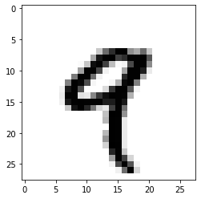
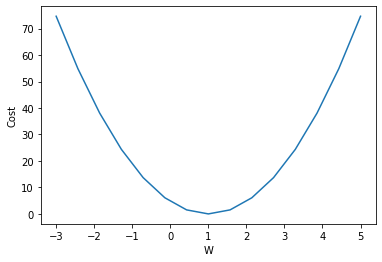

# Chapter 2. 신경망의 수학적 구성 요소

---

## Contents
- 2.1 신경망과의 첫 만남 
- 2.2 신경망을 위한 데이터 표현 
- 2.3 신경망의 톱니바퀴 : 텐서 연산 
- 2.4 신경망의 엔진 : 그레디언트 기반 최적화 
- 2.5 첫 번째 예제 다시 살펴보기 

## Terminology
- task : 해결 하려는 문제 (ex. 이미지 분류, CTR prediction, Next POI prediction) 
- class : 분류 문제의 범주(category) (ex. 개/고양이, True/False, 0~9 ...)
- sample : 데이터 포인트 
- label : 특정 샘플의 클래스, 정답, ground truth
- epoch :
- batch : 

## Requirements
- keras : 파이썬 기반의 신경망 오픈소스 라이브러리
  - tensorflow2 부터 케라스가 포함됨 
- numpy : 다차원 배열 라이브러리
- matplotlib : 시각화에 사용

---

## 2.1 신경망과의 첫 만남

- MNIST 숫자 분류기 모델 만들기!! 

- MNIST 
  - 흑백 손글씨 (0~9)
  - 28 x 28
  - train set : 6만개 
  - test set : 1만개 
  - 딥러닝계의 hello world 

### Load MNIST dataset


```python
from tensorflow.keras.datasets import mnist

(train_images, train_labels), (test_images, test_labels) = mnist.load_data()
```


```python
train_images.shape, train_labels.shape, train_labels
```


    ((60000, 28, 28), (60000,), array([5, 0, 4, ..., 5, 6, 8], dtype=uint8))


```python
test_images.shape, test_labels.shape, test_labels
```


    ((10000, 28, 28), (10000,), array([7, 2, 1, ..., 4, 5, 6], dtype=uint8))


### Neural Network Structure


```python
from tensorflow.keras import models 
from tensorflow.keras import layers 

model = models.Sequential()
model.add(layers.Dense(512, activation='relu', input_shape=(28*28,)))
model.add(layers.Dense(10, activation='softmax'))
```


```python
model.compile(optimizer='rmsprop',
             loss='categorical_crossentropy',
             metrics=['acc'])
```

### Preparing for training/testing data


```python
train_images = train_images.reshape((60000, 28 * 28))
train_images = train_images.astype('float32') / 255

test_images = test_images.reshape((10000, 28 * 28))
test_images = test_images.astype('float32') / 255
```

### Preparing for Labels


```python
from tensorflow.keras.utils import to_categorical
```


```python
train_labels = to_categorical(train_labels)
test_labels = to_categorical(test_labels)
```


```python
train_labels.shape, train_labels
```


    ((60000, 10),
     array([[0., 0., 0., ..., 0., 0., 0.],
            [1., 0., 0., ..., 0., 0., 0.],
            [0., 0., 0., ..., 0., 0., 0.],
            ...,
            [0., 0., 0., ..., 0., 0., 0.],
            [0., 0., 0., ..., 0., 0., 0.],
            [0., 0., 0., ..., 0., 1., 0.]], dtype=float32))


### Model Training


```python
model.fit(train_images, train_labels, epochs=5, batch_size=128)
```

    Epoch 1/5
    469/469 [==============================] - 2s 4ms/step - loss: 0.4260 - acc: 0.8750
    Epoch 2/5
    469/469 [==============================] - 2s 4ms/step - loss: 0.1066 - acc: 0.9680
    Epoch 3/5
    469/469 [==============================] - 2s 5ms/step - loss: 0.0719 - acc: 0.9781
    Epoch 4/5
    469/469 [==============================] - 2s 4ms/step - loss: 0.0503 - acc: 0.9847
    Epoch 5/5
    469/469 [==============================] - 2s 4ms/step - loss: 0.0344 - acc: 0.9897


    <tensorflow.python.keras.callbacks.History at 0x7fd9c1910eb0>


### Model Testing


```python
preds = model.predict(test_images)
preds.shape
```


    (10000, 10)


```python
test_labels[0]
```


    array([0., 0., 0., 0., 0., 0., 0., 1., 0., 0.], dtype=float32)


```python
import tensorflow as tf

tf.argmax(preds[0])
```


    <tf.Tensor: shape=(), dtype=int64, numpy=7>


```python
test_loss, ntest_acc = model.evaluate(test_images, test_labels)
```

    313/313 [==============================] - 0s 519us/step - loss: 0.0720 - acc: 0.9789


---

## 2.2 신경망을 위한 데이터 표현

- 텐서 
  - 임의의 차원 개수를 가지는 행렬의 일반화된 모습
  - 차원(dimension)을 축(axis) 라고도 함 

### 스칼라(0D 텐서)
- 하나의 숫자만 갖는 텐서
- 스칼라 또는 0D 텐서라고 함


```python
import numpy as np

x = np.array(12)
x
```


    array(12)


```python
x.shape
```


    ()


- `ndim` : 축의 개수 리턴. rank 라고도 함


```python
x.ndim
```


    0


### 벡터(1D 텐서)
- 숫자의 배열을 갖는 텐서
- 벡터 또는 1D 텐서 


```python
x = np.array([12, 3, 6, 14, 7])
x
```


    array([12,  3,  6, 14,  7])


- x는 5차원 벡터 (하나의 축을 따라 5개의 차원을 가짐)
- x는 1D 텐서 


```python
x.ndim
```


    1


```python
x.shape
```


    (5,)


### 행렬(2D 텐서)
- 벡터의 배열을 갖는 텐서 
- 행렬 또는 2D 텐서
- 2개의 축, 보통 행(row), 열(column)
- 벡터 데이터 (samples, features)
  - ex. (나이, 성별, 키)로 구성된 10만명의 인구데이터. (100000, 3) 크기의 텐서에 저장


```python
x = np.array([[5, 78, 2, 34, 0],
             [6, 79, 3, 35, 1],
             [7, 80, 4, 36, 2]])
x.ndim
```


    2


```python
x.shape
```


    (3, 5)


### 3D 텐서와 고차원 텐서
- 3D 텐서 : 시계열 데이터 또는 sequence 데이터 (samples, timesteps, features)
- 4D 텐서 : 이미지 (samples, height, width, channels) or (samples, channels, height, width)
- 5D 텐서 : 동영상 (samples, frames, height, wdith, channels) or (samples, frames, channels, height, width)


```python
x = np.random.randint(0, 10, size=(3, 3, 5))
x
```


    array([[[2, 9, 4, 5, 4],
            [0, 0, 5, 0, 8],
            [0, 9, 0, 7, 8]],
    
           [[7, 8, 6, 1, 9],
            [6, 3, 7, 1, 2],
            [2, 0, 3, 2, 4]],
    
           [[9, 6, 0, 1, 1],
            [6, 0, 3, 9, 9],
            [4, 9, 2, 3, 0]]])


```python
x.ndim
```


    3


```python
x.shape
```


    (3, 3, 5)


### 텐서의 핵심 속성
- 축의 개수(rank)
- 크기(shape)
- 데이터타입(dtype)


```python
from tensorflow.keras.datasets import mnist 

(train_images, train_labels), (test_images, test_labels) = mnist.load_data()
```


```python
train_images.ndim, train_images.shape, train_images.dtype
```


    (3, (60000, 28, 28), dtype('uint8'))


### 실제 이미지 출력


```python
import matplotlib.pyplot as plt

digit = train_images[4]
plt.imshow(digit, cmap=plt.cm.binary)
plt.show()
```


    

    


### Slicing


```python
train_images.shape
```


    (60000, 28, 28)


```python
train_images[a:b]
```


```python
my_slice = train_images[:10]
my_slice.shape
```


    (10, 28, 28)


```python
my_slice = train_images[5:10]
my_slice.shape
```


    (5, 28, 28)


### Batch Data

- 일반적으로, 딥러닝에서 사용하는 모든 데이터 텐서의 첫 번째 축은 **샘플 축**
- 딥러닝 모델은 한 번에 전체 데이터셋을 처리하는 것이 아니라, 작은 배치(batch)로 나눔 


```python
batch = train_images[:128]
```


```python
batch = train_images[128:256]
```


```python
n = 5 
batch = train_images[128 * n : 128 * (n+1)] # n번째 배치 
```


```python
batch.shape
```


    (128, 28, 28)


---

## 2.3 신경망의 톱니바퀴 : 텐서 연산

- 텐서 연산 : 텐서에 적용하는 연산 
  - ex) 텐서 덧셈, 텐서 곱셈, ... 

```python
tensorflow.keras.layers.Dense(512, activation='relu')
```
- 2D 텐서를 입력으로 받아, 입력 텐서의 새로운 표현인 또 다른 2D 텐서 반환

```python
output = relu(dot(W, input) + b)
```
- 위 식에서의 텐서연산
  - 입력 텐서와 W의 dot product 
  - dot product 결과인 2D텐서와 벡터 b 사이의 덧셈 
  - relu 연산 max(x, 0)

### Element-wise operation
- 텐서에 있는 각 원소에 독립적으로 적용 
- 이 말은 고도의 병렬구현이 가능한 연산
- relu 연산과 덧셈


```python
def naive_relu(x):
    assert len(x.shape) == 2
    
    x = x.copy() # 입력 텐서 자체를 바꾸지 않도록 복사 
    for i in range(x.shape[0]):
        for j in range(x.shape[1]):
            x[i, j] = max(x[i, j], 0)
    return x
```


```python
def naive_add(x, y):
    assert len(x.shape) == 2
    assert x.shape == y.shape 
    
    x = x.copy()
    for i in range(x.shape[0]):
        for j in range(x.shape[1]):
            x[i, j] += y[i, j]
    return x
```

- numpy 배열은 최적화된 넘파이 내장 연산들을 처리할 수 있음 
- 넘파이는 시스템에 설치된 BLAS(Basic Linear Algebra Subprogram) 구현에 복잡한 일들을 위임 
- BLAS는 고도로 병렬화되고 효율적인 저수준 텐서 조작 루틴 
- 전형적으로 Fortran, C 언어로 구현됨 
- 넘파이는 다음과 같은 원소별 연산을 엄청난 속도로 처리 


```python
x = np.random.randint(1, 10, size=(50))
y = np.random.randint(1, 10, size=(50))
```


```python
x, y
```


    (array([3, 3, 2, 1, 5, 4, 9, 8, 8, 5, 8, 7, 1, 4, 7, 3, 4, 9, 2, 2, 4, 9,
            5, 6, 6, 4, 2, 9, 2, 5, 1, 6, 6, 5, 1, 6, 3, 1, 8, 9, 3, 5, 7, 9,
            8, 3, 6, 3, 2, 7]),
     array([7, 9, 3, 1, 2, 6, 6, 1, 4, 6, 8, 6, 9, 3, 2, 8, 1, 9, 9, 2, 6, 4,
            2, 7, 2, 1, 1, 8, 9, 2, 6, 5, 2, 5, 6, 7, 5, 5, 8, 6, 1, 8, 1, 9,
            5, 8, 7, 2, 5, 3]))


```python
z = x + y
z = np.maximum(z, 0.)
z
```


    array([10., 12.,  5.,  2.,  7., 10., 15.,  9., 12., 11., 16., 13., 10.,
            7.,  9., 11.,  5., 18., 11.,  4., 10., 13.,  7., 13.,  8.,  5.,
            3., 17., 11.,  7.,  7., 11.,  8., 10.,  7., 13.,  8.,  6., 16.,
           15.,  4., 13.,  8., 18., 13., 11., 13.,  5.,  7., 10.])


### Broadcasting

- 위의 예제에서 2D 텐서와 벡터의 덧셈 
- 작은 텐서가 큰 텐서의 크기에 맞추어 브로드캐스팅 됨 
  - 큰 텐서의 ndim에 맞도록 작은 텐서에 축이 추가됨(브로드캐스팅 축)
  - 작은 텐서가 새 축을 따라서 큰 텐서의 크기에 맞도록 반복됨 


```python
x = np.zeros(shape=(2, 10))
x, x.shape
```


    (array([[0., 0., 0., 0., 0., 0., 0., 0., 0., 0.],
            [0., 0., 0., 0., 0., 0., 0., 0., 0., 0.]]),
     (2, 10))


```python
y = np.random.randint(1, 5, size=(10))
y.shape
```


    (10,)


```python
x + y
```


    array([[1., 2., 2., 2., 4., 1., 4., 3., 3., 1.],
           [1., 2., 2., 2., 4., 1., 4., 3., 3., 1.]])


### Tensor dot product 


```python
# 벡터 x와 벡터 y의 점곱 
def naive_vector_dot(x, y):
    assert len(x.shape) == 1
    assert len(y.shape) == 1
    assert x.shape[0] == y.shape[0]
    
    z = 0.
    for i in range(x.shape[0]):
        z += x[i] * y[i]
    return z
```


```python
# 행렬 x와 벡터 y의 점곱 
def naive_matrix_vector_dot(x, y):
    assert len(x.shape) == 2
    assert len(y.shape) == 1
    assert x.shape[1] == y.shape[0]
    
    z = np.zeros(x.shape[0])
    for i in range(x.shape[0]):
        for j in range(x.shape[1]):
            z[i] += x[i, j] * y[j]
    return z
```


```python
# 두 행렬 x, y간의 점곱 
def naive_matrix_dot(x, y):
    assert len(x.shape) == 2
    assert len(x.shape) == 2 
    assert x.shape[1] == y.shape[0]
    
    z = np.zeros((x.shape[0], y.shape[1]))
    for i in range(x.shape[0]):
        for j in range(y.shape[1]):
            row_x = x[i, :]
            column_y = y[:, j]
            z[i, j] = naive_vector_dot(row_x, column_y)
    return z
```


---

# 2.4 신경망의 엔진 : 그레디언트 기반 최적화 

```python
output = relu(dot(W, input) + b)
```
- (Trainable) Parameter 
  - W : weight(가중치, 커널)
  - b : bias(편향)

- Training loop
  1. 훈련 샘플 x 와 이에 상응하는 타깃 y의 배치를 추출 
  2. x를 사용하여 네트워크를 실행하고 예측 y_pred를 구함 
  3. y_pred 와 y의 차이를 측정하여 이 배치에 대한 네트워크 손실을 계산 
  4. 배치에 대한 손실이 조금 감소되도록 네트워크의 모든 가중치를 업데이트

- 4번에서, 가중치를 얼마나 어떻게 업데이트 할까? 
  - brute force 관점에서?
    - 가중치 행렬 원소 중 모두 고정하고, 하나의 값만 변경해 봄 
      - step1) 0.3(w) -> 0.5(loss)
      - step2) 0.35(w) -> 0.6(loss)
      - step3) 0.25(w) -> 0.4(loss)
    - 보통 수천에서 수백만 개의 가중치가 있는데... 너무 비효율적!!!

- 신경망의 모든 연산이 **미분 가능** 하다는 장점을 사용하여 네트워크 가중치에 대한 손실의 **그레디언트**를 계산하자!


### 경사 하강법(Gradient Descent)

cf) [모두의 딥러닝2 경사하강법](https://youtu.be/D_ws0YyHAm8?list=PLQ28Nx3M4Jrguyuwg4xe9d9t2XE639e5C&t=407)

$H(x)=Wx$  
$Cost(W)=\frac{1}{m}\sum_{i=1}^m(Wx_i-y_i)^2$  


```python
x = np.array([1, 2, 3])
y = np.array([1, 2, 3])
# y = 1x

def cost(W, X, Y):
    c = 0
    for i in range(len(X)):
        c += (W * X[i] - Y[i]) ** 2
    return c / len(X)

W_values = np.linspace(-3, 5, 15)
cost_values = []
print('   W\t     cost')
for feed_W in W_values:
    curr_cost = cost(feed_W, x, y)
    cost_values.append(curr_cost)
    print(f'{feed_W:6.3f} | {curr_cost:10.5f}')
```

       W	     cost
    -3.000 |   74.66667
    -2.429 |   54.85714
    -1.857 |   38.09524
    -1.286 |   24.38095
    -0.714 |   13.71429
    -0.143 |    6.09524
     0.429 |    1.52381
     1.000 |    0.00000
     1.571 |    1.52381
     2.143 |    6.09524
     2.714 |   13.71429
     3.286 |   24.38095
     3.857 |   38.09524
     4.429 |   54.85714
     5.000 |   74.66667


```python
plt.plot(W_values, cost_values)
plt.xlabel('W')
plt.ylabel('Cost')
```


    Text(0, 0.5, 'Cost')


    

    


- cost 가 최저가 되는 점을 찾기 위해 w를 업데이트
- cost에 대한 함수를 미분하여 w를 업데이트 하자!

$W:=W-\alpha\frac{\partial}{\partial W}\frac{1}{2m}\sum_{i=1}^m(Wx_i-y_i)^2$  
$W:=W-\alpha\frac{1}{m}\sum_{i=1}^m(Wx_i-y_i)x_i$

- $\alpha$ : learning rate 
- 계산 편의를 위해 $2m$으로 나눔


```python
tf.random.set_seed(0)

x = [1., 2., 3., 4.]
y = [1., 3., 5., 7.]

W = tf.Variable(tf.random.normal([1], -100., 100.))

print('epoch      cost           W')
n_epoch = 300
for epoch in range(n_epoch):
    hypothesis = W * x
    cost = tf.reduce_mean(tf.square(hypothesis - y))
    
    learning_rate = 0.01
    gradient = tf.reduce_mean((W * x - y) * x)
    W.assign(W - learning_rate * gradient)
    
    if epoch % 10 == 0:
        c = cost.numpy()
        w = W.numpy()[0]
        print(f'{epoch:5} | {c:10.4f} | {w:10.6f}')
```

    epoch      cost           W
        0 | 18332.2188 |  47.398293
       10 |  3855.3564 |  22.638384
       20 |   810.9046 |  11.283927
       30 |   170.6631 |   6.076973
       40 |    36.0217 |   3.689155
       50 |     7.7069 |   2.594144
       60 |     1.7524 |   2.091991
       70 |     0.5001 |   1.861713
       80 |     0.2368 |   1.756112
       90 |     0.1814 |   1.707684
      100 |     0.1698 |   1.685477
      110 |     0.1673 |   1.675292
      120 |     0.1668 |   1.670622
      130 |     0.1667 |   1.668481
      140 |     0.1667 |   1.667498
      150 |     0.1667 |   1.667048
      160 |     0.1667 |   1.666842
      170 |     0.1667 |   1.666747
      180 |     0.1667 |   1.666703
      190 |     0.1667 |   1.666684
      200 |     0.1667 |   1.666674
      210 |     0.1667 |   1.666670
      220 |     0.1667 |   1.666668
      230 |     0.1667 |   1.666667
      240 |     0.1667 |   1.666667
      250 |     0.1667 |   1.666667
      260 |     0.1667 |   1.666667
      270 |     0.1667 |   1.666667
      280 |     0.1667 |   1.666667
      290 |     0.1667 |   1.666667


### 역전파 알고리즘 (back propagation)

- 가장 중요한 개념은 chaining rule
- chaining rule 
    - $f(g(x))'=f'(g(x))\cdot g'(x)$
    - $\frac{\partial f}{\partial x}= \frac{\partial f}{\partial g} \cdot \frac{\partial g}{\partial x}$ 

cf) [모두의딥러닝1 Back propagation](https://youtu.be/573EZkzfnZ0?list=PLlMkM4tgfjnLSOjrEJN31gZATbcj_MpUm)


---

## 2.5 첫 번째 예재 다시 보기


```python
(train_images, train_labels), (test_images, test_labels) = mnist.load_data()

train_images = train_images.reshape((60000, 28 * 28))
train_images = train_images.astype('float32') / 255

test_images = test_images.reshape((10000, 28 * 28))
test_images = test_images.astype('float32') / 255

train_labels = to_categorical(train_labels)
test_labels = to_categorical(test_labels)

model = models.Sequential()
model.add(layers.Dense(512, activation='relu', input_shape=(28 * 28,)))
model.add(layers.Dense(10, activation='softmax'))
model.compile(optimizer='rmsprop',
             loss='categorical_crossentropy',
             metrics=['acc'])
model.summary()
```

    Model: "sequential_1"
    _________________________________________________________________
    Layer (type)                 Output Shape              Param #   
    =================================================================
    dense_2 (Dense)              (None, 512)               401920    
    _________________________________________________________________
    dense_3 (Dense)              (None, 10)                5130      
    =================================================================
    Total params: 407,050
    Trainable params: 407,050
    Non-trainable params: 0
    _________________________________________________________________


```python
model.fit(train_images, train_labels, epochs=5, batch_size=128)
```

    Epoch 1/5
    469/469 [==============================] - 2s 3ms/step - loss: 0.4331 - acc: 0.8743
    Epoch 2/5
    469/469 [==============================] - 1s 3ms/step - loss: 0.1065 - acc: 0.9678
    Epoch 3/5
    469/469 [==============================] - 1s 3ms/step - loss: 0.0721 - acc: 0.9770
    Epoch 4/5
    469/469 [==============================] - 1s 3ms/step - loss: 0.0502 - acc: 0.9848
    Epoch 5/5
    469/469 [==============================] - 1s 3ms/step - loss: 0.0339 - acc: 0.9899


    <tensorflow.python.keras.callbacks.History at 0x7fd9f0c9c1f0>


---

그래서 케라스 창시자는 누군데?
[프랑소와 숄레](https://medium.com/dsnet/interview-with-the-creator-of-keras-ai-researcher-fran%C3%A7ois-chollet-823cf1099b7c)


```python

```


```python

```


```python

```


```python

```
