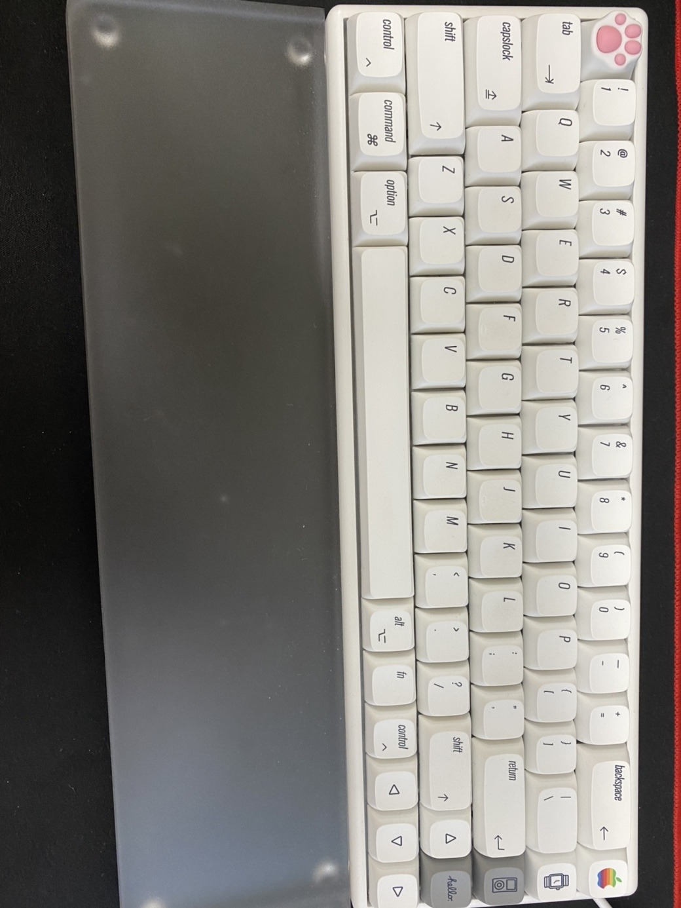

⌨🖱

연구실 일을 본격적으로 하기 시작하면서, 기존에 있던 키보드가 굉장히 불편하게 느껴졌다. 블루투스 키보드였지만 동글이 문제였던 것인지... 블루투스 접촉 오류가 계속되면서 새로운 키보드 구입을 결심하게 되었다.

일단 나는 키보드에 대해서 잘 알지도 못했고, 내가 내돈을 들여서 키보드를 사본적도 없다..ㅎㅎ

내가 키보드를 사기에 앞서 원했던 스펙은

첫번째, 타건감이 좋아야할것.

두번째, 이.뻐.야.할.것

세번째, 멀티페어링이 2개 이상 되어야할것.

처음에는 숫자키도 있는 키보드를 사려고 했지만,  유튜브에 키보드 추천 영상을 보니까 개발자들은 키보드와 마우스 사이의 거리가 좁은 ***텐키리스*** 키보드를 거의 쓰더라..

그래서 고민끝에 나도 텐키리스를 사게 되었다는...ㅋㅋ

기계식키보드를 알아보고 있었는데 나는 적축이 개인적으로 궁금했고, 또 잘맞는다고 생각했다. 

근데 알아보다보니 무접점이라는 키보드계 하이클래스를 알게되었고 돈이 많이 비싸긴했지만, 이미 무접점 소리를 듣게된 이상...

뭐 어떡해~ 구입해야지~ FLEX~~

무접점 키보드도 정말 많고 많았지만, 위에 3가지 요건을 충족시키는 키보드는 한개밖에 없었다. **"한성 무접점 키보드"**

나는 쿠팡에서 구입했고 약 15만원에 구입했다. 이것도 종류가 많았는데, 제일 잘팔리는 종류로 키압감은 35g 과 50g 둘다 궁금해서 그냥 둘다 샀다.(물론 한개는 도로 반품함..;;)

둘다 사봤을때 딱 처음 타건감은 50이 정말 좋았다. 서걱서걱 느낌이라고 해야할까...ㅋ 그래서 무조건 닭치고~ 35를 반품하려고 했지만!! 50에게는 치명적인 단점이 있었는데...

50은 아무래도 키압이 높다보니까 장시간 타이핑을 치면 손목에 무리가 가는것이 실시간으로 느껴졌다. 컴퓨터를 쓰는 연구실에 연구생으로 근무했기 때문에, 결국 눈물을 머금고 50g을 반품했다.

근데 지금와서 생각해보니, 그냥 35g을 선택한게 신의 한 수 였던것 같다. 이거 완전 보글보글 거린다. 키보드 칠때마다 기부니가 좋다~!

히힛! 키보드가 원래 이쁘긴 했지만, 이왕 쓰는거 더 깔끔하고 예쁘게 쓰고 싶어서 키캡도 구매해서 커스텀해줬다!(키캡 가격도 만만치 않았음..;)

그리고 아무래도 장시간 타이핑하다 보니 손목에 무리갈 수도 있을것 같아서 아크릴 팜레스트도 장만했다. (이건 남친이 선물로 줬음요ㅎㅎ)

아무튼 이것으로 키보드 리뷰끝!

*마무리 글...) 이번 키보드 구입으로 인해 키보드에 대해 진짜 밤낮없이 알아봐서, 이걸로 논문도 낼 수 있을것 같네;*
