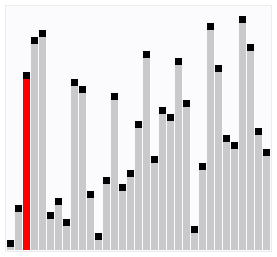
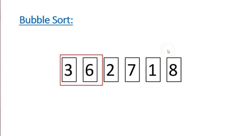

### Sorting Algorithms

***

정렬 알고리즘은 배열 내 원소들을 일정한 순서대로 열거하는 알고리즘을 말한다. 

#### Bubble Sort 

***

거품 정렬은 배열 내 인접한 두 원소를 비교하고, 순서에 맞게 자리를 교환하는 알고리즘이다. 원소들 간에 자리를 교환하는 모습이 마치 거품이 수면 위로 올라오는 듯 해서 거품 정렬이라는 이름이 붙여졌다고 한다. 

거품 정렬의 경우, 정렬 알고리즘 중에서 가장 간단하고 직관적인 알고리즘이지만,  동시에 평균 시간 복잡도는 O(n^2)를 가진다는 점에서 성능이 좋지는 않다. 

