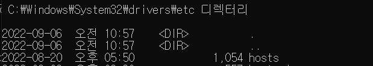
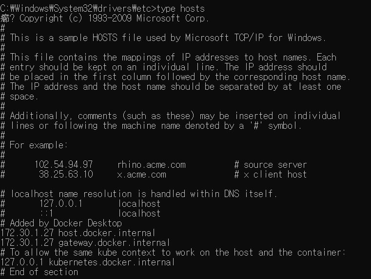
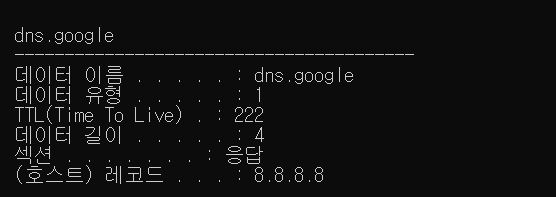
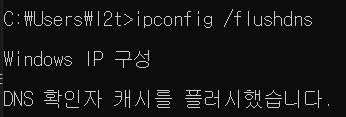
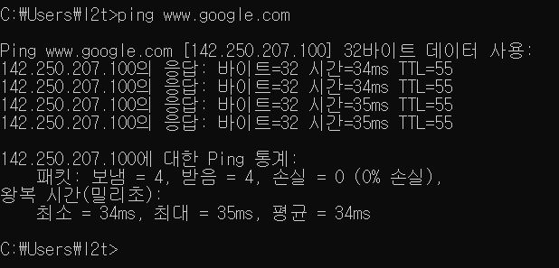
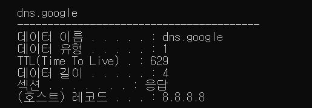
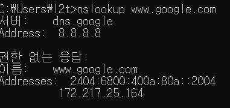

#### DNS 프로토콜

네트워크 프로토콜을 사용해 통신을 할 때는 `Host`를 식별하기 위해 `IP 주소` 를 사용한다. 하지만 현실적으로 IP 주소를 기억하는 것은 비효율적이기 때문에 Host의 IP 주소와 URL을 매핑해주는 DNS 프로토콜을 사용하면 도메인 네임을 확인하여 Host에 접근할 수 있다. 


#### 로컬 DNS 캐시에서 도메인 네임을 확인하는 과정

[CDN은 어떻게 동작할까?]()의 글에서 Host 서버의 실제 IP 주소를 찾기 위해서는 상당히 복잡한 과정을 거친 뒤에 브라우저가 서버로부터 컨텐츠를 전달받는다는 것을 확인할 수 있었다. 이번 글에서는 첫번째 단계인 브라우저가 로컬 DNS 캐시 테이블을 탐색하는 과정에 대해 알아볼 것이다.


---

#### Hosts 파일

`hosts` 파일에는 Host의 IP 주소를 찾기위해 OS가 호스트의 도메인 네임과 IP 주소를 대응시켜 저장해놓은 텍스트 파일이다. Window, Mac, Linux OS에서 파일 내용을 확인해볼 수 있다. 하지만 인터넷의 수많은 서버의 도메인 정보를 저장하기에는 무리가 있어 잘 사용하지 않으며 최근에는 네임서버를 사용한다.

- Hosts 파일 확인

```
# window
# C:\Windows\System32\drivers\etc

type hosts
```

<div style="display: flex;
    flex-direction: column;
    margin: 20px 0">


</div>

hosts 파일에 google.com과 ip 주소가 저장되어 있다면 google.com의 ip 주소를 찾기 위해 dns server에 query할 필요 없이 바로 ip 주소를 찾아 접속이 가능하다.

호스트 파일은 서버의 이름과 그에 해당하는 IP 주소를 미리 저장해 놓아야만 활용할 수 있으며 DNS 서버 쿼리보다 Host 파일의 우선 순위가 높다. 

- `127.0.0.1` 의 의미
  - localhost라는 이름의 서버는 루프백 주소로 불리며 자기 자신의 IP주소로 사용되도록 예약되어 있다. 루프백 주소의 IP 주소 범위는 127.0.0.0 ~ 127.255.255.255.255이다.

---
#### DNS 캐시 테이블

Window에서 DNS 캐시 테이블을 확인하기 위해서는 다음 명령어를 사용하면 된다.

```
# DNS 캐시 테이블 출력
ipconfig/displaydns

# DNS 캐시 테이블 삭제
ipconfig/flushdns
```

- DNS 캐시 테이블을 조회해보면 `google`의 실제 IP 주소인 `8.8.8.8`을 확인할 수 있으며 이 정보는 (호스트) 레코드라는 필드로 검색된다. 

<div style="display: block; width: 80%; margin: 10px auto;">

</div>

**캐시 테이블 삭제 후 Ping을 통해서 도메인 검색하기**

1. `ipconfig /flushdns` 를 입력하여 DNS 캐시 삭제
2. google에 ping 보내기
3. google 도메인 레코드 등록 확인 (`8.8.8.8`)

<div style="display: flex; height: 200px">



</div>

---

### DNS 서버에 직접 쿼리해보기

#### `nslookup`

`nslookup`는 DNS 서버에 직접 DNS 쿼리를 하고 그 결과를 출력해주는 명령어이다. 이를 통해 DNS 설정이 정상적인지, DNS 서버가 정상적으로 동작하고 있는지, 네트워크가 제대로 설정되어있는지 여부를 확인할 수 있다. 간단하게 구글의 ip를 조회해보자.

```
nslookup www.google.com
```

<div style="display: block; width: 80%; margin: 10px auto;">

</div>

서버와 address 정보는 어느 dns 서버에 쿼리를 요청했는지를 의미한다. 구글 이름으로는 www.google.com를 Addresses에서 www.google.com에 연결된 `IPv6`, `IPv4` 주소를 확인할 수 있다.

- [권한 없는 응답, Non-authoritative answer의 의미는?]()
---
#### 결론

로컬에서 Host의 ip 주소를 먼저 확인하는 순서를 요약하면 다음과 같다.

1. 사용자가 브라우저에 `www.google.com`를 입력한다.

2. 구글의 도메인 네임에 대응되는 IP를 `hosts` 파일에서 검색한다.

3. hosts 파일에 입력한 도메인이 없는 경우 DNS 캐시 테이블에서 해당 도메인에 대응하는 IP 주소를 검색하여 있을 경우 그 IP 주소를 통해 사이트에 접속한다.

4. DNS 캐시 테이블에 없을 경우 로컬 DNS 서버의 IP 주소로 입력한 DNS Server에 질의를 요청한다. (ISP의 DNS resolver에 요청한다.)

5. DNS에 질의하여 IP 주소를 응답 받으면 DNS 캐시 테이블에 반영한다. 


