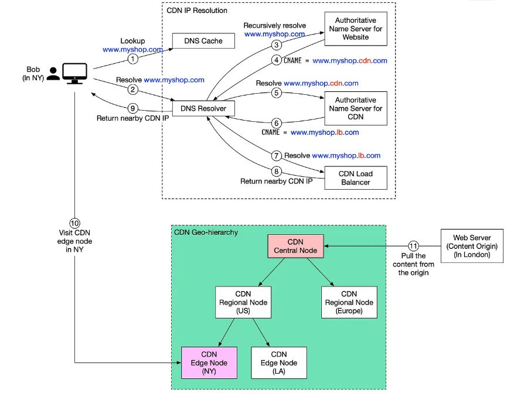

`CDN(Content delivery network`는 지리적으로 분산된 서버(edge server 라고도 일컫음)를 말한다. `static`, `dynamic` 한 컨텐츠를 빠르게 제공하는 것을 목적으로 한다.

---

**예시**
  
서울에 살고 있는 내가 미국에서 배포된 온라인 쇼핑몰 사이트에 접속한다고 했을 때 물리적으로 멀리 떨어져있기 때문에 응답 속도가 꽤 늦을 수도 있다. 그런데 만약 `CDN` 서비스를 이용하면 사용자와 물리적으로 가까운 CDN 서버를 선택하여 사용자에게 실제 배포 서버에서 제공하는 컨텐츠를 빠르게 전달할 수 있다.

---

**CDN 동작 순서**

1. 브라우저에 `https://www.google.com`을 입력하면 브라우저는 [로컬 DNS 캐시]()에서 도메인 네임을 찾는다.

2. 로컬 DNS 캐시에서 도메인 네임을 찾지 못한 경우,  브라우저는 도메인 네임을 찾기 위해 DNS Resolver로 이동한다. 일반적으로 DNS Resolver는 [ISP]()(Internet Service Provider)에게 있다.

3. DNS resolver는 재귀적으로 도메인 네임을 검색하기 시작한다. 마지막으로 [Authoritative DNS Server]()에 해당 도메인 네임을 확인하도록 요청한다.

4. CDN을 사용하지 않을 경우 `Authoritative DNS 서버`는 `www.google.com`의 IP 주소를 반환한다. 그러나 CDN의 경우 `Authoritative DNS 서버`는 `www.google.cdn.com` (CDN 서버의 도메인 네임)을 가리키는 alias를 가진다.

5. DNS Resolver는 `Authoritative DNS Server` 에게 `www.google.cdn.com`을 확인하라고 요청한다.

6. `Authoritative DNS 서버`는 CDN `www.google.lb.com`의 로드밸런서에 대한 도메인 네임을 반환한다.

7. DNS Resolver는 CDN 로드밸런서에게 `www.google.lb.com`를 확인하도록 요청한다. **로드 밸런서는 유저 IP 주소, ISP, 요청된 컨텐츠, 서버의 부하 정보를 기반으로 최적의 CDN Edge Server를 선택**한다.

8. CDN 로드 밸런서는 `www.google.lb.com`에 대한 CDN edge server의 IP 주소를 반환한다.

9. DNS resolver는 이 주소를 브라우저에게 최종적으로 전달한다.

10. 브라우저는 CDN Edge 서버에 접속하여 컨텐츠를 로드한다. 이때 CDN Edge 서버에 캐시된 컨텐츠는 `정적` , `동적` 컨텐츠 두개의 유형으로 나뉜다. 먼저 `정적` 컨텐츠는 정적 사진, 이미지, 영상등에 해당하며 `동적` 컨텐츠는 컴퓨팅 연산 결과를 전달하게 된다.

11. 만약 Edge CDN 서버 캐시에 컨텐츠가 없는 경우 로컬 CDN 서버로 이동한다. 그래도 컨텐츠가 없다면 중앙 CDN 서버로 올라가거나 실제 배포 웹서버로 이동하게 되는데 이를 `DN distribution network` 라고 하며 서버들이 지리적으로 배포되는 곳이다.