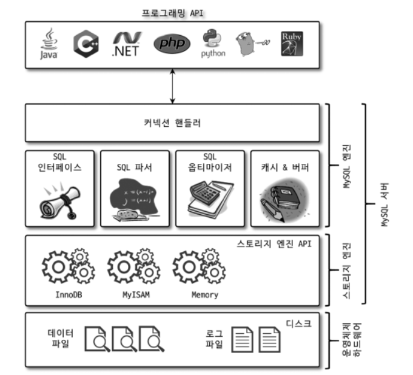

<div style="display: block; width: 80%; margin: 0px auto;">

</div>


**구조**

Mysql 서버는 `Mysql 엔진`과 `스토리지 엔진`으로 구분할 수 있다.

`스토리지 엔진` 핸들러 API를 만족하면 누구든지 스토리지 엔진을 구현해서 Mysql 서버에 추가

해서 사용할 수 있다. —> InnoDB, MYISAM 등

**특징**

- 대부분의 프로그래밍 언어로부터 접근 방법을 지원
    - C, JDBC, ODBC, .NET의 드라이버 지원하며 이를 이용해 모든 언어로부터 MYSQL 서버에서 쿼리를 사용할 수 있게 된다.

**MYSQL 엔진**

요청된 SQL 문장을 분석하고 최적화하는 DBMS의 두뇌에 해당하는 처리를 수행

- `커넥션 핸들러` : 클라이언트로부터 접속 및 쿼리 요청 처리
- `SQL 파서 및 전처리기`
- `옵티마이저` : 쿼리의 최적화된 실행

**스토리지 엔진**

실제 데이터를 디스크 스토리지에 저장하거나 디스크 스토리지로부터 데이터를 읽어오는 부분

여러개를 동시에 사용할 수 있음

테이블이 사용할 스토리지 엔진을 지정하면 이후 해당 테이블의 모든 읽기 작업이나 변경 작업은 정의된 스토리지 엔진이 처리함

```sql
CREATE TABLE test_table (fd1 INT, fd2 INT) ENGINE=INNODB;
```

- test_table이 INNODB 스토리지 엔진을 사용하도록 ㅈㅇ의
- 작업이 발생하면 INNODB 엔진이 처리를 담당
- 각 스토리지 엔진은 성능 향상을 위해 `키 캐시` 나 `버퍼 풀` 과 같은 기능을 내장하고 있다.

- 핸들러 API
    - MYSQL 엔진의 쿼리 실행기에서 데이터를 읽거나 쓰는 경우 각 스토리지 엔진에 쓰기 또는 읽기를 요청하는데 이러한 요청을 핸들러 요청이라 하고 여기서 사용되는 API를 핸들러 API라고 한다.
    - InnoDB 스토리지 엔진 또한 이 핸들러 API를 이용해 Mysql 엔진과 데이터를 주고받음

---

### Mysql 스레딩 구조

<div style="display: block; width: 80%; margin: 0px auto;">

</div>

Mysql 서버는 프로세스 기반이 아니라 `스레드 기반` 으로 작동한다. 

- 포그라운드 스레드
- 백그라운드 스레드

- 스레드 목록 확인

```sql
SELECT thread_id, name, type, processlist_user, processlist_host
FROM performance_schema.threads ORDER BY type, thread_id
```

<div style="display: block; width: 80%; margin: 0px auto;">

</div>

- 대부분 백그라운드 스레드
    - 백그라운드 스레드 개수는 MYSQL 서버의 설정 내용에 따라 가변적일 수 있다.
    - 동일한 이름의 스레드가 2개 이상 보이는 것은 서버의 설정 내용에 의해 여러 스레드가 동일 작업을 병렬로 처리하는 것이다.
        - 엔터프라이즈 버전에서는 `스레드 풀` 모델을 사용할 수도 있다.
        - 차이점은 `포그라운드 스레드와 커넥션 관계`
- 마지막 `one_connection` 스레드만 실제 사용자의 요청을 처리하는 포그라운드 스레드
- 스레드 모델에서는 포그라운드 스레드가 하나씩 생성되고 할당 된다.
- 스레드 풀에서는 커넥션과 포그라운드 스레드는 1:1 관계가 아니라 하나의 스레드가 여러 개의 커넥션 요청을 전담

**포그라운드 스레드 → `클라이언트 스레드`**

- 포그라운드 스레드는 Mysql 서버에 접속된 클라이언트 수만큼 존재한다.
- 주로 각 클라잉너트 사용자가 요청하는 쿼리 문장을 처리한다.
- 클라이언트 사용자가 작업을 마치고 커넥션을 종료하면 해당 커넥션을 담당하던 스레드는 다시 `스레드 캐시` 로 되돌아 간다.
- 이미 `스레드 캐시` 에 일정 개수 이상의 대기 중인 `스레드` 가 있으면 `스레드 캐시` 에 넣지 않고 `스레드` 를 종료시켜 일정 개수의 스레드만 스레드 캐시에 존재하도록 한다.
- `스레드 캐시` 에 유지할 수 있는 최대 개수는 `thread_cache_size` 시스템 변수로 설정한다.

- 포그라운드 스레드는 데이터를 Mysql 데이터 버퍼나 캐시로부터 가져오고 버퍼나 캐시에 없는 경우 직접 디스크의 데이터나 인덱스 파일로부터 데이터를 읽어와서 작업을 처리한다.
    - MyISAM: 디스크 쓰기 작업까지 포그라운드 스레드가 처리
    - InnoDB: 데이터 버퍼나 캐시까지만 포그라운드 스레드가 처리하고 나머지 버퍼로부터 디스크까지 기록하는 작업은 백그라운드 스레드가 처리

---

### 백그라운드 스레드

- Innodb
    - 언서트 버퍼를 병합하는 스레드
    - 로그를 디스크로 기록하는 스레드
    - InnoDB 버퍼 풀의 데이터를 디스크에 기록하는 스레드
    - 데이터를 버퍼로 읽어오는 스레드
    - 잠금이나 데드락을 모니터링하는 스레드
    - 

`Innodb_write_io_thread` 아주 많은 작업을 백그라운드에서 처리하기 때문에 일반적인 내장 디스크를 사용할 때는 2~4개 정도 DAS나 SAN과 같은 스토리지를 사용할 때는 디스크를 최적으로 사용할 수 있을 만큼 충분히 설정하는 것이 좋다. 

- 사용자의 요청을 읽는 중에 쓰기 작업이 지연될 수 있음
- 쓰기 작업을 버퍼링해서 배치 처리하는 기능이 탑재되어있음
- InnoDB의 경우 백그라운드에서 insert, update, delete 쿼리로 데이터가 변경되는 경우 데이터가 디스크의 데이터 파일로 완전히 저장될 때까지 기다리지 않아도 된다.
- 

`Innodb_read_io_thread` 데이터를 읽는 작업은 주로 클라이언트 스레드에서 처리되기 때문에 읽기 스레드는 많이 설정할 필요가 없음

- 사용자의 요청이 지연되는 경우는 절대로 없음

<div style="display: block; width: 80%; margin: 0px auto;">

</div>

---

### 메모리 할당 및 사용 구조

Mysql에서 사용되는 메모리 공간

⇒ Mysql 서버 내에 존재하는 많은 스레드가 공유해서 사용하는 공간인지에 따라 구분된다.

- 모든 메모리 공간은 서버가 실행되면서 운영체제로부터 할당된다.
- 요청된 메모리 공간을 100% 할당해줄 수도 있고 그 공간만큼 예약해두고 필요할 때 조금씩 할당해주는 경우도 있음
- 운영체제의 메모리 할당 방식은 상당히 복잡
- 단순히 Mysql 시스템 변수로 설정해 둔 만큼 OS로부터 메모리를 할당받는다고 생각해도 된다.

`**글로벌 메모리**`

**클라이언트 스레드 수와 무관하게 하나의 메모리 공간만 할당된다.**

필요에따라 2개 이상의 메모리 공간을 할당받을 수 있지만 클라이언트의 스레드 수와는 무관하다. 생성된 글로벌 영역이 N개라 하더라도 모든 스레드에 의해 공유된다.

대표적인 글로벌 메모리 영역

- 테이블 캐시
- InnoDB 버퍼 풀
- InnoDB 어뎁티드 해시 인덱스
- InnoDB 리두 로그 버퍼

**로컬 메모리 영역** 

`세션(커넥션) 메모리` 라고도 표현됨 Mysql 서버상에 존재하는 클라이언트 스레드가 쿼리를 처리하는 데 사용하는 메모리 영역

**클라이언트 스레드가 사용하는 메모리 공간**

- 클라이언트와 Mysql 서버와의 커넥션을 세션이라 한다.
- 로컬 메모리 영역을 세션 메모리 영역이라 한다.

`클라이언트가 서버에 접속` → `서버에서는 클라이언트 커넥션으로부터 요청을 처리하기 위해 스레드를 하나씩 할당` 

**특징**

- 로컬 메모리는 각 클라이언트 스레드별로 독립적으로 할당되며 절대 공유되어 사용되지 않는다는 특징이 있다.
- 글로벌 메모리 영역의 크기는 주의해서 설정하지만 정렬 버퍼와 같은 로컬 메모리영역은 크게 신경쓰지 않는데 최악의 경우 mysql 서버가 메모리 부족으로 죽을 수도 있음
- 각 쿼리의 용도별로 필요할 때만 공간이 할당되고 필요하지 않은 경우는 mysql이 메모리 공간을 할당하지 않을 수 있다.
    - 정렬 버퍼나 조인버퍼 같은 공간
- **로컬 메모리 공간은 커넥션이 열려 있는 동안 계속 할당된 상태로 남아 있는 공간도 있고**(`커넥션 버퍼, 결과 버퍼`) **쿼리를 실행하는 순간에만 할당했다가 다시 해제하는 공간**(`소트 버퍼나 조인 버퍼`)도 있다.

대표적인 로컬 메모리 영역

- 조인버퍼
- 정렬버퍼
- 바이너리로그버퍼
- 네트워크버퍼

---

### 쿼리가 실행되는 과정

- 사용자의 다양한 요구에 맞춰 데이터를 읽고 쓰는 영역의 스토리지 엔진을 추가할 수 있음 하지만 전체 DBMS 기능이 아닌 일부분의 기능만 수행하는 엔진을 작성하는 것이다.

<div style="display: block; width: 80%; margin: 0px auto;">

</div>

`핸들러?` —> 어떤 기능을 호출하기 위해 사용되는 객체

사람이 자동차를 운전하기 위해 핸들을 조절하는 것처럼

MYSQL 서버에서 MYSQL 엔진은 사람 역할을 하므로 `핸들러` 라고 할 수 있으며

각 스토리지 엔진은  실제 디스크를 읽고 쓰는 작업을 하게 된다.

**MYSQL 엔진이 데이터를 읽거나 쓰기 위해서는 핸들러를 사용해 스토리지 엔진에 명령을 내려야한다.**

- mysql 서버의 상태변수(state) 가운데 Handler로 시작하는 것이 많은데 이러한 상태 변수는 mysql 엔진이 각 스토리지 엔진에게 보낸 명령의 횟수를 의미하는 변수라고 이해하자
- `GROUP BY` , `ORDER BY` 등의 복잡한 처리는 스토리지 엔진 영역이 아닌 `쿼리 실행기` 에서 처리된다.

8.0 버전부터 플러그인 아키텍처를 대체하기 위해 컴포넌트 아키텍처가 지원된다.

---

### 쿼리 실행 구조

<div style="display: block; width: 80%; margin: 0px auto;">

</div>

**쿼리 파서**

- 쿼리 문장을 MYSQL이 식별할 수 있는 최소 단위로 분리
- 트리 형태의 구조로 토크나이즈
- 쿼리 문장의 기본 문법 오류는 이 과정에 발견되서 에러 메세지를 전달

**전처리기**

- 파서 트리를 기반으로 쿼리 문장에 구조적인 문제가 있는지 확인
- 각 토큰을 테이블, 칼럼, 내장 함수와 같은 개체를 매핑하여 해당 객체의 존재 여부와 객체의 접근 권한을 확인
- 실제 존재하지 않거나 권한상 사용할 수 없는 개체의 토큰은 이 단계에서 걸러진다.

**옵티마이저**

- 쿼리 문장을 저렴한 비용으로 가장 빠르게 처리할지를 결정하는 역할
- 아주아주 중요

**쿼리 실행 엔진**

- 옵티마이저는 경영진, 실행 엔진은 중간 관리자, 핸들러는 각 업무의 실무자

EX) 옵티마이저가 `GROUP BY` 를 처리하기 위해 임시 테이블을 이용하는 경우

1. 실행 엔진이 핸들러에게 임시 테이블을 만들라고 요청
2. 다시 실행 엔진은 WHERE 절에 일치하는 레코드를 읽어오라고 핸들러에게 요청
3. 읽어온 레코드들을 1번에서 준비한 임시 테이블로 저장하라고 핸들러에게 요청
4. 데이터가 준비된 임시 테이블에서 필요한 방식으로 데이터를 읽어 오라고 핸들러에게 요청
5. 실행 엔진은 결과를 사용자나 다른 모듈로 넘김

**핸들러(스토리지 엔진)**

- MYSQL 실행 엔진의 요청에 따라 데이터를 디스크로 저장하고 디스크로부터 읽어 오는 역할을 담당한다.
- 핸들러는 스토리지 엔진을 의미
- MyISAM 테이블을 조작하는 경우 핸들러가 MyISAM 스토리지 엔진이 되고
- InnoDB 테이블을 조작하는 경우 핸들러가 InnoDB 스토리지 엔진이 된다.

---

**쿼리 캐시**

- 빠른 응답을 필요로 하는 웹 기반의 응용 프로그램에서 매우 중요한 역할
- SQL의 실행 결과를 메모리에 캐시하고 동일 SQL 쿼리가 실행되면 테이블을 읽지 않고 즉시 결과를 반환하기 떄문에 매우 빠른 성ㄴ능을 보였다.
- 하지만 테이블의 데이터가 변경되면 캐시에 저장된 결과 중에서 변경된 테이블과 관련된 것들은 모두 삭제해야 했으며 이는 동시 처리 성능 저하를 유발한다.
- Mysql 서버가 발전하면서 성능이 개선되는 과정에서 쿼리 캐시는 많은 버그의 원인이 되기도 했다

- 8.0 부터 쿼리 캐시는 기능에서 완전히 제거되고 시스템 변수도 제거됐다.
- 데이터 변경이 거의 없는 읽기만하는 서비스에는 유용할 수 있지만 이런 경우는 흔하지 않다.

---

### 스레드 풀

- 엔터프라이즈 에디션은 스레드 풀 기능을 지원한다.
- `percona server` 에서 제공하는 스레드 풀

**목적**

- 내부적으로 사용자의 요청을 처리하는 스레드 개수를 줄여서 동시 처리되는 요청이 많다 하더라도 Mysql 서버의 CPU가 제한된 개수의 스레드 처리만 집중할 수 있게 해서 서버의 자원 소모를 줄이는 게 목적이다.
- 스레드 풀을 설치한다고 해서 성능이 올라간다고 할 수는 없다.
- 다만 동시에 실행 중인 스레드들을 CPU가 최대한  잘 처리해낼 수 있는 수준으로 줄여서 빨리 처리하게 하는 기능이다.
- 스케줄링 과정에서 CPU 시간을 제대로 확보하지 못하는 경우 쿼리 처리가 더 느려지는 사례가 있다.
- 제한된 수의 스레드만으로 CPU가 처리하도록 적절히 유도한다면 불필요한 컨텍스트 스위칭을 줄이고 오버헤드는 낮출 수 있다.

**Percona Server**

- 기본적으로 코어의 개수 만큼 스레드 풀을 생성
- 스레드 그룹의 개수는 `thread_pool_size` 시스템 변수를 변경해서 조정할 수 있다.
- cpu 코어의 개수와 맞추는 것이 cpu 프로세서 친화도를 높이는 데 좋다.

- 요청이 들어오면 스레드 풀로 처리를 이관
- 만약 스레드 풀에서 처리 중인 작업이 있는 경우 `thread_pool_oversubscribe` 시스템 변수에 설정된 개수만큼 추가로 더 받아들여서 처리한다.
- 이 값이 너무 크면 스케줄링해야 할 스레드가 많아져서 스레드 풀이 더 비효율적으로 작동할 수 있다.
- 스레드 그룹의 모든 스레드가 일을 처리하고 있는 경우
    
    →  스레드 풀은 다음 두 가지 옵션을 선택해야한다.
    
    - 해당 스레드 그룹에 새로운 작업 스레드를 추가할 지?
    - 기존 작업 스레드가 처리를 완료할 떄까지 기다릴지
- 스레드 풀의 스레드 타이머는 주기적으로 스레드 그룹의 상태를 체크한다.
    - 작업 스레드가 `thread_stall_limit` 시스템 변수에 정의된 밀리초 만큼  처리 중인 작업을 끝내지 못하면 새로운 스레드를 생성해서 스레드 그룹에 추가한다.
    - 이때 전체 스레드 풀에 있는 스레드 의 개수는 `thread_poopl_max_threads` 시스템 변수에 설정된 개수를 넘어설 수 없다.

**모든 스레드 그룹의 스레드가 각자 작업을 처리하고 있는 상태에서 새로운 쿼리 요청이 들어오더라도 스레드 풀은 `thread_pool_stall_limit` 만큼 기다려야 새로운 요청을 처리할 수 있는 것이다**

- 응답시간에 아주 민감한 서비스라면 `thread_pool_stall_limit` 시스템 변수를 적절히 낮춰서 설정해야한다. 하지만 이를 0으로 하면 스레드 풀을 사용하지 않은 것이 합리적

- 우선순위 큐
    
    특정 트랜잭션이나 쿼리를 우선적으로 처리하는 기능
    
    해당 트랜잭션이 가지고 있는 잠금이 빨리 해제되고 잠금 경합을 낮춰서 전체적인 처리 성능을 향상시킬 수 있다.
    
    <div style="display: block; width: 80%; margin: 0px auto;">
    
    </div>
    
- 트랜잭션 지원 메타데이터 ← 이해 안됨….

---

## 스토리지 엔진

### InnoDB 스토리지 엔진

<div style="display: block; width: 80%; margin: 0px auto;">

</div>

- 레코드 기반의 잠금
- 높은 동시성 처리가 가능하고 안정적이고 성능이 뛰어나다

**프라이머리 키에 의한 클러스터링**

- 기본적으로 `프라이머리 키` (클러스터링 인덱스)를 기준으로 클러스터링되어 저장됨
- 세컨더리 인덱스는 프라이머리 키 값의 순서대로 디스크에 저장된다.
- 레인지 스캔이 빨리 처리됨

**외래 키 지원**

- 외래 키는 DB 서버 운영의 불편함 떄문에 서비스용 DB에는 생성하지 않은 경우도 있음
- 개발 환경의 DB에서는 좋은 가이드 역할을 할수도있다.
- InnoDB에서 외래 키는 부모 테이블과 자식 테이블 모두 해당 칼럼에 인덱스 생성이 필요하다.
    - 변경 시에는 반드시 부모 테이블이나 자식 테이블에 데이터가 있는지 체크하는 작업이 필요하고 잠금이 여러 테이블로 전파되고 그로 인해 데드락이 발생할 때가 많으므로 개발할 때도 **외래 키의 존재**에 주의하는 것이 좋다.
    - 수동으로 데이터를 적재하거나 스키마 변경 등의 관리 작업이 실패할 수 있다.
    - 외래키가 복잡하게 얽힌 경우에는 문제를 파악하기 어려워진다.
    - `**foreign_key_checks` 시스템 변수를 OFF로 설정하면 외래 키 관게에 대한 체크 작업을 일시적으로 멈출 수 있다.**
    
    <div style="display: block; width: 80%; margin: 0px auto;">
    
    </div>
    

격리 수준이 `READ_COMMITTED` 인 Mysql 서버에서 InnoDB 스토리지 엔진을 사용하는 테이블의 데이터 변경을 어떻게 처리하는가?

```sql
CREATE TABLE member (
	m_id INT NOT NULL,
	m_name VARCHAR(20) NOT NULL,
	m_area VARCHAR(100) NOT NULL,
	PRIMARY KEY (m_id),
	INDEX ix_area (m_area)
);
```

    <div style="display: block; width: 80%; margin: 0px auto;">
    
    </div>

```sql
한건의 레코드를 INSERT

INSERT INTO member (m_id, m_name, m_area) VALUES (12, '이상훈', 서울);
COMMIT;
```

<div style="display: block; width: 80%; margin: 0px auto;">

</div>

<div style="display: block; width: 80%; margin: 0px auto;">

</div>

INSERT 문이 실행된 후 DB의 상태

```sql
UPDATE member SET m_area='경기' where m_id=12;
```

<div style="display: block; width: 80%; margin: 0px auto;">

</div>

<div style="display: block; width: 80%; margin: 0px auto;">

</div>

UPDATE 문장이 실행되면 커밋 실행 여부와 관계 없이 InnoDB의 버퍼 풀은 

수정된 내용 적용하고 변경 전의 값을 `언두 로그`에 복사한다.

InnoDB 버퍼 풀의 변경 내용은 InnoDB 스토리지 엔진의 백그라운드 스레드에 의해 기록된다. 그래서 InnoDB 버퍼 풀의 변경 내용이 디스크의 데이터 파일에 기록 됐는지 여부는 시점에 따라 다를 수 있다.

- 아직 COMMIT이나 ROLLBACK이 되지 않은 상태에서 다른 사용자가 이 쿼리로 작업 중인 레코드를 조회하는 어디를 조회하게 될까?

```sql
SELECT * FROM member WHERE m_id=12; 
```

<div style="display: block; width: 80%; margin: 0px auto;">

</div>

- 버퍼 풀에 있는 내용이 조회 됐음(변경 된 내용)
- 시스템 변수에 설정된 `격리 수준` 에 따라 다르다.
- 격리 수준이 `READ_COMMITTED` 혹은 그 이상의 격리 수준 (REPREATABLE_READ, SERIALIZABLE)의 경우 아직 커밋되지 않았기 때문에 InnoDB 버퍼 풀이나 데이터 파일에 있는 내용 대신 변경되기 이전의 내용을 보관하고 있는 언두 영역의 데이터를 반환한다.
- 이러한 과정을 `MVCC` 라고 함
    - 즉 하나의 레코드에 대해 2개의 버전이 유지되고
    - 필요에 따라 어느 데이터가 보여지는지 여러 가지 상황에 따라 달라지는 구조
    - 관리해야 하는 예전 버전의 데이터는 무한히 많아질 수 있다.
    - 이러한 데이터가 무수히 많아지면 데이터스페이스의 공간이 많이 늘어나는 문제
- COMMIT을 치면 그 상태를 영구적인 데이터로 만든다.
- ROLLBACK을 하면 언두 영역의 백업된 내용을 InnoDB 버퍼 풀로 다시 복구시킨다.
- 커밋이 된다고 언두 영역의 백업 데이터가 항상 바로 삭제되는 것은 아니다.
- 이 undo 영역을 필요로하는 트랜잭션이 없을 때 비로소 삭제된다.