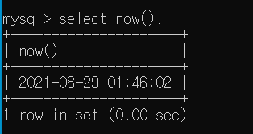

### SQL 데이터 형(Data Type)

1. 숫자 데이터형 (INT, FLOAT)
    - `INT`
    
    MySQL은 정수형 데이터를 저장하기 위해서 INT라는 데이터형을 제공한다. INT 데이터형은 0, 
    
    음수, 양수를 저장한다.
    
    - `FLOAT`
    
    MySQL은 실수형 데이터를 저장하기 위해서 FLOAT라는 데이터형을 제공한다. FLOAT 데이터형
    
    은 소수점을 포함하여 값을 저장할 수 있다.
    
    ```sql
    # 정수 데이터형
    INT(n) 
    # 실수 데이터형
    FLOAT(N, M)
    ```
    
---

2. 문자 데이터형 (CHAR, VARCHAR, BLOB)
    - `CHAR`
    
    1바이트에서 255바이트까지의 고정 길이 문자열을 저장하고, 정의된 저장공간보다 입력 데이터
    
    가 짧으면 나머지 공간은 공백(SPACE)로 채워지고, 정의된 길이보다 입력 데이터가 길면 길이에 
    
    맞게 잘린 데이터가 입력된다. 그러므로 테이블 생성시 저장할 데이터의 최대크기로 정의해야만 
    
    데이터의 손실을 막을 수 있다.
    
    - `VARCHAR`
    
    CHAR 데이터형과 유사하나 정의된 저장공간보다 긴 문자열이 입력되면 CHAR 데이터형에서는 
    
    에러를 발생시키지 않고 초과되는 데이터를 잘라서 입력하지만 **VARCHAR에서는 에러 값을 리**
    
    **턴**한다.  최대로 정의할 수 있는 데이터의 길이는 255바이트까지 저장할 수 있꼬, 메모 등의 다양
    
    한 길이의 데이터에 적절하고, 가변적인 길이의 문자열을 저장하기 때문에, 문자열을 저장하기 
    
    위하여 선호되는 데이터형이다. 하지만 자료 구조의 원리로 볼 때는 **CHAR가 VARCHAR보다 검**
    
    **색 속도가 훨씬 빠르다**
    
    - `BLOB, TEXT`
    
    BLOB과 TEXT는 65,535 이상의 거대한 텍스트 데이터를 저장할 때 사용하면 된다. 다만 BLOB은 
    
    검색시 대소문자를 구분하고, TEXT는 대소문자의 구분 없이 검색할 수 있다.
    

3. 날짜 데이터형
    
    MySQL은 날짜 및 시간 데이터를 저장하기 위해서 Date 데이터형을 제공한다. 사용자들은 
    
    SYSDATE라는 함수를 사용해서 현재 OS의 날짜를 조회할 수 있다.
    
    ```sql
    select now();
    ```
    
    <div style="display: block; width: 80%; margin: 0px auto;">
    
    </div>
    
    select는 산술 계산의 결과나 날짜 등을 볼 수 있다.
    
    Date 데이터 형에는 세기(Century), 년(Year), 월(Month), 일(Day), 시간(Hour), 분(Minute), 초
    
    (Second)에 대한 정보가 포함되어 있다. 
    
    Date 데이터형은 BC 4712년 1월 1일에서 AD 9999년 12월 31일까지의 범위 값을 저장할 수 있다.
    
4. 바이너리 데이터형
    
    MySQL은 음성, 화상(이미지), 동영상과 같은 데이터를 저장하기 위해 바이너리 데이터형으로 
    
    RAW와 LONG RAW 데이터형을 사용하고 제약점으로는 내장함수를 사용할 수 없다.
    
    1. RAW 데이터형 - 이진형 데이터를 255바이트까지 수용할 수 있으나 저장 공간의 제한점 때문에 많이 사용하지 않는다.
    2. LONG RAW 데이터형 - 이진형 데이터를 2GB까지 수용할 수 있다.
    3. BLOB 데이터형 - 이진형 데이터를 4GB까지 수용할 수 있다.

5. NULL 값
    - NULL 값은 "값이 알려져 있지 않다" 또는 "값이 존재하지 않는다" 라는 의미로 사용한다.
    - NULL값은 다른 NULL과 결코 일치하지 않는다.
    - 열을 정의할 때 NOT NULL을 지정할 경우 모든 행에서 해당 열은 특정한 값으로 채워져 있어
        
        야 한다는 것을 의미한다.