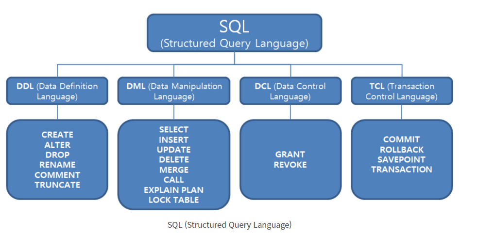

### SQL 분류

<div style="display: block; width: 80%; margin: 0px auto;">

</div>

참조 [https://iamfreeman.tistory.com/entry/DBMS-데이터-언어-DDL-DML-DCL-TCL-의-정의](https://iamfreeman.tistory.com/entry/DBMS-%EB%8D%B0%EC%9D%B4%ED%84%B0-%EC%96%B8%EC%96%B4-DDL-DML-DCL-TCL-%EC%9D%98-%EC%A0%95%EC%9D%98)

### 데이터 정의 언어(Data Definition Language, DDL)

---

- 데이터베이스 구조 정의 및 수정에 사용
- 데이터 저장 구조, 데이터 접근 방법, 데이터 형식 등의 정의 가능
    
    

### *CREATE*

---

1. **CREATE DATABASE**
    
    ```sql
    CREATE DATABASE USER_DATABASE;
    ```
    
    - USER_DATABASE 데이터베이스 생성
    - USER_DATABASE 데이터베이스 사용시 `USE USER_DATABASE` 명령어 실행
    - `SHOW DATABASES` 명령어를 통해 데이터 베이스 목록을 출력할 수 있음

1. **CREATE TABLE**
    
    ```sql
    CREATE TABLE 테이블_이름(
    속성_이름 테이터_타입 [NOT NULL] [DEFAULT 기본값] - (1)
    [PRIMARY KEY (속성_리스트)] - (2)
    [UNIQUE (속성_리스트)]
    [FOREIGN KEY (속성_리스트) REFERENCES 테이블_이름 (속성_리스트)] [ON DELETE 옵션] [ON UPDATE 옵션]
    [CONSTRAINT 이름] [CHECK(조건)] - (3)
    );
    ```
    
    - []의 내용은 생략 가능
    - query문은 세미콜론(;)으로 문장의 끝을 표시
    - query문은 대소문자를 구분하지 않음
    - CREATE TABLE 문은 기본 제약사항, 기본키, 대체키, 외래키, 데이터 무결성을 위한 제약조건 정의를 포함
    
    ---
    
    **(1) - 테이블을 구성하는 각 속성의 데이터 타입을 선택한 다음 널 값 허용 여부와 기본 값 필요 여부를 결정**    
    
    - NOT NULL
        - 속성이 널 값을 허용하지 않음을 의미하는 키워드
        - 예) 고객아이디 VARCHAR(20) NOT NULL
    - DEFAULT
        - 속성의 기본 값을 지정하는 키워드
        - 예) `BALANCE INT DEFAULT 0`  ← BALANCE의 타입은 INT이고 기본값은 0
        - 예) `MANAGER VARCHAR(10) DEFAULT '홍길동'` ← MANAGER의 타입은 VARCHAR이고 기본값은 홍길동
    
    ---
    
    **(2) - 키의 정의**
    
    - PRIMARY KEY
        - 기본키를 지정하는 키워드
        - 예) PRIMARY KEY(고객 아이디)
        - 예) PRIMARY KEY(주문고객, 주문제품)
    - UNIQUE
        - 대체키를 지정하는 키워드
        - 대체키로 지정된 속성의 값은 **유일성**을 가지며 기본키와 달리 NULL값이 허용됨
        - 예) UNIQUE(고객이름)
    - FOREIGN KEY
        - 외래키를 지정하는 키워드
        - 외래키가 어떤 테이블의 무슨 속성을 참조하는지 REFERENCES 키워드 다음에 제시
        - 참조 무결성 제약조건 유지를 위해 참고되는 테이블에서 튜플 삭제 시 처리하는 방법을 지정하는 옵션
            
            <aside>
            💡 ON DELETE NO ACTION -  튜플을 삭제하지 못하게 함                                                                    ON DELETE CASCADE - 관련 튜플을 함께 삭제함                                                                   ON DELETE SET NULL - 관련 튜플의 외래키 값을 NULL로 변경함                                                   ON DELETE SET DEFAULT - 관련 튜플의 외래키 값을 미리 지정한 기본 값으로 변경
            
            </aside>
            
        - 예) `FOREIGN KEY(소속부서) REFERENCES 부서(부서번호)`
        - 예) `FOREIGN KEY(소속부서) REFERENCES 부서(부서번호) ON DELETE CASCADE ON UPDATE CASCADE`
    
    ---
    
    **(3) - 데이터 무결성 제약조건의 정의**
    
    - **제약 조건(constraint)**
        
        제약조건(constraint)이란 데이터의 **무결성**을 지키기 위해, 데이터를 입력받을 때 실행되는 검사 규칙을 의미한다. 이러한 제약 조건은 CREATE 문으로 테이블을 생성할 때나 ALTER 문으로 컬럼을 추가할 때도 설정할 수 있다.
        
    - MySQL에서 사용할 수 있는 제약 조건은 다음과 같다.
        
        **1. NOT NULL**
        
        **2. UNIQUE**
        
        **3. PRIMARY KEY**
        
        **4. FOREIGN KEY**
        
        **5. DEFAULT**
        
        [[MySQL] 제약 조건(constraint) 개념 및 종류](https://dev-coco.tistory.com/55)
        

---

## *ALTER*

---

1. **새로운 속성 추가**
    
    ```sql
    ALTER TABLE 테이블_이름
    				ADD 속성_이름 데이터_타입 [NOT NULL] [DEFAULT 기본값];
    ```
    
    - `ALTER TABLE USER ADD BIRTH VARCHAR(6) NOT NULL`
        
        USER 테이블에서 BIRTH 속성을 추가한다. 타입은 VARCHAR이고 NULL 값을 허용하지 않는다.
        
    - `ALTER TABLE ITEM ADD ITEMCODE VARCHAR(10) NULL, PRICE INT NULL`
        
        ITEM 테이블에서 ITEMCODE, PRICE 속성을 추가한다.
        
    
2. **기존 속성 변경**
    
    ```sql
    ALTER TABLE 테이블_이름
    				ALTER COLUMN 속성_이름 데이터_타입 [NOT NULL] [DEFAULT 기본값];
    ```
    
    - `ALTER TABLE USER ALTER COLUMN ID VARCHAR(10) NOT NULL`
        
        USER 테이블의 ID 속성의 타입을 VARCHAR(10) 으로 지정하고 NULL값을 허용하지 않는다.
        
    - **`ALTER TABLE** 테이블명 ENGINE = INNODB`
        
        MySQL 테이블 엔진 변경
        
        **`ALTER TABLE** 테이블명 ENGINE = MYISAM`
        
        MyISAM으로 변경
        
3. **기존 속성 삭제**
    
    ```sql
    ALTER TABLE 테이블_이름
    				DROP COLUMN 속성_이름;
    ```
    
    - `ALTER TABLE USER DROP COLUMN AGE`
        
        USER 테이블에서 AGE 컬럼을 삭제합니다.
        
    - **만약 삭제할 속성과 관련된 제약조건이 존재하면 속성 삭제가 안되고, 관련된 제약조건을 먼저 삭제해야 함**
    
    [mysql 테이블 이름 변경하기 아주 쉬운 방법, 테이블 변경의 모든 것](https://goodsgoods.tistory.com/276)
    
    ---
    
    ### *DROP*
    
    ---
    
    1. **DROP DATABASE**
    
    ```sql
    DROP DATABASE 데이터베이스_이름;
    ```
    
    - 데이터베이스를 삭제하면 해당 데이터베이스의 모든 테이블과 데이터도 다 같이 삭제되므로 주의해야 합니다.
    
    1. **DROP TABLE**
    
    ```sql
    DROP TABLE 테이블_이름;
    ```
    
    - 만약 삭제할 테이블을 참조하는 테이블이 있으면, 테이블 삭제가 수행되지 않고, 관련된 외래
    
    키 제약조건을 먼저 삭제해야함
    
    - 테이블을 삭제하면 **해당 테이블의 모든 데이터도 다 같이 삭제되므로 주의**해야 합니다.
    
    1. **TRUNCATE TABLE**
        
        ```sql
        TRUNCATE TABLE 테이블_이름
        ```
        
        - 만약 테이블 자체가 아닌 테이블의 데이터만 지우고 싶을 때는 TRUNCATE TABLE문을 사용할 수 있다.
    2. IF EXISTS
        
        ```sql
        DROP DATABASE IF EXISTS ITEM;
        
        DROP TABLE IF EXISTS STUDENT;
        ```
        
        - DROP DATABASE 문이나 DROP TABLE 문을 사용하여 데이터베이스나 테이블을 삭제하려고 할 때, 만약 삭제하려는 이름의 데이터베이스나 테이블이 존재하지 않으면 에러가 발생합니다. 이때 다음과 같이 IF EXISTS 절을 사용하면 삭제하려는 데이터베이스나 테이블이 존재하지 않아서 발생하는 에러를 미리 방지할 수 있습니다.
    
    ---
    
    ## *RENAME*
    
    ---
    
    1. **단일 테이블 이름 변경**
        
        ```sql
        RENAME TABLE old_table TO new_table;
        ```
        
    2. **단일 테이별 이름 변경(ALTER)**
        
        ```sql
        ALTER TABLE old_table RENAME new_table;
        ```
        
    3. **다수 테이블 이름 변경**
        
        ```sql
        RENAME TABLE old_table1 TO new_table1,
        						 old_table2 TO new_table2,
        						 old_table3 TO new_table3;
        ```
        
    4. **다른 데이터베이스로 테이블 이동**
        
        ```sql
        RENAME TABLE current_db.table_name TO other_db.table_name;
        ```
        

---

## *COMMENT*

---

1. **Comment 설정**
    
    ```sql
    # 테이블 COMMENT
    
    CREATE TABLE 테이블_이름 (
    속성_이름 테이터_타입 [NOT NULL] [DEFAULT 기본값] - (1)
    [PRIMARY KEY (속성_리스트)] - (2)
    [UNIQUE (속성_리스트)]
    [FOREIGN KEY (속성_리스트) REFERENCES 테이블_이름 (속성_리스트)] [ON DELETE 옵션] [ON UPDATE 옵션]
    [CONSTRAINT 이름] [CHECK(조건)] - (3)
    ) COMMENT = 'comment';
    
    # 특정 테이블만 COMMENT 설정
    ALTER TABLE 테이블_이름 COMMENT = 'comment';
    
    # 속성 COMMENT
    
    CREATE TABLE 테이블_이름 (
    	속성_이름 INT COMMENT 'comment',
    	...
    );
    
    # 특정 속성만 COMMENT 설정
    ALTER TABLE 테이블_이름 MODIFY 속성_이름 데이터_타입 [NOT NULL] [DEFAULT 기본값] COMMENT 'comment'
    ```
    
2. **Comment 조회**
    
    ```sql
    SELECT TABLE_SCHEMA,TABLE_NAME,TABLE_COMMENT
    FROM INFORMATION_SCHEMA.TABLES
    WHERE TABLE_SCHEMA='database_name';
    
    # 속성 comment 조회
    SELECT  TABLE_SCHEMA,TABLE_NAME,COLUMN_NAME,COLUMN_COMMENT
    FROM INFORMATION_SCHEMA.COLUMNS
    WHERE TABLE_SCHEMA='database_name' AND TABLE_NAME='table_name';
    
    ```
    
3. **Comment 삭제**
    
    ```sql
    # 테이블 comment 삭제
    ALTER TABLE 테이블_이름 COMMENT = '';
    
    # 속성 comment 삭제
    ALTER TABLE 테이블_이름 MODIFY 속성_이름 데이터_타입 [제약조건];
    ```