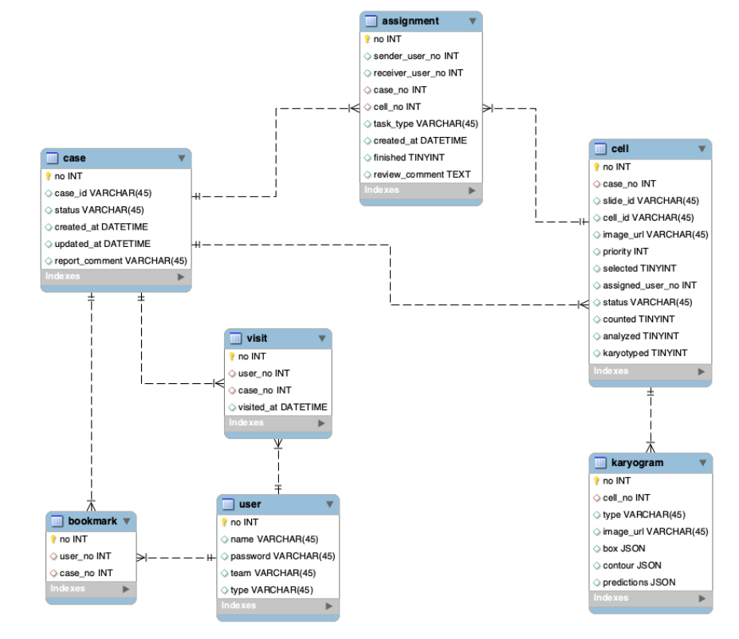

💡**MySQL 워크벤치(MySQL Workbench)는 SQL 개발과 관리, 데이터베이스 설계, 생성 그리고 유지를 위한 단일 개발 통합 환경을 제공하는 비주얼 데이터베이스 설계 도구입니다.**


**MySQL Workbench 장점**

- 이름을 입력하고 조건을 클릭 몇 번으로 지정
- 테이블과 관계 다이어그램을 자동으로 그려 줌
- SQL DDL 파일을 export 한 뒤 실행하여 바로 테이블 생성 가능

    <div style="display: block; width: 80%; margin: 0px auto;">
    
    </div>
지난주에 명령 프롬프트(CMD)창에서 MySQL에 접속하는 방법을 알아보았고, 이제 MySQL 

Workbench 환경에서 SQL 실습 및 과제를 진행하면서 Workbench가 제공하는 다양한 기능을 활용할 

예정입니다.

---

<div style="display: block; width: 80%; margin: 0px auto;">

</div>

- root 계정으로 3360 port로 접속할 수 있는 MySQL 서버를 확인할 수 있습니다. 클릭후 비밀번호를 입력하여 접속합니다.

    <div style="display: block; width: 80%; margin: 0px auto;">
    
    </div>

- Workbench에 접속하면 볼 수 있는 GUI(Graphical User Interface)입니다.
- 쿼리 실행은 번개모양을 클릭 or ctrl + enter를 누르시면 됩니다.

    <div style="display: block; width: 80%; margin: 0px auto;">
    
    </div>

- 먼저 데이터베이스 목록을 확인해봅시다
    
    ```sql
    show databases;
    ```
    

    <div style="display: block; width: 80%; margin: 0px auto;">
    
    </div>

- 우리가 지난주에 학습했던 haksa_database를 볼 수 있습니다. 이번 실습에선 world 데이터베이스를 활용해 실습을 진행하겠습니다.

```sql
use world;
```

<div style="display: block; width: 80%; margin: 0px auto;">

</div>

- 어떤 테이블이 있는지 조회 해봅니다.
    
    ```sql
    show tables;
    ```
    

---

## *SELECT*

---

SQL SELECT문은 하나 또는 그 이상의 테이블에서 데이터를 추출하는 SQL의 데이터 조작 언어(DML) 중 하나입니다. **데이터베이스 중 하나 또는 그 이상의 테이블에서 데이터를 추출하기 위한 명령으로 데이터 조작 언어 에서 가장 많이 사용**됩니다. 실습을 진행하면서 SELECT의 다양한 기능들을 어떻게 사용할 수 있는지 알아보겠습니다. 이번 실습에서 모든 기능을 다루지는 않으니 W3school의 사이트 등에서 필요할 때마다 추가적으로 학습하시기 바랍니다!

→ **다중 테이블 연산**(JOIN, UNION, INTERSECT, 서브쿼리등의 경우)  나중에 따로 실습을 진행하겠습니다.

1. **SELECT ***
    
    city 테이블의 모든 컨텐츠를 조회
    
    ```sql
    select * from city;
    ```
    
    <div style="display: block; width: 80%; margin: 0px auto;">
    
    </div>
    

---

2. **SELECT FROM WHERE**
    - 조회하는 결과에 특정한 조건으로 원하는 데이터만 보고 싶을 때 사용
    - SELECT 필드이름 FROM 테이블이름 WHERE 조건식;
    - 조건이 없을 경우 테이블의 크기가 클수록 검색 시간이 증가한다(Access time) 테이블의 크기가 엄청 큰 경우에 SELECT를 실행할 경우 시스템이 다운될 수 있으므로 디폴트 LIMIT이 1000 rows로 자동 설정되어있다.
    - 연산자의 사용
        - 조건 연산자 (=, <, >, <=, >=, <>, !=)
        - 관계 연산자 (NOT, AND, OR)
        - 연산자의 조합으로 데이터를 효율적으로 추출할 수 있다.
    
    <div style="display: block; width: 80%; margin: 0px auto;">
    
    </div>
    
    ```sql
    # city 테이블에서 CountryCode와 District만 출력
    select CountryCode, District
    from city
    ```
    
    <div style="display: block; width: 80%; margin: 0px auto;">
    
    </div>
    
    ```sql
    # city 테이블에서 CountryCode이 DZA이고 District가 Chlef인 row를 출력
    
    select CountryCode, District
    from city
    where CountryCode = 'DZA' AND District = 'Chlef';
    ```
    
    <div style="display: block; width: 80%; margin: 0px auto;">
    
    </div>
    

---

3. **BETWEEN**
    - 데이터가 숫자로 구성되어 있어 연속적인 값은 BETWEEN ... AND를 사용할 수 있다.
    - `BETWEEN A AND B` 일 경우 A ≤ 값 ≤ B의 범위를 가진다.
    
    ```sql
    # city 테이블에서 population이 10만 이상 30만 이하인 모든 row를 출력
    select *
    from city
    where population between 100000 and 300000;
    ```
    
    <div style="display: block; width: 80%; margin: 0px auto;">
    
    </div>
    

---

4. **IN**
    
    이산적인(Discrete)값의 조건에서는 IN() 사용 가능
    
    ```sql
    # city 테이블에서 Name이서울, 뉴욕, 도쿄인 모든 행을 출력
    select *
    from city
    where name in ('Seoul', 'New York', 'Tokyo');
    ```
    
    <div style="display: block; width: 80%; margin: 0px auto;">
    
    </div>
    

---

5. **LIKE**
    - 문자열의 내용을 검색하기 위해 LIKE 연산자 사용
    - 문자 뒤에 %가 오면 뒤에 무엇이 오든 허용한다
    - 한 글자와 매치하기 위해서는 '_' 사용, 두글자는 '__'
    - 이 외에도 다양한 Wildcard Characters가 존재한다.
    
    [SQL Wildcard Characters](https://www.w3schools.com/sql/sql_wildcards.asp)
    
    ```sql
     # city 테이블에서 Name이 New로 시작하는 모든 행을 출력
    select *
    from city
    where Name LIKE 'New%';
    ```
    
    <div style="display: block; width: 80%; margin: 0px auto;">
    
    </div>
    

---

6. **Alias**
    - Alias를 지정하여 임시적으로 속성 이름을 바꿀 수 있다.
    
    ```sql
    select CountryCode as '국가코드'
    from city;
    ```
    
    <div style="display: block; width: 80%; margin: 0px auto;">
    
    </div>
    

---

7. **ORDER BY**
    - 결과가 출력되는 순서를 조절하는 구문
    - 기본적으로 오름차순(ASC) 정렬
    - 내림차순(DESC)로 정렬할 경우 열 이름 뒤에 DESC를 적어준다.
    - ASC는 default이므로 생략가능
    
    ```sql
    # city 테이블에서 인구수가 많은 순서대로 정렬
    select *
    from city
    ORDER BY population DESC;
    ```
    
    <div style="display: block; width: 80%; margin: 0px auto;">
    
    </div>
    
    - ORDER BY 구문을 혼합해 사용하는 구문도 가능
    
    ```sql
    select *
    from city
    ORDER BY CountryCode ASC,population DESC
    ```
    
    <div style="display: block; width: 80%; margin: 0px auto;">
    
    </div>
    

---

8. **DISTINCT**
    - 중복된 것은 1개씩만 보여주면서 출력
    - 테이블의 크기가 클수록 효율적
    
    ```sql
    # city 테이블에서 CountryCode를 중복없이 출력
    select distinct CountryCode
    from city;
    ```
    
    <div style="display: block; width: 80%; margin: 0px auto;">
    
    </div>
    

---

9. **LIMIT**
    - 출력 개수를 제한
    - 상위 N개만 출력하는 'LIMIT N' 구문
    - 서버의 처리량을 많이 사용해 서버의 전반적인 성능을 나쁘게하는 쿼리문을 개선할 때 사용
    - Pandas의 head()와 같은 기능을 한다
    
    ```sql
    # city 테이블에서 population 상위 5개를 출력
    select *
    from city
    ORDER BY  population DESC LIMIT 5;
    ```
    
    <div style="display: block; width: 80%; margin: 0px auto;">
    
    </div>
    

---

10. **GROUP BY**
    - 그룹으로 묶어주는 역할
    - 집계 함수(Aggregate Function)를 함께 사용
        - AVG() : 평균
        - MIN() : 최소값
        - MAX() : 최대값
        - COUNT() : 행의 개수
        - COUNT(DISTINCT) : 중복 제외한 행의 개수
        - STDEV() : 표준 편차
        - VARIANCE() : 분산
    - 효율적인 데이터 그룹화(Grouping)
    - 읽기 좋게 하기 위해 Alias 사용
    
    ```sql
    # city 테이블에서 CountryCode를 기준으로 population의 최댓값을 출력
    select CountryCode, MAX(Population) AS '인구수'
    from city
    group by CountryCode;
    ```
    
    <div style="display: block; width: 80%; margin: 0px auto;">
    
    </div>
    

---

11. **HAVING**
    - WHERE과 비슷한 개념으로 조건 제한
    - 집계 함수에 대해서 조건 제한하는 편리한 개념
    - **HAVING절은 반드시 GROUP BY절 다음에 나와야함**
    
    ```sql
    # 위의 쿼리문에서 인구수 500,000 초과, 내림차순 정렬
    select CountryCode, MAX(Population) AS '인구수'
    from city
    group by CountryCode
    having MAX(Population) > 500000
    order by MAX(Population) desc;
    ```
    
    <div style="display: block; width: 80%; margin: 0px auto;">
    
    </div>
    

---

12. **ROLLUP**
    - 총합 또는 중간합계가 필요할 경우 사용
    - GROUP BY 절과 함께 WITH ROLLUP문 사용
    
    ```sql
    # city 테이블에서 CountryCode를 기준으로 인구총합을 구하고 NAME을 기준으로 ROLL UP 결과를 출력
    select CountryCode, Name, SUM(population)
    from city
    group by CountryCode, NAME WITH ROLLUP;
    ```
    
    <div style="display: block; width: 80%; margin: 0px auto;">
    
    </div>
    

---

13. **LENGTH**
    - 전달받은 문자열의 길이를 반환
    
    ```sql
    select length('abcde');
    ```
    
    <div style="display: block; width: 80%; margin: 0px auto;">
    
    </div>

---

14. **CONCAT**
    - 전달받은 문자열을 모두 결합하여 하나의 문자열로 반환
    - 전달받은 문자열 중 하나라도 NULL이 존재하면 NULL을 반환
    
    ```sql
    select concat('a','b','c') as abc,
    concat('1','2','3') as '123';
    ```
    
    <div style="display: block; width: 80%; margin: 0px auto;">
    
    </div>
    

---

15. **LOCATE**
    - 문자열 내에서 찾는 문자열이 처음으로 나타나는 위치를 찾아서 해당 위치를 반환
    - 찾는 문자열이 문자열 내에 존재하지 않으면 0을 반환
    - **MySQL에서는 문자열의 시작 인덱스를 1부터 계산**
    
    ```sql
    select locate('12','ab1234')
    ```
    
    <div style="display: block; width: 80%; margin: 0px auto;">
    
    </div>
    

---

16. **LEFT, RIGHT**
    - LEFT: 문자열의 왼쪽부터 지정한 개수만큼의 문자를 반환
    
    ```sql
    select left('AIFFEL YJ', 6);
    ```
    
    <div style="display: block; width: 80%; margin: 0px auto;">
    
    </div>
    
    - RIGHT: 문자열의 오른쪽부터 지정한 개수만큼의 문자를 반환
    
    ```sql
    select right('AIFFEL YJ',2);
    ```
    
    <div style="display: block; width: 80%; margin: 0px auto;">
    
    </div>
    

---

17. **LOWER, UPPER**
    - LOWER: 문자열의 문자를 모두 소문자로 변경
    
    ```sql
    select lower('AIFFEL');
    ```
    
    <div style="display: block; width: 80%; margin: 0px auto;">
    
    </div>
    
    - UPPER: 문자열의 문자를 모두 대문자로 변경
    
    ```sql
    select upper('aiffel');
    ```
    
    <div style="display: block; width: 80%; margin: 0px auto;">
    
    </div>
    

---

18. **REPLACE**
    - 문자열에서 특정 문자열을 대체 문자열로 교체
    
    ```sql
    select replace('mssql', 'ms', 'my');
    ```
    
    <div style="display: block; width: 80%; margin: 0px auto;">
    
    </div>
    

---

19. **TRIM**
    - 문자열의 앞이나 뒤, 또는 양쪽 모두에 있는 특정 문자를 제거
    - TRIM() 함수에서 사용할 수 있는 지정자
        - BOTH: 전달 받은 문자열의 양 끝에 존재하는 특정 문자를 제거(기본설정)
        - LEADING: 전달받은 문자열 앞에 존재하는 특정 문자를 제거
        - TRAILING: 전달받은 문자열 뒤에 존재하는 특정 문자를 제거
    - 만약 지정자를 명시하지 않으면, 자동으로 BOTH로 설정
    - 제거할 문자를 명시하지 않으면, 자동으로 공백을 제거
    
    ```sql
    select trim('       aiffel        '),
    trim(leading '#' from '###aiffel###'),
    trim(trailing '#' from '###aiffel###');
    ```
    
    <div style="display: block; width: 80%; margin: 0px auto;">
    
    </div>
    

---

20. **FORMAT**
    - 숫자 타입의 데이터를 **세 자리**마다 쉼표(',)를 사용하는 '#,###',###.##' 형식으로 변환
        - 1억을 format으로 나타내면 100,000,000
    - 반환되는 데이터의 형식은 문자열 타입
    - 두 번째 인수는 반올림할 소수 부분의 자릿수
    
    ```sql
    select format(100000000.123, 3); 
    ```
    
    <div style="display: block; width: 80%; margin: 0px auto;">
    
    </div>
    

---

21. **FLOOR, CEIL, ROUND**
    - FLOOR(): 내림
    - CEIL(): 올림
    - ROUND(): 반올림
    
    ```sql
    select floor(5.5), ceil(5.5), round(5.5);
    ```
    
    <div style="display: block; width: 80%; margin: 0px auto;">
    
    </div>
    

---

22. **SORT, POW, EXP, LOG**
    - SORT(): 양의 제곱근
    - POW(): 첫번째 인수로는 밑수를 전달하고, 두 번째 인수로는 지수를 전달하여 거듭제곱
    
    계산
    
    - EXP(): 인수로 지수(e)를 전달받아, e의 거듭제곱을 계산
    - LOG(): 자연로그 값을 계산
    
    ```sql
    select sqrt(9), pow(2,2), exp(2), log(exp(1));
    ```
    
    <div style="display: block; width: 80%; margin: 0px auto;">
    
    </div>
    

---

23. **SIN, COS, TAN**
    - SIN(): 사인값 반환
    - COS(): 코사인값 반환
    - TAN(): 탄젠트값 반환
    
    ```sql
    select sin(pi()/2), cos(pi()), tan(pi()/4);
    ```
    
    <div style="display: block; width: 80%; margin: 0px auto;">
    
    </div>
    

---

24. **ABS, RAND**
    - ABS(X): 절대값 반환
    - RAND(): 0.0보다 크거나 같고 1.0보다 작은 하나의 실수를 무작위로 생성
    
    ```sql
    select abs(-10), round(rand()*100, 0);
    ```
    
    <div style="display: block; width: 80%; margin: 0px auto;">
    
    </div>
    

---

25. **NOW, CURDATE, CURTIME**
    - NOW(): 현재 날짜와 시간을 반환, 반환되는 값은 'YYYY-MM-DD HH:MM:SS' 또는 YYYYMMDDHHMMSS형태로 반환
    - CURDATE(): 현재 날짜를 바환, 이때 반환되는 값은 'YYYY-MM-DD' 또는 YYYYMMDD형태로 반환
    - CURTIME(): 현재 시각을 반환,  이때 반환되는 값은 'HH:MM:SS' 또는 HHMMSS 형태로 반환
    
    ```sql
     select now(), curdate(), curtime();
    ```
    
    <div style="display: block; width: 80%; margin: 0px auto;">
    
    </div>

---

26. **DATE, MONTH, DAY, HOUR**
    - DATE(): 전달받는 값에 해당하는 날짜 정보를 반환
    - MONTH(): 월에 해당하는 값을 반환하며, 0부터 12 사이의 값을 가짐
    - DAY(): 일에 해당하는 값을 반환하며, 0부터 31 사이의 값을 가짐
    - HOUR(): 시간에 해당하는 값을 반환하며, 0부터 23 사이의 값을 가짐
    - MINUTE(): 분에 해당하는 값을 반환하며, 0부터 59 사이의 값을 가짐
    - SECOND(): 초에 해당하는 값을 반환하며, 0부터 59 사이의 값을 가짐
    
    ```sql
    select
    now(),
    date(now()),
    month(now()),
    day(now()),
    hour(now()),
    minute(now()),
    second(now());
    ```
    
    <div style="display: block; width: 80%; margin: 0px auto;">
    
    </div>
    

---

27. **MONTHNAME, DAYNAME**
    - MONTHNAME(): 월에 해당하는 이름을 반환
    - DAYNAME(): 요일에 해당하는 이름을 반환
    
    ```sql
    select
    now(),
    monthname(now()),
    dayname(now());
    ```
    
    <div style="display: block; width: 80%; margin: 0px auto;">
    
    </div>
    

---

28. **DAYOFWEEK, DAYOFMONTH, DAYOFYEAR**
    - DAYOFWEEK(): 일자가 해당 주에서 몇 번째 날인지를 반환, 1부터 7 사이의 값을 반환
    
    (일요일 = 1, 토요일 = 7)
    
    - DAYOFMONTH(): 일자가 해당 월에서 몇 번째 날인지를 반환, 0부터 31 사이의 값을 반환
    - DAYOFYEAR(): 일자가 해당 연도에서 몇 번째 날인지를 반환, 1부터 366사이의 값을 반환
    
    ```sql
    select
    now(),
    dayofweek(now()),
    dayofmonth(now()),
    dayofyear(now());
    ```
    
    <div style="display: block; width: 80%; margin: 0px auto;">
    
    </div>
    

---

29. **DATE_FORMAT**
    - 전달받은 형식에 맞춰 날짜와 시간 정보를 문자열로 반환
    
    ```sql
    select
    date_format(now(), '%Y-%M-%D');
    ```
    
    <div style="display: block; width: 80%; margin: 0px auto;">
    
    </div>
    

---