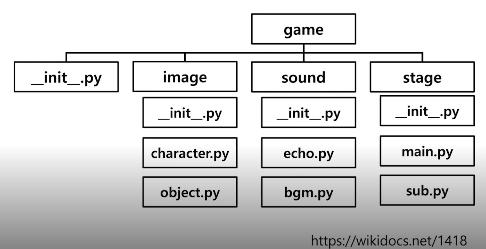

# 1. 클래스와 객체 - 객체 지향 언어의 이해


OOP : object - oriented programming

객체 : 속성(attribute)와 행동(action)을 가짐


```python
class soccerplayer(object):
  # 속성 정보
  def __init__(self, name, position, back_number):
     self.name = name
    self.pos = position
    self.bn = back_number
    
    
	#이외에도 프린트
  def __str__(self):
    return "hello, my name is %s. my number is %d" % \(self.name, self.bn)
    
```

"__" 는 특수한 예약함수나 함수명 변경(맨글링)으로 사용


 

# OOP characteristics

객체 지향 언어의 특징


1. Inheritance 상속
2. Polymorphism 다형성
3. Visibility  가시성


### inheritance

부모클래스로 부터 속성과 method를 물려받은 자식 클래스를 생성하는 것


```python
class Person(object):
  def __init__(self,name,age,gender):
		~~
    
  
class man(Person):
  def __init__(self,name,age,gender,salary, hired):
    super().__init__(name,age,gender)
    
    
	~~

```


### polymorphism

같은 이름 메소드의 내부 로직을 다르게 작성

```python
class Animal:
  def __init__(self, name):
    self.name = name
  def talk(self):
    raise NotImplementedError("Subclass must implement abstract method")

class Cat(Animal):
  def talk(self):
    return "meow"

class Dog(animal):
  def talk(self):
    return "bark"
```


### visibility

객체의 정보를 볼 수 있는 레벨을 조절하는 것

누구나 객체 안에 모든 변수를 볼 필요가 없음

 

*Encapsulation

캡슐화, 정보 은닉(information hiding)


방법 1) : self.__

```python
class Notebook():
    def __init__(self, title):
        self.__title = title
        self.page_number = 1
        self.notes = {}
    
   	#이러면 Notebook.title은 프린트 할 수 없다.
```


방법 2) : decorate

```python
 class Notebook():
    def __init__(self, title):
        self.title = title
        self.page_number = 1
        self.notes = {}
    
    @property
    def items(self):
      return self.__items
    
    # @로 decorator이용하면 내부에서 자료에 접근 됨
```

 


#### first-class objects

:일등 함수, 일급 객체

변수나 데이터 구조에 할당이 가능한 객체

parameter로 전달 가능, return 값으로 사용


#### inner function

함수내에 또 다른 함수가 존재


#### closures :

inner function을 return 값으로 반환


#### decorator function

복잡한 클로져 함수를 간단하게


```python
def star(func):
  def inner(*args, **kwargs):
    print(args[1] * 30)
    func(*args, **kwargs)
    print(ags[1] * 30)
  return inner

@star
def printer(msg,mark):
  print(msg)
printer("Hello", "*")
```


 # 2. Module and Project


## 모듈

파이썬의 모듈은 py파일을 의미


far_con.py 라는 파일이 있다면


다른 파일에서 이를 사용하기 위해 

```python
import far_con

#far_con의 내부 함수 사용
far_con.firstdef()
```


단 같은 디렉토리(폴더) 내에 있어야 함.

 ### namespace


```python
#alias(별칭) 설정
import fah_con as fah

#특정 함수 또는 클래스만 호출
from fah_con import convert_c

#모든 함수, 클래스 호출
from fah_con import * 
```


## package

각 폴더별로 필요한 모듈을 구현함




mkdir : 폴더 생성

touch : py 파일 생성


이후

```python
from 폴더 import py파일
```

로 실행 가능


```python
#__init__.py 작성

from . import image
from . import sound
from . import stage
```


* package namespace

다른 폴더의 모듈을 부를 때, 상대 참조로 호출하는 방법

```python
from game.graphic.render import render_test
#현재 디렉토리
from .render import render_test
#부모 디렉토리
from ..sound.echo import render_test

```


