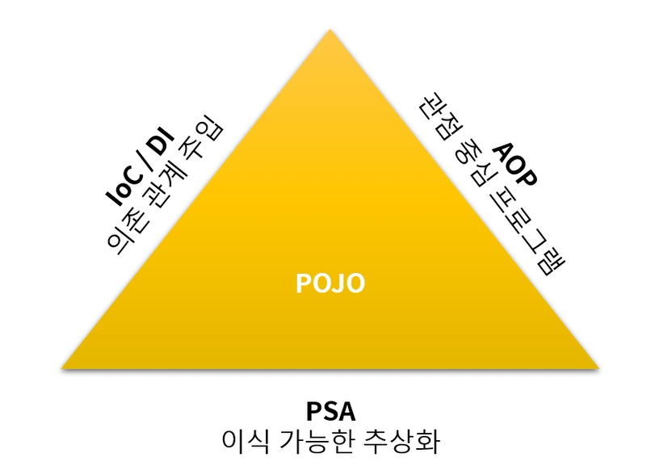
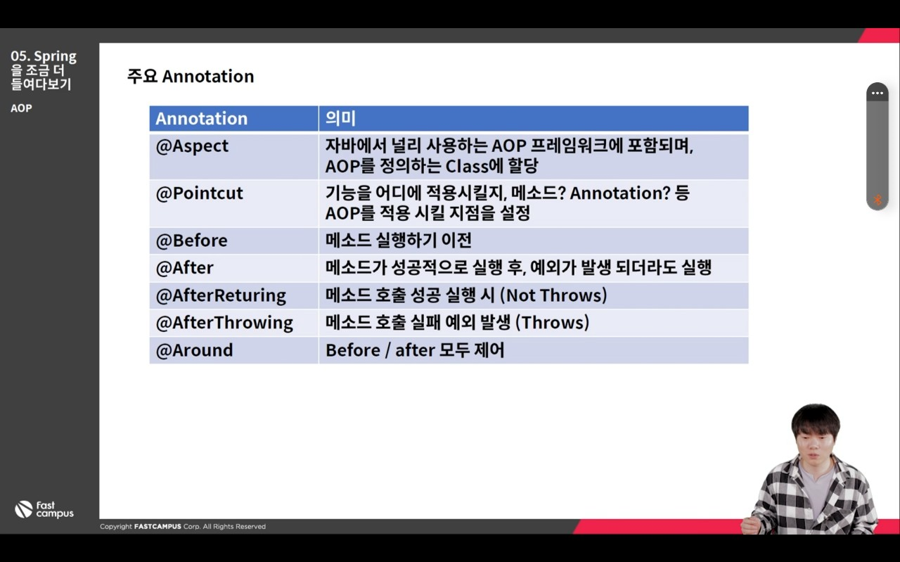
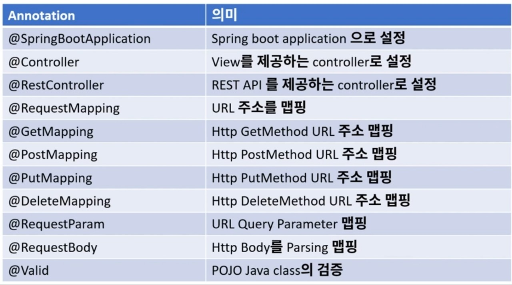
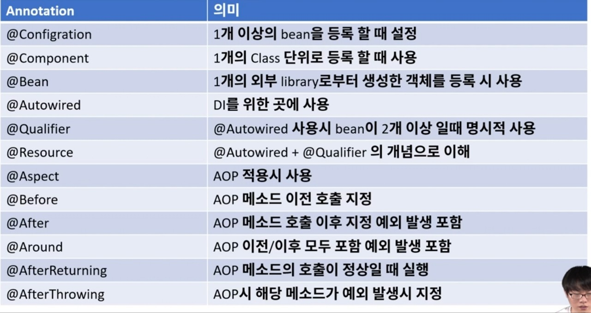

# 0. Spring

- 테스트의 용이성, 느슨한 결합에 중점을 두고 개발
- IoC의 등장 -> 스프링과 다른 프레임위크의 가장 큰 차이점이 IoC를 통한 개발 진행
- AOP 로  로깅, 트랜잭션 관리, 시큐리티에서의 적용 등 
- 스프링의 특징
  - 


# 1. IoC 와 DI

- IoC : Inversion of Controll - 제어의 역전
  - 스프링에서는 일반적인 Java 객체를 new 로 생성하여 개발자가 관리하는 것이 아닌 Spring Container 에 모두 맡김
  - 즉, 개발자에서 -> 프레임워크로 제어의 객체관리의 권한이 넘어갔으므로 "제어의 역전"이라고 함
  - 즉, 스프링이 알아서 객체의 생명주기를 관리해줌
- DI : Dependency Injection
  - 외부로부터 내가 사용할 객체를 주입받음(주입해주는 장치는 IoC)
  - 의존성으로부터 격리시켜 코드테스트에 용이
  - DI를 통하여, 불가능한 상황을 Mock 와 같은 기술을 통하여, 안정적으로 테스트 가능
  - 코드를 확장하거나 변경할 때 영향을 최소화함 (추상화)
  - 순환참조를 막을 수 있음


# 2. DI

- ex) url 을 인코딩할 때 - base64, URLEncoder 

### DI 미사용 시 예제

- ```java
  public class Main {
      public static void main(String[] args) {
          String url = "www.naver.com/books/it?page=10&size=20&name=spring-boot";
  
          //Base64
          IEncoder encoder = new Base64Encoder();
          String result = encoder.encode(url);
          System.out.println(result);
          
          //urlEncoder
          IEncoder urlEncoder = new UrlEncoder();
          String urlResult = urlEncoder.encode(url);
          System.out.println(urlResult);
      }
  }
  ```

- IEncoder

  - ```java
    public interface IEncoder {
        String encode(String message);
    }
    ```

- Base64Encoder class : IEncoder 를 implements

  - ```java
    import java.util.Base64;
    
    public class Base64Encoder implements IEncoder {
    
        public String encode(String message){
            return Base64.getEncoder().encodeToString(message.getBytes());
        }
    }
    ```

- UrlEncoder class : IEncoder 를 implements

  - ```java
    public class UrlEncoder implements IEncoder {
        public String encode(String message){
            try {
                return URLEncoder.encode(message, "UTF-8");
            } catch (UnsupportedEncodingException e) {
                throw new RuntimeException(e);
            }
        }
    }
    ```

- DI 미사용 시 class 를 계속 만들어서 사용해야 함


### DI 사용 시 예제

- Encoder class 생성

  - ```java
    public class Encoder {
    
        private IEncoder iEncoder;
    
        public Encoder(IEncoder iEncoder){
            this.iEncoder = iEncoder;
        }
    
        public String encode(String message){
            return iEncoder.encode(message);
        }
    }
    ```

  - 생성자에 IEncoder 를 받아서 IEncoder 에 따라 인코더를 변경

- main 클래스

  - ```java
    public class Main {
        public static void main(String[] args) {
            String url = "www.naver.com/books/it?page=10&size=20&name=spring-boot";
    
            / //IEncoder 생성
            Encoder encoder = new Encoder(new Base64Encoder());
            //인코더를 변경하고 싶으면 생성자의 인자를 변경
            //Encoder encoder = new Encoder(new UrlEncoder());
            String result = encoder.encode(url);
            System.out.println(result);
        }
    }
    ```

- DI 사용을 통해 클래스에 직접 접근하지 않고 속성을 변경 가능

  

# 3. IoC

- @Component 를 붙이면 해당 클래스는 @SpringBootApplication 클래스의 bean으로 등록되어 관리됨
  - @Component("name") 으로 하면 bean 을 name 으로 관리 가능
- 스프링이 실행될 때 어노테이션이 붙은 클래스를 찾아서 직접 객체를 싱글톤 형태로 만들어 springcontainer에서 관리를 하게 됨


### 예제

- @component 로 클래스를 bean 으로 등록

  - ```java
    package com.example.ioc2;
    
    import org.springframework.stereotype.Component;
    import java.util.Base64;
    
    @Component
    public class Base64Encoder implements IEncoder {
    
        public String encode(String message){
            return Base64.getEncoder().encodeToString(message.getBytes());
        }
    }
    ```

  - ```java
    package com.example.ioc2;
    
    import org.springframework.stereotype.Component;
    import java.io.UnsupportedEncodingException;
    import java.net.URLEncoder;
    
    @Component
    public class UrlEncoder implements IEncoder {
        public String encode(String message){
            try {
                return URLEncoder.encode(message, "UTF-8");
            } catch (UnsupportedEncodingException e) {
                throw new RuntimeException(e);
            }
        }
    }
    ```

- Encoder 클래스

  - ```java
    package com.example.ioc2;
    
    import org.springframework.beans.factory.annotation.Qualifier;
    import org.springframework.stereotype.Component;
    
    public class Encoder {
    
        private IEncoder iEncoder;
    
        //어떤 컴포넌트를 사용할지 @Qualifier 로 결정해줘야 함
        public Encoder(IEncoder iEncoder){
            this.iEncoder = iEncoder;
        }
    
        public void setIEncoder(IEncoder iEncoder){
            this.iEncoder = iEncoder;
        }
    
        public String encode(String message){
            return iEncoder.encode(message);
        }
    }
    ```

- ApplicationContextProvider 

  - bean 을 찾기 위해 만드는 클래스

  - ```java
    package com.example.ioc2;
    
    import ...;
    
    @Component
    public class ApplicationContextProvider implements ApplicationContextAware {
    
        private static ApplicationContext context;
    
        @Override
        public void setApplicationContext(ApplicationContext applicationContext) throws BeansException {
            context = applicationContext;
        }
    
        public static ApplicationContext getContext(){
            return context;
        }
    }
    ```

  

- Ioc2Application

  - ```java
    package com.example.ioc2;
    
    import org.springframework.boot.SpringApplication;
    import org.springframework.boot.autoconfigure.SpringBootApplication;
    import org.springframework.context.ApplicationContext;
    import org.springframework.context.annotation.Bean;
    import org.springframework.context.annotation.Configuration;
    
    @SpringBootApplication
    public class Ioc2Application {
    
        public static void main(String[] args) {
            SpringApplication.run(Ioc2Application.class, args);
    
            ApplicationContext context = ApplicationContextProvider.getContext();
    
            //bean 을 찾는 방법
            Base64Encoder base64Encoder = context.getBean(Base64Encoder.class);
            UrlEncoder urlEncoder = context.getBean(UrlEncoder.class);
    
            Encoder encoder = new Encoder(base64Encoder);
            String url = "www.naver.com/books/it?page=10&size=20&name=spring-boot";
    
            String result = encoder.encode(url);
            System.out.println(result
                               
    		//set을 통해 인코더를 변경해줌
            encoder.setIEncoder(urlEncoder);
            result = encoder.encode(url);
            System.out.println(result);
        }
    }
    ```

    - output :
      - d3d3Lm5hdmVyLmNvbS9ib29rcy9pdD9wYWdlPTEwJnNpemU9MjAmbmFtZT1zcHJpbmctYm9vdA==
        www.naver.com%2Fbooks%2Fit%3Fpage%3D10%26size%3D20%26name%3Dspring-boot


### 예제 2 : Encoder 클래스도 bean으로 관리

- Encoder 클래스

  - ```java
    package com.example.ioc2;
    
    import org.springframework.beans.factory.annotation.Qualifier;
    import org.springframework.stereotype.Component;
    
    //bean 이 2개이기 때문에 어떤 것을 매칭할지 적어야 함
    @Component
    public class Encoder {
    
        private IEncoder iEncoder;
    
        //어떤 컴포넌트를 사용할지 @Qualifier("name") 로 결정해줘야 함
        //urlEncoder 가 default 로 설정됨
        public Encoder(@Qualifier("urlEncoder") IEncoder iEncoder){
            this.iEncoder = iEncoder;
        }
    
        public void setIEncoder(IEncoder iEncoder){
            this.iEncoder = iEncoder;
        }
    
        public String encode(String message){
            return iEncoder.encode(message);
        }
    }
    ```

- Ioc2Application 클래스

  - ```java
    package com.example.ioc2;
    
    import ...;
    
    @SpringBootApplication
    public class Ioc2Application {
    
        public static void main(String[] args) {
            SpringApplication.run(Ioc2Application.class, args);
    
            ApplicationContext context = ApplicationContextProvider.getContext();
    
            //encoder 을 getBean 으로 받음
            //이때 default 로 iEncoder 는 urlEncoder 가 됨
            Encoder encoder = context.getBean(Encoder.class);
            String url = "www.naver.com/books/it?page=10&size=20&name=spring-boot";
            
            String result = encoder.encode(url);
            System.out.println(result);
    
        }
    }
    ```

    - output : www.naver.com%2Fbooks%2Fit%3Fpage%3D10%26size%3D20%26name%3Dspring-boot


### 예제 3 : 두 개의 인코더 사용

- Encoder 클래스

  - bean 으로 등록하지 않고 앱에다가 직접 클래스 등록

  - ```java
    package com.example.ioc2;
    
    import org.springframework.beans.factory.annotation.Qualifier;
    import org.springframework.stereotype.Component;
    
    public class Encoder {
    
        private IEncoder iEncoder;
    
        public Encoder(IEncoder iEncoder){
            this.iEncoder = iEncoder;
        }
    
        public void setIEncoder(IEncoder iEncoder){
            this.iEncoder = iEncoder;
        }
    
        public String encode(String message){
            return iEncoder.encode(message);
        }
    }
    ```

- Ioc2Application 클래스

  - ```java
    package com.example.ioc2;
    
    import org.springframework.boot.SpringApplication;
    import org.springframework.boot.autoconfigure.SpringBootApplication;
    import org.springframework.context.ApplicationContext;
    import org.springframework.context.annotation.Bean;
    import org.springframework.context.annotation.Configuration;
    
    @SpringBootApplication
    public class Ioc2Application {
    
        public static void main(String[] args) {
            SpringApplication.run(Ioc2Application.class, args);
    
            ApplicationContext context = ApplicationContextProvider.getContext();
    
            //getBean 인자로 빈 이름을 넣음
            Encoder encoder = context.getBean("base64Encode", Encoder.class);
            String url = "www.naver.com/books/it?page=10&size=20&name=spring-boot";
    
            String result = encoder.encode(url);
            System.out.println(result);
    
        }
    
        //한 개 클래스에 여러 개 bean 등록 시 @configuration 사용
        @Configuration
        class AppConfig{
    
            //미리 빈을 등록
            //인코더 빈이 2개 이상 생기면 이름을 붙여줘야 함
            //Base64Encoder 클래스와 충돌을 피하기 위해 이름을 base64Encode 로 설정
            @Bean("base64Encode")
            public Encoder encoder(Base64Encoder base64Encoder){
                return new Encoder(base64Encoder);
            }
    
            @Bean("urlEncode")
            public Encoder encoder(UrlEncoder urlEncoder){
                return new Encoder(urlEncoder);
            }
        }
    }
    ```

    

# 4. AOP

- Aspect Oriented Programming : 관점지향 프로그램
- 스프링 어플리케이션은 대부분 MVC 웹 어플리케이션(web Layer, Business Layer, Data Layer) 사용
- 특정구역의 반복되는 로직들을 한 곳으로 몰아서 코딩을 하게 해줌
- 주요 annotation
  - 


### 예제 1 : PointCut

- RestApiController

  - ```java
    package com.example.aop.controller;
    
    import com.example.aop.dto.User;
    import org.springframework.web.bind.annotation.*;
    
    @RestController
    @RequestMapping("/api")
    public class RestApiController {
    
        @GetMapping("get/{id}")
        public String get(@PathVariable Long id, @RequestParam String name){
            System.out.println("get method ");
            System.out.println("get method " + id);
            System.out.println("get method " + name);
            return id + " " + name;
        }
    
        //@RequestBody 를 받기 위해 dto 패키지에 User 클래스 작성 (String id, pw, email)
        @PostMapping("/post")
        public User post(@RequestBody User user){
            System.out.println("post method " + user);
            return user;
        }
    }
    ```

  - 해당 클래스(RestApiController) 가 실행될 때 실행되는 코드 작성

  - return 값은 @AfterReturning 작성 시 returning 값으로 필요함

- ParameterAop 클래스

  - ```java
    package com.example.aop.aop;
    
    import ...;
    
    import java.lang.reflect.Method;
    
    //Aop로 동작하기 위해서 @Aspect
    @Aspect
    //Spring 에서 관리하도록 @Component
    @Component
    public class ParameterAop {
    	
        //@Pointcut("경로")를 통해 내가 어느부분에 적용할지 나타냄
        @Pointcut("execution(* com.example.aop.controller..*.*(..))")
        private void cut(){}
    
        //cut() 실행 이전에 실행하는 어노테이션
        @Before("cut()")
        public void before(JoinPoint joinPoint){
            //어떤 메소드인지 확인가능
            MethodSignature methodSignature = (MethodSignature) joinPoint.getSignature();
            Method method = methodSignature.getMethod();
            System.out.println(method.getName());
    
            Object[] args = joinPoint.getArgs();
            for(Object obj : args){
                System.out.println("type : " +obj.getClass().getSimpleName());
                System.out.println("value : " + obj);
            }
        }
    
        //cut() 실행 이후 리턴값이 나오면 실행되는 어노테이션
        @AfterReturning(value = "cut()", returning = "returnObj")
        public void afterReturn(JoinPoint joinPoint, Object returnObj){
            System.out.println("returnObj");
            System.out.println(returnObj);
        }
    
    }
    ```

    - @Aspect : Aop 동작
    - @PointCut("경로") : 어느 부분에 포인트컷을 적용할지
      - @Before 과 @AfterReturning 으로 실행 전후에 적용
      - @Before 을 통해 Object[] Args 배열을 받고, type 과 value 를 알 수 있음
      - @AfterReturning 으로 return 값을 출력 가능

- Get 방식 OutPut

  - get
    type : Long
    value : 100
    type : String
    value : steve
    get method 
    get method 100
    get method steve
    returnObj
    100 steve

- Post 방식 Output

  - body 값 : 

    - ```json
      {
        "id" : "steve",
        "pw" : "1234",
        "email" : "steve@gmail.com"
      }
      ```

  - output :

    - post
      type : User
      value : User{id='steve', pw='1234', email='steve@gmail.com'}
      post method User{id='steve', pw='1234', email='steve@gmail.com'}
      returnObj
      User{id='steve', pw='1234', email='steve@gmail.com'}

### 예제 2 : Aop 를 활용한 Timer (@Timer 만들기)

- RestApiController

  - ```java
    package com.example.aop.controller;
    
    import com.example.aop.annotation.Timer;
    import com.example.aop.dto.User;
    import org.springframework.web.bind.annotation.*;
    
    @RestController
    @RequestMapping("/api")
    public class RestApiController {
    
        @Timer
        @DeleteMapping("/delete")
        public void delete() throws InterruptedException{
    
            // db logic 이 1~2초 걸리는 것을 표현
            Thread.sleep(1000 * 2);
        }
    }
    ```

    - @Timer 를 만들어서 사용

- @Timer 

  - ```java
    package com.example.aop.annotation;
    
    import java.lang.annotation.ElementType;
    import java.lang.annotation.Retention;
    import java.lang.annotation.RetentionPolicy;
    import java.lang.annotation.Target;
    
    @Target({ElementType.TYPE, ElementType.METHOD})
    @Retention(RetentionPolicy.RUNTIME)
    public @interface Timer {
    }
    
    ```

- TimerAop

  - ```java
    package com.example.aop.aop;
    
    import org.aspectj.lang.ProceedingJoinPoint;
    import org.aspectj.lang.annotation.Around;
    import org.aspectj.lang.annotation.Aspect;
    import org.aspectj.lang.annotation.Pointcut;
    import org.springframework.stereotype.Component;
    import org.springframework.util.StopWatch;
    
    @Aspect
    @Component
    //실행시간을 찍는 class
    public class TimerAop {
    
        @Pointcut("execution(* com.example.aop.controller..*.*(..))")
        private void cut(){}
    
        @Pointcut("@annotation(com.example.aop.annotation.Timer)")
        private void enableTimer(){}
    
        //before, after 메소드가 따로 있으면 time 을 공유할 수 없음
        //따라서 around method 사용
        @Around("cut() && enableTimer()")
        public void around(ProceedingJoinPoint joinPoint) throws Throwable {
    
            //proceed 이전에 start()
            StopWatch stopWatch = new StopWatch();
            stopWatch.start();
    
            //메소드가 proceed() 메소드에서 실행됨 따라서 그 위아래로 시간을 재면 됨
            Object result = joinPoint.proceed();
    
            //proceed 이후 stop()
            stopWatch.stop();
    
            System.out.println("total time : " + stopWatch.getTotalTimeSeconds());
        }
    }
    ```

    - @around 를 통해 api 실행 전후를 하나의 메소드로 나눌 수 있음(proceed 사용)

- output :

  - delete
    total time : 2.0132745
    returnObj
    null

### 예제 3 : Aop 를 활용한 decoder & encoder

- @Decode 

  - ```java
    package com.example.aop.annotation;
    
    import java.lang.annotation.ElementType;
    import java.lang.annotation.Retention;
    import java.lang.annotation.RetentionPolicy;
    import java.lang.annotation.Target;
    
    @Target({ElementType.TYPE, ElementType.METHOD})
    @Retention(RetentionPolicy.RUNTIME)
    public @interface Decode {
    }
    ```

- DecodeAop

  - before 로 base64를 디코딩하여 utf-8로 보여준 후, 다시 인코딩하여 반환

  - ```java
    package com.example.aop.aop;
    
    import ...;
    
    @Aspect
    @Component
    public class DecodeAop {
        @Pointcut("execution(* com.example.aop.controller..*.*(..))")
        private void cut(){}
    
        @Pointcut("@annotation(com.example.aop.annotation.Decode)")
        private void enableDecode(){}
    
        //전은 Decode, 후는 incode 해서 내보냄
        @Before("cut() && enableDecode()")
        public void before(JoinPoint joinPoint) throws UnsupportedEncodingException {
            Object[] args = joinPoint.getArgs();
    
            for(Object arg : args){
                //내가 원하는 객체를 찾아야 함(User)
                //User 라는 객체를 찾아 이메일을 받고, 이메일을 base64로 디코드를 하고 다시 이메일에 넣어줌
                //따라서 디코딩이 자동으로 되므로 실질적인 컨트롤러에서는 user 를 디코딩할 필요 없음
                if(arg instanceof User){
                    User user = User.class.cast(arg);
                    String base64Email = user.getEmail();
                    String email = new String(Base64.getDecoder().decode(base64Email), "UTF-8");
                    user.setEmail(email);
                }
            }
        }
    	
        //반대로 user 클래스를 찾아서 base64로 인코딩 후 user email에 넣어줌
        @AfterReturning(value = "cut() && enableDecode()", returning = "returnObj")
        public void afterReturn(JoinPoint joinPoint, Object returnObj){
            if(returnObj instanceof User){
                User user = User.class.cast(returnObj);
                String email = user.getEmail();
                String base64Email = Base64.getEncoder().encodeToString(email.getBytes());
                user.setEmail(base64Email);
            }
        }
    }
    ```

- RestApiController

  - ```java
    package com.example.aop.controller;
    
    import com.example.aop.annotation.Decode;
    import com.example.aop.annotation.Timer;
    import com.example.aop.dto.User;
    import org.springframework.web.bind.annotation.*;
    
    @RestController
    @RequestMapping("/api")
    public class RestApiController {
    
        @Decode
        @PutMapping("/put")
        public User put(@RequestBody User user){
            System.out.println("put");
            System.out.println(user);
            return user;
        }
    }
    ```

    - 입력 값(body) : base64 로 입력

      - ```json
        {
          "id" : "steve",
          "pw" : "1234",
          "email" : "U3RldmVAZ21haWwuY29t"
        }
        ```

    - log 값 : utf-8

      - put
        User{id='steve', pw='1234', email='Steve@gmail.com'}

    - 반환 값 : 다시 base64로 인코딩됨

      - ```json
        {
        "id": "steve",
        "pw": "1234",
        "email": "U3RldmVAZ21haWwuY29t"
        }
        ```

- 결론 : 시스템 내부에서 로그 확인 시 사용가능


# 5. Object Mapper

- JSON 컨텐츠를 Java 객체로 deserialization 하거나 Java 객체를 JSON으로 serialization 할 때 사용하는 Jackson 라이브러리의 클래스
- ObjectMapper를 이용하면 JSON을 Java 객체로 변환할 수 있고, 반대로 Java 객체를 JSON 객체로 serialization 할 수 있음

### 예제

- gradle 파일로 생성

- build dependency 에 jackson Databind 추가

  - implementation group: 'com.fasterxml.jackson.core', name: 'jackson-databind', version: '2.13.3'

- dto 패키지

  - User 클래스 -> 

    - ```java
      private String name;
      private int age;
      private List<Car> cars;
      ```

  - Car 클래스 -> 

    - ```java
      private String name;
      
      @JsonProperty("car_number")
      private String carNumber;
      @JsonProperty("TYPE")
      private String type;
      ```

- main class

  - ```java
    package org.example;
    
    import ...;
    
    public class Main {
        public static void main(String[] args) throws JsonProcessingException {
            System.out.println("main");
    
            //objectMapper 생성
            ObjectMapper objectMapper = new ObjectMapper();
    
            //User 클래스 생성 및 carlist 생성 
            User user = new User();
            user.setName("Hong");
            user.setAge(10);
    
            Car car1 = new Car();
            car1.setName("K5");
            car1.setCarNumber("11A 1111");
            car1.setType("sedan");
    
            Car car2 = new Car();
            car2.setName("Q5");
            car2.setCarNumber("22A 2222");
            car2.setType("SUV");
    
            List<Car> carList = Arrays.asList(car1, car2);
    
            user.setCars(carList);
    
            //user 의 toString 출력
            System.out.println(user);
            //output : User{name='Hong', age=10, cars=[Car{name='K5', carNumber='11A 1111', type='sedan'}, Car{name='Q5', carNumber='22A 2222', type='SUV'}]}
    
    
            //String json 으로 user class 를 String 으로 출력
            String json = objectMapper.writeValueAsString(user);
            System.out.println(json);
            //output : {"name":"Hong","age":10,"cars":[{"name":"K5","car_number":"11A 1111","TYPE":"sedan"},{"name":"Q5","car_number":"22A 2222","TYPE":"SUV"}]}
    
    		//이 때 Json 을 각각 읽기 위해서 jsonNode 클래스를 사용
            //String, int 값은 asText(), asInt() 를 통해서 얻음
            JsonNode jsonNode = objectMapper.readTree(json);
            String _name = jsonNode.get("name").asText();
            int _age = jsonNode.get("age").asInt();
            System.out.println("name : " + _name);
            System.out.println("age : " + _age);
    
            //array 값은 jsonNode 에서 get("cars") 를 통해서 값을 받아서 ArrayNode 에 다시 넣어줘야 함
            JsonNode cars = jsonNode.get("cars");
            ArrayNode arrayNode = (ArrayNode) cars;
    
            //이후 리스트 값으로 변경
            List<Car> _cars = objectMapper.convertValue(arrayNode, new TypeReference<List<Car>>(){});
            System.out.println(_cars);
    
            //각각 노드 값 변경 가능
            ObjectNode objectNode = (ObjectNode) jsonNode;
            objectNode.put("name", "steve");
            objectNode.put("age", "20");
    
            System.out.println(objectNode.toPrettyString());
        }
    }
    ```

  - 사용한 클래스

    - JsonNode : Json 값을 각각 읽기 위해서 사용
    - ArrayNode : Json 값에서 배열을 읽기 위해서 사용
    - ObjectNode : 각각의 노드 값을 변경하기 위해 사용


# 6. 여러가지 Annotation

- 

- 
