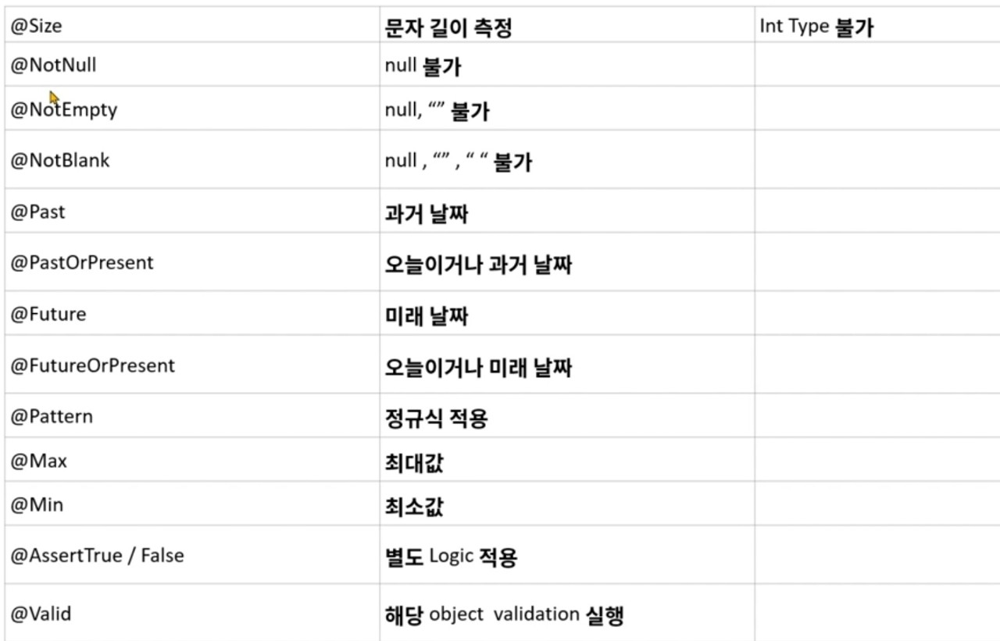
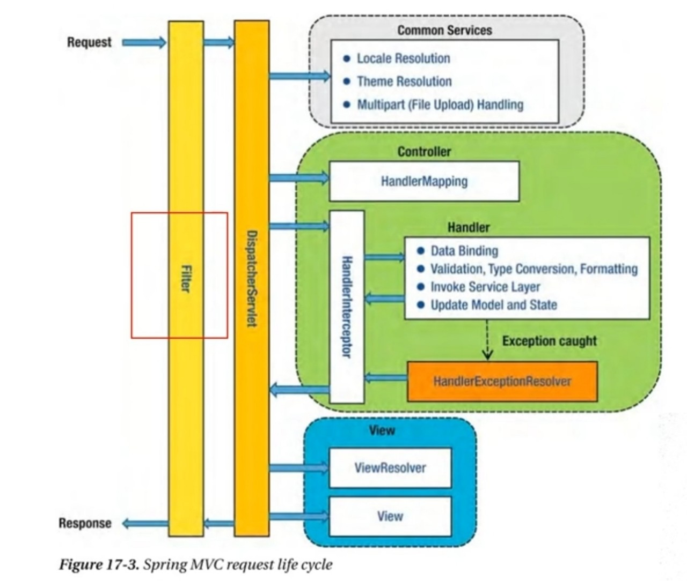

# 1. Spring Boot Validation

### Validation이란

- 프로그래밍에 있어서 가장 필요한 부분으로, Java 에서는 null 값에 대해서 접근하려고 할 때 null pointer exception 이 발생하므로, 이러한 부분을 방지하기 위해서 미리 검증을 하는 과정을 Validation 이라고 함

- 예제(많은 검증 때문에 비즈니스 로직에서 벗어남)

  - ```java
    if(account == null || pw == null){
    	return 
    }
    
    if(age == 0){
    	return
    }
    
    //수행해야할 로직 진행
    ```

    - account, pw, age 에 대한 검증때문에 자원 낭비


#### Validation 을 사용하는 이유

- 사용하지 않았을 경우

1. 검증해야 할 값이 많은 경우 코드의 길이가 길어짐
2. 구현에 따라서 달라질 수 있지만 Service Logic 과의 분리가 필요
3. 흩어져 있는 경우 어디에서 검증을 하는지 알기 어려우며, 재사용의 한계가 있음
4. 검증 Logic 이 변경 되는 경우 테스트 코드 등 참조하는 클래스에서 Logic 이 변경되어야 하는 부분이 발생할 수 있음


#### Validation Annotation

- 


# 2 .Validation 시작

- gradle dependencies -> implementation 'org.springframework.boot:spring-boot-starter-web'

- Annotation 을 통해 

- User 클래스

  - ```java
    package com.example.validation.dto;
    
    import javax.validation.constraints.*;
    
    public class User {
        @NotBlank
        private String name;
        @Min(value = 0)
        @Max(value = 90)
        private int age;
        @Email
        private String email;
    
        @Pattern(regexp = "^\\d{2,3}-\\d{3,4}-\\d{4}$", message = "핸드폰 번호 양식과 맞지 않습니다. 01x-xxx(x)-xxxx")
        private String phoneNumber;
    
        public String getName() {
            return name;
        }
    
        public void setName(String name) {
            this.name = name;
        }
    
        public int getAge() {
            return age;
        }
    
        public void setAge(int age) {
            this.age = age;
        }
    
        public String getEmail() {
            return email;
        }
    
        public void setEmail(String email) {
            this.email = email;
        }
    
        public String getPhoneNumber() {
            return phoneNumber;
        }
    
        public void setPhoneNumber(String phoneNumber) {
            this.phoneNumber = phoneNumber;
        }
    
        @Override
        public String toString() {
            return "User{" +
                    "name='" + name + '\'' +
                    ", age=" + age +
                    ", email='" + email + '\'' +
                    ", phoneNumber='" + phoneNumber + '\'' +
                    '}';
        }
    }
    ```

    - notBlank, Min, Max, Pattern(정규식), Email 등으로 User class 에서 validation 구현 

- ApiController

  - ```java
    package com.example.validation.controller;
    
    import ...;
    
    @RestController
    @RequestMapping("/api")
    public class ApiController {
    
        @PostMapping("/user")
        //validation 을 위해서 @Valid 사용
        //BindingResult 로 받게 되면 예외가 나오는게 아니라 validation 에 대한 결과가 bindingResult 에 들어감
        public Object user(@Valid @RequestBody User user, BindingResult bindingResult){
    
            if(bindingResult.hasErrors()){
                StringBuilder sb = new StringBuilder();
                //bindingResult 에서 에러를 받어서 출력 및 StringBuilder 에 넣음
                bindingResult.getAllErrors().forEach(objectError -> {
                    FieldError field = (FieldError) objectError;
                    String msg = objectError.getDefaultMessage();
    
                    System.out.println("field : " + field.getField());
                    System.out.println(msg);
    
                    sb.append("field : " + field.getField());
                    sb.append("message : " + msg);
                });
    			//return 값으로 넣어서 400번 호출 및 sb.toString() 출력
                return ResponseEntity.status(HttpStatus.BAD_REQUEST).body(sb.toString());
            }
            System.out.println(user);
            return user;
        }
    
    }
    ```

    - parameter 에 @Valid 를 사용하여 해당 인자가 validation 을 사용한다고 알림
    - bindingResult 로 error 메시지 출력

- json 과 result

  - post : age 가 error 일 때

    - ```json
      {
        "name" : "홍길동",
        "age" : 100,
        "email" : "steve@gamil.com",
        "phoneNumber" : "010-1111-2222"
      
      }
      ```

  - response(body 값)

    - field : agemessage : 90 이하여야 합니다

      

# 3. Custom Validation

- @AssertTrue / False 와 같은 method 지정을 통해서 Custom Logic 적용 가능
  - 이건 재사용 불가능

- ConstraintValidator 를 적용하여 재사용이 가능한 Custom Logic 적용 가능

### 예제 : 위 예제의 User 와 ApiController 계속 사용

-  User 클래스

  - YearMonth 에 @AssertTrue 를 이용하여 검증

  - ```java
    package com.example.validation.dto;
    
    import ...;
    
    public class User {
        @NotBlank
        private String name;
        @Min(value = 0)
        @Max(value = 90)
        private int age;
        @Email
        private String email;
    
        @Pattern(regexp = "^\\d{2,3}-\\d{3,4}-\\d{4}$", message = "핸드폰 번호 양식과 맞지 않습니다. 01x-xxx(x)-xxxx")
        private String phoneNumber;
    
        @Size(min = 6, max =6)
        private String reqYearMonth; //yyyyMM
    
        //getsetMethod 생략
    
        public String getReqYearMonth() {
            return reqYearMonth;
        }
    
        public void setReqYearMonth(String reqYearMonth) {
            this.reqYearMonth = reqYearMonth;
        }
    
        @AssertTrue(message = "yyyyMM 의 형식에 맞지 않습니다.")
        //boolean 형식은 메소드 앞에 is 를 붙여야 한다.
        public boolean isReqYearMonthValidation(){
            try{
                //yyyyMMdd 형식을 검증하기 때문에 "01" 을 붙여서 yyyMM01 로 만듦
                LocalDate localDate = LocalDate.parse(getReqYearMonth() + "01", DateTimeFormatter.ofPattern("yyyyMMdd"));
                //맞는 형식이 아니면 false 반환
            }catch(Exception e){
                return false;
            }
    
            return true;
        }
        @Override
        public String toString() {
            return "User{" +
                    "name='" + name + '\'' +
                    ", age=" + age +
                    ", email='" + email + '\'' +
                    ", phoneNumber='" + phoneNumber + '\'' +
                    ", reqYearMonth='" + reqYearMonth + '\'' +
                    '}';
        }
    }
    
    ```

    

### 예제 2 : ConstraintValidator 를 사용한 재사용

- interface 로 @YearMonth 생성

  - ```java
    package com.example.validation.annotation;
    
    import com.example.validation.validator.YearMonthValidator;
    
    import javax.validation.Constraint;
    import javax.validation.Payload;
    import java.lang.annotation.Retention;
    import java.lang.annotation.Target;
    
    import static java.lang.annotation.ElementType.*;
    import static java.lang.annotation.ElementType.TYPE_USE;
    import static java.lang.annotation.RetentionPolicy.RUNTIME;
    
    //어떤 클래스를 가지고 검사할건지 설정
    @Constraint(validatedBy = {YearMonthValidator.class})
    @Target({ METHOD, FIELD, ANNOTATION_TYPE, CONSTRUCTOR, PARAMETER, TYPE_USE })
    @Retention(RUNTIME)
    public @interface YearMonth {
        //default message 값 설정
        String message() default "{yyyyMM 형식에 맞지 않습니다.}";
    
        Class<?>[] groups() default { };
    
        Class<? extends Payload>[] payload() default { };
        //이까지 default 형식
    
        //pattern 의 디폴트 값
        String pattern() default "yyyyMMdd";
    
    }
    ```

    - @Constraint, @Target, @Retention 은  필수 annotation
      - @Constraint 에 validator 클래스를 넣어줌 (여기서는 YearMonthValidator 클래스)
      
    - 위 3개 method 는 default 형식
    
    - pattern 의 default 값으로 "yyyyMMdd"  사용
    
      

- YearMonthValidator 클래스

  - ```java
    package com.example.validation.validator;
    
    
    import com.example.validation.annotation.YearMonth;
    
    import javax.validation.ConstraintValidator;
    import javax.validation.ConstraintValidatorContext;
    import java.time.LocalDate;
    import java.time.format.DateTimeFormatter;
    
    //Constraintvalidator<annotation, 검증 형식> 을 사용해야 함
    //초기화 및 검증 메소드를 override
    public class YearMonthValidator implements ConstraintValidator<YearMonth, String> {
    
        //검증하는 패턴(String)
        private String pattern;
    
        @Override
        //초기화 매소드, annotation 패턴을 가져옴
        public void initialize(YearMonth constraintAnnotation) {
            //@YearMonth에서 pattern() = "yyyyMMdd"
            this.pattern = constraintAnnotation.pattern();
        }
    
        @Override
        //유효성 검사(true, false) 
        //앞선 예제 1에서 AssertTrue 의 isReqYearMonthValidation()과 똑같음
        //value 값이 검증해야하는 값 
        public boolean isValid(String value, ConstraintValidatorContext context) {
            //yyyyMM
            try{
                //"01" 을 붙이는 이유는 임의로 yyyyMMdd 로 만들어서 validation 검사를 위해
                LocalDate localDate = LocalDate.parse(value + "01", DateTimeFormatter.ofPattern(this.pattern));
            }catch(Exception e){
                return false;
            }
    
            return true;
        }
    }
    ```

- 이후 User 클래스의 String reqYearMonth; 에 @YearMonth 를 붙여 검증

### 예제 3 : User 클래스에 carlist 추가

- User 클래스

  - User -> String name, int age, List<Car> cars 변수

  - ```java
    package com.example.validation.dto;
    
    import com.example.validation.annotation.YearMonth;
    
    import javax.validation.Valid;
    import javax.validation.constraints.*;
    import java.time.LocalDate;
    import java.time.format.DateTimeFormatter;
    import java.time.format.DateTimeFormatterBuilder;
    import java.util.List;
    
    public class User {
        @NotBlank
        private String name;
        @Min(value = 0)
        @Max(value = 90)
        private int age;
    
        //Car 클래스 내부에서 검증하려면 cars list에 @Valid 를 붙여야 함
        @Valid
        private List<Car> cars;
    
    
        public String getName() {
            return name;
        }
    
        public void setName(String name) {
            this.name = name;
        }
    
        public int getAge() {
            return age;
        }
    
        public void setAge(int age) {
            this.age = age;
        }
    
        public List<Car> getCars() {
            return cars;
        }
    
        public void setCars(List<Car> cars) {
            this.cars = cars;
        }
    
        @Override
        public String toString() {
            return "User{" +
                    "name='" + name + '\'' +
                    ", age=" + age +
                    ", cars=" + cars +
                    '}';
        }
    }
    ```

    

- Car 클래스

  - Car -> String name, String carNumber, String Type 변수

  - @Notblank 로 null, 공백 에러

  - User 클래스의 List<Car> 에 @Valid 가 있어야 함

    - 이게 없으면 Car 에 공백이 있어도 무시됨

  - ```java
    package com.example.validation.dto;
    
    import com.fasterxml.jackson.annotation.JsonProperty;
    
    import javax.validation.constraints.NotBlank;
    
    public class Car {
        @NotBlank
        private String name;
    
        @NotBlank
        @JsonProperty("car_number")
        private String carNumber;
    
        @NotBlank
        @JsonProperty("TYPE")
        private String type;
    
        public String getName() {
            return name;
        }
    
        public void setName(String name) {
            this.name = name;
        }
    
        public String getCarNumber() {
            return carNumber;
        }
    
        public void setCarNumber(String carNumber) {
            this.carNumber = carNumber;
        }
    
        public String getType() {
            return type;
        }
    
        public void setType(String type) {
            this.type = type;
        }
    
        @Override
        public String toString() {
            return "Car{" +
                    "name='" + name + '\'' +
                    ", carNumber='" + carNumber + '\'' +
                    ", type='" + type + '\'' +
                    '}';
        }
    }
    ```

    

# 4. Spring Boot Exception 처리

- 에러 처리 방법
  1. 에러페이지
  2. 4xx error or 5xx error
  3. Client 가 200 외에 처리를 하지 못할 때는 200을 내려주고 별도의 에러 message 전달
- Exception 처리
  - @ContorllerAdvice : Global 예외처리 및 특정 package/Controller 예외 처리
  - @ExceptionHandler : 특정 Controller 의 예외처리

### 예제

- ApiController 클래스

  - ```java
    package com.example.exception.controller;
    
    import com.example.exception.dto.User;
    import org.springframework.web.bind.annotation.*;
    
    import javax.validation.Valid;
    
    @RestController
    @RequestMapping("/api/user")
    public class ApiController {
    
        @GetMapping("")
        //required=false 로 하면 필수가 아니게 됨
        public User get(@RequestParam(required = false) String name, @RequestParam(required = false) Integer age){
            User user = new User();
            user.setName(name);
            user.setAge(age);
            
            return user;
        }
    
        @PostMapping("")
        public User post(@Valid @RequestBody User user){
            System.out.println(user);
            return user;
        }
    }
    ```

- GlobalControllerAdvice

  - advice 패키지에 생성

  - ```java
    package com.example.exception.advice;
    
    import org.springframework.http.HttpStatus;
    import org.springframework.http.ResponseEntity;
    import org.springframework.web.bind.MethodArgumentNotValidException;
    import org.springframework.web.bind.annotation.ExceptionHandler;
    import org.springframework.web.bind.annotation.RestControllerAdvice;
    
    //해당 Annotation 으로 예외처리 실시
    @RestControllerAdvice
    public class GlobalControllerAdvice {
    
        //value = Exception.class 일 때 전체적인 예외를 다잡음
        @ExceptionHandler(value = Exception.class)
        public ResponseEntity exception(Exception e){
            System.out.println(e.getClass().getName());
            System.out.println("---------------");
            System.out.println(e.getLocalizedMessage());
            System.out.println("---------------");
            return ResponseEntity.status(HttpStatus.INTERNAL_SERVER_ERROR).body("");
        }
    
        //MethodArugumentNotValidException 클래스만 따로 처리
        //해당 메소드를 ApiController 에 넣어서 해당 컨트롤러에서만 사용 가능
        //같은 예외처리가 있다고 하더라도 우선순위는 컨트롤러 내부 ExceptionHandler 임
        @ExceptionHandler(value = MethodArgumentNotValidException.class)
        public ResponseEntity MethodArgumentNotValidException(Exception e){
    
            return  ResponseEntity.status(HttpStatus.BAD_REQUEST).body(e.getMessage());
    
        }
    }
    ```

    

# 5. Spring Boot Validation 모범 사례

### User 클래스와 ApiController

- User 클래스

  - ```java
    package com.example.exception.dto;
    
    import javax.validation.constraints.Min;
    import javax.validation.constraints.NotEmpty;
    import javax.validation.constraints.NotNull;
    import javax.validation.constraints.Size;
    
    public class User {
        @NotEmpty
        @Size(min =1, max=10)
        private String name;
    
        @Min(1)
        @NotNull
        private Integer age;
    
        public String getName() {
            return name;
        }
    
        public void setName(String name) {
            this.name = name;
        }
    
        public int getAge() {
            return age;
        }
    
        public void setAge(int age) {
            this.age = age;
        }
    
        @Override
        public String toString() {
            return "User{" +
                    "name='" + name + '\'' +
                    ", age=" + age +
                    '}';
        }
    }
    ```

- ApiController

- get 방식에서 각 requestParam 마다 validation 가능

  - ```java
    package com.example.exception.controller;
    
    import com.example.exception.dto.User;
    import org.springframework.validation.annotation.Validated;
    import org.springframework.web.bind.annotation.*;
    
    import javax.validation.Valid;
    import javax.validation.constraints.Min;
    import javax.validation.constraints.NotNull;
    import javax.validation.constraints.Size;
    
    @RestController
    @RequestMapping("/api/user")
    //get 방식에서 validation 사용을 위해 사용
    @Validated
    public class ApiController {
    
        @GetMapping("")
        public User get(
            	//각각 requestparam 마다 validation 사용
                @Size(min = 1)
                @RequestParam String name,
    
                @NotNull
                @Min(1)
                @RequestParam Integer age){
            User user = new User();
            user.setName(name);
            user.setAge(age);
    
            int a = age + 10;
            return user;
        }
    
        @PostMapping("")
        public User post(@Valid @RequestBody User user){
            System.out.println(user);
            return user;
        }
    }
    ```


### ApiControllerAdvice 클래스 (예외 처리)

- 중요 포인트는, 에러메세지를 response 하기 위해서 해당 에러메세지에서 BindingResult 클래스를 통해 에러메세지를 출력한 다음 해당 내용 중 필요한 내용만 추출
- 주요개념
  - @RestControllerAdvice : 전역 또는 특정 클래스에서 예외 처리
  - @ExceptionHandler(value = 예외상황.class) : 잡으려는 예외
  - 메소드를 만들 때 public ResonseEntity exception(예외상황 e, HttpServletRequest httpServletRequest) 로 해서 에러와 해당 url 반환

```java
package com.example.exception.advice;

import ...;

//basePackageClasses 를 통해 특정 클래스에서만 사용가능
//basePackageClasses 없이 @RestControllerAdvice 만 쓴다면 전역에 대한 예외처리
@RestControllerAdvice(basePackageClasses = ApiController.class)
public class ApiControllerAdvice {

    //value = Exception.class 일 때 전체적인 예외를 다잡음
    @ExceptionHandler(value = Exception.class)
    public ResponseEntity exception(Exception e){
        System.out.println(e.getClass().getName());
        return ResponseEntity.status(HttpStatus.INTERNAL_SERVER_ERROR).body("");
    }

    //해당 메소드를 ApiController 에 넣어서 해당 컨트롤러에서만 사용 가능
    //같은 예외처리가 있다고 하더라도 우선순위는 컨트롤러 내부 ExceptionHandler 임
    @ExceptionHandler(value = MethodArgumentNotValidException.class)
    public ResponseEntity MethodArgumentNotValidException(MethodArgumentNotValidException e, HttpServletRequest httpServletRequest){

        //forEach문을 돌리기 위해 먼저 Error의 리스트 생성
        List<Error> errorList = new ArrayList<>();

        //BindingResult 로 e 를 받음
        BindingResult bindingResult = e.getBindingResult();
        //모든 error에 대해 forEach
        bindingResult.getAllErrors().forEach(err -> {
            
            //err 를 FieldError 로 형변환
            FieldError field = (FieldError) err;

            //error 필드 (ex. age, name 등)
            String fieldName = field.getField();
            //message : 비어있지 않아야합니다 등 (@NotEmpty 일 때 등)
            String message = field.getDefaultMessage();
            //value : 사용자의 req 값
            String value = field.getRejectedValue().toString();

            //Error 클래스의 errorMessage 생성한 후 위 값들을 넣어줌
            Error errorMessage = new Error();
            errorMessage.setField(fieldName);
            errorMessage.setMessage(message);
            errorMessage.setInvalidValue(value);

            //최초에 생성했던 erorList 에 errorMessage 를 넣어줌.. error 가 여러 개면 여러 번 들어감
            errorList.add(errorMessage);
                });

        //마지막으로, http body 에 표현할 ErrorResponse 생성 후 각각 인자를 넣어줌
        ErrorResponse errorResponse = new ErrorResponse();
        errorResponse.setErrorList(errorList);
        errorResponse.setMessage("");
        errorResponse.setRequestUrl(httpServletRequest.getRequestURI());
        errorResponse.setStatusCode(HttpStatus.BAD_REQUEST.toString());
        errorResponse.setResultCode("FAIL");

        //body 에 errorResponse 출력
        return  ResponseEntity.status(HttpStatus.BAD_REQUEST).body(errorResponse);
    }
   

    @ExceptionHandler(value = ConstraintViolationException.class)
    public ResponseEntity ConstraintViolationException(ConstraintViolationException e, HttpServletRequest httpServletRequest){

        List<Error> errorList = new ArrayList<>();

        e.getConstraintViolations().forEach(error -> {

            Stream<Path.Node> stream = StreamSupport.stream(error.getPropertyPath().spliterator(), false);
            List<Path.Node> list = stream.collect(Collectors.toList());
            String field = list.get(list.size() - 1).getName();
            String message = error.getMessage();
            String invalidValue = error.getInvalidValue().toString();

            Error errorMessage = new Error();
            errorMessage.setField(field);
            errorMessage.setMessage(message);
            errorMessage.setInvalidValue(invalidValue);

            errorList.add(errorMessage);
        });
        
        ErrorResponse errorResponse = new ErrorResponse();
        errorResponse.setErrorList(errorList);
        errorResponse.setMessage("");
        errorResponse.setRequestUrl(httpServletRequest.getRequestURI());
        errorResponse.setStatusCode(HttpStatus.BAD_REQUEST.toString());
        errorResponse.setResultCode("FAIL");

        return  ResponseEntity.status(HttpStatus.BAD_REQUEST).body(errorResponse);
    }

    @ExceptionHandler(value = MissingServletRequestParameterException.class)
    public ResponseEntity MissingServletRequestParameterException(MissingServletRequestParameterException e, HttpServletRequest httpServletRequest){

        List<Error> errorList = new ArrayList<>();

        String fieldName = e.getParameterName();
        String invalidValue = e.getMessage();

        Error errorMessage = new Error();
        errorMessage.setField(fieldName);
        errorMessage.setMessage(invalidValue);

        errorList.add(errorMessage);

        ErrorResponse errorResponse = new ErrorResponse();
        errorResponse.setErrorList(errorList);
        errorResponse.setMessage("");
        errorResponse.setRequestUrl(httpServletRequest.getRequestURI());
        errorResponse.setStatusCode(HttpStatus.BAD_REQUEST.toString());
        errorResponse.setResultCode("FAIL");

        return  ResponseEntity.status(HttpStatus.BAD_REQUEST).body(errorResponse);
    }
}
```


### Error, ErrorResponse 클래스

- Error 클래스

  - 에러를 보여주기 위해 필요한 field, message, invalidValue(req) 변수

  - ```java
    package com.example.exception.dto;
    
    public class Error {
        private String field;
        private String message;
        private String invalidValue;
    
        public String getField() {
            return field;
        }
    
        public void setField(String field) {
            this.field = field;
        }
    
        public String getMessage() {
            return message;
        }
    
        public void setMessage(String message) {
            this.message = message;
        }
    
        public String getInvalidValue() {
            return invalidValue;
        }
    
        public void setInvalidValue(String invalidValue) {
            this.invalidValue = invalidValue;
        }
    }
    ```

- ErrorResponse 클래스

  - errorList 와 기타 정보를 받아서 response 로 출력하기 위함

  - ```java
    package com.example.exception.dto;
    
    import java.util.List;
    
    public class ErrorResponse {
    
        String statusCode;
        String requestUrl;
        String code;
        String message;
        String resultCode;
        List<Error> errorList;
    
        public String getStatusCode() {
            return statusCode;
        }
    
        public void setStatusCode(String statusCode) {
            this.statusCode = statusCode;
        }
    
        public String getRequestUrl() {
            return requestUrl;
        }
    
        public void setRequestUrl(String requestUrl) {
            this.requestUrl = requestUrl;
        }
    
        public String getCode() {
            return code;
        }
    
        public void setCode(String code) {
            this.code = code;
        }
    
        public String getMessage() {
            return message;
        }
    
        public void setMessage(String message) {
            this.message = message;
        }
    
        public String getResultCode() {
            return resultCode;
        }
    
        public void setResultCode(String resultCode) {
            this.resultCode = resultCode;
        }
    
        public List<Error> getErrorList() {
            return errorList;
        }
    
        public void setErrorList(List<Error> errorList) {
            this.errorList = errorList;
        }
    }
    
    ```

    

### 결과

- req 

  - ```java
    {
      "name" : "",
      "age" : 0
    }
    ```

- res

  - ```json
    {
        "statusCode": "400 BAD_REQUEST",
        "requestUrl": "/api/user",
        "code": null,
        "message": "",
        "resultCode": "FAIL",
        "errorList":[
            {
                "field": "age",
                "message": "1 이상이어야 합니다",
                "invalidValue": "0"
            },
            {
                "field": "name",
                "message": "비어 있을 수 없습니다",
                "invalidValue": ""
            },
            {
                "field": "name",
                "message": "크기가 1에서 10 사이여야 합니다",
                "invalidValue": ""
            }
        ]
    }
    ```


# 6. Filter-Interceptor 의 활용 

## filter

- Filter 란 Web Appliction 에서 관리되는 영역으로써  Spring Boot Framework 에서 Client 로부터 오는 요청/응답에 대해서 최초/최종 단계에 위치
- 이를 통해 요청/응답의 정보를 변경하거나, Spring 에 의해서 데이터가 변환되기 전의 순수한 Client의 요청/응답 값을 확인
- **유일하게 ServletRequest, ServletResponse 의 객체를 변환할 수 있음**
- 주로 Spring Framework 에서는 request/response 의 Logging 용도로 활용하거나, 인증과 관련된 Logic 들을 해당 Filter 에서 치러
- 이를 선/후 처리함으로써 Service business logic 과 분리시킴
- 

### filter 예제

- Spring Web 및 Lombok 사용

  - Lombok 을 활용하여 getter/setter 대신 활용 가능

  - 추가 방법 : build.gradle 파일

    - configurations 추가

    - ```
      configurations {
         compileOnly {
            extendsFrom annotationProcessor
         }
      }
      ```

    - dependencies 에 compileOnly 'org.projectlombok:lombok' / annotationProcessor 'org.projectlombok:lombok' 추가

- User 클래스

  - lombok 에서 제공하는 @data, @NoArgsConstructor, @AllArgsConstructor 를 사용

  - ```java
    package com.example.filter.dto;
    
    import lombok.*;
    
    //getter, setter, toString 까지 모두 만들어 줌
    @Data
    //기본 생성자를 의미
    @NoArgsConstructor
    //전체 생성자를 의미
    @AllArgsConstructor
    public class User {
    
        private String name;
        private int age;
    }
    
    ```

- ApiController

  - @Slf4j 로 log.info() 사용

  - ```java
    package com.example.filter.controller;
    
    import com.example.filter.dto.User;
    import lombok.extern.slf4j.Slf4j;
    import org.springframework.web.bind.annotation.PostMapping;
    import org.springframework.web.bind.annotation.RequestBody;
    import org.springframework.web.bind.annotation.RequestMapping;
    import org.springframework.web.bind.annotation.RestController;
    
    //lombok 에서 log 를 사용하기 위해
    @Slf4j
    @RestController
    @RequestMapping("/api/user")
    public class ApiController {
    
        @PostMapping("")
        public User user(@RequestBody User user){
          log.info("User : {}", user);
          return user;
        }
    }
    ```

    

- GlobalFilter 클래스

  - chain.doFilter 전, 후로 처리 가능

  - ```java
    package com.example.filter.filter;
    
    import ...;
    
    @Slf4j
    //WebFilter 를 통해 특정 url 에만 적용가능(배열도 가능)
    //@Component 로 넣으면 전역
    @WebFilter(urlPatterns = "/api/user/*")
    public class GlobalFilter implements Filter {
    
        @Override
        public void doFilter(ServletRequest request, ServletResponse response, FilterChain chain) throws IOException, ServletException {
    
            //전처리
            //HttpServletRequest, Response class 로 req, res 를 구현하면 bufferReader 의 lines 를 읽을 때 한번밖에 못읽음
            // ContentCachingRequestwrapper class 를 통해서 계속 읽을 수 있음
            // contentCachingRequestwrapper 는 생성자로 HttpServletRequest 를 받음
    
            ContentCachingRequestWrapper httpServletRequest = new ContentCachingRequestWrapper((HttpServletRequest) request);
            ContentCachingResponseWrapper httpServletResponse = new ContentCachingResponseWrapper((HttpServletResponse) response);
    
            //동작 실행
            chain.doFilter(httpServletRequest, httpServletResponse);
    
            //후처리
            //doFilter 이후에 정보를 찍어야 함
            String url = httpServletRequest.getRequestURI();
    
            String reqContent = new String(httpServletRequest.getContentAsByteArray());
            log.info("request url : {}, request body : {}", url, reqContent);
    
            String resContent = new String(httpServletResponse.getContentAsByteArray());
            int httpStatus = httpServletResponse.getStatus();
    
            //다시한번 body 내용을 채워넣음
            httpServletResponse.copyBodyToResponse();
    
            log.info("response status : {}, responseBody : {}", httpStatus, resContent);
    
        }
    }
    ```

- 결과

  - req 

    - ```json
      {
        "name" : "steve",
        "age" : 10
      }
      ```

  - res

    - ```json
      {
          "name": "steve",
          "age": 10
      }
      ```

  - log

    - User : User(name=steve, age=10)

    - request url : /api/user, request body : {
        "name" : "steve",
        "age" : 10
      }

    - response status : 200, responseBody : {"name":"steve","age":10}

      

## Interceptor

- Filter 와 매우 유사한 형태로 존재하지만, 차이점은 Spring Context 에 등록
- AOP 와 유사한 기능을 제공할 수 있으며 **주로 인증단계를 처리하거나 Logging 을 하는 데**에 사용
- 이를 선/후 처리함으로써, Service business logic 과 분리시킴

### 예제 : public API 와 private API 로 구분 인증

#### public / private API 클래스

- 해당 api 구분으로 인증 구분

- PublicApiController

  - ```java
    package com.example.interceptor.controller;
    
    import org.springframework.web.bind.annotation.GetMapping;
    import org.springframework.web.bind.annotation.RequestMapping;
    import org.springframework.web.bind.annotation.RestController;
    
    @RestController
    @RequestMapping("/api/public")
    public class PublicController {
    
        @GetMapping("/hello")
        public String hello(){
            return "public hello";
        }
    }
    ```

- PrivateApiController

  - ```java
    package com.example.interceptor.controller;
    
    import com.example.interceptor.annotation.Auth;
    import lombok.extern.slf4j.Slf4j;
    import org.springframework.web.bind.annotation.GetMapping;
    import org.springframework.web.bind.annotation.RequestMapping;
    import org.springframework.web.bind.annotation.RestController;
    
    @Slf4j
    @RestController
    @RequestMapping("/api/private")
    //interceptor 에서 @auth가 붙어있으면 있을 때만 통과
    @Auth
    public class PrivateController {
    
        @GetMapping("/hello")
        public String hello(){
            log.info("private hello controller");
            return "private hello";
        }
    }
    ```


#### @Auth 

- annotation 패키지에 생성

- ```
  package com.example.interceptor.annotation;
  
  import java.lang.annotation.*;
  
  @Documented
  @Retention(RetentionPolicy.RUNTIME)
  @Target({ElementType.TYPE, ElementType.METHOD})
  public @interface Auth {
  }
  ```


#### AuthIntercepter

- **HandlerInterceptor 의 preHandle 메소드로 지정된 컨트롤러 동작 이전에 수행할 동작 지정 가능**

  - Filter 그림에서 HandlerInterceptor 를 보면 됨
  - postHandle
    - 지정된 컨트롤러의 동작 이후에 처리할 동작 (사후 제어) 
    - Spring MVC의 Dispatcher Servlet이 화면을 처리하기 전에 동작
  - afterCompletion
    - Dispatcher Servlet의 화면 처리가 완료된 이후 처리할 동작

- intercepter 패키지에 추가

- component 로, bean 으로 관리됨

- ```java
  package com.example.interceptor.interceptor;
  
  import com.example.interceptor.annotation.Auth;
  import com.example.interceptor.exception.AuthException;
  import lombok.extern.slf4j.Slf4j;
  import org.springframework.stereotype.Component;
  import org.springframework.web.method.HandlerMethod;
  import org.springframework.web.servlet.HandlerInterceptor;
  import org.springframework.web.servlet.resource.ResourceHttpRequestHandler;
  import org.springframework.web.util.UriComponentsBuilder;
  
  import javax.servlet.http.HttpServletRequest;
  import javax.servlet.http.HttpServletResponse;
  import java.net.URI;
  
  @Slf4j
  @Component
  public class AuthInterceptor implements HandlerInterceptor {
  
      @Override
      public boolean preHandle(HttpServletRequest request, HttpServletResponse response, Object handler) throws Exception {
  
          String url = request.getRequestURI();
  
          //uri 를 통해 query 를 받음
          URI uri = UriComponentsBuilder.fromUriString(request.getRequestURI())
                  .query(request.getQueryString()).build().toUri();
  
          //checkAnnotation 메소드를 만들어서 hasAnnotation 여부 확인
          boolean hasAnnotation = checkAnnotation(handler, Auth.class);
  
          //인증 조건 : 나의 서버는 모두 public 으로 동작하는데
          // 단! 세션, 쿠기등으로 Auth 권한을 가진 요청에 대해서는 private
          
          //권한 체크
          //즉, pivateApiController 로 동작하면
          if(hasAnnotation){
              String query = uri.getQuery();
              //그 중에서도 query에 name = steve 일 때
              if(query.equals("name=steve")){
                  return true;
              }
              //name != steve 일 때 AuthException() 으로 이동
              //AuthException() 은 따로 생성해줘야 함
              throw new AuthException();
          }
  		//여기를 false 로 하면 public 에서도 인증되지 않아 출력이 안됨
          //하지만 config 에서 private url 에서만 인증절차를 거친다고 하면 여기가 true 든 false 든 public 은 @auth 를 거치지 않아 상관 없음
          return true;
      }
  
      private boolean checkAnnotation(Object handler, Class clazz) {
  
          //resource javascript, html, 등 무조건 통과
          if (handler instanceof ResourceHttpRequestHandler) {
              return true;
          }
  
          //annotation 이 달려있는가 체크
          HandlerMethod handlerMethod = (HandlerMethod) handler;
          if (handlerMethod.getMethodAnnotation(clazz) != null || handlerMethod.getBeanType().getAnnotation(clazz) != null) {
              //Auth annotation 이 있으면
              return true;
          }
          return false;
      }
  }
  ```


#### MvcConfig

- config 패키지에 생성

- AuthIntercepter 를 등록하기 위해 사용

- WebMvcConfigurer 를 상속

- ```java
  package com.example.interceptor.config;
  
  import com.example.interceptor.interceptor.AuthInterceptor;
  import lombok.RequiredArgsConstructor;
  import org.springframework.context.annotation.Configuration;
  import org.springframework.web.servlet.config.annotation.InterceptorRegistry;
  import org.springframework.web.servlet.config.annotation.WebMvcConfigurer;
  
  @Configuration
  //final 로 선언된 객체들을 생성자로 받을 수 있게 함
  //structor 에 MvcConfig(AuthInterceptor) 라고 등록됨
  @RequiredArgsConstructor
  public class MvcConfig implements WebMvcConfigurer {
  
      private final AuthInterceptor authInterceptor;
  
      @Override
      //interceptor 를 등록하기 위한 메소드
      public void addInterceptors(InterceptorRegistry registry) {
          //registry.addInterceptor(authInterceptor) -> 모든 곳에서 인증절차
          //addPatterns 메소드를 넣으면 api/private 에서만 인증절차
          //public 에서는 동작 x
          registry.addInterceptor(authInterceptor).addPathPatterns("/api/private/*");
      }
  }
  ```


#### Exception 처리

- AuthException 클래스

  - exception 패키지에 생성

  - ```java
    package com.example.interceptor.exception;
    
    public class AuthException extends RuntimeException{
    }
    
    ```

    

- GlobalHandlerException 클래스

  - handler 패키지에 생성

  - ```java
    package com.example.interceptor.handler;
    
    import com.example.interceptor.exception.AuthException;
    import org.springframework.http.HttpStatus;
    import org.springframework.http.ResponseEntity;
    import org.springframework.web.bind.annotation.ExceptionHandler;
    import org.springframework.web.bind.annotation.RestControllerAdvice;
    
    @RestControllerAdvice
    public class GlobalExceptionHandler {
    
        @ExceptionHandler(AuthException.class)
        public ResponseEntity authException(){
            return ResponseEntity.status(HttpStatus.UNAUTHORIZED).build();
        }
    }
    ```


# 7. 비동기 처리

- Spring initiallizer -> spring web + lombok -> AsyncApplication 에 @EnableAsync 추가
- **Java SpringFramework 에서는 잘 쓰지 않음!!! ** -> MVC 패턴을 쓸 뿐..


### 예제 1 : 비동기처리 기본

- AsyncApplication 

  - ```java
    package com.example.async;
    
    import org.springframework.boot.SpringApplication;
    import org.springframework.boot.autoconfigure.SpringBootApplication;
    import org.springframework.scheduling.annotation.EnableAsync;
    
    @SpringBootApplication
    @EnableAsync	
    public class AsyncApplication {
    
    	public static void main(String[] args) {
    		SpringApplication.run(AsyncApplication.class, args);
    	}
    }
    ```

    

- ApiController 

  - lombok 으로 작성

  - ```java
    package com.example.async.controller;
    
    import com.example.async.service.AsyncService;
    import lombok.extern.slf4j.Slf4j;
    import org.springframework.beans.factory.annotation.Autowired;
    import org.springframework.web.bind.annotation.GetMapping;
    import org.springframework.web.bind.annotation.RequestMapping;
    import org.springframework.web.bind.annotation.RestController;
    
    @Slf4j
    @RestController
    @RequiredArgsConstructor
    @RequestMapping("/api")
    public class ApiController {
    
        private final AsyncService asyncService;
    
        @GetMapping("/hello")
        public String hello(){
            asyncService.hello();
            log.info("method end");
            return"hello";
        }
    }
    ```

- AsyncService

  - service 패키지에 작성

  - ```java
    package com.example.async.service;
    
    import lombok.extern.slf4j.Slf4j;
    import org.springframework.scheduling.annotation.Async;
    import org.springframework.stereotype.Service;
    
    @Slf4j
    @Service
    public class AsyncService {
    
        //@Async 로 비동기 처리
        @Async
        public void hello() {
            for(int i = 0; i < 10; i++){
                try {
                    Thread.sleep(2000);
                    log.info("sleep...");
                } catch (InterruptedException e) {
                    throw new RuntimeException(e);
                }
            }
        }
    }
    ```

- 결과

  - log
    - method end
      2022-10-02 21:41:53.958  INFO 22212 --- [         task-1] com.example.async.service.AsyncService   : sleep...
      2022-10-02 21:41:55.972  INFO 22212 --- [         task-1] com.example.async.service.AsyncService   : sleep...
      2022-10-02 21:41:57.978  INFO 22212 --- [         task-1] com.example.async.service.AsyncService   : sleep...
      2022-10-02 21:41:59.983  INFO 22212 --- [         task-1] com.example.async.service.AsyncService   : sleep...
      2022-10-02 21:42:01.997  INFO 22212 --- [         task-1] com.example.async.service.AsyncService   : sleep...
      2022-10-02 21:42:03.999  INFO 22212 --- [         task-1] com.example.async.service.AsyncService   : sleep...
      2022-10-02 21:42:06.004  INFO 22212 --- [         task-1] com.example.async.service.AsyncService   : sleep...
      2022-10-02 21:42:08.010  INFO 22212 --- [         task-1] com.example.async.service.AsyncService   : sleep...
      2022-10-02 21:42:10.022  INFO 22212 --- [         task-1] com.example.async.service.AsyncService   : sleep...
      2022-10-02 21:42:12.031  INFO 22212 --- [         task-1] com.example.async.service.AsyncService   : sleep...
  - body
    - hello

### 예제 2 : CompletableFuture 사용

- ApiController

  - ```java
    package com.example.async.controller;
    
    import com.example.async.service.AsyncService;
    import lombok.extern.slf4j.Slf4j;
    import org.springframework.beans.factory.annotation.Autowired;
    import org.springframework.web.bind.annotation.GetMapping;
    import org.springframework.web.bind.annotation.RequestMapping;
    import org.springframework.web.bind.annotation.RestController;
    import java.util.concurrent.CompletableFuture;
    
    @Slf4j
    @RestController
    @RequiredArgsConstructor
    @RequestMapping("/api")
    public class ApiController {
    
        private final AsyncService asyncService;
    
        @GetMapping("/hello")
        //CompletableFuture 클래스로 반환
        public CompletableFuture hello(){
            log.info("completable future init");
            return asyncService.run();
        }
    }
    ```

- AsyncService

  - CompletableFuture 은 여러 개의 Api 를 동시에 실행하고 동시에 결과를 join 할 때 사용할 만함

  - ```java
    package com.example.async.service;
    
    import lombok.extern.slf4j.Slf4j;
    import org.springframework.scheduling.annotation.Async;
    import org.springframework.scheduling.annotation.AsyncResult;
    import org.springframework.stereotype.Service;
    
    import javax.annotation.Resource;
    import java.util.concurrent.CompletableFuture;
    
    @Slf4j
    @Service
    public class AsyncService {
    
        @Async
        //run() 메소드로 hello() String 을 넣어서 CompletableFuture 로 반환
        public CompletableFuture run(){
            return new AsyncResult(hello()).completable();
        }
    
        //@Async 로 비동기 처리
        @Async
        public String hello() {
            for(int i = 0; i < 10; i++){
                try {
                    Thread.sleep(2000);
                    log.info("sleep...");
                } catch (InterruptedException e) {
                    throw new RuntimeException(e);
                }
            }
            return "async hello";
        }
    }
    
    ```

- 결과 

  - ApiController 에서 return 값이 CompletableFuture 이고, hello 의 비동기가 끝나고 return "async hello" 가 반환되므로 20초 이후에 body 에 값 전달
  - log
    - 2022-10-02 22:16:58.790  INFO 2420 --- [nio-8080-exec-1] c.e.async.controller.ApiController       : completable future init
      2022-10-02 22:17:00.813  INFO 2420 --- [        Async-1] com.example.async.service.AsyncService   : sleep...
      2022-10-02 22:17:02.818  INFO 2420 --- [        Async-1] com.example.async.service.AsyncService   : sleep...
      2022-10-02 22:17:04.827  INFO 2420 --- [        Async-1] com.example.async.service.AsyncService   : sleep...
      2022-10-02 22:17:06.834  INFO 2420 --- [        Async-1] com.example.async.service.AsyncService   : sleep...
      2022-10-02 22:17:08.841  INFO 2420 --- [        Async-1] com.example.async.service.AsyncService   : sleep...
      2022-10-02 22:17:10.853  INFO 2420 --- [        Async-1] com.example.async.service.AsyncService   : sleep...
      2022-10-02 22:17:12.861  INFO 2420 --- [        Async-1] com.example.async.service.AsyncService   : sleep...
      2022-10-02 22:17:14.877  INFO 2420 --- [        Async-1] com.example.async.service.AsyncService   : sleep...
      2022-10-02 22:17:16.889  INFO 2420 --- [        Async-1] com.example.async.service.AsyncService   : sleep...
      2022-10-02 22:17:18.902  INFO 2420 --- [        Async-1] com.example.async.service.AsyncService   : sleep...
  - body(20초 이후)
    - async hello


### 예제 3 : Thread 생성

- AppConfig 클래스 (스레드 클래스)

  - config 패키지에 생성

  - ```java
    package com.example.async.config;
    
    import org.springframework.context.annotation.Bean;
    import org.springframework.context.annotation.Configuration;
    import org.springframework.scheduling.concurrent.ThreadPoolTaskExecutor;
    
    import java.util.concurrent.Executor;
    
    @Configuration
    public class AppConfig {
    
        //쓰레드 이름
        @Bean("async-thread")
        public Executor asyncThread(){
            ThreadPoolTaskExecutor threadPoolTaskExecutor = new ThreadPoolTaskExecutor();
    
            threadPoolTaskExecutor.setMaxPoolSize(100);
            //setCore : 10개를 쓰다가 다쓰면 큐에 내용이 들어가고, 큐가 다 차면 또 10개 늘어남
            //최대 100개
            threadPoolTaskExecutor.setCorePoolSize(10);
            threadPoolTaskExecutor.setQueueCapacity(10);
            threadPoolTaskExecutor.setThreadNamePrefix("Async-");
            return threadPoolTaskExecutor;
        }
    }
    ```

- AsyncService 에 @Async("async-thread") 라고 이름붙여주면 끝!

- **결과 **
  - log : 스레드 이름이 변경됨..?
    - 2022-10-02 22:25:14.384  INFO 19984 --- [nio-8080-exec-2] c.e.async.controller.ApiController       : completable future init
      2022-10-02 22:25:16.408  INFO 19984 --- [        **Async-1**] com.example.async.service.AsyncService   : sleep...
      2022-10-02 22:25:18.424  INFO 19984 --- [        **Async-1**] com.example.async.service.AsyncService   : sleep...
      2022-10-02 22:25:20.434  INFO 19984 --- [        **Async-1**] com.example.async.service.AsyncService   : sleep...
      2022-10-02 22:25:22.442  INFO 19984 --- [        **Async-1**] com.example.async.service.AsyncService   : sleep...
      2022-10-02 22:25:24.452  INFO 19984 --- [        **Async-1**] com.example.async.service.AsyncService   : sleep...
      2022-10-02 22:25:26.453  INFO 19984 --- [        **Async-1**] com.example.async.service.AsyncService   : sleep...
      2022-10-02 22:25:28.458  INFO 19984 --- [        **Async-1**] com.example.async.service.AsyncService   : sleep...
      2022-10-02 22:25:30.468  INFO 19984 --- [        **Async-1**] com.example.async.service.AsyncService   : sleep...
      2022-10-02 22:25:32.470  INFO 19984 --- [        **Async-1**] com.example.async.service.AsyncService   : sleep...
      2022-10-02 22:25:34.472  INFO 19984 --- [        **Async-1**] com.example.async.service.AsyncService   : sleep...
  - body(20초 이후)
    - async hello