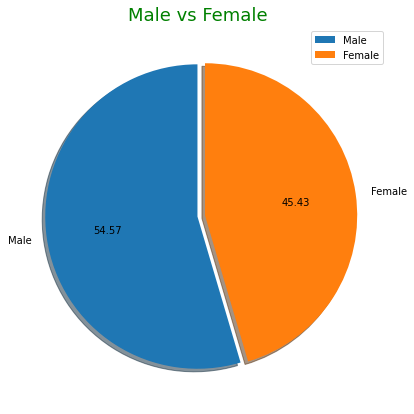

```python
# 필요한 라이브러리 임포트
import pandas as pd
import numpy as np
import matplotlib.pyplot as plt  # 시각화 라이브러리

marathon_2015_2017 = pd.read_csv('./boston_15_17.csv')
```


```python
# 튜플형태로 라벨 지정 
labels = 'Male', 'Female'
labels
```


    ('Male', 'Female')


```python
explode = (0, 0.1) # 차트를 입체적으로
```


```python
# 남자 여자 데이터 뽑기 (컬럼값이 0인 인덱스 제거)
index_0 = marathon_2015_2017[marathon_2015_2017['M/F'] == '0'].index 
marathon_2015_2017 = marathon_2015_2017.drop(index_0)
marathon_2015_2017['M/F'].value_counts()
```


    M    43131
    F    35907
    Name: M/F, dtype: int64


```python
plt.figure(figsize=(7,7))

# pie chart 만들기(차트 띄우기, labels 달기, 각 조정, 그림자, 값 소숫점 표시)
plt.pie(marathon_2015_2017['M/F'].value_counts(), explode=(0, 0.05), labels=labels, startangle=90, shadow=True, autopct='%.2f')

# 라벨, 타이틀 달기
plt.title('Male vs Female', fontsize=18, color='g')

plt.legend(['Male','Female'], loc='upper right')

plt.show()
```


    

    


```python

```
