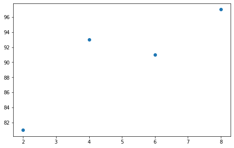

## 1. 경사하강법(입문)

- 자료 출처 : 모두의 딥러닝

```python
import numpy as np
import pandas as pd
import matplotlib.pyplot as plt

# 공부시간 X와 성적 Y의 리스트
data = [[2, 81], [4,93],[6,91],[8,97]]
x = [i[0] for i in data] # 리스트컴프리핸션
y = [i[1] for i in data]

# 그래프로 표시
plt.figure(figsize=(8,5))
plt.scatter(x,y)
plt.show()
```



```python
# 변수 정의

# 리스트 x, y를 넘파이 배열로 변환
    # 인덱스를 부여해 하나씩 계산이 가능하도록 바꿔주는 과정
x_data = np.array(x)
y_data = np.array(y)

# 기울기 a, 절편 b
a = 0
b = 0

y_hat = a * x_data + b   #  y예측치
error = y_data - y_hat   # 오차

lr = 0.03 # 학습률 (너무 큰 오차함수값을 조절해주는 역할 )

epochs = 2001 # 반복횟수

print(y_hat, error)
```

    [0 0 0 0] [81 93 91 97]

```python
# a,b 값 업데이트

a_diff = -(2/len(x_data)) * sum(x_data * (error))
    # 오차함수를 a로 편미분
        # 편미분: 특정 변수를 제외한 나머지는 상수로 취급하는 미분
b_diff = -(2/len(x_data)) * sum(error)
    # 오차함수를 b로 편미분
a = a - lr * a_diff  # 학습률을 곱해 a값 업데이트
b = b - lr * b_diff  # 학습률을 곱해 b값 업데이트

print(a, b) # 업데이트된 a,b
print(y_hat, error)
print(a_diff, b_diff)
```

    27.84 5.43
    [0 0 0 0] [81 93 91 97]
    -928.0 -181.0

```python
# for문을 통해 a, b 업데이트를 반복
    # 최소의 오차값을 찾아감 (a,b의 변화가 없어질 때까지)
for i in range(epochs):
    y_hat = a * x_data + b
    error = y_data - y_hat
    a_diff = -(2/len(x_data))*sum(x_data*error)
    b_diff = -(2/len(x_data))*sum(error)
    a = a - lr * a_diff
    b = b - lr * b_diff
    if i % 100 == 0:
        print("epoch=%.f, 기울기=%.04f, 절편=%.04f" % (i, a, b))
```

    epoch=0, 기울기=3.9390, 절편=2.1822
    epoch=100, 기울기=7.0274, 절편=50.7888
    epoch=200, 기울기=4.0785, 절편=68.3865
    epoch=300, 기울기=2.9691, 절편=75.0070
    epoch=400, 기울기=2.5517, 절편=77.4978
    epoch=500, 기울기=2.3947, 절편=78.4348
    epoch=600, 기울기=2.3356, 절편=78.7874
    epoch=700, 기울기=2.3134, 절편=78.9200
    epoch=800, 기울기=2.3050, 절편=78.9699
    epoch=900, 기울기=2.3019, 절편=78.9887
    epoch=1000, 기울기=2.3007, 절편=78.9957
    epoch=1100, 기울기=2.3003, 절편=78.9984
    epoch=1200, 기울기=2.3001, 절편=78.9994
    epoch=1300, 기울기=2.3000, 절편=78.9998
    epoch=1400, 기울기=2.3000, 절편=78.9999
    epoch=1500, 기울기=2.3000, 절편=79.0000
    epoch=1600, 기울기=2.3000, 절편=79.0000
    epoch=1700, 기울기=2.3000, 절편=79.0000
    epoch=1800, 기울기=2.3000, 절편=79.0000
    epoch=1900, 기울기=2.3000, 절편=79.0000
    epoch=2000, 기울기=2.3000, 절편=79.0000

```python
# 앞서 구한 기울기와 절편을 이용해 그래프를 그려 봅니다.
y_pred = a * x_data + b
plt.scatter(x, y)
plt.plot([min(x_data), max(x_data)], [min(y_pred), max(y_pred)])
    # 2차원 리스트로 그리면 선형 그래프
plt.show()
```


```python
print(y_pred, x_data)
```

    [83.59999984 88.19999992 92.8        97.40000008] [2 4 6 8]
