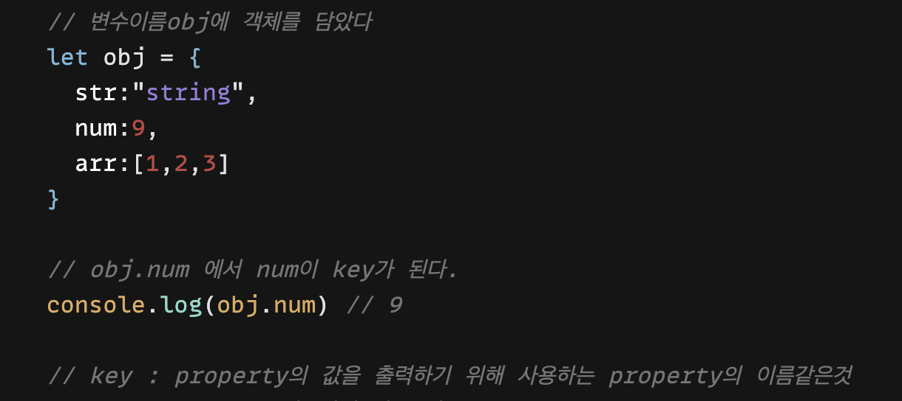
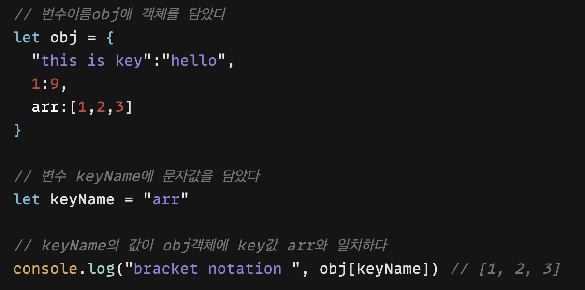
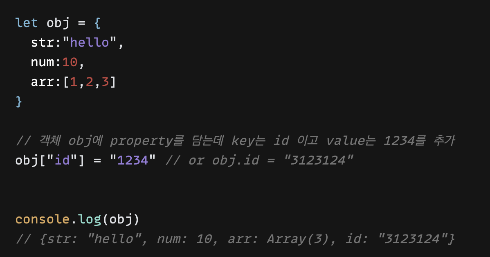
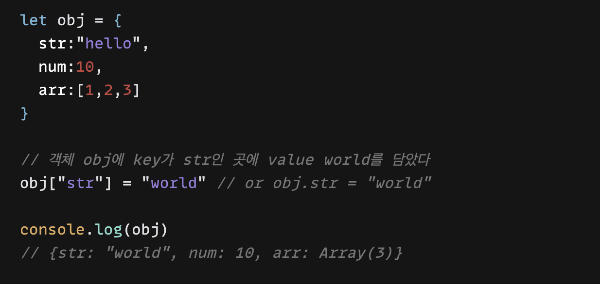
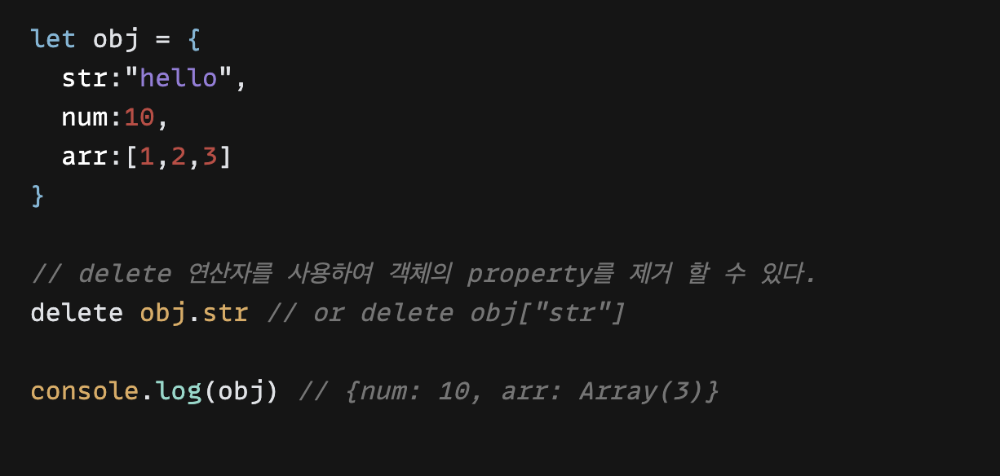

today I learned week 3

- 목차

1. 객체란 무엇이며 필요한 이유

2. 객체에서 property, key and value

3. 객체에 두 가지 접근방법이 있는 이유

4. 객체의 값을 추가,수정, 삭제하는 방법

5. 객체와 배열이 섞인 복잡한 객체 만들어서 접근하는 방법

6. 배열의 타입이 객체인 이유

---

#### 1. 객체란 무엇이며 필요한 이유

객체는 다양한 타입의 데이터를 원하는 만큼 담을 수 있는 생성자이다.

객체를 쓰는 이유는 key를 이용해 내가 원하는 값을 바로 꺼낼 수 있다.

---

#### 2. 객체에서 property, key and value

###### property

###### key and value

---

#### 3. 객체에 두 가지 접근방법이 있는 이유

객체 접근방법 두 가지를 알아보자

1. Dot notation : 객체뒤에 . 을 찍고 property의 key값을 표시한다.

2. Bracket notation : 객체뒤에 대괄호표시 후 대괄호 안에 "key name" 표시한다.

왜 접근방법이 두 가지 인지 알아보자

###### 객체 property에서 value를 꺼낼 때 key값이 숫자로 시작하는 경우

###### key값에 공백이 있는 경우

###### key값에 변수를 넣을 경우

---

#### 4. 객체의 값을 추가,수정, 삭제하는 방법

###### 추가 

###### 수정

###### 삭제

---

