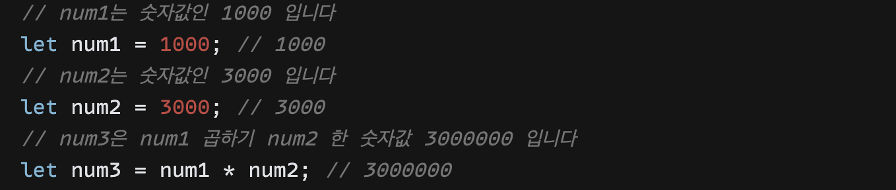
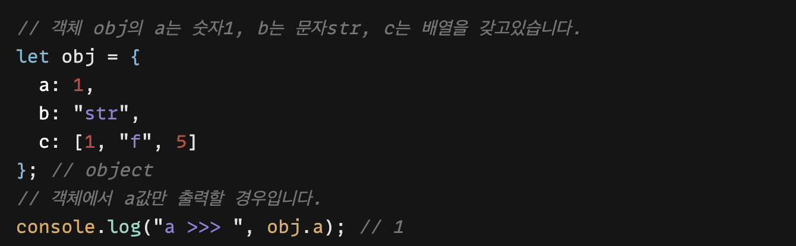

자바스크립트 데이터 타입의 종류를 정리해보았다.

데이터 타입 중 1-5번은 정말 자주 사용하는 타입이기 때문에 꼭 알아둬야 될 것 같다.

5번 타입은 스터디 그룹에서 팀원에 좋은 예시를 가져왔다.

1. number
2. string
3. array
4. object
5. undefined , null
6. bigInt

##### number

##### string

##### array

##### object

##### null, undefined

##### bigInt

