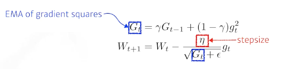

# Optimization

+ Generalization
학습되지 않은 데이터에 대해서 학습된 모델이 얼마나 동작을 잘 하는지
training error 와 test error 간의 간격이 얼마나 좁은지

-> Underfitting & Overfitting

-Underfitting : 덜 학습됨
-Overfitting : 너무 데이터에만 학습됨

+ Cross-validation
(k-fold validation)

trian데이터와 test데이터를 나눠서 할텐데, 
train데이터는 얼마나 validation 하면 좋을지?

학습데이터를 k개로 나눠서
k-1 개로 학습하고
1개로 validation


+ Bias and Variance
bias : 평균적으로 봤을 때 얼마나 벗어나는지
variance : 얼마나 퍼져있는지

Bias and variance tradeoff
cost = bias^2 + variance + noise


+ Bootstrapping
학습데이터에서 subsampling을 통해 몇개만 활용해서 만든 모델을 여러개를 만들어서 무언가를 하겠다

Bagging vs Boosting

bagging : 여러개 모델 만들고 averaging이나 voting을 통해 결과값을 정한다

boosting: 여러개 모델 만들고 weak learner들을 sequencial하게 합쳐서 하나의 strong learner를 만든다.


# Practical gradient descent mothods

+ SGD
+ Mini batch GD
+ Batch GD

## Batch-size
large batch size -> sharp minimizer
small batch size -> flat minimizer

flat minimizer 가 더 좋다.


## GD methods
+ (Stochastic) Gradient descent
 
  문제점: learning rate 잘 잡아야함

+ Momentum
이전 batch에서 흐르던 방향을 이어갈 수 있게

문제점 : local minimum에 converging어려워 지는 현상 발생

+ Nesterov Accelerated Gradient
한 momentum 지나간 그 자리에서 gradient 계산해서 더해주기

converging ratio가 momentum 보다 빠름

+ Adagrad
NN이 많이 변한 parameter는 적게 변화시키게,
조금 변한 parameter는 많이 변화시키게 함


문제점 : g는 점점 작아지기 때문에 뒤로 갈수록 학습이 점점 멈춰지는 현상

+ Adadelta
learning rate가 없다.


+ RMSprop
이게 많이 쓰였음



+ Adam
: Adaptive Moment Estimation
momentum 과 squared gradients, past gradients를 잘 합친것


hyper parameter : $\beta_1, \beta_2, \epsilon$, learning rate


# Regularization
학습에 반대되도록, 방해하도록 
-> 학습데이터 뿐만 아니라 테스트 데이터에도 잘 작동하는 방향으로 

+ Early stopping
Validation error 가 training error 보다 커질 때 미리 멈춰 버리기

+ Parameter Norm Penalty
parameter가 너무 커지지 않게 (함수를 최대한 부드럽게)


+ Data Augmentation
데이터가 많을 수록 좋다.
주어진 데이터를 지지고 볶아서 조금 다른 새로운 데이터를 만드는 것.

+ Noise Robustness
데이터 input이나 weight 값에 noise를 넣음

+ Label smoothing
데이터 두개를 섞음 + label 도 섞음

이 방법으로 성능이 많이많이 올라감

+ Dropout
forward pass에서 뉴런을 0으로 random하게 적용

+ Batch normalization
= weight decay
각각의 layer값을 mean, variance를 통해 계산함

layer가 많이 쌓여있을 때 적용하면 성능이 많이 올라감


# 실습코-드)


optimizer 적용

```python
# Optimizers
loss = nn.MSELoss()
optm_sgd = optim.SGD(
    model_sgd.parameters(), lr = LEARNING_RATE
)
optm_momentum = optim.SGD(
    model_momentum.parameters(), lr = LEARNING_RATE, momentum = 0.9
)
optm_adam = optim.Adam(
    model_adam.parameters(), lr = LEARNING_RATE
)
```


적용

```python
for it in range(int(MAX_ITER)):
    r_idx = np.random.permutation(n_data)[:BATCH_SIZE]
    batch_x,batch_y = x_torch[r_idx],y_torch[r_idx]
    
    # Update with Adam
    y_pred_adam = model_adam.forward(batch_x)
    loss_adam = loss(y_pred_adam,batch_y)
    optm_adam.zero_grad()
    loss_adam.backward()
    optm_adam.step()

```

