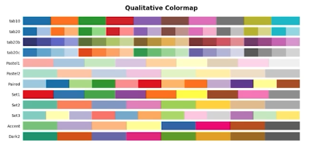
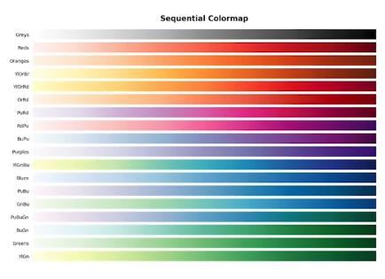
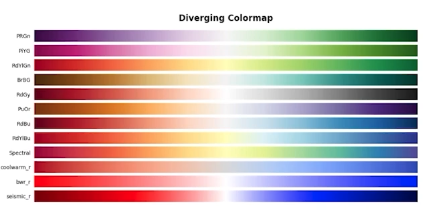

# Color 

+ 위치와 색은 가장 효과적인 채널 구분

+ 화려함이 아니라 효율적인 시각적 구분 필요

HSL으로 색을 이해해 보자
Hue (색조) :  0~369의 색상
Saturate(채도) : 무채색과의 차이
Lighteness(광도) : 색상의 밝기

# Color palette 의 종류

## Categorical (범주형)
독립된 생상 사용, 색상의 차이 이용

## Sequential (연속형)

색상은 단일 색조로 표현하는 것이 좋음, 균일한 색상 변화가 중요

## Diverge (발산형)

중앙을 기준으로 발산 (이외는 연속형과 비슷)

# 이외 tip

## 강조, 색상 대비
+ 명도 대비
+ 색상 대비
+ 채도 대비
+ 보색 대비

## 색각 이상
+ 색맹 : 삼원색 중 특정 색 감지 이상
+ 색약 : 부분적 인지 이상
