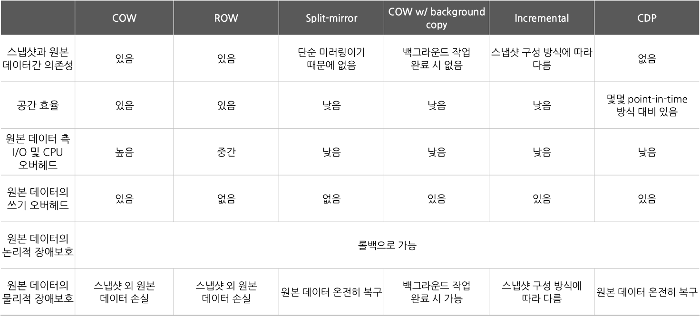

# 스냅샷
  - "과거 한 때 존재하고 유지시킨 컴퓨터 파일과 디렉터리의 모임" 사전적 정의는 이러하다
  - 특정 시간의 저장장치 상태를 사진처럼 보관하고 원본 데이터를 백업할 때 해당 시점의 스냅샷으로 복원을 수행한다.

## 스냅샷의 장점
  - 데이터 보호 방식 중 가장 대중화된 방식으로 성능 또한 우수하다. 효율적으로 백업을 관리하기 때문이다.
  - 스냅샷도 많아질 수록 스토리지를 차지하기에 일정 기준을 두고 기존의 스냅샷을 삭제하기도 한다.
  - 때문에 장기적인 백업보다는 단기적 백업과 복구 용도에 적합하다.

## 스냅샷의 원리
  - 스냅샷은 기본적으로 단순한 메타데이터가 아니다.
  - 엄연히 원본 데이터의 복사본이다.(100mb 원본을 복붙한 100mb이하의 복사본이라는 의미)
  - 이 복사본, 백업본을 특정 시간별로 관리하기 위해 스냅샷을 이용하는 것이다.
  - 스냅샷이 단순히 ctrl +c, v였다면 그리 큰 의미가 없겠지만 스냅샷은 단순한 백업을 넘어 백업을 효율적으로 관리하고자 하는 의도에서 만들어졌다.
  - 스냅샷을 만드는 방식은 여러가지가 있다
    1. Split-mirror 방식
    2. Copy-On-Write 방식
    3. Redirect-on-Write 방식
    4. Incremental 방식
    5. Continuous Data Protection 방식

### Split-mirror 방식
  - 간단하다. 그냥 특정 시점의 원본을 통째고 복사해 백업하는 방식의 스냅샷이다. 데이터를 통째로 보관하기에 공간이 차지되고 스냅샷 개수가 늘어날 수록 성능에도 문제가 생기기 마련다. 하지만 구조가 단순하고 원본 문제 발생시 통째로 백업을 하면 된다.

### Copy-On-Write 방식
  - 일명 COW 방식이라고 불리며 가장 대중적인 스냅샷 방식
  - 매번 스냅샷을 만드는 것이 아닌 쓰기 작업으로 데이터가 변할 때만(즉 원본 데이터 자체가 변할 때) 스냅샷이 백업할 부분만 복사를 한다.
  </img> 
  - 위 예시에서 데이터가 수정이 되는 상황이 되면 스냅샷은 우선 변동 전 변동될 원본 데이터의 일부분을 스냅샷의 공간에 백업해 놓습니(A,B). 그리고 원본은 스냅샷 공간에 백업된 데이터 A,B를 수정해 A->A1, B->X, ()->E가 됩니다.
  - 데이터가 변동되었으니 이를 원본 데이터가 저장한다면 기존에 원본 데이터의 포인터가 가르키던 데이터 [A,B,C,D]는 [A1,C,D,E]로 바뀌지만 스냅샷의 포인터는 변동되지 않은 원본데이터의 C,D와 원본에서는 변동되어 스냅샷 공간에만 남게된 A,B를 가르키게 됩니다. 이로서 스냅샷은 [A,B,C,D]를 포인터로 가르키는 것입니다.

  - Split-mirror이었다면 ABCD와 A1CDE가 동시에 스토리지 존재하였겠지만 백업에 필요한 파일만 따로 읽어와(Copy) 스탭샷 공간에 저장하니(write) 불필요한 중복이 없습니다. 또한 백업 과정에서 불필요하게 백업데이터를 읽어오고 쓰는 작업이 줄어드니 속도도 빠릅니다.

### Redirect-on-Write 방식
  - COW 방식보다 스토리지와 CPU의 오버헤드를 줄일 수 있는 방식.
</img> 
  - COW는 변동될 데이터 A,B를 확인하고(READ), 확인한 데이터를 스냅샷 공간에 저장하고(WRITE) A->A1, B->X, ()->E로 원본이 변동되는(WRITE) 총 3번의 작업을 수행한다. 하지만 ROW는 따로 스냅샷 공간에 데이터를 저장하지 않고 그냥 남는 여분공간에 새로운 데이터를 작성합니다. 그러면 여분에 공간에서 B(X), A1, E가 만들어지고 원래 원본데이터 ABCD가 존재했던 스토리지 공간은 그대로 스냅샷을 위한 공간이 되는 것입니다. 즉 따로 A,B를 읽어와 스냅샷 공간에 백업하는 것이 아닌  B(X), A1, E만 생성하는, 즉 쓰기작업 1번만 수행하면 됩니다. 물론 COW 방식처럼 각 데이터를 스냅샷과 원본데이터가 포인터로 가르키기만 하면 됩니다.
  - 이렇게 ROW는 COW 대비 작업이 줄어 속도가 빠르다는 것이 장점입니다.
  - 하지만 스냅샷이 만약 삭제되면 포인터를 다시 설정해야 한다는 점과 스냅샷 추가시 포인터 개수가 많아지면서 복잡해질 수 있다는 점이 단점이 될 수 있습니다.

### Incremental 방식
  - 증분 스냅샷이라고도 부르며 스냅샷 처음 만들어지고 나서부터 새로운 스냅샷은 변경되는 데이터만 포인터로 기록하는 방식입니다.
  </img> 
  - 다음 그림을 보면 쉽게 이해 가능하다 최대한 데이터의 중복을 줄여 변동된 데이터만 스냅샷이 가져가고 변하지 않는 데이터는 이전 스냅샷에서 포인터로 가르키기만 하면된다.
  - 공간이 덜 차지되기에 처리가 빠르고 스냅샷 생성의 부담도 적다.
### Continuous Data Protection 방식    
  - CDP방식은 위의 방식들처럼 데이터 처리 구조와는 관련이 없다.
  - CDP는 point-in-time 방식과 대비대는 개념으로 PIT가 일정 시간마다 스냅샷을 생성해 백업을 했다면 CDP는 일정 시간이 아닌 데이터 블록이 수정될 때마다 자동으로 스냅샷을 생성하는 방식이다. 때문에 어떤 문제가 생겼을 때 그 전에 수정했던 방식으로 바로 복구가 가능하다. 
  - 다만 변동할 때마다 스냅샷이 생성되기에 불필요한 스냅샷들이 많아질 수 있다(이를 오버헤드가 가해질 수 있다고 말한다.)

### 스냅샷 방식별 정리
    </img> 
