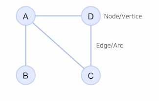

# GNN
graph neural network

+ Graph
Node 와 이를 잇는 Edge 들을 모아 구성한 자료 구조

사용이유
1) 관계, 상호작용과 같은 추상적인 개념을 다루기에 적합
2) Non-Euclidean space 의 표현 및 학습이 가능

+ GNN (그래프 신경망)
: 이웃 노드들 간의 정보를 이용하여 특정 노드를 잘 표현할 수 있는 벡터를 찾아 내는 신경망

-> 그래프 및 피쳐 데이터를 인접 행렬로 변환하여 MLP에 사용하는 방법

-> naive approach 의 한계 : 노드가 많아질수록 연산량이 기하급수적으로 많아지며, 노드의 순서가 바뀌면 의미가 달라질 수 있음

+ GCN (graph convolution network)

local ocnnectivity, shered weights, multi-layer를 이용하여 

연산량을 줄이면서 깊은 네트워크로 간접적인 관계 특징까지 추출 가능

## Neural graph collaborative filtering

+ 해결 과제
1) 유저와 아이템의 임베딩
2) 상호작용 모델링
3) 유저 아이템 상호작용을 임베딩에서 접근하지 못함

+ Collaborative signal
-> 임베딩 때부터 유저-아이템 상호작용이 학습될 수 있도록 

-> GNN을 통해  high0order connectivity를 임베딩

+ 전체 구조
1) Embedding layer
2) Embedding Propagation layer
3) Prediction layer

1) Embedding layer

임베딩이 바로 사용되지 않고 GNN 상에서 전파시켜 refine함

2) Embedding Propagation layer
임베딩 전파 레이어

: 유저 - 아이템의 collaborative signal 을 담을 message를 구성하고 결합하는 단계

+ Message Construction

유저 아이템간 affinity 고려 가능하도록 메시지 구성

+ Message Aggregation

1-hop 전파를 통한 임베딩

 