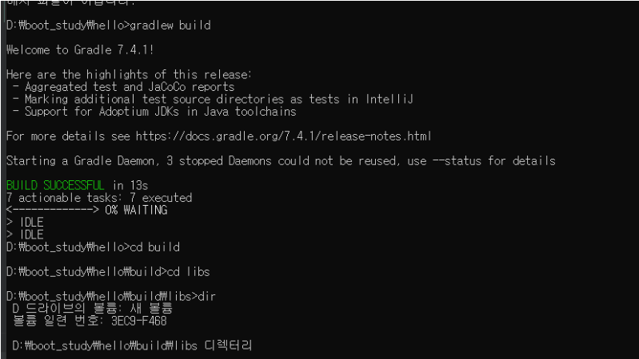
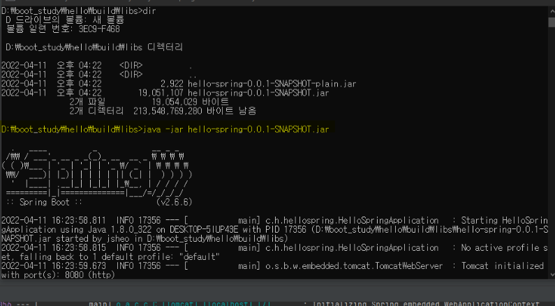
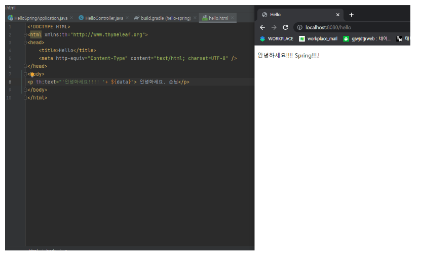

# #1

구성 | 설정
:---:|:----------:
OS | window 10
IDE | intelliJ Ultimate
jdk | opne jdk 1.8
type | gradle
dependencies | Spring Web, thymeleaf 


view 파일은 src/main/resources/templates 파일에 생성을 함

thymeleaf 라는 템플릿 엔진을 사용하기위해 html 파일에 설정을 해줘야 함

​

컨트롤러에서 리턴 값으로 문자를 반환하면 뷰 리졸버가 ( viewResolver )가 화면을 찾아서 처리

- 스프링 부트 템플릿 엔진 기본 viewName 매핑

- `resources:templates\` +{ViewName}+ `.html`

​

빌드하고 실행해보기

cmd 창으로 프로젝트가 있는 파일까지 들어감

gradlew build 입력하면 필요한 파일들이 다운 받아지고 아래 이미지가 뜸



그리고 build>libs 로 이동 후 hello-spring-0.0.1-SNAPSHOT.jar 파일 실행

형광펜으로 그어진 명령어 입력



서버가 실행됨 (만약 인텔리제이에서 서버가 켜져있다면 반드시 끄고 실행해야 함, 동시에 8080 서버가 띄워질 수 없음)

그리고 localhost:8080 들어가면 정상적으로 실행 되는 것을 확인할 수 있음


<hr/>
_**HelloController.java**_
```java
package com.hello.hellospring.Controller;

import org.springframework.stereotype.Controller;
import org.springframework.ui.Model;
import org.springframework.web.bind.annotation.RequestMapping;

@Controller
public class HelloController {
    @RequestMapping("hello")
    public String hello(Model model){
        model.addAttribute("data", "hello.!");
        return "hello";
    }
}
```

 _**hello.html**_
 ```html
 <!DOCTYPE HTML>
<html xmlns:th="http://www.thymeleaf.org">
<head>
    <title>Hello</title>
    <meta http-equiv="Content-Type" content="text/html; charset=UTF-8" />
</head>
<body>
<p th:text="'안녕하세요. '+ ${data}"> 안녕하세요. 손님</p>
</body>
</html>
 ```