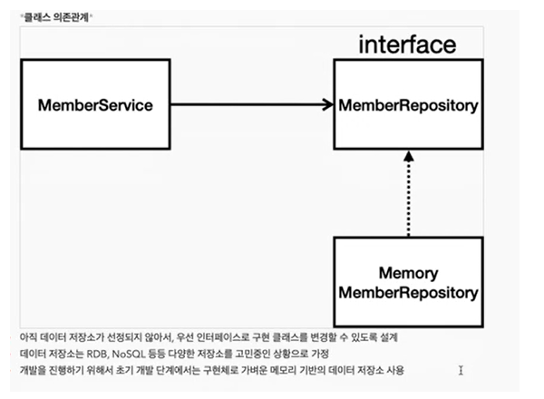

# 회원 관리 예제 - 비즈니스 요구사항 정리 / 회원 도메인과 레포지토리 만들기

* 비즈니스 요구사항 정리

회원 관리 예제를 만들기 위해 생각해 볼 것들
(간단한 예제이기에 데이터나 기능을 간략하게 구성)
데이터| 기능
:---:|:---:
회원 ID와 이름| 등록, 조회





* 회원 도메인과 레포지토리 만들기


<hr>

_**Member.java**_
```java
package com.hello.hellospring.domain;

public class Member {

    private Long id;
    private String name;

    public Long getId() {
        return id;
    }

    public void setId(Long id) {
        this.id = id;
    }

    public String getName() {
        return name;
    }

    public void setName(String name) {
        this.name = name;
    }
}
```
_**MemberRepository.java**_
```java
package com.hello.hellospring.repository;

import com.hello.hellospring.domain.Member;

import java.util.List;
import java.util.Optional;

public interface MemberRepository {

    Member save(Member member);
    Optional<Member> findById(Long id);
    Optional<Member> findByName(String name);
    List<Member> findAll();

}
```
**_MemoryMemberRepository_**
```java
package com.hello.hellospring.repository;

import com.hello.hellospring.domain.Member;

import java.util.*;

public class MemoryMemberRepository implements MemberRepository{

    //저장을 위한 map
    private static Map<Long, Member> store = new HashMap<>();
    private static long sequence = 0L;

    @Override
    public Member save(Member member) {

        member.setId(++sequence); //시퀀스 값이 자동으로 올라갈 수 있게
        store.put(member.getId(), member);
        return member;

    }

    @Override
    public Optional<Member> findById(Long id) {
        return Optional.ofNullable(store.get(id));
    }

    @Override
    public Optional<Member> findByName(String name) {
        return store.values().stream()
                .filter(member -> member.getName().equals(name))
                .findAny(); //store의 value 를 돌면서 member의 이름과 파라미터의 이름이 같으면 다 보여주는 명령어
    }

    @Override
    public List<Member> findAll() {
        return new ArrayList<>(store.values()); //store.values() = member
    }
}
```