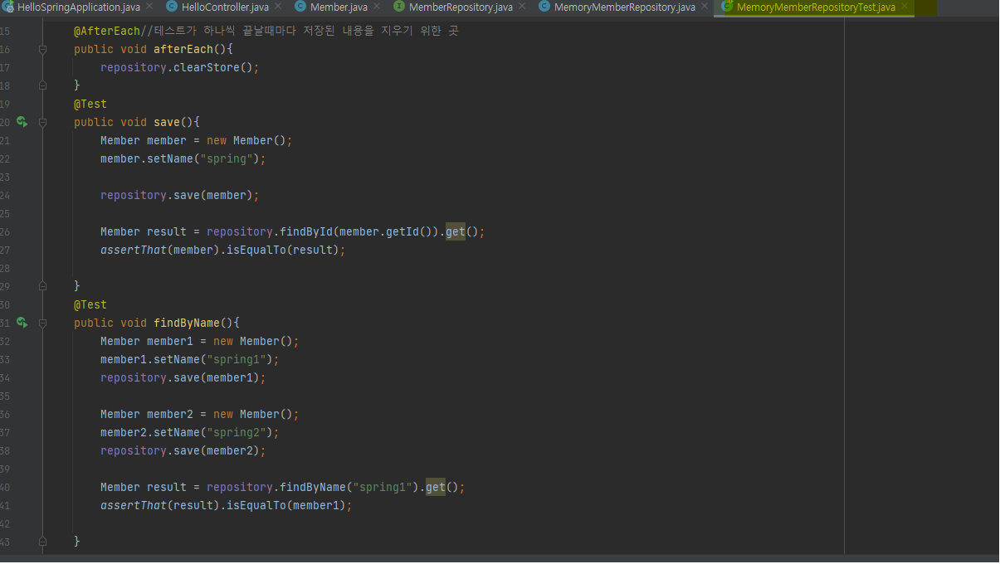

# 회원 도메인과 레포지토리 만들기-2 / 테스트 케이스 작성

* **테스트 케이스 작성**
_JUit_ 이라는 프레임워크로 테스트하면 훨씬 유용
클래스명 규칙: 테스트를 위한 클래스명에 Test를 붙여 테스트용 클래스를 생성
경로: src/test/java 

* _MemoryMemberRepository image_

* _MemoryMemberRepositoryTest image_

_※주의:_ <u>테스트는 순서가 보장이 되지 않음, 테스트는 의존 관계 없이 설계 해야함(저장소나 공용 데이터를 깔끔하게 지워야함)</u>
위 이미지처럼 MemoryMemberRepository 클래스에는 테스트를 위한 메소드(데이터를 지우는 역할)를 만들어 놓고 MemoryMemberRepositoryTest에는 위에 메소드를 사용할 수 있는 메소드를 구현해야 함

_**※TDD:**_ 테스트 주도 개발 - 테스트를 만들고 구현 클래스를 만들어 돌려보는 것

검증할 수 있는 틀을 만들어 두고 어떤한 것이 완성되면 틀에 맞는지 확인하는 것

