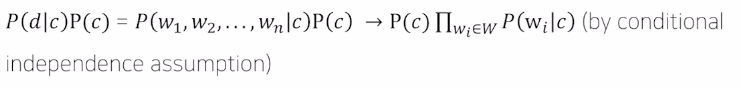

주재걸 교수님

## NLP processing(이걸로 수업할 예정)

+ 학회 : ACL, EMNLP, NAACL

+ Low level parsing 
: Tokenization, stemming

+ Word and phrase level 
: NER(Named entity recognition), POS(part-of-speech) tagging, noun-phrase chunking, dependency parsing, coreference resolution

+ Sentence level 
: Sentiment analysis, machine translation

+ Multi-sentence and paragraph level 
:  Entailment prediction, question answering, dialog systems, summarization

## Text mining

+ 학회 : KDD, The WebConf(formerly,WWW), WSDM, CIKM, ICWSM

+ 텍스트 데이터로부터 information, insight 추출할때

+ Document clustering

+ computational social science에도 관련됨

## Information retrieval

+ 학회 : SIGIR, WSDM, CIKM, RecSys

+ 정보 검색 분야

## Trends of NLP
+ Word2Vec : word embedding
+ RNN-family models : LSTMs, GRUs
+ Attentions & transformers

+ self-supervised training setting (no additional labels)

# Bag-of-Words

1) Constructing the vocab containing unique words

2) Encoding unique words to one-hot vectors

ex)

## NaiveBayes Classifier

특정 문서 d 가 속할 확률이 가장 높은 C

= c가 고정이 되었을 때 d가 나올 확률 

각 단어들의 확률을 구할 때는 MLE로 부터 도출이 됨