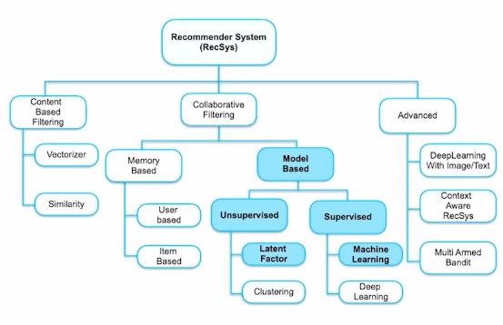

# 1. Latent Factor Model

: user-item 데이터를 축약된 벡터 공간에 표현 할 수 있을 것이다.

## SVD

+ 문제점 
데이터 많아지면 예측력이 떨어짐

결측치 많은 현실 데이터에서 작동 어려움

## MF

P : user based factor

Q : item based factor

목적함수

-> 한계 : 빠른 계산 불가능

## ALS(alternative least squares)

-> 계산 속도 증가

## Hybrid recommender sys

ex)

+ 기술
mixed, weigted, switching, feature augmentation, feature combination, casacade, meta-level

# 2. Supervised model learning

예측 모델링 : naive bayes 와 GBDT

## Naive Bayes

Bayes

Naive Bayes

(X 변수가 서로 독립적이는 가정하

## GBDT (gradient boosting decision tree)

가장 유명한 세 모델 : XGBoost, LightGBM, CatBoost

### XGBoost

+ 특징
parallelization, level-wise, regularization

### LightGBM

+ leaf-wise -> 속도 빠름, 과적합에는 취약
+ GOSS(gradient based one side sampling) -> top N 개 데이터 인스턴스만 활용
+ EFB(Exclusive feature bundling) -> feature수 감소

O(data* feature) -> O(data_GOSS* Bundles)

### CatBoost
 
+ level-wise (overfitting 방지)

* Target leakage 문제
: 예측 시점에서 사용할 수 없는 데이터가 데이터 셋에 포함되어 있을 때 발생

+ CatBoost의 해결 방안

1) Ordered Boosting
 
2) Ordered TS