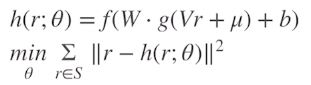

# 1. Context-aware

## 1.1 Factorization Machines

MF의 문제점 -> 특정 데이터 포맷에 특화되어 있어, 일반적인 데이터셋 바로 적용 불가 / user-item 이외의 정보 사용 불가

Latent factor Model 추가

-> feature 축약 -> high sparsity 개선

-> 여러 feature를 반영할 수 있는 데이터셋으로 확장

+ FM 공식

+ Polynomial regression 공식

과 비슷하지만 polynomial regression은 high sparsity로 $w_{ij}$가 학습되기 어렵다

+ 변형 FM

## 1.2 Field aware Factorization machines

+ Logistic Regression

상호작용항 따로 없음

+ Polynomial Regression

상호작용항 추가

+ FM 

latent Factor를 통해 상호작용 계산

+ FFM

Latent Factor를 구성할 때 대응되는 field를 미리 고려하고 대응되는 field와만 상호작용 계산

# 2. Deep Learning Recommender sys

## 2.1 Neural Collaborative filtering(NCF)

+ NMF(Neural Matrix Factorization)

GMF layer와 NCF layer로 나눠 융합한 형태

+ GMF(generalized matrix factorization)

기존 dot product 계산

 -> element wise 곱한 값에 weight(h) 곱하고 활성화 함수 사용하여 계산 

## 2.2 AutoRec

+ User , Item 방향으로 각각 임베딩함

+ 회색 플레이트 : 관측 데이터만 대상으로 하고 정규화함

 

## Wide & Deep Network

+ 두가지 challenge

1) Memorization 

-> sparse representation(희소 표현) : CategoryEncoding layer 사용하여 범주형 변수를 one-hot encoding 처리해 희소 표현

2) generalization

-> dense representation(밀집 표현) : Embedding layer 사용하여 범주형 변수를 저차원으로 임베딩

단순히 두 모델을 더한뒤에 sigmoid 처리

## Deep & Cross Network

+ Cross Network
: feature 교차하기

각 레이어에 x0의 weight를 곱해줘서 상호작용을 만듬

+ Stacked DCN : Cross layer로 explicit feature 교차 학습 후 deep layer로 implicit 교차 학습
+ Parallel DCN : Cross, Deep layer 각각 feature 교차 학습 후 두 layer 마지막 output을 concat 

+ Low-Rank
적은 학습 파라미터 = 적은 메모리 사용 & 빠른 학습 속도 (+비용 감소)

 

W : d * d
U,V : d * r (r < d/2)

+ Mixture-of Experts (MoE)

