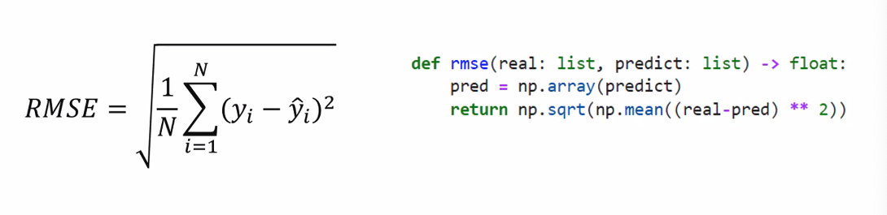

# 일일 회고

오늘은 베이스라인 공부랑 데이터 공부도 했다

성재형이 wandb 공부중인데 나는 아직 적용 방법 모르겠다

그래도 오늘은 한 일이 있어서 그런지 마음이 어제보단 편하다

그래도 아직 집중력이 많이 부족하고 버리는 시간도 많다.

일단 게임은 다 지웠다 ㅠ


# 1. 기초대회 공부

## 1.1 베이스라인 공부

### 1)돌리기

#### main.py 
모델 선택

train/ valid 비율 선택

batchsize, epoch, learning rate, adam weight 조정

각 모델 차원 , drop rate 조정

#### ensemble.py
앙상블할 파일 쉼표로 입력

앙상블 전략 (weighted, mixed)

앙상블 가중치

### 2) data

1) Context_data

+ age_map : 10 단위로 끊어서 저장

+ process_context_data : 

일단 rating 기준으로 user, book merge 한다

-users

인덱싱은 train 따로 test 따로, 합친것도 있음

location은 city, state, country로 나눠서 저장

age

-book

test, train 분류해서 category, publisher, language, author 인덱싱


+ context_data_load:

데이터 다 불러옴

인덱스 항목까지 추가? 하는듯

인덱스 추가 된거를 process_context_data에 넣어서 

+ context_data_split : 

train을 train과 valid로 나눔 (arg.TEST_SIZE 에 따라)

+ context_data_loader:


# Officehour 

## user

user_id, location, age


## book


## ratings





```
# data processing
import pandas as pd
import numpy as np
import seaborn as sns
import matplotlib.pyplot as plt
path = './data/'
newtrain = pd.read_csv(path+'train_user_count.csv')

print(newtrain.shape)

alrtrain = newtrain[newtrain["count"]!=1]
newtrain1 = newtrain[newtrain["count"]==1]

alrtrain.shape

from sklearn.model_selection import train_test_split

new_test, new_valid, newy_test, newy_valid = train_test_split(
                                                        newtrain1.drop(['rating'], axis=1),
                                                        newtrain1['rating'],
                                                        test_size=0.5,
                                                        random_state=42, # args.SEED
                                                        shuffle=True
                                                        )
# 66.66 : 11.66 : 11.66

alr_train, alr_valid, alry_train, alry_valid = train_test_split(
                                                        alrtrain.drop(['rating'], axis=1),
                                                        alrtrain['rating'],
                                                        test_size = 0.26,
                                                        random_state=42, # args.SEED
                                                        shuffle=True
                                                        )
alr_test, alr_valid, alry_test, alry_valid = train_test_split(
                                                        alr_valid,
                                                        alry_valid,
                                                        test_size = 0.5,
                                                        random_state=42, # args.SEED
                                                        shuffle=True
                                                        )
alr_train.shape
alr_valid.shape
alr_test.shape
```

