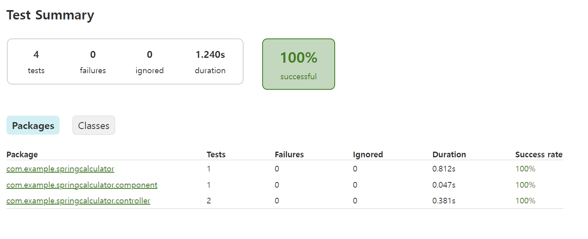
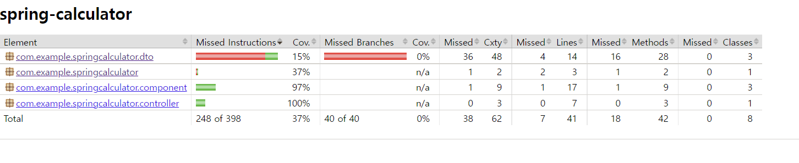

# 0. 기본 개념

- TDD(Test-Driven development) : 테스트 주도 개발에서 사용하지만, 코드의 유지 보수 및 운영 환경에서의 에러를 미리 방지하기 위해서 단위별로 검증하는 테스트 프레임워크
- 단위테스트 : 작성한 코드가 기대하는대로 동작을 하는지 검증하는 절차
- JUnit : Java 기반의 단위 테스트를 위한 프레임워크, Annotation 기반으로 테스트를 지원하며, Assert 를 통하여, (예상, 실제)를 통해 검증


# 1. JUnit 예제(계산기)

### 기본설정

- 기본 gradle 파일 생성
- dependencies -> mockito-core 와 mokito-junit-jupiter 추가

### 코드

- ICalculator(interface)

  - ```java
    package org.example;
    
    public interface ICalculator {
        int sum(int x, int y);
        int minus(int x, int y);
    }
    ```

- Calculator(class)

  - ```java
    package org.example;
    
    public class Calculator {
    
        private ICalculator iCalculator;
    
        public Calculator(ICalculator iCalculator){
            this.iCalculator = iCalculator;
        }
    
        public int sum(int x, int y){
            return this.iCalculator.sum(x, y);
        }
    
        public int minus(int x, int y){
            return this.iCalculator.minus(x, y);
        }
    }
    ```

- DollarCalculator(class)

  - ```java
    package org.example;
    
    public class DollarCalculator implements ICalculator{
    
        private int price = 1;
        //marketApi 를 통해 실시간으로 가격을 받음
        private MarketApi marketApi;
    
        public DollarCalculator(MarketApi marketApi){
            this.marketApi = marketApi;
        }
    
        public void init(){
            this.price = marketApi.connect();
        }
    
    
        @Override
        public int sum(int x, int y) {
            x *= price;
            y *= price;
            return x + y;
        }
    
        @Override
        public int minus(int x, int y) {
            x *= price;
            y *= price;
            return x - y;
        }
    }
    ```

- MarketApi(class)

  - ```java
    package org.example;
    
    public class MarketApi {
        //원래는 api로 가격을 받아야하지만 임의로 1100으로 설정
        public int connect(){
            return 1100;
        }
    }
    ```

- Main(class)

  - ```java
    package org.example;
    
    public class Main {
        public static void main(String[] args) {
            MarketApi marketApi = new MarketApi();
            DollarCalculator dollarCalculator = new DollarCalculator(marketApi);
            dollarCalculator.init();
    
            Calculator calculator = new Calculator(dollarCalculator);
    
            System.out.println(calculator.sum(10, 10));
    
        }
    }
    ```

  - outcome : 22000


### 테스트 코드

- main 을 변경하지 않고 test 에서 값을 변경해보면서 코드를 테스트할 수 있음

- src 에서 main 이 아닌, test > java 패키지에 생성

- DollarCalculator(class)

  - ```java
    import ...;
    
    //mockito 를 통해 값 설정을 바꿀 수 있음
    @ExtendWith(MockitoExtension.class)
    public class DollarCalculatorTest {
    
        @Mock
        public MarketApi marketApi;
    
        //위에 있는 marketApi.connect 의 값을 BeforeEach를 통해 시작하기 전에 3000으로 변경
        @BeforeEach
        public void init(){
            Mockito.lenient().when(marketApi.connect()).thenReturn(3000);
        }
        
        @Test
        public void dollarTest(){
            MarketApi marketApi = new MarketApi();
            DollarCalculator dollarCalculator = new DollarCalculator(marketApi);
            dollarCalculator.init();
    
            Calculator calculator = new Calculator(dollarCalculator);
    
            //22000 과 calculator.sum(10, 10) 을 비교하여 같은 값인지 확인
            Assertions.assertEquals(22000, calculator.sum(10, 10));
            Assertions.assertEquals(-1000, calculator.minus(10, 10));
        }
    
        //해당 Test에서는 marketApi.connect() 값이 3000이 됨
        @Test
        public void MockTest(){
            DollarCalculator dollarCalculator = new DollarCalculator(marketApi);
            dollarCalculator.init();
    
            Calculator calculator = new Calculator(dollarCalculator);
            System.out.println(marketApi.connect());
    
            Assertions.assertEquals(60000, calculator.sum(10, 10));
            Assertions.assertEquals(0, calculator.minus(10, 10));
    
        }
    }
    ```


#  2. CRUD 테스트 코드 작성

- springboot 기능을 활용

### component package

- Calculator 

  - 컴포넌트로 관리

  - final + @RequiredArgsConstructor 사용

  - ```java
    package com.example.springcalculator.component;
    
    import lombok.RequiredArgsConstructor;
    import org.springframework.stereotype.Component;
    
    @Component
    @RequiredArgsConstructor
    public class Calculator {
    
        private final ICalculator iCalculator;
    
        public int sum(int x, int y){
            this.iCalculator.init();
            return this.iCalculator.sum(x, y);
        }
    
        public int minus(int x, int y){
            this.iCalculator.init();
            return this.iCalculator.minus(x, y);
        }
    }
    ```

- DollarCaculator

  - 위와 같은 내용

  - ```java
    package com.example.springcalculator.component;
    
    import lombok.RequiredArgsConstructor;
    import lombok.extern.apachecommons.CommonsLog;
    import org.springframework.stereotype.Component;
    
    //component 및 RequiredArgsCOnstructor
    @Component
    @RequiredArgsConstructor
    public class DollarCalculator implements ICalculator{
    
        private int price = 1;
    
        private final MarketApi marketApi;
    
        @Override
        public void init(){
            this.price = marketApi.connect();
        }
    
    
        @Override
        public int sum(int x, int y) {
            x *= price;
            y *= price;
            return x + y;
        }
    
        @Override
        public int minus(int x, int y) {
            x *= price;
            y *= price;
            return x - y;
        }
    }
    ```

- MarketApi

  - ```java
    package com.example.springcalculator.component;
    
    import org.springframework.stereotype.Component;
    
    @Component
    public class MarketApi {
        public int connect(){
            return 1100;
        }
    }
    ```

- ICalculator

  - init(); 추가 -> marketprice 불러오기!

  - ``` java
    package com.example.springcalculator.component;
    
    public interface ICalculator {
        int sum(int x, int y);
        int minus(int x, int y);
        void init();
    }
    ```


### controller package

- ```java
  package com.example.springcalculator.controller;
  
  import com.example.springcalculator.component.Calculator;
  import com.example.springcalculator.dto.Req;
  import com.example.springcalculator.dto.Res;
  import lombok.RequiredArgsConstructor;
  import org.springframework.web.bind.annotation.*;
  
  @RestController
  @RequestMapping("/api")
  @RequiredArgsConstructor
  public class CalculatorApiController {
  
      private final Calculator calculator;
      @GetMapping("/sum")
      public int sum(@RequestParam int x, @RequestParam int y){
          return calculator.sum(x, y);
      }
  
      @PostMapping("/minus")
      public Res minus(@RequestBody Req req){
          int result = calculator.minus(req.getX(), req.getY());
          Res res = new Res();
          res.setResult(result);
          res.setResponse(new Res.Body());
          return res;
      }
  }
  ```

### dto

- Req

  - ```java
    package com.example.springcalculator.dto;
    
    import lombok.AllArgsConstructor;
    import lombok.Data;
    import lombok.NoArgsConstructor;
    
    @Data
    @AllArgsConstructor
    @NoArgsConstructor
    public class Req {
        private int x;
        private int y;
    
    }
    ```

- Res

  - depth 를 넣어서, Body 클래스를 만들어줌

  - ```java
    package com.example.springcalculator.dto;
    
    import lombok.AllArgsConstructor;
    import lombok.Data;
    import lombok.NoArgsConstructor;
    
    @Data
    @NoArgsConstructor
    @AllArgsConstructor
    public class Res {
        private int result;
        private Body response;
    
        @Data
        @NoArgsConstructor
        @AllArgsConstructor
        public static class Body{
            private String resultCode = "OK";
        }
    }
    ```

### Test

#### DollarCalculatorTest (통합테스트)

- ```java
  package com.example.springcalculator.component;
  
  import org.junit.jupiter.api.Assertions;
  import org.junit.jupiter.api.Test;
  import org.mockito.Mockito;
  import org.springframework.beans.factory.annotation.Autowired;
  import org.springframework.boot.test.context.SpringBootTest;
  import org.springframework.boot.test.mock.mockito.MockBean;
  import org.springframework.context.annotation.Import;
  
  //통합테스트하기 위해 springBootTest 사용
  @SpringBootTest
  //따라서 아래의 import 는 필요없음
  //@Import({MarketApi.class, DollarCalculator.class})
  public class DollarCalculatorTest {
  
      //spring api 가 빈으로 관리되고 있기때문에 mock이 아닌 mockbean 사용
      @MockBean
      private MarketApi marketApi;
  
      @Autowired
      private Calculator calculator;
  
      @Test
      public void dollarCalculatorTest(){
          //marketApi 값을 3000 으로
          Mockito.when(marketApi.connect()).thenReturn(3000);
  
          int sum = calculator.sum(10, 10);
          int minus = calculator.minus(10, 10);
  
          Assertions.assertEquals(60000, sum);
          Assertions.assertEquals(0, minus);
      }
  }
  ```

#### CalculatorApiControllerTest

- ```java
  package com.example.springcalculator.controller;
  
  import com.example.springcalculator.component.Calculator;
  import com.example.springcalculator.component.DollarCalculator;
  import com.example.springcalculator.component.MarketApi;
  import com.example.springcalculator.dto.Req;
  import com.fasterxml.jackson.core.JsonProcessingException;
  import com.fasterxml.jackson.databind.ObjectMapper;
  import org.junit.jupiter.api.BeforeEach;
  import org.junit.jupiter.api.Test;
  import org.mockito.Mockito;
  import org.springframework.beans.factory.annotation.Autowired;
  import org.springframework.boot.test.autoconfigure.web.servlet.AutoConfigureWebMvc;
  import org.springframework.boot.test.autoconfigure.web.servlet.WebMvcTest;
  import org.springframework.boot.test.mock.mockito.MockBean;
  import org.springframework.context.annotation.Import;
  import org.springframework.http.MediaType;
  import org.springframework.test.web.servlet.MockMvc;
  import org.springframework.test.web.servlet.request.MockMvcRequestBuilders;
  import org.springframework.test.web.servlet.result.MockMvcResultHandlers;
  import org.springframework.test.web.servlet.result.MockMvcResultMatchers;
  import org.yaml.snakeyaml.error.Mark;
  
  //웹을 테스트하기 위한 webMvcTest
  @WebMvcTest(CalculatorApiController.class)
  @AutoConfigureWebMvc
  //단위테스트를 위한 테스트 (자원소모를 줄일 수 있음)
  @Import({Calculator.class, DollarCalculator.class})
  public class CalculatorApiControllerTest {
  
      @MockBean
      private MarketApi marketApi;
  
      //mvc 를 모킹으로 테스트하겠다는 뜻
      @Autowired
      private MockMvc mockMvc;
  
      //테스트 init 때마다 초기화
      @BeforeEach
      public void init(){
          Mockito.when(marketApi.connect()).thenReturn(3000);
      }
  
      @Test
      public void sumTest() throws Exception {
          //http://localtest:8080/api/sum
          mockMvc.perform(
              //get 방식으로 url 를 받아서 쿼리 입력
                  MockMvcRequestBuilders.get("http://localhost:8080/api/sum")
                          .queryParam("x","10")
                          .queryParam("y","10")
              //expect 값 (status 및 content)
          ).andExpect(
                  MockMvcResultMatchers.status().isOk()
          ).andExpect(
                  MockMvcResultMatchers.content().string("60000")
          ).andDo(MockMvcResultHandlers.print());
      }
  
      @Test
      public void minusTest() throws Exception {
          Req req = new Req();
          req.setX(10);
          req.setY(10);
  
          //자동으로 req 를 json 형태로 변경함
          String json = new ObjectMapper().writeValueAsString(req);
  
          //위와 동일
          mockMvc.perform(
                  MockMvcRequestBuilders.post("http://localtest:8080/api/minus")
              //contentType 을 json 으로 설정하여 위에서 변경한 json 파일을 넣어줌
                  .contentType(MediaType.APPLICATION_JSON)
                  .content(json)
              //그리고 expect 사용
          ).andExpect(MockMvcResultMatchers.status().isOk()
          ).andExpect(
              //해당 json.result 와 json.response.resultCode 값을 받아서 비교
              MockMvcResultMatchers.jsonPath("$.result").value("0")
          ).andExpect(
                  MockMvcResultMatchers.jsonPath("$.response.resultCode").value("OK")
          ).andDo(MockMvcResultHandlers.print());
      }
  }
  ```

  

# 3. Jacoco

- gradle toolbar > Tasks > verification > test 실행
- 모든 테스트 확인 가능
- (package) build > report > test > index.html 로 Test Summary 확인가능
  - 

- (package) build > report > jacoco > test > html > index.html 로 element 별 사용여부 확인가능
  - 해당 기능으로 불필요한 기능을 없애는 등 활용 가능
  - 
