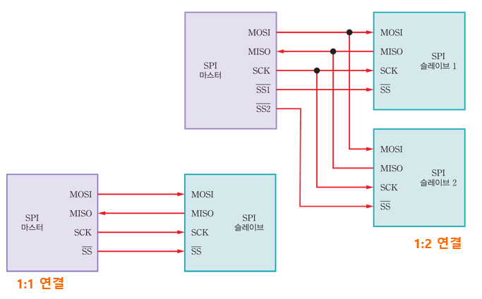

## :pushpin:UART

#### Universal Asynchronou Receiver/Transmitter

- Universal : 여러 통신 규약과 함께 사용됨
  
  - RS-232C, RS-422, RS-485 등

- Asynchronous (비동기)
  
  동기화를 위한 별도의 클록을 사용하지 않음
  
  **동시에 진행되지 않아도 된다** -> 작업의 결과가 나오기 까지 **기다리지 않아도 된다**. 

- 저수준의 통신 방법
  
  - **하드웨어 수준에서 지원**
  
  - 마이크로컨트롤러의 동작 전압을 기준으로 하는 TTL레벨 사용 (아두이노 메가 기준 5V)

#### 아두이노 메가2560의 UART 통신

- 4개의 통신 채널 제공 ( 하나의 채널에는 하나의 장치만 연결 가능 **1:1 통신만 지원** )
  
  | 채널  | 연결 핀           | 해당 객체   | 설명     |
  | --- | -------------- | ------- | ------ |
  | 0   | 0(RX), 1(TX)   | Serial  | 우노와 동일 |
  | 1   | 19(RX), 18(TX) | Serial1 |        |
  | 2   | 17(RX), 16(TX) | Serial2 |        |
  | 3   | 15(RX), 14(TX) | Serial3 |        |

#### SoftwareSerial 클래스

- 하드웨어로 지원되는 UART 통신을 소프트웨어로 에뮬레이션

## :pushpin:SPI통신

#### Serial Peripheral Interface

- 고속 직렬 통신 방식

- 1:n 통신 지원

- 4개의 연결선 필요
  
  SCK : 동기 통신을 위한 클록
  
  MOSI, MISO : 데이터 송수신
  
  SS : 하드웨어적으로 슬레이브 중 하나를 선택 (SELECT)

- 하드웨어적으로 지원되는 통신

- 기본 SPI 라이브러리 포함 

