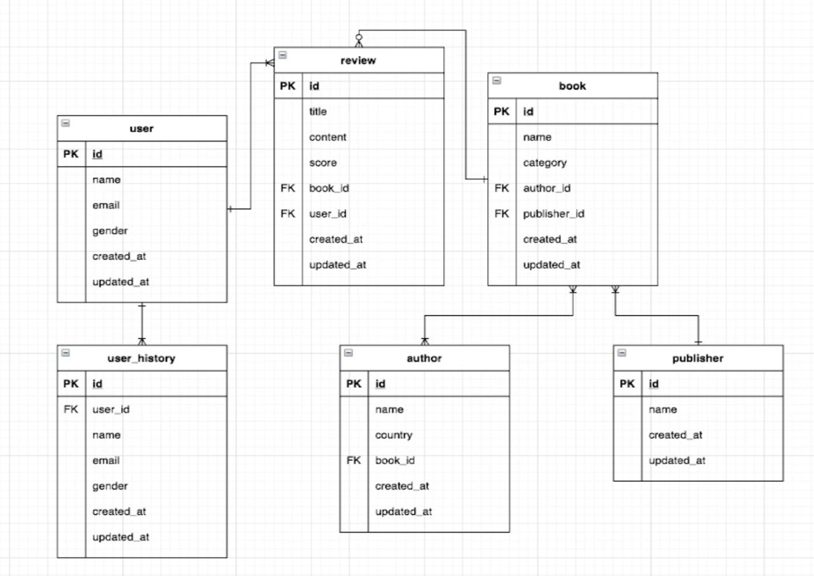

# 0. RDB 란?

- Relational DB(관계형 데이터베이스)

- 관계연산과 집합연산이 가능함

- 데이터를 저장하는 대표적인 방식

### ERD (Entity Relationship Diagram)

- entity 는 양방향으로 참조하는 경우가 많아서 entity 관계가 굉장히 복잡하게 엉켜 잠재적인 버그가 발생할 수 있음
- 따라서 diagram 을 그리면서 확인해야 함
  - 


# 1. 일대일(1 : 1) 연관관계

### book 과 book_review_info 설정 (1:1)

#### Book_review_info

- ```java
  package com.fastcampus.jpa.bookmanger.domain;
  
  import ...
  
  //BaseEntity 리스너를 사용하는 entity 가 필요한 어노테이션 5가지
  @Entity
  @NoArgsConstructor
  @Data
  @ToString(callSuper = true)
  @EqualsAndHashCode(callSuper = true)
  public class BookReviewInfo extends BaseEntity {
      @Id
      @GeneratedValue
      private Long Id;
  
      //book 과 연결하기 위해
      private Long bookId;
  
      //평균 평점
      private float averageReviewScore;
  
      private int reviewCount;
      //아무것도 없으면 0 값을 사용하기 위해 float, int 사용 (not null 로 정의됨)
      //Float, Integer
      
      //생성, 수정시간은 baseEntity 에 있음
  }
  ```

#### Book

- 필요없는 필드를 지우고 ERD 에 맞게 필드명 설정

- ```java
  package com.fastcampus.jpa.bookmanger.domain;
  
  import ...
  
  @Entity
  @NoArgsConstructor
  @Data
  @ToString(callSuper = true)
  @EqualsAndHashCode(callSuper = true)
  public class Book extends BaseEntity {
      @Id
      @GeneratedValue
      private Long id;
  
      private String name;
  
      private String category;
  
      //각각 author, publisher 엔티티와 연결하기 위함
      private Long authorId;
  
      private Long publisherId;
  }
  ```


### book_review_info 에서 Book 정보 가져오기

- 모든 entity Id 값에 `@GeneratedValue(strategy = GenerationType.IDENTITY)` 설정 => id 값 통일

- BooKReviewInfo 에서 Long bookId 를 Book book 으로 변경

  - ```java
    package com.fastcampus.jpa.bookmanger.domain;
    
    import ...;
    
    @Entity
    @NoArgsConstructor
    @Data
    @ToString(callSuper = true)
    @EqualsAndHashCode(callSuper = true)
    public class BookReviewInfo extends BaseEntity {
        @Id
        @GeneratedValue(strategy = GenerationType.IDENTITY)
        private Long Id;
    
    
        //private Long bookId;
        //@OneToOne : 직접 참조하기 위해 1대1로 연관관계를 맵핑한다는 뜻
        //optional = true 이면 left outer 조인
        //optional = false 를 주면 절대 null 을 인정하지 않음 (inner 조인)
        @OneToOne(optional = false)
        private Book book;
        private float averageReviewScore;
    
        private int reviewCount;
      
    }
    ```

#### Test (BookReviewInfoRepositoryTest)

- ```java
   @Autowired
  private BookReviewInfoRepository bookReviewInfoRepository;
  @Autowired
  private BookRepository bookRepository;
  
  @Test
  void crudTest2(){
      //코드가 길기 때문에 별도 클래스로 만들어줌
      givenBookReviewInfo(); //Book givenBook() 을 받아서 BookReviewInfoRepository 에 저장
  
      //bookReviewInfoRepository 에서 id = 1L 인 리뷰에서 getBook() 으로 book 정보 찾기
      Book result = bookReviewInfoRepository
          .findById(1L)
          .orElseThrow(RuntimeException::new)
          .getBook();
  
      System.out.println(">>> " + result);
  }
  
  private Book givenBook(){
      Book book = new Book();
      book.setName("Jpa Package");
      book.setAuthorId(1L);
      book.setPublisherId(1L);
  
      //save() 는 값을 그대로 Return 하게 되어 있음
      return bookRepository.save(book);
  }
  
  private void givenBookReviewInfo(){
      BookReviewInfo bookReviewInfo = new BookReviewInfo();
      bookReviewInfo.setBook(givenBook());
      bookReviewInfo.setAverageReviewScore(4.5f);
      bookReviewInfo.setReviewCount(2);
  
      bookReviewInfoRepository.save(bookReviewInfo);
  
      System.out.println(">>> " + bookReviewInfoRepository.findAll());
  }
  ```

  

###  Book 에서 book_review_info 정보 가져오기

- 위와 마찬가지로 Book 에 BookReviewInfo 를 필드로 사용

#### Book

- ```java
  package com.fastcampus.jpa.bookmanger.domain;
  
  import ...;
  
  @Entity
  @NoArgsConstructor
  @Data
  @ToString(callSuper = true)
  @EqualsAndHashCode(callSuper = true)
  public class Book extends BaseEntity {
      @Id
      @GeneratedValue(strategy = GenerationType.IDENTITY)
      private Long id;
  
      private String name;
  
      private String category;
  
      private Long authorId;
  
      private Long publisherId;
  
      @OneToOne(mappedBy = "book")
      // toString 이 순환참조가 걸리기 때문에 제외해야 함
      @ToString.Exclude
      private BookReviewInfo bookReviewInfo;
  }
  
  ```

#### Test

- ```java
  @Test
  void crudTest2(){
      givenBookReviewInfo();
  
      BookReviewInfo result2 = bookRepository
          .findById(2L)
          .orElseThrow(RuntimeException::new)
          .getBookReviewInfo();
  
      System.out.println(">>> " + result2);
  }
  ```

  - 해당 코드로 bookId 로 review 를 가져올 수 있음


