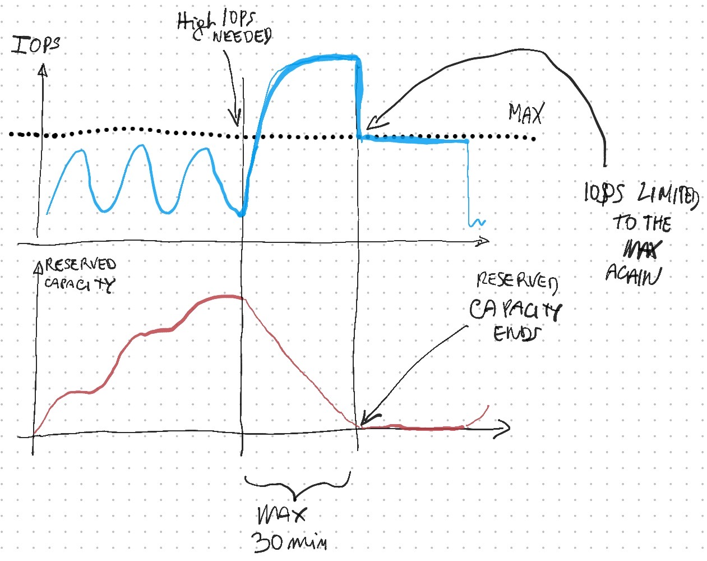

Azure offers the ability to boost disk storage **IOPS** and MB/s (**throughput**) performance. Currently, there are two managed disk types that can burst, premium SSDs, and standard SSDs. Other disk types cannot currently burst.

Disk bursting can be credit based or on demand.

# Credit based bursting
A burstable disk has for both IOPS and throughput, 2 values: max and bursting-max. 

I.E. Azure Disk P1 have the following values:
* IOPS max: 120
* IOPS max with burst: 3500
* Throughput Max: 25Mb/sec
* Throughput Max with burst: 170Mb/s 

during the disk usage, when the IOPS and throughput are below the max value, you earn _**credits**_ you can use later. When a usage peak arrives, if you have credits, you can burst performance up to the **max with burst** value. During the burst the credits are used, so, when the credit finish or you have used the burst for 30 minutes in a day, the IOPS or the throughput are limited again to the **max** value. 

30 minutes is a daily cap, you can use it consecutively or sporadically throughout the day.

 
This process is **automatic** and **free of charge**.

# On demand bursting
You can activate and deactivate on-demand burst via powershell or AZ CLI. It hasn't a time limit, but have a cost (monthly fee + hourly fee). Generally must be verified the convenience of on demand bursting vs a disk with better performances. On demand bursting is ok for short load peaks well defined in time.

Note that **also Azure virtual machines have a max IOPS and max throughput**, so during the bursting, the real speed achieved is the minimum between the machine and disk max value.

# Burstable Virtual Machines
The concept of the burst can be applied also to Azure Virtual Machines. B-series machines have a base CPU performance and a max CPU performance. When the machine have CPU below the **base** value, collects credits to spend in performance bursts when necessary. 

* <https://azure.microsoft.com/en-us/pricing/details/managed-disks/>
* <https://docs.microsoft.com/en-us/azure/virtual-machines/disks-enable-bursting?tabs=azure-powershell>
* <https://docs.microsoft.com/en-us/azure/virtual-machines/sizes-b-series-burstable>

