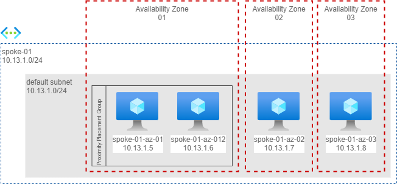
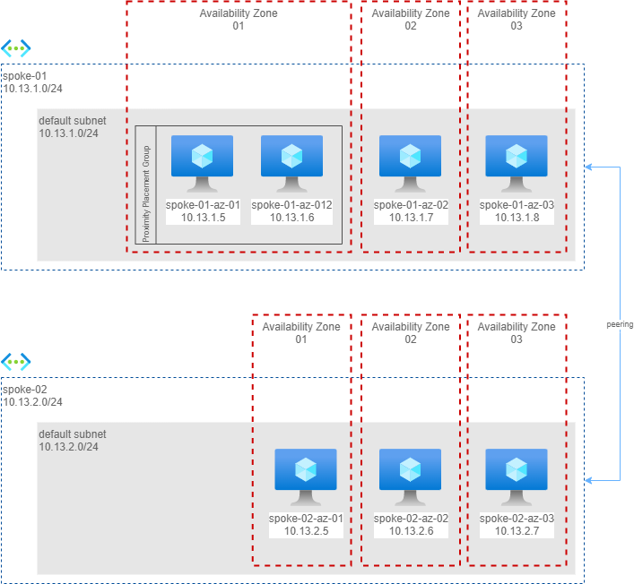
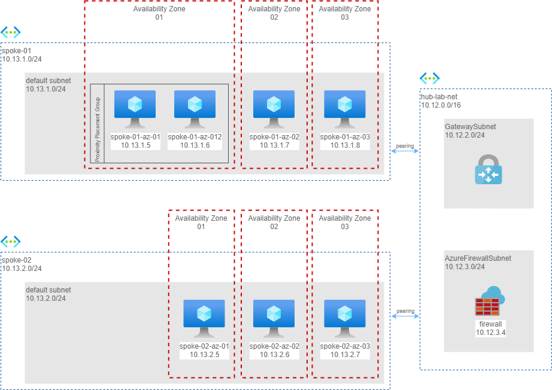

[Latency](https://www.techtarget.com/whatis/definition/latency) is an expression of how much time it takes for a data packet to travel from one designated point to another. Ideally, latency will be as close to zero as possible. High network latency can **dramatically increase webpage load times**, interrupt video and audio streams, and render an application unusable. Depending on the application, even a relatively small increase in latency can ruin UX.

[Azure availability zones](https://docs.microsoft.com/en-us/azure/availability-zones/az-overview) are physically separate locations within each Azure region that are tolerant to local failures. **Azure availability zones are connected by a high-performance network with a round-trip latency of less than 2ms**. 

Each data center is assigned to a physical zone. Physical zones are mapped to logical zones in your Azure subscription. You can design resilient solutions by using Azure services that use availability zones. Co-locate your compute, storage, networking, and data resources across an availability zone, and replicate this arrangement in other availability zones.

A [proximity placement group](https://azure.microsoft.com/en-us/blog/announcing-the-general-availability-of-proximity-placement-groups/) is an Azure Virtual Machine logical grouping capability that you can use to decrease the inter-VM network latency associated with your applications. When the VMs are deployed within the same proximity placement group, they are physically located as close as possible to each other.

Understanding the latency implications of different network configurations when designing an architecture is **essential**.

In this blog post I measure the latency between virtual machines deployed in Azure's **West Europe region** in the following configurations:

* same v-net, same availability zone, same proximty placement group
* same v-net, across availability zones
* multiple v-nets (in peering), same availability zone
* multiple v-nets (in peering), across availability zones
* multiple v-nets connected in a Hub & Spoke topology and Routing via [Azure Virtual Network Gateway](https://docs.microsoft.com/en-us/azure/vpn-gateway/vpn-gateway-about-vpngateways)
* multiple v-nets connected in a Hub & Spoke topology and Routing via [Azure Firewall](https://docs.microsoft.com/en-us/azure/firewall/overview)

Rather than the absolute values, my focus is on assessing the impact in terms of latency of various network configurations.

To measure latency, I've used [MTR](https://en.wikipedia.org/wiki/MTR_(software)), which combines the functions of the traceroute and ping programs in one single network diagnostic tool.

> please note that MTR are the round-trip times for an ICMP packet to reach the hop at which its TTL expires, for the device processing that expiration to generate an ICMP Time Exceeded packet, and for that packet to return to the originating device. For many routers, performing the ICMP response for dropped packets is a low priority–and on some devices, it’s disabled entirely.

> The [**Azure hub and spoke playground**](https://github.com/nicolgit/hub-and-spoke-playground) is a GitHub repo where you can find a reference network architecture I use as common base to implement configurations and test networking and connectivity scenarios. I have used it also here as starting point to build the lab used in this post.

# Scenario 1 - one virtual network

In this scenario I have a calling machine in one availability zone and 3 additional machines each in a different availability zone. In availability zone 1 I have also placed both machines in the same proximity placement group to have the best possible latency.

Here the measures from `spoke01-az-01` (availability zone 1).

| commamd | Av Zone |  Snt |  Last |  Avg | Best | Wrst | StDev
|---|--------|------|-------|------|------|------|------|
`mtr 10.13.1.6`| 1  |  89  |  1.1 |  **1.4** |  0.8 |  8.4 |  1.1
`mtr 10.13.1.7`| 2  |  32  |  2.4 |  **2.1** |  1.8 |  2.6 |  0.2
`mtr 10.13.1.8` | 3  |  32  |  2.0 |  **2.1** |  1.8 |  2.5 |  0.2

Takeaways:

* **Proximity Placement Group does a great job**, latency is at an average of 1.4ms
* Jumping between availability zones, I have measured an average latency of 2.1ms, more than the 2ms declared but more than acceptable considering how this measure has been done.

# Scenario 2 - two virtual networks in peering

In this scenario I have measured the impact of a network peering. I have created 3 more machines, in 3 availability zones, on another network, in peering.

Here the measures from `spoke01-az-01` (availability zone 1) to machines in another virtual network in peering.

| Command | Av Zone |  Snt |  Last |  Avg | Best | Wrst | StDev
|---|--------|------|-------|------|------|------|------|
| `mtr 10.13.2.5` | 1 |  13 |  15.5 |  **2.3** |  0.9 | 15.5 |  4.0 |
| `mtr 10.13.2.6` | 2  |  32 |   3.1 |  **2.3** |  2.0 |  3.5 |  0.3|
| `mtr 10.13.2.7` | 3  |  39 |   2.3 |  **2.4** |  1.8 |  3.3 |  0.3|

Takeaways:
* Network peering adds an average overhead of just 0.2ms, still a more than acceptable value
* Here I am not using a proximity group anymore and the result is that **average latency doesn't change so much if the machine is within same availability zone, or on another one**  

# Scenario 3 - two virtual networks in H&S configuration with a Virtual Network Gateway in between

In this scenario I moved to a more classic configuration: I eliminated peering and routed traffic through a central hub and an Azure Virtual Network Gateway.

Here the measures from `spoke01-az-01` (availability zone 1) to machines in another virtual network via an Azure Virtual Network Gateway in the Hub Network.

| Command | Av Zone |  Snt |  Last |  Avg | Best | Wrst | StDev
|---|--------|------|-------|------|------|------|------|
| `mtr 10.13.2.5` | 1  |  47 |   4.2 |  **3.4** |  1.6 | 24.4 |  4.2 |
| `mtr 10.13.2.6` | 2  |  35 |   2.9 |  **4.3** |  2.8 | 12.3 |  2.6 |
| `mtr 10.13.2.7` | 3  |  36 |   3.4 |  **4.5** |  2.8 | 15.7 |  3.1 |

Takeaways

* Latency increased up to **3.4/4.5ms**, because each packet have to cross 2 peerings and a virtual appliace (Azure Virtual Network Gateway)
* **Staying in the same availability zone also have a positive impact on latency**: an average of +1ms in cross availability zone topology is not huge in se, but is a relative increase quite high (+50%)

# Scenario 4 - two virtual networks in H&S configuration with an Azure Firewall in between

In this last scenario I implemented the [reference architecture described in the cloud adoption framework](https://docs.microsoft.com/en-us/azure/architecture/reference-architectures/hybrid-networking/hub-spoke), that is a hub and spoke, with an Azure Firewall to control all the traffic. 

Here the measures from `spoke01-az-01` (availability zone 1) to machines in another virtual network and different availability zones, via Azure Firewall in the Hub Network.

| Command | Av Zone |  Snt |  Last |  Avg | Best | Wrst | StDev |
|---|--------|------|-------|------|------|------|------|
| `mtr 10.13.2.5` | 1  |  58   | 2.4  | **2.3**  | 1.8  | 5.7  | 0.6 |
| `mtr 10.13.2.6` | 2  |  34   | 3.4  | **3.1**  | 2.6  | 4.3  | 0.3 |
| `mtr 10.13.2.7` | 3  |  30   | 3.7  | **3.4**  | 2.9  | 3.9  | 0.3 |

Takeaways

* Latency is far better than an Azure Virtual Network Gateway with Azure Firewall in between
* **When source and destination are in the same availability zone it has almost the same as for a simple peering**
* When source and destination are **in different availabity zones, latency grows up to 3.1/3.4ms**

# Final thoughts

* Where possible use **always Proximity Placement Groups** to have sub 2ms latency
* Traffic between zones is confirmed to be **on the order of 2ms**
* Peerings and hub-and-spoke **have no real impac**t if a Firewall is used in the middle
* I would avoid to use a VPN Gateway for **cross spokes communications**
  