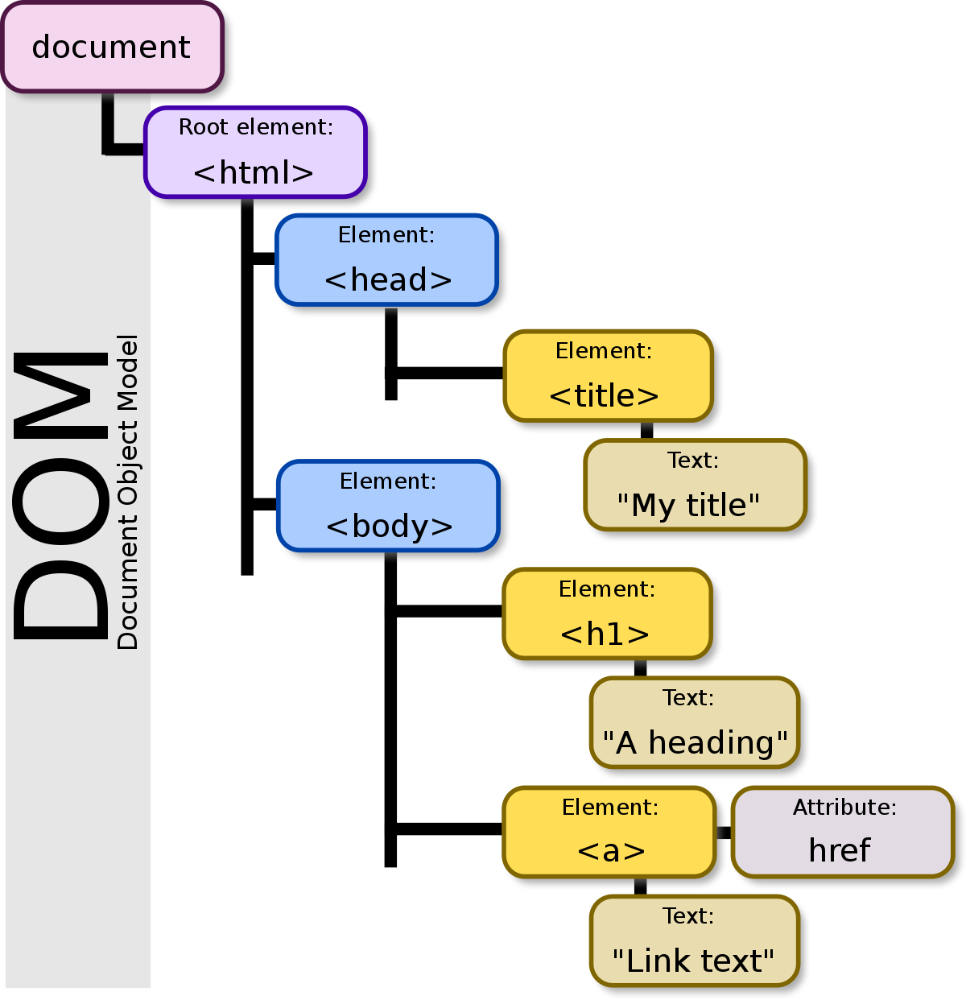

# 'DOM'

- 웹 브라우저가 HTML 페이지를 인식하는 방식
- document 객체와 관련된 객체의 집합

HTML 페이지에 있는 태그 요소(element)들을 자바스킯트에서는 문서 객체(document object)라고 한다.
따라서 '문서 객체를 조작한다'는 말은 'HTML 요소들을 조작한다'는 의미를 가짐.

DOM(문서 객체 모델)을 사용하면 HTML 페이지의 태그 조작이 가능
