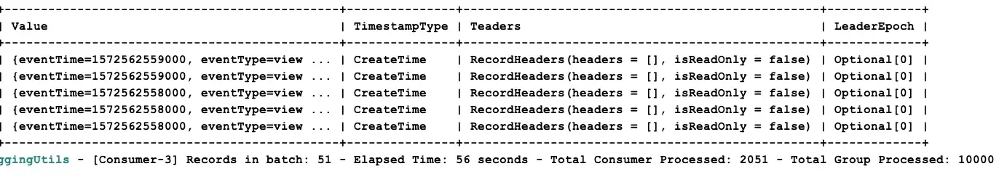
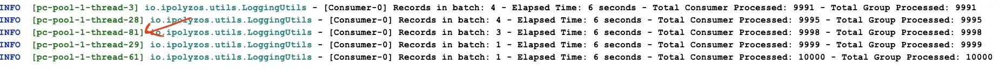
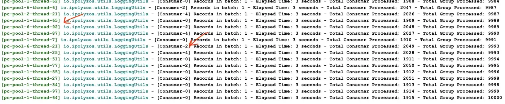

_This article is part of the **In the Land of Streams** journey and is brought to you by [Giannis Polyzos](https://github.com/polyzos). Giannis is a proud alumnus of Rock the JVM, working as Solutions Architect, providing Cloud-native Event Streaming Solutions with a focus on Apache Kafka and Apache Flink.

_Enter Giannis:_

Apache Kafka is a well-known event streaming platform. 
This article requires some basic familiarity with Kafka — creating producers and consumers — and will focus on providing a better understanding of how Kafka works under the hood to better design and tune your applications.

")

Using a simple file ingestion data pipeline, this article aims to cover the following:
1. Ingest data files (with click event data) into Kafka
2. Explain how the producing side works
3. Producer configuration tuning
4. Throughput vs Latency
5. How the consuming side works 
6. How scaling consumer groups works 
7. How scaling with the parallel consumer works 
8. Tuning to avoid slow consumers
9. What’s the role of offsets in Kafka
10. What are the caveats when working with offsets
11. Different approaching for handling offsets

I will be using some e-commerce datasets you can find [here](https://www.kaggle.com/datasets/mkechinov/ecommerce-behavior-data-from-multi-category-store). 
The code samples are written in Kotlin, but the implementation should be easy to port in any programming language.
You can find the source code on Github [here](https://github.com/polyzos/kafka-streaming-ledger).

Let us dive right in.

## 1. Background and Setup

```shell
version: "3.7"
services:
  zookeeper:
    image: bitnami/zookeeper:3.8.0
    ports:
      - "2181:2181"
    volumes:
      - ./logs/zookeeper:/bitnami/zookeeper
    environment:
      ALLOW_ANONYMOUS_LOGIN: "yes"
  kafka0:
    image: bitnami/kafka:3.3.1
    ports:
      - "9092:9092"
    volumes:
      - ./logs/kafka0:/bitnami/kafka
    environment:
      KAFKA_CFG_ZOOKEEPER_CONNECT: zookeeper:2181
      ALLOW_PLAINTEXT_LISTENER: "yes"
      KAFKA_ADVERTISED_PORT: 9092
      KAFKA_ADVERTISED_HOST_NAME: kafka0
      KAFKA_LISTENERS: >-
        INTERNAL://:29092,EXTERNAL://:9092
      KAFKA_ADVERTISED_LISTENERS: >-
        INTERNAL://kafka0:29092,EXTERNAL://localhost:9092
      KAFKA_LISTENER_SECURITY_PROTOCOL_MAP: >-
        INTERNAL:PLAINTEXT,EXTERNAL:PLAINTEXT
      KAFKA_INTER_BROKER_LISTENER_NAME: "INTERNAL"
    depends_on:
      - zookeeper
  kafka1:
    image: bitnami/kafka:3.3.1
    ports:
      - "9093:9093"
    volumes:
      - ./logs/kafka1:/bitnami/kafka
    environment:
      KAFKA_CFG_ZOOKEEPER_CONNECT: zookeeper:2181
      ALLOW_PLAINTEXT_LISTENER: "yes"
      KAFKA_LISTENERS: >-
        INTERNAL://:29092,EXTERNAL://:9093
      KAFKA_ADVERTISED_LISTENERS: >-
        INTERNAL://kafka1:29092,EXTERNAL://localhost:9093
      KAFKA_LISTENER_SECURITY_PROTOCOL_MAP: >-
        INTERNAL:PLAINTEXT,EXTERNAL:PLAINTEXT
      KAFKA_INTER_BROKER_LISTENER_NAME: "INTERNAL"
    depends_on:
        - zookeeper
  kafka2:
    image: bitnami/kafka:3.3.1
    ports:
      - "9094:9094"
    volumes:
      - ./logs/kafka2:/bitnami/kafka
    environment:
      KAFKA_CFG_ZOOKEEPER_CONNECT: zookeeper:2181
      ALLOW_PLAINTEXT_LISTENER: "yes"
      KAFKA_LISTENERS: >-
        INTERNAL://:29092,EXTERNAL://:9094
      KAFKA_ADVERTISED_LISTENERS: >-
        INTERNAL://kafka2:29092,EXTERNAL://localhost:9094
      KAFKA_LISTENER_SECURITY_PROTOCOL_MAP: >-
        INTERNAL:PLAINTEXT,EXTERNAL:PLAINTEXT
      KAFKA_INTER_BROKER_LISTENER_NAME: "INTERNAL"
    depends_on:
      - zookeeper
```

### 👀 Show me the Code 👀
Our producer will send some events to Kafka. The data model for the click events should look similar to the following payload:


I will create a topic called ecommerce.events which I will use to store my messages. The topic will have 5 partitions and a replication factor of 3 (leader + 2 replicas).
```shell
./bin/kafka-topics.sh --bootstrap-server localhost:9092 --create
./bin/kafka-topics.sh --bootstrap-server localhost:9092 --list
```

Creating Kafka Producers is pretty straightforward, the important part is creating and sending records.
```kotlin
fun produce(topic: String, key: K, value: V) {
  ProducerRecord(topic, key, value)
    .also { record ->
      producer.send(record) { _, exception ->
        exception?.let {
          logger.error { "Error while producing: $exception" }
        } ?: kotlin.run {
          counter.incrementAndGet()
          if (counter.get() % 100000 == 0) {
            logger.info { "Total messages sent so far ${counter.get()}." }
          }
        }
      }
    }
}
```

For every event, we create a **ProducerRecord** object and specify the `topic`, the `key` (here we partition based on the userId),
and finally the event payload as the `value`.

The **send()** method is asynchronous, so we specify a callback that gets triggered when we receive a result back.

If the message was successfully written to Kafka we print the metadata, otherwise if an exception is returned we log it.

> But what actually happens when the send() method is called?


Kafka does a lot of things under the hood when the **send()** method is invoked, so let’s outline them below:
1. The message is serialized using the specified serializer 
2. The partitioner determines in which partition the message should be routed. 
3. Internally Kafka keeps message buffers; we have one buffer for each partition and each buffer can hold many batches of messages grouped for each partition. 
4. Finally, the I/O threads pick up these batches and sent them over to the brokers.  
At this point, our messages are in-flight from the client to the brokers. The brokers have sent/receive network buffers for the network threads to pick up the messages and hand them over to some IO thread to actually persist it on disk.
5. On the leader broker, the messages are written on disk and sent to the followers for replication. One thing to note here is that the messages are first written on the PageCache and periodically are flushed on disk.
(**Note:** PageCache to disk is an extreme case for message loss, but still you might wanna be aware of that)
6. The followers (in-sync replicas) store and sent an acknowledgment back they have replicated the message.
7. A **RecordMetadata** response is sent back to the client.
8. If a failure occurred and we didn’t receive an ACK, we check if message retry is enabled and we need to resend it
9. The client receives the response.


### Tradeoffs between Latency and Throughput
In the distributed systems world most things come with tradeoffs and it’s up to the developer to find that “sweetspot” between different tradeoffs; thus it’s important to understand how things work.

One important aspect might be tuning between throughput and latency. Some key configurations to that are **batch.size** and **linger.ms**.

Having a small `batch size` and also `linger` set to **zero** can reduce latency and process messages as soon as possible — but it might reduce throughput. Configuring for low latency is also useful for slow produce rate scenarios. Having fewer records accumulated than the specified **batch size** will result in the client waiting **linger.ms** for more records to arrive.

On the other hand, a larger `batch size` might use more memory (as we will allocate buffers for the specified batch size) but it will increase the throughput. Other configuration options like **compression.type**, **max.in.flight.requests.per.connection**, and **max.request.size** can help here.


#### Let’s better illustrate this with an example.
Our event data is stored in CSV files that we want to ingest into Kafka and since it is not real-time data ingestion we don’t really care about latency here, but having a good throughput so we can ingest them fast. Using the default configurations ingesting 5.000.000 messages takes around 119 seconds.

```shell
13:17:22.885 INFO  [kafka-producer-network-thread | producer-1] io.ipolyzos.utils.LoggingUtils - Total messages sent so far 4800000.
13:17:25.323 INFO  [kafka-producer-network-thread | producer-1] io.ipolyzos.utils.LoggingUtils - Total messages sent so far 4900000.
13:17:27.960 INFO  [kafka-producer-network-thread | producer-1] io.ipolyzos.utils.LoggingUtils - Total messages sent so far 5000000.
13:17:27.967 INFO  [main] io.ipolyzos.producers.ECommerceProducer - Total time '119' seconds
13:17:27.968 INFO  [main] io.ipolyzos.utils.LoggingUtils - Total Event records sent: '5000000' 
13:17:27.968 INFO  [main] io.ipolyzos.utils.LoggingUtils - Closing Producers ...
```
Setting _batch.size_ to 64Kb (16 is the default), linger.ms greater than 0 and finally _compression.type_ to gzip
```kotlin
        properties[ProducerConfig.BATCH_SIZE_CONFIG]        = "64000"
        properties[ProducerConfig.LINGER_MS_CONFIG]         = "20"
        properties[ProducerConfig.COMPRESSION_TYPE_CONFIG]  = "gzip"
```
Has the following impact on the ingestion time.

```shell
13:18:34.377 INFO  [kafka-producer-network-thread | producer-1] io.ipolyzos.utils.LoggingUtils - Total messages sent so far 4800000.
13:18:35.280 INFO  [kafka-producer-network-thread | producer-1] io.ipolyzos.utils.LoggingUtils - Total messages sent so far 4900000.
13:18:35.980 INFO  [kafka-producer-network-thread | producer-1] io.ipolyzos.utils.LoggingUtils - Total messages sent so far 5000000.
13:18:35.983 INFO  [main] io.ipolyzos.producers.ECommerceProducer - Total time '36' seconds
13:18:35.984 INFO  [main] io.ipolyzos.utils.LoggingUtils - Total Event records sent: '5000000' 
13:18:35.984 INFO  [main] io.ipolyzos.utils.LoggingUtils - Closing Producers ...
```

From around 119 seconds dropped down to 36 seconds. In both cases **ack=1**.
I will leave it up to you to experiment and try different configuration options to see how they better come in handy based on your use case.
You might also wanna test against a real cluster to test the networking in place. For example running this similar example on a real cluster takes around 184 seconds to ingest
1.000.000 messages and when adding the configurations changes drops down to 18 seconds.

If you are concerned with exactly-once semantics, set enable.idempotency to true, which will also result in acks set to all.

> Switching to the other side of the wall

### Let’s zoom in on the consuming side now.
A typical Kafka consumer loop should look similar to the following snippet:
```kotlin
private fun consume(topic: String) {
        consumer.subscribe(listOf(topic))
        try {
            while (true) {
                val records: ConsumerRecords<K, V> = consumer.poll(Duration.ofMillis(100))
                records.forEach { record ->
                    // simulate the consumers doing some work
                    Thread.sleep(20)
                    logger.info { record }
                }
                logger.info { "[$consumerName] Records in batch: ${records.count()} - Total Consumer Processed: ${counter.get()} - Total Group Processed: ${consumePartitionMsgCount.get()}" }
            }
        } catch (e: WakeupException) {
            logger.info("[$consumerName] Received Wake up exception!")
        } catch (e: Exception) {
            logger.warn("[$consumerName] Unexpected exception: {}", e.message)
        } finally {
            consumer.close()
            logger.info("[$consumerName] The consumer is now gracefully closed.")
        }
    }
```

So let’s try to better understand what happens here. The following diagram provides a more detailed explanation.


Kafka uses a pull-based model for data fetching. At the “heart of the consumer” sits the poll loop. The poll loop is important for two reasons:
1. It is responsible for fetching data (providing **ConsumerRecords**) for the consumer to process and
2. Sends heartbeats and coordinates the consumers so the consumer group knows the available consumers and if a rebalancing needs to take place.

The consuming applications maintain TCP connections with the brokers and sent fetch requests to fetch data. The data is cached and periodically returned from the _poll()_ method. When data is returned from the _poll()_ method the actual processing takes place and once it’s finished more data is requested and so on.

What’s important to note here (and we will dive deeper into it in the next part) is committing message offsets. This is Kafka’s way of knowing that a message has been fetched and processed successfully. By default, offsets are committed automatically at regular intervals.

The amount of data - how much it is going to be fetched, when more data needs to be requested etc. are dictated by configuration options like, _fetch.min.bytes_, _max.partition.fetch.bytes_, _fetch.max.bytes_, _fetch.max.wait.ms_. You might think that the default options might be ok for you, but it’s important to test them out and think through your use case carefully.

To make this more clear let’s assume that you fetch 500 records from the poll() loop to process, but the processing for some reason takes too long for each message. max.poll.interval.ms dictates the maximum time a consumer can be idle before fetching more records; i.e calling the poll method and if this threshold is reached the consumer is considered **lost** and a rebalance will be triggered — although our application was just slow on processing.

So decreasing the number of records the _poll()_ loop should return and/or better tuning some configurations like _heartbeat.interval.ms_ and _session.timeout.ms_ used for consumer group coordination might be reasonable in this case.

### Running the Consumer
At this point, I will start one consuming instance on my **ecommerce.events** topic. Remember that this topic consists of 5 partitions. 
I will execute against my Kafka cluster, using the default consumer configuration options and my goal is to see how long it takes for a consumer to read _10.000_ messages from the topic, assuming a _20ms_ processing time per message.

```shell
add logs
```
We can see that it takes a single consumer around 4 minutes for this kind of processing. So how can we do better?

### Scaling the Consuming Side
> Consumer Groups and the Parallel Consumer Pattern
Consumer Groups are Kafka’s way of sharing the work between different consumers and also the level of parallelism. The highest level of parallelism you can achieve with Kafka is having one consumer consuming from each partition of a topic.

#### Scenario 1: #Partitions > #Consumers

In the scenario, the available partitions will be shared equally among the available consumers of the group and each consumer will have ownership of those partitions.


#### Scenario 2: #Partitions = #Consumers


When the partition number is equal to the available consumers each consumer will be reading from exactly one partition. In this scenario, we also reach the maximum parallelism we can achieve on a particular topic.

#### Scenario 3: #Partitions < #Consumers


This scenario is similar to the previous one, only now we will have one consumer running but stays idle. On the one hand, this means we waste resources, but we can also use this consumer as a **Failover** in case another one in the group goes down.

When a consumer goes down or similarly a new one joins the group, Kafka will have to trigger a rebalance. This means that partitions need to be revoked and reassigned to the available consumers in the group.

Let’s run again our previous example — consuming 10k messages — but this time having 5 consumers in our consumer group. I will be creating 5 consuming instances from within a single JVM (using kotlin [coroutines](https://kotlinlang.org/docs/coroutines-overview.html)), but you can easily re-adjust the code (found [here](https://github.com/polyzos/kafka-streaming-ledger/blob/main/src/main/kotlin/io/ipolyzos/consumers/PerPartitionConsumer.kt)) and just start multiple JVMs.


As expected we can see that the consumption time dropped to less than a minute time.

But if Kafka’s maximum level of parallelism is one consumer per partition, does this mean we hit the scaling limit? Let’s see how to tackle this next.

#### What about the parallel consumer pattern?
Up to this point, we might have two questions in mind:
1. If #partitions = #consumers in the consumer group, how can I scale even further if needed? It’s not always easy to calculate the number of partitions beforehand and/or I might need to account for sudden spikes.
2. How can I minimize rebalancing time?

One solution to this can be the parallel consumer pattern. You can have consumers in your group consuming from one or more partitions of the topic, but then they propagate the actual processing to other threads.

One such implementation can be found [here](https://github.com/confluentinc/parallel-consumer).

It provides three ordering guarantees — **Unordered**, **Keyed** and **Partition**.
1. **Unordered** — provides no guarantees
2. **Key** — guarantees ordering per key BUT with the caveat that the keyspace needs to be quite large, otherwise you might not observe much performance improvement.
3. **Partition—Only** one message will be processed per partition at any time.

Along with that it also provides different ways for committing offset. This is a pretty nice library you might want to look at.


Going once more back to our example to answer the question — how can we break the scaling limit? We will be using the parallel consumer pattern — you can find the code [here](https://github.com/polyzos/kafka-streaming-ledger/blob/main/src/main/kotlin/io/ipolyzos/consumers/ParallelScalingConsumer.kt).
Using one _parallel consumer instance_ on our _5-partition_ topic, specifying a _Key Ordering_, and using a parallelism of _100 threads_


makes the consuming and processing time of **10k messages** take as much as **6 seconds**.

_Notice on the screenshot how different batches are processed on different threads on the same consumer instance._

and if we use _5 parallel consumer instances_


we accomplished getting that down to **3 seconds**.

_Notice in the screenshot how different batches are processed on different threads on different consumer instances._

### Offsets and How to Handle Them
> It’s a cycle — the message lifecycle

Up to this point, we have seen the whole message lifecycle in Kafka — PPC (Produce, Persist, Consume)

One thing really important though — especially when you need to trust your system provides the best guarantees when processing each message exactly once — is committing offsets.

Fetching messages from Kafka, processing them and marking them as processed, by actually providing such guarantees has a few pitfalls and is not provided out of the box.

This is what we will see next, i.e what do I need to take into account to get the best possible exactly-once processing guarantees out of my applications?

### Committing Offsets Scenarios
We will take a look at a few scenarios for committing offsets and what caveats each approach might have.

#### Scenario 1: Committing Offsets Automatically
This is the default behavior with enable.auto.commit set to true. The caveat here is that the message is consumed and the offsets will be committed periodically, BUT this doesn’t mean the message has been successfully processed. If the message fails for some reason, its offset might have been committed and as far as Kafka is concerned that message has been processed successfully.

#### Scenario 2: Committing Offsets Manually
Setting _enable.auto.commit_ to false takes Kafka consumers out of the “**autopilot mode**” and it’s up to the application to commit the offsets. This can be achieved by using the **commitSync()** or **commitAsync()** methods on the consumer API.

When committing offsets manually we can do so either when the whole batch returned from the _poll()_ method has finished processing in which case all the offsets up to the highest one will be committed or we might want to commit after each individual message is done with it’s processing for even stronger guarantees.

#### Commit/Message
```kotlin
if (perMessageCommit) {
    logger.info { "Processed Message: ${record.value()} with offset: ${record.partition()}:${record.offset()}" }
  val commitEntry: Map<TopicPartition, OffsetAndMetadata> =
      mapOf(TopicPartition(record.topic(), record.partition()) to OffsetAndMetadata(record.offset()))

  consumer.commitSync(commitEntry)
  logger.info { "Committed offset: ${record.partition()}:${record.offset()}" }   
}
```

#### Commit/Batch

```kotlin
// Process all the records
records.forEach { record ->
  // simulate the consumers doing some work
  Thread.sleep(20)
  logger.info { "Processing Record: ${record.value()}" }
}
// Commit up to the highest offset
val maxOffset: Long = record.maxOfOrNull { it.offset() }!!
conssumer.commitAsync { topicPartition, offsetMetadata ->
  logger.info { "Processed up to offset: $maxOffset - Committed: $topicPartition and $offsetMetadata" }

}
```
This gives us control over how message offsets are committed and we can trust that we will wait for the actual processing to finish before committing the offset.

For those who want to account for (or at least try to) _every unhappy_ path there is also the possibility that things fail in the commit process itself. In this case the message will be reprocessed

#### Scenario 3: Idempotency with External Storage
You can use an external data store and keep track of the offsets there (for example like Apache Cassandra).

Consuming messages and using something like a transaction for both processing the message as well as committing the offsets will guarantee that either both will succeed or fail and thus idempotency is ensured.

One thing to note here is that offsets are now stored in an external datastore. When starting a new consumer or a rebalancing takes place you need to make sure your consumer fetches the offsets from the external datastore.

One way to achieve this can be adding a **ConsumerRebalanceListener** and when **onPartitionsRevoked** and **onPartitionsAssigned** methods are called store (commit) or retrieve the offsets from the external datastore.


### Wrapping Up
As takeaways:
- Think of the requirements and try to tune between throughput and latency
- Think of the guarantees you need your producers to provide; i.e for exactly once semantics idempotency and/or transactions might be your friends there.
- One detail not mentioned before but is good to know is that If you want to create multi-threaded apps, its best to create one producer instance and share it among threads
- We need to take into account the number of partitions each topic has
- Think of our requirements in terms of processing and try to account for slow consumers.
- How we can scale both with consumer groups and the parallel consumer pattern?
- Message ordering, the number of keyspace, and partition guarantees need to be taken into account here and see what approach works the best (or a combination of both).
- Consuming a message is different from actually processing it successfully
- Auto-committing offsets can have a negative impact on your application guarantees
